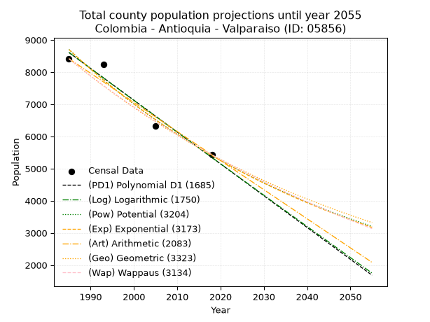
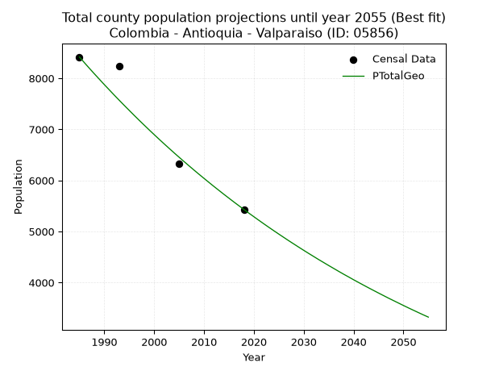
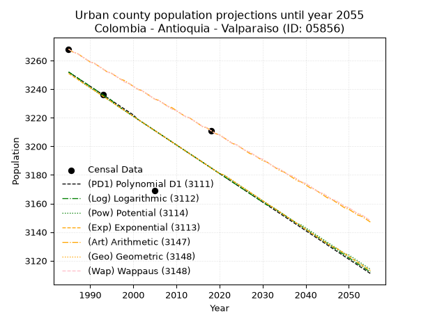
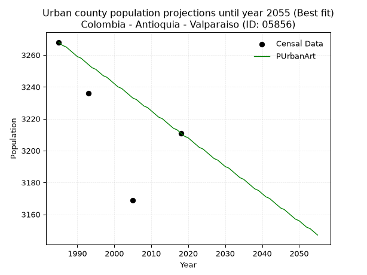
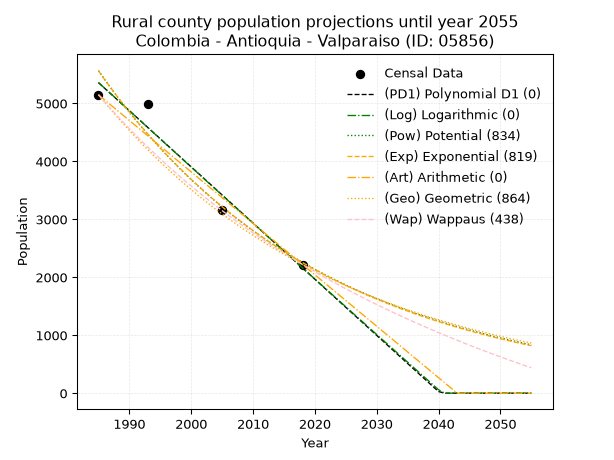
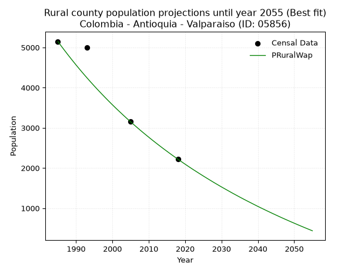

<div align="center">


</div>

# 📜 _“Population and Public Services Demand Projections (PPSD) until Year 2050 for Colombia - Antioquia - Valparaiso (ID: 05856)”_
Keywords: `population` `public-service` `projection` `lineal` `polynomial` `logarithmic` `potential` `exponential` `arithmetic` `geometric` `wappaus` `dane` `colombia` `south-america`

PPSD are analytical estimates used by governments and planners to anticipate future changes in population size, age distribution, and the resulting community needs for utilities, healthcare, education, and infrastructure as sizing future water treatment facilities, electrical grids, and road networks based on spatial growth.

<div align="center">

</img>

</div>


> **General running parameters**: • app_version: _v20260806_. • Python version: _3.14.7_. • Pandas version: _3.0.5_. • NumPy version: _2.5.1_. • Creates, save and include plots into reports (create_plot): _False_. • Projection until year: _2050_. • Process polynomial degree 2 and up: _False_. • Process Wappaus: _True_. • Process Wappaus: _True_. • Set negative values to zero: _True_. • Set infinite values to zero: _True_. • Drop dataset notes: _True_. 
<div align="center">

Dynamic map: [:earth_americas:Google](http://maps.google.com/maps?q=5.614555316,-75.6244518) [:earth_americas:OSM](https://www.openstreetmap.org/#map=18/5.614555316/-75.6244518&layers=P) [:earth_americas:Bing](https://www.bing.com/maps?cp=5.614555316~-75.6244518&lvl=18) [:earth_americas:Apple](https://maps.apple.com/frame?center=5.614555316%2C-75.6244518&span=0.003%2C0.006)

</div>


<div align="center">

```geojson
{
  "type": "Feature",
  "geometry": {
    "type": "Point", 
    "coordinates": [-75.6244518, 5.614555316]
  }, 
  "properties": {
    "Name": "Colombia - Antioquia - Valparaiso (ID: 05856)"
  }
}
```

</div>


## 0. Census Data (4 records)

Census data are official statistics collected by a government about the people and housing in a country. They usually include counts of total population, age, sex, race, income, education, and jobs.

📅Global census file: [Population.xlsx](../data/Population.xlsx)

| Source   |   Year |   CountryID | CountryName   |   StateID | StateName   |   CountyID | CountyName   |   PTotal |   PUrban |   PRural |
|:---------|-------:|------------:|:--------------|----------:|:------------|-----------:|:-------------|---------:|---------:|---------:|
| DANE     |   1985 |          57 | Colombia      |        05 | Antioquia   |      05856 | Valparaiso   |     8417 |     3268 |     5149 |
| DANE     |   1993 |          57 | Colombia      |        05 | Antioquia   |      05856 | Valparaiso   |     8233 |     3236 |     4997 |
| DANE     |   2005 |          57 | Colombia      |        05 | Antioquia   |      05856 | Valparaiso   |     6324 |     3169 |     3155 |
| DANE     |   2018 |          57 | Colombia      |        05 | Antioquia   |      05856 | Valparaiso   |     5431 |     3211 |     2220 |

> 🔥Some records could had specific notes about the registered values or the corresponding urban or rural distribution.

📅[SUI-RUPS](https://www.datos.gov.co/Hacienda-y-Cr-dito-P-blico/Registro-nico-de-Prestadores-de-Servicios-P-blicos/4qkq-csdn/about_data) - Local public utility companies: [RUPS.csv](../data/RUPS.xlsx)

 | SERVICIO       | ESTADO    | NOMBRE                                                            | NIT         | DEPARTAMENTO_DOMICILIO   | MUNICIPIO_DOMICILIO   | DIRECCION   |   TELEFONO | EMAIL                            | TIPO_PRESTADOR                             | CLASIFICACION                 |
|:---------------|:----------|:------------------------------------------------------------------|:------------|:-------------------------|:----------------------|:------------|-----------:|:---------------------------------|:-------------------------------------------|:------------------------------|
| ACUEDUCTO      | OPERATIVA | EMPRESA DE SERVICIOS PUBLICOS DOMICILIARIOS DE VALPARAISO SAS ESP | 900477448-8 | ANTIOQUIA                | VALPARAISO            | CL 10 10-53 |    8492029 | gerenciaesp.valparaiso@gmail.com | SOCIEDADES (EMPRESA DE SERVICIOS PUBLICOS) | MENOR O IGUAL A 2500 USUARIOS |
| ALCANTARILLADO | OPERATIVA | EMPRESA DE SERVICIOS PUBLICOS DOMICILIARIOS DE VALPARAISO SAS ESP | 900477448-8 | ANTIOQUIA                | VALPARAISO            | CL 10 10-53 |    8492029 | gerenciaesp.valparaiso@gmail.com | SOCIEDADES (EMPRESA DE SERVICIOS PUBLICOS) | MENOR O IGUAL A 2500 USUARIOS |

## 1. Total

### 1.1. Coefficients and Parameters

* (PD1) Polynomial Deg 1: -98.93095142512975, 204987.88558811578 (lineal)
* (Log) Logarithmic: -198019.58084519205, 1512249.6708336377
* (Pow) Potential: -28.84261886866846, 99.05581900455714
* (Exp) Exponential: -0.014411234839352912, 2.307549324111782e+16
* (Art) Arithmetic: Year diff. 2018 - 1985 = 33, Population diff. 5431 - 8417 = -2986, Annual growth = -90.48484848484848
* (Geo) Geometric: Year diff. 2018 - 1985 = 33, Population diff. 5431 - 8417 = -2986, Annual growth % = -0.013188926199476092
* (Wap) Wappaus: i = -1.3068291231202842, Condition values only valid for < 200)

<sub>
Wappaus condition values: ['-0.00', '-1.31', '-2.61', '-3.92', '-5.23', '-6.53', '-7.84', '-9.15', '-10.45', '-11.76', '-13.07', '-14.38', '-15.68', '-16.99', '-18.30', '-19.60', '-20.91', '-22.22', '-23.52', '-24.83', '-26.14', '-27.44', '-28.75', '-30.06', '-31.36', '-32.67', '-33.98', '-35.28', '-36.59', '-37.90', '-39.20', '-40.51', '-41.82', '-43.13', '-44.43', '-45.74', '-47.05', '-48.35', '-49.66', '-50.97', '-52.27', '-53.58', '-54.89', '-56.19', '-57.50', '-58.81', '-60.11', '-61.42', '-62.73', '-64.03', '-65.34', '-66.65', '-67.96', '-69.26', '-70.57', '-71.88', '-73.18', '-74.49', '-75.80', '-77.10', '-78.41', '-79.72', '-81.02', '-82.33', '-83.64', '-84.94']
</sub>


### 1.2. Projected Dataset

|   Year |   CountyID |   PTotalPD1 |   PTotalLog |   PTotalPow |   PTotalExp |   PTotalArt |   PTotalGeo |   PTotalWap |
|-------:|-----------:|------------:|------------:|------------:|------------:|------------:|------------:|------------:|
|   1985 |      05856 |        8610 |        8613 |        8705 |        8701 |        8417 |        8417 |        8417 |
|   1986 |      05856 |        8511 |        8513 |        8579 |        8577 |        8327 |        8306 |        8308 |
|   1987 |      05856 |        8412 |        8413 |        8456 |        8454 |        8236 |        8196 |        8200 |
|   1988 |      05856 |        8313 |        8314 |        8334 |        8333 |        8146 |        8088 |        8093 |
|   1989 |      05856 |        8214 |        8214 |        8214 |        8214 |        8055 |        7982 |        7988 |
|   1990 |      05856 |        8115 |        8115 |        8096 |        8097 |        7965 |        7876 |        7884 |
|   1991 |      05856 |        8016 |        8015 |        7979 |        7981 |        7874 |        7773 |        7782 |
|   1992 |      05856 |        7917 |        7916 |        7865 |        7866 |        7784 |        7670 |        7681 |
|   1993 |      05856 |        7818 |        7816 |        7752 |        7754 |        7693 |        7569 |        7581 |
|   1994 |      05856 |        7720 |        7717 |        7640 |        7643 |        7603 |        7469 |        7482 |
|   1995 |      05856 |        7621 |        7618 |        7530 |        7534 |        7512 |        7371 |        7385 |
|   1996 |      05856 |        7522 |        7519 |        7422 |        7426 |        7422 |        7273 |        7288 |
|   1997 |      05856 |        7423 |        7419 |        7316 |        7320 |        7331 |        7177 |        7193 |
|   1998 |      05856 |        7324 |        7320 |        7211 |        7215 |        7241 |        7083 |        7099 |
|   1999 |      05856 |        7225 |        7221 |        7108 |        7112 |        7150 |        6989 |        7006 |
|   2000 |      05856 |        7126 |        7122 |        7006 |        7010 |        7060 |        6897 |        6914 |
|   2001 |      05856 |        7027 |        7023 |        6906 |        6910 |        6969 |        6806 |        6824 |
|   2002 |      05856 |        6928 |        6924 |        6807 |        6811 |        6879 |        6716 |        6734 |
|   2003 |      05856 |        6829 |        6825 |        6710 |        6713 |        6788 |        6628 |        6645 |
|   2004 |      05856 |        6730 |        6727 |        6614 |        6617 |        6698 |        6540 |        6558 |
|   2005 |      05856 |        6631 |        6628 |        6519 |        6523 |        6607 |        6454 |        6471 |
|   2006 |      05856 |        6532 |        6529 |        6426 |        6429 |        6517 |        6369 |        6386 |
|   2007 |      05856 |        6433 |        6430 |        6334 |        6337 |        6426 |        6285 |        6301 |
|   2008 |      05856 |        6335 |        6332 |        6244 |        6247 |        6336 |        6202 |        6218 |
|   2009 |      05856 |        6236 |        6233 |        6155 |        6157 |        6245 |        6120 |        6135 |
|   2010 |      05856 |        6137 |        6135 |        6067 |        6069 |        6155 |        6040 |        6053 |
|   2011 |      05856 |        6038 |        6036 |        5981 |        5982 |        6064 |        5960 |        5972 |
|   2012 |      05856 |        5939 |        5938 |        5896 |        5897 |        5974 |        5881 |        5892 |
|   2013 |      05856 |        5840 |        5839 |        5812 |        5812 |        5883 |        5804 |        5813 |
|   2014 |      05856 |        5741 |        5741 |        5729 |        5729 |        5793 |        5727 |        5735 |
|   2015 |      05856 |        5642 |        5643 |        5648 |        5647 |        5702 |        5652 |        5658 |
|   2016 |      05856 |        5543 |        5544 |        5567 |        5566 |        5612 |        5577 |        5581 |
|   2017 |      05856 |        5444 |        5446 |        5488 |        5487 |        5521 |        5504 |        5506 |
|   2018 |      05856 |        5345 |        5348 |        5411 |        5408 |        5431 |        5431 |        5431 |
|   2019 |      05856 |        5246 |        5250 |        5334 |        5331 |        5341 |        5359 |        5357 |
|   2020 |      05856 |        5147 |        5152 |        5258 |        5255 |        5250 |        5289 |        5284 |
|   2021 |      05856 |        5048 |        5054 |        5184 |        5179 |        5160 |        5219 |        5211 |
|   2022 |      05856 |        4950 |        4956 |        5110 |        5105 |        5069 |        5150 |        5140 |
|   2023 |      05856 |        4851 |        4858 |        5038 |        5032 |        4979 |        5082 |        5069 |
|   2024 |      05856 |        4752 |        4760 |        4966 |        4960 |        4888 |        5015 |        4998 |
|   2025 |      05856 |        4653 |        4662 |        4896 |        4889 |        4798 |        4949 |        4929 |
|   2026 |      05856 |        4554 |        4564 |        4827 |        4819 |        4707 |        4884 |        4860 |
|   2027 |      05856 |        4455 |        4467 |        4759 |        4750 |        4617 |        4819 |        4792 |
|   2028 |      05856 |        4356 |        4369 |        4692 |        4682 |        4526 |        4756 |        4725 |
|   2029 |      05856 |        4257 |        4271 |        4625 |        4615 |        4436 |        4693 |        4658 |
|   2030 |      05856 |        4158 |        4174 |        4560 |        4549 |        4345 |        4631 |        4592 |
|   2031 |      05856 |        4059 |        4076 |        4496 |        4484 |        4255 |        4570 |        4527 |
|   2032 |      05856 |        3960 |        3979 |        4432 |        4420 |        4164 |        4510 |        4462 |
|   2033 |      05856 |        3861 |        3881 |        4370 |        4357 |        4074 |        4450 |        4398 |
|   2034 |      05856 |        3762 |        3784 |        4308 |        4295 |        3983 |        4392 |        4334 |
|   2035 |      05856 |        3663 |        3687 |        4248 |        4233 |        3893 |        4334 |        4272 |
|   2036 |      05856 |        3564 |        3589 |        4188 |        4173 |        3802 |        4277 |        4209 |
|   2037 |      05856 |        3466 |        3492 |        4129 |        4113 |        3712 |        4220 |        4148 |
|   2038 |      05856 |        3367 |        3395 |        4071 |        4054 |        3621 |        4164 |        4087 |
|   2039 |      05856 |        3268 |        3298 |        4014 |        3996 |        3531 |        4110 |        4026 |
|   2040 |      05856 |        3169 |        3201 |        3957 |        3939 |        3440 |        4055 |        3967 |
|   2041 |      05856 |        3070 |        3104 |        3902 |        3882 |        3350 |        4002 |        3907 |
|   2042 |      05856 |        2971 |        3007 |        3847 |        3827 |        3259 |        3949 |        3849 |
|   2043 |      05856 |        2872 |        2910 |        3793 |        3772 |        3169 |        3897 |        3791 |
|   2044 |      05856 |        2773 |        2813 |        3740 |        3718 |        3078 |        3846 |        3733 |
|   2045 |      05856 |        2674 |        2716 |        3688 |        3665 |        2988 |        3795 |        3676 |
|   2046 |      05856 |        2575 |        2619 |        3636 |        3613 |        2897 |        3745 |        3619 |
|   2047 |      05856 |        2476 |        2523 |        3585 |        3561 |        2807 |        3695 |        3563 |
|   2048 |      05856 |        2377 |        2426 |        3535 |        3510 |        2716 |        3647 |        3508 |
|   2049 |      05856 |        2278 |        2329 |        3486 |        3460 |        2626 |        3599 |        3453 |
|   2050 |      05856 |        2179 |        2233 |        3437 |        3410 |        2535 |        3551 |        3399 |
<div align="center">

</img>

</div>


### 1.3. Best fit with absolute and relative error (%)

Relative error puts that difference into context by dividing the absolute error by the true value, creating a unitless ratio or percentage that shows the scale of the mistake.

Absolute and relative error

|   Year | Source   |   CountryID | CountryName   |   StateID | StateName   |   CountyID_x | CountyName   |   PTotal |   PUrban |   PRural |   CountyID_y |   PTotalPD1 |   PTotalLog |   PTotalPow |   PTotalExp |   PTotalArt |   PTotalGeo |   PTotalWap |   PTotalPD1AbsError |   PTotalLogAbsError |   PTotalPowAbsError |   PTotalExpAbsError |   PTotalArtAbsError |   PTotalGeoAbsError |   PTotalWapAbsError |   PTotalPD1RelError |   PTotalLogRelError |   PTotalPowRelError |   PTotalExpRelError |   PTotalArtRelError |   PTotalGeoRelError |   PTotalWapRelError |
|-------:|:---------|------------:|:--------------|----------:|:------------|-------------:|:-------------|---------:|---------:|---------:|-------------:|------------:|------------:|------------:|------------:|------------:|------------:|------------:|--------------------:|--------------------:|--------------------:|--------------------:|--------------------:|--------------------:|--------------------:|--------------------:|--------------------:|--------------------:|--------------------:|--------------------:|--------------------:|--------------------:|
|   1985 | DANE     |          57 | Colombia      |        05 | Antioquia   |        05856 | Valparaiso   |     8417 |     3268 |     5149 |        05856 |        8610 |        8613 |        8705 |        8701 |        8417 |        8417 |        8417 |                 193 |                 196 |                 288 |                 284 |                   0 |                   0 |                   0 |             2.29298 |             2.32862 |            3.42165  |            3.37412  |             0       |             0       |             0       |
|   1993 | DANE     |          57 | Colombia      |        05 | Antioquia   |        05856 | Valparaiso   |     8233 |     3236 |     4997 |        05856 |        7818 |        7816 |        7752 |        7754 |        7693 |        7569 |        7581 |                 415 |                 417 |                 481 |                 479 |                 540 |                 664 |                 652 |             5.04069 |             5.06498 |            5.84234  |            5.81805  |             6.55897 |             8.0651  |             7.91935 |
|   2005 | DANE     |          57 | Colombia      |        05 | Antioquia   |        05856 | Valparaiso   |     6324 |     3169 |     3155 |        05856 |        6631 |        6628 |        6519 |        6523 |        6607 |        6454 |        6471 |                 307 |                 304 |                 195 |                 199 |                 283 |                 130 |                 147 |             4.85452 |             4.80708 |            3.08349  |            3.14674  |             4.47502 |             2.05566 |             2.32448 |
|   2018 | DANE     |          57 | Colombia      |        05 | Antioquia   |        05856 | Valparaiso   |     5431 |     3211 |     2220 |        05856 |        5345 |        5348 |        5411 |        5408 |        5431 |        5431 |        5431 |                  86 |                  83 |                  20 |                  23 |                   0 |                   0 |                   0 |             1.5835  |             1.52826 |            0.368256 |            0.423495 |             0       |             0       |             0       |

Relative error mean

| Method    |   RelError | Best   |
|:----------|-----------:|:-------|
| PTotalPD1 |    3.44292 |        |
| PTotalLog |    3.43224 |        |
| PTotalPow |    3.17893 |        |
| PTotalExp |    3.1906  |        |
| PTotalArt |    2.7585  |        |
| PTotalGeo |    2.53019 | True   |
| PTotalWap |    2.56096 |        |

💙Best method: _**PTotalGeo**_
<div align="center">

</img>

</div>


### 1.4. Fresh water supply demand in liters per capita per day (lpcd)

The fresh water supply demand typically ranges from 100 to 300 liters per capita per day (lpcd) for standard domestic and municipal planning, though absolute survival minimums set by the World Health Organization are as low as 7.5 to 20 liters per day, and total consumption in high-income nations can exceed 400 liters.

> `CZ`: Level in meters above the sea level (masl)<br> `WS`: Fresh water supply demand in liters per capita per day (lpcd or l/h/d)<br> `WSAll`: Zonal fresh water supply demand in liters per second (l/s)<br> `A`: Zonal area in square meters<br> `DP`: Population density (people/hectare or p/ha)

Reference values (RAS Colombia)

|    CZ |   WS |
|------:|-----:|
|  1000 |  120 |
|  2000 |  130 |
| 99999 |  140 |

County shapefile geometry properties and water supply values

|   CountyID |      ATotal |   CZTotal |   WSTotal |
|-----------:|------------:|----------:|----------:|
|      05856 | 1.26146e+08 |   1070.11 |       130 |

Projected values for best method: PTotalGeo

|   CountyID |   Year |   PTotalGeo |   DPTotal |   WSTotal |   WSTotalAll |
|-----------:|-------:|------------:|----------:|----------:|-------------:|
|      05856 |   1985 |        8417 |      0.67 |       130 |     12.6645  |
|      05856 |   1986 |        8306 |      0.66 |       130 |     12.4975  |
|      05856 |   1987 |        8196 |      0.65 |       130 |     12.3319  |
|      05856 |   1988 |        8088 |      0.64 |       130 |     12.1694  |
|      05856 |   1989 |        7982 |      0.63 |       130 |     12.01    |
|      05856 |   1990 |        7876 |      0.62 |       130 |     11.8505  |
|      05856 |   1991 |        7773 |      0.62 |       130 |     11.6955  |
|      05856 |   1992 |        7670 |      0.61 |       130 |     11.5405  |
|      05856 |   1993 |        7569 |      0.6  |       130 |     11.3885  |
|      05856 |   1994 |        7469 |      0.59 |       130 |     11.2381  |
|      05856 |   1995 |        7371 |      0.58 |       130 |     11.0906  |
|      05856 |   1996 |        7273 |      0.58 |       130 |     10.9432  |
|      05856 |   1997 |        7177 |      0.57 |       130 |     10.7987  |
|      05856 |   1998 |        7083 |      0.56 |       130 |     10.6573  |
|      05856 |   1999 |        6989 |      0.55 |       130 |     10.5159  |
|      05856 |   2000 |        6897 |      0.55 |       130 |     10.3774  |
|      05856 |   2001 |        6806 |      0.54 |       130 |     10.2405  |
|      05856 |   2002 |        6716 |      0.53 |       130 |     10.1051  |
|      05856 |   2003 |        6628 |      0.53 |       130 |      9.97269 |
|      05856 |   2004 |        6540 |      0.52 |       130 |      9.84028 |
|      05856 |   2005 |        6454 |      0.51 |       130 |      9.71088 |
|      05856 |   2006 |        6369 |      0.5  |       130 |      9.58299 |
|      05856 |   2007 |        6285 |      0.5  |       130 |      9.4566  |
|      05856 |   2008 |        6202 |      0.49 |       130 |      9.33171 |
|      05856 |   2009 |        6120 |      0.49 |       130 |      9.20833 |
|      05856 |   2010 |        6040 |      0.48 |       130 |      9.08796 |
|      05856 |   2011 |        5960 |      0.47 |       130 |      8.96759 |
|      05856 |   2012 |        5881 |      0.47 |       130 |      8.84873 |
|      05856 |   2013 |        5804 |      0.46 |       130 |      8.73287 |
|      05856 |   2014 |        5727 |      0.45 |       130 |      8.61701 |
|      05856 |   2015 |        5652 |      0.45 |       130 |      8.50417 |
|      05856 |   2016 |        5577 |      0.44 |       130 |      8.39132 |
|      05856 |   2017 |        5504 |      0.44 |       130 |      8.28148 |
|      05856 |   2018 |        5431 |      0.43 |       130 |      8.17164 |
|      05856 |   2019 |        5359 |      0.42 |       130 |      8.06331 |
|      05856 |   2020 |        5289 |      0.42 |       130 |      7.95799 |
|      05856 |   2021 |        5219 |      0.41 |       130 |      7.85266 |
|      05856 |   2022 |        5150 |      0.41 |       130 |      7.74884 |
|      05856 |   2023 |        5082 |      0.4  |       130 |      7.64653 |
|      05856 |   2024 |        5015 |      0.4  |       130 |      7.54572 |
|      05856 |   2025 |        4949 |      0.39 |       130 |      7.44641 |
|      05856 |   2026 |        4884 |      0.39 |       130 |      7.34861 |
|      05856 |   2027 |        4819 |      0.38 |       130 |      7.25081 |
|      05856 |   2028 |        4756 |      0.38 |       130 |      7.15602 |
|      05856 |   2029 |        4693 |      0.37 |       130 |      7.06123 |
|      05856 |   2030 |        4631 |      0.37 |       130 |      6.96794 |
|      05856 |   2031 |        4570 |      0.36 |       130 |      6.87616 |
|      05856 |   2032 |        4510 |      0.36 |       130 |      6.78588 |
|      05856 |   2033 |        4450 |      0.35 |       130 |      6.6956  |
|      05856 |   2034 |        4392 |      0.35 |       130 |      6.60833 |
|      05856 |   2035 |        4334 |      0.34 |       130 |      6.52106 |
|      05856 |   2036 |        4277 |      0.34 |       130 |      6.4353  |
|      05856 |   2037 |        4220 |      0.33 |       130 |      6.34954 |
|      05856 |   2038 |        4164 |      0.33 |       130 |      6.26528 |
|      05856 |   2039 |        4110 |      0.33 |       130 |      6.18403 |
|      05856 |   2040 |        4055 |      0.32 |       130 |      6.10127 |
|      05856 |   2041 |        4002 |      0.32 |       130 |      6.02153 |
|      05856 |   2042 |        3949 |      0.31 |       130 |      5.94178 |
|      05856 |   2043 |        3897 |      0.31 |       130 |      5.86354 |
|      05856 |   2044 |        3846 |      0.3  |       130 |      5.78681 |
|      05856 |   2045 |        3795 |      0.3  |       130 |      5.71007 |
|      05856 |   2046 |        3745 |      0.3  |       130 |      5.63484 |
|      05856 |   2047 |        3695 |      0.29 |       130 |      5.55961 |
|      05856 |   2048 |        3647 |      0.29 |       130 |      5.48738 |
|      05856 |   2049 |        3599 |      0.29 |       130 |      5.41516 |
|      05856 |   2050 |        3551 |      0.28 |       130 |      5.34294 |

## 2. Urban

### 2.1. Coefficients and Parameters

* (PD1) Polynomial Deg 1: -2.007226013649148, 7235.953833801709 (lineal)
* (Log) Logarithmic: -4026.4891060774444, 33826.37596155335
* (Pow) Potential: -1.2469466595668648, 7.624228764518117
* (Exp) Exponential: -0.0006216032787891353, 11167.30850309819
* (Art) Arithmetic: Year diff. 2018 - 1985 = 33, Population diff. 3211 - 3268 = -57, Annual growth = -1.7272727272727273
* (Geo) Geometric: Year diff. 2018 - 1985 = 33, Population diff. 3211 - 3268 = -57, Annual growth % = -0.0005330627772955898
* (Wap) Wappaus: i = -0.053319114902692616, Condition values only valid for < 200)

<sub>
Wappaus condition values: ['-0.00', '-0.05', '-0.11', '-0.16', '-0.21', '-0.27', '-0.32', '-0.37', '-0.43', '-0.48', '-0.53', '-0.59', '-0.64', '-0.69', '-0.75', '-0.80', '-0.85', '-0.91', '-0.96', '-1.01', '-1.07', '-1.12', '-1.17', '-1.23', '-1.28', '-1.33', '-1.39', '-1.44', '-1.49', '-1.55', '-1.60', '-1.65', '-1.71', '-1.76', '-1.81', '-1.87', '-1.92', '-1.97', '-2.03', '-2.08', '-2.13', '-2.19', '-2.24', '-2.29', '-2.35', '-2.40', '-2.45', '-2.51', '-2.56', '-2.61', '-2.67', '-2.72', '-2.77', '-2.83', '-2.88', '-2.93', '-2.99', '-3.04', '-3.09', '-3.15', '-3.20', '-3.25', '-3.31', '-3.36', '-3.41', '-3.47']
</sub>


### 2.2. Projected Dataset

|   Year |   CountyID |   PUrbanPD1 |   PUrbanLog |   PUrbanPow |   PUrbanExp |   PUrbanArt |   PUrbanGeo |   PUrbanWap |
|-------:|-----------:|------------:|------------:|------------:|------------:|------------:|------------:|------------:|
|   1985 |      05856 |        3252 |        3252 |        3252 |        3251 |        3268 |        3268 |        3268 |
|   1986 |      05856 |        3250 |        3250 |        3250 |        3249 |        3266 |        3266 |        3266 |
|   1987 |      05856 |        3248 |        3248 |        3248 |        3247 |        3265 |        3265 |        3265 |
|   1988 |      05856 |        3246 |        3246 |        3245 |        3245 |        3263 |        3263 |        3263 |
|   1989 |      05856 |        3244 |        3244 |        3243 |        3243 |        3261 |        3261 |        3261 |
|   1990 |      05856 |        3242 |        3242 |        3241 |        3241 |        3259 |        3259 |        3259 |
|   1991 |      05856 |        3240 |        3240 |        3239 |        3239 |        3258 |        3258 |        3258 |
|   1992 |      05856 |        3238 |        3238 |        3237 |        3237 |        3256 |        3256 |        3256 |
|   1993 |      05856 |        3236 |        3236 |        3235 |        3235 |        3254 |        3254 |        3254 |
|   1994 |      05856 |        3234 |        3234 |        3233 |        3233 |        3252 |        3252 |        3252 |
|   1995 |      05856 |        3232 |        3232 |        3231 |        3231 |        3251 |        3251 |        3251 |
|   1996 |      05856 |        3230 |        3229 |        3229 |        3229 |        3249 |        3249 |        3249 |
|   1997 |      05856 |        3228 |        3227 |        3227 |        3227 |        3247 |        3247 |        3247 |
|   1998 |      05856 |        3226 |        3225 |        3225 |        3225 |        3246 |        3245 |        3245 |
|   1999 |      05856 |        3224 |        3223 |        3223 |        3223 |        3244 |        3244 |        3244 |
|   2000 |      05856 |        3222 |        3221 |        3221 |        3221 |        3242 |        3242 |        3242 |
|   2001 |      05856 |        3219 |        3219 |        3219 |        3219 |        3240 |        3240 |        3240 |
|   2002 |      05856 |        3217 |        3217 |        3217 |        3217 |        3239 |        3239 |        3239 |
|   2003 |      05856 |        3215 |        3215 |        3215 |        3215 |        3237 |        3237 |        3237 |
|   2004 |      05856 |        3213 |        3213 |        3213 |        3213 |        3235 |        3235 |        3235 |
|   2005 |      05856 |        3211 |        3211 |        3211 |        3211 |        3233 |        3233 |        3233 |
|   2006 |      05856 |        3209 |        3209 |        3209 |        3209 |        3232 |        3232 |        3232 |
|   2007 |      05856 |        3207 |        3207 |        3207 |        3207 |        3230 |        3230 |        3230 |
|   2008 |      05856 |        3205 |        3205 |        3205 |        3205 |        3228 |        3228 |        3228 |
|   2009 |      05856 |        3203 |        3203 |        3203 |        3203 |        3227 |        3226 |        3226 |
|   2010 |      05856 |        3201 |        3201 |        3201 |        3201 |        3225 |        3225 |        3225 |
|   2011 |      05856 |        3199 |        3199 |        3199 |        3199 |        3223 |        3223 |        3223 |
|   2012 |      05856 |        3197 |        3197 |        3197 |        3197 |        3221 |        3221 |        3221 |
|   2013 |      05856 |        3195 |        3195 |        3195 |        3195 |        3220 |        3220 |        3220 |
|   2014 |      05856 |        3193 |        3193 |        3193 |        3193 |        3218 |        3218 |        3218 |
|   2015 |      05856 |        3191 |        3191 |        3191 |        3191 |        3216 |        3216 |        3216 |
|   2016 |      05856 |        3189 |        3189 |        3189 |        3189 |        3214 |        3214 |        3214 |
|   2017 |      05856 |        3187 |        3187 |        3187 |        3187 |        3213 |        3213 |        3213 |
|   2018 |      05856 |        3185 |        3185 |        3185 |        3185 |        3211 |        3211 |        3211 |
|   2019 |      05856 |        3183 |        3183 |        3183 |        3183 |        3209 |        3209 |        3209 |
|   2020 |      05856 |        3181 |        3181 |        3181 |        3181 |        3208 |        3208 |        3208 |
|   2021 |      05856 |        3179 |        3179 |        3180 |        3180 |        3206 |        3206 |        3206 |
|   2022 |      05856 |        3177 |        3177 |        3178 |        3178 |        3204 |        3204 |        3204 |
|   2023 |      05856 |        3175 |        3175 |        3176 |        3176 |        3202 |        3202 |        3202 |
|   2024 |      05856 |        3173 |        3173 |        3174 |        3174 |        3201 |        3201 |        3201 |
|   2025 |      05856 |        3171 |        3171 |        3172 |        3172 |        3199 |        3199 |        3199 |
|   2026 |      05856 |        3169 |        3169 |        3170 |        3170 |        3197 |        3197 |        3197 |
|   2027 |      05856 |        3167 |        3167 |        3168 |        3168 |        3195 |        3196 |        3196 |
|   2028 |      05856 |        3165 |        3165 |        3166 |        3166 |        3194 |        3194 |        3194 |
|   2029 |      05856 |        3163 |        3163 |        3164 |        3164 |        3192 |        3192 |        3192 |
|   2030 |      05856 |        3161 |        3161 |        3162 |        3162 |        3190 |        3191 |        3191 |
|   2031 |      05856 |        3159 |        3159 |        3160 |        3160 |        3189 |        3189 |        3189 |
|   2032 |      05856 |        3157 |        3158 |        3158 |        3158 |        3187 |        3187 |        3187 |
|   2033 |      05856 |        3155 |        3156 |        3156 |        3156 |        3185 |        3185 |        3185 |
|   2034 |      05856 |        3153 |        3154 |        3154 |        3154 |        3183 |        3184 |        3184 |
|   2035 |      05856 |        3151 |        3152 |        3152 |        3152 |        3182 |        3182 |        3182 |
|   2036 |      05856 |        3149 |        3150 |        3150 |        3150 |        3180 |        3180 |        3180 |
|   2037 |      05856 |        3147 |        3148 |        3148 |        3148 |        3178 |        3179 |        3179 |
|   2038 |      05856 |        3145 |        3146 |        3146 |        3146 |        3176 |        3177 |        3177 |
|   2039 |      05856 |        3143 |        3144 |        3145 |        3144 |        3175 |        3175 |        3175 |
|   2040 |      05856 |        3141 |        3142 |        3143 |        3142 |        3173 |        3174 |        3174 |
|   2041 |      05856 |        3139 |        3140 |        3141 |        3140 |        3171 |        3172 |        3172 |
|   2042 |      05856 |        3137 |        3138 |        3139 |        3138 |        3170 |        3170 |        3170 |
|   2043 |      05856 |        3135 |        3136 |        3137 |        3136 |        3168 |        3168 |        3168 |
|   2044 |      05856 |        3133 |        3134 |        3135 |        3134 |        3166 |        3167 |        3167 |
|   2045 |      05856 |        3131 |        3132 |        3133 |        3132 |        3164 |        3165 |        3165 |
|   2046 |      05856 |        3129 |        3130 |        3131 |        3130 |        3163 |        3163 |        3163 |
|   2047 |      05856 |        3127 |        3128 |        3129 |        3129 |        3161 |        3162 |        3162 |
|   2048 |      05856 |        3125 |        3126 |        3127 |        3127 |        3159 |        3160 |        3160 |
|   2049 |      05856 |        3123 |        3124 |        3125 |        3125 |        3157 |        3158 |        3158 |
|   2050 |      05856 |        3121 |        3122 |        3124 |        3123 |        3156 |        3157 |        3157 |
<div align="center">

</img>

</div>


### 2.3. Best fit with absolute and relative error (%)

Relative error puts that difference into context by dividing the absolute error by the true value, creating a unitless ratio or percentage that shows the scale of the mistake.

Absolute and relative error

|   Year | Source   |   CountryID | CountryName   |   StateID | StateName   |   CountyID_x | CountyName   |   PTotal |   PUrban |   PRural |   CountyID_y |   PUrbanPD1 |   PUrbanLog |   PUrbanPow |   PUrbanExp |   PUrbanArt |   PUrbanGeo |   PUrbanWap |   PUrbanPD1AbsError |   PUrbanLogAbsError |   PUrbanPowAbsError |   PUrbanExpAbsError |   PUrbanArtAbsError |   PUrbanGeoAbsError |   PUrbanWapAbsError |   PUrbanPD1RelError |   PUrbanLogRelError |   PUrbanPowRelError |   PUrbanExpRelError |   PUrbanArtRelError |   PUrbanGeoRelError |   PUrbanWapRelError |
|-------:|:---------|------------:|:--------------|----------:|:------------|-------------:|:-------------|---------:|---------:|---------:|-------------:|------------:|------------:|------------:|------------:|------------:|------------:|------------:|--------------------:|--------------------:|--------------------:|--------------------:|--------------------:|--------------------:|--------------------:|--------------------:|--------------------:|--------------------:|--------------------:|--------------------:|--------------------:|--------------------:|
|   1985 | DANE     |          57 | Colombia      |        05 | Antioquia   |        05856 | Valparaiso   |     8417 |     3268 |     5149 |        05856 |        3252 |        3252 |        3252 |        3251 |        3268 |        3268 |        3268 |                  16 |                  16 |                  16 |                  17 |                   0 |                   0 |                   0 |            0.489596 |            0.489596 |           0.489596  |           0.520196  |            0        |            0        |            0        |
|   1993 | DANE     |          57 | Colombia      |        05 | Antioquia   |        05856 | Valparaiso   |     8233 |     3236 |     4997 |        05856 |        3236 |        3236 |        3235 |        3235 |        3254 |        3254 |        3254 |                   0 |                   0 |                   1 |                   1 |                  18 |                  18 |                  18 |            0        |            0        |           0.0309023 |           0.0309023 |            0.556242 |            0.556242 |            0.556242 |
|   2005 | DANE     |          57 | Colombia      |        05 | Antioquia   |        05856 | Valparaiso   |     6324 |     3169 |     3155 |        05856 |        3211 |        3211 |        3211 |        3211 |        3233 |        3233 |        3233 |                  42 |                  42 |                  42 |                  42 |                  64 |                  64 |                  64 |            1.32534  |            1.32534  |           1.32534   |           1.32534   |            2.01956  |            2.01956  |            2.01956  |
|   2018 | DANE     |          57 | Colombia      |        05 | Antioquia   |        05856 | Valparaiso   |     5431 |     3211 |     2220 |        05856 |        3185 |        3185 |        3185 |        3185 |        3211 |        3211 |        3211 |                  26 |                  26 |                  26 |                  26 |                   0 |                   0 |                   0 |            0.809717 |            0.809717 |           0.809717  |           0.809717  |            0        |            0        |            0        |

Relative error mean

| Method    |   RelError | Best   |
|:----------|-----------:|:-------|
| PUrbanPD1 |   0.656163 |        |
| PUrbanLog |   0.656163 |        |
| PUrbanPow |   0.663889 |        |
| PUrbanExp |   0.671539 |        |
| PUrbanArt |   0.643952 | True   |
| PUrbanGeo |   0.643952 | True   |
| PUrbanWap |   0.643952 | True   |

💙Best method: _**PUrbanArt**_
<div align="center">

</img>

</div>


### 2.4. Fresh water supply demand in liters per capita per day (lpcd)

The fresh water supply demand typically ranges from 100 to 300 liters per capita per day (lpcd) for standard domestic and municipal planning, though absolute survival minimums set by the World Health Organization are as low as 7.5 to 20 liters per day, and total consumption in high-income nations can exceed 400 liters.

> `CZ`: Level in meters above the sea level (masl)<br> `WS`: Fresh water supply demand in liters per capita per day (lpcd or l/h/d)<br> `WSAll`: Zonal fresh water supply demand in liters per second (l/s)<br> `A`: Zonal area in square meters<br> `DP`: Population density (people/hectare or p/ha)

Reference values (RAS Colombia)

|    CZ |   WS |
|------:|-----:|
|  1000 |  120 |
|  2000 |  130 |
| 99999 |  140 |

County shapefile geometry properties and water supply values

|   CountyID |   AUrban |   CZUrban |   WSUrban |
|-----------:|---------:|----------:|----------:|
|      05856 |   672004 |   1359.42 |       130 |

Projected values for best method: PUrbanArt

|   CountyID |   Year |   PUrbanArt |   DPUrban |   WSUrban |   WSUrbanAll |
|-----------:|-------:|------------:|----------:|----------:|-------------:|
|      05856 |   1985 |        3268 |     48.63 |       130 |      4.91713 |
|      05856 |   1986 |        3266 |     48.6  |       130 |      4.91412 |
|      05856 |   1987 |        3265 |     48.59 |       130 |      4.91262 |
|      05856 |   1988 |        3263 |     48.56 |       130 |      4.90961 |
|      05856 |   1989 |        3261 |     48.53 |       130 |      4.9066  |
|      05856 |   1990 |        3259 |     48.5  |       130 |      4.90359 |
|      05856 |   1991 |        3258 |     48.48 |       130 |      4.90208 |
|      05856 |   1992 |        3256 |     48.45 |       130 |      4.89907 |
|      05856 |   1993 |        3254 |     48.42 |       130 |      4.89606 |
|      05856 |   1994 |        3252 |     48.39 |       130 |      4.89306 |
|      05856 |   1995 |        3251 |     48.38 |       130 |      4.89155 |
|      05856 |   1996 |        3249 |     48.35 |       130 |      4.88854 |
|      05856 |   1997 |        3247 |     48.32 |       130 |      4.88553 |
|      05856 |   1998 |        3246 |     48.3  |       130 |      4.88403 |
|      05856 |   1999 |        3244 |     48.27 |       130 |      4.88102 |
|      05856 |   2000 |        3242 |     48.24 |       130 |      4.87801 |
|      05856 |   2001 |        3240 |     48.21 |       130 |      4.875   |
|      05856 |   2002 |        3239 |     48.2  |       130 |      4.8735  |
|      05856 |   2003 |        3237 |     48.17 |       130 |      4.87049 |
|      05856 |   2004 |        3235 |     48.14 |       130 |      4.86748 |
|      05856 |   2005 |        3233 |     48.11 |       130 |      4.86447 |
|      05856 |   2006 |        3232 |     48.09 |       130 |      4.86296 |
|      05856 |   2007 |        3230 |     48.07 |       130 |      4.85995 |
|      05856 |   2008 |        3228 |     48.04 |       130 |      4.85694 |
|      05856 |   2009 |        3227 |     48.02 |       130 |      4.85544 |
|      05856 |   2010 |        3225 |     47.99 |       130 |      4.85243 |
|      05856 |   2011 |        3223 |     47.96 |       130 |      4.84942 |
|      05856 |   2012 |        3221 |     47.93 |       130 |      4.84641 |
|      05856 |   2013 |        3220 |     47.92 |       130 |      4.84491 |
|      05856 |   2014 |        3218 |     47.89 |       130 |      4.8419  |
|      05856 |   2015 |        3216 |     47.86 |       130 |      4.83889 |
|      05856 |   2016 |        3214 |     47.83 |       130 |      4.83588 |
|      05856 |   2017 |        3213 |     47.81 |       130 |      4.83437 |
|      05856 |   2018 |        3211 |     47.78 |       130 |      4.83137 |
|      05856 |   2019 |        3209 |     47.75 |       130 |      4.82836 |
|      05856 |   2020 |        3208 |     47.74 |       130 |      4.82685 |
|      05856 |   2021 |        3206 |     47.71 |       130 |      4.82384 |
|      05856 |   2022 |        3204 |     47.68 |       130 |      4.82083 |
|      05856 |   2023 |        3202 |     47.65 |       130 |      4.81782 |
|      05856 |   2024 |        3201 |     47.63 |       130 |      4.81632 |
|      05856 |   2025 |        3199 |     47.6  |       130 |      4.81331 |
|      05856 |   2026 |        3197 |     47.57 |       130 |      4.8103  |
|      05856 |   2027 |        3195 |     47.54 |       130 |      4.80729 |
|      05856 |   2028 |        3194 |     47.53 |       130 |      4.80579 |
|      05856 |   2029 |        3192 |     47.5  |       130 |      4.80278 |
|      05856 |   2030 |        3190 |     47.47 |       130 |      4.79977 |
|      05856 |   2031 |        3189 |     47.46 |       130 |      4.79826 |
|      05856 |   2032 |        3187 |     47.43 |       130 |      4.79525 |
|      05856 |   2033 |        3185 |     47.4  |       130 |      4.79225 |
|      05856 |   2034 |        3183 |     47.37 |       130 |      4.78924 |
|      05856 |   2035 |        3182 |     47.35 |       130 |      4.78773 |
|      05856 |   2036 |        3180 |     47.32 |       130 |      4.78472 |
|      05856 |   2037 |        3178 |     47.29 |       130 |      4.78171 |
|      05856 |   2038 |        3176 |     47.26 |       130 |      4.7787  |
|      05856 |   2039 |        3175 |     47.25 |       130 |      4.7772  |
|      05856 |   2040 |        3173 |     47.22 |       130 |      4.77419 |
|      05856 |   2041 |        3171 |     47.19 |       130 |      4.77118 |
|      05856 |   2042 |        3170 |     47.17 |       130 |      4.76968 |
|      05856 |   2043 |        3168 |     47.14 |       130 |      4.76667 |
|      05856 |   2044 |        3166 |     47.11 |       130 |      4.76366 |
|      05856 |   2045 |        3164 |     47.08 |       130 |      4.76065 |
|      05856 |   2046 |        3163 |     47.07 |       130 |      4.75914 |
|      05856 |   2047 |        3161 |     47.04 |       130 |      4.75613 |
|      05856 |   2048 |        3159 |     47.01 |       130 |      4.75312 |
|      05856 |   2049 |        3157 |     46.98 |       130 |      4.75012 |
|      05856 |   2050 |        3156 |     46.96 |       130 |      4.74861 |

## 3. Rural

### 3.1. Coefficients and Parameters

* (PD1) Polynomial Deg 1: -96.92372541148063, 197751.93175431414 (lineal)
* (Log) Logarithmic: -193993.09173911466, 1478423.2948720849
* (Pow) Potential: -54.76301291325733, 184.34080484308882
* (Exp) Exponential: -0.02736630096015889, 2.1726231231245379e+27
* (Art) Arithmetic: Year diff. 2018 - 1985 = 33, Population diff. 2220 - 5149 = -2929, Annual growth = -88.75757575757575
* (Geo) Geometric: Year diff. 2018 - 1985 = 33, Population diff. 2220 - 5149 = -2929, Annual growth % = -0.025171574906565852
* (Wap) Wappaus: i = -2.4089449248901005, Condition values only valid for < 200)

<sub>
Wappaus condition values: ['-0.00', '-2.41', '-4.82', '-7.23', '-9.64', '-12.04', '-14.45', '-16.86', '-19.27', '-21.68', '-24.09', '-26.50', '-28.91', '-31.32', '-33.73', '-36.13', '-38.54', '-40.95', '-43.36', '-45.77', '-48.18', '-50.59', '-53.00', '-55.41', '-57.81', '-60.22', '-62.63', '-65.04', '-67.45', '-69.86', '-72.27', '-74.68', '-77.09', '-79.50', '-81.90', '-84.31', '-86.72', '-89.13', '-91.54', '-93.95', '-96.36', '-98.77', '-101.18', '-103.58', '-105.99', '-108.40', '-110.81', '-113.22', '-115.63', '-118.04', '-120.45', '-122.86', '-125.27', '-127.67', '-130.08', '-132.49', '-134.90', '-137.31', '-139.72', '-142.13', '-144.54', '-146.95', '-149.35', '-151.76', '-154.17', '-156.58']
</sub>


### 3.2. Projected Dataset

|   Year |   CountyID |   PRuralPD1 |   PRuralLog |   PRuralPow |   PRuralExp |   PRuralArt |   PRuralGeo |   PRuralWap |
|-------:|-----------:|------------:|------------:|------------:|------------:|------------:|------------:|------------:|
|   1985 |      05856 |        5358 |        5361 |        5565 |        5562 |        5149 |        5149 |        5149 |
|   1986 |      05856 |        5261 |        5263 |        5414 |        5411 |        5060 |        5019 |        5026 |
|   1987 |      05856 |        5164 |        5166 |        5267 |        5265 |        4971 |        4893 |        4907 |
|   1988 |      05856 |        5068 |        5068 |        5124 |        5123 |        4883 |        4770 |        4790 |
|   1989 |      05856 |        4971 |        4971 |        4985 |        4985 |        4794 |        4650 |        4676 |
|   1990 |      05856 |        4874 |        4873 |        4849 |        4850 |        4705 |        4533 |        4564 |
|   1991 |      05856 |        4777 |        4776 |        4718 |        4719 |        4616 |        4419 |        4455 |
|   1992 |      05856 |        4680 |        4678 |        4590 |        4592 |        4528 |        4307 |        4348 |
|   1993 |      05856 |        4583 |        4581 |        4465 |        4468 |        4439 |        4199 |        4244 |
|   1994 |      05856 |        4486 |        4484 |        4344 |        4347 |        4350 |        4093 |        4142 |
|   1995 |      05856 |        4389 |        4386 |        4227 |        4230 |        4261 |        3990 |        4042 |
|   1996 |      05856 |        4292 |        4289 |        4112 |        4116 |        4173 |        3890 |        3944 |
|   1997 |      05856 |        4195 |        4192 |        4001 |        4005 |        4084 |        3792 |        3849 |
|   1998 |      05856 |        4098 |        4095 |        3893 |        3897 |        3995 |        3696 |        3755 |
|   1999 |      05856 |        4001 |        3998 |        3787 |        3791 |        3906 |        3603 |        3663 |
|   2000 |      05856 |        3904 |        3901 |        3685 |        3689 |        3818 |        3513 |        3573 |
|   2001 |      05856 |        3808 |        3804 |        3586 |        3589 |        3729 |        3424 |        3485 |
|   2002 |      05856 |        3711 |        3707 |        3489 |        3493 |        3640 |        3338 |        3399 |
|   2003 |      05856 |        3614 |        3610 |        3395 |        3398 |        3551 |        3254 |        3314 |
|   2004 |      05856 |        3517 |        3513 |        3303 |        3307 |        3463 |        3172 |        3231 |
|   2005 |      05856 |        3420 |        3416 |        3214 |        3217 |        3374 |        3092 |        3150 |
|   2006 |      05856 |        3323 |        3320 |        3128 |        3130 |        3285 |        3014 |        3070 |
|   2007 |      05856 |        3226 |        3223 |        3043 |        3046 |        3196 |        2939 |        2992 |
|   2008 |      05856 |        3129 |        3126 |        2962 |        2964 |        3108 |        2865 |        2915 |
|   2009 |      05856 |        3032 |        3030 |        2882 |        2884 |        3019 |        2793 |        2840 |
|   2010 |      05856 |        2935 |        2933 |        2804 |        2806 |        2930 |        2722 |        2766 |
|   2011 |      05856 |        2838 |        2837 |        2729 |        2730 |        2841 |        2654 |        2693 |
|   2012 |      05856 |        2741 |        2740 |        2656 |        2656 |        2753 |        2587 |        2622 |
|   2013 |      05856 |        2644 |        2644 |        2584 |        2585 |        2664 |        2522 |        2552 |
|   2014 |      05856 |        2548 |        2548 |        2515 |        2515 |        2575 |        2458 |        2483 |
|   2015 |      05856 |        2451 |        2451 |        2448 |        2447 |        2486 |        2396 |        2416 |
|   2016 |      05856 |        2354 |        2355 |        2382 |        2381 |        2398 |        2336 |        2349 |
|   2017 |      05856 |        2257 |        2259 |        2318 |        2317 |        2309 |        2277 |        2284 |
|   2018 |      05856 |        2160 |        2163 |        2256 |        2254 |        2220 |        2220 |        2220 |
|   2019 |      05856 |        2063 |        2066 |        2196 |        2193 |        2131 |        2164 |        2157 |
|   2020 |      05856 |        1966 |        1970 |        2137 |        2134 |        2042 |        2110 |        2095 |
|   2021 |      05856 |        1869 |        1874 |        2080 |        2076 |        1954 |        2057 |        2034 |
|   2022 |      05856 |        1772 |        1778 |        2024 |        2020 |        1865 |        2005 |        1974 |
|   2023 |      05856 |        1675 |        1683 |        1970 |        1966 |        1776 |        1954 |        1916 |
|   2024 |      05856 |        1578 |        1587 |        1918 |        1913 |        1687 |        1905 |        1858 |
|   2025 |      05856 |        1481 |        1491 |        1866 |        1861 |        1599 |        1857 |        1801 |
|   2026 |      05856 |        1384 |        1395 |        1817 |        1811 |        1510 |        1810 |        1745 |
|   2027 |      05856 |        1288 |        1299 |        1768 |        1762 |        1421 |        1765 |        1690 |
|   2028 |      05856 |        1191 |        1204 |        1721 |        1714 |        1332 |        1720 |        1635 |
|   2029 |      05856 |        1094 |        1108 |        1675 |        1668 |        1244 |        1677 |        1582 |
|   2030 |      05856 |         997 |        1012 |        1631 |        1623 |        1155 |        1635 |        1529 |
|   2031 |      05856 |         900 |         917 |        1587 |        1579 |        1066 |        1594 |        1478 |
|   2032 |      05856 |         803 |         821 |        1545 |        1537 |         977 |        1554 |        1427 |
|   2033 |      05856 |         706 |         726 |        1504 |        1495 |         889 |        1515 |        1376 |
|   2034 |      05856 |         609 |         631 |        1464 |        1455 |         800 |        1476 |        1327 |
|   2035 |      05856 |         512 |         535 |        1425 |        1416 |         711 |        1439 |        1278 |
|   2036 |      05856 |         415 |         440 |        1387 |        1377 |         622 |        1403 |        1230 |
|   2037 |      05856 |         318 |         345 |        1350 |        1340 |         534 |        1368 |        1183 |
|   2038 |      05856 |         221 |         249 |        1315 |        1304 |         445 |        1333 |        1137 |
|   2039 |      05856 |         124 |         154 |        1280 |        1269 |         356 |        1300 |        1091 |
|   2040 |      05856 |          28 |          59 |        1246 |        1235 |         267 |        1267 |        1045 |
|   2041 |      05856 |           0 |           0 |        1213 |        1201 |         179 |        1235 |        1001 |
|   2042 |      05856 |           0 |           0 |        1181 |        1169 |          90 |        1204 |         957 |
|   2043 |      05856 |           0 |           0 |        1150 |        1137 |           1 |        1174 |         914 |
|   2044 |      05856 |           0 |           0 |        1119 |        1107 |           0 |        1144 |         871 |
|   2045 |      05856 |           0 |           0 |        1090 |        1077 |           0 |        1115 |         829 |
|   2046 |      05856 |           0 |           0 |        1061 |        1048 |           0 |        1087 |         787 |
|   2047 |      05856 |           0 |           0 |        1033 |        1019 |           0 |        1060 |         746 |
|   2048 |      05856 |           0 |           0 |        1006 |         992 |           0 |        1033 |         706 |
|   2049 |      05856 |           0 |           0 |         979 |         965 |           0 |        1007 |         666 |
|   2050 |      05856 |           0 |           0 |         953 |         939 |           0 |         982 |         627 |
<div align="center">

</img>

</div>


### 3.3. Best fit with absolute and relative error (%)

Relative error puts that difference into context by dividing the absolute error by the true value, creating a unitless ratio or percentage that shows the scale of the mistake.

Absolute and relative error

|   Year | Source   |   CountryID | CountryName   |   StateID | StateName   |   CountyID_x | CountyName   |   PTotal |   PUrban |   PRural |   CountyID_y |   PRuralPD1 |   PRuralLog |   PRuralPow |   PRuralExp |   PRuralArt |   PRuralGeo |   PRuralWap |   PRuralPD1AbsError |   PRuralLogAbsError |   PRuralPowAbsError |   PRuralExpAbsError |   PRuralArtAbsError |   PRuralGeoAbsError |   PRuralWapAbsError |   PRuralPD1RelError |   PRuralLogRelError |   PRuralPowRelError |   PRuralExpRelError |   PRuralArtRelError |   PRuralGeoRelError |   PRuralWapRelError |
|-------:|:---------|------------:|:--------------|----------:|:------------|-------------:|:-------------|---------:|---------:|---------:|-------------:|------------:|------------:|------------:|------------:|------------:|------------:|------------:|--------------------:|--------------------:|--------------------:|--------------------:|--------------------:|--------------------:|--------------------:|--------------------:|--------------------:|--------------------:|--------------------:|--------------------:|--------------------:|--------------------:|
|   1985 | DANE     |          57 | Colombia      |        05 | Antioquia   |        05856 | Valparaiso   |     8417 |     3268 |     5149 |        05856 |        5358 |        5361 |        5565 |        5562 |        5149 |        5149 |        5149 |                 209 |                 212 |                 416 |                 413 |                   0 |                   0 |                   0 |             4.05904 |             4.1173  |             8.07924 |             8.02097 |             0       |             0       |            0        |
|   1993 | DANE     |          57 | Colombia      |        05 | Antioquia   |        05856 | Valparaiso   |     8233 |     3236 |     4997 |        05856 |        4583 |        4581 |        4465 |        4468 |        4439 |        4199 |        4244 |                 414 |                 416 |                 532 |                 529 |                 558 |                 798 |                 753 |             8.28497 |             8.32499 |            10.6464  |            10.5864  |            11.1667  |            15.9696  |           15.069    |
|   2005 | DANE     |          57 | Colombia      |        05 | Antioquia   |        05856 | Valparaiso   |     6324 |     3169 |     3155 |        05856 |        3420 |        3416 |        3214 |        3217 |        3374 |        3092 |        3150 |                 265 |                 261 |                  59 |                  62 |                 219 |                  63 |                   5 |             8.39937 |             8.27258 |             1.87005 |             1.96513 |             6.94136 |             1.99683 |            0.158479 |
|   2018 | DANE     |          57 | Colombia      |        05 | Antioquia   |        05856 | Valparaiso   |     5431 |     3211 |     2220 |        05856 |        2160 |        2163 |        2256 |        2254 |        2220 |        2220 |        2220 |                  60 |                  57 |                  36 |                  34 |                   0 |                   0 |                   0 |             2.7027  |             2.56757 |             1.62162 |             1.53153 |             0       |             0       |            0        |

Relative error mean

| Method    |   RelError | Best   |
|:----------|-----------:|:-------|
| PRuralPD1 |    5.86152 |        |
| PRuralLog |    5.82061 |        |
| PRuralPow |    5.55432 |        |
| PRuralExp |    5.526   |        |
| PRuralArt |    4.52702 |        |
| PRuralGeo |    4.4916  |        |
| PRuralWap |    3.80688 | True   |

💙Best method: _**PRuralWap**_
<div align="center">

</img>

</div>


### 3.4. Fresh water supply demand in liters per capita per day (lpcd)

The fresh water supply demand typically ranges from 100 to 300 liters per capita per day (lpcd) for standard domestic and municipal planning, though absolute survival minimums set by the World Health Organization are as low as 7.5 to 20 liters per day, and total consumption in high-income nations can exceed 400 liters.

> `CZ`: Level in meters above the sea level (masl)<br> `WS`: Fresh water supply demand in liters per capita per day (lpcd or l/h/d)<br> `WSAll`: Zonal fresh water supply demand in liters per second (l/s)<br> `A`: Zonal area in square meters<br> `DP`: Population density (people/hectare or p/ha)

Reference values (RAS Colombia)

|    CZ |   WS |
|------:|-----:|
|  1000 |  120 |
|  2000 |  130 |
| 99999 |  140 |

County shapefile geometry properties and water supply values

|   CountyID |      ARural |   CZRural |   WSRural |
|-----------:|------------:|----------:|----------:|
|      05856 | 1.25474e+08 |   1068.56 |       130 |

Projected values for best method: PRuralWap

|   CountyID |   Year |   PRuralWap |   DPRural |   WSRural |   WSRuralAll |
|-----------:|-------:|------------:|----------:|----------:|-------------:|
|      05856 |   1985 |        5149 |      0.41 |       130 |     7.74734  |
|      05856 |   1986 |        5026 |      0.4  |       130 |     7.56227  |
|      05856 |   1987 |        4907 |      0.39 |       130 |     7.38322  |
|      05856 |   1988 |        4790 |      0.38 |       130 |     7.20718  |
|      05856 |   1989 |        4676 |      0.37 |       130 |     7.03565  |
|      05856 |   1990 |        4564 |      0.36 |       130 |     6.86713  |
|      05856 |   1991 |        4455 |      0.36 |       130 |     6.70312  |
|      05856 |   1992 |        4348 |      0.35 |       130 |     6.54213  |
|      05856 |   1993 |        4244 |      0.34 |       130 |     6.38565  |
|      05856 |   1994 |        4142 |      0.33 |       130 |     6.23218  |
|      05856 |   1995 |        4042 |      0.32 |       130 |     6.08171  |
|      05856 |   1996 |        3944 |      0.31 |       130 |     5.93426  |
|      05856 |   1997 |        3849 |      0.31 |       130 |     5.79132  |
|      05856 |   1998 |        3755 |      0.3  |       130 |     5.64988  |
|      05856 |   1999 |        3663 |      0.29 |       130 |     5.51146  |
|      05856 |   2000 |        3573 |      0.28 |       130 |     5.37604  |
|      05856 |   2001 |        3485 |      0.28 |       130 |     5.24363  |
|      05856 |   2002 |        3399 |      0.27 |       130 |     5.11424  |
|      05856 |   2003 |        3314 |      0.26 |       130 |     4.98634  |
|      05856 |   2004 |        3231 |      0.26 |       130 |     4.86146  |
|      05856 |   2005 |        3150 |      0.25 |       130 |     4.73958  |
|      05856 |   2006 |        3070 |      0.24 |       130 |     4.61921  |
|      05856 |   2007 |        2992 |      0.24 |       130 |     4.50185  |
|      05856 |   2008 |        2915 |      0.23 |       130 |     4.386    |
|      05856 |   2009 |        2840 |      0.23 |       130 |     4.27315  |
|      05856 |   2010 |        2766 |      0.22 |       130 |     4.16181  |
|      05856 |   2011 |        2693 |      0.21 |       130 |     4.05197  |
|      05856 |   2012 |        2622 |      0.21 |       130 |     3.94514  |
|      05856 |   2013 |        2552 |      0.2  |       130 |     3.83981  |
|      05856 |   2014 |        2483 |      0.2  |       130 |     3.736    |
|      05856 |   2015 |        2416 |      0.19 |       130 |     3.63519  |
|      05856 |   2016 |        2349 |      0.19 |       130 |     3.53437  |
|      05856 |   2017 |        2284 |      0.18 |       130 |     3.43657  |
|      05856 |   2018 |        2220 |      0.18 |       130 |     3.34028  |
|      05856 |   2019 |        2157 |      0.17 |       130 |     3.24549  |
|      05856 |   2020 |        2095 |      0.17 |       130 |     3.1522   |
|      05856 |   2021 |        2034 |      0.16 |       130 |     3.06042  |
|      05856 |   2022 |        1974 |      0.16 |       130 |     2.97014  |
|      05856 |   2023 |        1916 |      0.15 |       130 |     2.88287  |
|      05856 |   2024 |        1858 |      0.15 |       130 |     2.7956   |
|      05856 |   2025 |        1801 |      0.14 |       130 |     2.70984  |
|      05856 |   2026 |        1745 |      0.14 |       130 |     2.62558  |
|      05856 |   2027 |        1690 |      0.13 |       130 |     2.54282  |
|      05856 |   2028 |        1635 |      0.13 |       130 |     2.46007  |
|      05856 |   2029 |        1582 |      0.13 |       130 |     2.38032  |
|      05856 |   2030 |        1529 |      0.12 |       130 |     2.30058  |
|      05856 |   2031 |        1478 |      0.12 |       130 |     2.22384  |
|      05856 |   2032 |        1427 |      0.11 |       130 |     2.14711  |
|      05856 |   2033 |        1376 |      0.11 |       130 |     2.07037  |
|      05856 |   2034 |        1327 |      0.11 |       130 |     1.99664  |
|      05856 |   2035 |        1278 |      0.1  |       130 |     1.92292  |
|      05856 |   2036 |        1230 |      0.1  |       130 |     1.85069  |
|      05856 |   2037 |        1183 |      0.09 |       130 |     1.77998  |
|      05856 |   2038 |        1137 |      0.09 |       130 |     1.71076  |
|      05856 |   2039 |        1091 |      0.09 |       130 |     1.64155  |
|      05856 |   2040 |        1045 |      0.08 |       130 |     1.57234  |
|      05856 |   2041 |        1001 |      0.08 |       130 |     1.50613  |
|      05856 |   2042 |         957 |      0.08 |       130 |     1.43993  |
|      05856 |   2043 |         914 |      0.07 |       130 |     1.37523  |
|      05856 |   2044 |         871 |      0.07 |       130 |     1.31053  |
|      05856 |   2045 |         829 |      0.07 |       130 |     1.24734  |
|      05856 |   2046 |         787 |      0.06 |       130 |     1.18414  |
|      05856 |   2047 |         746 |      0.06 |       130 |     1.12245  |
|      05856 |   2048 |         706 |      0.06 |       130 |     1.06227  |
|      05856 |   2049 |         666 |      0.05 |       130 |     1.00208  |
|      05856 |   2050 |         627 |      0.05 |       130 |     0.943403 |

#

<div align="center"><br><sub>Share this research</sub></div><br>

<sub>**APPS & TOOLS & CONTENT DISCLAIMER**: • NO WARRANTY - This content and software is provided by <a href="https://github.com/rcfdtools" target="_blank">github.com/rcfdtools</a> "as is", without any express or implied warranty, including warranties of merchantability, fitness for a particular purpose, or non-infringement. There is no guarantee that the software will be error-free or operate without interruption. • LIMITATION OF LIABILITY - Neither the authors nor copyright holders will be liable for claims or damages arising from the software or its use. You are responsible for determining if the software is appropriate for your use and assume all associated risks, including errors, legal compliance, and data loss. • NO PROFESSIONAL ADVICE - The software provides general information and does not offer professional advice. It should not replace consultation with professional advisors. [Clauses and global license for rcfdtools use.](https://github.com/rcfdtools/rcfdtools/blob/main/LICENSE.md)</sub>

| [:house: Home](Readme.md)  | [:beginner: Help / Collab](https://github.com/rcfdtools/R.HydroTools/discussions/31) |
|----------------------------|-------------------------------------------------------------------------------------------|