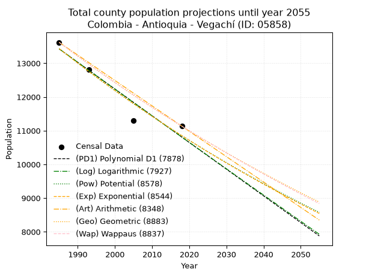
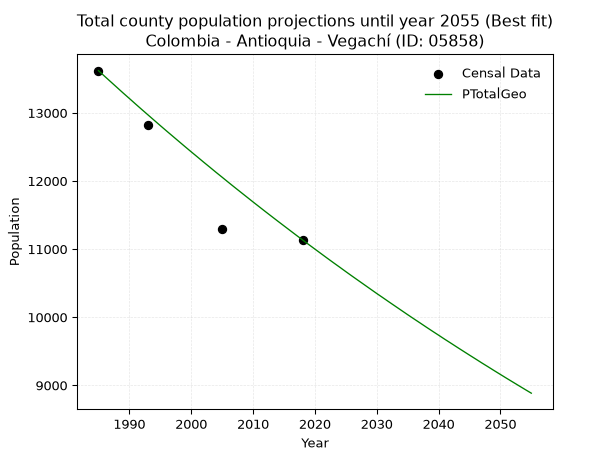
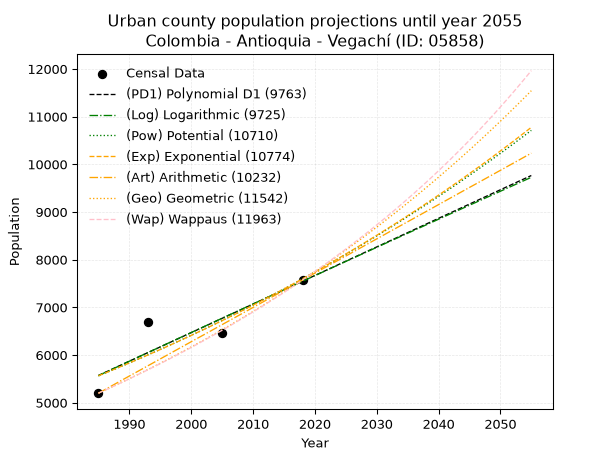
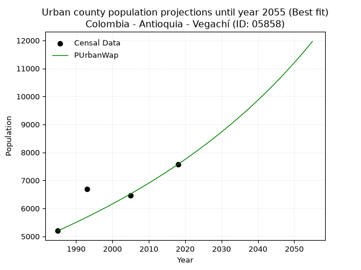
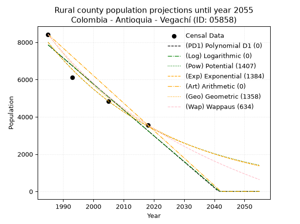
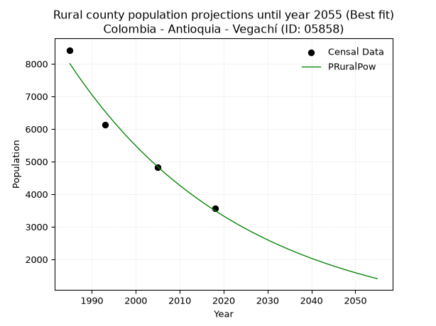

<div align="center">


</div>

# _“Population and Public Services Demand Projections (PPSD) until Year 2050 for Colombia - Antioquia - Vegachí (ID: 05858)”_
Keywords: `population` `public-service` `projection` `lineal` `polynomial` `logarithmic` `potential` `exponential` `arithmetic` `geometric` `wappaus` `dane` `colombia` `south-america`

PPSD are analytical estimates used by governments and planners to anticipate future changes in population size, age distribution, and the resulting community needs for utilities, healthcare, education, and infrastructure as sizing future water treatment facilities, electrical grids, and road networks based on spatial growth.

> **General running parameters**: • app_version: _v20260806_. • Python version: _3.14.7_. • Pandas version: _3.0.5_. • NumPy version: _2.5.1_. • Creates, save and include plots into reports (create_plot): _False_. • Projection until year: _2050_. • Process polynomial degree 2 and up: _False_. • Process Wappaus: _True_. • Process Wappaus: _True_. • Set negative values to zero: _True_. • Set infinite values to zero: _True_. • Drop dataset notes: _True_. 
<div align="center">

Dynamic map: [:earth_americas:Google](http://maps.google.com/maps?q=6.773525178,-74.7987135) [:earth_americas:OSM](https://www.openstreetmap.org/#map=18/6.773525178/-74.7987135&layers=P) [:earth_americas:Bing](https://www.bing.com/maps?cp=6.773525178~-74.7987135&lvl=18) [:earth_americas:Apple](https://maps.apple.com/frame?center=6.773525178%2C-74.7987135&span=0.003%2C0.006)

</div>


<div align="center">

```geojson
{
  "type": "Feature",
  "geometry": {
    "type": "Point", 
    "coordinates": [-74.7987135, 6.773525178]
  }, 
  "properties": {
    "Name": "Colombia - Antioquia - Vegachí (ID: 05858)"
  }
}
```

</div>


## 0. Census Data (4 records)

Census data are official statistics collected by a government about the people and housing in a country. They usually include counts of total population, age, sex, race, income, education, and jobs.

📅Global census file: [Population.xlsx](../data/Population.xlsx)

| Source   |   Year |   CountryID | CountryName   |   StateID | StateName   |   CountyID | CountyName   |   PTotal |   PUrban |   PRural |
|:---------|-------:|------------:|:--------------|----------:|:------------|-----------:|:-------------|---------:|---------:|---------:|
| DANE     |   1985 |          57 | Colombia      |        05 | Antioquia   |      05858 | Vegachí      |    13619 |     5198 |     8421 |
| DANE     |   1993 |          57 | Colombia      |        05 | Antioquia   |      05858 | Vegachí      |    12817 |     6694 |     6123 |
| DANE     |   2005 |          57 | Colombia      |        05 | Antioquia   |      05858 | Vegachí      |    11293 |     6469 |     4824 |
| DANE     |   2018 |          57 | Colombia      |        05 | Antioquia   |      05858 | Vegachí      |    11134 |     7571 |     3563 |

> 🔥Some records could had specific notes about the registered values or the corresponding urban or rural distribution.

**Local public utility companies (RUPS)**

 | SERVICIO       | ESTADO    | NOMBRE                                    | NIT         | DEPARTAMENTO_DOMICILIO   | MUNICIPIO_DOMICILIO   | DIRECCION                        |   TELEFONO | EMAIL                           | TIPO_INSCRIPCION    | REPRESENTANTE_LEGAL                 | TIPO_PRESTADOR                             | CLASIFICACION                  |
|:---------------|:----------|:------------------------------------------|:------------|:-------------------------|:----------------------|:---------------------------------|-----------:|:--------------------------------|:--------------------|:------------------------------------|:-------------------------------------------|:-------------------------------|
| ASEO           | OPERATIVA | EMPRESAS VARIAS DE MEDELLIN  S.A. E.S. P. | 890905055-9 | ANTIOQUIA                | MEDELLIN              | CALLE 30 No 55-198               |    3807946 | nora.alvarez@emvarias.com.co    | Registro por la ESP | GUSTAVO ALEJANDRO GALLEGO HERNANDEZ | SOCIEDADES (EMPRESA DE SERVICIOS PUBLICOS) | MAYOR O IGUAL A 5001 USUARIOS  |
| ACUEDUCTO      | OPERATIVA | EMPRESAS PUBLICAS DE VEGACHI S.A. E.S.P.  | 900150932-7 | ANTIOQUIA                | VEGACHI               | CRA 50 N° 50A-01 CALLE PRINCIPAL |    8305097 | epvsaesp@gmail.com              | Registro por la ESP | JOSE FERNANDO YEPES RENGIFO         | SOCIEDADES (EMPRESA DE SERVICIOS PUBLICOS) | DESDE 2501 HASTA 5000 USUARIOS |
| ALCANTARILLADO | OPERATIVA | EMPRESAS PUBLICAS DE VEGACHI S.A. E.S.P.  | 900150932-7 | ANTIOQUIA                | VEGACHI               | CRA 50 N° 50A-01 CALLE PRINCIPAL |    8305097 | epvsaesp@gmail.com              | Registro por la ESP | JOSE FERNANDO YEPES RENGIFO         | SOCIEDADES (EMPRESA DE SERVICIOS PUBLICOS) | DESDE 2501 HASTA 5000 USUARIOS |
| ASEO           | OPERATIVA | EMPRESAS PUBLICAS DE VEGACHI S.A. E.S.P.  | 900150932-7 | ANTIOQUIA                | VEGACHI               | CRA 50 N° 50A-01 CALLE PRINCIPAL |    8305097 | epvsaesp@gmail.com              | Registro por la ESP | JOSE FERNANDO YEPES RENGIFO         | SOCIEDADES (EMPRESA DE SERVICIOS PUBLICOS) | DESDE 2501 HASTA 5000 USUARIOS |
| ASEO           | OPERATIVA | Asociación Recircular                     | 901326117-1 | ANTIOQUIA                | MEDELLIN              | calle 123 # 52 - 35              |    4795896 | asociacion.recircular@gmail.com | Registro por la ESP | YESID ALEXIS RAMIREZ VALENCIA       | ORGANIZACION AUTORIZADA                    | MAYOR O IGUAL A 5001 USUARIOS  |

> [📅RUPS Database: Registro Único de Prestadores de Servicios Públicos de Colombia Suramérica - RUPS](https://www.datos.gov.co/Hacienda-y-Cr-dito-P-blico/Registro-nico-de-Prestadores-de-Servicios-P-blicos/4qkq-csdn/about_data)

## 1. Total

### 1.1. Coefficients and Parameters

* (PD1) Polynomial Deg 1: -79.23364110798852, 170702.84062625404 (lineal)
* (Log) Logarithmic: -158705.33146881207, 1218536.246279151
* (Pow) Potential: -12.947140680006413, 46.8248412964615
* (Exp) Exponential: -0.006464107786566106, 5019986545.766829
* (Art) Arithmetic: Year diff. 2018 - 1985 = 33, Population diff. 11134 - 13619 = -2485, Annual growth = -75.3030303030303
* (Geo) Geometric: Year diff. 2018 - 1985 = 33, Population diff. 11134 - 13619 = -2485, Annual growth % = -0.006086323647813696
* (Wap) Wappaus: i = -0.6084355860140613, Condition values only valid for < 200)

<sub>
Wappaus condition values: ['-0.00', '-0.61', '-1.22', '-1.83', '-2.43', '-3.04', '-3.65', '-4.26', '-4.87', '-5.48', '-6.08', '-6.69', '-7.30', '-7.91', '-8.52', '-9.13', '-9.73', '-10.34', '-10.95', '-11.56', '-12.17', '-12.78', '-13.39', '-13.99', '-14.60', '-15.21', '-15.82', '-16.43', '-17.04', '-17.64', '-18.25', '-18.86', '-19.47', '-20.08', '-20.69', '-21.30', '-21.90', '-22.51', '-23.12', '-23.73', '-24.34', '-24.95', '-25.55', '-26.16', '-26.77', '-27.38', '-27.99', '-28.60', '-29.20', '-29.81', '-30.42', '-31.03', '-31.64', '-32.25', '-32.86', '-33.46', '-34.07', '-34.68', '-35.29', '-35.90', '-36.51', '-37.11', '-37.72', '-38.33', '-38.94', '-39.55']
</sub>


### 1.2. Projected Dataset

|   Year |   CountyID |   PTotalPD1 |   PTotalLog |   PTotalPow |   PTotalExp |   PTotalArt |   PTotalGeo |   PTotalWap |
|-------:|-----------:|------------:|------------:|------------:|------------:|------------:|------------:|------------:|
|   1985 |      05858 |       13424 |       13427 |       13436 |       13433 |       13619 |       13619 |       13619 |
|   1986 |      05858 |       13345 |       13347 |       13349 |       13346 |       13544 |       13536 |       13536 |
|   1987 |      05858 |       13266 |       13267 |       13262 |       13260 |       13468 |       13454 |       13454 |
|   1988 |      05858 |       13186 |       13188 |       13176 |       13175 |       13393 |       13372 |       13373 |
|   1989 |      05858 |       13107 |       13108 |       13090 |       13090 |       13318 |       13290 |       13292 |
|   1990 |      05858 |       13028 |       13028 |       13005 |       13005 |       13242 |       13210 |       13211 |
|   1991 |      05858 |       12949 |       12948 |       12921 |       12922 |       13167 |       13129 |       13131 |
|   1992 |      05858 |       12869 |       12869 |       12837 |       12838 |       13092 |       13049 |       13051 |
|   1993 |      05858 |       12790 |       12789 |       12754 |       12756 |       13017 |       12970 |       12972 |
|   1994 |      05858 |       12711 |       12709 |       12672 |       12673 |       12941 |       12891 |       12893 |
|   1995 |      05858 |       12632 |       12630 |       12590 |       12592 |       12866 |       12812 |       12815 |
|   1996 |      05858 |       12552 |       12550 |       12508 |       12511 |       12791 |       12734 |       12737 |
|   1997 |      05858 |       12473 |       12471 |       12427 |       12430 |       12715 |       12657 |       12660 |
|   1998 |      05858 |       12394 |       12391 |       12347 |       12350 |       12640 |       12580 |       12583 |
|   1999 |      05858 |       12315 |       12312 |       12267 |       12270 |       12565 |       12503 |       12506 |
|   2000 |      05858 |       12236 |       12233 |       12188 |       12191 |       12489 |       12427 |       12430 |
|   2001 |      05858 |       12156 |       12153 |       12110 |       12113 |       12414 |       12352 |       12355 |
|   2002 |      05858 |       12077 |       12074 |       12032 |       12035 |       12339 |       12276 |       12280 |
|   2003 |      05858 |       11998 |       11995 |       11954 |       11957 |       12264 |       12202 |       12205 |
|   2004 |      05858 |       11919 |       11915 |       11877 |       11880 |       12188 |       12127 |       12131 |
|   2005 |      05858 |       11839 |       11836 |       11801 |       11804 |       12113 |       12054 |       12057 |
|   2006 |      05858 |       11760 |       11757 |       11725 |       11728 |       12038 |       11980 |       11983 |
|   2007 |      05858 |       11681 |       11678 |       11649 |       11652 |       11962 |       11907 |       11910 |
|   2008 |      05858 |       11602 |       11599 |       11574 |       11577 |       11887 |       11835 |       11838 |
|   2009 |      05858 |       11522 |       11520 |       11500 |       11502 |       11812 |       11763 |       11766 |
|   2010 |      05858 |       11443 |       11441 |       11426 |       11428 |       11736 |       11691 |       11694 |
|   2011 |      05858 |       11364 |       11362 |       11353 |       11355 |       11661 |       11620 |       11622 |
|   2012 |      05858 |       11285 |       11283 |       11280 |       11281 |       11586 |       11549 |       11552 |
|   2013 |      05858 |       11206 |       11204 |       11208 |       11209 |       11511 |       11479 |       11481 |
|   2014 |      05858 |       11126 |       11125 |       11136 |       11136 |       11435 |       11409 |       11411 |
|   2015 |      05858 |       11047 |       11047 |       11064 |       11065 |       11360 |       11340 |       11341 |
|   2016 |      05858 |       10968 |       10968 |       10994 |       10993 |       11285 |       11271 |       11272 |
|   2017 |      05858 |       10889 |       10889 |       10923 |       10923 |       11209 |       11202 |       11203 |
|   2018 |      05858 |       10809 |       10811 |       10853 |       10852 |       11134 |       11134 |       11134 |
|   2019 |      05858 |       10730 |       10732 |       10784 |       10782 |       11059 |       11066 |       11066 |
|   2020 |      05858 |       10651 |       10653 |       10715 |       10713 |       10983 |       10999 |       10998 |
|   2021 |      05858 |       10572 |       10575 |       10647 |       10644 |       10908 |       10932 |       10930 |
|   2022 |      05858 |       10492 |       10496 |       10579 |       10575 |       10833 |       10865 |       10863 |
|   2023 |      05858 |       10413 |       10418 |       10511 |       10507 |       10757 |       10799 |       10797 |
|   2024 |      05858 |       10334 |       10339 |       10444 |       10439 |       10682 |       10734 |       10730 |
|   2025 |      05858 |       10255 |       10261 |       10377 |       10372 |       10607 |       10668 |       10664 |
|   2026 |      05858 |       10175 |       10183 |       10311 |       10305 |       10532 |       10603 |       10598 |
|   2027 |      05858 |       10096 |       10104 |       10246 |       10239 |       10456 |       10539 |       10533 |
|   2028 |      05858 |       10017 |       10026 |       10180 |       10173 |       10381 |       10475 |       10468 |
|   2029 |      05858 |        9938 |        9948 |       10116 |       10107 |       10306 |       10411 |       10403 |
|   2030 |      05858 |        9859 |        9870 |       10051 |       10042 |       10230 |       10347 |       10339 |
|   2031 |      05858 |        9779 |        9791 |        9987 |        9978 |       10155 |       10285 |       10275 |
|   2032 |      05858 |        9700 |        9713 |        9924 |        9913 |       10080 |       10222 |       10212 |
|   2033 |      05858 |        9621 |        9635 |        9861 |        9849 |       10004 |       10160 |       10148 |
|   2034 |      05858 |        9542 |        9557 |        9798 |        9786 |        9929 |       10098 |       10085 |
|   2035 |      05858 |        9462 |        9479 |        9736 |        9723 |        9854 |       10036 |       10023 |
|   2036 |      05858 |        9383 |        9401 |        9675 |        9660 |        9779 |        9975 |        9961 |
|   2037 |      05858 |        9304 |        9323 |        9613 |        9598 |        9703 |        9915 |        9899 |
|   2038 |      05858 |        9225 |        9245 |        9552 |        9536 |        9628 |        9854 |        9837 |
|   2039 |      05858 |        9145 |        9168 |        9492 |        9475 |        9553 |        9794 |        9776 |
|   2040 |      05858 |        9066 |        9090 |        9432 |        9414 |        9477 |        9735 |        9715 |
|   2041 |      05858 |        8987 |        9012 |        9372 |        9353 |        9402 |        9675 |        9654 |
|   2042 |      05858 |        8908 |        8934 |        9313 |        9293 |        9327 |        9617 |        9594 |
|   2043 |      05858 |        8829 |        8857 |        9254 |        9233 |        9251 |        9558 |        9534 |
|   2044 |      05858 |        8749 |        8779 |        9196 |        9173 |        9176 |        9500 |        9474 |
|   2045 |      05858 |        8670 |        8701 |        9138 |        9114 |        9101 |        9442 |        9415 |
|   2046 |      05858 |        8591 |        8624 |        9080 |        9056 |        9026 |        9385 |        9356 |
|   2047 |      05858 |        8512 |        8546 |        9023 |        8997 |        8950 |        9327 |        9297 |
|   2048 |      05858 |        8432 |        8469 |        8966 |        8939 |        8875 |        9271 |        9238 |
|   2049 |      05858 |        8353 |        8391 |        8909 |        8882 |        8800 |        9214 |        9180 |
|   2050 |      05858 |        8274 |        8314 |        8853 |        8824 |        8724 |        9158 |        9122 |
<div align="center">

</img>

</div>


### 1.3. Best fit with absolute and relative error (%)

Relative error puts that difference into context by dividing the absolute error by the true value, creating a unitless ratio or percentage that shows the scale of the mistake.

Absolute and relative error

|   Year | Source   |   CountryID | CountryName   |   StateID | StateName   |   CountyID_x | CountyName   |   PTotal |   PUrban |   PRural |   CountyID_y |   PTotalPD1 |   PTotalLog |   PTotalPow |   PTotalExp |   PTotalArt |   PTotalGeo |   PTotalWap |   PTotalPD1AbsError |   PTotalLogAbsError |   PTotalPowAbsError |   PTotalExpAbsError |   PTotalArtAbsError |   PTotalGeoAbsError |   PTotalWapAbsError |   PTotalPD1RelError |   PTotalLogRelError |   PTotalPowRelError |   PTotalExpRelError |   PTotalArtRelError |   PTotalGeoRelError |   PTotalWapRelError |
|-------:|:---------|------------:|:--------------|----------:|:------------|-------------:|:-------------|---------:|---------:|---------:|-------------:|------------:|------------:|------------:|------------:|------------:|------------:|------------:|--------------------:|--------------------:|--------------------:|--------------------:|--------------------:|--------------------:|--------------------:|--------------------:|--------------------:|--------------------:|--------------------:|--------------------:|--------------------:|--------------------:|
|   1985 | DANE     |          57 | Colombia      |        05 | Antioquia   |        05858 | Vegachí      |    13619 |     5198 |     8421 |        05858 |       13424 |       13427 |       13436 |       13433 |       13619 |       13619 |       13619 |                 195 |                 192 |                 183 |                 186 |                   0 |                   0 |                   0 |            1.43182  |             1.4098  |            1.34371  |             1.36574 |             0       |             0       |             0       |
|   1993 | DANE     |          57 | Colombia      |        05 | Antioquia   |        05858 | Vegachí      |    12817 |     6694 |     6123 |        05858 |       12790 |       12789 |       12754 |       12756 |       13017 |       12970 |       12972 |                  27 |                  28 |                  63 |                  61 |                 200 |                 153 |                 155 |            0.210658 |             0.21846 |            0.491535 |             0.47593 |             1.56043 |             1.19373 |             1.20933 |
|   2005 | DANE     |          57 | Colombia      |        05 | Antioquia   |        05858 | Vegachí      |    11293 |     6469 |     4824 |        05858 |       11839 |       11836 |       11801 |       11804 |       12113 |       12054 |       12057 |                 546 |                 543 |                 508 |                 511 |                 820 |                 761 |                 764 |            4.83485  |             4.80829 |            4.49836  |             4.52493 |             7.26114 |             6.73869 |             6.76525 |
|   2018 | DANE     |          57 | Colombia      |        05 | Antioquia   |        05858 | Vegachí      |    11134 |     7571 |     3563 |        05858 |       10809 |       10811 |       10853 |       10852 |       11134 |       11134 |       11134 |                 325 |                 323 |                 281 |                 282 |                   0 |                   0 |                   0 |            2.91899  |             2.90102 |            2.5238   |             2.53278 |             0       |             0       |             0       |

Relative error mean

| Method    |   RelError | Best   |
|:----------|-----------:|:-------|
| PTotalPD1 |    2.34908 |        |
| PTotalLog |    2.33439 |        |
| PTotalPow |    2.21435 |        |
| PTotalExp |    2.22484 |        |
| PTotalArt |    2.20539 |        |
| PTotalGeo |    1.9831  | True   |
| PTotalWap |    1.99365 |        |

💙Best method: _**PTotalGeo**_
<div align="center">

</img>

</div>


### 1.4. Fresh water supply demand in liters per capita per day (lpcd)

The fresh water supply demand typically ranges from 100 to 300 liters per capita per day (lpcd) for standard domestic and municipal planning, though absolute survival minimums set by the World Health Organization are as low as 7.5 to 20 liters per day, and total consumption in high-income nations can exceed 400 liters.

> `CZ`: Level in meters above the sea level (masl)<br> `WS`: Fresh water supply demand in liters per capita per day (lpcd or l/h/d)<br> `WSAll`: Zonal fresh water supply demand in liters per second (l/s)<br> `A`: Zonal area in square meters<br> `DP`: Population density (people/hectare or p/ha)

Reference values (RAS Colombia)

|    CZ |   WS |
|------:|-----:|
|  1000 |  120 |
|  2000 |  130 |
| 99999 |  140 |

County shapefile geometry properties and water supply values

|   CountyID |      ATotal |   CZTotal |   WSTotal |
|-----------:|------------:|----------:|----------:|
|      05858 | 5.40299e+08 |   895.153 |       120 |

Projected values for best method: PTotalGeo

|   CountyID |   Year |   PTotalGeo |   DPTotal |   WSTotal |   WSTotalAll |
|-----------:|-------:|------------:|----------:|----------:|-------------:|
|      05858 |   1985 |       13619 |      0.25 |       120 |      18.9153 |
|      05858 |   1986 |       13536 |      0.25 |       120 |      18.8    |
|      05858 |   1987 |       13454 |      0.25 |       120 |      18.6861 |
|      05858 |   1988 |       13372 |      0.25 |       120 |      18.5722 |
|      05858 |   1989 |       13290 |      0.25 |       120 |      18.4583 |
|      05858 |   1990 |       13210 |      0.24 |       120 |      18.3472 |
|      05858 |   1991 |       13129 |      0.24 |       120 |      18.2347 |
|      05858 |   1992 |       13049 |      0.24 |       120 |      18.1236 |
|      05858 |   1993 |       12970 |      0.24 |       120 |      18.0139 |
|      05858 |   1994 |       12891 |      0.24 |       120 |      17.9042 |
|      05858 |   1995 |       12812 |      0.24 |       120 |      17.7944 |
|      05858 |   1996 |       12734 |      0.24 |       120 |      17.6861 |
|      05858 |   1997 |       12657 |      0.23 |       120 |      17.5792 |
|      05858 |   1998 |       12580 |      0.23 |       120 |      17.4722 |
|      05858 |   1999 |       12503 |      0.23 |       120 |      17.3653 |
|      05858 |   2000 |       12427 |      0.23 |       120 |      17.2597 |
|      05858 |   2001 |       12352 |      0.23 |       120 |      17.1556 |
|      05858 |   2002 |       12276 |      0.23 |       120 |      17.05   |
|      05858 |   2003 |       12202 |      0.23 |       120 |      16.9472 |
|      05858 |   2004 |       12127 |      0.22 |       120 |      16.8431 |
|      05858 |   2005 |       12054 |      0.22 |       120 |      16.7417 |
|      05858 |   2006 |       11980 |      0.22 |       120 |      16.6389 |
|      05858 |   2007 |       11907 |      0.22 |       120 |      16.5375 |
|      05858 |   2008 |       11835 |      0.22 |       120 |      16.4375 |
|      05858 |   2009 |       11763 |      0.22 |       120 |      16.3375 |
|      05858 |   2010 |       11691 |      0.22 |       120 |      16.2375 |
|      05858 |   2011 |       11620 |      0.22 |       120 |      16.1389 |
|      05858 |   2012 |       11549 |      0.21 |       120 |      16.0403 |
|      05858 |   2013 |       11479 |      0.21 |       120 |      15.9431 |
|      05858 |   2014 |       11409 |      0.21 |       120 |      15.8458 |
|      05858 |   2015 |       11340 |      0.21 |       120 |      15.75   |
|      05858 |   2016 |       11271 |      0.21 |       120 |      15.6542 |
|      05858 |   2017 |       11202 |      0.21 |       120 |      15.5583 |
|      05858 |   2018 |       11134 |      0.21 |       120 |      15.4639 |
|      05858 |   2019 |       11066 |      0.2  |       120 |      15.3694 |
|      05858 |   2020 |       10999 |      0.2  |       120 |      15.2764 |
|      05858 |   2021 |       10932 |      0.2  |       120 |      15.1833 |
|      05858 |   2022 |       10865 |      0.2  |       120 |      15.0903 |
|      05858 |   2023 |       10799 |      0.2  |       120 |      14.9986 |
|      05858 |   2024 |       10734 |      0.2  |       120 |      14.9083 |
|      05858 |   2025 |       10668 |      0.2  |       120 |      14.8167 |
|      05858 |   2026 |       10603 |      0.2  |       120 |      14.7264 |
|      05858 |   2027 |       10539 |      0.2  |       120 |      14.6375 |
|      05858 |   2028 |       10475 |      0.19 |       120 |      14.5486 |
|      05858 |   2029 |       10411 |      0.19 |       120 |      14.4597 |
|      05858 |   2030 |       10347 |      0.19 |       120 |      14.3708 |
|      05858 |   2031 |       10285 |      0.19 |       120 |      14.2847 |
|      05858 |   2032 |       10222 |      0.19 |       120 |      14.1972 |
|      05858 |   2033 |       10160 |      0.19 |       120 |      14.1111 |
|      05858 |   2034 |       10098 |      0.19 |       120 |      14.025  |
|      05858 |   2035 |       10036 |      0.19 |       120 |      13.9389 |
|      05858 |   2036 |        9975 |      0.18 |       120 |      13.8542 |
|      05858 |   2037 |        9915 |      0.18 |       120 |      13.7708 |
|      05858 |   2038 |        9854 |      0.18 |       120 |      13.6861 |
|      05858 |   2039 |        9794 |      0.18 |       120 |      13.6028 |
|      05858 |   2040 |        9735 |      0.18 |       120 |      13.5208 |
|      05858 |   2041 |        9675 |      0.18 |       120 |      13.4375 |
|      05858 |   2042 |        9617 |      0.18 |       120 |      13.3569 |
|      05858 |   2043 |        9558 |      0.18 |       120 |      13.275  |
|      05858 |   2044 |        9500 |      0.18 |       120 |      13.1944 |
|      05858 |   2045 |        9442 |      0.17 |       120 |      13.1139 |
|      05858 |   2046 |        9385 |      0.17 |       120 |      13.0347 |
|      05858 |   2047 |        9327 |      0.17 |       120 |      12.9542 |
|      05858 |   2048 |        9271 |      0.17 |       120 |      12.8764 |
|      05858 |   2049 |        9214 |      0.17 |       120 |      12.7972 |
|      05858 |   2050 |        9158 |      0.17 |       120 |      12.7194 |

## 2. Urban

### 2.1. Coefficients and Parameters

* (PD1) Polynomial Deg 1: 59.91489361702057, -113361.7659574454 (lineal)
* (Log) Logarithmic: 119968.57258238927, -905399.0815665467
* (Pow) Potential: 18.909504536674962, -58.61383042363627
* (Exp) Exponential: 0.009442251670620539, 4.0310419808926234e-05
* (Art) Arithmetic: Year diff. 2018 - 1985 = 33, Population diff. 7571 - 5198 = 2373, Annual growth = 71.9090909090909
* (Geo) Geometric: Year diff. 2018 - 1985 = 33, Population diff. 7571 - 5198 = 2373, Annual growth % = 0.01146066755291053
* (Wap) Wappaus: i = 1.1263073209975865, Condition values only valid for < 200)

<sub>
Wappaus condition values: ['0.00', '1.13', '2.25', '3.38', '4.51', '5.63', '6.76', '7.88', '9.01', '10.14', '11.26', '12.39', '13.52', '14.64', '15.77', '16.89', '18.02', '19.15', '20.27', '21.40', '22.53', '23.65', '24.78', '25.91', '27.03', '28.16', '29.28', '30.41', '31.54', '32.66', '33.79', '34.92', '36.04', '37.17', '38.29', '39.42', '40.55', '41.67', '42.80', '43.93', '45.05', '46.18', '47.30', '48.43', '49.56', '50.68', '51.81', '52.94', '54.06', '55.19', '56.32', '57.44', '58.57', '59.69', '60.82', '61.95', '63.07', '64.20', '65.33', '66.45', '67.58', '68.70', '69.83', '70.96', '72.08', '73.21']
</sub>


### 2.2. Projected Dataset

|   Year |   CountyID |   PUrbanPD1 |   PUrbanLog |   PUrbanPow |   PUrbanExp |   PUrbanArt |   PUrbanGeo |   PUrbanWap |
|-------:|-----------:|------------:|------------:|------------:|------------:|------------:|------------:|------------:|
|   1985 |      05858 |        5569 |        5567 |        5561 |        5563 |        5198 |        5198 |        5198 |
|   1986 |      05858 |        5629 |        5628 |        5615 |        5616 |        5270 |        5258 |        5257 |
|   1987 |      05858 |        5689 |        5688 |        5668 |        5669 |        5342 |        5318 |        5316 |
|   1988 |      05858 |        5749 |        5748 |        5723 |        5723 |        5414 |        5379 |        5377 |
|   1989 |      05858 |        5809 |        5809 |        5777 |        5778 |        5486 |        5440 |        5438 |
|   1990 |      05858 |        5869 |        5869 |        5832 |        5832 |        5558 |        5503 |        5499 |
|   1991 |      05858 |        5929 |        5929 |        5888 |        5888 |        5629 |        5566 |        5562 |
|   1992 |      05858 |        5989 |        5990 |        5944 |        5944 |        5701 |        5630 |        5625 |
|   1993 |      05858 |        6049 |        6050 |        6001 |        6000 |        5773 |        5694 |        5688 |
|   1994 |      05858 |        6109 |        6110 |        6058 |        6057 |        5845 |        5759 |        5753 |
|   1995 |      05858 |        6168 |        6170 |        6116 |        6114 |        5917 |        5825 |        5818 |
|   1996 |      05858 |        6228 |        6230 |        6174 |        6172 |        5989 |        5892 |        5885 |
|   1997 |      05858 |        6288 |        6290 |        6233 |        6231 |        6061 |        5960 |        5951 |
|   1998 |      05858 |        6348 |        6350 |        6292 |        6290 |        6133 |        6028 |        6019 |
|   1999 |      05858 |        6408 |        6410 |        6352 |        6350 |        6205 |        6097 |        6088 |
|   2000 |      05858 |        6468 |        6470 |        6412 |        6410 |        6277 |        6167 |        6157 |
|   2001 |      05858 |        6528 |        6530 |        6473 |        6471 |        6349 |        6238 |        6227 |
|   2002 |      05858 |        6588 |        6590 |        6535 |        6532 |        6420 |        6309 |        6299 |
|   2003 |      05858 |        6648 |        6650 |        6597 |        6594 |        6492 |        6381 |        6371 |
|   2004 |      05858 |        6708 |        6710 |        6659 |        6657 |        6564 |        6455 |        6444 |
|   2005 |      05858 |        6768 |        6770 |        6722 |        6720 |        6636 |        6529 |        6518 |
|   2006 |      05858 |        6828 |        6830 |        6786 |        6784 |        6708 |        6603 |        6592 |
|   2007 |      05858 |        6887 |        6889 |        6850 |        6848 |        6780 |        6679 |        6668 |
|   2008 |      05858 |        6947 |        6949 |        6915 |        6913 |        6852 |        6756 |        6745 |
|   2009 |      05858 |        7007 |        7009 |        6980 |        6978 |        6924 |        6833 |        6823 |
|   2010 |      05858 |        7067 |        7069 |        7046 |        7045 |        6996 |        6911 |        6901 |
|   2011 |      05858 |        7127 |        7128 |        7113 |        7111 |        7068 |        6991 |        6981 |
|   2012 |      05858 |        7187 |        7188 |        7180 |        7179 |        7140 |        7071 |        7062 |
|   2013 |      05858 |        7247 |        7248 |        7248 |        7247 |        7211 |        7152 |        7144 |
|   2014 |      05858 |        7307 |        7307 |        7316 |        7316 |        7283 |        7234 |        7227 |
|   2015 |      05858 |        7367 |        7367 |        7385 |        7385 |        7355 |        7317 |        7311 |
|   2016 |      05858 |        7427 |        7426 |        7455 |        7455 |        7427 |        7400 |        7397 |
|   2017 |      05858 |        7487 |        7486 |        7525 |        7526 |        7499 |        7485 |        7483 |
|   2018 |      05858 |        7546 |        7545 |        7596 |        7597 |        7571 |        7571 |        7571 |
|   2019 |      05858 |        7606 |        7605 |        7668 |        7669 |        7643 |        7658 |        7660 |
|   2020 |      05858 |        7666 |        7664 |        7740 |        7742 |        7715 |        7746 |        7750 |
|   2021 |      05858 |        7726 |        7723 |        7813 |        7816 |        7787 |        7834 |        7842 |
|   2022 |      05858 |        7786 |        7783 |        7886 |        7890 |        7859 |        7924 |        7934 |
|   2023 |      05858 |        7846 |        7842 |        7960 |        7965 |        7931 |        8015 |        8028 |
|   2024 |      05858 |        7906 |        7901 |        8035 |        8040 |        8002 |        8107 |        8124 |
|   2025 |      05858 |        7966 |        7961 |        8110 |        8117 |        8074 |        8200 |        8221 |
|   2026 |      05858 |        8026 |        8020 |        8186 |        8194 |        8146 |        8294 |        8319 |
|   2027 |      05858 |        8086 |        8079 |        8263 |        8271 |        8218 |        8389 |        8419 |
|   2028 |      05858 |        8146 |        8138 |        8340 |        8350 |        8290 |        8485 |        8520 |
|   2029 |      05858 |        8206 |        8197 |        8418 |        8429 |        8362 |        8582 |        8623 |
|   2030 |      05858 |        8265 |        8257 |        8497 |        8509 |        8434 |        8680 |        8727 |
|   2031 |      05858 |        8325 |        8316 |        8577 |        8590 |        8506 |        8780 |        8833 |
|   2032 |      05858 |        8385 |        8375 |        8657 |        8671 |        8578 |        8881 |        8940 |
|   2033 |      05858 |        8445 |        8434 |        8738 |        8753 |        8650 |        8982 |        9049 |
|   2034 |      05858 |        8505 |        8493 |        8820 |        8836 |        8722 |        9085 |        9160 |
|   2035 |      05858 |        8565 |        8552 |        8902 |        8920 |        8793 |        9189 |        9273 |
|   2036 |      05858 |        8625 |        8611 |        8985 |        9005 |        8865 |        9295 |        9387 |
|   2037 |      05858 |        8685 |        8669 |        9069 |        9090 |        8937 |        9401 |        9503 |
|   2038 |      05858 |        8745 |        8728 |        9153 |        9177 |        9009 |        9509 |        9621 |
|   2039 |      05858 |        8805 |        8787 |        9239 |        9264 |        9081 |        9618 |        9741 |
|   2040 |      05858 |        8865 |        8846 |        9325 |        9352 |        9153 |        9728 |        9863 |
|   2041 |      05858 |        8925 |        8905 |        9412 |        9440 |        9225 |        9840 |        9987 |
|   2042 |      05858 |        8984 |        8964 |        9499 |        9530 |        9297 |        9952 |       10113 |
|   2043 |      05858 |        9044 |        9022 |        9587 |        9620 |        9369 |       10066 |       10241 |
|   2044 |      05858 |        9104 |        9081 |        9677 |        9711 |        9441 |       10182 |       10371 |
|   2045 |      05858 |        9164 |        9140 |        9767 |        9804 |        9513 |       10299 |       10503 |
|   2046 |      05858 |        9224 |        9198 |        9857 |        9897 |        9584 |       10417 |       10638 |
|   2047 |      05858 |        9284 |        9257 |        9949 |        9990 |        9656 |       10536 |       10775 |
|   2048 |      05858 |        9344 |        9316 |       10041 |       10085 |        9728 |       10657 |       10915 |
|   2049 |      05858 |        9404 |        9374 |       10134 |       10181 |        9800 |       10779 |       11056 |
|   2050 |      05858 |        9464 |        9433 |       10228 |       10278 |        9872 |       10902 |       11201 |
<div align="center">

</img>

</div>


### 2.3. Best fit with absolute and relative error (%)

Relative error puts that difference into context by dividing the absolute error by the true value, creating a unitless ratio or percentage that shows the scale of the mistake.

Absolute and relative error

|   Year | Source   |   CountryID | CountryName   |   StateID | StateName   |   CountyID_x | CountyName   |   PTotal |   PUrban |   PRural |   CountyID_y |   PUrbanPD1 |   PUrbanLog |   PUrbanPow |   PUrbanExp |   PUrbanArt |   PUrbanGeo |   PUrbanWap |   PUrbanPD1AbsError |   PUrbanLogAbsError |   PUrbanPowAbsError |   PUrbanExpAbsError |   PUrbanArtAbsError |   PUrbanGeoAbsError |   PUrbanWapAbsError |   PUrbanPD1RelError |   PUrbanLogRelError |   PUrbanPowRelError |   PUrbanExpRelError |   PUrbanArtRelError |   PUrbanGeoRelError |   PUrbanWapRelError |
|-------:|:---------|------------:|:--------------|----------:|:------------|-------------:|:-------------|---------:|---------:|---------:|-------------:|------------:|------------:|------------:|------------:|------------:|------------:|------------:|--------------------:|--------------------:|--------------------:|--------------------:|--------------------:|--------------------:|--------------------:|--------------------:|--------------------:|--------------------:|--------------------:|--------------------:|--------------------:|--------------------:|
|   1985 | DANE     |          57 | Colombia      |        05 | Antioquia   |        05858 | Vegachí      |    13619 |     5198 |     8421 |        05858 |        5569 |        5567 |        5561 |        5563 |        5198 |        5198 |        5198 |                 371 |                 369 |                 363 |                 365 |                   0 |                   0 |                   0 |            7.13736  |            7.09888  |            6.98346  |            7.02193  |             0       |              0      |            0        |
|   1993 | DANE     |          57 | Colombia      |        05 | Antioquia   |        05858 | Vegachí      |    12817 |     6694 |     6123 |        05858 |        6049 |        6050 |        6001 |        6000 |        5773 |        5694 |        5688 |                 645 |                 644 |                 693 |                 694 |                 921 |                1000 |                1006 |            9.63549  |            9.62056  |           10.3526   |           10.3675   |            13.7586  |             14.9388 |           15.0284   |
|   2005 | DANE     |          57 | Colombia      |        05 | Antioquia   |        05858 | Vegachí      |    11293 |     6469 |     4824 |        05858 |        6768 |        6770 |        6722 |        6720 |        6636 |        6529 |        6518 |                 299 |                 301 |                 253 |                 251 |                 167 |                  60 |                  49 |            4.62204  |            4.65296  |            3.91096  |            3.88004  |             2.58154 |              0.9275 |            0.757459 |
|   2018 | DANE     |          57 | Colombia      |        05 | Antioquia   |        05858 | Vegachí      |    11134 |     7571 |     3563 |        05858 |        7546 |        7545 |        7596 |        7597 |        7571 |        7571 |        7571 |                  25 |                  26 |                  25 |                  26 |                   0 |                   0 |                   0 |            0.330207 |            0.343416 |            0.330207 |            0.343416 |             0       |              0      |            0        |

Relative error mean

| Method    |   RelError | Best   |
|:----------|-----------:|:-------|
| PUrbanPD1 |    5.43128 |        |
| PUrbanLog |    5.42895 |        |
| PUrbanPow |    5.39429 |        |
| PUrbanExp |    5.40322 |        |
| PUrbanArt |    4.08503 |        |
| PUrbanGeo |    3.96656 |        |
| PUrbanWap |    3.94646 | True   |

💙Best method: _**PUrbanWap**_
<div align="center">

</img>

</div>


### 2.4. Fresh water supply demand in liters per capita per day (lpcd)

The fresh water supply demand typically ranges from 100 to 300 liters per capita per day (lpcd) for standard domestic and municipal planning, though absolute survival minimums set by the World Health Organization are as low as 7.5 to 20 liters per day, and total consumption in high-income nations can exceed 400 liters.

> `CZ`: Level in meters above the sea level (masl)<br> `WS`: Fresh water supply demand in liters per capita per day (lpcd or l/h/d)<br> `WSAll`: Zonal fresh water supply demand in liters per second (l/s)<br> `A`: Zonal area in square meters<br> `DP`: Population density (people/hectare or p/ha)

Reference values (RAS Colombia)

|    CZ |   WS |
|------:|-----:|
|  1000 |  120 |
|  2000 |  130 |
| 99999 |  140 |

County shapefile geometry properties and water supply values

|   CountyID |      AUrban |   CZUrban |   WSUrban |
|-----------:|------------:|----------:|----------:|
|      05858 | 1.07605e+06 |   974.541 |       120 |

Projected values for best method: PUrbanWap

|   CountyID |   Year |   PUrbanWap |   DPUrban |   WSUrban |   WSUrbanAll |
|-----------:|-------:|------------:|----------:|----------:|-------------:|
|      05858 |   1985 |        5198 |     48.31 |       120 |      7.21944 |
|      05858 |   1986 |        5257 |     48.85 |       120 |      7.30139 |
|      05858 |   1987 |        5316 |     49.4  |       120 |      7.38333 |
|      05858 |   1988 |        5377 |     49.97 |       120 |      7.46806 |
|      05858 |   1989 |        5438 |     50.54 |       120 |      7.55278 |
|      05858 |   1990 |        5499 |     51.1  |       120 |      7.6375  |
|      05858 |   1991 |        5562 |     51.69 |       120 |      7.725   |
|      05858 |   1992 |        5625 |     52.27 |       120 |      7.8125  |
|      05858 |   1993 |        5688 |     52.86 |       120 |      7.9     |
|      05858 |   1994 |        5753 |     53.46 |       120 |      7.99028 |
|      05858 |   1995 |        5818 |     54.07 |       120 |      8.08056 |
|      05858 |   1996 |        5885 |     54.69 |       120 |      8.17361 |
|      05858 |   1997 |        5951 |     55.3  |       120 |      8.26528 |
|      05858 |   1998 |        6019 |     55.94 |       120 |      8.35972 |
|      05858 |   1999 |        6088 |     56.58 |       120 |      8.45556 |
|      05858 |   2000 |        6157 |     57.22 |       120 |      8.55139 |
|      05858 |   2001 |        6227 |     57.87 |       120 |      8.64861 |
|      05858 |   2002 |        6299 |     58.54 |       120 |      8.74861 |
|      05858 |   2003 |        6371 |     59.21 |       120 |      8.84861 |
|      05858 |   2004 |        6444 |     59.89 |       120 |      8.95    |
|      05858 |   2005 |        6518 |     60.57 |       120 |      9.05278 |
|      05858 |   2006 |        6592 |     61.26 |       120 |      9.15556 |
|      05858 |   2007 |        6668 |     61.97 |       120 |      9.26111 |
|      05858 |   2008 |        6745 |     62.68 |       120 |      9.36806 |
|      05858 |   2009 |        6823 |     63.41 |       120 |      9.47639 |
|      05858 |   2010 |        6901 |     64.13 |       120 |      9.58472 |
|      05858 |   2011 |        6981 |     64.88 |       120 |      9.69583 |
|      05858 |   2012 |        7062 |     65.63 |       120 |      9.80833 |
|      05858 |   2013 |        7144 |     66.39 |       120 |      9.92222 |
|      05858 |   2014 |        7227 |     67.16 |       120 |     10.0375  |
|      05858 |   2015 |        7311 |     67.94 |       120 |     10.1542  |
|      05858 |   2016 |        7397 |     68.74 |       120 |     10.2736  |
|      05858 |   2017 |        7483 |     69.54 |       120 |     10.3931  |
|      05858 |   2018 |        7571 |     70.36 |       120 |     10.5153  |
|      05858 |   2019 |        7660 |     71.19 |       120 |     10.6389  |
|      05858 |   2020 |        7750 |     72.02 |       120 |     10.7639  |
|      05858 |   2021 |        7842 |     72.88 |       120 |     10.8917  |
|      05858 |   2022 |        7934 |     73.73 |       120 |     11.0194  |
|      05858 |   2023 |        8028 |     74.61 |       120 |     11.15    |
|      05858 |   2024 |        8124 |     75.5  |       120 |     11.2833  |
|      05858 |   2025 |        8221 |     76.4  |       120 |     11.4181  |
|      05858 |   2026 |        8319 |     77.31 |       120 |     11.5542  |
|      05858 |   2027 |        8419 |     78.24 |       120 |     11.6931  |
|      05858 |   2028 |        8520 |     79.18 |       120 |     11.8333  |
|      05858 |   2029 |        8623 |     80.14 |       120 |     11.9764  |
|      05858 |   2030 |        8727 |     81.1  |       120 |     12.1208  |
|      05858 |   2031 |        8833 |     82.09 |       120 |     12.2681  |
|      05858 |   2032 |        8940 |     83.08 |       120 |     12.4167  |
|      05858 |   2033 |        9049 |     84.09 |       120 |     12.5681  |
|      05858 |   2034 |        9160 |     85.13 |       120 |     12.7222  |
|      05858 |   2035 |        9273 |     86.18 |       120 |     12.8792  |
|      05858 |   2036 |        9387 |     87.24 |       120 |     13.0375  |
|      05858 |   2037 |        9503 |     88.31 |       120 |     13.1986  |
|      05858 |   2038 |        9621 |     89.41 |       120 |     13.3625  |
|      05858 |   2039 |        9741 |     90.53 |       120 |     13.5292  |
|      05858 |   2040 |        9863 |     91.66 |       120 |     13.6986  |
|      05858 |   2041 |        9987 |     92.81 |       120 |     13.8708  |
|      05858 |   2042 |       10113 |     93.98 |       120 |     14.0458  |
|      05858 |   2043 |       10241 |     95.17 |       120 |     14.2236  |
|      05858 |   2044 |       10371 |     96.38 |       120 |     14.4042  |
|      05858 |   2045 |       10503 |     97.61 |       120 |     14.5875  |
|      05858 |   2046 |       10638 |     98.86 |       120 |     14.775   |
|      05858 |   2047 |       10775 |    100.13 |       120 |     14.9653  |
|      05858 |   2048 |       10915 |    101.44 |       120 |     15.1597  |
|      05858 |   2049 |       11056 |    102.75 |       120 |     15.3556  |
|      05858 |   2050 |       11201 |    104.09 |       120 |     15.5569  |

## 3. Rural

### 3.1. Coefficients and Parameters

* (PD1) Polynomial Deg 1: -139.14853472500917, 284064.60658369964 (lineal)
* (Log) Logarithmic: -278673.9040512014, 2123935.327845698
* (Pow) Potential: -50.16270327933772, 169.32777548432628
* (Exp) Exponential: -0.025055273413063822, 3.1793773469044803e+25
* (Art) Arithmetic: Year diff. 2018 - 1985 = 33, Population diff. 3563 - 8421 = -4858, Annual growth = -147.21212121212122
* (Geo) Geometric: Year diff. 2018 - 1985 = 33, Population diff. 3563 - 8421 = -4858, Annual growth % = -0.02572767029530687
* (Wap) Wappaus: i = -2.456811101670915, Condition values only valid for < 200)

<sub>
Wappaus condition values: ['-0.00', '-2.46', '-4.91', '-7.37', '-9.83', '-12.28', '-14.74', '-17.20', '-19.65', '-22.11', '-24.57', '-27.02', '-29.48', '-31.94', '-34.40', '-36.85', '-39.31', '-41.77', '-44.22', '-46.68', '-49.14', '-51.59', '-54.05', '-56.51', '-58.96', '-61.42', '-63.88', '-66.33', '-68.79', '-71.25', '-73.70', '-76.16', '-78.62', '-81.07', '-83.53', '-85.99', '-88.45', '-90.90', '-93.36', '-95.82', '-98.27', '-100.73', '-103.19', '-105.64', '-108.10', '-110.56', '-113.01', '-115.47', '-117.93', '-120.38', '-122.84', '-125.30', '-127.75', '-130.21', '-132.67', '-135.12', '-137.58', '-140.04', '-142.50', '-144.95', '-147.41', '-149.87', '-152.32', '-154.78', '-157.24', '-159.69']
</sub>


### 3.2. Projected Dataset

|   Year |   CountyID |   PRuralPD1 |   PRuralLog |   PRuralPow |   PRuralExp |   PRuralArt |   PRuralGeo |   PRuralWap |
|-------:|-----------:|------------:|------------:|------------:|------------:|------------:|------------:|------------:|
|   1985 |      05858 |        7855 |        7860 |        8002 |        7995 |        8421 |        8421 |        8421 |
|   1986 |      05858 |        7716 |        7720 |        7802 |        7797 |        8274 |        8204 |        8217 |
|   1987 |      05858 |        7576 |        7579 |        7608 |        7604 |        8127 |        7993 |        8017 |
|   1988 |      05858 |        7437 |        7439 |        7418 |        7416 |        7979 |        7788 |        7822 |
|   1989 |      05858 |        7298 |        7299 |        7233 |        7233 |        7832 |        7587 |        7632 |
|   1990 |      05858 |        7159 |        7159 |        7053 |        7054 |        7685 |        7392 |        7446 |
|   1991 |      05858 |        7020 |        7019 |        6878 |        6879 |        7538 |        7202 |        7265 |
|   1992 |      05858 |        6881 |        6879 |        6707 |        6709 |        7391 |        7017 |        7087 |
|   1993 |      05858 |        6742 |        6739 |        6540 |        6543 |        7243 |        6836 |        6914 |
|   1994 |      05858 |        6602 |        6599 |        6377 |        6381 |        7096 |        6660 |        6744 |
|   1995 |      05858 |        6463 |        6460 |        6219 |        6223 |        6949 |        6489 |        6578 |
|   1996 |      05858 |        6324 |        6320 |        6065 |        6069 |        6802 |        6322 |        6416 |
|   1997 |      05858 |        6185 |        6180 |        5914 |        5919 |        6654 |        6159 |        6257 |
|   1998 |      05858 |        6046 |        6041 |        5767 |        5773 |        6507 |        6001 |        6102 |
|   1999 |      05858 |        5907 |        5902 |        5624 |        5630 |        6360 |        5846 |        5950 |
|   2000 |      05858 |        5768 |        5762 |        5485 |        5490 |        6213 |        5696 |        5801 |
|   2001 |      05858 |        5628 |        5623 |        5349 |        5355 |        6066 |        5549 |        5655 |
|   2002 |      05858 |        5489 |        5484 |        5217 |        5222 |        5918 |        5407 |        5511 |
|   2003 |      05858 |        5350 |        5344 |        5088 |        5093 |        5771 |        5268 |        5371 |
|   2004 |      05858 |        5211 |        5205 |        4962 |        4967 |        5624 |        5132 |        5234 |
|   2005 |      05858 |        5072 |        5066 |        4839 |        4844 |        5477 |        5000 |        5099 |
|   2006 |      05858 |        4933 |        4927 |        4720 |        4724 |        5330 |        4871 |        4967 |
|   2007 |      05858 |        4793 |        4789 |        4603 |        4607 |        5182 |        4746 |        4838 |
|   2008 |      05858 |        4654 |        4650 |        4490 |        4493 |        5035 |        4624 |        4711 |
|   2009 |      05858 |        4515 |        4511 |        4379 |        4382 |        4888 |        4505 |        4586 |
|   2010 |      05858 |        4376 |        4372 |        4271 |        4274 |        4741 |        4389 |        4464 |
|   2011 |      05858 |        4237 |        4234 |        4166 |        4168 |        4593 |        4276 |        4344 |
|   2012 |      05858 |        4098 |        4095 |        4063 |        4065 |        4446 |        4166 |        4226 |
|   2013 |      05858 |        3959 |        3957 |        3963 |        3964 |        4299 |        4059 |        4111 |
|   2014 |      05858 |        3819 |        3818 |        3866 |        3866 |        4152 |        3955 |        3997 |
|   2015 |      05858 |        3680 |        3680 |        3771 |        3770 |        4005 |        3853 |        3886 |
|   2016 |      05858 |        3541 |        3542 |        3678 |        3677 |        3857 |        3754 |        3776 |
|   2017 |      05858 |        3402 |        3403 |        3588 |        3586 |        3710 |        3657 |        3669 |
|   2018 |      05858 |        3263 |        3265 |        3499 |        3497 |        3563 |        3563 |        3563 |
|   2019 |      05858 |        3124 |        3127 |        3414 |        3411 |        3416 |        3471 |        3459 |
|   2020 |      05858 |        2985 |        2989 |        3330 |        3326 |        3269 |        3382 |        3357 |
|   2021 |      05858 |        2845 |        2851 |        3248 |        3244 |        3121 |        3295 |        3257 |
|   2022 |      05858 |        2706 |        2713 |        3169 |        3164 |        2974 |        3210 |        3158 |
|   2023 |      05858 |        2567 |        2576 |        3091 |        3086 |        2827 |        3128 |        3061 |
|   2024 |      05858 |        2428 |        2438 |        3015 |        3009 |        2680 |        3047 |        2966 |
|   2025 |      05858 |        2289 |        2300 |        2941 |        2935 |        2533 |        2969 |        2872 |
|   2026 |      05858 |        2150 |        2163 |        2869 |        2862 |        2385 |        2892 |        2780 |
|   2027 |      05858 |        2011 |        2025 |        2799 |        2791 |        2238 |        2818 |        2689 |
|   2028 |      05858 |        1871 |        1888 |        2731 |        2722 |        2091 |        2745 |        2600 |
|   2029 |      05858 |        1732 |        1750 |        2664 |        2655 |        1944 |        2675 |        2512 |
|   2030 |      05858 |        1593 |        1613 |        2599 |        2589 |        1796 |        2606 |        2425 |
|   2031 |      05858 |        1454 |        1476 |        2536 |        2525 |        1649 |        2539 |        2340 |
|   2032 |      05858 |        1315 |        1339 |        2474 |        2463 |        1502 |        2474 |        2256 |
|   2033 |      05858 |        1176 |        1202 |        2414 |        2402 |        1355 |        2410 |        2174 |
|   2034 |      05858 |        1036 |        1065 |        2355 |        2342 |        1208 |        2348 |        2093 |
|   2035 |      05858 |         897 |         928 |        2297 |        2284 |        1060 |        2288 |        2013 |
|   2036 |      05858 |         758 |         791 |        2241 |        2228 |         913 |        2229 |        1934 |
|   2037 |      05858 |         619 |         654 |        2187 |        2173 |         766 |        2171 |        1856 |
|   2038 |      05858 |         480 |         517 |        2134 |        2119 |         619 |        2116 |        1780 |
|   2039 |      05858 |         341 |         380 |        2082 |        2066 |         472 |        2061 |        1704 |
|   2040 |      05858 |         202 |         244 |        2031 |        2015 |         324 |        2008 |        1630 |
|   2041 |      05858 |          62 |         107 |        1982 |        1965 |         177 |        1956 |        1557 |
|   2042 |      05858 |           0 |           0 |        1934 |        1917 |          30 |        1906 |        1485 |
|   2043 |      05858 |           0 |           0 |        1887 |        1869 |           0 |        1857 |        1414 |
|   2044 |      05858 |           0 |           0 |        1841 |        1823 |           0 |        1809 |        1344 |
|   2045 |      05858 |           0 |           0 |        1797 |        1778 |           0 |        1763 |        1275 |
|   2046 |      05858 |           0 |           0 |        1753 |        1734 |           0 |        1717 |        1207 |
|   2047 |      05858 |           0 |           0 |        1711 |        1691 |           0 |        1673 |        1140 |
|   2048 |      05858 |           0 |           0 |        1669 |        1649 |           0 |        1630 |        1073 |
|   2049 |      05858 |           0 |           0 |        1629 |        1609 |           0 |        1588 |        1008 |
|   2050 |      05858 |           0 |           0 |        1589 |        1569 |           0 |        1547 |         944 |
<div align="center">

</img>

</div>


### 3.3. Best fit with absolute and relative error (%)

Relative error puts that difference into context by dividing the absolute error by the true value, creating a unitless ratio or percentage that shows the scale of the mistake.

Absolute and relative error

|   Year | Source   |   CountryID | CountryName   |   StateID | StateName   |   CountyID_x | CountyName   |   PTotal |   PUrban |   PRural |   CountyID_y |   PRuralPD1 |   PRuralLog |   PRuralPow |   PRuralExp |   PRuralArt |   PRuralGeo |   PRuralWap |   PRuralPD1AbsError |   PRuralLogAbsError |   PRuralPowAbsError |   PRuralExpAbsError |   PRuralArtAbsError |   PRuralGeoAbsError |   PRuralWapAbsError |   PRuralPD1RelError |   PRuralLogRelError |   PRuralPowRelError |   PRuralExpRelError |   PRuralArtRelError |   PRuralGeoRelError |   PRuralWapRelError |
|-------:|:---------|------------:|:--------------|----------:|:------------|-------------:|:-------------|---------:|---------:|---------:|-------------:|------------:|------------:|------------:|------------:|------------:|------------:|------------:|--------------------:|--------------------:|--------------------:|--------------------:|--------------------:|--------------------:|--------------------:|--------------------:|--------------------:|--------------------:|--------------------:|--------------------:|--------------------:|--------------------:|
|   1985 | DANE     |          57 | Colombia      |        05 | Antioquia   |        05858 | Vegachí      |    13619 |     5198 |     8421 |        05858 |        7855 |        7860 |        8002 |        7995 |        8421 |        8421 |        8421 |                 566 |                 561 |                 419 |                 426 |                   0 |                   0 |                   0 |             6.72129 |             6.66192 |            4.97566  |            5.05878  |              0      |             0       |             0       |
|   1993 | DANE     |          57 | Colombia      |        05 | Antioquia   |        05858 | Vegachí      |    12817 |     6694 |     6123 |        05858 |        6742 |        6739 |        6540 |        6543 |        7243 |        6836 |        6914 |                 619 |                 616 |                 417 |                 420 |                1120 |                 713 |                 791 |            10.1094  |            10.0604  |            6.81039  |            6.85938  |             18.2917 |            11.6446  |            12.9185  |
|   2005 | DANE     |          57 | Colombia      |        05 | Antioquia   |        05858 | Vegachí      |    11293 |     6469 |     4824 |        05858 |        5072 |        5066 |        4839 |        4844 |        5477 |        5000 |        5099 |                 248 |                 242 |                  15 |                  20 |                 653 |                 176 |                 275 |             5.14096 |             5.01658 |            0.310945 |            0.414594 |             13.5365 |             3.64842 |             5.70066 |
|   2018 | DANE     |          57 | Colombia      |        05 | Antioquia   |        05858 | Vegachí      |    11134 |     7571 |     3563 |        05858 |        3263 |        3265 |        3499 |        3497 |        3563 |        3563 |        3563 |                 300 |                 298 |                  64 |                  66 |                   0 |                   0 |                   0 |             8.41987 |             8.36374 |            1.79624  |            1.85237  |              0      |             0       |             0       |

Relative error mean

| Method    |   RelError | Best   |
|:----------|-----------:|:-------|
| PRuralPD1 |    7.59789 |        |
| PRuralLog |    7.52567 |        |
| PRuralPow |    3.47331 | True   |
| PRuralExp |    3.54628 |        |
| PRuralArt |    7.95704 |        |
| PRuralGeo |    3.82326 |        |
| PRuralWap |    4.65479 |        |

💙Best method: _**PRuralPow**_
<div align="center">

</img>

</div>


### 3.4. Fresh water supply demand in liters per capita per day (lpcd)

The fresh water supply demand typically ranges from 100 to 300 liters per capita per day (lpcd) for standard domestic and municipal planning, though absolute survival minimums set by the World Health Organization are as low as 7.5 to 20 liters per day, and total consumption in high-income nations can exceed 400 liters.

> `CZ`: Level in meters above the sea level (masl)<br> `WS`: Fresh water supply demand in liters per capita per day (lpcd or l/h/d)<br> `WSAll`: Zonal fresh water supply demand in liters per second (l/s)<br> `A`: Zonal area in square meters<br> `DP`: Population density (people/hectare or p/ha)

Reference values (RAS Colombia)

|    CZ |   WS |
|------:|-----:|
|  1000 |  120 |
|  2000 |  130 |
| 99999 |  140 |

County shapefile geometry properties and water supply values

|   CountyID |      ARural |   CZRural |   WSRural |
|-----------:|------------:|----------:|----------:|
|      05858 | 5.39223e+08 |   894.993 |       120 |

Projected values for best method: PRuralPow

|   CountyID |   Year |   PRuralPow |   DPRural |   WSRural |   WSRuralAll |
|-----------:|-------:|------------:|----------:|----------:|-------------:|
|      05858 |   1985 |        8002 |      0.15 |       120 |     11.1139  |
|      05858 |   1986 |        7802 |      0.14 |       120 |     10.8361  |
|      05858 |   1987 |        7608 |      0.14 |       120 |     10.5667  |
|      05858 |   1988 |        7418 |      0.14 |       120 |     10.3028  |
|      05858 |   1989 |        7233 |      0.13 |       120 |     10.0458  |
|      05858 |   1990 |        7053 |      0.13 |       120 |      9.79583 |
|      05858 |   1991 |        6878 |      0.13 |       120 |      9.55278 |
|      05858 |   1992 |        6707 |      0.12 |       120 |      9.31528 |
|      05858 |   1993 |        6540 |      0.12 |       120 |      9.08333 |
|      05858 |   1994 |        6377 |      0.12 |       120 |      8.85694 |
|      05858 |   1995 |        6219 |      0.12 |       120 |      8.6375  |
|      05858 |   1996 |        6065 |      0.11 |       120 |      8.42361 |
|      05858 |   1997 |        5914 |      0.11 |       120 |      8.21389 |
|      05858 |   1998 |        5767 |      0.11 |       120 |      8.00972 |
|      05858 |   1999 |        5624 |      0.1  |       120 |      7.81111 |
|      05858 |   2000 |        5485 |      0.1  |       120 |      7.61806 |
|      05858 |   2001 |        5349 |      0.1  |       120 |      7.42917 |
|      05858 |   2002 |        5217 |      0.1  |       120 |      7.24583 |
|      05858 |   2003 |        5088 |      0.09 |       120 |      7.06667 |
|      05858 |   2004 |        4962 |      0.09 |       120 |      6.89167 |
|      05858 |   2005 |        4839 |      0.09 |       120 |      6.72083 |
|      05858 |   2006 |        4720 |      0.09 |       120 |      6.55556 |
|      05858 |   2007 |        4603 |      0.09 |       120 |      6.39306 |
|      05858 |   2008 |        4490 |      0.08 |       120 |      6.23611 |
|      05858 |   2009 |        4379 |      0.08 |       120 |      6.08194 |
|      05858 |   2010 |        4271 |      0.08 |       120 |      5.93194 |
|      05858 |   2011 |        4166 |      0.08 |       120 |      5.78611 |
|      05858 |   2012 |        4063 |      0.08 |       120 |      5.64306 |
|      05858 |   2013 |        3963 |      0.07 |       120 |      5.50417 |
|      05858 |   2014 |        3866 |      0.07 |       120 |      5.36944 |
|      05858 |   2015 |        3771 |      0.07 |       120 |      5.2375  |
|      05858 |   2016 |        3678 |      0.07 |       120 |      5.10833 |
|      05858 |   2017 |        3588 |      0.07 |       120 |      4.98333 |
|      05858 |   2018 |        3499 |      0.06 |       120 |      4.85972 |
|      05858 |   2019 |        3414 |      0.06 |       120 |      4.74167 |
|      05858 |   2020 |        3330 |      0.06 |       120 |      4.625   |
|      05858 |   2021 |        3248 |      0.06 |       120 |      4.51111 |
|      05858 |   2022 |        3169 |      0.06 |       120 |      4.40139 |
|      05858 |   2023 |        3091 |      0.06 |       120 |      4.29306 |
|      05858 |   2024 |        3015 |      0.06 |       120 |      4.1875  |
|      05858 |   2025 |        2941 |      0.05 |       120 |      4.08472 |
|      05858 |   2026 |        2869 |      0.05 |       120 |      3.98472 |
|      05858 |   2027 |        2799 |      0.05 |       120 |      3.8875  |
|      05858 |   2028 |        2731 |      0.05 |       120 |      3.79306 |
|      05858 |   2029 |        2664 |      0.05 |       120 |      3.7     |
|      05858 |   2030 |        2599 |      0.05 |       120 |      3.60972 |
|      05858 |   2031 |        2536 |      0.05 |       120 |      3.52222 |
|      05858 |   2032 |        2474 |      0.05 |       120 |      3.43611 |
|      05858 |   2033 |        2414 |      0.04 |       120 |      3.35278 |
|      05858 |   2034 |        2355 |      0.04 |       120 |      3.27083 |
|      05858 |   2035 |        2297 |      0.04 |       120 |      3.19028 |
|      05858 |   2036 |        2241 |      0.04 |       120 |      3.1125  |
|      05858 |   2037 |        2187 |      0.04 |       120 |      3.0375  |
|      05858 |   2038 |        2134 |      0.04 |       120 |      2.96389 |
|      05858 |   2039 |        2082 |      0.04 |       120 |      2.89167 |
|      05858 |   2040 |        2031 |      0.04 |       120 |      2.82083 |
|      05858 |   2041 |        1982 |      0.04 |       120 |      2.75278 |
|      05858 |   2042 |        1934 |      0.04 |       120 |      2.68611 |
|      05858 |   2043 |        1887 |      0.03 |       120 |      2.62083 |
|      05858 |   2044 |        1841 |      0.03 |       120 |      2.55694 |
|      05858 |   2045 |        1797 |      0.03 |       120 |      2.49583 |
|      05858 |   2046 |        1753 |      0.03 |       120 |      2.43472 |
|      05858 |   2047 |        1711 |      0.03 |       120 |      2.37639 |
|      05858 |   2048 |        1669 |      0.03 |       120 |      2.31806 |
|      05858 |   2049 |        1629 |      0.03 |       120 |      2.2625  |
|      05858 |   2050 |        1589 |      0.03 |       120 |      2.20694 |

<div align="center"><br><sub>Share this research</sub></div><br>

<sub>**APPS & TOOLS & CONTENT DISCLAIMER**: • NO WARRANTY - This content and software is provided by <a href="https://github.com/rcfdtools" target="_blank">github.com/rcfdtools</a> "as is", without any express or implied warranty, including warranties of merchantability, fitness for a particular purpose, or non-infringement. There is no guarantee that the software will be error-free or operate without interruption. • LIMITATION OF LIABILITY - Neither the authors nor copyright holders will be liable for claims or damages arising from the software or its use. You are responsible for determining if the software is appropriate for your use and assume all associated risks, including errors, legal compliance, and data loss. • NO PROFESSIONAL ADVICE - The software provides general information and does not offer professional advice. It should not replace consultation with professional advisors. [Clauses and global license for rcfdtools use.](https://github.com/rcfdtools/rcfdtools/blob/main/LICENSE.md)</sub>

| [:house: Home](Readme.md)  | [:beginner: Help / Collaborate](https://github.com/rcfdtools/R.HydroTools/discussions/31) |
|----------------------------|-------------------------------------------------------------------------------------------|