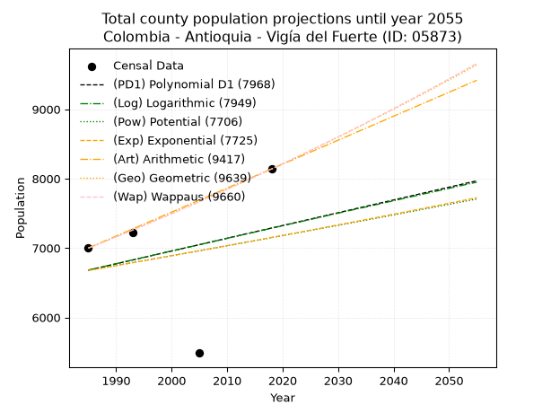
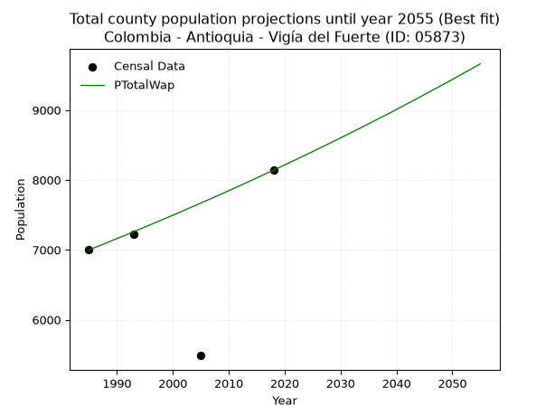
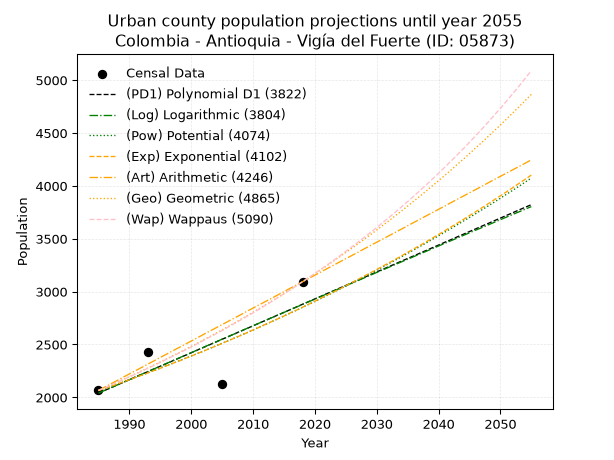
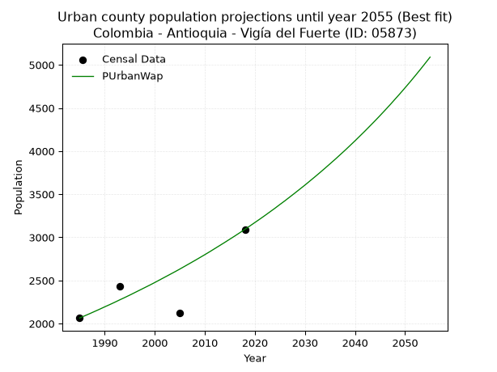
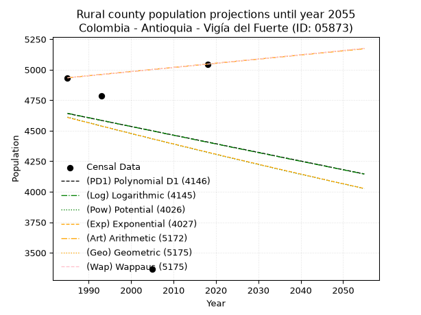
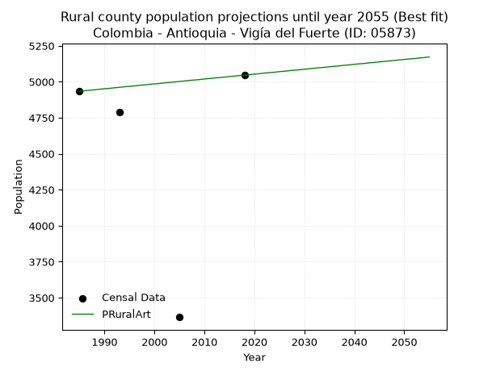

<div align="center">


</div>

# _“Population and Public Services Demand Projections (PPSD) until Year 2050 for Colombia - Antioquia - Vigía del Fuerte (ID: 05873)”_
Keywords: `population` `public-service` `projection` `lineal` `polynomial` `logarithmic` `potential` `exponential` `arithmetic` `geometric` `wappaus` `dane` `colombia` `south-america`

PPSD are analytical estimates used by governments and planners to anticipate future changes in population size, age distribution, and the resulting community needs for utilities, healthcare, education, and infrastructure as sizing future water treatment facilities, electrical grids, and road networks based on spatial growth.

> **General running parameters**: • app_version: _v20260806_. • Python version: _3.14.7_. • Pandas version: _3.0.5_. • NumPy version: _2.5.1_. • Creates, save and include plots into reports (create_plot): _False_. • Projection until year: _2050_. • Process polynomial degree 2 and up: _False_. • Process Wappaus: _True_. • Process Wappaus: _True_. • Set negative values to zero: _True_. • Set infinite values to zero: _True_. • Drop dataset notes: _True_. 
<div align="center">

Dynamic map: [:earth_americas:Google](http://maps.google.com/maps?q=6.588164497,-76.8960042) [:earth_americas:OSM](https://www.openstreetmap.org/#map=18/6.588164497/-76.8960042&layers=P) [:earth_americas:Bing](https://www.bing.com/maps?cp=6.588164497~-76.8960042&lvl=18) [:earth_americas:Apple](https://maps.apple.com/frame?center=6.588164497%2C-76.8960042&span=0.003%2C0.006)

</div>


<div align="center">

```geojson
{
  "type": "Feature",
  "geometry": {
    "type": "Point", 
    "coordinates": [-76.8960042, 6.588164497]
  }, 
  "properties": {
    "Name": "Colombia - Antioquia - Vigía del Fuerte (ID: 05873)"
  }
}
```

</div>


## 0. Census Data (4 records)

Census data are official statistics collected by a government about the people and housing in a country. They usually include counts of total population, age, sex, race, income, education, and jobs.

📅Global census file: [Population.xlsx](../data/Population.xlsx)

| Source   |   Year |   CountryID | CountryName   |   StateID | StateName   |   CountyID | CountyName       |   PTotal |   PUrban |   PRural |
|:---------|-------:|------------:|:--------------|----------:|:------------|-----------:|:-----------------|---------:|---------:|---------:|
| DANE     |   1985 |          57 | Colombia      |        05 | Antioquia   |      05873 | Vigía del Fuerte |     6999 |     2065 |     4934 |
| DANE     |   1993 |          57 | Colombia      |        05 | Antioquia   |      05873 | Vigía Del Fuerte |     7219 |     2431 |     4788 |
| DANE     |   2005 |          57 | Colombia      |        05 | Antioquia   |      05873 | Vigía del Fuerte |     5487 |     2122 |     3365 |
| DANE     |   2018 |          57 | Colombia      |        05 | Antioquia   |      05873 | Vigía Del Fuerte |     8139 |     3093 |     5046 |

> 🔥Some records could had specific notes about the registered values or the corresponding urban or rural distribution.

## 1. Total

### 1.1. Coefficients and Parameters

* (PD1) Polynomial Deg 1: 18.399036531511943, -29841.67282215677 (lineal)
* (Log) Logarithmic: 36565.31555214753, -270972.25652792276
* (Pow) Potential: 4.132309496701545, -9.802712270244514
* (Exp) Exponential: 0.002084323753609921, 106.58788606885999
* (Art) Arithmetic: Year diff. 2018 - 1985 = 33, Population diff. 8139 - 6999 = 1140, Annual growth = 34.54545454545455
* (Geo) Geometric: Year diff. 2018 - 1985 = 33, Population diff. 8139 - 6999 = 1140, Annual growth % = 0.004583199381228864
* (Wap) Wappaus: i = 0.45640711514671084, Condition values only valid for < 200)

<sub>
Wappaus condition values: ['0.00', '0.46', '0.91', '1.37', '1.83', '2.28', '2.74', '3.19', '3.65', '4.11', '4.56', '5.02', '5.48', '5.93', '6.39', '6.85', '7.30', '7.76', '8.22', '8.67', '9.13', '9.58', '10.04', '10.50', '10.95', '11.41', '11.87', '12.32', '12.78', '13.24', '13.69', '14.15', '14.61', '15.06', '15.52', '15.97', '16.43', '16.89', '17.34', '17.80', '18.26', '18.71', '19.17', '19.63', '20.08', '20.54', '20.99', '21.45', '21.91', '22.36', '22.82', '23.28', '23.73', '24.19', '24.65', '25.10', '25.56', '26.02', '26.47', '26.93', '27.38', '27.84', '28.30', '28.75', '29.21', '29.67']
</sub>


### 1.2. Projected Dataset

|   Year |   CountyID |   PTotalPD1 |   PTotalLog |   PTotalPow |   PTotalExp |   PTotalArt |   PTotalGeo |   PTotalWap |
|-------:|-----------:|------------:|------------:|------------:|------------:|------------:|------------:|------------:|
|   1985 |      05873 |        6680 |        6682 |        6678 |        6677 |        6999 |        6999 |        6999 |
|   1986 |      05873 |        6699 |        6700 |        6692 |        6690 |        7034 |        7031 |        7031 |
|   1987 |      05873 |        6717 |        6719 |        6706 |        6704 |        7068 |        7063 |        7063 |
|   1988 |      05873 |        6736 |        6737 |        6720 |        6718 |        7103 |        7096 |        7095 |
|   1989 |      05873 |        6754 |        6755 |        6734 |        6732 |        7137 |        7128 |        7128 |
|   1990 |      05873 |        6772 |        6774 |        6748 |        6746 |        7172 |        7161 |        7161 |
|   1991 |      05873 |        6791 |        6792 |        6762 |        6761 |        7206 |        7194 |        7193 |
|   1992 |      05873 |        6809 |        6811 |        6776 |        6775 |        7241 |        7227 |        7226 |
|   1993 |      05873 |        6828 |        6829 |        6790 |        6789 |        7275 |        7260 |        7259 |
|   1994 |      05873 |        6846 |        6847 |        6804 |        6803 |        7310 |        7293 |        7293 |
|   1995 |      05873 |        6864 |        6866 |        6818 |        6817 |        7344 |        7326 |        7326 |
|   1996 |      05873 |        6883 |        6884 |        6832 |        6831 |        7379 |        7360 |        7359 |
|   1997 |      05873 |        6901 |        6902 |        6847 |        6846 |        7414 |        7394 |        7393 |
|   1998 |      05873 |        6920 |        6921 |        6861 |        6860 |        7448 |        7428 |        7427 |
|   1999 |      05873 |        6938 |        6939 |        6875 |        6874 |        7483 |        7462 |        7461 |
|   2000 |      05873 |        6956 |        6957 |        6889 |        6889 |        7517 |        7496 |        7495 |
|   2001 |      05873 |        6975 |        6975 |        6903 |        6903 |        7552 |        7530 |        7529 |
|   2002 |      05873 |        6993 |        6994 |        6918 |        6917 |        7586 |        7565 |        7564 |
|   2003 |      05873 |        7012 |        7012 |        6932 |        6932 |        7621 |        7599 |        7599 |
|   2004 |      05873 |        7030 |        7030 |        6946 |        6946 |        7655 |        7634 |        7633 |
|   2005 |      05873 |        7048 |        7048 |        6961 |        6961 |        7690 |        7669 |        7668 |
|   2006 |      05873 |        7067 |        7067 |        6975 |        6975 |        7724 |        7704 |        7704 |
|   2007 |      05873 |        7085 |        7085 |        6989 |        6990 |        7759 |        7740 |        7739 |
|   2008 |      05873 |        7104 |        7103 |        7004 |        7004 |        7794 |        7775 |        7774 |
|   2009 |      05873 |        7122 |        7121 |        7018 |        7019 |        7828 |        7811 |        7810 |
|   2010 |      05873 |        7140 |        7140 |        7033 |        7034 |        7863 |        7847 |        7846 |
|   2011 |      05873 |        7159 |        7158 |        7047 |        7048 |        7897 |        7883 |        7882 |
|   2012 |      05873 |        7177 |        7176 |        7062 |        7063 |        7932 |        7919 |        7918 |
|   2013 |      05873 |        7196 |        7194 |        7076 |        7078 |        7966 |        7955 |        7954 |
|   2014 |      05873 |        7214 |        7212 |        7091 |        7093 |        8001 |        7991 |        7991 |
|   2015 |      05873 |        7232 |        7230 |        7105 |        7107 |        8035 |        8028 |        8028 |
|   2016 |      05873 |        7251 |        7248 |        7120 |        7122 |        8070 |        8065 |        8065 |
|   2017 |      05873 |        7269 |        7267 |        7134 |        7137 |        8104 |        8102 |        8102 |
|   2018 |      05873 |        7288 |        7285 |        7149 |        7152 |        8139 |        8139 |        8139 |
|   2019 |      05873 |        7306 |        7303 |        7164 |        7167 |        8174 |        8176 |        8176 |
|   2020 |      05873 |        7324 |        7321 |        7178 |        7182 |        8208 |        8214 |        8214 |
|   2021 |      05873 |        7343 |        7339 |        7193 |        7197 |        8243 |        8251 |        8252 |
|   2022 |      05873 |        7361 |        7357 |        7208 |        7212 |        8277 |        8289 |        8290 |
|   2023 |      05873 |        7380 |        7375 |        7222 |        7227 |        8312 |        8327 |        8328 |
|   2024 |      05873 |        7398 |        7393 |        7237 |        7242 |        8346 |        8365 |        8367 |
|   2025 |      05873 |        7416 |        7411 |        7252 |        7257 |        8381 |        8404 |        8405 |
|   2026 |      05873 |        7435 |        7429 |        7267 |        7272 |        8415 |        8442 |        8444 |
|   2027 |      05873 |        7453 |        7447 |        7282 |        7287 |        8450 |        8481 |        8483 |
|   2028 |      05873 |        7472 |        7466 |        7297 |        7303 |        8484 |        8520 |        8522 |
|   2029 |      05873 |        7490 |        7484 |        7311 |        7318 |        8519 |        8559 |        8561 |
|   2030 |      05873 |        7508 |        7502 |        7326 |        7333 |        8554 |        8598 |        8601 |
|   2031 |      05873 |        7527 |        7520 |        7341 |        7348 |        8588 |        8637 |        8641 |
|   2032 |      05873 |        7545 |        7538 |        7356 |        7364 |        8623 |        8677 |        8681 |
|   2033 |      05873 |        7564 |        7556 |        7371 |        7379 |        8657 |        8717 |        8721 |
|   2034 |      05873 |        7582 |        7574 |        7386 |        7394 |        8692 |        8757 |        8761 |
|   2035 |      05873 |        7600 |        7591 |        7401 |        7410 |        8726 |        8797 |        8802 |
|   2036 |      05873 |        7619 |        7609 |        7416 |        7425 |        8761 |        8837 |        8843 |
|   2037 |      05873 |        7637 |        7627 |        7431 |        7441 |        8795 |        8878 |        8884 |
|   2038 |      05873 |        7656 |        7645 |        7446 |        7456 |        8830 |        8918 |        8925 |
|   2039 |      05873 |        7674 |        7663 |        7461 |        7472 |        8864 |        8959 |        8966 |
|   2040 |      05873 |        7692 |        7681 |        7477 |        7488 |        8899 |        9000 |        9008 |
|   2041 |      05873 |        7711 |        7699 |        7492 |        7503 |        8934 |        9042 |        9050 |
|   2042 |      05873 |        7729 |        7717 |        7507 |        7519 |        8968 |        9083 |        9092 |
|   2043 |      05873 |        7748 |        7735 |        7522 |        7534 |        9003 |        9125 |        9134 |
|   2044 |      05873 |        7766 |        7753 |        7537 |        7550 |        9037 |        9167 |        9177 |
|   2045 |      05873 |        7784 |        7771 |        7553 |        7566 |        9072 |        9209 |        9220 |
|   2046 |      05873 |        7803 |        7789 |        7568 |        7582 |        9106 |        9251 |        9263 |
|   2047 |      05873 |        7821 |        7806 |        7583 |        7598 |        9141 |        9293 |        9306 |
|   2048 |      05873 |        7840 |        7824 |        7599 |        7613 |        9175 |        9336 |        9349 |
|   2049 |      05873 |        7858 |        7842 |        7614 |        7629 |        9210 |        9379 |        9393 |
|   2050 |      05873 |        7876 |        7860 |        7629 |        7645 |        9244 |        9422 |        9437 |
<div align="center">

</img>

</div>


### 1.3. Best fit with absolute and relative error (%)

Relative error puts that difference into context by dividing the absolute error by the true value, creating a unitless ratio or percentage that shows the scale of the mistake.

Absolute and relative error

|   Year | Source   |   CountryID | CountryName   |   StateID | StateName   |   CountyID_x | CountyName       |   PTotal |   PUrban |   PRural |   CountyID_y |   PTotalPD1 |   PTotalLog |   PTotalPow |   PTotalExp |   PTotalArt |   PTotalGeo |   PTotalWap |   PTotalPD1AbsError |   PTotalLogAbsError |   PTotalPowAbsError |   PTotalExpAbsError |   PTotalArtAbsError |   PTotalGeoAbsError |   PTotalWapAbsError |   PTotalPD1RelError |   PTotalLogRelError |   PTotalPowRelError |   PTotalExpRelError |   PTotalArtRelError |   PTotalGeoRelError |   PTotalWapRelError |
|-------:|:---------|------------:|:--------------|----------:|:------------|-------------:|:-----------------|---------:|---------:|---------:|-------------:|------------:|------------:|------------:|------------:|------------:|------------:|------------:|--------------------:|--------------------:|--------------------:|--------------------:|--------------------:|--------------------:|--------------------:|--------------------:|--------------------:|--------------------:|--------------------:|--------------------:|--------------------:|--------------------:|
|   1985 | DANE     |          57 | Colombia      |        05 | Antioquia   |        05873 | Vigía del Fuerte |     6999 |     2065 |     4934 |        05873 |        6680 |        6682 |        6678 |        6677 |        6999 |        6999 |        6999 |                 319 |                 317 |                 321 |                 322 |                   0 |                   0 |                   0 |             4.55779 |             4.52922 |             4.58637 |             4.60066 |            0        |            0        |            0        |
|   1993 | DANE     |          57 | Colombia      |        05 | Antioquia   |        05873 | Vigía Del Fuerte |     7219 |     2431 |     4788 |        05873 |        6828 |        6829 |        6790 |        6789 |        7275 |        7260 |        7259 |                 391 |                 390 |                 429 |                 430 |                  56 |                  41 |                  40 |             5.41626 |             5.40241 |             5.94265 |             5.9565  |            0.775731 |            0.567946 |            0.554093 |
|   2005 | DANE     |          57 | Colombia      |        05 | Antioquia   |        05873 | Vigía del Fuerte |     5487 |     2122 |     3365 |        05873 |        7048 |        7048 |        6961 |        6961 |        7690 |        7669 |        7668 |                1561 |                1561 |                1474 |                1474 |                2203 |                2182 |                2181 |            28.4491  |            28.4491  |            26.8635  |            26.8635  |           40.1494   |           39.7667   |           39.7485   |
|   2018 | DANE     |          57 | Colombia      |        05 | Antioquia   |        05873 | Vigía Del Fuerte |     8139 |     3093 |     5046 |        05873 |        7288 |        7285 |        7149 |        7152 |        8139 |        8139 |        8139 |                 851 |                 854 |                 990 |                 987 |                   0 |                   0 |                   0 |            10.4558  |            10.4927  |            12.1637  |            12.1268  |            0        |            0        |            0        |

Relative error mean

| Method    |   RelError | Best   |
|:----------|-----------:|:-------|
| PTotalPD1 |    12.2197 |        |
| PTotalLog |    12.2183 |        |
| PTotalPow |    12.389  |        |
| PTotalExp |    12.3869 |        |
| PTotalArt |    10.2313 |        |
| PTotalGeo |    10.0837 |        |
| PTotalWap |    10.0756 | True   |

💙Best method: _**PTotalWap**_
<div align="center">

</img>

</div>


### 1.4. Fresh water supply demand in liters per capita per day (lpcd)

The fresh water supply demand typically ranges from 100 to 300 liters per capita per day (lpcd) for standard domestic and municipal planning, though absolute survival minimums set by the World Health Organization are as low as 7.5 to 20 liters per day, and total consumption in high-income nations can exceed 400 liters.

> `CZ`: Level in meters above the sea level (masl).<br> `WS`: Fresh water supply demand in liters per capita per day (lpcd or l/h/d).<br> `WSAll`: Zonal fresh water supply demand in liters per second (l/s).<br> `A`: Zonal area in square meters.

Reference values (RAS Colombia)

|    CZ |   WS |
|------:|-----:|
|  1000 |  120 |
|  2000 |  130 |
| 99999 |  140 |

County shapefile geometry properties and water supply values

|   CountyID |      ATotal |   CZTotal |   WSTotal |
|-----------:|------------:|----------:|----------:|
|      05873 | 1.66273e+09 |   155.062 |       120 |

Projected values for best method: PTotalWap

|   CountyID |   Year |   PTotalWap |   WSTotal |   WSTotalAll |
|-----------:|-------:|------------:|----------:|-------------:|
|      05873 |   1985 |        6999 |       120 |      9.72083 |
|      05873 |   1986 |        7031 |       120 |      9.76528 |
|      05873 |   1987 |        7063 |       120 |      9.80972 |
|      05873 |   1988 |        7095 |       120 |      9.85417 |
|      05873 |   1989 |        7128 |       120 |      9.9     |
|      05873 |   1990 |        7161 |       120 |      9.94583 |
|      05873 |   1991 |        7193 |       120 |      9.99028 |
|      05873 |   1992 |        7226 |       120 |     10.0361  |
|      05873 |   1993 |        7259 |       120 |     10.0819  |
|      05873 |   1994 |        7293 |       120 |     10.1292  |
|      05873 |   1995 |        7326 |       120 |     10.175   |
|      05873 |   1996 |        7359 |       120 |     10.2208  |
|      05873 |   1997 |        7393 |       120 |     10.2681  |
|      05873 |   1998 |        7427 |       120 |     10.3153  |
|      05873 |   1999 |        7461 |       120 |     10.3625  |
|      05873 |   2000 |        7495 |       120 |     10.4097  |
|      05873 |   2001 |        7529 |       120 |     10.4569  |
|      05873 |   2002 |        7564 |       120 |     10.5056  |
|      05873 |   2003 |        7599 |       120 |     10.5542  |
|      05873 |   2004 |        7633 |       120 |     10.6014  |
|      05873 |   2005 |        7668 |       120 |     10.65    |
|      05873 |   2006 |        7704 |       120 |     10.7     |
|      05873 |   2007 |        7739 |       120 |     10.7486  |
|      05873 |   2008 |        7774 |       120 |     10.7972  |
|      05873 |   2009 |        7810 |       120 |     10.8472  |
|      05873 |   2010 |        7846 |       120 |     10.8972  |
|      05873 |   2011 |        7882 |       120 |     10.9472  |
|      05873 |   2012 |        7918 |       120 |     10.9972  |
|      05873 |   2013 |        7954 |       120 |     11.0472  |
|      05873 |   2014 |        7991 |       120 |     11.0986  |
|      05873 |   2015 |        8028 |       120 |     11.15    |
|      05873 |   2016 |        8065 |       120 |     11.2014  |
|      05873 |   2017 |        8102 |       120 |     11.2528  |
|      05873 |   2018 |        8139 |       120 |     11.3042  |
|      05873 |   2019 |        8176 |       120 |     11.3556  |
|      05873 |   2020 |        8214 |       120 |     11.4083  |
|      05873 |   2021 |        8252 |       120 |     11.4611  |
|      05873 |   2022 |        8290 |       120 |     11.5139  |
|      05873 |   2023 |        8328 |       120 |     11.5667  |
|      05873 |   2024 |        8367 |       120 |     11.6208  |
|      05873 |   2025 |        8405 |       120 |     11.6736  |
|      05873 |   2026 |        8444 |       120 |     11.7278  |
|      05873 |   2027 |        8483 |       120 |     11.7819  |
|      05873 |   2028 |        8522 |       120 |     11.8361  |
|      05873 |   2029 |        8561 |       120 |     11.8903  |
|      05873 |   2030 |        8601 |       120 |     11.9458  |
|      05873 |   2031 |        8641 |       120 |     12.0014  |
|      05873 |   2032 |        8681 |       120 |     12.0569  |
|      05873 |   2033 |        8721 |       120 |     12.1125  |
|      05873 |   2034 |        8761 |       120 |     12.1681  |
|      05873 |   2035 |        8802 |       120 |     12.225   |
|      05873 |   2036 |        8843 |       120 |     12.2819  |
|      05873 |   2037 |        8884 |       120 |     12.3389  |
|      05873 |   2038 |        8925 |       120 |     12.3958  |
|      05873 |   2039 |        8966 |       120 |     12.4528  |
|      05873 |   2040 |        9008 |       120 |     12.5111  |
|      05873 |   2041 |        9050 |       120 |     12.5694  |
|      05873 |   2042 |        9092 |       120 |     12.6278  |
|      05873 |   2043 |        9134 |       120 |     12.6861  |
|      05873 |   2044 |        9177 |       120 |     12.7458  |
|      05873 |   2045 |        9220 |       120 |     12.8056  |
|      05873 |   2046 |        9263 |       120 |     12.8653  |
|      05873 |   2047 |        9306 |       120 |     12.925   |
|      05873 |   2048 |        9349 |       120 |     12.9847  |
|      05873 |   2049 |        9393 |       120 |     13.0458  |
|      05873 |   2050 |        9437 |       120 |     13.1069  |

## 2. Urban

### 2.1. Coefficients and Parameters

* (PD1) Polynomial Deg 1: 25.474508229626064, -48527.63508630953 (lineal)
* (Log) Logarithmic: 50931.57897494274, -384703.58992859913
* (Pow) Potential: 19.641541804642877, -61.45876147735563
* (Exp) Exponential: 0.009823422657837573, 7.012526357711803e-06
* (Art) Arithmetic: Year diff. 2018 - 1985 = 33, Population diff. 3093 - 2065 = 1028, Annual growth = 31.151515151515152
* (Geo) Geometric: Year diff. 2018 - 1985 = 33, Population diff. 3093 - 2065 = 1028, Annual growth % = 0.012318015104632485
* (Wap) Wappaus: i = 1.2078912427884898, Condition values only valid for < 200)

<sub>
Wappaus condition values: ['0.00', '1.21', '2.42', '3.62', '4.83', '6.04', '7.25', '8.46', '9.66', '10.87', '12.08', '13.29', '14.49', '15.70', '16.91', '18.12', '19.33', '20.53', '21.74', '22.95', '24.16', '25.37', '26.57', '27.78', '28.99', '30.20', '31.41', '32.61', '33.82', '35.03', '36.24', '37.44', '38.65', '39.86', '41.07', '42.28', '43.48', '44.69', '45.90', '47.11', '48.32', '49.52', '50.73', '51.94', '53.15', '54.36', '55.56', '56.77', '57.98', '59.19', '60.39', '61.60', '62.81', '64.02', '65.23', '66.43', '67.64', '68.85', '70.06', '71.27', '72.47', '73.68', '74.89', '76.10', '77.31', '78.51']
</sub>


### 2.2. Projected Dataset

|   Year |   CountyID |   PUrbanPD1 |   PUrbanLog |   PUrbanPow |   PUrbanExp |   PUrbanArt |   PUrbanGeo |   PUrbanWap |
|-------:|-----------:|------------:|------------:|------------:|------------:|------------:|------------:|------------:|
|   1985 |      05873 |        2039 |        2039 |        2062 |        2063 |        2065 |        2065 |        2065 |
|   1986 |      05873 |        2065 |        2065 |        2083 |        2083 |        2096 |        2090 |        2090 |
|   1987 |      05873 |        2090 |        2090 |        2103 |        2103 |        2127 |        2116 |        2115 |
|   1988 |      05873 |        2116 |        2116 |        2124 |        2124 |        2158 |        2142 |        2141 |
|   1989 |      05873 |        2141 |        2141 |        2145 |        2145 |        2190 |        2169 |        2167 |
|   1990 |      05873 |        2167 |        2167 |        2167 |        2166 |        2221 |        2195 |        2194 |
|   1991 |      05873 |        2192 |        2193 |        2188 |        2188 |        2252 |        2222 |        2220 |
|   1992 |      05873 |        2218 |        2218 |        2210 |        2209 |        2283 |        2250 |        2247 |
|   1993 |      05873 |        2243 |        2244 |        2232 |        2231 |        2314 |        2277 |        2275 |
|   1994 |      05873 |        2269 |        2269 |        2254 |        2253 |        2345 |        2306 |        2302 |
|   1995 |      05873 |        2294 |        2295 |        2276 |        2275 |        2377 |        2334 |        2330 |
|   1996 |      05873 |        2319 |        2320 |        2299 |        2298 |        2408 |        2363 |        2359 |
|   1997 |      05873 |        2345 |        2346 |        2321 |        2321 |        2439 |        2392 |        2388 |
|   1998 |      05873 |        2370 |        2371 |        2344 |        2343 |        2470 |        2421 |        2417 |
|   1999 |      05873 |        2396 |        2397 |        2368 |        2367 |        2501 |        2451 |        2446 |
|   2000 |      05873 |        2421 |        2422 |        2391 |        2390 |        2532 |        2481 |        2476 |
|   2001 |      05873 |        2447 |        2448 |        2414 |        2414 |        2563 |        2512 |        2507 |
|   2002 |      05873 |        2472 |        2473 |        2438 |        2437 |        2595 |        2543 |        2538 |
|   2003 |      05873 |        2498 |        2499 |        2462 |        2461 |        2626 |        2574 |        2569 |
|   2004 |      05873 |        2523 |        2524 |        2487 |        2486 |        2657 |        2606 |        2600 |
|   2005 |      05873 |        2549 |        2550 |        2511 |        2510 |        2688 |        2638 |        2632 |
|   2006 |      05873 |        2574 |        2575 |        2536 |        2535 |        2719 |        2670 |        2665 |
|   2007 |      05873 |        2600 |        2600 |        2561 |        2560 |        2750 |        2703 |        2698 |
|   2008 |      05873 |        2625 |        2626 |        2586 |        2585 |        2781 |        2737 |        2731 |
|   2009 |      05873 |        2651 |        2651 |        2611 |        2611 |        2813 |        2770 |        2765 |
|   2010 |      05873 |        2676 |        2676 |        2637 |        2637 |        2844 |        2804 |        2799 |
|   2011 |      05873 |        2702 |        2702 |        2663 |        2663 |        2875 |        2839 |        2834 |
|   2012 |      05873 |        2727 |        2727 |        2689 |        2689 |        2906 |        2874 |        2870 |
|   2013 |      05873 |        2753 |        2752 |        2715 |        2716 |        2937 |        2909 |        2906 |
|   2014 |      05873 |        2778 |        2778 |        2742 |        2742 |        2968 |        2945 |        2942 |
|   2015 |      05873 |        2803 |        2803 |        2769 |        2769 |        3000 |        2981 |        2979 |
|   2016 |      05873 |        2829 |        2828 |        2796 |        2797 |        3031 |        3018 |        3016 |
|   2017 |      05873 |        2854 |        2853 |        2823 |        2824 |        3062 |        3055 |        3054 |
|   2018 |      05873 |        2880 |        2879 |        2851 |        2852 |        3093 |        3093 |        3093 |
|   2019 |      05873 |        2905 |        2904 |        2879 |        2880 |        3124 |        3131 |        3132 |
|   2020 |      05873 |        2931 |        2929 |        2907 |        2909 |        3155 |        3170 |        3172 |
|   2021 |      05873 |        2956 |        2954 |        2935 |        2938 |        3186 |        3209 |        3212 |
|   2022 |      05873 |        2982 |        2980 |        2964 |        2967 |        3218 |        3248 |        3253 |
|   2023 |      05873 |        3007 |        3005 |        2993 |        2996 |        3249 |        3288 |        3295 |
|   2024 |      05873 |        3033 |        3030 |        3022 |        3025 |        3280 |        3329 |        3337 |
|   2025 |      05873 |        3058 |        3055 |        3052 |        3055 |        3311 |        3370 |        3381 |
|   2026 |      05873 |        3084 |        3080 |        3081 |        3085 |        3342 |        3411 |        3424 |
|   2027 |      05873 |        3109 |        3105 |        3111 |        3116 |        3373 |        3453 |        3469 |
|   2028 |      05873 |        3135 |        3130 |        3142 |        3147 |        3405 |        3496 |        3514 |
|   2029 |      05873 |        3160 |        3156 |        3172 |        3178 |        3436 |        3539 |        3560 |
|   2030 |      05873 |        3186 |        3181 |        3203 |        3209 |        3467 |        3582 |        3606 |
|   2031 |      05873 |        3211 |        3206 |        3234 |        3241 |        3498 |        3627 |        3654 |
|   2032 |      05873 |        3237 |        3231 |        3266 |        3273 |        3529 |        3671 |        3702 |
|   2033 |      05873 |        3262 |        3256 |        3297 |        3305 |        3560 |        3717 |        3751 |
|   2034 |      05873 |        3288 |        3281 |        3329 |        3338 |        3591 |        3762 |        3801 |
|   2035 |      05873 |        3313 |        3306 |        3362 |        3371 |        3623 |        3809 |        3852 |
|   2036 |      05873 |        3338 |        3331 |        3394 |        3404 |        3654 |        3856 |        3903 |
|   2037 |      05873 |        3364 |        3356 |        3427 |        3437 |        3685 |        3903 |        3956 |
|   2038 |      05873 |        3389 |        3381 |        3460 |        3471 |        3716 |        3951 |        4009 |
|   2039 |      05873 |        3415 |        3406 |        3494 |        3506 |        3747 |        4000 |        4064 |
|   2040 |      05873 |        3440 |        3431 |        3528 |        3540 |        3778 |        4049 |        4119 |
|   2041 |      05873 |        3466 |        3456 |        3562 |        3575 |        3809 |        4099 |        4176 |
|   2042 |      05873 |        3491 |        3481 |        3596 |        3611 |        3841 |        4149 |        4233 |
|   2043 |      05873 |        3517 |        3506 |        3631 |        3646 |        3872 |        4201 |        4292 |
|   2044 |      05873 |        3542 |        3531 |        3666 |        3682 |        3903 |        4252 |        4351 |
|   2045 |      05873 |        3568 |        3556 |        3701 |        3719 |        3934 |        4305 |        4412 |
|   2046 |      05873 |        3593 |        3581 |        3737 |        3755 |        3965 |        4358 |        4474 |
|   2047 |      05873 |        3619 |        3605 |        3773 |        3792 |        3996 |        4411 |        4537 |
|   2048 |      05873 |        3644 |        3630 |        3809 |        3830 |        4028 |        4466 |        4602 |
|   2049 |      05873 |        3670 |        3655 |        3846 |        3868 |        4059 |        4521 |        4667 |
|   2050 |      05873 |        3695 |        3680 |        3883 |        3906 |        4090 |        4576 |        4734 |
<div align="center">

</img>

</div>


### 2.3. Best fit with absolute and relative error (%)

Relative error puts that difference into context by dividing the absolute error by the true value, creating a unitless ratio or percentage that shows the scale of the mistake.

Absolute and relative error

|   Year | Source   |   CountryID | CountryName   |   StateID | StateName   |   CountyID_x | CountyName       |   PTotal |   PUrban |   PRural |   CountyID_y |   PUrbanPD1 |   PUrbanLog |   PUrbanPow |   PUrbanExp |   PUrbanArt |   PUrbanGeo |   PUrbanWap |   PUrbanPD1AbsError |   PUrbanLogAbsError |   PUrbanPowAbsError |   PUrbanExpAbsError |   PUrbanArtAbsError |   PUrbanGeoAbsError |   PUrbanWapAbsError |   PUrbanPD1RelError |   PUrbanLogRelError |   PUrbanPowRelError |   PUrbanExpRelError |   PUrbanArtRelError |   PUrbanGeoRelError |   PUrbanWapRelError |
|-------:|:---------|------------:|:--------------|----------:|:------------|-------------:|:-----------------|---------:|---------:|---------:|-------------:|------------:|------------:|------------:|------------:|------------:|------------:|------------:|--------------------:|--------------------:|--------------------:|--------------------:|--------------------:|--------------------:|--------------------:|--------------------:|--------------------:|--------------------:|--------------------:|--------------------:|--------------------:|--------------------:|
|   1985 | DANE     |          57 | Colombia      |        05 | Antioquia   |        05873 | Vigía del Fuerte |     6999 |     2065 |     4934 |        05873 |        2039 |        2039 |        2062 |        2063 |        2065 |        2065 |        2065 |                  26 |                  26 |                   3 |                   2 |                   0 |                   0 |                   0 |             1.25908 |             1.25908 |            0.145278 |           0.0968523 |             0       |             0       |             0       |
|   1993 | DANE     |          57 | Colombia      |        05 | Antioquia   |        05873 | Vigía Del Fuerte |     7219 |     2431 |     4788 |        05873 |        2243 |        2244 |        2232 |        2231 |        2314 |        2277 |        2275 |                 188 |                 187 |                 199 |                 200 |                 117 |                 154 |                 156 |             7.73344 |             7.69231 |            8.18593  |           8.22707   |             4.81283 |             6.33484 |             6.41711 |
|   2005 | DANE     |          57 | Colombia      |        05 | Antioquia   |        05873 | Vigía del Fuerte |     5487 |     2122 |     3365 |        05873 |        2549 |        2550 |        2511 |        2510 |        2688 |        2638 |        2632 |                 427 |                 428 |                 389 |                 388 |                 566 |                 516 |                 510 |            20.1225  |            20.1697  |           18.3318   |          18.2846    |            26.673   |            24.3167  |            24.0339  |
|   2018 | DANE     |          57 | Colombia      |        05 | Antioquia   |        05873 | Vigía Del Fuerte |     8139 |     3093 |     5046 |        05873 |        2880 |        2879 |        2851 |        2852 |        3093 |        3093 |        3093 |                 213 |                 214 |                 242 |                 241 |                   0 |                   0 |                   0 |             6.88652 |             6.91885 |            7.82412  |           7.79179   |             0       |             0       |             0       |

Relative error mean

| Method    |   RelError | Best   |
|:----------|-----------:|:-------|
| PUrbanPD1 |    9.00039 |        |
| PUrbanLog |    9.00997 |        |
| PUrbanPow |    8.62177 |        |
| PUrbanExp |    8.60009 |        |
| PUrbanArt |    7.87145 |        |
| PUrbanGeo |    7.66288 |        |
| PUrbanWap |    7.61276 | True   |

💙Best method: _**PUrbanWap**_
<div align="center">

</img>

</div>


### 2.4. Fresh water supply demand in liters per capita per day (lpcd)

The fresh water supply demand typically ranges from 100 to 300 liters per capita per day (lpcd) for standard domestic and municipal planning, though absolute survival minimums set by the World Health Organization are as low as 7.5 to 20 liters per day, and total consumption in high-income nations can exceed 400 liters.

> `CZ`: Level in meters above the sea level (masl).<br> `WS`: Fresh water supply demand in liters per capita per day (lpcd or l/h/d).<br> `WSAll`: Zonal fresh water supply demand in liters per second (l/s).<br> `A`: Zonal area in square meters.

Reference values (RAS Colombia)

|    CZ |   WS |
|------:|-----:|
|  1000 |  120 |
|  2000 |  130 |
| 99999 |  140 |

County shapefile geometry properties and water supply values

|   CountyID |   AUrban |   CZUrban |   WSUrban |
|-----------:|---------:|----------:|----------:|
|      05873 |   655458 |   13.1706 |       120 |

Projected values for best method: PUrbanWap

|   CountyID |   Year |   PUrbanWap |   WSUrban |   WSUrbanAll |
|-----------:|-------:|------------:|----------:|-------------:|
|      05873 |   1985 |        2065 |       120 |      2.86806 |
|      05873 |   1986 |        2090 |       120 |      2.90278 |
|      05873 |   1987 |        2115 |       120 |      2.9375  |
|      05873 |   1988 |        2141 |       120 |      2.97361 |
|      05873 |   1989 |        2167 |       120 |      3.00972 |
|      05873 |   1990 |        2194 |       120 |      3.04722 |
|      05873 |   1991 |        2220 |       120 |      3.08333 |
|      05873 |   1992 |        2247 |       120 |      3.12083 |
|      05873 |   1993 |        2275 |       120 |      3.15972 |
|      05873 |   1994 |        2302 |       120 |      3.19722 |
|      05873 |   1995 |        2330 |       120 |      3.23611 |
|      05873 |   1996 |        2359 |       120 |      3.27639 |
|      05873 |   1997 |        2388 |       120 |      3.31667 |
|      05873 |   1998 |        2417 |       120 |      3.35694 |
|      05873 |   1999 |        2446 |       120 |      3.39722 |
|      05873 |   2000 |        2476 |       120 |      3.43889 |
|      05873 |   2001 |        2507 |       120 |      3.48194 |
|      05873 |   2002 |        2538 |       120 |      3.525   |
|      05873 |   2003 |        2569 |       120 |      3.56806 |
|      05873 |   2004 |        2600 |       120 |      3.61111 |
|      05873 |   2005 |        2632 |       120 |      3.65556 |
|      05873 |   2006 |        2665 |       120 |      3.70139 |
|      05873 |   2007 |        2698 |       120 |      3.74722 |
|      05873 |   2008 |        2731 |       120 |      3.79306 |
|      05873 |   2009 |        2765 |       120 |      3.84028 |
|      05873 |   2010 |        2799 |       120 |      3.8875  |
|      05873 |   2011 |        2834 |       120 |      3.93611 |
|      05873 |   2012 |        2870 |       120 |      3.98611 |
|      05873 |   2013 |        2906 |       120 |      4.03611 |
|      05873 |   2014 |        2942 |       120 |      4.08611 |
|      05873 |   2015 |        2979 |       120 |      4.1375  |
|      05873 |   2016 |        3016 |       120 |      4.18889 |
|      05873 |   2017 |        3054 |       120 |      4.24167 |
|      05873 |   2018 |        3093 |       120 |      4.29583 |
|      05873 |   2019 |        3132 |       120 |      4.35    |
|      05873 |   2020 |        3172 |       120 |      4.40556 |
|      05873 |   2021 |        3212 |       120 |      4.46111 |
|      05873 |   2022 |        3253 |       120 |      4.51806 |
|      05873 |   2023 |        3295 |       120 |      4.57639 |
|      05873 |   2024 |        3337 |       120 |      4.63472 |
|      05873 |   2025 |        3381 |       120 |      4.69583 |
|      05873 |   2026 |        3424 |       120 |      4.75556 |
|      05873 |   2027 |        3469 |       120 |      4.81806 |
|      05873 |   2028 |        3514 |       120 |      4.88056 |
|      05873 |   2029 |        3560 |       120 |      4.94444 |
|      05873 |   2030 |        3606 |       120 |      5.00833 |
|      05873 |   2031 |        3654 |       120 |      5.075   |
|      05873 |   2032 |        3702 |       120 |      5.14167 |
|      05873 |   2033 |        3751 |       120 |      5.20972 |
|      05873 |   2034 |        3801 |       120 |      5.27917 |
|      05873 |   2035 |        3852 |       120 |      5.35    |
|      05873 |   2036 |        3903 |       120 |      5.42083 |
|      05873 |   2037 |        3956 |       120 |      5.49444 |
|      05873 |   2038 |        4009 |       120 |      5.56806 |
|      05873 |   2039 |        4064 |       120 |      5.64444 |
|      05873 |   2040 |        4119 |       120 |      5.72083 |
|      05873 |   2041 |        4176 |       120 |      5.8     |
|      05873 |   2042 |        4233 |       120 |      5.87917 |
|      05873 |   2043 |        4292 |       120 |      5.96111 |
|      05873 |   2044 |        4351 |       120 |      6.04306 |
|      05873 |   2045 |        4412 |       120 |      6.12778 |
|      05873 |   2046 |        4474 |       120 |      6.21389 |
|      05873 |   2047 |        4537 |       120 |      6.30139 |
|      05873 |   2048 |        4602 |       120 |      6.39167 |
|      05873 |   2049 |        4667 |       120 |      6.48194 |
|      05873 |   2050 |        4734 |       120 |      6.575   |

## 3. Rural

### 3.1. Coefficients and Parameters

* (PD1) Polynomial Deg 1: -7.075471698114172, 18685.962264152873 (lineal)
* (Log) Logarithmic: -14366.2634227952, 113731.3334006763
* (Pow) Potential: -3.91153807753621, 16.563105234309816
* (Exp) Exponential: -0.0019297411815884912, 212413.8412599759
* (Art) Arithmetic: Year diff. 2018 - 1985 = 33, Population diff. 5046 - 4934 = 112, Annual growth = 3.393939393939394
* (Geo) Geometric: Year diff. 2018 - 1985 = 33, Population diff. 5046 - 4934 = 112, Annual growth % = 0.0006804081033051634
* (Wap) Wappaus: i = 0.06801481751381551, Condition values only valid for < 200)

<sub>
Wappaus condition values: ['0.00', '0.07', '0.14', '0.20', '0.27', '0.34', '0.41', '0.48', '0.54', '0.61', '0.68', '0.75', '0.82', '0.88', '0.95', '1.02', '1.09', '1.16', '1.22', '1.29', '1.36', '1.43', '1.50', '1.56', '1.63', '1.70', '1.77', '1.84', '1.90', '1.97', '2.04', '2.11', '2.18', '2.24', '2.31', '2.38', '2.45', '2.52', '2.58', '2.65', '2.72', '2.79', '2.86', '2.92', '2.99', '3.06', '3.13', '3.20', '3.26', '3.33', '3.40', '3.47', '3.54', '3.60', '3.67', '3.74', '3.81', '3.88', '3.94', '4.01', '4.08', '4.15', '4.22', '4.28', '4.35', '4.42']
</sub>


### 3.2. Projected Dataset

|   Year |   CountyID |   PRuralPD1 |   PRuralLog |   PRuralPow |   PRuralExp |   PRuralArt |   PRuralGeo |   PRuralWap |
|-------:|-----------:|------------:|------------:|------------:|------------:|------------:|------------:|------------:|
|   1985 |      05873 |        4641 |        4643 |        4611 |        4609 |        4934 |        4934 |        4934 |
|   1986 |      05873 |        4634 |        4636 |        4602 |        4600 |        4937 |        4937 |        4937 |
|   1987 |      05873 |        4627 |        4628 |        4593 |        4591 |        4941 |        4941 |        4941 |
|   1988 |      05873 |        4620 |        4621 |        4584 |        4582 |        4944 |        4944 |        4944 |
|   1989 |      05873 |        4613 |        4614 |        4575 |        4574 |        4948 |        4947 |        4947 |
|   1990 |      05873 |        4606 |        4607 |        4566 |        4565 |        4951 |        4951 |        4951 |
|   1991 |      05873 |        4599 |        4600 |        4557 |        4556 |        4954 |        4954 |        4954 |
|   1992 |      05873 |        4592 |        4592 |        4548 |        4547 |        4958 |        4958 |        4958 |
|   1993 |      05873 |        4585 |        4585 |        4539 |        4538 |        4961 |        4961 |        4961 |
|   1994 |      05873 |        4577 |        4578 |        4530 |        4530 |        4965 |        4964 |        4964 |
|   1995 |      05873 |        4570 |        4571 |        4521 |        4521 |        4968 |        4968 |        4968 |
|   1996 |      05873 |        4563 |        4564 |        4512 |        4512 |        4971 |        4971 |        4971 |
|   1997 |      05873 |        4556 |        4556 |        4504 |        4503 |        4975 |        4974 |        4974 |
|   1998 |      05873 |        4549 |        4549 |        4495 |        4495 |        4978 |        4978 |        4978 |
|   1999 |      05873 |        4542 |        4542 |        4486 |        4486 |        4982 |        4981 |        4981 |
|   2000 |      05873 |        4535 |        4535 |        4477 |        4477 |        4985 |        4985 |        4985 |
|   2001 |      05873 |        4528 |        4528 |        4468 |        4469 |        4988 |        4988 |        4988 |
|   2002 |      05873 |        4521 |        4520 |        4460 |        4460 |        4992 |        4991 |        4991 |
|   2003 |      05873 |        4514 |        4513 |        4451 |        4452 |        4995 |        4995 |        4995 |
|   2004 |      05873 |        4507 |        4506 |        4442 |        4443 |        4998 |        4998 |        4998 |
|   2005 |      05873 |        4500 |        4499 |        4434 |        4434 |        5002 |        5002 |        5002 |
|   2006 |      05873 |        4493 |        4492 |        4425 |        4426 |        5005 |        5005 |        5005 |
|   2007 |      05873 |        4485 |        4485 |        4416 |        4417 |        5009 |        5008 |        5008 |
|   2008 |      05873 |        4478 |        4477 |        4408 |        4409 |        5012 |        5012 |        5012 |
|   2009 |      05873 |        4471 |        4470 |        4399 |        4400 |        5015 |        5015 |        5015 |
|   2010 |      05873 |        4464 |        4463 |        4391 |        4392 |        5019 |        5019 |        5019 |
|   2011 |      05873 |        4457 |        4456 |        4382 |        4383 |        5022 |        5022 |        5022 |
|   2012 |      05873 |        4450 |        4449 |        4374 |        4375 |        5026 |        5025 |        5025 |
|   2013 |      05873 |        4443 |        4442 |        4365 |        4367 |        5029 |        5029 |        5029 |
|   2014 |      05873 |        4436 |        4435 |        4357 |        4358 |        5032 |        5032 |        5032 |
|   2015 |      05873 |        4429 |        4427 |        4348 |        4350 |        5036 |        5036 |        5036 |
|   2016 |      05873 |        4422 |        4420 |        4340 |        4341 |        5039 |        5039 |        5039 |
|   2017 |      05873 |        4415 |        4413 |        4331 |        4333 |        5043 |        5043 |        5043 |
|   2018 |      05873 |        4408 |        4406 |        4323 |        4325 |        5046 |        5046 |        5046 |
|   2019 |      05873 |        4401 |        4399 |        4315 |        4316 |        5049 |        5049 |        5049 |
|   2020 |      05873 |        4394 |        4392 |        4306 |        4308 |        5053 |        5053 |        5053 |
|   2021 |      05873 |        4386 |        4385 |        4298 |        4300 |        5056 |        5056 |        5056 |
|   2022 |      05873 |        4379 |        4378 |        4290 |        4291 |        5060 |        5060 |        5060 |
|   2023 |      05873 |        4372 |        4370 |        4281 |        4283 |        5063 |        5063 |        5063 |
|   2024 |      05873 |        4365 |        4363 |        4273 |        4275 |        5066 |        5067 |        5067 |
|   2025 |      05873 |        4358 |        4356 |        4265 |        4267 |        5070 |        5070 |        5070 |
|   2026 |      05873 |        4351 |        4349 |        4257 |        4258 |        5073 |        5074 |        5074 |
|   2027 |      05873 |        4344 |        4342 |        4248 |        4250 |        5077 |        5077 |        5077 |
|   2028 |      05873 |        4337 |        4335 |        4240 |        4242 |        5080 |        5080 |        5080 |
|   2029 |      05873 |        4330 |        4328 |        4232 |        4234 |        5083 |        5084 |        5084 |
|   2030 |      05873 |        4323 |        4321 |        4224 |        4226 |        5087 |        5087 |        5087 |
|   2031 |      05873 |        4316 |        4314 |        4216 |        4217 |        5090 |        5091 |        5091 |
|   2032 |      05873 |        4309 |        4307 |        4208 |        4209 |        5094 |        5094 |        5094 |
|   2033 |      05873 |        4302 |        4300 |        4200 |        4201 |        5097 |        5098 |        5098 |
|   2034 |      05873 |        4294 |        4293 |        4191 |        4193 |        5100 |        5101 |        5101 |
|   2035 |      05873 |        4287 |        4286 |        4183 |        4185 |        5104 |        5105 |        5105 |
|   2036 |      05873 |        4280 |        4278 |        4175 |        4177 |        5107 |        5108 |        5108 |
|   2037 |      05873 |        4273 |        4271 |        4167 |        4169 |        5110 |        5112 |        5112 |
|   2038 |      05873 |        4266 |        4264 |        4159 |        4161 |        5114 |        5115 |        5115 |
|   2039 |      05873 |        4259 |        4257 |        4151 |        4153 |        5117 |        5119 |        5119 |
|   2040 |      05873 |        4252 |        4250 |        4143 |        4145 |        5121 |        5122 |        5122 |
|   2041 |      05873 |        4245 |        4243 |        4136 |        4137 |        5124 |        5126 |        5126 |
|   2042 |      05873 |        4238 |        4236 |        4128 |        4129 |        5127 |        5129 |        5129 |
|   2043 |      05873 |        4231 |        4229 |        4120 |        4121 |        5131 |        5133 |        5133 |
|   2044 |      05873 |        4224 |        4222 |        4112 |        4113 |        5134 |        5136 |        5136 |
|   2045 |      05873 |        4217 |        4215 |        4104 |        4105 |        5138 |        5140 |        5140 |
|   2046 |      05873 |        4210 |        4208 |        4096 |        4097 |        5141 |        5143 |        5143 |
|   2047 |      05873 |        4202 |        4201 |        4088 |        4089 |        5144 |        5147 |        5147 |
|   2048 |      05873 |        4195 |        4194 |        4080 |        4081 |        5148 |        5150 |        5150 |
|   2049 |      05873 |        4188 |        4187 |        4073 |        4073 |        5151 |        5154 |        5154 |
|   2050 |      05873 |        4181 |        4180 |        4065 |        4066 |        5155 |        5157 |        5157 |
<div align="center">

</img>

</div>


### 3.3. Best fit with absolute and relative error (%)

Relative error puts that difference into context by dividing the absolute error by the true value, creating a unitless ratio or percentage that shows the scale of the mistake.

Absolute and relative error

|   Year | Source   |   CountryID | CountryName   |   StateID | StateName   |   CountyID_x | CountyName       |   PTotal |   PUrban |   PRural |   CountyID_y |   PRuralPD1 |   PRuralLog |   PRuralPow |   PRuralExp |   PRuralArt |   PRuralGeo |   PRuralWap |   PRuralPD1AbsError |   PRuralLogAbsError |   PRuralPowAbsError |   PRuralExpAbsError |   PRuralArtAbsError |   PRuralGeoAbsError |   PRuralWapAbsError |   PRuralPD1RelError |   PRuralLogRelError |   PRuralPowRelError |   PRuralExpRelError |   PRuralArtRelError |   PRuralGeoRelError |   PRuralWapRelError |
|-------:|:---------|------------:|:--------------|----------:|:------------|-------------:|:-----------------|---------:|---------:|---------:|-------------:|------------:|------------:|------------:|------------:|------------:|------------:|------------:|--------------------:|--------------------:|--------------------:|--------------------:|--------------------:|--------------------:|--------------------:|--------------------:|--------------------:|--------------------:|--------------------:|--------------------:|--------------------:|--------------------:|
|   1985 | DANE     |          57 | Colombia      |        05 | Antioquia   |        05873 | Vigía del Fuerte |     6999 |     2065 |     4934 |        05873 |        4641 |        4643 |        4611 |        4609 |        4934 |        4934 |        4934 |                 293 |                 291 |                 323 |                 325 |                   0 |                   0 |                   0 |             5.93839 |             5.89785 |             6.54641 |             6.58695 |              0      |              0      |              0      |
|   1993 | DANE     |          57 | Colombia      |        05 | Antioquia   |        05873 | Vigía Del Fuerte |     7219 |     2431 |     4788 |        05873 |        4585 |        4585 |        4539 |        4538 |        4961 |        4961 |        4961 |                 203 |                 203 |                 249 |                 250 |                 173 |                 173 |                 173 |             4.23977 |             4.23977 |             5.2005  |             5.22139 |              3.6132 |              3.6132 |              3.6132 |
|   2005 | DANE     |          57 | Colombia      |        05 | Antioquia   |        05873 | Vigía del Fuerte |     5487 |     2122 |     3365 |        05873 |        4500 |        4499 |        4434 |        4434 |        5002 |        5002 |        5002 |                1135 |                1134 |                1069 |                1069 |                1637 |                1637 |                1637 |            33.7296  |            33.6999  |            31.7682  |            31.7682  |             48.6478 |             48.6478 |             48.6478 |
|   2018 | DANE     |          57 | Colombia      |        05 | Antioquia   |        05873 | Vigía Del Fuerte |     8139 |     3093 |     5046 |        05873 |        4408 |        4406 |        4323 |        4325 |        5046 |        5046 |        5046 |                 638 |                 640 |                 723 |                 721 |                   0 |                   0 |                   0 |            12.6437  |            12.6833  |            14.3282  |            14.2885  |              0      |              0      |              0      |

Relative error mean

| Method    |   RelError | Best   |
|:----------|-----------:|:-------|
| PRuralPD1 |    14.1379 |        |
| PRuralLog |    14.1302 |        |
| PRuralPow |    14.4608 |        |
| PRuralExp |    14.4663 |        |
| PRuralArt |    13.0653 | True   |
| PRuralGeo |    13.0653 | True   |
| PRuralWap |    13.0653 | True   |

💙Best method: _**PRuralArt**_
<div align="center">

</img>

</div>


### 3.4. Fresh water supply demand in liters per capita per day (lpcd)

The fresh water supply demand typically ranges from 100 to 300 liters per capita per day (lpcd) for standard domestic and municipal planning, though absolute survival minimums set by the World Health Organization are as low as 7.5 to 20 liters per day, and total consumption in high-income nations can exceed 400 liters.

> `CZ`: Level in meters above the sea level (masl).<br> `WS`: Fresh water supply demand in liters per capita per day (lpcd or l/h/d).<br> `WSAll`: Zonal fresh water supply demand in liters per second (l/s).<br> `A`: Zonal area in square meters.

Reference values (RAS Colombia)

|    CZ |   WS |
|------:|-----:|
|  1000 |  120 |
|  2000 |  130 |
| 99999 |  140 |

County shapefile geometry properties and water supply values

|   CountyID |      ARural |   CZRural |   WSRural |
|-----------:|------------:|----------:|----------:|
|      05873 | 1.66207e+09 |   155.116 |       120 |

Projected values for best method: PRuralArt

|   CountyID |   Year |   PRuralArt |   WSRural |   WSRuralAll |
|-----------:|-------:|------------:|----------:|-------------:|
|      05873 |   1985 |        4934 |       120 |      6.85278 |
|      05873 |   1986 |        4937 |       120 |      6.85694 |
|      05873 |   1987 |        4941 |       120 |      6.8625  |
|      05873 |   1988 |        4944 |       120 |      6.86667 |
|      05873 |   1989 |        4948 |       120 |      6.87222 |
|      05873 |   1990 |        4951 |       120 |      6.87639 |
|      05873 |   1991 |        4954 |       120 |      6.88056 |
|      05873 |   1992 |        4958 |       120 |      6.88611 |
|      05873 |   1993 |        4961 |       120 |      6.89028 |
|      05873 |   1994 |        4965 |       120 |      6.89583 |
|      05873 |   1995 |        4968 |       120 |      6.9     |
|      05873 |   1996 |        4971 |       120 |      6.90417 |
|      05873 |   1997 |        4975 |       120 |      6.90972 |
|      05873 |   1998 |        4978 |       120 |      6.91389 |
|      05873 |   1999 |        4982 |       120 |      6.91944 |
|      05873 |   2000 |        4985 |       120 |      6.92361 |
|      05873 |   2001 |        4988 |       120 |      6.92778 |
|      05873 |   2002 |        4992 |       120 |      6.93333 |
|      05873 |   2003 |        4995 |       120 |      6.9375  |
|      05873 |   2004 |        4998 |       120 |      6.94167 |
|      05873 |   2005 |        5002 |       120 |      6.94722 |
|      05873 |   2006 |        5005 |       120 |      6.95139 |
|      05873 |   2007 |        5009 |       120 |      6.95694 |
|      05873 |   2008 |        5012 |       120 |      6.96111 |
|      05873 |   2009 |        5015 |       120 |      6.96528 |
|      05873 |   2010 |        5019 |       120 |      6.97083 |
|      05873 |   2011 |        5022 |       120 |      6.975   |
|      05873 |   2012 |        5026 |       120 |      6.98056 |
|      05873 |   2013 |        5029 |       120 |      6.98472 |
|      05873 |   2014 |        5032 |       120 |      6.98889 |
|      05873 |   2015 |        5036 |       120 |      6.99444 |
|      05873 |   2016 |        5039 |       120 |      6.99861 |
|      05873 |   2017 |        5043 |       120 |      7.00417 |
|      05873 |   2018 |        5046 |       120 |      7.00833 |
|      05873 |   2019 |        5049 |       120 |      7.0125  |
|      05873 |   2020 |        5053 |       120 |      7.01806 |
|      05873 |   2021 |        5056 |       120 |      7.02222 |
|      05873 |   2022 |        5060 |       120 |      7.02778 |
|      05873 |   2023 |        5063 |       120 |      7.03194 |
|      05873 |   2024 |        5066 |       120 |      7.03611 |
|      05873 |   2025 |        5070 |       120 |      7.04167 |
|      05873 |   2026 |        5073 |       120 |      7.04583 |
|      05873 |   2027 |        5077 |       120 |      7.05139 |
|      05873 |   2028 |        5080 |       120 |      7.05556 |
|      05873 |   2029 |        5083 |       120 |      7.05972 |
|      05873 |   2030 |        5087 |       120 |      7.06528 |
|      05873 |   2031 |        5090 |       120 |      7.06944 |
|      05873 |   2032 |        5094 |       120 |      7.075   |
|      05873 |   2033 |        5097 |       120 |      7.07917 |
|      05873 |   2034 |        5100 |       120 |      7.08333 |
|      05873 |   2035 |        5104 |       120 |      7.08889 |
|      05873 |   2036 |        5107 |       120 |      7.09306 |
|      05873 |   2037 |        5110 |       120 |      7.09722 |
|      05873 |   2038 |        5114 |       120 |      7.10278 |
|      05873 |   2039 |        5117 |       120 |      7.10694 |
|      05873 |   2040 |        5121 |       120 |      7.1125  |
|      05873 |   2041 |        5124 |       120 |      7.11667 |
|      05873 |   2042 |        5127 |       120 |      7.12083 |
|      05873 |   2043 |        5131 |       120 |      7.12639 |
|      05873 |   2044 |        5134 |       120 |      7.13056 |
|      05873 |   2045 |        5138 |       120 |      7.13611 |
|      05873 |   2046 |        5141 |       120 |      7.14028 |
|      05873 |   2047 |        5144 |       120 |      7.14444 |
|      05873 |   2048 |        5148 |       120 |      7.15    |
|      05873 |   2049 |        5151 |       120 |      7.15417 |
|      05873 |   2050 |        5155 |       120 |      7.15972 |

<div align="center"><br><sub>Share this research</sub></div><br>

<sub>**APPS & TOOLS & CONTENT DISCLAIMER**: • NO WARRANTY - This content and software is provided by <a href="https://github.com/rcfdtools" target="_blank">github.com/rcfdtools</a> "as is", without any express or implied warranty, including warranties of merchantability, fitness for a particular purpose, or non-infringement. There is no guarantee that the software will be error-free or operate without interruption. • LIMITATION OF LIABILITY - Neither the authors nor copyright holders will be liable for claims or damages arising from the software or its use. You are responsible for determining if the software is appropriate for your use and assume all associated risks, including errors, legal compliance, and data loss. • NO PROFESSIONAL ADVICE - The software provides general information and does not offer professional advice. It should not replace consultation with professional advisors. [Clauses and global license for rcfdtools use.](https://github.com/rcfdtools/rcfdtools/blob/main/LICENSE.md)</sub>

| [:house: Home](Readme.md)  | [:beginner: Help / Collaborate](https://github.com/rcfdtools/R.HydroTools/discussions/31) |
|----------------------------|-------------------------------------------------------------------------------------------|