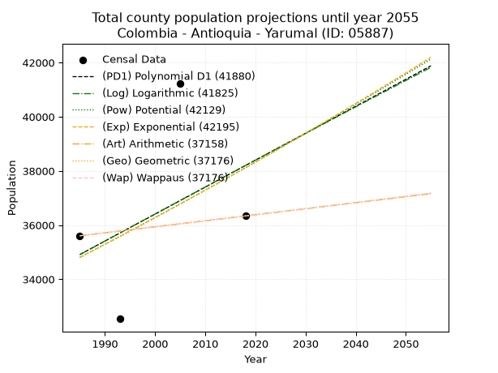
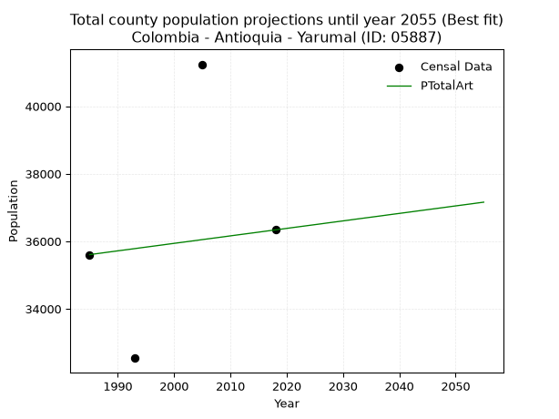
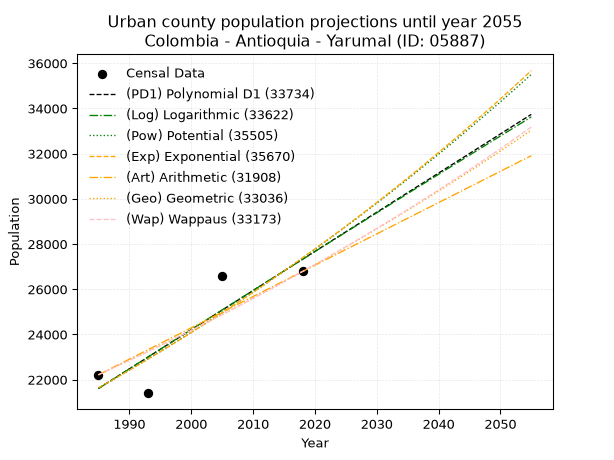
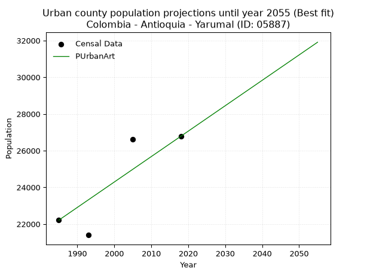
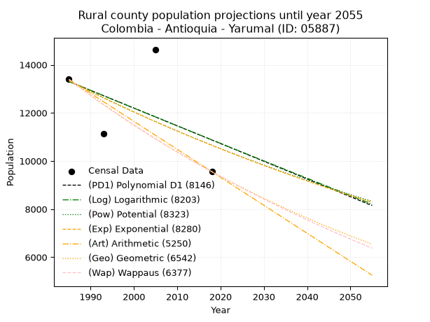
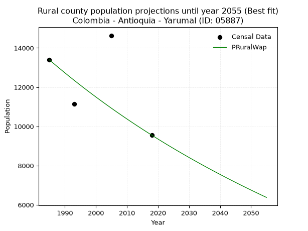

<div align="center">


</div>

# 📜 _“Population and Public Services Demand Projections (PPSD) until Year 2050 for Colombia - Antioquia - Yarumal (ID: 05887)”_
Keywords: `population` `public-service` `projection` `lineal` `polynomial` `logarithmic` `potential` `exponential` `arithmetic` `geometric` `wappaus` `dane` `colombia` `south-america`

PPSD are analytical estimates used by governments and planners to anticipate future changes in population size, age distribution, and the resulting community needs for utilities, healthcare, education, and infrastructure as sizing future water treatment facilities, electrical grids, and road networks based on spatial growth.

<div align="center">

</img>

</div>


> **General running parameters**: • app_version: _v20260806_. • Python version: _3.14.7_. • Pandas version: _3.0.5_. • NumPy version: _2.5.1_. • Creates, save and include plots into reports (create_plot): _False_. • Projection until year: _2050_. • Process polynomial degree 2 and up: _False_. • Process Wappaus: _True_. • Process Wappaus: _True_. • Set negative values to zero: _True_. • Set infinite values to zero: _True_. • Drop dataset notes: _True_. 
<div align="center">

Maps & GIS Layers: [:earth_americas:Google](http://maps.google.com/maps?q=6.963832345,-75.4188278) [:earth_americas:OSM](https://www.openstreetmap.org/#map=18/6.963832345/-75.4188278&layers=P) [:earth_americas:Bing](https://www.bing.com/maps?cp=6.963832345~-75.4188278&lvl=18) [:earth_americas:Apple](https://maps.apple.com/frame?center=6.963832345%2C-75.4188278&span=0.003%2C0.006) [:earth_americas:GISMobile](https://github.com/rcfdtools/R.GISMobile/blob/main/file/gis/CountyLayer_CO/Readme.md)

</div>


<div align="center">

```geojson
{
  "type": "Feature",
  "geometry": {
    "type": "Point", 
    "coordinates": [-75.4188278, 6.963832345]
  }, 
  "properties": {
    "Name": "Colombia - Antioquia - Yarumal (ID: 05887)"
  }
}
```

</div>


## 0. Census Data (4 records)

Census data are official statistics collected by a government about the people and housing in a country. They usually include counts of total population, age, sex, race, income, education, and jobs.

📅Global census file: [Population.xlsx](../data/Population.xlsx)

| Source   |   Year |   CountryID | CountryName   |   StateID | StateName   |   CountyID | CountyName   |   PTotal |   PUrban |   PRural |
|:---------|-------:|------------:|:--------------|----------:|:------------|-----------:|:-------------|---------:|---------:|---------:|
| DANE     |   1985 |          57 | Colombia      |        05 | Antioquia   |      05887 | Yarumal      |    35605 |    22212 |    13393 |
| DANE     |   1993 |          57 | Colombia      |        05 | Antioquia   |      05887 | Yarumal      |    32539 |    21399 |    11140 |
| DANE     |   2005 |          57 | Colombia      |        05 | Antioquia   |      05887 | Yarumal      |    41240 |    26603 |    14637 |
| DANE     |   2018 |          57 | Colombia      |        05 | Antioquia   |      05887 | Yarumal      |    36337 |    26783 |     9554 |

> 🔥Some records could had specific notes about the registered values or the corresponding urban or rural distribution.

📅[SUI-RUPS](https://www.datos.gov.co/Hacienda-y-Cr-dito-P-blico/Registro-nico-de-Prestadores-de-Servicios-P-blicos/4qkq-csdn/about_data) - Local public utility companies: [RUPS.csv](../data/RUPS.csv)

 | SERVICIO       | ESTADO    | NOMBRE                                                              | NIT         | DEPARTAMENTO_DOMICILIO   | MUNICIPIO_DOMICILIO   | DIRECCION                     |   TELEFONO | EMAIL                           | TIPO_PRESTADOR                             | CLASIFICACION                 |
|:---------------|:----------|:--------------------------------------------------------------------|:------------|:-------------------------|:----------------------|:------------------------------|-----------:|:--------------------------------|:-------------------------------------------|:------------------------------|
| ACUEDUCTO      | OPERATIVA | ASOCIACIÓN DE PROGRESO LLANOS DE CUIVA                              | 811015376-1 | ANTIOQUIA                | YARUMAL               | corregimiento Llanos de Cuivá |    8601461 | acueductollanos@hotmail.com     | ORGANIZACION AUTORIZADA                    | MENOR O IGUAL A 2500 USUARIOS |
| ACUEDUCTO      | OPERATIVA | AGUAS DEL NORTE ANTIOQUEÑO S.A E.S.P                                | 900232836-0 | ANTIOQUIA                | YARUMAL               | CALLE 20 No 20-03 piso 5      |    8536868 | secretaria@aguasdelnorte.gov.co | SOCIEDADES (EMPRESA DE SERVICIOS PUBLICOS) | MAYOR O IGUAL A 5001 USUARIOS |
| ALCANTARILLADO | OPERATIVA | AGUAS DEL NORTE ANTIOQUEÑO S.A E.S.P                                | 900232836-0 | ANTIOQUIA                | YARUMAL               | CALLE 20 No 20-03 piso 5      |    8536868 | secretaria@aguasdelnorte.gov.co | SOCIEDADES (EMPRESA DE SERVICIOS PUBLICOS) | MAYOR O IGUAL A 5001 USUARIOS |
| ACUEDUCTO      | OPERATIVA | EMPRESA DE SERVICIOS PÚBLICOS DOMICILIARIOS SERVIARAUCARIAS SAS ESP | 900978470-0 | RISARALDA                | SANTA ROSA DE CABAL   | CLL 13 No 9 76 esquina        |    3659448 | admon.serviaraucarias@gmail.com | SOCIEDADES (EMPRESA DE SERVICIOS PUBLICOS) | MENOR O IGUAL A 2500 USUARIOS |
| ALCANTARILLADO | OPERATIVA | EMPRESA DE SERVICIOS PÚBLICOS DOMICILIARIOS SERVIARAUCARIAS SAS ESP | 900978470-0 | RISARALDA                | SANTA ROSA DE CABAL   | CLL 13 No 9 76 esquina        |    3659448 | admon.serviaraucarias@gmail.com | SOCIEDADES (EMPRESA DE SERVICIOS PUBLICOS) | MENOR O IGUAL A 2500 USUARIOS |

## 1. Total

### 1.1. Coefficients and Parameters

* (PD1) Polynomial Deg 1: 99.53873946206609, -162672.11360899772 (lineal)
* (Log) Logarithmic: 199632.7497475832, -1480979.8805878372
* (Pow) Potential: 5.511947295784439, -13.635460304455084
* (Exp) Exponential: 0.0027490020039550238, 148.54035522322286
* (Art) Arithmetic: Year diff. 2018 - 1985 = 33, Population diff. 36337 - 35605 = 732, Annual growth = 22.181818181818183
* (Geo) Geometric: Year diff. 2018 - 1985 = 33, Population diff. 36337 - 35605 = 732, Annual growth % = 0.0006168698364827918
* (Wap) Wappaus: i = 0.06166583687364316, Condition values only valid for < 200)

<sub>
Wappaus condition values: ['0.00', '0.06', '0.12', '0.18', '0.25', '0.31', '0.37', '0.43', '0.49', '0.55', '0.62', '0.68', '0.74', '0.80', '0.86', '0.92', '0.99', '1.05', '1.11', '1.17', '1.23', '1.29', '1.36', '1.42', '1.48', '1.54', '1.60', '1.66', '1.73', '1.79', '1.85', '1.91', '1.97', '2.03', '2.10', '2.16', '2.22', '2.28', '2.34', '2.40', '2.47', '2.53', '2.59', '2.65', '2.71', '2.77', '2.84', '2.90', '2.96', '3.02', '3.08', '3.14', '3.21', '3.27', '3.33', '3.39', '3.45', '3.51', '3.58', '3.64', '3.70', '3.76', '3.82', '3.88', '3.95', '4.01']
</sub>


### 1.2. Projected Dataset

|   Year |   CountyID |   PTotalPD1 |   PTotalLog |   PTotalPow |   PTotalExp |   PTotalArt |   PTotalGeo |   PTotalWap |
|-------:|-----------:|------------:|------------:|------------:|------------:|------------:|------------:|------------:|
|   1985 |      05887 |       34912 |       34906 |       34803 |       34809 |       35605 |       35605 |       35605 |
|   1986 |      05887 |       35012 |       35007 |       34900 |       34905 |       35627 |       35627 |       35627 |
|   1987 |      05887 |       35111 |       35107 |       34997 |       35001 |       35649 |       35649 |       35649 |
|   1988 |      05887 |       35211 |       35208 |       35094 |       35097 |       35672 |       35671 |       35671 |
|   1989 |      05887 |       35310 |       35308 |       35192 |       35194 |       35694 |       35693 |       35693 |
|   1990 |      05887 |       35410 |       35409 |       35289 |       35291 |       35716 |       35715 |       35715 |
|   1991 |      05887 |       35510 |       35509 |       35387 |       35388 |       35738 |       35737 |       35737 |
|   1992 |      05887 |       35609 |       35609 |       35485 |       35485 |       35760 |       35759 |       35759 |
|   1993 |      05887 |       35709 |       35709 |       35584 |       35583 |       35782 |       35781 |       35781 |
|   1994 |      05887 |       35808 |       35809 |       35682 |       35681 |       35805 |       35803 |       35803 |
|   1995 |      05887 |       35908 |       35909 |       35781 |       35779 |       35827 |       35825 |       35825 |
|   1996 |      05887 |       36007 |       36010 |       35880 |       35877 |       35849 |       35847 |       35847 |
|   1997 |      05887 |       36107 |       36110 |       35979 |       35976 |       35871 |       35869 |       35869 |
|   1998 |      05887 |       36206 |       36209 |       36078 |       36075 |       35893 |       35892 |       35892 |
|   1999 |      05887 |       36306 |       36309 |       36178 |       36175 |       35916 |       35914 |       35914 |
|   2000 |      05887 |       36405 |       36409 |       36278 |       36274 |       35938 |       35936 |       35936 |
|   2001 |      05887 |       36505 |       36509 |       36378 |       36374 |       35960 |       35958 |       35958 |
|   2002 |      05887 |       36604 |       36609 |       36478 |       36474 |       35982 |       35980 |       35980 |
|   2003 |      05887 |       36704 |       36708 |       36579 |       36575 |       36004 |       36002 |       36002 |
|   2004 |      05887 |       36804 |       36808 |       36680 |       36675 |       36026 |       36025 |       36025 |
|   2005 |      05887 |       36903 |       36908 |       36781 |       36776 |       36049 |       36047 |       36047 |
|   2006 |      05887 |       37003 |       37007 |       36882 |       36877 |       36071 |       36069 |       36069 |
|   2007 |      05887 |       37102 |       37107 |       36983 |       36979 |       36093 |       36091 |       36091 |
|   2008 |      05887 |       37202 |       37206 |       37085 |       37081 |       36115 |       36114 |       36114 |
|   2009 |      05887 |       37301 |       37306 |       37187 |       37183 |       36137 |       36136 |       36136 |
|   2010 |      05887 |       37401 |       37405 |       37289 |       37285 |       36160 |       36158 |       36158 |
|   2011 |      05887 |       37500 |       37504 |       37392 |       37388 |       36182 |       36180 |       36180 |
|   2012 |      05887 |       37600 |       37603 |       37494 |       37491 |       36204 |       36203 |       36203 |
|   2013 |      05887 |       37699 |       37703 |       37597 |       37594 |       36226 |       36225 |       36225 |
|   2014 |      05887 |       37799 |       37802 |       37700 |       37697 |       36248 |       36247 |       36247 |
|   2015 |      05887 |       37898 |       37901 |       37803 |       37801 |       36270 |       36270 |       36270 |
|   2016 |      05887 |       37998 |       38000 |       37907 |       37905 |       36293 |       36292 |       36292 |
|   2017 |      05887 |       38098 |       38099 |       38011 |       38010 |       36315 |       36315 |       36315 |
|   2018 |      05887 |       38197 |       38198 |       38115 |       38114 |       36337 |       36337 |       36337 |
|   2019 |      05887 |       38297 |       38297 |       38219 |       38219 |       36359 |       36359 |       36359 |
|   2020 |      05887 |       38396 |       38396 |       38323 |       38324 |       36381 |       36382 |       36382 |
|   2021 |      05887 |       38496 |       38494 |       38428 |       38430 |       36404 |       36404 |       36404 |
|   2022 |      05887 |       38595 |       38593 |       38533 |       38536 |       36426 |       36427 |       36427 |
|   2023 |      05887 |       38695 |       38692 |       38638 |       38642 |       36448 |       36449 |       36449 |
|   2024 |      05887 |       38794 |       38791 |       38743 |       38748 |       36470 |       36472 |       36472 |
|   2025 |      05887 |       38894 |       38889 |       38849 |       38855 |       36492 |       36494 |       36494 |
|   2026 |      05887 |       38993 |       38988 |       38955 |       38962 |       36514 |       36517 |       36517 |
|   2027 |      05887 |       39093 |       39086 |       39061 |       39069 |       36537 |       36539 |       36539 |
|   2028 |      05887 |       39192 |       39185 |       39167 |       39177 |       36559 |       36562 |       36562 |
|   2029 |      05887 |       39292 |       39283 |       39274 |       39284 |       36581 |       36584 |       36584 |
|   2030 |      05887 |       39392 |       39381 |       39381 |       39393 |       36603 |       36607 |       36607 |
|   2031 |      05887 |       39491 |       39480 |       39488 |       39501 |       36625 |       36629 |       36630 |
|   2032 |      05887 |       39591 |       39578 |       39595 |       39610 |       36648 |       36652 |       36652 |
|   2033 |      05887 |       39690 |       39676 |       39703 |       39719 |       36670 |       36675 |       36675 |
|   2034 |      05887 |       39790 |       39774 |       39810 |       39828 |       36692 |       36697 |       36697 |
|   2035 |      05887 |       39889 |       39873 |       39918 |       39938 |       36714 |       36720 |       36720 |
|   2036 |      05887 |       39989 |       39971 |       40027 |       40048 |       36736 |       36743 |       36743 |
|   2037 |      05887 |       40088 |       40069 |       40135 |       40158 |       36758 |       36765 |       36765 |
|   2038 |      05887 |       40188 |       40167 |       40244 |       40268 |       36781 |       36788 |       36788 |
|   2039 |      05887 |       40287 |       40265 |       40353 |       40379 |       36803 |       36811 |       36811 |
|   2040 |      05887 |       40387 |       40362 |       40462 |       40490 |       36825 |       36833 |       36833 |
|   2041 |      05887 |       40486 |       40460 |       40571 |       40602 |       36847 |       36856 |       36856 |
|   2042 |      05887 |       40586 |       40558 |       40681 |       40714 |       36869 |       36879 |       36879 |
|   2043 |      05887 |       40686 |       40656 |       40791 |       40826 |       36892 |       36902 |       36902 |
|   2044 |      05887 |       40785 |       40753 |       40901 |       40938 |       36914 |       36924 |       36924 |
|   2045 |      05887 |       40885 |       40851 |       41012 |       41051 |       36936 |       36947 |       36947 |
|   2046 |      05887 |       40984 |       40949 |       41122 |       41164 |       36958 |       36970 |       36970 |
|   2047 |      05887 |       41084 |       41046 |       41233 |       41277 |       36980 |       36993 |       36993 |
|   2048 |      05887 |       41183 |       41144 |       41344 |       41391 |       37002 |       37016 |       37016 |
|   2049 |      05887 |       41283 |       41241 |       41456 |       41505 |       37025 |       37038 |       37038 |
|   2050 |      05887 |       41382 |       41339 |       41567 |       41619 |       37047 |       37061 |       37061 |
<div align="center">

</img>

</div>


### 1.3. Best fit with absolute and relative error (%)

Relative error puts that difference into context by dividing the absolute error by the true value, creating a unitless ratio or percentage that shows the scale of the mistake.

Absolute and relative error

|   Year | Source   |   CountryID | CountryName   |   StateID | StateName   |   CountyID_x | CountyName   |   PTotal |   PUrban |   PRural |   CountyID_y |   PTotalPD1 |   PTotalLog |   PTotalPow |   PTotalExp |   PTotalArt |   PTotalGeo |   PTotalWap |   PTotalPD1AbsError |   PTotalLogAbsError |   PTotalPowAbsError |   PTotalExpAbsError |   PTotalArtAbsError |   PTotalGeoAbsError |   PTotalWapAbsError |   PTotalPD1RelError |   PTotalLogRelError |   PTotalPowRelError |   PTotalExpRelError |   PTotalArtRelError |   PTotalGeoRelError |   PTotalWapRelError |
|-------:|:---------|------------:|:--------------|----------:|:------------|-------------:|:-------------|---------:|---------:|---------:|-------------:|------------:|------------:|------------:|------------:|------------:|------------:|------------:|--------------------:|--------------------:|--------------------:|--------------------:|--------------------:|--------------------:|--------------------:|--------------------:|--------------------:|--------------------:|--------------------:|--------------------:|--------------------:|--------------------:|
|   1985 | DANE     |          57 | Colombia      |        05 | Antioquia   |        05887 | Yarumal      |    35605 |    22212 |    13393 |        05887 |       34912 |       34906 |       34803 |       34809 |       35605 |       35605 |       35605 |                 693 |                 699 |                 802 |                 796 |                   0 |                   0 |                   0 |             1.94636 |             1.96321 |             2.25249 |             2.23564 |              0      |             0       |             0       |
|   1993 | DANE     |          57 | Colombia      |        05 | Antioquia   |        05887 | Yarumal      |    32539 |    21399 |    11140 |        05887 |       35709 |       35709 |       35584 |       35583 |       35782 |       35781 |       35781 |                3170 |                3170 |                3045 |                3044 |                3243 |                3242 |                3242 |             9.74216 |             9.74216 |             9.358   |             9.35493 |              9.9665 |             9.96343 |             9.96343 |
|   2005 | DANE     |          57 | Colombia      |        05 | Antioquia   |        05887 | Yarumal      |    41240 |    26603 |    14637 |        05887 |       36903 |       36908 |       36781 |       36776 |       36049 |       36047 |       36047 |                4337 |                4332 |                4459 |                4464 |                5191 |                5193 |                5193 |            10.5165  |            10.5044  |            10.8123  |            10.8244  |             12.5873 |            12.5921  |            12.5921  |
|   2018 | DANE     |          57 | Colombia      |        05 | Antioquia   |        05887 | Yarumal      |    36337 |    26783 |     9554 |        05887 |       38197 |       38198 |       38115 |       38114 |       36337 |       36337 |       36337 |                1860 |                1861 |                1778 |                1777 |                   0 |                   0 |                   0 |             5.11875 |             5.1215  |             4.89308 |             4.89033 |              0      |             0       |             0       |

Relative error mean

| Method    |   RelError | Best   |
|:----------|-----------:|:-------|
| PTotalPD1 |    6.83094 |        |
| PTotalLog |    6.83281 |        |
| PTotalPow |    6.82897 |        |
| PTotalExp |    6.82634 |        |
| PTotalArt |    5.63845 | True   |
| PTotalGeo |    5.63889 |        |
| PTotalWap |    5.63889 |        |

💙Best method: _**PTotalArt**_
<div align="center">

</img>

</div>


### 1.4. Fresh water supply demand in liters per capita per day (lpcd)

The fresh water supply demand typically ranges from 100 to 300 liters per capita per day (lpcd) for standard domestic and municipal planning, though absolute survival minimums set by the World Health Organization are as low as 7.5 to 20 liters per day, and total consumption in high-income nations can exceed 400 liters.

> `CZ`: Level in meters above the sea level (masl)<br> `WS`: Fresh water supply demand in liters per capita per day (lpcd or l/h/d)<br> `WSAll`: Zonal fresh water supply demand in liters per second (l/s)<br> `A`: Zonal area in square meters<br> `DP`: Population density (people/hectare or p/ha)

Reference values (RAS Colombia)

|    CZ |   WS |
|------:|-----:|
|  1000 |  120 |
|  2000 |  130 |
| 99999 |  140 |

County shapefile geometry properties and water supply values

|   CountyID |     ATotal |   CZTotal |   WSTotal |
|-----------:|-----------:|----------:|----------:|
|      05887 | 7.1233e+08 |   2129.03 |       140 |

Projected values for best method: PTotalArt

|   CountyID |   Year |   PTotalArt |   DPTotal |   WSTotal |   WSTotalAll |
|-----------:|-------:|------------:|----------:|----------:|-------------:|
|      05887 |   1985 |       35605 |      0.5  |       140 |      57.6933 |
|      05887 |   1986 |       35627 |      0.5  |       140 |      57.7289 |
|      05887 |   1987 |       35649 |      0.5  |       140 |      57.7646 |
|      05887 |   1988 |       35672 |      0.5  |       140 |      57.8019 |
|      05887 |   1989 |       35694 |      0.5  |       140 |      57.8375 |
|      05887 |   1990 |       35716 |      0.5  |       140 |      57.8731 |
|      05887 |   1991 |       35738 |      0.5  |       140 |      57.9088 |
|      05887 |   1992 |       35760 |      0.5  |       140 |      57.9444 |
|      05887 |   1993 |       35782 |      0.5  |       140 |      57.9801 |
|      05887 |   1994 |       35805 |      0.5  |       140 |      58.0174 |
|      05887 |   1995 |       35827 |      0.5  |       140 |      58.053  |
|      05887 |   1996 |       35849 |      0.5  |       140 |      58.0887 |
|      05887 |   1997 |       35871 |      0.5  |       140 |      58.1243 |
|      05887 |   1998 |       35893 |      0.5  |       140 |      58.16   |
|      05887 |   1999 |       35916 |      0.5  |       140 |      58.1972 |
|      05887 |   2000 |       35938 |      0.5  |       140 |      58.2329 |
|      05887 |   2001 |       35960 |      0.5  |       140 |      58.2685 |
|      05887 |   2002 |       35982 |      0.51 |       140 |      58.3042 |
|      05887 |   2003 |       36004 |      0.51 |       140 |      58.3398 |
|      05887 |   2004 |       36026 |      0.51 |       140 |      58.3755 |
|      05887 |   2005 |       36049 |      0.51 |       140 |      58.4127 |
|      05887 |   2006 |       36071 |      0.51 |       140 |      58.4484 |
|      05887 |   2007 |       36093 |      0.51 |       140 |      58.484  |
|      05887 |   2008 |       36115 |      0.51 |       140 |      58.5197 |
|      05887 |   2009 |       36137 |      0.51 |       140 |      58.5553 |
|      05887 |   2010 |       36160 |      0.51 |       140 |      58.5926 |
|      05887 |   2011 |       36182 |      0.51 |       140 |      58.6282 |
|      05887 |   2012 |       36204 |      0.51 |       140 |      58.6639 |
|      05887 |   2013 |       36226 |      0.51 |       140 |      58.6995 |
|      05887 |   2014 |       36248 |      0.51 |       140 |      58.7352 |
|      05887 |   2015 |       36270 |      0.51 |       140 |      58.7708 |
|      05887 |   2016 |       36293 |      0.51 |       140 |      58.8081 |
|      05887 |   2017 |       36315 |      0.51 |       140 |      58.8438 |
|      05887 |   2018 |       36337 |      0.51 |       140 |      58.8794 |
|      05887 |   2019 |       36359 |      0.51 |       140 |      58.915  |
|      05887 |   2020 |       36381 |      0.51 |       140 |      58.9507 |
|      05887 |   2021 |       36404 |      0.51 |       140 |      58.988  |
|      05887 |   2022 |       36426 |      0.51 |       140 |      59.0236 |
|      05887 |   2023 |       36448 |      0.51 |       140 |      59.0593 |
|      05887 |   2024 |       36470 |      0.51 |       140 |      59.0949 |
|      05887 |   2025 |       36492 |      0.51 |       140 |      59.1306 |
|      05887 |   2026 |       36514 |      0.51 |       140 |      59.1662 |
|      05887 |   2027 |       36537 |      0.51 |       140 |      59.2035 |
|      05887 |   2028 |       36559 |      0.51 |       140 |      59.2391 |
|      05887 |   2029 |       36581 |      0.51 |       140 |      59.2748 |
|      05887 |   2030 |       36603 |      0.51 |       140 |      59.3104 |
|      05887 |   2031 |       36625 |      0.51 |       140 |      59.3461 |
|      05887 |   2032 |       36648 |      0.51 |       140 |      59.3833 |
|      05887 |   2033 |       36670 |      0.51 |       140 |      59.419  |
|      05887 |   2034 |       36692 |      0.52 |       140 |      59.4546 |
|      05887 |   2035 |       36714 |      0.52 |       140 |      59.4903 |
|      05887 |   2036 |       36736 |      0.52 |       140 |      59.5259 |
|      05887 |   2037 |       36758 |      0.52 |       140 |      59.5616 |
|      05887 |   2038 |       36781 |      0.52 |       140 |      59.5988 |
|      05887 |   2039 |       36803 |      0.52 |       140 |      59.6345 |
|      05887 |   2040 |       36825 |      0.52 |       140 |      59.6701 |
|      05887 |   2041 |       36847 |      0.52 |       140 |      59.7058 |
|      05887 |   2042 |       36869 |      0.52 |       140 |      59.7414 |
|      05887 |   2043 |       36892 |      0.52 |       140 |      59.7787 |
|      05887 |   2044 |       36914 |      0.52 |       140 |      59.8144 |
|      05887 |   2045 |       36936 |      0.52 |       140 |      59.85   |
|      05887 |   2046 |       36958 |      0.52 |       140 |      59.8856 |
|      05887 |   2047 |       36980 |      0.52 |       140 |      59.9213 |
|      05887 |   2048 |       37002 |      0.52 |       140 |      59.9569 |
|      05887 |   2049 |       37025 |      0.52 |       140 |      59.9942 |
|      05887 |   2050 |       37047 |      0.52 |       140 |      60.0299 |

## 2. Urban

### 2.1. Coefficients and Parameters

* (PD1) Polynomial Deg 1: 173.2424729024484, -322279.0064231225 (lineal)
* (Log) Logarithmic: 346828.21354882093, -2611994.780491465
* (Pow) Potential: 14.301669556941189, -42.82845306069938
* (Exp) Exponential: 0.0071438631044467025, 0.015017113329973183
* (Art) Arithmetic: Year diff. 2018 - 1985 = 33, Population diff. 26783 - 22212 = 4571, Annual growth = 138.5151515151515
* (Geo) Geometric: Year diff. 2018 - 1985 = 33, Population diff. 26783 - 22212 = 4571, Annual growth % = 0.00568685683803638
* (Wap) Wappaus: i = 0.565425661864074, Condition values only valid for < 200)

<sub>
Wappaus condition values: ['0.00', '0.57', '1.13', '1.70', '2.26', '2.83', '3.39', '3.96', '4.52', '5.09', '5.65', '6.22', '6.79', '7.35', '7.92', '8.48', '9.05', '9.61', '10.18', '10.74', '11.31', '11.87', '12.44', '13.00', '13.57', '14.14', '14.70', '15.27', '15.83', '16.40', '16.96', '17.53', '18.09', '18.66', '19.22', '19.79', '20.36', '20.92', '21.49', '22.05', '22.62', '23.18', '23.75', '24.31', '24.88', '25.44', '26.01', '26.58', '27.14', '27.71', '28.27', '28.84', '29.40', '29.97', '30.53', '31.10', '31.66', '32.23', '32.79', '33.36', '33.93', '34.49', '35.06', '35.62', '36.19', '36.75']
</sub>


### 2.2. Projected Dataset

|   Year |   CountyID |   PUrbanPD1 |   PUrbanLog |   PUrbanPow |   PUrbanExp |   PUrbanArt |   PUrbanGeo |   PUrbanWap |
|-------:|-----------:|------------:|------------:|------------:|------------:|------------:|------------:|------------:|
|   1985 |      05887 |       21607 |       21602 |       21629 |       21634 |       22212 |       22212 |       22212 |
|   1986 |      05887 |       21781 |       21776 |       21785 |       21789 |       22351 |       22338 |       22338 |
|   1987 |      05887 |       21954 |       21951 |       21942 |       21945 |       22489 |       22465 |       22465 |
|   1988 |      05887 |       22127 |       22125 |       22101 |       22102 |       22628 |       22593 |       22592 |
|   1989 |      05887 |       22300 |       22300 |       22260 |       22261 |       22766 |       22722 |       22720 |
|   1990 |      05887 |       22474 |       22474 |       22421 |       22420 |       22905 |       22851 |       22849 |
|   1991 |      05887 |       22647 |       22648 |       22583 |       22581 |       23043 |       22981 |       22979 |
|   1992 |      05887 |       22820 |       22823 |       22745 |       22743 |       23182 |       23111 |       23109 |
|   1993 |      05887 |       22993 |       22997 |       22909 |       22906 |       23320 |       23243 |       23240 |
|   1994 |      05887 |       23166 |       23171 |       23074 |       23070 |       23459 |       23375 |       23372 |
|   1995 |      05887 |       23340 |       23344 |       23240 |       23236 |       23597 |       23508 |       23504 |
|   1996 |      05887 |       23513 |       23518 |       23407 |       23402 |       23736 |       23642 |       23638 |
|   1997 |      05887 |       23686 |       23692 |       23576 |       23570 |       23874 |       23776 |       23772 |
|   1998 |      05887 |       23859 |       23866 |       23745 |       23739 |       24013 |       23911 |       23907 |
|   1999 |      05887 |       24033 |       24039 |       23916 |       23909 |       24151 |       24047 |       24043 |
|   2000 |      05887 |       24206 |       24213 |       24087 |       24081 |       24290 |       24184 |       24179 |
|   2001 |      05887 |       24379 |       24386 |       24260 |       24253 |       24428 |       24322 |       24317 |
|   2002 |      05887 |       24552 |       24559 |       24434 |       24427 |       24567 |       24460 |       24455 |
|   2003 |      05887 |       24726 |       24732 |       24609 |       24602 |       24705 |       24599 |       24594 |
|   2004 |      05887 |       24899 |       24906 |       24785 |       24779 |       24844 |       24739 |       24734 |
|   2005 |      05887 |       25072 |       25079 |       24963 |       24956 |       24982 |       24880 |       24874 |
|   2006 |      05887 |       25245 |       25252 |       25142 |       25135 |       25121 |       25021 |       25016 |
|   2007 |      05887 |       25419 |       25424 |       25321 |       25315 |       25259 |       25163 |       25158 |
|   2008 |      05887 |       25592 |       25597 |       25502 |       25497 |       25398 |       25306 |       25302 |
|   2009 |      05887 |       25765 |       25770 |       25685 |       25680 |       25536 |       25450 |       25446 |
|   2010 |      05887 |       25938 |       25942 |       25868 |       25864 |       25675 |       25595 |       25591 |
|   2011 |      05887 |       26112 |       26115 |       26053 |       26049 |       25813 |       25741 |       25736 |
|   2012 |      05887 |       26285 |       26287 |       26239 |       26236 |       25952 |       25887 |       25883 |
|   2013 |      05887 |       26458 |       26460 |       26426 |       26424 |       26090 |       26034 |       26031 |
|   2014 |      05887 |       26631 |       26632 |       26614 |       26614 |       26229 |       26182 |       26179 |
|   2015 |      05887 |       26805 |       26804 |       26804 |       26804 |       26367 |       26331 |       26329 |
|   2016 |      05887 |       26978 |       26976 |       26995 |       26997 |       26506 |       26481 |       26479 |
|   2017 |      05887 |       27151 |       27148 |       27187 |       27190 |       26644 |       26632 |       26631 |
|   2018 |      05887 |       27324 |       27320 |       27380 |       27385 |       26783 |       26783 |       26783 |
|   2019 |      05887 |       27498 |       27492 |       27575 |       27581 |       26922 |       26935 |       26936 |
|   2020 |      05887 |       27671 |       27664 |       27771 |       27779 |       27060 |       27088 |       27090 |
|   2021 |      05887 |       27844 |       27835 |       27968 |       27978 |       27199 |       27243 |       27246 |
|   2022 |      05887 |       28017 |       28007 |       28167 |       28179 |       27337 |       27397 |       27402 |
|   2023 |      05887 |       28191 |       28178 |       28367 |       28381 |       27476 |       27553 |       27559 |
|   2024 |      05887 |       28364 |       28350 |       28568 |       28584 |       27614 |       27710 |       27717 |
|   2025 |      05887 |       28537 |       28521 |       28770 |       28789 |       27753 |       27868 |       27876 |
|   2026 |      05887 |       28710 |       28692 |       28974 |       28996 |       27891 |       28026 |       28036 |
|   2027 |      05887 |       28883 |       28863 |       29179 |       29204 |       28030 |       28185 |       28198 |
|   2028 |      05887 |       29057 |       29035 |       29386 |       29413 |       28168 |       28346 |       28360 |
|   2029 |      05887 |       29230 |       29206 |       29594 |       29624 |       28307 |       28507 |       28523 |
|   2030 |      05887 |       29403 |       29376 |       29803 |       29836 |       28445 |       28669 |       28687 |
|   2031 |      05887 |       29576 |       29547 |       30014 |       30050 |       28584 |       28832 |       28853 |
|   2032 |      05887 |       29750 |       29718 |       30226 |       30266 |       28722 |       28996 |       29019 |
|   2033 |      05887 |       29923 |       29889 |       30439 |       30483 |       28861 |       29161 |       29187 |
|   2034 |      05887 |       30096 |       30059 |       30654 |       30701 |       28999 |       29327 |       29356 |
|   2035 |      05887 |       30269 |       30230 |       30870 |       30921 |       29138 |       29494 |       29525 |
|   2036 |      05887 |       30443 |       30400 |       31088 |       31143 |       29276 |       29661 |       29696 |
|   2037 |      05887 |       30616 |       30570 |       31307 |       31366 |       29415 |       29830 |       29868 |
|   2038 |      05887 |       30789 |       30741 |       31528 |       31591 |       29553 |       30000 |       30042 |
|   2039 |      05887 |       30962 |       30911 |       31750 |       31818 |       29692 |       30170 |       30216 |
|   2040 |      05887 |       31136 |       31081 |       31973 |       32046 |       29830 |       30342 |       30391 |
|   2041 |      05887 |       31309 |       31251 |       32198 |       32275 |       29969 |       30514 |       30568 |
|   2042 |      05887 |       31482 |       31421 |       32424 |       32507 |       30107 |       30688 |       30746 |
|   2043 |      05887 |       31655 |       31590 |       32652 |       32740 |       30246 |       30862 |       30925 |
|   2044 |      05887 |       31829 |       31760 |       32881 |       32975 |       30384 |       31038 |       31105 |
|   2045 |      05887 |       32002 |       31930 |       33112 |       33211 |       30523 |       31214 |       31287 |
|   2046 |      05887 |       32175 |       32099 |       33345 |       33449 |       30661 |       31392 |       31470 |
|   2047 |      05887 |       32348 |       32269 |       33578 |       33689 |       30800 |       31570 |       31654 |
|   2048 |      05887 |       32522 |       32438 |       33814 |       33930 |       30938 |       31750 |       31839 |
|   2049 |      05887 |       32695 |       32608 |       34051 |       34174 |       31077 |       31930 |       32026 |
|   2050 |      05887 |       32868 |       32777 |       34289 |       34419 |       31215 |       32112 |       32213 |
<div align="center">

</img>

</div>


### 2.3. Best fit with absolute and relative error (%)

Relative error puts that difference into context by dividing the absolute error by the true value, creating a unitless ratio or percentage that shows the scale of the mistake.

Absolute and relative error

|   Year | Source   |   CountryID | CountryName   |   StateID | StateName   |   CountyID_x | CountyName   |   PTotal |   PUrban |   PRural |   CountyID_y |   PUrbanPD1 |   PUrbanLog |   PUrbanPow |   PUrbanExp |   PUrbanArt |   PUrbanGeo |   PUrbanWap |   PUrbanPD1AbsError |   PUrbanLogAbsError |   PUrbanPowAbsError |   PUrbanExpAbsError |   PUrbanArtAbsError |   PUrbanGeoAbsError |   PUrbanWapAbsError |   PUrbanPD1RelError |   PUrbanLogRelError |   PUrbanPowRelError |   PUrbanExpRelError |   PUrbanArtRelError |   PUrbanGeoRelError |   PUrbanWapRelError |
|-------:|:---------|------------:|:--------------|----------:|:------------|-------------:|:-------------|---------:|---------:|---------:|-------------:|------------:|------------:|------------:|------------:|------------:|------------:|------------:|--------------------:|--------------------:|--------------------:|--------------------:|--------------------:|--------------------:|--------------------:|--------------------:|--------------------:|--------------------:|--------------------:|--------------------:|--------------------:|--------------------:|
|   1985 | DANE     |          57 | Colombia      |        05 | Antioquia   |        05887 | Yarumal      |    35605 |    22212 |    13393 |        05887 |       21607 |       21602 |       21629 |       21634 |       22212 |       22212 |       22212 |                 605 |                 610 |                 583 |                 578 |                   0 |                   0 |                   0 |             2.72375 |             2.74626 |             2.62471 |             2.6022  |             0       |             0       |             0       |
|   1993 | DANE     |          57 | Colombia      |        05 | Antioquia   |        05887 | Yarumal      |    32539 |    21399 |    11140 |        05887 |       22993 |       22997 |       22909 |       22906 |       23320 |       23243 |       23240 |                1594 |                1598 |                1510 |                1507 |                1921 |                1844 |                1841 |             7.44895 |             7.46764 |             7.0564  |             7.04239 |             8.97706 |             8.61723 |             8.60321 |
|   2005 | DANE     |          57 | Colombia      |        05 | Antioquia   |        05887 | Yarumal      |    41240 |    26603 |    14637 |        05887 |       25072 |       25079 |       24963 |       24956 |       24982 |       24880 |       24874 |                1531 |                1524 |                1640 |                1647 |                1621 |                1723 |                1729 |             5.75499 |             5.72868 |             6.16472 |             6.19103 |             6.0933  |             6.47671 |             6.49927 |
|   2018 | DANE     |          57 | Colombia      |        05 | Antioquia   |        05887 | Yarumal      |    36337 |    26783 |     9554 |        05887 |       27324 |       27320 |       27380 |       27385 |       26783 |       26783 |       26783 |                 541 |                 537 |                 597 |                 602 |                   0 |                   0 |                   0 |             2.01994 |             2.005   |             2.22903 |             2.24769 |             0       |             0       |             0       |

Relative error mean

| Method    |   RelError | Best   |
|:----------|-----------:|:-------|
| PUrbanPD1 |    4.48691 |        |
| PUrbanLog |    4.4869  |        |
| PUrbanPow |    4.51871 |        |
| PUrbanExp |    4.52083 |        |
| PUrbanArt |    3.76759 | True   |
| PUrbanGeo |    3.77348 |        |
| PUrbanWap |    3.77562 |        |

💙Best method: _**PUrbanArt**_
<div align="center">

</img>

</div>


### 2.4. Fresh water supply demand in liters per capita per day (lpcd)

The fresh water supply demand typically ranges from 100 to 300 liters per capita per day (lpcd) for standard domestic and municipal planning, though absolute survival minimums set by the World Health Organization are as low as 7.5 to 20 liters per day, and total consumption in high-income nations can exceed 400 liters.

> `CZ`: Level in meters above the sea level (masl)<br> `WS`: Fresh water supply demand in liters per capita per day (lpcd or l/h/d)<br> `WSAll`: Zonal fresh water supply demand in liters per second (l/s)<br> `A`: Zonal area in square meters<br> `DP`: Population density (people/hectare or p/ha)

Reference values (RAS Colombia)

|    CZ |   WS |
|------:|-----:|
|  1000 |  120 |
|  2000 |  130 |
| 99999 |  140 |

County shapefile geometry properties and water supply values

|   CountyID |      AUrban |   CZUrban |   WSUrban |
|-----------:|------------:|----------:|----------:|
|      05887 | 2.55345e+06 |   2266.35 |       140 |

Projected values for best method: PUrbanArt

|   CountyID |   Year |   PUrbanArt |   DPUrban |   WSUrban |   WSUrbanAll |
|-----------:|-------:|------------:|----------:|----------:|-------------:|
|      05887 |   1985 |       22212 |     86.99 |       140 |      35.9917 |
|      05887 |   1986 |       22351 |     87.53 |       140 |      36.2169 |
|      05887 |   1987 |       22489 |     88.07 |       140 |      36.4405 |
|      05887 |   1988 |       22628 |     88.62 |       140 |      36.6657 |
|      05887 |   1989 |       22766 |     89.16 |       140 |      36.8894 |
|      05887 |   1990 |       22905 |     89.7  |       140 |      37.1146 |
|      05887 |   1991 |       23043 |     90.24 |       140 |      37.3382 |
|      05887 |   1992 |       23182 |     90.79 |       140 |      37.5634 |
|      05887 |   1993 |       23320 |     91.33 |       140 |      37.787  |
|      05887 |   1994 |       23459 |     91.87 |       140 |      38.0123 |
|      05887 |   1995 |       23597 |     92.41 |       140 |      38.2359 |
|      05887 |   1996 |       23736 |     92.96 |       140 |      38.4611 |
|      05887 |   1997 |       23874 |     93.5  |       140 |      38.6847 |
|      05887 |   1998 |       24013 |     94.04 |       140 |      38.91   |
|      05887 |   1999 |       24151 |     94.58 |       140 |      39.1336 |
|      05887 |   2000 |       24290 |     95.13 |       140 |      39.3588 |
|      05887 |   2001 |       24428 |     95.67 |       140 |      39.5824 |
|      05887 |   2002 |       24567 |     96.21 |       140 |      39.8076 |
|      05887 |   2003 |       24705 |     96.75 |       140 |      40.0312 |
|      05887 |   2004 |       24844 |     97.3  |       140 |      40.2565 |
|      05887 |   2005 |       24982 |     97.84 |       140 |      40.4801 |
|      05887 |   2006 |       25121 |     98.38 |       140 |      40.7053 |
|      05887 |   2007 |       25259 |     98.92 |       140 |      40.9289 |
|      05887 |   2008 |       25398 |     99.47 |       140 |      41.1542 |
|      05887 |   2009 |       25536 |    100.01 |       140 |      41.3778 |
|      05887 |   2010 |       25675 |    100.55 |       140 |      41.603  |
|      05887 |   2011 |       25813 |    101.09 |       140 |      41.8266 |
|      05887 |   2012 |       25952 |    101.64 |       140 |      42.0519 |
|      05887 |   2013 |       26090 |    102.18 |       140 |      42.2755 |
|      05887 |   2014 |       26229 |    102.72 |       140 |      42.5007 |
|      05887 |   2015 |       26367 |    103.26 |       140 |      42.7243 |
|      05887 |   2016 |       26506 |    103.8  |       140 |      42.9495 |
|      05887 |   2017 |       26644 |    104.35 |       140 |      43.1731 |
|      05887 |   2018 |       26783 |    104.89 |       140 |      43.3984 |
|      05887 |   2019 |       26922 |    105.43 |       140 |      43.6236 |
|      05887 |   2020 |       27060 |    105.97 |       140 |      43.8472 |
|      05887 |   2021 |       27199 |    106.52 |       140 |      44.0725 |
|      05887 |   2022 |       27337 |    107.06 |       140 |      44.2961 |
|      05887 |   2023 |       27476 |    107.6  |       140 |      44.5213 |
|      05887 |   2024 |       27614 |    108.14 |       140 |      44.7449 |
|      05887 |   2025 |       27753 |    108.69 |       140 |      44.9701 |
|      05887 |   2026 |       27891 |    109.23 |       140 |      45.1938 |
|      05887 |   2027 |       28030 |    109.77 |       140 |      45.419  |
|      05887 |   2028 |       28168 |    110.31 |       140 |      45.6426 |
|      05887 |   2029 |       28307 |    110.86 |       140 |      45.8678 |
|      05887 |   2030 |       28445 |    111.4  |       140 |      46.0914 |
|      05887 |   2031 |       28584 |    111.94 |       140 |      46.3167 |
|      05887 |   2032 |       28722 |    112.48 |       140 |      46.5403 |
|      05887 |   2033 |       28861 |    113.03 |       140 |      46.7655 |
|      05887 |   2034 |       28999 |    113.57 |       140 |      46.9891 |
|      05887 |   2035 |       29138 |    114.11 |       140 |      47.2144 |
|      05887 |   2036 |       29276 |    114.65 |       140 |      47.438  |
|      05887 |   2037 |       29415 |    115.2  |       140 |      47.6632 |
|      05887 |   2038 |       29553 |    115.74 |       140 |      47.8868 |
|      05887 |   2039 |       29692 |    116.28 |       140 |      48.112  |
|      05887 |   2040 |       29830 |    116.82 |       140 |      48.3356 |
|      05887 |   2041 |       29969 |    117.37 |       140 |      48.5609 |
|      05887 |   2042 |       30107 |    117.91 |       140 |      48.7845 |
|      05887 |   2043 |       30246 |    118.45 |       140 |      49.0097 |
|      05887 |   2044 |       30384 |    118.99 |       140 |      49.2333 |
|      05887 |   2045 |       30523 |    119.54 |       140 |      49.4586 |
|      05887 |   2046 |       30661 |    120.08 |       140 |      49.6822 |
|      05887 |   2047 |       30800 |    120.62 |       140 |      49.9074 |
|      05887 |   2048 |       30938 |    121.16 |       140 |      50.131  |
|      05887 |   2049 |       31077 |    121.71 |       140 |      50.3563 |
|      05887 |   2050 |       31215 |    122.25 |       140 |      50.5799 |

## 3. Rural

### 3.1. Coefficients and Parameters

* (PD1) Polynomial Deg 1: -73.70373344038246, 159606.89281412502 (lineal)
* (Log) Logarithmic: -147195.4638012376, 1131014.8999036264
* (Pow) Potential: -13.594544559985454, 48.95647265658277
* (Exp) Exponential: -0.006805594196680966, 9814157237.46319
* (Art) Arithmetic: Year diff. 2018 - 1985 = 33, Population diff. 9554 - 13393 = -3839, Annual growth = -116.33333333333333
* (Geo) Geometric: Year diff. 2018 - 1985 = 33, Population diff. 9554 - 13393 = -3839, Annual growth % = -0.010183318553482756
* (Wap) Wappaus: i = -1.01393065179181, Condition values only valid for < 200)

<sub>
Wappaus condition values: ['-0.00', '-1.01', '-2.03', '-3.04', '-4.06', '-5.07', '-6.08', '-7.10', '-8.11', '-9.13', '-10.14', '-11.15', '-12.17', '-13.18', '-14.20', '-15.21', '-16.22', '-17.24', '-18.25', '-19.26', '-20.28', '-21.29', '-22.31', '-23.32', '-24.33', '-25.35', '-26.36', '-27.38', '-28.39', '-29.40', '-30.42', '-31.43', '-32.45', '-33.46', '-34.47', '-35.49', '-36.50', '-37.52', '-38.53', '-39.54', '-40.56', '-41.57', '-42.59', '-43.60', '-44.61', '-45.63', '-46.64', '-47.65', '-48.67', '-49.68', '-50.70', '-51.71', '-52.72', '-53.74', '-54.75', '-55.77', '-56.78', '-57.79', '-58.81', '-59.82', '-60.84', '-61.85', '-62.86', '-63.88', '-64.89', '-65.91']
</sub>


### 3.2. Projected Dataset

|   Year |   CountyID |   PRuralPD1 |   PRuralLog |   PRuralPow |   PRuralExp |   PRuralArt |   PRuralGeo |   PRuralWap |
|-------:|-----------:|------------:|------------:|------------:|------------:|------------:|------------:|------------:|
|   1985 |      05887 |       13305 |       13305 |       13333 |       13333 |       13393 |       13393 |       13393 |
|   1986 |      05887 |       13231 |       13231 |       13242 |       13242 |       13277 |       13257 |       13258 |
|   1987 |      05887 |       13158 |       13156 |       13151 |       13153 |       13160 |       13122 |       13124 |
|   1988 |      05887 |       13084 |       13082 |       13062 |       13063 |       13044 |       12988 |       12992 |
|   1989 |      05887 |       13010 |       13008 |       12973 |       12975 |       12928 |       12856 |       12861 |
|   1990 |      05887 |       12936 |       12934 |       12884 |       12887 |       12811 |       12725 |       12731 |
|   1991 |      05887 |       12863 |       12860 |       12797 |       12799 |       12695 |       12595 |       12602 |
|   1992 |      05887 |       12789 |       12786 |       12710 |       12713 |       12579 |       12467 |       12475 |
|   1993 |      05887 |       12715 |       12713 |       12623 |       12626 |       12462 |       12340 |       12349 |
|   1994 |      05887 |       12642 |       12639 |       12538 |       12541 |       12346 |       12214 |       12224 |
|   1995 |      05887 |       12568 |       12565 |       12452 |       12456 |       12230 |       12090 |       12101 |
|   1996 |      05887 |       12494 |       12491 |       12368 |       12371 |       12113 |       11967 |       11978 |
|   1997 |      05887 |       12421 |       12417 |       12284 |       12287 |       11997 |       11845 |       11857 |
|   1998 |      05887 |       12347 |       12344 |       12201 |       12204 |       11881 |       11724 |       11737 |
|   1999 |      05887 |       12273 |       12270 |       12118 |       12121 |       11764 |       11605 |       11618 |
|   2000 |      05887 |       12199 |       12197 |       12036 |       12039 |       11648 |       11487 |       11500 |
|   2001 |      05887 |       12126 |       12123 |       11954 |       11957 |       11532 |       11370 |       11383 |
|   2002 |      05887 |       12052 |       12049 |       11873 |       11876 |       11415 |       11254 |       11268 |
|   2003 |      05887 |       11978 |       11976 |       11793 |       11796 |       11299 |       11139 |       11153 |
|   2004 |      05887 |       11905 |       11902 |       11713 |       11716 |       11183 |       11026 |       11040 |
|   2005 |      05887 |       11831 |       11829 |       11634 |       11636 |       11066 |       10914 |       10927 |
|   2006 |      05887 |       11757 |       11756 |       11555 |       11557 |       10950 |       10803 |       10816 |
|   2007 |      05887 |       11683 |       11682 |       11477 |       11479 |       10834 |       10693 |       10705 |
|   2008 |      05887 |       11610 |       11609 |       11400 |       11401 |       10717 |       10584 |       10596 |
|   2009 |      05887 |       11536 |       11536 |       11323 |       11324 |       10601 |       10476 |       10487 |
|   2010 |      05887 |       11462 |       11462 |       11247 |       11247 |       10485 |       10369 |       10380 |
|   2011 |      05887 |       11389 |       11389 |       11171 |       11171 |       10368 |       10264 |       10273 |
|   2012 |      05887 |       11315 |       11316 |       11096 |       11095 |       10252 |       10159 |       10168 |
|   2013 |      05887 |       11241 |       11243 |       11021 |       11020 |       10136 |       10056 |       10063 |
|   2014 |      05887 |       11168 |       11170 |       10947 |       10945 |       10019 |        9953 |        9960 |
|   2015 |      05887 |       11094 |       11097 |       10873 |       10871 |        9903 |        9852 |        9857 |
|   2016 |      05887 |       11020 |       11024 |       10800 |       10797 |        9787 |        9752 |        9755 |
|   2017 |      05887 |       10946 |       10951 |       10728 |       10724 |        9670 |        9652 |        9654 |
|   2018 |      05887 |       10873 |       10878 |       10656 |       10651 |        9554 |        9554 |        9554 |
|   2019 |      05887 |       10799 |       10805 |       10584 |       10579 |        9438 |        9457 |        9455 |
|   2020 |      05887 |       10725 |       10732 |       10513 |       10507 |        9321 |        9360 |        9356 |
|   2021 |      05887 |       10652 |       10659 |       10442 |       10436 |        9205 |        9265 |        9259 |
|   2022 |      05887 |       10578 |       10586 |       10373 |       10365 |        9089 |        9171 |        9162 |
|   2023 |      05887 |       10504 |       10513 |       10303 |       10295 |        8972 |        9077 |        9066 |
|   2024 |      05887 |       10431 |       10441 |       10234 |       10225 |        8856 |        8985 |        8971 |
|   2025 |      05887 |       10357 |       10368 |       10166 |       10155 |        8740 |        8893 |        8877 |
|   2026 |      05887 |       10283 |       10295 |       10098 |       10087 |        8623 |        8803 |        8783 |
|   2027 |      05887 |       10209 |       10223 |       10030 |       10018 |        8507 |        8713 |        8691 |
|   2028 |      05887 |       10136 |       10150 |        9963 |        9950 |        8391 |        8624 |        8599 |
|   2029 |      05887 |       10062 |       10078 |        9896 |        9883 |        8274 |        8537 |        8508 |
|   2030 |      05887 |        9988 |       10005 |        9830 |        9816 |        8158 |        8450 |        8417 |
|   2031 |      05887 |        9915 |        9933 |        9765 |        9749 |        8042 |        8364 |        8328 |
|   2032 |      05887 |        9841 |        9860 |        9700 |        9683 |        7925 |        8279 |        8239 |
|   2033 |      05887 |        9767 |        9788 |        9635 |        9617 |        7809 |        8194 |        8151 |
|   2034 |      05887 |        9693 |        9715 |        9571 |        9552 |        7693 |        8111 |        8063 |
|   2035 |      05887 |        9620 |        9643 |        9507 |        9487 |        7576 |        8028 |        7976 |
|   2036 |      05887 |        9546 |        9571 |        9444 |        9423 |        7460 |        7946 |        7890 |
|   2037 |      05887 |        9472 |        9498 |        9381 |        9359 |        7344 |        7865 |        7805 |
|   2038 |      05887 |        9399 |        9426 |        9319 |        9296 |        7227 |        7785 |        7720 |
|   2039 |      05887 |        9325 |        9354 |        9257 |        9233 |        7111 |        7706 |        7636 |
|   2040 |      05887 |        9251 |        9282 |        9195 |        9170 |        6995 |        7628 |        7553 |
|   2041 |      05887 |        9178 |        9210 |        9134 |        9108 |        6878 |        7550 |        7470 |
|   2042 |      05887 |        9104 |        9137 |        9073 |        9046 |        6762 |        7473 |        7388 |
|   2043 |      05887 |        9030 |        9065 |        9013 |        8985 |        6646 |        7397 |        7307 |
|   2044 |      05887 |        8956 |        8993 |        8953 |        8924 |        6529 |        7322 |        7226 |
|   2045 |      05887 |        8883 |        8921 |        8894 |        8863 |        6413 |        7247 |        7146 |
|   2046 |      05887 |        8809 |        8849 |        8835 |        8803 |        6297 |        7173 |        7066 |
|   2047 |      05887 |        8735 |        8777 |        8777 |        8743 |        6180 |        7100 |        6987 |
|   2048 |      05887 |        8662 |        8706 |        8719 |        8684 |        6064 |        7028 |        6909 |
|   2049 |      05887 |        8588 |        8634 |        8661 |        8625 |        5948 |        6956 |        6831 |
|   2050 |      05887 |        8514 |        8562 |        8604 |        8567 |        5831 |        6886 |        6754 |
<div align="center">

</img>

</div>


### 3.3. Best fit with absolute and relative error (%)

Relative error puts that difference into context by dividing the absolute error by the true value, creating a unitless ratio or percentage that shows the scale of the mistake.

Absolute and relative error

|   Year | Source   |   CountryID | CountryName   |   StateID | StateName   |   CountyID_x | CountyName   |   PTotal |   PUrban |   PRural |   CountyID_y |   PRuralPD1 |   PRuralLog |   PRuralPow |   PRuralExp |   PRuralArt |   PRuralGeo |   PRuralWap |   PRuralPD1AbsError |   PRuralLogAbsError |   PRuralPowAbsError |   PRuralExpAbsError |   PRuralArtAbsError |   PRuralGeoAbsError |   PRuralWapAbsError |   PRuralPD1RelError |   PRuralLogRelError |   PRuralPowRelError |   PRuralExpRelError |   PRuralArtRelError |   PRuralGeoRelError |   PRuralWapRelError |
|-------:|:---------|------------:|:--------------|----------:|:------------|-------------:|:-------------|---------:|---------:|---------:|-------------:|------------:|------------:|------------:|------------:|------------:|------------:|------------:|--------------------:|--------------------:|--------------------:|--------------------:|--------------------:|--------------------:|--------------------:|--------------------:|--------------------:|--------------------:|--------------------:|--------------------:|--------------------:|--------------------:|
|   1985 | DANE     |          57 | Colombia      |        05 | Antioquia   |        05887 | Yarumal      |    35605 |    22212 |    13393 |        05887 |       13305 |       13305 |       13333 |       13333 |       13393 |       13393 |       13393 |                  88 |                  88 |                  60 |                  60 |                   0 |                   0 |                   0 |             0.65706 |             0.65706 |            0.447995 |            0.447995 |              0      |              0      |              0      |
|   1993 | DANE     |          57 | Colombia      |        05 | Antioquia   |        05887 | Yarumal      |    32539 |    21399 |    11140 |        05887 |       12715 |       12713 |       12623 |       12626 |       12462 |       12340 |       12349 |                1575 |                1573 |                1483 |                1486 |                1322 |                1200 |                1209 |            14.1382  |            14.1203  |           13.3124   |           13.3393   |             11.8671 |             10.772  |             10.8528 |
|   2005 | DANE     |          57 | Colombia      |        05 | Antioquia   |        05887 | Yarumal      |    41240 |    26603 |    14637 |        05887 |       11831 |       11829 |       11634 |       11636 |       11066 |       10914 |       10927 |                2806 |                2808 |                3003 |                3001 |                3571 |                3723 |                3710 |            19.1706  |            19.1843  |           20.5165   |           20.5028   |             24.3971 |             25.4355 |             25.3467 |
|   2018 | DANE     |          57 | Colombia      |        05 | Antioquia   |        05887 | Yarumal      |    36337 |    26783 |     9554 |        05887 |       10873 |       10878 |       10656 |       10651 |        9554 |        9554 |        9554 |                1319 |                1324 |                1102 |                1097 |                   0 |                   0 |                   0 |            13.8057  |            13.8581  |           11.5344   |           11.4821   |              0      |              0      |              0      |

Relative error mean

| Method    |   RelError | Best   |
|:----------|-----------:|:-------|
| PRuralPD1 |   11.9429  |        |
| PRuralLog |   11.9549  |        |
| PRuralPow |   11.4528  |        |
| PRuralExp |   11.4431  |        |
| PRuralArt |    9.06606 |        |
| PRuralGeo |    9.05188 |        |
| PRuralWap |    9.04988 | True   |

💙Best method: _**PRuralWap**_
<div align="center">

</img>

</div>


### 3.4. Fresh water supply demand in liters per capita per day (lpcd)

The fresh water supply demand typically ranges from 100 to 300 liters per capita per day (lpcd) for standard domestic and municipal planning, though absolute survival minimums set by the World Health Organization are as low as 7.5 to 20 liters per day, and total consumption in high-income nations can exceed 400 liters.

> `CZ`: Level in meters above the sea level (masl)<br> `WS`: Fresh water supply demand in liters per capita per day (lpcd or l/h/d)<br> `WSAll`: Zonal fresh water supply demand in liters per second (l/s)<br> `A`: Zonal area in square meters<br> `DP`: Population density (people/hectare or p/ha)

Reference values (RAS Colombia)

|    CZ |   WS |
|------:|-----:|
|  1000 |  120 |
|  2000 |  130 |
| 99999 |  140 |

County shapefile geometry properties and water supply values

|   CountyID |      ARural |   CZRural |   WSRural |
|-----------:|------------:|----------:|----------:|
|      05887 | 7.09776e+08 |   2128.54 |       140 |

Projected values for best method: PRuralWap

|   CountyID |   Year |   PRuralWap |   DPRural |   WSRural |   WSRuralAll |
|-----------:|-------:|------------:|----------:|----------:|-------------:|
|      05887 |   1985 |       13393 |      0.19 |       140 |      21.7016 |
|      05887 |   1986 |       13258 |      0.19 |       140 |      21.4829 |
|      05887 |   1987 |       13124 |      0.18 |       140 |      21.2657 |
|      05887 |   1988 |       12992 |      0.18 |       140 |      21.0519 |
|      05887 |   1989 |       12861 |      0.18 |       140 |      20.8396 |
|      05887 |   1990 |       12731 |      0.18 |       140 |      20.6289 |
|      05887 |   1991 |       12602 |      0.18 |       140 |      20.4199 |
|      05887 |   1992 |       12475 |      0.18 |       140 |      20.2141 |
|      05887 |   1993 |       12349 |      0.17 |       140 |      20.01   |
|      05887 |   1994 |       12224 |      0.17 |       140 |      19.8074 |
|      05887 |   1995 |       12101 |      0.17 |       140 |      19.6081 |
|      05887 |   1996 |       11978 |      0.17 |       140 |      19.4088 |
|      05887 |   1997 |       11857 |      0.17 |       140 |      19.2127 |
|      05887 |   1998 |       11737 |      0.17 |       140 |      19.0183 |
|      05887 |   1999 |       11618 |      0.16 |       140 |      18.8255 |
|      05887 |   2000 |       11500 |      0.16 |       140 |      18.6343 |
|      05887 |   2001 |       11383 |      0.16 |       140 |      18.4447 |
|      05887 |   2002 |       11268 |      0.16 |       140 |      18.2583 |
|      05887 |   2003 |       11153 |      0.16 |       140 |      18.072  |
|      05887 |   2004 |       11040 |      0.16 |       140 |      17.8889 |
|      05887 |   2005 |       10927 |      0.15 |       140 |      17.7058 |
|      05887 |   2006 |       10816 |      0.15 |       140 |      17.5259 |
|      05887 |   2007 |       10705 |      0.15 |       140 |      17.3461 |
|      05887 |   2008 |       10596 |      0.15 |       140 |      17.1694 |
|      05887 |   2009 |       10487 |      0.15 |       140 |      16.9928 |
|      05887 |   2010 |       10380 |      0.15 |       140 |      16.8194 |
|      05887 |   2011 |       10273 |      0.14 |       140 |      16.6461 |
|      05887 |   2012 |       10168 |      0.14 |       140 |      16.4759 |
|      05887 |   2013 |       10063 |      0.14 |       140 |      16.3058 |
|      05887 |   2014 |        9960 |      0.14 |       140 |      16.1389 |
|      05887 |   2015 |        9857 |      0.14 |       140 |      15.972  |
|      05887 |   2016 |        9755 |      0.14 |       140 |      15.8067 |
|      05887 |   2017 |        9654 |      0.14 |       140 |      15.6431 |
|      05887 |   2018 |        9554 |      0.13 |       140 |      15.481  |
|      05887 |   2019 |        9455 |      0.13 |       140 |      15.3206 |
|      05887 |   2020 |        9356 |      0.13 |       140 |      15.1602 |
|      05887 |   2021 |        9259 |      0.13 |       140 |      15.003  |
|      05887 |   2022 |        9162 |      0.13 |       140 |      14.8458 |
|      05887 |   2023 |        9066 |      0.13 |       140 |      14.6903 |
|      05887 |   2024 |        8971 |      0.13 |       140 |      14.5363 |
|      05887 |   2025 |        8877 |      0.13 |       140 |      14.384  |
|      05887 |   2026 |        8783 |      0.12 |       140 |      14.2317 |
|      05887 |   2027 |        8691 |      0.12 |       140 |      14.0826 |
|      05887 |   2028 |        8599 |      0.12 |       140 |      13.9336 |
|      05887 |   2029 |        8508 |      0.12 |       140 |      13.7861 |
|      05887 |   2030 |        8417 |      0.12 |       140 |      13.6387 |
|      05887 |   2031 |        8328 |      0.12 |       140 |      13.4944 |
|      05887 |   2032 |        8239 |      0.12 |       140 |      13.3502 |
|      05887 |   2033 |        8151 |      0.11 |       140 |      13.2076 |
|      05887 |   2034 |        8063 |      0.11 |       140 |      13.065  |
|      05887 |   2035 |        7976 |      0.11 |       140 |      12.9241 |
|      05887 |   2036 |        7890 |      0.11 |       140 |      12.7847 |
|      05887 |   2037 |        7805 |      0.11 |       140 |      12.647  |
|      05887 |   2038 |        7720 |      0.11 |       140 |      12.5093 |
|      05887 |   2039 |        7636 |      0.11 |       140 |      12.3731 |
|      05887 |   2040 |        7553 |      0.11 |       140 |      12.2387 |
|      05887 |   2041 |        7470 |      0.11 |       140 |      12.1042 |
|      05887 |   2042 |        7388 |      0.1  |       140 |      11.9713 |
|      05887 |   2043 |        7307 |      0.1  |       140 |      11.84   |
|      05887 |   2044 |        7226 |      0.1  |       140 |      11.7088 |
|      05887 |   2045 |        7146 |      0.1  |       140 |      11.5792 |
|      05887 |   2046 |        7066 |      0.1  |       140 |      11.4495 |
|      05887 |   2047 |        6987 |      0.1  |       140 |      11.3215 |
|      05887 |   2048 |        6909 |      0.1  |       140 |      11.1951 |
|      05887 |   2049 |        6831 |      0.1  |       140 |      11.0687 |
|      05887 |   2050 |        6754 |      0.1  |       140 |      10.944  |

#

<div align="center"><br><sub>Share this research</sub></div><br>

<sub>**APPS & TOOLS & CONTENT DISCLAIMER**: • NO WARRANTY - This content and software is provided by <a href="https://github.com/rcfdtools" target="_blank">github.com/rcfdtools</a> "as is", without any express or implied warranty, including warranties of merchantability, fitness for a particular purpose, or non-infringement. There is no guarantee that the software will be error-free or operate without interruption. • LIMITATION OF LIABILITY - Neither the authors nor copyright holders will be liable for claims or damages arising from the software or its use. You are responsible for determining if the software is appropriate for your use and assume all associated risks, including errors, legal compliance, and data loss. • NO PROFESSIONAL ADVICE - The software provides general information and does not offer professional advice. It should not replace consultation with professional advisors. [Clauses and global license for rcfdtools use.](https://github.com/rcfdtools/rcfdtools/blob/main/LICENSE.md)</sub>

| [:house: Home](Readme.md)  | [:beginner: Help / Collab](https://github.com/rcfdtools/R.HydroTools/discussions/31) |
|----------------------------|-------------------------------------------------------------------------------------------|