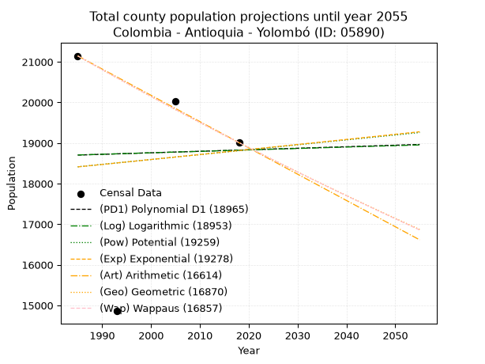
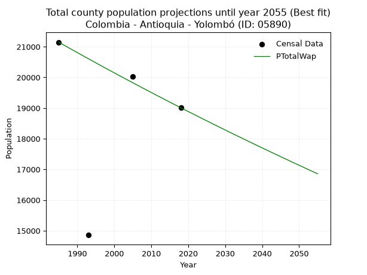
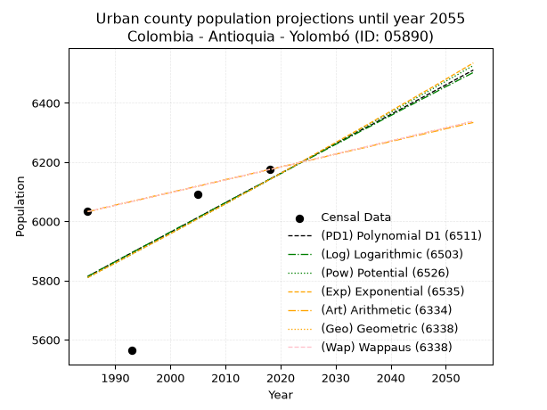
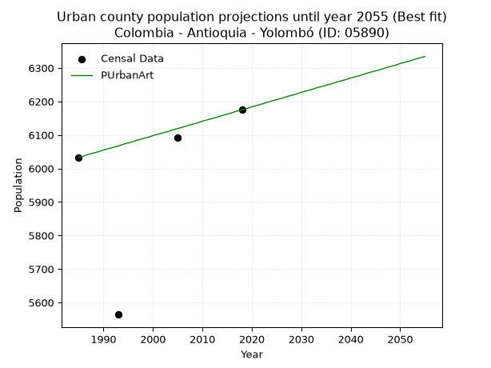
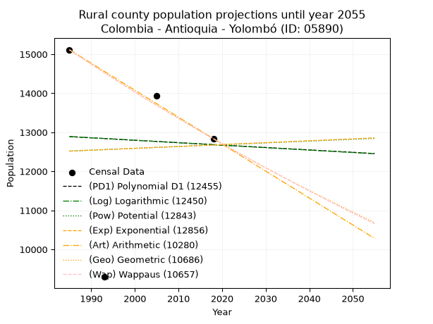
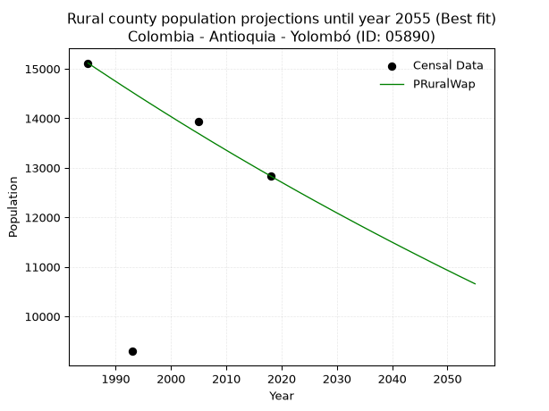

<div align="center">


</div>

# _“Population and Public Services Demand Projections (PPSD) until Year 2050 for Colombia - Antioquia - Yolombó (ID: 05890)”_
Keywords: `population` `public-service` `projection` `lineal` `polynomial` `logarithmic` `potential` `exponential` `arithmetic` `geometric` `wappaus` `dane` `colombia` `south-america`

PPSD are analytical estimates used by governments and planners to anticipate future changes in population size, age distribution, and the resulting community needs for utilities, healthcare, education, and infrastructure as sizing future water treatment facilities, electrical grids, and road networks based on spatial growth.

> **General running parameters**: • app_version: _v20260806_. • Python version: _3.14.7_. • Pandas version: _3.0.5_. • NumPy version: _2.5.1_. • Creates, save and include plots into reports (create_plot): _False_. • Projection until year: _2050_. • Process polynomial degree 2 and up: _False_. • Process Wappaus: _True_. • Process Wappaus: _True_. • Set negative values to zero: _True_. • Set infinite values to zero: _True_. • Drop dataset notes: _True_. 
<div align="center">

Dynamic map: [:earth_americas:Google](http://maps.google.com/maps?q=6.594510628,-75.0133845) [:earth_americas:OSM](https://www.openstreetmap.org/#map=18/6.594510628/-75.0133845&layers=P) [:earth_americas:Bing](https://www.bing.com/maps?cp=6.594510628~-75.0133845&lvl=18) [:earth_americas:Apple](https://maps.apple.com/frame?center=6.594510628%2C-75.0133845&span=0.003%2C0.006)

</div>


<div align="center">

```geojson
{
  "type": "Feature",
  "geometry": {
    "type": "Point", 
    "coordinates": [-75.0133845, 6.594510628]
  }, 
  "properties": {
    "Name": "Colombia - Antioquia - Yolombó (ID: 05890)"
  }
}
```

</div>


## 0. Census Data (4 records)

Census data are official statistics collected by a government about the people and housing in a country. They usually include counts of total population, age, sex, race, income, education, and jobs.

📅Global census file: [Population.xlsx](../data/Population.xlsx)

| Source   |   Year |   CountryID | CountryName   |   StateID | StateName   |   CountyID | CountyName   |   PTotal |   PUrban |   PRural |
|:---------|-------:|------------:|:--------------|----------:|:------------|-----------:|:-------------|---------:|---------:|---------:|
| DANE     |   1985 |          57 | Colombia      |        05 | Antioquia   |      05890 | Yolombó      |    21147 |     6033 |    15114 |
| DANE     |   1993 |          57 | Colombia      |        05 | Antioquia   |      05890 | Yolombó      |    14858 |     5564 |     9294 |
| DANE     |   2005 |          57 | Colombia      |        05 | Antioquia   |      05890 | Yolombó      |    20025 |     6091 |    13934 |
| DANE     |   2018 |          57 | Colombia      |        05 | Antioquia   |      05890 | Yolombó      |    19010 |     6175 |    12835 |

> 🔥Some records could had specific notes about the registered values or the corresponding urban or rural distribution.

**Local public utility companies (RUPS)**

 | SERVICIO       | ESTADO    | NOMBRE                                    | NIT         | DEPARTAMENTO_DOMICILIO   | MUNICIPIO_DOMICILIO   | DIRECCION                |   TELEFONO | EMAIL                            | TIPO_INSCRIPCION    | REPRESENTANTE_LEGAL                 | TIPO_PRESTADOR                             | CLASIFICACION                 |
|:---------------|:----------|:------------------------------------------|:------------|:-------------------------|:----------------------|:-------------------------|-----------:|:---------------------------------|:--------------------|:------------------------------------|:-------------------------------------------|:------------------------------|
| ASEO           | OPERATIVA | EMPRESAS VARIAS DE MEDELLIN  S.A. E.S. P. | 890905055-9 | ANTIOQUIA                | MEDELLIN              | CALLE 30 No 55-198       |    3807946 | nora.alvarez@emvarias.com.co     | Registro por la ESP | GUSTAVO ALEJANDRO GALLEGO HERNANDEZ | SOCIEDADES (EMPRESA DE SERVICIOS PUBLICOS) | MAYOR O IGUAL A 5001 USUARIOS |
| ACUEDUCTO      | OPERATIVA | EMPRESA DE SERVICIOS PUBLICOS DE YOLOMBO  | 811015112-4 | ANTIOQUIA                | YOLOMBO               | Calle Colombia No. 20-92 |    8655550 | serviciospublicosyol@hotmail.com | Registro por la ESP | ISAIAS DE JESUS PALACIO TABORDA     | EMPRESA INDUSTRIAL Y COMERCIAL DEL ESTADO  | MENOR O IGUAL A 2500 USUARIOS |
| ALCANTARILLADO | OPERATIVA | EMPRESA DE SERVICIOS PUBLICOS DE YOLOMBO  | 811015112-4 | ANTIOQUIA                | YOLOMBO               | Calle Colombia No. 20-92 |    8655550 | serviciospublicosyol@hotmail.com | Registro por la ESP | ISAIAS DE JESUS PALACIO TABORDA     | EMPRESA INDUSTRIAL Y COMERCIAL DEL ESTADO  | MENOR O IGUAL A 2500 USUARIOS |
| ASEO           | OPERATIVA | EMPRESA DE SERVICIOS PUBLICOS DE YOLOMBO  | 811015112-4 | ANTIOQUIA                | YOLOMBO               | Calle Colombia No. 20-92 |    8655550 | serviciospublicosyol@hotmail.com | Registro por la ESP | ISAIAS DE JESUS PALACIO TABORDA     | EMPRESA INDUSTRIAL Y COMERCIAL DEL ESTADO  | MENOR O IGUAL A 2500 USUARIOS |
| ASEO           | OPERATIVA | CORPORACION UNIDOS POR COLOMBIA           | 811029228-0 | ANTIOQUIA                | BELLO                 | Calle 50 A 50 47         |    6129889 | counicol.tecnicop@gmail.com      | Registro por la ESP | NULBER DE JESUS CASTANO VASQUEZ     | ORGANIZACION AUTORIZADA                    | MAYOR O IGUAL A 5001 USUARIOS |
| ASEO           | OPERATIVA | Asociación Recircular                     | 901326117-1 | ANTIOQUIA                | MEDELLIN              | calle 123 # 52 - 35      |    4795896 | asociacion.recircular@gmail.com  | Registro por la ESP | YESID ALEXIS RAMIREZ VALENCIA       | ORGANIZACION AUTORIZADA                    | MAYOR O IGUAL A 5001 USUARIOS |

> [📅RUPS Database: Registro Único de Prestadores de Servicios Públicos de Colombia Suramérica - RUPS](https://www.datos.gov.co/Hacienda-y-Cr-dito-P-blico/Registro-nico-de-Prestadores-de-Servicios-P-blicos/4qkq-csdn/about_data)

## 1. Total

### 1.1. Coefficients and Parameters

* (PD1) Polynomial Deg 1: 3.747892412686076, 11263.278201524678 (lineal)
* (Log) Logarithmic: 7137.8726656299705, -35495.02733077517
* (Pow) Potential: 1.2941310200709075, -0.002583700250221782
* (Exp) Exponential: 0.0006568360326971311, 4998.608186622993
* (Art) Arithmetic: Year diff. 2018 - 1985 = 33, Population diff. 19010 - 21147 = -2137, Annual growth = -64.75757575757575
* (Geo) Geometric: Year diff. 2018 - 1985 = 33, Population diff. 19010 - 21147 = -2137, Annual growth % = -0.003223064284935684
* (Wap) Wappaus: i = -0.32252198001631477, Condition values only valid for < 200)

<sub>
Wappaus condition values: ['-0.00', '-0.32', '-0.65', '-0.97', '-1.29', '-1.61', '-1.94', '-2.26', '-2.58', '-2.90', '-3.23', '-3.55', '-3.87', '-4.19', '-4.52', '-4.84', '-5.16', '-5.48', '-5.81', '-6.13', '-6.45', '-6.77', '-7.10', '-7.42', '-7.74', '-8.06', '-8.39', '-8.71', '-9.03', '-9.35', '-9.68', '-10.00', '-10.32', '-10.64', '-10.97', '-11.29', '-11.61', '-11.93', '-12.26', '-12.58', '-12.90', '-13.22', '-13.55', '-13.87', '-14.19', '-14.51', '-14.84', '-15.16', '-15.48', '-15.80', '-16.13', '-16.45', '-16.77', '-17.09', '-17.42', '-17.74', '-18.06', '-18.38', '-18.71', '-19.03', '-19.35', '-19.67', '-20.00', '-20.32', '-20.64', '-20.96']
</sub>


### 1.2. Projected Dataset

|   Year |   CountyID |   PTotalPD1 |   PTotalLog |   PTotalPow |   PTotalExp |   PTotalArt |   PTotalGeo |   PTotalWap |
|-------:|-----------:|------------:|------------:|------------:|------------:|------------:|------------:|------------:|
|   1985 |      05890 |       18703 |       18706 |       18414 |       18412 |       21147 |       21147 |       21147 |
|   1986 |      05890 |       18707 |       18709 |       18426 |       18424 |       21082 |       21079 |       21079 |
|   1987 |      05890 |       18710 |       18713 |       18438 |       18436 |       21017 |       21011 |       21011 |
|   1988 |      05890 |       18714 |       18716 |       18450 |       18448 |       20953 |       20943 |       20943 |
|   1989 |      05890 |       18718 |       18720 |       18462 |       18460 |       20888 |       20876 |       20876 |
|   1990 |      05890 |       18722 |       18723 |       18474 |       18472 |       20823 |       20808 |       20809 |
|   1991 |      05890 |       18725 |       18727 |       18486 |       18484 |       20758 |       20741 |       20742 |
|   1992 |      05890 |       18729 |       18731 |       18498 |       18496 |       20694 |       20674 |       20675 |
|   1993 |      05890 |       18733 |       18734 |       18510 |       18509 |       20629 |       20608 |       20608 |
|   1994 |      05890 |       18737 |       18738 |       18522 |       18521 |       20564 |       20541 |       20542 |
|   1995 |      05890 |       18740 |       18741 |       18534 |       18533 |       20499 |       20475 |       20476 |
|   1996 |      05890 |       18744 |       18745 |       18546 |       18545 |       20435 |       20409 |       20410 |
|   1997 |      05890 |       18748 |       18749 |       18558 |       18557 |       20370 |       20343 |       20344 |
|   1998 |      05890 |       18752 |       18752 |       18570 |       18569 |       20305 |       20278 |       20279 |
|   1999 |      05890 |       18755 |       18756 |       18582 |       18582 |       20240 |       20213 |       20213 |
|   2000 |      05890 |       18759 |       18759 |       18594 |       18594 |       20176 |       20147 |       20148 |
|   2001 |      05890 |       18763 |       18763 |       18606 |       18606 |       20111 |       20082 |       20083 |
|   2002 |      05890 |       18767 |       18766 |       18618 |       18618 |       20046 |       20018 |       20018 |
|   2003 |      05890 |       18770 |       18770 |       18630 |       18631 |       19981 |       19953 |       19954 |
|   2004 |      05890 |       18774 |       18774 |       18643 |       18643 |       19917 |       19889 |       19890 |
|   2005 |      05890 |       18778 |       18777 |       18655 |       18655 |       19852 |       19825 |       19826 |
|   2006 |      05890 |       18782 |       18781 |       18667 |       18667 |       19787 |       19761 |       19762 |
|   2007 |      05890 |       18785 |       18784 |       18679 |       18680 |       19722 |       19697 |       19698 |
|   2008 |      05890 |       18789 |       18788 |       18691 |       18692 |       19658 |       19634 |       19634 |
|   2009 |      05890 |       18793 |       18791 |       18703 |       18704 |       19593 |       19570 |       19571 |
|   2010 |      05890 |       18797 |       18795 |       18715 |       18716 |       19528 |       19507 |       19508 |
|   2011 |      05890 |       18800 |       18798 |       18727 |       18729 |       19463 |       19444 |       19445 |
|   2012 |      05890 |       18804 |       18802 |       18739 |       18741 |       19399 |       19382 |       19382 |
|   2013 |      05890 |       18808 |       18805 |       18751 |       18753 |       19334 |       19319 |       19320 |
|   2014 |      05890 |       18812 |       18809 |       18763 |       18766 |       19269 |       19257 |       19257 |
|   2015 |      05890 |       18815 |       18813 |       18775 |       18778 |       19204 |       19195 |       19195 |
|   2016 |      05890 |       18819 |       18816 |       18787 |       18790 |       19140 |       19133 |       19133 |
|   2017 |      05890 |       18823 |       18820 |       18799 |       18803 |       19075 |       19071 |       19072 |
|   2018 |      05890 |       18827 |       18823 |       18811 |       18815 |       19010 |       19010 |       19010 |
|   2019 |      05890 |       18830 |       18827 |       18823 |       18827 |       18945 |       18949 |       18949 |
|   2020 |      05890 |       18834 |       18830 |       18835 |       18840 |       18880 |       18888 |       18887 |
|   2021 |      05890 |       18838 |       18834 |       18847 |       18852 |       18816 |       18827 |       18826 |
|   2022 |      05890 |       18842 |       18837 |       18860 |       18865 |       18751 |       18766 |       18766 |
|   2023 |      05890 |       18845 |       18841 |       18872 |       18877 |       18686 |       18706 |       18705 |
|   2024 |      05890 |       18849 |       18844 |       18884 |       18889 |       18621 |       18645 |       18644 |
|   2025 |      05890 |       18853 |       18848 |       18896 |       18902 |       18557 |       18585 |       18584 |
|   2026 |      05890 |       18857 |       18851 |       18908 |       18914 |       18492 |       18525 |       18524 |
|   2027 |      05890 |       18860 |       18855 |       18920 |       18927 |       18427 |       18466 |       18464 |
|   2028 |      05890 |       18864 |       18858 |       18932 |       18939 |       18362 |       18406 |       18404 |
|   2029 |      05890 |       18868 |       18862 |       18944 |       18951 |       18298 |       18347 |       18345 |
|   2030 |      05890 |       18871 |       18866 |       18956 |       18964 |       18233 |       18288 |       18285 |
|   2031 |      05890 |       18875 |       18869 |       18968 |       18976 |       18168 |       18229 |       18226 |
|   2032 |      05890 |       18879 |       18873 |       18980 |       18989 |       18103 |       18170 |       18167 |
|   2033 |      05890 |       18883 |       18876 |       18992 |       19001 |       18039 |       18111 |       18108 |
|   2034 |      05890 |       18886 |       18880 |       19004 |       19014 |       17974 |       18053 |       18050 |
|   2035 |      05890 |       18890 |       18883 |       19017 |       19026 |       17909 |       17995 |       17991 |
|   2036 |      05890 |       18894 |       18887 |       19029 |       19039 |       17844 |       17937 |       17933 |
|   2037 |      05890 |       18898 |       18890 |       19041 |       19051 |       17780 |       17879 |       17875 |
|   2038 |      05890 |       18901 |       18894 |       19053 |       19064 |       17715 |       17821 |       17817 |
|   2039 |      05890 |       18905 |       18897 |       19065 |       19076 |       17650 |       17764 |       17759 |
|   2040 |      05890 |       18909 |       18901 |       19077 |       19089 |       17585 |       17707 |       17701 |
|   2041 |      05890 |       18913 |       18904 |       19089 |       19101 |       17521 |       17650 |       17644 |
|   2042 |      05890 |       18916 |       18908 |       19101 |       19114 |       17456 |       17593 |       17587 |
|   2043 |      05890 |       18920 |       18911 |       19113 |       19127 |       17391 |       17536 |       17530 |
|   2044 |      05890 |       18924 |       18915 |       19125 |       19139 |       17326 |       17480 |       17473 |
|   2045 |      05890 |       18928 |       18918 |       19138 |       19152 |       17262 |       17423 |       17416 |
|   2046 |      05890 |       18931 |       18922 |       19150 |       19164 |       17197 |       17367 |       17359 |
|   2047 |      05890 |       18935 |       18925 |       19162 |       19177 |       17132 |       17311 |       17303 |
|   2048 |      05890 |       18939 |       18929 |       19174 |       19189 |       17067 |       17255 |       17246 |
|   2049 |      05890 |       18943 |       18932 |       19186 |       19202 |       17003 |       17200 |       17190 |
|   2050 |      05890 |       18946 |       18935 |       19198 |       19215 |       16938 |       17144 |       17134 |
<div align="center">

</img>

</div>


### 1.3. Best fit with absolute and relative error (%)

Relative error puts that difference into context by dividing the absolute error by the true value, creating a unitless ratio or percentage that shows the scale of the mistake.

Absolute and relative error

|   Year | Source   |   CountryID | CountryName   |   StateID | StateName   |   CountyID_x | CountyName   |   PTotal |   PUrban |   PRural |   CountyID_y |   PTotalPD1 |   PTotalLog |   PTotalPow |   PTotalExp |   PTotalArt |   PTotalGeo |   PTotalWap |   PTotalPD1AbsError |   PTotalLogAbsError |   PTotalPowAbsError |   PTotalExpAbsError |   PTotalArtAbsError |   PTotalGeoAbsError |   PTotalWapAbsError |   PTotalPD1RelError |   PTotalLogRelError |   PTotalPowRelError |   PTotalExpRelError |   PTotalArtRelError |   PTotalGeoRelError |   PTotalWapRelError |
|-------:|:---------|------------:|:--------------|----------:|:------------|-------------:|:-------------|---------:|---------:|---------:|-------------:|------------:|------------:|------------:|------------:|------------:|------------:|------------:|--------------------:|--------------------:|--------------------:|--------------------:|--------------------:|--------------------:|--------------------:|--------------------:|--------------------:|--------------------:|--------------------:|--------------------:|--------------------:|--------------------:|
|   1985 | DANE     |          57 | Colombia      |        05 | Antioquia   |        05890 | Yolombó      |    21147 |     6033 |    15114 |        05890 |       18703 |       18706 |       18414 |       18412 |       21147 |       21147 |       21147 |                2444 |                2441 |                2733 |                2735 |                   0 |                   0 |                   0 |           11.5572   |           11.543    |            12.9238  |            12.9333  |             0       |            0        |            0        |
|   1993 | DANE     |          57 | Colombia      |        05 | Antioquia   |        05890 | Yolombó      |    14858 |     5564 |     9294 |        05890 |       18733 |       18734 |       18510 |       18509 |       20629 |       20608 |       20608 |                3875 |                3876 |                3652 |                3651 |                5771 |                5750 |                5750 |           26.0802   |           26.087    |            24.5794  |            24.5726  |            38.841   |           38.6997   |           38.6997   |
|   2005 | DANE     |          57 | Colombia      |        05 | Antioquia   |        05890 | Yolombó      |    20025 |     6091 |    13934 |        05890 |       18778 |       18777 |       18655 |       18655 |       19852 |       19825 |       19826 |                1247 |                1248 |                1370 |                1370 |                 173 |                 200 |                 199 |            6.22722  |            6.23221  |             6.84145 |             6.84145 |             0.86392 |            0.998752 |            0.993758 |
|   2018 | DANE     |          57 | Colombia      |        05 | Antioquia   |        05890 | Yolombó      |    19010 |     6175 |    12835 |        05890 |       18827 |       18823 |       18811 |       18815 |       19010 |       19010 |       19010 |                 183 |                 187 |                 199 |                 195 |                   0 |                   0 |                   0 |            0.962651 |            0.983693 |             1.04682 |             1.02578 |             0       |            0        |            0        |

Relative error mean

| Method    |   RelError | Best   |
|:----------|-----------:|:-------|
| PTotalPD1 |   11.2068  |        |
| PTotalLog |   11.2115  |        |
| PTotalPow |   11.3479  |        |
| PTotalExp |   11.3433  |        |
| PTotalArt |    9.92624 |        |
| PTotalGeo |    9.92461 |        |
| PTotalWap |    9.92336 | True   |

💙Best method: _**PTotalWap**_
<div align="center">

</img>

</div>


### 1.4. Fresh water supply demand in liters per capita per day (lpcd)

The fresh water supply demand typically ranges from 100 to 300 liters per capita per day (lpcd) for standard domestic and municipal planning, though absolute survival minimums set by the World Health Organization are as low as 7.5 to 20 liters per day, and total consumption in high-income nations can exceed 400 liters.

> `CZ`: Level in meters above the sea level (masl)<br> `WS`: Fresh water supply demand in liters per capita per day (lpcd or l/h/d)<br> `WSAll`: Zonal fresh water supply demand in liters per second (l/s)<br> `A`: Zonal area in square meters<br> `DP`: Population density (people/hectare or p/ha)

Reference values (RAS Colombia)

|    CZ |   WS |
|------:|-----:|
|  1000 |  120 |
|  2000 |  130 |
| 99999 |  140 |

County shapefile geometry properties and water supply values

|   CountyID |      ATotal |   CZTotal |   WSTotal |
|-----------:|------------:|----------:|----------:|
|      05890 | 9.43398e+08 |   1165.34 |       130 |

Projected values for best method: PTotalWap

|   CountyID |   Year |   PTotalWap |   DPTotal |   WSTotal |   WSTotalAll |
|-----------:|-------:|------------:|----------:|----------:|-------------:|
|      05890 |   1985 |       21147 |      0.22 |       130 |      31.8184 |
|      05890 |   1986 |       21079 |      0.22 |       130 |      31.7161 |
|      05890 |   1987 |       21011 |      0.22 |       130 |      31.6138 |
|      05890 |   1988 |       20943 |      0.22 |       130 |      31.5115 |
|      05890 |   1989 |       20876 |      0.22 |       130 |      31.4106 |
|      05890 |   1990 |       20809 |      0.22 |       130 |      31.3098 |
|      05890 |   1991 |       20742 |      0.22 |       130 |      31.209  |
|      05890 |   1992 |       20675 |      0.22 |       130 |      31.1082 |
|      05890 |   1993 |       20608 |      0.22 |       130 |      31.0074 |
|      05890 |   1994 |       20542 |      0.22 |       130 |      30.9081 |
|      05890 |   1995 |       20476 |      0.22 |       130 |      30.8088 |
|      05890 |   1996 |       20410 |      0.22 |       130 |      30.7095 |
|      05890 |   1997 |       20344 |      0.22 |       130 |      30.6102 |
|      05890 |   1998 |       20279 |      0.21 |       130 |      30.5124 |
|      05890 |   1999 |       20213 |      0.21 |       130 |      30.4131 |
|      05890 |   2000 |       20148 |      0.21 |       130 |      30.3153 |
|      05890 |   2001 |       20083 |      0.21 |       130 |      30.2175 |
|      05890 |   2002 |       20018 |      0.21 |       130 |      30.1197 |
|      05890 |   2003 |       19954 |      0.21 |       130 |      30.0234 |
|      05890 |   2004 |       19890 |      0.21 |       130 |      29.9271 |
|      05890 |   2005 |       19826 |      0.21 |       130 |      29.8308 |
|      05890 |   2006 |       19762 |      0.21 |       130 |      29.7345 |
|      05890 |   2007 |       19698 |      0.21 |       130 |      29.6382 |
|      05890 |   2008 |       19634 |      0.21 |       130 |      29.5419 |
|      05890 |   2009 |       19571 |      0.21 |       130 |      29.4471 |
|      05890 |   2010 |       19508 |      0.21 |       130 |      29.3523 |
|      05890 |   2011 |       19445 |      0.21 |       130 |      29.2575 |
|      05890 |   2012 |       19382 |      0.21 |       130 |      29.1627 |
|      05890 |   2013 |       19320 |      0.2  |       130 |      29.0694 |
|      05890 |   2014 |       19257 |      0.2  |       130 |      28.9747 |
|      05890 |   2015 |       19195 |      0.2  |       130 |      28.8814 |
|      05890 |   2016 |       19133 |      0.2  |       130 |      28.7881 |
|      05890 |   2017 |       19072 |      0.2  |       130 |      28.6963 |
|      05890 |   2018 |       19010 |      0.2  |       130 |      28.603  |
|      05890 |   2019 |       18949 |      0.2  |       130 |      28.5112 |
|      05890 |   2020 |       18887 |      0.2  |       130 |      28.4179 |
|      05890 |   2021 |       18826 |      0.2  |       130 |      28.3262 |
|      05890 |   2022 |       18766 |      0.2  |       130 |      28.2359 |
|      05890 |   2023 |       18705 |      0.2  |       130 |      28.1441 |
|      05890 |   2024 |       18644 |      0.2  |       130 |      28.0523 |
|      05890 |   2025 |       18584 |      0.2  |       130 |      27.962  |
|      05890 |   2026 |       18524 |      0.2  |       130 |      27.8718 |
|      05890 |   2027 |       18464 |      0.2  |       130 |      27.7815 |
|      05890 |   2028 |       18404 |      0.2  |       130 |      27.6912 |
|      05890 |   2029 |       18345 |      0.19 |       130 |      27.6024 |
|      05890 |   2030 |       18285 |      0.19 |       130 |      27.5122 |
|      05890 |   2031 |       18226 |      0.19 |       130 |      27.4234 |
|      05890 |   2032 |       18167 |      0.19 |       130 |      27.3346 |
|      05890 |   2033 |       18108 |      0.19 |       130 |      27.2458 |
|      05890 |   2034 |       18050 |      0.19 |       130 |      27.1586 |
|      05890 |   2035 |       17991 |      0.19 |       130 |      27.0698 |
|      05890 |   2036 |       17933 |      0.19 |       130 |      26.9825 |
|      05890 |   2037 |       17875 |      0.19 |       130 |      26.8953 |
|      05890 |   2038 |       17817 |      0.19 |       130 |      26.808  |
|      05890 |   2039 |       17759 |      0.19 |       130 |      26.7207 |
|      05890 |   2040 |       17701 |      0.19 |       130 |      26.6334 |
|      05890 |   2041 |       17644 |      0.19 |       130 |      26.5477 |
|      05890 |   2042 |       17587 |      0.19 |       130 |      26.4619 |
|      05890 |   2043 |       17530 |      0.19 |       130 |      26.3762 |
|      05890 |   2044 |       17473 |      0.19 |       130 |      26.2904 |
|      05890 |   2045 |       17416 |      0.18 |       130 |      26.2046 |
|      05890 |   2046 |       17359 |      0.18 |       130 |      26.1189 |
|      05890 |   2047 |       17303 |      0.18 |       130 |      26.0346 |
|      05890 |   2048 |       17246 |      0.18 |       130 |      25.9488 |
|      05890 |   2049 |       17190 |      0.18 |       130 |      25.8646 |
|      05890 |   2050 |       17134 |      0.18 |       130 |      25.7803 |

## 2. Urban

### 2.1. Coefficients and Parameters

* (PD1) Polynomial Deg 1: 9.949819349658666, -13936.376154154746 (lineal)
* (Log) Logarithmic: 19878.941557339716, -145134.24407717926
* (Pow) Potential: 3.3528692627627024, -7.292764206459047
* (Exp) Exponential: 0.0016782234078597702, 207.7030913260832
* (Art) Arithmetic: Year diff. 2018 - 1985 = 33, Population diff. 6175 - 6033 = 142, Annual growth = 4.303030303030303
* (Geo) Geometric: Year diff. 2018 - 1985 = 33, Population diff. 6175 - 6033 = 142, Annual growth % = 0.0007052328948757847
* (Wap) Wappaus: i = 0.07049525398149252, Condition values only valid for < 200)

<sub>
Wappaus condition values: ['0.00', '0.07', '0.14', '0.21', '0.28', '0.35', '0.42', '0.49', '0.56', '0.63', '0.70', '0.78', '0.85', '0.92', '0.99', '1.06', '1.13', '1.20', '1.27', '1.34', '1.41', '1.48', '1.55', '1.62', '1.69', '1.76', '1.83', '1.90', '1.97', '2.04', '2.11', '2.19', '2.26', '2.33', '2.40', '2.47', '2.54', '2.61', '2.68', '2.75', '2.82', '2.89', '2.96', '3.03', '3.10', '3.17', '3.24', '3.31', '3.38', '3.45', '3.52', '3.60', '3.67', '3.74', '3.81', '3.88', '3.95', '4.02', '4.09', '4.16', '4.23', '4.30', '4.37', '4.44', '4.51', '4.58']
</sub>


### 2.2. Projected Dataset

|   Year |   CountyID |   PUrbanPD1 |   PUrbanLog |   PUrbanPow |   PUrbanExp |   PUrbanArt |   PUrbanGeo |   PUrbanWap |
|-------:|-----------:|------------:|------------:|------------:|------------:|------------:|------------:|------------:|
|   1985 |      05890 |        5814 |        5814 |        5810 |        5810 |        6033 |        6033 |        6033 |
|   1986 |      05890 |        5824 |        5824 |        5820 |        5820 |        6037 |        6037 |        6037 |
|   1987 |      05890 |        5834 |        5834 |        5830 |        5830 |        6042 |        6042 |        6042 |
|   1988 |      05890 |        5844 |        5844 |        5840 |        5840 |        6046 |        6046 |        6046 |
|   1989 |      05890 |        5854 |        5854 |        5850 |        5849 |        6050 |        6050 |        6050 |
|   1990 |      05890 |        5864 |        5864 |        5859 |        5859 |        6055 |        6054 |        6054 |
|   1991 |      05890 |        5874 |        5874 |        5869 |        5869 |        6059 |        6059 |        6059 |
|   1992 |      05890 |        5884 |        5884 |        5879 |        5879 |        6063 |        6063 |        6063 |
|   1993 |      05890 |        5894 |        5894 |        5889 |        5889 |        6067 |        6067 |        6067 |
|   1994 |      05890 |        5904 |        5904 |        5899 |        5899 |        6072 |        6071 |        6071 |
|   1995 |      05890 |        5914 |        5914 |        5909 |        5909 |        6076 |        6076 |        6076 |
|   1996 |      05890 |        5923 |        5924 |        5919 |        5919 |        6080 |        6080 |        6080 |
|   1997 |      05890 |        5933 |        5934 |        5929 |        5928 |        6085 |        6084 |        6084 |
|   1998 |      05890 |        5943 |        5944 |        5939 |        5938 |        6089 |        6089 |        6089 |
|   1999 |      05890 |        5953 |        5954 |        5949 |        5948 |        6093 |        6093 |        6093 |
|   2000 |      05890 |        5963 |        5964 |        5959 |        5958 |        6098 |        6097 |        6097 |
|   2001 |      05890 |        5973 |        5974 |        5969 |        5968 |        6102 |        6101 |        6101 |
|   2002 |      05890 |        5983 |        5984 |        5979 |        5978 |        6106 |        6106 |        6106 |
|   2003 |      05890 |        5993 |        5993 |        5989 |        5988 |        6110 |        6110 |        6110 |
|   2004 |      05890 |        6003 |        6003 |        5999 |        5999 |        6115 |        6114 |        6114 |
|   2005 |      05890 |        6013 |        6013 |        6009 |        6009 |        6119 |        6119 |        6119 |
|   2006 |      05890 |        6023 |        6023 |        6019 |        6019 |        6123 |        6123 |        6123 |
|   2007 |      05890 |        6033 |        6033 |        6029 |        6029 |        6128 |        6127 |        6127 |
|   2008 |      05890 |        6043 |        6043 |        6039 |        6039 |        6132 |        6132 |        6132 |
|   2009 |      05890 |        6053 |        6053 |        6049 |        6049 |        6136 |        6136 |        6136 |
|   2010 |      05890 |        6063 |        6063 |        6059 |        6059 |        6141 |        6140 |        6140 |
|   2011 |      05890 |        6073 |        6073 |        6069 |        6069 |        6145 |        6145 |        6145 |
|   2012 |      05890 |        6083 |        6083 |        6080 |        6080 |        6149 |        6149 |        6149 |
|   2013 |      05890 |        6093 |        6092 |        6090 |        6090 |        6153 |        6153 |        6153 |
|   2014 |      05890 |        6103 |        6102 |        6100 |        6100 |        6158 |        6158 |        6158 |
|   2015 |      05890 |        6113 |        6112 |        6110 |        6110 |        6162 |        6162 |        6162 |
|   2016 |      05890 |        6122 |        6122 |        6120 |        6121 |        6166 |        6166 |        6166 |
|   2017 |      05890 |        6132 |        6132 |        6130 |        6131 |        6171 |        6171 |        6171 |
|   2018 |      05890 |        6142 |        6142 |        6141 |        6141 |        6175 |        6175 |        6175 |
|   2019 |      05890 |        6152 |        6152 |        6151 |        6151 |        6179 |        6179 |        6179 |
|   2020 |      05890 |        6162 |        6161 |        6161 |        6162 |        6184 |        6184 |        6184 |
|   2021 |      05890 |        6172 |        6171 |        6171 |        6172 |        6188 |        6188 |        6188 |
|   2022 |      05890 |        6182 |        6181 |        6181 |        6182 |        6192 |        6192 |        6192 |
|   2023 |      05890 |        6192 |        6191 |        6192 |        6193 |        6197 |        6197 |        6197 |
|   2024 |      05890 |        6202 |        6201 |        6202 |        6203 |        6201 |        6201 |        6201 |
|   2025 |      05890 |        6212 |        6211 |        6212 |        6214 |        6205 |        6206 |        6206 |
|   2026 |      05890 |        6222 |        6220 |        6223 |        6224 |        6209 |        6210 |        6210 |
|   2027 |      05890 |        6232 |        6230 |        6233 |        6235 |        6214 |        6214 |        6214 |
|   2028 |      05890 |        6242 |        6240 |        6243 |        6245 |        6218 |        6219 |        6219 |
|   2029 |      05890 |        6252 |        6250 |        6253 |        6256 |        6222 |        6223 |        6223 |
|   2030 |      05890 |        6262 |        6260 |        6264 |        6266 |        6227 |        6227 |        6227 |
|   2031 |      05890 |        6272 |        6269 |        6274 |        6277 |        6231 |        6232 |        6232 |
|   2032 |      05890 |        6282 |        6279 |        6285 |        6287 |        6235 |        6236 |        6236 |
|   2033 |      05890 |        6292 |        6289 |        6295 |        6298 |        6240 |        6241 |        6241 |
|   2034 |      05890 |        6302 |        6299 |        6305 |        6308 |        6244 |        6245 |        6245 |
|   2035 |      05890 |        6312 |        6309 |        6316 |        6319 |        6248 |        6249 |        6249 |
|   2036 |      05890 |        6321 |        6318 |        6326 |        6329 |        6252 |        6254 |        6254 |
|   2037 |      05890 |        6331 |        6328 |        6337 |        6340 |        6257 |        6258 |        6258 |
|   2038 |      05890 |        6341 |        6338 |        6347 |        6351 |        6261 |        6263 |        6263 |
|   2039 |      05890 |        6351 |        6348 |        6357 |        6361 |        6265 |        6267 |        6267 |
|   2040 |      05890 |        6361 |        6357 |        6368 |        6372 |        6270 |        6272 |        6272 |
|   2041 |      05890 |        6371 |        6367 |        6378 |        6383 |        6274 |        6276 |        6276 |
|   2042 |      05890 |        6381 |        6377 |        6389 |        6394 |        6278 |        6280 |        6280 |
|   2043 |      05890 |        6391 |        6387 |        6399 |        6404 |        6283 |        6285 |        6285 |
|   2044 |      05890 |        6401 |        6396 |        6410 |        6415 |        6287 |        6289 |        6289 |
|   2045 |      05890 |        6411 |        6406 |        6420 |        6426 |        6291 |        6294 |        6294 |
|   2046 |      05890 |        6421 |        6416 |        6431 |        6437 |        6295 |        6298 |        6298 |
|   2047 |      05890 |        6431 |        6425 |        6441 |        6447 |        6300 |        6303 |        6303 |
|   2048 |      05890 |        6441 |        6435 |        6452 |        6458 |        6304 |        6307 |        6307 |
|   2049 |      05890 |        6451 |        6445 |        6463 |        6469 |        6308 |        6311 |        6311 |
|   2050 |      05890 |        6461 |        6455 |        6473 |        6480 |        6313 |        6316 |        6316 |
<div align="center">

</img>

</div>


### 2.3. Best fit with absolute and relative error (%)

Relative error puts that difference into context by dividing the absolute error by the true value, creating a unitless ratio or percentage that shows the scale of the mistake.

Absolute and relative error

|   Year | Source   |   CountryID | CountryName   |   StateID | StateName   |   CountyID_x | CountyName   |   PTotal |   PUrban |   PRural |   CountyID_y |   PUrbanPD1 |   PUrbanLog |   PUrbanPow |   PUrbanExp |   PUrbanArt |   PUrbanGeo |   PUrbanWap |   PUrbanPD1AbsError |   PUrbanLogAbsError |   PUrbanPowAbsError |   PUrbanExpAbsError |   PUrbanArtAbsError |   PUrbanGeoAbsError |   PUrbanWapAbsError |   PUrbanPD1RelError |   PUrbanLogRelError |   PUrbanPowRelError |   PUrbanExpRelError |   PUrbanArtRelError |   PUrbanGeoRelError |   PUrbanWapRelError |
|-------:|:---------|------------:|:--------------|----------:|:------------|-------------:|:-------------|---------:|---------:|---------:|-------------:|------------:|------------:|------------:|------------:|------------:|------------:|------------:|--------------------:|--------------------:|--------------------:|--------------------:|--------------------:|--------------------:|--------------------:|--------------------:|--------------------:|--------------------:|--------------------:|--------------------:|--------------------:|--------------------:|
|   1985 | DANE     |          57 | Colombia      |        05 | Antioquia   |        05890 | Yolombó      |    21147 |     6033 |    15114 |        05890 |        5814 |        5814 |        5810 |        5810 |        6033 |        6033 |        6033 |                 219 |                 219 |                 223 |                 223 |                   0 |                   0 |                   0 |            3.63003  |            3.63003  |            3.69634  |            3.69634  |            0        |            0        |            0        |
|   1993 | DANE     |          57 | Colombia      |        05 | Antioquia   |        05890 | Yolombó      |    14858 |     5564 |     9294 |        05890 |        5894 |        5894 |        5889 |        5889 |        6067 |        6067 |        6067 |                 330 |                 330 |                 325 |                 325 |                 503 |                 503 |                 503 |            5.93098  |            5.93098  |            5.84112  |            5.84112  |            9.04026  |            9.04026  |            9.04026  |
|   2005 | DANE     |          57 | Colombia      |        05 | Antioquia   |        05890 | Yolombó      |    20025 |     6091 |    13934 |        05890 |        6013 |        6013 |        6009 |        6009 |        6119 |        6119 |        6119 |                  78 |                  78 |                  82 |                  82 |                  28 |                  28 |                  28 |            1.28058  |            1.28058  |            1.34625  |            1.34625  |            0.459695 |            0.459695 |            0.459695 |
|   2018 | DANE     |          57 | Colombia      |        05 | Antioquia   |        05890 | Yolombó      |    19010 |     6175 |    12835 |        05890 |        6142 |        6142 |        6141 |        6141 |        6175 |        6175 |        6175 |                  33 |                  33 |                  34 |                  34 |                   0 |                   0 |                   0 |            0.534413 |            0.534413 |            0.550607 |            0.550607 |            0        |            0        |            0        |

Relative error mean

| Method    |   RelError | Best   |
|:----------|-----------:|:-------|
| PUrbanPD1 |    2.844   |        |
| PUrbanLog |    2.844   |        |
| PUrbanPow |    2.85858 |        |
| PUrbanExp |    2.85858 |        |
| PUrbanArt |    2.37499 | True   |
| PUrbanGeo |    2.37499 | True   |
| PUrbanWap |    2.37499 | True   |

💙Best method: _**PUrbanArt**_
<div align="center">

</img>

</div>


### 2.4. Fresh water supply demand in liters per capita per day (lpcd)

The fresh water supply demand typically ranges from 100 to 300 liters per capita per day (lpcd) for standard domestic and municipal planning, though absolute survival minimums set by the World Health Organization are as low as 7.5 to 20 liters per day, and total consumption in high-income nations can exceed 400 liters.

> `CZ`: Level in meters above the sea level (masl)<br> `WS`: Fresh water supply demand in liters per capita per day (lpcd or l/h/d)<br> `WSAll`: Zonal fresh water supply demand in liters per second (l/s)<br> `A`: Zonal area in square meters<br> `DP`: Population density (people/hectare or p/ha)

Reference values (RAS Colombia)

|    CZ |   WS |
|------:|-----:|
|  1000 |  120 |
|  2000 |  130 |
| 99999 |  140 |

County shapefile geometry properties and water supply values

|   CountyID |      AUrban |   CZUrban |   WSUrban |
|-----------:|------------:|----------:|----------:|
|      05890 | 2.58446e+06 |    1441.9 |       130 |

Projected values for best method: PUrbanArt

|   CountyID |   Year |   PUrbanArt |   DPUrban |   WSUrban |   WSUrbanAll |
|-----------:|-------:|------------:|----------:|----------:|-------------:|
|      05890 |   1985 |        6033 |     23.34 |       130 |      9.07743 |
|      05890 |   1986 |        6037 |     23.36 |       130 |      9.08345 |
|      05890 |   1987 |        6042 |     23.38 |       130 |      9.09097 |
|      05890 |   1988 |        6046 |     23.39 |       130 |      9.09699 |
|      05890 |   1989 |        6050 |     23.41 |       130 |      9.10301 |
|      05890 |   1990 |        6055 |     23.43 |       130 |      9.11053 |
|      05890 |   1991 |        6059 |     23.44 |       130 |      9.11655 |
|      05890 |   1992 |        6063 |     23.46 |       130 |      9.12257 |
|      05890 |   1993 |        6067 |     23.47 |       130 |      9.12859 |
|      05890 |   1994 |        6072 |     23.49 |       130 |      9.13611 |
|      05890 |   1995 |        6076 |     23.51 |       130 |      9.14213 |
|      05890 |   1996 |        6080 |     23.53 |       130 |      9.14815 |
|      05890 |   1997 |        6085 |     23.54 |       130 |      9.15567 |
|      05890 |   1998 |        6089 |     23.56 |       130 |      9.16169 |
|      05890 |   1999 |        6093 |     23.58 |       130 |      9.16771 |
|      05890 |   2000 |        6098 |     23.59 |       130 |      9.17523 |
|      05890 |   2001 |        6102 |     23.61 |       130 |      9.18125 |
|      05890 |   2002 |        6106 |     23.63 |       130 |      9.18727 |
|      05890 |   2003 |        6110 |     23.64 |       130 |      9.19329 |
|      05890 |   2004 |        6115 |     23.66 |       130 |      9.20081 |
|      05890 |   2005 |        6119 |     23.68 |       130 |      9.20683 |
|      05890 |   2006 |        6123 |     23.69 |       130 |      9.21285 |
|      05890 |   2007 |        6128 |     23.71 |       130 |      9.22037 |
|      05890 |   2008 |        6132 |     23.73 |       130 |      9.22639 |
|      05890 |   2009 |        6136 |     23.74 |       130 |      9.23241 |
|      05890 |   2010 |        6141 |     23.76 |       130 |      9.23993 |
|      05890 |   2011 |        6145 |     23.78 |       130 |      9.24595 |
|      05890 |   2012 |        6149 |     23.79 |       130 |      9.25197 |
|      05890 |   2013 |        6153 |     23.81 |       130 |      9.25799 |
|      05890 |   2014 |        6158 |     23.83 |       130 |      9.26551 |
|      05890 |   2015 |        6162 |     23.84 |       130 |      9.27153 |
|      05890 |   2016 |        6166 |     23.86 |       130 |      9.27755 |
|      05890 |   2017 |        6171 |     23.88 |       130 |      9.28507 |
|      05890 |   2018 |        6175 |     23.89 |       130 |      9.29109 |
|      05890 |   2019 |        6179 |     23.91 |       130 |      9.29711 |
|      05890 |   2020 |        6184 |     23.93 |       130 |      9.30463 |
|      05890 |   2021 |        6188 |     23.94 |       130 |      9.31065 |
|      05890 |   2022 |        6192 |     23.96 |       130 |      9.31667 |
|      05890 |   2023 |        6197 |     23.98 |       130 |      9.32419 |
|      05890 |   2024 |        6201 |     23.99 |       130 |      9.33021 |
|      05890 |   2025 |        6205 |     24.01 |       130 |      9.33623 |
|      05890 |   2026 |        6209 |     24.02 |       130 |      9.34225 |
|      05890 |   2027 |        6214 |     24.04 |       130 |      9.34977 |
|      05890 |   2028 |        6218 |     24.06 |       130 |      9.35579 |
|      05890 |   2029 |        6222 |     24.07 |       130 |      9.36181 |
|      05890 |   2030 |        6227 |     24.09 |       130 |      9.36933 |
|      05890 |   2031 |        6231 |     24.11 |       130 |      9.37535 |
|      05890 |   2032 |        6235 |     24.12 |       130 |      9.38137 |
|      05890 |   2033 |        6240 |     24.14 |       130 |      9.38889 |
|      05890 |   2034 |        6244 |     24.16 |       130 |      9.39491 |
|      05890 |   2035 |        6248 |     24.18 |       130 |      9.40093 |
|      05890 |   2036 |        6252 |     24.19 |       130 |      9.40694 |
|      05890 |   2037 |        6257 |     24.21 |       130 |      9.41447 |
|      05890 |   2038 |        6261 |     24.23 |       130 |      9.42049 |
|      05890 |   2039 |        6265 |     24.24 |       130 |      9.4265  |
|      05890 |   2040 |        6270 |     24.26 |       130 |      9.43403 |
|      05890 |   2041 |        6274 |     24.28 |       130 |      9.44005 |
|      05890 |   2042 |        6278 |     24.29 |       130 |      9.44606 |
|      05890 |   2043 |        6283 |     24.31 |       130 |      9.45359 |
|      05890 |   2044 |        6287 |     24.33 |       130 |      9.45961 |
|      05890 |   2045 |        6291 |     24.34 |       130 |      9.46562 |
|      05890 |   2046 |        6295 |     24.36 |       130 |      9.47164 |
|      05890 |   2047 |        6300 |     24.38 |       130 |      9.47917 |
|      05890 |   2048 |        6304 |     24.39 |       130 |      9.48519 |
|      05890 |   2049 |        6308 |     24.41 |       130 |      9.4912  |
|      05890 |   2050 |        6313 |     24.43 |       130 |      9.49873 |

## 3. Rural

### 3.1. Coefficients and Parameters

* (PD1) Polynomial Deg 1: -6.201926936972644, 25199.65435567953 (lineal)
* (Log) Logarithmic: -12741.068891709709, 109639.21674640386
* (Pow) Potential: 0.7374569395557983, 1.6656121571909628
* (Exp) Exponential: 0.0003822470898274056, 5860.792366772475
* (Art) Arithmetic: Year diff. 2018 - 1985 = 33, Population diff. 12835 - 15114 = -2279, Annual growth = -69.06060606060606
* (Geo) Geometric: Year diff. 2018 - 1985 = 33, Population diff. 12835 - 15114 = -2279, Annual growth % = -0.004940653176803478
* (Wap) Wappaus: i = -0.49419017539522747, Condition values only valid for < 200)

<sub>
Wappaus condition values: ['-0.00', '-0.49', '-0.99', '-1.48', '-1.98', '-2.47', '-2.97', '-3.46', '-3.95', '-4.45', '-4.94', '-5.44', '-5.93', '-6.42', '-6.92', '-7.41', '-7.91', '-8.40', '-8.90', '-9.39', '-9.88', '-10.38', '-10.87', '-11.37', '-11.86', '-12.35', '-12.85', '-13.34', '-13.84', '-14.33', '-14.83', '-15.32', '-15.81', '-16.31', '-16.80', '-17.30', '-17.79', '-18.29', '-18.78', '-19.27', '-19.77', '-20.26', '-20.76', '-21.25', '-21.74', '-22.24', '-22.73', '-23.23', '-23.72', '-24.22', '-24.71', '-25.20', '-25.70', '-26.19', '-26.69', '-27.18', '-27.67', '-28.17', '-28.66', '-29.16', '-29.65', '-30.15', '-30.64', '-31.13', '-31.63', '-32.12']
</sub>


### 3.2. Projected Dataset

|   Year |   CountyID |   PRuralPD1 |   PRuralLog |   PRuralPow |   PRuralExp |   PRuralArt |   PRuralGeo |   PRuralWap |
|-------:|-----------:|------------:|------------:|------------:|------------:|------------:|------------:|------------:|
|   1985 |      05890 |       12889 |       12892 |       12519 |       12516 |       15114 |       15114 |       15114 |
|   1986 |      05890 |       12883 |       12885 |       12524 |       12521 |       15045 |       15039 |       15039 |
|   1987 |      05890 |       12876 |       12879 |       12528 |       12526 |       14976 |       14965 |       14965 |
|   1988 |      05890 |       12870 |       12872 |       12533 |       12531 |       14907 |       14891 |       14892 |
|   1989 |      05890 |       12864 |       12866 |       12538 |       12536 |       14838 |       14818 |       14818 |
|   1990 |      05890 |       12858 |       12859 |       12542 |       12540 |       14769 |       14744 |       14745 |
|   1991 |      05890 |       12852 |       12853 |       12547 |       12545 |       14700 |       14671 |       14672 |
|   1992 |      05890 |       12845 |       12847 |       12552 |       12550 |       14631 |       14599 |       14600 |
|   1993 |      05890 |       12839 |       12840 |       12556 |       12555 |       14562 |       14527 |       14528 |
|   1994 |      05890 |       12833 |       12834 |       12561 |       12560 |       14492 |       14455 |       14456 |
|   1995 |      05890 |       12827 |       12827 |       12565 |       12564 |       14423 |       14384 |       14385 |
|   1996 |      05890 |       12821 |       12821 |       12570 |       12569 |       14354 |       14313 |       14314 |
|   1997 |      05890 |       12814 |       12815 |       12575 |       12574 |       14285 |       14242 |       14244 |
|   1998 |      05890 |       12808 |       12808 |       12579 |       12579 |       14216 |       14172 |       14173 |
|   1999 |      05890 |       12802 |       12802 |       12584 |       12584 |       14147 |       14101 |       14103 |
|   2000 |      05890 |       12796 |       12796 |       12589 |       12588 |       14078 |       14032 |       14034 |
|   2001 |      05890 |       12790 |       12789 |       12593 |       12593 |       14009 |       13962 |       13964 |
|   2002 |      05890 |       12783 |       12783 |       12598 |       12598 |       13940 |       13894 |       13895 |
|   2003 |      05890 |       12777 |       12776 |       12603 |       12603 |       13871 |       13825 |       13827 |
|   2004 |      05890 |       12771 |       12770 |       12607 |       12608 |       13802 |       13757 |       13758 |
|   2005 |      05890 |       12765 |       12764 |       12612 |       12613 |       13733 |       13689 |       13691 |
|   2006 |      05890 |       12759 |       12757 |       12617 |       12617 |       13664 |       13621 |       13623 |
|   2007 |      05890 |       12752 |       12751 |       12621 |       12622 |       13595 |       13554 |       13555 |
|   2008 |      05890 |       12746 |       12745 |       12626 |       12627 |       13526 |       13487 |       13488 |
|   2009 |      05890 |       12740 |       12738 |       12630 |       12632 |       13457 |       13420 |       13422 |
|   2010 |      05890 |       12734 |       12732 |       12635 |       12637 |       13387 |       13354 |       13355 |
|   2011 |      05890 |       12728 |       12726 |       12640 |       12641 |       13318 |       13288 |       13289 |
|   2012 |      05890 |       12721 |       12719 |       12644 |       12646 |       13249 |       13222 |       13223 |
|   2013 |      05890 |       12715 |       12713 |       12649 |       12651 |       13180 |       13157 |       13158 |
|   2014 |      05890 |       12709 |       12707 |       12654 |       12656 |       13111 |       13092 |       13093 |
|   2015 |      05890 |       12703 |       12700 |       12658 |       12661 |       13042 |       13027 |       13028 |
|   2016 |      05890 |       12697 |       12694 |       12663 |       12666 |       12973 |       12963 |       12963 |
|   2017 |      05890 |       12690 |       12688 |       12667 |       12671 |       12904 |       12899 |       12899 |
|   2018 |      05890 |       12684 |       12681 |       12672 |       12675 |       12835 |       12835 |       12835 |
|   2019 |      05890 |       12678 |       12675 |       12677 |       12680 |       12766 |       12772 |       12771 |
|   2020 |      05890 |       12672 |       12669 |       12681 |       12685 |       12697 |       12708 |       12708 |
|   2021 |      05890 |       12666 |       12663 |       12686 |       12690 |       12628 |       12646 |       12645 |
|   2022 |      05890 |       12659 |       12656 |       12691 |       12695 |       12559 |       12583 |       12582 |
|   2023 |      05890 |       12653 |       12650 |       12695 |       12700 |       12490 |       12521 |       12519 |
|   2024 |      05890 |       12647 |       12644 |       12700 |       12704 |       12421 |       12459 |       12457 |
|   2025 |      05890 |       12641 |       12637 |       12705 |       12709 |       12352 |       12398 |       12395 |
|   2026 |      05890 |       12635 |       12631 |       12709 |       12714 |       12283 |       12336 |       12333 |
|   2027 |      05890 |       12628 |       12625 |       12714 |       12719 |       12213 |       12275 |       12272 |
|   2028 |      05890 |       12622 |       12618 |       12718 |       12724 |       12144 |       12215 |       12211 |
|   2029 |      05890 |       12616 |       12612 |       12723 |       12729 |       12075 |       12154 |       12150 |
|   2030 |      05890 |       12610 |       12606 |       12728 |       12734 |       12006 |       12094 |       12089 |
|   2031 |      05890 |       12604 |       12600 |       12732 |       12738 |       11937 |       12035 |       12029 |
|   2032 |      05890 |       12597 |       12593 |       12737 |       12743 |       11868 |       11975 |       11969 |
|   2033 |      05890 |       12591 |       12587 |       12742 |       12748 |       11799 |       11916 |       11909 |
|   2034 |      05890 |       12585 |       12581 |       12746 |       12753 |       11730 |       11857 |       11849 |
|   2035 |      05890 |       12579 |       12575 |       12751 |       12758 |       11661 |       11799 |       11790 |
|   2036 |      05890 |       12573 |       12568 |       12755 |       12763 |       11592 |       11740 |       11731 |
|   2037 |      05890 |       12566 |       12562 |       12760 |       12768 |       11523 |       11682 |       11672 |
|   2038 |      05890 |       12560 |       12556 |       12765 |       12773 |       11454 |       11625 |       11614 |
|   2039 |      05890 |       12554 |       12550 |       12769 |       12778 |       11385 |       11567 |       11555 |
|   2040 |      05890 |       12548 |       12543 |       12774 |       12782 |       11316 |       11510 |       11497 |
|   2041 |      05890 |       12542 |       12537 |       12778 |       12787 |       11247 |       11453 |       11440 |
|   2042 |      05890 |       12535 |       12531 |       12783 |       12792 |       11178 |       11396 |       11382 |
|   2043 |      05890 |       12529 |       12525 |       12788 |       12797 |       11108 |       11340 |       11325 |
|   2044 |      05890 |       12523 |       12518 |       12792 |       12802 |       11039 |       11284 |       11268 |
|   2045 |      05890 |       12517 |       12512 |       12797 |       12807 |       10970 |       11228 |       11211 |
|   2046 |      05890 |       12511 |       12506 |       12802 |       12812 |       10901 |       11173 |       11155 |
|   2047 |      05890 |       12504 |       12500 |       12806 |       12817 |       10832 |       11118 |       11098 |
|   2048 |      05890 |       12498 |       12493 |       12811 |       12822 |       10763 |       11063 |       11042 |
|   2049 |      05890 |       12492 |       12487 |       12815 |       12826 |       10694 |       11008 |       10986 |
|   2050 |      05890 |       12486 |       12481 |       12820 |       12831 |       10625 |       10954 |       10931 |
<div align="center">

</img>

</div>


### 3.3. Best fit with absolute and relative error (%)

Relative error puts that difference into context by dividing the absolute error by the true value, creating a unitless ratio or percentage that shows the scale of the mistake.

Absolute and relative error

|   Year | Source   |   CountryID | CountryName   |   StateID | StateName   |   CountyID_x | CountyName   |   PTotal |   PUrban |   PRural |   CountyID_y |   PRuralPD1 |   PRuralLog |   PRuralPow |   PRuralExp |   PRuralArt |   PRuralGeo |   PRuralWap |   PRuralPD1AbsError |   PRuralLogAbsError |   PRuralPowAbsError |   PRuralExpAbsError |   PRuralArtAbsError |   PRuralGeoAbsError |   PRuralWapAbsError |   PRuralPD1RelError |   PRuralLogRelError |   PRuralPowRelError |   PRuralExpRelError |   PRuralArtRelError |   PRuralGeoRelError |   PRuralWapRelError |
|-------:|:---------|------------:|:--------------|----------:|:------------|-------------:|:-------------|---------:|---------:|---------:|-------------:|------------:|------------:|------------:|------------:|------------:|------------:|------------:|--------------------:|--------------------:|--------------------:|--------------------:|--------------------:|--------------------:|--------------------:|--------------------:|--------------------:|--------------------:|--------------------:|--------------------:|--------------------:|--------------------:|
|   1985 | DANE     |          57 | Colombia      |        05 | Antioquia   |        05890 | Yolombó      |    21147 |     6033 |    15114 |        05890 |       12889 |       12892 |       12519 |       12516 |       15114 |       15114 |       15114 |                2225 |                2222 |                2595 |                2598 |                   0 |                   0 |                   0 |            14.7215  |            14.7016  |            17.1695  |            17.1894  |             0       |             0       |             0       |
|   1993 | DANE     |          57 | Colombia      |        05 | Antioquia   |        05890 | Yolombó      |    14858 |     5564 |     9294 |        05890 |       12839 |       12840 |       12556 |       12555 |       14562 |       14527 |       14528 |                3545 |                3546 |                3262 |                3261 |                5268 |                5233 |                5234 |            38.1429  |            38.1536  |            35.0979  |            35.0872  |            56.6817  |            56.3051  |            56.3159  |
|   2005 | DANE     |          57 | Colombia      |        05 | Antioquia   |        05890 | Yolombó      |    20025 |     6091 |    13934 |        05890 |       12765 |       12764 |       12612 |       12613 |       13733 |       13689 |       13691 |                1169 |                1170 |                1322 |                1321 |                 201 |                 245 |                 243 |             8.38955 |             8.39673 |             9.48758 |             9.48041 |             1.44251 |             1.75829 |             1.74394 |
|   2018 | DANE     |          57 | Colombia      |        05 | Antioquia   |        05890 | Yolombó      |    19010 |     6175 |    12835 |        05890 |       12684 |       12681 |       12672 |       12675 |       12835 |       12835 |       12835 |                 151 |                 154 |                 163 |                 160 |                   0 |                   0 |                   0 |             1.17647 |             1.19984 |             1.26996 |             1.24659 |             0       |             0       |             0       |

Relative error mean

| Method    |   RelError | Best   |
|:----------|-----------:|:-------|
| PRuralPD1 |    15.6076 |        |
| PRuralLog |    15.613  |        |
| PRuralPow |    15.7562 |        |
| PRuralExp |    15.7509 |        |
| PRuralArt |    14.5311 |        |
| PRuralGeo |    14.5159 |        |
| PRuralWap |    14.515  | True   |

💙Best method: _**PRuralWap**_
<div align="center">

</img>

</div>


### 3.4. Fresh water supply demand in liters per capita per day (lpcd)

The fresh water supply demand typically ranges from 100 to 300 liters per capita per day (lpcd) for standard domestic and municipal planning, though absolute survival minimums set by the World Health Organization are as low as 7.5 to 20 liters per day, and total consumption in high-income nations can exceed 400 liters.

> `CZ`: Level in meters above the sea level (masl)<br> `WS`: Fresh water supply demand in liters per capita per day (lpcd or l/h/d)<br> `WSAll`: Zonal fresh water supply demand in liters per second (l/s)<br> `A`: Zonal area in square meters<br> `DP`: Population density (people/hectare or p/ha)

Reference values (RAS Colombia)

|    CZ |   WS |
|------:|-----:|
|  1000 |  120 |
|  2000 |  130 |
| 99999 |  140 |

County shapefile geometry properties and water supply values

|   CountyID |      ARural |   CZRural |   WSRural |
|-----------:|------------:|----------:|----------:|
|      05890 | 9.40814e+08 |   1164.59 |       130 |

Projected values for best method: PRuralWap

|   CountyID |   Year |   PRuralWap |   DPRural |   WSRural |   WSRuralAll |
|-----------:|-------:|------------:|----------:|----------:|-------------:|
|      05890 |   1985 |       15114 |      0.16 |       130 |      22.741  |
|      05890 |   1986 |       15039 |      0.16 |       130 |      22.6281 |
|      05890 |   1987 |       14965 |      0.16 |       130 |      22.5168 |
|      05890 |   1988 |       14892 |      0.16 |       130 |      22.4069 |
|      05890 |   1989 |       14818 |      0.16 |       130 |      22.2956 |
|      05890 |   1990 |       14745 |      0.16 |       130 |      22.1858 |
|      05890 |   1991 |       14672 |      0.16 |       130 |      22.0759 |
|      05890 |   1992 |       14600 |      0.16 |       130 |      21.9676 |
|      05890 |   1993 |       14528 |      0.15 |       130 |      21.8593 |
|      05890 |   1994 |       14456 |      0.15 |       130 |      21.7509 |
|      05890 |   1995 |       14385 |      0.15 |       130 |      21.6441 |
|      05890 |   1996 |       14314 |      0.15 |       130 |      21.5373 |
|      05890 |   1997 |       14244 |      0.15 |       130 |      21.4319 |
|      05890 |   1998 |       14173 |      0.15 |       130 |      21.3251 |
|      05890 |   1999 |       14103 |      0.15 |       130 |      21.2198 |
|      05890 |   2000 |       14034 |      0.15 |       130 |      21.116  |
|      05890 |   2001 |       13964 |      0.15 |       130 |      21.0106 |
|      05890 |   2002 |       13895 |      0.15 |       130 |      20.9068 |
|      05890 |   2003 |       13827 |      0.15 |       130 |      20.8045 |
|      05890 |   2004 |       13758 |      0.15 |       130 |      20.7007 |
|      05890 |   2005 |       13691 |      0.15 |       130 |      20.5999 |
|      05890 |   2006 |       13623 |      0.14 |       130 |      20.4976 |
|      05890 |   2007 |       13555 |      0.14 |       130 |      20.3953 |
|      05890 |   2008 |       13488 |      0.14 |       130 |      20.2944 |
|      05890 |   2009 |       13422 |      0.14 |       130 |      20.1951 |
|      05890 |   2010 |       13355 |      0.14 |       130 |      20.0943 |
|      05890 |   2011 |       13289 |      0.14 |       130 |      19.995  |
|      05890 |   2012 |       13223 |      0.14 |       130 |      19.8957 |
|      05890 |   2013 |       13158 |      0.14 |       130 |      19.7979 |
|      05890 |   2014 |       13093 |      0.14 |       130 |      19.7001 |
|      05890 |   2015 |       13028 |      0.14 |       130 |      19.6023 |
|      05890 |   2016 |       12963 |      0.14 |       130 |      19.5045 |
|      05890 |   2017 |       12899 |      0.14 |       130 |      19.4082 |
|      05890 |   2018 |       12835 |      0.14 |       130 |      19.3119 |
|      05890 |   2019 |       12771 |      0.14 |       130 |      19.2156 |
|      05890 |   2020 |       12708 |      0.14 |       130 |      19.1208 |
|      05890 |   2021 |       12645 |      0.13 |       130 |      19.026  |
|      05890 |   2022 |       12582 |      0.13 |       130 |      18.9312 |
|      05890 |   2023 |       12519 |      0.13 |       130 |      18.8365 |
|      05890 |   2024 |       12457 |      0.13 |       130 |      18.7432 |
|      05890 |   2025 |       12395 |      0.13 |       130 |      18.6499 |
|      05890 |   2026 |       12333 |      0.13 |       130 |      18.5566 |
|      05890 |   2027 |       12272 |      0.13 |       130 |      18.4648 |
|      05890 |   2028 |       12211 |      0.13 |       130 |      18.373  |
|      05890 |   2029 |       12150 |      0.13 |       130 |      18.2812 |
|      05890 |   2030 |       12089 |      0.13 |       130 |      18.1895 |
|      05890 |   2031 |       12029 |      0.13 |       130 |      18.0992 |
|      05890 |   2032 |       11969 |      0.13 |       130 |      18.0089 |
|      05890 |   2033 |       11909 |      0.13 |       130 |      17.9186 |
|      05890 |   2034 |       11849 |      0.13 |       130 |      17.8284 |
|      05890 |   2035 |       11790 |      0.13 |       130 |      17.7396 |
|      05890 |   2036 |       11731 |      0.12 |       130 |      17.6508 |
|      05890 |   2037 |       11672 |      0.12 |       130 |      17.562  |
|      05890 |   2038 |       11614 |      0.12 |       130 |      17.4748 |
|      05890 |   2039 |       11555 |      0.12 |       130 |      17.386  |
|      05890 |   2040 |       11497 |      0.12 |       130 |      17.2987 |
|      05890 |   2041 |       11440 |      0.12 |       130 |      17.213  |
|      05890 |   2042 |       11382 |      0.12 |       130 |      17.1257 |
|      05890 |   2043 |       11325 |      0.12 |       130 |      17.0399 |
|      05890 |   2044 |       11268 |      0.12 |       130 |      16.9542 |
|      05890 |   2045 |       11211 |      0.12 |       130 |      16.8684 |
|      05890 |   2046 |       11155 |      0.12 |       130 |      16.7841 |
|      05890 |   2047 |       11098 |      0.12 |       130 |      16.6984 |
|      05890 |   2048 |       11042 |      0.12 |       130 |      16.6141 |
|      05890 |   2049 |       10986 |      0.12 |       130 |      16.5299 |
|      05890 |   2050 |       10931 |      0.12 |       130 |      16.4471 |

<div align="center"><br><sub>Share this research</sub></div><br>

<sub>**APPS & TOOLS & CONTENT DISCLAIMER**: • NO WARRANTY - This content and software is provided by <a href="https://github.com/rcfdtools" target="_blank">github.com/rcfdtools</a> "as is", without any express or implied warranty, including warranties of merchantability, fitness for a particular purpose, or non-infringement. There is no guarantee that the software will be error-free or operate without interruption. • LIMITATION OF LIABILITY - Neither the authors nor copyright holders will be liable for claims or damages arising from the software or its use. You are responsible for determining if the software is appropriate for your use and assume all associated risks, including errors, legal compliance, and data loss. • NO PROFESSIONAL ADVICE - The software provides general information and does not offer professional advice. It should not replace consultation with professional advisors. [Clauses and global license for rcfdtools use.](https://github.com/rcfdtools/rcfdtools/blob/main/LICENSE.md)</sub>

| [:house: Home](Readme.md)  | [:beginner: Help / Collaborate](https://github.com/rcfdtools/R.HydroTools/discussions/31) |
|----------------------------|-------------------------------------------------------------------------------------------|