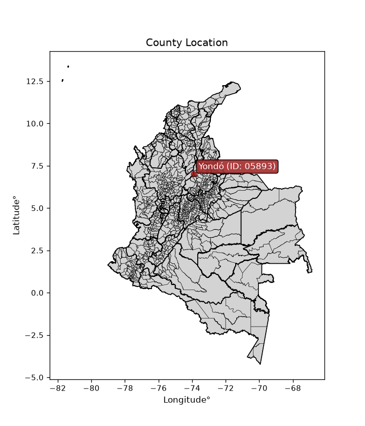
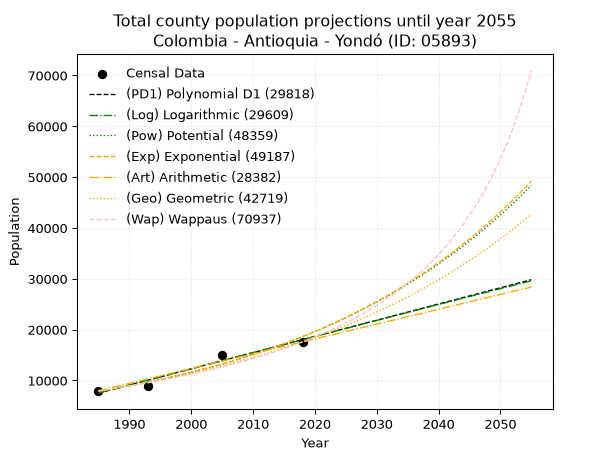
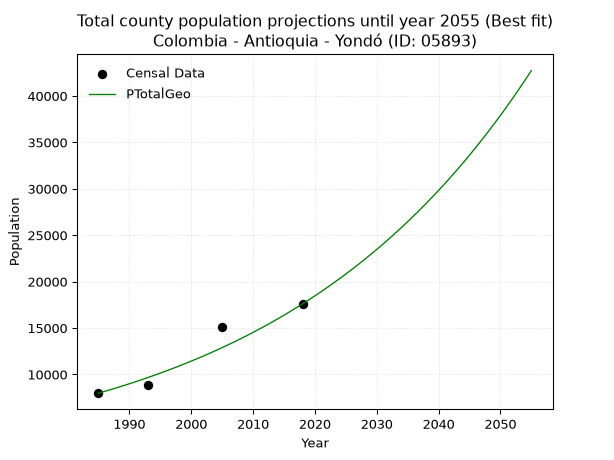
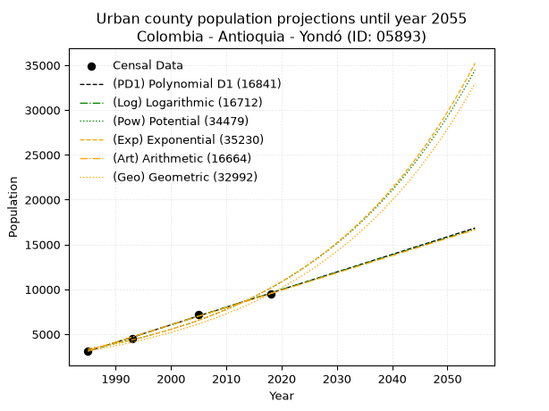
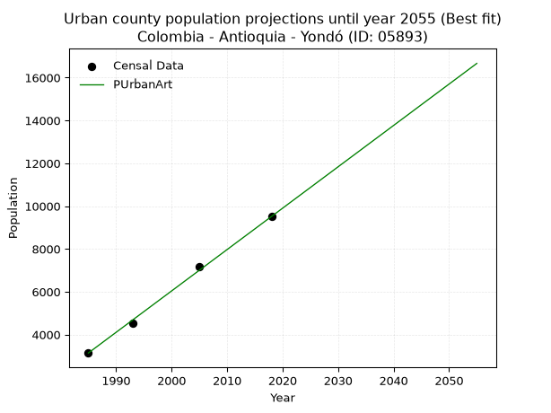
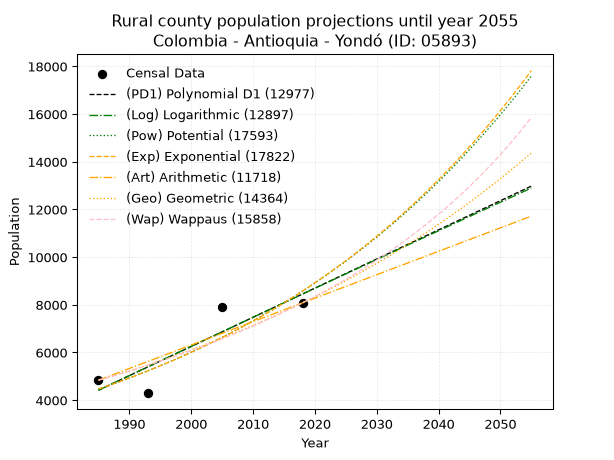
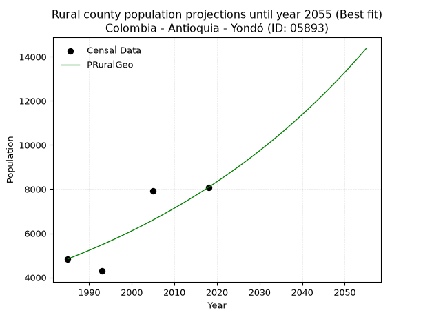

<div align="center">


</div>

# _“Population and Public Services Demand Projections (PPSD) until Year 2050 for Colombia - Antioquia - Yondó (ID: 05893)”_
Keywords: `population` `public-service` `projection` `lineal` `polynomial` `logarithmic` `potential` `exponential` `arithmetic` `geometric` `wappaus` `dane` `colombia` `south-america`

PPSD are analytical estimates used by governments and planners to anticipate future changes in population size, age distribution, and the resulting community needs for utilities, healthcare, education, and infrastructure as sizing future water treatment facilities, electrical grids, and road networks based on spatial growth.

<div align="center">

</img>

</div>


> **General running parameters**: • app_version: _v20260806_. • Python version: _3.14.7_. • Pandas version: _3.0.5_. • NumPy version: _2.5.1_. • Creates, save and include plots into reports (create_plot): _False_. • Projection until year: _2050_. • Process polynomial degree 2 and up: _False_. • Process Wappaus: _True_. • Process Wappaus: _True_. • Set negative values to zero: _True_. • Set infinite values to zero: _True_. • Drop dataset notes: _True_. 
<div align="center">

Dynamic map: [:earth_americas:Google](http://maps.google.com/maps?q=7.003960289,-73.912445) [:earth_americas:OSM](https://www.openstreetmap.org/#map=18/7.003960289/-73.912445&layers=P) [:earth_americas:Bing](https://www.bing.com/maps?cp=7.003960289~-73.912445&lvl=18) [:earth_americas:Apple](https://maps.apple.com/frame?center=7.003960289%2C-73.912445&span=0.003%2C0.006)

</div>


<div align="center">

```geojson
{
  "type": "Feature",
  "geometry": {
    "type": "Point", 
    "coordinates": [-73.912445, 7.003960289]
  }, 
  "properties": {
    "Name": "Colombia - Antioquia - Yondó (ID: 05893)"
  }
}
```

</div>


## 0. Census Data (4 records)

Census data are official statistics collected by a government about the people and housing in a country. They usually include counts of total population, age, sex, race, income, education, and jobs.

📅Global census file: [Population.xlsx](../data/Population.xlsx)

| Source   |   Year |   CountryID | CountryName   |   StateID | StateName   |   CountyID | CountyName   |   PTotal |   PUrban |   PRural |
|:---------|-------:|------------:|:--------------|----------:|:------------|-----------:|:-------------|---------:|---------:|---------:|
| DANE     |   1985 |          57 | Colombia      |        05 | Antioquia   |      05893 | Yondó        |     7978 |     3139 |     4839 |
| DANE     |   1993 |          57 | Colombia      |        05 | Antioquia   |      05893 | Yondó        |     8824 |     4531 |     4293 |
| DANE     |   2005 |          57 | Colombia      |        05 | Antioquia   |      05893 | Yondó        |    15097 |     7180 |     7917 |
| DANE     |   2018 |          57 | Colombia      |        05 | Antioquia   |      05893 | Yondó        |    17597 |     9515 |     8082 |

> 🔥Some records could had specific notes about the registered values or the corresponding urban or rural distribution.

📅[SUI-RUPS](https://www.datos.gov.co/Hacienda-y-Cr-dito-P-blico/Registro-nico-de-Prestadores-de-Servicios-P-blicos/4qkq-csdn/about_data) - Local public utility companies: [RUPS.csv](../data/RUPS.xlsx)

 | SERVICIO       | ESTADO    | NOMBRE                    | NIT         | DEPARTAMENTO_DOMICILIO   | MUNICIPIO_DOMICILIO   | DIRECCION           |   TELEFONO | EMAIL               | TIPO_PRESTADOR                             | CLASIFICACION                 |
|:---------------|:----------|:--------------------------|:------------|:-------------------------|:----------------------|:--------------------|-----------:|:--------------------|:-------------------------------------------|:------------------------------|
| ACUEDUCTO      | OPERATIVA | AGUAS & ASEO YONDO SA ESP | 811021151-6 | ANTIOQUIA                | YONDO                 | CARRERA 53 No.50-79 |    8325371 | amby105@hotmail.com | SOCIEDADES (EMPRESA DE SERVICIOS PUBLICOS) | MENOR O IGUAL A 2500 USUARIOS |
| ALCANTARILLADO | OPERATIVA | AGUAS & ASEO YONDO SA ESP | 811021151-6 | ANTIOQUIA                | YONDO                 | CARRERA 53 No.50-79 |    8325371 | amby105@hotmail.com | SOCIEDADES (EMPRESA DE SERVICIOS PUBLICOS) | MENOR O IGUAL A 2500 USUARIOS |

## 1. Total

### 1.1. Coefficients and Parameters

* (PD1) Polynomial Deg 1: 318.61742272179646, -624940.4997992733 (lineal)
* (Log) Logarithmic: 637803.7859008673, -4835577.687671268
* (Pow) Potential: 52.53151848864453, -169.3425541672851
* (Exp) Exponential: 0.02623822060413831, 1.8831919101006916e-19
* (Art) Arithmetic: Year diff. 2018 - 1985 = 33, Population diff. 17597 - 7978 = 9619, Annual growth = 291.4848484848485
* (Geo) Geometric: Year diff. 2018 - 1985 = 33, Population diff. 17597 - 7978 = 9619, Annual growth % = 0.024260541877549224
* (Wap) Wappaus: i = 2.279451405551112, Condition values only valid for < 200)

<sub>
Wappaus condition values: ['0.00', '2.28', '4.56', '6.84', '9.12', '11.40', '13.68', '15.96', '18.24', '20.52', '22.79', '25.07', '27.35', '29.63', '31.91', '34.19', '36.47', '38.75', '41.03', '43.31', '45.59', '47.87', '50.15', '52.43', '54.71', '56.99', '59.27', '61.55', '63.82', '66.10', '68.38', '70.66', '72.94', '75.22', '77.50', '79.78', '82.06', '84.34', '86.62', '88.90', '91.18', '93.46', '95.74', '98.02', '100.30', '102.58', '104.85', '107.13', '109.41', '111.69', '113.97', '116.25', '118.53', '120.81', '123.09', '125.37', '127.65', '129.93', '132.21', '134.49', '136.77', '139.05', '141.33', '143.61', '145.88', '148.16']
</sub>


### 1.2. Projected Dataset

|   Year |   CountyID |   PTotalPD1 |   PTotalLog |   PTotalPow |   PTotalExp |   PTotalArt |   PTotalGeo |   PTotalWap |
|-------:|-----------:|------------:|------------:|------------:|------------:|------------:|------------:|------------:|
|   1985 |      05893 |        7515 |        7505 |        7831 |        7838 |        7978 |        7978 |        7978 |
|   1986 |      05893 |        7834 |        7826 |        8041 |        8046 |        8269 |        8172 |        8162 |
|   1987 |      05893 |        8152 |        8147 |        8256 |        8260 |        8561 |        8370 |        8350 |
|   1988 |      05893 |        8471 |        8468 |        8477 |        8480 |        8852 |        8573 |        8543 |
|   1989 |      05893 |        8790 |        8789 |        8704 |        8705 |        9144 |        8781 |        8740 |
|   1990 |      05893 |        9108 |        9110 |        8937 |        8937 |        9435 |        8994 |        8942 |
|   1991 |      05893 |        9427 |        9430 |        9176 |        9174 |        9727 |        9212 |        9149 |
|   1992 |      05893 |        9745 |        9750 |        9422 |        9418 |       10018 |        9436 |        9361 |
|   1993 |      05893 |       10064 |       10070 |        9673 |        9668 |       10310 |        9664 |        9579 |
|   1994 |      05893 |       10383 |       10390 |        9932 |        9926 |       10601 |        9899 |        9802 |
|   1995 |      05893 |       10701 |       10710 |       10197 |       10189 |       10893 |       10139 |       10030 |
|   1996 |      05893 |       11020 |       11030 |       10469 |       10460 |       11184 |       10385 |       10265 |
|   1997 |      05893 |       11338 |       11349 |       10748 |       10738 |       11476 |       10637 |       10506 |
|   1998 |      05893 |       11657 |       11669 |       11034 |       11024 |       11767 |       10895 |       10753 |
|   1999 |      05893 |       11976 |       11988 |       11328 |       11317 |       12059 |       11159 |       11007 |
|   2000 |      05893 |       12294 |       12307 |       11630 |       11618 |       12350 |       11430 |       11268 |
|   2001 |      05893 |       12613 |       12625 |       11939 |       11927 |       12642 |       11707 |       11537 |
|   2002 |      05893 |       12932 |       12944 |       12257 |       12244 |       12933 |       11991 |       11812 |
|   2003 |      05893 |       13250 |       13263 |       12582 |       12569 |       13225 |       12282 |       12096 |
|   2004 |      05893 |       13569 |       13581 |       12917 |       12903 |       13516 |       12580 |       12388 |
|   2005 |      05893 |       13887 |       13899 |       13260 |       13246 |       13808 |       12886 |       12689 |
|   2006 |      05893 |       14206 |       14217 |       13611 |       13599 |       14099 |       13198 |       12999 |
|   2007 |      05893 |       14525 |       14535 |       13973 |       13960 |       14391 |       13518 |       13318 |
|   2008 |      05893 |       14843 |       14853 |       14343 |       14331 |       14682 |       13846 |       13647 |
|   2009 |      05893 |       15162 |       15170 |       14723 |       14712 |       14974 |       14182 |       13986 |
|   2010 |      05893 |       15481 |       15488 |       15113 |       15103 |       15265 |       14526 |       14336 |
|   2011 |      05893 |       15799 |       15805 |       15513 |       15505 |       15557 |       14879 |       14697 |
|   2012 |      05893 |       16118 |       16122 |       15924 |       15917 |       15848 |       15240 |       15071 |
|   2013 |      05893 |       16436 |       16439 |       16345 |       16340 |       16140 |       15609 |       15456 |
|   2014 |      05893 |       16755 |       16756 |       16777 |       16775 |       16431 |       15988 |       15855 |
|   2015 |      05893 |       17074 |       17072 |       17220 |       17221 |       16723 |       16376 |       16268 |
|   2016 |      05893 |       17392 |       17389 |       17675 |       17678 |       17014 |       16773 |       16696 |
|   2017 |      05893 |       17711 |       17705 |       18141 |       18148 |       17306 |       17180 |       17138 |
|   2018 |      05893 |       18029 |       18021 |       18620 |       18631 |       17597 |       17597 |       17597 |
|   2019 |      05893 |       18348 |       18337 |       19111 |       19126 |       17888 |       18024 |       18073 |
|   2020 |      05893 |       18667 |       18653 |       19614 |       19635 |       18180 |       18461 |       18567 |
|   2021 |      05893 |       18985 |       18969 |       20131 |       20157 |       18471 |       18909 |       19080 |
|   2022 |      05893 |       19304 |       19284 |       20661 |       20693 |       18763 |       19368 |       19613 |
|   2023 |      05893 |       19623 |       19600 |       21205 |       21243 |       19054 |       19838 |       20168 |
|   2024 |      05893 |       19941 |       19915 |       21762 |       21808 |       19346 |       20319 |       20745 |
|   2025 |      05893 |       20260 |       20230 |       22334 |       22387 |       19637 |       20812 |       21347 |
|   2026 |      05893 |       20578 |       20545 |       22921 |       22982 |       19929 |       21317 |       21974 |
|   2027 |      05893 |       20897 |       20859 |       23523 |       23593 |       20220 |       21834 |       22629 |
|   2028 |      05893 |       21216 |       21174 |       24141 |       24221 |       20512 |       22364 |       23313 |
|   2029 |      05893 |       21534 |       21488 |       24774 |       24865 |       20803 |       22906 |       24029 |
|   2030 |      05893 |       21853 |       21803 |       25423 |       25526 |       21095 |       23462 |       24778 |
|   2031 |      05893 |       22171 |       22117 |       26090 |       26204 |       21386 |       24031 |       25562 |
|   2032 |      05893 |       22490 |       22431 |       26773 |       26901 |       21678 |       24614 |       26386 |
|   2033 |      05893 |       22809 |       22745 |       27474 |       27616 |       21969 |       25211 |       27250 |
|   2034 |      05893 |       23127 |       23058 |       28193 |       28350 |       22261 |       25823 |       28160 |
|   2035 |      05893 |       23446 |       23372 |       28931 |       29104 |       22552 |       26449 |       29117 |
|   2036 |      05893 |       23765 |       23685 |       29687 |       29878 |       22844 |       27091 |       30127 |
|   2037 |      05893 |       24083 |       23998 |       30463 |       30672 |       23135 |       27748 |       31193 |
|   2038 |      05893 |       24402 |       24311 |       31258 |       31487 |       23427 |       28422 |       32320 |
|   2039 |      05893 |       24720 |       24624 |       32074 |       32325 |       23718 |       29111 |       33515 |
|   2040 |      05893 |       25039 |       24937 |       32911 |       33184 |       24010 |       29817 |       34782 |
|   2041 |      05893 |       25358 |       25249 |       33770 |       34066 |       24301 |       30541 |       36129 |
|   2042 |      05893 |       25676 |       25562 |       34650 |       34972 |       24593 |       31282 |       37564 |
|   2043 |      05893 |       25995 |       25874 |       35552 |       35902 |       24884 |       32041 |       39096 |
|   2044 |      05893 |       26314 |       26186 |       36478 |       36856 |       25176 |       32818 |       40733 |
|   2045 |      05893 |       26632 |       26498 |       37428 |       37836 |       25467 |       33614 |       42489 |
|   2046 |      05893 |       26951 |       26810 |       38401 |       38842 |       25759 |       34430 |       44377 |
|   2047 |      05893 |       27269 |       27122 |       39400 |       39874 |       26050 |       35265 |       46411 |
|   2048 |      05893 |       27588 |       27433 |       40424 |       40934 |       26342 |       36120 |       48609 |
|   2049 |      05893 |       27907 |       27745 |       41474 |       42023 |       26633 |       36997 |       50993 |
|   2050 |      05893 |       28225 |       28056 |       42551 |       43140 |       26925 |       37894 |       53586 |
<div align="center">

</img>

</div>


### 1.3. Best fit with absolute and relative error (%)

Relative error puts that difference into context by dividing the absolute error by the true value, creating a unitless ratio or percentage that shows the scale of the mistake.

Absolute and relative error

|   Year | Source   |   CountryID | CountryName   |   StateID | StateName   |   CountyID_x | CountyName   |   PTotal |   PUrban |   PRural |   CountyID_y |   PTotalPD1 |   PTotalLog |   PTotalPow |   PTotalExp |   PTotalArt |   PTotalGeo |   PTotalWap |   PTotalPD1AbsError |   PTotalLogAbsError |   PTotalPowAbsError |   PTotalExpAbsError |   PTotalArtAbsError |   PTotalGeoAbsError |   PTotalWapAbsError |   PTotalPD1RelError |   PTotalLogRelError |   PTotalPowRelError |   PTotalExpRelError |   PTotalArtRelError |   PTotalGeoRelError |   PTotalWapRelError |
|-------:|:---------|------------:|:--------------|----------:|:------------|-------------:|:-------------|---------:|---------:|---------:|-------------:|------------:|------------:|------------:|------------:|------------:|------------:|------------:|--------------------:|--------------------:|--------------------:|--------------------:|--------------------:|--------------------:|--------------------:|--------------------:|--------------------:|--------------------:|--------------------:|--------------------:|--------------------:|--------------------:|
|   1985 | DANE     |          57 | Colombia      |        05 | Antioquia   |        05893 | Yondó        |     7978 |     3139 |     4839 |        05893 |        7515 |        7505 |        7831 |        7838 |        7978 |        7978 |        7978 |                 463 |                 473 |                 147 |                 140 |                   0 |                   0 |                   0 |             5.80346 |             5.9288  |             1.84257 |             1.75483 |             0       |             0       |             0       |
|   1993 | DANE     |          57 | Colombia      |        05 | Antioquia   |        05893 | Yondó        |     8824 |     4531 |     4293 |        05893 |       10064 |       10070 |        9673 |        9668 |       10310 |        9664 |        9579 |                1240 |                1246 |                 849 |                 844 |                1486 |                 840 |                 755 |            14.0526  |            14.1206  |             9.62149 |             9.56482 |            16.8404  |             9.51949 |             8.55621 |
|   2005 | DANE     |          57 | Colombia      |        05 | Antioquia   |        05893 | Yondó        |    15097 |     7180 |     7917 |        05893 |       13887 |       13899 |       13260 |       13246 |       13808 |       12886 |       12689 |                1210 |                1198 |                1837 |                1851 |                1289 |                2211 |                2408 |             8.01484 |             7.93535 |            12.168   |            12.2607  |             8.53812 |            14.6453  |            15.9502  |
|   2018 | DANE     |          57 | Colombia      |        05 | Antioquia   |        05893 | Yondó        |    17597 |     9515 |     8082 |        05893 |       18029 |       18021 |       18620 |       18631 |       17597 |       17597 |       17597 |                 432 |                 424 |                1023 |                1034 |                   0 |                   0 |                   0 |             2.45496 |             2.4095  |             5.81349 |             5.876   |             0       |             0       |             0       |

Relative error mean

| Method    |   RelError | Best   |
|:----------|-----------:|:-------|
| PTotalPD1 |    7.58146 |        |
| PTotalLog |    7.59856 |        |
| PTotalPow |    7.36138 |        |
| PTotalExp |    7.36409 |        |
| PTotalArt |    6.34464 |        |
| PTotalGeo |    6.0412  | True   |
| PTotalWap |    6.1266  |        |

💙Best method: _**PTotalGeo**_
<div align="center">

</img>

</div>


### 1.4. Fresh water supply demand in liters per capita per day (lpcd)

The fresh water supply demand typically ranges from 100 to 300 liters per capita per day (lpcd) for standard domestic and municipal planning, though absolute survival minimums set by the World Health Organization are as low as 7.5 to 20 liters per day, and total consumption in high-income nations can exceed 400 liters.

> `CZ`: Level in meters above the sea level (masl)<br> `WS`: Fresh water supply demand in liters per capita per day (lpcd or l/h/d)<br> `WSAll`: Zonal fresh water supply demand in liters per second (l/s)<br> `A`: Zonal area in square meters<br> `DP`: Population density (people/hectare or p/ha)

Reference values (RAS Colombia)

|    CZ |   WS |
|------:|-----:|
|  1000 |  120 |
|  2000 |  130 |
| 99999 |  140 |

County shapefile geometry properties and water supply values

|   CountyID |      ATotal |   CZTotal |   WSTotal |
|-----------:|------------:|----------:|----------:|
|      05893 | 1.89295e+09 |   102.874 |       120 |

Projected values for best method: PTotalGeo

|   CountyID |   Year |   PTotalGeo |   DPTotal |   WSTotal |   WSTotalAll |
|-----------:|-------:|------------:|----------:|----------:|-------------:|
|      05893 |   1985 |        7978 |      0.04 |       120 |      11.0806 |
|      05893 |   1986 |        8172 |      0.04 |       120 |      11.35   |
|      05893 |   1987 |        8370 |      0.04 |       120 |      11.625  |
|      05893 |   1988 |        8573 |      0.05 |       120 |      11.9069 |
|      05893 |   1989 |        8781 |      0.05 |       120 |      12.1958 |
|      05893 |   1990 |        8994 |      0.05 |       120 |      12.4917 |
|      05893 |   1991 |        9212 |      0.05 |       120 |      12.7944 |
|      05893 |   1992 |        9436 |      0.05 |       120 |      13.1056 |
|      05893 |   1993 |        9664 |      0.05 |       120 |      13.4222 |
|      05893 |   1994 |        9899 |      0.05 |       120 |      13.7486 |
|      05893 |   1995 |       10139 |      0.05 |       120 |      14.0819 |
|      05893 |   1996 |       10385 |      0.05 |       120 |      14.4236 |
|      05893 |   1997 |       10637 |      0.06 |       120 |      14.7736 |
|      05893 |   1998 |       10895 |      0.06 |       120 |      15.1319 |
|      05893 |   1999 |       11159 |      0.06 |       120 |      15.4986 |
|      05893 |   2000 |       11430 |      0.06 |       120 |      15.875  |
|      05893 |   2001 |       11707 |      0.06 |       120 |      16.2597 |
|      05893 |   2002 |       11991 |      0.06 |       120 |      16.6542 |
|      05893 |   2003 |       12282 |      0.06 |       120 |      17.0583 |
|      05893 |   2004 |       12580 |      0.07 |       120 |      17.4722 |
|      05893 |   2005 |       12886 |      0.07 |       120 |      17.8972 |
|      05893 |   2006 |       13198 |      0.07 |       120 |      18.3306 |
|      05893 |   2007 |       13518 |      0.07 |       120 |      18.775  |
|      05893 |   2008 |       13846 |      0.07 |       120 |      19.2306 |
|      05893 |   2009 |       14182 |      0.07 |       120 |      19.6972 |
|      05893 |   2010 |       14526 |      0.08 |       120 |      20.175  |
|      05893 |   2011 |       14879 |      0.08 |       120 |      20.6653 |
|      05893 |   2012 |       15240 |      0.08 |       120 |      21.1667 |
|      05893 |   2013 |       15609 |      0.08 |       120 |      21.6792 |
|      05893 |   2014 |       15988 |      0.08 |       120 |      22.2056 |
|      05893 |   2015 |       16376 |      0.09 |       120 |      22.7444 |
|      05893 |   2016 |       16773 |      0.09 |       120 |      23.2958 |
|      05893 |   2017 |       17180 |      0.09 |       120 |      23.8611 |
|      05893 |   2018 |       17597 |      0.09 |       120 |      24.4403 |
|      05893 |   2019 |       18024 |      0.1  |       120 |      25.0333 |
|      05893 |   2020 |       18461 |      0.1  |       120 |      25.6403 |
|      05893 |   2021 |       18909 |      0.1  |       120 |      26.2625 |
|      05893 |   2022 |       19368 |      0.1  |       120 |      26.9    |
|      05893 |   2023 |       19838 |      0.1  |       120 |      27.5528 |
|      05893 |   2024 |       20319 |      0.11 |       120 |      28.2208 |
|      05893 |   2025 |       20812 |      0.11 |       120 |      28.9056 |
|      05893 |   2026 |       21317 |      0.11 |       120 |      29.6069 |
|      05893 |   2027 |       21834 |      0.12 |       120 |      30.325  |
|      05893 |   2028 |       22364 |      0.12 |       120 |      31.0611 |
|      05893 |   2029 |       22906 |      0.12 |       120 |      31.8139 |
|      05893 |   2030 |       23462 |      0.12 |       120 |      32.5861 |
|      05893 |   2031 |       24031 |      0.13 |       120 |      33.3764 |
|      05893 |   2032 |       24614 |      0.13 |       120 |      34.1861 |
|      05893 |   2033 |       25211 |      0.13 |       120 |      35.0153 |
|      05893 |   2034 |       25823 |      0.14 |       120 |      35.8653 |
|      05893 |   2035 |       26449 |      0.14 |       120 |      36.7347 |
|      05893 |   2036 |       27091 |      0.14 |       120 |      37.6264 |
|      05893 |   2037 |       27748 |      0.15 |       120 |      38.5389 |
|      05893 |   2038 |       28422 |      0.15 |       120 |      39.475  |
|      05893 |   2039 |       29111 |      0.15 |       120 |      40.4319 |
|      05893 |   2040 |       29817 |      0.16 |       120 |      41.4125 |
|      05893 |   2041 |       30541 |      0.16 |       120 |      42.4181 |
|      05893 |   2042 |       31282 |      0.17 |       120 |      43.4472 |
|      05893 |   2043 |       32041 |      0.17 |       120 |      44.5014 |
|      05893 |   2044 |       32818 |      0.17 |       120 |      45.5806 |
|      05893 |   2045 |       33614 |      0.18 |       120 |      46.6861 |
|      05893 |   2046 |       34430 |      0.18 |       120 |      47.8194 |
|      05893 |   2047 |       35265 |      0.19 |       120 |      48.9792 |
|      05893 |   2048 |       36120 |      0.19 |       120 |      50.1667 |
|      05893 |   2049 |       36997 |      0.2  |       120 |      51.3847 |
|      05893 |   2050 |       37894 |      0.2  |       120 |      52.6306 |

## 2. Urban

### 2.1. Coefficients and Parameters

* (PD1) Polynomial Deg 1: 196.34965877157606, -386657.15495784505 (lineal)
* (Log) Logarithmic: 393028.09170844324, -2981318.4246053426
* (Pow) Potential: 67.37191245115937, -218.65291264237652
* (Exp) Exponential: 0.03364629649817113, 3.299322298194344e-26
* (Art) Arithmetic: Year diff. 2018 - 1985 = 33, Population diff. 9515 - 3139 = 6376, Annual growth = 193.21212121212122
* (Geo) Geometric: Year diff. 2018 - 1985 = 33, Population diff. 9515 - 3139 = 6376, Annual growth % = 0.03417603349338827
* (Wap) Wappaus: i = 3.0537714748241065, Condition values only valid for < 200)

<sub>
Wappaus condition values: ['0.00', '3.05', '6.11', '9.16', '12.22', '15.27', '18.32', '21.38', '24.43', '27.48', '30.54', '33.59', '36.65', '39.70', '42.75', '45.81', '48.86', '51.91', '54.97', '58.02', '61.08', '64.13', '67.18', '70.24', '73.29', '76.34', '79.40', '82.45', '85.51', '88.56', '91.61', '94.67', '97.72', '100.77', '103.83', '106.88', '109.94', '112.99', '116.04', '119.10', '122.15', '125.20', '128.26', '131.31', '134.37', '137.42', '140.47', '143.53', '146.58', '149.63', '152.69', '155.74', '158.80', '161.85', '164.90', '167.96', '171.01', '174.06', '177.12', '180.17', '183.23', '186.28', '189.33', '192.39', '195.44', '198.50']
</sub>


### 2.2. Projected Dataset

|   Year |   CountyID |   PUrbanPD1 |   PUrbanLog |   PUrbanPow |   PUrbanExp |   PUrbanArt |   PUrbanGeo |   PUrbanWap |
|-------:|-----------:|------------:|------------:|------------:|------------:|------------:|------------:|------------:|
|   1985 |      05893 |        3097 |        3091 |        3338 |        3342 |        3139 |        3139 |        3139 |
|   1986 |      05893 |        3293 |        3289 |        3453 |        3457 |        3332 |        3246 |        3236 |
|   1987 |      05893 |        3490 |        3487 |        3573 |        3575 |        3525 |        3357 |        3337 |
|   1988 |      05893 |        3686 |        3684 |        3696 |        3697 |        3719 |        3472 |        3440 |
|   1989 |      05893 |        3882 |        3882 |        3823 |        3824 |        3912 |        3591 |        3547 |
|   1990 |      05893 |        4079 |        4080 |        3955 |        3955 |        4105 |        3713 |        3658 |
|   1991 |      05893 |        4275 |        4277 |        4091 |        4090 |        4298 |        3840 |        3772 |
|   1992 |      05893 |        4471 |        4474 |        4232 |        4230 |        4491 |        3971 |        3890 |
|   1993 |      05893 |        4668 |        4672 |        4377 |        4375 |        4685 |        4107 |        4013 |
|   1994 |      05893 |        4864 |        4869 |        4528 |        4524 |        4878 |        4248 |        4139 |
|   1995 |      05893 |        5060 |        5066 |        4683 |        4679 |        5071 |        4393 |        4270 |
|   1996 |      05893 |        5257 |        5263 |        4844 |        4839 |        5264 |        4543 |        4406 |
|   1997 |      05893 |        5453 |        5460 |        5010 |        5005 |        5458 |        4698 |        4547 |
|   1998 |      05893 |        5649 |        5657 |        5182 |        5176 |        5651 |        4859 |        4694 |
|   1999 |      05893 |        5846 |        5853 |        5360 |        5353 |        5844 |        5025 |        4846 |
|   2000 |      05893 |        6042 |        6050 |        5544 |        5536 |        6037 |        5196 |        5004 |
|   2001 |      05893 |        6239 |        6246 |        5733 |        5726 |        6230 |        5374 |        5169 |
|   2002 |      05893 |        6435 |        6443 |        5930 |        5922 |        6424 |        5558 |        5340 |
|   2003 |      05893 |        6631 |        6639 |        6133 |        6124 |        6617 |        5748 |        5518 |
|   2004 |      05893 |        6828 |        6835 |        6342 |        6334 |        6810 |        5944 |        5705 |
|   2005 |      05893 |        7024 |        7031 |        6559 |        6551 |        7003 |        6147 |        5899 |
|   2006 |      05893 |        7220 |        7227 |        6783 |        6775 |        7196 |        6357 |        6102 |
|   2007 |      05893 |        7417 |        7423 |        7015 |        7007 |        7390 |        6575 |        6315 |
|   2008 |      05893 |        7613 |        7619 |        7254 |        7246 |        7583 |        6799 |        6537 |
|   2009 |      05893 |        7809 |        7814 |        7502 |        7494 |        7776 |        7032 |        6770 |
|   2010 |      05893 |        8006 |        8010 |        7758 |        7751 |        7969 |        7272 |        7015 |
|   2011 |      05893 |        8202 |        8205 |        8022 |        8016 |        8163 |        7521 |        7272 |
|   2012 |      05893 |        8398 |        8401 |        8295 |        8290 |        8356 |        7778 |        7543 |
|   2013 |      05893 |        8595 |        8596 |        8578 |        8574 |        8549 |        8043 |        7827 |
|   2014 |      05893 |        8791 |        8791 |        8869 |        8867 |        8742 |        8318 |        8128 |
|   2015 |      05893 |        8987 |        8986 |        9171 |        9171 |        8935 |        8603 |        8445 |
|   2016 |      05893 |        9184 |        9181 |        9483 |        9485 |        9129 |        8897 |        8781 |
|   2017 |      05893 |        9380 |        9376 |        9805 |        9809 |        9322 |        9201 |        9137 |
|   2018 |      05893 |        9576 |        9571 |       10138 |       10145 |        9515 |        9515 |        9515 |
|   2019 |      05893 |        9773 |        9766 |       10482 |       10492 |        9708 |        9840 |        9917 |
|   2020 |      05893 |        9969 |        9961 |       10838 |       10851 |        9901 |       10176 |       10345 |
|   2021 |      05893 |       10166 |       10155 |       11205 |       11222 |       10095 |       10524 |       10802 |
|   2022 |      05893 |       10362 |       10349 |       11585 |       11606 |       10288 |       10884 |       11291 |
|   2023 |      05893 |       10558 |       10544 |       11977 |       12004 |       10481 |       11256 |       11816 |
|   2024 |      05893 |       10755 |       10738 |       12383 |       12414 |       10674 |       11641 |       12381 |
|   2025 |      05893 |       10951 |       10932 |       12802 |       12839 |       10867 |       12038 |       12990 |
|   2026 |      05893 |       11147 |       11126 |       13235 |       13278 |       11061 |       12450 |       13648 |
|   2027 |      05893 |       11344 |       11320 |       13682 |       13733 |       11254 |       12875 |       14363 |
|   2028 |      05893 |       11540 |       11514 |       14144 |       14203 |       11447 |       13315 |       15141 |
|   2029 |      05893 |       11736 |       11708 |       14622 |       14689 |       11640 |       13770 |       15991 |
|   2030 |      05893 |       11933 |       11901 |       15115 |       15191 |       11834 |       14241 |       16925 |
|   2031 |      05893 |       12129 |       12095 |       15625 |       15711 |       12027 |       14728 |       17954 |
|   2032 |      05893 |       12325 |       12288 |       16152 |       16249 |       12220 |       15231 |       19095 |
|   2033 |      05893 |       12522 |       12482 |       16697 |       16805 |       12413 |       15752 |       20366 |
|   2034 |      05893 |       12718 |       12675 |       17259 |       17380 |       12606 |       16290 |       21791 |
|   2035 |      05893 |       12914 |       12868 |       17840 |       17975 |       12800 |       16847 |       23400 |
|   2036 |      05893 |       13111 |       13061 |       18441 |       18590 |       12993 |       17422 |       25231 |
|   2037 |      05893 |       13307 |       13254 |       19061 |       19226 |       13186 |       18018 |       27334 |
|   2038 |      05893 |       13503 |       13447 |       19702 |       19884 |       13379 |       18634 |       29773 |
|   2039 |      05893 |       13700 |       13640 |       20364 |       20564 |       13572 |       19270 |       32637 |
|   2040 |      05893 |       13896 |       13833 |       21048 |       21268 |       13766 |       19929 |       36046 |
|   2041 |      05893 |       14092 |       14025 |       21754 |       21996 |       13959 |       20610 |       40174 |
|   2042 |      05893 |       14289 |       14218 |       22484 |       22748 |       14152 |       21315 |       45274 |
|   2043 |      05893 |       14485 |       14410 |       23238 |       23527 |       14345 |       22043 |       51736 |
|   2044 |      05893 |       14682 |       14603 |       24017 |       24332 |       14539 |       22796 |       60187 |
|   2045 |      05893 |       14878 |       14795 |       24821 |       25164 |       14732 |       23575 |       71716 |
|   2046 |      05893 |       15074 |       14987 |       25653 |       26025 |       14925 |       24381 |       88377 |
|   2047 |      05893 |       15271 |       15179 |       26511 |       26916 |       15118 |       25214 |      114579 |
|   2048 |      05893 |       15467 |       15371 |       27398 |       27837 |       15311 |       26076 |      161802 |
|   2049 |      05893 |       15663 |       15563 |       28314 |       28790 |       15505 |       26967 |      272295 |
|   2050 |      05893 |       15860 |       15755 |       29260 |       29775 |       15698 |       27889 |      831228 |
<div align="center">

</img>

</div>


### 2.3. Best fit with absolute and relative error (%)

Relative error puts that difference into context by dividing the absolute error by the true value, creating a unitless ratio or percentage that shows the scale of the mistake.

Absolute and relative error

|   Year | Source   |   CountryID | CountryName   |   StateID | StateName   |   CountyID_x | CountyName   |   PTotal |   PUrban |   PRural |   CountyID_y |   PUrbanPD1 |   PUrbanLog |   PUrbanPow |   PUrbanExp |   PUrbanArt |   PUrbanGeo |   PUrbanWap |   PUrbanPD1AbsError |   PUrbanLogAbsError |   PUrbanPowAbsError |   PUrbanExpAbsError |   PUrbanArtAbsError |   PUrbanGeoAbsError |   PUrbanWapAbsError |   PUrbanPD1RelError |   PUrbanLogRelError |   PUrbanPowRelError |   PUrbanExpRelError |   PUrbanArtRelError |   PUrbanGeoRelError |   PUrbanWapRelError |
|-------:|:---------|------------:|:--------------|----------:|:------------|-------------:|:-------------|---------:|---------:|---------:|-------------:|------------:|------------:|------------:|------------:|------------:|------------:|------------:|--------------------:|--------------------:|--------------------:|--------------------:|--------------------:|--------------------:|--------------------:|--------------------:|--------------------:|--------------------:|--------------------:|--------------------:|--------------------:|--------------------:|
|   1985 | DANE     |          57 | Colombia      |        05 | Antioquia   |        05893 | Yondó        |     7978 |     3139 |     4839 |        05893 |        3097 |        3091 |        3338 |        3342 |        3139 |        3139 |        3139 |                  42 |                  48 |                 199 |                 203 |                   0 |                   0 |                   0 |            1.33801  |            1.52915  |             6.3396  |             6.46703 |             0       |             0       |              0      |
|   1993 | DANE     |          57 | Colombia      |        05 | Antioquia   |        05893 | Yondó        |     8824 |     4531 |     4293 |        05893 |        4668 |        4672 |        4377 |        4375 |        4685 |        4107 |        4013 |                 137 |                 141 |                 154 |                 156 |                 154 |                 424 |                 518 |            3.02362  |            3.1119   |             3.39881 |             3.44295 |             3.39881 |             9.35776 |             11.4324 |
|   2005 | DANE     |          57 | Colombia      |        05 | Antioquia   |        05893 | Yondó        |    15097 |     7180 |     7917 |        05893 |        7024 |        7031 |        6559 |        6551 |        7003 |        6147 |        5899 |                 156 |                 149 |                 621 |                 629 |                 177 |                1033 |                1281 |            2.1727   |            2.07521  |             8.64903 |             8.76045 |             2.46518 |            14.3872  |             17.8412 |
|   2018 | DANE     |          57 | Colombia      |        05 | Antioquia   |        05893 | Yondó        |    17597 |     9515 |     8082 |        05893 |        9576 |        9571 |       10138 |       10145 |        9515 |        9515 |        9515 |                  61 |                  56 |                 623 |                 630 |                   0 |                   0 |                   0 |            0.641093 |            0.588544 |             6.54756 |             6.62112 |             0       |             0       |              0      |

Relative error mean

| Method    |   RelError | Best   |
|:----------|-----------:|:-------|
| PUrbanPD1 |    1.79385 |        |
| PUrbanLog |    1.8262  |        |
| PUrbanPow |    6.23375 |        |
| PUrbanExp |    6.32289 |        |
| PUrbanArt |    1.466   | True   |
| PUrbanGeo |    5.93624 |        |
| PUrbanWap |    7.3184  |        |

💙Best method: _**PUrbanArt**_
<div align="center">

</img>

</div>


### 2.4. Fresh water supply demand in liters per capita per day (lpcd)

The fresh water supply demand typically ranges from 100 to 300 liters per capita per day (lpcd) for standard domestic and municipal planning, though absolute survival minimums set by the World Health Organization are as low as 7.5 to 20 liters per day, and total consumption in high-income nations can exceed 400 liters.

> `CZ`: Level in meters above the sea level (masl)<br> `WS`: Fresh water supply demand in liters per capita per day (lpcd or l/h/d)<br> `WSAll`: Zonal fresh water supply demand in liters per second (l/s)<br> `A`: Zonal area in square meters<br> `DP`: Population density (people/hectare or p/ha)

Reference values (RAS Colombia)

|    CZ |   WS |
|------:|-----:|
|  1000 |  120 |
|  2000 |  130 |
| 99999 |  140 |

County shapefile geometry properties and water supply values

|   CountyID |      AUrban |   CZUrban |   WSUrban |
|-----------:|------------:|----------:|----------:|
|      05893 | 3.01848e+06 |   77.9934 |       120 |

Projected values for best method: PUrbanArt

|   CountyID |   Year |   PUrbanArt |   DPUrban |   WSUrban |   WSUrbanAll |
|-----------:|-------:|------------:|----------:|----------:|-------------:|
|      05893 |   1985 |        3139 |     10.4  |       120 |      4.35972 |
|      05893 |   1986 |        3332 |     11.04 |       120 |      4.62778 |
|      05893 |   1987 |        3525 |     11.68 |       120 |      4.89583 |
|      05893 |   1988 |        3719 |     12.32 |       120 |      5.16528 |
|      05893 |   1989 |        3912 |     12.96 |       120 |      5.43333 |
|      05893 |   1990 |        4105 |     13.6  |       120 |      5.70139 |
|      05893 |   1991 |        4298 |     14.24 |       120 |      5.96944 |
|      05893 |   1992 |        4491 |     14.88 |       120 |      6.2375  |
|      05893 |   1993 |        4685 |     15.52 |       120 |      6.50694 |
|      05893 |   1994 |        4878 |     16.16 |       120 |      6.775   |
|      05893 |   1995 |        5071 |     16.8  |       120 |      7.04306 |
|      05893 |   1996 |        5264 |     17.44 |       120 |      7.31111 |
|      05893 |   1997 |        5458 |     18.08 |       120 |      7.58056 |
|      05893 |   1998 |        5651 |     18.72 |       120 |      7.84861 |
|      05893 |   1999 |        5844 |     19.36 |       120 |      8.11667 |
|      05893 |   2000 |        6037 |     20    |       120 |      8.38472 |
|      05893 |   2001 |        6230 |     20.64 |       120 |      8.65278 |
|      05893 |   2002 |        6424 |     21.28 |       120 |      8.92222 |
|      05893 |   2003 |        6617 |     21.92 |       120 |      9.19028 |
|      05893 |   2004 |        6810 |     22.56 |       120 |      9.45833 |
|      05893 |   2005 |        7003 |     23.2  |       120 |      9.72639 |
|      05893 |   2006 |        7196 |     23.84 |       120 |      9.99444 |
|      05893 |   2007 |        7390 |     24.48 |       120 |     10.2639  |
|      05893 |   2008 |        7583 |     25.12 |       120 |     10.5319  |
|      05893 |   2009 |        7776 |     25.76 |       120 |     10.8     |
|      05893 |   2010 |        7969 |     26.4  |       120 |     11.0681  |
|      05893 |   2011 |        8163 |     27.04 |       120 |     11.3375  |
|      05893 |   2012 |        8356 |     27.68 |       120 |     11.6056  |
|      05893 |   2013 |        8549 |     28.32 |       120 |     11.8736  |
|      05893 |   2014 |        8742 |     28.96 |       120 |     12.1417  |
|      05893 |   2015 |        8935 |     29.6  |       120 |     12.4097  |
|      05893 |   2016 |        9129 |     30.24 |       120 |     12.6792  |
|      05893 |   2017 |        9322 |     30.88 |       120 |     12.9472  |
|      05893 |   2018 |        9515 |     31.52 |       120 |     13.2153  |
|      05893 |   2019 |        9708 |     32.16 |       120 |     13.4833  |
|      05893 |   2020 |        9901 |     32.8  |       120 |     13.7514  |
|      05893 |   2021 |       10095 |     33.44 |       120 |     14.0208  |
|      05893 |   2022 |       10288 |     34.08 |       120 |     14.2889  |
|      05893 |   2023 |       10481 |     34.72 |       120 |     14.5569  |
|      05893 |   2024 |       10674 |     35.36 |       120 |     14.825   |
|      05893 |   2025 |       10867 |     36    |       120 |     15.0931  |
|      05893 |   2026 |       11061 |     36.64 |       120 |     15.3625  |
|      05893 |   2027 |       11254 |     37.28 |       120 |     15.6306  |
|      05893 |   2028 |       11447 |     37.92 |       120 |     15.8986  |
|      05893 |   2029 |       11640 |     38.56 |       120 |     16.1667  |
|      05893 |   2030 |       11834 |     39.21 |       120 |     16.4361  |
|      05893 |   2031 |       12027 |     39.84 |       120 |     16.7042  |
|      05893 |   2032 |       12220 |     40.48 |       120 |     16.9722  |
|      05893 |   2033 |       12413 |     41.12 |       120 |     17.2403  |
|      05893 |   2034 |       12606 |     41.76 |       120 |     17.5083  |
|      05893 |   2035 |       12800 |     42.41 |       120 |     17.7778  |
|      05893 |   2036 |       12993 |     43.04 |       120 |     18.0458  |
|      05893 |   2037 |       13186 |     43.68 |       120 |     18.3139  |
|      05893 |   2038 |       13379 |     44.32 |       120 |     18.5819  |
|      05893 |   2039 |       13572 |     44.96 |       120 |     18.85    |
|      05893 |   2040 |       13766 |     45.61 |       120 |     19.1194  |
|      05893 |   2041 |       13959 |     46.25 |       120 |     19.3875  |
|      05893 |   2042 |       14152 |     46.88 |       120 |     19.6556  |
|      05893 |   2043 |       14345 |     47.52 |       120 |     19.9236  |
|      05893 |   2044 |       14539 |     48.17 |       120 |     20.1931  |
|      05893 |   2045 |       14732 |     48.81 |       120 |     20.4611  |
|      05893 |   2046 |       14925 |     49.45 |       120 |     20.7292  |
|      05893 |   2047 |       15118 |     50.08 |       120 |     20.9972  |
|      05893 |   2048 |       15311 |     50.72 |       120 |     21.2653  |
|      05893 |   2049 |       15505 |     51.37 |       120 |     21.5347  |
|      05893 |   2050 |       15698 |     52.01 |       120 |     21.8028  |

## 3. Rural

### 3.1. Coefficients and Parameters

* (PD1) Polynomial Deg 1: 122.26776395022047, -238283.34484142848 (lineal)
* (Log) Logarithmic: 244775.694192424, -1854259.2630659253
* (Pow) Potential: 39.574517386396785, -126.85758411125951
* (Exp) Exponential: 0.019768706690357324, 4.0538920554028735e-14
* (Art) Arithmetic: Year diff. 2018 - 1985 = 33, Population diff. 8082 - 4839 = 3243, Annual growth = 98.27272727272727
* (Geo) Geometric: Year diff. 2018 - 1985 = 33, Population diff. 8082 - 4839 = 3243, Annual growth % = 0.015664798604232644
* (Wap) Wappaus: i = 1.5211319135164039, Condition values only valid for < 200)

<sub>
Wappaus condition values: ['0.00', '1.52', '3.04', '4.56', '6.08', '7.61', '9.13', '10.65', '12.17', '13.69', '15.21', '16.73', '18.25', '19.77', '21.30', '22.82', '24.34', '25.86', '27.38', '28.90', '30.42', '31.94', '33.46', '34.99', '36.51', '38.03', '39.55', '41.07', '42.59', '44.11', '45.63', '47.16', '48.68', '50.20', '51.72', '53.24', '54.76', '56.28', '57.80', '59.32', '60.85', '62.37', '63.89', '65.41', '66.93', '68.45', '69.97', '71.49', '73.01', '74.54', '76.06', '77.58', '79.10', '80.62', '82.14', '83.66', '85.18', '86.70', '88.23', '89.75', '91.27', '92.79', '94.31', '95.83', '97.35', '98.87']
</sub>


### 3.2. Projected Dataset

|   Year |   CountyID |   PRuralPD1 |   PRuralLog |   PRuralPow |   PRuralExp |   PRuralArt |   PRuralGeo |   PRuralWap |
|-------:|-----------:|------------:|------------:|------------:|------------:|------------:|------------:|------------:|
|   1985 |      05893 |        4418 |        4414 |        4464 |        4467 |        4839 |        4839 |        4839 |
|   1986 |      05893 |        4540 |        4537 |        4554 |        4556 |        4937 |        4915 |        4913 |
|   1987 |      05893 |        4663 |        4661 |        4645 |        4647 |        5036 |        4992 |        4988 |
|   1988 |      05893 |        4785 |        4784 |        4739 |        4739 |        5134 |        5070 |        5065 |
|   1989 |      05893 |        4907 |        4907 |        4834 |        4834 |        5232 |        5149 |        5143 |
|   1990 |      05893 |        5030 |        5030 |        4931 |        4931 |        5330 |        5230 |        5222 |
|   1991 |      05893 |        5152 |        5153 |        5030 |        5029 |        5429 |        5312 |        5302 |
|   1992 |      05893 |        5274 |        5276 |        5131 |        5129 |        5527 |        5395 |        5383 |
|   1993 |      05893 |        5396 |        5399 |        5234 |        5232 |        5625 |        5480 |        5466 |
|   1994 |      05893 |        5519 |        5521 |        5339 |        5336 |        5723 |        5566 |        5550 |
|   1995 |      05893 |        5641 |        5644 |        5446 |        5443 |        5822 |        5653 |        5636 |
|   1996 |      05893 |        5763 |        5767 |        5555 |        5552 |        5920 |        5741 |        5723 |
|   1997 |      05893 |        5885 |        5889 |        5666 |        5662 |        6018 |        5831 |        5811 |
|   1998 |      05893 |        6008 |        6012 |        5779 |        5775 |        6117 |        5923 |        5901 |
|   1999 |      05893 |        6130 |        6134 |        5895 |        5891 |        6215 |        6015 |        5992 |
|   2000 |      05893 |        6252 |        6257 |        6013 |        6008 |        6313 |        6110 |        6085 |
|   2001 |      05893 |        6374 |        6379 |        6133 |        6128 |        6411 |        6205 |        6180 |
|   2002 |      05893 |        6497 |        6502 |        6256 |        6251 |        6510 |        6302 |        6276 |
|   2003 |      05893 |        6619 |        6624 |        6380 |        6375 |        6608 |        6401 |        6374 |
|   2004 |      05893 |        6741 |        6746 |        6508 |        6503 |        6706 |        6501 |        6474 |
|   2005 |      05893 |        6864 |        6868 |        6637 |        6633 |        6804 |        6603 |        6575 |
|   2006 |      05893 |        6986 |        6990 |        6770 |        6765 |        6903 |        6707 |        6679 |
|   2007 |      05893 |        7108 |        7112 |        6905 |        6900 |        7001 |        6812 |        6784 |
|   2008 |      05893 |        7230 |        7234 |        7042 |        7038 |        7099 |        6919 |        6891 |
|   2009 |      05893 |        7353 |        7356 |        7182 |        7178 |        7198 |        7027 |        7000 |
|   2010 |      05893 |        7475 |        7478 |        7325 |        7322 |        7296 |        7137 |        7111 |
|   2011 |      05893 |        7597 |        7599 |        7471 |        7468 |        7394 |        7249 |        7225 |
|   2012 |      05893 |        7719 |        7721 |        7619 |        7617 |        7492 |        7362 |        7340 |
|   2013 |      05893 |        7842 |        7843 |        7770 |        7769 |        7591 |        7478 |        7458 |
|   2014 |      05893 |        7964 |        7964 |        7925 |        7924 |        7689 |        7595 |        7578 |
|   2015 |      05893 |        8086 |        8086 |        8082 |        8082 |        7787 |        7714 |        7700 |
|   2016 |      05893 |        8208 |        8207 |        8242 |        8244 |        7885 |        7835 |        7825 |
|   2017 |      05893 |        8331 |        8329 |        8405 |        8408 |        7984 |        7957 |        7952 |
|   2018 |      05893 |        8453 |        8450 |        8572 |        8576 |        8082 |        8082 |        8082 |
|   2019 |      05893 |        8575 |        8571 |        8742 |        8747 |        8180 |        8209 |        8215 |
|   2020 |      05893 |        8698 |        8693 |        8915 |        8922 |        8279 |        8337 |        8350 |
|   2021 |      05893 |        8820 |        8814 |        9091 |        9100 |        8377 |        8468 |        8488 |
|   2022 |      05893 |        8942 |        8935 |        9271 |        9282 |        8475 |        8600 |        8629 |
|   2023 |      05893 |        9064 |        9056 |        9454 |        9467 |        8573 |        8735 |        8773 |
|   2024 |      05893 |        9187 |        9177 |        9641 |        9656 |        8672 |        8872 |        8920 |
|   2025 |      05893 |        9309 |        9298 |        9831 |        9849 |        8770 |        9011 |        9071 |
|   2026 |      05893 |        9431 |        9418 |       10025 |       10046 |        8868 |        9152 |        9224 |
|   2027 |      05893 |        9553 |        9539 |       10222 |       10246 |        8966 |        9295 |        9382 |
|   2028 |      05893 |        9676 |        9660 |       10424 |       10451 |        9065 |        9441 |        9542 |
|   2029 |      05893 |        9798 |        9781 |       10629 |       10659 |        9163 |        9589 |        9707 |
|   2030 |      05893 |        9920 |        9901 |       10839 |       10872 |        9261 |        9739 |        9875 |
|   2031 |      05893 |       10042 |       10022 |       11052 |       11089 |        9360 |        9892 |       10047 |
|   2032 |      05893 |       10165 |       10142 |       11269 |       11311 |        9458 |       10047 |       10223 |
|   2033 |      05893 |       10287 |       10263 |       11491 |       11536 |        9556 |       10204 |       10404 |
|   2034 |      05893 |       10409 |       10383 |       11717 |       11767 |        9654 |       10364 |       10588 |
|   2035 |      05893 |       10532 |       10503 |       11947 |       12002 |        9753 |       10526 |       10778 |
|   2036 |      05893 |       10654 |       10624 |       12181 |       12241 |        9851 |       10691 |       10972 |
|   2037 |      05893 |       10776 |       10744 |       12420 |       12486 |        9949 |       10859 |       11171 |
|   2038 |      05893 |       10898 |       10864 |       12664 |       12735 |       10047 |       11029 |       11375 |
|   2039 |      05893 |       11021 |       10984 |       12912 |       12989 |       10146 |       11202 |       11584 |
|   2040 |      05893 |       11143 |       11104 |       13165 |       13249 |       10244 |       11377 |       11799 |
|   2041 |      05893 |       11265 |       11224 |       13423 |       13513 |       10342 |       11555 |       12019 |
|   2042 |      05893 |       11387 |       11344 |       13686 |       13783 |       10441 |       11736 |       12246 |
|   2043 |      05893 |       11510 |       11464 |       13954 |       14058 |       10539 |       11920 |       12478 |
|   2044 |      05893 |       11632 |       11584 |       14227 |       14339 |       10637 |       12107 |       12717 |
|   2045 |      05893 |       11754 |       11703 |       14505 |       14625 |       10735 |       12296 |       12963 |
|   2046 |      05893 |       11877 |       11823 |       14788 |       14917 |       10834 |       12489 |       13215 |
|   2047 |      05893 |       11999 |       11943 |       15077 |       15215 |       10932 |       12685 |       13475 |
|   2048 |      05893 |       12121 |       12062 |       15371 |       15519 |       11030 |       12883 |       13742 |
|   2049 |      05893 |       12243 |       12182 |       15671 |       15828 |       11128 |       13085 |       14018 |
|   2050 |      05893 |       12366 |       12301 |       15976 |       16145 |       11227 |       13290 |       14301 |
<div align="center">

</img>

</div>


### 3.3. Best fit with absolute and relative error (%)

Relative error puts that difference into context by dividing the absolute error by the true value, creating a unitless ratio or percentage that shows the scale of the mistake.

Absolute and relative error

|   Year | Source   |   CountryID | CountryName   |   StateID | StateName   |   CountyID_x | CountyName   |   PTotal |   PUrban |   PRural |   CountyID_y |   PRuralPD1 |   PRuralLog |   PRuralPow |   PRuralExp |   PRuralArt |   PRuralGeo |   PRuralWap |   PRuralPD1AbsError |   PRuralLogAbsError |   PRuralPowAbsError |   PRuralExpAbsError |   PRuralArtAbsError |   PRuralGeoAbsError |   PRuralWapAbsError |   PRuralPD1RelError |   PRuralLogRelError |   PRuralPowRelError |   PRuralExpRelError |   PRuralArtRelError |   PRuralGeoRelError |   PRuralWapRelError |
|-------:|:---------|------------:|:--------------|----------:|:------------|-------------:|:-------------|---------:|---------:|---------:|-------------:|------------:|------------:|------------:|------------:|------------:|------------:|------------:|--------------------:|--------------------:|--------------------:|--------------------:|--------------------:|--------------------:|--------------------:|--------------------:|--------------------:|--------------------:|--------------------:|--------------------:|--------------------:|--------------------:|
|   1985 | DANE     |          57 | Colombia      |        05 | Antioquia   |        05893 | Yondó        |     7978 |     3139 |     4839 |        05893 |        4418 |        4414 |        4464 |        4467 |        4839 |        4839 |        4839 |                 421 |                 425 |                 375 |                 372 |                   0 |                   0 |                   0 |             8.70014 |             8.78281 |             7.74954 |             7.68754 |              0      |              0      |              0      |
|   1993 | DANE     |          57 | Colombia      |        05 | Antioquia   |        05893 | Yondó        |     8824 |     4531 |     4293 |        05893 |        5396 |        5399 |        5234 |        5232 |        5625 |        5480 |        5466 |                1103 |                1106 |                 941 |                 939 |                1332 |                1187 |                1173 |            25.693   |            25.7629  |            21.9194  |            21.8728  |             31.0273 |             27.6497 |             27.3235 |
|   2005 | DANE     |          57 | Colombia      |        05 | Antioquia   |        05893 | Yondó        |    15097 |     7180 |     7917 |        05893 |        6864 |        6868 |        6637 |        6633 |        6804 |        6603 |        6575 |                1053 |                1049 |                1280 |                1284 |                1113 |                1314 |                1342 |            13.3005  |            13.25    |            16.1677  |            16.2183  |             14.0584 |             16.5972 |             16.9509 |
|   2018 | DANE     |          57 | Colombia      |        05 | Antioquia   |        05893 | Yondó        |    17597 |     9515 |     8082 |        05893 |        8453 |        8450 |        8572 |        8576 |        8082 |        8082 |        8082 |                 371 |                 368 |                 490 |                 494 |                   0 |                   0 |                   0 |             4.59045 |             4.55333 |             6.06286 |             6.11235 |              0      |              0      |              0      |

Relative error mean

| Method    |   RelError | Best   |
|:----------|-----------:|:-------|
| PRuralPD1 |    13.071  |        |
| PRuralLog |    13.0872 |        |
| PRuralPow |    12.9749 |        |
| PRuralExp |    12.9727 |        |
| PRuralArt |    11.2714 |        |
| PRuralGeo |    11.0617 | True   |
| PRuralWap |    11.0686 |        |

💙Best method: _**PRuralGeo**_
<div align="center">

</img>

</div>


### 3.4. Fresh water supply demand in liters per capita per day (lpcd)

The fresh water supply demand typically ranges from 100 to 300 liters per capita per day (lpcd) for standard domestic and municipal planning, though absolute survival minimums set by the World Health Organization are as low as 7.5 to 20 liters per day, and total consumption in high-income nations can exceed 400 liters.

> `CZ`: Level in meters above the sea level (masl)<br> `WS`: Fresh water supply demand in liters per capita per day (lpcd or l/h/d)<br> `WSAll`: Zonal fresh water supply demand in liters per second (l/s)<br> `A`: Zonal area in square meters<br> `DP`: Population density (people/hectare or p/ha)

Reference values (RAS Colombia)

|    CZ |   WS |
|------:|-----:|
|  1000 |  120 |
|  2000 |  130 |
| 99999 |  140 |

County shapefile geometry properties and water supply values

|   CountyID |      ARural |   CZRural |   WSRural |
|-----------:|------------:|----------:|----------:|
|      05893 | 1.88994e+09 |   102.916 |       120 |

Projected values for best method: PRuralGeo

|   CountyID |   Year |   PRuralGeo |   DPRural |   WSRural |   WSRuralAll |
|-----------:|-------:|------------:|----------:|----------:|-------------:|
|      05893 |   1985 |        4839 |      0.03 |       120 |      6.72083 |
|      05893 |   1986 |        4915 |      0.03 |       120 |      6.82639 |
|      05893 |   1987 |        4992 |      0.03 |       120 |      6.93333 |
|      05893 |   1988 |        5070 |      0.03 |       120 |      7.04167 |
|      05893 |   1989 |        5149 |      0.03 |       120 |      7.15139 |
|      05893 |   1990 |        5230 |      0.03 |       120 |      7.26389 |
|      05893 |   1991 |        5312 |      0.03 |       120 |      7.37778 |
|      05893 |   1992 |        5395 |      0.03 |       120 |      7.49306 |
|      05893 |   1993 |        5480 |      0.03 |       120 |      7.61111 |
|      05893 |   1994 |        5566 |      0.03 |       120 |      7.73056 |
|      05893 |   1995 |        5653 |      0.03 |       120 |      7.85139 |
|      05893 |   1996 |        5741 |      0.03 |       120 |      7.97361 |
|      05893 |   1997 |        5831 |      0.03 |       120 |      8.09861 |
|      05893 |   1998 |        5923 |      0.03 |       120 |      8.22639 |
|      05893 |   1999 |        6015 |      0.03 |       120 |      8.35417 |
|      05893 |   2000 |        6110 |      0.03 |       120 |      8.48611 |
|      05893 |   2001 |        6205 |      0.03 |       120 |      8.61806 |
|      05893 |   2002 |        6302 |      0.03 |       120 |      8.75278 |
|      05893 |   2003 |        6401 |      0.03 |       120 |      8.89028 |
|      05893 |   2004 |        6501 |      0.03 |       120 |      9.02917 |
|      05893 |   2005 |        6603 |      0.03 |       120 |      9.17083 |
|      05893 |   2006 |        6707 |      0.04 |       120 |      9.31528 |
|      05893 |   2007 |        6812 |      0.04 |       120 |      9.46111 |
|      05893 |   2008 |        6919 |      0.04 |       120 |      9.60972 |
|      05893 |   2009 |        7027 |      0.04 |       120 |      9.75972 |
|      05893 |   2010 |        7137 |      0.04 |       120 |      9.9125  |
|      05893 |   2011 |        7249 |      0.04 |       120 |     10.0681  |
|      05893 |   2012 |        7362 |      0.04 |       120 |     10.225   |
|      05893 |   2013 |        7478 |      0.04 |       120 |     10.3861  |
|      05893 |   2014 |        7595 |      0.04 |       120 |     10.5486  |
|      05893 |   2015 |        7714 |      0.04 |       120 |     10.7139  |
|      05893 |   2016 |        7835 |      0.04 |       120 |     10.8819  |
|      05893 |   2017 |        7957 |      0.04 |       120 |     11.0514  |
|      05893 |   2018 |        8082 |      0.04 |       120 |     11.225   |
|      05893 |   2019 |        8209 |      0.04 |       120 |     11.4014  |
|      05893 |   2020 |        8337 |      0.04 |       120 |     11.5792  |
|      05893 |   2021 |        8468 |      0.04 |       120 |     11.7611  |
|      05893 |   2022 |        8600 |      0.05 |       120 |     11.9444  |
|      05893 |   2023 |        8735 |      0.05 |       120 |     12.1319  |
|      05893 |   2024 |        8872 |      0.05 |       120 |     12.3222  |
|      05893 |   2025 |        9011 |      0.05 |       120 |     12.5153  |
|      05893 |   2026 |        9152 |      0.05 |       120 |     12.7111  |
|      05893 |   2027 |        9295 |      0.05 |       120 |     12.9097  |
|      05893 |   2028 |        9441 |      0.05 |       120 |     13.1125  |
|      05893 |   2029 |        9589 |      0.05 |       120 |     13.3181  |
|      05893 |   2030 |        9739 |      0.05 |       120 |     13.5264  |
|      05893 |   2031 |        9892 |      0.05 |       120 |     13.7389  |
|      05893 |   2032 |       10047 |      0.05 |       120 |     13.9542  |
|      05893 |   2033 |       10204 |      0.05 |       120 |     14.1722  |
|      05893 |   2034 |       10364 |      0.05 |       120 |     14.3944  |
|      05893 |   2035 |       10526 |      0.06 |       120 |     14.6194  |
|      05893 |   2036 |       10691 |      0.06 |       120 |     14.8486  |
|      05893 |   2037 |       10859 |      0.06 |       120 |     15.0819  |
|      05893 |   2038 |       11029 |      0.06 |       120 |     15.3181  |
|      05893 |   2039 |       11202 |      0.06 |       120 |     15.5583  |
|      05893 |   2040 |       11377 |      0.06 |       120 |     15.8014  |
|      05893 |   2041 |       11555 |      0.06 |       120 |     16.0486  |
|      05893 |   2042 |       11736 |      0.06 |       120 |     16.3     |
|      05893 |   2043 |       11920 |      0.06 |       120 |     16.5556  |
|      05893 |   2044 |       12107 |      0.06 |       120 |     16.8153  |
|      05893 |   2045 |       12296 |      0.07 |       120 |     17.0778  |
|      05893 |   2046 |       12489 |      0.07 |       120 |     17.3458  |
|      05893 |   2047 |       12685 |      0.07 |       120 |     17.6181  |
|      05893 |   2048 |       12883 |      0.07 |       120 |     17.8931  |
|      05893 |   2049 |       13085 |      0.07 |       120 |     18.1736  |
|      05893 |   2050 |       13290 |      0.07 |       120 |     18.4583  |

#

<div align="center"><br><sub>Share this research</sub></div><br>

<sub>**APPS & TOOLS & CONTENT DISCLAIMER**: • NO WARRANTY - This content and software is provided by <a href="https://github.com/rcfdtools" target="_blank">github.com/rcfdtools</a> "as is", without any express or implied warranty, including warranties of merchantability, fitness for a particular purpose, or non-infringement. There is no guarantee that the software will be error-free or operate without interruption. • LIMITATION OF LIABILITY - Neither the authors nor copyright holders will be liable for claims or damages arising from the software or its use. You are responsible for determining if the software is appropriate for your use and assume all associated risks, including errors, legal compliance, and data loss. • NO PROFESSIONAL ADVICE - The software provides general information and does not offer professional advice. It should not replace consultation with professional advisors. [Clauses and global license for rcfdtools use.](https://github.com/rcfdtools/rcfdtools/blob/main/LICENSE.md)</sub>

| [:house: Home](Readme.md)  | [:beginner: Help / Collab](https://github.com/rcfdtools/R.HydroTools/discussions/31) |
|----------------------------|-------------------------------------------------------------------------------------------|