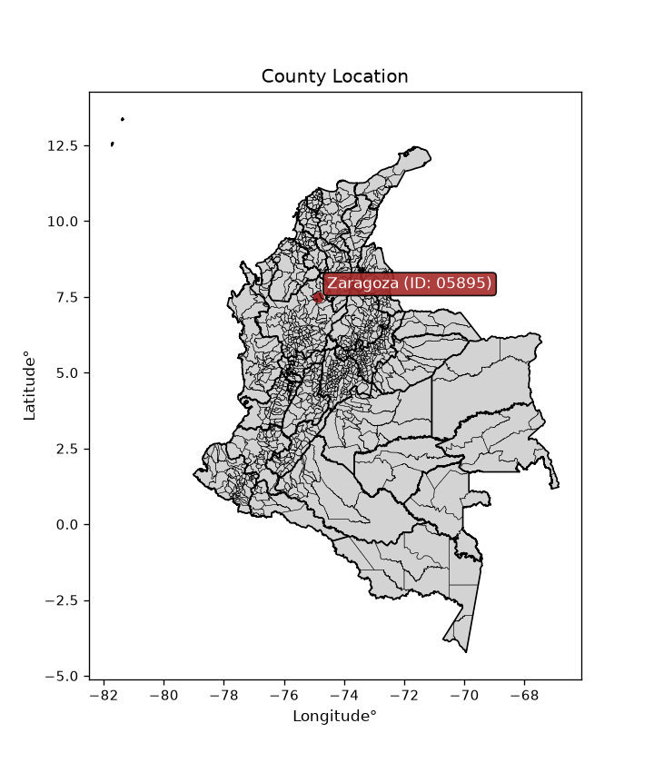
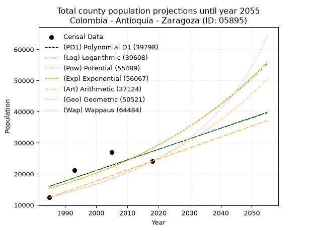
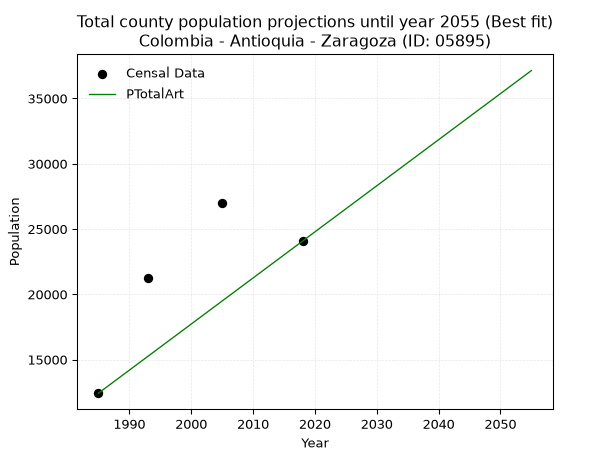
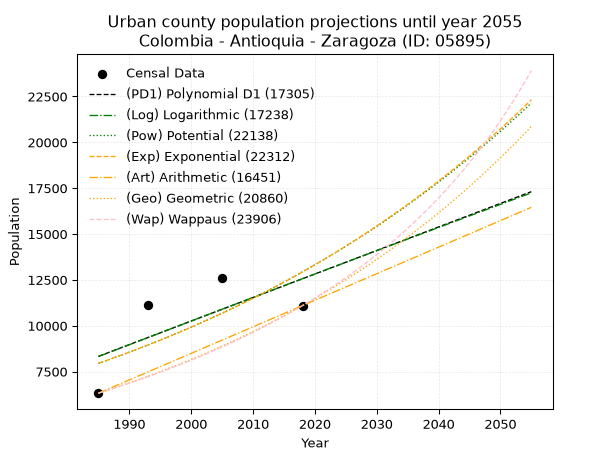
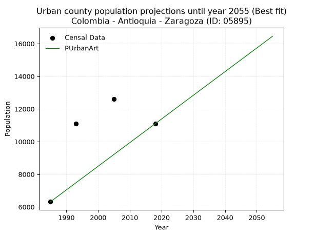
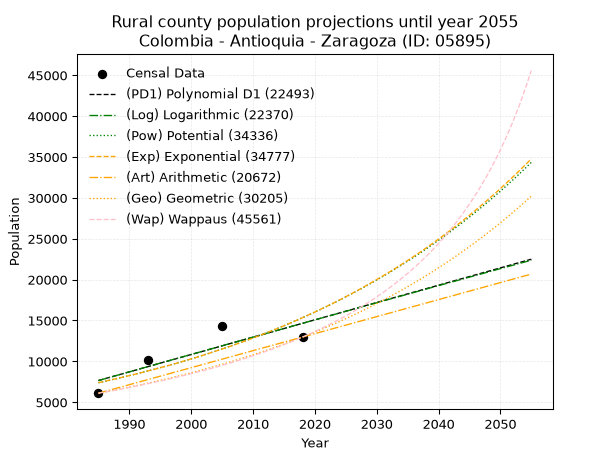
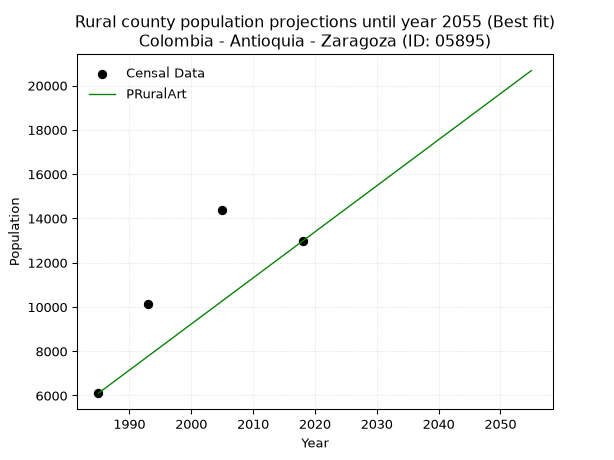

<div align="center">


</div>

# _“Population and Public Services Demand Projections (PPSD) until Year 2050 for Colombia - Antioquia - Zaragoza (ID: 05895)”_
Keywords: `population` `public-service` `projection` `lineal` `polynomial` `logarithmic` `potential` `exponential` `arithmetic` `geometric` `wappaus` `dane` `colombia` `south-america`

PPSD are analytical estimates used by governments and planners to anticipate future changes in population size, age distribution, and the resulting community needs for utilities, healthcare, education, and infrastructure as sizing future water treatment facilities, electrical grids, and road networks based on spatial growth.

> **General running parameters**: • app_version: _v20260806_. • Python version: _3.14.7_. • Pandas version: _3.0.5_. • NumPy version: _2.5.1_. • Creates, save and include plots into reports (create_plot): _False_. • Projection until year: _2050_. • Process polynomial degree 2 and up: _False_. • Process Wappaus: _True_. • Process Wappaus: _True_. • Set negative values to zero: _True_. • Set infinite values to zero: _True_. • Drop dataset notes: _True_. 
<div align="center">

Dynamic map: [:earth_americas:Google](http://maps.google.com/maps?q=7.488583074,-74.8670747) [:earth_americas:OSM](https://www.openstreetmap.org/#map=18/7.488583074/-74.8670747&layers=P) [:earth_americas:Bing](https://www.bing.com/maps?cp=7.488583074~-74.8670747&lvl=18) [:earth_americas:Apple](https://maps.apple.com/frame?center=7.488583074%2C-74.8670747&span=0.003%2C0.006)

</div>


<div align="center">

```geojson
{
  "type": "Feature",
  "geometry": {
    "type": "Point", 
    "coordinates": [-74.8670747, 7.488583074]
  }, 
  "properties": {
    "Name": "Colombia - Antioquia - Zaragoza (ID: 05895)"
  }
}
```

</div>


<div align="center">

</img>

</div>


## 0. Census Data (4 records)

Census data are official statistics collected by a government about the people and housing in a country. They usually include counts of total population, age, sex, race, income, education, and jobs.

📅Global census file: [Population.xlsx](../data/Population.xlsx)

| Source   |   Year |   CountryID | CountryName   |   StateID | StateName   |   CountyID | CountyName   |   PTotal |   PUrban |   PRural |
|:---------|-------:|------------:|:--------------|----------:|:------------|-----------:|:-------------|---------:|---------:|---------:|
| DANE     |   1985 |          57 | Colombia      |        05 | Antioquia   |      05895 | Zaragoza     |    12422 |     6318 |     6104 |
| DANE     |   1993 |          57 | Colombia      |        05 | Antioquia   |      05895 | Zaragoza     |    21231 |    11111 |    10120 |
| DANE     |   2005 |          57 | Colombia      |        05 | Antioquia   |      05895 | Zaragoza     |    26959 |    12602 |    14357 |
| DANE     |   2018 |          57 | Colombia      |        05 | Antioquia   |      05895 | Zaragoza     |    24067 |    11095 |    12972 |

> 🔥Some records could had specific notes about the registered values or the corresponding urban or rural distribution.

📅   [RUPS](https://www.datos.gov.co/Hacienda-y-Cr-dito-P-blico/Registro-nico-de-Prestadores-de-Servicios-P-blicos/4qkq-csdn/about_data) - Local public utility companies: [RUPS.csv](../data/RUPS.xlsx)

 | SERVICIO       | ESTADO    | NOMBRE                                                          | NIT         | DEPARTAMENTO_DOMICILIO   | MUNICIPIO_DOMICILIO   | DIRECCION         |   TELEFONO | EMAIL                                       | TIPO_PRESTADOR                 | CLASIFICACION                  |
|:---------------|:----------|:----------------------------------------------------------------|:------------|:-------------------------|:----------------------|:------------------|-----------:|:--------------------------------------------|:-------------------------------|:-------------------------------|
| ACUEDUCTO      | OPERATIVA | JUNTA MUNICIPAL DE SERVICIOS PUBLICOS DEL MUNICIPIO DE ZARAGOZA | 890981150-4 | ANTIOQUIA                | ZARAGOZA              | palacio municipal |    8388209 | serviciospublicos@zaragoza-antioquia.gov.co | MUNICIPIO (PRESTACIÓN DIRECTA) | DESDE 2501 HASTA 5000 USUARIOS |
| ALCANTARILLADO | OPERATIVA | JUNTA MUNICIPAL DE SERVICIOS PUBLICOS DEL MUNICIPIO DE ZARAGOZA | 890981150-4 | ANTIOQUIA                | ZARAGOZA              | palacio municipal |    8388209 | serviciospublicos@zaragoza-antioquia.gov.co | MUNICIPIO (PRESTACIÓN DIRECTA) | DESDE 2501 HASTA 5000 USUARIOS |

## 1. Total

### 1.1. Coefficients and Parameters

* (PD1) Polynomial Deg 1: 340.23966278603115, -659394.6354877588 (lineal)
* (Log) Logarithmic: 682308.2100157507, -5165060.42200457
* (Pow) Potential: 37.14093755150242, -118.29672959290819
* (Exp) Exponential: 0.018520978367164695, 1.656508351159765e-12
* (Art) Arithmetic: Year diff. 2018 - 1985 = 33, Population diff. 24067 - 12422 = 11645, Annual growth = 352.8787878787879
* (Geo) Geometric: Year diff. 2018 - 1985 = 33, Population diff. 24067 - 12422 = 11645, Annual growth % = 0.02024377242501707
* (Wap) Wappaus: i = 1.934165298466869, Condition values only valid for < 200)

<sub>
Wappaus condition values: ['0.00', '1.93', '3.87', '5.80', '7.74', '9.67', '11.60', '13.54', '15.47', '17.41', '19.34', '21.28', '23.21', '25.14', '27.08', '29.01', '30.95', '32.88', '34.81', '36.75', '38.68', '40.62', '42.55', '44.49', '46.42', '48.35', '50.29', '52.22', '54.16', '56.09', '58.02', '59.96', '61.89', '63.83', '65.76', '67.70', '69.63', '71.56', '73.50', '75.43', '77.37', '79.30', '81.23', '83.17', '85.10', '87.04', '88.97', '90.91', '92.84', '94.77', '96.71', '98.64', '100.58', '102.51', '104.44', '106.38', '108.31', '110.25', '112.18', '114.12', '116.05', '117.98', '119.92', '121.85', '123.79', '125.72']
</sub>


### 1.2. Projected Dataset

|   Year |   CountyID |   PTotalPD1 |   PTotalLog |   PTotalPow |   PTotalExp |   PTotalArt |   PTotalGeo |   PTotalWap |
|-------:|-----------:|------------:|------------:|------------:|------------:|------------:|------------:|------------:|
|   1985 |      05895 |       15981 |       15961 |       15317 |       15334 |       12422 |       12422 |       12422 |
|   1986 |      05895 |       16321 |       16305 |       15607 |       15621 |       12775 |       12673 |       12665 |
|   1987 |      05895 |       16662 |       16648 |       15901 |       15913 |       13128 |       12930 |       12912 |
|   1988 |      05895 |       17002 |       16992 |       16201 |       16210 |       13481 |       13192 |       13164 |
|   1989 |      05895 |       17342 |       17335 |       16507 |       16513 |       13834 |       13459 |       13422 |
|   1990 |      05895 |       17682 |       17678 |       16818 |       16822 |       14186 |       13731 |       13684 |
|   1991 |      05895 |       18023 |       18020 |       17134 |       17136 |       14539 |       14009 |       13952 |
|   1992 |      05895 |       18363 |       18363 |       17457 |       17457 |       14892 |       14293 |       14226 |
|   1993 |      05895 |       18703 |       18705 |       17785 |       17783 |       15245 |       14582 |       14505 |
|   1994 |      05895 |       19043 |       19048 |       18120 |       18115 |       15598 |       14877 |       14791 |
|   1995 |      05895 |       19383 |       19390 |       18461 |       18454 |       15951 |       15179 |       15082 |
|   1996 |      05895 |       19724 |       19732 |       18807 |       18799 |       16304 |       15486 |       15379 |
|   1997 |      05895 |       20064 |       20073 |       19160 |       19151 |       16657 |       15799 |       15684 |
|   1998 |      05895 |       20404 |       20415 |       19520 |       19509 |       17009 |       16119 |       15995 |
|   1999 |      05895 |       20744 |       20756 |       19886 |       19873 |       17362 |       16445 |       16312 |
|   2000 |      05895 |       21085 |       21098 |       20259 |       20245 |       17715 |       16778 |       16637 |
|   2001 |      05895 |       21425 |       21439 |       20639 |       20623 |       18068 |       17118 |       16970 |
|   2002 |      05895 |       21765 |       21780 |       21025 |       21009 |       18421 |       17465 |       17310 |
|   2003 |      05895 |       22105 |       22120 |       21419 |       21401 |       18774 |       17818 |       17658 |
|   2004 |      05895 |       22446 |       22461 |       21820 |       21801 |       19127 |       18179 |       18015 |
|   2005 |      05895 |       22786 |       22801 |       22228 |       22209 |       19480 |       18547 |       18380 |
|   2006 |      05895 |       23126 |       23142 |       22643 |       22624 |       19832 |       18922 |       18753 |
|   2007 |      05895 |       23466 |       23482 |       23066 |       23047 |       20185 |       19305 |       19136 |
|   2008 |      05895 |       23807 |       23822 |       23497 |       23478 |       20538 |       19696 |       19529 |
|   2009 |      05895 |       24147 |       24161 |       23935 |       23917 |       20891 |       20095 |       19931 |
|   2010 |      05895 |       24487 |       24501 |       24382 |       24364 |       21244 |       20502 |       20344 |
|   2011 |      05895 |       24827 |       24840 |       24837 |       24819 |       21597 |       20917 |       20767 |
|   2012 |      05895 |       25168 |       25179 |       25299 |       25283 |       21950 |       21340 |       21202 |
|   2013 |      05895 |       25508 |       25518 |       25771 |       25756 |       22303 |       21772 |       21647 |
|   2014 |      05895 |       25848 |       25857 |       26250 |       26237 |       22655 |       22213 |       22105 |
|   2015 |      05895 |       26188 |       26196 |       26739 |       26728 |       23008 |       22663 |       22576 |
|   2016 |      05895 |       26529 |       26534 |       27236 |       27228 |       23361 |       23121 |       23059 |
|   2017 |      05895 |       26869 |       26873 |       27743 |       27736 |       23714 |       23589 |       23556 |
|   2018 |      05895 |       27209 |       27211 |       28258 |       28255 |       24067 |       24067 |       24067 |
|   2019 |      05895 |       27549 |       27549 |       28783 |       28783 |       24420 |       24554 |       24593 |
|   2020 |      05895 |       27889 |       27887 |       29317 |       29321 |       24773 |       25051 |       25134 |
|   2021 |      05895 |       28230 |       28225 |       29861 |       29869 |       25126 |       25558 |       25691 |
|   2022 |      05895 |       28570 |       28562 |       30415 |       30428 |       25479 |       26076 |       26265 |
|   2023 |      05895 |       28910 |       28899 |       30978 |       30997 |       25831 |       26604 |       26857 |
|   2024 |      05895 |       29250 |       29237 |       31552 |       31576 |       26184 |       27142 |       27466 |
|   2025 |      05895 |       29591 |       29574 |       32136 |       32166 |       26537 |       27692 |       28096 |
|   2026 |      05895 |       29931 |       29911 |       32731 |       32768 |       26890 |       28252 |       28745 |
|   2027 |      05895 |       30271 |       30247 |       33336 |       33380 |       27243 |       28824 |       29415 |
|   2028 |      05895 |       30611 |       30584 |       33953 |       34004 |       27596 |       29408 |       30108 |
|   2029 |      05895 |       30952 |       30920 |       34580 |       34640 |       27949 |       30003 |       30824 |
|   2030 |      05895 |       31292 |       31256 |       35219 |       35287 |       28302 |       30610 |       31564 |
|   2031 |      05895 |       31632 |       31592 |       35869 |       35947 |       28654 |       31230 |       32331 |
|   2032 |      05895 |       31972 |       31928 |       36531 |       36619 |       29007 |       31862 |       33124 |
|   2033 |      05895 |       32313 |       32264 |       37204 |       37303 |       29360 |       32507 |       33946 |
|   2034 |      05895 |       32653 |       32599 |       37890 |       38001 |       29713 |       33165 |       34798 |
|   2035 |      05895 |       32993 |       32935 |       38588 |       38711 |       30066 |       33837 |       35683 |
|   2036 |      05895 |       33333 |       33270 |       39299 |       39435 |       30419 |       34522 |       36600 |
|   2037 |      05895 |       33674 |       33605 |       40022 |       40172 |       30772 |       35221 |       37554 |
|   2038 |      05895 |       34014 |       33940 |       40758 |       40923 |       31125 |       35934 |       38546 |
|   2039 |      05895 |       34354 |       34275 |       41508 |       41688 |       31477 |       36661 |       39577 |
|   2040 |      05895 |       34694 |       34609 |       42271 |       42467 |       31830 |       37403 |       40652 |
|   2041 |      05895 |       35035 |       34944 |       43047 |       43261 |       32183 |       38160 |       41771 |
|   2042 |      05895 |       35375 |       35278 |       43837 |       44070 |       32536 |       38933 |       42939 |
|   2043 |      05895 |       35715 |       35612 |       44642 |       44894 |       32889 |       39721 |       44158 |
|   2044 |      05895 |       36055 |       35946 |       45461 |       45733 |       33242 |       40525 |       45433 |
|   2045 |      05895 |       36395 |       36280 |       46294 |       46588 |       33595 |       41346 |       46766 |
|   2046 |      05895 |       36736 |       36613 |       47142 |       47459 |       33948 |       42183 |       48161 |
|   2047 |      05895 |       37076 |       36946 |       48006 |       48346 |       34300 |       43036 |       49625 |
|   2048 |      05895 |       37416 |       37280 |       48884 |       49250 |       34653 |       43908 |       51160 |
|   2049 |      05895 |       37756 |       37613 |       49779 |       50170 |       35006 |       44797 |       52774 |
|   2050 |      05895 |       38097 |       37946 |       50689 |       51108 |       35359 |       45703 |       54472 |
<div align="center">

</img>

</div>


### 1.3. Best fit with absolute and relative error (%)

Relative error puts that difference into context by dividing the absolute error by the true value, creating a unitless ratio or percentage that shows the scale of the mistake.

Absolute and relative error

|   Year | Source   |   CountryID | CountryName   |   StateID | StateName   |   CountyID_x | CountyName   |   PTotal |   PUrban |   PRural |   CountyID_y |   PTotalPD1 |   PTotalLog |   PTotalPow |   PTotalExp |   PTotalArt |   PTotalGeo |   PTotalWap |   PTotalPD1AbsError |   PTotalLogAbsError |   PTotalPowAbsError |   PTotalExpAbsError |   PTotalArtAbsError |   PTotalGeoAbsError |   PTotalWapAbsError |   PTotalPD1RelError |   PTotalLogRelError |   PTotalPowRelError |   PTotalExpRelError |   PTotalArtRelError |   PTotalGeoRelError |   PTotalWapRelError |
|-------:|:---------|------------:|:--------------|----------:|:------------|-------------:|:-------------|---------:|---------:|---------:|-------------:|------------:|------------:|------------:|------------:|------------:|------------:|------------:|--------------------:|--------------------:|--------------------:|--------------------:|--------------------:|--------------------:|--------------------:|--------------------:|--------------------:|--------------------:|--------------------:|--------------------:|--------------------:|--------------------:|
|   1985 | DANE     |          57 | Colombia      |        05 | Antioquia   |        05895 | Zaragoza     |    12422 |     6318 |     6104 |        05895 |       15981 |       15961 |       15317 |       15334 |       12422 |       12422 |       12422 |                3559 |                3539 |                2895 |                2912 |                   0 |                   0 |                   0 |             28.6508 |             28.4898 |             23.3054 |             23.4423 |              0      |              0      |              0      |
|   1993 | DANE     |          57 | Colombia      |        05 | Antioquia   |        05895 | Zaragoza     |    21231 |    11111 |    10120 |        05895 |       18703 |       18705 |       17785 |       17783 |       15245 |       14582 |       14505 |                2528 |                2526 |                3446 |                3448 |                5986 |                6649 |                6726 |             11.9071 |             11.8977 |             16.231  |             16.2404 |             28.1946 |             31.3174 |             31.6801 |
|   2005 | DANE     |          57 | Colombia      |        05 | Antioquia   |        05895 | Zaragoza     |    26959 |    12602 |    14357 |        05895 |       22786 |       22801 |       22228 |       22209 |       19480 |       18547 |       18380 |                4173 |                4158 |                4731 |                4750 |                7479 |                8412 |                8579 |             15.4791 |             15.4234 |             17.5489 |             17.6193 |             27.7421 |             31.2029 |             31.8224 |
|   2018 | DANE     |          57 | Colombia      |        05 | Antioquia   |        05895 | Zaragoza     |    24067 |    11095 |    12972 |        05895 |       27209 |       27211 |       28258 |       28255 |       24067 |       24067 |       24067 |                3142 |                3144 |                4191 |                4188 |                   0 |                   0 |                   0 |             13.0552 |             13.0635 |             17.4139 |             17.4014 |              0      |              0      |              0      |

Relative error mean

| Method    |   RelError | Best   |
|:----------|-----------:|:-------|
| PTotalPD1 |    17.273  |        |
| PTotalLog |    17.2186 |        |
| PTotalPow |    18.6248 |        |
| PTotalExp |    18.6759 |        |
| PTotalArt |    13.9842 | True   |
| PTotalGeo |    15.6301 |        |
| PTotalWap |    15.8756 |        |

💙Best method: _**PTotalArt**_
<div align="center">

</img>

</div>


### 1.4. Fresh water supply demand in liters per capita per day (lpcd)

The fresh water supply demand typically ranges from 100 to 300 liters per capita per day (lpcd) for standard domestic and municipal planning, though absolute survival minimums set by the World Health Organization are as low as 7.5 to 20 liters per day, and total consumption in high-income nations can exceed 400 liters.

> `CZ`: Level in meters above the sea level (masl)<br> `WS`: Fresh water supply demand in liters per capita per day (lpcd or l/h/d)<br> `WSAll`: Zonal fresh water supply demand in liters per second (l/s)<br> `A`: Zonal area in square meters<br> `DP`: Population density (people/hectare or p/ha)

Reference values (RAS Colombia)

|    CZ |   WS |
|------:|-----:|
|  1000 |  120 |
|  2000 |  130 |
| 99999 |  140 |

County shapefile geometry properties and water supply values

|   CountyID |      ATotal |   CZTotal |   WSTotal |
|-----------:|------------:|----------:|----------:|
|      05895 | 1.16674e+09 |   162.475 |       120 |

Projected values for best method: PTotalArt

|   CountyID |   Year |   PTotalArt |   DPTotal |   WSTotal |   WSTotalAll |
|-----------:|-------:|------------:|----------:|----------:|-------------:|
|      05895 |   1985 |       12422 |      0.11 |       120 |      17.2528 |
|      05895 |   1986 |       12775 |      0.11 |       120 |      17.7431 |
|      05895 |   1987 |       13128 |      0.11 |       120 |      18.2333 |
|      05895 |   1988 |       13481 |      0.12 |       120 |      18.7236 |
|      05895 |   1989 |       13834 |      0.12 |       120 |      19.2139 |
|      05895 |   1990 |       14186 |      0.12 |       120 |      19.7028 |
|      05895 |   1991 |       14539 |      0.12 |       120 |      20.1931 |
|      05895 |   1992 |       14892 |      0.13 |       120 |      20.6833 |
|      05895 |   1993 |       15245 |      0.13 |       120 |      21.1736 |
|      05895 |   1994 |       15598 |      0.13 |       120 |      21.6639 |
|      05895 |   1995 |       15951 |      0.14 |       120 |      22.1542 |
|      05895 |   1996 |       16304 |      0.14 |       120 |      22.6444 |
|      05895 |   1997 |       16657 |      0.14 |       120 |      23.1347 |
|      05895 |   1998 |       17009 |      0.15 |       120 |      23.6236 |
|      05895 |   1999 |       17362 |      0.15 |       120 |      24.1139 |
|      05895 |   2000 |       17715 |      0.15 |       120 |      24.6042 |
|      05895 |   2001 |       18068 |      0.15 |       120 |      25.0944 |
|      05895 |   2002 |       18421 |      0.16 |       120 |      25.5847 |
|      05895 |   2003 |       18774 |      0.16 |       120 |      26.075  |
|      05895 |   2004 |       19127 |      0.16 |       120 |      26.5653 |
|      05895 |   2005 |       19480 |      0.17 |       120 |      27.0556 |
|      05895 |   2006 |       19832 |      0.17 |       120 |      27.5444 |
|      05895 |   2007 |       20185 |      0.17 |       120 |      28.0347 |
|      05895 |   2008 |       20538 |      0.18 |       120 |      28.525  |
|      05895 |   2009 |       20891 |      0.18 |       120 |      29.0153 |
|      05895 |   2010 |       21244 |      0.18 |       120 |      29.5056 |
|      05895 |   2011 |       21597 |      0.19 |       120 |      29.9958 |
|      05895 |   2012 |       21950 |      0.19 |       120 |      30.4861 |
|      05895 |   2013 |       22303 |      0.19 |       120 |      30.9764 |
|      05895 |   2014 |       22655 |      0.19 |       120 |      31.4653 |
|      05895 |   2015 |       23008 |      0.2  |       120 |      31.9556 |
|      05895 |   2016 |       23361 |      0.2  |       120 |      32.4458 |
|      05895 |   2017 |       23714 |      0.2  |       120 |      32.9361 |
|      05895 |   2018 |       24067 |      0.21 |       120 |      33.4264 |
|      05895 |   2019 |       24420 |      0.21 |       120 |      33.9167 |
|      05895 |   2020 |       24773 |      0.21 |       120 |      34.4069 |
|      05895 |   2021 |       25126 |      0.22 |       120 |      34.8972 |
|      05895 |   2022 |       25479 |      0.22 |       120 |      35.3875 |
|      05895 |   2023 |       25831 |      0.22 |       120 |      35.8764 |
|      05895 |   2024 |       26184 |      0.22 |       120 |      36.3667 |
|      05895 |   2025 |       26537 |      0.23 |       120 |      36.8569 |
|      05895 |   2026 |       26890 |      0.23 |       120 |      37.3472 |
|      05895 |   2027 |       27243 |      0.23 |       120 |      37.8375 |
|      05895 |   2028 |       27596 |      0.24 |       120 |      38.3278 |
|      05895 |   2029 |       27949 |      0.24 |       120 |      38.8181 |
|      05895 |   2030 |       28302 |      0.24 |       120 |      39.3083 |
|      05895 |   2031 |       28654 |      0.25 |       120 |      39.7972 |
|      05895 |   2032 |       29007 |      0.25 |       120 |      40.2875 |
|      05895 |   2033 |       29360 |      0.25 |       120 |      40.7778 |
|      05895 |   2034 |       29713 |      0.25 |       120 |      41.2681 |
|      05895 |   2035 |       30066 |      0.26 |       120 |      41.7583 |
|      05895 |   2036 |       30419 |      0.26 |       120 |      42.2486 |
|      05895 |   2037 |       30772 |      0.26 |       120 |      42.7389 |
|      05895 |   2038 |       31125 |      0.27 |       120 |      43.2292 |
|      05895 |   2039 |       31477 |      0.27 |       120 |      43.7181 |
|      05895 |   2040 |       31830 |      0.27 |       120 |      44.2083 |
|      05895 |   2041 |       32183 |      0.28 |       120 |      44.6986 |
|      05895 |   2042 |       32536 |      0.28 |       120 |      45.1889 |
|      05895 |   2043 |       32889 |      0.28 |       120 |      45.6792 |
|      05895 |   2044 |       33242 |      0.28 |       120 |      46.1694 |
|      05895 |   2045 |       33595 |      0.29 |       120 |      46.6597 |
|      05895 |   2046 |       33948 |      0.29 |       120 |      47.15   |
|      05895 |   2047 |       34300 |      0.29 |       120 |      47.6389 |
|      05895 |   2048 |       34653 |      0.3  |       120 |      48.1292 |
|      05895 |   2049 |       35006 |      0.3  |       120 |      48.6194 |
|      05895 |   2050 |       35359 |      0.3  |       120 |      49.1097 |

## 2. Urban

### 2.1. Coefficients and Parameters

* (PD1) Polynomial Deg 1: 128.28823765556075, -246327.04737053538 (lineal)
* (Log) Logarithmic: 257424.6459855703, -1946405.2970079686
* (Pow) Potential: 29.58092047792351, -93.65088694299574
* (Exp) Exponential: 0.014743745928363442, 1.5492414475145303e-09
* (Art) Arithmetic: Year diff. 2018 - 1985 = 33, Population diff. 11095 - 6318 = 4777, Annual growth = 144.75757575757575
* (Geo) Geometric: Year diff. 2018 - 1985 = 33, Population diff. 11095 - 6318 = 4777, Annual growth % = 0.017209800717810753
* (Wap) Wappaus: i = 1.6626379803316576, Condition values only valid for < 200)

<sub>
Wappaus condition values: ['0.00', '1.66', '3.33', '4.99', '6.65', '8.31', '9.98', '11.64', '13.30', '14.96', '16.63', '18.29', '19.95', '21.61', '23.28', '24.94', '26.60', '28.26', '29.93', '31.59', '33.25', '34.92', '36.58', '38.24', '39.90', '41.57', '43.23', '44.89', '46.55', '48.22', '49.88', '51.54', '53.20', '54.87', '56.53', '58.19', '59.85', '61.52', '63.18', '64.84', '66.51', '68.17', '69.83', '71.49', '73.16', '74.82', '76.48', '78.14', '79.81', '81.47', '83.13', '84.79', '86.46', '88.12', '89.78', '91.45', '93.11', '94.77', '96.43', '98.10', '99.76', '101.42', '103.08', '104.75', '106.41', '108.07']
</sub>


### 2.2. Projected Dataset

|   Year |   CountyID |   PUrbanPD1 |   PUrbanLog |   PUrbanPow |   PUrbanExp |   PUrbanArt |   PUrbanGeo |   PUrbanWap |
|-------:|-----------:|------------:|------------:|------------:|------------:|------------:|------------:|------------:|
|   1985 |      05895 |        8325 |        8316 |        7942 |        7949 |        6318 |        6318 |        6318 |
|   1986 |      05895 |        8453 |        8446 |        8061 |        8067 |        6463 |        6427 |        6424 |
|   1987 |      05895 |        8582 |        8576 |        8182 |        8187 |        6608 |        6537 |        6532 |
|   1988 |      05895 |        8710 |        8705 |        8304 |        8309 |        6752 |        6650 |        6641 |
|   1989 |      05895 |        8838 |        8835 |        8429 |        8432 |        6897 |        6764 |        6753 |
|   1990 |      05895 |        8967 |        8964 |        8555 |        8557 |        7042 |        6881 |        6866 |
|   1991 |      05895 |        9095 |        9093 |        8683 |        8685 |        7187 |        6999 |        6981 |
|   1992 |      05895 |        9223 |        9223 |        8813 |        8814 |        7331 |        7120 |        7099 |
|   1993 |      05895 |        9351 |        9352 |        8945 |        8944 |        7476 |        7242 |        7218 |
|   1994 |      05895 |        9480 |        9481 |        9079 |        9077 |        7621 |        7367 |        7340 |
|   1995 |      05895 |        9608 |        9610 |        9214 |        9212 |        7766 |        7494 |        7464 |
|   1996 |      05895 |        9736 |        9739 |        9352 |        9349 |        7910 |        7622 |        7590 |
|   1997 |      05895 |        9865 |        9868 |        9491 |        9488 |        8055 |        7754 |        7718 |
|   1998 |      05895 |        9993 |        9997 |        9633 |        9629 |        8200 |        7887 |        7849 |
|   1999 |      05895 |       10121 |       10126 |        9777 |        9772 |        8345 |        8023 |        7982 |
|   2000 |      05895 |       10249 |       10254 |        9922 |        9917 |        8489 |        8161 |        8118 |
|   2001 |      05895 |       10378 |       10383 |       10070 |       10064 |        8634 |        8301 |        8257 |
|   2002 |      05895 |       10506 |       10512 |       10220 |       10214 |        8779 |        8444 |        8398 |
|   2003 |      05895 |       10634 |       10640 |       10372 |       10365 |        8924 |        8590 |        8542 |
|   2004 |      05895 |       10763 |       10769 |       10527 |       10519 |        9068 |        8737 |        8688 |
|   2005 |      05895 |       10891 |       10897 |       10683 |       10676 |        9213 |        8888 |        8838 |
|   2006 |      05895 |       11019 |       11025 |       10842 |       10834 |        9358 |        9041 |        8991 |
|   2007 |      05895 |       11147 |       11154 |       11003 |       10995 |        9503 |        9196 |        9146 |
|   2008 |      05895 |       11276 |       11282 |       11166 |       11158 |        9647 |        9355 |        9305 |
|   2009 |      05895 |       11404 |       11410 |       11332 |       11324 |        9792 |        9516 |        9467 |
|   2010 |      05895 |       11532 |       11538 |       11500 |       11492 |        9937 |        9679 |        9633 |
|   2011 |      05895 |       11661 |       11666 |       11670 |       11663 |       10082 |        9846 |        9802 |
|   2012 |      05895 |       11789 |       11794 |       11843 |       11836 |       10226 |       10015 |        9975 |
|   2013 |      05895 |       11917 |       11922 |       12019 |       12012 |       10371 |       10188 |       10152 |
|   2014 |      05895 |       12045 |       12050 |       12196 |       12190 |       10516 |       10363 |       10332 |
|   2015 |      05895 |       12174 |       12178 |       12377 |       12371 |       10661 |       10541 |       10516 |
|   2016 |      05895 |       12302 |       12306 |       12560 |       12555 |       10805 |       10723 |       10705 |
|   2017 |      05895 |       12430 |       12433 |       12745 |       12742 |       10950 |       10907 |       10898 |
|   2018 |      05895 |       12559 |       12561 |       12934 |       12931 |       11095 |       11095 |       11095 |
|   2019 |      05895 |       12687 |       12688 |       13125 |       13123 |       11240 |       11286 |       11297 |
|   2020 |      05895 |       12815 |       12816 |       13318 |       13318 |       11385 |       11480 |       11503 |
|   2021 |      05895 |       12943 |       12943 |       13515 |       13516 |       11529 |       11678 |       11715 |
|   2022 |      05895 |       13072 |       13071 |       13714 |       13716 |       11674 |       11879 |       11931 |
|   2023 |      05895 |       13200 |       13198 |       13916 |       13920 |       11819 |       12083 |       12153 |
|   2024 |      05895 |       13328 |       13325 |       14121 |       14127 |       11964 |       12291 |       12380 |
|   2025 |      05895 |       13457 |       13452 |       14329 |       14337 |       12108 |       12503 |       12613 |
|   2026 |      05895 |       13585 |       13579 |       14540 |       14550 |       12253 |       12718 |       12852 |
|   2027 |      05895 |       13713 |       13706 |       14753 |       14766 |       12398 |       12937 |       13097 |
|   2028 |      05895 |       13841 |       13833 |       14970 |       14985 |       12543 |       13159 |       13348 |
|   2029 |      05895 |       13970 |       13960 |       15190 |       15208 |       12687 |       13386 |       13606 |
|   2030 |      05895 |       14098 |       14087 |       15413 |       15434 |       12832 |       13616 |       13870 |
|   2031 |      05895 |       14226 |       14214 |       15639 |       15663 |       12977 |       13850 |       14142 |
|   2032 |      05895 |       14355 |       14341 |       15869 |       15895 |       13122 |       14089 |       14421 |
|   2033 |      05895 |       14483 |       14467 |       16101 |       16132 |       13266 |       14331 |       14708 |
|   2034 |      05895 |       14611 |       14594 |       16337 |       16371 |       13411 |       14578 |       15003 |
|   2035 |      05895 |       14740 |       14720 |       16577 |       16614 |       13556 |       14829 |       15306 |
|   2036 |      05895 |       14868 |       14847 |       16819 |       16861 |       13701 |       15084 |       15618 |
|   2037 |      05895 |       14996 |       14973 |       17065 |       17112 |       13845 |       15344 |       15940 |
|   2038 |      05895 |       15124 |       15100 |       17315 |       17366 |       13990 |       15608 |       16270 |
|   2039 |      05895 |       15253 |       15226 |       17568 |       17624 |       14135 |       15876 |       16611 |
|   2040 |      05895 |       15381 |       15352 |       17825 |       17885 |       14280 |       16150 |       16962 |
|   2041 |      05895 |       15509 |       15478 |       18085 |       18151 |       14424 |       16427 |       17324 |
|   2042 |      05895 |       15638 |       15604 |       18349 |       18421 |       14569 |       16710 |       17698 |
|   2043 |      05895 |       15766 |       15730 |       18617 |       18694 |       14714 |       16998 |       18084 |
|   2044 |      05895 |       15894 |       15856 |       18888 |       18972 |       14859 |       17290 |       18482 |
|   2045 |      05895 |       16022 |       15982 |       19163 |       19254 |       15003 |       17588 |       18893 |
|   2046 |      05895 |       16151 |       16108 |       19442 |       19540 |       15148 |       17890 |       19318 |
|   2047 |      05895 |       16279 |       16234 |       19725 |       19830 |       15293 |       18198 |       19758 |
|   2048 |      05895 |       16407 |       16360 |       20012 |       20124 |       15438 |       18512 |       20213 |
|   2049 |      05895 |       16536 |       16485 |       20304 |       20423 |       15582 |       18830 |       20685 |
|   2050 |      05895 |       16664 |       16611 |       20599 |       20727 |       15727 |       19154 |       21173 |
<div align="center">

</img>

</div>


### 2.3. Best fit with absolute and relative error (%)

Relative error puts that difference into context by dividing the absolute error by the true value, creating a unitless ratio or percentage that shows the scale of the mistake.

Absolute and relative error

|   Year | Source   |   CountryID | CountryName   |   StateID | StateName   |   CountyID_x | CountyName   |   PTotal |   PUrban |   PRural |   CountyID_y |   PUrbanPD1 |   PUrbanLog |   PUrbanPow |   PUrbanExp |   PUrbanArt |   PUrbanGeo |   PUrbanWap |   PUrbanPD1AbsError |   PUrbanLogAbsError |   PUrbanPowAbsError |   PUrbanExpAbsError |   PUrbanArtAbsError |   PUrbanGeoAbsError |   PUrbanWapAbsError |   PUrbanPD1RelError |   PUrbanLogRelError |   PUrbanPowRelError |   PUrbanExpRelError |   PUrbanArtRelError |   PUrbanGeoRelError |   PUrbanWapRelError |
|-------:|:---------|------------:|:--------------|----------:|:------------|-------------:|:-------------|---------:|---------:|---------:|-------------:|------------:|------------:|------------:|------------:|------------:|------------:|------------:|--------------------:|--------------------:|--------------------:|--------------------:|--------------------:|--------------------:|--------------------:|--------------------:|--------------------:|--------------------:|--------------------:|--------------------:|--------------------:|--------------------:|
|   1985 | DANE     |          57 | Colombia      |        05 | Antioquia   |        05895 | Zaragoza     |    12422 |     6318 |     6104 |        05895 |        8325 |        8316 |        7942 |        7949 |        6318 |        6318 |        6318 |                2007 |                1998 |                1624 |                1631 |                   0 |                   0 |                   0 |             31.7664 |             31.6239 |             25.7043 |             25.8151 |              0      |              0      |              0      |
|   1993 | DANE     |          57 | Colombia      |        05 | Antioquia   |        05895 | Zaragoza     |    21231 |    11111 |    10120 |        05895 |        9351 |        9352 |        8945 |        8944 |        7476 |        7242 |        7218 |                1760 |                1759 |                2166 |                2167 |                3635 |                3869 |                3893 |             15.8402 |             15.8312 |             19.4942 |             19.5032 |             32.7153 |             34.8213 |             35.0374 |
|   2005 | DANE     |          57 | Colombia      |        05 | Antioquia   |        05895 | Zaragoza     |    26959 |    12602 |    14357 |        05895 |       10891 |       10897 |       10683 |       10676 |        9213 |        8888 |        8838 |                1711 |                1705 |                1919 |                1926 |                3389 |                3714 |                3764 |             13.5772 |             13.5296 |             15.2277 |             15.2833 |             26.8926 |             29.4715 |             29.8683 |
|   2018 | DANE     |          57 | Colombia      |        05 | Antioquia   |        05895 | Zaragoza     |    24067 |    11095 |    12972 |        05895 |       12559 |       12561 |       12934 |       12931 |       11095 |       11095 |       11095 |                1464 |                1466 |                1839 |                1836 |                   0 |                   0 |                   0 |             13.1951 |             13.2132 |             16.575  |             16.548  |              0      |              0      |              0      |

Relative error mean

| Method    |   RelError | Best   |
|:----------|-----------:|:-------|
| PUrbanPD1 |    18.5947 |        |
| PUrbanLog |    18.5495 |        |
| PUrbanPow |    19.2503 |        |
| PUrbanExp |    19.2874 |        |
| PUrbanArt |    14.902  | True   |
| PUrbanGeo |    16.0732 |        |
| PUrbanWap |    16.2264 |        |

💙Best method: _**PUrbanArt**_
<div align="center">

</img>

</div>


### 2.4. Fresh water supply demand in liters per capita per day (lpcd)

The fresh water supply demand typically ranges from 100 to 300 liters per capita per day (lpcd) for standard domestic and municipal planning, though absolute survival minimums set by the World Health Organization are as low as 7.5 to 20 liters per day, and total consumption in high-income nations can exceed 400 liters.

> `CZ`: Level in meters above the sea level (masl)<br> `WS`: Fresh water supply demand in liters per capita per day (lpcd or l/h/d)<br> `WSAll`: Zonal fresh water supply demand in liters per second (l/s)<br> `A`: Zonal area in square meters<br> `DP`: Population density (people/hectare or p/ha)

Reference values (RAS Colombia)

|    CZ |   WS |
|------:|-----:|
|  1000 |  120 |
|  2000 |  130 |
| 99999 |  140 |

County shapefile geometry properties and water supply values

|   CountyID |      AUrban |   CZUrban |   WSUrban |
|-----------:|------------:|----------:|----------:|
|      05895 | 1.76864e+06 |   73.7786 |       120 |

Projected values for best method: PUrbanArt

|   CountyID |   Year |   PUrbanArt |   DPUrban |   WSUrban |   WSUrbanAll |
|-----------:|-------:|------------:|----------:|----------:|-------------:|
|      05895 |   1985 |        6318 |     35.72 |       120 |      8.775   |
|      05895 |   1986 |        6463 |     36.54 |       120 |      8.97639 |
|      05895 |   1987 |        6608 |     37.36 |       120 |      9.17778 |
|      05895 |   1988 |        6752 |     38.18 |       120 |      9.37778 |
|      05895 |   1989 |        6897 |     39    |       120 |      9.57917 |
|      05895 |   1990 |        7042 |     39.82 |       120 |      9.78056 |
|      05895 |   1991 |        7187 |     40.64 |       120 |      9.98194 |
|      05895 |   1992 |        7331 |     41.45 |       120 |     10.1819  |
|      05895 |   1993 |        7476 |     42.27 |       120 |     10.3833  |
|      05895 |   1994 |        7621 |     43.09 |       120 |     10.5847  |
|      05895 |   1995 |        7766 |     43.91 |       120 |     10.7861  |
|      05895 |   1996 |        7910 |     44.72 |       120 |     10.9861  |
|      05895 |   1997 |        8055 |     45.54 |       120 |     11.1875  |
|      05895 |   1998 |        8200 |     46.36 |       120 |     11.3889  |
|      05895 |   1999 |        8345 |     47.18 |       120 |     11.5903  |
|      05895 |   2000 |        8489 |     48    |       120 |     11.7903  |
|      05895 |   2001 |        8634 |     48.82 |       120 |     11.9917  |
|      05895 |   2002 |        8779 |     49.64 |       120 |     12.1931  |
|      05895 |   2003 |        8924 |     50.46 |       120 |     12.3944  |
|      05895 |   2004 |        9068 |     51.27 |       120 |     12.5944  |
|      05895 |   2005 |        9213 |     52.09 |       120 |     12.7958  |
|      05895 |   2006 |        9358 |     52.91 |       120 |     12.9972  |
|      05895 |   2007 |        9503 |     53.73 |       120 |     13.1986  |
|      05895 |   2008 |        9647 |     54.54 |       120 |     13.3986  |
|      05895 |   2009 |        9792 |     55.36 |       120 |     13.6     |
|      05895 |   2010 |        9937 |     56.18 |       120 |     13.8014  |
|      05895 |   2011 |       10082 |     57    |       120 |     14.0028  |
|      05895 |   2012 |       10226 |     57.82 |       120 |     14.2028  |
|      05895 |   2013 |       10371 |     58.64 |       120 |     14.4042  |
|      05895 |   2014 |       10516 |     59.46 |       120 |     14.6056  |
|      05895 |   2015 |       10661 |     60.28 |       120 |     14.8069  |
|      05895 |   2016 |       10805 |     61.09 |       120 |     15.0069  |
|      05895 |   2017 |       10950 |     61.91 |       120 |     15.2083  |
|      05895 |   2018 |       11095 |     62.73 |       120 |     15.4097  |
|      05895 |   2019 |       11240 |     63.55 |       120 |     15.6111  |
|      05895 |   2020 |       11385 |     64.37 |       120 |     15.8125  |
|      05895 |   2021 |       11529 |     65.19 |       120 |     16.0125  |
|      05895 |   2022 |       11674 |     66.01 |       120 |     16.2139  |
|      05895 |   2023 |       11819 |     66.83 |       120 |     16.4153  |
|      05895 |   2024 |       11964 |     67.65 |       120 |     16.6167  |
|      05895 |   2025 |       12108 |     68.46 |       120 |     16.8167  |
|      05895 |   2026 |       12253 |     69.28 |       120 |     17.0181  |
|      05895 |   2027 |       12398 |     70.1  |       120 |     17.2194  |
|      05895 |   2028 |       12543 |     70.92 |       120 |     17.4208  |
|      05895 |   2029 |       12687 |     71.73 |       120 |     17.6208  |
|      05895 |   2030 |       12832 |     72.55 |       120 |     17.8222  |
|      05895 |   2031 |       12977 |     73.37 |       120 |     18.0236  |
|      05895 |   2032 |       13122 |     74.19 |       120 |     18.225   |
|      05895 |   2033 |       13266 |     75.01 |       120 |     18.425   |
|      05895 |   2034 |       13411 |     75.83 |       120 |     18.6264  |
|      05895 |   2035 |       13556 |     76.65 |       120 |     18.8278  |
|      05895 |   2036 |       13701 |     77.47 |       120 |     19.0292  |
|      05895 |   2037 |       13845 |     78.28 |       120 |     19.2292  |
|      05895 |   2038 |       13990 |     79.1  |       120 |     19.4306  |
|      05895 |   2039 |       14135 |     79.92 |       120 |     19.6319  |
|      05895 |   2040 |       14280 |     80.74 |       120 |     19.8333  |
|      05895 |   2041 |       14424 |     81.55 |       120 |     20.0333  |
|      05895 |   2042 |       14569 |     82.37 |       120 |     20.2347  |
|      05895 |   2043 |       14714 |     83.19 |       120 |     20.4361  |
|      05895 |   2044 |       14859 |     84.01 |       120 |     20.6375  |
|      05895 |   2045 |       15003 |     84.83 |       120 |     20.8375  |
|      05895 |   2046 |       15148 |     85.65 |       120 |     21.0389  |
|      05895 |   2047 |       15293 |     86.47 |       120 |     21.2403  |
|      05895 |   2048 |       15438 |     87.29 |       120 |     21.4417  |
|      05895 |   2049 |       15582 |     88.1  |       120 |     21.6417  |
|      05895 |   2050 |       15727 |     88.92 |       120 |     21.8431  |

## 3. Rural

### 3.1. Coefficients and Parameters

* (PD1) Polynomial Deg 1: 211.95142513047023, -413067.588117223 (lineal)
* (Log) Logarithmic: 424883.5640301803, -3218655.1249965993
* (Pow) Potential: 44.353332517638144, -142.39849785222498
* (Exp) Exponential: 0.022124581746099558, 6.246643770908055e-16
* (Art) Arithmetic: Year diff. 2018 - 1985 = 33, Population diff. 12972 - 6104 = 6868, Annual growth = 208.12121212121212
* (Geo) Geometric: Year diff. 2018 - 1985 = 33, Population diff. 12972 - 6104 = 6868, Annual growth % = 0.02310682613580073
* (Wap) Wappaus: i = 2.182021515215057, Condition values only valid for < 200)

<sub>
Wappaus condition values: ['0.00', '2.18', '4.36', '6.55', '8.73', '10.91', '13.09', '15.27', '17.46', '19.64', '21.82', '24.00', '26.18', '28.37', '30.55', '32.73', '34.91', '37.09', '39.28', '41.46', '43.64', '45.82', '48.00', '50.19', '52.37', '54.55', '56.73', '58.91', '61.10', '63.28', '65.46', '67.64', '69.82', '72.01', '74.19', '76.37', '78.55', '80.73', '82.92', '85.10', '87.28', '89.46', '91.64', '93.83', '96.01', '98.19', '100.37', '102.56', '104.74', '106.92', '109.10', '111.28', '113.47', '115.65', '117.83', '120.01', '122.19', '124.38', '126.56', '128.74', '130.92', '133.10', '135.29', '137.47', '139.65', '141.83']
</sub>


### 3.2. Projected Dataset

|   Year |   CountyID |   PRuralPD1 |   PRuralLog |   PRuralPow |   PRuralExp |   PRuralArt |   PRuralGeo |   PRuralWap |
|-------:|-----------:|------------:|------------:|------------:|------------:|------------:|------------:|------------:|
|   1985 |      05895 |        7656 |        7645 |        7382 |        7391 |        6104 |        6104 |        6104 |
|   1986 |      05895 |        7868 |        7859 |        7549 |        7556 |        6312 |        6245 |        6239 |
|   1987 |      05895 |        8080 |        8073 |        7719 |        7725 |        6520 |        6389 |        6376 |
|   1988 |      05895 |        8292 |        8286 |        7893 |        7898 |        6728 |        6537 |        6517 |
|   1989 |      05895 |        8504 |        8500 |        8071 |        8075 |        6936 |        6688 |        6661 |
|   1990 |      05895 |        8716 |        8714 |        8253 |        8255 |        7145 |        6843 |        6808 |
|   1991 |      05895 |        8928 |        8927 |        8439 |        8440 |        7353 |        7001 |        6959 |
|   1992 |      05895 |        9140 |        9140 |        8629 |        8629 |        7561 |        7162 |        7113 |
|   1993 |      05895 |        9352 |        9354 |        8824 |        8822 |        7769 |        7328 |        7271 |
|   1994 |      05895 |        9564 |        9567 |        9022 |        9019 |        7977 |        7497 |        7433 |
|   1995 |      05895 |        9776 |        9780 |        9225 |        9221 |        8185 |        7671 |        7599 |
|   1996 |      05895 |        9987 |        9993 |        9432 |        9427 |        8393 |        7848 |        7769 |
|   1997 |      05895 |       10199 |       10206 |        9644 |        9638 |        8601 |        8029 |        7943 |
|   1998 |      05895 |       10411 |       10418 |        9861 |        9854 |        8810 |        8215 |        8122 |
|   1999 |      05895 |       10623 |       10631 |       10082 |       10074 |        9018 |        8404 |        8305 |
|   2000 |      05895 |       10835 |       10843 |       10308 |       10299 |        9226 |        8599 |        8493 |
|   2001 |      05895 |       11047 |       11056 |       10539 |       10530 |        9434 |        8797 |        8686 |
|   2002 |      05895 |       11259 |       11268 |       10775 |       10765 |        9642 |        9001 |        8884 |
|   2003 |      05895 |       11471 |       11480 |       11017 |       11006 |        9850 |        9209 |        9087 |
|   2004 |      05895 |       11683 |       11692 |       11263 |       11252 |       10058 |        9421 |        9296 |
|   2005 |      05895 |       11895 |       11904 |       11515 |       11504 |       10266 |        9639 |        9511 |
|   2006 |      05895 |       12107 |       12116 |       11773 |       11762 |       10475 |        9862 |        9732 |
|   2007 |      05895 |       12319 |       12328 |       12036 |       12025 |       10683 |       10090 |        9960 |
|   2008 |      05895 |       12531 |       12540 |       12305 |       12294 |       10891 |       10323 |       10194 |
|   2009 |      05895 |       12743 |       12751 |       12580 |       12569 |       11099 |       10561 |       10434 |
|   2010 |      05895 |       12955 |       12963 |       12860 |       12850 |       11307 |       10805 |       10683 |
|   2011 |      05895 |       13167 |       13174 |       13147 |       13137 |       11515 |       11055 |       10938 |
|   2012 |      05895 |       13379 |       13385 |       13440 |       13431 |       11723 |       11310 |       11202 |
|   2013 |      05895 |       13591 |       13596 |       13740 |       13732 |       11931 |       11572 |       11474 |
|   2014 |      05895 |       13803 |       13807 |       14046 |       14039 |       12140 |       11839 |       11754 |
|   2015 |      05895 |       14015 |       14018 |       14359 |       14353 |       12348 |       12113 |       12044 |
|   2016 |      05895 |       14226 |       14229 |       14678 |       14674 |       12556 |       12393 |       12343 |
|   2017 |      05895 |       14438 |       14440 |       15005 |       15002 |       12764 |       12679 |       12652 |
|   2018 |      05895 |       14650 |       14650 |       15338 |       15338 |       12972 |       12972 |       12972 |
|   2019 |      05895 |       14862 |       14861 |       15679 |       15681 |       13180 |       13272 |       13303 |
|   2020 |      05895 |       15074 |       15071 |       16027 |       16032 |       13388 |       13578 |       13645 |
|   2021 |      05895 |       15286 |       15281 |       16383 |       16391 |       13596 |       13892 |       14000 |
|   2022 |      05895 |       15498 |       15492 |       16746 |       16757 |       13804 |       14213 |       14368 |
|   2023 |      05895 |       15710 |       15702 |       17117 |       17132 |       14013 |       14542 |       14750 |
|   2024 |      05895 |       15922 |       15912 |       17497 |       17515 |       14221 |       14878 |       15146 |
|   2025 |      05895 |       16134 |       16122 |       17884 |       17907 |       14429 |       15221 |       15557 |
|   2026 |      05895 |       16346 |       16331 |       18280 |       18308 |       14637 |       15573 |       15985 |
|   2027 |      05895 |       16558 |       16541 |       18685 |       18717 |       14845 |       15933 |       16429 |
|   2028 |      05895 |       16770 |       16751 |       19098 |       19136 |       15053 |       16301 |       16892 |
|   2029 |      05895 |       16982 |       16960 |       19520 |       19564 |       15261 |       16678 |       17375 |
|   2030 |      05895 |       17194 |       17169 |       19951 |       20002 |       15469 |       17063 |       17878 |
|   2031 |      05895 |       17406 |       17379 |       20392 |       20449 |       15678 |       17457 |       18403 |
|   2032 |      05895 |       17618 |       17588 |       20842 |       20907 |       15886 |       17861 |       18952 |
|   2033 |      05895 |       17830 |       17797 |       21302 |       21375 |       16094 |       18273 |       19526 |
|   2034 |      05895 |       18042 |       18006 |       21772 |       21853 |       16302 |       18696 |       20127 |
|   2035 |      05895 |       18254 |       18215 |       22252 |       22342 |       16510 |       19128 |       20757 |
|   2036 |      05895 |       18466 |       18423 |       22742 |       22841 |       16718 |       19570 |       21417 |
|   2037 |      05895 |       18677 |       18632 |       23242 |       23352 |       16926 |       20022 |       22111 |
|   2038 |      05895 |       18889 |       18840 |       23754 |       23875 |       17134 |       20485 |       22841 |
|   2039 |      05895 |       19101 |       19049 |       24276 |       24409 |       17343 |       20958 |       23610 |
|   2040 |      05895 |       19313 |       19257 |       24810 |       24955 |       17551 |       21442 |       24420 |
|   2041 |      05895 |       19525 |       19465 |       25355 |       25513 |       17759 |       21938 |       25276 |
|   2042 |      05895 |       19737 |       19674 |       25912 |       26084 |       17967 |       22445 |       26182 |
|   2043 |      05895 |       19949 |       19882 |       26481 |       26668 |       18175 |       22963 |       27141 |
|   2044 |      05895 |       20161 |       20090 |       27062 |       27264 |       18383 |       23494 |       28159 |
|   2045 |      05895 |       20373 |       20297 |       27656 |       27874 |       18591 |       24037 |       29241 |
|   2046 |      05895 |       20585 |       20505 |       28262 |       28498 |       18799 |       24592 |       30394 |
|   2047 |      05895 |       20797 |       20713 |       28881 |       29135 |       19008 |       25160 |       31625 |
|   2048 |      05895 |       21009 |       20920 |       29513 |       29787 |       19216 |       25742 |       32941 |
|   2049 |      05895 |       21221 |       21128 |       30159 |       30453 |       19424 |       26336 |       34353 |
|   2050 |      05895 |       21433 |       21335 |       30819 |       31135 |       19632 |       26945 |       35871 |
<div align="center">

</img>

</div>


### 3.3. Best fit with absolute and relative error (%)

Relative error puts that difference into context by dividing the absolute error by the true value, creating a unitless ratio or percentage that shows the scale of the mistake.

Absolute and relative error

|   Year | Source   |   CountryID | CountryName   |   StateID | StateName   |   CountyID_x | CountyName   |   PTotal |   PUrban |   PRural |   CountyID_y |   PRuralPD1 |   PRuralLog |   PRuralPow |   PRuralExp |   PRuralArt |   PRuralGeo |   PRuralWap |   PRuralPD1AbsError |   PRuralLogAbsError |   PRuralPowAbsError |   PRuralExpAbsError |   PRuralArtAbsError |   PRuralGeoAbsError |   PRuralWapAbsError |   PRuralPD1RelError |   PRuralLogRelError |   PRuralPowRelError |   PRuralExpRelError |   PRuralArtRelError |   PRuralGeoRelError |   PRuralWapRelError |
|-------:|:---------|------------:|:--------------|----------:|:------------|-------------:|:-------------|---------:|---------:|---------:|-------------:|------------:|------------:|------------:|------------:|------------:|------------:|------------:|--------------------:|--------------------:|--------------------:|--------------------:|--------------------:|--------------------:|--------------------:|--------------------:|--------------------:|--------------------:|--------------------:|--------------------:|--------------------:|--------------------:|
|   1985 | DANE     |          57 | Colombia      |        05 | Antioquia   |        05895 | Zaragoza     |    12422 |     6318 |     6104 |        05895 |        7656 |        7645 |        7382 |        7391 |        6104 |        6104 |        6104 |                1552 |                1541 |                1278 |                1287 |                   0 |                   0 |                   0 |            25.426   |            25.2457  |             20.9371 |             21.0845 |              0      |              0      |              0      |
|   1993 | DANE     |          57 | Colombia      |        05 | Antioquia   |        05895 | Zaragoza     |    21231 |    11111 |    10120 |        05895 |        9352 |        9354 |        8824 |        8822 |        7769 |        7328 |        7271 |                 768 |                 766 |                1296 |                1298 |                2351 |                2792 |                2849 |             7.58893 |             7.56917 |             12.8063 |             12.8261 |             23.2312 |             27.5889 |             28.1522 |
|   2005 | DANE     |          57 | Colombia      |        05 | Antioquia   |        05895 | Zaragoza     |    26959 |    12602 |    14357 |        05895 |       11895 |       11904 |       11515 |       11504 |       10266 |        9639 |        9511 |                2462 |                2453 |                2842 |                2853 |                4091 |                4718 |                4846 |            17.1484  |            17.0857  |             19.7952 |             19.8718 |             28.4948 |             32.862  |             33.7536 |
|   2018 | DANE     |          57 | Colombia      |        05 | Antioquia   |        05895 | Zaragoza     |    24067 |    11095 |    12972 |        05895 |       14650 |       14650 |       15338 |       15338 |       12972 |       12972 |       12972 |                1678 |                1678 |                2366 |                2366 |                   0 |                   0 |                   0 |            12.9356  |            12.9356  |             18.2393 |             18.2393 |              0      |              0      |              0      |

Relative error mean

| Method    |   RelError | Best   |
|:----------|-----------:|:-------|
| PRuralPD1 |    15.7747 |        |
| PRuralLog |    15.7091 |        |
| PRuralPow |    17.9445 |        |
| PRuralExp |    18.0054 |        |
| PRuralArt |    12.9315 | True   |
| PRuralGeo |    15.1127 |        |
| PRuralWap |    15.4764 |        |

💙Best method: _**PRuralArt**_
<div align="center">

</img>

</div>


### 3.4. Fresh water supply demand in liters per capita per day (lpcd)

The fresh water supply demand typically ranges from 100 to 300 liters per capita per day (lpcd) for standard domestic and municipal planning, though absolute survival minimums set by the World Health Organization are as low as 7.5 to 20 liters per day, and total consumption in high-income nations can exceed 400 liters.

> `CZ`: Level in meters above the sea level (masl)<br> `WS`: Fresh water supply demand in liters per capita per day (lpcd or l/h/d)<br> `WSAll`: Zonal fresh water supply demand in liters per second (l/s)<br> `A`: Zonal area in square meters<br> `DP`: Population density (people/hectare or p/ha)

Reference values (RAS Colombia)

|    CZ |   WS |
|------:|-----:|
|  1000 |  120 |
|  2000 |  130 |
| 99999 |  140 |

County shapefile geometry properties and water supply values

|   CountyID |      ARural |   CZRural |   WSRural |
|-----------:|------------:|----------:|----------:|
|      05895 | 1.16497e+09 |   162.651 |       120 |

Projected values for best method: PRuralArt

|   CountyID |   Year |   PRuralArt |   DPRural |   WSRural |   WSRuralAll |
|-----------:|-------:|------------:|----------:|----------:|-------------:|
|      05895 |   1985 |        6104 |      0.05 |       120 |      8.47778 |
|      05895 |   1986 |        6312 |      0.05 |       120 |      8.76667 |
|      05895 |   1987 |        6520 |      0.06 |       120 |      9.05556 |
|      05895 |   1988 |        6728 |      0.06 |       120 |      9.34444 |
|      05895 |   1989 |        6936 |      0.06 |       120 |      9.63333 |
|      05895 |   1990 |        7145 |      0.06 |       120 |      9.92361 |
|      05895 |   1991 |        7353 |      0.06 |       120 |     10.2125  |
|      05895 |   1992 |        7561 |      0.06 |       120 |     10.5014  |
|      05895 |   1993 |        7769 |      0.07 |       120 |     10.7903  |
|      05895 |   1994 |        7977 |      0.07 |       120 |     11.0792  |
|      05895 |   1995 |        8185 |      0.07 |       120 |     11.3681  |
|      05895 |   1996 |        8393 |      0.07 |       120 |     11.6569  |
|      05895 |   1997 |        8601 |      0.07 |       120 |     11.9458  |
|      05895 |   1998 |        8810 |      0.08 |       120 |     12.2361  |
|      05895 |   1999 |        9018 |      0.08 |       120 |     12.525   |
|      05895 |   2000 |        9226 |      0.08 |       120 |     12.8139  |
|      05895 |   2001 |        9434 |      0.08 |       120 |     13.1028  |
|      05895 |   2002 |        9642 |      0.08 |       120 |     13.3917  |
|      05895 |   2003 |        9850 |      0.08 |       120 |     13.6806  |
|      05895 |   2004 |       10058 |      0.09 |       120 |     13.9694  |
|      05895 |   2005 |       10266 |      0.09 |       120 |     14.2583  |
|      05895 |   2006 |       10475 |      0.09 |       120 |     14.5486  |
|      05895 |   2007 |       10683 |      0.09 |       120 |     14.8375  |
|      05895 |   2008 |       10891 |      0.09 |       120 |     15.1264  |
|      05895 |   2009 |       11099 |      0.1  |       120 |     15.4153  |
|      05895 |   2010 |       11307 |      0.1  |       120 |     15.7042  |
|      05895 |   2011 |       11515 |      0.1  |       120 |     15.9931  |
|      05895 |   2012 |       11723 |      0.1  |       120 |     16.2819  |
|      05895 |   2013 |       11931 |      0.1  |       120 |     16.5708  |
|      05895 |   2014 |       12140 |      0.1  |       120 |     16.8611  |
|      05895 |   2015 |       12348 |      0.11 |       120 |     17.15    |
|      05895 |   2016 |       12556 |      0.11 |       120 |     17.4389  |
|      05895 |   2017 |       12764 |      0.11 |       120 |     17.7278  |
|      05895 |   2018 |       12972 |      0.11 |       120 |     18.0167  |
|      05895 |   2019 |       13180 |      0.11 |       120 |     18.3056  |
|      05895 |   2020 |       13388 |      0.11 |       120 |     18.5944  |
|      05895 |   2021 |       13596 |      0.12 |       120 |     18.8833  |
|      05895 |   2022 |       13804 |      0.12 |       120 |     19.1722  |
|      05895 |   2023 |       14013 |      0.12 |       120 |     19.4625  |
|      05895 |   2024 |       14221 |      0.12 |       120 |     19.7514  |
|      05895 |   2025 |       14429 |      0.12 |       120 |     20.0403  |
|      05895 |   2026 |       14637 |      0.13 |       120 |     20.3292  |
|      05895 |   2027 |       14845 |      0.13 |       120 |     20.6181  |
|      05895 |   2028 |       15053 |      0.13 |       120 |     20.9069  |
|      05895 |   2029 |       15261 |      0.13 |       120 |     21.1958  |
|      05895 |   2030 |       15469 |      0.13 |       120 |     21.4847  |
|      05895 |   2031 |       15678 |      0.13 |       120 |     21.775   |
|      05895 |   2032 |       15886 |      0.14 |       120 |     22.0639  |
|      05895 |   2033 |       16094 |      0.14 |       120 |     22.3528  |
|      05895 |   2034 |       16302 |      0.14 |       120 |     22.6417  |
|      05895 |   2035 |       16510 |      0.14 |       120 |     22.9306  |
|      05895 |   2036 |       16718 |      0.14 |       120 |     23.2194  |
|      05895 |   2037 |       16926 |      0.15 |       120 |     23.5083  |
|      05895 |   2038 |       17134 |      0.15 |       120 |     23.7972  |
|      05895 |   2039 |       17343 |      0.15 |       120 |     24.0875  |
|      05895 |   2040 |       17551 |      0.15 |       120 |     24.3764  |
|      05895 |   2041 |       17759 |      0.15 |       120 |     24.6653  |
|      05895 |   2042 |       17967 |      0.15 |       120 |     24.9542  |
|      05895 |   2043 |       18175 |      0.16 |       120 |     25.2431  |
|      05895 |   2044 |       18383 |      0.16 |       120 |     25.5319  |
|      05895 |   2045 |       18591 |      0.16 |       120 |     25.8208  |
|      05895 |   2046 |       18799 |      0.16 |       120 |     26.1097  |
|      05895 |   2047 |       19008 |      0.16 |       120 |     26.4     |
|      05895 |   2048 |       19216 |      0.16 |       120 |     26.6889  |
|      05895 |   2049 |       19424 |      0.17 |       120 |     26.9778  |
|      05895 |   2050 |       19632 |      0.17 |       120 |     27.2667  |

<div align="center"><br><sub>Share this research</sub></div><br>

<sub>**APPS & TOOLS & CONTENT DISCLAIMER**: • NO WARRANTY - This content and software is provided by <a href="https://github.com/rcfdtools" target="_blank">github.com/rcfdtools</a> "as is", without any express or implied warranty, including warranties of merchantability, fitness for a particular purpose, or non-infringement. There is no guarantee that the software will be error-free or operate without interruption. • LIMITATION OF LIABILITY - Neither the authors nor copyright holders will be liable for claims or damages arising from the software or its use. You are responsible for determining if the software is appropriate for your use and assume all associated risks, including errors, legal compliance, and data loss. • NO PROFESSIONAL ADVICE - The software provides general information and does not offer professional advice. It should not replace consultation with professional advisors. [Clauses and global license for rcfdtools use.](https://github.com/rcfdtools/rcfdtools/blob/main/LICENSE.md)</sub>

| [:house: Home](Readme.md)  | [:beginner: Help / Collab](https://github.com/rcfdtools/R.HydroTools/discussions/31) |
|----------------------------|-------------------------------------------------------------------------------------------|