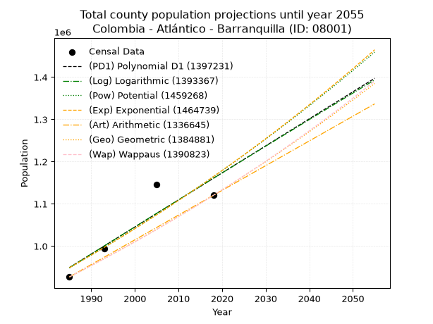
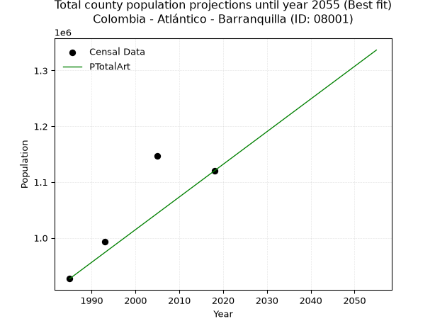
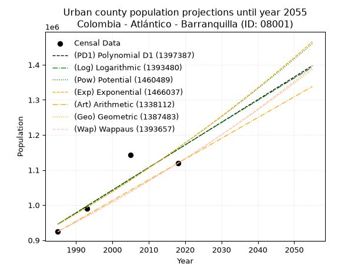
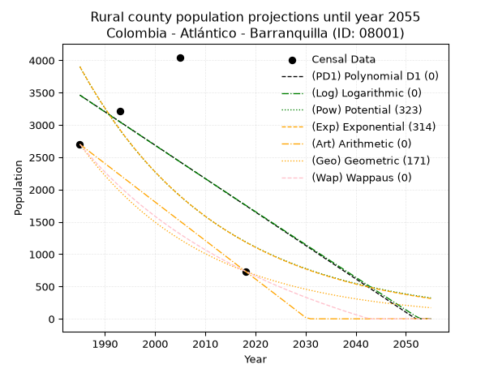
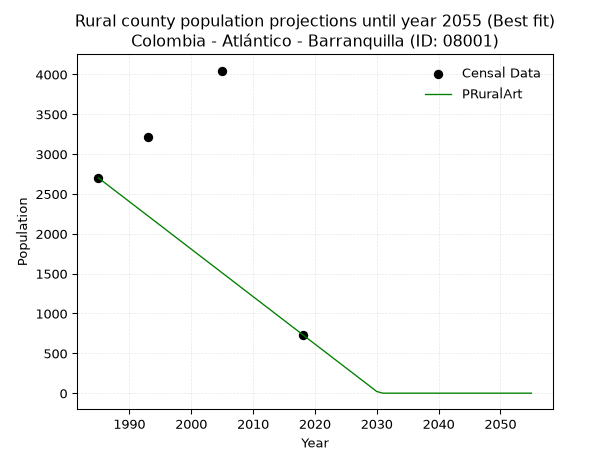

<div align="center">


</div>

# _“Population and Public Services Demand Projections (PPSD) until Year 2050 for Colombia - Atlántico - Barranquilla (ID: 08001)”_
Keywords: `population` `public-service` `projection` `lineal` `polynomial` `logarithmic` `potential` `exponential` `arithmetic` `geometric` `wappaus` `dane` `colombia` `south-america`

PPSD are analytical estimates used by governments and planners to anticipate future changes in population size, age distribution, and the resulting community needs for utilities, healthcare, education, and infrastructure as sizing future water treatment facilities, electrical grids, and road networks based on spatial growth.

> **General running parameters**: • app_version: _v20260806_. • Python version: _3.14.7_. • Pandas version: _3.0.5_. • NumPy version: _2.5.1_. • Creates, save and include plots into reports (create_plot): _False_. • Projection until year: _2050_. • Process polynomial degree 2 and up: _False_. • Process Wappaus: _True_. • Process Wappaus: _True_. • Set negative values to zero: _True_. • Set infinite values to zero: _True_. • Drop dataset notes: _True_. 
<div align="center">

Dynamic map: [:earth_americas:Google](http://maps.google.com/maps?q=10.97796099,-74.815546) [:earth_americas:OSM](https://www.openstreetmap.org/#map=18/10.97796099/-74.815546&layers=P) [:earth_americas:Bing](https://www.bing.com/maps?cp=10.97796099~-74.815546&lvl=18) [:earth_americas:Apple](https://maps.apple.com/frame?center=10.97796099%2C-74.815546&span=0.003%2C0.006)

</div>


<div align="center">

```geojson
{
  "type": "Feature",
  "geometry": {
    "type": "Point", 
    "coordinates": [-74.815546, 10.97796099]
  }, 
  "properties": {
    "Name": "Colombia - Atlántico - Barranquilla (ID: 08001)"
  }
}
```

</div>


## 0. Census Data (4 records)

Census data are official statistics collected by a government about the people and housing in a country. They usually include counts of total population, age, sex, race, income, education, and jobs.

📅Global census file: [Population.xlsx](../data/Population.xlsx)

| Source   |   Year |   CountryID | CountryName   |   StateID | StateName   |   CountyID | CountyName   |   PTotal |   PUrban |   PRural |
|:---------|-------:|------------:|:--------------|----------:|:------------|-----------:|:-------------|---------:|---------:|---------:|
| DANE     |   1985 |          57 | Colombia      |        08 | Atlántico   |      08001 | Barranquilla |   926971 |   924270 |     2701 |
| DANE     |   1993 |          57 | Colombia      |        08 | Atlántico   |      08001 | Barranquilla |   993759 |   990547 |     3212 |
| DANE     |   2005 |          57 | Colombia      |        08 | Atlántico   |      08001 | Barranquilla |  1146359 |  1142312 |     4047 |
| DANE     |   2018 |          57 | Colombia      |        08 | Atlántico   |      08001 | Barranquilla |  1120103 |  1119367 |      736 |

> 🔥Some records could had specific notes about the registered values or the corresponding urban or rural distribution.

## 1. Total

### 1.1. Coefficients and Parameters

* (PD1) Polynomial Deg 1: 6400.59895624248, -11756000.062224023 (lineal)
* (Log) Logarithmic: 12824925.757643836, -96435565.4563559
* (Pow) Potential: 12.432157082460849, -35.02126189178327
* (Exp) Exponential: 0.006204520527902549, 4.249910198896574
* (Art) Arithmetic: Year diff. 2018 - 1985 = 33, Population diff. 1120103 - 926971 = 193132, Annual growth = 5852.484848484848
* (Geo) Geometric: Year diff. 2018 - 1985 = 33, Population diff. 1120103 - 926971 = 193132, Annual growth % = 0.005751435236894142
* (Wap) Wappaus: i = 0.5717902575563804, Condition values only valid for < 200)

<sub>
Wappaus condition values: ['0.00', '0.57', '1.14', '1.72', '2.29', '2.86', '3.43', '4.00', '4.57', '5.15', '5.72', '6.29', '6.86', '7.43', '8.01', '8.58', '9.15', '9.72', '10.29', '10.86', '11.44', '12.01', '12.58', '13.15', '13.72', '14.29', '14.87', '15.44', '16.01', '16.58', '17.15', '17.73', '18.30', '18.87', '19.44', '20.01', '20.58', '21.16', '21.73', '22.30', '22.87', '23.44', '24.02', '24.59', '25.16', '25.73', '26.30', '26.87', '27.45', '28.02', '28.59', '29.16', '29.73', '30.30', '30.88', '31.45', '32.02', '32.59', '33.16', '33.74', '34.31', '34.88', '35.45', '36.02', '36.59', '37.17']
</sub>


### 1.2. Projected Dataset

|   Year |   CountyID |        PTotalPD1 |        PTotalLog |        PTotalPow |        PTotalExp |        PTotalArt |        PTotalGeo |        PTotalWap |
|-------:|-----------:|-----------------:|-----------------:|-----------------:|-----------------:|-----------------:|-----------------:|-----------------:|
|   1985 |      08001 | 949189           | 948895           | 948451           | 948722           | 926971           | 926971           | 926971           |
|   1986 |      08001 | 955589           | 955354           | 954408           | 954627           | 932823           | 932302           | 932287           |
|   1987 |      08001 | 961990           | 961810           | 960400           | 960568           | 938676           | 937664           | 937633           |
|   1988 |      08001 | 968391           | 968263           | 966426           | 966546           | 944528           | 943057           | 943010           |
|   1989 |      08001 | 974791           | 974712           | 972487           | 972562           | 950381           | 948481           | 948418           |
|   1990 |      08001 | 981192           | 981159           | 978583           | 978615           | 956233           | 953936           | 953857           |
|   1991 |      08001 | 987592           | 987602           | 984714           | 984706           | 962086           | 959423           | 959328           |
|   1992 |      08001 | 993993           | 994042           | 990881           | 990834           | 967938           | 964941           | 964831           |
|   1993 |      08001 |      1.00039e+06 |      1.00048e+06 | 997083           | 997001           | 973791           | 970491           | 970366           |
|   1994 |      08001 |      1.00679e+06 |      1.00691e+06 |      1.00332e+06 |      1.00321e+06 | 979643           | 976073           | 975934           |
|   1995 |      08001 |      1.0132e+06  |      1.01334e+06 |      1.00959e+06 |      1.00945e+06 | 985496           | 981686           | 981534           |
|   1996 |      08001 |      1.0196e+06  |      1.01977e+06 |      1.0159e+06  |      1.01573e+06 | 991348           | 987332           | 987168           |
|   1997 |      08001 |      1.026e+06   |      1.02619e+06 |      1.02225e+06 |      1.02205e+06 | 997201           | 993011           | 992835           |
|   1998 |      08001 |      1.0324e+06  |      1.03261e+06 |      1.02863e+06 |      1.02842e+06 |      1.00305e+06 | 998722           | 998535           |
|   1999 |      08001 |      1.0388e+06  |      1.03903e+06 |      1.03505e+06 |      1.03482e+06 |      1.00891e+06 |      1.00447e+06 |      1.00427e+06 |
|   2000 |      08001 |      1.0452e+06  |      1.04544e+06 |      1.0415e+06  |      1.04126e+06 |      1.01476e+06 |      1.01024e+06 |      1.01004e+06 |
|   2001 |      08001 |      1.0516e+06  |      1.05186e+06 |      1.048e+06   |      1.04774e+06 |      1.02061e+06 |      1.01605e+06 |      1.01584e+06 |
|   2002 |      08001 |      1.058e+06   |      1.05826e+06 |      1.05453e+06 |      1.05426e+06 |      1.02646e+06 |      1.0219e+06  |      1.02168e+06 |
|   2003 |      08001 |      1.0644e+06  |      1.06467e+06 |      1.0611e+06  |      1.06082e+06 |      1.03232e+06 |      1.02778e+06 |      1.02755e+06 |
|   2004 |      08001 |      1.0708e+06  |      1.07107e+06 |      1.0677e+06  |      1.06742e+06 |      1.03817e+06 |      1.03369e+06 |      1.03346e+06 |
|   2005 |      08001 |      1.0772e+06  |      1.07747e+06 |      1.07434e+06 |      1.07406e+06 |      1.04402e+06 |      1.03963e+06 |      1.03941e+06 |
|   2006 |      08001 |      1.0836e+06  |      1.08386e+06 |      1.08102e+06 |      1.08075e+06 |      1.04987e+06 |      1.04561e+06 |      1.04539e+06 |
|   2007 |      08001 |      1.09e+06    |      1.09025e+06 |      1.08774e+06 |      1.08748e+06 |      1.05573e+06 |      1.05162e+06 |      1.0514e+06  |
|   2008 |      08001 |      1.0964e+06  |      1.09664e+06 |      1.0945e+06  |      1.09424e+06 |      1.06158e+06 |      1.05767e+06 |      1.05746e+06 |
|   2009 |      08001 |      1.1028e+06  |      1.10303e+06 |      1.1013e+06  |      1.10106e+06 |      1.06743e+06 |      1.06376e+06 |      1.06355e+06 |
|   2010 |      08001 |      1.1092e+06  |      1.10941e+06 |      1.10813e+06 |      1.10791e+06 |      1.07328e+06 |      1.06987e+06 |      1.06968e+06 |
|   2011 |      08001 |      1.1156e+06  |      1.11579e+06 |      1.115e+06   |      1.1148e+06  |      1.07914e+06 |      1.07603e+06 |      1.07585e+06 |
|   2012 |      08001 |      1.122e+06   |      1.12216e+06 |      1.12192e+06 |      1.12174e+06 |      1.08499e+06 |      1.08222e+06 |      1.08205e+06 |
|   2013 |      08001 |      1.12841e+06 |      1.12854e+06 |      1.12887e+06 |      1.12872e+06 |      1.09084e+06 |      1.08844e+06 |      1.08829e+06 |
|   2014 |      08001 |      1.13481e+06 |      1.13491e+06 |      1.13586e+06 |      1.13575e+06 |      1.09669e+06 |      1.0947e+06  |      1.09458e+06 |
|   2015 |      08001 |      1.14121e+06 |      1.14127e+06 |      1.14289e+06 |      1.14282e+06 |      1.10255e+06 |      1.101e+06   |      1.1009e+06  |
|   2016 |      08001 |      1.14761e+06 |      1.14764e+06 |      1.14996e+06 |      1.14993e+06 |      1.1084e+06  |      1.10733e+06 |      1.10726e+06 |
|   2017 |      08001 |      1.15401e+06 |      1.154e+06   |      1.15707e+06 |      1.15709e+06 |      1.11425e+06 |      1.1137e+06  |      1.11366e+06 |
|   2018 |      08001 |      1.16041e+06 |      1.16035e+06 |      1.16423e+06 |      1.16429e+06 |      1.1201e+06  |      1.1201e+06  |      1.1201e+06  |
|   2019 |      08001 |      1.16681e+06 |      1.16671e+06 |      1.17142e+06 |      1.17153e+06 |      1.12596e+06 |      1.12654e+06 |      1.12659e+06 |
|   2020 |      08001 |      1.17321e+06 |      1.17306e+06 |      1.17865e+06 |      1.17883e+06 |      1.13181e+06 |      1.13302e+06 |      1.13311e+06 |
|   2021 |      08001 |      1.17961e+06 |      1.1794e+06  |      1.18593e+06 |      1.18616e+06 |      1.13766e+06 |      1.13954e+06 |      1.13968e+06 |
|   2022 |      08001 |      1.18601e+06 |      1.18575e+06 |      1.19324e+06 |      1.19354e+06 |      1.14351e+06 |      1.1461e+06  |      1.14628e+06 |
|   2023 |      08001 |      1.19241e+06 |      1.19209e+06 |      1.2006e+06  |      1.20097e+06 |      1.14936e+06 |      1.15269e+06 |      1.15293e+06 |
|   2024 |      08001 |      1.19881e+06 |      1.19843e+06 |      1.208e+06   |      1.20845e+06 |      1.15522e+06 |      1.15932e+06 |      1.15962e+06 |
|   2025 |      08001 |      1.20521e+06 |      1.20476e+06 |      1.21544e+06 |      1.21597e+06 |      1.16107e+06 |      1.16598e+06 |      1.16636e+06 |
|   2026 |      08001 |      1.21161e+06 |      1.21109e+06 |      1.22292e+06 |      1.22354e+06 |      1.16692e+06 |      1.17269e+06 |      1.17314e+06 |
|   2027 |      08001 |      1.21801e+06 |      1.21742e+06 |      1.23045e+06 |      1.23115e+06 |      1.17278e+06 |      1.17944e+06 |      1.17996e+06 |
|   2028 |      08001 |      1.22442e+06 |      1.22375e+06 |      1.23802e+06 |      1.23882e+06 |      1.17863e+06 |      1.18622e+06 |      1.18683e+06 |
|   2029 |      08001 |      1.23082e+06 |      1.23007e+06 |      1.24563e+06 |      1.24652e+06 |      1.18448e+06 |      1.19304e+06 |      1.19374e+06 |
|   2030 |      08001 |      1.23722e+06 |      1.23639e+06 |      1.25328e+06 |      1.25428e+06 |      1.19033e+06 |      1.1999e+06  |      1.2007e+06  |
|   2031 |      08001 |      1.24362e+06 |      1.24271e+06 |      1.26098e+06 |      1.26209e+06 |      1.19618e+06 |      1.2068e+06  |      1.20771e+06 |
|   2032 |      08001 |      1.25002e+06 |      1.24902e+06 |      1.26872e+06 |      1.26994e+06 |      1.20204e+06 |      1.21374e+06 |      1.21476e+06 |
|   2033 |      08001 |      1.25642e+06 |      1.25533e+06 |      1.2765e+06  |      1.27785e+06 |      1.20789e+06 |      1.22072e+06 |      1.22185e+06 |
|   2034 |      08001 |      1.26282e+06 |      1.26164e+06 |      1.28433e+06 |      1.2858e+06  |      1.21374e+06 |      1.22775e+06 |      1.229e+06   |
|   2035 |      08001 |      1.26922e+06 |      1.26794e+06 |      1.2922e+06  |      1.2938e+06  |      1.2196e+06  |      1.23481e+06 |      1.23619e+06 |
|   2036 |      08001 |      1.27562e+06 |      1.27424e+06 |      1.30012e+06 |      1.30186e+06 |      1.22545e+06 |      1.24191e+06 |      1.24343e+06 |
|   2037 |      08001 |      1.28202e+06 |      1.28054e+06 |      1.30808e+06 |      1.30996e+06 |      1.2313e+06  |      1.24905e+06 |      1.25072e+06 |
|   2038 |      08001 |      1.28842e+06 |      1.28683e+06 |      1.31609e+06 |      1.31811e+06 |      1.23715e+06 |      1.25624e+06 |      1.25806e+06 |
|   2039 |      08001 |      1.29482e+06 |      1.29312e+06 |      1.32414e+06 |      1.32632e+06 |      1.243e+06   |      1.26346e+06 |      1.26544e+06 |
|   2040 |      08001 |      1.30122e+06 |      1.29941e+06 |      1.33223e+06 |      1.33457e+06 |      1.24886e+06 |      1.27073e+06 |      1.27288e+06 |
|   2041 |      08001 |      1.30762e+06 |      1.3057e+06  |      1.34038e+06 |      1.34288e+06 |      1.25471e+06 |      1.27804e+06 |      1.28037e+06 |
|   2042 |      08001 |      1.31402e+06 |      1.31198e+06 |      1.34856e+06 |      1.35123e+06 |      1.26056e+06 |      1.28539e+06 |      1.28791e+06 |
|   2043 |      08001 |      1.32042e+06 |      1.31826e+06 |      1.3568e+06  |      1.35964e+06 |      1.26642e+06 |      1.29278e+06 |      1.2955e+06  |
|   2044 |      08001 |      1.32682e+06 |      1.32453e+06 |      1.36508e+06 |      1.36811e+06 |      1.27227e+06 |      1.30022e+06 |      1.30314e+06 |
|   2045 |      08001 |      1.33322e+06 |      1.33081e+06 |      1.3734e+06  |      1.37662e+06 |      1.27812e+06 |      1.30769e+06 |      1.31084e+06 |
|   2046 |      08001 |      1.33962e+06 |      1.33708e+06 |      1.38177e+06 |      1.38519e+06 |      1.28397e+06 |      1.31521e+06 |      1.31859e+06 |
|   2047 |      08001 |      1.34603e+06 |      1.34334e+06 |      1.39019e+06 |      1.39381e+06 |      1.28982e+06 |      1.32278e+06 |      1.32639e+06 |
|   2048 |      08001 |      1.35243e+06 |      1.34961e+06 |      1.39866e+06 |      1.40248e+06 |      1.29568e+06 |      1.33039e+06 |      1.33425e+06 |
|   2049 |      08001 |      1.35883e+06 |      1.35587e+06 |      1.40717e+06 |      1.41121e+06 |      1.30153e+06 |      1.33804e+06 |      1.34216e+06 |
|   2050 |      08001 |      1.36523e+06 |      1.36212e+06 |      1.41574e+06 |      1.42e+06    |      1.30738e+06 |      1.34573e+06 |      1.35013e+06 |
<div align="center">

</img>

</div>


### 1.3. Best fit with absolute and relative error (%)

Relative error puts that difference into context by dividing the absolute error by the true value, creating a unitless ratio or percentage that shows the scale of the mistake.

Absolute and relative error

|   Year | Source   |   CountryID | CountryName   |   StateID | StateName   |   CountyID_x | CountyName   |   PTotal |   PUrban |   PRural |   CountyID_y |        PTotalPD1 |        PTotalLog |        PTotalPow |        PTotalExp |        PTotalArt |        PTotalGeo |        PTotalWap |   PTotalPD1AbsError |   PTotalLogAbsError |   PTotalPowAbsError |   PTotalExpAbsError |   PTotalArtAbsError |   PTotalGeoAbsError |   PTotalWapAbsError |   PTotalPD1RelError |   PTotalLogRelError |   PTotalPowRelError |   PTotalExpRelError |   PTotalArtRelError |   PTotalGeoRelError |   PTotalWapRelError |
|-------:|:---------|------------:|:--------------|----------:|:------------|-------------:|:-------------|---------:|---------:|---------:|-------------:|-----------------:|-----------------:|-----------------:|-----------------:|-----------------:|-----------------:|-----------------:|--------------------:|--------------------:|--------------------:|--------------------:|--------------------:|--------------------:|--------------------:|--------------------:|--------------------:|--------------------:|--------------------:|--------------------:|--------------------:|--------------------:|
|   1985 | DANE     |          57 | Colombia      |        08 | Atlántico   |        08001 | Barranquilla |   926971 |   924270 |     2701 |        08001 | 949189           | 948895           | 948451           | 948722           | 926971           | 926971           | 926971           |               22218 |               21924 |               21480 |               21751 |                   0 |                   0 |                   0 |            2.39684  |             2.36512 |            2.31722  |            2.34646  |             0       |             0       |             0       |
|   1993 | DANE     |          57 | Colombia      |        08 | Atlántico   |        08001 | Barranquilla |   993759 |   990547 |     3212 |        08001 |      1.00039e+06 |      1.00048e+06 | 997083           | 997001           | 973791           | 970491           | 970366           |                6635 |                6719 |                3324 |                3242 |               19968 |               23268 |               23393 |            0.667667 |             0.67612 |            0.334488 |            0.326236 |             2.00934 |             2.34141 |             2.35399 |
|   2005 | DANE     |          57 | Colombia      |        08 | Atlántico   |        08001 | Barranquilla |  1146359 |  1142312 |     4047 |        08001 |      1.0772e+06  |      1.07747e+06 |      1.07434e+06 |      1.07406e+06 |      1.04402e+06 |      1.03963e+06 |      1.03941e+06 |               69158 |               68892 |               72017 |               72294 |              102338 |              106728 |              106952 |            6.03284  |             6.00964 |            6.28224  |            6.3064   |             8.92722 |             9.31017 |             9.32971 |
|   2018 | DANE     |          57 | Colombia      |        08 | Atlántico   |        08001 | Barranquilla |  1120103 |  1119367 |      736 |        08001 |      1.16041e+06 |      1.16035e+06 |      1.16423e+06 |      1.16429e+06 |      1.1201e+06  |      1.1201e+06  |      1.1201e+06  |               40306 |               40249 |               44123 |               44185 |                   0 |                   0 |                   0 |            3.59842  |             3.59333 |            3.93919  |            3.94473  |             0       |             0       |             0       |

Relative error mean

| Method    |   RelError | Best   |
|:----------|-----------:|:-------|
| PTotalPD1 |    3.17394 |        |
| PTotalLog |    3.16105 |        |
| PTotalPow |    3.21829 |        |
| PTotalExp |    3.23096 |        |
| PTotalArt |    2.73414 | True   |
| PTotalGeo |    2.9129  |        |
| PTotalWap |    2.92093 |        |

💙Best method: _**PTotalArt**_
<div align="center">

</img>

</div>


### 1.4. Fresh water supply demand in liters per capita per day (lpcd)

The fresh water supply demand typically ranges from 100 to 300 liters per capita per day (lpcd) for standard domestic and municipal planning, though absolute survival minimums set by the World Health Organization are as low as 7.5 to 20 liters per day, and total consumption in high-income nations can exceed 400 liters.

> `CZ`: Level in meters above the sea level (masl)<br> `WS`: Fresh water supply demand in liters per capita per day (lpcd or l/h/d)<br> `WSAll`: Zonal fresh water supply demand in liters per second (l/s)<br> `A`: Zonal area in square meters<br> `DP`: Population density (people/hectare)

Reference values (RAS Colombia)

|    CZ |   WS |
|------:|-----:|
|  1000 |  120 |
|  2000 |  130 |
| 99999 |  140 |

County shapefile geometry properties and water supply values

|   CountyID |      ATotal |   CZTotal |   WSTotal |
|-----------:|------------:|----------:|----------:|
|      08001 | 1.53791e+08 |   35.0144 |       120 |

Projected values for best method: PTotalArt

|   CountyID |   Year |        PTotalArt |   DPTotal |   WSTotal |   WSTotalAll |
|-----------:|-------:|-----------------:|----------:|----------:|-------------:|
|      08001 |   1985 | 926971           |     60.27 |       120 |      1287.46 |
|      08001 |   1986 | 932823           |     60.66 |       120 |      1295.59 |
|      08001 |   1987 | 938676           |     61.04 |       120 |      1303.72 |
|      08001 |   1988 | 944528           |     61.42 |       120 |      1311.84 |
|      08001 |   1989 | 950381           |     61.8  |       120 |      1319.97 |
|      08001 |   1990 | 956233           |     62.18 |       120 |      1328.1  |
|      08001 |   1991 | 962086           |     62.56 |       120 |      1336.23 |
|      08001 |   1992 | 967938           |     62.94 |       120 |      1344.36 |
|      08001 |   1993 | 973791           |     63.32 |       120 |      1352.49 |
|      08001 |   1994 | 979643           |     63.7  |       120 |      1360.62 |
|      08001 |   1995 | 985496           |     64.08 |       120 |      1368.74 |
|      08001 |   1996 | 991348           |     64.46 |       120 |      1376.87 |
|      08001 |   1997 | 997201           |     64.84 |       120 |      1385    |
|      08001 |   1998 |      1.00305e+06 |     65.22 |       120 |      1393.13 |
|      08001 |   1999 |      1.00891e+06 |     65.6  |       120 |      1401.26 |
|      08001 |   2000 |      1.01476e+06 |     65.98 |       120 |      1409.39 |
|      08001 |   2001 |      1.02061e+06 |     66.36 |       120 |      1417.52 |
|      08001 |   2002 |      1.02646e+06 |     66.74 |       120 |      1425.64 |
|      08001 |   2003 |      1.03232e+06 |     67.12 |       120 |      1433.77 |
|      08001 |   2004 |      1.03817e+06 |     67.5  |       120 |      1441.9  |
|      08001 |   2005 |      1.04402e+06 |     67.89 |       120 |      1450.03 |
|      08001 |   2006 |      1.04987e+06 |     68.27 |       120 |      1458.16 |
|      08001 |   2007 |      1.05573e+06 |     68.65 |       120 |      1466.29 |
|      08001 |   2008 |      1.06158e+06 |     69.03 |       120 |      1474.41 |
|      08001 |   2009 |      1.06743e+06 |     69.41 |       120 |      1482.54 |
|      08001 |   2010 |      1.07328e+06 |     69.79 |       120 |      1490.67 |
|      08001 |   2011 |      1.07914e+06 |     70.17 |       120 |      1498.8  |
|      08001 |   2012 |      1.08499e+06 |     70.55 |       120 |      1506.93 |
|      08001 |   2013 |      1.09084e+06 |     70.93 |       120 |      1515.06 |
|      08001 |   2014 |      1.09669e+06 |     71.31 |       120 |      1523.18 |
|      08001 |   2015 |      1.10255e+06 |     71.69 |       120 |      1531.31 |
|      08001 |   2016 |      1.1084e+06  |     72.07 |       120 |      1539.44 |
|      08001 |   2017 |      1.11425e+06 |     72.45 |       120 |      1547.57 |
|      08001 |   2018 |      1.1201e+06  |     72.83 |       120 |      1555.7  |
|      08001 |   2019 |      1.12596e+06 |     73.21 |       120 |      1563.83 |
|      08001 |   2020 |      1.13181e+06 |     73.59 |       120 |      1571.96 |
|      08001 |   2021 |      1.13766e+06 |     73.97 |       120 |      1580.08 |
|      08001 |   2022 |      1.14351e+06 |     74.35 |       120 |      1588.21 |
|      08001 |   2023 |      1.14936e+06 |     74.74 |       120 |      1596.34 |
|      08001 |   2024 |      1.15522e+06 |     75.12 |       120 |      1604.47 |
|      08001 |   2025 |      1.16107e+06 |     75.5  |       120 |      1612.6  |
|      08001 |   2026 |      1.16692e+06 |     75.88 |       120 |      1620.73 |
|      08001 |   2027 |      1.17278e+06 |     76.26 |       120 |      1628.85 |
|      08001 |   2028 |      1.17863e+06 |     76.64 |       120 |      1636.98 |
|      08001 |   2029 |      1.18448e+06 |     77.02 |       120 |      1645.11 |
|      08001 |   2030 |      1.19033e+06 |     77.4  |       120 |      1653.24 |
|      08001 |   2031 |      1.19618e+06 |     77.78 |       120 |      1661.37 |
|      08001 |   2032 |      1.20204e+06 |     78.16 |       120 |      1669.5  |
|      08001 |   2033 |      1.20789e+06 |     78.54 |       120 |      1677.62 |
|      08001 |   2034 |      1.21374e+06 |     78.92 |       120 |      1685.75 |
|      08001 |   2035 |      1.2196e+06  |     79.3  |       120 |      1693.88 |
|      08001 |   2036 |      1.22545e+06 |     79.68 |       120 |      1702.01 |
|      08001 |   2037 |      1.2313e+06  |     80.06 |       120 |      1710.14 |
|      08001 |   2038 |      1.23715e+06 |     80.44 |       120 |      1718.27 |
|      08001 |   2039 |      1.243e+06   |     80.82 |       120 |      1726.4  |
|      08001 |   2040 |      1.24886e+06 |     81.2  |       120 |      1734.53 |
|      08001 |   2041 |      1.25471e+06 |     81.59 |       120 |      1742.65 |
|      08001 |   2042 |      1.26056e+06 |     81.97 |       120 |      1750.78 |
|      08001 |   2043 |      1.26642e+06 |     82.35 |       120 |      1758.91 |
|      08001 |   2044 |      1.27227e+06 |     82.73 |       120 |      1767.04 |
|      08001 |   2045 |      1.27812e+06 |     83.11 |       120 |      1775.17 |
|      08001 |   2046 |      1.28397e+06 |     83.49 |       120 |      1783.3  |
|      08001 |   2047 |      1.28982e+06 |     83.87 |       120 |      1791.42 |
|      08001 |   2048 |      1.29568e+06 |     84.25 |       120 |      1799.55 |
|      08001 |   2049 |      1.30153e+06 |     84.63 |       120 |      1807.68 |
|      08001 |   2050 |      1.30738e+06 |     85.01 |       120 |      1815.81 |

## 2. Urban

### 2.1. Coefficients and Parameters

* (PD1) Polynomial Deg 1: 6452.289040545971, -11862067.153352078 (lineal)
* (Log) Logarithmic: 12928025.88187829, -97221904.32685453
* (Pow) Potential: 12.558843475710725, -35.44058694480911
* (Exp) Exponential: 0.0062679580251149055, 3.733774578504281
* (Art) Arithmetic: Year diff. 2018 - 1985 = 33, Population diff. 1119367 - 924270 = 195097, Annual growth = 5912.030303030303
* (Geo) Geometric: Year diff. 2018 - 1985 = 33, Population diff. 1119367 - 924270 = 195097, Annual growth % = 0.005820339074330327
* (Wap) Wappaus: i = 0.5785792978919743, Condition values only valid for < 200)

<sub>
Wappaus condition values: ['0.00', '0.58', '1.16', '1.74', '2.31', '2.89', '3.47', '4.05', '4.63', '5.21', '5.79', '6.36', '6.94', '7.52', '8.10', '8.68', '9.26', '9.84', '10.41', '10.99', '11.57', '12.15', '12.73', '13.31', '13.89', '14.46', '15.04', '15.62', '16.20', '16.78', '17.36', '17.94', '18.51', '19.09', '19.67', '20.25', '20.83', '21.41', '21.99', '22.56', '23.14', '23.72', '24.30', '24.88', '25.46', '26.04', '26.61', '27.19', '27.77', '28.35', '28.93', '29.51', '30.09', '30.66', '31.24', '31.82', '32.40', '32.98', '33.56', '34.14', '34.71', '35.29', '35.87', '36.45', '37.03', '37.61']
</sub>


### 2.2. Projected Dataset

|   Year |   CountyID |        PUrbanPD1 |        PUrbanLog |        PUrbanPow |        PUrbanExp |        PUrbanArt |        PUrbanGeo |        PUrbanWap |
|-------:|-----------:|-----------------:|-----------------:|-----------------:|-----------------:|-----------------:|-----------------:|-----------------:|
|   1985 |      08001 | 945727           | 945434           | 945086           | 945356           | 924270           | 924270           | 924270           |
|   1986 |      08001 | 952179           | 951945           | 951082           | 951300           | 930182           | 929650           | 929633           |
|   1987 |      08001 | 958631           | 958453           | 957114           | 957281           | 936094           | 935060           | 935028           |
|   1988 |      08001 | 965083           | 964958           | 963181           | 963300           | 942006           | 940503           | 940453           |
|   1989 |      08001 | 971536           | 971459           | 969284           | 969357           | 947918           | 945977           | 945911           |
|   1990 |      08001 | 977988           | 977957           | 975422           | 975452           | 953830           | 951483           | 951401           |
|   1991 |      08001 | 984440           | 984452           | 981596           | 981585           | 959742           | 957021           | 956923           |
|   1992 |      08001 | 990893           | 990944           | 987805           | 987757           | 965654           | 962591           | 962477           |
|   1993 |      08001 | 997345           | 997432           | 994051           | 993968           | 971566           | 968194           | 968065           |
|   1994 |      08001 |      1.0038e+06  |      1.00392e+06 |      1.00033e+06 |      1.00022e+06 | 977478           | 973829           | 973685           |
|   1995 |      08001 |      1.01025e+06 |      1.0104e+06  |      1.00665e+06 |      1.00651e+06 | 983390           | 979497           | 979339           |
|   1996 |      08001 |      1.0167e+06  |      1.01688e+06 |      1.01301e+06 |      1.01284e+06 | 989302           | 985198           | 985027           |
|   1997 |      08001 |      1.02315e+06 |      1.02335e+06 |      1.0194e+06  |      1.0192e+06  | 995214           | 990932           | 990749           |
|   1998 |      08001 |      1.02961e+06 |      1.02982e+06 |      1.02583e+06 |      1.02561e+06 |      1.00113e+06 | 996699           | 996506           |
|   1999 |      08001 |      1.03606e+06 |      1.03629e+06 |      1.0323e+06  |      1.03206e+06 |      1.00704e+06 |      1.0025e+06  |      1.0023e+06  |
|   2000 |      08001 |      1.04251e+06 |      1.04276e+06 |      1.0388e+06  |      1.03855e+06 |      1.01295e+06 |      1.00834e+06 |      1.00812e+06 |
|   2001 |      08001 |      1.04896e+06 |      1.04922e+06 |      1.04534e+06 |      1.04508e+06 |      1.01886e+06 |      1.0142e+06  |      1.01398e+06 |
|   2002 |      08001 |      1.05542e+06 |      1.05568e+06 |      1.05192e+06 |      1.05165e+06 |      1.02478e+06 |      1.02011e+06 |      1.01988e+06 |
|   2003 |      08001 |      1.06187e+06 |      1.06214e+06 |      1.05854e+06 |      1.05826e+06 |      1.03069e+06 |      1.02604e+06 |      1.02582e+06 |
|   2004 |      08001 |      1.06832e+06 |      1.06859e+06 |      1.0652e+06  |      1.06492e+06 |      1.0366e+06  |      1.03202e+06 |      1.03178e+06 |
|   2005 |      08001 |      1.07477e+06 |      1.07504e+06 |      1.07189e+06 |      1.07161e+06 |      1.04251e+06 |      1.03802e+06 |      1.03779e+06 |
|   2006 |      08001 |      1.08122e+06 |      1.08148e+06 |      1.07862e+06 |      1.07835e+06 |      1.04842e+06 |      1.04406e+06 |      1.04383e+06 |
|   2007 |      08001 |      1.08768e+06 |      1.08793e+06 |      1.0854e+06  |      1.08513e+06 |      1.05434e+06 |      1.05014e+06 |      1.04991e+06 |
|   2008 |      08001 |      1.09413e+06 |      1.09437e+06 |      1.09221e+06 |      1.09195e+06 |      1.06025e+06 |      1.05625e+06 |      1.05603e+06 |
|   2009 |      08001 |      1.10058e+06 |      1.1008e+06  |      1.09906e+06 |      1.09882e+06 |      1.06616e+06 |      1.0624e+06  |      1.06219e+06 |
|   2010 |      08001 |      1.10703e+06 |      1.10724e+06 |      1.10595e+06 |      1.10573e+06 |      1.07207e+06 |      1.06858e+06 |      1.06838e+06 |
|   2011 |      08001 |      1.11349e+06 |      1.11367e+06 |      1.11288e+06 |      1.11268e+06 |      1.07798e+06 |      1.0748e+06  |      1.07462e+06 |
|   2012 |      08001 |      1.11994e+06 |      1.1201e+06  |      1.11985e+06 |      1.11968e+06 |      1.0839e+06  |      1.08106e+06 |      1.08089e+06 |
|   2013 |      08001 |      1.12639e+06 |      1.12652e+06 |      1.12686e+06 |      1.12672e+06 |      1.08981e+06 |      1.08735e+06 |      1.0872e+06  |
|   2014 |      08001 |      1.13284e+06 |      1.13294e+06 |      1.13391e+06 |      1.1338e+06  |      1.09572e+06 |      1.09368e+06 |      1.09355e+06 |
|   2015 |      08001 |      1.1393e+06  |      1.13936e+06 |      1.141e+06   |      1.14093e+06 |      1.10163e+06 |      1.10005e+06 |      1.09994e+06 |
|   2016 |      08001 |      1.14575e+06 |      1.14577e+06 |      1.14813e+06 |      1.1481e+06  |      1.10754e+06 |      1.10645e+06 |      1.10638e+06 |
|   2017 |      08001 |      1.1522e+06  |      1.15218e+06 |      1.15531e+06 |      1.15532e+06 |      1.11346e+06 |      1.11289e+06 |      1.11285e+06 |
|   2018 |      08001 |      1.15865e+06 |      1.15859e+06 |      1.16252e+06 |      1.16259e+06 |      1.11937e+06 |      1.11937e+06 |      1.11937e+06 |
|   2019 |      08001 |      1.1651e+06  |      1.165e+06   |      1.16978e+06 |      1.1699e+06  |      1.12528e+06 |      1.12588e+06 |      1.12592e+06 |
|   2020 |      08001 |      1.17156e+06 |      1.1714e+06  |      1.17707e+06 |      1.17725e+06 |      1.13119e+06 |      1.13244e+06 |      1.13252e+06 |
|   2021 |      08001 |      1.17801e+06 |      1.1778e+06  |      1.18441e+06 |      1.18466e+06 |      1.1371e+06  |      1.13903e+06 |      1.13916e+06 |
|   2022 |      08001 |      1.18446e+06 |      1.18419e+06 |      1.19179e+06 |      1.1921e+06  |      1.14302e+06 |      1.14566e+06 |      1.14585e+06 |
|   2023 |      08001 |      1.19091e+06 |      1.19058e+06 |      1.19922e+06 |      1.1996e+06  |      1.14893e+06 |      1.15232e+06 |      1.15258e+06 |
|   2024 |      08001 |      1.19737e+06 |      1.19697e+06 |      1.20668e+06 |      1.20714e+06 |      1.15484e+06 |      1.15903e+06 |      1.15935e+06 |
|   2025 |      08001 |      1.20382e+06 |      1.20336e+06 |      1.21419e+06 |      1.21473e+06 |      1.16075e+06 |      1.16578e+06 |      1.16617e+06 |
|   2026 |      08001 |      1.21027e+06 |      1.20974e+06 |      1.22174e+06 |      1.22237e+06 |      1.16666e+06 |      1.17256e+06 |      1.17303e+06 |
|   2027 |      08001 |      1.21672e+06 |      1.21612e+06 |      1.22934e+06 |      1.23006e+06 |      1.17258e+06 |      1.17939e+06 |      1.17993e+06 |
|   2028 |      08001 |      1.22318e+06 |      1.2225e+06  |      1.23698e+06 |      1.23779e+06 |      1.17849e+06 |      1.18625e+06 |      1.18689e+06 |
|   2029 |      08001 |      1.22963e+06 |      1.22887e+06 |      1.24466e+06 |      1.24557e+06 |      1.1844e+06  |      1.19316e+06 |      1.19388e+06 |
|   2030 |      08001 |      1.23608e+06 |      1.23524e+06 |      1.25239e+06 |      1.2534e+06  |      1.19031e+06 |      1.2001e+06  |      1.20093e+06 |
|   2031 |      08001 |      1.24253e+06 |      1.24161e+06 |      1.26016e+06 |      1.26129e+06 |      1.19622e+06 |      1.20708e+06 |      1.20802e+06 |
|   2032 |      08001 |      1.24898e+06 |      1.24797e+06 |      1.26797e+06 |      1.26922e+06 |      1.20214e+06 |      1.21411e+06 |      1.21516e+06 |
|   2033 |      08001 |      1.25544e+06 |      1.25433e+06 |      1.27583e+06 |      1.2772e+06  |      1.20805e+06 |      1.22118e+06 |      1.22235e+06 |
|   2034 |      08001 |      1.26189e+06 |      1.26069e+06 |      1.28373e+06 |      1.28523e+06 |      1.21396e+06 |      1.22828e+06 |      1.22958e+06 |
|   2035 |      08001 |      1.26834e+06 |      1.26704e+06 |      1.29168e+06 |      1.29331e+06 |      1.21987e+06 |      1.23543e+06 |      1.23687e+06 |
|   2036 |      08001 |      1.27479e+06 |      1.27339e+06 |      1.29968e+06 |      1.30144e+06 |      1.22578e+06 |      1.24262e+06 |      1.2442e+06  |
|   2037 |      08001 |      1.28125e+06 |      1.27974e+06 |      1.30772e+06 |      1.30962e+06 |      1.2317e+06  |      1.24986e+06 |      1.25158e+06 |
|   2038 |      08001 |      1.2877e+06  |      1.28609e+06 |      1.3158e+06  |      1.31786e+06 |      1.23761e+06 |      1.25713e+06 |      1.25902e+06 |
|   2039 |      08001 |      1.29415e+06 |      1.29243e+06 |      1.32393e+06 |      1.32614e+06 |      1.24352e+06 |      1.26445e+06 |      1.2665e+06  |
|   2040 |      08001 |      1.3006e+06  |      1.29877e+06 |      1.33211e+06 |      1.33448e+06 |      1.24943e+06 |      1.27181e+06 |      1.27404e+06 |
|   2041 |      08001 |      1.30706e+06 |      1.3051e+06  |      1.34034e+06 |      1.34287e+06 |      1.25534e+06 |      1.27921e+06 |      1.28163e+06 |
|   2042 |      08001 |      1.31351e+06 |      1.31144e+06 |      1.34861e+06 |      1.35132e+06 |      1.26126e+06 |      1.28666e+06 |      1.28927e+06 |
|   2043 |      08001 |      1.31996e+06 |      1.31777e+06 |      1.35692e+06 |      1.35981e+06 |      1.26717e+06 |      1.29414e+06 |      1.29697e+06 |
|   2044 |      08001 |      1.32641e+06 |      1.32409e+06 |      1.36529e+06 |      1.36836e+06 |      1.27308e+06 |      1.30168e+06 |      1.30472e+06 |
|   2045 |      08001 |      1.33286e+06 |      1.33042e+06 |      1.3737e+06  |      1.37697e+06 |      1.27899e+06 |      1.30925e+06 |      1.31252e+06 |
|   2046 |      08001 |      1.33932e+06 |      1.33674e+06 |      1.38216e+06 |      1.38562e+06 |      1.2849e+06  |      1.31687e+06 |      1.32038e+06 |
|   2047 |      08001 |      1.34577e+06 |      1.34305e+06 |      1.39067e+06 |      1.39434e+06 |      1.29082e+06 |      1.32454e+06 |      1.32829e+06 |
|   2048 |      08001 |      1.35222e+06 |      1.34937e+06 |      1.39922e+06 |      1.4031e+06  |      1.29673e+06 |      1.33225e+06 |      1.33626e+06 |
|   2049 |      08001 |      1.35867e+06 |      1.35568e+06 |      1.40783e+06 |      1.41193e+06 |      1.30264e+06 |      1.34e+06    |      1.34428e+06 |
|   2050 |      08001 |      1.36512e+06 |      1.36199e+06 |      1.41648e+06 |      1.4208e+06  |      1.30855e+06 |      1.3478e+06  |      1.35236e+06 |
<div align="center">

</img>

</div>


### 2.3. Best fit with absolute and relative error (%)

Relative error puts that difference into context by dividing the absolute error by the true value, creating a unitless ratio or percentage that shows the scale of the mistake.

Absolute and relative error

|   Year | Source   |   CountryID | CountryName   |   StateID | StateName   |   CountyID_x | CountyName   |   PTotal |   PUrban |   PRural |   CountyID_y |        PUrbanPD1 |        PUrbanLog |        PUrbanPow |        PUrbanExp |        PUrbanArt |        PUrbanGeo |        PUrbanWap |   PUrbanPD1AbsError |   PUrbanLogAbsError |   PUrbanPowAbsError |   PUrbanExpAbsError |   PUrbanArtAbsError |   PUrbanGeoAbsError |   PUrbanWapAbsError |   PUrbanPD1RelError |   PUrbanLogRelError |   PUrbanPowRelError |   PUrbanExpRelError |   PUrbanArtRelError |   PUrbanGeoRelError |   PUrbanWapRelError |
|-------:|:---------|------------:|:--------------|----------:|:------------|-------------:|:-------------|---------:|---------:|---------:|-------------:|-----------------:|-----------------:|-----------------:|-----------------:|-----------------:|-----------------:|-----------------:|--------------------:|--------------------:|--------------------:|--------------------:|--------------------:|--------------------:|--------------------:|--------------------:|--------------------:|--------------------:|--------------------:|--------------------:|--------------------:|--------------------:|
|   1985 | DANE     |          57 | Colombia      |        08 | Atlántico   |        08001 | Barranquilla |   926971 |   924270 |     2701 |        08001 | 945727           | 945434           | 945086           | 945356           | 924270           | 924270           | 924270           |               21457 |               21164 |               20816 |               21086 |                   0 |                   0 |                   0 |            2.32151  |            2.28981  |            2.25216  |            2.28137  |             0       |             0       |             0       |
|   1993 | DANE     |          57 | Colombia      |        08 | Atlántico   |        08001 | Barranquilla |   993759 |   990547 |     3212 |        08001 | 997345           | 997432           | 994051           | 993968           | 971566           | 968194           | 968065           |                6798 |                6885 |                3504 |                3421 |               18981 |               22353 |               22482 |            0.686287 |            0.695071 |            0.353744 |            0.345365 |             1.91621 |             2.25663 |             2.26966 |
|   2005 | DANE     |          57 | Colombia      |        08 | Atlántico   |        08001 | Barranquilla |  1146359 |  1142312 |     4047 |        08001 |      1.07477e+06 |      1.07504e+06 |      1.07189e+06 |      1.07161e+06 |      1.04251e+06 |      1.03802e+06 |      1.03779e+06 |               67540 |               67273 |               70421 |               70699 |               99801 |              104289 |              104521 |            5.91257  |            5.8892   |            6.16478  |            6.18911  |             8.73675 |             9.12964 |             9.14995 |
|   2018 | DANE     |          57 | Colombia      |        08 | Atlántico   |        08001 | Barranquilla |  1120103 |  1119367 |      736 |        08001 |      1.15865e+06 |      1.15859e+06 |      1.16252e+06 |      1.16259e+06 |      1.11937e+06 |      1.11937e+06 |      1.11937e+06 |               39285 |               39224 |               43154 |               43221 |                   0 |                   0 |                   0 |            3.50957  |            3.50412  |            3.85521  |            3.8612   |             0       |             0       |             0       |

Relative error mean

| Method    |   RelError | Best   |
|:----------|-----------:|:-------|
| PUrbanPD1 |    3.10748 |        |
| PUrbanLog |    3.09455 |        |
| PUrbanPow |    3.15647 |        |
| PUrbanExp |    3.16926 |        |
| PUrbanArt |    2.66324 | True   |
| PUrbanGeo |    2.84657 |        |
| PUrbanWap |    2.8549  |        |

💙Best method: _**PUrbanArt**_
<div align="center">

</img>

</div>


### 2.4. Fresh water supply demand in liters per capita per day (lpcd)

The fresh water supply demand typically ranges from 100 to 300 liters per capita per day (lpcd) for standard domestic and municipal planning, though absolute survival minimums set by the World Health Organization are as low as 7.5 to 20 liters per day, and total consumption in high-income nations can exceed 400 liters.

> `CZ`: Level in meters above the sea level (masl)<br> `WS`: Fresh water supply demand in liters per capita per day (lpcd or l/h/d)<br> `WSAll`: Zonal fresh water supply demand in liters per second (l/s)<br> `A`: Zonal area in square meters<br> `DP`: Population density (people/hectare)

Reference values (RAS Colombia)

|    CZ |   WS |
|------:|-----:|
|  1000 |  120 |
|  2000 |  130 |
| 99999 |  140 |

County shapefile geometry properties and water supply values

|   CountyID |      AUrban |   CZUrban |   WSUrban |
|-----------:|------------:|----------:|----------:|
|      08001 | 1.06089e+08 |   40.3905 |       120 |

Projected values for best method: PUrbanArt

|   CountyID |   Year |        PUrbanArt |   DPUrban |   WSUrban |   WSUrbanAll |
|-----------:|-------:|-----------------:|----------:|----------:|-------------:|
|      08001 |   1985 | 924270           |     87.12 |       120 |      1283.71 |
|      08001 |   1986 | 930182           |     87.68 |       120 |      1291.92 |
|      08001 |   1987 | 936094           |     88.24 |       120 |      1300.13 |
|      08001 |   1988 | 942006           |     88.79 |       120 |      1308.34 |
|      08001 |   1989 | 947918           |     89.35 |       120 |      1316.55 |
|      08001 |   1990 | 953830           |     89.91 |       120 |      1324.76 |
|      08001 |   1991 | 959742           |     90.47 |       120 |      1332.97 |
|      08001 |   1992 | 965654           |     91.02 |       120 |      1341.19 |
|      08001 |   1993 | 971566           |     91.58 |       120 |      1349.4  |
|      08001 |   1994 | 977478           |     92.14 |       120 |      1357.61 |
|      08001 |   1995 | 983390           |     92.69 |       120 |      1365.82 |
|      08001 |   1996 | 989302           |     93.25 |       120 |      1374.03 |
|      08001 |   1997 | 995214           |     93.81 |       120 |      1382.24 |
|      08001 |   1998 |      1.00113e+06 |     94.37 |       120 |      1390.45 |
|      08001 |   1999 |      1.00704e+06 |     94.92 |       120 |      1398.66 |
|      08001 |   2000 |      1.01295e+06 |     95.48 |       120 |      1406.88 |
|      08001 |   2001 |      1.01886e+06 |     96.04 |       120 |      1415.09 |
|      08001 |   2002 |      1.02478e+06 |     96.6  |       120 |      1423.3  |
|      08001 |   2003 |      1.03069e+06 |     97.15 |       120 |      1431.51 |
|      08001 |   2004 |      1.0366e+06  |     97.71 |       120 |      1439.72 |
|      08001 |   2005 |      1.04251e+06 |     98.27 |       120 |      1447.93 |
|      08001 |   2006 |      1.04842e+06 |     98.82 |       120 |      1456.14 |
|      08001 |   2007 |      1.05434e+06 |     99.38 |       120 |      1464.35 |
|      08001 |   2008 |      1.06025e+06 |     99.94 |       120 |      1472.57 |
|      08001 |   2009 |      1.06616e+06 |    100.5  |       120 |      1480.78 |
|      08001 |   2010 |      1.07207e+06 |    101.05 |       120 |      1488.99 |
|      08001 |   2011 |      1.07798e+06 |    101.61 |       120 |      1497.2  |
|      08001 |   2012 |      1.0839e+06  |    102.17 |       120 |      1505.41 |
|      08001 |   2013 |      1.08981e+06 |    102.73 |       120 |      1513.62 |
|      08001 |   2014 |      1.09572e+06 |    103.28 |       120 |      1521.83 |
|      08001 |   2015 |      1.10163e+06 |    103.84 |       120 |      1530.04 |
|      08001 |   2016 |      1.10754e+06 |    104.4  |       120 |      1538.25 |
|      08001 |   2017 |      1.11346e+06 |    104.95 |       120 |      1546.47 |
|      08001 |   2018 |      1.11937e+06 |    105.51 |       120 |      1554.68 |
|      08001 |   2019 |      1.12528e+06 |    106.07 |       120 |      1562.89 |
|      08001 |   2020 |      1.13119e+06 |    106.63 |       120 |      1571.1  |
|      08001 |   2021 |      1.1371e+06  |    107.18 |       120 |      1579.31 |
|      08001 |   2022 |      1.14302e+06 |    107.74 |       120 |      1587.52 |
|      08001 |   2023 |      1.14893e+06 |    108.3  |       120 |      1595.73 |
|      08001 |   2024 |      1.15484e+06 |    108.86 |       120 |      1603.94 |
|      08001 |   2025 |      1.16075e+06 |    109.41 |       120 |      1612.15 |
|      08001 |   2026 |      1.16666e+06 |    109.97 |       120 |      1620.37 |
|      08001 |   2027 |      1.17258e+06 |    110.53 |       120 |      1628.58 |
|      08001 |   2028 |      1.17849e+06 |    111.08 |       120 |      1636.79 |
|      08001 |   2029 |      1.1844e+06  |    111.64 |       120 |      1645    |
|      08001 |   2030 |      1.19031e+06 |    112.2  |       120 |      1653.21 |
|      08001 |   2031 |      1.19622e+06 |    112.76 |       120 |      1661.42 |
|      08001 |   2032 |      1.20214e+06 |    113.31 |       120 |      1669.63 |
|      08001 |   2033 |      1.20805e+06 |    113.87 |       120 |      1677.84 |
|      08001 |   2034 |      1.21396e+06 |    114.43 |       120 |      1686.05 |
|      08001 |   2035 |      1.21987e+06 |    114.99 |       120 |      1694.27 |
|      08001 |   2036 |      1.22578e+06 |    115.54 |       120 |      1702.48 |
|      08001 |   2037 |      1.2317e+06  |    116.1  |       120 |      1710.69 |
|      08001 |   2038 |      1.23761e+06 |    116.66 |       120 |      1718.9  |
|      08001 |   2039 |      1.24352e+06 |    117.21 |       120 |      1727.11 |
|      08001 |   2040 |      1.24943e+06 |    117.77 |       120 |      1735.32 |
|      08001 |   2041 |      1.25534e+06 |    118.33 |       120 |      1743.53 |
|      08001 |   2042 |      1.26126e+06 |    118.89 |       120 |      1751.74 |
|      08001 |   2043 |      1.26717e+06 |    119.44 |       120 |      1759.96 |
|      08001 |   2044 |      1.27308e+06 |    120    |       120 |      1768.17 |
|      08001 |   2045 |      1.27899e+06 |    120.56 |       120 |      1776.38 |
|      08001 |   2046 |      1.2849e+06  |    121.12 |       120 |      1784.59 |
|      08001 |   2047 |      1.29082e+06 |    121.67 |       120 |      1792.8  |
|      08001 |   2048 |      1.29673e+06 |    122.23 |       120 |      1801.01 |
|      08001 |   2049 |      1.30264e+06 |    122.79 |       120 |      1809.22 |
|      08001 |   2050 |      1.30855e+06 |    123.34 |       120 |      1817.43 |

## 3. Rural

### 3.1. Coefficients and Parameters

* (PD1) Polynomial Deg 1: -51.69008430349058, 106067.09112805703 (lineal)
* (Log) Logarithmic: -103100.1242344583, 786338.870498662
* (Pow) Potential: -71.86693619220028, 240.59128433997296
* (Exp) Exponential: -0.035990610829340845, 4.1498536672092123e+34
* (Art) Arithmetic: Year diff. 2018 - 1985 = 33, Population diff. 736 - 2701 = -1965, Annual growth = -59.54545454545455
* (Geo) Geometric: Year diff. 2018 - 1985 = 33, Population diff. 736 - 2701 = -1965, Annual growth % = -0.038632377042014165
* (Wap) Wappaus: i = -3.464966805089005, Condition values only valid for < 200)

<sub>
Wappaus condition values: ['-0.00', '-3.46', '-6.93', '-10.39', '-13.86', '-17.32', '-20.79', '-24.25', '-27.72', '-31.18', '-34.65', '-38.11', '-41.58', '-45.04', '-48.51', '-51.97', '-55.44', '-58.90', '-62.37', '-65.83', '-69.30', '-72.76', '-76.23', '-79.69', '-83.16', '-86.62', '-90.09', '-93.55', '-97.02', '-100.48', '-103.95', '-107.41', '-110.88', '-114.34', '-117.81', '-121.27', '-124.74', '-128.20', '-131.67', '-135.13', '-138.60', '-142.06', '-145.53', '-148.99', '-152.46', '-155.92', '-159.39', '-162.85', '-166.32', '-169.78', '-173.25', '-176.71', '-180.18', '-183.64', '-187.11', '-190.57', '-194.04', '-197.50', '-200.97', '-204.43', '-207.90', '-211.36', '-214.83', '-218.29', '-221.76', '-225.22']
</sub>


### 3.2. Projected Dataset

|   Year |   CountyID |   PRuralPD1 |   PRuralLog |   PRuralPow |   PRuralExp |   PRuralArt |   PRuralGeo |   PRuralWap |
|-------:|-----------:|------------:|------------:|------------:|------------:|------------:|------------:|------------:|
|   1985 |      08001 |        3462 |        3461 |        3902 |        3903 |        2701 |        2701 |        2701 |
|   1986 |      08001 |        3411 |        3409 |        3764 |        3765 |        2641 |        2597 |        2609 |
|   1987 |      08001 |        3359 |        3357 |        3630 |        3632 |        2582 |        2496 |        2520 |
|   1988 |      08001 |        3307 |        3305 |        3501 |        3504 |        2522 |        2400 |        2434 |
|   1989 |      08001 |        3256 |        3253 |        3377 |        3380 |        2463 |        2307 |        2351 |
|   1990 |      08001 |        3204 |        3202 |        3257 |        3261 |        2403 |        2218 |        2270 |
|   1991 |      08001 |        3152 |        3150 |        3142 |        3145 |        2344 |        2132 |        2192 |
|   1992 |      08001 |        3100 |        3098 |        3030 |        3034 |        2284 |        2050 |        2117 |
|   1993 |      08001 |        3049 |        3046 |        2923 |        2927 |        2225 |        1971 |        2043 |
|   1994 |      08001 |        2997 |        2995 |        2819 |        2823 |        2165 |        1895 |        1972 |
|   1995 |      08001 |        2945 |        2943 |        2720 |        2724 |        2106 |        1821 |        1903 |
|   1996 |      08001 |        2894 |        2891 |        2623 |        2627 |        2046 |        1751 |        1836 |
|   1997 |      08001 |        2842 |        2840 |        2531 |        2534 |        1986 |        1683 |        1771 |
|   1998 |      08001 |        2790 |        2788 |        2441 |        2445 |        1927 |        1618 |        1708 |
|   1999 |      08001 |        2739 |        2736 |        2355 |        2358 |        1867 |        1556 |        1647 |
|   2000 |      08001 |        2687 |        2685 |        2272 |        2275 |        1808 |        1496 |        1587 |
|   2001 |      08001 |        2635 |        2633 |        2192 |        2195 |        1748 |        1438 |        1529 |
|   2002 |      08001 |        2584 |        2582 |        2114 |        2117 |        1689 |        1382 |        1472 |
|   2003 |      08001 |        2532 |        2530 |        2040 |        2042 |        1629 |        1329 |        1417 |
|   2004 |      08001 |        2480 |        2479 |        1968 |        1970 |        1570 |        1278 |        1363 |
|   2005 |      08001 |        2428 |        2427 |        1899 |        1900 |        1510 |        1228 |        1311 |
|   2006 |      08001 |        2377 |        2376 |        1832 |        1833 |        1451 |        1181 |        1260 |
|   2007 |      08001 |        2325 |        2325 |        1767 |        1768 |        1391 |        1135 |        1210 |
|   2008 |      08001 |        2273 |        2273 |        1705 |        1706 |        1331 |        1091 |        1162 |
|   2009 |      08001 |        2222 |        2222 |        1645 |        1646 |        1272 |        1049 |        1115 |
|   2010 |      08001 |        2170 |        2171 |        1587 |        1587 |        1212 |        1009 |        1068 |
|   2011 |      08001 |        2118 |        2119 |        1532 |        1531 |        1153 |         970 |        1023 |
|   2012 |      08001 |        2067 |        2068 |        1478 |        1477 |        1093 |         932 |         979 |
|   2013 |      08001 |        2015 |        2017 |        1426 |        1425 |        1034 |         896 |         936 |
|   2014 |      08001 |        1963 |        1966 |        1376 |        1375 |         974 |         862 |         895 |
|   2015 |      08001 |        1912 |        1915 |        1328 |        1326 |         915 |         828 |         854 |
|   2016 |      08001 |        1860 |        1863 |        1281 |        1279 |         855 |         796 |         813 |
|   2017 |      08001 |        1808 |        1812 |        1237 |        1234 |         796 |         766 |         774 |
|   2018 |      08001 |        1757 |        1761 |        1193 |        1190 |         736 |         736 |         736 |
|   2019 |      08001 |        1705 |        1710 |        1151 |        1148 |         676 |         708 |         699 |
|   2020 |      08001 |        1653 |        1659 |        1111 |        1108 |         617 |         680 |         662 |
|   2021 |      08001 |        1601 |        1608 |        1072 |        1068 |         557 |         654 |         626 |
|   2022 |      08001 |        1550 |        1557 |        1035 |        1031 |         498 |         629 |         591 |
|   2023 |      08001 |        1498 |        1506 |         999 |         994 |         438 |         604 |         556 |
|   2024 |      08001 |        1446 |        1455 |         964 |         959 |         379 |         581 |         523 |
|   2025 |      08001 |        1395 |        1404 |         930 |         925 |         319 |         559 |         490 |
|   2026 |      08001 |        1343 |        1353 |         898 |         892 |         260 |         537 |         457 |
|   2027 |      08001 |        1291 |        1302 |         867 |         861 |         200 |         516 |         426 |
|   2028 |      08001 |        1240 |        1251 |         836 |         830 |         141 |         496 |         395 |
|   2029 |      08001 |        1188 |        1201 |         807 |         801 |          81 |         477 |         364 |
|   2030 |      08001 |        1136 |        1150 |         779 |         773 |          21 |         459 |         334 |
|   2031 |      08001 |        1085 |        1099 |         752 |         745 |           0 |         441 |         305 |
|   2032 |      08001 |        1033 |        1048 |         726 |         719 |           0 |         424 |         277 |
|   2033 |      08001 |         981 |         998 |         701 |         694 |           0 |         408 |         248 |
|   2034 |      08001 |         929 |         947 |         676 |         669 |           0 |         392 |         221 |
|   2035 |      08001 |         878 |         896 |         653 |         646 |           0 |         377 |         194 |
|   2036 |      08001 |         826 |         846 |         630 |         623 |           0 |         362 |         167 |
|   2037 |      08001 |         774 |         795 |         608 |         601 |           0 |         348 |         141 |
|   2038 |      08001 |         723 |         744 |         587 |         579 |           0 |         335 |         115 |
|   2039 |      08001 |         671 |         694 |         567 |         559 |           0 |         322 |          90 |
|   2040 |      08001 |         619 |         643 |         547 |         539 |           0 |         309 |          65 |
|   2041 |      08001 |         568 |         593 |         528 |         520 |           0 |         297 |          41 |
|   2042 |      08001 |         516 |         542 |         510 |         502 |           0 |         286 |          17 |
|   2043 |      08001 |         464 |         492 |         493 |         484 |           0 |         275 |           0 |
|   2044 |      08001 |         413 |         441 |         476 |         467 |           0 |         264 |           0 |
|   2045 |      08001 |         361 |         391 |         459 |         450 |           0 |         254 |           0 |
|   2046 |      08001 |         309 |         340 |         443 |         434 |           0 |         244 |           0 |
|   2047 |      08001 |         257 |         290 |         428 |         419 |           0 |         235 |           0 |
|   2048 |      08001 |         206 |         240 |         413 |         404 |           0 |         226 |           0 |
|   2049 |      08001 |         154 |         189 |         399 |         390 |           0 |         217 |           0 |
|   2050 |      08001 |         102 |         139 |         385 |         376 |           0 |         209 |           0 |
<div align="center">

</img>

</div>


### 3.3. Best fit with absolute and relative error (%)

Relative error puts that difference into context by dividing the absolute error by the true value, creating a unitless ratio or percentage that shows the scale of the mistake.

Absolute and relative error

|   Year | Source   |   CountryID | CountryName   |   StateID | StateName   |   CountyID_x | CountyName   |   PTotal |   PUrban |   PRural |   CountyID_y |   PRuralPD1 |   PRuralLog |   PRuralPow |   PRuralExp |   PRuralArt |   PRuralGeo |   PRuralWap |   PRuralPD1AbsError |   PRuralLogAbsError |   PRuralPowAbsError |   PRuralExpAbsError |   PRuralArtAbsError |   PRuralGeoAbsError |   PRuralWapAbsError |   PRuralPD1RelError |   PRuralLogRelError |   PRuralPowRelError |   PRuralExpRelError |   PRuralArtRelError |   PRuralGeoRelError |   PRuralWapRelError |
|-------:|:---------|------------:|:--------------|----------:|:------------|-------------:|:-------------|---------:|---------:|---------:|-------------:|------------:|------------:|------------:|------------:|------------:|------------:|------------:|--------------------:|--------------------:|--------------------:|--------------------:|--------------------:|--------------------:|--------------------:|--------------------:|--------------------:|--------------------:|--------------------:|--------------------:|--------------------:|--------------------:|
|   1985 | DANE     |          57 | Colombia      |        08 | Atlántico   |        08001 | Barranquilla |   926971 |   924270 |     2701 |        08001 |        3462 |        3461 |        3902 |        3903 |        2701 |        2701 |        2701 |                 761 |                 760 |                1201 |                1202 |                   0 |                   0 |                   0 |            28.1748  |            28.1377  |            44.465   |            44.502   |              0      |              0      |              0      |
|   1993 | DANE     |          57 | Colombia      |        08 | Atlántico   |        08001 | Barranquilla |   993759 |   990547 |     3212 |        08001 |        3049 |        3046 |        2923 |        2927 |        2225 |        1971 |        2043 |                 163 |                 166 |                 289 |                 285 |                 987 |                1241 |                1169 |             5.07472 |             5.16812 |             8.99751 |             8.87298 |             30.7285 |             38.6364 |             36.3948 |
|   2005 | DANE     |          57 | Colombia      |        08 | Atlántico   |        08001 | Barranquilla |  1146359 |  1142312 |     4047 |        08001 |        2428 |        2427 |        1899 |        1900 |        1510 |        1228 |        1311 |                1619 |                1620 |                2148 |                2147 |                2537 |                2819 |                2736 |            40.0049  |            40.0297  |            53.0764  |            53.0516  |             62.6884 |             69.6565 |             67.6056 |
|   2018 | DANE     |          57 | Colombia      |        08 | Atlántico   |        08001 | Barranquilla |  1120103 |  1119367 |      736 |        08001 |        1757 |        1761 |        1193 |        1190 |         736 |         736 |         736 |                1021 |                1025 |                 457 |                 454 |                   0 |                   0 |                   0 |           138.723   |           139.266   |            62.0924  |            61.6848  |              0      |              0      |              0      |

Relative error mean

| Method    |   RelError | Best   |
|:----------|-----------:|:-------|
| PRuralPD1 |    52.9943 |        |
| PRuralLog |    53.1505 |        |
| PRuralPow |    42.1578 |        |
| PRuralExp |    42.0279 |        |
| PRuralArt |    23.3542 | True   |
| PRuralGeo |    27.0732 |        |
| PRuralWap |    26.0001 |        |

💙Best method: _**PRuralArt**_
<div align="center">

</img>

</div>


### 3.4. Fresh water supply demand in liters per capita per day (lpcd)

The fresh water supply demand typically ranges from 100 to 300 liters per capita per day (lpcd) for standard domestic and municipal planning, though absolute survival minimums set by the World Health Organization are as low as 7.5 to 20 liters per day, and total consumption in high-income nations can exceed 400 liters.

> `CZ`: Level in meters above the sea level (masl)<br> `WS`: Fresh water supply demand in liters per capita per day (lpcd or l/h/d)<br> `WSAll`: Zonal fresh water supply demand in liters per second (l/s)<br> `A`: Zonal area in square meters<br> `DP`: Population density (people/hectare)

Reference values (RAS Colombia)

|    CZ |   WS |
|------:|-----:|
|  1000 |  120 |
|  2000 |  130 |
| 99999 |  140 |

County shapefile geometry properties and water supply values

|   CountyID |      ARural |   CZRural |   WSRural |
|-----------:|------------:|----------:|----------:|
|      08001 | 4.77024e+07 |   22.9801 |       120 |

Projected values for best method: PRuralArt

|   CountyID |   Year |   PRuralArt |   DPRural |   WSRural |   WSRuralAll |
|-----------:|-------:|------------:|----------:|----------:|-------------:|
|      08001 |   1985 |        2701 |      0.57 |       120 |    3.75139   |
|      08001 |   1986 |        2641 |      0.55 |       120 |    3.66806   |
|      08001 |   1987 |        2582 |      0.54 |       120 |    3.58611   |
|      08001 |   1988 |        2522 |      0.53 |       120 |    3.50278   |
|      08001 |   1989 |        2463 |      0.52 |       120 |    3.42083   |
|      08001 |   1990 |        2403 |      0.5  |       120 |    3.3375    |
|      08001 |   1991 |        2344 |      0.49 |       120 |    3.25556   |
|      08001 |   1992 |        2284 |      0.48 |       120 |    3.17222   |
|      08001 |   1993 |        2225 |      0.47 |       120 |    3.09028   |
|      08001 |   1994 |        2165 |      0.45 |       120 |    3.00694   |
|      08001 |   1995 |        2106 |      0.44 |       120 |    2.925     |
|      08001 |   1996 |        2046 |      0.43 |       120 |    2.84167   |
|      08001 |   1997 |        1986 |      0.42 |       120 |    2.75833   |
|      08001 |   1998 |        1927 |      0.4  |       120 |    2.67639   |
|      08001 |   1999 |        1867 |      0.39 |       120 |    2.59306   |
|      08001 |   2000 |        1808 |      0.38 |       120 |    2.51111   |
|      08001 |   2001 |        1748 |      0.37 |       120 |    2.42778   |
|      08001 |   2002 |        1689 |      0.35 |       120 |    2.34583   |
|      08001 |   2003 |        1629 |      0.34 |       120 |    2.2625    |
|      08001 |   2004 |        1570 |      0.33 |       120 |    2.18056   |
|      08001 |   2005 |        1510 |      0.32 |       120 |    2.09722   |
|      08001 |   2006 |        1451 |      0.3  |       120 |    2.01528   |
|      08001 |   2007 |        1391 |      0.29 |       120 |    1.93194   |
|      08001 |   2008 |        1331 |      0.28 |       120 |    1.84861   |
|      08001 |   2009 |        1272 |      0.27 |       120 |    1.76667   |
|      08001 |   2010 |        1212 |      0.25 |       120 |    1.68333   |
|      08001 |   2011 |        1153 |      0.24 |       120 |    1.60139   |
|      08001 |   2012 |        1093 |      0.23 |       120 |    1.51806   |
|      08001 |   2013 |        1034 |      0.22 |       120 |    1.43611   |
|      08001 |   2014 |         974 |      0.2  |       120 |    1.35278   |
|      08001 |   2015 |         915 |      0.19 |       120 |    1.27083   |
|      08001 |   2016 |         855 |      0.18 |       120 |    1.1875    |
|      08001 |   2017 |         796 |      0.17 |       120 |    1.10556   |
|      08001 |   2018 |         736 |      0.15 |       120 |    1.02222   |
|      08001 |   2019 |         676 |      0.14 |       120 |    0.938889  |
|      08001 |   2020 |         617 |      0.13 |       120 |    0.856944  |
|      08001 |   2021 |         557 |      0.12 |       120 |    0.773611  |
|      08001 |   2022 |         498 |      0.1  |       120 |    0.691667  |
|      08001 |   2023 |         438 |      0.09 |       120 |    0.608333  |
|      08001 |   2024 |         379 |      0.08 |       120 |    0.526389  |
|      08001 |   2025 |         319 |      0.07 |       120 |    0.443056  |
|      08001 |   2026 |         260 |      0.05 |       120 |    0.361111  |
|      08001 |   2027 |         200 |      0.04 |       120 |    0.277778  |
|      08001 |   2028 |         141 |      0.03 |       120 |    0.195833  |
|      08001 |   2029 |          81 |      0.02 |       120 |    0.1125    |
|      08001 |   2030 |          21 |      0    |       120 |    0.0291667 |
|      08001 |   2031 |           0 |      0    |       120 |    0         |
|      08001 |   2032 |           0 |      0    |       120 |    0         |
|      08001 |   2033 |           0 |      0    |       120 |    0         |
|      08001 |   2034 |           0 |      0    |       120 |    0         |
|      08001 |   2035 |           0 |      0    |       120 |    0         |
|      08001 |   2036 |           0 |      0    |       120 |    0         |
|      08001 |   2037 |           0 |      0    |       120 |    0         |
|      08001 |   2038 |           0 |      0    |       120 |    0         |
|      08001 |   2039 |           0 |      0    |       120 |    0         |
|      08001 |   2040 |           0 |      0    |       120 |    0         |
|      08001 |   2041 |           0 |      0    |       120 |    0         |
|      08001 |   2042 |           0 |      0    |       120 |    0         |
|      08001 |   2043 |           0 |      0    |       120 |    0         |
|      08001 |   2044 |           0 |      0    |       120 |    0         |
|      08001 |   2045 |           0 |      0    |       120 |    0         |
|      08001 |   2046 |           0 |      0    |       120 |    0         |
|      08001 |   2047 |           0 |      0    |       120 |    0         |
|      08001 |   2048 |           0 |      0    |       120 |    0         |
|      08001 |   2049 |           0 |      0    |       120 |    0         |
|      08001 |   2050 |           0 |      0    |       120 |    0         |

<div align="center"><br><sub>Share this research</sub></div><br>

<sub>**APPS & TOOLS & CONTENT DISCLAIMER**: • NO WARRANTY - This content and software is provided by <a href="https://github.com/rcfdtools" target="_blank">github.com/rcfdtools</a> "as is", without any express or implied warranty, including warranties of merchantability, fitness for a particular purpose, or non-infringement. There is no guarantee that the software will be error-free or operate without interruption. • LIMITATION OF LIABILITY - Neither the authors nor copyright holders will be liable for claims or damages arising from the software or its use. You are responsible for determining if the software is appropriate for your use and assume all associated risks, including errors, legal compliance, and data loss. • NO PROFESSIONAL ADVICE - The software provides general information and does not offer professional advice. It should not replace consultation with professional advisors. [Clauses and global license for rcfdtools use.](https://github.com/rcfdtools/rcfdtools/blob/main/LICENSE.md)</sub>

| [:house: Home](Readme.md)  | [:beginner: Help / Collaborate](https://github.com/rcfdtools/R.HydroTools/discussions/31) |
|----------------------------|-------------------------------------------------------------------------------------------|