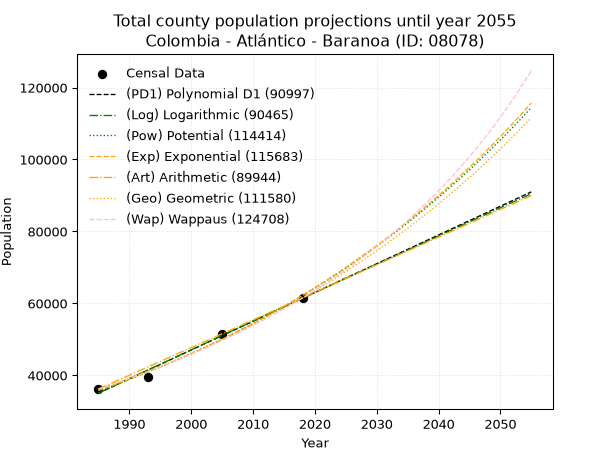
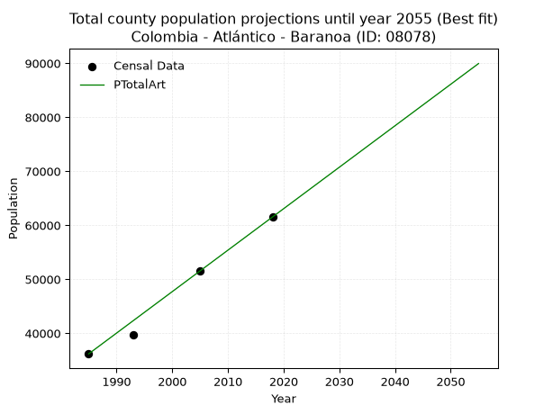
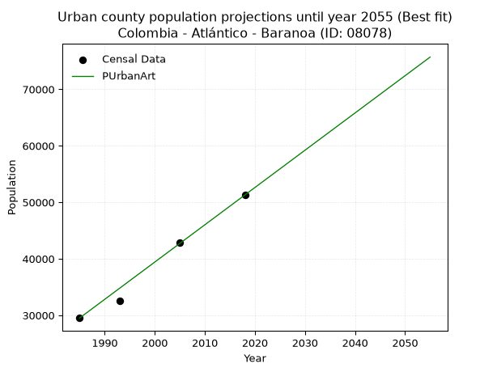
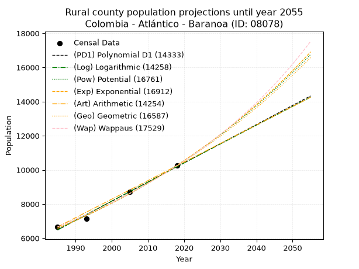
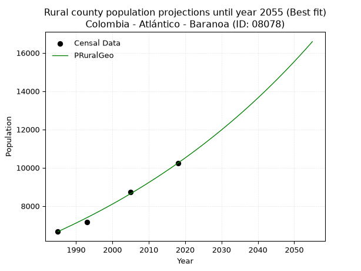

<div align="center">


</div>

# _“Population and Public Services Demand Projections (PPSD) until Year 2050 for Colombia - Atlántico - Baranoa (ID: 08078)”_
Keywords: `population` `public-service` `projection` `lineal` `polynomial` `logarithmic` `potential` `exponential` `arithmetic` `geometric` `wappaus` `dane` `colombia` `south-america`

PPSD are analytical estimates used by governments and planners to anticipate future changes in population size, age distribution, and the resulting community needs for utilities, healthcare, education, and infrastructure as sizing future water treatment facilities, electrical grids, and road networks based on spatial growth.

> **General running parameters**: • app_version: _v20260806_. • Python version: _3.14.7_. • Pandas version: _3.0.5_. • NumPy version: _2.5.1_. • Creates, save and include plots into reports (create_plot): _False_. • Projection until year: _2050_. • Process polynomial degree 2 and up: _False_. • Process Wappaus: _True_. • Process Wappaus: _True_. • Set negative values to zero: _True_. • Set infinite values to zero: _True_. • Drop dataset notes: _True_. 
<div align="center">

Dynamic map: [:earth_americas:Google](http://maps.google.com/maps?q=10.79445039,-74.9160774) [:earth_americas:OSM](https://www.openstreetmap.org/#map=18/10.79445039/-74.9160774&layers=P) [:earth_americas:Bing](https://www.bing.com/maps?cp=10.79445039~-74.9160774&lvl=18) [:earth_americas:Apple](https://maps.apple.com/frame?center=10.79445039%2C-74.9160774&span=0.003%2C0.006)

</div>


<div align="center">

```geojson
{
  "type": "Feature",
  "geometry": {
    "type": "Point", 
    "coordinates": [-74.9160774, 10.79445039]
  }, 
  "properties": {
    "Name": "Colombia - Atlántico - Baranoa (ID: 08078)"
  }
}
```

</div>


## 0. Census Data (4 records)

Census data are official statistics collected by a government about the people and housing in a country. They usually include counts of total population, age, sex, race, income, education, and jobs.

📅Global census file: [Population.xlsx](../data/Population.xlsx)

| Source   |   Year |   CountryID | CountryName   |   StateID | StateName   |   CountyID | CountyName   |   PTotal |   PUrban |   PRural |
|:---------|-------:|------------:|:--------------|----------:|:------------|-----------:|:-------------|---------:|---------:|---------:|
| DANE     |   1985 |          57 | Colombia      |        08 | Atlántico   |      08078 | Baranoa      |    36182 |    29522 |     6660 |
| DANE     |   1993 |          57 | Colombia      |        08 | Atlántico   |      08078 | Baranoa      |    39658 |    32504 |     7154 |
| DANE     |   2005 |          57 | Colombia      |        08 | Atlántico   |      08078 | Baranoa      |    51571 |    42840 |     8731 |
| DANE     |   2018 |          57 | Colombia      |        08 | Atlántico   |      08078 | Baranoa      |    61527 |    51287 |    10240 |

> 🔥Some records could had specific notes about the registered values or the corresponding urban or rural distribution.

## 1. Total

### 1.1. Coefficients and Parameters

* (PD1) Polynomial Deg 1: 799.3103171417029, -1551585.9618626914 (lineal)
* (Log) Logarithmic: 1599741.7892251133, -12112415.659426242
* (Pow) Potential: 33.5638984453031, -106.13240049124363
* (Exp) Exponential: 0.01676767501736424, 1.2546877898378641e-10
* (Art) Arithmetic: Year diff. 2018 - 1985 = 33, Population diff. 61527 - 36182 = 25345, Annual growth = 768.030303030303
* (Geo) Geometric: Year diff. 2018 - 1985 = 33, Population diff. 61527 - 36182 = 25345, Annual growth % = 0.01621842724203204
* (Wap) Wappaus: i = 1.5720768875544793, Condition values only valid for < 200)

<sub>
Wappaus condition values: ['0.00', '1.57', '3.14', '4.72', '6.29', '7.86', '9.43', '11.00', '12.58', '14.15', '15.72', '17.29', '18.86', '20.44', '22.01', '23.58', '25.15', '26.73', '28.30', '29.87', '31.44', '33.01', '34.59', '36.16', '37.73', '39.30', '40.87', '42.45', '44.02', '45.59', '47.16', '48.73', '50.31', '51.88', '53.45', '55.02', '56.59', '58.17', '59.74', '61.31', '62.88', '64.46', '66.03', '67.60', '69.17', '70.74', '72.32', '73.89', '75.46', '77.03', '78.60', '80.18', '81.75', '83.32', '84.89', '86.46', '88.04', '89.61', '91.18', '92.75', '94.32', '95.90', '97.47', '99.04', '100.61', '102.18']
</sub>


### 1.2. Projected Dataset

|   Year |   CountyID |   PTotalPD1 |   PTotalLog |   PTotalPow |   PTotalExp |   PTotalArt |   PTotalGeo |   PTotalWap |
|-------:|-----------:|------------:|------------:|------------:|------------:|------------:|------------:|------------:|
|   1985 |      08078 |       35045 |       35022 |       35752 |       35770 |       36182 |       36182 |       36182 |
|   1986 |      08078 |       35844 |       35828 |       36361 |       36375 |       36950 |       36769 |       36755 |
|   1987 |      08078 |       36644 |       36633 |       36981 |       36990 |       37718 |       37365 |       37338 |
|   1988 |      08078 |       37443 |       37438 |       37611 |       37616 |       38486 |       37971 |       37930 |
|   1989 |      08078 |       38242 |       38243 |       38251 |       38252 |       39254 |       38587 |       38531 |
|   1990 |      08078 |       39042 |       39047 |       38902 |       38898 |       40022 |       39213 |       39142 |
|   1991 |      08078 |       39841 |       39851 |       39563 |       39556 |       40790 |       39849 |       39764 |
|   1992 |      08078 |       40640 |       40654 |       40236 |       40225 |       41558 |       40495 |       40396 |
|   1993 |      08078 |       41440 |       41457 |       40919 |       40905 |       42326 |       41152 |       41038 |
|   1994 |      08078 |       42239 |       42259 |       41614 |       41597 |       43094 |       41819 |       41691 |
|   1995 |      08078 |       43038 |       43061 |       42320 |       42300 |       43862 |       42497 |       42355 |
|   1996 |      08078 |       43837 |       43863 |       43038 |       43015 |       44630 |       43187 |       43031 |
|   1997 |      08078 |       44637 |       44664 |       43768 |       43743 |       45398 |       43887 |       43719 |
|   1998 |      08078 |       45436 |       45465 |       44509 |       44482 |       46166 |       44599 |       44418 |
|   1999 |      08078 |       46235 |       46266 |       45263 |       45235 |       46934 |       45322 |       45130 |
|   2000 |      08078 |       47035 |       47066 |       46029 |       46000 |       47702 |       46057 |       45855 |
|   2001 |      08078 |       47834 |       47865 |       46808 |       46777 |       48470 |       46804 |       46592 |
|   2002 |      08078 |       48633 |       48665 |       47600 |       47568 |       49239 |       47563 |       47343 |
|   2003 |      08078 |       49433 |       49463 |       48404 |       48373 |       50007 |       48335 |       48108 |
|   2004 |      08078 |       50232 |       50262 |       49222 |       49191 |       50775 |       49119 |       48887 |
|   2005 |      08078 |       51031 |       51060 |       50053 |       50022 |       51543 |       49915 |       49680 |
|   2006 |      08078 |       51831 |       51858 |       50898 |       50868 |       52311 |       50725 |       50489 |
|   2007 |      08078 |       52630 |       52655 |       51756 |       51728 |       53079 |       51548 |       51312 |
|   2008 |      08078 |       53429 |       53452 |       52629 |       52603 |       53847 |       52384 |       52152 |
|   2009 |      08078 |       54228 |       54248 |       53516 |       53492 |       54615 |       53233 |       53008 |
|   2010 |      08078 |       55028 |       55044 |       54417 |       54397 |       55383 |       54097 |       53880 |
|   2011 |      08078 |       55827 |       55840 |       55333 |       55317 |       56151 |       54974 |       54770 |
|   2012 |      08078 |       56626 |       56635 |       56264 |       56252 |       56919 |       55865 |       55677 |
|   2013 |      08078 |       57426 |       57430 |       57211 |       57203 |       57687 |       56772 |       56603 |
|   2014 |      08078 |       58225 |       58225 |       58172 |       58170 |       58455 |       57692 |       57548 |
|   2015 |      08078 |       59024 |       59019 |       59150 |       59154 |       59223 |       58628 |       58512 |
|   2016 |      08078 |       59824 |       59813 |       60143 |       60154 |       59991 |       59579 |       59496 |
|   2017 |      08078 |       60623 |       60606 |       61152 |       61171 |       60759 |       60545 |       60501 |
|   2018 |      08078 |       61422 |       61399 |       62178 |       62206 |       61527 |       61527 |       61527 |
|   2019 |      08078 |       62222 |       62191 |       63221 |       63258 |       62295 |       62525 |       62575 |
|   2020 |      08078 |       63021 |       62984 |       64280 |       64327 |       63063 |       63539 |       63646 |
|   2021 |      08078 |       63820 |       63775 |       65357 |       65415 |       63831 |       64569 |       64740 |
|   2022 |      08078 |       64619 |       64567 |       66451 |       66521 |       64599 |       65617 |       65859 |
|   2023 |      08078 |       65419 |       65358 |       67563 |       67646 |       65367 |       66681 |       67003 |
|   2024 |      08078 |       66218 |       66148 |       68693 |       68790 |       66135 |       67762 |       68172 |
|   2025 |      08078 |       67017 |       66938 |       69841 |       69953 |       66903 |       68861 |       69369 |
|   2026 |      08078 |       67817 |       67728 |       71008 |       71136 |       67671 |       69978 |       70593 |
|   2027 |      08078 |       68616 |       68518 |       72194 |       72339 |       68439 |       71113 |       71846 |
|   2028 |      08078 |       69415 |       69307 |       73399 |       73562 |       69207 |       72266 |       73129 |
|   2029 |      08078 |       70215 |       70095 |       74624 |       74806 |       69975 |       73438 |       74442 |
|   2030 |      08078 |       71014 |       70884 |       75868 |       76071 |       70743 |       74629 |       75788 |
|   2031 |      08078 |       71813 |       71671 |       77133 |       77357 |       71511 |       75840 |       77166 |
|   2032 |      08078 |       72613 |       72459 |       78418 |       78665 |       72279 |       77070 |       78579 |
|   2033 |      08078 |       73412 |       73246 |       79724 |       79995 |       73047 |       78320 |       80028 |
|   2034 |      08078 |       74211 |       74033 |       81050 |       81348 |       73815 |       79590 |       81513 |
|   2035 |      08078 |       75011 |       74819 |       82399 |       82723 |       74584 |       80881 |       83038 |
|   2036 |      08078 |       75810 |       75605 |       83768 |       84122 |       75352 |       82193 |       84602 |
|   2037 |      08078 |       76609 |       76390 |       85161 |       85544 |       76120 |       83526 |       86207 |
|   2038 |      08078 |       77408 |       77176 |       86575 |       86991 |       76888 |       84880 |       87856 |
|   2039 |      08078 |       78208 |       77960 |       88012 |       88462 |       77656 |       86257 |       89551 |
|   2040 |      08078 |       79007 |       78745 |       89473 |       89958 |       78424 |       87656 |       91291 |
|   2041 |      08078 |       79806 |       79529 |       90957 |       91479 |       79192 |       89078 |       93081 |
|   2042 |      08078 |       80606 |       80312 |       92464 |       93025 |       79960 |       90522 |       94922 |
|   2043 |      08078 |       81405 |       81096 |       93996 |       94598 |       80728 |       91990 |       96816 |
|   2044 |      08078 |       82204 |       81878 |       95553 |       96198 |       81496 |       93482 |       98766 |
|   2045 |      08078 |       83004 |       82661 |       97135 |       97825 |       82264 |       94998 |      100773 |
|   2046 |      08078 |       83803 |       83443 |       98742 |       99479 |       83032 |       96539 |      102841 |
|   2047 |      08078 |       84602 |       84225 |      100374 |      101161 |       83800 |       98105 |      104973 |
|   2048 |      08078 |       85402 |       85006 |      102033 |      102871 |       84568 |       99696 |      107171 |
|   2049 |      08078 |       86201 |       85787 |      103719 |      104611 |       85336 |      101313 |      109439 |
|   2050 |      08078 |       87000 |       86567 |      105431 |      106380 |       86104 |      102956 |      111779 |
<div align="center">

</img>

</div>


### 1.3. Best fit with absolute and relative error (%)

Relative error puts that difference into context by dividing the absolute error by the true value, creating a unitless ratio or percentage that shows the scale of the mistake.

Absolute and relative error

|   Year | Source   |   CountryID | CountryName   |   StateID | StateName   |   CountyID_x | CountyName   |   PTotal |   PUrban |   PRural |   CountyID_y |   PTotalPD1 |   PTotalLog |   PTotalPow |   PTotalExp |   PTotalArt |   PTotalGeo |   PTotalWap |   PTotalPD1AbsError |   PTotalLogAbsError |   PTotalPowAbsError |   PTotalExpAbsError |   PTotalArtAbsError |   PTotalGeoAbsError |   PTotalWapAbsError |   PTotalPD1RelError |   PTotalLogRelError |   PTotalPowRelError |   PTotalExpRelError |   PTotalArtRelError |   PTotalGeoRelError |   PTotalWapRelError |
|-------:|:---------|------------:|:--------------|----------:|:------------|-------------:|:-------------|---------:|---------:|---------:|-------------:|------------:|------------:|------------:|------------:|------------:|------------:|------------:|--------------------:|--------------------:|--------------------:|--------------------:|--------------------:|--------------------:|--------------------:|--------------------:|--------------------:|--------------------:|--------------------:|--------------------:|--------------------:|--------------------:|
|   1985 | DANE     |          57 | Colombia      |        08 | Atlántico   |        08078 | Baranoa      |    36182 |    29522 |     6660 |        08078 |       35045 |       35022 |       35752 |       35770 |       36182 |       36182 |       36182 |                1137 |                1160 |                 430 |                 412 |                   0 |                   0 |                   0 |            3.14245  |            3.20601  |             1.18844 |             1.13869 |           0         |             0       |             0       |
|   1993 | DANE     |          57 | Colombia      |        08 | Atlántico   |        08078 | Baranoa      |    39658 |    32504 |     7154 |        08078 |       41440 |       41457 |       40919 |       40905 |       42326 |       41152 |       41038 |                1782 |                1799 |                1261 |                1247 |                2668 |                1494 |                1380 |            4.49342  |            4.53629  |             3.17969 |             3.14438 |           6.72752   |             3.76721 |             3.47975 |
|   2005 | DANE     |          57 | Colombia      |        08 | Atlántico   |        08078 | Baranoa      |    51571 |    42840 |     8731 |        08078 |       51031 |       51060 |       50053 |       50022 |       51543 |       49915 |       49680 |                 540 |                 511 |                1518 |                1549 |                  28 |                1656 |                1891 |            1.0471   |            0.990867 |             2.94351 |             3.00363 |           0.0542941 |             3.21111 |             3.66679 |
|   2018 | DANE     |          57 | Colombia      |        08 | Atlántico   |        08078 | Baranoa      |    61527 |    51287 |    10240 |        08078 |       61422 |       61399 |       62178 |       62206 |       61527 |       61527 |       61527 |                 105 |                 128 |                 651 |                 679 |                   0 |                   0 |                   0 |            0.170657 |            0.208039 |             1.05807 |             1.10358 |           0         |             0       |             0       |

Relative error mean

| Method    |   RelError | Best   |
|:----------|-----------:|:-------|
| PTotalPD1 |    2.21341 |        |
| PTotalLog |    2.2353  |        |
| PTotalPow |    2.09243 |        |
| PTotalExp |    2.09757 |        |
| PTotalArt |    1.69545 | True   |
| PTotalGeo |    1.74458 |        |
| PTotalWap |    1.78664 |        |

💙Best method: _**PTotalArt**_
<div align="center">

</img>

</div>


### 1.4. Fresh water supply demand in liters per capita per day (lpcd)

The fresh water supply demand typically ranges from 100 to 300 liters per capita per day (lpcd) for standard domestic and municipal planning, though absolute survival minimums set by the World Health Organization are as low as 7.5 to 20 liters per day, and total consumption in high-income nations can exceed 400 liters.

> `CZ`: Level in meters above the sea level (masl).<br> `WS`: Fresh water supply demand in liters per capita per day (lpcd or l/h/d).<br> `WSAll`: Zonal fresh water supply demand in liters per second (l/s).<br> `A`: Zonal area in square meters.

Reference values (RAS Colombia)

|    CZ |   WS |
|------:|-----:|
|  1000 |  120 |
|  2000 |  130 |
| 99999 |  140 |

County shapefile geometry properties and water supply values

|   CountyID |      ATotal |   CZTotal |   WSTotal |
|-----------:|------------:|----------:|----------:|
|      08078 | 1.21193e+08 |   128.836 |       120 |

Projected values for best method: PTotalArt

|   CountyID |   Year |   PTotalArt |   WSTotal |   WSTotalAll |
|-----------:|-------:|------------:|----------:|-------------:|
|      08078 |   1985 |       36182 |       120 |      50.2528 |
|      08078 |   1986 |       36950 |       120 |      51.3194 |
|      08078 |   1987 |       37718 |       120 |      52.3861 |
|      08078 |   1988 |       38486 |       120 |      53.4528 |
|      08078 |   1989 |       39254 |       120 |      54.5194 |
|      08078 |   1990 |       40022 |       120 |      55.5861 |
|      08078 |   1991 |       40790 |       120 |      56.6528 |
|      08078 |   1992 |       41558 |       120 |      57.7194 |
|      08078 |   1993 |       42326 |       120 |      58.7861 |
|      08078 |   1994 |       43094 |       120 |      59.8528 |
|      08078 |   1995 |       43862 |       120 |      60.9194 |
|      08078 |   1996 |       44630 |       120 |      61.9861 |
|      08078 |   1997 |       45398 |       120 |      63.0528 |
|      08078 |   1998 |       46166 |       120 |      64.1194 |
|      08078 |   1999 |       46934 |       120 |      65.1861 |
|      08078 |   2000 |       47702 |       120 |      66.2528 |
|      08078 |   2001 |       48470 |       120 |      67.3194 |
|      08078 |   2002 |       49239 |       120 |      68.3875 |
|      08078 |   2003 |       50007 |       120 |      69.4542 |
|      08078 |   2004 |       50775 |       120 |      70.5208 |
|      08078 |   2005 |       51543 |       120 |      71.5875 |
|      08078 |   2006 |       52311 |       120 |      72.6542 |
|      08078 |   2007 |       53079 |       120 |      73.7208 |
|      08078 |   2008 |       53847 |       120 |      74.7875 |
|      08078 |   2009 |       54615 |       120 |      75.8542 |
|      08078 |   2010 |       55383 |       120 |      76.9208 |
|      08078 |   2011 |       56151 |       120 |      77.9875 |
|      08078 |   2012 |       56919 |       120 |      79.0542 |
|      08078 |   2013 |       57687 |       120 |      80.1208 |
|      08078 |   2014 |       58455 |       120 |      81.1875 |
|      08078 |   2015 |       59223 |       120 |      82.2542 |
|      08078 |   2016 |       59991 |       120 |      83.3208 |
|      08078 |   2017 |       60759 |       120 |      84.3875 |
|      08078 |   2018 |       61527 |       120 |      85.4542 |
|      08078 |   2019 |       62295 |       120 |      86.5208 |
|      08078 |   2020 |       63063 |       120 |      87.5875 |
|      08078 |   2021 |       63831 |       120 |      88.6542 |
|      08078 |   2022 |       64599 |       120 |      89.7208 |
|      08078 |   2023 |       65367 |       120 |      90.7875 |
|      08078 |   2024 |       66135 |       120 |      91.8542 |
|      08078 |   2025 |       66903 |       120 |      92.9208 |
|      08078 |   2026 |       67671 |       120 |      93.9875 |
|      08078 |   2027 |       68439 |       120 |      95.0542 |
|      08078 |   2028 |       69207 |       120 |      96.1208 |
|      08078 |   2029 |       69975 |       120 |      97.1875 |
|      08078 |   2030 |       70743 |       120 |      98.2542 |
|      08078 |   2031 |       71511 |       120 |      99.3208 |
|      08078 |   2032 |       72279 |       120 |     100.388  |
|      08078 |   2033 |       73047 |       120 |     101.454  |
|      08078 |   2034 |       73815 |       120 |     102.521  |
|      08078 |   2035 |       74584 |       120 |     103.589  |
|      08078 |   2036 |       75352 |       120 |     104.656  |
|      08078 |   2037 |       76120 |       120 |     105.722  |
|      08078 |   2038 |       76888 |       120 |     106.789  |
|      08078 |   2039 |       77656 |       120 |     107.856  |
|      08078 |   2040 |       78424 |       120 |     108.922  |
|      08078 |   2041 |       79192 |       120 |     109.989  |
|      08078 |   2042 |       79960 |       120 |     111.056  |
|      08078 |   2043 |       80728 |       120 |     112.122  |
|      08078 |   2044 |       81496 |       120 |     113.189  |
|      08078 |   2045 |       82264 |       120 |     114.256  |
|      08078 |   2046 |       83032 |       120 |     115.322  |
|      08078 |   2047 |       83800 |       120 |     116.389  |
|      08078 |   2048 |       84568 |       120 |     117.456  |
|      08078 |   2049 |       85336 |       120 |     118.522  |
|      08078 |   2050 |       86104 |       120 |     119.589  |

## 2. Urban

### 2.1. Coefficients and Parameters

* (PD1) Polynomial Deg 1: 687.2256122039281, -1335584.780810907 (lineal)
* (Log) Logarithmic: 1375427.2086905104, -10415594.985238492
* (Pow) Potential: 34.953704305967285, -110.80384386795738
* (Exp) Exponential: 0.01746174602603371, 2.5823140837760848e-11
* (Art) Arithmetic: Year diff. 2018 - 1985 = 33, Population diff. 51287 - 29522 = 21765, Annual growth = 659.5454545454545
* (Geo) Geometric: Year diff. 2018 - 1985 = 33, Population diff. 51287 - 29522 = 21765, Annual growth % = 0.016877249266305183
* (Wap) Wappaus: i = 1.6323564319455866, Condition values only valid for < 200)

<sub>
Wappaus condition values: ['0.00', '1.63', '3.26', '4.90', '6.53', '8.16', '9.79', '11.43', '13.06', '14.69', '16.32', '17.96', '19.59', '21.22', '22.85', '24.49', '26.12', '27.75', '29.38', '31.01', '32.65', '34.28', '35.91', '37.54', '39.18', '40.81', '42.44', '44.07', '45.71', '47.34', '48.97', '50.60', '52.24', '53.87', '55.50', '57.13', '58.76', '60.40', '62.03', '63.66', '65.29', '66.93', '68.56', '70.19', '71.82', '73.46', '75.09', '76.72', '78.35', '79.99', '81.62', '83.25', '84.88', '86.51', '88.15', '89.78', '91.41', '93.04', '94.68', '96.31', '97.94', '99.57', '101.21', '102.84', '104.47', '106.10']
</sub>


### 2.2. Projected Dataset

|   Year |   CountyID |   PUrbanPD1 |   PUrbanLog |   PUrbanPow |   PUrbanExp |   PUrbanArt |   PUrbanGeo |   PUrbanWap |
|-------:|-----------:|------------:|------------:|------------:|------------:|------------:|------------:|------------:|
|   1985 |      08078 |       28558 |       28538 |       29181 |       29197 |       29522 |       29522 |       29522 |
|   1986 |      08078 |       29245 |       29231 |       29699 |       29711 |       30182 |       30020 |       30008 |
|   1987 |      08078 |       29933 |       29924 |       30227 |       30235 |       30841 |       30527 |       30502 |
|   1988 |      08078 |       30620 |       30616 |       30763 |       30767 |       31501 |       31042 |       31004 |
|   1989 |      08078 |       31307 |       31307 |       31308 |       31309 |       32160 |       31566 |       31515 |
|   1990 |      08078 |       31994 |       31999 |       31863 |       31861 |       32820 |       32099 |       32034 |
|   1991 |      08078 |       32681 |       32690 |       32428 |       32422 |       33479 |       32641 |       32562 |
|   1992 |      08078 |       33369 |       33380 |       33002 |       32993 |       34139 |       33191 |       33100 |
|   1993 |      08078 |       34056 |       34071 |       33586 |       33574 |       34798 |       33752 |       33647 |
|   1994 |      08078 |       34743 |       34761 |       34180 |       34165 |       35458 |       34321 |       34203 |
|   1995 |      08078 |       35430 |       35450 |       34784 |       34767 |       36117 |       34900 |       34769 |
|   1996 |      08078 |       36118 |       36139 |       35399 |       35380 |       36777 |       35489 |       35346 |
|   1997 |      08078 |       36805 |       36828 |       36024 |       36003 |       37437 |       36088 |       35933 |
|   1998 |      08078 |       37492 |       37517 |       36660 |       36637 |       38096 |       36698 |       36530 |
|   1999 |      08078 |       38179 |       38205 |       37307 |       37283 |       38756 |       37317 |       37139 |
|   2000 |      08078 |       38866 |       38893 |       37965 |       37939 |       39415 |       37947 |       37759 |
|   2001 |      08078 |       39554 |       39581 |       38634 |       38608 |       40075 |       38587 |       38391 |
|   2002 |      08078 |       40241 |       40268 |       39315 |       39288 |       40734 |       39238 |       39034 |
|   2003 |      08078 |       40928 |       40955 |       40007 |       39980 |       41394 |       39901 |       39690 |
|   2004 |      08078 |       41615 |       41641 |       40711 |       40684 |       42053 |       40574 |       40359 |
|   2005 |      08078 |       42303 |       42327 |       41427 |       41401 |       42713 |       41259 |       41040 |
|   2006 |      08078 |       42990 |       43013 |       42156 |       42130 |       43372 |       41955 |       41735 |
|   2007 |      08078 |       43677 |       43699 |       42896 |       42872 |       44032 |       42663 |       42444 |
|   2008 |      08078 |       44364 |       44384 |       43650 |       43627 |       44692 |       43383 |       43167 |
|   2009 |      08078 |       45051 |       45069 |       44416 |       44396 |       45351 |       44115 |       43905 |
|   2010 |      08078 |       45739 |       45753 |       45195 |       45178 |       46011 |       44860 |       44658 |
|   2011 |      08078 |       46426 |       46437 |       45988 |       45974 |       46670 |       45617 |       45427 |
|   2012 |      08078 |       47113 |       47121 |       46794 |       46783 |       47330 |       46387 |       46211 |
|   2013 |      08078 |       47800 |       47804 |       47614 |       47607 |       47989 |       47170 |       47012 |
|   2014 |      08078 |       48488 |       48488 |       48448 |       48446 |       48649 |       47966 |       47831 |
|   2015 |      08078 |       49175 |       49170 |       49296 |       49299 |       49308 |       48775 |       48667 |
|   2016 |      08078 |       49862 |       49853 |       50158 |       50168 |       49968 |       49599 |       49521 |
|   2017 |      08078 |       50549 |       50535 |       51035 |       51052 |       50627 |       50436 |       50394 |
|   2018 |      08078 |       51237 |       51217 |       51927 |       51951 |       51287 |       51287 |       51287 |
|   2019 |      08078 |       51924 |       51898 |       52834 |       52866 |       51947 |       52153 |       52200 |
|   2020 |      08078 |       52611 |       52579 |       53756 |       53797 |       52606 |       53033 |       53134 |
|   2021 |      08078 |       53298 |       53260 |       54694 |       54745 |       53266 |       53928 |       54089 |
|   2022 |      08078 |       53985 |       53940 |       55648 |       55709 |       53925 |       54838 |       55067 |
|   2023 |      08078 |       54673 |       54620 |       56619 |       56691 |       54585 |       55763 |       56067 |
|   2024 |      08078 |       55360 |       55300 |       57605 |       57689 |       55244 |       56705 |       57092 |
|   2025 |      08078 |       56047 |       55979 |       58608 |       58705 |       55904 |       57662 |       58142 |
|   2026 |      08078 |       56734 |       56658 |       59628 |       59739 |       56563 |       58635 |       59217 |
|   2027 |      08078 |       57422 |       57337 |       60666 |       60792 |       57223 |       59624 |       60319 |
|   2028 |      08078 |       58109 |       58016 |       61721 |       61863 |       57882 |       60631 |       61449 |
|   2029 |      08078 |       58796 |       58694 |       62794 |       62952 |       58542 |       61654 |       62607 |
|   2030 |      08078 |       59483 |       59371 |       63884 |       64061 |       59202 |       62695 |       63796 |
|   2031 |      08078 |       60170 |       60049 |       64994 |       65190 |       59861 |       63753 |       65015 |
|   2032 |      08078 |       60858 |       60726 |       66122 |       66338 |       60521 |       64829 |       66267 |
|   2033 |      08078 |       61545 |       61402 |       67269 |       67507 |       61180 |       65923 |       67552 |
|   2034 |      08078 |       62232 |       62079 |       68435 |       68696 |       61840 |       67035 |       68873 |
|   2035 |      08078 |       62919 |       62755 |       69621 |       69906 |       62499 |       68167 |       70230 |
|   2036 |      08078 |       63607 |       63431 |       70827 |       71137 |       63159 |       69317 |       71624 |
|   2037 |      08078 |       64294 |       64106 |       72053 |       72390 |       63818 |       70487 |       73058 |
|   2038 |      08078 |       64981 |       64781 |       73299 |       73665 |       64478 |       71677 |       74534 |
|   2039 |      08078 |       65668 |       65456 |       74567 |       74963 |       65137 |       72886 |       76053 |
|   2040 |      08078 |       66355 |       66130 |       75856 |       76283 |       65797 |       74117 |       77616 |
|   2041 |      08078 |       67043 |       66804 |       77167 |       77627 |       66457 |       75367 |       79227 |
|   2042 |      08078 |       67730 |       67478 |       78499 |       78995 |       67116 |       76639 |       80886 |
|   2043 |      08078 |       68417 |       68151 |       79854 |       80386 |       67776 |       77933 |       82598 |
|   2044 |      08078 |       69104 |       68824 |       81232 |       81802 |       68435 |       79248 |       84363 |
|   2045 |      08078 |       69792 |       69497 |       82633 |       83243 |       69095 |       80586 |       86184 |
|   2046 |      08078 |       70479 |       70170 |       84057 |       84709 |       69754 |       81946 |       88065 |
|   2047 |      08078 |       71166 |       70842 |       85505 |       86202 |       70414 |       83329 |       90008 |
|   2048 |      08078 |       71853 |       71513 |       86977 |       87720 |       71073 |       84735 |       92016 |
|   2049 |      08078 |       72540 |       72185 |       88474 |       89265 |       71733 |       86165 |       94093 |
|   2050 |      08078 |       73228 |       72856 |       89996 |       90838 |       72392 |       87619 |       96242 |
<div align="center">

</img>

</div>


### 2.3. Best fit with absolute and relative error (%)

Relative error puts that difference into context by dividing the absolute error by the true value, creating a unitless ratio or percentage that shows the scale of the mistake.

Absolute and relative error

|   Year | Source   |   CountryID | CountryName   |   StateID | StateName   |   CountyID_x | CountyName   |   PTotal |   PUrban |   PRural |   CountyID_y |   PUrbanPD1 |   PUrbanLog |   PUrbanPow |   PUrbanExp |   PUrbanArt |   PUrbanGeo |   PUrbanWap |   PUrbanPD1AbsError |   PUrbanLogAbsError |   PUrbanPowAbsError |   PUrbanExpAbsError |   PUrbanArtAbsError |   PUrbanGeoAbsError |   PUrbanWapAbsError |   PUrbanPD1RelError |   PUrbanLogRelError |   PUrbanPowRelError |   PUrbanExpRelError |   PUrbanArtRelError |   PUrbanGeoRelError |   PUrbanWapRelError |
|-------:|:---------|------------:|:--------------|----------:|:------------|-------------:|:-------------|---------:|---------:|---------:|-------------:|------------:|------------:|------------:|------------:|------------:|------------:|------------:|--------------------:|--------------------:|--------------------:|--------------------:|--------------------:|--------------------:|--------------------:|--------------------:|--------------------:|--------------------:|--------------------:|--------------------:|--------------------:|--------------------:|
|   1985 | DANE     |          57 | Colombia      |        08 | Atlántico   |        08078 | Baranoa      |    36182 |    29522 |     6660 |        08078 |       28558 |       28538 |       29181 |       29197 |       29522 |       29522 |       29522 |                 964 |                 984 |                 341 |                 325 |                   0 |                   0 |                   0 |           3.26536   |            3.33311  |             1.15507 |             1.10087 |            0        |             0       |             0       |
|   1993 | DANE     |          57 | Colombia      |        08 | Atlántico   |        08078 | Baranoa      |    39658 |    32504 |     7154 |        08078 |       34056 |       34071 |       33586 |       33574 |       34798 |       33752 |       33647 |                1552 |                1567 |                1082 |                1070 |                2294 |                1248 |                1143 |           4.7748    |            4.82095  |             3.32882 |             3.2919  |            7.05759  |             3.83953 |             3.51649 |
|   2005 | DANE     |          57 | Colombia      |        08 | Atlántico   |        08078 | Baranoa      |    51571 |    42840 |     8731 |        08078 |       42303 |       42327 |       41427 |       41401 |       42713 |       41259 |       41040 |                 537 |                 513 |                1413 |                1439 |                 127 |                1581 |                1800 |           1.2535    |            1.19748  |             3.29832 |             3.35901 |            0.296452 |             3.69048 |             4.20168 |
|   2018 | DANE     |          57 | Colombia      |        08 | Atlántico   |        08078 | Baranoa      |    61527 |    51287 |    10240 |        08078 |       51237 |       51217 |       51927 |       51951 |       51287 |       51287 |       51287 |                  50 |                  70 |                 640 |                 664 |                   0 |                   0 |                   0 |           0.0974906 |            0.136487 |             1.24788 |             1.29468 |            0        |             0       |             0       |

Relative error mean

| Method    |   RelError | Best   |
|:----------|-----------:|:-------|
| PUrbanPD1 |    2.34779 |        |
| PUrbanLog |    2.372   |        |
| PUrbanPow |    2.25752 |        |
| PUrbanExp |    2.26162 |        |
| PUrbanArt |    1.83851 | True   |
| PUrbanGeo |    1.8825  |        |
| PUrbanWap |    1.92954 |        |

💙Best method: _**PUrbanArt**_
<div align="center">

</img>

</div>


### 2.4. Fresh water supply demand in liters per capita per day (lpcd)

The fresh water supply demand typically ranges from 100 to 300 liters per capita per day (lpcd) for standard domestic and municipal planning, though absolute survival minimums set by the World Health Organization are as low as 7.5 to 20 liters per day, and total consumption in high-income nations can exceed 400 liters.

> `CZ`: Level in meters above the sea level (masl).<br> `WS`: Fresh water supply demand in liters per capita per day (lpcd or l/h/d).<br> `WSAll`: Zonal fresh water supply demand in liters per second (l/s).<br> `A`: Zonal area in square meters.

Reference values (RAS Colombia)

|    CZ |   WS |
|------:|-----:|
|  1000 |  120 |
|  2000 |  130 |
| 99999 |  140 |

County shapefile geometry properties and water supply values

|   CountyID |      AUrban |   CZUrban |   WSUrban |
|-----------:|------------:|----------:|----------:|
|      08078 | 5.51477e+06 |     115.3 |       120 |

Projected values for best method: PUrbanArt

|   CountyID |   Year |   PUrbanArt |   WSUrban |   WSUrbanAll |
|-----------:|-------:|------------:|----------:|-------------:|
|      08078 |   1985 |       29522 |       120 |      41.0028 |
|      08078 |   1986 |       30182 |       120 |      41.9194 |
|      08078 |   1987 |       30841 |       120 |      42.8347 |
|      08078 |   1988 |       31501 |       120 |      43.7514 |
|      08078 |   1989 |       32160 |       120 |      44.6667 |
|      08078 |   1990 |       32820 |       120 |      45.5833 |
|      08078 |   1991 |       33479 |       120 |      46.4986 |
|      08078 |   1992 |       34139 |       120 |      47.4153 |
|      08078 |   1993 |       34798 |       120 |      48.3306 |
|      08078 |   1994 |       35458 |       120 |      49.2472 |
|      08078 |   1995 |       36117 |       120 |      50.1625 |
|      08078 |   1996 |       36777 |       120 |      51.0792 |
|      08078 |   1997 |       37437 |       120 |      51.9958 |
|      08078 |   1998 |       38096 |       120 |      52.9111 |
|      08078 |   1999 |       38756 |       120 |      53.8278 |
|      08078 |   2000 |       39415 |       120 |      54.7431 |
|      08078 |   2001 |       40075 |       120 |      55.6597 |
|      08078 |   2002 |       40734 |       120 |      56.575  |
|      08078 |   2003 |       41394 |       120 |      57.4917 |
|      08078 |   2004 |       42053 |       120 |      58.4069 |
|      08078 |   2005 |       42713 |       120 |      59.3236 |
|      08078 |   2006 |       43372 |       120 |      60.2389 |
|      08078 |   2007 |       44032 |       120 |      61.1556 |
|      08078 |   2008 |       44692 |       120 |      62.0722 |
|      08078 |   2009 |       45351 |       120 |      62.9875 |
|      08078 |   2010 |       46011 |       120 |      63.9042 |
|      08078 |   2011 |       46670 |       120 |      64.8194 |
|      08078 |   2012 |       47330 |       120 |      65.7361 |
|      08078 |   2013 |       47989 |       120 |      66.6514 |
|      08078 |   2014 |       48649 |       120 |      67.5681 |
|      08078 |   2015 |       49308 |       120 |      68.4833 |
|      08078 |   2016 |       49968 |       120 |      69.4    |
|      08078 |   2017 |       50627 |       120 |      70.3153 |
|      08078 |   2018 |       51287 |       120 |      71.2319 |
|      08078 |   2019 |       51947 |       120 |      72.1486 |
|      08078 |   2020 |       52606 |       120 |      73.0639 |
|      08078 |   2021 |       53266 |       120 |      73.9806 |
|      08078 |   2022 |       53925 |       120 |      74.8958 |
|      08078 |   2023 |       54585 |       120 |      75.8125 |
|      08078 |   2024 |       55244 |       120 |      76.7278 |
|      08078 |   2025 |       55904 |       120 |      77.6444 |
|      08078 |   2026 |       56563 |       120 |      78.5597 |
|      08078 |   2027 |       57223 |       120 |      79.4764 |
|      08078 |   2028 |       57882 |       120 |      80.3917 |
|      08078 |   2029 |       58542 |       120 |      81.3083 |
|      08078 |   2030 |       59202 |       120 |      82.225  |
|      08078 |   2031 |       59861 |       120 |      83.1403 |
|      08078 |   2032 |       60521 |       120 |      84.0569 |
|      08078 |   2033 |       61180 |       120 |      84.9722 |
|      08078 |   2034 |       61840 |       120 |      85.8889 |
|      08078 |   2035 |       62499 |       120 |      86.8042 |
|      08078 |   2036 |       63159 |       120 |      87.7208 |
|      08078 |   2037 |       63818 |       120 |      88.6361 |
|      08078 |   2038 |       64478 |       120 |      89.5528 |
|      08078 |   2039 |       65137 |       120 |      90.4681 |
|      08078 |   2040 |       65797 |       120 |      91.3847 |
|      08078 |   2041 |       66457 |       120 |      92.3014 |
|      08078 |   2042 |       67116 |       120 |      93.2167 |
|      08078 |   2043 |       67776 |       120 |      94.1333 |
|      08078 |   2044 |       68435 |       120 |      95.0486 |
|      08078 |   2045 |       69095 |       120 |      95.9653 |
|      08078 |   2046 |       69754 |       120 |      96.8806 |
|      08078 |   2047 |       70414 |       120 |      97.7972 |
|      08078 |   2048 |       71073 |       120 |      98.7125 |
|      08078 |   2049 |       71733 |       120 |      99.6292 |
|      08078 |   2050 |       72392 |       120 |     100.544  |

## 3. Rural

### 3.1. Coefficients and Parameters

* (PD1) Polynomial Deg 1: 112.08470493777492, -216001.18105178428 (lineal)
* (Log) Logarithmic: 224314.58053460246, -1696820.6741877494
* (Pow) Potential: 27.007917373822863, -85.24783667739253
* (Exp) Exponential: 0.013493523547247302, 1.5330492279049185e-08
* (Art) Arithmetic: Year diff. 2018 - 1985 = 33, Population diff. 10240 - 6660 = 3580, Annual growth = 108.48484848484848
* (Geo) Geometric: Year diff. 2018 - 1985 = 33, Population diff. 10240 - 6660 = 3580, Annual growth % = 0.01312115901405786
* (Wap) Wappaus: i = 1.2838443607674377, Condition values only valid for < 200)

<sub>
Wappaus condition values: ['0.00', '1.28', '2.57', '3.85', '5.14', '6.42', '7.70', '8.99', '10.27', '11.55', '12.84', '14.12', '15.41', '16.69', '17.97', '19.26', '20.54', '21.83', '23.11', '24.39', '25.68', '26.96', '28.24', '29.53', '30.81', '32.10', '33.38', '34.66', '35.95', '37.23', '38.52', '39.80', '41.08', '42.37', '43.65', '44.93', '46.22', '47.50', '48.79', '50.07', '51.35', '52.64', '53.92', '55.21', '56.49', '57.77', '59.06', '60.34', '61.62', '62.91', '64.19', '65.48', '66.76', '68.04', '69.33', '70.61', '71.90', '73.18', '74.46', '75.75', '77.03', '78.31', '79.60', '80.88', '82.17', '83.45']
</sub>


### 3.2. Projected Dataset

|   Year |   CountyID |   PRuralPD1 |   PRuralLog |   PRuralPow |   PRuralExp |   PRuralArt |   PRuralGeo |   PRuralWap |
|-------:|-----------:|------------:|------------:|------------:|------------:|------------:|------------:|------------:|
|   1985 |      08078 |        6487 |        6484 |        6574 |        6576 |        6660 |        6660 |        6660 |
|   1986 |      08078 |        6599 |        6597 |        6664 |        6666 |        6768 |        6747 |        6746 |
|   1987 |      08078 |        6711 |        6710 |        6755 |        6756 |        6877 |        6836 |        6833 |
|   1988 |      08078 |        6823 |        6823 |        6847 |        6848 |        6985 |        6926 |        6922 |
|   1989 |      08078 |        6935 |        6935 |        6941 |        6941 |        7094 |        7016 |        7011 |
|   1990 |      08078 |        7047 |        7048 |        7036 |        7035 |        7202 |        7109 |        7102 |
|   1991 |      08078 |        7159 |        7161 |        7132 |        7131 |        7311 |        7202 |        7194 |
|   1992 |      08078 |        7272 |        7274 |        7229 |        7228 |        7419 |        7296 |        7287 |
|   1993 |      08078 |        7384 |        7386 |        7328 |        7326 |        7528 |        7392 |        7381 |
|   1994 |      08078 |        7496 |        7499 |        7428 |        7425 |        7636 |        7489 |        7477 |
|   1995 |      08078 |        7608 |        7611 |        7529 |        7526 |        7745 |        7587 |        7574 |
|   1996 |      08078 |        7720 |        7723 |        7632 |        7629 |        7853 |        7687 |        7672 |
|   1997 |      08078 |        7832 |        7836 |        7736 |        7732 |        7962 |        7788 |        7772 |
|   1998 |      08078 |        7944 |        7948 |        7841 |        7837 |        8070 |        7890 |        7873 |
|   1999 |      08078 |        8056 |        8060 |        7948 |        7944 |        8179 |        7993 |        7975 |
|   2000 |      08078 |        8168 |        8173 |        8056 |        8052 |        8287 |        8098 |        8079 |
|   2001 |      08078 |        8280 |        8285 |        8165 |        8161 |        8396 |        8205 |        8185 |
|   2002 |      08078 |        8392 |        8397 |        8276 |        8272 |        8504 |        8312 |        8292 |
|   2003 |      08078 |        8504 |        8509 |        8389 |        8384 |        8613 |        8421 |        8400 |
|   2004 |      08078 |        8617 |        8621 |        8502 |        8498 |        8721 |        8532 |        8510 |
|   2005 |      08078 |        8729 |        8733 |        8618 |        8614 |        8830 |        8644 |        8622 |
|   2006 |      08078 |        8841 |        8845 |        8735 |        8731 |        8938 |        8757 |        8735 |
|   2007 |      08078 |        8953 |        8956 |        8853 |        8849 |        9047 |        8872 |        8850 |
|   2008 |      08078 |        9065 |        9068 |        8973 |        8969 |        9155 |        8988 |        8967 |
|   2009 |      08078 |        9177 |        9180 |        9094 |        9091 |        9264 |        9106 |        9086 |
|   2010 |      08078 |        9289 |        9291 |        9217 |        9215 |        9372 |        9226 |        9206 |
|   2011 |      08078 |        9401 |        9403 |        9342 |        9340 |        9481 |        9347 |        9328 |
|   2012 |      08078 |        9513 |        9514 |        9468 |        9467 |        9589 |        9470 |        9453 |
|   2013 |      08078 |        9625 |        9626 |        9596 |        9595 |        9698 |        9594 |        9579 |
|   2014 |      08078 |        9737 |        9737 |        9726 |        9726 |        9806 |        9720 |        9707 |
|   2015 |      08078 |        9849 |        9849 |        9857 |        9858 |        9915 |        9847 |        9837 |
|   2016 |      08078 |        9962 |        9960 |        9990 |        9992 |       10023 |        9976 |        9969 |
|   2017 |      08078 |       10074 |       10071 |       10125 |       10128 |       10132 |       10107 |       10103 |
|   2018 |      08078 |       10186 |       10182 |       10261 |       10265 |       10240 |       10240 |       10240 |
|   2019 |      08078 |       10298 |       10294 |       10399 |       10405 |       10348 |       10374 |       10379 |
|   2020 |      08078 |       10410 |       10405 |       10539 |       10546 |       10457 |       10510 |       10520 |
|   2021 |      08078 |       10522 |       10516 |       10681 |       10689 |       10565 |       10648 |       10663 |
|   2022 |      08078 |       10634 |       10627 |       10825 |       10834 |       10674 |       10788 |       10809 |
|   2023 |      08078 |       10746 |       10737 |       10971 |       10982 |       10782 |       10930 |       10957 |
|   2024 |      08078 |       10858 |       10848 |       11118 |       11131 |       10891 |       11073 |       11108 |
|   2025 |      08078 |       10970 |       10959 |       11267 |       11282 |       10999 |       11218 |       11262 |
|   2026 |      08078 |       11082 |       11070 |       11418 |       11435 |       11108 |       11366 |       11418 |
|   2027 |      08078 |       11195 |       11181 |       11572 |       11591 |       11216 |       11515 |       11577 |
|   2028 |      08078 |       11307 |       11291 |       11727 |       11748 |       11325 |       11666 |       11738 |
|   2029 |      08078 |       11419 |       11402 |       11884 |       11908 |       11433 |       11819 |       11903 |
|   2030 |      08078 |       11531 |       11512 |       12043 |       12069 |       11542 |       11974 |       12071 |
|   2031 |      08078 |       11643 |       11623 |       12204 |       12233 |       11650 |       12131 |       12241 |
|   2032 |      08078 |       11755 |       11733 |       12368 |       12400 |       11759 |       12290 |       12415 |
|   2033 |      08078 |       11867 |       11844 |       12533 |       12568 |       11867 |       12451 |       12592 |
|   2034 |      08078 |       11979 |       11954 |       12701 |       12739 |       11976 |       12615 |       12772 |
|   2035 |      08078 |       12091 |       12064 |       12871 |       12912 |       12084 |       12780 |       12956 |
|   2036 |      08078 |       12203 |       12174 |       13042 |       13087 |       12193 |       12948 |       13143 |
|   2037 |      08078 |       12315 |       12284 |       13217 |       13265 |       12301 |       13118 |       13334 |
|   2038 |      08078 |       12427 |       12395 |       13393 |       13445 |       12410 |       13290 |       13529 |
|   2039 |      08078 |       12540 |       12505 |       13572 |       13628 |       12518 |       13464 |       13727 |
|   2040 |      08078 |       12652 |       12615 |       13752 |       13813 |       12627 |       13641 |       13929 |
|   2041 |      08078 |       12764 |       12725 |       13936 |       14001 |       12735 |       13820 |       14135 |
|   2042 |      08078 |       12876 |       12834 |       14121 |       14191 |       12844 |       14001 |       14346 |
|   2043 |      08078 |       12988 |       12944 |       14309 |       14384 |       12952 |       14185 |       14561 |
|   2044 |      08078 |       13100 |       13054 |       14500 |       14579 |       13061 |       14371 |       14780 |
|   2045 |      08078 |       13212 |       13164 |       14692 |       14777 |       13169 |       14560 |       15004 |
|   2046 |      08078 |       13324 |       13273 |       14888 |       14978 |       13278 |       14751 |       15233 |
|   2047 |      08078 |       13436 |       13383 |       15086 |       15181 |       13386 |       14944 |       15466 |
|   2048 |      08078 |       13548 |       13493 |       15286 |       15388 |       13495 |       15141 |       15704 |
|   2049 |      08078 |       13660 |       13602 |       15489 |       15597 |       13603 |       15339 |       15948 |
|   2050 |      08078 |       13772 |       13711 |       15694 |       15808 |       13712 |       15540 |       16197 |
<div align="center">

</img>

</div>


### 3.3. Best fit with absolute and relative error (%)

Relative error puts that difference into context by dividing the absolute error by the true value, creating a unitless ratio or percentage that shows the scale of the mistake.

Absolute and relative error

|   Year | Source   |   CountryID | CountryName   |   StateID | StateName   |   CountyID_x | CountyName   |   PTotal |   PUrban |   PRural |   CountyID_y |   PRuralPD1 |   PRuralLog |   PRuralPow |   PRuralExp |   PRuralArt |   PRuralGeo |   PRuralWap |   PRuralPD1AbsError |   PRuralLogAbsError |   PRuralPowAbsError |   PRuralExpAbsError |   PRuralArtAbsError |   PRuralGeoAbsError |   PRuralWapAbsError |   PRuralPD1RelError |   PRuralLogRelError |   PRuralPowRelError |   PRuralExpRelError |   PRuralArtRelError |   PRuralGeoRelError |   PRuralWapRelError |
|-------:|:---------|------------:|:--------------|----------:|:------------|-------------:|:-------------|---------:|---------:|---------:|-------------:|------------:|------------:|------------:|------------:|------------:|------------:|------------:|--------------------:|--------------------:|--------------------:|--------------------:|--------------------:|--------------------:|--------------------:|--------------------:|--------------------:|--------------------:|--------------------:|--------------------:|--------------------:|--------------------:|
|   1985 | DANE     |          57 | Colombia      |        08 | Atlántico   |        08078 | Baranoa      |    36182 |    29522 |     6660 |        08078 |        6487 |        6484 |        6574 |        6576 |        6660 |        6660 |        6660 |                 173 |                 176 |                  86 |                  84 |                   0 |                   0 |                   0 |           2.5976    |           2.64264   |            1.29129  |            1.26126  |             0       |            0        |             0       |
|   1993 | DANE     |          57 | Colombia      |        08 | Atlántico   |        08078 | Baranoa      |    39658 |    32504 |     7154 |        08078 |        7384 |        7386 |        7328 |        7326 |        7528 |        7392 |        7381 |                 230 |                 232 |                 174 |                 172 |                 374 |                 238 |                 227 |           3.21498   |           3.24294   |            2.43221  |            2.40425  |             5.22784 |            3.32681  |             3.17305 |
|   2005 | DANE     |          57 | Colombia      |        08 | Atlántico   |        08078 | Baranoa      |    51571 |    42840 |     8731 |        08078 |        8729 |        8733 |        8618 |        8614 |        8830 |        8644 |        8622 |                   2 |                   2 |                 113 |                 117 |                  99 |                  87 |                 109 |           0.0229069 |           0.0229069 |            1.29424  |            1.34005  |             1.13389 |            0.996449 |             1.24843 |
|   2018 | DANE     |          57 | Colombia      |        08 | Atlántico   |        08078 | Baranoa      |    61527 |    51287 |    10240 |        08078 |       10186 |       10182 |       10261 |       10265 |       10240 |       10240 |       10240 |                  54 |                  58 |                  21 |                  25 |                   0 |                   0 |                   0 |           0.527344  |           0.566406  |            0.205078 |            0.244141 |             0       |            0        |             0       |

Relative error mean

| Method    |   RelError | Best   |
|:----------|-----------:|:-------|
| PRuralPD1 |    1.59071 |        |
| PRuralLog |    1.61872 |        |
| PRuralPow |    1.3057  |        |
| PRuralExp |    1.31243 |        |
| PRuralArt |    1.59043 |        |
| PRuralGeo |    1.08081 | True   |
| PRuralWap |    1.10537 |        |

💙Best method: _**PRuralGeo**_
<div align="center">

</img>

</div>


### 3.4. Fresh water supply demand in liters per capita per day (lpcd)

The fresh water supply demand typically ranges from 100 to 300 liters per capita per day (lpcd) for standard domestic and municipal planning, though absolute survival minimums set by the World Health Organization are as low as 7.5 to 20 liters per day, and total consumption in high-income nations can exceed 400 liters.

> `CZ`: Level in meters above the sea level (masl).<br> `WS`: Fresh water supply demand in liters per capita per day (lpcd or l/h/d).<br> `WSAll`: Zonal fresh water supply demand in liters per second (l/s).<br> `A`: Zonal area in square meters.

Reference values (RAS Colombia)

|    CZ |   WS |
|------:|-----:|
|  1000 |  120 |
|  2000 |  130 |
| 99999 |  140 |

County shapefile geometry properties and water supply values

|   CountyID |      ARural |   CZRural |   WSRural |
|-----------:|------------:|----------:|----------:|
|      08078 | 1.15678e+08 |   129.479 |       120 |

Projected values for best method: PRuralGeo

|   CountyID |   Year |   PRuralGeo |   WSRural |   WSRuralAll |
|-----------:|-------:|------------:|----------:|-------------:|
|      08078 |   1985 |        6660 |       120 |      9.25    |
|      08078 |   1986 |        6747 |       120 |      9.37083 |
|      08078 |   1987 |        6836 |       120 |      9.49444 |
|      08078 |   1988 |        6926 |       120 |      9.61944 |
|      08078 |   1989 |        7016 |       120 |      9.74444 |
|      08078 |   1990 |        7109 |       120 |      9.87361 |
|      08078 |   1991 |        7202 |       120 |     10.0028  |
|      08078 |   1992 |        7296 |       120 |     10.1333  |
|      08078 |   1993 |        7392 |       120 |     10.2667  |
|      08078 |   1994 |        7489 |       120 |     10.4014  |
|      08078 |   1995 |        7587 |       120 |     10.5375  |
|      08078 |   1996 |        7687 |       120 |     10.6764  |
|      08078 |   1997 |        7788 |       120 |     10.8167  |
|      08078 |   1998 |        7890 |       120 |     10.9583  |
|      08078 |   1999 |        7993 |       120 |     11.1014  |
|      08078 |   2000 |        8098 |       120 |     11.2472  |
|      08078 |   2001 |        8205 |       120 |     11.3958  |
|      08078 |   2002 |        8312 |       120 |     11.5444  |
|      08078 |   2003 |        8421 |       120 |     11.6958  |
|      08078 |   2004 |        8532 |       120 |     11.85    |
|      08078 |   2005 |        8644 |       120 |     12.0056  |
|      08078 |   2006 |        8757 |       120 |     12.1625  |
|      08078 |   2007 |        8872 |       120 |     12.3222  |
|      08078 |   2008 |        8988 |       120 |     12.4833  |
|      08078 |   2009 |        9106 |       120 |     12.6472  |
|      08078 |   2010 |        9226 |       120 |     12.8139  |
|      08078 |   2011 |        9347 |       120 |     12.9819  |
|      08078 |   2012 |        9470 |       120 |     13.1528  |
|      08078 |   2013 |        9594 |       120 |     13.325   |
|      08078 |   2014 |        9720 |       120 |     13.5     |
|      08078 |   2015 |        9847 |       120 |     13.6764  |
|      08078 |   2016 |        9976 |       120 |     13.8556  |
|      08078 |   2017 |       10107 |       120 |     14.0375  |
|      08078 |   2018 |       10240 |       120 |     14.2222  |
|      08078 |   2019 |       10374 |       120 |     14.4083  |
|      08078 |   2020 |       10510 |       120 |     14.5972  |
|      08078 |   2021 |       10648 |       120 |     14.7889  |
|      08078 |   2022 |       10788 |       120 |     14.9833  |
|      08078 |   2023 |       10930 |       120 |     15.1806  |
|      08078 |   2024 |       11073 |       120 |     15.3792  |
|      08078 |   2025 |       11218 |       120 |     15.5806  |
|      08078 |   2026 |       11366 |       120 |     15.7861  |
|      08078 |   2027 |       11515 |       120 |     15.9931  |
|      08078 |   2028 |       11666 |       120 |     16.2028  |
|      08078 |   2029 |       11819 |       120 |     16.4153  |
|      08078 |   2030 |       11974 |       120 |     16.6306  |
|      08078 |   2031 |       12131 |       120 |     16.8486  |
|      08078 |   2032 |       12290 |       120 |     17.0694  |
|      08078 |   2033 |       12451 |       120 |     17.2931  |
|      08078 |   2034 |       12615 |       120 |     17.5208  |
|      08078 |   2035 |       12780 |       120 |     17.75    |
|      08078 |   2036 |       12948 |       120 |     17.9833  |
|      08078 |   2037 |       13118 |       120 |     18.2194  |
|      08078 |   2038 |       13290 |       120 |     18.4583  |
|      08078 |   2039 |       13464 |       120 |     18.7     |
|      08078 |   2040 |       13641 |       120 |     18.9458  |
|      08078 |   2041 |       13820 |       120 |     19.1944  |
|      08078 |   2042 |       14001 |       120 |     19.4458  |
|      08078 |   2043 |       14185 |       120 |     19.7014  |
|      08078 |   2044 |       14371 |       120 |     19.9597  |
|      08078 |   2045 |       14560 |       120 |     20.2222  |
|      08078 |   2046 |       14751 |       120 |     20.4875  |
|      08078 |   2047 |       14944 |       120 |     20.7556  |
|      08078 |   2048 |       15141 |       120 |     21.0292  |
|      08078 |   2049 |       15339 |       120 |     21.3042  |
|      08078 |   2050 |       15540 |       120 |     21.5833  |

<div align="center"><br><sub>Share this research</sub></div><br>

<sub>**APPS & TOOLS & CONTENT DISCLAIMER**: • NO WARRANTY - This content and software is provided by <a href="https://github.com/rcfdtools" target="_blank">github.com/rcfdtools</a> "as is", without any express or implied warranty, including warranties of merchantability, fitness for a particular purpose, or non-infringement. There is no guarantee that the software will be error-free or operate without interruption. • LIMITATION OF LIABILITY - Neither the authors nor copyright holders will be liable for claims or damages arising from the software or its use. You are responsible for determining if the software is appropriate for your use and assume all associated risks, including errors, legal compliance, and data loss. • NO PROFESSIONAL ADVICE - The software provides general information and does not offer professional advice. It should not replace consultation with professional advisors. [Clauses and global license for rcfdtools use.](https://github.com/rcfdtools/rcfdtools/blob/main/LICENSE.md)</sub>

| [:house: Home](Readme.md)  | [:beginner: Help / Collaborate](https://github.com/rcfdtools/R.HydroTools/discussions/31) |
|----------------------------|-------------------------------------------------------------------------------------------|