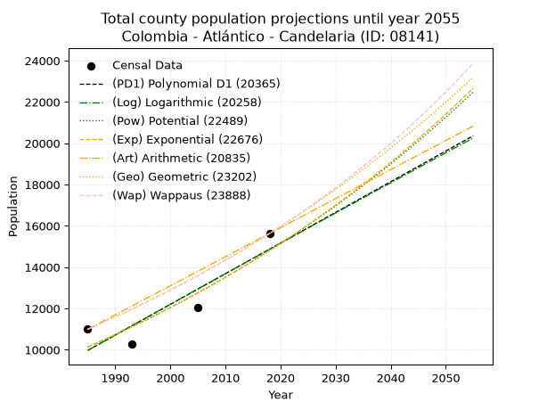
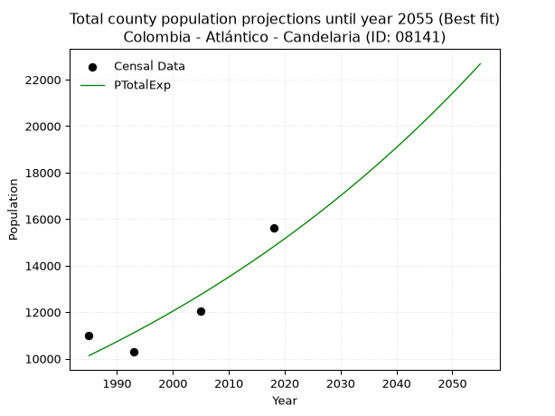
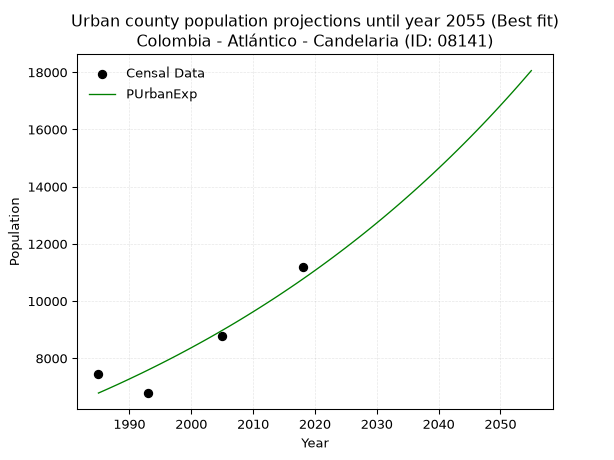
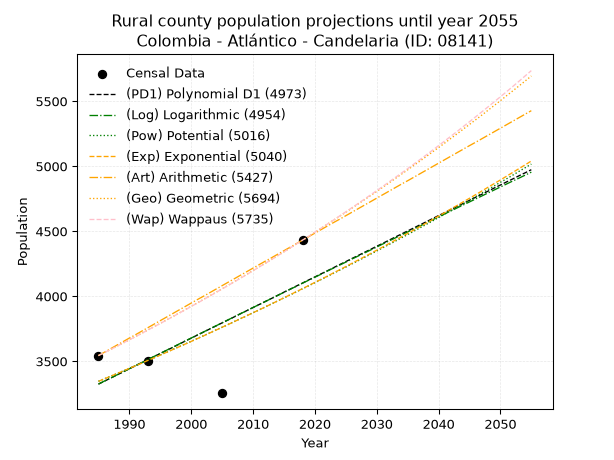
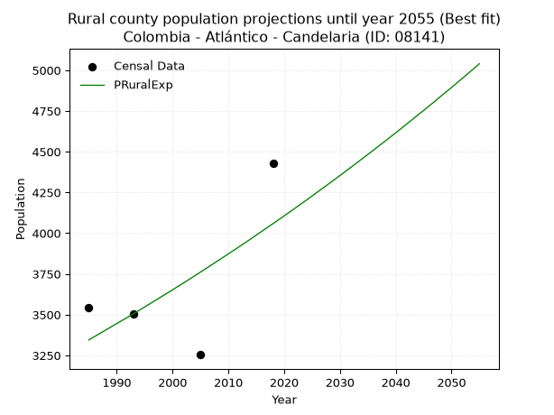

<div align="center">


</div>

# _“Population and Public Services Demand Projections (PPSD) until Year 2050 for Colombia - Atlántico - Candelaria (ID: 08141)”_
Keywords: `population` `public-service` `projection` `lineal` `polynomial` `logarithmic` `potential` `exponential` `arithmetic` `geometric` `wappaus` `dane` `colombia` `south-america`

PPSD are analytical estimates used by governments and planners to anticipate future changes in population size, age distribution, and the resulting community needs for utilities, healthcare, education, and infrastructure as sizing future water treatment facilities, electrical grids, and road networks based on spatial growth.

> **General running parameters**: • app_version: _v20260806_. • Python version: _3.14.7_. • Pandas version: _3.0.5_. • NumPy version: _2.5.1_. • Creates, save and include plots into reports (create_plot): _True_. • Projection until year: _2050_. • Process polynomial degree 2 and up: _False_. • Process Wappaus: _True_. • Process Wappaus: _True_. • Set negative values to zero: _True_. • Set infinite values to zero: _True_. • Drop dataset notes: _True_. 
<div align="center">

Dynamic map: [:earth_americas:Google](http://maps.google.com/maps?q=10.46190295,-74.8797168) [:earth_americas:OSM](https://www.openstreetmap.org/#map=18/10.46190295/-74.8797168&layers=P) [:earth_americas:Bing](https://www.bing.com/maps?cp=10.46190295~-74.8797168&lvl=18) [:earth_americas:Apple](https://maps.apple.com/frame?center=10.46190295%2C-74.8797168&span=0.003%2C0.006)

</div>


<div align="center">

```geojson
{
  "type": "Feature",
  "geometry": {
    "type": "Point", 
    "coordinates": [-74.8797168, 10.46190295]
  }, 
  "properties": {
    "Name": "Colombia - Atlántico - Candelaria (ID: 08141)"
  }
}
```

</div>


## 0. Census Data (4 records)

Census data are official statistics collected by a government about the people and housing in a country. They usually include counts of total population, age, sex, race, income, education, and jobs.

📅Global census file: [Population.xlsx](../data/Population.xlsx)

| Source   |   Year |   CountryID | CountryName   |   StateID | StateName   |   CountyID | CountyName   |   PTotal |   PUrban |   PRural |
|:---------|-------:|------------:|:--------------|----------:|:------------|-----------:|:-------------|---------:|---------:|---------:|
| DANE     |   1985 |          57 | Colombia      |        08 | Atlántico   |      08141 | Candelaria   |    10990 |     7447 |     3543 |
| DANE     |   1993 |          57 | Colombia      |        08 | Atlántico   |      08141 | Candelaria   |    10280 |     6776 |     3504 |
| DANE     |   2005 |          57 | Colombia      |        08 | Atlántico   |      08141 | Candelaria   |    12035 |     8781 |     3254 |
| DANE     |   2018 |          57 | Colombia      |        08 | Atlántico   |      08141 | Candelaria   |    15631 |    11200 |     4431 |

> 🔥Some records has specific notes about the registered values or the corresponding urban or rural distribution.

## 1. Total

### 1.1. Coefficients and Parameters

* (PD1) Polynomial Deg 1: 148.51706142111374, -284837.2521075828 (lineal)
* (Log) Logarithmic: 296944.931407444, -2244846.803195322
* (Pow) Potential: 23.01603472891344, -71.89582019475287
* (Exp) Exponential: 0.011510962503083562, 1.2086794446212645e-06
* (Art) Arithmetic: Year diff. 2018 - 1985 = 33, Population diff. 15631 - 10990 = 4641, Annual growth = 140.63636363636363
* (Geo) Geometric: Year diff. 2018 - 1985 = 33, Population diff. 15631 - 10990 = 4641, Annual growth % = 0.010732038786574138
* (Wap) Wappaus: i = 1.056582124160352, Condition values only valid for < 200)

<sub>
Wappaus condition values: ['0.00', '1.06', '2.11', '3.17', '4.23', '5.28', '6.34', '7.40', '8.45', '9.51', '10.57', '11.62', '12.68', '13.74', '14.79', '15.85', '16.91', '17.96', '19.02', '20.08', '21.13', '22.19', '23.24', '24.30', '25.36', '26.41', '27.47', '28.53', '29.58', '30.64', '31.70', '32.75', '33.81', '34.87', '35.92', '36.98', '38.04', '39.09', '40.15', '41.21', '42.26', '43.32', '44.38', '45.43', '46.49', '47.55', '48.60', '49.66', '50.72', '51.77', '52.83', '53.89', '54.94', '56.00', '57.06', '58.11', '59.17', '60.23', '61.28', '62.34', '63.39', '64.45', '65.51', '66.56', '67.62', '68.68']
</sub>


### 1.2. Projected Dataset

|   Year |   CountyID |   PTotalPD1 |   PTotalLog |   PTotalPow |   PTotalExp |   PTotalArt |   PTotalGeo |   PTotalWap |
|-------:|-----------:|------------:|------------:|------------:|------------:|------------:|------------:|------------:|
|   1985 |      08141 |        9969 |        9967 |       10129 |       10130 |       10990 |       10990 |       10990 |
|   1986 |      08141 |       10118 |       10117 |       10247 |       10248 |       11131 |       11108 |       11107 |
|   1987 |      08141 |       10266 |       10266 |       10366 |       10366 |       11271 |       11227 |       11225 |
|   1988 |      08141 |       10415 |       10416 |       10487 |       10486 |       11412 |       11348 |       11344 |
|   1989 |      08141 |       10563 |       10565 |       10609 |       10608 |       11553 |       11469 |       11465 |
|   1990 |      08141 |       10712 |       10714 |       10732 |       10730 |       11693 |       11593 |       11586 |
|   1991 |      08141 |       10860 |       10863 |       10857 |       10855 |       11834 |       11717 |       11710 |
|   1992 |      08141 |       11009 |       11012 |       10983 |       10980 |       11974 |       11843 |       11834 |
|   1993 |      08141 |       11157 |       11162 |       11111 |       11107 |       12115 |       11970 |       11960 |
|   1994 |      08141 |       11306 |       11310 |       11240 |       11236 |       12256 |       12098 |       12087 |
|   1995 |      08141 |       11454 |       11459 |       11371 |       11366 |       12396 |       12228 |       12216 |
|   1996 |      08141 |       11603 |       11608 |       11502 |       11498 |       12537 |       12359 |       12346 |
|   1997 |      08141 |       11751 |       11757 |       11636 |       11631 |       12678 |       12492 |       12478 |
|   1998 |      08141 |       11900 |       11906 |       11771 |       11765 |       12818 |       12626 |       12611 |
|   1999 |      08141 |       12048 |       12054 |       11907 |       11902 |       12959 |       12762 |       12745 |
|   2000 |      08141 |       12197 |       12203 |       12045 |       12039 |       13100 |       12898 |       12882 |
|   2001 |      08141 |       12345 |       12351 |       12184 |       12179 |       13240 |       13037 |       13019 |
|   2002 |      08141 |       12494 |       12499 |       12325 |       12320 |       13381 |       13177 |       13159 |
|   2003 |      08141 |       12642 |       12648 |       12468 |       12462 |       13521 |       13318 |       13300 |
|   2004 |      08141 |       12791 |       12796 |       12612 |       12607 |       13662 |       13461 |       13442 |
|   2005 |      08141 |       12939 |       12944 |       12757 |       12753 |       13803 |       13606 |       13587 |
|   2006 |      08141 |       13088 |       13092 |       12905 |       12900 |       13943 |       13752 |       13733 |
|   2007 |      08141 |       13236 |       13240 |       13053 |       13050 |       14084 |       13899 |       13881 |
|   2008 |      08141 |       13385 |       13388 |       13204 |       13201 |       14225 |       14048 |       14030 |
|   2009 |      08141 |       13534 |       13536 |       13356 |       13354 |       14365 |       14199 |       14181 |
|   2010 |      08141 |       13682 |       13684 |       13510 |       13508 |       14506 |       14352 |       14335 |
|   2011 |      08141 |       13831 |       13831 |       13666 |       13665 |       14647 |       14506 |       14490 |
|   2012 |      08141 |       13979 |       13979 |       13823 |       13823 |       14787 |       14661 |       14647 |
|   2013 |      08141 |       14128 |       14127 |       13982 |       13983 |       14928 |       14819 |       14806 |
|   2014 |      08141 |       14276 |       14274 |       14143 |       14145 |       15068 |       14978 |       14967 |
|   2015 |      08141 |       14425 |       14421 |       14305 |       14308 |       15209 |       15138 |       15130 |
|   2016 |      08141 |       14573 |       14569 |       14469 |       14474 |       15350 |       15301 |       15295 |
|   2017 |      08141 |       14722 |       14716 |       14635 |       14642 |       15490 |       15465 |       15462 |
|   2018 |      08141 |       14870 |       14863 |       14803 |       14811 |       15631 |       15631 |       15631 |
|   2019 |      08141 |       15019 |       15010 |       14973 |       14983 |       15772 |       15799 |       15802 |
|   2020 |      08141 |       15167 |       15157 |       15145 |       15156 |       15912 |       15968 |       15976 |
|   2021 |      08141 |       15316 |       15304 |       15318 |       15332 |       16053 |       16140 |       16152 |
|   2022 |      08141 |       15464 |       15451 |       15494 |       15509 |       16194 |       16313 |       16330 |
|   2023 |      08141 |       15613 |       15598 |       15671 |       15689 |       16334 |       16488 |       16511 |
|   2024 |      08141 |       15761 |       15745 |       15850 |       15870 |       16475 |       16665 |       16694 |
|   2025 |      08141 |       15910 |       15891 |       16031 |       16054 |       16615 |       16844 |       16879 |
|   2026 |      08141 |       16058 |       16038 |       16215 |       16240 |       16756 |       17025 |       17067 |
|   2027 |      08141 |       16207 |       16185 |       16400 |       16428 |       16897 |       17207 |       17258 |
|   2028 |      08141 |       16355 |       16331 |       16587 |       16618 |       17037 |       17392 |       17451 |
|   2029 |      08141 |       16504 |       16477 |       16776 |       16811 |       17178 |       17579 |       17646 |
|   2030 |      08141 |       16652 |       16624 |       16968 |       17005 |       17319 |       17767 |       17845 |
|   2031 |      08141 |       16801 |       16770 |       17161 |       17202 |       17459 |       17958 |       18046 |
|   2032 |      08141 |       16949 |       16916 |       17357 |       17401 |       17600 |       18151 |       18250 |
|   2033 |      08141 |       17098 |       17062 |       17554 |       17603 |       17741 |       18345 |       18457 |
|   2034 |      08141 |       17246 |       17208 |       17754 |       17806 |       17881 |       18542 |       18667 |
|   2035 |      08141 |       17395 |       17354 |       17956 |       18013 |       18022 |       18741 |       18880 |
|   2036 |      08141 |       17543 |       17500 |       18160 |       18221 |       18162 |       18942 |       19096 |
|   2037 |      08141 |       17692 |       17646 |       18367 |       18432 |       18303 |       19146 |       19315 |
|   2038 |      08141 |       17841 |       17792 |       18575 |       18645 |       18444 |       19351 |       19538 |
|   2039 |      08141 |       17989 |       17937 |       18786 |       18861 |       18584 |       19559 |       19763 |
|   2040 |      08141 |       18138 |       18083 |       19000 |       19080 |       18725 |       19769 |       19992 |
|   2041 |      08141 |       18286 |       18228 |       19215 |       19301 |       18866 |       19981 |       20225 |
|   2042 |      08141 |       18435 |       18374 |       19433 |       19524 |       19006 |       20195 |       20461 |
|   2043 |      08141 |       18583 |       18519 |       19653 |       19750 |       19147 |       20412 |       20700 |
|   2044 |      08141 |       18732 |       18665 |       19876 |       19979 |       19288 |       20631 |       20943 |
|   2045 |      08141 |       18880 |       18810 |       20101 |       20210 |       19428 |       20853 |       21190 |
|   2046 |      08141 |       19029 |       18955 |       20328 |       20444 |       19569 |       21076 |       21441 |
|   2047 |      08141 |       19177 |       19100 |       20558 |       20681 |       19709 |       21303 |       21696 |
|   2048 |      08141 |       19326 |       19245 |       20791 |       20920 |       19850 |       21531 |       21955 |
|   2049 |      08141 |       19474 |       19390 |       21025 |       21162 |       19991 |       21762 |       22218 |
|   2050 |      08141 |       19623 |       19535 |       21263 |       21407 |       20131 |       21996 |       22485 |
<div align="center">

</img>

</div>


### 1.3. Best fit with absolute error and relative error (%)

Relative error puts that difference into context by dividing the absolute error by the true value, creating a unitless ratio or percentage that shows the scale of the mistake.

Absolute and relative error

|   Year | Source   |   CountryID | CountryName   |   StateID | StateName   |   CountyID_x | CountyName   |   PTotal |   PUrban |   PRural |   CountyID_y |   PTotalPD1 |   PTotalLog |   PTotalPow |   PTotalExp |   PTotalArt |   PTotalGeo |   PTotalWap |   PTotalPD1AbsError |   PTotalLogAbsError |   PTotalPowAbsError |   PTotalExpAbsError |   PTotalArtAbsError |   PTotalGeoAbsError |   PTotalWapAbsError |   PTotalPD1RelError |   PTotalLogRelError |   PTotalPowRelError |   PTotalExpRelError |   PTotalArtRelError |   PTotalGeoRelError |   PTotalWapRelError |
|-------:|:---------|------------:|:--------------|----------:|:------------|-------------:|:-------------|---------:|---------:|---------:|-------------:|------------:|------------:|------------:|------------:|------------:|------------:|------------:|--------------------:|--------------------:|--------------------:|--------------------:|--------------------:|--------------------:|--------------------:|--------------------:|--------------------:|--------------------:|--------------------:|--------------------:|--------------------:|--------------------:|
|   1985 | DANE     |          57 | Colombia      |        08 | Atlántico   |        08141 | Candelaria   |    10990 |     7447 |     3543 |        08141 |        9969 |        9967 |       10129 |       10130 |       10990 |       10990 |       10990 |                1021 |                1023 |                 861 |                 860 |                   0 |                   0 |                   0 |             9.29026 |             9.30846 |             7.83439 |             7.8253  |              0      |              0      |              0      |
|   1993 | DANE     |          57 | Colombia      |        08 | Atlántico   |        08141 | Candelaria   |    10280 |     6776 |     3504 |        08141 |       11157 |       11162 |       11111 |       11107 |       12115 |       11970 |       11960 |                 877 |                 882 |                 831 |                 827 |                1835 |                1690 |                1680 |             8.53113 |             8.57977 |             8.08366 |             8.04475 |             17.8502 |             16.4397 |             16.3424 |
|   2005 | DANE     |          57 | Colombia      |        08 | Atlántico   |        08141 | Candelaria   |    12035 |     8781 |     3254 |        08141 |       12939 |       12944 |       12757 |       12753 |       13803 |       13606 |       13587 |                 904 |                 909 |                 722 |                 718 |                1768 |                1571 |                1552 |             7.51143 |             7.55297 |             5.99917 |             5.96593 |             14.6905 |             13.0536 |             12.8957 |
|   2018 | DANE     |          57 | Colombia      |        08 | Atlántico   |        08141 | Candelaria   |    15631 |    11200 |     4431 |        08141 |       14870 |       14863 |       14803 |       14811 |       15631 |       15631 |       15631 |                 761 |                 768 |                 828 |                 820 |                   0 |                   0 |                   0 |             4.86853 |             4.91331 |             5.29717 |             5.24599 |              0      |              0      |              0      |

Relative error mean

| Method    |   RelError | Best   |
|:----------|-----------:|:-------|
| PTotalPD1 |    7.55034 |        |
| PTotalLog |    7.58863 |        |
| PTotalPow |    6.8036  |        |
| PTotalExp |    6.77049 | True   |
| PTotalArt |    8.13517 |        |
| PTotalGeo |    7.37332 |        |
| PTotalWap |    7.30953 |        |

💙Best method: _**PTotalExp**_
<div align="center">

</img>

</div>


### 1.4. Fresh water supply demand in liters per capita per day (lpcd)

The fresh water supply demand typically ranges from 100 to 300 liters per capita per day (lpcd) for standard domestic and municipal planning, though absolute survival minimums set by the World Health Organization are as low as 7.5 to 20 liters per day, and total consumption in high-income nations can exceed 400 liters.

> `CZ`: Level in meters above the sea level (masl).<br> `WS`: Fresh water supply demand in liters per capita per day (lpcd or l/h/d).<br> `WSAll`: Zonal fresh water supply demand in liters per second (l/s).<br> `A`: Zonal area in square meters.

Reference values (RAS Colombia)

|    CZ |   WS |
|------:|-----:|
|  1000 |  120 |
|  2000 |  130 |
| 99999 |  140 |

County shapefile geometry properties and water supply values

|   CountyID |      ATotal |   CZTotal |   WSTotal |
|-----------:|------------:|----------:|----------:|
|      08141 | 1.35681e+08 |    26.028 |       120 |

Projected values for best method: PTotalExp

|   CountyID |   Year |   PTotalExp |   WSTotal |   WSTotalAll |
|-----------:|-------:|------------:|----------:|-------------:|
|      08141 |   1985 |       10130 |       120 |      14.0694 |
|      08141 |   1986 |       10248 |       120 |      14.2333 |
|      08141 |   1987 |       10366 |       120 |      14.3972 |
|      08141 |   1988 |       10486 |       120 |      14.5639 |
|      08141 |   1989 |       10608 |       120 |      14.7333 |
|      08141 |   1990 |       10730 |       120 |      14.9028 |
|      08141 |   1991 |       10855 |       120 |      15.0764 |
|      08141 |   1992 |       10980 |       120 |      15.25   |
|      08141 |   1993 |       11107 |       120 |      15.4264 |
|      08141 |   1994 |       11236 |       120 |      15.6056 |
|      08141 |   1995 |       11366 |       120 |      15.7861 |
|      08141 |   1996 |       11498 |       120 |      15.9694 |
|      08141 |   1997 |       11631 |       120 |      16.1542 |
|      08141 |   1998 |       11765 |       120 |      16.3403 |
|      08141 |   1999 |       11902 |       120 |      16.5306 |
|      08141 |   2000 |       12039 |       120 |      16.7208 |
|      08141 |   2001 |       12179 |       120 |      16.9153 |
|      08141 |   2002 |       12320 |       120 |      17.1111 |
|      08141 |   2003 |       12462 |       120 |      17.3083 |
|      08141 |   2004 |       12607 |       120 |      17.5097 |
|      08141 |   2005 |       12753 |       120 |      17.7125 |
|      08141 |   2006 |       12900 |       120 |      17.9167 |
|      08141 |   2007 |       13050 |       120 |      18.125  |
|      08141 |   2008 |       13201 |       120 |      18.3347 |
|      08141 |   2009 |       13354 |       120 |      18.5472 |
|      08141 |   2010 |       13508 |       120 |      18.7611 |
|      08141 |   2011 |       13665 |       120 |      18.9792 |
|      08141 |   2012 |       13823 |       120 |      19.1986 |
|      08141 |   2013 |       13983 |       120 |      19.4208 |
|      08141 |   2014 |       14145 |       120 |      19.6458 |
|      08141 |   2015 |       14308 |       120 |      19.8722 |
|      08141 |   2016 |       14474 |       120 |      20.1028 |
|      08141 |   2017 |       14642 |       120 |      20.3361 |
|      08141 |   2018 |       14811 |       120 |      20.5708 |
|      08141 |   2019 |       14983 |       120 |      20.8097 |
|      08141 |   2020 |       15156 |       120 |      21.05   |
|      08141 |   2021 |       15332 |       120 |      21.2944 |
|      08141 |   2022 |       15509 |       120 |      21.5403 |
|      08141 |   2023 |       15689 |       120 |      21.7903 |
|      08141 |   2024 |       15870 |       120 |      22.0417 |
|      08141 |   2025 |       16054 |       120 |      22.2972 |
|      08141 |   2026 |       16240 |       120 |      22.5556 |
|      08141 |   2027 |       16428 |       120 |      22.8167 |
|      08141 |   2028 |       16618 |       120 |      23.0806 |
|      08141 |   2029 |       16811 |       120 |      23.3486 |
|      08141 |   2030 |       17005 |       120 |      23.6181 |
|      08141 |   2031 |       17202 |       120 |      23.8917 |
|      08141 |   2032 |       17401 |       120 |      24.1681 |
|      08141 |   2033 |       17603 |       120 |      24.4486 |
|      08141 |   2034 |       17806 |       120 |      24.7306 |
|      08141 |   2035 |       18013 |       120 |      25.0181 |
|      08141 |   2036 |       18221 |       120 |      25.3069 |
|      08141 |   2037 |       18432 |       120 |      25.6    |
|      08141 |   2038 |       18645 |       120 |      25.8958 |
|      08141 |   2039 |       18861 |       120 |      26.1958 |
|      08141 |   2040 |       19080 |       120 |      26.5    |
|      08141 |   2041 |       19301 |       120 |      26.8069 |
|      08141 |   2042 |       19524 |       120 |      27.1167 |
|      08141 |   2043 |       19750 |       120 |      27.4306 |
|      08141 |   2044 |       19979 |       120 |      27.7486 |
|      08141 |   2045 |       20210 |       120 |      28.0694 |
|      08141 |   2046 |       20444 |       120 |      28.3944 |
|      08141 |   2047 |       20681 |       120 |      28.7236 |
|      08141 |   2048 |       20920 |       120 |      29.0556 |
|      08141 |   2049 |       21162 |       120 |      29.3917 |
|      08141 |   2050 |       21407 |       120 |      29.7319 |

## 2. Urban

### 2.1. Coefficients and Parameters

* (PD1) Polynomial Deg 1: 124.95704536330626, -241394.3299879534 (lineal)
* (Log) Logarithmic: 249900.83481284254, -1890947.2479920264
* (Pow) Potential: 27.976317263620288, -88.4280157440286
* (Exp) Exponential: 0.013988111142902947, 5.922314746951773e-09
* (Art) Arithmetic: Year diff. 2018 - 1985 = 33, Population diff. 11200 - 7447 = 3753, Annual growth = 113.72727272727273
* (Geo) Geometric: Year diff. 2018 - 1985 = 33, Population diff. 11200 - 7447 = 3753, Annual growth % = 0.012443527136037247
* (Wap) Wappaus: i = 1.2197916311178498, Condition values only valid for < 200)

<sub>
Wappaus condition values: ['0.00', '1.22', '2.44', '3.66', '4.88', '6.10', '7.32', '8.54', '9.76', '10.98', '12.20', '13.42', '14.64', '15.86', '17.08', '18.30', '19.52', '20.74', '21.96', '23.18', '24.40', '25.62', '26.84', '28.06', '29.27', '30.49', '31.71', '32.93', '34.15', '35.37', '36.59', '37.81', '39.03', '40.25', '41.47', '42.69', '43.91', '45.13', '46.35', '47.57', '48.79', '50.01', '51.23', '52.45', '53.67', '54.89', '56.11', '57.33', '58.55', '59.77', '60.99', '62.21', '63.43', '64.65', '65.87', '67.09', '68.31', '69.53', '70.75', '71.97', '73.19', '74.41', '75.63', '76.85', '78.07', '79.29']
</sub>


### 2.2. Projected Dataset

|   Year |   CountyID |   PUrbanPD1 |   PUrbanLog |   PUrbanPow |   PUrbanExp |   PUrbanArt |   PUrbanGeo |   PUrbanWap |
|-------:|-----------:|------------:|------------:|------------:|------------:|------------:|------------:|------------:|
|   1985 |      08141 |        6645 |        6643 |        6779 |        6781 |        7447 |        7447 |        7447 |
|   1986 |      08141 |        6770 |        6769 |        6875 |        6876 |        7561 |        7540 |        7538 |
|   1987 |      08141 |        6895 |        6895 |        6973 |        6973 |        7674 |        7633 |        7631 |
|   1988 |      08141 |        7020 |        7021 |        7072 |        7071 |        7788 |        7728 |        7725 |
|   1989 |      08141 |        7145 |        7146 |        7172 |        7171 |        7902 |        7825 |        7819 |
|   1990 |      08141 |        7270 |        7272 |        7274 |        7272 |        8016 |        7922 |        7915 |
|   1991 |      08141 |        7395 |        7398 |        7376 |        7375 |        8129 |        8021 |        8013 |
|   1992 |      08141 |        7520 |        7523 |        7481 |        7478 |        8243 |        8120 |        8111 |
|   1993 |      08141 |        7645 |        7648 |        7587 |        7584 |        8357 |        8221 |        8211 |
|   1994 |      08141 |        7770 |        7774 |        7694 |        7691 |        8471 |        8324 |        8312 |
|   1995 |      08141 |        7895 |        7899 |        7803 |        7799 |        8584 |        8427 |        8414 |
|   1996 |      08141 |        8020 |        8024 |        7913 |        7909 |        8698 |        8532 |        8518 |
|   1997 |      08141 |        8145 |        8149 |        8024 |        8020 |        8812 |        8638 |        8623 |
|   1998 |      08141 |        8270 |        8275 |        8137 |        8133 |        8925 |        8746 |        8730 |
|   1999 |      08141 |        8395 |        8400 |        8252 |        8248 |        9039 |        8855 |        8837 |
|   2000 |      08141 |        8520 |        8525 |        8368 |        8364 |        9153 |        8965 |        8947 |
|   2001 |      08141 |        8645 |        8650 |        8486 |        8482 |        9267 |        9076 |        9058 |
|   2002 |      08141 |        8770 |        8774 |        8606 |        8601 |        9380 |        9189 |        9170 |
|   2003 |      08141 |        8895 |        8899 |        8727 |        8722 |        9494 |        9304 |        9284 |
|   2004 |      08141 |        9020 |        9024 |        8850 |        8845 |        9608 |        9419 |        9399 |
|   2005 |      08141 |        9145 |        9149 |        8974 |        8970 |        9722 |        9537 |        9516 |
|   2006 |      08141 |        9270 |        9273 |        9100 |        9096 |        9835 |        9655 |        9635 |
|   2007 |      08141 |        9394 |        9398 |        9228 |        9224 |        9949 |        9776 |        9755 |
|   2008 |      08141 |        9519 |        9522 |        9357 |        9354 |       10063 |        9897 |        9877 |
|   2009 |      08141 |        9644 |        9647 |        9489 |        9486 |       10176 |       10020 |       10001 |
|   2010 |      08141 |        9769 |        9771 |        9622 |        9620 |       10290 |       10145 |       10127 |
|   2011 |      08141 |        9894 |        9895 |        9756 |        9755 |       10404 |       10271 |       10254 |
|   2012 |      08141 |       10019 |       10020 |        9893 |        9893 |       10518 |       10399 |       10383 |
|   2013 |      08141 |       10144 |       10144 |       10032 |       10032 |       10631 |       10528 |       10514 |
|   2014 |      08141 |       10269 |       10268 |       10172 |       10173 |       10745 |       10659 |       10647 |
|   2015 |      08141 |       10394 |       10392 |       10314 |       10317 |       10859 |       10792 |       10782 |
|   2016 |      08141 |       10519 |       10516 |       10458 |       10462 |       10973 |       10926 |       10920 |
|   2017 |      08141 |       10644 |       10640 |       10604 |       10609 |       11086 |       11062 |       11059 |
|   2018 |      08141 |       10769 |       10764 |       10752 |       10759 |       11200 |       11200 |       11200 |
|   2019 |      08141 |       10894 |       10887 |       10903 |       10910 |       11314 |       11339 |       11343 |
|   2020 |      08141 |       11019 |       11011 |       11055 |       11064 |       11427 |       11480 |       11489 |
|   2021 |      08141 |       11144 |       11135 |       11209 |       11220 |       11541 |       11623 |       11637 |
|   2022 |      08141 |       11269 |       11259 |       11365 |       11378 |       11655 |       11768 |       11787 |
|   2023 |      08141 |       11394 |       11382 |       11523 |       11538 |       11769 |       11914 |       11940 |
|   2024 |      08141 |       11519 |       11506 |       11684 |       11701 |       11882 |       12063 |       12095 |
|   2025 |      08141 |       11644 |       11629 |       11846 |       11865 |       11996 |       12213 |       12253 |
|   2026 |      08141 |       11769 |       11752 |       12011 |       12033 |       12110 |       12365 |       12413 |
|   2027 |      08141 |       11894 |       11876 |       12178 |       12202 |       12224 |       12519 |       12576 |
|   2028 |      08141 |       12019 |       11999 |       12347 |       12374 |       12337 |       12674 |       12742 |
|   2029 |      08141 |       12144 |       12122 |       12519 |       12548 |       12451 |       12832 |       12910 |
|   2030 |      08141 |       12268 |       12245 |       12692 |       12725 |       12565 |       12992 |       13081 |
|   2031 |      08141 |       12393 |       12368 |       12868 |       12904 |       12678 |       13153 |       13255 |
|   2032 |      08141 |       12518 |       12491 |       13047 |       13086 |       12792 |       13317 |       13432 |
|   2033 |      08141 |       12643 |       12614 |       13228 |       13270 |       12906 |       13483 |       13612 |
|   2034 |      08141 |       12768 |       12737 |       13411 |       13457 |       13020 |       13651 |       13795 |
|   2035 |      08141 |       12893 |       12860 |       13597 |       13647 |       13133 |       13820 |       13982 |
|   2036 |      08141 |       13018 |       12983 |       13785 |       13839 |       13247 |       13992 |       14171 |
|   2037 |      08141 |       13143 |       13106 |       13975 |       14034 |       13361 |       14167 |       14364 |
|   2038 |      08141 |       13268 |       13228 |       14169 |       14232 |       13475 |       14343 |       14561 |
|   2039 |      08141 |       13393 |       13351 |       14365 |       14432 |       13588 |       14521 |       14761 |
|   2040 |      08141 |       13518 |       13473 |       14563 |       14636 |       13702 |       14702 |       14965 |
|   2041 |      08141 |       13643 |       13596 |       14764 |       14842 |       13816 |       14885 |       15173 |
|   2042 |      08141 |       13768 |       13718 |       14968 |       15051 |       13929 |       15070 |       15384 |
|   2043 |      08141 |       13893 |       13841 |       15174 |       15263 |       14043 |       15258 |       15599 |
|   2044 |      08141 |       14018 |       13963 |       15383 |       15478 |       14157 |       15448 |       15819 |
|   2045 |      08141 |       14143 |       14085 |       15595 |       15696 |       14271 |       15640 |       16043 |
|   2046 |      08141 |       14268 |       14207 |       15810 |       15917 |       14384 |       15834 |       16271 |
|   2047 |      08141 |       14393 |       14329 |       16028 |       16141 |       14498 |       16031 |       16504 |
|   2048 |      08141 |       14518 |       14451 |       16248 |       16368 |       14612 |       16231 |       16741 |
|   2049 |      08141 |       14643 |       14573 |       16471 |       16599 |       14726 |       16433 |       16983 |
|   2050 |      08141 |       14768 |       14695 |       16698 |       16833 |       14839 |       16637 |       17230 |
<div align="center">

</img>

</div>


### 2.3. Best fit with absolute error and relative error (%)

Relative error puts that difference into context by dividing the absolute error by the true value, creating a unitless ratio or percentage that shows the scale of the mistake.

Absolute and relative error

|   Year | Source   |   CountryID | CountryName   |   StateID | StateName   |   CountyID_x | CountyName   |   PTotal |   PUrban |   PRural |   CountyID_y |   PUrbanPD1 |   PUrbanLog |   PUrbanPow |   PUrbanExp |   PUrbanArt |   PUrbanGeo |   PUrbanWap |   PUrbanPD1AbsError |   PUrbanLogAbsError |   PUrbanPowAbsError |   PUrbanExpAbsError |   PUrbanArtAbsError |   PUrbanGeoAbsError |   PUrbanWapAbsError |   PUrbanPD1RelError |   PUrbanLogRelError |   PUrbanPowRelError |   PUrbanExpRelError |   PUrbanArtRelError |   PUrbanGeoRelError |   PUrbanWapRelError |
|-------:|:---------|------------:|:--------------|----------:|:------------|-------------:|:-------------|---------:|---------:|---------:|-------------:|------------:|------------:|------------:|------------:|------------:|------------:|------------:|--------------------:|--------------------:|--------------------:|--------------------:|--------------------:|--------------------:|--------------------:|--------------------:|--------------------:|--------------------:|--------------------:|--------------------:|--------------------:|--------------------:|
|   1985 | DANE     |          57 | Colombia      |        08 | Atlántico   |        08141 | Candelaria   |    10990 |     7447 |     3543 |        08141 |        6645 |        6643 |        6779 |        6781 |        7447 |        7447 |        7447 |                 802 |                 804 |                 668 |                 666 |                   0 |                   0 |                   0 |            10.7694  |            10.7963  |             8.97006 |             8.9432  |              0      |              0      |             0       |
|   1993 | DANE     |          57 | Colombia      |        08 | Atlántico   |        08141 | Candelaria   |    10280 |     6776 |     3504 |        08141 |        7645 |        7648 |        7587 |        7584 |        8357 |        8221 |        8211 |                 869 |                 872 |                 811 |                 808 |                1581 |                1445 |                1435 |            12.8247  |            12.8689  |            11.9687  |            11.9244  |             23.3323 |             21.3253 |            21.1777  |
|   2005 | DANE     |          57 | Colombia      |        08 | Atlántico   |        08141 | Candelaria   |    12035 |     8781 |     3254 |        08141 |        9145 |        9149 |        8974 |        8970 |        9722 |        9537 |        9516 |                 364 |                 368 |                 193 |                 189 |                 941 |                 756 |                 735 |             4.14531 |             4.19087 |             2.19793 |             2.15237 |             10.7163 |              8.6095 |             8.37035 |
|   2018 | DANE     |          57 | Colombia      |        08 | Atlántico   |        08141 | Candelaria   |    15631 |    11200 |     4431 |        08141 |       10769 |       10764 |       10752 |       10759 |       11200 |       11200 |       11200 |                 431 |                 436 |                 448 |                 441 |                   0 |                   0 |                   0 |             3.84821 |             3.89286 |             4       |             3.9375  |              0      |              0      |             0       |

Relative error mean

| Method    |   RelError | Best   |
|:----------|-----------:|:-------|
| PUrbanPD1 |    7.89691 |        |
| PUrbanLog |    7.93724 |        |
| PUrbanPow |    6.78417 |        |
| PUrbanExp |    6.73938 | True   |
| PUrbanArt |    8.51217 |        |
| PUrbanGeo |    7.48369 |        |
| PUrbanWap |    7.38701 |        |

💙Best method: _**PUrbanExp**_
<div align="center">

</img>

</div>


### 2.4. Fresh water supply demand in liters per capita per day (lpcd)

The fresh water supply demand typically ranges from 100 to 300 liters per capita per day (lpcd) for standard domestic and municipal planning, though absolute survival minimums set by the World Health Organization are as low as 7.5 to 20 liters per day, and total consumption in high-income nations can exceed 400 liters.

> `CZ`: Level in meters above the sea level (masl).<br> `WS`: Fresh water supply demand in liters per capita per day (lpcd or l/h/d).<br> `WSAll`: Zonal fresh water supply demand in liters per second (l/s).<br> `A`: Zonal area in square meters.

Reference values (RAS Colombia)

|    CZ |   WS |
|------:|-----:|
|  1000 |  120 |
|  2000 |  130 |
| 99999 |  140 |

County shapefile geometry properties and water supply values

|   CountyID |      AUrban |   CZUrban |   WSUrban |
|-----------:|------------:|----------:|----------:|
|      08141 | 1.32347e+06 |   10.2159 |       120 |

Projected values for best method: PUrbanExp

|   CountyID |   Year |   PUrbanExp |   WSUrban |   WSUrbanAll |
|-----------:|-------:|------------:|----------:|-------------:|
|      08141 |   1985 |        6781 |       120 |      9.41806 |
|      08141 |   1986 |        6876 |       120 |      9.55    |
|      08141 |   1987 |        6973 |       120 |      9.68472 |
|      08141 |   1988 |        7071 |       120 |      9.82083 |
|      08141 |   1989 |        7171 |       120 |      9.95972 |
|      08141 |   1990 |        7272 |       120 |     10.1     |
|      08141 |   1991 |        7375 |       120 |     10.2431  |
|      08141 |   1992 |        7478 |       120 |     10.3861  |
|      08141 |   1993 |        7584 |       120 |     10.5333  |
|      08141 |   1994 |        7691 |       120 |     10.6819  |
|      08141 |   1995 |        7799 |       120 |     10.8319  |
|      08141 |   1996 |        7909 |       120 |     10.9847  |
|      08141 |   1997 |        8020 |       120 |     11.1389  |
|      08141 |   1998 |        8133 |       120 |     11.2958  |
|      08141 |   1999 |        8248 |       120 |     11.4556  |
|      08141 |   2000 |        8364 |       120 |     11.6167  |
|      08141 |   2001 |        8482 |       120 |     11.7806  |
|      08141 |   2002 |        8601 |       120 |     11.9458  |
|      08141 |   2003 |        8722 |       120 |     12.1139  |
|      08141 |   2004 |        8845 |       120 |     12.2847  |
|      08141 |   2005 |        8970 |       120 |     12.4583  |
|      08141 |   2006 |        9096 |       120 |     12.6333  |
|      08141 |   2007 |        9224 |       120 |     12.8111  |
|      08141 |   2008 |        9354 |       120 |     12.9917  |
|      08141 |   2009 |        9486 |       120 |     13.175   |
|      08141 |   2010 |        9620 |       120 |     13.3611  |
|      08141 |   2011 |        9755 |       120 |     13.5486  |
|      08141 |   2012 |        9893 |       120 |     13.7403  |
|      08141 |   2013 |       10032 |       120 |     13.9333  |
|      08141 |   2014 |       10173 |       120 |     14.1292  |
|      08141 |   2015 |       10317 |       120 |     14.3292  |
|      08141 |   2016 |       10462 |       120 |     14.5306  |
|      08141 |   2017 |       10609 |       120 |     14.7347  |
|      08141 |   2018 |       10759 |       120 |     14.9431  |
|      08141 |   2019 |       10910 |       120 |     15.1528  |
|      08141 |   2020 |       11064 |       120 |     15.3667  |
|      08141 |   2021 |       11220 |       120 |     15.5833  |
|      08141 |   2022 |       11378 |       120 |     15.8028  |
|      08141 |   2023 |       11538 |       120 |     16.025   |
|      08141 |   2024 |       11701 |       120 |     16.2514  |
|      08141 |   2025 |       11865 |       120 |     16.4792  |
|      08141 |   2026 |       12033 |       120 |     16.7125  |
|      08141 |   2027 |       12202 |       120 |     16.9472  |
|      08141 |   2028 |       12374 |       120 |     17.1861  |
|      08141 |   2029 |       12548 |       120 |     17.4278  |
|      08141 |   2030 |       12725 |       120 |     17.6736  |
|      08141 |   2031 |       12904 |       120 |     17.9222  |
|      08141 |   2032 |       13086 |       120 |     18.175   |
|      08141 |   2033 |       13270 |       120 |     18.4306  |
|      08141 |   2034 |       13457 |       120 |     18.6903  |
|      08141 |   2035 |       13647 |       120 |     18.9542  |
|      08141 |   2036 |       13839 |       120 |     19.2208  |
|      08141 |   2037 |       14034 |       120 |     19.4917  |
|      08141 |   2038 |       14232 |       120 |     19.7667  |
|      08141 |   2039 |       14432 |       120 |     20.0444  |
|      08141 |   2040 |       14636 |       120 |     20.3278  |
|      08141 |   2041 |       14842 |       120 |     20.6139  |
|      08141 |   2042 |       15051 |       120 |     20.9042  |
|      08141 |   2043 |       15263 |       120 |     21.1986  |
|      08141 |   2044 |       15478 |       120 |     21.4972  |
|      08141 |   2045 |       15696 |       120 |     21.8     |
|      08141 |   2046 |       15917 |       120 |     22.1069  |
|      08141 |   2047 |       16141 |       120 |     22.4181  |
|      08141 |   2048 |       16368 |       120 |     22.7333  |
|      08141 |   2049 |       16599 |       120 |     23.0542  |
|      08141 |   2050 |       16833 |       120 |     23.3792  |

## 3. Rural

### 3.1. Coefficients and Parameters

* (PD1) Polynomial Deg 1: 23.560016057807378, -43442.92211962921 (lineal)
* (Log) Logarithmic: 47044.09659460144, -353899.5552032962
* (Pow) Potential: 11.688216440439382, -35.02047523396413
* (Exp) Exponential: 0.005854499203748724, 0.030020961389487795
* (Art) Arithmetic: Year diff. 2018 - 1985 = 33, Population diff. 4431 - 3543 = 888, Annual growth = 26.90909090909091
* (Geo) Geometric: Year diff. 2018 - 1985 = 33, Population diff. 4431 - 3543 = 888, Annual growth % = 0.006800335146270653
* (Wap) Wappaus: i = 0.674920765214219, Condition values only valid for < 200)

<sub>
Wappaus condition values: ['0.00', '0.67', '1.35', '2.02', '2.70', '3.37', '4.05', '4.72', '5.40', '6.07', '6.75', '7.42', '8.10', '8.77', '9.45', '10.12', '10.80', '11.47', '12.15', '12.82', '13.50', '14.17', '14.85', '15.52', '16.20', '16.87', '17.55', '18.22', '18.90', '19.57', '20.25', '20.92', '21.60', '22.27', '22.95', '23.62', '24.30', '24.97', '25.65', '26.32', '27.00', '27.67', '28.35', '29.02', '29.70', '30.37', '31.05', '31.72', '32.40', '33.07', '33.75', '34.42', '35.10', '35.77', '36.45', '37.12', '37.80', '38.47', '39.15', '39.82', '40.50', '41.17', '41.85', '42.52', '43.19', '43.87']
</sub>


### 3.2. Projected Dataset

|   Year |   CountyID |   PRuralPD1 |   PRuralLog |   PRuralPow |   PRuralExp |   PRuralArt |   PRuralGeo |   PRuralWap |
|-------:|-----------:|------------:|------------:|------------:|------------:|------------:|------------:|------------:|
|   1985 |      08141 |        3324 |        3324 |        3346 |        3345 |        3543 |        3543 |        3543 |
|   1986 |      08141 |        3347 |        3348 |        3365 |        3365 |        3570 |        3567 |        3567 |
|   1987 |      08141 |        3371 |        3371 |        3385 |        3385 |        3597 |        3591 |        3591 |
|   1988 |      08141 |        3394 |        3395 |        3405 |        3405 |        3624 |        3616 |        3615 |
|   1989 |      08141 |        3418 |        3419 |        3425 |        3425 |        3651 |        3640 |        3640 |
|   1990 |      08141 |        3442 |        3442 |        3445 |        3445 |        3678 |        3665 |        3665 |
|   1991 |      08141 |        3465 |        3466 |        3466 |        3465 |        3704 |        3690 |        3689 |
|   1992 |      08141 |        3489 |        3489 |        3486 |        3485 |        3731 |        3715 |        3714 |
|   1993 |      08141 |        3512 |        3513 |        3507 |        3506 |        3758 |        3740 |        3740 |
|   1994 |      08141 |        3536 |        3537 |        3527 |        3526 |        3785 |        3766 |        3765 |
|   1995 |      08141 |        3559 |        3560 |        3548 |        3547 |        3812 |        3791 |        3790 |
|   1996 |      08141 |        3583 |        3584 |        3569 |        3568 |        3839 |        3817 |        3816 |
|   1997 |      08141 |        3606 |        3607 |        3590 |        3589 |        3866 |        3843 |        3842 |
|   1998 |      08141 |        3630 |        3631 |        3611 |        3610 |        3893 |        3869 |        3868 |
|   1999 |      08141 |        3654 |        3655 |        3632 |        3631 |        3920 |        3896 |        3894 |
|   2000 |      08141 |        3677 |        3678 |        3653 |        3652 |        3947 |        3922 |        3921 |
|   2001 |      08141 |        3701 |        3702 |        3675 |        3674 |        3974 |        3949 |        3947 |
|   2002 |      08141 |        3724 |        3725 |        3696 |        3695 |        4000 |        3976 |        3974 |
|   2003 |      08141 |        3748 |        3749 |        3718 |        3717 |        4027 |        4003 |        4001 |
|   2004 |      08141 |        3771 |        3772 |        3740 |        3739 |        4054 |        4030 |        4028 |
|   2005 |      08141 |        3795 |        3795 |        3761 |        3761 |        4081 |        4057 |        4056 |
|   2006 |      08141 |        3818 |        3819 |        3783 |        3783 |        4108 |        4085 |        4083 |
|   2007 |      08141 |        3842 |        3842 |        3806 |        3805 |        4135 |        4113 |        4111 |
|   2008 |      08141 |        3866 |        3866 |        3828 |        3828 |        4162 |        4141 |        4139 |
|   2009 |      08141 |        3889 |        3889 |        3850 |        3850 |        4189 |        4169 |        4167 |
|   2010 |      08141 |        3913 |        3913 |        3873 |        3873 |        4216 |        4197 |        4196 |
|   2011 |      08141 |        3936 |        3936 |        3895 |        3895 |        4243 |        4226 |        4225 |
|   2012 |      08141 |        3960 |        3959 |        3918 |        3918 |        4270 |        4254 |        4253 |
|   2013 |      08141 |        3983 |        3983 |        3941 |        3941 |        4296 |        4283 |        4282 |
|   2014 |      08141 |        4007 |        4006 |        3964 |        3964 |        4323 |        4312 |        4312 |
|   2015 |      08141 |        4031 |        4030 |        3987 |        3988 |        4350 |        4342 |        4341 |
|   2016 |      08141 |        4054 |        4053 |        4010 |        4011 |        4377 |        4371 |        4371 |
|   2017 |      08141 |        4078 |        4076 |        4033 |        4035 |        4404 |        4401 |        4401 |
|   2018 |      08141 |        4101 |        4100 |        4057 |        4058 |        4431 |        4431 |        4431 |
|   2019 |      08141 |        4125 |        4123 |        4080 |        4082 |        4458 |        4461 |        4461 |
|   2020 |      08141 |        4148 |        4146 |        4104 |        4106 |        4485 |        4491 |        4492 |
|   2021 |      08141 |        4172 |        4169 |        4128 |        4130 |        4512 |        4522 |        4523 |
|   2022 |      08141 |        4195 |        4193 |        4152 |        4154 |        4539 |        4553 |        4554 |
|   2023 |      08141 |        4219 |        4216 |        4176 |        4179 |        4566 |        4584 |        4585 |
|   2024 |      08141 |        4243 |        4239 |        4200 |        4203 |        4592 |        4615 |        4617 |
|   2025 |      08141 |        4266 |        4262 |        4224 |        4228 |        4619 |        4646 |        4649 |
|   2026 |      08141 |        4290 |        4286 |        4249 |        4253 |        4646 |        4678 |        4681 |
|   2027 |      08141 |        4313 |        4309 |        4273 |        4278 |        4673 |        4710 |        4713 |
|   2028 |      08141 |        4337 |        4332 |        4298 |        4303 |        4700 |        4742 |        4746 |
|   2029 |      08141 |        4360 |        4355 |        4323 |        4328 |        4727 |        4774 |        4779 |
|   2030 |      08141 |        4384 |        4378 |        4348 |        4354 |        4754 |        4806 |        4812 |
|   2031 |      08141 |        4407 |        4402 |        4373 |        4379 |        4781 |        4839 |        4845 |
|   2032 |      08141 |        4431 |        4425 |        4398 |        4405 |        4808 |        4872 |        4879 |
|   2033 |      08141 |        4455 |        4448 |        4423 |        4431 |        4835 |        4905 |        4913 |
|   2034 |      08141 |        4478 |        4471 |        4449 |        4457 |        4862 |        4939 |        4947 |
|   2035 |      08141 |        4502 |        4494 |        4474 |        4483 |        4888 |        4972 |        4981 |
|   2036 |      08141 |        4525 |        4517 |        4500 |        4509 |        4915 |        5006 |        5016 |
|   2037 |      08141 |        4549 |        4540 |        4526 |        4536 |        4942 |        5040 |        5051 |
|   2038 |      08141 |        4572 |        4563 |        4552 |        4562 |        4969 |        5074 |        5086 |
|   2039 |      08141 |        4596 |        4587 |        4578 |        4589 |        4996 |        5109 |        5122 |
|   2040 |      08141 |        4620 |        4610 |        4605 |        4616 |        5023 |        5143 |        5158 |
|   2041 |      08141 |        4643 |        4633 |        4631 |        4643 |        5050 |        5178 |        5194 |
|   2042 |      08141 |        4667 |        4656 |        4658 |        4671 |        5077 |        5214 |        5231 |
|   2043 |      08141 |        4690 |        4679 |        4684 |        4698 |        5104 |        5249 |        5267 |
|   2044 |      08141 |        4714 |        4702 |        4711 |        4726 |        5131 |        5285 |        5305 |
|   2045 |      08141 |        4737 |        4725 |        4738 |        4753 |        5158 |        5321 |        5342 |
|   2046 |      08141 |        4761 |        4748 |        4765 |        4781 |        5184 |        5357 |        5380 |
|   2047 |      08141 |        4784 |        4771 |        4793 |        4809 |        5211 |        5393 |        5418 |
|   2048 |      08141 |        4808 |        4794 |        4820 |        4838 |        5238 |        5430 |        5456 |
|   2049 |      08141 |        4832 |        4817 |        4848 |        4866 |        5265 |        5467 |        5495 |
|   2050 |      08141 |        4855 |        4840 |        4876 |        4894 |        5292 |        5504 |        5534 |
<div align="center">

</img>

</div>


### 3.3. Best fit with absolute error and relative error (%)

Relative error puts that difference into context by dividing the absolute error by the true value, creating a unitless ratio or percentage that shows the scale of the mistake.

Absolute and relative error

|   Year | Source   |   CountryID | CountryName   |   StateID | StateName   |   CountyID_x | CountyName   |   PTotal |   PUrban |   PRural |   CountyID_y |   PRuralPD1 |   PRuralLog |   PRuralPow |   PRuralExp |   PRuralArt |   PRuralGeo |   PRuralWap |   PRuralPD1AbsError |   PRuralLogAbsError |   PRuralPowAbsError |   PRuralExpAbsError |   PRuralArtAbsError |   PRuralGeoAbsError |   PRuralWapAbsError |   PRuralPD1RelError |   PRuralLogRelError |   PRuralPowRelError |   PRuralExpRelError |   PRuralArtRelError |   PRuralGeoRelError |   PRuralWapRelError |
|-------:|:---------|------------:|:--------------|----------:|:------------|-------------:|:-------------|---------:|---------:|---------:|-------------:|------------:|------------:|------------:|------------:|------------:|------------:|------------:|--------------------:|--------------------:|--------------------:|--------------------:|--------------------:|--------------------:|--------------------:|--------------------:|--------------------:|--------------------:|--------------------:|--------------------:|--------------------:|--------------------:|
|   1985 | DANE     |          57 | Colombia      |        08 | Atlántico   |        08141 | Candelaria   |    10990 |     7447 |     3543 |        08141 |        3324 |        3324 |        3346 |        3345 |        3543 |        3543 |        3543 |                 219 |                 219 |                 197 |                 198 |                   0 |                   0 |                   0 |            6.1812   |            6.1812   |           5.56026   |           5.58848   |             0       |             0       |             0       |
|   1993 | DANE     |          57 | Colombia      |        08 | Atlántico   |        08141 | Candelaria   |    10280 |     6776 |     3504 |        08141 |        3512 |        3513 |        3507 |        3506 |        3758 |        3740 |        3740 |                   8 |                   9 |                   3 |                   2 |                 254 |                 236 |                 236 |            0.228311 |            0.256849 |           0.0856164 |           0.0570776 |             7.24886 |             6.73516 |             6.73516 |
|   2005 | DANE     |          57 | Colombia      |        08 | Atlántico   |        08141 | Candelaria   |    12035 |     8781 |     3254 |        08141 |        3795 |        3795 |        3761 |        3761 |        4081 |        4057 |        4056 |                 541 |                 541 |                 507 |                 507 |                 827 |                 803 |                 802 |           16.6257   |           16.6257   |          15.5808    |          15.5808    |            25.4149  |            24.6773  |            24.6466  |
|   2018 | DANE     |          57 | Colombia      |        08 | Atlántico   |        08141 | Candelaria   |    15631 |    11200 |     4431 |        08141 |        4101 |        4100 |        4057 |        4058 |        4431 |        4431 |        4431 |                 330 |                 331 |                 374 |                 373 |                   0 |                   0 |                   0 |            7.44753  |            7.4701   |           8.44053   |           8.41796   |             0       |             0       |             0       |

Relative error mean

| Method    |   RelError | Best   |
|:----------|-----------:|:-------|
| PRuralPD1 |    7.62068 |        |
| PRuralLog |    7.63346 |        |
| PRuralPow |    7.41681 |        |
| PRuralExp |    7.41109 | True   |
| PRuralArt |    8.16593 |        |
| PRuralGeo |    7.85312 |        |
| PRuralWap |    7.84544 |        |

💙Best method: _**PRuralExp**_
<div align="center">

</img>

</div>


### 3.4. Fresh water supply demand in liters per capita per day (lpcd)

The fresh water supply demand typically ranges from 100 to 300 liters per capita per day (lpcd) for standard domestic and municipal planning, though absolute survival minimums set by the World Health Organization are as low as 7.5 to 20 liters per day, and total consumption in high-income nations can exceed 400 liters.

> `CZ`: Level in meters above the sea level (masl).<br> `WS`: Fresh water supply demand in liters per capita per day (lpcd or l/h/d).<br> `WSAll`: Zonal fresh water supply demand in liters per second (l/s).<br> `A`: Zonal area in square meters.

Reference values (RAS Colombia)

|    CZ |   WS |
|------:|-----:|
|  1000 |  120 |
|  2000 |  130 |
| 99999 |  140 |

County shapefile geometry properties and water supply values

|   CountyID |      ARural |   CZRural |   WSRural |
|-----------:|------------:|----------:|----------:|
|      08141 | 1.34357e+08 |   26.1782 |       120 |

Projected values for best method: PRuralExp

|   CountyID |   Year |   PRuralExp |   WSRural |   WSRuralAll |
|-----------:|-------:|------------:|----------:|-------------:|
|      08141 |   1985 |        3345 |       120 |      4.64583 |
|      08141 |   1986 |        3365 |       120 |      4.67361 |
|      08141 |   1987 |        3385 |       120 |      4.70139 |
|      08141 |   1988 |        3405 |       120 |      4.72917 |
|      08141 |   1989 |        3425 |       120 |      4.75694 |
|      08141 |   1990 |        3445 |       120 |      4.78472 |
|      08141 |   1991 |        3465 |       120 |      4.8125  |
|      08141 |   1992 |        3485 |       120 |      4.84028 |
|      08141 |   1993 |        3506 |       120 |      4.86944 |
|      08141 |   1994 |        3526 |       120 |      4.89722 |
|      08141 |   1995 |        3547 |       120 |      4.92639 |
|      08141 |   1996 |        3568 |       120 |      4.95556 |
|      08141 |   1997 |        3589 |       120 |      4.98472 |
|      08141 |   1998 |        3610 |       120 |      5.01389 |
|      08141 |   1999 |        3631 |       120 |      5.04306 |
|      08141 |   2000 |        3652 |       120 |      5.07222 |
|      08141 |   2001 |        3674 |       120 |      5.10278 |
|      08141 |   2002 |        3695 |       120 |      5.13194 |
|      08141 |   2003 |        3717 |       120 |      5.1625  |
|      08141 |   2004 |        3739 |       120 |      5.19306 |
|      08141 |   2005 |        3761 |       120 |      5.22361 |
|      08141 |   2006 |        3783 |       120 |      5.25417 |
|      08141 |   2007 |        3805 |       120 |      5.28472 |
|      08141 |   2008 |        3828 |       120 |      5.31667 |
|      08141 |   2009 |        3850 |       120 |      5.34722 |
|      08141 |   2010 |        3873 |       120 |      5.37917 |
|      08141 |   2011 |        3895 |       120 |      5.40972 |
|      08141 |   2012 |        3918 |       120 |      5.44167 |
|      08141 |   2013 |        3941 |       120 |      5.47361 |
|      08141 |   2014 |        3964 |       120 |      5.50556 |
|      08141 |   2015 |        3988 |       120 |      5.53889 |
|      08141 |   2016 |        4011 |       120 |      5.57083 |
|      08141 |   2017 |        4035 |       120 |      5.60417 |
|      08141 |   2018 |        4058 |       120 |      5.63611 |
|      08141 |   2019 |        4082 |       120 |      5.66944 |
|      08141 |   2020 |        4106 |       120 |      5.70278 |
|      08141 |   2021 |        4130 |       120 |      5.73611 |
|      08141 |   2022 |        4154 |       120 |      5.76944 |
|      08141 |   2023 |        4179 |       120 |      5.80417 |
|      08141 |   2024 |        4203 |       120 |      5.8375  |
|      08141 |   2025 |        4228 |       120 |      5.87222 |
|      08141 |   2026 |        4253 |       120 |      5.90694 |
|      08141 |   2027 |        4278 |       120 |      5.94167 |
|      08141 |   2028 |        4303 |       120 |      5.97639 |
|      08141 |   2029 |        4328 |       120 |      6.01111 |
|      08141 |   2030 |        4354 |       120 |      6.04722 |
|      08141 |   2031 |        4379 |       120 |      6.08194 |
|      08141 |   2032 |        4405 |       120 |      6.11806 |
|      08141 |   2033 |        4431 |       120 |      6.15417 |
|      08141 |   2034 |        4457 |       120 |      6.19028 |
|      08141 |   2035 |        4483 |       120 |      6.22639 |
|      08141 |   2036 |        4509 |       120 |      6.2625  |
|      08141 |   2037 |        4536 |       120 |      6.3     |
|      08141 |   2038 |        4562 |       120 |      6.33611 |
|      08141 |   2039 |        4589 |       120 |      6.37361 |
|      08141 |   2040 |        4616 |       120 |      6.41111 |
|      08141 |   2041 |        4643 |       120 |      6.44861 |
|      08141 |   2042 |        4671 |       120 |      6.4875  |
|      08141 |   2043 |        4698 |       120 |      6.525   |
|      08141 |   2044 |        4726 |       120 |      6.56389 |
|      08141 |   2045 |        4753 |       120 |      6.60139 |
|      08141 |   2046 |        4781 |       120 |      6.64028 |
|      08141 |   2047 |        4809 |       120 |      6.67917 |
|      08141 |   2048 |        4838 |       120 |      6.71944 |
|      08141 |   2049 |        4866 |       120 |      6.75833 |
|      08141 |   2050 |        4894 |       120 |      6.79722 |

<div align="center"><br><sub>Share this research</sub></div><br>

<sub>**APPS & TOOLS & CONTENT DISCLAIMER**: • NO WARRANTY - This content and software is provided by <a href="https://github.com/rcfdtools" target="_blank">github.com/rcfdtools</a> "as is", without any express or implied warranty, including warranties of merchantability, fitness for a particular purpose, or non-infringement. There is no guarantee that the software will be error-free or operate without interruption. • LIMITATION OF LIABILITY - Neither the authors nor copyright holders will be liable for claims or damages arising from the software or its use. You are responsible for determining if the software is appropriate for your use and assume all associated risks, including errors, legal compliance, and data loss. • NO PROFESSIONAL ADVICE - The software provides general information and does not offer professional advice. It should not replace consultation with professional advisors. [Clauses and global license for rcfdtools use.](https://github.com/rcfdtools/rcfdtools/blob/main/LICENSE.md)</sub>