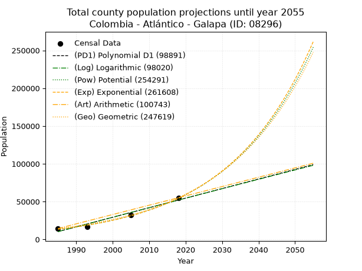
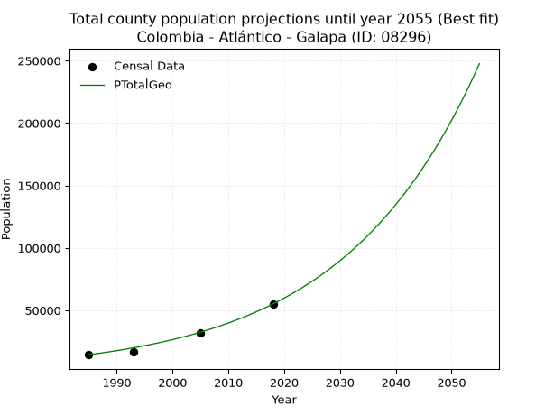
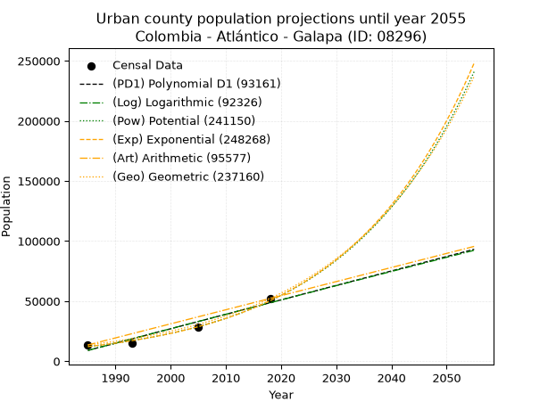
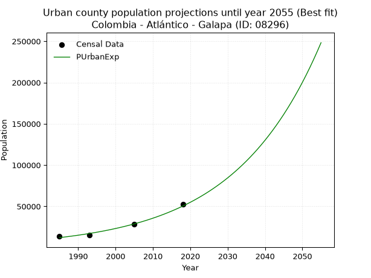
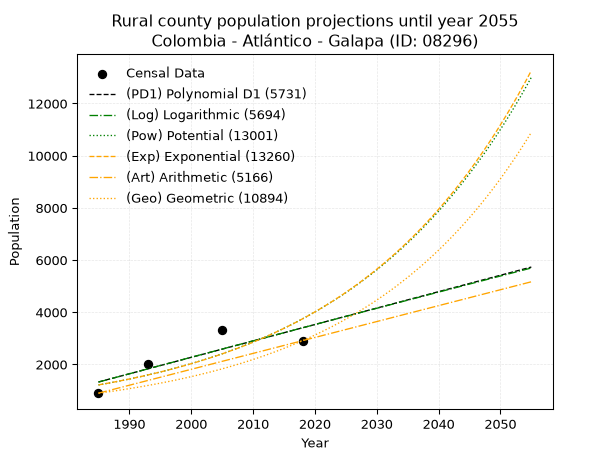
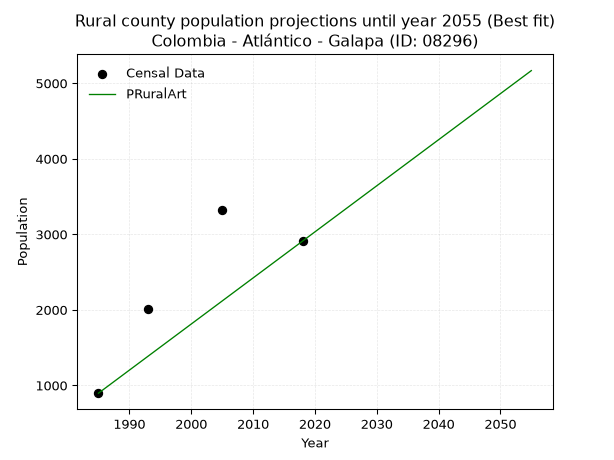

<div align="center">


</div>

# _“Population and Public Services Demand Projections (PPSD) until Year 2050 for Colombia - Atlántico - Galapa (ID: 08296)”_
Keywords: `population` `public-service` `projection` `lineal` `polynomial` `logarithmic` `potential` `exponential` `arithmetic` `geometric` `wappaus` `dane` `colombia` `south-america`

PPSD are analytical estimates used by governments and planners to anticipate future changes in population size, age distribution, and the resulting community needs for utilities, healthcare, education, and infrastructure as sizing future water treatment facilities, electrical grids, and road networks based on spatial growth.

> **General running parameters**: • app_version: _v20260806_. • Python version: _3.14.7_. • Pandas version: _3.0.5_. • NumPy version: _2.5.1_. • Creates, save and include plots into reports (create_plot): _False_. • Projection until year: _2050_. • Process polynomial degree 2 and up: _False_. • Process Wappaus: _True_. • Process Wappaus: _True_. • Set negative values to zero: _True_. • Set infinite values to zero: _True_. • Drop dataset notes: _True_. 
<div align="center">

Dynamic map: [:earth_americas:Google](http://maps.google.com/maps?q=10.91903289,-74.8703852) [:earth_americas:OSM](https://www.openstreetmap.org/#map=18/10.91903289/-74.8703852&layers=P) [:earth_americas:Bing](https://www.bing.com/maps?cp=10.91903289~-74.8703852&lvl=18) [:earth_americas:Apple](https://maps.apple.com/frame?center=10.91903289%2C-74.8703852&span=0.003%2C0.006)

</div>


<div align="center">

```geojson
{
  "type": "Feature",
  "geometry": {
    "type": "Point", 
    "coordinates": [-74.8703852, 10.91903289]
  }, 
  "properties": {
    "Name": "Colombia - Atlántico - Galapa (ID: 08296)"
  }
}
```

</div>


## 0. Census Data (4 records)

Census data are official statistics collected by a government about the people and housing in a country. They usually include counts of total population, age, sex, race, income, education, and jobs.

📅Global census file: [Population.xlsx](../data/Population.xlsx)

| Source   |   Year |   CountryID | CountryName   |   StateID | StateName   |   CountyID | CountyName   |   PTotal |   PUrban |   PRural |
|:---------|-------:|------------:|:--------------|----------:|:------------|-----------:|:-------------|---------:|---------:|---------:|
| DANE     |   1985 |          57 | Colombia      |        08 | Atlántico   |      08296 | Galapa       |    14435 |    13539 |      896 |
| DANE     |   1993 |          57 | Colombia      |        08 | Atlántico   |      08296 | Galapa       |    16873 |    14863 |     2010 |
| DANE     |   2005 |          57 | Colombia      |        08 | Atlántico   |      08296 | Galapa       |    32012 |    28687 |     3325 |
| DANE     |   2018 |          57 | Colombia      |        08 | Atlántico   |      08296 | Galapa       |    55123 |    52214 |     2909 |

> 🔥Some records could had specific notes about the registered values or the corresponding urban or rural distribution.

📅   [RUPS](https://www.datos.gov.co/Hacienda-y-Cr-dito-P-blico/Registro-nico-de-Prestadores-de-Servicios-P-blicos/4qkq-csdn/about_data) - Local public utility companies: [RUPS.csv](../data/RUPS.xlsx)

 | SERVICIO       | ESTADO    | NOMBRE                                                                   | NIT         | DEPARTAMENTO_DOMICILIO   | MUNICIPIO_DOMICILIO   | DIRECCION                                                    |   TELEFONO | EMAIL                      | TIPO_INSCRIPCION    | REPRESENTANTE_LEGAL                      | TIPO_PRESTADOR                             | CLASIFICACION                  |
|:---------------|:----------|:-------------------------------------------------------------------------|:------------|:-------------------------|:----------------------|:-------------------------------------------------------------|-----------:|:---------------------------|:--------------------|:-----------------------------------------|:-------------------------------------------|:-------------------------------|
| ACUEDUCTO      | OPERATIVA | SOCIEDAD DE ACUEDUCTO, ALCANTARILLADO Y ASEO DE BARRANQUILLA S.A. E.S.P. | 800135913-1 | ATLANTICO                | BARRANQUILLA          | Carrera 58 # 67-09                                           |    3614000 | carolina.silva@aaa.com.co  | Registro por la ESP | JAIRO ALBERTO DE CASTRO PENA             | SOCIEDADES (EMPRESA DE SERVICIOS PUBLICOS) | MAYOR O IGUAL A 5001 USUARIOS  |
| ALCANTARILLADO | OPERATIVA | SOCIEDAD DE ACUEDUCTO, ALCANTARILLADO Y ASEO DE BARRANQUILLA S.A. E.S.P. | 800135913-1 | ATLANTICO                | BARRANQUILLA          | Carrera 58 # 67-09                                           |    3614000 | carolina.silva@aaa.com.co  | Registro por la ESP | JAIRO ALBERTO DE CASTRO PENA             | SOCIEDADES (EMPRESA DE SERVICIOS PUBLICOS) | MAYOR O IGUAL A 5001 USUARIOS  |
| ACUEDUCTO      | OPERATIVA | AGUAS DEL ATLANTICO S.A. E.S.P.                                          | 802008956-1 | ATLANTICO                | GALAPA                | carrera 62 No 8B-50 Loc 5 Ciudadela Distrital Villa Olimpica |    3823154 | fmurilloacu@gmail.com      | Registro por la ESP | JUAN MANUEL CUELLO GERLEIN               | SOCIEDADES (EMPRESA DE SERVICIOS PUBLICOS) | DESDE 2501 HASTA 5000 USUARIOS |
| ACUEDUCTO      | OPERATIVA | AGUACARIBE COLOMBIA SAS ESP                                              | 901231847-0 | ATLANTICO                | GALAPA                | CRA 62 No 8B-50 LC 5 VILLA OLIMPICA                          |    3823154 | dvasquez@aguacaribe.com.co | Registro por la ESP | SANDRA MARGARITA DE LA ESPRIELLA  SURMAY | SOCIEDADES (EMPRESA DE SERVICIOS PUBLICOS) | MAYOR O IGUAL A 5001 USUARIOS  |
| ALCANTARILLADO | OPERATIVA | AGUACARIBE COLOMBIA SAS ESP                                              | 901231847-0 | ATLANTICO                | GALAPA                | CRA 62 No 8B-50 LC 5 VILLA OLIMPICA                          |    3823154 | dvasquez@aguacaribe.com.co | Registro por la ESP | SANDRA MARGARITA DE LA ESPRIELLA  SURMAY | SOCIEDADES (EMPRESA DE SERVICIOS PUBLICOS) | MAYOR O IGUAL A 5001 USUARIOS  |

## 1. Total

### 1.1. Coefficients and Parameters

* (PD1) Polynomial Deg 1: 1265.399036531498, -2501503.6728221285 (lineal)
* (Log) Logarithmic: 2531522.359861297, -19212510.99365276
* (Pow) Potential: 84.95386884974961, -276.0308500464163
* (Exp) Exponential: 0.04244907076648735, 3.41122563103908e-33
* (Art) Arithmetic: Year diff. 2018 - 1985 = 33, Population diff. 55123 - 14435 = 40688, Annual growth = 1232.969696969697
* (Geo) Geometric: Year diff. 2018 - 1985 = 33, Population diff. 55123 - 14435 = 40688, Annual growth % = 0.04143895859305058
* (Wap) Wappaus: i = 3.5451556886905804, Condition values only valid for < 200)

<sub>
Wappaus condition values: ['0.00', '3.55', '7.09', '10.64', '14.18', '17.73', '21.27', '24.82', '28.36', '31.91', '35.45', '39.00', '42.54', '46.09', '49.63', '53.18', '56.72', '60.27', '63.81', '67.36', '70.90', '74.45', '77.99', '81.54', '85.08', '88.63', '92.17', '95.72', '99.26', '102.81', '106.35', '109.90', '113.44', '116.99', '120.54', '124.08', '127.63', '131.17', '134.72', '138.26', '141.81', '145.35', '148.90', '152.44', '155.99', '159.53', '163.08', '166.62', '170.17', '173.71', '177.26', '180.80', '184.35', '187.89', '191.44', '194.98', '198.53', '202.07', '205.62', '209.16', '212.71', '216.25', '219.80', '223.34', '226.89', '230.44']
</sub>


### 1.2. Projected Dataset

|   Year |   CountyID |   PTotalPD1 |   PTotalLog |   PTotalPow |   PTotalExp |   PTotalArt |   PTotalGeo |
|-------:|-----------:|------------:|------------:|------------:|------------:|------------:|------------:|
|   1985 |      08296 |       10313 |       10286 |       13386 |       13402 |       14435 |       14435 |
|   1986 |      08296 |       11579 |       11561 |       13972 |       13983 |       15668 |       15033 |
|   1987 |      08296 |       12844 |       12835 |       14582 |       14590 |       16901 |       15656 |
|   1988 |      08296 |       14110 |       14109 |       15219 |       15222 |       18134 |       16305 |
|   1989 |      08296 |       15375 |       15382 |       15883 |       15882 |       19367 |       16981 |
|   1990 |      08296 |       16640 |       16654 |       16576 |       16571 |       20600 |       17684 |
|   1991 |      08296 |       17906 |       17926 |       17299 |       17290 |       21833 |       18417 |
|   1992 |      08296 |       19171 |       19197 |       18053 |       18039 |       23066 |       19180 |
|   1993 |      08296 |       20437 |       20468 |       18839 |       18822 |       24299 |       19975 |
|   1994 |      08296 |       21702 |       21738 |       19659 |       19638 |       25532 |       20803 |
|   1995 |      08296 |       22967 |       23007 |       20515 |       20489 |       26765 |       21665 |
|   1996 |      08296 |       24233 |       24275 |       21407 |       21378 |       27998 |       22563 |
|   1997 |      08296 |       25498 |       25543 |       22338 |       22305 |       29231 |       23498 |
|   1998 |      08296 |       26764 |       26811 |       23308 |       23272 |       30464 |       24471 |
|   1999 |      08296 |       28029 |       28077 |       24320 |       24281 |       31697 |       25485 |
|   2000 |      08296 |       29294 |       29344 |       25376 |       25334 |       32930 |       26541 |
|   2001 |      08296 |       30560 |       30609 |       26477 |       26433 |       34163 |       27641 |
|   2002 |      08296 |       31825 |       31874 |       27625 |       27579 |       35395 |       28787 |
|   2003 |      08296 |       33091 |       33138 |       28822 |       28775 |       36628 |       29980 |
|   2004 |      08296 |       34356 |       34402 |       30070 |       30022 |       37861 |       31222 |
|   2005 |      08296 |       35621 |       35664 |       31372 |       31324 |       39094 |       32516 |
|   2006 |      08296 |       36887 |       36927 |       32729 |       32683 |       40327 |       33863 |
|   2007 |      08296 |       38152 |       38188 |       34145 |       34100 |       41560 |       35266 |
|   2008 |      08296 |       39418 |       39449 |       35621 |       35579 |       42793 |       36728 |
|   2009 |      08296 |       40683 |       40710 |       37160 |       37121 |       44026 |       38250 |
|   2010 |      08296 |       41948 |       41970 |       38765 |       38731 |       45259 |       39835 |
|   2011 |      08296 |       43214 |       43229 |       40438 |       40410 |       46492 |       41485 |
|   2012 |      08296 |       44479 |       44487 |       42182 |       42163 |       47725 |       43205 |
|   2013 |      08296 |       45745 |       45745 |       44001 |       43991 |       48958 |       44995 |
|   2014 |      08296 |       47010 |       47002 |       45897 |       45899 |       50191 |       46859 |
|   2015 |      08296 |       48275 |       48259 |       47874 |       47889 |       51424 |       48801 |
|   2016 |      08296 |       49541 |       49515 |       49935 |       49966 |       52657 |       50824 |
|   2017 |      08296 |       50806 |       50771 |       52084 |       52132 |       53890 |       52930 |
|   2018 |      08296 |       52072 |       52025 |       54324 |       54393 |       55123 |       55123 |
|   2019 |      08296 |       53337 |       53279 |       56659 |       56752 |       56356 |       57407 |
|   2020 |      08296 |       54602 |       54533 |       59093 |       59212 |       57589 |       59786 |
|   2021 |      08296 |       55868 |       55786 |       61631 |       61780 |       58822 |       62264 |
|   2022 |      08296 |       57133 |       57038 |       64276 |       64459 |       60055 |       64844 |
|   2023 |      08296 |       58399 |       58290 |       67033 |       67254 |       61288 |       67531 |
|   2024 |      08296 |       59664 |       59541 |       69908 |       70170 |       62521 |       70329 |
|   2025 |      08296 |       60929 |       60791 |       72903 |       73213 |       63754 |       73244 |
|   2026 |      08296 |       62195 |       62041 |       76026 |       76388 |       64987 |       76279 |
|   2027 |      08296 |       63460 |       63290 |       79281 |       79700 |       66220 |       79440 |
|   2028 |      08296 |       64726 |       64539 |       82674 |       83156 |       67453 |       82732 |
|   2029 |      08296 |       65991 |       65787 |       86210 |       86762 |       68686 |       86160 |
|   2030 |      08296 |       67256 |       67034 |       89895 |       90525 |       69919 |       89730 |
|   2031 |      08296 |       68522 |       68281 |       93736 |       94450 |       71152 |       93449 |
|   2032 |      08296 |       69787 |       69527 |       97739 |       98546 |       72385 |       97321 |
|   2033 |      08296 |       71053 |       70773 |      101911 |      102819 |       73618 |      101354 |
|   2034 |      08296 |       72318 |       72018 |      106258 |      107277 |       74851 |      105554 |
|   2035 |      08296 |       73583 |       73262 |      110789 |      111929 |       76083 |      109928 |
|   2036 |      08296 |       74849 |       74506 |      115511 |      116783 |       77316 |      114483 |
|   2037 |      08296 |       76114 |       75749 |      120431 |      121847 |       78549 |      119227 |
|   2038 |      08296 |       77380 |       76991 |      125559 |      127131 |       79782 |      124168 |
|   2039 |      08296 |       78645 |       78233 |      130902 |      132643 |       81015 |      129313 |
|   2040 |      08296 |       79910 |       79474 |      136470 |      138395 |       82248 |      134672 |
|   2041 |      08296 |       81176 |       80715 |      142272 |      144396 |       83481 |      140253 |
|   2042 |      08296 |       82441 |       81955 |      148317 |      150658 |       84714 |      146064 |
|   2043 |      08296 |       83707 |       83194 |      154616 |      157191 |       85947 |      152117 |
|   2044 |      08296 |       84972 |       84433 |      161179 |      164007 |       87180 |      158421 |
|   2045 |      08296 |       86237 |       85671 |      168018 |      171119 |       88413 |      164986 |
|   2046 |      08296 |       87503 |       86909 |      175143 |      178539 |       89646 |      171822 |
|   2047 |      08296 |       88768 |       88146 |      182566 |      186281 |       90879 |      178943 |
|   2048 |      08296 |       90034 |       89382 |      190301 |      194359 |       92112 |      186358 |
|   2049 |      08296 |       91299 |       90618 |      198359 |      202787 |       93345 |      194080 |
|   2050 |      08296 |       92564 |       91853 |      206754 |      211580 |       94578 |      202123 |
<div align="center">

</img>

</div>


### 1.3. Best fit with absolute and relative error (%)

Relative error puts that difference into context by dividing the absolute error by the true value, creating a unitless ratio or percentage that shows the scale of the mistake.

Absolute and relative error

|   Year | Source   |   CountryID | CountryName   |   StateID | StateName   |   CountyID_x | CountyName   |   PTotal |   PUrban |   PRural |   CountyID_y |   PTotalPD1 |   PTotalLog |   PTotalPow |   PTotalExp |   PTotalArt |   PTotalGeo |   PTotalPD1AbsError |   PTotalLogAbsError |   PTotalPowAbsError |   PTotalExpAbsError |   PTotalArtAbsError |   PTotalGeoAbsError |   PTotalPD1RelError |   PTotalLogRelError |   PTotalPowRelError |   PTotalExpRelError |   PTotalArtRelError |   PTotalGeoRelError |
|-------:|:---------|------------:|:--------------|----------:|:------------|-------------:|:-------------|---------:|---------:|---------:|-------------:|------------:|------------:|------------:|------------:|------------:|------------:|--------------------:|--------------------:|--------------------:|--------------------:|--------------------:|--------------------:|--------------------:|--------------------:|--------------------:|--------------------:|--------------------:|--------------------:|
|   1985 | DANE     |          57 | Colombia      |        08 | Atlántico   |        08296 | Galapa       |    14435 |    13539 |      896 |        08296 |       10313 |       10286 |       13386 |       13402 |       14435 |       14435 |                4122 |                4149 |                1049 |                1033 |                   0 |                   0 |            28.5556  |            28.7426  |             7.26706 |             7.15622 |              0      |             0       |
|   1993 | DANE     |          57 | Colombia      |        08 | Atlántico   |        08296 | Galapa       |    16873 |    14863 |     2010 |        08296 |       20437 |       20468 |       18839 |       18822 |       24299 |       19975 |                3564 |                3595 |                1966 |                1949 |                7426 |                3102 |            21.1225  |            21.3062  |            11.6518  |            11.551   |             44.0111 |            18.3844  |
|   2005 | DANE     |          57 | Colombia      |        08 | Atlántico   |        08296 | Galapa       |    32012 |    28687 |     3325 |        08296 |       35621 |       35664 |       31372 |       31324 |       39094 |       32516 |                3609 |                3652 |                 640 |                 688 |                7082 |                 504 |            11.2739  |            11.4082  |             1.99925 |             2.14919 |             22.123  |             1.57441 |
|   2018 | DANE     |          57 | Colombia      |        08 | Atlántico   |        08296 | Galapa       |    55123 |    52214 |     2909 |        08296 |       52072 |       52025 |       54324 |       54393 |       55123 |       55123 |                3051 |                3098 |                 799 |                 730 |                   0 |                   0 |             5.53489 |             5.62016 |             1.44949 |             1.32431 |              0      |             0       |

Relative error mean

| Method    |   RelError | Best   |
|:----------|-----------:|:-------|
| PTotalPD1 |   16.6217  |        |
| PTotalLog |   16.7693  |        |
| PTotalPow |    5.59189 |        |
| PTotalExp |    5.54518 |        |
| PTotalArt |   16.5335  |        |
| PTotalGeo |    4.9897  | True   |

💙Best method: _**PTotalGeo**_
<div align="center">

</img>

</div>


### 1.4. Fresh water supply demand in liters per capita per day (lpcd)

The fresh water supply demand typically ranges from 100 to 300 liters per capita per day (lpcd) for standard domestic and municipal planning, though absolute survival minimums set by the World Health Organization are as low as 7.5 to 20 liters per day, and total consumption in high-income nations can exceed 400 liters.

> `CZ`: Level in meters above the sea level (masl)<br> `WS`: Fresh water supply demand in liters per capita per day (lpcd or l/h/d)<br> `WSAll`: Zonal fresh water supply demand in liters per second (l/s)<br> `A`: Zonal area in square meters<br> `DP`: Population density (people/hectare or p/ha)

Reference values (RAS Colombia)

|    CZ |   WS |
|------:|-----:|
|  1000 |  120 |
|  2000 |  130 |
| 99999 |  140 |

County shapefile geometry properties and water supply values

|   CountyID |      ATotal |   CZTotal |   WSTotal |
|-----------:|------------:|----------:|----------:|
|      08296 | 9.75165e+07 |   84.2416 |       120 |

Projected values for best method: PTotalGeo

|   CountyID |   Year |   PTotalGeo |   DPTotal |   WSTotal |   WSTotalAll |
|-----------:|-------:|------------:|----------:|----------:|-------------:|
|      08296 |   1985 |       14435 |      1.48 |       120 |      20.0486 |
|      08296 |   1986 |       15033 |      1.54 |       120 |      20.8792 |
|      08296 |   1987 |       15656 |      1.61 |       120 |      21.7444 |
|      08296 |   1988 |       16305 |      1.67 |       120 |      22.6458 |
|      08296 |   1989 |       16981 |      1.74 |       120 |      23.5847 |
|      08296 |   1990 |       17684 |      1.81 |       120 |      24.5611 |
|      08296 |   1991 |       18417 |      1.89 |       120 |      25.5792 |
|      08296 |   1992 |       19180 |      1.97 |       120 |      26.6389 |
|      08296 |   1993 |       19975 |      2.05 |       120 |      27.7431 |
|      08296 |   1994 |       20803 |      2.13 |       120 |      28.8931 |
|      08296 |   1995 |       21665 |      2.22 |       120 |      30.0903 |
|      08296 |   1996 |       22563 |      2.31 |       120 |      31.3375 |
|      08296 |   1997 |       23498 |      2.41 |       120 |      32.6361 |
|      08296 |   1998 |       24471 |      2.51 |       120 |      33.9875 |
|      08296 |   1999 |       25485 |      2.61 |       120 |      35.3958 |
|      08296 |   2000 |       26541 |      2.72 |       120 |      36.8625 |
|      08296 |   2001 |       27641 |      2.83 |       120 |      38.3903 |
|      08296 |   2002 |       28787 |      2.95 |       120 |      39.9819 |
|      08296 |   2003 |       29980 |      3.07 |       120 |      41.6389 |
|      08296 |   2004 |       31222 |      3.2  |       120 |      43.3639 |
|      08296 |   2005 |       32516 |      3.33 |       120 |      45.1611 |
|      08296 |   2006 |       33863 |      3.47 |       120 |      47.0319 |
|      08296 |   2007 |       35266 |      3.62 |       120 |      48.9806 |
|      08296 |   2008 |       36728 |      3.77 |       120 |      51.0111 |
|      08296 |   2009 |       38250 |      3.92 |       120 |      53.125  |
|      08296 |   2010 |       39835 |      4.08 |       120 |      55.3264 |
|      08296 |   2011 |       41485 |      4.25 |       120 |      57.6181 |
|      08296 |   2012 |       43205 |      4.43 |       120 |      60.0069 |
|      08296 |   2013 |       44995 |      4.61 |       120 |      62.4931 |
|      08296 |   2014 |       46859 |      4.81 |       120 |      65.0819 |
|      08296 |   2015 |       48801 |      5    |       120 |      67.7792 |
|      08296 |   2016 |       50824 |      5.21 |       120 |      70.5889 |
|      08296 |   2017 |       52930 |      5.43 |       120 |      73.5139 |
|      08296 |   2018 |       55123 |      5.65 |       120 |      76.5597 |
|      08296 |   2019 |       57407 |      5.89 |       120 |      79.7319 |
|      08296 |   2020 |       59786 |      6.13 |       120 |      83.0361 |
|      08296 |   2021 |       62264 |      6.38 |       120 |      86.4778 |
|      08296 |   2022 |       64844 |      6.65 |       120 |      90.0611 |
|      08296 |   2023 |       67531 |      6.93 |       120 |      93.7931 |
|      08296 |   2024 |       70329 |      7.21 |       120 |      97.6792 |
|      08296 |   2025 |       73244 |      7.51 |       120 |     101.728  |
|      08296 |   2026 |       76279 |      7.82 |       120 |     105.943  |
|      08296 |   2027 |       79440 |      8.15 |       120 |     110.333  |
|      08296 |   2028 |       82732 |      8.48 |       120 |     114.906  |
|      08296 |   2029 |       86160 |      8.84 |       120 |     119.667  |
|      08296 |   2030 |       89730 |      9.2  |       120 |     124.625  |
|      08296 |   2031 |       93449 |      9.58 |       120 |     129.79   |
|      08296 |   2032 |       97321 |      9.98 |       120 |     135.168  |
|      08296 |   2033 |      101354 |     10.39 |       120 |     140.769  |
|      08296 |   2034 |      105554 |     10.82 |       120 |     146.603  |
|      08296 |   2035 |      109928 |     11.27 |       120 |     152.678  |
|      08296 |   2036 |      114483 |     11.74 |       120 |     159.004  |
|      08296 |   2037 |      119227 |     12.23 |       120 |     165.593  |
|      08296 |   2038 |      124168 |     12.73 |       120 |     172.456  |
|      08296 |   2039 |      129313 |     13.26 |       120 |     179.601  |
|      08296 |   2040 |      134672 |     13.81 |       120 |     187.044  |
|      08296 |   2041 |      140253 |     14.38 |       120 |     194.796  |
|      08296 |   2042 |      146064 |     14.98 |       120 |     202.867  |
|      08296 |   2043 |      152117 |     15.6  |       120 |     211.274  |
|      08296 |   2044 |      158421 |     16.25 |       120 |     220.029  |
|      08296 |   2045 |      164986 |     16.92 |       120 |     229.147  |
|      08296 |   2046 |      171822 |     17.62 |       120 |     238.642  |
|      08296 |   2047 |      178943 |     18.35 |       120 |     248.532  |
|      08296 |   2048 |      186358 |     19.11 |       120 |     258.831  |
|      08296 |   2049 |      194080 |     19.9  |       120 |     269.556  |
|      08296 |   2050 |      202123 |     20.73 |       120 |     280.726  |

## 2. Urban

### 2.1. Coefficients and Parameters

* (PD1) Polynomial Deg 1: 1202.4652749899487, -2377905.416298645 (lineal)
* (Log) Logarithmic: 2405369.0958143277, -18255904.02270293
* (Pow) Potential: 86.27275948004403, -280.4231304339807
* (Exp) Exponential: 0.043113176502806966, 8.269533910426437e-34
* (Art) Arithmetic: Year diff. 2018 - 1985 = 33, Population diff. 52214 - 13539 = 38675, Annual growth = 1171.969696969697
* (Geo) Geometric: Year diff. 2018 - 1985 = 33, Population diff. 52214 - 13539 = 38675, Annual growth % = 0.04175033257325711
* (Wap) Wappaus: i = 3.564764184051517, Condition values only valid for < 200)

<sub>
Wappaus condition values: ['0.00', '3.56', '7.13', '10.69', '14.26', '17.82', '21.39', '24.95', '28.52', '32.08', '35.65', '39.21', '42.78', '46.34', '49.91', '53.47', '57.04', '60.60', '64.17', '67.73', '71.30', '74.86', '78.42', '81.99', '85.55', '89.12', '92.68', '96.25', '99.81', '103.38', '106.94', '110.51', '114.07', '117.64', '121.20', '124.77', '128.33', '131.90', '135.46', '139.03', '142.59', '146.16', '149.72', '153.28', '156.85', '160.41', '163.98', '167.54', '171.11', '174.67', '178.24', '181.80', '185.37', '188.93', '192.50', '196.06', '199.63', '203.19', '206.76', '210.32', '213.89', '217.45', '221.02', '224.58', '228.14', '231.71']
</sub>


### 2.2. Projected Dataset

|   Year |   CountyID |   PUrbanPD1 |   PUrbanLog |   PUrbanPow |   PUrbanExp |   PUrbanArt |   PUrbanGeo |
|-------:|-----------:|------------:|------------:|------------:|------------:|------------:|------------:|
|   1985 |      08296 |        8988 |        8964 |       12127 |       12141 |       13539 |       13539 |
|   1986 |      08296 |       10191 |       10175 |       12666 |       12676 |       14711 |       14104 |
|   1987 |      08296 |       11393 |       11386 |       13228 |       13234 |       15883 |       14693 |
|   1988 |      08296 |       12596 |       12596 |       13815 |       13817 |       17055 |       15307 |
|   1989 |      08296 |       13798 |       13806 |       14428 |       14426 |       18227 |       15946 |
|   1990 |      08296 |       15000 |       15015 |       15067 |       15062 |       19399 |       16611 |
|   1991 |      08296 |       16203 |       16223 |       15734 |       15725 |       20571 |       17305 |
|   1992 |      08296 |       17405 |       17431 |       16431 |       16418 |       21743 |       18027 |
|   1993 |      08296 |       18608 |       18638 |       17158 |       17141 |       22915 |       18780 |
|   1994 |      08296 |       19810 |       19845 |       17917 |       17896 |       24087 |       19564 |
|   1995 |      08296 |       21013 |       21051 |       18709 |       18685 |       25259 |       20381 |
|   1996 |      08296 |       22215 |       22256 |       19536 |       19508 |       26431 |       21232 |
|   1997 |      08296 |       23418 |       23461 |       20398 |       20368 |       27603 |       22118 |
|   1998 |      08296 |       24620 |       24665 |       21299 |       21265 |       28775 |       23042 |
|   1999 |      08296 |       25823 |       25869 |       22238 |       22202 |       29947 |       24004 |
|   2000 |      08296 |       27025 |       27072 |       23219 |       23180 |       31119 |       25006 |
|   2001 |      08296 |       28228 |       28274 |       24242 |       24201 |       32291 |       26050 |
|   2002 |      08296 |       29430 |       29476 |       25310 |       25267 |       33462 |       27137 |
|   2003 |      08296 |       30633 |       30677 |       26424 |       26380 |       34634 |       28270 |
|   2004 |      08296 |       31835 |       31878 |       27587 |       27543 |       35806 |       29451 |
|   2005 |      08296 |       33037 |       33078 |       28800 |       28756 |       36978 |       30680 |
|   2006 |      08296 |       34240 |       34277 |       30066 |       30023 |       38150 |       31961 |
|   2007 |      08296 |       35442 |       35476 |       31387 |       31346 |       39322 |       33296 |
|   2008 |      08296 |       36645 |       36674 |       32765 |       32727 |       40494 |       34686 |
|   2009 |      08296 |       37847 |       37872 |       34203 |       34168 |       41666 |       36134 |
|   2010 |      08296 |       39050 |       39069 |       35703 |       35674 |       42838 |       37642 |
|   2011 |      08296 |       40252 |       40265 |       37269 |       37245 |       44010 |       39214 |
|   2012 |      08296 |       41455 |       41461 |       38902 |       38886 |       45182 |       40851 |
|   2013 |      08296 |       42657 |       42656 |       40606 |       40599 |       46354 |       42557 |
|   2014 |      08296 |       43860 |       43851 |       42384 |       42388 |       47526 |       44334 |
|   2015 |      08296 |       45062 |       45045 |       44238 |       44256 |       48698 |       46184 |
|   2016 |      08296 |       46265 |       46238 |       46173 |       46205 |       49870 |       48113 |
|   2017 |      08296 |       47467 |       47431 |       48191 |       48241 |       51042 |       50121 |
|   2018 |      08296 |       48670 |       48623 |       50297 |       50366 |       52214 |       52214 |
|   2019 |      08296 |       49872 |       49815 |       52493 |       52585 |       53386 |       54394 |
|   2020 |      08296 |       51074 |       51006 |       54784 |       54902 |       54558 |       56665 |
|   2021 |      08296 |       52277 |       52197 |       57174 |       57321 |       55730 |       59031 |
|   2022 |      08296 |       53479 |       53386 |       59667 |       59846 |       56902 |       61495 |
|   2023 |      08296 |       54682 |       54576 |       62267 |       62482 |       58074 |       64063 |
|   2024 |      08296 |       55884 |       55764 |       64979 |       65235 |       59246 |       66737 |
|   2025 |      08296 |       57087 |       56953 |       67808 |       68109 |       60418 |       69524 |
|   2026 |      08296 |       58289 |       58140 |       70759 |       71110 |       61590 |       72426 |
|   2027 |      08296 |       59492 |       59327 |       73836 |       74243 |       62762 |       75450 |
|   2028 |      08296 |       60694 |       60513 |       77046 |       77513 |       63934 |       78600 |
|   2029 |      08296 |       61897 |       61699 |       80393 |       80928 |       65106 |       81882 |
|   2030 |      08296 |       63099 |       62884 |       83884 |       84494 |       66278 |       85300 |
|   2031 |      08296 |       64302 |       64069 |       87525 |       88216 |       67450 |       88862 |
|   2032 |      08296 |       65504 |       65253 |       91322 |       92103 |       68622 |       92572 |
|   2033 |      08296 |       66706 |       66437 |       95282 |       96160 |       69794 |       96437 |
|   2034 |      08296 |       67909 |       67619 |       99411 |      100397 |       70966 |      100463 |
|   2035 |      08296 |       69111 |       68802 |      103717 |      104820 |       72137 |      104657 |
|   2036 |      08296 |       70314 |       69983 |      108208 |      109438 |       73309 |      109027 |
|   2037 |      08296 |       71516 |       71165 |      112890 |      114259 |       74481 |      113579 |
|   2038 |      08296 |       72719 |       72345 |      117773 |      119293 |       75653 |      118320 |
|   2039 |      08296 |       73921 |       73525 |      122864 |      124549 |       76825 |      123260 |
|   2040 |      08296 |       75124 |       74704 |      128173 |      130036 |       77997 |      128407 |
|   2041 |      08296 |       76326 |       75883 |      133709 |      135765 |       79169 |      133768 |
|   2042 |      08296 |       77529 |       77062 |      139480 |      141746 |       80341 |      139352 |
|   2043 |      08296 |       78731 |       78239 |      145498 |      147991 |       81513 |      145170 |
|   2044 |      08296 |       79934 |       79416 |      151772 |      154511 |       82685 |      151231 |
|   2045 |      08296 |       81136 |       80593 |      158313 |      161318 |       83857 |      157545 |
|   2046 |      08296 |       82339 |       81769 |      165133 |      168425 |       85029 |      164123 |
|   2047 |      08296 |       83541 |       82944 |      172243 |      175845 |       86201 |      170975 |
|   2048 |      08296 |       84743 |       84119 |      179656 |      183592 |       87373 |      178113 |
|   2049 |      08296 |       85946 |       85293 |      187384 |      191680 |       88545 |      185550 |
|   2050 |      08296 |       87148 |       86467 |      195440 |      200125 |       89717 |      193296 |
<div align="center">

</img>

</div>


### 2.3. Best fit with absolute and relative error (%)

Relative error puts that difference into context by dividing the absolute error by the true value, creating a unitless ratio or percentage that shows the scale of the mistake.

Absolute and relative error

|   Year | Source   |   CountryID | CountryName   |   StateID | StateName   |   CountyID_x | CountyName   |   PTotal |   PUrban |   PRural |   CountyID_y |   PUrbanPD1 |   PUrbanLog |   PUrbanPow |   PUrbanExp |   PUrbanArt |   PUrbanGeo |   PUrbanPD1AbsError |   PUrbanLogAbsError |   PUrbanPowAbsError |   PUrbanExpAbsError |   PUrbanArtAbsError |   PUrbanGeoAbsError |   PUrbanPD1RelError |   PUrbanLogRelError |   PUrbanPowRelError |   PUrbanExpRelError |   PUrbanArtRelError |   PUrbanGeoRelError |
|-------:|:---------|------------:|:--------------|----------:|:------------|-------------:|:-------------|---------:|---------:|---------:|-------------:|------------:|------------:|------------:|------------:|------------:|------------:|--------------------:|--------------------:|--------------------:|--------------------:|--------------------:|--------------------:|--------------------:|--------------------:|--------------------:|--------------------:|--------------------:|--------------------:|
|   1985 | DANE     |          57 | Colombia      |        08 | Atlántico   |        08296 | Galapa       |    14435 |    13539 |      896 |        08296 |        8988 |        8964 |       12127 |       12141 |       13539 |       13539 |                4551 |                4575 |                1412 |                1398 |                   0 |                   0 |            33.614   |            33.7913  |           10.4291   |           10.3257   |              0      |              0      |
|   1993 | DANE     |          57 | Colombia      |        08 | Atlántico   |        08296 | Galapa       |    16873 |    14863 |     2010 |        08296 |       18608 |       18638 |       17158 |       17141 |       22915 |       18780 |                3745 |                3775 |                2295 |                2278 |                8052 |                3917 |            25.1968  |            25.3986  |           15.441    |           15.3267   |             54.1748 |             26.354  |
|   2005 | DANE     |          57 | Colombia      |        08 | Atlántico   |        08296 | Galapa       |    32012 |    28687 |     3325 |        08296 |       33037 |       33078 |       28800 |       28756 |       36978 |       30680 |                4350 |                4391 |                 113 |                  69 |                8291 |                1993 |            15.1637  |            15.3066  |            0.393907 |            0.240527 |             28.9016 |              6.9474 |
|   2018 | DANE     |          57 | Colombia      |        08 | Atlántico   |        08296 | Galapa       |    55123 |    52214 |     2909 |        08296 |       48670 |       48623 |       50297 |       50366 |       52214 |       52214 |                3544 |                3591 |                1917 |                1848 |                   0 |                   0 |             6.78745 |             6.87747 |            3.67143  |            3.53928  |              0      |              0      |

Relative error mean

| Method    |   RelError | Best   |
|:----------|-----------:|:-------|
| PUrbanPD1 |   20.1905  |        |
| PUrbanLog |   20.3435  |        |
| PUrbanPow |    7.48387 |        |
| PUrbanExp |    7.35805 | True   |
| PUrbanArt |   20.7691  |        |
| PUrbanGeo |    8.32536 |        |

💙Best method: _**PUrbanExp**_
<div align="center">

</img>

</div>


### 2.4. Fresh water supply demand in liters per capita per day (lpcd)

The fresh water supply demand typically ranges from 100 to 300 liters per capita per day (lpcd) for standard domestic and municipal planning, though absolute survival minimums set by the World Health Organization are as low as 7.5 to 20 liters per day, and total consumption in high-income nations can exceed 400 liters.

> `CZ`: Level in meters above the sea level (masl)<br> `WS`: Fresh water supply demand in liters per capita per day (lpcd or l/h/d)<br> `WSAll`: Zonal fresh water supply demand in liters per second (l/s)<br> `A`: Zonal area in square meters<br> `DP`: Population density (people/hectare or p/ha)

Reference values (RAS Colombia)

|    CZ |   WS |
|------:|-----:|
|  1000 |  120 |
|  2000 |  130 |
| 99999 |  140 |

County shapefile geometry properties and water supply values

|   CountyID |      AUrban |   CZUrban |   WSUrban |
|-----------:|------------:|----------:|----------:|
|      08296 | 1.03096e+07 |   59.6342 |       120 |

Projected values for best method: PUrbanExp

|   CountyID |   Year |   PUrbanExp |   DPUrban |   WSUrban |   WSUrbanAll |
|-----------:|-------:|------------:|----------:|----------:|-------------:|
|      08296 |   1985 |       12141 |     11.78 |       120 |      16.8625 |
|      08296 |   1986 |       12676 |     12.3  |       120 |      17.6056 |
|      08296 |   1987 |       13234 |     12.84 |       120 |      18.3806 |
|      08296 |   1988 |       13817 |     13.4  |       120 |      19.1903 |
|      08296 |   1989 |       14426 |     13.99 |       120 |      20.0361 |
|      08296 |   1990 |       15062 |     14.61 |       120 |      20.9194 |
|      08296 |   1991 |       15725 |     15.25 |       120 |      21.8403 |
|      08296 |   1992 |       16418 |     15.93 |       120 |      22.8028 |
|      08296 |   1993 |       17141 |     16.63 |       120 |      23.8069 |
|      08296 |   1994 |       17896 |     17.36 |       120 |      24.8556 |
|      08296 |   1995 |       18685 |     18.12 |       120 |      25.9514 |
|      08296 |   1996 |       19508 |     18.92 |       120 |      27.0944 |
|      08296 |   1997 |       20368 |     19.76 |       120 |      28.2889 |
|      08296 |   1998 |       21265 |     20.63 |       120 |      29.5347 |
|      08296 |   1999 |       22202 |     21.54 |       120 |      30.8361 |
|      08296 |   2000 |       23180 |     22.48 |       120 |      32.1944 |
|      08296 |   2001 |       24201 |     23.47 |       120 |      33.6125 |
|      08296 |   2002 |       25267 |     24.51 |       120 |      35.0931 |
|      08296 |   2003 |       26380 |     25.59 |       120 |      36.6389 |
|      08296 |   2004 |       27543 |     26.72 |       120 |      38.2542 |
|      08296 |   2005 |       28756 |     27.89 |       120 |      39.9389 |
|      08296 |   2006 |       30023 |     29.12 |       120 |      41.6986 |
|      08296 |   2007 |       31346 |     30.4  |       120 |      43.5361 |
|      08296 |   2008 |       32727 |     31.74 |       120 |      45.4542 |
|      08296 |   2009 |       34168 |     33.14 |       120 |      47.4556 |
|      08296 |   2010 |       35674 |     34.6  |       120 |      49.5472 |
|      08296 |   2011 |       37245 |     36.13 |       120 |      51.7292 |
|      08296 |   2012 |       38886 |     37.72 |       120 |      54.0083 |
|      08296 |   2013 |       40599 |     39.38 |       120 |      56.3875 |
|      08296 |   2014 |       42388 |     41.12 |       120 |      58.8722 |
|      08296 |   2015 |       44256 |     42.93 |       120 |      61.4667 |
|      08296 |   2016 |       46205 |     44.82 |       120 |      64.1736 |
|      08296 |   2017 |       48241 |     46.79 |       120 |      67.0014 |
|      08296 |   2018 |       50366 |     48.85 |       120 |      69.9528 |
|      08296 |   2019 |       52585 |     51.01 |       120 |      73.0347 |
|      08296 |   2020 |       54902 |     53.25 |       120 |      76.2528 |
|      08296 |   2021 |       57321 |     55.6  |       120 |      79.6125 |
|      08296 |   2022 |       59846 |     58.05 |       120 |      83.1194 |
|      08296 |   2023 |       62482 |     60.61 |       120 |      86.7806 |
|      08296 |   2024 |       65235 |     63.28 |       120 |      90.6042 |
|      08296 |   2025 |       68109 |     66.06 |       120 |      94.5958 |
|      08296 |   2026 |       71110 |     68.97 |       120 |      98.7639 |
|      08296 |   2027 |       74243 |     72.01 |       120 |     103.115  |
|      08296 |   2028 |       77513 |     75.19 |       120 |     107.657  |
|      08296 |   2029 |       80928 |     78.5  |       120 |     112.4    |
|      08296 |   2030 |       84494 |     81.96 |       120 |     117.353  |
|      08296 |   2031 |       88216 |     85.57 |       120 |     122.522  |
|      08296 |   2032 |       92103 |     89.34 |       120 |     127.921  |
|      08296 |   2033 |       96160 |     93.27 |       120 |     133.556  |
|      08296 |   2034 |      100397 |     97.38 |       120 |     139.44   |
|      08296 |   2035 |      104820 |    101.67 |       120 |     145.583  |
|      08296 |   2036 |      109438 |    106.15 |       120 |     151.997  |
|      08296 |   2037 |      114259 |    110.83 |       120 |     158.693  |
|      08296 |   2038 |      119293 |    115.71 |       120 |     165.685  |
|      08296 |   2039 |      124549 |    120.81 |       120 |     172.985  |
|      08296 |   2040 |      130036 |    126.13 |       120 |     180.606  |
|      08296 |   2041 |      135765 |    131.69 |       120 |     188.562  |
|      08296 |   2042 |      141746 |    137.49 |       120 |     196.869  |
|      08296 |   2043 |      147991 |    143.55 |       120 |     205.543  |
|      08296 |   2044 |      154511 |    149.87 |       120 |     214.599  |
|      08296 |   2045 |      161318 |    156.47 |       120 |     224.053  |
|      08296 |   2046 |      168425 |    163.37 |       120 |     233.924  |
|      08296 |   2047 |      175845 |    170.56 |       120 |     244.229  |
|      08296 |   2048 |      183592 |    178.08 |       120 |     254.989  |
|      08296 |   2049 |      191680 |    185.92 |       120 |     266.222  |
|      08296 |   2050 |      200125 |    194.12 |       120 |     277.951  |

## 3. Rural

### 3.1. Coefficients and Parameters

* (PD1) Polynomial Deg 1: 62.93376154154973, -123598.25652348484 (lineal)
* (Log) Logarithmic: 126153.26404697016, -956606.9709498332
* (Pow) Potential: 68.48248447376777, -222.75561490583362
* (Exp) Exponential: 0.03416105565630564, 4.3115649718064425e-27
* (Art) Arithmetic: Year diff. 2018 - 1985 = 33, Population diff. 2909 - 896 = 2013, Annual growth = 61.0
* (Geo) Geometric: Year diff. 2018 - 1985 = 33, Population diff. 2909 - 896 = 2013, Annual growth % = 0.03632995570991748
* (Wap) Wappaus: i = 3.2063074901445465, Condition values only valid for < 200)

<sub>
Wappaus condition values: ['0.00', '3.21', '6.41', '9.62', '12.83', '16.03', '19.24', '22.44', '25.65', '28.86', '32.06', '35.27', '38.48', '41.68', '44.89', '48.09', '51.30', '54.51', '57.71', '60.92', '64.13', '67.33', '70.54', '73.75', '76.95', '80.16', '83.36', '86.57', '89.78', '92.98', '96.19', '99.40', '102.60', '105.81', '109.01', '112.22', '115.43', '118.63', '121.84', '125.05', '128.25', '131.46', '134.66', '137.87', '141.08', '144.28', '147.49', '150.70', '153.90', '157.11', '160.32', '163.52', '166.73', '169.93', '173.14', '176.35', '179.55', '182.76', '185.97', '189.17', '192.38', '195.58', '198.79', '202.00', '205.20', '208.41']
</sub>


### 3.2. Projected Dataset

|   Year |   CountyID |   PRuralPD1 |   PRuralLog |   PRuralPow |   PRuralExp |   PRuralArt |   PRuralGeo |
|-------:|-----------:|------------:|------------:|------------:|------------:|------------:|------------:|
|   1985 |      08296 |        1325 |        1322 |        1211 |        1213 |         896 |         896 |
|   1986 |      08296 |        1388 |        1386 |        1254 |        1256 |         957 |         929 |
|   1987 |      08296 |        1451 |        1449 |        1298 |        1299 |        1018 |         962 |
|   1988 |      08296 |        1514 |        1512 |        1343 |        1344 |        1079 |         997 |
|   1989 |      08296 |        1577 |        1576 |        1390 |        1391 |        1140 |        1033 |
|   1990 |      08296 |        1640 |        1639 |        1439 |        1439 |        1201 |        1071 |
|   1991 |      08296 |        1703 |        1703 |        1489 |        1489 |        1262 |        1110 |
|   1992 |      08296 |        1766 |        1766 |        1541 |        1541 |        1323 |        1150 |
|   1993 |      08296 |        1829 |        1829 |        1595 |        1595 |        1384 |        1192 |
|   1994 |      08296 |        1892 |        1893 |        1651 |        1650 |        1445 |        1235 |
|   1995 |      08296 |        1955 |        1956 |        1709 |        1708 |        1506 |        1280 |
|   1996 |      08296 |        2018 |        2019 |        1768 |        1767 |        1567 |        1327 |
|   1997 |      08296 |        2080 |        2082 |        1830 |        1828 |        1628 |        1375 |
|   1998 |      08296 |        2143 |        2145 |        1894 |        1892 |        1689 |        1425 |
|   1999 |      08296 |        2206 |        2209 |        1960 |        1958 |        1750 |        1477 |
|   2000 |      08296 |        2269 |        2272 |        2028 |        2026 |        1811 |        1530 |
|   2001 |      08296 |        2332 |        2335 |        2099 |        2096 |        1872 |        1586 |
|   2002 |      08296 |        2395 |        2398 |        2172 |        2169 |        1933 |        1644 |
|   2003 |      08296 |        2458 |        2461 |        2247 |        2244 |        1994 |        1703 |
|   2004 |      08296 |        2521 |        2524 |        2326 |        2322 |        2055 |        1765 |
|   2005 |      08296 |        2584 |        2587 |        2406 |        2403 |        2116 |        1829 |
|   2006 |      08296 |        2647 |        2650 |        2490 |        2486 |        2177 |        1896 |
|   2007 |      08296 |        2710 |        2712 |        2577 |        2573 |        2238 |        1965 |
|   2008 |      08296 |        2773 |        2775 |        2666 |        2662 |        2299 |        2036 |
|   2009 |      08296 |        2836 |        2838 |        2758 |        2755 |        2360 |        2110 |
|   2010 |      08296 |        2899 |        2901 |        2854 |        2850 |        2421 |        2187 |
|   2011 |      08296 |        2962 |        2964 |        2953 |        2949 |        2482 |        2266 |
|   2012 |      08296 |        3024 |        3026 |        3055 |        3052 |        2543 |        2348 |
|   2013 |      08296 |        3087 |        3089 |        3161 |        3158 |        2604 |        2434 |
|   2014 |      08296 |        3150 |        3152 |        3270 |        3268 |        2665 |        2522 |
|   2015 |      08296 |        3213 |        3214 |        3383 |        3381 |        2726 |        2614 |
|   2016 |      08296 |        3276 |        3277 |        3500 |        3499 |        2787 |        2709 |
|   2017 |      08296 |        3339 |        3339 |        3621 |        3620 |        2848 |        2807 |
|   2018 |      08296 |        3402 |        3402 |        3746 |        3746 |        2909 |        2909 |
|   2019 |      08296 |        3465 |        3464 |        3876 |        3876 |        2970 |        3015 |
|   2020 |      08296 |        3528 |        3527 |        4009 |        4011 |        3031 |        3124 |
|   2021 |      08296 |        3591 |        3589 |        4147 |        4151 |        3092 |        3238 |
|   2022 |      08296 |        3654 |        3652 |        4290 |        4295 |        3153 |        3355 |
|   2023 |      08296 |        3717 |        3714 |        4438 |        4444 |        3214 |        3477 |
|   2024 |      08296 |        3780 |        3777 |        4591 |        4598 |        3275 |        3604 |
|   2025 |      08296 |        3843 |        3839 |        4749 |        4758 |        3336 |        3734 |
|   2026 |      08296 |        3906 |        3901 |        4912 |        4924 |        3397 |        3870 |
|   2027 |      08296 |        3968 |        3963 |        5081 |        5095 |        3458 |        4011 |
|   2028 |      08296 |        4031 |        4026 |        5256 |        5272 |        3519 |        4156 |
|   2029 |      08296 |        4094 |        4088 |        5436 |        5455 |        3580 |        4307 |
|   2030 |      08296 |        4157 |        4150 |        5623 |        5645 |        3641 |        4464 |
|   2031 |      08296 |        4220 |        4212 |        5815 |        5841 |        3702 |        4626 |
|   2032 |      08296 |        4283 |        4274 |        6015 |        6044 |        3763 |        4794 |
|   2033 |      08296 |        4346 |        4336 |        6221 |        6254 |        3824 |        4968 |
|   2034 |      08296 |        4409 |        4398 |        6434 |        6471 |        3885 |        5149 |
|   2035 |      08296 |        4472 |        4460 |        6654 |        6696 |        3946 |        5336 |
|   2036 |      08296 |        4535 |        4522 |        6882 |        6929 |        4007 |        5530 |
|   2037 |      08296 |        4598 |        4584 |        7117 |        7169 |        4068 |        5731 |
|   2038 |      08296 |        4661 |        4646 |        7361 |        7419 |        4129 |        5939 |
|   2039 |      08296 |        4724 |        4708 |        7612 |        7676 |        4190 |        6155 |
|   2040 |      08296 |        4787 |        4770 |        7872 |        7943 |        4251 |        6378 |
|   2041 |      08296 |        4850 |        4832 |        8141 |        8219 |        4312 |        6610 |
|   2042 |      08296 |        4912 |        4893 |        8418 |        8505 |        4373 |        6850 |
|   2043 |      08296 |        4975 |        4955 |        8705 |        8800 |        4434 |        7099 |
|   2044 |      08296 |        5038 |        5017 |        9002 |        9106 |        4495 |        7357 |
|   2045 |      08296 |        5101 |        5079 |        9309 |        9423 |        4556 |        7624 |
|   2046 |      08296 |        5164 |        5140 |        9626 |        9750 |        4617 |        7901 |
|   2047 |      08296 |        5227 |        5202 |        9953 |       10089 |        4678 |        8188 |
|   2048 |      08296 |        5290 |        5264 |       10292 |       10439 |        4739 |        8486 |
|   2049 |      08296 |        5353 |        5325 |       10642 |       10802 |        4800 |        8794 |
|   2050 |      08296 |        5416 |        5387 |       11003 |       11178 |        4861 |        9113 |
<div align="center">

</img>

</div>


### 3.3. Best fit with absolute and relative error (%)

Relative error puts that difference into context by dividing the absolute error by the true value, creating a unitless ratio or percentage that shows the scale of the mistake.

Absolute and relative error

|   Year | Source   |   CountryID | CountryName   |   StateID | StateName   |   CountyID_x | CountyName   |   PTotal |   PUrban |   PRural |   CountyID_y |   PRuralPD1 |   PRuralLog |   PRuralPow |   PRuralExp |   PRuralArt |   PRuralGeo |   PRuralPD1AbsError |   PRuralLogAbsError |   PRuralPowAbsError |   PRuralExpAbsError |   PRuralArtAbsError |   PRuralGeoAbsError |   PRuralPD1RelError |   PRuralLogRelError |   PRuralPowRelError |   PRuralExpRelError |   PRuralArtRelError |   PRuralGeoRelError |
|-------:|:---------|------------:|:--------------|----------:|:------------|-------------:|:-------------|---------:|---------:|---------:|-------------:|------------:|------------:|------------:|------------:|------------:|------------:|--------------------:|--------------------:|--------------------:|--------------------:|--------------------:|--------------------:|--------------------:|--------------------:|--------------------:|--------------------:|--------------------:|--------------------:|
|   1985 | DANE     |          57 | Colombia      |        08 | Atlántico   |        08296 | Galapa       |    14435 |    13539 |      896 |        08296 |        1325 |        1322 |        1211 |        1213 |         896 |         896 |                 429 |                 426 |                 315 |                 317 |                   0 |                   0 |            47.8795  |            47.5446  |             35.1562 |             35.3795 |              0      |              0      |
|   1993 | DANE     |          57 | Colombia      |        08 | Atlántico   |        08296 | Galapa       |    16873 |    14863 |     2010 |        08296 |        1829 |        1829 |        1595 |        1595 |        1384 |        1192 |                 181 |                 181 |                 415 |                 415 |                 626 |                 818 |             9.00498 |             9.00498 |             20.6468 |             20.6468 |             31.1443 |             40.6965 |
|   2005 | DANE     |          57 | Colombia      |        08 | Atlántico   |        08296 | Galapa       |    32012 |    28687 |     3325 |        08296 |        2584 |        2587 |        2406 |        2403 |        2116 |        1829 |                 741 |                 738 |                 919 |                 922 |                1209 |                1496 |            22.2857  |            22.1955  |             27.6391 |             27.7293 |             36.3609 |             44.9925 |
|   2018 | DANE     |          57 | Colombia      |        08 | Atlántico   |        08296 | Galapa       |    55123 |    52214 |     2909 |        08296 |        3402 |        3402 |        3746 |        3746 |        2909 |        2909 |                 493 |                 493 |                 837 |                 837 |                   0 |                   0 |            16.9474  |            16.9474  |             28.7728 |             28.7728 |              0      |              0      |

Relative error mean

| Method    |   RelError | Best   |
|:----------|-----------:|:-------|
| PRuralPD1 |    24.0294 |        |
| PRuralLog |    23.9231 |        |
| PRuralPow |    28.0537 |        |
| PRuralExp |    28.1321 |        |
| PRuralArt |    16.8763 | True   |
| PRuralGeo |    21.4222 |        |

💙Best method: _**PRuralArt**_
<div align="center">

</img>

</div>


### 3.4. Fresh water supply demand in liters per capita per day (lpcd)

The fresh water supply demand typically ranges from 100 to 300 liters per capita per day (lpcd) for standard domestic and municipal planning, though absolute survival minimums set by the World Health Organization are as low as 7.5 to 20 liters per day, and total consumption in high-income nations can exceed 400 liters.

> `CZ`: Level in meters above the sea level (masl)<br> `WS`: Fresh water supply demand in liters per capita per day (lpcd or l/h/d)<br> `WSAll`: Zonal fresh water supply demand in liters per second (l/s)<br> `A`: Zonal area in square meters<br> `DP`: Population density (people/hectare or p/ha)

Reference values (RAS Colombia)

|    CZ |   WS |
|------:|-----:|
|  1000 |  120 |
|  2000 |  130 |
| 99999 |  140 |

County shapefile geometry properties and water supply values

|   CountyID |     ARural |   CZRural |   WSRural |
|-----------:|-----------:|----------:|----------:|
|      08296 | 8.7207e+07 |   87.1809 |       120 |

Projected values for best method: PRuralArt

|   CountyID |   Year |   PRuralArt |   DPRural |   WSRural |   WSRuralAll |
|-----------:|-------:|------------:|----------:|----------:|-------------:|
|      08296 |   1985 |         896 |      0.1  |       120 |      1.24444 |
|      08296 |   1986 |         957 |      0.11 |       120 |      1.32917 |
|      08296 |   1987 |        1018 |      0.12 |       120 |      1.41389 |
|      08296 |   1988 |        1079 |      0.12 |       120 |      1.49861 |
|      08296 |   1989 |        1140 |      0.13 |       120 |      1.58333 |
|      08296 |   1990 |        1201 |      0.14 |       120 |      1.66806 |
|      08296 |   1991 |        1262 |      0.14 |       120 |      1.75278 |
|      08296 |   1992 |        1323 |      0.15 |       120 |      1.8375  |
|      08296 |   1993 |        1384 |      0.16 |       120 |      1.92222 |
|      08296 |   1994 |        1445 |      0.17 |       120 |      2.00694 |
|      08296 |   1995 |        1506 |      0.17 |       120 |      2.09167 |
|      08296 |   1996 |        1567 |      0.18 |       120 |      2.17639 |
|      08296 |   1997 |        1628 |      0.19 |       120 |      2.26111 |
|      08296 |   1998 |        1689 |      0.19 |       120 |      2.34583 |
|      08296 |   1999 |        1750 |      0.2  |       120 |      2.43056 |
|      08296 |   2000 |        1811 |      0.21 |       120 |      2.51528 |
|      08296 |   2001 |        1872 |      0.21 |       120 |      2.6     |
|      08296 |   2002 |        1933 |      0.22 |       120 |      2.68472 |
|      08296 |   2003 |        1994 |      0.23 |       120 |      2.76944 |
|      08296 |   2004 |        2055 |      0.24 |       120 |      2.85417 |
|      08296 |   2005 |        2116 |      0.24 |       120 |      2.93889 |
|      08296 |   2006 |        2177 |      0.25 |       120 |      3.02361 |
|      08296 |   2007 |        2238 |      0.26 |       120 |      3.10833 |
|      08296 |   2008 |        2299 |      0.26 |       120 |      3.19306 |
|      08296 |   2009 |        2360 |      0.27 |       120 |      3.27778 |
|      08296 |   2010 |        2421 |      0.28 |       120 |      3.3625  |
|      08296 |   2011 |        2482 |      0.28 |       120 |      3.44722 |
|      08296 |   2012 |        2543 |      0.29 |       120 |      3.53194 |
|      08296 |   2013 |        2604 |      0.3  |       120 |      3.61667 |
|      08296 |   2014 |        2665 |      0.31 |       120 |      3.70139 |
|      08296 |   2015 |        2726 |      0.31 |       120 |      3.78611 |
|      08296 |   2016 |        2787 |      0.32 |       120 |      3.87083 |
|      08296 |   2017 |        2848 |      0.33 |       120 |      3.95556 |
|      08296 |   2018 |        2909 |      0.33 |       120 |      4.04028 |
|      08296 |   2019 |        2970 |      0.34 |       120 |      4.125   |
|      08296 |   2020 |        3031 |      0.35 |       120 |      4.20972 |
|      08296 |   2021 |        3092 |      0.35 |       120 |      4.29444 |
|      08296 |   2022 |        3153 |      0.36 |       120 |      4.37917 |
|      08296 |   2023 |        3214 |      0.37 |       120 |      4.46389 |
|      08296 |   2024 |        3275 |      0.38 |       120 |      4.54861 |
|      08296 |   2025 |        3336 |      0.38 |       120 |      4.63333 |
|      08296 |   2026 |        3397 |      0.39 |       120 |      4.71806 |
|      08296 |   2027 |        3458 |      0.4  |       120 |      4.80278 |
|      08296 |   2028 |        3519 |      0.4  |       120 |      4.8875  |
|      08296 |   2029 |        3580 |      0.41 |       120 |      4.97222 |
|      08296 |   2030 |        3641 |      0.42 |       120 |      5.05694 |
|      08296 |   2031 |        3702 |      0.42 |       120 |      5.14167 |
|      08296 |   2032 |        3763 |      0.43 |       120 |      5.22639 |
|      08296 |   2033 |        3824 |      0.44 |       120 |      5.31111 |
|      08296 |   2034 |        3885 |      0.45 |       120 |      5.39583 |
|      08296 |   2035 |        3946 |      0.45 |       120 |      5.48056 |
|      08296 |   2036 |        4007 |      0.46 |       120 |      5.56528 |
|      08296 |   2037 |        4068 |      0.47 |       120 |      5.65    |
|      08296 |   2038 |        4129 |      0.47 |       120 |      5.73472 |
|      08296 |   2039 |        4190 |      0.48 |       120 |      5.81944 |
|      08296 |   2040 |        4251 |      0.49 |       120 |      5.90417 |
|      08296 |   2041 |        4312 |      0.49 |       120 |      5.98889 |
|      08296 |   2042 |        4373 |      0.5  |       120 |      6.07361 |
|      08296 |   2043 |        4434 |      0.51 |       120 |      6.15833 |
|      08296 |   2044 |        4495 |      0.52 |       120 |      6.24306 |
|      08296 |   2045 |        4556 |      0.52 |       120 |      6.32778 |
|      08296 |   2046 |        4617 |      0.53 |       120 |      6.4125  |
|      08296 |   2047 |        4678 |      0.54 |       120 |      6.49722 |
|      08296 |   2048 |        4739 |      0.54 |       120 |      6.58194 |
|      08296 |   2049 |        4800 |      0.55 |       120 |      6.66667 |
|      08296 |   2050 |        4861 |      0.56 |       120 |      6.75139 |

<div align="center"><br><sub>Share this research</sub></div><br>

<sub>**APPS & TOOLS & CONTENT DISCLAIMER**: • NO WARRANTY - This content and software is provided by <a href="https://github.com/rcfdtools" target="_blank">github.com/rcfdtools</a> "as is", without any express or implied warranty, including warranties of merchantability, fitness for a particular purpose, or non-infringement. There is no guarantee that the software will be error-free or operate without interruption. • LIMITATION OF LIABILITY - Neither the authors nor copyright holders will be liable for claims or damages arising from the software or its use. You are responsible for determining if the software is appropriate for your use and assume all associated risks, including errors, legal compliance, and data loss. • NO PROFESSIONAL ADVICE - The software provides general information and does not offer professional advice. It should not replace consultation with professional advisors. [Clauses and global license for rcfdtools use.](https://github.com/rcfdtools/rcfdtools/blob/main/LICENSE.md)</sub>

| [:house: Home](Readme.md)  | [:beginner: Help / Collaborate](https://github.com/rcfdtools/R.HydroTools/discussions/31) |
|----------------------------|-------------------------------------------------------------------------------------------|