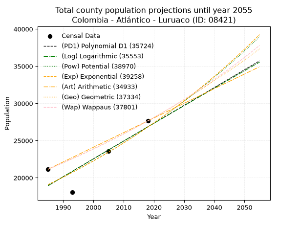
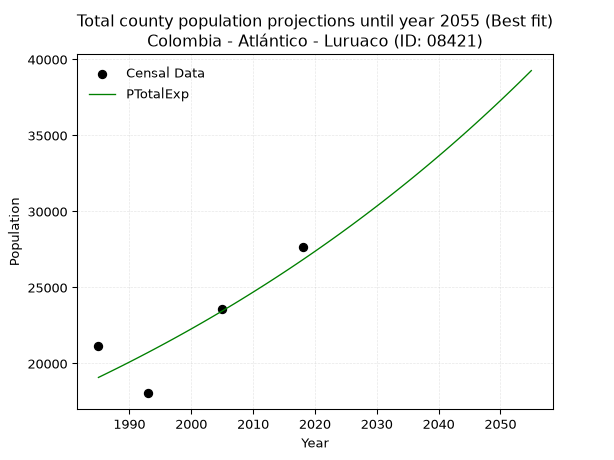
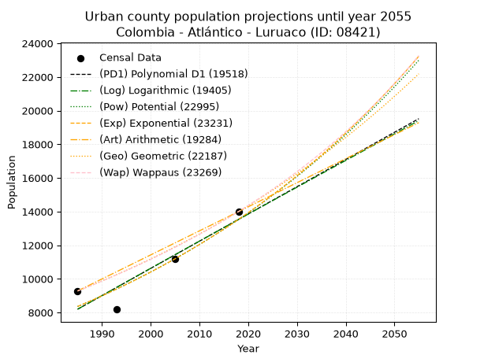
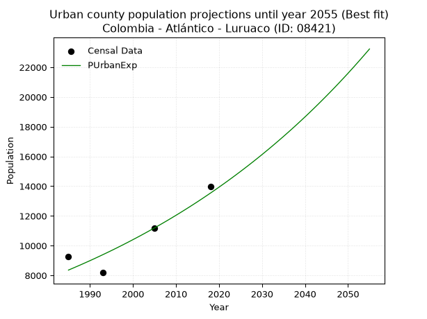
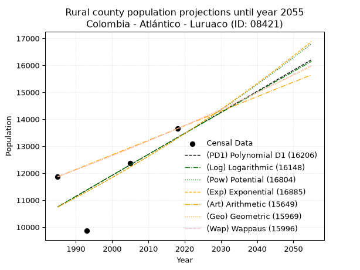
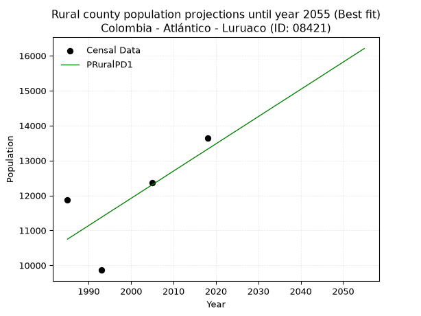

<div align="center">


</div>

# 📜 _“Population and Public Services Demand Projections (PPSD) until Year 2050 for Colombia - Atlántico - Luruaco (ID: 08421)”_
Keywords: `population` `public-service` `projection` `lineal` `polynomial` `logarithmic` `potential` `exponential` `arithmetic` `geometric` `wappaus` `dane` `colombia` `south-america`

PPSD are analytical estimates used by governments and planners to anticipate future changes in population size, age distribution, and the resulting community needs for utilities, healthcare, education, and infrastructure as sizing future water treatment facilities, electrical grids, and road networks based on spatial growth.

<div align="center">

</img>

</div>


> **General running parameters**: • app_version: _v20260806_. • Python version: _3.14.7_. • Pandas version: _3.0.5_. • NumPy version: _2.5.1_. • Creates, save and include plots into reports (create_plot): _False_. • Projection until year: _2050_. • Process polynomial degree 2 and up: _False_. • Process Wappaus: _True_. • Process Wappaus: _True_. • Set negative values to zero: _True_. • Set infinite values to zero: _True_. • Drop dataset notes: _True_. 
<div align="center">

Maps & GIS Layers: [:earth_americas:Google](http://maps.google.com/maps?q=10.61049101,-75.1419895) [:earth_americas:OSM](https://www.openstreetmap.org/#map=18/10.61049101/-75.1419895&layers=P) [:earth_americas:Bing](https://www.bing.com/maps?cp=10.61049101~-75.1419895&lvl=18) [:earth_americas:Apple](https://maps.apple.com/frame?center=10.61049101%2C-75.1419895&span=0.003%2C0.006) [:earth_americas:GISMobile](https://github.com/rcfdtools/R.GISMobile/blob/main/file/gis/CountyLayer_CO/Readme.md)

</div>


<div align="center">

```geojson
{
  "type": "Feature",
  "geometry": {
    "type": "Point", 
    "coordinates": [-75.1419895, 10.61049101]
  }, 
  "properties": {
    "Name": "Colombia - Atlántico - Luruaco (ID: 08421)"
  }
}
```

</div>


## 0. Census Data (4 records)

Census data are official statistics collected by a government about the people and housing in a country. They usually include counts of total population, age, sex, race, income, education, and jobs.

📅Global census file: [Population.xlsx](../data/Population.xlsx)

| Source   |   Year |   CountryID | CountryName   |   StateID | StateName   |   CountyID | CountyName   |   PTotal |   PUrban |   PRural |
|:---------|-------:|------------:|:--------------|----------:|:------------|-----------:|:-------------|---------:|---------:|---------:|
| DANE     |   1985 |          57 | Colombia      |        08 | Atlántico   |      08421 | Luruaco      |    21149 |     9280 |    11869 |
| DANE     |   1993 |          57 | Colombia      |        08 | Atlántico   |      08421 | Luruaco      |    18046 |     8183 |     9863 |
| DANE     |   2005 |          57 | Colombia      |        08 | Atlántico   |      08421 | Luruaco      |    23558 |    11190 |    12368 |
| DANE     |   2018 |          57 | Colombia      |        08 | Atlántico   |      08421 | Luruaco      |    27647 |    13996 |    13651 |

> 🔥Some records could had specific notes about the registered values or the corresponding urban or rural distribution.

📅[SUI-RUPS](https://www.datos.gov.co/Hacienda-y-Cr-dito-P-blico/Registro-nico-de-Prestadores-de-Servicios-P-blicos/4qkq-csdn/about_data) - Local public utility companies: [RUPS.csv](../data/RUPS.csv)

 | SERVICIO       | ESTADO      | NOMBRE                                                                          | NIT         | DEPARTAMENTO_DOMICILIO   | MUNICIPIO_DOMICILIO   | DIRECCION                                  |   TELEFONO | EMAIL                                | TIPO_PRESTADOR                             | CLASIFICACION                  |
|:---------------|:------------|:--------------------------------------------------------------------------------|:------------|:-------------------------|:----------------------|:-------------------------------------------|-----------:|:-------------------------------------|:-------------------------------------------|:-------------------------------|
| ACUEDUCTO      | CANCELACION | ALCALDIA MUNICIPAL DE LURUACO                                                   | 890103003-4 | ATLANTICO                | LURUACO               | calle 17 20 27                             |    8749000 | monica160780@yahoo.com               | nan                                        | nan                            |
| ACUEDUCTO      | OPERATIVA   | ACUEDUCTO COMUNAL DE SANTA CRUZ DEL MUNICIPIO DE LURUACO                        | 802010986-9 | ATLANTICO                | LURUACO               | CALLE 10 # 6-95                            |    3307148 | contactenos@luruaco-atlantico.gov.co | ORGANIZACION AUTORIZADA                    | HASTA 2500 SUSCRIPTORES        |
| ACUEDUCTO      | OPERATIVA   | JUNTA ADMINISTRADORA DEL ACUEDUCTO COMUNAL DE PENDALES DEL MUNICIPIO DE LURUACO | 802010799-8 | ATLANTICO                | LURUACO               | calle 2 no 9b 322                          |    6999639 | depabe@gmail.com                     | ORGANIZACION AUTORIZADA                    | HASTA 2500 SUSCRIPTORES        |
| ACUEDUCTO      | OPERATIVA   | ASOCIACION ADMINISTRADORA DEL ACUEDUCTO COMUNITARIO DE PALMAR DE CANDELARIA     | 900105552-0 | ATLANTICO                | LURUACO               | kra 4 no 4 - 41                            |    8781899 | acopalmar@yahoo.com                  | ORGANIZACION AUTORIZADA                    | HASTA 2500 SUSCRIPTORES        |
| ACUEDUCTO      | OPERATIVA   | ACUEDUCTO COMUNAL DE ARROYO DE PIEDRA DEL MUNICIPIO DE LURUACO                  | 802012432-1 | ATLANTICO                | LURUACO               | CALLE 3 No. 5-38                           |    3991020 | nila.cantillo@hotmail.com            | ORGANIZACION AUTORIZADA                    | MENOR O IGUAL A 2500 USUARIOS  |
| ACUEDUCTO      | OPERATIVA   | ACUEDUCTO COMUNAL DE SAN JUAN DE TOCAGUA DEL MUNICIPIO DE LURUACO               | 802020217-6 | ATLANTICO                | LURUACO               | calle 2 No 2a -09                          |    3555555 | acosat1@yahoo.com                    | ORGANIZACION AUTORIZADA                    | HASTA 2500 SUSCRIPTORES        |
| ACUEDUCTO      | OPERATIVA   | AGUAS DEL SUR DEL ATLANTICO S.A E.S.P                                           | 901136686-5 | ATLANTICO                | BARRANQUILLA          | CR 53 N 110-00 Ed. BC Empresarial Of. 1603 |    3116739 | rmendoza@naunet.co                   | SOCIEDADES (EMPRESA DE SERVICIOS PUBLICOS) | DESDE 2501 HASTA 5000 USUARIOS |
| ALCANTARILLADO | OPERATIVA   | AGUAS DEL SUR DEL ATLANTICO S.A E.S.P                                           | 901136686-5 | ATLANTICO                | BARRANQUILLA          | CR 53 N 110-00 Ed. BC Empresarial Of. 1603 |    3116739 | rmendoza@naunet.co                   | SOCIEDADES (EMPRESA DE SERVICIOS PUBLICOS) | DESDE 2501 HASTA 5000 USUARIOS |

## 1. Total

### 1.1. Coefficients and Parameters

* (PD1) Polynomial Deg 1: 239.70935367322085, -456878.63468485995 (lineal)
* (Log) Logarithmic: 479315.9980172014, -3620684.741926098
* (Pow) Potential: 20.60851070514757, -63.68139242364913
* (Exp) Exponential: 0.01030655123144128, 2.4865009582368112e-05
* (Art) Arithmetic: Year diff. 2018 - 1985 = 33, Population diff. 27647 - 21149 = 6498, Annual growth = 196.9090909090909
* (Geo) Geometric: Year diff. 2018 - 1985 = 33, Population diff. 27647 - 21149 = 6498, Annual growth % = 0.008151975137983936
* (Wap) Wappaus: i = 0.8070706242687553, Condition values only valid for < 200)

<sub>
Wappaus condition values: ['0.00', '0.81', '1.61', '2.42', '3.23', '4.04', '4.84', '5.65', '6.46', '7.26', '8.07', '8.88', '9.68', '10.49', '11.30', '12.11', '12.91', '13.72', '14.53', '15.33', '16.14', '16.95', '17.76', '18.56', '19.37', '20.18', '20.98', '21.79', '22.60', '23.41', '24.21', '25.02', '25.83', '26.63', '27.44', '28.25', '29.05', '29.86', '30.67', '31.48', '32.28', '33.09', '33.90', '34.70', '35.51', '36.32', '37.13', '37.93', '38.74', '39.55', '40.35', '41.16', '41.97', '42.77', '43.58', '44.39', '45.20', '46.00', '46.81', '47.62', '48.42', '49.23', '50.04', '50.85', '51.65', '52.46']
</sub>


### 1.2. Projected Dataset

|   Year |   CountyID |   PTotalPD1 |   PTotalLog |   PTotalPow |   PTotalExp |   PTotalArt |   PTotalGeo |   PTotalWap |
|-------:|-----------:|------------:|------------:|------------:|------------:|------------:|------------:|------------:|
|   1985 |      08421 |       18944 |       18941 |       19078 |       19081 |       21149 |       21149 |       21149 |
|   1986 |      08421 |       19184 |       19182 |       19277 |       19279 |       21346 |       21321 |       21320 |
|   1987 |      08421 |       19424 |       19424 |       19478 |       19479 |       21543 |       21495 |       21493 |
|   1988 |      08421 |       19664 |       19665 |       19681 |       19680 |       21740 |       21670 |       21667 |
|   1989 |      08421 |       19903 |       19906 |       19886 |       19884 |       21937 |       21847 |       21843 |
|   1990 |      08421 |       20143 |       20147 |       20094 |       20090 |       22134 |       22025 |       22020 |
|   1991 |      08421 |       20383 |       20388 |       20303 |       20298 |       22330 |       22205 |       22199 |
|   1992 |      08421 |       20622 |       20628 |       20514 |       20509 |       22527 |       22386 |       22379 |
|   1993 |      08421 |       20862 |       20869 |       20727 |       20721 |       22724 |       22568 |       22560 |
|   1994 |      08421 |       21102 |       21109 |       20943 |       20936 |       22921 |       22752 |       22743 |
|   1995 |      08421 |       21342 |       21350 |       21160 |       21153 |       23118 |       22938 |       22928 |
|   1996 |      08421 |       21581 |       21590 |       21380 |       21372 |       23315 |       23125 |       23114 |
|   1997 |      08421 |       21821 |       21830 |       21602 |       21593 |       23512 |       23313 |       23301 |
|   1998 |      08421 |       22061 |       22070 |       21826 |       21817 |       23709 |       23503 |       23491 |
|   1999 |      08421 |       22300 |       22310 |       22052 |       22043 |       23906 |       23695 |       23682 |
|   2000 |      08421 |       22540 |       22549 |       22280 |       22271 |       24103 |       23888 |       23874 |
|   2001 |      08421 |       22780 |       22789 |       22511 |       22502 |       24300 |       24083 |       24068 |
|   2002 |      08421 |       23019 |       23028 |       22744 |       22735 |       24496 |       24279 |       24264 |
|   2003 |      08421 |       23259 |       23268 |       22979 |       22971 |       24693 |       24477 |       24462 |
|   2004 |      08421 |       23499 |       23507 |       23217 |       23209 |       24890 |       24677 |       24661 |
|   2005 |      08421 |       23739 |       23746 |       23457 |       23449 |       25087 |       24878 |       24862 |
|   2006 |      08421 |       23978 |       23985 |       23699 |       23692 |       25284 |       25080 |       25065 |
|   2007 |      08421 |       24218 |       24224 |       23944 |       23937 |       25481 |       25285 |       25270 |
|   2008 |      08421 |       24458 |       24463 |       24191 |       24185 |       25678 |       25491 |       25476 |
|   2009 |      08421 |       24697 |       24701 |       24440 |       24436 |       25875 |       25699 |       25685 |
|   2010 |      08421 |       24937 |       24940 |       24692 |       24689 |       26072 |       25908 |       25895 |
|   2011 |      08421 |       25177 |       25178 |       24947 |       24945 |       26269 |       26120 |       26107 |
|   2012 |      08421 |       25417 |       25417 |       25203 |       25203 |       26466 |       26332 |       26321 |
|   2013 |      08421 |       25656 |       25655 |       25463 |       25464 |       26662 |       26547 |       26537 |
|   2014 |      08421 |       25896 |       25893 |       25725 |       25728 |       26859 |       26764 |       26755 |
|   2015 |      08421 |       26136 |       26131 |       25989 |       25995 |       27056 |       26982 |       26975 |
|   2016 |      08421 |       26375 |       26369 |       26256 |       26264 |       27253 |       27202 |       27197 |
|   2017 |      08421 |       26615 |       26606 |       26526 |       26536 |       27450 |       27423 |       27421 |
|   2018 |      08421 |       26855 |       26844 |       26799 |       26811 |       27647 |       27647 |       27647 |
|   2019 |      08421 |       27095 |       27081 |       27074 |       27089 |       27844 |       27872 |       27875 |
|   2020 |      08421 |       27334 |       27319 |       27351 |       27369 |       28041 |       28100 |       28106 |
|   2021 |      08421 |       27574 |       27556 |       27632 |       27653 |       28238 |       28329 |       28338 |
|   2022 |      08421 |       27814 |       27793 |       27915 |       27940 |       28435 |       28560 |       28573 |
|   2023 |      08421 |       28053 |       28030 |       28201 |       28229 |       28632 |       28792 |       28810 |
|   2024 |      08421 |       28293 |       28267 |       28489 |       28521 |       28828 |       29027 |       29049 |
|   2025 |      08421 |       28533 |       28504 |       28781 |       28817 |       29025 |       29264 |       29291 |
|   2026 |      08421 |       28773 |       28740 |       29075 |       29115 |       29222 |       29502 |       29535 |
|   2027 |      08421 |       29012 |       28977 |       29372 |       29417 |       29419 |       29743 |       29781 |
|   2028 |      08421 |       29252 |       29213 |       29672 |       29722 |       29616 |       29985 |       30030 |
|   2029 |      08421 |       29492 |       29450 |       29975 |       30030 |       29813 |       30230 |       30281 |
|   2030 |      08421 |       29731 |       29686 |       30281 |       30341 |       30010 |       30476 |       30534 |
|   2031 |      08421 |       29971 |       29922 |       30590 |       30655 |       30207 |       30725 |       30790 |
|   2032 |      08421 |       30211 |       30158 |       30902 |       30973 |       30404 |       30975 |       31049 |
|   2033 |      08421 |       30450 |       30394 |       31217 |       31294 |       30601 |       31228 |       31310 |
|   2034 |      08421 |       30690 |       30629 |       31535 |       31618 |       30798 |       31482 |       31574 |
|   2035 |      08421 |       30930 |       30865 |       31856 |       31945 |       30994 |       31739 |       31841 |
|   2036 |      08421 |       31170 |       31100 |       32180 |       32276 |       31191 |       31998 |       32110 |
|   2037 |      08421 |       31409 |       31336 |       32508 |       32611 |       31388 |       32258 |       32382 |
|   2038 |      08421 |       31649 |       31571 |       32838 |       32949 |       31585 |       32521 |       32657 |
|   2039 |      08421 |       31889 |       31806 |       33172 |       33290 |       31782 |       32786 |       32934 |
|   2040 |      08421 |       32128 |       32041 |       33509 |       33635 |       31979 |       33054 |       33215 |
|   2041 |      08421 |       32368 |       32276 |       33849 |       33983 |       32176 |       33323 |       33498 |
|   2042 |      08421 |       32608 |       32511 |       34192 |       34335 |       32373 |       33595 |       33785 |
|   2043 |      08421 |       32848 |       32745 |       34539 |       34691 |       32570 |       33869 |       34074 |
|   2044 |      08421 |       33087 |       32980 |       34889 |       35050 |       32767 |       34145 |       34366 |
|   2045 |      08421 |       33327 |       33214 |       35242 |       35413 |       32964 |       34423 |       34662 |
|   2046 |      08421 |       33567 |       33449 |       35599 |       35780 |       33160 |       34704 |       34961 |
|   2047 |      08421 |       33806 |       33683 |       35960 |       36151 |       33357 |       34987 |       35263 |
|   2048 |      08421 |       34046 |       33917 |       36323 |       36526 |       33554 |       35272 |       35568 |
|   2049 |      08421 |       34286 |       34151 |       36691 |       36904 |       33751 |       35559 |       35877 |
|   2050 |      08421 |       34526 |       34385 |       37061 |       37286 |       33948 |       35849 |       36189 |
<div align="center">

</img>

</div>


### 1.3. Best fit with absolute and relative error (%)

Relative error puts that difference into context by dividing the absolute error by the true value, creating a unitless ratio or percentage that shows the scale of the mistake.

Absolute and relative error

|   Year | Source   |   CountryID | CountryName   |   StateID | StateName   |   CountyID_x | CountyName   |   PTotal |   PUrban |   PRural |   CountyID_y |   PTotalPD1 |   PTotalLog |   PTotalPow |   PTotalExp |   PTotalArt |   PTotalGeo |   PTotalWap |   PTotalPD1AbsError |   PTotalLogAbsError |   PTotalPowAbsError |   PTotalExpAbsError |   PTotalArtAbsError |   PTotalGeoAbsError |   PTotalWapAbsError |   PTotalPD1RelError |   PTotalLogRelError |   PTotalPowRelError |   PTotalExpRelError |   PTotalArtRelError |   PTotalGeoRelError |   PTotalWapRelError |
|-------:|:---------|------------:|:--------------|----------:|:------------|-------------:|:-------------|---------:|---------:|---------:|-------------:|------------:|------------:|------------:|------------:|------------:|------------:|------------:|--------------------:|--------------------:|--------------------:|--------------------:|--------------------:|--------------------:|--------------------:|--------------------:|--------------------:|--------------------:|--------------------:|--------------------:|--------------------:|--------------------:|
|   1985 | DANE     |          57 | Colombia      |        08 | Atlántico   |        08421 | Luruaco      |    21149 |     9280 |    11869 |        08421 |       18944 |       18941 |       19078 |       19081 |       21149 |       21149 |       21149 |                2205 |                2208 |                2071 |                2068 |                   0 |                   0 |                   0 |           10.426    |            10.4402  |            9.79243  |            9.77824  |             0       |             0       |             0       |
|   1993 | DANE     |          57 | Colombia      |        08 | Atlántico   |        08421 | Luruaco      |    18046 |     8183 |     9863 |        08421 |       20862 |       20869 |       20727 |       20721 |       22724 |       22568 |       22560 |                2816 |                2823 |                2681 |                2675 |                4678 |                4522 |                4514 |           15.6046   |            15.6434  |           14.8565   |           14.8232   |            25.9226  |            25.0582  |            25.0139  |
|   2005 | DANE     |          57 | Colombia      |        08 | Atlántico   |        08421 | Luruaco      |    23558 |    11190 |    12368 |        08421 |       23739 |       23746 |       23457 |       23449 |       25087 |       24878 |       24862 |                 181 |                 188 |                 101 |                 109 |                1529 |                1320 |                1304 |            0.768316 |             0.79803 |            0.428729 |            0.462688 |             6.49036 |             5.60319 |             5.53527 |
|   2018 | DANE     |          57 | Colombia      |        08 | Atlántico   |        08421 | Luruaco      |    27647 |    13996 |    13651 |        08421 |       26855 |       26844 |       26799 |       26811 |       27647 |       27647 |       27647 |                 792 |                 803 |                 848 |                 836 |                   0 |                   0 |                   0 |            2.86469  |             2.90447 |            3.06724  |            3.02384  |             0       |             0       |             0       |

Relative error mean

| Method    |   RelError | Best   |
|:----------|-----------:|:-------|
| PTotalPD1 |    7.4159  |        |
| PTotalLog |    7.44652 |        |
| PTotalPow |    7.03622 |        |
| PTotalExp |    7.022   | True   |
| PTotalArt |    8.10325 |        |
| PTotalGeo |    7.66534 |        |
| PTotalWap |    7.63728 |        |

💙Best method: _**PTotalExp**_
<div align="center">

</img>

</div>


### 1.4. Fresh water supply demand in liters per capita per day (lpcd)

The fresh water supply demand typically ranges from 100 to 300 liters per capita per day (lpcd) for standard domestic and municipal planning, though absolute survival minimums set by the World Health Organization are as low as 7.5 to 20 liters per day, and total consumption in high-income nations can exceed 400 liters.

> `CZ`: Level in meters above the sea level (masl)<br> `WS`: Fresh water supply demand in liters per capita per day (lpcd or l/h/d)<br> `WSAll`: Zonal fresh water supply demand in liters per second (l/s)<br> `A`: Zonal area in square meters<br> `DP`: Population density (people/hectare or p/ha)

Reference values (RAS Colombia)

|    CZ |   WS |
|------:|-----:|
|  1000 |  120 |
|  2000 |  130 |
| 99999 |  140 |

County shapefile geometry properties and water supply values

|   CountyID |      ATotal |   CZTotal |   WSTotal |
|-----------:|------------:|----------:|----------:|
|      08421 | 2.23597e+08 |   72.5396 |       120 |

Projected values for best method: PTotalExp

|   CountyID |   Year |   PTotalExp |   DPTotal |   WSTotal |   WSTotalAll |
|-----------:|-------:|------------:|----------:|----------:|-------------:|
|      08421 |   1985 |       19081 |      0.85 |       120 |      26.5014 |
|      08421 |   1986 |       19279 |      0.86 |       120 |      26.7764 |
|      08421 |   1987 |       19479 |      0.87 |       120 |      27.0542 |
|      08421 |   1988 |       19680 |      0.88 |       120 |      27.3333 |
|      08421 |   1989 |       19884 |      0.89 |       120 |      27.6167 |
|      08421 |   1990 |       20090 |      0.9  |       120 |      27.9028 |
|      08421 |   1991 |       20298 |      0.91 |       120 |      28.1917 |
|      08421 |   1992 |       20509 |      0.92 |       120 |      28.4847 |
|      08421 |   1993 |       20721 |      0.93 |       120 |      28.7792 |
|      08421 |   1994 |       20936 |      0.94 |       120 |      29.0778 |
|      08421 |   1995 |       21153 |      0.95 |       120 |      29.3792 |
|      08421 |   1996 |       21372 |      0.96 |       120 |      29.6833 |
|      08421 |   1997 |       21593 |      0.97 |       120 |      29.9903 |
|      08421 |   1998 |       21817 |      0.98 |       120 |      30.3014 |
|      08421 |   1999 |       22043 |      0.99 |       120 |      30.6153 |
|      08421 |   2000 |       22271 |      1    |       120 |      30.9319 |
|      08421 |   2001 |       22502 |      1.01 |       120 |      31.2528 |
|      08421 |   2002 |       22735 |      1.02 |       120 |      31.5764 |
|      08421 |   2003 |       22971 |      1.03 |       120 |      31.9042 |
|      08421 |   2004 |       23209 |      1.04 |       120 |      32.2347 |
|      08421 |   2005 |       23449 |      1.05 |       120 |      32.5681 |
|      08421 |   2006 |       23692 |      1.06 |       120 |      32.9056 |
|      08421 |   2007 |       23937 |      1.07 |       120 |      33.2458 |
|      08421 |   2008 |       24185 |      1.08 |       120 |      33.5903 |
|      08421 |   2009 |       24436 |      1.09 |       120 |      33.9389 |
|      08421 |   2010 |       24689 |      1.1  |       120 |      34.2903 |
|      08421 |   2011 |       24945 |      1.12 |       120 |      34.6458 |
|      08421 |   2012 |       25203 |      1.13 |       120 |      35.0042 |
|      08421 |   2013 |       25464 |      1.14 |       120 |      35.3667 |
|      08421 |   2014 |       25728 |      1.15 |       120 |      35.7333 |
|      08421 |   2015 |       25995 |      1.16 |       120 |      36.1042 |
|      08421 |   2016 |       26264 |      1.17 |       120 |      36.4778 |
|      08421 |   2017 |       26536 |      1.19 |       120 |      36.8556 |
|      08421 |   2018 |       26811 |      1.2  |       120 |      37.2375 |
|      08421 |   2019 |       27089 |      1.21 |       120 |      37.6236 |
|      08421 |   2020 |       27369 |      1.22 |       120 |      38.0125 |
|      08421 |   2021 |       27653 |      1.24 |       120 |      38.4069 |
|      08421 |   2022 |       27940 |      1.25 |       120 |      38.8056 |
|      08421 |   2023 |       28229 |      1.26 |       120 |      39.2069 |
|      08421 |   2024 |       28521 |      1.28 |       120 |      39.6125 |
|      08421 |   2025 |       28817 |      1.29 |       120 |      40.0236 |
|      08421 |   2026 |       29115 |      1.3  |       120 |      40.4375 |
|      08421 |   2027 |       29417 |      1.32 |       120 |      40.8569 |
|      08421 |   2028 |       29722 |      1.33 |       120 |      41.2806 |
|      08421 |   2029 |       30030 |      1.34 |       120 |      41.7083 |
|      08421 |   2030 |       30341 |      1.36 |       120 |      42.1403 |
|      08421 |   2031 |       30655 |      1.37 |       120 |      42.5764 |
|      08421 |   2032 |       30973 |      1.39 |       120 |      43.0181 |
|      08421 |   2033 |       31294 |      1.4  |       120 |      43.4639 |
|      08421 |   2034 |       31618 |      1.41 |       120 |      43.9139 |
|      08421 |   2035 |       31945 |      1.43 |       120 |      44.3681 |
|      08421 |   2036 |       32276 |      1.44 |       120 |      44.8278 |
|      08421 |   2037 |       32611 |      1.46 |       120 |      45.2931 |
|      08421 |   2038 |       32949 |      1.47 |       120 |      45.7625 |
|      08421 |   2039 |       33290 |      1.49 |       120 |      46.2361 |
|      08421 |   2040 |       33635 |      1.5  |       120 |      46.7153 |
|      08421 |   2041 |       33983 |      1.52 |       120 |      47.1986 |
|      08421 |   2042 |       34335 |      1.54 |       120 |      47.6875 |
|      08421 |   2043 |       34691 |      1.55 |       120 |      48.1819 |
|      08421 |   2044 |       35050 |      1.57 |       120 |      48.6806 |
|      08421 |   2045 |       35413 |      1.58 |       120 |      49.1847 |
|      08421 |   2046 |       35780 |      1.6  |       120 |      49.6944 |
|      08421 |   2047 |       36151 |      1.62 |       120 |      50.2097 |
|      08421 |   2048 |       36526 |      1.63 |       120 |      50.7306 |
|      08421 |   2049 |       36904 |      1.65 |       120 |      51.2556 |
|      08421 |   2050 |       37286 |      1.67 |       120 |      51.7861 |

## 2. Urban

### 2.1. Coefficients and Parameters

* (PD1) Polynomial Deg 1: 161.75792854275196, -312894.0465676397 (lineal)
* (Log) Logarithmic: 323517.43252244993, -2448396.3471091427
* (Pow) Potential: 29.20966673409428, -92.40450143060339
* (Exp) Exponential: 0.014604139399655628, 2.1490360667550957e-09
* (Art) Arithmetic: Year diff. 2018 - 1985 = 33, Population diff. 13996 - 9280 = 4716, Annual growth = 142.9090909090909
* (Geo) Geometric: Year diff. 2018 - 1985 = 33, Population diff. 13996 - 9280 = 4716, Annual growth % = 0.012529665695248937
* (Wap) Wappaus: i = 1.2279523192051118, Condition values only valid for < 200)

<sub>
Wappaus condition values: ['0.00', '1.23', '2.46', '3.68', '4.91', '6.14', '7.37', '8.60', '9.82', '11.05', '12.28', '13.51', '14.74', '15.96', '17.19', '18.42', '19.65', '20.88', '22.10', '23.33', '24.56', '25.79', '27.01', '28.24', '29.47', '30.70', '31.93', '33.15', '34.38', '35.61', '36.84', '38.07', '39.29', '40.52', '41.75', '42.98', '44.21', '45.43', '46.66', '47.89', '49.12', '50.35', '51.57', '52.80', '54.03', '55.26', '56.49', '57.71', '58.94', '60.17', '61.40', '62.63', '63.85', '65.08', '66.31', '67.54', '68.77', '69.99', '71.22', '72.45', '73.68', '74.91', '76.13', '77.36', '78.59', '79.82']
</sub>


### 2.2. Projected Dataset

|   Year |   CountyID |   PUrbanPD1 |   PUrbanLog |   PUrbanPow |   PUrbanExp |   PUrbanArt |   PUrbanGeo |   PUrbanWap |
|-------:|-----------:|------------:|------------:|------------:|------------:|------------:|------------:|------------:|
|   1985 |      08421 |        8195 |        8193 |        8356 |        8358 |        9280 |        9280 |        9280 |
|   1986 |      08421 |        8357 |        8356 |        8480 |        8481 |        9423 |        9396 |        9395 |
|   1987 |      08421 |        8519 |        8518 |        8605 |        8606 |        9566 |        9514 |        9511 |
|   1988 |      08421 |        8681 |        8681 |        8733 |        8732 |        9709 |        9633 |        9628 |
|   1989 |      08421 |        8842 |        8844 |        8862 |        8861 |        9852 |        9754 |        9747 |
|   1990 |      08421 |        9004 |        9006 |        8993 |        8991 |        9995 |        9876 |        9868 |
|   1991 |      08421 |        9166 |        9169 |        9126 |        9123 |       10137 |       10000 |        9990 |
|   1992 |      08421 |        9328 |        9331 |        9261 |        9258 |       10280 |       10125 |       10114 |
|   1993 |      08421 |        9490 |        9494 |        9397 |        9394 |       10423 |       10252 |       10239 |
|   1994 |      08421 |        9651 |        9656 |        9536 |        9532 |       10566 |       10380 |       10366 |
|   1995 |      08421 |        9813 |        9818 |        9677 |        9672 |       10709 |       10511 |       10494 |
|   1996 |      08421 |        9975 |        9980 |        9819 |        9814 |       10852 |       10642 |       10624 |
|   1997 |      08421 |       10137 |       10142 |        9964 |        9959 |       10995 |       10776 |       10756 |
|   1998 |      08421 |       10298 |       10304 |       10111 |       10105 |       11138 |       10911 |       10890 |
|   1999 |      08421 |       10460 |       10466 |       10260 |       10254 |       11281 |       11047 |       11025 |
|   2000 |      08421 |       10622 |       10628 |       10411 |       10405 |       11424 |       11186 |       11163 |
|   2001 |      08421 |       10784 |       10790 |       10564 |       10558 |       11567 |       11326 |       11302 |
|   2002 |      08421 |       10945 |       10951 |       10719 |       10713 |       11709 |       11468 |       11443 |
|   2003 |      08421 |       11107 |       11113 |       10877 |       10871 |       11852 |       11611 |       11586 |
|   2004 |      08421 |       11269 |       11274 |       11036 |       11031 |       11995 |       11757 |       11731 |
|   2005 |      08421 |       11431 |       11436 |       11198 |       11193 |       12138 |       11904 |       11878 |
|   2006 |      08421 |       11592 |       11597 |       11363 |       11358 |       12281 |       12053 |       12027 |
|   2007 |      08421 |       11754 |       11758 |       11529 |       11525 |       12424 |       12204 |       12179 |
|   2008 |      08421 |       11916 |       11920 |       11698 |       11694 |       12567 |       12357 |       12332 |
|   2009 |      08421 |       12078 |       12081 |       11870 |       11866 |       12710 |       12512 |       12488 |
|   2010 |      08421 |       12239 |       12242 |       12044 |       12041 |       12853 |       12669 |       12645 |
|   2011 |      08421 |       12401 |       12403 |       12220 |       12218 |       12996 |       12828 |       12806 |
|   2012 |      08421 |       12563 |       12563 |       12399 |       12398 |       13139 |       12988 |       12968 |
|   2013 |      08421 |       12725 |       12724 |       12580 |       12580 |       13281 |       13151 |       13133 |
|   2014 |      08421 |       12886 |       12885 |       12764 |       12765 |       13424 |       13316 |       13301 |
|   2015 |      08421 |       13048 |       13045 |       12950 |       12953 |       13567 |       13483 |       13470 |
|   2016 |      08421 |       13210 |       13206 |       13139 |       13144 |       13710 |       13652 |       13643 |
|   2017 |      08421 |       13372 |       13366 |       13331 |       13337 |       13853 |       13823 |       13818 |
|   2018 |      08421 |       13533 |       13527 |       13525 |       13533 |       13996 |       13996 |       13996 |
|   2019 |      08421 |       13695 |       13687 |       13722 |       13732 |       14139 |       14171 |       14177 |
|   2020 |      08421 |       13857 |       13847 |       13922 |       13934 |       14282 |       14349 |       14360 |
|   2021 |      08421 |       14019 |       14007 |       14125 |       14139 |       14425 |       14529 |       14546 |
|   2022 |      08421 |       14180 |       14167 |       14331 |       14347 |       14568 |       14711 |       14736 |
|   2023 |      08421 |       14342 |       14327 |       14539 |       14558 |       14711 |       14895 |       14928 |
|   2024 |      08421 |       14504 |       14487 |       14750 |       14773 |       14853 |       15082 |       15123 |
|   2025 |      08421 |       14666 |       14647 |       14965 |       14990 |       14996 |       15271 |       15322 |
|   2026 |      08421 |       14828 |       14807 |       15182 |       15210 |       15139 |       15462 |       15524 |
|   2027 |      08421 |       14989 |       14966 |       15403 |       15434 |       15282 |       15656 |       15729 |
|   2028 |      08421 |       15151 |       15126 |       15626 |       15661 |       15425 |       15852 |       15938 |
|   2029 |      08421 |       15313 |       15285 |       15853 |       15892 |       15568 |       16051 |       16150 |
|   2030 |      08421 |       15475 |       15445 |       16083 |       16125 |       15711 |       16252 |       16366 |
|   2031 |      08421 |       15636 |       15604 |       16316 |       16363 |       15854 |       16455 |       16585 |
|   2032 |      08421 |       15798 |       15763 |       16552 |       16603 |       15997 |       16661 |       16808 |
|   2033 |      08421 |       15960 |       15923 |       16791 |       16848 |       16140 |       16870 |       17035 |
|   2034 |      08421 |       16122 |       16082 |       17034 |       17096 |       16283 |       17082 |       17266 |
|   2035 |      08421 |       16283 |       16241 |       17281 |       17347 |       16425 |       17296 |       17502 |
|   2036 |      08421 |       16445 |       16400 |       17531 |       17602 |       16568 |       17512 |       17741 |
|   2037 |      08421 |       16607 |       16558 |       17784 |       17861 |       16711 |       17732 |       17985 |
|   2038 |      08421 |       16769 |       16717 |       18041 |       18124 |       16854 |       17954 |       18233 |
|   2039 |      08421 |       16930 |       16876 |       18301 |       18391 |       16997 |       18179 |       18486 |
|   2040 |      08421 |       17092 |       17035 |       18565 |       18661 |       17140 |       18407 |       18743 |
|   2041 |      08421 |       17254 |       17193 |       18833 |       18936 |       17283 |       18637 |       19005 |
|   2042 |      08421 |       17416 |       17352 |       19104 |       19214 |       17426 |       18871 |       19272 |
|   2043 |      08421 |       17577 |       17510 |       19379 |       19497 |       17569 |       19107 |       19545 |
|   2044 |      08421 |       17739 |       17668 |       19658 |       19784 |       17712 |       19347 |       19822 |
|   2045 |      08421 |       17901 |       17827 |       19941 |       20075 |       17855 |       19589 |       20105 |
|   2046 |      08421 |       18063 |       17985 |       20228 |       20370 |       17997 |       19834 |       20393 |
|   2047 |      08421 |       18224 |       18143 |       20519 |       20670 |       18140 |       20083 |       20688 |
|   2048 |      08421 |       18386 |       18301 |       20813 |       20974 |       18283 |       20335 |       20988 |
|   2049 |      08421 |       18548 |       18459 |       21112 |       21282 |       18426 |       20589 |       21294 |
|   2050 |      08421 |       18710 |       18617 |       21415 |       21595 |       18569 |       20847 |       21606 |
<div align="center">

</img>

</div>


### 2.3. Best fit with absolute and relative error (%)

Relative error puts that difference into context by dividing the absolute error by the true value, creating a unitless ratio or percentage that shows the scale of the mistake.

Absolute and relative error

|   Year | Source   |   CountryID | CountryName   |   StateID | StateName   |   CountyID_x | CountyName   |   PTotal |   PUrban |   PRural |   CountyID_y |   PUrbanPD1 |   PUrbanLog |   PUrbanPow |   PUrbanExp |   PUrbanArt |   PUrbanGeo |   PUrbanWap |   PUrbanPD1AbsError |   PUrbanLogAbsError |   PUrbanPowAbsError |   PUrbanExpAbsError |   PUrbanArtAbsError |   PUrbanGeoAbsError |   PUrbanWapAbsError |   PUrbanPD1RelError |   PUrbanLogRelError |   PUrbanPowRelError |   PUrbanExpRelError |   PUrbanArtRelError |   PUrbanGeoRelError |   PUrbanWapRelError |
|-------:|:---------|------------:|:--------------|----------:|:------------|-------------:|:-------------|---------:|---------:|---------:|-------------:|------------:|------------:|------------:|------------:|------------:|------------:|------------:|--------------------:|--------------------:|--------------------:|--------------------:|--------------------:|--------------------:|--------------------:|--------------------:|--------------------:|--------------------:|--------------------:|--------------------:|--------------------:|--------------------:|
|   1985 | DANE     |          57 | Colombia      |        08 | Atlántico   |        08421 | Luruaco      |    21149 |     9280 |    11869 |        08421 |        8195 |        8193 |        8356 |        8358 |        9280 |        9280 |        9280 |                1085 |                1087 |                 924 |                 922 |                   0 |                   0 |                   0 |            11.6918  |            11.7134  |           9.9569    |           9.93534   |             0       |              0      |             0       |
|   1993 | DANE     |          57 | Colombia      |        08 | Atlántico   |        08421 | Luruaco      |    18046 |     8183 |     9863 |        08421 |        9490 |        9494 |        9397 |        9394 |       10423 |       10252 |       10239 |                1307 |                1311 |                1214 |                1211 |                2240 |                2069 |                2056 |            15.9721  |            16.021   |          14.8356    |          14.799     |            27.3738  |             25.2841 |            25.1253  |
|   2005 | DANE     |          57 | Colombia      |        08 | Atlántico   |        08421 | Luruaco      |    23558 |    11190 |    12368 |        08421 |       11431 |       11436 |       11198 |       11193 |       12138 |       11904 |       11878 |                 241 |                 246 |                   8 |                   3 |                 948 |                 714 |                 688 |             2.15371 |             2.19839 |           0.0714924 |           0.0268097 |             8.47185 |              6.3807 |             6.14835 |
|   2018 | DANE     |          57 | Colombia      |        08 | Atlántico   |        08421 | Luruaco      |    27647 |    13996 |    13651 |        08421 |       13533 |       13527 |       13525 |       13533 |       13996 |       13996 |       13996 |                 463 |                 469 |                 471 |                 463 |                   0 |                   0 |                   0 |             3.30809 |             3.35096 |           3.36525   |           3.30809   |             0       |              0      |             0       |

Relative error mean

| Method    |   RelError | Best   |
|:----------|-----------:|:-------|
| PUrbanPD1 |    8.28144 |        |
| PUrbanLog |    8.32093 |        |
| PUrbanPow |    7.05732 |        |
| PUrbanExp |    7.0173  | True   |
| PUrbanArt |    8.96142 |        |
| PUrbanGeo |    7.91621 |        |
| PUrbanWap |    7.8184  |        |

💙Best method: _**PUrbanExp**_
<div align="center">

</img>

</div>


### 2.4. Fresh water supply demand in liters per capita per day (lpcd)

The fresh water supply demand typically ranges from 100 to 300 liters per capita per day (lpcd) for standard domestic and municipal planning, though absolute survival minimums set by the World Health Organization are as low as 7.5 to 20 liters per day, and total consumption in high-income nations can exceed 400 liters.

> `CZ`: Level in meters above the sea level (masl)<br> `WS`: Fresh water supply demand in liters per capita per day (lpcd or l/h/d)<br> `WSAll`: Zonal fresh water supply demand in liters per second (l/s)<br> `A`: Zonal area in square meters<br> `DP`: Population density (people/hectare or p/ha)

Reference values (RAS Colombia)

|    CZ |   WS |
|------:|-----:|
|  1000 |  120 |
|  2000 |  130 |
| 99999 |  140 |

County shapefile geometry properties and water supply values

|   CountyID |      AUrban |   CZUrban |   WSUrban |
|-----------:|------------:|----------:|----------:|
|      08421 | 1.34006e+06 |   36.5669 |       120 |

Projected values for best method: PUrbanExp

|   CountyID |   Year |   PUrbanExp |   DPUrban |   WSUrban |   WSUrbanAll |
|-----------:|-------:|------------:|----------:|----------:|-------------:|
|      08421 |   1985 |        8358 |     62.37 |       120 |      11.6083 |
|      08421 |   1986 |        8481 |     63.29 |       120 |      11.7792 |
|      08421 |   1987 |        8606 |     64.22 |       120 |      11.9528 |
|      08421 |   1988 |        8732 |     65.16 |       120 |      12.1278 |
|      08421 |   1989 |        8861 |     66.12 |       120 |      12.3069 |
|      08421 |   1990 |        8991 |     67.09 |       120 |      12.4875 |
|      08421 |   1991 |        9123 |     68.08 |       120 |      12.6708 |
|      08421 |   1992 |        9258 |     69.09 |       120 |      12.8583 |
|      08421 |   1993 |        9394 |     70.1  |       120 |      13.0472 |
|      08421 |   1994 |        9532 |     71.13 |       120 |      13.2389 |
|      08421 |   1995 |        9672 |     72.18 |       120 |      13.4333 |
|      08421 |   1996 |        9814 |     73.24 |       120 |      13.6306 |
|      08421 |   1997 |        9959 |     74.32 |       120 |      13.8319 |
|      08421 |   1998 |       10105 |     75.41 |       120 |      14.0347 |
|      08421 |   1999 |       10254 |     76.52 |       120 |      14.2417 |
|      08421 |   2000 |       10405 |     77.65 |       120 |      14.4514 |
|      08421 |   2001 |       10558 |     78.79 |       120 |      14.6639 |
|      08421 |   2002 |       10713 |     79.94 |       120 |      14.8792 |
|      08421 |   2003 |       10871 |     81.12 |       120 |      15.0986 |
|      08421 |   2004 |       11031 |     82.32 |       120 |      15.3208 |
|      08421 |   2005 |       11193 |     83.53 |       120 |      15.5458 |
|      08421 |   2006 |       11358 |     84.76 |       120 |      15.775  |
|      08421 |   2007 |       11525 |     86    |       120 |      16.0069 |
|      08421 |   2008 |       11694 |     87.26 |       120 |      16.2417 |
|      08421 |   2009 |       11866 |     88.55 |       120 |      16.4806 |
|      08421 |   2010 |       12041 |     89.85 |       120 |      16.7236 |
|      08421 |   2011 |       12218 |     91.17 |       120 |      16.9694 |
|      08421 |   2012 |       12398 |     92.52 |       120 |      17.2194 |
|      08421 |   2013 |       12580 |     93.88 |       120 |      17.4722 |
|      08421 |   2014 |       12765 |     95.26 |       120 |      17.7292 |
|      08421 |   2015 |       12953 |     96.66 |       120 |      17.9903 |
|      08421 |   2016 |       13144 |     98.08 |       120 |      18.2556 |
|      08421 |   2017 |       13337 |     99.53 |       120 |      18.5236 |
|      08421 |   2018 |       13533 |    100.99 |       120 |      18.7958 |
|      08421 |   2019 |       13732 |    102.47 |       120 |      19.0722 |
|      08421 |   2020 |       13934 |    103.98 |       120 |      19.3528 |
|      08421 |   2021 |       14139 |    105.51 |       120 |      19.6375 |
|      08421 |   2022 |       14347 |    107.06 |       120 |      19.9264 |
|      08421 |   2023 |       14558 |    108.64 |       120 |      20.2194 |
|      08421 |   2024 |       14773 |    110.24 |       120 |      20.5181 |
|      08421 |   2025 |       14990 |    111.86 |       120 |      20.8194 |
|      08421 |   2026 |       15210 |    113.5  |       120 |      21.125  |
|      08421 |   2027 |       15434 |    115.17 |       120 |      21.4361 |
|      08421 |   2028 |       15661 |    116.87 |       120 |      21.7514 |
|      08421 |   2029 |       15892 |    118.59 |       120 |      22.0722 |
|      08421 |   2030 |       16125 |    120.33 |       120 |      22.3958 |
|      08421 |   2031 |       16363 |    122.11 |       120 |      22.7264 |
|      08421 |   2032 |       16603 |    123.9  |       120 |      23.0597 |
|      08421 |   2033 |       16848 |    125.73 |       120 |      23.4    |
|      08421 |   2034 |       17096 |    127.58 |       120 |      23.7444 |
|      08421 |   2035 |       17347 |    129.45 |       120 |      24.0931 |
|      08421 |   2036 |       17602 |    131.35 |       120 |      24.4472 |
|      08421 |   2037 |       17861 |    133.28 |       120 |      24.8069 |
|      08421 |   2038 |       18124 |    135.25 |       120 |      25.1722 |
|      08421 |   2039 |       18391 |    137.24 |       120 |      25.5431 |
|      08421 |   2040 |       18661 |    139.25 |       120 |      25.9181 |
|      08421 |   2041 |       18936 |    141.31 |       120 |      26.3    |
|      08421 |   2042 |       19214 |    143.38 |       120 |      26.6861 |
|      08421 |   2043 |       19497 |    145.49 |       120 |      27.0792 |
|      08421 |   2044 |       19784 |    147.63 |       120 |      27.4778 |
|      08421 |   2045 |       20075 |    149.81 |       120 |      27.8819 |
|      08421 |   2046 |       20370 |    152.01 |       120 |      28.2917 |
|      08421 |   2047 |       20670 |    154.25 |       120 |      28.7083 |
|      08421 |   2048 |       20974 |    156.51 |       120 |      29.1306 |
|      08421 |   2049 |       21282 |    158.81 |       120 |      29.5583 |
|      08421 |   2050 |       21595 |    161.15 |       120 |      29.9931 |

## 3. Rural

### 3.1. Coefficients and Parameters

* (PD1) Polynomial Deg 1: 77.9514251304688, -143984.58811722024 (lineal)
* (Log) Logarithmic: 155798.56549475124, -1172288.3948169537
* (Pow) Potential: 12.90379819935705, -38.522444666991206
* (Exp) Exponential: 0.006456521908797805, 0.02918818525583516
* (Art) Arithmetic: Year diff. 2018 - 1985 = 33, Population diff. 13651 - 11869 = 1782, Annual growth = 54.0
* (Geo) Geometric: Year diff. 2018 - 1985 = 33, Population diff. 13651 - 11869 = 1782, Annual growth % = 0.004247870062781933
* (Wap) Wappaus: i = 0.4231974921630094, Condition values only valid for < 200)

<sub>
Wappaus condition values: ['0.00', '0.42', '0.85', '1.27', '1.69', '2.12', '2.54', '2.96', '3.39', '3.81', '4.23', '4.66', '5.08', '5.50', '5.92', '6.35', '6.77', '7.19', '7.62', '8.04', '8.46', '8.89', '9.31', '9.73', '10.16', '10.58', '11.00', '11.43', '11.85', '12.27', '12.70', '13.12', '13.54', '13.97', '14.39', '14.81', '15.24', '15.66', '16.08', '16.50', '16.93', '17.35', '17.77', '18.20', '18.62', '19.04', '19.47', '19.89', '20.31', '20.74', '21.16', '21.58', '22.01', '22.43', '22.85', '23.28', '23.70', '24.12', '24.55', '24.97', '25.39', '25.82', '26.24', '26.66', '27.08', '27.51']
</sub>


### 3.2. Projected Dataset

|   Year |   CountyID |   PRuralPD1 |   PRuralLog |   PRuralPow |   PRuralExp |   PRuralArt |   PRuralGeo |   PRuralWap |
|-------:|-----------:|------------:|------------:|------------:|------------:|------------:|------------:|------------:|
|   1985 |      08421 |       10749 |       10748 |       10745 |       10745 |       11869 |       11869 |       11869 |
|   1986 |      08421 |       10827 |       10827 |       10815 |       10815 |       11923 |       11919 |       11919 |
|   1987 |      08421 |       10905 |       10905 |       10885 |       10885 |       11977 |       11970 |       11970 |
|   1988 |      08421 |       10983 |       10984 |       10956 |       10955 |       12031 |       12021 |       12021 |
|   1989 |      08421 |       11061 |       11062 |       11027 |       11026 |       12085 |       12072 |       12072 |
|   1990 |      08421 |       11139 |       11140 |       11099 |       11098 |       12139 |       12123 |       12123 |
|   1991 |      08421 |       11217 |       11219 |       11171 |       11170 |       12193 |       12175 |       12174 |
|   1992 |      08421 |       11295 |       11297 |       11244 |       11242 |       12247 |       12226 |       12226 |
|   1993 |      08421 |       11373 |       11375 |       11317 |       11315 |       12301 |       12278 |       12278 |
|   1994 |      08421 |       11451 |       11453 |       11391 |       11388 |       12355 |       12331 |       12330 |
|   1995 |      08421 |       11529 |       11531 |       11464 |       11462 |       12409 |       12383 |       12382 |
|   1996 |      08421 |       11606 |       11609 |       11539 |       11536 |       12463 |       12436 |       12435 |
|   1997 |      08421 |       11684 |       11687 |       11614 |       11611 |       12517 |       12488 |       12487 |
|   1998 |      08421 |       11762 |       11765 |       11689 |       11686 |       12571 |       12541 |       12540 |
|   1999 |      08421 |       11840 |       11843 |       11765 |       11762 |       12625 |       12595 |       12594 |
|   2000 |      08421 |       11918 |       11921 |       11841 |       11838 |       12679 |       12648 |       12647 |
|   2001 |      08421 |       11996 |       11999 |       11917 |       11914 |       12733 |       12702 |       12701 |
|   2002 |      08421 |       12074 |       12077 |       11994 |       11992 |       12787 |       12756 |       12755 |
|   2003 |      08421 |       12152 |       12155 |       12072 |       12069 |       12841 |       12810 |       12809 |
|   2004 |      08421 |       12230 |       12233 |       12150 |       12147 |       12895 |       12864 |       12863 |
|   2005 |      08421 |       12308 |       12310 |       12228 |       12226 |       12949 |       12919 |       12918 |
|   2006 |      08421 |       12386 |       12388 |       12307 |       12305 |       13003 |       12974 |       12973 |
|   2007 |      08421 |       12464 |       12466 |       12387 |       12385 |       13057 |       13029 |       13028 |
|   2008 |      08421 |       12542 |       12543 |       12467 |       12465 |       13111 |       13084 |       13083 |
|   2009 |      08421 |       12620 |       12621 |       12547 |       12546 |       13165 |       13140 |       13139 |
|   2010 |      08421 |       12698 |       12698 |       12628 |       12627 |       13219 |       13196 |       13195 |
|   2011 |      08421 |       12776 |       12776 |       12709 |       12709 |       13273 |       13252 |       13251 |
|   2012 |      08421 |       12854 |       12853 |       12791 |       12791 |       13327 |       13308 |       13307 |
|   2013 |      08421 |       12932 |       12931 |       12873 |       12874 |       13381 |       13365 |       13364 |
|   2014 |      08421 |       13010 |       13008 |       12956 |       12958 |       13435 |       13421 |       13421 |
|   2015 |      08421 |       13088 |       13085 |       13039 |       13042 |       13489 |       13479 |       13478 |
|   2016 |      08421 |       13165 |       13163 |       13123 |       13126 |       13543 |       13536 |       13535 |
|   2017 |      08421 |       13243 |       13240 |       13207 |       13211 |       13597 |       13593 |       13593 |
|   2018 |      08421 |       13321 |       13317 |       13292 |       13297 |       13651 |       13651 |       13651 |
|   2019 |      08421 |       13399 |       13394 |       13377 |       13383 |       13705 |       13709 |       13709 |
|   2020 |      08421 |       13477 |       13472 |       13463 |       13469 |       13759 |       13767 |       13768 |
|   2021 |      08421 |       13555 |       13549 |       13549 |       13557 |       13813 |       13826 |       13826 |
|   2022 |      08421 |       13633 |       13626 |       13636 |       13645 |       13867 |       13884 |       13885 |
|   2023 |      08421 |       13711 |       13703 |       13723 |       13733 |       13921 |       13943 |       13945 |
|   2024 |      08421 |       13789 |       13780 |       13811 |       13822 |       13975 |       14003 |       14004 |
|   2025 |      08421 |       13867 |       13857 |       13899 |       13911 |       14029 |       14062 |       14064 |
|   2026 |      08421 |       13945 |       13934 |       13988 |       14002 |       14083 |       14122 |       14124 |
|   2027 |      08421 |       14023 |       14011 |       14078 |       14092 |       14137 |       14182 |       14184 |
|   2028 |      08421 |       14101 |       14087 |       14167 |       14184 |       14191 |       14242 |       14245 |
|   2029 |      08421 |       14179 |       14164 |       14258 |       14275 |       14245 |       14303 |       14306 |
|   2030 |      08421 |       14257 |       14241 |       14349 |       14368 |       14299 |       14363 |       14367 |
|   2031 |      08421 |       14335 |       14318 |       14440 |       14461 |       14353 |       14424 |       14429 |
|   2032 |      08421 |       14413 |       14394 |       14532 |       14555 |       14407 |       14486 |       14490 |
|   2033 |      08421 |       14491 |       14471 |       14625 |       14649 |       14461 |       14547 |       14553 |
|   2034 |      08421 |       14569 |       14548 |       14718 |       14744 |       14515 |       14609 |       14615 |
|   2035 |      08421 |       14647 |       14624 |       14812 |       14839 |       14569 |       14671 |       14678 |
|   2036 |      08421 |       14725 |       14701 |       14906 |       14935 |       14623 |       14733 |       14741 |
|   2037 |      08421 |       14802 |       14777 |       15001 |       15032 |       14677 |       14796 |       14804 |
|   2038 |      08421 |       14880 |       14854 |       15096 |       15129 |       14731 |       14859 |       14867 |
|   2039 |      08421 |       14958 |       14930 |       15192 |       15227 |       14785 |       14922 |       14931 |
|   2040 |      08421 |       15036 |       15007 |       15288 |       15326 |       14839 |       14985 |       14995 |
|   2041 |      08421 |       15114 |       15083 |       15385 |       15425 |       14893 |       15049 |       15060 |
|   2042 |      08421 |       15192 |       15159 |       15483 |       15525 |       14947 |       15113 |       15125 |
|   2043 |      08421 |       15270 |       15235 |       15581 |       15626 |       15001 |       15177 |       15190 |
|   2044 |      08421 |       15348 |       15312 |       15680 |       15727 |       15055 |       15242 |       15255 |
|   2045 |      08421 |       15426 |       15388 |       15779 |       15829 |       15109 |       15306 |       15321 |
|   2046 |      08421 |       15504 |       15464 |       15879 |       15931 |       15163 |       15371 |       15387 |
|   2047 |      08421 |       15582 |       15540 |       15979 |       16035 |       15217 |       15437 |       15453 |
|   2048 |      08421 |       15660 |       15616 |       16080 |       16139 |       15271 |       15502 |       15520 |
|   2049 |      08421 |       15738 |       15692 |       16182 |       16243 |       15325 |       15568 |       15587 |
|   2050 |      08421 |       15816 |       15768 |       16284 |       16348 |       15379 |       15634 |       15655 |
<div align="center">

</img>

</div>


### 3.3. Best fit with absolute and relative error (%)

Relative error puts that difference into context by dividing the absolute error by the true value, creating a unitless ratio or percentage that shows the scale of the mistake.

Absolute and relative error

|   Year | Source   |   CountryID | CountryName   |   StateID | StateName   |   CountyID_x | CountyName   |   PTotal |   PUrban |   PRural |   CountyID_y |   PRuralPD1 |   PRuralLog |   PRuralPow |   PRuralExp |   PRuralArt |   PRuralGeo |   PRuralWap |   PRuralPD1AbsError |   PRuralLogAbsError |   PRuralPowAbsError |   PRuralExpAbsError |   PRuralArtAbsError |   PRuralGeoAbsError |   PRuralWapAbsError |   PRuralPD1RelError |   PRuralLogRelError |   PRuralPowRelError |   PRuralExpRelError |   PRuralArtRelError |   PRuralGeoRelError |   PRuralWapRelError |
|-------:|:---------|------------:|:--------------|----------:|:------------|-------------:|:-------------|---------:|---------:|---------:|-------------:|------------:|------------:|------------:|------------:|------------:|------------:|------------:|--------------------:|--------------------:|--------------------:|--------------------:|--------------------:|--------------------:|--------------------:|--------------------:|--------------------:|--------------------:|--------------------:|--------------------:|--------------------:|--------------------:|
|   1985 | DANE     |          57 | Colombia      |        08 | Atlántico   |        08421 | Luruaco      |    21149 |     9280 |    11869 |        08421 |       10749 |       10748 |       10745 |       10745 |       11869 |       11869 |       11869 |                1120 |                1121 |                1124 |                1124 |                   0 |                   0 |                   0 |            9.43635  |            9.44477  |             9.47005 |             9.47005 |             0       |             0       |             0       |
|   1993 | DANE     |          57 | Colombia      |        08 | Atlántico   |        08421 | Luruaco      |    18046 |     8183 |     9863 |        08421 |       11373 |       11375 |       11317 |       11315 |       12301 |       12278 |       12278 |                1510 |                1512 |                1454 |                1452 |                2438 |                2415 |                2415 |           15.3097   |           15.33     |            14.742   |            14.7217  |            24.7186  |            24.4855  |            24.4855  |
|   2005 | DANE     |          57 | Colombia      |        08 | Atlántico   |        08421 | Luruaco      |    23558 |    11190 |    12368 |        08421 |       12308 |       12310 |       12228 |       12226 |       12949 |       12919 |       12918 |                  60 |                  58 |                 140 |                 142 |                 581 |                 551 |                 550 |            0.485123 |            0.468952 |             1.13195 |             1.14812 |             4.69761 |             4.45505 |             4.44696 |
|   2018 | DANE     |          57 | Colombia      |        08 | Atlántico   |        08421 | Luruaco      |    27647 |    13996 |    13651 |        08421 |       13321 |       13317 |       13292 |       13297 |       13651 |       13651 |       13651 |                 330 |                 334 |                 359 |                 354 |                   0 |                   0 |                   0 |            2.41741  |            2.44671  |             2.62984 |             2.59322 |             0       |             0       |             0       |

Relative error mean

| Method    |   RelError | Best   |
|:----------|-----------:|:-------|
| PRuralPD1 |    6.91215 | True   |
| PRuralLog |    6.92261 |        |
| PRuralPow |    6.99345 |        |
| PRuralExp |    6.98327 |        |
| PRuralArt |    7.35406 |        |
| PRuralGeo |    7.23512 |        |
| PRuralWap |    7.2331  |        |

💙Best method: _**PRuralPD1**_
<div align="center">

</img>

</div>


### 3.4. Fresh water supply demand in liters per capita per day (lpcd)

The fresh water supply demand typically ranges from 100 to 300 liters per capita per day (lpcd) for standard domestic and municipal planning, though absolute survival minimums set by the World Health Organization are as low as 7.5 to 20 liters per day, and total consumption in high-income nations can exceed 400 liters.

> `CZ`: Level in meters above the sea level (masl)<br> `WS`: Fresh water supply demand in liters per capita per day (lpcd or l/h/d)<br> `WSAll`: Zonal fresh water supply demand in liters per second (l/s)<br> `A`: Zonal area in square meters<br> `DP`: Population density (people/hectare or p/ha)

Reference values (RAS Colombia)

|    CZ |   WS |
|------:|-----:|
|  1000 |  120 |
|  2000 |  130 |
| 99999 |  140 |

County shapefile geometry properties and water supply values

|   CountyID |      ARural |   CZRural |   WSRural |
|-----------:|------------:|----------:|----------:|
|      08421 | 2.22257e+08 |   72.7559 |       120 |

Projected values for best method: PRuralPD1

|   CountyID |   Year |   PRuralPD1 |   DPRural |   WSRural |   WSRuralAll |
|-----------:|-------:|------------:|----------:|----------:|-------------:|
|      08421 |   1985 |       10749 |      0.48 |       120 |      14.9292 |
|      08421 |   1986 |       10827 |      0.49 |       120 |      15.0375 |
|      08421 |   1987 |       10905 |      0.49 |       120 |      15.1458 |
|      08421 |   1988 |       10983 |      0.49 |       120 |      15.2542 |
|      08421 |   1989 |       11061 |      0.5  |       120 |      15.3625 |
|      08421 |   1990 |       11139 |      0.5  |       120 |      15.4708 |
|      08421 |   1991 |       11217 |      0.5  |       120 |      15.5792 |
|      08421 |   1992 |       11295 |      0.51 |       120 |      15.6875 |
|      08421 |   1993 |       11373 |      0.51 |       120 |      15.7958 |
|      08421 |   1994 |       11451 |      0.52 |       120 |      15.9042 |
|      08421 |   1995 |       11529 |      0.52 |       120 |      16.0125 |
|      08421 |   1996 |       11606 |      0.52 |       120 |      16.1194 |
|      08421 |   1997 |       11684 |      0.53 |       120 |      16.2278 |
|      08421 |   1998 |       11762 |      0.53 |       120 |      16.3361 |
|      08421 |   1999 |       11840 |      0.53 |       120 |      16.4444 |
|      08421 |   2000 |       11918 |      0.54 |       120 |      16.5528 |
|      08421 |   2001 |       11996 |      0.54 |       120 |      16.6611 |
|      08421 |   2002 |       12074 |      0.54 |       120 |      16.7694 |
|      08421 |   2003 |       12152 |      0.55 |       120 |      16.8778 |
|      08421 |   2004 |       12230 |      0.55 |       120 |      16.9861 |
|      08421 |   2005 |       12308 |      0.55 |       120 |      17.0944 |
|      08421 |   2006 |       12386 |      0.56 |       120 |      17.2028 |
|      08421 |   2007 |       12464 |      0.56 |       120 |      17.3111 |
|      08421 |   2008 |       12542 |      0.56 |       120 |      17.4194 |
|      08421 |   2009 |       12620 |      0.57 |       120 |      17.5278 |
|      08421 |   2010 |       12698 |      0.57 |       120 |      17.6361 |
|      08421 |   2011 |       12776 |      0.57 |       120 |      17.7444 |
|      08421 |   2012 |       12854 |      0.58 |       120 |      17.8528 |
|      08421 |   2013 |       12932 |      0.58 |       120 |      17.9611 |
|      08421 |   2014 |       13010 |      0.59 |       120 |      18.0694 |
|      08421 |   2015 |       13088 |      0.59 |       120 |      18.1778 |
|      08421 |   2016 |       13165 |      0.59 |       120 |      18.2847 |
|      08421 |   2017 |       13243 |      0.6  |       120 |      18.3931 |
|      08421 |   2018 |       13321 |      0.6  |       120 |      18.5014 |
|      08421 |   2019 |       13399 |      0.6  |       120 |      18.6097 |
|      08421 |   2020 |       13477 |      0.61 |       120 |      18.7181 |
|      08421 |   2021 |       13555 |      0.61 |       120 |      18.8264 |
|      08421 |   2022 |       13633 |      0.61 |       120 |      18.9347 |
|      08421 |   2023 |       13711 |      0.62 |       120 |      19.0431 |
|      08421 |   2024 |       13789 |      0.62 |       120 |      19.1514 |
|      08421 |   2025 |       13867 |      0.62 |       120 |      19.2597 |
|      08421 |   2026 |       13945 |      0.63 |       120 |      19.3681 |
|      08421 |   2027 |       14023 |      0.63 |       120 |      19.4764 |
|      08421 |   2028 |       14101 |      0.63 |       120 |      19.5847 |
|      08421 |   2029 |       14179 |      0.64 |       120 |      19.6931 |
|      08421 |   2030 |       14257 |      0.64 |       120 |      19.8014 |
|      08421 |   2031 |       14335 |      0.64 |       120 |      19.9097 |
|      08421 |   2032 |       14413 |      0.65 |       120 |      20.0181 |
|      08421 |   2033 |       14491 |      0.65 |       120 |      20.1264 |
|      08421 |   2034 |       14569 |      0.66 |       120 |      20.2347 |
|      08421 |   2035 |       14647 |      0.66 |       120 |      20.3431 |
|      08421 |   2036 |       14725 |      0.66 |       120 |      20.4514 |
|      08421 |   2037 |       14802 |      0.67 |       120 |      20.5583 |
|      08421 |   2038 |       14880 |      0.67 |       120 |      20.6667 |
|      08421 |   2039 |       14958 |      0.67 |       120 |      20.775  |
|      08421 |   2040 |       15036 |      0.68 |       120 |      20.8833 |
|      08421 |   2041 |       15114 |      0.68 |       120 |      20.9917 |
|      08421 |   2042 |       15192 |      0.68 |       120 |      21.1    |
|      08421 |   2043 |       15270 |      0.69 |       120 |      21.2083 |
|      08421 |   2044 |       15348 |      0.69 |       120 |      21.3167 |
|      08421 |   2045 |       15426 |      0.69 |       120 |      21.425  |
|      08421 |   2046 |       15504 |      0.7  |       120 |      21.5333 |
|      08421 |   2047 |       15582 |      0.7  |       120 |      21.6417 |
|      08421 |   2048 |       15660 |      0.7  |       120 |      21.75   |
|      08421 |   2049 |       15738 |      0.71 |       120 |      21.8583 |
|      08421 |   2050 |       15816 |      0.71 |       120 |      21.9667 |

#

<div align="center"><br><sub>Share this research</sub></div><br>

<sub>**APPS & TOOLS & CONTENT DISCLAIMER**: • NO WARRANTY - This content and software is provided by <a href="https://github.com/rcfdtools" target="_blank">github.com/rcfdtools</a> "as is", without any express or implied warranty, including warranties of merchantability, fitness for a particular purpose, or non-infringement. There is no guarantee that the software will be error-free or operate without interruption. • LIMITATION OF LIABILITY - Neither the authors nor copyright holders will be liable for claims or damages arising from the software or its use. You are responsible for determining if the software is appropriate for your use and assume all associated risks, including errors, legal compliance, and data loss. • NO PROFESSIONAL ADVICE - The software provides general information and does not offer professional advice. It should not replace consultation with professional advisors. [Clauses and global license for rcfdtools use.](https://github.com/rcfdtools/rcfdtools/blob/main/LICENSE.md)</sub>

| [:house: Home](Readme.md)  | [:beginner: Help / Collab](https://github.com/rcfdtools/R.HydroTools/discussions/31) |
|----------------------------|-------------------------------------------------------------------------------------------|