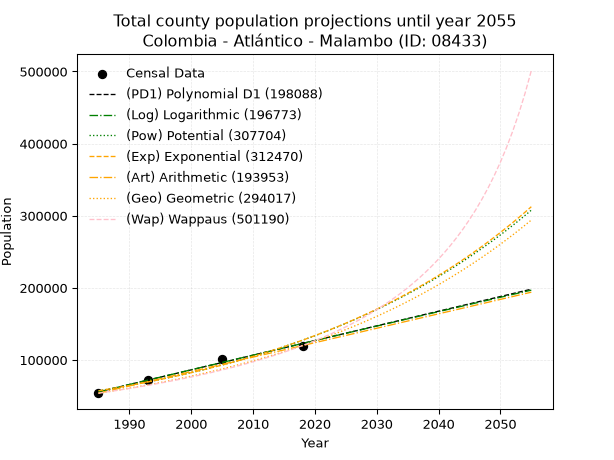
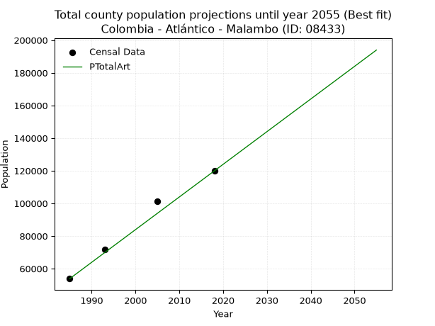
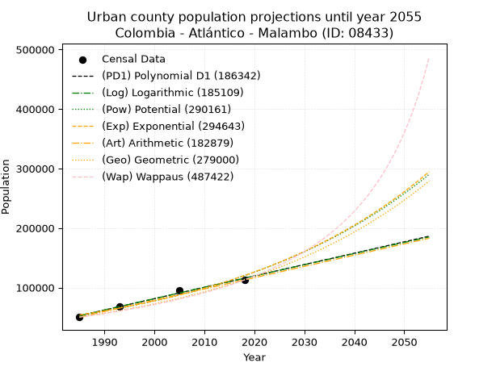
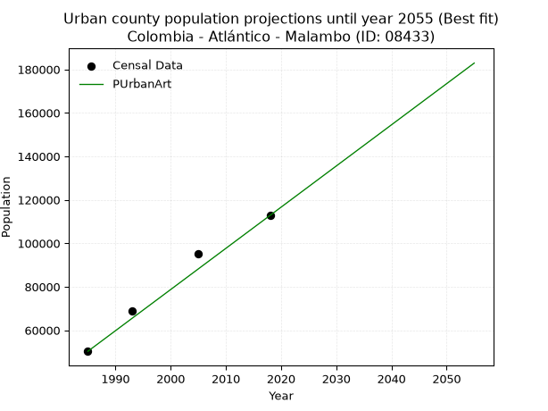
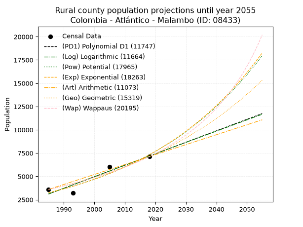
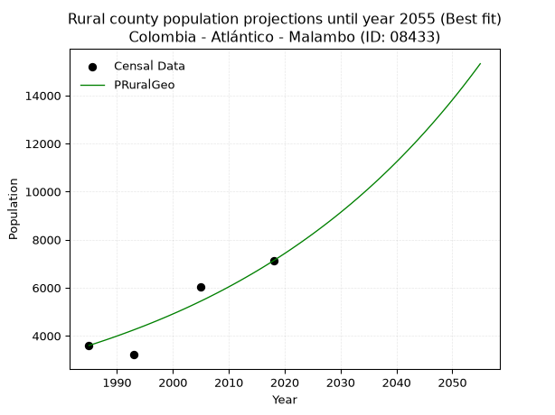

<div align="center">


</div>

# 📜 _“Population and Public Services Demand Projections (PPSD) until Year 2050 for Colombia - Atlántico - Malambo (ID: 08433)”_
Keywords: `population` `public-service` `projection` `lineal` `polynomial` `logarithmic` `potential` `exponential` `arithmetic` `geometric` `wappaus` `dane` `colombia` `south-america`

PPSD are analytical estimates used by governments and planners to anticipate future changes in population size, age distribution, and the resulting community needs for utilities, healthcare, education, and infrastructure as sizing future water treatment facilities, electrical grids, and road networks based on spatial growth.

<div align="center">

</img>

</div>


> **General running parameters**: • app_version: _v20260806_. • Python version: _3.14.7_. • Pandas version: _3.0.5_. • NumPy version: _2.5.1_. • Creates, save and include plots into reports (create_plot): _False_. • Projection until year: _2050_. • Process polynomial degree 2 and up: _False_. • Process Wappaus: _True_. • Process Wappaus: _True_. • Set negative values to zero: _True_. • Set infinite values to zero: _True_. • Drop dataset notes: _True_. 
<div align="center">

Dynamic map: [:earth_americas:Google](http://maps.google.com/maps?q=10.8570863,-74.7769228) [:earth_americas:OSM](https://www.openstreetmap.org/#map=18/10.8570863/-74.7769228&layers=P) [:earth_americas:Bing](https://www.bing.com/maps?cp=10.8570863~-74.7769228&lvl=18) [:earth_americas:Apple](https://maps.apple.com/frame?center=10.8570863%2C-74.7769228&span=0.003%2C0.006)

</div>


<div align="center">

```geojson
{
  "type": "Feature",
  "geometry": {
    "type": "Point", 
    "coordinates": [-74.7769228, 10.8570863]
  }, 
  "properties": {
    "Name": "Colombia - Atlántico - Malambo (ID: 08433)"
  }
}
```

</div>


## 0. Census Data (4 records)

Census data are official statistics collected by a government about the people and housing in a country. They usually include counts of total population, age, sex, race, income, education, and jobs.

📅Global census file: [Population.xlsx](../data/Population.xlsx)

| Source   |   Year |   CountryID | CountryName   |   StateID | StateName   |   CountyID | CountyName   |   PTotal |   PUrban |   PRural |
|:---------|-------:|------------:|:--------------|----------:|:------------|-----------:|:-------------|---------:|---------:|---------:|
| DANE     |   1985 |          57 | Colombia      |        08 | Atlántico   |      08433 | Malambo      |    53891 |    50295 |     3596 |
| DANE     |   1993 |          57 | Colombia      |        08 | Atlántico   |      08433 | Malambo      |    71925 |    68714 |     3211 |
| DANE     |   2005 |          57 | Colombia      |        08 | Atlántico   |      08433 | Malambo      |   101280 |    95258 |     6022 |
| DANE     |   2018 |          57 | Colombia      |        08 | Atlántico   |      08433 | Malambo      |   119920 |   112799 |     7121 |

> 🔥Some records could had specific notes about the registered values or the corresponding urban or rural distribution.

📅[SUI-RUPS](https://www.datos.gov.co/Hacienda-y-Cr-dito-P-blico/Registro-nico-de-Prestadores-de-Servicios-P-blicos/4qkq-csdn/about_data) - Local public utility companies: [RUPS.csv](../data/RUPS.xlsx)

 | SERVICIO       | ESTADO    | NOMBRE                                                                                                                                  | NIT         | DEPARTAMENTO_DOMICILIO   | MUNICIPIO_DOMICILIO   | DIRECCION                           |   TELEFONO | EMAIL                                | TIPO_PRESTADOR                                     | CLASIFICACION                 |
|:---------------|:----------|:----------------------------------------------------------------------------------------------------------------------------------------|:------------|:-------------------------|:----------------------|:------------------------------------|-----------:|:-------------------------------------|:---------------------------------------------------|:------------------------------|
| ACUEDUCTO      | OPERATIVA | SOCIEDAD DE ACUEDUCTO, ALCANTARILLADO Y ASEO DE BARRANQUILLA S.A. E.S.P.                                                                | 800135913-1 | ATLANTICO                | BARRANQUILLA          | Carrera 58 # 67-09                  |    3614000 | carolina.silva@aaa.com.co            | SOCIEDADES (EMPRESA DE SERVICIOS PUBLICOS)         | MAYOR O IGUAL A 5001 USUARIOS |
| ACUEDUCTO      | OPERATIVA | ASOCIACION DE USUARIOS SUSCRIPTORES DEL ACUEDUCTO, ALCANTARILLADO Y ASEO COMUNITARIO DEL CORREGIMIENTO DE CARACOLI MUNICIPIO DE MALAMBO | 802013066-1 | ATLANTICO                | MALAMBO               | CARRERA 08 No. 09-149               |    0000000 | acocar2018@gmail.com                 | ORGANIZACION AUTORIZADA                            | MENOR O IGUAL A 2500 USUARIOS |
| ACUEDUCTO      | OPERATIVA | PARQUE INDUSTRIAL MALAMBO S.A.                                                                                                          | 860076008-5 | ATLANTICO                | MALAMBO               | KM 3 VIA MALAMBO-SABANAGRANDE       |    3478500 | juridico@parqueindustrialmalambo.com | PRODUCTOR MARGINAL, INDEPENDIENTE O USO PARTICULAR | MENOR O IGUAL A 2500 USUARIOS |
| ALCANTARILLADO | OPERATIVA | PARQUE INDUSTRIAL MALAMBO S.A.                                                                                                          | 860076008-5 | ATLANTICO                | MALAMBO               | KM 3 VIA MALAMBO-SABANAGRANDE       |    3478500 | juridico@parqueindustrialmalambo.com | PRODUCTOR MARGINAL, INDEPENDIENTE O USO PARTICULAR | MENOR O IGUAL A 2500 USUARIOS |
| ACUEDUCTO      | OPERATIVA | ASOCIACION DE USUARIOS SUSCRIPTORES DEL ACUEDUCTO,ALCANTARILLADO Y ASEO COMUNITARIO DEL CORREGIMIENTO DE  DE AGUADA DE CARACOLI         | 802009924-0 | ATLANTICO                | MALAMBO               | C 14 9 14                           |    0000001 | dealbanieblesmaycol@gmail.com        | ORGANIZACION AUTORIZADA                            | MENOR O IGUAL A 2500 USUARIOS |
| ACUEDUCTO      | OPERATIVA | ASOCIACION DE USUARIOS DEL ACUEDUCTO DE  CASCARON                                                                                       | 900070361-8 | ATLANTICO                | MALAMBO               | VEREDA DE CASCARON VIA LA MANGA     |    3107172 | AUDAC_2009@HOTMAIL.COM               | ORGANIZACION AUTORIZADA                            | HASTA 2500 SUSCRIPTORES       |
| ACUEDUCTO      | OPERATIVA | AGUAS DE MALAMBO S.A. E.S.P.                                                                                                            | 900409332-2 | ATLANTICO                | MALAMBO               | CALLE  12 No 14-40                  |    3760606 | buzoncorporativo@aguasdemalambo.com  | SOCIEDADES (EMPRESA DE SERVICIOS PUBLICOS)         | MAYOR O IGUAL A 5001 USUARIOS |
| ALCANTARILLADO | OPERATIVA | AGUAS DE MALAMBO S.A. E.S.P.                                                                                                            | 900409332-2 | ATLANTICO                | MALAMBO               | CALLE  12 No 14-40                  |    3760606 | buzoncorporativo@aguasdemalambo.com  | SOCIEDADES (EMPRESA DE SERVICIOS PUBLICOS)         | MAYOR O IGUAL A 5001 USUARIOS |
| ACUEDUCTO      | OPERATIVA | AGUACARIBE COLOMBIA SAS ESP                                                                                                             | 901231847-0 | ATLANTICO                | GALAPA                | CRA 62 No 8B-50 LC 5 VILLA OLIMPICA |    3823154 | dvasquez@aguacaribe.com.co           | SOCIEDADES (EMPRESA DE SERVICIOS PUBLICOS)         | MAYOR O IGUAL A 5001 USUARIOS |

## 1. Total

### 1.1. Coefficients and Parameters

* (PD1) Polynomial Deg 1: 2033.5062224006285, -3980766.8213568577 (lineal)
* (Log) Logarithmic: 4071309.4165523574, -30859301.50064059
* (Pow) Potential: 48.56265785492666, -155.39081357699365
* (Exp) Exponential: 0.02424993523951707, 7.11776804509148e-17
* (Art) Arithmetic: Year diff. 2018 - 1985 = 33, Population diff. 119920 - 53891 = 66029, Annual growth = 2000.878787878788
* (Geo) Geometric: Year diff. 2018 - 1985 = 33, Population diff. 119920 - 53891 = 66029, Annual growth % = 0.024534356677762048
* (Wap) Wappaus: i = 2.3023615166805182, Condition values only valid for < 200)

<sub>
Wappaus condition values: ['0.00', '2.30', '4.60', '6.91', '9.21', '11.51', '13.81', '16.12', '18.42', '20.72', '23.02', '25.33', '27.63', '29.93', '32.23', '34.54', '36.84', '39.14', '41.44', '43.74', '46.05', '48.35', '50.65', '52.95', '55.26', '57.56', '59.86', '62.16', '64.47', '66.77', '69.07', '71.37', '73.68', '75.98', '78.28', '80.58', '82.89', '85.19', '87.49', '89.79', '92.09', '94.40', '96.70', '99.00', '101.30', '103.61', '105.91', '108.21', '110.51', '112.82', '115.12', '117.42', '119.72', '122.03', '124.33', '126.63', '128.93', '131.23', '133.54', '135.84', '138.14', '140.44', '142.75', '145.05', '147.35', '149.65']
</sub>


### 1.2. Projected Dataset

|   Year |   CountyID |   PTotalPD1 |   PTotalLog |   PTotalPow |   PTotalExp |   PTotalArt |   PTotalGeo |   PTotalWap |
|-------:|-----------:|------------:|------------:|------------:|------------:|------------:|------------:|------------:|
|   1985 |      08433 |       55743 |       55674 |       57174 |       57226 |       53891 |       53891 |       53891 |
|   1986 |      08433 |       57777 |       57725 |       58590 |       58631 |       55892 |       55213 |       55146 |
|   1987 |      08433 |       59810 |       59774 |       60040 |       60070 |       57893 |       56568 |       56431 |
|   1988 |      08433 |       61844 |       61823 |       61525 |       61545 |       59894 |       57956 |       57746 |
|   1989 |      08433 |       63877 |       63870 |       63046 |       63055 |       61895 |       59378 |       59094 |
|   1990 |      08433 |       65911 |       65917 |       64604 |       64603 |       63895 |       60834 |       60474 |
|   1991 |      08433 |       67944 |       67962 |       66200 |       66189 |       65896 |       62327 |       61888 |
|   1992 |      08433 |       69978 |       70006 |       67834 |       67814 |       67897 |       63856 |       63338 |
|   1993 |      08433 |       72011 |       72050 |       69507 |       69478 |       69898 |       65423 |       64824 |
|   1994 |      08433 |       74045 |       74092 |       71221 |       71184 |       71899 |       67028 |       66349 |
|   1995 |      08433 |       76078 |       76133 |       72977 |       72931 |       73900 |       68672 |       67913 |
|   1996 |      08433 |       78112 |       78173 |       74774 |       74721 |       75901 |       70357 |       69518 |
|   1997 |      08433 |       80145 |       80213 |       76616 |       76555 |       77902 |       72083 |       71167 |
|   1998 |      08433 |       82179 |       82251 |       78501 |       78434 |       79902 |       73852 |       72860 |
|   1999 |      08433 |       84212 |       84288 |       80432 |       80360 |       81903 |       75664 |       74599 |
|   2000 |      08433 |       86246 |       86324 |       82409 |       82332 |       83904 |       77520 |       76387 |
|   2001 |      08433 |       88279 |       88359 |       84434 |       84353 |       85905 |       79422 |       78225 |
|   2002 |      08433 |       90313 |       90394 |       86508 |       86424 |       87906 |       81371 |       80116 |
|   2003 |      08433 |       92346 |       92427 |       88632 |       88545 |       89907 |       83367 |       82062 |
|   2004 |      08433 |       94380 |       94459 |       90806 |       90719 |       91908 |       85412 |       84065 |
|   2005 |      08433 |       96413 |       96490 |       93033 |       92945 |       93909 |       87508 |       86129 |
|   2006 |      08433 |       98447 |       98520 |       95313 |       95227 |       95909 |       89655 |       88254 |
|   2007 |      08433 |      100480 |      100549 |       97648 |       97564 |       97910 |       91854 |       90446 |
|   2008 |      08433 |      102514 |      102577 |      100039 |       99959 |       99911 |       94108 |       92706 |
|   2009 |      08433 |      104547 |      104604 |      102488 |      102413 |      101912 |       96417 |       95037 |
|   2010 |      08433 |      106581 |      106630 |      104994 |      104927 |      103913 |       98782 |       97445 |
|   2011 |      08433 |      108614 |      108655 |      107561 |      107502 |      105914 |      101206 |       99931 |
|   2012 |      08433 |      110648 |      110679 |      110190 |      110141 |      107915 |      103689 |      102500 |
|   2013 |      08433 |      112681 |      112702 |      112881 |      112845 |      109916 |      106233 |      105157 |
|   2014 |      08433 |      114715 |      114724 |      115637 |      115615 |      111916 |      108839 |      107906 |
|   2015 |      08433 |      116748 |      116745 |      118458 |      118452 |      113917 |      111510 |      110751 |
|   2016 |      08433 |      118782 |      118765 |      121347 |      121360 |      115918 |      114245 |      113698 |
|   2017 |      08433 |      120815 |      120784 |      124305 |      124339 |      117919 |      117048 |      116752 |
|   2018 |      08433 |      122849 |      122802 |      127333 |      127391 |      119920 |      119920 |      119920 |
|   2019 |      08433 |      124882 |      124819 |      130434 |      130518 |      121921 |      122862 |      123208 |
|   2020 |      08433 |      126916 |      126835 |      133608 |      133722 |      123922 |      125877 |      126622 |
|   2021 |      08433 |      128949 |      128850 |      136859 |      137004 |      125923 |      128965 |      130171 |
|   2022 |      08433 |      130983 |      130864 |      140186 |      140367 |      127924 |      132129 |      133862 |
|   2023 |      08433 |      133016 |      132877 |      143593 |      143813 |      129924 |      135371 |      137704 |
|   2024 |      08433 |      135050 |      134889 |      147081 |      147343 |      131925 |      138692 |      141707 |
|   2025 |      08433 |      137083 |      136900 |      150652 |      150959 |      133926 |      142095 |      145880 |
|   2026 |      08433 |      139117 |      138910 |      154307 |      154665 |      135927 |      145581 |      150235 |
|   2027 |      08433 |      141150 |      140919 |      158050 |      158461 |      137928 |      149152 |      154785 |
|   2028 |      08433 |      143184 |      142927 |      161881 |      162351 |      139929 |      152812 |      159542 |
|   2029 |      08433 |      145217 |      144934 |      165803 |      166336 |      141930 |      156561 |      164521 |
|   2030 |      08433 |      147251 |      146940 |      169818 |      170419 |      143931 |      160402 |      169738 |
|   2031 |      08433 |      149284 |      148945 |      173929 |      174602 |      145931 |      164337 |      175210 |
|   2032 |      08433 |      151318 |      150950 |      178137 |      178888 |      147932 |      168369 |      180956 |
|   2033 |      08433 |      153351 |      152953 |      182444 |      183279 |      149933 |      172500 |      186999 |
|   2034 |      08433 |      155385 |      154955 |      186854 |      187778 |      151934 |      176732 |      193360 |
|   2035 |      08433 |      157418 |      156956 |      191367 |      192387 |      153935 |      181068 |      200066 |
|   2036 |      08433 |      159452 |      158956 |      195988 |      197110 |      155936 |      185511 |      207147 |
|   2037 |      08433 |      161485 |      160955 |      200718 |      201948 |      157937 |      190062 |      214634 |
|   2038 |      08433 |      163519 |      162953 |      205559 |      206905 |      159938 |      194725 |      222562 |
|   2039 |      08433 |      165552 |      164951 |      210515 |      211984 |      161938 |      199503 |      230973 |
|   2040 |      08433 |      167586 |      166947 |      215588 |      217187 |      163939 |      204397 |      239913 |
|   2041 |      08433 |      169619 |      168942 |      220780 |      222518 |      165940 |      209412 |      249431 |
|   2042 |      08433 |      171653 |      170936 |      226095 |      227980 |      167941 |      214550 |      259586 |
|   2043 |      08433 |      173686 |      172930 |      231535 |      233577 |      169942 |      219814 |      270446 |
|   2044 |      08433 |      175720 |      174922 |      237103 |      239310 |      171943 |      225207 |      282084 |
|   2045 |      08433 |      177753 |      176913 |      242802 |      245184 |      173944 |      230732 |      294589 |
|   2046 |      08433 |      179787 |      178904 |      248636 |      251203 |      175945 |      236393 |      308061 |
|   2047 |      08433 |      181820 |      180893 |      254606 |      257369 |      177945 |      242193 |      322616 |
|   2048 |      08433 |      183854 |      182882 |      260717 |      263686 |      179946 |      248135 |      338391 |
|   2049 |      08433 |      185887 |      184869 |      266972 |      270159 |      181947 |      254222 |      355546 |
|   2050 |      08433 |      187921 |      186856 |      273373 |      276790 |      183948 |      260460 |      374270 |
<div align="center">

</img>

</div>


### 1.3. Best fit with absolute and relative error (%)

Relative error puts that difference into context by dividing the absolute error by the true value, creating a unitless ratio or percentage that shows the scale of the mistake.

Absolute and relative error

|   Year | Source   |   CountryID | CountryName   |   StateID | StateName   |   CountyID_x | CountyName   |   PTotal |   PUrban |   PRural |   CountyID_y |   PTotalPD1 |   PTotalLog |   PTotalPow |   PTotalExp |   PTotalArt |   PTotalGeo |   PTotalWap |   PTotalPD1AbsError |   PTotalLogAbsError |   PTotalPowAbsError |   PTotalExpAbsError |   PTotalArtAbsError |   PTotalGeoAbsError |   PTotalWapAbsError |   PTotalPD1RelError |   PTotalLogRelError |   PTotalPowRelError |   PTotalExpRelError |   PTotalArtRelError |   PTotalGeoRelError |   PTotalWapRelError |
|-------:|:---------|------------:|:--------------|----------:|:------------|-------------:|:-------------|---------:|---------:|---------:|-------------:|------------:|------------:|------------:|------------:|------------:|------------:|------------:|--------------------:|--------------------:|--------------------:|--------------------:|--------------------:|--------------------:|--------------------:|--------------------:|--------------------:|--------------------:|--------------------:|--------------------:|--------------------:|--------------------:|
|   1985 | DANE     |          57 | Colombia      |        08 | Atlántico   |        08433 | Malambo      |    53891 |    50295 |     3596 |        08433 |       55743 |       55674 |       57174 |       57226 |       53891 |       53891 |       53891 |                1852 |                1783 |                3283 |                3335 |                   0 |                   0 |                   0 |            3.43657  |            3.30853  |             6.09193 |             6.18842 |             0       |             0       |             0       |
|   1993 | DANE     |          57 | Colombia      |        08 | Atlántico   |        08433 | Malambo      |    71925 |    68714 |     3211 |        08433 |       72011 |       72050 |       69507 |       69478 |       69898 |       65423 |       64824 |                  86 |                 125 |                2418 |                2447 |                2027 |                6502 |                7101 |            0.119569 |            0.173792 |             3.36184 |             3.40216 |             2.81821 |             9.03997 |             9.87278 |
|   2005 | DANE     |          57 | Colombia      |        08 | Atlántico   |        08433 | Malambo      |   101280 |    95258 |     6022 |        08433 |       96413 |       96490 |       93033 |       92945 |       93909 |       87508 |       86129 |                4867 |                4790 |                8247 |                8335 |                7371 |               13772 |               15151 |            4.80549  |            4.72946  |             8.14277 |             8.22966 |             7.27784 |            13.5979  |            14.9595  |
|   2018 | DANE     |          57 | Colombia      |        08 | Atlántico   |        08433 | Malambo      |   119920 |   112799 |     7121 |        08433 |      122849 |      122802 |      127333 |      127391 |      119920 |      119920 |      119920 |                2929 |                2882 |                7413 |                7471 |                   0 |                   0 |                   0 |            2.44246  |            2.40327  |             6.18162 |             6.22999 |             0       |             0       |             0       |

Relative error mean

| Method    |   RelError | Best   |
|:----------|-----------:|:-------|
| PTotalPD1 |    2.70102 |        |
| PTotalLog |    2.65376 |        |
| PTotalPow |    5.94454 |        |
| PTotalExp |    6.01255 |        |
| PTotalArt |    2.52401 | True   |
| PTotalGeo |    5.65948 |        |
| PTotalWap |    6.20808 |        |

💙Best method: _**PTotalArt**_
<div align="center">

</img>

</div>


### 1.4. Fresh water supply demand in liters per capita per day (lpcd)

The fresh water supply demand typically ranges from 100 to 300 liters per capita per day (lpcd) for standard domestic and municipal planning, though absolute survival minimums set by the World Health Organization are as low as 7.5 to 20 liters per day, and total consumption in high-income nations can exceed 400 liters.

> `CZ`: Level in meters above the sea level (masl)<br> `WS`: Fresh water supply demand in liters per capita per day (lpcd or l/h/d)<br> `WSAll`: Zonal fresh water supply demand in liters per second (l/s)<br> `A`: Zonal area in square meters<br> `DP`: Population density (people/hectare or p/ha)

Reference values (RAS Colombia)

|    CZ |   WS |
|------:|-----:|
|  1000 |  120 |
|  2000 |  130 |
| 99999 |  140 |

County shapefile geometry properties and water supply values

|   CountyID |      ATotal |   CZTotal |   WSTotal |
|-----------:|------------:|----------:|----------:|
|      08433 | 9.81898e+07 |    46.888 |       120 |

Projected values for best method: PTotalArt

|   CountyID |   Year |   PTotalArt |   DPTotal |   WSTotal |   WSTotalAll |
|-----------:|-------:|------------:|----------:|----------:|-------------:|
|      08433 |   1985 |       53891 |      5.49 |       120 |      74.8486 |
|      08433 |   1986 |       55892 |      5.69 |       120 |      77.6278 |
|      08433 |   1987 |       57893 |      5.9  |       120 |      80.4069 |
|      08433 |   1988 |       59894 |      6.1  |       120 |      83.1861 |
|      08433 |   1989 |       61895 |      6.3  |       120 |      85.9653 |
|      08433 |   1990 |       63895 |      6.51 |       120 |      88.7431 |
|      08433 |   1991 |       65896 |      6.71 |       120 |      91.5222 |
|      08433 |   1992 |       67897 |      6.91 |       120 |      94.3014 |
|      08433 |   1993 |       69898 |      7.12 |       120 |      97.0806 |
|      08433 |   1994 |       71899 |      7.32 |       120 |      99.8597 |
|      08433 |   1995 |       73900 |      7.53 |       120 |     102.639  |
|      08433 |   1996 |       75901 |      7.73 |       120 |     105.418  |
|      08433 |   1997 |       77902 |      7.93 |       120 |     108.197  |
|      08433 |   1998 |       79902 |      8.14 |       120 |     110.975  |
|      08433 |   1999 |       81903 |      8.34 |       120 |     113.754  |
|      08433 |   2000 |       83904 |      8.55 |       120 |     116.533  |
|      08433 |   2001 |       85905 |      8.75 |       120 |     119.312  |
|      08433 |   2002 |       87906 |      8.95 |       120 |     122.092  |
|      08433 |   2003 |       89907 |      9.16 |       120 |     124.871  |
|      08433 |   2004 |       91908 |      9.36 |       120 |     127.65   |
|      08433 |   2005 |       93909 |      9.56 |       120 |     130.429  |
|      08433 |   2006 |       95909 |      9.77 |       120 |     133.207  |
|      08433 |   2007 |       97910 |      9.97 |       120 |     135.986  |
|      08433 |   2008 |       99911 |     10.18 |       120 |     138.765  |
|      08433 |   2009 |      101912 |     10.38 |       120 |     141.544  |
|      08433 |   2010 |      103913 |     10.58 |       120 |     144.324  |
|      08433 |   2011 |      105914 |     10.79 |       120 |     147.103  |
|      08433 |   2012 |      107915 |     10.99 |       120 |     149.882  |
|      08433 |   2013 |      109916 |     11.19 |       120 |     152.661  |
|      08433 |   2014 |      111916 |     11.4  |       120 |     155.439  |
|      08433 |   2015 |      113917 |     11.6  |       120 |     158.218  |
|      08433 |   2016 |      115918 |     11.81 |       120 |     160.997  |
|      08433 |   2017 |      117919 |     12.01 |       120 |     163.776  |
|      08433 |   2018 |      119920 |     12.21 |       120 |     166.556  |
|      08433 |   2019 |      121921 |     12.42 |       120 |     169.335  |
|      08433 |   2020 |      123922 |     12.62 |       120 |     172.114  |
|      08433 |   2021 |      125923 |     12.82 |       120 |     174.893  |
|      08433 |   2022 |      127924 |     13.03 |       120 |     177.672  |
|      08433 |   2023 |      129924 |     13.23 |       120 |     180.45   |
|      08433 |   2024 |      131925 |     13.44 |       120 |     183.229  |
|      08433 |   2025 |      133926 |     13.64 |       120 |     186.008  |
|      08433 |   2026 |      135927 |     13.84 |       120 |     188.787  |
|      08433 |   2027 |      137928 |     14.05 |       120 |     191.567  |
|      08433 |   2028 |      139929 |     14.25 |       120 |     194.346  |
|      08433 |   2029 |      141930 |     14.45 |       120 |     197.125  |
|      08433 |   2030 |      143931 |     14.66 |       120 |     199.904  |
|      08433 |   2031 |      145931 |     14.86 |       120 |     202.682  |
|      08433 |   2032 |      147932 |     15.07 |       120 |     205.461  |
|      08433 |   2033 |      149933 |     15.27 |       120 |     208.24   |
|      08433 |   2034 |      151934 |     15.47 |       120 |     211.019  |
|      08433 |   2035 |      153935 |     15.68 |       120 |     213.799  |
|      08433 |   2036 |      155936 |     15.88 |       120 |     216.578  |
|      08433 |   2037 |      157937 |     16.08 |       120 |     219.357  |
|      08433 |   2038 |      159938 |     16.29 |       120 |     222.136  |
|      08433 |   2039 |      161938 |     16.49 |       120 |     224.914  |
|      08433 |   2040 |      163939 |     16.7  |       120 |     227.693  |
|      08433 |   2041 |      165940 |     16.9  |       120 |     230.472  |
|      08433 |   2042 |      167941 |     17.1  |       120 |     233.251  |
|      08433 |   2043 |      169942 |     17.31 |       120 |     236.031  |
|      08433 |   2044 |      171943 |     17.51 |       120 |     238.81   |
|      08433 |   2045 |      173944 |     17.72 |       120 |     241.589  |
|      08433 |   2046 |      175945 |     17.92 |       120 |     244.368  |
|      08433 |   2047 |      177945 |     18.12 |       120 |     247.146  |
|      08433 |   2048 |      179946 |     18.33 |       120 |     249.925  |
|      08433 |   2049 |      181947 |     18.53 |       120 |     252.704  |
|      08433 |   2050 |      183948 |     18.73 |       120 |     255.483  |

## 2. Urban

### 2.1. Coefficients and Parameters

* (PD1) Polynomial Deg 1: 1910.0481734243147, -3738807.3588919854 (lineal)
* (Log) Logarithmic: 3824241.7392314295, -28986325.605448104
* (Pow) Potential: 48.58521450917522, -155.4910334717926
* (Exp) Exponential: 0.024260313097516417, 6.57006918524062e-17
* (Art) Arithmetic: Year diff. 2018 - 1985 = 33, Population diff. 112799 - 50295 = 62504, Annual growth = 1894.060606060606
* (Geo) Geometric: Year diff. 2018 - 1985 = 33, Population diff. 112799 - 50295 = 62504, Annual growth % = 0.02477780376729699
* (Wap) Wappaus: i = 2.3226612947877987, Condition values only valid for < 200)

<sub>
Wappaus condition values: ['0.00', '2.32', '4.65', '6.97', '9.29', '11.61', '13.94', '16.26', '18.58', '20.90', '23.23', '25.55', '27.87', '30.19', '32.52', '34.84', '37.16', '39.49', '41.81', '44.13', '46.45', '48.78', '51.10', '53.42', '55.74', '58.07', '60.39', '62.71', '65.03', '67.36', '69.68', '72.00', '74.33', '76.65', '78.97', '81.29', '83.62', '85.94', '88.26', '90.58', '92.91', '95.23', '97.55', '99.87', '102.20', '104.52', '106.84', '109.17', '111.49', '113.81', '116.13', '118.46', '120.78', '123.10', '125.42', '127.75', '130.07', '132.39', '134.71', '137.04', '139.36', '141.68', '144.01', '146.33', '148.65', '150.97']
</sub>


### 2.2. Projected Dataset

|   Year |   CountyID |   PUrbanPD1 |   PUrbanLog |   PUrbanPow |   PUrbanExp |   PUrbanArt |   PUrbanGeo |   PUrbanWap |
|-------:|-----------:|------------:|------------:|------------:|------------:|------------:|------------:|------------:|
|   1985 |      08433 |       52638 |       52573 |       53873 |       53922 |       50295 |       50295 |       50295 |
|   1986 |      08433 |       54548 |       54499 |       55207 |       55246 |       52189 |       51541 |       51477 |
|   1987 |      08433 |       56458 |       56424 |       56574 |       56603 |       54083 |       52818 |       52687 |
|   1988 |      08433 |       58368 |       58348 |       57974 |       57993 |       55977 |       54127 |       53926 |
|   1989 |      08433 |       60278 |       60271 |       59408 |       59417 |       57871 |       55468 |       55195 |
|   1990 |      08433 |       62189 |       62194 |       60877 |       60876 |       59765 |       56843 |       56496 |
|   1991 |      08433 |       64099 |       64115 |       62381 |       62371 |       61659 |       58251 |       57829 |
|   1992 |      08433 |       66009 |       66035 |       63921 |       63903 |       63553 |       59694 |       59196 |
|   1993 |      08433 |       67919 |       67955 |       65499 |       65472 |       65447 |       61173 |       60598 |
|   1994 |      08433 |       69829 |       69873 |       67115 |       67080 |       67342 |       62689 |       62036 |
|   1995 |      08433 |       71739 |       71790 |       68770 |       68727 |       69236 |       64242 |       63512 |
|   1996 |      08433 |       73649 |       73707 |       70465 |       70415 |       71130 |       65834 |       65027 |
|   1997 |      08433 |       75559 |       75622 |       72201 |       72144 |       73024 |       67465 |       66583 |
|   1998 |      08433 |       77469 |       77537 |       73979 |       73916 |       74918 |       69137 |       68182 |
|   1999 |      08433 |       79379 |       79450 |       75799 |       75731 |       76812 |       70850 |       69825 |
|   2000 |      08433 |       81289 |       81363 |       77664 |       77591 |       78706 |       72606 |       71514 |
|   2001 |      08433 |       83199 |       83274 |       79573 |       79496 |       80600 |       74405 |       73252 |
|   2002 |      08433 |       85109 |       85185 |       81528 |       81448 |       82494 |       76248 |       75039 |
|   2003 |      08433 |       87019 |       87095 |       83530 |       83448 |       84388 |       78138 |       76879 |
|   2004 |      08433 |       88929 |       89004 |       85581 |       85498 |       86282 |       80074 |       78775 |
|   2005 |      08433 |       90839 |       90912 |       87680 |       87597 |       88176 |       82058 |       80727 |
|   2006 |      08433 |       92749 |       92818 |       89830 |       89748 |       90070 |       84091 |       82739 |
|   2007 |      08433 |       94659 |       94724 |       92032 |       91952 |       91964 |       86174 |       84814 |
|   2008 |      08433 |       96569 |       96629 |       94287 |       94210 |       93858 |       88310 |       86955 |
|   2009 |      08433 |       98479 |       98533 |       96595 |       96524 |       95752 |       90498 |       89165 |
|   2010 |      08433 |      100389 |      100436 |       98959 |       98894 |       97647 |       92740 |       91447 |
|   2011 |      08433 |      102300 |      102339 |      101380 |      101323 |       99541 |       95038 |       93806 |
|   2012 |      08433 |      104210 |      104240 |      103858 |      103811 |      101435 |       97393 |       96244 |
|   2013 |      08433 |      106120 |      106140 |      106396 |      106360 |      103329 |       99806 |       98765 |
|   2014 |      08433 |      108030 |      108039 |      108994 |      108972 |      105223 |      102279 |      101375 |
|   2015 |      08433 |      109940 |      109938 |      111655 |      111648 |      107117 |      104813 |      104079 |
|   2016 |      08433 |      111850 |      111835 |      114379 |      114390 |      109011 |      107410 |      106880 |
|   2017 |      08433 |      113760 |      113732 |      117169 |      117199 |      110905 |      110072 |      109785 |
|   2018 |      08433 |      115670 |      115627 |      120025 |      120077 |      112799 |      112799 |      112799 |
|   2019 |      08433 |      117580 |      117522 |      122949 |      123026 |      114693 |      115594 |      115929 |
|   2020 |      08433 |      119490 |      119415 |      125942 |      126047 |      116587 |      118458 |      119181 |
|   2021 |      08433 |      121400 |      121308 |      129007 |      129142 |      118481 |      121393 |      122564 |
|   2022 |      08433 |      123310 |      123200 |      132146 |      132314 |      120375 |      124401 |      126083 |
|   2023 |      08433 |      125220 |      125091 |      135359 |      135563 |      122269 |      127483 |      129750 |
|   2024 |      08433 |      127130 |      126981 |      138648 |      138892 |      124163 |      130642 |      133572 |
|   2025 |      08433 |      129040 |      128870 |      142016 |      142303 |      126057 |      133879 |      137559 |
|   2026 |      08433 |      130950 |      130758 |      145463 |      145797 |      127951 |      137196 |      141724 |
|   2027 |      08433 |      132860 |      132645 |      148993 |      149378 |      129846 |      140596 |      146077 |
|   2028 |      08433 |      134770 |      134531 |      152606 |      153046 |      131740 |      144080 |      150633 |
|   2029 |      08433 |      136680 |      136416 |      156305 |      156804 |      133634 |      147650 |      155404 |
|   2030 |      08433 |      138590 |      138300 |      160093 |      160655 |      135528 |      151308 |      160408 |
|   2031 |      08433 |      140500 |      140184 |      163969 |      164600 |      137422 |      155057 |      165662 |
|   2032 |      08433 |      142411 |      142066 |      167938 |      168642 |      139316 |      158899 |      171184 |
|   2033 |      08433 |      144321 |      143948 |      172001 |      172783 |      141210 |      162836 |      176996 |
|   2034 |      08433 |      146231 |      145829 |      176160 |      177026 |      143104 |      166871 |      183121 |
|   2035 |      08433 |      148141 |      147708 |      180417 |      181374 |      144998 |      171006 |      189585 |
|   2036 |      08433 |      150051 |      149587 |      184776 |      185828 |      146892 |      175243 |      196418 |
|   2037 |      08433 |      151961 |      151465 |      189237 |      190391 |      148786 |      179585 |      203651 |
|   2038 |      08433 |      153871 |      153342 |      193803 |      195067 |      150680 |      184035 |      211321 |
|   2039 |      08433 |      155781 |      155218 |      198478 |      199857 |      152574 |      188595 |      219469 |
|   2040 |      08433 |      157691 |      157093 |      203263 |      204765 |      154468 |      193268 |      228141 |
|   2041 |      08433 |      159601 |      158967 |      208161 |      209793 |      156362 |      198056 |      237389 |
|   2042 |      08433 |      161511 |      160840 |      213174 |      214945 |      158256 |      202964 |      247272 |
|   2043 |      08433 |      163421 |      162713 |      218306 |      220223 |      160151 |      207993 |      257859 |
|   2044 |      08433 |      165331 |      164584 |      223558 |      225631 |      162045 |      213146 |      269226 |
|   2045 |      08433 |      167241 |      166455 |      228935 |      231172 |      163939 |      218428 |      281464 |
|   2046 |      08433 |      169151 |      168324 |      234437 |      236849 |      165833 |      223840 |      294678 |
|   2047 |      08433 |      171061 |      170193 |      240070 |      242665 |      167727 |      229386 |      308987 |
|   2048 |      08433 |      172971 |      172061 |      245834 |      248625 |      169621 |      235070 |      324535 |
|   2049 |      08433 |      174881 |      173927 |      251735 |      254730 |      171515 |      240894 |      341489 |
|   2050 |      08433 |      176791 |      175793 |      257774 |      260985 |      173409 |      246863 |      360050 |
<div align="center">

</img>

</div>


### 2.3. Best fit with absolute and relative error (%)

Relative error puts that difference into context by dividing the absolute error by the true value, creating a unitless ratio or percentage that shows the scale of the mistake.

Absolute and relative error

|   Year | Source   |   CountryID | CountryName   |   StateID | StateName   |   CountyID_x | CountyName   |   PTotal |   PUrban |   PRural |   CountyID_y |   PUrbanPD1 |   PUrbanLog |   PUrbanPow |   PUrbanExp |   PUrbanArt |   PUrbanGeo |   PUrbanWap |   PUrbanPD1AbsError |   PUrbanLogAbsError |   PUrbanPowAbsError |   PUrbanExpAbsError |   PUrbanArtAbsError |   PUrbanGeoAbsError |   PUrbanWapAbsError |   PUrbanPD1RelError |   PUrbanLogRelError |   PUrbanPowRelError |   PUrbanExpRelError |   PUrbanArtRelError |   PUrbanGeoRelError |   PUrbanWapRelError |
|-------:|:---------|------------:|:--------------|----------:|:------------|-------------:|:-------------|---------:|---------:|---------:|-------------:|------------:|------------:|------------:|------------:|------------:|------------:|------------:|--------------------:|--------------------:|--------------------:|--------------------:|--------------------:|--------------------:|--------------------:|--------------------:|--------------------:|--------------------:|--------------------:|--------------------:|--------------------:|--------------------:|
|   1985 | DANE     |          57 | Colombia      |        08 | Atlántico   |        08433 | Malambo      |    53891 |    50295 |     3596 |        08433 |       52638 |       52573 |       53873 |       53922 |       50295 |       50295 |       50295 |                2343 |                2278 |                3578 |                3627 |                   0 |                   0 |                   0 |             4.65851 |             4.52928 |             7.11403 |             7.21145 |             0       |              0      |              0      |
|   1993 | DANE     |          57 | Colombia      |        08 | Atlántico   |        08433 | Malambo      |    71925 |    68714 |     3211 |        08433 |       67919 |       67955 |       65499 |       65472 |       65447 |       61173 |       60598 |                 795 |                 759 |                3215 |                3242 |                3267 |                7541 |                8116 |             1.15697 |             1.10458 |             4.67881 |             4.71811 |             4.75449 |             10.9745 |             11.8113 |
|   2005 | DANE     |          57 | Colombia      |        08 | Atlántico   |        08433 | Malambo      |   101280 |    95258 |     6022 |        08433 |       90839 |       90912 |       87680 |       87597 |       88176 |       82058 |       80727 |                4419 |                4346 |                7578 |                7661 |                7082 |               13200 |               14531 |             4.63898 |             4.56235 |             7.95524 |             8.04237 |             7.43455 |             13.8571 |             15.2544 |
|   2018 | DANE     |          57 | Colombia      |        08 | Atlántico   |        08433 | Malambo      |   119920 |   112799 |     7121 |        08433 |      115670 |      115627 |      120025 |      120077 |      112799 |      112799 |      112799 |                2871 |                2828 |                7226 |                7278 |                   0 |                   0 |                   0 |             2.54524 |             2.50711 |             6.40609 |             6.45218 |             0       |              0      |              0      |

Relative error mean

| Method    |   RelError | Best   |
|:----------|-----------:|:-------|
| PUrbanPD1 |    3.24993 |        |
| PUrbanLog |    3.17583 |        |
| PUrbanPow |    6.53854 |        |
| PUrbanExp |    6.60603 |        |
| PUrbanArt |    3.04726 | True   |
| PUrbanGeo |    6.20789 |        |
| PUrbanWap |    6.76641 |        |

💙Best method: _**PUrbanArt**_
<div align="center">

</img>

</div>


### 2.4. Fresh water supply demand in liters per capita per day (lpcd)

The fresh water supply demand typically ranges from 100 to 300 liters per capita per day (lpcd) for standard domestic and municipal planning, though absolute survival minimums set by the World Health Organization are as low as 7.5 to 20 liters per day, and total consumption in high-income nations can exceed 400 liters.

> `CZ`: Level in meters above the sea level (masl)<br> `WS`: Fresh water supply demand in liters per capita per day (lpcd or l/h/d)<br> `WSAll`: Zonal fresh water supply demand in liters per second (l/s)<br> `A`: Zonal area in square meters<br> `DP`: Population density (people/hectare or p/ha)

Reference values (RAS Colombia)

|    CZ |   WS |
|------:|-----:|
|  1000 |  120 |
|  2000 |  130 |
| 99999 |  140 |

County shapefile geometry properties and water supply values

|   CountyID |      AUrban |   CZUrban |   WSUrban |
|-----------:|------------:|----------:|----------:|
|      08433 | 1.23871e+07 |   16.9406 |       120 |

Projected values for best method: PUrbanArt

|   CountyID |   Year |   PUrbanArt |   DPUrban |   WSUrban |   WSUrbanAll |
|-----------:|-------:|------------:|----------:|----------:|-------------:|
|      08433 |   1985 |       50295 |     40.6  |       120 |      69.8542 |
|      08433 |   1986 |       52189 |     42.13 |       120 |      72.4847 |
|      08433 |   1987 |       54083 |     43.66 |       120 |      75.1153 |
|      08433 |   1988 |       55977 |     45.19 |       120 |      77.7458 |
|      08433 |   1989 |       57871 |     46.72 |       120 |      80.3764 |
|      08433 |   1990 |       59765 |     48.25 |       120 |      83.0069 |
|      08433 |   1991 |       61659 |     49.78 |       120 |      85.6375 |
|      08433 |   1992 |       63553 |     51.31 |       120 |      88.2681 |
|      08433 |   1993 |       65447 |     52.83 |       120 |      90.8986 |
|      08433 |   1994 |       67342 |     54.36 |       120 |      93.5306 |
|      08433 |   1995 |       69236 |     55.89 |       120 |      96.1611 |
|      08433 |   1996 |       71130 |     57.42 |       120 |      98.7917 |
|      08433 |   1997 |       73024 |     58.95 |       120 |     101.422  |
|      08433 |   1998 |       74918 |     60.48 |       120 |     104.053  |
|      08433 |   1999 |       76812 |     62.01 |       120 |     106.683  |
|      08433 |   2000 |       78706 |     63.54 |       120 |     109.314  |
|      08433 |   2001 |       80600 |     65.07 |       120 |     111.944  |
|      08433 |   2002 |       82494 |     66.6  |       120 |     114.575  |
|      08433 |   2003 |       84388 |     68.13 |       120 |     117.206  |
|      08433 |   2004 |       86282 |     69.65 |       120 |     119.836  |
|      08433 |   2005 |       88176 |     71.18 |       120 |     122.467  |
|      08433 |   2006 |       90070 |     72.71 |       120 |     125.097  |
|      08433 |   2007 |       91964 |     74.24 |       120 |     127.728  |
|      08433 |   2008 |       93858 |     75.77 |       120 |     130.358  |
|      08433 |   2009 |       95752 |     77.3  |       120 |     132.989  |
|      08433 |   2010 |       97647 |     78.83 |       120 |     135.621  |
|      08433 |   2011 |       99541 |     80.36 |       120 |     138.251  |
|      08433 |   2012 |      101435 |     81.89 |       120 |     140.882  |
|      08433 |   2013 |      103329 |     83.42 |       120 |     143.512  |
|      08433 |   2014 |      105223 |     84.95 |       120 |     146.143  |
|      08433 |   2015 |      107117 |     86.47 |       120 |     148.774  |
|      08433 |   2016 |      109011 |     88    |       120 |     151.404  |
|      08433 |   2017 |      110905 |     89.53 |       120 |     154.035  |
|      08433 |   2018 |      112799 |     91.06 |       120 |     156.665  |
|      08433 |   2019 |      114693 |     92.59 |       120 |     159.296  |
|      08433 |   2020 |      116587 |     94.12 |       120 |     161.926  |
|      08433 |   2021 |      118481 |     95.65 |       120 |     164.557  |
|      08433 |   2022 |      120375 |     97.18 |       120 |     167.188  |
|      08433 |   2023 |      122269 |     98.71 |       120 |     169.818  |
|      08433 |   2024 |      124163 |    100.24 |       120 |     172.449  |
|      08433 |   2025 |      126057 |    101.77 |       120 |     175.079  |
|      08433 |   2026 |      127951 |    103.29 |       120 |     177.71   |
|      08433 |   2027 |      129846 |    104.82 |       120 |     180.342  |
|      08433 |   2028 |      131740 |    106.35 |       120 |     182.972  |
|      08433 |   2029 |      133634 |    107.88 |       120 |     185.603  |
|      08433 |   2030 |      135528 |    109.41 |       120 |     188.233  |
|      08433 |   2031 |      137422 |    110.94 |       120 |     190.864  |
|      08433 |   2032 |      139316 |    112.47 |       120 |     193.494  |
|      08433 |   2033 |      141210 |    114    |       120 |     196.125  |
|      08433 |   2034 |      143104 |    115.53 |       120 |     198.756  |
|      08433 |   2035 |      144998 |    117.06 |       120 |     201.386  |
|      08433 |   2036 |      146892 |    118.59 |       120 |     204.017  |
|      08433 |   2037 |      148786 |    120.11 |       120 |     206.647  |
|      08433 |   2038 |      150680 |    121.64 |       120 |     209.278  |
|      08433 |   2039 |      152574 |    123.17 |       120 |     211.908  |
|      08433 |   2040 |      154468 |    124.7  |       120 |     214.539  |
|      08433 |   2041 |      156362 |    126.23 |       120 |     217.169  |
|      08433 |   2042 |      158256 |    127.76 |       120 |     219.8    |
|      08433 |   2043 |      160151 |    129.29 |       120 |     222.432  |
|      08433 |   2044 |      162045 |    130.82 |       120 |     225.062  |
|      08433 |   2045 |      163939 |    132.35 |       120 |     227.693  |
|      08433 |   2046 |      165833 |    133.88 |       120 |     230.324  |
|      08433 |   2047 |      167727 |    135.41 |       120 |     232.954  |
|      08433 |   2048 |      169621 |    136.93 |       120 |     235.585  |
|      08433 |   2049 |      171515 |    138.46 |       120 |     238.215  |
|      08433 |   2050 |      173409 |    139.99 |       120 |     240.846  |

## 3. Rural

### 3.1. Coefficients and Parameters

* (PD1) Polynomial Deg 1: 123.45804897631388, -241959.46246487182 (lineal)
* (Log) Logarithmic: 247067.6773209267, -1872975.8951924748
* (Pow) Potential: 49.48292754507709, -159.6732110398062
* (Exp) Exponential: 0.02472474899030284, 1.5680390355127685e-18
* (Art) Arithmetic: Year diff. 2018 - 1985 = 33, Population diff. 7121 - 3596 = 3525, Annual growth = 106.81818181818181
* (Geo) Geometric: Year diff. 2018 - 1985 = 33, Population diff. 7121 - 3596 = 3525, Annual growth % = 0.020919630518816623
* (Wap) Wappaus: i = 1.993434390560452, Condition values only valid for < 200)

<sub>
Wappaus condition values: ['0.00', '1.99', '3.99', '5.98', '7.97', '9.97', '11.96', '13.95', '15.95', '17.94', '19.93', '21.93', '23.92', '25.91', '27.91', '29.90', '31.89', '33.89', '35.88', '37.88', '39.87', '41.86', '43.86', '45.85', '47.84', '49.84', '51.83', '53.82', '55.82', '57.81', '59.80', '61.80', '63.79', '65.78', '67.78', '69.77', '71.76', '73.76', '75.75', '77.74', '79.74', '81.73', '83.72', '85.72', '87.71', '89.70', '91.70', '93.69', '95.68', '97.68', '99.67', '101.67', '103.66', '105.65', '107.65', '109.64', '111.63', '113.63', '115.62', '117.61', '119.61', '121.60', '123.59', '125.59', '127.58', '129.57']
</sub>


### 3.2. Projected Dataset

|   Year |   CountyID |   PRuralPD1 |   PRuralLog |   PRuralPow |   PRuralExp |   PRuralArt |   PRuralGeo |   PRuralWap |
|-------:|-----------:|------------:|------------:|------------:|------------:|------------:|------------:|------------:|
|   1985 |      08433 |        3105 |        3101 |        3233 |        3235 |        3596 |        3596 |        3596 |
|   1986 |      08433 |        3228 |        3226 |        3315 |        3316 |        3703 |        3671 |        3668 |
|   1987 |      08433 |        3352 |        3350 |        3398 |        3399 |        3810 |        3748 |        3742 |
|   1988 |      08433 |        3475 |        3475 |        3484 |        3485 |        3916 |        3826 |        3818 |
|   1989 |      08433 |        3599 |        3599 |        3572 |        3572 |        4023 |        3906 |        3895 |
|   1990 |      08433 |        3722 |        3723 |        3662 |        3661 |        4130 |        3988 |        3973 |
|   1991 |      08433 |        3846 |        3847 |        3754 |        3753 |        4237 |        4072 |        4053 |
|   1992 |      08433 |        3969 |        3971 |        3848 |        3847 |        4344 |        4157 |        4135 |
|   1993 |      08433 |        4092 |        4095 |        3945 |        3943 |        4451 |        4244 |        4219 |
|   1994 |      08433 |        4216 |        4219 |        4044 |        4042 |        4557 |        4333 |        4305 |
|   1995 |      08433 |        4339 |        4343 |        4146 |        4143 |        4664 |        4423 |        4392 |
|   1996 |      08433 |        4463 |        4467 |        4250 |        4247 |        4771 |        4516 |        4482 |
|   1997 |      08433 |        4586 |        4591 |        4357 |        4353 |        4878 |        4610 |        4573 |
|   1998 |      08433 |        4710 |        4714 |        4466 |        4462 |        4985 |        4707 |        4667 |
|   1999 |      08433 |        4833 |        4838 |        4578 |        4574 |        5091 |        4805 |        4762 |
|   2000 |      08433 |        4957 |        4961 |        4693 |        4688 |        5198 |        4906 |        4860 |
|   2001 |      08433 |        5080 |        5085 |        4810 |        4806 |        5305 |        5008 |        4961 |
|   2002 |      08433 |        5204 |        5208 |        4931 |        4926 |        5412 |        5113 |        5063 |
|   2003 |      08433 |        5327 |        5332 |        5054 |        5049 |        5519 |        5220 |        5168 |
|   2004 |      08433 |        5450 |        5455 |        5180 |        5175 |        5626 |        5329 |        5276 |
|   2005 |      08433 |        5574 |        5578 |        5310 |        5305 |        5732 |        5441 |        5387 |
|   2006 |      08433 |        5697 |        5702 |        5442 |        5438 |        5839 |        5554 |        5500 |
|   2007 |      08433 |        5821 |        5825 |        5578 |        5574 |        5946 |        5671 |        5616 |
|   2008 |      08433 |        5944 |        5948 |        5718 |        5714 |        6053 |        5789 |        5735 |
|   2009 |      08433 |        6068 |        6071 |        5860 |        5857 |        6160 |        5910 |        5857 |
|   2010 |      08433 |        6191 |        6194 |        6006 |        6003 |        6266 |        6034 |        5983 |
|   2011 |      08433 |        6315 |        6317 |        6156 |        6153 |        6373 |        6160 |        6112 |
|   2012 |      08433 |        6438 |        6439 |        6309 |        6307 |        6480 |        6289 |        6244 |
|   2013 |      08433 |        6562 |        6562 |        6466 |        6465 |        6587 |        6421 |        6380 |
|   2014 |      08433 |        6685 |        6685 |        6627 |        6627 |        6694 |        6555 |        6520 |
|   2015 |      08433 |        6809 |        6808 |        6792 |        6793 |        6801 |        6692 |        6664 |
|   2016 |      08433 |        6932 |        6930 |        6961 |        6963 |        6907 |        6832 |        6812 |
|   2017 |      08433 |        7055 |        7053 |        7134 |        7137 |        7014 |        6975 |        6964 |
|   2018 |      08433 |        7179 |        7175 |        7311 |        7316 |        7121 |        7121 |        7121 |
|   2019 |      08433 |        7302 |        7297 |        7492 |        7499 |        7228 |        7270 |        7283 |
|   2020 |      08433 |        7426 |        7420 |        7678 |        7687 |        7335 |        7422 |        7449 |
|   2021 |      08433 |        7549 |        7542 |        7868 |        7879 |        7441 |        7577 |        7621 |
|   2022 |      08433 |        7673 |        7664 |        8063 |        8077 |        7548 |        7736 |        7798 |
|   2023 |      08433 |        7796 |        7786 |        8263 |        8279 |        7655 |        7898 |        7981 |
|   2024 |      08433 |        7920 |        7909 |        8468 |        8486 |        7762 |        8063 |        8169 |
|   2025 |      08433 |        8043 |        8031 |        8677 |        8699 |        7869 |        8232 |        8364 |
|   2026 |      08433 |        8167 |        8153 |        8892 |        8916 |        7976 |        8404 |        8566 |
|   2027 |      08433 |        8290 |        8275 |        9112 |        9139 |        8082 |        8580 |        8775 |
|   2028 |      08433 |        8413 |        8396 |        9337 |        9368 |        8189 |        8759 |        8990 |
|   2029 |      08433 |        8537 |        8518 |        9567 |        9603 |        8296 |        8942 |        9214 |
|   2030 |      08433 |        8660 |        8640 |        9803 |        9843 |        8403 |        9129 |        9445 |
|   2031 |      08433 |        8784 |        8762 |       10045 |       10090 |        8510 |        9320 |        9685 |
|   2032 |      08433 |        8907 |        8883 |       10293 |       10342 |        8616 |        9515 |        9934 |
|   2033 |      08433 |        9031 |        9005 |       10547 |       10601 |        8723 |        9714 |       10193 |
|   2034 |      08433 |        9154 |        9126 |       10806 |       10866 |        8830 |        9918 |       10462 |
|   2035 |      08433 |        9278 |        9248 |       11072 |       11138 |        8937 |       10125 |       10741 |
|   2036 |      08433 |        9401 |        9369 |       11345 |       11417 |        9044 |       10337 |       11032 |
|   2037 |      08433 |        9525 |        9490 |       11624 |       11703 |        9151 |       10553 |       11334 |
|   2038 |      08433 |        9648 |        9612 |       11910 |       11996 |        9257 |       10774 |       11650 |
|   2039 |      08433 |        9771 |        9733 |       12202 |       12296 |        9364 |       10999 |       11979 |
|   2040 |      08433 |        9895 |        9854 |       12502 |       12604 |        9471 |       11229 |       12322 |
|   2041 |      08433 |       10018 |        9975 |       12809 |       12920 |        9578 |       11464 |       12681 |
|   2042 |      08433 |       10142 |       10096 |       13123 |       13243 |        9685 |       11704 |       13057 |
|   2043 |      08433 |       10265 |       10217 |       13445 |       13575 |        9791 |       11949 |       13451 |
|   2044 |      08433 |       10389 |       10338 |       13774 |       13914 |        9898 |       12199 |       13863 |
|   2045 |      08433 |       10512 |       10459 |       14112 |       14263 |       10005 |       12454 |       14296 |
|   2046 |      08433 |       10636 |       10580 |       14457 |       14620 |       10112 |       12715 |       14751 |
|   2047 |      08433 |       10759 |       10700 |       14811 |       14986 |       10219 |       12981 |       15229 |
|   2048 |      08433 |       10883 |       10821 |       15174 |       15361 |       10326 |       13252 |       15734 |
|   2049 |      08433 |       11006 |       10942 |       15545 |       15745 |       10432 |       13529 |       16266 |
|   2050 |      08433 |       11130 |       11062 |       15924 |       16140 |       10539 |       13812 |       16828 |
<div align="center">

</img>

</div>


### 3.3. Best fit with absolute and relative error (%)

Relative error puts that difference into context by dividing the absolute error by the true value, creating a unitless ratio or percentage that shows the scale of the mistake.

Absolute and relative error

|   Year | Source   |   CountryID | CountryName   |   StateID | StateName   |   CountyID_x | CountyName   |   PTotal |   PUrban |   PRural |   CountyID_y |   PRuralPD1 |   PRuralLog |   PRuralPow |   PRuralExp |   PRuralArt |   PRuralGeo |   PRuralWap |   PRuralPD1AbsError |   PRuralLogAbsError |   PRuralPowAbsError |   PRuralExpAbsError |   PRuralArtAbsError |   PRuralGeoAbsError |   PRuralWapAbsError |   PRuralPD1RelError |   PRuralLogRelError |   PRuralPowRelError |   PRuralExpRelError |   PRuralArtRelError |   PRuralGeoRelError |   PRuralWapRelError |
|-------:|:---------|------------:|:--------------|----------:|:------------|-------------:|:-------------|---------:|---------:|---------:|-------------:|------------:|------------:|------------:|------------:|------------:|------------:|------------:|--------------------:|--------------------:|--------------------:|--------------------:|--------------------:|--------------------:|--------------------:|--------------------:|--------------------:|--------------------:|--------------------:|--------------------:|--------------------:|--------------------:|
|   1985 | DANE     |          57 | Colombia      |        08 | Atlántico   |        08433 | Malambo      |    53891 |    50295 |     3596 |        08433 |        3105 |        3101 |        3233 |        3235 |        3596 |        3596 |        3596 |                 491 |                 495 |                 363 |                 361 |                   0 |                   0 |                   0 |           13.6541   |            13.7653  |            10.0945  |            10.0389  |             0       |             0       |              0      |
|   1993 | DANE     |          57 | Colombia      |        08 | Atlántico   |        08433 | Malambo      |    71925 |    68714 |     3211 |        08433 |        4092 |        4095 |        3945 |        3943 |        4451 |        4244 |        4219 |                 881 |                 884 |                 734 |                 732 |                1240 |                1033 |                1008 |           27.4369   |            27.5304  |            22.8589  |            22.7966  |            38.6173  |            32.1707  |             31.3921 |
|   2005 | DANE     |          57 | Colombia      |        08 | Atlántico   |        08433 | Malambo      |   101280 |    95258 |     6022 |        08433 |        5574 |        5578 |        5310 |        5305 |        5732 |        5441 |        5387 |                 448 |                 444 |                 712 |                 717 |                 290 |                 581 |                 635 |            7.43939  |             7.37297 |            11.8233  |            11.9063  |             4.81568 |             9.64796 |             10.5447 |
|   2018 | DANE     |          57 | Colombia      |        08 | Atlántico   |        08433 | Malambo      |   119920 |   112799 |     7121 |        08433 |        7179 |        7175 |        7311 |        7316 |        7121 |        7121 |        7121 |                  58 |                  54 |                 190 |                 195 |                   0 |                   0 |                   0 |            0.814492 |             0.75832 |             2.66816 |             2.73838 |             0       |             0       |              0      |

Relative error mean

| Method    |   RelError | Best   |
|:----------|-----------:|:-------|
| PRuralPD1 |    12.3362 |        |
| PRuralLog |    12.3567 |        |
| PRuralPow |    11.8612 |        |
| PRuralExp |    11.8701 |        |
| PRuralArt |    10.8582 |        |
| PRuralGeo |    10.4547 | True   |
| PRuralWap |    10.4842 |        |

💙Best method: _**PRuralGeo**_
<div align="center">

</img>

</div>


### 3.4. Fresh water supply demand in liters per capita per day (lpcd)

The fresh water supply demand typically ranges from 100 to 300 liters per capita per day (lpcd) for standard domestic and municipal planning, though absolute survival minimums set by the World Health Organization are as low as 7.5 to 20 liters per day, and total consumption in high-income nations can exceed 400 liters.

> `CZ`: Level in meters above the sea level (masl)<br> `WS`: Fresh water supply demand in liters per capita per day (lpcd or l/h/d)<br> `WSAll`: Zonal fresh water supply demand in liters per second (l/s)<br> `A`: Zonal area in square meters<br> `DP`: Population density (people/hectare or p/ha)

Reference values (RAS Colombia)

|    CZ |   WS |
|------:|-----:|
|  1000 |  120 |
|  2000 |  130 |
| 99999 |  140 |

County shapefile geometry properties and water supply values

|   CountyID |      ARural |   CZRural |   WSRural |
|-----------:|------------:|----------:|----------:|
|      08433 | 8.58028e+07 |   51.3175 |       120 |

Projected values for best method: PRuralGeo

|   CountyID |   Year |   PRuralGeo |   DPRural |   WSRural |   WSRuralAll |
|-----------:|-------:|------------:|----------:|----------:|-------------:|
|      08433 |   1985 |        3596 |      0.42 |       120 |      4.99444 |
|      08433 |   1986 |        3671 |      0.43 |       120 |      5.09861 |
|      08433 |   1987 |        3748 |      0.44 |       120 |      5.20556 |
|      08433 |   1988 |        3826 |      0.45 |       120 |      5.31389 |
|      08433 |   1989 |        3906 |      0.46 |       120 |      5.425   |
|      08433 |   1990 |        3988 |      0.46 |       120 |      5.53889 |
|      08433 |   1991 |        4072 |      0.47 |       120 |      5.65556 |
|      08433 |   1992 |        4157 |      0.48 |       120 |      5.77361 |
|      08433 |   1993 |        4244 |      0.49 |       120 |      5.89444 |
|      08433 |   1994 |        4333 |      0.5  |       120 |      6.01806 |
|      08433 |   1995 |        4423 |      0.52 |       120 |      6.14306 |
|      08433 |   1996 |        4516 |      0.53 |       120 |      6.27222 |
|      08433 |   1997 |        4610 |      0.54 |       120 |      6.40278 |
|      08433 |   1998 |        4707 |      0.55 |       120 |      6.5375  |
|      08433 |   1999 |        4805 |      0.56 |       120 |      6.67361 |
|      08433 |   2000 |        4906 |      0.57 |       120 |      6.81389 |
|      08433 |   2001 |        5008 |      0.58 |       120 |      6.95556 |
|      08433 |   2002 |        5113 |      0.6  |       120 |      7.10139 |
|      08433 |   2003 |        5220 |      0.61 |       120 |      7.25    |
|      08433 |   2004 |        5329 |      0.62 |       120 |      7.40139 |
|      08433 |   2005 |        5441 |      0.63 |       120 |      7.55694 |
|      08433 |   2006 |        5554 |      0.65 |       120 |      7.71389 |
|      08433 |   2007 |        5671 |      0.66 |       120 |      7.87639 |
|      08433 |   2008 |        5789 |      0.67 |       120 |      8.04028 |
|      08433 |   2009 |        5910 |      0.69 |       120 |      8.20833 |
|      08433 |   2010 |        6034 |      0.7  |       120 |      8.38056 |
|      08433 |   2011 |        6160 |      0.72 |       120 |      8.55556 |
|      08433 |   2012 |        6289 |      0.73 |       120 |      8.73472 |
|      08433 |   2013 |        6421 |      0.75 |       120 |      8.91806 |
|      08433 |   2014 |        6555 |      0.76 |       120 |      9.10417 |
|      08433 |   2015 |        6692 |      0.78 |       120 |      9.29444 |
|      08433 |   2016 |        6832 |      0.8  |       120 |      9.48889 |
|      08433 |   2017 |        6975 |      0.81 |       120 |      9.6875  |
|      08433 |   2018 |        7121 |      0.83 |       120 |      9.89028 |
|      08433 |   2019 |        7270 |      0.85 |       120 |     10.0972  |
|      08433 |   2020 |        7422 |      0.87 |       120 |     10.3083  |
|      08433 |   2021 |        7577 |      0.88 |       120 |     10.5236  |
|      08433 |   2022 |        7736 |      0.9  |       120 |     10.7444  |
|      08433 |   2023 |        7898 |      0.92 |       120 |     10.9694  |
|      08433 |   2024 |        8063 |      0.94 |       120 |     11.1986  |
|      08433 |   2025 |        8232 |      0.96 |       120 |     11.4333  |
|      08433 |   2026 |        8404 |      0.98 |       120 |     11.6722  |
|      08433 |   2027 |        8580 |      1    |       120 |     11.9167  |
|      08433 |   2028 |        8759 |      1.02 |       120 |     12.1653  |
|      08433 |   2029 |        8942 |      1.04 |       120 |     12.4194  |
|      08433 |   2030 |        9129 |      1.06 |       120 |     12.6792  |
|      08433 |   2031 |        9320 |      1.09 |       120 |     12.9444  |
|      08433 |   2032 |        9515 |      1.11 |       120 |     13.2153  |
|      08433 |   2033 |        9714 |      1.13 |       120 |     13.4917  |
|      08433 |   2034 |        9918 |      1.16 |       120 |     13.775   |
|      08433 |   2035 |       10125 |      1.18 |       120 |     14.0625  |
|      08433 |   2036 |       10337 |      1.2  |       120 |     14.3569  |
|      08433 |   2037 |       10553 |      1.23 |       120 |     14.6569  |
|      08433 |   2038 |       10774 |      1.26 |       120 |     14.9639  |
|      08433 |   2039 |       10999 |      1.28 |       120 |     15.2764  |
|      08433 |   2040 |       11229 |      1.31 |       120 |     15.5958  |
|      08433 |   2041 |       11464 |      1.34 |       120 |     15.9222  |
|      08433 |   2042 |       11704 |      1.36 |       120 |     16.2556  |
|      08433 |   2043 |       11949 |      1.39 |       120 |     16.5958  |
|      08433 |   2044 |       12199 |      1.42 |       120 |     16.9431  |
|      08433 |   2045 |       12454 |      1.45 |       120 |     17.2972  |
|      08433 |   2046 |       12715 |      1.48 |       120 |     17.6597  |
|      08433 |   2047 |       12981 |      1.51 |       120 |     18.0292  |
|      08433 |   2048 |       13252 |      1.54 |       120 |     18.4056  |
|      08433 |   2049 |       13529 |      1.58 |       120 |     18.7903  |
|      08433 |   2050 |       13812 |      1.61 |       120 |     19.1833  |

#

<div align="center"><br><sub>Share this research</sub></div><br>

<sub>**APPS & TOOLS & CONTENT DISCLAIMER**: • NO WARRANTY - This content and software is provided by <a href="https://github.com/rcfdtools" target="_blank">github.com/rcfdtools</a> "as is", without any express or implied warranty, including warranties of merchantability, fitness for a particular purpose, or non-infringement. There is no guarantee that the software will be error-free or operate without interruption. • LIMITATION OF LIABILITY - Neither the authors nor copyright holders will be liable for claims or damages arising from the software or its use. You are responsible for determining if the software is appropriate for your use and assume all associated risks, including errors, legal compliance, and data loss. • NO PROFESSIONAL ADVICE - The software provides general information and does not offer professional advice. It should not replace consultation with professional advisors. [Clauses and global license for rcfdtools use.](https://github.com/rcfdtools/rcfdtools/blob/main/LICENSE.md)</sub>

| [:house: Home](Readme.md)  | [:beginner: Help / Collab](https://github.com/rcfdtools/R.HydroTools/discussions/31) |
|----------------------------|-------------------------------------------------------------------------------------------|