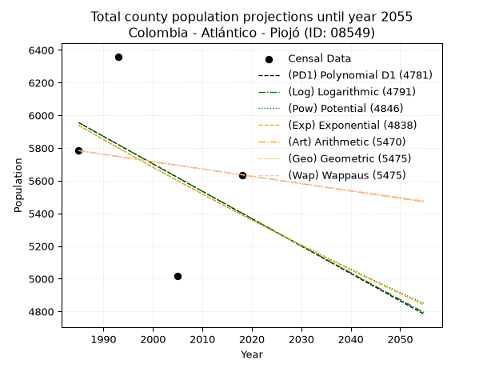
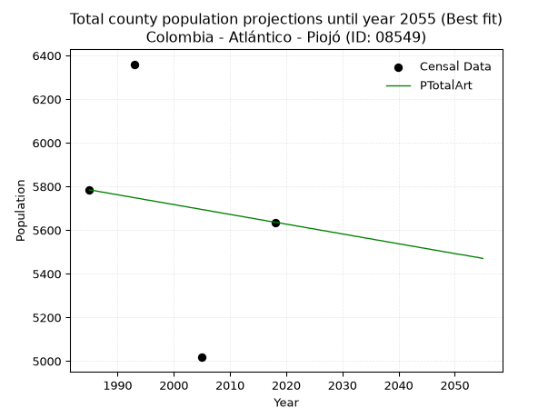
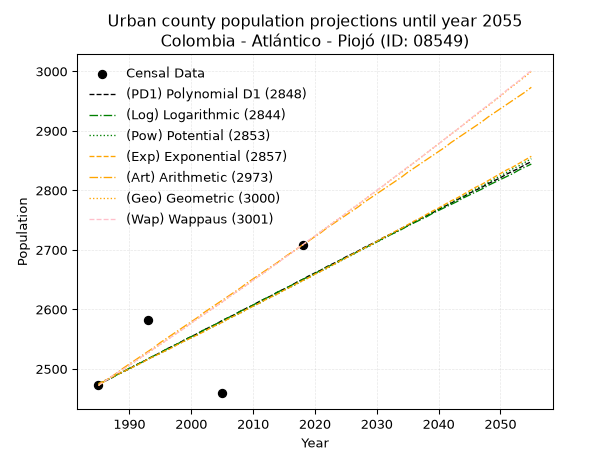
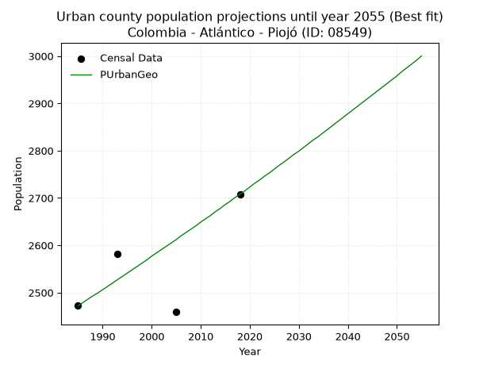
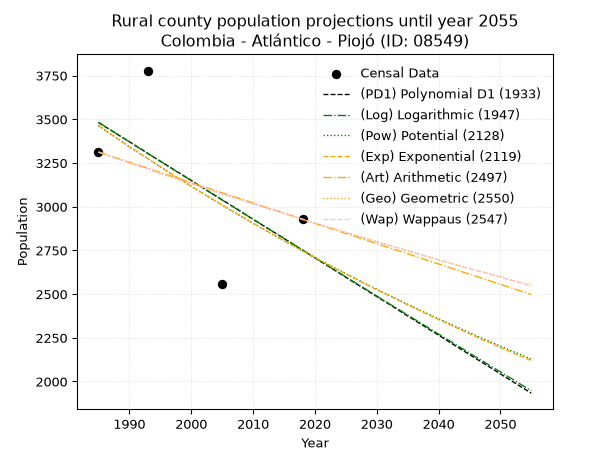
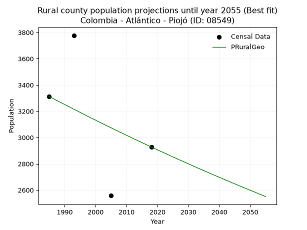

<div align="center">


</div>

# _“Population and Public Services Demand Projections (PPSD) until Year 2050 for Colombia - Atlántico - Piojó (ID: 08549)”_
Keywords: `population` `public-service` `projection` `lineal` `polynomial` `logarithmic` `potential` `exponential` `arithmetic` `geometric` `wappaus` `dane` `colombia` `south-america`

PPSD are analytical estimates used by governments and planners to anticipate future changes in population size, age distribution, and the resulting community needs for utilities, healthcare, education, and infrastructure as sizing future water treatment facilities, electrical grids, and road networks based on spatial growth.

> **General running parameters**: • app_version: _v20260806_. • Python version: _3.14.7_. • Pandas version: _3.0.5_. • NumPy version: _2.5.1_. • Creates, save and include plots into reports (create_plot): _False_. • Projection until year: _2050_. • Process polynomial degree 2 and up: _False_. • Process Wappaus: _True_. • Process Wappaus: _True_. • Set negative values to zero: _True_. • Set infinite values to zero: _True_. • Drop dataset notes: _True_. 
<div align="center">

Dynamic map: [:earth_americas:Google](http://maps.google.com/maps?q=10.74921562,-75.1075916) [:earth_americas:OSM](https://www.openstreetmap.org/#map=18/10.74921562/-75.1075916&layers=P) [:earth_americas:Bing](https://www.bing.com/maps?cp=10.74921562~-75.1075916&lvl=18) [:earth_americas:Apple](https://maps.apple.com/frame?center=10.74921562%2C-75.1075916&span=0.003%2C0.006)

</div>


<div align="center">

```geojson
{
  "type": "Feature",
  "geometry": {
    "type": "Point", 
    "coordinates": [-75.1075916, 10.74921562]
  }, 
  "properties": {
    "Name": "Colombia - Atlántico - Piojó (ID: 08549)"
  }
}
```

</div>


## 0. Census Data (4 records)

Census data are official statistics collected by a government about the people and housing in a country. They usually include counts of total population, age, sex, race, income, education, and jobs.

📅Global census file: [Population.xlsx](../data/Population.xlsx)

| Source   |   Year |   CountryID | CountryName   |   StateID | StateName   |   CountyID | CountyName   |   PTotal |   PUrban |   PRural |
|:---------|-------:|------------:|:--------------|----------:|:------------|-----------:|:-------------|---------:|---------:|---------:|
| DANE     |   1985 |          57 | Colombia      |        08 | Atlántico   |      08549 | Piojó        |     5784 |     2472 |     3312 |
| DANE     |   1993 |          57 | Colombia      |        08 | Atlántico   |      08549 | Piojó        |     6360 |     2582 |     3778 |
| DANE     |   2005 |          57 | Colombia      |        08 | Atlántico   |      08549 | Piojó        |     5017 |     2459 |     2558 |
| DANE     |   2018 |          57 | Colombia      |        08 | Atlántico   |      08549 | Piojó        |     5636 |     2708 |     2928 |

> 🔥Some records could had specific notes about the registered values or the corresponding urban or rural distribution.

📅   [RUPS](https://www.datos.gov.co/Hacienda-y-Cr-dito-P-blico/Registro-nico-de-Prestadores-de-Servicios-P-blicos/4qkq-csdn/about_data) - Local public utility companies: [RUPS.csv](../data/RUPS.xlsx)

 | SERVICIO   | ESTADO    | NOMBRE                                                                   | NIT         | DEPARTAMENTO_DOMICILIO   | MUNICIPIO_DOMICILIO   | DIRECCION          |   TELEFONO | EMAIL                     | TIPO_INSCRIPCION    | REPRESENTANTE_LEGAL          | TIPO_PRESTADOR                             | CLASIFICACION                 |
|:-----------|:----------|:-------------------------------------------------------------------------|:------------|:-------------------------|:----------------------|:-------------------|-----------:|:--------------------------|:--------------------|:-----------------------------|:-------------------------------------------|:------------------------------|
| ACUEDUCTO  | OPERATIVA | SOCIEDAD DE ACUEDUCTO, ALCANTARILLADO Y ASEO DE BARRANQUILLA S.A. E.S.P. | 800135913-1 | ATLANTICO                | BARRANQUILLA          | Carrera 58 # 67-09 |    3614000 | carolina.silva@aaa.com.co | Registro por la ESP | JAIRO ALBERTO DE CASTRO PENA | SOCIEDADES (EMPRESA DE SERVICIOS PUBLICOS) | MAYOR O IGUAL A 5001 USUARIOS |

## 1. Total

### 1.1. Coefficients and Parameters

* (PD1) Polynomial Deg 1: -16.774387796066115, 39252.21918908125 (lineal)
* (Log) Logarithmic: -33614.791660807176, 261205.5507858302
* (Pow) Potential: -5.871117931924954, 23.13528066356878
* (Exp) Exponential: -0.0029291210671723664, 1989735.6407470095
* (Art) Arithmetic: Year diff. 2018 - 1985 = 33, Population diff. 5636 - 5784 = -148, Annual growth = -4.484848484848484
* (Geo) Geometric: Year diff. 2018 - 1985 = 33, Population diff. 5636 - 5784 = -148, Annual growth % = -0.000785173130131489
* (Wap) Wappaus: i = -0.07854375630207504, Condition values only valid for < 200)

<sub>
Wappaus condition values: ['-0.00', '-0.08', '-0.16', '-0.24', '-0.31', '-0.39', '-0.47', '-0.55', '-0.63', '-0.71', '-0.79', '-0.86', '-0.94', '-1.02', '-1.10', '-1.18', '-1.26', '-1.34', '-1.41', '-1.49', '-1.57', '-1.65', '-1.73', '-1.81', '-1.89', '-1.96', '-2.04', '-2.12', '-2.20', '-2.28', '-2.36', '-2.43', '-2.51', '-2.59', '-2.67', '-2.75', '-2.83', '-2.91', '-2.98', '-3.06', '-3.14', '-3.22', '-3.30', '-3.38', '-3.46', '-3.53', '-3.61', '-3.69', '-3.77', '-3.85', '-3.93', '-4.01', '-4.08', '-4.16', '-4.24', '-4.32', '-4.40', '-4.48', '-4.56', '-4.63', '-4.71', '-4.79', '-4.87', '-4.95', '-5.03', '-5.11']
</sub>


### 1.2. Projected Dataset

|   Year |   CountyID |   PTotalPD1 |   PTotalLog |   PTotalPow |   PTotalExp |   PTotalArt |   PTotalGeo |   PTotalWap |
|-------:|-----------:|------------:|------------:|------------:|------------:|------------:|------------:|------------:|
|   1985 |      08549 |        5955 |        5956 |        5939 |        5938 |        5784 |        5784 |        5784 |
|   1986 |      08549 |        5938 |        5939 |        5922 |        5921 |        5780 |        5779 |        5779 |
|   1987 |      08549 |        5922 |        5922 |        5904 |        5904 |        5775 |        5775 |        5775 |
|   1988 |      08549 |        5905 |        5905 |        5887 |        5887 |        5771 |        5770 |        5770 |
|   1989 |      08549 |        5888 |        5888 |        5870 |        5869 |        5766 |        5766 |        5766 |
|   1990 |      08549 |        5871 |        5871 |        5852 |        5852 |        5762 |        5761 |        5761 |
|   1991 |      08549 |        5854 |        5854 |        5835 |        5835 |        5757 |        5757 |        5757 |
|   1992 |      08549 |        5838 |        5838 |        5818 |        5818 |        5753 |        5752 |        5752 |
|   1993 |      08549 |        5821 |        5821 |        5801 |        5801 |        5748 |        5748 |        5748 |
|   1994 |      08549 |        5804 |        5804 |        5784 |        5784 |        5744 |        5743 |        5743 |
|   1995 |      08549 |        5787 |        5787 |        5767 |        5767 |        5739 |        5739 |        5739 |
|   1996 |      08549 |        5771 |        5770 |        5750 |        5750 |        5735 |        5734 |        5734 |
|   1997 |      08549 |        5754 |        5753 |        5733 |        5733 |        5730 |        5730 |        5730 |
|   1998 |      08549 |        5737 |        5736 |        5716 |        5717 |        5726 |        5725 |        5725 |
|   1999 |      08549 |        5720 |        5720 |        5699 |        5700 |        5721 |        5721 |        5721 |
|   2000 |      08549 |        5703 |        5703 |        5683 |        5683 |        5717 |        5716 |        5716 |
|   2001 |      08549 |        5687 |        5686 |        5666 |        5667 |        5712 |        5712 |        5712 |
|   2002 |      08549 |        5670 |        5669 |        5649 |        5650 |        5708 |        5707 |        5707 |
|   2003 |      08549 |        5653 |        5652 |        5633 |        5633 |        5703 |        5703 |        5703 |
|   2004 |      08549 |        5636 |        5636 |        5616 |        5617 |        5699 |        5698 |        5698 |
|   2005 |      08549 |        5620 |        5619 |        5600 |        5601 |        5694 |        5694 |        5694 |
|   2006 |      08549 |        5603 |        5602 |        5583 |        5584 |        5690 |        5689 |        5689 |
|   2007 |      08549 |        5586 |        5585 |        5567 |        5568 |        5685 |        5685 |        5685 |
|   2008 |      08549 |        5569 |        5569 |        5551 |        5552 |        5681 |        5680 |        5680 |
|   2009 |      08549 |        5552 |        5552 |        5535 |        5535 |        5676 |        5676 |        5676 |
|   2010 |      08549 |        5536 |        5535 |        5519 |        5519 |        5672 |        5672 |        5672 |
|   2011 |      08549 |        5519 |        5518 |        5502 |        5503 |        5667 |        5667 |        5667 |
|   2012 |      08549 |        5502 |        5502 |        5486 |        5487 |        5663 |        5663 |        5663 |
|   2013 |      08549 |        5485 |        5485 |        5470 |        5471 |        5658 |        5658 |        5658 |
|   2014 |      08549 |        5469 |        5468 |        5455 |        5455 |        5654 |        5654 |        5654 |
|   2015 |      08549 |        5452 |        5452 |        5439 |        5439 |        5649 |        5649 |        5649 |
|   2016 |      08549 |        5435 |        5435 |        5423 |        5423 |        5645 |        5645 |        5645 |
|   2017 |      08549 |        5418 |        5418 |        5407 |        5407 |        5640 |        5640 |        5640 |
|   2018 |      08549 |        5402 |        5402 |        5391 |        5391 |        5636 |        5636 |        5636 |
|   2019 |      08549 |        5385 |        5385 |        5376 |        5376 |        5632 |        5632 |        5632 |
|   2020 |      08549 |        5368 |        5368 |        5360 |        5360 |        5627 |        5627 |        5627 |
|   2021 |      08549 |        5351 |        5352 |        5345 |        5344 |        5623 |        5623 |        5623 |
|   2022 |      08549 |        5334 |        5335 |        5329 |        5329 |        5618 |        5618 |        5618 |
|   2023 |      08549 |        5318 |        5318 |        5314 |        5313 |        5614 |        5614 |        5614 |
|   2024 |      08549 |        5301 |        5302 |        5298 |        5297 |        5609 |        5610 |        5609 |
|   2025 |      08549 |        5284 |        5285 |        5283 |        5282 |        5605 |        5605 |        5605 |
|   2026 |      08549 |        5267 |        5269 |        5268 |        5266 |        5600 |        5601 |        5601 |
|   2027 |      08549 |        5251 |        5252 |        5252 |        5251 |        5596 |        5596 |        5596 |
|   2028 |      08549 |        5234 |        5235 |        5237 |        5236 |        5591 |        5592 |        5592 |
|   2029 |      08549 |        5217 |        5219 |        5222 |        5220 |        5587 |        5588 |        5588 |
|   2030 |      08549 |        5200 |        5202 |        5207 |        5205 |        5582 |        5583 |        5583 |
|   2031 |      08549 |        5183 |        5186 |        5192 |        5190 |        5578 |        5579 |        5579 |
|   2032 |      08549 |        5167 |        5169 |        5177 |        5175 |        5573 |        5574 |        5574 |
|   2033 |      08549 |        5150 |        5153 |        5162 |        5160 |        5569 |        5570 |        5570 |
|   2034 |      08549 |        5133 |        5136 |        5147 |        5144 |        5564 |        5566 |        5566 |
|   2035 |      08549 |        5116 |        5120 |        5132 |        5129 |        5560 |        5561 |        5561 |
|   2036 |      08549 |        5100 |        5103 |        5117 |        5114 |        5555 |        5557 |        5557 |
|   2037 |      08549 |        5083 |        5087 |        5103 |        5099 |        5551 |        5553 |        5552 |
|   2038 |      08549 |        5066 |        5070 |        5088 |        5085 |        5546 |        5548 |        5548 |
|   2039 |      08549 |        5049 |        5054 |        5073 |        5070 |        5542 |        5544 |        5544 |
|   2040 |      08549 |        5032 |        5037 |        5059 |        5055 |        5537 |        5539 |        5539 |
|   2041 |      08549 |        5016 |        5021 |        5044 |        5040 |        5533 |        5535 |        5535 |
|   2042 |      08549 |        4999 |        5004 |        5030 |        5025 |        5528 |        5531 |        5531 |
|   2043 |      08549 |        4982 |        4988 |        5015 |        5011 |        5524 |        5526 |        5526 |
|   2044 |      08549 |        4965 |        4971 |        5001 |        4996 |        5519 |        5522 |        5522 |
|   2045 |      08549 |        4949 |        4955 |        4987 |        4981 |        5515 |        5518 |        5518 |
|   2046 |      08549 |        4932 |        4938 |        4972 |        4967 |        5510 |        5513 |        5513 |
|   2047 |      08549 |        4915 |        4922 |        4958 |        4952 |        5506 |        5509 |        5509 |
|   2048 |      08549 |        4898 |        4906 |        4944 |        4938 |        5501 |        5505 |        5505 |
|   2049 |      08549 |        4881 |        4889 |        4930 |        4923 |        5497 |        5500 |        5500 |
|   2050 |      08549 |        4865 |        4873 |        4916 |        4909 |        5492 |        5496 |        5496 |
<div align="center">

</img>

</div>


### 1.3. Best fit with absolute and relative error (%)

Relative error puts that difference into context by dividing the absolute error by the true value, creating a unitless ratio or percentage that shows the scale of the mistake.

Absolute and relative error

|   Year | Source   |   CountryID | CountryName   |   StateID | StateName   |   CountyID_x | CountyName   |   PTotal |   PUrban |   PRural |   CountyID_y |   PTotalPD1 |   PTotalLog |   PTotalPow |   PTotalExp |   PTotalArt |   PTotalGeo |   PTotalWap |   PTotalPD1AbsError |   PTotalLogAbsError |   PTotalPowAbsError |   PTotalExpAbsError |   PTotalArtAbsError |   PTotalGeoAbsError |   PTotalWapAbsError |   PTotalPD1RelError |   PTotalLogRelError |   PTotalPowRelError |   PTotalExpRelError |   PTotalArtRelError |   PTotalGeoRelError |   PTotalWapRelError |
|-------:|:---------|------------:|:--------------|----------:|:------------|-------------:|:-------------|---------:|---------:|---------:|-------------:|------------:|------------:|------------:|------------:|------------:|------------:|------------:|--------------------:|--------------------:|--------------------:|--------------------:|--------------------:|--------------------:|--------------------:|--------------------:|--------------------:|--------------------:|--------------------:|--------------------:|--------------------:|--------------------:|
|   1985 | DANE     |          57 | Colombia      |        08 | Atlántico   |        08549 | Piojó        |     5784 |     2472 |     3312 |        08549 |        5955 |        5956 |        5939 |        5938 |        5784 |        5784 |        5784 |                 171 |                 172 |                 155 |                 154 |                   0 |                   0 |                   0 |             2.95643 |             2.97372 |             2.67981 |             2.66252 |             0       |             0       |             0       |
|   1993 | DANE     |          57 | Colombia      |        08 | Atlántico   |        08549 | Piojó        |     6360 |     2582 |     3778 |        08549 |        5821 |        5821 |        5801 |        5801 |        5748 |        5748 |        5748 |                 539 |                 539 |                 559 |                 559 |                 612 |                 612 |                 612 |             8.47484 |             8.47484 |             8.78931 |             8.78931 |             9.62264 |             9.62264 |             9.62264 |
|   2005 | DANE     |          57 | Colombia      |        08 | Atlántico   |        08549 | Piojó        |     5017 |     2459 |     2558 |        08549 |        5620 |        5619 |        5600 |        5601 |        5694 |        5694 |        5694 |                 603 |                 602 |                 583 |                 584 |                 677 |                 677 |                 677 |            12.0191  |            11.9992  |            11.6205  |            11.6404  |            13.4941  |            13.4941  |            13.4941  |
|   2018 | DANE     |          57 | Colombia      |        08 | Atlántico   |        08549 | Piojó        |     5636 |     2708 |     2928 |        08549 |        5402 |        5402 |        5391 |        5391 |        5636 |        5636 |        5636 |                 234 |                 234 |                 245 |                 245 |                   0 |                   0 |                   0 |             4.15188 |             4.15188 |             4.34705 |             4.34705 |             0       |             0       |             0       |

Relative error mean

| Method    |   RelError | Best   |
|:----------|-----------:|:-------|
| PTotalPD1 |    6.90057 |        |
| PTotalLog |    6.89991 |        |
| PTotalPow |    6.85916 |        |
| PTotalExp |    6.85983 |        |
| PTotalArt |    5.77919 | True   |
| PTotalGeo |    5.77919 | True   |
| PTotalWap |    5.77919 | True   |

💙Best method: _**PTotalArt**_
<div align="center">

</img>

</div>


### 1.4. Fresh water supply demand in liters per capita per day (lpcd)

The fresh water supply demand typically ranges from 100 to 300 liters per capita per day (lpcd) for standard domestic and municipal planning, though absolute survival minimums set by the World Health Organization are as low as 7.5 to 20 liters per day, and total consumption in high-income nations can exceed 400 liters.

> `CZ`: Level in meters above the sea level (masl)<br> `WS`: Fresh water supply demand in liters per capita per day (lpcd or l/h/d)<br> `WSAll`: Zonal fresh water supply demand in liters per second (l/s)<br> `A`: Zonal area in square meters<br> `DP`: Population density (people/hectare or p/ha)

Reference values (RAS Colombia)

|    CZ |   WS |
|------:|-----:|
|  1000 |  120 |
|  2000 |  130 |
| 99999 |  140 |

County shapefile geometry properties and water supply values

|   CountyID |      ATotal |   CZTotal |   WSTotal |
|-----------:|------------:|----------:|----------:|
|      08549 | 2.62705e+08 |   82.7483 |       120 |

Projected values for best method: PTotalArt

|   CountyID |   Year |   PTotalArt |   DPTotal |   WSTotal |   WSTotalAll |
|-----------:|-------:|------------:|----------:|----------:|-------------:|
|      08549 |   1985 |        5784 |      0.22 |       120 |      8.03333 |
|      08549 |   1986 |        5780 |      0.22 |       120 |      8.02778 |
|      08549 |   1987 |        5775 |      0.22 |       120 |      8.02083 |
|      08549 |   1988 |        5771 |      0.22 |       120 |      8.01528 |
|      08549 |   1989 |        5766 |      0.22 |       120 |      8.00833 |
|      08549 |   1990 |        5762 |      0.22 |       120 |      8.00278 |
|      08549 |   1991 |        5757 |      0.22 |       120 |      7.99583 |
|      08549 |   1992 |        5753 |      0.22 |       120 |      7.99028 |
|      08549 |   1993 |        5748 |      0.22 |       120 |      7.98333 |
|      08549 |   1994 |        5744 |      0.22 |       120 |      7.97778 |
|      08549 |   1995 |        5739 |      0.22 |       120 |      7.97083 |
|      08549 |   1996 |        5735 |      0.22 |       120 |      7.96528 |
|      08549 |   1997 |        5730 |      0.22 |       120 |      7.95833 |
|      08549 |   1998 |        5726 |      0.22 |       120 |      7.95278 |
|      08549 |   1999 |        5721 |      0.22 |       120 |      7.94583 |
|      08549 |   2000 |        5717 |      0.22 |       120 |      7.94028 |
|      08549 |   2001 |        5712 |      0.22 |       120 |      7.93333 |
|      08549 |   2002 |        5708 |      0.22 |       120 |      7.92778 |
|      08549 |   2003 |        5703 |      0.22 |       120 |      7.92083 |
|      08549 |   2004 |        5699 |      0.22 |       120 |      7.91528 |
|      08549 |   2005 |        5694 |      0.22 |       120 |      7.90833 |
|      08549 |   2006 |        5690 |      0.22 |       120 |      7.90278 |
|      08549 |   2007 |        5685 |      0.22 |       120 |      7.89583 |
|      08549 |   2008 |        5681 |      0.22 |       120 |      7.89028 |
|      08549 |   2009 |        5676 |      0.22 |       120 |      7.88333 |
|      08549 |   2010 |        5672 |      0.22 |       120 |      7.87778 |
|      08549 |   2011 |        5667 |      0.22 |       120 |      7.87083 |
|      08549 |   2012 |        5663 |      0.22 |       120 |      7.86528 |
|      08549 |   2013 |        5658 |      0.22 |       120 |      7.85833 |
|      08549 |   2014 |        5654 |      0.22 |       120 |      7.85278 |
|      08549 |   2015 |        5649 |      0.22 |       120 |      7.84583 |
|      08549 |   2016 |        5645 |      0.21 |       120 |      7.84028 |
|      08549 |   2017 |        5640 |      0.21 |       120 |      7.83333 |
|      08549 |   2018 |        5636 |      0.21 |       120 |      7.82778 |
|      08549 |   2019 |        5632 |      0.21 |       120 |      7.82222 |
|      08549 |   2020 |        5627 |      0.21 |       120 |      7.81528 |
|      08549 |   2021 |        5623 |      0.21 |       120 |      7.80972 |
|      08549 |   2022 |        5618 |      0.21 |       120 |      7.80278 |
|      08549 |   2023 |        5614 |      0.21 |       120 |      7.79722 |
|      08549 |   2024 |        5609 |      0.21 |       120 |      7.79028 |
|      08549 |   2025 |        5605 |      0.21 |       120 |      7.78472 |
|      08549 |   2026 |        5600 |      0.21 |       120 |      7.77778 |
|      08549 |   2027 |        5596 |      0.21 |       120 |      7.77222 |
|      08549 |   2028 |        5591 |      0.21 |       120 |      7.76528 |
|      08549 |   2029 |        5587 |      0.21 |       120 |      7.75972 |
|      08549 |   2030 |        5582 |      0.21 |       120 |      7.75278 |
|      08549 |   2031 |        5578 |      0.21 |       120 |      7.74722 |
|      08549 |   2032 |        5573 |      0.21 |       120 |      7.74028 |
|      08549 |   2033 |        5569 |      0.21 |       120 |      7.73472 |
|      08549 |   2034 |        5564 |      0.21 |       120 |      7.72778 |
|      08549 |   2035 |        5560 |      0.21 |       120 |      7.72222 |
|      08549 |   2036 |        5555 |      0.21 |       120 |      7.71528 |
|      08549 |   2037 |        5551 |      0.21 |       120 |      7.70972 |
|      08549 |   2038 |        5546 |      0.21 |       120 |      7.70278 |
|      08549 |   2039 |        5542 |      0.21 |       120 |      7.69722 |
|      08549 |   2040 |        5537 |      0.21 |       120 |      7.69028 |
|      08549 |   2041 |        5533 |      0.21 |       120 |      7.68472 |
|      08549 |   2042 |        5528 |      0.21 |       120 |      7.67778 |
|      08549 |   2043 |        5524 |      0.21 |       120 |      7.67222 |
|      08549 |   2044 |        5519 |      0.21 |       120 |      7.66528 |
|      08549 |   2045 |        5515 |      0.21 |       120 |      7.65972 |
|      08549 |   2046 |        5510 |      0.21 |       120 |      7.65278 |
|      08549 |   2047 |        5506 |      0.21 |       120 |      7.64722 |
|      08549 |   2048 |        5501 |      0.21 |       120 |      7.64028 |
|      08549 |   2049 |        5497 |      0.21 |       120 |      7.63472 |
|      08549 |   2050 |        5492 |      0.21 |       120 |      7.62778 |

## 2. Urban

### 2.1. Coefficients and Parameters

* (PD1) Polynomial Deg 1: 5.346848655158407, -8139.784022480602 (lineal)
* (Log) Logarithmic: 10687.546635960609, -78680.87762456037
* (Pow) Potential: 4.101399156962144, -10.131926682338518
* (Exp) Exponential: 0.0020518792911954284, 42.13475625479294
* (Art) Arithmetic: Year diff. 2018 - 1985 = 33, Population diff. 2708 - 2472 = 236, Annual growth = 7.151515151515151
* (Geo) Geometric: Year diff. 2018 - 1985 = 33, Population diff. 2708 - 2472 = 236, Annual growth % = 0.0027669365422064995
* (Wap) Wappaus: i = 0.2761202761202761, Condition values only valid for < 200)

<sub>
Wappaus condition values: ['0.00', '0.28', '0.55', '0.83', '1.10', '1.38', '1.66', '1.93', '2.21', '2.49', '2.76', '3.04', '3.31', '3.59', '3.87', '4.14', '4.42', '4.69', '4.97', '5.25', '5.52', '5.80', '6.07', '6.35', '6.63', '6.90', '7.18', '7.46', '7.73', '8.01', '8.28', '8.56', '8.84', '9.11', '9.39', '9.66', '9.94', '10.22', '10.49', '10.77', '11.04', '11.32', '11.60', '11.87', '12.15', '12.43', '12.70', '12.98', '13.25', '13.53', '13.81', '14.08', '14.36', '14.63', '14.91', '15.19', '15.46', '15.74', '16.01', '16.29', '16.57', '16.84', '17.12', '17.40', '17.67', '17.95']
</sub>


### 2.2. Projected Dataset

|   Year |   CountyID |   PUrbanPD1 |   PUrbanLog |   PUrbanPow |   PUrbanExp |   PUrbanArt |   PUrbanGeo |   PUrbanWap |
|-------:|-----------:|------------:|------------:|------------:|------------:|------------:|------------:|------------:|
|   1985 |      08549 |        2474 |        2474 |        2475 |        2475 |        2472 |        2472 |        2472 |
|   1986 |      08549 |        2479 |        2479 |        2480 |        2480 |        2479 |        2479 |        2479 |
|   1987 |      08549 |        2484 |        2484 |        2485 |        2485 |        2486 |        2486 |        2486 |
|   1988 |      08549 |        2490 |        2490 |        2490 |        2490 |        2493 |        2493 |        2493 |
|   1989 |      08549 |        2495 |        2495 |        2495 |        2495 |        2501 |        2499 |        2499 |
|   1990 |      08549 |        2500 |        2501 |        2500 |        2500 |        2508 |        2506 |        2506 |
|   1991 |      08549 |        2506 |        2506 |        2505 |        2505 |        2515 |        2513 |        2513 |
|   1992 |      08549 |        2511 |        2511 |        2511 |        2510 |        2522 |        2520 |        2520 |
|   1993 |      08549 |        2516 |        2517 |        2516 |        2516 |        2529 |        2527 |        2527 |
|   1994 |      08549 |        2522 |        2522 |        2521 |        2521 |        2536 |        2534 |        2534 |
|   1995 |      08549 |        2527 |        2527 |        2526 |        2526 |        2544 |        2541 |        2541 |
|   1996 |      08549 |        2533 |        2533 |        2531 |        2531 |        2551 |        2548 |        2548 |
|   1997 |      08549 |        2538 |        2538 |        2537 |        2536 |        2558 |        2555 |        2555 |
|   1998 |      08549 |        2543 |        2543 |        2542 |        2542 |        2565 |        2562 |        2562 |
|   1999 |      08549 |        2549 |        2549 |        2547 |        2547 |        2572 |        2569 |        2569 |
|   2000 |      08549 |        2554 |        2554 |        2552 |        2552 |        2579 |        2577 |        2577 |
|   2001 |      08549 |        2559 |        2559 |        2557 |        2557 |        2586 |        2584 |        2584 |
|   2002 |      08549 |        2565 |        2565 |        2563 |        2562 |        2594 |        2591 |        2591 |
|   2003 |      08549 |        2570 |        2570 |        2568 |        2568 |        2601 |        2598 |        2598 |
|   2004 |      08549 |        2575 |        2575 |        2573 |        2573 |        2608 |        2605 |        2605 |
|   2005 |      08549 |        2581 |        2581 |        2578 |        2578 |        2615 |        2612 |        2612 |
|   2006 |      08549 |        2586 |        2586 |        2584 |        2584 |        2622 |        2620 |        2620 |
|   2007 |      08549 |        2591 |        2591 |        2589 |        2589 |        2629 |        2627 |        2627 |
|   2008 |      08549 |        2597 |        2597 |        2594 |        2594 |        2636 |        2634 |        2634 |
|   2009 |      08549 |        2602 |        2602 |        2600 |        2600 |        2644 |        2641 |        2641 |
|   2010 |      08549 |        2607 |        2607 |        2605 |        2605 |        2651 |        2649 |        2649 |
|   2011 |      08549 |        2613 |        2613 |        2610 |        2610 |        2658 |        2656 |        2656 |
|   2012 |      08549 |        2618 |        2618 |        2616 |        2616 |        2665 |        2663 |        2663 |
|   2013 |      08549 |        2623 |        2623 |        2621 |        2621 |        2672 |        2671 |        2671 |
|   2014 |      08549 |        2629 |        2629 |        2626 |        2626 |        2679 |        2678 |        2678 |
|   2015 |      08549 |        2634 |        2634 |        2632 |        2632 |        2687 |        2686 |        2686 |
|   2016 |      08549 |        2639 |        2639 |        2637 |        2637 |        2694 |        2693 |        2693 |
|   2017 |      08549 |        2645 |        2645 |        2642 |        2643 |        2701 |        2701 |        2701 |
|   2018 |      08549 |        2650 |        2650 |        2648 |        2648 |        2708 |        2708 |        2708 |
|   2019 |      08549 |        2656 |        2655 |        2653 |        2653 |        2715 |        2715 |        2716 |
|   2020 |      08549 |        2661 |        2660 |        2659 |        2659 |        2722 |        2723 |        2723 |
|   2021 |      08549 |        2666 |        2666 |        2664 |        2664 |        2729 |        2731 |        2731 |
|   2022 |      08549 |        2672 |        2671 |        2669 |        2670 |        2737 |        2738 |        2738 |
|   2023 |      08549 |        2677 |        2676 |        2675 |        2675 |        2744 |        2746 |        2746 |
|   2024 |      08549 |        2682 |        2682 |        2680 |        2681 |        2751 |        2753 |        2753 |
|   2025 |      08549 |        2688 |        2687 |        2686 |        2686 |        2758 |        2761 |        2761 |
|   2026 |      08549 |        2693 |        2692 |        2691 |        2692 |        2765 |        2769 |        2769 |
|   2027 |      08549 |        2698 |        2697 |        2697 |        2697 |        2772 |        2776 |        2776 |
|   2028 |      08549 |        2704 |        2703 |        2702 |        2703 |        2780 |        2784 |        2784 |
|   2029 |      08549 |        2709 |        2708 |        2707 |        2708 |        2787 |        2792 |        2792 |
|   2030 |      08549 |        2714 |        2713 |        2713 |        2714 |        2794 |        2799 |        2800 |
|   2031 |      08549 |        2720 |        2719 |        2718 |        2720 |        2801 |        2807 |        2807 |
|   2032 |      08549 |        2725 |        2724 |        2724 |        2725 |        2808 |        2815 |        2815 |
|   2033 |      08549 |        2730 |        2729 |        2729 |        2731 |        2815 |        2823 |        2823 |
|   2034 |      08549 |        2736 |        2734 |        2735 |        2736 |        2822 |        2830 |        2831 |
|   2035 |      08549 |        2741 |        2740 |        2740 |        2742 |        2830 |        2838 |        2839 |
|   2036 |      08549 |        2746 |        2745 |        2746 |        2748 |        2837 |        2846 |        2846 |
|   2037 |      08549 |        2752 |        2750 |        2751 |        2753 |        2844 |        2854 |        2854 |
|   2038 |      08549 |        2757 |        2755 |        2757 |        2759 |        2851 |        2862 |        2862 |
|   2039 |      08549 |        2762 |        2761 |        2763 |        2765 |        2858 |        2870 |        2870 |
|   2040 |      08549 |        2768 |        2766 |        2768 |        2770 |        2865 |        2878 |        2878 |
|   2041 |      08549 |        2773 |        2771 |        2774 |        2776 |        2872 |        2886 |        2886 |
|   2042 |      08549 |        2778 |        2776 |        2779 |        2782 |        2880 |        2894 |        2894 |
|   2043 |      08549 |        2784 |        2781 |        2785 |        2787 |        2887 |        2902 |        2902 |
|   2044 |      08549 |        2789 |        2787 |        2790 |        2793 |        2894 |        2910 |        2910 |
|   2045 |      08549 |        2795 |        2792 |        2796 |        2799 |        2901 |        2918 |        2919 |
|   2046 |      08549 |        2800 |        2797 |        2802 |        2805 |        2908 |        2926 |        2927 |
|   2047 |      08549 |        2805 |        2802 |        2807 |        2810 |        2915 |        2934 |        2935 |
|   2048 |      08549 |        2811 |        2808 |        2813 |        2816 |        2923 |        2942 |        2943 |
|   2049 |      08549 |        2816 |        2813 |        2819 |        2822 |        2930 |        2950 |        2951 |
|   2050 |      08549 |        2821 |        2818 |        2824 |        2828 |        2937 |        2958 |        2959 |
<div align="center">

</img>

</div>


### 2.3. Best fit with absolute and relative error (%)

Relative error puts that difference into context by dividing the absolute error by the true value, creating a unitless ratio or percentage that shows the scale of the mistake.

Absolute and relative error

|   Year | Source   |   CountryID | CountryName   |   StateID | StateName   |   CountyID_x | CountyName   |   PTotal |   PUrban |   PRural |   CountyID_y |   PUrbanPD1 |   PUrbanLog |   PUrbanPow |   PUrbanExp |   PUrbanArt |   PUrbanGeo |   PUrbanWap |   PUrbanPD1AbsError |   PUrbanLogAbsError |   PUrbanPowAbsError |   PUrbanExpAbsError |   PUrbanArtAbsError |   PUrbanGeoAbsError |   PUrbanWapAbsError |   PUrbanPD1RelError |   PUrbanLogRelError |   PUrbanPowRelError |   PUrbanExpRelError |   PUrbanArtRelError |   PUrbanGeoRelError |   PUrbanWapRelError |
|-------:|:---------|------------:|:--------------|----------:|:------------|-------------:|:-------------|---------:|---------:|---------:|-------------:|------------:|------------:|------------:|------------:|------------:|------------:|------------:|--------------------:|--------------------:|--------------------:|--------------------:|--------------------:|--------------------:|--------------------:|--------------------:|--------------------:|--------------------:|--------------------:|--------------------:|--------------------:|--------------------:|
|   1985 | DANE     |          57 | Colombia      |        08 | Atlántico   |        08549 | Piojó        |     5784 |     2472 |     3312 |        08549 |        2474 |        2474 |        2475 |        2475 |        2472 |        2472 |        2472 |                   2 |                   2 |                   3 |                   3 |                   0 |                   0 |                   0 |           0.0809061 |           0.0809061 |            0.121359 |            0.121359 |             0       |             0       |             0       |
|   1993 | DANE     |          57 | Colombia      |        08 | Atlántico   |        08549 | Piojó        |     6360 |     2582 |     3778 |        08549 |        2516 |        2517 |        2516 |        2516 |        2529 |        2527 |        2527 |                  66 |                  65 |                  66 |                  66 |                  53 |                  55 |                  55 |           2.55616   |           2.51743   |            2.55616  |            2.55616  |             2.05267 |             2.13013 |             2.13013 |
|   2005 | DANE     |          57 | Colombia      |        08 | Atlántico   |        08549 | Piojó        |     5017 |     2459 |     2558 |        08549 |        2581 |        2581 |        2578 |        2578 |        2615 |        2612 |        2612 |                 122 |                 122 |                 119 |                 119 |                 156 |                 153 |                 153 |           4.96137   |           4.96137   |            4.83937  |            4.83937  |             6.34404 |             6.22204 |             6.22204 |
|   2018 | DANE     |          57 | Colombia      |        08 | Atlántico   |        08549 | Piojó        |     5636 |     2708 |     2928 |        08549 |        2650 |        2650 |        2648 |        2648 |        2708 |        2708 |        2708 |                  58 |                  58 |                  60 |                  60 |                   0 |                   0 |                   0 |           2.1418    |           2.1418    |            2.21566  |            2.21566  |             0       |             0       |             0       |

Relative error mean

| Method    |   RelError | Best   |
|:----------|-----------:|:-------|
| PUrbanPD1 |    2.43506 |        |
| PUrbanLog |    2.42538 |        |
| PUrbanPow |    2.43314 |        |
| PUrbanExp |    2.43314 |        |
| PUrbanArt |    2.09918 |        |
| PUrbanGeo |    2.08804 | True   |
| PUrbanWap |    2.08804 | True   |

💙Best method: _**PUrbanGeo**_
<div align="center">

</img>

</div>


### 2.4. Fresh water supply demand in liters per capita per day (lpcd)

The fresh water supply demand typically ranges from 100 to 300 liters per capita per day (lpcd) for standard domestic and municipal planning, though absolute survival minimums set by the World Health Organization are as low as 7.5 to 20 liters per day, and total consumption in high-income nations can exceed 400 liters.

> `CZ`: Level in meters above the sea level (masl)<br> `WS`: Fresh water supply demand in liters per capita per day (lpcd or l/h/d)<br> `WSAll`: Zonal fresh water supply demand in liters per second (l/s)<br> `A`: Zonal area in square meters<br> `DP`: Population density (people/hectare or p/ha)

Reference values (RAS Colombia)

|    CZ |   WS |
|------:|-----:|
|  1000 |  120 |
|  2000 |  130 |
| 99999 |  140 |

County shapefile geometry properties and water supply values

|   CountyID |   AUrban |   CZUrban |   WSUrban |
|-----------:|---------:|----------:|----------:|
|      08549 |   449250 |   309.508 |       120 |

Projected values for best method: PUrbanGeo

|   CountyID |   Year |   PUrbanGeo |   DPUrban |   WSUrban |   WSUrbanAll |
|-----------:|-------:|------------:|----------:|----------:|-------------:|
|      08549 |   1985 |        2472 |     55.03 |       120 |      3.43333 |
|      08549 |   1986 |        2479 |     55.18 |       120 |      3.44306 |
|      08549 |   1987 |        2486 |     55.34 |       120 |      3.45278 |
|      08549 |   1988 |        2493 |     55.49 |       120 |      3.4625  |
|      08549 |   1989 |        2499 |     55.63 |       120 |      3.47083 |
|      08549 |   1990 |        2506 |     55.78 |       120 |      3.48056 |
|      08549 |   1991 |        2513 |     55.94 |       120 |      3.49028 |
|      08549 |   1992 |        2520 |     56.09 |       120 |      3.5     |
|      08549 |   1993 |        2527 |     56.25 |       120 |      3.50972 |
|      08549 |   1994 |        2534 |     56.41 |       120 |      3.51944 |
|      08549 |   1995 |        2541 |     56.56 |       120 |      3.52917 |
|      08549 |   1996 |        2548 |     56.72 |       120 |      3.53889 |
|      08549 |   1997 |        2555 |     56.87 |       120 |      3.54861 |
|      08549 |   1998 |        2562 |     57.03 |       120 |      3.55833 |
|      08549 |   1999 |        2569 |     57.18 |       120 |      3.56806 |
|      08549 |   2000 |        2577 |     57.36 |       120 |      3.57917 |
|      08549 |   2001 |        2584 |     57.52 |       120 |      3.58889 |
|      08549 |   2002 |        2591 |     57.67 |       120 |      3.59861 |
|      08549 |   2003 |        2598 |     57.83 |       120 |      3.60833 |
|      08549 |   2004 |        2605 |     57.99 |       120 |      3.61806 |
|      08549 |   2005 |        2612 |     58.14 |       120 |      3.62778 |
|      08549 |   2006 |        2620 |     58.32 |       120 |      3.63889 |
|      08549 |   2007 |        2627 |     58.48 |       120 |      3.64861 |
|      08549 |   2008 |        2634 |     58.63 |       120 |      3.65833 |
|      08549 |   2009 |        2641 |     58.79 |       120 |      3.66806 |
|      08549 |   2010 |        2649 |     58.96 |       120 |      3.67917 |
|      08549 |   2011 |        2656 |     59.12 |       120 |      3.68889 |
|      08549 |   2012 |        2663 |     59.28 |       120 |      3.69861 |
|      08549 |   2013 |        2671 |     59.45 |       120 |      3.70972 |
|      08549 |   2014 |        2678 |     59.61 |       120 |      3.71944 |
|      08549 |   2015 |        2686 |     59.79 |       120 |      3.73056 |
|      08549 |   2016 |        2693 |     59.94 |       120 |      3.74028 |
|      08549 |   2017 |        2701 |     60.12 |       120 |      3.75139 |
|      08549 |   2018 |        2708 |     60.28 |       120 |      3.76111 |
|      08549 |   2019 |        2715 |     60.43 |       120 |      3.77083 |
|      08549 |   2020 |        2723 |     60.61 |       120 |      3.78194 |
|      08549 |   2021 |        2731 |     60.79 |       120 |      3.79306 |
|      08549 |   2022 |        2738 |     60.95 |       120 |      3.80278 |
|      08549 |   2023 |        2746 |     61.12 |       120 |      3.81389 |
|      08549 |   2024 |        2753 |     61.28 |       120 |      3.82361 |
|      08549 |   2025 |        2761 |     61.46 |       120 |      3.83472 |
|      08549 |   2026 |        2769 |     61.64 |       120 |      3.84583 |
|      08549 |   2027 |        2776 |     61.79 |       120 |      3.85556 |
|      08549 |   2028 |        2784 |     61.97 |       120 |      3.86667 |
|      08549 |   2029 |        2792 |     62.15 |       120 |      3.87778 |
|      08549 |   2030 |        2799 |     62.3  |       120 |      3.8875  |
|      08549 |   2031 |        2807 |     62.48 |       120 |      3.89861 |
|      08549 |   2032 |        2815 |     62.66 |       120 |      3.90972 |
|      08549 |   2033 |        2823 |     62.84 |       120 |      3.92083 |
|      08549 |   2034 |        2830 |     62.99 |       120 |      3.93056 |
|      08549 |   2035 |        2838 |     63.17 |       120 |      3.94167 |
|      08549 |   2036 |        2846 |     63.35 |       120 |      3.95278 |
|      08549 |   2037 |        2854 |     63.53 |       120 |      3.96389 |
|      08549 |   2038 |        2862 |     63.71 |       120 |      3.975   |
|      08549 |   2039 |        2870 |     63.88 |       120 |      3.98611 |
|      08549 |   2040 |        2878 |     64.06 |       120 |      3.99722 |
|      08549 |   2041 |        2886 |     64.24 |       120 |      4.00833 |
|      08549 |   2042 |        2894 |     64.42 |       120 |      4.01944 |
|      08549 |   2043 |        2902 |     64.6  |       120 |      4.03056 |
|      08549 |   2044 |        2910 |     64.77 |       120 |      4.04167 |
|      08549 |   2045 |        2918 |     64.95 |       120 |      4.05278 |
|      08549 |   2046 |        2926 |     65.13 |       120 |      4.06389 |
|      08549 |   2047 |        2934 |     65.31 |       120 |      4.075   |
|      08549 |   2048 |        2942 |     65.49 |       120 |      4.08611 |
|      08549 |   2049 |        2950 |     65.66 |       120 |      4.09722 |
|      08549 |   2050 |        2958 |     65.84 |       120 |      4.10833 |

## 3. Rural

### 3.1. Coefficients and Parameters

* (PD1) Polynomial Deg 1: -22.121236451224565, 47392.00321156194 (lineal)
* (Log) Logarithmic: -44302.33829676776, 339886.4284103903
* (Pow) Potential: -14.052985060866991, 49.882925398014116
* (Exp) Exponential: -0.007015397450097998, 3865578192.242214
* (Art) Arithmetic: Year diff. 2018 - 1985 = 33, Population diff. 2928 - 3312 = -384, Annual growth = -11.636363636363637
* (Geo) Geometric: Year diff. 2018 - 1985 = 33, Population diff. 2928 - 3312 = -384, Annual growth % = -0.0037273585262503905
* (Wap) Wappaus: i = -0.372960372960373, Condition values only valid for < 200)

<sub>
Wappaus condition values: ['-0.00', '-0.37', '-0.75', '-1.12', '-1.49', '-1.86', '-2.24', '-2.61', '-2.98', '-3.36', '-3.73', '-4.10', '-4.48', '-4.85', '-5.22', '-5.59', '-5.97', '-6.34', '-6.71', '-7.09', '-7.46', '-7.83', '-8.21', '-8.58', '-8.95', '-9.32', '-9.70', '-10.07', '-10.44', '-10.82', '-11.19', '-11.56', '-11.93', '-12.31', '-12.68', '-13.05', '-13.43', '-13.80', '-14.17', '-14.55', '-14.92', '-15.29', '-15.66', '-16.04', '-16.41', '-16.78', '-17.16', '-17.53', '-17.90', '-18.28', '-18.65', '-19.02', '-19.39', '-19.77', '-20.14', '-20.51', '-20.89', '-21.26', '-21.63', '-22.00', '-22.38', '-22.75', '-23.12', '-23.50', '-23.87', '-24.24']
</sub>


### 3.2. Projected Dataset

|   Year |   CountyID |   PRuralPD1 |   PRuralLog |   PRuralPow |   PRuralExp |   PRuralArt |   PRuralGeo |   PRuralWap |
|-------:|-----------:|------------:|------------:|------------:|------------:|------------:|------------:|------------:|
|   1985 |      08549 |        3481 |        3482 |        3464 |        3463 |        3312 |        3312 |        3312 |
|   1986 |      08549 |        3459 |        3460 |        3439 |        3439 |        3300 |        3300 |        3300 |
|   1987 |      08549 |        3437 |        3438 |        3415 |        3414 |        3289 |        3287 |        3287 |
|   1988 |      08549 |        3415 |        3415 |        3391 |        3391 |        3277 |        3275 |        3275 |
|   1989 |      08549 |        3393 |        3393 |        3367 |        3367 |        3265 |        3263 |        3263 |
|   1990 |      08549 |        3371 |        3371 |        3343 |        3343 |        3254 |        3251 |        3251 |
|   1991 |      08549 |        3349 |        3348 |        3320 |        3320 |        3242 |        3239 |        3239 |
|   1992 |      08549 |        3327 |        3326 |        3297 |        3297 |        3231 |        3227 |        3227 |
|   1993 |      08549 |        3304 |        3304 |        3273 |        3274 |        3219 |        3215 |        3215 |
|   1994 |      08549 |        3282 |        3282 |        3250 |        3251 |        3207 |        3203 |        3203 |
|   1995 |      08549 |        3260 |        3260 |        3228 |        3228 |        3196 |        3191 |        3191 |
|   1996 |      08549 |        3238 |        3237 |        3205 |        3206 |        3184 |        3179 |        3179 |
|   1997 |      08549 |        3216 |        3215 |        3182 |        3183 |        3172 |        3167 |        3167 |
|   1998 |      08549 |        3194 |        3193 |        3160 |        3161 |        3161 |        3155 |        3155 |
|   1999 |      08549 |        3172 |        3171 |        3138 |        3139 |        3149 |        3143 |        3143 |
|   2000 |      08549 |        3150 |        3149 |        3116 |        3117 |        3137 |        3132 |        3132 |
|   2001 |      08549 |        3127 |        3127 |        3094 |        3095 |        3126 |        3120 |        3120 |
|   2002 |      08549 |        3105 |        3104 |        3073 |        3073 |        3114 |        3108 |        3108 |
|   2003 |      08549 |        3083 |        3082 |        3051 |        3052 |        3103 |        3097 |        3097 |
|   2004 |      08549 |        3061 |        3060 |        3030 |        3031 |        3091 |        3085 |        3085 |
|   2005 |      08549 |        3039 |        3038 |        3009 |        3009 |        3079 |        3074 |        3074 |
|   2006 |      08549 |        3017 |        3016 |        2988 |        2988 |        3068 |        3062 |        3062 |
|   2007 |      08549 |        2995 |        2994 |        2967 |        2967 |        3056 |        3051 |        3051 |
|   2008 |      08549 |        2973 |        2972 |        2946 |        2947 |        3044 |        3039 |        3040 |
|   2009 |      08549 |        2950 |        2950 |        2925 |        2926 |        3033 |        3028 |        3028 |
|   2010 |      08549 |        2928 |        2928 |        2905 |        2906 |        3021 |        3017 |        3017 |
|   2011 |      08549 |        2906 |        2906 |        2885 |        2885 |        3009 |        3006 |        3006 |
|   2012 |      08549 |        2884 |        2884 |        2865 |        2865 |        2998 |        2994 |        2994 |
|   2013 |      08549 |        2862 |        2862 |        2845 |        2845 |        2986 |        2983 |        2983 |
|   2014 |      08549 |        2840 |        2840 |        2825 |        2825 |        2975 |        2972 |        2972 |
|   2015 |      08549 |        2818 |        2818 |        2805 |        2806 |        2963 |        2961 |        2961 |
|   2016 |      08549 |        2796 |        2796 |        2786 |        2786 |        2951 |        2950 |        2950 |
|   2017 |      08549 |        2773 |        2774 |        2767 |        2766 |        2940 |        2939 |        2939 |
|   2018 |      08549 |        2751 |        2752 |        2747 |        2747 |        2928 |        2928 |        2928 |
|   2019 |      08549 |        2729 |        2730 |        2728 |        2728 |        2916 |        2917 |        2917 |
|   2020 |      08549 |        2707 |        2708 |        2709 |        2709 |        2905 |        2906 |        2906 |
|   2021 |      08549 |        2685 |        2686 |        2691 |        2690 |        2893 |        2895 |        2895 |
|   2022 |      08549 |        2663 |        2664 |        2672 |        2671 |        2881 |        2885 |        2884 |
|   2023 |      08549 |        2641 |        2642 |        2653 |        2652 |        2870 |        2874 |        2874 |
|   2024 |      08549 |        2619 |        2620 |        2635 |        2634 |        2858 |        2863 |        2863 |
|   2025 |      08549 |        2596 |        2598 |        2617 |        2615 |        2847 |        2852 |        2852 |
|   2026 |      08549 |        2574 |        2576 |        2599 |        2597 |        2835 |        2842 |        2842 |
|   2027 |      08549 |        2552 |        2555 |        2581 |        2579 |        2823 |        2831 |        2831 |
|   2028 |      08549 |        2530 |        2533 |        2563 |        2561 |        2812 |        2821 |        2820 |
|   2029 |      08549 |        2508 |        2511 |        2545 |        2543 |        2800 |        2810 |        2810 |
|   2030 |      08549 |        2486 |        2489 |        2528 |        2525 |        2788 |        2800 |        2799 |
|   2031 |      08549 |        2464 |        2467 |        2510 |        2508 |        2777 |        2789 |        2789 |
|   2032 |      08549 |        2442 |        2445 |        2493 |        2490 |        2765 |        2779 |        2778 |
|   2033 |      08549 |        2420 |        2424 |        2476 |        2473 |        2753 |        2768 |        2768 |
|   2034 |      08549 |        2397 |        2402 |        2459 |        2455 |        2742 |        2758 |        2757 |
|   2035 |      08549 |        2375 |        2380 |        2442 |        2438 |        2730 |        2748 |        2747 |
|   2036 |      08549 |        2353 |        2358 |        2425 |        2421 |        2719 |        2738 |        2737 |
|   2037 |      08549 |        2331 |        2337 |        2408 |        2404 |        2707 |        2727 |        2726 |
|   2038 |      08549 |        2309 |        2315 |        2392 |        2387 |        2695 |        2717 |        2716 |
|   2039 |      08549 |        2287 |        2293 |        2375 |        2371 |        2684 |        2707 |        2706 |
|   2040 |      08549 |        2265 |        2271 |        2359 |        2354 |        2672 |        2697 |        2696 |
|   2041 |      08549 |        2243 |        2250 |        2343 |        2338 |        2660 |        2687 |        2686 |
|   2042 |      08549 |        2220 |        2228 |        2327 |        2321 |        2649 |        2677 |        2676 |
|   2043 |      08549 |        2198 |        2206 |        2311 |        2305 |        2637 |        2667 |        2665 |
|   2044 |      08549 |        2176 |        2185 |        2295 |        2289 |        2625 |        2657 |        2655 |
|   2045 |      08549 |        2154 |        2163 |        2279 |        2273 |        2614 |        2647 |        2645 |
|   2046 |      08549 |        2132 |        2141 |        2264 |        2257 |        2602 |        2637 |        2635 |
|   2047 |      08549 |        2110 |        2120 |        2248 |        2241 |        2591 |        2627 |        2626 |
|   2048 |      08549 |        2088 |        2098 |        2233 |        2226 |        2579 |        2618 |        2616 |
|   2049 |      08549 |        2066 |        2076 |        2218 |        2210 |        2567 |        2608 |        2606 |
|   2050 |      08549 |        2043 |        2055 |        2202 |        2195 |        2556 |        2598 |        2596 |
<div align="center">

</img>

</div>


### 3.3. Best fit with absolute and relative error (%)

Relative error puts that difference into context by dividing the absolute error by the true value, creating a unitless ratio or percentage that shows the scale of the mistake.

Absolute and relative error

|   Year | Source   |   CountryID | CountryName   |   StateID | StateName   |   CountyID_x | CountyName   |   PTotal |   PUrban |   PRural |   CountyID_y |   PRuralPD1 |   PRuralLog |   PRuralPow |   PRuralExp |   PRuralArt |   PRuralGeo |   PRuralWap |   PRuralPD1AbsError |   PRuralLogAbsError |   PRuralPowAbsError |   PRuralExpAbsError |   PRuralArtAbsError |   PRuralGeoAbsError |   PRuralWapAbsError |   PRuralPD1RelError |   PRuralLogRelError |   PRuralPowRelError |   PRuralExpRelError |   PRuralArtRelError |   PRuralGeoRelError |   PRuralWapRelError |
|-------:|:---------|------------:|:--------------|----------:|:------------|-------------:|:-------------|---------:|---------:|---------:|-------------:|------------:|------------:|------------:|------------:|------------:|------------:|------------:|--------------------:|--------------------:|--------------------:|--------------------:|--------------------:|--------------------:|--------------------:|--------------------:|--------------------:|--------------------:|--------------------:|--------------------:|--------------------:|--------------------:|
|   1985 | DANE     |          57 | Colombia      |        08 | Atlántico   |        08549 | Piojó        |     5784 |     2472 |     3312 |        08549 |        3481 |        3482 |        3464 |        3463 |        3312 |        3312 |        3312 |                 169 |                 170 |                 152 |                 151 |                   0 |                   0 |                   0 |             5.10266 |             5.13285 |             4.58937 |             4.55918 |              0      |              0      |              0      |
|   1993 | DANE     |          57 | Colombia      |        08 | Atlántico   |        08549 | Piojó        |     6360 |     2582 |     3778 |        08549 |        3304 |        3304 |        3273 |        3274 |        3219 |        3215 |        3215 |                 474 |                 474 |                 505 |                 504 |                 559 |                 563 |                 563 |            12.5463  |            12.5463  |            13.3669  |            13.3404  |             14.7962 |             14.9021 |             14.9021 |
|   2005 | DANE     |          57 | Colombia      |        08 | Atlántico   |        08549 | Piojó        |     5017 |     2459 |     2558 |        08549 |        3039 |        3038 |        3009 |        3009 |        3079 |        3074 |        3074 |                 481 |                 480 |                 451 |                 451 |                 521 |                 516 |                 516 |            18.8038  |            18.7647  |            17.631   |            17.631   |             20.3675 |             20.172  |             20.172  |
|   2018 | DANE     |          57 | Colombia      |        08 | Atlántico   |        08549 | Piojó        |     5636 |     2708 |     2928 |        08549 |        2751 |        2752 |        2747 |        2747 |        2928 |        2928 |        2928 |                 177 |                 176 |                 181 |                 181 |                   0 |                   0 |                   0 |             6.04508 |             6.01093 |             6.18169 |             6.18169 |              0      |              0      |              0      |

Relative error mean

| Method    |   RelError | Best   |
|:----------|-----------:|:-------|
| PRuralPD1 |   10.6245  |        |
| PRuralLog |   10.6137  |        |
| PRuralPow |   10.4422  |        |
| PRuralExp |   10.4281  |        |
| PRuralArt |    8.79092 |        |
| PRuralGeo |    8.76852 | True   |
| PRuralWap |    8.76852 | True   |

💙Best method: _**PRuralGeo**_
<div align="center">

</img>

</div>


### 3.4. Fresh water supply demand in liters per capita per day (lpcd)

The fresh water supply demand typically ranges from 100 to 300 liters per capita per day (lpcd) for standard domestic and municipal planning, though absolute survival minimums set by the World Health Organization are as low as 7.5 to 20 liters per day, and total consumption in high-income nations can exceed 400 liters.

> `CZ`: Level in meters above the sea level (masl)<br> `WS`: Fresh water supply demand in liters per capita per day (lpcd or l/h/d)<br> `WSAll`: Zonal fresh water supply demand in liters per second (l/s)<br> `A`: Zonal area in square meters<br> `DP`: Population density (people/hectare or p/ha)

Reference values (RAS Colombia)

|    CZ |   WS |
|------:|-----:|
|  1000 |  120 |
|  2000 |  130 |
| 99999 |  140 |

County shapefile geometry properties and water supply values

|   CountyID |      ARural |   CZRural |   WSRural |
|-----------:|------------:|----------:|----------:|
|      08549 | 2.62255e+08 |   82.3489 |       120 |

Projected values for best method: PRuralGeo

|   CountyID |   Year |   PRuralGeo |   DPRural |   WSRural |   WSRuralAll |
|-----------:|-------:|------------:|----------:|----------:|-------------:|
|      08549 |   1985 |        3312 |      0.13 |       120 |      4.6     |
|      08549 |   1986 |        3300 |      0.13 |       120 |      4.58333 |
|      08549 |   1987 |        3287 |      0.13 |       120 |      4.56528 |
|      08549 |   1988 |        3275 |      0.12 |       120 |      4.54861 |
|      08549 |   1989 |        3263 |      0.12 |       120 |      4.53194 |
|      08549 |   1990 |        3251 |      0.12 |       120 |      4.51528 |
|      08549 |   1991 |        3239 |      0.12 |       120 |      4.49861 |
|      08549 |   1992 |        3227 |      0.12 |       120 |      4.48194 |
|      08549 |   1993 |        3215 |      0.12 |       120 |      4.46528 |
|      08549 |   1994 |        3203 |      0.12 |       120 |      4.44861 |
|      08549 |   1995 |        3191 |      0.12 |       120 |      4.43194 |
|      08549 |   1996 |        3179 |      0.12 |       120 |      4.41528 |
|      08549 |   1997 |        3167 |      0.12 |       120 |      4.39861 |
|      08549 |   1998 |        3155 |      0.12 |       120 |      4.38194 |
|      08549 |   1999 |        3143 |      0.12 |       120 |      4.36528 |
|      08549 |   2000 |        3132 |      0.12 |       120 |      4.35    |
|      08549 |   2001 |        3120 |      0.12 |       120 |      4.33333 |
|      08549 |   2002 |        3108 |      0.12 |       120 |      4.31667 |
|      08549 |   2003 |        3097 |      0.12 |       120 |      4.30139 |
|      08549 |   2004 |        3085 |      0.12 |       120 |      4.28472 |
|      08549 |   2005 |        3074 |      0.12 |       120 |      4.26944 |
|      08549 |   2006 |        3062 |      0.12 |       120 |      4.25278 |
|      08549 |   2007 |        3051 |      0.12 |       120 |      4.2375  |
|      08549 |   2008 |        3039 |      0.12 |       120 |      4.22083 |
|      08549 |   2009 |        3028 |      0.12 |       120 |      4.20556 |
|      08549 |   2010 |        3017 |      0.12 |       120 |      4.19028 |
|      08549 |   2011 |        3006 |      0.11 |       120 |      4.175   |
|      08549 |   2012 |        2994 |      0.11 |       120 |      4.15833 |
|      08549 |   2013 |        2983 |      0.11 |       120 |      4.14306 |
|      08549 |   2014 |        2972 |      0.11 |       120 |      4.12778 |
|      08549 |   2015 |        2961 |      0.11 |       120 |      4.1125  |
|      08549 |   2016 |        2950 |      0.11 |       120 |      4.09722 |
|      08549 |   2017 |        2939 |      0.11 |       120 |      4.08194 |
|      08549 |   2018 |        2928 |      0.11 |       120 |      4.06667 |
|      08549 |   2019 |        2917 |      0.11 |       120 |      4.05139 |
|      08549 |   2020 |        2906 |      0.11 |       120 |      4.03611 |
|      08549 |   2021 |        2895 |      0.11 |       120 |      4.02083 |
|      08549 |   2022 |        2885 |      0.11 |       120 |      4.00694 |
|      08549 |   2023 |        2874 |      0.11 |       120 |      3.99167 |
|      08549 |   2024 |        2863 |      0.11 |       120 |      3.97639 |
|      08549 |   2025 |        2852 |      0.11 |       120 |      3.96111 |
|      08549 |   2026 |        2842 |      0.11 |       120 |      3.94722 |
|      08549 |   2027 |        2831 |      0.11 |       120 |      3.93194 |
|      08549 |   2028 |        2821 |      0.11 |       120 |      3.91806 |
|      08549 |   2029 |        2810 |      0.11 |       120 |      3.90278 |
|      08549 |   2030 |        2800 |      0.11 |       120 |      3.88889 |
|      08549 |   2031 |        2789 |      0.11 |       120 |      3.87361 |
|      08549 |   2032 |        2779 |      0.11 |       120 |      3.85972 |
|      08549 |   2033 |        2768 |      0.11 |       120 |      3.84444 |
|      08549 |   2034 |        2758 |      0.11 |       120 |      3.83056 |
|      08549 |   2035 |        2748 |      0.1  |       120 |      3.81667 |
|      08549 |   2036 |        2738 |      0.1  |       120 |      3.80278 |
|      08549 |   2037 |        2727 |      0.1  |       120 |      3.7875  |
|      08549 |   2038 |        2717 |      0.1  |       120 |      3.77361 |
|      08549 |   2039 |        2707 |      0.1  |       120 |      3.75972 |
|      08549 |   2040 |        2697 |      0.1  |       120 |      3.74583 |
|      08549 |   2041 |        2687 |      0.1  |       120 |      3.73194 |
|      08549 |   2042 |        2677 |      0.1  |       120 |      3.71806 |
|      08549 |   2043 |        2667 |      0.1  |       120 |      3.70417 |
|      08549 |   2044 |        2657 |      0.1  |       120 |      3.69028 |
|      08549 |   2045 |        2647 |      0.1  |       120 |      3.67639 |
|      08549 |   2046 |        2637 |      0.1  |       120 |      3.6625  |
|      08549 |   2047 |        2627 |      0.1  |       120 |      3.64861 |
|      08549 |   2048 |        2618 |      0.1  |       120 |      3.63611 |
|      08549 |   2049 |        2608 |      0.1  |       120 |      3.62222 |
|      08549 |   2050 |        2598 |      0.1  |       120 |      3.60833 |

<div align="center"><br><sub>Share this research</sub></div><br>

<sub>**APPS & TOOLS & CONTENT DISCLAIMER**: • NO WARRANTY - This content and software is provided by <a href="https://github.com/rcfdtools" target="_blank">github.com/rcfdtools</a> "as is", without any express or implied warranty, including warranties of merchantability, fitness for a particular purpose, or non-infringement. There is no guarantee that the software will be error-free or operate without interruption. • LIMITATION OF LIABILITY - Neither the authors nor copyright holders will be liable for claims or damages arising from the software or its use. You are responsible for determining if the software is appropriate for your use and assume all associated risks, including errors, legal compliance, and data loss. • NO PROFESSIONAL ADVICE - The software provides general information and does not offer professional advice. It should not replace consultation with professional advisors. [Clauses and global license for rcfdtools use.](https://github.com/rcfdtools/rcfdtools/blob/main/LICENSE.md)</sub>

| [:house: Home](Readme.md)  | [:beginner: Help / Collaborate](https://github.com/rcfdtools/R.HydroTools/discussions/31) |
|----------------------------|-------------------------------------------------------------------------------------------|