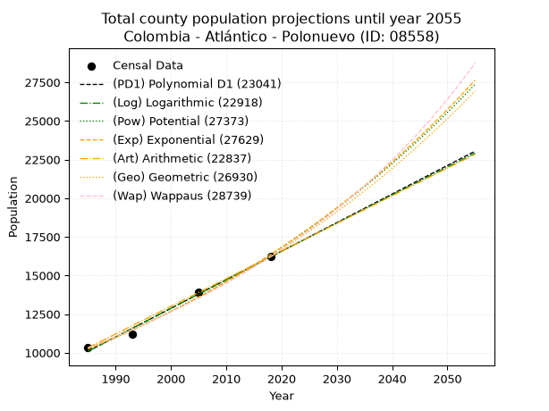
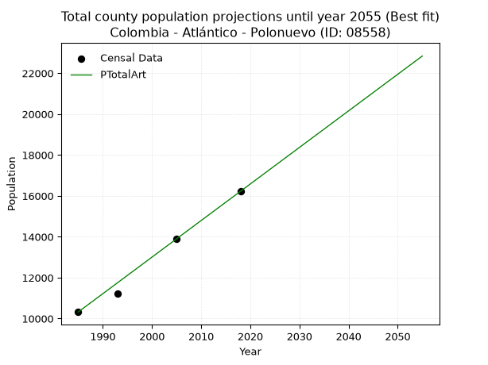
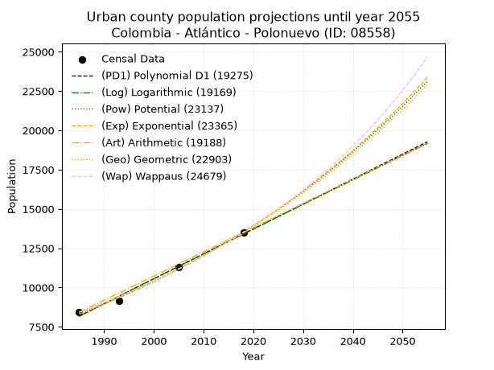
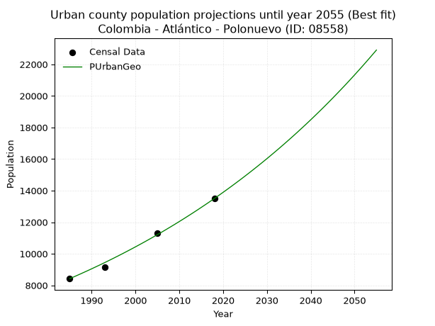
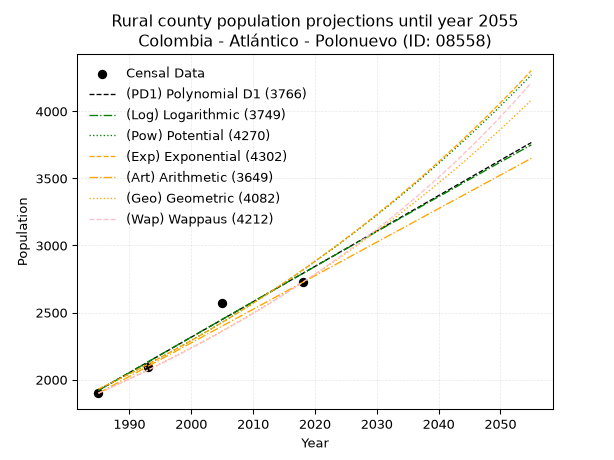
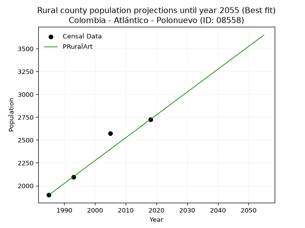

<div align="center">


</div>

# 📜 _“Population and Public Services Demand Projections (PPSD) until Year 2050 for Colombia - Atlántico - Polonuevo (ID: 08558)”_
Keywords: `population` `public-service` `projection` `lineal` `polynomial` `logarithmic` `potential` `exponential` `arithmetic` `geometric` `wappaus` `dane` `colombia` `south-america`

PPSD are analytical estimates used by governments and planners to anticipate future changes in population size, age distribution, and the resulting community needs for utilities, healthcare, education, and infrastructure as sizing future water treatment facilities, electrical grids, and road networks based on spatial growth.

<div align="center">

</img>

</div>


> **General running parameters**: • app_version: _v20260806_. • Python version: _3.14.7_. • Pandas version: _3.0.5_. • NumPy version: _2.5.1_. • Creates, save and include plots into reports (create_plot): _False_. • Projection until year: _2050_. • Process polynomial degree 2 and up: _False_. • Process Wappaus: _True_. • Process Wappaus: _True_. • Set negative values to zero: _True_. • Set infinite values to zero: _True_. • Drop dataset notes: _True_. 
<div align="center">

Dynamic map: [:earth_americas:Google](http://maps.google.com/maps?q=10.77736329,-74.8529806) [:earth_americas:OSM](https://www.openstreetmap.org/#map=18/10.77736329/-74.8529806&layers=P) [:earth_americas:Bing](https://www.bing.com/maps?cp=10.77736329~-74.8529806&lvl=18) [:earth_americas:Apple](https://maps.apple.com/frame?center=10.77736329%2C-74.8529806&span=0.003%2C0.006)

</div>


<div align="center">

```geojson
{
  "type": "Feature",
  "geometry": {
    "type": "Point", 
    "coordinates": [-74.8529806, 10.77736329]
  }, 
  "properties": {
    "Name": "Colombia - Atlántico - Polonuevo (ID: 08558)"
  }
}
```

</div>


## 0. Census Data (4 records)

Census data are official statistics collected by a government about the people and housing in a country. They usually include counts of total population, age, sex, race, income, education, and jobs.

📅Global census file: [Population.xlsx](../data/Population.xlsx)

| Source   |   Year |   CountryID | CountryName   |   StateID | StateName   |   CountyID | CountyName   |   PTotal |   PUrban |   PRural |
|:---------|-------:|------------:|:--------------|----------:|:------------|-----------:|:-------------|---------:|---------:|---------:|
| DANE     |   1985 |          57 | Colombia      |        08 | Atlántico   |      08558 | Polonuevo    |    10322 |     8423 |     1899 |
| DANE     |   1993 |          57 | Colombia      |        08 | Atlántico   |      08558 | Polonuevo    |    11224 |     9129 |     2095 |
| DANE     |   2005 |          57 | Colombia      |        08 | Atlántico   |      08558 | Polonuevo    |    13897 |    11325 |     2572 |
| DANE     |   2018 |          57 | Colombia      |        08 | Atlántico   |      08558 | Polonuevo    |    16222 |    13498 |     2724 |

> 🔥Some records could had specific notes about the registered values or the corresponding urban or rural distribution.

📅[SUI-RUPS](https://www.datos.gov.co/Hacienda-y-Cr-dito-P-blico/Registro-nico-de-Prestadores-de-Servicios-P-blicos/4qkq-csdn/about_data) - Local public utility companies: [RUPS.csv](../data/RUPS.xlsx)

 | SERVICIO       | ESTADO    | NOMBRE                                                                            | NIT         | DEPARTAMENTO_DOMICILIO   | MUNICIPIO_DOMICILIO   | DIRECCION                   |   TELEFONO | EMAIL                     | TIPO_PRESTADOR                             | CLASIFICACION                 |
|:---------------|:----------|:----------------------------------------------------------------------------------|:------------|:-------------------------|:----------------------|:----------------------------|-----------:|:--------------------------|:-------------------------------------------|:------------------------------|
| ACUEDUCTO      | OPERATIVA | SOCIEDAD DE ACUEDUCTO, ALCANTARILLADO Y ASEO DE BARRANQUILLA S.A. E.S.P.          | 800135913-1 | ATLANTICO                | BARRANQUILLA          | Carrera 58 # 67-09          |    3614000 | carolina.silva@aaa.com.co | SOCIEDADES (EMPRESA DE SERVICIOS PUBLICOS) | MAYOR O IGUAL A 5001 USUARIOS |
| ALCANTARILLADO | OPERATIVA | SOCIEDAD DE ACUEDUCTO, ALCANTARILLADO Y ASEO DE BARRANQUILLA S.A. E.S.P.          | 800135913-1 | ATLANTICO                | BARRANQUILLA          | Carrera 58 # 67-09          |    3614000 | carolina.silva@aaa.com.co | SOCIEDADES (EMPRESA DE SERVICIOS PUBLICOS) | MAYOR O IGUAL A 5001 USUARIOS |
| ACUEDUCTO      | OPERATIVA | JUNTA ADMINISTRADORA DEL ACUEDUCTO COMUNAL DE PITALITO DEL MUNICIPIO DE POLONUEVO | 802009502-6 | ATLANTICO                | POLONUEVO             | CRA 2 No 2 -41              |    8764520 | compital@yahoo.es         | ORGANIZACION AUTORIZADA                    | HASTA 2500 SUSCRIPTORES       |
| ACUEDUCTO      | OPERATIVA | JUNTA ADMINISTRADORA DEL ACUEDUCTO COMUNAL DE LA VEREDA DE SAN PABLO              | 900078966-1 | ATLANTICO                | POLONUEVO             | VEREDA SAN PABLO PARCELA 37 |    3341591 | acomvesan@yahoo.com       | ORGANIZACION AUTORIZADA                    | HASTA 2500 SUSCRIPTORES       |

## 1. Total

### 1.1. Coefficients and Parameters

* (PD1) Polynomial Deg 1: 184.93255720593967, -356995.09755118086 (lineal)
* (Log) Logarithmic: 370129.57927850646, -2800441.6481282306
* (Pow) Potential: 28.381645033136195, -89.58572839602294
* (Exp) Exponential: 0.014178817132508958, 6.1253472643702135e-09
* (Art) Arithmetic: Year diff. 2018 - 1985 = 33, Population diff. 16222 - 10322 = 5900, Annual growth = 178.78787878787878
* (Geo) Geometric: Year diff. 2018 - 1985 = 33, Population diff. 16222 - 10322 = 5900, Annual growth % = 0.013793992579080427
* (Wap) Wappaus: i = 1.3471057774855244, Condition values only valid for < 200)

<sub>
Wappaus condition values: ['0.00', '1.35', '2.69', '4.04', '5.39', '6.74', '8.08', '9.43', '10.78', '12.12', '13.47', '14.82', '16.17', '17.51', '18.86', '20.21', '21.55', '22.90', '24.25', '25.60', '26.94', '28.29', '29.64', '30.98', '32.33', '33.68', '35.02', '36.37', '37.72', '39.07', '40.41', '41.76', '43.11', '44.45', '45.80', '47.15', '48.50', '49.84', '51.19', '52.54', '53.88', '55.23', '56.58', '57.93', '59.27', '60.62', '61.97', '63.31', '64.66', '66.01', '67.36', '68.70', '70.05', '71.40', '72.74', '74.09', '75.44', '76.79', '78.13', '79.48', '80.83', '82.17', '83.52', '84.87', '86.21', '87.56']
</sub>


### 1.2. Projected Dataset

|   Year |   CountyID |   PTotalPD1 |   PTotalLog |   PTotalPow |   PTotalExp |   PTotalArt |   PTotalGeo |   PTotalWap |
|-------:|-----------:|------------:|------------:|------------:|------------:|------------:|------------:|------------:|
|   1985 |      08558 |       10096 |       10091 |       10236 |       10241 |       10322 |       10322 |       10322 |
|   1986 |      08558 |       10281 |       10277 |       10384 |       10387 |       10501 |       10464 |       10462 |
|   1987 |      08558 |       10466 |       10463 |       10533 |       10535 |       10680 |       10609 |       10604 |
|   1988 |      08558 |       10651 |       10650 |       10685 |       10686 |       10858 |       10755 |       10748 |
|   1989 |      08558 |       10836 |       10836 |       10838 |       10838 |       11037 |       10903 |       10894 |
|   1990 |      08558 |       11021 |       11022 |       10994 |       10993 |       11216 |       11054 |       11041 |
|   1991 |      08558 |       11206 |       11208 |       11152 |       11150 |       11395 |       11206 |       11191 |
|   1992 |      08558 |       11391 |       11394 |       11312 |       11309 |       11574 |       11361 |       11344 |
|   1993 |      08558 |       11575 |       11579 |       11474 |       11471 |       11752 |       11518 |       11498 |
|   1994 |      08558 |       11760 |       11765 |       11639 |       11635 |       11931 |       11676 |       11654 |
|   1995 |      08558 |       11945 |       11951 |       11805 |       11801 |       12110 |       11838 |       11813 |
|   1996 |      08558 |       12130 |       12136 |       11974 |       11969 |       12289 |       12001 |       11974 |
|   1997 |      08558 |       12315 |       12322 |       12146 |       12140 |       12467 |       12166 |       12137 |
|   1998 |      08558 |       12500 |       12507 |       12320 |       12313 |       12646 |       12334 |       12303 |
|   1999 |      08558 |       12685 |       12692 |       12496 |       12489 |       12825 |       12504 |       12471 |
|   2000 |      08558 |       12870 |       12877 |       12675 |       12668 |       13004 |       12677 |       12642 |
|   2001 |      08558 |       13055 |       13062 |       12856 |       12849 |       13183 |       12852 |       12815 |
|   2002 |      08558 |       13240 |       13247 |       13039 |       13032 |       13361 |       13029 |       12991 |
|   2003 |      08558 |       13425 |       13432 |       13225 |       13218 |       13540 |       13209 |       13170 |
|   2004 |      08558 |       13610 |       13617 |       13414 |       13407 |       13719 |       13391 |       13352 |
|   2005 |      08558 |       13795 |       13801 |       13605 |       13598 |       13898 |       13576 |       13536 |
|   2006 |      08558 |       13980 |       13986 |       13799 |       13792 |       14077 |       13763 |       13723 |
|   2007 |      08558 |       14165 |       14170 |       13996 |       13989 |       14255 |       13953 |       13913 |
|   2008 |      08558 |       14349 |       14355 |       14195 |       14189 |       14434 |       14145 |       14106 |
|   2009 |      08558 |       14534 |       14539 |       14397 |       14392 |       14613 |       14340 |       14303 |
|   2010 |      08558 |       14719 |       14723 |       14602 |       14597 |       14792 |       14538 |       14502 |
|   2011 |      08558 |       14904 |       14907 |       14809 |       14806 |       14970 |       14739 |       14705 |
|   2012 |      08558 |       15089 |       15091 |       15020 |       15017 |       15149 |       14942 |       14911 |
|   2013 |      08558 |       15274 |       15275 |       15233 |       15232 |       15328 |       15148 |       15120 |
|   2014 |      08558 |       15459 |       15459 |       15450 |       15449 |       15507 |       15357 |       15333 |
|   2015 |      08558 |       15644 |       15643 |       15669 |       15670 |       15686 |       15569 |       15550 |
|   2016 |      08558 |       15829 |       15826 |       15891 |       15893 |       15864 |       15784 |       15770 |
|   2017 |      08558 |       16014 |       16010 |       16116 |       16120 |       16043 |       16001 |       15994 |
|   2018 |      08558 |       16199 |       16193 |       16344 |       16351 |       16222 |       16222 |       16222 |
|   2019 |      08558 |       16384 |       16377 |       16576 |       16584 |       16401 |       16446 |       16454 |
|   2020 |      08558 |       16569 |       16560 |       16811 |       16821 |       16580 |       16673 |       16690 |
|   2021 |      08558 |       16754 |       16743 |       17048 |       17061 |       16758 |       16903 |       16930 |
|   2022 |      08558 |       16939 |       16926 |       17289 |       17305 |       16937 |       17136 |       17175 |
|   2023 |      08558 |       17123 |       17109 |       17534 |       17552 |       17116 |       17372 |       17423 |
|   2024 |      08558 |       17308 |       17292 |       17781 |       17803 |       17295 |       17612 |       17677 |
|   2025 |      08558 |       17493 |       17475 |       18032 |       18057 |       17474 |       17855 |       17935 |
|   2026 |      08558 |       17678 |       17658 |       18287 |       18315 |       17652 |       18101 |       18198 |
|   2027 |      08558 |       17863 |       17841 |       18545 |       18576 |       17831 |       18351 |       18466 |
|   2028 |      08558 |       18048 |       18023 |       18806 |       18841 |       18010 |       18604 |       18739 |
|   2029 |      08558 |       18233 |       18206 |       19071 |       19110 |       18189 |       18860 |       19017 |
|   2030 |      08558 |       18418 |       18388 |       19340 |       19383 |       18367 |       19121 |       19301 |
|   2031 |      08558 |       18603 |       18570 |       19612 |       19660 |       18546 |       19384 |       19590 |
|   2032 |      08558 |       18788 |       18752 |       19888 |       19941 |       18725 |       19652 |       19884 |
|   2033 |      08558 |       18973 |       18934 |       20168 |       20226 |       18904 |       19923 |       20185 |
|   2034 |      08558 |       19158 |       19116 |       20451 |       20514 |       19083 |       20198 |       20492 |
|   2035 |      08558 |       19343 |       19298 |       20738 |       20807 |       19261 |       20476 |       20805 |
|   2036 |      08558 |       19528 |       19480 |       21029 |       21104 |       19440 |       20759 |       21124 |
|   2037 |      08558 |       19713 |       19662 |       21325 |       21406 |       19619 |       21045 |       21450 |
|   2038 |      08558 |       19897 |       19844 |       21624 |       21712 |       19798 |       21335 |       21783 |
|   2039 |      08558 |       20082 |       20025 |       21927 |       22022 |       19977 |       21630 |       22123 |
|   2040 |      08558 |       20267 |       20207 |       22234 |       22336 |       20155 |       21928 |       22470 |
|   2041 |      08558 |       20452 |       20388 |       22546 |       22655 |       20334 |       22230 |       22825 |
|   2042 |      08558 |       20637 |       20569 |       22861 |       22978 |       20513 |       22537 |       23187 |
|   2043 |      08558 |       20822 |       20751 |       23181 |       23307 |       20692 |       22848 |       23557 |
|   2044 |      08558 |       21007 |       20932 |       23505 |       23639 |       20870 |       23163 |       23936 |
|   2045 |      08558 |       21192 |       21113 |       23834 |       23977 |       21049 |       23483 |       24323 |
|   2046 |      08558 |       21377 |       21294 |       24167 |       24319 |       21228 |       23807 |       24719 |
|   2047 |      08558 |       21562 |       21475 |       24504 |       24667 |       21407 |       24135 |       25125 |
|   2048 |      08558 |       21747 |       21655 |       24846 |       25019 |       21586 |       24468 |       25539 |
|   2049 |      08558 |       21932 |       21836 |       25193 |       25376 |       21764 |       24805 |       25964 |
|   2050 |      08558 |       22117 |       22017 |       25544 |       25739 |       21943 |       25148 |       26399 |
<div align="center">

</img>

</div>


### 1.3. Best fit with absolute and relative error (%)

Relative error puts that difference into context by dividing the absolute error by the true value, creating a unitless ratio or percentage that shows the scale of the mistake.

Absolute and relative error

|   Year | Source   |   CountryID | CountryName   |   StateID | StateName   |   CountyID_x | CountyName   |   PTotal |   PUrban |   PRural |   CountyID_y |   PTotalPD1 |   PTotalLog |   PTotalPow |   PTotalExp |   PTotalArt |   PTotalGeo |   PTotalWap |   PTotalPD1AbsError |   PTotalLogAbsError |   PTotalPowAbsError |   PTotalExpAbsError |   PTotalArtAbsError |   PTotalGeoAbsError |   PTotalWapAbsError |   PTotalPD1RelError |   PTotalLogRelError |   PTotalPowRelError |   PTotalExpRelError |   PTotalArtRelError |   PTotalGeoRelError |   PTotalWapRelError |
|-------:|:---------|------------:|:--------------|----------:|:------------|-------------:|:-------------|---------:|---------:|---------:|-------------:|------------:|------------:|------------:|------------:|------------:|------------:|------------:|--------------------:|--------------------:|--------------------:|--------------------:|--------------------:|--------------------:|--------------------:|--------------------:|--------------------:|--------------------:|--------------------:|--------------------:|--------------------:|--------------------:|
|   1985 | DANE     |          57 | Colombia      |        08 | Atlántico   |        08558 | Polonuevo    |    10322 |     8423 |     1899 |        08558 |       10096 |       10091 |       10236 |       10241 |       10322 |       10322 |       10322 |                 226 |                 231 |                  86 |                  81 |                   0 |                   0 |                   0 |            2.1895   |            2.23794  |            0.833172 |            0.784732 |           0         |             0       |             0       |
|   1993 | DANE     |          57 | Colombia      |        08 | Atlántico   |        08558 | Polonuevo    |    11224 |     9129 |     2095 |        08558 |       11575 |       11579 |       11474 |       11471 |       11752 |       11518 |       11498 |                 351 |                 355 |                 250 |                 247 |                 528 |                 294 |                 274 |            3.12723  |            3.16287  |            2.22737  |            2.20064  |           4.70421   |             2.61939 |             2.4412  |
|   2005 | DANE     |          57 | Colombia      |        08 | Atlántico   |        08558 | Polonuevo    |    13897 |    11325 |     2572 |        08558 |       13795 |       13801 |       13605 |       13598 |       13898 |       13576 |       13536 |                 102 |                  96 |                 292 |                 299 |                   1 |                 321 |                 361 |            0.733971 |            0.690797 |            2.10117  |            2.15154  |           0.0071958 |             2.30985 |             2.59768 |
|   2018 | DANE     |          57 | Colombia      |        08 | Atlántico   |        08558 | Polonuevo    |    16222 |    13498 |     2724 |        08558 |       16199 |       16193 |       16344 |       16351 |       16222 |       16222 |       16222 |                  23 |                  29 |                 122 |                 129 |                   0 |                   0 |                   0 |            0.141783 |            0.17877  |            0.752065 |            0.795216 |           0         |             0       |             0       |

Relative error mean

| Method    |   RelError | Best   |
|:----------|-----------:|:-------|
| PTotalPD1 |    1.54812 |        |
| PTotalLog |    1.56759 |        |
| PTotalPow |    1.47844 |        |
| PTotalExp |    1.48303 |        |
| PTotalArt |    1.17785 | True   |
| PTotalGeo |    1.23231 |        |
| PTotalWap |    1.25972 |        |

💙Best method: _**PTotalArt**_
<div align="center">

</img>

</div>


### 1.4. Fresh water supply demand in liters per capita per day (lpcd)

The fresh water supply demand typically ranges from 100 to 300 liters per capita per day (lpcd) for standard domestic and municipal planning, though absolute survival minimums set by the World Health Organization are as low as 7.5 to 20 liters per day, and total consumption in high-income nations can exceed 400 liters.

> `CZ`: Level in meters above the sea level (masl)<br> `WS`: Fresh water supply demand in liters per capita per day (lpcd or l/h/d)<br> `WSAll`: Zonal fresh water supply demand in liters per second (l/s)<br> `A`: Zonal area in square meters<br> `DP`: Population density (people/hectare or p/ha)

Reference values (RAS Colombia)

|    CZ |   WS |
|------:|-----:|
|  1000 |  120 |
|  2000 |  130 |
| 99999 |  140 |

County shapefile geometry properties and water supply values

|   CountyID |      ATotal |   CZTotal |   WSTotal |
|-----------:|------------:|----------:|----------:|
|      08558 | 7.38072e+07 |   75.7759 |       120 |

Projected values for best method: PTotalArt

|   CountyID |   Year |   PTotalArt |   DPTotal |   WSTotal |   WSTotalAll |
|-----------:|-------:|------------:|----------:|----------:|-------------:|
|      08558 |   1985 |       10322 |      1.4  |       120 |      14.3361 |
|      08558 |   1986 |       10501 |      1.42 |       120 |      14.5847 |
|      08558 |   1987 |       10680 |      1.45 |       120 |      14.8333 |
|      08558 |   1988 |       10858 |      1.47 |       120 |      15.0806 |
|      08558 |   1989 |       11037 |      1.5  |       120 |      15.3292 |
|      08558 |   1990 |       11216 |      1.52 |       120 |      15.5778 |
|      08558 |   1991 |       11395 |      1.54 |       120 |      15.8264 |
|      08558 |   1992 |       11574 |      1.57 |       120 |      16.075  |
|      08558 |   1993 |       11752 |      1.59 |       120 |      16.3222 |
|      08558 |   1994 |       11931 |      1.62 |       120 |      16.5708 |
|      08558 |   1995 |       12110 |      1.64 |       120 |      16.8194 |
|      08558 |   1996 |       12289 |      1.67 |       120 |      17.0681 |
|      08558 |   1997 |       12467 |      1.69 |       120 |      17.3153 |
|      08558 |   1998 |       12646 |      1.71 |       120 |      17.5639 |
|      08558 |   1999 |       12825 |      1.74 |       120 |      17.8125 |
|      08558 |   2000 |       13004 |      1.76 |       120 |      18.0611 |
|      08558 |   2001 |       13183 |      1.79 |       120 |      18.3097 |
|      08558 |   2002 |       13361 |      1.81 |       120 |      18.5569 |
|      08558 |   2003 |       13540 |      1.83 |       120 |      18.8056 |
|      08558 |   2004 |       13719 |      1.86 |       120 |      19.0542 |
|      08558 |   2005 |       13898 |      1.88 |       120 |      19.3028 |
|      08558 |   2006 |       14077 |      1.91 |       120 |      19.5514 |
|      08558 |   2007 |       14255 |      1.93 |       120 |      19.7986 |
|      08558 |   2008 |       14434 |      1.96 |       120 |      20.0472 |
|      08558 |   2009 |       14613 |      1.98 |       120 |      20.2958 |
|      08558 |   2010 |       14792 |      2    |       120 |      20.5444 |
|      08558 |   2011 |       14970 |      2.03 |       120 |      20.7917 |
|      08558 |   2012 |       15149 |      2.05 |       120 |      21.0403 |
|      08558 |   2013 |       15328 |      2.08 |       120 |      21.2889 |
|      08558 |   2014 |       15507 |      2.1  |       120 |      21.5375 |
|      08558 |   2015 |       15686 |      2.13 |       120 |      21.7861 |
|      08558 |   2016 |       15864 |      2.15 |       120 |      22.0333 |
|      08558 |   2017 |       16043 |      2.17 |       120 |      22.2819 |
|      08558 |   2018 |       16222 |      2.2  |       120 |      22.5306 |
|      08558 |   2019 |       16401 |      2.22 |       120 |      22.7792 |
|      08558 |   2020 |       16580 |      2.25 |       120 |      23.0278 |
|      08558 |   2021 |       16758 |      2.27 |       120 |      23.275  |
|      08558 |   2022 |       16937 |      2.29 |       120 |      23.5236 |
|      08558 |   2023 |       17116 |      2.32 |       120 |      23.7722 |
|      08558 |   2024 |       17295 |      2.34 |       120 |      24.0208 |
|      08558 |   2025 |       17474 |      2.37 |       120 |      24.2694 |
|      08558 |   2026 |       17652 |      2.39 |       120 |      24.5167 |
|      08558 |   2027 |       17831 |      2.42 |       120 |      24.7653 |
|      08558 |   2028 |       18010 |      2.44 |       120 |      25.0139 |
|      08558 |   2029 |       18189 |      2.46 |       120 |      25.2625 |
|      08558 |   2030 |       18367 |      2.49 |       120 |      25.5097 |
|      08558 |   2031 |       18546 |      2.51 |       120 |      25.7583 |
|      08558 |   2032 |       18725 |      2.54 |       120 |      26.0069 |
|      08558 |   2033 |       18904 |      2.56 |       120 |      26.2556 |
|      08558 |   2034 |       19083 |      2.59 |       120 |      26.5042 |
|      08558 |   2035 |       19261 |      2.61 |       120 |      26.7514 |
|      08558 |   2036 |       19440 |      2.63 |       120 |      27      |
|      08558 |   2037 |       19619 |      2.66 |       120 |      27.2486 |
|      08558 |   2038 |       19798 |      2.68 |       120 |      27.4972 |
|      08558 |   2039 |       19977 |      2.71 |       120 |      27.7458 |
|      08558 |   2040 |       20155 |      2.73 |       120 |      27.9931 |
|      08558 |   2041 |       20334 |      2.76 |       120 |      28.2417 |
|      08558 |   2042 |       20513 |      2.78 |       120 |      28.4903 |
|      08558 |   2043 |       20692 |      2.8  |       120 |      28.7389 |
|      08558 |   2044 |       20870 |      2.83 |       120 |      28.9861 |
|      08558 |   2045 |       21049 |      2.85 |       120 |      29.2347 |
|      08558 |   2046 |       21228 |      2.88 |       120 |      29.4833 |
|      08558 |   2047 |       21407 |      2.9  |       120 |      29.7319 |
|      08558 |   2048 |       21586 |      2.92 |       120 |      29.9806 |
|      08558 |   2049 |       21764 |      2.95 |       120 |      30.2278 |
|      08558 |   2050 |       21943 |      2.97 |       120 |      30.4764 |

## 2. Urban

### 2.1. Coefficients and Parameters

* (PD1) Polynomial Deg 1: 158.56643918105024, -306578.76997189573 (lineal)
* (Log) Logarithmic: 317334.5494023833, -2401468.7029670007
* (Pow) Potential: 29.547189071391415, -93.51996248912677
* (Exp) Exponential: 0.014762156113041571, 1.5620709219571357e-09
* (Art) Arithmetic: Year diff. 2018 - 1985 = 33, Population diff. 13498 - 8423 = 5075, Annual growth = 153.78787878787878
* (Geo) Geometric: Year diff. 2018 - 1985 = 33, Population diff. 13498 - 8423 = 5075, Annual growth % = 0.014392758189230914
* (Wap) Wappaus: i = 1.4031100660360274, Condition values only valid for < 200)

<sub>
Wappaus condition values: ['0.00', '1.40', '2.81', '4.21', '5.61', '7.02', '8.42', '9.82', '11.22', '12.63', '14.03', '15.43', '16.84', '18.24', '19.64', '21.05', '22.45', '23.85', '25.26', '26.66', '28.06', '29.47', '30.87', '32.27', '33.67', '35.08', '36.48', '37.88', '39.29', '40.69', '42.09', '43.50', '44.90', '46.30', '47.71', '49.11', '50.51', '51.92', '53.32', '54.72', '56.12', '57.53', '58.93', '60.33', '61.74', '63.14', '64.54', '65.95', '67.35', '68.75', '70.16', '71.56', '72.96', '74.36', '75.77', '77.17', '78.57', '79.98', '81.38', '82.78', '84.19', '85.59', '86.99', '88.40', '89.80', '91.20']
</sub>


### 2.2. Projected Dataset

|   Year |   CountyID |   PUrbanPD1 |   PUrbanLog |   PUrbanPow |   PUrbanExp |   PUrbanArt |   PUrbanGeo |   PUrbanWap |
|-------:|-----------:|------------:|------------:|------------:|------------:|------------:|------------:|------------:|
|   1985 |      08558 |        8176 |        8171 |        8310 |        8313 |        8423 |        8423 |        8423 |
|   1986 |      08558 |        8334 |        8331 |        8434 |        8437 |        8577 |        8544 |        8542 |
|   1987 |      08558 |        8493 |        8491 |        8561 |        8563 |        8731 |        8667 |        8663 |
|   1988 |      08558 |        8651 |        8651 |        8689 |        8690 |        8884 |        8792 |        8785 |
|   1989 |      08558 |        8810 |        8810 |        8819 |        8819 |        9038 |        8918 |        8909 |
|   1990 |      08558 |        8968 |        8970 |        8951 |        8950 |        9192 |        9047 |        9035 |
|   1991 |      08558 |        9127 |        9129 |        9085 |        9083 |        9346 |        9177 |        9163 |
|   1992 |      08558 |        9286 |        9288 |        9221 |        9218 |        9500 |        9309 |        9293 |
|   1993 |      08558 |        9444 |        9448 |        9358 |        9356 |        9653 |        9443 |        9425 |
|   1994 |      08558 |        9603 |        9607 |        9498 |        9495 |        9807 |        9579 |        9558 |
|   1995 |      08558 |        9761 |        9766 |        9640 |        9636 |        9961 |        9717 |        9694 |
|   1996 |      08558 |        9920 |        9925 |        9784 |        9779 |       10115 |        9857 |        9832 |
|   1997 |      08558 |       10078 |       10084 |        9930 |        9925 |       10268 |        9999 |        9972 |
|   1998 |      08558 |       10237 |       10243 |       10078 |       10072 |       10422 |       10143 |       10114 |
|   1999 |      08558 |       10396 |       10402 |       10228 |       10222 |       10576 |       10289 |       10258 |
|   2000 |      08558 |       10554 |       10560 |       10380 |       10374 |       10730 |       10437 |       10404 |
|   2001 |      08558 |       10713 |       10719 |       10534 |       10528 |       10884 |       10587 |       10553 |
|   2002 |      08558 |       10871 |       10877 |       10691 |       10685 |       11037 |       10739 |       10704 |
|   2003 |      08558 |       11030 |       11036 |       10850 |       10844 |       11191 |       10894 |       10858 |
|   2004 |      08558 |       11188 |       11194 |       11011 |       11005 |       11345 |       11051 |       11014 |
|   2005 |      08558 |       11347 |       11353 |       11175 |       11169 |       11499 |       11210 |       11172 |
|   2006 |      08558 |       11506 |       11511 |       11341 |       11335 |       11653 |       11371 |       11334 |
|   2007 |      08558 |       11664 |       11669 |       11509 |       11503 |       11806 |       11535 |       11498 |
|   2008 |      08558 |       11823 |       11827 |       11679 |       11674 |       11960 |       11701 |       11664 |
|   2009 |      08558 |       11981 |       11985 |       11853 |       11848 |       12114 |       11869 |       11834 |
|   2010 |      08558 |       12140 |       12143 |       12028 |       12024 |       12268 |       12040 |       12006 |
|   2011 |      08558 |       12298 |       12301 |       12206 |       12203 |       12421 |       12213 |       12181 |
|   2012 |      08558 |       12457 |       12459 |       12387 |       12385 |       12575 |       12389 |       12360 |
|   2013 |      08558 |       12615 |       12616 |       12570 |       12569 |       12729 |       12567 |       12541 |
|   2014 |      08558 |       12774 |       12774 |       12756 |       12756 |       12883 |       12748 |       12726 |
|   2015 |      08558 |       12933 |       12931 |       12944 |       12945 |       13037 |       12932 |       12914 |
|   2016 |      08558 |       13091 |       13089 |       13135 |       13138 |       13190 |       13118 |       13105 |
|   2017 |      08558 |       13250 |       13246 |       13329 |       13333 |       13344 |       13306 |       13300 |
|   2018 |      08558 |       13408 |       13403 |       13526 |       13532 |       13498 |       13498 |       13498 |
|   2019 |      08558 |       13567 |       13561 |       13725 |       13733 |       13652 |       13692 |       13700 |
|   2020 |      08558 |       13725 |       13718 |       13928 |       13937 |       13806 |       13889 |       13906 |
|   2021 |      08558 |       13884 |       13875 |       14133 |       14144 |       13959 |       14089 |       14115 |
|   2022 |      08558 |       14043 |       14032 |       14341 |       14355 |       14113 |       14292 |       14329 |
|   2023 |      08558 |       14201 |       14189 |       14552 |       14568 |       14267 |       14498 |       14546 |
|   2024 |      08558 |       14360 |       14346 |       14766 |       14785 |       14421 |       14706 |       14768 |
|   2025 |      08558 |       14518 |       14502 |       14983 |       15005 |       14575 |       14918 |       14994 |
|   2026 |      08558 |       14677 |       14659 |       15203 |       15228 |       14728 |       15133 |       15225 |
|   2027 |      08558 |       14835 |       14816 |       15427 |       15454 |       14882 |       15351 |       15460 |
|   2028 |      08558 |       14994 |       14972 |       15653 |       15684 |       15036 |       15572 |       15700 |
|   2029 |      08558 |       15153 |       15129 |       15883 |       15917 |       15190 |       15796 |       15945 |
|   2030 |      08558 |       15311 |       15285 |       16116 |       16154 |       15343 |       16023 |       16195 |
|   2031 |      08558 |       15470 |       15441 |       16352 |       16394 |       15497 |       16254 |       16450 |
|   2032 |      08558 |       15628 |       15597 |       16591 |       16638 |       15651 |       16488 |       16710 |
|   2033 |      08558 |       15787 |       15754 |       16834 |       16885 |       15805 |       16725 |       16976 |
|   2034 |      08558 |       15945 |       15910 |       17081 |       17137 |       15959 |       16966 |       17248 |
|   2035 |      08558 |       16104 |       16066 |       17331 |       17391 |       16112 |       17210 |       17525 |
|   2036 |      08558 |       16263 |       16221 |       17584 |       17650 |       16266 |       17457 |       17808 |
|   2037 |      08558 |       16421 |       16377 |       17841 |       17913 |       16420 |       17709 |       18098 |
|   2038 |      08558 |       16580 |       16533 |       18102 |       18179 |       16574 |       17964 |       18394 |
|   2039 |      08558 |       16738 |       16689 |       18366 |       18449 |       16728 |       18222 |       18697 |
|   2040 |      08558 |       16897 |       16844 |       18634 |       18724 |       16881 |       18484 |       19007 |
|   2041 |      08558 |       17055 |       17000 |       18906 |       19002 |       17035 |       18750 |       19324 |
|   2042 |      08558 |       17214 |       17155 |       19181 |       19285 |       17189 |       19020 |       19648 |
|   2043 |      08558 |       17372 |       17311 |       19461 |       19572 |       17343 |       19294 |       19980 |
|   2044 |      08558 |       17531 |       17466 |       19744 |       19863 |       17496 |       19572 |       20320 |
|   2045 |      08558 |       17690 |       17621 |       20032 |       20158 |       17650 |       19853 |       20669 |
|   2046 |      08558 |       17848 |       17776 |       20323 |       20458 |       17804 |       20139 |       21025 |
|   2047 |      08558 |       18007 |       17931 |       20619 |       20762 |       17958 |       20429 |       21391 |
|   2048 |      08558 |       18165 |       18086 |       20918 |       21071 |       18112 |       20723 |       21766 |
|   2049 |      08558 |       18324 |       18241 |       21222 |       21384 |       18265 |       21021 |       22150 |
|   2050 |      08558 |       18482 |       18396 |       21531 |       21702 |       18419 |       21324 |       22545 |
<div align="center">

</img>

</div>


### 2.3. Best fit with absolute and relative error (%)

Relative error puts that difference into context by dividing the absolute error by the true value, creating a unitless ratio or percentage that shows the scale of the mistake.

Absolute and relative error

|   Year | Source   |   CountryID | CountryName   |   StateID | StateName   |   CountyID_x | CountyName   |   PTotal |   PUrban |   PRural |   CountyID_y |   PUrbanPD1 |   PUrbanLog |   PUrbanPow |   PUrbanExp |   PUrbanArt |   PUrbanGeo |   PUrbanWap |   PUrbanPD1AbsError |   PUrbanLogAbsError |   PUrbanPowAbsError |   PUrbanExpAbsError |   PUrbanArtAbsError |   PUrbanGeoAbsError |   PUrbanWapAbsError |   PUrbanPD1RelError |   PUrbanLogRelError |   PUrbanPowRelError |   PUrbanExpRelError |   PUrbanArtRelError |   PUrbanGeoRelError |   PUrbanWapRelError |
|-------:|:---------|------------:|:--------------|----------:|:------------|-------------:|:-------------|---------:|---------:|---------:|-------------:|------------:|------------:|------------:|------------:|------------:|------------:|------------:|--------------------:|--------------------:|--------------------:|--------------------:|--------------------:|--------------------:|--------------------:|--------------------:|--------------------:|--------------------:|--------------------:|--------------------:|--------------------:|--------------------:|
|   1985 | DANE     |          57 | Colombia      |        08 | Atlántico   |        08558 | Polonuevo    |    10322 |     8423 |     1899 |        08558 |        8176 |        8171 |        8310 |        8313 |        8423 |        8423 |        8423 |                 247 |                 252 |                 113 |                 110 |                   0 |                   0 |                   0 |            2.93245  |            2.99181  |            1.34156  |            1.30595  |             0       |             0       |             0       |
|   1993 | DANE     |          57 | Colombia      |        08 | Atlántico   |        08558 | Polonuevo    |    11224 |     9129 |     2095 |        08558 |        9444 |        9448 |        9358 |        9356 |        9653 |        9443 |        9425 |                 315 |                 319 |                 229 |                 227 |                 524 |                 314 |                 296 |            3.45054  |            3.49436  |            2.50849  |            2.48658  |             5.73995 |             3.43959 |             3.24241 |
|   2005 | DANE     |          57 | Colombia      |        08 | Atlántico   |        08558 | Polonuevo    |    13897 |    11325 |     2572 |        08558 |       11347 |       11353 |       11175 |       11169 |       11499 |       11210 |       11172 |                  22 |                  28 |                 150 |                 156 |                 174 |                 115 |                 153 |            0.19426  |            0.247241 |            1.3245   |            1.37748  |             1.53642 |             1.01545 |             1.35099 |
|   2018 | DANE     |          57 | Colombia      |        08 | Atlántico   |        08558 | Polonuevo    |    16222 |    13498 |     2724 |        08558 |       13408 |       13403 |       13526 |       13532 |       13498 |       13498 |       13498 |                  90 |                  95 |                  28 |                  34 |                   0 |                   0 |                   0 |            0.666765 |            0.703808 |            0.207438 |            0.251889 |             0       |             0       |             0       |

Relative error mean

| Method    |   RelError | Best   |
|:----------|-----------:|:-------|
| PUrbanPD1 |    1.811   |        |
| PUrbanLog |    1.8593  |        |
| PUrbanPow |    1.3455  |        |
| PUrbanExp |    1.35548 |        |
| PUrbanArt |    1.81909 |        |
| PUrbanGeo |    1.11376 | True   |
| PUrbanWap |    1.14835 |        |

💙Best method: _**PUrbanGeo**_
<div align="center">

</img>

</div>


### 2.4. Fresh water supply demand in liters per capita per day (lpcd)

The fresh water supply demand typically ranges from 100 to 300 liters per capita per day (lpcd) for standard domestic and municipal planning, though absolute survival minimums set by the World Health Organization are as low as 7.5 to 20 liters per day, and total consumption in high-income nations can exceed 400 liters.

> `CZ`: Level in meters above the sea level (masl)<br> `WS`: Fresh water supply demand in liters per capita per day (lpcd or l/h/d)<br> `WSAll`: Zonal fresh water supply demand in liters per second (l/s)<br> `A`: Zonal area in square meters<br> `DP`: Population density (people/hectare or p/ha)

Reference values (RAS Colombia)

|    CZ |   WS |
|------:|-----:|
|  1000 |  120 |
|  2000 |  130 |
| 99999 |  140 |

County shapefile geometry properties and water supply values

|   CountyID |    AUrban |   CZUrban |   WSUrban |
|-----------:|----------:|----------:|----------:|
|      08558 | 1.509e+06 |   80.6531 |       120 |

Projected values for best method: PUrbanGeo

|   CountyID |   Year |   PUrbanGeo |   DPUrban |   WSUrban |   WSUrbanAll |
|-----------:|-------:|------------:|----------:|----------:|-------------:|
|      08558 |   1985 |        8423 |     55.82 |       120 |      11.6986 |
|      08558 |   1986 |        8544 |     56.62 |       120 |      11.8667 |
|      08558 |   1987 |        8667 |     57.44 |       120 |      12.0375 |
|      08558 |   1988 |        8792 |     58.26 |       120 |      12.2111 |
|      08558 |   1989 |        8918 |     59.1  |       120 |      12.3861 |
|      08558 |   1990 |        9047 |     59.95 |       120 |      12.5653 |
|      08558 |   1991 |        9177 |     60.82 |       120 |      12.7458 |
|      08558 |   1992 |        9309 |     61.69 |       120 |      12.9292 |
|      08558 |   1993 |        9443 |     62.58 |       120 |      13.1153 |
|      08558 |   1994 |        9579 |     63.48 |       120 |      13.3042 |
|      08558 |   1995 |        9717 |     64.39 |       120 |      13.4958 |
|      08558 |   1996 |        9857 |     65.32 |       120 |      13.6903 |
|      08558 |   1997 |        9999 |     66.26 |       120 |      13.8875 |
|      08558 |   1998 |       10143 |     67.22 |       120 |      14.0875 |
|      08558 |   1999 |       10289 |     68.18 |       120 |      14.2903 |
|      08558 |   2000 |       10437 |     69.17 |       120 |      14.4958 |
|      08558 |   2001 |       10587 |     70.16 |       120 |      14.7042 |
|      08558 |   2002 |       10739 |     71.17 |       120 |      14.9153 |
|      08558 |   2003 |       10894 |     72.19 |       120 |      15.1306 |
|      08558 |   2004 |       11051 |     73.23 |       120 |      15.3486 |
|      08558 |   2005 |       11210 |     74.29 |       120 |      15.5694 |
|      08558 |   2006 |       11371 |     75.35 |       120 |      15.7931 |
|      08558 |   2007 |       11535 |     76.44 |       120 |      16.0208 |
|      08558 |   2008 |       11701 |     77.54 |       120 |      16.2514 |
|      08558 |   2009 |       11869 |     78.65 |       120 |      16.4847 |
|      08558 |   2010 |       12040 |     79.79 |       120 |      16.7222 |
|      08558 |   2011 |       12213 |     80.93 |       120 |      16.9625 |
|      08558 |   2012 |       12389 |     82.1  |       120 |      17.2069 |
|      08558 |   2013 |       12567 |     83.28 |       120 |      17.4542 |
|      08558 |   2014 |       12748 |     84.48 |       120 |      17.7056 |
|      08558 |   2015 |       12932 |     85.7  |       120 |      17.9611 |
|      08558 |   2016 |       13118 |     86.93 |       120 |      18.2194 |
|      08558 |   2017 |       13306 |     88.18 |       120 |      18.4806 |
|      08558 |   2018 |       13498 |     89.45 |       120 |      18.7472 |
|      08558 |   2019 |       13692 |     90.74 |       120 |      19.0167 |
|      08558 |   2020 |       13889 |     92.04 |       120 |      19.2903 |
|      08558 |   2021 |       14089 |     93.37 |       120 |      19.5681 |
|      08558 |   2022 |       14292 |     94.71 |       120 |      19.85   |
|      08558 |   2023 |       14498 |     96.08 |       120 |      20.1361 |
|      08558 |   2024 |       14706 |     97.46 |       120 |      20.425  |
|      08558 |   2025 |       14918 |     98.86 |       120 |      20.7194 |
|      08558 |   2026 |       15133 |    100.29 |       120 |      21.0181 |
|      08558 |   2027 |       15351 |    101.73 |       120 |      21.3208 |
|      08558 |   2028 |       15572 |    103.19 |       120 |      21.6278 |
|      08558 |   2029 |       15796 |    104.68 |       120 |      21.9389 |
|      08558 |   2030 |       16023 |    106.18 |       120 |      22.2542 |
|      08558 |   2031 |       16254 |    107.71 |       120 |      22.575  |
|      08558 |   2032 |       16488 |    109.26 |       120 |      22.9    |
|      08558 |   2033 |       16725 |    110.84 |       120 |      23.2292 |
|      08558 |   2034 |       16966 |    112.43 |       120 |      23.5639 |
|      08558 |   2035 |       17210 |    114.05 |       120 |      23.9028 |
|      08558 |   2036 |       17457 |    115.69 |       120 |      24.2458 |
|      08558 |   2037 |       17709 |    117.36 |       120 |      24.5958 |
|      08558 |   2038 |       17964 |    119.05 |       120 |      24.95   |
|      08558 |   2039 |       18222 |    120.76 |       120 |      25.3083 |
|      08558 |   2040 |       18484 |    122.49 |       120 |      25.6722 |
|      08558 |   2041 |       18750 |    124.25 |       120 |      26.0417 |
|      08558 |   2042 |       19020 |    126.04 |       120 |      26.4167 |
|      08558 |   2043 |       19294 |    127.86 |       120 |      26.7972 |
|      08558 |   2044 |       19572 |    129.7  |       120 |      27.1833 |
|      08558 |   2045 |       19853 |    131.56 |       120 |      27.5736 |
|      08558 |   2046 |       20139 |    133.46 |       120 |      27.9708 |
|      08558 |   2047 |       20429 |    135.38 |       120 |      28.3736 |
|      08558 |   2048 |       20723 |    137.33 |       120 |      28.7819 |
|      08558 |   2049 |       21021 |    139.3  |       120 |      29.1958 |
|      08558 |   2050 |       21324 |    141.31 |       120 |      29.6167 |

## 3. Rural

### 3.1. Coefficients and Parameters

* (PD1) Polynomial Deg 1: 26.366118024889488, -50416.32757928519 (lineal)
* (Log) Logarithmic: 52795.02987612336, -398972.9451612314
* (Pow) Potential: 22.935827998142663, -72.35161084513935
* (Exp) Exponential: 0.011453297671633802, 2.5813404214662743e-07
* (Art) Arithmetic: Year diff. 2018 - 1985 = 33, Population diff. 2724 - 1899 = 825, Annual growth = 25.0
* (Geo) Geometric: Year diff. 2018 - 1985 = 33, Population diff. 2724 - 1899 = 825, Annual growth % = 0.01099252276944429
* (Wap) Wappaus: i = 1.0815487778498811, Condition values only valid for < 200)

<sub>
Wappaus condition values: ['0.00', '1.08', '2.16', '3.24', '4.33', '5.41', '6.49', '7.57', '8.65', '9.73', '10.82', '11.90', '12.98', '14.06', '15.14', '16.22', '17.30', '18.39', '19.47', '20.55', '21.63', '22.71', '23.79', '24.88', '25.96', '27.04', '28.12', '29.20', '30.28', '31.36', '32.45', '33.53', '34.61', '35.69', '36.77', '37.85', '38.94', '40.02', '41.10', '42.18', '43.26', '44.34', '45.43', '46.51', '47.59', '48.67', '49.75', '50.83', '51.91', '53.00', '54.08', '55.16', '56.24', '57.32', '58.40', '59.49', '60.57', '61.65', '62.73', '63.81', '64.89', '65.97', '67.06', '68.14', '69.22', '70.30']
</sub>


### 3.2. Projected Dataset

|   Year |   CountyID |   PRuralPD1 |   PRuralLog |   PRuralPow |   PRuralExp |   PRuralArt |   PRuralGeo |   PRuralWap |
|-------:|-----------:|------------:|------------:|------------:|------------:|------------:|------------:|------------:|
|   1985 |      08558 |        1920 |        1919 |        1929 |        1929 |        1899 |        1899 |        1899 |
|   1986 |      08558 |        1947 |        1946 |        1951 |        1952 |        1924 |        1920 |        1920 |
|   1987 |      08558 |        1973 |        1973 |        1974 |        1974 |        1949 |        1941 |        1941 |
|   1988 |      08558 |        2000 |        1999 |        1997 |        1997 |        1974 |        1962 |        1962 |
|   1989 |      08558 |        2026 |        2026 |        2020 |        2020 |        1999 |        1984 |        1983 |
|   1990 |      08558 |        2052 |        2052 |        2043 |        2043 |        2024 |        2006 |        2005 |
|   1991 |      08558 |        2079 |        2079 |        2067 |        2067 |        2049 |        2028 |        2026 |
|   1992 |      08558 |        2105 |        2105 |        2091 |        2091 |        2074 |        2050 |        2048 |
|   1993 |      08558 |        2131 |        2132 |        2115 |        2115 |        2099 |        2073 |        2071 |
|   1994 |      08558 |        2158 |        2158 |        2140 |        2139 |        2124 |        2095 |        2093 |
|   1995 |      08558 |        2184 |        2185 |        2164 |        2164 |        2149 |        2118 |        2116 |
|   1996 |      08558 |        2210 |        2211 |        2189 |        2189 |        2174 |        2142 |        2139 |
|   1997 |      08558 |        2237 |        2238 |        2215 |        2214 |        2199 |        2165 |        2163 |
|   1998 |      08558 |        2263 |        2264 |        2240 |        2239 |        2224 |        2189 |        2186 |
|   1999 |      08558 |        2290 |        2291 |        2266 |        2265 |        2249 |        2213 |        2210 |
|   2000 |      08558 |        2316 |        2317 |        2292 |        2291 |        2274 |        2237 |        2234 |
|   2001 |      08558 |        2342 |        2343 |        2319 |        2318 |        2299 |        2262 |        2259 |
|   2002 |      08558 |        2369 |        2370 |        2345 |        2344 |        2324 |        2287 |        2284 |
|   2003 |      08558 |        2395 |        2396 |        2372 |        2371 |        2349 |        2312 |        2309 |
|   2004 |      08558 |        2421 |        2422 |        2400 |        2399 |        2374 |        2337 |        2334 |
|   2005 |      08558 |        2448 |        2449 |        2427 |        2426 |        2399 |        2363 |        2360 |
|   2006 |      08558 |        2474 |        2475 |        2455 |        2454 |        2424 |        2389 |        2386 |
|   2007 |      08558 |        2500 |        2501 |        2483 |        2482 |        2449 |        2415 |        2412 |
|   2008 |      08558 |        2527 |        2528 |        2512 |        2511 |        2474 |        2442 |        2438 |
|   2009 |      08558 |        2553 |        2554 |        2541 |        2540 |        2499 |        2469 |        2465 |
|   2010 |      08558 |        2580 |        2580 |        2570 |        2569 |        2524 |        2496 |        2493 |
|   2011 |      08558 |        2606 |        2607 |        2599 |        2599 |        2549 |        2523 |        2520 |
|   2012 |      08558 |        2632 |        2633 |        2629 |        2629 |        2574 |        2551 |        2548 |
|   2013 |      08558 |        2659 |        2659 |        2659 |        2659 |        2599 |        2579 |        2577 |
|   2014 |      08558 |        2685 |        2685 |        2690 |        2690 |        2624 |        2607 |        2605 |
|   2015 |      08558 |        2711 |        2711 |        2721 |        2721 |        2649 |        2636 |        2634 |
|   2016 |      08558 |        2738 |        2738 |        2752 |        2752 |        2674 |        2665 |        2664 |
|   2017 |      08558 |        2764 |        2764 |        2783 |        2784 |        2699 |        2694 |        2694 |
|   2018 |      08558 |        2790 |        2790 |        2815 |        2816 |        2724 |        2724 |        2724 |
|   2019 |      08558 |        2817 |        2816 |        2847 |        2848 |        2749 |        2754 |        2755 |
|   2020 |      08558 |        2843 |        2842 |        2880 |        2881 |        2774 |        2784 |        2786 |
|   2021 |      08558 |        2870 |        2868 |        2913 |        2914 |        2799 |        2815 |        2817 |
|   2022 |      08558 |        2896 |        2895 |        2946 |        2948 |        2824 |        2846 |        2849 |
|   2023 |      08558 |        2922 |        2921 |        2979 |        2982 |        2849 |        2877 |        2881 |
|   2024 |      08558 |        2949 |        2947 |        3013 |        3016 |        2874 |        2909 |        2914 |
|   2025 |      08558 |        2975 |        2973 |        3048 |        3051 |        2899 |        2941 |        2947 |
|   2026 |      08558 |        3001 |        2999 |        3082 |        3086 |        2924 |        2973 |        2981 |
|   2027 |      08558 |        3028 |        3025 |        3118 |        3121 |        2949 |        3006 |        3015 |
|   2028 |      08558 |        3054 |        3051 |        3153 |        3157 |        2974 |        3039 |        3050 |
|   2029 |      08558 |        3081 |        3077 |        3189 |        3194 |        2999 |        3072 |        3085 |
|   2030 |      08558 |        3107 |        3103 |        3225 |        3231 |        3024 |        3106 |        3120 |
|   2031 |      08558 |        3133 |        3129 |        3262 |        3268 |        3049 |        3140 |        3157 |
|   2032 |      08558 |        3160 |        3155 |        3299 |        3305 |        3074 |        3175 |        3193 |
|   2033 |      08558 |        3186 |        3181 |        3336 |        3343 |        3099 |        3209 |        3230 |
|   2034 |      08558 |        3212 |        3207 |        3374 |        3382 |        3124 |        3245 |        3268 |
|   2035 |      08558 |        3239 |        3233 |        3412 |        3421 |        3149 |        3280 |        3307 |
|   2036 |      08558 |        3265 |        3259 |        3451 |        3460 |        3174 |        3316 |        3345 |
|   2037 |      08558 |        3291 |        3285 |        3490 |        3500 |        3199 |        3353 |        3385 |
|   2038 |      08558 |        3318 |        3311 |        3530 |        3541 |        3224 |        3390 |        3425 |
|   2039 |      08558 |        3344 |        3337 |        3570 |        3581 |        3249 |        3427 |        3466 |
|   2040 |      08558 |        3371 |        3362 |        3610 |        3623 |        3274 |        3465 |        3507 |
|   2041 |      08558 |        3397 |        3388 |        3651 |        3664 |        3299 |        3503 |        3549 |
|   2042 |      08558 |        3423 |        3414 |        3692 |        3707 |        3324 |        3541 |        3591 |
|   2043 |      08558 |        3450 |        3440 |        3734 |        3749 |        3349 |        3580 |        3635 |
|   2044 |      08558 |        3476 |        3466 |        3776 |        3792 |        3374 |        3620 |        3679 |
|   2045 |      08558 |        3502 |        3492 |        3818 |        3836 |        3399 |        3659 |        3723 |
|   2046 |      08558 |        3529 |        3517 |        3861 |        3880 |        3424 |        3700 |        3769 |
|   2047 |      08558 |        3555 |        3543 |        3905 |        3925 |        3449 |        3740 |        3815 |
|   2048 |      08558 |        3581 |        3569 |        3949 |        3970 |        3474 |        3781 |        3862 |
|   2049 |      08558 |        3608 |        3595 |        3993 |        4016 |        3499 |        3823 |        3909 |
|   2050 |      08558 |        3634 |        3621 |        4038 |        4062 |        3524 |        3865 |        3958 |
<div align="center">

</img>

</div>


### 3.3. Best fit with absolute and relative error (%)

Relative error puts that difference into context by dividing the absolute error by the true value, creating a unitless ratio or percentage that shows the scale of the mistake.

Absolute and relative error

|   Year | Source   |   CountryID | CountryName   |   StateID | StateName   |   CountyID_x | CountyName   |   PTotal |   PUrban |   PRural |   CountyID_y |   PRuralPD1 |   PRuralLog |   PRuralPow |   PRuralExp |   PRuralArt |   PRuralGeo |   PRuralWap |   PRuralPD1AbsError |   PRuralLogAbsError |   PRuralPowAbsError |   PRuralExpAbsError |   PRuralArtAbsError |   PRuralGeoAbsError |   PRuralWapAbsError |   PRuralPD1RelError |   PRuralLogRelError |   PRuralPowRelError |   PRuralExpRelError |   PRuralArtRelError |   PRuralGeoRelError |   PRuralWapRelError |
|-------:|:---------|------------:|:--------------|----------:|:------------|-------------:|:-------------|---------:|---------:|---------:|-------------:|------------:|------------:|------------:|------------:|------------:|------------:|------------:|--------------------:|--------------------:|--------------------:|--------------------:|--------------------:|--------------------:|--------------------:|--------------------:|--------------------:|--------------------:|--------------------:|--------------------:|--------------------:|--------------------:|
|   1985 | DANE     |          57 | Colombia      |        08 | Atlántico   |        08558 | Polonuevo    |    10322 |     8423 |     1899 |        08558 |        1920 |        1919 |        1929 |        1929 |        1899 |        1899 |        1899 |                  21 |                  20 |                  30 |                  30 |                   0 |                   0 |                   0 |             1.10585 |             1.05319 |            1.57978  |            1.57978  |            0        |             0       |             0       |
|   1993 | DANE     |          57 | Colombia      |        08 | Atlántico   |        08558 | Polonuevo    |    11224 |     9129 |     2095 |        08558 |        2131 |        2132 |        2115 |        2115 |        2099 |        2073 |        2071 |                  36 |                  37 |                  20 |                  20 |                   4 |                  22 |                  24 |             1.71838 |             1.76611 |            0.954654 |            0.954654 |            0.190931 |             1.05012 |             1.14558 |
|   2005 | DANE     |          57 | Colombia      |        08 | Atlántico   |        08558 | Polonuevo    |    13897 |    11325 |     2572 |        08558 |        2448 |        2449 |        2427 |        2426 |        2399 |        2363 |        2360 |                 124 |                 123 |                 145 |                 146 |                 173 |                 209 |                 212 |             4.82115 |             4.78227 |            5.63764  |            5.67652  |            6.72628  |             8.12597 |             8.24261 |
|   2018 | DANE     |          57 | Colombia      |        08 | Atlántico   |        08558 | Polonuevo    |    16222 |    13498 |     2724 |        08558 |        2790 |        2790 |        2815 |        2816 |        2724 |        2724 |        2724 |                  66 |                  66 |                  91 |                  92 |                   0 |                   0 |                   0 |             2.42291 |             2.42291 |            3.34068  |            3.37739  |            0        |             0       |             0       |

Relative error mean

| Method    |   RelError | Best   |
|:----------|-----------:|:-------|
| PRuralPD1 |    2.51707 |        |
| PRuralLog |    2.50612 |        |
| PRuralPow |    2.87819 |        |
| PRuralExp |    2.89708 |        |
| PRuralArt |    1.7293  | True   |
| PRuralGeo |    2.29402 |        |
| PRuralWap |    2.34705 |        |

💙Best method: _**PRuralArt**_
<div align="center">

</img>

</div>


### 3.4. Fresh water supply demand in liters per capita per day (lpcd)

The fresh water supply demand typically ranges from 100 to 300 liters per capita per day (lpcd) for standard domestic and municipal planning, though absolute survival minimums set by the World Health Organization are as low as 7.5 to 20 liters per day, and total consumption in high-income nations can exceed 400 liters.

> `CZ`: Level in meters above the sea level (masl)<br> `WS`: Fresh water supply demand in liters per capita per day (lpcd or l/h/d)<br> `WSAll`: Zonal fresh water supply demand in liters per second (l/s)<br> `A`: Zonal area in square meters<br> `DP`: Population density (people/hectare or p/ha)

Reference values (RAS Colombia)

|    CZ |   WS |
|------:|-----:|
|  1000 |  120 |
|  2000 |  130 |
| 99999 |  140 |

County shapefile geometry properties and water supply values

|   CountyID |      ARural |   CZRural |   WSRural |
|-----------:|------------:|----------:|----------:|
|      08558 | 7.22982e+07 |   75.6729 |       120 |

Projected values for best method: PRuralArt

|   CountyID |   Year |   PRuralArt |   DPRural |   WSRural |   WSRuralAll |
|-----------:|-------:|------------:|----------:|----------:|-------------:|
|      08558 |   1985 |        1899 |      0.26 |       120 |      2.6375  |
|      08558 |   1986 |        1924 |      0.27 |       120 |      2.67222 |
|      08558 |   1987 |        1949 |      0.27 |       120 |      2.70694 |
|      08558 |   1988 |        1974 |      0.27 |       120 |      2.74167 |
|      08558 |   1989 |        1999 |      0.28 |       120 |      2.77639 |
|      08558 |   1990 |        2024 |      0.28 |       120 |      2.81111 |
|      08558 |   1991 |        2049 |      0.28 |       120 |      2.84583 |
|      08558 |   1992 |        2074 |      0.29 |       120 |      2.88056 |
|      08558 |   1993 |        2099 |      0.29 |       120 |      2.91528 |
|      08558 |   1994 |        2124 |      0.29 |       120 |      2.95    |
|      08558 |   1995 |        2149 |      0.3  |       120 |      2.98472 |
|      08558 |   1996 |        2174 |      0.3  |       120 |      3.01944 |
|      08558 |   1997 |        2199 |      0.3  |       120 |      3.05417 |
|      08558 |   1998 |        2224 |      0.31 |       120 |      3.08889 |
|      08558 |   1999 |        2249 |      0.31 |       120 |      3.12361 |
|      08558 |   2000 |        2274 |      0.31 |       120 |      3.15833 |
|      08558 |   2001 |        2299 |      0.32 |       120 |      3.19306 |
|      08558 |   2002 |        2324 |      0.32 |       120 |      3.22778 |
|      08558 |   2003 |        2349 |      0.32 |       120 |      3.2625  |
|      08558 |   2004 |        2374 |      0.33 |       120 |      3.29722 |
|      08558 |   2005 |        2399 |      0.33 |       120 |      3.33194 |
|      08558 |   2006 |        2424 |      0.34 |       120 |      3.36667 |
|      08558 |   2007 |        2449 |      0.34 |       120 |      3.40139 |
|      08558 |   2008 |        2474 |      0.34 |       120 |      3.43611 |
|      08558 |   2009 |        2499 |      0.35 |       120 |      3.47083 |
|      08558 |   2010 |        2524 |      0.35 |       120 |      3.50556 |
|      08558 |   2011 |        2549 |      0.35 |       120 |      3.54028 |
|      08558 |   2012 |        2574 |      0.36 |       120 |      3.575   |
|      08558 |   2013 |        2599 |      0.36 |       120 |      3.60972 |
|      08558 |   2014 |        2624 |      0.36 |       120 |      3.64444 |
|      08558 |   2015 |        2649 |      0.37 |       120 |      3.67917 |
|      08558 |   2016 |        2674 |      0.37 |       120 |      3.71389 |
|      08558 |   2017 |        2699 |      0.37 |       120 |      3.74861 |
|      08558 |   2018 |        2724 |      0.38 |       120 |      3.78333 |
|      08558 |   2019 |        2749 |      0.38 |       120 |      3.81806 |
|      08558 |   2020 |        2774 |      0.38 |       120 |      3.85278 |
|      08558 |   2021 |        2799 |      0.39 |       120 |      3.8875  |
|      08558 |   2022 |        2824 |      0.39 |       120 |      3.92222 |
|      08558 |   2023 |        2849 |      0.39 |       120 |      3.95694 |
|      08558 |   2024 |        2874 |      0.4  |       120 |      3.99167 |
|      08558 |   2025 |        2899 |      0.4  |       120 |      4.02639 |
|      08558 |   2026 |        2924 |      0.4  |       120 |      4.06111 |
|      08558 |   2027 |        2949 |      0.41 |       120 |      4.09583 |
|      08558 |   2028 |        2974 |      0.41 |       120 |      4.13056 |
|      08558 |   2029 |        2999 |      0.41 |       120 |      4.16528 |
|      08558 |   2030 |        3024 |      0.42 |       120 |      4.2     |
|      08558 |   2031 |        3049 |      0.42 |       120 |      4.23472 |
|      08558 |   2032 |        3074 |      0.43 |       120 |      4.26944 |
|      08558 |   2033 |        3099 |      0.43 |       120 |      4.30417 |
|      08558 |   2034 |        3124 |      0.43 |       120 |      4.33889 |
|      08558 |   2035 |        3149 |      0.44 |       120 |      4.37361 |
|      08558 |   2036 |        3174 |      0.44 |       120 |      4.40833 |
|      08558 |   2037 |        3199 |      0.44 |       120 |      4.44306 |
|      08558 |   2038 |        3224 |      0.45 |       120 |      4.47778 |
|      08558 |   2039 |        3249 |      0.45 |       120 |      4.5125  |
|      08558 |   2040 |        3274 |      0.45 |       120 |      4.54722 |
|      08558 |   2041 |        3299 |      0.46 |       120 |      4.58194 |
|      08558 |   2042 |        3324 |      0.46 |       120 |      4.61667 |
|      08558 |   2043 |        3349 |      0.46 |       120 |      4.65139 |
|      08558 |   2044 |        3374 |      0.47 |       120 |      4.68611 |
|      08558 |   2045 |        3399 |      0.47 |       120 |      4.72083 |
|      08558 |   2046 |        3424 |      0.47 |       120 |      4.75556 |
|      08558 |   2047 |        3449 |      0.48 |       120 |      4.79028 |
|      08558 |   2048 |        3474 |      0.48 |       120 |      4.825   |
|      08558 |   2049 |        3499 |      0.48 |       120 |      4.85972 |
|      08558 |   2050 |        3524 |      0.49 |       120 |      4.89444 |

#

<div align="center"><br><sub>Share this research</sub></div><br>

<sub>**APPS & TOOLS & CONTENT DISCLAIMER**: • NO WARRANTY - This content and software is provided by <a href="https://github.com/rcfdtools" target="_blank">github.com/rcfdtools</a> "as is", without any express or implied warranty, including warranties of merchantability, fitness for a particular purpose, or non-infringement. There is no guarantee that the software will be error-free or operate without interruption. • LIMITATION OF LIABILITY - Neither the authors nor copyright holders will be liable for claims or damages arising from the software or its use. You are responsible for determining if the software is appropriate for your use and assume all associated risks, including errors, legal compliance, and data loss. • NO PROFESSIONAL ADVICE - The software provides general information and does not offer professional advice. It should not replace consultation with professional advisors. [Clauses and global license for rcfdtools use.](https://github.com/rcfdtools/rcfdtools/blob/main/LICENSE.md)</sub>

| [:house: Home](Readme.md)  | [:beginner: Help / Collab](https://github.com/rcfdtools/R.HydroTools/discussions/31) |
|----------------------------|-------------------------------------------------------------------------------------------|