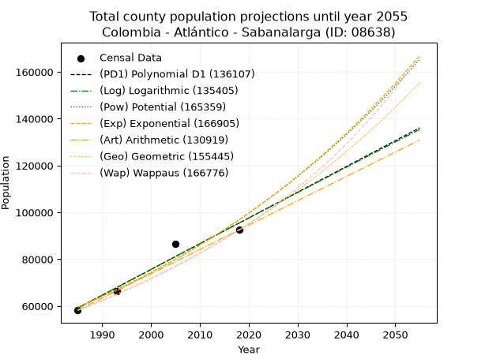
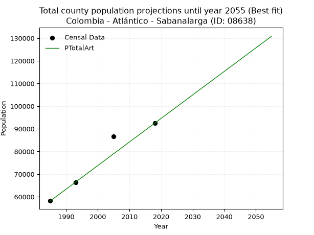
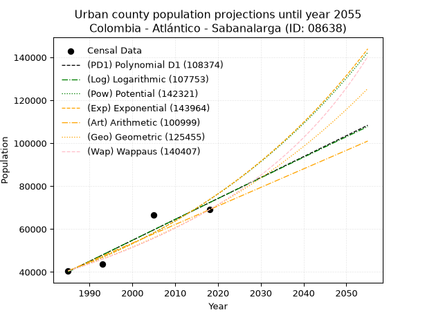
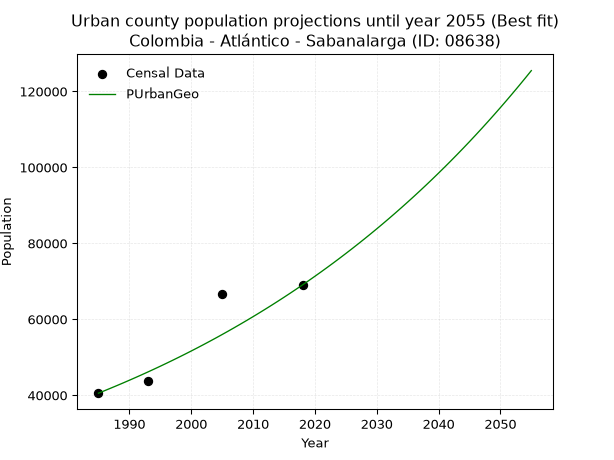
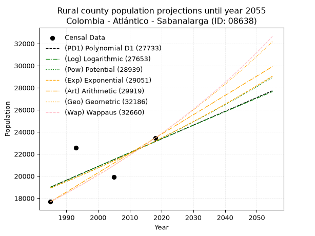
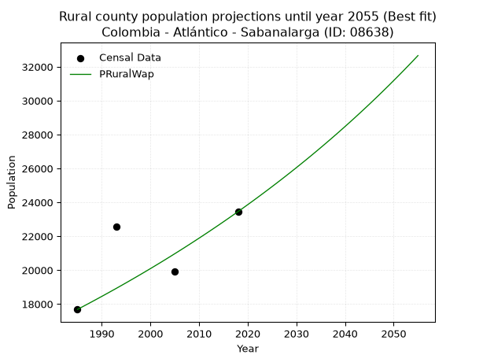

<div align="center">


</div>

# 📜 _“Population and Public Services Demand Projections (PPSD) until Year 2050 for Colombia - Atlántico - Sabanalarga (ID: 08638)”_
Keywords: `population` `public-service` `projection` `lineal` `polynomial` `logarithmic` `potential` `exponential` `arithmetic` `geometric` `wappaus` `dane` `colombia` `south-america`

PPSD are analytical estimates used by governments and planners to anticipate future changes in population size, age distribution, and the resulting community needs for utilities, healthcare, education, and infrastructure as sizing future water treatment facilities, electrical grids, and road networks based on spatial growth.

<div align="center">

</img>

</div>


> **General running parameters**: • app_version: _v20260806_. • Python version: _3.14.7_. • Pandas version: _3.0.5_. • NumPy version: _2.5.1_. • Creates, save and include plots into reports (create_plot): _False_. • Projection until year: _2050_. • Process polynomial degree 2 and up: _False_. • Process Wappaus: _True_. • Process Wappaus: _True_. • Set negative values to zero: _True_. • Set infinite values to zero: _True_. • Drop dataset notes: _True_. 
<div align="center">

Maps & GIS Layers: [:earth_americas:Google](http://maps.google.com/maps?q=10.63209113,-74.921256) [:earth_americas:OSM](https://www.openstreetmap.org/#map=18/10.63209113/-74.921256&layers=P) [:earth_americas:Bing](https://www.bing.com/maps?cp=10.63209113~-74.921256&lvl=18) [:earth_americas:Apple](https://maps.apple.com/frame?center=10.63209113%2C-74.921256&span=0.003%2C0.006) [:earth_americas:GISMobile](https://github.com/rcfdtools/R.GISMobile/blob/main/file/gis/CountyLayer_CO/Readme.md)

</div>


<div align="center">

```geojson
{
  "type": "Feature",
  "geometry": {
    "type": "Point", 
    "coordinates": [-74.921256, 10.63209113]
  }, 
  "properties": {
    "Name": "Colombia - Atlántico - Sabanalarga (ID: 08638)"
  }
}
```

</div>


## 0. Census Data (4 records)

Census data are official statistics collected by a government about the people and housing in a country. They usually include counts of total population, age, sex, race, income, education, and jobs.

📅Global census file: [Population.xlsx](../data/Population.xlsx)

| Source   |   Year |   CountryID | CountryName   |   StateID | StateName   |   CountyID | CountyName   |   PTotal |   PUrban |   PRural |
|:---------|-------:|------------:|:--------------|----------:|:------------|-----------:|:-------------|---------:|---------:|---------:|
| DANE     |   1985 |          57 | Colombia      |        08 | Atlántico   |      08638 | Sabanalarga  |    58197 |    40517 |    17680 |
| DANE     |   1993 |          57 | Colombia      |        08 | Atlántico   |      08638 | Sabanalarga  |    66309 |    43745 |    22564 |
| DANE     |   2005 |          57 | Colombia      |        08 | Atlántico   |      08638 | Sabanalarga  |    86631 |    66707 |    19924 |
| DANE     |   2018 |          57 | Colombia      |        08 | Atlántico   |      08638 | Sabanalarga  |    92480 |    69030 |    23450 |

> 🔥Some records could had specific notes about the registered values or the corresponding urban or rural distribution.

📅[SUI-RUPS](https://www.datos.gov.co/Hacienda-y-Cr-dito-P-blico/Registro-nico-de-Prestadores-de-Servicios-P-blicos/4qkq-csdn/about_data) - Local public utility companies: [RUPS.csv](../data/RUPS.csv)

 | SERVICIO       | ESTADO    | NOMBRE                                                                                                                   | NIT         | DEPARTAMENTO_DOMICILIO   | MUNICIPIO_DOMICILIO   | DIRECCION                                                          |   TELEFONO | EMAIL                           | TIPO_PRESTADOR                             | CLASIFICACION                 |
|:---------------|:----------|:-------------------------------------------------------------------------------------------------------------------------|:------------|:-------------------------|:----------------------|:-------------------------------------------------------------------|-----------:|:--------------------------------|:-------------------------------------------|:------------------------------|
| ACUEDUCTO      | OPERATIVA | SOCIEDAD DE ACUEDUCTO, ALCANTARILLADO Y ASEO DE BARRANQUILLA S.A. E.S.P.                                                 | 800135913-1 | ATLANTICO                | BARRANQUILLA          | Carrera 58 # 67-09                                                 |    3614000 | carolina.silva@aaa.com.co       | SOCIEDADES (EMPRESA DE SERVICIOS PUBLICOS) | MAYOR O IGUAL A 5001 USUARIOS |
| ALCANTARILLADO | OPERATIVA | SOCIEDAD DE ACUEDUCTO, ALCANTARILLADO Y ASEO DE BARRANQUILLA S.A. E.S.P.                                                 | 800135913-1 | ATLANTICO                | BARRANQUILLA          | Carrera 58 # 67-09                                                 |    3614000 | carolina.silva@aaa.com.co       | SOCIEDADES (EMPRESA DE SERVICIOS PUBLICOS) | MAYOR O IGUAL A 5001 USUARIOS |
| ACUEDUCTO      | OPERATIVA | ASOCIACION DE USUARIOS SUSCRIPTORES DEL ACUEDUCTO,ALCANTARILLADO Y ASEO COMUNITARIO DEL CORREGIMIENTO DE AGUADA DE PABLO | 802009670-5 | ATLANTICO                | SABANALARGA           | CALLE 2 N. 2A-30                                                   |    3307148 | richmachacon@gmail.com          | ORGANIZACION AUTORIZADA                    | MENOR O IGUAL A 2500 USUARIOS |
| ACUEDUCTO      | OPERATIVA | ASOCIACION JUNTA ADMINISTRADORA DEL ACUEDUCTO COMUNITARIO DE GALLEGO                                                     | 802010822-1 | ATLANTICO                | SABANALARGA           | KRA 5 No 3-39                                                      |    3307148 | aseparural2017@gmail.com        | ORGANIZACION AUTORIZADA                    | MENOR O IGUAL A 2500 USUARIOS |
| ACUEDUCTO      | OPERATIVA | ASOCIACION JUNTA ADMINISTRADORA DEL ACUEDUCTO COMUNITARIO DE MOLINEROS DEL MUNICIPIO DE SABANALARGA                      | 900035991-1 | ATLANTICO                | SABANALARGA           | KRA 12 No 9a - 31                                                  |    3654263 | ronaldmanotas22@gmail.com       | ORGANIZACION AUTORIZADA                    | MENOR O IGUAL A 2500 USUARIOS |
| ACUEDUCTO      | OPERATIVA | ASOCIACION DE USUARIOS SUSCRIPTORES DEL ACUEDUCTO,ALCANTARILLADO Y ASEO COMUNITARIO DEL CORREGIMIENTO DE ISABEL LOPEZ    | 802010046-0 | ATLANTICO                | SABANALARGA           | calle 6 No..8-62                                                   |    3307148 | navarroguillo@hotmail.com       | ORGANIZACION AUTORIZADA                    | MENOR O IGUAL A 2500 USUARIOS |
| ACUEDUCTO      | OPERATIVA | ASOCIACION DE USUARIOS SUSCRIPTORES DEL ACUEDUCTO, ALCANTARILLADO Y ASEO COMUNITARIO DELCORREGIMIENTO DE LA PEÑA         | 802012861-6 | ATLANTICO                | SABANALARGA           | CALLE 4 # 10 - 63                                                  |    8781698 | waldircv1972@gmail.com          | ORGANIZACION AUTORIZADA                    | MENOR O IGUAL A 2500 USUARIOS |
| ACUEDUCTO      | OPERATIVA | ASOCIACION DE USUARIOS DEL ACUEDUCTO, ALCANTARILLADO Y ASEO DEL CORREGIMIENTO DE COLOMBIA, MUNICIPIO DE SABANALARGA      | 900107877-8 | ATLANTICO                | SABANALARGA           | CALLE 5 Nº 7  - 10                                                 |    3760770 | donaldomoralesdem1526@gmail.com | ORGANIZACION AUTORIZADA                    | MENOR O IGUAL A 2500 USUARIOS |
| ACUEDUCTO      | OPERATIVA | ASOCIACION DE USUARIOS DEL ACUEDUCTO DE LA VEREDA LA PIEDRA                                                              | 901285769-6 | ATLANTICO                | SABANALARGA           | VERDEDA LA PIEDRA MPO DE SABNALARGA VIA MANTIIO EL CORTIJO CASA 10 |    5355838 | navarroguillo@hotmail.com       | ORGANIZACION AUTORIZADA                    | MENOR O IGUAL A 2500 USUARIOS |

## 1. Total

### 1.1. Coefficients and Parameters

* (PD1) Polynomial Deg 1: 1099.5949417904408, -2123560.532316329 (lineal)
* (Log) Logarithmic: 2201858.4165457305, -16660439.21875009
* (Pow) Potential: 29.471705820478768, -92.41578740778762
* (Exp) Exponential: 0.014716439896837718, 1.2257826166148411e-08
* (Art) Arithmetic: Year diff. 2018 - 1985 = 33, Population diff. 92480 - 58197 = 34283, Annual growth = 1038.878787878788
* (Geo) Geometric: Year diff. 2018 - 1985 = 33, Population diff. 92480 - 58197 = 34283, Annual growth % = 0.014134063574177569
* (Wap) Wappaus: i = 1.378948064905444, Condition values only valid for < 200)

<sub>
Wappaus condition values: ['0.00', '1.38', '2.76', '4.14', '5.52', '6.89', '8.27', '9.65', '11.03', '12.41', '13.79', '15.17', '16.55', '17.93', '19.31', '20.68', '22.06', '23.44', '24.82', '26.20', '27.58', '28.96', '30.34', '31.72', '33.09', '34.47', '35.85', '37.23', '38.61', '39.99', '41.37', '42.75', '44.13', '45.51', '46.88', '48.26', '49.64', '51.02', '52.40', '53.78', '55.16', '56.54', '57.92', '59.29', '60.67', '62.05', '63.43', '64.81', '66.19', '67.57', '68.95', '70.33', '71.71', '73.08', '74.46', '75.84', '77.22', '78.60', '79.98', '81.36', '82.74', '84.12', '85.49', '86.87', '88.25', '89.63']
</sub>


### 1.2. Projected Dataset

|   Year |   CountyID |   PTotalPD1 |   PTotalLog |   PTotalPow |   PTotalExp |   PTotalArt |   PTotalGeo |   PTotalWap |
|-------:|-----------:|------------:|------------:|------------:|------------:|------------:|------------:|------------:|
|   1985 |      08638 |       59135 |       59096 |       59544 |       59577 |       58197 |       58197 |       58197 |
|   1986 |      08638 |       60235 |       60205 |       60435 |       60461 |       59236 |       59020 |       59005 |
|   1987 |      08638 |       61335 |       61313 |       61338 |       61357 |       60275 |       59854 |       59824 |
|   1988 |      08638 |       62434 |       62421 |       62254 |       62267 |       61314 |       60700 |       60655 |
|   1989 |      08638 |       63534 |       63528 |       63184 |       63190 |       62353 |       61558 |       61498 |
|   1990 |      08638 |       64633 |       64635 |       64127 |       64127 |       63391 |       62428 |       62353 |
|   1991 |      08638 |       65733 |       65741 |       65083 |       65077 |       64430 |       63310 |       63220 |
|   1992 |      08638 |       66833 |       66847 |       66054 |       66042 |       65469 |       64205 |       64099 |
|   1993 |      08638 |       67932 |       67952 |       67038 |       67021 |       66508 |       65112 |       64992 |
|   1994 |      08638 |       69032 |       69056 |       68036 |       68015 |       67547 |       66033 |       65897 |
|   1995 |      08638 |       70131 |       70160 |       69049 |       69023 |       68586 |       66966 |       66816 |
|   1996 |      08638 |       71231 |       71264 |       70077 |       70046 |       69625 |       67912 |       67749 |
|   1997 |      08638 |       72331 |       72367 |       71119 |       71085 |       70664 |       68872 |       68696 |
|   1998 |      08638 |       73430 |       73469 |       72176 |       72139 |       71702 |       69846 |       69657 |
|   1999 |      08638 |       74530 |       74571 |       73248 |       73208 |       72741 |       70833 |       70632 |
|   2000 |      08638 |       75629 |       75672 |       74336 |       74293 |       73780 |       71834 |       71623 |
|   2001 |      08638 |       76729 |       76772 |       75439 |       75395 |       74819 |       72849 |       72629 |
|   2002 |      08638 |       77829 |       77873 |       76558 |       76513 |       75858 |       73879 |       73651 |
|   2003 |      08638 |       78928 |       78972 |       77693 |       77647 |       76897 |       74923 |       74689 |
|   2004 |      08638 |       80028 |       80071 |       78844 |       78798 |       77936 |       75982 |       75743 |
|   2005 |      08638 |       81127 |       81170 |       80012 |       79966 |       78975 |       77056 |       76814 |
|   2006 |      08638 |       82227 |       82268 |       81197 |       81152 |       80013 |       78145 |       77903 |
|   2007 |      08638 |       83327 |       83365 |       82398 |       82355 |       81052 |       79250 |       79009 |
|   2008 |      08638 |       84426 |       84462 |       83617 |       83576 |       82091 |       80370 |       80133 |
|   2009 |      08638 |       85526 |       85558 |       84853 |       84815 |       83130 |       81506 |       81276 |
|   2010 |      08638 |       86625 |       86654 |       86106 |       86072 |       84169 |       82658 |       82438 |
|   2011 |      08638 |       87725 |       87749 |       87378 |       87348 |       85208 |       83826 |       83619 |
|   2012 |      08638 |       88824 |       88844 |       88667 |       88643 |       86247 |       85011 |       84821 |
|   2013 |      08638 |       89924 |       89938 |       89976 |       89957 |       87286 |       86213 |       86043 |
|   2014 |      08638 |       91024 |       91031 |       91302 |       91291 |       88324 |       87431 |       87286 |
|   2015 |      08638 |       92123 |       92124 |       92648 |       92645 |       89363 |       88667 |       88551 |
|   2016 |      08638 |       93223 |       93217 |       94012 |       94018 |       90402 |       89920 |       89837 |
|   2017 |      08638 |       94322 |       94309 |       95397 |       95412 |       91441 |       91191 |       91147 |
|   2018 |      08638 |       95422 |       95400 |       96800 |       96826 |       92480 |       92480 |       92480 |
|   2019 |      08638 |       96522 |       96491 |       98224 |       98262 |       93519 |       93787 |       93837 |
|   2020 |      08638 |       97621 |       97581 |       99668 |       99719 |       94558 |       95113 |       95219 |
|   2021 |      08638 |       98721 |       98671 |      101132 |      101197 |       95597 |       96457 |       96626 |
|   2022 |      08638 |       99820 |       99760 |      102618 |      102697 |       96636 |       97820 |       98059 |
|   2023 |      08638 |      100920 |      100849 |      104124 |      104220 |       97674 |       99203 |       99518 |
|   2024 |      08638 |      102020 |      101937 |      105652 |      105765 |       98713 |      100605 |      101006 |
|   2025 |      08638 |      103119 |      103024 |      107201 |      107333 |       99752 |      102027 |      102521 |
|   2026 |      08638 |      104219 |      104112 |      108772 |      108924 |      100791 |      103469 |      104066 |
|   2027 |      08638 |      105318 |      105198 |      110366 |      110539 |      101830 |      104932 |      105641 |
|   2028 |      08638 |      106418 |      106284 |      111982 |      112178 |      102869 |      106415 |      107247 |
|   2029 |      08638 |      107518 |      107370 |      113620 |      113841 |      103908 |      107919 |      108884 |
|   2030 |      08638 |      108617 |      108454 |      115282 |      115528 |      104947 |      109444 |      110554 |
|   2031 |      08638 |      109717 |      109539 |      116968 |      117241 |      105985 |      110991 |      112258 |
|   2032 |      08638 |      110816 |      110623 |      118677 |      118979 |      107024 |      112560 |      113997 |
|   2033 |      08638 |      111916 |      111706 |      120410 |      120743 |      108063 |      114151 |      115771 |
|   2034 |      08638 |      113016 |      112789 |      122168 |      122533 |      109102 |      115764 |      117583 |
|   2035 |      08638 |      114115 |      113871 |      123951 |      124350 |      110141 |      117400 |      119432 |
|   2036 |      08638 |      115215 |      114953 |      125759 |      126193 |      111180 |      119060 |      121321 |
|   2037 |      08638 |      116314 |      116034 |      127592 |      128064 |      112219 |      120742 |      123251 |
|   2038 |      08638 |      117414 |      117115 |      129451 |      129963 |      113258 |      122449 |      125222 |
|   2039 |      08638 |      118514 |      118195 |      131336 |      131889 |      114296 |      124180 |      127237 |
|   2040 |      08638 |      119613 |      119274 |      133248 |      133845 |      115335 |      125935 |      129297 |
|   2041 |      08638 |      120713 |      120353 |      135186 |      135829 |      116374 |      127715 |      131402 |
|   2042 |      08638 |      121812 |      121432 |      137152 |      137843 |      117413 |      129520 |      133556 |
|   2043 |      08638 |      122912 |      122510 |      139145 |      139886 |      118452 |      131351 |      135759 |
|   2044 |      08638 |      124012 |      123588 |      141166 |      141960 |      119491 |      133207 |      138013 |
|   2045 |      08638 |      125111 |      124665 |      143216 |      144065 |      120530 |      135090 |      140321 |
|   2046 |      08638 |      126211 |      125741 |      145295 |      146201 |      121569 |      136999 |      142683 |
|   2047 |      08638 |      127310 |      126817 |      147402 |      148368 |      122607 |      138936 |      145102 |
|   2048 |      08638 |      128410 |      127892 |      149539 |      150568 |      123646 |      140899 |      147580 |
|   2049 |      08638 |      129510 |      128967 |      151706 |      152800 |      124685 |      142891 |      150119 |
|   2050 |      08638 |      130609 |      130041 |      153903 |      155065 |      125724 |      144910 |      152722 |
<div align="center">

</img>

</div>


### 1.3. Best fit with absolute and relative error (%)

Relative error puts that difference into context by dividing the absolute error by the true value, creating a unitless ratio or percentage that shows the scale of the mistake.

Absolute and relative error

|   Year | Source   |   CountryID | CountryName   |   StateID | StateName   |   CountyID_x | CountyName   |   PTotal |   PUrban |   PRural |   CountyID_y |   PTotalPD1 |   PTotalLog |   PTotalPow |   PTotalExp |   PTotalArt |   PTotalGeo |   PTotalWap |   PTotalPD1AbsError |   PTotalLogAbsError |   PTotalPowAbsError |   PTotalExpAbsError |   PTotalArtAbsError |   PTotalGeoAbsError |   PTotalWapAbsError |   PTotalPD1RelError |   PTotalLogRelError |   PTotalPowRelError |   PTotalExpRelError |   PTotalArtRelError |   PTotalGeoRelError |   PTotalWapRelError |
|-------:|:---------|------------:|:--------------|----------:|:------------|-------------:|:-------------|---------:|---------:|---------:|-------------:|------------:|------------:|------------:|------------:|------------:|------------:|------------:|--------------------:|--------------------:|--------------------:|--------------------:|--------------------:|--------------------:|--------------------:|--------------------:|--------------------:|--------------------:|--------------------:|--------------------:|--------------------:|--------------------:|
|   1985 | DANE     |          57 | Colombia      |        08 | Atlántico   |        08638 | Sabanalarga  |    58197 |    40517 |    17680 |        08638 |       59135 |       59096 |       59544 |       59577 |       58197 |       58197 |       58197 |                 938 |                 899 |                1347 |                1380 |                   0 |                   0 |                   0 |             1.61177 |             1.54475 |             2.31455 |             2.37126 |             0       |             0       |             0       |
|   1993 | DANE     |          57 | Colombia      |        08 | Atlántico   |        08638 | Sabanalarga  |    66309 |    43745 |    22564 |        08638 |       67932 |       67952 |       67038 |       67021 |       66508 |       65112 |       64992 |                1623 |                1643 |                 729 |                 712 |                 199 |                1197 |                1317 |             2.44763 |             2.47779 |             1.0994  |             1.07376 |             0.30011 |             1.80518 |             1.98616 |
|   2005 | DANE     |          57 | Colombia      |        08 | Atlántico   |        08638 | Sabanalarga  |    86631 |    66707 |    19924 |        08638 |       81127 |       81170 |       80012 |       79966 |       78975 |       77056 |       76814 |                5504 |                5461 |                6619 |                6665 |                7656 |                9575 |                9817 |             6.35338 |             6.30375 |             7.64045 |             7.69355 |             8.83748 |            11.0526  |            11.332   |
|   2018 | DANE     |          57 | Colombia      |        08 | Atlántico   |        08638 | Sabanalarga  |    92480 |    69030 |    23450 |        08638 |       95422 |       95400 |       96800 |       96826 |       92480 |       92480 |       92480 |                2942 |                2920 |                4320 |                4346 |                   0 |                   0 |                   0 |             3.18123 |             3.15744 |             4.67128 |             4.69939 |             0       |             0       |             0       |

Relative error mean

| Method    |   RelError | Best   |
|:----------|-----------:|:-------|
| PTotalPD1 |    3.3985  |        |
| PTotalLog |    3.37093 |        |
| PTotalPow |    3.93142 |        |
| PTotalExp |    3.95949 |        |
| PTotalArt |    2.2844  | True   |
| PTotalGeo |    3.21445 |        |
| PTotalWap |    3.32953 |        |

💙Best method: _**PTotalArt**_
<div align="center">

</img>

</div>


### 1.4. Fresh water supply demand in liters per capita per day (lpcd)

The fresh water supply demand typically ranges from 100 to 300 liters per capita per day (lpcd) for standard domestic and municipal planning, though absolute survival minimums set by the World Health Organization are as low as 7.5 to 20 liters per day, and total consumption in high-income nations can exceed 400 liters.

> `CZ`: Level in meters above the sea level (masl)<br> `WS`: Fresh water supply demand in liters per capita per day (lpcd or l/h/d)<br> `WSAll`: Zonal fresh water supply demand in liters per second (l/s)<br> `A`: Zonal area in square meters<br> `DP`: Population density (people/hectare or p/ha)

Reference values (RAS Colombia)

|    CZ |   WS |
|------:|-----:|
|  1000 |  120 |
|  2000 |  130 |
| 99999 |  140 |

County shapefile geometry properties and water supply values

|   CountyID |      ATotal |   CZTotal |   WSTotal |
|-----------:|------------:|----------:|----------:|
|      08638 | 3.95579e+08 |   69.3395 |       120 |

Projected values for best method: PTotalArt

|   CountyID |   Year |   PTotalArt |   DPTotal |   WSTotal |   WSTotalAll |
|-----------:|-------:|------------:|----------:|----------:|-------------:|
|      08638 |   1985 |       58197 |      1.47 |       120 |      80.8292 |
|      08638 |   1986 |       59236 |      1.5  |       120 |      82.2722 |
|      08638 |   1987 |       60275 |      1.52 |       120 |      83.7153 |
|      08638 |   1988 |       61314 |      1.55 |       120 |      85.1583 |
|      08638 |   1989 |       62353 |      1.58 |       120 |      86.6014 |
|      08638 |   1990 |       63391 |      1.6  |       120 |      88.0431 |
|      08638 |   1991 |       64430 |      1.63 |       120 |      89.4861 |
|      08638 |   1992 |       65469 |      1.66 |       120 |      90.9292 |
|      08638 |   1993 |       66508 |      1.68 |       120 |      92.3722 |
|      08638 |   1994 |       67547 |      1.71 |       120 |      93.8153 |
|      08638 |   1995 |       68586 |      1.73 |       120 |      95.2583 |
|      08638 |   1996 |       69625 |      1.76 |       120 |      96.7014 |
|      08638 |   1997 |       70664 |      1.79 |       120 |      98.1444 |
|      08638 |   1998 |       71702 |      1.81 |       120 |      99.5861 |
|      08638 |   1999 |       72741 |      1.84 |       120 |     101.029  |
|      08638 |   2000 |       73780 |      1.87 |       120 |     102.472  |
|      08638 |   2001 |       74819 |      1.89 |       120 |     103.915  |
|      08638 |   2002 |       75858 |      1.92 |       120 |     105.358  |
|      08638 |   2003 |       76897 |      1.94 |       120 |     106.801  |
|      08638 |   2004 |       77936 |      1.97 |       120 |     108.244  |
|      08638 |   2005 |       78975 |      2    |       120 |     109.688  |
|      08638 |   2006 |       80013 |      2.02 |       120 |     111.129  |
|      08638 |   2007 |       81052 |      2.05 |       120 |     112.572  |
|      08638 |   2008 |       82091 |      2.08 |       120 |     114.015  |
|      08638 |   2009 |       83130 |      2.1  |       120 |     115.458  |
|      08638 |   2010 |       84169 |      2.13 |       120 |     116.901  |
|      08638 |   2011 |       85208 |      2.15 |       120 |     118.344  |
|      08638 |   2012 |       86247 |      2.18 |       120 |     119.787  |
|      08638 |   2013 |       87286 |      2.21 |       120 |     121.231  |
|      08638 |   2014 |       88324 |      2.23 |       120 |     122.672  |
|      08638 |   2015 |       89363 |      2.26 |       120 |     124.115  |
|      08638 |   2016 |       90402 |      2.29 |       120 |     125.558  |
|      08638 |   2017 |       91441 |      2.31 |       120 |     127.001  |
|      08638 |   2018 |       92480 |      2.34 |       120 |     128.444  |
|      08638 |   2019 |       93519 |      2.36 |       120 |     129.887  |
|      08638 |   2020 |       94558 |      2.39 |       120 |     131.331  |
|      08638 |   2021 |       95597 |      2.42 |       120 |     132.774  |
|      08638 |   2022 |       96636 |      2.44 |       120 |     134.217  |
|      08638 |   2023 |       97674 |      2.47 |       120 |     135.658  |
|      08638 |   2024 |       98713 |      2.5  |       120 |     137.101  |
|      08638 |   2025 |       99752 |      2.52 |       120 |     138.544  |
|      08638 |   2026 |      100791 |      2.55 |       120 |     139.988  |
|      08638 |   2027 |      101830 |      2.57 |       120 |     141.431  |
|      08638 |   2028 |      102869 |      2.6  |       120 |     142.874  |
|      08638 |   2029 |      103908 |      2.63 |       120 |     144.317  |
|      08638 |   2030 |      104947 |      2.65 |       120 |     145.76   |
|      08638 |   2031 |      105985 |      2.68 |       120 |     147.201  |
|      08638 |   2032 |      107024 |      2.71 |       120 |     148.644  |
|      08638 |   2033 |      108063 |      2.73 |       120 |     150.088  |
|      08638 |   2034 |      109102 |      2.76 |       120 |     151.531  |
|      08638 |   2035 |      110141 |      2.78 |       120 |     152.974  |
|      08638 |   2036 |      111180 |      2.81 |       120 |     154.417  |
|      08638 |   2037 |      112219 |      2.84 |       120 |     155.86   |
|      08638 |   2038 |      113258 |      2.86 |       120 |     157.303  |
|      08638 |   2039 |      114296 |      2.89 |       120 |     158.744  |
|      08638 |   2040 |      115335 |      2.92 |       120 |     160.188  |
|      08638 |   2041 |      116374 |      2.94 |       120 |     161.631  |
|      08638 |   2042 |      117413 |      2.97 |       120 |     163.074  |
|      08638 |   2043 |      118452 |      2.99 |       120 |     164.517  |
|      08638 |   2044 |      119491 |      3.02 |       120 |     165.96   |
|      08638 |   2045 |      120530 |      3.05 |       120 |     167.403  |
|      08638 |   2046 |      121569 |      3.07 |       120 |     168.846  |
|      08638 |   2047 |      122607 |      3.1  |       120 |     170.287  |
|      08638 |   2048 |      123646 |      3.13 |       120 |     171.731  |
|      08638 |   2049 |      124685 |      3.15 |       120 |     173.174  |
|      08638 |   2050 |      125724 |      3.18 |       120 |     174.617  |

## 2. Urban

### 2.1. Coefficients and Parameters

* (PD1) Polynomial Deg 1: 974.8779606583671, -1894999.890806899 (lineal)
* (Log) Logarithmic: 1952137.4212941458, -14783212.432704328
* (Pow) Potential: 36.24105513368252, -114.90652766880255
* (Exp) Exponential: 0.018097290406955215, 1.0159495345864043e-11
* (Art) Arithmetic: Year diff. 2018 - 1985 = 33, Population diff. 69030 - 40517 = 28513, Annual growth = 864.030303030303
* (Geo) Geometric: Year diff. 2018 - 1985 = 33, Population diff. 69030 - 40517 = 28513, Annual growth % = 0.016277098869318607
* (Wap) Wappaus: i = 1.5774604562978503, Condition values only valid for < 200)

<sub>
Wappaus condition values: ['0.00', '1.58', '3.15', '4.73', '6.31', '7.89', '9.46', '11.04', '12.62', '14.20', '15.77', '17.35', '18.93', '20.51', '22.08', '23.66', '25.24', '26.82', '28.39', '29.97', '31.55', '33.13', '34.70', '36.28', '37.86', '39.44', '41.01', '42.59', '44.17', '45.75', '47.32', '48.90', '50.48', '52.06', '53.63', '55.21', '56.79', '58.37', '59.94', '61.52', '63.10', '64.68', '66.25', '67.83', '69.41', '70.99', '72.56', '74.14', '75.72', '77.30', '78.87', '80.45', '82.03', '83.61', '85.18', '86.76', '88.34', '89.92', '91.49', '93.07', '94.65', '96.23', '97.80', '99.38', '100.96', '102.53']
</sub>


### 2.2. Projected Dataset

|   Year |   CountyID |   PUrbanPD1 |   PUrbanLog |   PUrbanPow |   PUrbanExp |   PUrbanArt |   PUrbanGeo |   PUrbanWap |
|-------:|-----------:|------------:|------------:|------------:|------------:|------------:|------------:|------------:|
|   1985 |      08638 |       40133 |       40097 |       40532 |       40559 |       40517 |       40517 |       40517 |
|   1986 |      08638 |       41108 |       41081 |       41278 |       41300 |       41381 |       41176 |       41161 |
|   1987 |      08638 |       42083 |       42063 |       42038 |       42054 |       42245 |       41847 |       41816 |
|   1988 |      08638 |       43057 |       43046 |       42812 |       42822 |       43109 |       42528 |       42481 |
|   1989 |      08638 |       44032 |       44027 |       43599 |       43604 |       43973 |       43220 |       43157 |
|   1990 |      08638 |       45007 |       45009 |       44401 |       44400 |       44837 |       43924 |       43844 |
|   1991 |      08638 |       45982 |       45989 |       45216 |       45211 |       45701 |       44639 |       44542 |
|   1992 |      08638 |       46957 |       46969 |       46047 |       46037 |       46565 |       45365 |       45252 |
|   1993 |      08638 |       47932 |       47949 |       46892 |       46877 |       47429 |       46104 |       45974 |
|   1994 |      08638 |       48907 |       48928 |       47752 |       47733 |       48293 |       46854 |       46709 |
|   1995 |      08638 |       49882 |       49907 |       48628 |       48605 |       49157 |       47617 |       47456 |
|   1996 |      08638 |       50857 |       50886 |       49519 |       49493 |       50021 |       48392 |       48215 |
|   1997 |      08638 |       51831 |       51863 |       50426 |       50396 |       50885 |       49179 |       48988 |
|   1998 |      08638 |       52806 |       52841 |       51349 |       51317 |       51749 |       49980 |       49775 |
|   1999 |      08638 |       53781 |       53817 |       52289 |       52254 |       52613 |       50793 |       50576 |
|   2000 |      08638 |       54756 |       54794 |       53245 |       53208 |       53477 |       51620 |       51391 |
|   2001 |      08638 |       55731 |       55770 |       54219 |       54180 |       54341 |       52460 |       52220 |
|   2002 |      08638 |       56706 |       56745 |       55210 |       55169 |       55206 |       53314 |       53065 |
|   2003 |      08638 |       57681 |       57720 |       56218 |       56177 |       56070 |       54182 |       53925 |
|   2004 |      08638 |       58656 |       58694 |       57244 |       57203 |       56934 |       55064 |       54801 |
|   2005 |      08638 |       59630 |       59668 |       58288 |       58247 |       57798 |       55960 |       55694 |
|   2006 |      08638 |       60605 |       60641 |       59351 |       59311 |       58662 |       56871 |       56603 |
|   2007 |      08638 |       61580 |       61614 |       60433 |       60394 |       59526 |       57797 |       57530 |
|   2008 |      08638 |       62555 |       62587 |       61534 |       61497 |       60390 |       58738 |       58475 |
|   2009 |      08638 |       63530 |       63559 |       62654 |       62620 |       61254 |       59694 |       59438 |
|   2010 |      08638 |       64505 |       64530 |       63794 |       63764 |       62118 |       60665 |       60420 |
|   2011 |      08638 |       65480 |       65501 |       64955 |       64928 |       62982 |       61653 |       61422 |
|   2012 |      08638 |       66455 |       66472 |       66136 |       66114 |       63846 |       62656 |       62443 |
|   2013 |      08638 |       67429 |       67442 |       67337 |       67321 |       64710 |       63676 |       63485 |
|   2014 |      08638 |       68404 |       68411 |       68560 |       68551 |       65574 |       64713 |       64549 |
|   2015 |      08638 |       69379 |       69380 |       69805 |       69803 |       66438 |       65766 |       65634 |
|   2016 |      08638 |       70354 |       70349 |       71072 |       71077 |       67302 |       66836 |       66743 |
|   2017 |      08638 |       71329 |       71317 |       72360 |       72375 |       68166 |       67924 |       67874 |
|   2018 |      08638 |       72304 |       72284 |       73672 |       73697 |       69030 |       69030 |       69030 |
|   2019 |      08638 |       73279 |       73251 |       75007 |       75043 |       69894 |       70154 |       70211 |
|   2020 |      08638 |       74254 |       74218 |       76365 |       76413 |       70758 |       71296 |       71417 |
|   2021 |      08638 |       75228 |       75184 |       77747 |       77809 |       71622 |       72456 |       72650 |
|   2022 |      08638 |       76203 |       76150 |       79153 |       79230 |       72486 |       73635 |       73910 |
|   2023 |      08638 |       77178 |       77115 |       80584 |       80677 |       73350 |       74834 |       75199 |
|   2024 |      08638 |       78153 |       78080 |       82041 |       82150 |       74214 |       76052 |       76517 |
|   2025 |      08638 |       79128 |       79044 |       83523 |       83650 |       75078 |       77290 |       77866 |
|   2026 |      08638 |       80103 |       80008 |       85030 |       85178 |       75942 |       78548 |       79246 |
|   2027 |      08638 |       81078 |       80971 |       86565 |       86733 |       76806 |       79827 |       80658 |
|   2028 |      08638 |       82053 |       81934 |       88126 |       88317 |       77670 |       81126 |       82105 |
|   2029 |      08638 |       83027 |       82896 |       89715 |       89930 |       78534 |       82446 |       83586 |
|   2030 |      08638 |       84002 |       83858 |       91331 |       91573 |       79398 |       83788 |       85103 |
|   2031 |      08638 |       84977 |       84820 |       92976 |       93245 |       80262 |       85152 |       86658 |
|   2032 |      08638 |       85952 |       85781 |       94649 |       94948 |       81126 |       86538 |       88252 |
|   2033 |      08638 |       86927 |       86741 |       96352 |       96682 |       81990 |       87947 |       89887 |
|   2034 |      08638 |       87902 |       87701 |       98085 |       98447 |       82854 |       89378 |       91563 |
|   2035 |      08638 |       88877 |       88661 |       99848 |      100245 |       83719 |       90833 |       93283 |
|   2036 |      08638 |       89852 |       89620 |      101641 |      102076 |       84583 |       92312 |       95049 |
|   2037 |      08638 |       90827 |       90578 |      103466 |      103940 |       85447 |       93814 |       96861 |
|   2038 |      08638 |       91801 |       91536 |      105323 |      105838 |       86311 |       95341 |       98723 |
|   2039 |      08638 |       92776 |       92494 |      107212 |      107771 |       87175 |       96893 |      100636 |
|   2040 |      08638 |       93751 |       93451 |      109134 |      109739 |       88039 |       98470 |      102602 |
|   2041 |      08638 |       94726 |       94408 |      111090 |      111743 |       88903 |      100073 |      104624 |
|   2042 |      08638 |       95701 |       95364 |      113080 |      113784 |       89767 |      101702 |      106704 |
|   2043 |      08638 |       96676 |       96320 |      115104 |      115862 |       90631 |      103357 |      108844 |
|   2044 |      08638 |       97651 |       97275 |      117164 |      117978 |       91495 |      105040 |      111048 |
|   2045 |      08638 |       98626 |       98230 |      119259 |      120132 |       92359 |      106749 |      113317 |
|   2046 |      08638 |       99600 |       99184 |      121391 |      122326 |       93223 |      108487 |      115656 |
|   2047 |      08638 |      100575 |      100138 |      123560 |      124560 |       94087 |      110253 |      118066 |
|   2048 |      08638 |      101550 |      101092 |      125766 |      126835 |       94951 |      112047 |      120552 |
|   2049 |      08638 |      102525 |      102045 |      128011 |      129151 |       95815 |      113871 |      123118 |
|   2050 |      08638 |      103500 |      102997 |      130295 |      131509 |       96679 |      115725 |      125766 |
<div align="center">

</img>

</div>


### 2.3. Best fit with absolute and relative error (%)

Relative error puts that difference into context by dividing the absolute error by the true value, creating a unitless ratio or percentage that shows the scale of the mistake.

Absolute and relative error

|   Year | Source   |   CountryID | CountryName   |   StateID | StateName   |   CountyID_x | CountyName   |   PTotal |   PUrban |   PRural |   CountyID_y |   PUrbanPD1 |   PUrbanLog |   PUrbanPow |   PUrbanExp |   PUrbanArt |   PUrbanGeo |   PUrbanWap |   PUrbanPD1AbsError |   PUrbanLogAbsError |   PUrbanPowAbsError |   PUrbanExpAbsError |   PUrbanArtAbsError |   PUrbanGeoAbsError |   PUrbanWapAbsError |   PUrbanPD1RelError |   PUrbanLogRelError |   PUrbanPowRelError |   PUrbanExpRelError |   PUrbanArtRelError |   PUrbanGeoRelError |   PUrbanWapRelError |
|-------:|:---------|------------:|:--------------|----------:|:------------|-------------:|:-------------|---------:|---------:|---------:|-------------:|------------:|------------:|------------:|------------:|------------:|------------:|------------:|--------------------:|--------------------:|--------------------:|--------------------:|--------------------:|--------------------:|--------------------:|--------------------:|--------------------:|--------------------:|--------------------:|--------------------:|--------------------:|--------------------:|
|   1985 | DANE     |          57 | Colombia      |        08 | Atlántico   |        08638 | Sabanalarga  |    58197 |    40517 |    17680 |        08638 |       40133 |       40097 |       40532 |       40559 |       40517 |       40517 |       40517 |                 384 |                 420 |                  15 |                  42 |                   0 |                   0 |                   0 |             0.94775 |             1.0366  |           0.0370215 |             0.10366 |             0       |             0       |             0       |
|   1993 | DANE     |          57 | Colombia      |        08 | Atlántico   |        08638 | Sabanalarga  |    66309 |    43745 |    22564 |        08638 |       47932 |       47949 |       46892 |       46877 |       47429 |       46104 |       45974 |                4187 |                4204 |                3147 |                3132 |                3684 |                2359 |                2229 |             9.57138 |             9.61024 |           7.19397   |             7.15968 |             8.42153 |             5.39262 |             5.09544 |
|   2005 | DANE     |          57 | Colombia      |        08 | Atlántico   |        08638 | Sabanalarga  |    86631 |    66707 |    19924 |        08638 |       59630 |       59668 |       58288 |       58247 |       57798 |       55960 |       55694 |                7077 |                7039 |                8419 |                8460 |                8909 |               10747 |               11013 |            10.6091  |            10.5521  |          12.6209    |            12.6823  |            13.3554  |            16.1108  |            16.5095  |
|   2018 | DANE     |          57 | Colombia      |        08 | Atlántico   |        08638 | Sabanalarga  |    92480 |    69030 |    23450 |        08638 |       72304 |       72284 |       73672 |       73697 |       69030 |       69030 |       69030 |                3274 |                3254 |                4642 |                4667 |                   0 |                   0 |                   0 |             4.74287 |             4.71389 |           6.72461   |             6.76083 |             0       |             0       |             0       |

Relative error mean

| Method    |   RelError | Best   |
|:----------|-----------:|:-------|
| PUrbanPD1 |    6.46777 |        |
| PUrbanLog |    6.47821 |        |
| PUrbanPow |    6.64412 |        |
| PUrbanExp |    6.67662 |        |
| PUrbanArt |    5.44424 |        |
| PUrbanGeo |    5.37584 | True   |
| PUrbanWap |    5.40124 |        |

💙Best method: _**PUrbanGeo**_
<div align="center">

</img>

</div>


### 2.4. Fresh water supply demand in liters per capita per day (lpcd)

The fresh water supply demand typically ranges from 100 to 300 liters per capita per day (lpcd) for standard domestic and municipal planning, though absolute survival minimums set by the World Health Organization are as low as 7.5 to 20 liters per day, and total consumption in high-income nations can exceed 400 liters.

> `CZ`: Level in meters above the sea level (masl)<br> `WS`: Fresh water supply demand in liters per capita per day (lpcd or l/h/d)<br> `WSAll`: Zonal fresh water supply demand in liters per second (l/s)<br> `A`: Zonal area in square meters<br> `DP`: Population density (people/hectare or p/ha)

Reference values (RAS Colombia)

|    CZ |   WS |
|------:|-----:|
|  1000 |  120 |
|  2000 |  130 |
| 99999 |  140 |

County shapefile geometry properties and water supply values

|   CountyID |      AUrban |   CZUrban |   WSUrban |
|-----------:|------------:|----------:|----------:|
|      08638 | 8.15201e+06 |   96.0065 |       120 |

Projected values for best method: PUrbanGeo

|   CountyID |   Year |   PUrbanGeo |   DPUrban |   WSUrban |   WSUrbanAll |
|-----------:|-------:|------------:|----------:|----------:|-------------:|
|      08638 |   1985 |       40517 |     49.7  |       120 |      56.2736 |
|      08638 |   1986 |       41176 |     50.51 |       120 |      57.1889 |
|      08638 |   1987 |       41847 |     51.33 |       120 |      58.1208 |
|      08638 |   1988 |       42528 |     52.17 |       120 |      59.0667 |
|      08638 |   1989 |       43220 |     53.02 |       120 |      60.0278 |
|      08638 |   1990 |       43924 |     53.88 |       120 |      61.0056 |
|      08638 |   1991 |       44639 |     54.76 |       120 |      61.9986 |
|      08638 |   1992 |       45365 |     55.65 |       120 |      63.0069 |
|      08638 |   1993 |       46104 |     56.56 |       120 |      64.0333 |
|      08638 |   1994 |       46854 |     57.48 |       120 |      65.075  |
|      08638 |   1995 |       47617 |     58.41 |       120 |      66.1347 |
|      08638 |   1996 |       48392 |     59.36 |       120 |      67.2111 |
|      08638 |   1997 |       49179 |     60.33 |       120 |      68.3042 |
|      08638 |   1998 |       49980 |     61.31 |       120 |      69.4167 |
|      08638 |   1999 |       50793 |     62.31 |       120 |      70.5458 |
|      08638 |   2000 |       51620 |     63.32 |       120 |      71.6944 |
|      08638 |   2001 |       52460 |     64.35 |       120 |      72.8611 |
|      08638 |   2002 |       53314 |     65.4  |       120 |      74.0472 |
|      08638 |   2003 |       54182 |     66.46 |       120 |      75.2528 |
|      08638 |   2004 |       55064 |     67.55 |       120 |      76.4778 |
|      08638 |   2005 |       55960 |     68.65 |       120 |      77.7222 |
|      08638 |   2006 |       56871 |     69.76 |       120 |      78.9875 |
|      08638 |   2007 |       57797 |     70.9  |       120 |      80.2736 |
|      08638 |   2008 |       58738 |     72.05 |       120 |      81.5806 |
|      08638 |   2009 |       59694 |     73.23 |       120 |      82.9083 |
|      08638 |   2010 |       60665 |     74.42 |       120 |      84.2569 |
|      08638 |   2011 |       61653 |     75.63 |       120 |      85.6292 |
|      08638 |   2012 |       62656 |     76.86 |       120 |      87.0222 |
|      08638 |   2013 |       63676 |     78.11 |       120 |      88.4389 |
|      08638 |   2014 |       64713 |     79.38 |       120 |      89.8792 |
|      08638 |   2015 |       65766 |     80.67 |       120 |      91.3417 |
|      08638 |   2016 |       66836 |     81.99 |       120 |      92.8278 |
|      08638 |   2017 |       67924 |     83.32 |       120 |      94.3389 |
|      08638 |   2018 |       69030 |     84.68 |       120 |      95.875  |
|      08638 |   2019 |       70154 |     86.06 |       120 |      97.4361 |
|      08638 |   2020 |       71296 |     87.46 |       120 |      99.0222 |
|      08638 |   2021 |       72456 |     88.88 |       120 |     100.633  |
|      08638 |   2022 |       73635 |     90.33 |       120 |     102.271  |
|      08638 |   2023 |       74834 |     91.8  |       120 |     103.936  |
|      08638 |   2024 |       76052 |     93.29 |       120 |     105.628  |
|      08638 |   2025 |       77290 |     94.81 |       120 |     107.347  |
|      08638 |   2026 |       78548 |     96.35 |       120 |     109.094  |
|      08638 |   2027 |       79827 |     97.92 |       120 |     110.871  |
|      08638 |   2028 |       81126 |     99.52 |       120 |     112.675  |
|      08638 |   2029 |       82446 |    101.14 |       120 |     114.508  |
|      08638 |   2030 |       83788 |    102.78 |       120 |     116.372  |
|      08638 |   2031 |       85152 |    104.46 |       120 |     118.267  |
|      08638 |   2032 |       86538 |    106.16 |       120 |     120.192  |
|      08638 |   2033 |       87947 |    107.88 |       120 |     122.149  |
|      08638 |   2034 |       89378 |    109.64 |       120 |     124.136  |
|      08638 |   2035 |       90833 |    111.42 |       120 |     126.157  |
|      08638 |   2036 |       92312 |    113.24 |       120 |     128.211  |
|      08638 |   2037 |       93814 |    115.08 |       120 |     130.297  |
|      08638 |   2038 |       95341 |    116.95 |       120 |     132.418  |
|      08638 |   2039 |       96893 |    118.86 |       120 |     134.574  |
|      08638 |   2040 |       98470 |    120.79 |       120 |     136.764  |
|      08638 |   2041 |      100073 |    122.76 |       120 |     138.99   |
|      08638 |   2042 |      101702 |    124.76 |       120 |     141.253  |
|      08638 |   2043 |      103357 |    126.79 |       120 |     143.551  |
|      08638 |   2044 |      105040 |    128.85 |       120 |     145.889  |
|      08638 |   2045 |      106749 |    130.95 |       120 |     148.262  |
|      08638 |   2046 |      108487 |    133.08 |       120 |     150.676  |
|      08638 |   2047 |      110253 |    135.25 |       120 |     153.129  |
|      08638 |   2048 |      112047 |    137.45 |       120 |     155.621  |
|      08638 |   2049 |      113871 |    139.68 |       120 |     158.154  |
|      08638 |   2050 |      115725 |    141.96 |       120 |     160.729  |

## 3. Rural

### 3.1. Coefficients and Parameters

* (PD1) Polynomial Deg 1: 124.71698113207322, -228560.64150942946 (lineal)
* (Log) Logarithmic: 249720.99525158617, -1877226.786045773
* (Pow) Potential: 12.259282218226279, -36.15121587860278
* (Exp) Exponential: 0.0061218737680163015, 0.09989592352709001
* (Art) Arithmetic: Year diff. 2018 - 1985 = 33, Population diff. 23450 - 17680 = 5770, Annual growth = 174.84848484848484
* (Geo) Geometric: Year diff. 2018 - 1985 = 33, Population diff. 23450 - 17680 = 5770, Annual growth % = 0.008595410143453108
* (Wap) Wappaus: i = 0.8502236073352047, Condition values only valid for < 200)

<sub>
Wappaus condition values: ['0.00', '0.85', '1.70', '2.55', '3.40', '4.25', '5.10', '5.95', '6.80', '7.65', '8.50', '9.35', '10.20', '11.05', '11.90', '12.75', '13.60', '14.45', '15.30', '16.15', '17.00', '17.85', '18.70', '19.56', '20.41', '21.26', '22.11', '22.96', '23.81', '24.66', '25.51', '26.36', '27.21', '28.06', '28.91', '29.76', '30.61', '31.46', '32.31', '33.16', '34.01', '34.86', '35.71', '36.56', '37.41', '38.26', '39.11', '39.96', '40.81', '41.66', '42.51', '43.36', '44.21', '45.06', '45.91', '46.76', '47.61', '48.46', '49.31', '50.16', '51.01', '51.86', '52.71', '53.56', '54.41', '55.26']
</sub>


### 3.2. Projected Dataset

|   Year |   CountyID |   PRuralPD1 |   PRuralLog |   PRuralPow |   PRuralExp |   PRuralArt |   PRuralGeo |   PRuralWap |
|-------:|-----------:|------------:|------------:|------------:|------------:|------------:|------------:|------------:|
|   1985 |      08638 |       19003 |       18998 |       18922 |       18926 |       17680 |       17680 |       17680 |
|   1986 |      08638 |       19127 |       19124 |       19039 |       19042 |       17855 |       17832 |       17831 |
|   1987 |      08638 |       19252 |       19250 |       19157 |       19159 |       18030 |       17985 |       17983 |
|   1988 |      08638 |       19377 |       19375 |       19275 |       19277 |       18205 |       18140 |       18137 |
|   1989 |      08638 |       19501 |       19501 |       19395 |       19395 |       18379 |       18296 |       18292 |
|   1990 |      08638 |       19626 |       19626 |       19514 |       19514 |       18554 |       18453 |       18448 |
|   1991 |      08638 |       19751 |       19752 |       19635 |       19634 |       18729 |       18612 |       18606 |
|   1992 |      08638 |       19876 |       19877 |       19756 |       19755 |       18904 |       18772 |       18765 |
|   1993 |      08638 |       20000 |       20003 |       19878 |       19876 |       19079 |       18933 |       18925 |
|   1994 |      08638 |       20125 |       20128 |       20001 |       19998 |       19254 |       19096 |       19087 |
|   1995 |      08638 |       20250 |       20253 |       20124 |       20121 |       19428 |       19260 |       19250 |
|   1996 |      08638 |       20374 |       20378 |       20248 |       20244 |       19603 |       19425 |       19415 |
|   1997 |      08638 |       20499 |       20503 |       20373 |       20369 |       19778 |       19592 |       19581 |
|   1998 |      08638 |       20624 |       20628 |       20498 |       20494 |       19953 |       19761 |       19748 |
|   1999 |      08638 |       20749 |       20753 |       20624 |       20620 |       20128 |       19931 |       19918 |
|   2000 |      08638 |       20873 |       20878 |       20751 |       20746 |       20303 |       20102 |       20088 |
|   2001 |      08638 |       20998 |       21003 |       20879 |       20874 |       20478 |       20275 |       20261 |
|   2002 |      08638 |       21123 |       21128 |       21007 |       21002 |       20652 |       20449 |       20434 |
|   2003 |      08638 |       21247 |       21252 |       21136 |       21131 |       20827 |       20625 |       20610 |
|   2004 |      08638 |       21372 |       21377 |       21266 |       21261 |       21002 |       20802 |       20787 |
|   2005 |      08638 |       21497 |       21502 |       21396 |       21391 |       21177 |       20981 |       20966 |
|   2006 |      08638 |       21622 |       21626 |       21527 |       21522 |       21352 |       21161 |       21146 |
|   2007 |      08638 |       21746 |       21751 |       21659 |       21655 |       21527 |       21343 |       21328 |
|   2008 |      08638 |       21871 |       21875 |       21792 |       21788 |       21702 |       21526 |       21512 |
|   2009 |      08638 |       21996 |       21999 |       21925 |       21921 |       21876 |       21712 |       21698 |
|   2010 |      08638 |       22120 |       22124 |       22060 |       22056 |       22051 |       21898 |       21885 |
|   2011 |      08638 |       22245 |       22248 |       22194 |       22191 |       22226 |       22086 |       22074 |
|   2012 |      08638 |       22370 |       22372 |       22330 |       22328 |       22401 |       22276 |       22265 |
|   2013 |      08638 |       22495 |       22496 |       22467 |       22465 |       22576 |       22468 |       22458 |
|   2014 |      08638 |       22619 |       22620 |       22604 |       22603 |       22751 |       22661 |       22652 |
|   2015 |      08638 |       22744 |       22744 |       22742 |       22742 |       22925 |       22856 |       22849 |
|   2016 |      08638 |       22869 |       22868 |       22881 |       22881 |       23100 |       23052 |       23047 |
|   2017 |      08638 |       22994 |       22992 |       23020 |       23022 |       23275 |       23250 |       23248 |
|   2018 |      08638 |       23118 |       23116 |       23160 |       23163 |       23450 |       23450 |       23450 |
|   2019 |      08638 |       23243 |       23239 |       23301 |       23305 |       23625 |       23652 |       23654 |
|   2020 |      08638 |       23368 |       23363 |       23443 |       23448 |       23800 |       23855 |       23861 |
|   2021 |      08638 |       23492 |       23487 |       23586 |       23592 |       23975 |       24060 |       24069 |
|   2022 |      08638 |       23617 |       23610 |       23729 |       23737 |       24149 |       24267 |       24280 |
|   2023 |      08638 |       23742 |       23734 |       23874 |       23883 |       24324 |       24475 |       24493 |
|   2024 |      08638 |       23867 |       23857 |       24019 |       24030 |       24499 |       24686 |       24708 |
|   2025 |      08638 |       23991 |       23980 |       24165 |       24177 |       24674 |       24898 |       24925 |
|   2026 |      08638 |       24116 |       24104 |       24311 |       24326 |       24849 |       25112 |       25144 |
|   2027 |      08638 |       24241 |       24227 |       24459 |       24475 |       25024 |       25328 |       25366 |
|   2028 |      08638 |       24365 |       24350 |       24607 |       24625 |       25198 |       25545 |       25590 |
|   2029 |      08638 |       24490 |       24473 |       24756 |       24777 |       25373 |       25765 |       25816 |
|   2030 |      08638 |       24615 |       24596 |       24906 |       24929 |       25548 |       25986 |       26045 |
|   2031 |      08638 |       24740 |       24719 |       25057 |       25082 |       25723 |       26210 |       26276 |
|   2032 |      08638 |       24864 |       24842 |       25209 |       25236 |       25898 |       26435 |       26509 |
|   2033 |      08638 |       24989 |       24965 |       25361 |       25391 |       26073 |       26662 |       26745 |
|   2034 |      08638 |       25114 |       25088 |       25515 |       25547 |       26248 |       26891 |       26984 |
|   2035 |      08638 |       25238 |       25210 |       25669 |       25704 |       26422 |       27123 |       27225 |
|   2036 |      08638 |       25363 |       25333 |       25824 |       25861 |       26597 |       27356 |       27469 |
|   2037 |      08638 |       25488 |       25456 |       25980 |       26020 |       26772 |       27591 |       27715 |
|   2038 |      08638 |       25613 |       25578 |       26137 |       26180 |       26947 |       27828 |       27964 |
|   2039 |      08638 |       25737 |       25701 |       26294 |       26341 |       27122 |       28067 |       28216 |
|   2040 |      08638 |       25862 |       25823 |       26453 |       26503 |       27297 |       28308 |       28471 |
|   2041 |      08638 |       25987 |       25946 |       26612 |       26665 |       27472 |       28552 |       28728 |
|   2042 |      08638 |       26111 |       26068 |       26773 |       26829 |       27646 |       28797 |       28988 |
|   2043 |      08638 |       26236 |       26190 |       26934 |       26994 |       27821 |       29045 |       29252 |
|   2044 |      08638 |       26361 |       26312 |       27096 |       27160 |       27996 |       29294 |       29518 |
|   2045 |      08638 |       26486 |       26435 |       27259 |       27326 |       28171 |       29546 |       29787 |
|   2046 |      08638 |       26610 |       26557 |       27423 |       27494 |       28346 |       29800 |       30060 |
|   2047 |      08638 |       26735 |       26679 |       27587 |       27663 |       28521 |       30056 |       30335 |
|   2048 |      08638 |       26860 |       26801 |       27753 |       27833 |       28695 |       30315 |       30614 |
|   2049 |      08638 |       26984 |       26923 |       27920 |       28004 |       28870 |       30575 |       30896 |
|   2050 |      08638 |       27109 |       27044 |       28087 |       28176 |       29045 |       30838 |       31182 |
<div align="center">

</img>

</div>


### 3.3. Best fit with absolute and relative error (%)

Relative error puts that difference into context by dividing the absolute error by the true value, creating a unitless ratio or percentage that shows the scale of the mistake.

Absolute and relative error

|   Year | Source   |   CountryID | CountryName   |   StateID | StateName   |   CountyID_x | CountyName   |   PTotal |   PUrban |   PRural |   CountyID_y |   PRuralPD1 |   PRuralLog |   PRuralPow |   PRuralExp |   PRuralArt |   PRuralGeo |   PRuralWap |   PRuralPD1AbsError |   PRuralLogAbsError |   PRuralPowAbsError |   PRuralExpAbsError |   PRuralArtAbsError |   PRuralGeoAbsError |   PRuralWapAbsError |   PRuralPD1RelError |   PRuralLogRelError |   PRuralPowRelError |   PRuralExpRelError |   PRuralArtRelError |   PRuralGeoRelError |   PRuralWapRelError |
|-------:|:---------|------------:|:--------------|----------:|:------------|-------------:|:-------------|---------:|---------:|---------:|-------------:|------------:|------------:|------------:|------------:|------------:|------------:|------------:|--------------------:|--------------------:|--------------------:|--------------------:|--------------------:|--------------------:|--------------------:|--------------------:|--------------------:|--------------------:|--------------------:|--------------------:|--------------------:|--------------------:|
|   1985 | DANE     |          57 | Colombia      |        08 | Atlántico   |        08638 | Sabanalarga  |    58197 |    40517 |    17680 |        08638 |       19003 |       18998 |       18922 |       18926 |       17680 |       17680 |       17680 |                1323 |                1318 |                1242 |                1246 |                   0 |                   0 |                   0 |             7.48303 |             7.45475 |             7.02489 |             7.04751 |              0      |             0       |             0       |
|   1993 | DANE     |          57 | Colombia      |        08 | Atlántico   |        08638 | Sabanalarga  |    66309 |    43745 |    22564 |        08638 |       20000 |       20003 |       19878 |       19876 |       19079 |       18933 |       18925 |                2564 |                2561 |                2686 |                2688 |                3485 |                3631 |                3639 |            11.3632  |            11.3499  |            11.9039  |            11.9128  |             15.445  |            16.092   |            16.1275  |
|   2005 | DANE     |          57 | Colombia      |        08 | Atlántico   |        08638 | Sabanalarga  |    86631 |    66707 |    19924 |        08638 |       21497 |       21502 |       21396 |       21391 |       21177 |       20981 |       20966 |                1573 |                1578 |                1472 |                1467 |                1253 |                1057 |                1042 |             7.895   |             7.9201  |             7.38807 |             7.36298 |              6.2889 |             5.30516 |             5.22987 |
|   2018 | DANE     |          57 | Colombia      |        08 | Atlántico   |        08638 | Sabanalarga  |    92480 |    69030 |    23450 |        08638 |       23118 |       23116 |       23160 |       23163 |       23450 |       23450 |       23450 |                 332 |                 334 |                 290 |                 287 |                   0 |                   0 |                   0 |             1.41578 |             1.42431 |             1.23667 |             1.22388 |              0      |             0       |             0       |

Relative error mean

| Method    |   RelError | Best   |
|:----------|-----------:|:-------|
| PRuralPD1 |    7.03926 |        |
| PRuralLog |    7.03727 |        |
| PRuralPow |    6.88839 |        |
| PRuralExp |    6.88679 |        |
| PRuralArt |    5.43346 |        |
| PRuralGeo |    5.34929 |        |
| PRuralWap |    5.33933 | True   |

💙Best method: _**PRuralWap**_
<div align="center">

</img>

</div>


### 3.4. Fresh water supply demand in liters per capita per day (lpcd)

The fresh water supply demand typically ranges from 100 to 300 liters per capita per day (lpcd) for standard domestic and municipal planning, though absolute survival minimums set by the World Health Organization are as low as 7.5 to 20 liters per day, and total consumption in high-income nations can exceed 400 liters.

> `CZ`: Level in meters above the sea level (masl)<br> `WS`: Fresh water supply demand in liters per capita per day (lpcd or l/h/d)<br> `WSAll`: Zonal fresh water supply demand in liters per second (l/s)<br> `A`: Zonal area in square meters<br> `DP`: Population density (people/hectare or p/ha)

Reference values (RAS Colombia)

|    CZ |   WS |
|------:|-----:|
|  1000 |  120 |
|  2000 |  130 |
| 99999 |  140 |

County shapefile geometry properties and water supply values

|   CountyID |      ARural |   CZRural |   WSRural |
|-----------:|------------:|----------:|----------:|
|      08638 | 3.87427e+08 |   68.7793 |       120 |

Projected values for best method: PRuralWap

|   CountyID |   Year |   PRuralWap |   DPRural |   WSRural |   WSRuralAll |
|-----------:|-------:|------------:|----------:|----------:|-------------:|
|      08638 |   1985 |       17680 |      0.46 |       120 |      24.5556 |
|      08638 |   1986 |       17831 |      0.46 |       120 |      24.7653 |
|      08638 |   1987 |       17983 |      0.46 |       120 |      24.9764 |
|      08638 |   1988 |       18137 |      0.47 |       120 |      25.1903 |
|      08638 |   1989 |       18292 |      0.47 |       120 |      25.4056 |
|      08638 |   1990 |       18448 |      0.48 |       120 |      25.6222 |
|      08638 |   1991 |       18606 |      0.48 |       120 |      25.8417 |
|      08638 |   1992 |       18765 |      0.48 |       120 |      26.0625 |
|      08638 |   1993 |       18925 |      0.49 |       120 |      26.2847 |
|      08638 |   1994 |       19087 |      0.49 |       120 |      26.5097 |
|      08638 |   1995 |       19250 |      0.5  |       120 |      26.7361 |
|      08638 |   1996 |       19415 |      0.5  |       120 |      26.9653 |
|      08638 |   1997 |       19581 |      0.51 |       120 |      27.1958 |
|      08638 |   1998 |       19748 |      0.51 |       120 |      27.4278 |
|      08638 |   1999 |       19918 |      0.51 |       120 |      27.6639 |
|      08638 |   2000 |       20088 |      0.52 |       120 |      27.9    |
|      08638 |   2001 |       20261 |      0.52 |       120 |      28.1403 |
|      08638 |   2002 |       20434 |      0.53 |       120 |      28.3806 |
|      08638 |   2003 |       20610 |      0.53 |       120 |      28.625  |
|      08638 |   2004 |       20787 |      0.54 |       120 |      28.8708 |
|      08638 |   2005 |       20966 |      0.54 |       120 |      29.1194 |
|      08638 |   2006 |       21146 |      0.55 |       120 |      29.3694 |
|      08638 |   2007 |       21328 |      0.55 |       120 |      29.6222 |
|      08638 |   2008 |       21512 |      0.56 |       120 |      29.8778 |
|      08638 |   2009 |       21698 |      0.56 |       120 |      30.1361 |
|      08638 |   2010 |       21885 |      0.56 |       120 |      30.3958 |
|      08638 |   2011 |       22074 |      0.57 |       120 |      30.6583 |
|      08638 |   2012 |       22265 |      0.57 |       120 |      30.9236 |
|      08638 |   2013 |       22458 |      0.58 |       120 |      31.1917 |
|      08638 |   2014 |       22652 |      0.58 |       120 |      31.4611 |
|      08638 |   2015 |       22849 |      0.59 |       120 |      31.7347 |
|      08638 |   2016 |       23047 |      0.59 |       120 |      32.0097 |
|      08638 |   2017 |       23248 |      0.6  |       120 |      32.2889 |
|      08638 |   2018 |       23450 |      0.61 |       120 |      32.5694 |
|      08638 |   2019 |       23654 |      0.61 |       120 |      32.8528 |
|      08638 |   2020 |       23861 |      0.62 |       120 |      33.1403 |
|      08638 |   2021 |       24069 |      0.62 |       120 |      33.4292 |
|      08638 |   2022 |       24280 |      0.63 |       120 |      33.7222 |
|      08638 |   2023 |       24493 |      0.63 |       120 |      34.0181 |
|      08638 |   2024 |       24708 |      0.64 |       120 |      34.3167 |
|      08638 |   2025 |       24925 |      0.64 |       120 |      34.6181 |
|      08638 |   2026 |       25144 |      0.65 |       120 |      34.9222 |
|      08638 |   2027 |       25366 |      0.65 |       120 |      35.2306 |
|      08638 |   2028 |       25590 |      0.66 |       120 |      35.5417 |
|      08638 |   2029 |       25816 |      0.67 |       120 |      35.8556 |
|      08638 |   2030 |       26045 |      0.67 |       120 |      36.1736 |
|      08638 |   2031 |       26276 |      0.68 |       120 |      36.4944 |
|      08638 |   2032 |       26509 |      0.68 |       120 |      36.8181 |
|      08638 |   2033 |       26745 |      0.69 |       120 |      37.1458 |
|      08638 |   2034 |       26984 |      0.7  |       120 |      37.4778 |
|      08638 |   2035 |       27225 |      0.7  |       120 |      37.8125 |
|      08638 |   2036 |       27469 |      0.71 |       120 |      38.1514 |
|      08638 |   2037 |       27715 |      0.72 |       120 |      38.4931 |
|      08638 |   2038 |       27964 |      0.72 |       120 |      38.8389 |
|      08638 |   2039 |       28216 |      0.73 |       120 |      39.1889 |
|      08638 |   2040 |       28471 |      0.73 |       120 |      39.5431 |
|      08638 |   2041 |       28728 |      0.74 |       120 |      39.9    |
|      08638 |   2042 |       28988 |      0.75 |       120 |      40.2611 |
|      08638 |   2043 |       29252 |      0.76 |       120 |      40.6278 |
|      08638 |   2044 |       29518 |      0.76 |       120 |      40.9972 |
|      08638 |   2045 |       29787 |      0.77 |       120 |      41.3708 |
|      08638 |   2046 |       30060 |      0.78 |       120 |      41.75   |
|      08638 |   2047 |       30335 |      0.78 |       120 |      42.1319 |
|      08638 |   2048 |       30614 |      0.79 |       120 |      42.5194 |
|      08638 |   2049 |       30896 |      0.8  |       120 |      42.9111 |
|      08638 |   2050 |       31182 |      0.8  |       120 |      43.3083 |

#

<div align="center"><br><sub>Share this research</sub></div><br>

<sub>**APPS & TOOLS & CONTENT DISCLAIMER**: • NO WARRANTY - This content and software is provided by <a href="https://github.com/rcfdtools" target="_blank">github.com/rcfdtools</a> "as is", without any express or implied warranty, including warranties of merchantability, fitness for a particular purpose, or non-infringement. There is no guarantee that the software will be error-free or operate without interruption. • LIMITATION OF LIABILITY - Neither the authors nor copyright holders will be liable for claims or damages arising from the software or its use. You are responsible for determining if the software is appropriate for your use and assume all associated risks, including errors, legal compliance, and data loss. • NO PROFESSIONAL ADVICE - The software provides general information and does not offer professional advice. It should not replace consultation with professional advisors. [Clauses and global license for rcfdtools use.](https://github.com/rcfdtools/rcfdtools/blob/main/LICENSE.md)</sub>

| [:house: Home](Readme.md)  | [:beginner: Help / Collab](https://github.com/rcfdtools/R.HydroTools/discussions/31) |
|----------------------------|-------------------------------------------------------------------------------------------|