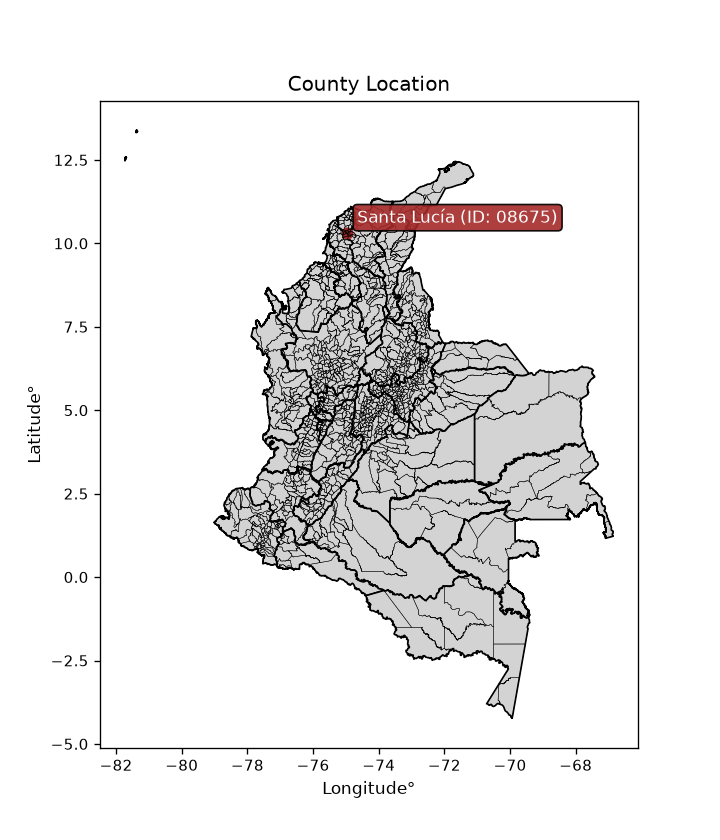
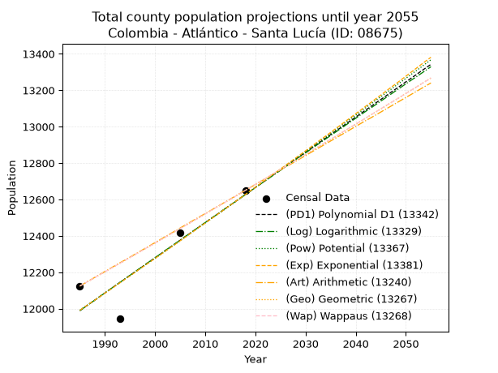
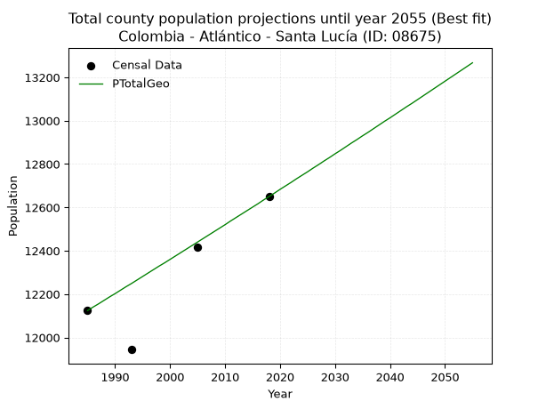
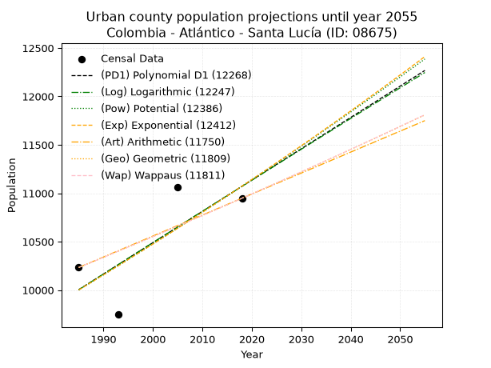
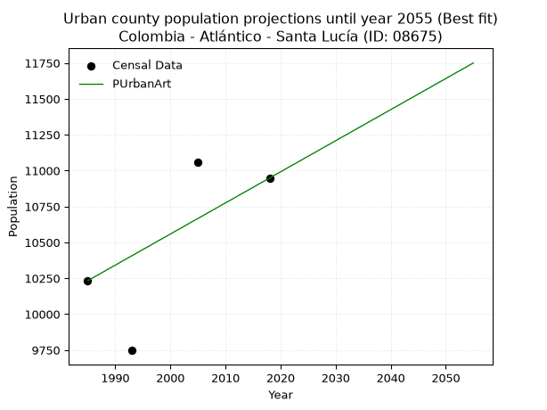
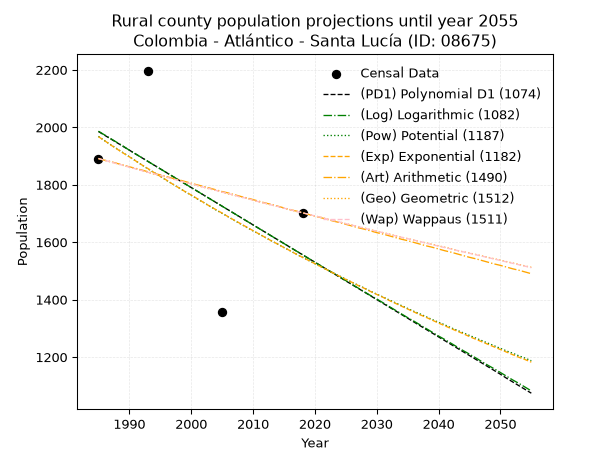
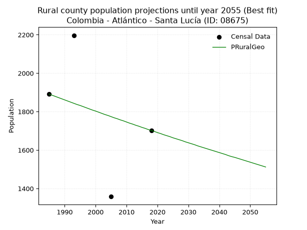

<div align="center">


</div>

# _“Population and Public Services Demand Projections (PPSD) until Year 2050 for Colombia - Atlántico - Santa Lucía (ID: 08675)”_
Keywords: `population` `public-service` `projection` `lineal` `polynomial` `logarithmic` `potential` `exponential` `arithmetic` `geometric` `wappaus` `dane` `colombia` `south-america`

PPSD are analytical estimates used by governments and planners to anticipate future changes in population size, age distribution, and the resulting community needs for utilities, healthcare, education, and infrastructure as sizing future water treatment facilities, electrical grids, and road networks based on spatial growth.

<div align="center">

</img>

</div>


> **General running parameters**: • app_version: _v20260806_. • Python version: _3.14.7_. • Pandas version: _3.0.5_. • NumPy version: _2.5.1_. • Creates, save and include plots into reports (create_plot): _False_. • Projection until year: _2050_. • Process polynomial degree 2 and up: _False_. • Process Wappaus: _True_. • Process Wappaus: _True_. • Set negative values to zero: _True_. • Set infinite values to zero: _True_. • Drop dataset notes: _True_. 
<div align="center">

Dynamic map: [:earth_americas:Google](http://maps.google.com/maps?q=10.32430252,-74.959204) [:earth_americas:OSM](https://www.openstreetmap.org/#map=18/10.32430252/-74.959204&layers=P) [:earth_americas:Bing](https://www.bing.com/maps?cp=10.32430252~-74.959204&lvl=18) [:earth_americas:Apple](https://maps.apple.com/frame?center=10.32430252%2C-74.959204&span=0.003%2C0.006)

</div>


<div align="center">

```geojson
{
  "type": "Feature",
  "geometry": {
    "type": "Point", 
    "coordinates": [-74.959204, 10.32430252]
  }, 
  "properties": {
    "Name": "Colombia - Atlántico - Santa Lucía (ID: 08675)"
  }
}
```

</div>


## 0. Census Data (4 records)

Census data are official statistics collected by a government about the people and housing in a country. They usually include counts of total population, age, sex, race, income, education, and jobs.

📅Global census file: [Population.xlsx](../data/Population.xlsx)

| Source   |   Year |   CountryID | CountryName   |   StateID | StateName   |   CountyID | CountyName   |   PTotal |   PUrban |   PRural |
|:---------|-------:|------------:|:--------------|----------:|:------------|-----------:|:-------------|---------:|---------:|---------:|
| DANE     |   1985 |          57 | Colombia      |        08 | Atlántico   |      08675 | Santa Lucía  |    12124 |    10233 |     1891 |
| DANE     |   1993 |          57 | Colombia      |        08 | Atlántico   |      08675 | Santa Lucía  |    11944 |     9747 |     2197 |
| DANE     |   2005 |          57 | Colombia      |        08 | Atlántico   |      08675 | Santa Lucía  |    12418 |    11060 |     1358 |
| DANE     |   2018 |          57 | Colombia      |        08 | Atlántico   |      08675 | Santa Lucía  |    12650 |    10948 |     1702 |

> 🔥Some records could had specific notes about the registered values or the corresponding urban or rural distribution.

📅[SUI-RUPS](https://www.datos.gov.co/Hacienda-y-Cr-dito-P-blico/Registro-nico-de-Prestadores-de-Servicios-P-blicos/4qkq-csdn/about_data) - Local public utility companies: [RUPS.csv](../data/RUPS.xlsx)

 | SERVICIO       | ESTADO    | NOMBRE                                                                      | NIT         | DEPARTAMENTO_DOMICILIO   | MUNICIPIO_DOMICILIO   | DIRECCION                                  |   TELEFONO | EMAIL                     | TIPO_PRESTADOR                             | CLASIFICACION                  |
|:---------------|:----------|:----------------------------------------------------------------------------|:------------|:-------------------------|:----------------------|:-------------------------------------------|-----------:|:--------------------------|:-------------------------------------------|:-------------------------------|
| ACUEDUCTO      | OPERATIVA | EMPRESA INDUSTRIAL Y COMERCIAL DE SERVICIOS PUBLICOS  DE SANTA LUCIA  E.S.P | 802000787-7 | ATLANTICO                | SANTA LUCIA           | calle 3 NO 5-31                            |    8724218 | espsantalucia@hotmail.com | EMPRESA INDUSTRIAL Y COMERCIAL DEL ESTADO  | HASTA 2500 SUSCRIPTORES        |
| ALCANTARILLADO | OPERATIVA | SERVICIOS MUNICIPALES 1A SAS ESP                                            | 901025202-8 | ATLANTICO                | BARRANQUILLA          | CARRERA 10 NO 5- 90 CORREGIMIENTO LA PLAYA |    3199782 | gerencia1sas@gmail.com    | SOCIEDADES (EMPRESA DE SERVICIOS PUBLICOS) | MENOR O IGUAL A 2500 USUARIOS  |
| ACUEDUCTO      | OPERATIVA | AGUAS DEL SUR DEL ATLANTICO S.A E.S.P                                       | 901136686-5 | ATLANTICO                | BARRANQUILLA          | CR 53 N 110-00 Ed. BC Empresarial Of. 1603 |    3116739 | rmendoza@naunet.co        | SOCIEDADES (EMPRESA DE SERVICIOS PUBLICOS) | DESDE 2501 HASTA 5000 USUARIOS |

## 1. Total

### 1.1. Coefficients and Parameters

* (PD1) Polynomial Deg 1: 19.330389401846467, -26381.611401043403 (lineal)
* (Log) Logarithmic: 38668.717228684436, -281637.229526883
* (Pow) Potential: 3.135461771295671, -6.261162615717549
* (Exp) Exponential: 0.0015674061202060924, 534.1123734144201
* (Art) Arithmetic: Year diff. 2018 - 1985 = 33, Population diff. 12650 - 12124 = 526, Annual growth = 15.93939393939394
* (Geo) Geometric: Year diff. 2018 - 1985 = 33, Population diff. 12650 - 12124 = 526, Annual growth % = 0.00128780596474809
* (Wap) Wappaus: i = 0.12867840428993252, Condition values only valid for < 200)

<sub>
Wappaus condition values: ['0.00', '0.13', '0.26', '0.39', '0.51', '0.64', '0.77', '0.90', '1.03', '1.16', '1.29', '1.42', '1.54', '1.67', '1.80', '1.93', '2.06', '2.19', '2.32', '2.44', '2.57', '2.70', '2.83', '2.96', '3.09', '3.22', '3.35', '3.47', '3.60', '3.73', '3.86', '3.99', '4.12', '4.25', '4.38', '4.50', '4.63', '4.76', '4.89', '5.02', '5.15', '5.28', '5.40', '5.53', '5.66', '5.79', '5.92', '6.05', '6.18', '6.31', '6.43', '6.56', '6.69', '6.82', '6.95', '7.08', '7.21', '7.33', '7.46', '7.59', '7.72', '7.85', '7.98', '8.11', '8.24', '8.36']
</sub>


### 1.2. Projected Dataset

|   Year |   CountyID |   PTotalPD1 |   PTotalLog |   PTotalPow |   PTotalExp |   PTotalArt |   PTotalGeo |   PTotalWap |
|-------:|-----------:|------------:|------------:|------------:|------------:|------------:|------------:|------------:|
|   1985 |      08675 |       11989 |       11989 |       11991 |       11991 |       12124 |       12124 |       12124 |
|   1986 |      08675 |       12009 |       12008 |       12010 |       12010 |       12140 |       12140 |       12140 |
|   1987 |      08675 |       12028 |       12028 |       12028 |       12029 |       12156 |       12155 |       12155 |
|   1988 |      08675 |       12047 |       12047 |       12047 |       12047 |       12172 |       12171 |       12171 |
|   1989 |      08675 |       12067 |       12067 |       12066 |       12066 |       12188 |       12187 |       12187 |
|   1990 |      08675 |       12086 |       12086 |       12086 |       12085 |       12204 |       12202 |       12202 |
|   1991 |      08675 |       12105 |       12106 |       12105 |       12104 |       12220 |       12218 |       12218 |
|   1992 |      08675 |       12125 |       12125 |       12124 |       12123 |       12236 |       12234 |       12234 |
|   1993 |      08675 |       12144 |       12144 |       12143 |       12142 |       12252 |       12249 |       12249 |
|   1994 |      08675 |       12163 |       12164 |       12162 |       12161 |       12267 |       12265 |       12265 |
|   1995 |      08675 |       12183 |       12183 |       12181 |       12180 |       12283 |       12281 |       12281 |
|   1996 |      08675 |       12202 |       12203 |       12200 |       12199 |       12299 |       12297 |       12297 |
|   1997 |      08675 |       12221 |       12222 |       12219 |       12219 |       12315 |       12313 |       12313 |
|   1998 |      08675 |       12241 |       12241 |       12239 |       12238 |       12331 |       12329 |       12329 |
|   1999 |      08675 |       12260 |       12261 |       12258 |       12257 |       12347 |       12344 |       12344 |
|   2000 |      08675 |       12279 |       12280 |       12277 |       12276 |       12363 |       12360 |       12360 |
|   2001 |      08675 |       12298 |       12299 |       12296 |       12295 |       12379 |       12376 |       12376 |
|   2002 |      08675 |       12318 |       12319 |       12315 |       12315 |       12395 |       12392 |       12392 |
|   2003 |      08675 |       12337 |       12338 |       12335 |       12334 |       12411 |       12408 |       12408 |
|   2004 |      08675 |       12356 |       12357 |       12354 |       12353 |       12427 |       12424 |       12424 |
|   2005 |      08675 |       12376 |       12376 |       12373 |       12373 |       12443 |       12440 |       12440 |
|   2006 |      08675 |       12395 |       12396 |       12393 |       12392 |       12459 |       12456 |       12456 |
|   2007 |      08675 |       12414 |       12415 |       12412 |       12412 |       12475 |       12472 |       12472 |
|   2008 |      08675 |       12434 |       12434 |       12432 |       12431 |       12491 |       12488 |       12488 |
|   2009 |      08675 |       12453 |       12454 |       12451 |       12451 |       12507 |       12504 |       12504 |
|   2010 |      08675 |       12472 |       12473 |       12470 |       12470 |       12522 |       12520 |       12520 |
|   2011 |      08675 |       12492 |       12492 |       12490 |       12490 |       12538 |       12537 |       12537 |
|   2012 |      08675 |       12511 |       12511 |       12509 |       12509 |       12554 |       12553 |       12553 |
|   2013 |      08675 |       12530 |       12530 |       12529 |       12529 |       12570 |       12569 |       12569 |
|   2014 |      08675 |       12550 |       12550 |       12548 |       12549 |       12586 |       12585 |       12585 |
|   2015 |      08675 |       12569 |       12569 |       12568 |       12568 |       12602 |       12601 |       12601 |
|   2016 |      08675 |       12588 |       12588 |       12588 |       12588 |       12618 |       12617 |       12617 |
|   2017 |      08675 |       12608 |       12607 |       12607 |       12608 |       12634 |       12634 |       12634 |
|   2018 |      08675 |       12627 |       12626 |       12627 |       12627 |       12650 |       12650 |       12650 |
|   2019 |      08675 |       12646 |       12646 |       12646 |       12647 |       12666 |       12666 |       12666 |
|   2020 |      08675 |       12666 |       12665 |       12666 |       12667 |       12682 |       12683 |       12683 |
|   2021 |      08675 |       12685 |       12684 |       12686 |       12687 |       12698 |       12699 |       12699 |
|   2022 |      08675 |       12704 |       12703 |       12705 |       12707 |       12714 |       12715 |       12715 |
|   2023 |      08675 |       12724 |       12722 |       12725 |       12727 |       12730 |       12732 |       12732 |
|   2024 |      08675 |       12743 |       12741 |       12745 |       12747 |       12746 |       12748 |       12748 |
|   2025 |      08675 |       12762 |       12760 |       12765 |       12767 |       12762 |       12764 |       12765 |
|   2026 |      08675 |       12782 |       12779 |       12784 |       12787 |       12778 |       12781 |       12781 |
|   2027 |      08675 |       12801 |       12798 |       12804 |       12807 |       12793 |       12797 |       12797 |
|   2028 |      08675 |       12820 |       12818 |       12824 |       12827 |       12809 |       12814 |       12814 |
|   2029 |      08675 |       12840 |       12837 |       12844 |       12847 |       12825 |       12830 |       12830 |
|   2030 |      08675 |       12859 |       12856 |       12864 |       12867 |       12841 |       12847 |       12847 |
|   2031 |      08675 |       12878 |       12875 |       12884 |       12887 |       12857 |       12863 |       12864 |
|   2032 |      08675 |       12898 |       12894 |       12903 |       12908 |       12873 |       12880 |       12880 |
|   2033 |      08675 |       12917 |       12913 |       12923 |       12928 |       12889 |       12897 |       12897 |
|   2034 |      08675 |       12936 |       12932 |       12943 |       12948 |       12905 |       12913 |       12913 |
|   2035 |      08675 |       12956 |       12951 |       12963 |       12968 |       12921 |       12930 |       12930 |
|   2036 |      08675 |       12975 |       12970 |       12983 |       12989 |       12937 |       12946 |       12947 |
|   2037 |      08675 |       12994 |       12989 |       13003 |       13009 |       12953 |       12963 |       12963 |
|   2038 |      08675 |       13014 |       13008 |       13023 |       13030 |       12969 |       12980 |       12980 |
|   2039 |      08675 |       13033 |       13027 |       13043 |       13050 |       12985 |       12997 |       12997 |
|   2040 |      08675 |       13052 |       13046 |       13063 |       13071 |       13001 |       13013 |       13014 |
|   2041 |      08675 |       13072 |       13065 |       13083 |       13091 |       13017 |       13030 |       13030 |
|   2042 |      08675 |       13091 |       13084 |       13104 |       13112 |       13033 |       13047 |       13047 |
|   2043 |      08675 |       13110 |       13102 |       13124 |       13132 |       13048 |       13064 |       13064 |
|   2044 |      08675 |       13130 |       13121 |       13144 |       13153 |       13064 |       13080 |       13081 |
|   2045 |      08675 |       13149 |       13140 |       13164 |       13173 |       13080 |       13097 |       13098 |
|   2046 |      08675 |       13168 |       13159 |       13184 |       13194 |       13096 |       13114 |       13115 |
|   2047 |      08675 |       13188 |       13178 |       13204 |       13215 |       13112 |       13131 |       13131 |
|   2048 |      08675 |       13207 |       13197 |       13225 |       13235 |       13128 |       13148 |       13148 |
|   2049 |      08675 |       13226 |       13216 |       13245 |       13256 |       13144 |       13165 |       13165 |
|   2050 |      08675 |       13246 |       13235 |       13265 |       13277 |       13160 |       13182 |       13182 |
<div align="center">

</img>

</div>


### 1.3. Best fit with absolute and relative error (%)

Relative error puts that difference into context by dividing the absolute error by the true value, creating a unitless ratio or percentage that shows the scale of the mistake.

Absolute and relative error

|   Year | Source   |   CountryID | CountryName   |   StateID | StateName   |   CountyID_x | CountyName   |   PTotal |   PUrban |   PRural |   CountyID_y |   PTotalPD1 |   PTotalLog |   PTotalPow |   PTotalExp |   PTotalArt |   PTotalGeo |   PTotalWap |   PTotalPD1AbsError |   PTotalLogAbsError |   PTotalPowAbsError |   PTotalExpAbsError |   PTotalArtAbsError |   PTotalGeoAbsError |   PTotalWapAbsError |   PTotalPD1RelError |   PTotalLogRelError |   PTotalPowRelError |   PTotalExpRelError |   PTotalArtRelError |   PTotalGeoRelError |   PTotalWapRelError |
|-------:|:---------|------------:|:--------------|----------:|:------------|-------------:|:-------------|---------:|---------:|---------:|-------------:|------------:|------------:|------------:|------------:|------------:|------------:|------------:|--------------------:|--------------------:|--------------------:|--------------------:|--------------------:|--------------------:|--------------------:|--------------------:|--------------------:|--------------------:|--------------------:|--------------------:|--------------------:|--------------------:|
|   1985 | DANE     |          57 | Colombia      |        08 | Atlántico   |        08675 | Santa Lucía  |    12124 |    10233 |     1891 |        08675 |       11989 |       11989 |       11991 |       11991 |       12124 |       12124 |       12124 |                 135 |                 135 |                 133 |                 133 |                   0 |                   0 |                   0 |            1.11349  |            1.11349  |            1.097    |            1.097    |            0        |            0        |            0        |
|   1993 | DANE     |          57 | Colombia      |        08 | Atlántico   |        08675 | Santa Lucía  |    11944 |     9747 |     2197 |        08675 |       12144 |       12144 |       12143 |       12142 |       12252 |       12249 |       12249 |                 200 |                 200 |                 199 |                 198 |                 308 |                 305 |                 305 |            1.67448  |            1.67448  |            1.66611  |            1.65774  |            2.5787   |            2.55358  |            2.55358  |
|   2005 | DANE     |          57 | Colombia      |        08 | Atlántico   |        08675 | Santa Lucía  |    12418 |    11060 |     1358 |        08675 |       12376 |       12376 |       12373 |       12373 |       12443 |       12440 |       12440 |                  42 |                  42 |                  45 |                  45 |                  25 |                  22 |                  22 |            0.338219 |            0.338219 |            0.362377 |            0.362377 |            0.201321 |            0.177162 |            0.177162 |
|   2018 | DANE     |          57 | Colombia      |        08 | Atlántico   |        08675 | Santa Lucía  |    12650 |    10948 |     1702 |        08675 |       12627 |       12626 |       12627 |       12627 |       12650 |       12650 |       12650 |                  23 |                  24 |                  23 |                  23 |                   0 |                   0 |                   0 |            0.181818 |            0.189723 |            0.181818 |            0.181818 |            0        |            0        |            0        |

Relative error mean

| Method    |   RelError | Best   |
|:----------|-----------:|:-------|
| PTotalPD1 |   0.827003 |        |
| PTotalLog |   0.828979 |        |
| PTotalPow |   0.826825 |        |
| PTotalExp |   0.824732 |        |
| PTotalArt |   0.695005 |        |
| PTotalGeo |   0.682686 | True   |
| PTotalWap |   0.682686 | True   |

💙Best method: _**PTotalGeo**_
<div align="center">

</img>

</div>


### 1.4. Fresh water supply demand in liters per capita per day (lpcd)

The fresh water supply demand typically ranges from 100 to 300 liters per capita per day (lpcd) for standard domestic and municipal planning, though absolute survival minimums set by the World Health Organization are as low as 7.5 to 20 liters per day, and total consumption in high-income nations can exceed 400 liters.

> `CZ`: Level in meters above the sea level (masl)<br> `WS`: Fresh water supply demand in liters per capita per day (lpcd or l/h/d)<br> `WSAll`: Zonal fresh water supply demand in liters per second (l/s)<br> `A`: Zonal area in square meters<br> `DP`: Population density (people/hectare or p/ha)

Reference values (RAS Colombia)

|    CZ |   WS |
|------:|-----:|
|  1000 |  120 |
|  2000 |  130 |
| 99999 |  140 |

County shapefile geometry properties and water supply values

|   CountyID |      ATotal |   CZTotal |   WSTotal |
|-----------:|------------:|----------:|----------:|
|      08675 | 5.72926e+07 |   3.81383 |       120 |

Projected values for best method: PTotalGeo

|   CountyID |   Year |   PTotalGeo |   DPTotal |   WSTotal |   WSTotalAll |
|-----------:|-------:|------------:|----------:|----------:|-------------:|
|      08675 |   1985 |       12124 |      2.12 |       120 |      16.8389 |
|      08675 |   1986 |       12140 |      2.12 |       120 |      16.8611 |
|      08675 |   1987 |       12155 |      2.12 |       120 |      16.8819 |
|      08675 |   1988 |       12171 |      2.12 |       120 |      16.9042 |
|      08675 |   1989 |       12187 |      2.13 |       120 |      16.9264 |
|      08675 |   1990 |       12202 |      2.13 |       120 |      16.9472 |
|      08675 |   1991 |       12218 |      2.13 |       120 |      16.9694 |
|      08675 |   1992 |       12234 |      2.14 |       120 |      16.9917 |
|      08675 |   1993 |       12249 |      2.14 |       120 |      17.0125 |
|      08675 |   1994 |       12265 |      2.14 |       120 |      17.0347 |
|      08675 |   1995 |       12281 |      2.14 |       120 |      17.0569 |
|      08675 |   1996 |       12297 |      2.15 |       120 |      17.0792 |
|      08675 |   1997 |       12313 |      2.15 |       120 |      17.1014 |
|      08675 |   1998 |       12329 |      2.15 |       120 |      17.1236 |
|      08675 |   1999 |       12344 |      2.15 |       120 |      17.1444 |
|      08675 |   2000 |       12360 |      2.16 |       120 |      17.1667 |
|      08675 |   2001 |       12376 |      2.16 |       120 |      17.1889 |
|      08675 |   2002 |       12392 |      2.16 |       120 |      17.2111 |
|      08675 |   2003 |       12408 |      2.17 |       120 |      17.2333 |
|      08675 |   2004 |       12424 |      2.17 |       120 |      17.2556 |
|      08675 |   2005 |       12440 |      2.17 |       120 |      17.2778 |
|      08675 |   2006 |       12456 |      2.17 |       120 |      17.3    |
|      08675 |   2007 |       12472 |      2.18 |       120 |      17.3222 |
|      08675 |   2008 |       12488 |      2.18 |       120 |      17.3444 |
|      08675 |   2009 |       12504 |      2.18 |       120 |      17.3667 |
|      08675 |   2010 |       12520 |      2.19 |       120 |      17.3889 |
|      08675 |   2011 |       12537 |      2.19 |       120 |      17.4125 |
|      08675 |   2012 |       12553 |      2.19 |       120 |      17.4347 |
|      08675 |   2013 |       12569 |      2.19 |       120 |      17.4569 |
|      08675 |   2014 |       12585 |      2.2  |       120 |      17.4792 |
|      08675 |   2015 |       12601 |      2.2  |       120 |      17.5014 |
|      08675 |   2016 |       12617 |      2.2  |       120 |      17.5236 |
|      08675 |   2017 |       12634 |      2.21 |       120 |      17.5472 |
|      08675 |   2018 |       12650 |      2.21 |       120 |      17.5694 |
|      08675 |   2019 |       12666 |      2.21 |       120 |      17.5917 |
|      08675 |   2020 |       12683 |      2.21 |       120 |      17.6153 |
|      08675 |   2021 |       12699 |      2.22 |       120 |      17.6375 |
|      08675 |   2022 |       12715 |      2.22 |       120 |      17.6597 |
|      08675 |   2023 |       12732 |      2.22 |       120 |      17.6833 |
|      08675 |   2024 |       12748 |      2.23 |       120 |      17.7056 |
|      08675 |   2025 |       12764 |      2.23 |       120 |      17.7278 |
|      08675 |   2026 |       12781 |      2.23 |       120 |      17.7514 |
|      08675 |   2027 |       12797 |      2.23 |       120 |      17.7736 |
|      08675 |   2028 |       12814 |      2.24 |       120 |      17.7972 |
|      08675 |   2029 |       12830 |      2.24 |       120 |      17.8194 |
|      08675 |   2030 |       12847 |      2.24 |       120 |      17.8431 |
|      08675 |   2031 |       12863 |      2.25 |       120 |      17.8653 |
|      08675 |   2032 |       12880 |      2.25 |       120 |      17.8889 |
|      08675 |   2033 |       12897 |      2.25 |       120 |      17.9125 |
|      08675 |   2034 |       12913 |      2.25 |       120 |      17.9347 |
|      08675 |   2035 |       12930 |      2.26 |       120 |      17.9583 |
|      08675 |   2036 |       12946 |      2.26 |       120 |      17.9806 |
|      08675 |   2037 |       12963 |      2.26 |       120 |      18.0042 |
|      08675 |   2038 |       12980 |      2.27 |       120 |      18.0278 |
|      08675 |   2039 |       12997 |      2.27 |       120 |      18.0514 |
|      08675 |   2040 |       13013 |      2.27 |       120 |      18.0736 |
|      08675 |   2041 |       13030 |      2.27 |       120 |      18.0972 |
|      08675 |   2042 |       13047 |      2.28 |       120 |      18.1208 |
|      08675 |   2043 |       13064 |      2.28 |       120 |      18.1444 |
|      08675 |   2044 |       13080 |      2.28 |       120 |      18.1667 |
|      08675 |   2045 |       13097 |      2.29 |       120 |      18.1903 |
|      08675 |   2046 |       13114 |      2.29 |       120 |      18.2139 |
|      08675 |   2047 |       13131 |      2.29 |       120 |      18.2375 |
|      08675 |   2048 |       13148 |      2.29 |       120 |      18.2611 |
|      08675 |   2049 |       13165 |      2.3  |       120 |      18.2847 |
|      08675 |   2050 |       13182 |      2.3  |       120 |      18.3083 |

## 2. Urban

### 2.1. Coefficients and Parameters

* (PD1) Polynomial Deg 1: 32.34524287434768, -54201.57205941395 (lineal)
* (Log) Logarithmic: 64745.25351646553, -481632.1908145545
* (Pow) Potential: 6.173584887702812, -16.358980937503066
* (Exp) Exponential: 0.003084297457157602, 21.936602122195854
* (Art) Arithmetic: Year diff. 2018 - 1985 = 33, Population diff. 10948 - 10233 = 715, Annual growth = 21.666666666666668
* (Geo) Geometric: Year diff. 2018 - 1985 = 33, Population diff. 10948 - 10233 = 715, Annual growth % = 0.002048732125244479
* (Wap) Wappaus: i = 0.20458587098500228, Condition values only valid for < 200)

<sub>
Wappaus condition values: ['0.00', '0.20', '0.41', '0.61', '0.82', '1.02', '1.23', '1.43', '1.64', '1.84', '2.05', '2.25', '2.46', '2.66', '2.86', '3.07', '3.27', '3.48', '3.68', '3.89', '4.09', '4.30', '4.50', '4.71', '4.91', '5.11', '5.32', '5.52', '5.73', '5.93', '6.14', '6.34', '6.55', '6.75', '6.96', '7.16', '7.37', '7.57', '7.77', '7.98', '8.18', '8.39', '8.59', '8.80', '9.00', '9.21', '9.41', '9.62', '9.82', '10.02', '10.23', '10.43', '10.64', '10.84', '11.05', '11.25', '11.46', '11.66', '11.87', '12.07', '12.28', '12.48', '12.68', '12.89', '13.09', '13.30']
</sub>


### 2.2. Projected Dataset

|   Year |   CountyID |   PUrbanPD1 |   PUrbanLog |   PUrbanPow |   PUrbanExp |   PUrbanArt |   PUrbanGeo |   PUrbanWap |
|-------:|-----------:|------------:|------------:|------------:|------------:|------------:|------------:|------------:|
|   1985 |      08675 |       10004 |       10003 |       10001 |       10001 |       10233 |       10233 |       10233 |
|   1986 |      08675 |       10036 |       10035 |       10032 |       10032 |       10255 |       10254 |       10254 |
|   1987 |      08675 |       10068 |       10068 |       10063 |       10063 |       10276 |       10275 |       10275 |
|   1988 |      08675 |       10101 |       10101 |       10094 |       10094 |       10298 |       10296 |       10296 |
|   1989 |      08675 |       10133 |       10133 |       10126 |       10126 |       10320 |       10317 |       10317 |
|   1990 |      08675 |       10165 |       10166 |       10157 |       10157 |       10341 |       10338 |       10338 |
|   1991 |      08675 |       10198 |       10198 |       10189 |       10188 |       10363 |       10359 |       10359 |
|   1992 |      08675 |       10230 |       10231 |       10220 |       10220 |       10385 |       10381 |       10381 |
|   1993 |      08675 |       10262 |       10263 |       10252 |       10251 |       10406 |       10402 |       10402 |
|   1994 |      08675 |       10295 |       10296 |       10284 |       10283 |       10428 |       10423 |       10423 |
|   1995 |      08675 |       10327 |       10328 |       10316 |       10315 |       10450 |       10445 |       10445 |
|   1996 |      08675 |       10360 |       10361 |       10348 |       10347 |       10471 |       10466 |       10466 |
|   1997 |      08675 |       10392 |       10393 |       10380 |       10379 |       10493 |       10487 |       10487 |
|   1998 |      08675 |       10424 |       10425 |       10412 |       10411 |       10515 |       10509 |       10509 |
|   1999 |      08675 |       10457 |       10458 |       10444 |       10443 |       10536 |       10530 |       10530 |
|   2000 |      08675 |       10489 |       10490 |       10476 |       10475 |       10558 |       10552 |       10552 |
|   2001 |      08675 |       10521 |       10523 |       10509 |       10507 |       10580 |       10574 |       10574 |
|   2002 |      08675 |       10554 |       10555 |       10541 |       10540 |       10601 |       10595 |       10595 |
|   2003 |      08675 |       10586 |       10587 |       10574 |       10572 |       10623 |       10617 |       10617 |
|   2004 |      08675 |       10618 |       10620 |       10606 |       10605 |       10645 |       10639 |       10639 |
|   2005 |      08675 |       10651 |       10652 |       10639 |       10638 |       10666 |       10661 |       10660 |
|   2006 |      08675 |       10683 |       10684 |       10672 |       10671 |       10688 |       10682 |       10682 |
|   2007 |      08675 |       10715 |       10716 |       10705 |       10704 |       10710 |       10704 |       10704 |
|   2008 |      08675 |       10748 |       10749 |       10738 |       10737 |       10731 |       10726 |       10726 |
|   2009 |      08675 |       10780 |       10781 |       10771 |       10770 |       10753 |       10748 |       10748 |
|   2010 |      08675 |       10812 |       10813 |       10804 |       10803 |       10775 |       10770 |       10770 |
|   2011 |      08675 |       10845 |       10845 |       10837 |       10837 |       10796 |       10792 |       10792 |
|   2012 |      08675 |       10877 |       10877 |       10870 |       10870 |       10818 |       10814 |       10814 |
|   2013 |      08675 |       10909 |       10910 |       10904 |       10904 |       10840 |       10837 |       10836 |
|   2014 |      08675 |       10942 |       10942 |       10937 |       10937 |       10861 |       10859 |       10859 |
|   2015 |      08675 |       10974 |       10974 |       10971 |       10971 |       10883 |       10881 |       10881 |
|   2016 |      08675 |       11006 |       11006 |       11005 |       11005 |       10905 |       10903 |       10903 |
|   2017 |      08675 |       11039 |       11038 |       11038 |       11039 |       10926 |       10926 |       10926 |
|   2018 |      08675 |       11071 |       11070 |       11072 |       11073 |       10948 |       10948 |       10948 |
|   2019 |      08675 |       11103 |       11102 |       11106 |       11107 |       10970 |       10970 |       10970 |
|   2020 |      08675 |       11136 |       11134 |       11140 |       11142 |       10991 |       10993 |       10993 |
|   2021 |      08675 |       11168 |       11166 |       11174 |       11176 |       11013 |       11015 |       11015 |
|   2022 |      08675 |       11201 |       11198 |       11208 |       11210 |       11035 |       11038 |       11038 |
|   2023 |      08675 |       11233 |       11230 |       11243 |       11245 |       11056 |       11061 |       11061 |
|   2024 |      08675 |       11265 |       11262 |       11277 |       11280 |       11078 |       11083 |       11083 |
|   2025 |      08675 |       11298 |       11294 |       11311 |       11315 |       11100 |       11106 |       11106 |
|   2026 |      08675 |       11330 |       11326 |       11346 |       11350 |       11121 |       11129 |       11129 |
|   2027 |      08675 |       11362 |       11358 |       11381 |       11385 |       11143 |       11152 |       11152 |
|   2028 |      08675 |       11395 |       11390 |       11415 |       11420 |       11165 |       11174 |       11175 |
|   2029 |      08675 |       11427 |       11422 |       11450 |       11455 |       11186 |       11197 |       11198 |
|   2030 |      08675 |       11459 |       11454 |       11485 |       11491 |       11208 |       11220 |       11221 |
|   2031 |      08675 |       11492 |       11486 |       11520 |       11526 |       11230 |       11243 |       11244 |
|   2032 |      08675 |       11524 |       11518 |       11555 |       11562 |       11251 |       11266 |       11267 |
|   2033 |      08675 |       11556 |       11550 |       11590 |       11597 |       11273 |       11289 |       11290 |
|   2034 |      08675 |       11589 |       11582 |       11625 |       11633 |       11295 |       11312 |       11313 |
|   2035 |      08675 |       11621 |       11613 |       11661 |       11669 |       11316 |       11336 |       11336 |
|   2036 |      08675 |       11653 |       11645 |       11696 |       11705 |       11338 |       11359 |       11359 |
|   2037 |      08675 |       11686 |       11677 |       11732 |       11741 |       11360 |       11382 |       11383 |
|   2038 |      08675 |       11718 |       11709 |       11767 |       11778 |       11381 |       11405 |       11406 |
|   2039 |      08675 |       11750 |       11741 |       11803 |       11814 |       11403 |       11429 |       11430 |
|   2040 |      08675 |       11783 |       11772 |       11839 |       11850 |       11425 |       11452 |       11453 |
|   2041 |      08675 |       11815 |       11804 |       11875 |       11887 |       11446 |       11476 |       11477 |
|   2042 |      08675 |       11847 |       11836 |       11910 |       11924 |       11468 |       11499 |       11500 |
|   2043 |      08675 |       11880 |       11867 |       11947 |       11961 |       11490 |       11523 |       11524 |
|   2044 |      08675 |       11912 |       11899 |       11983 |       11998 |       11511 |       11546 |       11548 |
|   2045 |      08675 |       11944 |       11931 |       12019 |       12035 |       11533 |       11570 |       11571 |
|   2046 |      08675 |       11977 |       11962 |       12055 |       12072 |       11555 |       11594 |       11595 |
|   2047 |      08675 |       12009 |       11994 |       12092 |       12109 |       11576 |       11617 |       11619 |
|   2048 |      08675 |       12041 |       12026 |       12128 |       12147 |       11598 |       11641 |       11643 |
|   2049 |      08675 |       12074 |       12057 |       12165 |       12184 |       11620 |       11665 |       11667 |
|   2050 |      08675 |       12106 |       12089 |       12201 |       12222 |       11641 |       11689 |       11691 |
<div align="center">

</img>

</div>


### 2.3. Best fit with absolute and relative error (%)

Relative error puts that difference into context by dividing the absolute error by the true value, creating a unitless ratio or percentage that shows the scale of the mistake.

Absolute and relative error

|   Year | Source   |   CountryID | CountryName   |   StateID | StateName   |   CountyID_x | CountyName   |   PTotal |   PUrban |   PRural |   CountyID_y |   PUrbanPD1 |   PUrbanLog |   PUrbanPow |   PUrbanExp |   PUrbanArt |   PUrbanGeo |   PUrbanWap |   PUrbanPD1AbsError |   PUrbanLogAbsError |   PUrbanPowAbsError |   PUrbanExpAbsError |   PUrbanArtAbsError |   PUrbanGeoAbsError |   PUrbanWapAbsError |   PUrbanPD1RelError |   PUrbanLogRelError |   PUrbanPowRelError |   PUrbanExpRelError |   PUrbanArtRelError |   PUrbanGeoRelError |   PUrbanWapRelError |
|-------:|:---------|------------:|:--------------|----------:|:------------|-------------:|:-------------|---------:|---------:|---------:|-------------:|------------:|------------:|------------:|------------:|------------:|------------:|------------:|--------------------:|--------------------:|--------------------:|--------------------:|--------------------:|--------------------:|--------------------:|--------------------:|--------------------:|--------------------:|--------------------:|--------------------:|--------------------:|--------------------:|
|   1985 | DANE     |          57 | Colombia      |        08 | Atlántico   |        08675 | Santa Lucía  |    12124 |    10233 |     1891 |        08675 |       10004 |       10003 |       10001 |       10001 |       10233 |       10233 |       10233 |                 229 |                 230 |                 232 |                 232 |                   0 |                   0 |                   0 |             2.23786 |             2.24763 |             2.26717 |             2.26717 |             0       |             0       |             0       |
|   1993 | DANE     |          57 | Colombia      |        08 | Atlántico   |        08675 | Santa Lucía  |    11944 |     9747 |     2197 |        08675 |       10262 |       10263 |       10252 |       10251 |       10406 |       10402 |       10402 |                 515 |                 516 |                 505 |                 504 |                 659 |                 655 |                 655 |             5.28368 |             5.29394 |             5.18108 |             5.17082 |             6.76105 |             6.72002 |             6.72002 |
|   2005 | DANE     |          57 | Colombia      |        08 | Atlántico   |        08675 | Santa Lucía  |    12418 |    11060 |     1358 |        08675 |       10651 |       10652 |       10639 |       10638 |       10666 |       10661 |       10660 |                 409 |                 408 |                 421 |                 422 |                 394 |                 399 |                 400 |             3.69801 |             3.68897 |             3.80651 |             3.81555 |             3.56239 |             3.60759 |             3.61664 |
|   2018 | DANE     |          57 | Colombia      |        08 | Atlántico   |        08675 | Santa Lucía  |    12650 |    10948 |     1702 |        08675 |       11071 |       11070 |       11072 |       11073 |       10948 |       10948 |       10948 |                 123 |                 122 |                 124 |                 125 |                   0 |                   0 |                   0 |             1.12349 |             1.11436 |             1.13263 |             1.14176 |             0       |             0       |             0       |

Relative error mean

| Method    |   RelError | Best   |
|:----------|-----------:|:-------|
| PUrbanPD1 |    3.08576 |        |
| PUrbanLog |    3.08622 |        |
| PUrbanPow |    3.09685 |        |
| PUrbanExp |    3.09883 |        |
| PUrbanArt |    2.58086 | True   |
| PUrbanGeo |    2.5819  |        |
| PUrbanWap |    2.58416 |        |

💙Best method: _**PUrbanArt**_
<div align="center">

</img>

</div>


### 2.4. Fresh water supply demand in liters per capita per day (lpcd)

The fresh water supply demand typically ranges from 100 to 300 liters per capita per day (lpcd) for standard domestic and municipal planning, though absolute survival minimums set by the World Health Organization are as low as 7.5 to 20 liters per day, and total consumption in high-income nations can exceed 400 liters.

> `CZ`: Level in meters above the sea level (masl)<br> `WS`: Fresh water supply demand in liters per capita per day (lpcd or l/h/d)<br> `WSAll`: Zonal fresh water supply demand in liters per second (l/s)<br> `A`: Zonal area in square meters<br> `DP`: Population density (people/hectare or p/ha)

Reference values (RAS Colombia)

|    CZ |   WS |
|------:|-----:|
|  1000 |  120 |
|  2000 |  130 |
| 99999 |  140 |

County shapefile geometry properties and water supply values

|   CountyID |      AUrban |   CZUrban |   WSUrban |
|-----------:|------------:|----------:|----------:|
|      08675 | 1.37466e+06 |   5.94505 |       120 |

Projected values for best method: PUrbanArt

|   CountyID |   Year |   PUrbanArt |   DPUrban |   WSUrban |   WSUrbanAll |
|-----------:|-------:|------------:|----------:|----------:|-------------:|
|      08675 |   1985 |       10233 |     74.44 |       120 |      14.2125 |
|      08675 |   1986 |       10255 |     74.6  |       120 |      14.2431 |
|      08675 |   1987 |       10276 |     74.75 |       120 |      14.2722 |
|      08675 |   1988 |       10298 |     74.91 |       120 |      14.3028 |
|      08675 |   1989 |       10320 |     75.07 |       120 |      14.3333 |
|      08675 |   1990 |       10341 |     75.23 |       120 |      14.3625 |
|      08675 |   1991 |       10363 |     75.39 |       120 |      14.3931 |
|      08675 |   1992 |       10385 |     75.55 |       120 |      14.4236 |
|      08675 |   1993 |       10406 |     75.7  |       120 |      14.4528 |
|      08675 |   1994 |       10428 |     75.86 |       120 |      14.4833 |
|      08675 |   1995 |       10450 |     76.02 |       120 |      14.5139 |
|      08675 |   1996 |       10471 |     76.17 |       120 |      14.5431 |
|      08675 |   1997 |       10493 |     76.33 |       120 |      14.5736 |
|      08675 |   1998 |       10515 |     76.49 |       120 |      14.6042 |
|      08675 |   1999 |       10536 |     76.64 |       120 |      14.6333 |
|      08675 |   2000 |       10558 |     76.8  |       120 |      14.6639 |
|      08675 |   2001 |       10580 |     76.96 |       120 |      14.6944 |
|      08675 |   2002 |       10601 |     77.12 |       120 |      14.7236 |
|      08675 |   2003 |       10623 |     77.28 |       120 |      14.7542 |
|      08675 |   2004 |       10645 |     77.44 |       120 |      14.7847 |
|      08675 |   2005 |       10666 |     77.59 |       120 |      14.8139 |
|      08675 |   2006 |       10688 |     77.75 |       120 |      14.8444 |
|      08675 |   2007 |       10710 |     77.91 |       120 |      14.875  |
|      08675 |   2008 |       10731 |     78.06 |       120 |      14.9042 |
|      08675 |   2009 |       10753 |     78.22 |       120 |      14.9347 |
|      08675 |   2010 |       10775 |     78.38 |       120 |      14.9653 |
|      08675 |   2011 |       10796 |     78.54 |       120 |      14.9944 |
|      08675 |   2012 |       10818 |     78.7  |       120 |      15.025  |
|      08675 |   2013 |       10840 |     78.86 |       120 |      15.0556 |
|      08675 |   2014 |       10861 |     79.01 |       120 |      15.0847 |
|      08675 |   2015 |       10883 |     79.17 |       120 |      15.1153 |
|      08675 |   2016 |       10905 |     79.33 |       120 |      15.1458 |
|      08675 |   2017 |       10926 |     79.48 |       120 |      15.175  |
|      08675 |   2018 |       10948 |     79.64 |       120 |      15.2056 |
|      08675 |   2019 |       10970 |     79.8  |       120 |      15.2361 |
|      08675 |   2020 |       10991 |     79.95 |       120 |      15.2653 |
|      08675 |   2021 |       11013 |     80.11 |       120 |      15.2958 |
|      08675 |   2022 |       11035 |     80.27 |       120 |      15.3264 |
|      08675 |   2023 |       11056 |     80.43 |       120 |      15.3556 |
|      08675 |   2024 |       11078 |     80.59 |       120 |      15.3861 |
|      08675 |   2025 |       11100 |     80.75 |       120 |      15.4167 |
|      08675 |   2026 |       11121 |     80.9  |       120 |      15.4458 |
|      08675 |   2027 |       11143 |     81.06 |       120 |      15.4764 |
|      08675 |   2028 |       11165 |     81.22 |       120 |      15.5069 |
|      08675 |   2029 |       11186 |     81.37 |       120 |      15.5361 |
|      08675 |   2030 |       11208 |     81.53 |       120 |      15.5667 |
|      08675 |   2031 |       11230 |     81.69 |       120 |      15.5972 |
|      08675 |   2032 |       11251 |     81.85 |       120 |      15.6264 |
|      08675 |   2033 |       11273 |     82.01 |       120 |      15.6569 |
|      08675 |   2034 |       11295 |     82.17 |       120 |      15.6875 |
|      08675 |   2035 |       11316 |     82.32 |       120 |      15.7167 |
|      08675 |   2036 |       11338 |     82.48 |       120 |      15.7472 |
|      08675 |   2037 |       11360 |     82.64 |       120 |      15.7778 |
|      08675 |   2038 |       11381 |     82.79 |       120 |      15.8069 |
|      08675 |   2039 |       11403 |     82.95 |       120 |      15.8375 |
|      08675 |   2040 |       11425 |     83.11 |       120 |      15.8681 |
|      08675 |   2041 |       11446 |     83.26 |       120 |      15.8972 |
|      08675 |   2042 |       11468 |     83.42 |       120 |      15.9278 |
|      08675 |   2043 |       11490 |     83.58 |       120 |      15.9583 |
|      08675 |   2044 |       11511 |     83.74 |       120 |      15.9875 |
|      08675 |   2045 |       11533 |     83.9  |       120 |      16.0181 |
|      08675 |   2046 |       11555 |     84.06 |       120 |      16.0486 |
|      08675 |   2047 |       11576 |     84.21 |       120 |      16.0778 |
|      08675 |   2048 |       11598 |     84.37 |       120 |      16.1083 |
|      08675 |   2049 |       11620 |     84.53 |       120 |      16.1389 |
|      08675 |   2050 |       11641 |     84.68 |       120 |      16.1681 |

## 3. Rural

### 3.1. Coefficients and Parameters

* (PD1) Polynomial Deg 1: -13.014853472501175, 27819.960658370477 (lineal)
* (Log) Logarithmic: -26076.536287780877, 199994.9612876698
* (Pow) Potential: -14.577314924352835, 51.36641729537856
* (Exp) Exponential: -0.0072729066578081135, 3660592043.7102885
* (Art) Arithmetic: Year diff. 2018 - 1985 = 33, Population diff. 1702 - 1891 = -189, Annual growth = -5.7272727272727275
* (Geo) Geometric: Year diff. 2018 - 1985 = 33, Population diff. 1702 - 1891 = -189, Annual growth % = -0.0031858767001763377
* (Wap) Wappaus: i = -0.318801710396478, Condition values only valid for < 200)

<sub>
Wappaus condition values: ['-0.00', '-0.32', '-0.64', '-0.96', '-1.28', '-1.59', '-1.91', '-2.23', '-2.55', '-2.87', '-3.19', '-3.51', '-3.83', '-4.14', '-4.46', '-4.78', '-5.10', '-5.42', '-5.74', '-6.06', '-6.38', '-6.69', '-7.01', '-7.33', '-7.65', '-7.97', '-8.29', '-8.61', '-8.93', '-9.25', '-9.56', '-9.88', '-10.20', '-10.52', '-10.84', '-11.16', '-11.48', '-11.80', '-12.11', '-12.43', '-12.75', '-13.07', '-13.39', '-13.71', '-14.03', '-14.35', '-14.66', '-14.98', '-15.30', '-15.62', '-15.94', '-16.26', '-16.58', '-16.90', '-17.22', '-17.53', '-17.85', '-18.17', '-18.49', '-18.81', '-19.13', '-19.45', '-19.77', '-20.08', '-20.40', '-20.72']
</sub>


### 3.2. Projected Dataset

|   Year |   CountyID |   PRuralPD1 |   PRuralLog |   PRuralPow |   PRuralExp |   PRuralArt |   PRuralGeo |   PRuralWap |
|-------:|-----------:|------------:|------------:|------------:|------------:|------------:|------------:|------------:|
|   1985 |      08675 |        1985 |        1986 |        1968 |        1967 |        1891 |        1891 |        1891 |
|   1986 |      08675 |        1972 |        1973 |        1953 |        1953 |        1885 |        1885 |        1885 |
|   1987 |      08675 |        1959 |        1960 |        1939 |        1938 |        1880 |        1879 |        1879 |
|   1988 |      08675 |        1946 |        1947 |        1925 |        1924 |        1874 |        1873 |        1873 |
|   1989 |      08675 |        1933 |        1934 |        1911 |        1910 |        1868 |        1867 |        1867 |
|   1990 |      08675 |        1920 |        1920 |        1897 |        1897 |        1862 |        1861 |        1861 |
|   1991 |      08675 |        1907 |        1907 |        1883 |        1883 |        1857 |        1855 |        1855 |
|   1992 |      08675 |        1894 |        1894 |        1869 |        1869 |        1851 |        1849 |        1849 |
|   1993 |      08675 |        1881 |        1881 |        1855 |        1856 |        1845 |        1843 |        1843 |
|   1994 |      08675 |        1868 |        1868 |        1842 |        1842 |        1839 |        1837 |        1838 |
|   1995 |      08675 |        1855 |        1855 |        1829 |        1829 |        1834 |        1832 |        1832 |
|   1996 |      08675 |        1842 |        1842 |        1815 |        1816 |        1828 |        1826 |        1826 |
|   1997 |      08675 |        1829 |        1829 |        1802 |        1802 |        1822 |        1820 |        1820 |
|   1998 |      08675 |        1816 |        1816 |        1789 |        1789 |        1817 |        1814 |        1814 |
|   1999 |      08675 |        1803 |        1803 |        1776 |        1776 |        1811 |        1808 |        1808 |
|   2000 |      08675 |        1790 |        1790 |        1763 |        1764 |        1805 |        1803 |        1803 |
|   2001 |      08675 |        1777 |        1777 |        1750 |        1751 |        1799 |        1797 |        1797 |
|   2002 |      08675 |        1764 |        1764 |        1738 |        1738 |        1794 |        1791 |        1791 |
|   2003 |      08675 |        1751 |        1751 |        1725 |        1725 |        1788 |        1785 |        1786 |
|   2004 |      08675 |        1738 |        1738 |        1712 |        1713 |        1782 |        1780 |        1780 |
|   2005 |      08675 |        1725 |        1725 |        1700 |        1701 |        1776 |        1774 |        1774 |
|   2006 |      08675 |        1712 |        1712 |        1688 |        1688 |        1771 |        1768 |        1769 |
|   2007 |      08675 |        1699 |        1699 |        1675 |        1676 |        1765 |        1763 |        1763 |
|   2008 |      08675 |        1686 |        1686 |        1663 |        1664 |        1759 |        1757 |        1757 |
|   2009 |      08675 |        1673 |        1673 |        1651 |        1652 |        1754 |        1752 |        1752 |
|   2010 |      08675 |        1660 |        1660 |        1639 |        1640 |        1748 |        1746 |        1746 |
|   2011 |      08675 |        1647 |        1647 |        1628 |        1628 |        1742 |        1740 |        1740 |
|   2012 |      08675 |        1634 |        1634 |        1616 |        1616 |        1736 |        1735 |        1735 |
|   2013 |      08675 |        1621 |        1621 |        1604 |        1604 |        1731 |        1729 |        1729 |
|   2014 |      08675 |        1608 |        1608 |        1593 |        1593 |        1725 |        1724 |        1724 |
|   2015 |      08675 |        1595 |        1595 |        1581 |        1581 |        1719 |        1718 |        1718 |
|   2016 |      08675 |        1582 |        1582 |        1570 |        1570 |        1713 |        1713 |        1713 |
|   2017 |      08675 |        1569 |        1569 |        1558 |        1558 |        1708 |        1707 |        1707 |
|   2018 |      08675 |        1556 |        1556 |        1547 |        1547 |        1702 |        1702 |        1702 |
|   2019 |      08675 |        1543 |        1543 |        1536 |        1536 |        1696 |        1697 |        1697 |
|   2020 |      08675 |        1530 |        1530 |        1525 |        1525 |        1691 |        1691 |        1691 |
|   2021 |      08675 |        1517 |        1517 |        1514 |        1514 |        1685 |        1686 |        1686 |
|   2022 |      08675 |        1504 |        1504 |        1503 |        1503 |        1679 |        1680 |        1680 |
|   2023 |      08675 |        1491 |        1492 |        1492 |        1492 |        1673 |        1675 |        1675 |
|   2024 |      08675 |        1478 |        1479 |        1482 |        1481 |        1668 |        1670 |        1670 |
|   2025 |      08675 |        1465 |        1466 |        1471 |        1470 |        1662 |        1664 |        1664 |
|   2026 |      08675 |        1452 |        1453 |        1460 |        1460 |        1656 |        1659 |        1659 |
|   2027 |      08675 |        1439 |        1440 |        1450 |        1449 |        1650 |        1654 |        1654 |
|   2028 |      08675 |        1426 |        1427 |        1440 |        1439 |        1645 |        1649 |        1648 |
|   2029 |      08675 |        1413 |        1414 |        1429 |        1428 |        1639 |        1643 |        1643 |
|   2030 |      08675 |        1400 |        1402 |        1419 |        1418 |        1633 |        1638 |        1638 |
|   2031 |      08675 |        1387 |        1389 |        1409 |        1408 |        1628 |        1633 |        1633 |
|   2032 |      08675 |        1374 |        1376 |        1399 |        1397 |        1622 |        1628 |        1627 |
|   2033 |      08675 |        1361 |        1363 |        1389 |        1387 |        1616 |        1622 |        1622 |
|   2034 |      08675 |        1348 |        1350 |        1379 |        1377 |        1610 |        1617 |        1617 |
|   2035 |      08675 |        1335 |        1337 |        1369 |        1367 |        1605 |        1612 |        1612 |
|   2036 |      08675 |        1322 |        1325 |        1359 |        1357 |        1599 |        1607 |        1607 |
|   2037 |      08675 |        1309 |        1312 |        1350 |        1347 |        1593 |        1602 |        1602 |
|   2038 |      08675 |        1296 |        1299 |        1340 |        1338 |        1587 |        1597 |        1596 |
|   2039 |      08675 |        1283 |        1286 |        1330 |        1328 |        1582 |        1592 |        1591 |
|   2040 |      08675 |        1270 |        1273 |        1321 |        1318 |        1576 |        1587 |        1586 |
|   2041 |      08675 |        1257 |        1261 |        1312 |        1309 |        1570 |        1582 |        1581 |
|   2042 |      08675 |        1244 |        1248 |        1302 |        1299 |        1565 |        1577 |        1576 |
|   2043 |      08675 |        1231 |        1235 |        1293 |        1290 |        1559 |        1571 |        1571 |
|   2044 |      08675 |        1218 |        1222 |        1284 |        1281 |        1553 |        1566 |        1566 |
|   2045 |      08675 |        1205 |        1210 |        1275 |        1271 |        1547 |        1562 |        1561 |
|   2046 |      08675 |        1192 |        1197 |        1266 |        1262 |        1542 |        1557 |        1556 |
|   2047 |      08675 |        1179 |        1184 |        1257 |        1253 |        1536 |        1552 |        1551 |
|   2048 |      08675 |        1166 |        1171 |        1248 |        1244 |        1530 |        1547 |        1546 |
|   2049 |      08675 |        1153 |        1159 |        1239 |        1235 |        1524 |        1542 |        1541 |
|   2050 |      08675 |        1140 |        1146 |        1230 |        1226 |        1519 |        1537 |        1536 |
<div align="center">

</img>

</div>


### 3.3. Best fit with absolute and relative error (%)

Relative error puts that difference into context by dividing the absolute error by the true value, creating a unitless ratio or percentage that shows the scale of the mistake.

Absolute and relative error

|   Year | Source   |   CountryID | CountryName   |   StateID | StateName   |   CountyID_x | CountyName   |   PTotal |   PUrban |   PRural |   CountyID_y |   PRuralPD1 |   PRuralLog |   PRuralPow |   PRuralExp |   PRuralArt |   PRuralGeo |   PRuralWap |   PRuralPD1AbsError |   PRuralLogAbsError |   PRuralPowAbsError |   PRuralExpAbsError |   PRuralArtAbsError |   PRuralGeoAbsError |   PRuralWapAbsError |   PRuralPD1RelError |   PRuralLogRelError |   PRuralPowRelError |   PRuralExpRelError |   PRuralArtRelError |   PRuralGeoRelError |   PRuralWapRelError |
|-------:|:---------|------------:|:--------------|----------:|:------------|-------------:|:-------------|---------:|---------:|---------:|-------------:|------------:|------------:|------------:|------------:|------------:|------------:|------------:|--------------------:|--------------------:|--------------------:|--------------------:|--------------------:|--------------------:|--------------------:|--------------------:|--------------------:|--------------------:|--------------------:|--------------------:|--------------------:|--------------------:|
|   1985 | DANE     |          57 | Colombia      |        08 | Atlántico   |        08675 | Santa Lucía  |    12124 |    10233 |     1891 |        08675 |        1985 |        1986 |        1968 |        1967 |        1891 |        1891 |        1891 |                  94 |                  95 |                  77 |                  76 |                   0 |                   0 |                   0 |             4.97091 |             5.0238  |             4.07192 |             4.01904 |              0      |              0      |              0      |
|   1993 | DANE     |          57 | Colombia      |        08 | Atlántico   |        08675 | Santa Lucía  |    11944 |     9747 |     2197 |        08675 |        1881 |        1881 |        1855 |        1856 |        1845 |        1843 |        1843 |                 316 |                 316 |                 342 |                 341 |                 352 |                 354 |                 354 |            14.3832  |            14.3832  |            15.5667  |            15.5212  |             16.0218 |             16.1129 |             16.1129 |
|   2005 | DANE     |          57 | Colombia      |        08 | Atlántico   |        08675 | Santa Lucía  |    12418 |    11060 |     1358 |        08675 |        1725 |        1725 |        1700 |        1701 |        1776 |        1774 |        1774 |                 367 |                 367 |                 342 |                 343 |                 418 |                 416 |                 416 |            27.025   |            27.025   |            25.1841  |            25.2577  |             30.7806 |             30.6333 |             30.6333 |
|   2018 | DANE     |          57 | Colombia      |        08 | Atlántico   |        08675 | Santa Lucía  |    12650 |    10948 |     1702 |        08675 |        1556 |        1556 |        1547 |        1547 |        1702 |        1702 |        1702 |                 146 |                 146 |                 155 |                 155 |                   0 |                   0 |                   0 |             8.57814 |             8.57814 |             9.10693 |             9.10693 |              0      |              0      |              0      |

Relative error mean

| Method    |   RelError | Best   |
|:----------|-----------:|:-------|
| PRuralPD1 |    13.7393 |        |
| PRuralLog |    13.7526 |        |
| PRuralPow |    13.4824 |        |
| PRuralExp |    13.4762 |        |
| PRuralArt |    11.7006 |        |
| PRuralGeo |    11.6865 | True   |
| PRuralWap |    11.6865 | True   |

💙Best method: _**PRuralGeo**_
<div align="center">

</img>

</div>


### 3.4. Fresh water supply demand in liters per capita per day (lpcd)

The fresh water supply demand typically ranges from 100 to 300 liters per capita per day (lpcd) for standard domestic and municipal planning, though absolute survival minimums set by the World Health Organization are as low as 7.5 to 20 liters per day, and total consumption in high-income nations can exceed 400 liters.

> `CZ`: Level in meters above the sea level (masl)<br> `WS`: Fresh water supply demand in liters per capita per day (lpcd or l/h/d)<br> `WSAll`: Zonal fresh water supply demand in liters per second (l/s)<br> `A`: Zonal area in square meters<br> `DP`: Population density (people/hectare or p/ha)

Reference values (RAS Colombia)

|    CZ |   WS |
|------:|-----:|
|  1000 |  120 |
|  2000 |  130 |
| 99999 |  140 |

County shapefile geometry properties and water supply values

|   CountyID |      ARural |   CZRural |   WSRural |
|-----------:|------------:|----------:|----------:|
|      08675 | 5.59179e+07 |   3.76199 |       120 |

Projected values for best method: PRuralGeo

|   CountyID |   Year |   PRuralGeo |   DPRural |   WSRural |   WSRuralAll |
|-----------:|-------:|------------:|----------:|----------:|-------------:|
|      08675 |   1985 |        1891 |      0.34 |       120 |      2.62639 |
|      08675 |   1986 |        1885 |      0.34 |       120 |      2.61806 |
|      08675 |   1987 |        1879 |      0.34 |       120 |      2.60972 |
|      08675 |   1988 |        1873 |      0.33 |       120 |      2.60139 |
|      08675 |   1989 |        1867 |      0.33 |       120 |      2.59306 |
|      08675 |   1990 |        1861 |      0.33 |       120 |      2.58472 |
|      08675 |   1991 |        1855 |      0.33 |       120 |      2.57639 |
|      08675 |   1992 |        1849 |      0.33 |       120 |      2.56806 |
|      08675 |   1993 |        1843 |      0.33 |       120 |      2.55972 |
|      08675 |   1994 |        1837 |      0.33 |       120 |      2.55139 |
|      08675 |   1995 |        1832 |      0.33 |       120 |      2.54444 |
|      08675 |   1996 |        1826 |      0.33 |       120 |      2.53611 |
|      08675 |   1997 |        1820 |      0.33 |       120 |      2.52778 |
|      08675 |   1998 |        1814 |      0.32 |       120 |      2.51944 |
|      08675 |   1999 |        1808 |      0.32 |       120 |      2.51111 |
|      08675 |   2000 |        1803 |      0.32 |       120 |      2.50417 |
|      08675 |   2001 |        1797 |      0.32 |       120 |      2.49583 |
|      08675 |   2002 |        1791 |      0.32 |       120 |      2.4875  |
|      08675 |   2003 |        1785 |      0.32 |       120 |      2.47917 |
|      08675 |   2004 |        1780 |      0.32 |       120 |      2.47222 |
|      08675 |   2005 |        1774 |      0.32 |       120 |      2.46389 |
|      08675 |   2006 |        1768 |      0.32 |       120 |      2.45556 |
|      08675 |   2007 |        1763 |      0.32 |       120 |      2.44861 |
|      08675 |   2008 |        1757 |      0.31 |       120 |      2.44028 |
|      08675 |   2009 |        1752 |      0.31 |       120 |      2.43333 |
|      08675 |   2010 |        1746 |      0.31 |       120 |      2.425   |
|      08675 |   2011 |        1740 |      0.31 |       120 |      2.41667 |
|      08675 |   2012 |        1735 |      0.31 |       120 |      2.40972 |
|      08675 |   2013 |        1729 |      0.31 |       120 |      2.40139 |
|      08675 |   2014 |        1724 |      0.31 |       120 |      2.39444 |
|      08675 |   2015 |        1718 |      0.31 |       120 |      2.38611 |
|      08675 |   2016 |        1713 |      0.31 |       120 |      2.37917 |
|      08675 |   2017 |        1707 |      0.31 |       120 |      2.37083 |
|      08675 |   2018 |        1702 |      0.3  |       120 |      2.36389 |
|      08675 |   2019 |        1697 |      0.3  |       120 |      2.35694 |
|      08675 |   2020 |        1691 |      0.3  |       120 |      2.34861 |
|      08675 |   2021 |        1686 |      0.3  |       120 |      2.34167 |
|      08675 |   2022 |        1680 |      0.3  |       120 |      2.33333 |
|      08675 |   2023 |        1675 |      0.3  |       120 |      2.32639 |
|      08675 |   2024 |        1670 |      0.3  |       120 |      2.31944 |
|      08675 |   2025 |        1664 |      0.3  |       120 |      2.31111 |
|      08675 |   2026 |        1659 |      0.3  |       120 |      2.30417 |
|      08675 |   2027 |        1654 |      0.3  |       120 |      2.29722 |
|      08675 |   2028 |        1649 |      0.29 |       120 |      2.29028 |
|      08675 |   2029 |        1643 |      0.29 |       120 |      2.28194 |
|      08675 |   2030 |        1638 |      0.29 |       120 |      2.275   |
|      08675 |   2031 |        1633 |      0.29 |       120 |      2.26806 |
|      08675 |   2032 |        1628 |      0.29 |       120 |      2.26111 |
|      08675 |   2033 |        1622 |      0.29 |       120 |      2.25278 |
|      08675 |   2034 |        1617 |      0.29 |       120 |      2.24583 |
|      08675 |   2035 |        1612 |      0.29 |       120 |      2.23889 |
|      08675 |   2036 |        1607 |      0.29 |       120 |      2.23194 |
|      08675 |   2037 |        1602 |      0.29 |       120 |      2.225   |
|      08675 |   2038 |        1597 |      0.29 |       120 |      2.21806 |
|      08675 |   2039 |        1592 |      0.28 |       120 |      2.21111 |
|      08675 |   2040 |        1587 |      0.28 |       120 |      2.20417 |
|      08675 |   2041 |        1582 |      0.28 |       120 |      2.19722 |
|      08675 |   2042 |        1577 |      0.28 |       120 |      2.19028 |
|      08675 |   2043 |        1571 |      0.28 |       120 |      2.18194 |
|      08675 |   2044 |        1566 |      0.28 |       120 |      2.175   |
|      08675 |   2045 |        1562 |      0.28 |       120 |      2.16944 |
|      08675 |   2046 |        1557 |      0.28 |       120 |      2.1625  |
|      08675 |   2047 |        1552 |      0.28 |       120 |      2.15556 |
|      08675 |   2048 |        1547 |      0.28 |       120 |      2.14861 |
|      08675 |   2049 |        1542 |      0.28 |       120 |      2.14167 |
|      08675 |   2050 |        1537 |      0.27 |       120 |      2.13472 |

<div align="center"><br><sub>Share this research</sub></div><br>

<sub>**APPS & TOOLS & CONTENT DISCLAIMER**: • NO WARRANTY - This content and software is provided by <a href="https://github.com/rcfdtools" target="_blank">github.com/rcfdtools</a> "as is", without any express or implied warranty, including warranties of merchantability, fitness for a particular purpose, or non-infringement. There is no guarantee that the software will be error-free or operate without interruption. • LIMITATION OF LIABILITY - Neither the authors nor copyright holders will be liable for claims or damages arising from the software or its use. You are responsible for determining if the software is appropriate for your use and assume all associated risks, including errors, legal compliance, and data loss. • NO PROFESSIONAL ADVICE - The software provides general information and does not offer professional advice. It should not replace consultation with professional advisors. [Clauses and global license for rcfdtools use.](https://github.com/rcfdtools/rcfdtools/blob/main/LICENSE.md)</sub>

| [:house: Home](Readme.md)  | [:beginner: Help / Collab](https://github.com/rcfdtools/R.HydroTools/discussions/31) |
|----------------------------|-------------------------------------------------------------------------------------------|