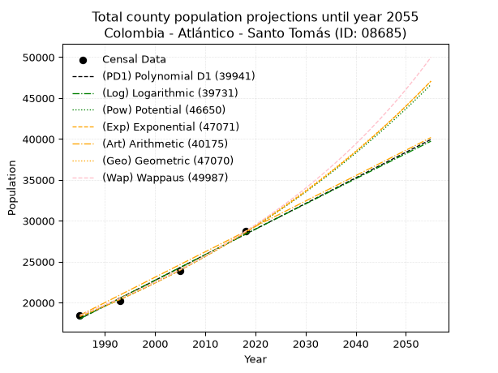
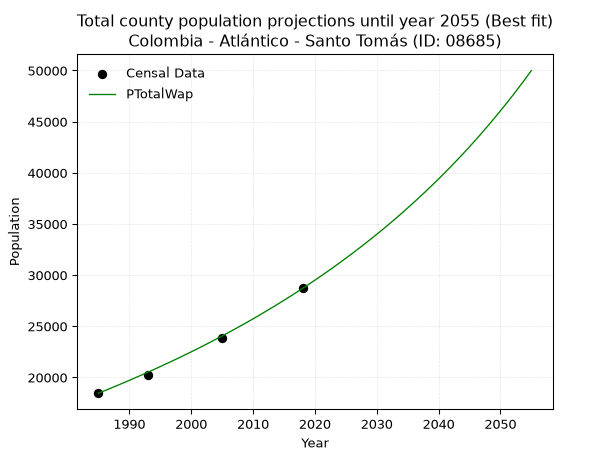
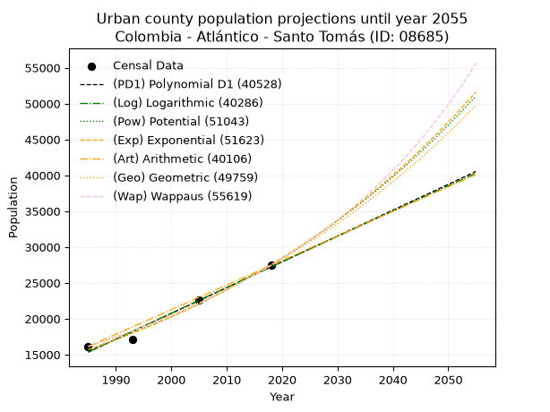
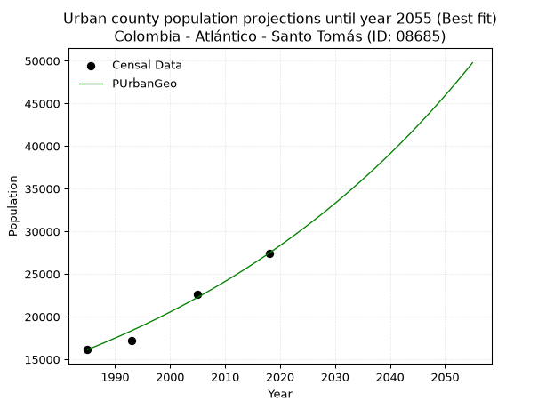
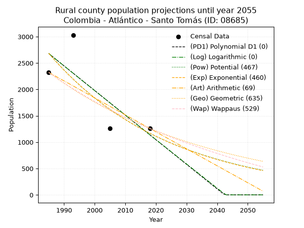
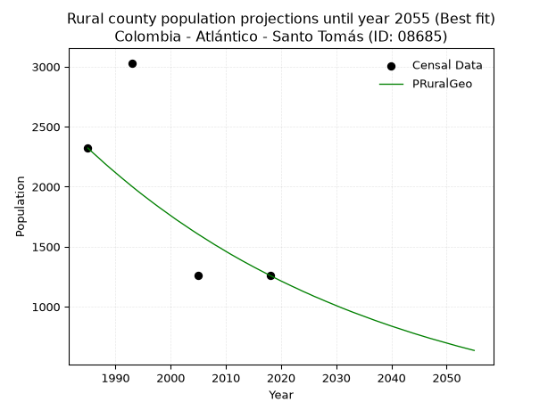

<div align="center">


</div>

# 📜 _“Population and Public Services Demand Projections (PPSD) until Year 2050 for Colombia - Atlántico - Santo Tomás (ID: 08685)”_
Keywords: `population` `public-service` `projection` `lineal` `polynomial` `logarithmic` `potential` `exponential` `arithmetic` `geometric` `wappaus` `dane` `colombia` `south-america`

PPSD are analytical estimates used by governments and planners to anticipate future changes in population size, age distribution, and the resulting community needs for utilities, healthcare, education, and infrastructure as sizing future water treatment facilities, electrical grids, and road networks based on spatial growth.

<div align="center">

</img>

</div>


> **General running parameters**: • app_version: _v20260806_. • Python version: _3.14.7_. • Pandas version: _3.0.5_. • NumPy version: _2.5.1_. • Creates, save and include plots into reports (create_plot): _False_. • Projection until year: _2050_. • Process polynomial degree 2 and up: _False_. • Process Wappaus: _True_. • Process Wappaus: _True_. • Set negative values to zero: _True_. • Set infinite values to zero: _True_. • Drop dataset notes: _True_. 
<div align="center">

Dynamic map: [:earth_americas:Google](http://maps.google.com/maps?q=10.75873532,-74.7578594) [:earth_americas:OSM](https://www.openstreetmap.org/#map=18/10.75873532/-74.7578594&layers=P) [:earth_americas:Bing](https://www.bing.com/maps?cp=10.75873532~-74.7578594&lvl=18) [:earth_americas:Apple](https://maps.apple.com/frame?center=10.75873532%2C-74.7578594&span=0.003%2C0.006)

</div>


<div align="center">

```geojson
{
  "type": "Feature",
  "geometry": {
    "type": "Point", 
    "coordinates": [-74.7578594, 10.75873532]
  }, 
  "properties": {
    "Name": "Colombia - Atlántico - Santo Tomás (ID: 08685)"
  }
}
```

</div>


## 0. Census Data (4 records)

Census data are official statistics collected by a government about the people and housing in a country. They usually include counts of total population, age, sex, race, income, education, and jobs.

📅Global census file: [Population.xlsx](../data/Population.xlsx)

| Source   |   Year |   CountryID | CountryName   |   StateID | StateName   |   CountyID | CountyName   |   PTotal |   PUrban |   PRural |
|:---------|-------:|------------:|:--------------|----------:|:------------|-----------:|:-------------|---------:|---------:|---------:|
| DANE     |   1985 |          57 | Colombia      |        08 | Atlántico   |      08685 | Santo Tomás  |    18452 |    16130 |     2322 |
| DANE     |   1993 |          57 | Colombia      |        08 | Atlántico   |      08685 | Santo Tomás  |    20187 |    17156 |     3031 |
| DANE     |   2005 |          57 | Colombia      |        08 | Atlántico   |      08685 | Santo Tomás  |    23874 |    22617 |     1257 |
| DANE     |   2018 |          57 | Colombia      |        08 | Atlántico   |      08685 | Santo Tomás  |    28693 |    27433 |     1260 |

> 🔥Some records could had specific notes about the registered values or the corresponding urban or rural distribution.

📅[SUI-RUPS](https://www.datos.gov.co/Hacienda-y-Cr-dito-P-blico/Registro-nico-de-Prestadores-de-Servicios-P-blicos/4qkq-csdn/about_data) - Local public utility companies: [RUPS.csv](../data/RUPS.csv)

 | SERVICIO       | ESTADO    | NOMBRE                                                                   | NIT         | DEPARTAMENTO_DOMICILIO   | MUNICIPIO_DOMICILIO   | DIRECCION          |   TELEFONO | EMAIL                     | TIPO_PRESTADOR                             | CLASIFICACION                 |
|:---------------|:----------|:-------------------------------------------------------------------------|:------------|:-------------------------|:----------------------|:-------------------|-----------:|:--------------------------|:-------------------------------------------|:------------------------------|
| ACUEDUCTO      | OPERATIVA | SOCIEDAD DE ACUEDUCTO, ALCANTARILLADO Y ASEO DE BARRANQUILLA S.A. E.S.P. | 800135913-1 | ATLANTICO                | BARRANQUILLA          | Carrera 58 # 67-09 |    3614000 | carolina.silva@aaa.com.co | SOCIEDADES (EMPRESA DE SERVICIOS PUBLICOS) | MAYOR O IGUAL A 5001 USUARIOS |
| ALCANTARILLADO | OPERATIVA | SOCIEDAD DE ACUEDUCTO, ALCANTARILLADO Y ASEO DE BARRANQUILLA S.A. E.S.P. | 800135913-1 | ATLANTICO                | BARRANQUILLA          | Carrera 58 # 67-09 |    3614000 | carolina.silva@aaa.com.co | SOCIEDADES (EMPRESA DE SERVICIOS PUBLICOS) | MAYOR O IGUAL A 5001 USUARIOS |

## 1. Total

### 1.1. Coefficients and Parameters

* (PD1) Polynomial Deg 1: 313.05258932155425, -603381.9417904388 (lineal)
* (Log) Logarithmic: 626470.5873146106, -4739006.454398578
* (Pow) Potential: 27.023765119626106, -84.85579397139306
* (Exp) Exponential: 0.013502096219591649, 4.192435194664376e-08
* (Art) Arithmetic: Year diff. 2018 - 1985 = 33, Population diff. 28693 - 18452 = 10241, Annual growth = 310.3333333333333
* (Geo) Geometric: Year diff. 2018 - 1985 = 33, Population diff. 28693 - 18452 = 10241, Annual growth % = 0.013468083141120246
* (Wap) Wappaus: i = 1.3165058153922296, Condition values only valid for < 200)

<sub>
Wappaus condition values: ['0.00', '1.32', '2.63', '3.95', '5.27', '6.58', '7.90', '9.22', '10.53', '11.85', '13.17', '14.48', '15.80', '17.11', '18.43', '19.75', '21.06', '22.38', '23.70', '25.01', '26.33', '27.65', '28.96', '30.28', '31.60', '32.91', '34.23', '35.55', '36.86', '38.18', '39.50', '40.81', '42.13', '43.44', '44.76', '46.08', '47.39', '48.71', '50.03', '51.34', '52.66', '53.98', '55.29', '56.61', '57.93', '59.24', '60.56', '61.88', '63.19', '64.51', '65.83', '67.14', '68.46', '69.77', '71.09', '72.41', '73.72', '75.04', '76.36', '77.67', '78.99', '80.31', '81.62', '82.94', '84.26', '85.57']
</sub>


### 1.2. Projected Dataset

|   Year |   CountyID |   PTotalPD1 |   PTotalLog |   PTotalPow |   PTotalExp |   PTotalArt |   PTotalGeo |   PTotalWap |
|-------:|-----------:|------------:|------------:|------------:|------------:|------------:|------------:|------------:|
|   1985 |      08685 |       18027 |       18019 |       18286 |       18293 |       18452 |       18452 |       18452 |
|   1986 |      08685 |       18341 |       18335 |       18536 |       18541 |       18762 |       18701 |       18697 |
|   1987 |      08685 |       18654 |       18650 |       18790 |       18793 |       19073 |       18952 |       18944 |
|   1988 |      08685 |       18967 |       18965 |       19047 |       19049 |       19383 |       19208 |       19195 |
|   1989 |      08685 |       19280 |       19280 |       19308 |       19308 |       19693 |       19466 |       19450 |
|   1990 |      08685 |       19593 |       19595 |       19572 |       19570 |       20004 |       19728 |       19708 |
|   1991 |      08685 |       19906 |       19910 |       19840 |       19836 |       20314 |       19994 |       19969 |
|   1992 |      08685 |       20219 |       20224 |       20111 |       20106 |       20624 |       20263 |       20235 |
|   1993 |      08685 |       20532 |       20539 |       20385 |       20379 |       20935 |       20536 |       20503 |
|   1994 |      08685 |       20845 |       20853 |       20663 |       20656 |       21245 |       20813 |       20776 |
|   1995 |      08685 |       21158 |       21167 |       20945 |       20937 |       21555 |       21093 |       21052 |
|   1996 |      08685 |       21471 |       21481 |       21231 |       21222 |       21866 |       21377 |       21333 |
|   1997 |      08685 |       21784 |       21795 |       21520 |       21510 |       22176 |       21665 |       21617 |
|   1998 |      08685 |       22097 |       22109 |       21813 |       21803 |       22486 |       21957 |       21906 |
|   1999 |      08685 |       22410 |       22422 |       22110 |       22099 |       22797 |       22253 |       22198 |
|   2000 |      08685 |       22723 |       22735 |       22411 |       22399 |       23107 |       22552 |       22495 |
|   2001 |      08685 |       23036 |       23049 |       22716 |       22704 |       23417 |       22856 |       22796 |
|   2002 |      08685 |       23349 |       23362 |       23025 |       23013 |       23728 |       23164 |       23102 |
|   2003 |      08685 |       23662 |       23674 |       23338 |       23325 |       24038 |       23476 |       23412 |
|   2004 |      08685 |       23975 |       23987 |       23655 |       23643 |       24348 |       23792 |       23727 |
|   2005 |      08685 |       24288 |       24300 |       23976 |       23964 |       24659 |       24113 |       24047 |
|   2006 |      08685 |       24602 |       24612 |       24301 |       24290 |       24969 |       24437 |       24372 |
|   2007 |      08685 |       24915 |       24924 |       24630 |       24620 |       25279 |       24767 |       24701 |
|   2008 |      08685 |       25228 |       25236 |       24964 |       24955 |       25590 |       25100 |       25036 |
|   2009 |      08685 |       25541 |       25548 |       25302 |       25294 |       25900 |       25438 |       25376 |
|   2010 |      08685 |       25854 |       25860 |       25645 |       25638 |       26210 |       25781 |       25721 |
|   2011 |      08685 |       26167 |       26172 |       25992 |       25986 |       26521 |       26128 |       26072 |
|   2012 |      08685 |       26480 |       26483 |       26343 |       26339 |       26831 |       26480 |       26429 |
|   2013 |      08685 |       26793 |       26794 |       26700 |       26697 |       27141 |       26836 |       26791 |
|   2014 |      08685 |       27106 |       27105 |       27060 |       27060 |       27452 |       27198 |       27159 |
|   2015 |      08685 |       27419 |       27416 |       27426 |       27428 |       27762 |       27564 |       27533 |
|   2016 |      08685 |       27732 |       27727 |       27796 |       27801 |       28072 |       27935 |       27913 |
|   2017 |      08685 |       28045 |       28038 |       28171 |       28179 |       28383 |       28312 |       28300 |
|   2018 |      08685 |       28358 |       28348 |       28551 |       28562 |       28693 |       28693 |       28693 |
|   2019 |      08685 |       28671 |       28659 |       28936 |       28950 |       29003 |       29079 |       29093 |
|   2020 |      08685 |       28984 |       28969 |       29325 |       29344 |       29314 |       29471 |       29499 |
|   2021 |      08685 |       29297 |       29279 |       29720 |       29743 |       29624 |       29868 |       29913 |
|   2022 |      08685 |       29610 |       29589 |       30120 |       30147 |       29934 |       30270 |       30334 |
|   2023 |      08685 |       29923 |       29899 |       30525 |       30557 |       30245 |       30678 |       30762 |
|   2024 |      08685 |       30236 |       30208 |       30936 |       30972 |       30555 |       31091 |       31198 |
|   2025 |      08685 |       30550 |       30518 |       31352 |       31393 |       30865 |       31510 |       31642 |
|   2026 |      08685 |       30863 |       30827 |       31773 |       31820 |       31176 |       31934 |       32093 |
|   2027 |      08685 |       31176 |       31136 |       32199 |       32252 |       31486 |       32364 |       32553 |
|   2028 |      08685 |       31489 |       31445 |       32631 |       32691 |       31796 |       32800 |       33022 |
|   2029 |      08685 |       31802 |       31754 |       33069 |       33135 |       32107 |       33242 |       33498 |
|   2030 |      08685 |       32115 |       32063 |       33512 |       33586 |       32417 |       33690 |       33984 |
|   2031 |      08685 |       32428 |       32371 |       33961 |       34042 |       32727 |       34143 |       34479 |
|   2032 |      08685 |       32741 |       32680 |       34416 |       34505 |       33038 |       34603 |       34984 |
|   2033 |      08685 |       33054 |       32988 |       34877 |       34974 |       33348 |       35069 |       35498 |
|   2034 |      08685 |       33367 |       33296 |       35343 |       35450 |       33658 |       35542 |       36022 |
|   2035 |      08685 |       33680 |       33604 |       35816 |       35931 |       33969 |       36020 |       36557 |
|   2036 |      08685 |       33993 |       33912 |       36294 |       36420 |       34279 |       36505 |       37102 |
|   2037 |      08685 |       34306 |       34219 |       36779 |       36915 |       34589 |       36997 |       37658 |
|   2038 |      08685 |       34619 |       34527 |       37270 |       37417 |       34900 |       37495 |       38225 |
|   2039 |      08685 |       34932 |       34834 |       37768 |       37925 |       35210 |       38000 |       38804 |
|   2040 |      08685 |       35245 |       35141 |       38271 |       38441 |       35520 |       38512 |       39395 |
|   2041 |      08685 |       35558 |       35448 |       38782 |       38963 |       35831 |       39031 |       39998 |
|   2042 |      08685 |       35871 |       35755 |       39298 |       39493 |       36141 |       39556 |       40614 |
|   2043 |      08685 |       36184 |       36062 |       39822 |       40030 |       36451 |       40089 |       41243 |
|   2044 |      08685 |       36498 |       36368 |       40352 |       40574 |       36762 |       40629 |       41885 |
|   2045 |      08685 |       36811 |       36675 |       40889 |       41126 |       37072 |       41176 |       42541 |
|   2046 |      08685 |       37124 |       36981 |       41433 |       41685 |       37382 |       41731 |       43212 |
|   2047 |      08685 |       37437 |       37287 |       41983 |       42251 |       37693 |       42293 |       43898 |
|   2048 |      08685 |       37750 |       37593 |       42541 |       42826 |       38003 |       42863 |       44599 |
|   2049 |      08685 |       38063 |       37899 |       43106 |       43408 |       38313 |       43440 |       45317 |
|   2050 |      08685 |       38376 |       38205 |       43678 |       43998 |       38624 |       44025 |       46050 |
<div align="center">

</img>

</div>


### 1.3. Best fit with absolute and relative error (%)

Relative error puts that difference into context by dividing the absolute error by the true value, creating a unitless ratio or percentage that shows the scale of the mistake.

Absolute and relative error

|   Year | Source   |   CountryID | CountryName   |   StateID | StateName   |   CountyID_x | CountyName   |   PTotal |   PUrban |   PRural |   CountyID_y |   PTotalPD1 |   PTotalLog |   PTotalPow |   PTotalExp |   PTotalArt |   PTotalGeo |   PTotalWap |   PTotalPD1AbsError |   PTotalLogAbsError |   PTotalPowAbsError |   PTotalExpAbsError |   PTotalArtAbsError |   PTotalGeoAbsError |   PTotalWapAbsError |   PTotalPD1RelError |   PTotalLogRelError |   PTotalPowRelError |   PTotalExpRelError |   PTotalArtRelError |   PTotalGeoRelError |   PTotalWapRelError |
|-------:|:---------|------------:|:--------------|----------:|:------------|-------------:|:-------------|---------:|---------:|---------:|-------------:|------------:|------------:|------------:|------------:|------------:|------------:|------------:|--------------------:|--------------------:|--------------------:|--------------------:|--------------------:|--------------------:|--------------------:|--------------------:|--------------------:|--------------------:|--------------------:|--------------------:|--------------------:|--------------------:|
|   1985 | DANE     |          57 | Colombia      |        08 | Atlántico   |        08685 | Santo Tomás  |    18452 |    16130 |     2322 |        08685 |       18027 |       18019 |       18286 |       18293 |       18452 |       18452 |       18452 |                 425 |                 433 |                 166 |                 159 |                   0 |                   0 |                   0 |             2.30327 |             2.34663 |            0.899631 |            0.861695 |             0       |             0       |            0        |
|   1993 | DANE     |          57 | Colombia      |        08 | Atlántico   |        08685 | Santo Tomás  |    20187 |    17156 |     3031 |        08685 |       20532 |       20539 |       20385 |       20379 |       20935 |       20536 |       20503 |                 345 |                 352 |                 198 |                 192 |                 748 |                 349 |                 316 |             1.70902 |             1.7437  |            0.980829 |            0.951107 |             3.70535 |             1.72884 |            1.56536  |
|   2005 | DANE     |          57 | Colombia      |        08 | Atlántico   |        08685 | Santo Tomás  |    23874 |    22617 |     1257 |        08685 |       24288 |       24300 |       23976 |       23964 |       24659 |       24113 |       24047 |                 414 |                 426 |                 102 |                  90 |                 785 |                 239 |                 173 |             1.7341  |             1.78437 |            0.427243 |            0.376979 |             3.2881  |             1.00109 |            0.724638 |
|   2018 | DANE     |          57 | Colombia      |        08 | Atlántico   |        08685 | Santo Tomás  |    28693 |    27433 |     1260 |        08685 |       28358 |       28348 |       28551 |       28562 |       28693 |       28693 |       28693 |                 335 |                 345 |                 142 |                 131 |                   0 |                   0 |                   0 |             1.16753 |             1.20238 |            0.494894 |            0.456557 |             0       |             0       |            0        |

Relative error mean

| Method    |   RelError | Best   |
|:----------|-----------:|:-------|
| PTotalPD1 |   1.72848  |        |
| PTotalLog |   1.76927  |        |
| PTotalPow |   0.700649 |        |
| PTotalExp |   0.661585 |        |
| PTotalArt |   1.74836  |        |
| PTotalGeo |   0.682481 |        |
| PTotalWap |   0.5725   | True   |

💙Best method: _**PTotalWap**_
<div align="center">

</img>

</div>


### 1.4. Fresh water supply demand in liters per capita per day (lpcd)

The fresh water supply demand typically ranges from 100 to 300 liters per capita per day (lpcd) for standard domestic and municipal planning, though absolute survival minimums set by the World Health Organization are as low as 7.5 to 20 liters per day, and total consumption in high-income nations can exceed 400 liters.

> `CZ`: Level in meters above the sea level (masl)<br> `WS`: Fresh water supply demand in liters per capita per day (lpcd or l/h/d)<br> `WSAll`: Zonal fresh water supply demand in liters per second (l/s)<br> `A`: Zonal area in square meters<br> `DP`: Population density (people/hectare or p/ha)

Reference values (RAS Colombia)

|    CZ |   WS |
|------:|-----:|
|  1000 |  120 |
|  2000 |  130 |
| 99999 |  140 |

County shapefile geometry properties and water supply values

|   CountyID |      ATotal |   CZTotal |   WSTotal |
|-----------:|------------:|----------:|----------:|
|      08685 | 6.50324e+07 |   28.5942 |       120 |

Projected values for best method: PTotalWap

|   CountyID |   Year |   PTotalWap |   DPTotal |   WSTotal |   WSTotalAll |
|-----------:|-------:|------------:|----------:|----------:|-------------:|
|      08685 |   1985 |       18452 |      2.84 |       120 |      25.6278 |
|      08685 |   1986 |       18697 |      2.88 |       120 |      25.9681 |
|      08685 |   1987 |       18944 |      2.91 |       120 |      26.3111 |
|      08685 |   1988 |       19195 |      2.95 |       120 |      26.6597 |
|      08685 |   1989 |       19450 |      2.99 |       120 |      27.0139 |
|      08685 |   1990 |       19708 |      3.03 |       120 |      27.3722 |
|      08685 |   1991 |       19969 |      3.07 |       120 |      27.7347 |
|      08685 |   1992 |       20235 |      3.11 |       120 |      28.1042 |
|      08685 |   1993 |       20503 |      3.15 |       120 |      28.4764 |
|      08685 |   1994 |       20776 |      3.19 |       120 |      28.8556 |
|      08685 |   1995 |       21052 |      3.24 |       120 |      29.2389 |
|      08685 |   1996 |       21333 |      3.28 |       120 |      29.6292 |
|      08685 |   1997 |       21617 |      3.32 |       120 |      30.0236 |
|      08685 |   1998 |       21906 |      3.37 |       120 |      30.425  |
|      08685 |   1999 |       22198 |      3.41 |       120 |      30.8306 |
|      08685 |   2000 |       22495 |      3.46 |       120 |      31.2431 |
|      08685 |   2001 |       22796 |      3.51 |       120 |      31.6611 |
|      08685 |   2002 |       23102 |      3.55 |       120 |      32.0861 |
|      08685 |   2003 |       23412 |      3.6  |       120 |      32.5167 |
|      08685 |   2004 |       23727 |      3.65 |       120 |      32.9542 |
|      08685 |   2005 |       24047 |      3.7  |       120 |      33.3986 |
|      08685 |   2006 |       24372 |      3.75 |       120 |      33.85   |
|      08685 |   2007 |       24701 |      3.8  |       120 |      34.3069 |
|      08685 |   2008 |       25036 |      3.85 |       120 |      34.7722 |
|      08685 |   2009 |       25376 |      3.9  |       120 |      35.2444 |
|      08685 |   2010 |       25721 |      3.96 |       120 |      35.7236 |
|      08685 |   2011 |       26072 |      4.01 |       120 |      36.2111 |
|      08685 |   2012 |       26429 |      4.06 |       120 |      36.7069 |
|      08685 |   2013 |       26791 |      4.12 |       120 |      37.2097 |
|      08685 |   2014 |       27159 |      4.18 |       120 |      37.7208 |
|      08685 |   2015 |       27533 |      4.23 |       120 |      38.2403 |
|      08685 |   2016 |       27913 |      4.29 |       120 |      38.7681 |
|      08685 |   2017 |       28300 |      4.35 |       120 |      39.3056 |
|      08685 |   2018 |       28693 |      4.41 |       120 |      39.8514 |
|      08685 |   2019 |       29093 |      4.47 |       120 |      40.4069 |
|      08685 |   2020 |       29499 |      4.54 |       120 |      40.9708 |
|      08685 |   2021 |       29913 |      4.6  |       120 |      41.5458 |
|      08685 |   2022 |       30334 |      4.66 |       120 |      42.1306 |
|      08685 |   2023 |       30762 |      4.73 |       120 |      42.725  |
|      08685 |   2024 |       31198 |      4.8  |       120 |      43.3306 |
|      08685 |   2025 |       31642 |      4.87 |       120 |      43.9472 |
|      08685 |   2026 |       32093 |      4.93 |       120 |      44.5736 |
|      08685 |   2027 |       32553 |      5.01 |       120 |      45.2125 |
|      08685 |   2028 |       33022 |      5.08 |       120 |      45.8639 |
|      08685 |   2029 |       33498 |      5.15 |       120 |      46.525  |
|      08685 |   2030 |       33984 |      5.23 |       120 |      47.2    |
|      08685 |   2031 |       34479 |      5.3  |       120 |      47.8875 |
|      08685 |   2032 |       34984 |      5.38 |       120 |      48.5889 |
|      08685 |   2033 |       35498 |      5.46 |       120 |      49.3028 |
|      08685 |   2034 |       36022 |      5.54 |       120 |      50.0306 |
|      08685 |   2035 |       36557 |      5.62 |       120 |      50.7736 |
|      08685 |   2036 |       37102 |      5.71 |       120 |      51.5306 |
|      08685 |   2037 |       37658 |      5.79 |       120 |      52.3028 |
|      08685 |   2038 |       38225 |      5.88 |       120 |      53.0903 |
|      08685 |   2039 |       38804 |      5.97 |       120 |      53.8944 |
|      08685 |   2040 |       39395 |      6.06 |       120 |      54.7153 |
|      08685 |   2041 |       39998 |      6.15 |       120 |      55.5528 |
|      08685 |   2042 |       40614 |      6.25 |       120 |      56.4083 |
|      08685 |   2043 |       41243 |      6.34 |       120 |      57.2819 |
|      08685 |   2044 |       41885 |      6.44 |       120 |      58.1736 |
|      08685 |   2045 |       42541 |      6.54 |       120 |      59.0847 |
|      08685 |   2046 |       43212 |      6.64 |       120 |      60.0167 |
|      08685 |   2047 |       43898 |      6.75 |       120 |      60.9694 |
|      08685 |   2048 |       44599 |      6.86 |       120 |      61.9431 |
|      08685 |   2049 |       45317 |      6.97 |       120 |      62.9403 |
|      08685 |   2050 |       46050 |      7.08 |       120 |      63.9583 |

## 2. Urban

### 2.1. Coefficients and Parameters

* (PD1) Polynomial Deg 1: 359.69971898835485, -698655.3629064567 (lineal)
* (Log) Logarithmic: 719825.5954753616, -5450566.11952853
* (Pow) Potential: 34.01913793710671, -107.99106456871814
* (Exp) Exponential: 0.016997078633511117, 3.494373508523557e-11
* (Art) Arithmetic: Year diff. 2018 - 1985 = 33, Population diff. 27433 - 16130 = 11303, Annual growth = 342.5151515151515
* (Geo) Geometric: Year diff. 2018 - 1985 = 33, Population diff. 27433 - 16130 = 11303, Annual growth % = 0.01622309049047943
* (Wap) Wappaus: i = 1.5725048849489316, Condition values only valid for < 200)

<sub>
Wappaus condition values: ['0.00', '1.57', '3.15', '4.72', '6.29', '7.86', '9.44', '11.01', '12.58', '14.15', '15.73', '17.30', '18.87', '20.44', '22.02', '23.59', '25.16', '26.73', '28.31', '29.88', '31.45', '33.02', '34.60', '36.17', '37.74', '39.31', '40.89', '42.46', '44.03', '45.60', '47.18', '48.75', '50.32', '51.89', '53.47', '55.04', '56.61', '58.18', '59.76', '61.33', '62.90', '64.47', '66.05', '67.62', '69.19', '70.76', '72.34', '73.91', '75.48', '77.05', '78.63', '80.20', '81.77', '83.34', '84.92', '86.49', '88.06', '89.63', '91.21', '92.78', '94.35', '95.92', '97.50', '99.07', '100.64', '102.21']
</sub>


### 2.2. Projected Dataset

|   Year |   CountyID |   PUrbanPD1 |   PUrbanLog |   PUrbanPow |   PUrbanExp |   PUrbanArt |   PUrbanGeo |   PUrbanWap |
|-------:|-----------:|------------:|------------:|------------:|------------:|------------:|------------:|------------:|
|   1985 |      08685 |       15349 |       15339 |       15700 |       15708 |       16130 |       16130 |       16130 |
|   1986 |      08685 |       15708 |       15702 |       15972 |       15977 |       16473 |       16392 |       16386 |
|   1987 |      08685 |       16068 |       16064 |       16247 |       16251 |       16815 |       16658 |       16645 |
|   1988 |      08685 |       16428 |       16426 |       16528 |       16530 |       17158 |       16928 |       16909 |
|   1989 |      08685 |       16787 |       16788 |       16813 |       16813 |       17500 |       17202 |       17178 |
|   1990 |      08685 |       17147 |       17150 |       17103 |       17101 |       17843 |       17482 |       17450 |
|   1991 |      08685 |       17507 |       17511 |       17398 |       17394 |       18185 |       17765 |       17727 |
|   1992 |      08685 |       17866 |       17873 |       17698 |       17693 |       18528 |       18053 |       18009 |
|   1993 |      08685 |       18226 |       18234 |       18002 |       17996 |       18870 |       18346 |       18295 |
|   1994 |      08685 |       18586 |       18595 |       18312 |       18304 |       19213 |       18644 |       18587 |
|   1995 |      08685 |       18946 |       18956 |       18627 |       18618 |       19555 |       18946 |       18883 |
|   1996 |      08685 |       19305 |       19317 |       18948 |       18937 |       19898 |       19254 |       19184 |
|   1997 |      08685 |       19665 |       19677 |       19273 |       19262 |       20240 |       19566 |       19491 |
|   1998 |      08685 |       20025 |       20038 |       19604 |       19592 |       20583 |       19883 |       19803 |
|   1999 |      08685 |       20384 |       20398 |       19941 |       19928 |       20925 |       20206 |       20120 |
|   2000 |      08685 |       20744 |       20758 |       20283 |       20270 |       21268 |       20534 |       20443 |
|   2001 |      08685 |       21104 |       21118 |       20631 |       20617 |       21610 |       20867 |       20772 |
|   2002 |      08685 |       21463 |       21477 |       20984 |       20970 |       21953 |       21205 |       21107 |
|   2003 |      08685 |       21823 |       21837 |       21344 |       21330 |       22295 |       21550 |       21448 |
|   2004 |      08685 |       22183 |       22196 |       21709 |       21696 |       22638 |       21899 |       21796 |
|   2005 |      08685 |       22543 |       22555 |       22081 |       22067 |       22980 |       22254 |       22149 |
|   2006 |      08685 |       22902 |       22914 |       22459 |       22446 |       23323 |       22615 |       22510 |
|   2007 |      08685 |       23262 |       23273 |       22843 |       22831 |       23665 |       22982 |       22877 |
|   2008 |      08685 |       23622 |       23632 |       23233 |       23222 |       24008 |       23355 |       23252 |
|   2009 |      08685 |       23981 |       23990 |       23630 |       23620 |       24350 |       23734 |       23633 |
|   2010 |      08685 |       24341 |       24348 |       24034 |       24025 |       24693 |       24119 |       24023 |
|   2011 |      08685 |       24701 |       24706 |       24444 |       24437 |       25035 |       24510 |       24419 |
|   2012 |      08685 |       25060 |       25064 |       24861 |       24856 |       25378 |       24908 |       24824 |
|   2013 |      08685 |       25420 |       25422 |       25284 |       25282 |       25720 |       25312 |       25237 |
|   2014 |      08685 |       25780 |       25779 |       25715 |       25715 |       26063 |       25723 |       25658 |
|   2015 |      08685 |       26140 |       26137 |       26153 |       26156 |       26405 |       26140 |       26088 |
|   2016 |      08685 |       26499 |       26494 |       26598 |       26604 |       26748 |       26564 |       26527 |
|   2017 |      08685 |       26859 |       26851 |       27051 |       27060 |       27090 |       26995 |       26975 |
|   2018 |      08685 |       27219 |       27207 |       27511 |       27524 |       27433 |       27433 |       27433 |
|   2019 |      08685 |       27578 |       27564 |       27978 |       27996 |       27776 |       27878 |       27900 |
|   2020 |      08685 |       27938 |       27921 |       28454 |       28476 |       28118 |       28330 |       28378 |
|   2021 |      08685 |       28298 |       28277 |       28937 |       28964 |       28461 |       28790 |       28866 |
|   2022 |      08685 |       28657 |       28633 |       29428 |       29461 |       28803 |       29257 |       29365 |
|   2023 |      08685 |       29017 |       28989 |       29927 |       29966 |       29146 |       29732 |       29875 |
|   2024 |      08685 |       29377 |       29345 |       30435 |       30479 |       29488 |       30214 |       30397 |
|   2025 |      08685 |       29737 |       29700 |       30950 |       31002 |       29831 |       30704 |       30931 |
|   2026 |      08685 |       30096 |       30055 |       31474 |       31533 |       30173 |       31202 |       31477 |
|   2027 |      08685 |       30456 |       30411 |       32007 |       32074 |       30516 |       31708 |       32036 |
|   2028 |      08685 |       30816 |       30766 |       32549 |       32624 |       30858 |       32223 |       32608 |
|   2029 |      08685 |       31175 |       31121 |       33099 |       33183 |       31201 |       32746 |       33194 |
|   2030 |      08685 |       31535 |       31475 |       33659 |       33752 |       31543 |       33277 |       33794 |
|   2031 |      08685 |       31895 |       31830 |       34228 |       34330 |       31886 |       33817 |       34409 |
|   2032 |      08685 |       32254 |       32184 |       34806 |       34919 |       32228 |       34365 |       35039 |
|   2033 |      08685 |       32614 |       32538 |       35393 |       35517 |       32571 |       34923 |       35685 |
|   2034 |      08685 |       32974 |       32892 |       35990 |       36126 |       32913 |       35489 |       36348 |
|   2035 |      08685 |       33334 |       33246 |       36597 |       36746 |       33256 |       36065 |       37028 |
|   2036 |      08685 |       33693 |       33600 |       37214 |       37375 |       33598 |       36650 |       37725 |
|   2037 |      08685 |       34053 |       33953 |       37841 |       38016 |       33941 |       37245 |       38442 |
|   2038 |      08685 |       34413 |       34306 |       38478 |       38668 |       34283 |       37849 |       39177 |
|   2039 |      08685 |       34772 |       34660 |       39125 |       39331 |       34626 |       38463 |       39933 |
|   2040 |      08685 |       35132 |       35012 |       39783 |       40005 |       34968 |       39087 |       40710 |
|   2041 |      08685 |       35492 |       35365 |       40452 |       40691 |       35311 |       39721 |       41508 |
|   2042 |      08685 |       35851 |       35718 |       41132 |       41388 |       35653 |       40366 |       42329 |
|   2043 |      08685 |       36211 |       36070 |       41823 |       42098 |       35996 |       41020 |       43174 |
|   2044 |      08685 |       36571 |       36422 |       42525 |       42819 |       36338 |       41686 |       44044 |
|   2045 |      08685 |       36931 |       36775 |       43238 |       43553 |       36681 |       42362 |       44940 |
|   2046 |      08685 |       37290 |       37126 |       43963 |       44300 |       37023 |       43049 |       45862 |
|   2047 |      08685 |       37650 |       37478 |       44700 |       45059 |       37366 |       43748 |       46813 |
|   2048 |      08685 |       38010 |       37830 |       45449 |       45832 |       37708 |       44458 |       47794 |
|   2049 |      08685 |       38369 |       38181 |       46210 |       46618 |       38051 |       45179 |       48806 |
|   2050 |      08685 |       38729 |       38532 |       46984 |       47417 |       38393 |       45912 |       49850 |
<div align="center">

</img>

</div>


### 2.3. Best fit with absolute and relative error (%)

Relative error puts that difference into context by dividing the absolute error by the true value, creating a unitless ratio or percentage that shows the scale of the mistake.

Absolute and relative error

|   Year | Source   |   CountryID | CountryName   |   StateID | StateName   |   CountyID_x | CountyName   |   PTotal |   PUrban |   PRural |   CountyID_y |   PUrbanPD1 |   PUrbanLog |   PUrbanPow |   PUrbanExp |   PUrbanArt |   PUrbanGeo |   PUrbanWap |   PUrbanPD1AbsError |   PUrbanLogAbsError |   PUrbanPowAbsError |   PUrbanExpAbsError |   PUrbanArtAbsError |   PUrbanGeoAbsError |   PUrbanWapAbsError |   PUrbanPD1RelError |   PUrbanLogRelError |   PUrbanPowRelError |   PUrbanExpRelError |   PUrbanArtRelError |   PUrbanGeoRelError |   PUrbanWapRelError |
|-------:|:---------|------------:|:--------------|----------:|:------------|-------------:|:-------------|---------:|---------:|---------:|-------------:|------------:|------------:|------------:|------------:|------------:|------------:|------------:|--------------------:|--------------------:|--------------------:|--------------------:|--------------------:|--------------------:|--------------------:|--------------------:|--------------------:|--------------------:|--------------------:|--------------------:|--------------------:|--------------------:|
|   1985 | DANE     |          57 | Colombia      |        08 | Atlántico   |        08685 | Santo Tomás  |    18452 |    16130 |     2322 |        08685 |       15349 |       15339 |       15700 |       15708 |       16130 |       16130 |       16130 |                 781 |                 791 |                 430 |                 422 |                   0 |                   0 |                   0 |            4.84191  |            4.90391  |            2.66584  |            2.61624  |             0       |             0       |             0       |
|   1993 | DANE     |          57 | Colombia      |        08 | Atlántico   |        08685 | Santo Tomás  |    20187 |    17156 |     3031 |        08685 |       18226 |       18234 |       18002 |       17996 |       18870 |       18346 |       18295 |                1070 |                1078 |                 846 |                 840 |                1714 |                1190 |                1139 |            6.23689  |            6.28352  |            4.93122  |            4.89625  |             9.99067 |             6.93635 |             6.63908 |
|   2005 | DANE     |          57 | Colombia      |        08 | Atlántico   |        08685 | Santo Tomás  |    23874 |    22617 |     1257 |        08685 |       22543 |       22555 |       22081 |       22067 |       22980 |       22254 |       22149 |                  74 |                  62 |                 536 |                 550 |                 363 |                 363 |                 468 |            0.327188 |            0.27413  |            2.3699   |            2.4318   |             1.60499 |             1.60499 |             2.06924 |
|   2018 | DANE     |          57 | Colombia      |        08 | Atlántico   |        08685 | Santo Tomás  |    28693 |    27433 |     1260 |        08685 |       27219 |       27207 |       27511 |       27524 |       27433 |       27433 |       27433 |                 214 |                 226 |                  78 |                  91 |                   0 |                   0 |                   0 |            0.780082 |            0.823825 |            0.284329 |            0.331717 |             0       |             0       |             0       |

Relative error mean

| Method    |   RelError | Best   |
|:----------|-----------:|:-------|
| PUrbanPD1 |    3.04652 |        |
| PUrbanLog |    3.07134 |        |
| PUrbanPow |    2.56282 |        |
| PUrbanExp |    2.569   |        |
| PUrbanArt |    2.89892 |        |
| PUrbanGeo |    2.13533 | True   |
| PUrbanWap |    2.17708 |        |

💙Best method: _**PUrbanGeo**_
<div align="center">

</img>

</div>


### 2.4. Fresh water supply demand in liters per capita per day (lpcd)

The fresh water supply demand typically ranges from 100 to 300 liters per capita per day (lpcd) for standard domestic and municipal planning, though absolute survival minimums set by the World Health Organization are as low as 7.5 to 20 liters per day, and total consumption in high-income nations can exceed 400 liters.

> `CZ`: Level in meters above the sea level (masl)<br> `WS`: Fresh water supply demand in liters per capita per day (lpcd or l/h/d)<br> `WSAll`: Zonal fresh water supply demand in liters per second (l/s)<br> `A`: Zonal area in square meters<br> `DP`: Population density (people/hectare or p/ha)

Reference values (RAS Colombia)

|    CZ |   WS |
|------:|-----:|
|  1000 |  120 |
|  2000 |  130 |
| 99999 |  140 |

County shapefile geometry properties and water supply values

|   CountyID |      AUrban |   CZUrban |   WSUrban |
|-----------:|------------:|----------:|----------:|
|      08685 | 3.36383e+06 |   7.35174 |       120 |

Projected values for best method: PUrbanGeo

|   CountyID |   Year |   PUrbanGeo |   DPUrban |   WSUrban |   WSUrbanAll |
|-----------:|-------:|------------:|----------:|----------:|-------------:|
|      08685 |   1985 |       16130 |     47.95 |       120 |      22.4028 |
|      08685 |   1986 |       16392 |     48.73 |       120 |      22.7667 |
|      08685 |   1987 |       16658 |     49.52 |       120 |      23.1361 |
|      08685 |   1988 |       16928 |     50.32 |       120 |      23.5111 |
|      08685 |   1989 |       17202 |     51.14 |       120 |      23.8917 |
|      08685 |   1990 |       17482 |     51.97 |       120 |      24.2806 |
|      08685 |   1991 |       17765 |     52.81 |       120 |      24.6736 |
|      08685 |   1992 |       18053 |     53.67 |       120 |      25.0736 |
|      08685 |   1993 |       18346 |     54.54 |       120 |      25.4806 |
|      08685 |   1994 |       18644 |     55.42 |       120 |      25.8944 |
|      08685 |   1995 |       18946 |     56.32 |       120 |      26.3139 |
|      08685 |   1996 |       19254 |     57.24 |       120 |      26.7417 |
|      08685 |   1997 |       19566 |     58.17 |       120 |      27.175  |
|      08685 |   1998 |       19883 |     59.11 |       120 |      27.6153 |
|      08685 |   1999 |       20206 |     60.07 |       120 |      28.0639 |
|      08685 |   2000 |       20534 |     61.04 |       120 |      28.5194 |
|      08685 |   2001 |       20867 |     62.03 |       120 |      28.9819 |
|      08685 |   2002 |       21205 |     63.04 |       120 |      29.4514 |
|      08685 |   2003 |       21550 |     64.06 |       120 |      29.9306 |
|      08685 |   2004 |       21899 |     65.1  |       120 |      30.4153 |
|      08685 |   2005 |       22254 |     66.16 |       120 |      30.9083 |
|      08685 |   2006 |       22615 |     67.23 |       120 |      31.4097 |
|      08685 |   2007 |       22982 |     68.32 |       120 |      31.9194 |
|      08685 |   2008 |       23355 |     69.43 |       120 |      32.4375 |
|      08685 |   2009 |       23734 |     70.56 |       120 |      32.9639 |
|      08685 |   2010 |       24119 |     71.7  |       120 |      33.4986 |
|      08685 |   2011 |       24510 |     72.86 |       120 |      34.0417 |
|      08685 |   2012 |       24908 |     74.05 |       120 |      34.5944 |
|      08685 |   2013 |       25312 |     75.25 |       120 |      35.1556 |
|      08685 |   2014 |       25723 |     76.47 |       120 |      35.7264 |
|      08685 |   2015 |       26140 |     77.71 |       120 |      36.3056 |
|      08685 |   2016 |       26564 |     78.97 |       120 |      36.8944 |
|      08685 |   2017 |       26995 |     80.25 |       120 |      37.4931 |
|      08685 |   2018 |       27433 |     81.55 |       120 |      38.1014 |
|      08685 |   2019 |       27878 |     82.88 |       120 |      38.7194 |
|      08685 |   2020 |       28330 |     84.22 |       120 |      39.3472 |
|      08685 |   2021 |       28790 |     85.59 |       120 |      39.9861 |
|      08685 |   2022 |       29257 |     86.98 |       120 |      40.6347 |
|      08685 |   2023 |       29732 |     88.39 |       120 |      41.2944 |
|      08685 |   2024 |       30214 |     89.82 |       120 |      41.9639 |
|      08685 |   2025 |       30704 |     91.28 |       120 |      42.6444 |
|      08685 |   2026 |       31202 |     92.76 |       120 |      43.3361 |
|      08685 |   2027 |       31708 |     94.26 |       120 |      44.0389 |
|      08685 |   2028 |       32223 |     95.79 |       120 |      44.7542 |
|      08685 |   2029 |       32746 |     97.35 |       120 |      45.4806 |
|      08685 |   2030 |       33277 |     98.93 |       120 |      46.2181 |
|      08685 |   2031 |       33817 |    100.53 |       120 |      46.9681 |
|      08685 |   2032 |       34365 |    102.16 |       120 |      47.7292 |
|      08685 |   2033 |       34923 |    103.82 |       120 |      48.5042 |
|      08685 |   2034 |       35489 |    105.5  |       120 |      49.2903 |
|      08685 |   2035 |       36065 |    107.21 |       120 |      50.0903 |
|      08685 |   2036 |       36650 |    108.95 |       120 |      50.9028 |
|      08685 |   2037 |       37245 |    110.72 |       120 |      51.7292 |
|      08685 |   2038 |       37849 |    112.52 |       120 |      52.5681 |
|      08685 |   2039 |       38463 |    114.34 |       120 |      53.4208 |
|      08685 |   2040 |       39087 |    116.2  |       120 |      54.2875 |
|      08685 |   2041 |       39721 |    118.08 |       120 |      55.1681 |
|      08685 |   2042 |       40366 |    120    |       120 |      56.0639 |
|      08685 |   2043 |       41020 |    121.94 |       120 |      56.9722 |
|      08685 |   2044 |       41686 |    123.92 |       120 |      57.8972 |
|      08685 |   2045 |       42362 |    125.93 |       120 |      58.8361 |
|      08685 |   2046 |       43049 |    127.98 |       120 |      59.7903 |
|      08685 |   2047 |       43748 |    130.05 |       120 |      60.7611 |
|      08685 |   2048 |       44458 |    132.16 |       120 |      61.7472 |
|      08685 |   2049 |       45179 |    134.31 |       120 |      62.7486 |
|      08685 |   2050 |       45912 |    136.49 |       120 |      63.7667 |

## 3. Rural

### 3.1. Coefficients and Parameters

* (PD1) Polynomial Deg 1: -46.64712966680038, 95273.42111601746 (lineal)
* (Log) Logarithmic: -93355.0081607509, 711559.6651299527
* (Pow) Potential: -50.4563348660553, 169.82197635184303
* (Exp) Exponential: -0.02520725988480822, 1.4430224271469603e+25
* (Art) Arithmetic: Year diff. 2018 - 1985 = 33, Population diff. 1260 - 2322 = -1062, Annual growth = -32.18181818181818
* (Geo) Geometric: Year diff. 2018 - 1985 = 33, Population diff. 1260 - 2322 = -1062, Annual growth % = -0.018354233706879053
* (Wap) Wappaus: i = -1.7968631033957667, Condition values only valid for < 200)

<sub>
Wappaus condition values: ['-0.00', '-1.80', '-3.59', '-5.39', '-7.19', '-8.98', '-10.78', '-12.58', '-14.37', '-16.17', '-17.97', '-19.77', '-21.56', '-23.36', '-25.16', '-26.95', '-28.75', '-30.55', '-32.34', '-34.14', '-35.94', '-37.73', '-39.53', '-41.33', '-43.12', '-44.92', '-46.72', '-48.52', '-50.31', '-52.11', '-53.91', '-55.70', '-57.50', '-59.30', '-61.09', '-62.89', '-64.69', '-66.48', '-68.28', '-70.08', '-71.87', '-73.67', '-75.47', '-77.27', '-79.06', '-80.86', '-82.66', '-84.45', '-86.25', '-88.05', '-89.84', '-91.64', '-93.44', '-95.23', '-97.03', '-98.83', '-100.62', '-102.42', '-104.22', '-106.01', '-107.81', '-109.61', '-111.41', '-113.20', '-115.00', '-116.80']
</sub>


### 3.2. Projected Dataset

|   Year |   CountyID |   PRuralPD1 |   PRuralLog |   PRuralPow |   PRuralExp |   PRuralArt |   PRuralGeo |   PRuralWap |
|-------:|-----------:|------------:|------------:|------------:|------------:|------------:|------------:|------------:|
|   1985 |      08685 |        2679 |        2680 |        2686 |        2684 |        2322 |        2322 |        2322 |
|   1986 |      08685 |        2632 |        2633 |        2618 |        2617 |        2290 |        2279 |        2281 |
|   1987 |      08685 |        2586 |        2586 |        2553 |        2552 |        2258 |        2238 |        2240 |
|   1988 |      08685 |        2539 |        2539 |        2489 |        2488 |        2225 |        2196 |        2200 |
|   1989 |      08685 |        2492 |        2492 |        2426 |        2426 |        2193 |        2156 |        2161 |
|   1990 |      08685 |        2446 |        2445 |        2366 |        2366 |        2161 |        2117 |        2122 |
|   1991 |      08685 |        2399 |        2398 |        2306 |        2307 |        2129 |        2078 |        2084 |
|   1992 |      08685 |        2352 |        2352 |        2249 |        2250 |        2097 |        2040 |        2047 |
|   1993 |      08685 |        2306 |        2305 |        2192 |        2194 |        2065 |        2002 |        2011 |
|   1994 |      08685 |        2259 |        2258 |        2138 |        2139 |        2032 |        1965 |        1975 |
|   1995 |      08685 |        2212 |        2211 |        2084 |        2086 |        2000 |        1929 |        1939 |
|   1996 |      08685 |        2166 |        2164 |        2032 |        2034 |        1968 |        1894 |        1904 |
|   1997 |      08685 |        2119 |        2117 |        1982 |        1983 |        1936 |        1859 |        1870 |
|   1998 |      08685 |        2072 |        2071 |        1932 |        1934 |        1904 |        1825 |        1836 |
|   1999 |      08685 |        2026 |        2024 |        1884 |        1886 |        1871 |        1792 |        1803 |
|   2000 |      08685 |        1979 |        1977 |        1837 |        1839 |        1839 |        1759 |        1770 |
|   2001 |      08685 |        1933 |        1931 |        1791 |        1793 |        1807 |        1726 |        1738 |
|   2002 |      08685 |        1886 |        1884 |        1747 |        1748 |        1775 |        1695 |        1707 |
|   2003 |      08685 |        1839 |        1837 |        1703 |        1705 |        1743 |        1664 |        1676 |
|   2004 |      08685 |        1793 |        1791 |        1661 |        1662 |        1711 |        1633 |        1645 |
|   2005 |      08685 |        1746 |        1744 |        1620 |        1621 |        1678 |        1603 |        1615 |
|   2006 |      08685 |        1699 |        1698 |        1579 |        1581 |        1646 |        1574 |        1585 |
|   2007 |      08685 |        1653 |        1651 |        1540 |        1541 |        1614 |        1545 |        1556 |
|   2008 |      08685 |        1606 |        1605 |        1502 |        1503 |        1582 |        1516 |        1527 |
|   2009 |      08685 |        1559 |        1558 |        1465 |        1466 |        1550 |        1489 |        1498 |
|   2010 |      08685 |        1513 |        1512 |        1428 |        1429 |        1517 |        1461 |        1470 |
|   2011 |      08685 |        1466 |        1465 |        1393 |        1393 |        1485 |        1434 |        1443 |
|   2012 |      08685 |        1419 |        1419 |        1358 |        1359 |        1453 |        1408 |        1415 |
|   2013 |      08685 |        1373 |        1373 |        1325 |        1325 |        1421 |        1382 |        1389 |
|   2014 |      08685 |        1326 |        1326 |        1292 |        1292 |        1389 |        1357 |        1362 |
|   2015 |      08685 |        1279 |        1280 |        1260 |        1260 |        1357 |        1332 |        1336 |
|   2016 |      08685 |        1233 |        1233 |        1229 |        1228 |        1324 |        1308 |        1310 |
|   2017 |      08685 |        1186 |        1187 |        1198 |        1198 |        1292 |        1284 |        1285 |
|   2018 |      08685 |        1140 |        1141 |        1169 |        1168 |        1260 |        1260 |        1260 |
|   2019 |      08685 |        1093 |        1095 |        1140 |        1139 |        1228 |        1237 |        1235 |
|   2020 |      08685 |        1046 |        1048 |        1112 |        1111 |        1196 |        1214 |        1211 |
|   2021 |      08685 |        1000 |        1002 |        1084 |        1083 |        1163 |        1192 |        1187 |
|   2022 |      08685 |         953 |         956 |        1058 |        1056 |        1131 |        1170 |        1163 |
|   2023 |      08685 |         906 |         910 |        1032 |        1030 |        1099 |        1149 |        1140 |
|   2024 |      08685 |         860 |         864 |        1006 |        1004 |        1067 |        1127 |        1117 |
|   2025 |      08685 |         813 |         818 |         981 |         979 |        1035 |        1107 |        1094 |
|   2026 |      08685 |         766 |         772 |         957 |         955 |        1003 |        1086 |        1072 |
|   2027 |      08685 |         720 |         725 |         934 |         931 |         970 |        1067 |        1050 |
|   2028 |      08685 |         673 |         679 |         911 |         908 |         938 |        1047 |        1028 |
|   2029 |      08685 |         626 |         633 |         888 |         885 |         906 |        1028 |        1006 |
|   2030 |      08685 |         580 |         587 |         867 |         863 |         874 |        1009 |         985 |
|   2031 |      08685 |         533 |         541 |         845 |         842 |         842 |         990 |         964 |
|   2032 |      08685 |         486 |         495 |         825 |         821 |         809 |         972 |         943 |
|   2033 |      08685 |         440 |         450 |         804 |         800 |         777 |         954 |         923 |
|   2034 |      08685 |         393 |         404 |         785 |         780 |         745 |         937 |         902 |
|   2035 |      08685 |         347 |         358 |         765 |         761 |         713 |         920 |         882 |
|   2036 |      08685 |         300 |         312 |         747 |         742 |         681 |         903 |         863 |
|   2037 |      08685 |         253 |         266 |         728 |         724 |         649 |         886 |         843 |
|   2038 |      08685 |         207 |         220 |         711 |         706 |         616 |         870 |         824 |
|   2039 |      08685 |         160 |         174 |         693 |         688 |         584 |         854 |         805 |
|   2040 |      08685 |         113 |         129 |         676 |         671 |         552 |         838 |         786 |
|   2041 |      08685 |          67 |          83 |         660 |         654 |         520 |         823 |         768 |
|   2042 |      08685 |          20 |          37 |         644 |         638 |         488 |         808 |         749 |
|   2043 |      08685 |           0 |           0 |         628 |         622 |         455 |         793 |         731 |
|   2044 |      08685 |           0 |           0 |         613 |         607 |         423 |         778 |         713 |
|   2045 |      08685 |           0 |           0 |         598 |         591 |         391 |         764 |         695 |
|   2046 |      08685 |           0 |           0 |         583 |         577 |         359 |         750 |         678 |
|   2047 |      08685 |           0 |           0 |         569 |         562 |         327 |         736 |         661 |
|   2048 |      08685 |           0 |           0 |         555 |         548 |         295 |         723 |         643 |
|   2049 |      08685 |           0 |           0 |         542 |         535 |         262 |         710 |         627 |
|   2050 |      08685 |           0 |           0 |         528 |         521 |         230 |         697 |         610 |
<div align="center">

</img>

</div>


### 3.3. Best fit with absolute and relative error (%)

Relative error puts that difference into context by dividing the absolute error by the true value, creating a unitless ratio or percentage that shows the scale of the mistake.

Absolute and relative error

|   Year | Source   |   CountryID | CountryName   |   StateID | StateName   |   CountyID_x | CountyName   |   PTotal |   PUrban |   PRural |   CountyID_y |   PRuralPD1 |   PRuralLog |   PRuralPow |   PRuralExp |   PRuralArt |   PRuralGeo |   PRuralWap |   PRuralPD1AbsError |   PRuralLogAbsError |   PRuralPowAbsError |   PRuralExpAbsError |   PRuralArtAbsError |   PRuralGeoAbsError |   PRuralWapAbsError |   PRuralPD1RelError |   PRuralLogRelError |   PRuralPowRelError |   PRuralExpRelError |   PRuralArtRelError |   PRuralGeoRelError |   PRuralWapRelError |
|-------:|:---------|------------:|:--------------|----------:|:------------|-------------:|:-------------|---------:|---------:|---------:|-------------:|------------:|------------:|------------:|------------:|------------:|------------:|------------:|--------------------:|--------------------:|--------------------:|--------------------:|--------------------:|--------------------:|--------------------:|--------------------:|--------------------:|--------------------:|--------------------:|--------------------:|--------------------:|--------------------:|
|   1985 | DANE     |          57 | Colombia      |        08 | Atlántico   |        08685 | Santo Tomás  |    18452 |    16130 |     2322 |        08685 |        2679 |        2680 |        2686 |        2684 |        2322 |        2322 |        2322 |                 357 |                 358 |                 364 |                 362 |                   0 |                   0 |                   0 |            15.3747  |            15.4177  |            15.6761  |            15.59    |              0      |              0      |              0      |
|   1993 | DANE     |          57 | Colombia      |        08 | Atlántico   |        08685 | Santo Tomás  |    20187 |    17156 |     3031 |        08685 |        2306 |        2305 |        2192 |        2194 |        2065 |        2002 |        2011 |                 725 |                 726 |                 839 |                 837 |                 966 |                1029 |                1020 |            23.9195  |            23.9525  |            27.6806  |            27.6146  |             31.8707 |             33.9492 |             33.6523 |
|   2005 | DANE     |          57 | Colombia      |        08 | Atlántico   |        08685 | Santo Tomás  |    23874 |    22617 |     1257 |        08685 |        1746 |        1744 |        1620 |        1621 |        1678 |        1603 |        1615 |                 489 |                 487 |                 363 |                 364 |                 421 |                 346 |                 358 |            38.9021  |            38.743   |            28.8783  |            28.9578  |             33.4924 |             27.5259 |             28.4805 |
|   2018 | DANE     |          57 | Colombia      |        08 | Atlántico   |        08685 | Santo Tomás  |    28693 |    27433 |     1260 |        08685 |        1140 |        1141 |        1169 |        1168 |        1260 |        1260 |        1260 |                 120 |                 119 |                  91 |                  92 |                   0 |                   0 |                   0 |             9.52381 |             9.44444 |             7.22222 |             7.30159 |              0      |              0      |              0      |

Relative error mean

| Method    |   RelError | Best   |
|:----------|-----------:|:-------|
| PRuralPD1 |    21.93   |        |
| PRuralLog |    21.8894 |        |
| PRuralPow |    19.8643 |        |
| PRuralExp |    19.866  |        |
| PRuralArt |    16.3408 |        |
| PRuralGeo |    15.3688 | True   |
| PRuralWap |    15.5332 |        |

💙Best method: _**PRuralGeo**_
<div align="center">

</img>

</div>


### 3.4. Fresh water supply demand in liters per capita per day (lpcd)

The fresh water supply demand typically ranges from 100 to 300 liters per capita per day (lpcd) for standard domestic and municipal planning, though absolute survival minimums set by the World Health Organization are as low as 7.5 to 20 liters per day, and total consumption in high-income nations can exceed 400 liters.

> `CZ`: Level in meters above the sea level (masl)<br> `WS`: Fresh water supply demand in liters per capita per day (lpcd or l/h/d)<br> `WSAll`: Zonal fresh water supply demand in liters per second (l/s)<br> `A`: Zonal area in square meters<br> `DP`: Population density (people/hectare or p/ha)

Reference values (RAS Colombia)

|    CZ |   WS |
|------:|-----:|
|  1000 |  120 |
|  2000 |  130 |
| 99999 |  140 |

County shapefile geometry properties and water supply values

|   CountyID |      ARural |   CZRural |   WSRural |
|-----------:|------------:|----------:|----------:|
|      08685 | 6.16685e+07 |   29.7957 |       120 |

Projected values for best method: PRuralGeo

|   CountyID |   Year |   PRuralGeo |   DPRural |   WSRural |   WSRuralAll |
|-----------:|-------:|------------:|----------:|----------:|-------------:|
|      08685 |   1985 |        2322 |      0.38 |       120 |     3.225    |
|      08685 |   1986 |        2279 |      0.37 |       120 |     3.16528  |
|      08685 |   1987 |        2238 |      0.36 |       120 |     3.10833  |
|      08685 |   1988 |        2196 |      0.36 |       120 |     3.05     |
|      08685 |   1989 |        2156 |      0.35 |       120 |     2.99444  |
|      08685 |   1990 |        2117 |      0.34 |       120 |     2.94028  |
|      08685 |   1991 |        2078 |      0.34 |       120 |     2.88611  |
|      08685 |   1992 |        2040 |      0.33 |       120 |     2.83333  |
|      08685 |   1993 |        2002 |      0.32 |       120 |     2.78056  |
|      08685 |   1994 |        1965 |      0.32 |       120 |     2.72917  |
|      08685 |   1995 |        1929 |      0.31 |       120 |     2.67917  |
|      08685 |   1996 |        1894 |      0.31 |       120 |     2.63056  |
|      08685 |   1997 |        1859 |      0.3  |       120 |     2.58194  |
|      08685 |   1998 |        1825 |      0.3  |       120 |     2.53472  |
|      08685 |   1999 |        1792 |      0.29 |       120 |     2.48889  |
|      08685 |   2000 |        1759 |      0.29 |       120 |     2.44306  |
|      08685 |   2001 |        1726 |      0.28 |       120 |     2.39722  |
|      08685 |   2002 |        1695 |      0.27 |       120 |     2.35417  |
|      08685 |   2003 |        1664 |      0.27 |       120 |     2.31111  |
|      08685 |   2004 |        1633 |      0.26 |       120 |     2.26806  |
|      08685 |   2005 |        1603 |      0.26 |       120 |     2.22639  |
|      08685 |   2006 |        1574 |      0.26 |       120 |     2.18611  |
|      08685 |   2007 |        1545 |      0.25 |       120 |     2.14583  |
|      08685 |   2008 |        1516 |      0.25 |       120 |     2.10556  |
|      08685 |   2009 |        1489 |      0.24 |       120 |     2.06806  |
|      08685 |   2010 |        1461 |      0.24 |       120 |     2.02917  |
|      08685 |   2011 |        1434 |      0.23 |       120 |     1.99167  |
|      08685 |   2012 |        1408 |      0.23 |       120 |     1.95556  |
|      08685 |   2013 |        1382 |      0.22 |       120 |     1.91944  |
|      08685 |   2014 |        1357 |      0.22 |       120 |     1.88472  |
|      08685 |   2015 |        1332 |      0.22 |       120 |     1.85     |
|      08685 |   2016 |        1308 |      0.21 |       120 |     1.81667  |
|      08685 |   2017 |        1284 |      0.21 |       120 |     1.78333  |
|      08685 |   2018 |        1260 |      0.2  |       120 |     1.75     |
|      08685 |   2019 |        1237 |      0.2  |       120 |     1.71806  |
|      08685 |   2020 |        1214 |      0.2  |       120 |     1.68611  |
|      08685 |   2021 |        1192 |      0.19 |       120 |     1.65556  |
|      08685 |   2022 |        1170 |      0.19 |       120 |     1.625    |
|      08685 |   2023 |        1149 |      0.19 |       120 |     1.59583  |
|      08685 |   2024 |        1127 |      0.18 |       120 |     1.56528  |
|      08685 |   2025 |        1107 |      0.18 |       120 |     1.5375   |
|      08685 |   2026 |        1086 |      0.18 |       120 |     1.50833  |
|      08685 |   2027 |        1067 |      0.17 |       120 |     1.48194  |
|      08685 |   2028 |        1047 |      0.17 |       120 |     1.45417  |
|      08685 |   2029 |        1028 |      0.17 |       120 |     1.42778  |
|      08685 |   2030 |        1009 |      0.16 |       120 |     1.40139  |
|      08685 |   2031 |         990 |      0.16 |       120 |     1.375    |
|      08685 |   2032 |         972 |      0.16 |       120 |     1.35     |
|      08685 |   2033 |         954 |      0.15 |       120 |     1.325    |
|      08685 |   2034 |         937 |      0.15 |       120 |     1.30139  |
|      08685 |   2035 |         920 |      0.15 |       120 |     1.27778  |
|      08685 |   2036 |         903 |      0.15 |       120 |     1.25417  |
|      08685 |   2037 |         886 |      0.14 |       120 |     1.23056  |
|      08685 |   2038 |         870 |      0.14 |       120 |     1.20833  |
|      08685 |   2039 |         854 |      0.14 |       120 |     1.18611  |
|      08685 |   2040 |         838 |      0.14 |       120 |     1.16389  |
|      08685 |   2041 |         823 |      0.13 |       120 |     1.14306  |
|      08685 |   2042 |         808 |      0.13 |       120 |     1.12222  |
|      08685 |   2043 |         793 |      0.13 |       120 |     1.10139  |
|      08685 |   2044 |         778 |      0.13 |       120 |     1.08056  |
|      08685 |   2045 |         764 |      0.12 |       120 |     1.06111  |
|      08685 |   2046 |         750 |      0.12 |       120 |     1.04167  |
|      08685 |   2047 |         736 |      0.12 |       120 |     1.02222  |
|      08685 |   2048 |         723 |      0.12 |       120 |     1.00417  |
|      08685 |   2049 |         710 |      0.12 |       120 |     0.986111 |
|      08685 |   2050 |         697 |      0.11 |       120 |     0.968056 |

#

<div align="center"><br><sub>Share this research</sub></div><br>

<sub>**APPS & TOOLS & CONTENT DISCLAIMER**: • NO WARRANTY - This content and software is provided by <a href="https://github.com/rcfdtools" target="_blank">github.com/rcfdtools</a> "as is", without any express or implied warranty, including warranties of merchantability, fitness for a particular purpose, or non-infringement. There is no guarantee that the software will be error-free or operate without interruption. • LIMITATION OF LIABILITY - Neither the authors nor copyright holders will be liable for claims or damages arising from the software or its use. You are responsible for determining if the software is appropriate for your use and assume all associated risks, including errors, legal compliance, and data loss. • NO PROFESSIONAL ADVICE - The software provides general information and does not offer professional advice. It should not replace consultation with professional advisors. [Clauses and global license for rcfdtools use.](https://github.com/rcfdtools/rcfdtools/blob/main/LICENSE.md)</sub>

| [:house: Home](Readme.md)  | [:beginner: Help / Collab](https://github.com/rcfdtools/R.HydroTools/discussions/31) |
|----------------------------|-------------------------------------------------------------------------------------------|