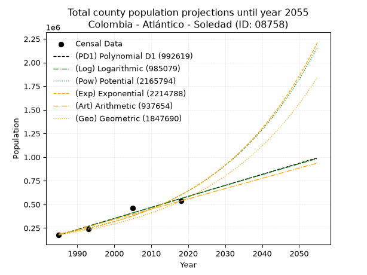
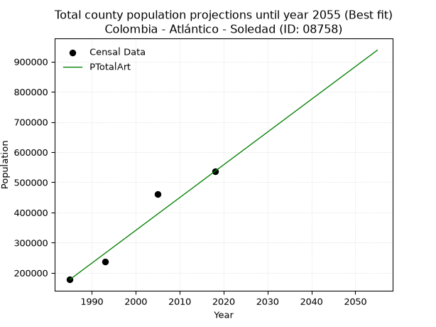
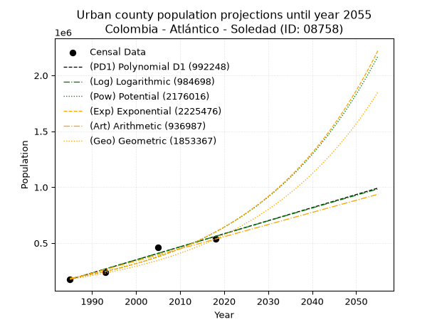
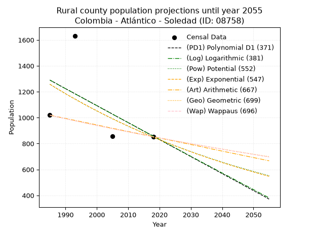
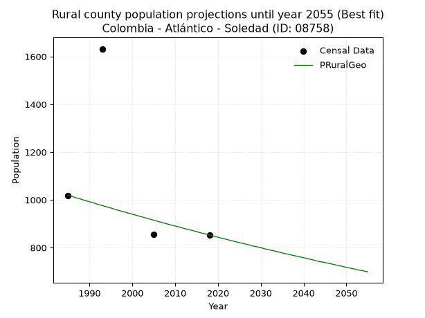

<div align="center">


</div>

# _“Population and Public Services Demand Projections (PPSD) until Year 2050 for Colombia - Atlántico - Soledad (ID: 08758)”_
Keywords: `population` `public-service` `projection` `lineal` `polynomial` `logarithmic` `potential` `exponential` `arithmetic` `geometric` `wappaus` `dane` `colombia` `south-america`

PPSD are analytical estimates used by governments and planners to anticipate future changes in population size, age distribution, and the resulting community needs for utilities, healthcare, education, and infrastructure as sizing future water treatment facilities, electrical grids, and road networks based on spatial growth.

> **General running parameters**: • app_version: _v20260806_. • Python version: _3.14.7_. • Pandas version: _3.0.5_. • NumPy version: _2.5.1_. • Creates, save and include plots into reports (create_plot): _True_. • Projection until year: _2050_. • Process polynomial degree 2 and up: _False_. • Process Wappaus: _True_. • Process Wappaus: _True_. • Set negative values to zero: _True_. • Set infinite values to zero: _True_. • Drop dataset notes: _True_. 
<div align="center">

Dynamic map: [:earth_americas:Google](http://maps.google.com/maps?q=10.90992087,-74.7860537) [:earth_americas:OSM](https://www.openstreetmap.org/#map=18/10.90992087/-74.7860537&layers=P) [:earth_americas:Bing](https://www.bing.com/maps?cp=10.90992087~-74.7860537&lvl=18) [:earth_americas:Apple](https://maps.apple.com/frame?center=10.90992087%2C-74.7860537&span=0.003%2C0.006)

</div>


<div align="center">

```geojson
{
  "type": "Feature",
  "geometry": {
    "type": "Point", 
    "coordinates": [-74.7860537, 10.90992087]
  }, 
  "properties": {
    "Name": "Colombia - Atlántico - Soledad (ID: 08758)"
  }
}
```

</div>


## 0. Census Data (4 records)

Census data are official statistics collected by a government about the people and housing in a country. They usually include counts of total population, age, sex, race, income, education, and jobs.

📅Global census file: [Population.xlsx](../data/Population.xlsx)

| Source   |   Year |   CountryID | CountryName   |   StateID | StateName   |   CountyID | CountyName   |   PTotal |   PUrban |   PRural |
|:---------|-------:|------------:|:--------------|----------:|:------------|-----------:|:-------------|---------:|---------:|---------:|
| DANE     |   1985 |          57 | Colombia      |        08 | Atlántico   |      08758 | Soledad      |   177738 |   176719 |     1019 |
| DANE     |   1993 |          57 | Colombia      |        08 | Atlántico   |      08758 | Soledad      |   238153 |   236521 |     1632 |
| DANE     |   2005 |          57 | Colombia      |        08 | Atlántico   |      08758 | Soledad      |   461851 |   460996 |      855 |
| DANE     |   2018 |          57 | Colombia      |        08 | Atlántico   |      08758 | Soledad      |   535984 |   535131 |      853 |

> 🔥Some records has specific notes about the registered values or the corresponding urban or rural distribution.

## 1. Total

### 1.1. Coefficients and Parameters

* (PD1) Polynomial Deg 1: 11674.659975913226, -22998807.11682043 (lineal)
* (Log) Logarithmic: 23374353.13396457, -177315213.98157525
* (Pow) Potential: 70.76904018574622, -228.10889606161808
* (Exp) Exponential: 0.03533824966959059, 6.40946897822527e-26
* (Art) Arithmetic: Year diff. 2018 - 1985 = 33, Population diff. 535984 - 177738 = 358246, Annual growth = 10855.939393939394
* (Geo) Geometric: Year diff. 2018 - 1985 = 33, Population diff. 535984 - 177738 = 358246, Annual growth % = 0.0340139792473837
* (Wap) Wappaus: i = 3.042063827075358, Condition values only valid for < 200)

<sub>
Wappaus condition values: ['0.00', '3.04', '6.08', '9.13', '12.17', '15.21', '18.25', '21.29', '24.34', '27.38', '30.42', '33.46', '36.50', '39.55', '42.59', '45.63', '48.67', '51.72', '54.76', '57.80', '60.84', '63.88', '66.93', '69.97', '73.01', '76.05', '79.09', '82.14', '85.18', '88.22', '91.26', '94.30', '97.35', '100.39', '103.43', '106.47', '109.51', '112.56', '115.60', '118.64', '121.68', '124.72', '127.77', '130.81', '133.85', '136.89', '139.93', '142.98', '146.02', '149.06', '152.10', '155.15', '158.19', '161.23', '164.27', '167.31', '170.36', '173.40', '176.44', '179.48', '182.52', '185.57', '188.61', '191.65', '194.69', '197.73']
</sub>


### 1.2. Projected Dataset

|   Year |   CountyID |   PTotalPD1 |   PTotalLog |        PTotalPow |        PTotalExp |   PTotalArt |        PTotalGeo |        PTotalWap |
|-------:|-----------:|------------:|------------:|-----------------:|-----------------:|------------:|-----------------:|-----------------:|
|   1985 |      08758 |      175393 |      174996 | 186402           | 186650           |      177738 | 177738           | 177738           |
|   1986 |      08758 |      187068 |      186768 | 193166           | 193364           |      188594 | 183784           | 183228           |
|   1987 |      08758 |      198742 |      198535 | 200171           | 200319           |      199450 | 190035           | 188891           |
|   1988 |      08758 |      210417 |      210296 | 207427           | 207524           |      210306 | 196499           | 194734           |
|   1989 |      08758 |      222092 |      222050 | 214942           | 214989           |      221162 | 203182           | 200767           |
|   1990 |      08758 |      233766 |      233799 | 222725           | 222722           |      232018 | 210093           | 206998           |
|   1991 |      08758 |      245441 |      245542 | 230787           | 230734           |      242874 | 217239           | 213437           |
|   1992 |      08758 |      257116 |      257279 | 239135           | 239033           |      253730 | 224629           | 220096           |
|   1993 |      08758 |      268790 |      269011 | 247781           | 247631           |      264586 | 232269           | 226986           |
|   1994 |      08758 |      280465 |      280736 | 256736           | 256538           |      275441 | 240170           | 234118           |
|   1995 |      08758 |      292140 |      292455 | 266009           | 265766           |      286297 | 248339           | 241506           |
|   1996 |      08758 |      303814 |      304169 | 275612           | 275326           |      297153 | 256786           | 249165           |
|   1997 |      08758 |      315489 |      315876 | 285556           | 285229           |      308009 | 265520           | 257108           |
|   1998 |      08758 |      327164 |      327578 | 295855           | 295489           |      318865 | 274551           | 265352           |
|   1999 |      08758 |      338838 |      339274 | 306519           | 306118           |      329721 | 283890           | 273915           |
|   2000 |      08758 |      350513 |      350964 | 317562           | 317129           |      340577 | 293546           | 282815           |
|   2001 |      08758 |      362187 |      362649 | 328997           | 328536           |      351433 | 303531           | 292074           |
|   2002 |      08758 |      373862 |      374327 | 340838           | 340353           |      362289 | 313855           | 301712           |
|   2003 |      08758 |      385537 |      386000 | 353098           | 352596           |      373145 | 324531           | 311754           |
|   2004 |      08758 |      397211 |      397666 | 365794           | 365279           |      384001 | 335569           | 322225           |
|   2005 |      08758 |      408886 |      409327 | 378939           | 378418           |      394857 | 346983           | 333155           |
|   2006 |      08758 |      420561 |      420982 | 392549           | 392030           |      405713 | 358786           | 344573           |
|   2007 |      08758 |      432235 |      432632 | 406641           | 406131           |      416569 | 370989           | 356513           |
|   2008 |      08758 |      443910 |      444275 | 421232           | 420740           |      427425 | 383608           | 369011           |
|   2009 |      08758 |      455585 |      455913 | 436339           | 435874           |      438281 | 396656           | 382109           |
|   2010 |      08758 |      467259 |      467545 | 451979           | 451552           |      449136 | 410148           | 395849           |
|   2011 |      08758 |      478934 |      479171 | 468172           | 467794           |      459992 | 424099           | 410281           |
|   2012 |      08758 |      490609 |      490791 | 484937           | 484621           |      470848 | 438524           | 425457           |
|   2013 |      08758 |      502283 |      502406 | 502293           | 502053           |      481704 | 453440           | 441438           |
|   2014 |      08758 |      513958 |      514015 | 520261           | 520112           |      492560 | 468863           | 458289           |
|   2015 |      08758 |      525633 |      525618 | 538862           | 538820           |      503416 | 484811           | 476083           |
|   2016 |      08758 |      537307 |      537215 | 558119           | 558202           |      514272 | 501302           | 494900           |
|   2017 |      08758 |      548982 |      548807 | 578054           | 578280           |      525128 | 518353           | 514833           |
|   2018 |      08758 |      560657 |      560392 | 598691           | 599081           |      535984 | 535984           | 535984           |
|   2019 |      08758 |      572331 |      571972 | 620053           | 620630           |      546840 | 554215           | 558467           |
|   2020 |      08758 |      584006 |      583547 | 642167           | 642954           |      557696 | 573066           | 582413           |
|   2021 |      08758 |      595681 |      595115 | 665058           | 666081           |      568552 | 592558           | 607968           |
|   2022 |      08758 |      607355 |      606678 | 688752           | 690040           |      579408 | 612714           | 635302           |
|   2023 |      08758 |      619030 |      618235 | 713279           | 714861           |      590264 | 633554           | 664606           |
|   2024 |      08758 |      630705 |      629787 | 738666           | 740574           |      601120 | 655104           | 696102           |
|   2025 |      08758 |      642379 |      641333 | 764944           | 767213           |      611976 | 677387           | 730044           |
|   2026 |      08758 |      654054 |      652873 | 792143           | 794810           |      622832 | 700427           | 766730           |
|   2027 |      08758 |      665729 |      664407 | 820294           | 823399           |      633687 | 724252           | 806506           |
|   2028 |      08758 |      677403 |      675936 | 849432           | 853017           |      644543 | 748886           | 849779           |
|   2029 |      08758 |      689078 |      687459 | 879589           | 883700           |      655399 | 774359           | 897033           |
|   2030 |      08758 |      700753 |      698976 | 910802           | 915486           |      666255 | 800698           | 948842           |
|   2031 |      08758 |      712427 |      710488 | 943106           | 948417           |      677111 | 827933           |      1.0059e+06  |
|   2032 |      08758 |      724102 |      721994 | 976539           | 982531           |      687967 | 856094           |      1.06904e+06 |
|   2033 |      08758 |      735777 |      733494 |      1.01114e+06 |      1.01787e+06 |      698823 | 885213           |      1.1393e+06  |
|   2034 |      08758 |      747451 |      744988 |      1.04695e+06 |      1.05449e+06 |      709679 | 915323           |      1.21796e+06 |
|   2035 |      08758 |      759126 |      756477 |      1.08401e+06 |      1.09242e+06 |      720535 | 946457           |      1.3066e+06  |
|   2036 |      08758 |      770801 |      767961 |      1.12236e+06 |      1.13171e+06 |      731391 | 978650           |      1.40727e+06 |
|   2037 |      08758 |      782475 |      779438 |      1.16204e+06 |      1.17242e+06 |      742247 |      1.01194e+06 |      1.52259e+06 |
|   2038 |      08758 |      794150 |      790911 |      1.20312e+06 |      1.21459e+06 |      753103 |      1.04636e+06 |      1.656e+06   |
|   2039 |      08758 |      805825 |      802377 |      1.24562e+06 |      1.25828e+06 |      763959 |      1.08195e+06 |      1.81213e+06 |
|   2040 |      08758 |      817499 |      813838 |      1.2896e+06  |      1.30354e+06 |      774815 |      1.11875e+06 |      1.99733e+06 |
|   2041 |      08758 |      829174 |      825293 |      1.33511e+06 |      1.35043e+06 |      785671 |      1.1568e+06  |      2.22053e+06 |
|   2042 |      08758 |      840849 |      836743 |      1.3822e+06  |      1.399e+06   |      796527 |      1.19615e+06 |      2.49478e+06 |
|   2043 |      08758 |      852523 |      848187 |      1.43093e+06 |      1.44932e+06 |      807382 |      1.23684e+06 |      2.83985e+06 |
|   2044 |      08758 |      864198 |      859625 |      1.48136e+06 |      1.50146e+06 |      818238 |      1.27891e+06 |      3.28724e+06 |
|   2045 |      08758 |      875873 |      871058 |      1.53353e+06 |      1.55546e+06 |      829094 |      1.32241e+06 |      3.89038e+06 |
|   2046 |      08758 |      887547 |      882485 |      1.58751e+06 |      1.61141e+06 |      839950 |      1.36739e+06 |      4.74776e+06 |
|   2047 |      08758 |      899222 |      893907 |      1.64337e+06 |      1.66938e+06 |      850806 |      1.4139e+06  |      6.06304e+06 |
|   2048 |      08758 |      910897 |      905323 |      1.70116e+06 |      1.72942e+06 |      861662 |      1.46199e+06 |      8.33668e+06 |
|   2049 |      08758 |      922571 |      916733 |      1.76096e+06 |      1.79163e+06 |      872518 |      1.51172e+06 |      1.32164e+07 |
|   2050 |      08758 |      934246 |      928138 |      1.82283e+06 |      1.85608e+06 |      883374 |      1.56314e+06 |      3.11991e+07 |
<div align="center">

</img>

</div>


### 1.3. Best fit with absolute error and relative error (%)

Relative error puts that difference into context by dividing the absolute error by the true value, creating a unitless ratio or percentage that shows the scale of the mistake.

Absolute and relative error

|   Year | Source   |   CountryID | CountryName   |   StateID | StateName   |   CountyID_x | CountyName   |   PTotal |   PUrban |   PRural |   CountyID_y |   PTotalPD1 |   PTotalLog |   PTotalPow |   PTotalExp |   PTotalArt |   PTotalGeo |   PTotalWap |   PTotalPD1AbsError |   PTotalLogAbsError |   PTotalPowAbsError |   PTotalExpAbsError |   PTotalArtAbsError |   PTotalGeoAbsError |   PTotalWapAbsError |   PTotalPD1RelError |   PTotalLogRelError |   PTotalPowRelError |   PTotalExpRelError |   PTotalArtRelError |   PTotalGeoRelError |   PTotalWapRelError |
|-------:|:---------|------------:|:--------------|----------:|:------------|-------------:|:-------------|---------:|---------:|---------:|-------------:|------------:|------------:|------------:|------------:|------------:|------------:|------------:|--------------------:|--------------------:|--------------------:|--------------------:|--------------------:|--------------------:|--------------------:|--------------------:|--------------------:|--------------------:|--------------------:|--------------------:|--------------------:|--------------------:|
|   1985 | DANE     |          57 | Colombia      |        08 | Atlántico   |        08758 | Soledad      |   177738 |   176719 |     1019 |        08758 |      175393 |      174996 |      186402 |      186650 |      177738 |      177738 |      177738 |                2345 |                2742 |                8664 |                8912 |                   0 |                   0 |                   0 |             1.31936 |             1.54272 |             4.87459 |             5.01412 |              0      |             0       |              0      |
|   1993 | DANE     |          57 | Colombia      |        08 | Atlántico   |        08758 | Soledad      |   238153 |   236521 |     1632 |        08758 |      268790 |      269011 |      247781 |      247631 |      264586 |      232269 |      226986 |               30637 |               30858 |                9628 |                9478 |               26433 |                5884 |               11167 |            12.8644  |            12.9572  |             4.04278 |             3.97979 |             11.0992 |             2.47068 |              4.689  |
|   2005 | DANE     |          57 | Colombia      |        08 | Atlántico   |        08758 | Soledad      |   461851 |   460996 |      855 |        08758 |      408886 |      409327 |      378939 |      378418 |      394857 |      346983 |      333155 |               52965 |               52524 |               82912 |               83433 |               66994 |              114868 |              128696 |            11.468   |            11.3725  |            17.9521  |            18.0649  |             14.5055 |            24.8712  |             27.8653 |
|   2018 | DANE     |          57 | Colombia      |        08 | Atlántico   |        08758 | Soledad      |   535984 |   535131 |      853 |        08758 |      560657 |      560392 |      598691 |      599081 |      535984 |      535984 |      535984 |               24673 |               24408 |               62707 |               63097 |                   0 |                   0 |                   0 |             4.60331 |             4.55387 |            11.6994  |            11.7722  |              0      |             0       |              0      |

Relative error mean

| Method    |   RelError | Best   |
|:----------|-----------:|:-------|
| PTotalPD1 |    7.56377 |        |
| PTotalLog |    7.60658 |        |
| PTotalPow |    9.64222 |        |
| PTotalExp |    9.70775 |        |
| PTotalArt |    6.40118 | True   |
| PTotalGeo |    6.83548 |        |
| PTotalWap |    8.13857 |        |

💙Best method: _**PTotalArt**_
<div align="center">

</img>

</div>


### 1.4. Fresh water supply demand in liters per capita per day (lpcd)

The fresh water supply demand typically ranges from 100 to 300 liters per capita per day (lpcd) for standard domestic and municipal planning, though absolute survival minimums set by the World Health Organization are as low as 7.5 to 20 liters per day, and total consumption in high-income nations can exceed 400 liters.

> `CZ`: Level in meters above the sea level (masl).<br> `WS`: Fresh water supply demand in liters per capita per day (lpcd or l/h/d).<br> `WSAll`: Zonal fresh water supply demand in liters per second (l/s).<br> `A`: Zonal area in square meters.

Reference values (RAS Colombia)

|    CZ |   WS |
|------:|-----:|
|  1000 |  120 |
|  2000 |  130 |
| 99999 |  140 |

County shapefile geometry properties and water supply values

|   CountyID |     ATotal |   CZTotal |   WSTotal |
|-----------:|-----------:|----------:|----------:|
|      08758 | 5.9128e+07 |    26.923 |       120 |

Projected values for best method: PTotalArt

|   CountyID |   Year |   PTotalArt |   WSTotal |   WSTotalAll |
|-----------:|-------:|------------:|----------:|-------------:|
|      08758 |   1985 |      177738 |       120 |      246.858 |
|      08758 |   1986 |      188594 |       120 |      261.936 |
|      08758 |   1987 |      199450 |       120 |      277.014 |
|      08758 |   1988 |      210306 |       120 |      292.092 |
|      08758 |   1989 |      221162 |       120 |      307.169 |
|      08758 |   1990 |      232018 |       120 |      322.247 |
|      08758 |   1991 |      242874 |       120 |      337.325 |
|      08758 |   1992 |      253730 |       120 |      352.403 |
|      08758 |   1993 |      264586 |       120 |      367.481 |
|      08758 |   1994 |      275441 |       120 |      382.557 |
|      08758 |   1995 |      286297 |       120 |      397.635 |
|      08758 |   1996 |      297153 |       120 |      412.712 |
|      08758 |   1997 |      308009 |       120 |      427.79  |
|      08758 |   1998 |      318865 |       120 |      442.868 |
|      08758 |   1999 |      329721 |       120 |      457.946 |
|      08758 |   2000 |      340577 |       120 |      473.024 |
|      08758 |   2001 |      351433 |       120 |      488.101 |
|      08758 |   2002 |      362289 |       120 |      503.179 |
|      08758 |   2003 |      373145 |       120 |      518.257 |
|      08758 |   2004 |      384001 |       120 |      533.335 |
|      08758 |   2005 |      394857 |       120 |      548.413 |
|      08758 |   2006 |      405713 |       120 |      563.49  |
|      08758 |   2007 |      416569 |       120 |      578.568 |
|      08758 |   2008 |      427425 |       120 |      593.646 |
|      08758 |   2009 |      438281 |       120 |      608.724 |
|      08758 |   2010 |      449136 |       120 |      623.8   |
|      08758 |   2011 |      459992 |       120 |      638.878 |
|      08758 |   2012 |      470848 |       120 |      653.956 |
|      08758 |   2013 |      481704 |       120 |      669.033 |
|      08758 |   2014 |      492560 |       120 |      684.111 |
|      08758 |   2015 |      503416 |       120 |      699.189 |
|      08758 |   2016 |      514272 |       120 |      714.267 |
|      08758 |   2017 |      525128 |       120 |      729.344 |
|      08758 |   2018 |      535984 |       120 |      744.422 |
|      08758 |   2019 |      546840 |       120 |      759.5   |
|      08758 |   2020 |      557696 |       120 |      774.578 |
|      08758 |   2021 |      568552 |       120 |      789.656 |
|      08758 |   2022 |      579408 |       120 |      804.733 |
|      08758 |   2023 |      590264 |       120 |      819.811 |
|      08758 |   2024 |      601120 |       120 |      834.889 |
|      08758 |   2025 |      611976 |       120 |      849.967 |
|      08758 |   2026 |      622832 |       120 |      865.044 |
|      08758 |   2027 |      633687 |       120 |      880.121 |
|      08758 |   2028 |      644543 |       120 |      895.199 |
|      08758 |   2029 |      655399 |       120 |      910.276 |
|      08758 |   2030 |      666255 |       120 |      925.354 |
|      08758 |   2031 |      677111 |       120 |      940.432 |
|      08758 |   2032 |      687967 |       120 |      955.51  |
|      08758 |   2033 |      698823 |       120 |      970.587 |
|      08758 |   2034 |      709679 |       120 |      985.665 |
|      08758 |   2035 |      720535 |       120 |     1000.74  |
|      08758 |   2036 |      731391 |       120 |     1015.82  |
|      08758 |   2037 |      742247 |       120 |     1030.9   |
|      08758 |   2038 |      753103 |       120 |     1045.98  |
|      08758 |   2039 |      763959 |       120 |     1061.05  |
|      08758 |   2040 |      774815 |       120 |     1076.13  |
|      08758 |   2041 |      785671 |       120 |     1091.21  |
|      08758 |   2042 |      796527 |       120 |     1106.29  |
|      08758 |   2043 |      807382 |       120 |     1121.36  |
|      08758 |   2044 |      818238 |       120 |     1136.44  |
|      08758 |   2045 |      829094 |       120 |     1151.52  |
|      08758 |   2046 |      839950 |       120 |     1166.6   |
|      08758 |   2047 |      850806 |       120 |     1181.67  |
|      08758 |   2048 |      861662 |       120 |     1196.75  |
|      08758 |   2049 |      872518 |       120 |     1211.83  |
|      08758 |   2050 |      883374 |       120 |     1226.91  |

## 2. Urban

### 2.1. Coefficients and Parameters

* (PD1) Polynomial Deg 1: 11687.778803693236, -23026137.802087396 (lineal)
* (Log) Logarithmic: 23400575.996367555, -177515623.9188372
* (Pow) Potential: 71.09196451854754, -229.17663873391115
* (Exp) Exponential: 0.035499571260885585, 4.623143998507362e-26
* (Art) Arithmetic: Year diff. 2018 - 1985 = 33, Population diff. 535131 - 176719 = 358412, Annual growth = 10860.969696969696
* (Geo) Geometric: Year diff. 2018 - 1985 = 33, Population diff. 535131 - 176719 = 358412, Annual growth % = 0.034144239444031665
* (Wap) Wappaus: i = 3.051477051898489, Condition values only valid for < 200)

<sub>
Wappaus condition values: ['0.00', '3.05', '6.10', '9.15', '12.21', '15.26', '18.31', '21.36', '24.41', '27.46', '30.51', '33.57', '36.62', '39.67', '42.72', '45.77', '48.82', '51.88', '54.93', '57.98', '61.03', '64.08', '67.13', '70.18', '73.24', '76.29', '79.34', '82.39', '85.44', '88.49', '91.54', '94.60', '97.65', '100.70', '103.75', '106.80', '109.85', '112.90', '115.96', '119.01', '122.06', '125.11', '128.16', '131.21', '134.26', '137.32', '140.37', '143.42', '146.47', '149.52', '152.57', '155.63', '158.68', '161.73', '164.78', '167.83', '170.88', '173.93', '176.99', '180.04', '183.09', '186.14', '189.19', '192.24', '195.29', '198.35']
</sub>


### 2.2. Projected Dataset

|   Year |   CountyID |   PUrbanPD1 |   PUrbanLog |        PUrbanPow |        PUrbanExp |   PUrbanArt |        PUrbanGeo |        PUrbanWap |
|-------:|-----------:|------------:|------------:|-----------------:|-----------------:|------------:|-----------------:|-----------------:|
|   1985 |      08758 |      174103 |      173706 | 185197           | 185445           |      176719 | 176719           | 176719           |
|   1986 |      08758 |      185791 |      185492 | 191948           | 192146           |      187580 | 182753           | 182195           |
|   1987 |      08758 |      197479 |      197271 | 198942           | 199090           |      198441 | 188993           | 187844           |
|   1988 |      08758 |      209166 |      209045 | 206187           | 206284           |      209302 | 195446           | 193673           |
|   1989 |      08758 |      220854 |      220813 | 213692           | 213739           |      220163 | 202119           | 199691           |
|   1990 |      08758 |      232542 |      232575 | 221466           | 221463           |      231024 | 209020           | 205908           |
|   1991 |      08758 |      244230 |      244331 | 229519           | 229466           |      241885 | 216157           | 212335           |
|   1992 |      08758 |      255918 |      256082 | 237860           | 237758           |      252746 | 223538           | 218980           |
|   1993 |      08758 |      267605 |      267826 | 246500           | 246350           |      263607 | 231170           | 225857           |
|   1994 |      08758 |      279293 |      279564 | 255449           | 255252           |      274468 | 239064           | 232977           |
|   1995 |      08758 |      290981 |      291297 | 264719           | 264476           |      285329 | 247226           | 240353           |
|   1996 |      08758 |      302669 |      303024 | 274320           | 274034           |      296190 | 255668           | 248000           |
|   1997 |      08758 |      314356 |      314745 | 284264           | 283937           |      307051 | 264397           | 255933           |
|   1998 |      08758 |      326044 |      326459 | 294563           | 294197           |      317912 | 273425           | 264167           |
|   1999 |      08758 |      337732 |      338169 | 305230           | 304829           |      328773 | 282761           | 272721           |
|   2000 |      08758 |      349420 |      349872 | 316278           | 315844           |      339634 | 292415           | 281613           |
|   2001 |      08758 |      361108 |      361569 | 327719           | 327258           |      350495 | 302400           | 290865           |
|   2002 |      08758 |      372795 |      373261 | 339569           | 339084           |      361355 | 312725           | 300497           |
|   2003 |      08758 |      384483 |      384946 | 351841           | 351338           |      372216 | 323402           | 310535           |
|   2004 |      08758 |      396171 |      396626 | 364550           | 364034           |      383077 | 334445           | 321004           |
|   2005 |      08758 |      407859 |      408300 | 377711           | 377189           |      393938 | 345864           | 331933           |
|   2006 |      08758 |      419546 |      419968 | 391340           | 390820           |      404799 | 357673           | 343353           |
|   2007 |      08758 |      431234 |      431631 | 405454           | 404943           |      415660 | 369886           | 355297           |
|   2008 |      08758 |      442922 |      443287 | 420070           | 419577           |      426521 | 382515           | 367802           |
|   2009 |      08758 |      454610 |      454938 | 435205           | 434739           |      437382 | 395576           | 380910           |
|   2010 |      08758 |      466298 |      466583 | 450877           | 450449           |      448243 | 409083           | 394664           |
|   2011 |      08758 |      477985 |      478222 | 467105           | 466727           |      459104 | 423051           | 409114           |
|   2012 |      08758 |      489673 |      489856 | 483909           | 483593           |      469965 | 437495           | 424314           |
|   2013 |      08758 |      501361 |      501483 | 501309           | 501069           |      480826 | 452433           | 440324           |
|   2014 |      08758 |      513049 |      513105 | 519325           | 519176           |      491687 | 467881           | 457210           |
|   2015 |      08758 |      524736 |      524721 | 537980           | 537938           |      502548 | 483857           | 475046           |
|   2016 |      08758 |      536424 |      536331 | 557294           | 557378           |      513409 | 500378           | 493915           |
|   2017 |      08758 |      548112 |      547936 | 577292           | 577520           |      524270 | 517463           | 513908           |
|   2018 |      08758 |      559800 |      559535 | 597997           | 598390           |      535131 | 535131           | 535131           |
|   2019 |      08758 |      571488 |      571128 | 619434           | 620014           |      545992 | 553403           | 557699           |
|   2020 |      08758 |      583175 |      582715 | 641628           | 642419           |      556853 | 572298           | 581745           |
|   2021 |      08758 |      594863 |      594297 | 664606           | 665635           |      567714 | 591839           | 607420           |
|   2022 |      08758 |      606551 |      605873 | 688395           | 689689           |      578575 | 612047           | 634893           |
|   2023 |      08758 |      618239 |      617443 | 713023           | 714612           |      589436 | 632945           | 664361           |
|   2024 |      08758 |      629926 |      629007 | 738519           | 740436           |      600297 | 654556           | 696049           |
|   2025 |      08758 |      641614 |      640566 | 764913           | 767194           |      611158 | 676905           | 730219           |
|   2026 |      08758 |      653302 |      652119 | 792237           | 794918           |      622019 | 700018           | 767174           |
|   2027 |      08758 |      664990 |      663666 | 820523           | 823644           |      632880 | 723919           | 807268           |
|   2028 |      08758 |      676678 |      675208 | 849804           | 853408           |      643741 | 748637           | 850919           |
|   2029 |      08758 |      688365 |      686744 | 880115           | 884248           |      654602 | 774199           | 898623           |
|   2030 |      08758 |      700053 |      698274 | 911491           | 916202           |      665463 | 800633           | 950971           |
|   2031 |      08758 |      711741 |      709798 | 943969           | 949311           |      676324 | 827970           |      1.00868e+06 |
|   2032 |      08758 |      723429 |      721317 | 977588           | 983617           |      687185 | 856240           |      1.07261e+06 |
|   2033 |      08758 |      735117 |      732830 |      1.01239e+06 |      1.01916e+06 |      698046 | 885476           |      1.14383e+06 |
|   2034 |      08758 |      746804 |      744338 |      1.04841e+06 |      1.05599e+06 |      708907 | 915710           |      1.22366e+06 |
|   2035 |      08758 |      758492 |      755840 |      1.08569e+06 |      1.09415e+06 |      719767 | 946976           |      1.31376e+06 |
|   2036 |      08758 |      770180 |      767336 |      1.12428e+06 |      1.13369e+06 |      730628 | 979310           |      1.41625e+06 |
|   2037 |      08758 |      781868 |      778827 |      1.16422e+06 |      1.17466e+06 |      741489 |      1.01275e+06 |      1.53388e+06 |
|   2038 |      08758 |      793555 |      790312 |      1.20556e+06 |      1.21711e+06 |      752350 |      1.04733e+06 |      1.67027e+06 |
|   2039 |      08758 |      805243 |      801791 |      1.24834e+06 |      1.26109e+06 |      763211 |      1.08309e+06 |      1.8303e+06  |
|   2040 |      08758 |      816931 |      813265 |      1.29262e+06 |      1.30666e+06 |      774072 |      1.12007e+06 |      2.02068e+06 |
|   2041 |      08758 |      828619 |      824733 |      1.33845e+06 |      1.35388e+06 |      784933 |      1.15831e+06 |      2.25097e+06 |
|   2042 |      08758 |      840307 |      836195 |      1.38588e+06 |      1.40281e+06 |      795794 |      1.19786e+06 |      2.53517e+06 |
|   2043 |      08758 |      851994 |      847652 |      1.43497e+06 |      1.4535e+06  |      806655 |      1.23876e+06 |      2.89474e+06 |
|   2044 |      08758 |      863682 |      859103 |      1.48577e+06 |      1.50603e+06 |      817516 |      1.28106e+06 |      3.36424e+06 |
|   2045 |      08758 |      875370 |      870549 |      1.53834e+06 |      1.56045e+06 |      828377 |      1.3248e+06  |      4.00316e+06 |
|   2046 |      08758 |      887058 |      881989 |      1.59275e+06 |      1.61684e+06 |      839238 |      1.37003e+06 |      4.92343e+06 |
|   2047 |      08758 |      898745 |      893423 |      1.64905e+06 |      1.67527e+06 |      850099 |      1.41681e+06 |      6.36333e+06 |
|   2048 |      08758 |      910433 |      904852 |      1.70731e+06 |      1.73581e+06 |      860960 |      1.46519e+06 |      8.9361e+06  |
|   2049 |      08758 |      922121 |      916275 |      1.7676e+06  |      1.79854e+06 |      871821 |      1.51522e+06 |      1.48457e+07 |
|   2050 |      08758 |      933809 |      927693 |      1.82999e+06 |      1.86353e+06 |      882682 |      1.56695e+06 |      4.25609e+07 |
<div align="center">

</img>

</div>


### 2.3. Best fit with absolute error and relative error (%)

Relative error puts that difference into context by dividing the absolute error by the true value, creating a unitless ratio or percentage that shows the scale of the mistake.

Absolute and relative error

|   Year | Source   |   CountryID | CountryName   |   StateID | StateName   |   CountyID_x | CountyName   |   PTotal |   PUrban |   PRural |   CountyID_y |   PUrbanPD1 |   PUrbanLog |   PUrbanPow |   PUrbanExp |   PUrbanArt |   PUrbanGeo |   PUrbanWap |   PUrbanPD1AbsError |   PUrbanLogAbsError |   PUrbanPowAbsError |   PUrbanExpAbsError |   PUrbanArtAbsError |   PUrbanGeoAbsError |   PUrbanWapAbsError |   PUrbanPD1RelError |   PUrbanLogRelError |   PUrbanPowRelError |   PUrbanExpRelError |   PUrbanArtRelError |   PUrbanGeoRelError |   PUrbanWapRelError |
|-------:|:---------|------------:|:--------------|----------:|:------------|-------------:|:-------------|---------:|---------:|---------:|-------------:|------------:|------------:|------------:|------------:|------------:|------------:|------------:|--------------------:|--------------------:|--------------------:|--------------------:|--------------------:|--------------------:|--------------------:|--------------------:|--------------------:|--------------------:|--------------------:|--------------------:|--------------------:|--------------------:|
|   1985 | DANE     |          57 | Colombia      |        08 | Atlántico   |        08758 | Soledad      |   177738 |   176719 |     1019 |        08758 |      174103 |      173706 |      185197 |      185445 |      176719 |      176719 |      176719 |                2616 |                3013 |                8478 |                8726 |                   0 |                   0 |                   0 |             1.48032 |             1.70497 |             4.79745 |             4.93778 |              0      |             0       |             0       |
|   1993 | DANE     |          57 | Colombia      |        08 | Atlántico   |        08758 | Soledad      |   238153 |   236521 |     1632 |        08758 |      267605 |      267826 |      246500 |      246350 |      263607 |      231170 |      225857 |               31084 |               31305 |                9979 |                9829 |               27086 |                5351 |               10664 |            13.1422  |            13.2356  |             4.21908 |             4.15566 |             11.4518 |             2.26238 |             4.50869 |
|   2005 | DANE     |          57 | Colombia      |        08 | Atlántico   |        08758 | Soledad      |   461851 |   460996 |      855 |        08758 |      407859 |      408300 |      377711 |      377189 |      393938 |      345864 |      331933 |               53137 |               52696 |               83285 |               83807 |               67058 |              115132 |              129063 |            11.5266  |            11.4309  |            18.0663  |            18.1796  |             14.5463 |            24.9746  |            27.9966  |
|   2018 | DANE     |          57 | Colombia      |        08 | Atlántico   |        08758 | Soledad      |   535984 |   535131 |      853 |        08758 |      559800 |      559535 |      597997 |      598390 |      535131 |      535131 |      535131 |               24669 |               24404 |               62866 |               63259 |                   0 |                   0 |                   0 |             4.6099  |             4.56038 |            11.7478  |            11.8212  |              0      |             0       |             0       |

Relative error mean

| Method    |   RelError | Best   |
|:----------|-----------:|:-------|
| PUrbanPD1 |    7.68974 |        |
| PUrbanLog |    7.73296 |        |
| PUrbanPow |    9.70765 |        |
| PUrbanExp |    9.77355 |        |
| PUrbanArt |    6.49954 | True   |
| PUrbanGeo |    6.80925 |        |
| PUrbanWap |    8.12631 |        |

💙Best method: _**PUrbanArt**_
<div align="center">

</img>

</div>


### 2.4. Fresh water supply demand in liters per capita per day (lpcd)

The fresh water supply demand typically ranges from 100 to 300 liters per capita per day (lpcd) for standard domestic and municipal planning, though absolute survival minimums set by the World Health Organization are as low as 7.5 to 20 liters per day, and total consumption in high-income nations can exceed 400 liters.

> `CZ`: Level in meters above the sea level (masl).<br> `WS`: Fresh water supply demand in liters per capita per day (lpcd or l/h/d).<br> `WSAll`: Zonal fresh water supply demand in liters per second (l/s).<br> `A`: Zonal area in square meters.

Reference values (RAS Colombia)

|    CZ |   WS |
|------:|-----:|
|  1000 |  120 |
|  2000 |  130 |
| 99999 |  140 |

County shapefile geometry properties and water supply values

|   CountyID |      AUrban |   CZUrban |   WSUrban |
|-----------:|------------:|----------:|----------:|
|      08758 | 3.73535e+07 |    30.545 |       120 |

Projected values for best method: PUrbanArt

|   CountyID |   Year |   PUrbanArt |   WSUrban |   WSUrbanAll |
|-----------:|-------:|------------:|----------:|-------------:|
|      08758 |   1985 |      176719 |       120 |      245.443 |
|      08758 |   1986 |      187580 |       120 |      260.528 |
|      08758 |   1987 |      198441 |       120 |      275.613 |
|      08758 |   1988 |      209302 |       120 |      290.697 |
|      08758 |   1989 |      220163 |       120 |      305.782 |
|      08758 |   1990 |      231024 |       120 |      320.867 |
|      08758 |   1991 |      241885 |       120 |      335.951 |
|      08758 |   1992 |      252746 |       120 |      351.036 |
|      08758 |   1993 |      263607 |       120 |      366.121 |
|      08758 |   1994 |      274468 |       120 |      381.206 |
|      08758 |   1995 |      285329 |       120 |      396.29  |
|      08758 |   1996 |      296190 |       120 |      411.375 |
|      08758 |   1997 |      307051 |       120 |      426.46  |
|      08758 |   1998 |      317912 |       120 |      441.544 |
|      08758 |   1999 |      328773 |       120 |      456.629 |
|      08758 |   2000 |      339634 |       120 |      471.714 |
|      08758 |   2001 |      350495 |       120 |      486.799 |
|      08758 |   2002 |      361355 |       120 |      501.882 |
|      08758 |   2003 |      372216 |       120 |      516.967 |
|      08758 |   2004 |      383077 |       120 |      532.051 |
|      08758 |   2005 |      393938 |       120 |      547.136 |
|      08758 |   2006 |      404799 |       120 |      562.221 |
|      08758 |   2007 |      415660 |       120 |      577.306 |
|      08758 |   2008 |      426521 |       120 |      592.39  |
|      08758 |   2009 |      437382 |       120 |      607.475 |
|      08758 |   2010 |      448243 |       120 |      622.56  |
|      08758 |   2011 |      459104 |       120 |      637.644 |
|      08758 |   2012 |      469965 |       120 |      652.729 |
|      08758 |   2013 |      480826 |       120 |      667.814 |
|      08758 |   2014 |      491687 |       120 |      682.899 |
|      08758 |   2015 |      502548 |       120 |      697.983 |
|      08758 |   2016 |      513409 |       120 |      713.068 |
|      08758 |   2017 |      524270 |       120 |      728.153 |
|      08758 |   2018 |      535131 |       120 |      743.237 |
|      08758 |   2019 |      545992 |       120 |      758.322 |
|      08758 |   2020 |      556853 |       120 |      773.407 |
|      08758 |   2021 |      567714 |       120 |      788.492 |
|      08758 |   2022 |      578575 |       120 |      803.576 |
|      08758 |   2023 |      589436 |       120 |      818.661 |
|      08758 |   2024 |      600297 |       120 |      833.746 |
|      08758 |   2025 |      611158 |       120 |      848.831 |
|      08758 |   2026 |      622019 |       120 |      863.915 |
|      08758 |   2027 |      632880 |       120 |      879     |
|      08758 |   2028 |      643741 |       120 |      894.085 |
|      08758 |   2029 |      654602 |       120 |      909.169 |
|      08758 |   2030 |      665463 |       120 |      924.254 |
|      08758 |   2031 |      676324 |       120 |      939.339 |
|      08758 |   2032 |      687185 |       120 |      954.424 |
|      08758 |   2033 |      698046 |       120 |      969.508 |
|      08758 |   2034 |      708907 |       120 |      984.593 |
|      08758 |   2035 |      719767 |       120 |      999.676 |
|      08758 |   2036 |      730628 |       120 |     1014.76  |
|      08758 |   2037 |      741489 |       120 |     1029.85  |
|      08758 |   2038 |      752350 |       120 |     1044.93  |
|      08758 |   2039 |      763211 |       120 |     1060.02  |
|      08758 |   2040 |      774072 |       120 |     1075.1   |
|      08758 |   2041 |      784933 |       120 |     1090.18  |
|      08758 |   2042 |      795794 |       120 |     1105.27  |
|      08758 |   2043 |      806655 |       120 |     1120.35  |
|      08758 |   2044 |      817516 |       120 |     1135.44  |
|      08758 |   2045 |      828377 |       120 |     1150.52  |
|      08758 |   2046 |      839238 |       120 |     1165.61  |
|      08758 |   2047 |      850099 |       120 |     1180.69  |
|      08758 |   2048 |      860960 |       120 |     1195.78  |
|      08758 |   2049 |      871821 |       120 |     1210.86  |
|      08758 |   2050 |      882682 |       120 |     1225.95  |

## 3. Rural

### 3.1. Coefficients and Parameters

* (PD1) Polynomial Deg 1: -13.118827780007978, 27330.68526696096 (lineal)
* (Log) Logarithmic: -26222.86240300064, 200409.93726203917
* (Pow) Potential: -23.772698000046876, 81.49643132323592
* (Exp) Exponential: -0.011889854586541942, 22368649823199.637
* (Art) Arithmetic: Year diff. 2018 - 1985 = 33, Population diff. 853 - 1019 = -166, Annual growth = -5.03030303030303
* (Geo) Geometric: Year diff. 2018 - 1985 = 33, Population diff. 853 - 1019 = -166, Annual growth % = -0.005373917224853364
* (Wap) Wappaus: i = -0.5374255374255374, Condition values only valid for < 200)

<sub>
Wappaus condition values: ['-0.00', '-0.54', '-1.07', '-1.61', '-2.15', '-2.69', '-3.22', '-3.76', '-4.30', '-4.84', '-5.37', '-5.91', '-6.45', '-6.99', '-7.52', '-8.06', '-8.60', '-9.14', '-9.67', '-10.21', '-10.75', '-11.29', '-11.82', '-12.36', '-12.90', '-13.44', '-13.97', '-14.51', '-15.05', '-15.59', '-16.12', '-16.66', '-17.20', '-17.74', '-18.27', '-18.81', '-19.35', '-19.88', '-20.42', '-20.96', '-21.50', '-22.03', '-22.57', '-23.11', '-23.65', '-24.18', '-24.72', '-25.26', '-25.80', '-26.33', '-26.87', '-27.41', '-27.95', '-28.48', '-29.02', '-29.56', '-30.10', '-30.63', '-31.17', '-31.71', '-32.25', '-32.78', '-33.32', '-33.86', '-34.40', '-34.93']
</sub>


### 3.2. Projected Dataset

|   Year |   CountyID |   PRuralPD1 |   PRuralLog |   PRuralPow |   PRuralExp |   PRuralArt |   PRuralGeo |   PRuralWap |
|-------:|-----------:|------------:|------------:|------------:|------------:|------------:|------------:|------------:|
|   1985 |      08758 |        1290 |        1290 |        1258 |        1258 |        1019 |        1019 |        1019 |
|   1986 |      08758 |        1277 |        1277 |        1243 |        1243 |        1014 |        1014 |        1014 |
|   1987 |      08758 |        1264 |        1264 |        1228 |        1228 |        1009 |        1008 |        1008 |
|   1988 |      08758 |        1250 |        1250 |        1214 |        1214 |        1004 |        1003 |        1003 |
|   1989 |      08758 |        1237 |        1237 |        1199 |        1200 |         999 |         997 |         997 |
|   1990 |      08758 |        1224 |        1224 |        1185 |        1185 |         994 |         992 |         992 |
|   1991 |      08758 |        1211 |        1211 |        1171 |        1171 |         989 |         987 |         987 |
|   1992 |      08758 |        1198 |        1198 |        1157 |        1158 |         984 |         981 |         981 |
|   1993 |      08758 |        1185 |        1184 |        1144 |        1144 |         979 |         976 |         976 |
|   1994 |      08758 |        1172 |        1171 |        1130 |        1130 |         974 |         971 |         971 |
|   1995 |      08758 |        1159 |        1158 |        1117 |        1117 |         969 |         966 |         966 |
|   1996 |      08758 |        1146 |        1145 |        1103 |        1104 |         964 |         960 |         960 |
|   1997 |      08758 |        1132 |        1132 |        1090 |        1091 |         959 |         955 |         955 |
|   1998 |      08758 |        1119 |        1119 |        1077 |        1078 |         954 |         950 |         950 |
|   1999 |      08758 |        1106 |        1106 |        1065 |        1065 |         949 |         945 |         945 |
|   2000 |      08758 |        1093 |        1093 |        1052 |        1053 |         944 |         940 |         940 |
|   2001 |      08758 |        1080 |        1079 |        1040 |        1040 |         939 |         935 |         935 |
|   2002 |      08758 |        1067 |        1066 |        1027 |        1028 |         933 |         930 |         930 |
|   2003 |      08758 |        1054 |        1053 |        1015 |        1016 |         928 |         925 |         925 |
|   2004 |      08758 |        1041 |        1040 |        1003 |        1004 |         923 |         920 |         920 |
|   2005 |      08758 |        1027 |        1027 |         991 |         992 |         918 |         915 |         915 |
|   2006 |      08758 |        1014 |        1014 |         980 |         980 |         913 |         910 |         910 |
|   2007 |      08758 |        1001 |        1001 |         968 |         968 |         908 |         905 |         905 |
|   2008 |      08758 |         988 |         988 |         957 |         957 |         903 |         900 |         900 |
|   2009 |      08758 |         975 |         975 |         946 |         946 |         898 |         895 |         896 |
|   2010 |      08758 |         962 |         962 |         934 |         935 |         893 |         891 |         891 |
|   2011 |      08758 |         949 |         949 |         923 |         924 |         888 |         886 |         886 |
|   2012 |      08758 |         936 |         936 |         913 |         913 |         883 |         881 |         881 |
|   2013 |      08758 |         922 |         923 |         902 |         902 |         878 |         876 |         876 |
|   2014 |      08758 |         909 |         910 |         891 |         891 |         873 |         872 |         872 |
|   2015 |      08758 |         896 |         897 |         881 |         881 |         868 |         867 |         867 |
|   2016 |      08758 |         883 |         884 |         871 |         870 |         863 |         862 |         862 |
|   2017 |      08758 |         870 |         871 |         860 |         860 |         858 |         858 |         858 |
|   2018 |      08758 |         857 |         858 |         850 |         850 |         853 |         853 |         853 |
|   2019 |      08758 |         844 |         845 |         840 |         840 |         848 |         848 |         848 |
|   2020 |      08758 |         831 |         832 |         830 |         830 |         843 |         844 |         844 |
|   2021 |      08758 |         818 |         819 |         821 |         820 |         838 |         839 |         839 |
|   2022 |      08758 |         804 |         806 |         811 |         810 |         833 |         835 |         835 |
|   2023 |      08758 |         791 |         793 |         802 |         801 |         828 |         830 |         830 |
|   2024 |      08758 |         778 |         780 |         792 |         791 |         823 |         826 |         826 |
|   2025 |      08758 |         765 |         767 |         783 |         782 |         818 |         821 |         821 |
|   2026 |      08758 |         752 |         754 |         774 |         773 |         813 |         817 |         817 |
|   2027 |      08758 |         739 |         741 |         765 |         764 |         808 |         813 |         812 |
|   2028 |      08758 |         726 |         728 |         756 |         755 |         803 |         808 |         808 |
|   2029 |      08758 |         713 |         715 |         747 |         746 |         798 |         804 |         804 |
|   2030 |      08758 |         699 |         702 |         738 |         737 |         793 |         800 |         799 |
|   2031 |      08758 |         686 |         689 |         730 |         728 |         788 |         795 |         795 |
|   2032 |      08758 |         673 |         676 |         721 |         719 |         783 |         791 |         790 |
|   2033 |      08758 |         660 |         663 |         713 |         711 |         778 |         787 |         786 |
|   2034 |      08758 |         647 |         650 |         705 |         703 |         773 |         783 |         782 |
|   2035 |      08758 |         634 |         638 |         697 |         694 |         767 |         778 |         778 |
|   2036 |      08758 |         621 |         625 |         688 |         686 |         762 |         774 |         773 |
|   2037 |      08758 |         608 |         612 |         680 |         678 |         757 |         770 |         769 |
|   2038 |      08758 |         595 |         599 |         673 |         670 |         752 |         766 |         765 |
|   2039 |      08758 |         581 |         586 |         665 |         662 |         747 |         762 |         761 |
|   2040 |      08758 |         568 |         573 |         657 |         654 |         742 |         758 |         757 |
|   2041 |      08758 |         555 |         560 |         649 |         646 |         737 |         754 |         752 |
|   2042 |      08758 |         542 |         548 |         642 |         639 |         732 |         750 |         748 |
|   2043 |      08758 |         529 |         535 |         634 |         631 |         727 |         745 |         744 |
|   2044 |      08758 |         516 |         522 |         627 |         624 |         722 |         741 |         740 |
|   2045 |      08758 |         503 |         509 |         620 |         616 |         717 |         738 |         736 |
|   2046 |      08758 |         490 |         496 |         613 |         609 |         712 |         734 |         732 |
|   2047 |      08758 |         476 |         483 |         606 |         602 |         707 |         730 |         728 |
|   2048 |      08758 |         463 |         471 |         599 |         595 |         702 |         726 |         724 |
|   2049 |      08758 |         450 |         458 |         592 |         588 |         697 |         722 |         720 |
|   2050 |      08758 |         437 |         445 |         585 |         581 |         692 |         718 |         716 |
<div align="center">

</img>

</div>


### 3.3. Best fit with absolute error and relative error (%)

Relative error puts that difference into context by dividing the absolute error by the true value, creating a unitless ratio or percentage that shows the scale of the mistake.

Absolute and relative error

|   Year | Source   |   CountryID | CountryName   |   StateID | StateName   |   CountyID_x | CountyName   |   PTotal |   PUrban |   PRural |   CountyID_y |   PRuralPD1 |   PRuralLog |   PRuralPow |   PRuralExp |   PRuralArt |   PRuralGeo |   PRuralWap |   PRuralPD1AbsError |   PRuralLogAbsError |   PRuralPowAbsError |   PRuralExpAbsError |   PRuralArtAbsError |   PRuralGeoAbsError |   PRuralWapAbsError |   PRuralPD1RelError |   PRuralLogRelError |   PRuralPowRelError |   PRuralExpRelError |   PRuralArtRelError |   PRuralGeoRelError |   PRuralWapRelError |
|-------:|:---------|------------:|:--------------|----------:|:------------|-------------:|:-------------|---------:|---------:|---------:|-------------:|------------:|------------:|------------:|------------:|------------:|------------:|------------:|--------------------:|--------------------:|--------------------:|--------------------:|--------------------:|--------------------:|--------------------:|--------------------:|--------------------:|--------------------:|--------------------:|--------------------:|--------------------:|--------------------:|
|   1985 | DANE     |          57 | Colombia      |        08 | Atlántico   |        08758 | Soledad      |   177738 |   176719 |     1019 |        08758 |        1290 |        1290 |        1258 |        1258 |        1019 |        1019 |        1019 |                 271 |                 271 |                 239 |                 239 |                   0 |                   0 |                   0 |           26.5947   |           26.5947   |             23.4544 |             23.4544 |             0       |             0       |             0       |
|   1993 | DANE     |          57 | Colombia      |        08 | Atlántico   |        08758 | Soledad      |   238153 |   236521 |     1632 |        08758 |        1185 |        1184 |        1144 |        1144 |         979 |         976 |         976 |                 447 |                 448 |                 488 |                 488 |                 653 |                 656 |                 656 |           27.3897   |           27.451    |             29.902  |             29.902  |            40.0123  |            40.1961  |            40.1961  |
|   2005 | DANE     |          57 | Colombia      |        08 | Atlántico   |        08758 | Soledad      |   461851 |   460996 |      855 |        08758 |        1027 |        1027 |         991 |         992 |         918 |         915 |         915 |                 172 |                 172 |                 136 |                 137 |                  63 |                  60 |                  60 |           20.117    |           20.117    |             15.9064 |             16.0234 |             7.36842 |             7.01754 |             7.01754 |
|   2018 | DANE     |          57 | Colombia      |        08 | Atlántico   |        08758 | Soledad      |   535984 |   535131 |      853 |        08758 |         857 |         858 |         850 |         850 |         853 |         853 |         853 |                   4 |                   5 |                   3 |                   3 |                   0 |                   0 |                   0 |            0.468933 |            0.586166 |              0.3517 |              0.3517 |             0       |             0       |             0       |

Relative error mean

| Method    |   RelError | Best   |
|:----------|-----------:|:-------|
| PRuralPD1 |    18.6426 |        |
| PRuralLog |    18.6872 |        |
| PRuralPow |    17.4036 |        |
| PRuralExp |    17.4329 |        |
| PRuralArt |    11.8452 |        |
| PRuralGeo |    11.8034 | True   |
| PRuralWap |    11.8034 | True   |

💙Best method: _**PRuralGeo**_
<div align="center">

</img>

</div>


### 3.4. Fresh water supply demand in liters per capita per day (lpcd)

The fresh water supply demand typically ranges from 100 to 300 liters per capita per day (lpcd) for standard domestic and municipal planning, though absolute survival minimums set by the World Health Organization are as low as 7.5 to 20 liters per day, and total consumption in high-income nations can exceed 400 liters.

> `CZ`: Level in meters above the sea level (masl).<br> `WS`: Fresh water supply demand in liters per capita per day (lpcd or l/h/d).<br> `WSAll`: Zonal fresh water supply demand in liters per second (l/s).<br> `A`: Zonal area in square meters.

Reference values (RAS Colombia)

|    CZ |   WS |
|------:|-----:|
|  1000 |  120 |
|  2000 |  130 |
| 99999 |  140 |

County shapefile geometry properties and water supply values

|   CountyID |      ARural |   CZRural |   WSRural |
|-----------:|------------:|----------:|----------:|
|      08758 | 2.17744e+07 |   20.6559 |       120 |

Projected values for best method: PRuralGeo

|   CountyID |   Year |   PRuralGeo |   WSRural |   WSRuralAll |
|-----------:|-------:|------------:|----------:|-------------:|
|      08758 |   1985 |        1019 |       120 |     1.41528  |
|      08758 |   1986 |        1014 |       120 |     1.40833  |
|      08758 |   1987 |        1008 |       120 |     1.4      |
|      08758 |   1988 |        1003 |       120 |     1.39306  |
|      08758 |   1989 |         997 |       120 |     1.38472  |
|      08758 |   1990 |         992 |       120 |     1.37778  |
|      08758 |   1991 |         987 |       120 |     1.37083  |
|      08758 |   1992 |         981 |       120 |     1.3625   |
|      08758 |   1993 |         976 |       120 |     1.35556  |
|      08758 |   1994 |         971 |       120 |     1.34861  |
|      08758 |   1995 |         966 |       120 |     1.34167  |
|      08758 |   1996 |         960 |       120 |     1.33333  |
|      08758 |   1997 |         955 |       120 |     1.32639  |
|      08758 |   1998 |         950 |       120 |     1.31944  |
|      08758 |   1999 |         945 |       120 |     1.3125   |
|      08758 |   2000 |         940 |       120 |     1.30556  |
|      08758 |   2001 |         935 |       120 |     1.29861  |
|      08758 |   2002 |         930 |       120 |     1.29167  |
|      08758 |   2003 |         925 |       120 |     1.28472  |
|      08758 |   2004 |         920 |       120 |     1.27778  |
|      08758 |   2005 |         915 |       120 |     1.27083  |
|      08758 |   2006 |         910 |       120 |     1.26389  |
|      08758 |   2007 |         905 |       120 |     1.25694  |
|      08758 |   2008 |         900 |       120 |     1.25     |
|      08758 |   2009 |         895 |       120 |     1.24306  |
|      08758 |   2010 |         891 |       120 |     1.2375   |
|      08758 |   2011 |         886 |       120 |     1.23056  |
|      08758 |   2012 |         881 |       120 |     1.22361  |
|      08758 |   2013 |         876 |       120 |     1.21667  |
|      08758 |   2014 |         872 |       120 |     1.21111  |
|      08758 |   2015 |         867 |       120 |     1.20417  |
|      08758 |   2016 |         862 |       120 |     1.19722  |
|      08758 |   2017 |         858 |       120 |     1.19167  |
|      08758 |   2018 |         853 |       120 |     1.18472  |
|      08758 |   2019 |         848 |       120 |     1.17778  |
|      08758 |   2020 |         844 |       120 |     1.17222  |
|      08758 |   2021 |         839 |       120 |     1.16528  |
|      08758 |   2022 |         835 |       120 |     1.15972  |
|      08758 |   2023 |         830 |       120 |     1.15278  |
|      08758 |   2024 |         826 |       120 |     1.14722  |
|      08758 |   2025 |         821 |       120 |     1.14028  |
|      08758 |   2026 |         817 |       120 |     1.13472  |
|      08758 |   2027 |         813 |       120 |     1.12917  |
|      08758 |   2028 |         808 |       120 |     1.12222  |
|      08758 |   2029 |         804 |       120 |     1.11667  |
|      08758 |   2030 |         800 |       120 |     1.11111  |
|      08758 |   2031 |         795 |       120 |     1.10417  |
|      08758 |   2032 |         791 |       120 |     1.09861  |
|      08758 |   2033 |         787 |       120 |     1.09306  |
|      08758 |   2034 |         783 |       120 |     1.0875   |
|      08758 |   2035 |         778 |       120 |     1.08056  |
|      08758 |   2036 |         774 |       120 |     1.075    |
|      08758 |   2037 |         770 |       120 |     1.06944  |
|      08758 |   2038 |         766 |       120 |     1.06389  |
|      08758 |   2039 |         762 |       120 |     1.05833  |
|      08758 |   2040 |         758 |       120 |     1.05278  |
|      08758 |   2041 |         754 |       120 |     1.04722  |
|      08758 |   2042 |         750 |       120 |     1.04167  |
|      08758 |   2043 |         745 |       120 |     1.03472  |
|      08758 |   2044 |         741 |       120 |     1.02917  |
|      08758 |   2045 |         738 |       120 |     1.025    |
|      08758 |   2046 |         734 |       120 |     1.01944  |
|      08758 |   2047 |         730 |       120 |     1.01389  |
|      08758 |   2048 |         726 |       120 |     1.00833  |
|      08758 |   2049 |         722 |       120 |     1.00278  |
|      08758 |   2050 |         718 |       120 |     0.997222 |

<div align="center"><br><sub>Share this research</sub></div><br>

<sub>**APPS & TOOLS & CONTENT DISCLAIMER**: • NO WARRANTY - This content and software is provided by <a href="https://github.com/rcfdtools" target="_blank">github.com/rcfdtools</a> "as is", without any express or implied warranty, including warranties of merchantability, fitness for a particular purpose, or non-infringement. There is no guarantee that the software will be error-free or operate without interruption. • LIMITATION OF LIABILITY - Neither the authors nor copyright holders will be liable for claims or damages arising from the software or its use. You are responsible for determining if the software is appropriate for your use and assume all associated risks, including errors, legal compliance, and data loss. • NO PROFESSIONAL ADVICE - The software provides general information and does not offer professional advice. It should not replace consultation with professional advisors. [Clauses and global license for rcfdtools use.](https://github.com/rcfdtools/rcfdtools/blob/main/LICENSE.md)</sub>