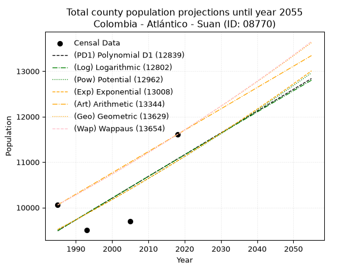
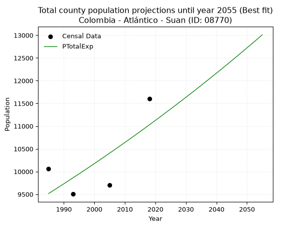
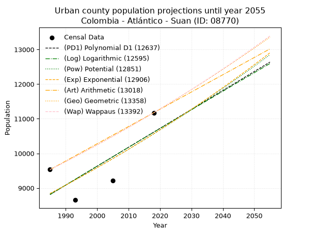
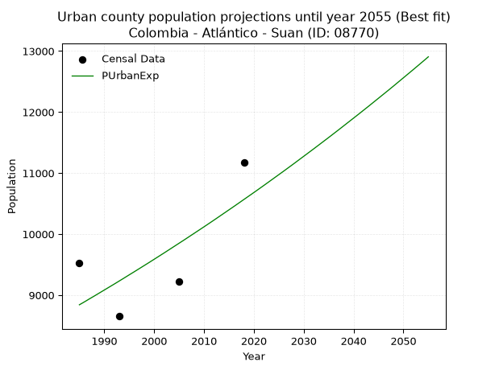
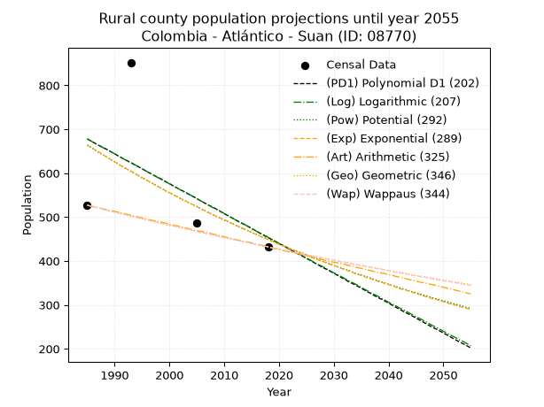
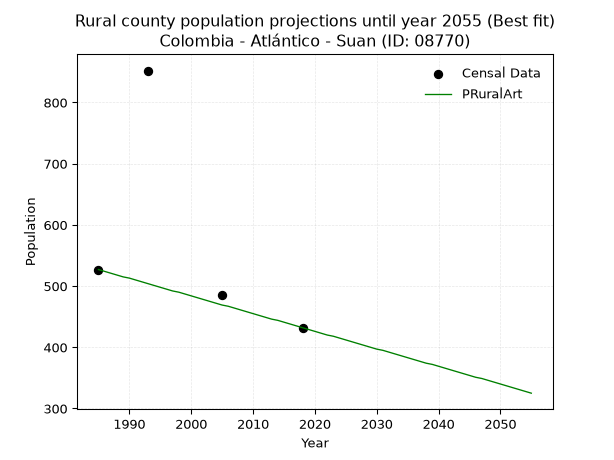

<div align="center">


</div>

# _“Population and Public Services Demand Projections (PPSD) until Year 2050 for Colombia - Atlántico - Suan (ID: 08770)”_
Keywords: `population` `public-service` `projection` `lineal` `polynomial` `logarithmic` `potential` `exponential` `arithmetic` `geometric` `wappaus` `dane` `colombia` `south-america`

PPSD are analytical estimates used by governments and planners to anticipate future changes in population size, age distribution, and the resulting community needs for utilities, healthcare, education, and infrastructure as sizing future water treatment facilities, electrical grids, and road networks based on spatial growth.

> **General running parameters**: • app_version: _v20260806_. • Python version: _3.14.7_. • Pandas version: _3.0.5_. • NumPy version: _2.5.1_. • Creates, save and include plots into reports (create_plot): _False_. • Projection until year: _2050_. • Process polynomial degree 2 and up: _False_. • Process Wappaus: _True_. • Process Wappaus: _True_. • Set negative values to zero: _True_. • Set infinite values to zero: _True_. • Drop dataset notes: _True_. 
<div align="center">

Dynamic map: [:earth_americas:Google](http://maps.google.com/maps?q=10.335432,-74.8816871) [:earth_americas:OSM](https://www.openstreetmap.org/#map=18/10.335432/-74.8816871&layers=P) [:earth_americas:Bing](https://www.bing.com/maps?cp=10.335432~-74.8816871&lvl=18) [:earth_americas:Apple](https://maps.apple.com/frame?center=10.335432%2C-74.8816871&span=0.003%2C0.006)

</div>


<div align="center">

```geojson
{
  "type": "Feature",
  "geometry": {
    "type": "Point", 
    "coordinates": [-74.8816871, 10.335432]
  }, 
  "properties": {
    "Name": "Colombia - Atlántico - Suan (ID: 08770)"
  }
}
```

</div>


## 0. Census Data (4 records)

Census data are official statistics collected by a government about the people and housing in a country. They usually include counts of total population, age, sex, race, income, education, and jobs.

📅Global census file: [Population.xlsx](../data/Population.xlsx)

| Source   |   Year |   CountryID | CountryName   |   StateID | StateName   |   CountyID | CountyName   |   PTotal |   PUrban |   PRural |
|:---------|-------:|------------:|:--------------|----------:|:------------|-----------:|:-------------|---------:|---------:|---------:|
| DANE     |   1985 |          57 | Colombia      |        08 | Atlántico   |      08770 | Suan         |    10058 |     9531 |      527 |
| DANE     |   1993 |          57 | Colombia      |        08 | Atlántico   |      08770 | Suan         |     9505 |     8653 |      852 |
| DANE     |   2005 |          57 | Colombia      |        08 | Atlántico   |      08770 | Suan         |     9702 |     9216 |      486 |
| DANE     |   2018 |          57 | Colombia      |        08 | Atlántico   |      08770 | Suan         |    11607 |    11175 |      432 |

> 🔥Some records could had specific notes about the registered values or the corresponding urban or rural distribution.

## 1. Total

### 1.1. Coefficients and Parameters

* (PD1) Polynomial Deg 1: 47.87314331593619, -85540.25491770137 (lineal)
* (Log) Logarithmic: 95609.91464185207, -716513.7273624893
* (Pow) Potential: 8.919133336408729, -25.434724293460047
* (Exp) Exponential: 0.004466203497820224, 1.3434802041687495
* (Art) Arithmetic: Year diff. 2018 - 1985 = 33, Population diff. 11607 - 10058 = 1549, Annual growth = 46.93939393939394
* (Geo) Geometric: Year diff. 2018 - 1985 = 33, Population diff. 11607 - 10058 = 1549, Annual growth % = 0.004350040946706546
* (Wap) Wappaus: i = 0.43332004559791315, Condition values only valid for < 200)

<sub>
Wappaus condition values: ['0.00', '0.43', '0.87', '1.30', '1.73', '2.17', '2.60', '3.03', '3.47', '3.90', '4.33', '4.77', '5.20', '5.63', '6.07', '6.50', '6.93', '7.37', '7.80', '8.23', '8.67', '9.10', '9.53', '9.97', '10.40', '10.83', '11.27', '11.70', '12.13', '12.57', '13.00', '13.43', '13.87', '14.30', '14.73', '15.17', '15.60', '16.03', '16.47', '16.90', '17.33', '17.77', '18.20', '18.63', '19.07', '19.50', '19.93', '20.37', '20.80', '21.23', '21.67', '22.10', '22.53', '22.97', '23.40', '23.83', '24.27', '24.70', '25.13', '25.57', '26.00', '26.43', '26.87', '27.30', '27.73', '28.17']
</sub>


### 1.2. Projected Dataset

|   Year |   CountyID |   PTotalPD1 |   PTotalLog |   PTotalPow |   PTotalExp |   PTotalArt |   PTotalGeo |   PTotalWap |
|-------:|-----------:|------------:|------------:|------------:|------------:|------------:|------------:|------------:|
|   1985 |      08770 |        9488 |        9488 |        9516 |        9516 |       10058 |       10058 |       10058 |
|   1986 |      08770 |        9536 |        9536 |        9559 |        9558 |       10105 |       10102 |       10102 |
|   1987 |      08770 |        9584 |        9584 |        9602 |        9601 |       10152 |       10146 |       10146 |
|   1988 |      08770 |        9632 |        9633 |        9645 |        9644 |       10199 |       10190 |       10190 |
|   1989 |      08770 |        9679 |        9681 |        9688 |        9687 |       10246 |       10234 |       10234 |
|   1990 |      08770 |        9727 |        9729 |        9732 |        9730 |       10293 |       10279 |       10278 |
|   1991 |      08770 |        9775 |        9777 |        9775 |        9774 |       10340 |       10323 |       10323 |
|   1992 |      08770 |        9823 |        9825 |        9819 |        9818 |       10387 |       10368 |       10368 |
|   1993 |      08770 |        9871 |        9873 |        9863 |        9862 |       10434 |       10413 |       10413 |
|   1994 |      08770 |        9919 |        9921 |        9908 |        9906 |       10480 |       10459 |       10458 |
|   1995 |      08770 |        9967 |        9969 |        9952 |        9950 |       10527 |       10504 |       10503 |
|   1996 |      08770 |       10015 |       10016 |        9996 |        9995 |       10574 |       10550 |       10549 |
|   1997 |      08770 |       10062 |       10064 |       10041 |       10039 |       10621 |       10596 |       10595 |
|   1998 |      08770 |       10110 |       10112 |       10086 |       10084 |       10668 |       10642 |       10641 |
|   1999 |      08770 |       10158 |       10160 |       10131 |       10129 |       10715 |       10688 |       10687 |
|   2000 |      08770 |       10206 |       10208 |       10177 |       10175 |       10762 |       10735 |       10734 |
|   2001 |      08770 |       10254 |       10256 |       10222 |       10220 |       10809 |       10781 |       10780 |
|   2002 |      08770 |       10302 |       10303 |       10268 |       10266 |       10856 |       10828 |       10827 |
|   2003 |      08770 |       10350 |       10351 |       10314 |       10312 |       10903 |       10875 |       10874 |
|   2004 |      08770 |       10398 |       10399 |       10360 |       10358 |       10950 |       10923 |       10922 |
|   2005 |      08770 |       10445 |       10447 |       10406 |       10405 |       10997 |       10970 |       10969 |
|   2006 |      08770 |       10493 |       10494 |       10452 |       10451 |       11044 |       11018 |       11017 |
|   2007 |      08770 |       10541 |       10542 |       10499 |       10498 |       11091 |       11066 |       11065 |
|   2008 |      08770 |       10589 |       10590 |       10545 |       10545 |       11138 |       11114 |       11113 |
|   2009 |      08770 |       10637 |       10637 |       10592 |       10592 |       11185 |       11162 |       11161 |
|   2010 |      08770 |       10685 |       10685 |       10640 |       10640 |       11231 |       11211 |       11210 |
|   2011 |      08770 |       10733 |       10732 |       10687 |       10687 |       11278 |       11260 |       11259 |
|   2012 |      08770 |       10781 |       10780 |       10734 |       10735 |       11325 |       11309 |       11308 |
|   2013 |      08770 |       10828 |       10827 |       10782 |       10783 |       11372 |       11358 |       11357 |
|   2014 |      08770 |       10876 |       10875 |       10830 |       10831 |       11419 |       11407 |       11407 |
|   2015 |      08770 |       10924 |       10922 |       10878 |       10880 |       11466 |       11457 |       11456 |
|   2016 |      08770 |       10972 |       10970 |       10926 |       10929 |       11513 |       11507 |       11506 |
|   2017 |      08770 |       11020 |       11017 |       10975 |       10977 |       11560 |       11557 |       11557 |
|   2018 |      08770 |       11068 |       11065 |       11023 |       11027 |       11607 |       11607 |       11607 |
|   2019 |      08770 |       11116 |       11112 |       11072 |       11076 |       11654 |       11657 |       11658 |
|   2020 |      08770 |       11163 |       11159 |       11121 |       11125 |       11701 |       11708 |       11709 |
|   2021 |      08770 |       11211 |       11207 |       11170 |       11175 |       11748 |       11759 |       11760 |
|   2022 |      08770 |       11259 |       11254 |       11220 |       11225 |       11795 |       11810 |       11811 |
|   2023 |      08770 |       11307 |       11301 |       11269 |       11276 |       11842 |       11862 |       11863 |
|   2024 |      08770 |       11355 |       11348 |       11319 |       11326 |       11889 |       11913 |       11915 |
|   2025 |      08770 |       11403 |       11396 |       11369 |       11377 |       11936 |       11965 |       11967 |
|   2026 |      08770 |       11451 |       11443 |       11419 |       11428 |       11983 |       12017 |       12019 |
|   2027 |      08770 |       11499 |       11490 |       11470 |       11479 |       12029 |       12069 |       12072 |
|   2028 |      08770 |       11546 |       11537 |       11520 |       11530 |       12076 |       12122 |       12125 |
|   2029 |      08770 |       11594 |       11584 |       11571 |       11582 |       12123 |       12175 |       12178 |
|   2030 |      08770 |       11642 |       11631 |       11622 |       11634 |       12170 |       12228 |       12231 |
|   2031 |      08770 |       11690 |       11678 |       11673 |       11686 |       12217 |       12281 |       12285 |
|   2032 |      08770 |       11738 |       11726 |       11724 |       11738 |       12264 |       12334 |       12339 |
|   2033 |      08770 |       11786 |       11773 |       11776 |       11791 |       12311 |       12388 |       12393 |
|   2034 |      08770 |       11834 |       11820 |       11828 |       11843 |       12358 |       12442 |       12447 |
|   2035 |      08770 |       11882 |       11867 |       11880 |       11896 |       12405 |       12496 |       12502 |
|   2036 |      08770 |       11929 |       11914 |       11932 |       11950 |       12452 |       12550 |       12557 |
|   2037 |      08770 |       11977 |       11961 |       11984 |       12003 |       12499 |       12605 |       12612 |
|   2038 |      08770 |       12025 |       12007 |       12037 |       12057 |       12546 |       12660 |       12668 |
|   2039 |      08770 |       12073 |       12054 |       12090 |       12111 |       12593 |       12715 |       12723 |
|   2040 |      08770 |       12121 |       12101 |       12143 |       12165 |       12640 |       12770 |       12779 |
|   2041 |      08770 |       12169 |       12148 |       12196 |       12219 |       12687 |       12826 |       12836 |
|   2042 |      08770 |       12217 |       12195 |       12249 |       12274 |       12734 |       12881 |       12892 |
|   2043 |      08770 |       12265 |       12242 |       12303 |       12329 |       12780 |       12937 |       12949 |
|   2044 |      08770 |       12312 |       12289 |       12357 |       12384 |       12827 |       12994 |       13006 |
|   2045 |      08770 |       12360 |       12335 |       12411 |       12440 |       12874 |       13050 |       13064 |
|   2046 |      08770 |       12408 |       12382 |       12465 |       12495 |       12921 |       13107 |       13121 |
|   2047 |      08770 |       12456 |       12429 |       12519 |       12551 |       12968 |       13164 |       13179 |
|   2048 |      08770 |       12504 |       12475 |       12574 |       12608 |       13015 |       13221 |       13238 |
|   2049 |      08770 |       12552 |       12522 |       12629 |       12664 |       13062 |       13279 |       13296 |
|   2050 |      08770 |       12600 |       12569 |       12684 |       12721 |       13109 |       13337 |       13355 |
<div align="center">

</img>

</div>


### 1.3. Best fit with absolute and relative error (%)

Relative error puts that difference into context by dividing the absolute error by the true value, creating a unitless ratio or percentage that shows the scale of the mistake.

Absolute and relative error

|   Year | Source   |   CountryID | CountryName   |   StateID | StateName   |   CountyID_x | CountyName   |   PTotal |   PUrban |   PRural |   CountyID_y |   PTotalPD1 |   PTotalLog |   PTotalPow |   PTotalExp |   PTotalArt |   PTotalGeo |   PTotalWap |   PTotalPD1AbsError |   PTotalLogAbsError |   PTotalPowAbsError |   PTotalExpAbsError |   PTotalArtAbsError |   PTotalGeoAbsError |   PTotalWapAbsError |   PTotalPD1RelError |   PTotalLogRelError |   PTotalPowRelError |   PTotalExpRelError |   PTotalArtRelError |   PTotalGeoRelError |   PTotalWapRelError |
|-------:|:---------|------------:|:--------------|----------:|:------------|-------------:|:-------------|---------:|---------:|---------:|-------------:|------------:|------------:|------------:|------------:|------------:|------------:|------------:|--------------------:|--------------------:|--------------------:|--------------------:|--------------------:|--------------------:|--------------------:|--------------------:|--------------------:|--------------------:|--------------------:|--------------------:|--------------------:|--------------------:|
|   1985 | DANE     |          57 | Colombia      |        08 | Atlántico   |        08770 | Suan         |    10058 |     9531 |      527 |        08770 |        9488 |        9488 |        9516 |        9516 |       10058 |       10058 |       10058 |                 570 |                 570 |                 542 |                 542 |                   0 |                   0 |                   0 |             5.66713 |             5.66713 |             5.38875 |             5.38875 |              0      |             0       |             0       |
|   1993 | DANE     |          57 | Colombia      |        08 | Atlántico   |        08770 | Suan         |     9505 |     8653 |      852 |        08770 |        9871 |        9873 |        9863 |        9862 |       10434 |       10413 |       10413 |                 366 |                 368 |                 358 |                 357 |                 929 |                 908 |                 908 |             3.8506  |             3.87165 |             3.76644 |             3.75592 |              9.7738 |             9.55287 |             9.55287 |
|   2005 | DANE     |          57 | Colombia      |        08 | Atlántico   |        08770 | Suan         |     9702 |     9216 |      486 |        08770 |       10445 |       10447 |       10406 |       10405 |       10997 |       10970 |       10969 |                 743 |                 745 |                 704 |                 703 |                1295 |                1268 |                1267 |             7.65821 |             7.67883 |             7.25624 |             7.24593 |             13.3478 |            13.0695  |            13.0592  |
|   2018 | DANE     |          57 | Colombia      |        08 | Atlántico   |        08770 | Suan         |    11607 |    11175 |      432 |        08770 |       11068 |       11065 |       11023 |       11027 |       11607 |       11607 |       11607 |                 539 |                 542 |                 584 |                 580 |                   0 |                   0 |                   0 |             4.64375 |             4.6696  |             5.03145 |             4.99698 |              0      |             0       |             0       |

Relative error mean

| Method    |   RelError | Best   |
|:----------|-----------:|:-------|
| PTotalPD1 |    5.45492 |        |
| PTotalLog |    5.4718  |        |
| PTotalPow |    5.36072 |        |
| PTotalExp |    5.34689 | True   |
| PTotalArt |    5.78039 |        |
| PTotalGeo |    5.65558 |        |
| PTotalWap |    5.65301 |        |

💙Best method: _**PTotalExp**_
<div align="center">

</img>

</div>


### 1.4. Fresh water supply demand in liters per capita per day (lpcd)

The fresh water supply demand typically ranges from 100 to 300 liters per capita per day (lpcd) for standard domestic and municipal planning, though absolute survival minimums set by the World Health Organization are as low as 7.5 to 20 liters per day, and total consumption in high-income nations can exceed 400 liters.

> `CZ`: Level in meters above the sea level (masl)<br> `WS`: Fresh water supply demand in liters per capita per day (lpcd or l/h/d)<br> `WSAll`: Zonal fresh water supply demand in liters per second (l/s)<br> `A`: Zonal area in square meters<br> `DP`: Population density (people/hectare)

Reference values (RAS Colombia)

|    CZ |   WS |
|------:|-----:|
|  1000 |  120 |
|  2000 |  130 |
| 99999 |  140 |

County shapefile geometry properties and water supply values

|   CountyID |      ATotal |   CZTotal |   WSTotal |
|-----------:|------------:|----------:|----------:|
|      08770 | 4.24228e+07 |   5.39396 |       120 |

Projected values for best method: PTotalExp

|   CountyID |   Year |   PTotalExp |   DPTotal |   WSTotal |   WSTotalAll |
|-----------:|-------:|------------:|----------:|----------:|-------------:|
|      08770 |   1985 |        9516 |      2.24 |       120 |      13.2167 |
|      08770 |   1986 |        9558 |      2.25 |       120 |      13.275  |
|      08770 |   1987 |        9601 |      2.26 |       120 |      13.3347 |
|      08770 |   1988 |        9644 |      2.27 |       120 |      13.3944 |
|      08770 |   1989 |        9687 |      2.28 |       120 |      13.4542 |
|      08770 |   1990 |        9730 |      2.29 |       120 |      13.5139 |
|      08770 |   1991 |        9774 |      2.3  |       120 |      13.575  |
|      08770 |   1992 |        9818 |      2.31 |       120 |      13.6361 |
|      08770 |   1993 |        9862 |      2.32 |       120 |      13.6972 |
|      08770 |   1994 |        9906 |      2.34 |       120 |      13.7583 |
|      08770 |   1995 |        9950 |      2.35 |       120 |      13.8194 |
|      08770 |   1996 |        9995 |      2.36 |       120 |      13.8819 |
|      08770 |   1997 |       10039 |      2.37 |       120 |      13.9431 |
|      08770 |   1998 |       10084 |      2.38 |       120 |      14.0056 |
|      08770 |   1999 |       10129 |      2.39 |       120 |      14.0681 |
|      08770 |   2000 |       10175 |      2.4  |       120 |      14.1319 |
|      08770 |   2001 |       10220 |      2.41 |       120 |      14.1944 |
|      08770 |   2002 |       10266 |      2.42 |       120 |      14.2583 |
|      08770 |   2003 |       10312 |      2.43 |       120 |      14.3222 |
|      08770 |   2004 |       10358 |      2.44 |       120 |      14.3861 |
|      08770 |   2005 |       10405 |      2.45 |       120 |      14.4514 |
|      08770 |   2006 |       10451 |      2.46 |       120 |      14.5153 |
|      08770 |   2007 |       10498 |      2.47 |       120 |      14.5806 |
|      08770 |   2008 |       10545 |      2.49 |       120 |      14.6458 |
|      08770 |   2009 |       10592 |      2.5  |       120 |      14.7111 |
|      08770 |   2010 |       10640 |      2.51 |       120 |      14.7778 |
|      08770 |   2011 |       10687 |      2.52 |       120 |      14.8431 |
|      08770 |   2012 |       10735 |      2.53 |       120 |      14.9097 |
|      08770 |   2013 |       10783 |      2.54 |       120 |      14.9764 |
|      08770 |   2014 |       10831 |      2.55 |       120 |      15.0431 |
|      08770 |   2015 |       10880 |      2.56 |       120 |      15.1111 |
|      08770 |   2016 |       10929 |      2.58 |       120 |      15.1792 |
|      08770 |   2017 |       10977 |      2.59 |       120 |      15.2458 |
|      08770 |   2018 |       11027 |      2.6  |       120 |      15.3153 |
|      08770 |   2019 |       11076 |      2.61 |       120 |      15.3833 |
|      08770 |   2020 |       11125 |      2.62 |       120 |      15.4514 |
|      08770 |   2021 |       11175 |      2.63 |       120 |      15.5208 |
|      08770 |   2022 |       11225 |      2.65 |       120 |      15.5903 |
|      08770 |   2023 |       11276 |      2.66 |       120 |      15.6611 |
|      08770 |   2024 |       11326 |      2.67 |       120 |      15.7306 |
|      08770 |   2025 |       11377 |      2.68 |       120 |      15.8014 |
|      08770 |   2026 |       11428 |      2.69 |       120 |      15.8722 |
|      08770 |   2027 |       11479 |      2.71 |       120 |      15.9431 |
|      08770 |   2028 |       11530 |      2.72 |       120 |      16.0139 |
|      08770 |   2029 |       11582 |      2.73 |       120 |      16.0861 |
|      08770 |   2030 |       11634 |      2.74 |       120 |      16.1583 |
|      08770 |   2031 |       11686 |      2.75 |       120 |      16.2306 |
|      08770 |   2032 |       11738 |      2.77 |       120 |      16.3028 |
|      08770 |   2033 |       11791 |      2.78 |       120 |      16.3764 |
|      08770 |   2034 |       11843 |      2.79 |       120 |      16.4486 |
|      08770 |   2035 |       11896 |      2.8  |       120 |      16.5222 |
|      08770 |   2036 |       11950 |      2.82 |       120 |      16.5972 |
|      08770 |   2037 |       12003 |      2.83 |       120 |      16.6708 |
|      08770 |   2038 |       12057 |      2.84 |       120 |      16.7458 |
|      08770 |   2039 |       12111 |      2.85 |       120 |      16.8208 |
|      08770 |   2040 |       12165 |      2.87 |       120 |      16.8958 |
|      08770 |   2041 |       12219 |      2.88 |       120 |      16.9708 |
|      08770 |   2042 |       12274 |      2.89 |       120 |      17.0472 |
|      08770 |   2043 |       12329 |      2.91 |       120 |      17.1236 |
|      08770 |   2044 |       12384 |      2.92 |       120 |      17.2    |
|      08770 |   2045 |       12440 |      2.93 |       120 |      17.2778 |
|      08770 |   2046 |       12495 |      2.95 |       120 |      17.3542 |
|      08770 |   2047 |       12551 |      2.96 |       120 |      17.4319 |
|      08770 |   2048 |       12608 |      2.97 |       120 |      17.5111 |
|      08770 |   2049 |       12664 |      2.99 |       120 |      17.5889 |
|      08770 |   2050 |       12721 |      3    |       120 |      17.6681 |

## 2. Urban

### 2.1. Coefficients and Parameters

* (PD1) Polynomial Deg 1: 54.67723805700396, -99724.39542352218 (lineal)
* (Log) Logarithmic: 109204.00665452942, -820416.7796870664
* (Pow) Potential: 10.793221803980126, -31.646969909486124
* (Exp) Exponential: 0.0054043738667974486, 0.19386862198854565
* (Art) Arithmetic: Year diff. 2018 - 1985 = 33, Population diff. 11175 - 9531 = 1644, Annual growth = 49.81818181818182
* (Geo) Geometric: Year diff. 2018 - 1985 = 33, Population diff. 11175 - 9531 = 1644, Annual growth % = 0.004833751019193588
* (Wap) Wappaus: i = 0.4811956130414548, Condition values only valid for < 200)

<sub>
Wappaus condition values: ['0.00', '0.48', '0.96', '1.44', '1.92', '2.41', '2.89', '3.37', '3.85', '4.33', '4.81', '5.29', '5.77', '6.26', '6.74', '7.22', '7.70', '8.18', '8.66', '9.14', '9.62', '10.11', '10.59', '11.07', '11.55', '12.03', '12.51', '12.99', '13.47', '13.95', '14.44', '14.92', '15.40', '15.88', '16.36', '16.84', '17.32', '17.80', '18.29', '18.77', '19.25', '19.73', '20.21', '20.69', '21.17', '21.65', '22.13', '22.62', '23.10', '23.58', '24.06', '24.54', '25.02', '25.50', '25.98', '26.47', '26.95', '27.43', '27.91', '28.39', '28.87', '29.35', '29.83', '30.32', '30.80', '31.28']
</sub>


### 2.2. Projected Dataset

|   Year |   CountyID |   PUrbanPD1 |   PUrbanLog |   PUrbanPow |   PUrbanExp |   PUrbanArt |   PUrbanGeo |   PUrbanWap |
|-------:|-----------:|------------:|------------:|------------:|------------:|------------:|------------:|------------:|
|   1985 |      08770 |        8810 |        8810 |        8841 |        8841 |        9531 |        9531 |        9531 |
|   1986 |      08770 |        8865 |        8865 |        8889 |        8888 |        9581 |        9577 |        9577 |
|   1987 |      08770 |        8919 |        8920 |        8937 |        8937 |        9631 |        9623 |        9623 |
|   1988 |      08770 |        8974 |        8975 |        8986 |        8985 |        9680 |        9670 |        9670 |
|   1989 |      08770 |        9029 |        9030 |        9035 |        9034 |        9730 |        9717 |        9716 |
|   1990 |      08770 |        9083 |        9085 |        9084 |        9083 |        9780 |        9764 |        9763 |
|   1991 |      08770 |        9138 |        9140 |        9134 |        9132 |        9830 |        9811 |        9810 |
|   1992 |      08770 |        9193 |        9195 |        9183 |        9181 |        9880 |        9858 |        9858 |
|   1993 |      08770 |        9247 |        9249 |        9233 |        9231 |        9930 |        9906 |        9905 |
|   1994 |      08770 |        9302 |        9304 |        9283 |        9281 |        9979 |        9954 |        9953 |
|   1995 |      08770 |        9357 |        9359 |        9334 |        9332 |       10029 |       10002 |       10001 |
|   1996 |      08770 |        9411 |        9414 |        9384 |        9382 |       10079 |       10050 |       10049 |
|   1997 |      08770 |        9466 |        9468 |        9435 |        9433 |       10129 |       10099 |       10098 |
|   1998 |      08770 |        9521 |        9523 |        9486 |        9484 |       10179 |       10148 |       10146 |
|   1999 |      08770 |        9575 |        9578 |        9538 |        9535 |       10228 |       10197 |       10195 |
|   2000 |      08770 |        9630 |        9632 |        9589 |        9587 |       10278 |       10246 |       10245 |
|   2001 |      08770 |        9685 |        9687 |        9641 |        9639 |       10328 |       10295 |       10294 |
|   2002 |      08770 |        9739 |        9741 |        9693 |        9691 |       10378 |       10345 |       10344 |
|   2003 |      08770 |        9794 |        9796 |        9746 |        9744 |       10428 |       10395 |       10394 |
|   2004 |      08770 |        9849 |        9850 |        9798 |        9797 |       10478 |       10445 |       10444 |
|   2005 |      08770 |        9903 |        9905 |        9851 |        9850 |       10527 |       10496 |       10495 |
|   2006 |      08770 |        9958 |        9959 |        9904 |        9903 |       10577 |       10547 |       10545 |
|   2007 |      08770 |       10013 |       10014 |        9958 |        9957 |       10627 |       10598 |       10596 |
|   2008 |      08770 |       10067 |       10068 |       10011 |       10011 |       10677 |       10649 |       10648 |
|   2009 |      08770 |       10122 |       10123 |       10065 |       10065 |       10727 |       10700 |       10699 |
|   2010 |      08770 |       10177 |       10177 |       10119 |       10119 |       10776 |       10752 |       10751 |
|   2011 |      08770 |       10232 |       10231 |       10174 |       10174 |       10826 |       10804 |       10803 |
|   2012 |      08770 |       10286 |       10285 |       10229 |       10229 |       10876 |       10856 |       10855 |
|   2013 |      08770 |       10341 |       10340 |       10284 |       10285 |       10926 |       10909 |       10908 |
|   2014 |      08770 |       10396 |       10394 |       10339 |       10341 |       10976 |       10962 |       10961 |
|   2015 |      08770 |       10450 |       10448 |       10395 |       10397 |       11026 |       11015 |       11014 |
|   2016 |      08770 |       10505 |       10502 |       10450 |       10453 |       11075 |       11068 |       11067 |
|   2017 |      08770 |       10560 |       10557 |       10506 |       10510 |       11125 |       11121 |       11121 |
|   2018 |      08770 |       10614 |       10611 |       10563 |       10567 |       11175 |       11175 |       11175 |
|   2019 |      08770 |       10669 |       10665 |       10619 |       10624 |       11225 |       11229 |       11229 |
|   2020 |      08770 |       10724 |       10719 |       10676 |       10681 |       11275 |       11283 |       11284 |
|   2021 |      08770 |       10778 |       10773 |       10733 |       10739 |       11324 |       11338 |       11339 |
|   2022 |      08770 |       10833 |       10827 |       10791 |       10797 |       11374 |       11393 |       11394 |
|   2023 |      08770 |       10888 |       10881 |       10849 |       10856 |       11424 |       11448 |       11449 |
|   2024 |      08770 |       10942 |       10935 |       10907 |       10915 |       11474 |       11503 |       11505 |
|   2025 |      08770 |       10997 |       10989 |       10965 |       10974 |       11524 |       11559 |       11561 |
|   2026 |      08770 |       11052 |       11043 |       11024 |       11033 |       11574 |       11615 |       11617 |
|   2027 |      08770 |       11106 |       11097 |       11082 |       11093 |       11623 |       11671 |       11674 |
|   2028 |      08770 |       11161 |       11150 |       11142 |       11153 |       11673 |       11727 |       11731 |
|   2029 |      08770 |       11216 |       11204 |       11201 |       11214 |       11723 |       11784 |       11788 |
|   2030 |      08770 |       11270 |       11258 |       11261 |       11275 |       11773 |       11841 |       11845 |
|   2031 |      08770 |       11325 |       11312 |       11321 |       11336 |       11823 |       11898 |       11903 |
|   2032 |      08770 |       11380 |       11366 |       11381 |       11397 |       11872 |       11955 |       11961 |
|   2033 |      08770 |       11434 |       11419 |       11442 |       11459 |       11922 |       12013 |       12020 |
|   2034 |      08770 |       11489 |       11473 |       11503 |       11521 |       11972 |       12071 |       12079 |
|   2035 |      08770 |       11544 |       11527 |       11564 |       11583 |       12022 |       12130 |       12138 |
|   2036 |      08770 |       11598 |       11580 |       11625 |       11646 |       12072 |       12188 |       12197 |
|   2037 |      08770 |       11653 |       11634 |       11687 |       11709 |       12122 |       12247 |       12257 |
|   2038 |      08770 |       11708 |       11688 |       11749 |       11773 |       12171 |       12306 |       12317 |
|   2039 |      08770 |       11762 |       11741 |       11811 |       11837 |       12221 |       12366 |       12377 |
|   2040 |      08770 |       11817 |       11795 |       11874 |       11901 |       12271 |       12426 |       12438 |
|   2041 |      08770 |       11872 |       11848 |       11937 |       11965 |       12321 |       12486 |       12499 |
|   2042 |      08770 |       11927 |       11902 |       12000 |       12030 |       12371 |       12546 |       12561 |
|   2043 |      08770 |       11981 |       11955 |       12064 |       12095 |       12420 |       12607 |       12622 |
|   2044 |      08770 |       12036 |       12009 |       12128 |       12161 |       12470 |       12668 |       12685 |
|   2045 |      08770 |       12091 |       12062 |       12192 |       12227 |       12520 |       12729 |       12747 |
|   2046 |      08770 |       12145 |       12115 |       12257 |       12293 |       12570 |       12790 |       12810 |
|   2047 |      08770 |       12200 |       12169 |       12321 |       12359 |       12620 |       12852 |       12873 |
|   2048 |      08770 |       12255 |       12222 |       12387 |       12426 |       12670 |       12914 |       12937 |
|   2049 |      08770 |       12309 |       12275 |       12452 |       12494 |       12719 |       12977 |       13000 |
|   2050 |      08770 |       12364 |       12329 |       12518 |       12562 |       12769 |       13040 |       13065 |
<div align="center">

</img>

</div>


### 2.3. Best fit with absolute and relative error (%)

Relative error puts that difference into context by dividing the absolute error by the true value, creating a unitless ratio or percentage that shows the scale of the mistake.

Absolute and relative error

|   Year | Source   |   CountryID | CountryName   |   StateID | StateName   |   CountyID_x | CountyName   |   PTotal |   PUrban |   PRural |   CountyID_y |   PUrbanPD1 |   PUrbanLog |   PUrbanPow |   PUrbanExp |   PUrbanArt |   PUrbanGeo |   PUrbanWap |   PUrbanPD1AbsError |   PUrbanLogAbsError |   PUrbanPowAbsError |   PUrbanExpAbsError |   PUrbanArtAbsError |   PUrbanGeoAbsError |   PUrbanWapAbsError |   PUrbanPD1RelError |   PUrbanLogRelError |   PUrbanPowRelError |   PUrbanExpRelError |   PUrbanArtRelError |   PUrbanGeoRelError |   PUrbanWapRelError |
|-------:|:---------|------------:|:--------------|----------:|:------------|-------------:|:-------------|---------:|---------:|---------:|-------------:|------------:|------------:|------------:|------------:|------------:|------------:|------------:|--------------------:|--------------------:|--------------------:|--------------------:|--------------------:|--------------------:|--------------------:|--------------------:|--------------------:|--------------------:|--------------------:|--------------------:|--------------------:|--------------------:|
|   1985 | DANE     |          57 | Colombia      |        08 | Atlántico   |        08770 | Suan         |    10058 |     9531 |      527 |        08770 |        8810 |        8810 |        8841 |        8841 |        9531 |        9531 |        9531 |                 721 |                 721 |                 690 |                 690 |                   0 |                   0 |                   0 |             7.56479 |             7.56479 |             7.23953 |             7.23953 |              0      |              0      |               0     |
|   1993 | DANE     |          57 | Colombia      |        08 | Atlántico   |        08770 | Suan         |     9505 |     8653 |      852 |        08770 |        9247 |        9249 |        9233 |        9231 |        9930 |        9906 |        9905 |                 594 |                 596 |                 580 |                 578 |                1277 |                1253 |                1252 |             6.86467 |             6.88778 |             6.70288 |             6.67976 |             14.7579 |             14.4805 |              14.469 |
|   2005 | DANE     |          57 | Colombia      |        08 | Atlántico   |        08770 | Suan         |     9702 |     9216 |      486 |        08770 |        9903 |        9905 |        9851 |        9850 |       10527 |       10496 |       10495 |                 687 |                 689 |                 635 |                 634 |                1311 |                1280 |                1279 |             7.45443 |             7.47613 |             6.89019 |             6.87934 |             14.2253 |             13.8889 |              13.878 |
|   2018 | DANE     |          57 | Colombia      |        08 | Atlántico   |        08770 | Suan         |    11607 |    11175 |      432 |        08770 |       10614 |       10611 |       10563 |       10567 |       11175 |       11175 |       11175 |                 561 |                 564 |                 612 |                 608 |                   0 |                   0 |                   0 |             5.02013 |             5.04698 |             5.47651 |             5.44072 |              0      |              0      |               0     |

Relative error mean

| Method    |   RelError | Best   |
|:----------|-----------:|:-------|
| PUrbanPD1 |    6.72601 |        |
| PUrbanLog |    6.74392 |        |
| PUrbanPow |    6.57728 |        |
| PUrbanExp |    6.55984 | True   |
| PUrbanArt |    7.24579 |        |
| PUrbanGeo |    7.09235 |        |
| PUrbanWap |    7.08675 |        |

💙Best method: _**PUrbanExp**_
<div align="center">

</img>

</div>


### 2.4. Fresh water supply demand in liters per capita per day (lpcd)

The fresh water supply demand typically ranges from 100 to 300 liters per capita per day (lpcd) for standard domestic and municipal planning, though absolute survival minimums set by the World Health Organization are as low as 7.5 to 20 liters per day, and total consumption in high-income nations can exceed 400 liters.

> `CZ`: Level in meters above the sea level (masl)<br> `WS`: Fresh water supply demand in liters per capita per day (lpcd or l/h/d)<br> `WSAll`: Zonal fresh water supply demand in liters per second (l/s)<br> `A`: Zonal area in square meters<br> `DP`: Population density (people/hectare)

Reference values (RAS Colombia)

|    CZ |   WS |
|------:|-----:|
|  1000 |  120 |
|  2000 |  130 |
| 99999 |  140 |

County shapefile geometry properties and water supply values

|   CountyID |      AUrban |   CZUrban |   WSUrban |
|-----------:|------------:|----------:|----------:|
|      08770 | 1.83455e+06 |   7.17821 |       120 |

Projected values for best method: PUrbanExp

|   CountyID |   Year |   PUrbanExp |   DPUrban |   WSUrban |   WSUrbanAll |
|-----------:|-------:|------------:|----------:|----------:|-------------:|
|      08770 |   1985 |        8841 |     48.19 |       120 |      12.2792 |
|      08770 |   1986 |        8888 |     48.45 |       120 |      12.3444 |
|      08770 |   1987 |        8937 |     48.71 |       120 |      12.4125 |
|      08770 |   1988 |        8985 |     48.98 |       120 |      12.4792 |
|      08770 |   1989 |        9034 |     49.24 |       120 |      12.5472 |
|      08770 |   1990 |        9083 |     49.51 |       120 |      12.6153 |
|      08770 |   1991 |        9132 |     49.78 |       120 |      12.6833 |
|      08770 |   1992 |        9181 |     50.04 |       120 |      12.7514 |
|      08770 |   1993 |        9231 |     50.32 |       120 |      12.8208 |
|      08770 |   1994 |        9281 |     50.59 |       120 |      12.8903 |
|      08770 |   1995 |        9332 |     50.87 |       120 |      12.9611 |
|      08770 |   1996 |        9382 |     51.14 |       120 |      13.0306 |
|      08770 |   1997 |        9433 |     51.42 |       120 |      13.1014 |
|      08770 |   1998 |        9484 |     51.7  |       120 |      13.1722 |
|      08770 |   1999 |        9535 |     51.97 |       120 |      13.2431 |
|      08770 |   2000 |        9587 |     52.26 |       120 |      13.3153 |
|      08770 |   2001 |        9639 |     52.54 |       120 |      13.3875 |
|      08770 |   2002 |        9691 |     52.82 |       120 |      13.4597 |
|      08770 |   2003 |        9744 |     53.11 |       120 |      13.5333 |
|      08770 |   2004 |        9797 |     53.4  |       120 |      13.6069 |
|      08770 |   2005 |        9850 |     53.69 |       120 |      13.6806 |
|      08770 |   2006 |        9903 |     53.98 |       120 |      13.7542 |
|      08770 |   2007 |        9957 |     54.27 |       120 |      13.8292 |
|      08770 |   2008 |       10011 |     54.57 |       120 |      13.9042 |
|      08770 |   2009 |       10065 |     54.86 |       120 |      13.9792 |
|      08770 |   2010 |       10119 |     55.16 |       120 |      14.0542 |
|      08770 |   2011 |       10174 |     55.46 |       120 |      14.1306 |
|      08770 |   2012 |       10229 |     55.76 |       120 |      14.2069 |
|      08770 |   2013 |       10285 |     56.06 |       120 |      14.2847 |
|      08770 |   2014 |       10341 |     56.37 |       120 |      14.3625 |
|      08770 |   2015 |       10397 |     56.67 |       120 |      14.4403 |
|      08770 |   2016 |       10453 |     56.98 |       120 |      14.5181 |
|      08770 |   2017 |       10510 |     57.29 |       120 |      14.5972 |
|      08770 |   2018 |       10567 |     57.6  |       120 |      14.6764 |
|      08770 |   2019 |       10624 |     57.91 |       120 |      14.7556 |
|      08770 |   2020 |       10681 |     58.22 |       120 |      14.8347 |
|      08770 |   2021 |       10739 |     58.54 |       120 |      14.9153 |
|      08770 |   2022 |       10797 |     58.85 |       120 |      14.9958 |
|      08770 |   2023 |       10856 |     59.18 |       120 |      15.0778 |
|      08770 |   2024 |       10915 |     59.5  |       120 |      15.1597 |
|      08770 |   2025 |       10974 |     59.82 |       120 |      15.2417 |
|      08770 |   2026 |       11033 |     60.14 |       120 |      15.3236 |
|      08770 |   2027 |       11093 |     60.47 |       120 |      15.4069 |
|      08770 |   2028 |       11153 |     60.79 |       120 |      15.4903 |
|      08770 |   2029 |       11214 |     61.13 |       120 |      15.575  |
|      08770 |   2030 |       11275 |     61.46 |       120 |      15.6597 |
|      08770 |   2031 |       11336 |     61.79 |       120 |      15.7444 |
|      08770 |   2032 |       11397 |     62.12 |       120 |      15.8292 |
|      08770 |   2033 |       11459 |     62.46 |       120 |      15.9153 |
|      08770 |   2034 |       11521 |     62.8  |       120 |      16.0014 |
|      08770 |   2035 |       11583 |     63.14 |       120 |      16.0875 |
|      08770 |   2036 |       11646 |     63.48 |       120 |      16.175  |
|      08770 |   2037 |       11709 |     63.82 |       120 |      16.2625 |
|      08770 |   2038 |       11773 |     64.17 |       120 |      16.3514 |
|      08770 |   2039 |       11837 |     64.52 |       120 |      16.4403 |
|      08770 |   2040 |       11901 |     64.87 |       120 |      16.5292 |
|      08770 |   2041 |       11965 |     65.22 |       120 |      16.6181 |
|      08770 |   2042 |       12030 |     65.57 |       120 |      16.7083 |
|      08770 |   2043 |       12095 |     65.93 |       120 |      16.7986 |
|      08770 |   2044 |       12161 |     66.29 |       120 |      16.8903 |
|      08770 |   2045 |       12227 |     66.65 |       120 |      16.9819 |
|      08770 |   2046 |       12293 |     67.01 |       120 |      17.0736 |
|      08770 |   2047 |       12359 |     67.37 |       120 |      17.1653 |
|      08770 |   2048 |       12426 |     67.73 |       120 |      17.2583 |
|      08770 |   2049 |       12494 |     68.1  |       120 |      17.3528 |
|      08770 |   2050 |       12562 |     68.47 |       120 |      17.4472 |

## 3. Rural

### 3.1. Coefficients and Parameters

* (PD1) Polynomial Deg 1: -6.80409474106779, 14184.140505820847 (lineal)
* (Log) Logarithmic: -13594.09201267733, 103903.05232457702
* (Pow) Potential: -23.731365175409604, 81.08262871997822
* (Exp) Exponential: -0.011875978369984672, 11487505201889.348
* (Art) Arithmetic: Year diff. 2018 - 1985 = 33, Population diff. 432 - 527 = -95, Annual growth = -2.878787878787879
* (Geo) Geometric: Year diff. 2018 - 1985 = 33, Population diff. 432 - 527 = -95, Annual growth % = -0.006005378837336095
* (Wap) Wappaus: i = -0.6003728631465858, Condition values only valid for < 200)

<sub>
Wappaus condition values: ['-0.00', '-0.60', '-1.20', '-1.80', '-2.40', '-3.00', '-3.60', '-4.20', '-4.80', '-5.40', '-6.00', '-6.60', '-7.20', '-7.80', '-8.41', '-9.01', '-9.61', '-10.21', '-10.81', '-11.41', '-12.01', '-12.61', '-13.21', '-13.81', '-14.41', '-15.01', '-15.61', '-16.21', '-16.81', '-17.41', '-18.01', '-18.61', '-19.21', '-19.81', '-20.41', '-21.01', '-21.61', '-22.21', '-22.81', '-23.41', '-24.01', '-24.62', '-25.22', '-25.82', '-26.42', '-27.02', '-27.62', '-28.22', '-28.82', '-29.42', '-30.02', '-30.62', '-31.22', '-31.82', '-32.42', '-33.02', '-33.62', '-34.22', '-34.82', '-35.42', '-36.02', '-36.62', '-37.22', '-37.82', '-38.42', '-39.02']
</sub>


### 3.2. Projected Dataset

|   Year |   CountyID |   PRuralPD1 |   PRuralLog |   PRuralPow |   PRuralExp |   PRuralArt |   PRuralGeo |   PRuralWap |
|-------:|-----------:|------------:|------------:|------------:|------------:|------------:|------------:|------------:|
|   1985 |      08770 |         678 |         678 |         664 |         664 |         527 |         527 |         527 |
|   1986 |      08770 |         671 |         671 |         656 |         656 |         524 |         524 |         524 |
|   1987 |      08770 |         664 |         664 |         648 |         649 |         521 |         521 |         521 |
|   1988 |      08770 |         658 |         657 |         641 |         641 |         518 |         518 |         518 |
|   1989 |      08770 |         651 |         651 |         633 |         633 |         515 |         514 |         514 |
|   1990 |      08770 |         644 |         644 |         626 |         626 |         513 |         511 |         511 |
|   1991 |      08770 |         637 |         637 |         618 |         618 |         510 |         508 |         508 |
|   1992 |      08770 |         630 |         630 |         611 |         611 |         507 |         505 |         505 |
|   1993 |      08770 |         624 |         623 |         604 |         604 |         504 |         502 |         502 |
|   1994 |      08770 |         617 |         617 |         597 |         597 |         501 |         499 |         499 |
|   1995 |      08770 |         610 |         610 |         589 |         590 |         498 |         496 |         496 |
|   1996 |      08770 |         603 |         603 |         583 |         583 |         495 |         493 |         493 |
|   1997 |      08770 |         596 |         596 |         576 |         576 |         492 |         490 |         490 |
|   1998 |      08770 |         590 |         589 |         569 |         569 |         490 |         487 |         487 |
|   1999 |      08770 |         583 |         582 |         562 |         562 |         487 |         484 |         484 |
|   2000 |      08770 |         576 |         576 |         555 |         556 |         484 |         481 |         482 |
|   2001 |      08770 |         569 |         569 |         549 |         549 |         481 |         479 |         479 |
|   2002 |      08770 |         562 |         562 |         542 |         543 |         478 |         476 |         476 |
|   2003 |      08770 |         556 |         555 |         536 |         536 |         475 |         473 |         473 |
|   2004 |      08770 |         549 |         549 |         530 |         530 |         472 |         470 |         470 |
|   2005 |      08770 |         542 |         542 |         524 |         524 |         469 |         467 |         467 |
|   2006 |      08770 |         535 |         535 |         517 |         518 |         467 |         464 |         464 |
|   2007 |      08770 |         528 |         528 |         511 |         511 |         464 |         462 |         462 |
|   2008 |      08770 |         522 |         521 |         505 |         505 |         461 |         459 |         459 |
|   2009 |      08770 |         515 |         515 |         499 |         499 |         458 |         456 |         456 |
|   2010 |      08770 |         508 |         508 |         493 |         494 |         455 |         453 |         453 |
|   2011 |      08770 |         501 |         501 |         488 |         488 |         452 |         451 |         451 |
|   2012 |      08770 |         494 |         494 |         482 |         482 |         449 |         448 |         448 |
|   2013 |      08770 |         487 |         488 |         476 |         476 |         446 |         445 |         445 |
|   2014 |      08770 |         481 |         481 |         471 |         471 |         444 |         443 |         443 |
|   2015 |      08770 |         474 |         474 |         465 |         465 |         441 |         440 |         440 |
|   2016 |      08770 |         467 |         467 |         460 |         460 |         438 |         437 |         437 |
|   2017 |      08770 |         460 |         461 |         454 |         454 |         435 |         435 |         435 |
|   2018 |      08770 |         453 |         454 |         449 |         449 |         432 |         432 |         432 |
|   2019 |      08770 |         447 |         447 |         444 |         443 |         429 |         429 |         429 |
|   2020 |      08770 |         440 |         440 |         439 |         438 |         426 |         427 |         427 |
|   2021 |      08770 |         433 |         434 |         434 |         433 |         423 |         424 |         424 |
|   2022 |      08770 |         426 |         427 |         428 |         428 |         420 |         422 |         422 |
|   2023 |      08770 |         419 |         420 |         423 |         423 |         418 |         419 |         419 |
|   2024 |      08770 |         413 |         414 |         419 |         418 |         415 |         417 |         417 |
|   2025 |      08770 |         406 |         407 |         414 |         413 |         412 |         414 |         414 |
|   2026 |      08770 |         399 |         400 |         409 |         408 |         409 |         412 |         411 |
|   2027 |      08770 |         392 |         393 |         404 |         403 |         406 |         409 |         409 |
|   2028 |      08770 |         385 |         387 |         399 |         399 |         403 |         407 |         407 |
|   2029 |      08770 |         379 |         380 |         395 |         394 |         400 |         404 |         404 |
|   2030 |      08770 |         372 |         373 |         390 |         389 |         397 |         402 |         402 |
|   2031 |      08770 |         365 |         367 |         386 |         385 |         395 |         399 |         399 |
|   2032 |      08770 |         358 |         360 |         381 |         380 |         392 |         397 |         397 |
|   2033 |      08770 |         351 |         353 |         377 |         376 |         389 |         395 |         394 |
|   2034 |      08770 |         345 |         347 |         372 |         371 |         386 |         392 |         392 |
|   2035 |      08770 |         338 |         340 |         368 |         367 |         383 |         390 |         389 |
|   2036 |      08770 |         331 |         333 |         364 |         362 |         380 |         388 |         387 |
|   2037 |      08770 |         324 |         326 |         360 |         358 |         377 |         385 |         385 |
|   2038 |      08770 |         317 |         320 |         355 |         354 |         374 |         383 |         382 |
|   2039 |      08770 |         311 |         313 |         351 |         350 |         372 |         381 |         380 |
|   2040 |      08770 |         304 |         306 |         347 |         346 |         369 |         378 |         378 |
|   2041 |      08770 |         297 |         300 |         343 |         342 |         366 |         376 |         375 |
|   2042 |      08770 |         290 |         293 |         339 |         337 |         363 |         374 |         373 |
|   2043 |      08770 |         283 |         287 |         335 |         334 |         360 |         372 |         371 |
|   2044 |      08770 |         277 |         280 |         331 |         330 |         357 |         369 |         368 |
|   2045 |      08770 |         270 |         273 |         328 |         326 |         354 |         367 |         366 |
|   2046 |      08770 |         263 |         267 |         324 |         322 |         351 |         365 |         364 |
|   2047 |      08770 |         256 |         260 |         320 |         318 |         349 |         363 |         362 |
|   2048 |      08770 |         249 |         253 |         316 |         314 |         346 |         361 |         359 |
|   2049 |      08770 |         243 |         247 |         313 |         311 |         343 |         358 |         357 |
|   2050 |      08770 |         236 |         240 |         309 |         307 |         340 |         356 |         355 |
<div align="center">

</img>

</div>


### 3.3. Best fit with absolute and relative error (%)

Relative error puts that difference into context by dividing the absolute error by the true value, creating a unitless ratio or percentage that shows the scale of the mistake.

Absolute and relative error

|   Year | Source   |   CountryID | CountryName   |   StateID | StateName   |   CountyID_x | CountyName   |   PTotal |   PUrban |   PRural |   CountyID_y |   PRuralPD1 |   PRuralLog |   PRuralPow |   PRuralExp |   PRuralArt |   PRuralGeo |   PRuralWap |   PRuralPD1AbsError |   PRuralLogAbsError |   PRuralPowAbsError |   PRuralExpAbsError |   PRuralArtAbsError |   PRuralGeoAbsError |   PRuralWapAbsError |   PRuralPD1RelError |   PRuralLogRelError |   PRuralPowRelError |   PRuralExpRelError |   PRuralArtRelError |   PRuralGeoRelError |   PRuralWapRelError |
|-------:|:---------|------------:|:--------------|----------:|:------------|-------------:|:-------------|---------:|---------:|---------:|-------------:|------------:|------------:|------------:|------------:|------------:|------------:|------------:|--------------------:|--------------------:|--------------------:|--------------------:|--------------------:|--------------------:|--------------------:|--------------------:|--------------------:|--------------------:|--------------------:|--------------------:|--------------------:|--------------------:|
|   1985 | DANE     |          57 | Colombia      |        08 | Atlántico   |        08770 | Suan         |    10058 |     9531 |      527 |        08770 |         678 |         678 |         664 |         664 |         527 |         527 |         527 |                 151 |                 151 |                 137 |                 137 |                   0 |                   0 |                   0 |            28.6528  |            28.6528  |            25.9962  |            25.9962  |             0       |             0       |             0       |
|   1993 | DANE     |          57 | Colombia      |        08 | Atlántico   |        08770 | Suan         |     9505 |     8653 |      852 |        08770 |         624 |         623 |         604 |         604 |         504 |         502 |         502 |                 228 |                 229 |                 248 |                 248 |                 348 |                 350 |                 350 |            26.7606  |            26.8779  |            29.108   |            29.108   |            40.8451  |            41.0798  |            41.0798  |
|   2005 | DANE     |          57 | Colombia      |        08 | Atlántico   |        08770 | Suan         |     9702 |     9216 |      486 |        08770 |         542 |         542 |         524 |         524 |         469 |         467 |         467 |                  56 |                  56 |                  38 |                  38 |                  17 |                  19 |                  19 |            11.5226  |            11.5226  |             7.81893 |             7.81893 |             3.49794 |             3.90947 |             3.90947 |
|   2018 | DANE     |          57 | Colombia      |        08 | Atlántico   |        08770 | Suan         |    11607 |    11175 |      432 |        08770 |         453 |         454 |         449 |         449 |         432 |         432 |         432 |                  21 |                  22 |                  17 |                  17 |                   0 |                   0 |                   0 |             4.86111 |             5.09259 |             3.93519 |             3.93519 |             0       |             0       |             0       |

Relative error mean

| Method    |   RelError | Best   |
|:----------|-----------:|:-------|
| PRuralPD1 |    17.9493 |        |
| PRuralLog |    18.0365 |        |
| PRuralPow |    16.7146 |        |
| PRuralExp |    16.7146 |        |
| PRuralArt |    11.0858 | True   |
| PRuralGeo |    11.2473 |        |
| PRuralWap |    11.2473 |        |

💙Best method: _**PRuralArt**_
<div align="center">

</img>

</div>


### 3.4. Fresh water supply demand in liters per capita per day (lpcd)

The fresh water supply demand typically ranges from 100 to 300 liters per capita per day (lpcd) for standard domestic and municipal planning, though absolute survival minimums set by the World Health Organization are as low as 7.5 to 20 liters per day, and total consumption in high-income nations can exceed 400 liters.

> `CZ`: Level in meters above the sea level (masl)<br> `WS`: Fresh water supply demand in liters per capita per day (lpcd or l/h/d)<br> `WSAll`: Zonal fresh water supply demand in liters per second (l/s)<br> `A`: Zonal area in square meters<br> `DP`: Population density (people/hectare)

Reference values (RAS Colombia)

|    CZ |   WS |
|------:|-----:|
|  1000 |  120 |
|  2000 |  130 |
| 99999 |  140 |

County shapefile geometry properties and water supply values

|   CountyID |      ARural |   CZRural |   WSRural |
|-----------:|------------:|----------:|----------:|
|      08770 | 4.05882e+07 |   5.31221 |       120 |

Projected values for best method: PRuralArt

|   CountyID |   Year |   PRuralArt |   DPRural |   WSRural |   WSRuralAll |
|-----------:|-------:|------------:|----------:|----------:|-------------:|
|      08770 |   1985 |         527 |      0.13 |       120 |     0.731944 |
|      08770 |   1986 |         524 |      0.13 |       120 |     0.727778 |
|      08770 |   1987 |         521 |      0.13 |       120 |     0.723611 |
|      08770 |   1988 |         518 |      0.13 |       120 |     0.719444 |
|      08770 |   1989 |         515 |      0.13 |       120 |     0.715278 |
|      08770 |   1990 |         513 |      0.13 |       120 |     0.7125   |
|      08770 |   1991 |         510 |      0.13 |       120 |     0.708333 |
|      08770 |   1992 |         507 |      0.12 |       120 |     0.704167 |
|      08770 |   1993 |         504 |      0.12 |       120 |     0.7      |
|      08770 |   1994 |         501 |      0.12 |       120 |     0.695833 |
|      08770 |   1995 |         498 |      0.12 |       120 |     0.691667 |
|      08770 |   1996 |         495 |      0.12 |       120 |     0.6875   |
|      08770 |   1997 |         492 |      0.12 |       120 |     0.683333 |
|      08770 |   1998 |         490 |      0.12 |       120 |     0.680556 |
|      08770 |   1999 |         487 |      0.12 |       120 |     0.676389 |
|      08770 |   2000 |         484 |      0.12 |       120 |     0.672222 |
|      08770 |   2001 |         481 |      0.12 |       120 |     0.668056 |
|      08770 |   2002 |         478 |      0.12 |       120 |     0.663889 |
|      08770 |   2003 |         475 |      0.12 |       120 |     0.659722 |
|      08770 |   2004 |         472 |      0.12 |       120 |     0.655556 |
|      08770 |   2005 |         469 |      0.12 |       120 |     0.651389 |
|      08770 |   2006 |         467 |      0.12 |       120 |     0.648611 |
|      08770 |   2007 |         464 |      0.11 |       120 |     0.644444 |
|      08770 |   2008 |         461 |      0.11 |       120 |     0.640278 |
|      08770 |   2009 |         458 |      0.11 |       120 |     0.636111 |
|      08770 |   2010 |         455 |      0.11 |       120 |     0.631944 |
|      08770 |   2011 |         452 |      0.11 |       120 |     0.627778 |
|      08770 |   2012 |         449 |      0.11 |       120 |     0.623611 |
|      08770 |   2013 |         446 |      0.11 |       120 |     0.619444 |
|      08770 |   2014 |         444 |      0.11 |       120 |     0.616667 |
|      08770 |   2015 |         441 |      0.11 |       120 |     0.6125   |
|      08770 |   2016 |         438 |      0.11 |       120 |     0.608333 |
|      08770 |   2017 |         435 |      0.11 |       120 |     0.604167 |
|      08770 |   2018 |         432 |      0.11 |       120 |     0.6      |
|      08770 |   2019 |         429 |      0.11 |       120 |     0.595833 |
|      08770 |   2020 |         426 |      0.1  |       120 |     0.591667 |
|      08770 |   2021 |         423 |      0.1  |       120 |     0.5875   |
|      08770 |   2022 |         420 |      0.1  |       120 |     0.583333 |
|      08770 |   2023 |         418 |      0.1  |       120 |     0.580556 |
|      08770 |   2024 |         415 |      0.1  |       120 |     0.576389 |
|      08770 |   2025 |         412 |      0.1  |       120 |     0.572222 |
|      08770 |   2026 |         409 |      0.1  |       120 |     0.568056 |
|      08770 |   2027 |         406 |      0.1  |       120 |     0.563889 |
|      08770 |   2028 |         403 |      0.1  |       120 |     0.559722 |
|      08770 |   2029 |         400 |      0.1  |       120 |     0.555556 |
|      08770 |   2030 |         397 |      0.1  |       120 |     0.551389 |
|      08770 |   2031 |         395 |      0.1  |       120 |     0.548611 |
|      08770 |   2032 |         392 |      0.1  |       120 |     0.544444 |
|      08770 |   2033 |         389 |      0.1  |       120 |     0.540278 |
|      08770 |   2034 |         386 |      0.1  |       120 |     0.536111 |
|      08770 |   2035 |         383 |      0.09 |       120 |     0.531944 |
|      08770 |   2036 |         380 |      0.09 |       120 |     0.527778 |
|      08770 |   2037 |         377 |      0.09 |       120 |     0.523611 |
|      08770 |   2038 |         374 |      0.09 |       120 |     0.519444 |
|      08770 |   2039 |         372 |      0.09 |       120 |     0.516667 |
|      08770 |   2040 |         369 |      0.09 |       120 |     0.5125   |
|      08770 |   2041 |         366 |      0.09 |       120 |     0.508333 |
|      08770 |   2042 |         363 |      0.09 |       120 |     0.504167 |
|      08770 |   2043 |         360 |      0.09 |       120 |     0.5      |
|      08770 |   2044 |         357 |      0.09 |       120 |     0.495833 |
|      08770 |   2045 |         354 |      0.09 |       120 |     0.491667 |
|      08770 |   2046 |         351 |      0.09 |       120 |     0.4875   |
|      08770 |   2047 |         349 |      0.09 |       120 |     0.484722 |
|      08770 |   2048 |         346 |      0.09 |       120 |     0.480556 |
|      08770 |   2049 |         343 |      0.08 |       120 |     0.476389 |
|      08770 |   2050 |         340 |      0.08 |       120 |     0.472222 |

<div align="center"><br><sub>Share this research</sub></div><br>

<sub>**APPS & TOOLS & CONTENT DISCLAIMER**: • NO WARRANTY - This content and software is provided by <a href="https://github.com/rcfdtools" target="_blank">github.com/rcfdtools</a> "as is", without any express or implied warranty, including warranties of merchantability, fitness for a particular purpose, or non-infringement. There is no guarantee that the software will be error-free or operate without interruption. • LIMITATION OF LIABILITY - Neither the authors nor copyright holders will be liable for claims or damages arising from the software or its use. You are responsible for determining if the software is appropriate for your use and assume all associated risks, including errors, legal compliance, and data loss. • NO PROFESSIONAL ADVICE - The software provides general information and does not offer professional advice. It should not replace consultation with professional advisors. [Clauses and global license for rcfdtools use.](https://github.com/rcfdtools/rcfdtools/blob/main/LICENSE.md)</sub>

| [:house: Home](Readme.md)  | [:beginner: Help / Collaborate](https://github.com/rcfdtools/R.HydroTools/discussions/31) |
|----------------------------|-------------------------------------------------------------------------------------------|