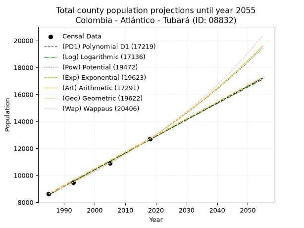
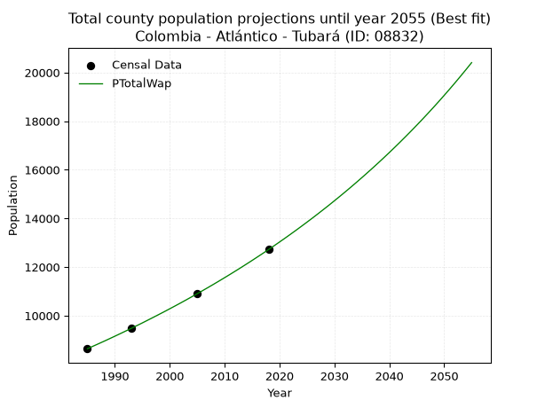
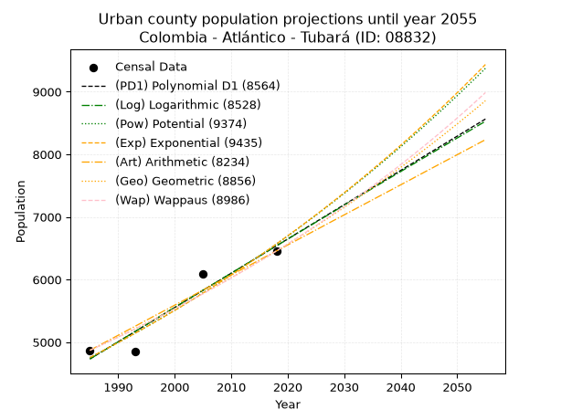
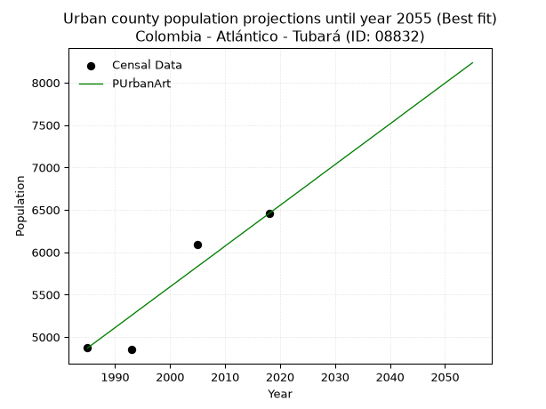
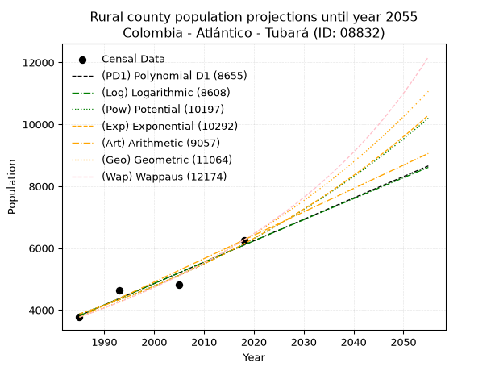
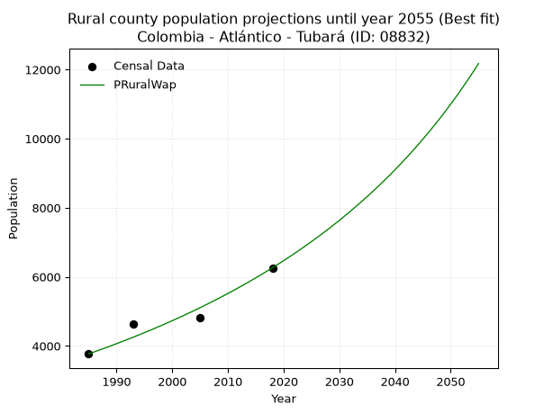

<div align="center">


</div>

# _“Population and Public Services Demand Projections (PPSD) until Year 2050 for Colombia - Atlántico - Tubará (ID: 08832)”_
Keywords: `population` `public-service` `projection` `lineal` `polynomial` `logarithmic` `potential` `exponential` `arithmetic` `geometric` `wappaus` `dane` `colombia` `south-america`

PPSD are analytical estimates used by governments and planners to anticipate future changes in population size, age distribution, and the resulting community needs for utilities, healthcare, education, and infrastructure as sizing future water treatment facilities, electrical grids, and road networks based on spatial growth.

> **General running parameters**: • app_version: _v20260806_. • Python version: _3.14.7_. • Pandas version: _3.0.5_. • NumPy version: _2.5.1_. • Creates, save and include plots into reports (create_plot): _False_. • Projection until year: _2050_. • Process polynomial degree 2 and up: _False_. • Process Wappaus: _True_. • Process Wappaus: _True_. • Set negative values to zero: _True_. • Set infinite values to zero: _True_. • Drop dataset notes: _True_. 
<div align="center">

Dynamic map: [:earth_americas:Google](http://maps.google.com/maps?q=10.87358611,-74.978704) [:earth_americas:OSM](https://www.openstreetmap.org/#map=18/10.87358611/-74.978704&layers=P) [:earth_americas:Bing](https://www.bing.com/maps?cp=10.87358611~-74.978704&lvl=18) [:earth_americas:Apple](https://maps.apple.com/frame?center=10.87358611%2C-74.978704&span=0.003%2C0.006)

</div>


<div align="center">

```geojson
{
  "type": "Feature",
  "geometry": {
    "type": "Point", 
    "coordinates": [-74.978704, 10.87358611]
  }, 
  "properties": {
    "Name": "Colombia - Atlántico - Tubará (ID: 08832)"
  }
}
```

</div>


## 0. Census Data (4 records)

Census data are official statistics collected by a government about the people and housing in a country. They usually include counts of total population, age, sex, race, income, education, and jobs.

📅Global census file: [Population.xlsx](../data/Population.xlsx)

| Source   |   Year |   CountryID | CountryName   |   StateID | StateName   |   CountyID | CountyName   |   PTotal |   PUrban |   PRural |
|:---------|-------:|------------:|:--------------|----------:|:------------|-----------:|:-------------|---------:|---------:|---------:|
| DANE     |   1985 |          57 | Colombia      |        08 | Atlántico   |      08832 | Tubará       |     8639 |     4870 |     3769 |
| DANE     |   1993 |          57 | Colombia      |        08 | Atlántico   |      08832 | Tubará       |     9477 |     4851 |     4626 |
| DANE     |   2005 |          57 | Colombia      |        08 | Atlántico   |      08832 | Tubará       |    10915 |     6091 |     4824 |
| DANE     |   2018 |          57 | Colombia      |        08 | Atlántico   |      08832 | Tubará       |    12718 |     6456 |     6262 |

> 🔥Some records could had specific notes about the registered values or the corresponding urban or rural distribution.

## 1. Total

### 1.1. Coefficients and Parameters

* (PD1) Polynomial Deg 1: 123.8663187474897, -237326.3540746663 (lineal)
* (Log) Logarithmic: 247900.31040642646, -1873854.995947661
* (Pow) Potential: 23.476323018006795, -73.48322843137288
* (Exp) Exponential: 0.011728726840590504, 6.686180632949652e-07
* (Art) Arithmetic: Year diff. 2018 - 1985 = 33, Population diff. 12718 - 8639 = 4079, Annual growth = 123.60606060606061
* (Geo) Geometric: Year diff. 2018 - 1985 = 33, Population diff. 12718 - 8639 = 4079, Annual growth % = 0.011788073786553444
* (Wap) Wappaus: i = 1.1575226914459953, Condition values only valid for < 200)

<sub>
Wappaus condition values: ['0.00', '1.16', '2.32', '3.47', '4.63', '5.79', '6.95', '8.10', '9.26', '10.42', '11.58', '12.73', '13.89', '15.05', '16.21', '17.36', '18.52', '19.68', '20.84', '21.99', '23.15', '24.31', '25.47', '26.62', '27.78', '28.94', '30.10', '31.25', '32.41', '33.57', '34.73', '35.88', '37.04', '38.20', '39.36', '40.51', '41.67', '42.83', '43.99', '45.14', '46.30', '47.46', '48.62', '49.77', '50.93', '52.09', '53.25', '54.40', '55.56', '56.72', '57.88', '59.03', '60.19', '61.35', '62.51', '63.66', '64.82', '65.98', '67.14', '68.29', '69.45', '70.61', '71.77', '72.92', '74.08', '75.24']
</sub>


### 1.2. Projected Dataset

|   Year |   CountyID |   PTotalPD1 |   PTotalLog |   PTotalPow |   PTotalExp |   PTotalArt |   PTotalGeo |   PTotalWap |
|-------:|-----------:|------------:|------------:|------------:|------------:|------------:|------------:|------------:|
|   1985 |      08832 |        8548 |        8545 |        8631 |        8634 |        8639 |        8639 |        8639 |
|   1986 |      08832 |        8672 |        8670 |        8734 |        8736 |        8763 |        8741 |        8740 |
|   1987 |      08832 |        8796 |        8794 |        8838 |        8839 |        8886 |        8844 |        8841 |
|   1988 |      08832 |        8920 |        8919 |        8943 |        8943 |        9010 |        8948 |        8944 |
|   1989 |      08832 |        9044 |        9044 |        9049 |        9049 |        9133 |        9054 |        9048 |
|   1990 |      08832 |        9168 |        9168 |        9156 |        9156 |        9257 |        9160 |        9154 |
|   1991 |      08832 |        9291 |        9293 |        9265 |        9264 |        9381 |        9268 |        9261 |
|   1992 |      08832 |        9415 |        9417 |        9375 |        9373 |        9504 |        9378 |        9369 |
|   1993 |      08832 |        9539 |        9542 |        9486 |        9483 |        9628 |        9488 |        9478 |
|   1994 |      08832 |        9663 |        9666 |        9598 |        9595 |        9751 |        9600 |        9588 |
|   1995 |      08832 |        9787 |        9791 |        9712 |        9709 |        9875 |        9713 |        9700 |
|   1996 |      08832 |        9911 |        9915 |        9827 |        9823 |        9999 |        9828 |        9814 |
|   1997 |      08832 |       10035 |       10039 |        9943 |        9939 |       10122 |        9943 |        9929 |
|   1998 |      08832 |       10159 |       10163 |       10060 |       10056 |       10246 |       10061 |       10045 |
|   1999 |      08832 |       10282 |       10287 |       10179 |       10175 |       10369 |       10179 |       10162 |
|   2000 |      08832 |       10406 |       10411 |       10300 |       10295 |       10493 |       10299 |       10282 |
|   2001 |      08832 |       10530 |       10535 |       10421 |       10416 |       10617 |       10421 |       10402 |
|   2002 |      08832 |       10654 |       10659 |       10544 |       10539 |       10740 |       10544 |       10524 |
|   2003 |      08832 |       10778 |       10783 |       10668 |       10664 |       10864 |       10668 |       10648 |
|   2004 |      08832 |       10902 |       10906 |       10794 |       10789 |       10988 |       10794 |       10774 |
|   2005 |      08832 |       11026 |       11030 |       10921 |       10917 |       11111 |       10921 |       10901 |
|   2006 |      08832 |       11149 |       11154 |       11050 |       11045 |       11235 |       11050 |       11030 |
|   2007 |      08832 |       11273 |       11277 |       11180 |       11176 |       11358 |       11180 |       11160 |
|   2008 |      08832 |       11397 |       11401 |       11311 |       11308 |       11482 |       11312 |       11292 |
|   2009 |      08832 |       11521 |       11524 |       11444 |       11441 |       11606 |       11445 |       11426 |
|   2010 |      08832 |       11645 |       11647 |       11579 |       11576 |       11729 |       11580 |       11562 |
|   2011 |      08832 |       11769 |       11771 |       11715 |       11713 |       11853 |       11716 |       11699 |
|   2012 |      08832 |       11893 |       11894 |       11852 |       11851 |       11976 |       11854 |       11839 |
|   2013 |      08832 |       12017 |       12017 |       11992 |       11991 |       12100 |       11994 |       11980 |
|   2014 |      08832 |       12140 |       12140 |       12132 |       12132 |       12224 |       12136 |       12124 |
|   2015 |      08832 |       12264 |       12263 |       12274 |       12275 |       12347 |       12279 |       12269 |
|   2016 |      08832 |       12388 |       12386 |       12418 |       12420 |       12471 |       12423 |       12417 |
|   2017 |      08832 |       12512 |       12509 |       12564 |       12566 |       12594 |       12570 |       12566 |
|   2018 |      08832 |       12636 |       12632 |       12711 |       12715 |       12718 |       12718 |       12718 |
|   2019 |      08832 |       12760 |       12755 |       12859 |       12865 |       12842 |       12868 |       12872 |
|   2020 |      08832 |       12884 |       12878 |       13010 |       13017 |       12965 |       13020 |       13028 |
|   2021 |      08832 |       13007 |       13000 |       13162 |       13170 |       13089 |       13173 |       13186 |
|   2022 |      08832 |       13131 |       13123 |       13316 |       13325 |       13212 |       13328 |       13347 |
|   2023 |      08832 |       13255 |       13246 |       13471 |       13483 |       13336 |       13485 |       13510 |
|   2024 |      08832 |       13379 |       13368 |       13628 |       13642 |       13460 |       13644 |       13676 |
|   2025 |      08832 |       13503 |       13491 |       13787 |       13803 |       13583 |       13805 |       13844 |
|   2026 |      08832 |       13627 |       13613 |       13948 |       13966 |       13707 |       13968 |       14014 |
|   2027 |      08832 |       13751 |       13735 |       14110 |       14130 |       13830 |       14133 |       14188 |
|   2028 |      08832 |       13875 |       13858 |       14275 |       14297 |       13954 |       14299 |       14364 |
|   2029 |      08832 |       13998 |       13980 |       14441 |       14466 |       14078 |       14468 |       14542 |
|   2030 |      08832 |       14122 |       14102 |       14609 |       14636 |       14201 |       14638 |       14724 |
|   2031 |      08832 |       14246 |       14224 |       14779 |       14809 |       14325 |       14811 |       14908 |
|   2032 |      08832 |       14370 |       14346 |       14951 |       14984 |       14448 |       14986 |       15095 |
|   2033 |      08832 |       14494 |       14468 |       15124 |       15161 |       14572 |       15162 |       15285 |
|   2034 |      08832 |       14618 |       14590 |       15300 |       15339 |       14696 |       15341 |       15479 |
|   2035 |      08832 |       14742 |       14712 |       15477 |       15520 |       14819 |       15522 |       15675 |
|   2036 |      08832 |       14865 |       14834 |       15657 |       15703 |       14943 |       15705 |       15875 |
|   2037 |      08832 |       14989 |       14955 |       15838 |       15889 |       15067 |       15890 |       16078 |
|   2038 |      08832 |       15113 |       15077 |       16022 |       16076 |       15190 |       16077 |       16284 |
|   2039 |      08832 |       15237 |       15199 |       16208 |       16266 |       15314 |       16267 |       16494 |
|   2040 |      08832 |       15361 |       15320 |       16395 |       16458 |       15437 |       16458 |       16707 |
|   2041 |      08832 |       15485 |       15442 |       16585 |       16652 |       15561 |       16652 |       16924 |
|   2042 |      08832 |       15609 |       15563 |       16777 |       16848 |       15685 |       16849 |       17145 |
|   2043 |      08832 |       15733 |       15684 |       16971 |       17047 |       15808 |       17047 |       17370 |
|   2044 |      08832 |       15856 |       15806 |       17167 |       17248 |       15932 |       17248 |       17598 |
|   2045 |      08832 |       15980 |       15927 |       17365 |       17452 |       16055 |       17452 |       17831 |
|   2046 |      08832 |       16104 |       16048 |       17566 |       17658 |       16179 |       17657 |       18068 |
|   2047 |      08832 |       16228 |       16169 |       17768 |       17866 |       16303 |       17866 |       18309 |
|   2048 |      08832 |       16352 |       16290 |       17973 |       18077 |       16426 |       18076 |       18554 |
|   2049 |      08832 |       16476 |       16411 |       18180 |       18290 |       16550 |       18289 |       18804 |
|   2050 |      08832 |       16600 |       16532 |       18390 |       18506 |       16673 |       18505 |       19059 |
<div align="center">

</img>

</div>


### 1.3. Best fit with absolute and relative error (%)

Relative error puts that difference into context by dividing the absolute error by the true value, creating a unitless ratio or percentage that shows the scale of the mistake.

Absolute and relative error

|   Year | Source   |   CountryID | CountryName   |   StateID | StateName   |   CountyID_x | CountyName   |   PTotal |   PUrban |   PRural |   CountyID_y |   PTotalPD1 |   PTotalLog |   PTotalPow |   PTotalExp |   PTotalArt |   PTotalGeo |   PTotalWap |   PTotalPD1AbsError |   PTotalLogAbsError |   PTotalPowAbsError |   PTotalExpAbsError |   PTotalArtAbsError |   PTotalGeoAbsError |   PTotalWapAbsError |   PTotalPD1RelError |   PTotalLogRelError |   PTotalPowRelError |   PTotalExpRelError |   PTotalArtRelError |   PTotalGeoRelError |   PTotalWapRelError |
|-------:|:---------|------------:|:--------------|----------:|:------------|-------------:|:-------------|---------:|---------:|---------:|-------------:|------------:|------------:|------------:|------------:|------------:|------------:|------------:|--------------------:|--------------------:|--------------------:|--------------------:|--------------------:|--------------------:|--------------------:|--------------------:|--------------------:|--------------------:|--------------------:|--------------------:|--------------------:|--------------------:|
|   1985 | DANE     |          57 | Colombia      |        08 | Atlántico   |        08832 | Tubará       |     8639 |     4870 |     3769 |        08832 |        8548 |        8545 |        8631 |        8634 |        8639 |        8639 |        8639 |                  91 |                  94 |                   8 |                   5 |                   0 |                   0 |                   0 |            1.05336  |            1.08809  |           0.0926033 |           0.0578771 |             0       |           0         |           0         |
|   1993 | DANE     |          57 | Colombia      |        08 | Atlántico   |        08832 | Tubará       |     9477 |     4851 |     4626 |        08832 |        9539 |        9542 |        9486 |        9483 |        9628 |        9488 |        9478 |                  62 |                  65 |                   9 |                   6 |                 151 |                  11 |                   1 |            0.654215 |            0.685871 |           0.0949668 |           0.0633112 |             1.59333 |           0.11607   |           0.0105519 |
|   2005 | DANE     |          57 | Colombia      |        08 | Atlántico   |        08832 | Tubará       |    10915 |     6091 |     4824 |        08832 |       11026 |       11030 |       10921 |       10917 |       11111 |       10921 |       10901 |                 111 |                 115 |                   6 |                   2 |                 196 |                   6 |                  14 |            1.01695  |            1.0536   |           0.0549702 |           0.0183234 |             1.79569 |           0.0549702 |           0.128264  |
|   2018 | DANE     |          57 | Colombia      |        08 | Atlántico   |        08832 | Tubará       |    12718 |     6456 |     6262 |        08832 |       12636 |       12632 |       12711 |       12715 |       12718 |       12718 |       12718 |                  82 |                  86 |                   7 |                   3 |                   0 |                   0 |                   0 |            0.644755 |            0.676207 |           0.0550401 |           0.0235886 |             0       |           0         |           0         |

Relative error mean

| Method    |   RelError | Best   |
|:----------|-----------:|:-------|
| PTotalPD1 |  0.842321  |        |
| PTotalLog |  0.875941  |        |
| PTotalPow |  0.0743951 |        |
| PTotalExp |  0.0407751 |        |
| PTotalArt |  0.847256  |        |
| PTotalGeo |  0.0427602 |        |
| PTotalWap |  0.0347039 | True   |

💙Best method: _**PTotalWap**_
<div align="center">

</img>

</div>


### 1.4. Fresh water supply demand in liters per capita per day (lpcd)

The fresh water supply demand typically ranges from 100 to 300 liters per capita per day (lpcd) for standard domestic and municipal planning, though absolute survival minimums set by the World Health Organization are as low as 7.5 to 20 liters per day, and total consumption in high-income nations can exceed 400 liters.

> `CZ`: Level in meters above the sea level (masl).<br> `WS`: Fresh water supply demand in liters per capita per day (lpcd or l/h/d).<br> `WSAll`: Zonal fresh water supply demand in liters per second (l/s).<br> `A`: Zonal area in square meters.

Reference values (RAS Colombia)

|    CZ |   WS |
|------:|-----:|
|  1000 |  120 |
|  2000 |  130 |
| 99999 |  140 |

County shapefile geometry properties and water supply values

|   CountyID |      ATotal |   CZTotal |   WSTotal |
|-----------:|------------:|----------:|----------:|
|      08832 | 1.83001e+08 |    98.491 |       120 |

Projected values for best method: PTotalWap

|   CountyID |   Year |   PTotalWap |   WSTotal |   WSTotalAll |
|-----------:|-------:|------------:|----------:|-------------:|
|      08832 |   1985 |        8639 |       120 |      11.9986 |
|      08832 |   1986 |        8740 |       120 |      12.1389 |
|      08832 |   1987 |        8841 |       120 |      12.2792 |
|      08832 |   1988 |        8944 |       120 |      12.4222 |
|      08832 |   1989 |        9048 |       120 |      12.5667 |
|      08832 |   1990 |        9154 |       120 |      12.7139 |
|      08832 |   1991 |        9261 |       120 |      12.8625 |
|      08832 |   1992 |        9369 |       120 |      13.0125 |
|      08832 |   1993 |        9478 |       120 |      13.1639 |
|      08832 |   1994 |        9588 |       120 |      13.3167 |
|      08832 |   1995 |        9700 |       120 |      13.4722 |
|      08832 |   1996 |        9814 |       120 |      13.6306 |
|      08832 |   1997 |        9929 |       120 |      13.7903 |
|      08832 |   1998 |       10045 |       120 |      13.9514 |
|      08832 |   1999 |       10162 |       120 |      14.1139 |
|      08832 |   2000 |       10282 |       120 |      14.2806 |
|      08832 |   2001 |       10402 |       120 |      14.4472 |
|      08832 |   2002 |       10524 |       120 |      14.6167 |
|      08832 |   2003 |       10648 |       120 |      14.7889 |
|      08832 |   2004 |       10774 |       120 |      14.9639 |
|      08832 |   2005 |       10901 |       120 |      15.1403 |
|      08832 |   2006 |       11030 |       120 |      15.3194 |
|      08832 |   2007 |       11160 |       120 |      15.5    |
|      08832 |   2008 |       11292 |       120 |      15.6833 |
|      08832 |   2009 |       11426 |       120 |      15.8694 |
|      08832 |   2010 |       11562 |       120 |      16.0583 |
|      08832 |   2011 |       11699 |       120 |      16.2486 |
|      08832 |   2012 |       11839 |       120 |      16.4431 |
|      08832 |   2013 |       11980 |       120 |      16.6389 |
|      08832 |   2014 |       12124 |       120 |      16.8389 |
|      08832 |   2015 |       12269 |       120 |      17.0403 |
|      08832 |   2016 |       12417 |       120 |      17.2458 |
|      08832 |   2017 |       12566 |       120 |      17.4528 |
|      08832 |   2018 |       12718 |       120 |      17.6639 |
|      08832 |   2019 |       12872 |       120 |      17.8778 |
|      08832 |   2020 |       13028 |       120 |      18.0944 |
|      08832 |   2021 |       13186 |       120 |      18.3139 |
|      08832 |   2022 |       13347 |       120 |      18.5375 |
|      08832 |   2023 |       13510 |       120 |      18.7639 |
|      08832 |   2024 |       13676 |       120 |      18.9944 |
|      08832 |   2025 |       13844 |       120 |      19.2278 |
|      08832 |   2026 |       14014 |       120 |      19.4639 |
|      08832 |   2027 |       14188 |       120 |      19.7056 |
|      08832 |   2028 |       14364 |       120 |      19.95   |
|      08832 |   2029 |       14542 |       120 |      20.1972 |
|      08832 |   2030 |       14724 |       120 |      20.45   |
|      08832 |   2031 |       14908 |       120 |      20.7056 |
|      08832 |   2032 |       15095 |       120 |      20.9653 |
|      08832 |   2033 |       15285 |       120 |      21.2292 |
|      08832 |   2034 |       15479 |       120 |      21.4986 |
|      08832 |   2035 |       15675 |       120 |      21.7708 |
|      08832 |   2036 |       15875 |       120 |      22.0486 |
|      08832 |   2037 |       16078 |       120 |      22.3306 |
|      08832 |   2038 |       16284 |       120 |      22.6167 |
|      08832 |   2039 |       16494 |       120 |      22.9083 |
|      08832 |   2040 |       16707 |       120 |      23.2042 |
|      08832 |   2041 |       16924 |       120 |      23.5056 |
|      08832 |   2042 |       17145 |       120 |      23.8125 |
|      08832 |   2043 |       17370 |       120 |      24.125  |
|      08832 |   2044 |       17598 |       120 |      24.4417 |
|      08832 |   2045 |       17831 |       120 |      24.7653 |
|      08832 |   2046 |       18068 |       120 |      25.0944 |
|      08832 |   2047 |       18309 |       120 |      25.4292 |
|      08832 |   2048 |       18554 |       120 |      25.7694 |
|      08832 |   2049 |       18804 |       120 |      26.1167 |
|      08832 |   2050 |       19059 |       120 |      26.4708 |

## 2. Urban

### 2.1. Coefficients and Parameters

* (PD1) Polynomial Deg 1: 54.73946206342806, -103925.60899237196 (lineal)
* (Log) Logarithmic: 109571.29747793709, -827285.3101790722
* (Pow) Potential: 19.5917676856434, -60.931907825147356
* (Exp) Exponential: 0.009787252867339103, 1.737163218086936e-05
* (Art) Arithmetic: Year diff. 2018 - 1985 = 33, Population diff. 6456 - 4870 = 1586, Annual growth = 48.06060606060606
* (Geo) Geometric: Year diff. 2018 - 1985 = 33, Population diff. 6456 - 4870 = 1586, Annual growth % = 0.008579503685925305
* (Wap) Wappaus: i = 0.8486774865019612, Condition values only valid for < 200)

<sub>
Wappaus condition values: ['0.00', '0.85', '1.70', '2.55', '3.39', '4.24', '5.09', '5.94', '6.79', '7.64', '8.49', '9.34', '10.18', '11.03', '11.88', '12.73', '13.58', '14.43', '15.28', '16.12', '16.97', '17.82', '18.67', '19.52', '20.37', '21.22', '22.07', '22.91', '23.76', '24.61', '25.46', '26.31', '27.16', '28.01', '28.86', '29.70', '30.55', '31.40', '32.25', '33.10', '33.95', '34.80', '35.64', '36.49', '37.34', '38.19', '39.04', '39.89', '40.74', '41.59', '42.43', '43.28', '44.13', '44.98', '45.83', '46.68', '47.53', '48.37', '49.22', '50.07', '50.92', '51.77', '52.62', '53.47', '54.32', '55.16']
</sub>


### 2.2. Projected Dataset

|   Year |   CountyID |   PUrbanPD1 |   PUrbanLog |   PUrbanPow |   PUrbanExp |   PUrbanArt |   PUrbanGeo |   PUrbanWap |
|-------:|-----------:|------------:|------------:|------------:|------------:|------------:|------------:|------------:|
|   1985 |      08832 |        4732 |        4731 |        4754 |        4755 |        4870 |        4870 |        4870 |
|   1986 |      08832 |        4787 |        4786 |        4801 |        4802 |        4918 |        4912 |        4912 |
|   1987 |      08832 |        4842 |        4841 |        4849 |        4849 |        4966 |        4954 |        4953 |
|   1988 |      08832 |        4896 |        4896 |        4897 |        4897 |        5014 |        4996 |        4996 |
|   1989 |      08832 |        4951 |        4951 |        4945 |        4945 |        5062 |        5039 |        5038 |
|   1990 |      08832 |        5006 |        5006 |        4994 |        4994 |        5110 |        5083 |        5081 |
|   1991 |      08832 |        5061 |        5061 |        5043 |        5043 |        5158 |        5126 |        5124 |
|   1992 |      08832 |        5115 |        5116 |        5093 |        5093 |        5206 |        5170 |        5168 |
|   1993 |      08832 |        5170 |        5171 |        5144 |        5143 |        5254 |        5214 |        5212 |
|   1994 |      08832 |        5225 |        5226 |        5194 |        5193 |        5303 |        5259 |        5257 |
|   1995 |      08832 |        5280 |        5281 |        5246 |        5244 |        5351 |        5304 |        5302 |
|   1996 |      08832 |        5334 |        5336 |        5297 |        5296 |        5399 |        5350 |        5347 |
|   1997 |      08832 |        5389 |        5391 |        5350 |        5348 |        5447 |        5396 |        5393 |
|   1998 |      08832 |        5444 |        5446 |        5402 |        5401 |        5495 |        5442 |        5439 |
|   1999 |      08832 |        5499 |        5501 |        5456 |        5454 |        5543 |        5489 |        5485 |
|   2000 |      08832 |        5553 |        5555 |        5509 |        5507 |        5591 |        5536 |        5532 |
|   2001 |      08832 |        5608 |        5610 |        5564 |        5561 |        5639 |        5583 |        5579 |
|   2002 |      08832 |        5663 |        5665 |        5618 |        5616 |        5687 |        5631 |        5627 |
|   2003 |      08832 |        5718 |        5720 |        5674 |        5671 |        5735 |        5680 |        5675 |
|   2004 |      08832 |        5772 |        5774 |        5729 |        5727 |        5783 |        5728 |        5724 |
|   2005 |      08832 |        5827 |        5829 |        5786 |        5784 |        5831 |        5777 |        5773 |
|   2006 |      08832 |        5882 |        5884 |        5842 |        5840 |        5879 |        5827 |        5823 |
|   2007 |      08832 |        5936 |        5938 |        5900 |        5898 |        5927 |        5877 |        5873 |
|   2008 |      08832 |        5991 |        5993 |        5958 |        5956 |        5975 |        5927 |        5923 |
|   2009 |      08832 |        6046 |        6047 |        6016 |        6014 |        6023 |        5978 |        5974 |
|   2010 |      08832 |        6101 |        6102 |        6075 |        6074 |        6072 |        6030 |        6026 |
|   2011 |      08832 |        6155 |        6156 |        6134 |        6133 |        6120 |        6081 |        6078 |
|   2012 |      08832 |        6210 |        6211 |        6194 |        6194 |        6168 |        6133 |        6130 |
|   2013 |      08832 |        6265 |        6265 |        6255 |        6255 |        6216 |        6186 |        6183 |
|   2014 |      08832 |        6320 |        6320 |        6316 |        6316 |        6264 |        6239 |        6237 |
|   2015 |      08832 |        6374 |        6374 |        6378 |        6378 |        6312 |        6293 |        6291 |
|   2016 |      08832 |        6429 |        6429 |        6440 |        6441 |        6360 |        6347 |        6345 |
|   2017 |      08832 |        6484 |        6483 |        6503 |        6504 |        6408 |        6401 |        6400 |
|   2018 |      08832 |        6539 |        6537 |        6567 |        6568 |        6456 |        6456 |        6456 |
|   2019 |      08832 |        6593 |        6591 |        6631 |        6633 |        6504 |        6511 |        6512 |
|   2020 |      08832 |        6648 |        6646 |        6695 |        6698 |        6552 |        6567 |        6569 |
|   2021 |      08832 |        6703 |        6700 |        6761 |        6764 |        6600 |        6624 |        6626 |
|   2022 |      08832 |        6758 |        6754 |        6826 |        6831 |        6648 |        6680 |        6684 |
|   2023 |      08832 |        6812 |        6808 |        6893 |        6898 |        6696 |        6738 |        6743 |
|   2024 |      08832 |        6867 |        6862 |        6960 |        6966 |        6744 |        6796 |        6802 |
|   2025 |      08832 |        6922 |        6917 |        7028 |        7034 |        6792 |        6854 |        6861 |
|   2026 |      08832 |        6977 |        6971 |        7096 |        7103 |        6840 |        6913 |        6921 |
|   2027 |      08832 |        7031 |        7025 |        7165 |        7173 |        6889 |        6972 |        6982 |
|   2028 |      08832 |        7086 |        7079 |        7234 |        7244 |        6937 |        7032 |        7044 |
|   2029 |      08832 |        7141 |        7133 |        7305 |        7315 |        6985 |        7092 |        7106 |
|   2030 |      08832 |        7195 |        7187 |        7375 |        7387 |        7033 |        7153 |        7169 |
|   2031 |      08832 |        7250 |        7241 |        7447 |        7459 |        7081 |        7214 |        7232 |
|   2032 |      08832 |        7305 |        7295 |        7519 |        7533 |        7129 |        7276 |        7296 |
|   2033 |      08832 |        7360 |        7349 |        7592 |        7607 |        7177 |        7339 |        7361 |
|   2034 |      08832 |        7414 |        7402 |        7665 |        7682 |        7225 |        7402 |        7427 |
|   2035 |      08832 |        7469 |        7456 |        7740 |        7757 |        7273 |        7465 |        7493 |
|   2036 |      08832 |        7524 |        7510 |        7814 |        7834 |        7321 |        7529 |        7560 |
|   2037 |      08832 |        7579 |        7564 |        7890 |        7911 |        7369 |        7594 |        7628 |
|   2038 |      08832 |        7633 |        7618 |        7966 |        7988 |        7417 |        7659 |        7696 |
|   2039 |      08832 |        7688 |        7672 |        8043 |        8067 |        7465 |        7725 |        7765 |
|   2040 |      08832 |        7743 |        7725 |        8121 |        8146 |        7513 |        7791 |        7835 |
|   2041 |      08832 |        7798 |        7779 |        8199 |        8226 |        7561 |        7858 |        7906 |
|   2042 |      08832 |        7852 |        7833 |        8278 |        8307 |        7609 |        7925 |        7977 |
|   2043 |      08832 |        7907 |        7886 |        8358 |        8389 |        7658 |        7993 |        8050 |
|   2044 |      08832 |        7962 |        7940 |        8438 |        8472 |        7706 |        8062 |        8123 |
|   2045 |      08832 |        8017 |        7993 |        8520 |        8555 |        7754 |        8131 |        8197 |
|   2046 |      08832 |        8071 |        8047 |        8602 |        8639 |        7802 |        8201 |        8272 |
|   2047 |      08832 |        8126 |        8101 |        8684 |        8724 |        7850 |        8271 |        8347 |
|   2048 |      08832 |        8181 |        8154 |        8768 |        8810 |        7898 |        8342 |        8424 |
|   2049 |      08832 |        8236 |        8208 |        8852 |        8896 |        7946 |        8414 |        8501 |
|   2050 |      08832 |        8290 |        8261 |        8937 |        8984 |        7994 |        8486 |        8580 |
<div align="center">

</img>

</div>


### 2.3. Best fit with absolute and relative error (%)

Relative error puts that difference into context by dividing the absolute error by the true value, creating a unitless ratio or percentage that shows the scale of the mistake.

Absolute and relative error

|   Year | Source   |   CountryID | CountryName   |   StateID | StateName   |   CountyID_x | CountyName   |   PTotal |   PUrban |   PRural |   CountyID_y |   PUrbanPD1 |   PUrbanLog |   PUrbanPow |   PUrbanExp |   PUrbanArt |   PUrbanGeo |   PUrbanWap |   PUrbanPD1AbsError |   PUrbanLogAbsError |   PUrbanPowAbsError |   PUrbanExpAbsError |   PUrbanArtAbsError |   PUrbanGeoAbsError |   PUrbanWapAbsError |   PUrbanPD1RelError |   PUrbanLogRelError |   PUrbanPowRelError |   PUrbanExpRelError |   PUrbanArtRelError |   PUrbanGeoRelError |   PUrbanWapRelError |
|-------:|:---------|------------:|:--------------|----------:|:------------|-------------:|:-------------|---------:|---------:|---------:|-------------:|------------:|------------:|------------:|------------:|------------:|------------:|------------:|--------------------:|--------------------:|--------------------:|--------------------:|--------------------:|--------------------:|--------------------:|--------------------:|--------------------:|--------------------:|--------------------:|--------------------:|--------------------:|--------------------:|
|   1985 | DANE     |          57 | Colombia      |        08 | Atlántico   |        08832 | Tubará       |     8639 |     4870 |     3769 |        08832 |        4732 |        4731 |        4754 |        4755 |        4870 |        4870 |        4870 |                 138 |                 139 |                 116 |                 115 |                   0 |                   0 |                   0 |             2.83368 |             2.85421 |             2.38193 |             2.3614  |             0       |             0       |             0       |
|   1993 | DANE     |          57 | Colombia      |        08 | Atlántico   |        08832 | Tubará       |     9477 |     4851 |     4626 |        08832 |        5170 |        5171 |        5144 |        5143 |        5254 |        5214 |        5212 |                 319 |                 320 |                 293 |                 292 |                 403 |                 363 |                 361 |             6.57596 |             6.59658 |             6.03999 |             6.01938 |             8.30757 |             7.48299 |             7.44176 |
|   2005 | DANE     |          57 | Colombia      |        08 | Atlántico   |        08832 | Tubará       |    10915 |     6091 |     4824 |        08832 |        5827 |        5829 |        5786 |        5784 |        5831 |        5777 |        5773 |                 264 |                 262 |                 305 |                 307 |                 260 |                 314 |                 318 |             4.33426 |             4.30143 |             5.00739 |             5.04022 |             4.26859 |             5.15515 |             5.22082 |
|   2018 | DANE     |          57 | Colombia      |        08 | Atlántico   |        08832 | Tubará       |    12718 |     6456 |     6262 |        08832 |        6539 |        6537 |        6567 |        6568 |        6456 |        6456 |        6456 |                  83 |                  81 |                 111 |                 112 |                   0 |                   0 |                   0 |             1.28563 |             1.25465 |             1.71933 |             1.73482 |             0       |             0       |             0       |

Relative error mean

| Method    |   RelError | Best   |
|:----------|-----------:|:-------|
| PUrbanPD1 |    3.75738 |        |
| PUrbanLog |    3.75172 |        |
| PUrbanPow |    3.78716 |        |
| PUrbanExp |    3.78895 |        |
| PUrbanArt |    3.14404 | True   |
| PUrbanGeo |    3.15954 |        |
| PUrbanWap |    3.16565 |        |

💙Best method: _**PUrbanArt**_
<div align="center">

</img>

</div>


### 2.4. Fresh water supply demand in liters per capita per day (lpcd)

The fresh water supply demand typically ranges from 100 to 300 liters per capita per day (lpcd) for standard domestic and municipal planning, though absolute survival minimums set by the World Health Organization are as low as 7.5 to 20 liters per day, and total consumption in high-income nations can exceed 400 liters.

> `CZ`: Level in meters above the sea level (masl).<br> `WS`: Fresh water supply demand in liters per capita per day (lpcd or l/h/d).<br> `WSAll`: Zonal fresh water supply demand in liters per second (l/s).<br> `A`: Zonal area in square meters.

Reference values (RAS Colombia)

|    CZ |   WS |
|------:|-----:|
|  1000 |  120 |
|  2000 |  130 |
| 99999 |  140 |

County shapefile geometry properties and water supply values

|   CountyID |      AUrban |   CZUrban |   WSUrban |
|-----------:|------------:|----------:|----------:|
|      08832 | 1.00592e+06 |   253.925 |       120 |

Projected values for best method: PUrbanArt

|   CountyID |   Year |   PUrbanArt |   WSUrban |   WSUrbanAll |
|-----------:|-------:|------------:|----------:|-------------:|
|      08832 |   1985 |        4870 |       120 |      6.76389 |
|      08832 |   1986 |        4918 |       120 |      6.83056 |
|      08832 |   1987 |        4966 |       120 |      6.89722 |
|      08832 |   1988 |        5014 |       120 |      6.96389 |
|      08832 |   1989 |        5062 |       120 |      7.03056 |
|      08832 |   1990 |        5110 |       120 |      7.09722 |
|      08832 |   1991 |        5158 |       120 |      7.16389 |
|      08832 |   1992 |        5206 |       120 |      7.23056 |
|      08832 |   1993 |        5254 |       120 |      7.29722 |
|      08832 |   1994 |        5303 |       120 |      7.36528 |
|      08832 |   1995 |        5351 |       120 |      7.43194 |
|      08832 |   1996 |        5399 |       120 |      7.49861 |
|      08832 |   1997 |        5447 |       120 |      7.56528 |
|      08832 |   1998 |        5495 |       120 |      7.63194 |
|      08832 |   1999 |        5543 |       120 |      7.69861 |
|      08832 |   2000 |        5591 |       120 |      7.76528 |
|      08832 |   2001 |        5639 |       120 |      7.83194 |
|      08832 |   2002 |        5687 |       120 |      7.89861 |
|      08832 |   2003 |        5735 |       120 |      7.96528 |
|      08832 |   2004 |        5783 |       120 |      8.03194 |
|      08832 |   2005 |        5831 |       120 |      8.09861 |
|      08832 |   2006 |        5879 |       120 |      8.16528 |
|      08832 |   2007 |        5927 |       120 |      8.23194 |
|      08832 |   2008 |        5975 |       120 |      8.29861 |
|      08832 |   2009 |        6023 |       120 |      8.36528 |
|      08832 |   2010 |        6072 |       120 |      8.43333 |
|      08832 |   2011 |        6120 |       120 |      8.5     |
|      08832 |   2012 |        6168 |       120 |      8.56667 |
|      08832 |   2013 |        6216 |       120 |      8.63333 |
|      08832 |   2014 |        6264 |       120 |      8.7     |
|      08832 |   2015 |        6312 |       120 |      8.76667 |
|      08832 |   2016 |        6360 |       120 |      8.83333 |
|      08832 |   2017 |        6408 |       120 |      8.9     |
|      08832 |   2018 |        6456 |       120 |      8.96667 |
|      08832 |   2019 |        6504 |       120 |      9.03333 |
|      08832 |   2020 |        6552 |       120 |      9.1     |
|      08832 |   2021 |        6600 |       120 |      9.16667 |
|      08832 |   2022 |        6648 |       120 |      9.23333 |
|      08832 |   2023 |        6696 |       120 |      9.3     |
|      08832 |   2024 |        6744 |       120 |      9.36667 |
|      08832 |   2025 |        6792 |       120 |      9.43333 |
|      08832 |   2026 |        6840 |       120 |      9.5     |
|      08832 |   2027 |        6889 |       120 |      9.56806 |
|      08832 |   2028 |        6937 |       120 |      9.63472 |
|      08832 |   2029 |        6985 |       120 |      9.70139 |
|      08832 |   2030 |        7033 |       120 |      9.76806 |
|      08832 |   2031 |        7081 |       120 |      9.83472 |
|      08832 |   2032 |        7129 |       120 |      9.90139 |
|      08832 |   2033 |        7177 |       120 |      9.96806 |
|      08832 |   2034 |        7225 |       120 |     10.0347  |
|      08832 |   2035 |        7273 |       120 |     10.1014  |
|      08832 |   2036 |        7321 |       120 |     10.1681  |
|      08832 |   2037 |        7369 |       120 |     10.2347  |
|      08832 |   2038 |        7417 |       120 |     10.3014  |
|      08832 |   2039 |        7465 |       120 |     10.3681  |
|      08832 |   2040 |        7513 |       120 |     10.4347  |
|      08832 |   2041 |        7561 |       120 |     10.5014  |
|      08832 |   2042 |        7609 |       120 |     10.5681  |
|      08832 |   2043 |        7658 |       120 |     10.6361  |
|      08832 |   2044 |        7706 |       120 |     10.7028  |
|      08832 |   2045 |        7754 |       120 |     10.7694  |
|      08832 |   2046 |        7802 |       120 |     10.8361  |
|      08832 |   2047 |        7850 |       120 |     10.9028  |
|      08832 |   2048 |        7898 |       120 |     10.9694  |
|      08832 |   2049 |        7946 |       120 |     11.0361  |
|      08832 |   2050 |        7994 |       120 |     11.1028  |

## 3. Rural

### 3.1. Coefficients and Parameters

* (PD1) Polynomial Deg 1: 69.12685668406172, -133400.74508229448 (lineal)
* (Log) Logarithmic: 138329.0129284894, -1046569.685768589
* (Pow) Potential: 27.956268728063602, -88.60537516340501
* (Exp) Exponential: 0.01396766841967829, 3.5213473968839995e-09
* (Art) Arithmetic: Year diff. 2018 - 1985 = 33, Population diff. 6262 - 3769 = 2493, Annual growth = 75.54545454545455
* (Geo) Geometric: Year diff. 2018 - 1985 = 33, Population diff. 6262 - 3769 = 2493, Annual growth % = 0.015503493983169747
* (Wap) Wappaus: i = 1.5062397476912481, Condition values only valid for < 200)

<sub>
Wappaus condition values: ['0.00', '1.51', '3.01', '4.52', '6.02', '7.53', '9.04', '10.54', '12.05', '13.56', '15.06', '16.57', '18.07', '19.58', '21.09', '22.59', '24.10', '25.61', '27.11', '28.62', '30.12', '31.63', '33.14', '34.64', '36.15', '37.66', '39.16', '40.67', '42.17', '43.68', '45.19', '46.69', '48.20', '49.71', '51.21', '52.72', '54.22', '55.73', '57.24', '58.74', '60.25', '61.76', '63.26', '64.77', '66.27', '67.78', '69.29', '70.79', '72.30', '73.81', '75.31', '76.82', '78.32', '79.83', '81.34', '82.84', '84.35', '85.86', '87.36', '88.87', '90.37', '91.88', '93.39', '94.89', '96.40', '97.91']
</sub>


### 3.2. Projected Dataset

|   Year |   CountyID |   PRuralPD1 |   PRuralLog |   PRuralPow |   PRuralExp |   PRuralArt |   PRuralGeo |   PRuralWap |
|-------:|-----------:|------------:|------------:|------------:|------------:|------------:|------------:|------------:|
|   1985 |      08832 |        3816 |        3814 |        3870 |        3872 |        3769 |        3769 |        3769 |
|   1986 |      08832 |        3885 |        3884 |        3925 |        3926 |        3845 |        3827 |        3826 |
|   1987 |      08832 |        3954 |        3954 |        3980 |        3981 |        3920 |        3887 |        3884 |
|   1988 |      08832 |        4023 |        4023 |        4037 |        4037 |        3996 |        3947 |        3943 |
|   1989 |      08832 |        4093 |        4093 |        4094 |        4094 |        4071 |        4008 |        4003 |
|   1990 |      08832 |        4162 |        4162 |        4152 |        4152 |        4147 |        4070 |        4064 |
|   1991 |      08832 |        4231 |        4232 |        4211 |        4210 |        4222 |        4133 |        4126 |
|   1992 |      08832 |        4300 |        4301 |        4270 |        4269 |        4298 |        4198 |        4189 |
|   1993 |      08832 |        4369 |        4371 |        4330 |        4329 |        4373 |        4263 |        4252 |
|   1994 |      08832 |        4438 |        4440 |        4392 |        4390 |        4449 |        4329 |        4317 |
|   1995 |      08832 |        4507 |        4509 |        4454 |        4452 |        4524 |        4396 |        4383 |
|   1996 |      08832 |        4576 |        4579 |        4516 |        4514 |        4600 |        4464 |        4450 |
|   1997 |      08832 |        4646 |        4648 |        4580 |        4578 |        4676 |        4533 |        4518 |
|   1998 |      08832 |        4715 |        4717 |        4645 |        4642 |        4751 |        4603 |        4587 |
|   1999 |      08832 |        4784 |        4786 |        4710 |        4708 |        4827 |        4675 |        4657 |
|   2000 |      08832 |        4853 |        4856 |        4776 |        4774 |        4902 |        4747 |        4729 |
|   2001 |      08832 |        4922 |        4925 |        4844 |        4841 |        4978 |        4821 |        4802 |
|   2002 |      08832 |        4991 |        4994 |        4912 |        4909 |        5053 |        4896 |        4876 |
|   2003 |      08832 |        5060 |        5063 |        4981 |        4978 |        5129 |        4972 |        4951 |
|   2004 |      08832 |        5129 |        5132 |        5051 |        5048 |        5204 |        5049 |        5028 |
|   2005 |      08832 |        5199 |        5201 |        5122 |        5119 |        5280 |        5127 |        5106 |
|   2006 |      08832 |        5268 |        5270 |        5194 |        5191 |        5355 |        5206 |        5185 |
|   2007 |      08832 |        5337 |        5339 |        5267 |        5264 |        5431 |        5287 |        5266 |
|   2008 |      08832 |        5406 |        5408 |        5340 |        5338 |        5507 |        5369 |        5348 |
|   2009 |      08832 |        5475 |        5477 |        5415 |        5413 |        5582 |        5452 |        5432 |
|   2010 |      08832 |        5544 |        5546 |        5491 |        5489 |        5658 |        5537 |        5517 |
|   2011 |      08832 |        5613 |        5614 |        5568 |        5567 |        5733 |        5623 |        5604 |
|   2012 |      08832 |        5682 |        5683 |        5646 |        5645 |        5809 |        5710 |        5693 |
|   2013 |      08832 |        5752 |        5752 |        5725 |        5724 |        5884 |        5798 |        5783 |
|   2014 |      08832 |        5821 |        5821 |        5805 |        5805 |        5960 |        5888 |        5875 |
|   2015 |      08832 |        5890 |        5889 |        5886 |        5887 |        6035 |        5980 |        5969 |
|   2016 |      08832 |        5959 |        5958 |        5968 |        5969 |        6111 |        6072 |        6065 |
|   2017 |      08832 |        6028 |        6026 |        6052 |        6053 |        6186 |        6166 |        6162 |
|   2018 |      08832 |        6097 |        6095 |        6136 |        6138 |        6262 |        6262 |        6262 |
|   2019 |      08832 |        6166 |        6164 |        6222 |        6225 |        6338 |        6359 |        6364 |
|   2020 |      08832 |        6236 |        6232 |        6308 |        6312 |        6413 |        6458 |        6467 |
|   2021 |      08832 |        6305 |        6301 |        6396 |        6401 |        6489 |        6558 |        6573 |
|   2022 |      08832 |        6374 |        6369 |        6485 |        6491 |        6564 |        6659 |        6681 |
|   2023 |      08832 |        6443 |        6437 |        6576 |        6583 |        6640 |        6763 |        6791 |
|   2024 |      08832 |        6512 |        6506 |        6667 |        6675 |        6715 |        6868 |        6904 |
|   2025 |      08832 |        6581 |        6574 |        6760 |        6769 |        6791 |        6974 |        7019 |
|   2026 |      08832 |        6650 |        6642 |        6854 |        6864 |        6866 |        7082 |        7136 |
|   2027 |      08832 |        6719 |        6711 |        6949 |        6961 |        6942 |        7192 |        7256 |
|   2028 |      08832 |        6789 |        6779 |        7045 |        7059 |        7017 |        7303 |        7379 |
|   2029 |      08832 |        6858 |        6847 |        7143 |        7158 |        7093 |        7417 |        7505 |
|   2030 |      08832 |        6927 |        6915 |        7242 |        7259 |        7169 |        7532 |        7633 |
|   2031 |      08832 |        6996 |        6983 |        7343 |        7361 |        7244 |        7648 |        7765 |
|   2032 |      08832 |        7065 |        7051 |        7444 |        7464 |        7320 |        7767 |        7899 |
|   2033 |      08832 |        7134 |        7119 |        7547 |        7569 |        7395 |        7887 |        8037 |
|   2034 |      08832 |        7203 |        7187 |        7652 |        7676 |        7471 |        8010 |        8178 |
|   2035 |      08832 |        7272 |        7255 |        7758 |        7784 |        7546 |        8134 |        8322 |
|   2036 |      08832 |        7342 |        7323 |        7865 |        7893 |        7622 |        8260 |        8470 |
|   2037 |      08832 |        7411 |        7391 |        7974 |        8004 |        7697 |        8388 |        8621 |
|   2038 |      08832 |        7480 |        7459 |        8084 |        8117 |        7773 |        8518 |        8777 |
|   2039 |      08832 |        7549 |        7527 |        8196 |        8231 |        7848 |        8650 |        8936 |
|   2040 |      08832 |        7618 |        7595 |        8309 |        8347 |        7924 |        8784 |        9099 |
|   2041 |      08832 |        7687 |        7663 |        8423 |        8464 |        8000 |        8920 |        9267 |
|   2042 |      08832 |        7756 |        7730 |        8540 |        8583 |        8075 |        9059 |        9439 |
|   2043 |      08832 |        7825 |        7798 |        8657 |        8704 |        8151 |        9199 |        9615 |
|   2044 |      08832 |        7895 |        7866 |        8776 |        8826 |        8226 |        9342 |        9797 |
|   2045 |      08832 |        7964 |        7934 |        8897 |        8950 |        8302 |        9487 |        9983 |
|   2046 |      08832 |        8033 |        8001 |        9020 |        9076 |        8377 |        9634 |       10175 |
|   2047 |      08832 |        8102 |        8069 |        9144 |        9204 |        8453 |        9783 |       10372 |
|   2048 |      08832 |        8171 |        8136 |        9269 |        9333 |        8528 |        9935 |       10574 |
|   2049 |      08832 |        8240 |        8204 |        9397 |        9465 |        8604 |       10089 |       10783 |
|   2050 |      08832 |        8309 |        8271 |        9526 |        9598 |        8679 |       10245 |       10998 |
<div align="center">

</img>

</div>


### 3.3. Best fit with absolute and relative error (%)

Relative error puts that difference into context by dividing the absolute error by the true value, creating a unitless ratio or percentage that shows the scale of the mistake.

Absolute and relative error

|   Year | Source   |   CountryID | CountryName   |   StateID | StateName   |   CountyID_x | CountyName   |   PTotal |   PUrban |   PRural |   CountyID_y |   PRuralPD1 |   PRuralLog |   PRuralPow |   PRuralExp |   PRuralArt |   PRuralGeo |   PRuralWap |   PRuralPD1AbsError |   PRuralLogAbsError |   PRuralPowAbsError |   PRuralExpAbsError |   PRuralArtAbsError |   PRuralGeoAbsError |   PRuralWapAbsError |   PRuralPD1RelError |   PRuralLogRelError |   PRuralPowRelError |   PRuralExpRelError |   PRuralArtRelError |   PRuralGeoRelError |   PRuralWapRelError |
|-------:|:---------|------------:|:--------------|----------:|:------------|-------------:|:-------------|---------:|---------:|---------:|-------------:|------------:|------------:|------------:|------------:|------------:|------------:|------------:|--------------------:|--------------------:|--------------------:|--------------------:|--------------------:|--------------------:|--------------------:|--------------------:|--------------------:|--------------------:|--------------------:|--------------------:|--------------------:|--------------------:|
|   1985 | DANE     |          57 | Colombia      |        08 | Atlántico   |        08832 | Tubará       |     8639 |     4870 |     3769 |        08832 |        3816 |        3814 |        3870 |        3872 |        3769 |        3769 |        3769 |                  47 |                  45 |                 101 |                 103 |                   0 |                   0 |                   0 |             1.24702 |             1.19395 |             2.67976 |             2.73282 |             0       |             0       |             0       |
|   1993 | DANE     |          57 | Colombia      |        08 | Atlántico   |        08832 | Tubará       |     9477 |     4851 |     4626 |        08832 |        4369 |        4371 |        4330 |        4329 |        4373 |        4263 |        4252 |                 257 |                 255 |                 296 |                 297 |                 253 |                 363 |                 374 |             5.55556 |             5.51232 |             6.39862 |             6.42023 |             5.46909 |             7.84695 |             8.08474 |
|   2005 | DANE     |          57 | Colombia      |        08 | Atlántico   |        08832 | Tubará       |    10915 |     6091 |     4824 |        08832 |        5199 |        5201 |        5122 |        5119 |        5280 |        5127 |        5106 |                 375 |                 377 |                 298 |                 295 |                 456 |                 303 |                 282 |             7.77363 |             7.81509 |             6.17745 |             6.11526 |             9.45274 |             6.28109 |             5.84577 |
|   2018 | DANE     |          57 | Colombia      |        08 | Atlántico   |        08832 | Tubará       |    12718 |     6456 |     6262 |        08832 |        6097 |        6095 |        6136 |        6138 |        6262 |        6262 |        6262 |                 165 |                 167 |                 126 |                 124 |                   0 |                   0 |                   0 |             2.63494 |             2.66688 |             2.01214 |             1.9802  |             0       |             0       |             0       |

Relative error mean

| Method    |   RelError | Best   |
|:----------|-----------:|:-------|
| PRuralPD1 |    4.30279 |        |
| PRuralLog |    4.29706 |        |
| PRuralPow |    4.31699 |        |
| PRuralExp |    4.31213 |        |
| PRuralArt |    3.73046 |        |
| PRuralGeo |    3.53201 |        |
| PRuralWap |    3.48263 | True   |

💙Best method: _**PRuralWap**_
<div align="center">

</img>

</div>


### 3.4. Fresh water supply demand in liters per capita per day (lpcd)

The fresh water supply demand typically ranges from 100 to 300 liters per capita per day (lpcd) for standard domestic and municipal planning, though absolute survival minimums set by the World Health Organization are as low as 7.5 to 20 liters per day, and total consumption in high-income nations can exceed 400 liters.

> `CZ`: Level in meters above the sea level (masl).<br> `WS`: Fresh water supply demand in liters per capita per day (lpcd or l/h/d).<br> `WSAll`: Zonal fresh water supply demand in liters per second (l/s).<br> `A`: Zonal area in square meters.

Reference values (RAS Colombia)

|    CZ |   WS |
|------:|-----:|
|  1000 |  120 |
|  2000 |  130 |
| 99999 |  140 |

County shapefile geometry properties and water supply values

|   CountyID |      ARural |   CZRural |   WSRural |
|-----------:|------------:|----------:|----------:|
|      08832 | 1.81995e+08 |   97.6449 |       120 |

Projected values for best method: PRuralWap

|   CountyID |   Year |   PRuralWap |   WSRural |   WSRuralAll |
|-----------:|-------:|------------:|----------:|-------------:|
|      08832 |   1985 |        3769 |       120 |      5.23472 |
|      08832 |   1986 |        3826 |       120 |      5.31389 |
|      08832 |   1987 |        3884 |       120 |      5.39444 |
|      08832 |   1988 |        3943 |       120 |      5.47639 |
|      08832 |   1989 |        4003 |       120 |      5.55972 |
|      08832 |   1990 |        4064 |       120 |      5.64444 |
|      08832 |   1991 |        4126 |       120 |      5.73056 |
|      08832 |   1992 |        4189 |       120 |      5.81806 |
|      08832 |   1993 |        4252 |       120 |      5.90556 |
|      08832 |   1994 |        4317 |       120 |      5.99583 |
|      08832 |   1995 |        4383 |       120 |      6.0875  |
|      08832 |   1996 |        4450 |       120 |      6.18056 |
|      08832 |   1997 |        4518 |       120 |      6.275   |
|      08832 |   1998 |        4587 |       120 |      6.37083 |
|      08832 |   1999 |        4657 |       120 |      6.46806 |
|      08832 |   2000 |        4729 |       120 |      6.56806 |
|      08832 |   2001 |        4802 |       120 |      6.66944 |
|      08832 |   2002 |        4876 |       120 |      6.77222 |
|      08832 |   2003 |        4951 |       120 |      6.87639 |
|      08832 |   2004 |        5028 |       120 |      6.98333 |
|      08832 |   2005 |        5106 |       120 |      7.09167 |
|      08832 |   2006 |        5185 |       120 |      7.20139 |
|      08832 |   2007 |        5266 |       120 |      7.31389 |
|      08832 |   2008 |        5348 |       120 |      7.42778 |
|      08832 |   2009 |        5432 |       120 |      7.54444 |
|      08832 |   2010 |        5517 |       120 |      7.6625  |
|      08832 |   2011 |        5604 |       120 |      7.78333 |
|      08832 |   2012 |        5693 |       120 |      7.90694 |
|      08832 |   2013 |        5783 |       120 |      8.03194 |
|      08832 |   2014 |        5875 |       120 |      8.15972 |
|      08832 |   2015 |        5969 |       120 |      8.29028 |
|      08832 |   2016 |        6065 |       120 |      8.42361 |
|      08832 |   2017 |        6162 |       120 |      8.55833 |
|      08832 |   2018 |        6262 |       120 |      8.69722 |
|      08832 |   2019 |        6364 |       120 |      8.83889 |
|      08832 |   2020 |        6467 |       120 |      8.98194 |
|      08832 |   2021 |        6573 |       120 |      9.12917 |
|      08832 |   2022 |        6681 |       120 |      9.27917 |
|      08832 |   2023 |        6791 |       120 |      9.43194 |
|      08832 |   2024 |        6904 |       120 |      9.58889 |
|      08832 |   2025 |        7019 |       120 |      9.74861 |
|      08832 |   2026 |        7136 |       120 |      9.91111 |
|      08832 |   2027 |        7256 |       120 |     10.0778  |
|      08832 |   2028 |        7379 |       120 |     10.2486  |
|      08832 |   2029 |        7505 |       120 |     10.4236  |
|      08832 |   2030 |        7633 |       120 |     10.6014  |
|      08832 |   2031 |        7765 |       120 |     10.7847  |
|      08832 |   2032 |        7899 |       120 |     10.9708  |
|      08832 |   2033 |        8037 |       120 |     11.1625  |
|      08832 |   2034 |        8178 |       120 |     11.3583  |
|      08832 |   2035 |        8322 |       120 |     11.5583  |
|      08832 |   2036 |        8470 |       120 |     11.7639  |
|      08832 |   2037 |        8621 |       120 |     11.9736  |
|      08832 |   2038 |        8777 |       120 |     12.1903  |
|      08832 |   2039 |        8936 |       120 |     12.4111  |
|      08832 |   2040 |        9099 |       120 |     12.6375  |
|      08832 |   2041 |        9267 |       120 |     12.8708  |
|      08832 |   2042 |        9439 |       120 |     13.1097  |
|      08832 |   2043 |        9615 |       120 |     13.3542  |
|      08832 |   2044 |        9797 |       120 |     13.6069  |
|      08832 |   2045 |        9983 |       120 |     13.8653  |
|      08832 |   2046 |       10175 |       120 |     14.1319  |
|      08832 |   2047 |       10372 |       120 |     14.4056  |
|      08832 |   2048 |       10574 |       120 |     14.6861  |
|      08832 |   2049 |       10783 |       120 |     14.9764  |
|      08832 |   2050 |       10998 |       120 |     15.275   |

<div align="center"><br><sub>Share this research</sub></div><br>

<sub>**APPS & TOOLS & CONTENT DISCLAIMER**: • NO WARRANTY - This content and software is provided by <a href="https://github.com/rcfdtools" target="_blank">github.com/rcfdtools</a> "as is", without any express or implied warranty, including warranties of merchantability, fitness for a particular purpose, or non-infringement. There is no guarantee that the software will be error-free or operate without interruption. • LIMITATION OF LIABILITY - Neither the authors nor copyright holders will be liable for claims or damages arising from the software or its use. You are responsible for determining if the software is appropriate for your use and assume all associated risks, including errors, legal compliance, and data loss. • NO PROFESSIONAL ADVICE - The software provides general information and does not offer professional advice. It should not replace consultation with professional advisors. [Clauses and global license for rcfdtools use.](https://github.com/rcfdtools/rcfdtools/blob/main/LICENSE.md)</sub>

| [:house: Home](Readme.md)  | [:beginner: Help / Collaborate](https://github.com/rcfdtools/R.HydroTools/discussions/31) |
|----------------------------|-------------------------------------------------------------------------------------------|