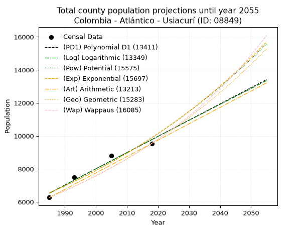
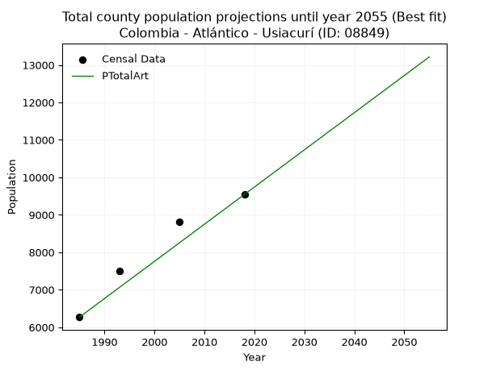
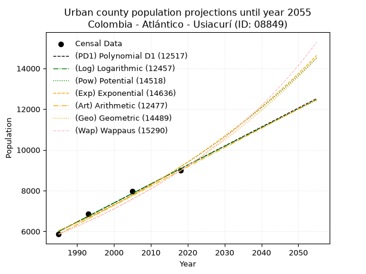
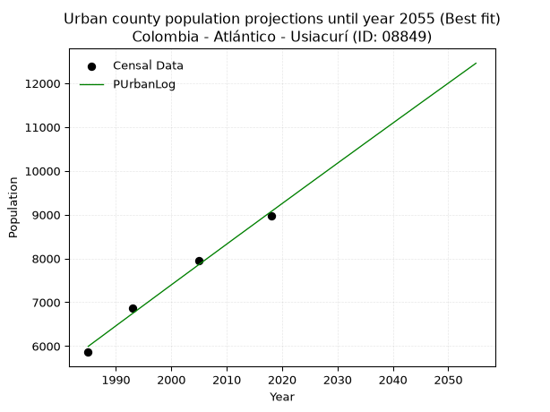
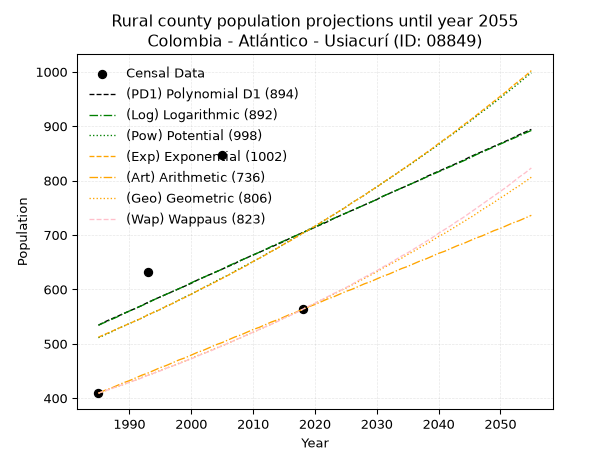
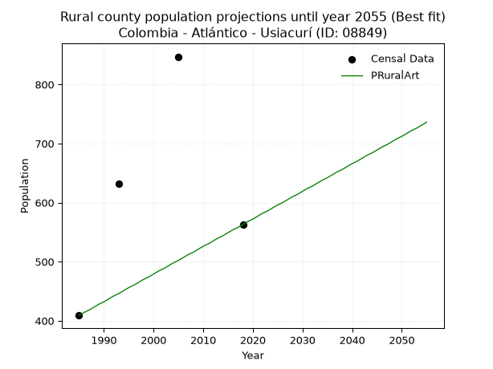

<div align="center">


</div>

# _“Population and Public Services Demand Projections (PPSD) until Year 2050 for Colombia - Atlántico - Usiacurí (ID: 08849)”_
Keywords: `population` `public-service` `projection` `lineal` `polynomial` `logarithmic` `potential` `exponential` `arithmetic` `geometric` `wappaus` `dane` `colombia` `south-america`

PPSD are analytical estimates used by governments and planners to anticipate future changes in population size, age distribution, and the resulting community needs for utilities, healthcare, education, and infrastructure as sizing future water treatment facilities, electrical grids, and road networks based on spatial growth.

> **General running parameters**: • app_version: _v20260806_. • Python version: _3.14.7_. • Pandas version: _3.0.5_. • NumPy version: _2.5.1_. • Creates, save and include plots into reports (create_plot): _False_. • Projection until year: _2050_. • Process polynomial degree 2 and up: _False_. • Process Wappaus: _True_. • Process Wappaus: _True_. • Set negative values to zero: _True_. • Set infinite values to zero: _True_. • Drop dataset notes: _True_. 
<div align="center">

Dynamic map: [:earth_americas:Google](http://maps.google.com/maps?q=10.74298001,-74.9769851) [:earth_americas:OSM](https://www.openstreetmap.org/#map=18/10.74298001/-74.9769851&layers=P) [:earth_americas:Bing](https://www.bing.com/maps?cp=10.74298001~-74.9769851&lvl=18) [:earth_americas:Apple](https://maps.apple.com/frame?center=10.74298001%2C-74.9769851&span=0.003%2C0.006)

</div>


<div align="center">

```geojson
{
  "type": "Feature",
  "geometry": {
    "type": "Point", 
    "coordinates": [-74.9769851, 10.74298001]
  }, 
  "properties": {
    "Name": "Colombia - Atlántico - Usiacurí (ID: 08849)"
  }
}
```

</div>


## 0. Census Data (4 records)

Census data are official statistics collected by a government about the people and housing in a country. They usually include counts of total population, age, sex, race, income, education, and jobs.

📅Global census file: [Population.xlsx](../data/Population.xlsx)

| Source   |   Year |   CountryID | CountryName   |   StateID | StateName   |   CountyID | CountyName   |   PTotal |   PUrban |   PRural |
|:---------|-------:|------------:|:--------------|----------:|:------------|-----------:|:-------------|---------:|---------:|---------:|
| DANE     |   1985 |          57 | Colombia      |        08 | Atlántico   |      08849 | Usiacurí     |     6270 |     5861 |      409 |
| DANE     |   1993 |          57 | Colombia      |        08 | Atlántico   |      08849 | Usiacurí     |     7500 |     6868 |      632 |
| DANE     |   2005 |          57 | Colombia      |        08 | Atlántico   |      08849 | Usiacurí     |     8804 |     7957 |      847 |
| DANE     |   2018 |          57 | Colombia      |        08 | Atlántico   |      08849 | Usiacurí     |     9543 |     8980 |      563 |

> 🔥Some records could had specific notes about the registered values or the corresponding urban or rural distribution.

## 1. Total

### 1.1. Coefficients and Parameters

* (PD1) Polynomial Deg 1: 98.29747089522228, -188590.26615816835 (lineal)
* (Log) Logarithmic: 196847.99811899065, -1488213.961143306
* (Pow) Potential: 24.986550113619284, -78.5833233936778
* (Exp) Exponential: 0.012475605332177021, 1.1525129408455002e-07
* (Art) Arithmetic: Year diff. 2018 - 1985 = 33, Population diff. 9543 - 6270 = 3273, Annual growth = 99.18181818181819
* (Geo) Geometric: Year diff. 2018 - 1985 = 33, Population diff. 9543 - 6270 = 3273, Annual growth % = 0.01280957736854349
* (Wap) Wappaus: i = 1.2544339237566329, Condition values only valid for < 200)

<sub>
Wappaus condition values: ['0.00', '1.25', '2.51', '3.76', '5.02', '6.27', '7.53', '8.78', '10.04', '11.29', '12.54', '13.80', '15.05', '16.31', '17.56', '18.82', '20.07', '21.33', '22.58', '23.83', '25.09', '26.34', '27.60', '28.85', '30.11', '31.36', '32.62', '33.87', '35.12', '36.38', '37.63', '38.89', '40.14', '41.40', '42.65', '43.91', '45.16', '46.41', '47.67', '48.92', '50.18', '51.43', '52.69', '53.94', '55.20', '56.45', '57.70', '58.96', '60.21', '61.47', '62.72', '63.98', '65.23', '66.48', '67.74', '68.99', '70.25', '71.50', '72.76', '74.01', '75.27', '76.52', '77.77', '79.03', '80.28', '81.54']
</sub>


### 1.2. Projected Dataset

|   Year |   CountyID |   PTotalPD1 |   PTotalLog |   PTotalPow |   PTotalExp |   PTotalArt |   PTotalGeo |   PTotalWap |
|-------:|-----------:|------------:|------------:|------------:|------------:|------------:|------------:|------------:|
|   1985 |      08849 |        6530 |        6527 |        6551 |        6555 |        6270 |        6270 |        6270 |
|   1986 |      08849 |        6629 |        6626 |        6634 |        6637 |        6369 |        6350 |        6349 |
|   1987 |      08849 |        6727 |        6725 |        6718 |        6720 |        6468 |        6432 |        6429 |
|   1988 |      08849 |        6825 |        6824 |        6803 |        6805 |        6568 |        6514 |        6510 |
|   1989 |      08849 |        6923 |        6923 |        6889 |        6890 |        6667 |        6597 |        6593 |
|   1990 |      08849 |        7022 |        7022 |        6976 |        6977 |        6766 |        6682 |        6676 |
|   1991 |      08849 |        7120 |        7121 |        7065 |        7064 |        6865 |        6768 |        6760 |
|   1992 |      08849 |        7218 |        7220 |        7154 |        7153 |        6964 |        6854 |        6846 |
|   1993 |      08849 |        7317 |        7318 |        7244 |        7243 |        7063 |        6942 |        6932 |
|   1994 |      08849 |        7415 |        7417 |        7335 |        7333 |        7163 |        7031 |        7020 |
|   1995 |      08849 |        7513 |        7516 |        7428 |        7426 |        7262 |        7121 |        7109 |
|   1996 |      08849 |        7611 |        7614 |        7521 |        7519 |        7361 |        7212 |        7199 |
|   1997 |      08849 |        7710 |        7713 |        7616 |        7613 |        7460 |        7305 |        7291 |
|   1998 |      08849 |        7808 |        7812 |        7712 |        7709 |        7559 |        7398 |        7383 |
|   1999 |      08849 |        7906 |        7910 |        7809 |        7806 |        7659 |        7493 |        7477 |
|   2000 |      08849 |        8005 |        8008 |        7907 |        7903 |        7758 |        7589 |        7572 |
|   2001 |      08849 |        8103 |        8107 |        8007 |        8003 |        7857 |        7686 |        7669 |
|   2002 |      08849 |        8201 |        8205 |        8107 |        8103 |        7956 |        7785 |        7767 |
|   2003 |      08849 |        8300 |        8304 |        8209 |        8205 |        8055 |        7884 |        7866 |
|   2004 |      08849 |        8398 |        8402 |        8312 |        8308 |        8154 |        7985 |        7967 |
|   2005 |      08849 |        8496 |        8500 |        8416 |        8412 |        8254 |        8088 |        8069 |
|   2006 |      08849 |        8594 |        8598 |        8522 |        8518 |        8353 |        8191 |        8172 |
|   2007 |      08849 |        8693 |        8696 |        8629 |        8625 |        8452 |        8296 |        8277 |
|   2008 |      08849 |        8791 |        8794 |        8737 |        8733 |        8551 |        8402 |        8384 |
|   2009 |      08849 |        8889 |        8892 |        8846 |        8843 |        8650 |        8510 |        8492 |
|   2010 |      08849 |        8988 |        8990 |        8957 |        8954 |        8750 |        8619 |        8602 |
|   2011 |      08849 |        9086 |        9088 |        9069 |        9066 |        8849 |        8730 |        8713 |
|   2012 |      08849 |        9184 |        9186 |        9182 |        9180 |        8948 |        8841 |        8827 |
|   2013 |      08849 |        9283 |        9284 |        9297 |        9295 |        9047 |        8955 |        8941 |
|   2014 |      08849 |        9381 |        9382 |        9413 |        9412 |        9146 |        9069 |        9058 |
|   2015 |      08849 |        9479 |        9479 |        9530 |        9530 |        9245 |        9185 |        9176 |
|   2016 |      08849 |        9577 |        9577 |        9649 |        9650 |        9345 |        9303 |        9297 |
|   2017 |      08849 |        9676 |        9675 |        9770 |        9771 |        9444 |        9422 |        9419 |
|   2018 |      08849 |        9774 |        9772 |        9891 |        9893 |        9543 |        9543 |        9543 |
|   2019 |      08849 |        9872 |        9870 |       10015 |       10018 |        9642 |        9665 |        9669 |
|   2020 |      08849 |        9971 |        9967 |       10139 |       10143 |        9741 |        9789 |        9797 |
|   2021 |      08849 |       10069 |       10065 |       10265 |       10271 |        9841 |        9914 |        9927 |
|   2022 |      08849 |       10167 |       10162 |       10393 |       10400 |        9940 |       10041 |       10060 |
|   2023 |      08849 |       10266 |       10259 |       10522 |       10530 |       10039 |       10170 |       10194 |
|   2024 |      08849 |       10364 |       10357 |       10653 |       10662 |       10138 |       10300 |       10331 |
|   2025 |      08849 |       10462 |       10454 |       10785 |       10796 |       10237 |       10432 |       10470 |
|   2026 |      08849 |       10560 |       10551 |       10919 |       10932 |       10336 |       10566 |       10611 |
|   2027 |      08849 |       10659 |       10648 |       11055 |       11069 |       10436 |       10701 |       10755 |
|   2028 |      08849 |       10757 |       10745 |       11192 |       11208 |       10535 |       10838 |       10901 |
|   2029 |      08849 |       10855 |       10842 |       11330 |       11349 |       10634 |       10977 |       11050 |
|   2030 |      08849 |       10954 |       10939 |       11471 |       11491 |       10733 |       11118 |       11201 |
|   2031 |      08849 |       11052 |       11036 |       11613 |       11635 |       10832 |       11260 |       11355 |
|   2032 |      08849 |       11150 |       11133 |       11756 |       11781 |       10932 |       11404 |       11512 |
|   2033 |      08849 |       11248 |       11230 |       11902 |       11929 |       11031 |       11551 |       11672 |
|   2034 |      08849 |       11347 |       11327 |       12049 |       12079 |       11130 |       11698 |       11834 |
|   2035 |      08849 |       11445 |       11424 |       12198 |       12231 |       11229 |       11848 |       11999 |
|   2036 |      08849 |       11543 |       11520 |       12349 |       12384 |       11328 |       12000 |       12168 |
|   2037 |      08849 |       11642 |       11617 |       12501 |       12540 |       11427 |       12154 |       12340 |
|   2038 |      08849 |       11740 |       11713 |       12655 |       12697 |       11527 |       12310 |       12514 |
|   2039 |      08849 |       11838 |       11810 |       12811 |       12857 |       11626 |       12467 |       12693 |
|   2040 |      08849 |       11937 |       11907 |       12969 |       13018 |       11725 |       12627 |       12874 |
|   2041 |      08849 |       12035 |       12003 |       13129 |       13181 |       11824 |       12789 |       13059 |
|   2042 |      08849 |       12133 |       12099 |       13291 |       13347 |       11923 |       12952 |       13248 |
|   2043 |      08849 |       12231 |       12196 |       13454 |       13514 |       12023 |       13118 |       13440 |
|   2044 |      08849 |       12330 |       12292 |       13620 |       13684 |       12122 |       13286 |       13637 |
|   2045 |      08849 |       12428 |       12388 |       13787 |       13856 |       12221 |       13457 |       13837 |
|   2046 |      08849 |       12526 |       12485 |       13957 |       14030 |       12320 |       13629 |       14041 |
|   2047 |      08849 |       12625 |       12581 |       14128 |       14206 |       12419 |       13804 |       14250 |
|   2048 |      08849 |       12723 |       12677 |       14302 |       14384 |       12518 |       13980 |       14462 |
|   2049 |      08849 |       12821 |       12773 |       14477 |       14565 |       12618 |       14159 |       14680 |
|   2050 |      08849 |       12920 |       12869 |       14655 |       14748 |       12717 |       14341 |       14901 |
<div align="center">

</img>

</div>


### 1.3. Best fit with absolute and relative error (%)

Relative error puts that difference into context by dividing the absolute error by the true value, creating a unitless ratio or percentage that shows the scale of the mistake.

Absolute and relative error

|   Year | Source   |   CountryID | CountryName   |   StateID | StateName   |   CountyID_x | CountyName   |   PTotal |   PUrban |   PRural |   CountyID_y |   PTotalPD1 |   PTotalLog |   PTotalPow |   PTotalExp |   PTotalArt |   PTotalGeo |   PTotalWap |   PTotalPD1AbsError |   PTotalLogAbsError |   PTotalPowAbsError |   PTotalExpAbsError |   PTotalArtAbsError |   PTotalGeoAbsError |   PTotalWapAbsError |   PTotalPD1RelError |   PTotalLogRelError |   PTotalPowRelError |   PTotalExpRelError |   PTotalArtRelError |   PTotalGeoRelError |   PTotalWapRelError |
|-------:|:---------|------------:|:--------------|----------:|:------------|-------------:|:-------------|---------:|---------:|---------:|-------------:|------------:|------------:|------------:|------------:|------------:|------------:|------------:|--------------------:|--------------------:|--------------------:|--------------------:|--------------------:|--------------------:|--------------------:|--------------------:|--------------------:|--------------------:|--------------------:|--------------------:|--------------------:|--------------------:|
|   1985 | DANE     |          57 | Colombia      |        08 | Atlántico   |        08849 | Usiacurí     |     6270 |     5861 |      409 |        08849 |        6530 |        6527 |        6551 |        6555 |        6270 |        6270 |        6270 |                 260 |                 257 |                 281 |                 285 |                   0 |                   0 |                   0 |             4.14673 |             4.09888 |             4.48166 |             4.54545 |             0       |             0       |             0       |
|   1993 | DANE     |          57 | Colombia      |        08 | Atlántico   |        08849 | Usiacurí     |     7500 |     6868 |      632 |        08849 |        7317 |        7318 |        7244 |        7243 |        7063 |        6942 |        6932 |                 183 |                 182 |                 256 |                 257 |                 437 |                 558 |                 568 |             2.44    |             2.42667 |             3.41333 |             3.42667 |             5.82667 |             7.44    |             7.57333 |
|   2005 | DANE     |          57 | Colombia      |        08 | Atlántico   |        08849 | Usiacurí     |     8804 |     7957 |      847 |        08849 |        8496 |        8500 |        8416 |        8412 |        8254 |        8088 |        8069 |                 308 |                 304 |                 388 |                 392 |                 550 |                 716 |                 735 |             3.49841 |             3.45298 |             4.40709 |             4.45252 |             6.24716 |             8.13267 |             8.34848 |
|   2018 | DANE     |          57 | Colombia      |        08 | Atlántico   |        08849 | Usiacurí     |     9543 |     8980 |      563 |        08849 |        9774 |        9772 |        9891 |        9893 |        9543 |        9543 |        9543 |                 231 |                 229 |                 348 |                 350 |                   0 |                   0 |                   0 |             2.42062 |             2.39966 |             3.64665 |             3.66761 |             0       |             0       |             0       |

Relative error mean

| Method    |   RelError | Best   |
|:----------|-----------:|:-------|
| PTotalPD1 |    3.12644 |        |
| PTotalLog |    3.09455 |        |
| PTotalPow |    3.98718 |        |
| PTotalExp |    4.02306 |        |
| PTotalArt |    3.01846 | True   |
| PTotalGeo |    3.89317 |        |
| PTotalWap |    3.98045 |        |

💙Best method: _**PTotalArt**_
<div align="center">

</img>

</div>


### 1.4. Fresh water supply demand in liters per capita per day (lpcd)

The fresh water supply demand typically ranges from 100 to 300 liters per capita per day (lpcd) for standard domestic and municipal planning, though absolute survival minimums set by the World Health Organization are as low as 7.5 to 20 liters per day, and total consumption in high-income nations can exceed 400 liters.

> `CZ`: Level in meters above the sea level (masl).<br> `WS`: Fresh water supply demand in liters per capita per day (lpcd or l/h/d).<br> `WSAll`: Zonal fresh water supply demand in liters per second (l/s).<br> `A`: Zonal area in square meters.

Reference values (RAS Colombia)

|    CZ |   WS |
|------:|-----:|
|  1000 |  120 |
|  2000 |  130 |
| 99999 |  140 |

County shapefile geometry properties and water supply values

|   CountyID |      ATotal |   CZTotal |   WSTotal |
|-----------:|------------:|----------:|----------:|
|      08849 | 1.01309e+08 |   110.378 |       120 |

Projected values for best method: PTotalArt

|   CountyID |   Year |   PTotalArt |   WSTotal |   WSTotalAll |
|-----------:|-------:|------------:|----------:|-------------:|
|      08849 |   1985 |        6270 |       120 |      8.70833 |
|      08849 |   1986 |        6369 |       120 |      8.84583 |
|      08849 |   1987 |        6468 |       120 |      8.98333 |
|      08849 |   1988 |        6568 |       120 |      9.12222 |
|      08849 |   1989 |        6667 |       120 |      9.25972 |
|      08849 |   1990 |        6766 |       120 |      9.39722 |
|      08849 |   1991 |        6865 |       120 |      9.53472 |
|      08849 |   1992 |        6964 |       120 |      9.67222 |
|      08849 |   1993 |        7063 |       120 |      9.80972 |
|      08849 |   1994 |        7163 |       120 |      9.94861 |
|      08849 |   1995 |        7262 |       120 |     10.0861  |
|      08849 |   1996 |        7361 |       120 |     10.2236  |
|      08849 |   1997 |        7460 |       120 |     10.3611  |
|      08849 |   1998 |        7559 |       120 |     10.4986  |
|      08849 |   1999 |        7659 |       120 |     10.6375  |
|      08849 |   2000 |        7758 |       120 |     10.775   |
|      08849 |   2001 |        7857 |       120 |     10.9125  |
|      08849 |   2002 |        7956 |       120 |     11.05    |
|      08849 |   2003 |        8055 |       120 |     11.1875  |
|      08849 |   2004 |        8154 |       120 |     11.325   |
|      08849 |   2005 |        8254 |       120 |     11.4639  |
|      08849 |   2006 |        8353 |       120 |     11.6014  |
|      08849 |   2007 |        8452 |       120 |     11.7389  |
|      08849 |   2008 |        8551 |       120 |     11.8764  |
|      08849 |   2009 |        8650 |       120 |     12.0139  |
|      08849 |   2010 |        8750 |       120 |     12.1528  |
|      08849 |   2011 |        8849 |       120 |     12.2903  |
|      08849 |   2012 |        8948 |       120 |     12.4278  |
|      08849 |   2013 |        9047 |       120 |     12.5653  |
|      08849 |   2014 |        9146 |       120 |     12.7028  |
|      08849 |   2015 |        9245 |       120 |     12.8403  |
|      08849 |   2016 |        9345 |       120 |     12.9792  |
|      08849 |   2017 |        9444 |       120 |     13.1167  |
|      08849 |   2018 |        9543 |       120 |     13.2542  |
|      08849 |   2019 |        9642 |       120 |     13.3917  |
|      08849 |   2020 |        9741 |       120 |     13.5292  |
|      08849 |   2021 |        9841 |       120 |     13.6681  |
|      08849 |   2022 |        9940 |       120 |     13.8056  |
|      08849 |   2023 |       10039 |       120 |     13.9431  |
|      08849 |   2024 |       10138 |       120 |     14.0806  |
|      08849 |   2025 |       10237 |       120 |     14.2181  |
|      08849 |   2026 |       10336 |       120 |     14.3556  |
|      08849 |   2027 |       10436 |       120 |     14.4944  |
|      08849 |   2028 |       10535 |       120 |     14.6319  |
|      08849 |   2029 |       10634 |       120 |     14.7694  |
|      08849 |   2030 |       10733 |       120 |     14.9069  |
|      08849 |   2031 |       10832 |       120 |     15.0444  |
|      08849 |   2032 |       10932 |       120 |     15.1833  |
|      08849 |   2033 |       11031 |       120 |     15.3208  |
|      08849 |   2034 |       11130 |       120 |     15.4583  |
|      08849 |   2035 |       11229 |       120 |     15.5958  |
|      08849 |   2036 |       11328 |       120 |     15.7333  |
|      08849 |   2037 |       11427 |       120 |     15.8708  |
|      08849 |   2038 |       11527 |       120 |     16.0097  |
|      08849 |   2039 |       11626 |       120 |     16.1472  |
|      08849 |   2040 |       11725 |       120 |     16.2847  |
|      08849 |   2041 |       11824 |       120 |     16.4222  |
|      08849 |   2042 |       11923 |       120 |     16.5597  |
|      08849 |   2043 |       12023 |       120 |     16.6986  |
|      08849 |   2044 |       12122 |       120 |     16.8361  |
|      08849 |   2045 |       12221 |       120 |     16.9736  |
|      08849 |   2046 |       12320 |       120 |     17.1111  |
|      08849 |   2047 |       12419 |       120 |     17.2486  |
|      08849 |   2048 |       12518 |       120 |     17.3861  |
|      08849 |   2049 |       12618 |       120 |     17.525   |
|      08849 |   2050 |       12717 |       120 |     17.6625  |

## 2. Urban

### 2.1. Coefficients and Parameters

* (PD1) Polynomial Deg 1: 93.16338819751033, -178933.56724207 (lineal)
* (Log) Logarithmic: 186518.65079641883, -1410313.2593702432
* (Pow) Potential: 25.32487515503686, -79.73462652784188
* (Exp) Exponential: 0.012647583561878995, 7.547136955089922e-08
* (Art) Arithmetic: Year diff. 2018 - 1985 = 33, Population diff. 8980 - 5861 = 3119, Annual growth = 94.51515151515152
* (Geo) Geometric: Year diff. 2018 - 1985 = 33, Population diff. 8980 - 5861 = 3119, Annual growth % = 0.013013636024112873
* (Wap) Wappaus: i = 1.2737032749161312, Condition values only valid for < 200)

<sub>
Wappaus condition values: ['0.00', '1.27', '2.55', '3.82', '5.09', '6.37', '7.64', '8.92', '10.19', '11.46', '12.74', '14.01', '15.28', '16.56', '17.83', '19.11', '20.38', '21.65', '22.93', '24.20', '25.47', '26.75', '28.02', '29.30', '30.57', '31.84', '33.12', '34.39', '35.66', '36.94', '38.21', '39.48', '40.76', '42.03', '43.31', '44.58', '45.85', '47.13', '48.40', '49.67', '50.95', '52.22', '53.50', '54.77', '56.04', '57.32', '58.59', '59.86', '61.14', '62.41', '63.69', '64.96', '66.23', '67.51', '68.78', '70.05', '71.33', '72.60', '73.87', '75.15', '76.42', '77.70', '78.97', '80.24', '81.52', '82.79']
</sub>


### 2.2. Projected Dataset

|   Year |   CountyID |   PUrbanPD1 |   PUrbanLog |   PUrbanPow |   PUrbanExp |   PUrbanArt |   PUrbanGeo |   PUrbanWap |
|-------:|-----------:|------------:|------------:|------------:|------------:|------------:|------------:|------------:|
|   1985 |      08849 |        5996 |        5993 |        6036 |        6039 |        5861 |        5861 |        5861 |
|   1986 |      08849 |        6089 |        6087 |        6113 |        6116 |        5956 |        5937 |        5936 |
|   1987 |      08849 |        6182 |        6180 |        6192 |        6193 |        6050 |        6015 |        6012 |
|   1988 |      08849 |        6275 |        6274 |        6271 |        6272 |        6145 |        6093 |        6089 |
|   1989 |      08849 |        6368 |        6368 |        6352 |        6352 |        6239 |        6172 |        6167 |
|   1990 |      08849 |        6462 |        6462 |        6433 |        6433 |        6334 |        6252 |        6247 |
|   1991 |      08849 |        6555 |        6556 |        6515 |        6515 |        6428 |        6334 |        6327 |
|   1992 |      08849 |        6648 |        6649 |        6599 |        6598 |        6523 |        6416 |        6408 |
|   1993 |      08849 |        6741 |        6743 |        6683 |        6682 |        6617 |        6500 |        6490 |
|   1994 |      08849 |        6834 |        6836 |        6769 |        6767 |        6712 |        6584 |        6574 |
|   1995 |      08849 |        6927 |        6930 |        6855 |        6853 |        6806 |        6670 |        6658 |
|   1996 |      08849 |        7021 |        7023 |        6943 |        6940 |        6901 |        6757 |        6744 |
|   1997 |      08849 |        7114 |        7117 |        7031 |        7028 |        6995 |        6845 |        6831 |
|   1998 |      08849 |        7207 |        7210 |        7121 |        7118 |        7090 |        6934 |        6919 |
|   1999 |      08849 |        7300 |        7304 |        7212 |        7208 |        7184 |        7024 |        7008 |
|   2000 |      08849 |        7393 |        7397 |        7304 |        7300 |        7279 |        7115 |        7099 |
|   2001 |      08849 |        7486 |        7490 |        7397 |        7393 |        7373 |        7208 |        7191 |
|   2002 |      08849 |        7580 |        7583 |        7491 |        7487 |        7468 |        7302 |        7284 |
|   2003 |      08849 |        7673 |        7676 |        7586 |        7582 |        7562 |        7397 |        7379 |
|   2004 |      08849 |        7766 |        7769 |        7683 |        7679 |        7657 |        7493 |        7475 |
|   2005 |      08849 |        7859 |        7863 |        7781 |        7777 |        7751 |        7591 |        7572 |
|   2006 |      08849 |        7952 |        7956 |        7879 |        7876 |        7846 |        7689 |        7671 |
|   2007 |      08849 |        8045 |        8048 |        7979 |        7976 |        7940 |        7789 |        7771 |
|   2008 |      08849 |        8139 |        8141 |        8081 |        8077 |        8035 |        7891 |        7873 |
|   2009 |      08849 |        8232 |        8234 |        8183 |        8180 |        8129 |        7994 |        7976 |
|   2010 |      08849 |        8325 |        8327 |        8287 |        8284 |        8224 |        8098 |        8081 |
|   2011 |      08849 |        8418 |        8420 |        8392 |        8390 |        8318 |        8203 |        8187 |
|   2012 |      08849 |        8511 |        8513 |        8498 |        8497 |        8413 |        8310 |        8295 |
|   2013 |      08849 |        8604 |        8605 |        8606 |        8605 |        8507 |        8418 |        8405 |
|   2014 |      08849 |        8697 |        8698 |        8715 |        8714 |        8602 |        8527 |        8516 |
|   2015 |      08849 |        8791 |        8790 |        8825 |        8825 |        8696 |        8638 |        8629 |
|   2016 |      08849 |        8884 |        8883 |        8937 |        8938 |        8791 |        8751 |        8744 |
|   2017 |      08849 |        8977 |        8976 |        9050 |        9051 |        8885 |        8865 |        8861 |
|   2018 |      08849 |        9070 |        9068 |        9164 |        9167 |        8980 |        8980 |        8980 |
|   2019 |      08849 |        9163 |        9160 |        9280 |        9283 |        9075 |        9097 |        9101 |
|   2020 |      08849 |        9256 |        9253 |        9397 |        9401 |        9169 |        9215 |        9223 |
|   2021 |      08849 |        9350 |        9345 |        9515 |        9521 |        9264 |        9335 |        9348 |
|   2022 |      08849 |        9443 |        9437 |        9635 |        9642 |        9358 |        9457 |        9475 |
|   2023 |      08849 |        9536 |        9530 |        9757 |        9765 |        9453 |        9580 |        9603 |
|   2024 |      08849 |        9629 |        9622 |        9880 |        9889 |        9547 |        9704 |        9734 |
|   2025 |      08849 |        9722 |        9714 |       10004 |       10015 |        9642 |        9831 |        9868 |
|   2026 |      08849 |        9815 |        9806 |       10130 |       10143 |        9736 |        9959 |       10003 |
|   2027 |      08849 |        9909 |        9898 |       10257 |       10272 |        9831 |       10088 |       10141 |
|   2028 |      08849 |       10002 |        9990 |       10386 |       10402 |        9925 |       10219 |       10282 |
|   2029 |      08849 |       10095 |       10082 |       10517 |       10535 |       10020 |       10352 |       10424 |
|   2030 |      08849 |       10188 |       10174 |       10649 |       10669 |       10114 |       10487 |       10570 |
|   2031 |      08849 |       10281 |       10266 |       10782 |       10805 |       10209 |       10624 |       10718 |
|   2032 |      08849 |       10374 |       10357 |       10918 |       10942 |       10303 |       10762 |       10868 |
|   2033 |      08849 |       10468 |       10449 |       11055 |       11081 |       10398 |       10902 |       11022 |
|   2034 |      08849 |       10561 |       10541 |       11193 |       11222 |       10492 |       11044 |       11178 |
|   2035 |      08849 |       10654 |       10633 |       11333 |       11365 |       10587 |       11188 |       11337 |
|   2036 |      08849 |       10747 |       10724 |       11475 |       11510 |       10681 |       11333 |       11500 |
|   2037 |      08849 |       10840 |       10816 |       11619 |       11656 |       10776 |       11481 |       11665 |
|   2038 |      08849 |       10933 |       10907 |       11764 |       11805 |       10870 |       11630 |       11833 |
|   2039 |      08849 |       11027 |       10999 |       11911 |       11955 |       10965 |       11781 |       12005 |
|   2040 |      08849 |       11120 |       11090 |       12060 |       12107 |       11059 |       11935 |       12180 |
|   2041 |      08849 |       11213 |       11182 |       12211 |       12261 |       11154 |       12090 |       12359 |
|   2042 |      08849 |       11306 |       11273 |       12363 |       12417 |       11248 |       12247 |       12541 |
|   2043 |      08849 |       11399 |       11364 |       12517 |       12575 |       11343 |       12407 |       12727 |
|   2044 |      08849 |       11492 |       11456 |       12673 |       12735 |       11437 |       12568 |       12917 |
|   2045 |      08849 |       11586 |       11547 |       12831 |       12898 |       11532 |       12732 |       13110 |
|   2046 |      08849 |       11679 |       11638 |       12991 |       13062 |       11626 |       12897 |       13308 |
|   2047 |      08849 |       11772 |       11729 |       13153 |       13228 |       11721 |       13065 |       13509 |
|   2048 |      08849 |       11865 |       11820 |       13317 |       13396 |       11815 |       13235 |       13715 |
|   2049 |      08849 |       11958 |       11911 |       13482 |       13567 |       11910 |       13408 |       13926 |
|   2050 |      08849 |       12051 |       12002 |       13650 |       13740 |       12004 |       13582 |       14141 |
<div align="center">

</img>

</div>


### 2.3. Best fit with absolute and relative error (%)

Relative error puts that difference into context by dividing the absolute error by the true value, creating a unitless ratio or percentage that shows the scale of the mistake.

Absolute and relative error

|   Year | Source   |   CountryID | CountryName   |   StateID | StateName   |   CountyID_x | CountyName   |   PTotal |   PUrban |   PRural |   CountyID_y |   PUrbanPD1 |   PUrbanLog |   PUrbanPow |   PUrbanExp |   PUrbanArt |   PUrbanGeo |   PUrbanWap |   PUrbanPD1AbsError |   PUrbanLogAbsError |   PUrbanPowAbsError |   PUrbanExpAbsError |   PUrbanArtAbsError |   PUrbanGeoAbsError |   PUrbanWapAbsError |   PUrbanPD1RelError |   PUrbanLogRelError |   PUrbanPowRelError |   PUrbanExpRelError |   PUrbanArtRelError |   PUrbanGeoRelError |   PUrbanWapRelError |
|-------:|:---------|------------:|:--------------|----------:|:------------|-------------:|:-------------|---------:|---------:|---------:|-------------:|------------:|------------:|------------:|------------:|------------:|------------:|------------:|--------------------:|--------------------:|--------------------:|--------------------:|--------------------:|--------------------:|--------------------:|--------------------:|--------------------:|--------------------:|--------------------:|--------------------:|--------------------:|--------------------:|
|   1985 | DANE     |          57 | Colombia      |        08 | Atlántico   |        08849 | Usiacurí     |     6270 |     5861 |      409 |        08849 |        5996 |        5993 |        6036 |        6039 |        5861 |        5861 |        5861 |                 135 |                 132 |                 175 |                 178 |                   0 |                   0 |                   0 |             2.30336 |            2.25218  |             2.98584 |             3.03702 |             0       |             0       |             0       |
|   1993 | DANE     |          57 | Colombia      |        08 | Atlántico   |        08849 | Usiacurí     |     7500 |     6868 |      632 |        08849 |        6741 |        6743 |        6683 |        6682 |        6617 |        6500 |        6490 |                 127 |                 125 |                 185 |                 186 |                 251 |                 368 |                 378 |             1.84916 |            1.82003  |             2.69365 |             2.70821 |             3.65463 |             5.35818 |             5.50379 |
|   2005 | DANE     |          57 | Colombia      |        08 | Atlántico   |        08849 | Usiacurí     |     8804 |     7957 |      847 |        08849 |        7859 |        7863 |        7781 |        7777 |        7751 |        7591 |        7572 |                  98 |                  94 |                 176 |                 180 |                 206 |                 366 |                 385 |             1.23162 |            1.18135  |             2.21189 |             2.26216 |             2.58892 |             4.59972 |             4.83851 |
|   2018 | DANE     |          57 | Colombia      |        08 | Atlántico   |        08849 | Usiacurí     |     9543 |     8980 |      563 |        08849 |        9070 |        9068 |        9164 |        9167 |        8980 |        8980 |        8980 |                  90 |                  88 |                 184 |                 187 |                   0 |                   0 |                   0 |             1.00223 |            0.979955 |             2.049   |             2.08241 |             0       |             0       |             0       |

Relative error mean

| Method    |   RelError | Best   |
|:----------|-----------:|:-------|
| PUrbanPD1 |    1.59659 |        |
| PUrbanLog |    1.55838 | True   |
| PUrbanPow |    2.48509 |        |
| PUrbanExp |    2.52245 |        |
| PUrbanArt |    1.56089 |        |
| PUrbanGeo |    2.48948 |        |
| PUrbanWap |    2.58557 |        |

💙Best method: _**PUrbanLog**_
<div align="center">

</img>

</div>


### 2.4. Fresh water supply demand in liters per capita per day (lpcd)

The fresh water supply demand typically ranges from 100 to 300 liters per capita per day (lpcd) for standard domestic and municipal planning, though absolute survival minimums set by the World Health Organization are as low as 7.5 to 20 liters per day, and total consumption in high-income nations can exceed 400 liters.

> `CZ`: Level in meters above the sea level (masl).<br> `WS`: Fresh water supply demand in liters per capita per day (lpcd or l/h/d).<br> `WSAll`: Zonal fresh water supply demand in liters per second (l/s).<br> `A`: Zonal area in square meters.

Reference values (RAS Colombia)

|    CZ |   WS |
|------:|-----:|
|  1000 |  120 |
|  2000 |  130 |
| 99999 |  140 |

County shapefile geometry properties and water supply values

|   CountyID |     AUrban |   CZUrban |   WSUrban |
|-----------:|-----------:|----------:|----------:|
|      08849 | 1.3758e+06 |   112.795 |       120 |

Projected values for best method: PUrbanLog

|   CountyID |   Year |   PUrbanLog |   WSUrban |   WSUrbanAll |
|-----------:|-------:|------------:|----------:|-------------:|
|      08849 |   1985 |        5993 |       120 |      8.32361 |
|      08849 |   1986 |        6087 |       120 |      8.45417 |
|      08849 |   1987 |        6180 |       120 |      8.58333 |
|      08849 |   1988 |        6274 |       120 |      8.71389 |
|      08849 |   1989 |        6368 |       120 |      8.84444 |
|      08849 |   1990 |        6462 |       120 |      8.975   |
|      08849 |   1991 |        6556 |       120 |      9.10556 |
|      08849 |   1992 |        6649 |       120 |      9.23472 |
|      08849 |   1993 |        6743 |       120 |      9.36528 |
|      08849 |   1994 |        6836 |       120 |      9.49444 |
|      08849 |   1995 |        6930 |       120 |      9.625   |
|      08849 |   1996 |        7023 |       120 |      9.75417 |
|      08849 |   1997 |        7117 |       120 |      9.88472 |
|      08849 |   1998 |        7210 |       120 |     10.0139  |
|      08849 |   1999 |        7304 |       120 |     10.1444  |
|      08849 |   2000 |        7397 |       120 |     10.2736  |
|      08849 |   2001 |        7490 |       120 |     10.4028  |
|      08849 |   2002 |        7583 |       120 |     10.5319  |
|      08849 |   2003 |        7676 |       120 |     10.6611  |
|      08849 |   2004 |        7769 |       120 |     10.7903  |
|      08849 |   2005 |        7863 |       120 |     10.9208  |
|      08849 |   2006 |        7956 |       120 |     11.05    |
|      08849 |   2007 |        8048 |       120 |     11.1778  |
|      08849 |   2008 |        8141 |       120 |     11.3069  |
|      08849 |   2009 |        8234 |       120 |     11.4361  |
|      08849 |   2010 |        8327 |       120 |     11.5653  |
|      08849 |   2011 |        8420 |       120 |     11.6944  |
|      08849 |   2012 |        8513 |       120 |     11.8236  |
|      08849 |   2013 |        8605 |       120 |     11.9514  |
|      08849 |   2014 |        8698 |       120 |     12.0806  |
|      08849 |   2015 |        8790 |       120 |     12.2083  |
|      08849 |   2016 |        8883 |       120 |     12.3375  |
|      08849 |   2017 |        8976 |       120 |     12.4667  |
|      08849 |   2018 |        9068 |       120 |     12.5944  |
|      08849 |   2019 |        9160 |       120 |     12.7222  |
|      08849 |   2020 |        9253 |       120 |     12.8514  |
|      08849 |   2021 |        9345 |       120 |     12.9792  |
|      08849 |   2022 |        9437 |       120 |     13.1069  |
|      08849 |   2023 |        9530 |       120 |     13.2361  |
|      08849 |   2024 |        9622 |       120 |     13.3639  |
|      08849 |   2025 |        9714 |       120 |     13.4917  |
|      08849 |   2026 |        9806 |       120 |     13.6194  |
|      08849 |   2027 |        9898 |       120 |     13.7472  |
|      08849 |   2028 |        9990 |       120 |     13.875   |
|      08849 |   2029 |       10082 |       120 |     14.0028  |
|      08849 |   2030 |       10174 |       120 |     14.1306  |
|      08849 |   2031 |       10266 |       120 |     14.2583  |
|      08849 |   2032 |       10357 |       120 |     14.3847  |
|      08849 |   2033 |       10449 |       120 |     14.5125  |
|      08849 |   2034 |       10541 |       120 |     14.6403  |
|      08849 |   2035 |       10633 |       120 |     14.7681  |
|      08849 |   2036 |       10724 |       120 |     14.8944  |
|      08849 |   2037 |       10816 |       120 |     15.0222  |
|      08849 |   2038 |       10907 |       120 |     15.1486  |
|      08849 |   2039 |       10999 |       120 |     15.2764  |
|      08849 |   2040 |       11090 |       120 |     15.4028  |
|      08849 |   2041 |       11182 |       120 |     15.5306  |
|      08849 |   2042 |       11273 |       120 |     15.6569  |
|      08849 |   2043 |       11364 |       120 |     15.7833  |
|      08849 |   2044 |       11456 |       120 |     15.9111  |
|      08849 |   2045 |       11547 |       120 |     16.0375  |
|      08849 |   2046 |       11638 |       120 |     16.1639  |
|      08849 |   2047 |       11729 |       120 |     16.2903  |
|      08849 |   2048 |       11820 |       120 |     16.4167  |
|      08849 |   2049 |       11911 |       120 |     16.5431  |
|      08849 |   2050 |       12002 |       120 |     16.6694  |

## 3. Rural

### 3.1. Coefficients and Parameters

* (PD1) Polynomial Deg 1: 5.134082697711921, -9656.69891609827 (lineal)
* (Log) Logarithmic: 10329.3473225718, -77900.70177306287
* (Pow) Potential: 19.291833556260137, -60.911097559295484
* (Exp) Exponential: 0.009594841367899606, 2.7396367265753806e-06
* (Art) Arithmetic: Year diff. 2018 - 1985 = 33, Population diff. 563 - 409 = 154, Annual growth = 4.666666666666667
* (Geo) Geometric: Year diff. 2018 - 1985 = 33, Population diff. 563 - 409 = 154, Annual growth % = 0.00973081131776432
* (Wap) Wappaus: i = 0.9602194787379973, Condition values only valid for < 200)

<sub>
Wappaus condition values: ['0.00', '0.96', '1.92', '2.88', '3.84', '4.80', '5.76', '6.72', '7.68', '8.64', '9.60', '10.56', '11.52', '12.48', '13.44', '14.40', '15.36', '16.32', '17.28', '18.24', '19.20', '20.16', '21.12', '22.09', '23.05', '24.01', '24.97', '25.93', '26.89', '27.85', '28.81', '29.77', '30.73', '31.69', '32.65', '33.61', '34.57', '35.53', '36.49', '37.45', '38.41', '39.37', '40.33', '41.29', '42.25', '43.21', '44.17', '45.13', '46.09', '47.05', '48.01', '48.97', '49.93', '50.89', '51.85', '52.81', '53.77', '54.73', '55.69', '56.65', '57.61', '58.57', '59.53', '60.49', '61.45', '62.41']
</sub>


### 3.2. Projected Dataset

|   Year |   CountyID |   PRuralPD1 |   PRuralLog |   PRuralPow |   PRuralExp |   PRuralArt |   PRuralGeo |   PRuralWap |
|-------:|-----------:|------------:|------------:|------------:|------------:|------------:|------------:|------------:|
|   1985 |      08849 |         534 |         534 |         511 |         512 |         409 |         409 |         409 |
|   1986 |      08849 |         540 |         539 |         516 |         517 |         414 |         413 |         413 |
|   1987 |      08849 |         545 |         544 |         521 |         522 |         418 |         417 |         417 |
|   1988 |      08849 |         550 |         549 |         527 |         527 |         423 |         421 |         421 |
|   1989 |      08849 |         555 |         555 |         532 |         532 |         428 |         425 |         425 |
|   1990 |      08849 |         560 |         560 |         537 |         537 |         432 |         429 |         429 |
|   1991 |      08849 |         565 |         565 |         542 |         542 |         437 |         433 |         433 |
|   1992 |      08849 |         570 |         570 |         547 |         547 |         442 |         438 |         437 |
|   1993 |      08849 |         576 |         575 |         553 |         553 |         446 |         442 |         442 |
|   1994 |      08849 |         581 |         581 |         558 |         558 |         451 |         446 |         446 |
|   1995 |      08849 |         586 |         586 |         563 |         563 |         456 |         451 |         450 |
|   1996 |      08849 |         591 |         591 |         569 |         569 |         460 |         455 |         455 |
|   1997 |      08849 |         596 |         596 |         574 |         574 |         465 |         459 |         459 |
|   1998 |      08849 |         601 |         601 |         580 |         580 |         470 |         464 |         463 |
|   1999 |      08849 |         606 |         606 |         586 |         585 |         474 |         468 |         468 |
|   2000 |      08849 |         611 |         612 |         591 |         591 |         479 |         473 |         472 |
|   2001 |      08849 |         617 |         617 |         597 |         597 |         484 |         478 |         477 |
|   2002 |      08849 |         622 |         622 |         603 |         603 |         488 |         482 |         482 |
|   2003 |      08849 |         627 |         627 |         609 |         608 |         493 |         487 |         486 |
|   2004 |      08849 |         632 |         632 |         615 |         614 |         498 |         492 |         491 |
|   2005 |      08849 |         637 |         637 |         621 |         620 |         502 |         496 |         496 |
|   2006 |      08849 |         642 |         643 |         626 |         626 |         507 |         501 |         501 |
|   2007 |      08849 |         647 |         648 |         633 |         632 |         512 |         506 |         506 |
|   2008 |      08849 |         653 |         653 |         639 |         638 |         516 |         511 |         511 |
|   2009 |      08849 |         658 |         658 |         645 |         644 |         521 |         516 |         516 |
|   2010 |      08849 |         663 |         663 |         651 |         651 |         526 |         521 |         521 |
|   2011 |      08849 |         668 |         668 |         657 |         657 |         530 |         526 |         526 |
|   2012 |      08849 |         673 |         673 |         664 |         663 |         535 |         531 |         531 |
|   2013 |      08849 |         678 |         679 |         670 |         670 |         540 |         536 |         536 |
|   2014 |      08849 |         683 |         684 |         676 |         676 |         544 |         542 |         541 |
|   2015 |      08849 |         688 |         689 |         683 |         683 |         549 |         547 |         547 |
|   2016 |      08849 |         694 |         694 |         690 |         689 |         554 |         552 |         552 |
|   2017 |      08849 |         699 |         699 |         696 |         696 |         558 |         558 |         557 |
|   2018 |      08849 |         704 |         704 |         703 |         703 |         563 |         563 |         563 |
|   2019 |      08849 |         709 |         709 |         710 |         709 |         568 |         568 |         569 |
|   2020 |      08849 |         714 |         714 |         716 |         716 |         572 |         574 |         574 |
|   2021 |      08849 |         719 |         720 |         723 |         723 |         577 |         580 |         580 |
|   2022 |      08849 |         724 |         725 |         730 |         730 |         582 |         585 |         586 |
|   2023 |      08849 |         730 |         730 |         737 |         737 |         586 |         591 |         592 |
|   2024 |      08849 |         735 |         735 |         744 |         744 |         591 |         597 |         597 |
|   2025 |      08849 |         740 |         740 |         751 |         751 |         596 |         602 |         603 |
|   2026 |      08849 |         745 |         745 |         759 |         759 |         600 |         608 |         609 |
|   2027 |      08849 |         750 |         750 |         766 |         766 |         605 |         614 |         616 |
|   2028 |      08849 |         755 |         755 |         773 |         773 |         610 |         620 |         622 |
|   2029 |      08849 |         760 |         760 |         781 |         781 |         614 |         626 |         628 |
|   2030 |      08849 |         765 |         765 |         788 |         788 |         619 |         632 |         634 |
|   2031 |      08849 |         771 |         771 |         796 |         796 |         624 |         639 |         641 |
|   2032 |      08849 |         776 |         776 |         803 |         804 |         628 |         645 |         647 |
|   2033 |      08849 |         781 |         781 |         811 |         811 |         633 |         651 |         654 |
|   2034 |      08849 |         786 |         786 |         819 |         819 |         638 |         657 |         661 |
|   2035 |      08849 |         791 |         791 |         826 |         827 |         642 |         664 |         667 |
|   2036 |      08849 |         796 |         796 |         834 |         835 |         647 |         670 |         674 |
|   2037 |      08849 |         801 |         801 |         842 |         843 |         652 |         677 |         681 |
|   2038 |      08849 |         807 |         806 |         850 |         851 |         656 |         683 |         688 |
|   2039 |      08849 |         812 |         811 |         858 |         859 |         661 |         690 |         695 |
|   2040 |      08849 |         817 |         816 |         866 |         868 |         666 |         697 |         703 |
|   2041 |      08849 |         822 |         821 |         875 |         876 |         670 |         703 |         710 |
|   2042 |      08849 |         827 |         826 |         883 |         884 |         675 |         710 |         717 |
|   2043 |      08849 |         832 |         831 |         891 |         893 |         680 |         717 |         725 |
|   2044 |      08849 |         837 |         836 |         900 |         902 |         684 |         724 |         732 |
|   2045 |      08849 |         843 |         841 |         908 |         910 |         689 |         731 |         740 |
|   2046 |      08849 |         848 |         847 |         917 |         919 |         694 |         738 |         748 |
|   2047 |      08849 |         853 |         852 |         926 |         928 |         698 |         746 |         756 |
|   2048 |      08849 |         858 |         857 |         934 |         937 |         703 |         753 |         764 |
|   2049 |      08849 |         863 |         862 |         943 |         946 |         708 |         760 |         772 |
|   2050 |      08849 |         868 |         867 |         952 |         955 |         712 |         768 |         780 |
<div align="center">

</img>

</div>


### 3.3. Best fit with absolute and relative error (%)

Relative error puts that difference into context by dividing the absolute error by the true value, creating a unitless ratio or percentage that shows the scale of the mistake.

Absolute and relative error

|   Year | Source   |   CountryID | CountryName   |   StateID | StateName   |   CountyID_x | CountyName   |   PTotal |   PUrban |   PRural |   CountyID_y |   PRuralPD1 |   PRuralLog |   PRuralPow |   PRuralExp |   PRuralArt |   PRuralGeo |   PRuralWap |   PRuralPD1AbsError |   PRuralLogAbsError |   PRuralPowAbsError |   PRuralExpAbsError |   PRuralArtAbsError |   PRuralGeoAbsError |   PRuralWapAbsError |   PRuralPD1RelError |   PRuralLogRelError |   PRuralPowRelError |   PRuralExpRelError |   PRuralArtRelError |   PRuralGeoRelError |   PRuralWapRelError |
|-------:|:---------|------------:|:--------------|----------:|:------------|-------------:|:-------------|---------:|---------:|---------:|-------------:|------------:|------------:|------------:|------------:|------------:|------------:|------------:|--------------------:|--------------------:|--------------------:|--------------------:|--------------------:|--------------------:|--------------------:|--------------------:|--------------------:|--------------------:|--------------------:|--------------------:|--------------------:|--------------------:|
|   1985 | DANE     |          57 | Colombia      |        08 | Atlántico   |        08849 | Usiacurí     |     6270 |     5861 |      409 |        08849 |         534 |         534 |         511 |         512 |         409 |         409 |         409 |                 125 |                 125 |                 102 |                 103 |                   0 |                   0 |                   0 |            30.5623  |            30.5623  |             24.9389 |             25.1834 |              0      |              0      |              0      |
|   1993 | DANE     |          57 | Colombia      |        08 | Atlántico   |        08849 | Usiacurí     |     7500 |     6868 |      632 |        08849 |         576 |         575 |         553 |         553 |         446 |         442 |         442 |                  56 |                  57 |                  79 |                  79 |                 186 |                 190 |                 190 |             8.86076 |             9.01899 |             12.5    |             12.5    |             29.4304 |             30.0633 |             30.0633 |
|   2005 | DANE     |          57 | Colombia      |        08 | Atlántico   |        08849 | Usiacurí     |     8804 |     7957 |      847 |        08849 |         637 |         637 |         621 |         620 |         502 |         496 |         496 |                 210 |                 210 |                 226 |                 227 |                 345 |                 351 |                 351 |            24.7934  |            24.7934  |             26.6824 |             26.8005 |             40.732  |             41.4404 |             41.4404 |
|   2018 | DANE     |          57 | Colombia      |        08 | Atlántico   |        08849 | Usiacurí     |     9543 |     8980 |      563 |        08849 |         704 |         704 |         703 |         703 |         563 |         563 |         563 |                 141 |                 141 |                 140 |                 140 |                   0 |                   0 |                   0 |            25.0444  |            25.0444  |             24.8668 |             24.8668 |              0      |              0      |              0      |

Relative error mean

| Method    |   RelError | Best   |
|:----------|-----------:|:-------|
| PRuralPD1 |    22.3152 |        |
| PRuralLog |    22.3548 |        |
| PRuralPow |    22.247  |        |
| PRuralExp |    22.3377 |        |
| PRuralArt |    17.5406 | True   |
| PRuralGeo |    17.8759 |        |
| PRuralWap |    17.8759 |        |

💙Best method: _**PRuralArt**_
<div align="center">

</img>

</div>


### 3.4. Fresh water supply demand in liters per capita per day (lpcd)

The fresh water supply demand typically ranges from 100 to 300 liters per capita per day (lpcd) for standard domestic and municipal planning, though absolute survival minimums set by the World Health Organization are as low as 7.5 to 20 liters per day, and total consumption in high-income nations can exceed 400 liters.

> `CZ`: Level in meters above the sea level (masl).<br> `WS`: Fresh water supply demand in liters per capita per day (lpcd or l/h/d).<br> `WSAll`: Zonal fresh water supply demand in liters per second (l/s).<br> `A`: Zonal area in square meters.

Reference values (RAS Colombia)

|    CZ |   WS |
|------:|-----:|
|  1000 |  120 |
|  2000 |  130 |
| 99999 |  140 |

County shapefile geometry properties and water supply values

|   CountyID |      ARural |   CZRural |   WSRural |
|-----------:|------------:|----------:|----------:|
|      08849 | 9.99333e+07 |   110.344 |       120 |

Projected values for best method: PRuralArt

|   CountyID |   Year |   PRuralArt |   WSRural |   WSRuralAll |
|-----------:|-------:|------------:|----------:|-------------:|
|      08849 |   1985 |         409 |       120 |     0.568056 |
|      08849 |   1986 |         414 |       120 |     0.575    |
|      08849 |   1987 |         418 |       120 |     0.580556 |
|      08849 |   1988 |         423 |       120 |     0.5875   |
|      08849 |   1989 |         428 |       120 |     0.594444 |
|      08849 |   1990 |         432 |       120 |     0.6      |
|      08849 |   1991 |         437 |       120 |     0.606944 |
|      08849 |   1992 |         442 |       120 |     0.613889 |
|      08849 |   1993 |         446 |       120 |     0.619444 |
|      08849 |   1994 |         451 |       120 |     0.626389 |
|      08849 |   1995 |         456 |       120 |     0.633333 |
|      08849 |   1996 |         460 |       120 |     0.638889 |
|      08849 |   1997 |         465 |       120 |     0.645833 |
|      08849 |   1998 |         470 |       120 |     0.652778 |
|      08849 |   1999 |         474 |       120 |     0.658333 |
|      08849 |   2000 |         479 |       120 |     0.665278 |
|      08849 |   2001 |         484 |       120 |     0.672222 |
|      08849 |   2002 |         488 |       120 |     0.677778 |
|      08849 |   2003 |         493 |       120 |     0.684722 |
|      08849 |   2004 |         498 |       120 |     0.691667 |
|      08849 |   2005 |         502 |       120 |     0.697222 |
|      08849 |   2006 |         507 |       120 |     0.704167 |
|      08849 |   2007 |         512 |       120 |     0.711111 |
|      08849 |   2008 |         516 |       120 |     0.716667 |
|      08849 |   2009 |         521 |       120 |     0.723611 |
|      08849 |   2010 |         526 |       120 |     0.730556 |
|      08849 |   2011 |         530 |       120 |     0.736111 |
|      08849 |   2012 |         535 |       120 |     0.743056 |
|      08849 |   2013 |         540 |       120 |     0.75     |
|      08849 |   2014 |         544 |       120 |     0.755556 |
|      08849 |   2015 |         549 |       120 |     0.7625   |
|      08849 |   2016 |         554 |       120 |     0.769444 |
|      08849 |   2017 |         558 |       120 |     0.775    |
|      08849 |   2018 |         563 |       120 |     0.781944 |
|      08849 |   2019 |         568 |       120 |     0.788889 |
|      08849 |   2020 |         572 |       120 |     0.794444 |
|      08849 |   2021 |         577 |       120 |     0.801389 |
|      08849 |   2022 |         582 |       120 |     0.808333 |
|      08849 |   2023 |         586 |       120 |     0.813889 |
|      08849 |   2024 |         591 |       120 |     0.820833 |
|      08849 |   2025 |         596 |       120 |     0.827778 |
|      08849 |   2026 |         600 |       120 |     0.833333 |
|      08849 |   2027 |         605 |       120 |     0.840278 |
|      08849 |   2028 |         610 |       120 |     0.847222 |
|      08849 |   2029 |         614 |       120 |     0.852778 |
|      08849 |   2030 |         619 |       120 |     0.859722 |
|      08849 |   2031 |         624 |       120 |     0.866667 |
|      08849 |   2032 |         628 |       120 |     0.872222 |
|      08849 |   2033 |         633 |       120 |     0.879167 |
|      08849 |   2034 |         638 |       120 |     0.886111 |
|      08849 |   2035 |         642 |       120 |     0.891667 |
|      08849 |   2036 |         647 |       120 |     0.898611 |
|      08849 |   2037 |         652 |       120 |     0.905556 |
|      08849 |   2038 |         656 |       120 |     0.911111 |
|      08849 |   2039 |         661 |       120 |     0.918056 |
|      08849 |   2040 |         666 |       120 |     0.925    |
|      08849 |   2041 |         670 |       120 |     0.930556 |
|      08849 |   2042 |         675 |       120 |     0.9375   |
|      08849 |   2043 |         680 |       120 |     0.944444 |
|      08849 |   2044 |         684 |       120 |     0.95     |
|      08849 |   2045 |         689 |       120 |     0.956944 |
|      08849 |   2046 |         694 |       120 |     0.963889 |
|      08849 |   2047 |         698 |       120 |     0.969444 |
|      08849 |   2048 |         703 |       120 |     0.976389 |
|      08849 |   2049 |         708 |       120 |     0.983333 |
|      08849 |   2050 |         712 |       120 |     0.988889 |

<div align="center"><br><sub>Share this research</sub></div><br>

<sub>**APPS & TOOLS & CONTENT DISCLAIMER**: • NO WARRANTY - This content and software is provided by <a href="https://github.com/rcfdtools" target="_blank">github.com/rcfdtools</a> "as is", without any express or implied warranty, including warranties of merchantability, fitness for a particular purpose, or non-infringement. There is no guarantee that the software will be error-free or operate without interruption. • LIMITATION OF LIABILITY - Neither the authors nor copyright holders will be liable for claims or damages arising from the software or its use. You are responsible for determining if the software is appropriate for your use and assume all associated risks, including errors, legal compliance, and data loss. • NO PROFESSIONAL ADVICE - The software provides general information and does not offer professional advice. It should not replace consultation with professional advisors. [Clauses and global license for rcfdtools use.](https://github.com/rcfdtools/rcfdtools/blob/main/LICENSE.md)</sub>

| [:house: Home](Readme.md)  | [:beginner: Help / Collaborate](https://github.com/rcfdtools/R.HydroTools/discussions/31) |
|----------------------------|-------------------------------------------------------------------------------------------|