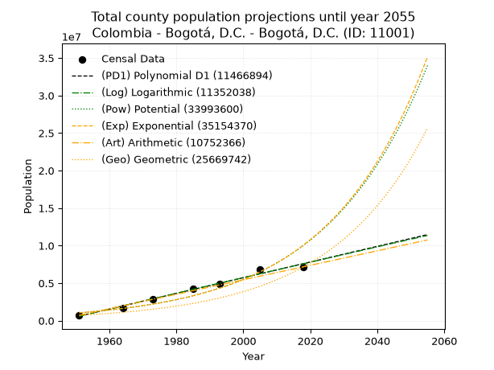
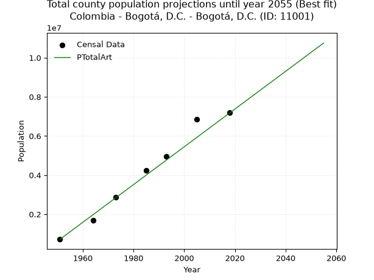
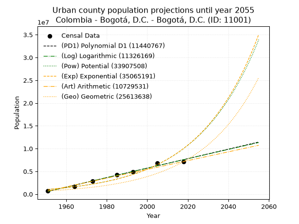
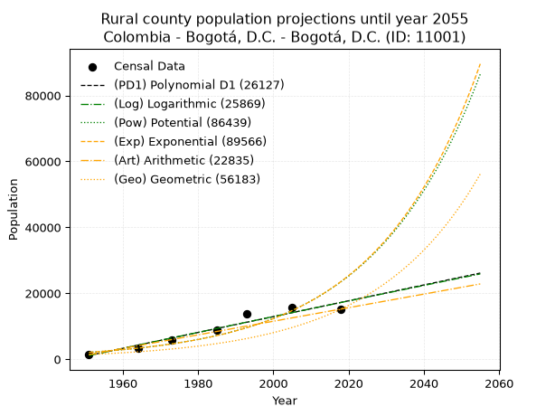
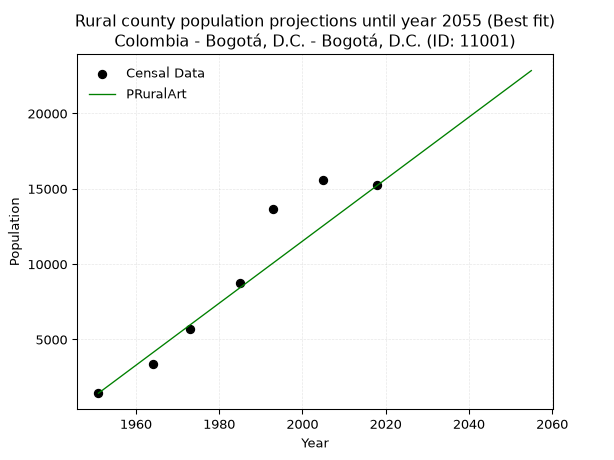

<div align="center">


</div>

# 📜 _“Population and Public Services Demand Projections (PPSD) until Year 2050 for Colombia - Bogotá, D.C. - Bogotá, D.C. (ID: 11001)”_
Keywords: `population` `public-service` `projection` `lineal` `polynomial` `logarithmic` `potential` `exponential` `arithmetic` `geometric` `wappaus` `dane` `colombia` `south-america`

PPSD are analytical estimates used by governments and planners to anticipate future changes in population size, age distribution, and the resulting community needs for utilities, healthcare, education, and infrastructure as sizing future water treatment facilities, electrical grids, and road networks based on spatial growth.

<div align="center">

</img>

</div>


> **General running parameters**: • app_version: _v20260806_. • Python version: _3.14.7_. • Pandas version: _3.0.5_. • NumPy version: _2.5.1_. • Creates, save and include plots into reports (create_plot): _False_. • Projection until year: _2050_. • Process polynomial degree 2 and up: _False_. • Process Wappaus: _True_. • Process Wappaus: _True_. • Set negative values to zero: _True_. • Set infinite values to zero: _True_. • Drop dataset notes: _True_. 
<div align="center">

Dynamic map: [:earth_americas:Google](http://maps.google.com/maps?q=4.649250882,-74.1069921) [:earth_americas:OSM](https://www.openstreetmap.org/#map=18/4.649250882/-74.1069921&layers=P) [:earth_americas:Bing](https://www.bing.com/maps?cp=4.649250882~-74.1069921&lvl=18) [:earth_americas:Apple](https://maps.apple.com/frame?center=4.649250882%2C-74.1069921&span=0.003%2C0.006)

</div>


<div align="center">

```geojson
{
  "type": "Feature",
  "geometry": {
    "type": "Point", 
    "coordinates": [-74.1069921, 4.649250882]
  }, 
  "properties": {
    "Name": "Colombia - Bogotá, D.C. - Bogotá, D.C. (ID: 11001)"
  }
}
```

</div>


## 0. Census Data (7 records)

Census data are official statistics collected by a government about the people and housing in a country. They usually include counts of total population, age, sex, race, income, education, and jobs.

📅Global census file: [Population.xlsx](../data/Population.xlsx)

| Source   |   Year |   CountryID | CountryName   |   StateID | StateName    |   CountyID | CountyName   |   PTotal |   PUrban |   PRural |
|:---------|-------:|------------:|:--------------|----------:|:-------------|-----------:|:-------------|---------:|---------:|---------:|
| DANE     |   1951 |          57 | Colombia      |        11 | Bogotá, D.C. |      11001 | Bogotá, D.C. |   715250 |   713820 |     1430 |
| DANE     |   1964 |          57 | Colombia      |        11 | Bogotá, D.C. |      11001 | Bogotá, D.C. |  1697311 |  1693916 |     3395 |
| DANE     |   1973 |          57 | Colombia      |        11 | Bogotá, D.C. |      11001 | Bogotá, D.C. |  2855065 |  2849355 |     5710 |
| DANE     |   1985 |          57 | Colombia      |        11 | Bogotá, D.C. |      11001 | Bogotá, D.C. |  4225649 |  4216887 |     8762 |
| DANE     |   1993 |          57 | Colombia      |        11 | Bogotá, D.C. |      11001 | Bogotá, D.C. |  4945448 |  4931796 |    13652 |
| DANE     |   2005 |          57 | Colombia      |        11 | Bogotá, D.C. |      11001 | Bogotá, D.C. |  6840116 |  6824510 |    15606 |
| DANE     |   2018 |          57 | Colombia      |        11 | Bogotá, D.C. |      11001 | Bogotá, D.C. |  7181469 |  7166249 |    15220 |

> 🔥Some records could had specific notes about the registered values or the corresponding urban or rural distribution.

📅[SUI-RUPS](https://www.datos.gov.co/Hacienda-y-Cr-dito-P-blico/Registro-nico-de-Prestadores-de-Servicios-P-blicos/4qkq-csdn/about_data) - Local public utility companies: [RUPS.csv](../data/RUPS.xlsx)

 | SERVICIO       | ESTADO    | NOMBRE                                                                                                                                    | NIT         | DEPARTAMENTO_DOMICILIO   | MUNICIPIO_DOMICILIO   | DIRECCION                                              |   TELEFONO | EMAIL                              | TIPO_PRESTADOR                             | CLASIFICACION                 |
|:---------------|:----------|:------------------------------------------------------------------------------------------------------------------------------------------|:------------|:-------------------------|:----------------------|:-------------------------------------------------------|-----------:|:-----------------------------------|:-------------------------------------------|:------------------------------|
| ACUEDUCTO      | OPERATIVA | EMPRESA DE ACUEDUCTO Y ALCANTARILLADO DE BOGOTÁ E.S.P                                                                                     | 899999094-1 | BOGOTA, D.C.             | BOGOTA, D.C.          | Av Calle 24 No 37 - 15                                 |    3447000 | lortega@acueducto.com.co           | EMPRESA INDUSTRIAL Y COMERCIAL DEL ESTADO  | MAYOR O IGUAL A 5001 USUARIOS |
| ALCANTARILLADO | OPERATIVA | EMPRESA DE ACUEDUCTO Y ALCANTARILLADO DE BOGOTÁ E.S.P                                                                                     | 899999094-1 | BOGOTA, D.C.             | BOGOTA, D.C.          | Av Calle 24 No 37 - 15                                 |    3447000 | lortega@acueducto.com.co           | EMPRESA INDUSTRIAL Y COMERCIAL DEL ESTADO  | MAYOR O IGUAL A 5001 USUARIOS |
| ACUEDUCTO      | OPERATIVA | ASOCIACION DE SERVICIOS PÚBLICOS COMUNITARIOS SAN ISIDRO I Y II SECTOR SAN LUIS Y LA SUREÑA  ESP                                          | 800126880-9 | BOGOTA, D.C.             | BOGOTA, D.C.          | CALLE 95 A No 8-31 ESTE                                |    5200713 | acualcossec@hotmail.com            | ORGANIZACION AUTORIZADA                    | MENOR O IGUAL A 2500 USUARIOS |
| ALCANTARILLADO | OPERATIVA | ASOCIACION DE SERVICIOS PÚBLICOS COMUNITARIOS SAN ISIDRO I Y II SECTOR SAN LUIS Y LA SUREÑA  ESP                                          | 800126880-9 | BOGOTA, D.C.             | BOGOTA, D.C.          | CALLE 95 A No 8-31 ESTE                                |    5200713 | acualcossec@hotmail.com            | ORGANIZACION AUTORIZADA                    | MENOR O IGUAL A 2500 USUARIOS |
| ACUEDUCTO      | OPERATIVA | COOPERATIVA DE SERVICIOS PUBLICOS DE ACUEDUCTO Y ALCANTARILLADO DE LA PARCELACION EL JARDIN LIMITADA                                      | 830059215-2 | BOGOTA, D.C.             | BOGOTA, D.C.          | Calle 223 No. 54 - 21 Int 1                            |    6762456 | coopjardin@yahoo.com               | PRESTADORES FUERA DEL ART. 15 LSPD         | HASTA 2500 SUSCRIPTORES       |
| ACUEDUCTO      | OPERATIVA | ASOCIACION DE USUARIOS DE AGUAS CALIENTES                                                                                                 | 830076938-0 | BOGOTA, D.C.             | BOGOTA, D.C.          | Calle 92 Sur  Nº 18 F-20                               |    2009420 | aguaskalientes@hotmail.com         | ORGANIZACION AUTORIZADA                    | HASTA 2500 SUSCRIPTORES       |
| ACUEDUCTO      | OPERATIVA | AGUAS KPITAL S.A. E.S.P.                                                                                                                  | 830112456-7 | BOGOTA, D.C.             | BOGOTA, D.C.          | KR. 11  93A-85 PISO 6                                  |    6511500 | martha.paez@aguaskpital.com        | SOCIEDADES (EMPRESA DE SERVICIOS PUBLICOS) | MAS DE 2500 SUSCRIPTORES      |
| ACUEDUCTO      | OPERATIVA | AGUAZUL BOGOTA S.A.  E.S.P.                                                                                                               | 830112462-1 | BOGOTA, D.C.             | BOGOTA, D.C.          | CALLE 82 No. 19A 34                                    |    7470001 | actualizar.cons@etb.net.co         | SOCIEDADES (EMPRESA DE SERVICIOS PUBLICOS) | MAS DE 2500 SUSCRIPTORES      |
| ACUEDUCTO      | OPERATIVA | LA ASOCIACION DE USUARIOS DE ACUEDUCTO DE LAS VEREDAS LA UNIÓN Y LOS ANDES PICOS DE BOCA GRANDE ASOPICOS DE  BOCAGRANDE ESP               | 900031795-4 | BOGOTA, D.C.             | BOGOTA, D.C.          | CALLE 42  13 D 15 SUR                                  |    2397410 | asopicos@gmail.com                 | ORGANIZACION AUTORIZADA                    | MENOR O IGUAL A 2500 USUARIOS |
| ACUEDUCTO      | OPERATIVA | PROACTIVA DE SERVICIOS INTEGRALES S.A.  E.S.P.                                                                                            | 900178457-1 | BOGOTA, D.C.             | BOGOTA, D.C.          | CRA 46 N 20C 34                                        |    3351800 | beatrizaldanagarzon@hotmail.co     | SOCIEDADES (EMPRESA DE SERVICIOS PUBLICOS) | MAS DE 2500 SUSCRIPTORES      |
| ACUEDUCTO      | OPERATIVA | ASOCIACIÓN DE USUARIOS ACUEDUCTO AGUAS CLARAS VEREDA OLARTE                                                                               | 900121724-8 | BOGOTA, D.C.             | BOGOTA, D.C.          | VEREDA OLARTE KM 3.5 USME                              |    7660997 | lopezpinzonlibardo@hotmail.com     | ORGANIZACION AUTORIZADA                    | MENOR O IGUAL A 2500 USUARIOS |
| ACUEDUCTO      | OPERATIVA | COJARDIN SA ESP                                                                                                                           | 830131572-4 | BOGOTA, D.C.             | BOGOTA, D.C.          | Carrera 54 # 221-89                                    |    7441106 | info@cojardinsa.com                | SOCIEDADES (EMPRESA DE SERVICIOS PUBLICOS) | MENOR O IGUAL A 2500 USUARIOS |
| ALCANTARILLADO | OPERATIVA | COJARDIN SA ESP                                                                                                                           | 830131572-4 | BOGOTA, D.C.             | BOGOTA, D.C.          | Carrera 54 # 221-89                                    |    7441106 | info@cojardinsa.com                | SOCIEDADES (EMPRESA DE SERVICIOS PUBLICOS) | MENOR O IGUAL A 2500 USUARIOS |
| ACUEDUCTO      | OPERATIVA | ASOCIACION DE USUARIOS DEL ACUEDUCTO DE LAS VEREDAS HATO, SANTA BARBARA Y LAS MERCEDES                                                    | 830126165-1 | BOGOTA, D.C.             | BOGOTA, D.C.          | Carrera 28 Nº 40 -40 sur                               |    6392052 | acuavidaesp@gmail.com              | ORGANIZACION AUTORIZADA                    | HASTA 2500 SUSCRIPTORES       |
| ACUEDUCTO      | OPERATIVA | ASOCIACION DE USUARIOS DEL ACUEDUCTO DE LAS VEREDAS DE PASQUILLITA Y SANTA ROSA                                                           | 830004573-8 | BOGOTA, D.C.             | BOGOTA, D.C.          | VEREDA PASQUILLITA (CIUDAD BOLIVAR)                    |    3009094 | aacupasa@hotmail.com               | ORGANIZACION AUTORIZADA                    | MENOR O IGUAL A 2500 USUARIOS |
| ACUEDUCTO      | OPERATIVA | ASOCIACION DE USUARIOS DE ACUEDUCTO DE LA VEREDA MOCHUELO ALTO ASOPORQUERA ESP                                                            | 830123458-9 | BOGOTA, D.C.             | BOGOTA, D.C.          | Kilómetro 24 Vía Pasquilla Ciudad Bolivar Localidad 19 |    7391224 | mariomoya76@yahoo.com              | ORGANIZACION AUTORIZADA                    | MENOR O IGUAL A 2500 USUARIOS |
| ACUEDUCTO      | OPERATIVA | AGUAS KAPITAL BOGOTA S.A. E.S.P.                                                                                                          | 900178700-7 | BOGOTA, D.C.             | BOGOTA, D.C.          | CR 11 93A 85                                           |    6511500 | martha.paez@aguaskpital.com        | SOCIEDADES (EMPRESA DE SERVICIOS PUBLICOS) | MAS DE 2500 SUSCRIPTORES      |
| ACUEDUCTO      | OPERATIVA | ASOCIACION DE USUARIOS DEL ACUEDUCTO DE LA ZONA MEDIA DE LA PARCELACION FLORESTA DE LA SABANA                                             | 800071847-7 | BOGOTA, D.C.             | BOGOTA, D.C.          | CARRERA 7 No. 237-04                                   |    6768107 | vertiaguas@hotmail.com             | ORGANIZACION AUTORIZADA                    | MENOR O IGUAL A 2500 USUARIOS |
| ACUEDUCTO      | OPERATIVA | ASOCIACIÓN DE USUARIOS DE LA VEREDA LOS SOCHES AGUAS CRISTALINAS LOS SOCHES ESP                                                           | 900230294-1 | BOGOTA, D.C.             | BOGOTA, D.C.          | VEREDA LOS SOCHES FINCA EL SUSPIRO                     |    2006758 | asocristalinas@gmail.com           | ORGANIZACION AUTORIZADA                    | MENOR O IGUAL A 2500 USUARIOS |
| ACUEDUCTO      | OPERATIVA | ASOCIACION DE USUARIOS DEL ACUEDUCTO COMUNITARIO AGUAS CALIENTES                                                                          | 900375428-2 | BOGOTA, D.C.             | BOGOTA, D.C.          | Diagonal 91 B bis sur N° 18 h - 53                     |    7391096 | AUACACT@GMAIL.COM                  | ORGANIZACION AUTORIZADA                    | MENOR O IGUAL A 2500 USUARIOS |
| ACUEDUCTO      | OPERATIVA | ASOCIACIÓN DE USUARIOS DE ACUEDUCTO DE LA VEREDA AGUALINDA CHIGUAZA                                                                       | 900029263-1 | BOGOTA, D.C.             | BOGOTA, D.C.          | CARRERA 3 No. 138 F SUR 10                             |    7660115 | Lizrodriguez2201@gmail.com         | ORGANIZACION AUTORIZADA                    | MENOR O IGUAL A 2500 USUARIOS |
| ACUEDUCTO      | OPERATIVA | ASOCIACIÓN  DE USUARIOS DE ACUEDUCTO DE LAS VEREDAS PEÑALIZA, RAIZAL, BETANIA, EL CARMEN E ISTMO TABACO DE LA LOCALIDAD DE SUMAPAZ BOGOTA | 900387367-3 | BOGOTA, D.C.             | BOGOTA, D.C.          | BOGOTA LOCALIDAD SUMAPAZ VEREDA RAIZAL                 |    2006222 | asoperabeca2018@gmail.com          | ORGANIZACION AUTORIZADA                    | MENOR O IGUAL A 2500 USUARIOS |
| ACUEDUCTO      | OPERATIVA | JUNTA ADMINISTRADORA ACUEDUCTO VEREDAL EL DESTINO USME                                                                                    | 800085579-9 | BOGOTA, D.C.             | BOGOTA, D.C.          | VEREDA EL DESTINO USME                                 |    6392007 | Lizrodriguez2201@gmail.com         | ORGANIZACION AUTORIZADA                    | MENOR O IGUAL A 2500 USUARIOS |
| ACUEDUCTO      | OPERATIVA | ASOCIACIÓN DE USUARIOS DEL ACUEDUCTO DE PIEDRA PARADA                                                                                     | 830105457-5 | BOGOTA, D.C.             | BOGOTA, D.C.          | KILÓMETRO 5 VIA OLARTE VEREDA PASQUILLA                |    0000000 | acueductopiedraparada@hotmail.com  | ORGANIZACION AUTORIZADA                    | MENOR O IGUAL A 2500 USUARIOS |
| ACUEDUCTO      | OPERATIVA | ASOCIACION DE USUARIOS DE ACUEDUCTO Y ALCANTARILLADO DE LA VEREDA PASQUILLA CENTRO                                                        | 830102527-9 | BOGOTA, D.C.             | BOGOTA, D.C.          | VEREDA PASQUILLA FINCA EL TANQUE                       |    6392051 | acuepasqui@gmail.com               | ORGANIZACION AUTORIZADA                    | MENOR O IGUAL A 2500 USUARIOS |
| ACUEDUCTO      | OPERATIVA | ASOCIACION DE USUARIOS DE ACUEDUCTO Y ALCANTARILLADO DEL BARRIO BOSQUES DE BELLAVISTA ACUABOSQUES                                         | 830122985-4 | BOGOTA, D.C.             | BOGOTA, D.C.          | CL 79 no 10-65 int 4                                   |    0000000 | Lizrodriguez2201@gmail.com         | ORGANIZACION AUTORIZADA                    | MENOR O IGUAL A 2500 USUARIOS |
| ACUEDUCTO      | OPERATIVA | ASOCIACION DE USUARIOS DEL ACUEDUCTO LAS ANIMAS LAS AURAS Y NAZARETH                                                                      | 830072977-1 | BOGOTA, D.C.             | BOGOTA, D.C.          | CORREGIDURIA NAZARETH LOCALIDAD 20 SUMAPAZ             |    2005833 | asouan@outlook.com                 | ORGANIZACION AUTORIZADA                    | MENOR O IGUAL A 2500 USUARIOS |
| ACUEDUCTO      | OPERATIVA | ASOCIACIÓN DE USUARIOS DEL ACUEDUCTO DE LA VEREDA LAGUNA VERDE ESP                                                                        | 830138551-1 | BOGOTA, D.C.             | BOGOTA, D.C.          | Cl 75 No. 1A 78 SUR                                    |    2003195 | acueductolagunaverde@gmail.com     | ORGANIZACION AUTORIZADA                    | HASTA 2500 SUSCRIPTORES       |
| ACUEDUCTO      | OPERATIVA | ASOCIACIÓN DE USUARIOS DE ACUEDUCTO ARRAYANES ARGENTINA                                                                                   | 900142618-5 | BOGOTA, D.C.             | BOGOTA, D.C.          | KM 12 VÍA SAN JUAN SUMAPAZ VRD ARRAYANES               |    2579589 | tattis_921114@hotmail.com          | ORGANIZACION AUTORIZADA                    | MENOR O IGUAL A 2500 USUARIOS |
| ACUEDUCTO      | OPERATIVA | ASOCIACION DE USUARIOS DE ACUEDUCTO MANANTIAL DE AGUAS CERRO REDONDO Y CORINTO ESP                                                        | 900097840-1 | BOGOTA, D.C.             | BOGOTA, D.C.          | CRA 4 No. 6 39                                         |    7708301 | corintocerrorredondo@gmail.com     | ORGANIZACION AUTORIZADA                    | MENOR O IGUAL A 2500 USUARIOS |
| ACUEDUCTO      | OPERATIVA | ASOCIACIÓN ASOQUIBA                                                                                                                       | 830102452-5 | BOGOTA, D.C.             | BOGOTA, D.C.          | Calle 73A No. 27M 09 Sur                               |    7390863 | lizrodriguez2201@gmail.com         | ORGANIZACION AUTORIZADA                    | MENOR O IGUAL A 2500 USUARIOS |
| ACUEDUCTO      | OPERATIVA | ASOCIACIÓN DE USUARIOS DEL SERVICIO DE AGUA POTABLE  DE LA FLORESTA DE LA SABANA                                                          | 830061466-0 | BOGOTA, D.C.             | BOGOTA, D.C.          | CARRERA 7 NUMERO 237 - 04                              |    6768107 | vertiaguas@hotmail.com             | ORGANIZACION AUTORIZADA                    | MENOR O IGUAL A 2500 USUARIOS |
| ACUEDUCTO      | OPERATIVA | ASOCIACIÓN DE PROPIETARIOS DE LA PARCELACIÓN LA FLORESTA                                                                                  | 830019496-4 | BOGOTA, D.C.             | BOGOTA, D.C.          | CARRERA 7 No. 237 - 04                                 |    6761275 | parcelacionlafloresta@gmail.com    | ORGANIZACION AUTORIZADA                    | MENOR O IGUAL A 2500 USUARIOS |
| ACUEDUCTO      | OPERATIVA | ASOCIACION DE USUARIOS DE ACUEDUCTO DE LAS VEREDAS REQUILINA Y EL UVAL AGUAS DORADAS ESP                                                  | 830131388-5 | BOGOTA, D.C.             | BOGOTA, D.C.          | CRA 2 Nº 137-44 SUR USME PUEBLO                        |    7660192 | aguasdoradasesp@hotmail.com        | ORGANIZACION AUTORIZADA                    | MENOR O IGUAL A 2500 USUARIOS |
| ACUEDUCTO      | OPERATIVA | ASOCIACION DE USUARIOS DE ACUEDUCTO DE LA VEREDA CURUBITAL AGUAS CRISTALINAS DE BOCAGRANDE                                                | 900029860-9 | BOGOTA, D.C.             | BOGOTA, D.C.          | KM 11 VIA SUMAPAZ VEREDA CURUBITAL                     |    6392005 | asocristalinaesp@gmail.com         | ORGANIZACION AUTORIZADA                    | HASTA 2500 SUSCRIPTORES       |
| ACUEDUCTO      | OPERATIVA | ASOCIACIÓN DE USUARIOS DE ACUEDUCTO DE LA VEREDA LAS MARGARITAS DE LA LOCALIDAD DE USME SANTA DE DE BOGOTA D.C                            | 900014734-3 | BOGOTA, D.C.             | BOGOTA, D.C.          | KM 19 VIA A SAN JUAN DEL SUMAPAZ                       |    6392070 | acueductolasmargaritas@hotmail.com | ORGANIZACION AUTORIZADA                    | MENOR O IGUAL A 2500 USUARIOS |
| ACUEDUCTO      | OPERATIVA | ASOCIACIÓN DE USUARIOS DEL SERVICIO DE ACUEDUCTO Y ALCANTARILLADO DEL CORREGIMIENTO DE SAN JUAN LOCALIDAD DE SUMAPAZ ESP                  | 830138027-3 | BOGOTA, D.C.             | BOGOTA, D.C.          | CORREGIMIENTO SAN JUAN LOCALIDAD DE SUMAPAZ            |    3407071 | asoaguasclarassumapaz.20@gmail.com | ORGANIZACION AUTORIZADA                    | MENOR O IGUAL A 2500 USUARIOS |
| ACUEDUCTO      | OPERATIVA | ASOCIACIÓN DE USUARIOS DE ACUEDUCTO DE LA VEREDA LAS ANIMAS CON LA SIGLA ASOAGUA Y CAÑIZO ESP                                             | 830101596-2 | BOGOTA, D.C.             | BOGOTA, D.C.          | LOCALIDAD SUMAPAZ, VEREDA LAS ANIMAS                   |    7610149 | acueductolasanimas2015@gmail.com   | ORGANIZACION AUTORIZADA                    | HASTA 2500 SUSCRIPTORES       |
| ALCANTARILLADO | OPERATIVA | INTERASEO SOLUCIONES AMBIENTALES S.A.S. E.S.P.                                                                                            | 900903493-8 | BOGOTA, D.C.             | BOGOTA, D.C.          | CALLE 17 No. 124 - 81                                  |    7470499 | jcorrea@interaseo.com.co           | SOCIEDADES (EMPRESA DE SERVICIOS PUBLICOS) | MENOR O IGUAL A 2500 USUARIOS |

## 1. Total

### 1.1. Coefficients and Parameters

* (PD1) Polynomial Deg 1: 104451.51759186796, -203180974.26192197 (lineal)
* (Log) Logarithmic: 207299879.97000286, -1569937898.9339466
* (Pow) Potential: 67.08776494023587, -214.7177439325093
* (Exp) Exponential: 0.03375257411092929, 2.646338087018038e-23
* (Art) Arithmetic: Year diff. 2018 - 1951 = 67, Population diff. 7181469 - 715250 = 6466219, Annual growth = 96510.73134328358
* (Geo) Geometric: Year diff. 2018 - 1951 = 67, Population diff. 7181469 - 715250 = 6466219, Annual growth % = 0.03502674837932074
* (Wap) Wappaus: i = 2.444324822582229, Condition values only valid for < 200)

<sub>
Wappaus condition values: ['0.00', '2.44', '4.89', '7.33', '9.78', '12.22', '14.67', '17.11', '19.55', '22.00', '24.44', '26.89', '29.33', '31.78', '34.22', '36.66', '39.11', '41.55', '44.00', '46.44', '48.89', '51.33', '53.78', '56.22', '58.66', '61.11', '63.55', '66.00', '68.44', '70.89', '73.33', '75.77', '78.22', '80.66', '83.11', '85.55', '88.00', '90.44', '92.88', '95.33', '97.77', '100.22', '102.66', '105.11', '107.55', '109.99', '112.44', '114.88', '117.33', '119.77', '122.22', '124.66', '127.10', '129.55', '131.99', '134.44', '136.88', '139.33', '141.77', '144.22', '146.66', '149.10', '151.55', '153.99', '156.44', '158.88', '161.33', '163.77', '166.21', '168.66', '171.10', '173.55', '175.99', '178.44', '180.88', '183.32', '185.77', '188.21', '190.66', '193.10', '195.55', '197.99', '200.43', '202.88', '205.32', '207.77', '210.21', '212.66', '215.10', '217.54', '219.99', '222.43', '224.88', '227.32', '229.77', '232.21', '234.66', '237.10', '239.54', '241.99']
</sub>


### 1.2. Projected Dataset

|   Year |   CountyID |        PTotalPD1 |        PTotalLog |   PTotalPow |   PTotalExp |        PTotalArt |        PTotalGeo |
|-------:|-----------:|-----------------:|-----------------:|------------:|------------:|-----------------:|-----------------:|
|   1951 |      11001 | 603937           | 586170           | 1.04295e+06 | 1.05073e+06 | 715250           | 715250           |
|   1952 |      11001 | 708388           | 692396           | 1.07942e+06 | 1.0868e+06  | 811761           | 740303           |
|   1953 |      11001 | 812840           | 798568           | 1.11716e+06 | 1.1241e+06  | 908271           | 766233           |
|   1954 |      11001 | 917291           | 904685           | 1.15619e+06 | 1.16269e+06 |      1.00478e+06 | 793072           |
|   1955 |      11001 |      1.02174e+06 |      1.01075e+06 | 1.19656e+06 | 1.20261e+06 |      1.10129e+06 | 820851           |
|   1956 |      11001 |      1.12619e+06 |      1.11676e+06 | 1.23833e+06 | 1.24389e+06 |      1.1978e+06  | 849602           |
|   1957 |      11001 |      1.23065e+06 |      1.22271e+06 | 1.28153e+06 | 1.28659e+06 |      1.29431e+06 | 879361           |
|   1958 |      11001 |      1.3351e+06  |      1.32861e+06 | 1.32621e+06 | 1.33076e+06 |      1.39082e+06 | 910162           |
|   1959 |      11001 |      1.43955e+06 |      1.43446e+06 | 1.37242e+06 | 1.37644e+06 |      1.48734e+06 | 942042           |
|   1960 |      11001 |      1.544e+06   |      1.54025e+06 | 1.42023e+06 | 1.42369e+06 |      1.58385e+06 | 975039           |
|   1961 |      11001 |      1.64845e+06 |      1.64599e+06 | 1.46967e+06 | 1.47257e+06 |      1.68036e+06 |      1.00919e+06 |
|   1962 |      11001 |      1.7529e+06  |      1.75167e+06 | 1.5208e+06  | 1.52312e+06 |      1.77687e+06 |      1.04454e+06 |
|   1963 |      11001 |      1.85736e+06 |      1.8573e+06  | 1.57369e+06 | 1.5754e+06  |      1.87338e+06 |      1.08113e+06 |
|   1964 |      11001 |      1.96181e+06 |      1.96288e+06 | 1.62839e+06 | 1.62949e+06 |      1.96989e+06 |      1.119e+06   |
|   1965 |      11001 |      2.06626e+06 |      2.0684e+06  | 1.68496e+06 | 1.68542e+06 |      2.0664e+06  |      1.15819e+06 |
|   1966 |      11001 |      2.17071e+06 |      2.17387e+06 | 1.74346e+06 | 1.74328e+06 |      2.16291e+06 |      1.19876e+06 |
|   1967 |      11001 |      2.27516e+06 |      2.27929e+06 | 1.80397e+06 | 1.80313e+06 |      2.25942e+06 |      1.24075e+06 |
|   1968 |      11001 |      2.37961e+06 |      2.38465e+06 | 1.86654e+06 | 1.86503e+06 |      2.35593e+06 |      1.28421e+06 |
|   1969 |      11001 |      2.48406e+06 |      2.48996e+06 | 1.93125e+06 | 1.92905e+06 |      2.45244e+06 |      1.32919e+06 |
|   1970 |      11001 |      2.58852e+06 |      2.59521e+06 | 1.99817e+06 | 1.99527e+06 |      2.54895e+06 |      1.37574e+06 |
|   1971 |      11001 |      2.69297e+06 |      2.70042e+06 | 2.06737e+06 | 2.06377e+06 |      2.64546e+06 |      1.42393e+06 |
|   1972 |      11001 |      2.79742e+06 |      2.80556e+06 | 2.13893e+06 | 2.13461e+06 |      2.74198e+06 |      1.47381e+06 |
|   1973 |      11001 |      2.90187e+06 |      2.91066e+06 | 2.21293e+06 | 2.20789e+06 |      2.83849e+06 |      1.52543e+06 |
|   1974 |      11001 |      3.00632e+06 |      3.0157e+06  | 2.28945e+06 | 2.28368e+06 |      2.935e+06   |      1.57886e+06 |
|   1975 |      11001 |      3.11077e+06 |      3.12069e+06 | 2.36857e+06 | 2.36208e+06 |      3.03151e+06 |      1.63416e+06 |
|   1976 |      11001 |      3.21522e+06 |      3.22562e+06 | 2.45039e+06 | 2.44317e+06 |      3.12802e+06 |      1.6914e+06  |
|   1977 |      11001 |      3.31968e+06 |      3.33051e+06 | 2.53499e+06 | 2.52704e+06 |      3.22453e+06 |      1.75065e+06 |
|   1978 |      11001 |      3.42413e+06 |      3.43534e+06 | 2.62247e+06 | 2.61379e+06 |      3.32104e+06 |      1.81197e+06 |
|   1979 |      11001 |      3.52858e+06 |      3.54011e+06 | 2.71292e+06 | 2.70352e+06 |      3.41755e+06 |      1.87544e+06 |
|   1980 |      11001 |      3.63303e+06 |      3.64484e+06 | 2.80644e+06 | 2.79632e+06 |      3.51406e+06 |      1.94112e+06 |
|   1981 |      11001 |      3.73748e+06 |      3.74951e+06 | 2.90313e+06 | 2.89232e+06 |      3.61057e+06 |      2.00912e+06 |
|   1982 |      11001 |      3.84193e+06 |      3.85412e+06 | 3.00311e+06 | 2.99161e+06 |      3.70708e+06 |      2.07949e+06 |
|   1983 |      11001 |      3.94638e+06 |      3.95869e+06 | 3.10647e+06 | 3.09431e+06 |      3.80359e+06 |      2.15233e+06 |
|   1984 |      11001 |      4.05084e+06 |      4.0632e+06  | 3.21334e+06 | 3.20053e+06 |      3.9001e+06  |      2.22772e+06 |
|   1985 |      11001 |      4.15529e+06 |      4.16766e+06 | 3.32382e+06 | 3.3104e+06  |      3.99662e+06 |      2.30574e+06 |
|   1986 |      11001 |      4.25974e+06 |      4.27207e+06 | 3.43805e+06 | 3.42404e+06 |      4.09313e+06 |      2.38651e+06 |
|   1987 |      11001 |      4.36419e+06 |      4.37642e+06 | 3.55614e+06 | 3.54158e+06 |      4.18964e+06 |      2.4701e+06  |
|   1988 |      11001 |      4.46864e+06 |      4.48072e+06 | 3.67823e+06 | 3.66316e+06 |      4.28615e+06 |      2.55662e+06 |
|   1989 |      11001 |      4.57309e+06 |      4.58497e+06 | 3.80444e+06 | 3.78891e+06 |      4.38266e+06 |      2.64617e+06 |
|   1990 |      11001 |      4.67755e+06 |      4.68917e+06 | 3.93492e+06 | 3.91898e+06 |      4.47917e+06 |      2.73886e+06 |
|   1991 |      11001 |      4.782e+06   |      4.79331e+06 | 4.0698e+06  | 4.05351e+06 |      4.57568e+06 |      2.83479e+06 |
|   1992 |      11001 |      4.88645e+06 |      4.89741e+06 | 4.20924e+06 | 4.19267e+06 |      4.67219e+06 |      2.93408e+06 |
|   1993 |      11001 |      4.9909e+06  |      5.00145e+06 | 4.35338e+06 | 4.33659e+06 |      4.7687e+06  |      3.03685e+06 |
|   1994 |      11001 |      5.09535e+06 |      5.10543e+06 | 4.50237e+06 | 4.48546e+06 |      4.86521e+06 |      3.14322e+06 |
|   1995 |      11001 |      5.1998e+06  |      5.20937e+06 | 4.65639e+06 | 4.63944e+06 |      4.96172e+06 |      3.25332e+06 |
|   1996 |      11001 |      5.30426e+06 |      5.31325e+06 | 4.8156e+06  | 4.79871e+06 |      5.05823e+06 |      3.36728e+06 |
|   1997 |      11001 |      5.40871e+06 |      5.41708e+06 | 4.98017e+06 | 4.96344e+06 |      5.15474e+06 |      3.48522e+06 |
|   1998 |      11001 |      5.51316e+06 |      5.52086e+06 | 5.15027e+06 | 5.13383e+06 |      5.25125e+06 |      3.6073e+06  |
|   1999 |      11001 |      5.61761e+06 |      5.62459e+06 | 5.3261e+06  | 5.31007e+06 |      5.34776e+06 |      3.73365e+06 |
|   2000 |      11001 |      5.72206e+06 |      5.72827e+06 | 5.50783e+06 | 5.49236e+06 |      5.44428e+06 |      3.86443e+06 |
|   2001 |      11001 |      5.82651e+06 |      5.83189e+06 | 5.69567e+06 | 5.6809e+06  |      5.54079e+06 |      3.99978e+06 |
|   2002 |      11001 |      5.93096e+06 |      5.93546e+06 | 5.88982e+06 | 5.87592e+06 |      5.6373e+06  |      4.13988e+06 |
|   2003 |      11001 |      6.03542e+06 |      6.03898e+06 | 6.09048e+06 | 6.07763e+06 |      5.73381e+06 |      4.28489e+06 |
|   2004 |      11001 |      6.13987e+06 |      6.14245e+06 | 6.29787e+06 | 6.28627e+06 |      5.83032e+06 |      4.43498e+06 |
|   2005 |      11001 |      6.24432e+06 |      6.24587e+06 | 6.51222e+06 | 6.50207e+06 |      5.92683e+06 |      4.59032e+06 |
|   2006 |      11001 |      6.34877e+06 |      6.34924e+06 | 6.73375e+06 | 6.72528e+06 |      6.02334e+06 |      4.7511e+06  |
|   2007 |      11001 |      6.45322e+06 |      6.45255e+06 | 6.9627e+06  | 6.95614e+06 |      6.11985e+06 |      4.91752e+06 |
|   2008 |      11001 |      6.55767e+06 |      6.55581e+06 | 7.19932e+06 | 7.19494e+06 |      6.21636e+06 |      5.08976e+06 |
|   2009 |      11001 |      6.66212e+06 |      6.65902e+06 | 7.44385e+06 | 7.44193e+06 |      6.31287e+06 |      5.26804e+06 |
|   2010 |      11001 |      6.76658e+06 |      6.76218e+06 | 7.69656e+06 | 7.6974e+06  |      6.40938e+06 |      5.45256e+06 |
|   2011 |      11001 |      6.87103e+06 |      6.86529e+06 | 7.95772e+06 | 7.96164e+06 |      6.50589e+06 |      5.64355e+06 |
|   2012 |      11001 |      6.97548e+06 |      6.96835e+06 | 8.2276e+06  | 8.23496e+06 |      6.6024e+06  |      5.84122e+06 |
|   2013 |      11001 |      7.07993e+06 |      7.07136e+06 | 8.5065e+06  | 8.51765e+06 |      6.69892e+06 |      6.04582e+06 |
|   2014 |      11001 |      7.18438e+06 |      7.17431e+06 | 8.7947e+06  | 8.81005e+06 |      6.79543e+06 |      6.25759e+06 |
|   2015 |      11001 |      7.28883e+06 |      7.27722e+06 | 9.09251e+06 | 9.11249e+06 |      6.89194e+06 |      6.47677e+06 |
|   2016 |      11001 |      7.39328e+06 |      7.38007e+06 | 9.40026e+06 | 9.42531e+06 |      6.98845e+06 |      6.70363e+06 |
|   2017 |      11001 |      7.49774e+06 |      7.48287e+06 | 9.71826e+06 | 9.74887e+06 |      7.08496e+06 |      6.93844e+06 |
|   2018 |      11001 |      7.60219e+06 |      7.58562e+06 | 1.00469e+07 | 1.00835e+07 |      7.18147e+06 |      7.18147e+06 |
|   2019 |      11001 |      7.70664e+06 |      7.68832e+06 | 1.03864e+07 | 1.04297e+07 |      7.27798e+06 |      7.43301e+06 |
|   2020 |      11001 |      7.81109e+06 |      7.79097e+06 | 1.07372e+07 | 1.07877e+07 |      7.37449e+06 |      7.69337e+06 |
|   2021 |      11001 |      7.91554e+06 |      7.89357e+06 | 1.10997e+07 | 1.11581e+07 |      7.471e+06   |      7.96284e+06 |
|   2022 |      11001 |      8.01999e+06 |      7.99612e+06 | 1.14743e+07 | 1.15411e+07 |      7.56751e+06 |      8.24175e+06 |
|   2023 |      11001 |      8.12445e+06 |      8.09861e+06 | 1.18613e+07 | 1.19373e+07 |      7.66402e+06 |      8.53044e+06 |
|   2024 |      11001 |      8.2289e+06  |      8.20106e+06 | 1.22611e+07 | 1.23471e+07 |      7.76053e+06 |      8.82923e+06 |
|   2025 |      11001 |      8.33335e+06 |      8.30346e+06 | 1.26742e+07 | 1.27709e+07 |      7.85704e+06 |      9.13849e+06 |
|   2026 |      11001 |      8.4378e+06  |      8.4058e+06  | 1.3101e+07  | 1.32093e+07 |      7.95356e+06 |      9.45858e+06 |
|   2027 |      11001 |      8.54225e+06 |      8.5081e+06  | 1.3542e+07  | 1.36628e+07 |      8.05007e+06 |      9.78988e+06 |
|   2028 |      11001 |      8.6467e+06  |      8.61034e+06 | 1.39976e+07 | 1.41318e+07 |      8.14658e+06 |      1.01328e+07 |
|   2029 |      11001 |      8.75116e+06 |      8.71253e+06 | 1.44683e+07 | 1.4617e+07  |      8.24309e+06 |      1.04877e+07 |
|   2030 |      11001 |      8.85561e+06 |      8.81468e+06 | 1.49545e+07 | 1.51187e+07 |      8.3396e+06  |      1.08551e+07 |
|   2031 |      11001 |      8.96006e+06 |      8.91677e+06 | 1.54569e+07 | 1.56377e+07 |      8.43611e+06 |      1.12353e+07 |
|   2032 |      11001 |      9.06451e+06 |      9.01881e+06 | 1.59758e+07 | 1.61746e+07 |      8.53262e+06 |      1.16288e+07 |
|   2033 |      11001 |      9.16896e+06 |      9.1208e+06  | 1.6512e+07  | 1.67298e+07 |      8.62913e+06 |      1.20361e+07 |
|   2034 |      11001 |      9.27341e+06 |      9.22275e+06 | 1.70658e+07 | 1.73041e+07 |      8.72564e+06 |      1.24577e+07 |
|   2035 |      11001 |      9.37786e+06 |      9.32464e+06 | 1.76379e+07 | 1.78982e+07 |      8.82215e+06 |      1.28941e+07 |
|   2036 |      11001 |      9.48232e+06 |      9.42648e+06 | 1.82289e+07 | 1.85126e+07 |      8.91866e+06 |      1.33457e+07 |
|   2037 |      11001 |      9.58677e+06 |      9.52827e+06 | 1.88395e+07 | 1.91481e+07 |      9.01517e+06 |      1.38132e+07 |
|   2038 |      11001 |      9.69122e+06 |      9.63002e+06 | 1.94701e+07 | 1.98054e+07 |      9.11168e+06 |      1.4297e+07  |
|   2039 |      11001 |      9.79567e+06 |      9.73171e+06 | 2.01215e+07 | 2.04853e+07 |      9.20819e+06 |      1.47978e+07 |
|   2040 |      11001 |      9.90012e+06 |      9.83335e+06 | 2.07944e+07 | 2.11885e+07 |      9.3047e+06  |      1.53161e+07 |
|   2041 |      11001 |      1.00046e+07 |      9.93494e+06 | 2.14895e+07 | 2.19159e+07 |      9.40122e+06 |      1.58526e+07 |
|   2042 |      11001 |      1.0109e+07  |      1.00365e+07 | 2.22074e+07 | 2.26683e+07 |      9.49773e+06 |      1.64078e+07 |
|   2043 |      11001 |      1.02135e+07 |      1.0138e+07  | 2.29489e+07 | 2.34464e+07 |      9.59424e+06 |      1.69825e+07 |
|   2044 |      11001 |      1.03179e+07 |      1.02394e+07 | 2.37148e+07 | 2.42513e+07 |      9.69075e+06 |      1.75774e+07 |
|   2045 |      11001 |      1.04224e+07 |      1.03408e+07 | 2.45059e+07 | 2.50838e+07 |      9.78726e+06 |      1.81931e+07 |
|   2046 |      11001 |      1.05268e+07 |      1.04422e+07 | 2.5323e+07  | 2.59449e+07 |      9.88377e+06 |      1.88303e+07 |
|   2047 |      11001 |      1.06313e+07 |      1.05435e+07 | 2.61669e+07 | 2.68356e+07 |      9.98028e+06 |      1.94899e+07 |
|   2048 |      11001 |      1.07357e+07 |      1.06447e+07 | 2.70384e+07 | 2.77568e+07 |      1.00768e+07 |      2.01725e+07 |
|   2049 |      11001 |      1.08402e+07 |      1.07459e+07 | 2.79386e+07 | 2.87097e+07 |      1.01733e+07 |      2.08791e+07 |
|   2050 |      11001 |      1.09446e+07 |      1.0847e+07  | 2.88683e+07 | 2.96952e+07 |      1.02698e+07 |      2.16104e+07 |
<div align="center">

</img>

</div>


### 1.3. Best fit with absolute and relative error (%)

Relative error puts that difference into context by dividing the absolute error by the true value, creating a unitless ratio or percentage that shows the scale of the mistake.

Absolute and relative error

|   Year | Source   |   CountryID | CountryName   |   StateID | StateName    |   CountyID_x | CountyName   |   PTotal |   PUrban |   PRural |   CountyID_y |        PTotalPD1 |        PTotalLog |   PTotalPow |   PTotalExp |        PTotalArt |        PTotalGeo |   PTotalPD1AbsError |   PTotalLogAbsError |   PTotalPowAbsError |   PTotalExpAbsError |   PTotalArtAbsError |   PTotalGeoAbsError |   PTotalPD1RelError |   PTotalLogRelError |   PTotalPowRelError |   PTotalExpRelError |   PTotalArtRelError |   PTotalGeoRelError |
|-------:|:---------|------------:|:--------------|----------:|:-------------|-------------:|:-------------|---------:|---------:|---------:|-------------:|-----------------:|-----------------:|------------:|------------:|-----------------:|-----------------:|--------------------:|--------------------:|--------------------:|--------------------:|--------------------:|--------------------:|--------------------:|--------------------:|--------------------:|--------------------:|--------------------:|--------------------:|
|   1951 | DANE     |          57 | Colombia      |        11 | Bogotá, D.C. |        11001 | Bogotá, D.C. |   715250 |   713820 |     1430 |        11001 | 603937           | 586170           | 1.04295e+06 | 1.05073e+06 | 715250           | 715250           |              111313 |              129080 |    327697           |    335476           |                   0 |         0           |           15.5628   |            18.0468  |            45.8157  |            46.9033  |            0        |              0      |
|   1964 | DANE     |          57 | Colombia      |        11 | Bogotá, D.C. |        11001 | Bogotá, D.C. |  1697311 |  1693916 |     3395 |        11001 |      1.96181e+06 |      1.96288e+06 | 1.62839e+06 | 1.62949e+06 |      1.96989e+06 |      1.119e+06   |              264495 |              265569 |     68923           |     67825           |              272579 |    578316           |           15.5832   |            15.6465  |             4.06072 |             3.99603 |           16.0595   |             34.0725 |
|   1973 | DANE     |          57 | Colombia      |        11 | Bogotá, D.C. |        11001 | Bogotá, D.C. |  2855065 |  2849355 |     5710 |        11001 |      2.90187e+06 |      2.91066e+06 | 2.21293e+06 | 2.20789e+06 |      2.83849e+06 |      1.52543e+06 |               46805 |               55593 |    642136           |    647174           |               16579 |         1.32963e+06 |            1.63937  |             1.94717 |            22.4911  |            22.6676  |            0.580687 |             46.5711 |
|   1985 | DANE     |          57 | Colombia      |        11 | Bogotá, D.C. |        11001 | Bogotá, D.C. |  4225649 |  4216887 |     8762 |        11001 |      4.15529e+06 |      4.16766e+06 | 3.32382e+06 | 3.3104e+06  |      3.99662e+06 |      2.30574e+06 |               70361 |               57989 |    901825           |    915250           |              229034 |         1.9199e+06  |            1.66509  |             1.37231 |            21.3417  |            21.6594  |            5.42009  |             45.4345 |
|   1993 | DANE     |          57 | Colombia      |        11 | Bogotá, D.C. |        11001 | Bogotá, D.C. |  4945448 |  4931796 |    13652 |        11001 |      4.9909e+06  |      5.00145e+06 | 4.35338e+06 | 4.33659e+06 |      4.7687e+06  |      3.03685e+06 |               45452 |               55998 |    592072           |    608854           |              176747 |         1.90859e+06 |            0.919067 |             1.13231 |            11.9721  |            12.3114  |            3.57393  |             38.5929 |
|   2005 | DANE     |          57 | Colombia      |        11 | Bogotá, D.C. |        11001 | Bogotá, D.C. |  6840116 |  6824510 |    15606 |        11001 |      6.24432e+06 |      6.24587e+06 | 6.51222e+06 | 6.50207e+06 |      5.92683e+06 |      4.59032e+06 |              595797 |              594244 |    327894           |    338048           |              913287 |         2.2498e+06  |            8.71033  |             8.68763 |             4.79369 |             4.94214 |           13.3519   |             32.8912 |
|   2018 | DANE     |          57 | Colombia      |        11 | Bogotá, D.C. |        11001 | Bogotá, D.C. |  7181469 |  7166249 |    15220 |        11001 |      7.60219e+06 |      7.58562e+06 | 1.00469e+07 | 1.00835e+07 |      7.18147e+06 |      7.18147e+06 |              420719 |              404153 |         2.86539e+06 |         2.90206e+06 |                   0 |         0           |            5.8584   |             5.62772 |            39.8997  |            40.4105  |            0        |              0      |

Relative error mean

| Method    |   RelError | Best   |
|:----------|-----------:|:-------|
| PTotalPD1 |    7.13404 |        |
| PTotalLog |    7.49435 |        |
| PTotalPow |   21.4821  |        |
| PTotalExp |   21.8415  |        |
| PTotalArt |    5.56944 | True   |
| PTotalGeo |   28.2232  |        |

💙Best method: _**PTotalArt**_
<div align="center">

</img>

</div>


### 1.4. Fresh water supply demand in liters per capita per day (lpcd)

The fresh water supply demand typically ranges from 100 to 300 liters per capita per day (lpcd) for standard domestic and municipal planning, though absolute survival minimums set by the World Health Organization are as low as 7.5 to 20 liters per day, and total consumption in high-income nations can exceed 400 liters.

> `CZ`: Level in meters above the sea level (masl)<br> `WS`: Fresh water supply demand in liters per capita per day (lpcd or l/h/d)<br> `WSAll`: Zonal fresh water supply demand in liters per second (l/s)<br> `A`: Zonal area in square meters<br> `DP`: Population density (people/hectare or p/ha)

Reference values (RAS Colombia)

|    CZ |   WS |
|------:|-----:|
|  1000 |  120 |
|  2000 |  130 |
| 99999 |  140 |

County shapefile geometry properties and water supply values

|   CountyID |      ATotal |   CZTotal |   WSTotal |
|-----------:|------------:|----------:|----------:|
|      11001 | 1.61815e+09 |   3222.53 |       140 |

Projected values for best method: PTotalArt

|   CountyID |   Year |        PTotalArt |   DPTotal |   WSTotal |   WSTotalAll |
|-----------:|-------:|-----------------:|----------:|----------:|-------------:|
|      11001 |   1951 | 715250           |      4.42 |       140 |      1158.97 |
|      11001 |   1952 | 811761           |      5.02 |       140 |      1315.35 |
|      11001 |   1953 | 908271           |      5.61 |       140 |      1471.74 |
|      11001 |   1954 |      1.00478e+06 |      6.21 |       140 |      1628.12 |
|      11001 |   1955 |      1.10129e+06 |      6.81 |       140 |      1784.5  |
|      11001 |   1956 |      1.1978e+06  |      7.4  |       140 |      1940.89 |
|      11001 |   1957 |      1.29431e+06 |      8    |       140 |      2097.27 |
|      11001 |   1958 |      1.39082e+06 |      8.6  |       140 |      2253.65 |
|      11001 |   1959 |      1.48734e+06 |      9.19 |       140 |      2410.04 |
|      11001 |   1960 |      1.58385e+06 |      9.79 |       140 |      2566.42 |
|      11001 |   1961 |      1.68036e+06 |     10.38 |       140 |      2722.8  |
|      11001 |   1962 |      1.77687e+06 |     10.98 |       140 |      2879.18 |
|      11001 |   1963 |      1.87338e+06 |     11.58 |       140 |      3035.57 |
|      11001 |   1964 |      1.96989e+06 |     12.17 |       140 |      3191.95 |
|      11001 |   1965 |      2.0664e+06  |     12.77 |       140 |      3348.33 |
|      11001 |   1966 |      2.16291e+06 |     13.37 |       140 |      3504.72 |
|      11001 |   1967 |      2.25942e+06 |     13.96 |       140 |      3661.1  |
|      11001 |   1968 |      2.35593e+06 |     14.56 |       140 |      3817.48 |
|      11001 |   1969 |      2.45244e+06 |     15.16 |       140 |      3973.87 |
|      11001 |   1970 |      2.54895e+06 |     15.75 |       140 |      4130.25 |
|      11001 |   1971 |      2.64546e+06 |     16.35 |       140 |      4286.63 |
|      11001 |   1972 |      2.74198e+06 |     16.95 |       140 |      4443.02 |
|      11001 |   1973 |      2.83849e+06 |     17.54 |       140 |      4599.4  |
|      11001 |   1974 |      2.935e+06   |     18.14 |       140 |      4755.78 |
|      11001 |   1975 |      3.03151e+06 |     18.73 |       140 |      4912.17 |
|      11001 |   1976 |      3.12802e+06 |     19.33 |       140 |      5068.55 |
|      11001 |   1977 |      3.22453e+06 |     19.93 |       140 |      5224.93 |
|      11001 |   1978 |      3.32104e+06 |     20.52 |       140 |      5381.31 |
|      11001 |   1979 |      3.41755e+06 |     21.12 |       140 |      5537.7  |
|      11001 |   1980 |      3.51406e+06 |     21.72 |       140 |      5694.08 |
|      11001 |   1981 |      3.61057e+06 |     22.31 |       140 |      5850.46 |
|      11001 |   1982 |      3.70708e+06 |     22.91 |       140 |      6006.85 |
|      11001 |   1983 |      3.80359e+06 |     23.51 |       140 |      6163.23 |
|      11001 |   1984 |      3.9001e+06  |     24.1  |       140 |      6319.61 |
|      11001 |   1985 |      3.99662e+06 |     24.7  |       140 |      6476    |
|      11001 |   1986 |      4.09313e+06 |     25.3  |       140 |      6632.38 |
|      11001 |   1987 |      4.18964e+06 |     25.89 |       140 |      6788.76 |
|      11001 |   1988 |      4.28615e+06 |     26.49 |       140 |      6945.15 |
|      11001 |   1989 |      4.38266e+06 |     27.08 |       140 |      7101.53 |
|      11001 |   1990 |      4.47917e+06 |     27.68 |       140 |      7257.91 |
|      11001 |   1991 |      4.57568e+06 |     28.28 |       140 |      7414.29 |
|      11001 |   1992 |      4.67219e+06 |     28.87 |       140 |      7570.68 |
|      11001 |   1993 |      4.7687e+06  |     29.47 |       140 |      7727.06 |
|      11001 |   1994 |      4.86521e+06 |     30.07 |       140 |      7883.44 |
|      11001 |   1995 |      4.96172e+06 |     30.66 |       140 |      8039.83 |
|      11001 |   1996 |      5.05823e+06 |     31.26 |       140 |      8196.21 |
|      11001 |   1997 |      5.15474e+06 |     31.86 |       140 |      8352.59 |
|      11001 |   1998 |      5.25125e+06 |     32.45 |       140 |      8508.98 |
|      11001 |   1999 |      5.34776e+06 |     33.05 |       140 |      8665.36 |
|      11001 |   2000 |      5.44428e+06 |     33.65 |       140 |      8821.74 |
|      11001 |   2001 |      5.54079e+06 |     34.24 |       140 |      8978.13 |
|      11001 |   2002 |      5.6373e+06  |     34.84 |       140 |      9134.51 |
|      11001 |   2003 |      5.73381e+06 |     35.43 |       140 |      9290.89 |
|      11001 |   2004 |      5.83032e+06 |     36.03 |       140 |      9447.28 |
|      11001 |   2005 |      5.92683e+06 |     36.63 |       140 |      9603.66 |
|      11001 |   2006 |      6.02334e+06 |     37.22 |       140 |      9760.04 |
|      11001 |   2007 |      6.11985e+06 |     37.82 |       140 |      9916.43 |
|      11001 |   2008 |      6.21636e+06 |     38.42 |       140 |     10072.8  |
|      11001 |   2009 |      6.31287e+06 |     39.01 |       140 |     10229.2  |
|      11001 |   2010 |      6.40938e+06 |     39.61 |       140 |     10385.6  |
|      11001 |   2011 |      6.50589e+06 |     40.21 |       140 |     10542    |
|      11001 |   2012 |      6.6024e+06  |     40.8  |       140 |     10698.3  |
|      11001 |   2013 |      6.69892e+06 |     41.4  |       140 |     10854.7  |
|      11001 |   2014 |      6.79543e+06 |     41.99 |       140 |     11011.1  |
|      11001 |   2015 |      6.89194e+06 |     42.59 |       140 |     11167.5  |
|      11001 |   2016 |      6.98845e+06 |     43.19 |       140 |     11323.9  |
|      11001 |   2017 |      7.08496e+06 |     43.78 |       140 |     11480.3  |
|      11001 |   2018 |      7.18147e+06 |     44.38 |       140 |     11636.6  |
|      11001 |   2019 |      7.27798e+06 |     44.98 |       140 |     11793    |
|      11001 |   2020 |      7.37449e+06 |     45.57 |       140 |     11949.4  |
|      11001 |   2021 |      7.471e+06   |     46.17 |       140 |     12105.8  |
|      11001 |   2022 |      7.56751e+06 |     46.77 |       140 |     12262.2  |
|      11001 |   2023 |      7.66402e+06 |     47.36 |       140 |     12418.6  |
|      11001 |   2024 |      7.76053e+06 |     47.96 |       140 |     12574.9  |
|      11001 |   2025 |      7.85704e+06 |     48.56 |       140 |     12731.3  |
|      11001 |   2026 |      7.95356e+06 |     49.15 |       140 |     12887.7  |
|      11001 |   2027 |      8.05007e+06 |     49.75 |       140 |     13044.1  |
|      11001 |   2028 |      8.14658e+06 |     50.34 |       140 |     13200.5  |
|      11001 |   2029 |      8.24309e+06 |     50.94 |       140 |     13356.9  |
|      11001 |   2030 |      8.3396e+06  |     51.54 |       140 |     13513.2  |
|      11001 |   2031 |      8.43611e+06 |     52.13 |       140 |     13669.6  |
|      11001 |   2032 |      8.53262e+06 |     52.73 |       140 |     13826    |
|      11001 |   2033 |      8.62913e+06 |     53.33 |       140 |     13982.4  |
|      11001 |   2034 |      8.72564e+06 |     53.92 |       140 |     14138.8  |
|      11001 |   2035 |      8.82215e+06 |     54.52 |       140 |     14295.2  |
|      11001 |   2036 |      8.91866e+06 |     55.12 |       140 |     14451.5  |
|      11001 |   2037 |      9.01517e+06 |     55.71 |       140 |     14607.9  |
|      11001 |   2038 |      9.11168e+06 |     56.31 |       140 |     14764.3  |
|      11001 |   2039 |      9.20819e+06 |     56.91 |       140 |     14920.7  |
|      11001 |   2040 |      9.3047e+06  |     57.5  |       140 |     15077.1  |
|      11001 |   2041 |      9.40122e+06 |     58.1  |       140 |     15233.5  |
|      11001 |   2042 |      9.49773e+06 |     58.69 |       140 |     15389.8  |
|      11001 |   2043 |      9.59424e+06 |     59.29 |       140 |     15546.2  |
|      11001 |   2044 |      9.69075e+06 |     59.89 |       140 |     15702.6  |
|      11001 |   2045 |      9.78726e+06 |     60.48 |       140 |     15859    |
|      11001 |   2046 |      9.88377e+06 |     61.08 |       140 |     16015.4  |
|      11001 |   2047 |      9.98028e+06 |     61.68 |       140 |     16171.8  |
|      11001 |   2048 |      1.00768e+07 |     62.27 |       140 |     16328.1  |
|      11001 |   2049 |      1.01733e+07 |     62.87 |       140 |     16484.5  |
|      11001 |   2050 |      1.02698e+07 |     63.47 |       140 |     16640.9  |

## 2. Urban

### 2.1. Coefficients and Parameters

* (PD1) Polynomial Deg 1: 104211.3656936836, -202713589.3027959 (lineal)
* (Log) Logarithmic: 206823093.2780829, -1566326824.2583313
* (Pow) Potential: 67.0776062803274, -214.6851914922488
* (Exp) Exponential: 0.0337474756325324, 2.6674266102225075e-23
* (Art) Arithmetic: Year diff. 2018 - 1951 = 67, Population diff. 7166249 - 713820 = 6452429, Annual growth = 96304.9104477612
* (Geo) Geometric: Year diff. 2018 - 1951 = 67, Population diff. 7166249 - 713820 = 6452429, Annual growth % = 0.03502489011679244
* (Wap) Wappaus: i = 2.4442656643681975, Condition values only valid for < 200)

<sub>
Wappaus condition values: ['0.00', '2.44', '4.89', '7.33', '9.78', '12.22', '14.67', '17.11', '19.55', '22.00', '24.44', '26.89', '29.33', '31.78', '34.22', '36.66', '39.11', '41.55', '44.00', '46.44', '48.89', '51.33', '53.77', '56.22', '58.66', '61.11', '63.55', '66.00', '68.44', '70.88', '73.33', '75.77', '78.22', '80.66', '83.11', '85.55', '87.99', '90.44', '92.88', '95.33', '97.77', '100.21', '102.66', '105.10', '107.55', '109.99', '112.44', '114.88', '117.32', '119.77', '122.21', '124.66', '127.10', '129.55', '131.99', '134.43', '136.88', '139.32', '141.77', '144.21', '146.66', '149.10', '151.54', '153.99', '156.43', '158.88', '161.32', '163.77', '166.21', '168.65', '171.10', '173.54', '175.99', '178.43', '180.88', '183.32', '185.76', '188.21', '190.65', '193.10', '195.54', '197.99', '200.43', '202.87', '205.32', '207.76', '210.21', '212.65', '215.10', '217.54', '219.98', '222.43', '224.87', '227.32', '229.76', '232.21', '234.65', '237.09', '239.54', '241.98']
</sub>


### 2.2. Projected Dataset

|   Year |   CountyID |        PUrbanPD1 |        PUrbanLog |   PUrbanPow |   PUrbanExp |        PUrbanArt |        PUrbanGeo |
|-------:|-----------:|-----------------:|-----------------:|------------:|------------:|-----------------:|-----------------:|
|   1951 |      11001 | 602785           | 585063           | 1.04086e+06 | 1.04862e+06 | 713820           | 713820           |
|   1952 |      11001 | 706997           | 691044           | 1.07725e+06 | 1.08461e+06 | 810125           | 738821           |
|   1953 |      11001 | 811208           | 796972           | 1.1149e+06  | 1.12184e+06 | 906430           | 764699           |
|   1954 |      11001 | 915419           | 902845           | 1.15385e+06 | 1.16034e+06 |      1.00274e+06 | 791482           |
|   1955 |      11001 |      1.01963e+06 |      1.00866e+06 | 1.19414e+06 | 1.20017e+06 |      1.09904e+06 | 819204           |
|   1956 |      11001 |      1.12384e+06 |      1.11443e+06 | 1.23581e+06 | 1.24136e+06 |      1.19534e+06 | 847896           |
|   1957 |      11001 |      1.22805e+06 |      1.22014e+06 | 1.27892e+06 | 1.28397e+06 |      1.29165e+06 | 877594           |
|   1958 |      11001 |      1.33226e+06 |      1.3258e+06  | 1.3235e+06  | 1.32804e+06 |      1.38795e+06 | 908331           |
|   1959 |      11001 |      1.43648e+06 |      1.4314e+06  | 1.36961e+06 | 1.37362e+06 |      1.48426e+06 | 940145           |
|   1960 |      11001 |      1.54069e+06 |      1.53695e+06 | 1.41731e+06 | 1.42077e+06 |      1.58056e+06 | 973074           |
|   1961 |      11001 |      1.6449e+06  |      1.64244e+06 | 1.46664e+06 | 1.46954e+06 |      1.67687e+06 |      1.00716e+06 |
|   1962 |      11001 |      1.74911e+06 |      1.74788e+06 | 1.51766e+06 | 1.51998e+06 |      1.77317e+06 |      1.04243e+06 |
|   1963 |      11001 |      1.85332e+06 |      1.85327e+06 | 1.57044e+06 | 1.57214e+06 |      1.86948e+06 |      1.07894e+06 |
|   1964 |      11001 |      1.95753e+06 |      1.95861e+06 | 1.62501e+06 | 1.62611e+06 |      1.96578e+06 |      1.11673e+06 |
|   1965 |      11001 |      2.06174e+06 |      2.06389e+06 | 1.68146e+06 | 1.68192e+06 |      2.06209e+06 |      1.15585e+06 |
|   1966 |      11001 |      2.16596e+06 |      2.16911e+06 | 1.73983e+06 | 1.73965e+06 |      2.15839e+06 |      1.19633e+06 |
|   1967 |      11001 |      2.27017e+06 |      2.27429e+06 | 1.8002e+06  | 1.79936e+06 |      2.2547e+06  |      1.23823e+06 |
|   1968 |      11001 |      2.37438e+06 |      2.3794e+06  | 1.86263e+06 | 1.86112e+06 |      2.351e+06   |      1.2816e+06  |
|   1969 |      11001 |      2.47859e+06 |      2.48447e+06 | 1.9272e+06  | 1.925e+06   |      2.44731e+06 |      1.32649e+06 |
|   1970 |      11001 |      2.5828e+06  |      2.58948e+06 | 1.99396e+06 | 1.99107e+06 |      2.54361e+06 |      1.37295e+06 |
|   1971 |      11001 |      2.68701e+06 |      2.69444e+06 | 2.06301e+06 | 2.05941e+06 |      2.63992e+06 |      1.42103e+06 |
|   1972 |      11001 |      2.79122e+06 |      2.79935e+06 | 2.13441e+06 | 2.1301e+06  |      2.73622e+06 |      1.47081e+06 |
|   1973 |      11001 |      2.89544e+06 |      2.9042e+06  | 2.20824e+06 | 2.20321e+06 |      2.83253e+06 |      1.52232e+06 |
|   1974 |      11001 |      2.99965e+06 |      3.009e+06   | 2.28458e+06 | 2.27883e+06 |      2.92883e+06 |      1.57564e+06 |
|   1975 |      11001 |      3.10386e+06 |      3.11375e+06 | 2.36353e+06 | 2.35705e+06 |      3.02514e+06 |      1.63083e+06 |
|   1976 |      11001 |      3.20807e+06 |      3.21845e+06 | 2.44516e+06 | 2.43795e+06 |      3.12144e+06 |      1.68795e+06 |
|   1977 |      11001 |      3.31228e+06 |      3.32309e+06 | 2.52957e+06 | 2.52163e+06 |      3.21775e+06 |      1.74707e+06 |
|   1978 |      11001 |      3.41649e+06 |      3.42768e+06 | 2.61684e+06 | 2.60818e+06 |      3.31405e+06 |      1.80826e+06 |
|   1979 |      11001 |      3.5207e+06  |      3.53221e+06 | 2.70708e+06 | 2.6977e+06  |      3.41036e+06 |      1.87159e+06 |
|   1980 |      11001 |      3.62492e+06 |      3.63669e+06 | 2.80039e+06 | 2.7903e+06  |      3.50666e+06 |      1.93714e+06 |
|   1981 |      11001 |      3.72913e+06 |      3.74112e+06 | 2.89686e+06 | 2.88607e+06 |      3.60297e+06 |      2.00499e+06 |
|   1982 |      11001 |      3.83334e+06 |      3.8455e+06  | 2.9966e+06  | 2.98513e+06 |      3.69927e+06 |      2.07522e+06 |
|   1983 |      11001 |      3.93755e+06 |      3.94982e+06 | 3.09973e+06 | 3.08759e+06 |      3.79558e+06 |      2.1479e+06  |
|   1984 |      11001 |      4.04176e+06 |      4.0541e+06  | 3.20634e+06 | 3.19357e+06 |      3.89188e+06 |      2.22313e+06 |
|   1985 |      11001 |      4.14597e+06 |      4.15832e+06 | 3.31657e+06 | 3.30318e+06 |      3.98819e+06 |      2.301e+06   |
|   1986 |      11001 |      4.25018e+06 |      4.26248e+06 | 3.43053e+06 | 3.41656e+06 |      4.08449e+06 |      2.38159e+06 |
|   1987 |      11001 |      4.35439e+06 |      4.3666e+06  | 3.54835e+06 | 3.53382e+06 |      4.1808e+06  |      2.465e+06   |
|   1988 |      11001 |      4.45861e+06 |      4.47066e+06 | 3.67015e+06 | 3.65512e+06 |      4.2771e+06  |      2.55134e+06 |
|   1989 |      11001 |      4.56282e+06 |      4.57467e+06 | 3.79607e+06 | 3.78057e+06 |      4.37341e+06 |      2.6407e+06  |
|   1990 |      11001 |      4.66703e+06 |      4.67862e+06 | 3.92624e+06 | 3.91034e+06 |      4.46971e+06 |      2.73319e+06 |
|   1991 |      11001 |      4.77124e+06 |      4.78253e+06 | 4.0608e+06  | 4.04455e+06 |      4.56602e+06 |      2.82892e+06 |
|   1992 |      11001 |      4.87545e+06 |      4.88638e+06 | 4.1999e+06  | 4.18337e+06 |      4.66232e+06 |      2.928e+06   |
|   1993 |      11001 |      4.97966e+06 |      4.99018e+06 | 4.3437e+06  | 4.32696e+06 |      4.75863e+06 |      3.03055e+06 |
|   1994 |      11001 |      5.08387e+06 |      5.09393e+06 | 4.49235e+06 | 4.47548e+06 |      4.85493e+06 |      3.1367e+06  |
|   1995 |      11001 |      5.18808e+06 |      5.19763e+06 | 4.646e+06   | 4.62909e+06 |      4.95124e+06 |      3.24656e+06 |
|   1996 |      11001 |      5.2923e+06  |      5.30127e+06 | 4.80483e+06 | 4.78798e+06 |      5.04754e+06 |      3.36027e+06 |
|   1997 |      11001 |      5.39651e+06 |      5.40487e+06 | 4.969e+06   | 4.95232e+06 |      5.14385e+06 |      3.47796e+06 |
|   1998 |      11001 |      5.50072e+06 |      5.50841e+06 | 5.1387e+06  | 5.1223e+06  |      5.24015e+06 |      3.59978e+06 |
|   1999 |      11001 |      5.60493e+06 |      5.6119e+06  | 5.3141e+06  | 5.29811e+06 |      5.33646e+06 |      3.72586e+06 |
|   2000 |      11001 |      5.70914e+06 |      5.71533e+06 | 5.4954e+06  | 5.47996e+06 |      5.43276e+06 |      3.85636e+06 |
|   2001 |      11001 |      5.81335e+06 |      5.81872e+06 | 5.68278e+06 | 5.66805e+06 |      5.52907e+06 |      3.99143e+06 |
|   2002 |      11001 |      5.91756e+06 |      5.92205e+06 | 5.87646e+06 | 5.8626e+06  |      5.62537e+06 |      4.13123e+06 |
|   2003 |      11001 |      6.02178e+06 |      6.02534e+06 | 6.07664e+06 | 6.06382e+06 |      5.72168e+06 |      4.27592e+06 |
|   2004 |      11001 |      6.12599e+06 |      6.12857e+06 | 6.28353e+06 | 6.27195e+06 |      5.81798e+06 |      4.42569e+06 |
|   2005 |      11001 |      6.2302e+06  |      6.23175e+06 | 6.49736e+06 | 6.48723e+06 |      5.91428e+06 |      4.5807e+06  |
|   2006 |      11001 |      6.33441e+06 |      6.33488e+06 | 6.71835e+06 | 6.70989e+06 |      6.01059e+06 |      4.74114e+06 |
|   2007 |      11001 |      6.43862e+06 |      6.43795e+06 | 6.94674e+06 | 6.9402e+06  |      6.1069e+06  |      4.90719e+06 |
|   2008 |      11001 |      6.54283e+06 |      6.54098e+06 | 7.18277e+06 | 7.17841e+06 |      6.2032e+06  |      5.07907e+06 |
|   2009 |      11001 |      6.64704e+06 |      6.64395e+06 | 7.42671e+06 | 7.4248e+06  |      6.2995e+06  |      5.25696e+06 |
|   2010 |      11001 |      6.75126e+06 |      6.74687e+06 | 7.6788e+06  | 7.67964e+06 |      6.39581e+06 |      5.44108e+06 |
|   2011 |      11001 |      6.85547e+06 |      6.84974e+06 | 7.93931e+06 | 7.94323e+06 |      6.49212e+06 |      5.63166e+06 |
|   2012 |      11001 |      6.95968e+06 |      6.95256e+06 | 8.20853e+06 | 8.21587e+06 |      6.58842e+06 |      5.82891e+06 |
|   2013 |      11001 |      7.06389e+06 |      7.05533e+06 | 8.48673e+06 | 8.49786e+06 |      6.68472e+06 |      6.03306e+06 |
|   2014 |      11001 |      7.1681e+06  |      7.15805e+06 | 8.77422e+06 | 8.78954e+06 |      6.78103e+06 |      6.24437e+06 |
|   2015 |      11001 |      7.27231e+06 |      7.26072e+06 | 9.0713e+06  | 9.09123e+06 |      6.87733e+06 |      6.46308e+06 |
|   2016 |      11001 |      7.37652e+06 |      7.36334e+06 | 9.37828e+06 | 9.40327e+06 |      6.97364e+06 |      6.68945e+06 |
|   2017 |      11001 |      7.48074e+06 |      7.4659e+06  | 9.69549e+06 | 9.72602e+06 |      7.06994e+06 |      6.92375e+06 |
|   2018 |      11001 |      7.58495e+06 |      7.56842e+06 | 1.00233e+07 | 1.00599e+07 |      7.16625e+06 |      7.16625e+06 |
|   2019 |      11001 |      7.68916e+06 |      7.67088e+06 | 1.03619e+07 | 1.04051e+07 |      7.26255e+06 |      7.41725e+06 |
|   2020 |      11001 |      7.79337e+06 |      7.77329e+06 | 1.07119e+07 | 1.07623e+07 |      7.35886e+06 |      7.67703e+06 |
|   2021 |      11001 |      7.89758e+06 |      7.87566e+06 | 1.10735e+07 | 1.11317e+07 |      7.45516e+06 |      7.94592e+06 |
|   2022 |      11001 |      8.00179e+06 |      7.97797e+06 | 1.14471e+07 | 1.15138e+07 |      7.55147e+06 |      8.22423e+06 |
|   2023 |      11001 |      8.106e+06   |      8.08023e+06 | 1.18331e+07 | 1.19089e+07 |      7.64777e+06 |      8.51228e+06 |
|   2024 |      11001 |      8.21022e+06 |      8.18244e+06 | 1.22319e+07 | 1.23177e+07 |      7.74408e+06 |      8.81042e+06 |
|   2025 |      11001 |      8.31443e+06 |      8.2846e+06  | 1.2644e+07  | 1.27405e+07 |      7.84038e+06 |      9.119e+06   |
|   2026 |      11001 |      8.41864e+06 |      8.38671e+06 | 1.30697e+07 | 1.31778e+07 |      7.93669e+06 |      9.4384e+06  |
|   2027 |      11001 |      8.52285e+06 |      8.48877e+06 | 1.35096e+07 | 1.36301e+07 |      8.03299e+06 |      9.76898e+06 |
|   2028 |      11001 |      8.62706e+06 |      8.59078e+06 | 1.3964e+07  | 1.40979e+07 |      8.1293e+06  |      1.01111e+07 |
|   2029 |      11001 |      8.73127e+06 |      8.69274e+06 | 1.44335e+07 | 1.45818e+07 |      8.2256e+06  |      1.04653e+07 |
|   2030 |      11001 |      8.83548e+06 |      8.79464e+06 | 1.49185e+07 | 1.50823e+07 |      8.32191e+06 |      1.08318e+07 |
|   2031 |      11001 |      8.93969e+06 |      8.8965e+06  | 1.54196e+07 | 1.56e+07    |      8.41821e+06 |      1.12112e+07 |
|   2032 |      11001 |      9.04391e+06 |      8.99831e+06 | 1.59372e+07 | 1.61354e+07 |      8.51452e+06 |      1.16039e+07 |
|   2033 |      11001 |      9.14812e+06 |      9.10007e+06 | 1.6472e+07  | 1.66892e+07 |      8.61082e+06 |      1.20103e+07 |
|   2034 |      11001 |      9.25233e+06 |      9.20178e+06 | 1.70244e+07 | 1.72621e+07 |      8.70713e+06 |      1.2431e+07  |
|   2035 |      11001 |      9.35654e+06 |      9.30343e+06 | 1.7595e+07  | 1.78546e+07 |      8.80343e+06 |      1.28664e+07 |
|   2036 |      11001 |      9.46075e+06 |      9.40504e+06 | 1.81845e+07 | 1.84674e+07 |      8.89974e+06 |      1.3317e+07  |
|   2037 |      11001 |      9.56496e+06 |      9.5066e+06  | 1.87934e+07 | 1.91013e+07 |      8.99604e+06 |      1.37834e+07 |
|   2038 |      11001 |      9.66917e+06 |      9.60811e+06 | 1.94224e+07 | 1.97569e+07 |      9.09235e+06 |      1.42662e+07 |
|   2039 |      11001 |      9.77338e+06 |      9.70957e+06 | 2.00722e+07 | 2.0435e+07  |      9.18865e+06 |      1.47659e+07 |
|   2040 |      11001 |      9.8776e+06  |      9.81098e+06 | 2.07433e+07 | 2.11364e+07 |      9.28496e+06 |      1.5283e+07  |
|   2041 |      11001 |      9.98181e+06 |      9.91233e+06 | 2.14365e+07 | 2.18619e+07 |      9.38126e+06 |      1.58183e+07 |
|   2042 |      11001 |      1.0086e+07  |      1.00136e+07 | 2.21526e+07 | 2.26122e+07 |      9.47757e+06 |      1.63723e+07 |
|   2043 |      11001 |      1.01902e+07 |      1.01149e+07 | 2.28922e+07 | 2.33884e+07 |      9.57387e+06 |      1.69458e+07 |
|   2044 |      11001 |      1.02944e+07 |      1.02161e+07 | 2.36561e+07 | 2.41911e+07 |      9.67018e+06 |      1.75393e+07 |
|   2045 |      11001 |      1.03987e+07 |      1.03173e+07 | 2.44451e+07 | 2.50215e+07 |      9.76648e+06 |      1.81536e+07 |
|   2046 |      11001 |      1.05029e+07 |      1.04184e+07 | 2.526e+07   | 2.58803e+07 |      9.86279e+06 |      1.87895e+07 |
|   2047 |      11001 |      1.06071e+07 |      1.05194e+07 | 2.61016e+07 | 2.67686e+07 |      9.95909e+06 |      1.94476e+07 |
|   2048 |      11001 |      1.07113e+07 |      1.06205e+07 | 2.69709e+07 | 2.76874e+07 |      1.00554e+07 |      2.01287e+07 |
|   2049 |      11001 |      1.08155e+07 |      1.07214e+07 | 2.78687e+07 | 2.86377e+07 |      1.01517e+07 |      2.08337e+07 |
|   2050 |      11001 |      1.09197e+07 |      1.08223e+07 | 2.87959e+07 | 2.96206e+07 |      1.0248e+07  |      2.15634e+07 |
<div align="center">

</img>

</div>


### 2.3. Best fit with absolute and relative error (%)

Relative error puts that difference into context by dividing the absolute error by the true value, creating a unitless ratio or percentage that shows the scale of the mistake.

Absolute and relative error

|   Year | Source   |   CountryID | CountryName   |   StateID | StateName    |   CountyID_x | CountyName   |   PTotal |   PUrban |   PRural |   CountyID_y |        PUrbanPD1 |        PUrbanLog |   PUrbanPow |   PUrbanExp |        PUrbanArt |        PUrbanGeo |   PUrbanPD1AbsError |   PUrbanLogAbsError |   PUrbanPowAbsError |   PUrbanExpAbsError |   PUrbanArtAbsError |   PUrbanGeoAbsError |   PUrbanPD1RelError |   PUrbanLogRelError |   PUrbanPowRelError |   PUrbanExpRelError |   PUrbanArtRelError |   PUrbanGeoRelError |
|-------:|:---------|------------:|:--------------|----------:|:-------------|-------------:|:-------------|---------:|---------:|---------:|-------------:|-----------------:|-----------------:|------------:|------------:|-----------------:|-----------------:|--------------------:|--------------------:|--------------------:|--------------------:|--------------------:|--------------------:|--------------------:|--------------------:|--------------------:|--------------------:|--------------------:|--------------------:|
|   1951 | DANE     |          57 | Colombia      |        11 | Bogotá, D.C. |        11001 | Bogotá, D.C. |   715250 |   713820 |     1430 |        11001 | 602785           | 585063           | 1.04086e+06 | 1.04862e+06 | 713820           | 713820           |              111035 |              128757 |    327035           |     334796          |                   0 |         0           |           15.555    |            18.0377  |            45.8148  |            46.902   |            0        |              0      |
|   1964 | DANE     |          57 | Colombia      |        11 | Bogotá, D.C. |        11001 | Bogotá, D.C. |  1697311 |  1693916 |     3395 |        11001 |      1.95753e+06 |      1.95861e+06 | 1.62501e+06 | 1.62611e+06 |      1.96578e+06 |      1.11673e+06 |              263617 |              264690 |     68905           |      67809          |              271868 |    577184           |           15.5626   |            15.6259  |             4.06779 |             4.00309 |           16.0497   |             34.0739 |
|   1973 | DANE     |          57 | Colombia      |        11 | Bogotá, D.C. |        11001 | Bogotá, D.C. |  2855065 |  2849355 |     5710 |        11001 |      2.89544e+06 |      2.9042e+06  | 2.20824e+06 | 2.20321e+06 |      2.83253e+06 |      1.52232e+06 |               46080 |               54849 |    641118           |     646144          |               16827 |         1.32703e+06 |            1.61721  |             1.92496 |            22.5005  |            22.6769  |            0.590555 |             46.5731 |
|   1985 | DANE     |          57 | Colombia      |        11 | Bogotá, D.C. |        11001 | Bogotá, D.C. |  4225649 |  4216887 |     8762 |        11001 |      4.14597e+06 |      4.15832e+06 | 3.31657e+06 | 3.30318e+06 |      3.98819e+06 |      2.301e+06   |               70915 |               58572 |    900313           |     913707          |              228700 |         1.91589e+06 |            1.68169  |             1.38899 |            21.3502  |            21.6678  |            5.42343  |             45.4338 |
|   1993 | DANE     |          57 | Colombia      |        11 | Bogotá, D.C. |        11001 | Bogotá, D.C. |  4945448 |  4931796 |    13652 |        11001 |      4.97966e+06 |      4.99018e+06 | 4.3437e+06  | 4.32696e+06 |      4.75863e+06 |      3.03055e+06 |               47867 |               58388 |    588094           |     604835          |              173170 |         1.90124e+06 |            0.970579 |             1.18391 |            11.9245  |            12.264   |            3.5113   |             38.5507 |
|   2005 | DANE     |          57 | Colombia      |        11 | Bogotá, D.C. |        11001 | Bogotá, D.C. |  6840116 |  6824510 |    15606 |        11001 |      6.2302e+06  |      6.23175e+06 | 6.49736e+06 | 6.48723e+06 |      5.91428e+06 |      4.5807e+06  |              594311 |              592763 |    327155           |     337283          |              910225 |         2.24381e+06 |            8.70848  |             8.6858  |             4.79382 |             4.94223 |           13.3376   |             32.8787 |
|   2018 | DANE     |          57 | Colombia      |        11 | Bogotá, D.C. |        11001 | Bogotá, D.C. |  7181469 |  7166249 |    15220 |        11001 |      7.58495e+06 |      7.56842e+06 | 1.00233e+07 | 1.00599e+07 |      7.16625e+06 |      7.16625e+06 |              418698 |              402167 |         2.85701e+06 |          2.8936e+06 |                   0 |         0           |            5.84264  |             5.61196 |            39.8676  |            40.3782  |            0        |              0      |

Relative error mean

| Method    |   RelError | Best   |
|:----------|-----------:|:-------|
| PUrbanPD1 |    7.13403 |        |
| PUrbanLog |    7.49418 |        |
| PUrbanPow |   21.4742  |        |
| PUrbanExp |   21.8335  |        |
| PUrbanArt |    5.55894 | True   |
| PUrbanGeo |   28.2158  |        |

💙Best method: _**PUrbanArt**_
<div align="center">

</img>

</div>


### 2.4. Fresh water supply demand in liters per capita per day (lpcd)

The fresh water supply demand typically ranges from 100 to 300 liters per capita per day (lpcd) for standard domestic and municipal planning, though absolute survival minimums set by the World Health Organization are as low as 7.5 to 20 liters per day, and total consumption in high-income nations can exceed 400 liters.

> `CZ`: Level in meters above the sea level (masl)<br> `WS`: Fresh water supply demand in liters per capita per day (lpcd or l/h/d)<br> `WSAll`: Zonal fresh water supply demand in liters per second (l/s)<br> `A`: Zonal area in square meters<br> `DP`: Population density (people/hectare or p/ha)

Reference values (RAS Colombia)

|    CZ |   WS |
|------:|-----:|
|  1000 |  120 |
|  2000 |  130 |
| 99999 |  140 |

County shapefile geometry properties and water supply values

|   CountyID |      AUrban |   CZUrban |   WSUrban |
|-----------:|------------:|----------:|----------:|
|      11001 | 4.17959e+08 |   2599.96 |       140 |

Projected values for best method: PUrbanArt

|   CountyID |   Year |        PUrbanArt |   DPUrban |   WSUrban |   WSUrbanAll |
|-----------:|-------:|-----------------:|----------:|----------:|-------------:|
|      11001 |   1951 | 713820           |     17.08 |       140 |      1156.65 |
|      11001 |   1952 | 810125           |     19.38 |       140 |      1312.7  |
|      11001 |   1953 | 906430           |     21.69 |       140 |      1468.75 |
|      11001 |   1954 |      1.00274e+06 |     23.99 |       140 |      1624.8  |
|      11001 |   1955 |      1.09904e+06 |     26.3  |       140 |      1780.85 |
|      11001 |   1956 |      1.19534e+06 |     28.6  |       140 |      1936.9  |
|      11001 |   1957 |      1.29165e+06 |     30.9  |       140 |      2092.95 |
|      11001 |   1958 |      1.38795e+06 |     33.21 |       140 |      2249    |
|      11001 |   1959 |      1.48426e+06 |     35.51 |       140 |      2405.05 |
|      11001 |   1960 |      1.58056e+06 |     37.82 |       140 |      2561.1  |
|      11001 |   1961 |      1.67687e+06 |     40.12 |       140 |      2717.15 |
|      11001 |   1962 |      1.77317e+06 |     42.42 |       140 |      2873.2  |
|      11001 |   1963 |      1.86948e+06 |     44.73 |       140 |      3029.25 |
|      11001 |   1964 |      1.96578e+06 |     47.03 |       140 |      3185.3  |
|      11001 |   1965 |      2.06209e+06 |     49.34 |       140 |      3341.35 |
|      11001 |   1966 |      2.15839e+06 |     51.64 |       140 |      3497.4  |
|      11001 |   1967 |      2.2547e+06  |     53.95 |       140 |      3653.45 |
|      11001 |   1968 |      2.351e+06   |     56.25 |       140 |      3809.5  |
|      11001 |   1969 |      2.44731e+06 |     58.55 |       140 |      3965.55 |
|      11001 |   1970 |      2.54361e+06 |     60.86 |       140 |      4121.6  |
|      11001 |   1971 |      2.63992e+06 |     63.16 |       140 |      4277.64 |
|      11001 |   1972 |      2.73622e+06 |     65.47 |       140 |      4433.69 |
|      11001 |   1973 |      2.83253e+06 |     67.77 |       140 |      4589.74 |
|      11001 |   1974 |      2.92883e+06 |     70.07 |       140 |      4745.79 |
|      11001 |   1975 |      3.02514e+06 |     72.38 |       140 |      4901.84 |
|      11001 |   1976 |      3.12144e+06 |     74.68 |       140 |      5057.89 |
|      11001 |   1977 |      3.21775e+06 |     76.99 |       140 |      5213.94 |
|      11001 |   1978 |      3.31405e+06 |     79.29 |       140 |      5369.99 |
|      11001 |   1979 |      3.41036e+06 |     81.6  |       140 |      5526.04 |
|      11001 |   1980 |      3.50666e+06 |     83.9  |       140 |      5682.09 |
|      11001 |   1981 |      3.60297e+06 |     86.2  |       140 |      5838.14 |
|      11001 |   1982 |      3.69927e+06 |     88.51 |       140 |      5994.19 |
|      11001 |   1983 |      3.79558e+06 |     90.81 |       140 |      6150.24 |
|      11001 |   1984 |      3.89188e+06 |     93.12 |       140 |      6306.29 |
|      11001 |   1985 |      3.98819e+06 |     95.42 |       140 |      6462.34 |
|      11001 |   1986 |      4.08449e+06 |     97.72 |       140 |      6618.39 |
|      11001 |   1987 |      4.1808e+06  |    100.03 |       140 |      6774.44 |
|      11001 |   1988 |      4.2771e+06  |    102.33 |       140 |      6930.49 |
|      11001 |   1989 |      4.37341e+06 |    104.64 |       140 |      7086.54 |
|      11001 |   1990 |      4.46971e+06 |    106.94 |       140 |      7242.59 |
|      11001 |   1991 |      4.56602e+06 |    109.25 |       140 |      7398.64 |
|      11001 |   1992 |      4.66232e+06 |    111.55 |       140 |      7554.69 |
|      11001 |   1993 |      4.75863e+06 |    113.85 |       140 |      7710.74 |
|      11001 |   1994 |      4.85493e+06 |    116.16 |       140 |      7866.79 |
|      11001 |   1995 |      4.95124e+06 |    118.46 |       140 |      8022.84 |
|      11001 |   1996 |      5.04754e+06 |    120.77 |       140 |      8178.89 |
|      11001 |   1997 |      5.14385e+06 |    123.07 |       140 |      8334.94 |
|      11001 |   1998 |      5.24015e+06 |    125.37 |       140 |      8490.99 |
|      11001 |   1999 |      5.33646e+06 |    127.68 |       140 |      8647.04 |
|      11001 |   2000 |      5.43276e+06 |    129.98 |       140 |      8803.08 |
|      11001 |   2001 |      5.52907e+06 |    132.29 |       140 |      8959.13 |
|      11001 |   2002 |      5.62537e+06 |    134.59 |       140 |      9115.18 |
|      11001 |   2003 |      5.72168e+06 |    136.9  |       140 |      9271.23 |
|      11001 |   2004 |      5.81798e+06 |    139.2  |       140 |      9427.28 |
|      11001 |   2005 |      5.91428e+06 |    141.5  |       140 |      9583.33 |
|      11001 |   2006 |      6.01059e+06 |    143.81 |       140 |      9739.38 |
|      11001 |   2007 |      6.1069e+06  |    146.11 |       140 |      9895.43 |
|      11001 |   2008 |      6.2032e+06  |    148.42 |       140 |     10051.5  |
|      11001 |   2009 |      6.2995e+06  |    150.72 |       140 |     10207.5  |
|      11001 |   2010 |      6.39581e+06 |    153.02 |       140 |     10363.6  |
|      11001 |   2011 |      6.49212e+06 |    155.33 |       140 |     10519.6  |
|      11001 |   2012 |      6.58842e+06 |    157.63 |       140 |     10675.7  |
|      11001 |   2013 |      6.68472e+06 |    159.94 |       140 |     10831.7  |
|      11001 |   2014 |      6.78103e+06 |    162.24 |       140 |     10987.8  |
|      11001 |   2015 |      6.87733e+06 |    164.55 |       140 |     11143.8  |
|      11001 |   2016 |      6.97364e+06 |    166.85 |       140 |     11299.9  |
|      11001 |   2017 |      7.06994e+06 |    169.15 |       140 |     11455.9  |
|      11001 |   2018 |      7.16625e+06 |    171.46 |       140 |     11612    |
|      11001 |   2019 |      7.26255e+06 |    173.76 |       140 |     11768    |
|      11001 |   2020 |      7.35886e+06 |    176.07 |       140 |     11924.1  |
|      11001 |   2021 |      7.45516e+06 |    178.37 |       140 |     12080.1  |
|      11001 |   2022 |      7.55147e+06 |    180.67 |       140 |     12236.2  |
|      11001 |   2023 |      7.64777e+06 |    182.98 |       140 |     12392.2  |
|      11001 |   2024 |      7.74408e+06 |    185.28 |       140 |     12548.3  |
|      11001 |   2025 |      7.84038e+06 |    187.59 |       140 |     12704.3  |
|      11001 |   2026 |      7.93669e+06 |    189.89 |       140 |     12860.4  |
|      11001 |   2027 |      8.03299e+06 |    192.2  |       140 |     13016.4  |
|      11001 |   2028 |      8.1293e+06  |    194.5  |       140 |     13172.5  |
|      11001 |   2029 |      8.2256e+06  |    196.8  |       140 |     13328.5  |
|      11001 |   2030 |      8.32191e+06 |    199.11 |       140 |     13484.6  |
|      11001 |   2031 |      8.41821e+06 |    201.41 |       140 |     13640.6  |
|      11001 |   2032 |      8.51452e+06 |    203.72 |       140 |     13796.7  |
|      11001 |   2033 |      8.61082e+06 |    206.02 |       140 |     13952.7  |
|      11001 |   2034 |      8.70713e+06 |    208.32 |       140 |     14108.8  |
|      11001 |   2035 |      8.80343e+06 |    210.63 |       140 |     14264.8  |
|      11001 |   2036 |      8.89974e+06 |    212.93 |       140 |     14420.9  |
|      11001 |   2037 |      8.99604e+06 |    215.24 |       140 |     14576.9  |
|      11001 |   2038 |      9.09235e+06 |    217.54 |       140 |     14733    |
|      11001 |   2039 |      9.18865e+06 |    219.85 |       140 |     14889    |
|      11001 |   2040 |      9.28496e+06 |    222.15 |       140 |     15045.1  |
|      11001 |   2041 |      9.38126e+06 |    224.45 |       140 |     15201.1  |
|      11001 |   2042 |      9.47757e+06 |    226.76 |       140 |     15357.2  |
|      11001 |   2043 |      9.57387e+06 |    229.06 |       140 |     15513.2  |
|      11001 |   2044 |      9.67018e+06 |    231.37 |       140 |     15669.3  |
|      11001 |   2045 |      9.76648e+06 |    233.67 |       140 |     15825.3  |
|      11001 |   2046 |      9.86279e+06 |    235.97 |       140 |     15981.4  |
|      11001 |   2047 |      9.95909e+06 |    238.28 |       140 |     16137.4  |
|      11001 |   2048 |      1.00554e+07 |    240.58 |       140 |     16293.5  |
|      11001 |   2049 |      1.01517e+07 |    242.89 |       140 |     16449.5  |
|      11001 |   2050 |      1.0248e+07  |    245.19 |       140 |     16605.6  |

## 3. Rural

### 3.1. Coefficients and Parameters

* (PD1) Polynomial Deg 1: 240.15189818434388, -467384.9591260502 (lineal)
* (Log) Logarithmic: 476786.69192000816, -3611074.675615871
* (Pow) Potential: 71.69308738700241, -232.56899604534834
* (Exp) Exponential: 0.03606469654676386, 5.825045853795996e-28
* (Art) Arithmetic: Year diff. 2018 - 1951 = 67, Population diff. 15220 - 1430 = 13790, Annual growth = 205.82089552238807
* (Geo) Geometric: Year diff. 2018 - 1951 = 67, Population diff. 15220 - 1430 = 13790, Annual growth % = 0.03592790419261238
* (Wap) Wappaus: i = 2.4723230693379947, Condition values only valid for < 200)

<sub>
Wappaus condition values: ['0.00', '2.47', '4.94', '7.42', '9.89', '12.36', '14.83', '17.31', '19.78', '22.25', '24.72', '27.20', '29.67', '32.14', '34.61', '37.08', '39.56', '42.03', '44.50', '46.97', '49.45', '51.92', '54.39', '56.86', '59.34', '61.81', '64.28', '66.75', '69.23', '71.70', '74.17', '76.64', '79.11', '81.59', '84.06', '86.53', '89.00', '91.48', '93.95', '96.42', '98.89', '101.37', '103.84', '106.31', '108.78', '111.25', '113.73', '116.20', '118.67', '121.14', '123.62', '126.09', '128.56', '131.03', '133.51', '135.98', '138.45', '140.92', '143.39', '145.87', '148.34', '150.81', '153.28', '155.76', '158.23', '160.70', '163.17', '165.65', '168.12', '170.59', '173.06', '175.53', '178.01', '180.48', '182.95', '185.42', '187.90', '190.37', '192.84', '195.31', '197.79', '200.26', '202.73', '205.20', '207.68', '210.15', '212.62', '215.09', '217.56', '220.04', '222.51', '224.98', '227.45', '229.93', '232.40', '234.87', '237.34', '239.82', '242.29', '244.76']
</sub>


### 3.2. Projected Dataset

|   Year |   CountyID |   PRuralPD1 |   PRuralLog |   PRuralPow |   PRuralExp |   PRuralArt |   PRuralGeo |
|-------:|-----------:|------------:|------------:|------------:|------------:|------------:|------------:|
|   1951 |      11001 |        1151 |        1108 |        2088 |        2105 |        1430 |        1430 |
|   1952 |      11001 |        1392 |        1352 |        2166 |        2182 |        1636 |        1481 |
|   1953 |      11001 |        1632 |        1596 |        2247 |        2262 |        1842 |        1535 |
|   1954 |      11001 |        1872 |        1840 |        2331 |        2345 |        2047 |        1590 |
|   1955 |      11001 |        2112 |        2084 |        2418 |        2432 |        2253 |        1647 |
|   1956 |      11001 |        2352 |        2328 |        2508 |        2521 |        2459 |        1706 |
|   1957 |      11001 |        2592 |        2572 |        2602 |        2613 |        2665 |        1767 |
|   1958 |      11001 |        2832 |        2815 |        2699 |        2709 |        2871 |        1831 |
|   1959 |      11001 |        3073 |        3059 |        2800 |        2809 |        3077 |        1897 |
|   1960 |      11001 |        3313 |        3302 |        2904 |        2912 |        3282 |        1965 |
|   1961 |      11001 |        3553 |        3545 |        3012 |        3019 |        3488 |        2035 |
|   1962 |      11001 |        3793 |        3788 |        3124 |        3130 |        3694 |        2108 |
|   1963 |      11001 |        4033 |        4031 |        3241 |        3245 |        3900 |        2184 |
|   1964 |      11001 |        4273 |        4274 |        3361 |        3364 |        4106 |        2263 |
|   1965 |      11001 |        4514 |        4517 |        3486 |        3487 |        4311 |        2344 |
|   1966 |      11001 |        4754 |        4759 |        3616 |        3615 |        4517 |        2428 |
|   1967 |      11001 |        4994 |        5002 |        3750 |        3748 |        4723 |        2515 |
|   1968 |      11001 |        5234 |        5244 |        3889 |        3886 |        4929 |        2606 |
|   1969 |      11001 |        5474 |        5486 |        4033 |        4029 |        5135 |        2699 |
|   1970 |      11001 |        5714 |        5728 |        4183 |        4177 |        5341 |        2796 |
|   1971 |      11001 |        5954 |        5970 |        4338 |        4330 |        5546 |        2897 |
|   1972 |      11001 |        6195 |        6212 |        4498 |        4489 |        5752 |        3001 |
|   1973 |      11001 |        6435 |        6454 |        4665 |        4654 |        5958 |        3109 |
|   1974 |      11001 |        6675 |        6696 |        4837 |        4825 |        6164 |        3220 |
|   1975 |      11001 |        6915 |        6937 |        5016 |        5002 |        6370 |        3336 |
|   1976 |      11001 |        7155 |        7178 |        5202 |        5186 |        6576 |        3456 |
|   1977 |      11001 |        7395 |        7420 |        5394 |        5376 |        6781 |        3580 |
|   1978 |      11001 |        7635 |        7661 |        5593 |        5573 |        6987 |        3709 |
|   1979 |      11001 |        7876 |        7902 |        5799 |        5778 |        7193 |        3842 |
|   1980 |      11001 |        8116 |        8143 |        6013 |        5990 |        7399 |        3980 |
|   1981 |      11001 |        8356 |        8383 |        6235 |        6210 |        7605 |        4123 |
|   1982 |      11001 |        8596 |        8624 |        6465 |        6438 |        7810 |        4271 |
|   1983 |      11001 |        8836 |        8864 |        6703 |        6675 |        8016 |        4425 |
|   1984 |      11001 |        9076 |        9105 |        6949 |        6920 |        8222 |        4584 |
|   1985 |      11001 |        9317 |        9345 |        7205 |        7174 |        8428 |        4748 |
|   1986 |      11001 |        9557 |        9585 |        7470 |        7437 |        8634 |        4919 |
|   1987 |      11001 |        9797 |        9825 |        7744 |        7710 |        8840 |        5096 |
|   1988 |      11001 |       10037 |       10065 |        8029 |        7994 |        9045 |        5279 |
|   1989 |      11001 |       10277 |       10305 |        8324 |        8287 |        9251 |        5468 |
|   1990 |      11001 |       10517 |       10545 |        8629 |        8592 |        9457 |        5665 |
|   1991 |      11001 |       10757 |       10784 |        8946 |        8907 |        9663 |        5868 |
|   1992 |      11001 |       10998 |       11023 |        9273 |        9234 |        9869 |        6079 |
|   1993 |      11001 |       11238 |       11263 |        9613 |        9573 |       10074 |        6298 |
|   1994 |      11001 |       11478 |       11502 |        9965 |        9925 |       10280 |        6524 |
|   1995 |      11001 |       11718 |       11741 |       10330 |       10289 |       10486 |        6758 |
|   1996 |      11001 |       11958 |       11980 |       10708 |       10667 |       10692 |        7001 |
|   1997 |      11001 |       12198 |       12219 |       11099 |       11059 |       10898 |        7253 |
|   1998 |      11001 |       12439 |       12457 |       11505 |       11465 |       11104 |        7513 |
|   1999 |      11001 |       12679 |       12696 |       11925 |       11886 |       11309 |        7783 |
|   2000 |      11001 |       12919 |       12934 |       12360 |       12322 |       11515 |        8063 |
|   2001 |      11001 |       13159 |       13173 |       12811 |       12775 |       11721 |        8352 |
|   2002 |      11001 |       13399 |       13411 |       13279 |       13244 |       11927 |        8653 |
|   2003 |      11001 |       13639 |       13649 |       13763 |       13730 |       12133 |        8963 |
|   2004 |      11001 |       13879 |       13887 |       14264 |       14235 |       12339 |        9285 |
|   2005 |      11001 |       14120 |       14125 |       14784 |       14757 |       12544 |        9619 |
|   2006 |      11001 |       14360 |       14363 |       15322 |       15299 |       12750 |        9965 |
|   2007 |      11001 |       14600 |       14600 |       15879 |       15861 |       12956 |       10323 |
|   2008 |      11001 |       14840 |       14838 |       16456 |       16444 |       13162 |       10693 |
|   2009 |      11001 |       15080 |       15075 |       17054 |       17048 |       13368 |       11078 |
|   2010 |      11001 |       15320 |       15312 |       17674 |       17674 |       13573 |       11476 |
|   2011 |      11001 |       15561 |       15550 |       18315 |       18323 |       13779 |       11888 |
|   2012 |      11001 |       15801 |       15787 |       18980 |       18995 |       13985 |       12315 |
|   2013 |      11001 |       16041 |       16024 |       19668 |       19693 |       14191 |       12758 |
|   2014 |      11001 |       16281 |       16260 |       20381 |       20416 |       14397 |       13216 |
|   2015 |      11001 |       16521 |       16497 |       21120 |       21166 |       14603 |       13691 |
|   2016 |      11001 |       16761 |       16734 |       21884 |       21943 |       14808 |       14183 |
|   2017 |      11001 |       17001 |       16970 |       22676 |       22749 |       15014 |       14692 |
|   2018 |      11001 |       17242 |       17206 |       23497 |       23584 |       15220 |       15220 |
|   2019 |      11001 |       17482 |       17443 |       24346 |       24451 |       15426 |       15767 |
|   2020 |      11001 |       17722 |       17679 |       25226 |       25348 |       15632 |       16333 |
|   2021 |      11001 |       17962 |       17915 |       26137 |       26279 |       15837 |       16920 |
|   2022 |      11001 |       18202 |       18150 |       27081 |       27244 |       16043 |       17528 |
|   2023 |      11001 |       18442 |       18386 |       28058 |       28245 |       16249 |       18158 |
|   2024 |      11001 |       18682 |       18622 |       29070 |       29282 |       16455 |       18810 |
|   2025 |      11001 |       18923 |       18857 |       30118 |       30357 |       16661 |       19486 |
|   2026 |      11001 |       19163 |       19093 |       31203 |       31472 |       16867 |       20186 |
|   2027 |      11001 |       19403 |       19328 |       32327 |       32628 |       17072 |       20911 |
|   2028 |      11001 |       19643 |       19563 |       33490 |       33826 |       17278 |       21663 |
|   2029 |      11001 |       19883 |       19798 |       34695 |       35068 |       17484 |       22441 |
|   2030 |      11001 |       20123 |       20033 |       35942 |       36356 |       17690 |       23247 |
|   2031 |      11001 |       20364 |       20268 |       37234 |       37691 |       17896 |       24082 |
|   2032 |      11001 |       20604 |       20503 |       38572 |       39075 |       18101 |       24948 |
|   2033 |      11001 |       20844 |       20737 |       39956 |       40510 |       18307 |       25844 |
|   2034 |      11001 |       21084 |       20972 |       41390 |       41998 |       18513 |       26772 |
|   2035 |      11001 |       21324 |       21206 |       42875 |       43540 |       18719 |       27734 |
|   2036 |      11001 |       21564 |       21440 |       44412 |       45139 |       18925 |       28731 |
|   2037 |      11001 |       21804 |       21674 |       46003 |       46797 |       19131 |       29763 |
|   2038 |      11001 |       22045 |       21908 |       47651 |       48515 |       19336 |       30832 |
|   2039 |      11001 |       22285 |       22142 |       49356 |       50297 |       19542 |       31940 |
|   2040 |      11001 |       22525 |       22376 |       51122 |       52144 |       19748 |       33088 |
|   2041 |      11001 |       22765 |       22610 |       52950 |       54059 |       19954 |       34276 |
|   2042 |      11001 |       23005 |       22843 |       54843 |       56044 |       20160 |       35508 |
|   2043 |      11001 |       23245 |       23077 |       56802 |       58102 |       20366 |       36783 |
|   2044 |      11001 |       23486 |       23310 |       58830 |       60236 |       20571 |       38105 |
|   2045 |      11001 |       23726 |       23543 |       60930 |       62448 |       20777 |       39474 |
|   2046 |      11001 |       23966 |       23776 |       63103 |       64741 |       20983 |       40892 |
|   2047 |      11001 |       24206 |       24009 |       65353 |       67119 |       21189 |       42361 |
|   2048 |      11001 |       24446 |       24242 |       67682 |       69584 |       21395 |       43883 |
|   2049 |      11001 |       24686 |       24475 |       70092 |       72139 |       21600 |       45460 |
|   2050 |      11001 |       24926 |       24708 |       72588 |       74788 |       21806 |       47093 |
<div align="center">

</img>

</div>


### 3.3. Best fit with absolute and relative error (%)

Relative error puts that difference into context by dividing the absolute error by the true value, creating a unitless ratio or percentage that shows the scale of the mistake.

Absolute and relative error

|   Year | Source   |   CountryID | CountryName   |   StateID | StateName    |   CountyID_x | CountyName   |   PTotal |   PUrban |   PRural |   CountyID_y |   PRuralPD1 |   PRuralLog |   PRuralPow |   PRuralExp |   PRuralArt |   PRuralGeo |   PRuralPD1AbsError |   PRuralLogAbsError |   PRuralPowAbsError |   PRuralExpAbsError |   PRuralArtAbsError |   PRuralGeoAbsError |   PRuralPD1RelError |   PRuralLogRelError |   PRuralPowRelError |   PRuralExpRelError |   PRuralArtRelError |   PRuralGeoRelError |
|-------:|:---------|------------:|:--------------|----------:|:-------------|-------------:|:-------------|---------:|---------:|---------:|-------------:|------------:|------------:|------------:|------------:|------------:|------------:|--------------------:|--------------------:|--------------------:|--------------------:|--------------------:|--------------------:|--------------------:|--------------------:|--------------------:|--------------------:|--------------------:|--------------------:|
|   1951 | DANE     |          57 | Colombia      |        11 | Bogotá, D.C. |        11001 | Bogotá, D.C. |   715250 |   713820 |     1430 |        11001 |        1151 |        1108 |        2088 |        2105 |        1430 |        1430 |                 279 |                 322 |                 658 |                 675 |                   0 |                   0 |            19.5105  |            22.5175  |            46.014   |           47.2028   |             0       |              0      |
|   1964 | DANE     |          57 | Colombia      |        11 | Bogotá, D.C. |        11001 | Bogotá, D.C. |  1697311 |  1693916 |     3395 |        11001 |        4273 |        4274 |        3361 |        3364 |        4106 |        2263 |                 878 |                 879 |                  34 |                  31 |                 711 |                1132 |            25.8616  |            25.891   |             1.00147 |            0.913108 |            20.9426  |             33.3432 |
|   1973 | DANE     |          57 | Colombia      |        11 | Bogotá, D.C. |        11001 | Bogotá, D.C. |  2855065 |  2849355 |     5710 |        11001 |        6435 |        6454 |        4665 |        4654 |        5958 |        3109 |                 725 |                 744 |                1045 |                1056 |                 248 |                2601 |            12.697   |            13.0298  |            18.3012  |           18.4939   |             4.34326 |             45.5517 |
|   1985 | DANE     |          57 | Colombia      |        11 | Bogotá, D.C. |        11001 | Bogotá, D.C. |  4225649 |  4216887 |     8762 |        11001 |        9317 |        9345 |        7205 |        7174 |        8428 |        4748 |                 555 |                 583 |                1557 |                1588 |                 334 |                4014 |             6.33417 |             6.65373 |            17.7699  |           18.1237   |             3.81192 |             45.8115 |
|   1993 | DANE     |          57 | Colombia      |        11 | Bogotá, D.C. |        11001 | Bogotá, D.C. |  4945448 |  4931796 |    13652 |        11001 |       11238 |       11263 |        9613 |        9573 |       10074 |        6298 |                2414 |                2389 |                4039 |                4079 |                3578 |                7354 |            17.6824  |            17.4993  |            29.5854  |           29.8784   |            26.2086  |             53.8676 |
|   2005 | DANE     |          57 | Colombia      |        11 | Bogotá, D.C. |        11001 | Bogotá, D.C. |  6840116 |  6824510 |    15606 |        11001 |       14120 |       14125 |       14784 |       14757 |       12544 |        9619 |                1486 |                1481 |                 822 |                 849 |                3062 |                5987 |             9.52198 |             9.48994 |             5.2672  |            5.44022  |            19.6207  |             38.3634 |
|   2018 | DANE     |          57 | Colombia      |        11 | Bogotá, D.C. |        11001 | Bogotá, D.C. |  7181469 |  7166249 |    15220 |        11001 |       17242 |       17206 |       23497 |       23584 |       15220 |       15220 |                2022 |                1986 |                8277 |                8364 |                   0 |                   0 |            13.2852  |            13.0486  |            54.3824  |           54.954    |             0       |              0      |

Relative error mean

| Method    |   RelError | Best   |
|:----------|-----------:|:-------|
| PRuralPD1 |    14.9847 |        |
| PRuralLog |    15.4471 |        |
| PRuralPow |    24.6174 |        |
| PRuralExp |    25.0009 |        |
| PRuralArt |    10.7039 | True   |
| PRuralGeo |    30.991  |        |

💙Best method: _**PRuralArt**_
<div align="center">

</img>

</div>


### 3.4. Fresh water supply demand in liters per capita per day (lpcd)

The fresh water supply demand typically ranges from 100 to 300 liters per capita per day (lpcd) for standard domestic and municipal planning, though absolute survival minimums set by the World Health Organization are as low as 7.5 to 20 liters per day, and total consumption in high-income nations can exceed 400 liters.

> `CZ`: Level in meters above the sea level (masl)<br> `WS`: Fresh water supply demand in liters per capita per day (lpcd or l/h/d)<br> `WSAll`: Zonal fresh water supply demand in liters per second (l/s)<br> `A`: Zonal area in square meters<br> `DP`: Population density (people/hectare or p/ha)

Reference values (RAS Colombia)

|    CZ |   WS |
|------:|-----:|
|  1000 |  120 |
|  2000 |  130 |
| 99999 |  140 |

County shapefile geometry properties and water supply values

|   CountyID |      ARural |   CZRural |   WSRural |
|-----------:|------------:|----------:|----------:|
|      11001 | 1.20019e+09 |   3437.15 |       140 |

Projected values for best method: PRuralArt

|   CountyID |   Year |   PRuralArt |   DPRural |   WSRural |   WSRuralAll |
|-----------:|-------:|------------:|----------:|----------:|-------------:|
|      11001 |   1951 |        1430 |      0.01 |       140 |      2.31713 |
|      11001 |   1952 |        1636 |      0.01 |       140 |      2.65093 |
|      11001 |   1953 |        1842 |      0.02 |       140 |      2.98472 |
|      11001 |   1954 |        2047 |      0.02 |       140 |      3.3169  |
|      11001 |   1955 |        2253 |      0.02 |       140 |      3.65069 |
|      11001 |   1956 |        2459 |      0.02 |       140 |      3.98449 |
|      11001 |   1957 |        2665 |      0.02 |       140 |      4.31829 |
|      11001 |   1958 |        2871 |      0.02 |       140 |      4.65208 |
|      11001 |   1959 |        3077 |      0.03 |       140 |      4.98588 |
|      11001 |   1960 |        3282 |      0.03 |       140 |      5.31806 |
|      11001 |   1961 |        3488 |      0.03 |       140 |      5.65185 |
|      11001 |   1962 |        3694 |      0.03 |       140 |      5.98565 |
|      11001 |   1963 |        3900 |      0.03 |       140 |      6.31944 |
|      11001 |   1964 |        4106 |      0.03 |       140 |      6.65324 |
|      11001 |   1965 |        4311 |      0.04 |       140 |      6.98542 |
|      11001 |   1966 |        4517 |      0.04 |       140 |      7.31921 |
|      11001 |   1967 |        4723 |      0.04 |       140 |      7.65301 |
|      11001 |   1968 |        4929 |      0.04 |       140 |      7.98681 |
|      11001 |   1969 |        5135 |      0.04 |       140 |      8.3206  |
|      11001 |   1970 |        5341 |      0.04 |       140 |      8.6544  |
|      11001 |   1971 |        5546 |      0.05 |       140 |      8.98657 |
|      11001 |   1972 |        5752 |      0.05 |       140 |      9.32037 |
|      11001 |   1973 |        5958 |      0.05 |       140 |      9.65417 |
|      11001 |   1974 |        6164 |      0.05 |       140 |      9.98796 |
|      11001 |   1975 |        6370 |      0.05 |       140 |     10.3218  |
|      11001 |   1976 |        6576 |      0.05 |       140 |     10.6556  |
|      11001 |   1977 |        6781 |      0.06 |       140 |     10.9877  |
|      11001 |   1978 |        6987 |      0.06 |       140 |     11.3215  |
|      11001 |   1979 |        7193 |      0.06 |       140 |     11.6553  |
|      11001 |   1980 |        7399 |      0.06 |       140 |     11.9891  |
|      11001 |   1981 |        7605 |      0.06 |       140 |     12.3229  |
|      11001 |   1982 |        7810 |      0.07 |       140 |     12.6551  |
|      11001 |   1983 |        8016 |      0.07 |       140 |     12.9889  |
|      11001 |   1984 |        8222 |      0.07 |       140 |     13.3227  |
|      11001 |   1985 |        8428 |      0.07 |       140 |     13.6565  |
|      11001 |   1986 |        8634 |      0.07 |       140 |     13.9903  |
|      11001 |   1987 |        8840 |      0.07 |       140 |     14.3241  |
|      11001 |   1988 |        9045 |      0.08 |       140 |     14.6562  |
|      11001 |   1989 |        9251 |      0.08 |       140 |     14.99    |
|      11001 |   1990 |        9457 |      0.08 |       140 |     15.3238  |
|      11001 |   1991 |        9663 |      0.08 |       140 |     15.6576  |
|      11001 |   1992 |        9869 |      0.08 |       140 |     15.9914  |
|      11001 |   1993 |       10074 |      0.08 |       140 |     16.3236  |
|      11001 |   1994 |       10280 |      0.09 |       140 |     16.6574  |
|      11001 |   1995 |       10486 |      0.09 |       140 |     16.9912  |
|      11001 |   1996 |       10692 |      0.09 |       140 |     17.325   |
|      11001 |   1997 |       10898 |      0.09 |       140 |     17.6588  |
|      11001 |   1998 |       11104 |      0.09 |       140 |     17.9926  |
|      11001 |   1999 |       11309 |      0.09 |       140 |     18.3248  |
|      11001 |   2000 |       11515 |      0.1  |       140 |     18.6586  |
|      11001 |   2001 |       11721 |      0.1  |       140 |     18.9924  |
|      11001 |   2002 |       11927 |      0.1  |       140 |     19.3262  |
|      11001 |   2003 |       12133 |      0.1  |       140 |     19.66    |
|      11001 |   2004 |       12339 |      0.1  |       140 |     19.9937  |
|      11001 |   2005 |       12544 |      0.1  |       140 |     20.3259  |
|      11001 |   2006 |       12750 |      0.11 |       140 |     20.6597  |
|      11001 |   2007 |       12956 |      0.11 |       140 |     20.9935  |
|      11001 |   2008 |       13162 |      0.11 |       140 |     21.3273  |
|      11001 |   2009 |       13368 |      0.11 |       140 |     21.6611  |
|      11001 |   2010 |       13573 |      0.11 |       140 |     21.9933  |
|      11001 |   2011 |       13779 |      0.11 |       140 |     22.3271  |
|      11001 |   2012 |       13985 |      0.12 |       140 |     22.6609  |
|      11001 |   2013 |       14191 |      0.12 |       140 |     22.9947  |
|      11001 |   2014 |       14397 |      0.12 |       140 |     23.3285  |
|      11001 |   2015 |       14603 |      0.12 |       140 |     23.6623  |
|      11001 |   2016 |       14808 |      0.12 |       140 |     23.9944  |
|      11001 |   2017 |       15014 |      0.13 |       140 |     24.3282  |
|      11001 |   2018 |       15220 |      0.13 |       140 |     24.662   |
|      11001 |   2019 |       15426 |      0.13 |       140 |     24.9958  |
|      11001 |   2020 |       15632 |      0.13 |       140 |     25.3296  |
|      11001 |   2021 |       15837 |      0.13 |       140 |     25.6618  |
|      11001 |   2022 |       16043 |      0.13 |       140 |     25.9956  |
|      11001 |   2023 |       16249 |      0.14 |       140 |     26.3294  |
|      11001 |   2024 |       16455 |      0.14 |       140 |     26.6632  |
|      11001 |   2025 |       16661 |      0.14 |       140 |     26.997   |
|      11001 |   2026 |       16867 |      0.14 |       140 |     27.3308  |
|      11001 |   2027 |       17072 |      0.14 |       140 |     27.663   |
|      11001 |   2028 |       17278 |      0.14 |       140 |     27.9968  |
|      11001 |   2029 |       17484 |      0.15 |       140 |     28.3306  |
|      11001 |   2030 |       17690 |      0.15 |       140 |     28.6644  |
|      11001 |   2031 |       17896 |      0.15 |       140 |     28.9981  |
|      11001 |   2032 |       18101 |      0.15 |       140 |     29.3303  |
|      11001 |   2033 |       18307 |      0.15 |       140 |     29.6641  |
|      11001 |   2034 |       18513 |      0.15 |       140 |     29.9979  |
|      11001 |   2035 |       18719 |      0.16 |       140 |     30.3317  |
|      11001 |   2036 |       18925 |      0.16 |       140 |     30.6655  |
|      11001 |   2037 |       19131 |      0.16 |       140 |     30.9993  |
|      11001 |   2038 |       19336 |      0.16 |       140 |     31.3315  |
|      11001 |   2039 |       19542 |      0.16 |       140 |     31.6653  |
|      11001 |   2040 |       19748 |      0.16 |       140 |     31.9991  |
|      11001 |   2041 |       19954 |      0.17 |       140 |     32.3329  |
|      11001 |   2042 |       20160 |      0.17 |       140 |     32.6667  |
|      11001 |   2043 |       20366 |      0.17 |       140 |     33.0005  |
|      11001 |   2044 |       20571 |      0.17 |       140 |     33.3326  |
|      11001 |   2045 |       20777 |      0.17 |       140 |     33.6664  |
|      11001 |   2046 |       20983 |      0.17 |       140 |     34.0002  |
|      11001 |   2047 |       21189 |      0.18 |       140 |     34.334   |
|      11001 |   2048 |       21395 |      0.18 |       140 |     34.6678  |
|      11001 |   2049 |       21600 |      0.18 |       140 |     35       |
|      11001 |   2050 |       21806 |      0.18 |       140 |     35.3338  |

#

<div align="center"><br><sub>Share this research</sub></div><br>

<sub>**APPS & TOOLS & CONTENT DISCLAIMER**: • NO WARRANTY - This content and software is provided by <a href="https://github.com/rcfdtools" target="_blank">github.com/rcfdtools</a> "as is", without any express or implied warranty, including warranties of merchantability, fitness for a particular purpose, or non-infringement. There is no guarantee that the software will be error-free or operate without interruption. • LIMITATION OF LIABILITY - Neither the authors nor copyright holders will be liable for claims or damages arising from the software or its use. You are responsible for determining if the software is appropriate for your use and assume all associated risks, including errors, legal compliance, and data loss. • NO PROFESSIONAL ADVICE - The software provides general information and does not offer professional advice. It should not replace consultation with professional advisors. [Clauses and global license for rcfdtools use.](https://github.com/rcfdtools/rcfdtools/blob/main/LICENSE.md)</sub>

| [:house: Home](Readme.md)  | [:beginner: Help / Collab](https://github.com/rcfdtools/R.HydroTools/discussions/31) |
|----------------------------|-------------------------------------------------------------------------------------------|