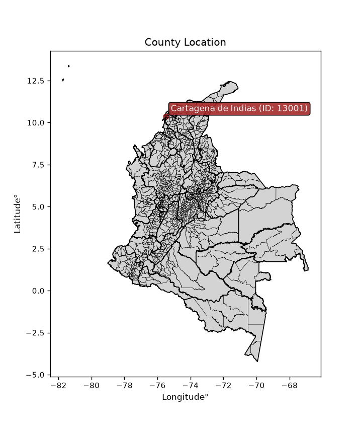
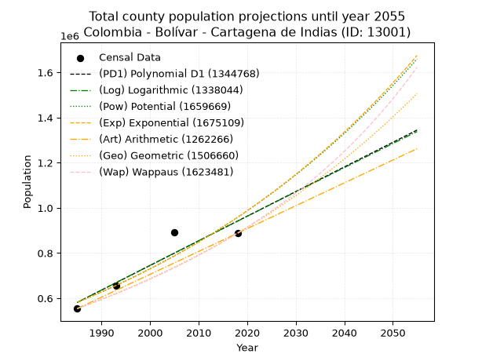
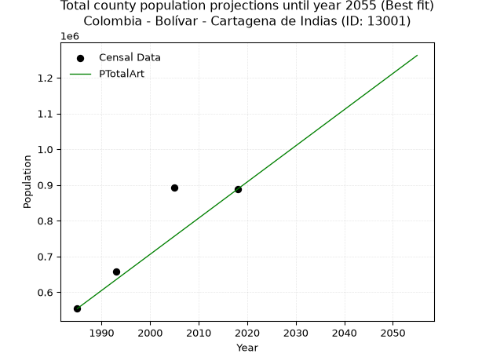
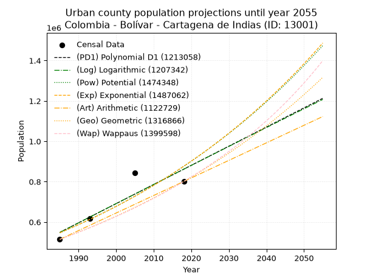
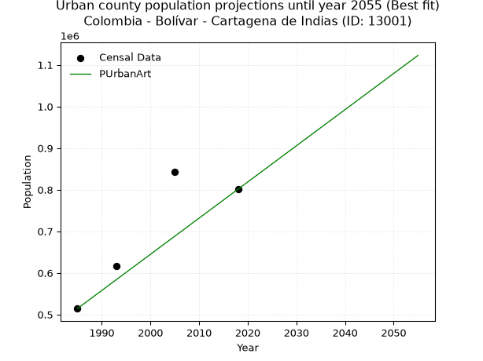
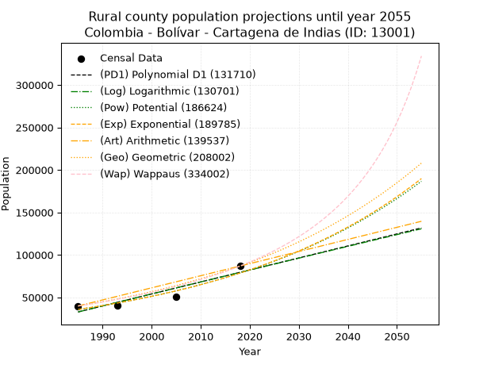
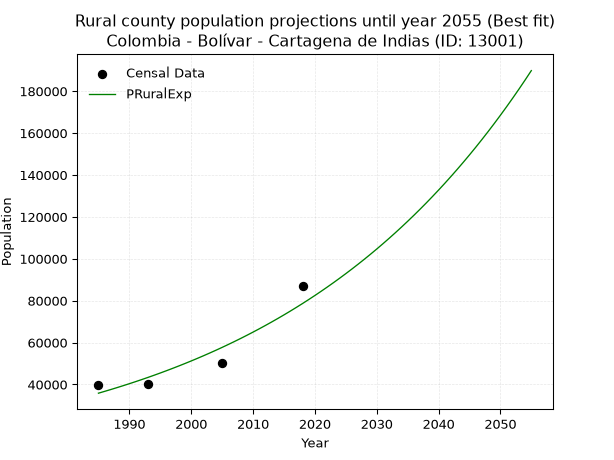

<div align="center">


</div>

# _“Population and Public Services Demand Projections (PPSD) until Year 2050 for Colombia - Bolívar - Cartagena de Indias (ID: 13001)”_
Keywords: `population` `public-service` `projection` `lineal` `polynomial` `logarithmic` `potential` `exponential` `arithmetic` `geometric` `wappaus` `dane` `colombia` `south-america`

PPSD are analytical estimates used by governments and planners to anticipate future changes in population size, age distribution, and the resulting community needs for utilities, healthcare, education, and infrastructure as sizing future water treatment facilities, electrical grids, and road networks based on spatial growth.

<div align="center">

</img>

</div>


> **General running parameters**: • app_version: _v20260806_. • Python version: _3.14.7_. • Pandas version: _3.0.5_. • NumPy version: _2.5.1_. • Creates, save and include plots into reports (create_plot): _False_. • Projection until year: _2050_. • Process polynomial degree 2 and up: _False_. • Process Wappaus: _True_. • Process Wappaus: _True_. • Set negative values to zero: _True_. • Set infinite values to zero: _True_. • Drop dataset notes: _True_. 
<div align="center">

Dynamic map: [:earth_americas:Google](http://maps.google.com/maps?q=10.38512634,-75.4962687) [:earth_americas:OSM](https://www.openstreetmap.org/#map=18/10.38512634/-75.4962687&layers=P) [:earth_americas:Bing](https://www.bing.com/maps?cp=10.38512634~-75.4962687&lvl=18) [:earth_americas:Apple](https://maps.apple.com/frame?center=10.38512634%2C-75.4962687&span=0.003%2C0.006)

</div>


<div align="center">

```geojson
{
  "type": "Feature",
  "geometry": {
    "type": "Point", 
    "coordinates": [-75.4962687, 10.38512634]
  }, 
  "properties": {
    "Name": "Colombia - Bolívar - Cartagena de Indias (ID: 13001)"
  }
}
```

</div>


## 0. Census Data (4 records)

Census data are official statistics collected by a government about the people and housing in a country. They usually include counts of total population, age, sex, race, income, education, and jobs.

📅Global census file: [Population.xlsx](../data/Population.xlsx)

| Source   |   Year |   CountryID | CountryName   |   StateID | StateName   |   CountyID | CountyName          |   PTotal |   PUrban |   PRural |
|:---------|-------:|------------:|:--------------|----------:|:------------|-----------:|:--------------------|---------:|---------:|---------:|
| DANE     |   1985 |          57 | Colombia      |        13 | Bolívar     |      13001 | Cartagena de Indias |   554093 |   514242 |    39851 |
| DANE     |   1993 |          57 | Colombia      |        13 | Bolívar     |      13001 | Cartagena de Indias |   656632 |   616231 |    40401 |
| DANE     |   2005 |          57 | Colombia      |        13 | Bolívar     |      13001 | Cartagena de Indias |   892545 |   842228 |    50317 |
| DANE     |   2018 |          57 | Colombia      |        13 | Bolívar     |      13001 | Cartagena de Indias |   887946 |   801100 |    86846 |

> 🔥Some records could had specific notes about the registered values or the corresponding urban or rural distribution.

📅[SUI-RUPS](https://www.datos.gov.co/Hacienda-y-Cr-dito-P-blico/Registro-nico-de-Prestadores-de-Servicios-P-blicos/4qkq-csdn/about_data) - Local public utility companies: [RUPS.csv](../data/RUPS.xlsx)

 | SERVICIO       | ESTADO    | NOMBRE                          | NIT         | DEPARTAMENTO_DOMICILIO   | MUNICIPIO_DOMICILIO   | DIRECCION                                                                            |   TELEFONO | EMAIL                                    | TIPO_PRESTADOR                             | CLASIFICACION                 |
|:---------------|:----------|:--------------------------------|:------------|:-------------------------|:----------------------|:-------------------------------------------------------------------------------------|-----------:|:-----------------------------------------|:-------------------------------------------|:------------------------------|
| ACUEDUCTO      | OPERATIVA | AGUAS DE CARTAGENA S.A.  E.S.P. | 800252396-4 | BOLIVAR                  | CARTAGENA DE INDIAS   | EDIFICIO CHAMBACU CRA 13B No.26-78                                                   |    6932770 | gerencia@acuacar.com                     | SOCIEDADES (EMPRESA DE SERVICIOS PUBLICOS) | MAYOR O IGUAL A 5001 USUARIOS |
| ALCANTARILLADO | OPERATIVA | AGUAS DE CARTAGENA S.A.  E.S.P. | 800252396-4 | BOLIVAR                  | CARTAGENA DE INDIAS   | EDIFICIO CHAMBACU CRA 13B No.26-78                                                   |    6932770 | gerencia@acuacar.com                     | SOCIEDADES (EMPRESA DE SERVICIOS PUBLICOS) | MAYOR O IGUAL A 5001 USUARIOS |
| ALCANTARILLADO | OPERATIVA | CNC DEL MAR SAS ESP             | 901037870-1 | BOLIVAR                  | CARTAGENA DE INDIAS   | VIA AL MAR KM 8 ZONA CENTRO CORPORATIVO U DE LOS ANDES P1 LC105 ZONA NORTE CARTAGENA |    3210000 | notificacionesjudicialescetsa@celsia.com | SOCIEDADES (EMPRESA DE SERVICIOS PUBLICOS) | MENOR O IGUAL A 2500 USUARIOS |

## 1. Total

### 1.1. Coefficients and Parameters

* (PD1) Polynomial Deg 1: 10903.460457647518, -21061842.780409448 (lineal)
* (Log) Logarithmic: 21842024.69905272, -165273600.7685009
* (Pow) Potential: 30.252341037806914, -94.00029167158857
* (Exp) Exponential: 0.015100868813208705, 5.58332354047317e-08
* (Art) Arithmetic: Year diff. 2018 - 1985 = 33, Population diff. 887946 - 554093 = 333853, Annual growth = 10116.757575757576
* (Geo) Geometric: Year diff. 2018 - 1985 = 33, Population diff. 887946 - 554093 = 333853, Annual growth % = 0.01439284796759055
* (Wap) Wappaus: i = 1.4031184421166938, Condition values only valid for < 200)

<sub>
Wappaus condition values: ['0.00', '1.40', '2.81', '4.21', '5.61', '7.02', '8.42', '9.82', '11.22', '12.63', '14.03', '15.43', '16.84', '18.24', '19.64', '21.05', '22.45', '23.85', '25.26', '26.66', '28.06', '29.47', '30.87', '32.27', '33.67', '35.08', '36.48', '37.88', '39.29', '40.69', '42.09', '43.50', '44.90', '46.30', '47.71', '49.11', '50.51', '51.92', '53.32', '54.72', '56.12', '57.53', '58.93', '60.33', '61.74', '63.14', '64.54', '65.95', '67.35', '68.75', '70.16', '71.56', '72.96', '74.37', '75.77', '77.17', '78.57', '79.98', '81.38', '82.78', '84.19', '85.59', '86.99', '88.40', '89.80', '91.20']
</sub>


### 1.2. Projected Dataset

|   Year |   CountyID |        PTotalPD1 |        PTotalLog |        PTotalPow |        PTotalExp |        PTotalArt |        PTotalGeo |        PTotalWap |
|-------:|-----------:|-----------------:|-----------------:|-----------------:|-----------------:|-----------------:|-----------------:|-----------------:|
|   1985 |      13001 | 581526           | 581066           | 581680           | 582060           | 554093           | 554093           | 554093           |
|   1986 |      13001 | 592430           | 592067           | 590610           | 590916           | 564210           | 562068           | 561923           |
|   1987 |      13001 | 603333           | 603062           | 599674           | 599907           | 574327           | 570158           | 569863           |
|   1988 |      13001 | 614237           | 614052           | 608871           | 609035           | 584443           | 578364           | 577918           |
|   1989 |      13001 | 625140           | 625036           | 618205           | 618302           | 594560           | 586688           | 586089           |
|   1990 |      13001 | 636044           | 636014           | 627678           | 627709           | 604677           | 595132           | 594379           |
|   1991 |      13001 | 646947           | 646988           | 637290           | 637260           | 614794           | 603698           | 602790           |
|   1992 |      13001 | 657850           | 657955           | 647045           | 646956           | 624910           | 612387           | 611326           |
|   1993 |      13001 | 668754           | 668917           | 656944           | 656800           | 635027           | 621201           | 619988           |
|   1994 |      13001 | 679657           | 679874           | 666990           | 666794           | 645144           | 630142           | 628780           |
|   1995 |      13001 | 690561           | 690825           | 677183           | 676939           | 655261           | 639211           | 637705           |
|   1996 |      13001 | 701464           | 701771           | 687528           | 687239           | 665377           | 648411           | 646765           |
|   1997 |      13001 | 712368           | 712711           | 698025           | 697696           | 675494           | 657744           | 655964           |
|   1998 |      13001 | 723271           | 723646           | 708677           | 708312           | 685611           | 667211           | 665305           |
|   1999 |      13001 | 734175           | 734575           | 719487           | 719089           | 695728           | 676814           | 674792           |
|   2000 |      13001 | 745078           | 745498           | 730455           | 730030           | 705844           | 686555           | 684427           |
|   2001 |      13001 | 755982           | 756417           | 741585           | 741138           | 715961           | 696436           | 694215           |
|   2002 |      13001 | 766885           | 767330           | 752879           | 752415           | 726078           | 706460           | 704158           |
|   2003 |      13001 | 777789           | 778237           | 764340           | 763863           | 736195           | 716628           | 714262           |
|   2004 |      13001 | 788692           | 789139           | 775969           | 775486           | 746311           | 726942           | 724528           |
|   2005 |      13001 | 799595           | 800035           | 787768           | 787285           | 756428           | 737405           | 734963           |
|   2006 |      13001 | 810499           | 810926           | 799742           | 799264           | 766545           | 748019           | 745569           |
|   2007 |      13001 | 821402           | 821812           | 811891           | 811425           | 776662           | 758785           | 756351           |
|   2008 |      13001 | 832306           | 832692           | 824219           | 823771           | 786778           | 769706           | 767313           |
|   2009 |      13001 | 843209           | 843567           | 836727           | 836305           | 796895           | 780784           | 778461           |
|   2010 |      13001 | 854113           | 854436           | 849419           | 849030           | 807012           | 792022           | 789798           |
|   2011 |      13001 | 865016           | 865300           | 862297           | 861948           | 817129           | 803421           | 801329           |
|   2012 |      13001 | 875920           | 876159           | 875364           | 875063           | 827245           | 814985           | 813061           |
|   2013 |      13001 | 886823           | 887012           | 888622           | 888378           | 837362           | 826715           | 824997           |
|   2014 |      13001 | 897727           | 897860           | 902074           | 901895           | 847479           | 838613           | 837143           |
|   2015 |      13001 | 908630           | 908702           | 915723           | 915618           | 857596           | 850684           | 849505           |
|   2016 |      13001 | 919534           | 919539           | 929571           | 929549           | 867712           | 862927           | 862089           |
|   2017 |      13001 | 930437           | 930371           | 943622           | 943693           | 877829           | 875347           | 874901           |
|   2018 |      13001 | 941340           | 941197           | 957878           | 958051           | 887946           | 887946           | 887946           |
|   2019 |      13001 | 952244           | 952018           | 972343           | 972629           | 898063           | 900726           | 901232           |
|   2020 |      13001 | 963147           | 962834           | 987018           | 987428           | 908180           | 913690           | 914765           |
|   2021 |      13001 | 974051           | 973644           |      1.00191e+06 |      1.00245e+06 | 918296           | 926841           | 928552           |
|   2022 |      13001 | 984954           | 984449           |      1.01701e+06 |      1.0177e+06  | 928413           | 940181           | 942600           |
|   2023 |      13001 | 995858           | 995248           |      1.03234e+06 |      1.03319e+06 | 938530           | 953712           | 956917           |
|   2024 |      13001 |      1.00676e+06 |      1.00604e+06 |      1.04789e+06 |      1.04891e+06 | 948647           | 967439           | 971510           |
|   2025 |      13001 |      1.01766e+06 |      1.01683e+06 |      1.06367e+06 |      1.06487e+06 | 958763           | 981363           | 986389           |
|   2026 |      13001 |      1.02857e+06 |      1.02762e+06 |      1.07967e+06 |      1.08107e+06 | 968880           | 995488           |      1.00156e+06 |
|   2027 |      13001 |      1.03947e+06 |      1.03839e+06 |      1.09591e+06 |      1.09752e+06 | 978997           |      1.00982e+06 |      1.01703e+06 |
|   2028 |      13001 |      1.05038e+06 |      1.04917e+06 |      1.11239e+06 |      1.11422e+06 | 989114           |      1.02435e+06 |      1.03282e+06 |
|   2029 |      13001 |      1.06128e+06 |      1.05993e+06 |      1.1291e+06  |      1.13117e+06 | 999230           |      1.03909e+06 |      1.04892e+06 |
|   2030 |      13001 |      1.07218e+06 |      1.0707e+06  |      1.14606e+06 |      1.14838e+06 |      1.00935e+06 |      1.05405e+06 |      1.06536e+06 |
|   2031 |      13001 |      1.08308e+06 |      1.08145e+06 |      1.16326e+06 |      1.16586e+06 |      1.01946e+06 |      1.06922e+06 |      1.08213e+06 |
|   2032 |      13001 |      1.09399e+06 |      1.0922e+06  |      1.18071e+06 |      1.1836e+06  |      1.02958e+06 |      1.08461e+06 |      1.09926e+06 |
|   2033 |      13001 |      1.10489e+06 |      1.10295e+06 |      1.19842e+06 |      1.20161e+06 |      1.0397e+06  |      1.10022e+06 |      1.11674e+06 |
|   2034 |      13001 |      1.1158e+06  |      1.11369e+06 |      1.21638e+06 |      1.21989e+06 |      1.04981e+06 |      1.11606e+06 |      1.13461e+06 |
|   2035 |      13001 |      1.1267e+06  |      1.12443e+06 |      1.2346e+06  |      1.23845e+06 |      1.05993e+06 |      1.13212e+06 |      1.15286e+06 |
|   2036 |      13001 |      1.1376e+06  |      1.13516e+06 |      1.25309e+06 |      1.25729e+06 |      1.07005e+06 |      1.14841e+06 |      1.1715e+06  |
|   2037 |      13001 |      1.14851e+06 |      1.14588e+06 |      1.27184e+06 |      1.27642e+06 |      1.08016e+06 |      1.16494e+06 |      1.19056e+06 |
|   2038 |      13001 |      1.15941e+06 |      1.1566e+06  |      1.29087e+06 |      1.29585e+06 |      1.09028e+06 |      1.18171e+06 |      1.21005e+06 |
|   2039 |      13001 |      1.17031e+06 |      1.16732e+06 |      1.31017e+06 |      1.31556e+06 |      1.1004e+06  |      1.19872e+06 |      1.22997e+06 |
|   2040 |      13001 |      1.18122e+06 |      1.17803e+06 |      1.32975e+06 |      1.33558e+06 |      1.11052e+06 |      1.21597e+06 |      1.25035e+06 |
|   2041 |      13001 |      1.19212e+06 |      1.18873e+06 |      1.34961e+06 |      1.3559e+06  |      1.12063e+06 |      1.23347e+06 |      1.2712e+06  |
|   2042 |      13001 |      1.20302e+06 |      1.19943e+06 |      1.36976e+06 |      1.37653e+06 |      1.13075e+06 |      1.25122e+06 |      1.29254e+06 |
|   2043 |      13001 |      1.21393e+06 |      1.21012e+06 |      1.3902e+06  |      1.39748e+06 |      1.14086e+06 |      1.26923e+06 |      1.31438e+06 |
|   2044 |      13001 |      1.22483e+06 |      1.22081e+06 |      1.41093e+06 |      1.41874e+06 |      1.15098e+06 |      1.2875e+06  |      1.33675e+06 |
|   2045 |      13001 |      1.23573e+06 |      1.2315e+06  |      1.43196e+06 |      1.44033e+06 |      1.1611e+06  |      1.30603e+06 |      1.35966e+06 |
|   2046 |      13001 |      1.24664e+06 |      1.24218e+06 |      1.4533e+06  |      1.46224e+06 |      1.17122e+06 |      1.32483e+06 |      1.38313e+06 |
|   2047 |      13001 |      1.25754e+06 |      1.25285e+06 |      1.47494e+06 |      1.48449e+06 |      1.18133e+06 |      1.3439e+06  |      1.40718e+06 |
|   2048 |      13001 |      1.26844e+06 |      1.26352e+06 |      1.4969e+06  |      1.50708e+06 |      1.19145e+06 |      1.36324e+06 |      1.43184e+06 |
|   2049 |      13001 |      1.27935e+06 |      1.27418e+06 |      1.51916e+06 |      1.53001e+06 |      1.20156e+06 |      1.38286e+06 |      1.45713e+06 |
|   2050 |      13001 |      1.29025e+06 |      1.28484e+06 |      1.54176e+06 |      1.55329e+06 |      1.21168e+06 |      1.40276e+06 |      1.48306e+06 |
<div align="center">

</img>

</div>


### 1.3. Best fit with absolute and relative error (%)

Relative error puts that difference into context by dividing the absolute error by the true value, creating a unitless ratio or percentage that shows the scale of the mistake.

Absolute and relative error

|   Year | Source   |   CountryID | CountryName   |   StateID | StateName   |   CountyID_x | CountyName          |   PTotal |   PUrban |   PRural |   CountyID_y |   PTotalPD1 |   PTotalLog |   PTotalPow |   PTotalExp |   PTotalArt |   PTotalGeo |   PTotalWap |   PTotalPD1AbsError |   PTotalLogAbsError |   PTotalPowAbsError |   PTotalExpAbsError |   PTotalArtAbsError |   PTotalGeoAbsError |   PTotalWapAbsError |   PTotalPD1RelError |   PTotalLogRelError |   PTotalPowRelError |   PTotalExpRelError |   PTotalArtRelError |   PTotalGeoRelError |   PTotalWapRelError |
|-------:|:---------|------------:|:--------------|----------:|:------------|-------------:|:--------------------|---------:|---------:|---------:|-------------:|------------:|------------:|------------:|------------:|------------:|------------:|------------:|--------------------:|--------------------:|--------------------:|--------------------:|--------------------:|--------------------:|--------------------:|--------------------:|--------------------:|--------------------:|--------------------:|--------------------:|--------------------:|--------------------:|
|   1985 | DANE     |          57 | Colombia      |        13 | Bolívar     |        13001 | Cartagena de Indias |   554093 |   514242 |    39851 |        13001 |      581526 |      581066 |      581680 |      582060 |      554093 |      554093 |      554093 |               27433 |               26973 |               27587 |               27967 |                   0 |                   0 |                   0 |             4.95097 |             4.86796 |           4.97877   |           5.04735   |             0       |             0       |              0      |
|   1993 | DANE     |          57 | Colombia      |        13 | Bolívar     |        13001 | Cartagena de Indias |   656632 |   616231 |    40401 |        13001 |      668754 |      668917 |      656944 |      656800 |      635027 |      621201 |      619988 |               12122 |               12285 |                 312 |                 168 |               21605 |               35431 |               36644 |             1.84609 |             1.87091 |           0.0475152 |           0.0255851 |             3.29028 |             5.39587 |              5.5806 |
|   2005 | DANE     |          57 | Colombia      |        13 | Bolívar     |        13001 | Cartagena de Indias |   892545 |   842228 |    50317 |        13001 |      799595 |      800035 |      787768 |      787285 |      756428 |      737405 |      734963 |               92950 |               92510 |              104777 |              105260 |              136117 |              155140 |              157582 |            10.414   |            10.3647  |          11.7391    |          11.7932    |            15.2504  |            17.3818  |             17.6554 |
|   2018 | DANE     |          57 | Colombia      |        13 | Bolívar     |        13001 | Cartagena de Indias |   887946 |   801100 |    86846 |        13001 |      941340 |      941197 |      957878 |      958051 |      887946 |      887946 |      887946 |               53394 |               53251 |               69932 |               70105 |                   0 |                   0 |                   0 |             6.0132  |             5.9971  |           7.8757    |           7.89519   |             0       |             0       |              0      |

Relative error mean

| Method    |   RelError | Best   |
|:----------|-----------:|:-------|
| PTotalPD1 |    5.80608 |        |
| PTotalLog |    5.77518 |        |
| PTotalPow |    6.16028 |        |
| PTotalExp |    6.19034 |        |
| PTotalArt |    4.63518 | True   |
| PTotalGeo |    5.69441 |        |
| PTotalWap |    5.80899 |        |

💙Best method: _**PTotalArt**_
<div align="center">

</img>

</div>


### 1.4. Fresh water supply demand in liters per capita per day (lpcd)

The fresh water supply demand typically ranges from 100 to 300 liters per capita per day (lpcd) for standard domestic and municipal planning, though absolute survival minimums set by the World Health Organization are as low as 7.5 to 20 liters per day, and total consumption in high-income nations can exceed 400 liters.

> `CZ`: Level in meters above the sea level (masl)<br> `WS`: Fresh water supply demand in liters per capita per day (lpcd or l/h/d)<br> `WSAll`: Zonal fresh water supply demand in liters per second (l/s)<br> `A`: Zonal area in square meters<br> `DP`: Population density (people/hectare or p/ha)

Reference values (RAS Colombia)

|    CZ |   WS |
|------:|-----:|
|  1000 |  120 |
|  2000 |  130 |
| 99999 |  140 |

County shapefile geometry properties and water supply values

|   CountyID |      ATotal |   CZTotal |   WSTotal |
|-----------:|------------:|----------:|----------:|
|      13001 | 5.67136e+08 |    23.747 |       120 |

Projected values for best method: PTotalArt

|   CountyID |   Year |        PTotalArt |   DPTotal |   WSTotal |   WSTotalAll |
|-----------:|-------:|-----------------:|----------:|----------:|-------------:|
|      13001 |   1985 | 554093           |      9.77 |       120 |      769.574 |
|      13001 |   1986 | 564210           |      9.95 |       120 |      783.625 |
|      13001 |   1987 | 574327           |     10.13 |       120 |      797.676 |
|      13001 |   1988 | 584443           |     10.31 |       120 |      811.726 |
|      13001 |   1989 | 594560           |     10.48 |       120 |      825.778 |
|      13001 |   1990 | 604677           |     10.66 |       120 |      839.829 |
|      13001 |   1991 | 614794           |     10.84 |       120 |      853.881 |
|      13001 |   1992 | 624910           |     11.02 |       120 |      867.931 |
|      13001 |   1993 | 635027           |     11.2  |       120 |      881.982 |
|      13001 |   1994 | 645144           |     11.38 |       120 |      896.033 |
|      13001 |   1995 | 655261           |     11.55 |       120 |      910.085 |
|      13001 |   1996 | 665377           |     11.73 |       120 |      924.135 |
|      13001 |   1997 | 675494           |     11.91 |       120 |      938.186 |
|      13001 |   1998 | 685611           |     12.09 |       120 |      952.237 |
|      13001 |   1999 | 695728           |     12.27 |       120 |      966.289 |
|      13001 |   2000 | 705844           |     12.45 |       120 |      980.339 |
|      13001 |   2001 | 715961           |     12.62 |       120 |      994.39  |
|      13001 |   2002 | 726078           |     12.8  |       120 |     1008.44  |
|      13001 |   2003 | 736195           |     12.98 |       120 |     1022.49  |
|      13001 |   2004 | 746311           |     13.16 |       120 |     1036.54  |
|      13001 |   2005 | 756428           |     13.34 |       120 |     1050.59  |
|      13001 |   2006 | 766545           |     13.52 |       120 |     1064.65  |
|      13001 |   2007 | 776662           |     13.69 |       120 |     1078.7   |
|      13001 |   2008 | 786778           |     13.87 |       120 |     1092.75  |
|      13001 |   2009 | 796895           |     14.05 |       120 |     1106.8   |
|      13001 |   2010 | 807012           |     14.23 |       120 |     1120.85  |
|      13001 |   2011 | 817129           |     14.41 |       120 |     1134.9   |
|      13001 |   2012 | 827245           |     14.59 |       120 |     1148.95  |
|      13001 |   2013 | 837362           |     14.76 |       120 |     1163     |
|      13001 |   2014 | 847479           |     14.94 |       120 |     1177.05  |
|      13001 |   2015 | 857596           |     15.12 |       120 |     1191.11  |
|      13001 |   2016 | 867712           |     15.3  |       120 |     1205.16  |
|      13001 |   2017 | 877829           |     15.48 |       120 |     1219.21  |
|      13001 |   2018 | 887946           |     15.66 |       120 |     1233.26  |
|      13001 |   2019 | 898063           |     15.84 |       120 |     1247.31  |
|      13001 |   2020 | 908180           |     16.01 |       120 |     1261.36  |
|      13001 |   2021 | 918296           |     16.19 |       120 |     1275.41  |
|      13001 |   2022 | 928413           |     16.37 |       120 |     1289.46  |
|      13001 |   2023 | 938530           |     16.55 |       120 |     1303.51  |
|      13001 |   2024 | 948647           |     16.73 |       120 |     1317.57  |
|      13001 |   2025 | 958763           |     16.91 |       120 |     1331.62  |
|      13001 |   2026 | 968880           |     17.08 |       120 |     1345.67  |
|      13001 |   2027 | 978997           |     17.26 |       120 |     1359.72  |
|      13001 |   2028 | 989114           |     17.44 |       120 |     1373.77  |
|      13001 |   2029 | 999230           |     17.62 |       120 |     1387.82  |
|      13001 |   2030 |      1.00935e+06 |     17.8  |       120 |     1401.87  |
|      13001 |   2031 |      1.01946e+06 |     17.98 |       120 |     1415.92  |
|      13001 |   2032 |      1.02958e+06 |     18.15 |       120 |     1429.97  |
|      13001 |   2033 |      1.0397e+06  |     18.33 |       120 |     1444.02  |
|      13001 |   2034 |      1.04981e+06 |     18.51 |       120 |     1458.08  |
|      13001 |   2035 |      1.05993e+06 |     18.69 |       120 |     1472.13  |
|      13001 |   2036 |      1.07005e+06 |     18.87 |       120 |     1486.18  |
|      13001 |   2037 |      1.08016e+06 |     19.05 |       120 |     1500.23  |
|      13001 |   2038 |      1.09028e+06 |     19.22 |       120 |     1514.28  |
|      13001 |   2039 |      1.1004e+06  |     19.4  |       120 |     1528.33  |
|      13001 |   2040 |      1.11052e+06 |     19.58 |       120 |     1542.38  |
|      13001 |   2041 |      1.12063e+06 |     19.76 |       120 |     1556.43  |
|      13001 |   2042 |      1.13075e+06 |     19.94 |       120 |     1570.48  |
|      13001 |   2043 |      1.14086e+06 |     20.12 |       120 |     1584.53  |
|      13001 |   2044 |      1.15098e+06 |     20.29 |       120 |     1598.59  |
|      13001 |   2045 |      1.1611e+06  |     20.47 |       120 |     1612.64  |
|      13001 |   2046 |      1.17122e+06 |     20.65 |       120 |     1626.69  |
|      13001 |   2047 |      1.18133e+06 |     20.83 |       120 |     1640.74  |
|      13001 |   2048 |      1.19145e+06 |     21.01 |       120 |     1654.79  |
|      13001 |   2049 |      1.20156e+06 |     21.19 |       120 |     1668.84  |
|      13001 |   2050 |      1.21168e+06 |     21.36 |       120 |     1682.89  |

## 2. Urban

### 2.1. Coefficients and Parameters

* (PD1) Polynomial Deg 1: 9490.554395824984, -18290031.18024892 (lineal)
* (Log) Logarithmic: 19016761.365336437, -143853105.27868396
* (Pow) Potential: 28.637826746714886, -88.7031310291077
* (Exp) Exponential: 0.014291685224285162, 2.6142981365897473e-07
* (Art) Arithmetic: Year diff. 2018 - 1985 = 33, Population diff. 801100 - 514242 = 286858, Annual growth = 8692.666666666666
* (Geo) Geometric: Year diff. 2018 - 1985 = 33, Population diff. 801100 - 514242 = 286858, Annual growth % = 0.013523714439672041
* (Wap) Wappaus: i = 1.3217348289139503, Condition values only valid for < 200)

<sub>
Wappaus condition values: ['0.00', '1.32', '2.64', '3.97', '5.29', '6.61', '7.93', '9.25', '10.57', '11.90', '13.22', '14.54', '15.86', '17.18', '18.50', '19.83', '21.15', '22.47', '23.79', '25.11', '26.43', '27.76', '29.08', '30.40', '31.72', '33.04', '34.37', '35.69', '37.01', '38.33', '39.65', '40.97', '42.30', '43.62', '44.94', '46.26', '47.58', '48.90', '50.23', '51.55', '52.87', '54.19', '55.51', '56.83', '58.16', '59.48', '60.80', '62.12', '63.44', '64.77', '66.09', '67.41', '68.73', '70.05', '71.37', '72.70', '74.02', '75.34', '76.66', '77.98', '79.30', '80.63', '81.95', '83.27', '84.59', '85.91']
</sub>


### 2.2. Projected Dataset

|   Year |   CountyID |        PUrbanPD1 |        PUrbanLog |        PUrbanPow |        PUrbanExp |        PUrbanArt |        PUrbanGeo |        PUrbanWap |
|-------:|-----------:|-----------------:|-----------------:|-----------------:|-----------------:|-----------------:|-----------------:|-----------------:|
|   1985 |      13001 | 548719           | 548280           | 546466           | 546831           | 514242           | 514242           | 514242           |
|   1986 |      13001 | 558210           | 557858           | 554405           | 554702           | 522935           | 521196           | 521084           |
|   1987 |      13001 | 567700           | 567431           | 562455           | 562687           | 531627           | 528245           | 528018           |
|   1988 |      13001 | 577191           | 576999           | 570618           | 570786           | 540320           | 535389           | 535045           |
|   1989 |      13001 | 586682           | 586562           | 578896           | 579002           | 549013           | 542629           | 542168           |
|   1990 |      13001 | 596172           | 596121           | 587289           | 587337           | 557705           | 549968           | 549388           |
|   1991 |      13001 | 605663           | 605674           | 595800           | 595791           | 566398           | 557405           | 556707           |
|   1992 |      13001 | 615153           | 615223           | 604429           | 604367           | 575091           | 564943           | 564128           |
|   1993 |      13001 | 624644           | 624768           | 613179           | 613066           | 583783           | 572584           | 571653           |
|   1994 |      13001 | 634134           | 634307           | 622051           | 621891           | 592476           | 580327           | 579283           |
|   1995 |      13001 | 643625           | 643842           | 631047           | 630843           | 601169           | 588175           | 587021           |
|   1996 |      13001 | 653115           | 653371           | 640169           | 639923           | 609861           | 596129           | 594869           |
|   1997 |      13001 | 662606           | 662896           | 649418           | 649135           | 618554           | 604191           | 602830           |
|   1998 |      13001 | 672097           | 672417           | 658795           | 658478           | 627247           | 612362           | 610907           |
|   1999 |      13001 | 681587           | 681932           | 668304           | 667957           | 635939           | 620644           | 619100           |
|   2000 |      13001 | 691078           | 691443           | 677944           | 677572           | 644632           | 629037           | 627415           |
|   2001 |      13001 | 700568           | 700949           | 687719           | 687325           | 653325           | 637544           | 635851           |
|   2002 |      13001 | 710059           | 710450           | 697630           | 697218           | 662017           | 646166           | 644414           |
|   2003 |      13001 | 719549           | 719947           | 707678           | 707254           | 670710           | 654905           | 653105           |
|   2004 |      13001 | 729040           | 729438           | 717867           | 717435           | 679403           | 663761           | 661927           |
|   2005 |      13001 | 738530           | 738926           | 728196           | 727762           | 688095           | 672738           | 670884           |
|   2006 |      13001 | 748021           | 748408           | 738669           | 738237           | 696788           | 681836           | 679978           |
|   2007 |      13001 | 757511           | 757885           | 749287           | 748864           | 705481           | 691057           | 689213           |
|   2008 |      13001 | 767002           | 767358           | 760053           | 759643           | 714173           | 700402           | 698592           |
|   2009 |      13001 | 776493           | 776826           | 770968           | 770578           | 722866           | 709874           | 708118           |
|   2010 |      13001 | 785983           | 786290           | 782034           | 781670           | 731559           | 719475           | 717795           |
|   2011 |      13001 | 795474           | 795749           | 793253           | 792921           | 740251           | 729204           | 727627           |
|   2012 |      13001 | 804964           | 805203           | 804627           | 804335           | 748944           | 739066           | 737616           |
|   2013 |      13001 | 814455           | 814652           | 816159           | 815912           | 757637           | 749061           | 747768           |
|   2014 |      13001 | 823945           | 824097           | 827850           | 827657           | 766329           | 759191           | 758086           |
|   2015 |      13001 | 833436           | 833536           | 839702           | 839571           | 775022           | 769458           | 768573           |
|   2016 |      13001 | 842926           | 842972           | 851719           | 851656           | 783715           | 779864           | 779235           |
|   2017 |      13001 | 852417           | 852402           | 863901           | 863915           | 792407           | 790411           | 790076           |
|   2018 |      13001 | 861908           | 861828           | 876251           | 876350           | 801100           | 801100           | 801100           |
|   2019 |      13001 | 871398           | 871249           | 888772           | 888964           | 809793           | 811934           | 812312           |
|   2020 |      13001 | 880889           | 880666           | 901465           | 901760           | 818485           | 822914           | 823717           |
|   2021 |      13001 | 890379           | 890078           | 914333           | 914741           | 827178           | 834043           | 835319           |
|   2022 |      13001 | 899870           | 899485           | 927378           | 927908           | 835871           | 845322           | 847125           |
|   2023 |      13001 | 909360           | 908888           | 940603           | 941264           | 844563           | 856754           | 859139           |
|   2024 |      13001 | 918851           | 918286           | 954009           | 954813           | 853256           | 868341           | 871366           |
|   2025 |      13001 | 928341           | 927679           | 967600           | 968557           | 861949           | 880084           | 883814           |
|   2026 |      13001 | 937832           | 937068           | 981378           | 982499           | 870641           | 891986           | 896487           |
|   2027 |      13001 | 947323           | 946452           | 995345           | 996641           | 879334           | 904049           | 909392           |
|   2028 |      13001 | 956813           | 955831           |      1.0095e+06  |      1.01099e+06 | 888027           | 916275           | 922535           |
|   2029 |      13001 | 966304           | 965206           |      1.02386e+06 |      1.02554e+06 | 896719           | 928667           | 935924           |
|   2030 |      13001 | 975794           | 974576           |      1.03841e+06 |      1.0403e+06  | 905412           | 941226           | 949564           |
|   2031 |      13001 | 985285           | 983942           |      1.05316e+06 |      1.05528e+06 | 914105           | 953954           | 963463           |
|   2032 |      13001 | 994775           | 993303           |      1.06811e+06 |      1.07047e+06 | 922797           | 966855           | 977628           |
|   2033 |      13001 |      1.00427e+06 |      1.00266e+06 |      1.08326e+06 |      1.08587e+06 | 931490           | 979931           | 992068           |
|   2034 |      13001 |      1.01376e+06 |      1.01201e+06 |      1.09863e+06 |      1.1015e+06  | 940183           | 993183           |      1.00679e+06 |
|   2035 |      13001 |      1.02325e+06 |      1.02136e+06 |      1.1142e+06  |      1.11736e+06 | 948875           |      1.00662e+06 |      1.0218e+06  |
|   2036 |      13001 |      1.03274e+06 |      1.0307e+06  |      1.12999e+06 |      1.13344e+06 | 957568           |      1.02023e+06 |      1.03712e+06 |
|   2037 |      13001 |      1.04223e+06 |      1.04004e+06 |      1.14599e+06 |      1.14976e+06 | 966261           |      1.03402e+06 |      1.05274e+06 |
|   2038 |      13001 |      1.05172e+06 |      1.04937e+06 |      1.16221e+06 |      1.16631e+06 | 974953           |      1.04801e+06 |      1.06867e+06 |
|   2039 |      13001 |      1.06121e+06 |      1.0587e+06  |      1.17865e+06 |      1.1831e+06  | 983646           |      1.06218e+06 |      1.08494e+06 |
|   2040 |      13001 |      1.0707e+06  |      1.06802e+06 |      1.19532e+06 |      1.20013e+06 | 992339           |      1.07655e+06 |      1.10154e+06 |
|   2041 |      13001 |      1.08019e+06 |      1.07734e+06 |      1.21222e+06 |      1.2174e+06  |      1.00103e+06 |      1.09111e+06 |      1.1185e+06  |
|   2042 |      13001 |      1.08968e+06 |      1.08666e+06 |      1.22934e+06 |      1.23493e+06 |      1.00972e+06 |      1.10586e+06 |      1.13581e+06 |
|   2043 |      13001 |      1.09917e+06 |      1.09597e+06 |      1.2467e+06  |      1.2527e+06  |      1.01842e+06 |      1.12082e+06 |      1.15349e+06 |
|   2044 |      13001 |      1.10866e+06 |      1.10528e+06 |      1.26429e+06 |      1.27073e+06 |      1.02711e+06 |      1.13597e+06 |      1.17155e+06 |
|   2045 |      13001 |      1.11815e+06 |      1.11458e+06 |      1.28212e+06 |      1.28902e+06 |      1.0358e+06  |      1.15134e+06 |      1.19002e+06 |
|   2046 |      13001 |      1.12764e+06 |      1.12387e+06 |      1.3002e+06  |      1.30758e+06 |      1.0445e+06  |      1.16691e+06 |      1.20888e+06 |
|   2047 |      13001 |      1.13713e+06 |      1.13317e+06 |      1.31852e+06 |      1.3264e+06  |      1.05319e+06 |      1.18269e+06 |      1.22818e+06 |
|   2048 |      13001 |      1.14662e+06 |      1.14245e+06 |      1.3371e+06  |      1.34549e+06 |      1.06188e+06 |      1.19868e+06 |      1.24791e+06 |
|   2049 |      13001 |      1.15612e+06 |      1.15174e+06 |      1.35592e+06 |      1.36486e+06 |      1.07057e+06 |      1.21489e+06 |      1.26809e+06 |
|   2050 |      13001 |      1.1656e+06  |      1.16102e+06 |      1.375e+06   |      1.38451e+06 |      1.07926e+06 |      1.23132e+06 |      1.28874e+06 |
<div align="center">

</img>

</div>


### 2.3. Best fit with absolute and relative error (%)

Relative error puts that difference into context by dividing the absolute error by the true value, creating a unitless ratio or percentage that shows the scale of the mistake.

Absolute and relative error

|   Year | Source   |   CountryID | CountryName   |   StateID | StateName   |   CountyID_x | CountyName          |   PTotal |   PUrban |   PRural |   CountyID_y |   PUrbanPD1 |   PUrbanLog |   PUrbanPow |   PUrbanExp |   PUrbanArt |   PUrbanGeo |   PUrbanWap |   PUrbanPD1AbsError |   PUrbanLogAbsError |   PUrbanPowAbsError |   PUrbanExpAbsError |   PUrbanArtAbsError |   PUrbanGeoAbsError |   PUrbanWapAbsError |   PUrbanPD1RelError |   PUrbanLogRelError |   PUrbanPowRelError |   PUrbanExpRelError |   PUrbanArtRelError |   PUrbanGeoRelError |   PUrbanWapRelError |
|-------:|:---------|------------:|:--------------|----------:|:------------|-------------:|:--------------------|---------:|---------:|---------:|-------------:|------------:|------------:|------------:|------------:|------------:|------------:|------------:|--------------------:|--------------------:|--------------------:|--------------------:|--------------------:|--------------------:|--------------------:|--------------------:|--------------------:|--------------------:|--------------------:|--------------------:|--------------------:|--------------------:|
|   1985 | DANE     |          57 | Colombia      |        13 | Bolívar     |        13001 | Cartagena de Indias |   554093 |   514242 |    39851 |        13001 |      548719 |      548280 |      546466 |      546831 |      514242 |      514242 |      514242 |               34477 |               34038 |               32224 |               32589 |                   0 |                   0 |                   0 |             6.70443 |             6.61906 |            6.26631  |            6.33729  |             0       |              0      |             0       |
|   1993 | DANE     |          57 | Colombia      |        13 | Bolívar     |        13001 | Cartagena de Indias |   656632 |   616231 |    40401 |        13001 |      624644 |      624768 |      613179 |      613066 |      583783 |      572584 |      571653 |                8413 |                8537 |                3052 |                3165 |               32448 |               43647 |               44578 |             1.36523 |             1.38536 |            0.495269 |            0.513606 |             5.26556 |              7.0829 |             7.23398 |
|   2005 | DANE     |          57 | Colombia      |        13 | Bolívar     |        13001 | Cartagena de Indias |   892545 |   842228 |    50317 |        13001 |      738530 |      738926 |      728196 |      727762 |      688095 |      672738 |      670884 |              103698 |              103302 |              114032 |              114466 |              154133 |              169490 |              171344 |            12.3123  |            12.2653  |           13.5393   |           13.5909   |            18.3006  |             20.124  |            20.3441  |
|   2018 | DANE     |          57 | Colombia      |        13 | Bolívar     |        13001 | Cartagena de Indias |   887946 |   801100 |    86846 |        13001 |      861908 |      861828 |      876251 |      876350 |      801100 |      801100 |      801100 |               60808 |               60728 |               75151 |               75250 |                   0 |                   0 |                   0 |             7.59056 |             7.58058 |            9.38098  |            9.39333  |             0       |              0      |             0       |

Relative error mean

| Method    |   RelError | Best   |
|:----------|-----------:|:-------|
| PUrbanPD1 |    6.99314 |        |
| PUrbanLog |    6.96258 |        |
| PUrbanPow |    7.42047 |        |
| PUrbanExp |    7.45877 |        |
| PUrbanArt |    5.89155 | True   |
| PUrbanGeo |    6.80173 |        |
| PUrbanWap |    6.89453 |        |

💙Best method: _**PUrbanArt**_
<div align="center">

</img>

</div>


### 2.4. Fresh water supply demand in liters per capita per day (lpcd)

The fresh water supply demand typically ranges from 100 to 300 liters per capita per day (lpcd) for standard domestic and municipal planning, though absolute survival minimums set by the World Health Organization are as low as 7.5 to 20 liters per day, and total consumption in high-income nations can exceed 400 liters.

> `CZ`: Level in meters above the sea level (masl)<br> `WS`: Fresh water supply demand in liters per capita per day (lpcd or l/h/d)<br> `WSAll`: Zonal fresh water supply demand in liters per second (l/s)<br> `A`: Zonal area in square meters<br> `DP`: Population density (people/hectare or p/ha)

Reference values (RAS Colombia)

|    CZ |   WS |
|------:|-----:|
|  1000 |  120 |
|  2000 |  130 |
| 99999 |  140 |

County shapefile geometry properties and water supply values

|   CountyID |      AUrban |   CZUrban |   WSUrban |
|-----------:|------------:|----------:|----------:|
|      13001 | 8.36479e+07 |   11.6241 |       120 |

Projected values for best method: PUrbanArt

|   CountyID |   Year |        PUrbanArt |   DPUrban |   WSUrban |   WSUrbanAll |
|-----------:|-------:|-----------------:|----------:|----------:|-------------:|
|      13001 |   1985 | 514242           |     61.48 |       120 |      714.225 |
|      13001 |   1986 | 522935           |     62.52 |       120 |      726.299 |
|      13001 |   1987 | 531627           |     63.56 |       120 |      738.371 |
|      13001 |   1988 | 540320           |     64.59 |       120 |      750.444 |
|      13001 |   1989 | 549013           |     65.63 |       120 |      762.518 |
|      13001 |   1990 | 557705           |     66.67 |       120 |      774.59  |
|      13001 |   1991 | 566398           |     67.71 |       120 |      786.664 |
|      13001 |   1992 | 575091           |     68.75 |       120 |      798.737 |
|      13001 |   1993 | 583783           |     69.79 |       120 |      810.81  |
|      13001 |   1994 | 592476           |     70.83 |       120 |      822.883 |
|      13001 |   1995 | 601169           |     71.87 |       120 |      834.957 |
|      13001 |   1996 | 609861           |     72.91 |       120 |      847.029 |
|      13001 |   1997 | 618554           |     73.95 |       120 |      859.103 |
|      13001 |   1998 | 627247           |     74.99 |       120 |      871.176 |
|      13001 |   1999 | 635939           |     76.03 |       120 |      883.249 |
|      13001 |   2000 | 644632           |     77.06 |       120 |      895.322 |
|      13001 |   2001 | 653325           |     78.1  |       120 |      907.396 |
|      13001 |   2002 | 662017           |     79.14 |       120 |      919.468 |
|      13001 |   2003 | 670710           |     80.18 |       120 |      931.542 |
|      13001 |   2004 | 679403           |     81.22 |       120 |      943.615 |
|      13001 |   2005 | 688095           |     82.26 |       120 |      955.688 |
|      13001 |   2006 | 696788           |     83.3  |       120 |      967.761 |
|      13001 |   2007 | 705481           |     84.34 |       120 |      979.835 |
|      13001 |   2008 | 714173           |     85.38 |       120 |      991.907 |
|      13001 |   2009 | 722866           |     86.42 |       120 |     1003.98  |
|      13001 |   2010 | 731559           |     87.46 |       120 |     1016.05  |
|      13001 |   2011 | 740251           |     88.5  |       120 |     1028.13  |
|      13001 |   2012 | 748944           |     89.54 |       120 |     1040.2   |
|      13001 |   2013 | 757637           |     90.57 |       120 |     1052.27  |
|      13001 |   2014 | 766329           |     91.61 |       120 |     1064.35  |
|      13001 |   2015 | 775022           |     92.65 |       120 |     1076.42  |
|      13001 |   2016 | 783715           |     93.69 |       120 |     1088.49  |
|      13001 |   2017 | 792407           |     94.73 |       120 |     1100.57  |
|      13001 |   2018 | 801100           |     95.77 |       120 |     1112.64  |
|      13001 |   2019 | 809793           |     96.81 |       120 |     1124.71  |
|      13001 |   2020 | 818485           |     97.85 |       120 |     1136.78  |
|      13001 |   2021 | 827178           |     98.89 |       120 |     1148.86  |
|      13001 |   2022 | 835871           |     99.93 |       120 |     1160.93  |
|      13001 |   2023 | 844563           |    100.97 |       120 |     1173     |
|      13001 |   2024 | 853256           |    102.01 |       120 |     1185.08  |
|      13001 |   2025 | 861949           |    103.04 |       120 |     1197.15  |
|      13001 |   2026 | 870641           |    104.08 |       120 |     1209.22  |
|      13001 |   2027 | 879334           |    105.12 |       120 |     1221.3   |
|      13001 |   2028 | 888027           |    106.16 |       120 |     1233.37  |
|      13001 |   2029 | 896719           |    107.2  |       120 |     1245.44  |
|      13001 |   2030 | 905412           |    108.24 |       120 |     1257.52  |
|      13001 |   2031 | 914105           |    109.28 |       120 |     1269.59  |
|      13001 |   2032 | 922797           |    110.32 |       120 |     1281.66  |
|      13001 |   2033 | 931490           |    111.36 |       120 |     1293.74  |
|      13001 |   2034 | 940183           |    112.4  |       120 |     1305.81  |
|      13001 |   2035 | 948875           |    113.44 |       120 |     1317.88  |
|      13001 |   2036 | 957568           |    114.48 |       120 |     1329.96  |
|      13001 |   2037 | 966261           |    115.52 |       120 |     1342.03  |
|      13001 |   2038 | 974953           |    116.55 |       120 |     1354.1   |
|      13001 |   2039 | 983646           |    117.59 |       120 |     1366.17  |
|      13001 |   2040 | 992339           |    118.63 |       120 |     1378.25  |
|      13001 |   2041 |      1.00103e+06 |    119.67 |       120 |     1390.32  |
|      13001 |   2042 |      1.00972e+06 |    120.71 |       120 |     1402.39  |
|      13001 |   2043 |      1.01842e+06 |    121.75 |       120 |     1414.47  |
|      13001 |   2044 |      1.02711e+06 |    122.79 |       120 |     1426.54  |
|      13001 |   2045 |      1.0358e+06  |    123.83 |       120 |     1438.61  |
|      13001 |   2046 |      1.0445e+06  |    124.87 |       120 |     1450.69  |
|      13001 |   2047 |      1.05319e+06 |    125.91 |       120 |     1462.76  |
|      13001 |   2048 |      1.06188e+06 |    126.95 |       120 |     1474.83  |
|      13001 |   2049 |      1.07057e+06 |    127.99 |       120 |     1486.91  |
|      13001 |   2050 |      1.07926e+06 |    129.02 |       120 |     1498.98  |

## 3. Rural

### 3.1. Coefficients and Parameters

* (PD1) Polynomial Deg 1: 1412.9060618225387, -2771811.6001605336 (lineal)
* (Log) Logarithmic: 2825263.3337162794, -21420495.489816915
* (Pow) Potential: 47.64353668852291, -152.56310378486663
* (Exp) Exponential: 0.023822330282450652, 1.040936704613958e-16
* (Art) Arithmetic: Year diff. 2018 - 1985 = 33, Population diff. 86846 - 39851 = 46995, Annual growth = 1424.090909090909
* (Geo) Geometric: Year diff. 2018 - 1985 = 33, Population diff. 86846 - 39851 = 46995, Annual growth % = 0.02388654577643634
* (Wap) Wappaus: i = 2.2480262501731043, Condition values only valid for < 200)

<sub>
Wappaus condition values: ['0.00', '2.25', '4.50', '6.74', '8.99', '11.24', '13.49', '15.74', '17.98', '20.23', '22.48', '24.73', '26.98', '29.22', '31.47', '33.72', '35.97', '38.22', '40.46', '42.71', '44.96', '47.21', '49.46', '51.70', '53.95', '56.20', '58.45', '60.70', '62.94', '65.19', '67.44', '69.69', '71.94', '74.18', '76.43', '78.68', '80.93', '83.18', '85.42', '87.67', '89.92', '92.17', '94.42', '96.67', '98.91', '101.16', '103.41', '105.66', '107.91', '110.15', '112.40', '114.65', '116.90', '119.15', '121.39', '123.64', '125.89', '128.14', '130.39', '132.63', '134.88', '137.13', '139.38', '141.63', '143.87', '146.12']
</sub>


### 3.2. Projected Dataset

|   Year |   CountyID |   PRuralPD1 |   PRuralLog |   PRuralPow |   PRuralExp |   PRuralArt |   PRuralGeo |   PRuralWap |
|-------:|-----------:|------------:|------------:|------------:|------------:|------------:|------------:|------------:|
|   1985 |      13001 |       32807 |       32786 |       35799 |       35814 |       39851 |       39851 |       39851 |
|   1986 |      13001 |       34220 |       34209 |       36668 |       36677 |       41275 |       40803 |       40757 |
|   1987 |      13001 |       35633 |       35631 |       37558 |       37561 |       42699 |       41778 |       41684 |
|   1988 |      13001 |       37046 |       37053 |       38470 |       38467 |       44123 |       42775 |       42632 |
|   1989 |      13001 |       38459 |       38474 |       39402 |       39394 |       45547 |       43797 |       43603 |
|   1990 |      13001 |       39871 |       39894 |       40357 |       40344 |       46971 |       44843 |       44597 |
|   1991 |      13001 |       41284 |       41313 |       41335 |       41317 |       48396 |       45915 |       45615 |
|   1992 |      13001 |       42697 |       42732 |       42336 |       42313 |       49820 |       47011 |       46658 |
|   1993 |      13001 |       44110 |       44150 |       43360 |       43333 |       51244 |       48134 |       47726 |
|   1994 |      13001 |       45523 |       45567 |       44409 |       44377 |       52668 |       49284 |       48821 |
|   1995 |      13001 |       46936 |       46984 |       45483 |       45447 |       54092 |       50461 |       49944 |
|   1996 |      13001 |       48349 |       48399 |       46582 |       46543 |       55516 |       51667 |       51096 |
|   1997 |      13001 |       49762 |       49814 |       47707 |       47665 |       56940 |       52901 |       52277 |
|   1998 |      13001 |       51175 |       51229 |       48858 |       48814 |       58364 |       54164 |       53490 |
|   1999 |      13001 |       52588 |       52643 |       50037 |       49991 |       59788 |       55458 |       54735 |
|   2000 |      13001 |       54001 |       54056 |       51244 |       51196 |       61212 |       56783 |       56014 |
|   2001 |      13001 |       55413 |       55468 |       52479 |       52430 |       62636 |       58139 |       57328 |
|   2002 |      13001 |       56826 |       56879 |       53743 |       53694 |       64061 |       59528 |       58678 |
|   2003 |      13001 |       58239 |       58290 |       55037 |       54989 |       65485 |       60950 |       60067 |
|   2004 |      13001 |       59652 |       59700 |       56361 |       56315 |       66909 |       62406 |       61495 |
|   2005 |      13001 |       61065 |       61110 |       57717 |       57672 |       68333 |       63896 |       62964 |
|   2006 |      13001 |       62478 |       62519 |       59105 |       59063 |       69757 |       65423 |       64477 |
|   2007 |      13001 |       63891 |       63927 |       60525 |       60487 |       71181 |       66985 |       66035 |
|   2008 |      13001 |       65304 |       65334 |       61978 |       61945 |       72605 |       68585 |       67640 |
|   2009 |      13001 |       66717 |       66741 |       63466 |       63438 |       74029 |       70224 |       69294 |
|   2010 |      13001 |       68130 |       68147 |       64989 |       64968 |       75453 |       71901 |       71001 |
|   2011 |      13001 |       69542 |       69552 |       66547 |       66534 |       76877 |       73619 |       72761 |
|   2012 |      13001 |       70955 |       70956 |       68142 |       68138 |       78301 |       75377 |       74578 |
|   2013 |      13001 |       72368 |       72360 |       69775 |       69781 |       79726 |       77177 |       76455 |
|   2014 |      13001 |       73781 |       73763 |       71445 |       71463 |       81150 |       79021 |       78395 |
|   2015 |      13001 |       75194 |       75166 |       73155 |       73186 |       82574 |       80909 |       80400 |
|   2016 |      13001 |       76607 |       76568 |       74905 |       74950 |       83998 |       82841 |       82475 |
|   2017 |      13001 |       78020 |       77969 |       76696 |       76757 |       85422 |       84820 |       84622 |
|   2018 |      13001 |       79433 |       79369 |       78529 |       78607 |       86846 |       86846 |       86846 |
|   2019 |      13001 |       80846 |       80769 |       80404 |       80503 |       88270 |       88920 |       89151 |
|   2020 |      13001 |       82259 |       82168 |       82324 |       82443 |       89694 |       91044 |       91541 |
|   2021 |      13001 |       83672 |       83566 |       84288 |       84431 |       91118 |       93219 |       94022 |
|   2022 |      13001 |       85084 |       84964 |       86298 |       86466 |       92542 |       95446 |       96598 |
|   2023 |      13001 |       86497 |       86361 |       88355 |       88551 |       93966 |       97726 |       99275 |
|   2024 |      13001 |       87910 |       87757 |       90460 |       90686 |       95391 |      100060 |      102060 |
|   2025 |      13001 |       89323 |       89152 |       92614 |       92872 |       96815 |      102450 |      104958 |
|   2026 |      13001 |       90736 |       90547 |       94819 |       95111 |       98239 |      104897 |      107977 |
|   2027 |      13001 |       92149 |       91941 |       97074 |       97404 |       99663 |      107403 |      111124 |
|   2028 |      13001 |       93562 |       93335 |       99382 |       99752 |      101087 |      109968 |      114409 |
|   2029 |      13001 |       94975 |       94728 |      101744 |      102157 |      102511 |      112595 |      117839 |
|   2030 |      13001 |       96388 |       96120 |      104161 |      104620 |      103935 |      115285 |      121426 |
|   2031 |      13001 |       97801 |       97511 |      106634 |      107142 |      105359 |      118039 |      125179 |
|   2032 |      13001 |       99214 |       98902 |      109164 |      109725 |      106783 |      120858 |      129112 |
|   2033 |      13001 |      100626 |      100292 |      111753 |      112371 |      108207 |      123745 |      133236 |
|   2034 |      13001 |      102039 |      101681 |      114403 |      115080 |      109631 |      126701 |      137567 |
|   2035 |      13001 |      103452 |      103070 |      117113 |      117854 |      111056 |      129727 |      142120 |
|   2036 |      13001 |      104865 |      104458 |      119887 |      120695 |      112480 |      132826 |      146913 |
|   2037 |      13001 |      106278 |      105845 |      122725 |      123605 |      113904 |      135999 |      151965 |
|   2038 |      13001 |      107691 |      107232 |      125628 |      126585 |      115328 |      139247 |      157298 |
|   2039 |      13001 |      109104 |      108618 |      128599 |      129637 |      116752 |      142573 |      162936 |
|   2040 |      13001 |      110517 |      110003 |      131638 |      132762 |      118176 |      145979 |      168906 |
|   2041 |      13001 |      111930 |      111388 |      134748 |      135963 |      119600 |      149466 |      175239 |
|   2042 |      13001 |      113343 |      112772 |      137930 |      139241 |      121024 |      153036 |      181967 |
|   2043 |      13001 |      114755 |      114155 |      141185 |      142597 |      122448 |      156692 |      189130 |
|   2044 |      13001 |      116168 |      115537 |      144515 |      146035 |      123872 |      160434 |      196771 |
|   2045 |      13001 |      117581 |      116919 |      147923 |      149556 |      125296 |      164267 |      204940 |
|   2046 |      13001 |      118994 |      118301 |      151408 |      153161 |      126721 |      168190 |      213693 |
|   2047 |      13001 |      120407 |      119681 |      154975 |      156854 |      128145 |      172208 |      223095 |
|   2048 |      13001 |      121820 |      121061 |      158623 |      160635 |      129569 |      176321 |      233221 |
|   2049 |      13001 |      123233 |      122440 |      162356 |      164508 |      130993 |      180533 |      244158 |
|   2050 |      13001 |      124646 |      123819 |      166174 |      168474 |      132417 |      184845 |      256008 |
<div align="center">

</img>

</div>


### 3.3. Best fit with absolute and relative error (%)

Relative error puts that difference into context by dividing the absolute error by the true value, creating a unitless ratio or percentage that shows the scale of the mistake.

Absolute and relative error

|   Year | Source   |   CountryID | CountryName   |   StateID | StateName   |   CountyID_x | CountyName          |   PTotal |   PUrban |   PRural |   CountyID_y |   PRuralPD1 |   PRuralLog |   PRuralPow |   PRuralExp |   PRuralArt |   PRuralGeo |   PRuralWap |   PRuralPD1AbsError |   PRuralLogAbsError |   PRuralPowAbsError |   PRuralExpAbsError |   PRuralArtAbsError |   PRuralGeoAbsError |   PRuralWapAbsError |   PRuralPD1RelError |   PRuralLogRelError |   PRuralPowRelError |   PRuralExpRelError |   PRuralArtRelError |   PRuralGeoRelError |   PRuralWapRelError |
|-------:|:---------|------------:|:--------------|----------:|:------------|-------------:|:--------------------|---------:|---------:|---------:|-------------:|------------:|------------:|------------:|------------:|------------:|------------:|------------:|--------------------:|--------------------:|--------------------:|--------------------:|--------------------:|--------------------:|--------------------:|--------------------:|--------------------:|--------------------:|--------------------:|--------------------:|--------------------:|--------------------:|
|   1985 | DANE     |          57 | Colombia      |        13 | Bolívar     |        13001 | Cartagena de Indias |   554093 |   514242 |    39851 |        13001 |       32807 |       32786 |       35799 |       35814 |       39851 |       39851 |       39851 |                7044 |                7065 |                4052 |                4037 |                   0 |                   0 |                   0 |            17.6758  |            17.7285  |            10.1679  |            10.1302  |              0      |              0      |              0      |
|   1993 | DANE     |          57 | Colombia      |        13 | Bolívar     |        13001 | Cartagena de Indias |   656632 |   616231 |    40401 |        13001 |       44110 |       44150 |       43360 |       43333 |       51244 |       48134 |       47726 |                3709 |                3749 |                2959 |                2932 |               10843 |                7733 |                7325 |             9.18047 |             9.27947 |             7.32408 |             7.25725 |             26.8384 |             19.1406 |             18.1307 |
|   2005 | DANE     |          57 | Colombia      |        13 | Bolívar     |        13001 | Cartagena de Indias |   892545 |   842228 |    50317 |        13001 |       61065 |       61110 |       57717 |       57672 |       68333 |       63896 |       62964 |               10748 |               10793 |                7400 |                7355 |               18016 |               13579 |               12647 |            21.3606  |            21.45    |            14.7068  |            14.6173  |             35.805  |             26.9869 |             25.1346 |
|   2018 | DANE     |          57 | Colombia      |        13 | Bolívar     |        13001 | Cartagena de Indias |   887946 |   801100 |    86846 |        13001 |       79433 |       79369 |       78529 |       78607 |       86846 |       86846 |       86846 |                7413 |                7477 |                8317 |                8239 |                   0 |                   0 |                   0 |             8.5358  |             8.60949 |             9.57672 |             9.48691 |              0      |              0      |              0      |

Relative error mean

| Method    |   RelError | Best   |
|:----------|-----------:|:-------|
| PRuralPD1 |    14.1882 |        |
| PRuralLog |    14.2669 |        |
| PRuralPow |    10.4439 |        |
| PRuralExp |    10.3729 | True   |
| PRuralArt |    15.6609 |        |
| PRuralGeo |    11.5319 |        |
| PRuralWap |    10.8163 |        |

💙Best method: _**PRuralExp**_
<div align="center">

</img>

</div>


### 3.4. Fresh water supply demand in liters per capita per day (lpcd)

The fresh water supply demand typically ranges from 100 to 300 liters per capita per day (lpcd) for standard domestic and municipal planning, though absolute survival minimums set by the World Health Organization are as low as 7.5 to 20 liters per day, and total consumption in high-income nations can exceed 400 liters.

> `CZ`: Level in meters above the sea level (masl)<br> `WS`: Fresh water supply demand in liters per capita per day (lpcd or l/h/d)<br> `WSAll`: Zonal fresh water supply demand in liters per second (l/s)<br> `A`: Zonal area in square meters<br> `DP`: Population density (people/hectare or p/ha)

Reference values (RAS Colombia)

|    CZ |   WS |
|------:|-----:|
|  1000 |  120 |
|  2000 |  130 |
| 99999 |  140 |

County shapefile geometry properties and water supply values

|   CountyID |      ARural |   CZRural |   WSRural |
|-----------:|------------:|----------:|----------:|
|      13001 | 4.83488e+08 |   25.7929 |       120 |

Projected values for best method: PRuralExp

|   CountyID |   Year |   PRuralExp |   DPRural |   WSRural |   WSRuralAll |
|-----------:|-------:|------------:|----------:|----------:|-------------:|
|      13001 |   1985 |       35814 |      0.74 |       120 |      49.7417 |
|      13001 |   1986 |       36677 |      0.76 |       120 |      50.9403 |
|      13001 |   1987 |       37561 |      0.78 |       120 |      52.1681 |
|      13001 |   1988 |       38467 |      0.8  |       120 |      53.4264 |
|      13001 |   1989 |       39394 |      0.81 |       120 |      54.7139 |
|      13001 |   1990 |       40344 |      0.83 |       120 |      56.0333 |
|      13001 |   1991 |       41317 |      0.85 |       120 |      57.3847 |
|      13001 |   1992 |       42313 |      0.88 |       120 |      58.7681 |
|      13001 |   1993 |       43333 |      0.9  |       120 |      60.1847 |
|      13001 |   1994 |       44377 |      0.92 |       120 |      61.6347 |
|      13001 |   1995 |       45447 |      0.94 |       120 |      63.1208 |
|      13001 |   1996 |       46543 |      0.96 |       120 |      64.6431 |
|      13001 |   1997 |       47665 |      0.99 |       120 |      66.2014 |
|      13001 |   1998 |       48814 |      1.01 |       120 |      67.7972 |
|      13001 |   1999 |       49991 |      1.03 |       120 |      69.4319 |
|      13001 |   2000 |       51196 |      1.06 |       120 |      71.1056 |
|      13001 |   2001 |       52430 |      1.08 |       120 |      72.8194 |
|      13001 |   2002 |       53694 |      1.11 |       120 |      74.575  |
|      13001 |   2003 |       54989 |      1.14 |       120 |      76.3736 |
|      13001 |   2004 |       56315 |      1.16 |       120 |      78.2153 |
|      13001 |   2005 |       57672 |      1.19 |       120 |      80.1    |
|      13001 |   2006 |       59063 |      1.22 |       120 |      82.0319 |
|      13001 |   2007 |       60487 |      1.25 |       120 |      84.0097 |
|      13001 |   2008 |       61945 |      1.28 |       120 |      86.0347 |
|      13001 |   2009 |       63438 |      1.31 |       120 |      88.1083 |
|      13001 |   2010 |       64968 |      1.34 |       120 |      90.2333 |
|      13001 |   2011 |       66534 |      1.38 |       120 |      92.4083 |
|      13001 |   2012 |       68138 |      1.41 |       120 |      94.6361 |
|      13001 |   2013 |       69781 |      1.44 |       120 |      96.9181 |
|      13001 |   2014 |       71463 |      1.48 |       120 |      99.2542 |
|      13001 |   2015 |       73186 |      1.51 |       120 |     101.647  |
|      13001 |   2016 |       74950 |      1.55 |       120 |     104.097  |
|      13001 |   2017 |       76757 |      1.59 |       120 |     106.607  |
|      13001 |   2018 |       78607 |      1.63 |       120 |     109.176  |
|      13001 |   2019 |       80503 |      1.67 |       120 |     111.81   |
|      13001 |   2020 |       82443 |      1.71 |       120 |     114.504  |
|      13001 |   2021 |       84431 |      1.75 |       120 |     117.265  |
|      13001 |   2022 |       86466 |      1.79 |       120 |     120.092  |
|      13001 |   2023 |       88551 |      1.83 |       120 |     122.987  |
|      13001 |   2024 |       90686 |      1.88 |       120 |     125.953  |
|      13001 |   2025 |       92872 |      1.92 |       120 |     128.989  |
|      13001 |   2026 |       95111 |      1.97 |       120 |     132.099  |
|      13001 |   2027 |       97404 |      2.01 |       120 |     135.283  |
|      13001 |   2028 |       99752 |      2.06 |       120 |     138.544  |
|      13001 |   2029 |      102157 |      2.11 |       120 |     141.885  |
|      13001 |   2030 |      104620 |      2.16 |       120 |     145.306  |
|      13001 |   2031 |      107142 |      2.22 |       120 |     148.808  |
|      13001 |   2032 |      109725 |      2.27 |       120 |     152.396  |
|      13001 |   2033 |      112371 |      2.32 |       120 |     156.071  |
|      13001 |   2034 |      115080 |      2.38 |       120 |     159.833  |
|      13001 |   2035 |      117854 |      2.44 |       120 |     163.686  |
|      13001 |   2036 |      120695 |      2.5  |       120 |     167.632  |
|      13001 |   2037 |      123605 |      2.56 |       120 |     171.674  |
|      13001 |   2038 |      126585 |      2.62 |       120 |     175.812  |
|      13001 |   2039 |      129637 |      2.68 |       120 |     180.051  |
|      13001 |   2040 |      132762 |      2.75 |       120 |     184.392  |
|      13001 |   2041 |      135963 |      2.81 |       120 |     188.838  |
|      13001 |   2042 |      139241 |      2.88 |       120 |     193.39   |
|      13001 |   2043 |      142597 |      2.95 |       120 |     198.051  |
|      13001 |   2044 |      146035 |      3.02 |       120 |     202.826  |
|      13001 |   2045 |      149556 |      3.09 |       120 |     207.717  |
|      13001 |   2046 |      153161 |      3.17 |       120 |     212.724  |
|      13001 |   2047 |      156854 |      3.24 |       120 |     217.853  |
|      13001 |   2048 |      160635 |      3.32 |       120 |     223.104  |
|      13001 |   2049 |      164508 |      3.4  |       120 |     228.483  |
|      13001 |   2050 |      168474 |      3.48 |       120 |     233.992  |

<div align="center"><br><sub>Share this research</sub></div><br>

<sub>**APPS & TOOLS & CONTENT DISCLAIMER**: • NO WARRANTY - This content and software is provided by <a href="https://github.com/rcfdtools" target="_blank">github.com/rcfdtools</a> "as is", without any express or implied warranty, including warranties of merchantability, fitness for a particular purpose, or non-infringement. There is no guarantee that the software will be error-free or operate without interruption. • LIMITATION OF LIABILITY - Neither the authors nor copyright holders will be liable for claims or damages arising from the software or its use. You are responsible for determining if the software is appropriate for your use and assume all associated risks, including errors, legal compliance, and data loss. • NO PROFESSIONAL ADVICE - The software provides general information and does not offer professional advice. It should not replace consultation with professional advisors. [Clauses and global license for rcfdtools use.](https://github.com/rcfdtools/rcfdtools/blob/main/LICENSE.md)</sub>

| [:house: Home](Readme.md)  | [:beginner: Help / Collab](https://github.com/rcfdtools/R.HydroTools/discussions/31) |
|----------------------------|-------------------------------------------------------------------------------------------|