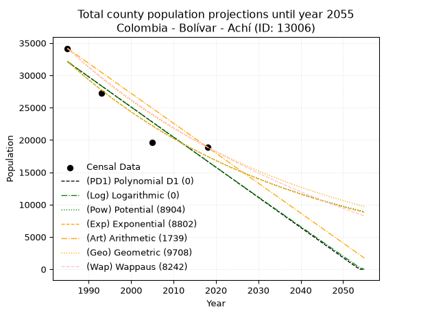
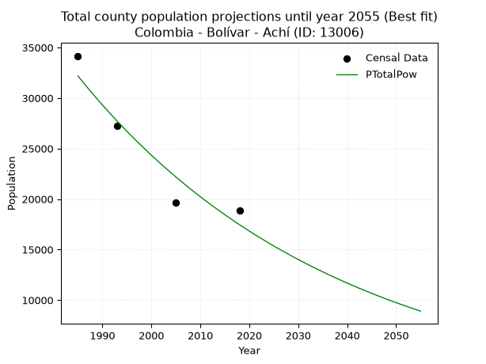
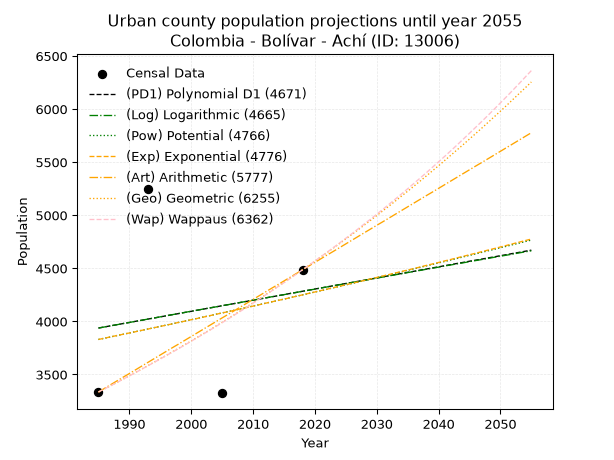
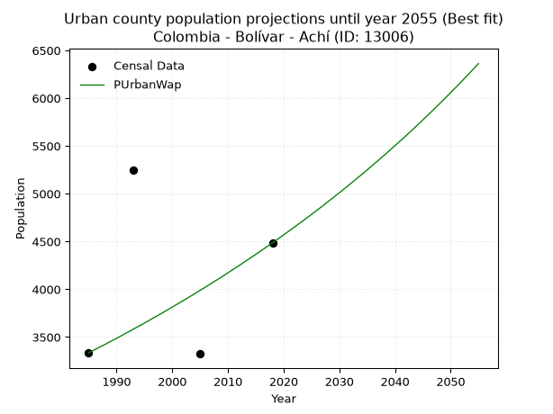
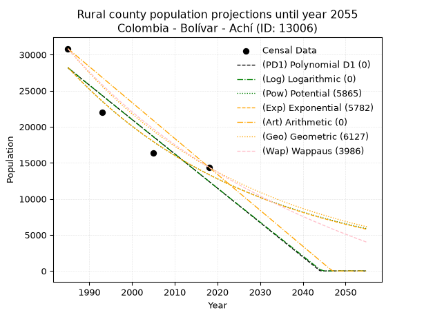
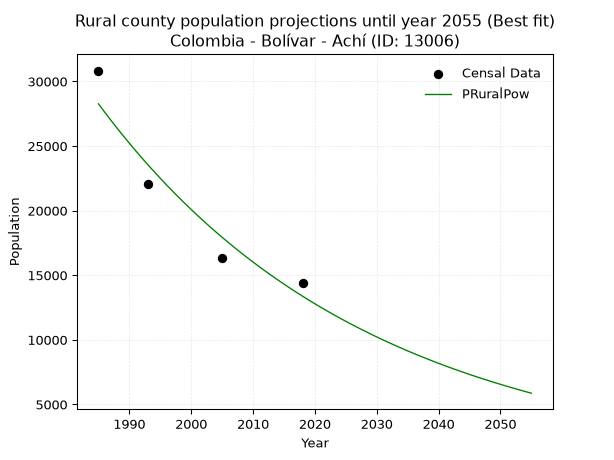

<div align="center">


</div>

# _“Population and Public Services Demand Projections (PPSD) until Year 2050 for Colombia - Bolívar - Achí (ID: 13006)”_
Keywords: `population` `public-service` `projection` `lineal` `polynomial` `logarithmic` `potential` `exponential` `arithmetic` `geometric` `wappaus` `dane` `colombia` `south-america`

PPSD are analytical estimates used by governments and planners to anticipate future changes in population size, age distribution, and the resulting community needs for utilities, healthcare, education, and infrastructure as sizing future water treatment facilities, electrical grids, and road networks based on spatial growth.

> **General running parameters**: • app_version: _v20260806_. • Python version: _3.14.7_. • Pandas version: _3.0.5_. • NumPy version: _2.5.1_. • Creates, save and include plots into reports (create_plot): _True_. • Projection until year: _2050_. • Process polynomial degree 2 and up: _False_. • Process Wappaus: _True_. • Process Wappaus: _True_. • Set negative values to zero: _True_. • Set infinite values to zero: _True_. • Drop dataset notes: _True_. 
<div align="center">

Dynamic map: [:earth_americas:Google](http://maps.google.com/maps?q=8.570107496,-74.5576758) [:earth_americas:OSM](https://www.openstreetmap.org/#map=18/8.570107496/-74.5576758&layers=P) [:earth_americas:Bing](https://www.bing.com/maps?cp=8.570107496~-74.5576758&lvl=18) [:earth_americas:Apple](https://maps.apple.com/frame?center=8.570107496%2C-74.5576758&span=0.003%2C0.006)

</div>


<div align="center">

```geojson
{
  "type": "Feature",
  "geometry": {
    "type": "Point", 
    "coordinates": [-74.5576758, 8.570107496]
  }, 
  "properties": {
    "Name": "Colombia - Bolívar - Achí (ID: 13006)"
  }
}
```

</div>


## 0. Census Data (4 records)

Census data are official statistics collected by a government about the people and housing in a country. They usually include counts of total population, age, sex, race, income, education, and jobs.

📅Global census file: [Population.xlsx](../data/Population.xlsx)

| Source   |   Year |   CountryID | CountryName   |   StateID | StateName   |   CountyID | CountyName   |   PTotal |   PUrban |   PRural |
|:---------|-------:|------------:|:--------------|----------:|:------------|-----------:|:-------------|---------:|---------:|---------:|
| DANE     |   1985 |          57 | Colombia      |        13 | Bolívar     |      13006 | Achí         |    34166 |     3335 |    30831 |
| DANE     |   1993 |          57 | Colombia      |        13 | Bolívar     |      13006 | Achí         |    27277 |     5246 |    22031 |
| DANE     |   2005 |          57 | Colombia      |        13 | Bolívar     |      13006 | Achí         |    19644 |     3324 |    16320 |
| DANE     |   2018 |          57 | Colombia      |        13 | Bolívar     |      13006 | Achí         |    18879 |     4486 |    14393 |

> 🔥Some records has specific notes about the registered values or the corresponding urban or rural distribution.

## 1. Total

### 1.1. Coefficients and Parameters

* (PD1) Polynomial Deg 1: -466.2842232035316, 957676.517462864 (lineal)
* (Log) Logarithmic: -934153.8561600931, 7125502.446512066
* (Pow) Potential: -37.07236106093301, 126.76332523791676
* (Exp) Exponential: -0.018507078260494043, 2.8953643512112782e+20
* (Art) Arithmetic: Year diff. 2018 - 1985 = 33, Population diff. 18879 - 34166 = -15287, Annual growth = -463.24242424242425
* (Geo) Geometric: Year diff. 2018 - 1985 = 33, Population diff. 18879 - 34166 = -15287, Annual growth % = -0.017814586063842675
* (Wap) Wappaus: i = -1.7466016561124489, Condition values only valid for < 200)

<sub>
Wappaus condition values: ['-0.00', '-1.75', '-3.49', '-5.24', '-6.99', '-8.73', '-10.48', '-12.23', '-13.97', '-15.72', '-17.47', '-19.21', '-20.96', '-22.71', '-24.45', '-26.20', '-27.95', '-29.69', '-31.44', '-33.19', '-34.93', '-36.68', '-38.43', '-40.17', '-41.92', '-43.67', '-45.41', '-47.16', '-48.90', '-50.65', '-52.40', '-54.14', '-55.89', '-57.64', '-59.38', '-61.13', '-62.88', '-64.62', '-66.37', '-68.12', '-69.86', '-71.61', '-73.36', '-75.10', '-76.85', '-78.60', '-80.34', '-82.09', '-83.84', '-85.58', '-87.33', '-89.08', '-90.82', '-92.57', '-94.32', '-96.06', '-97.81', '-99.56', '-101.30', '-103.05', '-104.80', '-106.54', '-108.29', '-110.04', '-111.78', '-113.53']
</sub>


### 1.2. Projected Dataset

|   Year |   CountyID |   PTotalPD1 |   PTotalLog |   PTotalPow |   PTotalExp |   PTotalArt |   PTotalGeo |   PTotalWap |
|-------:|-----------:|------------:|------------:|------------:|------------:|------------:|------------:|------------:|
|   1985 |      13006 |       32102 |       32123 |       32178 |       32153 |       34166 |       34166 |       34166 |
|   1986 |      13006 |       31636 |       31652 |       31583 |       31563 |       33703 |       33557 |       33574 |
|   1987 |      13006 |       31170 |       31182 |       30999 |       30985 |       33240 |       32960 |       32993 |
|   1988 |      13006 |       30703 |       30712 |       30426 |       30417 |       32776 |       32372 |       32421 |
|   1989 |      13006 |       30237 |       30242 |       29864 |       29859 |       32313 |       31796 |       31860 |
|   1990 |      13006 |       29771 |       29773 |       29313 |       29311 |       31850 |       31229 |       31307 |
|   1991 |      13006 |       29305 |       29303 |       28772 |       28774 |       31387 |       30673 |       30764 |
|   1992 |      13006 |       28838 |       28834 |       28241 |       28246 |       30923 |       30126 |       30229 |
|   1993 |      13006 |       28372 |       28365 |       27720 |       27728 |       30460 |       29590 |       29704 |
|   1994 |      13006 |       27906 |       27897 |       27210 |       27220 |       29997 |       29063 |       29187 |
|   1995 |      13006 |       27439 |       27428 |       26709 |       26721 |       29534 |       28545 |       28678 |
|   1996 |      13006 |       26973 |       26960 |       26217 |       26231 |       29070 |       28036 |       28177 |
|   1997 |      13006 |       26507 |       26492 |       25735 |       25750 |       28607 |       27537 |       27684 |
|   1998 |      13006 |       26041 |       26025 |       25261 |       25278 |       28144 |       27046 |       27199 |
|   1999 |      13006 |       25574 |       25557 |       24797 |       24814 |       27681 |       26565 |       26722 |
|   2000 |      13006 |       25108 |       25090 |       24342 |       24359 |       27217 |       26091 |       26252 |
|   2001 |      13006 |       24642 |       24623 |       23895 |       23912 |       26754 |       25627 |       25789 |
|   2002 |      13006 |       24176 |       24156 |       23456 |       23474 |       26291 |       25170 |       25333 |
|   2003 |      13006 |       23709 |       23690 |       23026 |       23043 |       25828 |       24722 |       24884 |
|   2004 |      13006 |       23243 |       23224 |       22604 |       22621 |       25364 |       24281 |       24441 |
|   2005 |      13006 |       22777 |       22758 |       22190 |       22206 |       24901 |       23849 |       24006 |
|   2006 |      13006 |       22310 |       22292 |       21783 |       21799 |       24438 |       23424 |       23576 |
|   2007 |      13006 |       21844 |       21826 |       21384 |       21399 |       23975 |       23007 |       23153 |
|   2008 |      13006 |       21378 |       21361 |       20993 |       21007 |       23511 |       22597 |       22737 |
|   2009 |      13006 |       20912 |       20896 |       20609 |       20622 |       23048 |       22194 |       22326 |
|   2010 |      13006 |       20445 |       20431 |       20232 |       20243 |       22585 |       21799 |       21921 |
|   2011 |      13006 |       19979 |       19966 |       19863 |       19872 |       22122 |       21410 |       21522 |
|   2012 |      13006 |       19513 |       19502 |       19500 |       19508 |       21658 |       21029 |       21128 |
|   2013 |      13006 |       19046 |       19038 |       19144 |       19150 |       21195 |       20654 |       20740 |
|   2014 |      13006 |       18580 |       18574 |       18795 |       18799 |       20732 |       20286 |       20358 |
|   2015 |      13006 |       18114 |       18110 |       18452 |       18454 |       20269 |       19925 |       19980 |
|   2016 |      13006 |       17648 |       17647 |       18116 |       18116 |       19805 |       19570 |       19608 |
|   2017 |      13006 |       17181 |       17183 |       17786 |       17784 |       19342 |       19221 |       19241 |
|   2018 |      13006 |       16715 |       16720 |       17462 |       17458 |       18879 |       18879 |       18879 |
|   2019 |      13006 |       16249 |       16258 |       17144 |       17137 |       18416 |       18543 |       18522 |
|   2020 |      13006 |       15782 |       15795 |       16832 |       16823 |       17953 |       18212 |       18169 |
|   2021 |      13006 |       15316 |       15333 |       16526 |       16515 |       17489 |       17888 |       17822 |
|   2022 |      13006 |       14850 |       14871 |       16226 |       16212 |       17026 |       17569 |       17479 |
|   2023 |      13006 |       14384 |       14409 |       15931 |       15915 |       16563 |       17256 |       17140 |
|   2024 |      13006 |       13917 |       13947 |       15642 |       15623 |       16100 |       16949 |       16806 |
|   2025 |      13006 |       13451 |       13486 |       15358 |       15336 |       15636 |       16647 |       16476 |
|   2026 |      13006 |       12985 |       13024 |       15080 |       15055 |       15173 |       16350 |       16150 |
|   2027 |      13006 |       12518 |       12563 |       14806 |       14779 |       14710 |       16059 |       15829 |
|   2028 |      13006 |       12052 |       12103 |       14538 |       14508 |       14247 |       15773 |       15511 |
|   2029 |      13006 |       11586 |       11642 |       14275 |       14242 |       13783 |       15492 |       15198 |
|   2030 |      13006 |       11120 |       11182 |       14016 |       13981 |       13320 |       15216 |       14888 |
|   2031 |      13006 |       10653 |       10722 |       13763 |       13724 |       12857 |       14945 |       14583 |
|   2032 |      13006 |       10187 |       10262 |       13514 |       13473 |       12394 |       14679 |       14281 |
|   2033 |      13006 |        9721 |        9802 |       13270 |       13226 |       11930 |       14417 |       13983 |
|   2034 |      13006 |        9254 |        9343 |       13030 |       12983 |       11467 |       14160 |       13688 |
|   2035 |      13006 |        8788 |        8884 |       12795 |       12745 |       11004 |       13908 |       13397 |
|   2036 |      13006 |        8322 |        8425 |       12564 |       12511 |       10541 |       13660 |       13110 |
|   2037 |      13006 |        7856 |        7966 |       12337 |       12282 |       10077 |       13417 |       12826 |
|   2038 |      13006 |        7389 |        7508 |       12115 |       12057 |        9614 |       13178 |       12546 |
|   2039 |      13006 |        6923 |        7049 |       11896 |       11836 |        9151 |       12943 |       12268 |
|   2040 |      13006 |        6457 |        6591 |       11682 |       11619 |        8688 |       12713 |       11994 |
|   2041 |      13006 |        5990 |        6134 |       11472 |       11406 |        8224 |       12486 |       11724 |
|   2042 |      13006 |        5524 |        5676 |       11265 |       11197 |        7761 |       12264 |       11456 |
|   2043 |      13006 |        5058 |        5219 |       11063 |       10991 |        7298 |       12045 |       11192 |
|   2044 |      13006 |        4592 |        4762 |       10864 |       10790 |        6835 |       11831 |       10930 |
|   2045 |      13006 |        4125 |        4305 |       10669 |       10592 |        6371 |       11620 |       10672 |
|   2046 |      13006 |        3659 |        3848 |       10477 |       10398 |        5908 |       11413 |       10416 |
|   2047 |      13006 |        3193 |        3391 |       10289 |       10207 |        5445 |       11210 |       10164 |
|   2048 |      13006 |        2726 |        2935 |       10104 |       10020 |        4982 |       11010 |        9914 |
|   2049 |      13006 |        2260 |        2479 |        9923 |        9836 |        4518 |       10814 |        9667 |
|   2050 |      13006 |        1794 |        2023 |        9745 |        9656 |        4055 |       10621 |        9423 |
<div align="center">

</img>

</div>


### 1.3. Best fit with absolute error and relative error (%)

Relative error puts that difference into context by dividing the absolute error by the true value, creating a unitless ratio or percentage that shows the scale of the mistake.

Absolute and relative error

|   Year | Source   |   CountryID | CountryName   |   StateID | StateName   |   CountyID_x | CountyName   |   PTotal |   PUrban |   PRural |   CountyID_y |   PTotalPD1 |   PTotalLog |   PTotalPow |   PTotalExp |   PTotalArt |   PTotalGeo |   PTotalWap |   PTotalPD1AbsError |   PTotalLogAbsError |   PTotalPowAbsError |   PTotalExpAbsError |   PTotalArtAbsError |   PTotalGeoAbsError |   PTotalWapAbsError |   PTotalPD1RelError |   PTotalLogRelError |   PTotalPowRelError |   PTotalExpRelError |   PTotalArtRelError |   PTotalGeoRelError |   PTotalWapRelError |
|-------:|:---------|------------:|:--------------|----------:|:------------|-------------:|:-------------|---------:|---------:|---------:|-------------:|------------:|------------:|------------:|------------:|------------:|------------:|------------:|--------------------:|--------------------:|--------------------:|--------------------:|--------------------:|--------------------:|--------------------:|--------------------:|--------------------:|--------------------:|--------------------:|--------------------:|--------------------:|--------------------:|
|   1985 | DANE     |          57 | Colombia      |        13 | Bolívar     |        13006 | Achí         |    34166 |     3335 |    30831 |        13006 |       32102 |       32123 |       32178 |       32153 |       34166 |       34166 |       34166 |                2064 |                2043 |                1988 |                2013 |                   0 |                   0 |                   0 |             6.04109 |             5.97963 |             5.81865 |             5.89182 |              0      |             0       |             0       |
|   1993 | DANE     |          57 | Colombia      |        13 | Bolívar     |        13006 | Achí         |    27277 |     5246 |    22031 |        13006 |       28372 |       28365 |       27720 |       27728 |       30460 |       29590 |       29704 |                1095 |                1088 |                 443 |                 451 |                3183 |                2313 |                2427 |             4.01437 |             3.98871 |             1.62408 |             1.65341 |             11.6692 |             8.47967 |             8.89761 |
|   2005 | DANE     |          57 | Colombia      |        13 | Bolívar     |        13006 | Achí         |    19644 |     3324 |    16320 |        13006 |       22777 |       22758 |       22190 |       22206 |       24901 |       23849 |       24006 |                3133 |                3114 |                2546 |                2562 |                5257 |                4205 |                4362 |            15.9489  |            15.8522  |            12.9607  |            13.0422  |             26.7614 |            21.406   |            22.2053  |
|   2018 | DANE     |          57 | Colombia      |        13 | Bolívar     |        13006 | Achí         |    18879 |     4486 |    14393 |        13006 |       16715 |       16720 |       17462 |       17458 |       18879 |       18879 |       18879 |                2164 |                2159 |                1417 |                1421 |                   0 |                   0 |                   0 |            11.4625  |            11.436   |             7.50569 |             7.52688 |              0      |             0       |             0       |

Relative error mean

| Method    |   RelError | Best   |
|:----------|-----------:|:-------|
| PTotalPD1 |    9.36671 |        |
| PTotalLog |    9.31412 |        |
| PTotalPow |    6.97728 | True   |
| PTotalExp |    7.02857 |        |
| PTotalArt |    9.60763 |        |
| PTotalGeo |    7.47142 |        |
| PTotalWap |    7.77571 |        |

💙Best method: _**PTotalPow**_
<div align="center">

</img>

</div>


### 1.4. Fresh water supply demand in liters per capita per day (lpcd)

The fresh water supply demand typically ranges from 100 to 300 liters per capita per day (lpcd) for standard domestic and municipal planning, though absolute survival minimums set by the World Health Organization are as low as 7.5 to 20 liters per day, and total consumption in high-income nations can exceed 400 liters.

> `CZ`: Level in meters above the sea level (masl).<br> `WS`: Fresh water supply demand in liters per capita per day (lpcd or l/h/d).<br> `WSAll`: Zonal fresh water supply demand in liters per second (l/s).<br> `A`: Zonal area in square meters.

Reference values (RAS Colombia)

|    CZ |   WS |
|------:|-----:|
|  1000 |  120 |
|  2000 |  130 |
| 99999 |  140 |

County shapefile geometry properties and water supply values

|   CountyID |      ATotal |   CZTotal |   WSTotal |
|-----------:|------------:|----------:|----------:|
|      13006 | 9.50757e+08 |   30.7658 |       120 |

Projected values for best method: PTotalPow

|   CountyID |   Year |   PTotalPow |   WSTotal |   WSTotalAll |
|-----------:|-------:|------------:|----------:|-------------:|
|      13006 |   1985 |       32178 |       120 |      44.6917 |
|      13006 |   1986 |       31583 |       120 |      43.8653 |
|      13006 |   1987 |       30999 |       120 |      43.0542 |
|      13006 |   1988 |       30426 |       120 |      42.2583 |
|      13006 |   1989 |       29864 |       120 |      41.4778 |
|      13006 |   1990 |       29313 |       120 |      40.7125 |
|      13006 |   1991 |       28772 |       120 |      39.9611 |
|      13006 |   1992 |       28241 |       120 |      39.2236 |
|      13006 |   1993 |       27720 |       120 |      38.5    |
|      13006 |   1994 |       27210 |       120 |      37.7917 |
|      13006 |   1995 |       26709 |       120 |      37.0958 |
|      13006 |   1996 |       26217 |       120 |      36.4125 |
|      13006 |   1997 |       25735 |       120 |      35.7431 |
|      13006 |   1998 |       25261 |       120 |      35.0847 |
|      13006 |   1999 |       24797 |       120 |      34.4403 |
|      13006 |   2000 |       24342 |       120 |      33.8083 |
|      13006 |   2001 |       23895 |       120 |      33.1875 |
|      13006 |   2002 |       23456 |       120 |      32.5778 |
|      13006 |   2003 |       23026 |       120 |      31.9806 |
|      13006 |   2004 |       22604 |       120 |      31.3944 |
|      13006 |   2005 |       22190 |       120 |      30.8194 |
|      13006 |   2006 |       21783 |       120 |      30.2542 |
|      13006 |   2007 |       21384 |       120 |      29.7    |
|      13006 |   2008 |       20993 |       120 |      29.1569 |
|      13006 |   2009 |       20609 |       120 |      28.6236 |
|      13006 |   2010 |       20232 |       120 |      28.1    |
|      13006 |   2011 |       19863 |       120 |      27.5875 |
|      13006 |   2012 |       19500 |       120 |      27.0833 |
|      13006 |   2013 |       19144 |       120 |      26.5889 |
|      13006 |   2014 |       18795 |       120 |      26.1042 |
|      13006 |   2015 |       18452 |       120 |      25.6278 |
|      13006 |   2016 |       18116 |       120 |      25.1611 |
|      13006 |   2017 |       17786 |       120 |      24.7028 |
|      13006 |   2018 |       17462 |       120 |      24.2528 |
|      13006 |   2019 |       17144 |       120 |      23.8111 |
|      13006 |   2020 |       16832 |       120 |      23.3778 |
|      13006 |   2021 |       16526 |       120 |      22.9528 |
|      13006 |   2022 |       16226 |       120 |      22.5361 |
|      13006 |   2023 |       15931 |       120 |      22.1264 |
|      13006 |   2024 |       15642 |       120 |      21.725  |
|      13006 |   2025 |       15358 |       120 |      21.3306 |
|      13006 |   2026 |       15080 |       120 |      20.9444 |
|      13006 |   2027 |       14806 |       120 |      20.5639 |
|      13006 |   2028 |       14538 |       120 |      20.1917 |
|      13006 |   2029 |       14275 |       120 |      19.8264 |
|      13006 |   2030 |       14016 |       120 |      19.4667 |
|      13006 |   2031 |       13763 |       120 |      19.1153 |
|      13006 |   2032 |       13514 |       120 |      18.7694 |
|      13006 |   2033 |       13270 |       120 |      18.4306 |
|      13006 |   2034 |       13030 |       120 |      18.0972 |
|      13006 |   2035 |       12795 |       120 |      17.7708 |
|      13006 |   2036 |       12564 |       120 |      17.45   |
|      13006 |   2037 |       12337 |       120 |      17.1347 |
|      13006 |   2038 |       12115 |       120 |      16.8264 |
|      13006 |   2039 |       11896 |       120 |      16.5222 |
|      13006 |   2040 |       11682 |       120 |      16.225  |
|      13006 |   2041 |       11472 |       120 |      15.9333 |
|      13006 |   2042 |       11265 |       120 |      15.6458 |
|      13006 |   2043 |       11063 |       120 |      15.3653 |
|      13006 |   2044 |       10864 |       120 |      15.0889 |
|      13006 |   2045 |       10669 |       120 |      14.8181 |
|      13006 |   2046 |       10477 |       120 |      14.5514 |
|      13006 |   2047 |       10289 |       120 |      14.2903 |
|      13006 |   2048 |       10104 |       120 |      14.0333 |
|      13006 |   2049 |        9923 |       120 |      13.7819 |
|      13006 |   2050 |        9745 |       120 |      13.5347 |

## 2. Urban

### 2.1. Coefficients and Parameters

* (PD1) Polynomial Deg 1: 10.474909674828776, -16854.688077076262 (lineal)
* (Log) Logarithmic: 20992.230077879685, -155464.35904313793
* (Pow) Potential: 6.312583753976024, -17.234206598108916
* (Exp) Exponential: 0.0031517971186315052, 7.347721836162151
* (Art) Arithmetic: Year diff. 2018 - 1985 = 33, Population diff. 4486 - 3335 = 1151, Annual growth = 34.878787878787875
* (Geo) Geometric: Year diff. 2018 - 1985 = 33, Population diff. 4486 - 3335 = 1151, Annual growth % = 0.009024989615362466
* (Wap) Wappaus: i = 0.8919265536066456, Condition values only valid for < 200)

<sub>
Wappaus condition values: ['0.00', '0.89', '1.78', '2.68', '3.57', '4.46', '5.35', '6.24', '7.14', '8.03', '8.92', '9.81', '10.70', '11.60', '12.49', '13.38', '14.27', '15.16', '16.05', '16.95', '17.84', '18.73', '19.62', '20.51', '21.41', '22.30', '23.19', '24.08', '24.97', '25.87', '26.76', '27.65', '28.54', '29.43', '30.33', '31.22', '32.11', '33.00', '33.89', '34.79', '35.68', '36.57', '37.46', '38.35', '39.24', '40.14', '41.03', '41.92', '42.81', '43.70', '44.60', '45.49', '46.38', '47.27', '48.16', '49.06', '49.95', '50.84', '51.73', '52.62', '53.52', '54.41', '55.30', '56.19', '57.08', '57.98']
</sub>


### 2.2. Projected Dataset

|   Year |   CountyID |   PUrbanPD1 |   PUrbanLog |   PUrbanPow |   PUrbanExp |   PUrbanArt |   PUrbanGeo |   PUrbanWap |
|-------:|-----------:|------------:|------------:|------------:|------------:|------------:|------------:|------------:|
|   1985 |      13006 |        3938 |        3937 |        3830 |        3830 |        3335 |        3335 |        3335 |
|   1986 |      13006 |        3948 |        3948 |        3842 |        3842 |        3370 |        3365 |        3365 |
|   1987 |      13006 |        3959 |        3959 |        3854 |        3855 |        3405 |        3395 |        3395 |
|   1988 |      13006 |        3969 |        3969 |        3867 |        3867 |        3440 |        3426 |        3425 |
|   1989 |      13006 |        3980 |        3980 |        3879 |        3879 |        3475 |        3457 |        3456 |
|   1990 |      13006 |        3990 |        3990 |        3891 |        3891 |        3509 |        3488 |        3487 |
|   1991 |      13006 |        4001 |        4001 |        3904 |        3903 |        3544 |        3520 |        3518 |
|   1992 |      13006 |        4011 |        4011 |        3916 |        3916 |        3579 |        3551 |        3550 |
|   1993 |      13006 |        4022 |        4022 |        3928 |        3928 |        3614 |        3584 |        3582 |
|   1994 |      13006 |        4032 |        4032 |        3941 |        3941 |        3649 |        3616 |        3614 |
|   1995 |      13006 |        4043 |        4043 |        3953 |        3953 |        3684 |        3649 |        3646 |
|   1996 |      13006 |        4053 |        4054 |        3966 |        3965 |        3719 |        3681 |        3679 |
|   1997 |      13006 |        4064 |        4064 |        3978 |        3978 |        3754 |        3715 |        3712 |
|   1998 |      13006 |        4074 |        4075 |        3991 |        3991 |        3788 |        3748 |        3745 |
|   1999 |      13006 |        4085 |        4085 |        4004 |        4003 |        3823 |        3782 |        3779 |
|   2000 |      13006 |        4095 |        4096 |        4016 |        4016 |        3858 |        3816 |        3813 |
|   2001 |      13006 |        4106 |        4106 |        4029 |        4028 |        3893 |        3851 |        3848 |
|   2002 |      13006 |        4116 |        4117 |        4042 |        4041 |        3928 |        3885 |        3882 |
|   2003 |      13006 |        4127 |        4127 |        4054 |        4054 |        3963 |        3920 |        3917 |
|   2004 |      13006 |        4137 |        4137 |        4067 |        4067 |        3998 |        3956 |        3952 |
|   2005 |      13006 |        4148 |        4148 |        4080 |        4080 |        4033 |        3991 |        3988 |
|   2006 |      13006 |        4158 |        4158 |        4093 |        4092 |        4067 |        4028 |        4024 |
|   2007 |      13006 |        4168 |        4169 |        4106 |        4105 |        4102 |        4064 |        4061 |
|   2008 |      13006 |        4179 |        4179 |        4119 |        4118 |        4137 |        4101 |        4097 |
|   2009 |      13006 |        4189 |        4190 |        4132 |        4131 |        4172 |        4138 |        4134 |
|   2010 |      13006 |        4200 |        4200 |        4145 |        4144 |        4207 |        4175 |        4172 |
|   2011 |      13006 |        4210 |        4211 |        4158 |        4157 |        4242 |        4213 |        4210 |
|   2012 |      13006 |        4221 |        4221 |        4171 |        4171 |        4277 |        4251 |        4248 |
|   2013 |      13006 |        4231 |        4232 |        4184 |        4184 |        4312 |        4289 |        4287 |
|   2014 |      13006 |        4242 |        4242 |        4197 |        4197 |        4346 |        4328 |        4326 |
|   2015 |      13006 |        4252 |        4252 |        4210 |        4210 |        4381 |        4367 |        4365 |
|   2016 |      13006 |        4263 |        4263 |        4223 |        4223 |        4416 |        4406 |        4405 |
|   2017 |      13006 |        4273 |        4273 |        4237 |        4237 |        4451 |        4446 |        4445 |
|   2018 |      13006 |        4284 |        4284 |        4250 |        4250 |        4486 |        4486 |        4486 |
|   2019 |      13006 |        4294 |        4294 |        4263 |        4264 |        4521 |        4526 |        4527 |
|   2020 |      13006 |        4305 |        4304 |        4277 |        4277 |        4556 |        4567 |        4569 |
|   2021 |      13006 |        4315 |        4315 |        4290 |        4291 |        4591 |        4609 |        4611 |
|   2022 |      13006 |        4326 |        4325 |        4303 |        4304 |        4626 |        4650 |        4653 |
|   2023 |      13006 |        4336 |        4336 |        4317 |        4318 |        4660 |        4692 |        4696 |
|   2024 |      13006 |        4347 |        4346 |        4330 |        4331 |        4695 |        4734 |        4739 |
|   2025 |      13006 |        4357 |        4356 |        4344 |        4345 |        4730 |        4777 |        4783 |
|   2026 |      13006 |        4367 |        4367 |        4357 |        4359 |        4765 |        4820 |        4827 |
|   2027 |      13006 |        4378 |        4377 |        4371 |        4372 |        4800 |        4864 |        4872 |
|   2028 |      13006 |        4388 |        4387 |        4385 |        4386 |        4835 |        4908 |        4918 |
|   2029 |      13006 |        4399 |        4398 |        4398 |        4400 |        4870 |        4952 |        4963 |
|   2030 |      13006 |        4409 |        4408 |        4412 |        4414 |        4905 |        4997 |        5010 |
|   2031 |      13006 |        4420 |        4418 |        4426 |        4428 |        4939 |        5042 |        5056 |
|   2032 |      13006 |        4430 |        4429 |        4440 |        4442 |        4974 |        5087 |        5104 |
|   2033 |      13006 |        4441 |        4439 |        4453 |        4456 |        5009 |        5133 |        5152 |
|   2034 |      13006 |        4451 |        4449 |        4467 |        4470 |        5044 |        5180 |        5200 |
|   2035 |      13006 |        4462 |        4460 |        4481 |        4484 |        5079 |        5226 |        5249 |
|   2036 |      13006 |        4472 |        4470 |        4495 |        4498 |        5114 |        5273 |        5299 |
|   2037 |      13006 |        4483 |        4480 |        4509 |        4512 |        5149 |        5321 |        5349 |
|   2038 |      13006 |        4493 |        4491 |        4523 |        4527 |        5184 |        5369 |        5399 |
|   2039 |      13006 |        4504 |        4501 |        4537 |        4541 |        5218 |        5418 |        5451 |
|   2040 |      13006 |        4514 |        4511 |        4551 |        4555 |        5253 |        5466 |        5503 |
|   2041 |      13006 |        4525 |        4522 |        4565 |        4570 |        5288 |        5516 |        5555 |
|   2042 |      13006 |        4535 |        4532 |        4579 |        4584 |        5323 |        5566 |        5608 |
|   2043 |      13006 |        4546 |        4542 |        4593 |        4599 |        5358 |        5616 |        5662 |
|   2044 |      13006 |        4556 |        4552 |        4608 |        4613 |        5393 |        5666 |        5717 |
|   2045 |      13006 |        4567 |        4563 |        4622 |        4628 |        5428 |        5718 |        5772 |
|   2046 |      13006 |        4577 |        4573 |        4636 |        4642 |        5463 |        5769 |        5828 |
|   2047 |      13006 |        4587 |        4583 |        4651 |        4657 |        5497 |        5821 |        5884 |
|   2048 |      13006 |        4598 |        4593 |        4665 |        4672 |        5532 |        5874 |        5941 |
|   2049 |      13006 |        4608 |        4604 |        4679 |        4686 |        5567 |        5927 |        5999 |
|   2050 |      13006 |        4619 |        4614 |        4694 |        4701 |        5602 |        5980 |        6058 |
<div align="center">

</img>

</div>


### 2.3. Best fit with absolute error and relative error (%)

Relative error puts that difference into context by dividing the absolute error by the true value, creating a unitless ratio or percentage that shows the scale of the mistake.

Absolute and relative error

|   Year | Source   |   CountryID | CountryName   |   StateID | StateName   |   CountyID_x | CountyName   |   PTotal |   PUrban |   PRural |   CountyID_y |   PUrbanPD1 |   PUrbanLog |   PUrbanPow |   PUrbanExp |   PUrbanArt |   PUrbanGeo |   PUrbanWap |   PUrbanPD1AbsError |   PUrbanLogAbsError |   PUrbanPowAbsError |   PUrbanExpAbsError |   PUrbanArtAbsError |   PUrbanGeoAbsError |   PUrbanWapAbsError |   PUrbanPD1RelError |   PUrbanLogRelError |   PUrbanPowRelError |   PUrbanExpRelError |   PUrbanArtRelError |   PUrbanGeoRelError |   PUrbanWapRelError |
|-------:|:---------|------------:|:--------------|----------:|:------------|-------------:|:-------------|---------:|---------:|---------:|-------------:|------------:|------------:|------------:|------------:|------------:|------------:|------------:|--------------------:|--------------------:|--------------------:|--------------------:|--------------------:|--------------------:|--------------------:|--------------------:|--------------------:|--------------------:|--------------------:|--------------------:|--------------------:|--------------------:|
|   1985 | DANE     |          57 | Colombia      |        13 | Bolívar     |        13006 | Achí         |    34166 |     3335 |    30831 |        13006 |        3938 |        3937 |        3830 |        3830 |        3335 |        3335 |        3335 |                 603 |                 602 |                 495 |                 495 |                   0 |                   0 |                   0 |             18.081  |             18.051  |            14.8426  |            14.8426  |              0      |              0      |              0      |
|   1993 | DANE     |          57 | Colombia      |        13 | Bolívar     |        13006 | Achí         |    27277 |     5246 |    22031 |        13006 |        4022 |        4022 |        3928 |        3928 |        3614 |        3584 |        3582 |                1224 |                1224 |                1318 |                1318 |                1632 |                1662 |                1664 |             23.3321 |             23.3321 |            25.1239  |            25.1239  |             31.1094 |             31.6813 |             31.7194 |
|   2005 | DANE     |          57 | Colombia      |        13 | Bolívar     |        13006 | Achí         |    19644 |     3324 |    16320 |        13006 |        4148 |        4148 |        4080 |        4080 |        4033 |        3991 |        3988 |                 824 |                 824 |                 756 |                 756 |                 709 |                 667 |                 664 |             24.7894 |             24.7894 |            22.7437  |            22.7437  |             21.3297 |             20.0662 |             19.9759 |
|   2018 | DANE     |          57 | Colombia      |        13 | Bolívar     |        13006 | Achí         |    18879 |     4486 |    14393 |        13006 |        4284 |        4284 |        4250 |        4250 |        4486 |        4486 |        4486 |                 202 |                 202 |                 236 |                 236 |                   0 |                   0 |                   0 |              4.5029 |              4.5029 |             5.26081 |             5.26081 |              0      |              0      |              0      |

Relative error mean

| Method    |   RelError | Best   |
|:----------|-----------:|:-------|
| PUrbanPD1 |    17.6763 |        |
| PUrbanLog |    17.6688 |        |
| PUrbanPow |    16.9927 |        |
| PUrbanExp |    16.9927 |        |
| PUrbanArt |    13.1098 |        |
| PUrbanGeo |    12.9369 |        |
| PUrbanWap |    12.9238 | True   |

💙Best method: _**PUrbanWap**_
<div align="center">

</img>

</div>


### 2.4. Fresh water supply demand in liters per capita per day (lpcd)

The fresh water supply demand typically ranges from 100 to 300 liters per capita per day (lpcd) for standard domestic and municipal planning, though absolute survival minimums set by the World Health Organization are as low as 7.5 to 20 liters per day, and total consumption in high-income nations can exceed 400 liters.

> `CZ`: Level in meters above the sea level (masl).<br> `WS`: Fresh water supply demand in liters per capita per day (lpcd or l/h/d).<br> `WSAll`: Zonal fresh water supply demand in liters per second (l/s).<br> `A`: Zonal area in square meters.

Reference values (RAS Colombia)

|    CZ |   WS |
|------:|-----:|
|  1000 |  120 |
|  2000 |  130 |
| 99999 |  140 |

County shapefile geometry properties and water supply values

|   CountyID |   AUrban |   CZUrban |   WSUrban |
|-----------:|---------:|----------:|----------:|
|      13006 |   669844 |   24.1678 |       120 |

Projected values for best method: PUrbanWap

|   CountyID |   Year |   PUrbanWap |   WSUrban |   WSUrbanAll |
|-----------:|-------:|------------:|----------:|-------------:|
|      13006 |   1985 |        3335 |       120 |      4.63194 |
|      13006 |   1986 |        3365 |       120 |      4.67361 |
|      13006 |   1987 |        3395 |       120 |      4.71528 |
|      13006 |   1988 |        3425 |       120 |      4.75694 |
|      13006 |   1989 |        3456 |       120 |      4.8     |
|      13006 |   1990 |        3487 |       120 |      4.84306 |
|      13006 |   1991 |        3518 |       120 |      4.88611 |
|      13006 |   1992 |        3550 |       120 |      4.93056 |
|      13006 |   1993 |        3582 |       120 |      4.975   |
|      13006 |   1994 |        3614 |       120 |      5.01944 |
|      13006 |   1995 |        3646 |       120 |      5.06389 |
|      13006 |   1996 |        3679 |       120 |      5.10972 |
|      13006 |   1997 |        3712 |       120 |      5.15556 |
|      13006 |   1998 |        3745 |       120 |      5.20139 |
|      13006 |   1999 |        3779 |       120 |      5.24861 |
|      13006 |   2000 |        3813 |       120 |      5.29583 |
|      13006 |   2001 |        3848 |       120 |      5.34444 |
|      13006 |   2002 |        3882 |       120 |      5.39167 |
|      13006 |   2003 |        3917 |       120 |      5.44028 |
|      13006 |   2004 |        3952 |       120 |      5.48889 |
|      13006 |   2005 |        3988 |       120 |      5.53889 |
|      13006 |   2006 |        4024 |       120 |      5.58889 |
|      13006 |   2007 |        4061 |       120 |      5.64028 |
|      13006 |   2008 |        4097 |       120 |      5.69028 |
|      13006 |   2009 |        4134 |       120 |      5.74167 |
|      13006 |   2010 |        4172 |       120 |      5.79444 |
|      13006 |   2011 |        4210 |       120 |      5.84722 |
|      13006 |   2012 |        4248 |       120 |      5.9     |
|      13006 |   2013 |        4287 |       120 |      5.95417 |
|      13006 |   2014 |        4326 |       120 |      6.00833 |
|      13006 |   2015 |        4365 |       120 |      6.0625  |
|      13006 |   2016 |        4405 |       120 |      6.11806 |
|      13006 |   2017 |        4445 |       120 |      6.17361 |
|      13006 |   2018 |        4486 |       120 |      6.23056 |
|      13006 |   2019 |        4527 |       120 |      6.2875  |
|      13006 |   2020 |        4569 |       120 |      6.34583 |
|      13006 |   2021 |        4611 |       120 |      6.40417 |
|      13006 |   2022 |        4653 |       120 |      6.4625  |
|      13006 |   2023 |        4696 |       120 |      6.52222 |
|      13006 |   2024 |        4739 |       120 |      6.58194 |
|      13006 |   2025 |        4783 |       120 |      6.64306 |
|      13006 |   2026 |        4827 |       120 |      6.70417 |
|      13006 |   2027 |        4872 |       120 |      6.76667 |
|      13006 |   2028 |        4918 |       120 |      6.83056 |
|      13006 |   2029 |        4963 |       120 |      6.89306 |
|      13006 |   2030 |        5010 |       120 |      6.95833 |
|      13006 |   2031 |        5056 |       120 |      7.02222 |
|      13006 |   2032 |        5104 |       120 |      7.08889 |
|      13006 |   2033 |        5152 |       120 |      7.15556 |
|      13006 |   2034 |        5200 |       120 |      7.22222 |
|      13006 |   2035 |        5249 |       120 |      7.29028 |
|      13006 |   2036 |        5299 |       120 |      7.35972 |
|      13006 |   2037 |        5349 |       120 |      7.42917 |
|      13006 |   2038 |        5399 |       120 |      7.49861 |
|      13006 |   2039 |        5451 |       120 |      7.57083 |
|      13006 |   2040 |        5503 |       120 |      7.64306 |
|      13006 |   2041 |        5555 |       120 |      7.71528 |
|      13006 |   2042 |        5608 |       120 |      7.78889 |
|      13006 |   2043 |        5662 |       120 |      7.86389 |
|      13006 |   2044 |        5717 |       120 |      7.94028 |
|      13006 |   2045 |        5772 |       120 |      8.01667 |
|      13006 |   2046 |        5828 |       120 |      8.09444 |
|      13006 |   2047 |        5884 |       120 |      8.17222 |
|      13006 |   2048 |        5941 |       120 |      8.25139 |
|      13006 |   2049 |        5999 |       120 |      8.33194 |
|      13006 |   2050 |        6058 |       120 |      8.41389 |

## 3. Rural

### 3.1. Coefficients and Parameters

* (PD1) Polynomial Deg 1: -476.7591328783603, 974531.20553994 (lineal)
* (Log) Logarithmic: -955146.0862379725, 7280966.805555201
* (Pow) Potential: -45.37175834522357, 154.07633848845396
* (Exp) Exponential: -0.022652232560559947, 9.520548460288232e+23
* (Art) Arithmetic: Year diff. 2018 - 1985 = 33, Population diff. 14393 - 30831 = -16438, Annual growth = -498.1212121212121
* (Geo) Geometric: Year diff. 2018 - 1985 = 33, Population diff. 14393 - 30831 = -16438, Annual growth % = -0.02281980122578986
* (Wap) Wappaus: i = -2.2029064749744034, Condition values only valid for < 200)

<sub>
Wappaus condition values: ['-0.00', '-2.20', '-4.41', '-6.61', '-8.81', '-11.01', '-13.22', '-15.42', '-17.62', '-19.83', '-22.03', '-24.23', '-26.43', '-28.64', '-30.84', '-33.04', '-35.25', '-37.45', '-39.65', '-41.86', '-44.06', '-46.26', '-48.46', '-50.67', '-52.87', '-55.07', '-57.28', '-59.48', '-61.68', '-63.88', '-66.09', '-68.29', '-70.49', '-72.70', '-74.90', '-77.10', '-79.30', '-81.51', '-83.71', '-85.91', '-88.12', '-90.32', '-92.52', '-94.72', '-96.93', '-99.13', '-101.33', '-103.54', '-105.74', '-107.94', '-110.15', '-112.35', '-114.55', '-116.75', '-118.96', '-121.16', '-123.36', '-125.57', '-127.77', '-129.97', '-132.17', '-134.38', '-136.58', '-138.78', '-140.99', '-143.19']
</sub>


### 3.2. Projected Dataset

|   Year |   CountyID |   PRuralPD1 |   PRuralLog |   PRuralPow |   PRuralExp |   PRuralArt |   PRuralGeo |   PRuralWap |
|-------:|-----------:|------------:|------------:|------------:|------------:|------------:|------------:|------------:|
|   1985 |      13006 |       28164 |       28185 |       28258 |       28232 |       30831 |       30831 |       30831 |
|   1986 |      13006 |       27688 |       27704 |       27620 |       27600 |       30333 |       30127 |       30159 |
|   1987 |      13006 |       27211 |       27223 |       26996 |       26982 |       29835 |       29440 |       29502 |
|   1988 |      13006 |       26734 |       26743 |       26387 |       26378 |       29337 |       28768 |       28859 |
|   1989 |      13006 |       26257 |       26262 |       25792 |       25787 |       28839 |       28112 |       28229 |
|   1990 |      13006 |       25781 |       25782 |       25210 |       25209 |       28340 |       27470 |       27612 |
|   1991 |      13006 |       25304 |       25302 |       24642 |       24645 |       27842 |       26843 |       27009 |
|   1992 |      13006 |       24827 |       24823 |       24087 |       24093 |       27344 |       26231 |       26417 |
|   1993 |      13006 |       24350 |       24343 |       23545 |       23553 |       26846 |       25632 |       25838 |
|   1994 |      13006 |       23873 |       23864 |       23015 |       23026 |       26348 |       25047 |       25270 |
|   1995 |      13006 |       23397 |       23385 |       22497 |       22510 |       25850 |       24476 |       24713 |
|   1996 |      13006 |       22920 |       22907 |       21991 |       22006 |       25352 |       23917 |       24167 |
|   1997 |      13006 |       22443 |       22428 |       21497 |       21513 |       24854 |       23371 |       23632 |
|   1998 |      13006 |       21966 |       21950 |       21014 |       21031 |       24355 |       22838 |       23108 |
|   1999 |      13006 |       21490 |       21472 |       20543 |       20560 |       23857 |       22317 |       22593 |
|   2000 |      13006 |       21013 |       20995 |       20082 |       20099 |       23359 |       21808 |       22088 |
|   2001 |      13006 |       20536 |       20517 |       19631 |       19649 |       22861 |       21310 |       21592 |
|   2002 |      13006 |       20059 |       20040 |       19191 |       19209 |       22363 |       20824 |       21106 |
|   2003 |      13006 |       19583 |       19563 |       18762 |       18779 |       21865 |       20348 |       20629 |
|   2004 |      13006 |       19106 |       19086 |       18341 |       18358 |       21367 |       19884 |       20160 |
|   2005 |      13006 |       18629 |       18610 |       17931 |       17947 |       20869 |       19430 |       19700 |
|   2006 |      13006 |       18152 |       18133 |       17530 |       17545 |       20370 |       18987 |       19248 |
|   2007 |      13006 |       17676 |       17657 |       17138 |       17152 |       19872 |       18554 |       18804 |
|   2008 |      13006 |       17199 |       17182 |       16755 |       16768 |       19374 |       18130 |       18367 |
|   2009 |      13006 |       16722 |       16706 |       16381 |       16392 |       18876 |       17717 |       17939 |
|   2010 |      13006 |       16245 |       16231 |       16015 |       16025 |       18378 |       17312 |       17518 |
|   2011 |      13006 |       15769 |       15756 |       15658 |       15666 |       17880 |       16917 |       17104 |
|   2012 |      13006 |       15292 |       15281 |       15308 |       15315 |       17382 |       16531 |       16697 |
|   2013 |      13006 |       14815 |       14806 |       14967 |       14972 |       16884 |       16154 |       16297 |
|   2014 |      13006 |       14338 |       14332 |       14634 |       14637 |       16385 |       15785 |       15903 |
|   2015 |      13006 |       13862 |       13858 |       14308 |       14309 |       15887 |       15425 |       15516 |
|   2016 |      13006 |       13385 |       13384 |       13989 |       13989 |       15389 |       15073 |       15136 |
|   2017 |      13006 |       12908 |       12910 |       13678 |       13675 |       14891 |       14729 |       14761 |
|   2018 |      13006 |       12431 |       12437 |       13374 |       13369 |       14393 |       14393 |       14393 |
|   2019 |      13006 |       11955 |       11964 |       13077 |       13070 |       13895 |       14065 |       14031 |
|   2020 |      13006 |       11478 |       11491 |       12786 |       12777 |       13397 |       13744 |       13674 |
|   2021 |      13006 |       11001 |       11018 |       12502 |       12491 |       12899 |       13430 |       13323 |
|   2022 |      13006 |       10524 |       10545 |       12225 |       12211 |       12401 |       13124 |       12977 |
|   2023 |      13006 |       10047 |       10073 |       11953 |       11938 |       11902 |       12824 |       12637 |
|   2024 |      13006 |        9571 |        9601 |       11688 |       11670 |       11404 |       12531 |       12302 |
|   2025 |      13006 |        9094 |        9129 |       11429 |       11409 |       10906 |       12245 |       11973 |
|   2026 |      13006 |        8617 |        8658 |       11176 |       11153 |       10408 |       11966 |       11648 |
|   2027 |      13006 |        8140 |        8186 |       10929 |       10903 |        9910 |       11693 |       11328 |
|   2028 |      13006 |        7664 |        7715 |       10687 |       10659 |        9412 |       11426 |       11013 |
|   2029 |      13006 |        7187 |        7244 |       10450 |       10420 |        8914 |       11165 |       10702 |
|   2030 |      13006 |        6710 |        6774 |       10219 |       10187 |        8416 |       10911 |       10396 |
|   2031 |      13006 |        6233 |        6303 |        9994 |        9959 |        7917 |       10662 |       10095 |
|   2032 |      13006 |        5757 |        5833 |        9773 |        9736 |        7419 |       10418 |        9798 |
|   2033 |      13006 |        5280 |        5363 |        9557 |        9518 |        6921 |       10181 |        9505 |
|   2034 |      13006 |        4803 |        4894 |        9346 |        9305 |        6423 |        9948 |        9217 |
|   2035 |      13006 |        4326 |        4424 |        9140 |        9096 |        5925 |        9721 |        8932 |
|   2036 |      13006 |        3850 |        3955 |        8939 |        8893 |        5427 |        9499 |        8652 |
|   2037 |      13006 |        3373 |        3486 |        8742 |        8693 |        4929 |        9283 |        8375 |
|   2038 |      13006 |        2896 |        3017 |        8549 |        8499 |        4431 |        9071 |        8103 |
|   2039 |      13006 |        2419 |        2548 |        8361 |        8308 |        3932 |        8864 |        7834 |
|   2040 |      13006 |        1943 |        2080 |        8177 |        8122 |        3434 |        8662 |        7569 |
|   2041 |      13006 |        1466 |        1612 |        7997 |        7940 |        2936 |        8464 |        7307 |
|   2042 |      13006 |         989 |        1144 |        7821 |        7762 |        2438 |        8271 |        7049 |
|   2043 |      13006 |         512 |         677 |        7650 |        7589 |        1940 |        8082 |        6794 |
|   2044 |      13006 |          36 |         209 |        7482 |        7419 |        1442 |        7898 |        6543 |
|   2045 |      13006 |           0 |           0 |        7317 |        7252 |         944 |        7717 |        6295 |
|   2046 |      13006 |           0 |           0 |        7157 |        7090 |         446 |        7541 |        6051 |
|   2047 |      13006 |           0 |           0 |        7000 |        6931 |         -53 |        7369 |        5809 |
|   2048 |      13006 |           0 |           0 |        6847 |        6776 |        -551 |        7201 |        5571 |
|   2049 |      13006 |           0 |           0 |        6697 |        6624 |       -1049 |        7037 |        5336 |
|   2050 |      13006 |           0 |           0 |        6550 |        6476 |       -1547 |        6876 |        5104 |
<div align="center">

</img>

</div>


### 3.3. Best fit with absolute error and relative error (%)

Relative error puts that difference into context by dividing the absolute error by the true value, creating a unitless ratio or percentage that shows the scale of the mistake.

Absolute and relative error

|   Year | Source   |   CountryID | CountryName   |   StateID | StateName   |   CountyID_x | CountyName   |   PTotal |   PUrban |   PRural |   CountyID_y |   PRuralPD1 |   PRuralLog |   PRuralPow |   PRuralExp |   PRuralArt |   PRuralGeo |   PRuralWap |   PRuralPD1AbsError |   PRuralLogAbsError |   PRuralPowAbsError |   PRuralExpAbsError |   PRuralArtAbsError |   PRuralGeoAbsError |   PRuralWapAbsError |   PRuralPD1RelError |   PRuralLogRelError |   PRuralPowRelError |   PRuralExpRelError |   PRuralArtRelError |   PRuralGeoRelError |   PRuralWapRelError |
|-------:|:---------|------------:|:--------------|----------:|:------------|-------------:|:-------------|---------:|---------:|---------:|-------------:|------------:|------------:|------------:|------------:|------------:|------------:|------------:|--------------------:|--------------------:|--------------------:|--------------------:|--------------------:|--------------------:|--------------------:|--------------------:|--------------------:|--------------------:|--------------------:|--------------------:|--------------------:|--------------------:|
|   1985 | DANE     |          57 | Colombia      |        13 | Bolívar     |        13006 | Achí         |    34166 |     3335 |    30831 |        13006 |       28164 |       28185 |       28258 |       28232 |       30831 |       30831 |       30831 |                2667 |                2646 |                2573 |                2599 |                   0 |                   0 |                   0 |             8.65038 |             8.58227 |             8.3455  |             8.42983 |              0      |              0      |              0      |
|   1993 | DANE     |          57 | Colombia      |        13 | Bolívar     |        13006 | Achí         |    27277 |     5246 |    22031 |        13006 |       24350 |       24343 |       23545 |       23553 |       26846 |       25632 |       25838 |                2319 |                2312 |                1514 |                1522 |                4815 |                3601 |                3807 |            10.5261  |            10.4943  |             6.87213 |             6.90845 |             21.8556 |             16.3452 |             17.2802 |
|   2005 | DANE     |          57 | Colombia      |        13 | Bolívar     |        13006 | Achí         |    19644 |     3324 |    16320 |        13006 |       18629 |       18610 |       17931 |       17947 |       20869 |       19430 |       19700 |                2309 |                2290 |                1611 |                1627 |                4549 |                3110 |                3380 |            14.1483  |            14.0319  |             9.87132 |             9.96936 |             27.8738 |             19.0564 |             20.7108 |
|   2018 | DANE     |          57 | Colombia      |        13 | Bolívar     |        13006 | Achí         |    18879 |     4486 |    14393 |        13006 |       12431 |       12437 |       13374 |       13369 |       14393 |       14393 |       14393 |                1962 |                1956 |                1019 |                1024 |                   0 |                   0 |                   0 |            13.6316  |            13.5899  |             7.07983 |             7.11457 |              0      |              0      |              0      |

Relative error mean

| Method    |   RelError | Best   |
|:----------|-----------:|:-------|
| PRuralPD1 |   11.7391  |        |
| PRuralLog |   11.6746  |        |
| PRuralPow |    8.0422  | True   |
| PRuralExp |    8.10555 |        |
| PRuralArt |   12.4323  |        |
| PRuralGeo |    8.85038 |        |
| PRuralWap |    9.49775 |        |

💙Best method: _**PRuralPow**_
<div align="center">

</img>

</div>


### 3.4. Fresh water supply demand in liters per capita per day (lpcd)

The fresh water supply demand typically ranges from 100 to 300 liters per capita per day (lpcd) for standard domestic and municipal planning, though absolute survival minimums set by the World Health Organization are as low as 7.5 to 20 liters per day, and total consumption in high-income nations can exceed 400 liters.

> `CZ`: Level in meters above the sea level (masl).<br> `WS`: Fresh water supply demand in liters per capita per day (lpcd or l/h/d).<br> `WSAll`: Zonal fresh water supply demand in liters per second (l/s).<br> `A`: Zonal area in square meters.

Reference values (RAS Colombia)

|    CZ |   WS |
|------:|-----:|
|  1000 |  120 |
|  2000 |  130 |
| 99999 |  140 |

County shapefile geometry properties and water supply values

|   CountyID |      ARural |   CZRural |   WSRural |
|-----------:|------------:|----------:|----------:|
|      13006 | 9.50087e+08 |   30.7704 |       120 |

Projected values for best method: PRuralPow

|   CountyID |   Year |   PRuralPow |   WSRural |   WSRuralAll |
|-----------:|-------:|------------:|----------:|-------------:|
|      13006 |   1985 |       28258 |       120 |     39.2472  |
|      13006 |   1986 |       27620 |       120 |     38.3611  |
|      13006 |   1987 |       26996 |       120 |     37.4944  |
|      13006 |   1988 |       26387 |       120 |     36.6486  |
|      13006 |   1989 |       25792 |       120 |     35.8222  |
|      13006 |   1990 |       25210 |       120 |     35.0139  |
|      13006 |   1991 |       24642 |       120 |     34.225   |
|      13006 |   1992 |       24087 |       120 |     33.4542  |
|      13006 |   1993 |       23545 |       120 |     32.7014  |
|      13006 |   1994 |       23015 |       120 |     31.9653  |
|      13006 |   1995 |       22497 |       120 |     31.2458  |
|      13006 |   1996 |       21991 |       120 |     30.5431  |
|      13006 |   1997 |       21497 |       120 |     29.8569  |
|      13006 |   1998 |       21014 |       120 |     29.1861  |
|      13006 |   1999 |       20543 |       120 |     28.5319  |
|      13006 |   2000 |       20082 |       120 |     27.8917  |
|      13006 |   2001 |       19631 |       120 |     27.2653  |
|      13006 |   2002 |       19191 |       120 |     26.6542  |
|      13006 |   2003 |       18762 |       120 |     26.0583  |
|      13006 |   2004 |       18341 |       120 |     25.4736  |
|      13006 |   2005 |       17931 |       120 |     24.9042  |
|      13006 |   2006 |       17530 |       120 |     24.3472  |
|      13006 |   2007 |       17138 |       120 |     23.8028  |
|      13006 |   2008 |       16755 |       120 |     23.2708  |
|      13006 |   2009 |       16381 |       120 |     22.7514  |
|      13006 |   2010 |       16015 |       120 |     22.2431  |
|      13006 |   2011 |       15658 |       120 |     21.7472  |
|      13006 |   2012 |       15308 |       120 |     21.2611  |
|      13006 |   2013 |       14967 |       120 |     20.7875  |
|      13006 |   2014 |       14634 |       120 |     20.325   |
|      13006 |   2015 |       14308 |       120 |     19.8722  |
|      13006 |   2016 |       13989 |       120 |     19.4292  |
|      13006 |   2017 |       13678 |       120 |     18.9972  |
|      13006 |   2018 |       13374 |       120 |     18.575   |
|      13006 |   2019 |       13077 |       120 |     18.1625  |
|      13006 |   2020 |       12786 |       120 |     17.7583  |
|      13006 |   2021 |       12502 |       120 |     17.3639  |
|      13006 |   2022 |       12225 |       120 |     16.9792  |
|      13006 |   2023 |       11953 |       120 |     16.6014  |
|      13006 |   2024 |       11688 |       120 |     16.2333  |
|      13006 |   2025 |       11429 |       120 |     15.8736  |
|      13006 |   2026 |       11176 |       120 |     15.5222  |
|      13006 |   2027 |       10929 |       120 |     15.1792  |
|      13006 |   2028 |       10687 |       120 |     14.8431  |
|      13006 |   2029 |       10450 |       120 |     14.5139  |
|      13006 |   2030 |       10219 |       120 |     14.1931  |
|      13006 |   2031 |        9994 |       120 |     13.8806  |
|      13006 |   2032 |        9773 |       120 |     13.5736  |
|      13006 |   2033 |        9557 |       120 |     13.2736  |
|      13006 |   2034 |        9346 |       120 |     12.9806  |
|      13006 |   2035 |        9140 |       120 |     12.6944  |
|      13006 |   2036 |        8939 |       120 |     12.4153  |
|      13006 |   2037 |        8742 |       120 |     12.1417  |
|      13006 |   2038 |        8549 |       120 |     11.8736  |
|      13006 |   2039 |        8361 |       120 |     11.6125  |
|      13006 |   2040 |        8177 |       120 |     11.3569  |
|      13006 |   2041 |        7997 |       120 |     11.1069  |
|      13006 |   2042 |        7821 |       120 |     10.8625  |
|      13006 |   2043 |        7650 |       120 |     10.625   |
|      13006 |   2044 |        7482 |       120 |     10.3917  |
|      13006 |   2045 |        7317 |       120 |     10.1625  |
|      13006 |   2046 |        7157 |       120 |      9.94028 |
|      13006 |   2047 |        7000 |       120 |      9.72222 |
|      13006 |   2048 |        6847 |       120 |      9.50972 |
|      13006 |   2049 |        6697 |       120 |      9.30139 |
|      13006 |   2050 |        6550 |       120 |      9.09722 |

<div align="center"><br><sub>Share this research</sub></div><br>

<sub>**APPS & TOOLS & CONTENT DISCLAIMER**: • NO WARRANTY - This content and software is provided by <a href="https://github.com/rcfdtools" target="_blank">github.com/rcfdtools</a> "as is", without any express or implied warranty, including warranties of merchantability, fitness for a particular purpose, or non-infringement. There is no guarantee that the software will be error-free or operate without interruption. • LIMITATION OF LIABILITY - Neither the authors nor copyright holders will be liable for claims or damages arising from the software or its use. You are responsible for determining if the software is appropriate for your use and assume all associated risks, including errors, legal compliance, and data loss. • NO PROFESSIONAL ADVICE - The software provides general information and does not offer professional advice. It should not replace consultation with professional advisors. [Clauses and global license for rcfdtools use.](https://github.com/rcfdtools/rcfdtools/blob/main/LICENSE.md)</sub>