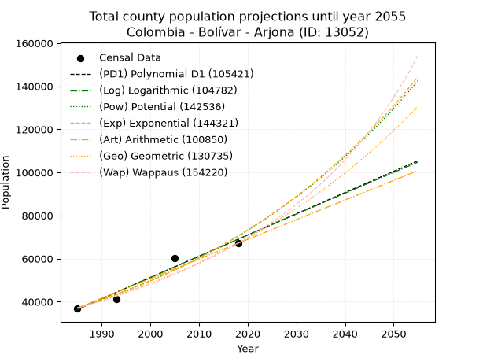
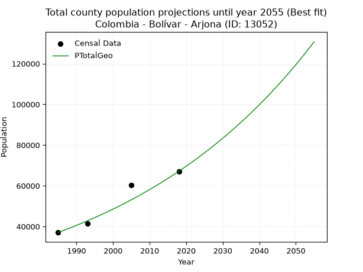
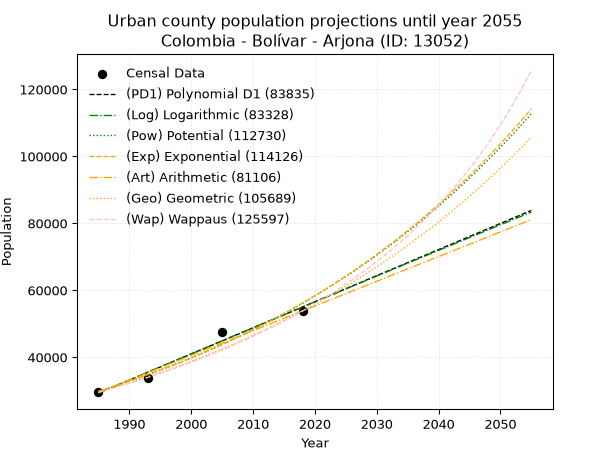
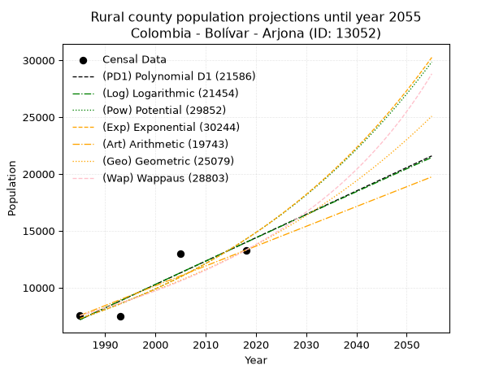
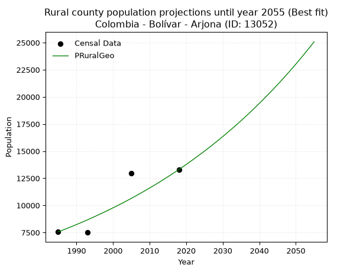

<div align="center">


</div>

# 📜 _“Population and Public Services Demand Projections (PPSD) until Year 2050 for Colombia - Bolívar - Arjona (ID: 13052)”_
Keywords: `population` `public-service` `projection` `lineal` `polynomial` `logarithmic` `potential` `exponential` `arithmetic` `geometric` `wappaus` `dane` `colombia` `south-america`

PPSD are analytical estimates used by governments and planners to anticipate future changes in population size, age distribution, and the resulting community needs for utilities, healthcare, education, and infrastructure as sizing future water treatment facilities, electrical grids, and road networks based on spatial growth.

<div align="center">

</img>

</div>


> **General running parameters**: • app_version: _v20260806_. • Python version: _3.14.7_. • Pandas version: _3.0.5_. • NumPy version: _2.5.1_. • Creates, save and include plots into reports (create_plot): _False_. • Projection until year: _2050_. • Process polynomial degree 2 and up: _False_. • Process Wappaus: _True_. • Process Wappaus: _True_. • Set negative values to zero: _True_. • Set infinite values to zero: _True_. • Drop dataset notes: _True_. 
<div align="center">

Maps & GIS Layers: [:earth_americas:Google](http://maps.google.com/maps?q=10.25666,-75.3443315) [:earth_americas:OSM](https://www.openstreetmap.org/#map=18/10.25666/-75.3443315&layers=P) [:earth_americas:Bing](https://www.bing.com/maps?cp=10.25666~-75.3443315&lvl=18) [:earth_americas:Apple](https://maps.apple.com/frame?center=10.25666%2C-75.3443315&span=0.003%2C0.006) [:earth_americas:GISMobile](https://github.com/rcfdtools/R.GISMobile/blob/main/file/gis/CountyLayer_CO/Readme.md)

</div>


<div align="center">

```geojson
{
  "type": "Feature",
  "geometry": {
    "type": "Point", 
    "coordinates": [-75.3443315, 10.25666]
  }, 
  "properties": {
    "Name": "Colombia - Bolívar - Arjona (ID: 13052)"
  }
}
```

</div>


## 0. Census Data (4 records)

Census data are official statistics collected by a government about the people and housing in a country. They usually include counts of total population, age, sex, race, income, education, and jobs.

📅Global census file: [Population.xlsx](../data/Population.xlsx)

| Source   |   Year |   CountryID | CountryName   |   StateID | StateName   |   CountyID | CountyName   |   PTotal |   PUrban |   PRural |
|:---------|-------:|------------:|:--------------|----------:|:------------|-----------:|:-------------|---------:|---------:|---------:|
| DANE     |   1985 |          57 | Colombia      |        13 | Bolívar     |      13052 | Arjona       |    37033 |    29478 |     7555 |
| DANE     |   1993 |          57 | Colombia      |        13 | Bolívar     |      13052 | Arjona       |    41384 |    33886 |     7498 |
| DANE     |   2005 |          57 | Colombia      |        13 | Bolívar     |      13052 | Arjona       |    60407 |    47451 |    12956 |
| DANE     |   2018 |          57 | Colombia      |        13 | Bolívar     |      13052 | Arjona       |    67118 |    53817 |    13301 |

> 🔥Some records could had specific notes about the registered values or the corresponding urban or rural distribution.

📅[SUI-RUPS](https://www.datos.gov.co/Hacienda-y-Cr-dito-P-blico/Registro-nico-de-Prestadores-de-Servicios-P-blicos/4qkq-csdn/about_data) - Local public utility companies: [RUPS.csv](../data/RUPS.csv)

 | SERVICIO   | ESTADO    | NOMBRE                                                                                                                                          | NIT         | DEPARTAMENTO_DOMICILIO   | MUNICIPIO_DOMICILIO   | DIRECCION                                                                        |   TELEFONO | EMAIL                        | TIPO_PRESTADOR                             | CLASIFICACION                 |
|:-----------|:----------|:------------------------------------------------------------------------------------------------------------------------------------------------|:------------|:-------------------------|:----------------------|:---------------------------------------------------------------------------------|-----------:|:-----------------------------|:-------------------------------------------|:------------------------------|
| ACUEDUCTO  | OPERATIVA | ACUEDUCTOS Y ALCANTARILLADOS DE COLOMBIA S.A. E.S.P.                                                                                            | 806016735-9 | BOLIVAR                  | ARJONA                | AVENIDA SIMON BOSSA No 1 - 01 ESQUINA                                            |    6293899 | DGARRIDOV@ACUALCO.COM        | SOCIEDADES (EMPRESA DE SERVICIOS PUBLICOS) | MAYOR O IGUAL A 5001 USUARIOS |
| ACUEDUCTO  | OPERATIVA | ASOCIACION DE SERVICIOS PUBLICOS DOMICILIARIOS DE ACUEDUCTO Y SANEAMIENTO BASICO DEL CORREGIMIENTO DE SINCERIN ARJONA DEPARTAMENTO DE BOLIVAR   | 900191654-1 | BOLIVAR                  | ARJONA                | CORREGIMIENTO DE SINCERIN, PLAZA PRINCIPAL. BARRIO VIEJO. CALLE 8 CARRERA 8 - 42 |    6661057 | norelisalfaro3@gmail.com     | ORGANIZACION AUTORIZADA                    | MENOR O IGUAL A 2500 USUARIOS |
| ACUEDUCTO  | OPERATIVA | ASOCIACION DE SERVICIOS PUBLICOS DOMICILIARIOS DE ACUEDUCTO Y SANEAMIENTO BASICO DEL CORREGIMIENTO DE GAMBOTE, ARJONA - DEPARTAMENTO DE BOLIVAR | 900191652-5 | BOLIVAR                  | ARJONA                | GAMBOTE CALLE DEL PUENTE                                                         |    6661057 | acueductodegambote@gmail.com | ORGANIZACION AUTORIZADA                    | MENOR O IGUAL A 2500 USUARIOS |

## 1. Total

### 1.1. Coefficients and Parameters

* (PD1) Polynomial Deg 1: 985.1312725812871, -1919023.3279807195 (lineal)
* (Log) Logarithmic: 1972267.276537405, -14939733.873718876
* (Pow) Potential: 38.819794965998376, -123.44875025712454
* (Exp) Exponential: 0.01938771422858096, 7.182527576539795e-13
* (Art) Arithmetic: Year diff. 2018 - 1985 = 33, Population diff. 67118 - 37033 = 30085, Annual growth = 911.6666666666666
* (Geo) Geometric: Year diff. 2018 - 1985 = 33, Population diff. 67118 - 37033 = 30085, Annual growth % = 0.01818281093154006
* (Wap) Wappaus: i = 1.750663299760284, Condition values only valid for < 200)

<sub>
Wappaus condition values: ['0.00', '1.75', '3.50', '5.25', '7.00', '8.75', '10.50', '12.25', '14.01', '15.76', '17.51', '19.26', '21.01', '22.76', '24.51', '26.26', '28.01', '29.76', '31.51', '33.26', '35.01', '36.76', '38.51', '40.27', '42.02', '43.77', '45.52', '47.27', '49.02', '50.77', '52.52', '54.27', '56.02', '57.77', '59.52', '61.27', '63.02', '64.77', '66.53', '68.28', '70.03', '71.78', '73.53', '75.28', '77.03', '78.78', '80.53', '82.28', '84.03', '85.78', '87.53', '89.28', '91.03', '92.79', '94.54', '96.29', '98.04', '99.79', '101.54', '103.29', '105.04', '106.79', '108.54', '110.29', '112.04', '113.79']
</sub>


### 1.2. Projected Dataset

|   Year |   CountyID |   PTotalPD1 |   PTotalLog |   PTotalPow |   PTotalExp |   PTotalArt |   PTotalGeo |   PTotalWap |
|-------:|-----------:|------------:|------------:|------------:|------------:|------------:|------------:|------------:|
|   1985 |      13052 |       36462 |       36430 |       37122 |       37148 |       37033 |       37033 |       37033 |
|   1986 |      13052 |       37447 |       37423 |       37855 |       37875 |       37945 |       37706 |       37687 |
|   1987 |      13052 |       38433 |       38416 |       38602 |       38616 |       38856 |       38392 |       38353 |
|   1988 |      13052 |       39418 |       39408 |       39364 |       39372 |       39768 |       39090 |       39030 |
|   1989 |      13052 |       40403 |       40400 |       40140 |       40143 |       40680 |       39801 |       39720 |
|   1990 |      13052 |       41388 |       41391 |       40931 |       40929 |       41591 |       40525 |       40423 |
|   1991 |      13052 |       42373 |       42382 |       41737 |       41730 |       42503 |       41261 |       41139 |
|   1992 |      13052 |       43358 |       43372 |       42558 |       42547 |       43415 |       42012 |       41867 |
|   1993 |      13052 |       44343 |       44362 |       43396 |       43380 |       44326 |       42775 |       42610 |
|   1994 |      13052 |       45328 |       45352 |       44249 |       44230 |       45238 |       43553 |       43367 |
|   1995 |      13052 |       46314 |       46340 |       45119 |       45095 |       46150 |       44345 |       44138 |
|   1996 |      13052 |       47299 |       47329 |       46005 |       45978 |       47061 |       45152 |       44924 |
|   1997 |      13052 |       48284 |       48317 |       46908 |       46878 |       47973 |       45972 |       45726 |
|   1998 |      13052 |       49269 |       49304 |       47829 |       47796 |       48885 |       46808 |       46543 |
|   1999 |      13052 |       50254 |       50291 |       48767 |       48732 |       49796 |       47660 |       47377 |
|   2000 |      13052 |       51239 |       51277 |       49723 |       49686 |       50708 |       48526 |       48228 |
|   2001 |      13052 |       52224 |       52263 |       50697 |       50658 |       51620 |       49408 |       49096 |
|   2002 |      13052 |       53209 |       53249 |       51690 |       51650 |       52531 |       50307 |       49981 |
|   2003 |      13052 |       54195 |       54234 |       52702 |       52661 |       53443 |       51222 |       50885 |
|   2004 |      13052 |       55180 |       55218 |       53733 |       53692 |       54355 |       52153 |       51808 |
|   2005 |      13052 |       56165 |       56202 |       54784 |       54743 |       55266 |       53101 |       52751 |
|   2006 |      13052 |       57150 |       57185 |       55855 |       55815 |       56178 |       54067 |       53714 |
|   2007 |      13052 |       58135 |       58168 |       56946 |       56908 |       57090 |       55050 |       54698 |
|   2008 |      13052 |       59120 |       59151 |       58058 |       58022 |       58001 |       56051 |       55703 |
|   2009 |      13052 |       60105 |       60133 |       59191 |       59158 |       58913 |       57070 |       56731 |
|   2010 |      13052 |       61091 |       61114 |       60345 |       60316 |       59825 |       58108 |       57782 |
|   2011 |      13052 |       62076 |       62095 |       61522 |       61497 |       60736 |       59164 |       58856 |
|   2012 |      13052 |       63061 |       63076 |       62721 |       62701 |       61648 |       60240 |       59955 |
|   2013 |      13052 |       64046 |       64056 |       63942 |       63928 |       62560 |       61335 |       61080 |
|   2014 |      13052 |       65031 |       65035 |       65187 |       65180 |       63471 |       62451 |       62231 |
|   2015 |      13052 |       66016 |       66014 |       66455 |       66456 |       64383 |       63586 |       63409 |
|   2016 |      13052 |       67001 |       66993 |       67748 |       67757 |       65295 |       64742 |       64616 |
|   2017 |      13052 |       67986 |       67971 |       69065 |       69083 |       66206 |       65919 |       65852 |
|   2018 |      13052 |       68972 |       68948 |       70406 |       70435 |       67118 |       67118 |       67118 |
|   2019 |      13052 |       69957 |       69925 |       71773 |       71814 |       68030 |       68338 |       68416 |
|   2020 |      13052 |       70942 |       70902 |       73166 |       73220 |       68941 |       69581 |       69747 |
|   2021 |      13052 |       71927 |       71878 |       74586 |       74654 |       69853 |       70846 |       71111 |
|   2022 |      13052 |       72912 |       72854 |       76032 |       76115 |       70765 |       72134 |       72511 |
|   2023 |      13052 |       73897 |       73829 |       77505 |       77605 |       71676 |       73446 |       73948 |
|   2024 |      13052 |       74882 |       74804 |       79007 |       79125 |       72588 |       74781 |       75423 |
|   2025 |      13052 |       75867 |       75778 |       80536 |       80674 |       73500 |       76141 |       76938 |
|   2026 |      13052 |       76853 |       76752 |       82095 |       82253 |       74411 |       77526 |       78494 |
|   2027 |      13052 |       77838 |       77725 |       83682 |       83863 |       75323 |       78935 |       80093 |
|   2028 |      13052 |       78823 |       78698 |       85300 |       85505 |       76235 |       80370 |       81737 |
|   2029 |      13052 |       79808 |       79670 |       86948 |       87179 |       77146 |       81832 |       83428 |
|   2030 |      13052 |       80793 |       80642 |       88627 |       88886 |       78058 |       83320 |       85168 |
|   2031 |      13052 |       81778 |       81613 |       90338 |       90626 |       78970 |       84835 |       86958 |
|   2032 |      13052 |       82763 |       82584 |       92081 |       92400 |       79881 |       86377 |       88802 |
|   2033 |      13052 |       83749 |       83554 |       93857 |       94209 |       80793 |       87948 |       90702 |
|   2034 |      13052 |       84734 |       84524 |       95665 |       96053 |       81705 |       89547 |       92660 |
|   2035 |      13052 |       85719 |       85493 |       97508 |       97933 |       82616 |       91175 |       94679 |
|   2036 |      13052 |       86704 |       86462 |       99386 |       99851 |       83528 |       92833 |       96761 |
|   2037 |      13052 |       87689 |       87431 |      101299 |      101805 |       84440 |       94521 |       98911 |
|   2038 |      13052 |       88674 |       88399 |      103247 |      103798 |       85351 |       96240 |      101131 |
|   2039 |      13052 |       89659 |       89366 |      105232 |      105831 |       86263 |       97990 |      103424 |
|   2040 |      13052 |       90644 |       90333 |      107254 |      107902 |       87175 |       99771 |      105795 |
|   2041 |      13052 |       91630 |       91300 |      109314 |      110015 |       88086 |      101585 |      108247 |
|   2042 |      13052 |       92615 |       92266 |      111413 |      112169 |       88998 |      103433 |      110785 |
|   2043 |      13052 |       93600 |       93232 |      113550 |      114364 |       89910 |      105313 |      113414 |
|   2044 |      13052 |       94585 |       94197 |      115728 |      116603 |       90821 |      107228 |      116137 |
|   2045 |      13052 |       95570 |       95161 |      117947 |      118886 |       91733 |      109178 |      118961 |
|   2046 |      13052 |       96555 |       96126 |      120206 |      121213 |       92645 |      111163 |      121891 |
|   2047 |      13052 |       97540 |       97089 |      122508 |      123586 |       93556 |      113184 |      124933 |
|   2048 |      13052 |       98526 |       98053 |      124853 |      126006 |       94468 |      115242 |      128093 |
|   2049 |      13052 |       99511 |       99015 |      127242 |      128473 |       95380 |      117338 |      131380 |
|   2050 |      13052 |      100496 |       99978 |      129675 |      130988 |       96291 |      119471 |      134800 |
<div align="center">

</img>

</div>


### 1.3. Best fit with absolute and relative error (%)

Relative error puts that difference into context by dividing the absolute error by the true value, creating a unitless ratio or percentage that shows the scale of the mistake.

Absolute and relative error

|   Year | Source   |   CountryID | CountryName   |   StateID | StateName   |   CountyID_x | CountyName   |   PTotal |   PUrban |   PRural |   CountyID_y |   PTotalPD1 |   PTotalLog |   PTotalPow |   PTotalExp |   PTotalArt |   PTotalGeo |   PTotalWap |   PTotalPD1AbsError |   PTotalLogAbsError |   PTotalPowAbsError |   PTotalExpAbsError |   PTotalArtAbsError |   PTotalGeoAbsError |   PTotalWapAbsError |   PTotalPD1RelError |   PTotalLogRelError |   PTotalPowRelError |   PTotalExpRelError |   PTotalArtRelError |   PTotalGeoRelError |   PTotalWapRelError |
|-------:|:---------|------------:|:--------------|----------:|:------------|-------------:|:-------------|---------:|---------:|---------:|-------------:|------------:|------------:|------------:|------------:|------------:|------------:|------------:|--------------------:|--------------------:|--------------------:|--------------------:|--------------------:|--------------------:|--------------------:|--------------------:|--------------------:|--------------------:|--------------------:|--------------------:|--------------------:|--------------------:|
|   1985 | DANE     |          57 | Colombia      |        13 | Bolívar     |        13052 | Arjona       |    37033 |    29478 |     7555 |        13052 |       36462 |       36430 |       37122 |       37148 |       37033 |       37033 |       37033 |                 571 |                 603 |                  89 |                 115 |                   0 |                   0 |                   0 |             1.54187 |             1.62828 |            0.240326 |            0.310534 |             0       |              0      |              0      |
|   1993 | DANE     |          57 | Colombia      |        13 | Bolívar     |        13052 | Arjona       |    41384 |    33886 |     7498 |        13052 |       44343 |       44362 |       43396 |       43380 |       44326 |       42775 |       42610 |                2959 |                2978 |                2012 |                1996 |                2942 |                1391 |                1226 |             7.15011 |             7.19602 |            4.86178  |            4.82312  |             7.10903 |              3.3612 |              2.9625 |
|   2005 | DANE     |          57 | Colombia      |        13 | Bolívar     |        13052 | Arjona       |    60407 |    47451 |    12956 |        13052 |       56165 |       56202 |       54784 |       54743 |       55266 |       53101 |       52751 |                4242 |                4205 |                5623 |                5664 |                5141 |                7306 |                7656 |             7.02236 |             6.96111 |            9.30852  |            9.3764   |             8.5106  |             12.0946 |             12.674  |
|   2018 | DANE     |          57 | Colombia      |        13 | Bolívar     |        13052 | Arjona       |    67118 |    53817 |    13301 |        13052 |       68972 |       68948 |       70406 |       70435 |       67118 |       67118 |       67118 |                1854 |                1830 |                3288 |                3317 |                   0 |                   0 |                   0 |             2.7623  |             2.72654 |            4.89883  |            4.94204  |             0       |              0      |              0      |

Relative error mean

| Method    |   RelError | Best   |
|:----------|-----------:|:-------|
| PTotalPD1 |    4.61916 |        |
| PTotalLog |    4.62799 |        |
| PTotalPow |    4.82737 |        |
| PTotalExp |    4.86302 |        |
| PTotalArt |    3.90491 |        |
| PTotalGeo |    3.86396 | True   |
| PTotalWap |    3.90913 |        |

💙Best method: _**PTotalGeo**_
<div align="center">

</img>

</div>


### 1.4. Fresh water supply demand in liters per capita per day (lpcd)

The fresh water supply demand typically ranges from 100 to 300 liters per capita per day (lpcd) for standard domestic and municipal planning, though absolute survival minimums set by the World Health Organization are as low as 7.5 to 20 liters per day, and total consumption in high-income nations can exceed 400 liters.

> `CZ`: Level in meters above the sea level (masl)<br> `WS`: Fresh water supply demand in liters per capita per day (lpcd or l/h/d)<br> `WSAll`: Zonal fresh water supply demand in liters per second (l/s)<br> `A`: Zonal area in square meters<br> `DP`: Population density (people/hectare or p/ha)

Reference values (RAS Colombia)

|    CZ |   WS |
|------:|-----:|
|  1000 |  120 |
|  2000 |  130 |
| 99999 |  140 |

County shapefile geometry properties and water supply values

|   CountyID |     ATotal |   CZTotal |   WSTotal |
|-----------:|-----------:|----------:|----------:|
|      13052 | 5.8719e+08 |   27.9324 |       120 |

Projected values for best method: PTotalGeo

|   CountyID |   Year |   PTotalGeo |   DPTotal |   WSTotal |   WSTotalAll |
|-----------:|-------:|------------:|----------:|----------:|-------------:|
|      13052 |   1985 |       37033 |      0.63 |       120 |      51.4347 |
|      13052 |   1986 |       37706 |      0.64 |       120 |      52.3694 |
|      13052 |   1987 |       38392 |      0.65 |       120 |      53.3222 |
|      13052 |   1988 |       39090 |      0.67 |       120 |      54.2917 |
|      13052 |   1989 |       39801 |      0.68 |       120 |      55.2792 |
|      13052 |   1990 |       40525 |      0.69 |       120 |      56.2847 |
|      13052 |   1991 |       41261 |      0.7  |       120 |      57.3069 |
|      13052 |   1992 |       42012 |      0.72 |       120 |      58.35   |
|      13052 |   1993 |       42775 |      0.73 |       120 |      59.4097 |
|      13052 |   1994 |       43553 |      0.74 |       120 |      60.4903 |
|      13052 |   1995 |       44345 |      0.76 |       120 |      61.5903 |
|      13052 |   1996 |       45152 |      0.77 |       120 |      62.7111 |
|      13052 |   1997 |       45972 |      0.78 |       120 |      63.85   |
|      13052 |   1998 |       46808 |      0.8  |       120 |      65.0111 |
|      13052 |   1999 |       47660 |      0.81 |       120 |      66.1944 |
|      13052 |   2000 |       48526 |      0.83 |       120 |      67.3972 |
|      13052 |   2001 |       49408 |      0.84 |       120 |      68.6222 |
|      13052 |   2002 |       50307 |      0.86 |       120 |      69.8708 |
|      13052 |   2003 |       51222 |      0.87 |       120 |      71.1417 |
|      13052 |   2004 |       52153 |      0.89 |       120 |      72.4347 |
|      13052 |   2005 |       53101 |      0.9  |       120 |      73.7514 |
|      13052 |   2006 |       54067 |      0.92 |       120 |      75.0931 |
|      13052 |   2007 |       55050 |      0.94 |       120 |      76.4583 |
|      13052 |   2008 |       56051 |      0.95 |       120 |      77.8486 |
|      13052 |   2009 |       57070 |      0.97 |       120 |      79.2639 |
|      13052 |   2010 |       58108 |      0.99 |       120 |      80.7056 |
|      13052 |   2011 |       59164 |      1.01 |       120 |      82.1722 |
|      13052 |   2012 |       60240 |      1.03 |       120 |      83.6667 |
|      13052 |   2013 |       61335 |      1.04 |       120 |      85.1875 |
|      13052 |   2014 |       62451 |      1.06 |       120 |      86.7375 |
|      13052 |   2015 |       63586 |      1.08 |       120 |      88.3139 |
|      13052 |   2016 |       64742 |      1.1  |       120 |      89.9194 |
|      13052 |   2017 |       65919 |      1.12 |       120 |      91.5542 |
|      13052 |   2018 |       67118 |      1.14 |       120 |      93.2194 |
|      13052 |   2019 |       68338 |      1.16 |       120 |      94.9139 |
|      13052 |   2020 |       69581 |      1.18 |       120 |      96.6403 |
|      13052 |   2021 |       70846 |      1.21 |       120 |      98.3972 |
|      13052 |   2022 |       72134 |      1.23 |       120 |     100.186  |
|      13052 |   2023 |       73446 |      1.25 |       120 |     102.008  |
|      13052 |   2024 |       74781 |      1.27 |       120 |     103.862  |
|      13052 |   2025 |       76141 |      1.3  |       120 |     105.751  |
|      13052 |   2026 |       77526 |      1.32 |       120 |     107.675  |
|      13052 |   2027 |       78935 |      1.34 |       120 |     109.632  |
|      13052 |   2028 |       80370 |      1.37 |       120 |     111.625  |
|      13052 |   2029 |       81832 |      1.39 |       120 |     113.656  |
|      13052 |   2030 |       83320 |      1.42 |       120 |     115.722  |
|      13052 |   2031 |       84835 |      1.44 |       120 |     117.826  |
|      13052 |   2032 |       86377 |      1.47 |       120 |     119.968  |
|      13052 |   2033 |       87948 |      1.5  |       120 |     122.15   |
|      13052 |   2034 |       89547 |      1.53 |       120 |     124.371  |
|      13052 |   2035 |       91175 |      1.55 |       120 |     126.632  |
|      13052 |   2036 |       92833 |      1.58 |       120 |     128.935  |
|      13052 |   2037 |       94521 |      1.61 |       120 |     131.279  |
|      13052 |   2038 |       96240 |      1.64 |       120 |     133.667  |
|      13052 |   2039 |       97990 |      1.67 |       120 |     136.097  |
|      13052 |   2040 |       99771 |      1.7  |       120 |     138.571  |
|      13052 |   2041 |      101585 |      1.73 |       120 |     141.09   |
|      13052 |   2042 |      103433 |      1.76 |       120 |     143.657  |
|      13052 |   2043 |      105313 |      1.79 |       120 |     146.268  |
|      13052 |   2044 |      107228 |      1.83 |       120 |     148.928  |
|      13052 |   2045 |      109178 |      1.86 |       120 |     151.636  |
|      13052 |   2046 |      111163 |      1.89 |       120 |     154.393  |
|      13052 |   2047 |      113184 |      1.93 |       120 |     157.2    |
|      13052 |   2048 |      115242 |      1.96 |       120 |     160.058  |
|      13052 |   2049 |      117338 |      2    |       120 |     162.969  |
|      13052 |   2050 |      119471 |      2.03 |       120 |     165.932  |

## 2. Urban

### 2.1. Coefficients and Parameters

* (PD1) Polynomial Deg 1: 779.4957848253666, -1518028.4435969398 (lineal)
* (Log) Logarithmic: 1560534.1548507146, -11820474.616356174
* (Pow) Potential: 38.37508712164277, -122.07740205258668
* (Exp) Exponential: 0.0191656956455435, 8.963511569553998e-13
* (Art) Arithmetic: Year diff. 2018 - 1985 = 33, Population diff. 53817 - 29478 = 24339, Annual growth = 737.5454545454545
* (Geo) Geometric: Year diff. 2018 - 1985 = 33, Population diff. 53817 - 29478 = 24339, Annual growth % = 0.018408141904633135
* (Wap) Wappaus: i = 1.7709237158183673, Condition values only valid for < 200)

<sub>
Wappaus condition values: ['0.00', '1.77', '3.54', '5.31', '7.08', '8.85', '10.63', '12.40', '14.17', '15.94', '17.71', '19.48', '21.25', '23.02', '24.79', '26.56', '28.33', '30.11', '31.88', '33.65', '35.42', '37.19', '38.96', '40.73', '42.50', '44.27', '46.04', '47.81', '49.59', '51.36', '53.13', '54.90', '56.67', '58.44', '60.21', '61.98', '63.75', '65.52', '67.30', '69.07', '70.84', '72.61', '74.38', '76.15', '77.92', '79.69', '81.46', '83.23', '85.00', '86.78', '88.55', '90.32', '92.09', '93.86', '95.63', '97.40', '99.17', '100.94', '102.71', '104.48', '106.26', '108.03', '109.80', '111.57', '113.34', '115.11']
</sub>


### 2.2. Projected Dataset

|   Year |   CountyID |   PUrbanPD1 |   PUrbanLog |   PUrbanPow |   PUrbanExp |   PUrbanArt |   PUrbanGeo |   PUrbanWap |
|-------:|-----------:|------------:|------------:|------------:|------------:|------------:|------------:|------------:|
|   1985 |      13052 |       29271 |       29245 |       29816 |       29836 |       29478 |       29478 |       29478 |
|   1986 |      13052 |       30050 |       30031 |       30398 |       30413 |       30216 |       30021 |       30005 |
|   1987 |      13052 |       30830 |       30817 |       30990 |       31002 |       30953 |       30573 |       30541 |
|   1988 |      13052 |       31609 |       31602 |       31595 |       31601 |       31691 |       31136 |       31087 |
|   1989 |      13052 |       32389 |       32387 |       32210 |       32213 |       32428 |       31709 |       31643 |
|   1990 |      13052 |       33168 |       33171 |       32838 |       32836 |       33166 |       32293 |       32209 |
|   1991 |      13052 |       33948 |       33955 |       33477 |       33472 |       33903 |       32887 |       32786 |
|   1992 |      13052 |       34727 |       34739 |       34128 |       34119 |       34641 |       33493 |       33374 |
|   1993 |      13052 |       35507 |       35522 |       34792 |       34780 |       35378 |       34109 |       33973 |
|   1994 |      13052 |       36286 |       36305 |       35468 |       35453 |       36116 |       34737 |       34583 |
|   1995 |      13052 |       37066 |       37087 |       36157 |       36139 |       36853 |       35377 |       35205 |
|   1996 |      13052 |       37845 |       37869 |       36859 |       36838 |       37591 |       36028 |       35840 |
|   1997 |      13052 |       38625 |       38651 |       37575 |       37551 |       38329 |       36691 |       36487 |
|   1998 |      13052 |       39404 |       39432 |       38303 |       38277 |       39066 |       37366 |       37147 |
|   1999 |      13052 |       40184 |       40213 |       39046 |       39018 |       39804 |       38054 |       37821 |
|   2000 |      13052 |       40963 |       40993 |       39803 |       39773 |       40541 |       38755 |       38508 |
|   2001 |      13052 |       41743 |       41773 |       40574 |       40543 |       41279 |       39468 |       39209 |
|   2002 |      13052 |       42522 |       42553 |       41359 |       41327 |       42016 |       40195 |       39925 |
|   2003 |      13052 |       43302 |       43332 |       42159 |       42127 |       42754 |       40935 |       40656 |
|   2004 |      13052 |       44081 |       44111 |       42974 |       42942 |       43491 |       41688 |       41403 |
|   2005 |      13052 |       44861 |       44890 |       43805 |       43773 |       44229 |       42456 |       42166 |
|   2006 |      13052 |       45640 |       45668 |       44651 |       44620 |       44966 |       43237 |       42945 |
|   2007 |      13052 |       46420 |       46446 |       45514 |       45484 |       45704 |       44033 |       43741 |
|   2008 |      13052 |       47199 |       47223 |       46392 |       46364 |       46442 |       44844 |       44555 |
|   2009 |      13052 |       47979 |       48000 |       47287 |       47261 |       47179 |       45669 |       45388 |
|   2010 |      13052 |       48758 |       48777 |       48199 |       48175 |       47917 |       46510 |       46239 |
|   2011 |      13052 |       49538 |       49553 |       49127 |       49108 |       48654 |       47366 |       47110 |
|   2012 |      13052 |       50317 |       50329 |       50074 |       50058 |       49392 |       48238 |       48001 |
|   2013 |      13052 |       51097 |       51104 |       51038 |       51027 |       50129 |       49126 |       48914 |
|   2014 |      13052 |       51876 |       51879 |       52020 |       52014 |       50867 |       50030 |       49848 |
|   2015 |      13052 |       52656 |       52654 |       53020 |       53020 |       51604 |       50951 |       50804 |
|   2016 |      13052 |       53435 |       53428 |       54039 |       54046 |       52342 |       51889 |       51784 |
|   2017 |      13052 |       54215 |       54202 |       55078 |       55092 |       53079 |       52844 |       52788 |
|   2018 |      13052 |       54994 |       54975 |       56135 |       56158 |       53817 |       53817 |       53817 |
|   2019 |      13052 |       55774 |       55748 |       57213 |       57245 |       54555 |       54808 |       54872 |
|   2020 |      13052 |       56553 |       56521 |       58310 |       58353 |       55292 |       55817 |       55955 |
|   2021 |      13052 |       57333 |       57293 |       59428 |       59482 |       56030 |       56844 |       57065 |
|   2022 |      13052 |       58112 |       58065 |       60567 |       60633 |       56767 |       57890 |       58205 |
|   2023 |      13052 |       58892 |       58837 |       61727 |       61806 |       57505 |       58956 |       59375 |
|   2024 |      13052 |       59671 |       59608 |       62909 |       63002 |       58242 |       60041 |       60577 |
|   2025 |      13052 |       60451 |       60379 |       64113 |       64221 |       58980 |       61147 |       61811 |
|   2026 |      13052 |       61230 |       61149 |       65339 |       65464 |       59717 |       62272 |       63080 |
|   2027 |      13052 |       62010 |       61920 |       66588 |       66731 |       60455 |       63419 |       64385 |
|   2028 |      13052 |       62789 |       62689 |       67861 |       68022 |       61192 |       64586 |       65727 |
|   2029 |      13052 |       63569 |       63459 |       69157 |       69338 |       61930 |       65775 |       67108 |
|   2030 |      13052 |       64348 |       64227 |       70477 |       70680 |       62668 |       66986 |       68530 |
|   2031 |      13052 |       65127 |       64996 |       71821 |       72048 |       63405 |       68219 |       69994 |
|   2032 |      13052 |       65907 |       65764 |       73191 |       73442 |       64143 |       69475 |       71503 |
|   2033 |      13052 |       66686 |       66532 |       74586 |       74863 |       64880 |       70753 |       73058 |
|   2034 |      13052 |       67466 |       67299 |       76007 |       76312 |       65618 |       72056 |       74662 |
|   2035 |      13052 |       68245 |       68066 |       77454 |       77788 |       66355 |       73382 |       76316 |
|   2036 |      13052 |       69025 |       68833 |       78928 |       79294 |       67093 |       74733 |       78025 |
|   2037 |      13052 |       69804 |       69599 |       80430 |       80828 |       67830 |       76109 |       79789 |
|   2038 |      13052 |       70584 |       70365 |       81959 |       82392 |       68568 |       77510 |       81612 |
|   2039 |      13052 |       71363 |       71131 |       83517 |       83986 |       69305 |       78937 |       83497 |
|   2040 |      13052 |       72143 |       71896 |       85103 |       85612 |       70043 |       80390 |       85447 |
|   2041 |      13052 |       72922 |       72661 |       86718 |       87268 |       70781 |       81870 |       87465 |
|   2042 |      13052 |       73702 |       73425 |       88364 |       88957 |       71518 |       83377 |       89556 |
|   2043 |      13052 |       74481 |       74189 |       90040 |       90678 |       72256 |       84911 |       91723 |
|   2044 |      13052 |       75261 |       74953 |       91747 |       92433 |       72993 |       86474 |       93970 |
|   2045 |      13052 |       76040 |       75716 |       93485 |       94221 |       73731 |       88066 |       96302 |
|   2046 |      13052 |       76820 |       76479 |       95255 |       96045 |       74468 |       89687 |       98724 |
|   2047 |      13052 |       77599 |       77242 |       97059 |       97903 |       75206 |       91338 |      101241 |
|   2048 |      13052 |       78379 |       78004 |       98895 |       99798 |       75943 |       93020 |      103859 |
|   2049 |      13052 |       79158 |       78766 |      100765 |      101729 |       76681 |       94732 |      106583 |
|   2050 |      13052 |       79938 |       79527 |      102669 |      103697 |       77418 |       96476 |      109422 |
<div align="center">

</img>

</div>


### 2.3. Best fit with absolute and relative error (%)

Relative error puts that difference into context by dividing the absolute error by the true value, creating a unitless ratio or percentage that shows the scale of the mistake.

Absolute and relative error

|   Year | Source   |   CountryID | CountryName   |   StateID | StateName   |   CountyID_x | CountyName   |   PTotal |   PUrban |   PRural |   CountyID_y |   PUrbanPD1 |   PUrbanLog |   PUrbanPow |   PUrbanExp |   PUrbanArt |   PUrbanGeo |   PUrbanWap |   PUrbanPD1AbsError |   PUrbanLogAbsError |   PUrbanPowAbsError |   PUrbanExpAbsError |   PUrbanArtAbsError |   PUrbanGeoAbsError |   PUrbanWapAbsError |   PUrbanPD1RelError |   PUrbanLogRelError |   PUrbanPowRelError |   PUrbanExpRelError |   PUrbanArtRelError |   PUrbanGeoRelError |   PUrbanWapRelError |
|-------:|:---------|------------:|:--------------|----------:|:------------|-------------:|:-------------|---------:|---------:|---------:|-------------:|------------:|------------:|------------:|------------:|------------:|------------:|------------:|--------------------:|--------------------:|--------------------:|--------------------:|--------------------:|--------------------:|--------------------:|--------------------:|--------------------:|--------------------:|--------------------:|--------------------:|--------------------:|--------------------:|
|   1985 | DANE     |          57 | Colombia      |        13 | Bolívar     |        13052 | Arjona       |    37033 |    29478 |     7555 |        13052 |       29271 |       29245 |       29816 |       29836 |       29478 |       29478 |       29478 |                 207 |                 233 |                 338 |                 358 |                   0 |                   0 |                   0 |            0.702219 |             0.79042 |             1.14662 |             1.21447 |             0       |            0        |            0        |
|   1993 | DANE     |          57 | Colombia      |        13 | Bolívar     |        13052 | Arjona       |    41384 |    33886 |     7498 |        13052 |       35507 |       35522 |       34792 |       34780 |       35378 |       34109 |       33973 |                1621 |                1636 |                 906 |                 894 |                1492 |                 223 |                  87 |            4.78369  |             4.82795 |             2.67367 |             2.63826 |             4.403   |            0.658089 |            0.256743 |
|   2005 | DANE     |          57 | Colombia      |        13 | Bolívar     |        13052 | Arjona       |    60407 |    47451 |    12956 |        13052 |       44861 |       44890 |       43805 |       43773 |       44229 |       42456 |       42166 |                2590 |                2561 |                3646 |                3678 |                3222 |                4995 |                5285 |            5.45826  |             5.39715 |             7.68372 |             7.75115 |             6.79016 |           10.5266   |           11.1378   |
|   2018 | DANE     |          57 | Colombia      |        13 | Bolívar     |        13052 | Arjona       |    67118 |    53817 |    13301 |        13052 |       54994 |       54975 |       56135 |       56158 |       53817 |       53817 |       53817 |                1177 |                1158 |                2318 |                2341 |                   0 |                   0 |                   0 |            2.18704  |             2.15174 |             4.30719 |             4.34993 |             0       |            0        |            0        |

Relative error mean

| Method    |   RelError | Best   |
|:----------|-----------:|:-------|
| PUrbanPD1 |    3.2828  |        |
| PUrbanLog |    3.29181 |        |
| PUrbanPow |    3.9528  |        |
| PUrbanExp |    3.98845 |        |
| PUrbanArt |    2.79829 |        |
| PUrbanGeo |    2.79618 | True   |
| PUrbanWap |    2.84864 |        |

💙Best method: _**PUrbanGeo**_
<div align="center">

</img>

</div>


### 2.4. Fresh water supply demand in liters per capita per day (lpcd)

The fresh water supply demand typically ranges from 100 to 300 liters per capita per day (lpcd) for standard domestic and municipal planning, though absolute survival minimums set by the World Health Organization are as low as 7.5 to 20 liters per day, and total consumption in high-income nations can exceed 400 liters.

> `CZ`: Level in meters above the sea level (masl)<br> `WS`: Fresh water supply demand in liters per capita per day (lpcd or l/h/d)<br> `WSAll`: Zonal fresh water supply demand in liters per second (l/s)<br> `A`: Zonal area in square meters<br> `DP`: Population density (people/hectare or p/ha)

Reference values (RAS Colombia)

|    CZ |   WS |
|------:|-----:|
|  1000 |  120 |
|  2000 |  130 |
| 99999 |  140 |

County shapefile geometry properties and water supply values

|   CountyID |      AUrban |   CZUrban |   WSUrban |
|-----------:|------------:|----------:|----------:|
|      13052 | 7.20332e+06 |   59.0942 |       120 |

Projected values for best method: PUrbanGeo

|   CountyID |   Year |   PUrbanGeo |   DPUrban |   WSUrban |   WSUrbanAll |
|-----------:|-------:|------------:|----------:|----------:|-------------:|
|      13052 |   1985 |       29478 |     40.92 |       120 |      40.9417 |
|      13052 |   1986 |       30021 |     41.68 |       120 |      41.6958 |
|      13052 |   1987 |       30573 |     42.44 |       120 |      42.4625 |
|      13052 |   1988 |       31136 |     43.22 |       120 |      43.2444 |
|      13052 |   1989 |       31709 |     44.02 |       120 |      44.0403 |
|      13052 |   1990 |       32293 |     44.83 |       120 |      44.8514 |
|      13052 |   1991 |       32887 |     45.66 |       120 |      45.6764 |
|      13052 |   1992 |       33493 |     46.5  |       120 |      46.5181 |
|      13052 |   1993 |       34109 |     47.35 |       120 |      47.3736 |
|      13052 |   1994 |       34737 |     48.22 |       120 |      48.2458 |
|      13052 |   1995 |       35377 |     49.11 |       120 |      49.1347 |
|      13052 |   1996 |       36028 |     50.02 |       120 |      50.0389 |
|      13052 |   1997 |       36691 |     50.94 |       120 |      50.9597 |
|      13052 |   1998 |       37366 |     51.87 |       120 |      51.8972 |
|      13052 |   1999 |       38054 |     52.83 |       120 |      52.8528 |
|      13052 |   2000 |       38755 |     53.8  |       120 |      53.8264 |
|      13052 |   2001 |       39468 |     54.79 |       120 |      54.8167 |
|      13052 |   2002 |       40195 |     55.8  |       120 |      55.8264 |
|      13052 |   2003 |       40935 |     56.83 |       120 |      56.8542 |
|      13052 |   2004 |       41688 |     57.87 |       120 |      57.9    |
|      13052 |   2005 |       42456 |     58.94 |       120 |      58.9667 |
|      13052 |   2006 |       43237 |     60.02 |       120 |      60.0514 |
|      13052 |   2007 |       44033 |     61.13 |       120 |      61.1569 |
|      13052 |   2008 |       44844 |     62.25 |       120 |      62.2833 |
|      13052 |   2009 |       45669 |     63.4  |       120 |      63.4292 |
|      13052 |   2010 |       46510 |     64.57 |       120 |      64.5972 |
|      13052 |   2011 |       47366 |     65.76 |       120 |      65.7861 |
|      13052 |   2012 |       48238 |     66.97 |       120 |      66.9972 |
|      13052 |   2013 |       49126 |     68.2  |       120 |      68.2306 |
|      13052 |   2014 |       50030 |     69.45 |       120 |      69.4861 |
|      13052 |   2015 |       50951 |     70.73 |       120 |      70.7653 |
|      13052 |   2016 |       51889 |     72.03 |       120 |      72.0681 |
|      13052 |   2017 |       52844 |     73.36 |       120 |      73.3944 |
|      13052 |   2018 |       53817 |     74.71 |       120 |      74.7458 |
|      13052 |   2019 |       54808 |     76.09 |       120 |      76.1222 |
|      13052 |   2020 |       55817 |     77.49 |       120 |      77.5236 |
|      13052 |   2021 |       56844 |     78.91 |       120 |      78.95   |
|      13052 |   2022 |       57890 |     80.37 |       120 |      80.4028 |
|      13052 |   2023 |       58956 |     81.85 |       120 |      81.8833 |
|      13052 |   2024 |       60041 |     83.35 |       120 |      83.3903 |
|      13052 |   2025 |       61147 |     84.89 |       120 |      84.9264 |
|      13052 |   2026 |       62272 |     86.45 |       120 |      86.4889 |
|      13052 |   2027 |       63419 |     88.04 |       120 |      88.0819 |
|      13052 |   2028 |       64586 |     89.66 |       120 |      89.7028 |
|      13052 |   2029 |       65775 |     91.31 |       120 |      91.3542 |
|      13052 |   2030 |       66986 |     92.99 |       120 |      93.0361 |
|      13052 |   2031 |       68219 |     94.7  |       120 |      94.7486 |
|      13052 |   2032 |       69475 |     96.45 |       120 |      96.4931 |
|      13052 |   2033 |       70753 |     98.22 |       120 |      98.2681 |
|      13052 |   2034 |       72056 |    100.03 |       120 |     100.078  |
|      13052 |   2035 |       73382 |    101.87 |       120 |     101.919  |
|      13052 |   2036 |       74733 |    103.75 |       120 |     103.796  |
|      13052 |   2037 |       76109 |    105.66 |       120 |     105.707  |
|      13052 |   2038 |       77510 |    107.6  |       120 |     107.653  |
|      13052 |   2039 |       78937 |    109.58 |       120 |     109.635  |
|      13052 |   2040 |       80390 |    111.6  |       120 |     111.653  |
|      13052 |   2041 |       81870 |    113.66 |       120 |     113.708  |
|      13052 |   2042 |       83377 |    115.75 |       120 |     115.801  |
|      13052 |   2043 |       84911 |    117.88 |       120 |     117.932  |
|      13052 |   2044 |       86474 |    120.05 |       120 |     120.103  |
|      13052 |   2045 |       88066 |    122.26 |       120 |     122.314  |
|      13052 |   2046 |       89687 |    124.51 |       120 |     124.565  |
|      13052 |   2047 |       91338 |    126.8  |       120 |     126.858  |
|      13052 |   2048 |       93020 |    129.13 |       120 |     129.194  |
|      13052 |   2049 |       94732 |    131.51 |       120 |     131.572  |
|      13052 |   2050 |       96476 |    133.93 |       120 |     133.994  |

## 3. Rural

### 3.1. Coefficients and Parameters

* (PD1) Polynomial Deg 1: 205.6354877559208, -400994.8843837806 (lineal)
* (Log) Logarithmic: 411733.1216866905, -3119259.2573627024
* (Pow) Potential: 40.69430306340684, -130.33759676845884
* (Exp) Exponential: 0.020323953071425212, 2.1979398365711643e-14
* (Art) Arithmetic: Year diff. 2018 - 1985 = 33, Population diff. 13301 - 7555 = 5746, Annual growth = 174.12121212121212
* (Geo) Geometric: Year diff. 2018 - 1985 = 33, Population diff. 13301 - 7555 = 5746, Annual growth % = 0.017288029336922195
* (Wap) Wappaus: i = 1.6697469516802084, Condition values only valid for < 200)

<sub>
Wappaus condition values: ['0.00', '1.67', '3.34', '5.01', '6.68', '8.35', '10.02', '11.69', '13.36', '15.03', '16.70', '18.37', '20.04', '21.71', '23.38', '25.05', '26.72', '28.39', '30.06', '31.73', '33.39', '35.06', '36.73', '38.40', '40.07', '41.74', '43.41', '45.08', '46.75', '48.42', '50.09', '51.76', '53.43', '55.10', '56.77', '58.44', '60.11', '61.78', '63.45', '65.12', '66.79', '68.46', '70.13', '71.80', '73.47', '75.14', '76.81', '78.48', '80.15', '81.82', '83.49', '85.16', '86.83', '88.50', '90.17', '91.84', '93.51', '95.18', '96.85', '98.52', '100.18', '101.85', '103.52', '105.19', '106.86', '108.53']
</sub>


### 3.2. Projected Dataset

|   Year |   CountyID |   PRuralPD1 |   PRuralLog |   PRuralPow |   PRuralExp |   PRuralArt |   PRuralGeo |   PRuralWap |
|-------:|-----------:|------------:|------------:|------------:|------------:|------------:|------------:|------------:|
|   1985 |      13052 |        7192 |        7184 |        7286 |        7291 |        7555 |        7555 |        7555 |
|   1986 |      13052 |        7397 |        7392 |        7437 |        7441 |        7729 |        7686 |        7682 |
|   1987 |      13052 |        7603 |        7599 |        7590 |        7593 |        7903 |        7818 |        7812 |
|   1988 |      13052 |        7808 |        7806 |        7747 |        7749 |        8077 |        7954 |        7943 |
|   1989 |      13052 |        8014 |        8013 |        7908 |        7908 |        8251 |        8091 |        8077 |
|   1990 |      13052 |        8220 |        8220 |        8071 |        8071 |        8426 |        8231 |        8213 |
|   1991 |      13052 |        8425 |        8427 |        8238 |        8236 |        8600 |        8373 |        8352 |
|   1992 |      13052 |        8631 |        8634 |        8408 |        8406 |        8774 |        8518 |        8493 |
|   1993 |      13052 |        8837 |        8840 |        8581 |        8578 |        8948 |        8665 |        8636 |
|   1994 |      13052 |        9042 |        9047 |        8758 |        8754 |        9122 |        8815 |        8783 |
|   1995 |      13052 |        9248 |        9253 |        8939 |        8934 |        9296 |        8968 |        8931 |
|   1996 |      13052 |        9454 |        9460 |        9123 |        9117 |        9470 |        9123 |        9083 |
|   1997 |      13052 |        9659 |        9666 |        9311 |        9305 |        9644 |        9280 |        9237 |
|   1998 |      13052 |        9865 |        9872 |        9502 |        9496 |        9819 |        9441 |        9395 |
|   1999 |      13052 |       10070 |       10078 |        9698 |        9691 |        9993 |        9604 |        9555 |
|   2000 |      13052 |       10276 |       10284 |        9897 |        9890 |       10167 |        9770 |        9718 |
|   2001 |      13052 |       10482 |       10490 |       10101 |       10093 |       10341 |        9939 |        9885 |
|   2002 |      13052 |       10687 |       10696 |       10308 |       10300 |       10515 |       10111 |       10054 |
|   2003 |      13052 |       10893 |       10901 |       10520 |       10511 |       10689 |       10285 |       10227 |
|   2004 |      13052 |       11099 |       11107 |       10736 |       10727 |       10863 |       10463 |       10404 |
|   2005 |      13052 |       11304 |       11312 |       10956 |       10947 |       11037 |       10644 |       10584 |
|   2006 |      13052 |       11510 |       11517 |       11180 |       11172 |       11212 |       10828 |       10767 |
|   2007 |      13052 |       11716 |       11723 |       11410 |       11402 |       11386 |       11015 |       10955 |
|   2008 |      13052 |       11921 |       11928 |       11643 |       11636 |       11560 |       11206 |       11146 |
|   2009 |      13052 |       12127 |       12133 |       11881 |       11875 |       11734 |       11400 |       11341 |
|   2010 |      13052 |       12332 |       12338 |       12125 |       12118 |       11908 |       11597 |       11541 |
|   2011 |      13052 |       12538 |       12542 |       12372 |       12367 |       12082 |       11797 |       11744 |
|   2012 |      13052 |       12744 |       12747 |       12625 |       12621 |       12256 |       12001 |       11952 |
|   2013 |      13052 |       12949 |       12952 |       12883 |       12880 |       12430 |       12209 |       12165 |
|   2014 |      13052 |       13155 |       13156 |       13146 |       13145 |       12605 |       12420 |       12382 |
|   2015 |      13052 |       13361 |       13361 |       13414 |       13415 |       12779 |       12634 |       12604 |
|   2016 |      13052 |       13566 |       13565 |       13688 |       13690 |       12953 |       12853 |       12831 |
|   2017 |      13052 |       13772 |       13769 |       13967 |       13971 |       13127 |       13075 |       13063 |
|   2018 |      13052 |       13978 |       13973 |       14252 |       14258 |       13301 |       13301 |       13301 |
|   2019 |      13052 |       14183 |       14177 |       14542 |       14551 |       13475 |       13531 |       13544 |
|   2020 |      13052 |       14389 |       14381 |       14838 |       14849 |       13649 |       13765 |       13793 |
|   2021 |      13052 |       14594 |       14585 |       15140 |       15154 |       13823 |       14003 |       14048 |
|   2022 |      13052 |       14800 |       14788 |       15448 |       15465 |       13997 |       14245 |       14309 |
|   2023 |      13052 |       15006 |       14992 |       15762 |       15783 |       14172 |       14491 |       14576 |
|   2024 |      13052 |       15211 |       15195 |       16082 |       16107 |       14346 |       14742 |       14850 |
|   2025 |      13052 |       15417 |       15399 |       16408 |       16438 |       14520 |       14997 |       15131 |
|   2026 |      13052 |       15623 |       15602 |       16741 |       16775 |       14694 |       15256 |       15419 |
|   2027 |      13052 |       15828 |       15805 |       17081 |       17120 |       14868 |       15520 |       15714 |
|   2028 |      13052 |       16034 |       16008 |       17427 |       17471 |       15042 |       15788 |       16017 |
|   2029 |      13052 |       16240 |       16211 |       17780 |       17830 |       15216 |       16061 |       16328 |
|   2030 |      13052 |       16445 |       16414 |       18141 |       18196 |       15390 |       16338 |       16648 |
|   2031 |      13052 |       16651 |       16617 |       18508 |       18570 |       15565 |       16621 |       16976 |
|   2032 |      13052 |       16856 |       16820 |       18882 |       18951 |       15739 |       16908 |       17313 |
|   2033 |      13052 |       17062 |       17022 |       19264 |       19340 |       15913 |       17201 |       17659 |
|   2034 |      13052 |       17268 |       17225 |       19653 |       19737 |       16087 |       17498 |       18016 |
|   2035 |      13052 |       17473 |       17427 |       20051 |       20142 |       16261 |       17800 |       18382 |
|   2036 |      13052 |       17679 |       17629 |       20455 |       20556 |       16435 |       18108 |       18759 |
|   2037 |      13052 |       17885 |       17832 |       20868 |       20978 |       16609 |       18421 |       19147 |
|   2038 |      13052 |       18090 |       18034 |       21289 |       21409 |       16783 |       18740 |       19547 |
|   2039 |      13052 |       18296 |       18236 |       21719 |       21848 |       16958 |       19064 |       19959 |
|   2040 |      13052 |       18502 |       18437 |       22156 |       22297 |       17132 |       19393 |       20384 |
|   2041 |      13052 |       18707 |       18639 |       22603 |       22754 |       17306 |       19729 |       20822 |
|   2042 |      13052 |       18913 |       18841 |       23058 |       23222 |       17480 |       20070 |       21274 |
|   2043 |      13052 |       19118 |       19042 |       23522 |       23698 |       17654 |       20417 |       21741 |
|   2044 |      13052 |       19324 |       19244 |       23995 |       24185 |       17828 |       20770 |       22223 |
|   2045 |      13052 |       19530 |       19445 |       24477 |       24682 |       18002 |       21129 |       22721 |
|   2046 |      13052 |       19735 |       19647 |       24969 |       25188 |       18176 |       21494 |       23236 |
|   2047 |      13052 |       19941 |       19848 |       25470 |       25706 |       18351 |       21865 |       23769 |
|   2048 |      13052 |       20147 |       20049 |       25982 |       26233 |       18525 |       22243 |       24321 |
|   2049 |      13052 |       20352 |       20250 |       26503 |       26772 |       18699 |       22628 |       24892 |
|   2050 |      13052 |       20558 |       20451 |       27035 |       27322 |       18873 |       23019 |       25484 |
<div align="center">

</img>

</div>


### 3.3. Best fit with absolute and relative error (%)

Relative error puts that difference into context by dividing the absolute error by the true value, creating a unitless ratio or percentage that shows the scale of the mistake.

Absolute and relative error

|   Year | Source   |   CountryID | CountryName   |   StateID | StateName   |   CountyID_x | CountyName   |   PTotal |   PUrban |   PRural |   CountyID_y |   PRuralPD1 |   PRuralLog |   PRuralPow |   PRuralExp |   PRuralArt |   PRuralGeo |   PRuralWap |   PRuralPD1AbsError |   PRuralLogAbsError |   PRuralPowAbsError |   PRuralExpAbsError |   PRuralArtAbsError |   PRuralGeoAbsError |   PRuralWapAbsError |   PRuralPD1RelError |   PRuralLogRelError |   PRuralPowRelError |   PRuralExpRelError |   PRuralArtRelError |   PRuralGeoRelError |   PRuralWapRelError |
|-------:|:---------|------------:|:--------------|----------:|:------------|-------------:|:-------------|---------:|---------:|---------:|-------------:|------------:|------------:|------------:|------------:|------------:|------------:|------------:|--------------------:|--------------------:|--------------------:|--------------------:|--------------------:|--------------------:|--------------------:|--------------------:|--------------------:|--------------------:|--------------------:|--------------------:|--------------------:|--------------------:|
|   1985 | DANE     |          57 | Colombia      |        13 | Bolívar     |        13052 | Arjona       |    37033 |    29478 |     7555 |        13052 |        7192 |        7184 |        7286 |        7291 |        7555 |        7555 |        7555 |                 363 |                 371 |                 269 |                 264 |                   0 |                   0 |                   0 |             4.80477 |             4.91066 |             3.56056 |             3.49437 |              0      |              0      |              0      |
|   1993 | DANE     |          57 | Colombia      |        13 | Bolívar     |        13052 | Arjona       |    41384 |    33886 |     7498 |        13052 |        8837 |        8840 |        8581 |        8578 |        8948 |        8665 |        8636 |                1339 |                1342 |                1083 |                1080 |                1450 |                1167 |                1138 |            17.8581  |            17.8981  |            14.4439  |            14.4038  |             19.3385 |             15.5642 |             15.1774 |
|   2005 | DANE     |          57 | Colombia      |        13 | Bolívar     |        13052 | Arjona       |    60407 |    47451 |    12956 |        13052 |       11304 |       11312 |       10956 |       10947 |       11037 |       10644 |       10584 |                1652 |                1644 |                2000 |                2009 |                1919 |                2312 |                2372 |            12.7508  |            12.6891  |            15.4369  |            15.5063  |             14.8117 |             17.845  |             18.3081 |
|   2018 | DANE     |          57 | Colombia      |        13 | Bolívar     |        13052 | Arjona       |    67118 |    53817 |    13301 |        13052 |       13978 |       13973 |       14252 |       14258 |       13301 |       13301 |       13301 |                 677 |                 672 |                 951 |                 957 |                   0 |                   0 |                   0 |             5.08984 |             5.05225 |             7.14984 |             7.19495 |              0      |              0      |              0      |

Relative error mean

| Method    |   RelError | Best   |
|:----------|-----------:|:-------|
| PRuralPD1 |   10.1259  |        |
| PRuralLog |   10.1375  |        |
| PRuralPow |   10.1478  |        |
| PRuralExp |   10.1499  |        |
| PRuralArt |    8.53754 |        |
| PRuralGeo |    8.35229 | True   |
| PRuralWap |    8.37138 |        |

💙Best method: _**PRuralGeo**_
<div align="center">

</img>

</div>


### 3.4. Fresh water supply demand in liters per capita per day (lpcd)

The fresh water supply demand typically ranges from 100 to 300 liters per capita per day (lpcd) for standard domestic and municipal planning, though absolute survival minimums set by the World Health Organization are as low as 7.5 to 20 liters per day, and total consumption in high-income nations can exceed 400 liters.

> `CZ`: Level in meters above the sea level (masl)<br> `WS`: Fresh water supply demand in liters per capita per day (lpcd or l/h/d)<br> `WSAll`: Zonal fresh water supply demand in liters per second (l/s)<br> `A`: Zonal area in square meters<br> `DP`: Population density (people/hectare or p/ha)

Reference values (RAS Colombia)

|    CZ |   WS |
|------:|-----:|
|  1000 |  120 |
|  2000 |  130 |
| 99999 |  140 |

County shapefile geometry properties and water supply values

|   CountyID |      ARural |   CZRural |   WSRural |
|-----------:|------------:|----------:|----------:|
|      13052 | 5.79986e+08 |   27.5435 |       120 |

Projected values for best method: PRuralGeo

|   CountyID |   Year |   PRuralGeo |   DPRural |   WSRural |   WSRuralAll |
|-----------:|-------:|------------:|----------:|----------:|-------------:|
|      13052 |   1985 |        7555 |      0.13 |       120 |      10.4931 |
|      13052 |   1986 |        7686 |      0.13 |       120 |      10.675  |
|      13052 |   1987 |        7818 |      0.13 |       120 |      10.8583 |
|      13052 |   1988 |        7954 |      0.14 |       120 |      11.0472 |
|      13052 |   1989 |        8091 |      0.14 |       120 |      11.2375 |
|      13052 |   1990 |        8231 |      0.14 |       120 |      11.4319 |
|      13052 |   1991 |        8373 |      0.14 |       120 |      11.6292 |
|      13052 |   1992 |        8518 |      0.15 |       120 |      11.8306 |
|      13052 |   1993 |        8665 |      0.15 |       120 |      12.0347 |
|      13052 |   1994 |        8815 |      0.15 |       120 |      12.2431 |
|      13052 |   1995 |        8968 |      0.15 |       120 |      12.4556 |
|      13052 |   1996 |        9123 |      0.16 |       120 |      12.6708 |
|      13052 |   1997 |        9280 |      0.16 |       120 |      12.8889 |
|      13052 |   1998 |        9441 |      0.16 |       120 |      13.1125 |
|      13052 |   1999 |        9604 |      0.17 |       120 |      13.3389 |
|      13052 |   2000 |        9770 |      0.17 |       120 |      13.5694 |
|      13052 |   2001 |        9939 |      0.17 |       120 |      13.8042 |
|      13052 |   2002 |       10111 |      0.17 |       120 |      14.0431 |
|      13052 |   2003 |       10285 |      0.18 |       120 |      14.2847 |
|      13052 |   2004 |       10463 |      0.18 |       120 |      14.5319 |
|      13052 |   2005 |       10644 |      0.18 |       120 |      14.7833 |
|      13052 |   2006 |       10828 |      0.19 |       120 |      15.0389 |
|      13052 |   2007 |       11015 |      0.19 |       120 |      15.2986 |
|      13052 |   2008 |       11206 |      0.19 |       120 |      15.5639 |
|      13052 |   2009 |       11400 |      0.2  |       120 |      15.8333 |
|      13052 |   2010 |       11597 |      0.2  |       120 |      16.1069 |
|      13052 |   2011 |       11797 |      0.2  |       120 |      16.3847 |
|      13052 |   2012 |       12001 |      0.21 |       120 |      16.6681 |
|      13052 |   2013 |       12209 |      0.21 |       120 |      16.9569 |
|      13052 |   2014 |       12420 |      0.21 |       120 |      17.25   |
|      13052 |   2015 |       12634 |      0.22 |       120 |      17.5472 |
|      13052 |   2016 |       12853 |      0.22 |       120 |      17.8514 |
|      13052 |   2017 |       13075 |      0.23 |       120 |      18.1597 |
|      13052 |   2018 |       13301 |      0.23 |       120 |      18.4736 |
|      13052 |   2019 |       13531 |      0.23 |       120 |      18.7931 |
|      13052 |   2020 |       13765 |      0.24 |       120 |      19.1181 |
|      13052 |   2021 |       14003 |      0.24 |       120 |      19.4486 |
|      13052 |   2022 |       14245 |      0.25 |       120 |      19.7847 |
|      13052 |   2023 |       14491 |      0.25 |       120 |      20.1264 |
|      13052 |   2024 |       14742 |      0.25 |       120 |      20.475  |
|      13052 |   2025 |       14997 |      0.26 |       120 |      20.8292 |
|      13052 |   2026 |       15256 |      0.26 |       120 |      21.1889 |
|      13052 |   2027 |       15520 |      0.27 |       120 |      21.5556 |
|      13052 |   2028 |       15788 |      0.27 |       120 |      21.9278 |
|      13052 |   2029 |       16061 |      0.28 |       120 |      22.3069 |
|      13052 |   2030 |       16338 |      0.28 |       120 |      22.6917 |
|      13052 |   2031 |       16621 |      0.29 |       120 |      23.0847 |
|      13052 |   2032 |       16908 |      0.29 |       120 |      23.4833 |
|      13052 |   2033 |       17201 |      0.3  |       120 |      23.8903 |
|      13052 |   2034 |       17498 |      0.3  |       120 |      24.3028 |
|      13052 |   2035 |       17800 |      0.31 |       120 |      24.7222 |
|      13052 |   2036 |       18108 |      0.31 |       120 |      25.15   |
|      13052 |   2037 |       18421 |      0.32 |       120 |      25.5847 |
|      13052 |   2038 |       18740 |      0.32 |       120 |      26.0278 |
|      13052 |   2039 |       19064 |      0.33 |       120 |      26.4778 |
|      13052 |   2040 |       19393 |      0.33 |       120 |      26.9347 |
|      13052 |   2041 |       19729 |      0.34 |       120 |      27.4014 |
|      13052 |   2042 |       20070 |      0.35 |       120 |      27.875  |
|      13052 |   2043 |       20417 |      0.35 |       120 |      28.3569 |
|      13052 |   2044 |       20770 |      0.36 |       120 |      28.8472 |
|      13052 |   2045 |       21129 |      0.36 |       120 |      29.3458 |
|      13052 |   2046 |       21494 |      0.37 |       120 |      29.8528 |
|      13052 |   2047 |       21865 |      0.38 |       120 |      30.3681 |
|      13052 |   2048 |       22243 |      0.38 |       120 |      30.8931 |
|      13052 |   2049 |       22628 |      0.39 |       120 |      31.4278 |
|      13052 |   2050 |       23019 |      0.4  |       120 |      31.9708 |

#

<div align="center"><br><sub>Share this research</sub></div><br>

<sub>**APPS & TOOLS & CONTENT DISCLAIMER**: • NO WARRANTY - This content and software is provided by <a href="https://github.com/rcfdtools" target="_blank">github.com/rcfdtools</a> "as is", without any express or implied warranty, including warranties of merchantability, fitness for a particular purpose, or non-infringement. There is no guarantee that the software will be error-free or operate without interruption. • LIMITATION OF LIABILITY - Neither the authors nor copyright holders will be liable for claims or damages arising from the software or its use. You are responsible for determining if the software is appropriate for your use and assume all associated risks, including errors, legal compliance, and data loss. • NO PROFESSIONAL ADVICE - The software provides general information and does not offer professional advice. It should not replace consultation with professional advisors. [Clauses and global license for rcfdtools use.](https://github.com/rcfdtools/rcfdtools/blob/main/LICENSE.md)</sub>

| [:house: Home](Readme.md)  | [:beginner: Help / Collab](https://github.com/rcfdtools/R.HydroTools/discussions/31) |
|----------------------------|-------------------------------------------------------------------------------------------|