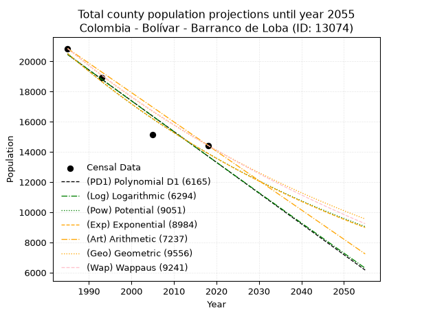
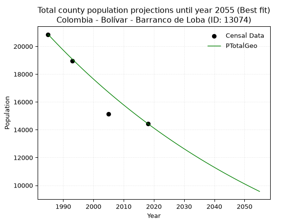
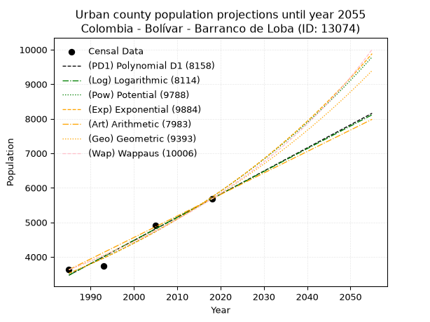
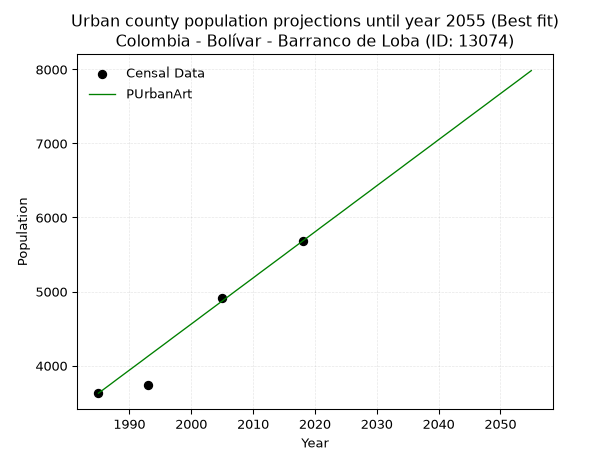
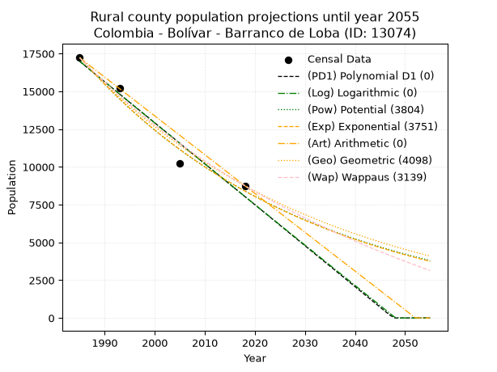
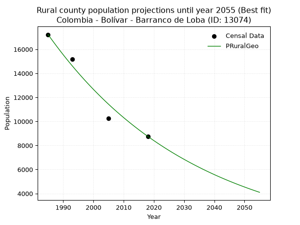

<div align="center">


</div>

# 📜 _“Population and Public Services Demand Projections (PPSD) until Year 2050 for Colombia - Bolívar - Barranco de Loba (ID: 13074)”_
Keywords: `population` `public-service` `projection` `lineal` `polynomial` `logarithmic` `potential` `exponential` `arithmetic` `geometric` `wappaus` `dane` `colombia` `south-america`

PPSD are analytical estimates used by governments and planners to anticipate future changes in population size, age distribution, and the resulting community needs for utilities, healthcare, education, and infrastructure as sizing future water treatment facilities, electrical grids, and road networks based on spatial growth.

<div align="center">

</img>

</div>


> **General running parameters**: • app_version: _v20260806_. • Python version: _3.14.7_. • Pandas version: _3.0.5_. • NumPy version: _2.5.1_. • Creates, save and include plots into reports (create_plot): _False_. • Projection until year: _2050_. • Process polynomial degree 2 and up: _False_. • Process Wappaus: _True_. • Process Wappaus: _True_. • Set negative values to zero: _True_. • Set infinite values to zero: _True_. • Drop dataset notes: _True_. 
<div align="center">

Maps & GIS Layers: [:earth_americas:Google](http://maps.google.com/maps?q=8.947787181,-74.1043906) [:earth_americas:OSM](https://www.openstreetmap.org/#map=18/8.947787181/-74.1043906&layers=P) [:earth_americas:Bing](https://www.bing.com/maps?cp=8.947787181~-74.1043906&lvl=18) [:earth_americas:Apple](https://maps.apple.com/frame?center=8.947787181%2C-74.1043906&span=0.003%2C0.006) [:earth_americas:GISMobile](https://github.com/rcfdtools/R.GISMobile/blob/main/file/gis/CountyLayer_CO/Readme.md)

</div>


<div align="center">

```geojson
{
  "type": "Feature",
  "geometry": {
    "type": "Point", 
    "coordinates": [-74.1043906, 8.947787181]
  }, 
  "properties": {
    "Name": "Colombia - Bolívar - Barranco de Loba (ID: 13074)"
  }
}
```

</div>


## 0. Census Data (4 records)

Census data are official statistics collected by a government about the people and housing in a country. They usually include counts of total population, age, sex, race, income, education, and jobs.

📅Global census file: [Population.xlsx](../data/Population.xlsx)

| Source   |   Year |   CountryID | CountryName   |   StateID | StateName   |   CountyID | CountyName       |   PTotal |   PUrban |   PRural |
|:---------|-------:|------------:|:--------------|----------:|:------------|-----------:|:-----------------|---------:|---------:|---------:|
| DANE     |   1985 |          57 | Colombia      |        13 | Bolívar     |      13074 | Barranco de Loba |    20855 |     3628 |    17227 |
| DANE     |   1993 |          57 | Colombia      |        13 | Bolívar     |      13074 | Barranco de Loba |    18935 |     3743 |    15192 |
| DANE     |   2005 |          57 | Colombia      |        13 | Bolívar     |      13074 | Barranco de Loba |    15148 |     4913 |    10235 |
| DANE     |   2018 |          57 | Colombia      |        13 | Bolívar     |      13074 | Barranco de Loba |    14435 |     5681 |     8754 |

> 🔥Some records could had specific notes about the registered values or the corresponding urban or rural distribution.

📅[SUI-RUPS](https://www.datos.gov.co/Hacienda-y-Cr-dito-P-blico/Registro-nico-de-Prestadores-de-Servicios-P-blicos/4qkq-csdn/about_data) - Local public utility companies: [RUPS.csv](../data/RUPS.csv)

 | SERVICIO   | ESTADO    | NOMBRE                                                                  | NIT         | DEPARTAMENTO_DOMICILIO   | MUNICIPIO_DOMICILIO   | DIRECCION                                 |   TELEFONO | EMAIL                    | TIPO_PRESTADOR                            | CLASIFICACION                 |
|:-----------|:----------|:------------------------------------------------------------------------|:------------|:-------------------------|:----------------------|:------------------------------------------|-----------:|:-------------------------|:------------------------------------------|:------------------------------|
| ACUEDUCTO  | OPERATIVA | EMPRESA DE SERVICIOS PUBLICOS DE ACUEDUCTO DE  BARRANCO DE LOBA-BOLIVAR | 900119613-2 | BOLIVAR                  | BARRANCO DE LOBA      | Carrera 4 calle 9  59 barrio Pueblo Nuevo |    4290784 | manuelbayter@hotmail.com | EMPRESA INDUSTRIAL Y COMERCIAL DEL ESTADO | HASTA 2500 SUSCRIPTORES       |
| ACUEDUCTO  | OPERATIVA | ADMINISTRACIÓN PÚBLICA COOPERATIVA DE BARRANCO DE LOBA BOLÍVAR          | 900471158-1 | BOLIVAR                  | BARRANCO DE LOBA      | Cra 4 Nº9-59 Barrio Pueblo Nuevo          |    4290734 | cooserbaresp@hotmail.com | ORGANIZACION AUTORIZADA                   | MENOR O IGUAL A 2500 USUARIOS |

## 1. Total

### 1.1. Coefficients and Parameters

* (PD1) Polynomial Deg 1: -204.16419108791578, 425722.6732236036 (lineal)
* (Log) Logarithmic: -408896.88430478796, 3125371.744294682
* (Pow) Potential: -23.633957802715116, 82.25154893617672
* (Exp) Exponential: -0.011801486448788897, 306185142636013.6
* (Art) Arithmetic: Year diff. 2018 - 1985 = 33, Population diff. 14435 - 20855 = -6420, Annual growth = -194.54545454545453
* (Geo) Geometric: Year diff. 2018 - 1985 = 33, Population diff. 14435 - 20855 = -6420, Annual growth % = -0.011087706974509226
* (Wap) Wappaus: i = -1.1025528735928283, Condition values only valid for < 200)

<sub>
Wappaus condition values: ['-0.00', '-1.10', '-2.21', '-3.31', '-4.41', '-5.51', '-6.62', '-7.72', '-8.82', '-9.92', '-11.03', '-12.13', '-13.23', '-14.33', '-15.44', '-16.54', '-17.64', '-18.74', '-19.85', '-20.95', '-22.05', '-23.15', '-24.26', '-25.36', '-26.46', '-27.56', '-28.67', '-29.77', '-30.87', '-31.97', '-33.08', '-34.18', '-35.28', '-36.38', '-37.49', '-38.59', '-39.69', '-40.79', '-41.90', '-43.00', '-44.10', '-45.20', '-46.31', '-47.41', '-48.51', '-49.61', '-50.72', '-51.82', '-52.92', '-54.03', '-55.13', '-56.23', '-57.33', '-58.44', '-59.54', '-60.64', '-61.74', '-62.85', '-63.95', '-65.05', '-66.15', '-67.26', '-68.36', '-69.46', '-70.56', '-71.67']
</sub>


### 1.2. Projected Dataset

|   Year |   CountyID |   PTotalPD1 |   PTotalLog |   PTotalPow |   PTotalExp |   PTotalArt |   PTotalGeo |   PTotalWap |
|-------:|-----------:|------------:|------------:|------------:|------------:|------------:|------------:|------------:|
|   1985 |      13074 |       20457 |       20465 |       20531 |       20522 |       20855 |       20855 |       20855 |
|   1986 |      13074 |       20253 |       20259 |       20288 |       20281 |       20660 |       20624 |       20626 |
|   1987 |      13074 |       20048 |       20053 |       20048 |       20043 |       20466 |       20395 |       20400 |
|   1988 |      13074 |       19844 |       19847 |       19811 |       19808 |       20271 |       20169 |       20176 |
|   1989 |      13074 |       19640 |       19642 |       19577 |       19576 |       20077 |       19945 |       19955 |
|   1990 |      13074 |       19436 |       19436 |       19346 |       19346 |       19882 |       19724 |       19736 |
|   1991 |      13074 |       19232 |       19231 |       19118 |       19119 |       19688 |       19505 |       19520 |
|   1992 |      13074 |       19028 |       19025 |       18892 |       18895 |       19493 |       19289 |       19305 |
|   1993 |      13074 |       18823 |       18820 |       18669 |       18673 |       19299 |       19075 |       19093 |
|   1994 |      13074 |       18619 |       18615 |       18449 |       18454 |       19104 |       18864 |       18883 |
|   1995 |      13074 |       18415 |       18410 |       18232 |       18238 |       18910 |       18655 |       18676 |
|   1996 |      13074 |       18211 |       18205 |       18017 |       18024 |       18715 |       18448 |       18470 |
|   1997 |      13074 |       18007 |       18000 |       17805 |       17812 |       18520 |       18243 |       18267 |
|   1998 |      13074 |       17803 |       17796 |       17596 |       17603 |       18326 |       18041 |       18066 |
|   1999 |      13074 |       17598 |       17591 |       17389 |       17397 |       18131 |       17841 |       17867 |
|   2000 |      13074 |       17394 |       17386 |       17185 |       17193 |       17937 |       17643 |       17669 |
|   2001 |      13074 |       17190 |       17182 |       16983 |       16991 |       17742 |       17448 |       17474 |
|   2002 |      13074 |       16986 |       16978 |       16784 |       16792 |       17548 |       17254 |       17281 |
|   2003 |      13074 |       16782 |       16774 |       16587 |       16595 |       17353 |       17063 |       17090 |
|   2004 |      13074 |       16578 |       16569 |       16392 |       16400 |       17159 |       16874 |       16900 |
|   2005 |      13074 |       16373 |       16365 |       16200 |       16208 |       16964 |       16687 |       16713 |
|   2006 |      13074 |       16169 |       16162 |       16010 |       16017 |       16770 |       16502 |       16527 |
|   2007 |      13074 |       15965 |       15958 |       15823 |       15829 |       16575 |       16319 |       16344 |
|   2008 |      13074 |       15761 |       15754 |       15638 |       15644 |       16380 |       16138 |       16162 |
|   2009 |      13074 |       15557 |       15551 |       15455 |       15460 |       16186 |       15959 |       15981 |
|   2010 |      13074 |       15353 |       15347 |       15274 |       15279 |       15991 |       15782 |       15803 |
|   2011 |      13074 |       15148 |       15144 |       15095 |       15100 |       15797 |       15607 |       15626 |
|   2012 |      13074 |       14944 |       14940 |       14919 |       14922 |       15602 |       15434 |       15451 |
|   2013 |      13074 |       14740 |       14737 |       14745 |       14747 |       15408 |       15263 |       15278 |
|   2014 |      13074 |       14536 |       14534 |       14573 |       14574 |       15213 |       15093 |       15106 |
|   2015 |      13074 |       14332 |       14331 |       14403 |       14403 |       15019 |       14926 |       14936 |
|   2016 |      13074 |       14128 |       14128 |       14235 |       14234 |       14824 |       14761 |       14767 |
|   2017 |      13074 |       13923 |       13925 |       14069 |       14067 |       14630 |       14597 |       14600 |
|   2018 |      13074 |       13719 |       13723 |       13905 |       13902 |       14435 |       14435 |       14435 |
|   2019 |      13074 |       13515 |       13520 |       13743 |       13739 |       14240 |       14275 |       14271 |
|   2020 |      13074 |       13311 |       13318 |       13584 |       13578 |       14046 |       14117 |       14109 |
|   2021 |      13074 |       13107 |       13115 |       13426 |       13419 |       13851 |       13960 |       13948 |
|   2022 |      13074 |       12903 |       12913 |       13270 |       13261 |       13657 |       13805 |       13789 |
|   2023 |      13074 |       12699 |       12711 |       13115 |       13106 |       13462 |       13652 |       13631 |
|   2024 |      13074 |       12494 |       12509 |       12963 |       12952 |       13268 |       13501 |       13474 |
|   2025 |      13074 |       12290 |       12307 |       12813 |       12800 |       13073 |       13351 |       13319 |
|   2026 |      13074 |       12086 |       12105 |       12664 |       12650 |       12879 |       13203 |       13166 |
|   2027 |      13074 |       11882 |       11903 |       12517 |       12501 |       12684 |       13057 |       13013 |
|   2028 |      13074 |       11678 |       11702 |       12372 |       12355 |       12490 |       12912 |       12862 |
|   2029 |      13074 |       11474 |       11500 |       12229 |       12210 |       12295 |       12769 |       12713 |
|   2030 |      13074 |       11269 |       11299 |       12087 |       12067 |       12100 |       12627 |       12564 |
|   2031 |      13074 |       11065 |       11097 |       11947 |       11925 |       11906 |       12487 |       12418 |
|   2032 |      13074 |       10861 |       10896 |       11809 |       11785 |       11711 |       12349 |       12272 |
|   2033 |      13074 |       10657 |       10695 |       11673 |       11647 |       11517 |       12212 |       12127 |
|   2034 |      13074 |       10453 |       10494 |       11538 |       11510 |       11322 |       12077 |       11984 |
|   2035 |      13074 |       10249 |       10293 |       11405 |       11375 |       11128 |       11943 |       11842 |
|   2036 |      13074 |       10044 |       10092 |       11273 |       11242 |       10933 |       11810 |       11702 |
|   2037 |      13074 |        9840 |        9891 |       11143 |       11110 |       10739 |       11679 |       11562 |
|   2038 |      13074 |        9636 |        9690 |       11014 |       10979 |       10544 |       11550 |       11424 |
|   2039 |      13074 |        9432 |        9490 |       10887 |       10851 |       10350 |       11422 |       11287 |
|   2040 |      13074 |        9228 |        9289 |       10762 |       10723 |       10155 |       11295 |       11151 |
|   2041 |      13074 |        9024 |        9089 |       10638 |       10598 |        9960 |       11170 |       11016 |
|   2042 |      13074 |        8819 |        8888 |       10516 |       10473 |        9766 |       11046 |       10882 |
|   2043 |      13074 |        8615 |        8688 |       10395 |       10350 |        9571 |       10923 |       10750 |
|   2044 |      13074 |        8411 |        8488 |       10275 |       10229 |        9377 |       10802 |       10618 |
|   2045 |      13074 |        8207 |        8288 |       10157 |       10109 |        9182 |       10683 |       10488 |
|   2046 |      13074 |        8003 |        8088 |       10040 |        9990 |        8988 |       10564 |       10359 |
|   2047 |      13074 |        7799 |        7889 |        9925 |        9873 |        8793 |       10447 |       10230 |
|   2048 |      13074 |        7594 |        7689 |        9811 |        9757 |        8599 |       10331 |       10103 |
|   2049 |      13074 |        7390 |        7489 |        9699 |        9643 |        8404 |       10217 |        9977 |
|   2050 |      13074 |        7186 |        7290 |        9587 |        9530 |        8210 |       10103 |        9852 |
<div align="center">

</img>

</div>


### 1.3. Best fit with absolute and relative error (%)

Relative error puts that difference into context by dividing the absolute error by the true value, creating a unitless ratio or percentage that shows the scale of the mistake.

Absolute and relative error

|   Year | Source   |   CountryID | CountryName   |   StateID | StateName   |   CountyID_x | CountyName       |   PTotal |   PUrban |   PRural |   CountyID_y |   PTotalPD1 |   PTotalLog |   PTotalPow |   PTotalExp |   PTotalArt |   PTotalGeo |   PTotalWap |   PTotalPD1AbsError |   PTotalLogAbsError |   PTotalPowAbsError |   PTotalExpAbsError |   PTotalArtAbsError |   PTotalGeoAbsError |   PTotalWapAbsError |   PTotalPD1RelError |   PTotalLogRelError |   PTotalPowRelError |   PTotalExpRelError |   PTotalArtRelError |   PTotalGeoRelError |   PTotalWapRelError |
|-------:|:---------|------------:|:--------------|----------:|:------------|-------------:|:-----------------|---------:|---------:|---------:|-------------:|------------:|------------:|------------:|------------:|------------:|------------:|------------:|--------------------:|--------------------:|--------------------:|--------------------:|--------------------:|--------------------:|--------------------:|--------------------:|--------------------:|--------------------:|--------------------:|--------------------:|--------------------:|--------------------:|
|   1985 | DANE     |          57 | Colombia      |        13 | Bolívar     |        13074 | Barranco de Loba |    20855 |     3628 |    17227 |        13074 |       20457 |       20465 |       20531 |       20522 |       20855 |       20855 |       20855 |                 398 |                 390 |                 324 |                 333 |                   0 |                   0 |                   0 |            1.90842  |            1.87006  |             1.55358 |             1.59674 |             0       |            0        |            0        |
|   1993 | DANE     |          57 | Colombia      |        13 | Bolívar     |        13074 | Barranco de Loba |    18935 |     3743 |    15192 |        13074 |       18823 |       18820 |       18669 |       18673 |       19299 |       19075 |       19093 |                 112 |                 115 |                 266 |                 262 |                 364 |                 140 |                 158 |            0.591497 |            0.607341 |             1.40481 |             1.38368 |             1.92237 |            0.739372 |            0.834434 |
|   2005 | DANE     |          57 | Colombia      |        13 | Bolívar     |        13074 | Barranco de Loba |    15148 |     4913 |    10235 |        13074 |       16373 |       16365 |       16200 |       16208 |       16964 |       16687 |       16713 |                1225 |                1217 |                1052 |                1060 |                1816 |                1539 |                1565 |            8.08688  |            8.03406  |             6.94481 |             6.99762 |            11.9884  |           10.1598   |           10.3314   |
|   2018 | DANE     |          57 | Colombia      |        13 | Bolívar     |        13074 | Barranco de Loba |    14435 |     5681 |     8754 |        13074 |       13719 |       13723 |       13905 |       13902 |       14435 |       14435 |       14435 |                 716 |                 712 |                 530 |                 533 |                   0 |                   0 |                   0 |            4.96017  |            4.93246  |             3.67163 |             3.69241 |             0       |            0        |            0        |

Relative error mean

| Method    |   RelError | Best   |
|:----------|-----------:|:-------|
| PTotalPD1 |    3.88674 |        |
| PTotalLog |    3.86098 |        |
| PTotalPow |    3.39371 |        |
| PTotalExp |    3.41761 |        |
| PTotalArt |    3.47769 |        |
| PTotalGeo |    2.72478 | True   |
| PTotalWap |    2.79146 |        |

💙Best method: _**PTotalGeo**_
<div align="center">

</img>

</div>


### 1.4. Fresh water supply demand in liters per capita per day (lpcd)

The fresh water supply demand typically ranges from 100 to 300 liters per capita per day (lpcd) for standard domestic and municipal planning, though absolute survival minimums set by the World Health Organization are as low as 7.5 to 20 liters per day, and total consumption in high-income nations can exceed 400 liters.

> `CZ`: Level in meters above the sea level (masl)<br> `WS`: Fresh water supply demand in liters per capita per day (lpcd or l/h/d)<br> `WSAll`: Zonal fresh water supply demand in liters per second (l/s)<br> `A`: Zonal area in square meters<br> `DP`: Population density (people/hectare or p/ha)

Reference values (RAS Colombia)

|    CZ |   WS |
|------:|-----:|
|  1000 |  120 |
|  2000 |  130 |
| 99999 |  140 |

County shapefile geometry properties and water supply values

|   CountyID |     ATotal |   CZTotal |   WSTotal |
|-----------:|-----------:|----------:|----------:|
|      13074 | 4.3021e+08 |   77.4024 |       120 |

Projected values for best method: PTotalGeo

|   CountyID |   Year |   PTotalGeo |   DPTotal |   WSTotal |   WSTotalAll |
|-----------:|-------:|------------:|----------:|----------:|-------------:|
|      13074 |   1985 |       20855 |      0.48 |       120 |      28.9653 |
|      13074 |   1986 |       20624 |      0.48 |       120 |      28.6444 |
|      13074 |   1987 |       20395 |      0.47 |       120 |      28.3264 |
|      13074 |   1988 |       20169 |      0.47 |       120 |      28.0125 |
|      13074 |   1989 |       19945 |      0.46 |       120 |      27.7014 |
|      13074 |   1990 |       19724 |      0.46 |       120 |      27.3944 |
|      13074 |   1991 |       19505 |      0.45 |       120 |      27.0903 |
|      13074 |   1992 |       19289 |      0.45 |       120 |      26.7903 |
|      13074 |   1993 |       19075 |      0.44 |       120 |      26.4931 |
|      13074 |   1994 |       18864 |      0.44 |       120 |      26.2    |
|      13074 |   1995 |       18655 |      0.43 |       120 |      25.9097 |
|      13074 |   1996 |       18448 |      0.43 |       120 |      25.6222 |
|      13074 |   1997 |       18243 |      0.42 |       120 |      25.3375 |
|      13074 |   1998 |       18041 |      0.42 |       120 |      25.0569 |
|      13074 |   1999 |       17841 |      0.41 |       120 |      24.7792 |
|      13074 |   2000 |       17643 |      0.41 |       120 |      24.5042 |
|      13074 |   2001 |       17448 |      0.41 |       120 |      24.2333 |
|      13074 |   2002 |       17254 |      0.4  |       120 |      23.9639 |
|      13074 |   2003 |       17063 |      0.4  |       120 |      23.6986 |
|      13074 |   2004 |       16874 |      0.39 |       120 |      23.4361 |
|      13074 |   2005 |       16687 |      0.39 |       120 |      23.1764 |
|      13074 |   2006 |       16502 |      0.38 |       120 |      22.9194 |
|      13074 |   2007 |       16319 |      0.38 |       120 |      22.6653 |
|      13074 |   2008 |       16138 |      0.38 |       120 |      22.4139 |
|      13074 |   2009 |       15959 |      0.37 |       120 |      22.1653 |
|      13074 |   2010 |       15782 |      0.37 |       120 |      21.9194 |
|      13074 |   2011 |       15607 |      0.36 |       120 |      21.6764 |
|      13074 |   2012 |       15434 |      0.36 |       120 |      21.4361 |
|      13074 |   2013 |       15263 |      0.35 |       120 |      21.1986 |
|      13074 |   2014 |       15093 |      0.35 |       120 |      20.9625 |
|      13074 |   2015 |       14926 |      0.35 |       120 |      20.7306 |
|      13074 |   2016 |       14761 |      0.34 |       120 |      20.5014 |
|      13074 |   2017 |       14597 |      0.34 |       120 |      20.2736 |
|      13074 |   2018 |       14435 |      0.34 |       120 |      20.0486 |
|      13074 |   2019 |       14275 |      0.33 |       120 |      19.8264 |
|      13074 |   2020 |       14117 |      0.33 |       120 |      19.6069 |
|      13074 |   2021 |       13960 |      0.32 |       120 |      19.3889 |
|      13074 |   2022 |       13805 |      0.32 |       120 |      19.1736 |
|      13074 |   2023 |       13652 |      0.32 |       120 |      18.9611 |
|      13074 |   2024 |       13501 |      0.31 |       120 |      18.7514 |
|      13074 |   2025 |       13351 |      0.31 |       120 |      18.5431 |
|      13074 |   2026 |       13203 |      0.31 |       120 |      18.3375 |
|      13074 |   2027 |       13057 |      0.3  |       120 |      18.1347 |
|      13074 |   2028 |       12912 |      0.3  |       120 |      17.9333 |
|      13074 |   2029 |       12769 |      0.3  |       120 |      17.7347 |
|      13074 |   2030 |       12627 |      0.29 |       120 |      17.5375 |
|      13074 |   2031 |       12487 |      0.29 |       120 |      17.3431 |
|      13074 |   2032 |       12349 |      0.29 |       120 |      17.1514 |
|      13074 |   2033 |       12212 |      0.28 |       120 |      16.9611 |
|      13074 |   2034 |       12077 |      0.28 |       120 |      16.7736 |
|      13074 |   2035 |       11943 |      0.28 |       120 |      16.5875 |
|      13074 |   2036 |       11810 |      0.27 |       120 |      16.4028 |
|      13074 |   2037 |       11679 |      0.27 |       120 |      16.2208 |
|      13074 |   2038 |       11550 |      0.27 |       120 |      16.0417 |
|      13074 |   2039 |       11422 |      0.27 |       120 |      15.8639 |
|      13074 |   2040 |       11295 |      0.26 |       120 |      15.6875 |
|      13074 |   2041 |       11170 |      0.26 |       120 |      15.5139 |
|      13074 |   2042 |       11046 |      0.26 |       120 |      15.3417 |
|      13074 |   2043 |       10923 |      0.25 |       120 |      15.1708 |
|      13074 |   2044 |       10802 |      0.25 |       120 |      15.0028 |
|      13074 |   2045 |       10683 |      0.25 |       120 |      14.8375 |
|      13074 |   2046 |       10564 |      0.25 |       120 |      14.6722 |
|      13074 |   2047 |       10447 |      0.24 |       120 |      14.5097 |
|      13074 |   2048 |       10331 |      0.24 |       120 |      14.3486 |
|      13074 |   2049 |       10217 |      0.24 |       120 |      14.1903 |
|      13074 |   2050 |       10103 |      0.23 |       120 |      14.0319 |

## 2. Urban

### 2.1. Coefficients and Parameters

* (PD1) Polynomial Deg 1: 66.97832195905204, -129482.13849859386 (lineal)
* (Log) Logarithmic: 134044.50398702995, -1014382.098970656
* (Pow) Potential: 29.484901066939347, -93.68722980852114
* (Exp) Exponential: 0.014731247622719674, 7.041515370947738e-10
* (Art) Arithmetic: Year diff. 2018 - 1985 = 33, Population diff. 5681 - 3628 = 2053, Annual growth = 62.21212121212121
* (Geo) Geometric: Year diff. 2018 - 1985 = 33, Population diff. 5681 - 3628 = 2053, Annual growth % = 0.01368201862412155
* (Wap) Wappaus: i = 1.336601594416612, Condition values only valid for < 200)

<sub>
Wappaus condition values: ['0.00', '1.34', '2.67', '4.01', '5.35', '6.68', '8.02', '9.36', '10.69', '12.03', '13.37', '14.70', '16.04', '17.38', '18.71', '20.05', '21.39', '22.72', '24.06', '25.40', '26.73', '28.07', '29.41', '30.74', '32.08', '33.42', '34.75', '36.09', '37.42', '38.76', '40.10', '41.43', '42.77', '44.11', '45.44', '46.78', '48.12', '49.45', '50.79', '52.13', '53.46', '54.80', '56.14', '57.47', '58.81', '60.15', '61.48', '62.82', '64.16', '65.49', '66.83', '68.17', '69.50', '70.84', '72.18', '73.51', '74.85', '76.19', '77.52', '78.86', '80.20', '81.53', '82.87', '84.21', '85.54', '86.88']
</sub>


### 2.2. Projected Dataset

|   Year |   CountyID |   PUrbanPD1 |   PUrbanLog |   PUrbanPow |   PUrbanExp |   PUrbanArt |   PUrbanGeo |   PUrbanWap |
|-------:|-----------:|------------:|------------:|------------:|------------:|------------:|------------:|------------:|
|   1985 |      13074 |        3470 |        3468 |        3523 |        3525 |        3628 |        3628 |        3628 |
|   1986 |      13074 |        3537 |        3535 |        3576 |        3577 |        3690 |        3678 |        3677 |
|   1987 |      13074 |        3604 |        3603 |        3629 |        3630 |        3752 |        3728 |        3726 |
|   1988 |      13074 |        3671 |        3670 |        3683 |        3684 |        3815 |        3779 |        3776 |
|   1989 |      13074 |        3738 |        3738 |        3738 |        3738 |        3877 |        3831 |        3827 |
|   1990 |      13074 |        3805 |        3805 |        3794 |        3794 |        3939 |        3883 |        3879 |
|   1991 |      13074 |        3872 |        3873 |        3851 |        3850 |        4001 |        3936 |        3931 |
|   1992 |      13074 |        3939 |        3940 |        3908 |        3907 |        4063 |        3990 |        3984 |
|   1993 |      13074 |        4006 |        4007 |        3967 |        3965 |        4126 |        4045 |        4038 |
|   1994 |      13074 |        4073 |        4074 |        4026 |        4024 |        4188 |        4100 |        4092 |
|   1995 |      13074 |        4140 |        4142 |        4086 |        4084 |        4250 |        4156 |        4148 |
|   1996 |      13074 |        4207 |        4209 |        4146 |        4145 |        4312 |        4213 |        4204 |
|   1997 |      13074 |        4274 |        4276 |        4208 |        4206 |        4375 |        4271 |        4261 |
|   1998 |      13074 |        4341 |        4343 |        4271 |        4268 |        4437 |        4329 |        4318 |
|   1999 |      13074 |        4408 |        4410 |        4334 |        4332 |        4499 |        4388 |        4377 |
|   2000 |      13074 |        4475 |        4477 |        4399 |        4396 |        4561 |        4448 |        4436 |
|   2001 |      13074 |        4541 |        4544 |        4464 |        4461 |        4623 |        4509 |        4497 |
|   2002 |      13074 |        4608 |        4611 |        4530 |        4528 |        4686 |        4571 |        4558 |
|   2003 |      13074 |        4675 |        4678 |        4597 |        4595 |        4748 |        4633 |        4620 |
|   2004 |      13074 |        4742 |        4745 |        4665 |        4663 |        4810 |        4697 |        4683 |
|   2005 |      13074 |        4809 |        4812 |        4735 |        4732 |        4872 |        4761 |        4747 |
|   2006 |      13074 |        4876 |        4879 |        4805 |        4802 |        4934 |        4826 |        4813 |
|   2007 |      13074 |        4943 |        4945 |        4876 |        4874 |        4997 |        4892 |        4879 |
|   2008 |      13074 |        5010 |        5012 |        4948 |        4946 |        5059 |        4959 |        4946 |
|   2009 |      13074 |        5077 |        5079 |        5021 |        5019 |        5121 |        5027 |        5014 |
|   2010 |      13074 |        5144 |        5146 |        5095 |        5094 |        5183 |        5096 |        5083 |
|   2011 |      13074 |        5211 |        5212 |        5171 |        5169 |        5246 |        5166 |        5154 |
|   2012 |      13074 |        5278 |        5279 |        5247 |        5246 |        5308 |        5236 |        5226 |
|   2013 |      13074 |        5345 |        5346 |        5324 |        5324 |        5370 |        5308 |        5298 |
|   2014 |      13074 |        5412 |        5412 |        5403 |        5403 |        5432 |        5380 |        5372 |
|   2015 |      13074 |        5479 |        5479 |        5483 |        5483 |        5494 |        5454 |        5448 |
|   2016 |      13074 |        5546 |        5545 |        5563 |        5565 |        5557 |        5529 |        5524 |
|   2017 |      13074 |        5613 |        5612 |        5645 |        5647 |        5619 |        5604 |        5602 |
|   2018 |      13074 |        5680 |        5678 |        5729 |        5731 |        5681 |        5681 |        5681 |
|   2019 |      13074 |        5747 |        5745 |        5813 |        5816 |        5743 |        5759 |        5762 |
|   2020 |      13074 |        5814 |        5811 |        5898 |        5902 |        5805 |        5838 |        5843 |
|   2021 |      13074 |        5881 |        5877 |        5985 |        5990 |        5868 |        5917 |        5927 |
|   2022 |      13074 |        5948 |        5944 |        6073 |        6079 |        5930 |        5998 |        6012 |
|   2023 |      13074 |        6015 |        6010 |        6162 |        6169 |        5992 |        6080 |        6098 |
|   2024 |      13074 |        6082 |        6076 |        6253 |        6261 |        6054 |        6164 |        6186 |
|   2025 |      13074 |        6149 |        6142 |        6344 |        6353 |        6116 |        6248 |        6275 |
|   2026 |      13074 |        6216 |        6208 |        6437 |        6448 |        6179 |        6333 |        6367 |
|   2027 |      13074 |        6283 |        6275 |        6532 |        6543 |        6241 |        6420 |        6459 |
|   2028 |      13074 |        6350 |        6341 |        6627 |        6641 |        6303 |        6508 |        6554 |
|   2029 |      13074 |        6417 |        6407 |        6724 |        6739 |        6365 |        6597 |        6650 |
|   2030 |      13074 |        6484 |        6473 |        6823 |        6839 |        6428 |        6687 |        6749 |
|   2031 |      13074 |        6551 |        6539 |        6923 |        6941 |        6490 |        6779 |        6849 |
|   2032 |      13074 |        6618 |        6605 |        7024 |        7044 |        6552 |        6871 |        6951 |
|   2033 |      13074 |        6685 |        6671 |        7126 |        7148 |        6614 |        6965 |        7055 |
|   2034 |      13074 |        6752 |        6737 |        7231 |        7254 |        6676 |        7061 |        7161 |
|   2035 |      13074 |        6819 |        6803 |        7336 |        7362 |        6739 |        7157 |        7269 |
|   2036 |      13074 |        6886 |        6868 |        7443 |        7471 |        6801 |        7255 |        7380 |
|   2037 |      13074 |        6953 |        6934 |        7552 |        7582 |        6863 |        7355 |        7493 |
|   2038 |      13074 |        7020 |        7000 |        7662 |        7694 |        6925 |        7455 |        7608 |
|   2039 |      13074 |        7087 |        7066 |        7773 |        7809 |        6987 |        7557 |        7725 |
|   2040 |      13074 |        7154 |        7132 |        7887 |        7925 |        7050 |        7661 |        7845 |
|   2041 |      13074 |        7221 |        7197 |        8001 |        8042 |        7112 |        7765 |        7968 |
|   2042 |      13074 |        7288 |        7263 |        8118 |        8161 |        7174 |        7872 |        8093 |
|   2043 |      13074 |        7355 |        7329 |        8236 |        8283 |        7236 |        7979 |        8221 |
|   2044 |      13074 |        7422 |        7394 |        8355 |        8406 |        7299 |        8089 |        8351 |
|   2045 |      13074 |        7489 |        7460 |        8477 |        8530 |        7361 |        8199 |        8485 |
|   2046 |      13074 |        7556 |        7525 |        8600 |        8657 |        7423 |        8311 |        8622 |
|   2047 |      13074 |        7622 |        7591 |        8725 |        8785 |        7485 |        8425 |        8762 |
|   2048 |      13074 |        7689 |        7656 |        8851 |        8916 |        7547 |        8540 |        8905 |
|   2049 |      13074 |        7756 |        7722 |        8980 |        9048 |        7610 |        8657 |        9051 |
|   2050 |      13074 |        7823 |        7787 |        9110 |        9182 |        7672 |        8776 |        9201 |
<div align="center">

</img>

</div>


### 2.3. Best fit with absolute and relative error (%)

Relative error puts that difference into context by dividing the absolute error by the true value, creating a unitless ratio or percentage that shows the scale of the mistake.

Absolute and relative error

|   Year | Source   |   CountryID | CountryName   |   StateID | StateName   |   CountyID_x | CountyName       |   PTotal |   PUrban |   PRural |   CountyID_y |   PUrbanPD1 |   PUrbanLog |   PUrbanPow |   PUrbanExp |   PUrbanArt |   PUrbanGeo |   PUrbanWap |   PUrbanPD1AbsError |   PUrbanLogAbsError |   PUrbanPowAbsError |   PUrbanExpAbsError |   PUrbanArtAbsError |   PUrbanGeoAbsError |   PUrbanWapAbsError |   PUrbanPD1RelError |   PUrbanLogRelError |   PUrbanPowRelError |   PUrbanExpRelError |   PUrbanArtRelError |   PUrbanGeoRelError |   PUrbanWapRelError |
|-------:|:---------|------------:|:--------------|----------:|:------------|-------------:|:-----------------|---------:|---------:|---------:|-------------:|------------:|------------:|------------:|------------:|------------:|------------:|------------:|--------------------:|--------------------:|--------------------:|--------------------:|--------------------:|--------------------:|--------------------:|--------------------:|--------------------:|--------------------:|--------------------:|--------------------:|--------------------:|--------------------:|
|   1985 | DANE     |          57 | Colombia      |        13 | Bolívar     |        13074 | Barranco de Loba |    20855 |     3628 |    17227 |        13074 |        3470 |        3468 |        3523 |        3525 |        3628 |        3628 |        3628 |                 158 |                 160 |                 105 |                 103 |                   0 |                   0 |                   0 |           4.35502   |           4.41014   |            2.89416  |            2.83903  |            0        |             0       |             0       |
|   1993 | DANE     |          57 | Colombia      |        13 | Bolívar     |        13074 | Barranco de Loba |    18935 |     3743 |    15192 |        13074 |        4006 |        4007 |        3967 |        3965 |        4126 |        4045 |        4038 |                 263 |                 264 |                 224 |                 222 |                 383 |                 302 |                 295 |           7.02645   |           7.05317   |            5.9845   |            5.93107  |           10.2324   |             8.06839 |             7.88138 |
|   2005 | DANE     |          57 | Colombia      |        13 | Bolívar     |        13074 | Barranco de Loba |    15148 |     4913 |    10235 |        13074 |        4809 |        4812 |        4735 |        4732 |        4872 |        4761 |        4747 |                 104 |                 101 |                 178 |                 181 |                  41 |                 152 |                 166 |           2.11683   |           2.05577   |            3.62304  |            3.6841   |            0.834521 |             3.09383 |             3.37879 |
|   2018 | DANE     |          57 | Colombia      |        13 | Bolívar     |        13074 | Barranco de Loba |    14435 |     5681 |     8754 |        13074 |        5680 |        5678 |        5729 |        5731 |        5681 |        5681 |        5681 |                   1 |                   3 |                  48 |                  50 |                   0 |                   0 |                   0 |           0.0176025 |           0.0528076 |            0.844922 |            0.880127 |            0        |             0       |             0       |

Relative error mean

| Method    |   RelError | Best   |
|:----------|-----------:|:-------|
| PUrbanPD1 |    3.37898 |        |
| PUrbanLog |    3.39297 |        |
| PUrbanPow |    3.33666 |        |
| PUrbanExp |    3.33358 |        |
| PUrbanArt |    2.76674 | True   |
| PUrbanGeo |    2.79056 |        |
| PUrbanWap |    2.81504 |        |

💙Best method: _**PUrbanArt**_
<div align="center">

</img>

</div>


### 2.4. Fresh water supply demand in liters per capita per day (lpcd)

The fresh water supply demand typically ranges from 100 to 300 liters per capita per day (lpcd) for standard domestic and municipal planning, though absolute survival minimums set by the World Health Organization are as low as 7.5 to 20 liters per day, and total consumption in high-income nations can exceed 400 liters.

> `CZ`: Level in meters above the sea level (masl)<br> `WS`: Fresh water supply demand in liters per capita per day (lpcd or l/h/d)<br> `WSAll`: Zonal fresh water supply demand in liters per second (l/s)<br> `A`: Zonal area in square meters<br> `DP`: Population density (people/hectare or p/ha)

Reference values (RAS Colombia)

|    CZ |   WS |
|------:|-----:|
|  1000 |  120 |
|  2000 |  130 |
| 99999 |  140 |

County shapefile geometry properties and water supply values

|   CountyID |      AUrban |   CZUrban |   WSUrban |
|-----------:|------------:|----------:|----------:|
|      13074 | 2.22372e+06 |   29.4968 |       120 |

Projected values for best method: PUrbanArt

|   CountyID |   Year |   PUrbanArt |   DPUrban |   WSUrban |   WSUrbanAll |
|-----------:|-------:|------------:|----------:|----------:|-------------:|
|      13074 |   1985 |        3628 |     16.32 |       120 |      5.03889 |
|      13074 |   1986 |        3690 |     16.59 |       120 |      5.125   |
|      13074 |   1987 |        3752 |     16.87 |       120 |      5.21111 |
|      13074 |   1988 |        3815 |     17.16 |       120 |      5.29861 |
|      13074 |   1989 |        3877 |     17.43 |       120 |      5.38472 |
|      13074 |   1990 |        3939 |     17.71 |       120 |      5.47083 |
|      13074 |   1991 |        4001 |     17.99 |       120 |      5.55694 |
|      13074 |   1992 |        4063 |     18.27 |       120 |      5.64306 |
|      13074 |   1993 |        4126 |     18.55 |       120 |      5.73056 |
|      13074 |   1994 |        4188 |     18.83 |       120 |      5.81667 |
|      13074 |   1995 |        4250 |     19.11 |       120 |      5.90278 |
|      13074 |   1996 |        4312 |     19.39 |       120 |      5.98889 |
|      13074 |   1997 |        4375 |     19.67 |       120 |      6.07639 |
|      13074 |   1998 |        4437 |     19.95 |       120 |      6.1625  |
|      13074 |   1999 |        4499 |     20.23 |       120 |      6.24861 |
|      13074 |   2000 |        4561 |     20.51 |       120 |      6.33472 |
|      13074 |   2001 |        4623 |     20.79 |       120 |      6.42083 |
|      13074 |   2002 |        4686 |     21.07 |       120 |      6.50833 |
|      13074 |   2003 |        4748 |     21.35 |       120 |      6.59444 |
|      13074 |   2004 |        4810 |     21.63 |       120 |      6.68056 |
|      13074 |   2005 |        4872 |     21.91 |       120 |      6.76667 |
|      13074 |   2006 |        4934 |     22.19 |       120 |      6.85278 |
|      13074 |   2007 |        4997 |     22.47 |       120 |      6.94028 |
|      13074 |   2008 |        5059 |     22.75 |       120 |      7.02639 |
|      13074 |   2009 |        5121 |     23.03 |       120 |      7.1125  |
|      13074 |   2010 |        5183 |     23.31 |       120 |      7.19861 |
|      13074 |   2011 |        5246 |     23.59 |       120 |      7.28611 |
|      13074 |   2012 |        5308 |     23.87 |       120 |      7.37222 |
|      13074 |   2013 |        5370 |     24.15 |       120 |      7.45833 |
|      13074 |   2014 |        5432 |     24.43 |       120 |      7.54444 |
|      13074 |   2015 |        5494 |     24.71 |       120 |      7.63056 |
|      13074 |   2016 |        5557 |     24.99 |       120 |      7.71806 |
|      13074 |   2017 |        5619 |     25.27 |       120 |      7.80417 |
|      13074 |   2018 |        5681 |     25.55 |       120 |      7.89028 |
|      13074 |   2019 |        5743 |     25.83 |       120 |      7.97639 |
|      13074 |   2020 |        5805 |     26.1  |       120 |      8.0625  |
|      13074 |   2021 |        5868 |     26.39 |       120 |      8.15    |
|      13074 |   2022 |        5930 |     26.67 |       120 |      8.23611 |
|      13074 |   2023 |        5992 |     26.95 |       120 |      8.32222 |
|      13074 |   2024 |        6054 |     27.22 |       120 |      8.40833 |
|      13074 |   2025 |        6116 |     27.5  |       120 |      8.49444 |
|      13074 |   2026 |        6179 |     27.79 |       120 |      8.58194 |
|      13074 |   2027 |        6241 |     28.07 |       120 |      8.66806 |
|      13074 |   2028 |        6303 |     28.34 |       120 |      8.75417 |
|      13074 |   2029 |        6365 |     28.62 |       120 |      8.84028 |
|      13074 |   2030 |        6428 |     28.91 |       120 |      8.92778 |
|      13074 |   2031 |        6490 |     29.19 |       120 |      9.01389 |
|      13074 |   2032 |        6552 |     29.46 |       120 |      9.1     |
|      13074 |   2033 |        6614 |     29.74 |       120 |      9.18611 |
|      13074 |   2034 |        6676 |     30.02 |       120 |      9.27222 |
|      13074 |   2035 |        6739 |     30.31 |       120 |      9.35972 |
|      13074 |   2036 |        6801 |     30.58 |       120 |      9.44583 |
|      13074 |   2037 |        6863 |     30.86 |       120 |      9.53194 |
|      13074 |   2038 |        6925 |     31.14 |       120 |      9.61806 |
|      13074 |   2039 |        6987 |     31.42 |       120 |      9.70417 |
|      13074 |   2040 |        7050 |     31.7  |       120 |      9.79167 |
|      13074 |   2041 |        7112 |     31.98 |       120 |      9.87778 |
|      13074 |   2042 |        7174 |     32.26 |       120 |      9.96389 |
|      13074 |   2043 |        7236 |     32.54 |       120 |     10.05    |
|      13074 |   2044 |        7299 |     32.82 |       120 |     10.1375  |
|      13074 |   2045 |        7361 |     33.1  |       120 |     10.2236  |
|      13074 |   2046 |        7423 |     33.38 |       120 |     10.3097  |
|      13074 |   2047 |        7485 |     33.66 |       120 |     10.3958  |
|      13074 |   2048 |        7547 |     33.94 |       120 |     10.4819  |
|      13074 |   2049 |        7610 |     34.22 |       120 |     10.5694  |
|      13074 |   2050 |        7672 |     34.5  |       120 |     10.6556  |

## 3. Rural

### 3.1. Coefficients and Parameters

* (PD1) Polynomial Deg 1: -271.14251304696785, 555204.8117221976 (lineal)
* (Log) Logarithmic: -542941.3882918177, 4139753.8432653365
* (Pow) Potential: -43.65212458681905, 148.19150346310914
* (Exp) Exponential: -0.021803187380320232, 1.078710569337144e+23
* (Art) Arithmetic: Year diff. 2018 - 1985 = 33, Population diff. 8754 - 17227 = -8473, Annual growth = -256.75757575757575
* (Geo) Geometric: Year diff. 2018 - 1985 = 33, Population diff. 8754 - 17227 = -8473, Annual growth % = -0.020305173183970404
* (Wap) Wappaus: i = -1.9765026423738559, Condition values only valid for < 200)

<sub>
Wappaus condition values: ['-0.00', '-1.98', '-3.95', '-5.93', '-7.91', '-9.88', '-11.86', '-13.84', '-15.81', '-17.79', '-19.77', '-21.74', '-23.72', '-25.69', '-27.67', '-29.65', '-31.62', '-33.60', '-35.58', '-37.55', '-39.53', '-41.51', '-43.48', '-45.46', '-47.44', '-49.41', '-51.39', '-53.37', '-55.34', '-57.32', '-59.30', '-61.27', '-63.25', '-65.22', '-67.20', '-69.18', '-71.15', '-73.13', '-75.11', '-77.08', '-79.06', '-81.04', '-83.01', '-84.99', '-86.97', '-88.94', '-90.92', '-92.90', '-94.87', '-96.85', '-98.83', '-100.80', '-102.78', '-104.75', '-106.73', '-108.71', '-110.68', '-112.66', '-114.64', '-116.61', '-118.59', '-120.57', '-122.54', '-124.52', '-126.50', '-128.47']
</sub>


### 3.2. Projected Dataset

|   Year |   CountyID |   PRuralPD1 |   PRuralLog |   PRuralPow |   PRuralExp |   PRuralArt |   PRuralGeo |   PRuralWap |
|-------:|-----------:|------------:|------------:|------------:|------------:|------------:|------------:|------------:|
|   1985 |      13074 |       16987 |       16997 |       17268 |       17256 |       17227 |       17227 |       17227 |
|   1986 |      13074 |       16716 |       16723 |       16893 |       16884 |       16970 |       16877 |       16890 |
|   1987 |      13074 |       16445 |       16450 |       16526 |       16519 |       16713 |       16535 |       16559 |
|   1988 |      13074 |       16173 |       16177 |       16167 |       16163 |       16457 |       16199 |       16235 |
|   1989 |      13074 |       15902 |       15904 |       15816 |       15815 |       16200 |       15870 |       15917 |
|   1990 |      13074 |       15631 |       15631 |       15472 |       15473 |       15943 |       15548 |       15605 |
|   1991 |      13074 |       15360 |       15358 |       15137 |       15140 |       15686 |       15232 |       15298 |
|   1992 |      13074 |       15089 |       15085 |       14809 |       14813 |       15430 |       14923 |       14998 |
|   1993 |      13074 |       14818 |       14813 |       14488 |       14494 |       15173 |       14620 |       14703 |
|   1994 |      13074 |       14547 |       14541 |       14174 |       14181 |       14916 |       14323 |       14413 |
|   1995 |      13074 |       14275 |       14268 |       13867 |       13875 |       14659 |       14032 |       14128 |
|   1996 |      13074 |       14004 |       13996 |       13567 |       13576 |       14403 |       13747 |       13849 |
|   1997 |      13074 |       13733 |       13724 |       13274 |       13283 |       14146 |       13468 |       13574 |
|   1998 |      13074 |       13462 |       13453 |       12987 |       12997 |       13889 |       13194 |       13305 |
|   1999 |      13074 |       13191 |       13181 |       12706 |       12716 |       13632 |       12927 |       13039 |
|   2000 |      13074 |       12920 |       12909 |       12432 |       12442 |       13376 |       12664 |       12779 |
|   2001 |      13074 |       12649 |       12638 |       12163 |       12174 |       13119 |       12407 |       12523 |
|   2002 |      13074 |       12378 |       12367 |       11901 |       11911 |       12862 |       12155 |       12271 |
|   2003 |      13074 |       12106 |       12096 |       11644 |       11654 |       12605 |       11908 |       12024 |
|   2004 |      13074 |       11835 |       11825 |       11393 |       11403 |       12349 |       11666 |       11780 |
|   2005 |      13074 |       11564 |       11554 |       11148 |       11157 |       12092 |       11429 |       11541 |
|   2006 |      13074 |       11293 |       11283 |       10908 |       10916 |       11835 |       11197 |       11306 |
|   2007 |      13074 |       11022 |       11012 |       10673 |       10681 |       11578 |       10970 |       11074 |
|   2008 |      13074 |       10751 |       10742 |       10444 |       10451 |       11322 |       10747 |       10846 |
|   2009 |      13074 |       10480 |       10472 |       10219 |       10225 |       11065 |       10529 |       10622 |
|   2010 |      13074 |       10208 |       10201 |        9999 |       10005 |       10808 |       10315 |       10401 |
|   2011 |      13074 |        9937 |        9931 |        9785 |        9789 |       10551 |       10106 |       10184 |
|   2012 |      13074 |        9666 |        9661 |        9575 |        9578 |       10295 |        9901 |        9970 |
|   2013 |      13074 |        9395 |        9392 |        9369 |        9371 |       10038 |        9700 |        9760 |
|   2014 |      13074 |        9124 |        9122 |        9168 |        9169 |        9781 |        9503 |        9552 |
|   2015 |      13074 |        8853 |        8852 |        8972 |        8971 |        9524 |        9310 |        9348 |
|   2016 |      13074 |        8582 |        8583 |        8780 |        8778 |        9268 |        9121 |        9147 |
|   2017 |      13074 |        8310 |        8314 |        8592 |        8589 |        9011 |        8935 |        8949 |
|   2018 |      13074 |        8039 |        8045 |        8408 |        8403 |        8754 |        8754 |        8754 |
|   2019 |      13074 |        7768 |        7776 |        8228 |        8222 |        8497 |        8576 |        8562 |
|   2020 |      13074 |        7497 |        7507 |        8052 |        8045 |        8240 |        8402 |        8372 |
|   2021 |      13074 |        7226 |        7238 |        7880 |        7871 |        7984 |        8232 |        8186 |
|   2022 |      13074 |        6955 |        6970 |        7711 |        7702 |        7727 |        8064 |        8002 |
|   2023 |      13074 |        6684 |        6701 |        7547 |        7535 |        7470 |        7901 |        7821 |
|   2024 |      13074 |        6412 |        6433 |        7386 |        7373 |        7213 |        7740 |        7642 |
|   2025 |      13074 |        6141 |        6165 |        7228 |        7214 |        6957 |        7583 |        7466 |
|   2026 |      13074 |        5870 |        5897 |        7074 |        7058 |        6700 |        7429 |        7292 |
|   2027 |      13074 |        5599 |        5629 |        6923 |        6906 |        6443 |        7278 |        7121 |
|   2028 |      13074 |        5328 |        5361 |        6776 |        6757 |        6186 |        7130 |        6952 |
|   2029 |      13074 |        5057 |        5093 |        6632 |        6611 |        5930 |        6986 |        6786 |
|   2030 |      13074 |        4786 |        4826 |        6490 |        6469 |        5673 |        6844 |        6621 |
|   2031 |      13074 |        4514 |        4558 |        6352 |        6329 |        5416 |        6705 |        6459 |
|   2032 |      13074 |        4243 |        4291 |        6217 |        6193 |        5159 |        6569 |        6299 |
|   2033 |      13074 |        3972 |        4024 |        6085 |        6059 |        4903 |        6435 |        6142 |
|   2034 |      13074 |        3701 |        3757 |        5956 |        5929 |        4646 |        6305 |        5986 |
|   2035 |      13074 |        3430 |        3490 |        5830 |        5801 |        4389 |        6177 |        5833 |
|   2036 |      13074 |        3159 |        3223 |        5706 |        5676 |        4132 |        6051 |        5681 |
|   2037 |      13074 |        2888 |        2957 |        5585 |        5553 |        3876 |        5928 |        5532 |
|   2038 |      13074 |        2616 |        2690 |        5467 |        5433 |        3619 |        5808 |        5384 |
|   2039 |      13074 |        2345 |        2424 |        5351 |        5316 |        3362 |        5690 |        5238 |
|   2040 |      13074 |        2074 |        2158 |        5237 |        5202 |        3105 |        5574 |        5094 |
|   2041 |      13074 |        1803 |        1892 |        5127 |        5089 |        2849 |        5461 |        4952 |
|   2042 |      13074 |        1532 |        1626 |        5018 |        4980 |        2592 |        5350 |        4812 |
|   2043 |      13074 |        1261 |        1360 |        4912 |        4872 |        2335 |        5242 |        4674 |
|   2044 |      13074 |         990 |        1094 |        4808 |        4767 |        2078 |        5135 |        4537 |
|   2045 |      13074 |         718 |         829 |        4707 |        4664 |        1822 |        5031 |        4402 |
|   2046 |      13074 |         447 |         563 |        4607 |        4564 |        1565 |        4929 |        4269 |
|   2047 |      13074 |         176 |         298 |        4510 |        4465 |        1308 |        4829 |        4137 |
|   2048 |      13074 |           0 |          33 |        4415 |        4369 |        1051 |        4731 |        4007 |
|   2049 |      13074 |           0 |           0 |        4322 |        4275 |         795 |        4635 |        3878 |
|   2050 |      13074 |           0 |           0 |        4231 |        4183 |         538 |        4541 |        3751 |
<div align="center">

</img>

</div>


### 3.3. Best fit with absolute and relative error (%)

Relative error puts that difference into context by dividing the absolute error by the true value, creating a unitless ratio or percentage that shows the scale of the mistake.

Absolute and relative error

|   Year | Source   |   CountryID | CountryName   |   StateID | StateName   |   CountyID_x | CountyName       |   PTotal |   PUrban |   PRural |   CountyID_y |   PRuralPD1 |   PRuralLog |   PRuralPow |   PRuralExp |   PRuralArt |   PRuralGeo |   PRuralWap |   PRuralPD1AbsError |   PRuralLogAbsError |   PRuralPowAbsError |   PRuralExpAbsError |   PRuralArtAbsError |   PRuralGeoAbsError |   PRuralWapAbsError |   PRuralPD1RelError |   PRuralLogRelError |   PRuralPowRelError |   PRuralExpRelError |   PRuralArtRelError |   PRuralGeoRelError |   PRuralWapRelError |
|-------:|:---------|------------:|:--------------|----------:|:------------|-------------:|:-----------------|---------:|---------:|---------:|-------------:|------------:|------------:|------------:|------------:|------------:|------------:|------------:|--------------------:|--------------------:|--------------------:|--------------------:|--------------------:|--------------------:|--------------------:|--------------------:|--------------------:|--------------------:|--------------------:|--------------------:|--------------------:|--------------------:|
|   1985 | DANE     |          57 | Colombia      |        13 | Bolívar     |        13074 | Barranco de Loba |    20855 |     3628 |    17227 |        13074 |       16987 |       16997 |       17268 |       17256 |       17227 |       17227 |       17227 |                 240 |                 230 |                  41 |                  29 |                   0 |                   0 |                   0 |             1.39316 |             1.33511 |            0.237998 |             0.16834 |            0        |             0       |              0      |
|   1993 | DANE     |          57 | Colombia      |        13 | Bolívar     |        13074 | Barranco de Loba |    18935 |     3743 |    15192 |        13074 |       14818 |       14813 |       14488 |       14494 |       15173 |       14620 |       14703 |                 374 |                 379 |                 704 |                 698 |                  19 |                 572 |                 489 |             2.46182 |             2.49473 |            4.63402  |             4.59452 |            0.125066 |             3.76514 |              3.2188 |
|   2005 | DANE     |          57 | Colombia      |        13 | Bolívar     |        13074 | Barranco de Loba |    15148 |     4913 |    10235 |        13074 |       11564 |       11554 |       11148 |       11157 |       12092 |       11429 |       11541 |                1329 |                1319 |                 913 |                 922 |                1857 |                1194 |                1306 |            12.9849  |            12.8872  |            8.92037  |             9.0083  |           18.1436   |            11.6659  |             12.7601 |
|   2018 | DANE     |          57 | Colombia      |        13 | Bolívar     |        13074 | Barranco de Loba |    14435 |     5681 |     8754 |        13074 |        8039 |        8045 |        8408 |        8403 |        8754 |        8754 |        8754 |                 715 |                 709 |                 346 |                 351 |                   0 |                   0 |                   0 |             8.16769 |             8.09915 |            3.95248  |             4.0096  |            0        |             0       |              0      |

Relative error mean

| Method    |   RelError | Best   |
|:----------|-----------:|:-------|
| PRuralPD1 |    6.25188 |        |
| PRuralLog |    6.20404 |        |
| PRuralPow |    4.43622 |        |
| PRuralExp |    4.44519 |        |
| PRuralArt |    4.56717 |        |
| PRuralGeo |    3.85775 | True   |
| PRuralWap |    3.99473 |        |

💙Best method: _**PRuralGeo**_
<div align="center">

</img>

</div>


### 3.4. Fresh water supply demand in liters per capita per day (lpcd)

The fresh water supply demand typically ranges from 100 to 300 liters per capita per day (lpcd) for standard domestic and municipal planning, though absolute survival minimums set by the World Health Organization are as low as 7.5 to 20 liters per day, and total consumption in high-income nations can exceed 400 liters.

> `CZ`: Level in meters above the sea level (masl)<br> `WS`: Fresh water supply demand in liters per capita per day (lpcd or l/h/d)<br> `WSAll`: Zonal fresh water supply demand in liters per second (l/s)<br> `A`: Zonal area in square meters<br> `DP`: Population density (people/hectare or p/ha)

Reference values (RAS Colombia)

|    CZ |   WS |
|------:|-----:|
|  1000 |  120 |
|  2000 |  130 |
| 99999 |  140 |

County shapefile geometry properties and water supply values

|   CountyID |      ARural |   CZRural |   WSRural |
|-----------:|------------:|----------:|----------:|
|      13074 | 4.27986e+08 |   77.6467 |       120 |

Projected values for best method: PRuralGeo

|   CountyID |   Year |   PRuralGeo |   DPRural |   WSRural |   WSRuralAll |
|-----------:|-------:|------------:|----------:|----------:|-------------:|
|      13074 |   1985 |       17227 |      0.4  |       120 |     23.9264  |
|      13074 |   1986 |       16877 |      0.39 |       120 |     23.4403  |
|      13074 |   1987 |       16535 |      0.39 |       120 |     22.9653  |
|      13074 |   1988 |       16199 |      0.38 |       120 |     22.4986  |
|      13074 |   1989 |       15870 |      0.37 |       120 |     22.0417  |
|      13074 |   1990 |       15548 |      0.36 |       120 |     21.5944  |
|      13074 |   1991 |       15232 |      0.36 |       120 |     21.1556  |
|      13074 |   1992 |       14923 |      0.35 |       120 |     20.7264  |
|      13074 |   1993 |       14620 |      0.34 |       120 |     20.3056  |
|      13074 |   1994 |       14323 |      0.33 |       120 |     19.8931  |
|      13074 |   1995 |       14032 |      0.33 |       120 |     19.4889  |
|      13074 |   1996 |       13747 |      0.32 |       120 |     19.0931  |
|      13074 |   1997 |       13468 |      0.31 |       120 |     18.7056  |
|      13074 |   1998 |       13194 |      0.31 |       120 |     18.325   |
|      13074 |   1999 |       12927 |      0.3  |       120 |     17.9542  |
|      13074 |   2000 |       12664 |      0.3  |       120 |     17.5889  |
|      13074 |   2001 |       12407 |      0.29 |       120 |     17.2319  |
|      13074 |   2002 |       12155 |      0.28 |       120 |     16.8819  |
|      13074 |   2003 |       11908 |      0.28 |       120 |     16.5389  |
|      13074 |   2004 |       11666 |      0.27 |       120 |     16.2028  |
|      13074 |   2005 |       11429 |      0.27 |       120 |     15.8736  |
|      13074 |   2006 |       11197 |      0.26 |       120 |     15.5514  |
|      13074 |   2007 |       10970 |      0.26 |       120 |     15.2361  |
|      13074 |   2008 |       10747 |      0.25 |       120 |     14.9264  |
|      13074 |   2009 |       10529 |      0.25 |       120 |     14.6236  |
|      13074 |   2010 |       10315 |      0.24 |       120 |     14.3264  |
|      13074 |   2011 |       10106 |      0.24 |       120 |     14.0361  |
|      13074 |   2012 |        9901 |      0.23 |       120 |     13.7514  |
|      13074 |   2013 |        9700 |      0.23 |       120 |     13.4722  |
|      13074 |   2014 |        9503 |      0.22 |       120 |     13.1986  |
|      13074 |   2015 |        9310 |      0.22 |       120 |     12.9306  |
|      13074 |   2016 |        9121 |      0.21 |       120 |     12.6681  |
|      13074 |   2017 |        8935 |      0.21 |       120 |     12.4097  |
|      13074 |   2018 |        8754 |      0.2  |       120 |     12.1583  |
|      13074 |   2019 |        8576 |      0.2  |       120 |     11.9111  |
|      13074 |   2020 |        8402 |      0.2  |       120 |     11.6694  |
|      13074 |   2021 |        8232 |      0.19 |       120 |     11.4333  |
|      13074 |   2022 |        8064 |      0.19 |       120 |     11.2     |
|      13074 |   2023 |        7901 |      0.18 |       120 |     10.9736  |
|      13074 |   2024 |        7740 |      0.18 |       120 |     10.75    |
|      13074 |   2025 |        7583 |      0.18 |       120 |     10.5319  |
|      13074 |   2026 |        7429 |      0.17 |       120 |     10.3181  |
|      13074 |   2027 |        7278 |      0.17 |       120 |     10.1083  |
|      13074 |   2028 |        7130 |      0.17 |       120 |      9.90278 |
|      13074 |   2029 |        6986 |      0.16 |       120 |      9.70278 |
|      13074 |   2030 |        6844 |      0.16 |       120 |      9.50556 |
|      13074 |   2031 |        6705 |      0.16 |       120 |      9.3125  |
|      13074 |   2032 |        6569 |      0.15 |       120 |      9.12361 |
|      13074 |   2033 |        6435 |      0.15 |       120 |      8.9375  |
|      13074 |   2034 |        6305 |      0.15 |       120 |      8.75694 |
|      13074 |   2035 |        6177 |      0.14 |       120 |      8.57917 |
|      13074 |   2036 |        6051 |      0.14 |       120 |      8.40417 |
|      13074 |   2037 |        5928 |      0.14 |       120 |      8.23333 |
|      13074 |   2038 |        5808 |      0.14 |       120 |      8.06667 |
|      13074 |   2039 |        5690 |      0.13 |       120 |      7.90278 |
|      13074 |   2040 |        5574 |      0.13 |       120 |      7.74167 |
|      13074 |   2041 |        5461 |      0.13 |       120 |      7.58472 |
|      13074 |   2042 |        5350 |      0.13 |       120 |      7.43056 |
|      13074 |   2043 |        5242 |      0.12 |       120 |      7.28056 |
|      13074 |   2044 |        5135 |      0.12 |       120 |      7.13194 |
|      13074 |   2045 |        5031 |      0.12 |       120 |      6.9875  |
|      13074 |   2046 |        4929 |      0.12 |       120 |      6.84583 |
|      13074 |   2047 |        4829 |      0.11 |       120 |      6.70694 |
|      13074 |   2048 |        4731 |      0.11 |       120 |      6.57083 |
|      13074 |   2049 |        4635 |      0.11 |       120 |      6.4375  |
|      13074 |   2050 |        4541 |      0.11 |       120 |      6.30694 |

#

<div align="center"><br><sub>Share this research</sub></div><br>

<sub>**APPS & TOOLS & CONTENT DISCLAIMER**: • NO WARRANTY - This content and software is provided by <a href="https://github.com/rcfdtools" target="_blank">github.com/rcfdtools</a> "as is", without any express or implied warranty, including warranties of merchantability, fitness for a particular purpose, or non-infringement. There is no guarantee that the software will be error-free or operate without interruption. • LIMITATION OF LIABILITY - Neither the authors nor copyright holders will be liable for claims or damages arising from the software or its use. You are responsible for determining if the software is appropriate for your use and assume all associated risks, including errors, legal compliance, and data loss. • NO PROFESSIONAL ADVICE - The software provides general information and does not offer professional advice. It should not replace consultation with professional advisors. [Clauses and global license for rcfdtools use.](https://github.com/rcfdtools/rcfdtools/blob/main/LICENSE.md)</sub>

| [:house: Home](Readme.md)  | [:beginner: Help / Collab](https://github.com/rcfdtools/R.HydroTools/discussions/31) |
|----------------------------|-------------------------------------------------------------------------------------------|