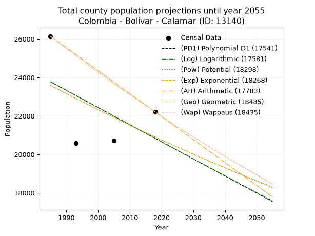
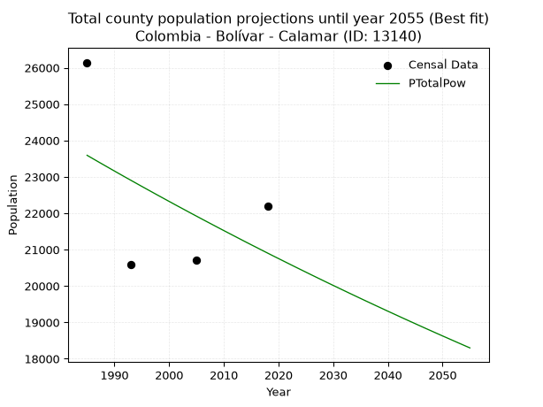
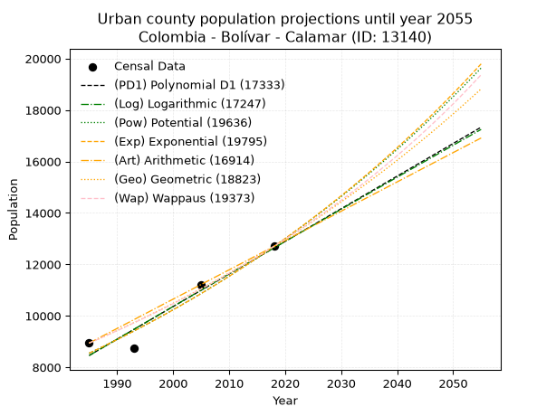
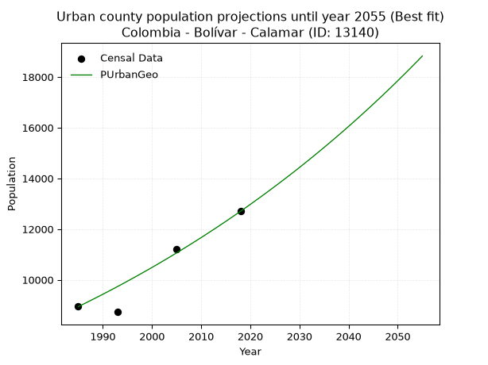
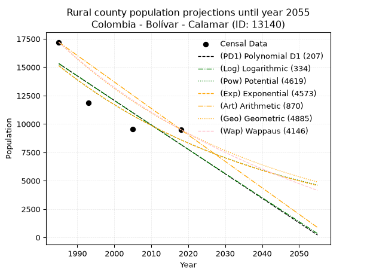
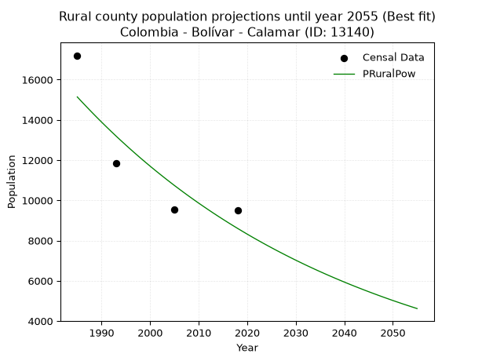

<div align="center">


</div>

# 📜 _“Population and Public Services Demand Projections (PPSD) until Year 2050 for Colombia - Bolívar - Calamar (ID: 13140)”_
Keywords: `population` `public-service` `projection` `lineal` `polynomial` `logarithmic` `potential` `exponential` `arithmetic` `geometric` `wappaus` `dane` `colombia` `south-america`

PPSD are analytical estimates used by governments and planners to anticipate future changes in population size, age distribution, and the resulting community needs for utilities, healthcare, education, and infrastructure as sizing future water treatment facilities, electrical grids, and road networks based on spatial growth.

<div align="center">

</img>

</div>


> **General running parameters**: • app_version: _v20260806_. • Python version: _3.14.7_. • Pandas version: _3.0.5_. • NumPy version: _2.5.1_. • Creates, save and include plots into reports (create_plot): _False_. • Projection until year: _2050_. • Process polynomial degree 2 and up: _False_. • Process Wappaus: _True_. • Process Wappaus: _True_. • Set negative values to zero: _True_. • Set infinite values to zero: _True_. • Drop dataset notes: _True_. 
<div align="center">

Maps & GIS Layers: [:earth_americas:Google](http://maps.google.com/maps?q=10.25043053,-74.9161437) [:earth_americas:OSM](https://www.openstreetmap.org/#map=18/10.25043053/-74.9161437&layers=P) [:earth_americas:Bing](https://www.bing.com/maps?cp=10.25043053~-74.9161437&lvl=18) [:earth_americas:Apple](https://maps.apple.com/frame?center=10.25043053%2C-74.9161437&span=0.003%2C0.006) [:earth_americas:GISMobile](https://github.com/rcfdtools/R.GISMobile/blob/main/file/gis/CountyLayer_CO/Readme.md)

</div>


<div align="center">

```geojson
{
  "type": "Feature",
  "geometry": {
    "type": "Point", 
    "coordinates": [-74.9161437, 10.25043053]
  }, 
  "properties": {
    "Name": "Colombia - Bolívar - Calamar (ID: 13140)"
  }
}
```

</div>


## 0. Census Data (4 records)

Census data are official statistics collected by a government about the people and housing in a country. They usually include counts of total population, age, sex, race, income, education, and jobs.

📅Global census file: [Population.xlsx](../data/Population.xlsx)

| Source   |   Year |   CountryID | CountryName   |   StateID | StateName   |   CountyID | CountyName   |   PTotal |   PUrban |   PRural |
|:---------|-------:|------------:|:--------------|----------:|:------------|-----------:|:-------------|---------:|---------:|---------:|
| DANE     |   1985 |          57 | Colombia      |        13 | Bolívar     |      13140 | Calamar      |    26143 |     8940 |    17203 |
| DANE     |   1993 |          57 | Colombia      |        13 | Bolívar     |      13140 | Calamar      |    20588 |     8730 |    11858 |
| DANE     |   2005 |          57 | Colombia      |        13 | Bolívar     |      13140 | Calamar      |    20722 |    11196 |     9526 |
| DANE     |   2018 |          57 | Colombia      |        13 | Bolívar     |      13140 | Calamar      |    22202 |    12699 |     9503 |

> 🔥Some records could had specific notes about the registered values or the corresponding urban or rural distribution.

📅[SUI-RUPS](https://www.datos.gov.co/Hacienda-y-Cr-dito-P-blico/Registro-nico-de-Prestadores-de-Servicios-P-blicos/4qkq-csdn/about_data) - Local public utility companies: [RUPS.csv](../data/RUPS.csv)

 | SERVICIO   | ESTADO    | NOMBRE                    | NIT         | DEPARTAMENTO_DOMICILIO   | MUNICIPIO_DOMICILIO   | DIRECCION                                                |   TELEFONO | EMAIL                        | TIPO_PRESTADOR                             | CLASIFICACION                  |
|:-----------|:----------|:--------------------------|:------------|:-------------------------|:----------------------|:---------------------------------------------------------|-----------:|:-----------------------------|:-------------------------------------------|:-------------------------------|
| ACUEDUCTO  | OPERATIVA | GISCOL DIQUE S.A. E.S.P.  | 900255796-3 | BOGOTA, D.C.             | BOGOTA, D.C.          | CALLE 98 No. 15 - 17 PISO 8                              |    6348883 | mellis_serrato12@hotmail.com | SOCIEDADES (EMPRESA DE SERVICIOS PUBLICOS) | MAS DE 2500 SUSCRIPTORES       |
| ACUEDUCTO  | OPERATIVA | AGUASEO TOTAL S.A. E.S.P. | 806010977-7 | BOLIVAR                  | CARTAGENA DE INDIAS   | CRA 13B #13-63 PISO 6 OFI. 601 ED. INTELIGENTE, CHAMBACU |    6602498 | aconsuegra@grupoesp.com.co   | SOCIEDADES (EMPRESA DE SERVICIOS PUBLICOS) | DESDE 2501 HASTA 5000 USUARIOS |

## 1. Total

### 1.1. Coefficients and Parameters

* (PD1) Polynomial Deg 1: -89.00642312324446, 200448.84785226974 (lineal)
* (Log) Logarithmic: -178819.7272447888, 1381623.9297590016
* (Pow) Potential: -7.332597504662953, 28.553908783834718
* (Exp) Exponential: -0.0036488724198699926, 32977279.342267998
* (Art) Arithmetic: Year diff. 2018 - 1985 = 33, Population diff. 22202 - 26143 = -3941, Annual growth = -119.42424242424242
* (Geo) Geometric: Year diff. 2018 - 1985 = 33, Population diff. 22202 - 26143 = -3941, Annual growth % = -0.004939249269683255
* (Wap) Wappaus: i = -0.49405002554242394, Condition values only valid for < 200)

<sub>
Wappaus condition values: ['-0.00', '-0.49', '-0.99', '-1.48', '-1.98', '-2.47', '-2.96', '-3.46', '-3.95', '-4.45', '-4.94', '-5.43', '-5.93', '-6.42', '-6.92', '-7.41', '-7.90', '-8.40', '-8.89', '-9.39', '-9.88', '-10.38', '-10.87', '-11.36', '-11.86', '-12.35', '-12.85', '-13.34', '-13.83', '-14.33', '-14.82', '-15.32', '-15.81', '-16.30', '-16.80', '-17.29', '-17.79', '-18.28', '-18.77', '-19.27', '-19.76', '-20.26', '-20.75', '-21.24', '-21.74', '-22.23', '-22.73', '-23.22', '-23.71', '-24.21', '-24.70', '-25.20', '-25.69', '-26.18', '-26.68', '-27.17', '-27.67', '-28.16', '-28.65', '-29.15', '-29.64', '-30.14', '-30.63', '-31.13', '-31.62', '-32.11']
</sub>


### 1.2. Projected Dataset

|   Year |   CountyID |   PTotalPD1 |   PTotalLog |   PTotalPow |   PTotalExp |   PTotalArt |   PTotalGeo |   PTotalWap |
|-------:|-----------:|------------:|------------:|------------:|------------:|------------:|------------:|------------:|
|   1985 |      13140 |       23771 |       23779 |       23592 |       23584 |       26143 |       26143 |       26143 |
|   1986 |      13140 |       23682 |       23689 |       23505 |       23498 |       26024 |       26014 |       26014 |
|   1987 |      13140 |       23593 |       23599 |       23418 |       23412 |       25904 |       25885 |       25886 |
|   1988 |      13140 |       23504 |       23509 |       23332 |       23327 |       25785 |       25758 |       25758 |
|   1989 |      13140 |       23415 |       23419 |       23246 |       23242 |       25665 |       25630 |       25631 |
|   1990 |      13140 |       23326 |       23329 |       23160 |       23157 |       25546 |       25504 |       25505 |
|   1991 |      13140 |       23237 |       23239 |       23075 |       23073 |       25426 |       25378 |       25379 |
|   1992 |      13140 |       23148 |       23149 |       22990 |       22989 |       25307 |       25252 |       25254 |
|   1993 |      13140 |       23059 |       23060 |       22906 |       22905 |       25188 |       25128 |       25130 |
|   1994 |      13140 |       22970 |       22970 |       22822 |       22822 |       25068 |       25004 |       25006 |
|   1995 |      13140 |       22881 |       22880 |       22738 |       22739 |       24949 |       24880 |       24883 |
|   1996 |      13140 |       22792 |       22791 |       22655 |       22656 |       24829 |       24757 |       24760 |
|   1997 |      13140 |       22703 |       22701 |       22572 |       22573 |       24710 |       24635 |       24638 |
|   1998 |      13140 |       22614 |       22612 |       22489 |       22491 |       24590 |       24513 |       24516 |
|   1999 |      13140 |       22525 |       22522 |       22407 |       22409 |       24471 |       24392 |       24395 |
|   2000 |      13140 |       22436 |       22433 |       22325 |       22328 |       24352 |       24272 |       24275 |
|   2001 |      13140 |       22347 |       22343 |       22243 |       22246 |       24232 |       24152 |       24155 |
|   2002 |      13140 |       22258 |       22254 |       22162 |       22165 |       24113 |       24032 |       24036 |
|   2003 |      13140 |       22169 |       22165 |       22081 |       22085 |       23993 |       23914 |       23917 |
|   2004 |      13140 |       22080 |       22075 |       22000 |       22004 |       23874 |       23796 |       23799 |
|   2005 |      13140 |       21991 |       21986 |       21920 |       21924 |       23755 |       23678 |       23681 |
|   2006 |      13140 |       21902 |       21897 |       21840 |       21844 |       23635 |       23561 |       23564 |
|   2007 |      13140 |       21813 |       21808 |       21760 |       21765 |       23516 |       23445 |       23448 |
|   2008 |      13140 |       21724 |       21719 |       21681 |       21685 |       23396 |       23329 |       23332 |
|   2009 |      13140 |       21635 |       21630 |       21602 |       21606 |       23277 |       23214 |       23217 |
|   2010 |      13140 |       21546 |       21541 |       21523 |       21528 |       23157 |       23099 |       23102 |
|   2011 |      13140 |       21457 |       21452 |       21445 |       21449 |       23038 |       22985 |       22988 |
|   2012 |      13140 |       21368 |       21363 |       21367 |       21371 |       22919 |       22871 |       22874 |
|   2013 |      13140 |       21279 |       21274 |       21289 |       21293 |       22799 |       22759 |       22760 |
|   2014 |      13140 |       21190 |       21185 |       21211 |       21216 |       22680 |       22646 |       22648 |
|   2015 |      13140 |       21101 |       21096 |       21134 |       21139 |       22560 |       22534 |       22536 |
|   2016 |      13140 |       21012 |       21008 |       21058 |       21062 |       22441 |       22423 |       22424 |
|   2017 |      13140 |       20923 |       20919 |       20981 |       20985 |       22321 |       22312 |       22313 |
|   2018 |      13140 |       20834 |       20830 |       20905 |       20908 |       22202 |       22202 |       22202 |
|   2019 |      13140 |       20745 |       20742 |       20829 |       20832 |       22083 |       22092 |       22092 |
|   2020 |      13140 |       20656 |       20653 |       20754 |       20756 |       21963 |       21983 |       21982 |
|   2021 |      13140 |       20567 |       20565 |       20679 |       20681 |       21844 |       21875 |       21873 |
|   2022 |      13140 |       20478 |       20476 |       20604 |       20605 |       21724 |       21767 |       21764 |
|   2023 |      13140 |       20389 |       20388 |       20529 |       20530 |       21605 |       21659 |       21656 |
|   2024 |      13140 |       20300 |       20300 |       20455 |       20456 |       21485 |       21552 |       21548 |
|   2025 |      13140 |       20211 |       20211 |       20381 |       20381 |       21366 |       21446 |       21441 |
|   2026 |      13140 |       20122 |       20123 |       20307 |       20307 |       21247 |       21340 |       21334 |
|   2027 |      13140 |       20033 |       20035 |       20234 |       20233 |       21127 |       21234 |       21228 |
|   2028 |      13140 |       19944 |       19947 |       20161 |       20159 |       21008 |       21129 |       21122 |
|   2029 |      13140 |       19855 |       19858 |       20088 |       20086 |       20888 |       21025 |       21017 |
|   2030 |      13140 |       19766 |       19770 |       20016 |       20013 |       20769 |       20921 |       20912 |
|   2031 |      13140 |       19677 |       19682 |       19944 |       19940 |       20649 |       20818 |       20808 |
|   2032 |      13140 |       19588 |       19594 |       19872 |       19867 |       20530 |       20715 |       20704 |
|   2033 |      13140 |       19499 |       19506 |       19800 |       19795 |       20411 |       20613 |       20601 |
|   2034 |      13140 |       19410 |       19418 |       19729 |       19723 |       20291 |       20511 |       20498 |
|   2035 |      13140 |       19321 |       19330 |       19658 |       19651 |       20172 |       20410 |       20395 |
|   2036 |      13140 |       19232 |       19242 |       19587 |       19579 |       20052 |       20309 |       20293 |
|   2037 |      13140 |       19143 |       19155 |       19517 |       19508 |       19933 |       20209 |       20191 |
|   2038 |      13140 |       19054 |       19067 |       19447 |       19437 |       19814 |       20109 |       20090 |
|   2039 |      13140 |       18965 |       18979 |       19377 |       19366 |       19694 |       20009 |       19989 |
|   2040 |      13140 |       18876 |       18892 |       19307 |       19296 |       19575 |       19911 |       19889 |
|   2041 |      13140 |       18787 |       18804 |       19238 |       19225 |       19455 |       19812 |       19789 |
|   2042 |      13140 |       18698 |       18716 |       19169 |       19155 |       19336 |       19714 |       19690 |
|   2043 |      13140 |       18609 |       18629 |       19100 |       19085 |       19216 |       19617 |       19591 |
|   2044 |      13140 |       18520 |       18541 |       19032 |       19016 |       19097 |       19520 |       19492 |
|   2045 |      13140 |       18431 |       18454 |       18964 |       18947 |       18978 |       19424 |       19394 |
|   2046 |      13140 |       18342 |       18366 |       18896 |       18878 |       18858 |       19328 |       19296 |
|   2047 |      13140 |       18253 |       18279 |       18828 |       18809 |       18739 |       19232 |       19199 |
|   2048 |      13140 |       18164 |       18192 |       18761 |       18740 |       18619 |       19137 |       19102 |
|   2049 |      13140 |       18075 |       18104 |       18694 |       18672 |       18500 |       19043 |       19005 |
|   2050 |      13140 |       17986 |       18017 |       18627 |       18604 |       18380 |       18949 |       18909 |
<div align="center">

</img>

</div>


### 1.3. Best fit with absolute and relative error (%)

Relative error puts that difference into context by dividing the absolute error by the true value, creating a unitless ratio or percentage that shows the scale of the mistake.

Absolute and relative error

|   Year | Source   |   CountryID | CountryName   |   StateID | StateName   |   CountyID_x | CountyName   |   PTotal |   PUrban |   PRural |   CountyID_y |   PTotalPD1 |   PTotalLog |   PTotalPow |   PTotalExp |   PTotalArt |   PTotalGeo |   PTotalWap |   PTotalPD1AbsError |   PTotalLogAbsError |   PTotalPowAbsError |   PTotalExpAbsError |   PTotalArtAbsError |   PTotalGeoAbsError |   PTotalWapAbsError |   PTotalPD1RelError |   PTotalLogRelError |   PTotalPowRelError |   PTotalExpRelError |   PTotalArtRelError |   PTotalGeoRelError |   PTotalWapRelError |
|-------:|:---------|------------:|:--------------|----------:|:------------|-------------:|:-------------|---------:|---------:|---------:|-------------:|------------:|------------:|------------:|------------:|------------:|------------:|------------:|--------------------:|--------------------:|--------------------:|--------------------:|--------------------:|--------------------:|--------------------:|--------------------:|--------------------:|--------------------:|--------------------:|--------------------:|--------------------:|--------------------:|
|   1985 | DANE     |          57 | Colombia      |        13 | Bolívar     |        13140 | Calamar      |    26143 |     8940 |    17203 |        13140 |       23771 |       23779 |       23592 |       23584 |       26143 |       26143 |       26143 |                2372 |                2364 |                2551 |                2559 |                   0 |                   0 |                   0 |             9.07317 |             9.04257 |             9.75787 |             9.78847 |              0      |              0      |              0      |
|   1993 | DANE     |          57 | Colombia      |        13 | Bolívar     |        13140 | Calamar      |    20588 |     8730 |    11858 |        13140 |       23059 |       23060 |       22906 |       22905 |       25188 |       25128 |       25130 |                2471 |                2472 |                2318 |                2317 |                4600 |                4540 |                4542 |            12.0021  |            12.007   |            11.259   |            11.2541  |             22.3431 |             22.0517 |             22.0614 |
|   2005 | DANE     |          57 | Colombia      |        13 | Bolívar     |        13140 | Calamar      |    20722 |    11196 |     9526 |        13140 |       21991 |       21986 |       21920 |       21924 |       23755 |       23678 |       23681 |                1269 |                1264 |                1198 |                1202 |                3033 |                2956 |                2959 |             6.12393 |             6.0998  |             5.7813  |             5.8006  |             14.6366 |             14.265  |             14.2795 |
|   2018 | DANE     |          57 | Colombia      |        13 | Bolívar     |        13140 | Calamar      |    22202 |    12699 |     9503 |        13140 |       20834 |       20830 |       20905 |       20908 |       22202 |       22202 |       22202 |                1368 |                1372 |                1297 |                1294 |                   0 |                   0 |                   0 |             6.16161 |             6.17962 |             5.84182 |             5.8283  |              0      |              0      |              0      |

Relative error mean

| Method    |   RelError | Best   |
|:----------|-----------:|:-------|
| PTotalPD1 |    8.34021 |        |
| PTotalLog |    8.33225 |        |
| PTotalPow |    8.15999 | True   |
| PTotalExp |    8.16788 |        |
| PTotalArt |    9.24493 |        |
| PTotalGeo |    9.07918 |        |
| PTotalWap |    9.08523 |        |

💙Best method: _**PTotalPow**_
<div align="center">

</img>

</div>


### 1.4. Fresh water supply demand in liters per capita per day (lpcd)

The fresh water supply demand typically ranges from 100 to 300 liters per capita per day (lpcd) for standard domestic and municipal planning, though absolute survival minimums set by the World Health Organization are as low as 7.5 to 20 liters per day, and total consumption in high-income nations can exceed 400 liters.

> `CZ`: Level in meters above the sea level (masl)<br> `WS`: Fresh water supply demand in liters per capita per day (lpcd or l/h/d)<br> `WSAll`: Zonal fresh water supply demand in liters per second (l/s)<br> `A`: Zonal area in square meters<br> `DP`: Population density (people/hectare or p/ha)

Reference values (RAS Colombia)

|    CZ |   WS |
|------:|-----:|
|  1000 |  120 |
|  2000 |  130 |
| 99999 |  140 |

County shapefile geometry properties and water supply values

|   CountyID |      ATotal |   CZTotal |   WSTotal |
|-----------:|------------:|----------:|----------:|
|      13140 | 2.55595e+08 |   40.3823 |       120 |

Projected values for best method: PTotalPow

|   CountyID |   Year |   PTotalPow |   DPTotal |   WSTotal |   WSTotalAll |
|-----------:|-------:|------------:|----------:|----------:|-------------:|
|      13140 |   1985 |       23592 |      0.92 |       120 |      32.7667 |
|      13140 |   1986 |       23505 |      0.92 |       120 |      32.6458 |
|      13140 |   1987 |       23418 |      0.92 |       120 |      32.525  |
|      13140 |   1988 |       23332 |      0.91 |       120 |      32.4056 |
|      13140 |   1989 |       23246 |      0.91 |       120 |      32.2861 |
|      13140 |   1990 |       23160 |      0.91 |       120 |      32.1667 |
|      13140 |   1991 |       23075 |      0.9  |       120 |      32.0486 |
|      13140 |   1992 |       22990 |      0.9  |       120 |      31.9306 |
|      13140 |   1993 |       22906 |      0.9  |       120 |      31.8139 |
|      13140 |   1994 |       22822 |      0.89 |       120 |      31.6972 |
|      13140 |   1995 |       22738 |      0.89 |       120 |      31.5806 |
|      13140 |   1996 |       22655 |      0.89 |       120 |      31.4653 |
|      13140 |   1997 |       22572 |      0.88 |       120 |      31.35   |
|      13140 |   1998 |       22489 |      0.88 |       120 |      31.2347 |
|      13140 |   1999 |       22407 |      0.88 |       120 |      31.1208 |
|      13140 |   2000 |       22325 |      0.87 |       120 |      31.0069 |
|      13140 |   2001 |       22243 |      0.87 |       120 |      30.8931 |
|      13140 |   2002 |       22162 |      0.87 |       120 |      30.7806 |
|      13140 |   2003 |       22081 |      0.86 |       120 |      30.6681 |
|      13140 |   2004 |       22000 |      0.86 |       120 |      30.5556 |
|      13140 |   2005 |       21920 |      0.86 |       120 |      30.4444 |
|      13140 |   2006 |       21840 |      0.85 |       120 |      30.3333 |
|      13140 |   2007 |       21760 |      0.85 |       120 |      30.2222 |
|      13140 |   2008 |       21681 |      0.85 |       120 |      30.1125 |
|      13140 |   2009 |       21602 |      0.85 |       120 |      30.0028 |
|      13140 |   2010 |       21523 |      0.84 |       120 |      29.8931 |
|      13140 |   2011 |       21445 |      0.84 |       120 |      29.7847 |
|      13140 |   2012 |       21367 |      0.84 |       120 |      29.6764 |
|      13140 |   2013 |       21289 |      0.83 |       120 |      29.5681 |
|      13140 |   2014 |       21211 |      0.83 |       120 |      29.4597 |
|      13140 |   2015 |       21134 |      0.83 |       120 |      29.3528 |
|      13140 |   2016 |       21058 |      0.82 |       120 |      29.2472 |
|      13140 |   2017 |       20981 |      0.82 |       120 |      29.1403 |
|      13140 |   2018 |       20905 |      0.82 |       120 |      29.0347 |
|      13140 |   2019 |       20829 |      0.81 |       120 |      28.9292 |
|      13140 |   2020 |       20754 |      0.81 |       120 |      28.825  |
|      13140 |   2021 |       20679 |      0.81 |       120 |      28.7208 |
|      13140 |   2022 |       20604 |      0.81 |       120 |      28.6167 |
|      13140 |   2023 |       20529 |      0.8  |       120 |      28.5125 |
|      13140 |   2024 |       20455 |      0.8  |       120 |      28.4097 |
|      13140 |   2025 |       20381 |      0.8  |       120 |      28.3069 |
|      13140 |   2026 |       20307 |      0.79 |       120 |      28.2042 |
|      13140 |   2027 |       20234 |      0.79 |       120 |      28.1028 |
|      13140 |   2028 |       20161 |      0.79 |       120 |      28.0014 |
|      13140 |   2029 |       20088 |      0.79 |       120 |      27.9    |
|      13140 |   2030 |       20016 |      0.78 |       120 |      27.8    |
|      13140 |   2031 |       19944 |      0.78 |       120 |      27.7    |
|      13140 |   2032 |       19872 |      0.78 |       120 |      27.6    |
|      13140 |   2033 |       19800 |      0.77 |       120 |      27.5    |
|      13140 |   2034 |       19729 |      0.77 |       120 |      27.4014 |
|      13140 |   2035 |       19658 |      0.77 |       120 |      27.3028 |
|      13140 |   2036 |       19587 |      0.77 |       120 |      27.2042 |
|      13140 |   2037 |       19517 |      0.76 |       120 |      27.1069 |
|      13140 |   2038 |       19447 |      0.76 |       120 |      27.0097 |
|      13140 |   2039 |       19377 |      0.76 |       120 |      26.9125 |
|      13140 |   2040 |       19307 |      0.76 |       120 |      26.8153 |
|      13140 |   2041 |       19238 |      0.75 |       120 |      26.7194 |
|      13140 |   2042 |       19169 |      0.75 |       120 |      26.6236 |
|      13140 |   2043 |       19100 |      0.75 |       120 |      26.5278 |
|      13140 |   2044 |       19032 |      0.74 |       120 |      26.4333 |
|      13140 |   2045 |       18964 |      0.74 |       120 |      26.3389 |
|      13140 |   2046 |       18896 |      0.74 |       120 |      26.2444 |
|      13140 |   2047 |       18828 |      0.74 |       120 |      26.15   |
|      13140 |   2048 |       18761 |      0.73 |       120 |      26.0569 |
|      13140 |   2049 |       18694 |      0.73 |       120 |      25.9639 |
|      13140 |   2050 |       18627 |      0.73 |       120 |      25.8708 |

## 2. Urban

### 2.1. Coefficients and Parameters

* (PD1) Polynomial Deg 1: 126.79365716579576, -243227.762745883 (lineal)
* (Log) Logarithmic: 253715.5404747758, -1918102.6062975137
* (Pow) Potential: 24.007907014449508, -75.24062570241135
* (Exp) Exponential: 0.011997133263787898, 3.8852227351960127e-07
* (Art) Arithmetic: Year diff. 2018 - 1985 = 33, Population diff. 12699 - 8940 = 3759, Annual growth = 113.9090909090909
* (Geo) Geometric: Year diff. 2018 - 1985 = 33, Population diff. 12699 - 8940 = 3759, Annual growth % = 0.010692752932460747
* (Wap) Wappaus: i = 1.0528128925467064, Condition values only valid for < 200)

<sub>
Wappaus condition values: ['0.00', '1.05', '2.11', '3.16', '4.21', '5.26', '6.32', '7.37', '8.42', '9.48', '10.53', '11.58', '12.63', '13.69', '14.74', '15.79', '16.85', '17.90', '18.95', '20.00', '21.06', '22.11', '23.16', '24.21', '25.27', '26.32', '27.37', '28.43', '29.48', '30.53', '31.58', '32.64', '33.69', '34.74', '35.80', '36.85', '37.90', '38.95', '40.01', '41.06', '42.11', '43.17', '44.22', '45.27', '46.32', '47.38', '48.43', '49.48', '50.54', '51.59', '52.64', '53.69', '54.75', '55.80', '56.85', '57.90', '58.96', '60.01', '61.06', '62.12', '63.17', '64.22', '65.27', '66.33', '67.38', '68.43']
</sub>


### 2.2. Projected Dataset

|   Year |   CountyID |   PUrbanPD1 |   PUrbanLog |   PUrbanPow |   PUrbanExp |   PUrbanArt |   PUrbanGeo |   PUrbanWap |
|-------:|-----------:|------------:|------------:|------------:|------------:|------------:|------------:|------------:|
|   1985 |      13140 |        8458 |        8454 |        8545 |        8548 |        8940 |        8940 |        8940 |
|   1986 |      13140 |        8584 |        8582 |        8649 |        8651 |        9054 |        9036 |        9035 |
|   1987 |      13140 |        8711 |        8710 |        8754 |        8755 |        9168 |        9132 |        9130 |
|   1988 |      13140 |        8838 |        8838 |        8860 |        8861 |        9282 |        9230 |        9227 |
|   1989 |      13140 |        8965 |        8965 |        8968 |        8968 |        9396 |        9329 |        9325 |
|   1990 |      13140 |        9092 |        9093 |        9077 |        9076 |        9510 |        9428 |        9423 |
|   1991 |      13140 |        9218 |        9220 |        9187 |        9185 |        9623 |        9529 |        9523 |
|   1992 |      13140 |        9345 |        9348 |        9298 |        9296 |        9737 |        9631 |        9624 |
|   1993 |      13140 |        9472 |        9475 |        9411 |        9409 |        9851 |        9734 |        9726 |
|   1994 |      13140 |        9599 |        9602 |        9525 |        9522 |        9965 |        9838 |        9829 |
|   1995 |      13140 |        9726 |        9729 |        9640 |        9637 |       10079 |        9943 |        9934 |
|   1996 |      13140 |        9852 |        9857 |        9757 |        9753 |       10193 |       10050 |       10039 |
|   1997 |      13140 |        9979 |        9984 |        9875 |        9871 |       10307 |       10157 |       10146 |
|   1998 |      13140 |       10106 |       10111 |        9995 |        9990 |       10421 |       10266 |       10253 |
|   1999 |      13140 |       10233 |       10238 |       10115 |       10111 |       10535 |       10375 |       10363 |
|   2000 |      13140 |       10360 |       10364 |       10238 |       10233 |       10649 |       10486 |       10473 |
|   2001 |      13140 |       10486 |       10491 |       10361 |       10356 |       10763 |       10598 |       10584 |
|   2002 |      13140 |       10613 |       10618 |       10486 |       10481 |       10876 |       10712 |       10697 |
|   2003 |      13140 |       10740 |       10745 |       10613 |       10608 |       10990 |       10826 |       10812 |
|   2004 |      13140 |       10867 |       10871 |       10741 |       10736 |       11104 |       10942 |       10927 |
|   2005 |      13140 |       10994 |       10998 |       10870 |       10865 |       11218 |       11059 |       11044 |
|   2006 |      13140 |       11120 |       11124 |       11001 |       10997 |       11332 |       11177 |       11162 |
|   2007 |      13140 |       11247 |       11251 |       11133 |       11129 |       11446 |       11297 |       11282 |
|   2008 |      13140 |       11374 |       11377 |       11267 |       11264 |       11560 |       11418 |       11403 |
|   2009 |      13140 |       11501 |       11504 |       11403 |       11400 |       11674 |       11540 |       11526 |
|   2010 |      13140 |       11627 |       11630 |       11540 |       11537 |       11788 |       11663 |       11650 |
|   2011 |      13140 |       11754 |       11756 |       11678 |       11676 |       11902 |       11788 |       11775 |
|   2012 |      13140 |       11881 |       11882 |       11819 |       11817 |       12016 |       11914 |       11902 |
|   2013 |      13140 |       12008 |       12008 |       11960 |       11960 |       12129 |       12041 |       12031 |
|   2014 |      13140 |       12135 |       12134 |       12104 |       12104 |       12243 |       12170 |       12161 |
|   2015 |      13140 |       12261 |       12260 |       12249 |       12250 |       12357 |       12300 |       12293 |
|   2016 |      13140 |       12388 |       12386 |       12396 |       12398 |       12471 |       12432 |       12427 |
|   2017 |      13140 |       12515 |       12512 |       12544 |       12548 |       12585 |       12565 |       12562 |
|   2018 |      13140 |       12642 |       12638 |       12694 |       12699 |       12699 |       12699 |       12699 |
|   2019 |      13140 |       12769 |       12763 |       12846 |       12853 |       12813 |       12835 |       12838 |
|   2020 |      13140 |       12895 |       12889 |       13000 |       13008 |       12927 |       12972 |       12978 |
|   2021 |      13140 |       13022 |       13015 |       13155 |       13165 |       13041 |       13111 |       13121 |
|   2022 |      13140 |       13149 |       13140 |       13313 |       13324 |       13155 |       13251 |       13265 |
|   2023 |      13140 |       13276 |       13266 |       13472 |       13484 |       13269 |       13393 |       13411 |
|   2024 |      13140 |       13403 |       13391 |       13632 |       13647 |       13382 |       13536 |       13559 |
|   2025 |      13140 |       13529 |       13516 |       13795 |       13812 |       13496 |       13681 |       13709 |
|   2026 |      13140 |       13656 |       13642 |       13959 |       13979 |       13610 |       13827 |       13861 |
|   2027 |      13140 |       13783 |       13767 |       14126 |       14147 |       13724 |       13975 |       14015 |
|   2028 |      13140 |       13910 |       13892 |       14294 |       14318 |       13838 |       14124 |       14171 |
|   2029 |      13140 |       14037 |       14017 |       14464 |       14491 |       13952 |       14275 |       14330 |
|   2030 |      13140 |       14163 |       14142 |       14636 |       14666 |       14066 |       14428 |       14490 |
|   2031 |      13140 |       14290 |       14267 |       14810 |       14843 |       14180 |       14582 |       14653 |
|   2032 |      13140 |       14417 |       14392 |       14986 |       15022 |       14294 |       14738 |       14818 |
|   2033 |      13140 |       14544 |       14517 |       15165 |       15203 |       14408 |       14896 |       14985 |
|   2034 |      13140 |       14671 |       14641 |       15345 |       15387 |       14522 |       15055 |       15155 |
|   2035 |      13140 |       14797 |       14766 |       15527 |       15572 |       14635 |       15216 |       15327 |
|   2036 |      13140 |       14924 |       14891 |       15711 |       15760 |       14749 |       15379 |       15502 |
|   2037 |      13140 |       15051 |       15015 |       15897 |       15950 |       14863 |       15543 |       15679 |
|   2038 |      13140 |       15178 |       15140 |       16086 |       16143 |       14977 |       15709 |       15859 |
|   2039 |      13140 |       15305 |       15264 |       16276 |       16338 |       15091 |       15877 |       16041 |
|   2040 |      13140 |       15431 |       15389 |       16469 |       16535 |       15205 |       16047 |       16226 |
|   2041 |      13140 |       15558 |       15513 |       16664 |       16735 |       15319 |       16218 |       16414 |
|   2042 |      13140 |       15685 |       15637 |       16861 |       16937 |       15433 |       16392 |       16605 |
|   2043 |      13140 |       15812 |       15762 |       17060 |       17141 |       15547 |       16567 |       16798 |
|   2044 |      13140 |       15938 |       15886 |       17262 |       17348 |       15661 |       16744 |       16995 |
|   2045 |      13140 |       16065 |       16010 |       17466 |       17557 |       15775 |       16923 |       17194 |
|   2046 |      13140 |       16192 |       16134 |       17672 |       17769 |       15888 |       17104 |       17397 |
|   2047 |      13140 |       16319 |       16258 |       17881 |       17984 |       16002 |       17287 |       17603 |
|   2048 |      13140 |       16446 |       16382 |       18092 |       18201 |       16116 |       17472 |       17812 |
|   2049 |      13140 |       16572 |       16506 |       18305 |       18420 |       16230 |       17659 |       18024 |
|   2050 |      13140 |       16699 |       16629 |       18521 |       18643 |       16344 |       17848 |       18240 |
<div align="center">

</img>

</div>


### 2.3. Best fit with absolute and relative error (%)

Relative error puts that difference into context by dividing the absolute error by the true value, creating a unitless ratio or percentage that shows the scale of the mistake.

Absolute and relative error

|   Year | Source   |   CountryID | CountryName   |   StateID | StateName   |   CountyID_x | CountyName   |   PTotal |   PUrban |   PRural |   CountyID_y |   PUrbanPD1 |   PUrbanLog |   PUrbanPow |   PUrbanExp |   PUrbanArt |   PUrbanGeo |   PUrbanWap |   PUrbanPD1AbsError |   PUrbanLogAbsError |   PUrbanPowAbsError |   PUrbanExpAbsError |   PUrbanArtAbsError |   PUrbanGeoAbsError |   PUrbanWapAbsError |   PUrbanPD1RelError |   PUrbanLogRelError |   PUrbanPowRelError |   PUrbanExpRelError |   PUrbanArtRelError |   PUrbanGeoRelError |   PUrbanWapRelError |
|-------:|:---------|------------:|:--------------|----------:|:------------|-------------:|:-------------|---------:|---------:|---------:|-------------:|------------:|------------:|------------:|------------:|------------:|------------:|------------:|--------------------:|--------------------:|--------------------:|--------------------:|--------------------:|--------------------:|--------------------:|--------------------:|--------------------:|--------------------:|--------------------:|--------------------:|--------------------:|--------------------:|
|   1985 | DANE     |          57 | Colombia      |        13 | Bolívar     |        13140 | Calamar      |    26143 |     8940 |    17203 |        13140 |        8458 |        8454 |        8545 |        8548 |        8940 |        8940 |        8940 |                 482 |                 486 |                 395 |                 392 |                   0 |                   0 |                   0 |            5.3915   |            5.43624  |           4.41834   |             4.38479 |            0        |             0       |             0       |
|   1993 | DANE     |          57 | Colombia      |        13 | Bolívar     |        13140 | Calamar      |    20588 |     8730 |    11858 |        13140 |        9472 |        9475 |        9411 |        9409 |        9851 |        9734 |        9726 |                 742 |                 745 |                 681 |                 679 |                1121 |                1004 |                 996 |            8.49943  |            8.53379  |           7.80069   |             7.77778 |           12.8408   |            11.5006  |            11.4089  |
|   2005 | DANE     |          57 | Colombia      |        13 | Bolívar     |        13140 | Calamar      |    20722 |    11196 |     9526 |        13140 |       10994 |       10998 |       10870 |       10865 |       11218 |       11059 |       11044 |                 202 |                 198 |                 326 |                 331 |                  22 |                 137 |                 152 |            1.80422  |            1.76849  |           2.91175   |             2.95641 |            0.196499 |             1.22365 |             1.35763 |
|   2018 | DANE     |          57 | Colombia      |        13 | Bolívar     |        13140 | Calamar      |    22202 |    12699 |     9503 |        13140 |       12642 |       12638 |       12694 |       12699 |       12699 |       12699 |       12699 |                  57 |                  61 |                   5 |                   0 |                   0 |                   0 |                   0 |            0.448854 |            0.480353 |           0.0393732 |             0       |            0        |             0       |             0       |

Relative error mean

| Method    |   RelError | Best   |
|:----------|-----------:|:-------|
| PUrbanPD1 |    4.036   |        |
| PUrbanLog |    4.05472 |        |
| PUrbanPow |    3.79254 |        |
| PUrbanExp |    3.77974 |        |
| PUrbanArt |    3.25932 |        |
| PUrbanGeo |    3.18106 | True   |
| PUrbanWap |    3.19164 |        |

💙Best method: _**PUrbanGeo**_
<div align="center">

</img>

</div>


### 2.4. Fresh water supply demand in liters per capita per day (lpcd)

The fresh water supply demand typically ranges from 100 to 300 liters per capita per day (lpcd) for standard domestic and municipal planning, though absolute survival minimums set by the World Health Organization are as low as 7.5 to 20 liters per day, and total consumption in high-income nations can exceed 400 liters.

> `CZ`: Level in meters above the sea level (masl)<br> `WS`: Fresh water supply demand in liters per capita per day (lpcd or l/h/d)<br> `WSAll`: Zonal fresh water supply demand in liters per second (l/s)<br> `A`: Zonal area in square meters<br> `DP`: Population density (people/hectare or p/ha)

Reference values (RAS Colombia)

|    CZ |   WS |
|------:|-----:|
|  1000 |  120 |
|  2000 |  130 |
| 99999 |  140 |

County shapefile geometry properties and water supply values

|   CountyID |      AUrban |   CZUrban |   WSUrban |
|-----------:|------------:|----------:|----------:|
|      13140 | 1.79229e+06 |   8.11958 |       120 |

Projected values for best method: PUrbanGeo

|   CountyID |   Year |   PUrbanGeo |   DPUrban |   WSUrban |   WSUrbanAll |
|-----------:|-------:|------------:|----------:|----------:|-------------:|
|      13140 |   1985 |        8940 |     49.88 |       120 |      12.4167 |
|      13140 |   1986 |        9036 |     50.42 |       120 |      12.55   |
|      13140 |   1987 |        9132 |     50.95 |       120 |      12.6833 |
|      13140 |   1988 |        9230 |     51.5  |       120 |      12.8194 |
|      13140 |   1989 |        9329 |     52.05 |       120 |      12.9569 |
|      13140 |   1990 |        9428 |     52.6  |       120 |      13.0944 |
|      13140 |   1991 |        9529 |     53.17 |       120 |      13.2347 |
|      13140 |   1992 |        9631 |     53.74 |       120 |      13.3764 |
|      13140 |   1993 |        9734 |     54.31 |       120 |      13.5194 |
|      13140 |   1994 |        9838 |     54.89 |       120 |      13.6639 |
|      13140 |   1995 |        9943 |     55.48 |       120 |      13.8097 |
|      13140 |   1996 |       10050 |     56.07 |       120 |      13.9583 |
|      13140 |   1997 |       10157 |     56.67 |       120 |      14.1069 |
|      13140 |   1998 |       10266 |     57.28 |       120 |      14.2583 |
|      13140 |   1999 |       10375 |     57.89 |       120 |      14.4097 |
|      13140 |   2000 |       10486 |     58.51 |       120 |      14.5639 |
|      13140 |   2001 |       10598 |     59.13 |       120 |      14.7194 |
|      13140 |   2002 |       10712 |     59.77 |       120 |      14.8778 |
|      13140 |   2003 |       10826 |     60.4  |       120 |      15.0361 |
|      13140 |   2004 |       10942 |     61.05 |       120 |      15.1972 |
|      13140 |   2005 |       11059 |     61.7  |       120 |      15.3597 |
|      13140 |   2006 |       11177 |     62.36 |       120 |      15.5236 |
|      13140 |   2007 |       11297 |     63.03 |       120 |      15.6903 |
|      13140 |   2008 |       11418 |     63.71 |       120 |      15.8583 |
|      13140 |   2009 |       11540 |     64.39 |       120 |      16.0278 |
|      13140 |   2010 |       11663 |     65.07 |       120 |      16.1986 |
|      13140 |   2011 |       11788 |     65.77 |       120 |      16.3722 |
|      13140 |   2012 |       11914 |     66.47 |       120 |      16.5472 |
|      13140 |   2013 |       12041 |     67.18 |       120 |      16.7236 |
|      13140 |   2014 |       12170 |     67.9  |       120 |      16.9028 |
|      13140 |   2015 |       12300 |     68.63 |       120 |      17.0833 |
|      13140 |   2016 |       12432 |     69.36 |       120 |      17.2667 |
|      13140 |   2017 |       12565 |     70.11 |       120 |      17.4514 |
|      13140 |   2018 |       12699 |     70.85 |       120 |      17.6375 |
|      13140 |   2019 |       12835 |     71.61 |       120 |      17.8264 |
|      13140 |   2020 |       12972 |     72.38 |       120 |      18.0167 |
|      13140 |   2021 |       13111 |     73.15 |       120 |      18.2097 |
|      13140 |   2022 |       13251 |     73.93 |       120 |      18.4042 |
|      13140 |   2023 |       13393 |     74.73 |       120 |      18.6014 |
|      13140 |   2024 |       13536 |     75.52 |       120 |      18.8    |
|      13140 |   2025 |       13681 |     76.33 |       120 |      19.0014 |
|      13140 |   2026 |       13827 |     77.15 |       120 |      19.2042 |
|      13140 |   2027 |       13975 |     77.97 |       120 |      19.4097 |
|      13140 |   2028 |       14124 |     78.8  |       120 |      19.6167 |
|      13140 |   2029 |       14275 |     79.65 |       120 |      19.8264 |
|      13140 |   2030 |       14428 |     80.5  |       120 |      20.0389 |
|      13140 |   2031 |       14582 |     81.36 |       120 |      20.2528 |
|      13140 |   2032 |       14738 |     82.23 |       120 |      20.4694 |
|      13140 |   2033 |       14896 |     83.11 |       120 |      20.6889 |
|      13140 |   2034 |       15055 |     84    |       120 |      20.9097 |
|      13140 |   2035 |       15216 |     84.9  |       120 |      21.1333 |
|      13140 |   2036 |       15379 |     85.81 |       120 |      21.3597 |
|      13140 |   2037 |       15543 |     86.72 |       120 |      21.5875 |
|      13140 |   2038 |       15709 |     87.65 |       120 |      21.8181 |
|      13140 |   2039 |       15877 |     88.58 |       120 |      22.0514 |
|      13140 |   2040 |       16047 |     89.53 |       120 |      22.2875 |
|      13140 |   2041 |       16218 |     90.49 |       120 |      22.525  |
|      13140 |   2042 |       16392 |     91.46 |       120 |      22.7667 |
|      13140 |   2043 |       16567 |     92.43 |       120 |      23.0097 |
|      13140 |   2044 |       16744 |     93.42 |       120 |      23.2556 |
|      13140 |   2045 |       16923 |     94.42 |       120 |      23.5042 |
|      13140 |   2046 |       17104 |     95.43 |       120 |      23.7556 |
|      13140 |   2047 |       17287 |     96.45 |       120 |      24.0097 |
|      13140 |   2048 |       17472 |     97.48 |       120 |      24.2667 |
|      13140 |   2049 |       17659 |     98.53 |       120 |      24.5264 |
|      13140 |   2050 |       17848 |     99.58 |       120 |      24.7889 |

## 3. Rural

### 3.1. Coefficients and Parameters

* (PD1) Polynomial Deg 1: -215.80008028904044, 443676.61059815314 (lineal)
* (Log) Logarithmic: -432535.2677195646, 3299726.5360565153
* (Pow) Potential: -34.254415325911275, 117.1430194839993
* (Exp) Exponential: -0.017092164702494, 8.213308237800378e+18
* (Art) Arithmetic: Year diff. 2018 - 1985 = 33, Population diff. 9503 - 17203 = -7700, Annual growth = -233.33333333333334
* (Geo) Geometric: Year diff. 2018 - 1985 = 33, Population diff. 9503 - 17203 = -7700, Annual growth % = -0.01782337940172818
* (Wap) Wappaus: i = -1.7474225517361892, Condition values only valid for < 200)

<sub>
Wappaus condition values: ['-0.00', '-1.75', '-3.49', '-5.24', '-6.99', '-8.74', '-10.48', '-12.23', '-13.98', '-15.73', '-17.47', '-19.22', '-20.97', '-22.72', '-24.46', '-26.21', '-27.96', '-29.71', '-31.45', '-33.20', '-34.95', '-36.70', '-38.44', '-40.19', '-41.94', '-43.69', '-45.43', '-47.18', '-48.93', '-50.68', '-52.42', '-54.17', '-55.92', '-57.66', '-59.41', '-61.16', '-62.91', '-64.65', '-66.40', '-68.15', '-69.90', '-71.64', '-73.39', '-75.14', '-76.89', '-78.63', '-80.38', '-82.13', '-83.88', '-85.62', '-87.37', '-89.12', '-90.87', '-92.61', '-94.36', '-96.11', '-97.86', '-99.60', '-101.35', '-103.10', '-104.85', '-106.59', '-108.34', '-110.09', '-111.84', '-113.58']
</sub>


### 3.2. Projected Dataset

|   Year |   CountyID |   PRuralPD1 |   PRuralLog |   PRuralPow |   PRuralExp |   PRuralArt |   PRuralGeo |   PRuralWap |
|-------:|-----------:|------------:|------------:|------------:|------------:|------------:|------------:|------------:|
|   1985 |      13140 |       15313 |       15324 |       15141 |       15129 |       17203 |       17203 |       17203 |
|   1986 |      13140 |       15098 |       15107 |       14882 |       14872 |       16970 |       16896 |       16905 |
|   1987 |      13140 |       14882 |       14889 |       14628 |       14620 |       16736 |       16595 |       16612 |
|   1988 |      13140 |       14666 |       14671 |       14378 |       14372 |       16503 |       16299 |       16324 |
|   1989 |      13140 |       14450 |       14454 |       14132 |       14129 |       16270 |       16009 |       16041 |
|   1990 |      13140 |       14234 |       14236 |       13891 |       13889 |       16036 |       15724 |       15763 |
|   1991 |      13140 |       14019 |       14019 |       13654 |       13654 |       15803 |       15443 |       15489 |
|   1992 |      13140 |       13803 |       13802 |       13421 |       13423 |       15570 |       15168 |       15220 |
|   1993 |      13140 |       13587 |       13585 |       13192 |       13195 |       15336 |       14898 |       14955 |
|   1994 |      13140 |       13371 |       13368 |       12968 |       12972 |       15103 |       14632 |       14695 |
|   1995 |      13140 |       13155 |       13151 |       12747 |       12752 |       14870 |       14371 |       14438 |
|   1996 |      13140 |       12940 |       12934 |       12530 |       12536 |       14636 |       14115 |       14186 |
|   1997 |      13140 |       12724 |       12717 |       12317 |       12323 |       14403 |       13864 |       13938 |
|   1998 |      13140 |       12508 |       12501 |       12107 |       12114 |       14170 |       13617 |       13694 |
|   1999 |      13140 |       12292 |       12284 |       11902 |       11909 |       13936 |       13374 |       13453 |
|   2000 |      13140 |       12076 |       12068 |       11699 |       11707 |       13703 |       13136 |       13216 |
|   2001 |      13140 |       11861 |       11852 |       11501 |       11509 |       13470 |       12901 |       12983 |
|   2002 |      13140 |       11645 |       11636 |       11306 |       11314 |       13236 |       12671 |       12754 |
|   2003 |      13140 |       11429 |       11420 |       11114 |       11122 |       13003 |       12446 |       12527 |
|   2004 |      13140 |       11213 |       11204 |       10926 |       10934 |       12770 |       12224 |       12305 |
|   2005 |      13140 |       10997 |       10988 |       10740 |       10748 |       12536 |       12006 |       12085 |
|   2006 |      13140 |       10782 |       10772 |       10559 |       10566 |       12303 |       11792 |       11869 |
|   2007 |      13140 |       10566 |       10557 |       10380 |       10387 |       12070 |       11582 |       11656 |
|   2008 |      13140 |       10350 |       10341 |       10204 |       10211 |       11836 |       11375 |       11446 |
|   2009 |      13140 |       10134 |       10126 |       10032 |       10038 |       11603 |       11173 |       11239 |
|   2010 |      13140 |        9918 |        9911 |        9862 |        9868 |       11370 |       10973 |       11035 |
|   2011 |      13140 |        9703 |        9696 |        9696 |        9701 |       11136 |       10778 |       10834 |
|   2012 |      13140 |        9487 |        9481 |        9532 |        9536 |       10903 |       10586 |       10636 |
|   2013 |      13140 |        9271 |        9266 |        9371 |        9375 |       10670 |       10397 |       10440 |
|   2014 |      13140 |        9055 |        9051 |        9213 |        9216 |       10436 |       10212 |       10248 |
|   2015 |      13140 |        8839 |        8836 |        9058 |        9060 |       10203 |       10030 |       10058 |
|   2016 |      13140 |        8624 |        8622 |        8905 |        8906 |        9970 |        9851 |        9870 |
|   2017 |      13140 |        8408 |        8407 |        8755 |        8755 |        9736 |        9675 |        9685 |
|   2018 |      13140 |        8192 |        8193 |        8608 |        8607 |        9503 |        9503 |        9503 |
|   2019 |      13140 |        7976 |        7978 |        8463 |        8461 |        9270 |        9334 |        9323 |
|   2020 |      13140 |        7760 |        7764 |        8320 |        8317 |        9036 |        9167 |        9146 |
|   2021 |      13140 |        7545 |        7550 |        8180 |        8177 |        8803 |        9004 |        8970 |
|   2022 |      13140 |        7329 |        7336 |        8043 |        8038 |        8570 |        8843 |        8798 |
|   2023 |      13140 |        7113 |        7122 |        7908 |        7902 |        8336 |        8686 |        8627 |
|   2024 |      13140 |        6897 |        6909 |        7775 |        7768 |        8103 |        8531 |        8459 |
|   2025 |      13140 |        6681 |        6695 |        7645 |        7636 |        7870 |        8379 |        8293 |
|   2026 |      13140 |        6466 |        6481 |        7517 |        7507 |        7636 |        8230 |        8129 |
|   2027 |      13140 |        6250 |        6268 |        7391 |        7380 |        7403 |        8083 |        7967 |
|   2028 |      13140 |        6034 |        6055 |        7267 |        7255 |        7170 |        7939 |        7807 |
|   2029 |      13140 |        5818 |        5841 |        7145 |        7132 |        6936 |        7797 |        7649 |
|   2030 |      13140 |        5602 |        5628 |        7025 |        7011 |        6703 |        7658 |        7493 |
|   2031 |      13140 |        5387 |        5415 |        6908 |        6892 |        6470 |        7522 |        7339 |
|   2032 |      13140 |        5171 |        5202 |        6792 |        6775 |        6236 |        7388 |        7187 |
|   2033 |      13140 |        4955 |        4990 |        6679 |        6660 |        6003 |        7256 |        7037 |
|   2034 |      13140 |        4739 |        4777 |        6567 |        6547 |        5770 |        7127 |        6889 |
|   2035 |      13140 |        4523 |        4564 |        6458 |        6436 |        5536 |        7000 |        6742 |
|   2036 |      13140 |        4308 |        4352 |        6350 |        6327 |        5303 |        6875 |        6598 |
|   2037 |      13140 |        4092 |        4139 |        6244 |        6220 |        5070 |        6752 |        6455 |
|   2038 |      13140 |        3876 |        3927 |        6140 |        6115 |        4836 |        6632 |        6313 |
|   2039 |      13140 |        3660 |        3715 |        6038 |        6011 |        4603 |        6514 |        6174 |
|   2040 |      13140 |        3444 |        3503 |        5937 |        5909 |        4370 |        6398 |        6036 |
|   2041 |      13140 |        3229 |        3291 |        5838 |        5809 |        4136 |        6284 |        5899 |
|   2042 |      13140 |        3013 |        3079 |        5741 |        5711 |        3903 |        6172 |        5765 |
|   2043 |      13140 |        2797 |        2867 |        5646 |        5614 |        3670 |        6062 |        5632 |
|   2044 |      13140 |        2581 |        2656 |        5552 |        5519 |        3436 |        5954 |        5500 |
|   2045 |      13140 |        2365 |        2444 |        5460 |        5425 |        3203 |        5848 |        5370 |
|   2046 |      13140 |        2150 |        2233 |        5369 |        5333 |        2970 |        5743 |        5241 |
|   2047 |      13140 |        1934 |        2021 |        5280 |        5243 |        2736 |        5641 |        5114 |
|   2048 |      13140 |        1718 |        1810 |        5192 |        5154 |        2503 |        5540 |        4988 |
|   2049 |      13140 |        1502 |        1599 |        5106 |        5067 |        2270 |        5442 |        4864 |
|   2050 |      13140 |        1286 |        1388 |        5021 |        4981 |        2036 |        5345 |        4741 |
<div align="center">

</img>

</div>


### 3.3. Best fit with absolute and relative error (%)

Relative error puts that difference into context by dividing the absolute error by the true value, creating a unitless ratio or percentage that shows the scale of the mistake.

Absolute and relative error

|   Year | Source   |   CountryID | CountryName   |   StateID | StateName   |   CountyID_x | CountyName   |   PTotal |   PUrban |   PRural |   CountyID_y |   PRuralPD1 |   PRuralLog |   PRuralPow |   PRuralExp |   PRuralArt |   PRuralGeo |   PRuralWap |   PRuralPD1AbsError |   PRuralLogAbsError |   PRuralPowAbsError |   PRuralExpAbsError |   PRuralArtAbsError |   PRuralGeoAbsError |   PRuralWapAbsError |   PRuralPD1RelError |   PRuralLogRelError |   PRuralPowRelError |   PRuralExpRelError |   PRuralArtRelError |   PRuralGeoRelError |   PRuralWapRelError |
|-------:|:---------|------------:|:--------------|----------:|:------------|-------------:|:-------------|---------:|---------:|---------:|-------------:|------------:|------------:|------------:|------------:|------------:|------------:|------------:|--------------------:|--------------------:|--------------------:|--------------------:|--------------------:|--------------------:|--------------------:|--------------------:|--------------------:|--------------------:|--------------------:|--------------------:|--------------------:|--------------------:|
|   1985 | DANE     |          57 | Colombia      |        13 | Bolívar     |        13140 | Calamar      |    26143 |     8940 |    17203 |        13140 |       15313 |       15324 |       15141 |       15129 |       17203 |       17203 |       17203 |                1890 |                1879 |                2062 |                2074 |                   0 |                   0 |                   0 |             10.9865 |             10.9225 |            11.9863  |             12.056  |              0      |              0      |              0      |
|   1993 | DANE     |          57 | Colombia      |        13 | Bolívar     |        13140 | Calamar      |    20588 |     8730 |    11858 |        13140 |       13587 |       13585 |       13192 |       13195 |       15336 |       14898 |       14955 |                1729 |                1727 |                1334 |                1337 |                3478 |                3040 |                3097 |             14.5809 |             14.564  |            11.2498  |             11.2751 |             29.3304 |             25.6367 |             26.1174 |
|   2005 | DANE     |          57 | Colombia      |        13 | Bolívar     |        13140 | Calamar      |    20722 |    11196 |     9526 |        13140 |       10997 |       10988 |       10740 |       10748 |       12536 |       12006 |       12085 |                1471 |                1462 |                1214 |                1222 |                3010 |                2480 |                2559 |             15.4419 |             15.3475 |            12.7441  |             12.828  |             31.5977 |             26.034  |             26.8633 |
|   2018 | DANE     |          57 | Colombia      |        13 | Bolívar     |        13140 | Calamar      |    22202 |    12699 |     9503 |        13140 |        8192 |        8193 |        8608 |        8607 |        9503 |        9503 |        9503 |                1311 |                1310 |                 895 |                 896 |                   0 |                   0 |                   0 |             13.7956 |             13.7851 |             9.41808 |              9.4286 |              0      |              0      |              0      |

Relative error mean

| Method    |   RelError | Best   |
|:----------|-----------:|:-------|
| PRuralPD1 |    13.7012 |        |
| PRuralLog |    13.6548 |        |
| PRuralPow |    11.3496 | True   |
| PRuralExp |    11.3969 |        |
| PRuralArt |    15.232  |        |
| PRuralGeo |    12.9177 |        |
| PRuralWap |    13.2452 |        |

💙Best method: _**PRuralPow**_
<div align="center">

</img>

</div>


### 3.4. Fresh water supply demand in liters per capita per day (lpcd)

The fresh water supply demand typically ranges from 100 to 300 liters per capita per day (lpcd) for standard domestic and municipal planning, though absolute survival minimums set by the World Health Organization are as low as 7.5 to 20 liters per day, and total consumption in high-income nations can exceed 400 liters.

> `CZ`: Level in meters above the sea level (masl)<br> `WS`: Fresh water supply demand in liters per capita per day (lpcd or l/h/d)<br> `WSAll`: Zonal fresh water supply demand in liters per second (l/s)<br> `A`: Zonal area in square meters<br> `DP`: Population density (people/hectare or p/ha)

Reference values (RAS Colombia)

|    CZ |   WS |
|------:|-----:|
|  1000 |  120 |
|  2000 |  130 |
| 99999 |  140 |

County shapefile geometry properties and water supply values

|   CountyID |      ARural |   CZRural |   WSRural |
|-----------:|------------:|----------:|----------:|
|      13140 | 2.53802e+08 |   40.6111 |       120 |

Projected values for best method: PRuralPow

|   CountyID |   Year |   PRuralPow |   DPRural |   WSRural |   WSRuralAll |
|-----------:|-------:|------------:|----------:|----------:|-------------:|
|      13140 |   1985 |       15141 |      0.6  |       120 |     21.0292  |
|      13140 |   1986 |       14882 |      0.59 |       120 |     20.6694  |
|      13140 |   1987 |       14628 |      0.58 |       120 |     20.3167  |
|      13140 |   1988 |       14378 |      0.57 |       120 |     19.9694  |
|      13140 |   1989 |       14132 |      0.56 |       120 |     19.6278  |
|      13140 |   1990 |       13891 |      0.55 |       120 |     19.2931  |
|      13140 |   1991 |       13654 |      0.54 |       120 |     18.9639  |
|      13140 |   1992 |       13421 |      0.53 |       120 |     18.6403  |
|      13140 |   1993 |       13192 |      0.52 |       120 |     18.3222  |
|      13140 |   1994 |       12968 |      0.51 |       120 |     18.0111  |
|      13140 |   1995 |       12747 |      0.5  |       120 |     17.7042  |
|      13140 |   1996 |       12530 |      0.49 |       120 |     17.4028  |
|      13140 |   1997 |       12317 |      0.49 |       120 |     17.1069  |
|      13140 |   1998 |       12107 |      0.48 |       120 |     16.8153  |
|      13140 |   1999 |       11902 |      0.47 |       120 |     16.5306  |
|      13140 |   2000 |       11699 |      0.46 |       120 |     16.2486  |
|      13140 |   2001 |       11501 |      0.45 |       120 |     15.9736  |
|      13140 |   2002 |       11306 |      0.45 |       120 |     15.7028  |
|      13140 |   2003 |       11114 |      0.44 |       120 |     15.4361  |
|      13140 |   2004 |       10926 |      0.43 |       120 |     15.175   |
|      13140 |   2005 |       10740 |      0.42 |       120 |     14.9167  |
|      13140 |   2006 |       10559 |      0.42 |       120 |     14.6653  |
|      13140 |   2007 |       10380 |      0.41 |       120 |     14.4167  |
|      13140 |   2008 |       10204 |      0.4  |       120 |     14.1722  |
|      13140 |   2009 |       10032 |      0.4  |       120 |     13.9333  |
|      13140 |   2010 |        9862 |      0.39 |       120 |     13.6972  |
|      13140 |   2011 |        9696 |      0.38 |       120 |     13.4667  |
|      13140 |   2012 |        9532 |      0.38 |       120 |     13.2389  |
|      13140 |   2013 |        9371 |      0.37 |       120 |     13.0153  |
|      13140 |   2014 |        9213 |      0.36 |       120 |     12.7958  |
|      13140 |   2015 |        9058 |      0.36 |       120 |     12.5806  |
|      13140 |   2016 |        8905 |      0.35 |       120 |     12.3681  |
|      13140 |   2017 |        8755 |      0.34 |       120 |     12.1597  |
|      13140 |   2018 |        8608 |      0.34 |       120 |     11.9556  |
|      13140 |   2019 |        8463 |      0.33 |       120 |     11.7542  |
|      13140 |   2020 |        8320 |      0.33 |       120 |     11.5556  |
|      13140 |   2021 |        8180 |      0.32 |       120 |     11.3611  |
|      13140 |   2022 |        8043 |      0.32 |       120 |     11.1708  |
|      13140 |   2023 |        7908 |      0.31 |       120 |     10.9833  |
|      13140 |   2024 |        7775 |      0.31 |       120 |     10.7986  |
|      13140 |   2025 |        7645 |      0.3  |       120 |     10.6181  |
|      13140 |   2026 |        7517 |      0.3  |       120 |     10.4403  |
|      13140 |   2027 |        7391 |      0.29 |       120 |     10.2653  |
|      13140 |   2028 |        7267 |      0.29 |       120 |     10.0931  |
|      13140 |   2029 |        7145 |      0.28 |       120 |      9.92361 |
|      13140 |   2030 |        7025 |      0.28 |       120 |      9.75694 |
|      13140 |   2031 |        6908 |      0.27 |       120 |      9.59444 |
|      13140 |   2032 |        6792 |      0.27 |       120 |      9.43333 |
|      13140 |   2033 |        6679 |      0.26 |       120 |      9.27639 |
|      13140 |   2034 |        6567 |      0.26 |       120 |      9.12083 |
|      13140 |   2035 |        6458 |      0.25 |       120 |      8.96944 |
|      13140 |   2036 |        6350 |      0.25 |       120 |      8.81944 |
|      13140 |   2037 |        6244 |      0.25 |       120 |      8.67222 |
|      13140 |   2038 |        6140 |      0.24 |       120 |      8.52778 |
|      13140 |   2039 |        6038 |      0.24 |       120 |      8.38611 |
|      13140 |   2040 |        5937 |      0.23 |       120 |      8.24583 |
|      13140 |   2041 |        5838 |      0.23 |       120 |      8.10833 |
|      13140 |   2042 |        5741 |      0.23 |       120 |      7.97361 |
|      13140 |   2043 |        5646 |      0.22 |       120 |      7.84167 |
|      13140 |   2044 |        5552 |      0.22 |       120 |      7.71111 |
|      13140 |   2045 |        5460 |      0.22 |       120 |      7.58333 |
|      13140 |   2046 |        5369 |      0.21 |       120 |      7.45694 |
|      13140 |   2047 |        5280 |      0.21 |       120 |      7.33333 |
|      13140 |   2048 |        5192 |      0.2  |       120 |      7.21111 |
|      13140 |   2049 |        5106 |      0.2  |       120 |      7.09167 |
|      13140 |   2050 |        5021 |      0.2  |       120 |      6.97361 |

#

<div align="center"><br><sub>Share this research</sub></div><br>

<sub>**APPS & TOOLS & CONTENT DISCLAIMER**: • NO WARRANTY - This content and software is provided by <a href="https://github.com/rcfdtools" target="_blank">github.com/rcfdtools</a> "as is", without any express or implied warranty, including warranties of merchantability, fitness for a particular purpose, or non-infringement. There is no guarantee that the software will be error-free or operate without interruption. • LIMITATION OF LIABILITY - Neither the authors nor copyright holders will be liable for claims or damages arising from the software or its use. You are responsible for determining if the software is appropriate for your use and assume all associated risks, including errors, legal compliance, and data loss. • NO PROFESSIONAL ADVICE - The software provides general information and does not offer professional advice. It should not replace consultation with professional advisors. [Clauses and global license for rcfdtools use.](https://github.com/rcfdtools/rcfdtools/blob/main/LICENSE.md)</sub>

| [:house: Home](Readme.md)  | [:beginner: Help / Collab](https://github.com/rcfdtools/R.HydroTools/discussions/31) |
|----------------------------|-------------------------------------------------------------------------------------------|