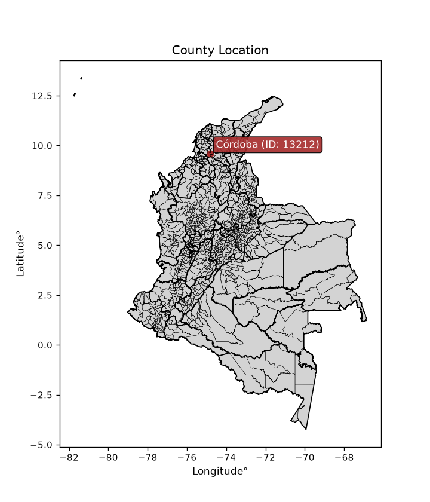
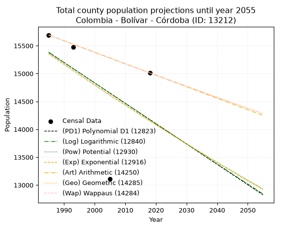
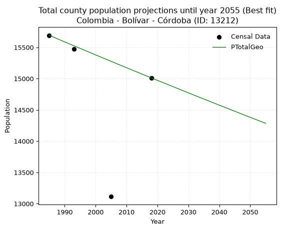
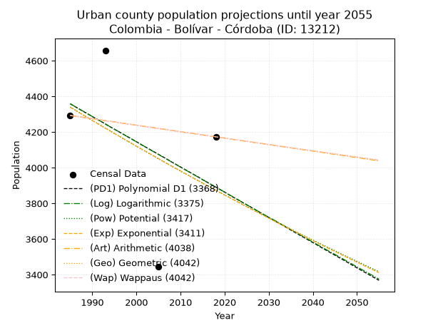
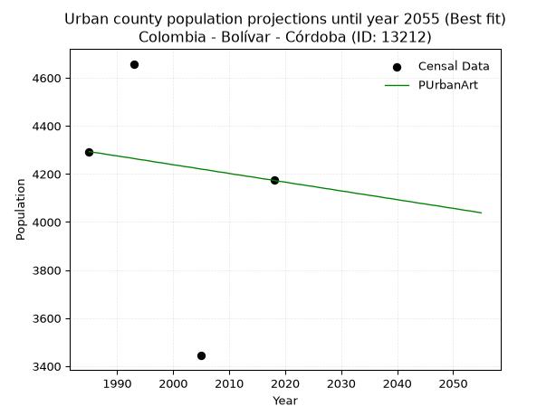
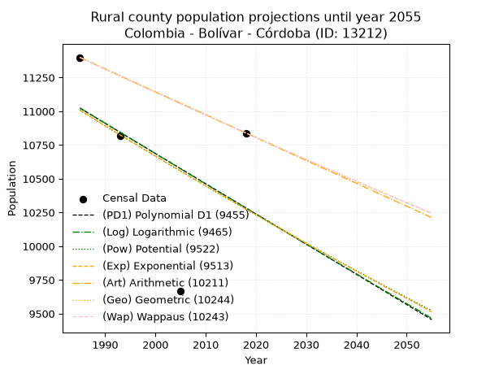
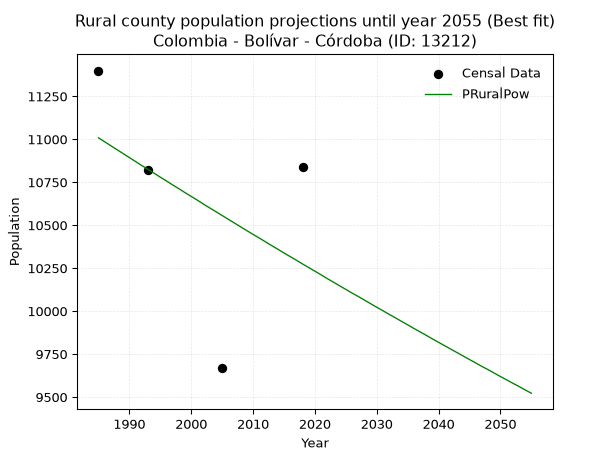

<div align="center">


</div>

# _“Population and Public Services Demand Projections (PPSD) until Year 2050 for Colombia - Bolívar - Córdoba (ID: 13212)”_
Keywords: `population` `public-service` `projection` `lineal` `polynomial` `logarithmic` `potential` `exponential` `arithmetic` `geometric` `wappaus` `dane` `colombia` `south-america`

PPSD are analytical estimates used by governments and planners to anticipate future changes in population size, age distribution, and the resulting community needs for utilities, healthcare, education, and infrastructure as sizing future water treatment facilities, electrical grids, and road networks based on spatial growth.

> **General running parameters**: • app_version: _v20260806_. • Python version: _3.14.7_. • Pandas version: _3.0.5_. • NumPy version: _2.5.1_. • Creates, save and include plots into reports (create_plot): _False_. • Projection until year: _2050_. • Process polynomial degree 2 and up: _False_. • Process Wappaus: _True_. • Process Wappaus: _True_. • Set negative values to zero: _True_. • Set infinite values to zero: _True_. • Drop dataset notes: _True_. 
<div align="center">

Dynamic map: [:earth_americas:Google](http://maps.google.com/maps?q=9.586942135,-74.827399) [:earth_americas:OSM](https://www.openstreetmap.org/#map=18/9.586942135/-74.827399&layers=P) [:earth_americas:Bing](https://www.bing.com/maps?cp=9.586942135~-74.827399&lvl=18) [:earth_americas:Apple](https://maps.apple.com/frame?center=9.586942135%2C-74.827399&span=0.003%2C0.006)

</div>


<div align="center">

```geojson
{
  "type": "Feature",
  "geometry": {
    "type": "Point", 
    "coordinates": [-74.827399, 9.586942135]
  }, 
  "properties": {
    "Name": "Colombia - Bolívar - Córdoba (ID: 13212)"
  }
}
```

</div>


<div align="center">

</img>

</div>


## 0. Census Data (4 records)

Census data are official statistics collected by a government about the people and housing in a country. They usually include counts of total population, age, sex, race, income, education, and jobs.

📅Global census file: [Population.xlsx](../data/Population.xlsx)

| Source   |   Year |   CountryID | CountryName   |   StateID | StateName   |   CountyID | CountyName   |   PTotal |   PUrban |   PRural |
|:---------|-------:|------------:|:--------------|----------:|:------------|-----------:|:-------------|---------:|---------:|---------:|
| DANE     |   1985 |          57 | Colombia      |        13 | Bolívar     |      13212 | Córdoba      |    15692 |     4293 |    11399 |
| DANE     |   1993 |          57 | Colombia      |        13 | Bolívar     |      13212 | Córdoba      |    15476 |     4658 |    10818 |
| DANE     |   2005 |          57 | Colombia      |        13 | Bolívar     |      13212 | Córdoba      |    13113 |     3444 |     9669 |
| DANE     |   2018 |          57 | Colombia      |        13 | Bolívar     |      13212 | Córdoba      |    15012 |     4173 |    10839 |

> 🔥Some records could had specific notes about the registered values or the corresponding urban or rural distribution.

📅   [RUPS](https://www.datos.gov.co/Hacienda-y-Cr-dito-P-blico/Registro-nico-de-Prestadores-de-Servicios-P-blicos/4qkq-csdn/about_data) - Local public utility companies: [RUPS.csv](../data/RUPS.xlsx)

 | SERVICIO       | ESTADO    | NOMBRE                                                         | NIT         | DEPARTAMENTO_DOMICILIO   | MUNICIPIO_DOMICILIO   | DIRECCION                                   |   TELEFONO | EMAIL                              | TIPO_PRESTADOR                 | CLASIFICACION                 |
|:---------------|:----------|:---------------------------------------------------------------|:------------|:-------------------------|:----------------------|:--------------------------------------------|-----------:|:-----------------------------------|:-------------------------------|:------------------------------|
| ACUEDUCTO      | OPERATIVA | MUNICIPIO DE CORDOBA                                           | 800038613-1 | BOLIVAR                  | CORDOBA               | PALACIO LUIS CARLOS GALÁN CALLE 3 No 2 - 10 |    4859044 | consorio.fortalecimiento@gmail.com | MUNICIPIO (PRESTACIÓN DIRECTA) | MENOR O IGUAL A 2500 USUARIOS |
| ACUEDUCTO      | OPERATIVA | COOPERATIVA AGUAS DE CORDOBA                                   | 900267847-2 | BOLIVAR                  | CORDOBA               | ACUEDUCTO MUNICIPAL-BARRIO SAN MARTIN       |    4859057 | aguasdecordobaesp@gmail.com        | ORGANIZACION AUTORIZADA        | HASTA 2500 SUSCRIPTORES       |
| ACUEDUCTO      | OPERATIVA | ADMINISTRACIÓN PÚBLICA COOPERATIVA DE CORDOBA BOLÍVAR LIMITADA | 901044270-1 | BOLIVAR                  | CORDOBA               | CALLE 10 CARRERA 6 AVENIDA LAS PALMERAS     |    0000000 | coosepcor2017@gmail.com            | ORGANIZACION AUTORIZADA        | MENOR O IGUAL A 2500 USUARIOS |
| ALCANTARILLADO | OPERATIVA | ADMINISTRACIÓN PÚBLICA COOPERATIVA DE CORDOBA BOLÍVAR LIMITADA | 901044270-1 | BOLIVAR                  | CORDOBA               | CALLE 10 CARRERA 6 AVENIDA LAS PALMERAS     |    0000000 | coosepcor2017@gmail.com            | ORGANIZACION AUTORIZADA        | MENOR O IGUAL A 2500 USUARIOS |

## 1. Total

### 1.1. Coefficients and Parameters

* (PD1) Polynomial Deg 1: -36.538338016861616, 87909.06061822744 (lineal)
* (Log) Logarithmic: -73393.8953160048, 572690.8364387183
* (Pow) Potential: -4.963795934639158, 20.555736229815373
* (Exp) Exponential: -0.002470821292931353, 2071408.63316384
* (Art) Arithmetic: Year diff. 2018 - 1985 = 33, Population diff. 15012 - 15692 = -680, Annual growth = -20.606060606060606
* (Geo) Geometric: Year diff. 2018 - 1985 = 33, Population diff. 15012 - 15692 = -680, Annual growth % = -0.0013415583072658999
* (Wap) Wappaus: i = -0.13422394871066054, Condition values only valid for < 200)

<sub>
Wappaus condition values: ['-0.00', '-0.13', '-0.27', '-0.40', '-0.54', '-0.67', '-0.81', '-0.94', '-1.07', '-1.21', '-1.34', '-1.48', '-1.61', '-1.74', '-1.88', '-2.01', '-2.15', '-2.28', '-2.42', '-2.55', '-2.68', '-2.82', '-2.95', '-3.09', '-3.22', '-3.36', '-3.49', '-3.62', '-3.76', '-3.89', '-4.03', '-4.16', '-4.30', '-4.43', '-4.56', '-4.70', '-4.83', '-4.97', '-5.10', '-5.23', '-5.37', '-5.50', '-5.64', '-5.77', '-5.91', '-6.04', '-6.17', '-6.31', '-6.44', '-6.58', '-6.71', '-6.85', '-6.98', '-7.11', '-7.25', '-7.38', '-7.52', '-7.65', '-7.78', '-7.92', '-8.05', '-8.19', '-8.32', '-8.46', '-8.59', '-8.72']
</sub>


### 1.2. Projected Dataset

|   Year |   CountyID |   PTotalPD1 |   PTotalLog |   PTotalPow |   PTotalExp |   PTotalArt |   PTotalGeo |   PTotalWap |
|-------:|-----------:|------------:|------------:|------------:|------------:|------------:|------------:|------------:|
|   1985 |      13212 |       15380 |       15384 |       15358 |       15354 |       15692 |       15692 |       15692 |
|   1986 |      13212 |       15344 |       15347 |       15319 |       15317 |       15671 |       15671 |       15671 |
|   1987 |      13212 |       15307 |       15310 |       15281 |       15279 |       15651 |       15650 |       15650 |
|   1988 |      13212 |       15271 |       15273 |       15243 |       15241 |       15630 |       15629 |       15629 |
|   1989 |      13212 |       15234 |       15236 |       15205 |       15203 |       15610 |       15608 |       15608 |
|   1990 |      13212 |       15198 |       15199 |       15167 |       15166 |       15589 |       15587 |       15587 |
|   1991 |      13212 |       15161 |       15162 |       15129 |       15128 |       15568 |       15566 |       15566 |
|   1992 |      13212 |       15125 |       15125 |       15092 |       15091 |       15548 |       15545 |       15545 |
|   1993 |      13212 |       15088 |       15088 |       15054 |       15054 |       15527 |       15524 |       15524 |
|   1994 |      13212 |       15052 |       15052 |       15017 |       15017 |       15507 |       15504 |       15504 |
|   1995 |      13212 |       15015 |       15015 |       14979 |       14980 |       15486 |       15483 |       15483 |
|   1996 |      13212 |       14979 |       14978 |       14942 |       14943 |       15465 |       15462 |       15462 |
|   1997 |      13212 |       14942 |       14941 |       14905 |       14906 |       15445 |       15441 |       15441 |
|   1998 |      13212 |       14905 |       14904 |       14868 |       14869 |       15424 |       15421 |       15421 |
|   1999 |      13212 |       14869 |       14868 |       14831 |       14832 |       15404 |       15400 |       15400 |
|   2000 |      13212 |       14832 |       14831 |       14794 |       14796 |       15383 |       15379 |       15379 |
|   2001 |      13212 |       14796 |       14794 |       14758 |       14759 |       15362 |       15359 |       15359 |
|   2002 |      13212 |       14759 |       14758 |       14721 |       14723 |       15342 |       15338 |       15338 |
|   2003 |      13212 |       14723 |       14721 |       14685 |       14687 |       15321 |       15317 |       15317 |
|   2004 |      13212 |       14686 |       14684 |       14648 |       14650 |       15300 |       15297 |       15297 |
|   2005 |      13212 |       14650 |       14648 |       14612 |       14614 |       15280 |       15276 |       15276 |
|   2006 |      13212 |       14613 |       14611 |       14576 |       14578 |       15259 |       15256 |       15256 |
|   2007 |      13212 |       14577 |       14575 |       14540 |       14542 |       15239 |       15235 |       15235 |
|   2008 |      13212 |       14540 |       14538 |       14504 |       14506 |       15218 |       15215 |       15215 |
|   2009 |      13212 |       14504 |       14501 |       14468 |       14470 |       15197 |       15194 |       15195 |
|   2010 |      13212 |       14467 |       14465 |       14433 |       14435 |       15177 |       15174 |       15174 |
|   2011 |      13212 |       14430 |       14428 |       14397 |       14399 |       15156 |       15154 |       15154 |
|   2012 |      13212 |       14394 |       14392 |       14362 |       14364 |       15136 |       15133 |       15133 |
|   2013 |      13212 |       14357 |       14355 |       14326 |       14328 |       15115 |       15113 |       15113 |
|   2014 |      13212 |       14321 |       14319 |       14291 |       14293 |       15094 |       15093 |       15093 |
|   2015 |      13212 |       14284 |       14283 |       14256 |       14257 |       15074 |       15073 |       15073 |
|   2016 |      13212 |       14248 |       14246 |       14221 |       14222 |       15053 |       15052 |       15052 |
|   2017 |      13212 |       14211 |       14210 |       14186 |       14187 |       15033 |       15032 |       15032 |
|   2018 |      13212 |       14175 |       14173 |       14151 |       14152 |       15012 |       15012 |       15012 |
|   2019 |      13212 |       14138 |       14137 |       14116 |       14117 |       14991 |       14992 |       14992 |
|   2020 |      13212 |       14102 |       14101 |       14081 |       14082 |       14971 |       14972 |       14972 |
|   2021 |      13212 |       14065 |       14064 |       14047 |       14048 |       14950 |       14952 |       14952 |
|   2022 |      13212 |       14029 |       14028 |       14012 |       14013 |       14930 |       14932 |       14932 |
|   2023 |      13212 |       13992 |       13992 |       13978 |       13978 |       14909 |       14912 |       14912 |
|   2024 |      13212 |       13955 |       13956 |       13944 |       13944 |       14888 |       14892 |       14892 |
|   2025 |      13212 |       13919 |       13919 |       13910 |       13909 |       14868 |       14872 |       14872 |
|   2026 |      13212 |       13882 |       13883 |       13876 |       13875 |       14847 |       14852 |       14852 |
|   2027 |      13212 |       13846 |       13847 |       13842 |       13841 |       14827 |       14832 |       14832 |
|   2028 |      13212 |       13809 |       13811 |       13808 |       13807 |       14806 |       14812 |       14812 |
|   2029 |      13212 |       13773 |       13774 |       13774 |       13773 |       14785 |       14792 |       14792 |
|   2030 |      13212 |       13736 |       13738 |       13740 |       13739 |       14765 |       14772 |       14772 |
|   2031 |      13212 |       13700 |       13702 |       13707 |       13705 |       14744 |       14752 |       14752 |
|   2032 |      13212 |       13663 |       13666 |       13673 |       13671 |       14724 |       14732 |       14732 |
|   2033 |      13212 |       13627 |       13630 |       13640 |       13637 |       14703 |       14713 |       14713 |
|   2034 |      13212 |       13590 |       13594 |       13607 |       13604 |       14682 |       14693 |       14693 |
|   2035 |      13212 |       13554 |       13558 |       13574 |       13570 |       14662 |       14673 |       14673 |
|   2036 |      13212 |       13517 |       13522 |       13541 |       13537 |       14641 |       14654 |       14653 |
|   2037 |      13212 |       13480 |       13486 |       13508 |       13503 |       14620 |       14634 |       14634 |
|   2038 |      13212 |       13444 |       13450 |       13475 |       13470 |       14600 |       14614 |       14614 |
|   2039 |      13212 |       13407 |       13414 |       13442 |       13437 |       14579 |       14595 |       14594 |
|   2040 |      13212 |       13371 |       13378 |       13409 |       13403 |       14559 |       14575 |       14575 |
|   2041 |      13212 |       13334 |       13342 |       13377 |       13370 |       14538 |       14556 |       14555 |
|   2042 |      13212 |       13298 |       13306 |       13344 |       13337 |       14517 |       14536 |       14536 |
|   2043 |      13212 |       13261 |       13270 |       13312 |       13304 |       14497 |       14517 |       14516 |
|   2044 |      13212 |       13225 |       13234 |       13280 |       13272 |       14476 |       14497 |       14497 |
|   2045 |      13212 |       13188 |       13198 |       13247 |       13239 |       14456 |       14478 |       14477 |
|   2046 |      13212 |       13152 |       13162 |       13215 |       13206 |       14435 |       14458 |       14458 |
|   2047 |      13212 |       13115 |       13126 |       13183 |       13174 |       14414 |       14439 |       14438 |
|   2048 |      13212 |       13079 |       13090 |       13151 |       13141 |       14394 |       14419 |       14419 |
|   2049 |      13212 |       13042 |       13055 |       13120 |       13109 |       14373 |       14400 |       14400 |
|   2050 |      13212 |       13005 |       13019 |       13088 |       13076 |       14353 |       14381 |       14380 |
<div align="center">

</img>

</div>


### 1.3. Best fit with absolute and relative error (%)

Relative error puts that difference into context by dividing the absolute error by the true value, creating a unitless ratio or percentage that shows the scale of the mistake.

Absolute and relative error

|   Year | Source   |   CountryID | CountryName   |   StateID | StateName   |   CountyID_x | CountyName   |   PTotal |   PUrban |   PRural |   CountyID_y |   PTotalPD1 |   PTotalLog |   PTotalPow |   PTotalExp |   PTotalArt |   PTotalGeo |   PTotalWap |   PTotalPD1AbsError |   PTotalLogAbsError |   PTotalPowAbsError |   PTotalExpAbsError |   PTotalArtAbsError |   PTotalGeoAbsError |   PTotalWapAbsError |   PTotalPD1RelError |   PTotalLogRelError |   PTotalPowRelError |   PTotalExpRelError |   PTotalArtRelError |   PTotalGeoRelError |   PTotalWapRelError |
|-------:|:---------|------------:|:--------------|----------:|:------------|-------------:|:-------------|---------:|---------:|---------:|-------------:|------------:|------------:|------------:|------------:|------------:|------------:|------------:|--------------------:|--------------------:|--------------------:|--------------------:|--------------------:|--------------------:|--------------------:|--------------------:|--------------------:|--------------------:|--------------------:|--------------------:|--------------------:|--------------------:|
|   1985 | DANE     |          57 | Colombia      |        13 | Bolívar     |        13212 | Córdoba      |    15692 |     4293 |    11399 |        13212 |       15380 |       15384 |       15358 |       15354 |       15692 |       15692 |       15692 |                 312 |                 308 |                 334 |                 338 |                   0 |                   0 |                   0 |             1.98827 |             1.96278 |             2.12847 |             2.15396 |            0        |            0        |            0        |
|   1993 | DANE     |          57 | Colombia      |        13 | Bolívar     |        13212 | Córdoba      |    15476 |     4658 |    10818 |        13212 |       15088 |       15088 |       15054 |       15054 |       15527 |       15524 |       15524 |                 388 |                 388 |                 422 |                 422 |                  51 |                  48 |                  48 |             2.50711 |             2.50711 |             2.7268  |             2.7268  |            0.329543 |            0.310158 |            0.310158 |
|   2005 | DANE     |          57 | Colombia      |        13 | Bolívar     |        13212 | Córdoba      |    13113 |     3444 |     9669 |        13212 |       14650 |       14648 |       14612 |       14614 |       15280 |       15276 |       15276 |                1537 |                1535 |                1499 |                1501 |                2167 |                2163 |                2163 |            11.7212  |            11.7059  |            11.4314  |            11.4467  |           16.5256   |           16.4951   |           16.4951   |
|   2018 | DANE     |          57 | Colombia      |        13 | Bolívar     |        13212 | Córdoba      |    15012 |     4173 |    10839 |        13212 |       14175 |       14173 |       14151 |       14152 |       15012 |       15012 |       15012 |                 837 |                 839 |                 861 |                 860 |                   0 |                   0 |                   0 |             5.57554 |             5.58886 |             5.73541 |             5.72875 |            0        |            0        |            0        |

Relative error mean

| Method    |   RelError | Best   |
|:----------|-----------:|:-------|
| PTotalPD1 |    5.44803 |        |
| PTotalLog |    5.44117 |        |
| PTotalPow |    5.50552 |        |
| PTotalExp |    5.51404 |        |
| PTotalArt |    4.21378 |        |
| PTotalGeo |    4.20131 | True   |
| PTotalWap |    4.20131 | True   |

💙Best method: _**PTotalGeo**_
<div align="center">

</img>

</div>


### 1.4. Fresh water supply demand in liters per capita per day (lpcd)

The fresh water supply demand typically ranges from 100 to 300 liters per capita per day (lpcd) for standard domestic and municipal planning, though absolute survival minimums set by the World Health Organization are as low as 7.5 to 20 liters per day, and total consumption in high-income nations can exceed 400 liters.

> `CZ`: Level in meters above the sea level (masl)<br> `WS`: Fresh water supply demand in liters per capita per day (lpcd or l/h/d)<br> `WSAll`: Zonal fresh water supply demand in liters per second (l/s)<br> `A`: Zonal area in square meters<br> `DP`: Population density (people/hectare or p/ha)

Reference values (RAS Colombia)

|    CZ |   WS |
|------:|-----:|
|  1000 |  120 |
|  2000 |  130 |
| 99999 |  140 |

County shapefile geometry properties and water supply values

|   CountyID |      ATotal |   CZTotal |   WSTotal |
|-----------:|------------:|----------:|----------:|
|      13212 | 5.96866e+08 |   53.1587 |       120 |

Projected values for best method: PTotalGeo

|   CountyID |   Year |   PTotalGeo |   DPTotal |   WSTotal |   WSTotalAll |
|-----------:|-------:|------------:|----------:|----------:|-------------:|
|      13212 |   1985 |       15692 |      0.26 |       120 |      21.7944 |
|      13212 |   1986 |       15671 |      0.26 |       120 |      21.7653 |
|      13212 |   1987 |       15650 |      0.26 |       120 |      21.7361 |
|      13212 |   1988 |       15629 |      0.26 |       120 |      21.7069 |
|      13212 |   1989 |       15608 |      0.26 |       120 |      21.6778 |
|      13212 |   1990 |       15587 |      0.26 |       120 |      21.6486 |
|      13212 |   1991 |       15566 |      0.26 |       120 |      21.6194 |
|      13212 |   1992 |       15545 |      0.26 |       120 |      21.5903 |
|      13212 |   1993 |       15524 |      0.26 |       120 |      21.5611 |
|      13212 |   1994 |       15504 |      0.26 |       120 |      21.5333 |
|      13212 |   1995 |       15483 |      0.26 |       120 |      21.5042 |
|      13212 |   1996 |       15462 |      0.26 |       120 |      21.475  |
|      13212 |   1997 |       15441 |      0.26 |       120 |      21.4458 |
|      13212 |   1998 |       15421 |      0.26 |       120 |      21.4181 |
|      13212 |   1999 |       15400 |      0.26 |       120 |      21.3889 |
|      13212 |   2000 |       15379 |      0.26 |       120 |      21.3597 |
|      13212 |   2001 |       15359 |      0.26 |       120 |      21.3319 |
|      13212 |   2002 |       15338 |      0.26 |       120 |      21.3028 |
|      13212 |   2003 |       15317 |      0.26 |       120 |      21.2736 |
|      13212 |   2004 |       15297 |      0.26 |       120 |      21.2458 |
|      13212 |   2005 |       15276 |      0.26 |       120 |      21.2167 |
|      13212 |   2006 |       15256 |      0.26 |       120 |      21.1889 |
|      13212 |   2007 |       15235 |      0.26 |       120 |      21.1597 |
|      13212 |   2008 |       15215 |      0.25 |       120 |      21.1319 |
|      13212 |   2009 |       15194 |      0.25 |       120 |      21.1028 |
|      13212 |   2010 |       15174 |      0.25 |       120 |      21.075  |
|      13212 |   2011 |       15154 |      0.25 |       120 |      21.0472 |
|      13212 |   2012 |       15133 |      0.25 |       120 |      21.0181 |
|      13212 |   2013 |       15113 |      0.25 |       120 |      20.9903 |
|      13212 |   2014 |       15093 |      0.25 |       120 |      20.9625 |
|      13212 |   2015 |       15073 |      0.25 |       120 |      20.9347 |
|      13212 |   2016 |       15052 |      0.25 |       120 |      20.9056 |
|      13212 |   2017 |       15032 |      0.25 |       120 |      20.8778 |
|      13212 |   2018 |       15012 |      0.25 |       120 |      20.85   |
|      13212 |   2019 |       14992 |      0.25 |       120 |      20.8222 |
|      13212 |   2020 |       14972 |      0.25 |       120 |      20.7944 |
|      13212 |   2021 |       14952 |      0.25 |       120 |      20.7667 |
|      13212 |   2022 |       14932 |      0.25 |       120 |      20.7389 |
|      13212 |   2023 |       14912 |      0.25 |       120 |      20.7111 |
|      13212 |   2024 |       14892 |      0.25 |       120 |      20.6833 |
|      13212 |   2025 |       14872 |      0.25 |       120 |      20.6556 |
|      13212 |   2026 |       14852 |      0.25 |       120 |      20.6278 |
|      13212 |   2027 |       14832 |      0.25 |       120 |      20.6    |
|      13212 |   2028 |       14812 |      0.25 |       120 |      20.5722 |
|      13212 |   2029 |       14792 |      0.25 |       120 |      20.5444 |
|      13212 |   2030 |       14772 |      0.25 |       120 |      20.5167 |
|      13212 |   2031 |       14752 |      0.25 |       120 |      20.4889 |
|      13212 |   2032 |       14732 |      0.25 |       120 |      20.4611 |
|      13212 |   2033 |       14713 |      0.25 |       120 |      20.4347 |
|      13212 |   2034 |       14693 |      0.25 |       120 |      20.4069 |
|      13212 |   2035 |       14673 |      0.25 |       120 |      20.3792 |
|      13212 |   2036 |       14654 |      0.25 |       120 |      20.3528 |
|      13212 |   2037 |       14634 |      0.25 |       120 |      20.325  |
|      13212 |   2038 |       14614 |      0.24 |       120 |      20.2972 |
|      13212 |   2039 |       14595 |      0.24 |       120 |      20.2708 |
|      13212 |   2040 |       14575 |      0.24 |       120 |      20.2431 |
|      13212 |   2041 |       14556 |      0.24 |       120 |      20.2167 |
|      13212 |   2042 |       14536 |      0.24 |       120 |      20.1889 |
|      13212 |   2043 |       14517 |      0.24 |       120 |      20.1625 |
|      13212 |   2044 |       14497 |      0.24 |       120 |      20.1347 |
|      13212 |   2045 |       14478 |      0.24 |       120 |      20.1083 |
|      13212 |   2046 |       14458 |      0.24 |       120 |      20.0806 |
|      13212 |   2047 |       14439 |      0.24 |       120 |      20.0542 |
|      13212 |   2048 |       14419 |      0.24 |       120 |      20.0264 |
|      13212 |   2049 |       14400 |      0.24 |       120 |      20      |
|      13212 |   2050 |       14381 |      0.24 |       120 |      19.9736 |

## 2. Urban

### 2.1. Coefficients and Parameters

* (PD1) Polynomial Deg 1: -14.145323163388566, 32436.182657567984 (lineal)
* (Log) Logarithmic: -28378.533550690612, 219847.46093009508
* (Pow) Potential: -6.901107283464551, 26.39569647816541
* (Exp) Exponential: -0.0034387774617333296, 3998301.020718251
* (Art) Arithmetic: Year diff. 2018 - 1985 = 33, Population diff. 4173 - 4293 = -120, Annual growth = -3.6363636363636362
* (Geo) Geometric: Year diff. 2018 - 1985 = 33, Population diff. 4173 - 4293 = -120, Annual growth % = -0.000858739787916063
* (Wap) Wappaus: i = -0.08590511779739278, Condition values only valid for < 200)

<sub>
Wappaus condition values: ['-0.00', '-0.09', '-0.17', '-0.26', '-0.34', '-0.43', '-0.52', '-0.60', '-0.69', '-0.77', '-0.86', '-0.94', '-1.03', '-1.12', '-1.20', '-1.29', '-1.37', '-1.46', '-1.55', '-1.63', '-1.72', '-1.80', '-1.89', '-1.98', '-2.06', '-2.15', '-2.23', '-2.32', '-2.41', '-2.49', '-2.58', '-2.66', '-2.75', '-2.83', '-2.92', '-3.01', '-3.09', '-3.18', '-3.26', '-3.35', '-3.44', '-3.52', '-3.61', '-3.69', '-3.78', '-3.87', '-3.95', '-4.04', '-4.12', '-4.21', '-4.30', '-4.38', '-4.47', '-4.55', '-4.64', '-4.72', '-4.81', '-4.90', '-4.98', '-5.07', '-5.15', '-5.24', '-5.33', '-5.41', '-5.50', '-5.58']
</sub>


### 2.2. Projected Dataset

|   Year |   CountyID |   PUrbanPD1 |   PUrbanLog |   PUrbanPow |   PUrbanExp |   PUrbanArt |   PUrbanGeo |   PUrbanWap |
|-------:|-----------:|------------:|------------:|------------:|------------:|------------:|------------:|------------:|
|   1985 |      13212 |        4358 |        4359 |        4340 |        4339 |        4293 |        4293 |        4293 |
|   1986 |      13212 |        4344 |        4344 |        4325 |        4324 |        4289 |        4289 |        4289 |
|   1987 |      13212 |        4329 |        4330 |        4310 |        4309 |        4286 |        4286 |        4286 |
|   1988 |      13212 |        4315 |        4316 |        4295 |        4295 |        4282 |        4282 |        4282 |
|   1989 |      13212 |        4301 |        4302 |        4280 |        4280 |        4278 |        4278 |        4278 |
|   1990 |      13212 |        4287 |        4287 |        4265 |        4265 |        4275 |        4275 |        4275 |
|   1991 |      13212 |        4273 |        4273 |        4251 |        4250 |        4271 |        4271 |        4271 |
|   1992 |      13212 |        4259 |        4259 |        4236 |        4236 |        4268 |        4267 |        4267 |
|   1993 |      13212 |        4245 |        4244 |        4221 |        4221 |        4264 |        4264 |        4264 |
|   1994 |      13212 |        4230 |        4230 |        4207 |        4207 |        4260 |        4260 |        4260 |
|   1995 |      13212 |        4216 |        4216 |        4192 |        4192 |        4257 |        4256 |        4256 |
|   1996 |      13212 |        4202 |        4202 |        4178 |        4178 |        4253 |        4253 |        4253 |
|   1997 |      13212 |        4188 |        4188 |        4163 |        4164 |        4249 |        4249 |        4249 |
|   1998 |      13212 |        4174 |        4173 |        4149 |        4149 |        4246 |        4245 |        4245 |
|   1999 |      13212 |        4160 |        4159 |        4135 |        4135 |        4242 |        4242 |        4242 |
|   2000 |      13212 |        4146 |        4145 |        4120 |        4121 |        4238 |        4238 |        4238 |
|   2001 |      13212 |        4131 |        4131 |        4106 |        4107 |        4235 |        4234 |        4234 |
|   2002 |      13212 |        4117 |        4117 |        4092 |        4093 |        4231 |        4231 |        4231 |
|   2003 |      13212 |        4103 |        4102 |        4078 |        4079 |        4228 |        4227 |        4227 |
|   2004 |      13212 |        4089 |        4088 |        4064 |        4065 |        4224 |        4223 |        4223 |
|   2005 |      13212 |        4075 |        4074 |        4050 |        4051 |        4220 |        4220 |        4220 |
|   2006 |      13212 |        4061 |        4060 |        4036 |        4037 |        4217 |        4216 |        4216 |
|   2007 |      13212 |        4047 |        4046 |        4022 |        4023 |        4213 |        4213 |        4213 |
|   2008 |      13212 |        4032 |        4032 |        4008 |        4009 |        4209 |        4209 |        4209 |
|   2009 |      13212 |        4018 |        4018 |        3995 |        3995 |        4206 |        4205 |        4205 |
|   2010 |      13212 |        4004 |        4003 |        3981 |        3982 |        4202 |        4202 |        4202 |
|   2011 |      13212 |        3990 |        3989 |        3967 |        3968 |        4198 |        4198 |        4198 |
|   2012 |      13212 |        3976 |        3975 |        3954 |        3954 |        4195 |        4195 |        4195 |
|   2013 |      13212 |        3962 |        3961 |        3940 |        3941 |        4191 |        4191 |        4191 |
|   2014 |      13212 |        3948 |        3947 |        3927 |        3927 |        4188 |        4187 |        4187 |
|   2015 |      13212 |        3933 |        3933 |        3913 |        3914 |        4184 |        4184 |        4184 |
|   2016 |      13212 |        3919 |        3919 |        3900 |        3900 |        4180 |        4180 |        4180 |
|   2017 |      13212 |        3905 |        3905 |        3887 |        3887 |        4177 |        4177 |        4177 |
|   2018 |      13212 |        3891 |        3891 |        3873 |        3874 |        4173 |        4173 |        4173 |
|   2019 |      13212 |        3877 |        3877 |        3860 |        3860 |        4169 |        4169 |        4169 |
|   2020 |      13212 |        3863 |        3863 |        3847 |        3847 |        4166 |        4166 |        4166 |
|   2021 |      13212 |        3848 |        3849 |        3834 |        3834 |        4162 |        4162 |        4162 |
|   2022 |      13212 |        3834 |        3835 |        3821 |        3821 |        4158 |        4159 |        4159 |
|   2023 |      13212 |        3820 |        3821 |        3808 |        3808 |        4155 |        4155 |        4155 |
|   2024 |      13212 |        3806 |        3806 |        3795 |        3794 |        4151 |        4152 |        4152 |
|   2025 |      13212 |        3792 |        3792 |        3782 |        3781 |        4148 |        4148 |        4148 |
|   2026 |      13212 |        3778 |        3778 |        3769 |        3768 |        4144 |        4144 |        4144 |
|   2027 |      13212 |        3764 |        3764 |        3756 |        3756 |        4140 |        4141 |        4141 |
|   2028 |      13212 |        3749 |        3750 |        3743 |        3743 |        4137 |        4137 |        4137 |
|   2029 |      13212 |        3735 |        3736 |        3731 |        3730 |        4133 |        4134 |        4134 |
|   2030 |      13212 |        3721 |        3722 |        3718 |        3717 |        4129 |        4130 |        4130 |
|   2031 |      13212 |        3707 |        3709 |        3705 |        3704 |        4126 |        4127 |        4127 |
|   2032 |      13212 |        3693 |        3695 |        3693 |        3691 |        4122 |        4123 |        4123 |
|   2033 |      13212 |        3679 |        3681 |        3680 |        3679 |        4118 |        4120 |        4120 |
|   2034 |      13212 |        3665 |        3667 |        3668 |        3666 |        4115 |        4116 |        4116 |
|   2035 |      13212 |        3650 |        3653 |        3655 |        3654 |        4111 |        4112 |        4112 |
|   2036 |      13212 |        3636 |        3639 |        3643 |        3641 |        4108 |        4109 |        4109 |
|   2037 |      13212 |        3622 |        3625 |        3631 |        3629 |        4104 |        4105 |        4105 |
|   2038 |      13212 |        3608 |        3611 |        3618 |        3616 |        4100 |        4102 |        4102 |
|   2039 |      13212 |        3594 |        3597 |        3606 |        3604 |        4097 |        4098 |        4098 |
|   2040 |      13212 |        3580 |        3583 |        3594 |        3591 |        4093 |        4095 |        4095 |
|   2041 |      13212 |        3566 |        3569 |        3582 |        3579 |        4089 |        4091 |        4091 |
|   2042 |      13212 |        3551 |        3555 |        3570 |        3567 |        4086 |        4088 |        4088 |
|   2043 |      13212 |        3537 |        3541 |        3558 |        3554 |        4082 |        4084 |        4084 |
|   2044 |      13212 |        3523 |        3527 |        3546 |        3542 |        4078 |        4081 |        4081 |
|   2045 |      13212 |        3509 |        3514 |        3534 |        3530 |        4075 |        4077 |        4077 |
|   2046 |      13212 |        3495 |        3500 |        3522 |        3518 |        4071 |        4074 |        4074 |
|   2047 |      13212 |        3481 |        3486 |        3510 |        3506 |        4068 |        4070 |        4070 |
|   2048 |      13212 |        3467 |        3472 |        3498 |        3494 |        4064 |        4067 |        4067 |
|   2049 |      13212 |        3452 |        3458 |        3487 |        3482 |        4060 |        4063 |        4063 |
|   2050 |      13212 |        3438 |        3444 |        3475 |        3470 |        4057 |        4060 |        4060 |
<div align="center">

</img>

</div>


### 2.3. Best fit with absolute and relative error (%)

Relative error puts that difference into context by dividing the absolute error by the true value, creating a unitless ratio or percentage that shows the scale of the mistake.

Absolute and relative error

|   Year | Source   |   CountryID | CountryName   |   StateID | StateName   |   CountyID_x | CountyName   |   PTotal |   PUrban |   PRural |   CountyID_y |   PUrbanPD1 |   PUrbanLog |   PUrbanPow |   PUrbanExp |   PUrbanArt |   PUrbanGeo |   PUrbanWap |   PUrbanPD1AbsError |   PUrbanLogAbsError |   PUrbanPowAbsError |   PUrbanExpAbsError |   PUrbanArtAbsError |   PUrbanGeoAbsError |   PUrbanWapAbsError |   PUrbanPD1RelError |   PUrbanLogRelError |   PUrbanPowRelError |   PUrbanExpRelError |   PUrbanArtRelError |   PUrbanGeoRelError |   PUrbanWapRelError |
|-------:|:---------|------------:|:--------------|----------:|:------------|-------------:|:-------------|---------:|---------:|---------:|-------------:|------------:|------------:|------------:|------------:|------------:|------------:|------------:|--------------------:|--------------------:|--------------------:|--------------------:|--------------------:|--------------------:|--------------------:|--------------------:|--------------------:|--------------------:|--------------------:|--------------------:|--------------------:|--------------------:|
|   1985 | DANE     |          57 | Colombia      |        13 | Bolívar     |        13212 | Córdoba      |    15692 |     4293 |    11399 |        13212 |        4358 |        4359 |        4340 |        4339 |        4293 |        4293 |        4293 |                  65 |                  66 |                  47 |                  46 |                   0 |                   0 |                   0 |             1.51409 |             1.53739 |             1.09481 |             1.07151 |             0       |             0       |             0       |
|   1993 | DANE     |          57 | Colombia      |        13 | Bolívar     |        13212 | Córdoba      |    15476 |     4658 |    10818 |        13212 |        4245 |        4244 |        4221 |        4221 |        4264 |        4264 |        4264 |                 413 |                 414 |                 437 |                 437 |                 394 |                 394 |                 394 |             8.86647 |             8.88793 |             9.38171 |             9.38171 |             8.45857 |             8.45857 |             8.45857 |
|   2005 | DANE     |          57 | Colombia      |        13 | Bolívar     |        13212 | Córdoba      |    13113 |     3444 |     9669 |        13212 |        4075 |        4074 |        4050 |        4051 |        4220 |        4220 |        4220 |                 631 |                 630 |                 606 |                 607 |                 776 |                 776 |                 776 |            18.3217  |            18.2927  |            17.5958  |            17.6249  |            22.5319  |            22.5319  |            22.5319  |
|   2018 | DANE     |          57 | Colombia      |        13 | Bolívar     |        13212 | Córdoba      |    15012 |     4173 |    10839 |        13212 |        3891 |        3891 |        3873 |        3874 |        4173 |        4173 |        4173 |                 282 |                 282 |                 300 |                 299 |                   0 |                   0 |                   0 |             6.75773 |             6.75773 |             7.18907 |             7.16511 |             0       |             0       |             0       |

Relative error mean

| Method    |   RelError | Best   |
|:----------|-----------:|:-------|
| PUrbanPD1 |    8.865   |        |
| PUrbanLog |    8.86893 |        |
| PUrbanPow |    8.81535 |        |
| PUrbanExp |    8.8108  |        |
| PUrbanArt |    7.74763 | True   |
| PUrbanGeo |    7.74763 | True   |
| PUrbanWap |    7.74763 | True   |

💙Best method: _**PUrbanArt**_
<div align="center">

</img>

</div>


### 2.4. Fresh water supply demand in liters per capita per day (lpcd)

The fresh water supply demand typically ranges from 100 to 300 liters per capita per day (lpcd) for standard domestic and municipal planning, though absolute survival minimums set by the World Health Organization are as low as 7.5 to 20 liters per day, and total consumption in high-income nations can exceed 400 liters.

> `CZ`: Level in meters above the sea level (masl)<br> `WS`: Fresh water supply demand in liters per capita per day (lpcd or l/h/d)<br> `WSAll`: Zonal fresh water supply demand in liters per second (l/s)<br> `A`: Zonal area in square meters<br> `DP`: Population density (people/hectare or p/ha)

Reference values (RAS Colombia)

|    CZ |   WS |
|------:|-----:|
|  1000 |  120 |
|  2000 |  130 |
| 99999 |  140 |

County shapefile geometry properties and water supply values

|   CountyID |   AUrban |   CZUrban |   WSUrban |
|-----------:|---------:|----------:|----------:|
|      13212 |   907357 |   17.5308 |       120 |

Projected values for best method: PUrbanArt

|   CountyID |   Year |   PUrbanArt |   DPUrban |   WSUrban |   WSUrbanAll |
|-----------:|-------:|------------:|----------:|----------:|-------------:|
|      13212 |   1985 |        4293 |     47.31 |       120 |      5.9625  |
|      13212 |   1986 |        4289 |     47.27 |       120 |      5.95694 |
|      13212 |   1987 |        4286 |     47.24 |       120 |      5.95278 |
|      13212 |   1988 |        4282 |     47.19 |       120 |      5.94722 |
|      13212 |   1989 |        4278 |     47.15 |       120 |      5.94167 |
|      13212 |   1990 |        4275 |     47.11 |       120 |      5.9375  |
|      13212 |   1991 |        4271 |     47.07 |       120 |      5.93194 |
|      13212 |   1992 |        4268 |     47.04 |       120 |      5.92778 |
|      13212 |   1993 |        4264 |     46.99 |       120 |      5.92222 |
|      13212 |   1994 |        4260 |     46.95 |       120 |      5.91667 |
|      13212 |   1995 |        4257 |     46.92 |       120 |      5.9125  |
|      13212 |   1996 |        4253 |     46.87 |       120 |      5.90694 |
|      13212 |   1997 |        4249 |     46.83 |       120 |      5.90139 |
|      13212 |   1998 |        4246 |     46.8  |       120 |      5.89722 |
|      13212 |   1999 |        4242 |     46.75 |       120 |      5.89167 |
|      13212 |   2000 |        4238 |     46.71 |       120 |      5.88611 |
|      13212 |   2001 |        4235 |     46.67 |       120 |      5.88194 |
|      13212 |   2002 |        4231 |     46.63 |       120 |      5.87639 |
|      13212 |   2003 |        4228 |     46.6  |       120 |      5.87222 |
|      13212 |   2004 |        4224 |     46.55 |       120 |      5.86667 |
|      13212 |   2005 |        4220 |     46.51 |       120 |      5.86111 |
|      13212 |   2006 |        4217 |     46.48 |       120 |      5.85694 |
|      13212 |   2007 |        4213 |     46.43 |       120 |      5.85139 |
|      13212 |   2008 |        4209 |     46.39 |       120 |      5.84583 |
|      13212 |   2009 |        4206 |     46.35 |       120 |      5.84167 |
|      13212 |   2010 |        4202 |     46.31 |       120 |      5.83611 |
|      13212 |   2011 |        4198 |     46.27 |       120 |      5.83056 |
|      13212 |   2012 |        4195 |     46.23 |       120 |      5.82639 |
|      13212 |   2013 |        4191 |     46.19 |       120 |      5.82083 |
|      13212 |   2014 |        4188 |     46.16 |       120 |      5.81667 |
|      13212 |   2015 |        4184 |     46.11 |       120 |      5.81111 |
|      13212 |   2016 |        4180 |     46.07 |       120 |      5.80556 |
|      13212 |   2017 |        4177 |     46.03 |       120 |      5.80139 |
|      13212 |   2018 |        4173 |     45.99 |       120 |      5.79583 |
|      13212 |   2019 |        4169 |     45.95 |       120 |      5.79028 |
|      13212 |   2020 |        4166 |     45.91 |       120 |      5.78611 |
|      13212 |   2021 |        4162 |     45.87 |       120 |      5.78056 |
|      13212 |   2022 |        4158 |     45.83 |       120 |      5.775   |
|      13212 |   2023 |        4155 |     45.79 |       120 |      5.77083 |
|      13212 |   2024 |        4151 |     45.75 |       120 |      5.76528 |
|      13212 |   2025 |        4148 |     45.72 |       120 |      5.76111 |
|      13212 |   2026 |        4144 |     45.67 |       120 |      5.75556 |
|      13212 |   2027 |        4140 |     45.63 |       120 |      5.75    |
|      13212 |   2028 |        4137 |     45.59 |       120 |      5.74583 |
|      13212 |   2029 |        4133 |     45.55 |       120 |      5.74028 |
|      13212 |   2030 |        4129 |     45.51 |       120 |      5.73472 |
|      13212 |   2031 |        4126 |     45.47 |       120 |      5.73056 |
|      13212 |   2032 |        4122 |     45.43 |       120 |      5.725   |
|      13212 |   2033 |        4118 |     45.38 |       120 |      5.71944 |
|      13212 |   2034 |        4115 |     45.35 |       120 |      5.71528 |
|      13212 |   2035 |        4111 |     45.31 |       120 |      5.70972 |
|      13212 |   2036 |        4108 |     45.27 |       120 |      5.70556 |
|      13212 |   2037 |        4104 |     45.23 |       120 |      5.7     |
|      13212 |   2038 |        4100 |     45.19 |       120 |      5.69444 |
|      13212 |   2039 |        4097 |     45.15 |       120 |      5.69028 |
|      13212 |   2040 |        4093 |     45.11 |       120 |      5.68472 |
|      13212 |   2041 |        4089 |     45.06 |       120 |      5.67917 |
|      13212 |   2042 |        4086 |     45.03 |       120 |      5.675   |
|      13212 |   2043 |        4082 |     44.99 |       120 |      5.66944 |
|      13212 |   2044 |        4078 |     44.94 |       120 |      5.66389 |
|      13212 |   2045 |        4075 |     44.91 |       120 |      5.65972 |
|      13212 |   2046 |        4071 |     44.87 |       120 |      5.65417 |
|      13212 |   2047 |        4068 |     44.83 |       120 |      5.65    |
|      13212 |   2048 |        4064 |     44.79 |       120 |      5.64444 |
|      13212 |   2049 |        4060 |     44.75 |       120 |      5.63889 |
|      13212 |   2050 |        4057 |     44.71 |       120 |      5.63472 |

## 3. Rural

### 3.1. Coefficients and Parameters

* (PD1) Polynomial Deg 1: -22.393014853473083, 55472.87796065953 (lineal)
* (Log) Logarithmic: -45015.36176531408, 352843.3755086224
* (Pow) Potential: -4.186325393819271, 17.847223730864616
* (Exp) Exponential: -0.0020822637574659606, 686599.567000941
* (Art) Arithmetic: Year diff. 2018 - 1985 = 33, Population diff. 10839 - 11399 = -560, Annual growth = -16.96969696969697
* (Geo) Geometric: Year diff. 2018 - 1985 = 33, Population diff. 10839 - 11399 = -560, Annual growth % = -0.0015253473346419355
* (Wap) Wappaus: i = -0.15261891329883057, Condition values only valid for < 200)

<sub>
Wappaus condition values: ['-0.00', '-0.15', '-0.31', '-0.46', '-0.61', '-0.76', '-0.92', '-1.07', '-1.22', '-1.37', '-1.53', '-1.68', '-1.83', '-1.98', '-2.14', '-2.29', '-2.44', '-2.59', '-2.75', '-2.90', '-3.05', '-3.20', '-3.36', '-3.51', '-3.66', '-3.82', '-3.97', '-4.12', '-4.27', '-4.43', '-4.58', '-4.73', '-4.88', '-5.04', '-5.19', '-5.34', '-5.49', '-5.65', '-5.80', '-5.95', '-6.10', '-6.26', '-6.41', '-6.56', '-6.72', '-6.87', '-7.02', '-7.17', '-7.33', '-7.48', '-7.63', '-7.78', '-7.94', '-8.09', '-8.24', '-8.39', '-8.55', '-8.70', '-8.85', '-9.00', '-9.16', '-9.31', '-9.46', '-9.61', '-9.77', '-9.92']
</sub>


### 3.2. Projected Dataset

|   Year |   CountyID |   PRuralPD1 |   PRuralLog |   PRuralPow |   PRuralExp |   PRuralArt |   PRuralGeo |   PRuralWap |
|-------:|-----------:|------------:|------------:|------------:|------------:|------------:|------------:|------------:|
|   1985 |      13212 |       11023 |       11025 |       11008 |       11006 |       11399 |       11399 |       11399 |
|   1986 |      13212 |       11000 |       11002 |       10985 |       10983 |       11382 |       11382 |       11382 |
|   1987 |      13212 |       10978 |       10980 |       10962 |       10960 |       11365 |       11364 |       11364 |
|   1988 |      13212 |       10956 |       10957 |       10939 |       10938 |       11348 |       11347 |       11347 |
|   1989 |      13212 |       10933 |       10934 |       10916 |       10915 |       11331 |       11330 |       11330 |
|   1990 |      13212 |       10911 |       10912 |       10893 |       10892 |       11314 |       11312 |       11312 |
|   1991 |      13212 |       10888 |       10889 |       10870 |       10870 |       11297 |       11295 |       11295 |
|   1992 |      13212 |       10866 |       10866 |       10847 |       10847 |       11280 |       11278 |       11278 |
|   1993 |      13212 |       10844 |       10844 |       10825 |       10824 |       11263 |       11261 |       11261 |
|   1994 |      13212 |       10821 |       10821 |       10802 |       10802 |       11246 |       11243 |       11243 |
|   1995 |      13212 |       10799 |       10799 |       10779 |       10779 |       11229 |       11226 |       11226 |
|   1996 |      13212 |       10776 |       10776 |       10757 |       10757 |       11212 |       11209 |       11209 |
|   1997 |      13212 |       10754 |       10754 |       10734 |       10735 |       11195 |       11192 |       11192 |
|   1998 |      13212 |       10732 |       10731 |       10712 |       10712 |       11178 |       11175 |       11175 |
|   1999 |      13212 |       10709 |       10709 |       10689 |       10690 |       11161 |       11158 |       11158 |
|   2000 |      13212 |       10687 |       10686 |       10667 |       10668 |       11144 |       11141 |       11141 |
|   2001 |      13212 |       10664 |       10663 |       10645 |       10646 |       11127 |       11124 |       11124 |
|   2002 |      13212 |       10642 |       10641 |       10622 |       10623 |       11111 |       11107 |       11107 |
|   2003 |      13212 |       10620 |       10619 |       10600 |       10601 |       11094 |       11090 |       11090 |
|   2004 |      13212 |       10597 |       10596 |       10578 |       10579 |       11077 |       11073 |       11073 |
|   2005 |      13212 |       10575 |       10574 |       10556 |       10557 |       11060 |       11056 |       11056 |
|   2006 |      13212 |       10552 |       10551 |       10534 |       10535 |       11043 |       11039 |       11039 |
|   2007 |      13212 |       10530 |       10529 |       10512 |       10513 |       11026 |       11023 |       11023 |
|   2008 |      13212 |       10508 |       10506 |       10490 |       10492 |       11009 |       11006 |       11006 |
|   2009 |      13212 |       10485 |       10484 |       10468 |       10470 |       10992 |       10989 |       10989 |
|   2010 |      13212 |       10463 |       10461 |       10446 |       10448 |       10975 |       10972 |       10972 |
|   2011 |      13212 |       10441 |       10439 |       10425 |       10426 |       10958 |       10955 |       10955 |
|   2012 |      13212 |       10418 |       10417 |       10403 |       10404 |       10941 |       10939 |       10939 |
|   2013 |      13212 |       10396 |       10394 |       10381 |       10383 |       10924 |       10922 |       10922 |
|   2014 |      13212 |       10373 |       10372 |       10360 |       10361 |       10907 |       10905 |       10905 |
|   2015 |      13212 |       10351 |       10350 |       10338 |       10340 |       10890 |       10889 |       10889 |
|   2016 |      13212 |       10329 |       10327 |       10317 |       10318 |       10873 |       10872 |       10872 |
|   2017 |      13212 |       10306 |       10305 |       10296 |       10297 |       10856 |       10856 |       10856 |
|   2018 |      13212 |       10284 |       10283 |       10274 |       10275 |       10839 |       10839 |       10839 |
|   2019 |      13212 |       10261 |       10260 |       10253 |       10254 |       10822 |       10822 |       10822 |
|   2020 |      13212 |       10239 |       10238 |       10232 |       10233 |       10805 |       10806 |       10806 |
|   2021 |      13212 |       10217 |       10216 |       10211 |       10211 |       10788 |       10789 |       10789 |
|   2022 |      13212 |       10194 |       10194 |       10189 |       10190 |       10771 |       10773 |       10773 |
|   2023 |      13212 |       10172 |       10171 |       10168 |       10169 |       10754 |       10757 |       10757 |
|   2024 |      13212 |       10149 |       10149 |       10147 |       10148 |       10737 |       10740 |       10740 |
|   2025 |      13212 |       10127 |       10127 |       10126 |       10127 |       10720 |       10724 |       10724 |
|   2026 |      13212 |       10105 |       10105 |       10105 |       10106 |       10703 |       10707 |       10707 |
|   2027 |      13212 |       10082 |       10082 |       10085 |       10085 |       10686 |       10691 |       10691 |
|   2028 |      13212 |       10060 |       10060 |       10064 |       10064 |       10669 |       10675 |       10675 |
|   2029 |      13212 |       10037 |       10038 |       10043 |       10043 |       10652 |       10659 |       10658 |
|   2030 |      13212 |       10015 |       10016 |       10022 |       10022 |       10635 |       10642 |       10642 |
|   2031 |      13212 |        9993 |        9994 |       10002 |       10001 |       10618 |       10626 |       10626 |
|   2032 |      13212 |        9970 |        9971 |        9981 |        9980 |       10601 |       10610 |       10610 |
|   2033 |      13212 |        9948 |        9949 |        9961 |        9959 |       10584 |       10594 |       10593 |
|   2034 |      13212 |        9925 |        9927 |        9940 |        9939 |       10567 |       10577 |       10577 |
|   2035 |      13212 |        9903 |        9905 |        9920 |        9918 |       10551 |       10561 |       10561 |
|   2036 |      13212 |        9881 |        9883 |        9899 |        9897 |       10534 |       10545 |       10545 |
|   2037 |      13212 |        9858 |        9861 |        9879 |        9877 |       10517 |       10529 |       10529 |
|   2038 |      13212 |        9836 |        9839 |        9859 |        9856 |       10500 |       10513 |       10513 |
|   2039 |      13212 |        9814 |        9817 |        9838 |        9836 |       10483 |       10497 |       10497 |
|   2040 |      13212 |        9791 |        9795 |        9818 |        9815 |       10466 |       10481 |       10481 |
|   2041 |      13212 |        9769 |        9773 |        9798 |        9795 |       10449 |       10465 |       10465 |
|   2042 |      13212 |        9746 |        9750 |        9778 |        9774 |       10432 |       10449 |       10449 |
|   2043 |      13212 |        9724 |        9728 |        9758 |        9754 |       10415 |       10433 |       10433 |
|   2044 |      13212 |        9702 |        9706 |        9738 |        9734 |       10398 |       10417 |       10417 |
|   2045 |      13212 |        9679 |        9684 |        9718 |        9714 |       10381 |       10401 |       10401 |
|   2046 |      13212 |        9657 |        9662 |        9698 |        9693 |       10364 |       10385 |       10385 |
|   2047 |      13212 |        9634 |        9640 |        9678 |        9673 |       10347 |       10370 |       10369 |
|   2048 |      13212 |        9612 |        9618 |        9659 |        9653 |       10330 |       10354 |       10353 |
|   2049 |      13212 |        9590 |        9596 |        9639 |        9633 |       10313 |       10338 |       10337 |
|   2050 |      13212 |        9567 |        9574 |        9619 |        9613 |       10296 |       10322 |       10322 |
<div align="center">

</img>

</div>


### 3.3. Best fit with absolute and relative error (%)

Relative error puts that difference into context by dividing the absolute error by the true value, creating a unitless ratio or percentage that shows the scale of the mistake.

Absolute and relative error

|   Year | Source   |   CountryID | CountryName   |   StateID | StateName   |   CountyID_x | CountyName   |   PTotal |   PUrban |   PRural |   CountyID_y |   PRuralPD1 |   PRuralLog |   PRuralPow |   PRuralExp |   PRuralArt |   PRuralGeo |   PRuralWap |   PRuralPD1AbsError |   PRuralLogAbsError |   PRuralPowAbsError |   PRuralExpAbsError |   PRuralArtAbsError |   PRuralGeoAbsError |   PRuralWapAbsError |   PRuralPD1RelError |   PRuralLogRelError |   PRuralPowRelError |   PRuralExpRelError |   PRuralArtRelError |   PRuralGeoRelError |   PRuralWapRelError |
|-------:|:---------|------------:|:--------------|----------:|:------------|-------------:|:-------------|---------:|---------:|---------:|-------------:|------------:|------------:|------------:|------------:|------------:|------------:|------------:|--------------------:|--------------------:|--------------------:|--------------------:|--------------------:|--------------------:|--------------------:|--------------------:|--------------------:|--------------------:|--------------------:|--------------------:|--------------------:|--------------------:|
|   1985 | DANE     |          57 | Colombia      |        13 | Bolívar     |        13212 | Córdoba      |    15692 |     4293 |    11399 |        13212 |       11023 |       11025 |       11008 |       11006 |       11399 |       11399 |       11399 |                 376 |                 374 |                 391 |                 393 |                   0 |                   0 |                   0 |             3.29853 |             3.28099 |            3.43013  |           3.44767   |             0       |             0       |             0       |
|   1993 | DANE     |          57 | Colombia      |        13 | Bolívar     |        13212 | Córdoba      |    15476 |     4658 |    10818 |        13212 |       10844 |       10844 |       10825 |       10824 |       11263 |       11261 |       11261 |                  26 |                  26 |                   7 |                   6 |                 445 |                 443 |                 443 |             0.24034 |             0.24034 |            0.064707 |           0.0554631 |             4.11351 |             4.09503 |             4.09503 |
|   2005 | DANE     |          57 | Colombia      |        13 | Bolívar     |        13212 | Córdoba      |    13113 |     3444 |     9669 |        13212 |       10575 |       10574 |       10556 |       10557 |       11060 |       11056 |       11056 |                 906 |                 905 |                 887 |                 888 |                1391 |                1387 |                1387 |             9.37015 |             9.35981 |            9.17365  |           9.18399   |            14.3862  |            14.3448  |            14.3448  |
|   2018 | DANE     |          57 | Colombia      |        13 | Bolívar     |        13212 | Córdoba      |    15012 |     4173 |    10839 |        13212 |       10284 |       10283 |       10274 |       10275 |       10839 |       10839 |       10839 |                 555 |                 556 |                 565 |                 564 |                   0 |                   0 |                   0 |             5.1204  |             5.12962 |            5.21266  |           5.20343   |             0       |             0       |             0       |

Relative error mean

| Method    |   RelError | Best   |
|:----------|-----------:|:-------|
| PRuralPD1 |    4.50736 |        |
| PRuralLog |    4.50269 |        |
| PRuralPow |    4.47028 | True   |
| PRuralExp |    4.47264 |        |
| PRuralArt |    4.62492 |        |
| PRuralGeo |    4.60996 |        |
| PRuralWap |    4.60996 |        |

💙Best method: _**PRuralPow**_
<div align="center">

</img>

</div>


### 3.4. Fresh water supply demand in liters per capita per day (lpcd)

The fresh water supply demand typically ranges from 100 to 300 liters per capita per day (lpcd) for standard domestic and municipal planning, though absolute survival minimums set by the World Health Organization are as low as 7.5 to 20 liters per day, and total consumption in high-income nations can exceed 400 liters.

> `CZ`: Level in meters above the sea level (masl)<br> `WS`: Fresh water supply demand in liters per capita per day (lpcd or l/h/d)<br> `WSAll`: Zonal fresh water supply demand in liters per second (l/s)<br> `A`: Zonal area in square meters<br> `DP`: Population density (people/hectare or p/ha)

Reference values (RAS Colombia)

|    CZ |   WS |
|------:|-----:|
|  1000 |  120 |
|  2000 |  130 |
| 99999 |  140 |

County shapefile geometry properties and water supply values

|   CountyID |      ARural |   CZRural |   WSRural |
|-----------:|------------:|----------:|----------:|
|      13212 | 5.95958e+08 |   53.2121 |       120 |

Projected values for best method: PRuralPow

|   CountyID |   Year |   PRuralPow |   DPRural |   WSRural |   WSRuralAll |
|-----------:|-------:|------------:|----------:|----------:|-------------:|
|      13212 |   1985 |       11008 |      0.18 |       120 |      15.2889 |
|      13212 |   1986 |       10985 |      0.18 |       120 |      15.2569 |
|      13212 |   1987 |       10962 |      0.18 |       120 |      15.225  |
|      13212 |   1988 |       10939 |      0.18 |       120 |      15.1931 |
|      13212 |   1989 |       10916 |      0.18 |       120 |      15.1611 |
|      13212 |   1990 |       10893 |      0.18 |       120 |      15.1292 |
|      13212 |   1991 |       10870 |      0.18 |       120 |      15.0972 |
|      13212 |   1992 |       10847 |      0.18 |       120 |      15.0653 |
|      13212 |   1993 |       10825 |      0.18 |       120 |      15.0347 |
|      13212 |   1994 |       10802 |      0.18 |       120 |      15.0028 |
|      13212 |   1995 |       10779 |      0.18 |       120 |      14.9708 |
|      13212 |   1996 |       10757 |      0.18 |       120 |      14.9403 |
|      13212 |   1997 |       10734 |      0.18 |       120 |      14.9083 |
|      13212 |   1998 |       10712 |      0.18 |       120 |      14.8778 |
|      13212 |   1999 |       10689 |      0.18 |       120 |      14.8458 |
|      13212 |   2000 |       10667 |      0.18 |       120 |      14.8153 |
|      13212 |   2001 |       10645 |      0.18 |       120 |      14.7847 |
|      13212 |   2002 |       10622 |      0.18 |       120 |      14.7528 |
|      13212 |   2003 |       10600 |      0.18 |       120 |      14.7222 |
|      13212 |   2004 |       10578 |      0.18 |       120 |      14.6917 |
|      13212 |   2005 |       10556 |      0.18 |       120 |      14.6611 |
|      13212 |   2006 |       10534 |      0.18 |       120 |      14.6306 |
|      13212 |   2007 |       10512 |      0.18 |       120 |      14.6    |
|      13212 |   2008 |       10490 |      0.18 |       120 |      14.5694 |
|      13212 |   2009 |       10468 |      0.18 |       120 |      14.5389 |
|      13212 |   2010 |       10446 |      0.18 |       120 |      14.5083 |
|      13212 |   2011 |       10425 |      0.17 |       120 |      14.4792 |
|      13212 |   2012 |       10403 |      0.17 |       120 |      14.4486 |
|      13212 |   2013 |       10381 |      0.17 |       120 |      14.4181 |
|      13212 |   2014 |       10360 |      0.17 |       120 |      14.3889 |
|      13212 |   2015 |       10338 |      0.17 |       120 |      14.3583 |
|      13212 |   2016 |       10317 |      0.17 |       120 |      14.3292 |
|      13212 |   2017 |       10296 |      0.17 |       120 |      14.3    |
|      13212 |   2018 |       10274 |      0.17 |       120 |      14.2694 |
|      13212 |   2019 |       10253 |      0.17 |       120 |      14.2403 |
|      13212 |   2020 |       10232 |      0.17 |       120 |      14.2111 |
|      13212 |   2021 |       10211 |      0.17 |       120 |      14.1819 |
|      13212 |   2022 |       10189 |      0.17 |       120 |      14.1514 |
|      13212 |   2023 |       10168 |      0.17 |       120 |      14.1222 |
|      13212 |   2024 |       10147 |      0.17 |       120 |      14.0931 |
|      13212 |   2025 |       10126 |      0.17 |       120 |      14.0639 |
|      13212 |   2026 |       10105 |      0.17 |       120 |      14.0347 |
|      13212 |   2027 |       10085 |      0.17 |       120 |      14.0069 |
|      13212 |   2028 |       10064 |      0.17 |       120 |      13.9778 |
|      13212 |   2029 |       10043 |      0.17 |       120 |      13.9486 |
|      13212 |   2030 |       10022 |      0.17 |       120 |      13.9194 |
|      13212 |   2031 |       10002 |      0.17 |       120 |      13.8917 |
|      13212 |   2032 |        9981 |      0.17 |       120 |      13.8625 |
|      13212 |   2033 |        9961 |      0.17 |       120 |      13.8347 |
|      13212 |   2034 |        9940 |      0.17 |       120 |      13.8056 |
|      13212 |   2035 |        9920 |      0.17 |       120 |      13.7778 |
|      13212 |   2036 |        9899 |      0.17 |       120 |      13.7486 |
|      13212 |   2037 |        9879 |      0.17 |       120 |      13.7208 |
|      13212 |   2038 |        9859 |      0.17 |       120 |      13.6931 |
|      13212 |   2039 |        9838 |      0.17 |       120 |      13.6639 |
|      13212 |   2040 |        9818 |      0.16 |       120 |      13.6361 |
|      13212 |   2041 |        9798 |      0.16 |       120 |      13.6083 |
|      13212 |   2042 |        9778 |      0.16 |       120 |      13.5806 |
|      13212 |   2043 |        9758 |      0.16 |       120 |      13.5528 |
|      13212 |   2044 |        9738 |      0.16 |       120 |      13.525  |
|      13212 |   2045 |        9718 |      0.16 |       120 |      13.4972 |
|      13212 |   2046 |        9698 |      0.16 |       120 |      13.4694 |
|      13212 |   2047 |        9678 |      0.16 |       120 |      13.4417 |
|      13212 |   2048 |        9659 |      0.16 |       120 |      13.4153 |
|      13212 |   2049 |        9639 |      0.16 |       120 |      13.3875 |
|      13212 |   2050 |        9619 |      0.16 |       120 |      13.3597 |

<div align="center"><br><sub>Share this research</sub></div><br>

<sub>**APPS & TOOLS & CONTENT DISCLAIMER**: • NO WARRANTY - This content and software is provided by <a href="https://github.com/rcfdtools" target="_blank">github.com/rcfdtools</a> "as is", without any express or implied warranty, including warranties of merchantability, fitness for a particular purpose, or non-infringement. There is no guarantee that the software will be error-free or operate without interruption. • LIMITATION OF LIABILITY - Neither the authors nor copyright holders will be liable for claims or damages arising from the software or its use. You are responsible for determining if the software is appropriate for your use and assume all associated risks, including errors, legal compliance, and data loss. • NO PROFESSIONAL ADVICE - The software provides general information and does not offer professional advice. It should not replace consultation with professional advisors. [Clauses and global license for rcfdtools use.](https://github.com/rcfdtools/rcfdtools/blob/main/LICENSE.md)</sub>

| [:house: Home](Readme.md)  | [:beginner: Help / Collab](https://github.com/rcfdtools/R.HydroTools/discussions/31) |
|----------------------------|-------------------------------------------------------------------------------------------|