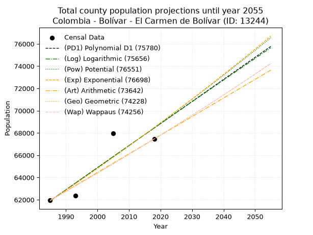
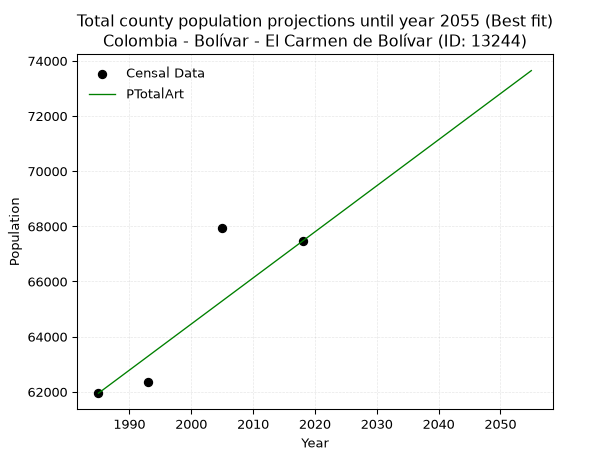
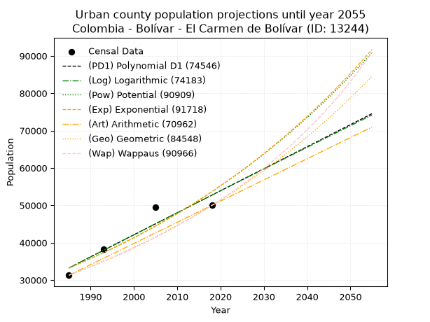
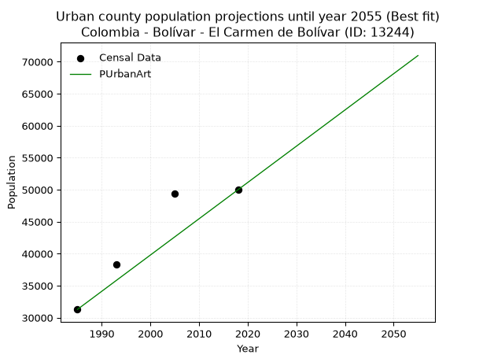
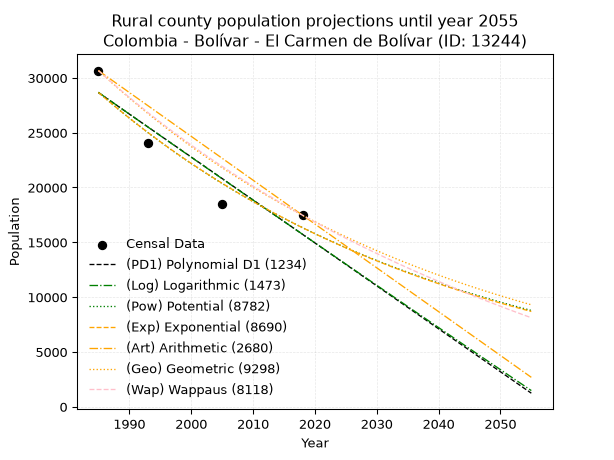
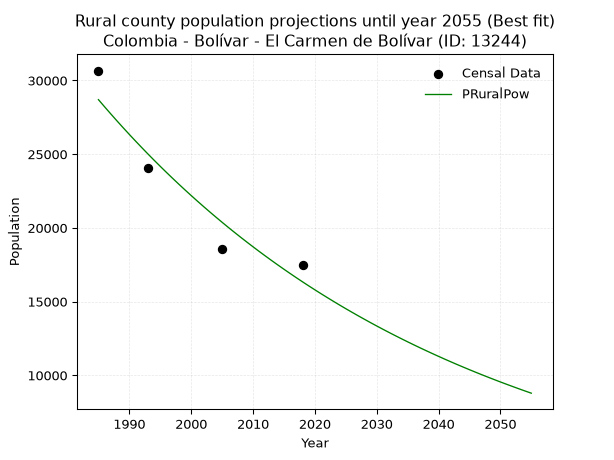

<div align="center">


</div>

# _“Population and Public Services Demand Projections (PPSD) until Year 2050 for Colombia - Bolívar - El Carmen de Bolívar (ID: 13244)”_
Keywords: `population` `public-service` `projection` `lineal` `polynomial` `logarithmic` `potential` `exponential` `arithmetic` `geometric` `wappaus` `dane` `colombia` `south-america`

PPSD are analytical estimates used by governments and planners to anticipate future changes in population size, age distribution, and the resulting community needs for utilities, healthcare, education, and infrastructure as sizing future water treatment facilities, electrical grids, and road networks based on spatial growth.

> **General running parameters**: • app_version: _v20260806_. • Python version: _3.14.7_. • Pandas version: _3.0.5_. • NumPy version: _2.5.1_. • Creates, save and include plots into reports (create_plot): _False_. • Projection until year: _2050_. • Process polynomial degree 2 and up: _False_. • Process Wappaus: _True_. • Process Wappaus: _True_. • Set negative values to zero: _True_. • Set infinite values to zero: _True_. • Drop dataset notes: _True_. 
<div align="center">

Dynamic map: [:earth_americas:Google](http://maps.google.com/maps?q=9.718653411,-75.1211775) [:earth_americas:OSM](https://www.openstreetmap.org/#map=18/9.718653411/-75.1211775&layers=P) [:earth_americas:Bing](https://www.bing.com/maps?cp=9.718653411~-75.1211775&lvl=18) [:earth_americas:Apple](https://maps.apple.com/frame?center=9.718653411%2C-75.1211775&span=0.003%2C0.006)

</div>


<div align="center">

```geojson
{
  "type": "Feature",
  "geometry": {
    "type": "Point", 
    "coordinates": [-75.1211775, 9.718653411]
  }, 
  "properties": {
    "Name": "Colombia - Bolívar - El Carmen de Bolívar (ID: 13244)"
  }
}
```

</div>


## 0. Census Data (4 records)

Census data are official statistics collected by a government about the people and housing in a country. They usually include counts of total population, age, sex, race, income, education, and jobs.

📅Global census file: [Population.xlsx](../data/Population.xlsx)

| Source   |   Year |   CountryID | CountryName   |   StateID | StateName   |   CountyID | CountyName           |   PTotal |   PUrban |   PRural |
|:---------|-------:|------------:|:--------------|----------:|:------------|-----------:|:---------------------|---------:|---------:|---------:|
| DANE     |   1985 |          57 | Colombia      |        13 | Bolívar     |      13244 | El Carmen de Bolívar |    61948 |    31285 |    30663 |
| DANE     |   1993 |          57 | Colombia      |        13 | Bolívar     |      13244 | El Carmen De Bolívar |    62355 |    38289 |    24066 |
| DANE     |   2005 |          57 | Colombia      |        13 | Bolívar     |      13244 | El Carmen de Bolívar |    67952 |    49423 |    18529 |
| DANE     |   2018 |          57 | Colombia      |        13 | Bolívar     |      13244 | El Carmen De Bolívar |    67461 |    49990 |    17471 |

> 🔥Some records could had specific notes about the registered values or the corresponding urban or rural distribution.

## 1. Total

### 1.1. Coefficients and Parameters

* (PD1) Polynomial Deg 1: 198.19189080690484, -331504.3295865114 (lineal)
* (Log) Logarithmic: 396955.9654919257, -2952336.474709598
* (Pow) Potential: 6.127458212875438, -15.415165851881179
* (Exp) Exponential: 0.0030593209791523602, 142.69665641120287
* (Art) Arithmetic: Year diff. 2018 - 1985 = 33, Population diff. 67461 - 61948 = 5513, Annual growth = 167.06060606060606
* (Geo) Geometric: Year diff. 2018 - 1985 = 33, Population diff. 67461 - 61948 = 5513, Annual growth % = 0.0025868045555785812
* (Wap) Wappaus: i = 0.2581900888819264, Condition values only valid for < 200)

<sub>
Wappaus condition values: ['0.00', '0.26', '0.52', '0.77', '1.03', '1.29', '1.55', '1.81', '2.07', '2.32', '2.58', '2.84', '3.10', '3.36', '3.61', '3.87', '4.13', '4.39', '4.65', '4.91', '5.16', '5.42', '5.68', '5.94', '6.20', '6.45', '6.71', '6.97', '7.23', '7.49', '7.75', '8.00', '8.26', '8.52', '8.78', '9.04', '9.29', '9.55', '9.81', '10.07', '10.33', '10.59', '10.84', '11.10', '11.36', '11.62', '11.88', '12.13', '12.39', '12.65', '12.91', '13.17', '13.43', '13.68', '13.94', '14.20', '14.46', '14.72', '14.98', '15.23', '15.49', '15.75', '16.01', '16.27', '16.52', '16.78']
</sub>


### 1.2. Projected Dataset

|   Year |   CountyID |   PTotalPD1 |   PTotalLog |   PTotalPow |   PTotalExp |   PTotalArt |   PTotalGeo |   PTotalWap |
|-------:|-----------:|------------:|------------:|------------:|------------:|------------:|------------:|------------:|
|   1985 |      13244 |       61907 |       61899 |       61905 |       61912 |       61948 |       61948 |       61948 |
|   1986 |      13244 |       62105 |       62099 |       62096 |       62102 |       62115 |       62108 |       62108 |
|   1987 |      13244 |       62303 |       62298 |       62288 |       62292 |       62282 |       62269 |       62269 |
|   1988 |      13244 |       62501 |       62498 |       62480 |       62483 |       62449 |       62430 |       62430 |
|   1989 |      13244 |       62699 |       62698 |       62673 |       62675 |       62616 |       62591 |       62591 |
|   1990 |      13244 |       62898 |       62897 |       62866 |       62867 |       62783 |       62753 |       62753 |
|   1991 |      13244 |       63096 |       63097 |       63060 |       63059 |       62950 |       62916 |       62915 |
|   1992 |      13244 |       63294 |       63296 |       63255 |       63252 |       63117 |       63078 |       63078 |
|   1993 |      13244 |       63492 |       63495 |       63449 |       63446 |       63284 |       63242 |       63241 |
|   1994 |      13244 |       63690 |       63694 |       63645 |       63641 |       63452 |       63405 |       63404 |
|   1995 |      13244 |       63888 |       63893 |       63841 |       63836 |       63619 |       63569 |       63568 |
|   1996 |      13244 |       64087 |       64092 |       64037 |       64031 |       63786 |       63734 |       63733 |
|   1997 |      13244 |       64285 |       64291 |       64234 |       64227 |       63953 |       63899 |       63898 |
|   1998 |      13244 |       64483 |       64490 |       64431 |       64424 |       64120 |       64064 |       64063 |
|   1999 |      13244 |       64681 |       64689 |       64629 |       64622 |       64287 |       64230 |       64228 |
|   2000 |      13244 |       64879 |       64887 |       64827 |       64820 |       64454 |       64396 |       64395 |
|   2001 |      13244 |       65078 |       65086 |       65026 |       65018 |       64621 |       64562 |       64561 |
|   2002 |      13244 |       65276 |       65284 |       65225 |       65217 |       64788 |       64729 |       64728 |
|   2003 |      13244 |       65474 |       65482 |       65425 |       65417 |       64955 |       64897 |       64895 |
|   2004 |      13244 |       65672 |       65680 |       65626 |       65618 |       65122 |       65065 |       65063 |
|   2005 |      13244 |       65870 |       65878 |       65827 |       65819 |       65289 |       65233 |       65232 |
|   2006 |      13244 |       66069 |       66076 |       66028 |       66020 |       65456 |       65402 |       65400 |
|   2007 |      13244 |       66267 |       66274 |       66230 |       66223 |       65623 |       65571 |       65570 |
|   2008 |      13244 |       66465 |       66472 |       66433 |       66426 |       65790 |       65740 |       65739 |
|   2009 |      13244 |       66663 |       66669 |       66636 |       66629 |       65957 |       65911 |       65909 |
|   2010 |      13244 |       66861 |       66867 |       66839 |       66833 |       66125 |       66081 |       66080 |
|   2011 |      13244 |       67060 |       67064 |       67043 |       67038 |       66292 |       66252 |       66251 |
|   2012 |      13244 |       67258 |       67262 |       67248 |       67243 |       66459 |       66423 |       66422 |
|   2013 |      13244 |       67456 |       67459 |       67453 |       67449 |       66626 |       66595 |       66594 |
|   2014 |      13244 |       67654 |       67656 |       67658 |       67656 |       66793 |       66767 |       66767 |
|   2015 |      13244 |       67852 |       67853 |       67864 |       67863 |       66960 |       66940 |       66940 |
|   2016 |      13244 |       68051 |       68050 |       68071 |       68071 |       67127 |       67113 |       67113 |
|   2017 |      13244 |       68249 |       68247 |       68278 |       68280 |       67294 |       67287 |       67287 |
|   2018 |      13244 |       68447 |       68444 |       68486 |       68489 |       67461 |       67461 |       67461 |
|   2019 |      13244 |       68645 |       68640 |       68694 |       68699 |       67628 |       67636 |       67636 |
|   2020 |      13244 |       68843 |       68837 |       68903 |       68910 |       67795 |       67810 |       67811 |
|   2021 |      13244 |       69041 |       69033 |       69112 |       69121 |       67962 |       67986 |       67987 |
|   2022 |      13244 |       69240 |       69230 |       69322 |       69332 |       68129 |       68162 |       68163 |
|   2023 |      13244 |       69438 |       69426 |       69532 |       69545 |       68296 |       68338 |       68339 |
|   2024 |      13244 |       69636 |       69622 |       69743 |       69758 |       68463 |       68515 |       68517 |
|   2025 |      13244 |       69834 |       69818 |       69954 |       69972 |       68630 |       68692 |       68694 |
|   2026 |      13244 |       70032 |       70014 |       70166 |       70186 |       68797 |       68870 |       68872 |
|   2027 |      13244 |       70231 |       70210 |       70379 |       70401 |       68965 |       69048 |       69051 |
|   2028 |      13244 |       70429 |       70406 |       70592 |       70617 |       69132 |       69227 |       69230 |
|   2029 |      13244 |       70627 |       70602 |       70805 |       70833 |       69299 |       69406 |       69409 |
|   2030 |      13244 |       70825 |       70797 |       71020 |       71050 |       69466 |       69585 |       69589 |
|   2031 |      13244 |       71023 |       70993 |       71234 |       71268 |       69633 |       69765 |       69770 |
|   2032 |      13244 |       71222 |       71188 |       71449 |       71486 |       69800 |       69946 |       69951 |
|   2033 |      13244 |       71420 |       71383 |       71665 |       71705 |       69967 |       70127 |       70132 |
|   2034 |      13244 |       71618 |       71579 |       71881 |       71925 |       70134 |       70308 |       70314 |
|   2035 |      13244 |       71816 |       71774 |       72098 |       72145 |       70301 |       70490 |       70497 |
|   2036 |      13244 |       72014 |       71969 |       72316 |       72366 |       70468 |       70672 |       70680 |
|   2037 |      13244 |       72213 |       72164 |       72533 |       72588 |       70635 |       70855 |       70864 |
|   2038 |      13244 |       72411 |       72359 |       72752 |       72811 |       70802 |       71038 |       71048 |
|   2039 |      13244 |       72609 |       72553 |       72971 |       73034 |       70969 |       71222 |       71232 |
|   2040 |      13244 |       72807 |       72748 |       73190 |       73257 |       71136 |       71406 |       71417 |
|   2041 |      13244 |       73005 |       72942 |       73411 |       73482 |       71303 |       71591 |       71603 |
|   2042 |      13244 |       73204 |       73137 |       73631 |       73707 |       71470 |       71776 |       71789 |
|   2043 |      13244 |       73402 |       73331 |       73853 |       73933 |       71638 |       71962 |       71976 |
|   2044 |      13244 |       73600 |       73525 |       74074 |       74159 |       71805 |       72148 |       72163 |
|   2045 |      13244 |       73798 |       73720 |       74297 |       74387 |       71972 |       72335 |       72350 |
|   2046 |      13244 |       73996 |       73914 |       74520 |       74615 |       72139 |       72522 |       72539 |
|   2047 |      13244 |       74194 |       74108 |       74743 |       74843 |       72306 |       72709 |       72727 |
|   2048 |      13244 |       74393 |       74302 |       74967 |       75073 |       72473 |       72897 |       72917 |
|   2049 |      13244 |       74591 |       74495 |       75192 |       75303 |       72640 |       73086 |       73106 |
|   2050 |      13244 |       74789 |       74689 |       75417 |       75533 |       72807 |       73275 |       73297 |
<div align="center">

</img>

</div>


### 1.3. Best fit with absolute and relative error (%)

Relative error puts that difference into context by dividing the absolute error by the true value, creating a unitless ratio or percentage that shows the scale of the mistake.

Absolute and relative error

|   Year | Source   |   CountryID | CountryName   |   StateID | StateName   |   CountyID_x | CountyName           |   PTotal |   PUrban |   PRural |   CountyID_y |   PTotalPD1 |   PTotalLog |   PTotalPow |   PTotalExp |   PTotalArt |   PTotalGeo |   PTotalWap |   PTotalPD1AbsError |   PTotalLogAbsError |   PTotalPowAbsError |   PTotalExpAbsError |   PTotalArtAbsError |   PTotalGeoAbsError |   PTotalWapAbsError |   PTotalPD1RelError |   PTotalLogRelError |   PTotalPowRelError |   PTotalExpRelError |   PTotalArtRelError |   PTotalGeoRelError |   PTotalWapRelError |
|-------:|:---------|------------:|:--------------|----------:|:------------|-------------:|:---------------------|---------:|---------:|---------:|-------------:|------------:|------------:|------------:|------------:|------------:|------------:|------------:|--------------------:|--------------------:|--------------------:|--------------------:|--------------------:|--------------------:|--------------------:|--------------------:|--------------------:|--------------------:|--------------------:|--------------------:|--------------------:|--------------------:|
|   1985 | DANE     |          57 | Colombia      |        13 | Bolívar     |        13244 | El Carmen de Bolívar |    61948 |    31285 |    30663 |        13244 |       61907 |       61899 |       61905 |       61912 |       61948 |       61948 |       61948 |                  41 |                  49 |                  43 |                  36 |                   0 |                   0 |                   0 |           0.0661845 |           0.0790986 |           0.0694131 |           0.0581133 |             0       |             0       |             0       |
|   1993 | DANE     |          57 | Colombia      |        13 | Bolívar     |        13244 | El Carmen De Bolívar |    62355 |    38289 |    24066 |        13244 |       63492 |       63495 |       63449 |       63446 |       63284 |       63242 |       63241 |                1137 |                1140 |                1094 |                1091 |                 929 |                 887 |                 886 |           1.82343   |           1.82824   |           1.75447   |           1.74966   |             1.48986 |             1.4225  |             1.4209  |
|   2005 | DANE     |          57 | Colombia      |        13 | Bolívar     |        13244 | El Carmen de Bolívar |    67952 |    49423 |    18529 |        13244 |       65870 |       65878 |       65827 |       65819 |       65289 |       65233 |       65232 |                2082 |                2074 |                2125 |                2133 |                2663 |                2719 |                2720 |           3.06393   |           3.05215   |           3.12721   |           3.13898   |             3.91894 |             4.00135 |             4.00283 |
|   2018 | DANE     |          57 | Colombia      |        13 | Bolívar     |        13244 | El Carmen De Bolívar |    67461 |    49990 |    17471 |        13244 |       68447 |       68444 |       68486 |       68489 |       67461 |       67461 |       67461 |                 986 |                 983 |                1025 |                1028 |                   0 |                   0 |                   0 |           1.46159   |           1.45714   |           1.5194    |           1.52384   |             0       |             0       |             0       |

Relative error mean

| Method    |   RelError | Best   |
|:----------|-----------:|:-------|
| PTotalPD1 |    1.60378 |        |
| PTotalLog |    1.60416 |        |
| PTotalPow |    1.61762 |        |
| PTotalExp |    1.61765 |        |
| PTotalArt |    1.3522  | True   |
| PTotalGeo |    1.35596 |        |
| PTotalWap |    1.35593 |        |

💙Best method: _**PTotalArt**_
<div align="center">

</img>

</div>


### 1.4. Fresh water supply demand in liters per capita per day (lpcd)

The fresh water supply demand typically ranges from 100 to 300 liters per capita per day (lpcd) for standard domestic and municipal planning, though absolute survival minimums set by the World Health Organization are as low as 7.5 to 20 liters per day, and total consumption in high-income nations can exceed 400 liters.

> `CZ`: Level in meters above the sea level (masl).<br> `WS`: Fresh water supply demand in liters per capita per day (lpcd or l/h/d).<br> `WSAll`: Zonal fresh water supply demand in liters per second (l/s).<br> `A`: Zonal area in square meters.

Reference values (RAS Colombia)

|    CZ |   WS |
|------:|-----:|
|  1000 |  120 |
|  2000 |  130 |
| 99999 |  140 |

County shapefile geometry properties and water supply values

|   CountyID |      ATotal |   CZTotal |   WSTotal |
|-----------:|------------:|----------:|----------:|
|      13244 | 9.45746e+08 |   211.113 |       120 |

Projected values for best method: PTotalArt

|   CountyID |   Year |   PTotalArt |   WSTotal |   WSTotalAll |
|-----------:|-------:|------------:|----------:|-------------:|
|      13244 |   1985 |       61948 |       120 |      86.0389 |
|      13244 |   1986 |       62115 |       120 |      86.2708 |
|      13244 |   1987 |       62282 |       120 |      86.5028 |
|      13244 |   1988 |       62449 |       120 |      86.7347 |
|      13244 |   1989 |       62616 |       120 |      86.9667 |
|      13244 |   1990 |       62783 |       120 |      87.1986 |
|      13244 |   1991 |       62950 |       120 |      87.4306 |
|      13244 |   1992 |       63117 |       120 |      87.6625 |
|      13244 |   1993 |       63284 |       120 |      87.8944 |
|      13244 |   1994 |       63452 |       120 |      88.1278 |
|      13244 |   1995 |       63619 |       120 |      88.3597 |
|      13244 |   1996 |       63786 |       120 |      88.5917 |
|      13244 |   1997 |       63953 |       120 |      88.8236 |
|      13244 |   1998 |       64120 |       120 |      89.0556 |
|      13244 |   1999 |       64287 |       120 |      89.2875 |
|      13244 |   2000 |       64454 |       120 |      89.5194 |
|      13244 |   2001 |       64621 |       120 |      89.7514 |
|      13244 |   2002 |       64788 |       120 |      89.9833 |
|      13244 |   2003 |       64955 |       120 |      90.2153 |
|      13244 |   2004 |       65122 |       120 |      90.4472 |
|      13244 |   2005 |       65289 |       120 |      90.6792 |
|      13244 |   2006 |       65456 |       120 |      90.9111 |
|      13244 |   2007 |       65623 |       120 |      91.1431 |
|      13244 |   2008 |       65790 |       120 |      91.375  |
|      13244 |   2009 |       65957 |       120 |      91.6069 |
|      13244 |   2010 |       66125 |       120 |      91.8403 |
|      13244 |   2011 |       66292 |       120 |      92.0722 |
|      13244 |   2012 |       66459 |       120 |      92.3042 |
|      13244 |   2013 |       66626 |       120 |      92.5361 |
|      13244 |   2014 |       66793 |       120 |      92.7681 |
|      13244 |   2015 |       66960 |       120 |      93      |
|      13244 |   2016 |       67127 |       120 |      93.2319 |
|      13244 |   2017 |       67294 |       120 |      93.4639 |
|      13244 |   2018 |       67461 |       120 |      93.6958 |
|      13244 |   2019 |       67628 |       120 |      93.9278 |
|      13244 |   2020 |       67795 |       120 |      94.1597 |
|      13244 |   2021 |       67962 |       120 |      94.3917 |
|      13244 |   2022 |       68129 |       120 |      94.6236 |
|      13244 |   2023 |       68296 |       120 |      94.8556 |
|      13244 |   2024 |       68463 |       120 |      95.0875 |
|      13244 |   2025 |       68630 |       120 |      95.3194 |
|      13244 |   2026 |       68797 |       120 |      95.5514 |
|      13244 |   2027 |       68965 |       120 |      95.7847 |
|      13244 |   2028 |       69132 |       120 |      96.0167 |
|      13244 |   2029 |       69299 |       120 |      96.2486 |
|      13244 |   2030 |       69466 |       120 |      96.4806 |
|      13244 |   2031 |       69633 |       120 |      96.7125 |
|      13244 |   2032 |       69800 |       120 |      96.9444 |
|      13244 |   2033 |       69967 |       120 |      97.1764 |
|      13244 |   2034 |       70134 |       120 |      97.4083 |
|      13244 |   2035 |       70301 |       120 |      97.6403 |
|      13244 |   2036 |       70468 |       120 |      97.8722 |
|      13244 |   2037 |       70635 |       120 |      98.1042 |
|      13244 |   2038 |       70802 |       120 |      98.3361 |
|      13244 |   2039 |       70969 |       120 |      98.5681 |
|      13244 |   2040 |       71136 |       120 |      98.8    |
|      13244 |   2041 |       71303 |       120 |      99.0319 |
|      13244 |   2042 |       71470 |       120 |      99.2639 |
|      13244 |   2043 |       71638 |       120 |      99.4972 |
|      13244 |   2044 |       71805 |       120 |      99.7292 |
|      13244 |   2045 |       71972 |       120 |      99.9611 |
|      13244 |   2046 |       72139 |       120 |     100.193  |
|      13244 |   2047 |       72306 |       120 |     100.425  |
|      13244 |   2048 |       72473 |       120 |     100.657  |
|      13244 |   2049 |       72640 |       120 |     100.889  |
|      13244 |   2050 |       72807 |       120 |     101.121  |

## 2. Urban

### 2.1. Coefficients and Parameters

* (PD1) Polynomial Deg 1: 589.9482135688468, -1137797.1641910858 (lineal)
* (Log) Logarithmic: 1181816.2113938727, -8940747.743285589
* (Pow) Potential: 29.0390173208575, -91.24219280693124
* (Exp) Exponential: 0.014494642148610636, 1.0625409229408897e-08
* (Art) Arithmetic: Year diff. 2018 - 1985 = 33, Population diff. 49990 - 31285 = 18705, Annual growth = 566.8181818181819
* (Geo) Geometric: Year diff. 2018 - 1985 = 33, Population diff. 49990 - 31285 = 18705, Annual growth % = 0.014303888027785039
* (Wap) Wappaus: i = 1.3948155812197645, Condition values only valid for < 200)

<sub>
Wappaus condition values: ['0.00', '1.39', '2.79', '4.18', '5.58', '6.97', '8.37', '9.76', '11.16', '12.55', '13.95', '15.34', '16.74', '18.13', '19.53', '20.92', '22.32', '23.71', '25.11', '26.50', '27.90', '29.29', '30.69', '32.08', '33.48', '34.87', '36.27', '37.66', '39.05', '40.45', '41.84', '43.24', '44.63', '46.03', '47.42', '48.82', '50.21', '51.61', '53.00', '54.40', '55.79', '57.19', '58.58', '59.98', '61.37', '62.77', '64.16', '65.56', '66.95', '68.35', '69.74', '71.14', '72.53', '73.93', '75.32', '76.71', '78.11', '79.50', '80.90', '82.29', '83.69', '85.08', '86.48', '87.87', '89.27', '90.66']
</sub>


### 2.2. Projected Dataset

|   Year |   CountyID |   PUrbanPD1 |   PUrbanLog |   PUrbanPow |   PUrbanExp |   PUrbanArt |   PUrbanGeo |   PUrbanWap |
|-------:|-----------:|------------:|------------:|------------:|------------:|------------:|------------:|------------:|
|   1985 |      13244 |       33250 |       33225 |       33230 |       33251 |       31285 |       31285 |       31285 |
|   1986 |      13244 |       33840 |       33820 |       33720 |       33737 |       31852 |       31732 |       31724 |
|   1987 |      13244 |       34430 |       34415 |       34216 |       34229 |       32419 |       32186 |       32170 |
|   1988 |      13244 |       35020 |       35010 |       34720 |       34729 |       32985 |       32647 |       32622 |
|   1989 |      13244 |       35610 |       35604 |       35231 |       35236 |       33552 |       33114 |       33081 |
|   1990 |      13244 |       36200 |       36198 |       35749 |       35751 |       34119 |       33587 |       33546 |
|   1991 |      13244 |       36790 |       36792 |       36274 |       36272 |       34686 |       34068 |       34018 |
|   1992 |      13244 |       37380 |       37385 |       36807 |       36802 |       35253 |       34555 |       34496 |
|   1993 |      13244 |       37970 |       37978 |       37347 |       37339 |       35820 |       35049 |       34982 |
|   1994 |      13244 |       38560 |       38571 |       37895 |       37885 |       36386 |       35551 |       35475 |
|   1995 |      13244 |       39150 |       39164 |       38451 |       38438 |       36953 |       36059 |       35976 |
|   1996 |      13244 |       39739 |       39756 |       39015 |       38999 |       37520 |       36575 |       36484 |
|   1997 |      13244 |       40329 |       40348 |       39586 |       39568 |       38087 |       37098 |       37000 |
|   1998 |      13244 |       40919 |       40940 |       40166 |       40146 |       38654 |       37629 |       37523 |
|   1999 |      13244 |       41509 |       41531 |       40754 |       40732 |       39220 |       38167 |       38055 |
|   2000 |      13244 |       42099 |       42122 |       41350 |       41327 |       39787 |       38713 |       38595 |
|   2001 |      13244 |       42689 |       42713 |       41955 |       41930 |       40354 |       39267 |       39144 |
|   2002 |      13244 |       43279 |       43303 |       42568 |       42542 |       40921 |       39828 |       39701 |
|   2003 |      13244 |       43869 |       43893 |       43189 |       43164 |       41488 |       40398 |       40267 |
|   2004 |      13244 |       44459 |       44483 |       43820 |       43794 |       42055 |       40976 |       40842 |
|   2005 |      13244 |       45049 |       45073 |       44459 |       44433 |       42621 |       41562 |       41427 |
|   2006 |      13244 |       45639 |       45662 |       45108 |       45082 |       43188 |       42157 |       42021 |
|   2007 |      13244 |       46229 |       46251 |       45765 |       45740 |       43755 |       42760 |       42625 |
|   2008 |      13244 |       46819 |       46840 |       46432 |       46408 |       44322 |       43371 |       43239 |
|   2009 |      13244 |       47409 |       47428 |       47108 |       47085 |       44889 |       43992 |       43863 |
|   2010 |      13244 |       47999 |       48016 |       47794 |       47773 |       45455 |       44621 |       44498 |
|   2011 |      13244 |       48589 |       48604 |       48489 |       48470 |       46022 |       45259 |       45143 |
|   2012 |      13244 |       49179 |       49192 |       49195 |       49178 |       46589 |       45907 |       45800 |
|   2013 |      13244 |       49769 |       49779 |       49910 |       49896 |       47156 |       46563 |       46468 |
|   2014 |      13244 |       50359 |       50366 |       50635 |       50625 |       47723 |       47229 |       47148 |
|   2015 |      13244 |       50948 |       50953 |       51370 |       51364 |       48290 |       47905 |       47840 |
|   2016 |      13244 |       51538 |       51539 |       52115 |       52114 |       48856 |       48590 |       48544 |
|   2017 |      13244 |       52128 |       52125 |       52871 |       52874 |       49423 |       49285 |       49260 |
|   2018 |      13244 |       52718 |       52711 |       53638 |       53646 |       49990 |       49990 |       49990 |
|   2019 |      13244 |       53308 |       53296 |       54415 |       54430 |       50557 |       50705 |       50733 |
|   2020 |      13244 |       53898 |       53881 |       55203 |       55224 |       51124 |       51430 |       51490 |
|   2021 |      13244 |       54488 |       54466 |       56002 |       56031 |       51690 |       52166 |       52261 |
|   2022 |      13244 |       55078 |       55051 |       56812 |       56849 |       52257 |       52912 |       53046 |
|   2023 |      13244 |       55668 |       55635 |       57634 |       57679 |       52824 |       53669 |       53846 |
|   2024 |      13244 |       56258 |       56219 |       58467 |       58521 |       53391 |       54437 |       54662 |
|   2025 |      13244 |       56848 |       56803 |       59312 |       59375 |       53958 |       55215 |       55493 |
|   2026 |      13244 |       57438 |       57387 |       60168 |       60242 |       54525 |       56005 |       56340 |
|   2027 |      13244 |       58028 |       57970 |       61037 |       61122 |       55091 |       56806 |       57205 |
|   2028 |      13244 |       58618 |       58553 |       61917 |       62014 |       55658 |       57619 |       58086 |
|   2029 |      13244 |       59208 |       59135 |       62810 |       62919 |       56225 |       58443 |       58985 |
|   2030 |      13244 |       59798 |       59718 |       63715 |       63838 |       56792 |       59279 |       59903 |
|   2031 |      13244 |       60388 |       60300 |       64633 |       64770 |       57359 |       60127 |       60839 |
|   2032 |      13244 |       60978 |       60881 |       65563 |       65716 |       57925 |       60987 |       61795 |
|   2033 |      13244 |       61568 |       61463 |       66507 |       66675 |       58492 |       61859 |       62771 |
|   2034 |      13244 |       62158 |       62044 |       67463 |       67649 |       59059 |       62744 |       63767 |
|   2035 |      13244 |       62747 |       62625 |       68433 |       68636 |       59626 |       63642 |       64785 |
|   2036 |      13244 |       63337 |       63206 |       69416 |       69639 |       60193 |       64552 |       65825 |
|   2037 |      13244 |       63927 |       63786 |       70413 |       70655 |       60760 |       65475 |       66887 |
|   2038 |      13244 |       64517 |       64366 |       71424 |       71687 |       61326 |       66412 |       67974 |
|   2039 |      13244 |       65107 |       64946 |       72449 |       72734 |       61893 |       67362 |       69084 |
|   2040 |      13244 |       65697 |       65525 |       73488 |       73795 |       62460 |       68325 |       70220 |
|   2041 |      13244 |       66287 |       66104 |       74541 |       74873 |       63027 |       69303 |       71381 |
|   2042 |      13244 |       66877 |       66683 |       75609 |       75966 |       63594 |       70294 |       72569 |
|   2043 |      13244 |       67467 |       67262 |       76692 |       77075 |       64160 |       71299 |       73786 |
|   2044 |      13244 |       68057 |       67840 |       77789 |       78200 |       64727 |       72319 |       75031 |
|   2045 |      13244 |       68647 |       68418 |       78902 |       79342 |       65294 |       73354 |       76306 |
|   2046 |      13244 |       69237 |       68996 |       80030 |       80501 |       65861 |       74403 |       77612 |
|   2047 |      13244 |       69827 |       69573 |       81174 |       81676 |       66428 |       75467 |       78950 |
|   2048 |      13244 |       70417 |       70151 |       82333 |       82868 |       66995 |       76547 |       80321 |
|   2049 |      13244 |       71007 |       70727 |       83509 |       84078 |       67561 |       77642 |       81727 |
|   2050 |      13244 |       71597 |       71304 |       84700 |       85306 |       68128 |       78752 |       83168 |
<div align="center">

</img>

</div>


### 2.3. Best fit with absolute and relative error (%)

Relative error puts that difference into context by dividing the absolute error by the true value, creating a unitless ratio or percentage that shows the scale of the mistake.

Absolute and relative error

|   Year | Source   |   CountryID | CountryName   |   StateID | StateName   |   CountyID_x | CountyName           |   PTotal |   PUrban |   PRural |   CountyID_y |   PUrbanPD1 |   PUrbanLog |   PUrbanPow |   PUrbanExp |   PUrbanArt |   PUrbanGeo |   PUrbanWap |   PUrbanPD1AbsError |   PUrbanLogAbsError |   PUrbanPowAbsError |   PUrbanExpAbsError |   PUrbanArtAbsError |   PUrbanGeoAbsError |   PUrbanWapAbsError |   PUrbanPD1RelError |   PUrbanLogRelError |   PUrbanPowRelError |   PUrbanExpRelError |   PUrbanArtRelError |   PUrbanGeoRelError |   PUrbanWapRelError |
|-------:|:---------|------------:|:--------------|----------:|:------------|-------------:|:---------------------|---------:|---------:|---------:|-------------:|------------:|------------:|------------:|------------:|------------:|------------:|------------:|--------------------:|--------------------:|--------------------:|--------------------:|--------------------:|--------------------:|--------------------:|--------------------:|--------------------:|--------------------:|--------------------:|--------------------:|--------------------:|--------------------:|
|   1985 | DANE     |          57 | Colombia      |        13 | Bolívar     |        13244 | El Carmen de Bolívar |    61948 |    31285 |    30663 |        13244 |       33250 |       33225 |       33230 |       33251 |       31285 |       31285 |       31285 |                1965 |                1940 |                1945 |                1966 |                   0 |                   0 |                   0 |            6.28097  |            6.20105  |             6.21704 |             6.28416 |             0       |             0       |             0       |
|   1993 | DANE     |          57 | Colombia      |        13 | Bolívar     |        13244 | El Carmen De Bolívar |    62355 |    38289 |    24066 |        13244 |       37970 |       37978 |       37347 |       37339 |       35820 |       35049 |       34982 |                 319 |                 311 |                 942 |                 950 |                2469 |                3240 |                3307 |            0.833137 |            0.812244 |             2.46024 |             2.48113 |             6.44833 |             8.46196 |             8.63695 |
|   2005 | DANE     |          57 | Colombia      |        13 | Bolívar     |        13244 | El Carmen de Bolívar |    67952 |    49423 |    18529 |        13244 |       45049 |       45073 |       44459 |       44433 |       42621 |       41562 |       41427 |                4374 |                4350 |                4964 |                4990 |                6802 |                7861 |                7996 |            8.85013  |            8.80157  |            10.0439  |            10.0965  |            13.7628  |            15.9056  |            16.1787  |
|   2018 | DANE     |          57 | Colombia      |        13 | Bolívar     |        13244 | El Carmen De Bolívar |    67461 |    49990 |    17471 |        13244 |       52718 |       52711 |       53638 |       53646 |       49990 |       49990 |       49990 |                2728 |                2721 |                3648 |                3656 |                   0 |                   0 |                   0 |            5.45709  |            5.44309  |             7.29746 |             7.31346 |             0       |             0       |             0       |

Relative error mean

| Method    |   RelError | Best   |
|:----------|-----------:|:-------|
| PUrbanPD1 |    5.35533 |        |
| PUrbanLog |    5.31449 |        |
| PUrbanPow |    6.50466 |        |
| PUrbanExp |    6.54382 |        |
| PUrbanArt |    5.05279 | True   |
| PUrbanGeo |    6.09188 |        |
| PUrbanWap |    6.20391 |        |

💙Best method: _**PUrbanArt**_
<div align="center">

</img>

</div>


### 2.4. Fresh water supply demand in liters per capita per day (lpcd)

The fresh water supply demand typically ranges from 100 to 300 liters per capita per day (lpcd) for standard domestic and municipal planning, though absolute survival minimums set by the World Health Organization are as low as 7.5 to 20 liters per day, and total consumption in high-income nations can exceed 400 liters.

> `CZ`: Level in meters above the sea level (masl).<br> `WS`: Fresh water supply demand in liters per capita per day (lpcd or l/h/d).<br> `WSAll`: Zonal fresh water supply demand in liters per second (l/s).<br> `A`: Zonal area in square meters.

Reference values (RAS Colombia)

|    CZ |   WS |
|------:|-----:|
|  1000 |  120 |
|  2000 |  130 |
| 99999 |  140 |

County shapefile geometry properties and water supply values

|   CountyID |      AUrban |   CZUrban |   WSUrban |
|-----------:|------------:|----------:|----------:|
|      13244 | 5.43682e+06 |   168.557 |       120 |

Projected values for best method: PUrbanArt

|   CountyID |   Year |   PUrbanArt |   WSUrban |   WSUrbanAll |
|-----------:|-------:|------------:|----------:|-------------:|
|      13244 |   1985 |       31285 |       120 |      43.4514 |
|      13244 |   1986 |       31852 |       120 |      44.2389 |
|      13244 |   1987 |       32419 |       120 |      45.0264 |
|      13244 |   1988 |       32985 |       120 |      45.8125 |
|      13244 |   1989 |       33552 |       120 |      46.6    |
|      13244 |   1990 |       34119 |       120 |      47.3875 |
|      13244 |   1991 |       34686 |       120 |      48.175  |
|      13244 |   1992 |       35253 |       120 |      48.9625 |
|      13244 |   1993 |       35820 |       120 |      49.75   |
|      13244 |   1994 |       36386 |       120 |      50.5361 |
|      13244 |   1995 |       36953 |       120 |      51.3236 |
|      13244 |   1996 |       37520 |       120 |      52.1111 |
|      13244 |   1997 |       38087 |       120 |      52.8986 |
|      13244 |   1998 |       38654 |       120 |      53.6861 |
|      13244 |   1999 |       39220 |       120 |      54.4722 |
|      13244 |   2000 |       39787 |       120 |      55.2597 |
|      13244 |   2001 |       40354 |       120 |      56.0472 |
|      13244 |   2002 |       40921 |       120 |      56.8347 |
|      13244 |   2003 |       41488 |       120 |      57.6222 |
|      13244 |   2004 |       42055 |       120 |      58.4097 |
|      13244 |   2005 |       42621 |       120 |      59.1958 |
|      13244 |   2006 |       43188 |       120 |      59.9833 |
|      13244 |   2007 |       43755 |       120 |      60.7708 |
|      13244 |   2008 |       44322 |       120 |      61.5583 |
|      13244 |   2009 |       44889 |       120 |      62.3458 |
|      13244 |   2010 |       45455 |       120 |      63.1319 |
|      13244 |   2011 |       46022 |       120 |      63.9194 |
|      13244 |   2012 |       46589 |       120 |      64.7069 |
|      13244 |   2013 |       47156 |       120 |      65.4944 |
|      13244 |   2014 |       47723 |       120 |      66.2819 |
|      13244 |   2015 |       48290 |       120 |      67.0694 |
|      13244 |   2016 |       48856 |       120 |      67.8556 |
|      13244 |   2017 |       49423 |       120 |      68.6431 |
|      13244 |   2018 |       49990 |       120 |      69.4306 |
|      13244 |   2019 |       50557 |       120 |      70.2181 |
|      13244 |   2020 |       51124 |       120 |      71.0056 |
|      13244 |   2021 |       51690 |       120 |      71.7917 |
|      13244 |   2022 |       52257 |       120 |      72.5792 |
|      13244 |   2023 |       52824 |       120 |      73.3667 |
|      13244 |   2024 |       53391 |       120 |      74.1542 |
|      13244 |   2025 |       53958 |       120 |      74.9417 |
|      13244 |   2026 |       54525 |       120 |      75.7292 |
|      13244 |   2027 |       55091 |       120 |      76.5153 |
|      13244 |   2028 |       55658 |       120 |      77.3028 |
|      13244 |   2029 |       56225 |       120 |      78.0903 |
|      13244 |   2030 |       56792 |       120 |      78.8778 |
|      13244 |   2031 |       57359 |       120 |      79.6653 |
|      13244 |   2032 |       57925 |       120 |      80.4514 |
|      13244 |   2033 |       58492 |       120 |      81.2389 |
|      13244 |   2034 |       59059 |       120 |      82.0264 |
|      13244 |   2035 |       59626 |       120 |      82.8139 |
|      13244 |   2036 |       60193 |       120 |      83.6014 |
|      13244 |   2037 |       60760 |       120 |      84.3889 |
|      13244 |   2038 |       61326 |       120 |      85.175  |
|      13244 |   2039 |       61893 |       120 |      85.9625 |
|      13244 |   2040 |       62460 |       120 |      86.75   |
|      13244 |   2041 |       63027 |       120 |      87.5375 |
|      13244 |   2042 |       63594 |       120 |      88.325  |
|      13244 |   2043 |       64160 |       120 |      89.1111 |
|      13244 |   2044 |       64727 |       120 |      89.8986 |
|      13244 |   2045 |       65294 |       120 |      90.6861 |
|      13244 |   2046 |       65861 |       120 |      91.4736 |
|      13244 |   2047 |       66428 |       120 |      92.2611 |
|      13244 |   2048 |       66995 |       120 |      93.0486 |
|      13244 |   2049 |       67561 |       120 |      93.8347 |
|      13244 |   2050 |       68128 |       120 |      94.6222 |

## 3. Rural

### 3.1. Coefficients and Parameters

* (PD1) Polynomial Deg 1: -391.75632276194193, 806292.8346045745 (lineal)
* (Log) Logarithmic: -784860.2459019473, 5988411.26857599
* (Pow) Potential: -34.163616987189236, 117.12123762164288
* (Exp) Exponential: -0.017054897278089814, 1.4457537972588648e+19
* (Art) Arithmetic: Year diff. 2018 - 1985 = 33, Population diff. 17471 - 30663 = -13192, Annual growth = -399.75757575757575
* (Geo) Geometric: Year diff. 2018 - 1985 = 33, Population diff. 17471 - 30663 = -13192, Annual growth % = -0.016901430272934226
* (Wap) Wappaus: i = -1.661019552738504, Condition values only valid for < 200)

<sub>
Wappaus condition values: ['-0.00', '-1.66', '-3.32', '-4.98', '-6.64', '-8.31', '-9.97', '-11.63', '-13.29', '-14.95', '-16.61', '-18.27', '-19.93', '-21.59', '-23.25', '-24.92', '-26.58', '-28.24', '-29.90', '-31.56', '-33.22', '-34.88', '-36.54', '-38.20', '-39.86', '-41.53', '-43.19', '-44.85', '-46.51', '-48.17', '-49.83', '-51.49', '-53.15', '-54.81', '-56.47', '-58.14', '-59.80', '-61.46', '-63.12', '-64.78', '-66.44', '-68.10', '-69.76', '-71.42', '-73.08', '-74.75', '-76.41', '-78.07', '-79.73', '-81.39', '-83.05', '-84.71', '-86.37', '-88.03', '-89.70', '-91.36', '-93.02', '-94.68', '-96.34', '-98.00', '-99.66', '-101.32', '-102.98', '-104.64', '-106.31', '-107.97']
</sub>


### 3.2. Projected Dataset

|   Year |   CountyID |   PRuralPD1 |   PRuralLog |   PRuralPow |   PRuralExp |   PRuralArt |   PRuralGeo |   PRuralWap |
|-------:|-----------:|------------:|------------:|------------:|------------:|------------:|------------:|------------:|
|   1985 |      13244 |       28657 |       28674 |       28695 |       28675 |       30663 |       30663 |       30663 |
|   1986 |      13244 |       28265 |       28278 |       28206 |       28190 |       30263 |       30145 |       30158 |
|   1987 |      13244 |       27873 |       27883 |       27725 |       27713 |       29863 |       29635 |       29661 |
|   1988 |      13244 |       27481 |       27488 |       27252 |       27245 |       29464 |       29134 |       29172 |
|   1989 |      13244 |       27090 |       27094 |       26788 |       26784 |       29064 |       28642 |       28691 |
|   1990 |      13244 |       26698 |       26699 |       26332 |       26331 |       28664 |       28158 |       28218 |
|   1991 |      13244 |       26306 |       26305 |       25884 |       25886 |       28264 |       27682 |       27752 |
|   1992 |      13244 |       25914 |       25911 |       25444 |       25448 |       27865 |       27214 |       27294 |
|   1993 |      13244 |       25522 |       25517 |       25011 |       25018 |       27465 |       26754 |       26842 |
|   1994 |      13244 |       25131 |       25123 |       24586 |       24595 |       27065 |       26302 |       26398 |
|   1995 |      13244 |       24739 |       24730 |       24169 |       24179 |       26665 |       25857 |       25960 |
|   1996 |      13244 |       24347 |       24336 |       23758 |       23770 |       26266 |       25420 |       25529 |
|   1997 |      13244 |       23955 |       23943 |       23355 |       23368 |       25866 |       24991 |       25105 |
|   1998 |      13244 |       23564 |       23550 |       22959 |       22973 |       25466 |       24568 |       24687 |
|   1999 |      13244 |       23172 |       23158 |       22570 |       22584 |       25066 |       24153 |       24275 |
|   2000 |      13244 |       22780 |       22765 |       22188 |       22202 |       24667 |       23745 |       23870 |
|   2001 |      13244 |       22388 |       22373 |       21812 |       21827 |       24267 |       23344 |       23470 |
|   2002 |      13244 |       21997 |       21981 |       21443 |       21458 |       23867 |       22949 |       23076 |
|   2003 |      13244 |       21605 |       21589 |       21080 |       21095 |       23467 |       22561 |       22688 |
|   2004 |      13244 |       21213 |       21197 |       20724 |       20738 |       23068 |       22180 |       22305 |
|   2005 |      13244 |       20821 |       20805 |       20374 |       20388 |       22668 |       21805 |       21928 |
|   2006 |      13244 |       20430 |       20414 |       20029 |       20043 |       22268 |       21436 |       21556 |
|   2007 |      13244 |       20038 |       20023 |       19691 |       19704 |       21868 |       21074 |       21189 |
|   2008 |      13244 |       19646 |       19632 |       19359 |       19371 |       21469 |       20718 |       20827 |
|   2009 |      13244 |       19254 |       19241 |       19033 |       19043 |       21069 |       20368 |       20471 |
|   2010 |      13244 |       18863 |       18851 |       18712 |       18721 |       20669 |       20024 |       20119 |
|   2011 |      13244 |       18471 |       18460 |       18396 |       18404 |       20269 |       19685 |       19772 |
|   2012 |      13244 |       18079 |       18070 |       18087 |       18093 |       19870 |       19352 |       19430 |
|   2013 |      13244 |       17687 |       17680 |       17782 |       17787 |       19470 |       19025 |       19093 |
|   2014 |      13244 |       17296 |       17290 |       17483 |       17487 |       19070 |       18704 |       18760 |
|   2015 |      13244 |       16904 |       16901 |       17189 |       17191 |       18670 |       18388 |       18431 |
|   2016 |      13244 |       16512 |       16511 |       16900 |       16900 |       18271 |       18077 |       18107 |
|   2017 |      13244 |       16120 |       16122 |       16616 |       16614 |       17871 |       17771 |       17787 |
|   2018 |      13244 |       15729 |       15733 |       16337 |       16333 |       17471 |       17471 |       17471 |
|   2019 |      13244 |       15337 |       15344 |       16063 |       16057 |       17071 |       17176 |       17159 |
|   2020 |      13244 |       14945 |       14955 |       15794 |       15786 |       16671 |       16885 |       16852 |
|   2021 |      13244 |       14553 |       14567 |       15529 |       15519 |       16272 |       16600 |       16548 |
|   2022 |      13244 |       14162 |       14179 |       15269 |       15256 |       15872 |       16319 |       16248 |
|   2023 |      13244 |       13770 |       13791 |       15013 |       14998 |       15472 |       16044 |       15952 |
|   2024 |      13244 |       13378 |       13403 |       14761 |       14745 |       15072 |       15772 |       15659 |
|   2025 |      13244 |       12986 |       13015 |       14514 |       14495 |       14673 |       15506 |       15370 |
|   2026 |      13244 |       12595 |       12628 |       14272 |       14250 |       14273 |       15244 |       15085 |
|   2027 |      13244 |       12203 |       12240 |       14033 |       14009 |       13873 |       14986 |       14804 |
|   2028 |      13244 |       11811 |       11853 |       13799 |       13772 |       13473 |       14733 |       14525 |
|   2029 |      13244 |       11419 |       11466 |       13568 |       13539 |       13074 |       14484 |       14251 |
|   2030 |      13244 |       11027 |       11080 |       13342 |       13310 |       12674 |       14239 |       13979 |
|   2031 |      13244 |       10636 |       10693 |       13119 |       13085 |       12274 |       13998 |       13711 |
|   2032 |      13244 |       10244 |       10307 |       12900 |       12864 |       11874 |       13762 |       13446 |
|   2033 |      13244 |        9852 |        9921 |       12685 |       12647 |       11475 |       13529 |       13184 |
|   2034 |      13244 |        9460 |        9535 |       12474 |       12433 |       11075 |       13301 |       12925 |
|   2035 |      13244 |        9069 |        9149 |       12266 |       12222 |       10675 |       13076 |       12669 |
|   2036 |      13244 |        8677 |        8763 |       12062 |       12016 |       10275 |       12855 |       12416 |
|   2037 |      13244 |        8285 |        8378 |       11861 |       11813 |        9876 |       12638 |       12166 |
|   2038 |      13244 |        7893 |        7993 |       11664 |       11613 |        9476 |       12424 |       11919 |
|   2039 |      13244 |        7502 |        7608 |       11470 |       11416 |        9076 |       12214 |       11675 |
|   2040 |      13244 |        7110 |        7223 |       11280 |       11223 |        8676 |       12008 |       11434 |
|   2041 |      13244 |        6718 |        6838 |       11092 |       11034 |        8277 |       11805 |       11195 |
|   2042 |      13244 |        6326 |        6454 |       10908 |       10847 |        7877 |       11605 |       10959 |
|   2043 |      13244 |        5935 |        6069 |       10727 |       10664 |        7477 |       11409 |       10726 |
|   2044 |      13244 |        5543 |        5685 |       10550 |       10483 |        7077 |       11216 |       10495 |
|   2045 |      13244 |        5151 |        5301 |       10375 |       10306 |        6678 |       11027 |       10267 |
|   2046 |      13244 |        4759 |        4918 |       10203 |       10132 |        6278 |       10840 |       10042 |
|   2047 |      13244 |        4368 |        4534 |       10034 |        9960 |        5878 |       10657 |        9818 |
|   2048 |      13244 |        3976 |        4151 |        9868 |        9792 |        5478 |       10477 |        9598 |
|   2049 |      13244 |        3584 |        3768 |        9705 |        9626 |        5079 |       10300 |        9379 |
|   2050 |      13244 |        3192 |        3385 |        9544 |        9464 |        4679 |       10126 |        9163 |
<div align="center">

</img>

</div>


### 3.3. Best fit with absolute and relative error (%)

Relative error puts that difference into context by dividing the absolute error by the true value, creating a unitless ratio or percentage that shows the scale of the mistake.

Absolute and relative error

|   Year | Source   |   CountryID | CountryName   |   StateID | StateName   |   CountyID_x | CountyName           |   PTotal |   PUrban |   PRural |   CountyID_y |   PRuralPD1 |   PRuralLog |   PRuralPow |   PRuralExp |   PRuralArt |   PRuralGeo |   PRuralWap |   PRuralPD1AbsError |   PRuralLogAbsError |   PRuralPowAbsError |   PRuralExpAbsError |   PRuralArtAbsError |   PRuralGeoAbsError |   PRuralWapAbsError |   PRuralPD1RelError |   PRuralLogRelError |   PRuralPowRelError |   PRuralExpRelError |   PRuralArtRelError |   PRuralGeoRelError |   PRuralWapRelError |
|-------:|:---------|------------:|:--------------|----------:|:------------|-------------:|:---------------------|---------:|---------:|---------:|-------------:|------------:|------------:|------------:|------------:|------------:|------------:|------------:|--------------------:|--------------------:|--------------------:|--------------------:|--------------------:|--------------------:|--------------------:|--------------------:|--------------------:|--------------------:|--------------------:|--------------------:|--------------------:|--------------------:|
|   1985 | DANE     |          57 | Colombia      |        13 | Bolívar     |        13244 | El Carmen de Bolívar |    61948 |    31285 |    30663 |        13244 |       28657 |       28674 |       28695 |       28675 |       30663 |       30663 |       30663 |                2006 |                1989 |                1968 |                1988 |                   0 |                   0 |                   0 |             6.54209 |             6.48665 |             6.41816 |             6.48338 |              0      |              0      |              0      |
|   1993 | DANE     |          57 | Colombia      |        13 | Bolívar     |        13244 | El Carmen De Bolívar |    62355 |    38289 |    24066 |        13244 |       25522 |       25517 |       25011 |       25018 |       27465 |       26754 |       26842 |                1456 |                1451 |                 945 |                 952 |                3399 |                2688 |                2776 |             6.05003 |             6.02925 |             3.9267  |             3.95579 |             14.1237 |             11.1693 |             11.5349 |
|   2005 | DANE     |          57 | Colombia      |        13 | Bolívar     |        13244 | El Carmen de Bolívar |    67952 |    49423 |    18529 |        13244 |       20821 |       20805 |       20374 |       20388 |       22668 |       21805 |       21928 |                2292 |                2276 |                1845 |                1859 |                4139 |                3276 |                3399 |            12.3698  |            12.2834  |             9.95736 |            10.0329  |             22.338  |             17.6804 |             18.3442 |
|   2018 | DANE     |          57 | Colombia      |        13 | Bolívar     |        13244 | El Carmen De Bolívar |    67461 |    49990 |    17471 |        13244 |       15729 |       15733 |       16337 |       16333 |       17471 |       17471 |       17471 |                1742 |                1738 |                1134 |                1138 |                   0 |                   0 |                   0 |             9.97081 |             9.94791 |             6.49076 |             6.51365 |              0      |              0      |              0      |

Relative error mean

| Method    |   RelError | Best   |
|:----------|-----------:|:-------|
| PRuralPD1 |    8.73318 |        |
| PRuralLog |    8.68681 |        |
| PRuralPow |    6.69825 | True   |
| PRuralExp |    6.74644 |        |
| PRuralArt |    9.1154  |        |
| PRuralGeo |    7.21242 |        |
| PRuralWap |    7.46979 |        |

💙Best method: _**PRuralPow**_
<div align="center">

</img>

</div>


### 3.4. Fresh water supply demand in liters per capita per day (lpcd)

The fresh water supply demand typically ranges from 100 to 300 liters per capita per day (lpcd) for standard domestic and municipal planning, though absolute survival minimums set by the World Health Organization are as low as 7.5 to 20 liters per day, and total consumption in high-income nations can exceed 400 liters.

> `CZ`: Level in meters above the sea level (masl).<br> `WS`: Fresh water supply demand in liters per capita per day (lpcd or l/h/d).<br> `WSAll`: Zonal fresh water supply demand in liters per second (l/s).<br> `A`: Zonal area in square meters.

Reference values (RAS Colombia)

|    CZ |   WS |
|------:|-----:|
|  1000 |  120 |
|  2000 |  130 |
| 99999 |  140 |

County shapefile geometry properties and water supply values

|   CountyID |     ARural |   CZRural |   WSRural |
|-----------:|-----------:|----------:|----------:|
|      13244 | 9.4031e+08 |   211.359 |       120 |

Projected values for best method: PRuralPow

|   CountyID |   Year |   PRuralPow |   WSRural |   WSRuralAll |
|-----------:|-------:|------------:|----------:|-------------:|
|      13244 |   1985 |       28695 |       120 |      39.8542 |
|      13244 |   1986 |       28206 |       120 |      39.175  |
|      13244 |   1987 |       27725 |       120 |      38.5069 |
|      13244 |   1988 |       27252 |       120 |      37.85   |
|      13244 |   1989 |       26788 |       120 |      37.2056 |
|      13244 |   1990 |       26332 |       120 |      36.5722 |
|      13244 |   1991 |       25884 |       120 |      35.95   |
|      13244 |   1992 |       25444 |       120 |      35.3389 |
|      13244 |   1993 |       25011 |       120 |      34.7375 |
|      13244 |   1994 |       24586 |       120 |      34.1472 |
|      13244 |   1995 |       24169 |       120 |      33.5681 |
|      13244 |   1996 |       23758 |       120 |      32.9972 |
|      13244 |   1997 |       23355 |       120 |      32.4375 |
|      13244 |   1998 |       22959 |       120 |      31.8875 |
|      13244 |   1999 |       22570 |       120 |      31.3472 |
|      13244 |   2000 |       22188 |       120 |      30.8167 |
|      13244 |   2001 |       21812 |       120 |      30.2944 |
|      13244 |   2002 |       21443 |       120 |      29.7819 |
|      13244 |   2003 |       21080 |       120 |      29.2778 |
|      13244 |   2004 |       20724 |       120 |      28.7833 |
|      13244 |   2005 |       20374 |       120 |      28.2972 |
|      13244 |   2006 |       20029 |       120 |      27.8181 |
|      13244 |   2007 |       19691 |       120 |      27.3486 |
|      13244 |   2008 |       19359 |       120 |      26.8875 |
|      13244 |   2009 |       19033 |       120 |      26.4347 |
|      13244 |   2010 |       18712 |       120 |      25.9889 |
|      13244 |   2011 |       18396 |       120 |      25.55   |
|      13244 |   2012 |       18087 |       120 |      25.1208 |
|      13244 |   2013 |       17782 |       120 |      24.6972 |
|      13244 |   2014 |       17483 |       120 |      24.2819 |
|      13244 |   2015 |       17189 |       120 |      23.8736 |
|      13244 |   2016 |       16900 |       120 |      23.4722 |
|      13244 |   2017 |       16616 |       120 |      23.0778 |
|      13244 |   2018 |       16337 |       120 |      22.6903 |
|      13244 |   2019 |       16063 |       120 |      22.3097 |
|      13244 |   2020 |       15794 |       120 |      21.9361 |
|      13244 |   2021 |       15529 |       120 |      21.5681 |
|      13244 |   2022 |       15269 |       120 |      21.2069 |
|      13244 |   2023 |       15013 |       120 |      20.8514 |
|      13244 |   2024 |       14761 |       120 |      20.5014 |
|      13244 |   2025 |       14514 |       120 |      20.1583 |
|      13244 |   2026 |       14272 |       120 |      19.8222 |
|      13244 |   2027 |       14033 |       120 |      19.4903 |
|      13244 |   2028 |       13799 |       120 |      19.1653 |
|      13244 |   2029 |       13568 |       120 |      18.8444 |
|      13244 |   2030 |       13342 |       120 |      18.5306 |
|      13244 |   2031 |       13119 |       120 |      18.2208 |
|      13244 |   2032 |       12900 |       120 |      17.9167 |
|      13244 |   2033 |       12685 |       120 |      17.6181 |
|      13244 |   2034 |       12474 |       120 |      17.325  |
|      13244 |   2035 |       12266 |       120 |      17.0361 |
|      13244 |   2036 |       12062 |       120 |      16.7528 |
|      13244 |   2037 |       11861 |       120 |      16.4736 |
|      13244 |   2038 |       11664 |       120 |      16.2    |
|      13244 |   2039 |       11470 |       120 |      15.9306 |
|      13244 |   2040 |       11280 |       120 |      15.6667 |
|      13244 |   2041 |       11092 |       120 |      15.4056 |
|      13244 |   2042 |       10908 |       120 |      15.15   |
|      13244 |   2043 |       10727 |       120 |      14.8986 |
|      13244 |   2044 |       10550 |       120 |      14.6528 |
|      13244 |   2045 |       10375 |       120 |      14.4097 |
|      13244 |   2046 |       10203 |       120 |      14.1708 |
|      13244 |   2047 |       10034 |       120 |      13.9361 |
|      13244 |   2048 |        9868 |       120 |      13.7056 |
|      13244 |   2049 |        9705 |       120 |      13.4792 |
|      13244 |   2050 |        9544 |       120 |      13.2556 |

<div align="center"><br><sub>Share this research</sub></div><br>

<sub>**APPS & TOOLS & CONTENT DISCLAIMER**: • NO WARRANTY - This content and software is provided by <a href="https://github.com/rcfdtools" target="_blank">github.com/rcfdtools</a> "as is", without any express or implied warranty, including warranties of merchantability, fitness for a particular purpose, or non-infringement. There is no guarantee that the software will be error-free or operate without interruption. • LIMITATION OF LIABILITY - Neither the authors nor copyright holders will be liable for claims or damages arising from the software or its use. You are responsible for determining if the software is appropriate for your use and assume all associated risks, including errors, legal compliance, and data loss. • NO PROFESSIONAL ADVICE - The software provides general information and does not offer professional advice. It should not replace consultation with professional advisors. [Clauses and global license for rcfdtools use.](https://github.com/rcfdtools/rcfdtools/blob/main/LICENSE.md)</sub>

| [:house: Home](Readme.md)  | [:beginner: Help / Collaborate](https://github.com/rcfdtools/R.HydroTools/discussions/31) |
|----------------------------|-------------------------------------------------------------------------------------------|