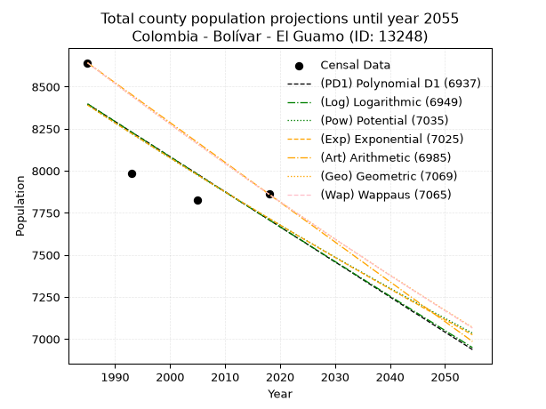
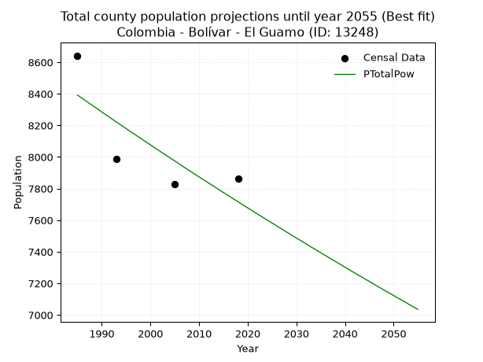
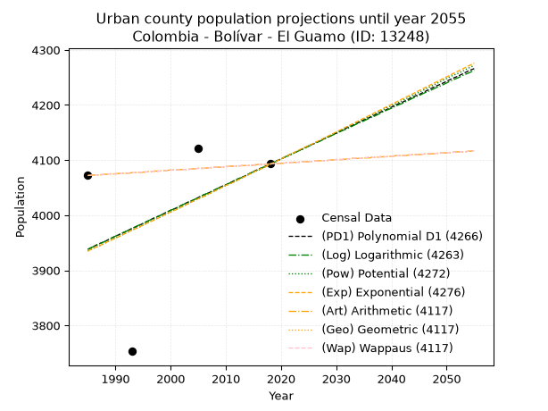
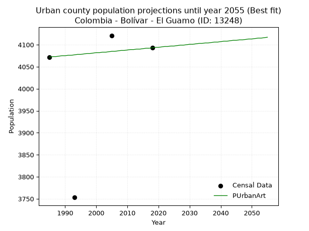
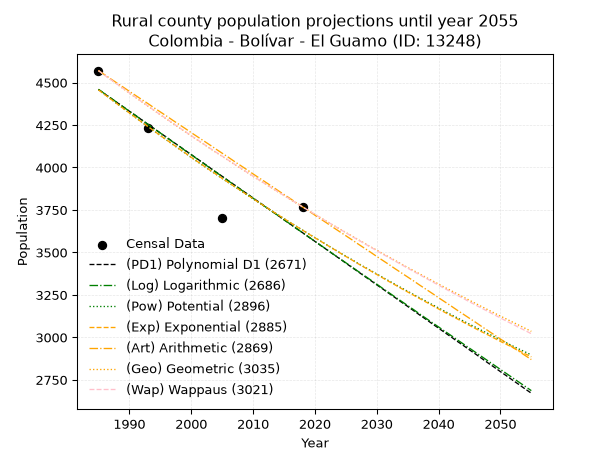
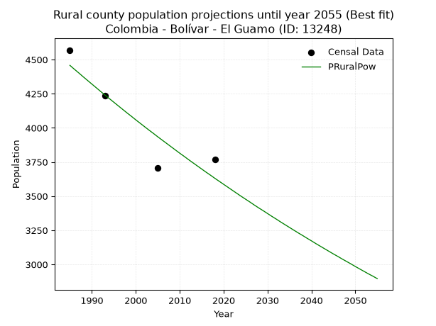

<div align="center">


</div>

# 📜 _“Population and Public Services Demand Projections (PPSD) until Year 2050 for Colombia - Bolívar - El Guamo (ID: 13248)”_
Keywords: `population` `public-service` `projection` `lineal` `polynomial` `logarithmic` `potential` `exponential` `arithmetic` `geometric` `wappaus` `dane` `colombia` `south-america`

PPSD are analytical estimates used by governments and planners to anticipate future changes in population size, age distribution, and the resulting community needs for utilities, healthcare, education, and infrastructure as sizing future water treatment facilities, electrical grids, and road networks based on spatial growth.

<div align="center">

</img>

</div>


> **General running parameters**: • app_version: _v20260806_. • Python version: _3.14.7_. • Pandas version: _3.0.5_. • NumPy version: _2.5.1_. • Creates, save and include plots into reports (create_plot): _False_. • Projection until year: _2050_. • Process polynomial degree 2 and up: _False_. • Process Wappaus: _True_. • Process Wappaus: _True_. • Set negative values to zero: _True_. • Set infinite values to zero: _True_. • Drop dataset notes: _True_. 
<div align="center">

Maps & GIS Layers: [:earth_americas:Google](http://maps.google.com/maps?q=10.03095761,-74.9760842) [:earth_americas:OSM](https://www.openstreetmap.org/#map=18/10.03095761/-74.9760842&layers=P) [:earth_americas:Bing](https://www.bing.com/maps?cp=10.03095761~-74.9760842&lvl=18) [:earth_americas:Apple](https://maps.apple.com/frame?center=10.03095761%2C-74.9760842&span=0.003%2C0.006) [:earth_americas:GISMobile](https://github.com/rcfdtools/R.GISMobile/blob/main/file/gis/CountyLayer_CO/Readme.md)

</div>


<div align="center">

```geojson
{
  "type": "Feature",
  "geometry": {
    "type": "Point", 
    "coordinates": [-74.9760842, 10.03095761]
  }, 
  "properties": {
    "Name": "Colombia - Bolívar - El Guamo (ID: 13248)"
  }
}
```

</div>


## 0. Census Data (4 records)

Census data are official statistics collected by a government about the people and housing in a country. They usually include counts of total population, age, sex, race, income, education, and jobs.

📅Global census file: [Population.xlsx](../data/Population.xlsx)

| Source   |   Year |   CountryID | CountryName   |   StateID | StateName   |   CountyID | CountyName   |   PTotal |   PUrban |   PRural |
|:---------|-------:|------------:|:--------------|----------:|:------------|-----------:|:-------------|---------:|---------:|---------:|
| DANE     |   1985 |          57 | Colombia      |        13 | Bolívar     |      13248 | El Guamo     |     8642 |     4072 |     4570 |
| DANE     |   1993 |          57 | Colombia      |        13 | Bolívar     |      13248 | El Guamo     |     7987 |     3753 |     4234 |
| DANE     |   2005 |          57 | Colombia      |        13 | Bolívar     |      13248 | El Guamo     |     7826 |     4121 |     3705 |
| DANE     |   2018 |          57 | Colombia      |        13 | Bolívar     |      13248 | El Guamo     |     7861 |     4093 |     3768 |

> 🔥Some records could had specific notes about the registered values or the corresponding urban or rural distribution.

📅[SUI-RUPS](https://www.datos.gov.co/Hacienda-y-Cr-dito-P-blico/Registro-nico-de-Prestadores-de-Servicios-P-blicos/4qkq-csdn/about_data) - Local public utility companies: [RUPS.csv](../data/RUPS.csv)

 | SERVICIO       | ESTADO    | NOMBRE                                                    | NIT         | DEPARTAMENTO_DOMICILIO   | MUNICIPIO_DOMICILIO   | DIRECCION                            |   TELEFONO | EMAIL                      | TIPO_PRESTADOR                 | CLASIFICACION                 |
|:---------------|:----------|:----------------------------------------------------------|:------------|:-------------------------|:----------------------|:-------------------------------------|-----------:|:---------------------------|:-------------------------------|:------------------------------|
| ACUEDUCTO      | OPERATIVA | ADMINISTRACIÓN PÚBLICA COOPERATIVA DE EL GUAMO BOLÍVAR    | 900123709-6 | BOLIVAR                  | EL GUAMO              | ALCALDIA PLAZA PRINCIPAL             |    6395111 | neclobe2009@hotmail.com    | ORGANIZACION AUTORIZADA        | HASTA 2500 SUSCRIPTORES       |
| ALCANTARILLADO | OPERATIVA | ADMINISTRACIÓN PÚBLICA COOPERATIVA DE EL GUAMO BOLÍVAR    | 900123709-6 | BOLIVAR                  | EL GUAMO              | ALCALDIA PLAZA PRINCIPAL             |    6395111 | neclobe2009@hotmail.com    | ORGANIZACION AUTORIZADA        | HASTA 2500 SUSCRIPTORES       |
| ACUEDUCTO      | OPERATIVA | UNIDAD MUNICIPAL DE ACUEDUCTO Y ASEO DE EL GUAMO -BOLIVAR | 890481295-8 | BOLIVAR                  | EL GUAMO              | CALLE SANTANDER,PLAZA PRINCIPAL #20A |    3202606 | gustavoguzmann@hotmail.com | MUNICIPIO (PRESTACIÓN DIRECTA) | MENOR O IGUAL A 2500 USUARIOS |

## 1. Total

### 1.1. Coefficients and Parameters

* (PD1) Polynomial Deg 1: -20.859092733841855, 49802.40024086717 (lineal)
* (Log) Logarithmic: -41823.266739886705, 325977.98564050475
* (Pow) Potential: -5.090107209125112, 20.70983381318011
* (Exp) Exponential: -0.0025386821166661702, 1295241.6452471397
* (Art) Arithmetic: Year diff. 2018 - 1985 = 33, Population diff. 7861 - 8642 = -781, Annual growth = -23.666666666666668
* (Geo) Geometric: Year diff. 2018 - 1985 = 33, Population diff. 7861 - 8642 = -781, Annual growth % = -0.0028661940758895055
* (Wap) Wappaus: i = -0.2868165384071583, Condition values only valid for < 200)

<sub>
Wappaus condition values: ['-0.00', '-0.29', '-0.57', '-0.86', '-1.15', '-1.43', '-1.72', '-2.01', '-2.29', '-2.58', '-2.87', '-3.15', '-3.44', '-3.73', '-4.02', '-4.30', '-4.59', '-4.88', '-5.16', '-5.45', '-5.74', '-6.02', '-6.31', '-6.60', '-6.88', '-7.17', '-7.46', '-7.74', '-8.03', '-8.32', '-8.60', '-8.89', '-9.18', '-9.46', '-9.75', '-10.04', '-10.33', '-10.61', '-10.90', '-11.19', '-11.47', '-11.76', '-12.05', '-12.33', '-12.62', '-12.91', '-13.19', '-13.48', '-13.77', '-14.05', '-14.34', '-14.63', '-14.91', '-15.20', '-15.49', '-15.77', '-16.06', '-16.35', '-16.64', '-16.92', '-17.21', '-17.50', '-17.78', '-18.07', '-18.36', '-18.64']
</sub>


### 1.2. Projected Dataset

|   Year |   CountyID |   PTotalPD1 |   PTotalLog |   PTotalPow |   PTotalExp |   PTotalArt |   PTotalGeo |   PTotalWap |
|-------:|-----------:|------------:|------------:|------------:|------------:|------------:|------------:|------------:|
|   1985 |      13248 |        8397 |        8398 |        8392 |        8391 |        8642 |        8642 |        8642 |
|   1986 |      13248 |        8376 |        8377 |        8371 |        8370 |        8618 |        8617 |        8617 |
|   1987 |      13248 |        8355 |        8356 |        8349 |        8349 |        8595 |        8593 |        8593 |
|   1988 |      13248 |        8335 |        8335 |        8328 |        8327 |        8571 |        8568 |        8568 |
|   1989 |      13248 |        8314 |        8314 |        8307 |        8306 |        8547 |        8543 |        8543 |
|   1990 |      13248 |        8293 |        8293 |        8285 |        8285 |        8524 |        8519 |        8519 |
|   1991 |      13248 |        8272 |        8272 |        8264 |        8264 |        8500 |        8494 |        8495 |
|   1992 |      13248 |        8251 |        8251 |        8243 |        8243 |        8476 |        8470 |        8470 |
|   1993 |      13248 |        8230 |        8230 |        8222 |        8222 |        8453 |        8446 |        8446 |
|   1994 |      13248 |        8209 |        8209 |        8201 |        8202 |        8429 |        8422 |        8422 |
|   1995 |      13248 |        8189 |        8188 |        8180 |        8181 |        8405 |        8397 |        8398 |
|   1996 |      13248 |        8168 |        8167 |        8159 |        8160 |        8382 |        8373 |        8374 |
|   1997 |      13248 |        8147 |        8146 |        8139 |        8139 |        8358 |        8349 |        8350 |
|   1998 |      13248 |        8126 |        8125 |        8118 |        8119 |        8334 |        8325 |        8326 |
|   1999 |      13248 |        8105 |        8104 |        8097 |        8098 |        8311 |        8302 |        8302 |
|   2000 |      13248 |        8084 |        8083 |        8077 |        8078 |        8287 |        8278 |        8278 |
|   2001 |      13248 |        8063 |        8063 |        8056 |        8057 |        8263 |        8254 |        8254 |
|   2002 |      13248 |        8042 |        8042 |        8036 |        8037 |        8240 |        8230 |        8231 |
|   2003 |      13248 |        8022 |        8021 |        8015 |        8016 |        8216 |        8207 |        8207 |
|   2004 |      13248 |        8001 |        8000 |        7995 |        7996 |        8192 |        8183 |        8184 |
|   2005 |      13248 |        7980 |        7979 |        7975 |        7976 |        8169 |        8160 |        8160 |
|   2006 |      13248 |        7959 |        7958 |        7955 |        7955 |        8145 |        8136 |        8137 |
|   2007 |      13248 |        7938 |        7937 |        7934 |        7935 |        8121 |        8113 |        8113 |
|   2008 |      13248 |        7917 |        7916 |        7914 |        7915 |        8098 |        8090 |        8090 |
|   2009 |      13248 |        7896 |        7896 |        7894 |        7895 |        8074 |        8067 |        8067 |
|   2010 |      13248 |        7876 |        7875 |        7874 |        7875 |        8050 |        8044 |        8044 |
|   2011 |      13248 |        7855 |        7854 |        7854 |        7855 |        8027 |        8021 |        8021 |
|   2012 |      13248 |        7834 |        7833 |        7835 |        7835 |        8003 |        7998 |        7998 |
|   2013 |      13248 |        7813 |        7812 |        7815 |        7815 |        7979 |        7975 |        7975 |
|   2014 |      13248 |        7792 |        7792 |        7795 |        7796 |        7956 |        7952 |        7952 |
|   2015 |      13248 |        7771 |        7771 |        7775 |        7776 |        7932 |        7929 |        7929 |
|   2016 |      13248 |        7750 |        7750 |        7756 |        7756 |        7908 |        7906 |        7906 |
|   2017 |      13248 |        7730 |        7729 |        7736 |        7736 |        7885 |        7884 |        7884 |
|   2018 |      13248 |        7709 |        7709 |        7717 |        7717 |        7861 |        7861 |        7861 |
|   2019 |      13248 |        7688 |        7688 |        7697 |        7697 |        7837 |        7838 |        7838 |
|   2020 |      13248 |        7667 |        7667 |        7678 |        7678 |        7814 |        7816 |        7816 |
|   2021 |      13248 |        7646 |        7647 |        7659 |        7658 |        7790 |        7794 |        7793 |
|   2022 |      13248 |        7625 |        7626 |        7639 |        7639 |        7766 |        7771 |        7771 |
|   2023 |      13248 |        7604 |        7605 |        7620 |        7619 |        7743 |        7749 |        7749 |
|   2024 |      13248 |        7584 |        7585 |        7601 |        7600 |        7719 |        7727 |        7727 |
|   2025 |      13248 |        7563 |        7564 |        7582 |        7581 |        7695 |        7705 |        7704 |
|   2026 |      13248 |        7542 |        7543 |        7563 |        7562 |        7672 |        7683 |        7682 |
|   2027 |      13248 |        7521 |        7523 |        7544 |        7542 |        7648 |        7661 |        7660 |
|   2028 |      13248 |        7500 |        7502 |        7525 |        7523 |        7624 |        7639 |        7638 |
|   2029 |      13248 |        7479 |        7481 |        7506 |        7504 |        7601 |        7617 |        7616 |
|   2030 |      13248 |        7458 |        7461 |        7487 |        7485 |        7577 |        7595 |        7594 |
|   2031 |      13248 |        7438 |        7440 |        7469 |        7466 |        7553 |        7573 |        7572 |
|   2032 |      13248 |        7417 |        7420 |        7450 |        7447 |        7530 |        7551 |        7551 |
|   2033 |      13248 |        7396 |        7399 |        7431 |        7428 |        7506 |        7530 |        7529 |
|   2034 |      13248 |        7375 |        7378 |        7413 |        7410 |        7482 |        7508 |        7507 |
|   2035 |      13248 |        7354 |        7358 |        7394 |        7391 |        7459 |        7487 |        7486 |
|   2036 |      13248 |        7333 |        7337 |        7376 |        7372 |        7435 |        7465 |        7464 |
|   2037 |      13248 |        7312 |        7317 |        7357 |        7353 |        7411 |        7444 |        7443 |
|   2038 |      13248 |        7292 |        7296 |        7339 |        7335 |        7388 |        7422 |        7421 |
|   2039 |      13248 |        7271 |        7276 |        7321 |        7316 |        7364 |        7401 |        7400 |
|   2040 |      13248 |        7250 |        7255 |        7302 |        7298 |        7340 |        7380 |        7378 |
|   2041 |      13248 |        7229 |        7235 |        7284 |        7279 |        7317 |        7359 |        7357 |
|   2042 |      13248 |        7208 |        7214 |        7266 |        7261 |        7293 |        7338 |        7336 |
|   2043 |      13248 |        7187 |        7194 |        7248 |        7242 |        7269 |        7317 |        7315 |
|   2044 |      13248 |        7166 |        7173 |        7230 |        7224 |        7246 |        7296 |        7294 |
|   2045 |      13248 |        7146 |        7153 |        7212 |        7206 |        7222 |        7275 |        7273 |
|   2046 |      13248 |        7125 |        7132 |        7194 |        7187 |        7198 |        7254 |        7252 |
|   2047 |      13248 |        7104 |        7112 |        7176 |        7169 |        7175 |        7233 |        7231 |
|   2048 |      13248 |        7083 |        7092 |        7158 |        7151 |        7151 |        7212 |        7210 |
|   2049 |      13248 |        7062 |        7071 |        7141 |        7133 |        7127 |        7192 |        7189 |
|   2050 |      13248 |        7041 |        7051 |        7123 |        7115 |        7104 |        7171 |        7168 |
<div align="center">

</img>

</div>


### 1.3. Best fit with absolute and relative error (%)

Relative error puts that difference into context by dividing the absolute error by the true value, creating a unitless ratio or percentage that shows the scale of the mistake.

Absolute and relative error

|   Year | Source   |   CountryID | CountryName   |   StateID | StateName   |   CountyID_x | CountyName   |   PTotal |   PUrban |   PRural |   CountyID_y |   PTotalPD1 |   PTotalLog |   PTotalPow |   PTotalExp |   PTotalArt |   PTotalGeo |   PTotalWap |   PTotalPD1AbsError |   PTotalLogAbsError |   PTotalPowAbsError |   PTotalExpAbsError |   PTotalArtAbsError |   PTotalGeoAbsError |   PTotalWapAbsError |   PTotalPD1RelError |   PTotalLogRelError |   PTotalPowRelError |   PTotalExpRelError |   PTotalArtRelError |   PTotalGeoRelError |   PTotalWapRelError |
|-------:|:---------|------------:|:--------------|----------:|:------------|-------------:|:-------------|---------:|---------:|---------:|-------------:|------------:|------------:|------------:|------------:|------------:|------------:|------------:|--------------------:|--------------------:|--------------------:|--------------------:|--------------------:|--------------------:|--------------------:|--------------------:|--------------------:|--------------------:|--------------------:|--------------------:|--------------------:|--------------------:|
|   1985 | DANE     |          57 | Colombia      |        13 | Bolívar     |        13248 | El Guamo     |     8642 |     4072 |     4570 |        13248 |        8397 |        8398 |        8392 |        8391 |        8642 |        8642 |        8642 |                 245 |                 244 |                 250 |                 251 |                   0 |                   0 |                   0 |             2.83499 |             2.82342 |             2.89285 |             2.90442 |             0       |             0       |             0       |
|   1993 | DANE     |          57 | Colombia      |        13 | Bolívar     |        13248 | El Guamo     |     7987 |     3753 |     4234 |        13248 |        8230 |        8230 |        8222 |        8222 |        8453 |        8446 |        8446 |                 243 |                 243 |                 235 |                 235 |                 466 |                 459 |                 459 |             3.04244 |             3.04244 |             2.94228 |             2.94228 |             5.83448 |             5.74684 |             5.74684 |
|   2005 | DANE     |          57 | Colombia      |        13 | Bolívar     |        13248 | El Guamo     |     7826 |     4121 |     3705 |        13248 |        7980 |        7979 |        7975 |        7976 |        8169 |        8160 |        8160 |                 154 |                 153 |                 149 |                 150 |                 343 |                 334 |                 334 |             1.9678  |             1.95502 |             1.90391 |             1.91669 |             4.38283 |             4.26783 |             4.26783 |
|   2018 | DANE     |          57 | Colombia      |        13 | Bolívar     |        13248 | El Guamo     |     7861 |     4093 |     3768 |        13248 |        7709 |        7709 |        7717 |        7717 |        7861 |        7861 |        7861 |                 152 |                 152 |                 144 |                 144 |                   0 |                   0 |                   0 |             1.9336  |             1.9336  |             1.83183 |             1.83183 |             0       |             0       |             0       |

Relative error mean

| Method    |   RelError | Best   |
|:----------|-----------:|:-------|
| PTotalPD1 |    2.44471 |        |
| PTotalLog |    2.43862 |        |
| PTotalPow |    2.39272 | True   |
| PTotalExp |    2.3988  |        |
| PTotalArt |    2.55433 |        |
| PTotalGeo |    2.50367 |        |
| PTotalWap |    2.50367 |        |

💙Best method: _**PTotalPow**_
<div align="center">

</img>

</div>


### 1.4. Fresh water supply demand in liters per capita per day (lpcd)

The fresh water supply demand typically ranges from 100 to 300 liters per capita per day (lpcd) for standard domestic and municipal planning, though absolute survival minimums set by the World Health Organization are as low as 7.5 to 20 liters per day, and total consumption in high-income nations can exceed 400 liters.

> `CZ`: Level in meters above the sea level (masl)<br> `WS`: Fresh water supply demand in liters per capita per day (lpcd or l/h/d)<br> `WSAll`: Zonal fresh water supply demand in liters per second (l/s)<br> `A`: Zonal area in square meters<br> `DP`: Population density (people/hectare or p/ha)

Reference values (RAS Colombia)

|    CZ |   WS |
|------:|-----:|
|  1000 |  120 |
|  2000 |  130 |
| 99999 |  140 |

County shapefile geometry properties and water supply values

|   CountyID |      ATotal |   CZTotal |   WSTotal |
|-----------:|------------:|----------:|----------:|
|      13248 | 3.82976e+08 |   89.5657 |       120 |

Projected values for best method: PTotalPow

|   CountyID |   Year |   PTotalPow |   DPTotal |   WSTotal |   WSTotalAll |
|-----------:|-------:|------------:|----------:|----------:|-------------:|
|      13248 |   1985 |        8392 |      0.22 |       120 |     11.6556  |
|      13248 |   1986 |        8371 |      0.22 |       120 |     11.6264  |
|      13248 |   1987 |        8349 |      0.22 |       120 |     11.5958  |
|      13248 |   1988 |        8328 |      0.22 |       120 |     11.5667  |
|      13248 |   1989 |        8307 |      0.22 |       120 |     11.5375  |
|      13248 |   1990 |        8285 |      0.22 |       120 |     11.5069  |
|      13248 |   1991 |        8264 |      0.22 |       120 |     11.4778  |
|      13248 |   1992 |        8243 |      0.22 |       120 |     11.4486  |
|      13248 |   1993 |        8222 |      0.21 |       120 |     11.4194  |
|      13248 |   1994 |        8201 |      0.21 |       120 |     11.3903  |
|      13248 |   1995 |        8180 |      0.21 |       120 |     11.3611  |
|      13248 |   1996 |        8159 |      0.21 |       120 |     11.3319  |
|      13248 |   1997 |        8139 |      0.21 |       120 |     11.3042  |
|      13248 |   1998 |        8118 |      0.21 |       120 |     11.275   |
|      13248 |   1999 |        8097 |      0.21 |       120 |     11.2458  |
|      13248 |   2000 |        8077 |      0.21 |       120 |     11.2181  |
|      13248 |   2001 |        8056 |      0.21 |       120 |     11.1889  |
|      13248 |   2002 |        8036 |      0.21 |       120 |     11.1611  |
|      13248 |   2003 |        8015 |      0.21 |       120 |     11.1319  |
|      13248 |   2004 |        7995 |      0.21 |       120 |     11.1042  |
|      13248 |   2005 |        7975 |      0.21 |       120 |     11.0764  |
|      13248 |   2006 |        7955 |      0.21 |       120 |     11.0486  |
|      13248 |   2007 |        7934 |      0.21 |       120 |     11.0194  |
|      13248 |   2008 |        7914 |      0.21 |       120 |     10.9917  |
|      13248 |   2009 |        7894 |      0.21 |       120 |     10.9639  |
|      13248 |   2010 |        7874 |      0.21 |       120 |     10.9361  |
|      13248 |   2011 |        7854 |      0.21 |       120 |     10.9083  |
|      13248 |   2012 |        7835 |      0.2  |       120 |     10.8819  |
|      13248 |   2013 |        7815 |      0.2  |       120 |     10.8542  |
|      13248 |   2014 |        7795 |      0.2  |       120 |     10.8264  |
|      13248 |   2015 |        7775 |      0.2  |       120 |     10.7986  |
|      13248 |   2016 |        7756 |      0.2  |       120 |     10.7722  |
|      13248 |   2017 |        7736 |      0.2  |       120 |     10.7444  |
|      13248 |   2018 |        7717 |      0.2  |       120 |     10.7181  |
|      13248 |   2019 |        7697 |      0.2  |       120 |     10.6903  |
|      13248 |   2020 |        7678 |      0.2  |       120 |     10.6639  |
|      13248 |   2021 |        7659 |      0.2  |       120 |     10.6375  |
|      13248 |   2022 |        7639 |      0.2  |       120 |     10.6097  |
|      13248 |   2023 |        7620 |      0.2  |       120 |     10.5833  |
|      13248 |   2024 |        7601 |      0.2  |       120 |     10.5569  |
|      13248 |   2025 |        7582 |      0.2  |       120 |     10.5306  |
|      13248 |   2026 |        7563 |      0.2  |       120 |     10.5042  |
|      13248 |   2027 |        7544 |      0.2  |       120 |     10.4778  |
|      13248 |   2028 |        7525 |      0.2  |       120 |     10.4514  |
|      13248 |   2029 |        7506 |      0.2  |       120 |     10.425   |
|      13248 |   2030 |        7487 |      0.2  |       120 |     10.3986  |
|      13248 |   2031 |        7469 |      0.2  |       120 |     10.3736  |
|      13248 |   2032 |        7450 |      0.19 |       120 |     10.3472  |
|      13248 |   2033 |        7431 |      0.19 |       120 |     10.3208  |
|      13248 |   2034 |        7413 |      0.19 |       120 |     10.2958  |
|      13248 |   2035 |        7394 |      0.19 |       120 |     10.2694  |
|      13248 |   2036 |        7376 |      0.19 |       120 |     10.2444  |
|      13248 |   2037 |        7357 |      0.19 |       120 |     10.2181  |
|      13248 |   2038 |        7339 |      0.19 |       120 |     10.1931  |
|      13248 |   2039 |        7321 |      0.19 |       120 |     10.1681  |
|      13248 |   2040 |        7302 |      0.19 |       120 |     10.1417  |
|      13248 |   2041 |        7284 |      0.19 |       120 |     10.1167  |
|      13248 |   2042 |        7266 |      0.19 |       120 |     10.0917  |
|      13248 |   2043 |        7248 |      0.19 |       120 |     10.0667  |
|      13248 |   2044 |        7230 |      0.19 |       120 |     10.0417  |
|      13248 |   2045 |        7212 |      0.19 |       120 |     10.0167  |
|      13248 |   2046 |        7194 |      0.19 |       120 |      9.99167 |
|      13248 |   2047 |        7176 |      0.19 |       120 |      9.96667 |
|      13248 |   2048 |        7158 |      0.19 |       120 |      9.94167 |
|      13248 |   2049 |        7141 |      0.19 |       120 |      9.91806 |
|      13248 |   2050 |        7123 |      0.19 |       120 |      9.89306 |

## 2. Urban

### 2.1. Coefficients and Parameters

* (PD1) Polynomial Deg 1: 4.686069851465267, -5363.5612203934 (lineal)
* (Log) Logarithmic: 9362.412947981817, -67154.0258432786
* (Pow) Potential: 2.3726162249984757, -4.229378417978247
* (Exp) Exponential: 0.0011875841426859889, 372.5257116091011
* (Art) Arithmetic: Year diff. 2018 - 1985 = 33, Population diff. 4093 - 4072 = 21, Annual growth = 0.6363636363636364
* (Geo) Geometric: Year diff. 2018 - 1985 = 33, Population diff. 4093 - 4072 = 21, Annual growth % = 0.00015588846031455716
* (Wap) Wappaus: i = 0.015587596726604687, Condition values only valid for < 200)

<sub>
Wappaus condition values: ['0.00', '0.02', '0.03', '0.05', '0.06', '0.08', '0.09', '0.11', '0.12', '0.14', '0.16', '0.17', '0.19', '0.20', '0.22', '0.23', '0.25', '0.26', '0.28', '0.30', '0.31', '0.33', '0.34', '0.36', '0.37', '0.39', '0.41', '0.42', '0.44', '0.45', '0.47', '0.48', '0.50', '0.51', '0.53', '0.55', '0.56', '0.58', '0.59', '0.61', '0.62', '0.64', '0.65', '0.67', '0.69', '0.70', '0.72', '0.73', '0.75', '0.76', '0.78', '0.79', '0.81', '0.83', '0.84', '0.86', '0.87', '0.89', '0.90', '0.92', '0.94', '0.95', '0.97', '0.98', '1.00', '1.01']
</sub>


### 2.2. Projected Dataset

|   Year |   CountyID |   PUrbanPD1 |   PUrbanLog |   PUrbanPow |   PUrbanExp |   PUrbanArt |   PUrbanGeo |   PUrbanWap |
|-------:|-----------:|------------:|------------:|------------:|------------:|------------:|------------:|------------:|
|   1985 |      13248 |        3938 |        3938 |        3935 |        3935 |        4072 |        4072 |        4072 |
|   1986 |      13248 |        3943 |        3943 |        3940 |        3940 |        4073 |        4073 |        4073 |
|   1987 |      13248 |        3948 |        3948 |        3944 |        3944 |        4073 |        4073 |        4073 |
|   1988 |      13248 |        3952 |        3952 |        3949 |        3949 |        4074 |        4074 |        4074 |
|   1989 |      13248 |        3957 |        3957 |        3954 |        3954 |        4075 |        4075 |        4075 |
|   1990 |      13248 |        3962 |        3962 |        3959 |        3958 |        4075 |        4075 |        4075 |
|   1991 |      13248 |        3966 |        3967 |        3963 |        3963 |        4076 |        4076 |        4076 |
|   1992 |      13248 |        3971 |        3971 |        3968 |        3968 |        4076 |        4076 |        4076 |
|   1993 |      13248 |        3976 |        3976 |        3973 |        3973 |        4077 |        4077 |        4077 |
|   1994 |      13248 |        3980 |        3981 |        3977 |        3977 |        4078 |        4078 |        4078 |
|   1995 |      13248 |        3985 |        3985 |        3982 |        3982 |        4078 |        4078 |        4078 |
|   1996 |      13248 |        3990 |        3990 |        3987 |        3987 |        4079 |        4079 |        4079 |
|   1997 |      13248 |        3995 |        3995 |        3992 |        3991 |        4080 |        4080 |        4080 |
|   1998 |      13248 |        3999 |        3999 |        3996 |        3996 |        4080 |        4080 |        4080 |
|   1999 |      13248 |        4004 |        4004 |        4001 |        4001 |        4081 |        4081 |        4081 |
|   2000 |      13248 |        4009 |        4009 |        4006 |        4006 |        4082 |        4082 |        4082 |
|   2001 |      13248 |        4013 |        4013 |        4011 |        4010 |        4082 |        4082 |        4082 |
|   2002 |      13248 |        4018 |        4018 |        4015 |        4015 |        4083 |        4083 |        4083 |
|   2003 |      13248 |        4023 |        4023 |        4020 |        4020 |        4083 |        4083 |        4083 |
|   2004 |      13248 |        4027 |        4027 |        4025 |        4025 |        4084 |        4084 |        4084 |
|   2005 |      13248 |        4032 |        4032 |        4030 |        4030 |        4085 |        4085 |        4085 |
|   2006 |      13248 |        4037 |        4037 |        4034 |        4034 |        4085 |        4085 |        4085 |
|   2007 |      13248 |        4041 |        4041 |        4039 |        4039 |        4086 |        4086 |        4086 |
|   2008 |      13248 |        4046 |        4046 |        4044 |        4044 |        4087 |        4087 |        4087 |
|   2009 |      13248 |        4051 |        4051 |        4049 |        4049 |        4087 |        4087 |        4087 |
|   2010 |      13248 |        4055 |        4055 |        4054 |        4054 |        4088 |        4088 |        4088 |
|   2011 |      13248 |        4060 |        4060 |        4058 |        4058 |        4089 |        4089 |        4089 |
|   2012 |      13248 |        4065 |        4065 |        4063 |        4063 |        4089 |        4089 |        4089 |
|   2013 |      13248 |        4069 |        4069 |        4068 |        4068 |        4090 |        4090 |        4090 |
|   2014 |      13248 |        4074 |        4074 |        4073 |        4073 |        4090 |        4090 |        4090 |
|   2015 |      13248 |        4079 |        4079 |        4078 |        4078 |        4091 |        4091 |        4091 |
|   2016 |      13248 |        4084 |        4083 |        4082 |        4083 |        4092 |        4092 |        4092 |
|   2017 |      13248 |        4088 |        4088 |        4087 |        4087 |        4092 |        4092 |        4092 |
|   2018 |      13248 |        4093 |        4093 |        4092 |        4092 |        4093 |        4093 |        4093 |
|   2019 |      13248 |        4098 |        4097 |        4097 |        4097 |        4094 |        4094 |        4094 |
|   2020 |      13248 |        4102 |        4102 |        4102 |        4102 |        4094 |        4094 |        4094 |
|   2021 |      13248 |        4107 |        4107 |        4106 |        4107 |        4095 |        4095 |        4095 |
|   2022 |      13248 |        4112 |        4111 |        4111 |        4112 |        4096 |        4096 |        4096 |
|   2023 |      13248 |        4116 |        4116 |        4116 |        4117 |        4096 |        4096 |        4096 |
|   2024 |      13248 |        4121 |        4120 |        4121 |        4122 |        4097 |        4097 |        4097 |
|   2025 |      13248 |        4126 |        4125 |        4126 |        4126 |        4097 |        4097 |        4097 |
|   2026 |      13248 |        4130 |        4130 |        4131 |        4131 |        4098 |        4098 |        4098 |
|   2027 |      13248 |        4135 |        4134 |        4135 |        4136 |        4099 |        4099 |        4099 |
|   2028 |      13248 |        4140 |        4139 |        4140 |        4141 |        4099 |        4099 |        4099 |
|   2029 |      13248 |        4144 |        4144 |        4145 |        4146 |        4100 |        4100 |        4100 |
|   2030 |      13248 |        4149 |        4148 |        4150 |        4151 |        4101 |        4101 |        4101 |
|   2031 |      13248 |        4154 |        4153 |        4155 |        4156 |        4101 |        4101 |        4101 |
|   2032 |      13248 |        4159 |        4157 |        4160 |        4161 |        4102 |        4102 |        4102 |
|   2033 |      13248 |        4163 |        4162 |        4164 |        4166 |        4103 |        4103 |        4103 |
|   2034 |      13248 |        4168 |        4167 |        4169 |        4171 |        4103 |        4103 |        4103 |
|   2035 |      13248 |        4173 |        4171 |        4174 |        4176 |        4104 |        4104 |        4104 |
|   2036 |      13248 |        4177 |        4176 |        4179 |        4181 |        4104 |        4105 |        4105 |
|   2037 |      13248 |        4182 |        4180 |        4184 |        4186 |        4105 |        4105 |        4105 |
|   2038 |      13248 |        4187 |        4185 |        4189 |        4191 |        4106 |        4106 |        4106 |
|   2039 |      13248 |        4191 |        4190 |        4194 |        4196 |        4106 |        4106 |        4106 |
|   2040 |      13248 |        4196 |        4194 |        4199 |        4201 |        4107 |        4107 |        4107 |
|   2041 |      13248 |        4201 |        4199 |        4203 |        4206 |        4108 |        4108 |        4108 |
|   2042 |      13248 |        4205 |        4203 |        4208 |        4211 |        4108 |        4108 |        4108 |
|   2043 |      13248 |        4210 |        4208 |        4213 |        4216 |        4109 |        4109 |        4109 |
|   2044 |      13248 |        4215 |        4213 |        4218 |        4221 |        4110 |        4110 |        4110 |
|   2045 |      13248 |        4219 |        4217 |        4223 |        4226 |        4110 |        4110 |        4110 |
|   2046 |      13248 |        4224 |        4222 |        4228 |        4231 |        4111 |        4111 |        4111 |
|   2047 |      13248 |        4229 |        4226 |        4233 |        4236 |        4111 |        4112 |        4112 |
|   2048 |      13248 |        4234 |        4231 |        4238 |        4241 |        4112 |        4112 |        4112 |
|   2049 |      13248 |        4238 |        4235 |        4243 |        4246 |        4113 |        4113 |        4113 |
|   2050 |      13248 |        4243 |        4240 |        4248 |        4251 |        4113 |        4113 |        4113 |
<div align="center">

</img>

</div>


### 2.3. Best fit with absolute and relative error (%)

Relative error puts that difference into context by dividing the absolute error by the true value, creating a unitless ratio or percentage that shows the scale of the mistake.

Absolute and relative error

|   Year | Source   |   CountryID | CountryName   |   StateID | StateName   |   CountyID_x | CountyName   |   PTotal |   PUrban |   PRural |   CountyID_y |   PUrbanPD1 |   PUrbanLog |   PUrbanPow |   PUrbanExp |   PUrbanArt |   PUrbanGeo |   PUrbanWap |   PUrbanPD1AbsError |   PUrbanLogAbsError |   PUrbanPowAbsError |   PUrbanExpAbsError |   PUrbanArtAbsError |   PUrbanGeoAbsError |   PUrbanWapAbsError |   PUrbanPD1RelError |   PUrbanLogRelError |   PUrbanPowRelError |   PUrbanExpRelError |   PUrbanArtRelError |   PUrbanGeoRelError |   PUrbanWapRelError |
|-------:|:---------|------------:|:--------------|----------:|:------------|-------------:|:-------------|---------:|---------:|---------:|-------------:|------------:|------------:|------------:|------------:|------------:|------------:|------------:|--------------------:|--------------------:|--------------------:|--------------------:|--------------------:|--------------------:|--------------------:|--------------------:|--------------------:|--------------------:|--------------------:|--------------------:|--------------------:|--------------------:|
|   1985 | DANE     |          57 | Colombia      |        13 | Bolívar     |        13248 | El Guamo     |     8642 |     4072 |     4570 |        13248 |        3938 |        3938 |        3935 |        3935 |        4072 |        4072 |        4072 |                 134 |                 134 |                 137 |                 137 |                   0 |                   0 |                   0 |             3.29077 |             3.29077 |            3.36444  |            3.36444  |            0        |            0        |            0        |
|   1993 | DANE     |          57 | Colombia      |        13 | Bolívar     |        13248 | El Guamo     |     7987 |     3753 |     4234 |        13248 |        3976 |        3976 |        3973 |        3973 |        4077 |        4077 |        4077 |                 223 |                 223 |                 220 |                 220 |                 324 |                 324 |                 324 |             5.94191 |             5.94191 |            5.86198  |            5.86198  |            8.63309  |            8.63309  |            8.63309  |
|   2005 | DANE     |          57 | Colombia      |        13 | Bolívar     |        13248 | El Guamo     |     7826 |     4121 |     3705 |        13248 |        4032 |        4032 |        4030 |        4030 |        4085 |        4085 |        4085 |                  89 |                  89 |                  91 |                  91 |                  36 |                  36 |                  36 |             2.15967 |             2.15967 |            2.2082   |            2.2082   |            0.873574 |            0.873574 |            0.873574 |
|   2018 | DANE     |          57 | Colombia      |        13 | Bolívar     |        13248 | El Guamo     |     7861 |     4093 |     3768 |        13248 |        4093 |        4093 |        4092 |        4092 |        4093 |        4093 |        4093 |                   0 |                   0 |                   1 |                   1 |                   0 |                   0 |                   0 |             0       |             0       |            0.024432 |            0.024432 |            0        |            0        |            0        |

Relative error mean

| Method    |   RelError | Best   |
|:----------|-----------:|:-------|
| PUrbanPD1 |    2.84809 |        |
| PUrbanLog |    2.84809 |        |
| PUrbanPow |    2.86476 |        |
| PUrbanExp |    2.86476 |        |
| PUrbanArt |    2.37667 | True   |
| PUrbanGeo |    2.37667 | True   |
| PUrbanWap |    2.37667 | True   |

💙Best method: _**PUrbanArt**_
<div align="center">

</img>

</div>


### 2.4. Fresh water supply demand in liters per capita per day (lpcd)

The fresh water supply demand typically ranges from 100 to 300 liters per capita per day (lpcd) for standard domestic and municipal planning, though absolute survival minimums set by the World Health Organization are as low as 7.5 to 20 liters per day, and total consumption in high-income nations can exceed 400 liters.

> `CZ`: Level in meters above the sea level (masl)<br> `WS`: Fresh water supply demand in liters per capita per day (lpcd or l/h/d)<br> `WSAll`: Zonal fresh water supply demand in liters per second (l/s)<br> `A`: Zonal area in square meters<br> `DP`: Population density (people/hectare or p/ha)

Reference values (RAS Colombia)

|    CZ |   WS |
|------:|-----:|
|  1000 |  120 |
|  2000 |  130 |
| 99999 |  140 |

County shapefile geometry properties and water supply values

|   CountyID |   AUrban |   CZUrban |   WSUrban |
|-----------:|---------:|----------:|----------:|
|      13248 |   779628 |   73.2767 |       120 |

Projected values for best method: PUrbanArt

|   CountyID |   Year |   PUrbanArt |   DPUrban |   WSUrban |   WSUrbanAll |
|-----------:|-------:|------------:|----------:|----------:|-------------:|
|      13248 |   1985 |        4072 |     52.23 |       120 |      5.65556 |
|      13248 |   1986 |        4073 |     52.24 |       120 |      5.65694 |
|      13248 |   1987 |        4073 |     52.24 |       120 |      5.65694 |
|      13248 |   1988 |        4074 |     52.26 |       120 |      5.65833 |
|      13248 |   1989 |        4075 |     52.27 |       120 |      5.65972 |
|      13248 |   1990 |        4075 |     52.27 |       120 |      5.65972 |
|      13248 |   1991 |        4076 |     52.28 |       120 |      5.66111 |
|      13248 |   1992 |        4076 |     52.28 |       120 |      5.66111 |
|      13248 |   1993 |        4077 |     52.29 |       120 |      5.6625  |
|      13248 |   1994 |        4078 |     52.31 |       120 |      5.66389 |
|      13248 |   1995 |        4078 |     52.31 |       120 |      5.66389 |
|      13248 |   1996 |        4079 |     52.32 |       120 |      5.66528 |
|      13248 |   1997 |        4080 |     52.33 |       120 |      5.66667 |
|      13248 |   1998 |        4080 |     52.33 |       120 |      5.66667 |
|      13248 |   1999 |        4081 |     52.35 |       120 |      5.66806 |
|      13248 |   2000 |        4082 |     52.36 |       120 |      5.66944 |
|      13248 |   2001 |        4082 |     52.36 |       120 |      5.66944 |
|      13248 |   2002 |        4083 |     52.37 |       120 |      5.67083 |
|      13248 |   2003 |        4083 |     52.37 |       120 |      5.67083 |
|      13248 |   2004 |        4084 |     52.38 |       120 |      5.67222 |
|      13248 |   2005 |        4085 |     52.4  |       120 |      5.67361 |
|      13248 |   2006 |        4085 |     52.4  |       120 |      5.67361 |
|      13248 |   2007 |        4086 |     52.41 |       120 |      5.675   |
|      13248 |   2008 |        4087 |     52.42 |       120 |      5.67639 |
|      13248 |   2009 |        4087 |     52.42 |       120 |      5.67639 |
|      13248 |   2010 |        4088 |     52.44 |       120 |      5.67778 |
|      13248 |   2011 |        4089 |     52.45 |       120 |      5.67917 |
|      13248 |   2012 |        4089 |     52.45 |       120 |      5.67917 |
|      13248 |   2013 |        4090 |     52.46 |       120 |      5.68056 |
|      13248 |   2014 |        4090 |     52.46 |       120 |      5.68056 |
|      13248 |   2015 |        4091 |     52.47 |       120 |      5.68194 |
|      13248 |   2016 |        4092 |     52.49 |       120 |      5.68333 |
|      13248 |   2017 |        4092 |     52.49 |       120 |      5.68333 |
|      13248 |   2018 |        4093 |     52.5  |       120 |      5.68472 |
|      13248 |   2019 |        4094 |     52.51 |       120 |      5.68611 |
|      13248 |   2020 |        4094 |     52.51 |       120 |      5.68611 |
|      13248 |   2021 |        4095 |     52.53 |       120 |      5.6875  |
|      13248 |   2022 |        4096 |     52.54 |       120 |      5.68889 |
|      13248 |   2023 |        4096 |     52.54 |       120 |      5.68889 |
|      13248 |   2024 |        4097 |     52.55 |       120 |      5.69028 |
|      13248 |   2025 |        4097 |     52.55 |       120 |      5.69028 |
|      13248 |   2026 |        4098 |     52.56 |       120 |      5.69167 |
|      13248 |   2027 |        4099 |     52.58 |       120 |      5.69306 |
|      13248 |   2028 |        4099 |     52.58 |       120 |      5.69306 |
|      13248 |   2029 |        4100 |     52.59 |       120 |      5.69444 |
|      13248 |   2030 |        4101 |     52.6  |       120 |      5.69583 |
|      13248 |   2031 |        4101 |     52.6  |       120 |      5.69583 |
|      13248 |   2032 |        4102 |     52.61 |       120 |      5.69722 |
|      13248 |   2033 |        4103 |     52.63 |       120 |      5.69861 |
|      13248 |   2034 |        4103 |     52.63 |       120 |      5.69861 |
|      13248 |   2035 |        4104 |     52.64 |       120 |      5.7     |
|      13248 |   2036 |        4104 |     52.64 |       120 |      5.7     |
|      13248 |   2037 |        4105 |     52.65 |       120 |      5.70139 |
|      13248 |   2038 |        4106 |     52.67 |       120 |      5.70278 |
|      13248 |   2039 |        4106 |     52.67 |       120 |      5.70278 |
|      13248 |   2040 |        4107 |     52.68 |       120 |      5.70417 |
|      13248 |   2041 |        4108 |     52.69 |       120 |      5.70556 |
|      13248 |   2042 |        4108 |     52.69 |       120 |      5.70556 |
|      13248 |   2043 |        4109 |     52.7  |       120 |      5.70694 |
|      13248 |   2044 |        4110 |     52.72 |       120 |      5.70833 |
|      13248 |   2045 |        4110 |     52.72 |       120 |      5.70833 |
|      13248 |   2046 |        4111 |     52.73 |       120 |      5.70972 |
|      13248 |   2047 |        4111 |     52.73 |       120 |      5.70972 |
|      13248 |   2048 |        4112 |     52.74 |       120 |      5.71111 |
|      13248 |   2049 |        4113 |     52.76 |       120 |      5.7125  |
|      13248 |   2050 |        4113 |     52.76 |       120 |      5.7125  |

## 3. Rural

### 3.1. Coefficients and Parameters

* (PD1) Polynomial Deg 1: -25.545162585307093, 55165.961461260515 (lineal)
* (Log) Logarithmic: -51185.67968786849, 393132.01148378314
* (Pow) Potential: -12.446027433618745, 44.69317196984869
* (Exp) Exponential: -0.006211538444409936, 1008880412.7040958
* (Art) Arithmetic: Year diff. 2018 - 1985 = 33, Population diff. 3768 - 4570 = -802, Annual growth = -24.303030303030305
* (Geo) Geometric: Year diff. 2018 - 1985 = 33, Population diff. 3768 - 4570 = -802, Annual growth % = -0.005830477263497502
* (Wap) Wappaus: i = -0.5829462773574071, Condition values only valid for < 200)

<sub>
Wappaus condition values: ['-0.00', '-0.58', '-1.17', '-1.75', '-2.33', '-2.91', '-3.50', '-4.08', '-4.66', '-5.25', '-5.83', '-6.41', '-7.00', '-7.58', '-8.16', '-8.74', '-9.33', '-9.91', '-10.49', '-11.08', '-11.66', '-12.24', '-12.82', '-13.41', '-13.99', '-14.57', '-15.16', '-15.74', '-16.32', '-16.91', '-17.49', '-18.07', '-18.65', '-19.24', '-19.82', '-20.40', '-20.99', '-21.57', '-22.15', '-22.73', '-23.32', '-23.90', '-24.48', '-25.07', '-25.65', '-26.23', '-26.82', '-27.40', '-27.98', '-28.56', '-29.15', '-29.73', '-30.31', '-30.90', '-31.48', '-32.06', '-32.64', '-33.23', '-33.81', '-34.39', '-34.98', '-35.56', '-36.14', '-36.73', '-37.31', '-37.89']
</sub>


### 3.2. Projected Dataset

|   Year |   CountyID |   PRuralPD1 |   PRuralLog |   PRuralPow |   PRuralExp |   PRuralArt |   PRuralGeo |   PRuralWap |
|-------:|-----------:|------------:|------------:|------------:|------------:|------------:|------------:|------------:|
|   1985 |      13248 |        4459 |        4460 |        4458 |        4457 |        4570 |        4570 |        4570 |
|   1986 |      13248 |        4433 |        4434 |        4430 |        4429 |        4546 |        4543 |        4543 |
|   1987 |      13248 |        4408 |        4408 |        4403 |        4402 |        4521 |        4517 |        4517 |
|   1988 |      13248 |        4382 |        4383 |        4375 |        4375 |        4497 |        4491 |        4491 |
|   1989 |      13248 |        4357 |        4357 |        4348 |        4348 |        4473 |        4464 |        4465 |
|   1990 |      13248 |        4331 |        4331 |        4321 |        4321 |        4448 |        4438 |        4439 |
|   1991 |      13248 |        4306 |        4306 |        4294 |        4294 |        4424 |        4412 |        4413 |
|   1992 |      13248 |        4280 |        4280 |        4267 |        4267 |        4400 |        4387 |        4387 |
|   1993 |      13248 |        4254 |        4254 |        4240 |        4241 |        4376 |        4361 |        4362 |
|   1994 |      13248 |        4229 |        4228 |        4214 |        4215 |        4351 |        4336 |        4336 |
|   1995 |      13248 |        4203 |        4203 |        4188 |        4188 |        4327 |        4310 |        4311 |
|   1996 |      13248 |        4178 |        4177 |        4162 |        4163 |        4303 |        4285 |        4286 |
|   1997 |      13248 |        4152 |        4151 |        4136 |        4137 |        4278 |        4260 |        4261 |
|   1998 |      13248 |        4127 |        4126 |        4110 |        4111 |        4254 |        4235 |        4236 |
|   1999 |      13248 |        4101 |        4100 |        4085 |        4086 |        4230 |        4211 |        4212 |
|   2000 |      13248 |        4076 |        4075 |        4059 |        4060 |        4205 |        4186 |        4187 |
|   2001 |      13248 |        4050 |        4049 |        4034 |        4035 |        4181 |        4162 |        4163 |
|   2002 |      13248 |        4025 |        4023 |        4009 |        4010 |        4157 |        4138 |        4138 |
|   2003 |      13248 |        3999 |        3998 |        3984 |        3985 |        4133 |        4113 |        4114 |
|   2004 |      13248 |        3973 |        3972 |        3960 |        3961 |        4108 |        4089 |        4090 |
|   2005 |      13248 |        3948 |        3947 |        3935 |        3936 |        4084 |        4066 |        4067 |
|   2006 |      13248 |        3922 |        3921 |        3911 |        3912 |        4060 |        4042 |        4043 |
|   2007 |      13248 |        3897 |        3896 |        3887 |        3888 |        4035 |        4018 |        4019 |
|   2008 |      13248 |        3871 |        3870 |        3863 |        3864 |        4011 |        3995 |        3996 |
|   2009 |      13248 |        3846 |        3845 |        3839 |        3840 |        3987 |        3972 |        3972 |
|   2010 |      13248 |        3820 |        3819 |        3815 |        3816 |        3962 |        3948 |        3949 |
|   2011 |      13248 |        3795 |        3794 |        3792 |        3792 |        3938 |        3925 |        3926 |
|   2012 |      13248 |        3769 |        3768 |        3768 |        3769 |        3914 |        3903 |        3903 |
|   2013 |      13248 |        3744 |        3743 |        3745 |        3745 |        3890 |        3880 |        3880 |
|   2014 |      13248 |        3718 |        3718 |        3722 |        3722 |        3865 |        3857 |        3858 |
|   2015 |      13248 |        3692 |        3692 |        3699 |        3699 |        3841 |        3835 |        3835 |
|   2016 |      13248 |        3667 |        3667 |        3676 |        3676 |        3817 |        3812 |        3813 |
|   2017 |      13248 |        3641 |        3641 |        3654 |        3653 |        3792 |        3790 |        3790 |
|   2018 |      13248 |        3616 |        3616 |        3631 |        3631 |        3768 |        3768 |        3768 |
|   2019 |      13248 |        3590 |        3591 |        3609 |        3608 |        3744 |        3746 |        3746 |
|   2020 |      13248 |        3565 |        3565 |        3587 |        3586 |        3719 |        3724 |        3724 |
|   2021 |      13248 |        3539 |        3540 |        3565 |        3564 |        3695 |        3702 |        3702 |
|   2022 |      13248 |        3514 |        3515 |        3543 |        3542 |        3671 |        3681 |        3680 |
|   2023 |      13248 |        3488 |        3489 |        3521 |        3520 |        3646 |        3659 |        3659 |
|   2024 |      13248 |        3463 |        3464 |        3499 |        3498 |        3622 |        3638 |        3637 |
|   2025 |      13248 |        3437 |        3439 |        3478 |        3476 |        3598 |        3617 |        3616 |
|   2026 |      13248 |        3411 |        3414 |        3457 |        3455 |        3574 |        3596 |        3594 |
|   2027 |      13248 |        3386 |        3388 |        3435 |        3433 |        3549 |        3575 |        3573 |
|   2028 |      13248 |        3360 |        3363 |        3414 |        3412 |        3525 |        3554 |        3552 |
|   2029 |      13248 |        3335 |        3338 |        3394 |        3391 |        3501 |        3533 |        3531 |
|   2030 |      13248 |        3309 |        3313 |        3373 |        3370 |        3476 |        3513 |        3510 |
|   2031 |      13248 |        3284 |        3287 |        3352 |        3349 |        3452 |        3492 |        3489 |
|   2032 |      13248 |        3258 |        3262 |        3332 |        3328 |        3428 |        3472 |        3469 |
|   2033 |      13248 |        3233 |        3237 |        3311 |        3308 |        3403 |        3452 |        3448 |
|   2034 |      13248 |        3207 |        3212 |        3291 |        3287 |        3379 |        3431 |        3428 |
|   2035 |      13248 |        3182 |        3187 |        3271 |        3267 |        3355 |        3411 |        3407 |
|   2036 |      13248 |        3156 |        3162 |        3251 |        3247 |        3331 |        3392 |        3387 |
|   2037 |      13248 |        3130 |        3136 |        3231 |        3227 |        3306 |        3372 |        3367 |
|   2038 |      13248 |        3105 |        3111 |        3212 |        3207 |        3282 |        3352 |        3347 |
|   2039 |      13248 |        3079 |        3086 |        3192 |        3187 |        3258 |        3333 |        3327 |
|   2040 |      13248 |        3054 |        3061 |        3173 |        3167 |        3233 |        3313 |        3307 |
|   2041 |      13248 |        3028 |        3036 |        3153 |        3147 |        3209 |        3294 |        3287 |
|   2042 |      13248 |        3003 |        3011 |        3134 |        3128 |        3185 |        3275 |        3268 |
|   2043 |      13248 |        2977 |        2986 |        3115 |        3109 |        3160 |        3256 |        3248 |
|   2044 |      13248 |        2952 |        2961 |        3096 |        3089 |        3136 |        3237 |        3229 |
|   2045 |      13248 |        2926 |        2936 |        3077 |        3070 |        3112 |        3218 |        3209 |
|   2046 |      13248 |        2901 |        2911 |        3059 |        3051 |        3088 |        3199 |        3190 |
|   2047 |      13248 |        2875 |        2886 |        3040 |        3032 |        3063 |        3180 |        3171 |
|   2048 |      13248 |        2849 |        2861 |        3022 |        3014 |        3039 |        3162 |        3152 |
|   2049 |      13248 |        2824 |        2836 |        3004 |        2995 |        3015 |        3143 |        3133 |
|   2050 |      13248 |        2798 |        2811 |        2985 |        2976 |        2990 |        3125 |        3114 |
<div align="center">

</img>

</div>


### 3.3. Best fit with absolute and relative error (%)

Relative error puts that difference into context by dividing the absolute error by the true value, creating a unitless ratio or percentage that shows the scale of the mistake.

Absolute and relative error

|   Year | Source   |   CountryID | CountryName   |   StateID | StateName   |   CountyID_x | CountyName   |   PTotal |   PUrban |   PRural |   CountyID_y |   PRuralPD1 |   PRuralLog |   PRuralPow |   PRuralExp |   PRuralArt |   PRuralGeo |   PRuralWap |   PRuralPD1AbsError |   PRuralLogAbsError |   PRuralPowAbsError |   PRuralExpAbsError |   PRuralArtAbsError |   PRuralGeoAbsError |   PRuralWapAbsError |   PRuralPD1RelError |   PRuralLogRelError |   PRuralPowRelError |   PRuralExpRelError |   PRuralArtRelError |   PRuralGeoRelError |   PRuralWapRelError |
|-------:|:---------|------------:|:--------------|----------:|:------------|-------------:|:-------------|---------:|---------:|---------:|-------------:|------------:|------------:|------------:|------------:|------------:|------------:|------------:|--------------------:|--------------------:|--------------------:|--------------------:|--------------------:|--------------------:|--------------------:|--------------------:|--------------------:|--------------------:|--------------------:|--------------------:|--------------------:|--------------------:|
|   1985 | DANE     |          57 | Colombia      |        13 | Bolívar     |        13248 | El Guamo     |     8642 |     4072 |     4570 |        13248 |        4459 |        4460 |        4458 |        4457 |        4570 |        4570 |        4570 |                 111 |                 110 |                 112 |                 113 |                   0 |                   0 |                   0 |            2.42888  |            2.407    |             2.45077 |            2.47265  |              0      |             0       |             0       |
|   1993 | DANE     |          57 | Colombia      |        13 | Bolívar     |        13248 | El Guamo     |     7987 |     3753 |     4234 |        13248 |        4254 |        4254 |        4240 |        4241 |        4376 |        4361 |        4362 |                  20 |                  20 |                   6 |                   7 |                 142 |                 127 |                 128 |            0.472367 |            0.472367 |             0.14171 |            0.165328 |              3.3538 |             2.99953 |             3.02315 |
|   2005 | DANE     |          57 | Colombia      |        13 | Bolívar     |        13248 | El Guamo     |     7826 |     4121 |     3705 |        13248 |        3948 |        3947 |        3935 |        3936 |        4084 |        4066 |        4067 |                 243 |                 242 |                 230 |                 231 |                 379 |                 361 |                 362 |            6.5587   |            6.53171  |             6.20783 |            6.23482  |             10.2294 |             9.74359 |             9.77058 |
|   2018 | DANE     |          57 | Colombia      |        13 | Bolívar     |        13248 | El Guamo     |     7861 |     4093 |     3768 |        13248 |        3616 |        3616 |        3631 |        3631 |        3768 |        3768 |        3768 |                 152 |                 152 |                 137 |                 137 |                   0 |                   0 |                   0 |            4.03397  |            4.03397  |             3.63588 |            3.63588  |              0      |             0       |             0       |

Relative error mean

| Method    |   RelError | Best   |
|:----------|-----------:|:-------|
| PRuralPD1 |    3.37348 |        |
| PRuralLog |    3.36126 |        |
| PRuralPow |    3.10905 | True   |
| PRuralExp |    3.12717 |        |
| PRuralArt |    3.39581 |        |
| PRuralGeo |    3.18578 |        |
| PRuralWap |    3.19843 |        |

💙Best method: _**PRuralPow**_
<div align="center">

</img>

</div>


### 3.4. Fresh water supply demand in liters per capita per day (lpcd)

The fresh water supply demand typically ranges from 100 to 300 liters per capita per day (lpcd) for standard domestic and municipal planning, though absolute survival minimums set by the World Health Organization are as low as 7.5 to 20 liters per day, and total consumption in high-income nations can exceed 400 liters.

> `CZ`: Level in meters above the sea level (masl)<br> `WS`: Fresh water supply demand in liters per capita per day (lpcd or l/h/d)<br> `WSAll`: Zonal fresh water supply demand in liters per second (l/s)<br> `A`: Zonal area in square meters<br> `DP`: Population density (people/hectare or p/ha)

Reference values (RAS Colombia)

|    CZ |   WS |
|------:|-----:|
|  1000 |  120 |
|  2000 |  130 |
| 99999 |  140 |

County shapefile geometry properties and water supply values

|   CountyID |      ARural |   CZRural |   WSRural |
|-----------:|------------:|----------:|----------:|
|      13248 | 3.82197e+08 |   89.5991 |       120 |

Projected values for best method: PRuralPow

|   CountyID |   Year |   PRuralPow |   DPRural |   WSRural |   WSRuralAll |
|-----------:|-------:|------------:|----------:|----------:|-------------:|
|      13248 |   1985 |        4458 |      0.12 |       120 |      6.19167 |
|      13248 |   1986 |        4430 |      0.12 |       120 |      6.15278 |
|      13248 |   1987 |        4403 |      0.12 |       120 |      6.11528 |
|      13248 |   1988 |        4375 |      0.11 |       120 |      6.07639 |
|      13248 |   1989 |        4348 |      0.11 |       120 |      6.03889 |
|      13248 |   1990 |        4321 |      0.11 |       120 |      6.00139 |
|      13248 |   1991 |        4294 |      0.11 |       120 |      5.96389 |
|      13248 |   1992 |        4267 |      0.11 |       120 |      5.92639 |
|      13248 |   1993 |        4240 |      0.11 |       120 |      5.88889 |
|      13248 |   1994 |        4214 |      0.11 |       120 |      5.85278 |
|      13248 |   1995 |        4188 |      0.11 |       120 |      5.81667 |
|      13248 |   1996 |        4162 |      0.11 |       120 |      5.78056 |
|      13248 |   1997 |        4136 |      0.11 |       120 |      5.74444 |
|      13248 |   1998 |        4110 |      0.11 |       120 |      5.70833 |
|      13248 |   1999 |        4085 |      0.11 |       120 |      5.67361 |
|      13248 |   2000 |        4059 |      0.11 |       120 |      5.6375  |
|      13248 |   2001 |        4034 |      0.11 |       120 |      5.60278 |
|      13248 |   2002 |        4009 |      0.1  |       120 |      5.56806 |
|      13248 |   2003 |        3984 |      0.1  |       120 |      5.53333 |
|      13248 |   2004 |        3960 |      0.1  |       120 |      5.5     |
|      13248 |   2005 |        3935 |      0.1  |       120 |      5.46528 |
|      13248 |   2006 |        3911 |      0.1  |       120 |      5.43194 |
|      13248 |   2007 |        3887 |      0.1  |       120 |      5.39861 |
|      13248 |   2008 |        3863 |      0.1  |       120 |      5.36528 |
|      13248 |   2009 |        3839 |      0.1  |       120 |      5.33194 |
|      13248 |   2010 |        3815 |      0.1  |       120 |      5.29861 |
|      13248 |   2011 |        3792 |      0.1  |       120 |      5.26667 |
|      13248 |   2012 |        3768 |      0.1  |       120 |      5.23333 |
|      13248 |   2013 |        3745 |      0.1  |       120 |      5.20139 |
|      13248 |   2014 |        3722 |      0.1  |       120 |      5.16944 |
|      13248 |   2015 |        3699 |      0.1  |       120 |      5.1375  |
|      13248 |   2016 |        3676 |      0.1  |       120 |      5.10556 |
|      13248 |   2017 |        3654 |      0.1  |       120 |      5.075   |
|      13248 |   2018 |        3631 |      0.1  |       120 |      5.04306 |
|      13248 |   2019 |        3609 |      0.09 |       120 |      5.0125  |
|      13248 |   2020 |        3587 |      0.09 |       120 |      4.98194 |
|      13248 |   2021 |        3565 |      0.09 |       120 |      4.95139 |
|      13248 |   2022 |        3543 |      0.09 |       120 |      4.92083 |
|      13248 |   2023 |        3521 |      0.09 |       120 |      4.89028 |
|      13248 |   2024 |        3499 |      0.09 |       120 |      4.85972 |
|      13248 |   2025 |        3478 |      0.09 |       120 |      4.83056 |
|      13248 |   2026 |        3457 |      0.09 |       120 |      4.80139 |
|      13248 |   2027 |        3435 |      0.09 |       120 |      4.77083 |
|      13248 |   2028 |        3414 |      0.09 |       120 |      4.74167 |
|      13248 |   2029 |        3394 |      0.09 |       120 |      4.71389 |
|      13248 |   2030 |        3373 |      0.09 |       120 |      4.68472 |
|      13248 |   2031 |        3352 |      0.09 |       120 |      4.65556 |
|      13248 |   2032 |        3332 |      0.09 |       120 |      4.62778 |
|      13248 |   2033 |        3311 |      0.09 |       120 |      4.59861 |
|      13248 |   2034 |        3291 |      0.09 |       120 |      4.57083 |
|      13248 |   2035 |        3271 |      0.09 |       120 |      4.54306 |
|      13248 |   2036 |        3251 |      0.09 |       120 |      4.51528 |
|      13248 |   2037 |        3231 |      0.08 |       120 |      4.4875  |
|      13248 |   2038 |        3212 |      0.08 |       120 |      4.46111 |
|      13248 |   2039 |        3192 |      0.08 |       120 |      4.43333 |
|      13248 |   2040 |        3173 |      0.08 |       120 |      4.40694 |
|      13248 |   2041 |        3153 |      0.08 |       120 |      4.37917 |
|      13248 |   2042 |        3134 |      0.08 |       120 |      4.35278 |
|      13248 |   2043 |        3115 |      0.08 |       120 |      4.32639 |
|      13248 |   2044 |        3096 |      0.08 |       120 |      4.3     |
|      13248 |   2045 |        3077 |      0.08 |       120 |      4.27361 |
|      13248 |   2046 |        3059 |      0.08 |       120 |      4.24861 |
|      13248 |   2047 |        3040 |      0.08 |       120 |      4.22222 |
|      13248 |   2048 |        3022 |      0.08 |       120 |      4.19722 |
|      13248 |   2049 |        3004 |      0.08 |       120 |      4.17222 |
|      13248 |   2050 |        2985 |      0.08 |       120 |      4.14583 |

#

<div align="center"><br><sub>Share this research</sub></div><br>

<sub>**APPS & TOOLS & CONTENT DISCLAIMER**: • NO WARRANTY - This content and software is provided by <a href="https://github.com/rcfdtools" target="_blank">github.com/rcfdtools</a> "as is", without any express or implied warranty, including warranties of merchantability, fitness for a particular purpose, or non-infringement. There is no guarantee that the software will be error-free or operate without interruption. • LIMITATION OF LIABILITY - Neither the authors nor copyright holders will be liable for claims or damages arising from the software or its use. You are responsible for determining if the software is appropriate for your use and assume all associated risks, including errors, legal compliance, and data loss. • NO PROFESSIONAL ADVICE - The software provides general information and does not offer professional advice. It should not replace consultation with professional advisors. [Clauses and global license for rcfdtools use.](https://github.com/rcfdtools/rcfdtools/blob/main/LICENSE.md)</sub>

| [:house: Home](Readme.md)  | [:beginner: Help / Collab](https://github.com/rcfdtools/R.HydroTools/discussions/31) |
|----------------------------|-------------------------------------------------------------------------------------------|