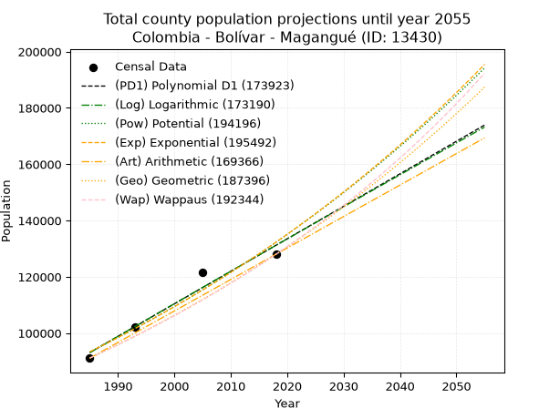
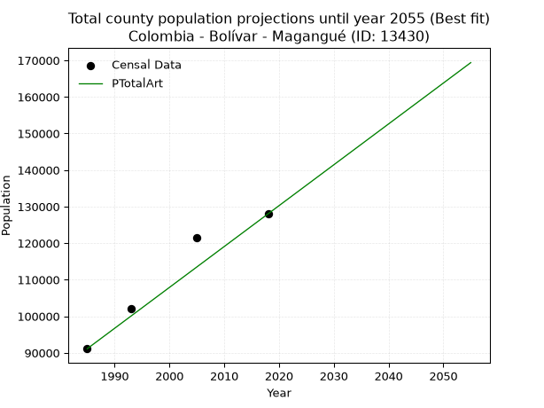
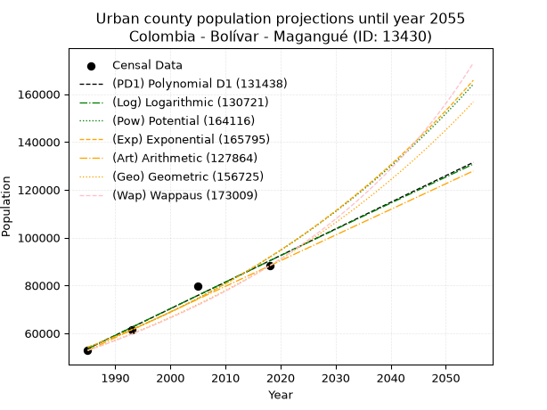
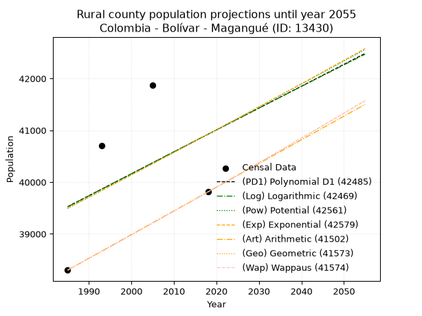
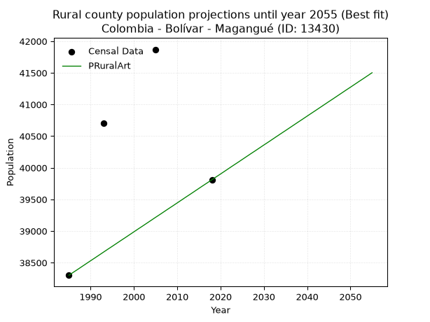

<div align="center">


</div>

# _“Population and Public Services Demand Projections (PPSD) until Year 2050 for Colombia - Bolívar - Magangué (ID: 13430)”_
Keywords: `population` `public-service` `projection` `lineal` `polynomial` `logarithmic` `potential` `exponential` `arithmetic` `geometric` `wappaus` `dane` `colombia` `south-america`

PPSD are analytical estimates used by governments and planners to anticipate future changes in population size, age distribution, and the resulting community needs for utilities, healthcare, education, and infrastructure as sizing future water treatment facilities, electrical grids, and road networks based on spatial growth.

> **General running parameters**: • app_version: _v20260806_. • Python version: _3.14.7_. • Pandas version: _3.0.5_. • NumPy version: _2.5.1_. • Creates, save and include plots into reports (create_plot): _False_. • Projection until year: _2050_. • Process polynomial degree 2 and up: _False_. • Process Wappaus: _True_. • Process Wappaus: _True_. • Set negative values to zero: _True_. • Set infinite values to zero: _True_. • Drop dataset notes: _True_. 
<div align="center">

Dynamic map: [:earth_americas:Google](http://maps.google.com/maps?q=9.263798865,-74.766742) [:earth_americas:OSM](https://www.openstreetmap.org/#map=18/9.263798865/-74.766742&layers=P) [:earth_americas:Bing](https://www.bing.com/maps?cp=9.263798865~-74.766742&lvl=18) [:earth_americas:Apple](https://maps.apple.com/frame?center=9.263798865%2C-74.766742&span=0.003%2C0.006)

</div>


<div align="center">

```geojson
{
  "type": "Feature",
  "geometry": {
    "type": "Point", 
    "coordinates": [-74.766742, 9.263798865]
  }, 
  "properties": {
    "Name": "Colombia - Bolívar - Magangué (ID: 13430)"
  }
}
```

</div>


## 0. Census Data (4 records)

Census data are official statistics collected by a government about the people and housing in a country. They usually include counts of total population, age, sex, race, income, education, and jobs.

📅Global census file: [Population.xlsx](../data/Population.xlsx)

| Source   |   Year |   CountryID | CountryName   |   StateID | StateName   |   CountyID | CountyName   |   PTotal |   PUrban |   PRural |
|:---------|-------:|------------:|:--------------|----------:|:------------|-----------:|:-------------|---------:|---------:|---------:|
| DANE     |   1985 |          57 | Colombia      |        13 | Bolívar     |      13430 | Magangué     |    91112 |    52811 |    38301 |
| DANE     |   1993 |          57 | Colombia      |        13 | Bolívar     |      13430 | Magangué     |   102155 |    61452 |    40703 |
| DANE     |   2005 |          57 | Colombia      |        13 | Bolívar     |      13430 | Magangué     |   121515 |    79645 |    41870 |
| DANE     |   2018 |          57 | Colombia      |        13 | Bolívar     |      13430 | Magangué     |   128003 |    88193 |    39810 |

> 🔥Some records could had specific notes about the registered values or the corresponding urban or rural distribution.

**Local public utility companies (RUPS)**

 | SERVICIO       | ESTADO      | NOMBRE                                         | NIT         | DEPARTAMENTO_DOMICILIO   | MUNICIPIO_DOMICILIO   | DIRECCION                                                        |   TELEFONO | EMAIL                           | TIPO_INSCRIPCION    | REPRESENTANTE_LEGAL                 | TIPO_PRESTADOR                             | CLASIFICACION                  |
|:---------------|:------------|:-----------------------------------------------|:------------|:-------------------------|:----------------------|:-----------------------------------------------------------------|-----------:|:--------------------------------|:--------------------|:------------------------------------|:-------------------------------------------|:-------------------------------|
| ASEO           | OPERATIVA   | BIOGER S.A. E.S.P.                             | 806006669-8 | BOLIVAR                  | TURBACO               | PARQUE EMPRESARIAL VILLA ESMERALDA CLL 27 No 26-335  PLAN PAREJO |    6666528 | SISTEMA@BIOGERSAESP.COM         | Registro por la ESP | CARLOS MARIO URIBE ZIRENE           | SOCIEDADES (EMPRESA DE SERVICIOS PUBLICOS) | MAYOR O IGUAL A 5001 USUARIOS  |
| ACUEDUCTO      | OPERATIVA   | AGUAS DE LA SABANA S.A. E.S.P.                 | 823004006-8 | SUCRE                    | SINCELEJO             | CAR KM1 OCC VIA COROZAL                                          |    2745008 | ximena.morales@veolia.com       | Registro por la ESP | FABIO ERNESTO ARAQUE DE AVILA       | SOCIEDADES (EMPRESA DE SERVICIOS PUBLICOS) | MAYOR O IGUAL A 5001 USUARIOS  |
| ALCANTARILLADO | OPERATIVA   | AGUAS DE LA SABANA S.A. E.S.P.                 | 823004006-8 | SUCRE                    | SINCELEJO             | CAR KM1 OCC VIA COROZAL                                          |    2745008 | ximena.morales@veolia.com       | Registro por la ESP | FABIO ERNESTO ARAQUE DE AVILA       | SOCIEDADES (EMPRESA DE SERVICIOS PUBLICOS) | MAYOR O IGUAL A 5001 USUARIOS  |
| ASEO           | OPERATIVA   | SERVIASEO S.A.  E.S.P.                         | 823004316-6 | SUCRE                    | COROZAL               | CARRERA 29 No.37-29                                              |    8243690 | serviaseosaesp@hotmail.com      | Registro por la ESP | LUCY DEL ROSARIO VERBEL HERAZO      | SOCIEDADES (EMPRESA DE SERVICIOS PUBLICOS) | MAYOR O IGUAL A 5001 USUARIOS  |
| ASEO           | OPERATIVA   | REGIONAL DE ASEO S.A. E.S.P.                   | 802024513-1 | BOLIVAR                  | MAGANGUE              | CL 16 # 34-05 LOCAL 2  B. LA CRUZ                                |    6880524 | trabajosocialtari@yahoo.com     | Registro por la ESP | DALIA MARIA PINERES HOYOS           | SOCIEDADES (EMPRESA DE SERVICIOS PUBLICOS) | MAYOR O IGUAL A 5001 USUARIOS  |
| ASEO           | CANCELACION | ECO BARU S.A.S                                 | 901068898-8 | BOLIVAR                  | CARTAGENA DE INDIAS   | carrera 06 # 05 48                                               |    0000000 | ecobarusas@gmail.com            | Registro por la ESP | MILTON LEANDRO OCAMPO  PEREZ        | nan                                        | nan                            |
| ACUEDUCTO      | OPERATIVA   | ASOCIACION DEL ACUEDUCTO DE CEIBAL             | 901351233-3 | BOLIVAR                  | MAGANGUE              | calle principal- entrada                                         |    6876737 | acueductodeceibal2020@gmail.com | Registro por la ESP | WALDINFER ORTEGA GARCIA             | ORGANIZACION AUTORIZADA                    | MENOR O IGUAL A 2500 USUARIOS  |
| ACUEDUCTO      | OPERATIVA   | ASOCIACIÓN DE ACUEDUCTO EL RETIRO              | 900876570-0 | BOLIVAR                  | MAGANGUE              | TV 1 Cra 5 - 95 El Retiro                                        |    6709456 | dubasco@hotmail.com             | Registro por la ESP | DEVANI JOSE PEREZ AGUAS             | ORGANIZACION AUTORIZADA                    | MENOR O IGUAL A 2500 USUARIOS  |
| ASEO           | OPERATIVA   | ASEOYA- R&R S.A.S E.S.P                        | 901380755-1 | BOLIVAR                  | MAGANGUE              | Calle 12 No. 34 - 05 Local 3 barrio La Cruz                      |    3457369 | luis012870@gmail.com            | Registro por la ESP | ENILSE YULIETH  RODRIGUEZ RODRIGUEZ | SOCIEDADES (EMPRESA DE SERVICIOS PUBLICOS) | MAYOR O IGUAL A 5001 USUARIOS  |
| ASEO           | OPERATIVA   | ORGANIZACION DE RECICLAJE DE MAGANGUE  SAS ESP | 901481756-0 | BOLIVAR                  | MAGANGUE              | Brr la Florida  2 Etapa Mz 18 Lt 7                               |    9999999 | ormsasesp@gmail.com             | Registro por la ESP | CESAR AUGUSTO OSORIO VEGA           | SOCIEDADES (EMPRESA DE SERVICIOS PUBLICOS) | DESDE 2501 HASTA 5000 USUARIOS |

> [📅RUPS Database: Registro Único de Prestadores de Servicios Públicos de Colombia Suramérica - RUPS](https://www.datos.gov.co/Hacienda-y-Cr-dito-P-blico/Registro-nico-de-Prestadores-de-Servicios-P-blicos/4qkq-csdn/about_data)

## 1. Total

### 1.1. Coefficients and Parameters

* (PD1) Polynomial Deg 1: 1154.8257727820096, -2199244.0020072144 (lineal)
* (Log) Logarithmic: 2312608.3213613615, -17467458.13274774
* (Pow) Potential: 21.137508947111805, -64.73634873125035
* (Exp) Exponential: 0.010554324322760437, 7.441419080553684e-05
* (Art) Arithmetic: Year diff. 2018 - 1985 = 33, Population diff. 128003 - 91112 = 36891, Annual growth = 1117.909090909091
* (Geo) Geometric: Year diff. 2018 - 1985 = 33, Population diff. 128003 - 91112 = 36891, Annual growth % = 0.010355192643478839
* (Wap) Wappaus: i = 1.0203857252210857, Condition values only valid for < 200)

<sub>
Wappaus condition values: ['0.00', '1.02', '2.04', '3.06', '4.08', '5.10', '6.12', '7.14', '8.16', '9.18', '10.20', '11.22', '12.24', '13.27', '14.29', '15.31', '16.33', '17.35', '18.37', '19.39', '20.41', '21.43', '22.45', '23.47', '24.49', '25.51', '26.53', '27.55', '28.57', '29.59', '30.61', '31.63', '32.65', '33.67', '34.69', '35.71', '36.73', '37.75', '38.77', '39.80', '40.82', '41.84', '42.86', '43.88', '44.90', '45.92', '46.94', '47.96', '48.98', '50.00', '51.02', '52.04', '53.06', '54.08', '55.10', '56.12', '57.14', '58.16', '59.18', '60.20', '61.22', '62.24', '63.26', '64.28', '65.30', '66.33']
</sub>


### 1.2. Projected Dataset

|   Year |   CountyID |   PTotalPD1 |   PTotalLog |   PTotalPow |   PTotalExp |   PTotalArt |   PTotalGeo |   PTotalWap |
|-------:|-----------:|------------:|------------:|------------:|------------:|------------:|------------:|------------:|
|   1985 |      13430 |       93085 |       93042 |       93346 |       93383 |       91112 |       91112 |       91112 |
|   1986 |      13430 |       94240 |       94207 |       94345 |       94374 |       92230 |       92055 |       92046 |
|   1987 |      13430 |       95395 |       95371 |       95354 |       95376 |       93348 |       93009 |       92991 |
|   1988 |      13430 |       96550 |       96535 |       96373 |       96388 |       94466 |       93972 |       93944 |
|   1989 |      13430 |       97704 |       97698 |       97403 |       97410 |       95584 |       94945 |       94908 |
|   1990 |      13430 |       98859 |       98860 |       98444 |       98444 |       96702 |       95928 |       95882 |
|   1991 |      13430 |      100014 |      100022 |       99495 |       99488 |       97819 |       96921 |       96866 |
|   1992 |      13430 |      101169 |      101183 |      100556 |      100544 |       98937 |       97925 |       97861 |
|   1993 |      13430 |      102324 |      102344 |      101629 |      101611 |      100055 |       98939 |       98866 |
|   1994 |      13430 |      103479 |      103504 |      102712 |      102689 |      101173 |       99964 |       99882 |
|   1995 |      13430 |      104633 |      104663 |      103806 |      103778 |      102291 |      100999 |      100909 |
|   1996 |      13430 |      105788 |      105822 |      104912 |      104880 |      103409 |      102045 |      101947 |
|   1997 |      13430 |      106943 |      106981 |      106028 |      105992 |      104527 |      103101 |      102996 |
|   1998 |      13430 |      108098 |      108138 |      107156 |      107117 |      105645 |      104169 |      104057 |
|   1999 |      13430 |      109253 |      109296 |      108296 |      108253 |      106763 |      105248 |      105129 |
|   2000 |      13430 |      110408 |      110452 |      109447 |      109402 |      107881 |      106338 |      106213 |
|   2001 |      13430 |      111562 |      111608 |      110609 |      110563 |      108999 |      107439 |      107309 |
|   2002 |      13430 |      112717 |      112764 |      111783 |      111736 |      110116 |      108551 |      108418 |
|   2003 |      13430 |      113872 |      113918 |      112970 |      112921 |      111234 |      109675 |      109539 |
|   2004 |      13430 |      115027 |      115073 |      114168 |      114120 |      112352 |      110811 |      110672 |
|   2005 |      13430 |      116182 |      116226 |      115378 |      115330 |      113470 |      111959 |      111819 |
|   2006 |      13430 |      117336 |      117380 |      116601 |      116554 |      114588 |      113118 |      112978 |
|   2007 |      13430 |      118491 |      118532 |      117835 |      117791 |      115706 |      114289 |      114151 |
|   2008 |      13430 |      119646 |      119684 |      119083 |      119041 |      116824 |      115473 |      115338 |
|   2009 |      13430 |      120801 |      120836 |      120343 |      120304 |      117942 |      116668 |      116538 |
|   2010 |      13430 |      121956 |      121986 |      121615 |      121580 |      119060 |      117877 |      117752 |
|   2011 |      13430 |      123111 |      123137 |      122900 |      122870 |      120178 |      119097 |      118981 |
|   2012 |      13430 |      124265 |      124286 |      124199 |      124174 |      121296 |      120330 |      120224 |
|   2013 |      13430 |      125420 |      125435 |      125510 |      125491 |      122413 |      121577 |      121482 |
|   2014 |      13430 |      126575 |      126584 |      126835 |      126823 |      123531 |      122835 |      122755 |
|   2015 |      13430 |      127730 |      127732 |      128172 |      128168 |      124649 |      124107 |      124043 |
|   2016 |      13430 |      128885 |      128879 |      129524 |      129528 |      125767 |      125393 |      125347 |
|   2017 |      13430 |      130040 |      130026 |      130889 |      130903 |      126885 |      126691 |      126667 |
|   2018 |      13430 |      131194 |      131173 |      132267 |      132291 |      128003 |      128003 |      128003 |
|   2019 |      13430 |      132349 |      132318 |      133659 |      133695 |      129121 |      129328 |      129356 |
|   2020 |      13430 |      133504 |      133463 |      135066 |      135114 |      130239 |      130668 |      130725 |
|   2021 |      13430 |      134659 |      134608 |      136486 |      136547 |      131357 |      132021 |      132111 |
|   2022 |      13430 |      135814 |      135752 |      137921 |      137996 |      132475 |      133388 |      133515 |
|   2023 |      13430 |      136969 |      136895 |      139370 |      139460 |      133593 |      134769 |      134937 |
|   2024 |      13430 |      138123 |      138038 |      140833 |      140940 |      134710 |      136165 |      136377 |
|   2025 |      13430 |      139278 |      139181 |      142311 |      142435 |      135828 |      137575 |      137835 |
|   2026 |      13430 |      140433 |      140322 |      143804 |      143947 |      136946 |      138999 |      139312 |
|   2027 |      13430 |      141588 |      141463 |      145312 |      145474 |      138064 |      140439 |      140808 |
|   2028 |      13430 |      142743 |      142604 |      146835 |      147017 |      139182 |      141893 |      142324 |
|   2029 |      13430 |      143897 |      143744 |      148373 |      148577 |      140300 |      143362 |      143860 |
|   2030 |      13430 |      145052 |      144884 |      149926 |      150154 |      141418 |      144847 |      145416 |
|   2031 |      13430 |      146207 |      146023 |      151495 |      151747 |      142536 |      146347 |      146992 |
|   2032 |      13430 |      147362 |      147161 |      153080 |      153357 |      143654 |      147862 |      148590 |
|   2033 |      13430 |      148517 |      148299 |      154680 |      154984 |      144772 |      149393 |      150210 |
|   2034 |      13430 |      149672 |      149436 |      156296 |      156628 |      145890 |      150940 |      151852 |
|   2035 |      13430 |      150826 |      150573 |      157929 |      158290 |      147007 |      152503 |      153516 |
|   2036 |      13430 |      151981 |      151709 |      159577 |      159970 |      148125 |      154083 |      155203 |
|   2037 |      13430 |      153136 |      152844 |      161242 |      161667 |      149243 |      155678 |      156913 |
|   2038 |      13430 |      154291 |      153979 |      162924 |      163382 |      150361 |      157290 |      158648 |
|   2039 |      13430 |      155446 |      155114 |      164622 |      165116 |      151479 |      158919 |      160406 |
|   2040 |      13430 |      156601 |      156248 |      166337 |      166868 |      152597 |      160565 |      162190 |
|   2041 |      13430 |      157755 |      157381 |      168069 |      168638 |      153715 |      162227 |      163999 |
|   2042 |      13430 |      158910 |      158514 |      169818 |      170428 |      154833 |      163907 |      165835 |
|   2043 |      13430 |      160065 |      159646 |      171585 |      172236 |      155951 |      165604 |      167697 |
|   2044 |      13430 |      161220 |      160778 |      173369 |      174063 |      157069 |      167319 |      169586 |
|   2045 |      13430 |      162375 |      161909 |      175170 |      175910 |      158187 |      169052 |      171502 |
|   2046 |      13430 |      163530 |      163040 |      176990 |      177777 |      159304 |      170803 |      173448 |
|   2047 |      13430 |      164684 |      164170 |      178827 |      179663 |      160422 |      172571 |      175422 |
|   2048 |      13430 |      165839 |      165299 |      180683 |      181569 |      161540 |      174358 |      177426 |
|   2049 |      13430 |      166994 |      166428 |      182557 |      183496 |      162658 |      176164 |      179460 |
|   2050 |      13430 |      168149 |      167556 |      184450 |      185443 |      163776 |      177988 |      181526 |
<div align="center">

</img>

</div>


### 1.3. Best fit with absolute and relative error (%)

Relative error puts that difference into context by dividing the absolute error by the true value, creating a unitless ratio or percentage that shows the scale of the mistake.

Absolute and relative error

|   Year | Source   |   CountryID | CountryName   |   StateID | StateName   |   CountyID_x | CountyName   |   PTotal |   PUrban |   PRural |   CountyID_y |   PTotalPD1 |   PTotalLog |   PTotalPow |   PTotalExp |   PTotalArt |   PTotalGeo |   PTotalWap |   PTotalPD1AbsError |   PTotalLogAbsError |   PTotalPowAbsError |   PTotalExpAbsError |   PTotalArtAbsError |   PTotalGeoAbsError |   PTotalWapAbsError |   PTotalPD1RelError |   PTotalLogRelError |   PTotalPowRelError |   PTotalExpRelError |   PTotalArtRelError |   PTotalGeoRelError |   PTotalWapRelError |
|-------:|:---------|------------:|:--------------|----------:|:------------|-------------:|:-------------|---------:|---------:|---------:|-------------:|------------:|------------:|------------:|------------:|------------:|------------:|------------:|--------------------:|--------------------:|--------------------:|--------------------:|--------------------:|--------------------:|--------------------:|--------------------:|--------------------:|--------------------:|--------------------:|--------------------:|--------------------:|--------------------:|
|   1985 | DANE     |          57 | Colombia      |        13 | Bolívar     |        13430 | Magangué     |    91112 |    52811 |    38301 |        13430 |       93085 |       93042 |       93346 |       93383 |       91112 |       91112 |       91112 |                1973 |                1930 |                2234 |                2271 |                   0 |                   0 |                   0 |            2.16547  |            2.11827  |            2.45193  |            2.49254  |             0       |             0       |             0       |
|   1993 | DANE     |          57 | Colombia      |        13 | Bolívar     |        13430 | Magangué     |   102155 |    61452 |    40703 |        13430 |      102324 |      102344 |      101629 |      101611 |      100055 |       98939 |       98866 |                 169 |                 189 |                 526 |                 544 |                2100 |                3216 |                3289 |            0.165435 |            0.185013 |            0.514904 |            0.532524 |             2.0557  |             3.14816 |             3.21962 |
|   2005 | DANE     |          57 | Colombia      |        13 | Bolívar     |        13430 | Magangué     |   121515 |    79645 |    41870 |        13430 |      116182 |      116226 |      115378 |      115330 |      113470 |      111959 |      111819 |                5333 |                5289 |                6137 |                6185 |                8045 |                9556 |                9696 |            4.38876  |            4.35255  |            5.05041  |            5.08991  |             6.62058 |             7.86405 |             7.97926 |
|   2018 | DANE     |          57 | Colombia      |        13 | Bolívar     |        13430 | Magangué     |   128003 |    88193 |    39810 |        13430 |      131194 |      131173 |      132267 |      132291 |      128003 |      128003 |      128003 |                3191 |                3170 |                4264 |                4288 |                   0 |                   0 |                   0 |            2.49291  |            2.4765   |            3.33117  |            3.34992  |             0       |             0       |             0       |

Relative error mean

| Method    |   RelError | Best   |
|:----------|-----------:|:-------|
| PTotalPD1 |    2.30314 |        |
| PTotalLog |    2.28308 |        |
| PTotalPow |    2.8371  |        |
| PTotalExp |    2.86622 |        |
| PTotalArt |    2.16907 | True   |
| PTotalGeo |    2.75305 |        |
| PTotalWap |    2.79972 |        |

💙Best method: _**PTotalArt**_
<div align="center">

</img>

</div>


### 1.4. Fresh water supply demand in liters per capita per day (lpcd)

The fresh water supply demand typically ranges from 100 to 300 liters per capita per day (lpcd) for standard domestic and municipal planning, though absolute survival minimums set by the World Health Organization are as low as 7.5 to 20 liters per day, and total consumption in high-income nations can exceed 400 liters.

> `CZ`: Level in meters above the sea level (masl)<br> `WS`: Fresh water supply demand in liters per capita per day (lpcd or l/h/d)<br> `WSAll`: Zonal fresh water supply demand in liters per second (l/s)<br> `A`: Zonal area in square meters<br> `DP`: Population density (people/hectare or p/ha)

Reference values (RAS Colombia)

|    CZ |   WS |
|------:|-----:|
|  1000 |  120 |
|  2000 |  130 |
| 99999 |  140 |

County shapefile geometry properties and water supply values

|   CountyID |      ATotal |   CZTotal |   WSTotal |
|-----------:|------------:|----------:|----------:|
|      13430 | 1.12999e+09 |   27.6106 |       120 |

Projected values for best method: PTotalArt

|   CountyID |   Year |   PTotalArt |   DPTotal |   WSTotal |   WSTotalAll |
|-----------:|-------:|------------:|----------:|----------:|-------------:|
|      13430 |   1985 |       91112 |      0.81 |       120 |      126.544 |
|      13430 |   1986 |       92230 |      0.82 |       120 |      128.097 |
|      13430 |   1987 |       93348 |      0.83 |       120 |      129.65  |
|      13430 |   1988 |       94466 |      0.84 |       120 |      131.203 |
|      13430 |   1989 |       95584 |      0.85 |       120 |      132.756 |
|      13430 |   1990 |       96702 |      0.86 |       120 |      134.308 |
|      13430 |   1991 |       97819 |      0.87 |       120 |      135.86  |
|      13430 |   1992 |       98937 |      0.88 |       120 |      137.412 |
|      13430 |   1993 |      100055 |      0.89 |       120 |      138.965 |
|      13430 |   1994 |      101173 |      0.9  |       120 |      140.518 |
|      13430 |   1995 |      102291 |      0.91 |       120 |      142.071 |
|      13430 |   1996 |      103409 |      0.92 |       120 |      143.624 |
|      13430 |   1997 |      104527 |      0.93 |       120 |      145.176 |
|      13430 |   1998 |      105645 |      0.93 |       120 |      146.729 |
|      13430 |   1999 |      106763 |      0.94 |       120 |      148.282 |
|      13430 |   2000 |      107881 |      0.95 |       120 |      149.835 |
|      13430 |   2001 |      108999 |      0.96 |       120 |      151.387 |
|      13430 |   2002 |      110116 |      0.97 |       120 |      152.939 |
|      13430 |   2003 |      111234 |      0.98 |       120 |      154.492 |
|      13430 |   2004 |      112352 |      0.99 |       120 |      156.044 |
|      13430 |   2005 |      113470 |      1    |       120 |      157.597 |
|      13430 |   2006 |      114588 |      1.01 |       120 |      159.15  |
|      13430 |   2007 |      115706 |      1.02 |       120 |      160.703 |
|      13430 |   2008 |      116824 |      1.03 |       120 |      162.256 |
|      13430 |   2009 |      117942 |      1.04 |       120 |      163.808 |
|      13430 |   2010 |      119060 |      1.05 |       120 |      165.361 |
|      13430 |   2011 |      120178 |      1.06 |       120 |      166.914 |
|      13430 |   2012 |      121296 |      1.07 |       120 |      168.467 |
|      13430 |   2013 |      122413 |      1.08 |       120 |      170.018 |
|      13430 |   2014 |      123531 |      1.09 |       120 |      171.571 |
|      13430 |   2015 |      124649 |      1.1  |       120 |      173.124 |
|      13430 |   2016 |      125767 |      1.11 |       120 |      174.676 |
|      13430 |   2017 |      126885 |      1.12 |       120 |      176.229 |
|      13430 |   2018 |      128003 |      1.13 |       120 |      177.782 |
|      13430 |   2019 |      129121 |      1.14 |       120 |      179.335 |
|      13430 |   2020 |      130239 |      1.15 |       120 |      180.887 |
|      13430 |   2021 |      131357 |      1.16 |       120 |      182.44  |
|      13430 |   2022 |      132475 |      1.17 |       120 |      183.993 |
|      13430 |   2023 |      133593 |      1.18 |       120 |      185.546 |
|      13430 |   2024 |      134710 |      1.19 |       120 |      187.097 |
|      13430 |   2025 |      135828 |      1.2  |       120 |      188.65  |
|      13430 |   2026 |      136946 |      1.21 |       120 |      190.203 |
|      13430 |   2027 |      138064 |      1.22 |       120 |      191.756 |
|      13430 |   2028 |      139182 |      1.23 |       120 |      193.308 |
|      13430 |   2029 |      140300 |      1.24 |       120 |      194.861 |
|      13430 |   2030 |      141418 |      1.25 |       120 |      196.414 |
|      13430 |   2031 |      142536 |      1.26 |       120 |      197.967 |
|      13430 |   2032 |      143654 |      1.27 |       120 |      199.519 |
|      13430 |   2033 |      144772 |      1.28 |       120 |      201.072 |
|      13430 |   2034 |      145890 |      1.29 |       120 |      202.625 |
|      13430 |   2035 |      147007 |      1.3  |       120 |      204.176 |
|      13430 |   2036 |      148125 |      1.31 |       120 |      205.729 |
|      13430 |   2037 |      149243 |      1.32 |       120 |      207.282 |
|      13430 |   2038 |      150361 |      1.33 |       120 |      208.835 |
|      13430 |   2039 |      151479 |      1.34 |       120 |      210.387 |
|      13430 |   2040 |      152597 |      1.35 |       120 |      211.94  |
|      13430 |   2041 |      153715 |      1.36 |       120 |      213.493 |
|      13430 |   2042 |      154833 |      1.37 |       120 |      215.046 |
|      13430 |   2043 |      155951 |      1.38 |       120 |      216.599 |
|      13430 |   2044 |      157069 |      1.39 |       120 |      218.151 |
|      13430 |   2045 |      158187 |      1.4  |       120 |      219.704 |
|      13430 |   2046 |      159304 |      1.41 |       120 |      221.256 |
|      13430 |   2047 |      160422 |      1.42 |       120 |      222.808 |
|      13430 |   2048 |      161540 |      1.43 |       120 |      224.361 |
|      13430 |   2049 |      162658 |      1.44 |       120 |      225.914 |
|      13430 |   2050 |      163776 |      1.45 |       120 |      227.467 |

## 2. Urban

### 2.1. Coefficients and Parameters

* (PD1) Polynomial Deg 1: 1112.5568044961794, -2154866.4981934824 (lineal)
* (Log) Logarithmic: 2227554.3926870357, -16861133.539314784
* (Pow) Potential: 32.0114914844053, -100.83289778936732
* (Exp) Exponential: 0.01598600579521228, 8.96312377504914e-10
* (Art) Arithmetic: Year diff. 2018 - 1985 = 33, Population diff. 88193 - 52811 = 35382, Annual growth = 1072.1818181818182
* (Geo) Geometric: Year diff. 2018 - 1985 = 33, Population diff. 88193 - 52811 = 35382, Annual growth % = 0.015661007214377243
* (Wap) Wappaus: i = 1.5207821312612666, Condition values only valid for < 200)

<sub>
Wappaus condition values: ['0.00', '1.52', '3.04', '4.56', '6.08', '7.60', '9.12', '10.65', '12.17', '13.69', '15.21', '16.73', '18.25', '19.77', '21.29', '22.81', '24.33', '25.85', '27.37', '28.89', '30.42', '31.94', '33.46', '34.98', '36.50', '38.02', '39.54', '41.06', '42.58', '44.10', '45.62', '47.14', '48.67', '50.19', '51.71', '53.23', '54.75', '56.27', '57.79', '59.31', '60.83', '62.35', '63.87', '65.39', '66.91', '68.44', '69.96', '71.48', '73.00', '74.52', '76.04', '77.56', '79.08', '80.60', '82.12', '83.64', '85.16', '86.68', '88.21', '89.73', '91.25', '92.77', '94.29', '95.81', '97.33', '98.85']
</sub>


### 2.2. Projected Dataset

|   Year |   CountyID |   PUrbanPD1 |   PUrbanLog |   PUrbanPow |   PUrbanExp |   PUrbanArt |   PUrbanGeo |   PUrbanWap |
|-------:|-----------:|------------:|------------:|------------:|------------:|------------:|------------:|------------:|
|   1985 |      13430 |       53559 |       53520 |       54117 |       54149 |       52811 |       52811 |       52811 |
|   1986 |      13430 |       54671 |       54642 |       54997 |       55021 |       53883 |       53638 |       53620 |
|   1987 |      13430 |       55784 |       55764 |       55890 |       55908 |       54955 |       54478 |       54442 |
|   1988 |      13430 |       56896 |       56885 |       56798 |       56809 |       56028 |       55331 |       55277 |
|   1989 |      13430 |       58009 |       58005 |       57719 |       57724 |       57100 |       56198 |       56124 |
|   1990 |      13430 |       59122 |       59124 |       58656 |       58654 |       58172 |       57078 |       56985 |
|   1991 |      13430 |       60234 |       60244 |       59607 |       59600 |       59244 |       57972 |       57860 |
|   1992 |      13430 |       61347 |       61362 |       60572 |       60560 |       60316 |       58880 |       58749 |
|   1993 |      13430 |       62459 |       62480 |       61553 |       61536 |       61388 |       59802 |       59652 |
|   1994 |      13430 |       63572 |       63597 |       62550 |       62528 |       62461 |       60738 |       60570 |
|   1995 |      13430 |       64684 |       64714 |       63562 |       63535 |       63533 |       61690 |       61503 |
|   1996 |      13430 |       65797 |       65831 |       64590 |       64559 |       64605 |       62656 |       62452 |
|   1997 |      13430 |       66909 |       66946 |       65634 |       65599 |       65677 |       63637 |       63416 |
|   1998 |      13430 |       68022 |       68061 |       66694 |       66656 |       66749 |       64634 |       64397 |
|   1999 |      13430 |       69135 |       69176 |       67771 |       67731 |       67822 |       65646 |       65395 |
|   2000 |      13430 |       70247 |       70290 |       68865 |       68822 |       68894 |       66674 |       66409 |
|   2001 |      13430 |       71360 |       71404 |       69975 |       69931 |       69966 |       67718 |       67441 |
|   2002 |      13430 |       72472 |       72517 |       71104 |       71058 |       71038 |       68779 |       68491 |
|   2003 |      13430 |       73585 |       73629 |       72249 |       72203 |       72110 |       69856 |       69560 |
|   2004 |      13430 |       74697 |       74741 |       73413 |       73367 |       73182 |       70950 |       70648 |
|   2005 |      13430 |       75810 |       75852 |       74595 |       74549 |       74255 |       72061 |       71755 |
|   2006 |      13430 |       76922 |       76963 |       75795 |       75750 |       75327 |       73189 |       72882 |
|   2007 |      13430 |       78035 |       78073 |       77014 |       76971 |       76399 |       74336 |       74030 |
|   2008 |      13430 |       79148 |       79183 |       78252 |       78211 |       77471 |       75500 |       75199 |
|   2009 |      13430 |       80260 |       80292 |       79509 |       79471 |       78543 |       76682 |       76389 |
|   2010 |      13430 |       81373 |       81400 |       80786 |       80752 |       79616 |       77883 |       77602 |
|   2011 |      13430 |       82485 |       82508 |       82082 |       82053 |       80688 |       79103 |       78838 |
|   2012 |      13430 |       83598 |       83616 |       83399 |       83376 |       81760 |       80342 |       80098 |
|   2013 |      13430 |       84710 |       84722 |       84736 |       84719 |       82832 |       81600 |       81382 |
|   2014 |      13430 |       85823 |       85829 |       86094 |       86084 |       83904 |       82878 |       82691 |
|   2015 |      13430 |       86935 |       86934 |       87473 |       87472 |       84976 |       84176 |       84026 |
|   2016 |      13430 |       88048 |       88040 |       88874 |       88881 |       86049 |       85494 |       85387 |
|   2017 |      13430 |       89161 |       89144 |       90296 |       90313 |       87121 |       86833 |       86776 |
|   2018 |      13430 |       90273 |       90248 |       91740 |       91769 |       88193 |       88193 |       88193 |
|   2019 |      13430 |       91386 |       91352 |       93206 |       93248 |       89265 |       89574 |       89639 |
|   2020 |      13430 |       92498 |       92455 |       94696 |       94750 |       90337 |       90977 |       91115 |
|   2021 |      13430 |       93611 |       93558 |       96208 |       96277 |       91410 |       92402 |       92622 |
|   2022 |      13430 |       94723 |       94659 |       97743 |       97829 |       92482 |       93849 |       94161 |
|   2023 |      13430 |       95836 |       95761 |       99303 |       99405 |       93554 |       95319 |       95732 |
|   2024 |      13430 |       96948 |       96862 |      100886 |      101007 |       94626 |       96811 |       97338 |
|   2025 |      13430 |       98061 |       97962 |      102494 |      102635 |       95698 |       98328 |       98979 |
|   2026 |      13430 |       99174 |       99062 |      104127 |      104288 |       96770 |       99868 |      100656 |
|   2027 |      13430 |      100286 |      100161 |      105785 |      105969 |       97843 |      101432 |      102370 |
|   2028 |      13430 |      101399 |      101260 |      107468 |      107677 |       98915 |      103020 |      104124 |
|   2029 |      13430 |      102511 |      102358 |      109178 |      109412 |       99987 |      104633 |      105917 |
|   2030 |      13430 |      103624 |      103455 |      110913 |      111175 |      101059 |      106272 |      107752 |
|   2031 |      13430 |      104736 |      104552 |      112676 |      112966 |      102131 |      107936 |      109629 |
|   2032 |      13430 |      105849 |      105649 |      114465 |      114787 |      103204 |      109627 |      111551 |
|   2033 |      13430 |      106961 |      106745 |      116282 |      116637 |      104276 |      111344 |      113520 |
|   2034 |      13430 |      108074 |      107840 |      118127 |      118516 |      105348 |      113087 |      115535 |
|   2035 |      13430 |      109187 |      108935 |      120001 |      120426 |      106420 |      114859 |      117601 |
|   2036 |      13430 |      110299 |      110030 |      121903 |      122366 |      107492 |      116657 |      119717 |
|   2037 |      13430 |      111412 |      111123 |      123834 |      124338 |      108564 |      118484 |      121887 |
|   2038 |      13430 |      112524 |      112217 |      125795 |      126342 |      109637 |      120340 |      124112 |
|   2039 |      13430 |      113637 |      113309 |      127786 |      128378 |      110709 |      122225 |      126395 |
|   2040 |      13430 |      114749 |      114402 |      129808 |      130447 |      111781 |      124139 |      128737 |
|   2041 |      13430 |      115862 |      115493 |      131860 |      132549 |      112853 |      126083 |      131141 |
|   2042 |      13430 |      116974 |      116584 |      133944 |      134685 |      113925 |      128057 |      133610 |
|   2043 |      13430 |      118087 |      117675 |      136060 |      136855 |      114998 |      130063 |      136146 |
|   2044 |      13430 |      119200 |      118765 |      138208 |      139060 |      116070 |      132100 |      138752 |
|   2045 |      13430 |      120312 |      119855 |      140389 |      141301 |      117142 |      134169 |      141431 |
|   2046 |      13430 |      121425 |      120944 |      142603 |      143578 |      118214 |      136270 |      144186 |
|   2047 |      13430 |      122537 |      122032 |      144851 |      145892 |      119286 |      138404 |      147020 |
|   2048 |      13430 |      123650 |      123120 |      147134 |      148243 |      120358 |      140572 |      149936 |
|   2049 |      13430 |      124762 |      124207 |      149451 |      150632 |      121431 |      142773 |      152940 |
|   2050 |      13430 |      125875 |      125294 |      151804 |      153059 |      122503 |      145009 |      156033 |
<div align="center">

</img>

</div>


### 2.3. Best fit with absolute and relative error (%)

Relative error puts that difference into context by dividing the absolute error by the true value, creating a unitless ratio or percentage that shows the scale of the mistake.

Absolute and relative error

|   Year | Source   |   CountryID | CountryName   |   StateID | StateName   |   CountyID_x | CountyName   |   PTotal |   PUrban |   PRural |   CountyID_y |   PUrbanPD1 |   PUrbanLog |   PUrbanPow |   PUrbanExp |   PUrbanArt |   PUrbanGeo |   PUrbanWap |   PUrbanPD1AbsError |   PUrbanLogAbsError |   PUrbanPowAbsError |   PUrbanExpAbsError |   PUrbanArtAbsError |   PUrbanGeoAbsError |   PUrbanWapAbsError |   PUrbanPD1RelError |   PUrbanLogRelError |   PUrbanPowRelError |   PUrbanExpRelError |   PUrbanArtRelError |   PUrbanGeoRelError |   PUrbanWapRelError |
|-------:|:---------|------------:|:--------------|----------:|:------------|-------------:|:-------------|---------:|---------:|---------:|-------------:|------------:|------------:|------------:|------------:|------------:|------------:|------------:|--------------------:|--------------------:|--------------------:|--------------------:|--------------------:|--------------------:|--------------------:|--------------------:|--------------------:|--------------------:|--------------------:|--------------------:|--------------------:|--------------------:|
|   1985 | DANE     |          57 | Colombia      |        13 | Bolívar     |        13430 | Magangué     |    91112 |    52811 |    38301 |        13430 |       53559 |       53520 |       54117 |       54149 |       52811 |       52811 |       52811 |                 748 |                 709 |                1306 |                1338 |                   0 |                   0 |                   0 |             1.41637 |             1.34252 |            2.47297  |            2.53356  |            0        |             0       |             0       |
|   1993 | DANE     |          57 | Colombia      |        13 | Bolívar     |        13430 | Magangué     |   102155 |    61452 |    40703 |        13430 |       62459 |       62480 |       61553 |       61536 |       61388 |       59802 |       59652 |                1007 |                1028 |                 101 |                  84 |                  64 |                1650 |                1800 |             1.63868 |             1.67285 |            0.164356 |            0.136692 |            0.104146 |             2.68502 |             2.92912 |
|   2005 | DANE     |          57 | Colombia      |        13 | Bolívar     |        13430 | Magangué     |   121515 |    79645 |    41870 |        13430 |       75810 |       75852 |       74595 |       74549 |       74255 |       72061 |       71755 |                3835 |                3793 |                5050 |                5096 |                5390 |                7584 |                7890 |             4.81512 |             4.76238 |            6.34064  |            6.39839  |            6.76753  |             9.52226 |             9.90646 |
|   2018 | DANE     |          57 | Colombia      |        13 | Bolívar     |        13430 | Magangué     |   128003 |    88193 |    39810 |        13430 |       90273 |       90248 |       91740 |       91769 |       88193 |       88193 |       88193 |                2080 |                2055 |                3547 |                3576 |                   0 |                   0 |                   0 |             2.35846 |             2.33012 |            4.02186  |            4.05474  |            0        |             0       |             0       |

Relative error mean

| Method    |   RelError | Best   |
|:----------|-----------:|:-------|
| PUrbanPD1 |    2.55716 |        |
| PUrbanLog |    2.52697 |        |
| PUrbanPow |    3.24996 |        |
| PUrbanExp |    3.28085 |        |
| PUrbanArt |    1.71792 | True   |
| PUrbanGeo |    3.05182 |        |
| PUrbanWap |    3.20889 |        |

💙Best method: _**PUrbanArt**_
<div align="center">

</img>

</div>


### 2.4. Fresh water supply demand in liters per capita per day (lpcd)

The fresh water supply demand typically ranges from 100 to 300 liters per capita per day (lpcd) for standard domestic and municipal planning, though absolute survival minimums set by the World Health Organization are as low as 7.5 to 20 liters per day, and total consumption in high-income nations can exceed 400 liters.

> `CZ`: Level in meters above the sea level (masl)<br> `WS`: Fresh water supply demand in liters per capita per day (lpcd or l/h/d)<br> `WSAll`: Zonal fresh water supply demand in liters per second (l/s)<br> `A`: Zonal area in square meters<br> `DP`: Population density (people/hectare or p/ha)

Reference values (RAS Colombia)

|    CZ |   WS |
|------:|-----:|
|  1000 |  120 |
|  2000 |  130 |
| 99999 |  140 |

County shapefile geometry properties and water supply values

|   CountyID |      AUrban |   CZUrban |   WSUrban |
|-----------:|------------:|----------:|----------:|
|      13430 | 3.43313e+07 |   24.8139 |       120 |

Projected values for best method: PUrbanArt

|   CountyID |   Year |   PUrbanArt |   DPUrban |   WSUrban |   WSUrbanAll |
|-----------:|-------:|------------:|----------:|----------:|-------------:|
|      13430 |   1985 |       52811 |     15.38 |       120 |      73.3486 |
|      13430 |   1986 |       53883 |     15.7  |       120 |      74.8375 |
|      13430 |   1987 |       54955 |     16.01 |       120 |      76.3264 |
|      13430 |   1988 |       56028 |     16.32 |       120 |      77.8167 |
|      13430 |   1989 |       57100 |     16.63 |       120 |      79.3056 |
|      13430 |   1990 |       58172 |     16.94 |       120 |      80.7944 |
|      13430 |   1991 |       59244 |     17.26 |       120 |      82.2833 |
|      13430 |   1992 |       60316 |     17.57 |       120 |      83.7722 |
|      13430 |   1993 |       61388 |     17.88 |       120 |      85.2611 |
|      13430 |   1994 |       62461 |     18.19 |       120 |      86.7514 |
|      13430 |   1995 |       63533 |     18.51 |       120 |      88.2403 |
|      13430 |   1996 |       64605 |     18.82 |       120 |      89.7292 |
|      13430 |   1997 |       65677 |     19.13 |       120 |      91.2181 |
|      13430 |   1998 |       66749 |     19.44 |       120 |      92.7069 |
|      13430 |   1999 |       67822 |     19.76 |       120 |      94.1972 |
|      13430 |   2000 |       68894 |     20.07 |       120 |      95.6861 |
|      13430 |   2001 |       69966 |     20.38 |       120 |      97.175  |
|      13430 |   2002 |       71038 |     20.69 |       120 |      98.6639 |
|      13430 |   2003 |       72110 |     21    |       120 |     100.153  |
|      13430 |   2004 |       73182 |     21.32 |       120 |     101.642  |
|      13430 |   2005 |       74255 |     21.63 |       120 |     103.132  |
|      13430 |   2006 |       75327 |     21.94 |       120 |     104.621  |
|      13430 |   2007 |       76399 |     22.25 |       120 |     106.11   |
|      13430 |   2008 |       77471 |     22.57 |       120 |     107.599  |
|      13430 |   2009 |       78543 |     22.88 |       120 |     109.088  |
|      13430 |   2010 |       79616 |     23.19 |       120 |     110.578  |
|      13430 |   2011 |       80688 |     23.5  |       120 |     112.067  |
|      13430 |   2012 |       81760 |     23.82 |       120 |     113.556  |
|      13430 |   2013 |       82832 |     24.13 |       120 |     115.044  |
|      13430 |   2014 |       83904 |     24.44 |       120 |     116.533  |
|      13430 |   2015 |       84976 |     24.75 |       120 |     118.022  |
|      13430 |   2016 |       86049 |     25.06 |       120 |     119.513  |
|      13430 |   2017 |       87121 |     25.38 |       120 |     121.001  |
|      13430 |   2018 |       88193 |     25.69 |       120 |     122.49   |
|      13430 |   2019 |       89265 |     26    |       120 |     123.979  |
|      13430 |   2020 |       90337 |     26.31 |       120 |     125.468  |
|      13430 |   2021 |       91410 |     26.63 |       120 |     126.958  |
|      13430 |   2022 |       92482 |     26.94 |       120 |     128.447  |
|      13430 |   2023 |       93554 |     27.25 |       120 |     129.936  |
|      13430 |   2024 |       94626 |     27.56 |       120 |     131.425  |
|      13430 |   2025 |       95698 |     27.87 |       120 |     132.914  |
|      13430 |   2026 |       96770 |     28.19 |       120 |     134.403  |
|      13430 |   2027 |       97843 |     28.5  |       120 |     135.893  |
|      13430 |   2028 |       98915 |     28.81 |       120 |     137.382  |
|      13430 |   2029 |       99987 |     29.12 |       120 |     138.871  |
|      13430 |   2030 |      101059 |     29.44 |       120 |     140.36   |
|      13430 |   2031 |      102131 |     29.75 |       120 |     141.849  |
|      13430 |   2032 |      103204 |     30.06 |       120 |     143.339  |
|      13430 |   2033 |      104276 |     30.37 |       120 |     144.828  |
|      13430 |   2034 |      105348 |     30.69 |       120 |     146.317  |
|      13430 |   2035 |      106420 |     31    |       120 |     147.806  |
|      13430 |   2036 |      107492 |     31.31 |       120 |     149.294  |
|      13430 |   2037 |      108564 |     31.62 |       120 |     150.783  |
|      13430 |   2038 |      109637 |     31.94 |       120 |     152.274  |
|      13430 |   2039 |      110709 |     32.25 |       120 |     153.762  |
|      13430 |   2040 |      111781 |     32.56 |       120 |     155.251  |
|      13430 |   2041 |      112853 |     32.87 |       120 |     156.74   |
|      13430 |   2042 |      113925 |     33.18 |       120 |     158.229  |
|      13430 |   2043 |      114998 |     33.5  |       120 |     159.719  |
|      13430 |   2044 |      116070 |     33.81 |       120 |     161.208  |
|      13430 |   2045 |      117142 |     34.12 |       120 |     162.697  |
|      13430 |   2046 |      118214 |     34.43 |       120 |     164.186  |
|      13430 |   2047 |      119286 |     34.75 |       120 |     165.675  |
|      13430 |   2048 |      120358 |     35.06 |       120 |     167.164  |
|      13430 |   2049 |      121431 |     35.37 |       120 |     168.654  |
|      13430 |   2050 |      122503 |     35.68 |       120 |     170.143  |

## 3. Rural

### 3.1. Coefficients and Parameters

* (PD1) Polynomial Deg 1: 42.26896828583021, -44377.50381373189 (lineal)
* (Log) Logarithmic: 85053.92867432538, -606324.5934329561
* (Pow) Potential: 2.1585433742584765, -2.5218324583601963
* (Exp) Exponential: 0.0010728306777213576, 4695.886052711958
* (Art) Arithmetic: Year diff. 2018 - 1985 = 33, Population diff. 39810 - 38301 = 1509, Annual growth = 45.72727272727273
* (Geo) Geometric: Year diff. 2018 - 1985 = 33, Population diff. 39810 - 38301 = 1509, Annual growth % = 0.0011716595393598261
* (Wap) Wappaus: i = 0.11708279941947415, Condition values only valid for < 200)

<sub>
Wappaus condition values: ['0.00', '0.12', '0.23', '0.35', '0.47', '0.59', '0.70', '0.82', '0.94', '1.05', '1.17', '1.29', '1.40', '1.52', '1.64', '1.76', '1.87', '1.99', '2.11', '2.22', '2.34', '2.46', '2.58', '2.69', '2.81', '2.93', '3.04', '3.16', '3.28', '3.40', '3.51', '3.63', '3.75', '3.86', '3.98', '4.10', '4.21', '4.33', '4.45', '4.57', '4.68', '4.80', '4.92', '5.03', '5.15', '5.27', '5.39', '5.50', '5.62', '5.74', '5.85', '5.97', '6.09', '6.21', '6.32', '6.44', '6.56', '6.67', '6.79', '6.91', '7.02', '7.14', '7.26', '7.38', '7.49', '7.61']
</sub>


### 3.2. Projected Dataset

|   Year |   CountyID |   PRuralPD1 |   PRuralLog |   PRuralPow |   PRuralExp |   PRuralArt |   PRuralGeo |   PRuralWap |
|-------:|-----------:|------------:|------------:|------------:|------------:|------------:|------------:|------------:|
|   1985 |      13430 |       39526 |       39522 |       39494 |       39498 |       38301 |       38301 |       38301 |
|   1986 |      13430 |       39569 |       39565 |       39537 |       39541 |       38347 |       38346 |       38346 |
|   1987 |      13430 |       39611 |       39607 |       39580 |       39583 |       38392 |       38391 |       38391 |
|   1988 |      13430 |       39653 |       39650 |       39623 |       39626 |       38438 |       38436 |       38436 |
|   1989 |      13430 |       39695 |       39693 |       39666 |       39668 |       38484 |       38481 |       38481 |
|   1990 |      13430 |       39738 |       39736 |       39709 |       39711 |       38530 |       38526 |       38526 |
|   1991 |      13430 |       39780 |       39778 |       39752 |       39753 |       38575 |       38571 |       38571 |
|   1992 |      13430 |       39822 |       39821 |       39795 |       39796 |       38621 |       38616 |       38616 |
|   1993 |      13430 |       39865 |       39864 |       39838 |       39839 |       38667 |       38661 |       38661 |
|   1994 |      13430 |       39907 |       39906 |       39881 |       39881 |       38713 |       38707 |       38707 |
|   1995 |      13430 |       39949 |       39949 |       39924 |       39924 |       38758 |       38752 |       38752 |
|   1996 |      13430 |       39991 |       39992 |       39968 |       39967 |       38804 |       38798 |       38797 |
|   1997 |      13430 |       40034 |       40034 |       40011 |       40010 |       38850 |       38843 |       38843 |
|   1998 |      13430 |       40076 |       40077 |       40054 |       40053 |       38895 |       38889 |       38888 |
|   1999 |      13430 |       40118 |       40119 |       40097 |       40096 |       38941 |       38934 |       38934 |
|   2000 |      13430 |       40160 |       40162 |       40141 |       40139 |       38987 |       38980 |       38980 |
|   2001 |      13430 |       40203 |       40205 |       40184 |       40182 |       39033 |       39025 |       39025 |
|   2002 |      13430 |       40245 |       40247 |       40227 |       40225 |       39078 |       39071 |       39071 |
|   2003 |      13430 |       40287 |       40290 |       40271 |       40268 |       39124 |       39117 |       39117 |
|   2004 |      13430 |       40330 |       40332 |       40314 |       40312 |       39170 |       39163 |       39163 |
|   2005 |      13430 |       40372 |       40374 |       40358 |       40355 |       39216 |       39209 |       39209 |
|   2006 |      13430 |       40414 |       40417 |       40401 |       40398 |       39261 |       39255 |       39254 |
|   2007 |      13430 |       40456 |       40459 |       40444 |       40442 |       39307 |       39301 |       39300 |
|   2008 |      13430 |       40499 |       40502 |       40488 |       40485 |       39353 |       39347 |       39346 |
|   2009 |      13430 |       40541 |       40544 |       40532 |       40528 |       39398 |       39393 |       39393 |
|   2010 |      13430 |       40583 |       40586 |       40575 |       40572 |       39444 |       39439 |       39439 |
|   2011 |      13430 |       40625 |       40629 |       40619 |       40615 |       39490 |       39485 |       39485 |
|   2012 |      13430 |       40668 |       40671 |       40662 |       40659 |       39536 |       39531 |       39531 |
|   2013 |      13430 |       40710 |       40713 |       40706 |       40703 |       39581 |       39578 |       39578 |
|   2014 |      13430 |       40752 |       40755 |       40750 |       40746 |       39627 |       39624 |       39624 |
|   2015 |      13430 |       40794 |       40798 |       40793 |       40790 |       39673 |       39670 |       39670 |
|   2016 |      13430 |       40837 |       40840 |       40837 |       40834 |       39719 |       39717 |       39717 |
|   2017 |      13430 |       40879 |       40882 |       40881 |       40878 |       39764 |       39763 |       39763 |
|   2018 |      13430 |       40921 |       40924 |       40924 |       40922 |       39810 |       39810 |       39810 |
|   2019 |      13430 |       40964 |       40966 |       40968 |       40966 |       39856 |       39857 |       39857 |
|   2020 |      13430 |       41006 |       41008 |       41012 |       41010 |       39901 |       39903 |       39903 |
|   2021 |      13430 |       41048 |       41050 |       41056 |       41054 |       39947 |       39950 |       39950 |
|   2022 |      13430 |       41090 |       41093 |       41100 |       41098 |       39993 |       39997 |       39997 |
|   2023 |      13430 |       41133 |       41135 |       41144 |       41142 |       40039 |       40044 |       40044 |
|   2024 |      13430 |       41175 |       41177 |       41188 |       41186 |       40084 |       40091 |       40091 |
|   2025 |      13430 |       41217 |       41219 |       41232 |       41230 |       40130 |       40138 |       40138 |
|   2026 |      13430 |       41259 |       41261 |       41275 |       41274 |       40176 |       40185 |       40185 |
|   2027 |      13430 |       41302 |       41303 |       41319 |       41319 |       40222 |       40232 |       40232 |
|   2028 |      13430 |       41344 |       41345 |       41363 |       41363 |       40267 |       40279 |       40279 |
|   2029 |      13430 |       41386 |       41386 |       41408 |       41407 |       40313 |       40326 |       40326 |
|   2030 |      13430 |       41429 |       41428 |       41452 |       41452 |       40359 |       40373 |       40374 |
|   2031 |      13430 |       41471 |       41470 |       41496 |       41496 |       40404 |       40421 |       40421 |
|   2032 |      13430 |       41513 |       41512 |       41540 |       41541 |       40450 |       40468 |       40468 |
|   2033 |      13430 |       41555 |       41554 |       41584 |       41586 |       40496 |       40515 |       40516 |
|   2034 |      13430 |       41598 |       41596 |       41628 |       41630 |       40542 |       40563 |       40563 |
|   2035 |      13430 |       41640 |       41638 |       41672 |       41675 |       40587 |       40610 |       40611 |
|   2036 |      13430 |       41682 |       41679 |       41717 |       41720 |       40633 |       40658 |       40658 |
|   2037 |      13430 |       41724 |       41721 |       41761 |       41764 |       40679 |       40706 |       40706 |
|   2038 |      13430 |       41767 |       41763 |       41805 |       41809 |       40725 |       40753 |       40754 |
|   2039 |      13430 |       41809 |       41805 |       41849 |       41854 |       40770 |       40801 |       40802 |
|   2040 |      13430 |       41851 |       41846 |       41894 |       41899 |       40816 |       40849 |       40849 |
|   2041 |      13430 |       41893 |       41888 |       41938 |       41944 |       40862 |       40897 |       40897 |
|   2042 |      13430 |       41936 |       41930 |       41982 |       41989 |       40907 |       40945 |       40945 |
|   2043 |      13430 |       41978 |       41971 |       42027 |       42034 |       40953 |       40993 |       40993 |
|   2044 |      13430 |       42020 |       42013 |       42071 |       42079 |       40999 |       41041 |       41041 |
|   2045 |      13430 |       42063 |       42055 |       42116 |       42124 |       41045 |       41089 |       41090 |
|   2046 |      13430 |       42105 |       42096 |       42160 |       42170 |       41090 |       41137 |       41138 |
|   2047 |      13430 |       42147 |       42138 |       42205 |       42215 |       41136 |       41185 |       41186 |
|   2048 |      13430 |       42189 |       42179 |       42249 |       42260 |       41182 |       41233 |       41234 |
|   2049 |      13430 |       42232 |       42221 |       42294 |       42305 |       41228 |       41282 |       41283 |
|   2050 |      13430 |       42274 |       42262 |       42338 |       42351 |       41273 |       41330 |       41331 |
<div align="center">

</img>

</div>


### 3.3. Best fit with absolute and relative error (%)

Relative error puts that difference into context by dividing the absolute error by the true value, creating a unitless ratio or percentage that shows the scale of the mistake.

Absolute and relative error

|   Year | Source   |   CountryID | CountryName   |   StateID | StateName   |   CountyID_x | CountyName   |   PTotal |   PUrban |   PRural |   CountyID_y |   PRuralPD1 |   PRuralLog |   PRuralPow |   PRuralExp |   PRuralArt |   PRuralGeo |   PRuralWap |   PRuralPD1AbsError |   PRuralLogAbsError |   PRuralPowAbsError |   PRuralExpAbsError |   PRuralArtAbsError |   PRuralGeoAbsError |   PRuralWapAbsError |   PRuralPD1RelError |   PRuralLogRelError |   PRuralPowRelError |   PRuralExpRelError |   PRuralArtRelError |   PRuralGeoRelError |   PRuralWapRelError |
|-------:|:---------|------------:|:--------------|----------:|:------------|-------------:|:-------------|---------:|---------:|---------:|-------------:|------------:|------------:|------------:|------------:|------------:|------------:|------------:|--------------------:|--------------------:|--------------------:|--------------------:|--------------------:|--------------------:|--------------------:|--------------------:|--------------------:|--------------------:|--------------------:|--------------------:|--------------------:|--------------------:|
|   1985 | DANE     |          57 | Colombia      |        13 | Bolívar     |        13430 | Magangué     |    91112 |    52811 |    38301 |        13430 |       39526 |       39522 |       39494 |       39498 |       38301 |       38301 |       38301 |                1225 |                1221 |                1193 |                1197 |                   0 |                   0 |                   0 |             3.19835 |             3.18791 |             3.1148  |             3.12524 |             0       |             0       |             0       |
|   1993 | DANE     |          57 | Colombia      |        13 | Bolívar     |        13430 | Magangué     |   102155 |    61452 |    40703 |        13430 |       39865 |       39864 |       39838 |       39839 |       38667 |       38661 |       38661 |                 838 |                 839 |                 865 |                 864 |                2036 |                2042 |                2042 |             2.05882 |             2.06127 |             2.12515 |             2.12269 |             5.00209 |             5.01683 |             5.01683 |
|   2005 | DANE     |          57 | Colombia      |        13 | Bolívar     |        13430 | Magangué     |   121515 |    79645 |    41870 |        13430 |       40372 |       40374 |       40358 |       40355 |       39216 |       39209 |       39209 |                1498 |                1496 |                1512 |                1515 |                2654 |                2661 |                2661 |             3.57774 |             3.57296 |             3.61118 |             3.61834 |             6.33867 |             6.35539 |             6.35539 |
|   2018 | DANE     |          57 | Colombia      |        13 | Bolívar     |        13430 | Magangué     |   128003 |    88193 |    39810 |        13430 |       40921 |       40924 |       40924 |       40922 |       39810 |       39810 |       39810 |                1111 |                1114 |                1114 |                1112 |                   0 |                   0 |                   0 |             2.79076 |             2.79829 |             2.79829 |             2.79327 |             0       |             0       |             0       |

Relative error mean

| Method    |   RelError | Best   |
|:----------|-----------:|:-------|
| PRuralPD1 |    2.90642 |        |
| PRuralLog |    2.90511 |        |
| PRuralPow |    2.91236 |        |
| PRuralExp |    2.91489 |        |
| PRuralArt |    2.83519 | True   |
| PRuralGeo |    2.84305 |        |
| PRuralWap |    2.84305 |        |

💙Best method: _**PRuralArt**_
<div align="center">

</img>

</div>


### 3.4. Fresh water supply demand in liters per capita per day (lpcd)

The fresh water supply demand typically ranges from 100 to 300 liters per capita per day (lpcd) for standard domestic and municipal planning, though absolute survival minimums set by the World Health Organization are as low as 7.5 to 20 liters per day, and total consumption in high-income nations can exceed 400 liters.

> `CZ`: Level in meters above the sea level (masl)<br> `WS`: Fresh water supply demand in liters per capita per day (lpcd or l/h/d)<br> `WSAll`: Zonal fresh water supply demand in liters per second (l/s)<br> `A`: Zonal area in square meters<br> `DP`: Population density (people/hectare or p/ha)

Reference values (RAS Colombia)

|    CZ |   WS |
|------:|-----:|
|  1000 |  120 |
|  2000 |  130 |
| 99999 |  140 |

County shapefile geometry properties and water supply values

|   CountyID |      ARural |   CZRural |   WSRural |
|-----------:|------------:|----------:|----------:|
|      13430 | 1.09566e+09 |   27.6983 |       120 |

Projected values for best method: PRuralArt

|   CountyID |   Year |   PRuralArt |   DPRural |   WSRural |   WSRuralAll |
|-----------:|-------:|------------:|----------:|----------:|-------------:|
|      13430 |   1985 |       38301 |      0.35 |       120 |      53.1958 |
|      13430 |   1986 |       38347 |      0.35 |       120 |      53.2597 |
|      13430 |   1987 |       38392 |      0.35 |       120 |      53.3222 |
|      13430 |   1988 |       38438 |      0.35 |       120 |      53.3861 |
|      13430 |   1989 |       38484 |      0.35 |       120 |      53.45   |
|      13430 |   1990 |       38530 |      0.35 |       120 |      53.5139 |
|      13430 |   1991 |       38575 |      0.35 |       120 |      53.5764 |
|      13430 |   1992 |       38621 |      0.35 |       120 |      53.6403 |
|      13430 |   1993 |       38667 |      0.35 |       120 |      53.7042 |
|      13430 |   1994 |       38713 |      0.35 |       120 |      53.7681 |
|      13430 |   1995 |       38758 |      0.35 |       120 |      53.8306 |
|      13430 |   1996 |       38804 |      0.35 |       120 |      53.8944 |
|      13430 |   1997 |       38850 |      0.35 |       120 |      53.9583 |
|      13430 |   1998 |       38895 |      0.35 |       120 |      54.0208 |
|      13430 |   1999 |       38941 |      0.36 |       120 |      54.0847 |
|      13430 |   2000 |       38987 |      0.36 |       120 |      54.1486 |
|      13430 |   2001 |       39033 |      0.36 |       120 |      54.2125 |
|      13430 |   2002 |       39078 |      0.36 |       120 |      54.275  |
|      13430 |   2003 |       39124 |      0.36 |       120 |      54.3389 |
|      13430 |   2004 |       39170 |      0.36 |       120 |      54.4028 |
|      13430 |   2005 |       39216 |      0.36 |       120 |      54.4667 |
|      13430 |   2006 |       39261 |      0.36 |       120 |      54.5292 |
|      13430 |   2007 |       39307 |      0.36 |       120 |      54.5931 |
|      13430 |   2008 |       39353 |      0.36 |       120 |      54.6569 |
|      13430 |   2009 |       39398 |      0.36 |       120 |      54.7194 |
|      13430 |   2010 |       39444 |      0.36 |       120 |      54.7833 |
|      13430 |   2011 |       39490 |      0.36 |       120 |      54.8472 |
|      13430 |   2012 |       39536 |      0.36 |       120 |      54.9111 |
|      13430 |   2013 |       39581 |      0.36 |       120 |      54.9736 |
|      13430 |   2014 |       39627 |      0.36 |       120 |      55.0375 |
|      13430 |   2015 |       39673 |      0.36 |       120 |      55.1014 |
|      13430 |   2016 |       39719 |      0.36 |       120 |      55.1653 |
|      13430 |   2017 |       39764 |      0.36 |       120 |      55.2278 |
|      13430 |   2018 |       39810 |      0.36 |       120 |      55.2917 |
|      13430 |   2019 |       39856 |      0.36 |       120 |      55.3556 |
|      13430 |   2020 |       39901 |      0.36 |       120 |      55.4181 |
|      13430 |   2021 |       39947 |      0.36 |       120 |      55.4819 |
|      13430 |   2022 |       39993 |      0.37 |       120 |      55.5458 |
|      13430 |   2023 |       40039 |      0.37 |       120 |      55.6097 |
|      13430 |   2024 |       40084 |      0.37 |       120 |      55.6722 |
|      13430 |   2025 |       40130 |      0.37 |       120 |      55.7361 |
|      13430 |   2026 |       40176 |      0.37 |       120 |      55.8    |
|      13430 |   2027 |       40222 |      0.37 |       120 |      55.8639 |
|      13430 |   2028 |       40267 |      0.37 |       120 |      55.9264 |
|      13430 |   2029 |       40313 |      0.37 |       120 |      55.9903 |
|      13430 |   2030 |       40359 |      0.37 |       120 |      56.0542 |
|      13430 |   2031 |       40404 |      0.37 |       120 |      56.1167 |
|      13430 |   2032 |       40450 |      0.37 |       120 |      56.1806 |
|      13430 |   2033 |       40496 |      0.37 |       120 |      56.2444 |
|      13430 |   2034 |       40542 |      0.37 |       120 |      56.3083 |
|      13430 |   2035 |       40587 |      0.37 |       120 |      56.3708 |
|      13430 |   2036 |       40633 |      0.37 |       120 |      56.4347 |
|      13430 |   2037 |       40679 |      0.37 |       120 |      56.4986 |
|      13430 |   2038 |       40725 |      0.37 |       120 |      56.5625 |
|      13430 |   2039 |       40770 |      0.37 |       120 |      56.625  |
|      13430 |   2040 |       40816 |      0.37 |       120 |      56.6889 |
|      13430 |   2041 |       40862 |      0.37 |       120 |      56.7528 |
|      13430 |   2042 |       40907 |      0.37 |       120 |      56.8153 |
|      13430 |   2043 |       40953 |      0.37 |       120 |      56.8792 |
|      13430 |   2044 |       40999 |      0.37 |       120 |      56.9431 |
|      13430 |   2045 |       41045 |      0.37 |       120 |      57.0069 |
|      13430 |   2046 |       41090 |      0.38 |       120 |      57.0694 |
|      13430 |   2047 |       41136 |      0.38 |       120 |      57.1333 |
|      13430 |   2048 |       41182 |      0.38 |       120 |      57.1972 |
|      13430 |   2049 |       41228 |      0.38 |       120 |      57.2611 |
|      13430 |   2050 |       41273 |      0.38 |       120 |      57.3236 |

<div align="center"><br><sub>Share this research</sub></div><br>

<sub>**APPS & TOOLS & CONTENT DISCLAIMER**: • NO WARRANTY - This content and software is provided by <a href="https://github.com/rcfdtools" target="_blank">github.com/rcfdtools</a> "as is", without any express or implied warranty, including warranties of merchantability, fitness for a particular purpose, or non-infringement. There is no guarantee that the software will be error-free or operate without interruption. • LIMITATION OF LIABILITY - Neither the authors nor copyright holders will be liable for claims or damages arising from the software or its use. You are responsible for determining if the software is appropriate for your use and assume all associated risks, including errors, legal compliance, and data loss. • NO PROFESSIONAL ADVICE - The software provides general information and does not offer professional advice. It should not replace consultation with professional advisors. [Clauses and global license for rcfdtools use.](https://github.com/rcfdtools/rcfdtools/blob/main/LICENSE.md)</sub>

| [:house: Home](Readme.md)  | [:beginner: Help / Collaborate](https://github.com/rcfdtools/R.HydroTools/discussions/31) |
|----------------------------|-------------------------------------------------------------------------------------------|