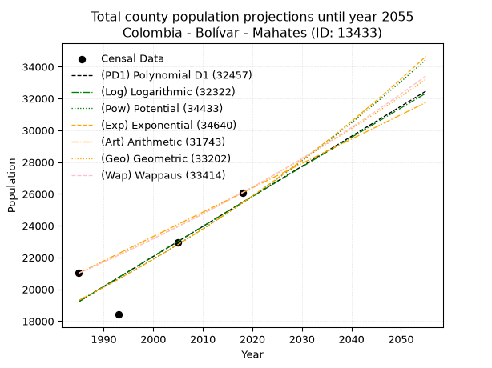
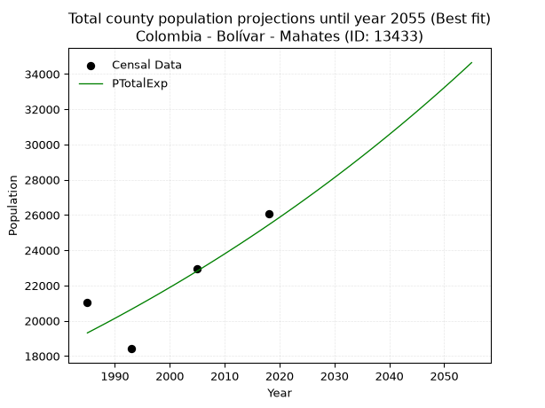
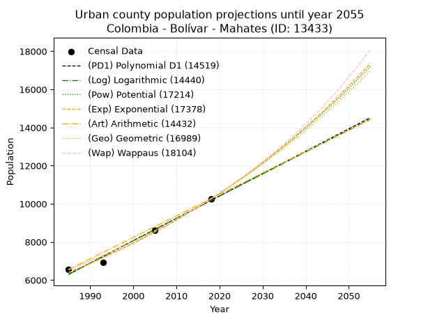
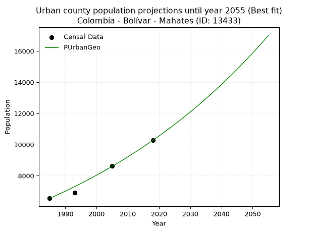
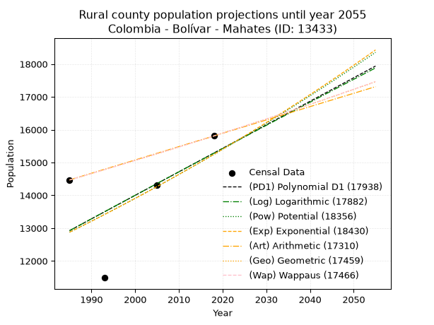
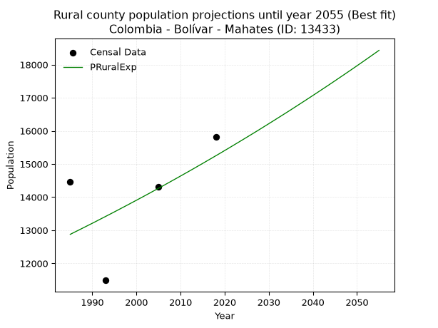

<div align="center">


</div>

# _“Population and Public Services Demand Projections (PPSD) until Year 2050 for Colombia - Bolívar - Mahates (ID: 13433)”_
Keywords: `population` `public-service` `projection` `lineal` `polynomial` `logarithmic` `potential` `exponential` `arithmetic` `geometric` `wappaus` `dane` `colombia` `south-america`

PPSD are analytical estimates used by governments and planners to anticipate future changes in population size, age distribution, and the resulting community needs for utilities, healthcare, education, and infrastructure as sizing future water treatment facilities, electrical grids, and road networks based on spatial growth.

> **General running parameters**: • app_version: _v20260806_. • Python version: _3.14.7_. • Pandas version: _3.0.5_. • NumPy version: _2.5.1_. • Creates, save and include plots into reports (create_plot): _False_. • Projection until year: _2050_. • Process polynomial degree 2 and up: _False_. • Process Wappaus: _True_. • Process Wappaus: _True_. • Set negative values to zero: _True_. • Set infinite values to zero: _True_. • Drop dataset notes: _True_. 
<div align="center">

Dynamic map: [:earth_americas:Google](http://maps.google.com/maps?q=10.23328544,-75.1916429) [:earth_americas:OSM](https://www.openstreetmap.org/#map=18/10.23328544/-75.1916429&layers=P) [:earth_americas:Bing](https://www.bing.com/maps?cp=10.23328544~-75.1916429&lvl=18) [:earth_americas:Apple](https://maps.apple.com/frame?center=10.23328544%2C-75.1916429&span=0.003%2C0.006)

</div>


<div align="center">

```geojson
{
  "type": "Feature",
  "geometry": {
    "type": "Point", 
    "coordinates": [-75.1916429, 10.23328544]
  }, 
  "properties": {
    "Name": "Colombia - Bolívar - Mahates (ID: 13433)"
  }
}
```

</div>


## 0. Census Data (4 records)

Census data are official statistics collected by a government about the people and housing in a country. They usually include counts of total population, age, sex, race, income, education, and jobs.

📅Global census file: [Population.xlsx](../data/Population.xlsx)

| Source   |   Year |   CountryID | CountryName   |   StateID | StateName   |   CountyID | CountyName   |   PTotal |   PUrban |   PRural |
|:---------|-------:|------------:|:--------------|----------:|:------------|-----------:|:-------------|---------:|---------:|---------:|
| DANE     |   1985 |          57 | Colombia      |        13 | Bolívar     |      13433 | Mahates      |    21020 |     6552 |    14468 |
| DANE     |   1993 |          57 | Colombia      |        13 | Bolívar     |      13433 | Mahates      |    18412 |     6925 |    11487 |
| DANE     |   2005 |          57 | Colombia      |        13 | Bolívar     |      13433 | Mahates      |    22929 |     8627 |    14302 |
| DANE     |   2018 |          57 | Colombia      |        13 | Bolívar     |      13433 | Mahates      |    26075 |    10267 |    15808 |

> 🔥Some records could had specific notes about the registered values or the corresponding urban or rural distribution.

## 1. Total

### 1.1. Coefficients and Parameters

* (PD1) Polynomial Deg 1: 189.00361300682238, -355945.4769168964 (lineal)
* (Log) Logarithmic: 377922.60219261516, -2850483.727747737
* (Pow) Potential: 16.69140081505248, -50.75849414166288
* (Exp) Exponential: 0.008347652280827532, 0.00122885544364092
* (Art) Arithmetic: Year diff. 2018 - 1985 = 33, Population diff. 26075 - 21020 = 5055, Annual growth = 153.1818181818182
* (Geo) Geometric: Year diff. 2018 - 1985 = 33, Population diff. 26075 - 21020 = 5055, Annual growth % = 0.006551752333973981
* (Wap) Wappaus: i = 0.6505226379947688, Condition values only valid for < 200)

<sub>
Wappaus condition values: ['0.00', '0.65', '1.30', '1.95', '2.60', '3.25', '3.90', '4.55', '5.20', '5.85', '6.51', '7.16', '7.81', '8.46', '9.11', '9.76', '10.41', '11.06', '11.71', '12.36', '13.01', '13.66', '14.31', '14.96', '15.61', '16.26', '16.91', '17.56', '18.21', '18.87', '19.52', '20.17', '20.82', '21.47', '22.12', '22.77', '23.42', '24.07', '24.72', '25.37', '26.02', '26.67', '27.32', '27.97', '28.62', '29.27', '29.92', '30.57', '31.23', '31.88', '32.53', '33.18', '33.83', '34.48', '35.13', '35.78', '36.43', '37.08', '37.73', '38.38', '39.03', '39.68', '40.33', '40.98', '41.63', '42.28']
</sub>


### 1.2. Projected Dataset

|   Year |   CountyID |   PTotalPD1 |   PTotalLog |   PTotalPow |   PTotalExp |   PTotalArt |   PTotalGeo |   PTotalWap |
|-------:|-----------:|------------:|------------:|------------:|------------:|------------:|------------:|------------:|
|   1985 |      13433 |       19227 |       19224 |       19308 |       19311 |       21020 |       21020 |       21020 |
|   1986 |      13433 |       19416 |       19414 |       19471 |       19473 |       21173 |       21158 |       21157 |
|   1987 |      13433 |       19605 |       19605 |       19636 |       19636 |       21326 |       21296 |       21295 |
|   1988 |      13433 |       19794 |       19795 |       19801 |       19800 |       21480 |       21436 |       21434 |
|   1989 |      13433 |       19983 |       19985 |       19968 |       19966 |       21633 |       21576 |       21574 |
|   1990 |      13433 |       20172 |       20175 |       20137 |       20134 |       21786 |       21718 |       21715 |
|   1991 |      13433 |       20361 |       20365 |       20306 |       20303 |       21939 |       21860 |       21857 |
|   1992 |      13433 |       20550 |       20554 |       20477 |       20473 |       22092 |       22003 |       21999 |
|   1993 |      13433 |       20739 |       20744 |       20649 |       20644 |       22245 |       22147 |       22143 |
|   1994 |      13433 |       20928 |       20934 |       20823 |       20817 |       22399 |       22292 |       22288 |
|   1995 |      13433 |       21117 |       21123 |       20998 |       20992 |       22552 |       22438 |       22433 |
|   1996 |      13433 |       21306 |       21313 |       21174 |       21168 |       22705 |       22586 |       22580 |
|   1997 |      13433 |       21495 |       21502 |       21352 |       21345 |       22858 |       22733 |       22728 |
|   1998 |      13433 |       21684 |       21691 |       21531 |       21524 |       23011 |       22882 |       22876 |
|   1999 |      13433 |       21873 |       21880 |       21712 |       21705 |       23165 |       23032 |       23026 |
|   2000 |      13433 |       22062 |       22069 |       21894 |       21887 |       23318 |       23183 |       23176 |
|   2001 |      13433 |       22251 |       22258 |       22077 |       22070 |       23471 |       23335 |       23328 |
|   2002 |      13433 |       22440 |       22447 |       22262 |       22255 |       23624 |       23488 |       23481 |
|   2003 |      13433 |       22629 |       22636 |       22448 |       22442 |       23777 |       23642 |       23634 |
|   2004 |      13433 |       22818 |       22824 |       22636 |       22630 |       23930 |       23797 |       23789 |
|   2005 |      13433 |       23007 |       23013 |       22826 |       22820 |       24084 |       23953 |       23945 |
|   2006 |      13433 |       23196 |       23201 |       23016 |       23011 |       24237 |       24110 |       24102 |
|   2007 |      13433 |       23385 |       23390 |       23209 |       23204 |       24390 |       24268 |       24260 |
|   2008 |      13433 |       23574 |       23578 |       23402 |       23398 |       24543 |       24427 |       24419 |
|   2009 |      13433 |       23763 |       23766 |       23598 |       23594 |       24696 |       24587 |       24580 |
|   2010 |      13433 |       23952 |       23954 |       23794 |       23792 |       24850 |       24748 |       24741 |
|   2011 |      13433 |       24141 |       24142 |       23993 |       23992 |       25003 |       24910 |       24904 |
|   2012 |      13433 |       24330 |       24330 |       24193 |       24193 |       25156 |       25073 |       25067 |
|   2013 |      13433 |       24519 |       24518 |       24394 |       24395 |       25309 |       25237 |       25232 |
|   2014 |      13433 |       24708 |       24705 |       24597 |       24600 |       25462 |       25403 |       25398 |
|   2015 |      13433 |       24897 |       24893 |       24802 |       24806 |       25615 |       25569 |       25566 |
|   2016 |      13433 |       25086 |       25080 |       25008 |       25014 |       25769 |       25737 |       25734 |
|   2017 |      13433 |       25275 |       25268 |       25216 |       25224 |       25922 |       25905 |       25904 |
|   2018 |      13433 |       25464 |       25455 |       25426 |       25435 |       26075 |       26075 |       26075 |
|   2019 |      13433 |       25653 |       25642 |       25637 |       25648 |       26228 |       26246 |       26247 |
|   2020 |      13433 |       25842 |       25830 |       25849 |       25863 |       26381 |       26418 |       26421 |
|   2021 |      13433 |       26031 |       26017 |       26064 |       26080 |       26535 |       26591 |       26595 |
|   2022 |      13433 |       26220 |       26204 |       26280 |       26299 |       26688 |       26765 |       26772 |
|   2023 |      13433 |       26409 |       26390 |       26498 |       26519 |       26841 |       26940 |       26949 |
|   2024 |      13433 |       26598 |       26577 |       26717 |       26742 |       26994 |       27117 |       27128 |
|   2025 |      13433 |       26787 |       26764 |       26938 |       26966 |       27147 |       27295 |       27308 |
|   2026 |      13433 |       26976 |       26950 |       27161 |       27192 |       27300 |       27473 |       27489 |
|   2027 |      13433 |       27165 |       27137 |       27386 |       27420 |       27454 |       27653 |       27672 |
|   2028 |      13433 |       27354 |       27323 |       27612 |       27650 |       27607 |       27835 |       27856 |
|   2029 |      13433 |       27543 |       27510 |       27840 |       27881 |       27760 |       28017 |       28041 |
|   2030 |      13433 |       27732 |       27696 |       28070 |       28115 |       27913 |       28201 |       28228 |
|   2031 |      13433 |       27921 |       27882 |       28302 |       28351 |       28066 |       28385 |       28417 |
|   2032 |      13433 |       28110 |       28068 |       28536 |       28588 |       28220 |       28571 |       28607 |
|   2033 |      13433 |       28299 |       28254 |       28771 |       28828 |       28373 |       28758 |       28798 |
|   2034 |      13433 |       28488 |       28440 |       29008 |       29070 |       28526 |       28947 |       28991 |
|   2035 |      13433 |       28677 |       28626 |       29247 |       29313 |       28679 |       29137 |       29185 |
|   2036 |      13433 |       28866 |       28811 |       29488 |       29559 |       28832 |       29327 |       29381 |
|   2037 |      13433 |       29055 |       28997 |       29730 |       29807 |       28985 |       29520 |       29578 |
|   2038 |      13433 |       29244 |       29182 |       29975 |       30057 |       29139 |       29713 |       29777 |
|   2039 |      13433 |       29433 |       29368 |       30221 |       30309 |       29292 |       29908 |       29977 |
|   2040 |      13433 |       29622 |       29553 |       30470 |       30563 |       29445 |       30104 |       30179 |
|   2041 |      13433 |       29811 |       29738 |       30720 |       30819 |       29598 |       30301 |       30383 |
|   2042 |      13433 |       30000 |       29923 |       30972 |       31077 |       29751 |       30499 |       30588 |
|   2043 |      13433 |       30189 |       30108 |       31226 |       31338 |       29905 |       30699 |       30795 |
|   2044 |      13433 |       30378 |       30293 |       31483 |       31601 |       30058 |       30900 |       31004 |
|   2045 |      13433 |       30567 |       30478 |       31741 |       31865 |       30211 |       31103 |       31214 |
|   2046 |      13433 |       30756 |       30663 |       32001 |       32133 |       30364 |       31307 |       31426 |
|   2047 |      13433 |       30945 |       30848 |       32263 |       32402 |       30517 |       31512 |       31639 |
|   2048 |      13433 |       31134 |       31032 |       32527 |       32674 |       30670 |       31718 |       31855 |
|   2049 |      13433 |       31323 |       31217 |       32793 |       32947 |       30824 |       31926 |       32072 |
|   2050 |      13433 |       31512 |       31401 |       33061 |       33224 |       30977 |       32135 |       32291 |
<div align="center">

</img>

</div>


### 1.3. Best fit with absolute and relative error (%)

Relative error puts that difference into context by dividing the absolute error by the true value, creating a unitless ratio or percentage that shows the scale of the mistake.

Absolute and relative error

|   Year | Source   |   CountryID | CountryName   |   StateID | StateName   |   CountyID_x | CountyName   |   PTotal |   PUrban |   PRural |   CountyID_y |   PTotalPD1 |   PTotalLog |   PTotalPow |   PTotalExp |   PTotalArt |   PTotalGeo |   PTotalWap |   PTotalPD1AbsError |   PTotalLogAbsError |   PTotalPowAbsError |   PTotalExpAbsError |   PTotalArtAbsError |   PTotalGeoAbsError |   PTotalWapAbsError |   PTotalPD1RelError |   PTotalLogRelError |   PTotalPowRelError |   PTotalExpRelError |   PTotalArtRelError |   PTotalGeoRelError |   PTotalWapRelError |
|-------:|:---------|------------:|:--------------|----------:|:------------|-------------:|:-------------|---------:|---------:|---------:|-------------:|------------:|------------:|------------:|------------:|------------:|------------:|------------:|--------------------:|--------------------:|--------------------:|--------------------:|--------------------:|--------------------:|--------------------:|--------------------:|--------------------:|--------------------:|--------------------:|--------------------:|--------------------:|--------------------:|
|   1985 | DANE     |          57 | Colombia      |        13 | Bolívar     |        13433 | Mahates      |    21020 |     6552 |    14468 |        13433 |       19227 |       19224 |       19308 |       19311 |       21020 |       21020 |       21020 |                1793 |                1796 |                1712 |                1709 |                   0 |                   0 |                   0 |            8.52997  |            8.54424  |            8.14462  |            8.13035  |             0       |             0       |             0       |
|   1993 | DANE     |          57 | Colombia      |        13 | Bolívar     |        13433 | Mahates      |    18412 |     6925 |    11487 |        13433 |       20739 |       20744 |       20649 |       20644 |       22245 |       22147 |       22143 |                2327 |                2332 |                2237 |                2232 |                3833 |                3735 |                3731 |           12.6385   |           12.6657   |           12.1497   |           12.1225   |            20.8179  |            20.2857  |            20.264   |
|   2005 | DANE     |          57 | Colombia      |        13 | Bolívar     |        13433 | Mahates      |    22929 |     8627 |    14302 |        13433 |       23007 |       23013 |       22826 |       22820 |       24084 |       23953 |       23945 |                  78 |                  84 |                 103 |                 109 |                1155 |                1024 |                1016 |            0.340181 |            0.366348 |            0.449213 |            0.475381 |             5.03729 |             4.46596 |             4.43107 |
|   2018 | DANE     |          57 | Colombia      |        13 | Bolívar     |        13433 | Mahates      |    26075 |    10267 |    15808 |        13433 |       25464 |       25455 |       25426 |       25435 |       26075 |       26075 |       26075 |                 611 |                 620 |                 649 |                 640 |                   0 |                   0 |                   0 |            2.34324  |            2.37776  |            2.48897  |            2.45446  |             0       |             0       |             0       |

Relative error mean

| Method    |   RelError | Best   |
|:----------|-----------:|:-------|
| PTotalPD1 |    5.96297 |        |
| PTotalLog |    5.9885  |        |
| PTotalPow |    5.80812 |        |
| PTotalExp |    5.79568 | True   |
| PTotalArt |    6.46381 |        |
| PTotalGeo |    6.18791 |        |
| PTotalWap |    6.17376 |        |

💙Best method: _**PTotalExp**_
<div align="center">

</img>

</div>


### 1.4. Fresh water supply demand in liters per capita per day (lpcd)

The fresh water supply demand typically ranges from 100 to 300 liters per capita per day (lpcd) for standard domestic and municipal planning, though absolute survival minimums set by the World Health Organization are as low as 7.5 to 20 liters per day, and total consumption in high-income nations can exceed 400 liters.

> `CZ`: Level in meters above the sea level (masl)<br> `WS`: Fresh water supply demand in liters per capita per day (lpcd or l/h/d)<br> `WSAll`: Zonal fresh water supply demand in liters per second (l/s)<br> `A`: Zonal area in square meters<br> `DP`: Population density (people/hectare)

Reference values (RAS Colombia)

|    CZ |   WS |
|------:|-----:|
|  1000 |  120 |
|  2000 |  130 |
| 99999 |  140 |

County shapefile geometry properties and water supply values

|   CountyID |      ATotal |   CZTotal |   WSTotal |
|-----------:|------------:|----------:|----------:|
|      13433 | 4.32098e+08 |    43.247 |       120 |

Projected values for best method: PTotalExp

|   CountyID |   Year |   PTotalExp |   DPTotal |   WSTotal |   WSTotalAll |
|-----------:|-------:|------------:|----------:|----------:|-------------:|
|      13433 |   1985 |       19311 |      0.45 |       120 |      26.8208 |
|      13433 |   1986 |       19473 |      0.45 |       120 |      27.0458 |
|      13433 |   1987 |       19636 |      0.45 |       120 |      27.2722 |
|      13433 |   1988 |       19800 |      0.46 |       120 |      27.5    |
|      13433 |   1989 |       19966 |      0.46 |       120 |      27.7306 |
|      13433 |   1990 |       20134 |      0.47 |       120 |      27.9639 |
|      13433 |   1991 |       20303 |      0.47 |       120 |      28.1986 |
|      13433 |   1992 |       20473 |      0.47 |       120 |      28.4347 |
|      13433 |   1993 |       20644 |      0.48 |       120 |      28.6722 |
|      13433 |   1994 |       20817 |      0.48 |       120 |      28.9125 |
|      13433 |   1995 |       20992 |      0.49 |       120 |      29.1556 |
|      13433 |   1996 |       21168 |      0.49 |       120 |      29.4    |
|      13433 |   1997 |       21345 |      0.49 |       120 |      29.6458 |
|      13433 |   1998 |       21524 |      0.5  |       120 |      29.8944 |
|      13433 |   1999 |       21705 |      0.5  |       120 |      30.1458 |
|      13433 |   2000 |       21887 |      0.51 |       120 |      30.3986 |
|      13433 |   2001 |       22070 |      0.51 |       120 |      30.6528 |
|      13433 |   2002 |       22255 |      0.52 |       120 |      30.9097 |
|      13433 |   2003 |       22442 |      0.52 |       120 |      31.1694 |
|      13433 |   2004 |       22630 |      0.52 |       120 |      31.4306 |
|      13433 |   2005 |       22820 |      0.53 |       120 |      31.6944 |
|      13433 |   2006 |       23011 |      0.53 |       120 |      31.9597 |
|      13433 |   2007 |       23204 |      0.54 |       120 |      32.2278 |
|      13433 |   2008 |       23398 |      0.54 |       120 |      32.4972 |
|      13433 |   2009 |       23594 |      0.55 |       120 |      32.7694 |
|      13433 |   2010 |       23792 |      0.55 |       120 |      33.0444 |
|      13433 |   2011 |       23992 |      0.56 |       120 |      33.3222 |
|      13433 |   2012 |       24193 |      0.56 |       120 |      33.6014 |
|      13433 |   2013 |       24395 |      0.56 |       120 |      33.8819 |
|      13433 |   2014 |       24600 |      0.57 |       120 |      34.1667 |
|      13433 |   2015 |       24806 |      0.57 |       120 |      34.4528 |
|      13433 |   2016 |       25014 |      0.58 |       120 |      34.7417 |
|      13433 |   2017 |       25224 |      0.58 |       120 |      35.0333 |
|      13433 |   2018 |       25435 |      0.59 |       120 |      35.3264 |
|      13433 |   2019 |       25648 |      0.59 |       120 |      35.6222 |
|      13433 |   2020 |       25863 |      0.6  |       120 |      35.9208 |
|      13433 |   2021 |       26080 |      0.6  |       120 |      36.2222 |
|      13433 |   2022 |       26299 |      0.61 |       120 |      36.5264 |
|      13433 |   2023 |       26519 |      0.61 |       120 |      36.8319 |
|      13433 |   2024 |       26742 |      0.62 |       120 |      37.1417 |
|      13433 |   2025 |       26966 |      0.62 |       120 |      37.4528 |
|      13433 |   2026 |       27192 |      0.63 |       120 |      37.7667 |
|      13433 |   2027 |       27420 |      0.63 |       120 |      38.0833 |
|      13433 |   2028 |       27650 |      0.64 |       120 |      38.4028 |
|      13433 |   2029 |       27881 |      0.65 |       120 |      38.7236 |
|      13433 |   2030 |       28115 |      0.65 |       120 |      39.0486 |
|      13433 |   2031 |       28351 |      0.66 |       120 |      39.3764 |
|      13433 |   2032 |       28588 |      0.66 |       120 |      39.7056 |
|      13433 |   2033 |       28828 |      0.67 |       120 |      40.0389 |
|      13433 |   2034 |       29070 |      0.67 |       120 |      40.375  |
|      13433 |   2035 |       29313 |      0.68 |       120 |      40.7125 |
|      13433 |   2036 |       29559 |      0.68 |       120 |      41.0542 |
|      13433 |   2037 |       29807 |      0.69 |       120 |      41.3986 |
|      13433 |   2038 |       30057 |      0.7  |       120 |      41.7458 |
|      13433 |   2039 |       30309 |      0.7  |       120 |      42.0958 |
|      13433 |   2040 |       30563 |      0.71 |       120 |      42.4486 |
|      13433 |   2041 |       30819 |      0.71 |       120 |      42.8042 |
|      13433 |   2042 |       31077 |      0.72 |       120 |      43.1625 |
|      13433 |   2043 |       31338 |      0.73 |       120 |      43.525  |
|      13433 |   2044 |       31601 |      0.73 |       120 |      43.8903 |
|      13433 |   2045 |       31865 |      0.74 |       120 |      44.2569 |
|      13433 |   2046 |       32133 |      0.74 |       120 |      44.6292 |
|      13433 |   2047 |       32402 |      0.75 |       120 |      45.0028 |
|      13433 |   2048 |       32674 |      0.76 |       120 |      45.3806 |
|      13433 |   2049 |       32947 |      0.76 |       120 |      45.7597 |
|      13433 |   2050 |       33224 |      0.77 |       120 |      46.1444 |

## 2. Urban

### 2.1. Coefficients and Parameters

* (PD1) Polynomial Deg 1: 117.37173825772668, -226680.06945001782 (lineal)
* (Log) Logarithmic: 234877.83546185386, -1777215.5595384
* (Pow) Potential: 28.532465304175453, -90.28680753370168
* (Exp) Exponential: 0.014256290880193988, 3.2856362105315596e-09
* (Art) Arithmetic: Year diff. 2018 - 1985 = 33, Population diff. 10267 - 6552 = 3715, Annual growth = 112.57575757575758
* (Geo) Geometric: Year diff. 2018 - 1985 = 33, Population diff. 10267 - 6552 = 3715, Annual growth % = 0.013704098101288142
* (Wap) Wappaus: i = 1.3386736140764324, Condition values only valid for < 200)

<sub>
Wappaus condition values: ['0.00', '1.34', '2.68', '4.02', '5.35', '6.69', '8.03', '9.37', '10.71', '12.05', '13.39', '14.73', '16.06', '17.40', '18.74', '20.08', '21.42', '22.76', '24.10', '25.43', '26.77', '28.11', '29.45', '30.79', '32.13', '33.47', '34.81', '36.14', '37.48', '38.82', '40.16', '41.50', '42.84', '44.18', '45.51', '46.85', '48.19', '49.53', '50.87', '52.21', '53.55', '54.89', '56.22', '57.56', '58.90', '60.24', '61.58', '62.92', '64.26', '65.60', '66.93', '68.27', '69.61', '70.95', '72.29', '73.63', '74.97', '76.30', '77.64', '78.98', '80.32', '81.66', '83.00', '84.34', '85.68', '87.01']
</sub>


### 2.2. Projected Dataset

|   Year |   CountyID |   PUrbanPD1 |   PUrbanLog |   PUrbanPow |   PUrbanExp |   PUrbanArt |   PUrbanGeo |   PUrbanWap |
|-------:|-----------:|------------:|------------:|------------:|------------:|------------:|------------:|------------:|
|   1985 |      13433 |        6303 |        6300 |        6404 |        6406 |        6552 |        6552 |        6552 |
|   1986 |      13433 |        6420 |        6418 |        6496 |        6498 |        6665 |        6642 |        6640 |
|   1987 |      13433 |        6538 |        6536 |        6590 |        6592 |        6777 |        6733 |        6730 |
|   1988 |      13433 |        6655 |        6654 |        6686 |        6686 |        6890 |        6825 |        6821 |
|   1989 |      13433 |        6772 |        6773 |        6782 |        6782 |        7002 |        6919 |        6912 |
|   1990 |      13433 |        6890 |        6891 |        6880 |        6880 |        7115 |        7013 |        7006 |
|   1991 |      13433 |        7007 |        7009 |        6980 |        6978 |        7227 |        7110 |        7100 |
|   1992 |      13433 |        7124 |        7127 |        7080 |        7079 |        7340 |        7207 |        7196 |
|   1993 |      13433 |        7242 |        7244 |        7182 |        7180 |        7453 |        7306 |        7293 |
|   1994 |      13433 |        7359 |        7362 |        7286 |        7283 |        7565 |        7406 |        7392 |
|   1995 |      13433 |        7477 |        7480 |        7391 |        7388 |        7678 |        7507 |        7492 |
|   1996 |      13433 |        7594 |        7598 |        7497 |        7494 |        7790 |        7610 |        7593 |
|   1997 |      13433 |        7711 |        7715 |        7605 |        7602 |        7903 |        7715 |        7696 |
|   1998 |      13433 |        7829 |        7833 |        7715 |        7711 |        8015 |        7820 |        7801 |
|   1999 |      13433 |        7946 |        7950 |        7826 |        7821 |        8128 |        7927 |        7907 |
|   2000 |      13433 |        8063 |        8068 |        7938 |        7934 |        8241 |        8036 |        8014 |
|   2001 |      13433 |        8181 |        8185 |        8052 |        8048 |        8353 |        8146 |        8124 |
|   2002 |      13433 |        8298 |        8303 |        8168 |        8163 |        8466 |        8258 |        8235 |
|   2003 |      13433 |        8416 |        8420 |        8285 |        8280 |        8578 |        8371 |        8347 |
|   2004 |      13433 |        8533 |        8537 |        8404 |        8399 |        8691 |        8486 |        8461 |
|   2005 |      13433 |        8650 |        8654 |        8524 |        8520 |        8804 |        8602 |        8577 |
|   2006 |      13433 |        8768 |        8772 |        8646 |        8642 |        8916 |        8720 |        8695 |
|   2007 |      13433 |        8885 |        8889 |        8770 |        8766 |        9029 |        8839 |        8815 |
|   2008 |      13433 |        9002 |        9006 |        8896 |        8892 |        9141 |        8960 |        8936 |
|   2009 |      13433 |        9120 |        9123 |        9023 |        9020 |        9254 |        9083 |        9060 |
|   2010 |      13433 |        9237 |        9239 |        9152 |        9149 |        9366 |        9208 |        9185 |
|   2011 |      13433 |        9354 |        9356 |        9283 |        9281 |        9479 |        9334 |        9313 |
|   2012 |      13433 |        9472 |        9473 |        9415 |        9414 |        9592 |        9462 |        9443 |
|   2013 |      13433 |        9589 |        9590 |        9550 |        9549 |        9704 |        9592 |        9574 |
|   2014 |      13433 |        9707 |        9706 |        9686 |        9686 |        9817 |        9723 |        9708 |
|   2015 |      13433 |        9824 |        9823 |        9824 |        9825 |        9929 |        9856 |        9844 |
|   2016 |      13433 |        9941 |        9940 |        9964 |        9966 |       10042 |        9991 |        9983 |
|   2017 |      13433 |       10059 |       10056 |       10106 |       10110 |       10154 |       10128 |       10124 |
|   2018 |      13433 |       10176 |       10172 |       10250 |       10255 |       10267 |       10267 |       10267 |
|   2019 |      13433 |       10293 |       10289 |       10396 |       10402 |       10380 |       10408 |       10413 |
|   2020 |      13433 |       10411 |       10405 |       10544 |       10551 |       10492 |       10550 |       10561 |
|   2021 |      13433 |       10528 |       10521 |       10694 |       10703 |       10605 |       10695 |       10712 |
|   2022 |      13433 |       10646 |       10638 |       10846 |       10856 |       10717 |       10841 |       10866 |
|   2023 |      13433 |       10763 |       10754 |       11000 |       11012 |       10830 |       10990 |       11022 |
|   2024 |      13433 |       10880 |       10870 |       11157 |       11170 |       10942 |       11141 |       11181 |
|   2025 |      13433 |       10998 |       10986 |       11315 |       11331 |       11055 |       11293 |       11343 |
|   2026 |      13433 |       11115 |       11102 |       11475 |       11494 |       11168 |       11448 |       11508 |
|   2027 |      13433 |       11232 |       11218 |       11638 |       11659 |       11280 |       11605 |       11676 |
|   2028 |      13433 |       11350 |       11333 |       11803 |       11826 |       11393 |       11764 |       11848 |
|   2029 |      13433 |       11467 |       11449 |       11970 |       11996 |       11505 |       11925 |       12022 |
|   2030 |      13433 |       11585 |       11565 |       12140 |       12168 |       11618 |       12089 |       12200 |
|   2031 |      13433 |       11702 |       11681 |       12312 |       12343 |       11730 |       12254 |       12382 |
|   2032 |      13433 |       11819 |       11796 |       12486 |       12520 |       11843 |       12422 |       12566 |
|   2033 |      13433 |       11937 |       11912 |       12662 |       12700 |       11956 |       12592 |       12755 |
|   2034 |      13433 |       12054 |       12027 |       12841 |       12882 |       12068 |       12765 |       12947 |
|   2035 |      13433 |       12171 |       12143 |       13022 |       13067 |       12181 |       12940 |       13143 |
|   2036 |      13433 |       12289 |       12258 |       13206 |       13255 |       12293 |       13117 |       13344 |
|   2037 |      13433 |       12406 |       12373 |       13393 |       13445 |       12406 |       13297 |       13548 |
|   2038 |      13433 |       12524 |       12489 |       13581 |       13638 |       12519 |       13479 |       13756 |
|   2039 |      13433 |       12641 |       12604 |       13773 |       13834 |       12631 |       13664 |       13969 |
|   2040 |      13433 |       12758 |       12719 |       13967 |       14032 |       12744 |       13851 |       14187 |
|   2041 |      13433 |       12876 |       12834 |       14164 |       14234 |       12856 |       14041 |       14409 |
|   2042 |      13433 |       12993 |       12949 |       14363 |       14438 |       12969 |       14234 |       14635 |
|   2043 |      13433 |       13110 |       13064 |       14565 |       14646 |       13081 |       14429 |       14867 |
|   2044 |      13433 |       13228 |       13179 |       14770 |       14856 |       13194 |       14626 |       15104 |
|   2045 |      13433 |       13345 |       13294 |       14977 |       15069 |       13307 |       14827 |       15346 |
|   2046 |      13433 |       13463 |       13409 |       15188 |       15286 |       13419 |       15030 |       15594 |
|   2047 |      13433 |       13580 |       13524 |       15401 |       15505 |       13532 |       15236 |       15848 |
|   2048 |      13433 |       13697 |       13638 |       15617 |       15728 |       13644 |       15445 |       16107 |
|   2049 |      13433 |       13815 |       13753 |       15836 |       15954 |       13757 |       15656 |       16372 |
|   2050 |      13433 |       13932 |       13868 |       16058 |       16183 |       13869 |       15871 |       16644 |
<div align="center">

</img>

</div>


### 2.3. Best fit with absolute and relative error (%)

Relative error puts that difference into context by dividing the absolute error by the true value, creating a unitless ratio or percentage that shows the scale of the mistake.

Absolute and relative error

|   Year | Source   |   CountryID | CountryName   |   StateID | StateName   |   CountyID_x | CountyName   |   PTotal |   PUrban |   PRural |   CountyID_y |   PUrbanPD1 |   PUrbanLog |   PUrbanPow |   PUrbanExp |   PUrbanArt |   PUrbanGeo |   PUrbanWap |   PUrbanPD1AbsError |   PUrbanLogAbsError |   PUrbanPowAbsError |   PUrbanExpAbsError |   PUrbanArtAbsError |   PUrbanGeoAbsError |   PUrbanWapAbsError |   PUrbanPD1RelError |   PUrbanLogRelError |   PUrbanPowRelError |   PUrbanExpRelError |   PUrbanArtRelError |   PUrbanGeoRelError |   PUrbanWapRelError |
|-------:|:---------|------------:|:--------------|----------:|:------------|-------------:|:-------------|---------:|---------:|---------:|-------------:|------------:|------------:|------------:|------------:|------------:|------------:|------------:|--------------------:|--------------------:|--------------------:|--------------------:|--------------------:|--------------------:|--------------------:|--------------------:|--------------------:|--------------------:|--------------------:|--------------------:|--------------------:|--------------------:|
|   1985 | DANE     |          57 | Colombia      |        13 | Bolívar     |        13433 | Mahates      |    21020 |     6552 |    14468 |        13433 |        6303 |        6300 |        6404 |        6406 |        6552 |        6552 |        6552 |                 249 |                 252 |                 148 |                 146 |                   0 |                   0 |                   0 |            3.80037  |            3.84615  |            2.25885  |            2.22833  |             0       |            0        |            0        |
|   1993 | DANE     |          57 | Colombia      |        13 | Bolívar     |        13433 | Mahates      |    18412 |     6925 |    11487 |        13433 |        7242 |        7244 |        7182 |        7180 |        7453 |        7306 |        7293 |                 317 |                 319 |                 257 |                 255 |                 528 |                 381 |                 368 |            4.57762  |            4.6065   |            3.71119  |            3.68231  |             7.62455 |            5.50181  |            5.31408  |
|   2005 | DANE     |          57 | Colombia      |        13 | Bolívar     |        13433 | Mahates      |    22929 |     8627 |    14302 |        13433 |        8650 |        8654 |        8524 |        8520 |        8804 |        8602 |        8577 |                  23 |                  27 |                 103 |                 107 |                 177 |                  25 |                  50 |            0.266605 |            0.312971 |            1.19393  |            1.24029  |             2.0517  |            0.289788 |            0.579576 |
|   2018 | DANE     |          57 | Colombia      |        13 | Bolívar     |        13433 | Mahates      |    26075 |    10267 |    15808 |        13433 |       10176 |       10172 |       10250 |       10255 |       10267 |       10267 |       10267 |                  91 |                  95 |                  17 |                  12 |                   0 |                   0 |                   0 |            0.886335 |            0.925295 |            0.165579 |            0.116879 |             0       |            0        |            0        |

Relative error mean

| Method    |   RelError | Best   |
|:----------|-----------:|:-------|
| PUrbanPD1 |    2.38273 |        |
| PUrbanLog |    2.42273 |        |
| PUrbanPow |    1.83239 |        |
| PUrbanExp |    1.81695 |        |
| PUrbanArt |    2.41906 |        |
| PUrbanGeo |    1.4479  | True   |
| PUrbanWap |    1.47341 |        |

💙Best method: _**PUrbanGeo**_
<div align="center">

</img>

</div>


### 2.4. Fresh water supply demand in liters per capita per day (lpcd)

The fresh water supply demand typically ranges from 100 to 300 liters per capita per day (lpcd) for standard domestic and municipal planning, though absolute survival minimums set by the World Health Organization are as low as 7.5 to 20 liters per day, and total consumption in high-income nations can exceed 400 liters.

> `CZ`: Level in meters above the sea level (masl)<br> `WS`: Fresh water supply demand in liters per capita per day (lpcd or l/h/d)<br> `WSAll`: Zonal fresh water supply demand in liters per second (l/s)<br> `A`: Zonal area in square meters<br> `DP`: Population density (people/hectare)

Reference values (RAS Colombia)

|    CZ |   WS |
|------:|-----:|
|  1000 |  120 |
|  2000 |  130 |
| 99999 |  140 |

County shapefile geometry properties and water supply values

|   CountyID |      AUrban |   CZUrban |   WSUrban |
|-----------:|------------:|----------:|----------:|
|      13433 | 2.10427e+06 |   8.48912 |       120 |

Projected values for best method: PUrbanGeo

|   CountyID |   Year |   PUrbanGeo |   DPUrban |   WSUrban |   WSUrbanAll |
|-----------:|-------:|------------:|----------:|----------:|-------------:|
|      13433 |   1985 |        6552 |     31.14 |       120 |      9.1     |
|      13433 |   1986 |        6642 |     31.56 |       120 |      9.225   |
|      13433 |   1987 |        6733 |     32    |       120 |      9.35139 |
|      13433 |   1988 |        6825 |     32.43 |       120 |      9.47917 |
|      13433 |   1989 |        6919 |     32.88 |       120 |      9.60972 |
|      13433 |   1990 |        7013 |     33.33 |       120 |      9.74028 |
|      13433 |   1991 |        7110 |     33.79 |       120 |      9.875   |
|      13433 |   1992 |        7207 |     34.25 |       120 |     10.0097  |
|      13433 |   1993 |        7306 |     34.72 |       120 |     10.1472  |
|      13433 |   1994 |        7406 |     35.2  |       120 |     10.2861  |
|      13433 |   1995 |        7507 |     35.68 |       120 |     10.4264  |
|      13433 |   1996 |        7610 |     36.16 |       120 |     10.5694  |
|      13433 |   1997 |        7715 |     36.66 |       120 |     10.7153  |
|      13433 |   1998 |        7820 |     37.16 |       120 |     10.8611  |
|      13433 |   1999 |        7927 |     37.67 |       120 |     11.0097  |
|      13433 |   2000 |        8036 |     38.19 |       120 |     11.1611  |
|      13433 |   2001 |        8146 |     38.71 |       120 |     11.3139  |
|      13433 |   2002 |        8258 |     39.24 |       120 |     11.4694  |
|      13433 |   2003 |        8371 |     39.78 |       120 |     11.6264  |
|      13433 |   2004 |        8486 |     40.33 |       120 |     11.7861  |
|      13433 |   2005 |        8602 |     40.88 |       120 |     11.9472  |
|      13433 |   2006 |        8720 |     41.44 |       120 |     12.1111  |
|      13433 |   2007 |        8839 |     42.01 |       120 |     12.2764  |
|      13433 |   2008 |        8960 |     42.58 |       120 |     12.4444  |
|      13433 |   2009 |        9083 |     43.16 |       120 |     12.6153  |
|      13433 |   2010 |        9208 |     43.76 |       120 |     12.7889  |
|      13433 |   2011 |        9334 |     44.36 |       120 |     12.9639  |
|      13433 |   2012 |        9462 |     44.97 |       120 |     13.1417  |
|      13433 |   2013 |        9592 |     45.58 |       120 |     13.3222  |
|      13433 |   2014 |        9723 |     46.21 |       120 |     13.5042  |
|      13433 |   2015 |        9856 |     46.84 |       120 |     13.6889  |
|      13433 |   2016 |        9991 |     47.48 |       120 |     13.8764  |
|      13433 |   2017 |       10128 |     48.13 |       120 |     14.0667  |
|      13433 |   2018 |       10267 |     48.79 |       120 |     14.2597  |
|      13433 |   2019 |       10408 |     49.46 |       120 |     14.4556  |
|      13433 |   2020 |       10550 |     50.14 |       120 |     14.6528  |
|      13433 |   2021 |       10695 |     50.83 |       120 |     14.8542  |
|      13433 |   2022 |       10841 |     51.52 |       120 |     15.0569  |
|      13433 |   2023 |       10990 |     52.23 |       120 |     15.2639  |
|      13433 |   2024 |       11141 |     52.94 |       120 |     15.4736  |
|      13433 |   2025 |       11293 |     53.67 |       120 |     15.6847  |
|      13433 |   2026 |       11448 |     54.4  |       120 |     15.9     |
|      13433 |   2027 |       11605 |     55.15 |       120 |     16.1181  |
|      13433 |   2028 |       11764 |     55.91 |       120 |     16.3389  |
|      13433 |   2029 |       11925 |     56.67 |       120 |     16.5625  |
|      13433 |   2030 |       12089 |     57.45 |       120 |     16.7903  |
|      13433 |   2031 |       12254 |     58.23 |       120 |     17.0194  |
|      13433 |   2032 |       12422 |     59.03 |       120 |     17.2528  |
|      13433 |   2033 |       12592 |     59.84 |       120 |     17.4889  |
|      13433 |   2034 |       12765 |     60.66 |       120 |     17.7292  |
|      13433 |   2035 |       12940 |     61.49 |       120 |     17.9722  |
|      13433 |   2036 |       13117 |     62.34 |       120 |     18.2181  |
|      13433 |   2037 |       13297 |     63.19 |       120 |     18.4681  |
|      13433 |   2038 |       13479 |     64.06 |       120 |     18.7208  |
|      13433 |   2039 |       13664 |     64.93 |       120 |     18.9778  |
|      13433 |   2040 |       13851 |     65.82 |       120 |     19.2375  |
|      13433 |   2041 |       14041 |     66.73 |       120 |     19.5014  |
|      13433 |   2042 |       14234 |     67.64 |       120 |     19.7694  |
|      13433 |   2043 |       14429 |     68.57 |       120 |     20.0403  |
|      13433 |   2044 |       14626 |     69.51 |       120 |     20.3139  |
|      13433 |   2045 |       14827 |     70.46 |       120 |     20.5931  |
|      13433 |   2046 |       15030 |     71.43 |       120 |     20.875   |
|      13433 |   2047 |       15236 |     72.41 |       120 |     21.1611  |
|      13433 |   2048 |       15445 |     73.4  |       120 |     21.4514  |
|      13433 |   2049 |       15656 |     74.4  |       120 |     21.7444  |
|      13433 |   2050 |       15871 |     75.42 |       120 |     22.0431  |

## 3. Rural

### 3.1. Coefficients and Parameters

* (PD1) Polynomial Deg 1: 71.63187474909566, -129265.40746687858 (lineal)
* (Log) Logarithmic: 143044.7667307613, -1073268.1682093372
* (Pow) Potential: 10.229266188232293, -29.62386124036781
* (Exp) Exponential: 0.0051227110971792155, 0.493896206495194
* (Art) Arithmetic: Year diff. 2018 - 1985 = 33, Population diff. 15808 - 14468 = 1340, Annual growth = 40.60606060606061
* (Geo) Geometric: Year diff. 2018 - 1985 = 33, Population diff. 15808 - 14468 = 1340, Annual growth % = 0.002687751815987127
* (Wap) Wappaus: i = 0.2682392694283301, Condition values only valid for < 200)

<sub>
Wappaus condition values: ['0.00', '0.27', '0.54', '0.80', '1.07', '1.34', '1.61', '1.88', '2.15', '2.41', '2.68', '2.95', '3.22', '3.49', '3.76', '4.02', '4.29', '4.56', '4.83', '5.10', '5.36', '5.63', '5.90', '6.17', '6.44', '6.71', '6.97', '7.24', '7.51', '7.78', '8.05', '8.32', '8.58', '8.85', '9.12', '9.39', '9.66', '9.92', '10.19', '10.46', '10.73', '11.00', '11.27', '11.53', '11.80', '12.07', '12.34', '12.61', '12.88', '13.14', '13.41', '13.68', '13.95', '14.22', '14.48', '14.75', '15.02', '15.29', '15.56', '15.83', '16.09', '16.36', '16.63', '16.90', '17.17', '17.44']
</sub>


### 3.2. Projected Dataset

|   Year |   CountyID |   PRuralPD1 |   PRuralLog |   PRuralPow |   PRuralExp |   PRuralArt |   PRuralGeo |   PRuralWap |
|-------:|-----------:|------------:|------------:|------------:|------------:|------------:|------------:|------------:|
|   1985 |      13433 |       12924 |       12924 |       12877 |       12876 |       14468 |       14468 |       14468 |
|   1986 |      13433 |       12995 |       12996 |       12943 |       12943 |       14509 |       14507 |       14507 |
|   1987 |      13433 |       13067 |       13068 |       13010 |       13009 |       14549 |       14546 |       14546 |
|   1988 |      13433 |       13139 |       13140 |       13077 |       13076 |       14590 |       14585 |       14585 |
|   1989 |      13433 |       13210 |       13212 |       13145 |       13143 |       14630 |       14624 |       14624 |
|   1990 |      13433 |       13282 |       13284 |       13212 |       13210 |       14671 |       14663 |       14663 |
|   1991 |      13433 |       13354 |       13356 |       13281 |       13278 |       14712 |       14703 |       14703 |
|   1992 |      13433 |       13425 |       13428 |       13349 |       13347 |       14752 |       14742 |       14742 |
|   1993 |      13433 |       13497 |       13500 |       13418 |       13415 |       14793 |       14782 |       14782 |
|   1994 |      13433 |       13569 |       13571 |       13487 |       13484 |       14833 |       14822 |       14822 |
|   1995 |      13433 |       13640 |       13643 |       13556 |       13553 |       14874 |       14862 |       14861 |
|   1996 |      13433 |       13712 |       13715 |       13626 |       13623 |       14915 |       14902 |       14901 |
|   1997 |      13433 |       13783 |       13786 |       13696 |       13693 |       14955 |       14942 |       14941 |
|   1998 |      13433 |       13855 |       13858 |       13766 |       13763 |       14996 |       14982 |       14981 |
|   1999 |      13433 |       13927 |       13930 |       13837 |       13834 |       15036 |       15022 |       15022 |
|   2000 |      13433 |       13998 |       14001 |       13908 |       13905 |       15077 |       15062 |       15062 |
|   2001 |      13433 |       14070 |       14073 |       13979 |       13976 |       15118 |       15103 |       15103 |
|   2002 |      13433 |       14142 |       14144 |       14051 |       14048 |       15158 |       15143 |       15143 |
|   2003 |      13433 |       14213 |       14216 |       14123 |       14120 |       15199 |       15184 |       15184 |
|   2004 |      13433 |       14285 |       14287 |       14195 |       14193 |       15240 |       15225 |       15225 |
|   2005 |      13433 |       14357 |       14358 |       14267 |       14266 |       15280 |       15266 |       15266 |
|   2006 |      13433 |       14428 |       14430 |       14340 |       14339 |       15321 |       15307 |       15307 |
|   2007 |      13433 |       14500 |       14501 |       14414 |       14413 |       15361 |       15348 |       15348 |
|   2008 |      13433 |       14571 |       14572 |       14487 |       14487 |       15402 |       15389 |       15389 |
|   2009 |      13433 |       14643 |       14643 |       14561 |       14561 |       15443 |       15431 |       15430 |
|   2010 |      13433 |       14715 |       14715 |       14636 |       14636 |       15483 |       15472 |       15472 |
|   2011 |      13433 |       14786 |       14786 |       14710 |       14711 |       15524 |       15514 |       15513 |
|   2012 |      13433 |       14858 |       14857 |       14785 |       14786 |       15564 |       15555 |       15555 |
|   2013 |      13433 |       14930 |       14928 |       14861 |       14862 |       15605 |       15597 |       15597 |
|   2014 |      13433 |       15001 |       14999 |       14936 |       14939 |       15646 |       15639 |       15639 |
|   2015 |      13433 |       15073 |       15070 |       15012 |       15015 |       15686 |       15681 |       15681 |
|   2016 |      13433 |       15144 |       15141 |       15089 |       15093 |       15727 |       15723 |       15723 |
|   2017 |      13433 |       15216 |       15212 |       15165 |       15170 |       15767 |       15766 |       15766 |
|   2018 |      13433 |       15288 |       15283 |       15243 |       15248 |       15808 |       15808 |       15808 |
|   2019 |      13433 |       15359 |       15354 |       15320 |       15326 |       15849 |       15850 |       15851 |
|   2020 |      13433 |       15431 |       15424 |       15398 |       15405 |       15889 |       15893 |       15893 |
|   2021 |      13433 |       15503 |       15495 |       15476 |       15484 |       15930 |       15936 |       15936 |
|   2022 |      13433 |       15574 |       15566 |       15554 |       15564 |       15970 |       15979 |       15979 |
|   2023 |      13433 |       15646 |       15637 |       15633 |       15644 |       16011 |       16022 |       16022 |
|   2024 |      13433 |       15718 |       15707 |       15713 |       15724 |       16052 |       16065 |       16065 |
|   2025 |      13433 |       15789 |       15778 |       15792 |       15805 |       16092 |       16108 |       16108 |
|   2026 |      13433 |       15861 |       15849 |       15872 |       15886 |       16133 |       16151 |       16152 |
|   2027 |      13433 |       15932 |       15919 |       15952 |       15967 |       16173 |       16195 |       16195 |
|   2028 |      13433 |       16004 |       15990 |       16033 |       16049 |       16214 |       16238 |       16239 |
|   2029 |      13433 |       16076 |       16060 |       16114 |       16132 |       16255 |       16282 |       16283 |
|   2030 |      13433 |       16147 |       16131 |       16196 |       16215 |       16295 |       16325 |       16327 |
|   2031 |      13433 |       16219 |       16201 |       16277 |       16298 |       16336 |       16369 |       16371 |
|   2032 |      13433 |       16291 |       16272 |       16360 |       16382 |       16376 |       16413 |       16415 |
|   2033 |      13433 |       16362 |       16342 |       16442 |       16466 |       16417 |       16457 |       16459 |
|   2034 |      13433 |       16434 |       16412 |       16525 |       16550 |       16458 |       16502 |       16503 |
|   2035 |      13433 |       16505 |       16483 |       16608 |       16635 |       16498 |       16546 |       16548 |
|   2036 |      13433 |       16577 |       16553 |       16692 |       16721 |       16539 |       16591 |       16593 |
|   2037 |      13433 |       16649 |       16623 |       16776 |       16807 |       16580 |       16635 |       16637 |
|   2038 |      13433 |       16720 |       16694 |       16860 |       16893 |       16620 |       16680 |       16682 |
|   2039 |      13433 |       16792 |       16764 |       16945 |       16980 |       16661 |       16725 |       16727 |
|   2040 |      13433 |       16864 |       16834 |       17030 |       17067 |       16701 |       16770 |       16772 |
|   2041 |      13433 |       16935 |       16904 |       17116 |       17155 |       16742 |       16815 |       16818 |
|   2042 |      13433 |       17007 |       16974 |       17202 |       17243 |       16783 |       16860 |       16863 |
|   2043 |      13433 |       17079 |       17044 |       17288 |       17331 |       16823 |       16905 |       16909 |
|   2044 |      13433 |       17150 |       17114 |       17375 |       17420 |       16864 |       16951 |       16954 |
|   2045 |      13433 |       17222 |       17184 |       17462 |       17510 |       16904 |       16996 |       17000 |
|   2046 |      13433 |       17293 |       17254 |       17550 |       17600 |       16945 |       17042 |       17046 |
|   2047 |      13433 |       17365 |       17324 |       17638 |       17690 |       16986 |       17088 |       17092 |
|   2048 |      13433 |       17437 |       17394 |       17726 |       17781 |       17026 |       17134 |       17139 |
|   2049 |      13433 |       17508 |       17464 |       17815 |       17872 |       17067 |       17180 |       17185 |
|   2050 |      13433 |       17580 |       17533 |       17904 |       17964 |       17107 |       17226 |       17231 |
<div align="center">

</img>

</div>


### 3.3. Best fit with absolute and relative error (%)

Relative error puts that difference into context by dividing the absolute error by the true value, creating a unitless ratio or percentage that shows the scale of the mistake.

Absolute and relative error

|   Year | Source   |   CountryID | CountryName   |   StateID | StateName   |   CountyID_x | CountyName   |   PTotal |   PUrban |   PRural |   CountyID_y |   PRuralPD1 |   PRuralLog |   PRuralPow |   PRuralExp |   PRuralArt |   PRuralGeo |   PRuralWap |   PRuralPD1AbsError |   PRuralLogAbsError |   PRuralPowAbsError |   PRuralExpAbsError |   PRuralArtAbsError |   PRuralGeoAbsError |   PRuralWapAbsError |   PRuralPD1RelError |   PRuralLogRelError |   PRuralPowRelError |   PRuralExpRelError |   PRuralArtRelError |   PRuralGeoRelError |   PRuralWapRelError |
|-------:|:---------|------------:|:--------------|----------:|:------------|-------------:|:-------------|---------:|---------:|---------:|-------------:|------------:|------------:|------------:|------------:|------------:|------------:|------------:|--------------------:|--------------------:|--------------------:|--------------------:|--------------------:|--------------------:|--------------------:|--------------------:|--------------------:|--------------------:|--------------------:|--------------------:|--------------------:|--------------------:|
|   1985 | DANE     |          57 | Colombia      |        13 | Bolívar     |        13433 | Mahates      |    21020 |     6552 |    14468 |        13433 |       12924 |       12924 |       12877 |       12876 |       14468 |       14468 |       14468 |                1544 |                1544 |                1591 |                1592 |                   0 |                   0 |                   0 |           10.6718   |           10.6718   |           10.9967   |           11.0036   |              0      |             0       |             0       |
|   1993 | DANE     |          57 | Colombia      |        13 | Bolívar     |        13433 | Mahates      |    18412 |     6925 |    11487 |        13433 |       13497 |       13500 |       13418 |       13415 |       14793 |       14782 |       14782 |                2010 |                2013 |                1931 |                1928 |                3306 |                3295 |                3295 |           17.498    |           17.5242   |           16.8103   |           16.7842   |             28.7804 |            28.6846  |            28.6846  |
|   2005 | DANE     |          57 | Colombia      |        13 | Bolívar     |        13433 | Mahates      |    22929 |     8627 |    14302 |        13433 |       14357 |       14358 |       14267 |       14266 |       15280 |       15266 |       15266 |                  55 |                  56 |                  35 |                  36 |                 978 |                 964 |                 964 |            0.384562 |            0.391554 |            0.244721 |            0.251713 |              6.8382 |             6.74032 |             6.74032 |
|   2018 | DANE     |          57 | Colombia      |        13 | Bolívar     |        13433 | Mahates      |    26075 |    10267 |    15808 |        13433 |       15288 |       15283 |       15243 |       15248 |       15808 |       15808 |       15808 |                 520 |                 525 |                 565 |                 560 |                   0 |                   0 |                   0 |            3.28947  |            3.3211   |            3.57414  |            3.54251  |              0      |             0       |             0       |

Relative error mean

| Method    |   RelError | Best   |
|:----------|-----------:|:-------|
| PRuralPD1 |    7.96098 |        |
| PRuralLog |    7.97716 |        |
| PRuralPow |    7.90646 |        |
| PRuralExp |    7.8955  | True   |
| PRuralArt |    8.90464 |        |
| PRuralGeo |    8.85623 |        |
| PRuralWap |    8.85623 |        |

💙Best method: _**PRuralExp**_
<div align="center">

</img>

</div>


### 3.4. Fresh water supply demand in liters per capita per day (lpcd)

The fresh water supply demand typically ranges from 100 to 300 liters per capita per day (lpcd) for standard domestic and municipal planning, though absolute survival minimums set by the World Health Organization are as low as 7.5 to 20 liters per day, and total consumption in high-income nations can exceed 400 liters.

> `CZ`: Level in meters above the sea level (masl)<br> `WS`: Fresh water supply demand in liters per capita per day (lpcd or l/h/d)<br> `WSAll`: Zonal fresh water supply demand in liters per second (l/s)<br> `A`: Zonal area in square meters<br> `DP`: Population density (people/hectare)

Reference values (RAS Colombia)

|    CZ |   WS |
|------:|-----:|
|  1000 |  120 |
|  2000 |  130 |
| 99999 |  140 |

County shapefile geometry properties and water supply values

|   CountyID |      ARural |   CZRural |   WSRural |
|-----------:|------------:|----------:|----------:|
|      13433 | 4.29994e+08 |   43.4143 |       120 |

Projected values for best method: PRuralExp

|   CountyID |   Year |   PRuralExp |   DPRural |   WSRural |   WSRuralAll |
|-----------:|-------:|------------:|----------:|----------:|-------------:|
|      13433 |   1985 |       12876 |      0.3  |       120 |      17.8833 |
|      13433 |   1986 |       12943 |      0.3  |       120 |      17.9764 |
|      13433 |   1987 |       13009 |      0.3  |       120 |      18.0681 |
|      13433 |   1988 |       13076 |      0.3  |       120 |      18.1611 |
|      13433 |   1989 |       13143 |      0.31 |       120 |      18.2542 |
|      13433 |   1990 |       13210 |      0.31 |       120 |      18.3472 |
|      13433 |   1991 |       13278 |      0.31 |       120 |      18.4417 |
|      13433 |   1992 |       13347 |      0.31 |       120 |      18.5375 |
|      13433 |   1993 |       13415 |      0.31 |       120 |      18.6319 |
|      13433 |   1994 |       13484 |      0.31 |       120 |      18.7278 |
|      13433 |   1995 |       13553 |      0.32 |       120 |      18.8236 |
|      13433 |   1996 |       13623 |      0.32 |       120 |      18.9208 |
|      13433 |   1997 |       13693 |      0.32 |       120 |      19.0181 |
|      13433 |   1998 |       13763 |      0.32 |       120 |      19.1153 |
|      13433 |   1999 |       13834 |      0.32 |       120 |      19.2139 |
|      13433 |   2000 |       13905 |      0.32 |       120 |      19.3125 |
|      13433 |   2001 |       13976 |      0.33 |       120 |      19.4111 |
|      13433 |   2002 |       14048 |      0.33 |       120 |      19.5111 |
|      13433 |   2003 |       14120 |      0.33 |       120 |      19.6111 |
|      13433 |   2004 |       14193 |      0.33 |       120 |      19.7125 |
|      13433 |   2005 |       14266 |      0.33 |       120 |      19.8139 |
|      13433 |   2006 |       14339 |      0.33 |       120 |      19.9153 |
|      13433 |   2007 |       14413 |      0.34 |       120 |      20.0181 |
|      13433 |   2008 |       14487 |      0.34 |       120 |      20.1208 |
|      13433 |   2009 |       14561 |      0.34 |       120 |      20.2236 |
|      13433 |   2010 |       14636 |      0.34 |       120 |      20.3278 |
|      13433 |   2011 |       14711 |      0.34 |       120 |      20.4319 |
|      13433 |   2012 |       14786 |      0.34 |       120 |      20.5361 |
|      13433 |   2013 |       14862 |      0.35 |       120 |      20.6417 |
|      13433 |   2014 |       14939 |      0.35 |       120 |      20.7486 |
|      13433 |   2015 |       15015 |      0.35 |       120 |      20.8542 |
|      13433 |   2016 |       15093 |      0.35 |       120 |      20.9625 |
|      13433 |   2017 |       15170 |      0.35 |       120 |      21.0694 |
|      13433 |   2018 |       15248 |      0.35 |       120 |      21.1778 |
|      13433 |   2019 |       15326 |      0.36 |       120 |      21.2861 |
|      13433 |   2020 |       15405 |      0.36 |       120 |      21.3958 |
|      13433 |   2021 |       15484 |      0.36 |       120 |      21.5056 |
|      13433 |   2022 |       15564 |      0.36 |       120 |      21.6167 |
|      13433 |   2023 |       15644 |      0.36 |       120 |      21.7278 |
|      13433 |   2024 |       15724 |      0.37 |       120 |      21.8389 |
|      13433 |   2025 |       15805 |      0.37 |       120 |      21.9514 |
|      13433 |   2026 |       15886 |      0.37 |       120 |      22.0639 |
|      13433 |   2027 |       15967 |      0.37 |       120 |      22.1764 |
|      13433 |   2028 |       16049 |      0.37 |       120 |      22.2903 |
|      13433 |   2029 |       16132 |      0.38 |       120 |      22.4056 |
|      13433 |   2030 |       16215 |      0.38 |       120 |      22.5208 |
|      13433 |   2031 |       16298 |      0.38 |       120 |      22.6361 |
|      13433 |   2032 |       16382 |      0.38 |       120 |      22.7528 |
|      13433 |   2033 |       16466 |      0.38 |       120 |      22.8694 |
|      13433 |   2034 |       16550 |      0.38 |       120 |      22.9861 |
|      13433 |   2035 |       16635 |      0.39 |       120 |      23.1042 |
|      13433 |   2036 |       16721 |      0.39 |       120 |      23.2236 |
|      13433 |   2037 |       16807 |      0.39 |       120 |      23.3431 |
|      13433 |   2038 |       16893 |      0.39 |       120 |      23.4625 |
|      13433 |   2039 |       16980 |      0.39 |       120 |      23.5833 |
|      13433 |   2040 |       17067 |      0.4  |       120 |      23.7042 |
|      13433 |   2041 |       17155 |      0.4  |       120 |      23.8264 |
|      13433 |   2042 |       17243 |      0.4  |       120 |      23.9486 |
|      13433 |   2043 |       17331 |      0.4  |       120 |      24.0708 |
|      13433 |   2044 |       17420 |      0.41 |       120 |      24.1944 |
|      13433 |   2045 |       17510 |      0.41 |       120 |      24.3194 |
|      13433 |   2046 |       17600 |      0.41 |       120 |      24.4444 |
|      13433 |   2047 |       17690 |      0.41 |       120 |      24.5694 |
|      13433 |   2048 |       17781 |      0.41 |       120 |      24.6958 |
|      13433 |   2049 |       17872 |      0.42 |       120 |      24.8222 |
|      13433 |   2050 |       17964 |      0.42 |       120 |      24.95   |

<div align="center"><br><sub>Share this research</sub></div><br>

<sub>**APPS & TOOLS & CONTENT DISCLAIMER**: • NO WARRANTY - This content and software is provided by <a href="https://github.com/rcfdtools" target="_blank">github.com/rcfdtools</a> "as is", without any express or implied warranty, including warranties of merchantability, fitness for a particular purpose, or non-infringement. There is no guarantee that the software will be error-free or operate without interruption. • LIMITATION OF LIABILITY - Neither the authors nor copyright holders will be liable for claims or damages arising from the software or its use. You are responsible for determining if the software is appropriate for your use and assume all associated risks, including errors, legal compliance, and data loss. • NO PROFESSIONAL ADVICE - The software provides general information and does not offer professional advice. It should not replace consultation with professional advisors. [Clauses and global license for rcfdtools use.](https://github.com/rcfdtools/rcfdtools/blob/main/LICENSE.md)</sub>

| [:house: Home](Readme.md)  | [:beginner: Help / Collaborate](https://github.com/rcfdtools/R.HydroTools/discussions/31) |
|----------------------------|-------------------------------------------------------------------------------------------|