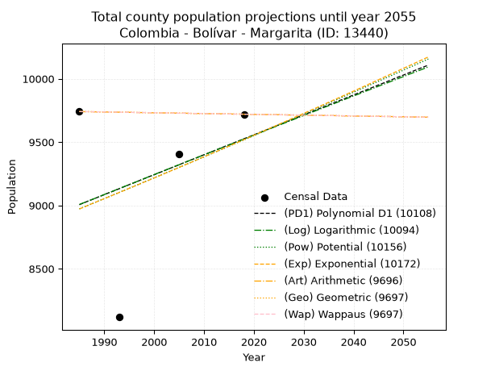
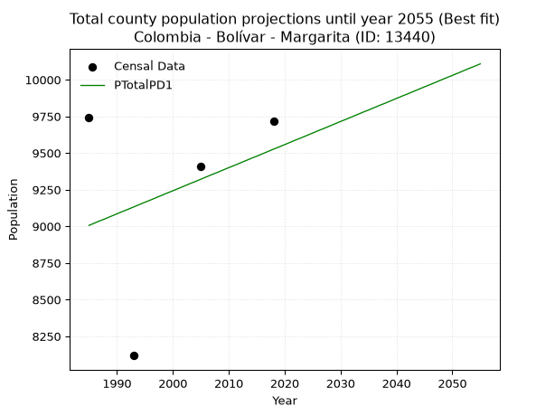
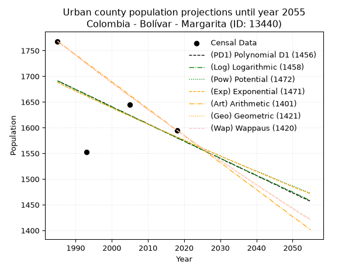
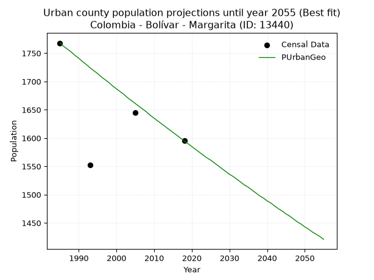
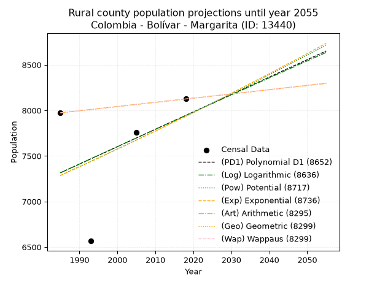
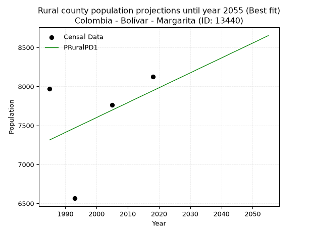

<div align="center">


</div>

# 📜 _“Population and Public Services Demand Projections (PPSD) until Year 2050 for Colombia - Bolívar - Margarita (ID: 13440)”_
Keywords: `population` `public-service` `projection` `lineal` `polynomial` `logarithmic` `potential` `exponential` `arithmetic` `geometric` `wappaus` `dane` `colombia` `south-america`

PPSD are analytical estimates used by governments and planners to anticipate future changes in population size, age distribution, and the resulting community needs for utilities, healthcare, education, and infrastructure as sizing future water treatment facilities, electrical grids, and road networks based on spatial growth.

<div align="center">

</img>

</div>


> **General running parameters**: • app_version: _v20260806_. • Python version: _3.14.7_. • Pandas version: _3.0.5_. • NumPy version: _2.5.1_. • Creates, save and include plots into reports (create_plot): _False_. • Projection until year: _2050_. • Process polynomial degree 2 and up: _False_. • Process Wappaus: _True_. • Process Wappaus: _True_. • Set negative values to zero: _True_. • Set infinite values to zero: _True_. • Drop dataset notes: _True_. 
<div align="center">

Maps & GIS Layers: [:earth_americas:Google](http://maps.google.com/maps?q=9.157840475,-74.2851374) [:earth_americas:OSM](https://www.openstreetmap.org/#map=18/9.157840475/-74.2851374&layers=P) [:earth_americas:Bing](https://www.bing.com/maps?cp=9.157840475~-74.2851374&lvl=18) [:earth_americas:Apple](https://maps.apple.com/frame?center=9.157840475%2C-74.2851374&span=0.003%2C0.006) [:earth_americas:GISMobile](https://github.com/rcfdtools/R.GISMobile/blob/main/file/gis/CountyLayer_CO/Readme.md)

</div>


<div align="center">

```geojson
{
  "type": "Feature",
  "geometry": {
    "type": "Point", 
    "coordinates": [-74.2851374, 9.157840475]
  }, 
  "properties": {
    "Name": "Colombia - Bolívar - Margarita (ID: 13440)"
  }
}
```

</div>


## 0. Census Data (4 records)

Census data are official statistics collected by a government about the people and housing in a country. They usually include counts of total population, age, sex, race, income, education, and jobs.

📅Global census file: [Population.xlsx](../data/Population.xlsx)

| Source   |   Year |   CountryID | CountryName   |   StateID | StateName   |   CountyID | CountyName   |   PTotal |   PUrban |   PRural |
|:---------|-------:|------------:|:--------------|----------:|:------------|-----------:|:-------------|---------:|---------:|---------:|
| DANE     |   1985 |          57 | Colombia      |        13 | Bolívar     |      13440 | Margarita    |     9741 |     1768 |     7973 |
| DANE     |   1993 |          57 | Colombia      |        13 | Bolívar     |      13440 | Margarita    |     8118 |     1552 |     6566 |
| DANE     |   2005 |          57 | Colombia      |        13 | Bolívar     |      13440 | Margarita    |     9406 |     1645 |     7761 |
| DANE     |   2018 |          57 | Colombia      |        13 | Bolívar     |      13440 | Margarita    |     9720 |     1595 |     8125 |

> 🔥Some records could had specific notes about the registered values or the corresponding urban or rural distribution.

📅[SUI-RUPS](https://www.datos.gov.co/Hacienda-y-Cr-dito-P-blico/Registro-nico-de-Prestadores-de-Servicios-P-blicos/4qkq-csdn/about_data) - Local public utility companies: [RUPS.csv](../data/RUPS.csv)

 | SERVICIO       | ESTADO    | NOMBRE                                                                              | NIT         | DEPARTAMENTO_DOMICILIO   | MUNICIPIO_DOMICILIO   | DIRECCION                 |   TELEFONO | EMAIL                 | TIPO_PRESTADOR                 | CLASIFICACION                 |
|:---------------|:----------|:------------------------------------------------------------------------------------|:------------|:-------------------------|:----------------------|:--------------------------|-----------:|:----------------------|:-------------------------------|:------------------------------|
| ACUEDUCTO      | OPERATIVA | MUNICIPIO DE MARGARITA                                                              | 800095511-1 | BOLIVAR                  | MARGARITA             | Margarita Calle Principal |    3135460 | leogodiz@hotmail.com  | MUNICIPIO (PRESTACIÓN DIRECTA) | MENOR O IGUAL A 2500 USUARIOS |
| ALCANTARILLADO | OPERATIVA | MUNICIPIO DE MARGARITA                                                              | 800095511-1 | BOLIVAR                  | MARGARITA             | Margarita Calle Principal |    3135460 | leogodiz@hotmail.com  | MUNICIPIO (PRESTACIÓN DIRECTA) | MENOR O IGUAL A 2500 USUARIOS |
| ACUEDUCTO      | OPERATIVA | ADMINISTRADORA PUBLICA COOPERATIVA DE ACUEDUCTO, ALCANTARILLADO Y ASEO DE MARGARITA | 900269287-7 | BOLIVAR                  | MARGARITA             | calle principal           |    6823106 | kevin010576@yahoo.com | ORGANIZACION AUTORIZADA        | HASTA 2500 SUSCRIPTORES       |

## 1. Total

### 1.1. Coefficients and Parameters

* (PD1) Polynomial Deg 1: 15.741067844239018, -22239.820955439092 (lineal)
* (Log) Logarithmic: 31362.035293749752, -229136.8315873701
* (Pow) Potential: 3.573666288683517, -7.832162478245528
* (Exp) Exponential: 0.001793410427646982, 255.18182279242532
* (Art) Arithmetic: Year diff. 2018 - 1985 = 33, Population diff. 9720 - 9741 = -21, Annual growth = -0.6363636363636364
* (Geo) Geometric: Year diff. 2018 - 1985 = 33, Population diff. 9720 - 9741 = -21, Annual growth % = -6.539674991723476e-05
* (Wap) Wappaus: i = -0.006539886299405337, Condition values only valid for < 200)

<sub>
Wappaus condition values: ['-0.00', '-0.01', '-0.01', '-0.02', '-0.03', '-0.03', '-0.04', '-0.05', '-0.05', '-0.06', '-0.07', '-0.07', '-0.08', '-0.09', '-0.09', '-0.10', '-0.10', '-0.11', '-0.12', '-0.12', '-0.13', '-0.14', '-0.14', '-0.15', '-0.16', '-0.16', '-0.17', '-0.18', '-0.18', '-0.19', '-0.20', '-0.20', '-0.21', '-0.22', '-0.22', '-0.23', '-0.24', '-0.24', '-0.25', '-0.26', '-0.26', '-0.27', '-0.27', '-0.28', '-0.29', '-0.29', '-0.30', '-0.31', '-0.31', '-0.32', '-0.33', '-0.33', '-0.34', '-0.35', '-0.35', '-0.36', '-0.37', '-0.37', '-0.38', '-0.39', '-0.39', '-0.40', '-0.41', '-0.41', '-0.42', '-0.43']
</sub>


### 1.2. Projected Dataset

|   Year |   CountyID |   PTotalPD1 |   PTotalLog |   PTotalPow |   PTotalExp |   PTotalArt |   PTotalGeo |   PTotalWap |
|-------:|-----------:|------------:|------------:|------------:|------------:|------------:|------------:|------------:|
|   1985 |      13440 |        9006 |        9007 |        8973 |        8972 |        9741 |        9741 |        9741 |
|   1986 |      13440 |        9022 |        9023 |        8989 |        8988 |        9740 |        9740 |        9740 |
|   1987 |      13440 |        9038 |        9038 |        9005 |        9005 |        9740 |        9740 |        9740 |
|   1988 |      13440 |        9053 |        9054 |        9021 |        9021 |        9739 |        9739 |        9739 |
|   1989 |      13440 |        9069 |        9070 |        9038 |        9037 |        9738 |        9738 |        9738 |
|   1990 |      13440 |        9085 |        9086 |        9054 |        9053 |        9738 |        9738 |        9738 |
|   1991 |      13440 |        9101 |        9101 |        9070 |        9069 |        9737 |        9737 |        9737 |
|   1992 |      13440 |        9116 |        9117 |        9086 |        9086 |        9737 |        9737 |        9737 |
|   1993 |      13440 |        9132 |        9133 |        9103 |        9102 |        9736 |        9736 |        9736 |
|   1994 |      13440 |        9148 |        9149 |        9119 |        9118 |        9735 |        9735 |        9735 |
|   1995 |      13440 |        9164 |        9164 |        9135 |        9135 |        9735 |        9735 |        9735 |
|   1996 |      13440 |        9179 |        9180 |        9152 |        9151 |        9734 |        9734 |        9734 |
|   1997 |      13440 |        9195 |        9196 |        9168 |        9167 |        9733 |        9733 |        9733 |
|   1998 |      13440 |        9211 |        9212 |        9185 |        9184 |        9733 |        9733 |        9733 |
|   1999 |      13440 |        9227 |        9227 |        9201 |        9200 |        9732 |        9732 |        9732 |
|   2000 |      13440 |        9242 |        9243 |        9218 |        9217 |        9731 |        9731 |        9731 |
|   2001 |      13440 |        9258 |        9259 |        9234 |        9233 |        9731 |        9731 |        9731 |
|   2002 |      13440 |        9274 |        9274 |        9251 |        9250 |        9730 |        9730 |        9730 |
|   2003 |      13440 |        9290 |        9290 |        9267 |        9267 |        9730 |        9730 |        9730 |
|   2004 |      13440 |        9305 |        9306 |        9284 |        9283 |        9729 |        9729 |        9729 |
|   2005 |      13440 |        9321 |        9321 |        9300 |        9300 |        9728 |        9728 |        9728 |
|   2006 |      13440 |        9337 |        9337 |        9317 |        9317 |        9728 |        9728 |        9728 |
|   2007 |      13440 |        9353 |        9353 |        9333 |        9333 |        9727 |        9727 |        9727 |
|   2008 |      13440 |        9368 |        9368 |        9350 |        9350 |        9726 |        9726 |        9726 |
|   2009 |      13440 |        9384 |        9384 |        9367 |        9367 |        9726 |        9726 |        9726 |
|   2010 |      13440 |        9400 |        9399 |        9383 |        9384 |        9725 |        9725 |        9725 |
|   2011 |      13440 |        9415 |        9415 |        9400 |        9401 |        9724 |        9724 |        9724 |
|   2012 |      13440 |        9431 |        9431 |        9417 |        9417 |        9724 |        9724 |        9724 |
|   2013 |      13440 |        9447 |        9446 |        9433 |        9434 |        9723 |        9723 |        9723 |
|   2014 |      13440 |        9463 |        9462 |        9450 |        9451 |        9723 |        9723 |        9723 |
|   2015 |      13440 |        9478 |        9477 |        9467 |        9468 |        9722 |        9722 |        9722 |
|   2016 |      13440 |        9494 |        9493 |        9484 |        9485 |        9721 |        9721 |        9721 |
|   2017 |      13440 |        9510 |        9508 |        9501 |        9502 |        9721 |        9721 |        9721 |
|   2018 |      13440 |        9526 |        9524 |        9517 |        9519 |        9720 |        9720 |        9720 |
|   2019 |      13440 |        9541 |        9539 |        9534 |        9536 |        9719 |        9719 |        9719 |
|   2020 |      13440 |        9557 |        9555 |        9551 |        9554 |        9719 |        9719 |        9719 |
|   2021 |      13440 |        9573 |        9571 |        9568 |        9571 |        9718 |        9718 |        9718 |
|   2022 |      13440 |        9589 |        9586 |        9585 |        9588 |        9717 |        9717 |        9717 |
|   2023 |      13440 |        9604 |        9602 |        9602 |        9605 |        9717 |        9717 |        9717 |
|   2024 |      13440 |        9620 |        9617 |        9619 |        9622 |        9716 |        9716 |        9716 |
|   2025 |      13440 |        9636 |        9633 |        9636 |        9640 |        9716 |        9716 |        9716 |
|   2026 |      13440 |        9652 |        9648 |        9653 |        9657 |        9715 |        9715 |        9715 |
|   2027 |      13440 |        9667 |        9663 |        9670 |        9674 |        9714 |        9714 |        9714 |
|   2028 |      13440 |        9683 |        9679 |        9687 |        9692 |        9714 |        9714 |        9714 |
|   2029 |      13440 |        9699 |        9694 |        9704 |        9709 |        9713 |        9713 |        9713 |
|   2030 |      13440 |        9715 |        9710 |        9721 |        9726 |        9712 |        9712 |        9712 |
|   2031 |      13440 |        9730 |        9725 |        9738 |        9744 |        9712 |        9712 |        9712 |
|   2032 |      13440 |        9746 |        9741 |        9756 |        9761 |        9711 |        9711 |        9711 |
|   2033 |      13440 |        9762 |        9756 |        9773 |        9779 |        9710 |        9710 |        9710 |
|   2034 |      13440 |        9778 |        9772 |        9790 |        9796 |        9710 |        9710 |        9710 |
|   2035 |      13440 |        9793 |        9787 |        9807 |        9814 |        9709 |        9709 |        9709 |
|   2036 |      13440 |        9809 |        9802 |        9824 |        9832 |        9709 |        9709 |        9709 |
|   2037 |      13440 |        9825 |        9818 |        9842 |        9849 |        9708 |        9708 |        9708 |
|   2038 |      13440 |        9840 |        9833 |        9859 |        9867 |        9707 |        9707 |        9707 |
|   2039 |      13440 |        9856 |        9849 |        9876 |        9885 |        9707 |        9707 |        9707 |
|   2040 |      13440 |        9872 |        9864 |        9894 |        9902 |        9706 |        9706 |        9706 |
|   2041 |      13440 |        9888 |        9879 |        9911 |        9920 |        9705 |        9705 |        9705 |
|   2042 |      13440 |        9903 |        9895 |        9928 |        9938 |        9705 |        9705 |        9705 |
|   2043 |      13440 |        9919 |        9910 |        9946 |        9956 |        9704 |        9704 |        9704 |
|   2044 |      13440 |        9935 |        9925 |        9963 |        9974 |        9703 |        9703 |        9703 |
|   2045 |      13440 |        9951 |        9941 |        9980 |        9992 |        9703 |        9703 |        9703 |
|   2046 |      13440 |        9966 |        9956 |        9998 |       10010 |        9702 |        9702 |        9702 |
|   2047 |      13440 |        9982 |        9971 |       10015 |       10028 |        9702 |        9702 |        9702 |
|   2048 |      13440 |        9998 |        9987 |       10033 |       10046 |        9701 |        9701 |        9701 |
|   2049 |      13440 |       10014 |       10002 |       10050 |       10064 |        9700 |        9700 |        9700 |
|   2050 |      13440 |       10029 |       10017 |       10068 |       10082 |        9700 |        9700 |        9700 |
<div align="center">

</img>

</div>


### 1.3. Best fit with absolute and relative error (%)

Relative error puts that difference into context by dividing the absolute error by the true value, creating a unitless ratio or percentage that shows the scale of the mistake.

Absolute and relative error

|   Year | Source   |   CountryID | CountryName   |   StateID | StateName   |   CountyID_x | CountyName   |   PTotal |   PUrban |   PRural |   CountyID_y |   PTotalPD1 |   PTotalLog |   PTotalPow |   PTotalExp |   PTotalArt |   PTotalGeo |   PTotalWap |   PTotalPD1AbsError |   PTotalLogAbsError |   PTotalPowAbsError |   PTotalExpAbsError |   PTotalArtAbsError |   PTotalGeoAbsError |   PTotalWapAbsError |   PTotalPD1RelError |   PTotalLogRelError |   PTotalPowRelError |   PTotalExpRelError |   PTotalArtRelError |   PTotalGeoRelError |   PTotalWapRelError |
|-------:|:---------|------------:|:--------------|----------:|:------------|-------------:|:-------------|---------:|---------:|---------:|-------------:|------------:|------------:|------------:|------------:|------------:|------------:|------------:|--------------------:|--------------------:|--------------------:|--------------------:|--------------------:|--------------------:|--------------------:|--------------------:|--------------------:|--------------------:|--------------------:|--------------------:|--------------------:|--------------------:|
|   1985 | DANE     |          57 | Colombia      |        13 | Bolívar     |        13440 | Margarita    |     9741 |     1768 |     7973 |        13440 |        9006 |        9007 |        8973 |        8972 |        9741 |        9741 |        9741 |                 735 |                 734 |                 768 |                 769 |                   0 |                   0 |                   0 |            7.54543  |            7.53516  |             7.8842  |             7.89447 |             0       |             0       |             0       |
|   1993 | DANE     |          57 | Colombia      |        13 | Bolívar     |        13440 | Margarita    |     8118 |     1552 |     6566 |        13440 |        9132 |        9133 |        9103 |        9102 |        9736 |        9736 |        9736 |                1014 |                1015 |                 985 |                 984 |                1618 |                1618 |                1618 |           12.4908   |           12.5031   |            12.1335  |            12.1212  |            19.931   |            19.931   |            19.931   |
|   2005 | DANE     |          57 | Colombia      |        13 | Bolívar     |        13440 | Margarita    |     9406 |     1645 |     7761 |        13440 |        9321 |        9321 |        9300 |        9300 |        9728 |        9728 |        9728 |                  85 |                  85 |                 106 |                 106 |                 322 |                 322 |                 322 |            0.903679 |            0.903679 |             1.12694 |             1.12694 |             3.42335 |             3.42335 |             3.42335 |
|   2018 | DANE     |          57 | Colombia      |        13 | Bolívar     |        13440 | Margarita    |     9720 |     1595 |     8125 |        13440 |        9526 |        9524 |        9517 |        9519 |        9720 |        9720 |        9720 |                 194 |                 196 |                 203 |                 201 |                   0 |                   0 |                   0 |            1.99588  |            2.01646  |             2.08848 |             2.0679  |             0       |             0       |             0       |

Relative error mean

| Method    |   RelError | Best   |
|:----------|-----------:|:-------|
| PTotalPD1 |    5.73394 | True   |
| PTotalLog |    5.73959 |        |
| PTotalPow |    5.80829 |        |
| PTotalExp |    5.80263 |        |
| PTotalArt |    5.83859 |        |
| PTotalGeo |    5.83859 |        |
| PTotalWap |    5.83859 |        |

💙Best method: _**PTotalPD1**_
<div align="center">

</img>

</div>


### 1.4. Fresh water supply demand in liters per capita per day (lpcd)

The fresh water supply demand typically ranges from 100 to 300 liters per capita per day (lpcd) for standard domestic and municipal planning, though absolute survival minimums set by the World Health Organization are as low as 7.5 to 20 liters per day, and total consumption in high-income nations can exceed 400 liters.

> `CZ`: Level in meters above the sea level (masl)<br> `WS`: Fresh water supply demand in liters per capita per day (lpcd or l/h/d)<br> `WSAll`: Zonal fresh water supply demand in liters per second (l/s)<br> `A`: Zonal area in square meters<br> `DP`: Population density (people/hectare or p/ha)

Reference values (RAS Colombia)

|    CZ |   WS |
|------:|-----:|
|  1000 |  120 |
|  2000 |  130 |
| 99999 |  140 |

County shapefile geometry properties and water supply values

|   CountyID |     ATotal |   CZTotal |   WSTotal |
|-----------:|-----------:|----------:|----------:|
|      13440 | 2.9262e+08 |   22.0588 |       120 |

Projected values for best method: PTotalPD1

|   CountyID |   Year |   PTotalPD1 |   DPTotal |   WSTotal |   WSTotalAll |
|-----------:|-------:|------------:|----------:|----------:|-------------:|
|      13440 |   1985 |        9006 |      0.31 |       120 |      12.5083 |
|      13440 |   1986 |        9022 |      0.31 |       120 |      12.5306 |
|      13440 |   1987 |        9038 |      0.31 |       120 |      12.5528 |
|      13440 |   1988 |        9053 |      0.31 |       120 |      12.5736 |
|      13440 |   1989 |        9069 |      0.31 |       120 |      12.5958 |
|      13440 |   1990 |        9085 |      0.31 |       120 |      12.6181 |
|      13440 |   1991 |        9101 |      0.31 |       120 |      12.6403 |
|      13440 |   1992 |        9116 |      0.31 |       120 |      12.6611 |
|      13440 |   1993 |        9132 |      0.31 |       120 |      12.6833 |
|      13440 |   1994 |        9148 |      0.31 |       120 |      12.7056 |
|      13440 |   1995 |        9164 |      0.31 |       120 |      12.7278 |
|      13440 |   1996 |        9179 |      0.31 |       120 |      12.7486 |
|      13440 |   1997 |        9195 |      0.31 |       120 |      12.7708 |
|      13440 |   1998 |        9211 |      0.31 |       120 |      12.7931 |
|      13440 |   1999 |        9227 |      0.32 |       120 |      12.8153 |
|      13440 |   2000 |        9242 |      0.32 |       120 |      12.8361 |
|      13440 |   2001 |        9258 |      0.32 |       120 |      12.8583 |
|      13440 |   2002 |        9274 |      0.32 |       120 |      12.8806 |
|      13440 |   2003 |        9290 |      0.32 |       120 |      12.9028 |
|      13440 |   2004 |        9305 |      0.32 |       120 |      12.9236 |
|      13440 |   2005 |        9321 |      0.32 |       120 |      12.9458 |
|      13440 |   2006 |        9337 |      0.32 |       120 |      12.9681 |
|      13440 |   2007 |        9353 |      0.32 |       120 |      12.9903 |
|      13440 |   2008 |        9368 |      0.32 |       120 |      13.0111 |
|      13440 |   2009 |        9384 |      0.32 |       120 |      13.0333 |
|      13440 |   2010 |        9400 |      0.32 |       120 |      13.0556 |
|      13440 |   2011 |        9415 |      0.32 |       120 |      13.0764 |
|      13440 |   2012 |        9431 |      0.32 |       120 |      13.0986 |
|      13440 |   2013 |        9447 |      0.32 |       120 |      13.1208 |
|      13440 |   2014 |        9463 |      0.32 |       120 |      13.1431 |
|      13440 |   2015 |        9478 |      0.32 |       120 |      13.1639 |
|      13440 |   2016 |        9494 |      0.32 |       120 |      13.1861 |
|      13440 |   2017 |        9510 |      0.32 |       120 |      13.2083 |
|      13440 |   2018 |        9526 |      0.33 |       120 |      13.2306 |
|      13440 |   2019 |        9541 |      0.33 |       120 |      13.2514 |
|      13440 |   2020 |        9557 |      0.33 |       120 |      13.2736 |
|      13440 |   2021 |        9573 |      0.33 |       120 |      13.2958 |
|      13440 |   2022 |        9589 |      0.33 |       120 |      13.3181 |
|      13440 |   2023 |        9604 |      0.33 |       120 |      13.3389 |
|      13440 |   2024 |        9620 |      0.33 |       120 |      13.3611 |
|      13440 |   2025 |        9636 |      0.33 |       120 |      13.3833 |
|      13440 |   2026 |        9652 |      0.33 |       120 |      13.4056 |
|      13440 |   2027 |        9667 |      0.33 |       120 |      13.4264 |
|      13440 |   2028 |        9683 |      0.33 |       120 |      13.4486 |
|      13440 |   2029 |        9699 |      0.33 |       120 |      13.4708 |
|      13440 |   2030 |        9715 |      0.33 |       120 |      13.4931 |
|      13440 |   2031 |        9730 |      0.33 |       120 |      13.5139 |
|      13440 |   2032 |        9746 |      0.33 |       120 |      13.5361 |
|      13440 |   2033 |        9762 |      0.33 |       120 |      13.5583 |
|      13440 |   2034 |        9778 |      0.33 |       120 |      13.5806 |
|      13440 |   2035 |        9793 |      0.33 |       120 |      13.6014 |
|      13440 |   2036 |        9809 |      0.34 |       120 |      13.6236 |
|      13440 |   2037 |        9825 |      0.34 |       120 |      13.6458 |
|      13440 |   2038 |        9840 |      0.34 |       120 |      13.6667 |
|      13440 |   2039 |        9856 |      0.34 |       120 |      13.6889 |
|      13440 |   2040 |        9872 |      0.34 |       120 |      13.7111 |
|      13440 |   2041 |        9888 |      0.34 |       120 |      13.7333 |
|      13440 |   2042 |        9903 |      0.34 |       120 |      13.7542 |
|      13440 |   2043 |        9919 |      0.34 |       120 |      13.7764 |
|      13440 |   2044 |        9935 |      0.34 |       120 |      13.7986 |
|      13440 |   2045 |        9951 |      0.34 |       120 |      13.8208 |
|      13440 |   2046 |        9966 |      0.34 |       120 |      13.8417 |
|      13440 |   2047 |        9982 |      0.34 |       120 |      13.8639 |
|      13440 |   2048 |        9998 |      0.34 |       120 |      13.8861 |
|      13440 |   2049 |       10014 |      0.34 |       120 |      13.9083 |
|      13440 |   2050 |       10029 |      0.34 |       120 |      13.9292 |

## 2. Urban

### 2.1. Coefficients and Parameters

* (PD1) Polynomial Deg 1: -3.3544761140104025, 8349.790847049308 (lineal)
* (Log) Logarithmic: -6728.113824379155, 52780.44709482644
* (Pow) Potential: -3.9474930027557975, 16.245298910591437
* (Exp) Exponential: -0.0019680740567119357, 83943.33673506163
* (Art) Arithmetic: Year diff. 2018 - 1985 = 33, Population diff. 1595 - 1768 = -173, Annual growth = -5.242424242424242
* (Geo) Geometric: Year diff. 2018 - 1985 = 33, Population diff. 1595 - 1768 = -173, Annual growth % = -0.003115597874241871
* (Wap) Wappaus: i = -0.3117706953567792, Condition values only valid for < 200)

<sub>
Wappaus condition values: ['-0.00', '-0.31', '-0.62', '-0.94', '-1.25', '-1.56', '-1.87', '-2.18', '-2.49', '-2.81', '-3.12', '-3.43', '-3.74', '-4.05', '-4.36', '-4.68', '-4.99', '-5.30', '-5.61', '-5.92', '-6.24', '-6.55', '-6.86', '-7.17', '-7.48', '-7.79', '-8.11', '-8.42', '-8.73', '-9.04', '-9.35', '-9.66', '-9.98', '-10.29', '-10.60', '-10.91', '-11.22', '-11.54', '-11.85', '-12.16', '-12.47', '-12.78', '-13.09', '-13.41', '-13.72', '-14.03', '-14.34', '-14.65', '-14.96', '-15.28', '-15.59', '-15.90', '-16.21', '-16.52', '-16.84', '-17.15', '-17.46', '-17.77', '-18.08', '-18.39', '-18.71', '-19.02', '-19.33', '-19.64', '-19.95', '-20.27']
</sub>


### 2.2. Projected Dataset

|   Year |   CountyID |   PUrbanPD1 |   PUrbanLog |   PUrbanPow |   PUrbanExp |   PUrbanArt |   PUrbanGeo |   PUrbanWap |
|-------:|-----------:|------------:|------------:|------------:|------------:|------------:|------------:|------------:|
|   1985 |      13440 |        1691 |        1691 |        1688 |        1688 |        1768 |        1768 |        1768 |
|   1986 |      13440 |        1688 |        1688 |        1685 |        1685 |        1763 |        1762 |        1762 |
|   1987 |      13440 |        1684 |        1685 |        1681 |        1681 |        1758 |        1757 |        1757 |
|   1988 |      13440 |        1681 |        1681 |        1678 |        1678 |        1752 |        1752 |        1752 |
|   1989 |      13440 |        1678 |        1678 |        1675 |        1675 |        1747 |        1746 |        1746 |
|   1990 |      13440 |        1674 |        1674 |        1671 |        1671 |        1742 |        1741 |        1741 |
|   1991 |      13440 |        1671 |        1671 |        1668 |        1668 |        1737 |        1735 |        1735 |
|   1992 |      13440 |        1668 |        1668 |        1665 |        1665 |        1731 |        1730 |        1730 |
|   1993 |      13440 |        1664 |        1664 |        1662 |        1662 |        1726 |        1724 |        1724 |
|   1994 |      13440 |        1661 |        1661 |        1658 |        1658 |        1721 |        1719 |        1719 |
|   1995 |      13440 |        1658 |        1658 |        1655 |        1655 |        1716 |        1714 |        1714 |
|   1996 |      13440 |        1654 |        1654 |        1652 |        1652 |        1710 |        1708 |        1708 |
|   1997 |      13440 |        1651 |        1651 |        1648 |        1649 |        1705 |        1703 |        1703 |
|   1998 |      13440 |        1648 |        1647 |        1645 |        1645 |        1700 |        1698 |        1698 |
|   1999 |      13440 |        1644 |        1644 |        1642 |        1642 |        1695 |        1692 |        1692 |
|   2000 |      13440 |        1641 |        1641 |        1639 |        1639 |        1689 |        1687 |        1687 |
|   2001 |      13440 |        1637 |        1637 |        1635 |        1636 |        1684 |        1682 |        1682 |
|   2002 |      13440 |        1634 |        1634 |        1632 |        1632 |        1679 |        1677 |        1677 |
|   2003 |      13440 |        1631 |        1631 |        1629 |        1629 |        1674 |        1671 |        1671 |
|   2004 |      13440 |        1627 |        1627 |        1626 |        1626 |        1668 |        1666 |        1666 |
|   2005 |      13440 |        1624 |        1624 |        1623 |        1623 |        1663 |        1661 |        1661 |
|   2006 |      13440 |        1621 |        1621 |        1619 |        1620 |        1658 |        1656 |        1656 |
|   2007 |      13440 |        1617 |        1617 |        1616 |        1616 |        1653 |        1651 |        1651 |
|   2008 |      13440 |        1614 |        1614 |        1613 |        1613 |        1647 |        1646 |        1646 |
|   2009 |      13440 |        1611 |        1611 |        1610 |        1610 |        1642 |        1640 |        1640 |
|   2010 |      13440 |        1607 |        1607 |        1607 |        1607 |        1637 |        1635 |        1635 |
|   2011 |      13440 |        1604 |        1604 |        1604 |        1604 |        1632 |        1630 |        1630 |
|   2012 |      13440 |        1601 |        1600 |        1600 |        1601 |        1626 |        1625 |        1625 |
|   2013 |      13440 |        1597 |        1597 |        1597 |        1597 |        1621 |        1620 |        1620 |
|   2014 |      13440 |        1594 |        1594 |        1594 |        1594 |        1616 |        1615 |        1615 |
|   2015 |      13440 |        1591 |        1590 |        1591 |        1591 |        1611 |        1610 |        1610 |
|   2016 |      13440 |        1587 |        1587 |        1588 |        1588 |        1605 |        1605 |        1605 |
|   2017 |      13440 |        1584 |        1584 |        1585 |        1585 |        1600 |        1600 |        1600 |
|   2018 |      13440 |        1580 |        1580 |        1582 |        1582 |        1595 |        1595 |        1595 |
|   2019 |      13440 |        1577 |        1577 |        1579 |        1579 |        1590 |        1590 |        1590 |
|   2020 |      13440 |        1574 |        1574 |        1576 |        1576 |        1585 |        1585 |        1585 |
|   2021 |      13440 |        1570 |        1570 |        1573 |        1572 |        1579 |        1580 |        1580 |
|   2022 |      13440 |        1567 |        1567 |        1569 |        1569 |        1574 |        1575 |        1575 |
|   2023 |      13440 |        1564 |        1564 |        1566 |        1566 |        1569 |        1570 |        1570 |
|   2024 |      13440 |        1560 |        1560 |        1563 |        1563 |        1564 |        1565 |        1565 |
|   2025 |      13440 |        1557 |        1557 |        1560 |        1560 |        1558 |        1561 |        1560 |
|   2026 |      13440 |        1554 |        1554 |        1557 |        1557 |        1553 |        1556 |        1556 |
|   2027 |      13440 |        1550 |        1550 |        1554 |        1554 |        1548 |        1551 |        1551 |
|   2028 |      13440 |        1547 |        1547 |        1551 |        1551 |        1543 |        1546 |        1546 |
|   2029 |      13440 |        1544 |        1544 |        1548 |        1548 |        1537 |        1541 |        1541 |
|   2030 |      13440 |        1540 |        1541 |        1545 |        1545 |        1532 |        1536 |        1536 |
|   2031 |      13440 |        1537 |        1537 |        1542 |        1542 |        1527 |        1532 |        1531 |
|   2032 |      13440 |        1533 |        1534 |        1539 |        1539 |        1522 |        1527 |        1527 |
|   2033 |      13440 |        1530 |        1531 |        1536 |        1536 |        1516 |        1522 |        1522 |
|   2034 |      13440 |        1527 |        1527 |        1533 |        1533 |        1511 |        1517 |        1517 |
|   2035 |      13440 |        1523 |        1524 |        1530 |        1530 |        1506 |        1513 |        1512 |
|   2036 |      13440 |        1520 |        1521 |        1527 |        1527 |        1501 |        1508 |        1508 |
|   2037 |      13440 |        1517 |        1517 |        1524 |        1524 |        1495 |        1503 |        1503 |
|   2038 |      13440 |        1513 |        1514 |        1521 |        1521 |        1490 |        1498 |        1498 |
|   2039 |      13440 |        1510 |        1511 |        1518 |        1518 |        1485 |        1494 |        1493 |
|   2040 |      13440 |        1507 |        1507 |        1516 |        1515 |        1480 |        1489 |        1489 |
|   2041 |      13440 |        1503 |        1504 |        1513 |        1512 |        1474 |        1485 |        1484 |
|   2042 |      13440 |        1500 |        1501 |        1510 |        1509 |        1469 |        1480 |        1479 |
|   2043 |      13440 |        1497 |        1498 |        1507 |        1506 |        1464 |        1475 |        1475 |
|   2044 |      13440 |        1493 |        1494 |        1504 |        1503 |        1459 |        1471 |        1470 |
|   2045 |      13440 |        1490 |        1491 |        1501 |        1500 |        1453 |        1466 |        1466 |
|   2046 |      13440 |        1487 |        1488 |        1498 |        1497 |        1448 |        1462 |        1461 |
|   2047 |      13440 |        1483 |        1484 |        1495 |        1494 |        1443 |        1457 |        1456 |
|   2048 |      13440 |        1480 |        1481 |        1492 |        1491 |        1438 |        1452 |        1452 |
|   2049 |      13440 |        1476 |        1478 |        1489 |        1488 |        1432 |        1448 |        1447 |
|   2050 |      13440 |        1473 |        1475 |        1487 |        1485 |        1427 |        1443 |        1443 |
<div align="center">

</img>

</div>


### 2.3. Best fit with absolute and relative error (%)

Relative error puts that difference into context by dividing the absolute error by the true value, creating a unitless ratio or percentage that shows the scale of the mistake.

Absolute and relative error

|   Year | Source   |   CountryID | CountryName   |   StateID | StateName   |   CountyID_x | CountyName   |   PTotal |   PUrban |   PRural |   CountyID_y |   PUrbanPD1 |   PUrbanLog |   PUrbanPow |   PUrbanExp |   PUrbanArt |   PUrbanGeo |   PUrbanWap |   PUrbanPD1AbsError |   PUrbanLogAbsError |   PUrbanPowAbsError |   PUrbanExpAbsError |   PUrbanArtAbsError |   PUrbanGeoAbsError |   PUrbanWapAbsError |   PUrbanPD1RelError |   PUrbanLogRelError |   PUrbanPowRelError |   PUrbanExpRelError |   PUrbanArtRelError |   PUrbanGeoRelError |   PUrbanWapRelError |
|-------:|:---------|------------:|:--------------|----------:|:------------|-------------:|:-------------|---------:|---------:|---------:|-------------:|------------:|------------:|------------:|------------:|------------:|------------:|------------:|--------------------:|--------------------:|--------------------:|--------------------:|--------------------:|--------------------:|--------------------:|--------------------:|--------------------:|--------------------:|--------------------:|--------------------:|--------------------:|--------------------:|
|   1985 | DANE     |          57 | Colombia      |        13 | Bolívar     |        13440 | Margarita    |     9741 |     1768 |     7973 |        13440 |        1691 |        1691 |        1688 |        1688 |        1768 |        1768 |        1768 |                  77 |                  77 |                  80 |                  80 |                   0 |                   0 |                   0 |            4.3552   |            4.3552   |            4.52489  |            4.52489  |             0       |            0        |            0        |
|   1993 | DANE     |          57 | Colombia      |        13 | Bolívar     |        13440 | Margarita    |     8118 |     1552 |     6566 |        13440 |        1664 |        1664 |        1662 |        1662 |        1726 |        1724 |        1724 |                 112 |                 112 |                 110 |                 110 |                 174 |                 172 |                 172 |            7.21649  |            7.21649  |            7.08763  |            7.08763  |            11.2113  |           11.0825   |           11.0825   |
|   2005 | DANE     |          57 | Colombia      |        13 | Bolívar     |        13440 | Margarita    |     9406 |     1645 |     7761 |        13440 |        1624 |        1624 |        1623 |        1623 |        1663 |        1661 |        1661 |                  21 |                  21 |                  22 |                  22 |                  18 |                  16 |                  16 |            1.2766   |            1.2766   |            1.33739  |            1.33739  |             1.09422 |            0.972644 |            0.972644 |
|   2018 | DANE     |          57 | Colombia      |        13 | Bolívar     |        13440 | Margarita    |     9720 |     1595 |     8125 |        13440 |        1580 |        1580 |        1582 |        1582 |        1595 |        1595 |        1595 |                  15 |                  15 |                  13 |                  13 |                   0 |                   0 |                   0 |            0.940439 |            0.940439 |            0.815047 |            0.815047 |             0       |            0        |            0        |

Relative error mean

| Method    |   RelError | Best   |
|:----------|-----------:|:-------|
| PUrbanPD1 |    3.44718 |        |
| PUrbanLog |    3.44718 |        |
| PUrbanPow |    3.44124 |        |
| PUrbanExp |    3.44124 |        |
| PUrbanArt |    3.07639 |        |
| PUrbanGeo |    3.01378 | True   |
| PUrbanWap |    3.01378 | True   |

💙Best method: _**PUrbanGeo**_
<div align="center">

</img>

</div>


### 2.4. Fresh water supply demand in liters per capita per day (lpcd)

The fresh water supply demand typically ranges from 100 to 300 liters per capita per day (lpcd) for standard domestic and municipal planning, though absolute survival minimums set by the World Health Organization are as low as 7.5 to 20 liters per day, and total consumption in high-income nations can exceed 400 liters.

> `CZ`: Level in meters above the sea level (masl)<br> `WS`: Fresh water supply demand in liters per capita per day (lpcd or l/h/d)<br> `WSAll`: Zonal fresh water supply demand in liters per second (l/s)<br> `A`: Zonal area in square meters<br> `DP`: Population density (people/hectare or p/ha)

Reference values (RAS Colombia)

|    CZ |   WS |
|------:|-----:|
|  1000 |  120 |
|  2000 |  130 |
| 99999 |  140 |

County shapefile geometry properties and water supply values

|   CountyID |      AUrban |   CZUrban |   WSUrban |
|-----------:|------------:|----------:|----------:|
|      13440 | 3.10449e+06 |   22.6039 |       120 |

Projected values for best method: PUrbanGeo

|   CountyID |   Year |   PUrbanGeo |   DPUrban |   WSUrban |   WSUrbanAll |
|-----------:|-------:|------------:|----------:|----------:|-------------:|
|      13440 |   1985 |        1768 |      5.69 |       120 |      2.45556 |
|      13440 |   1986 |        1762 |      5.68 |       120 |      2.44722 |
|      13440 |   1987 |        1757 |      5.66 |       120 |      2.44028 |
|      13440 |   1988 |        1752 |      5.64 |       120 |      2.43333 |
|      13440 |   1989 |        1746 |      5.62 |       120 |      2.425   |
|      13440 |   1990 |        1741 |      5.61 |       120 |      2.41806 |
|      13440 |   1991 |        1735 |      5.59 |       120 |      2.40972 |
|      13440 |   1992 |        1730 |      5.57 |       120 |      2.40278 |
|      13440 |   1993 |        1724 |      5.55 |       120 |      2.39444 |
|      13440 |   1994 |        1719 |      5.54 |       120 |      2.3875  |
|      13440 |   1995 |        1714 |      5.52 |       120 |      2.38056 |
|      13440 |   1996 |        1708 |      5.5  |       120 |      2.37222 |
|      13440 |   1997 |        1703 |      5.49 |       120 |      2.36528 |
|      13440 |   1998 |        1698 |      5.47 |       120 |      2.35833 |
|      13440 |   1999 |        1692 |      5.45 |       120 |      2.35    |
|      13440 |   2000 |        1687 |      5.43 |       120 |      2.34306 |
|      13440 |   2001 |        1682 |      5.42 |       120 |      2.33611 |
|      13440 |   2002 |        1677 |      5.4  |       120 |      2.32917 |
|      13440 |   2003 |        1671 |      5.38 |       120 |      2.32083 |
|      13440 |   2004 |        1666 |      5.37 |       120 |      2.31389 |
|      13440 |   2005 |        1661 |      5.35 |       120 |      2.30694 |
|      13440 |   2006 |        1656 |      5.33 |       120 |      2.3     |
|      13440 |   2007 |        1651 |      5.32 |       120 |      2.29306 |
|      13440 |   2008 |        1646 |      5.3  |       120 |      2.28611 |
|      13440 |   2009 |        1640 |      5.28 |       120 |      2.27778 |
|      13440 |   2010 |        1635 |      5.27 |       120 |      2.27083 |
|      13440 |   2011 |        1630 |      5.25 |       120 |      2.26389 |
|      13440 |   2012 |        1625 |      5.23 |       120 |      2.25694 |
|      13440 |   2013 |        1620 |      5.22 |       120 |      2.25    |
|      13440 |   2014 |        1615 |      5.2  |       120 |      2.24306 |
|      13440 |   2015 |        1610 |      5.19 |       120 |      2.23611 |
|      13440 |   2016 |        1605 |      5.17 |       120 |      2.22917 |
|      13440 |   2017 |        1600 |      5.15 |       120 |      2.22222 |
|      13440 |   2018 |        1595 |      5.14 |       120 |      2.21528 |
|      13440 |   2019 |        1590 |      5.12 |       120 |      2.20833 |
|      13440 |   2020 |        1585 |      5.11 |       120 |      2.20139 |
|      13440 |   2021 |        1580 |      5.09 |       120 |      2.19444 |
|      13440 |   2022 |        1575 |      5.07 |       120 |      2.1875  |
|      13440 |   2023 |        1570 |      5.06 |       120 |      2.18056 |
|      13440 |   2024 |        1565 |      5.04 |       120 |      2.17361 |
|      13440 |   2025 |        1561 |      5.03 |       120 |      2.16806 |
|      13440 |   2026 |        1556 |      5.01 |       120 |      2.16111 |
|      13440 |   2027 |        1551 |      5    |       120 |      2.15417 |
|      13440 |   2028 |        1546 |      4.98 |       120 |      2.14722 |
|      13440 |   2029 |        1541 |      4.96 |       120 |      2.14028 |
|      13440 |   2030 |        1536 |      4.95 |       120 |      2.13333 |
|      13440 |   2031 |        1532 |      4.93 |       120 |      2.12778 |
|      13440 |   2032 |        1527 |      4.92 |       120 |      2.12083 |
|      13440 |   2033 |        1522 |      4.9  |       120 |      2.11389 |
|      13440 |   2034 |        1517 |      4.89 |       120 |      2.10694 |
|      13440 |   2035 |        1513 |      4.87 |       120 |      2.10139 |
|      13440 |   2036 |        1508 |      4.86 |       120 |      2.09444 |
|      13440 |   2037 |        1503 |      4.84 |       120 |      2.0875  |
|      13440 |   2038 |        1498 |      4.83 |       120 |      2.08056 |
|      13440 |   2039 |        1494 |      4.81 |       120 |      2.075   |
|      13440 |   2040 |        1489 |      4.8  |       120 |      2.06806 |
|      13440 |   2041 |        1485 |      4.78 |       120 |      2.0625  |
|      13440 |   2042 |        1480 |      4.77 |       120 |      2.05556 |
|      13440 |   2043 |        1475 |      4.75 |       120 |      2.04861 |
|      13440 |   2044 |        1471 |      4.74 |       120 |      2.04306 |
|      13440 |   2045 |        1466 |      4.72 |       120 |      2.03611 |
|      13440 |   2046 |        1462 |      4.71 |       120 |      2.03056 |
|      13440 |   2047 |        1457 |      4.69 |       120 |      2.02361 |
|      13440 |   2048 |        1452 |      4.68 |       120 |      2.01667 |
|      13440 |   2049 |        1448 |      4.66 |       120 |      2.01111 |
|      13440 |   2050 |        1443 |      4.65 |       120 |      2.00417 |

## 3. Rural

### 3.1. Coefficients and Parameters

* (PD1) Polynomial Deg 1: 19.09554395824939, -30589.61180248834 (lineal)
* (Log) Logarithmic: 38090.14911812903, -281917.27868219756
* (Pow) Potential: 5.172573496618271, -13.195391461748954
* (Exp) Exponential: 0.0025930585109776045, 42.372333419665786
* (Art) Arithmetic: Year diff. 2018 - 1985 = 33, Population diff. 8125 - 7973 = 152, Annual growth = 4.606060606060606
* (Geo) Geometric: Year diff. 2018 - 1985 = 33, Population diff. 8125 - 7973 = 152, Annual growth % = 0.0005724333136767346
* (Wap) Wappaus: i = 0.057225252901734455, Condition values only valid for < 200)

<sub>
Wappaus condition values: ['0.00', '0.06', '0.11', '0.17', '0.23', '0.29', '0.34', '0.40', '0.46', '0.52', '0.57', '0.63', '0.69', '0.74', '0.80', '0.86', '0.92', '0.97', '1.03', '1.09', '1.14', '1.20', '1.26', '1.32', '1.37', '1.43', '1.49', '1.55', '1.60', '1.66', '1.72', '1.77', '1.83', '1.89', '1.95', '2.00', '2.06', '2.12', '2.17', '2.23', '2.29', '2.35', '2.40', '2.46', '2.52', '2.58', '2.63', '2.69', '2.75', '2.80', '2.86', '2.92', '2.98', '3.03', '3.09', '3.15', '3.20', '3.26', '3.32', '3.38', '3.43', '3.49', '3.55', '3.61', '3.66', '3.72']
</sub>


### 3.2. Projected Dataset

|   Year |   CountyID |   PRuralPD1 |   PRuralLog |   PRuralPow |   PRuralExp |   PRuralArt |   PRuralGeo |   PRuralWap |
|-------:|-----------:|------------:|------------:|------------:|------------:|------------:|------------:|------------:|
|   1985 |      13440 |        7315 |        7315 |        7286 |        7286 |        7973 |        7973 |        7973 |
|   1986 |      13440 |        7334 |        7335 |        7305 |        7305 |        7978 |        7978 |        7978 |
|   1987 |      13440 |        7353 |        7354 |        7325 |        7324 |        7982 |        7982 |        7982 |
|   1988 |      13440 |        7372 |        7373 |        7344 |        7343 |        7987 |        7987 |        7987 |
|   1989 |      13440 |        7391 |        7392 |        7363 |        7362 |        7991 |        7991 |        7991 |
|   1990 |      13440 |        7411 |        7411 |        7382 |        7381 |        7996 |        7996 |        7996 |
|   1991 |      13440 |        7430 |        7430 |        7401 |        7400 |        8001 |        8000 |        8000 |
|   1992 |      13440 |        7449 |        7450 |        7420 |        7420 |        8005 |        8005 |        8005 |
|   1993 |      13440 |        7468 |        7469 |        7440 |        7439 |        8010 |        8010 |        8010 |
|   1994 |      13440 |        7487 |        7488 |        7459 |        7458 |        8014 |        8014 |        8014 |
|   1995 |      13440 |        7506 |        7507 |        7478 |        7477 |        8019 |        8019 |        8019 |
|   1996 |      13440 |        7525 |        7526 |        7498 |        7497 |        8024 |        8023 |        8023 |
|   1997 |      13440 |        7544 |        7545 |        7517 |        7516 |        8028 |        8028 |        8028 |
|   1998 |      13440 |        7563 |        7564 |        7537 |        7536 |        8033 |        8033 |        8033 |
|   1999 |      13440 |        7582 |        7583 |        7556 |        7555 |        8037 |        8037 |        8037 |
|   2000 |      13440 |        7601 |        7602 |        7576 |        7575 |        8042 |        8042 |        8042 |
|   2001 |      13440 |        7621 |        7621 |        7595 |        7595 |        8047 |        8046 |        8046 |
|   2002 |      13440 |        7640 |        7640 |        7615 |        7614 |        8051 |        8051 |        8051 |
|   2003 |      13440 |        7659 |        7659 |        7635 |        7634 |        8056 |        8056 |        8056 |
|   2004 |      13440 |        7678 |        7678 |        7655 |        7654 |        8061 |        8060 |        8060 |
|   2005 |      13440 |        7697 |        7697 |        7674 |        7674 |        8065 |        8065 |        8065 |
|   2006 |      13440 |        7716 |        7716 |        7694 |        7694 |        8070 |        8069 |        8069 |
|   2007 |      13440 |        7735 |        7735 |        7714 |        7714 |        8074 |        8074 |        8074 |
|   2008 |      13440 |        7754 |        7754 |        7734 |        7734 |        8079 |        8079 |        8079 |
|   2009 |      13440 |        7773 |        7773 |        7754 |        7754 |        8084 |        8083 |        8083 |
|   2010 |      13440 |        7792 |        7792 |        7774 |        7774 |        8088 |        8088 |        8088 |
|   2011 |      13440 |        7812 |        7811 |        7794 |        7794 |        8093 |        8093 |        8093 |
|   2012 |      13440 |        7831 |        7830 |        7814 |        7814 |        8097 |        8097 |        8097 |
|   2013 |      13440 |        7850 |        7849 |        7834 |        7835 |        8102 |        8102 |        8102 |
|   2014 |      13440 |        7869 |        7868 |        7854 |        7855 |        8107 |        8106 |        8106 |
|   2015 |      13440 |        7888 |        7887 |        7874 |        7875 |        8111 |        8111 |        8111 |
|   2016 |      13440 |        7907 |        7906 |        7895 |        7896 |        8116 |        8116 |        8116 |
|   2017 |      13440 |        7926 |        7925 |        7915 |        7916 |        8120 |        8120 |        8120 |
|   2018 |      13440 |        7945 |        7944 |        7935 |        7937 |        8125 |        8125 |        8125 |
|   2019 |      13440 |        7964 |        7962 |        7956 |        7958 |        8130 |        8130 |        8130 |
|   2020 |      13440 |        7983 |        7981 |        7976 |        7978 |        8134 |        8134 |        8134 |
|   2021 |      13440 |        8002 |        8000 |        7996 |        7999 |        8139 |        8139 |        8139 |
|   2022 |      13440 |        8022 |        8019 |        8017 |        8020 |        8143 |        8144 |        8144 |
|   2023 |      13440 |        8041 |        8038 |        8037 |        8041 |        8148 |        8148 |        8148 |
|   2024 |      13440 |        8060 |        8057 |        8058 |        8061 |        8153 |        8153 |        8153 |
|   2025 |      13440 |        8079 |        8075 |        8079 |        8082 |        8157 |        8158 |        8158 |
|   2026 |      13440 |        8098 |        8094 |        8099 |        8103 |        8162 |        8162 |        8162 |
|   2027 |      13440 |        8117 |        8113 |        8120 |        8124 |        8166 |        8167 |        8167 |
|   2028 |      13440 |        8136 |        8132 |        8141 |        8145 |        8171 |        8172 |        8172 |
|   2029 |      13440 |        8155 |        8151 |        8161 |        8167 |        8176 |        8176 |        8176 |
|   2030 |      13440 |        8174 |        8169 |        8182 |        8188 |        8180 |        8181 |        8181 |
|   2031 |      13440 |        8193 |        8188 |        8203 |        8209 |        8185 |        8186 |        8186 |
|   2032 |      13440 |        8213 |        8207 |        8224 |        8230 |        8189 |        8190 |        8190 |
|   2033 |      13440 |        8232 |        8226 |        8245 |        8252 |        8194 |        8195 |        8195 |
|   2034 |      13440 |        8251 |        8244 |        8266 |        8273 |        8199 |        8200 |        8200 |
|   2035 |      13440 |        8270 |        8263 |        8287 |        8295 |        8203 |        8204 |        8204 |
|   2036 |      13440 |        8289 |        8282 |        8308 |        8316 |        8208 |        8209 |        8209 |
|   2037 |      13440 |        8308 |        8300 |        8329 |        8338 |        8213 |        8214 |        8214 |
|   2038 |      13440 |        8327 |        8319 |        8350 |        8359 |        8217 |        8219 |        8219 |
|   2039 |      13440 |        8346 |        8338 |        8372 |        8381 |        8222 |        8223 |        8223 |
|   2040 |      13440 |        8365 |        8357 |        8393 |        8403 |        8226 |        8228 |        8228 |
|   2041 |      13440 |        8384 |        8375 |        8414 |        8425 |        8231 |        8233 |        8233 |
|   2042 |      13440 |        8403 |        8394 |        8436 |        8447 |        8236 |        8237 |        8237 |
|   2043 |      13440 |        8423 |        8412 |        8457 |        8469 |        8240 |        8242 |        8242 |
|   2044 |      13440 |        8442 |        8431 |        8478 |        8491 |        8245 |        8247 |        8247 |
|   2045 |      13440 |        8461 |        8450 |        8500 |        8513 |        8249 |        8252 |        8252 |
|   2046 |      13440 |        8480 |        8468 |        8521 |        8535 |        8254 |        8256 |        8256 |
|   2047 |      13440 |        8499 |        8487 |        8543 |        8557 |        8259 |        8261 |        8261 |
|   2048 |      13440 |        8518 |        8506 |        8565 |        8579 |        8263 |        8266 |        8266 |
|   2049 |      13440 |        8537 |        8524 |        8586 |        8601 |        8268 |        8270 |        8270 |
|   2050 |      13440 |        8556 |        8543 |        8608 |        8624 |        8272 |        8275 |        8275 |
<div align="center">

</img>

</div>


### 3.3. Best fit with absolute and relative error (%)

Relative error puts that difference into context by dividing the absolute error by the true value, creating a unitless ratio or percentage that shows the scale of the mistake.

Absolute and relative error

|   Year | Source   |   CountryID | CountryName   |   StateID | StateName   |   CountyID_x | CountyName   |   PTotal |   PUrban |   PRural |   CountyID_y |   PRuralPD1 |   PRuralLog |   PRuralPow |   PRuralExp |   PRuralArt |   PRuralGeo |   PRuralWap |   PRuralPD1AbsError |   PRuralLogAbsError |   PRuralPowAbsError |   PRuralExpAbsError |   PRuralArtAbsError |   PRuralGeoAbsError |   PRuralWapAbsError |   PRuralPD1RelError |   PRuralLogRelError |   PRuralPowRelError |   PRuralExpRelError |   PRuralArtRelError |   PRuralGeoRelError |   PRuralWapRelError |
|-------:|:---------|------------:|:--------------|----------:|:------------|-------------:|:-------------|---------:|---------:|---------:|-------------:|------------:|------------:|------------:|------------:|------------:|------------:|------------:|--------------------:|--------------------:|--------------------:|--------------------:|--------------------:|--------------------:|--------------------:|--------------------:|--------------------:|--------------------:|--------------------:|--------------------:|--------------------:|--------------------:|
|   1985 | DANE     |          57 | Colombia      |        13 | Bolívar     |        13440 | Margarita    |     9741 |     1768 |     7973 |        13440 |        7315 |        7315 |        7286 |        7286 |        7973 |        7973 |        7973 |                 658 |                 658 |                 687 |                 687 |                   0 |                   0 |                   0 |            8.25285  |            8.25285  |             8.61658 |             8.61658 |             0       |             0       |             0       |
|   1993 | DANE     |          57 | Colombia      |        13 | Bolívar     |        13440 | Margarita    |     8118 |     1552 |     6566 |        13440 |        7468 |        7469 |        7440 |        7439 |        8010 |        8010 |        8010 |                 902 |                 903 |                 874 |                 873 |                1444 |                1444 |                1444 |           13.7374   |           13.7527   |            13.311   |            13.2958  |            21.9921  |            21.9921  |            21.9921  |
|   2005 | DANE     |          57 | Colombia      |        13 | Bolívar     |        13440 | Margarita    |     9406 |     1645 |     7761 |        13440 |        7697 |        7697 |        7674 |        7674 |        8065 |        8065 |        8065 |                  64 |                  64 |                  87 |                  87 |                 304 |                 304 |                 304 |            0.824636 |            0.824636 |             1.12099 |             1.12099 |             3.91702 |             3.91702 |             3.91702 |
|   2018 | DANE     |          57 | Colombia      |        13 | Bolívar     |        13440 | Margarita    |     9720 |     1595 |     8125 |        13440 |        7945 |        7944 |        7935 |        7937 |        8125 |        8125 |        8125 |                 180 |                 181 |                 190 |                 188 |                   0 |                   0 |                   0 |            2.21538  |            2.22769  |             2.33846 |             2.31385 |             0       |             0       |             0       |

Relative error mean

| Method    |   RelError | Best   |
|:----------|-----------:|:-------|
| PRuralPD1 |    6.25758 | True   |
| PRuralLog |    6.26446 |        |
| PRuralPow |    6.34676 |        |
| PRuralExp |    6.3368  |        |
| PRuralArt |    6.47728 |        |
| PRuralGeo |    6.47728 |        |
| PRuralWap |    6.47728 |        |

💙Best method: _**PRuralPD1**_
<div align="center">

</img>

</div>


### 3.4. Fresh water supply demand in liters per capita per day (lpcd)

The fresh water supply demand typically ranges from 100 to 300 liters per capita per day (lpcd) for standard domestic and municipal planning, though absolute survival minimums set by the World Health Organization are as low as 7.5 to 20 liters per day, and total consumption in high-income nations can exceed 400 liters.

> `CZ`: Level in meters above the sea level (masl)<br> `WS`: Fresh water supply demand in liters per capita per day (lpcd or l/h/d)<br> `WSAll`: Zonal fresh water supply demand in liters per second (l/s)<br> `A`: Zonal area in square meters<br> `DP`: Population density (people/hectare or p/ha)

Reference values (RAS Colombia)

|    CZ |   WS |
|------:|-----:|
|  1000 |  120 |
|  2000 |  130 |
| 99999 |  140 |

County shapefile geometry properties and water supply values

|   CountyID |      ARural |   CZRural |   WSRural |
|-----------:|------------:|----------:|----------:|
|      13440 | 2.89516e+08 |   22.0523 |       120 |

Projected values for best method: PRuralPD1

|   CountyID |   Year |   PRuralPD1 |   DPRural |   WSRural |   WSRuralAll |
|-----------:|-------:|------------:|----------:|----------:|-------------:|
|      13440 |   1985 |        7315 |      0.25 |       120 |      10.1597 |
|      13440 |   1986 |        7334 |      0.25 |       120 |      10.1861 |
|      13440 |   1987 |        7353 |      0.25 |       120 |      10.2125 |
|      13440 |   1988 |        7372 |      0.25 |       120 |      10.2389 |
|      13440 |   1989 |        7391 |      0.26 |       120 |      10.2653 |
|      13440 |   1990 |        7411 |      0.26 |       120 |      10.2931 |
|      13440 |   1991 |        7430 |      0.26 |       120 |      10.3194 |
|      13440 |   1992 |        7449 |      0.26 |       120 |      10.3458 |
|      13440 |   1993 |        7468 |      0.26 |       120 |      10.3722 |
|      13440 |   1994 |        7487 |      0.26 |       120 |      10.3986 |
|      13440 |   1995 |        7506 |      0.26 |       120 |      10.425  |
|      13440 |   1996 |        7525 |      0.26 |       120 |      10.4514 |
|      13440 |   1997 |        7544 |      0.26 |       120 |      10.4778 |
|      13440 |   1998 |        7563 |      0.26 |       120 |      10.5042 |
|      13440 |   1999 |        7582 |      0.26 |       120 |      10.5306 |
|      13440 |   2000 |        7601 |      0.26 |       120 |      10.5569 |
|      13440 |   2001 |        7621 |      0.26 |       120 |      10.5847 |
|      13440 |   2002 |        7640 |      0.26 |       120 |      10.6111 |
|      13440 |   2003 |        7659 |      0.26 |       120 |      10.6375 |
|      13440 |   2004 |        7678 |      0.27 |       120 |      10.6639 |
|      13440 |   2005 |        7697 |      0.27 |       120 |      10.6903 |
|      13440 |   2006 |        7716 |      0.27 |       120 |      10.7167 |
|      13440 |   2007 |        7735 |      0.27 |       120 |      10.7431 |
|      13440 |   2008 |        7754 |      0.27 |       120 |      10.7694 |
|      13440 |   2009 |        7773 |      0.27 |       120 |      10.7958 |
|      13440 |   2010 |        7792 |      0.27 |       120 |      10.8222 |
|      13440 |   2011 |        7812 |      0.27 |       120 |      10.85   |
|      13440 |   2012 |        7831 |      0.27 |       120 |      10.8764 |
|      13440 |   2013 |        7850 |      0.27 |       120 |      10.9028 |
|      13440 |   2014 |        7869 |      0.27 |       120 |      10.9292 |
|      13440 |   2015 |        7888 |      0.27 |       120 |      10.9556 |
|      13440 |   2016 |        7907 |      0.27 |       120 |      10.9819 |
|      13440 |   2017 |        7926 |      0.27 |       120 |      11.0083 |
|      13440 |   2018 |        7945 |      0.27 |       120 |      11.0347 |
|      13440 |   2019 |        7964 |      0.28 |       120 |      11.0611 |
|      13440 |   2020 |        7983 |      0.28 |       120 |      11.0875 |
|      13440 |   2021 |        8002 |      0.28 |       120 |      11.1139 |
|      13440 |   2022 |        8022 |      0.28 |       120 |      11.1417 |
|      13440 |   2023 |        8041 |      0.28 |       120 |      11.1681 |
|      13440 |   2024 |        8060 |      0.28 |       120 |      11.1944 |
|      13440 |   2025 |        8079 |      0.28 |       120 |      11.2208 |
|      13440 |   2026 |        8098 |      0.28 |       120 |      11.2472 |
|      13440 |   2027 |        8117 |      0.28 |       120 |      11.2736 |
|      13440 |   2028 |        8136 |      0.28 |       120 |      11.3    |
|      13440 |   2029 |        8155 |      0.28 |       120 |      11.3264 |
|      13440 |   2030 |        8174 |      0.28 |       120 |      11.3528 |
|      13440 |   2031 |        8193 |      0.28 |       120 |      11.3792 |
|      13440 |   2032 |        8213 |      0.28 |       120 |      11.4069 |
|      13440 |   2033 |        8232 |      0.28 |       120 |      11.4333 |
|      13440 |   2034 |        8251 |      0.28 |       120 |      11.4597 |
|      13440 |   2035 |        8270 |      0.29 |       120 |      11.4861 |
|      13440 |   2036 |        8289 |      0.29 |       120 |      11.5125 |
|      13440 |   2037 |        8308 |      0.29 |       120 |      11.5389 |
|      13440 |   2038 |        8327 |      0.29 |       120 |      11.5653 |
|      13440 |   2039 |        8346 |      0.29 |       120 |      11.5917 |
|      13440 |   2040 |        8365 |      0.29 |       120 |      11.6181 |
|      13440 |   2041 |        8384 |      0.29 |       120 |      11.6444 |
|      13440 |   2042 |        8403 |      0.29 |       120 |      11.6708 |
|      13440 |   2043 |        8423 |      0.29 |       120 |      11.6986 |
|      13440 |   2044 |        8442 |      0.29 |       120 |      11.725  |
|      13440 |   2045 |        8461 |      0.29 |       120 |      11.7514 |
|      13440 |   2046 |        8480 |      0.29 |       120 |      11.7778 |
|      13440 |   2047 |        8499 |      0.29 |       120 |      11.8042 |
|      13440 |   2048 |        8518 |      0.29 |       120 |      11.8306 |
|      13440 |   2049 |        8537 |      0.29 |       120 |      11.8569 |
|      13440 |   2050 |        8556 |      0.3  |       120 |      11.8833 |

#

<div align="center"><br><sub>Share this research</sub></div><br>

<sub>**APPS & TOOLS & CONTENT DISCLAIMER**: • NO WARRANTY - This content and software is provided by <a href="https://github.com/rcfdtools" target="_blank">github.com/rcfdtools</a> "as is", without any express or implied warranty, including warranties of merchantability, fitness for a particular purpose, or non-infringement. There is no guarantee that the software will be error-free or operate without interruption. • LIMITATION OF LIABILITY - Neither the authors nor copyright holders will be liable for claims or damages arising from the software or its use. You are responsible for determining if the software is appropriate for your use and assume all associated risks, including errors, legal compliance, and data loss. • NO PROFESSIONAL ADVICE - The software provides general information and does not offer professional advice. It should not replace consultation with professional advisors. [Clauses and global license for rcfdtools use.](https://github.com/rcfdtools/rcfdtools/blob/main/LICENSE.md)</sub>

| [:house: Home](Readme.md)  | [:beginner: Help / Collab](https://github.com/rcfdtools/R.HydroTools/discussions/31) |
|----------------------------|-------------------------------------------------------------------------------------------|