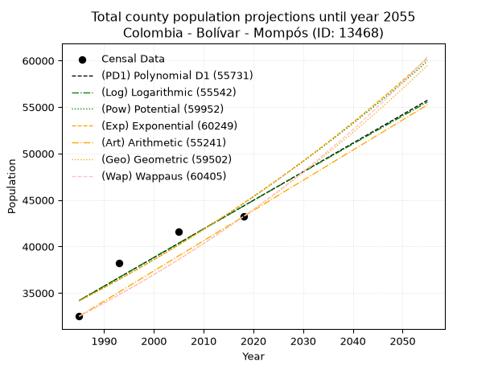
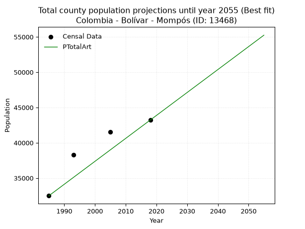
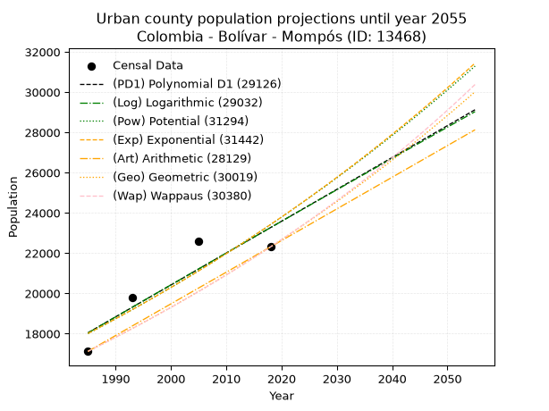
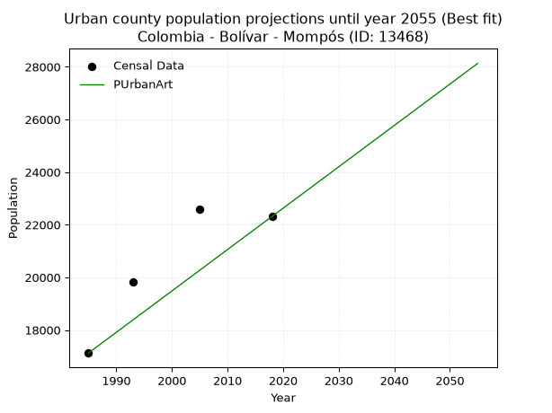
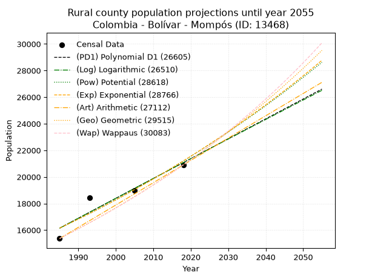
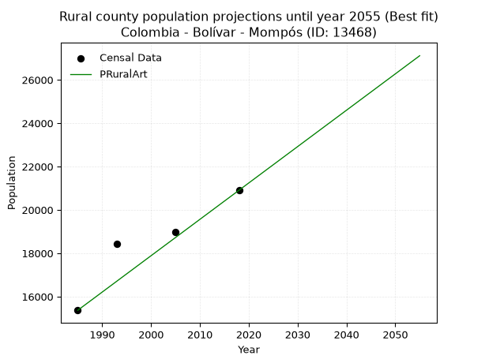

<div align="center">


</div>

# _“Population and Public Services Demand Projections (PPSD) until Year 2050 for Colombia - Bolívar - Mompós (ID: 13468)”_
Keywords: `population` `public-service` `projection` `lineal` `polynomial` `logarithmic` `potential` `exponential` `arithmetic` `geometric` `wappaus` `dane` `colombia` `south-america`

PPSD are analytical estimates used by governments and planners to anticipate future changes in population size, age distribution, and the resulting community needs for utilities, healthcare, education, and infrastructure as sizing future water treatment facilities, electrical grids, and road networks based on spatial growth.

> **General running parameters**: • app_version: _v20260806_. • Python version: _3.14.7_. • Pandas version: _3.0.5_. • NumPy version: _2.5.1_. • Creates, save and include plots into reports (create_plot): _False_. • Projection until year: _2050_. • Process polynomial degree 2 and up: _False_. • Process Wappaus: _True_. • Process Wappaus: _True_. • Set negative values to zero: _True_. • Set infinite values to zero: _True_. • Drop dataset notes: _True_. 
<div align="center">

Dynamic map: [:earth_americas:Google](http://maps.google.com/maps?q=9.244241168,-74.4281795) [:earth_americas:OSM](https://www.openstreetmap.org/#map=18/9.244241168/-74.4281795&layers=P) [:earth_americas:Bing](https://www.bing.com/maps?cp=9.244241168~-74.4281795&lvl=18) [:earth_americas:Apple](https://maps.apple.com/frame?center=9.244241168%2C-74.4281795&span=0.003%2C0.006)

</div>


<div align="center">

```geojson
{
  "type": "Feature",
  "geometry": {
    "type": "Point", 
    "coordinates": [-74.4281795, 9.244241168]
  }, 
  "properties": {
    "Name": "Colombia - Bolívar - Mompós (ID: 13468)"
  }
}
```

</div>


## 0. Census Data (4 records)

Census data are official statistics collected by a government about the people and housing in a country. They usually include counts of total population, age, sex, race, income, education, and jobs.

📅Global census file: [Population.xlsx](../data/Population.xlsx)

| Source   |   Year |   CountryID | CountryName   |   StateID | StateName   |   CountyID | CountyName   |   PTotal |   PUrban |   PRural |
|:---------|-------:|------------:|:--------------|----------:|:------------|-----------:|:-------------|---------:|---------:|---------:|
| DANE     |   1985 |          57 | Colombia      |        13 | Bolívar     |      13468 | Mompós       |    32493 |    17124 |    15369 |
| DANE     |   1993 |          57 | Colombia      |        13 | Bolívar     |      13468 | Mompós       |    38261 |    19810 |    18451 |
| DANE     |   2005 |          57 | Colombia      |        13 | Bolívar     |      13468 | Mompós       |    41565 |    22591 |    18974 |
| DANE     |   2018 |          57 | Colombia      |        13 | Bolívar     |      13468 | Mompós       |    43217 |    22312 |    20905 |

> 🔥Some records could had specific notes about the registered values or the corresponding urban or rural distribution.

**Local public utility companies (RUPS)**

 | SERVICIO       | ESTADO      | NOMBRE              | NIT         | DEPARTAMENTO_DOMICILIO   | MUNICIPIO_DOMICILIO   | DIRECCION                                                        |   TELEFONO | EMAIL                                     | TIPO_INSCRIPCION    | REPRESENTANTE_LEGAL           | TIPO_PRESTADOR                             | CLASIFICACION                  |
|:---------------|:------------|:--------------------|:------------|:-------------------------|:----------------------|:-----------------------------------------------------------------|-----------:|:------------------------------------------|:--------------------|:------------------------------|:-------------------------------------------|:-------------------------------|
| ASEO           | OPERATIVA   | BIOGER S.A. E.S.P.  | 806006669-8 | BOLIVAR                  | TURBACO               | PARQUE EMPRESARIAL VILLA ESMERALDA CLL 27 No 26-335  PLAN PAREJO |    6666528 | SISTEMA@BIOGERSAESP.COM                   | Registro por la ESP | CARLOS MARIO URIBE ZIRENE     | SOCIEDADES (EMPRESA DE SERVICIOS PUBLICOS) | MAYOR O IGUAL A 5001 USUARIOS  |
| ALCANTARILLADO | OPERATIVA   | MUNICIPIO DE MOMPOS | 890480643-3 | BOLIVAR                  | MOMPOS                | Palacio de San Carlos Calle 16 A Carrera 1 61                    |    6855039 | alcaldia@santacruzdemompos-bolivar.gov.co | Registro por la ESP | GUILLERMO ARTURO SANTOS ANAYA | MUNICIPIO (PRESTACIÓN DIRECTA)             | DESDE 2501 HASTA 5000 USUARIOS |
| ACUEDUCTO      | OPERATIVA   | MUNICIPIO DE MOMPOS | 890480643-3 | BOLIVAR                  | MOMPOS                | Palacio de San Carlos Calle 16 A Carrera 1 61                    |    6855039 | alcaldia@santacruzdemompos-bolivar.gov.co | Registro por la ESP | GUILLERMO ARTURO SANTOS ANAYA | MUNICIPIO (PRESTACIÓN DIRECTA)             | MAYOR O IGUAL A 5001 USUARIOS  |
| ASEO           | CANCELACION | ECO BARU S.A.S      | 901068898-8 | BOLIVAR                  | CARTAGENA DE INDIAS   | carrera 06 # 05 48                                               |    0000000 | ecobarusas@gmail.com                      | Registro por la ESP | MILTON LEANDRO OCAMPO  PEREZ  | nan                                        | nan                            |

> [📅RUPS Database: Registro Único de Prestadores de Servicios Públicos de Colombia Suramérica - RUPS](https://www.datos.gov.co/Hacienda-y-Cr-dito-P-blico/Registro-nico-de-Prestadores-de-Servicios-P-blicos/4qkq-csdn/about_data)

## 1. Total

### 1.1. Coefficients and Parameters

* (PD1) Polynomial Deg 1: 307.7077478924116, -576608.4227217963 (lineal)
* (Log) Logarithmic: 616427.4854294069, -4646586.256488776
* (Pow) Potential: 16.238002034465435, -49.01564402774928
* (Exp) Exponential: 0.008104983084395738, 0.0035192756591181707
* (Art) Arithmetic: Year diff. 2018 - 1985 = 33, Population diff. 43217 - 32493 = 10724, Annual growth = 324.969696969697
* (Geo) Geometric: Year diff. 2018 - 1985 = 33, Population diff. 43217 - 32493 = 10724, Annual growth % = 0.008680160693572248
* (Wap) Wappaus: i = 0.8584591123225386, Condition values only valid for < 200)

<sub>
Wappaus condition values: ['0.00', '0.86', '1.72', '2.58', '3.43', '4.29', '5.15', '6.01', '6.87', '7.73', '8.58', '9.44', '10.30', '11.16', '12.02', '12.88', '13.74', '14.59', '15.45', '16.31', '17.17', '18.03', '18.89', '19.74', '20.60', '21.46', '22.32', '23.18', '24.04', '24.90', '25.75', '26.61', '27.47', '28.33', '29.19', '30.05', '30.90', '31.76', '32.62', '33.48', '34.34', '35.20', '36.06', '36.91', '37.77', '38.63', '39.49', '40.35', '41.21', '42.06', '42.92', '43.78', '44.64', '45.50', '46.36', '47.22', '48.07', '48.93', '49.79', '50.65', '51.51', '52.37', '53.22', '54.08', '54.94', '55.80']
</sub>


### 1.2. Projected Dataset

|   Year |   CountyID |   PTotalPD1 |   PTotalLog |   PTotalPow |   PTotalExp |   PTotalArt |   PTotalGeo |   PTotalWap |
|-------:|-----------:|------------:|------------:|------------:|------------:|------------:|------------:|------------:|
|   1985 |      13468 |       34191 |       34178 |       34151 |       34163 |       32493 |       32493 |       32493 |
|   1986 |      13468 |       34499 |       34489 |       34431 |       34441 |       32818 |       32775 |       32773 |
|   1987 |      13468 |       34807 |       34799 |       34714 |       34721 |       33143 |       33060 |       33056 |
|   1988 |      13468 |       35115 |       35109 |       34998 |       35004 |       33468 |       33346 |       33341 |
|   1989 |      13468 |       35422 |       35419 |       35285 |       35288 |       33793 |       33636 |       33628 |
|   1990 |      13468 |       35730 |       35729 |       35575 |       35576 |       34118 |       33928 |       33918 |
|   1991 |      13468 |       36038 |       36039 |       35866 |       35865 |       34443 |       34222 |       34211 |
|   1992 |      13468 |       36345 |       36348 |       36160 |       36157 |       34768 |       34519 |       34506 |
|   1993 |      13468 |       36653 |       36658 |       36455 |       36451 |       35093 |       34819 |       34804 |
|   1994 |      13468 |       36961 |       36967 |       36754 |       36748 |       35418 |       35121 |       35104 |
|   1995 |      13468 |       37269 |       37276 |       37054 |       37047 |       35743 |       35426 |       35407 |
|   1996 |      13468 |       37576 |       37585 |       37357 |       37348 |       36068 |       35734 |       35713 |
|   1997 |      13468 |       37884 |       37894 |       37662 |       37652 |       36393 |       36044 |       36022 |
|   1998 |      13468 |       38192 |       38202 |       37969 |       37959 |       36718 |       36357 |       36334 |
|   1999 |      13468 |       38499 |       38511 |       38279 |       38268 |       37043 |       36672 |       36648 |
|   2000 |      13468 |       38807 |       38819 |       38591 |       38579 |       37368 |       36991 |       36965 |
|   2001 |      13468 |       39115 |       39127 |       38906 |       38893 |       37693 |       37312 |       37285 |
|   2002 |      13468 |       39422 |       39435 |       39223 |       39210 |       38017 |       37636 |       37608 |
|   2003 |      13468 |       39730 |       39743 |       39542 |       39529 |       38342 |       37962 |       37934 |
|   2004 |      13468 |       40038 |       40051 |       39864 |       39850 |       38667 |       38292 |       38263 |
|   2005 |      13468 |       40346 |       40358 |       40188 |       40175 |       38992 |       38624 |       38596 |
|   2006 |      13468 |       40653 |       40665 |       40515 |       40502 |       39317 |       38959 |       38931 |
|   2007 |      13468 |       40961 |       40973 |       40844 |       40831 |       39642 |       39298 |       39270 |
|   2008 |      13468 |       41269 |       41280 |       41176 |       41163 |       39967 |       39639 |       39611 |
|   2009 |      13468 |       41576 |       41587 |       41510 |       41498 |       40292 |       39983 |       39956 |
|   2010 |      13468 |       41884 |       41893 |       41847 |       41836 |       40617 |       40330 |       40305 |
|   2011 |      13468 |       42192 |       42200 |       42186 |       42177 |       40942 |       40680 |       40656 |
|   2012 |      13468 |       42500 |       42506 |       42528 |       42520 |       41267 |       41033 |       41012 |
|   2013 |      13468 |       42807 |       42813 |       42872 |       42866 |       41592 |       41389 |       41370 |
|   2014 |      13468 |       43115 |       43119 |       43220 |       43215 |       41917 |       41748 |       41732 |
|   2015 |      13468 |       43423 |       43425 |       43569 |       43566 |       42242 |       42111 |       42098 |
|   2016 |      13468 |       43730 |       43731 |       43922 |       43921 |       42567 |       42476 |       42467 |
|   2017 |      13468 |       44038 |       44036 |       44277 |       44278 |       42892 |       42845 |       42840 |
|   2018 |      13468 |       44346 |       44342 |       44635 |       44639 |       43217 |       43217 |       43217 |
|   2019 |      13468 |       44654 |       44647 |       44995 |       45002 |       43542 |       43592 |       43597 |
|   2020 |      13468 |       44961 |       44953 |       45358 |       45368 |       43867 |       43971 |       43982 |
|   2021 |      13468 |       45269 |       45258 |       45724 |       45737 |       44192 |       44352 |       44370 |
|   2022 |      13468 |       45577 |       45563 |       46093 |       46110 |       44517 |       44737 |       44762 |
|   2023 |      13468 |       45884 |       45867 |       46465 |       46485 |       44842 |       45125 |       45159 |
|   2024 |      13468 |       46192 |       46172 |       46839 |       46863 |       45167 |       45517 |       45559 |
|   2025 |      13468 |       46500 |       46477 |       47216 |       47244 |       45492 |       45912 |       45963 |
|   2026 |      13468 |       46807 |       46781 |       47596 |       47629 |       45817 |       46311 |       46372 |
|   2027 |      13468 |       47115 |       47085 |       47979 |       48017 |       46142 |       46713 |       46785 |
|   2028 |      13468 |       47423 |       47389 |       48365 |       48407 |       46467 |       47118 |       47202 |
|   2029 |      13468 |       47731 |       47693 |       48754 |       48801 |       46792 |       47527 |       47624 |
|   2030 |      13468 |       48038 |       47997 |       49145 |       49198 |       47117 |       47940 |       48050 |
|   2031 |      13468 |       48346 |       48300 |       49540 |       49599 |       47442 |       48356 |       48481 |
|   2032 |      13468 |       48654 |       48604 |       49938 |       50002 |       47767 |       48776 |       48916 |
|   2033 |      13468 |       48961 |       48907 |       50338 |       50409 |       48092 |       49199 |       49356 |
|   2034 |      13468 |       49269 |       49210 |       50742 |       50820 |       48417 |       49626 |       49801 |
|   2035 |      13468 |       49577 |       49513 |       51148 |       51233 |       48741 |       50057 |       50251 |
|   2036 |      13468 |       49885 |       49816 |       51558 |       51650 |       49066 |       50491 |       50706 |
|   2037 |      13468 |       50192 |       50119 |       51971 |       52070 |       49391 |       50930 |       51166 |
|   2038 |      13468 |       50500 |       50421 |       52387 |       52494 |       49716 |       51372 |       51630 |
|   2039 |      13468 |       50808 |       50724 |       52806 |       52921 |       50041 |       51818 |       52100 |
|   2040 |      13468 |       51115 |       51026 |       53228 |       53352 |       50366 |       52267 |       52576 |
|   2041 |      13468 |       51423 |       51328 |       53653 |       53786 |       50691 |       52721 |       53056 |
|   2042 |      13468 |       51731 |       51630 |       54081 |       54224 |       51016 |       53179 |       53543 |
|   2043 |      13468 |       52039 |       51932 |       54513 |       54665 |       51341 |       53640 |       54034 |
|   2044 |      13468 |       52346 |       52233 |       54948 |       55110 |       51666 |       54106 |       54532 |
|   2045 |      13468 |       52654 |       52535 |       55386 |       55558 |       51991 |       54576 |       55035 |
|   2046 |      13468 |       52962 |       52836 |       55828 |       56011 |       52316 |       55049 |       55544 |
|   2047 |      13468 |       53269 |       53137 |       56272 |       56466 |       52641 |       55527 |       56059 |
|   2048 |      13468 |       53577 |       53438 |       56720 |       56926 |       52966 |       56009 |       56580 |
|   2049 |      13468 |       53885 |       53739 |       57172 |       57389 |       53291 |       56495 |       57107 |
|   2050 |      13468 |       54192 |       54040 |       57626 |       57856 |       53616 |       56986 |       57640 |
<div align="center">

</img>

</div>


### 1.3. Best fit with absolute and relative error (%)

Relative error puts that difference into context by dividing the absolute error by the true value, creating a unitless ratio or percentage that shows the scale of the mistake.

Absolute and relative error

|   Year | Source   |   CountryID | CountryName   |   StateID | StateName   |   CountyID_x | CountyName   |   PTotal |   PUrban |   PRural |   CountyID_y |   PTotalPD1 |   PTotalLog |   PTotalPow |   PTotalExp |   PTotalArt |   PTotalGeo |   PTotalWap |   PTotalPD1AbsError |   PTotalLogAbsError |   PTotalPowAbsError |   PTotalExpAbsError |   PTotalArtAbsError |   PTotalGeoAbsError |   PTotalWapAbsError |   PTotalPD1RelError |   PTotalLogRelError |   PTotalPowRelError |   PTotalExpRelError |   PTotalArtRelError |   PTotalGeoRelError |   PTotalWapRelError |
|-------:|:---------|------------:|:--------------|----------:|:------------|-------------:|:-------------|---------:|---------:|---------:|-------------:|------------:|------------:|------------:|------------:|------------:|------------:|------------:|--------------------:|--------------------:|--------------------:|--------------------:|--------------------:|--------------------:|--------------------:|--------------------:|--------------------:|--------------------:|--------------------:|--------------------:|--------------------:|--------------------:|
|   1985 | DANE     |          57 | Colombia      |        13 | Bolívar     |        13468 | Mompós       |    32493 |    17124 |    15369 |        13468 |       34191 |       34178 |       34151 |       34163 |       32493 |       32493 |       32493 |                1698 |                1685 |                1658 |                1670 |                   0 |                   0 |                   0 |             5.22574 |             5.18573 |             5.10264 |             5.13957 |             0       |             0       |             0       |
|   1993 | DANE     |          57 | Colombia      |        13 | Bolívar     |        13468 | Mompós       |    38261 |    19810 |    18451 |        13468 |       36653 |       36658 |       36455 |       36451 |       35093 |       34819 |       34804 |                1608 |                1603 |                1806 |                1810 |                3168 |                3442 |                3457 |             4.20271 |             4.18964 |             4.72021 |             4.73067 |             8.27997 |             8.99611 |             9.03531 |
|   2005 | DANE     |          57 | Colombia      |        13 | Bolívar     |        13468 | Mompós       |    41565 |    22591 |    18974 |        13468 |       40346 |       40358 |       40188 |       40175 |       38992 |       38624 |       38596 |                1219 |                1207 |                1377 |                1390 |                2573 |                2941 |                2969 |             2.93276 |             2.90389 |             3.31288 |             3.34416 |             6.1903  |             7.07566 |             7.14303 |
|   2018 | DANE     |          57 | Colombia      |        13 | Bolívar     |        13468 | Mompós       |    43217 |    22312 |    20905 |        13468 |       44346 |       44342 |       44635 |       44639 |       43217 |       43217 |       43217 |                1129 |                1125 |                1418 |                1422 |                   0 |                   0 |                   0 |             2.6124  |             2.60314 |             3.28112 |             3.29037 |             0       |             0       |             0       |

Relative error mean

| Method    |   RelError | Best   |
|:----------|-----------:|:-------|
| PTotalPD1 |    3.7434  |        |
| PTotalLog |    3.7206  |        |
| PTotalPow |    4.10421 |        |
| PTotalExp |    4.12619 |        |
| PTotalArt |    3.61757 | True   |
| PTotalGeo |    4.01794 |        |
| PTotalWap |    4.04458 |        |

💙Best method: _**PTotalArt**_
<div align="center">

</img>

</div>


### 1.4. Fresh water supply demand in liters per capita per day (lpcd)

The fresh water supply demand typically ranges from 100 to 300 liters per capita per day (lpcd) for standard domestic and municipal planning, though absolute survival minimums set by the World Health Organization are as low as 7.5 to 20 liters per day, and total consumption in high-income nations can exceed 400 liters.

> `CZ`: Level in meters above the sea level (masl)<br> `WS`: Fresh water supply demand in liters per capita per day (lpcd or l/h/d)<br> `WSAll`: Zonal fresh water supply demand in liters per second (l/s)<br> `A`: Zonal area in square meters<br> `DP`: Population density (people/hectare or p/ha)

Reference values (RAS Colombia)

|    CZ |   WS |
|------:|-----:|
|  1000 |  120 |
|  2000 |  130 |
| 99999 |  140 |

County shapefile geometry properties and water supply values

|   CountyID |      ATotal |   CZTotal |   WSTotal |
|-----------:|------------:|----------:|----------:|
|      13468 | 6.51577e+08 |   16.7991 |       120 |

Projected values for best method: PTotalArt

|   CountyID |   Year |   PTotalArt |   DPTotal |   WSTotal |   WSTotalAll |
|-----------:|-------:|------------:|----------:|----------:|-------------:|
|      13468 |   1985 |       32493 |      0.5  |       120 |      45.1292 |
|      13468 |   1986 |       32818 |      0.5  |       120 |      45.5806 |
|      13468 |   1987 |       33143 |      0.51 |       120 |      46.0319 |
|      13468 |   1988 |       33468 |      0.51 |       120 |      46.4833 |
|      13468 |   1989 |       33793 |      0.52 |       120 |      46.9347 |
|      13468 |   1990 |       34118 |      0.52 |       120 |      47.3861 |
|      13468 |   1991 |       34443 |      0.53 |       120 |      47.8375 |
|      13468 |   1992 |       34768 |      0.53 |       120 |      48.2889 |
|      13468 |   1993 |       35093 |      0.54 |       120 |      48.7403 |
|      13468 |   1994 |       35418 |      0.54 |       120 |      49.1917 |
|      13468 |   1995 |       35743 |      0.55 |       120 |      49.6431 |
|      13468 |   1996 |       36068 |      0.55 |       120 |      50.0944 |
|      13468 |   1997 |       36393 |      0.56 |       120 |      50.5458 |
|      13468 |   1998 |       36718 |      0.56 |       120 |      50.9972 |
|      13468 |   1999 |       37043 |      0.57 |       120 |      51.4486 |
|      13468 |   2000 |       37368 |      0.57 |       120 |      51.9    |
|      13468 |   2001 |       37693 |      0.58 |       120 |      52.3514 |
|      13468 |   2002 |       38017 |      0.58 |       120 |      52.8014 |
|      13468 |   2003 |       38342 |      0.59 |       120 |      53.2528 |
|      13468 |   2004 |       38667 |      0.59 |       120 |      53.7042 |
|      13468 |   2005 |       38992 |      0.6  |       120 |      54.1556 |
|      13468 |   2006 |       39317 |      0.6  |       120 |      54.6069 |
|      13468 |   2007 |       39642 |      0.61 |       120 |      55.0583 |
|      13468 |   2008 |       39967 |      0.61 |       120 |      55.5097 |
|      13468 |   2009 |       40292 |      0.62 |       120 |      55.9611 |
|      13468 |   2010 |       40617 |      0.62 |       120 |      56.4125 |
|      13468 |   2011 |       40942 |      0.63 |       120 |      56.8639 |
|      13468 |   2012 |       41267 |      0.63 |       120 |      57.3153 |
|      13468 |   2013 |       41592 |      0.64 |       120 |      57.7667 |
|      13468 |   2014 |       41917 |      0.64 |       120 |      58.2181 |
|      13468 |   2015 |       42242 |      0.65 |       120 |      58.6694 |
|      13468 |   2016 |       42567 |      0.65 |       120 |      59.1208 |
|      13468 |   2017 |       42892 |      0.66 |       120 |      59.5722 |
|      13468 |   2018 |       43217 |      0.66 |       120 |      60.0236 |
|      13468 |   2019 |       43542 |      0.67 |       120 |      60.475  |
|      13468 |   2020 |       43867 |      0.67 |       120 |      60.9264 |
|      13468 |   2021 |       44192 |      0.68 |       120 |      61.3778 |
|      13468 |   2022 |       44517 |      0.68 |       120 |      61.8292 |
|      13468 |   2023 |       44842 |      0.69 |       120 |      62.2806 |
|      13468 |   2024 |       45167 |      0.69 |       120 |      62.7319 |
|      13468 |   2025 |       45492 |      0.7  |       120 |      63.1833 |
|      13468 |   2026 |       45817 |      0.7  |       120 |      63.6347 |
|      13468 |   2027 |       46142 |      0.71 |       120 |      64.0861 |
|      13468 |   2028 |       46467 |      0.71 |       120 |      64.5375 |
|      13468 |   2029 |       46792 |      0.72 |       120 |      64.9889 |
|      13468 |   2030 |       47117 |      0.72 |       120 |      65.4403 |
|      13468 |   2031 |       47442 |      0.73 |       120 |      65.8917 |
|      13468 |   2032 |       47767 |      0.73 |       120 |      66.3431 |
|      13468 |   2033 |       48092 |      0.74 |       120 |      66.7944 |
|      13468 |   2034 |       48417 |      0.74 |       120 |      67.2458 |
|      13468 |   2035 |       48741 |      0.75 |       120 |      67.6958 |
|      13468 |   2036 |       49066 |      0.75 |       120 |      68.1472 |
|      13468 |   2037 |       49391 |      0.76 |       120 |      68.5986 |
|      13468 |   2038 |       49716 |      0.76 |       120 |      69.05   |
|      13468 |   2039 |       50041 |      0.77 |       120 |      69.5014 |
|      13468 |   2040 |       50366 |      0.77 |       120 |      69.9528 |
|      13468 |   2041 |       50691 |      0.78 |       120 |      70.4042 |
|      13468 |   2042 |       51016 |      0.78 |       120 |      70.8556 |
|      13468 |   2043 |       51341 |      0.79 |       120 |      71.3069 |
|      13468 |   2044 |       51666 |      0.79 |       120 |      71.7583 |
|      13468 |   2045 |       51991 |      0.8  |       120 |      72.2097 |
|      13468 |   2046 |       52316 |      0.8  |       120 |      72.6611 |
|      13468 |   2047 |       52641 |      0.81 |       120 |      73.1125 |
|      13468 |   2048 |       52966 |      0.81 |       120 |      73.5639 |
|      13468 |   2049 |       53291 |      0.82 |       120 |      74.0153 |
|      13468 |   2050 |       53616 |      0.82 |       120 |      74.4667 |

## 2. Urban

### 2.1. Coefficients and Parameters

* (PD1) Polynomial Deg 1: 158.30068245684458, -296181.6900843034 (lineal)
* (Log) Logarithmic: 317225.9654187588, -2390777.855237333
* (Pow) Potential: 15.952211368563894, -48.35121858521941
* (Exp) Exponential: 0.007960084812471641, 0.002473630565116587
* (Art) Arithmetic: Year diff. 2018 - 1985 = 33, Population diff. 22312 - 17124 = 5188, Annual growth = 157.21212121212122
* (Geo) Geometric: Year diff. 2018 - 1985 = 33, Population diff. 22312 - 17124 = 5188, Annual growth % = 0.00805174727150959
* (Wap) Wappaus: i = 0.7973025723304656, Condition values only valid for < 200)

<sub>
Wappaus condition values: ['0.00', '0.80', '1.59', '2.39', '3.19', '3.99', '4.78', '5.58', '6.38', '7.18', '7.97', '8.77', '9.57', '10.36', '11.16', '11.96', '12.76', '13.55', '14.35', '15.15', '15.95', '16.74', '17.54', '18.34', '19.14', '19.93', '20.73', '21.53', '22.32', '23.12', '23.92', '24.72', '25.51', '26.31', '27.11', '27.91', '28.70', '29.50', '30.30', '31.09', '31.89', '32.69', '33.49', '34.28', '35.08', '35.88', '36.68', '37.47', '38.27', '39.07', '39.87', '40.66', '41.46', '42.26', '43.05', '43.85', '44.65', '45.45', '46.24', '47.04', '47.84', '48.64', '49.43', '50.23', '51.03', '51.82']
</sub>


### 2.2. Projected Dataset

|   Year |   CountyID |   PUrbanPD1 |   PUrbanLog |   PUrbanPow |   PUrbanExp |   PUrbanArt |   PUrbanGeo |   PUrbanWap |
|-------:|-----------:|------------:|------------:|------------:|------------:|------------:|------------:|------------:|
|   1985 |      13468 |       18045 |       18038 |       18003 |       18010 |       17124 |       17124 |       17124 |
|   1986 |      13468 |       18203 |       18197 |       18149 |       18154 |       17281 |       17262 |       17261 |
|   1987 |      13468 |       18362 |       18357 |       18295 |       18299 |       17438 |       17401 |       17399 |
|   1988 |      13468 |       18520 |       18517 |       18442 |       18446 |       17596 |       17541 |       17539 |
|   1989 |      13468 |       18678 |       18676 |       18591 |       18593 |       17753 |       17682 |       17679 |
|   1990 |      13468 |       18837 |       18836 |       18741 |       18742 |       17910 |       17825 |       17821 |
|   1991 |      13468 |       18995 |       18995 |       18891 |       18891 |       18067 |       17968 |       17963 |
|   1992 |      13468 |       19153 |       19154 |       19043 |       19042 |       18224 |       18113 |       18107 |
|   1993 |      13468 |       19312 |       19314 |       19196 |       19195 |       18382 |       18259 |       18252 |
|   1994 |      13468 |       19470 |       19473 |       19351 |       19348 |       18539 |       18406 |       18398 |
|   1995 |      13468 |       19628 |       19632 |       19506 |       19503 |       18696 |       18554 |       18546 |
|   1996 |      13468 |       19786 |       19791 |       19663 |       19658 |       18853 |       18703 |       18695 |
|   1997 |      13468 |       19945 |       19950 |       19820 |       19816 |       19011 |       18854 |       18845 |
|   1998 |      13468 |       20103 |       20108 |       19979 |       19974 |       19168 |       19006 |       18996 |
|   1999 |      13468 |       20261 |       20267 |       20139 |       20134 |       19325 |       19159 |       19148 |
|   2000 |      13468 |       20420 |       20426 |       20301 |       20294 |       19482 |       19313 |       19302 |
|   2001 |      13468 |       20578 |       20584 |       20463 |       20457 |       19639 |       19468 |       19457 |
|   2002 |      13468 |       20736 |       20743 |       20627 |       20620 |       19797 |       19625 |       19614 |
|   2003 |      13468 |       20895 |       20901 |       20792 |       20785 |       19954 |       19783 |       19772 |
|   2004 |      13468 |       21053 |       21060 |       20958 |       20951 |       20111 |       19942 |       19931 |
|   2005 |      13468 |       21211 |       21218 |       21126 |       21118 |       20268 |       20103 |       20091 |
|   2006 |      13468 |       21369 |       21376 |       21294 |       21287 |       20425 |       20265 |       20253 |
|   2007 |      13468 |       21528 |       21534 |       21464 |       21457 |       20583 |       20428 |       20416 |
|   2008 |      13468 |       21686 |       21692 |       21635 |       21629 |       20740 |       20593 |       20581 |
|   2009 |      13468 |       21844 |       21850 |       21808 |       21802 |       20897 |       20758 |       20747 |
|   2010 |      13468 |       22003 |       22008 |       21982 |       21976 |       21054 |       20926 |       20915 |
|   2011 |      13468 |       22161 |       22166 |       22157 |       22152 |       21212 |       21094 |       21084 |
|   2012 |      13468 |       22319 |       22323 |       22333 |       22329 |       21369 |       21264 |       21255 |
|   2013 |      13468 |       22478 |       22481 |       22511 |       22507 |       21526 |       21435 |       21427 |
|   2014 |      13468 |       22636 |       22639 |       22690 |       22687 |       21683 |       21608 |       21601 |
|   2015 |      13468 |       22794 |       22796 |       22870 |       22868 |       21840 |       21782 |       21776 |
|   2016 |      13468 |       22952 |       22953 |       23052 |       23051 |       21998 |       21957 |       21953 |
|   2017 |      13468 |       23111 |       23111 |       23235 |       23235 |       22155 |       22134 |       22132 |
|   2018 |      13468 |       23269 |       23268 |       23420 |       23421 |       22312 |       22312 |       22312 |
|   2019 |      13468 |       23427 |       23425 |       23606 |       23608 |       22469 |       22492 |       22494 |
|   2020 |      13468 |       23586 |       23582 |       23793 |       23797 |       22626 |       22673 |       22677 |
|   2021 |      13468 |       23744 |       23739 |       23981 |       23987 |       22784 |       22855 |       22863 |
|   2022 |      13468 |       23902 |       23896 |       24171 |       24179 |       22941 |       23039 |       23050 |
|   2023 |      13468 |       24061 |       24053 |       24363 |       24372 |       23098 |       23225 |       23238 |
|   2024 |      13468 |       24219 |       24210 |       24556 |       24567 |       23255 |       23412 |       23429 |
|   2025 |      13468 |       24377 |       24367 |       24750 |       24763 |       23412 |       23600 |       23621 |
|   2026 |      13468 |       24535 |       24523 |       24946 |       24961 |       23570 |       23790 |       23815 |
|   2027 |      13468 |       24694 |       24680 |       25143 |       25160 |       23727 |       23982 |       24011 |
|   2028 |      13468 |       24852 |       24836 |       25341 |       25361 |       23884 |       24175 |       24209 |
|   2029 |      13468 |       25010 |       24993 |       25541 |       25564 |       24041 |       24370 |       24409 |
|   2030 |      13468 |       25169 |       25149 |       25743 |       25768 |       24199 |       24566 |       24611 |
|   2031 |      13468 |       25327 |       25305 |       25946 |       25974 |       24356 |       24764 |       24815 |
|   2032 |      13468 |       25485 |       25461 |       26150 |       26182 |       24513 |       24963 |       25020 |
|   2033 |      13468 |       25644 |       25617 |       26357 |       26391 |       24670 |       25164 |       25228 |
|   2034 |      13468 |       25802 |       25773 |       26564 |       26602 |       24827 |       25367 |       25438 |
|   2035 |      13468 |       25960 |       25929 |       26773 |       26815 |       24985 |       25571 |       25650 |
|   2036 |      13468 |       26118 |       26085 |       26984 |       27029 |       25142 |       25777 |       25864 |
|   2037 |      13468 |       26277 |       26241 |       27196 |       27245 |       25299 |       25984 |       26080 |
|   2038 |      13468 |       26435 |       26397 |       27410 |       27463 |       25456 |       26194 |       26299 |
|   2039 |      13468 |       26593 |       26552 |       27625 |       27682 |       25613 |       26404 |       26519 |
|   2040 |      13468 |       26752 |       26708 |       27842 |       27903 |       25771 |       26617 |       26742 |
|   2041 |      13468 |       26910 |       26863 |       28061 |       28126 |       25928 |       26831 |       26967 |
|   2042 |      13468 |       27068 |       27019 |       28281 |       28351 |       26085 |       27047 |       27195 |
|   2043 |      13468 |       27227 |       27174 |       28502 |       28578 |       26242 |       27265 |       27424 |
|   2044 |      13468 |       27385 |       27329 |       28726 |       28806 |       26400 |       27485 |       27657 |
|   2045 |      13468 |       27543 |       27484 |       28951 |       29036 |       26557 |       27706 |       27891 |
|   2046 |      13468 |       27702 |       27639 |       29177 |       29268 |       26714 |       27929 |       28128 |
|   2047 |      13468 |       27860 |       27794 |       29406 |       29502 |       26871 |       28154 |       28368 |
|   2048 |      13468 |       28018 |       27949 |       29636 |       29738 |       27028 |       28381 |       28610 |
|   2049 |      13468 |       28176 |       28104 |       29867 |       29976 |       27186 |       28609 |       28855 |
|   2050 |      13468 |       28335 |       28259 |       30101 |       30215 |       27343 |       28840 |       29102 |
<div align="center">

</img>

</div>


### 2.3. Best fit with absolute and relative error (%)

Relative error puts that difference into context by dividing the absolute error by the true value, creating a unitless ratio or percentage that shows the scale of the mistake.

Absolute and relative error

|   Year | Source   |   CountryID | CountryName   |   StateID | StateName   |   CountyID_x | CountyName   |   PTotal |   PUrban |   PRural |   CountyID_y |   PUrbanPD1 |   PUrbanLog |   PUrbanPow |   PUrbanExp |   PUrbanArt |   PUrbanGeo |   PUrbanWap |   PUrbanPD1AbsError |   PUrbanLogAbsError |   PUrbanPowAbsError |   PUrbanExpAbsError |   PUrbanArtAbsError |   PUrbanGeoAbsError |   PUrbanWapAbsError |   PUrbanPD1RelError |   PUrbanLogRelError |   PUrbanPowRelError |   PUrbanExpRelError |   PUrbanArtRelError |   PUrbanGeoRelError |   PUrbanWapRelError |
|-------:|:---------|------------:|:--------------|----------:|:------------|-------------:|:-------------|---------:|---------:|---------:|-------------:|------------:|------------:|------------:|------------:|------------:|------------:|------------:|--------------------:|--------------------:|--------------------:|--------------------:|--------------------:|--------------------:|--------------------:|--------------------:|--------------------:|--------------------:|--------------------:|--------------------:|--------------------:|--------------------:|
|   1985 | DANE     |          57 | Colombia      |        13 | Bolívar     |        13468 | Mompós       |    32493 |    17124 |    15369 |        13468 |       18045 |       18038 |       18003 |       18010 |       17124 |       17124 |       17124 |                 921 |                 914 |                 879 |                 886 |                   0 |                   0 |                   0 |             5.37842 |             5.33754 |             5.13315 |             5.17402 |             0       |             0       |             0       |
|   1993 | DANE     |          57 | Colombia      |        13 | Bolívar     |        13468 | Mompós       |    38261 |    19810 |    18451 |        13468 |       19312 |       19314 |       19196 |       19195 |       18382 |       18259 |       18252 |                 498 |                 496 |                 614 |                 615 |                1428 |                1551 |                1558 |             2.51388 |             2.50379 |             3.09944 |             3.10449 |             7.20848 |             7.82938 |             7.86471 |
|   2005 | DANE     |          57 | Colombia      |        13 | Bolívar     |        13468 | Mompós       |    41565 |    22591 |    18974 |        13468 |       21211 |       21218 |       21126 |       21118 |       20268 |       20103 |       20091 |                1380 |                1373 |                1465 |                1473 |                2323 |                2488 |                2500 |             6.10863 |             6.07764 |             6.48488 |             6.5203  |            10.2829  |            11.0132  |            11.0664  |
|   2018 | DANE     |          57 | Colombia      |        13 | Bolívar     |        13468 | Mompós       |    43217 |    22312 |    20905 |        13468 |       23269 |       23268 |       23420 |       23421 |       22312 |       22312 |       22312 |                 957 |                 956 |                1108 |                1109 |                   0 |                   0 |                   0 |             4.28917 |             4.28469 |             4.96594 |             4.97042 |             0       |             0       |             0       |

Relative error mean

| Method    |   RelError | Best   |
|:----------|-----------:|:-------|
| PUrbanPD1 |    4.57252 |        |
| PUrbanLog |    4.55091 |        |
| PUrbanPow |    4.92085 |        |
| PUrbanExp |    4.94231 |        |
| PUrbanArt |    4.37283 | True   |
| PUrbanGeo |    4.71065 |        |
| PUrbanWap |    4.73277 |        |

💙Best method: _**PUrbanArt**_
<div align="center">

</img>

</div>


### 2.4. Fresh water supply demand in liters per capita per day (lpcd)

The fresh water supply demand typically ranges from 100 to 300 liters per capita per day (lpcd) for standard domestic and municipal planning, though absolute survival minimums set by the World Health Organization are as low as 7.5 to 20 liters per day, and total consumption in high-income nations can exceed 400 liters.

> `CZ`: Level in meters above the sea level (masl)<br> `WS`: Fresh water supply demand in liters per capita per day (lpcd or l/h/d)<br> `WSAll`: Zonal fresh water supply demand in liters per second (l/s)<br> `A`: Zonal area in square meters<br> `DP`: Population density (people/hectare or p/ha)

Reference values (RAS Colombia)

|    CZ |   WS |
|------:|-----:|
|  1000 |  120 |
|  2000 |  130 |
| 99999 |  140 |

County shapefile geometry properties and water supply values

|   CountyID |      AUrban |   CZUrban |   WSUrban |
|-----------:|------------:|----------:|----------:|
|      13468 | 4.65957e+06 |   20.5016 |       120 |

Projected values for best method: PUrbanArt

|   CountyID |   Year |   PUrbanArt |   DPUrban |   WSUrban |   WSUrbanAll |
|-----------:|-------:|------------:|----------:|----------:|-------------:|
|      13468 |   1985 |       17124 |     36.75 |       120 |      23.7833 |
|      13468 |   1986 |       17281 |     37.09 |       120 |      24.0014 |
|      13468 |   1987 |       17438 |     37.42 |       120 |      24.2194 |
|      13468 |   1988 |       17596 |     37.76 |       120 |      24.4389 |
|      13468 |   1989 |       17753 |     38.1  |       120 |      24.6569 |
|      13468 |   1990 |       17910 |     38.44 |       120 |      24.875  |
|      13468 |   1991 |       18067 |     38.77 |       120 |      25.0931 |
|      13468 |   1992 |       18224 |     39.11 |       120 |      25.3111 |
|      13468 |   1993 |       18382 |     39.45 |       120 |      25.5306 |
|      13468 |   1994 |       18539 |     39.79 |       120 |      25.7486 |
|      13468 |   1995 |       18696 |     40.12 |       120 |      25.9667 |
|      13468 |   1996 |       18853 |     40.46 |       120 |      26.1847 |
|      13468 |   1997 |       19011 |     40.8  |       120 |      26.4042 |
|      13468 |   1998 |       19168 |     41.14 |       120 |      26.6222 |
|      13468 |   1999 |       19325 |     41.47 |       120 |      26.8403 |
|      13468 |   2000 |       19482 |     41.81 |       120 |      27.0583 |
|      13468 |   2001 |       19639 |     42.15 |       120 |      27.2764 |
|      13468 |   2002 |       19797 |     42.49 |       120 |      27.4958 |
|      13468 |   2003 |       19954 |     42.82 |       120 |      27.7139 |
|      13468 |   2004 |       20111 |     43.16 |       120 |      27.9319 |
|      13468 |   2005 |       20268 |     43.5  |       120 |      28.15   |
|      13468 |   2006 |       20425 |     43.83 |       120 |      28.3681 |
|      13468 |   2007 |       20583 |     44.17 |       120 |      28.5875 |
|      13468 |   2008 |       20740 |     44.51 |       120 |      28.8056 |
|      13468 |   2009 |       20897 |     44.85 |       120 |      29.0236 |
|      13468 |   2010 |       21054 |     45.18 |       120 |      29.2417 |
|      13468 |   2011 |       21212 |     45.52 |       120 |      29.4611 |
|      13468 |   2012 |       21369 |     45.86 |       120 |      29.6792 |
|      13468 |   2013 |       21526 |     46.2  |       120 |      29.8972 |
|      13468 |   2014 |       21683 |     46.53 |       120 |      30.1153 |
|      13468 |   2015 |       21840 |     46.87 |       120 |      30.3333 |
|      13468 |   2016 |       21998 |     47.21 |       120 |      30.5528 |
|      13468 |   2017 |       22155 |     47.55 |       120 |      30.7708 |
|      13468 |   2018 |       22312 |     47.88 |       120 |      30.9889 |
|      13468 |   2019 |       22469 |     48.22 |       120 |      31.2069 |
|      13468 |   2020 |       22626 |     48.56 |       120 |      31.425  |
|      13468 |   2021 |       22784 |     48.9  |       120 |      31.6444 |
|      13468 |   2022 |       22941 |     49.23 |       120 |      31.8625 |
|      13468 |   2023 |       23098 |     49.57 |       120 |      32.0806 |
|      13468 |   2024 |       23255 |     49.91 |       120 |      32.2986 |
|      13468 |   2025 |       23412 |     50.24 |       120 |      32.5167 |
|      13468 |   2026 |       23570 |     50.58 |       120 |      32.7361 |
|      13468 |   2027 |       23727 |     50.92 |       120 |      32.9542 |
|      13468 |   2028 |       23884 |     51.26 |       120 |      33.1722 |
|      13468 |   2029 |       24041 |     51.59 |       120 |      33.3903 |
|      13468 |   2030 |       24199 |     51.93 |       120 |      33.6097 |
|      13468 |   2031 |       24356 |     52.27 |       120 |      33.8278 |
|      13468 |   2032 |       24513 |     52.61 |       120 |      34.0458 |
|      13468 |   2033 |       24670 |     52.94 |       120 |      34.2639 |
|      13468 |   2034 |       24827 |     53.28 |       120 |      34.4819 |
|      13468 |   2035 |       24985 |     53.62 |       120 |      34.7014 |
|      13468 |   2036 |       25142 |     53.96 |       120 |      34.9194 |
|      13468 |   2037 |       25299 |     54.29 |       120 |      35.1375 |
|      13468 |   2038 |       25456 |     54.63 |       120 |      35.3556 |
|      13468 |   2039 |       25613 |     54.97 |       120 |      35.5736 |
|      13468 |   2040 |       25771 |     55.31 |       120 |      35.7931 |
|      13468 |   2041 |       25928 |     55.64 |       120 |      36.0111 |
|      13468 |   2042 |       26085 |     55.98 |       120 |      36.2292 |
|      13468 |   2043 |       26242 |     56.32 |       120 |      36.4472 |
|      13468 |   2044 |       26400 |     56.66 |       120 |      36.6667 |
|      13468 |   2045 |       26557 |     56.99 |       120 |      36.8847 |
|      13468 |   2046 |       26714 |     57.33 |       120 |      37.1028 |
|      13468 |   2047 |       26871 |     57.67 |       120 |      37.3208 |
|      13468 |   2048 |       27028 |     58.01 |       120 |      37.5389 |
|      13468 |   2049 |       27186 |     58.34 |       120 |      37.7583 |
|      13468 |   2050 |       27343 |     58.68 |       120 |      37.9764 |

## 3. Rural

### 3.1. Coefficients and Parameters

* (PD1) Polynomial Deg 1: 149.40706543556675, -280426.73263749236 (lineal)
* (Log) Logarithmic: 299201.5200106486, -2255808.4012514465
* (Pow) Potential: 16.51925472854721, -50.26854398547215
* (Exp) Exponential: 0.008247914922312381, 0.0012526370846998687
* (Art) Arithmetic: Year diff. 2018 - 1985 = 33, Population diff. 20905 - 15369 = 5536, Annual growth = 167.75757575757575
* (Geo) Geometric: Year diff. 2018 - 1985 = 33, Population diff. 20905 - 15369 = 5536, Annual growth % = 0.009365887098688797
* (Wap) Wappaus: i = 0.9249466601840203, Condition values only valid for < 200)

<sub>
Wappaus condition values: ['0.00', '0.92', '1.85', '2.77', '3.70', '4.62', '5.55', '6.47', '7.40', '8.32', '9.25', '10.17', '11.10', '12.02', '12.95', '13.87', '14.80', '15.72', '16.65', '17.57', '18.50', '19.42', '20.35', '21.27', '22.20', '23.12', '24.05', '24.97', '25.90', '26.82', '27.75', '28.67', '29.60', '30.52', '31.45', '32.37', '33.30', '34.22', '35.15', '36.07', '37.00', '37.92', '38.85', '39.77', '40.70', '41.62', '42.55', '43.47', '44.40', '45.32', '46.25', '47.17', '48.10', '49.02', '49.95', '50.87', '51.80', '52.72', '53.65', '54.57', '55.50', '56.42', '57.35', '58.27', '59.20', '60.12']
</sub>


### 3.2. Projected Dataset

|   Year |   CountyID |   PRuralPD1 |   PRuralLog |   PRuralPow |   PRuralExp |   PRuralArt |   PRuralGeo |   PRuralWap |
|-------:|-----------:|------------:|------------:|------------:|------------:|------------:|------------:|------------:|
|   1985 |      13468 |       16146 |       16141 |       16144 |       16149 |       15369 |       15369 |       15369 |
|   1986 |      13468 |       16296 |       16291 |       16279 |       16283 |       15537 |       15513 |       15512 |
|   1987 |      13468 |       16445 |       16442 |       16414 |       16417 |       15705 |       15658 |       15656 |
|   1988 |      13468 |       16595 |       16593 |       16551 |       16553 |       15872 |       15805 |       15801 |
|   1989 |      13468 |       16744 |       16743 |       16690 |       16691 |       16040 |       15953 |       15948 |
|   1990 |      13468 |       16893 |       16893 |       16829 |       16829 |       16208 |       16102 |       16097 |
|   1991 |      13468 |       17043 |       17044 |       16969 |       16968 |       16376 |       16253 |       16246 |
|   1992 |      13468 |       17192 |       17194 |       17110 |       17109 |       16543 |       16405 |       16397 |
|   1993 |      13468 |       17342 |       17344 |       17253 |       17250 |       16711 |       16559 |       16550 |
|   1994 |      13468 |       17491 |       17494 |       17396 |       17393 |       16879 |       16714 |       16704 |
|   1995 |      13468 |       17640 |       17644 |       17541 |       17537 |       17047 |       16871 |       16859 |
|   1996 |      13468 |       17790 |       17794 |       17687 |       17683 |       17214 |       17029 |       17017 |
|   1997 |      13468 |       17939 |       17944 |       17834 |       17829 |       17382 |       17188 |       17175 |
|   1998 |      13468 |       18089 |       18094 |       17982 |       17977 |       17550 |       17349 |       17335 |
|   1999 |      13468 |       18238 |       18244 |       18131 |       18126 |       17718 |       17512 |       17497 |
|   2000 |      13468 |       18387 |       18393 |       18281 |       18276 |       17885 |       17676 |       17660 |
|   2001 |      13468 |       18537 |       18543 |       18433 |       18427 |       18053 |       17841 |       17825 |
|   2002 |      13468 |       18686 |       18692 |       18586 |       18580 |       18221 |       18008 |       17992 |
|   2003 |      13468 |       18836 |       18842 |       18740 |       18734 |       18389 |       18177 |       18160 |
|   2004 |      13468 |       18985 |       18991 |       18895 |       18889 |       18556 |       18347 |       18330 |
|   2005 |      13468 |       19134 |       19140 |       19051 |       19045 |       18724 |       18519 |       18502 |
|   2006 |      13468 |       19284 |       19289 |       19209 |       19203 |       18892 |       18692 |       18675 |
|   2007 |      13468 |       19433 |       19439 |       19368 |       19362 |       19060 |       18868 |       18851 |
|   2008 |      13468 |       19583 |       19588 |       19528 |       19522 |       19227 |       19044 |       19028 |
|   2009 |      13468 |       19732 |       19737 |       19689 |       19684 |       19395 |       19223 |       19207 |
|   2010 |      13468 |       19881 |       19885 |       19851 |       19847 |       19563 |       19403 |       19387 |
|   2011 |      13468 |       20031 |       20034 |       20015 |       20011 |       19731 |       19584 |       19570 |
|   2012 |      13468 |       20180 |       20183 |       20180 |       20177 |       19898 |       19768 |       19755 |
|   2013 |      13468 |       20330 |       20332 |       20347 |       20344 |       20066 |       19953 |       19941 |
|   2014 |      13468 |       20479 |       20480 |       20514 |       20513 |       20234 |       20140 |       20130 |
|   2015 |      13468 |       20629 |       20629 |       20683 |       20683 |       20402 |       20328 |       20321 |
|   2016 |      13468 |       20778 |       20777 |       20853 |       20854 |       20569 |       20519 |       20513 |
|   2017 |      13468 |       20927 |       20926 |       21025 |       21027 |       20737 |       20711 |       20708 |
|   2018 |      13468 |       21077 |       21074 |       21198 |       21201 |       20905 |       20905 |       20905 |
|   2019 |      13468 |       21226 |       21222 |       21372 |       21376 |       21073 |       21101 |       21104 |
|   2020 |      13468 |       21376 |       21370 |       21548 |       21553 |       21241 |       21298 |       21305 |
|   2021 |      13468 |       21525 |       21518 |       21724 |       21732 |       21408 |       21498 |       21509 |
|   2022 |      13468 |       21674 |       21666 |       21903 |       21912 |       21576 |       21699 |       21715 |
|   2023 |      13468 |       21824 |       21814 |       22082 |       22093 |       21744 |       21902 |       21923 |
|   2024 |      13468 |       21973 |       21962 |       22263 |       22276 |       21912 |       22108 |       22133 |
|   2025 |      13468 |       22123 |       22110 |       22446 |       22461 |       22079 |       22315 |       22346 |
|   2026 |      13468 |       22272 |       22258 |       22630 |       22647 |       22247 |       22524 |       22561 |
|   2027 |      13468 |       22421 |       22405 |       22815 |       22834 |       22415 |       22735 |       22779 |
|   2028 |      13468 |       22571 |       22553 |       23001 |       23023 |       22583 |       22948 |       22999 |
|   2029 |      13468 |       22720 |       22700 |       23189 |       23214 |       22750 |       23162 |       23222 |
|   2030 |      13468 |       22870 |       22848 |       23379 |       23406 |       22918 |       23379 |       23447 |
|   2031 |      13468 |       23019 |       22995 |       23570 |       23600 |       23086 |       23598 |       23675 |
|   2032 |      13468 |       23168 |       23142 |       23762 |       23796 |       23254 |       23819 |       23906 |
|   2033 |      13468 |       23318 |       23290 |       23956 |       23993 |       23421 |       24042 |       24139 |
|   2034 |      13468 |       23467 |       23437 |       24152 |       24191 |       23589 |       24268 |       24376 |
|   2035 |      13468 |       23617 |       23584 |       24349 |       24392 |       23757 |       24495 |       24615 |
|   2036 |      13468 |       23766 |       23731 |       24547 |       24594 |       23925 |       24724 |       24857 |
|   2037 |      13468 |       23915 |       23878 |       24747 |       24798 |       24092 |       24956 |       25102 |
|   2038 |      13468 |       24065 |       24025 |       24948 |       25003 |       24260 |       25190 |       25350 |
|   2039 |      13468 |       24214 |       24171 |       25151 |       25210 |       24428 |       25426 |       25601 |
|   2040 |      13468 |       24364 |       24318 |       25356 |       25419 |       24596 |       25664 |       25855 |
|   2041 |      13468 |       24513 |       24465 |       25562 |       25629 |       24763 |       25904 |       26112 |
|   2042 |      13468 |       24662 |       24611 |       25770 |       25842 |       24931 |       26147 |       26372 |
|   2043 |      13468 |       24812 |       24758 |       25979 |       26056 |       25099 |       26392 |       26636 |
|   2044 |      13468 |       24961 |       24904 |       26190 |       26271 |       25267 |       26639 |       26903 |
|   2045 |      13468 |       25111 |       25051 |       26402 |       26489 |       25434 |       26888 |       27174 |
|   2046 |      13468 |       25260 |       25197 |       26616 |       26708 |       25602 |       27140 |       27448 |
|   2047 |      13468 |       25410 |       25343 |       26832 |       26929 |       25770 |       27394 |       27726 |
|   2048 |      13468 |       25559 |       25489 |       27049 |       27153 |       25938 |       27651 |       28007 |
|   2049 |      13468 |       25708 |       25635 |       27268 |       27377 |       26105 |       27910 |       28292 |
|   2050 |      13468 |       25858 |       25781 |       27489 |       27604 |       26273 |       28171 |       28581 |
<div align="center">

</img>

</div>


### 3.3. Best fit with absolute and relative error (%)

Relative error puts that difference into context by dividing the absolute error by the true value, creating a unitless ratio or percentage that shows the scale of the mistake.

Absolute and relative error

|   Year | Source   |   CountryID | CountryName   |   StateID | StateName   |   CountyID_x | CountyName   |   PTotal |   PUrban |   PRural |   CountyID_y |   PRuralPD1 |   PRuralLog |   PRuralPow |   PRuralExp |   PRuralArt |   PRuralGeo |   PRuralWap |   PRuralPD1AbsError |   PRuralLogAbsError |   PRuralPowAbsError |   PRuralExpAbsError |   PRuralArtAbsError |   PRuralGeoAbsError |   PRuralWapAbsError |   PRuralPD1RelError |   PRuralLogRelError |   PRuralPowRelError |   PRuralExpRelError |   PRuralArtRelError |   PRuralGeoRelError |   PRuralWapRelError |
|-------:|:---------|------------:|:--------------|----------:|:------------|-------------:|:-------------|---------:|---------:|---------:|-------------:|------------:|------------:|------------:|------------:|------------:|------------:|------------:|--------------------:|--------------------:|--------------------:|--------------------:|--------------------:|--------------------:|--------------------:|--------------------:|--------------------:|--------------------:|--------------------:|--------------------:|--------------------:|--------------------:|
|   1985 | DANE     |          57 | Colombia      |        13 | Bolívar     |        13468 | Mompós       |    32493 |    17124 |    15369 |        13468 |       16146 |       16141 |       16144 |       16149 |       15369 |       15369 |       15369 |                 777 |                 772 |                 775 |                 780 |                   0 |                   0 |                   0 |            5.05563  |            5.0231   |            5.04262  |            5.07515  |             0       |             0       |             0       |
|   1993 | DANE     |          57 | Colombia      |        13 | Bolívar     |        13468 | Mompós       |    38261 |    19810 |    18451 |        13468 |       17342 |       17344 |       17253 |       17250 |       16711 |       16559 |       16550 |                1109 |                1107 |                1198 |                1201 |                1740 |                1892 |                1901 |            6.01051  |            5.99967  |            6.49287  |            6.50913  |             9.43038 |            10.2542  |            10.303   |
|   2005 | DANE     |          57 | Colombia      |        13 | Bolívar     |        13468 | Mompós       |    41565 |    22591 |    18974 |        13468 |       19134 |       19140 |       19051 |       19045 |       18724 |       18519 |       18502 |                 160 |                 166 |                  77 |                  71 |                 250 |                 455 |                 472 |            0.843259 |            0.874881 |            0.405818 |            0.374196 |             1.31759 |             2.39802 |             2.48761 |
|   2018 | DANE     |          57 | Colombia      |        13 | Bolívar     |        13468 | Mompós       |    43217 |    22312 |    20905 |        13468 |       21077 |       21074 |       21198 |       21201 |       20905 |       20905 |       20905 |                 172 |                 169 |                 293 |                 296 |                   0 |                   0 |                   0 |            0.82277  |            0.808419 |            1.40158  |            1.41593  |             0       |             0       |             0       |

Relative error mean

| Method    |   RelError | Best   |
|:----------|-----------:|:-------|
| PRuralPD1 |    3.18304 |        |
| PRuralLog |    3.17652 |        |
| PRuralPow |    3.33572 |        |
| PRuralExp |    3.3436  |        |
| PRuralArt |    2.68699 | True   |
| PRuralGeo |    3.16305 |        |
| PRuralWap |    3.19764 |        |

💙Best method: _**PRuralArt**_
<div align="center">

</img>

</div>


### 3.4. Fresh water supply demand in liters per capita per day (lpcd)

The fresh water supply demand typically ranges from 100 to 300 liters per capita per day (lpcd) for standard domestic and municipal planning, though absolute survival minimums set by the World Health Organization are as low as 7.5 to 20 liters per day, and total consumption in high-income nations can exceed 400 liters.

> `CZ`: Level in meters above the sea level (masl)<br> `WS`: Fresh water supply demand in liters per capita per day (lpcd or l/h/d)<br> `WSAll`: Zonal fresh water supply demand in liters per second (l/s)<br> `A`: Zonal area in square meters<br> `DP`: Population density (people/hectare or p/ha)

Reference values (RAS Colombia)

|    CZ |   WS |
|------:|-----:|
|  1000 |  120 |
|  2000 |  130 |
| 99999 |  140 |

County shapefile geometry properties and water supply values

|   CountyID |      ARural |   CZRural |   WSRural |
|-----------:|------------:|----------:|----------:|
|      13468 | 6.46917e+08 |   16.7726 |       120 |

Projected values for best method: PRuralArt

|   CountyID |   Year |   PRuralArt |   DPRural |   WSRural |   WSRuralAll |
|-----------:|-------:|------------:|----------:|----------:|-------------:|
|      13468 |   1985 |       15369 |      0.24 |       120 |      21.3458 |
|      13468 |   1986 |       15537 |      0.24 |       120 |      21.5792 |
|      13468 |   1987 |       15705 |      0.24 |       120 |      21.8125 |
|      13468 |   1988 |       15872 |      0.25 |       120 |      22.0444 |
|      13468 |   1989 |       16040 |      0.25 |       120 |      22.2778 |
|      13468 |   1990 |       16208 |      0.25 |       120 |      22.5111 |
|      13468 |   1991 |       16376 |      0.25 |       120 |      22.7444 |
|      13468 |   1992 |       16543 |      0.26 |       120 |      22.9764 |
|      13468 |   1993 |       16711 |      0.26 |       120 |      23.2097 |
|      13468 |   1994 |       16879 |      0.26 |       120 |      23.4431 |
|      13468 |   1995 |       17047 |      0.26 |       120 |      23.6764 |
|      13468 |   1996 |       17214 |      0.27 |       120 |      23.9083 |
|      13468 |   1997 |       17382 |      0.27 |       120 |      24.1417 |
|      13468 |   1998 |       17550 |      0.27 |       120 |      24.375  |
|      13468 |   1999 |       17718 |      0.27 |       120 |      24.6083 |
|      13468 |   2000 |       17885 |      0.28 |       120 |      24.8403 |
|      13468 |   2001 |       18053 |      0.28 |       120 |      25.0736 |
|      13468 |   2002 |       18221 |      0.28 |       120 |      25.3069 |
|      13468 |   2003 |       18389 |      0.28 |       120 |      25.5403 |
|      13468 |   2004 |       18556 |      0.29 |       120 |      25.7722 |
|      13468 |   2005 |       18724 |      0.29 |       120 |      26.0056 |
|      13468 |   2006 |       18892 |      0.29 |       120 |      26.2389 |
|      13468 |   2007 |       19060 |      0.29 |       120 |      26.4722 |
|      13468 |   2008 |       19227 |      0.3  |       120 |      26.7042 |
|      13468 |   2009 |       19395 |      0.3  |       120 |      26.9375 |
|      13468 |   2010 |       19563 |      0.3  |       120 |      27.1708 |
|      13468 |   2011 |       19731 |      0.31 |       120 |      27.4042 |
|      13468 |   2012 |       19898 |      0.31 |       120 |      27.6361 |
|      13468 |   2013 |       20066 |      0.31 |       120 |      27.8694 |
|      13468 |   2014 |       20234 |      0.31 |       120 |      28.1028 |
|      13468 |   2015 |       20402 |      0.32 |       120 |      28.3361 |
|      13468 |   2016 |       20569 |      0.32 |       120 |      28.5681 |
|      13468 |   2017 |       20737 |      0.32 |       120 |      28.8014 |
|      13468 |   2018 |       20905 |      0.32 |       120 |      29.0347 |
|      13468 |   2019 |       21073 |      0.33 |       120 |      29.2681 |
|      13468 |   2020 |       21241 |      0.33 |       120 |      29.5014 |
|      13468 |   2021 |       21408 |      0.33 |       120 |      29.7333 |
|      13468 |   2022 |       21576 |      0.33 |       120 |      29.9667 |
|      13468 |   2023 |       21744 |      0.34 |       120 |      30.2    |
|      13468 |   2024 |       21912 |      0.34 |       120 |      30.4333 |
|      13468 |   2025 |       22079 |      0.34 |       120 |      30.6653 |
|      13468 |   2026 |       22247 |      0.34 |       120 |      30.8986 |
|      13468 |   2027 |       22415 |      0.35 |       120 |      31.1319 |
|      13468 |   2028 |       22583 |      0.35 |       120 |      31.3653 |
|      13468 |   2029 |       22750 |      0.35 |       120 |      31.5972 |
|      13468 |   2030 |       22918 |      0.35 |       120 |      31.8306 |
|      13468 |   2031 |       23086 |      0.36 |       120 |      32.0639 |
|      13468 |   2032 |       23254 |      0.36 |       120 |      32.2972 |
|      13468 |   2033 |       23421 |      0.36 |       120 |      32.5292 |
|      13468 |   2034 |       23589 |      0.36 |       120 |      32.7625 |
|      13468 |   2035 |       23757 |      0.37 |       120 |      32.9958 |
|      13468 |   2036 |       23925 |      0.37 |       120 |      33.2292 |
|      13468 |   2037 |       24092 |      0.37 |       120 |      33.4611 |
|      13468 |   2038 |       24260 |      0.38 |       120 |      33.6944 |
|      13468 |   2039 |       24428 |      0.38 |       120 |      33.9278 |
|      13468 |   2040 |       24596 |      0.38 |       120 |      34.1611 |
|      13468 |   2041 |       24763 |      0.38 |       120 |      34.3931 |
|      13468 |   2042 |       24931 |      0.39 |       120 |      34.6264 |
|      13468 |   2043 |       25099 |      0.39 |       120 |      34.8597 |
|      13468 |   2044 |       25267 |      0.39 |       120 |      35.0931 |
|      13468 |   2045 |       25434 |      0.39 |       120 |      35.325  |
|      13468 |   2046 |       25602 |      0.4  |       120 |      35.5583 |
|      13468 |   2047 |       25770 |      0.4  |       120 |      35.7917 |
|      13468 |   2048 |       25938 |      0.4  |       120 |      36.025  |
|      13468 |   2049 |       26105 |      0.4  |       120 |      36.2569 |
|      13468 |   2050 |       26273 |      0.41 |       120 |      36.4903 |

<div align="center"><br><sub>Share this research</sub></div><br>

<sub>**APPS & TOOLS & CONTENT DISCLAIMER**: • NO WARRANTY - This content and software is provided by <a href="https://github.com/rcfdtools" target="_blank">github.com/rcfdtools</a> "as is", without any express or implied warranty, including warranties of merchantability, fitness for a particular purpose, or non-infringement. There is no guarantee that the software will be error-free or operate without interruption. • LIMITATION OF LIABILITY - Neither the authors nor copyright holders will be liable for claims or damages arising from the software or its use. You are responsible for determining if the software is appropriate for your use and assume all associated risks, including errors, legal compliance, and data loss. • NO PROFESSIONAL ADVICE - The software provides general information and does not offer professional advice. It should not replace consultation with professional advisors. [Clauses and global license for rcfdtools use.](https://github.com/rcfdtools/rcfdtools/blob/main/LICENSE.md)</sub>

| [:house: Home](Readme.md)  | [:beginner: Help / Collaborate](https://github.com/rcfdtools/R.HydroTools/discussions/31) |
|----------------------------|-------------------------------------------------------------------------------------------|