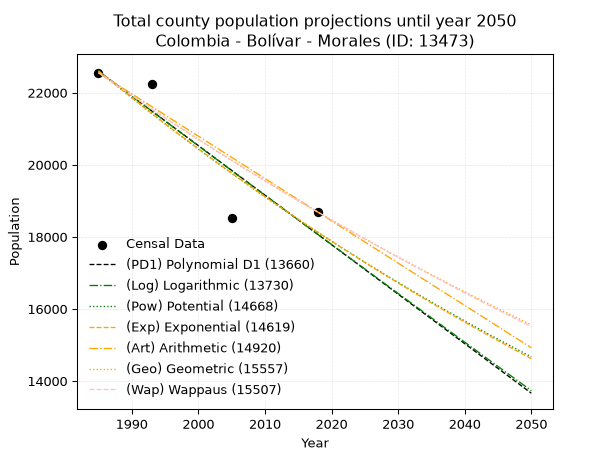
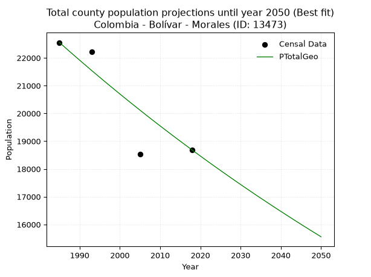
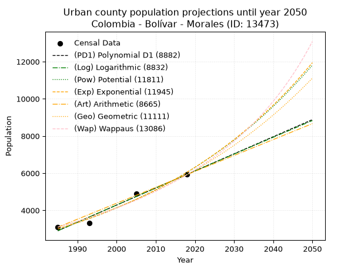
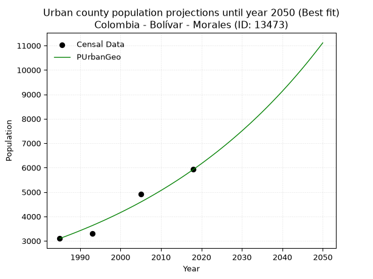
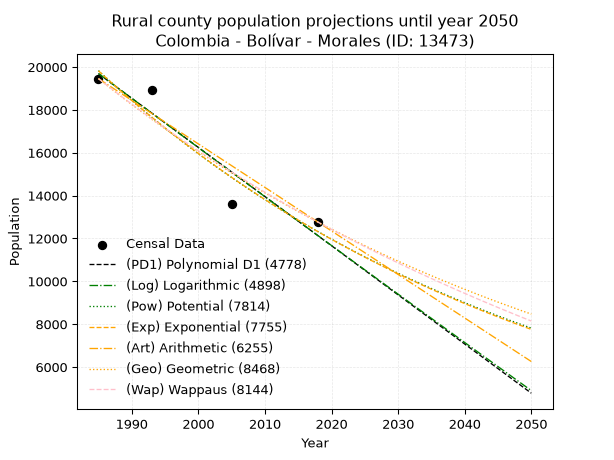
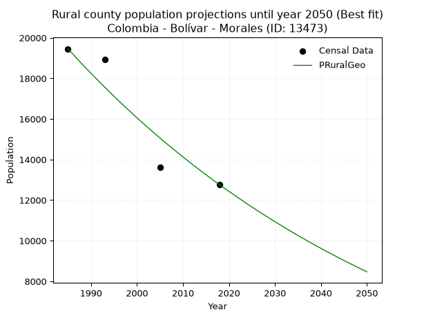

<div align="center">


</div>

# _“Population and Public Services Demand Projections (PPSD) until Year 2050 for Colombia - Bolívar - Morales (ID: 13473)”_
Keywords: `population` `public-service` `projection` `lineal` `polynomial` `logarithmic` `potential` `exponential` `arithmetic` `geometric` `wappaus` `dane` `colombia` `south-america`

PPSD are analytical estimates used by governments and planners to anticipate future changes in population size, age distribution, and the resulting community needs for utilities, healthcare, education, and infrastructure as sizing future water treatment facilities, electrical grids, and road networks based on spatial growth.

> **General running parameters**: • app_version: _v20260806_. • Python version: _3.14.7_. • Pandas version: _3.0.5_. • NumPy version: _2.5.1_. • Creates, save and include plots into reports (create_plot): _True_. • Projection until year: _2050_. • Process polynomial degree 2 and up: _False_. • Process Wappaus: _True_. • Process Wappaus: _True_. • Set negative values to zero: _True_. • Set infinite values to zero: _True_. • Drop dataset notes: _True_. 
<div align="center">

Dynamic map: [:earth_americas:Google](http://maps.google.com/maps?q=8.276558294,-73.8681717) [:earth_americas:OSM](https://www.openstreetmap.org/#map=18/8.276558294/-73.8681717&layers=P) [:earth_americas:Bing](https://www.bing.com/maps?cp=8.276558294~-73.8681717&lvl=18) [:earth_americas:Apple](https://maps.apple.com/frame?center=8.276558294%2C-73.8681717&span=0.003%2C0.006)

</div>


<div align="center">

```geojson
{
  "type": "Feature",
  "geometry": {
    "type": "Point", 
    "coordinates": [-73.8681717, 8.276558294]
  }, 
  "properties": {
    "Name": "Colombia - Bolívar - Morales (ID: 13473)"
  }
}
```

</div>


## 0. Census Data (4 records)

Census data are official statistics collected by a government about the people and housing in a country. They usually include counts of total population, age, sex, race, income, education, and jobs.

📅Global census file: [Population.xlsx](../data/Population.xlsx)

| Source   |   Year |   CountryID | CountryName   |   StateID | StateName   |   CountyID | CountyName   |   PTotal |   PUrban |   PRural |
|:---------|-------:|------------:|:--------------|----------:|:------------|-----------:|:-------------|---------:|---------:|---------:|
| DANE     |   1985 |          57 | Colombia      |        13 | Bolívar     |      13473 | Morales      |    22553 |     3097 |    19456 |
| DANE     |   1993 |          57 | Colombia      |        13 | Bolívar     |      13473 | Morales      |    22227 |     3302 |    18925 |
| DANE     |   2005 |          57 | Colombia      |        13 | Bolívar     |      13473 | Morales      |    18523 |     4903 |    13620 |
| DANE     |   2018 |          57 | Colombia      |        13 | Bolívar     |      13473 | Morales      |    18678 |     5924 |    12754 |

> 🔥Some records has specific notes about the registered values or the corresponding urban or rural distribution.

## 1. Total

### 1.1. Coefficients and Parameters

* (PD1) Polynomial Deg 1: -137.39100762745892, 295311.6130068247 (lineal)
* (Log) Logarithmic: -275161.4123191449, 2111999.350042994
* (Pow) Potential: -13.429206576013282, 48.64061105716432
* (Exp) Exponential: -0.006705353886360175, 13636600749.02911
* (Art) Arithmetic: Year diff. 2018 - 1985 = 33, Population diff. 18678 - 22553 = -3875, Annual growth = -117.42424242424242
* (Geo) Geometric: Year diff. 2018 - 1985 = 33, Population diff. 18678 - 22553 = -3875, Annual growth % = -0.005696492924009089
* (Wap) Wappaus: i = -0.5695920177742108, Condition values only valid for < 200)

<sub>
Wappaus condition values: ['-0.00', '-0.57', '-1.14', '-1.71', '-2.28', '-2.85', '-3.42', '-3.99', '-4.56', '-5.13', '-5.70', '-6.27', '-6.84', '-7.40', '-7.97', '-8.54', '-9.11', '-9.68', '-10.25', '-10.82', '-11.39', '-11.96', '-12.53', '-13.10', '-13.67', '-14.24', '-14.81', '-15.38', '-15.95', '-16.52', '-17.09', '-17.66', '-18.23', '-18.80', '-19.37', '-19.94', '-20.51', '-21.07', '-21.64', '-22.21', '-22.78', '-23.35', '-23.92', '-24.49', '-25.06', '-25.63', '-26.20', '-26.77', '-27.34', '-27.91', '-28.48', '-29.05', '-29.62', '-30.19', '-30.76', '-31.33', '-31.90', '-32.47', '-33.04', '-33.61', '-34.18', '-34.75', '-35.31', '-35.88', '-36.45', '-37.02']
</sub>


### 1.2. Projected Dataset

|   Year |   CountyID |   PTotalPD1 |   PTotalLog |   PTotalPow |   PTotalExp |   PTotalArt |   PTotalGeo |   PTotalWap |
|-------:|-----------:|------------:|------------:|------------:|------------:|------------:|------------:|------------:|
|   1985 |      13473 |       22590 |       22596 |       22610 |       22604 |       22553 |       22553 |       22553 |
|   1986 |      13473 |       22453 |       22457 |       22458 |       22453 |       22436 |       22425 |       22425 |
|   1987 |      13473 |       22316 |       22319 |       22306 |       22303 |       22318 |       22297 |       22298 |
|   1988 |      13473 |       22178 |       22180 |       22156 |       22154 |       22201 |       22170 |       22171 |
|   1989 |      13473 |       22041 |       22042 |       22007 |       22006 |       22083 |       22043 |       22045 |
|   1990 |      13473 |       21904 |       21904 |       21859 |       21859 |       21966 |       21918 |       21920 |
|   1991 |      13473 |       21766 |       21765 |       21712 |       21713 |       21848 |       21793 |       21795 |
|   1992 |      13473 |       21629 |       21627 |       21566 |       21568 |       21731 |       21669 |       21671 |
|   1993 |      13473 |       21491 |       21489 |       21421 |       21424 |       21614 |       21545 |       21548 |
|   1994 |      13473 |       21354 |       21351 |       21277 |       21281 |       21496 |       21423 |       21426 |
|   1995 |      13473 |       21217 |       21213 |       21135 |       21138 |       21379 |       21301 |       21304 |
|   1996 |      13473 |       21079 |       21075 |       20993 |       20997 |       21261 |       21179 |       21183 |
|   1997 |      13473 |       20942 |       20937 |       20852 |       20857 |       21144 |       21059 |       21062 |
|   1998 |      13473 |       20804 |       20800 |       20712 |       20717 |       21026 |       20939 |       20943 |
|   1999 |      13473 |       20667 |       20662 |       20574 |       20579 |       20909 |       20819 |       20824 |
|   2000 |      13473 |       20530 |       20524 |       20436 |       20441 |       20792 |       20701 |       20705 |
|   2001 |      13473 |       20392 |       20387 |       20299 |       20305 |       20674 |       20583 |       20587 |
|   2002 |      13473 |       20255 |       20249 |       20164 |       20169 |       20557 |       20466 |       20470 |
|   2003 |      13473 |       20117 |       20112 |       20029 |       20034 |       20439 |       20349 |       20353 |
|   2004 |      13473 |       19980 |       19975 |       19895 |       19900 |       20322 |       20233 |       20238 |
|   2005 |      13473 |       19843 |       19837 |       19762 |       19767 |       20205 |       20118 |       20122 |
|   2006 |      13473 |       19705 |       19700 |       19630 |       19635 |       20087 |       20003 |       20008 |
|   2007 |      13473 |       19568 |       19563 |       19499 |       19504 |       19970 |       19889 |       19894 |
|   2008 |      13473 |       19430 |       19426 |       19369 |       19374 |       19852 |       19776 |       19780 |
|   2009 |      13473 |       19293 |       19289 |       19240 |       19244 |       19735 |       19663 |       19667 |
|   2010 |      13473 |       19156 |       19152 |       19112 |       19116 |       19617 |       19551 |       19555 |
|   2011 |      13473 |       19018 |       19015 |       18985 |       18988 |       19500 |       19440 |       19443 |
|   2012 |      13473 |       18881 |       18878 |       18859 |       18861 |       19383 |       19329 |       19332 |
|   2013 |      13473 |       18744 |       18742 |       18733 |       18735 |       19265 |       19219 |       19222 |
|   2014 |      13473 |       18606 |       18605 |       18609 |       18610 |       19148 |       19110 |       19112 |
|   2015 |      13473 |       18469 |       18468 |       18485 |       18485 |       19030 |       19001 |       19003 |
|   2016 |      13473 |       18331 |       18332 |       18362 |       18362 |       18913 |       18893 |       18894 |
|   2017 |      13473 |       18194 |       18195 |       18240 |       18239 |       18795 |       18785 |       18786 |
|   2018 |      13473 |       18057 |       18059 |       18119 |       18117 |       18678 |       18678 |       18678 |
|   2019 |      13473 |       17919 |       17923 |       17999 |       17996 |       18561 |       18572 |       18571 |
|   2020 |      13473 |       17782 |       17786 |       17880 |       17876 |       18443 |       18466 |       18464 |
|   2021 |      13473 |       17644 |       17650 |       17761 |       17756 |       18326 |       18361 |       18358 |
|   2022 |      13473 |       17507 |       17514 |       17644 |       17638 |       18208 |       18256 |       18253 |
|   2023 |      13473 |       17370 |       17378 |       17527 |       17520 |       18091 |       18152 |       18148 |
|   2024 |      13473 |       17232 |       17242 |       17411 |       17403 |       17973 |       18049 |       18044 |
|   2025 |      13473 |       17095 |       17106 |       17296 |       17287 |       17856 |       17946 |       17940 |
|   2026 |      13473 |       16957 |       16970 |       17182 |       17171 |       17739 |       17844 |       17837 |
|   2027 |      13473 |       16820 |       16834 |       17068 |       17056 |       17621 |       17742 |       17734 |
|   2028 |      13473 |       16683 |       16699 |       16956 |       16942 |       17504 |       17641 |       17632 |
|   2029 |      13473 |       16545 |       16563 |       16844 |       16829 |       17386 |       17540 |       17530 |
|   2030 |      13473 |       16408 |       16428 |       16733 |       16717 |       17269 |       17440 |       17429 |
|   2031 |      13473 |       16270 |       16292 |       16622 |       16605 |       17151 |       17341 |       17328 |
|   2032 |      13473 |       16133 |       16157 |       16513 |       16494 |       17034 |       17242 |       17228 |
|   2033 |      13473 |       15996 |       16021 |       16404 |       16384 |       16917 |       17144 |       17128 |
|   2034 |      13473 |       15858 |       15886 |       16296 |       16274 |       16799 |       17046 |       17029 |
|   2035 |      13473 |       15721 |       15751 |       16189 |       16165 |       16682 |       16949 |       16931 |
|   2036 |      13473 |       15584 |       15615 |       16082 |       16057 |       16564 |       16853 |       16832 |
|   2037 |      13473 |       15446 |       15480 |       15977 |       15950 |       16447 |       16757 |       16735 |
|   2038 |      13473 |       15309 |       15345 |       15872 |       15843 |       16330 |       16661 |       16638 |
|   2039 |      13473 |       15171 |       15210 |       15768 |       15738 |       16212 |       16566 |       16541 |
|   2040 |      13473 |       15034 |       15075 |       15664 |       15632 |       16095 |       16472 |       16445 |
|   2041 |      13473 |       14897 |       14941 |       15561 |       15528 |       15977 |       16378 |       16349 |
|   2042 |      13473 |       14759 |       14806 |       15459 |       15424 |       15860 |       16285 |       16253 |
|   2043 |      13473 |       14622 |       14671 |       15358 |       15321 |       15742 |       16192 |       16159 |
|   2044 |      13473 |       14484 |       14536 |       15257 |       15219 |       15625 |       16100 |       16064 |
|   2045 |      13473 |       14347 |       14402 |       15157 |       15117 |       15508 |       16008 |       15970 |
|   2046 |      13473 |       14210 |       14267 |       15058 |       15016 |       15390 |       15917 |       15877 |
|   2047 |      13473 |       14072 |       14133 |       14960 |       14916 |       15273 |       15826 |       15784 |
|   2048 |      13473 |       13935 |       13998 |       14862 |       14816 |       15155 |       15736 |       15691 |
|   2049 |      13473 |       13797 |       13864 |       14765 |       14717 |       15038 |       15647 |       15599 |
|   2050 |      13473 |       13660 |       13730 |       14668 |       14619 |       14920 |       15557 |       15507 |
<div align="center">

</img>

</div>


### 1.3. Best fit with absolute error and relative error (%)

Relative error puts that difference into context by dividing the absolute error by the true value, creating a unitless ratio or percentage that shows the scale of the mistake.

Absolute and relative error

|   Year | Source   |   CountryID | CountryName   |   StateID | StateName   |   CountyID_x | CountyName   |   PTotal |   PUrban |   PRural |   CountyID_y |   PTotalPD1 |   PTotalLog |   PTotalPow |   PTotalExp |   PTotalArt |   PTotalGeo |   PTotalWap |   PTotalPD1AbsError |   PTotalLogAbsError |   PTotalPowAbsError |   PTotalExpAbsError |   PTotalArtAbsError |   PTotalGeoAbsError |   PTotalWapAbsError |   PTotalPD1RelError |   PTotalLogRelError |   PTotalPowRelError |   PTotalExpRelError |   PTotalArtRelError |   PTotalGeoRelError |   PTotalWapRelError |
|-------:|:---------|------------:|:--------------|----------:|:------------|-------------:|:-------------|---------:|---------:|---------:|-------------:|------------:|------------:|------------:|------------:|------------:|------------:|------------:|--------------------:|--------------------:|--------------------:|--------------------:|--------------------:|--------------------:|--------------------:|--------------------:|--------------------:|--------------------:|--------------------:|--------------------:|--------------------:|--------------------:|
|   1985 | DANE     |          57 | Colombia      |        13 | Bolívar     |        13473 | Morales      |    22553 |     3097 |    19456 |        13473 |       22590 |       22596 |       22610 |       22604 |       22553 |       22553 |       22553 |                  37 |                  43 |                  57 |                  51 |                   0 |                   0 |                   0 |            0.164058 |            0.190662 |            0.252738 |            0.226134 |             0       |             0       |             0       |
|   1993 | DANE     |          57 | Colombia      |        13 | Bolívar     |        13473 | Morales      |    22227 |     3302 |    18925 |        13473 |       21491 |       21489 |       21421 |       21424 |       21614 |       21545 |       21548 |                 736 |                 738 |                 806 |                 803 |                 613 |                 682 |                 679 |            3.31129  |            3.32029  |            3.62622  |            3.61272  |             2.75791 |             3.06834 |             3.05484 |
|   2005 | DANE     |          57 | Colombia      |        13 | Bolívar     |        13473 | Morales      |    18523 |     4903 |    13620 |        13473 |       19843 |       19837 |       19762 |       19767 |       20205 |       20118 |       20122 |                1320 |                1314 |                1239 |                1244 |                1682 |                1595 |                1599 |            7.12628  |            7.09388  |            6.68898  |            6.71597  |             9.0806  |             8.61092 |             8.63251 |
|   2018 | DANE     |          57 | Colombia      |        13 | Bolívar     |        13473 | Morales      |    18678 |     5924 |    12754 |        13473 |       18057 |       18059 |       18119 |       18117 |       18678 |       18678 |       18678 |                 621 |                 619 |                 559 |                 561 |                   0 |                   0 |                   0 |            3.32477  |            3.31406  |            2.99283  |            3.00353  |             0       |             0       |             0       |

Relative error mean

| Method    |   RelError | Best   |
|:----------|-----------:|:-------|
| PTotalPD1 |    3.4816  |        |
| PTotalLog |    3.47972 |        |
| PTotalPow |    3.39019 |        |
| PTotalExp |    3.38959 |        |
| PTotalArt |    2.95963 |        |
| PTotalGeo |    2.91981 | True   |
| PTotalWap |    2.92184 |        |

💙Best method: _**PTotalGeo**_
<div align="center">

</img>

</div>


### 1.4. Fresh water supply demand in liters per capita per day (lpcd)

The fresh water supply demand typically ranges from 100 to 300 liters per capita per day (lpcd) for standard domestic and municipal planning, though absolute survival minimums set by the World Health Organization are as low as 7.5 to 20 liters per day, and total consumption in high-income nations can exceed 400 liters.

> `CZ`: Level in meters above the sea level (masl).<br> `WS`: Fresh water supply demand in liters per capita per day (lpcd or l/h/d).<br> `WSAll`: Zonal fresh water supply demand in liters per second (l/s).<br> `A`: Zonal area in square meters.

Reference values (RAS Colombia)

|    CZ |   WS |
|------:|-----:|
|  1000 |  120 |
|  2000 |  130 |
| 99999 |  140 |

County shapefile geometry properties and water supply values

|   CountyID |      ATotal |   CZTotal |   WSTotal |
|-----------:|------------:|----------:|----------:|
|      13473 | 1.34575e+09 |   465.425 |       120 |

Projected values for best method: PTotalGeo

|   CountyID |   Year |   PTotalGeo |   WSTotal |   WSTotalAll |
|-----------:|-------:|------------:|----------:|-------------:|
|      13473 |   1985 |       22553 |       120 |      31.3236 |
|      13473 |   1986 |       22425 |       120 |      31.1458 |
|      13473 |   1987 |       22297 |       120 |      30.9681 |
|      13473 |   1988 |       22170 |       120 |      30.7917 |
|      13473 |   1989 |       22043 |       120 |      30.6153 |
|      13473 |   1990 |       21918 |       120 |      30.4417 |
|      13473 |   1991 |       21793 |       120 |      30.2681 |
|      13473 |   1992 |       21669 |       120 |      30.0958 |
|      13473 |   1993 |       21545 |       120 |      29.9236 |
|      13473 |   1994 |       21423 |       120 |      29.7542 |
|      13473 |   1995 |       21301 |       120 |      29.5847 |
|      13473 |   1996 |       21179 |       120 |      29.4153 |
|      13473 |   1997 |       21059 |       120 |      29.2486 |
|      13473 |   1998 |       20939 |       120 |      29.0819 |
|      13473 |   1999 |       20819 |       120 |      28.9153 |
|      13473 |   2000 |       20701 |       120 |      28.7514 |
|      13473 |   2001 |       20583 |       120 |      28.5875 |
|      13473 |   2002 |       20466 |       120 |      28.425  |
|      13473 |   2003 |       20349 |       120 |      28.2625 |
|      13473 |   2004 |       20233 |       120 |      28.1014 |
|      13473 |   2005 |       20118 |       120 |      27.9417 |
|      13473 |   2006 |       20003 |       120 |      27.7819 |
|      13473 |   2007 |       19889 |       120 |      27.6236 |
|      13473 |   2008 |       19776 |       120 |      27.4667 |
|      13473 |   2009 |       19663 |       120 |      27.3097 |
|      13473 |   2010 |       19551 |       120 |      27.1542 |
|      13473 |   2011 |       19440 |       120 |      27      |
|      13473 |   2012 |       19329 |       120 |      26.8458 |
|      13473 |   2013 |       19219 |       120 |      26.6931 |
|      13473 |   2014 |       19110 |       120 |      26.5417 |
|      13473 |   2015 |       19001 |       120 |      26.3903 |
|      13473 |   2016 |       18893 |       120 |      26.2403 |
|      13473 |   2017 |       18785 |       120 |      26.0903 |
|      13473 |   2018 |       18678 |       120 |      25.9417 |
|      13473 |   2019 |       18572 |       120 |      25.7944 |
|      13473 |   2020 |       18466 |       120 |      25.6472 |
|      13473 |   2021 |       18361 |       120 |      25.5014 |
|      13473 |   2022 |       18256 |       120 |      25.3556 |
|      13473 |   2023 |       18152 |       120 |      25.2111 |
|      13473 |   2024 |       18049 |       120 |      25.0681 |
|      13473 |   2025 |       17946 |       120 |      24.925  |
|      13473 |   2026 |       17844 |       120 |      24.7833 |
|      13473 |   2027 |       17742 |       120 |      24.6417 |
|      13473 |   2028 |       17641 |       120 |      24.5014 |
|      13473 |   2029 |       17540 |       120 |      24.3611 |
|      13473 |   2030 |       17440 |       120 |      24.2222 |
|      13473 |   2031 |       17341 |       120 |      24.0847 |
|      13473 |   2032 |       17242 |       120 |      23.9472 |
|      13473 |   2033 |       17144 |       120 |      23.8111 |
|      13473 |   2034 |       17046 |       120 |      23.675  |
|      13473 |   2035 |       16949 |       120 |      23.5403 |
|      13473 |   2036 |       16853 |       120 |      23.4069 |
|      13473 |   2037 |       16757 |       120 |      23.2736 |
|      13473 |   2038 |       16661 |       120 |      23.1403 |
|      13473 |   2039 |       16566 |       120 |      23.0083 |
|      13473 |   2040 |       16472 |       120 |      22.8778 |
|      13473 |   2041 |       16378 |       120 |      22.7472 |
|      13473 |   2042 |       16285 |       120 |      22.6181 |
|      13473 |   2043 |       16192 |       120 |      22.4889 |
|      13473 |   2044 |       16100 |       120 |      22.3611 |
|      13473 |   2045 |       16008 |       120 |      22.2333 |
|      13473 |   2046 |       15917 |       120 |      22.1069 |
|      13473 |   2047 |       15826 |       120 |      21.9806 |
|      13473 |   2048 |       15736 |       120 |      21.8556 |
|      13473 |   2049 |       15647 |       120 |      21.7319 |
|      13473 |   2050 |       15557 |       120 |      21.6069 |

## 2. Urban

### 2.1. Coefficients and Parameters

* (PD1) Polynomial Deg 1: 91.96547571256448, -179647.4427940571 (lineal)
* (Log) Logarithmic: 184058.9070959696, -1394726.7277919794
* (Pow) Potential: 42.52430358019746, -136.7577522364793
* (Exp) Exponential: 0.02124413996612269, 1.457024085623859e-15
* (Art) Arithmetic: Year diff. 2018 - 1985 = 33, Population diff. 5924 - 3097 = 2827, Annual growth = 85.66666666666667
* (Geo) Geometric: Year diff. 2018 - 1985 = 33, Population diff. 5924 - 3097 = 2827, Annual growth % = 0.019848287663581043
* (Wap) Wappaus: i = 1.8992720688763256, Condition values only valid for < 200)

<sub>
Wappaus condition values: ['0.00', '1.90', '3.80', '5.70', '7.60', '9.50', '11.40', '13.29', '15.19', '17.09', '18.99', '20.89', '22.79', '24.69', '26.59', '28.49', '30.39', '32.29', '34.19', '36.09', '37.99', '39.88', '41.78', '43.68', '45.58', '47.48', '49.38', '51.28', '53.18', '55.08', '56.98', '58.88', '60.78', '62.68', '64.58', '66.47', '68.37', '70.27', '72.17', '74.07', '75.97', '77.87', '79.77', '81.67', '83.57', '85.47', '87.37', '89.27', '91.17', '93.06', '94.96', '96.86', '98.76', '100.66', '102.56', '104.46', '106.36', '108.26', '110.16', '112.06', '113.96', '115.86', '117.75', '119.65', '121.55', '123.45']
</sub>


### 2.2. Projected Dataset

|   Year |   CountyID |   PUrbanPD1 |   PUrbanLog |   PUrbanPow |   PUrbanExp |   PUrbanArt |   PUrbanGeo |   PUrbanWap |
|-------:|-----------:|------------:|------------:|------------:|------------:|------------:|------------:|------------:|
|   1985 |      13473 |        2904 |        2901 |        3001 |        3003 |        3097 |        3097 |        3097 |
|   1986 |      13473 |        2996 |        2994 |        3066 |        3067 |        3183 |        3158 |        3156 |
|   1987 |      13473 |        3088 |        3087 |        3132 |        3133 |        3268 |        3221 |        3217 |
|   1988 |      13473 |        3180 |        3179 |        3200 |        3200 |        3354 |        3285 |        3279 |
|   1989 |      13473 |        3272 |        3272 |        3269 |        3269 |        3440 |        3350 |        3342 |
|   1990 |      13473 |        3364 |        3364 |        3339 |        3339 |        3525 |        3417 |        3406 |
|   1991 |      13473 |        3456 |        3457 |        3412 |        3411 |        3611 |        3485 |        3471 |
|   1992 |      13473 |        3548 |        3549 |        3485 |        3484 |        3697 |        3554 |        3538 |
|   1993 |      13473 |        3640 |        3642 |        3560 |        3559 |        3782 |        3624 |        3606 |
|   1994 |      13473 |        3732 |        3734 |        3637 |        3635 |        3868 |        3696 |        3676 |
|   1995 |      13473 |        3824 |        3826 |        3716 |        3713 |        3954 |        3770 |        3747 |
|   1996 |      13473 |        3916 |        3919 |        3796 |        3793 |        4039 |        3844 |        3819 |
|   1997 |      13473 |        4008 |        4011 |        3877 |        3874 |        4125 |        3921 |        3894 |
|   1998 |      13473 |        4100 |        4103 |        3961 |        3958 |        4211 |        3999 |        3969 |
|   1999 |      13473 |        4192 |        4195 |        4046 |        4043 |        4296 |        4078 |        4047 |
|   2000 |      13473 |        4284 |        4287 |        4133 |        4129 |        4382 |        4159 |        4126 |
|   2001 |      13473 |        4375 |        4379 |        4222 |        4218 |        4468 |        4241 |        4207 |
|   2002 |      13473 |        4467 |        4471 |        4312 |        4309 |        4553 |        4326 |        4289 |
|   2003 |      13473 |        4559 |        4563 |        4405 |        4401 |        4639 |        4411 |        4374 |
|   2004 |      13473 |        4651 |        4655 |        4499 |        4496 |        4725 |        4499 |        4461 |
|   2005 |      13473 |        4743 |        4747 |        4596 |        4592 |        4810 |        4588 |        4549 |
|   2006 |      13473 |        4835 |        4838 |        4694 |        4691 |        4896 |        4679 |        4640 |
|   2007 |      13473 |        4927 |        4930 |        4795 |        4792 |        4982 |        4772 |        4733 |
|   2008 |      13473 |        5019 |        5022 |        4897 |        4894 |        5067 |        4867 |        4828 |
|   2009 |      13473 |        5111 |        5113 |        5002 |        5000 |        5153 |        4964 |        4925 |
|   2010 |      13473 |        5203 |        5205 |        5109 |        5107 |        5239 |        5062 |        5025 |
|   2011 |      13473 |        5295 |        5297 |        5218 |        5217 |        5324 |        5163 |        5128 |
|   2012 |      13473 |        5387 |        5388 |        5330 |        5329 |        5410 |        5265 |        5233 |
|   2013 |      13473 |        5479 |        5480 |        5444 |        5443 |        5496 |        5370 |        5341 |
|   2014 |      13473 |        5571 |        5571 |        5560 |        5560 |        5581 |        5476 |        5451 |
|   2015 |      13473 |        5663 |        5662 |        5679 |        5679 |        5667 |        5585 |        5565 |
|   2016 |      13473 |        5755 |        5754 |        5800 |        5801 |        5753 |        5696 |        5681 |
|   2017 |      13473 |        5847 |        5845 |        5923 |        5926 |        5838 |        5809 |        5801 |
|   2018 |      13473 |        5939 |        5936 |        6049 |        6053 |        5924 |        5924 |        5924 |
|   2019 |      13473 |        6031 |        6027 |        6178 |        6183 |        6010 |        6042 |        6051 |
|   2020 |      13473 |        6123 |        6119 |        6310 |        6316 |        6095 |        6161 |        6181 |
|   2021 |      13473 |        6215 |        6210 |        6444 |        6451 |        6181 |        6284 |        6314 |
|   2022 |      13473 |        6307 |        6301 |        6581 |        6590 |        6267 |        6409 |        6452 |
|   2023 |      13473 |        6399 |        6392 |        6721 |        6731 |        6352 |        6536 |        6594 |
|   2024 |      13473 |        6491 |        6483 |        6864 |        6876 |        6438 |        6665 |        6740 |
|   2025 |      13473 |        6583 |        6574 |        7009 |        7023 |        6524 |        6798 |        6891 |
|   2026 |      13473 |        6675 |        6664 |        7158 |        7174 |        6609 |        6933 |        7046 |
|   2027 |      13473 |        6767 |        6755 |        7310 |        7328 |        6695 |        7070 |        7207 |
|   2028 |      13473 |        6859 |        6846 |        7465 |        7486 |        6781 |        7211 |        7372 |
|   2029 |      13473 |        6951 |        6937 |        7623 |        7646 |        6866 |        7354 |        7543 |
|   2030 |      13473 |        7042 |        7027 |        7784 |        7810 |        6952 |        7500 |        7719 |
|   2031 |      13473 |        7134 |        7118 |        7949 |        7978 |        7038 |        7649 |        7902 |
|   2032 |      13473 |        7226 |        7209 |        8117 |        8150 |        7123 |        7800 |        8090 |
|   2033 |      13473 |        7318 |        7299 |        8289 |        8324 |        7209 |        7955 |        8285 |
|   2034 |      13473 |        7410 |        7390 |        8464 |        8503 |        7295 |        8113 |        8488 |
|   2035 |      13473 |        7502 |        7480 |        8643 |        8686 |        7380 |        8274 |        8697 |
|   2036 |      13473 |        7594 |        7571 |        8825 |        8872 |        7466 |        8438 |        8914 |
|   2037 |      13473 |        7686 |        7661 |        9011 |        9063 |        7552 |        8606 |        9140 |
|   2038 |      13473 |        7778 |        7751 |        9201 |        9257 |        7637 |        8777 |        9373 |
|   2039 |      13473 |        7870 |        7842 |        9395 |        9456 |        7723 |        8951 |        9617 |
|   2040 |      13473 |        7962 |        7932 |        9593 |        9659 |        7809 |        9128 |        9869 |
|   2041 |      13473 |        8054 |        8022 |        9795 |        9867 |        7894 |        9310 |       10132 |
|   2042 |      13473 |        8146 |        8112 |       10001 |       10078 |        7980 |        9494 |       10406 |
|   2043 |      13473 |        8238 |        8202 |       10212 |       10295 |        8066 |        9683 |       10692 |
|   2044 |      13473 |        8330 |        8292 |       10427 |       10516 |        8151 |        9875 |       10989 |
|   2045 |      13473 |        8422 |        8382 |       10646 |       10742 |        8237 |       10071 |       11300 |
|   2046 |      13473 |        8514 |        8472 |       10869 |       10972 |        8323 |       10271 |       11625 |
|   2047 |      13473 |        8606 |        8562 |       11098 |       11208 |        8408 |       10475 |       11965 |
|   2048 |      13473 |        8698 |        8652 |       11330 |       11449 |        8494 |       10683 |       12321 |
|   2049 |      13473 |        8790 |        8742 |       11568 |       11694 |        8580 |       10895 |       12695 |
|   2050 |      13473 |        8882 |        8832 |       11811 |       11945 |        8665 |       11111 |       13086 |
<div align="center">

</img>

</div>


### 2.3. Best fit with absolute error and relative error (%)

Relative error puts that difference into context by dividing the absolute error by the true value, creating a unitless ratio or percentage that shows the scale of the mistake.

Absolute and relative error

|   Year | Source   |   CountryID | CountryName   |   StateID | StateName   |   CountyID_x | CountyName   |   PTotal |   PUrban |   PRural |   CountyID_y |   PUrbanPD1 |   PUrbanLog |   PUrbanPow |   PUrbanExp |   PUrbanArt |   PUrbanGeo |   PUrbanWap |   PUrbanPD1AbsError |   PUrbanLogAbsError |   PUrbanPowAbsError |   PUrbanExpAbsError |   PUrbanArtAbsError |   PUrbanGeoAbsError |   PUrbanWapAbsError |   PUrbanPD1RelError |   PUrbanLogRelError |   PUrbanPowRelError |   PUrbanExpRelError |   PUrbanArtRelError |   PUrbanGeoRelError |   PUrbanWapRelError |
|-------:|:---------|------------:|:--------------|----------:|:------------|-------------:|:-------------|---------:|---------:|---------:|-------------:|------------:|------------:|------------:|------------:|------------:|------------:|------------:|--------------------:|--------------------:|--------------------:|--------------------:|--------------------:|--------------------:|--------------------:|--------------------:|--------------------:|--------------------:|--------------------:|--------------------:|--------------------:|--------------------:|
|   1985 | DANE     |          57 | Colombia      |        13 | Bolívar     |        13473 | Morales      |    22553 |     3097 |    19456 |        13473 |        2904 |        2901 |        3001 |        3003 |        3097 |        3097 |        3097 |                 193 |                 196 |                  96 |                  94 |                   0 |                   0 |                   0 |            6.23184  |            6.32871  |             3.09977 |             3.0352  |              0      |             0       |             0       |
|   1993 | DANE     |          57 | Colombia      |        13 | Bolívar     |        13473 | Morales      |    22227 |     3302 |    18925 |        13473 |        3640 |        3642 |        3560 |        3559 |        3782 |        3624 |        3606 |                 338 |                 340 |                 258 |                 257 |                 480 |                 322 |                 304 |           10.2362   |           10.2968   |             7.81345 |             7.78316 |             14.5366 |             9.75167 |             9.20654 |
|   2005 | DANE     |          57 | Colombia      |        13 | Bolívar     |        13473 | Morales      |    18523 |     4903 |    13620 |        13473 |        4743 |        4747 |        4596 |        4592 |        4810 |        4588 |        4549 |                 160 |                 156 |                 307 |                 311 |                  93 |                 315 |                 354 |            3.26331  |            3.18173  |             6.26147 |             6.34306 |              1.8968 |             6.42464 |             7.22007 |
|   2018 | DANE     |          57 | Colombia      |        13 | Bolívar     |        13473 | Morales      |    18678 |     5924 |    12754 |        13473 |        5939 |        5936 |        6049 |        6053 |        5924 |        5924 |        5924 |                  15 |                  12 |                 125 |                 129 |                   0 |                   0 |                   0 |            0.253207 |            0.202566 |             2.11006 |             2.17758 |              0      |             0       |             0       |

Relative error mean

| Method    |   RelError | Best   |
|:----------|-----------:|:-------|
| PUrbanPD1 |    4.99614 |        |
| PUrbanLog |    5.00245 |        |
| PUrbanPow |    4.82119 |        |
| PUrbanExp |    4.83475 |        |
| PUrbanArt |    4.10836 |        |
| PUrbanGeo |    4.04408 | True   |
| PUrbanWap |    4.10665 |        |

💙Best method: _**PUrbanGeo**_
<div align="center">

</img>

</div>


### 2.4. Fresh water supply demand in liters per capita per day (lpcd)

The fresh water supply demand typically ranges from 100 to 300 liters per capita per day (lpcd) for standard domestic and municipal planning, though absolute survival minimums set by the World Health Organization are as low as 7.5 to 20 liters per day, and total consumption in high-income nations can exceed 400 liters.

> `CZ`: Level in meters above the sea level (masl).<br> `WS`: Fresh water supply demand in liters per capita per day (lpcd or l/h/d).<br> `WSAll`: Zonal fresh water supply demand in liters per second (l/s).<br> `A`: Zonal area in square meters.

Reference values (RAS Colombia)

|    CZ |   WS |
|------:|-----:|
|  1000 |  120 |
|  2000 |  130 |
| 99999 |  140 |

County shapefile geometry properties and water supply values

|   CountyID |   AUrban |   CZUrban |   WSUrban |
|-----------:|---------:|----------:|----------:|
|      13473 |   926324 |   41.1981 |       120 |

Projected values for best method: PUrbanGeo

|   CountyID |   Year |   PUrbanGeo |   WSUrban |   WSUrbanAll |
|-----------:|-------:|------------:|----------:|-------------:|
|      13473 |   1985 |        3097 |       120 |      4.30139 |
|      13473 |   1986 |        3158 |       120 |      4.38611 |
|      13473 |   1987 |        3221 |       120 |      4.47361 |
|      13473 |   1988 |        3285 |       120 |      4.5625  |
|      13473 |   1989 |        3350 |       120 |      4.65278 |
|      13473 |   1990 |        3417 |       120 |      4.74583 |
|      13473 |   1991 |        3485 |       120 |      4.84028 |
|      13473 |   1992 |        3554 |       120 |      4.93611 |
|      13473 |   1993 |        3624 |       120 |      5.03333 |
|      13473 |   1994 |        3696 |       120 |      5.13333 |
|      13473 |   1995 |        3770 |       120 |      5.23611 |
|      13473 |   1996 |        3844 |       120 |      5.33889 |
|      13473 |   1997 |        3921 |       120 |      5.44583 |
|      13473 |   1998 |        3999 |       120 |      5.55417 |
|      13473 |   1999 |        4078 |       120 |      5.66389 |
|      13473 |   2000 |        4159 |       120 |      5.77639 |
|      13473 |   2001 |        4241 |       120 |      5.89028 |
|      13473 |   2002 |        4326 |       120 |      6.00833 |
|      13473 |   2003 |        4411 |       120 |      6.12639 |
|      13473 |   2004 |        4499 |       120 |      6.24861 |
|      13473 |   2005 |        4588 |       120 |      6.37222 |
|      13473 |   2006 |        4679 |       120 |      6.49861 |
|      13473 |   2007 |        4772 |       120 |      6.62778 |
|      13473 |   2008 |        4867 |       120 |      6.75972 |
|      13473 |   2009 |        4964 |       120 |      6.89444 |
|      13473 |   2010 |        5062 |       120 |      7.03056 |
|      13473 |   2011 |        5163 |       120 |      7.17083 |
|      13473 |   2012 |        5265 |       120 |      7.3125  |
|      13473 |   2013 |        5370 |       120 |      7.45833 |
|      13473 |   2014 |        5476 |       120 |      7.60556 |
|      13473 |   2015 |        5585 |       120 |      7.75694 |
|      13473 |   2016 |        5696 |       120 |      7.91111 |
|      13473 |   2017 |        5809 |       120 |      8.06806 |
|      13473 |   2018 |        5924 |       120 |      8.22778 |
|      13473 |   2019 |        6042 |       120 |      8.39167 |
|      13473 |   2020 |        6161 |       120 |      8.55694 |
|      13473 |   2021 |        6284 |       120 |      8.72778 |
|      13473 |   2022 |        6409 |       120 |      8.90139 |
|      13473 |   2023 |        6536 |       120 |      9.07778 |
|      13473 |   2024 |        6665 |       120 |      9.25694 |
|      13473 |   2025 |        6798 |       120 |      9.44167 |
|      13473 |   2026 |        6933 |       120 |      9.62917 |
|      13473 |   2027 |        7070 |       120 |      9.81944 |
|      13473 |   2028 |        7211 |       120 |     10.0153  |
|      13473 |   2029 |        7354 |       120 |     10.2139  |
|      13473 |   2030 |        7500 |       120 |     10.4167  |
|      13473 |   2031 |        7649 |       120 |     10.6236  |
|      13473 |   2032 |        7800 |       120 |     10.8333  |
|      13473 |   2033 |        7955 |       120 |     11.0486  |
|      13473 |   2034 |        8113 |       120 |     11.2681  |
|      13473 |   2035 |        8274 |       120 |     11.4917  |
|      13473 |   2036 |        8438 |       120 |     11.7194  |
|      13473 |   2037 |        8606 |       120 |     11.9528  |
|      13473 |   2038 |        8777 |       120 |     12.1903  |
|      13473 |   2039 |        8951 |       120 |     12.4319  |
|      13473 |   2040 |        9128 |       120 |     12.6778  |
|      13473 |   2041 |        9310 |       120 |     12.9306  |
|      13473 |   2042 |        9494 |       120 |     13.1861  |
|      13473 |   2043 |        9683 |       120 |     13.4486  |
|      13473 |   2044 |        9875 |       120 |     13.7153  |
|      13473 |   2045 |       10071 |       120 |     13.9875  |
|      13473 |   2046 |       10271 |       120 |     14.2653  |
|      13473 |   2047 |       10475 |       120 |     14.5486  |
|      13473 |   2048 |       10683 |       120 |     14.8375  |
|      13473 |   2049 |       10895 |       120 |     15.1319  |
|      13473 |   2050 |       11111 |       120 |     15.4319  |

## 3. Rural

### 3.1. Coefficients and Parameters

* (PD1) Polynomial Deg 1: -229.35648334002312, 474959.05580088124 (lineal)
* (Log) Logarithmic: -459220.3194151145, 3506726.077834974
* (Pow) Potential: -28.90000220886354, 99.60257722716902
* (Exp) Exponential: -0.014434876763980847, 5.508332394663216e+16
* (Art) Arithmetic: Year diff. 2018 - 1985 = 33, Population diff. 12754 - 19456 = -6702, Annual growth = -203.0909090909091
* (Geo) Geometric: Year diff. 2018 - 1985 = 33, Population diff. 12754 - 19456 = -6702, Annual growth % = -0.012715752510741973
* (Wap) Wappaus: i = -1.2610425898224717, Condition values only valid for < 200)

<sub>
Wappaus condition values: ['-0.00', '-1.26', '-2.52', '-3.78', '-5.04', '-6.31', '-7.57', '-8.83', '-10.09', '-11.35', '-12.61', '-13.87', '-15.13', '-16.39', '-17.65', '-18.92', '-20.18', '-21.44', '-22.70', '-23.96', '-25.22', '-26.48', '-27.74', '-29.00', '-30.27', '-31.53', '-32.79', '-34.05', '-35.31', '-36.57', '-37.83', '-39.09', '-40.35', '-41.61', '-42.88', '-44.14', '-45.40', '-46.66', '-47.92', '-49.18', '-50.44', '-51.70', '-52.96', '-54.22', '-55.49', '-56.75', '-58.01', '-59.27', '-60.53', '-61.79', '-63.05', '-64.31', '-65.57', '-66.84', '-68.10', '-69.36', '-70.62', '-71.88', '-73.14', '-74.40', '-75.66', '-76.92', '-78.18', '-79.45', '-80.71', '-81.97']
</sub>


### 3.2. Projected Dataset

|   Year |   CountyID |   PRuralPD1 |   PRuralLog |   PRuralPow |   PRuralExp |   PRuralArt |   PRuralGeo |   PRuralWap |
|-------:|-----------:|------------:|------------:|------------:|------------:|------------:|------------:|------------:|
|   1985 |      13473 |       19686 |       19694 |       19829 |       19819 |       19456 |       19456 |       19456 |
|   1986 |      13473 |       19457 |       19463 |       19542 |       19535 |       19253 |       19209 |       19212 |
|   1987 |      13473 |       19228 |       19232 |       19260 |       19255 |       19050 |       18964 |       18971 |
|   1988 |      13473 |       18998 |       19001 |       18982 |       18979 |       18847 |       18723 |       18734 |
|   1989 |      13473 |       18769 |       18770 |       18708 |       18707 |       18644 |       18485 |       18499 |
|   1990 |      13473 |       18540 |       18539 |       18438 |       18439 |       18441 |       18250 |       18267 |
|   1991 |      13473 |       18310 |       18308 |       18172 |       18175 |       18237 |       18018 |       18038 |
|   1992 |      13473 |       18081 |       18078 |       17911 |       17914 |       18034 |       17789 |       17811 |
|   1993 |      13473 |       17852 |       17847 |       17653 |       17657 |       17831 |       17563 |       17587 |
|   1994 |      13473 |       17622 |       17617 |       17399 |       17404 |       17628 |       17339 |       17366 |
|   1995 |      13473 |       17393 |       17387 |       17148 |       17155 |       17425 |       17119 |       17148 |
|   1996 |      13473 |       17164 |       17157 |       16902 |       16909 |       17222 |       16901 |       16932 |
|   1997 |      13473 |       16934 |       16927 |       16659 |       16667 |       17019 |       16686 |       16719 |
|   1998 |      13473 |       16705 |       16697 |       16420 |       16428 |       16816 |       16474 |       16508 |
|   1999 |      13473 |       16475 |       16467 |       16184 |       16193 |       16613 |       16265 |       16300 |
|   2000 |      13473 |       16246 |       16237 |       15952 |       15960 |       16410 |       16058 |       16094 |
|   2001 |      13473 |       16017 |       16008 |       15723 |       15732 |       16207 |       15854 |       15890 |
|   2002 |      13473 |       15787 |       15778 |       15497 |       15506 |       16003 |       15652 |       15689 |
|   2003 |      13473 |       15558 |       15549 |       15275 |       15284 |       15800 |       15453 |       15490 |
|   2004 |      13473 |       15329 |       15320 |       15057 |       15065 |       15597 |       15257 |       15293 |
|   2005 |      13473 |       15099 |       15091 |       14841 |       14849 |       15394 |       15063 |       15099 |
|   2006 |      13473 |       14870 |       14862 |       14629 |       14636 |       15191 |       14871 |       14906 |
|   2007 |      13473 |       14641 |       14633 |       14420 |       14427 |       14988 |       14682 |       14716 |
|   2008 |      13473 |       14411 |       14404 |       14213 |       14220 |       14785 |       14495 |       14528 |
|   2009 |      13473 |       14182 |       14175 |       14010 |       14016 |       14582 |       14311 |       14342 |
|   2010 |      13473 |       13953 |       13947 |       13810 |       13815 |       14379 |       14129 |       14157 |
|   2011 |      13473 |       13723 |       13718 |       13613 |       13617 |       14176 |       13949 |       13975 |
|   2012 |      13473 |       13494 |       13490 |       13419 |       13422 |       13973 |       13772 |       13795 |
|   2013 |      13473 |       13264 |       13262 |       13228 |       13230 |       13769 |       13597 |       13617 |
|   2014 |      13473 |       13035 |       13034 |       13039 |       13040 |       13566 |       13424 |       13441 |
|   2015 |      13473 |       12806 |       12806 |       12853 |       12853 |       13363 |       13253 |       13266 |
|   2016 |      13473 |       12576 |       12578 |       12670 |       12669 |       13160 |       13085 |       13094 |
|   2017 |      13473 |       12347 |       12350 |       12490 |       12487 |       12957 |       12918 |       12923 |
|   2018 |      13473 |       12118 |       12123 |       12313 |       12308 |       12754 |       12754 |       12754 |
|   2019 |      13473 |       11888 |       11895 |       12138 |       12132 |       12551 |       12592 |       12587 |
|   2020 |      13473 |       11659 |       11668 |       11965 |       11958 |       12348 |       12432 |       12421 |
|   2021 |      13473 |       11430 |       11441 |       11795 |       11787 |       12145 |       12274 |       12257 |
|   2022 |      13473 |       11200 |       11213 |       11628 |       11618 |       11942 |       12118 |       12095 |
|   2023 |      13473 |       10971 |       10986 |       11463 |       11451 |       11739 |       11963 |       11935 |
|   2024 |      13473 |       10742 |       10759 |       11300 |       11287 |       11535 |       11811 |       11776 |
|   2025 |      13473 |       10512 |       10533 |       11140 |       11126 |       11332 |       11661 |       11619 |
|   2026 |      13473 |       10283 |       10306 |       10982 |       10966 |       11129 |       11513 |       11463 |
|   2027 |      13473 |       10053 |       10079 |       10827 |       10809 |       10926 |       11366 |       11309 |
|   2028 |      13473 |        9824 |        9853 |       10673 |       10654 |       10723 |       11222 |       11156 |
|   2029 |      13473 |        9595 |        9626 |       10522 |       10501 |       10520 |       11079 |       11005 |
|   2030 |      13473 |        9365 |        9400 |       10374 |       10351 |       10317 |       10938 |       10856 |
|   2031 |      13473 |        9136 |        9174 |       10227 |       10203 |       10114 |       10799 |       10707 |
|   2032 |      13473 |        8907 |        8948 |       10083 |       10056 |        9911 |       10662 |       10561 |
|   2033 |      13473 |        8677 |        8722 |        9940 |        9912 |        9708 |       10526 |       10415 |
|   2034 |      13473 |        8448 |        8496 |        9800 |        9770 |        9505 |       10393 |       10272 |
|   2035 |      13473 |        8219 |        8270 |        9662 |        9630 |        9301 |       10260 |       10129 |
|   2036 |      13473 |        7989 |        8045 |        9526 |        9492 |        9098 |       10130 |        9988 |
|   2037 |      13473 |        7760 |        7819 |        9391 |        9356 |        8895 |       10001 |        9848 |
|   2038 |      13473 |        7531 |        7594 |        9259 |        9222 |        8692 |        9874 |        9710 |
|   2039 |      13473 |        7301 |        7369 |        9129 |        9090 |        8489 |        9748 |        9572 |
|   2040 |      13473 |        7072 |        7143 |        9000 |        8960 |        8286 |        9624 |        9436 |
|   2041 |      13473 |        6842 |        6918 |        8874 |        8831 |        8083 |        9502 |        9302 |
|   2042 |      13473 |        6613 |        6693 |        8749 |        8705 |        7880 |        9381 |        9168 |
|   2043 |      13473 |        6384 |        6469 |        8626 |        8580 |        7677 |        9262 |        9036 |
|   2044 |      13473 |        6154 |        6244 |        8505 |        8457 |        7474 |        9144 |        8905 |
|   2045 |      13473 |        5925 |        6019 |        8386 |        8336 |        7271 |        9028 |        8776 |
|   2046 |      13473 |        5696 |        5795 |        8268 |        8216 |        7067 |        8913 |        8647 |
|   2047 |      13473 |        5466 |        5570 |        8152 |        8098 |        6864 |        8800 |        8520 |
|   2048 |      13473 |        5237 |        5346 |        8038 |        7982 |        6661 |        8688 |        8393 |
|   2049 |      13473 |        5008 |        5122 |        7925 |        7868 |        6458 |        8577 |        8268 |
|   2050 |      13473 |        4778 |        4898 |        7814 |        7755 |        6255 |        8468 |        8144 |
<div align="center">

</img>

</div>


### 3.3. Best fit with absolute error and relative error (%)

Relative error puts that difference into context by dividing the absolute error by the true value, creating a unitless ratio or percentage that shows the scale of the mistake.

Absolute and relative error

|   Year | Source   |   CountryID | CountryName   |   StateID | StateName   |   CountyID_x | CountyName   |   PTotal |   PUrban |   PRural |   CountyID_y |   PRuralPD1 |   PRuralLog |   PRuralPow |   PRuralExp |   PRuralArt |   PRuralGeo |   PRuralWap |   PRuralPD1AbsError |   PRuralLogAbsError |   PRuralPowAbsError |   PRuralExpAbsError |   PRuralArtAbsError |   PRuralGeoAbsError |   PRuralWapAbsError |   PRuralPD1RelError |   PRuralLogRelError |   PRuralPowRelError |   PRuralExpRelError |   PRuralArtRelError |   PRuralGeoRelError |   PRuralWapRelError |
|-------:|:---------|------------:|:--------------|----------:|:------------|-------------:|:-------------|---------:|---------:|---------:|-------------:|------------:|------------:|------------:|------------:|------------:|------------:|------------:|--------------------:|--------------------:|--------------------:|--------------------:|--------------------:|--------------------:|--------------------:|--------------------:|--------------------:|--------------------:|--------------------:|--------------------:|--------------------:|--------------------:|
|   1985 | DANE     |          57 | Colombia      |        13 | Bolívar     |        13473 | Morales      |    22553 |     3097 |    19456 |        13473 |       19686 |       19694 |       19829 |       19819 |       19456 |       19456 |       19456 |                 230 |                 238 |                 373 |                 363 |                   0 |                   0 |                   0 |             1.18215 |             1.22327 |             1.91715 |             1.86575 |             0       |             0       |             0       |
|   1993 | DANE     |          57 | Colombia      |        13 | Bolívar     |        13473 | Morales      |    22227 |     3302 |    18925 |        13473 |       17852 |       17847 |       17653 |       17657 |       17831 |       17563 |       17587 |                1073 |                1078 |                1272 |                1268 |                1094 |                1362 |                1338 |             5.66975 |             5.69617 |             6.72127 |             6.70013 |             5.78071 |             7.19683 |             7.07001 |
|   2005 | DANE     |          57 | Colombia      |        13 | Bolívar     |        13473 | Morales      |    18523 |     4903 |    13620 |        13473 |       15099 |       15091 |       14841 |       14849 |       15394 |       15063 |       15099 |                1479 |                1471 |                1221 |                1229 |                1774 |                1443 |                1479 |            10.859   |            10.8003  |             8.96476 |             9.02349 |            13.025   |            10.5947  |            10.859   |
|   2018 | DANE     |          57 | Colombia      |        13 | Bolívar     |        13473 | Morales      |    18678 |     5924 |    12754 |        13473 |       12118 |       12123 |       12313 |       12308 |       12754 |       12754 |       12754 |                 636 |                 631 |                 441 |                 446 |                   0 |                   0 |                   0 |             4.98667 |             4.94747 |             3.45774 |             3.49694 |             0       |             0       |             0       |

Relative error mean

| Method    |   RelError | Best   |
|:----------|-----------:|:-------|
| PRuralPD1 |    5.6744  |        |
| PRuralLog |    5.6668  |        |
| PRuralPow |    5.26523 |        |
| PRuralExp |    5.27158 |        |
| PRuralArt |    4.70142 |        |
| PRuralGeo |    4.44789 | True   |
| PRuralWap |    4.48226 |        |

💙Best method: _**PRuralGeo**_
<div align="center">

</img>

</div>


### 3.4. Fresh water supply demand in liters per capita per day (lpcd)

The fresh water supply demand typically ranges from 100 to 300 liters per capita per day (lpcd) for standard domestic and municipal planning, though absolute survival minimums set by the World Health Organization are as low as 7.5 to 20 liters per day, and total consumption in high-income nations can exceed 400 liters.

> `CZ`: Level in meters above the sea level (masl).<br> `WS`: Fresh water supply demand in liters per capita per day (lpcd or l/h/d).<br> `WSAll`: Zonal fresh water supply demand in liters per second (l/s).<br> `A`: Zonal area in square meters.

Reference values (RAS Colombia)

|    CZ |   WS |
|------:|-----:|
|  1000 |  120 |
|  2000 |  130 |
| 99999 |  140 |

County shapefile geometry properties and water supply values

|   CountyID |      ARural |   CZRural |   WSRural |
|-----------:|------------:|----------:|----------:|
|      13473 | 1.34482e+09 |   465.723 |       120 |

Projected values for best method: PRuralGeo

|   CountyID |   Year |   PRuralGeo |   WSRural |   WSRuralAll |
|-----------:|-------:|------------:|----------:|-------------:|
|      13473 |   1985 |       19456 |       120 |      27.0222 |
|      13473 |   1986 |       19209 |       120 |      26.6792 |
|      13473 |   1987 |       18964 |       120 |      26.3389 |
|      13473 |   1988 |       18723 |       120 |      26.0042 |
|      13473 |   1989 |       18485 |       120 |      25.6736 |
|      13473 |   1990 |       18250 |       120 |      25.3472 |
|      13473 |   1991 |       18018 |       120 |      25.025  |
|      13473 |   1992 |       17789 |       120 |      24.7069 |
|      13473 |   1993 |       17563 |       120 |      24.3931 |
|      13473 |   1994 |       17339 |       120 |      24.0819 |
|      13473 |   1995 |       17119 |       120 |      23.7764 |
|      13473 |   1996 |       16901 |       120 |      23.4736 |
|      13473 |   1997 |       16686 |       120 |      23.175  |
|      13473 |   1998 |       16474 |       120 |      22.8806 |
|      13473 |   1999 |       16265 |       120 |      22.5903 |
|      13473 |   2000 |       16058 |       120 |      22.3028 |
|      13473 |   2001 |       15854 |       120 |      22.0194 |
|      13473 |   2002 |       15652 |       120 |      21.7389 |
|      13473 |   2003 |       15453 |       120 |      21.4625 |
|      13473 |   2004 |       15257 |       120 |      21.1903 |
|      13473 |   2005 |       15063 |       120 |      20.9208 |
|      13473 |   2006 |       14871 |       120 |      20.6542 |
|      13473 |   2007 |       14682 |       120 |      20.3917 |
|      13473 |   2008 |       14495 |       120 |      20.1319 |
|      13473 |   2009 |       14311 |       120 |      19.8764 |
|      13473 |   2010 |       14129 |       120 |      19.6236 |
|      13473 |   2011 |       13949 |       120 |      19.3736 |
|      13473 |   2012 |       13772 |       120 |      19.1278 |
|      13473 |   2013 |       13597 |       120 |      18.8847 |
|      13473 |   2014 |       13424 |       120 |      18.6444 |
|      13473 |   2015 |       13253 |       120 |      18.4069 |
|      13473 |   2016 |       13085 |       120 |      18.1736 |
|      13473 |   2017 |       12918 |       120 |      17.9417 |
|      13473 |   2018 |       12754 |       120 |      17.7139 |
|      13473 |   2019 |       12592 |       120 |      17.4889 |
|      13473 |   2020 |       12432 |       120 |      17.2667 |
|      13473 |   2021 |       12274 |       120 |      17.0472 |
|      13473 |   2022 |       12118 |       120 |      16.8306 |
|      13473 |   2023 |       11963 |       120 |      16.6153 |
|      13473 |   2024 |       11811 |       120 |      16.4042 |
|      13473 |   2025 |       11661 |       120 |      16.1958 |
|      13473 |   2026 |       11513 |       120 |      15.9903 |
|      13473 |   2027 |       11366 |       120 |      15.7861 |
|      13473 |   2028 |       11222 |       120 |      15.5861 |
|      13473 |   2029 |       11079 |       120 |      15.3875 |
|      13473 |   2030 |       10938 |       120 |      15.1917 |
|      13473 |   2031 |       10799 |       120 |      14.9986 |
|      13473 |   2032 |       10662 |       120 |      14.8083 |
|      13473 |   2033 |       10526 |       120 |      14.6194 |
|      13473 |   2034 |       10393 |       120 |      14.4347 |
|      13473 |   2035 |       10260 |       120 |      14.25   |
|      13473 |   2036 |       10130 |       120 |      14.0694 |
|      13473 |   2037 |       10001 |       120 |      13.8903 |
|      13473 |   2038 |        9874 |       120 |      13.7139 |
|      13473 |   2039 |        9748 |       120 |      13.5389 |
|      13473 |   2040 |        9624 |       120 |      13.3667 |
|      13473 |   2041 |        9502 |       120 |      13.1972 |
|      13473 |   2042 |        9381 |       120 |      13.0292 |
|      13473 |   2043 |        9262 |       120 |      12.8639 |
|      13473 |   2044 |        9144 |       120 |      12.7    |
|      13473 |   2045 |        9028 |       120 |      12.5389 |
|      13473 |   2046 |        8913 |       120 |      12.3792 |
|      13473 |   2047 |        8800 |       120 |      12.2222 |
|      13473 |   2048 |        8688 |       120 |      12.0667 |
|      13473 |   2049 |        8577 |       120 |      11.9125 |
|      13473 |   2050 |        8468 |       120 |      11.7611 |

<div align="center"><br><sub>Share this research</sub></div><br>

<sub>**APPS & TOOLS & CONTENT DISCLAIMER**: • NO WARRANTY - This content and software is provided by <a href="https://github.com/rcfdtools" target="_blank">github.com/rcfdtools</a> "as is", without any express or implied warranty, including warranties of merchantability, fitness for a particular purpose, or non-infringement. There is no guarantee that the software will be error-free or operate without interruption. • LIMITATION OF LIABILITY - Neither the authors nor copyright holders will be liable for claims or damages arising from the software or its use. You are responsible for determining if the software is appropriate for your use and assume all associated risks, including errors, legal compliance, and data loss. • NO PROFESSIONAL ADVICE - The software provides general information and does not offer professional advice. It should not replace consultation with professional advisors. [Clauses and global license for rcfdtools use.](https://github.com/rcfdtools/rcfdtools/blob/main/LICENSE.md)</sub>