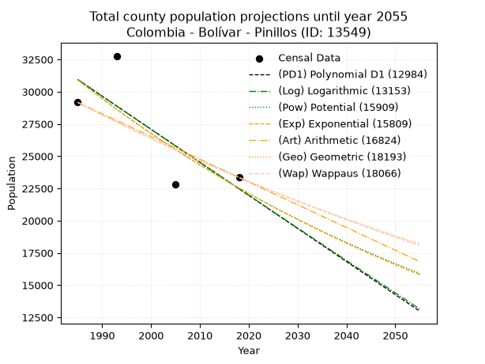
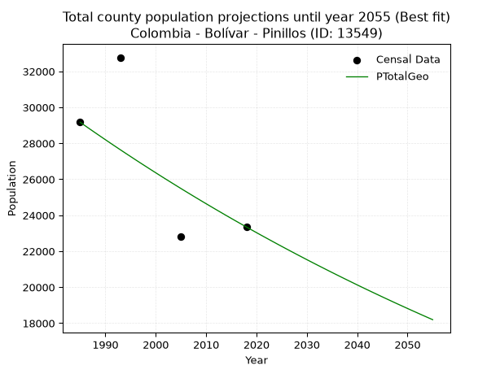
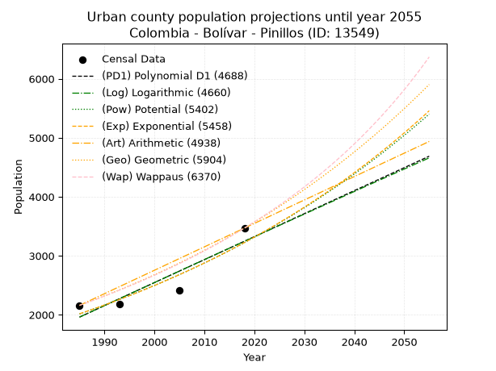
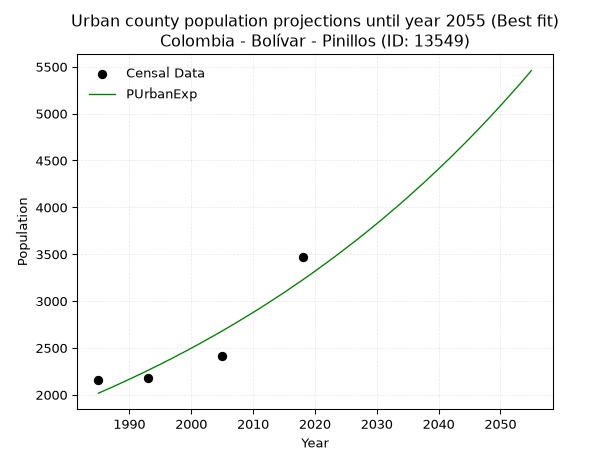
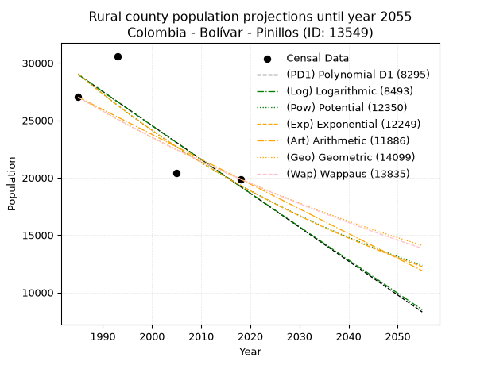
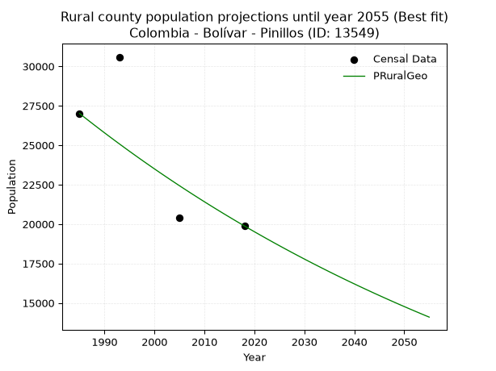

<div align="center">


</div>

# _“Population and Public Services Demand Projections (PPSD) until Year 2050 for Colombia - Bolívar - Pinillos (ID: 13549)”_
Keywords: `population` `public-service` `projection` `lineal` `polynomial` `logarithmic` `potential` `exponential` `arithmetic` `geometric` `wappaus` `dane` `colombia` `south-america`

PPSD are analytical estimates used by governments and planners to anticipate future changes in population size, age distribution, and the resulting community needs for utilities, healthcare, education, and infrastructure as sizing future water treatment facilities, electrical grids, and road networks based on spatial growth.

> **General running parameters**: • app_version: _v20260806_. • Python version: _3.14.7_. • Pandas version: _3.0.5_. • NumPy version: _2.5.1_. • Creates, save and include plots into reports (create_plot): _False_. • Projection until year: _2050_. • Process polynomial degree 2 and up: _False_. • Process Wappaus: _True_. • Process Wappaus: _True_. • Set negative values to zero: _True_. • Set infinite values to zero: _True_. • Drop dataset notes: _True_. 
<div align="center">

Dynamic map: [:earth_americas:Google](http://maps.google.com/maps?q=8.91494737,-74.4622789) [:earth_americas:OSM](https://www.openstreetmap.org/#map=18/8.91494737/-74.4622789&layers=P) [:earth_americas:Bing](https://www.bing.com/maps?cp=8.91494737~-74.4622789&lvl=18) [:earth_americas:Apple](https://maps.apple.com/frame?center=8.91494737%2C-74.4622789&span=0.003%2C0.006)

</div>


<div align="center">

```geojson
{
  "type": "Feature",
  "geometry": {
    "type": "Point", 
    "coordinates": [-74.4622789, 8.91494737]
  }, 
  "properties": {
    "Name": "Colombia - Bolívar - Pinillos (ID: 13549)"
  }
}
```

</div>


## 0. Census Data (4 records)

Census data are official statistics collected by a government about the people and housing in a country. They usually include counts of total population, age, sex, race, income, education, and jobs.

📅Global census file: [Population.xlsx](../data/Population.xlsx)

| Source   |   Year |   CountryID | CountryName   |   StateID | StateName   |   CountyID | CountyName   |   PTotal |   PUrban |   PRural |
|:---------|-------:|------------:|:--------------|----------:|:------------|-----------:|:-------------|---------:|---------:|---------:|
| DANE     |   1985 |          57 | Colombia      |        13 | Bolívar     |      13549 | Pinillos     |    29169 |     2159 |    27010 |
| DANE     |   1993 |          57 | Colombia      |        13 | Bolívar     |      13549 | Pinillos     |    32775 |     2182 |    30593 |
| DANE     |   2005 |          57 | Colombia      |        13 | Bolívar     |      13549 | Pinillos     |    22801 |     2408 |    20393 |
| DANE     |   2018 |          57 | Colombia      |        13 | Bolívar     |      13549 | Pinillos     |    23349 |     3469 |    19880 |

> 🔥Some records could had specific notes about the registered values or the corresponding urban or rural distribution.

## 1. Total

### 1.1. Coefficients and Parameters

* (PD1) Polynomial Deg 1: -256.43757527097495, 539962.7599357676 (lineal)
* (Log) Logarithmic: -513290.4325589157, 3928548.1911317008
* (Pow) Potential: -19.17517582760676, 67.72538120303442
* (Exp) Exponential: -0.009578957378943915, 5596136399084.107
* (Art) Arithmetic: Year diff. 2018 - 1985 = 33, Population diff. 23349 - 29169 = -5820, Annual growth = -176.36363636363637
* (Geo) Geometric: Year diff. 2018 - 1985 = 33, Population diff. 23349 - 29169 = -5820, Annual growth % = -0.00672132064694253
* (Wap) Wappaus: i = -0.6716311983077663, Condition values only valid for < 200)

<sub>
Wappaus condition values: ['-0.00', '-0.67', '-1.34', '-2.01', '-2.69', '-3.36', '-4.03', '-4.70', '-5.37', '-6.04', '-6.72', '-7.39', '-8.06', '-8.73', '-9.40', '-10.07', '-10.75', '-11.42', '-12.09', '-12.76', '-13.43', '-14.10', '-14.78', '-15.45', '-16.12', '-16.79', '-17.46', '-18.13', '-18.81', '-19.48', '-20.15', '-20.82', '-21.49', '-22.16', '-22.84', '-23.51', '-24.18', '-24.85', '-25.52', '-26.19', '-26.87', '-27.54', '-28.21', '-28.88', '-29.55', '-30.22', '-30.90', '-31.57', '-32.24', '-32.91', '-33.58', '-34.25', '-34.92', '-35.60', '-36.27', '-36.94', '-37.61', '-38.28', '-38.95', '-39.63', '-40.30', '-40.97', '-41.64', '-42.31', '-42.98', '-43.66']
</sub>


### 1.2. Projected Dataset

|   Year |   CountyID |   PTotalPD1 |   PTotalLog |   PTotalPow |   PTotalExp |   PTotalArt |   PTotalGeo |   PTotalWap |
|-------:|-----------:|------------:|------------:|------------:|------------:|------------:|------------:|------------:|
|   1985 |      13549 |       30934 |       30942 |       30920 |       30911 |       29169 |       29169 |       29169 |
|   1986 |      13549 |       30678 |       30683 |       30623 |       30616 |       28993 |       28973 |       28974 |
|   1987 |      13549 |       30421 |       30425 |       30329 |       30324 |       28816 |       28778 |       28780 |
|   1988 |      13549 |       30165 |       30167 |       30038 |       30035 |       28640 |       28585 |       28587 |
|   1989 |      13549 |       29908 |       29909 |       29749 |       29749 |       28464 |       28393 |       28396 |
|   1990 |      13549 |       29652 |       29651 |       29464 |       29465 |       28287 |       28202 |       28206 |
|   1991 |      13549 |       29396 |       29393 |       29182 |       29185 |       28111 |       28012 |       28017 |
|   1992 |      13549 |       29139 |       29135 |       28902 |       28906 |       27934 |       27824 |       27829 |
|   1993 |      13549 |       28883 |       28877 |       28625 |       28631 |       27758 |       27637 |       27643 |
|   1994 |      13549 |       28626 |       28620 |       28351 |       28358 |       27582 |       27451 |       27458 |
|   1995 |      13549 |       28370 |       28363 |       28080 |       28087 |       27405 |       27267 |       27274 |
|   1996 |      13549 |       28113 |       28105 |       27811 |       27820 |       27229 |       27083 |       27091 |
|   1997 |      13549 |       27857 |       27848 |       27546 |       27554 |       27053 |       26901 |       26909 |
|   1998 |      13549 |       27600 |       27591 |       27282 |       27292 |       26876 |       26721 |       26729 |
|   1999 |      13549 |       27344 |       27334 |       27022 |       27032 |       26700 |       26541 |       26549 |
|   2000 |      13549 |       27088 |       27078 |       26764 |       26774 |       26524 |       26363 |       26371 |
|   2001 |      13549 |       26831 |       26821 |       26509 |       26519 |       26347 |       26185 |       26194 |
|   2002 |      13549 |       26575 |       26565 |       26256 |       26266 |       26171 |       26009 |       26018 |
|   2003 |      13549 |       26318 |       26308 |       26006 |       26015 |       25994 |       25835 |       25844 |
|   2004 |      13549 |       26062 |       26052 |       25758 |       25767 |       25818 |       25661 |       25670 |
|   2005 |      13549 |       25805 |       25796 |       25513 |       25522 |       25642 |       25488 |       25497 |
|   2006 |      13549 |       25549 |       25540 |       25270 |       25278 |       25465 |       25317 |       25326 |
|   2007 |      13549 |       25293 |       25284 |       25030 |       25038 |       25289 |       25147 |       25156 |
|   2008 |      13549 |       25036 |       25029 |       24792 |       24799 |       25113 |       24978 |       24986 |
|   2009 |      13549 |       24780 |       24773 |       24556 |       24562 |       24936 |       24810 |       24818 |
|   2010 |      13549 |       24523 |       24518 |       24323 |       24328 |       24760 |       24643 |       24651 |
|   2011 |      13549 |       24267 |       24262 |       24092 |       24096 |       24584 |       24478 |       24484 |
|   2012 |      13549 |       24010 |       24007 |       23863 |       23867 |       24407 |       24313 |       24319 |
|   2013 |      13549 |       23754 |       23752 |       23637 |       23639 |       24231 |       24150 |       24155 |
|   2014 |      13549 |       23497 |       23497 |       23413 |       23414 |       24054 |       23987 |       23992 |
|   2015 |      13549 |       23241 |       23242 |       23191 |       23191 |       23878 |       23826 |       23830 |
|   2016 |      13549 |       22985 |       22988 |       22972 |       22969 |       23702 |       23666 |       23668 |
|   2017 |      13549 |       22728 |       22733 |       22754 |       22750 |       23525 |       23507 |       23508 |
|   2018 |      13549 |       22472 |       22479 |       22539 |       22534 |       23349 |       23349 |       23349 |
|   2019 |      13549 |       22215 |       22224 |       22326 |       22319 |       23173 |       23192 |       23191 |
|   2020 |      13549 |       21959 |       21970 |       22115 |       22106 |       22996 |       23036 |       23033 |
|   2021 |      13549 |       21702 |       21716 |       21906 |       21895 |       22820 |       22881 |       22877 |
|   2022 |      13549 |       21446 |       21462 |       21699 |       21687 |       22644 |       22728 |       22722 |
|   2023 |      13549 |       21190 |       21209 |       21495 |       21480 |       22467 |       22575 |       22567 |
|   2024 |      13549 |       20933 |       20955 |       21292 |       21275 |       22291 |       22423 |       22413 |
|   2025 |      13549 |       20677 |       20701 |       21091 |       21072 |       22114 |       22272 |       22261 |
|   2026 |      13549 |       20420 |       20448 |       20892 |       20871 |       21938 |       22123 |       22109 |
|   2027 |      13549 |       20164 |       20195 |       20696 |       20672 |       21762 |       21974 |       21958 |
|   2028 |      13549 |       19907 |       19941 |       20501 |       20475 |       21585 |       21826 |       21808 |
|   2029 |      13549 |       19651 |       19688 |       20308 |       20280 |       21409 |       21680 |       21659 |
|   2030 |      13549 |       19394 |       19435 |       20117 |       20087 |       21233 |       21534 |       21510 |
|   2031 |      13549 |       19138 |       19183 |       19928 |       19895 |       21056 |       21389 |       21363 |
|   2032 |      13549 |       18882 |       18930 |       19741 |       19706 |       20880 |       21245 |       21216 |
|   2033 |      13549 |       18625 |       18678 |       19555 |       19518 |       20704 |       21103 |       21071 |
|   2034 |      13549 |       18369 |       18425 |       19372 |       19332 |       20527 |       20961 |       20926 |
|   2035 |      13549 |       18112 |       18173 |       19190 |       19147 |       20351 |       20820 |       20782 |
|   2036 |      13549 |       17856 |       17921 |       19010 |       18965 |       20174 |       20680 |       20639 |
|   2037 |      13549 |       17599 |       17669 |       18832 |       18784 |       19998 |       20541 |       20496 |
|   2038 |      13549 |       17343 |       17417 |       18656 |       18605 |       19822 |       20403 |       20355 |
|   2039 |      13549 |       17087 |       17165 |       18481 |       18428 |       19645 |       20266 |       20214 |
|   2040 |      13549 |       16830 |       16913 |       18308 |       18252 |       19469 |       20129 |       20074 |
|   2041 |      13549 |       16574 |       16662 |       18137 |       18078 |       19293 |       19994 |       19935 |
|   2042 |      13549 |       16317 |       16410 |       17967 |       17906 |       19116 |       19860 |       19796 |
|   2043 |      13549 |       16061 |       16159 |       17799 |       17735 |       18940 |       19726 |       19659 |
|   2044 |      13549 |       15804 |       15908 |       17633 |       17566 |       18764 |       19594 |       19522 |
|   2045 |      13549 |       15548 |       15657 |       17468 |       17398 |       18587 |       19462 |       19386 |
|   2046 |      13549 |       15291 |       15406 |       17305 |       17232 |       18411 |       19331 |       19250 |
|   2047 |      13549 |       15035 |       15155 |       17144 |       17068 |       18234 |       19201 |       19116 |
|   2048 |      13549 |       14779 |       14904 |       16984 |       16905 |       18058 |       19072 |       18982 |
|   2049 |      13549 |       14522 |       14654 |       16826 |       16744 |       17882 |       18944 |       18849 |
|   2050 |      13549 |       14266 |       14403 |       16669 |       16585 |       17705 |       18817 |       18717 |
<div align="center">

</img>

</div>


### 1.3. Best fit with absolute and relative error (%)

Relative error puts that difference into context by dividing the absolute error by the true value, creating a unitless ratio or percentage that shows the scale of the mistake.

Absolute and relative error

|   Year | Source   |   CountryID | CountryName   |   StateID | StateName   |   CountyID_x | CountyName   |   PTotal |   PUrban |   PRural |   CountyID_y |   PTotalPD1 |   PTotalLog |   PTotalPow |   PTotalExp |   PTotalArt |   PTotalGeo |   PTotalWap |   PTotalPD1AbsError |   PTotalLogAbsError |   PTotalPowAbsError |   PTotalExpAbsError |   PTotalArtAbsError |   PTotalGeoAbsError |   PTotalWapAbsError |   PTotalPD1RelError |   PTotalLogRelError |   PTotalPowRelError |   PTotalExpRelError |   PTotalArtRelError |   PTotalGeoRelError |   PTotalWapRelError |
|-------:|:---------|------------:|:--------------|----------:|:------------|-------------:|:-------------|---------:|---------:|---------:|-------------:|------------:|------------:|------------:|------------:|------------:|------------:|------------:|--------------------:|--------------------:|--------------------:|--------------------:|--------------------:|--------------------:|--------------------:|--------------------:|--------------------:|--------------------:|--------------------:|--------------------:|--------------------:|--------------------:|
|   1985 | DANE     |          57 | Colombia      |        13 | Bolívar     |        13549 | Pinillos     |    29169 |     2159 |    27010 |        13549 |       30934 |       30942 |       30920 |       30911 |       29169 |       29169 |       29169 |                1765 |                1773 |                1751 |                1742 |                   0 |                   0 |                   0 |             6.05094 |             6.07837 |             6.00295 |             5.97209 |              0      |              0      |              0      |
|   1993 | DANE     |          57 | Colombia      |        13 | Bolívar     |        13549 | Pinillos     |    32775 |     2182 |    30593 |        13549 |       28883 |       28877 |       28625 |       28631 |       27758 |       27637 |       27643 |                3892 |                3898 |                4150 |                4144 |                5017 |                5138 |                5132 |            11.8749  |            11.8932  |            12.6621  |            12.6438  |             15.3074 |             15.6766 |             15.6583 |
|   2005 | DANE     |          57 | Colombia      |        13 | Bolívar     |        13549 | Pinillos     |    22801 |     2408 |    20393 |        13549 |       25805 |       25796 |       25513 |       25522 |       25642 |       25488 |       25497 |                3004 |                2995 |                2712 |                2721 |                2841 |                2687 |                2696 |            13.1749  |            13.1354  |            11.8942  |            11.9337  |             12.46   |             11.7846 |             11.824  |
|   2018 | DANE     |          57 | Colombia      |        13 | Bolívar     |        13549 | Pinillos     |    23349 |     3469 |    19880 |        13549 |       22472 |       22479 |       22539 |       22534 |       23349 |       23349 |       23349 |                 877 |                 870 |                 810 |                 815 |                   0 |                   0 |                   0 |             3.75605 |             3.72607 |             3.4691  |             3.49051 |              0      |              0      |              0      |

Relative error mean

| Method    |   RelError | Best   |
|:----------|-----------:|:-------|
| PTotalPD1 |    8.71419 |        |
| PTotalLog |    8.70826 |        |
| PTotalPow |    8.50709 |        |
| PTotalExp |    8.51002 |        |
| PTotalArt |    6.94184 |        |
| PTotalGeo |    6.86529 | True   |
| PTotalWap |    6.87058 |        |

💙Best method: _**PTotalGeo**_
<div align="center">

</img>

</div>


### 1.4. Fresh water supply demand in liters per capita per day (lpcd)

The fresh water supply demand typically ranges from 100 to 300 liters per capita per day (lpcd) for standard domestic and municipal planning, though absolute survival minimums set by the World Health Organization are as low as 7.5 to 20 liters per day, and total consumption in high-income nations can exceed 400 liters.

> `CZ`: Level in meters above the sea level (masl).<br> `WS`: Fresh water supply demand in liters per capita per day (lpcd or l/h/d).<br> `WSAll`: Zonal fresh water supply demand in liters per second (l/s).<br> `A`: Zonal area in square meters.

Reference values (RAS Colombia)

|    CZ |   WS |
|------:|-----:|
|  1000 |  120 |
|  2000 |  130 |
| 99999 |  140 |

County shapefile geometry properties and water supply values

|   CountyID |      ATotal |   CZTotal |   WSTotal |
|-----------:|------------:|----------:|----------:|
|      13549 | 7.74817e+08 |   19.7468 |       120 |

Projected values for best method: PTotalGeo

|   CountyID |   Year |   PTotalGeo |   WSTotal |   WSTotalAll |
|-----------:|-------:|------------:|----------:|-------------:|
|      13549 |   1985 |       29169 |       120 |      40.5125 |
|      13549 |   1986 |       28973 |       120 |      40.2403 |
|      13549 |   1987 |       28778 |       120 |      39.9694 |
|      13549 |   1988 |       28585 |       120 |      39.7014 |
|      13549 |   1989 |       28393 |       120 |      39.4347 |
|      13549 |   1990 |       28202 |       120 |      39.1694 |
|      13549 |   1991 |       28012 |       120 |      38.9056 |
|      13549 |   1992 |       27824 |       120 |      38.6444 |
|      13549 |   1993 |       27637 |       120 |      38.3847 |
|      13549 |   1994 |       27451 |       120 |      38.1264 |
|      13549 |   1995 |       27267 |       120 |      37.8708 |
|      13549 |   1996 |       27083 |       120 |      37.6153 |
|      13549 |   1997 |       26901 |       120 |      37.3625 |
|      13549 |   1998 |       26721 |       120 |      37.1125 |
|      13549 |   1999 |       26541 |       120 |      36.8625 |
|      13549 |   2000 |       26363 |       120 |      36.6153 |
|      13549 |   2001 |       26185 |       120 |      36.3681 |
|      13549 |   2002 |       26009 |       120 |      36.1236 |
|      13549 |   2003 |       25835 |       120 |      35.8819 |
|      13549 |   2004 |       25661 |       120 |      35.6403 |
|      13549 |   2005 |       25488 |       120 |      35.4    |
|      13549 |   2006 |       25317 |       120 |      35.1625 |
|      13549 |   2007 |       25147 |       120 |      34.9264 |
|      13549 |   2008 |       24978 |       120 |      34.6917 |
|      13549 |   2009 |       24810 |       120 |      34.4583 |
|      13549 |   2010 |       24643 |       120 |      34.2264 |
|      13549 |   2011 |       24478 |       120 |      33.9972 |
|      13549 |   2012 |       24313 |       120 |      33.7681 |
|      13549 |   2013 |       24150 |       120 |      33.5417 |
|      13549 |   2014 |       23987 |       120 |      33.3153 |
|      13549 |   2015 |       23826 |       120 |      33.0917 |
|      13549 |   2016 |       23666 |       120 |      32.8694 |
|      13549 |   2017 |       23507 |       120 |      32.6486 |
|      13549 |   2018 |       23349 |       120 |      32.4292 |
|      13549 |   2019 |       23192 |       120 |      32.2111 |
|      13549 |   2020 |       23036 |       120 |      31.9944 |
|      13549 |   2021 |       22881 |       120 |      31.7792 |
|      13549 |   2022 |       22728 |       120 |      31.5667 |
|      13549 |   2023 |       22575 |       120 |      31.3542 |
|      13549 |   2024 |       22423 |       120 |      31.1431 |
|      13549 |   2025 |       22272 |       120 |      30.9333 |
|      13549 |   2026 |       22123 |       120 |      30.7264 |
|      13549 |   2027 |       21974 |       120 |      30.5194 |
|      13549 |   2028 |       21826 |       120 |      30.3139 |
|      13549 |   2029 |       21680 |       120 |      30.1111 |
|      13549 |   2030 |       21534 |       120 |      29.9083 |
|      13549 |   2031 |       21389 |       120 |      29.7069 |
|      13549 |   2032 |       21245 |       120 |      29.5069 |
|      13549 |   2033 |       21103 |       120 |      29.3097 |
|      13549 |   2034 |       20961 |       120 |      29.1125 |
|      13549 |   2035 |       20820 |       120 |      28.9167 |
|      13549 |   2036 |       20680 |       120 |      28.7222 |
|      13549 |   2037 |       20541 |       120 |      28.5292 |
|      13549 |   2038 |       20403 |       120 |      28.3375 |
|      13549 |   2039 |       20266 |       120 |      28.1472 |
|      13549 |   2040 |       20129 |       120 |      27.9569 |
|      13549 |   2041 |       19994 |       120 |      27.7694 |
|      13549 |   2042 |       19860 |       120 |      27.5833 |
|      13549 |   2043 |       19726 |       120 |      27.3972 |
|      13549 |   2044 |       19594 |       120 |      27.2139 |
|      13549 |   2045 |       19462 |       120 |      27.0306 |
|      13549 |   2046 |       19331 |       120 |      26.8486 |
|      13549 |   2047 |       19201 |       120 |      26.6681 |
|      13549 |   2048 |       19072 |       120 |      26.4889 |
|      13549 |   2049 |       18944 |       120 |      26.3111 |
|      13549 |   2050 |       18817 |       120 |      26.1347 |

## 2. Urban

### 2.1. Coefficients and Parameters

* (PD1) Polynomial Deg 1: 38.969891609794594, -75395.02569249163 (lineal)
* (Log) Logarithmic: 77919.30116250872, -589710.7325423213
* (Pow) Potential: 28.446609748217508, -90.5056740463262
* (Exp) Exponential: 0.014225723472579846, 1.0987302814357765e-09
* (Art) Arithmetic: Year diff. 2018 - 1985 = 33, Population diff. 3469 - 2159 = 1310, Annual growth = 39.696969696969695
* (Geo) Geometric: Year diff. 2018 - 1985 = 33, Population diff. 3469 - 2159 = 1310, Annual growth % = 0.014474089604052054
* (Wap) Wappaus: i = 1.410695440546187, Condition values only valid for < 200)

<sub>
Wappaus condition values: ['0.00', '1.41', '2.82', '4.23', '5.64', '7.05', '8.46', '9.87', '11.29', '12.70', '14.11', '15.52', '16.93', '18.34', '19.75', '21.16', '22.57', '23.98', '25.39', '26.80', '28.21', '29.62', '31.04', '32.45', '33.86', '35.27', '36.68', '38.09', '39.50', '40.91', '42.32', '43.73', '45.14', '46.55', '47.96', '49.37', '50.79', '52.20', '53.61', '55.02', '56.43', '57.84', '59.25', '60.66', '62.07', '63.48', '64.89', '66.30', '67.71', '69.12', '70.53', '71.95', '73.36', '74.77', '76.18', '77.59', '79.00', '80.41', '81.82', '83.23', '84.64', '86.05', '87.46', '88.87', '90.28', '91.70']
</sub>


### 2.2. Projected Dataset

|   Year |   CountyID |   PUrbanPD1 |   PUrbanLog |   PUrbanPow |   PUrbanExp |   PUrbanArt |   PUrbanGeo |   PUrbanWap |
|-------:|-----------:|------------:|------------:|------------:|------------:|------------:|------------:|------------:|
|   1985 |      13549 |        1960 |        1960 |        2016 |        2016 |        2159 |        2159 |        2159 |
|   1986 |      13549 |        1999 |        1999 |        2045 |        2045 |        2199 |        2190 |        2190 |
|   1987 |      13549 |        2038 |        2038 |        2074 |        2074 |        2238 |        2222 |        2221 |
|   1988 |      13549 |        2077 |        2077 |        2104 |        2104 |        2278 |        2254 |        2252 |
|   1989 |      13549 |        2116 |        2117 |        2135 |        2134 |        2318 |        2287 |        2284 |
|   1990 |      13549 |        2155 |        2156 |        2165 |        2165 |        2357 |        2320 |        2317 |
|   1991 |      13549 |        2194 |        2195 |        2196 |        2196 |        2397 |        2353 |        2350 |
|   1992 |      13549 |        2233 |        2234 |        2228 |        2227 |        2437 |        2387 |        2383 |
|   1993 |      13549 |        2272 |        2273 |        2260 |        2259 |        2477 |        2422 |        2417 |
|   1994 |      13549 |        2311 |        2312 |        2293 |        2292 |        2516 |        2457 |        2452 |
|   1995 |      13549 |        2350 |        2351 |        2325 |        2324 |        2556 |        2493 |        2487 |
|   1996 |      13549 |        2389 |        2390 |        2359 |        2358 |        2596 |        2529 |        2522 |
|   1997 |      13549 |        2428 |        2429 |        2393 |        2391 |        2635 |        2565 |        2558 |
|   1998 |      13549 |        2467 |        2468 |        2427 |        2426 |        2675 |        2602 |        2595 |
|   1999 |      13549 |        2506 |        2507 |        2462 |        2460 |        2715 |        2640 |        2632 |
|   2000 |      13549 |        2545 |        2546 |        2497 |        2496 |        2754 |        2678 |        2670 |
|   2001 |      13549 |        2584 |        2585 |        2533 |        2531 |        2794 |        2717 |        2708 |
|   2002 |      13549 |        2623 |        2624 |        2569 |        2568 |        2834 |        2756 |        2747 |
|   2003 |      13549 |        2662 |        2663 |        2606 |        2605 |        2874 |        2796 |        2787 |
|   2004 |      13549 |        2701 |        2702 |        2643 |        2642 |        2913 |        2837 |        2827 |
|   2005 |      13549 |        2740 |        2741 |        2681 |        2680 |        2953 |        2878 |        2868 |
|   2006 |      13549 |        2779 |        2780 |        2719 |        2718 |        2993 |        2920 |        2910 |
|   2007 |      13549 |        2818 |        2819 |        2758 |        2757 |        3032 |        2962 |        2952 |
|   2008 |      13549 |        2857 |        2857 |        2797 |        2797 |        3072 |        3005 |        2995 |
|   2009 |      13549 |        2895 |        2896 |        2837 |        2837 |        3112 |        3048 |        3039 |
|   2010 |      13549 |        2934 |        2935 |        2878 |        2877 |        3151 |        3092 |        3083 |
|   2011 |      13549 |        2973 |        2974 |        2919 |        2918 |        3191 |        3137 |        3129 |
|   2012 |      13549 |        3012 |        3012 |        2960 |        2960 |        3231 |        3182 |        3175 |
|   2013 |      13549 |        3051 |        3051 |        3002 |        3003 |        3271 |        3228 |        3222 |
|   2014 |      13549 |        3090 |        3090 |        3045 |        3046 |        3310 |        3275 |        3269 |
|   2015 |      13549 |        3129 |        3128 |        3089 |        3089 |        3350 |        3323 |        3318 |
|   2016 |      13549 |        3168 |        3167 |        3132 |        3134 |        3390 |        3371 |        3367 |
|   2017 |      13549 |        3207 |        3206 |        3177 |        3179 |        3429 |        3420 |        3418 |
|   2018 |      13549 |        3246 |        3244 |        3222 |        3224 |        3469 |        3469 |        3469 |
|   2019 |      13549 |        3285 |        3283 |        3268 |        3270 |        3509 |        3519 |        3521 |
|   2020 |      13549 |        3324 |        3322 |        3314 |        3317 |        3548 |        3570 |        3574 |
|   2021 |      13549 |        3363 |        3360 |        3361 |        3365 |        3588 |        3622 |        3629 |
|   2022 |      13549 |        3402 |        3399 |        3409 |        3413 |        3628 |        3674 |        3684 |
|   2023 |      13549 |        3441 |        3437 |        3457 |        3462 |        3667 |        3727 |        3740 |
|   2024 |      13549 |        3480 |        3476 |        3506 |        3511 |        3707 |        3781 |        3798 |
|   2025 |      13549 |        3519 |        3514 |        3556 |        3562 |        3747 |        3836 |        3856 |
|   2026 |      13549 |        3558 |        3553 |        3606 |        3613 |        3787 |        3892 |        3916 |
|   2027 |      13549 |        3597 |        3591 |        3657 |        3664 |        3826 |        3948 |        3977 |
|   2028 |      13549 |        3636 |        3630 |        3708 |        3717 |        3866 |        4005 |        4039 |
|   2029 |      13549 |        3675 |        3668 |        3761 |        3770 |        3906 |        4063 |        4102 |
|   2030 |      13549 |        3714 |        3706 |        3814 |        3824 |        3945 |        4122 |        4167 |
|   2031 |      13549 |        3753 |        3745 |        3868 |        3879 |        3985 |        4182 |        4233 |
|   2032 |      13549 |        3792 |        3783 |        3922 |        3935 |        4025 |        4242 |        4300 |
|   2033 |      13549 |        3831 |        3821 |        3978 |        3991 |        4064 |        4303 |        4369 |
|   2034 |      13549 |        3870 |        3860 |        4034 |        4048 |        4104 |        4366 |        4440 |
|   2035 |      13549 |        3909 |        3898 |        4090 |        4106 |        4144 |        4429 |        4512 |
|   2036 |      13549 |        3948 |        3936 |        4148 |        4165 |        4184 |        4493 |        4585 |
|   2037 |      13549 |        3987 |        3975 |        4206 |        4225 |        4223 |        4558 |        4660 |
|   2038 |      13549 |        4026 |        4013 |        4265 |        4285 |        4263 |        4624 |        4737 |
|   2039 |      13549 |        4065 |        4051 |        4325 |        4347 |        4303 |        4691 |        4816 |
|   2040 |      13549 |        4104 |        4089 |        4386 |        4409 |        4342 |        4759 |        4896 |
|   2041 |      13549 |        4143 |        4127 |        4448 |        4472 |        4382 |        4828 |        4978 |
|   2042 |      13549 |        4181 |        4166 |        4510 |        4536 |        4422 |        4898 |        5062 |
|   2043 |      13549 |        4220 |        4204 |        4573 |        4601 |        4461 |        4969 |        5149 |
|   2044 |      13549 |        4259 |        4242 |        4638 |        4667 |        4501 |        5040 |        5237 |
|   2045 |      13549 |        4298 |        4280 |        4702 |        4734 |        4541 |        5113 |        5327 |
|   2046 |      13549 |        4337 |        4318 |        4768 |        4802 |        4581 |        5187 |        5420 |
|   2047 |      13549 |        4376 |        4356 |        4835 |        4870 |        4620 |        5263 |        5515 |
|   2048 |      13549 |        4415 |        4394 |        4903 |        4940 |        4660 |        5339 |        5612 |
|   2049 |      13549 |        4454 |        4432 |        4971 |        5011 |        4700 |        5416 |        5712 |
|   2050 |      13549 |        4493 |        4470 |        5041 |        5083 |        4739 |        5494 |        5815 |
<div align="center">

</img>

</div>


### 2.3. Best fit with absolute and relative error (%)

Relative error puts that difference into context by dividing the absolute error by the true value, creating a unitless ratio or percentage that shows the scale of the mistake.

Absolute and relative error

|   Year | Source   |   CountryID | CountryName   |   StateID | StateName   |   CountyID_x | CountyName   |   PTotal |   PUrban |   PRural |   CountyID_y |   PUrbanPD1 |   PUrbanLog |   PUrbanPow |   PUrbanExp |   PUrbanArt |   PUrbanGeo |   PUrbanWap |   PUrbanPD1AbsError |   PUrbanLogAbsError |   PUrbanPowAbsError |   PUrbanExpAbsError |   PUrbanArtAbsError |   PUrbanGeoAbsError |   PUrbanWapAbsError |   PUrbanPD1RelError |   PUrbanLogRelError |   PUrbanPowRelError |   PUrbanExpRelError |   PUrbanArtRelError |   PUrbanGeoRelError |   PUrbanWapRelError |
|-------:|:---------|------------:|:--------------|----------:|:------------|-------------:|:-------------|---------:|---------:|---------:|-------------:|------------:|------------:|------------:|------------:|------------:|------------:|------------:|--------------------:|--------------------:|--------------------:|--------------------:|--------------------:|--------------------:|--------------------:|--------------------:|--------------------:|--------------------:|--------------------:|--------------------:|--------------------:|--------------------:|
|   1985 | DANE     |          57 | Colombia      |        13 | Bolívar     |        13549 | Pinillos     |    29169 |     2159 |    27010 |        13549 |        1960 |        1960 |        2016 |        2016 |        2159 |        2159 |        2159 |                 199 |                 199 |                 143 |                 143 |                   0 |                   0 |                   0 |             9.21723 |             9.21723 |             6.62344 |             6.62344 |              0      |              0      |              0      |
|   1993 | DANE     |          57 | Colombia      |        13 | Bolívar     |        13549 | Pinillos     |    32775 |     2182 |    30593 |        13549 |        2272 |        2273 |        2260 |        2259 |        2477 |        2422 |        2417 |                  90 |                  91 |                  78 |                  77 |                 295 |                 240 |                 235 |             4.12466 |             4.17049 |             3.5747  |             3.52887 |             13.5197 |             10.9991 |             10.7699 |
|   2005 | DANE     |          57 | Colombia      |        13 | Bolívar     |        13549 | Pinillos     |    22801 |     2408 |    20393 |        13549 |        2740 |        2741 |        2681 |        2680 |        2953 |        2878 |        2868 |                 332 |                 333 |                 273 |                 272 |                 545 |                 470 |                 460 |            13.7874  |            13.8289  |            11.3372  |            11.2957  |             22.6329 |             19.5183 |             19.103  |
|   2018 | DANE     |          57 | Colombia      |        13 | Bolívar     |        13549 | Pinillos     |    23349 |     3469 |    19880 |        13549 |        3246 |        3244 |        3222 |        3224 |        3469 |        3469 |        3469 |                 223 |                 225 |                 247 |                 245 |                   0 |                   0 |                   0 |             6.42837 |             6.48602 |             7.12021 |             7.06255 |              0      |              0      |              0      |

Relative error mean

| Method    |   RelError | Best   |
|:----------|-----------:|:-------|
| PUrbanPD1 |    8.38941 |        |
| PUrbanLog |    8.42566 |        |
| PUrbanPow |    7.16389 |        |
| PUrbanExp |    7.12764 | True   |
| PUrbanArt |    9.03815 |        |
| PUrbanGeo |    7.62934 |        |
| PUrbanWap |    7.46823 |        |

💙Best method: _**PUrbanExp**_
<div align="center">

</img>

</div>


### 2.4. Fresh water supply demand in liters per capita per day (lpcd)

The fresh water supply demand typically ranges from 100 to 300 liters per capita per day (lpcd) for standard domestic and municipal planning, though absolute survival minimums set by the World Health Organization are as low as 7.5 to 20 liters per day, and total consumption in high-income nations can exceed 400 liters.

> `CZ`: Level in meters above the sea level (masl).<br> `WS`: Fresh water supply demand in liters per capita per day (lpcd or l/h/d).<br> `WSAll`: Zonal fresh water supply demand in liters per second (l/s).<br> `A`: Zonal area in square meters.

Reference values (RAS Colombia)

|    CZ |   WS |
|------:|-----:|
|  1000 |  120 |
|  2000 |  130 |
| 99999 |  140 |

County shapefile geometry properties and water supply values

|   CountyID |   AUrban |   CZUrban |   WSUrban |
|-----------:|---------:|----------:|----------:|
|      13549 |   805150 |   20.8536 |       120 |

Projected values for best method: PUrbanExp

|   CountyID |   Year |   PUrbanExp |   WSUrban |   WSUrbanAll |
|-----------:|-------:|------------:|----------:|-------------:|
|      13549 |   1985 |        2016 |       120 |      2.8     |
|      13549 |   1986 |        2045 |       120 |      2.84028 |
|      13549 |   1987 |        2074 |       120 |      2.88056 |
|      13549 |   1988 |        2104 |       120 |      2.92222 |
|      13549 |   1989 |        2134 |       120 |      2.96389 |
|      13549 |   1990 |        2165 |       120 |      3.00694 |
|      13549 |   1991 |        2196 |       120 |      3.05    |
|      13549 |   1992 |        2227 |       120 |      3.09306 |
|      13549 |   1993 |        2259 |       120 |      3.1375  |
|      13549 |   1994 |        2292 |       120 |      3.18333 |
|      13549 |   1995 |        2324 |       120 |      3.22778 |
|      13549 |   1996 |        2358 |       120 |      3.275   |
|      13549 |   1997 |        2391 |       120 |      3.32083 |
|      13549 |   1998 |        2426 |       120 |      3.36944 |
|      13549 |   1999 |        2460 |       120 |      3.41667 |
|      13549 |   2000 |        2496 |       120 |      3.46667 |
|      13549 |   2001 |        2531 |       120 |      3.51528 |
|      13549 |   2002 |        2568 |       120 |      3.56667 |
|      13549 |   2003 |        2605 |       120 |      3.61806 |
|      13549 |   2004 |        2642 |       120 |      3.66944 |
|      13549 |   2005 |        2680 |       120 |      3.72222 |
|      13549 |   2006 |        2718 |       120 |      3.775   |
|      13549 |   2007 |        2757 |       120 |      3.82917 |
|      13549 |   2008 |        2797 |       120 |      3.88472 |
|      13549 |   2009 |        2837 |       120 |      3.94028 |
|      13549 |   2010 |        2877 |       120 |      3.99583 |
|      13549 |   2011 |        2918 |       120 |      4.05278 |
|      13549 |   2012 |        2960 |       120 |      4.11111 |
|      13549 |   2013 |        3003 |       120 |      4.17083 |
|      13549 |   2014 |        3046 |       120 |      4.23056 |
|      13549 |   2015 |        3089 |       120 |      4.29028 |
|      13549 |   2016 |        3134 |       120 |      4.35278 |
|      13549 |   2017 |        3179 |       120 |      4.41528 |
|      13549 |   2018 |        3224 |       120 |      4.47778 |
|      13549 |   2019 |        3270 |       120 |      4.54167 |
|      13549 |   2020 |        3317 |       120 |      4.60694 |
|      13549 |   2021 |        3365 |       120 |      4.67361 |
|      13549 |   2022 |        3413 |       120 |      4.74028 |
|      13549 |   2023 |        3462 |       120 |      4.80833 |
|      13549 |   2024 |        3511 |       120 |      4.87639 |
|      13549 |   2025 |        3562 |       120 |      4.94722 |
|      13549 |   2026 |        3613 |       120 |      5.01806 |
|      13549 |   2027 |        3664 |       120 |      5.08889 |
|      13549 |   2028 |        3717 |       120 |      5.1625  |
|      13549 |   2029 |        3770 |       120 |      5.23611 |
|      13549 |   2030 |        3824 |       120 |      5.31111 |
|      13549 |   2031 |        3879 |       120 |      5.3875  |
|      13549 |   2032 |        3935 |       120 |      5.46528 |
|      13549 |   2033 |        3991 |       120 |      5.54306 |
|      13549 |   2034 |        4048 |       120 |      5.62222 |
|      13549 |   2035 |        4106 |       120 |      5.70278 |
|      13549 |   2036 |        4165 |       120 |      5.78472 |
|      13549 |   2037 |        4225 |       120 |      5.86806 |
|      13549 |   2038 |        4285 |       120 |      5.95139 |
|      13549 |   2039 |        4347 |       120 |      6.0375  |
|      13549 |   2040 |        4409 |       120 |      6.12361 |
|      13549 |   2041 |        4472 |       120 |      6.21111 |
|      13549 |   2042 |        4536 |       120 |      6.3     |
|      13549 |   2043 |        4601 |       120 |      6.39028 |
|      13549 |   2044 |        4667 |       120 |      6.48194 |
|      13549 |   2045 |        4734 |       120 |      6.575   |
|      13549 |   2046 |        4802 |       120 |      6.66944 |
|      13549 |   2047 |        4870 |       120 |      6.76389 |
|      13549 |   2048 |        4940 |       120 |      6.86111 |
|      13549 |   2049 |        5011 |       120 |      6.95972 |
|      13549 |   2050 |        5083 |       120 |      7.05972 |

## 3. Rural

### 3.1. Coefficients and Parameters

* (PD1) Polynomial Deg 1: -295.4074668807698, 615357.7856282598 (lineal)
* (Log) Logarithmic: -591209.7337214242, 4518258.92367402
* (Pow) Potential: -24.67682578350512, 85.84133436938635
* (Exp) Exponential: -0.012329446837945407, 1235438535176410.8
* (Art) Arithmetic: Year diff. 2018 - 1985 = 33, Population diff. 19880 - 27010 = -7130, Annual growth = -216.06060606060606
* (Geo) Geometric: Year diff. 2018 - 1985 = 33, Population diff. 19880 - 27010 = -7130, Annual growth % = -0.009244668504517772
* (Wap) Wappaus: i = -0.9215636854792325, Condition values only valid for < 200)

<sub>
Wappaus condition values: ['-0.00', '-0.92', '-1.84', '-2.76', '-3.69', '-4.61', '-5.53', '-6.45', '-7.37', '-8.29', '-9.22', '-10.14', '-11.06', '-11.98', '-12.90', '-13.82', '-14.75', '-15.67', '-16.59', '-17.51', '-18.43', '-19.35', '-20.27', '-21.20', '-22.12', '-23.04', '-23.96', '-24.88', '-25.80', '-26.73', '-27.65', '-28.57', '-29.49', '-30.41', '-31.33', '-32.25', '-33.18', '-34.10', '-35.02', '-35.94', '-36.86', '-37.78', '-38.71', '-39.63', '-40.55', '-41.47', '-42.39', '-43.31', '-44.24', '-45.16', '-46.08', '-47.00', '-47.92', '-48.84', '-49.76', '-50.69', '-51.61', '-52.53', '-53.45', '-54.37', '-55.29', '-56.22', '-57.14', '-58.06', '-58.98', '-59.90']
</sub>


### 3.2. Projected Dataset

|   Year |   CountyID |   PRuralPD1 |   PRuralLog |   PRuralPow |   PRuralExp |   PRuralArt |   PRuralGeo |   PRuralWap |
|-------:|-----------:|------------:|------------:|------------:|------------:|------------:|------------:|------------:|
|   1985 |      13549 |       28974 |       28982 |       29045 |       29035 |       27010 |       27010 |       27010 |
|   1986 |      13549 |       28679 |       28684 |       28686 |       28679 |       26794 |       26760 |       26762 |
|   1987 |      13549 |       28383 |       28387 |       28332 |       28328 |       26578 |       26513 |       26517 |
|   1988 |      13549 |       28088 |       28089 |       27983 |       27980 |       26362 |       26268 |       26273 |
|   1989 |      13549 |       27792 |       27792 |       27637 |       27638 |       26146 |       26025 |       26032 |
|   1990 |      13549 |       27497 |       27495 |       27297 |       27299 |       25930 |       25784 |       25793 |
|   1991 |      13549 |       27202 |       27198 |       26960 |       26964 |       25714 |       25546 |       25557 |
|   1992 |      13549 |       26906 |       26901 |       26628 |       26634 |       25498 |       25310 |       25322 |
|   1993 |      13549 |       26611 |       26604 |       26301 |       26308 |       25282 |       25076 |       25089 |
|   1994 |      13549 |       26315 |       26308 |       25977 |       25985 |       25065 |       24844 |       24859 |
|   1995 |      13549 |       26020 |       26011 |       25658 |       25667 |       24849 |       24614 |       24630 |
|   1996 |      13549 |       25724 |       25715 |       25342 |       25352 |       24633 |       24387 |       24404 |
|   1997 |      13549 |       25429 |       25419 |       25031 |       25042 |       24417 |       24161 |       24180 |
|   1998 |      13549 |       25134 |       25123 |       24724 |       24735 |       24201 |       23938 |       23957 |
|   1999 |      13549 |       24838 |       24827 |       24420 |       24432 |       23985 |       23717 |       23736 |
|   2000 |      13549 |       24543 |       24531 |       24121 |       24132 |       23769 |       23497 |       23518 |
|   2001 |      13549 |       24247 |       24236 |       23825 |       23837 |       23553 |       23280 |       23301 |
|   2002 |      13549 |       23952 |       23940 |       23533 |       23545 |       23337 |       23065 |       23086 |
|   2003 |      13549 |       23657 |       23645 |       23245 |       23256 |       23121 |       22852 |       22873 |
|   2004 |      13549 |       23361 |       23350 |       22960 |       22971 |       22905 |       22641 |       22661 |
|   2005 |      13549 |       23066 |       23055 |       22679 |       22690 |       22689 |       22431 |       22452 |
|   2006 |      13549 |       22770 |       22760 |       22402 |       22412 |       22473 |       22224 |       22244 |
|   2007 |      13549 |       22475 |       22466 |       22128 |       22137 |       22257 |       22018 |       22038 |
|   2008 |      13549 |       22180 |       22171 |       21858 |       21866 |       22041 |       21815 |       21834 |
|   2009 |      13549 |       21884 |       21877 |       21591 |       21598 |       21825 |       21613 |       21631 |
|   2010 |      13549 |       21589 |       21583 |       21328 |       21333 |       21608 |       21413 |       21430 |
|   2011 |      13549 |       21293 |       21289 |       21067 |       21072 |       21392 |       21215 |       21231 |
|   2012 |      13549 |       20998 |       20995 |       20810 |       20813 |       21176 |       21019 |       21033 |
|   2013 |      13549 |       20703 |       20701 |       20557 |       20558 |       20960 |       20825 |       20837 |
|   2014 |      13549 |       20407 |       20407 |       20306 |       20307 |       20744 |       20632 |       20642 |
|   2015 |      13549 |       20112 |       20114 |       20059 |       20058 |       20528 |       20442 |       20449 |
|   2016 |      13549 |       19816 |       19821 |       19815 |       19812 |       20312 |       20253 |       20258 |
|   2017 |      13549 |       19521 |       19527 |       19574 |       19569 |       20096 |       20065 |       20068 |
|   2018 |      13549 |       19226 |       19234 |       19336 |       19329 |       19880 |       19880 |       19880 |
|   2019 |      13549 |       18930 |       18941 |       19101 |       19092 |       19664 |       19696 |       19693 |
|   2020 |      13549 |       18635 |       18649 |       18869 |       18859 |       19448 |       19514 |       19508 |
|   2021 |      13549 |       18339 |       18356 |       18640 |       18627 |       19232 |       19334 |       19324 |
|   2022 |      13549 |       18044 |       18064 |       18414 |       18399 |       19016 |       19155 |       19142 |
|   2023 |      13549 |       17748 |       17771 |       18191 |       18174 |       18800 |       18978 |       18961 |
|   2024 |      13549 |       17453 |       17479 |       17970 |       17951 |       18584 |       18802 |       18781 |
|   2025 |      13549 |       17158 |       17187 |       17753 |       17731 |       18368 |       18629 |       18603 |
|   2026 |      13549 |       16862 |       16895 |       17538 |       17514 |       18152 |       18456 |       18426 |
|   2027 |      13549 |       16567 |       16603 |       17325 |       17299 |       17935 |       18286 |       18251 |
|   2028 |      13549 |       16271 |       16312 |       17116 |       17087 |       17719 |       18117 |       18077 |
|   2029 |      13549 |       15976 |       16020 |       16909 |       16878 |       17503 |       17949 |       17904 |
|   2030 |      13549 |       15681 |       15729 |       16704 |       16671 |       17287 |       17783 |       17733 |
|   2031 |      13549 |       15385 |       15438 |       16503 |       16467 |       17071 |       17619 |       17562 |
|   2032 |      13549 |       15090 |       15147 |       16303 |       16265 |       16855 |       17456 |       17394 |
|   2033 |      13549 |       14794 |       14856 |       16107 |       16066 |       16639 |       17295 |       17226 |
|   2034 |      13549 |       14499 |       14565 |       15912 |       15869 |       16423 |       17135 |       17060 |
|   2035 |      13549 |       14204 |       14275 |       15721 |       15674 |       16207 |       16976 |       16895 |
|   2036 |      13549 |       13908 |       13984 |       15531 |       15482 |       15991 |       16819 |       16731 |
|   2037 |      13549 |       13613 |       13694 |       15344 |       15293 |       15775 |       16664 |       16568 |
|   2038 |      13549 |       13317 |       13404 |       15159 |       15105 |       15559 |       16510 |       16407 |
|   2039 |      13549 |       13022 |       13114 |       14977 |       14920 |       15343 |       16357 |       16247 |
|   2040 |      13549 |       12727 |       12824 |       14797 |       14737 |       15127 |       16206 |       16088 |
|   2041 |      13549 |       12431 |       12534 |       14619 |       14557 |       14911 |       16056 |       15930 |
|   2042 |      13549 |       12136 |       12245 |       14443 |       14378 |       14695 |       15908 |       15773 |
|   2043 |      13549 |       11840 |       11955 |       14270 |       14202 |       14478 |       15761 |       15618 |
|   2044 |      13549 |       11545 |       11666 |       14099 |       14028 |       14262 |       15615 |       15463 |
|   2045 |      13549 |       11250 |       11377 |       13929 |       13856 |       14046 |       15471 |       15310 |
|   2046 |      13549 |       10954 |       11088 |       13762 |       13686 |       13830 |       15328 |       15158 |
|   2047 |      13549 |       10659 |       10799 |       13597 |       13519 |       13614 |       15186 |       15007 |
|   2048 |      13549 |       10363 |       10510 |       13435 |       13353 |       13398 |       15046 |       14856 |
|   2049 |      13549 |       10068 |       10221 |       13274 |       13189 |       13182 |       14906 |       14707 |
|   2050 |      13549 |        9772 |        9933 |       13115 |       13028 |       12966 |       14769 |       14560 |
<div align="center">

</img>

</div>


### 3.3. Best fit with absolute and relative error (%)

Relative error puts that difference into context by dividing the absolute error by the true value, creating a unitless ratio or percentage that shows the scale of the mistake.

Absolute and relative error

|   Year | Source   |   CountryID | CountryName   |   StateID | StateName   |   CountyID_x | CountyName   |   PTotal |   PUrban |   PRural |   CountyID_y |   PRuralPD1 |   PRuralLog |   PRuralPow |   PRuralExp |   PRuralArt |   PRuralGeo |   PRuralWap |   PRuralPD1AbsError |   PRuralLogAbsError |   PRuralPowAbsError |   PRuralExpAbsError |   PRuralArtAbsError |   PRuralGeoAbsError |   PRuralWapAbsError |   PRuralPD1RelError |   PRuralLogRelError |   PRuralPowRelError |   PRuralExpRelError |   PRuralArtRelError |   PRuralGeoRelError |   PRuralWapRelError |
|-------:|:---------|------------:|:--------------|----------:|:------------|-------------:|:-------------|---------:|---------:|---------:|-------------:|------------:|------------:|------------:|------------:|------------:|------------:|------------:|--------------------:|--------------------:|--------------------:|--------------------:|--------------------:|--------------------:|--------------------:|--------------------:|--------------------:|--------------------:|--------------------:|--------------------:|--------------------:|--------------------:|
|   1985 | DANE     |          57 | Colombia      |        13 | Bolívar     |        13549 | Pinillos     |    29169 |     2159 |    27010 |        13549 |       28974 |       28982 |       29045 |       29035 |       27010 |       27010 |       27010 |                1964 |                1972 |                2035 |                2025 |                   0 |                   0 |                   0 |             7.27138 |              7.301  |             7.53425 |             7.49722 |              0      |             0       |              0      |
|   1993 | DANE     |          57 | Colombia      |        13 | Bolívar     |        13549 | Pinillos     |    32775 |     2182 |    30593 |        13549 |       26611 |       26604 |       26301 |       26308 |       25282 |       25076 |       25089 |                3982 |                3989 |                4292 |                4285 |                5311 |                5517 |                5504 |            13.016   |             13.0389 |            14.0294  |            14.0065  |             17.3602 |            18.0335  |             17.991  |
|   2005 | DANE     |          57 | Colombia      |        13 | Bolívar     |        13549 | Pinillos     |    22801 |     2408 |    20393 |        13549 |       23066 |       23055 |       22679 |       22690 |       22689 |       22431 |       22452 |                2673 |                2662 |                2286 |                2297 |                2296 |                2038 |                2059 |            13.1074  |             13.0535 |            11.2097  |            11.2637  |             11.2588 |             9.99363 |             10.0966 |
|   2018 | DANE     |          57 | Colombia      |        13 | Bolívar     |        13549 | Pinillos     |    23349 |     3469 |    19880 |        13549 |       19226 |       19234 |       19336 |       19329 |       19880 |       19880 |       19880 |                 654 |                 646 |                 544 |                 551 |                   0 |                   0 |                   0 |             3.28974 |              3.2495 |             2.73642 |             2.77163 |              0      |             0       |              0      |

Relative error mean

| Method    |   RelError | Best   |
|:----------|-----------:|:-------|
| PRuralPD1 |    9.17115 |        |
| PRuralLog |    9.16073 |        |
| PRuralPow |    8.87744 |        |
| PRuralExp |    8.88475 |        |
| PRuralArt |    7.15474 |        |
| PRuralGeo |    7.00679 | True   |
| PRuralWap |    7.02191 |        |

💙Best method: _**PRuralGeo**_
<div align="center">

</img>

</div>


### 3.4. Fresh water supply demand in liters per capita per day (lpcd)

The fresh water supply demand typically ranges from 100 to 300 liters per capita per day (lpcd) for standard domestic and municipal planning, though absolute survival minimums set by the World Health Organization are as low as 7.5 to 20 liters per day, and total consumption in high-income nations can exceed 400 liters.

> `CZ`: Level in meters above the sea level (masl).<br> `WS`: Fresh water supply demand in liters per capita per day (lpcd or l/h/d).<br> `WSAll`: Zonal fresh water supply demand in liters per second (l/s).<br> `A`: Zonal area in square meters.

Reference values (RAS Colombia)

|    CZ |   WS |
|------:|-----:|
|  1000 |  120 |
|  2000 |  130 |
| 99999 |  140 |

County shapefile geometry properties and water supply values

|   CountyID |      ARural |   CZRural |   WSRural |
|-----------:|------------:|----------:|----------:|
|      13549 | 7.74012e+08 |   19.7456 |       120 |

Projected values for best method: PRuralGeo

|   CountyID |   Year |   PRuralGeo |   WSRural |   WSRuralAll |
|-----------:|-------:|------------:|----------:|-------------:|
|      13549 |   1985 |       27010 |       120 |      37.5139 |
|      13549 |   1986 |       26760 |       120 |      37.1667 |
|      13549 |   1987 |       26513 |       120 |      36.8236 |
|      13549 |   1988 |       26268 |       120 |      36.4833 |
|      13549 |   1989 |       26025 |       120 |      36.1458 |
|      13549 |   1990 |       25784 |       120 |      35.8111 |
|      13549 |   1991 |       25546 |       120 |      35.4806 |
|      13549 |   1992 |       25310 |       120 |      35.1528 |
|      13549 |   1993 |       25076 |       120 |      34.8278 |
|      13549 |   1994 |       24844 |       120 |      34.5056 |
|      13549 |   1995 |       24614 |       120 |      34.1861 |
|      13549 |   1996 |       24387 |       120 |      33.8708 |
|      13549 |   1997 |       24161 |       120 |      33.5569 |
|      13549 |   1998 |       23938 |       120 |      33.2472 |
|      13549 |   1999 |       23717 |       120 |      32.9403 |
|      13549 |   2000 |       23497 |       120 |      32.6347 |
|      13549 |   2001 |       23280 |       120 |      32.3333 |
|      13549 |   2002 |       23065 |       120 |      32.0347 |
|      13549 |   2003 |       22852 |       120 |      31.7389 |
|      13549 |   2004 |       22641 |       120 |      31.4458 |
|      13549 |   2005 |       22431 |       120 |      31.1542 |
|      13549 |   2006 |       22224 |       120 |      30.8667 |
|      13549 |   2007 |       22018 |       120 |      30.5806 |
|      13549 |   2008 |       21815 |       120 |      30.2986 |
|      13549 |   2009 |       21613 |       120 |      30.0181 |
|      13549 |   2010 |       21413 |       120 |      29.7403 |
|      13549 |   2011 |       21215 |       120 |      29.4653 |
|      13549 |   2012 |       21019 |       120 |      29.1931 |
|      13549 |   2013 |       20825 |       120 |      28.9236 |
|      13549 |   2014 |       20632 |       120 |      28.6556 |
|      13549 |   2015 |       20442 |       120 |      28.3917 |
|      13549 |   2016 |       20253 |       120 |      28.1292 |
|      13549 |   2017 |       20065 |       120 |      27.8681 |
|      13549 |   2018 |       19880 |       120 |      27.6111 |
|      13549 |   2019 |       19696 |       120 |      27.3556 |
|      13549 |   2020 |       19514 |       120 |      27.1028 |
|      13549 |   2021 |       19334 |       120 |      26.8528 |
|      13549 |   2022 |       19155 |       120 |      26.6042 |
|      13549 |   2023 |       18978 |       120 |      26.3583 |
|      13549 |   2024 |       18802 |       120 |      26.1139 |
|      13549 |   2025 |       18629 |       120 |      25.8736 |
|      13549 |   2026 |       18456 |       120 |      25.6333 |
|      13549 |   2027 |       18286 |       120 |      25.3972 |
|      13549 |   2028 |       18117 |       120 |      25.1625 |
|      13549 |   2029 |       17949 |       120 |      24.9292 |
|      13549 |   2030 |       17783 |       120 |      24.6986 |
|      13549 |   2031 |       17619 |       120 |      24.4708 |
|      13549 |   2032 |       17456 |       120 |      24.2444 |
|      13549 |   2033 |       17295 |       120 |      24.0208 |
|      13549 |   2034 |       17135 |       120 |      23.7986 |
|      13549 |   2035 |       16976 |       120 |      23.5778 |
|      13549 |   2036 |       16819 |       120 |      23.3597 |
|      13549 |   2037 |       16664 |       120 |      23.1444 |
|      13549 |   2038 |       16510 |       120 |      22.9306 |
|      13549 |   2039 |       16357 |       120 |      22.7181 |
|      13549 |   2040 |       16206 |       120 |      22.5083 |
|      13549 |   2041 |       16056 |       120 |      22.3    |
|      13549 |   2042 |       15908 |       120 |      22.0944 |
|      13549 |   2043 |       15761 |       120 |      21.8903 |
|      13549 |   2044 |       15615 |       120 |      21.6875 |
|      13549 |   2045 |       15471 |       120 |      21.4875 |
|      13549 |   2046 |       15328 |       120 |      21.2889 |
|      13549 |   2047 |       15186 |       120 |      21.0917 |
|      13549 |   2048 |       15046 |       120 |      20.8972 |
|      13549 |   2049 |       14906 |       120 |      20.7028 |
|      13549 |   2050 |       14769 |       120 |      20.5125 |

<div align="center"><br><sub>Share this research</sub></div><br>

<sub>**APPS & TOOLS & CONTENT DISCLAIMER**: • NO WARRANTY - This content and software is provided by <a href="https://github.com/rcfdtools" target="_blank">github.com/rcfdtools</a> "as is", without any express or implied warranty, including warranties of merchantability, fitness for a particular purpose, or non-infringement. There is no guarantee that the software will be error-free or operate without interruption. • LIMITATION OF LIABILITY - Neither the authors nor copyright holders will be liable for claims or damages arising from the software or its use. You are responsible for determining if the software is appropriate for your use and assume all associated risks, including errors, legal compliance, and data loss. • NO PROFESSIONAL ADVICE - The software provides general information and does not offer professional advice. It should not replace consultation with professional advisors. [Clauses and global license for rcfdtools use.](https://github.com/rcfdtools/rcfdtools/blob/main/LICENSE.md)</sub>

| [:house: Home](Readme.md)  | [:beginner: Help / Collaborate](https://github.com/rcfdtools/R.HydroTools/discussions/31) |
|----------------------------|-------------------------------------------------------------------------------------------|