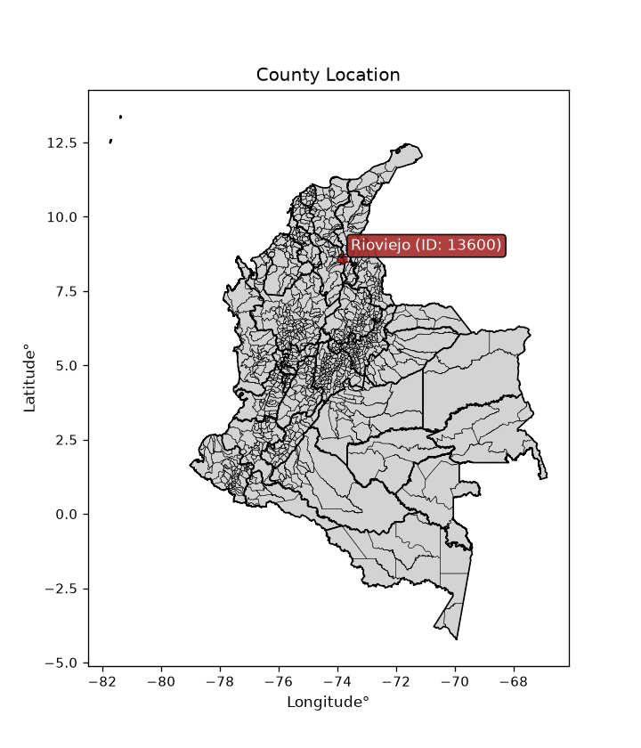
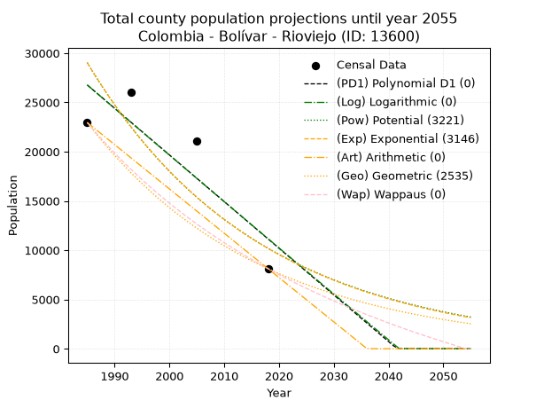
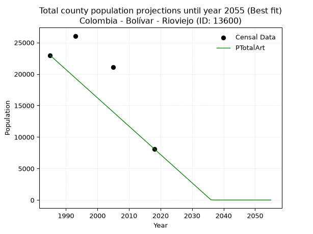
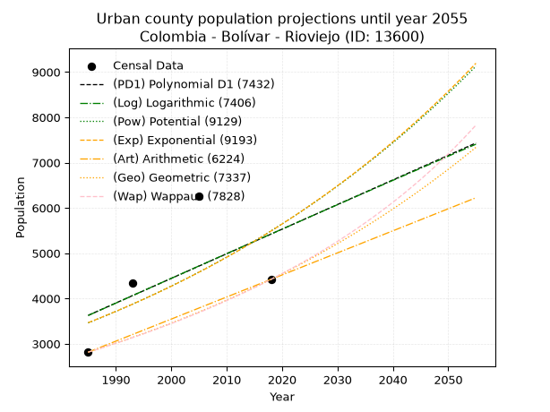
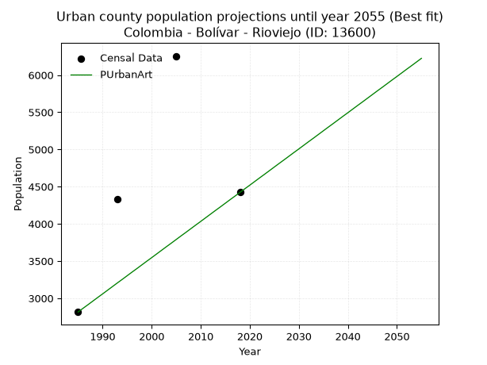
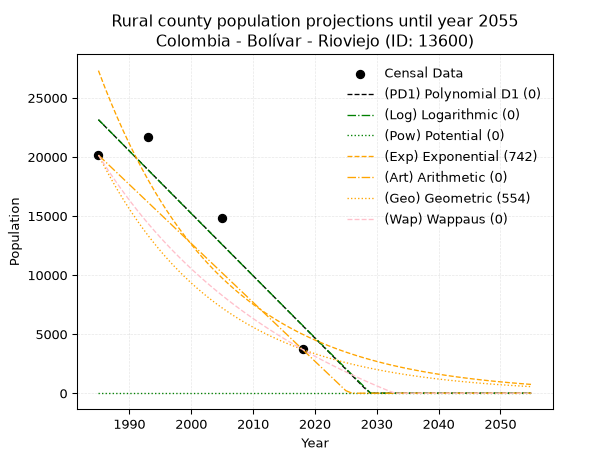
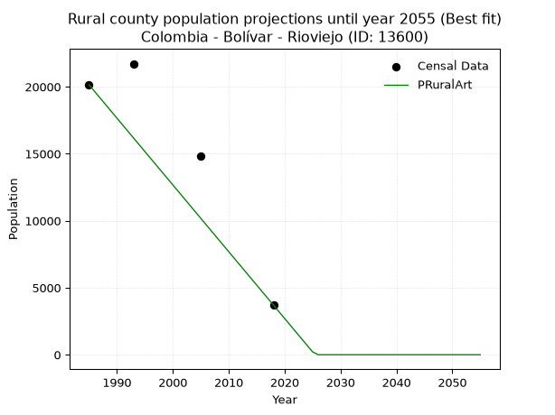

<div align="center">


</div>

# _“Population and Public Services Demand Projections (PPSD) until Year 2050 for Colombia - Bolívar - Rioviejo (ID: 13600)”_
Keywords: `population` `public-service` `projection` `lineal` `polynomial` `logarithmic` `potential` `exponential` `arithmetic` `geometric` `wappaus` `dane` `colombia` `south-america`

PPSD are analytical estimates used by governments and planners to anticipate future changes in population size, age distribution, and the resulting community needs for utilities, healthcare, education, and infrastructure as sizing future water treatment facilities, electrical grids, and road networks based on spatial growth.

<div align="center">

</img>

</div>


> **General running parameters**: • app_version: _v20260806_. • Python version: _3.14.7_. • Pandas version: _3.0.5_. • NumPy version: _2.5.1_. • Creates, save and include plots into reports (create_plot): _False_. • Projection until year: _2050_. • Process polynomial degree 2 and up: _False_. • Process Wappaus: _True_. • Process Wappaus: _True_. • Set negative values to zero: _True_. • Set infinite values to zero: _True_. • Drop dataset notes: _True_. 
<div align="center">

Dynamic map: [:earth_americas:Google](http://maps.google.com/maps?q=8.587949958,-73.8404662) [:earth_americas:OSM](https://www.openstreetmap.org/#map=18/8.587949958/-73.8404662&layers=P) [:earth_americas:Bing](https://www.bing.com/maps?cp=8.587949958~-73.8404662&lvl=18) [:earth_americas:Apple](https://maps.apple.com/frame?center=8.587949958%2C-73.8404662&span=0.003%2C0.006)

</div>


<div align="center">

```geojson
{
  "type": "Feature",
  "geometry": {
    "type": "Point", 
    "coordinates": [-73.8404662, 8.587949958]
  }, 
  "properties": {
    "Name": "Colombia - Bolívar - Rioviejo (ID: 13600)"
  }
}
```

</div>


## 0. Census Data (4 records)

Census data are official statistics collected by a government about the people and housing in a country. They usually include counts of total population, age, sex, race, income, education, and jobs.

📅Global census file: [Population.xlsx](../data/Population.xlsx)

| Source   |   Year |   CountryID | CountryName   |   StateID | StateName   |   CountyID | CountyName   |   PTotal |   PUrban |   PRural |
|:---------|-------:|------------:|:--------------|----------:|:------------|-----------:|:-------------|---------:|---------:|---------:|
| DANE     |   1985 |          57 | Colombia      |        13 | Bolívar     |      13600 | Rioviejo     |    22963 |     2815 |    20148 |
| DANE     |   1993 |          57 | Colombia      |        13 | Bolívar     |      13600 | Rioviejo     |    26053 |     4335 |    21718 |
| DANE     |   2005 |          57 | Colombia      |        13 | Bolívar     |      13600 | Rioviejo     |    21060 |     6255 |    14805 |
| DANE     |   2018 |          57 | Colombia      |        13 | Bolívar     |      13600 | Rioviejo     |     8125 |     4422 |     3703 |

> 🔥Some records could had specific notes about the registered values or the corresponding urban or rural distribution.

## 1. Total

### 1.1. Coefficients and Parameters

* (PD1) Polynomial Deg 1: -473.41027699718137, 966489.1565636122 (lineal)
* (Log) Logarithmic: -946309.5219395759, 7212456.509511307
* (Pow) Potential: -63.44660182877832, 213.69458627260408
* (Exp) Exponential: -0.03174207595631575, 6.711278195204087e+31
* (Art) Arithmetic: Year diff. 2018 - 1985 = 33, Population diff. 8125 - 22963 = -14838, Annual growth = -449.6363636363636
* (Geo) Geometric: Year diff. 2018 - 1985 = 33, Population diff. 8125 - 22963 = -14838, Annual growth % = -0.03099255578176363
* (Wap) Wappaus: i = -2.8926683198427923, Condition values only valid for < 200)

<sub>
Wappaus condition values: ['-0.00', '-2.89', '-5.79', '-8.68', '-11.57', '-14.46', '-17.36', '-20.25', '-23.14', '-26.03', '-28.93', '-31.82', '-34.71', '-37.60', '-40.50', '-43.39', '-46.28', '-49.18', '-52.07', '-54.96', '-57.85', '-60.75', '-63.64', '-66.53', '-69.42', '-72.32', '-75.21', '-78.10', '-80.99', '-83.89', '-86.78', '-89.67', '-92.57', '-95.46', '-98.35', '-101.24', '-104.14', '-107.03', '-109.92', '-112.81', '-115.71', '-118.60', '-121.49', '-124.38', '-127.28', '-130.17', '-133.06', '-135.96', '-138.85', '-141.74', '-144.63', '-147.53', '-150.42', '-153.31', '-156.20', '-159.10', '-161.99', '-164.88', '-167.77', '-170.67', '-173.56', '-176.45', '-179.35', '-182.24', '-185.13', '-188.02']
</sub>


### 1.2. Projected Dataset

|   Year |   CountyID |   PTotalPD1 |   PTotalLog |   PTotalPow |   PTotalExp |   PTotalArt |   PTotalGeo |   PTotalWap |
|-------:|-----------:|------------:|------------:|------------:|------------:|------------:|------------:|------------:|
|   1985 |      13600 |       26770 |       26774 |       29033 |       29025 |       22963 |       22963 |       22963 |
|   1986 |      13600 |       26296 |       26298 |       28120 |       28118 |       22513 |       22251 |       22308 |
|   1987 |      13600 |       25823 |       25821 |       27236 |       27239 |       22064 |       21562 |       21672 |
|   1988 |      13600 |       25350 |       25345 |       26380 |       26388 |       21614 |       20893 |       21053 |
|   1989 |      13600 |       24876 |       24869 |       25552 |       25564 |       21164 |       20246 |       20451 |
|   1990 |      13600 |       24403 |       24394 |       24750 |       24765 |       20715 |       19618 |       19866 |
|   1991 |      13600 |       23929 |       23918 |       23973 |       23991 |       20265 |       19010 |       19296 |
|   1992 |      13600 |       23456 |       23443 |       23221 |       23242 |       19816 |       18421 |       18741 |
|   1993 |      13600 |       22982 |       22968 |       22494 |       22516 |       19366 |       17850 |       18200 |
|   1994 |      13600 |       22509 |       22493 |       21789 |       21812 |       18916 |       17297 |       17673 |
|   1995 |      13600 |       22036 |       22019 |       21107 |       21131 |       18467 |       16761 |       17160 |
|   1996 |      13600 |       21562 |       21545 |       20446 |       20471 |       18017 |       16242 |       16659 |
|   1997 |      13600 |       21089 |       21071 |       19807 |       19831 |       17567 |       15738 |       16171 |
|   1998 |      13600 |       20615 |       20597 |       19188 |       19211 |       17118 |       15250 |       15694 |
|   1999 |      13600 |       20142 |       20123 |       18588 |       18611 |       16668 |       14778 |       15230 |
|   2000 |      13600 |       19669 |       19650 |       18007 |       18030 |       16218 |       14320 |       14776 |
|   2001 |      13600 |       19195 |       19177 |       17445 |       17466 |       15769 |       13876 |       14332 |
|   2002 |      13600 |       18722 |       18704 |       16901 |       16921 |       15319 |       13446 |       13899 |
|   2003 |      13600 |       18248 |       18232 |       16374 |       16392 |       14870 |       13029 |       13476 |
|   2004 |      13600 |       17775 |       17759 |       15863 |       15880 |       14420 |       12625 |       13063 |
|   2005 |      13600 |       17302 |       17287 |       15369 |       15384 |       13970 |       12234 |       12659 |
|   2006 |      13600 |       16828 |       16815 |       14891 |       14903 |       13521 |       11855 |       12264 |
|   2007 |      13600 |       16355 |       16344 |       14427 |       14437 |       13071 |       11487 |       11877 |
|   2008 |      13600 |       15881 |       15872 |       13978 |       13986 |       12621 |       11131 |       11499 |
|   2009 |      13600 |       15408 |       15401 |       13544 |       13549 |       12172 |       10786 |       11129 |
|   2010 |      13600 |       14934 |       14930 |       13123 |       13126 |       11722 |       10452 |       10767 |
|   2011 |      13600 |       14461 |       14460 |       12715 |       12716 |       11272 |       10128 |       10412 |
|   2012 |      13600 |       13988 |       13989 |       12320 |       12319 |       10823 |        9814 |       10065 |
|   2013 |      13600 |       13514 |       13519 |       11938 |       11934 |       10373 |        9510 |        9725 |
|   2014 |      13600 |       13041 |       13049 |       11568 |       11561 |        9924 |        9215 |        9392 |
|   2015 |      13600 |       12567 |       12579 |       11209 |       11200 |        9474 |        8930 |        9066 |
|   2016 |      13600 |       12094 |       12110 |       10862 |       10850 |        9024 |        8653 |        8746 |
|   2017 |      13600 |       11621 |       11640 |       10525 |       10511 |        8575 |        8385 |        8432 |
|   2018 |      13600 |       11147 |       11171 |       10199 |       10182 |        8125 |        8125 |        8125 |
|   2019 |      13600 |       10674 |       10703 |        9884 |        9864 |        7675 |        7873 |        7824 |
|   2020 |      13600 |       10200 |       10234 |        9578 |        9556 |        7226 |        7629 |        7528 |
|   2021 |      13600 |        9727 |        9766 |        9282 |        9258 |        6776 |        7393 |        7238 |
|   2022 |      13600 |        9254 |        9298 |        8995 |        8968 |        6326 |        7164 |        6953 |
|   2023 |      13600 |        8780 |        8830 |        8717 |        8688 |        5877 |        6942 |        6674 |
|   2024 |      13600 |        8307 |        8362 |        8448 |        8417 |        5427 |        6726 |        6400 |
|   2025 |      13600 |        7833 |        7895 |        8188 |        8154 |        4978 |        6518 |        6131 |
|   2026 |      13600 |        7360 |        7427 |        7935 |        7899 |        4528 |        6316 |        5867 |
|   2027 |      13600 |        6887 |        6960 |        7690 |        7652 |        4078 |        6120 |        5608 |
|   2028 |      13600 |        6413 |        6494 |        7454 |        7413 |        3629 |        5931 |        5353 |
|   2029 |      13600 |        5940 |        6027 |        7224 |        7181 |        3179 |        5747 |        5102 |
|   2030 |      13600 |        5466 |        5561 |        7002 |        6957 |        2729 |        5569 |        4857 |
|   2031 |      13600 |        4993 |        5095 |        6786 |        6740 |        2280 |        5396 |        4615 |
|   2032 |      13600 |        4519 |        4629 |        6578 |        6529 |        1830 |        5229 |        4378 |
|   2033 |      13600 |        4046 |        4163 |        6375 |        6325 |        1380 |        5067 |        4144 |
|   2034 |      13600 |        3573 |        3698 |        6180 |        6128 |         931 |        4910 |        3915 |
|   2035 |      13600 |        3099 |        3233 |        5990 |        5936 |         481 |        4758 |        3689 |
|   2036 |      13600 |        2626 |        2768 |        5806 |        5751 |          32 |        4610 |        3467 |
|   2037 |      13600 |        2152 |        2303 |        5628 |        5571 |           0 |        4467 |        3249 |
|   2038 |      13600 |        1679 |        1839 |        5455 |        5397 |           0 |        4329 |        3034 |
|   2039 |      13600 |        1206 |        1375 |        5288 |        5228 |           0 |        4195 |        2823 |
|   2040 |      13600 |         732 |         911 |        5126 |        5065 |           0 |        4065 |        2616 |
|   2041 |      13600 |         259 |         447 |        4969 |        4907 |           0 |        3939 |        2411 |
|   2042 |      13600 |           0 |           0 |        4817 |        4753 |           0 |        3817 |        2210 |
|   2043 |      13600 |           0 |           0 |        4670 |        4605 |           0 |        3698 |        2012 |
|   2044 |      13600 |           0 |           0 |        4527 |        4461 |           0 |        3584 |        1817 |
|   2045 |      13600 |           0 |           0 |        4389 |        4322 |           0 |        3473 |        1625 |
|   2046 |      13600 |           0 |           0 |        4255 |        4187 |           0 |        3365 |        1436 |
|   2047 |      13600 |           0 |           0 |        4125 |        4056 |           0 |        3261 |        1250 |
|   2048 |      13600 |           0 |           0 |        3999 |        3929 |           0 |        3160 |        1067 |
|   2049 |      13600 |           0 |           0 |        3877 |        3806 |           0 |        3062 |         887 |
|   2050 |      13600 |           0 |           0 |        3759 |        3687 |           0 |        2967 |         709 |
<div align="center">

</img>

</div>


### 1.3. Best fit with absolute and relative error (%)

Relative error puts that difference into context by dividing the absolute error by the true value, creating a unitless ratio or percentage that shows the scale of the mistake.

Absolute and relative error

|   Year | Source   |   CountryID | CountryName   |   StateID | StateName   |   CountyID_x | CountyName   |   PTotal |   PUrban |   PRural |   CountyID_y |   PTotalPD1 |   PTotalLog |   PTotalPow |   PTotalExp |   PTotalArt |   PTotalGeo |   PTotalWap |   PTotalPD1AbsError |   PTotalLogAbsError |   PTotalPowAbsError |   PTotalExpAbsError |   PTotalArtAbsError |   PTotalGeoAbsError |   PTotalWapAbsError |   PTotalPD1RelError |   PTotalLogRelError |   PTotalPowRelError |   PTotalExpRelError |   PTotalArtRelError |   PTotalGeoRelError |   PTotalWapRelError |
|-------:|:---------|------------:|:--------------|----------:|:------------|-------------:|:-------------|---------:|---------:|---------:|-------------:|------------:|------------:|------------:|------------:|------------:|------------:|------------:|--------------------:|--------------------:|--------------------:|--------------------:|--------------------:|--------------------:|--------------------:|--------------------:|--------------------:|--------------------:|--------------------:|--------------------:|--------------------:|--------------------:|
|   1985 | DANE     |          57 | Colombia      |        13 | Bolívar     |        13600 | Rioviejo     |    22963 |     2815 |    20148 |        13600 |       26770 |       26774 |       29033 |       29025 |       22963 |       22963 |       22963 |                3807 |                3811 |                6070 |                6062 |                   0 |                   0 |                   0 |             16.5788 |             16.5963 |             26.4338 |             26.399  |              0      |              0      |              0      |
|   1993 | DANE     |          57 | Colombia      |        13 | Bolívar     |        13600 | Rioviejo     |    26053 |     4335 |    21718 |        13600 |       22982 |       22968 |       22494 |       22516 |       19366 |       17850 |       18200 |                3071 |                3085 |                3559 |                3537 |                6687 |                8203 |                7853 |             11.7875 |             11.8412 |             13.6606 |             13.5762 |             25.6669 |             31.4858 |             30.1424 |
|   2005 | DANE     |          57 | Colombia      |        13 | Bolívar     |        13600 | Rioviejo     |    21060 |     6255 |    14805 |        13600 |       17302 |       17287 |       15369 |       15384 |       13970 |       12234 |       12659 |                3758 |                3773 |                5691 |                5676 |                7090 |                8826 |                8401 |             17.8443 |             17.9155 |             27.0228 |             26.9516 |             33.6657 |             41.9088 |             39.8908 |
|   2018 | DANE     |          57 | Colombia      |        13 | Bolívar     |        13600 | Rioviejo     |     8125 |     4422 |     3703 |        13600 |       11147 |       11171 |       10199 |       10182 |        8125 |        8125 |        8125 |                3022 |                3046 |                2074 |                2057 |                   0 |                   0 |                   0 |             37.1938 |             37.4892 |             25.5262 |             25.3169 |              0      |              0      |              0      |

Relative error mean

| Method    |   RelError | Best   |
|:----------|-----------:|:-------|
| PTotalPD1 |    20.8511 |        |
| PTotalLog |    20.9606 |        |
| PTotalPow |    23.1608 |        |
| PTotalExp |    23.0609 |        |
| PTotalArt |    14.8332 | True   |
| PTotalGeo |    18.3487 |        |
| PTotalWap |    17.5083 |        |

💙Best method: _**PTotalArt**_
<div align="center">

</img>

</div>


### 1.4. Fresh water supply demand in liters per capita per day (lpcd)

The fresh water supply demand typically ranges from 100 to 300 liters per capita per day (lpcd) for standard domestic and municipal planning, though absolute survival minimums set by the World Health Organization are as low as 7.5 to 20 liters per day, and total consumption in high-income nations can exceed 400 liters.

> `CZ`: Level in meters above the sea level (masl)<br> `WS`: Fresh water supply demand in liters per capita per day (lpcd or l/h/d)<br> `WSAll`: Zonal fresh water supply demand in liters per second (l/s)<br> `A`: Zonal area in square meters<br> `DP`: Population density (people/hectare or p/ha)

Reference values (RAS Colombia)

|    CZ |   WS |
|------:|-----:|
|  1000 |  120 |
|  2000 |  130 |
| 99999 |  140 |

County shapefile geometry properties and water supply values

|   CountyID |     ATotal |   CZTotal |   WSTotal |
|-----------:|-----------:|----------:|----------:|
|      13600 | 8.4426e+08 |   202.891 |       120 |

Projected values for best method: PTotalArt

|   CountyID |   Year |   PTotalArt |   DPTotal |   WSTotal |   WSTotalAll |
|-----------:|-------:|------------:|----------:|----------:|-------------:|
|      13600 |   1985 |       22963 |      0.27 |       120 |   31.8931    |
|      13600 |   1986 |       22513 |      0.27 |       120 |   31.2681    |
|      13600 |   1987 |       22064 |      0.26 |       120 |   30.6444    |
|      13600 |   1988 |       21614 |      0.26 |       120 |   30.0194    |
|      13600 |   1989 |       21164 |      0.25 |       120 |   29.3944    |
|      13600 |   1990 |       20715 |      0.25 |       120 |   28.7708    |
|      13600 |   1991 |       20265 |      0.24 |       120 |   28.1458    |
|      13600 |   1992 |       19816 |      0.23 |       120 |   27.5222    |
|      13600 |   1993 |       19366 |      0.23 |       120 |   26.8972    |
|      13600 |   1994 |       18916 |      0.22 |       120 |   26.2722    |
|      13600 |   1995 |       18467 |      0.22 |       120 |   25.6486    |
|      13600 |   1996 |       18017 |      0.21 |       120 |   25.0236    |
|      13600 |   1997 |       17567 |      0.21 |       120 |   24.3986    |
|      13600 |   1998 |       17118 |      0.2  |       120 |   23.775     |
|      13600 |   1999 |       16668 |      0.2  |       120 |   23.15      |
|      13600 |   2000 |       16218 |      0.19 |       120 |   22.525     |
|      13600 |   2001 |       15769 |      0.19 |       120 |   21.9014    |
|      13600 |   2002 |       15319 |      0.18 |       120 |   21.2764    |
|      13600 |   2003 |       14870 |      0.18 |       120 |   20.6528    |
|      13600 |   2004 |       14420 |      0.17 |       120 |   20.0278    |
|      13600 |   2005 |       13970 |      0.17 |       120 |   19.4028    |
|      13600 |   2006 |       13521 |      0.16 |       120 |   18.7792    |
|      13600 |   2007 |       13071 |      0.15 |       120 |   18.1542    |
|      13600 |   2008 |       12621 |      0.15 |       120 |   17.5292    |
|      13600 |   2009 |       12172 |      0.14 |       120 |   16.9056    |
|      13600 |   2010 |       11722 |      0.14 |       120 |   16.2806    |
|      13600 |   2011 |       11272 |      0.13 |       120 |   15.6556    |
|      13600 |   2012 |       10823 |      0.13 |       120 |   15.0319    |
|      13600 |   2013 |       10373 |      0.12 |       120 |   14.4069    |
|      13600 |   2014 |        9924 |      0.12 |       120 |   13.7833    |
|      13600 |   2015 |        9474 |      0.11 |       120 |   13.1583    |
|      13600 |   2016 |        9024 |      0.11 |       120 |   12.5333    |
|      13600 |   2017 |        8575 |      0.1  |       120 |   11.9097    |
|      13600 |   2018 |        8125 |      0.1  |       120 |   11.2847    |
|      13600 |   2019 |        7675 |      0.09 |       120 |   10.6597    |
|      13600 |   2020 |        7226 |      0.09 |       120 |   10.0361    |
|      13600 |   2021 |        6776 |      0.08 |       120 |    9.41111   |
|      13600 |   2022 |        6326 |      0.07 |       120 |    8.78611   |
|      13600 |   2023 |        5877 |      0.07 |       120 |    8.1625    |
|      13600 |   2024 |        5427 |      0.06 |       120 |    7.5375    |
|      13600 |   2025 |        4978 |      0.06 |       120 |    6.91389   |
|      13600 |   2026 |        4528 |      0.05 |       120 |    6.28889   |
|      13600 |   2027 |        4078 |      0.05 |       120 |    5.66389   |
|      13600 |   2028 |        3629 |      0.04 |       120 |    5.04028   |
|      13600 |   2029 |        3179 |      0.04 |       120 |    4.41528   |
|      13600 |   2030 |        2729 |      0.03 |       120 |    3.79028   |
|      13600 |   2031 |        2280 |      0.03 |       120 |    3.16667   |
|      13600 |   2032 |        1830 |      0.02 |       120 |    2.54167   |
|      13600 |   2033 |        1380 |      0.02 |       120 |    1.91667   |
|      13600 |   2034 |         931 |      0.01 |       120 |    1.29306   |
|      13600 |   2035 |         481 |      0.01 |       120 |    0.668056  |
|      13600 |   2036 |          32 |      0    |       120 |    0.0444444 |
|      13600 |   2037 |           0 |      0    |       120 |    0         |
|      13600 |   2038 |           0 |      0    |       120 |    0         |
|      13600 |   2039 |           0 |      0    |       120 |    0         |
|      13600 |   2040 |           0 |      0    |       120 |    0         |
|      13600 |   2041 |           0 |      0    |       120 |    0         |
|      13600 |   2042 |           0 |      0    |       120 |    0         |
|      13600 |   2043 |           0 |      0    |       120 |    0         |
|      13600 |   2044 |           0 |      0    |       120 |    0         |
|      13600 |   2045 |           0 |      0    |       120 |    0         |
|      13600 |   2046 |           0 |      0    |       120 |    0         |
|      13600 |   2047 |           0 |      0    |       120 |    0         |
|      13600 |   2048 |           0 |      0    |       120 |    0         |
|      13600 |   2049 |           0 |      0    |       120 |    0         |
|      13600 |   2050 |           0 |      0    |       120 |    0         |

## 2. Urban

### 2.1. Coefficients and Parameters

* (PD1) Polynomial Deg 1: 54.346447209956835, -104249.73103171618 (lineal)
* (Log) Logarithmic: 109146.00551195465, -825162.9125375637
* (Pow) Potential: 27.977762107439254, -88.72463608247735
* (Exp) Exponential: 0.013936031687486371, 3.356463894934042e-09
* (Art) Arithmetic: Year diff. 2018 - 1985 = 33, Population diff. 4422 - 2815 = 1607, Annual growth = 48.696969696969695
* (Geo) Geometric: Year diff. 2018 - 1985 = 33, Population diff. 4422 - 2815 = 1607, Annual growth % = 0.013779830741548427
* (Wap) Wappaus: i = 1.3457778001097056, Condition values only valid for < 200)

<sub>
Wappaus condition values: ['0.00', '1.35', '2.69', '4.04', '5.38', '6.73', '8.07', '9.42', '10.77', '12.11', '13.46', '14.80', '16.15', '17.50', '18.84', '20.19', '21.53', '22.88', '24.22', '25.57', '26.92', '28.26', '29.61', '30.95', '32.30', '33.64', '34.99', '36.34', '37.68', '39.03', '40.37', '41.72', '43.06', '44.41', '45.76', '47.10', '48.45', '49.79', '51.14', '52.49', '53.83', '55.18', '56.52', '57.87', '59.21', '60.56', '61.91', '63.25', '64.60', '65.94', '67.29', '68.63', '69.98', '71.33', '72.67', '74.02', '75.36', '76.71', '78.06', '79.40', '80.75', '82.09', '83.44', '84.78', '86.13', '87.48']
</sub>


### 2.2. Projected Dataset

|   Year |   CountyID |   PUrbanPD1 |   PUrbanLog |   PUrbanPow |   PUrbanExp |   PUrbanArt |   PUrbanGeo |   PUrbanWap |
|-------:|-----------:|------------:|------------:|------------:|------------:|------------:|------------:|------------:|
|   1985 |      13600 |        3628 |        3624 |        3462 |        3466 |        2815 |        2815 |        2815 |
|   1986 |      13600 |        3682 |        3679 |        3511 |        3514 |        2864 |        2854 |        2853 |
|   1987 |      13600 |        3737 |        3733 |        3561 |        3564 |        2912 |        2893 |        2892 |
|   1988 |      13600 |        3791 |        3788 |        3611 |        3614 |        2961 |        2933 |        2931 |
|   1989 |      13600 |        3845 |        3843 |        3663 |        3664 |        3010 |        2973 |        2971 |
|   1990 |      13600 |        3900 |        3898 |        3714 |        3716 |        3058 |        3014 |        3011 |
|   1991 |      13600 |        3954 |        3953 |        3767 |        3768 |        3107 |        3056 |        3052 |
|   1992 |      13600 |        4008 |        4008 |        3820 |        3821 |        3156 |        3098 |        3093 |
|   1993 |      13600 |        4063 |        4063 |        3874 |        3874 |        3205 |        3141 |        3135 |
|   1994 |      13600 |        4117 |        4117 |        3929 |        3929 |        3253 |        3184 |        3178 |
|   1995 |      13600 |        4171 |        4172 |        3985 |        3984 |        3302 |        3228 |        3221 |
|   1996 |      13600 |        4226 |        4227 |        4041 |        4040 |        3351 |        3272 |        3265 |
|   1997 |      13600 |        4280 |        4281 |        4098 |        4096 |        3399 |        3317 |        3310 |
|   1998 |      13600 |        4334 |        4336 |        4156 |        4154 |        3448 |        3363 |        3355 |
|   1999 |      13600 |        4389 |        4391 |        4214 |        4212 |        3497 |        3409 |        3401 |
|   2000 |      13600 |        4443 |        4445 |        4274 |        4271 |        3545 |        3456 |        3447 |
|   2001 |      13600 |        4498 |        4500 |        4334 |        4331 |        3594 |        3504 |        3494 |
|   2002 |      13600 |        4552 |        4554 |        4395 |        4392 |        3643 |        3552 |        3542 |
|   2003 |      13600 |        4606 |        4609 |        4457 |        4454 |        3692 |        3601 |        3591 |
|   2004 |      13600 |        4661 |        4663 |        4519 |        4516 |        3740 |        3651 |        3640 |
|   2005 |      13600 |        4715 |        4718 |        4583 |        4580 |        3789 |        3701 |        3690 |
|   2006 |      13600 |        4769 |        4772 |        4647 |        4644 |        3838 |        3752 |        3741 |
|   2007 |      13600 |        4824 |        4827 |        4712 |        4709 |        3886 |        3804 |        3793 |
|   2008 |      13600 |        4878 |        4881 |        4779 |        4775 |        3935 |        3856 |        3846 |
|   2009 |      13600 |        4932 |        4935 |        4846 |        4842 |        3984 |        3910 |        3899 |
|   2010 |      13600 |        4987 |        4990 |        4914 |        4910 |        4032 |        3963 |        3954 |
|   2011 |      13600 |        5041 |        5044 |        4982 |        4979 |        4081 |        4018 |        4009 |
|   2012 |      13600 |        5095 |        5098 |        5052 |        5049 |        4130 |        4073 |        4065 |
|   2013 |      13600 |        5150 |        5152 |        5123 |        5120 |        4179 |        4130 |        4122 |
|   2014 |      13600 |        5204 |        5207 |        5195 |        5192 |        4227 |        4186 |        4180 |
|   2015 |      13600 |        5258 |        5261 |        5267 |        5264 |        4276 |        4244 |        4239 |
|   2016 |      13600 |        5313 |        5315 |        5341 |        5338 |        4325 |        4303 |        4299 |
|   2017 |      13600 |        5367 |        5369 |        5416 |        5413 |        4373 |        4362 |        4360 |
|   2018 |      13600 |        5421 |        5423 |        5491 |        5489 |        4422 |        4422 |        4422 |
|   2019 |      13600 |        5476 |        5477 |        5568 |        5566 |        4471 |        4483 |        4485 |
|   2020 |      13600 |        5530 |        5531 |        5645 |        5644 |        4519 |        4545 |        4549 |
|   2021 |      13600 |        5584 |        5585 |        5724 |        5724 |        4568 |        4607 |        4615 |
|   2022 |      13600 |        5639 |        5639 |        5804 |        5804 |        4617 |        4671 |        4681 |
|   2023 |      13600 |        5693 |        5693 |        5885 |        5885 |        4665 |        4735 |        4749 |
|   2024 |      13600 |        5747 |        5747 |        5967 |        5968 |        4714 |        4800 |        4818 |
|   2025 |      13600 |        5802 |        5801 |        6050 |        6052 |        4763 |        4867 |        4888 |
|   2026 |      13600 |        5856 |        5855 |        6134 |        6137 |        4812 |        4934 |        4960 |
|   2027 |      13600 |        5911 |        5909 |        6219 |        6223 |        4860 |        5002 |        5033 |
|   2028 |      13600 |        5965 |        5963 |        6306 |        6310 |        4909 |        5071 |        5107 |
|   2029 |      13600 |        6019 |        6016 |        6393 |        6399 |        4958 |        5140 |        5183 |
|   2030 |      13600 |        6074 |        6070 |        6482 |        6488 |        5006 |        5211 |        5260 |
|   2031 |      13600 |        6128 |        6124 |        6572 |        6579 |        5055 |        5283 |        5339 |
|   2032 |      13600 |        6182 |        6178 |        6663 |        6672 |        5104 |        5356 |        5419 |
|   2033 |      13600 |        6237 |        6231 |        6755 |        6765 |        5152 |        5430 |        5501 |
|   2034 |      13600 |        6291 |        6285 |        6849 |        6860 |        5201 |        5504 |        5584 |
|   2035 |      13600 |        6345 |        6339 |        6944 |        6957 |        5250 |        5580 |        5670 |
|   2036 |      13600 |        6400 |        6392 |        7040 |        7054 |        5299 |        5657 |        5757 |
|   2037 |      13600 |        6454 |        6446 |        7137 |        7153 |        5347 |        5735 |        5845 |
|   2038 |      13600 |        6508 |        6500 |        7236 |        7254 |        5396 |        5814 |        5936 |
|   2039 |      13600 |        6563 |        6553 |        7336 |        7355 |        5445 |        5894 |        6028 |
|   2040 |      13600 |        6617 |        6607 |        7437 |        7459 |        5493 |        5976 |        6123 |
|   2041 |      13600 |        6671 |        6660 |        7540 |        7563 |        5542 |        6058 |        6219 |
|   2042 |      13600 |        6726 |        6714 |        7644 |        7669 |        5591 |        6141 |        6318 |
|   2043 |      13600 |        6780 |        6767 |        7749 |        7777 |        5639 |        6226 |        6419 |
|   2044 |      13600 |        6834 |        6820 |        7856 |        7886 |        5688 |        6312 |        6522 |
|   2045 |      13600 |        6889 |        6874 |        7964 |        7997 |        5737 |        6399 |        6627 |
|   2046 |      13600 |        6943 |        6927 |        8074 |        8109 |        5786 |        6487 |        6735 |
|   2047 |      13600 |        6997 |        6980 |        8185 |        8223 |        5834 |        6576 |        6845 |
|   2048 |      13600 |        7052 |        7034 |        8298 |        8338 |        5883 |        6667 |        6958 |
|   2049 |      13600 |        7106 |        7087 |        8412 |        8455 |        5932 |        6759 |        7073 |
|   2050 |      13600 |        7160 |        7140 |        8528 |        8574 |        5980 |        6852 |        7192 |
<div align="center">

</img>

</div>


### 2.3. Best fit with absolute and relative error (%)

Relative error puts that difference into context by dividing the absolute error by the true value, creating a unitless ratio or percentage that shows the scale of the mistake.

Absolute and relative error

|   Year | Source   |   CountryID | CountryName   |   StateID | StateName   |   CountyID_x | CountyName   |   PTotal |   PUrban |   PRural |   CountyID_y |   PUrbanPD1 |   PUrbanLog |   PUrbanPow |   PUrbanExp |   PUrbanArt |   PUrbanGeo |   PUrbanWap |   PUrbanPD1AbsError |   PUrbanLogAbsError |   PUrbanPowAbsError |   PUrbanExpAbsError |   PUrbanArtAbsError |   PUrbanGeoAbsError |   PUrbanWapAbsError |   PUrbanPD1RelError |   PUrbanLogRelError |   PUrbanPowRelError |   PUrbanExpRelError |   PUrbanArtRelError |   PUrbanGeoRelError |   PUrbanWapRelError |
|-------:|:---------|------------:|:--------------|----------:|:------------|-------------:|:-------------|---------:|---------:|---------:|-------------:|------------:|------------:|------------:|------------:|------------:|------------:|------------:|--------------------:|--------------------:|--------------------:|--------------------:|--------------------:|--------------------:|--------------------:|--------------------:|--------------------:|--------------------:|--------------------:|--------------------:|--------------------:|--------------------:|
|   1985 | DANE     |          57 | Colombia      |        13 | Bolívar     |        13600 | Rioviejo     |    22963 |     2815 |    20148 |        13600 |        3628 |        3624 |        3462 |        3466 |        2815 |        2815 |        2815 |                 813 |                 809 |                 647 |                 651 |                   0 |                   0 |                   0 |            28.881   |            28.7389  |             22.984  |             23.1261 |              0      |              0      |              0      |
|   1993 | DANE     |          57 | Colombia      |        13 | Bolívar     |        13600 | Rioviejo     |    26053 |     4335 |    21718 |        13600 |        4063 |        4063 |        3874 |        3874 |        3205 |        3141 |        3135 |                 272 |                 272 |                 461 |                 461 |                1130 |                1194 |                1200 |             6.27451 |             6.27451 |             10.6344 |             10.6344 |             26.0669 |             27.5433 |             27.6817 |
|   2005 | DANE     |          57 | Colombia      |        13 | Bolívar     |        13600 | Rioviejo     |    21060 |     6255 |    14805 |        13600 |        4715 |        4718 |        4583 |        4580 |        3789 |        3701 |        3690 |                1540 |                1537 |                1672 |                1675 |                2466 |                2554 |                2565 |            24.6203  |            24.5723  |             26.7306 |             26.7786 |             39.4245 |             40.8313 |             41.0072 |
|   2018 | DANE     |          57 | Colombia      |        13 | Bolívar     |        13600 | Rioviejo     |     8125 |     4422 |     3703 |        13600 |        5421 |        5423 |        5491 |        5489 |        4422 |        4422 |        4422 |                 999 |                1001 |                1069 |                1067 |                   0 |                   0 |                   0 |            22.5916  |            22.6368  |             24.1746 |             24.1294 |              0      |              0      |              0      |

Relative error mean

| Method    |   RelError | Best   |
|:----------|-----------:|:-------|
| PUrbanPD1 |    20.5918 |        |
| PUrbanLog |    20.5556 |        |
| PUrbanPow |    21.1309 |        |
| PUrbanExp |    21.1671 |        |
| PUrbanArt |    16.3728 | True   |
| PUrbanGeo |    17.0936 |        |
| PUrbanWap |    17.1722 |        |

💙Best method: _**PUrbanArt**_
<div align="center">

</img>

</div>


### 2.4. Fresh water supply demand in liters per capita per day (lpcd)

The fresh water supply demand typically ranges from 100 to 300 liters per capita per day (lpcd) for standard domestic and municipal planning, though absolute survival minimums set by the World Health Organization are as low as 7.5 to 20 liters per day, and total consumption in high-income nations can exceed 400 liters.

> `CZ`: Level in meters above the sea level (masl)<br> `WS`: Fresh water supply demand in liters per capita per day (lpcd or l/h/d)<br> `WSAll`: Zonal fresh water supply demand in liters per second (l/s)<br> `A`: Zonal area in square meters<br> `DP`: Population density (people/hectare or p/ha)

Reference values (RAS Colombia)

|    CZ |   WS |
|------:|-----:|
|  1000 |  120 |
|  2000 |  130 |
| 99999 |  140 |

County shapefile geometry properties and water supply values

|   CountyID |   AUrban |   CZUrban |   WSUrban |
|-----------:|---------:|----------:|----------:|
|      13600 |   699744 |   36.3507 |       120 |

Projected values for best method: PUrbanArt

|   CountyID |   Year |   PUrbanArt |   DPUrban |   WSUrban |   WSUrbanAll |
|-----------:|-------:|------------:|----------:|----------:|-------------:|
|      13600 |   1985 |        2815 |     40.23 |       120 |      3.90972 |
|      13600 |   1986 |        2864 |     40.93 |       120 |      3.97778 |
|      13600 |   1987 |        2912 |     41.62 |       120 |      4.04444 |
|      13600 |   1988 |        2961 |     42.32 |       120 |      4.1125  |
|      13600 |   1989 |        3010 |     43.02 |       120 |      4.18056 |
|      13600 |   1990 |        3058 |     43.7  |       120 |      4.24722 |
|      13600 |   1991 |        3107 |     44.4  |       120 |      4.31528 |
|      13600 |   1992 |        3156 |     45.1  |       120 |      4.38333 |
|      13600 |   1993 |        3205 |     45.8  |       120 |      4.45139 |
|      13600 |   1994 |        3253 |     46.49 |       120 |      4.51806 |
|      13600 |   1995 |        3302 |     47.19 |       120 |      4.58611 |
|      13600 |   1996 |        3351 |     47.89 |       120 |      4.65417 |
|      13600 |   1997 |        3399 |     48.57 |       120 |      4.72083 |
|      13600 |   1998 |        3448 |     49.28 |       120 |      4.78889 |
|      13600 |   1999 |        3497 |     49.98 |       120 |      4.85694 |
|      13600 |   2000 |        3545 |     50.66 |       120 |      4.92361 |
|      13600 |   2001 |        3594 |     51.36 |       120 |      4.99167 |
|      13600 |   2002 |        3643 |     52.06 |       120 |      5.05972 |
|      13600 |   2003 |        3692 |     52.76 |       120 |      5.12778 |
|      13600 |   2004 |        3740 |     53.45 |       120 |      5.19444 |
|      13600 |   2005 |        3789 |     54.15 |       120 |      5.2625  |
|      13600 |   2006 |        3838 |     54.85 |       120 |      5.33056 |
|      13600 |   2007 |        3886 |     55.53 |       120 |      5.39722 |
|      13600 |   2008 |        3935 |     56.23 |       120 |      5.46528 |
|      13600 |   2009 |        3984 |     56.94 |       120 |      5.53333 |
|      13600 |   2010 |        4032 |     57.62 |       120 |      5.6     |
|      13600 |   2011 |        4081 |     58.32 |       120 |      5.66806 |
|      13600 |   2012 |        4130 |     59.02 |       120 |      5.73611 |
|      13600 |   2013 |        4179 |     59.72 |       120 |      5.80417 |
|      13600 |   2014 |        4227 |     60.41 |       120 |      5.87083 |
|      13600 |   2015 |        4276 |     61.11 |       120 |      5.93889 |
|      13600 |   2016 |        4325 |     61.81 |       120 |      6.00694 |
|      13600 |   2017 |        4373 |     62.49 |       120 |      6.07361 |
|      13600 |   2018 |        4422 |     63.19 |       120 |      6.14167 |
|      13600 |   2019 |        4471 |     63.89 |       120 |      6.20972 |
|      13600 |   2020 |        4519 |     64.58 |       120 |      6.27639 |
|      13600 |   2021 |        4568 |     65.28 |       120 |      6.34444 |
|      13600 |   2022 |        4617 |     65.98 |       120 |      6.4125  |
|      13600 |   2023 |        4665 |     66.67 |       120 |      6.47917 |
|      13600 |   2024 |        4714 |     67.37 |       120 |      6.54722 |
|      13600 |   2025 |        4763 |     68.07 |       120 |      6.61528 |
|      13600 |   2026 |        4812 |     68.77 |       120 |      6.68333 |
|      13600 |   2027 |        4860 |     69.45 |       120 |      6.75    |
|      13600 |   2028 |        4909 |     70.15 |       120 |      6.81806 |
|      13600 |   2029 |        4958 |     70.85 |       120 |      6.88611 |
|      13600 |   2030 |        5006 |     71.54 |       120 |      6.95278 |
|      13600 |   2031 |        5055 |     72.24 |       120 |      7.02083 |
|      13600 |   2032 |        5104 |     72.94 |       120 |      7.08889 |
|      13600 |   2033 |        5152 |     73.63 |       120 |      7.15556 |
|      13600 |   2034 |        5201 |     74.33 |       120 |      7.22361 |
|      13600 |   2035 |        5250 |     75.03 |       120 |      7.29167 |
|      13600 |   2036 |        5299 |     75.73 |       120 |      7.35972 |
|      13600 |   2037 |        5347 |     76.41 |       120 |      7.42639 |
|      13600 |   2038 |        5396 |     77.11 |       120 |      7.49444 |
|      13600 |   2039 |        5445 |     77.81 |       120 |      7.5625  |
|      13600 |   2040 |        5493 |     78.5  |       120 |      7.62917 |
|      13600 |   2041 |        5542 |     79.2  |       120 |      7.69722 |
|      13600 |   2042 |        5591 |     79.9  |       120 |      7.76528 |
|      13600 |   2043 |        5639 |     80.59 |       120 |      7.83194 |
|      13600 |   2044 |        5688 |     81.29 |       120 |      7.9     |
|      13600 |   2045 |        5737 |     81.99 |       120 |      7.96806 |
|      13600 |   2046 |        5786 |     82.69 |       120 |      8.03611 |
|      13600 |   2047 |        5834 |     83.37 |       120 |      8.10278 |
|      13600 |   2048 |        5883 |     84.07 |       120 |      8.17083 |
|      13600 |   2049 |        5932 |     84.77 |       120 |      8.23889 |
|      13600 |   2050 |        5980 |     85.46 |       120 |      8.30556 |

## 3. Rural

### 3.1. Coefficients and Parameters

* (PD1) Polynomial Deg 1: -527.7567242071383, 1070738.8875953287 (lineal)
* (Log) Logarithmic: -1055455.5274515303, 8037619.4220488705
* (Pow) Potential: -102.97916021649476, 344.03702099581756
* (Exp) Exponential: -0.051506221950333046, 6.891783787889593e+48
* (Art) Arithmetic: Year diff. 2018 - 1985 = 33, Population diff. 3703 - 20148 = -16445, Annual growth = -498.3333333333333
* (Geo) Geometric: Year diff. 2018 - 1985 = 33, Population diff. 3703 - 20148 = -16445, Annual growth % = -0.05003693445184276
* (Wap) Wappaus: i = -4.178720668595307, Condition values only valid for < 200)

<sub>
Wappaus condition values: ['-0.00', '-4.18', '-8.36', '-12.54', '-16.71', '-20.89', '-25.07', '-29.25', '-33.43', '-37.61', '-41.79', '-45.97', '-50.14', '-54.32', '-58.50', '-62.68', '-66.86', '-71.04', '-75.22', '-79.40', '-83.57', '-87.75', '-91.93', '-96.11', '-100.29', '-104.47', '-108.65', '-112.83', '-117.00', '-121.18', '-125.36', '-129.54', '-133.72', '-137.90', '-142.08', '-146.26', '-150.43', '-154.61', '-158.79', '-162.97', '-167.15', '-171.33', '-175.51', '-179.68', '-183.86', '-188.04', '-192.22', '-196.40', '-200.58', '-204.76', '-208.94', '-213.11', '-217.29', '-221.47', '-225.65', '-229.83', '-234.01', '-238.19', '-242.37', '-246.54', '-250.72', '-254.90', '-259.08', '-263.26', '-267.44', '-271.62']
</sub>


### 3.2. Projected Dataset

|   Year |   CountyID |   PRuralPD1 |   PRuralLog |   PRuralPow |   PRuralExp |   PRuralArt |   PRuralGeo |   PRuralWap |
|-------:|-----------:|------------:|------------:|------------:|------------:|------------:|------------:|------------:|
|   1985 |      13600 |       23142 |       23151 |           0 |       27298 |       20148 |       20148 |       20148 |
|   1986 |      13600 |       22614 |       22619 |           0 |       25927 |       19650 |       19140 |       19323 |
|   1987 |      13600 |       22086 |       22088 |           0 |       24626 |       19151 |       18182 |       18532 |
|   1988 |      13600 |       21559 |       21557 |           0 |       23390 |       18653 |       17272 |       17771 |
|   1989 |      13600 |       21031 |       21026 |           0 |       22215 |       18155 |       16408 |       17040 |
|   1990 |      13600 |       20503 |       20495 |           0 |       21100 |       17656 |       15587 |       16337 |
|   1991 |      13600 |       19975 |       19965 |           0 |       20041 |       17158 |       14807 |       15659 |
|   1992 |      13600 |       19447 |       19435 |           0 |       19035 |       16660 |       14066 |       15006 |
|   1993 |      13600 |       18920 |       18905 |           0 |       18079 |       16161 |       13362 |       14377 |
|   1994 |      13600 |       18392 |       18376 |           0 |       17172 |       15663 |       12694 |       13770 |
|   1995 |      13600 |       17864 |       17847 |           0 |       16309 |       15165 |       12059 |       13184 |
|   1996 |      13600 |       17336 |       17318 |           0 |       15491 |       14666 |       11455 |       12618 |
|   1997 |      13600 |       16809 |       16789 |           0 |       14713 |       14168 |       10882 |       12070 |
|   1998 |      13600 |       16281 |       16261 |           0 |       13974 |       13670 |       10338 |       11541 |
|   1999 |      13600 |       15753 |       15733 |           0 |       13273 |       13171 |        9820 |       11029 |
|   2000 |      13600 |       15225 |       15205 |           0 |       12607 |       12673 |        9329 |       10533 |
|   2001 |      13600 |       14698 |       14677 |           0 |       11974 |       12175 |        8862 |       10052 |
|   2002 |      13600 |       14170 |       14150 |           0 |       11373 |       11676 |        8419 |        9587 |
|   2003 |      13600 |       13642 |       13623 |           0 |       10802 |       11178 |        7997 |        9135 |
|   2004 |      13600 |       13114 |       13096 |           0 |       10259 |       10680 |        7597 |        8697 |
|   2005 |      13600 |       12587 |       12570 |           0 |        9744 |       10181 |        7217 |        8272 |
|   2006 |      13600 |       12059 |       12043 |           0 |        9255 |        9683 |        6856 |        7859 |
|   2007 |      13600 |       11531 |       11517 |           0 |        8791 |        9185 |        6513 |        7458 |
|   2008 |      13600 |       11003 |       10992 |           0 |        8349 |        8686 |        6187 |        7069 |
|   2009 |      13600 |       10476 |       10466 |           0 |        7930 |        8188 |        5878 |        6690 |
|   2010 |      13600 |        9948 |        9941 |           0 |        7532 |        7690 |        5583 |        6322 |
|   2011 |      13600 |        9420 |        9416 |           0 |        7154 |        7191 |        5304 |        5963 |
|   2012 |      13600 |        8892 |        8891 |           0 |        6795 |        6693 |        5039 |        5615 |
|   2013 |      13600 |        8365 |        8367 |           0 |        6454 |        6195 |        4787 |        5275 |
|   2014 |      13600 |        7837 |        7842 |           0 |        6130 |        5696 |        4547 |        4944 |
|   2015 |      13600 |        7309 |        7319 |           0 |        5822 |        5198 |        4320 |        4622 |
|   2016 |      13600 |        6781 |        6795 |           0 |        5530 |        4700 |        4103 |        4308 |
|   2017 |      13600 |        6254 |        6271 |           0 |        5252 |        4201 |        3898 |        4002 |
|   2018 |      13600 |        5726 |        5748 |           0 |        4988 |        3703 |        3703 |        3703 |
|   2019 |      13600 |        5198 |        5225 |           0 |        4738 |        3205 |        3518 |        3412 |
|   2020 |      13600 |        4670 |        4703 |           0 |        4500 |        2706 |        3342 |        3127 |
|   2021 |      13600 |        4143 |        4180 |           0 |        4274 |        2208 |        3174 |        2850 |
|   2022 |      13600 |        3615 |        3658 |           0 |        4060 |        1710 |        3016 |        2579 |
|   2023 |      13600 |        3087 |        3136 |           0 |        3856 |        1211 |        2865 |        2314 |
|   2024 |      13600 |        2559 |        2615 |           0 |        3662 |         713 |        2721 |        2055 |
|   2025 |      13600 |        2032 |        2093 |           0 |        3478 |         215 |        2585 |        1803 |
|   2026 |      13600 |        1504 |        1572 |           0 |        3304 |           0 |        2456 |        1556 |
|   2027 |      13600 |         976 |        1052 |           0 |        3138 |           0 |        2333 |        1314 |
|   2028 |      13600 |         448 |         531 |           0 |        2980 |           0 |        2216 |        1078 |
|   2029 |      13600 |           0 |          11 |           0 |        2831 |           0 |        2105 |         847 |
|   2030 |      13600 |           0 |           0 |           0 |        2689 |           0 |        2000 |         621 |
|   2031 |      13600 |           0 |           0 |           0 |        2554 |           0 |        1900 |         400 |
|   2032 |      13600 |           0 |           0 |           0 |        2425 |           0 |        1805 |         183 |
|   2033 |      13600 |           0 |           0 |           0 |        2304 |           0 |        1715 |           0 |
|   2034 |      13600 |           0 |           0 |           0 |        2188 |           0 |        1629 |           0 |
|   2035 |      13600 |           0 |           0 |           0 |        2078 |           0 |        1547 |           0 |
|   2036 |      13600 |           0 |           0 |           0 |        1974 |           0 |        1470 |           0 |
|   2037 |      13600 |           0 |           0 |           0 |        1875 |           0 |        1396 |           0 |
|   2038 |      13600 |           0 |           0 |           0 |        1781 |           0 |        1326 |           0 |
|   2039 |      13600 |           0 |           0 |           0 |        1691 |           0 |        1260 |           0 |
|   2040 |      13600 |           0 |           0 |           0 |        1606 |           0 |        1197 |           0 |
|   2041 |      13600 |           0 |           0 |           0 |        1526 |           0 |        1137 |           0 |
|   2042 |      13600 |           0 |           0 |           0 |        1449 |           0 |        1080 |           0 |
|   2043 |      13600 |           0 |           0 |           0 |        1376 |           0 |        1026 |           0 |
|   2044 |      13600 |           0 |           0 |           0 |        1307 |           0 |         975 |           0 |
|   2045 |      13600 |           0 |           0 |           0 |        1242 |           0 |         926 |           0 |
|   2046 |      13600 |           0 |           0 |           0 |        1179 |           0 |         880 |           0 |
|   2047 |      13600 |           0 |           0 |           0 |        1120 |           0 |         836 |           0 |
|   2048 |      13600 |           0 |           0 |           0 |        1064 |           0 |         794 |           0 |
|   2049 |      13600 |           0 |           0 |           0 |        1010 |           0 |         754 |           0 |
|   2050 |      13600 |           0 |           0 |           0 |         960 |           0 |         716 |           0 |
<div align="center">

</img>

</div>


### 3.3. Best fit with absolute and relative error (%)

Relative error puts that difference into context by dividing the absolute error by the true value, creating a unitless ratio or percentage that shows the scale of the mistake.

Absolute and relative error

|   Year | Source   |   CountryID | CountryName   |   StateID | StateName   |   CountyID_x | CountyName   |   PTotal |   PUrban |   PRural |   CountyID_y |   PRuralPD1 |   PRuralLog |   PRuralPow |   PRuralExp |   PRuralArt |   PRuralGeo |   PRuralWap |   PRuralPD1AbsError |   PRuralLogAbsError |   PRuralPowAbsError |   PRuralExpAbsError |   PRuralArtAbsError |   PRuralGeoAbsError |   PRuralWapAbsError |   PRuralPD1RelError |   PRuralLogRelError |   PRuralPowRelError |   PRuralExpRelError |   PRuralArtRelError |   PRuralGeoRelError |   PRuralWapRelError |
|-------:|:---------|------------:|:--------------|----------:|:------------|-------------:|:-------------|---------:|---------:|---------:|-------------:|------------:|------------:|------------:|------------:|------------:|------------:|------------:|--------------------:|--------------------:|--------------------:|--------------------:|--------------------:|--------------------:|--------------------:|--------------------:|--------------------:|--------------------:|--------------------:|--------------------:|--------------------:|--------------------:|
|   1985 | DANE     |          57 | Colombia      |        13 | Bolívar     |        13600 | Rioviejo     |    22963 |     2815 |    20148 |        13600 |       23142 |       23151 |           0 |       27298 |       20148 |       20148 |       20148 |                2994 |                3003 |               20148 |                7150 |                   0 |                   0 |                   0 |             14.86   |             14.9047 |                 100 |             35.4874 |              0      |               0     |              0      |
|   1993 | DANE     |          57 | Colombia      |        13 | Bolívar     |        13600 | Rioviejo     |    26053 |     4335 |    21718 |        13600 |       18920 |       18905 |           0 |       18079 |       16161 |       13362 |       14377 |                2798 |                2813 |               21718 |                3639 |                5557 |                8356 |                7341 |             12.8833 |             12.9524 |                 100 |             16.7557 |             25.5871 |              38.475 |             33.8015 |
|   2005 | DANE     |          57 | Colombia      |        13 | Bolívar     |        13600 | Rioviejo     |    21060 |     6255 |    14805 |        13600 |       12587 |       12570 |           0 |        9744 |       10181 |        7217 |        8272 |                2218 |                2235 |               14805 |                5061 |                4624 |                7588 |                6533 |             14.9814 |             15.0963 |                 100 |             34.1844 |             31.2327 |              51.253 |             44.127  |
|   2018 | DANE     |          57 | Colombia      |        13 | Bolívar     |        13600 | Rioviejo     |     8125 |     4422 |     3703 |        13600 |        5726 |        5748 |           0 |        4988 |        3703 |        3703 |        3703 |                2023 |                2045 |                3703 |                1285 |                   0 |                   0 |                   0 |             54.6314 |             55.2255 |                 100 |             34.7016 |              0      |               0     |              0      |

Relative error mean

| Method    |   RelError | Best   |
|:----------|-----------:|:-------|
| PRuralPD1 |    24.339  |        |
| PRuralLog |    24.5447 |        |
| PRuralPow |   100      |        |
| PRuralExp |    30.2823 |        |
| PRuralArt |    14.2049 | True   |
| PRuralGeo |    22.432  |        |
| PRuralWap |    19.4821 |        |

💙Best method: _**PRuralArt**_
<div align="center">

</img>

</div>


### 3.4. Fresh water supply demand in liters per capita per day (lpcd)

The fresh water supply demand typically ranges from 100 to 300 liters per capita per day (lpcd) for standard domestic and municipal planning, though absolute survival minimums set by the World Health Organization are as low as 7.5 to 20 liters per day, and total consumption in high-income nations can exceed 400 liters.

> `CZ`: Level in meters above the sea level (masl)<br> `WS`: Fresh water supply demand in liters per capita per day (lpcd or l/h/d)<br> `WSAll`: Zonal fresh water supply demand in liters per second (l/s)<br> `A`: Zonal area in square meters<br> `DP`: Population density (people/hectare or p/ha)

Reference values (RAS Colombia)

|    CZ |   WS |
|------:|-----:|
|  1000 |  120 |
|  2000 |  130 |
| 99999 |  140 |

County shapefile geometry properties and water supply values

|   CountyID |     ARural |   CZRural |   WSRural |
|-----------:|-----------:|----------:|----------:|
|      13600 | 8.4356e+08 |   203.041 |       120 |

Projected values for best method: PRuralArt

|   CountyID |   Year |   PRuralArt |   DPRural |   WSRural |   WSRuralAll |
|-----------:|-------:|------------:|----------:|----------:|-------------:|
|      13600 |   1985 |       20148 |      0.24 |       120 |    27.9833   |
|      13600 |   1986 |       19650 |      0.23 |       120 |    27.2917   |
|      13600 |   1987 |       19151 |      0.23 |       120 |    26.5986   |
|      13600 |   1988 |       18653 |      0.22 |       120 |    25.9069   |
|      13600 |   1989 |       18155 |      0.22 |       120 |    25.2153   |
|      13600 |   1990 |       17656 |      0.21 |       120 |    24.5222   |
|      13600 |   1991 |       17158 |      0.2  |       120 |    23.8306   |
|      13600 |   1992 |       16660 |      0.2  |       120 |    23.1389   |
|      13600 |   1993 |       16161 |      0.19 |       120 |    22.4458   |
|      13600 |   1994 |       15663 |      0.19 |       120 |    21.7542   |
|      13600 |   1995 |       15165 |      0.18 |       120 |    21.0625   |
|      13600 |   1996 |       14666 |      0.17 |       120 |    20.3694   |
|      13600 |   1997 |       14168 |      0.17 |       120 |    19.6778   |
|      13600 |   1998 |       13670 |      0.16 |       120 |    18.9861   |
|      13600 |   1999 |       13171 |      0.16 |       120 |    18.2931   |
|      13600 |   2000 |       12673 |      0.15 |       120 |    17.6014   |
|      13600 |   2001 |       12175 |      0.14 |       120 |    16.9097   |
|      13600 |   2002 |       11676 |      0.14 |       120 |    16.2167   |
|      13600 |   2003 |       11178 |      0.13 |       120 |    15.525    |
|      13600 |   2004 |       10680 |      0.13 |       120 |    14.8333   |
|      13600 |   2005 |       10181 |      0.12 |       120 |    14.1403   |
|      13600 |   2006 |        9683 |      0.11 |       120 |    13.4486   |
|      13600 |   2007 |        9185 |      0.11 |       120 |    12.7569   |
|      13600 |   2008 |        8686 |      0.1  |       120 |    12.0639   |
|      13600 |   2009 |        8188 |      0.1  |       120 |    11.3722   |
|      13600 |   2010 |        7690 |      0.09 |       120 |    10.6806   |
|      13600 |   2011 |        7191 |      0.09 |       120 |     9.9875   |
|      13600 |   2012 |        6693 |      0.08 |       120 |     9.29583  |
|      13600 |   2013 |        6195 |      0.07 |       120 |     8.60417  |
|      13600 |   2014 |        5696 |      0.07 |       120 |     7.91111  |
|      13600 |   2015 |        5198 |      0.06 |       120 |     7.21944  |
|      13600 |   2016 |        4700 |      0.06 |       120 |     6.52778  |
|      13600 |   2017 |        4201 |      0.05 |       120 |     5.83472  |
|      13600 |   2018 |        3703 |      0.04 |       120 |     5.14306  |
|      13600 |   2019 |        3205 |      0.04 |       120 |     4.45139  |
|      13600 |   2020 |        2706 |      0.03 |       120 |     3.75833  |
|      13600 |   2021 |        2208 |      0.03 |       120 |     3.06667  |
|      13600 |   2022 |        1710 |      0.02 |       120 |     2.375    |
|      13600 |   2023 |        1211 |      0.01 |       120 |     1.68194  |
|      13600 |   2024 |         713 |      0.01 |       120 |     0.990278 |
|      13600 |   2025 |         215 |      0    |       120 |     0.298611 |
|      13600 |   2026 |           0 |      0    |       120 |     0        |
|      13600 |   2027 |           0 |      0    |       120 |     0        |
|      13600 |   2028 |           0 |      0    |       120 |     0        |
|      13600 |   2029 |           0 |      0    |       120 |     0        |
|      13600 |   2030 |           0 |      0    |       120 |     0        |
|      13600 |   2031 |           0 |      0    |       120 |     0        |
|      13600 |   2032 |           0 |      0    |       120 |     0        |
|      13600 |   2033 |           0 |      0    |       120 |     0        |
|      13600 |   2034 |           0 |      0    |       120 |     0        |
|      13600 |   2035 |           0 |      0    |       120 |     0        |
|      13600 |   2036 |           0 |      0    |       120 |     0        |
|      13600 |   2037 |           0 |      0    |       120 |     0        |
|      13600 |   2038 |           0 |      0    |       120 |     0        |
|      13600 |   2039 |           0 |      0    |       120 |     0        |
|      13600 |   2040 |           0 |      0    |       120 |     0        |
|      13600 |   2041 |           0 |      0    |       120 |     0        |
|      13600 |   2042 |           0 |      0    |       120 |     0        |
|      13600 |   2043 |           0 |      0    |       120 |     0        |
|      13600 |   2044 |           0 |      0    |       120 |     0        |
|      13600 |   2045 |           0 |      0    |       120 |     0        |
|      13600 |   2046 |           0 |      0    |       120 |     0        |
|      13600 |   2047 |           0 |      0    |       120 |     0        |
|      13600 |   2048 |           0 |      0    |       120 |     0        |
|      13600 |   2049 |           0 |      0    |       120 |     0        |
|      13600 |   2050 |           0 |      0    |       120 |     0        |

<div align="center"><br><sub>Share this research</sub></div><br>

<sub>**APPS & TOOLS & CONTENT DISCLAIMER**: • NO WARRANTY - This content and software is provided by <a href="https://github.com/rcfdtools" target="_blank">github.com/rcfdtools</a> "as is", without any express or implied warranty, including warranties of merchantability, fitness for a particular purpose, or non-infringement. There is no guarantee that the software will be error-free or operate without interruption. • LIMITATION OF LIABILITY - Neither the authors nor copyright holders will be liable for claims or damages arising from the software or its use. You are responsible for determining if the software is appropriate for your use and assume all associated risks, including errors, legal compliance, and data loss. • NO PROFESSIONAL ADVICE - The software provides general information and does not offer professional advice. It should not replace consultation with professional advisors. [Clauses and global license for rcfdtools use.](https://github.com/rcfdtools/rcfdtools/blob/main/LICENSE.md)</sub>

| [:house: Home](Readme.md)  | [:beginner: Help / Collab](https://github.com/rcfdtools/R.HydroTools/discussions/31) |
|----------------------------|-------------------------------------------------------------------------------------------|