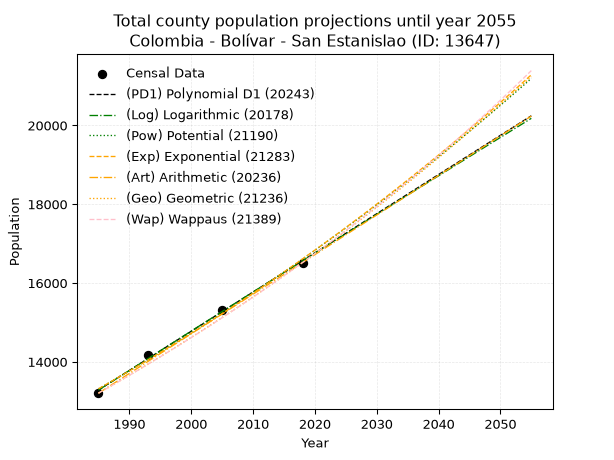
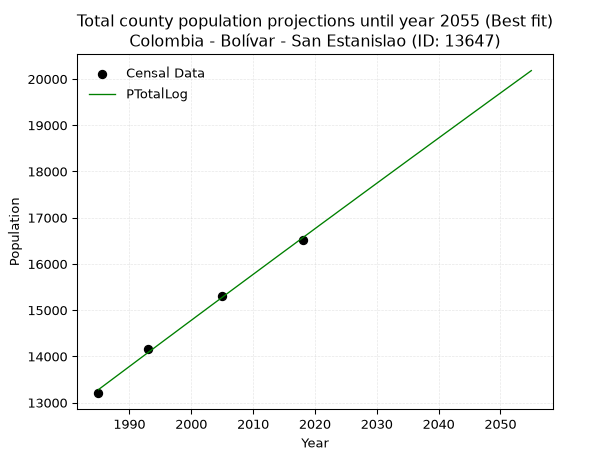
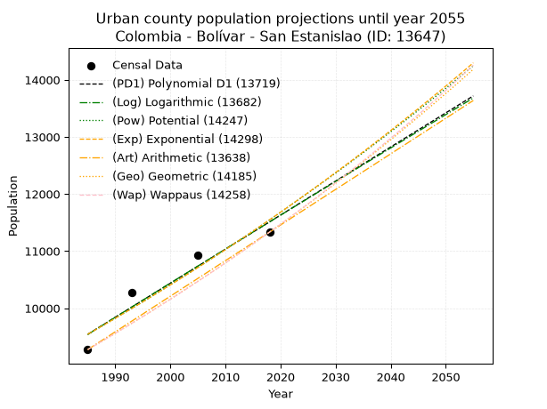
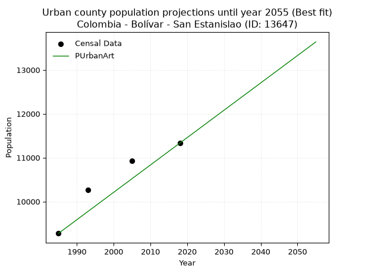
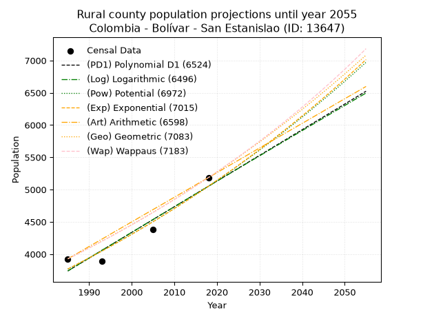
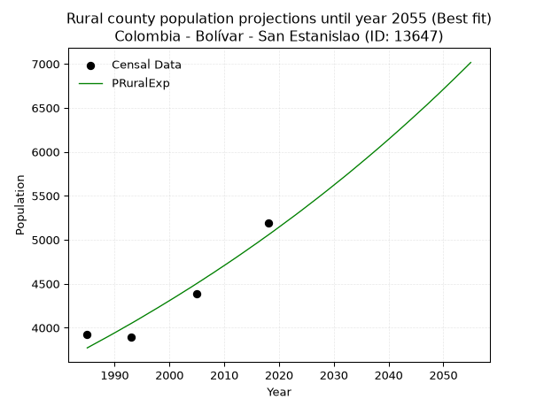

<div align="center">


</div>

# 📜 _“Population and Public Services Demand Projections (PPSD) until Year 2050 for Colombia - Bolívar - San Estanislao (ID: 13647)”_
Keywords: `population` `public-service` `projection` `lineal` `polynomial` `logarithmic` `potential` `exponential` `arithmetic` `geometric` `wappaus` `dane` `colombia` `south-america`

PPSD are analytical estimates used by governments and planners to anticipate future changes in population size, age distribution, and the resulting community needs for utilities, healthcare, education, and infrastructure as sizing future water treatment facilities, electrical grids, and road networks based on spatial growth.

<div align="center">

</img>

</div>


> **General running parameters**: • app_version: _v20260806_. • Python version: _3.14.7_. • Pandas version: _3.0.5_. • NumPy version: _2.5.1_. • Creates, save and include plots into reports (create_plot): _False_. • Projection until year: _2050_. • Process polynomial degree 2 and up: _False_. • Process Wappaus: _True_. • Process Wappaus: _True_. • Set negative values to zero: _True_. • Set infinite values to zero: _True_. • Drop dataset notes: _True_. 
<div align="center">

Maps & GIS Layers: [:earth_americas:Google](http://maps.google.com/maps?q=10.39860166,-75.1531009) [:earth_americas:OSM](https://www.openstreetmap.org/#map=18/10.39860166/-75.1531009&layers=P) [:earth_americas:Bing](https://www.bing.com/maps?cp=10.39860166~-75.1531009&lvl=18) [:earth_americas:Apple](https://maps.apple.com/frame?center=10.39860166%2C-75.1531009&span=0.003%2C0.006) [:earth_americas:GISMobile](https://github.com/rcfdtools/R.GISMobile/blob/main/file/gis/CountyLayer_CO/Readme.md)

</div>


<div align="center">

```geojson
{
  "type": "Feature",
  "geometry": {
    "type": "Point", 
    "coordinates": [-75.1531009, 10.39860166]
  }, 
  "properties": {
    "Name": "Colombia - Bolívar - San Estanislao (ID: 13647)"
  }
}
```

</div>


## 0. Census Data (4 records)

Census data are official statistics collected by a government about the people and housing in a country. They usually include counts of total population, age, sex, race, income, education, and jobs.

📅Global census file: [Population.xlsx](../data/Population.xlsx)

| Source   |   Year |   CountryID | CountryName   |   StateID | StateName   |   CountyID | CountyName     |   PTotal |   PUrban |   PRural |
|:---------|-------:|------------:|:--------------|----------:|:------------|-----------:|:---------------|---------:|---------:|---------:|
| DANE     |   1985 |          57 | Colombia      |        13 | Bolívar     |      13647 | San Estanislao |    13202 |     9275 |     3927 |
| DANE     |   1993 |          57 | Colombia      |        13 | Bolívar     |      13647 | San Estanislao |    14161 |    10271 |     3890 |
| DANE     |   2005 |          57 | Colombia      |        13 | Bolívar     |      13647 | San Estanislao |    15312 |    10931 |     4381 |
| DANE     |   2018 |          57 | Colombia      |        13 | Bolívar     |      13647 | San Estanislao |    16518 |    11332 |     5186 |

> 🔥Some records could had specific notes about the registered values or the corresponding urban or rural distribution.

📅[SUI-RUPS](https://www.datos.gov.co/Hacienda-y-Cr-dito-P-blico/Registro-nico-de-Prestadores-de-Servicios-P-blicos/4qkq-csdn/about_data) - Local public utility companies: [RUPS.csv](../data/RUPS.csv)

 | SERVICIO   | ESTADO                    | NOMBRE                                                                                               | NIT         | DEPARTAMENTO_DOMICILIO   | MUNICIPIO_DOMICILIO   | DIRECCION                                     |   TELEFONO | EMAIL                                    | TIPO_PRESTADOR                             | CLASIFICACION                 |
|:-----------|:--------------------------|:-----------------------------------------------------------------------------------------------------|:------------|:-------------------------|:----------------------|:----------------------------------------------|-----------:|:-----------------------------------------|:-------------------------------------------|:------------------------------|
| ACUEDUCTO  | OPERATIVA                 | EMPRESA INTERMUNICIPAL DE SERVICIOS PUBLICOS DOMICILIARIOS DE ACUEDUCTO Y ALCANTARILLADO S.A. E.S.P. | 806013532-7 | BOLIVAR                  | SANTA ROSA            | calle nueva de las florez  Cra. 28 No. 16-147 |    6903120 | gerencia.empresaintermunicipal@gmail.com | SOCIEDADES (EMPRESA DE SERVICIOS PUBLICOS) | MAYOR O IGUAL A 5001 USUARIOS |
| ACUEDUCTO  | EN PROCESO DE LIQUIDACION | GISCOL SOCIEDAD ANÓNIMA EMPRESA DE SERVICOS PÚBLICOS                                                 | 900175706-7 | BOGOTA, D.C.             | BOGOTA, D.C.          | CARRERA SÉPTIMA # 70 A- 21  PISO 8            |    7210697 | gerencia.giscol@gmail.com                | SOCIEDADES (EMPRESA DE SERVICIOS PUBLICOS) | MAYOR O IGUAL A 5001 USUARIOS |

## 1. Total

### 1.1. Coefficients and Parameters

* (PD1) Polynomial Deg 1: 99.44399839421837, -184114.60778803527 (lineal)
* (Log) Logarithmic: 199071.2905637075, -1498344.2248319464
* (Pow) Potential: 13.416325774927893, -40.11962808078484
* (Exp) Exponential: 0.006701473863042419, 0.022239597163477124
* (Art) Arithmetic: Year diff. 2018 - 1985 = 33, Population diff. 16518 - 13202 = 3316, Annual growth = 100.48484848484848
* (Geo) Geometric: Year diff. 2018 - 1985 = 33, Population diff. 16518 - 13202 = 3316, Annual growth % = 0.006813481475241634
* (Wap) Wappaus: i = 0.6762102859007301, Condition values only valid for < 200)

<sub>
Wappaus condition values: ['0.00', '0.68', '1.35', '2.03', '2.70', '3.38', '4.06', '4.73', '5.41', '6.09', '6.76', '7.44', '8.11', '8.79', '9.47', '10.14', '10.82', '11.50', '12.17', '12.85', '13.52', '14.20', '14.88', '15.55', '16.23', '16.91', '17.58', '18.26', '18.93', '19.61', '20.29', '20.96', '21.64', '22.31', '22.99', '23.67', '24.34', '25.02', '25.70', '26.37', '27.05', '27.72', '28.40', '29.08', '29.75', '30.43', '31.11', '31.78', '32.46', '33.13', '33.81', '34.49', '35.16', '35.84', '36.52', '37.19', '37.87', '38.54', '39.22', '39.90', '40.57', '41.25', '41.93', '42.60', '43.28', '43.95']
</sub>


### 1.2. Projected Dataset

|   Year |   CountyID |   PTotalPD1 |   PTotalLog |   PTotalPow |   PTotalExp |   PTotalArt |   PTotalGeo |   PTotalWap |
|-------:|-----------:|------------:|------------:|------------:|------------:|------------:|------------:|------------:|
|   1985 |      13647 |       13282 |       13279 |       13311 |       13314 |       13202 |       13202 |       13202 |
|   1986 |      13647 |       13381 |       13379 |       13401 |       13403 |       13302 |       13292 |       13292 |
|   1987 |      13647 |       13481 |       13479 |       13492 |       13493 |       13403 |       13383 |       13382 |
|   1988 |      13647 |       13580 |       13579 |       13583 |       13584 |       13503 |       13474 |       13473 |
|   1989 |      13647 |       13680 |       13679 |       13675 |       13675 |       13604 |       13566 |       13564 |
|   1990 |      13647 |       13779 |       13779 |       13768 |       13767 |       13704 |       13658 |       13656 |
|   1991 |      13647 |       13878 |       13879 |       13861 |       13860 |       13805 |       13751 |       13749 |
|   1992 |      13647 |       13978 |       13979 |       13954 |       13953 |       13905 |       13845 |       13842 |
|   1993 |      13647 |       14077 |       14079 |       14049 |       14047 |       14006 |       13939 |       13936 |
|   1994 |      13647 |       14177 |       14179 |       14144 |       14141 |       14106 |       14034 |       14031 |
|   1995 |      13647 |       14276 |       14279 |       14239 |       14236 |       14207 |       14130 |       14126 |
|   1996 |      13647 |       14376 |       14379 |       14335 |       14332 |       14307 |       14226 |       14222 |
|   1997 |      13647 |       14475 |       14478 |       14432 |       14429 |       14408 |       14323 |       14319 |
|   1998 |      13647 |       14575 |       14578 |       14529 |       14526 |       14508 |       14420 |       14416 |
|   1999 |      13647 |       14674 |       14678 |       14627 |       14623 |       14609 |       14519 |       14514 |
|   2000 |      13647 |       14773 |       14777 |       14725 |       14722 |       14709 |       14618 |       14613 |
|   2001 |      13647 |       14873 |       14877 |       14824 |       14821 |       14810 |       14717 |       14712 |
|   2002 |      13647 |       14972 |       14976 |       14924 |       14920 |       14910 |       14817 |       14812 |
|   2003 |      13647 |       15072 |       15076 |       15024 |       15021 |       15011 |       14918 |       14913 |
|   2004 |      13647 |       15171 |       15175 |       15125 |       15121 |       15111 |       15020 |       15015 |
|   2005 |      13647 |       15271 |       15274 |       15227 |       15223 |       15212 |       15122 |       15117 |
|   2006 |      13647 |       15370 |       15374 |       15329 |       15326 |       15312 |       15225 |       15220 |
|   2007 |      13647 |       15469 |       15473 |       15432 |       15429 |       15413 |       15329 |       15324 |
|   2008 |      13647 |       15569 |       15572 |       15536 |       15532 |       15513 |       15434 |       15428 |
|   2009 |      13647 |       15668 |       15671 |       15640 |       15637 |       15614 |       15539 |       15534 |
|   2010 |      13647 |       15768 |       15770 |       15744 |       15742 |       15714 |       15645 |       15640 |
|   2011 |      13647 |       15867 |       15869 |       15850 |       15848 |       15815 |       15751 |       15747 |
|   2012 |      13647 |       15967 |       15968 |       15956 |       15954 |       15915 |       15859 |       15855 |
|   2013 |      13647 |       16066 |       16067 |       16063 |       16062 |       16016 |       15967 |       15963 |
|   2014 |      13647 |       16166 |       16166 |       16170 |       16170 |       16116 |       16075 |       16072 |
|   2015 |      13647 |       16265 |       16265 |       16278 |       16278 |       16217 |       16185 |       16183 |
|   2016 |      13647 |       16364 |       16363 |       16387 |       16388 |       16317 |       16295 |       16293 |
|   2017 |      13647 |       16464 |       16462 |       16496 |       16498 |       16418 |       16406 |       16405 |
|   2018 |      13647 |       16563 |       16561 |       16606 |       16609 |       16518 |       16518 |       16518 |
|   2019 |      13647 |       16663 |       16659 |       16717 |       16721 |       16618 |       16631 |       16632 |
|   2020 |      13647 |       16762 |       16758 |       16828 |       16833 |       16719 |       16744 |       16746 |
|   2021 |      13647 |       16862 |       16857 |       16941 |       16946 |       16819 |       16858 |       16861 |
|   2022 |      13647 |       16961 |       16955 |       17053 |       17060 |       16920 |       16973 |       16977 |
|   2023 |      13647 |       17061 |       17053 |       17167 |       17175 |       17020 |       17088 |       17094 |
|   2024 |      13647 |       17160 |       17152 |       17281 |       17290 |       17121 |       17205 |       17212 |
|   2025 |      13647 |       17259 |       17250 |       17396 |       17407 |       17221 |       17322 |       17331 |
|   2026 |      13647 |       17359 |       17348 |       17512 |       17524 |       17322 |       17440 |       17451 |
|   2027 |      13647 |       17458 |       17447 |       17628 |       17641 |       17422 |       17559 |       17572 |
|   2028 |      13647 |       17558 |       17545 |       17745 |       17760 |       17523 |       17679 |       17694 |
|   2029 |      13647 |       17657 |       17643 |       17863 |       17879 |       17623 |       17799 |       17817 |
|   2030 |      13647 |       17757 |       17741 |       17981 |       18000 |       17724 |       17920 |       17940 |
|   2031 |      13647 |       17856 |       17839 |       18100 |       18121 |       17824 |       18042 |       18065 |
|   2032 |      13647 |       17956 |       17937 |       18220 |       18243 |       17925 |       18165 |       18191 |
|   2033 |      13647 |       18055 |       18035 |       18341 |       18365 |       18025 |       18289 |       18317 |
|   2034 |      13647 |       18154 |       18133 |       18462 |       18489 |       18126 |       18414 |       18445 |
|   2035 |      13647 |       18254 |       18231 |       18584 |       18613 |       18226 |       18539 |       18574 |
|   2036 |      13647 |       18353 |       18329 |       18707 |       18738 |       18327 |       18666 |       18704 |
|   2037 |      13647 |       18453 |       18426 |       18831 |       18864 |       18427 |       18793 |       18834 |
|   2038 |      13647 |       18552 |       18524 |       18955 |       18991 |       18528 |       18921 |       18966 |
|   2039 |      13647 |       18652 |       18622 |       19081 |       19119 |       18628 |       19050 |       19100 |
|   2040 |      13647 |       18751 |       18719 |       19207 |       19247 |       18729 |       19179 |       19234 |
|   2041 |      13647 |       18851 |       18817 |       19333 |       19377 |       18829 |       19310 |       19369 |
|   2042 |      13647 |       18950 |       18914 |       19461 |       19507 |       18930 |       19442 |       19505 |
|   2043 |      13647 |       19049 |       19012 |       19589 |       19638 |       19030 |       19574 |       19643 |
|   2044 |      13647 |       19149 |       19109 |       19718 |       19770 |       19131 |       19708 |       19782 |
|   2045 |      13647 |       19248 |       19207 |       19848 |       19903 |       19231 |       19842 |       19922 |
|   2046 |      13647 |       19348 |       19304 |       19978 |       20037 |       19332 |       19977 |       20063 |
|   2047 |      13647 |       19447 |       19401 |       20110 |       20172 |       19432 |       20113 |       20205 |
|   2048 |      13647 |       19547 |       19499 |       20242 |       20307 |       19533 |       20250 |       20348 |
|   2049 |      13647 |       19646 |       19596 |       20375 |       20444 |       19633 |       20388 |       20493 |
|   2050 |      13647 |       19746 |       19693 |       20509 |       20581 |       19734 |       20527 |       20639 |
<div align="center">

</img>

</div>


### 1.3. Best fit with absolute and relative error (%)

Relative error puts that difference into context by dividing the absolute error by the true value, creating a unitless ratio or percentage that shows the scale of the mistake.

Absolute and relative error

|   Year | Source   |   CountryID | CountryName   |   StateID | StateName   |   CountyID_x | CountyName     |   PTotal |   PUrban |   PRural |   CountyID_y |   PTotalPD1 |   PTotalLog |   PTotalPow |   PTotalExp |   PTotalArt |   PTotalGeo |   PTotalWap |   PTotalPD1AbsError |   PTotalLogAbsError |   PTotalPowAbsError |   PTotalExpAbsError |   PTotalArtAbsError |   PTotalGeoAbsError |   PTotalWapAbsError |   PTotalPD1RelError |   PTotalLogRelError |   PTotalPowRelError |   PTotalExpRelError |   PTotalArtRelError |   PTotalGeoRelError |   PTotalWapRelError |
|-------:|:---------|------------:|:--------------|----------:|:------------|-------------:|:---------------|---------:|---------:|---------:|-------------:|------------:|------------:|------------:|------------:|------------:|------------:|------------:|--------------------:|--------------------:|--------------------:|--------------------:|--------------------:|--------------------:|--------------------:|--------------------:|--------------------:|--------------------:|--------------------:|--------------------:|--------------------:|--------------------:|
|   1985 | DANE     |          57 | Colombia      |        13 | Bolívar     |        13647 | San Estanislao |    13202 |     9275 |     3927 |        13647 |       13282 |       13279 |       13311 |       13314 |       13202 |       13202 |       13202 |                  80 |                  77 |                 109 |                 112 |                   0 |                   0 |                   0 |            0.605969 |            0.583245 |            0.825632 |            0.848356 |            0        |             0       |             0       |
|   1993 | DANE     |          57 | Colombia      |        13 | Bolívar     |        13647 | San Estanislao |    14161 |    10271 |     3890 |        13647 |       14077 |       14079 |       14049 |       14047 |       14006 |       13939 |       13936 |                  84 |                  82 |                 112 |                 114 |                 155 |                 222 |                 225 |            0.593178 |            0.579055 |            0.790905 |            0.805028 |            1.09456  |             1.56769 |             1.58887 |
|   2005 | DANE     |          57 | Colombia      |        13 | Bolívar     |        13647 | San Estanislao |    15312 |    10931 |     4381 |        13647 |       15271 |       15274 |       15227 |       15223 |       15212 |       15122 |       15117 |                  41 |                  38 |                  85 |                  89 |                 100 |                 190 |                 195 |            0.267764 |            0.248171 |            0.55512  |            0.581243 |            0.653083 |             1.24086 |             1.27351 |
|   2018 | DANE     |          57 | Colombia      |        13 | Bolívar     |        13647 | San Estanislao |    16518 |    11332 |     5186 |        13647 |       16563 |       16561 |       16606 |       16609 |       16518 |       16518 |       16518 |                  45 |                  43 |                  88 |                  91 |                   0 |                   0 |                   0 |            0.27243  |            0.260322 |            0.532752 |            0.550914 |            0        |             0       |             0       |

Relative error mean

| Method    |   RelError | Best   |
|:----------|-----------:|:-------|
| PTotalPD1 |   0.434835 |        |
| PTotalLog |   0.417698 | True   |
| PTotalPow |   0.676102 |        |
| PTotalExp |   0.696385 |        |
| PTotalArt |   0.43691  |        |
| PTotalGeo |   0.702136 |        |
| PTotalWap |   0.715595 |        |

💙Best method: _**PTotalLog**_
<div align="center">

</img>

</div>


### 1.4. Fresh water supply demand in liters per capita per day (lpcd)

The fresh water supply demand typically ranges from 100 to 300 liters per capita per day (lpcd) for standard domestic and municipal planning, though absolute survival minimums set by the World Health Organization are as low as 7.5 to 20 liters per day, and total consumption in high-income nations can exceed 400 liters.

> `CZ`: Level in meters above the sea level (masl)<br> `WS`: Fresh water supply demand in liters per capita per day (lpcd or l/h/d)<br> `WSAll`: Zonal fresh water supply demand in liters per second (l/s)<br> `A`: Zonal area in square meters<br> `DP`: Population density (people/hectare or p/ha)

Reference values (RAS Colombia)

|    CZ |   WS |
|------:|-----:|
|  1000 |  120 |
|  2000 |  130 |
| 99999 |  140 |

County shapefile geometry properties and water supply values

|   CountyID |      ATotal |   CZTotal |   WSTotal |
|-----------:|------------:|----------:|----------:|
|      13647 | 2.11561e+08 |   60.1936 |       120 |

Projected values for best method: PTotalLog

|   CountyID |   Year |   PTotalLog |   DPTotal |   WSTotal |   WSTotalAll |
|-----------:|-------:|------------:|----------:|----------:|-------------:|
|      13647 |   1985 |       13279 |      0.63 |       120 |      18.4431 |
|      13647 |   1986 |       13379 |      0.63 |       120 |      18.5819 |
|      13647 |   1987 |       13479 |      0.64 |       120 |      18.7208 |
|      13647 |   1988 |       13579 |      0.64 |       120 |      18.8597 |
|      13647 |   1989 |       13679 |      0.65 |       120 |      18.9986 |
|      13647 |   1990 |       13779 |      0.65 |       120 |      19.1375 |
|      13647 |   1991 |       13879 |      0.66 |       120 |      19.2764 |
|      13647 |   1992 |       13979 |      0.66 |       120 |      19.4153 |
|      13647 |   1993 |       14079 |      0.67 |       120 |      19.5542 |
|      13647 |   1994 |       14179 |      0.67 |       120 |      19.6931 |
|      13647 |   1995 |       14279 |      0.67 |       120 |      19.8319 |
|      13647 |   1996 |       14379 |      0.68 |       120 |      19.9708 |
|      13647 |   1997 |       14478 |      0.68 |       120 |      20.1083 |
|      13647 |   1998 |       14578 |      0.69 |       120 |      20.2472 |
|      13647 |   1999 |       14678 |      0.69 |       120 |      20.3861 |
|      13647 |   2000 |       14777 |      0.7  |       120 |      20.5236 |
|      13647 |   2001 |       14877 |      0.7  |       120 |      20.6625 |
|      13647 |   2002 |       14976 |      0.71 |       120 |      20.8    |
|      13647 |   2003 |       15076 |      0.71 |       120 |      20.9389 |
|      13647 |   2004 |       15175 |      0.72 |       120 |      21.0764 |
|      13647 |   2005 |       15274 |      0.72 |       120 |      21.2139 |
|      13647 |   2006 |       15374 |      0.73 |       120 |      21.3528 |
|      13647 |   2007 |       15473 |      0.73 |       120 |      21.4903 |
|      13647 |   2008 |       15572 |      0.74 |       120 |      21.6278 |
|      13647 |   2009 |       15671 |      0.74 |       120 |      21.7653 |
|      13647 |   2010 |       15770 |      0.75 |       120 |      21.9028 |
|      13647 |   2011 |       15869 |      0.75 |       120 |      22.0403 |
|      13647 |   2012 |       15968 |      0.75 |       120 |      22.1778 |
|      13647 |   2013 |       16067 |      0.76 |       120 |      22.3153 |
|      13647 |   2014 |       16166 |      0.76 |       120 |      22.4528 |
|      13647 |   2015 |       16265 |      0.77 |       120 |      22.5903 |
|      13647 |   2016 |       16363 |      0.77 |       120 |      22.7264 |
|      13647 |   2017 |       16462 |      0.78 |       120 |      22.8639 |
|      13647 |   2018 |       16561 |      0.78 |       120 |      23.0014 |
|      13647 |   2019 |       16659 |      0.79 |       120 |      23.1375 |
|      13647 |   2020 |       16758 |      0.79 |       120 |      23.275  |
|      13647 |   2021 |       16857 |      0.8  |       120 |      23.4125 |
|      13647 |   2022 |       16955 |      0.8  |       120 |      23.5486 |
|      13647 |   2023 |       17053 |      0.81 |       120 |      23.6847 |
|      13647 |   2024 |       17152 |      0.81 |       120 |      23.8222 |
|      13647 |   2025 |       17250 |      0.82 |       120 |      23.9583 |
|      13647 |   2026 |       17348 |      0.82 |       120 |      24.0944 |
|      13647 |   2027 |       17447 |      0.82 |       120 |      24.2319 |
|      13647 |   2028 |       17545 |      0.83 |       120 |      24.3681 |
|      13647 |   2029 |       17643 |      0.83 |       120 |      24.5042 |
|      13647 |   2030 |       17741 |      0.84 |       120 |      24.6403 |
|      13647 |   2031 |       17839 |      0.84 |       120 |      24.7764 |
|      13647 |   2032 |       17937 |      0.85 |       120 |      24.9125 |
|      13647 |   2033 |       18035 |      0.85 |       120 |      25.0486 |
|      13647 |   2034 |       18133 |      0.86 |       120 |      25.1847 |
|      13647 |   2035 |       18231 |      0.86 |       120 |      25.3208 |
|      13647 |   2036 |       18329 |      0.87 |       120 |      25.4569 |
|      13647 |   2037 |       18426 |      0.87 |       120 |      25.5917 |
|      13647 |   2038 |       18524 |      0.88 |       120 |      25.7278 |
|      13647 |   2039 |       18622 |      0.88 |       120 |      25.8639 |
|      13647 |   2040 |       18719 |      0.88 |       120 |      25.9986 |
|      13647 |   2041 |       18817 |      0.89 |       120 |      26.1347 |
|      13647 |   2042 |       18914 |      0.89 |       120 |      26.2694 |
|      13647 |   2043 |       19012 |      0.9  |       120 |      26.4056 |
|      13647 |   2044 |       19109 |      0.9  |       120 |      26.5403 |
|      13647 |   2045 |       19207 |      0.91 |       120 |      26.6764 |
|      13647 |   2046 |       19304 |      0.91 |       120 |      26.8111 |
|      13647 |   2047 |       19401 |      0.92 |       120 |      26.9458 |
|      13647 |   2048 |       19499 |      0.92 |       120 |      27.0819 |
|      13647 |   2049 |       19596 |      0.93 |       120 |      27.2167 |
|      13647 |   2050 |       19693 |      0.93 |       120 |      27.3514 |

## 2. Urban

### 2.1. Coefficients and Parameters

* (PD1) Polynomial Deg 1: 59.665596146125786, -108893.85869128811 (lineal)
* (Log) Logarithmic: 119509.11265873353, -897937.4730049588
* (Pow) Potential: 11.567646384126984, -34.16770469458682
* (Exp) Exponential: 0.0057748445938336545, 0.10031826194629499
* (Art) Arithmetic: Year diff. 2018 - 1985 = 33, Population diff. 11332 - 9275 = 2057, Annual growth = 62.333333333333336
* (Geo) Geometric: Year diff. 2018 - 1985 = 33, Population diff. 11332 - 9275 = 2057, Annual growth % = 0.006088397997645378
* (Wap) Wappaus: i = 0.6049724203749535, Condition values only valid for < 200)

<sub>
Wappaus condition values: ['0.00', '0.60', '1.21', '1.81', '2.42', '3.02', '3.63', '4.23', '4.84', '5.44', '6.05', '6.65', '7.26', '7.86', '8.47', '9.07', '9.68', '10.28', '10.89', '11.49', '12.10', '12.70', '13.31', '13.91', '14.52', '15.12', '15.73', '16.33', '16.94', '17.54', '18.15', '18.75', '19.36', '19.96', '20.57', '21.17', '21.78', '22.38', '22.99', '23.59', '24.20', '24.80', '25.41', '26.01', '26.62', '27.22', '27.83', '28.43', '29.04', '29.64', '30.25', '30.85', '31.46', '32.06', '32.67', '33.27', '33.88', '34.48', '35.09', '35.69', '36.30', '36.90', '37.51', '38.11', '38.72', '39.32']
</sub>


### 2.2. Projected Dataset

|   Year |   CountyID |   PUrbanPD1 |   PUrbanLog |   PUrbanPow |   PUrbanExp |   PUrbanArt |   PUrbanGeo |   PUrbanWap |
|-------:|-----------:|------------:|------------:|------------:|------------:|------------:|------------:|------------:|
|   1985 |      13647 |        9542 |        9540 |        9542 |        9544 |        9275 |        9275 |        9275 |
|   1986 |      13647 |        9602 |        9600 |        9597 |        9599 |        9337 |        9331 |        9331 |
|   1987 |      13647 |        9662 |        9660 |        9653 |        9655 |        9400 |        9388 |        9388 |
|   1988 |      13647 |        9721 |        9720 |        9710 |        9711 |        9462 |        9445 |        9445 |
|   1989 |      13647 |        9781 |        9781 |        9766 |        9767 |        9524 |        9503 |        9502 |
|   1990 |      13647 |        9841 |        9841 |        9823 |        9824 |        9587 |        9561 |        9560 |
|   1991 |      13647 |        9900 |        9901 |        9881 |        9880 |        9649 |        9619 |        9618 |
|   1992 |      13647 |        9960 |        9961 |        9938 |        9938 |        9711 |        9678 |        9676 |
|   1993 |      13647 |       10020 |       10021 |        9996 |        9995 |        9774 |        9737 |        9735 |
|   1994 |      13647 |       10079 |       10081 |       10054 |       10053 |        9836 |        9796 |        9794 |
|   1995 |      13647 |       10139 |       10140 |       10113 |       10111 |        9898 |        9855 |        9854 |
|   1996 |      13647 |       10199 |       10200 |       10172 |       10170 |        9961 |        9915 |        9913 |
|   1997 |      13647 |       10258 |       10260 |       10231 |       10229 |       10023 |        9976 |        9974 |
|   1998 |      13647 |       10318 |       10320 |       10290 |       10288 |       10085 |       10037 |       10034 |
|   1999 |      13647 |       10378 |       10380 |       10350 |       10348 |       10148 |       10098 |       10095 |
|   2000 |      13647 |       10437 |       10440 |       10410 |       10407 |       10210 |       10159 |       10157 |
|   2001 |      13647 |       10497 |       10499 |       10470 |       10468 |       10272 |       10221 |       10218 |
|   2002 |      13647 |       10557 |       10559 |       10531 |       10528 |       10335 |       10283 |       10281 |
|   2003 |      13647 |       10616 |       10619 |       10592 |       10589 |       10397 |       10346 |       10343 |
|   2004 |      13647 |       10676 |       10678 |       10653 |       10651 |       10459 |       10409 |       10406 |
|   2005 |      13647 |       10736 |       10738 |       10715 |       10712 |       10522 |       10472 |       10469 |
|   2006 |      13647 |       10795 |       10798 |       10777 |       10774 |       10584 |       10536 |       10533 |
|   2007 |      13647 |       10855 |       10857 |       10839 |       10837 |       10646 |       10600 |       10597 |
|   2008 |      13647 |       10915 |       10917 |       10902 |       10900 |       10709 |       10665 |       10662 |
|   2009 |      13647 |       10974 |       10976 |       10965 |       10963 |       10771 |       10730 |       10727 |
|   2010 |      13647 |       11034 |       11036 |       11028 |       11026 |       10833 |       10795 |       10793 |
|   2011 |      13647 |       11094 |       11095 |       11092 |       11090 |       10896 |       10861 |       10858 |
|   2012 |      13647 |       11153 |       11155 |       11156 |       11154 |       10958 |       10927 |       10925 |
|   2013 |      13647 |       11213 |       11214 |       11220 |       11219 |       11020 |       10993 |       10991 |
|   2014 |      13647 |       11273 |       11273 |       11285 |       11284 |       11083 |       11060 |       11059 |
|   2015 |      13647 |       11332 |       11333 |       11350 |       11349 |       11145 |       11128 |       11126 |
|   2016 |      13647 |       11392 |       11392 |       11415 |       11415 |       11207 |       11195 |       11194 |
|   2017 |      13647 |       11452 |       11451 |       11481 |       11481 |       11270 |       11263 |       11263 |
|   2018 |      13647 |       11511 |       11510 |       11547 |       11548 |       11332 |       11332 |       11332 |
|   2019 |      13647 |       11571 |       11570 |       11613 |       11614 |       11394 |       11401 |       11401 |
|   2020 |      13647 |       11631 |       11629 |       11680 |       11682 |       11457 |       11470 |       11471 |
|   2021 |      13647 |       11690 |       11688 |       11747 |       11749 |       11519 |       11540 |       11542 |
|   2022 |      13647 |       11750 |       11747 |       11814 |       11817 |       11581 |       11611 |       11613 |
|   2023 |      13647 |       11810 |       11806 |       11882 |       11886 |       11644 |       11681 |       11684 |
|   2024 |      13647 |       11869 |       11865 |       11950 |       11955 |       11706 |       11752 |       11756 |
|   2025 |      13647 |       11929 |       11924 |       12019 |       12024 |       11768 |       11824 |       11828 |
|   2026 |      13647 |       11989 |       11983 |       12087 |       12094 |       11831 |       11896 |       11901 |
|   2027 |      13647 |       12048 |       12042 |       12157 |       12164 |       11893 |       11968 |       11975 |
|   2028 |      13647 |       12108 |       12101 |       12226 |       12234 |       11955 |       12041 |       12049 |
|   2029 |      13647 |       12168 |       12160 |       12296 |       12305 |       12018 |       12114 |       12123 |
|   2030 |      13647 |       12227 |       12219 |       12366 |       12376 |       12080 |       12188 |       12198 |
|   2031 |      13647 |       12287 |       12278 |       12437 |       12448 |       12142 |       12262 |       12273 |
|   2032 |      13647 |       12347 |       12337 |       12508 |       12520 |       12205 |       12337 |       12349 |
|   2033 |      13647 |       12406 |       12395 |       12579 |       12592 |       12267 |       12412 |       12426 |
|   2034 |      13647 |       12466 |       12454 |       12651 |       12665 |       12329 |       12488 |       12503 |
|   2035 |      13647 |       12526 |       12513 |       12723 |       12739 |       12392 |       12564 |       12580 |
|   2036 |      13647 |       12585 |       12572 |       12796 |       12812 |       12454 |       12640 |       12659 |
|   2037 |      13647 |       12645 |       12630 |       12869 |       12887 |       12516 |       12717 |       12737 |
|   2038 |      13647 |       12705 |       12689 |       12942 |       12961 |       12579 |       12795 |       12817 |
|   2039 |      13647 |       12764 |       12748 |       13016 |       13036 |       12641 |       12873 |       12897 |
|   2040 |      13647 |       12824 |       12806 |       13090 |       13112 |       12703 |       12951 |       12977 |
|   2041 |      13647 |       12884 |       12865 |       13164 |       13188 |       12766 |       13030 |       13058 |
|   2042 |      13647 |       12943 |       12923 |       13239 |       13264 |       12828 |       13109 |       13140 |
|   2043 |      13647 |       13003 |       12982 |       13314 |       13341 |       12890 |       13189 |       13222 |
|   2044 |      13647 |       13063 |       13040 |       13390 |       13418 |       12953 |       13269 |       13305 |
|   2045 |      13647 |       13122 |       13099 |       13466 |       13496 |       13015 |       13350 |       13388 |
|   2046 |      13647 |       13182 |       13157 |       13542 |       13574 |       13077 |       13431 |       13472 |
|   2047 |      13647 |       13242 |       13216 |       13619 |       13653 |       13140 |       13513 |       13557 |
|   2048 |      13647 |       13301 |       13274 |       13696 |       13732 |       13202 |       13595 |       13642 |
|   2049 |      13647 |       13361 |       13332 |       13773 |       13811 |       13264 |       13678 |       13728 |
|   2050 |      13647 |       13421 |       13391 |       13851 |       13891 |       13327 |       13761 |       13815 |
<div align="center">

</img>

</div>


### 2.3. Best fit with absolute and relative error (%)

Relative error puts that difference into context by dividing the absolute error by the true value, creating a unitless ratio or percentage that shows the scale of the mistake.

Absolute and relative error

|   Year | Source   |   CountryID | CountryName   |   StateID | StateName   |   CountyID_x | CountyName     |   PTotal |   PUrban |   PRural |   CountyID_y |   PUrbanPD1 |   PUrbanLog |   PUrbanPow |   PUrbanExp |   PUrbanArt |   PUrbanGeo |   PUrbanWap |   PUrbanPD1AbsError |   PUrbanLogAbsError |   PUrbanPowAbsError |   PUrbanExpAbsError |   PUrbanArtAbsError |   PUrbanGeoAbsError |   PUrbanWapAbsError |   PUrbanPD1RelError |   PUrbanLogRelError |   PUrbanPowRelError |   PUrbanExpRelError |   PUrbanArtRelError |   PUrbanGeoRelError |   PUrbanWapRelError |
|-------:|:---------|------------:|:--------------|----------:|:------------|-------------:|:---------------|---------:|---------:|---------:|-------------:|------------:|------------:|------------:|------------:|------------:|------------:|------------:|--------------------:|--------------------:|--------------------:|--------------------:|--------------------:|--------------------:|--------------------:|--------------------:|--------------------:|--------------------:|--------------------:|--------------------:|--------------------:|--------------------:|
|   1985 | DANE     |          57 | Colombia      |        13 | Bolívar     |        13647 | San Estanislao |    13202 |     9275 |     3927 |        13647 |        9542 |        9540 |        9542 |        9544 |        9275 |        9275 |        9275 |                 267 |                 265 |                 267 |                 269 |                   0 |                   0 |                   0 |             2.87871 |             2.85714 |             2.87871 |             2.90027 |             0       |             0       |             0       |
|   1993 | DANE     |          57 | Colombia      |        13 | Bolívar     |        13647 | San Estanislao |    14161 |    10271 |     3890 |        13647 |       10020 |       10021 |        9996 |        9995 |        9774 |        9737 |        9735 |                 251 |                 250 |                 275 |                 276 |                 497 |                 534 |                 536 |             2.44377 |             2.43404 |             2.67744 |             2.68718 |             4.83887 |             5.1991  |             5.21858 |
|   2005 | DANE     |          57 | Colombia      |        13 | Bolívar     |        13647 | San Estanislao |    15312 |    10931 |     4381 |        13647 |       10736 |       10738 |       10715 |       10712 |       10522 |       10472 |       10469 |                 195 |                 193 |                 216 |                 219 |                 409 |                 459 |                 462 |             1.78392 |             1.76562 |             1.97603 |             2.00348 |             3.74165 |             4.19907 |             4.22651 |
|   2018 | DANE     |          57 | Colombia      |        13 | Bolívar     |        13647 | San Estanislao |    16518 |    11332 |     5186 |        13647 |       11511 |       11510 |       11547 |       11548 |       11332 |       11332 |       11332 |                 179 |                 178 |                 215 |                 216 |                   0 |                   0 |                   0 |             1.5796  |             1.57077 |             1.89728 |             1.90611 |             0       |             0       |             0       |

Relative error mean

| Method    |   RelError | Best   |
|:----------|-----------:|:-------|
| PUrbanPD1 |    2.1715  |        |
| PUrbanLog |    2.15689 |        |
| PUrbanPow |    2.35737 |        |
| PUrbanExp |    2.37426 |        |
| PUrbanArt |    2.14513 | True   |
| PUrbanGeo |    2.34954 |        |
| PUrbanWap |    2.36127 |        |

💙Best method: _**PUrbanArt**_
<div align="center">

</img>

</div>


### 2.4. Fresh water supply demand in liters per capita per day (lpcd)

The fresh water supply demand typically ranges from 100 to 300 liters per capita per day (lpcd) for standard domestic and municipal planning, though absolute survival minimums set by the World Health Organization are as low as 7.5 to 20 liters per day, and total consumption in high-income nations can exceed 400 liters.

> `CZ`: Level in meters above the sea level (masl)<br> `WS`: Fresh water supply demand in liters per capita per day (lpcd or l/h/d)<br> `WSAll`: Zonal fresh water supply demand in liters per second (l/s)<br> `A`: Zonal area in square meters<br> `DP`: Population density (people/hectare or p/ha)

Reference values (RAS Colombia)

|    CZ |   WS |
|------:|-----:|
|  1000 |  120 |
|  2000 |  130 |
| 99999 |  140 |

County shapefile geometry properties and water supply values

|   CountyID |      AUrban |   CZUrban |   WSUrban |
|-----------:|------------:|----------:|----------:|
|      13647 | 1.96672e+06 |   17.9089 |       120 |

Projected values for best method: PUrbanArt

|   CountyID |   Year |   PUrbanArt |   DPUrban |   WSUrban |   WSUrbanAll |
|-----------:|-------:|------------:|----------:|----------:|-------------:|
|      13647 |   1985 |        9275 |     47.16 |       120 |      12.8819 |
|      13647 |   1986 |        9337 |     47.47 |       120 |      12.9681 |
|      13647 |   1987 |        9400 |     47.8  |       120 |      13.0556 |
|      13647 |   1988 |        9462 |     48.11 |       120 |      13.1417 |
|      13647 |   1989 |        9524 |     48.43 |       120 |      13.2278 |
|      13647 |   1990 |        9587 |     48.75 |       120 |      13.3153 |
|      13647 |   1991 |        9649 |     49.06 |       120 |      13.4014 |
|      13647 |   1992 |        9711 |     49.38 |       120 |      13.4875 |
|      13647 |   1993 |        9774 |     49.7  |       120 |      13.575  |
|      13647 |   1994 |        9836 |     50.01 |       120 |      13.6611 |
|      13647 |   1995 |        9898 |     50.33 |       120 |      13.7472 |
|      13647 |   1996 |        9961 |     50.65 |       120 |      13.8347 |
|      13647 |   1997 |       10023 |     50.96 |       120 |      13.9208 |
|      13647 |   1998 |       10085 |     51.28 |       120 |      14.0069 |
|      13647 |   1999 |       10148 |     51.6  |       120 |      14.0944 |
|      13647 |   2000 |       10210 |     51.91 |       120 |      14.1806 |
|      13647 |   2001 |       10272 |     52.23 |       120 |      14.2667 |
|      13647 |   2002 |       10335 |     52.55 |       120 |      14.3542 |
|      13647 |   2003 |       10397 |     52.86 |       120 |      14.4403 |
|      13647 |   2004 |       10459 |     53.18 |       120 |      14.5264 |
|      13647 |   2005 |       10522 |     53.5  |       120 |      14.6139 |
|      13647 |   2006 |       10584 |     53.82 |       120 |      14.7    |
|      13647 |   2007 |       10646 |     54.13 |       120 |      14.7861 |
|      13647 |   2008 |       10709 |     54.45 |       120 |      14.8736 |
|      13647 |   2009 |       10771 |     54.77 |       120 |      14.9597 |
|      13647 |   2010 |       10833 |     55.08 |       120 |      15.0458 |
|      13647 |   2011 |       10896 |     55.4  |       120 |      15.1333 |
|      13647 |   2012 |       10958 |     55.72 |       120 |      15.2194 |
|      13647 |   2013 |       11020 |     56.03 |       120 |      15.3056 |
|      13647 |   2014 |       11083 |     56.35 |       120 |      15.3931 |
|      13647 |   2015 |       11145 |     56.67 |       120 |      15.4792 |
|      13647 |   2016 |       11207 |     56.98 |       120 |      15.5653 |
|      13647 |   2017 |       11270 |     57.3  |       120 |      15.6528 |
|      13647 |   2018 |       11332 |     57.62 |       120 |      15.7389 |
|      13647 |   2019 |       11394 |     57.93 |       120 |      15.825  |
|      13647 |   2020 |       11457 |     58.25 |       120 |      15.9125 |
|      13647 |   2021 |       11519 |     58.57 |       120 |      15.9986 |
|      13647 |   2022 |       11581 |     58.88 |       120 |      16.0847 |
|      13647 |   2023 |       11644 |     59.21 |       120 |      16.1722 |
|      13647 |   2024 |       11706 |     59.52 |       120 |      16.2583 |
|      13647 |   2025 |       11768 |     59.84 |       120 |      16.3444 |
|      13647 |   2026 |       11831 |     60.16 |       120 |      16.4319 |
|      13647 |   2027 |       11893 |     60.47 |       120 |      16.5181 |
|      13647 |   2028 |       11955 |     60.79 |       120 |      16.6042 |
|      13647 |   2029 |       12018 |     61.11 |       120 |      16.6917 |
|      13647 |   2030 |       12080 |     61.42 |       120 |      16.7778 |
|      13647 |   2031 |       12142 |     61.74 |       120 |      16.8639 |
|      13647 |   2032 |       12205 |     62.06 |       120 |      16.9514 |
|      13647 |   2033 |       12267 |     62.37 |       120 |      17.0375 |
|      13647 |   2034 |       12329 |     62.69 |       120 |      17.1236 |
|      13647 |   2035 |       12392 |     63.01 |       120 |      17.2111 |
|      13647 |   2036 |       12454 |     63.32 |       120 |      17.2972 |
|      13647 |   2037 |       12516 |     63.64 |       120 |      17.3833 |
|      13647 |   2038 |       12579 |     63.96 |       120 |      17.4708 |
|      13647 |   2039 |       12641 |     64.27 |       120 |      17.5569 |
|      13647 |   2040 |       12703 |     64.59 |       120 |      17.6431 |
|      13647 |   2041 |       12766 |     64.91 |       120 |      17.7306 |
|      13647 |   2042 |       12828 |     65.23 |       120 |      17.8167 |
|      13647 |   2043 |       12890 |     65.54 |       120 |      17.9028 |
|      13647 |   2044 |       12953 |     65.86 |       120 |      17.9903 |
|      13647 |   2045 |       13015 |     66.18 |       120 |      18.0764 |
|      13647 |   2046 |       13077 |     66.49 |       120 |      18.1625 |
|      13647 |   2047 |       13140 |     66.81 |       120 |      18.25   |
|      13647 |   2048 |       13202 |     67.13 |       120 |      18.3361 |
|      13647 |   2049 |       13264 |     67.44 |       120 |      18.4222 |
|      13647 |   2050 |       13327 |     67.76 |       120 |      18.5097 |

## 3. Rural

### 3.1. Coefficients and Parameters

* (PD1) Polynomial Deg 1: 39.77840224809257, -75220.74909674717 (lineal)
* (Log) Logarithmic: 79562.17790497407, -600406.7518269883
* (Pow) Potential: 17.744040743619877, -54.93932008536838
* (Exp) Exponential: 0.008870865544136531, 8.491902790474358e-05
* (Art) Arithmetic: Year diff. 2018 - 1985 = 33, Population diff. 5186 - 3927 = 1259, Annual growth = 38.15151515151515
* (Geo) Geometric: Year diff. 2018 - 1985 = 33, Population diff. 5186 - 3927 = 1259, Annual growth % = 0.008462482172838293
* (Wap) Wappaus: i = 0.8372986974984122, Condition values only valid for < 200)

<sub>
Wappaus condition values: ['0.00', '0.84', '1.67', '2.51', '3.35', '4.19', '5.02', '5.86', '6.70', '7.54', '8.37', '9.21', '10.05', '10.88', '11.72', '12.56', '13.40', '14.23', '15.07', '15.91', '16.75', '17.58', '18.42', '19.26', '20.10', '20.93', '21.77', '22.61', '23.44', '24.28', '25.12', '25.96', '26.79', '27.63', '28.47', '29.31', '30.14', '30.98', '31.82', '32.65', '33.49', '34.33', '35.17', '36.00', '36.84', '37.68', '38.52', '39.35', '40.19', '41.03', '41.86', '42.70', '43.54', '44.38', '45.21', '46.05', '46.89', '47.73', '48.56', '49.40', '50.24', '51.08', '51.91', '52.75', '53.59', '54.42']
</sub>


### 3.2. Projected Dataset

|   Year |   CountyID |   PRuralPD1 |   PRuralLog |   PRuralPow |   PRuralExp |   PRuralArt |   PRuralGeo |   PRuralWap |
|-------:|-----------:|------------:|------------:|------------:|------------:|------------:|------------:|------------:|
|   1985 |      13647 |        3739 |        3739 |        3769 |        3770 |        3927 |        3927 |        3927 |
|   1986 |      13647 |        3779 |        3779 |        3803 |        3804 |        3965 |        3960 |        3960 |
|   1987 |      13647 |        3819 |        3819 |        3837 |        3838 |        4003 |        3994 |        3993 |
|   1988 |      13647 |        3859 |        3859 |        3872 |        3872 |        4041 |        4028 |        4027 |
|   1989 |      13647 |        3898 |        3899 |        3907 |        3906 |        4080 |        4062 |        4061 |
|   1990 |      13647 |        3938 |        3939 |        3942 |        3941 |        4118 |        4096 |        4095 |
|   1991 |      13647 |        3978 |        3979 |        3977 |        3976 |        4156 |        4131 |        4129 |
|   1992 |      13647 |        4018 |        4019 |        4012 |        4012 |        4194 |        4166 |        4164 |
|   1993 |      13647 |        4058 |        4059 |        4048 |        4047 |        4232 |        4201 |        4199 |
|   1994 |      13647 |        4097 |        4099 |        4084 |        4083 |        4270 |        4236 |        4235 |
|   1995 |      13647 |        4137 |        4138 |        4121 |        4120 |        4309 |        4272 |        4270 |
|   1996 |      13647 |        4177 |        4178 |        4158 |        4157 |        4347 |        4308 |        4306 |
|   1997 |      13647 |        4217 |        4218 |        4195 |        4194 |        4385 |        4345 |        4342 |
|   1998 |      13647 |        4256 |        4258 |        4232 |        4231 |        4423 |        4382 |        4379 |
|   1999 |      13647 |        4296 |        4298 |        4270 |        4269 |        4461 |        4419 |        4416 |
|   2000 |      13647 |        4336 |        4338 |        4308 |        4307 |        4499 |        4456 |        4453 |
|   2001 |      13647 |        4376 |        4377 |        4347 |        4345 |        4537 |        4494 |        4491 |
|   2002 |      13647 |        4416 |        4417 |        4385 |        4384 |        4576 |        4532 |        4529 |
|   2003 |      13647 |        4455 |        4457 |        4424 |        4423 |        4614 |        4570 |        4567 |
|   2004 |      13647 |        4495 |        4497 |        4464 |        4462 |        4652 |        4609 |        4606 |
|   2005 |      13647 |        4535 |        4536 |        4503 |        4502 |        4690 |        4648 |        4645 |
|   2006 |      13647 |        4575 |        4576 |        4543 |        4542 |        4728 |        4687 |        4684 |
|   2007 |      13647 |        4615 |        4616 |        4584 |        4583 |        4766 |        4727 |        4724 |
|   2008 |      13647 |        4654 |        4655 |        4624 |        4623 |        4804 |        4767 |        4764 |
|   2009 |      13647 |        4694 |        4695 |        4665 |        4665 |        4843 |        4807 |        4804 |
|   2010 |      13647 |        4734 |        4734 |        4707 |        4706 |        4881 |        4848 |        4845 |
|   2011 |      13647 |        4774 |        4774 |        4749 |        4748 |        4919 |        4889 |        4886 |
|   2012 |      13647 |        4813 |        4814 |        4791 |        4790 |        4957 |        4930 |        4928 |
|   2013 |      13647 |        4853 |        4853 |        4833 |        4833 |        4995 |        4972 |        4970 |
|   2014 |      13647 |        4893 |        4893 |        4876 |        4876 |        5033 |        5014 |        5012 |
|   2015 |      13647 |        4933 |        4932 |        4919 |        4920 |        5072 |        5057 |        5055 |
|   2016 |      13647 |        4973 |        4972 |        4962 |        4963 |        5110 |        5099 |        5098 |
|   2017 |      13647 |        5012 |        5011 |        5006 |        5008 |        5148 |        5142 |        5142 |
|   2018 |      13647 |        5052 |        5050 |        5051 |        5052 |        5186 |        5186 |        5186 |
|   2019 |      13647 |        5092 |        5090 |        5095 |        5097 |        5224 |        5230 |        5230 |
|   2020 |      13647 |        5132 |        5129 |        5140 |        5143 |        5262 |        5274 |        5275 |
|   2021 |      13647 |        5171 |        5169 |        5185 |        5189 |        5300 |        5319 |        5321 |
|   2022 |      13647 |        5211 |        5208 |        5231 |        5235 |        5339 |        5364 |        5367 |
|   2023 |      13647 |        5251 |        5247 |        5277 |        5281 |        5377 |        5409 |        5413 |
|   2024 |      13647 |        5291 |        5287 |        5324 |        5328 |        5415 |        5455 |        5460 |
|   2025 |      13647 |        5331 |        5326 |        5371 |        5376 |        5453 |        5501 |        5507 |
|   2026 |      13647 |        5370 |        5365 |        5418 |        5424 |        5491 |        5548 |        5554 |
|   2027 |      13647 |        5410 |        5405 |        5465 |        5472 |        5529 |        5595 |        5603 |
|   2028 |      13647 |        5450 |        5444 |        5514 |        5521 |        5568 |        5642 |        5651 |
|   2029 |      13647 |        5490 |        5483 |        5562 |        5570 |        5606 |        5690 |        5700 |
|   2030 |      13647 |        5529 |        5522 |        5611 |        5620 |        5644 |        5738 |        5750 |
|   2031 |      13647 |        5569 |        5561 |        5660 |        5670 |        5682 |        5786 |        5800 |
|   2032 |      13647 |        5609 |        5601 |        5710 |        5720 |        5720 |        5835 |        5851 |
|   2033 |      13647 |        5649 |        5640 |        5760 |        5771 |        5758 |        5885 |        5902 |
|   2034 |      13647 |        5689 |        5679 |        5810 |        5823 |        5796 |        5935 |        5954 |
|   2035 |      13647 |        5728 |        5718 |        5861 |        5875 |        5835 |        5985 |        6006 |
|   2036 |      13647 |        5768 |        5757 |        5912 |        5927 |        5873 |        6035 |        6059 |
|   2037 |      13647 |        5808 |        5796 |        5964 |        5980 |        5911 |        6087 |        6113 |
|   2038 |      13647 |        5848 |        5835 |        6016 |        6033 |        5949 |        6138 |        6167 |
|   2039 |      13647 |        5887 |        5874 |        6069 |        6087 |        5987 |        6190 |        6221 |
|   2040 |      13647 |        5927 |        5913 |        6122 |        6141 |        6025 |        6242 |        6276 |
|   2041 |      13647 |        5967 |        5952 |        6175 |        6196 |        6063 |        6295 |        6332 |
|   2042 |      13647 |        6007 |        5991 |        6229 |        6251 |        6102 |        6348 |        6389 |
|   2043 |      13647 |        6047 |        6030 |        6284 |        6307 |        6140 |        6402 |        6446 |
|   2044 |      13647 |        6086 |        6069 |        6339 |        6363 |        6178 |        6456 |        6503 |
|   2045 |      13647 |        6126 |        6108 |        6394 |        6420 |        6216 |        6511 |        6562 |
|   2046 |      13647 |        6166 |        6147 |        6449 |        6477 |        6254 |        6566 |        6621 |
|   2047 |      13647 |        6206 |        6186 |        6506 |        6534 |        6292 |        6622 |        6680 |
|   2048 |      13647 |        6245 |        6225 |        6562 |        6593 |        6331 |        6678 |        6741 |
|   2049 |      13647 |        6285 |        6263 |        6619 |        6651 |        6369 |        6734 |        6802 |
|   2050 |      13647 |        6325 |        6302 |        6677 |        6711 |        6407 |        6791 |        6863 |
<div align="center">

</img>

</div>


### 3.3. Best fit with absolute and relative error (%)

Relative error puts that difference into context by dividing the absolute error by the true value, creating a unitless ratio or percentage that shows the scale of the mistake.

Absolute and relative error

|   Year | Source   |   CountryID | CountryName   |   StateID | StateName   |   CountyID_x | CountyName     |   PTotal |   PUrban |   PRural |   CountyID_y |   PRuralPD1 |   PRuralLog |   PRuralPow |   PRuralExp |   PRuralArt |   PRuralGeo |   PRuralWap |   PRuralPD1AbsError |   PRuralLogAbsError |   PRuralPowAbsError |   PRuralExpAbsError |   PRuralArtAbsError |   PRuralGeoAbsError |   PRuralWapAbsError |   PRuralPD1RelError |   PRuralLogRelError |   PRuralPowRelError |   PRuralExpRelError |   PRuralArtRelError |   PRuralGeoRelError |   PRuralWapRelError |
|-------:|:---------|------------:|:--------------|----------:|:------------|-------------:|:---------------|---------:|---------:|---------:|-------------:|------------:|------------:|------------:|------------:|------------:|------------:|------------:|--------------------:|--------------------:|--------------------:|--------------------:|--------------------:|--------------------:|--------------------:|--------------------:|--------------------:|--------------------:|--------------------:|--------------------:|--------------------:|--------------------:|
|   1985 | DANE     |          57 | Colombia      |        13 | Bolívar     |        13647 | San Estanislao |    13202 |     9275 |     3927 |        13647 |        3739 |        3739 |        3769 |        3770 |        3927 |        3927 |        3927 |                 188 |                 188 |                 158 |                 157 |                   0 |                   0 |                   0 |             4.78737 |             4.78737 |             4.02343 |             3.99796 |             0       |             0       |             0       |
|   1993 | DANE     |          57 | Colombia      |        13 | Bolívar     |        13647 | San Estanislao |    14161 |    10271 |     3890 |        13647 |        4058 |        4059 |        4048 |        4047 |        4232 |        4201 |        4199 |                 168 |                 169 |                 158 |                 157 |                 342 |                 311 |                 309 |             4.31877 |             4.34447 |             4.0617  |             4.03599 |             8.79177 |             7.99486 |             7.94344 |
|   2005 | DANE     |          57 | Colombia      |        13 | Bolívar     |        13647 | San Estanislao |    15312 |    10931 |     4381 |        13647 |        4535 |        4536 |        4503 |        4502 |        4690 |        4648 |        4645 |                 154 |                 155 |                 122 |                 121 |                 309 |                 267 |                 264 |             3.51518 |             3.53801 |             2.78475 |             2.76193 |             7.05318 |             6.0945  |             6.02602 |
|   2018 | DANE     |          57 | Colombia      |        13 | Bolívar     |        13647 | San Estanislao |    16518 |    11332 |     5186 |        13647 |        5052 |        5050 |        5051 |        5052 |        5186 |        5186 |        5186 |                 134 |                 136 |                 135 |                 134 |                   0 |                   0 |                   0 |             2.58388 |             2.62245 |             2.60316 |             2.58388 |             0       |             0       |             0       |

Relative error mean

| Method    |   RelError | Best   |
|:----------|-----------:|:-------|
| PRuralPD1 |    3.8013  |        |
| PRuralLog |    3.82307 |        |
| PRuralPow |    3.36826 |        |
| PRuralExp |    3.34494 | True   |
| PRuralArt |    3.96124 |        |
| PRuralGeo |    3.52234 |        |
| PRuralWap |    3.49237 |        |

💙Best method: _**PRuralExp**_
<div align="center">

</img>

</div>


### 3.4. Fresh water supply demand in liters per capita per day (lpcd)

The fresh water supply demand typically ranges from 100 to 300 liters per capita per day (lpcd) for standard domestic and municipal planning, though absolute survival minimums set by the World Health Organization are as low as 7.5 to 20 liters per day, and total consumption in high-income nations can exceed 400 liters.

> `CZ`: Level in meters above the sea level (masl)<br> `WS`: Fresh water supply demand in liters per capita per day (lpcd or l/h/d)<br> `WSAll`: Zonal fresh water supply demand in liters per second (l/s)<br> `A`: Zonal area in square meters<br> `DP`: Population density (people/hectare or p/ha)

Reference values (RAS Colombia)

|    CZ |   WS |
|------:|-----:|
|  1000 |  120 |
|  2000 |  130 |
| 99999 |  140 |

County shapefile geometry properties and water supply values

|   CountyID |      ARural |   CZRural |   WSRural |
|-----------:|------------:|----------:|----------:|
|      13647 | 2.09594e+08 |   60.5889 |       120 |

Projected values for best method: PRuralExp

|   CountyID |   Year |   PRuralExp |   DPRural |   WSRural |   WSRuralAll |
|-----------:|-------:|------------:|----------:|----------:|-------------:|
|      13647 |   1985 |        3770 |      0.18 |       120 |      5.23611 |
|      13647 |   1986 |        3804 |      0.18 |       120 |      5.28333 |
|      13647 |   1987 |        3838 |      0.18 |       120 |      5.33056 |
|      13647 |   1988 |        3872 |      0.18 |       120 |      5.37778 |
|      13647 |   1989 |        3906 |      0.19 |       120 |      5.425   |
|      13647 |   1990 |        3941 |      0.19 |       120 |      5.47361 |
|      13647 |   1991 |        3976 |      0.19 |       120 |      5.52222 |
|      13647 |   1992 |        4012 |      0.19 |       120 |      5.57222 |
|      13647 |   1993 |        4047 |      0.19 |       120 |      5.62083 |
|      13647 |   1994 |        4083 |      0.19 |       120 |      5.67083 |
|      13647 |   1995 |        4120 |      0.2  |       120 |      5.72222 |
|      13647 |   1996 |        4157 |      0.2  |       120 |      5.77361 |
|      13647 |   1997 |        4194 |      0.2  |       120 |      5.825   |
|      13647 |   1998 |        4231 |      0.2  |       120 |      5.87639 |
|      13647 |   1999 |        4269 |      0.2  |       120 |      5.92917 |
|      13647 |   2000 |        4307 |      0.21 |       120 |      5.98194 |
|      13647 |   2001 |        4345 |      0.21 |       120 |      6.03472 |
|      13647 |   2002 |        4384 |      0.21 |       120 |      6.08889 |
|      13647 |   2003 |        4423 |      0.21 |       120 |      6.14306 |
|      13647 |   2004 |        4462 |      0.21 |       120 |      6.19722 |
|      13647 |   2005 |        4502 |      0.21 |       120 |      6.25278 |
|      13647 |   2006 |        4542 |      0.22 |       120 |      6.30833 |
|      13647 |   2007 |        4583 |      0.22 |       120 |      6.36528 |
|      13647 |   2008 |        4623 |      0.22 |       120 |      6.42083 |
|      13647 |   2009 |        4665 |      0.22 |       120 |      6.47917 |
|      13647 |   2010 |        4706 |      0.22 |       120 |      6.53611 |
|      13647 |   2011 |        4748 |      0.23 |       120 |      6.59444 |
|      13647 |   2012 |        4790 |      0.23 |       120 |      6.65278 |
|      13647 |   2013 |        4833 |      0.23 |       120 |      6.7125  |
|      13647 |   2014 |        4876 |      0.23 |       120 |      6.77222 |
|      13647 |   2015 |        4920 |      0.23 |       120 |      6.83333 |
|      13647 |   2016 |        4963 |      0.24 |       120 |      6.89306 |
|      13647 |   2017 |        5008 |      0.24 |       120 |      6.95556 |
|      13647 |   2018 |        5052 |      0.24 |       120 |      7.01667 |
|      13647 |   2019 |        5097 |      0.24 |       120 |      7.07917 |
|      13647 |   2020 |        5143 |      0.25 |       120 |      7.14306 |
|      13647 |   2021 |        5189 |      0.25 |       120 |      7.20694 |
|      13647 |   2022 |        5235 |      0.25 |       120 |      7.27083 |
|      13647 |   2023 |        5281 |      0.25 |       120 |      7.33472 |
|      13647 |   2024 |        5328 |      0.25 |       120 |      7.4     |
|      13647 |   2025 |        5376 |      0.26 |       120 |      7.46667 |
|      13647 |   2026 |        5424 |      0.26 |       120 |      7.53333 |
|      13647 |   2027 |        5472 |      0.26 |       120 |      7.6     |
|      13647 |   2028 |        5521 |      0.26 |       120 |      7.66806 |
|      13647 |   2029 |        5570 |      0.27 |       120 |      7.73611 |
|      13647 |   2030 |        5620 |      0.27 |       120 |      7.80556 |
|      13647 |   2031 |        5670 |      0.27 |       120 |      7.875   |
|      13647 |   2032 |        5720 |      0.27 |       120 |      7.94444 |
|      13647 |   2033 |        5771 |      0.28 |       120 |      8.01528 |
|      13647 |   2034 |        5823 |      0.28 |       120 |      8.0875  |
|      13647 |   2035 |        5875 |      0.28 |       120 |      8.15972 |
|      13647 |   2036 |        5927 |      0.28 |       120 |      8.23194 |
|      13647 |   2037 |        5980 |      0.29 |       120 |      8.30556 |
|      13647 |   2038 |        6033 |      0.29 |       120 |      8.37917 |
|      13647 |   2039 |        6087 |      0.29 |       120 |      8.45417 |
|      13647 |   2040 |        6141 |      0.29 |       120 |      8.52917 |
|      13647 |   2041 |        6196 |      0.3  |       120 |      8.60556 |
|      13647 |   2042 |        6251 |      0.3  |       120 |      8.68194 |
|      13647 |   2043 |        6307 |      0.3  |       120 |      8.75972 |
|      13647 |   2044 |        6363 |      0.3  |       120 |      8.8375  |
|      13647 |   2045 |        6420 |      0.31 |       120 |      8.91667 |
|      13647 |   2046 |        6477 |      0.31 |       120 |      8.99583 |
|      13647 |   2047 |        6534 |      0.31 |       120 |      9.075   |
|      13647 |   2048 |        6593 |      0.31 |       120 |      9.15694 |
|      13647 |   2049 |        6651 |      0.32 |       120 |      9.2375  |
|      13647 |   2050 |        6711 |      0.32 |       120 |      9.32083 |

#

<div align="center"><br><sub>Share this research</sub></div><br>

<sub>**APPS & TOOLS & CONTENT DISCLAIMER**: • NO WARRANTY - This content and software is provided by <a href="https://github.com/rcfdtools" target="_blank">github.com/rcfdtools</a> "as is", without any express or implied warranty, including warranties of merchantability, fitness for a particular purpose, or non-infringement. There is no guarantee that the software will be error-free or operate without interruption. • LIMITATION OF LIABILITY - Neither the authors nor copyright holders will be liable for claims or damages arising from the software or its use. You are responsible for determining if the software is appropriate for your use and assume all associated risks, including errors, legal compliance, and data loss. • NO PROFESSIONAL ADVICE - The software provides general information and does not offer professional advice. It should not replace consultation with professional advisors. [Clauses and global license for rcfdtools use.](https://github.com/rcfdtools/rcfdtools/blob/main/LICENSE.md)</sub>

| [:house: Home](Readme.md)  | [:beginner: Help / Collab](https://github.com/rcfdtools/R.HydroTools/discussions/31) |
|----------------------------|-------------------------------------------------------------------------------------------|