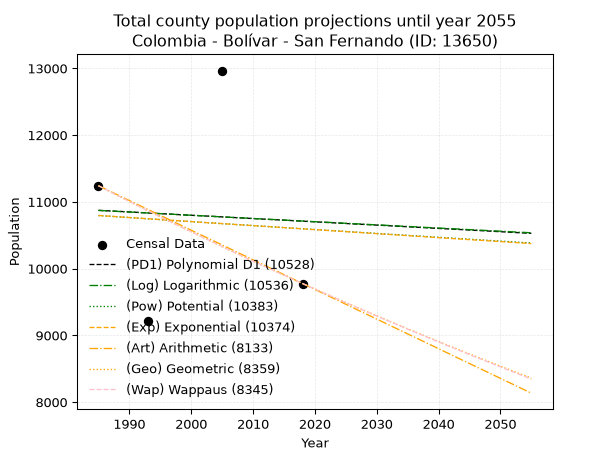
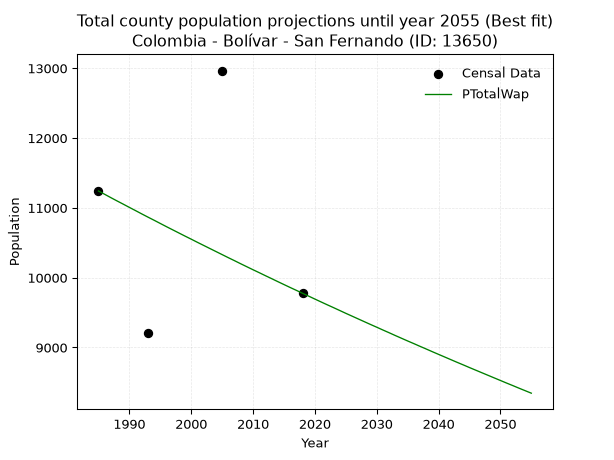
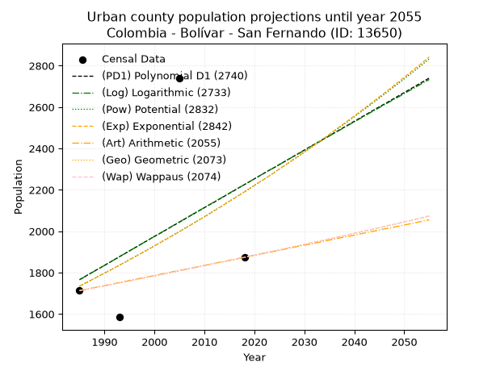
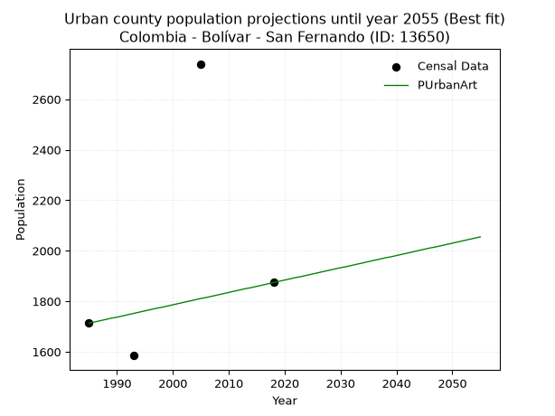
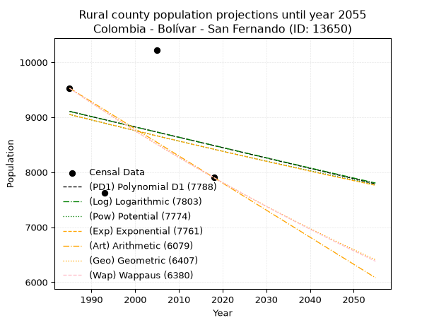
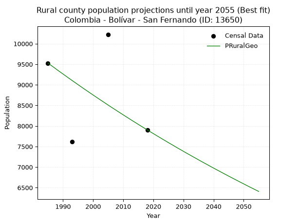

<div align="center">


</div>

# _“Population and Public Services Demand Projections (PPSD) until Year 2050 for Colombia - Bolívar - San Fernando (ID: 13650)”_
Keywords: `population` `public-service` `projection` `lineal` `polynomial` `logarithmic` `potential` `exponential` `arithmetic` `geometric` `wappaus` `dane` `colombia` `south-america`

PPSD are analytical estimates used by governments and planners to anticipate future changes in population size, age distribution, and the resulting community needs for utilities, healthcare, education, and infrastructure as sizing future water treatment facilities, electrical grids, and road networks based on spatial growth.

> **General running parameters**: • app_version: _v20260806_. • Python version: _3.14.7_. • Pandas version: _3.0.5_. • NumPy version: _2.5.1_. • Creates, save and include plots into reports (create_plot): _False_. • Projection until year: _2050_. • Process polynomial degree 2 and up: _False_. • Process Wappaus: _True_. • Process Wappaus: _True_. • Set negative values to zero: _True_. • Set infinite values to zero: _True_. • Drop dataset notes: _True_. 
<div align="center">

Dynamic map: [:earth_americas:Google](http://maps.google.com/maps?q=9.214182884,-74.3238112) [:earth_americas:OSM](https://www.openstreetmap.org/#map=18/9.214182884/-74.3238112&layers=P) [:earth_americas:Bing](https://www.bing.com/maps?cp=9.214182884~-74.3238112&lvl=18) [:earth_americas:Apple](https://maps.apple.com/frame?center=9.214182884%2C-74.3238112&span=0.003%2C0.006)

</div>


<div align="center">

```geojson
{
  "type": "Feature",
  "geometry": {
    "type": "Point", 
    "coordinates": [-74.3238112, 9.214182884]
  }, 
  "properties": {
    "Name": "Colombia - Bolívar - San Fernando (ID: 13650)"
  }
}
```

</div>


## 0. Census Data (4 records)

Census data are official statistics collected by a government about the people and housing in a country. They usually include counts of total population, age, sex, race, income, education, and jobs.

📅Global census file: [Population.xlsx](../data/Population.xlsx)

| Source   |   Year |   CountryID | CountryName   |   StateID | StateName   |   CountyID | CountyName   |   PTotal |   PUrban |   PRural |
|:---------|-------:|------------:|:--------------|----------:|:------------|-----------:|:-------------|---------:|---------:|---------:|
| DANE     |   1985 |          57 | Colombia      |        13 | Bolívar     |      13650 | San Fernando |    11241 |     1713 |     9528 |
| DANE     |   1993 |          57 | Colombia      |        13 | Bolívar     |      13650 | San Fernando |     9207 |     1585 |     7622 |
| DANE     |   2005 |          57 | Colombia      |        13 | Bolívar     |      13650 | San Fernando |    12965 |     2740 |    10225 |
| DANE     |   2018 |          57 | Colombia      |        13 | Bolívar     |      13650 | San Fernando |     9776 |     1874 |     7902 |

> 🔥Some records could had specific notes about the registered values or the corresponding urban or rural distribution.

## 1. Total

### 1.1. Coefficients and Parameters

* (PD1) Polynomial Deg 1: -4.926936973101516, 20652.355680446308 (lineal)
* (Log) Logarithmic: -9666.79109887549, 84274.60660735484
* (Pow) Potential: -1.1211171520577032, 7.730356942530199
* (Exp) Exponential: -0.0005679328176742601, 33329.288404917155
* (Art) Arithmetic: Year diff. 2018 - 1985 = 33, Population diff. 9776 - 11241 = -1465, Annual growth = -44.39393939393939
* (Geo) Geometric: Year diff. 2018 - 1985 = 33, Population diff. 9776 - 11241 = -1465, Annual growth % = -0.00422249663336105
* (Wap) Wappaus: i = -0.42245743344853587, Condition values only valid for < 200)

<sub>
Wappaus condition values: ['-0.00', '-0.42', '-0.84', '-1.27', '-1.69', '-2.11', '-2.53', '-2.96', '-3.38', '-3.80', '-4.22', '-4.65', '-5.07', '-5.49', '-5.91', '-6.34', '-6.76', '-7.18', '-7.60', '-8.03', '-8.45', '-8.87', '-9.29', '-9.72', '-10.14', '-10.56', '-10.98', '-11.41', '-11.83', '-12.25', '-12.67', '-13.10', '-13.52', '-13.94', '-14.36', '-14.79', '-15.21', '-15.63', '-16.05', '-16.48', '-16.90', '-17.32', '-17.74', '-18.17', '-18.59', '-19.01', '-19.43', '-19.86', '-20.28', '-20.70', '-21.12', '-21.55', '-21.97', '-22.39', '-22.81', '-23.24', '-23.66', '-24.08', '-24.50', '-24.92', '-25.35', '-25.77', '-26.19', '-26.61', '-27.04', '-27.46']
</sub>


### 1.2. Projected Dataset

|   Year |   CountyID |   PTotalPD1 |   PTotalLog |   PTotalPow |   PTotalExp |   PTotalArt |   PTotalGeo |   PTotalWap |
|-------:|-----------:|------------:|------------:|------------:|------------:|------------:|------------:|------------:|
|   1985 |      13650 |       10872 |       10871 |       10794 |       10795 |       11241 |       11241 |       11241 |
|   1986 |      13650 |       10867 |       10866 |       10788 |       10789 |       11197 |       11194 |       11194 |
|   1987 |      13650 |       10863 |       10861 |       10782 |       10783 |       11152 |       11146 |       11146 |
|   1988 |      13650 |       10858 |       10856 |       10776 |       10777 |       11108 |       11099 |       11099 |
|   1989 |      13650 |       10853 |       10852 |       10770 |       10771 |       11063 |       11052 |       11053 |
|   1990 |      13650 |       10848 |       10847 |       10764 |       10764 |       11019 |       11006 |       11006 |
|   1991 |      13650 |       10843 |       10842 |       10758 |       10758 |       10975 |       10959 |       10960 |
|   1992 |      13650 |       10838 |       10837 |       10751 |       10752 |       10930 |       10913 |       10913 |
|   1993 |      13650 |       10833 |       10832 |       10745 |       10746 |       10886 |       10867 |       10867 |
|   1994 |      13650 |       10828 |       10827 |       10739 |       10740 |       10841 |       10821 |       10822 |
|   1995 |      13650 |       10823 |       10822 |       10733 |       10734 |       10797 |       10775 |       10776 |
|   1996 |      13650 |       10818 |       10818 |       10727 |       10728 |       10753 |       10730 |       10730 |
|   1997 |      13650 |       10813 |       10813 |       10721 |       10722 |       10708 |       10684 |       10685 |
|   1998 |      13650 |       10808 |       10808 |       10715 |       10716 |       10664 |       10639 |       10640 |
|   1999 |      13650 |       10803 |       10803 |       10709 |       10710 |       10619 |       10594 |       10595 |
|   2000 |      13650 |       10798 |       10798 |       10703 |       10704 |       10575 |       10550 |       10551 |
|   2001 |      13650 |       10794 |       10793 |       10697 |       10697 |       10531 |       10505 |       10506 |
|   2002 |      13650 |       10789 |       10789 |       10691 |       10691 |       10486 |       10461 |       10462 |
|   2003 |      13650 |       10784 |       10784 |       10685 |       10685 |       10442 |       10417 |       10418 |
|   2004 |      13650 |       10779 |       10779 |       10679 |       10679 |       10398 |       10373 |       10374 |
|   2005 |      13650 |       10774 |       10774 |       10673 |       10673 |       10353 |       10329 |       10330 |
|   2006 |      13650 |       10769 |       10769 |       10667 |       10667 |       10309 |       10285 |       10286 |
|   2007 |      13650 |       10764 |       10764 |       10661 |       10661 |       10264 |       10242 |       10243 |
|   2008 |      13650 |       10759 |       10760 |       10655 |       10655 |       10220 |       10199 |       10199 |
|   2009 |      13650 |       10754 |       10755 |       10650 |       10649 |       10176 |       10155 |       10156 |
|   2010 |      13650 |       10749 |       10750 |       10644 |       10643 |       10131 |       10113 |       10113 |
|   2011 |      13650 |       10744 |       10745 |       10638 |       10637 |       10087 |       10070 |       10071 |
|   2012 |      13650 |       10739 |       10740 |       10632 |       10631 |       10042 |       10027 |       10028 |
|   2013 |      13650 |       10734 |       10736 |       10626 |       10625 |        9998 |        9985 |        9986 |
|   2014 |      13650 |       10730 |       10731 |       10620 |       10619 |        9954 |        9943 |        9943 |
|   2015 |      13650 |       10725 |       10726 |       10614 |       10613 |        9909 |        9901 |        9901 |
|   2016 |      13650 |       10720 |       10721 |       10608 |       10607 |        9865 |        9859 |        9859 |
|   2017 |      13650 |       10715 |       10716 |       10602 |       10601 |        9820 |        9817 |        9818 |
|   2018 |      13650 |       10710 |       10712 |       10596 |       10595 |        9776 |        9776 |        9776 |
|   2019 |      13650 |       10705 |       10707 |       10590 |       10589 |        9732 |        9735 |        9735 |
|   2020 |      13650 |       10700 |       10702 |       10585 |       10583 |        9687 |        9694 |        9693 |
|   2021 |      13650 |       10695 |       10697 |       10579 |       10577 |        9643 |        9653 |        9652 |
|   2022 |      13650 |       10690 |       10693 |       10573 |       10571 |        9598 |        9612 |        9611 |
|   2023 |      13650 |       10685 |       10688 |       10567 |       10565 |        9554 |        9571 |        9571 |
|   2024 |      13650 |       10680 |       10683 |       10561 |       10559 |        9510 |        9531 |        9530 |
|   2025 |      13650 |       10675 |       10678 |       10555 |       10553 |        9465 |        9491 |        9489 |
|   2026 |      13650 |       10670 |       10673 |       10549 |       10547 |        9421 |        9451 |        9449 |
|   2027 |      13650 |       10665 |       10669 |       10544 |       10541 |        9376 |        9411 |        9409 |
|   2028 |      13650 |       10661 |       10664 |       10538 |       10535 |        9332 |        9371 |        9369 |
|   2029 |      13650 |       10656 |       10659 |       10532 |       10529 |        9288 |        9331 |        9329 |
|   2030 |      13650 |       10651 |       10654 |       10526 |       10523 |        9243 |        9292 |        9290 |
|   2031 |      13650 |       10646 |       10650 |       10520 |       10517 |        9199 |        9253 |        9250 |
|   2032 |      13650 |       10641 |       10645 |       10514 |       10511 |        9154 |        9214 |        9211 |
|   2033 |      13650 |       10636 |       10640 |       10509 |       10505 |        9110 |        9175 |        9171 |
|   2034 |      13650 |       10631 |       10635 |       10503 |       10499 |        9066 |        9136 |        9132 |
|   2035 |      13650 |       10626 |       10631 |       10497 |       10493 |        9021 |        9097 |        9093 |
|   2036 |      13650 |       10621 |       10626 |       10491 |       10487 |        8977 |        9059 |        9055 |
|   2037 |      13650 |       10616 |       10621 |       10486 |       10481 |        8933 |        9021 |        9016 |
|   2038 |      13650 |       10611 |       10616 |       10480 |       10475 |        8888 |        8983 |        8978 |
|   2039 |      13650 |       10606 |       10612 |       10474 |       10469 |        8844 |        8945 |        8939 |
|   2040 |      13650 |       10601 |       10607 |       10468 |       10463 |        8799 |        8907 |        8901 |
|   2041 |      13650 |       10596 |       10602 |       10462 |       10457 |        8755 |        8869 |        8863 |
|   2042 |      13650 |       10592 |       10597 |       10457 |       10451 |        8711 |        8832 |        8825 |
|   2043 |      13650 |       10587 |       10593 |       10451 |       10445 |        8666 |        8795 |        8787 |
|   2044 |      13650 |       10582 |       10588 |       10445 |       10439 |        8622 |        8758 |        8750 |
|   2045 |      13650 |       10577 |       10583 |       10440 |       10433 |        8577 |        8721 |        8712 |
|   2046 |      13650 |       10572 |       10578 |       10434 |       10427 |        8533 |        8684 |        8675 |
|   2047 |      13650 |       10567 |       10574 |       10428 |       10422 |        8489 |        8647 |        8638 |
|   2048 |      13650 |       10562 |       10569 |       10422 |       10416 |        8444 |        8611 |        8601 |
|   2049 |      13650 |       10557 |       10564 |       10417 |       10410 |        8400 |        8574 |        8564 |
|   2050 |      13650 |       10552 |       10560 |       10411 |       10404 |        8355 |        8538 |        8527 |
<div align="center">

</img>

</div>


### 1.3. Best fit with absolute and relative error (%)

Relative error puts that difference into context by dividing the absolute error by the true value, creating a unitless ratio or percentage that shows the scale of the mistake.

Absolute and relative error

|   Year | Source   |   CountryID | CountryName   |   StateID | StateName   |   CountyID_x | CountyName   |   PTotal |   PUrban |   PRural |   CountyID_y |   PTotalPD1 |   PTotalLog |   PTotalPow |   PTotalExp |   PTotalArt |   PTotalGeo |   PTotalWap |   PTotalPD1AbsError |   PTotalLogAbsError |   PTotalPowAbsError |   PTotalExpAbsError |   PTotalArtAbsError |   PTotalGeoAbsError |   PTotalWapAbsError |   PTotalPD1RelError |   PTotalLogRelError |   PTotalPowRelError |   PTotalExpRelError |   PTotalArtRelError |   PTotalGeoRelError |   PTotalWapRelError |
|-------:|:---------|------------:|:--------------|----------:|:------------|-------------:|:-------------|---------:|---------:|---------:|-------------:|------------:|------------:|------------:|------------:|------------:|------------:|------------:|--------------------:|--------------------:|--------------------:|--------------------:|--------------------:|--------------------:|--------------------:|--------------------:|--------------------:|--------------------:|--------------------:|--------------------:|--------------------:|--------------------:|
|   1985 | DANE     |          57 | Colombia      |        13 | Bolívar     |        13650 | San Fernando |    11241 |     1713 |     9528 |        13650 |       10872 |       10871 |       10794 |       10795 |       11241 |       11241 |       11241 |                 369 |                 370 |                 447 |                 446 |                   0 |                   0 |                   0 |             3.28263 |             3.29152 |             3.97651 |             3.96762 |              0      |              0      |              0      |
|   1993 | DANE     |          57 | Colombia      |        13 | Bolívar     |        13650 | San Fernando |     9207 |     1585 |     7622 |        13650 |       10833 |       10832 |       10745 |       10746 |       10886 |       10867 |       10867 |                1626 |                1625 |                1538 |                1539 |                1679 |                1660 |                1660 |            17.6605  |            17.6496  |            16.7047  |            16.7155  |             18.2361 |             18.0298 |             18.0298 |
|   2005 | DANE     |          57 | Colombia      |        13 | Bolívar     |        13650 | San Fernando |    12965 |     2740 |    10225 |        13650 |       10774 |       10774 |       10673 |       10673 |       10353 |       10329 |       10330 |                2191 |                2191 |                2292 |                2292 |                2612 |                2636 |                2635 |            16.8993  |            16.8993  |            17.6784  |            17.6784  |             20.1465 |             20.3317 |             20.3239 |
|   2018 | DANE     |          57 | Colombia      |        13 | Bolívar     |        13650 | San Fernando |     9776 |     1874 |     7902 |        13650 |       10710 |       10712 |       10596 |       10595 |        9776 |        9776 |        9776 |                 934 |                 936 |                 820 |                 819 |                   0 |                   0 |                   0 |             9.55401 |             9.57447 |             8.38789 |             8.37766 |              0      |              0      |              0      |

Relative error mean

| Method    |   RelError | Best   |
|:----------|-----------:|:-------|
| PTotalPD1 |   11.8491  |        |
| PTotalLog |   11.8537  |        |
| PTotalPow |   11.6869  |        |
| PTotalExp |   11.6848  |        |
| PTotalArt |    9.59567 |        |
| PTotalGeo |    9.59036 |        |
| PTotalWap |    9.58843 | True   |

💙Best method: _**PTotalWap**_
<div align="center">

</img>

</div>


### 1.4. Fresh water supply demand in liters per capita per day (lpcd)

The fresh water supply demand typically ranges from 100 to 300 liters per capita per day (lpcd) for standard domestic and municipal planning, though absolute survival minimums set by the World Health Organization are as low as 7.5 to 20 liters per day, and total consumption in high-income nations can exceed 400 liters.

> `CZ`: Level in meters above the sea level (masl).<br> `WS`: Fresh water supply demand in liters per capita per day (lpcd or l/h/d).<br> `WSAll`: Zonal fresh water supply demand in liters per second (l/s).<br> `A`: Zonal area in square meters.

Reference values (RAS Colombia)

|    CZ |   WS |
|------:|-----:|
|  1000 |  120 |
|  2000 |  130 |
| 99999 |  140 |

County shapefile geometry properties and water supply values

|   CountyID |      ATotal |   CZTotal |   WSTotal |
|-----------:|------------:|----------:|----------:|
|      13650 | 3.17777e+08 |   19.6102 |       120 |

Projected values for best method: PTotalWap

|   CountyID |   Year |   PTotalWap |   WSTotal |   WSTotalAll |
|-----------:|-------:|------------:|----------:|-------------:|
|      13650 |   1985 |       11241 |       120 |      15.6125 |
|      13650 |   1986 |       11194 |       120 |      15.5472 |
|      13650 |   1987 |       11146 |       120 |      15.4806 |
|      13650 |   1988 |       11099 |       120 |      15.4153 |
|      13650 |   1989 |       11053 |       120 |      15.3514 |
|      13650 |   1990 |       11006 |       120 |      15.2861 |
|      13650 |   1991 |       10960 |       120 |      15.2222 |
|      13650 |   1992 |       10913 |       120 |      15.1569 |
|      13650 |   1993 |       10867 |       120 |      15.0931 |
|      13650 |   1994 |       10822 |       120 |      15.0306 |
|      13650 |   1995 |       10776 |       120 |      14.9667 |
|      13650 |   1996 |       10730 |       120 |      14.9028 |
|      13650 |   1997 |       10685 |       120 |      14.8403 |
|      13650 |   1998 |       10640 |       120 |      14.7778 |
|      13650 |   1999 |       10595 |       120 |      14.7153 |
|      13650 |   2000 |       10551 |       120 |      14.6542 |
|      13650 |   2001 |       10506 |       120 |      14.5917 |
|      13650 |   2002 |       10462 |       120 |      14.5306 |
|      13650 |   2003 |       10418 |       120 |      14.4694 |
|      13650 |   2004 |       10374 |       120 |      14.4083 |
|      13650 |   2005 |       10330 |       120 |      14.3472 |
|      13650 |   2006 |       10286 |       120 |      14.2861 |
|      13650 |   2007 |       10243 |       120 |      14.2264 |
|      13650 |   2008 |       10199 |       120 |      14.1653 |
|      13650 |   2009 |       10156 |       120 |      14.1056 |
|      13650 |   2010 |       10113 |       120 |      14.0458 |
|      13650 |   2011 |       10071 |       120 |      13.9875 |
|      13650 |   2012 |       10028 |       120 |      13.9278 |
|      13650 |   2013 |        9986 |       120 |      13.8694 |
|      13650 |   2014 |        9943 |       120 |      13.8097 |
|      13650 |   2015 |        9901 |       120 |      13.7514 |
|      13650 |   2016 |        9859 |       120 |      13.6931 |
|      13650 |   2017 |        9818 |       120 |      13.6361 |
|      13650 |   2018 |        9776 |       120 |      13.5778 |
|      13650 |   2019 |        9735 |       120 |      13.5208 |
|      13650 |   2020 |        9693 |       120 |      13.4625 |
|      13650 |   2021 |        9652 |       120 |      13.4056 |
|      13650 |   2022 |        9611 |       120 |      13.3486 |
|      13650 |   2023 |        9571 |       120 |      13.2931 |
|      13650 |   2024 |        9530 |       120 |      13.2361 |
|      13650 |   2025 |        9489 |       120 |      13.1792 |
|      13650 |   2026 |        9449 |       120 |      13.1236 |
|      13650 |   2027 |        9409 |       120 |      13.0681 |
|      13650 |   2028 |        9369 |       120 |      13.0125 |
|      13650 |   2029 |        9329 |       120 |      12.9569 |
|      13650 |   2030 |        9290 |       120 |      12.9028 |
|      13650 |   2031 |        9250 |       120 |      12.8472 |
|      13650 |   2032 |        9211 |       120 |      12.7931 |
|      13650 |   2033 |        9171 |       120 |      12.7375 |
|      13650 |   2034 |        9132 |       120 |      12.6833 |
|      13650 |   2035 |        9093 |       120 |      12.6292 |
|      13650 |   2036 |        9055 |       120 |      12.5764 |
|      13650 |   2037 |        9016 |       120 |      12.5222 |
|      13650 |   2038 |        8978 |       120 |      12.4694 |
|      13650 |   2039 |        8939 |       120 |      12.4153 |
|      13650 |   2040 |        8901 |       120 |      12.3625 |
|      13650 |   2041 |        8863 |       120 |      12.3097 |
|      13650 |   2042 |        8825 |       120 |      12.2569 |
|      13650 |   2043 |        8787 |       120 |      12.2042 |
|      13650 |   2044 |        8750 |       120 |      12.1528 |
|      13650 |   2045 |        8712 |       120 |      12.1    |
|      13650 |   2046 |        8675 |       120 |      12.0486 |
|      13650 |   2047 |        8638 |       120 |      11.9972 |
|      13650 |   2048 |        8601 |       120 |      11.9458 |
|      13650 |   2049 |        8564 |       120 |      11.8944 |
|      13650 |   2050 |        8527 |       120 |      11.8431 |

## 2. Urban

### 2.1. Coefficients and Parameters

* (PD1) Polynomial Deg 1: 13.912484945805375, -25850.4480128472 (lineal)
* (Log) Logarithmic: 27945.59554858216, -210436.69570672137
* (Pow) Potential: 14.147987616147796, -43.41750336944067
* (Exp) Exponential: 0.007047198452887792, 0.0014594618695796396
* (Art) Arithmetic: Year diff. 2018 - 1985 = 33, Population diff. 1874 - 1713 = 161, Annual growth = 4.878787878787879
* (Geo) Geometric: Year diff. 2018 - 1985 = 33, Population diff. 1874 - 1713 = 161, Annual growth % = 0.002725798083048181
* (Wap) Wappaus: i = 0.27202608747074875, Condition values only valid for < 200)

<sub>
Wappaus condition values: ['0.00', '0.27', '0.54', '0.82', '1.09', '1.36', '1.63', '1.90', '2.18', '2.45', '2.72', '2.99', '3.26', '3.54', '3.81', '4.08', '4.35', '4.62', '4.90', '5.17', '5.44', '5.71', '5.98', '6.26', '6.53', '6.80', '7.07', '7.34', '7.62', '7.89', '8.16', '8.43', '8.70', '8.98', '9.25', '9.52', '9.79', '10.06', '10.34', '10.61', '10.88', '11.15', '11.43', '11.70', '11.97', '12.24', '12.51', '12.79', '13.06', '13.33', '13.60', '13.87', '14.15', '14.42', '14.69', '14.96', '15.23', '15.51', '15.78', '16.05', '16.32', '16.59', '16.87', '17.14', '17.41', '17.68']
</sub>


### 2.2. Projected Dataset

|   Year |   CountyID |   PUrbanPD1 |   PUrbanLog |   PUrbanPow |   PUrbanExp |   PUrbanArt |   PUrbanGeo |   PUrbanWap |
|-------:|-----------:|------------:|------------:|------------:|------------:|------------:|------------:|------------:|
|   1985 |      13650 |        1766 |        1765 |        1734 |        1735 |        1713 |        1713 |        1713 |
|   1986 |      13650 |        1780 |        1779 |        1747 |        1748 |        1718 |        1718 |        1718 |
|   1987 |      13650 |        1794 |        1793 |        1759 |        1760 |        1723 |        1722 |        1722 |
|   1988 |      13650 |        1808 |        1807 |        1772 |        1772 |        1728 |        1727 |        1727 |
|   1989 |      13650 |        1821 |        1821 |        1785 |        1785 |        1733 |        1732 |        1732 |
|   1990 |      13650 |        1835 |        1835 |        1797 |        1798 |        1737 |        1736 |        1736 |
|   1991 |      13650 |        1849 |        1849 |        1810 |        1810 |        1742 |        1741 |        1741 |
|   1992 |      13650 |        1863 |        1863 |        1823 |        1823 |        1747 |        1746 |        1746 |
|   1993 |      13650 |        1877 |        1877 |        1836 |        1836 |        1752 |        1751 |        1751 |
|   1994 |      13650 |        1891 |        1891 |        1849 |        1849 |        1757 |        1755 |        1755 |
|   1995 |      13650 |        1905 |        1905 |        1862 |        1862 |        1762 |        1760 |        1760 |
|   1996 |      13650 |        1919 |        1919 |        1876 |        1875 |        1767 |        1765 |        1765 |
|   1997 |      13650 |        1933 |        1933 |        1889 |        1889 |        1772 |        1770 |        1770 |
|   1998 |      13650 |        1947 |        1947 |        1902 |        1902 |        1776 |        1775 |        1775 |
|   1999 |      13650 |        1961 |        1961 |        1916 |        1915 |        1781 |        1780 |        1780 |
|   2000 |      13650 |        1975 |        1975 |        1929 |        1929 |        1786 |        1784 |        1784 |
|   2001 |      13650 |        1988 |        1989 |        1943 |        1943 |        1791 |        1789 |        1789 |
|   2002 |      13650 |        2002 |        2003 |        1957 |        1956 |        1796 |        1794 |        1794 |
|   2003 |      13650 |        2016 |        2017 |        1971 |        1970 |        1801 |        1799 |        1799 |
|   2004 |      13650 |        2030 |        2031 |        1985 |        1984 |        1806 |        1804 |        1804 |
|   2005 |      13650 |        2044 |        2045 |        1999 |        1998 |        1811 |        1809 |        1809 |
|   2006 |      13650 |        2058 |        2059 |        2013 |        2012 |        1815 |        1814 |        1814 |
|   2007 |      13650 |        2072 |        2073 |        2027 |        2026 |        1820 |        1819 |        1819 |
|   2008 |      13650 |        2086 |        2087 |        2042 |        2041 |        1825 |        1824 |        1824 |
|   2009 |      13650 |        2100 |        2101 |        2056 |        2055 |        1830 |        1829 |        1829 |
|   2010 |      13650 |        2114 |        2114 |        2070 |        2070 |        1835 |        1834 |        1834 |
|   2011 |      13650 |        2128 |        2128 |        2085 |        2084 |        1840 |        1839 |        1839 |
|   2012 |      13650 |        2141 |        2142 |        2100 |        2099 |        1845 |        1844 |        1844 |
|   2013 |      13650 |        2155 |        2156 |        2115 |        2114 |        1850 |        1849 |        1849 |
|   2014 |      13650 |        2169 |        2170 |        2130 |        2129 |        1854 |        1854 |        1854 |
|   2015 |      13650 |        2183 |        2184 |        2145 |        2144 |        1859 |        1859 |        1859 |
|   2016 |      13650 |        2197 |        2198 |        2160 |        2159 |        1864 |        1864 |        1864 |
|   2017 |      13650 |        2211 |        2212 |        2175 |        2174 |        1869 |        1869 |        1869 |
|   2018 |      13650 |        2225 |        2225 |        2190 |        2190 |        1874 |        1874 |        1874 |
|   2019 |      13650 |        2239 |        2239 |        2206 |        2205 |        1879 |        1879 |        1879 |
|   2020 |      13650 |        2253 |        2253 |        2221 |        2221 |        1884 |        1884 |        1884 |
|   2021 |      13650 |        2267 |        2267 |        2237 |        2237 |        1889 |        1889 |        1889 |
|   2022 |      13650 |        2281 |        2281 |        2252 |        2252 |        1894 |        1895 |        1895 |
|   2023 |      13650 |        2295 |        2295 |        2268 |        2268 |        1898 |        1900 |        1900 |
|   2024 |      13650 |        2308 |        2308 |        2284 |        2284 |        1903 |        1905 |        1905 |
|   2025 |      13650 |        2322 |        2322 |        2300 |        2301 |        1908 |        1910 |        1910 |
|   2026 |      13650 |        2336 |        2336 |        2316 |        2317 |        1913 |        1915 |        1915 |
|   2027 |      13650 |        2350 |        2350 |        2333 |        2333 |        1918 |        1920 |        1921 |
|   2028 |      13650 |        2364 |        2364 |        2349 |        2350 |        1923 |        1926 |        1926 |
|   2029 |      13650 |        2378 |        2377 |        2365 |        2366 |        1928 |        1931 |        1931 |
|   2030 |      13650 |        2392 |        2391 |        2382 |        2383 |        1933 |        1936 |        1936 |
|   2031 |      13650 |        2406 |        2405 |        2398 |        2400 |        1937 |        1942 |        1942 |
|   2032 |      13650 |        2420 |        2419 |        2415 |        2417 |        1942 |        1947 |        1947 |
|   2033 |      13650 |        2434 |        2432 |        2432 |        2434 |        1947 |        1952 |        1952 |
|   2034 |      13650 |        2448 |        2446 |        2449 |        2451 |        1952 |        1957 |        1958 |
|   2035 |      13650 |        2461 |        2460 |        2466 |        2468 |        1957 |        1963 |        1963 |
|   2036 |      13650 |        2475 |        2474 |        2483 |        2486 |        1962 |        1968 |        1968 |
|   2037 |      13650 |        2489 |        2487 |        2501 |        2504 |        1967 |        1973 |        1974 |
|   2038 |      13650 |        2503 |        2501 |        2518 |        2521 |        1972 |        1979 |        1979 |
|   2039 |      13650 |        2517 |        2515 |        2536 |        2539 |        1976 |        1984 |        1985 |
|   2040 |      13650 |        2531 |        2528 |        2553 |        2557 |        1981 |        1990 |        1990 |
|   2041 |      13650 |        2545 |        2542 |        2571 |        2575 |        1986 |        1995 |        1995 |
|   2042 |      13650 |        2559 |        2556 |        2589 |        2593 |        1991 |        2001 |        2001 |
|   2043 |      13650 |        2573 |        2570 |        2607 |        2612 |        1996 |        2006 |        2006 |
|   2044 |      13650 |        2587 |        2583 |        2625 |        2630 |        2001 |        2011 |        2012 |
|   2045 |      13650 |        2601 |        2597 |        2643 |        2649 |        2006 |        2017 |        2017 |
|   2046 |      13650 |        2614 |        2611 |        2662 |        2667 |        2011 |        2022 |        2023 |
|   2047 |      13650 |        2628 |        2624 |        2680 |        2686 |        2015 |        2028 |        2029 |
|   2048 |      13650 |        2642 |        2638 |        2699 |        2705 |        2020 |        2033 |        2034 |
|   2049 |      13650 |        2656 |        2651 |        2717 |        2724 |        2025 |        2039 |        2040 |
|   2050 |      13650 |        2670 |        2665 |        2736 |        2744 |        2030 |        2045 |        2045 |
<div align="center">

</img>

</div>


### 2.3. Best fit with absolute and relative error (%)

Relative error puts that difference into context by dividing the absolute error by the true value, creating a unitless ratio or percentage that shows the scale of the mistake.

Absolute and relative error

|   Year | Source   |   CountryID | CountryName   |   StateID | StateName   |   CountyID_x | CountyName   |   PTotal |   PUrban |   PRural |   CountyID_y |   PUrbanPD1 |   PUrbanLog |   PUrbanPow |   PUrbanExp |   PUrbanArt |   PUrbanGeo |   PUrbanWap |   PUrbanPD1AbsError |   PUrbanLogAbsError |   PUrbanPowAbsError |   PUrbanExpAbsError |   PUrbanArtAbsError |   PUrbanGeoAbsError |   PUrbanWapAbsError |   PUrbanPD1RelError |   PUrbanLogRelError |   PUrbanPowRelError |   PUrbanExpRelError |   PUrbanArtRelError |   PUrbanGeoRelError |   PUrbanWapRelError |
|-------:|:---------|------------:|:--------------|----------:|:------------|-------------:|:-------------|---------:|---------:|---------:|-------------:|------------:|------------:|------------:|------------:|------------:|------------:|------------:|--------------------:|--------------------:|--------------------:|--------------------:|--------------------:|--------------------:|--------------------:|--------------------:|--------------------:|--------------------:|--------------------:|--------------------:|--------------------:|--------------------:|
|   1985 | DANE     |          57 | Colombia      |        13 | Bolívar     |        13650 | San Fernando |    11241 |     1713 |     9528 |        13650 |        1766 |        1765 |        1734 |        1735 |        1713 |        1713 |        1713 |                  53 |                  52 |                  21 |                  22 |                   0 |                   0 |                   0 |             3.09399 |             3.03561 |             1.22592 |              1.2843 |              0      |              0      |              0      |
|   1993 | DANE     |          57 | Colombia      |        13 | Bolívar     |        13650 | San Fernando |     9207 |     1585 |     7622 |        13650 |        1877 |        1877 |        1836 |        1836 |        1752 |        1751 |        1751 |                 292 |                 292 |                 251 |                 251 |                 167 |                 166 |                 166 |            18.4227  |            18.4227  |            15.836   |             15.836  |             10.5363 |             10.4732 |             10.4732 |
|   2005 | DANE     |          57 | Colombia      |        13 | Bolívar     |        13650 | San Fernando |    12965 |     2740 |    10225 |        13650 |        2044 |        2045 |        1999 |        1998 |        1811 |        1809 |        1809 |                 696 |                 695 |                 741 |                 742 |                 929 |                 931 |                 931 |            25.4015  |            25.365   |            27.0438  |             27.0803 |             33.9051 |             33.9781 |             33.9781 |
|   2018 | DANE     |          57 | Colombia      |        13 | Bolívar     |        13650 | San Fernando |     9776 |     1874 |     7902 |        13650 |        2225 |        2225 |        2190 |        2190 |        1874 |        1874 |        1874 |                 351 |                 351 |                 316 |                 316 |                   0 |                   0 |                   0 |            18.73    |            18.73    |            16.8623  |             16.8623 |              0      |              0      |              0      |

Relative error mean

| Method    |   RelError | Best   |
|:----------|-----------:|:-------|
| PUrbanPD1 |    16.412  |        |
| PUrbanLog |    16.3883 |        |
| PUrbanPow |    15.242  |        |
| PUrbanExp |    15.2657 |        |
| PUrbanArt |    11.1103 | True   |
| PUrbanGeo |    11.1128 |        |
| PUrbanWap |    11.1128 |        |

💙Best method: _**PUrbanArt**_
<div align="center">

</img>

</div>


### 2.4. Fresh water supply demand in liters per capita per day (lpcd)

The fresh water supply demand typically ranges from 100 to 300 liters per capita per day (lpcd) for standard domestic and municipal planning, though absolute survival minimums set by the World Health Organization are as low as 7.5 to 20 liters per day, and total consumption in high-income nations can exceed 400 liters.

> `CZ`: Level in meters above the sea level (masl).<br> `WS`: Fresh water supply demand in liters per capita per day (lpcd or l/h/d).<br> `WSAll`: Zonal fresh water supply demand in liters per second (l/s).<br> `A`: Zonal area in square meters.

Reference values (RAS Colombia)

|    CZ |   WS |
|------:|-----:|
|  1000 |  120 |
|  2000 |  130 |
| 99999 |  140 |

County shapefile geometry properties and water supply values

|   CountyID |      AUrban |   CZUrban |   WSUrban |
|-----------:|------------:|----------:|----------:|
|      13650 | 1.78637e+06 |   21.1783 |       120 |

Projected values for best method: PUrbanArt

|   CountyID |   Year |   PUrbanArt |   WSUrban |   WSUrbanAll |
|-----------:|-------:|------------:|----------:|-------------:|
|      13650 |   1985 |        1713 |       120 |      2.37917 |
|      13650 |   1986 |        1718 |       120 |      2.38611 |
|      13650 |   1987 |        1723 |       120 |      2.39306 |
|      13650 |   1988 |        1728 |       120 |      2.4     |
|      13650 |   1989 |        1733 |       120 |      2.40694 |
|      13650 |   1990 |        1737 |       120 |      2.4125  |
|      13650 |   1991 |        1742 |       120 |      2.41944 |
|      13650 |   1992 |        1747 |       120 |      2.42639 |
|      13650 |   1993 |        1752 |       120 |      2.43333 |
|      13650 |   1994 |        1757 |       120 |      2.44028 |
|      13650 |   1995 |        1762 |       120 |      2.44722 |
|      13650 |   1996 |        1767 |       120 |      2.45417 |
|      13650 |   1997 |        1772 |       120 |      2.46111 |
|      13650 |   1998 |        1776 |       120 |      2.46667 |
|      13650 |   1999 |        1781 |       120 |      2.47361 |
|      13650 |   2000 |        1786 |       120 |      2.48056 |
|      13650 |   2001 |        1791 |       120 |      2.4875  |
|      13650 |   2002 |        1796 |       120 |      2.49444 |
|      13650 |   2003 |        1801 |       120 |      2.50139 |
|      13650 |   2004 |        1806 |       120 |      2.50833 |
|      13650 |   2005 |        1811 |       120 |      2.51528 |
|      13650 |   2006 |        1815 |       120 |      2.52083 |
|      13650 |   2007 |        1820 |       120 |      2.52778 |
|      13650 |   2008 |        1825 |       120 |      2.53472 |
|      13650 |   2009 |        1830 |       120 |      2.54167 |
|      13650 |   2010 |        1835 |       120 |      2.54861 |
|      13650 |   2011 |        1840 |       120 |      2.55556 |
|      13650 |   2012 |        1845 |       120 |      2.5625  |
|      13650 |   2013 |        1850 |       120 |      2.56944 |
|      13650 |   2014 |        1854 |       120 |      2.575   |
|      13650 |   2015 |        1859 |       120 |      2.58194 |
|      13650 |   2016 |        1864 |       120 |      2.58889 |
|      13650 |   2017 |        1869 |       120 |      2.59583 |
|      13650 |   2018 |        1874 |       120 |      2.60278 |
|      13650 |   2019 |        1879 |       120 |      2.60972 |
|      13650 |   2020 |        1884 |       120 |      2.61667 |
|      13650 |   2021 |        1889 |       120 |      2.62361 |
|      13650 |   2022 |        1894 |       120 |      2.63056 |
|      13650 |   2023 |        1898 |       120 |      2.63611 |
|      13650 |   2024 |        1903 |       120 |      2.64306 |
|      13650 |   2025 |        1908 |       120 |      2.65    |
|      13650 |   2026 |        1913 |       120 |      2.65694 |
|      13650 |   2027 |        1918 |       120 |      2.66389 |
|      13650 |   2028 |        1923 |       120 |      2.67083 |
|      13650 |   2029 |        1928 |       120 |      2.67778 |
|      13650 |   2030 |        1933 |       120 |      2.68472 |
|      13650 |   2031 |        1937 |       120 |      2.69028 |
|      13650 |   2032 |        1942 |       120 |      2.69722 |
|      13650 |   2033 |        1947 |       120 |      2.70417 |
|      13650 |   2034 |        1952 |       120 |      2.71111 |
|      13650 |   2035 |        1957 |       120 |      2.71806 |
|      13650 |   2036 |        1962 |       120 |      2.725   |
|      13650 |   2037 |        1967 |       120 |      2.73194 |
|      13650 |   2038 |        1972 |       120 |      2.73889 |
|      13650 |   2039 |        1976 |       120 |      2.74444 |
|      13650 |   2040 |        1981 |       120 |      2.75139 |
|      13650 |   2041 |        1986 |       120 |      2.75833 |
|      13650 |   2042 |        1991 |       120 |      2.76528 |
|      13650 |   2043 |        1996 |       120 |      2.77222 |
|      13650 |   2044 |        2001 |       120 |      2.77917 |
|      13650 |   2045 |        2006 |       120 |      2.78611 |
|      13650 |   2046 |        2011 |       120 |      2.79306 |
|      13650 |   2047 |        2015 |       120 |      2.79861 |
|      13650 |   2048 |        2020 |       120 |      2.80556 |
|      13650 |   2049 |        2025 |       120 |      2.8125  |
|      13650 |   2050 |        2030 |       120 |      2.81944 |

## 3. Rural

### 3.1. Coefficients and Parameters

* (PD1) Polynomial Deg 1: -18.839421918906755, 46502.80369329323 (lineal)
* (Log) Logarithmic: -37612.38664745764, 294711.3023140761
* (Pow) Potential: -4.386673055733295, 18.42285818855425
* (Exp) Exponential: -0.002196444543737218, 708212.7236625857
* (Art) Arithmetic: Year diff. 2018 - 1985 = 33, Population diff. 7902 - 9528 = -1626, Annual growth = -49.27272727272727
* (Geo) Geometric: Year diff. 2018 - 1985 = 33, Population diff. 7902 - 9528 = -1626, Annual growth % = -0.005654225266963353
* (Wap) Wappaus: i = -0.5653783967036979, Condition values only valid for < 200)

<sub>
Wappaus condition values: ['-0.00', '-0.57', '-1.13', '-1.70', '-2.26', '-2.83', '-3.39', '-3.96', '-4.52', '-5.09', '-5.65', '-6.22', '-6.78', '-7.35', '-7.92', '-8.48', '-9.05', '-9.61', '-10.18', '-10.74', '-11.31', '-11.87', '-12.44', '-13.00', '-13.57', '-14.13', '-14.70', '-15.27', '-15.83', '-16.40', '-16.96', '-17.53', '-18.09', '-18.66', '-19.22', '-19.79', '-20.35', '-20.92', '-21.48', '-22.05', '-22.62', '-23.18', '-23.75', '-24.31', '-24.88', '-25.44', '-26.01', '-26.57', '-27.14', '-27.70', '-28.27', '-28.83', '-29.40', '-29.97', '-30.53', '-31.10', '-31.66', '-32.23', '-32.79', '-33.36', '-33.92', '-34.49', '-35.05', '-35.62', '-36.18', '-36.75']
</sub>


### 3.2. Projected Dataset

|   Year |   CountyID |   PRuralPD1 |   PRuralLog |   PRuralPow |   PRuralExp |   PRuralArt |   PRuralGeo |   PRuralWap |
|-------:|-----------:|------------:|------------:|------------:|------------:|------------:|------------:|------------:|
|   1985 |      13650 |        9107 |        9106 |        9050 |        9050 |        9528 |        9528 |        9528 |
|   1986 |      13650 |        9088 |        9087 |        9030 |        9030 |        9479 |        9474 |        9474 |
|   1987 |      13650 |        9069 |        9068 |        9010 |        9011 |        9429 |        9421 |        9421 |
|   1988 |      13650 |        9050 |        9050 |        8991 |        8991 |        9380 |        9367 |        9368 |
|   1989 |      13650 |        9031 |        9031 |        8971 |        8971 |        9331 |        9314 |        9315 |
|   1990 |      13650 |        9012 |        9012 |        8951 |        8951 |        9282 |        9262 |        9262 |
|   1991 |      13650 |        8994 |        8993 |        8931 |        8932 |        9232 |        9209 |        9210 |
|   1992 |      13650 |        8975 |        8974 |        8912 |        8912 |        9183 |        9157 |        9158 |
|   1993 |      13650 |        8956 |        8955 |        8892 |        8893 |        9134 |        9105 |        9107 |
|   1994 |      13650 |        8937 |        8936 |        8872 |        8873 |        9085 |        9054 |        9055 |
|   1995 |      13650 |        8918 |        8917 |        8853 |        8854 |        9035 |        9003 |        9004 |
|   1996 |      13650 |        8899 |        8899 |        8834 |        8834 |        8986 |        8952 |        8953 |
|   1997 |      13650 |        8880 |        8880 |        8814 |        8815 |        8937 |        8901 |        8903 |
|   1998 |      13650 |        8862 |        8861 |        8795 |        8796 |        8887 |        8851 |        8853 |
|   1999 |      13650 |        8843 |        8842 |        8775 |        8776 |        8838 |        8801 |        8803 |
|   2000 |      13650 |        8824 |        8823 |        8756 |        8757 |        8789 |        8751 |        8753 |
|   2001 |      13650 |        8805 |        8804 |        8737 |        8738 |        8740 |        8702 |        8703 |
|   2002 |      13650 |        8786 |        8786 |        8718 |        8719 |        8690 |        8652 |        8654 |
|   2003 |      13650 |        8767 |        8767 |        8699 |        8700 |        8641 |        8604 |        8605 |
|   2004 |      13650 |        8749 |        8748 |        8680 |        8680 |        8592 |        8555 |        8557 |
|   2005 |      13650 |        8730 |        8729 |        8661 |        8661 |        8543 |        8506 |        8508 |
|   2006 |      13650 |        8711 |        8711 |        8642 |        8642 |        8493 |        8458 |        8460 |
|   2007 |      13650 |        8692 |        8692 |        8623 |        8623 |        8444 |        8411 |        8412 |
|   2008 |      13650 |        8673 |        8673 |        8604 |        8604 |        8395 |        8363 |        8365 |
|   2009 |      13650 |        8654 |        8654 |        8585 |        8586 |        8345 |        8316 |        8317 |
|   2010 |      13650 |        8636 |        8636 |        8567 |        8567 |        8296 |        8269 |        8270 |
|   2011 |      13650 |        8617 |        8617 |        8548 |        8548 |        8247 |        8222 |        8223 |
|   2012 |      13650 |        8598 |        8598 |        8529 |        8529 |        8198 |        8175 |        8177 |
|   2013 |      13650 |        8579 |        8580 |        8511 |        8511 |        8148 |        8129 |        8130 |
|   2014 |      13650 |        8560 |        8561 |        8492 |        8492 |        8099 |        8083 |        8084 |
|   2015 |      13650 |        8541 |        8542 |        8474 |        8473 |        8050 |        8038 |        8038 |
|   2016 |      13650 |        8523 |        8524 |        8455 |        8455 |        8001 |        7992 |        7993 |
|   2017 |      13650 |        8504 |        8505 |        8437 |        8436 |        7951 |        7947 |        7947 |
|   2018 |      13650 |        8485 |        8486 |        8419 |        8418 |        7902 |        7902 |        7902 |
|   2019 |      13650 |        8466 |        8468 |        8401 |        8399 |        7853 |        7857 |        7857 |
|   2020 |      13650 |        8447 |        8449 |        8382 |        8381 |        7803 |        7813 |        7812 |
|   2021 |      13650 |        8428 |        8430 |        8364 |        8362 |        7754 |        7769 |        7768 |
|   2022 |      13650 |        8409 |        8412 |        8346 |        8344 |        7705 |        7725 |        7724 |
|   2023 |      13650 |        8391 |        8393 |        8328 |        8326 |        7656 |        7681 |        7680 |
|   2024 |      13650 |        8372 |        8375 |        8310 |        8307 |        7606 |        7638 |        7636 |
|   2025 |      13650 |        8353 |        8356 |        8292 |        8289 |        7557 |        7594 |        7592 |
|   2026 |      13650 |        8334 |        8337 |        8274 |        8271 |        7508 |        7552 |        7549 |
|   2027 |      13650 |        8315 |        8319 |        8256 |        8253 |        7459 |        7509 |        7506 |
|   2028 |      13650 |        8296 |        8300 |        8238 |        8235 |        7409 |        7466 |        7463 |
|   2029 |      13650 |        8278 |        8282 |        8220 |        8217 |        7360 |        7424 |        7420 |
|   2030 |      13650 |        8259 |        8263 |        8203 |        8199 |        7311 |        7382 |        7377 |
|   2031 |      13650 |        8240 |        8245 |        8185 |        8181 |        7261 |        7340 |        7335 |
|   2032 |      13650 |        8221 |        8226 |        8167 |        8163 |        7212 |        7299 |        7293 |
|   2033 |      13650 |        8202 |        8208 |        8150 |        8145 |        7163 |        7258 |        7251 |
|   2034 |      13650 |        8183 |        8189 |        8132 |        8127 |        7114 |        7217 |        7210 |
|   2035 |      13650 |        8165 |        8171 |        8115 |        8109 |        7064 |        7176 |        7168 |
|   2036 |      13650 |        8146 |        8152 |        8097 |        8091 |        7015 |        7135 |        7127 |
|   2037 |      13650 |        8127 |        8134 |        8080 |        8073 |        6966 |        7095 |        7086 |
|   2038 |      13650 |        8108 |        8115 |        8062 |        8056 |        6917 |        7055 |        7045 |
|   2039 |      13650 |        8089 |        8097 |        8045 |        8038 |        6867 |        7015 |        7004 |
|   2040 |      13650 |        8070 |        8078 |        8028 |        8020 |        6818 |        6975 |        6964 |
|   2041 |      13650 |        8052 |        8060 |        8010 |        8003 |        6769 |        6936 |        6924 |
|   2042 |      13650 |        8033 |        8042 |        7993 |        7985 |        6719 |        6897 |        6884 |
|   2043 |      13650 |        8014 |        8023 |        7976 |        7968 |        6670 |        6858 |        6844 |
|   2044 |      13650 |        7995 |        8005 |        7959 |        7950 |        6621 |        6819 |        6804 |
|   2045 |      13650 |        7976 |        7986 |        7942 |        7933 |        6572 |        6780 |        6765 |
|   2046 |      13650 |        7957 |        7968 |        7925 |        7915 |        6522 |        6742 |        6725 |
|   2047 |      13650 |        7939 |        7950 |        7908 |        7898 |        6473 |        6704 |        6686 |
|   2048 |      13650 |        7920 |        7931 |        7891 |        7881 |        6424 |        6666 |        6647 |
|   2049 |      13650 |        7901 |        7913 |        7874 |        7863 |        6375 |        6628 |        6609 |
|   2050 |      13650 |        7882 |        7894 |        7857 |        7846 |        6325 |        6591 |        6570 |
<div align="center">

</img>

</div>


### 3.3. Best fit with absolute and relative error (%)

Relative error puts that difference into context by dividing the absolute error by the true value, creating a unitless ratio or percentage that shows the scale of the mistake.

Absolute and relative error

|   Year | Source   |   CountryID | CountryName   |   StateID | StateName   |   CountyID_x | CountyName   |   PTotal |   PUrban |   PRural |   CountyID_y |   PRuralPD1 |   PRuralLog |   PRuralPow |   PRuralExp |   PRuralArt |   PRuralGeo |   PRuralWap |   PRuralPD1AbsError |   PRuralLogAbsError |   PRuralPowAbsError |   PRuralExpAbsError |   PRuralArtAbsError |   PRuralGeoAbsError |   PRuralWapAbsError |   PRuralPD1RelError |   PRuralLogRelError |   PRuralPowRelError |   PRuralExpRelError |   PRuralArtRelError |   PRuralGeoRelError |   PRuralWapRelError |
|-------:|:---------|------------:|:--------------|----------:|:------------|-------------:|:-------------|---------:|---------:|---------:|-------------:|------------:|------------:|------------:|------------:|------------:|------------:|------------:|--------------------:|--------------------:|--------------------:|--------------------:|--------------------:|--------------------:|--------------------:|--------------------:|--------------------:|--------------------:|--------------------:|--------------------:|--------------------:|--------------------:|
|   1985 | DANE     |          57 | Colombia      |        13 | Bolívar     |        13650 | San Fernando |    11241 |     1713 |     9528 |        13650 |        9107 |        9106 |        9050 |        9050 |        9528 |        9528 |        9528 |                 421 |                 422 |                 478 |                 478 |                   0 |                   0 |                   0 |             4.41856 |             4.42905 |             5.01679 |             5.01679 |              0      |              0      |              0      |
|   1993 | DANE     |          57 | Colombia      |        13 | Bolívar     |        13650 | San Fernando |     9207 |     1585 |     7622 |        13650 |        8956 |        8955 |        8892 |        8893 |        9134 |        9105 |        9107 |                1334 |                1333 |                1270 |                1271 |                1512 |                1483 |                1485 |            17.502   |            17.4888  |            16.6623  |            16.6754  |             19.8373 |             19.4568 |             19.4831 |
|   2005 | DANE     |          57 | Colombia      |        13 | Bolívar     |        13650 | San Fernando |    12965 |     2740 |    10225 |        13650 |        8730 |        8729 |        8661 |        8661 |        8543 |        8506 |        8508 |                1495 |                1496 |                1564 |                1564 |                1682 |                1719 |                1717 |            14.621   |            14.6308  |            15.2958  |            15.2958  |             16.4499 |             16.8117 |             16.7922 |
|   2018 | DANE     |          57 | Colombia      |        13 | Bolívar     |        13650 | San Fernando |     9776 |     1874 |     7902 |        13650 |        8485 |        8486 |        8419 |        8418 |        7902 |        7902 |        7902 |                 583 |                 584 |                 517 |                 516 |                   0 |                   0 |                   0 |             7.37788 |             7.39053 |             6.54265 |             6.52999 |              0      |              0      |              0      |

Relative error mean

| Method    |   RelError | Best   |
|:----------|-----------:|:-------|
| PRuralPD1 |   10.9799  |        |
| PRuralLog |   10.9848  |        |
| PRuralPow |   10.8794  |        |
| PRuralExp |   10.8795  |        |
| PRuralArt |    9.0718  |        |
| PRuralGeo |    9.06714 | True   |
| PRuralWap |    9.06881 |        |

💙Best method: _**PRuralGeo**_
<div align="center">

</img>

</div>


### 3.4. Fresh water supply demand in liters per capita per day (lpcd)

The fresh water supply demand typically ranges from 100 to 300 liters per capita per day (lpcd) for standard domestic and municipal planning, though absolute survival minimums set by the World Health Organization are as low as 7.5 to 20 liters per day, and total consumption in high-income nations can exceed 400 liters.

> `CZ`: Level in meters above the sea level (masl).<br> `WS`: Fresh water supply demand in liters per capita per day (lpcd or l/h/d).<br> `WSAll`: Zonal fresh water supply demand in liters per second (l/s).<br> `A`: Zonal area in square meters.

Reference values (RAS Colombia)

|    CZ |   WS |
|------:|-----:|
|  1000 |  120 |
|  2000 |  130 |
| 99999 |  140 |

County shapefile geometry properties and water supply values

|   CountyID |      ARural |   CZRural |   WSRural |
|-----------:|------------:|----------:|----------:|
|      13650 | 3.15991e+08 |   19.5959 |       120 |

Projected values for best method: PRuralGeo

|   CountyID |   Year |   PRuralGeo |   WSRural |   WSRuralAll |
|-----------:|-------:|------------:|----------:|-------------:|
|      13650 |   1985 |        9528 |       120 |     13.2333  |
|      13650 |   1986 |        9474 |       120 |     13.1583  |
|      13650 |   1987 |        9421 |       120 |     13.0847  |
|      13650 |   1988 |        9367 |       120 |     13.0097  |
|      13650 |   1989 |        9314 |       120 |     12.9361  |
|      13650 |   1990 |        9262 |       120 |     12.8639  |
|      13650 |   1991 |        9209 |       120 |     12.7903  |
|      13650 |   1992 |        9157 |       120 |     12.7181  |
|      13650 |   1993 |        9105 |       120 |     12.6458  |
|      13650 |   1994 |        9054 |       120 |     12.575   |
|      13650 |   1995 |        9003 |       120 |     12.5042  |
|      13650 |   1996 |        8952 |       120 |     12.4333  |
|      13650 |   1997 |        8901 |       120 |     12.3625  |
|      13650 |   1998 |        8851 |       120 |     12.2931  |
|      13650 |   1999 |        8801 |       120 |     12.2236  |
|      13650 |   2000 |        8751 |       120 |     12.1542  |
|      13650 |   2001 |        8702 |       120 |     12.0861  |
|      13650 |   2002 |        8652 |       120 |     12.0167  |
|      13650 |   2003 |        8604 |       120 |     11.95    |
|      13650 |   2004 |        8555 |       120 |     11.8819  |
|      13650 |   2005 |        8506 |       120 |     11.8139  |
|      13650 |   2006 |        8458 |       120 |     11.7472  |
|      13650 |   2007 |        8411 |       120 |     11.6819  |
|      13650 |   2008 |        8363 |       120 |     11.6153  |
|      13650 |   2009 |        8316 |       120 |     11.55    |
|      13650 |   2010 |        8269 |       120 |     11.4847  |
|      13650 |   2011 |        8222 |       120 |     11.4194  |
|      13650 |   2012 |        8175 |       120 |     11.3542  |
|      13650 |   2013 |        8129 |       120 |     11.2903  |
|      13650 |   2014 |        8083 |       120 |     11.2264  |
|      13650 |   2015 |        8038 |       120 |     11.1639  |
|      13650 |   2016 |        7992 |       120 |     11.1     |
|      13650 |   2017 |        7947 |       120 |     11.0375  |
|      13650 |   2018 |        7902 |       120 |     10.975   |
|      13650 |   2019 |        7857 |       120 |     10.9125  |
|      13650 |   2020 |        7813 |       120 |     10.8514  |
|      13650 |   2021 |        7769 |       120 |     10.7903  |
|      13650 |   2022 |        7725 |       120 |     10.7292  |
|      13650 |   2023 |        7681 |       120 |     10.6681  |
|      13650 |   2024 |        7638 |       120 |     10.6083  |
|      13650 |   2025 |        7594 |       120 |     10.5472  |
|      13650 |   2026 |        7552 |       120 |     10.4889  |
|      13650 |   2027 |        7509 |       120 |     10.4292  |
|      13650 |   2028 |        7466 |       120 |     10.3694  |
|      13650 |   2029 |        7424 |       120 |     10.3111  |
|      13650 |   2030 |        7382 |       120 |     10.2528  |
|      13650 |   2031 |        7340 |       120 |     10.1944  |
|      13650 |   2032 |        7299 |       120 |     10.1375  |
|      13650 |   2033 |        7258 |       120 |     10.0806  |
|      13650 |   2034 |        7217 |       120 |     10.0236  |
|      13650 |   2035 |        7176 |       120 |      9.96667 |
|      13650 |   2036 |        7135 |       120 |      9.90972 |
|      13650 |   2037 |        7095 |       120 |      9.85417 |
|      13650 |   2038 |        7055 |       120 |      9.79861 |
|      13650 |   2039 |        7015 |       120 |      9.74306 |
|      13650 |   2040 |        6975 |       120 |      9.6875  |
|      13650 |   2041 |        6936 |       120 |      9.63333 |
|      13650 |   2042 |        6897 |       120 |      9.57917 |
|      13650 |   2043 |        6858 |       120 |      9.525   |
|      13650 |   2044 |        6819 |       120 |      9.47083 |
|      13650 |   2045 |        6780 |       120 |      9.41667 |
|      13650 |   2046 |        6742 |       120 |      9.36389 |
|      13650 |   2047 |        6704 |       120 |      9.31111 |
|      13650 |   2048 |        6666 |       120 |      9.25833 |
|      13650 |   2049 |        6628 |       120 |      9.20556 |
|      13650 |   2050 |        6591 |       120 |      9.15417 |

<div align="center"><br><sub>Share this research</sub></div><br>

<sub>**APPS & TOOLS & CONTENT DISCLAIMER**: • NO WARRANTY - This content and software is provided by <a href="https://github.com/rcfdtools" target="_blank">github.com/rcfdtools</a> "as is", without any express or implied warranty, including warranties of merchantability, fitness for a particular purpose, or non-infringement. There is no guarantee that the software will be error-free or operate without interruption. • LIMITATION OF LIABILITY - Neither the authors nor copyright holders will be liable for claims or damages arising from the software or its use. You are responsible for determining if the software is appropriate for your use and assume all associated risks, including errors, legal compliance, and data loss. • NO PROFESSIONAL ADVICE - The software provides general information and does not offer professional advice. It should not replace consultation with professional advisors. [Clauses and global license for rcfdtools use.](https://github.com/rcfdtools/rcfdtools/blob/main/LICENSE.md)</sub>