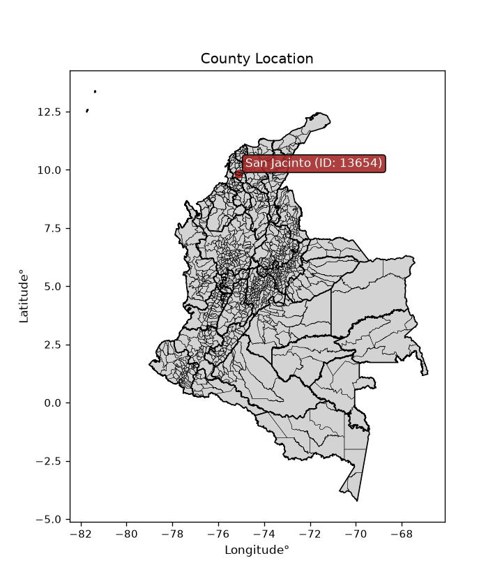
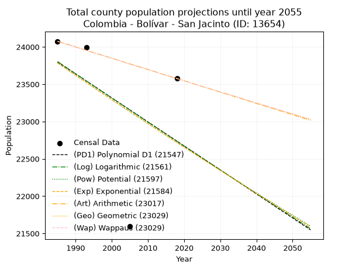
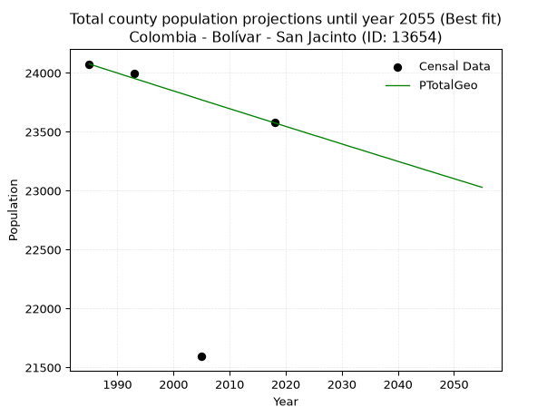
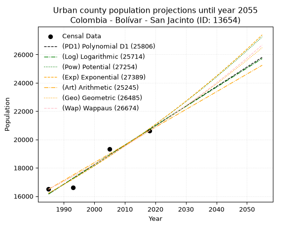
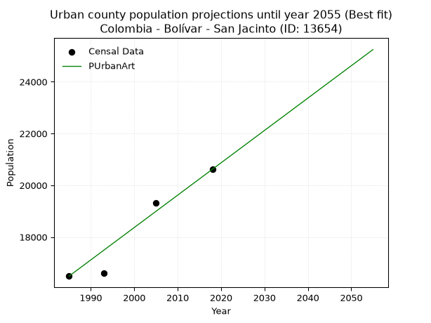
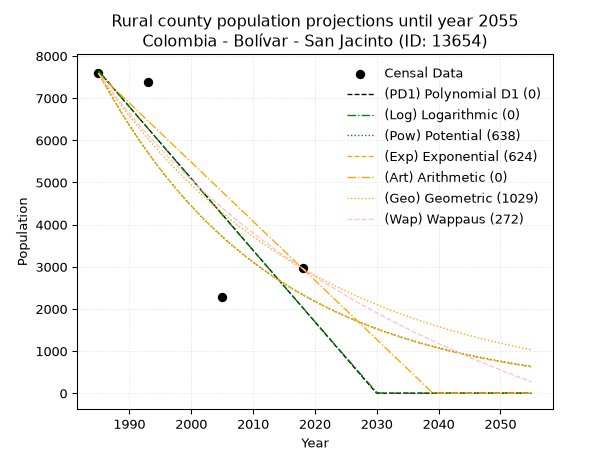
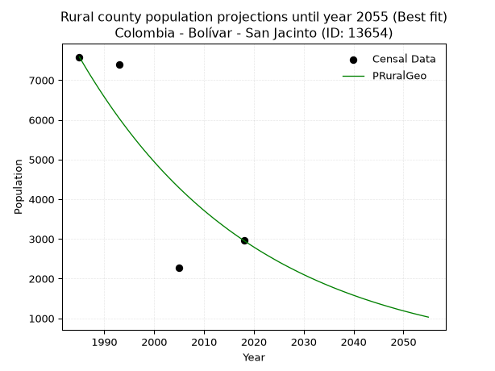

<div align="center">


</div>

# _“Population and Public Services Demand Projections (PPSD) until Year 2050 for Colombia - Bolívar - San Jacinto (ID: 13654)”_
Keywords: `population` `public-service` `projection` `lineal` `polynomial` `logarithmic` `potential` `exponential` `arithmetic` `geometric` `wappaus` `dane` `colombia` `south-america`

PPSD are analytical estimates used by governments and planners to anticipate future changes in population size, age distribution, and the resulting community needs for utilities, healthcare, education, and infrastructure as sizing future water treatment facilities, electrical grids, and road networks based on spatial growth.

> **General running parameters**: • app_version: _v20260806_. • Python version: _3.14.7_. • Pandas version: _3.0.5_. • NumPy version: _2.5.1_. • Creates, save and include plots into reports (create_plot): _False_. • Projection until year: _2050_. • Process polynomial degree 2 and up: _False_. • Process Wappaus: _True_. • Process Wappaus: _True_. • Set negative values to zero: _True_. • Set infinite values to zero: _True_. • Drop dataset notes: _True_. 
<div align="center">

Dynamic map: [:earth_americas:Google](http://maps.google.com/maps?q=9.8302754,-75.1210495) [:earth_americas:OSM](https://www.openstreetmap.org/#map=18/9.8302754/-75.1210495&layers=P) [:earth_americas:Bing](https://www.bing.com/maps?cp=9.8302754~-75.1210495&lvl=18) [:earth_americas:Apple](https://maps.apple.com/frame?center=9.8302754%2C-75.1210495&span=0.003%2C0.006)

</div>


<div align="center">

```geojson
{
  "type": "Feature",
  "geometry": {
    "type": "Point", 
    "coordinates": [-75.1210495, 9.8302754]
  }, 
  "properties": {
    "Name": "Colombia - Bolívar - San Jacinto (ID: 13654)"
  }
}
```

</div>


<div align="center">

</img>

</div>


## 0. Census Data (4 records)

Census data are official statistics collected by a government about the people and housing in a country. They usually include counts of total population, age, sex, race, income, education, and jobs.

📅Global census file: [Population.xlsx](../data/Population.xlsx)

| Source   |   Year |   CountryID | CountryName   |   StateID | StateName   |   CountyID | CountyName   |   PTotal |   PUrban |   PRural |
|:---------|-------:|------------:|:--------------|----------:|:------------|-----------:|:-------------|---------:|---------:|---------:|
| DANE     |   1985 |          57 | Colombia      |        13 | Bolívar     |      13654 | San Jacinto  |    24075 |    16491 |     7584 |
| DANE     |   1993 |          57 | Colombia      |        13 | Bolívar     |      13654 | San Jacinto  |    23992 |    16604 |     7388 |
| DANE     |   2005 |          57 | Colombia      |        13 | Bolívar     |      13654 | San Jacinto  |    21593 |    19317 |     2276 |
| DANE     |   2018 |          57 | Colombia      |        13 | Bolívar     |      13654 | San Jacinto  |    23576 |    20618 |     2958 |

> 🔥Some records could had specific notes about the registered values or the corresponding urban or rural distribution.

📅   [RUPS](https://www.datos.gov.co/Hacienda-y-Cr-dito-P-blico/Registro-nico-de-Prestadores-de-Servicios-P-blicos/4qkq-csdn/about_data) - Local public utility companies: [RUPS.csv](../data/RUPS.xlsx)

 | SERVICIO   | ESTADO    | NOMBRE                                                                     | NIT         | DEPARTAMENTO_DOMICILIO   | MUNICIPIO_DOMICILIO   | DIRECCION          |   TELEFONO | EMAIL           | TIPO_PRESTADOR                 | CLASIFICACION                 |
|:-----------|:----------|:---------------------------------------------------------------------------|:------------|:-------------------------|:----------------------|:-------------------|-----------:|:----------------|:-------------------------------|:------------------------------|
| ACUEDUCTO  | OPERATIVA | UNIDAD MUNICIPAL DE ACUEDUCTO-ALCANTARILLADO Y ASEO PUBLICO DE SAN JACINTO | 800026685-1 | BOLIVAR                  | SAN JACINTO           | Carrera 40 N 21-59 |    6868386 | jorca1@yahoo.es | MUNICIPIO (PRESTACIÓN DIRECTA) | MENOR O IGUAL A 2500 USUARIOS |

## 1. Total

### 1.1. Coefficients and Parameters

* (PD1) Polynomial Deg 1: -32.18787635487866, 87692.79967884604 (lineal)
* (Log) Logarithmic: -64681.47732744691, 514953.42749075365
* (Pow) Potential: -2.786786322022355, 13.566496955004665
* (Exp) Exponential: -0.0013866773267828243, 372998.549561837
* (Art) Arithmetic: Year diff. 2018 - 1985 = 33, Population diff. 23576 - 24075 = -499, Annual growth = -15.121212121212121
* (Geo) Geometric: Year diff. 2018 - 1985 = 33, Population diff. 23576 - 24075 = -499, Annual growth % = -0.0006344868779812884
* (Wap) Wappaus: i = -0.06346650488431353, Condition values only valid for < 200)

<sub>
Wappaus condition values: ['-0.00', '-0.06', '-0.13', '-0.19', '-0.25', '-0.32', '-0.38', '-0.44', '-0.51', '-0.57', '-0.63', '-0.70', '-0.76', '-0.83', '-0.89', '-0.95', '-1.02', '-1.08', '-1.14', '-1.21', '-1.27', '-1.33', '-1.40', '-1.46', '-1.52', '-1.59', '-1.65', '-1.71', '-1.78', '-1.84', '-1.90', '-1.97', '-2.03', '-2.09', '-2.16', '-2.22', '-2.28', '-2.35', '-2.41', '-2.48', '-2.54', '-2.60', '-2.67', '-2.73', '-2.79', '-2.86', '-2.92', '-2.98', '-3.05', '-3.11', '-3.17', '-3.24', '-3.30', '-3.36', '-3.43', '-3.49', '-3.55', '-3.62', '-3.68', '-3.74', '-3.81', '-3.87', '-3.93', '-4.00', '-4.06', '-4.13']
</sub>


### 1.2. Projected Dataset

|   Year |   CountyID |   PTotalPD1 |   PTotalLog |   PTotalPow |   PTotalExp |   PTotalArt |   PTotalGeo |   PTotalWap |
|-------:|-----------:|------------:|------------:|------------:|------------:|------------:|------------:|------------:|
|   1985 |      13654 |       23800 |       23803 |       23787 |       23784 |       24075 |       24075 |       24075 |
|   1986 |      13654 |       23768 |       23770 |       23754 |       23751 |       24060 |       24060 |       24060 |
|   1987 |      13654 |       23735 |       23738 |       23721 |       23718 |       24045 |       24044 |       24044 |
|   1988 |      13654 |       23703 |       23705 |       23687 |       23685 |       24030 |       24029 |       24029 |
|   1989 |      13654 |       23671 |       23673 |       23654 |       23653 |       24015 |       24014 |       24014 |
|   1990 |      13654 |       23639 |       23640 |       23621 |       23620 |       23999 |       23999 |       23999 |
|   1991 |      13654 |       23607 |       23608 |       23588 |       23587 |       23984 |       23983 |       23983 |
|   1992 |      13654 |       23575 |       23575 |       23555 |       23554 |       23969 |       23968 |       23968 |
|   1993 |      13654 |       23542 |       23543 |       23522 |       23522 |       23954 |       23953 |       23953 |
|   1994 |      13654 |       23510 |       23510 |       23489 |       23489 |       23939 |       23938 |       23938 |
|   1995 |      13654 |       23478 |       23478 |       23456 |       23457 |       23924 |       23923 |       23923 |
|   1996 |      13654 |       23446 |       23445 |       23424 |       23424 |       23909 |       23908 |       23908 |
|   1997 |      13654 |       23414 |       23413 |       23391 |       23392 |       23894 |       23892 |       23892 |
|   1998 |      13654 |       23381 |       23381 |       23358 |       23359 |       23878 |       23877 |       23877 |
|   1999 |      13654 |       23349 |       23348 |       23326 |       23327 |       23863 |       23862 |       23862 |
|   2000 |      13654 |       23317 |       23316 |       23293 |       23295 |       23848 |       23847 |       23847 |
|   2001 |      13654 |       23285 |       23283 |       23261 |       23262 |       23833 |       23832 |       23832 |
|   2002 |      13654 |       23253 |       23251 |       23229 |       23230 |       23818 |       23817 |       23817 |
|   2003 |      13654 |       23220 |       23219 |       23196 |       23198 |       23803 |       23802 |       23802 |
|   2004 |      13654 |       23188 |       23187 |       23164 |       23166 |       23788 |       23786 |       23786 |
|   2005 |      13654 |       23156 |       23154 |       23132 |       23134 |       23773 |       23771 |       23771 |
|   2006 |      13654 |       23124 |       23122 |       23100 |       23102 |       23757 |       23756 |       23756 |
|   2007 |      13654 |       23092 |       23090 |       23068 |       23070 |       23742 |       23741 |       23741 |
|   2008 |      13654 |       23060 |       23058 |       23036 |       23038 |       23727 |       23726 |       23726 |
|   2009 |      13654 |       23027 |       23025 |       23004 |       23006 |       23712 |       23711 |       23711 |
|   2010 |      13654 |       22995 |       22993 |       22972 |       22974 |       23697 |       23696 |       23696 |
|   2011 |      13654 |       22963 |       22961 |       22940 |       22942 |       23682 |       23681 |       23681 |
|   2012 |      13654 |       22931 |       22929 |       22908 |       22910 |       23667 |       23666 |       23666 |
|   2013 |      13654 |       22899 |       22897 |       22877 |       22878 |       23652 |       23651 |       23651 |
|   2014 |      13654 |       22866 |       22865 |       22845 |       22847 |       23636 |       23636 |       23636 |
|   2015 |      13654 |       22834 |       22833 |       22813 |       22815 |       23621 |       23621 |       23621 |
|   2016 |      13654 |       22802 |       22800 |       22782 |       22783 |       23606 |       23606 |       23606 |
|   2017 |      13654 |       22770 |       22768 |       22750 |       22752 |       23591 |       23591 |       23591 |
|   2018 |      13654 |       22738 |       22736 |       22719 |       22720 |       23576 |       23576 |       23576 |
|   2019 |      13654 |       22705 |       22704 |       22688 |       22689 |       23561 |       23561 |       23561 |
|   2020 |      13654 |       22673 |       22672 |       22656 |       22657 |       23546 |       23546 |       23546 |
|   2021 |      13654 |       22641 |       22640 |       22625 |       22626 |       23531 |       23531 |       23531 |
|   2022 |      13654 |       22609 |       22608 |       22594 |       22595 |       23516 |       23516 |       23516 |
|   2023 |      13654 |       22577 |       22576 |       22563 |       22563 |       23500 |       23501 |       23501 |
|   2024 |      13654 |       22545 |       22544 |       22532 |       22532 |       23485 |       23486 |       23486 |
|   2025 |      13654 |       22512 |       22512 |       22501 |       22501 |       23470 |       23471 |       23471 |
|   2026 |      13654 |       22480 |       22480 |       22470 |       22470 |       23455 |       23457 |       23457 |
|   2027 |      13654 |       22448 |       22448 |       22439 |       22439 |       23440 |       23442 |       23442 |
|   2028 |      13654 |       22416 |       22417 |       22408 |       22407 |       23425 |       23427 |       23427 |
|   2029 |      13654 |       22384 |       22385 |       22377 |       22376 |       23410 |       23412 |       23412 |
|   2030 |      13654 |       22351 |       22353 |       22347 |       22345 |       23395 |       23397 |       23397 |
|   2031 |      13654 |       22319 |       22321 |       22316 |       22314 |       23379 |       23382 |       23382 |
|   2032 |      13654 |       22287 |       22289 |       22285 |       22283 |       23364 |       23367 |       23367 |
|   2033 |      13654 |       22255 |       22257 |       22255 |       22253 |       23349 |       23353 |       23353 |
|   2034 |      13654 |       22223 |       22225 |       22224 |       22222 |       23334 |       23338 |       23338 |
|   2035 |      13654 |       22190 |       22194 |       22194 |       22191 |       23319 |       23323 |       23323 |
|   2036 |      13654 |       22158 |       22162 |       22164 |       22160 |       23304 |       23308 |       23308 |
|   2037 |      13654 |       22126 |       22130 |       22133 |       22130 |       23289 |       23293 |       23293 |
|   2038 |      13654 |       22094 |       22098 |       22103 |       22099 |       23274 |       23279 |       23279 |
|   2039 |      13654 |       22062 |       22067 |       22073 |       22068 |       23258 |       23264 |       23264 |
|   2040 |      13654 |       22030 |       22035 |       22043 |       22038 |       23243 |       23249 |       23249 |
|   2041 |      13654 |       21997 |       22003 |       22013 |       22007 |       23228 |       23234 |       23234 |
|   2042 |      13654 |       21965 |       21972 |       21983 |       21977 |       23213 |       23220 |       23220 |
|   2043 |      13654 |       21933 |       21940 |       21953 |       21946 |       23198 |       23205 |       23205 |
|   2044 |      13654 |       21901 |       21908 |       21923 |       21916 |       23183 |       23190 |       23190 |
|   2045 |      13654 |       21869 |       21877 |       21893 |       21885 |       23168 |       23175 |       23175 |
|   2046 |      13654 |       21836 |       21845 |       21863 |       21855 |       23153 |       23161 |       23161 |
|   2047 |      13654 |       21804 |       21813 |       21833 |       21825 |       23137 |       23146 |       23146 |
|   2048 |      13654 |       21772 |       21782 |       21804 |       21795 |       23122 |       23131 |       23131 |
|   2049 |      13654 |       21740 |       21750 |       21774 |       21764 |       23107 |       23117 |       23117 |
|   2050 |      13654 |       21708 |       21719 |       21744 |       21734 |       23092 |       23102 |       23102 |
<div align="center">

</img>

</div>


### 1.3. Best fit with absolute and relative error (%)

Relative error puts that difference into context by dividing the absolute error by the true value, creating a unitless ratio or percentage that shows the scale of the mistake.

Absolute and relative error

|   Year | Source   |   CountryID | CountryName   |   StateID | StateName   |   CountyID_x | CountyName   |   PTotal |   PUrban |   PRural |   CountyID_y |   PTotalPD1 |   PTotalLog |   PTotalPow |   PTotalExp |   PTotalArt |   PTotalGeo |   PTotalWap |   PTotalPD1AbsError |   PTotalLogAbsError |   PTotalPowAbsError |   PTotalExpAbsError |   PTotalArtAbsError |   PTotalGeoAbsError |   PTotalWapAbsError |   PTotalPD1RelError |   PTotalLogRelError |   PTotalPowRelError |   PTotalExpRelError |   PTotalArtRelError |   PTotalGeoRelError |   PTotalWapRelError |
|-------:|:---------|------------:|:--------------|----------:|:------------|-------------:|:-------------|---------:|---------:|---------:|-------------:|------------:|------------:|------------:|------------:|------------:|------------:|------------:|--------------------:|--------------------:|--------------------:|--------------------:|--------------------:|--------------------:|--------------------:|--------------------:|--------------------:|--------------------:|--------------------:|--------------------:|--------------------:|--------------------:|
|   1985 | DANE     |          57 | Colombia      |        13 | Bolívar     |        13654 | San Jacinto  |    24075 |    16491 |     7584 |        13654 |       23800 |       23803 |       23787 |       23784 |       24075 |       24075 |       24075 |                 275 |                 272 |                 288 |                 291 |                   0 |                   0 |                   0 |             1.14226 |             1.1298  |             1.19626 |             1.20872 |            0        |            0        |            0        |
|   1993 | DANE     |          57 | Colombia      |        13 | Bolívar     |        13654 | San Jacinto  |    23992 |    16604 |     7388 |        13654 |       23542 |       23543 |       23522 |       23522 |       23954 |       23953 |       23953 |                 450 |                 449 |                 470 |                 470 |                  38 |                  39 |                  39 |             1.87563 |             1.87146 |             1.95899 |             1.95899 |            0.158386 |            0.162554 |            0.162554 |
|   2005 | DANE     |          57 | Colombia      |        13 | Bolívar     |        13654 | San Jacinto  |    21593 |    19317 |     2276 |        13654 |       23156 |       23154 |       23132 |       23134 |       23773 |       23771 |       23771 |                1563 |                1561 |                1539 |                1541 |                2180 |                2178 |                2178 |             7.23846 |             7.22919 |             7.12731 |             7.13657 |           10.0959   |           10.0866   |           10.0866   |
|   2018 | DANE     |          57 | Colombia      |        13 | Bolívar     |        13654 | San Jacinto  |    23576 |    20618 |     2958 |        13654 |       22738 |       22736 |       22719 |       22720 |       23576 |       23576 |       23576 |                 838 |                 840 |                 857 |                 856 |                   0 |                   0 |                   0 |             3.55446 |             3.56295 |             3.63505 |             3.63081 |            0        |            0        |            0        |

Relative error mean

| Method    |   RelError | Best   |
|:----------|-----------:|:-------|
| PTotalPD1 |    3.4527  |        |
| PTotalLog |    3.44835 |        |
| PTotalPow |    3.4794  |        |
| PTotalExp |    3.48377 |        |
| PTotalArt |    2.56356 |        |
| PTotalGeo |    2.56229 | True   |
| PTotalWap |    2.56229 | True   |

💙Best method: _**PTotalGeo**_
<div align="center">

</img>

</div>


### 1.4. Fresh water supply demand in liters per capita per day (lpcd)

The fresh water supply demand typically ranges from 100 to 300 liters per capita per day (lpcd) for standard domestic and municipal planning, though absolute survival minimums set by the World Health Organization are as low as 7.5 to 20 liters per day, and total consumption in high-income nations can exceed 400 liters.

> `CZ`: Level in meters above the sea level (masl)<br> `WS`: Fresh water supply demand in liters per capita per day (lpcd or l/h/d)<br> `WSAll`: Zonal fresh water supply demand in liters per second (l/s)<br> `A`: Zonal area in square meters<br> `DP`: Population density (people/hectare or p/ha)

Reference values (RAS Colombia)

|    CZ |   WS |
|------:|-----:|
|  1000 |  120 |
|  2000 |  130 |
| 99999 |  140 |

County shapefile geometry properties and water supply values

|   CountyID |      ATotal |   CZTotal |   WSTotal |
|-----------:|------------:|----------:|----------:|
|      13654 | 4.42651e+08 |   269.695 |       120 |

Projected values for best method: PTotalGeo

|   CountyID |   Year |   PTotalGeo |   DPTotal |   WSTotal |   WSTotalAll |
|-----------:|-------:|------------:|----------:|----------:|-------------:|
|      13654 |   1985 |       24075 |      0.54 |       120 |      33.4375 |
|      13654 |   1986 |       24060 |      0.54 |       120 |      33.4167 |
|      13654 |   1987 |       24044 |      0.54 |       120 |      33.3944 |
|      13654 |   1988 |       24029 |      0.54 |       120 |      33.3736 |
|      13654 |   1989 |       24014 |      0.54 |       120 |      33.3528 |
|      13654 |   1990 |       23999 |      0.54 |       120 |      33.3319 |
|      13654 |   1991 |       23983 |      0.54 |       120 |      33.3097 |
|      13654 |   1992 |       23968 |      0.54 |       120 |      33.2889 |
|      13654 |   1993 |       23953 |      0.54 |       120 |      33.2681 |
|      13654 |   1994 |       23938 |      0.54 |       120 |      33.2472 |
|      13654 |   1995 |       23923 |      0.54 |       120 |      33.2264 |
|      13654 |   1996 |       23908 |      0.54 |       120 |      33.2056 |
|      13654 |   1997 |       23892 |      0.54 |       120 |      33.1833 |
|      13654 |   1998 |       23877 |      0.54 |       120 |      33.1625 |
|      13654 |   1999 |       23862 |      0.54 |       120 |      33.1417 |
|      13654 |   2000 |       23847 |      0.54 |       120 |      33.1208 |
|      13654 |   2001 |       23832 |      0.54 |       120 |      33.1    |
|      13654 |   2002 |       23817 |      0.54 |       120 |      33.0792 |
|      13654 |   2003 |       23802 |      0.54 |       120 |      33.0583 |
|      13654 |   2004 |       23786 |      0.54 |       120 |      33.0361 |
|      13654 |   2005 |       23771 |      0.54 |       120 |      33.0153 |
|      13654 |   2006 |       23756 |      0.54 |       120 |      32.9944 |
|      13654 |   2007 |       23741 |      0.54 |       120 |      32.9736 |
|      13654 |   2008 |       23726 |      0.54 |       120 |      32.9528 |
|      13654 |   2009 |       23711 |      0.54 |       120 |      32.9319 |
|      13654 |   2010 |       23696 |      0.54 |       120 |      32.9111 |
|      13654 |   2011 |       23681 |      0.53 |       120 |      32.8903 |
|      13654 |   2012 |       23666 |      0.53 |       120 |      32.8694 |
|      13654 |   2013 |       23651 |      0.53 |       120 |      32.8486 |
|      13654 |   2014 |       23636 |      0.53 |       120 |      32.8278 |
|      13654 |   2015 |       23621 |      0.53 |       120 |      32.8069 |
|      13654 |   2016 |       23606 |      0.53 |       120 |      32.7861 |
|      13654 |   2017 |       23591 |      0.53 |       120 |      32.7653 |
|      13654 |   2018 |       23576 |      0.53 |       120 |      32.7444 |
|      13654 |   2019 |       23561 |      0.53 |       120 |      32.7236 |
|      13654 |   2020 |       23546 |      0.53 |       120 |      32.7028 |
|      13654 |   2021 |       23531 |      0.53 |       120 |      32.6819 |
|      13654 |   2022 |       23516 |      0.53 |       120 |      32.6611 |
|      13654 |   2023 |       23501 |      0.53 |       120 |      32.6403 |
|      13654 |   2024 |       23486 |      0.53 |       120 |      32.6194 |
|      13654 |   2025 |       23471 |      0.53 |       120 |      32.5986 |
|      13654 |   2026 |       23457 |      0.53 |       120 |      32.5792 |
|      13654 |   2027 |       23442 |      0.53 |       120 |      32.5583 |
|      13654 |   2028 |       23427 |      0.53 |       120 |      32.5375 |
|      13654 |   2029 |       23412 |      0.53 |       120 |      32.5167 |
|      13654 |   2030 |       23397 |      0.53 |       120 |      32.4958 |
|      13654 |   2031 |       23382 |      0.53 |       120 |      32.475  |
|      13654 |   2032 |       23367 |      0.53 |       120 |      32.4542 |
|      13654 |   2033 |       23353 |      0.53 |       120 |      32.4347 |
|      13654 |   2034 |       23338 |      0.53 |       120 |      32.4139 |
|      13654 |   2035 |       23323 |      0.53 |       120 |      32.3931 |
|      13654 |   2036 |       23308 |      0.53 |       120 |      32.3722 |
|      13654 |   2037 |       23293 |      0.53 |       120 |      32.3514 |
|      13654 |   2038 |       23279 |      0.53 |       120 |      32.3319 |
|      13654 |   2039 |       23264 |      0.53 |       120 |      32.3111 |
|      13654 |   2040 |       23249 |      0.53 |       120 |      32.2903 |
|      13654 |   2041 |       23234 |      0.52 |       120 |      32.2694 |
|      13654 |   2042 |       23220 |      0.52 |       120 |      32.25   |
|      13654 |   2043 |       23205 |      0.52 |       120 |      32.2292 |
|      13654 |   2044 |       23190 |      0.52 |       120 |      32.2083 |
|      13654 |   2045 |       23175 |      0.52 |       120 |      32.1875 |
|      13654 |   2046 |       23161 |      0.52 |       120 |      32.1681 |
|      13654 |   2047 |       23146 |      0.52 |       120 |      32.1472 |
|      13654 |   2048 |       23131 |      0.52 |       120 |      32.1264 |
|      13654 |   2049 |       23117 |      0.52 |       120 |      32.1069 |
|      13654 |   2050 |       23102 |      0.52 |       120 |      32.0861 |

## 2. Urban

### 2.1. Coefficients and Parameters

* (PD1) Polynomial Deg 1: 137.8699317543146, -257516.83099156778 (lineal)
* (Log) Logarithmic: 275942.37799362413, -2079182.7263929776
* (Pow) Potential: 14.997651935386777, -45.24897493523085
* (Exp) Exponential: 0.007492989413588543, 0.005626910809333341
* (Art) Arithmetic: Year diff. 2018 - 1985 = 33, Population diff. 20618 - 16491 = 4127, Annual growth = 125.06060606060606
* (Geo) Geometric: Year diff. 2018 - 1985 = 33, Population diff. 20618 - 16491 = 4127, Annual growth % = 0.006791128664200841
* (Wap) Wappaus: i = 0.674017656420847, Condition values only valid for < 200)

<sub>
Wappaus condition values: ['0.00', '0.67', '1.35', '2.02', '2.70', '3.37', '4.04', '4.72', '5.39', '6.07', '6.74', '7.41', '8.09', '8.76', '9.44', '10.11', '10.78', '11.46', '12.13', '12.81', '13.48', '14.15', '14.83', '15.50', '16.18', '16.85', '17.52', '18.20', '18.87', '19.55', '20.22', '20.89', '21.57', '22.24', '22.92', '23.59', '24.26', '24.94', '25.61', '26.29', '26.96', '27.63', '28.31', '28.98', '29.66', '30.33', '31.00', '31.68', '32.35', '33.03', '33.70', '34.37', '35.05', '35.72', '36.40', '37.07', '37.74', '38.42', '39.09', '39.77', '40.44', '41.12', '41.79', '42.46', '43.14', '43.81']
</sub>


### 2.2. Projected Dataset

|   Year |   CountyID |   PUrbanPD1 |   PUrbanLog |   PUrbanPow |   PUrbanExp |   PUrbanArt |   PUrbanGeo |   PUrbanWap |
|-------:|-----------:|------------:|------------:|------------:|------------:|------------:|------------:|------------:|
|   1985 |      13654 |       16155 |       16151 |       16207 |       16210 |       16491 |       16491 |       16491 |
|   1986 |      13654 |       16293 |       16290 |       16329 |       16332 |       16616 |       16603 |       16603 |
|   1987 |      13654 |       16431 |       16429 |       16453 |       16455 |       16741 |       16716 |       16715 |
|   1988 |      13654 |       16569 |       16568 |       16578 |       16579 |       16866 |       16829 |       16828 |
|   1989 |      13654 |       16706 |       16707 |       16703 |       16703 |       16991 |       16944 |       16942 |
|   1990 |      13654 |       16844 |       16845 |       16830 |       16829 |       17116 |       17059 |       17056 |
|   1991 |      13654 |       16982 |       16984 |       16957 |       16955 |       17241 |       17174 |       17172 |
|   1992 |      13654 |       17120 |       17122 |       17085 |       17083 |       17366 |       17291 |       17288 |
|   1993 |      13654 |       17258 |       17261 |       17214 |       17212 |       17491 |       17409 |       17405 |
|   1994 |      13654 |       17396 |       17399 |       17344 |       17341 |       17617 |       17527 |       17523 |
|   1995 |      13654 |       17534 |       17538 |       17475 |       17471 |       17742 |       17646 |       17641 |
|   1996 |      13654 |       17672 |       17676 |       17607 |       17603 |       17867 |       17766 |       17761 |
|   1997 |      13654 |       17809 |       17814 |       17740 |       17735 |       17992 |       17886 |       17881 |
|   1998 |      13654 |       17947 |       17952 |       17873 |       17869 |       18117 |       18008 |       18002 |
|   1999 |      13654 |       18085 |       18090 |       18008 |       18003 |       18242 |       18130 |       18124 |
|   2000 |      13654 |       18223 |       18228 |       18144 |       18138 |       18367 |       18253 |       18247 |
|   2001 |      13654 |       18361 |       18366 |       18280 |       18275 |       18492 |       18377 |       18371 |
|   2002 |      13654 |       18499 |       18504 |       18418 |       18412 |       18617 |       18502 |       18495 |
|   2003 |      13654 |       18637 |       18642 |       18556 |       18551 |       18742 |       18628 |       18621 |
|   2004 |      13654 |       18775 |       18780 |       18696 |       18690 |       18867 |       18754 |       18747 |
|   2005 |      13654 |       18912 |       18917 |       18836 |       18831 |       18992 |       18881 |       18875 |
|   2006 |      13654 |       19050 |       19055 |       18977 |       18972 |       19117 |       19010 |       19003 |
|   2007 |      13654 |       19188 |       19192 |       19120 |       19115 |       19242 |       19139 |       19132 |
|   2008 |      13654 |       19326 |       19330 |       19263 |       19259 |       19367 |       19269 |       19262 |
|   2009 |      13654 |       19464 |       19467 |       19407 |       19404 |       19492 |       19400 |       19393 |
|   2010 |      13654 |       19602 |       19605 |       19553 |       19550 |       19618 |       19531 |       19525 |
|   2011 |      13654 |       19740 |       19742 |       19699 |       19697 |       19743 |       19664 |       19659 |
|   2012 |      13654 |       19877 |       19879 |       19847 |       19845 |       19868 |       19797 |       19793 |
|   2013 |      13654 |       20015 |       20016 |       19995 |       19994 |       19993 |       19932 |       19928 |
|   2014 |      13654 |       20153 |       20153 |       20145 |       20144 |       20118 |       20067 |       20064 |
|   2015 |      13654 |       20291 |       20290 |       20295 |       20296 |       20243 |       20204 |       20201 |
|   2016 |      13654 |       20429 |       20427 |       20447 |       20449 |       20368 |       20341 |       20339 |
|   2017 |      13654 |       20567 |       20564 |       20599 |       20602 |       20493 |       20479 |       20478 |
|   2018 |      13654 |       20705 |       20701 |       20753 |       20757 |       20618 |       20618 |       20618 |
|   2019 |      13654 |       20843 |       20837 |       20908 |       20914 |       20743 |       20758 |       20759 |
|   2020 |      13654 |       20980 |       20974 |       21064 |       21071 |       20868 |       20899 |       20902 |
|   2021 |      13654 |       21118 |       21111 |       21221 |       21229 |       20993 |       21041 |       21045 |
|   2022 |      13654 |       21256 |       21247 |       21379 |       21389 |       21118 |       21184 |       21190 |
|   2023 |      13654 |       21394 |       21384 |       21538 |       21550 |       21243 |       21328 |       21335 |
|   2024 |      13654 |       21532 |       21520 |       21698 |       21712 |       21368 |       21473 |       21482 |
|   2025 |      13654 |       21670 |       21656 |       21859 |       21875 |       21493 |       21618 |       21630 |
|   2026 |      13654 |       21808 |       21793 |       22022 |       22040 |       21618 |       21765 |       21779 |
|   2027 |      13654 |       21946 |       21929 |       22185 |       22205 |       21744 |       21913 |       21929 |
|   2028 |      13654 |       22083 |       22065 |       22350 |       22373 |       21869 |       22062 |       22081 |
|   2029 |      13654 |       22221 |       22201 |       22516 |       22541 |       21994 |       22212 |       22233 |
|   2030 |      13654 |       22359 |       22337 |       22683 |       22710 |       22119 |       22362 |       22387 |
|   2031 |      13654 |       22497 |       22473 |       22851 |       22881 |       22244 |       22514 |       22542 |
|   2032 |      13654 |       22635 |       22609 |       23020 |       23053 |       22369 |       22667 |       22698 |
|   2033 |      13654 |       22773 |       22744 |       23191 |       23227 |       22494 |       22821 |       22856 |
|   2034 |      13654 |       22911 |       22880 |       23363 |       23401 |       22619 |       22976 |       23015 |
|   2035 |      13654 |       23048 |       23016 |       23535 |       23577 |       22744 |       23132 |       23175 |
|   2036 |      13654 |       23186 |       23151 |       23710 |       23755 |       22869 |       23289 |       23336 |
|   2037 |      13654 |       23324 |       23287 |       23885 |       23933 |       22994 |       23447 |       23499 |
|   2038 |      13654 |       23462 |       23422 |       24061 |       24113 |       23119 |       23607 |       23663 |
|   2039 |      13654 |       23600 |       23557 |       24239 |       24295 |       23244 |       23767 |       23829 |
|   2040 |      13654 |       23738 |       23693 |       24418 |       24477 |       23369 |       23928 |       23995 |
|   2041 |      13654 |       23876 |       23828 |       24598 |       24661 |       23494 |       24091 |       24164 |
|   2042 |      13654 |       24014 |       23963 |       24779 |       24847 |       23619 |       24254 |       24333 |
|   2043 |      13654 |       24151 |       24098 |       24962 |       25034 |       23745 |       24419 |       24504 |
|   2044 |      13654 |       24289 |       24233 |       25146 |       25222 |       23870 |       24585 |       24677 |
|   2045 |      13654 |       24427 |       24368 |       25331 |       25412 |       23995 |       24752 |       24850 |
|   2046 |      13654 |       24565 |       24503 |       25517 |       25603 |       24120 |       24920 |       25026 |
|   2047 |      13654 |       24703 |       24638 |       25705 |       25795 |       24245 |       25089 |       25203 |
|   2048 |      13654 |       24841 |       24773 |       25894 |       25989 |       24370 |       25260 |       25381 |
|   2049 |      13654 |       24979 |       24907 |       26084 |       26185 |       24495 |       25431 |       25561 |
|   2050 |      13654 |       25117 |       25042 |       26276 |       26382 |       24620 |       25604 |       25742 |
<div align="center">

</img>

</div>


### 2.3. Best fit with absolute and relative error (%)

Relative error puts that difference into context by dividing the absolute error by the true value, creating a unitless ratio or percentage that shows the scale of the mistake.

Absolute and relative error

|   Year | Source   |   CountryID | CountryName   |   StateID | StateName   |   CountyID_x | CountyName   |   PTotal |   PUrban |   PRural |   CountyID_y |   PUrbanPD1 |   PUrbanLog |   PUrbanPow |   PUrbanExp |   PUrbanArt |   PUrbanGeo |   PUrbanWap |   PUrbanPD1AbsError |   PUrbanLogAbsError |   PUrbanPowAbsError |   PUrbanExpAbsError |   PUrbanArtAbsError |   PUrbanGeoAbsError |   PUrbanWapAbsError |   PUrbanPD1RelError |   PUrbanLogRelError |   PUrbanPowRelError |   PUrbanExpRelError |   PUrbanArtRelError |   PUrbanGeoRelError |   PUrbanWapRelError |
|-------:|:---------|------------:|:--------------|----------:|:------------|-------------:|:-------------|---------:|---------:|---------:|-------------:|------------:|------------:|------------:|------------:|------------:|------------:|------------:|--------------------:|--------------------:|--------------------:|--------------------:|--------------------:|--------------------:|--------------------:|--------------------:|--------------------:|--------------------:|--------------------:|--------------------:|--------------------:|--------------------:|
|   1985 | DANE     |          57 | Colombia      |        13 | Bolívar     |        13654 | San Jacinto  |    24075 |    16491 |     7584 |        13654 |       16155 |       16151 |       16207 |       16210 |       16491 |       16491 |       16491 |                 336 |                 340 |                 284 |                 281 |                   0 |                   0 |                   0 |            2.03747  |            2.06173  |            1.72215  |            1.70396  |             0       |             0       |             0       |
|   1993 | DANE     |          57 | Colombia      |        13 | Bolívar     |        13654 | San Jacinto  |    23992 |    16604 |     7388 |        13654 |       17258 |       17261 |       17214 |       17212 |       17491 |       17409 |       17405 |                 654 |                 657 |                 610 |                 608 |                 887 |                 805 |                 801 |            3.93881  |            3.95688  |            3.67381  |            3.66177  |             5.34209 |             4.84823 |             4.82414 |
|   2005 | DANE     |          57 | Colombia      |        13 | Bolívar     |        13654 | San Jacinto  |    21593 |    19317 |     2276 |        13654 |       18912 |       18917 |       18836 |       18831 |       18992 |       18881 |       18875 |                 405 |                 400 |                 481 |                 486 |                 325 |                 436 |                 442 |            2.0966   |            2.07071  |            2.49003  |            2.51592  |             1.68246 |             2.25708 |             2.28814 |
|   2018 | DANE     |          57 | Colombia      |        13 | Bolívar     |        13654 | San Jacinto  |    23576 |    20618 |     2958 |        13654 |       20705 |       20701 |       20753 |       20757 |       20618 |       20618 |       20618 |                  87 |                  83 |                 135 |                 139 |                   0 |                   0 |                   0 |            0.421961 |            0.402561 |            0.654768 |            0.674168 |             0       |             0       |             0       |

Relative error mean

| Method    |   RelError | Best   |
|:----------|-----------:|:-------|
| PUrbanPD1 |    2.12371 |        |
| PUrbanLog |    2.12297 |        |
| PUrbanPow |    2.13519 |        |
| PUrbanExp |    2.13895 |        |
| PUrbanArt |    1.75614 | True   |
| PUrbanGeo |    1.77633 |        |
| PUrbanWap |    1.77807 |        |

💙Best method: _**PUrbanArt**_
<div align="center">

</img>

</div>


### 2.4. Fresh water supply demand in liters per capita per day (lpcd)

The fresh water supply demand typically ranges from 100 to 300 liters per capita per day (lpcd) for standard domestic and municipal planning, though absolute survival minimums set by the World Health Organization are as low as 7.5 to 20 liters per day, and total consumption in high-income nations can exceed 400 liters.

> `CZ`: Level in meters above the sea level (masl)<br> `WS`: Fresh water supply demand in liters per capita per day (lpcd or l/h/d)<br> `WSAll`: Zonal fresh water supply demand in liters per second (l/s)<br> `A`: Zonal area in square meters<br> `DP`: Population density (people/hectare or p/ha)

Reference values (RAS Colombia)

|    CZ |   WS |
|------:|-----:|
|  1000 |  120 |
|  2000 |  130 |
| 99999 |  140 |

County shapefile geometry properties and water supply values

|   CountyID |      AUrban |   CZUrban |   WSUrban |
|-----------:|------------:|----------:|----------:|
|      13654 | 3.95125e+06 |   248.517 |       120 |

Projected values for best method: PUrbanArt

|   CountyID |   Year |   PUrbanArt |   DPUrban |   WSUrban |   WSUrbanAll |
|-----------:|-------:|------------:|----------:|----------:|-------------:|
|      13654 |   1985 |       16491 |     41.74 |       120 |      22.9042 |
|      13654 |   1986 |       16616 |     42.05 |       120 |      23.0778 |
|      13654 |   1987 |       16741 |     42.37 |       120 |      23.2514 |
|      13654 |   1988 |       16866 |     42.69 |       120 |      23.425  |
|      13654 |   1989 |       16991 |     43    |       120 |      23.5986 |
|      13654 |   1990 |       17116 |     43.32 |       120 |      23.7722 |
|      13654 |   1991 |       17241 |     43.63 |       120 |      23.9458 |
|      13654 |   1992 |       17366 |     43.95 |       120 |      24.1194 |
|      13654 |   1993 |       17491 |     44.27 |       120 |      24.2931 |
|      13654 |   1994 |       17617 |     44.59 |       120 |      24.4681 |
|      13654 |   1995 |       17742 |     44.9  |       120 |      24.6417 |
|      13654 |   1996 |       17867 |     45.22 |       120 |      24.8153 |
|      13654 |   1997 |       17992 |     45.53 |       120 |      24.9889 |
|      13654 |   1998 |       18117 |     45.85 |       120 |      25.1625 |
|      13654 |   1999 |       18242 |     46.17 |       120 |      25.3361 |
|      13654 |   2000 |       18367 |     46.48 |       120 |      25.5097 |
|      13654 |   2001 |       18492 |     46.8  |       120 |      25.6833 |
|      13654 |   2002 |       18617 |     47.12 |       120 |      25.8569 |
|      13654 |   2003 |       18742 |     47.43 |       120 |      26.0306 |
|      13654 |   2004 |       18867 |     47.75 |       120 |      26.2042 |
|      13654 |   2005 |       18992 |     48.07 |       120 |      26.3778 |
|      13654 |   2006 |       19117 |     48.38 |       120 |      26.5514 |
|      13654 |   2007 |       19242 |     48.7  |       120 |      26.725  |
|      13654 |   2008 |       19367 |     49.01 |       120 |      26.8986 |
|      13654 |   2009 |       19492 |     49.33 |       120 |      27.0722 |
|      13654 |   2010 |       19618 |     49.65 |       120 |      27.2472 |
|      13654 |   2011 |       19743 |     49.97 |       120 |      27.4208 |
|      13654 |   2012 |       19868 |     50.28 |       120 |      27.5944 |
|      13654 |   2013 |       19993 |     50.6  |       120 |      27.7681 |
|      13654 |   2014 |       20118 |     50.92 |       120 |      27.9417 |
|      13654 |   2015 |       20243 |     51.23 |       120 |      28.1153 |
|      13654 |   2016 |       20368 |     51.55 |       120 |      28.2889 |
|      13654 |   2017 |       20493 |     51.86 |       120 |      28.4625 |
|      13654 |   2018 |       20618 |     52.18 |       120 |      28.6361 |
|      13654 |   2019 |       20743 |     52.5  |       120 |      28.8097 |
|      13654 |   2020 |       20868 |     52.81 |       120 |      28.9833 |
|      13654 |   2021 |       20993 |     53.13 |       120 |      29.1569 |
|      13654 |   2022 |       21118 |     53.45 |       120 |      29.3306 |
|      13654 |   2023 |       21243 |     53.76 |       120 |      29.5042 |
|      13654 |   2024 |       21368 |     54.08 |       120 |      29.6778 |
|      13654 |   2025 |       21493 |     54.4  |       120 |      29.8514 |
|      13654 |   2026 |       21618 |     54.71 |       120 |      30.025  |
|      13654 |   2027 |       21744 |     55.03 |       120 |      30.2    |
|      13654 |   2028 |       21869 |     55.35 |       120 |      30.3736 |
|      13654 |   2029 |       21994 |     55.66 |       120 |      30.5472 |
|      13654 |   2030 |       22119 |     55.98 |       120 |      30.7208 |
|      13654 |   2031 |       22244 |     56.3  |       120 |      30.8944 |
|      13654 |   2032 |       22369 |     56.61 |       120 |      31.0681 |
|      13654 |   2033 |       22494 |     56.93 |       120 |      31.2417 |
|      13654 |   2034 |       22619 |     57.25 |       120 |      31.4153 |
|      13654 |   2035 |       22744 |     57.56 |       120 |      31.5889 |
|      13654 |   2036 |       22869 |     57.88 |       120 |      31.7625 |
|      13654 |   2037 |       22994 |     58.19 |       120 |      31.9361 |
|      13654 |   2038 |       23119 |     58.51 |       120 |      32.1097 |
|      13654 |   2039 |       23244 |     58.83 |       120 |      32.2833 |
|      13654 |   2040 |       23369 |     59.14 |       120 |      32.4569 |
|      13654 |   2041 |       23494 |     59.46 |       120 |      32.6306 |
|      13654 |   2042 |       23619 |     59.78 |       120 |      32.8042 |
|      13654 |   2043 |       23745 |     60.09 |       120 |      32.9792 |
|      13654 |   2044 |       23870 |     60.41 |       120 |      33.1528 |
|      13654 |   2045 |       23995 |     60.73 |       120 |      33.3264 |
|      13654 |   2046 |       24120 |     61.04 |       120 |      33.5    |
|      13654 |   2047 |       24245 |     61.36 |       120 |      33.6736 |
|      13654 |   2048 |       24370 |     61.68 |       120 |      33.8472 |
|      13654 |   2049 |       24495 |     61.99 |       120 |      34.0208 |
|      13654 |   2050 |       24620 |     62.31 |       120 |      34.1944 |

## 3. Rural

### 3.1. Coefficients and Parameters

* (PD1) Polynomial Deg 1: -170.0578081091932, 345209.6306704137 (lineal)
* (Log) Logarithmic: -340623.855321071, 2594136.153883731
* (Pow) Potential: -71.54225865868983, 239.81057030397125
* (Exp) Exponential: -0.03571173094997196, 4.643459298009447e+34
* (Art) Arithmetic: Year diff. 2018 - 1985 = 33, Population diff. 2958 - 7584 = -4626, Annual growth = -140.1818181818182
* (Geo) Geometric: Year diff. 2018 - 1985 = 33, Population diff. 2958 - 7584 = -4626, Annual growth % = -0.028127963960493108
* (Wap) Wappaus: i = -2.659491902519791, Condition values only valid for < 200)

<sub>
Wappaus condition values: ['-0.00', '-2.66', '-5.32', '-7.98', '-10.64', '-13.30', '-15.96', '-18.62', '-21.28', '-23.94', '-26.59', '-29.25', '-31.91', '-34.57', '-37.23', '-39.89', '-42.55', '-45.21', '-47.87', '-50.53', '-53.19', '-55.85', '-58.51', '-61.17', '-63.83', '-66.49', '-69.15', '-71.81', '-74.47', '-77.13', '-79.78', '-82.44', '-85.10', '-87.76', '-90.42', '-93.08', '-95.74', '-98.40', '-101.06', '-103.72', '-106.38', '-109.04', '-111.70', '-114.36', '-117.02', '-119.68', '-122.34', '-125.00', '-127.66', '-130.32', '-132.97', '-135.63', '-138.29', '-140.95', '-143.61', '-146.27', '-148.93', '-151.59', '-154.25', '-156.91', '-159.57', '-162.23', '-164.89', '-167.55', '-170.21', '-172.87']
</sub>


### 3.2. Projected Dataset

|   Year |   CountyID |   PRuralPD1 |   PRuralLog |   PRuralPow |   PRuralExp |   PRuralArt |   PRuralGeo |   PRuralWap |
|-------:|-----------:|------------:|------------:|------------:|------------:|------------:|------------:|------------:|
|   1985 |      13654 |        7645 |        7652 |        7609 |        7597 |        7584 |        7584 |        7584 |
|   1986 |      13654 |        7475 |        7480 |        7340 |        7331 |        7444 |        7371 |        7385 |
|   1987 |      13654 |        7305 |        7309 |        7080 |        7074 |        7304 |        7163 |        7191 |
|   1988 |      13654 |        7135 |        7137 |        6830 |        6826 |        7163 |        6962 |        7002 |
|   1989 |      13654 |        6965 |        6966 |        6589 |        6586 |        7023 |        6766 |        6818 |
|   1990 |      13654 |        6795 |        6795 |        6356 |        6355 |        6883 |        6576 |        6638 |
|   1991 |      13654 |        6625 |        6624 |        6131 |        6132 |        6743 |        6391 |        6463 |
|   1992 |      13654 |        6454 |        6453 |        5915 |        5917 |        6603 |        6211 |        6292 |
|   1993 |      13654 |        6284 |        6282 |        5706 |        5709 |        6463 |        6036 |        6126 |
|   1994 |      13654 |        6114 |        6111 |        5505 |        5509 |        6322 |        5867 |        5963 |
|   1995 |      13654 |        5944 |        5940 |        5311 |        5316 |        6182 |        5702 |        5804 |
|   1996 |      13654 |        5774 |        5769 |        5124 |        5129 |        6042 |        5541 |        5648 |
|   1997 |      13654 |        5604 |        5599 |        4944 |        4949 |        5902 |        5385 |        5497 |
|   1998 |      13654 |        5434 |        5428 |        4770 |        4776 |        5762 |        5234 |        5348 |
|   1999 |      13654 |        5264 |        5258 |        4602 |        4608 |        5621 |        5087 |        5203 |
|   2000 |      13654 |        5094 |        5087 |        4440 |        4447 |        5481 |        4944 |        5062 |
|   2001 |      13654 |        4924 |        4917 |        4284 |        4291 |        5341 |        4804 |        4923 |
|   2002 |      13654 |        4754 |        4747 |        4134 |        4140 |        5201 |        4669 |        4787 |
|   2003 |      13654 |        4584 |        4577 |        3989 |        3995 |        5061 |        4538 |        4655 |
|   2004 |      13654 |        4414 |        4407 |        3849 |        3855 |        4921 |        4410 |        4525 |
|   2005 |      13654 |        4244 |        4237 |        3714 |        3719 |        4780 |        4286 |        4398 |
|   2006 |      13654 |        4074 |        4067 |        3584 |        3589 |        4640 |        4166 |        4273 |
|   2007 |      13654 |        3904 |        3897 |        3458 |        3463 |        4500 |        4049 |        4151 |
|   2008 |      13654 |        3734 |        3728 |        3337 |        3342 |        4360 |        3935 |        4031 |
|   2009 |      13654 |        3563 |        3558 |        3221 |        3224 |        4220 |        3824 |        3914 |
|   2010 |      13654 |        3393 |        3389 |        3108 |        3111 |        4079 |        3716 |        3800 |
|   2011 |      13654 |        3223 |        3219 |        2999 |        3002 |        3939 |        3612 |        3687 |
|   2012 |      13654 |        3053 |        3050 |        2894 |        2897 |        3799 |        3510 |        3577 |
|   2013 |      13654 |        2883 |        2881 |        2793 |        2795 |        3659 |        3412 |        3469 |
|   2014 |      13654 |        2713 |        2711 |        2696 |        2697 |        3519 |        3316 |        3363 |
|   2015 |      13654 |        2543 |        2542 |        2602 |        2602 |        3379 |        3222 |        3259 |
|   2016 |      13654 |        2373 |        2373 |        2511 |        2511 |        3238 |        3132 |        3157 |
|   2017 |      13654 |        2203 |        2204 |        2424 |        2423 |        3098 |        3044 |        3056 |
|   2018 |      13654 |        2033 |        2036 |        2339 |        2338 |        2958 |        2958 |        2958 |
|   2019 |      13654 |        1863 |        1867 |        2258 |        2256 |        2818 |        2875 |        2861 |
|   2020 |      13654 |        1693 |        1698 |        2179 |        2177 |        2678 |        2794 |        2767 |
|   2021 |      13654 |        1523 |        1530 |        2103 |        2101 |        2537 |        2715 |        2674 |
|   2022 |      13654 |        1353 |        1361 |        2030 |        2027 |        2397 |        2639 |        2582 |
|   2023 |      13654 |        1183 |        1193 |        1960 |        1956 |        2257 |        2565 |        2492 |
|   2024 |      13654 |        1013 |        1024 |        1891 |        1887 |        2117 |        2493 |        2404 |
|   2025 |      13654 |         843 |         856 |        1826 |        1821 |        1977 |        2422 |        2317 |
|   2026 |      13654 |         673 |         688 |        1762 |        1757 |        1837 |        2354 |        2232 |
|   2027 |      13654 |         502 |         520 |        1701 |        1695 |        1696 |        2288 |        2148 |
|   2028 |      13654 |         332 |         352 |        1642 |        1636 |        1556 |        2224 |        2066 |
|   2029 |      13654 |         162 |         184 |        1585 |        1579 |        1416 |        2161 |        1985 |
|   2030 |      13654 |           0 |          16 |        1530 |        1523 |        1276 |        2100 |        1906 |
|   2031 |      13654 |           0 |           0 |        1478 |        1470 |        1136 |        2041 |        1827 |
|   2032 |      13654 |           0 |           0 |        1426 |        1418 |         995 |        1984 |        1750 |
|   2033 |      13654 |           0 |           0 |        1377 |        1368 |         855 |        1928 |        1675 |
|   2034 |      13654 |           0 |           0 |        1329 |        1320 |         715 |        1874 |        1600 |
|   2035 |      13654 |           0 |           0 |        1284 |        1274 |         575 |        1821 |        1527 |
|   2036 |      13654 |           0 |           0 |        1239 |        1229 |         435 |        1770 |        1454 |
|   2037 |      13654 |           0 |           0 |        1196 |        1186 |         295 |        1720 |        1383 |
|   2038 |      13654 |           0 |           0 |        1155 |        1145 |         154 |        1672 |        1313 |
|   2039 |      13654 |           0 |           0 |        1115 |        1104 |          14 |        1625 |        1245 |
|   2040 |      13654 |           0 |           0 |        1077 |        1066 |           0 |        1579 |        1177 |
|   2041 |      13654 |           0 |           0 |        1040 |        1028 |           0 |        1535 |        1110 |
|   2042 |      13654 |           0 |           0 |        1004 |         992 |           0 |        1491 |        1044 |
|   2043 |      13654 |           0 |           0 |         969 |         957 |           0 |        1450 |         979 |
|   2044 |      13654 |           0 |           0 |         936 |         924 |           0 |        1409 |         916 |
|   2045 |      13654 |           0 |           0 |         904 |         891 |           0 |        1369 |         853 |
|   2046 |      13654 |           0 |           0 |         873 |         860 |           0 |        1331 |         791 |
|   2047 |      13654 |           0 |           0 |         843 |         830 |           0 |        1293 |         730 |
|   2048 |      13654 |           0 |           0 |         814 |         801 |           0 |        1257 |         670 |
|   2049 |      13654 |           0 |           0 |         786 |         773 |           0 |        1221 |         610 |
|   2050 |      13654 |           0 |           0 |         759 |         746 |           0 |        1187 |         552 |
<div align="center">

</img>

</div>


### 3.3. Best fit with absolute and relative error (%)

Relative error puts that difference into context by dividing the absolute error by the true value, creating a unitless ratio or percentage that shows the scale of the mistake.

Absolute and relative error

|   Year | Source   |   CountryID | CountryName   |   StateID | StateName   |   CountyID_x | CountyName   |   PTotal |   PUrban |   PRural |   CountyID_y |   PRuralPD1 |   PRuralLog |   PRuralPow |   PRuralExp |   PRuralArt |   PRuralGeo |   PRuralWap |   PRuralPD1AbsError |   PRuralLogAbsError |   PRuralPowAbsError |   PRuralExpAbsError |   PRuralArtAbsError |   PRuralGeoAbsError |   PRuralWapAbsError |   PRuralPD1RelError |   PRuralLogRelError |   PRuralPowRelError |   PRuralExpRelError |   PRuralArtRelError |   PRuralGeoRelError |   PRuralWapRelError |
|-------:|:---------|------------:|:--------------|----------:|:------------|-------------:|:-------------|---------:|---------:|---------:|-------------:|------------:|------------:|------------:|------------:|------------:|------------:|------------:|--------------------:|--------------------:|--------------------:|--------------------:|--------------------:|--------------------:|--------------------:|--------------------:|--------------------:|--------------------:|--------------------:|--------------------:|--------------------:|--------------------:|
|   1985 | DANE     |          57 | Colombia      |        13 | Bolívar     |        13654 | San Jacinto  |    24075 |    16491 |     7584 |        13654 |        7645 |        7652 |        7609 |        7597 |        7584 |        7584 |        7584 |                  61 |                  68 |                  25 |                  13 |                   0 |                   0 |                   0 |            0.804325 |            0.896624 |            0.329641 |            0.171414 |              0      |              0      |              0      |
|   1993 | DANE     |          57 | Colombia      |        13 | Bolívar     |        13654 | San Jacinto  |    23992 |    16604 |     7388 |        13654 |        6284 |        6282 |        5706 |        5709 |        6463 |        6036 |        6126 |                1104 |                1106 |                1682 |                1679 |                 925 |                1352 |                1262 |           14.9432   |           14.9702   |           22.7666   |           22.726    |             12.5203 |             18.2999 |             17.0818 |
|   2005 | DANE     |          57 | Colombia      |        13 | Bolívar     |        13654 | San Jacinto  |    21593 |    19317 |     2276 |        13654 |        4244 |        4237 |        3714 |        3719 |        4780 |        4286 |        4398 |                1968 |                1961 |                1438 |                1443 |                2504 |                2010 |                2122 |           86.4675   |           86.1599   |           63.181    |           63.4007   |            110.018  |             88.3128 |             93.2337 |
|   2018 | DANE     |          57 | Colombia      |        13 | Bolívar     |        13654 | San Jacinto  |    23576 |    20618 |     2958 |        13654 |        2033 |        2036 |        2339 |        2338 |        2958 |        2958 |        2958 |                 925 |                 922 |                 619 |                 620 |                   0 |                   0 |                   0 |           31.2711   |           31.1697   |           20.9263   |           20.9601   |              0      |              0      |              0      |

Relative error mean

| Method    |   RelError | Best   |
|:----------|-----------:|:-------|
| PRuralPD1 |    33.3715 |        |
| PRuralLog |    33.2991 |        |
| PRuralPow |    26.8009 |        |
| PRuralExp |    26.8146 |        |
| PRuralArt |    30.6345 |        |
| PRuralGeo |    26.6532 | True   |
| PRuralWap |    27.5789 |        |

💙Best method: _**PRuralGeo**_
<div align="center">

</img>

</div>


### 3.4. Fresh water supply demand in liters per capita per day (lpcd)

The fresh water supply demand typically ranges from 100 to 300 liters per capita per day (lpcd) for standard domestic and municipal planning, though absolute survival minimums set by the World Health Organization are as low as 7.5 to 20 liters per day, and total consumption in high-income nations can exceed 400 liters.

> `CZ`: Level in meters above the sea level (masl)<br> `WS`: Fresh water supply demand in liters per capita per day (lpcd or l/h/d)<br> `WSAll`: Zonal fresh water supply demand in liters per second (l/s)<br> `A`: Zonal area in square meters<br> `DP`: Population density (people/hectare or p/ha)

Reference values (RAS Colombia)

|    CZ |   WS |
|------:|-----:|
|  1000 |  120 |
|  2000 |  130 |
| 99999 |  140 |

County shapefile geometry properties and water supply values

|   CountyID |    ARural |   CZRural |   WSRural |
|-----------:|----------:|----------:|----------:|
|      13654 | 4.387e+08 |   269.885 |       120 |

Projected values for best method: PRuralGeo

|   CountyID |   Year |   PRuralGeo |   DPRural |   WSRural |   WSRuralAll |
|-----------:|-------:|------------:|----------:|----------:|-------------:|
|      13654 |   1985 |        7584 |      0.17 |       120 |     10.5333  |
|      13654 |   1986 |        7371 |      0.17 |       120 |     10.2375  |
|      13654 |   1987 |        7163 |      0.16 |       120 |      9.94861 |
|      13654 |   1988 |        6962 |      0.16 |       120 |      9.66944 |
|      13654 |   1989 |        6766 |      0.15 |       120 |      9.39722 |
|      13654 |   1990 |        6576 |      0.15 |       120 |      9.13333 |
|      13654 |   1991 |        6391 |      0.15 |       120 |      8.87639 |
|      13654 |   1992 |        6211 |      0.14 |       120 |      8.62639 |
|      13654 |   1993 |        6036 |      0.14 |       120 |      8.38333 |
|      13654 |   1994 |        5867 |      0.13 |       120 |      8.14861 |
|      13654 |   1995 |        5702 |      0.13 |       120 |      7.91944 |
|      13654 |   1996 |        5541 |      0.13 |       120 |      7.69583 |
|      13654 |   1997 |        5385 |      0.12 |       120 |      7.47917 |
|      13654 |   1998 |        5234 |      0.12 |       120 |      7.26944 |
|      13654 |   1999 |        5087 |      0.12 |       120 |      7.06528 |
|      13654 |   2000 |        4944 |      0.11 |       120 |      6.86667 |
|      13654 |   2001 |        4804 |      0.11 |       120 |      6.67222 |
|      13654 |   2002 |        4669 |      0.11 |       120 |      6.48472 |
|      13654 |   2003 |        4538 |      0.1  |       120 |      6.30278 |
|      13654 |   2004 |        4410 |      0.1  |       120 |      6.125   |
|      13654 |   2005 |        4286 |      0.1  |       120 |      5.95278 |
|      13654 |   2006 |        4166 |      0.09 |       120 |      5.78611 |
|      13654 |   2007 |        4049 |      0.09 |       120 |      5.62361 |
|      13654 |   2008 |        3935 |      0.09 |       120 |      5.46528 |
|      13654 |   2009 |        3824 |      0.09 |       120 |      5.31111 |
|      13654 |   2010 |        3716 |      0.08 |       120 |      5.16111 |
|      13654 |   2011 |        3612 |      0.08 |       120 |      5.01667 |
|      13654 |   2012 |        3510 |      0.08 |       120 |      4.875   |
|      13654 |   2013 |        3412 |      0.08 |       120 |      4.73889 |
|      13654 |   2014 |        3316 |      0.08 |       120 |      4.60556 |
|      13654 |   2015 |        3222 |      0.07 |       120 |      4.475   |
|      13654 |   2016 |        3132 |      0.07 |       120 |      4.35    |
|      13654 |   2017 |        3044 |      0.07 |       120 |      4.22778 |
|      13654 |   2018 |        2958 |      0.07 |       120 |      4.10833 |
|      13654 |   2019 |        2875 |      0.07 |       120 |      3.99306 |
|      13654 |   2020 |        2794 |      0.06 |       120 |      3.88056 |
|      13654 |   2021 |        2715 |      0.06 |       120 |      3.77083 |
|      13654 |   2022 |        2639 |      0.06 |       120 |      3.66528 |
|      13654 |   2023 |        2565 |      0.06 |       120 |      3.5625  |
|      13654 |   2024 |        2493 |      0.06 |       120 |      3.4625  |
|      13654 |   2025 |        2422 |      0.06 |       120 |      3.36389 |
|      13654 |   2026 |        2354 |      0.05 |       120 |      3.26944 |
|      13654 |   2027 |        2288 |      0.05 |       120 |      3.17778 |
|      13654 |   2028 |        2224 |      0.05 |       120 |      3.08889 |
|      13654 |   2029 |        2161 |      0.05 |       120 |      3.00139 |
|      13654 |   2030 |        2100 |      0.05 |       120 |      2.91667 |
|      13654 |   2031 |        2041 |      0.05 |       120 |      2.83472 |
|      13654 |   2032 |        1984 |      0.05 |       120 |      2.75556 |
|      13654 |   2033 |        1928 |      0.04 |       120 |      2.67778 |
|      13654 |   2034 |        1874 |      0.04 |       120 |      2.60278 |
|      13654 |   2035 |        1821 |      0.04 |       120 |      2.52917 |
|      13654 |   2036 |        1770 |      0.04 |       120 |      2.45833 |
|      13654 |   2037 |        1720 |      0.04 |       120 |      2.38889 |
|      13654 |   2038 |        1672 |      0.04 |       120 |      2.32222 |
|      13654 |   2039 |        1625 |      0.04 |       120 |      2.25694 |
|      13654 |   2040 |        1579 |      0.04 |       120 |      2.19306 |
|      13654 |   2041 |        1535 |      0.03 |       120 |      2.13194 |
|      13654 |   2042 |        1491 |      0.03 |       120 |      2.07083 |
|      13654 |   2043 |        1450 |      0.03 |       120 |      2.01389 |
|      13654 |   2044 |        1409 |      0.03 |       120 |      1.95694 |
|      13654 |   2045 |        1369 |      0.03 |       120 |      1.90139 |
|      13654 |   2046 |        1331 |      0.03 |       120 |      1.84861 |
|      13654 |   2047 |        1293 |      0.03 |       120 |      1.79583 |
|      13654 |   2048 |        1257 |      0.03 |       120 |      1.74583 |
|      13654 |   2049 |        1221 |      0.03 |       120 |      1.69583 |
|      13654 |   2050 |        1187 |      0.03 |       120 |      1.64861 |

<div align="center"><br><sub>Share this research</sub></div><br>

<sub>**APPS & TOOLS & CONTENT DISCLAIMER**: • NO WARRANTY - This content and software is provided by <a href="https://github.com/rcfdtools" target="_blank">github.com/rcfdtools</a> "as is", without any express or implied warranty, including warranties of merchantability, fitness for a particular purpose, or non-infringement. There is no guarantee that the software will be error-free or operate without interruption. • LIMITATION OF LIABILITY - Neither the authors nor copyright holders will be liable for claims or damages arising from the software or its use. You are responsible for determining if the software is appropriate for your use and assume all associated risks, including errors, legal compliance, and data loss. • NO PROFESSIONAL ADVICE - The software provides general information and does not offer professional advice. It should not replace consultation with professional advisors. [Clauses and global license for rcfdtools use.](https://github.com/rcfdtools/rcfdtools/blob/main/LICENSE.md)</sub>

| [:house: Home](Readme.md)  | [:beginner: Help / Collab](https://github.com/rcfdtools/R.HydroTools/discussions/31) |
|----------------------------|-------------------------------------------------------------------------------------------|