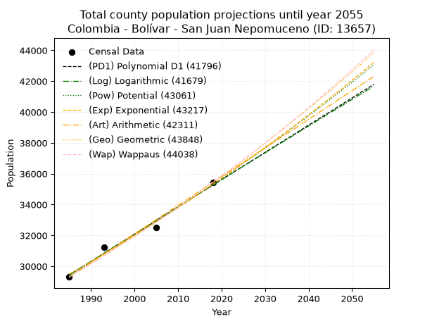
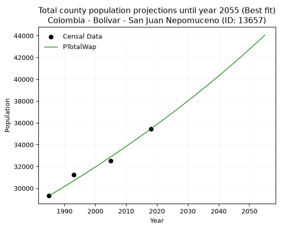
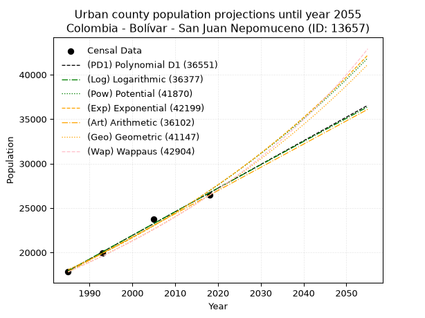
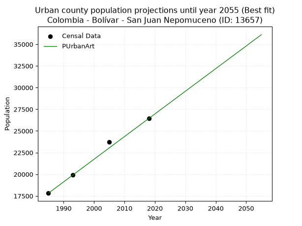
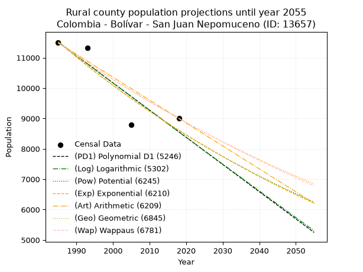
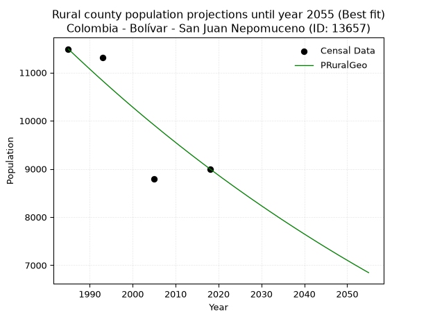

<div align="center">


</div>

# _“Population and Public Services Demand Projections (PPSD) until Year 2050 for Colombia - Bolívar - San Juan Nepomuceno (ID: 13657)”_
Keywords: `population` `public-service` `projection` `lineal` `polynomial` `logarithmic` `potential` `exponential` `arithmetic` `geometric` `wappaus` `dane` `colombia` `south-america`

PPSD are analytical estimates used by governments and planners to anticipate future changes in population size, age distribution, and the resulting community needs for utilities, healthcare, education, and infrastructure as sizing future water treatment facilities, electrical grids, and road networks based on spatial growth.

> **General running parameters**: • app_version: _v20260806_. • Python version: _3.14.7_. • Pandas version: _3.0.5_. • NumPy version: _2.5.1_. • Creates, save and include plots into reports (create_plot): _False_. • Projection until year: _2050_. • Process polynomial degree 2 and up: _False_. • Process Wappaus: _True_. • Process Wappaus: _True_. • Set negative values to zero: _True_. • Set infinite values to zero: _True_. • Drop dataset notes: _True_. 
<div align="center">

Dynamic map: [:earth_americas:Google](http://maps.google.com/maps?q=9.953751378,-75.0817609) [:earth_americas:OSM](https://www.openstreetmap.org/#map=18/9.953751378/-75.0817609&layers=P) [:earth_americas:Bing](https://www.bing.com/maps?cp=9.953751378~-75.0817609&lvl=18) [:earth_americas:Apple](https://maps.apple.com/frame?center=9.953751378%2C-75.0817609&span=0.003%2C0.006)

</div>


<div align="center">

```geojson
{
  "type": "Feature",
  "geometry": {
    "type": "Point", 
    "coordinates": [-75.0817609, 9.953751378]
  }, 
  "properties": {
    "Name": "Colombia - Bolívar - San Juan Nepomuceno (ID: 13657)"
  }
}
```

</div>


## 0. Census Data (4 records)

Census data are official statistics collected by a government about the people and housing in a country. They usually include counts of total population, age, sex, race, income, education, and jobs.

📅Global census file: [Population.xlsx](../data/Population.xlsx)

| Source   |   Year |   CountryID | CountryName   |   StateID | StateName   |   CountyID | CountyName          |   PTotal |   PUrban |   PRural |
|:---------|-------:|------------:|:--------------|----------:|:------------|-----------:|:--------------------|---------:|---------:|---------:|
| DANE     |   1985 |          57 | Colombia      |        13 | Bolívar     |      13657 | San Juan Nepomuceno |    29308 |    17819 |    11489 |
| DANE     |   1993 |          57 | Colombia      |        13 | Bolívar     |      13657 | San Juan Nepomuceno |    31245 |    19929 |    11316 |
| DANE     |   2005 |          57 | Colombia      |        13 | Bolívar     |      13657 | San Juan Nepomuceno |    32514 |    23727 |     8787 |
| DANE     |   2018 |          57 | Colombia      |        13 | Bolívar     |      13657 | San Juan Nepomuceno |    35438 |    26438 |     9000 |

> 🔥Some records could had specific notes about the registered values or the corresponding urban or rural distribution.

📅   [RUPS](https://www.datos.gov.co/Hacienda-y-Cr-dito-P-blico/Registro-nico-de-Prestadores-de-Servicios-P-blicos/4qkq-csdn/about_data) - Local public utility companies: [RUPS.csv](../data/RUPS.xlsx)

 | SERVICIO   | ESTADO    | NOMBRE                           | NIT         | DEPARTAMENTO_DOMICILIO   | MUNICIPIO_DOMICILIO   | DIRECCION           |   TELEFONO | EMAIL                    | TIPO_INSCRIPCION    | REPRESENTANTE_LEGAL          | TIPO_PRESTADOR                             | CLASIFICACION                  |
|:-----------|:----------|:---------------------------------|:------------|:-------------------------|:----------------------|:--------------------|-----------:|:-------------------------|:--------------------|:-----------------------------|:-------------------------------------------|:-------------------------------|
| ACUEDUCTO  | OPERATIVA | AGUAS DE LA COSTA S.A. ESP       | 806010236-8 | BOLIVAR                  | SAN JUAN NEPOMUCENO   | Carrera 8 # 9 - 25  |    6891923 | AGUACOSTA@TELECOM.COM.CO | Registro por la ESP | SANTIAGO RESTREPO ESTRADA    | SOCIEDADES (EMPRESA DE SERVICIOS PUBLICOS) | MAS DE 2500 SUSCRIPTORES       |
| ACUEDUCTO  | OPERATIVA | MUNICIPIO DE SAN JUAN NEPOMUCENO | 800037175-2 | BOLIVAR                  | SAN JUAN NEPOMUCENO   | Carrera 13 No. 8-70 |    6890596 | benitoja66@gmail.com     | Registro por la ESP | GUTAVO JOSE CASTILLO ACEVEDO | MUNICIPIO (PRESTACIÓN DIRECTA)             | DESDE 2501 HASTA 5000 USUARIOS |

## 1. Total

### 1.1. Coefficients and Parameters

* (PD1) Polynomial Deg 1: 176.624247290243, -321166.4006423086 (lineal)
* (Log) Logarithmic: 353504.9762014932, -2654867.9069186435
* (Pow) Potential: 10.928866593195078, -31.571190859119092
* (Exp) Exponential: 0.005460074090913143, 0.5789934655001554
* (Art) Arithmetic: Year diff. 2018 - 1985 = 33, Population diff. 35438 - 29308 = 6130, Annual growth = 185.75757575757575
* (Geo) Geometric: Year diff. 2018 - 1985 = 33, Population diff. 35438 - 29308 = 6130, Annual growth % = 0.005771871443777998
* (Wap) Wappaus: i = 0.5738040211212299, Condition values only valid for < 200)

<sub>
Wappaus condition values: ['0.00', '0.57', '1.15', '1.72', '2.30', '2.87', '3.44', '4.02', '4.59', '5.16', '5.74', '6.31', '6.89', '7.46', '8.03', '8.61', '9.18', '9.75', '10.33', '10.90', '11.48', '12.05', '12.62', '13.20', '13.77', '14.35', '14.92', '15.49', '16.07', '16.64', '17.21', '17.79', '18.36', '18.94', '19.51', '20.08', '20.66', '21.23', '21.80', '22.38', '22.95', '23.53', '24.10', '24.67', '25.25', '25.82', '26.39', '26.97', '27.54', '28.12', '28.69', '29.26', '29.84', '30.41', '30.99', '31.56', '32.13', '32.71', '33.28', '33.85', '34.43', '35.00', '35.58', '36.15', '36.72', '37.30']
</sub>


### 1.2. Projected Dataset

|   Year |   CountyID |   PTotalPD1 |   PTotalLog |   PTotalPow |   PTotalExp |   PTotalArt |   PTotalGeo |   PTotalWap |
|-------:|-----------:|------------:|------------:|------------:|------------:|------------:|------------:|------------:|
|   1985 |      13657 |       29433 |       29428 |       29485 |       29489 |       29308 |       29308 |       29308 |
|   1986 |      13657 |       29609 |       29606 |       29647 |       29651 |       29494 |       29477 |       29477 |
|   1987 |      13657 |       29786 |       29784 |       29811 |       29813 |       29680 |       29647 |       29646 |
|   1988 |      13657 |       29963 |       29962 |       29975 |       29976 |       29865 |       29818 |       29817 |
|   1989 |      13657 |       30139 |       30139 |       30140 |       30140 |       30051 |       29991 |       29988 |
|   1990 |      13657 |       30316 |       30317 |       30306 |       30305 |       30237 |       30164 |       30161 |
|   1991 |      13657 |       30492 |       30495 |       30473 |       30471 |       30423 |       30338 |       30335 |
|   1992 |      13657 |       30669 |       30672 |       30641 |       30638 |       30608 |       30513 |       30509 |
|   1993 |      13657 |       30846 |       30849 |       30809 |       30806 |       30794 |       30689 |       30685 |
|   1994 |      13657 |       31022 |       31027 |       30979 |       30975 |       30980 |       30866 |       30862 |
|   1995 |      13657 |       31199 |       31204 |       31149 |       31144 |       31166 |       31044 |       31039 |
|   1996 |      13657 |       31376 |       31381 |       31320 |       31315 |       31351 |       31223 |       31218 |
|   1997 |      13657 |       31552 |       31558 |       31492 |       31486 |       31537 |       31404 |       31398 |
|   1998 |      13657 |       31729 |       31735 |       31665 |       31659 |       31723 |       31585 |       31579 |
|   1999 |      13657 |       31905 |       31912 |       31838 |       31832 |       31909 |       31767 |       31761 |
|   2000 |      13657 |       32082 |       32089 |       32013 |       32006 |       32094 |       31951 |       31944 |
|   2001 |      13657 |       32259 |       32266 |       32188 |       32181 |       32280 |       32135 |       32128 |
|   2002 |      13657 |       32435 |       32442 |       32365 |       32358 |       32466 |       32320 |       32313 |
|   2003 |      13657 |       32612 |       32619 |       32542 |       32535 |       32652 |       32507 |       32500 |
|   2004 |      13657 |       32789 |       32795 |       32720 |       32713 |       32837 |       32695 |       32687 |
|   2005 |      13657 |       32965 |       32972 |       32899 |       32892 |       33023 |       32883 |       32876 |
|   2006 |      13657 |       33142 |       33148 |       33078 |       33072 |       33209 |       33073 |       33066 |
|   2007 |      13657 |       33318 |       33324 |       33259 |       33253 |       33395 |       33264 |       33257 |
|   2008 |      13657 |       33495 |       33500 |       33441 |       33435 |       33580 |       33456 |       33449 |
|   2009 |      13657 |       33672 |       33676 |       33623 |       33618 |       33766 |       33649 |       33643 |
|   2010 |      13657 |       33848 |       33852 |       33806 |       33802 |       33952 |       33843 |       33837 |
|   2011 |      13657 |       34025 |       34028 |       33991 |       33987 |       34138 |       34039 |       34033 |
|   2012 |      13657 |       34202 |       34204 |       34176 |       34173 |       34323 |       34235 |       34230 |
|   2013 |      13657 |       34378 |       34379 |       34362 |       34361 |       34509 |       34433 |       34428 |
|   2014 |      13657 |       34555 |       34555 |       34549 |       34549 |       34695 |       34631 |       34628 |
|   2015 |      13657 |       34731 |       34730 |       34737 |       34738 |       34881 |       34831 |       34828 |
|   2016 |      13657 |       34908 |       34906 |       34926 |       34928 |       35066 |       35032 |       35030 |
|   2017 |      13657 |       35085 |       35081 |       35116 |       35119 |       35252 |       35235 |       35233 |
|   2018 |      13657 |       35261 |       35256 |       35306 |       35312 |       35438 |       35438 |       35438 |
|   2019 |      13657 |       35438 |       35431 |       35498 |       35505 |       35624 |       35643 |       35644 |
|   2020 |      13657 |       35615 |       35606 |       35691 |       35699 |       35810 |       35848 |       35851 |
|   2021 |      13657 |       35791 |       35781 |       35884 |       35895 |       35995 |       36055 |       36059 |
|   2022 |      13657 |       35968 |       35956 |       36079 |       36091 |       36181 |       36263 |       36269 |
|   2023 |      13657 |       36144 |       36131 |       36274 |       36289 |       36367 |       36473 |       36480 |
|   2024 |      13657 |       36321 |       36306 |       36471 |       36488 |       36553 |       36683 |       36693 |
|   2025 |      13657 |       36498 |       36480 |       36668 |       36687 |       36738 |       36895 |       36907 |
|   2026 |      13657 |       36674 |       36655 |       36866 |       36888 |       36924 |       37108 |       37122 |
|   2027 |      13657 |       36851 |       36829 |       37066 |       37090 |       37110 |       37322 |       37339 |
|   2028 |      13657 |       37028 |       37004 |       37266 |       37293 |       37296 |       37537 |       37557 |
|   2029 |      13657 |       37204 |       37178 |       37467 |       37497 |       37481 |       37754 |       37777 |
|   2030 |      13657 |       37381 |       37352 |       37670 |       37703 |       37667 |       37972 |       37998 |
|   2031 |      13657 |       37557 |       37526 |       37873 |       37909 |       37853 |       38191 |       38220 |
|   2032 |      13657 |       37734 |       37700 |       38077 |       38117 |       38039 |       38412 |       38444 |
|   2033 |      13657 |       37911 |       37874 |       38283 |       38325 |       38224 |       38633 |       38669 |
|   2034 |      13657 |       38087 |       38048 |       38489 |       38535 |       38410 |       38856 |       38896 |
|   2035 |      13657 |       38264 |       38222 |       38696 |       38746 |       38596 |       39081 |       39125 |
|   2036 |      13657 |       38441 |       38395 |       38905 |       38958 |       38782 |       39306 |       39355 |
|   2037 |      13657 |       38617 |       38569 |       39114 |       39172 |       38967 |       39533 |       39586 |
|   2038 |      13657 |       38794 |       38743 |       39324 |       39386 |       39153 |       39761 |       39819 |
|   2039 |      13657 |       38970 |       38916 |       39536 |       39602 |       39339 |       39991 |       40054 |
|   2040 |      13657 |       39147 |       39089 |       39748 |       39819 |       39525 |       40221 |       40290 |
|   2041 |      13657 |       39324 |       39263 |       39962 |       40037 |       39710 |       40454 |       40528 |
|   2042 |      13657 |       39500 |       39436 |       40176 |       40256 |       39896 |       40687 |       40768 |
|   2043 |      13657 |       39677 |       39609 |       40392 |       40476 |       40082 |       40922 |       41009 |
|   2044 |      13657 |       39854 |       39782 |       40608 |       40698 |       40268 |       41158 |       41252 |
|   2045 |      13657 |       40030 |       39955 |       40826 |       40921 |       40453 |       41396 |       41496 |
|   2046 |      13657 |       40207 |       40127 |       41045 |       41145 |       40639 |       41635 |       41743 |
|   2047 |      13657 |       40383 |       40300 |       41264 |       41370 |       40825 |       41875 |       41991 |
|   2048 |      13657 |       40560 |       40473 |       41485 |       41596 |       41011 |       42117 |       42240 |
|   2049 |      13657 |       40737 |       40645 |       41707 |       41824 |       41196 |       42360 |       42492 |
|   2050 |      13657 |       40913 |       40818 |       41930 |       42053 |       41382 |       42604 |       42745 |
<div align="center">

</img>

</div>


### 1.3. Best fit with absolute and relative error (%)

Relative error puts that difference into context by dividing the absolute error by the true value, creating a unitless ratio or percentage that shows the scale of the mistake.

Absolute and relative error

|   Year | Source   |   CountryID | CountryName   |   StateID | StateName   |   CountyID_x | CountyName          |   PTotal |   PUrban |   PRural |   CountyID_y |   PTotalPD1 |   PTotalLog |   PTotalPow |   PTotalExp |   PTotalArt |   PTotalGeo |   PTotalWap |   PTotalPD1AbsError |   PTotalLogAbsError |   PTotalPowAbsError |   PTotalExpAbsError |   PTotalArtAbsError |   PTotalGeoAbsError |   PTotalWapAbsError |   PTotalPD1RelError |   PTotalLogRelError |   PTotalPowRelError |   PTotalExpRelError |   PTotalArtRelError |   PTotalGeoRelError |   PTotalWapRelError |
|-------:|:---------|------------:|:--------------|----------:|:------------|-------------:|:--------------------|---------:|---------:|---------:|-------------:|------------:|------------:|------------:|------------:|------------:|------------:|------------:|--------------------:|--------------------:|--------------------:|--------------------:|--------------------:|--------------------:|--------------------:|--------------------:|--------------------:|--------------------:|--------------------:|--------------------:|--------------------:|--------------------:|
|   1985 | DANE     |          57 | Colombia      |        13 | Bolívar     |        13657 | San Juan Nepomuceno |    29308 |    17819 |    11489 |        13657 |       29433 |       29428 |       29485 |       29489 |       29308 |       29308 |       29308 |                 125 |                 120 |                 177 |                 181 |                   0 |                   0 |                   0 |            0.426505 |            0.409445 |            0.603931 |            0.617579 |             0       |             0       |             0       |
|   1993 | DANE     |          57 | Colombia      |        13 | Bolívar     |        13657 | San Juan Nepomuceno |    31245 |    19929 |    11316 |        13657 |       30846 |       30849 |       30809 |       30806 |       30794 |       30689 |       30685 |                 399 |                 396 |                 436 |                 439 |                 451 |                 556 |                 560 |            1.277    |            1.2674   |            1.39542  |            1.40502  |             1.44343 |             1.77948 |             1.79229 |
|   2005 | DANE     |          57 | Colombia      |        13 | Bolívar     |        13657 | San Juan Nepomuceno |    32514 |    23727 |     8787 |        13657 |       32965 |       32972 |       32899 |       32892 |       33023 |       32883 |       32876 |                 451 |                 458 |                 385 |                 378 |                 509 |                 369 |                 362 |            1.38709  |            1.40862  |            1.18411  |            1.16258  |             1.56548 |             1.1349  |             1.11337 |
|   2018 | DANE     |          57 | Colombia      |        13 | Bolívar     |        13657 | San Juan Nepomuceno |    35438 |    26438 |     9000 |        13657 |       35261 |       35256 |       35306 |       35312 |       35438 |       35438 |       35438 |                 177 |                 182 |                 132 |                 126 |                   0 |                   0 |                   0 |            0.499464 |            0.513573 |            0.372482 |            0.355551 |             0       |             0       |             0       |

Relative error mean

| Method    |   RelError | Best   |
|:----------|-----------:|:-------|
| PTotalPD1 |   0.897517 |        |
| PTotalLog |   0.899761 |        |
| PTotalPow |   0.888985 |        |
| PTotalExp |   0.885183 |        |
| PTotalArt |   0.752228 |        |
| PTotalGeo |   0.728595 |        |
| PTotalWap |   0.726413 | True   |

💙Best method: _**PTotalWap**_
<div align="center">

</img>

</div>


### 1.4. Fresh water supply demand in liters per capita per day (lpcd)

The fresh water supply demand typically ranges from 100 to 300 liters per capita per day (lpcd) for standard domestic and municipal planning, though absolute survival minimums set by the World Health Organization are as low as 7.5 to 20 liters per day, and total consumption in high-income nations can exceed 400 liters.

> `CZ`: Level in meters above the sea level (masl)<br> `WS`: Fresh water supply demand in liters per capita per day (lpcd or l/h/d)<br> `WSAll`: Zonal fresh water supply demand in liters per second (l/s)<br> `A`: Zonal area in square meters<br> `DP`: Population density (people/hectare or p/ha)

Reference values (RAS Colombia)

|    CZ |   WS |
|------:|-----:|
|  1000 |  120 |
|  2000 |  130 |
| 99999 |  140 |

County shapefile geometry properties and water supply values

|   CountyID |      ATotal |   CZTotal |   WSTotal |
|-----------:|------------:|----------:|----------:|
|      13657 | 6.30807e+08 |   184.382 |       120 |

Projected values for best method: PTotalWap

|   CountyID |   Year |   PTotalWap |   DPTotal |   WSTotal |   WSTotalAll |
|-----------:|-------:|------------:|----------:|----------:|-------------:|
|      13657 |   1985 |       29308 |      0.46 |       120 |      40.7056 |
|      13657 |   1986 |       29477 |      0.47 |       120 |      40.9403 |
|      13657 |   1987 |       29646 |      0.47 |       120 |      41.175  |
|      13657 |   1988 |       29817 |      0.47 |       120 |      41.4125 |
|      13657 |   1989 |       29988 |      0.48 |       120 |      41.65   |
|      13657 |   1990 |       30161 |      0.48 |       120 |      41.8903 |
|      13657 |   1991 |       30335 |      0.48 |       120 |      42.1319 |
|      13657 |   1992 |       30509 |      0.48 |       120 |      42.3736 |
|      13657 |   1993 |       30685 |      0.49 |       120 |      42.6181 |
|      13657 |   1994 |       30862 |      0.49 |       120 |      42.8639 |
|      13657 |   1995 |       31039 |      0.49 |       120 |      43.1097 |
|      13657 |   1996 |       31218 |      0.49 |       120 |      43.3583 |
|      13657 |   1997 |       31398 |      0.5  |       120 |      43.6083 |
|      13657 |   1998 |       31579 |      0.5  |       120 |      43.8597 |
|      13657 |   1999 |       31761 |      0.5  |       120 |      44.1125 |
|      13657 |   2000 |       31944 |      0.51 |       120 |      44.3667 |
|      13657 |   2001 |       32128 |      0.51 |       120 |      44.6222 |
|      13657 |   2002 |       32313 |      0.51 |       120 |      44.8792 |
|      13657 |   2003 |       32500 |      0.52 |       120 |      45.1389 |
|      13657 |   2004 |       32687 |      0.52 |       120 |      45.3986 |
|      13657 |   2005 |       32876 |      0.52 |       120 |      45.6611 |
|      13657 |   2006 |       33066 |      0.52 |       120 |      45.925  |
|      13657 |   2007 |       33257 |      0.53 |       120 |      46.1903 |
|      13657 |   2008 |       33449 |      0.53 |       120 |      46.4569 |
|      13657 |   2009 |       33643 |      0.53 |       120 |      46.7264 |
|      13657 |   2010 |       33837 |      0.54 |       120 |      46.9958 |
|      13657 |   2011 |       34033 |      0.54 |       120 |      47.2681 |
|      13657 |   2012 |       34230 |      0.54 |       120 |      47.5417 |
|      13657 |   2013 |       34428 |      0.55 |       120 |      47.8167 |
|      13657 |   2014 |       34628 |      0.55 |       120 |      48.0944 |
|      13657 |   2015 |       34828 |      0.55 |       120 |      48.3722 |
|      13657 |   2016 |       35030 |      0.56 |       120 |      48.6528 |
|      13657 |   2017 |       35233 |      0.56 |       120 |      48.9347 |
|      13657 |   2018 |       35438 |      0.56 |       120 |      49.2194 |
|      13657 |   2019 |       35644 |      0.57 |       120 |      49.5056 |
|      13657 |   2020 |       35851 |      0.57 |       120 |      49.7931 |
|      13657 |   2021 |       36059 |      0.57 |       120 |      50.0819 |
|      13657 |   2022 |       36269 |      0.57 |       120 |      50.3736 |
|      13657 |   2023 |       36480 |      0.58 |       120 |      50.6667 |
|      13657 |   2024 |       36693 |      0.58 |       120 |      50.9625 |
|      13657 |   2025 |       36907 |      0.59 |       120 |      51.2597 |
|      13657 |   2026 |       37122 |      0.59 |       120 |      51.5583 |
|      13657 |   2027 |       37339 |      0.59 |       120 |      51.8597 |
|      13657 |   2028 |       37557 |      0.6  |       120 |      52.1625 |
|      13657 |   2029 |       37777 |      0.6  |       120 |      52.4681 |
|      13657 |   2030 |       37998 |      0.6  |       120 |      52.775  |
|      13657 |   2031 |       38220 |      0.61 |       120 |      53.0833 |
|      13657 |   2032 |       38444 |      0.61 |       120 |      53.3944 |
|      13657 |   2033 |       38669 |      0.61 |       120 |      53.7069 |
|      13657 |   2034 |       38896 |      0.62 |       120 |      54.0222 |
|      13657 |   2035 |       39125 |      0.62 |       120 |      54.3403 |
|      13657 |   2036 |       39355 |      0.62 |       120 |      54.6597 |
|      13657 |   2037 |       39586 |      0.63 |       120 |      54.9806 |
|      13657 |   2038 |       39819 |      0.63 |       120 |      55.3042 |
|      13657 |   2039 |       40054 |      0.63 |       120 |      55.6306 |
|      13657 |   2040 |       40290 |      0.64 |       120 |      55.9583 |
|      13657 |   2041 |       40528 |      0.64 |       120 |      56.2889 |
|      13657 |   2042 |       40768 |      0.65 |       120 |      56.6222 |
|      13657 |   2043 |       41009 |      0.65 |       120 |      56.9569 |
|      13657 |   2044 |       41252 |      0.65 |       120 |      57.2944 |
|      13657 |   2045 |       41496 |      0.66 |       120 |      57.6333 |
|      13657 |   2046 |       41743 |      0.66 |       120 |      57.9764 |
|      13657 |   2047 |       41991 |      0.67 |       120 |      58.3208 |
|      13657 |   2048 |       42240 |      0.67 |       120 |      58.6667 |
|      13657 |   2049 |       42492 |      0.67 |       120 |      59.0167 |
|      13657 |   2050 |       42745 |      0.68 |       120 |      59.3681 |

## 2. Urban

### 2.1. Coefficients and Parameters

* (PD1) Polynomial Deg 1: 266.16258530710337, -510413.46126053354 (lineal)
* (Log) Logarithmic: 532838.3410904007, -4028130.250526626
* (Pow) Potential: 24.279472013055845, -75.81141833552641
* (Exp) Exponential: 0.012126592164759907, 6.347742703825722e-07
* (Art) Arithmetic: Year diff. 2018 - 1985 = 33, Population diff. 26438 - 17819 = 8619, Annual growth = 261.1818181818182
* (Geo) Geometric: Year diff. 2018 - 1985 = 33, Population diff. 26438 - 17819 = 8619, Annual growth % = 0.012027423328529574
* (Wap) Wappaus: i = 1.1802960805378502, Condition values only valid for < 200)

<sub>
Wappaus condition values: ['0.00', '1.18', '2.36', '3.54', '4.72', '5.90', '7.08', '8.26', '9.44', '10.62', '11.80', '12.98', '14.16', '15.34', '16.52', '17.70', '18.88', '20.07', '21.25', '22.43', '23.61', '24.79', '25.97', '27.15', '28.33', '29.51', '30.69', '31.87', '33.05', '34.23', '35.41', '36.59', '37.77', '38.95', '40.13', '41.31', '42.49', '43.67', '44.85', '46.03', '47.21', '48.39', '49.57', '50.75', '51.93', '53.11', '54.29', '55.47', '56.65', '57.83', '59.01', '60.20', '61.38', '62.56', '63.74', '64.92', '66.10', '67.28', '68.46', '69.64', '70.82', '72.00', '73.18', '74.36', '75.54', '76.72']
</sub>


### 2.2. Projected Dataset

|   Year |   CountyID |   PUrbanPD1 |   PUrbanLog |   PUrbanPow |   PUrbanExp |   PUrbanArt |   PUrbanGeo |   PUrbanWap |
|-------:|-----------:|------------:|------------:|------------:|------------:|------------:|------------:|------------:|
|   1985 |      13657 |       17919 |       17911 |       18050 |       18057 |       17819 |       17819 |       17819 |
|   1986 |      13657 |       18185 |       18179 |       18272 |       18277 |       18080 |       18033 |       18031 |
|   1987 |      13657 |       18452 |       18447 |       18496 |       18500 |       18341 |       18250 |       18245 |
|   1988 |      13657 |       18718 |       18715 |       18724 |       18726 |       18603 |       18470 |       18461 |
|   1989 |      13657 |       18984 |       18983 |       18954 |       18954 |       18864 |       18692 |       18681 |
|   1990 |      13657 |       19250 |       19251 |       19186 |       19186 |       19125 |       18917 |       18903 |
|   1991 |      13657 |       19516 |       19519 |       19422 |       19420 |       19386 |       19144 |       19127 |
|   1992 |      13657 |       19782 |       19786 |       19660 |       19657 |       19647 |       19374 |       19355 |
|   1993 |      13657 |       20049 |       20054 |       19901 |       19897 |       19908 |       19607 |       19585 |
|   1994 |      13657 |       20315 |       20321 |       20145 |       20139 |       20170 |       19843 |       19818 |
|   1995 |      13657 |       20581 |       20588 |       20392 |       20385 |       20431 |       20082 |       20054 |
|   1996 |      13657 |       20847 |       20855 |       20641 |       20634 |       20692 |       20323 |       20293 |
|   1997 |      13657 |       21113 |       21122 |       20894 |       20885 |       20953 |       20568 |       20535 |
|   1998 |      13657 |       21379 |       21389 |       21149 |       21140 |       21214 |       20815 |       20780 |
|   1999 |      13657 |       21646 |       21656 |       21408 |       21398 |       21476 |       21066 |       21029 |
|   2000 |      13657 |       21912 |       21922 |       21669 |       21659 |       21737 |       21319 |       21280 |
|   2001 |      13657 |       22178 |       22188 |       21934 |       21924 |       21998 |       21575 |       21535 |
|   2002 |      13657 |       22444 |       22455 |       22202 |       22191 |       22259 |       21835 |       21793 |
|   2003 |      13657 |       22710 |       22721 |       22473 |       22462 |       22520 |       22098 |       22055 |
|   2004 |      13657 |       22976 |       22987 |       22747 |       22736 |       22781 |       22363 |       22320 |
|   2005 |      13657 |       23243 |       23252 |       23024 |       23013 |       23043 |       22632 |       22588 |
|   2006 |      13657 |       23509 |       23518 |       23304 |       23294 |       23304 |       22905 |       22860 |
|   2007 |      13657 |       23775 |       23784 |       23588 |       23578 |       23565 |       23180 |       23136 |
|   2008 |      13657 |       24041 |       24049 |       23875 |       23866 |       23826 |       23459 |       23416 |
|   2009 |      13657 |       24307 |       24314 |       24165 |       24157 |       24087 |       23741 |       23699 |
|   2010 |      13657 |       24573 |       24580 |       24459 |       24452 |       24349 |       24026 |       23987 |
|   2011 |      13657 |       24839 |       24845 |       24756 |       24750 |       24610 |       24315 |       24278 |
|   2012 |      13657 |       25106 |       25109 |       25057 |       25052 |       24871 |       24608 |       24574 |
|   2013 |      13657 |       25372 |       25374 |       25361 |       25358 |       25132 |       24904 |       24874 |
|   2014 |      13657 |       25638 |       25639 |       25669 |       25667 |       25393 |       25203 |       25178 |
|   2015 |      13657 |       25904 |       25903 |       25980 |       25980 |       25654 |       25507 |       25486 |
|   2016 |      13657 |       26170 |       26168 |       26295 |       26297 |       25916 |       25813 |       25799 |
|   2017 |      13657 |       26436 |       26432 |       26613 |       26618 |       26177 |       26124 |       26116 |
|   2018 |      13657 |       26703 |       26696 |       26935 |       26943 |       26438 |       26438 |       26438 |
|   2019 |      13657 |       26969 |       26960 |       27261 |       27271 |       26699 |       26756 |       26765 |
|   2020 |      13657 |       27235 |       27224 |       27591 |       27604 |       26960 |       27078 |       27096 |
|   2021 |      13657 |       27501 |       27488 |       27925 |       27941 |       27222 |       27403 |       27433 |
|   2022 |      13657 |       27767 |       27751 |       28262 |       28282 |       27483 |       27733 |       27775 |
|   2023 |      13657 |       28033 |       28015 |       28603 |       28627 |       27744 |       28067 |       28121 |
|   2024 |      13657 |       28300 |       28278 |       28949 |       28976 |       28005 |       28404 |       28474 |
|   2025 |      13657 |       28566 |       28541 |       29298 |       29330 |       28266 |       28746 |       28831 |
|   2026 |      13657 |       28832 |       28804 |       29651 |       29687 |       28527 |       29092 |       29194 |
|   2027 |      13657 |       29098 |       29067 |       30009 |       30050 |       28789 |       29441 |       29563 |
|   2028 |      13657 |       29364 |       29330 |       30370 |       30416 |       29050 |       29796 |       29938 |
|   2029 |      13657 |       29630 |       29593 |       30736 |       30787 |       29311 |       30154 |       30319 |
|   2030 |      13657 |       29897 |       29855 |       31106 |       31163 |       29572 |       30517 |       30705 |
|   2031 |      13657 |       30163 |       30118 |       31480 |       31543 |       29833 |       30884 |       31099 |
|   2032 |      13657 |       30429 |       30380 |       31858 |       31928 |       30095 |       31255 |       31498 |
|   2033 |      13657 |       30695 |       30642 |       32241 |       32318 |       30356 |       31631 |       31904 |
|   2034 |      13657 |       30961 |       30904 |       32628 |       32712 |       30617 |       32011 |       32317 |
|   2035 |      13657 |       31227 |       31166 |       33020 |       33111 |       30878 |       32396 |       32737 |
|   2036 |      13657 |       31494 |       31428 |       33416 |       33515 |       31139 |       32786 |       33163 |
|   2037 |      13657 |       31760 |       31689 |       33817 |       33924 |       31400 |       33180 |       33598 |
|   2038 |      13657 |       32026 |       31951 |       34223 |       34338 |       31662 |       33579 |       34039 |
|   2039 |      13657 |       32292 |       32212 |       34633 |       34757 |       31923 |       33983 |       34488 |
|   2040 |      13657 |       32558 |       32474 |       35047 |       35181 |       32184 |       34392 |       34945 |
|   2041 |      13657 |       32824 |       32735 |       35467 |       35610 |       32445 |       34806 |       35410 |
|   2042 |      13657 |       33091 |       32996 |       35891 |       36044 |       32706 |       35224 |       35884 |
|   2043 |      13657 |       33357 |       33257 |       36320 |       36484 |       32968 |       35648 |       36366 |
|   2044 |      13657 |       33623 |       33517 |       36754 |       36929 |       33229 |       36077 |       36856 |
|   2045 |      13657 |       33889 |       33778 |       37194 |       37380 |       33490 |       36511 |       37356 |
|   2046 |      13657 |       34155 |       34038 |       37638 |       37836 |       33751 |       36950 |       37865 |
|   2047 |      13657 |       34421 |       34299 |       38087 |       38297 |       34012 |       37394 |       38383 |
|   2048 |      13657 |       34688 |       34559 |       38541 |       38765 |       34273 |       37844 |       38911 |
|   2049 |      13657 |       34954 |       34819 |       39001 |       39238 |       34535 |       38299 |       39449 |
|   2050 |      13657 |       35220 |       35079 |       39465 |       39716 |       34796 |       38760 |       39997 |
<div align="center">

</img>

</div>


### 2.3. Best fit with absolute and relative error (%)

Relative error puts that difference into context by dividing the absolute error by the true value, creating a unitless ratio or percentage that shows the scale of the mistake.

Absolute and relative error

|   Year | Source   |   CountryID | CountryName   |   StateID | StateName   |   CountyID_x | CountyName          |   PTotal |   PUrban |   PRural |   CountyID_y |   PUrbanPD1 |   PUrbanLog |   PUrbanPow |   PUrbanExp |   PUrbanArt |   PUrbanGeo |   PUrbanWap |   PUrbanPD1AbsError |   PUrbanLogAbsError |   PUrbanPowAbsError |   PUrbanExpAbsError |   PUrbanArtAbsError |   PUrbanGeoAbsError |   PUrbanWapAbsError |   PUrbanPD1RelError |   PUrbanLogRelError |   PUrbanPowRelError |   PUrbanExpRelError |   PUrbanArtRelError |   PUrbanGeoRelError |   PUrbanWapRelError |
|-------:|:---------|------------:|:--------------|----------:|:------------|-------------:|:--------------------|---------:|---------:|---------:|-------------:|------------:|------------:|------------:|------------:|------------:|------------:|------------:|--------------------:|--------------------:|--------------------:|--------------------:|--------------------:|--------------------:|--------------------:|--------------------:|--------------------:|--------------------:|--------------------:|--------------------:|--------------------:|--------------------:|
|   1985 | DANE     |          57 | Colombia      |        13 | Bolívar     |        13657 | San Juan Nepomuceno |    29308 |    17819 |    11489 |        13657 |       17919 |       17911 |       18050 |       18057 |       17819 |       17819 |       17819 |                 100 |                  92 |                 231 |                 238 |                   0 |                   0 |                   0 |            0.561199 |            0.516303 |            1.29637  |             1.33565 |            0        |             0       |             0       |
|   1993 | DANE     |          57 | Colombia      |        13 | Bolívar     |        13657 | San Juan Nepomuceno |    31245 |    19929 |    11316 |        13657 |       20049 |       20054 |       19901 |       19897 |       19908 |       19607 |       19585 |                 120 |                 125 |                  28 |                  32 |                  21 |                 322 |                 344 |            0.602138 |            0.627227 |            0.140499 |             0.16057 |            0.105374 |             1.61574 |             1.72613 |
|   2005 | DANE     |          57 | Colombia      |        13 | Bolívar     |        13657 | San Juan Nepomuceno |    32514 |    23727 |     8787 |        13657 |       23243 |       23252 |       23024 |       23013 |       23043 |       22632 |       22588 |                 484 |                 475 |                 703 |                 714 |                 684 |                1095 |                1139 |            2.03987  |            2.00194  |            2.96287  |             3.00923 |            2.88279  |             4.615   |             4.80044 |
|   2018 | DANE     |          57 | Colombia      |        13 | Bolívar     |        13657 | San Juan Nepomuceno |    35438 |    26438 |     9000 |        13657 |       26703 |       26696 |       26935 |       26943 |       26438 |       26438 |       26438 |                 265 |                 258 |                 497 |                 505 |                   0 |                   0 |                   0 |            1.00235  |            0.975868 |            1.87987  |             1.91013 |            0        |             0       |             0       |

Relative error mean

| Method    |   RelError | Best   |
|:----------|-----------:|:-------|
| PUrbanPD1 |   1.05139  |        |
| PUrbanLog |   1.03033  |        |
| PUrbanPow |   1.5699   |        |
| PUrbanExp |   1.6039   |        |
| PUrbanArt |   0.747041 | True   |
| PUrbanGeo |   1.55768  |        |
| PUrbanWap |   1.63164  |        |

💙Best method: _**PUrbanArt**_
<div align="center">

</img>

</div>


### 2.4. Fresh water supply demand in liters per capita per day (lpcd)

The fresh water supply demand typically ranges from 100 to 300 liters per capita per day (lpcd) for standard domestic and municipal planning, though absolute survival minimums set by the World Health Organization are as low as 7.5 to 20 liters per day, and total consumption in high-income nations can exceed 400 liters.

> `CZ`: Level in meters above the sea level (masl)<br> `WS`: Fresh water supply demand in liters per capita per day (lpcd or l/h/d)<br> `WSAll`: Zonal fresh water supply demand in liters per second (l/s)<br> `A`: Zonal area in square meters<br> `DP`: Population density (people/hectare or p/ha)

Reference values (RAS Colombia)

|    CZ |   WS |
|------:|-----:|
|  1000 |  120 |
|  2000 |  130 |
| 99999 |  140 |

County shapefile geometry properties and water supply values

|   CountyID |      AUrban |   CZUrban |   WSUrban |
|-----------:|------------:|----------:|----------:|
|      13657 | 4.10057e+06 |   177.144 |       120 |

Projected values for best method: PUrbanArt

|   CountyID |   Year |   PUrbanArt |   DPUrban |   WSUrban |   WSUrbanAll |
|-----------:|-------:|------------:|----------:|----------:|-------------:|
|      13657 |   1985 |       17819 |     43.45 |       120 |      24.7486 |
|      13657 |   1986 |       18080 |     44.09 |       120 |      25.1111 |
|      13657 |   1987 |       18341 |     44.73 |       120 |      25.4736 |
|      13657 |   1988 |       18603 |     45.37 |       120 |      25.8375 |
|      13657 |   1989 |       18864 |     46    |       120 |      26.2    |
|      13657 |   1990 |       19125 |     46.64 |       120 |      26.5625 |
|      13657 |   1991 |       19386 |     47.28 |       120 |      26.925  |
|      13657 |   1992 |       19647 |     47.91 |       120 |      27.2875 |
|      13657 |   1993 |       19908 |     48.55 |       120 |      27.65   |
|      13657 |   1994 |       20170 |     49.19 |       120 |      28.0139 |
|      13657 |   1995 |       20431 |     49.82 |       120 |      28.3764 |
|      13657 |   1996 |       20692 |     50.46 |       120 |      28.7389 |
|      13657 |   1997 |       20953 |     51.1  |       120 |      29.1014 |
|      13657 |   1998 |       21214 |     51.73 |       120 |      29.4639 |
|      13657 |   1999 |       21476 |     52.37 |       120 |      29.8278 |
|      13657 |   2000 |       21737 |     53.01 |       120 |      30.1903 |
|      13657 |   2001 |       21998 |     53.65 |       120 |      30.5528 |
|      13657 |   2002 |       22259 |     54.28 |       120 |      30.9153 |
|      13657 |   2003 |       22520 |     54.92 |       120 |      31.2778 |
|      13657 |   2004 |       22781 |     55.56 |       120 |      31.6403 |
|      13657 |   2005 |       23043 |     56.19 |       120 |      32.0042 |
|      13657 |   2006 |       23304 |     56.83 |       120 |      32.3667 |
|      13657 |   2007 |       23565 |     57.47 |       120 |      32.7292 |
|      13657 |   2008 |       23826 |     58.1  |       120 |      33.0917 |
|      13657 |   2009 |       24087 |     58.74 |       120 |      33.4542 |
|      13657 |   2010 |       24349 |     59.38 |       120 |      33.8181 |
|      13657 |   2011 |       24610 |     60.02 |       120 |      34.1806 |
|      13657 |   2012 |       24871 |     60.65 |       120 |      34.5431 |
|      13657 |   2013 |       25132 |     61.29 |       120 |      34.9056 |
|      13657 |   2014 |       25393 |     61.93 |       120 |      35.2681 |
|      13657 |   2015 |       25654 |     62.56 |       120 |      35.6306 |
|      13657 |   2016 |       25916 |     63.2  |       120 |      35.9944 |
|      13657 |   2017 |       26177 |     63.84 |       120 |      36.3569 |
|      13657 |   2018 |       26438 |     64.47 |       120 |      36.7194 |
|      13657 |   2019 |       26699 |     65.11 |       120 |      37.0819 |
|      13657 |   2020 |       26960 |     65.75 |       120 |      37.4444 |
|      13657 |   2021 |       27222 |     66.39 |       120 |      37.8083 |
|      13657 |   2022 |       27483 |     67.02 |       120 |      38.1708 |
|      13657 |   2023 |       27744 |     67.66 |       120 |      38.5333 |
|      13657 |   2024 |       28005 |     68.3  |       120 |      38.8958 |
|      13657 |   2025 |       28266 |     68.93 |       120 |      39.2583 |
|      13657 |   2026 |       28527 |     69.57 |       120 |      39.6208 |
|      13657 |   2027 |       28789 |     70.21 |       120 |      39.9847 |
|      13657 |   2028 |       29050 |     70.84 |       120 |      40.3472 |
|      13657 |   2029 |       29311 |     71.48 |       120 |      40.7097 |
|      13657 |   2030 |       29572 |     72.12 |       120 |      41.0722 |
|      13657 |   2031 |       29833 |     72.75 |       120 |      41.4347 |
|      13657 |   2032 |       30095 |     73.39 |       120 |      41.7986 |
|      13657 |   2033 |       30356 |     74.03 |       120 |      42.1611 |
|      13657 |   2034 |       30617 |     74.67 |       120 |      42.5236 |
|      13657 |   2035 |       30878 |     75.3  |       120 |      42.8861 |
|      13657 |   2036 |       31139 |     75.94 |       120 |      43.2486 |
|      13657 |   2037 |       31400 |     76.57 |       120 |      43.6111 |
|      13657 |   2038 |       31662 |     77.21 |       120 |      43.975  |
|      13657 |   2039 |       31923 |     77.85 |       120 |      44.3375 |
|      13657 |   2040 |       32184 |     78.49 |       120 |      44.7    |
|      13657 |   2041 |       32445 |     79.12 |       120 |      45.0625 |
|      13657 |   2042 |       32706 |     79.76 |       120 |      45.425  |
|      13657 |   2043 |       32968 |     80.4  |       120 |      45.7889 |
|      13657 |   2044 |       33229 |     81.03 |       120 |      46.1514 |
|      13657 |   2045 |       33490 |     81.67 |       120 |      46.5139 |
|      13657 |   2046 |       33751 |     82.31 |       120 |      46.8764 |
|      13657 |   2047 |       34012 |     82.94 |       120 |      47.2389 |
|      13657 |   2048 |       34273 |     83.58 |       120 |      47.6014 |
|      13657 |   2049 |       34535 |     84.22 |       120 |      47.9653 |
|      13657 |   2050 |       34796 |     84.86 |       120 |      48.3278 |

## 3. Rural

### 3.1. Coefficients and Parameters

* (PD1) Polynomial Deg 1: -89.53833801686062, 189247.06061822546 (lineal)
* (Log) Logarithmic: -179333.36488890724, 1373262.3436079796
* (Pow) Potential: -17.681024857448733, 62.36941850923919
* (Exp) Exponential: -0.008827766597050648, 469541172226.40314
* (Art) Arithmetic: Year diff. 2018 - 1985 = 33, Population diff. 9000 - 11489 = -2489, Annual growth = -75.42424242424242
* (Geo) Geometric: Year diff. 2018 - 1985 = 33, Population diff. 9000 - 11489 = -2489, Annual growth % = -0.007371649019636273
* (Wap) Wappaus: i = -0.736241323873712, Condition values only valid for < 200)

<sub>
Wappaus condition values: ['-0.00', '-0.74', '-1.47', '-2.21', '-2.94', '-3.68', '-4.42', '-5.15', '-5.89', '-6.63', '-7.36', '-8.10', '-8.83', '-9.57', '-10.31', '-11.04', '-11.78', '-12.52', '-13.25', '-13.99', '-14.72', '-15.46', '-16.20', '-16.93', '-17.67', '-18.41', '-19.14', '-19.88', '-20.61', '-21.35', '-22.09', '-22.82', '-23.56', '-24.30', '-25.03', '-25.77', '-26.50', '-27.24', '-27.98', '-28.71', '-29.45', '-30.19', '-30.92', '-31.66', '-32.39', '-33.13', '-33.87', '-34.60', '-35.34', '-36.08', '-36.81', '-37.55', '-38.28', '-39.02', '-39.76', '-40.49', '-41.23', '-41.97', '-42.70', '-43.44', '-44.17', '-44.91', '-45.65', '-46.38', '-47.12', '-47.86']
</sub>


### 3.2. Projected Dataset

|   Year |   CountyID |   PRuralPD1 |   PRuralLog |   PRuralPow |   PRuralExp |   PRuralArt |   PRuralGeo |   PRuralWap |
|-------:|-----------:|------------:|------------:|------------:|------------:|------------:|------------:|------------:|
|   1985 |      13657 |       11513 |       11517 |       11525 |       11521 |       11489 |       11489 |       11489 |
|   1986 |      13657 |       11424 |       11427 |       11423 |       11419 |       11414 |       11404 |       11405 |
|   1987 |      13657 |       11334 |       11336 |       11321 |       11319 |       11338 |       11320 |       11321 |
|   1988 |      13657 |       11245 |       11246 |       11221 |       11220 |       11263 |       11237 |       11238 |
|   1989 |      13657 |       11155 |       11156 |       11122 |       11121 |       11187 |       11154 |       11156 |
|   1990 |      13657 |       11066 |       11066 |       11023 |       11023 |       11112 |       11072 |       11074 |
|   1991 |      13657 |       10976 |       10976 |       10926 |       10926 |       11036 |       10990 |       10992 |
|   1992 |      13657 |       10887 |       10886 |       10829 |       10830 |       10961 |       10909 |       10912 |
|   1993 |      13657 |       10797 |       10796 |       10734 |       10735 |       10886 |       10829 |       10832 |
|   1994 |      13657 |       10708 |       10706 |       10639 |       10641 |       10810 |       10749 |       10752 |
|   1995 |      13657 |       10618 |       10616 |       10545 |       10547 |       10735 |       10670 |       10673 |
|   1996 |      13657 |       10529 |       10526 |       10452 |       10455 |       10659 |       10591 |       10595 |
|   1997 |      13657 |       10439 |       10436 |       10360 |       10363 |       10584 |       10513 |       10517 |
|   1998 |      13657 |       10349 |       10346 |       10269 |       10272 |       10508 |       10435 |       10440 |
|   1999 |      13657 |       10260 |       10257 |       10178 |       10181 |       10433 |       10358 |       10363 |
|   2000 |      13657 |       10170 |       10167 |       10088 |       10092 |       10358 |       10282 |       10287 |
|   2001 |      13657 |       10081 |       10077 |       10000 |       10003 |       10282 |       10206 |       10211 |
|   2002 |      13657 |        9991 |        9988 |        9912 |        9915 |       10207 |       10131 |       10136 |
|   2003 |      13657 |        9902 |        9898 |        9825 |        9828 |       10131 |       10056 |       10061 |
|   2004 |      13657 |        9812 |        9809 |        9738 |        9742 |       10056 |        9982 |        9987 |
|   2005 |      13657 |        9723 |        9719 |        9653 |        9656 |        9981 |        9909 |        9913 |
|   2006 |      13657 |        9633 |        9630 |        9568 |        9571 |        9905 |        9836 |        9840 |
|   2007 |      13657 |        9544 |        9540 |        9484 |        9487 |        9830 |        9763 |        9768 |
|   2008 |      13657 |        9454 |        9451 |        9401 |        9404 |        9754 |        9691 |        9695 |
|   2009 |      13657 |        9365 |        9362 |        9319 |        9321 |        9679 |        9620 |        9624 |
|   2010 |      13657 |        9275 |        9272 |        9237 |        9239 |        9603 |        9549 |        9553 |
|   2011 |      13657 |        9185 |        9183 |        9156 |        9158 |        9528 |        9478 |        9482 |
|   2012 |      13657 |        9096 |        9094 |        9076 |        9078 |        9453 |        9409 |        9412 |
|   2013 |      13657 |        9006 |        9005 |        8997 |        8998 |        9377 |        9339 |        9342 |
|   2014 |      13657 |        8917 |        8916 |        8918 |        8919 |        9302 |        9270 |        9273 |
|   2015 |      13657 |        8827 |        8827 |        8840 |        8840 |        9226 |        9202 |        9204 |
|   2016 |      13657 |        8738 |        8738 |        8763 |        8763 |        9151 |        9134 |        9135 |
|   2017 |      13657 |        8648 |        8649 |        8686 |        8686 |        9075 |        9067 |        9067 |
|   2018 |      13657 |        8559 |        8560 |        8610 |        8609 |        9000 |        9000 |        9000 |
|   2019 |      13657 |        8469 |        8471 |        8535 |        8534 |        8925 |        8934 |        8933 |
|   2020 |      13657 |        8380 |        8383 |        8461 |        8459 |        8849 |        8868 |        8866 |
|   2021 |      13657 |        8290 |        8294 |        8387 |        8384 |        8774 |        8802 |        8800 |
|   2022 |      13657 |        8201 |        8205 |        8314 |        8311 |        8698 |        8738 |        8734 |
|   2023 |      13657 |        8111 |        8116 |        8242 |        8237 |        8623 |        8673 |        8669 |
|   2024 |      13657 |        8021 |        8028 |        8170 |        8165 |        8547 |        8609 |        8604 |
|   2025 |      13657 |        7932 |        7939 |        8099 |        8093 |        8472 |        8546 |        8540 |
|   2026 |      13657 |        7842 |        7851 |        8029 |        8022 |        8397 |        8483 |        8476 |
|   2027 |      13657 |        7753 |        7762 |        7959 |        7952 |        8321 |        8420 |        8412 |
|   2028 |      13657 |        7663 |        7674 |        7890 |        7882 |        8246 |        8358 |        8349 |
|   2029 |      13657 |        7574 |        7585 |        7821 |        7813 |        8170 |        8297 |        8286 |
|   2030 |      13657 |        7484 |        7497 |        7754 |        7744 |        8095 |        8235 |        8224 |
|   2031 |      13657 |        7395 |        7409 |        7686 |        7676 |        8019 |        8175 |        8161 |
|   2032 |      13657 |        7305 |        7320 |        7620 |        7608 |        7944 |        8114 |        8100 |
|   2033 |      13657 |        7216 |        7232 |        7554 |        7541 |        7869 |        8055 |        8039 |
|   2034 |      13657 |        7126 |        7144 |        7488 |        7475 |        7793 |        7995 |        7978 |
|   2035 |      13657 |        7037 |        7056 |        7424 |        7409 |        7718 |        7936 |        7917 |
|   2036 |      13657 |        6947 |        6968 |        7359 |        7344 |        7642 |        7878 |        7857 |
|   2037 |      13657 |        6857 |        6880 |        7296 |        7280 |        7567 |        7820 |        7797 |
|   2038 |      13657 |        6768 |        6792 |        7233 |        7216 |        7492 |        7762 |        7738 |
|   2039 |      13657 |        6678 |        6704 |        7170 |        7152 |        7416 |        7705 |        7679 |
|   2040 |      13657 |        6589 |        6616 |        7108 |        7090 |        7341 |        7648 |        7620 |
|   2041 |      13657 |        6499 |        6528 |        7047 |        7027 |        7265 |        7592 |        7562 |
|   2042 |      13657 |        6410 |        6440 |        6986 |        6965 |        7190 |        7536 |        7504 |
|   2043 |      13657 |        6320 |        6352 |        6926 |        6904 |        7114 |        7480 |        7446 |
|   2044 |      13657 |        6231 |        6264 |        6866 |        6844 |        7039 |        7425 |        7389 |
|   2045 |      13657 |        6141 |        6177 |        6807 |        6783 |        6964 |        7370 |        7332 |
|   2046 |      13657 |        6052 |        6089 |        6749 |        6724 |        6888 |        7316 |        7275 |
|   2047 |      13657 |        5962 |        6001 |        6691 |        6665 |        6813 |        7262 |        7219 |
|   2048 |      13657 |        5873 |        5914 |        6633 |        6606 |        6737 |        7208 |        7163 |
|   2049 |      13657 |        5783 |        5826 |        6576 |        6548 |        6662 |        7155 |        7108 |
|   2050 |      13657 |        5693 |        5739 |        6520 |        6491 |        6586 |        7103 |        7052 |
<div align="center">

</img>

</div>


### 3.3. Best fit with absolute and relative error (%)

Relative error puts that difference into context by dividing the absolute error by the true value, creating a unitless ratio or percentage that shows the scale of the mistake.

Absolute and relative error

|   Year | Source   |   CountryID | CountryName   |   StateID | StateName   |   CountyID_x | CountyName          |   PTotal |   PUrban |   PRural |   CountyID_y |   PRuralPD1 |   PRuralLog |   PRuralPow |   PRuralExp |   PRuralArt |   PRuralGeo |   PRuralWap |   PRuralPD1AbsError |   PRuralLogAbsError |   PRuralPowAbsError |   PRuralExpAbsError |   PRuralArtAbsError |   PRuralGeoAbsError |   PRuralWapAbsError |   PRuralPD1RelError |   PRuralLogRelError |   PRuralPowRelError |   PRuralExpRelError |   PRuralArtRelError |   PRuralGeoRelError |   PRuralWapRelError |
|-------:|:---------|------------:|:--------------|----------:|:------------|-------------:|:--------------------|---------:|---------:|---------:|-------------:|------------:|------------:|------------:|------------:|------------:|------------:|------------:|--------------------:|--------------------:|--------------------:|--------------------:|--------------------:|--------------------:|--------------------:|--------------------:|--------------------:|--------------------:|--------------------:|--------------------:|--------------------:|--------------------:|
|   1985 | DANE     |          57 | Colombia      |        13 | Bolívar     |        13657 | San Juan Nepomuceno |    29308 |    17819 |    11489 |        13657 |       11513 |       11517 |       11525 |       11521 |       11489 |       11489 |       11489 |                  24 |                  28 |                  36 |                  32 |                   0 |                   0 |                   0 |            0.208895 |            0.243711 |            0.313343 |            0.278527 |             0       |             0       |             0       |
|   1993 | DANE     |          57 | Colombia      |        13 | Bolívar     |        13657 | San Juan Nepomuceno |    31245 |    19929 |    11316 |        13657 |       10797 |       10796 |       10734 |       10735 |       10886 |       10829 |       10832 |                 519 |                 520 |                 582 |                 581 |                 430 |                 487 |                 484 |            4.58643  |            4.59526  |            5.14316  |            5.13432  |             3.79993 |             4.30364 |             4.27713 |
|   2005 | DANE     |          57 | Colombia      |        13 | Bolívar     |        13657 | San Juan Nepomuceno |    32514 |    23727 |     8787 |        13657 |        9723 |        9719 |        9653 |        9656 |        9981 |        9909 |        9913 |                 936 |                 932 |                 866 |                 869 |                1194 |                1122 |                1126 |           10.6521   |           10.6066   |            9.85547  |            9.88961  |            13.5883  |            12.7689  |            12.8144  |
|   2018 | DANE     |          57 | Colombia      |        13 | Bolívar     |        13657 | San Juan Nepomuceno |    35438 |    26438 |     9000 |        13657 |        8559 |        8560 |        8610 |        8609 |        9000 |        9000 |        9000 |                 441 |                 440 |                 390 |                 391 |                   0 |                   0 |                   0 |            4.9      |            4.88889  |            4.33333  |            4.34444  |             0       |             0       |             0       |

Relative error mean

| Method    |   RelError | Best   |
|:----------|-----------:|:-------|
| PRuralPD1 |    5.08686 |        |
| PRuralLog |    5.08361 |        |
| PRuralPow |    4.91133 |        |
| PRuralExp |    4.91173 |        |
| PRuralArt |    4.34705 |        |
| PRuralGeo |    4.26813 | True   |
| PRuralWap |    4.27288 |        |

💙Best method: _**PRuralGeo**_
<div align="center">

</img>

</div>


### 3.4. Fresh water supply demand in liters per capita per day (lpcd)

The fresh water supply demand typically ranges from 100 to 300 liters per capita per day (lpcd) for standard domestic and municipal planning, though absolute survival minimums set by the World Health Organization are as low as 7.5 to 20 liters per day, and total consumption in high-income nations can exceed 400 liters.

> `CZ`: Level in meters above the sea level (masl)<br> `WS`: Fresh water supply demand in liters per capita per day (lpcd or l/h/d)<br> `WSAll`: Zonal fresh water supply demand in liters per second (l/s)<br> `A`: Zonal area in square meters<br> `DP`: Population density (people/hectare or p/ha)

Reference values (RAS Colombia)

|    CZ |   WS |
|------:|-----:|
|  1000 |  120 |
|  2000 |  130 |
| 99999 |  140 |

County shapefile geometry properties and water supply values

|   CountyID |      ARural |   CZRural |   WSRural |
|-----------:|------------:|----------:|----------:|
|      13657 | 6.26707e+08 |    184.43 |       120 |

Projected values for best method: PRuralGeo

|   CountyID |   Year |   PRuralGeo |   DPRural |   WSRural |   WSRuralAll |
|-----------:|-------:|------------:|----------:|----------:|-------------:|
|      13657 |   1985 |       11489 |      0.18 |       120 |     15.9569  |
|      13657 |   1986 |       11404 |      0.18 |       120 |     15.8389  |
|      13657 |   1987 |       11320 |      0.18 |       120 |     15.7222  |
|      13657 |   1988 |       11237 |      0.18 |       120 |     15.6069  |
|      13657 |   1989 |       11154 |      0.18 |       120 |     15.4917  |
|      13657 |   1990 |       11072 |      0.18 |       120 |     15.3778  |
|      13657 |   1991 |       10990 |      0.18 |       120 |     15.2639  |
|      13657 |   1992 |       10909 |      0.17 |       120 |     15.1514  |
|      13657 |   1993 |       10829 |      0.17 |       120 |     15.0403  |
|      13657 |   1994 |       10749 |      0.17 |       120 |     14.9292  |
|      13657 |   1995 |       10670 |      0.17 |       120 |     14.8194  |
|      13657 |   1996 |       10591 |      0.17 |       120 |     14.7097  |
|      13657 |   1997 |       10513 |      0.17 |       120 |     14.6014  |
|      13657 |   1998 |       10435 |      0.17 |       120 |     14.4931  |
|      13657 |   1999 |       10358 |      0.17 |       120 |     14.3861  |
|      13657 |   2000 |       10282 |      0.16 |       120 |     14.2806  |
|      13657 |   2001 |       10206 |      0.16 |       120 |     14.175   |
|      13657 |   2002 |       10131 |      0.16 |       120 |     14.0708  |
|      13657 |   2003 |       10056 |      0.16 |       120 |     13.9667  |
|      13657 |   2004 |        9982 |      0.16 |       120 |     13.8639  |
|      13657 |   2005 |        9909 |      0.16 |       120 |     13.7625  |
|      13657 |   2006 |        9836 |      0.16 |       120 |     13.6611  |
|      13657 |   2007 |        9763 |      0.16 |       120 |     13.5597  |
|      13657 |   2008 |        9691 |      0.15 |       120 |     13.4597  |
|      13657 |   2009 |        9620 |      0.15 |       120 |     13.3611  |
|      13657 |   2010 |        9549 |      0.15 |       120 |     13.2625  |
|      13657 |   2011 |        9478 |      0.15 |       120 |     13.1639  |
|      13657 |   2012 |        9409 |      0.15 |       120 |     13.0681  |
|      13657 |   2013 |        9339 |      0.15 |       120 |     12.9708  |
|      13657 |   2014 |        9270 |      0.15 |       120 |     12.875   |
|      13657 |   2015 |        9202 |      0.15 |       120 |     12.7806  |
|      13657 |   2016 |        9134 |      0.15 |       120 |     12.6861  |
|      13657 |   2017 |        9067 |      0.14 |       120 |     12.5931  |
|      13657 |   2018 |        9000 |      0.14 |       120 |     12.5     |
|      13657 |   2019 |        8934 |      0.14 |       120 |     12.4083  |
|      13657 |   2020 |        8868 |      0.14 |       120 |     12.3167  |
|      13657 |   2021 |        8802 |      0.14 |       120 |     12.225   |
|      13657 |   2022 |        8738 |      0.14 |       120 |     12.1361  |
|      13657 |   2023 |        8673 |      0.14 |       120 |     12.0458  |
|      13657 |   2024 |        8609 |      0.14 |       120 |     11.9569  |
|      13657 |   2025 |        8546 |      0.14 |       120 |     11.8694  |
|      13657 |   2026 |        8483 |      0.14 |       120 |     11.7819  |
|      13657 |   2027 |        8420 |      0.13 |       120 |     11.6944  |
|      13657 |   2028 |        8358 |      0.13 |       120 |     11.6083  |
|      13657 |   2029 |        8297 |      0.13 |       120 |     11.5236  |
|      13657 |   2030 |        8235 |      0.13 |       120 |     11.4375  |
|      13657 |   2031 |        8175 |      0.13 |       120 |     11.3542  |
|      13657 |   2032 |        8114 |      0.13 |       120 |     11.2694  |
|      13657 |   2033 |        8055 |      0.13 |       120 |     11.1875  |
|      13657 |   2034 |        7995 |      0.13 |       120 |     11.1042  |
|      13657 |   2035 |        7936 |      0.13 |       120 |     11.0222  |
|      13657 |   2036 |        7878 |      0.13 |       120 |     10.9417  |
|      13657 |   2037 |        7820 |      0.12 |       120 |     10.8611  |
|      13657 |   2038 |        7762 |      0.12 |       120 |     10.7806  |
|      13657 |   2039 |        7705 |      0.12 |       120 |     10.7014  |
|      13657 |   2040 |        7648 |      0.12 |       120 |     10.6222  |
|      13657 |   2041 |        7592 |      0.12 |       120 |     10.5444  |
|      13657 |   2042 |        7536 |      0.12 |       120 |     10.4667  |
|      13657 |   2043 |        7480 |      0.12 |       120 |     10.3889  |
|      13657 |   2044 |        7425 |      0.12 |       120 |     10.3125  |
|      13657 |   2045 |        7370 |      0.12 |       120 |     10.2361  |
|      13657 |   2046 |        7316 |      0.12 |       120 |     10.1611  |
|      13657 |   2047 |        7262 |      0.12 |       120 |     10.0861  |
|      13657 |   2048 |        7208 |      0.12 |       120 |     10.0111  |
|      13657 |   2049 |        7155 |      0.11 |       120 |      9.9375  |
|      13657 |   2050 |        7103 |      0.11 |       120 |      9.86528 |

<div align="center"><br><sub>Share this research</sub></div><br>

<sub>**APPS & TOOLS & CONTENT DISCLAIMER**: • NO WARRANTY - This content and software is provided by <a href="https://github.com/rcfdtools" target="_blank">github.com/rcfdtools</a> "as is", without any express or implied warranty, including warranties of merchantability, fitness for a particular purpose, or non-infringement. There is no guarantee that the software will be error-free or operate without interruption. • LIMITATION OF LIABILITY - Neither the authors nor copyright holders will be liable for claims or damages arising from the software or its use. You are responsible for determining if the software is appropriate for your use and assume all associated risks, including errors, legal compliance, and data loss. • NO PROFESSIONAL ADVICE - The software provides general information and does not offer professional advice. It should not replace consultation with professional advisors. [Clauses and global license for rcfdtools use.](https://github.com/rcfdtools/rcfdtools/blob/main/LICENSE.md)</sub>

| [:house: Home](Readme.md)  | [:beginner: Help / Collaborate](https://github.com/rcfdtools/R.HydroTools/discussions/31) |
|----------------------------|-------------------------------------------------------------------------------------------|