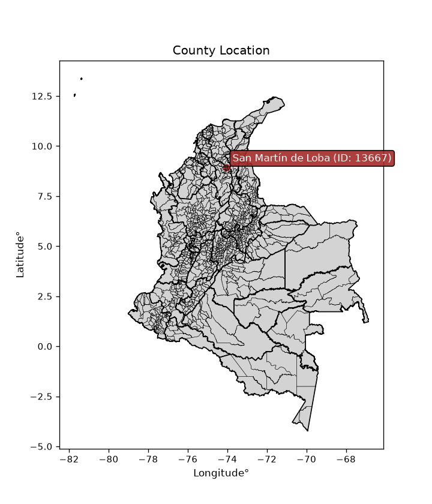
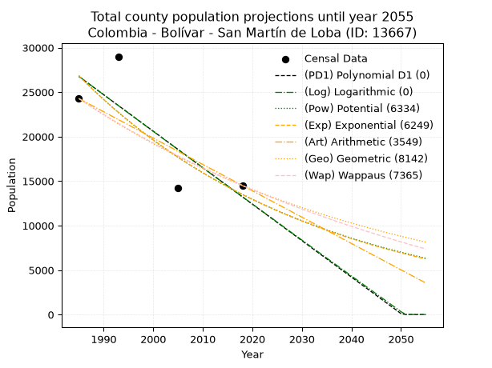
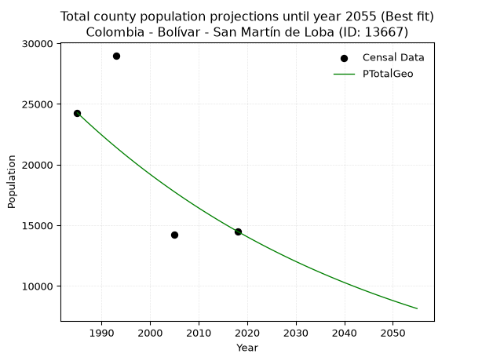
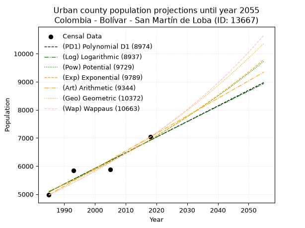
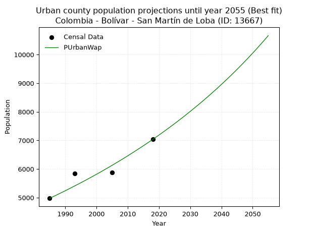
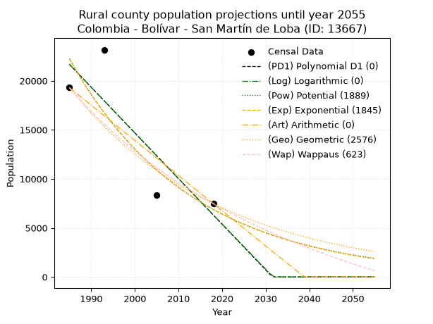
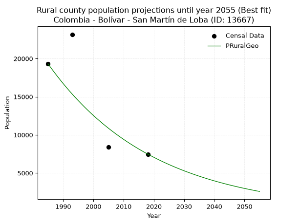

<div align="center">


</div>

# _“Population and Public Services Demand Projections (PPSD) until Year 2050 for Colombia - Bolívar - San Martín de Loba (ID: 13667)”_
Keywords: `population` `public-service` `projection` `lineal` `polynomial` `logarithmic` `potential` `exponential` `arithmetic` `geometric` `wappaus` `dane` `colombia` `south-america`

PPSD are analytical estimates used by governments and planners to anticipate future changes in population size, age distribution, and the resulting community needs for utilities, healthcare, education, and infrastructure as sizing future water treatment facilities, electrical grids, and road networks based on spatial growth.

<div align="center">

</img>

</div>


> **General running parameters**: • app_version: _v20260806_. • Python version: _3.14.7_. • Pandas version: _3.0.5_. • NumPy version: _2.5.1_. • Creates, save and include plots into reports (create_plot): _False_. • Projection until year: _2050_. • Process polynomial degree 2 and up: _False_. • Process Wappaus: _True_. • Process Wappaus: _True_. • Set negative values to zero: _True_. • Set infinite values to zero: _True_. • Drop dataset notes: _True_. 
<div align="center">

Dynamic map: [:earth_americas:Google](http://maps.google.com/maps?q=8.937484658,-74.0391338) [:earth_americas:OSM](https://www.openstreetmap.org/#map=18/8.937484658/-74.0391338&layers=P) [:earth_americas:Bing](https://www.bing.com/maps?cp=8.937484658~-74.0391338&lvl=18) [:earth_americas:Apple](https://maps.apple.com/frame?center=8.937484658%2C-74.0391338&span=0.003%2C0.006)

</div>


<div align="center">

```geojson
{
  "type": "Feature",
  "geometry": {
    "type": "Point", 
    "coordinates": [-74.0391338, 8.937484658]
  }, 
  "properties": {
    "Name": "Colombia - Bolívar - San Martín de Loba (ID: 13667)"
  }
}
```

</div>


## 0. Census Data (4 records)

Census data are official statistics collected by a government about the people and housing in a country. They usually include counts of total population, age, sex, race, income, education, and jobs.

📅Global census file: [Population.xlsx](../data/Population.xlsx)

| Source   |   Year |   CountryID | CountryName   |   StateID | StateName   |   CountyID | CountyName         |   PTotal |   PUrban |   PRural |
|:---------|-------:|------------:|:--------------|----------:|:------------|-----------:|:-------------------|---------:|---------:|---------:|
| DANE     |   1985 |          57 | Colombia      |        13 | Bolívar     |      13667 | San Martín de Loba |    24275 |     4976 |    19299 |
| DANE     |   1993 |          57 | Colombia      |        13 | Bolívar     |      13667 | San Martín de Loba |    29001 |     5837 |    23164 |
| DANE     |   2005 |          57 | Colombia      |        13 | Bolívar     |      13667 | San Martín de Loba |    14248 |     5881 |     8367 |
| DANE     |   2018 |          57 | Colombia      |        13 | Bolívar     |      13667 | San Martín de Loba |    14504 |     7035 |     7469 |

> 🔥Some records could had specific notes about the registered values or the corresponding urban or rural distribution.

📅[SUI-RUPS](https://www.datos.gov.co/Hacienda-y-Cr-dito-P-blico/Registro-nico-de-Prestadores-de-Servicios-P-blicos/4qkq-csdn/about_data) - Local public utility companies: [RUPS.csv](../data/RUPS.xlsx)

 | SERVICIO       | ESTADO    | NOMBRE                                                        | NIT         | DEPARTAMENTO_DOMICILIO   | MUNICIPIO_DOMICILIO   | DIRECCION                          |   TELEFONO | EMAIL                     | TIPO_PRESTADOR          | CLASIFICACION           |
|:---------------|:----------|:--------------------------------------------------------------|:------------|:-------------------------|:----------------------|:-----------------------------------|-----------:|:--------------------------|:------------------------|:------------------------|
| ACUEDUCTO      | OPERATIVA | ADMINISTRACION PUBLICA COOPERATIVA AGUAS DE SAN MARTIN E.S.P. | 900498983-7 | BOLIVAR                  | SAN MARTIN DE LOBA    | Carrera 24 Nº 19-99 calle el Mango |    4291042 | aguasdesamesp@hotmail.com | ORGANIZACION AUTORIZADA | HASTA 2500 SUSCRIPTORES |
| ALCANTARILLADO | OPERATIVA | ADMINISTRACION PUBLICA COOPERATIVA AGUAS DE SAN MARTIN E.S.P. | 900498983-7 | BOLIVAR                  | SAN MARTIN DE LOBA    | Carrera 24 Nº 19-99 calle el Mango |    4291042 | aguasdesamesp@hotmail.com | ORGANIZACION AUTORIZADA | HASTA 2500 SUSCRIPTORES |

## 1. Total

### 1.1. Coefficients and Parameters

* (PD1) Polynomial Deg 1: -409.99919710959387, 840607.8940184651 (lineal)
* (Log) Logarithmic: -820672.7539870401, 6258447.17951421
* (Pow) Potential: -41.66856508960999, 141.84179686397317
* (Exp) Exponential: -0.020814530280327804, 2.3563221979411497e+22
* (Art) Arithmetic: Year diff. 2018 - 1985 = 33, Population diff. 14504 - 24275 = -9771, Annual growth = -296.09090909090907
* (Geo) Geometric: Year diff. 2018 - 1985 = 33, Population diff. 14504 - 24275 = -9771, Annual growth % = -0.015485589527198806
* (Wap) Wappaus: i = -1.527068305479301, Condition values only valid for < 200)

<sub>
Wappaus condition values: ['-0.00', '-1.53', '-3.05', '-4.58', '-6.11', '-7.64', '-9.16', '-10.69', '-12.22', '-13.74', '-15.27', '-16.80', '-18.32', '-19.85', '-21.38', '-22.91', '-24.43', '-25.96', '-27.49', '-29.01', '-30.54', '-32.07', '-33.60', '-35.12', '-36.65', '-38.18', '-39.70', '-41.23', '-42.76', '-44.28', '-45.81', '-47.34', '-48.87', '-50.39', '-51.92', '-53.45', '-54.97', '-56.50', '-58.03', '-59.56', '-61.08', '-62.61', '-64.14', '-65.66', '-67.19', '-68.72', '-70.25', '-71.77', '-73.30', '-74.83', '-76.35', '-77.88', '-79.41', '-80.93', '-82.46', '-83.99', '-85.52', '-87.04', '-88.57', '-90.10', '-91.62', '-93.15', '-94.68', '-96.21', '-97.73', '-99.26']
</sub>


### 1.2. Projected Dataset

|   Year |   CountyID |   PTotalPD1 |   PTotalLog |   PTotalPow |   PTotalExp |   PTotalArt |   PTotalGeo |   PTotalWap |
|-------:|-----------:|------------:|------------:|------------:|------------:|------------:|------------:|------------:|
|   1985 |      13667 |       26759 |       26772 |       26844 |       26826 |       24275 |       24275 |       24275 |
|   1986 |      13667 |       26349 |       26359 |       26287 |       26274 |       23979 |       23899 |       23907 |
|   1987 |      13667 |       25939 |       25945 |       25741 |       25732 |       23683 |       23529 |       23545 |
|   1988 |      13667 |       25529 |       25532 |       25207 |       25202 |       23387 |       23165 |       23188 |
|   1989 |      13667 |       25119 |       25120 |       24684 |       24683 |       23091 |       22806 |       22836 |
|   1990 |      13667 |       24709 |       24707 |       24173 |       24175 |       22795 |       22453 |       22490 |
|   1991 |      13667 |       24299 |       24295 |       23672 |       23677 |       22498 |       22105 |       22148 |
|   1992 |      13667 |       23889 |       23883 |       23182 |       23189 |       22202 |       21763 |       21812 |
|   1993 |      13667 |       23479 |       23471 |       22702 |       22711 |       21906 |       21426 |       21480 |
|   1994 |      13667 |       23069 |       23059 |       22232 |       22243 |       21610 |       21094 |       21153 |
|   1995 |      13667 |       22659 |       22648 |       21773 |       21785 |       21314 |       20767 |       20831 |
|   1996 |      13667 |       22249 |       22237 |       21323 |       21336 |       21018 |       20446 |       20513 |
|   1997 |      13667 |       21839 |       21826 |       20882 |       20897 |       20722 |       20129 |       20200 |
|   1998 |      13667 |       21429 |       21415 |       20451 |       20466 |       20426 |       19817 |       19891 |
|   1999 |      13667 |       21019 |       21004 |       20029 |       20045 |       20130 |       19510 |       19586 |
|   2000 |      13667 |       20609 |       20594 |       19616 |       19632 |       19834 |       19208 |       19286 |
|   2001 |      13667 |       20200 |       20183 |       19212 |       19228 |       19538 |       18911 |       18990 |
|   2002 |      13667 |       19790 |       19773 |       18816 |       18831 |       19241 |       18618 |       18697 |
|   2003 |      13667 |       19380 |       19364 |       18428 |       18444 |       18945 |       18330 |       18409 |
|   2004 |      13667 |       18970 |       18954 |       18049 |       18064 |       18649 |       18046 |       18124 |
|   2005 |      13667 |       18560 |       18545 |       17678 |       17692 |       18353 |       17766 |       17843 |
|   2006 |      13667 |       18150 |       18135 |       17314 |       17327 |       18057 |       17491 |       17566 |
|   2007 |      13667 |       17740 |       17726 |       16958 |       16970 |       17761 |       17220 |       17293 |
|   2008 |      13667 |       17330 |       17317 |       16610 |       16621 |       17465 |       16954 |       17023 |
|   2009 |      13667 |       16920 |       16909 |       16269 |       16278 |       17169 |       16691 |       16756 |
|   2010 |      13667 |       16510 |       16500 |       15935 |       15943 |       16873 |       16433 |       16493 |
|   2011 |      13667 |       16100 |       16092 |       15608 |       15614 |       16577 |       16178 |       16233 |
|   2012 |      13667 |       15690 |       15684 |       15288 |       15293 |       16281 |       15928 |       15977 |
|   2013 |      13667 |       15280 |       15277 |       14975 |       14978 |       15984 |       15681 |       15724 |
|   2014 |      13667 |       14870 |       14869 |       14668 |       14669 |       15688 |       15438 |       15474 |
|   2015 |      13667 |       14460 |       14462 |       14368 |       14367 |       15392 |       15199 |       15227 |
|   2016 |      13667 |       14050 |       14054 |       14074 |       14071 |       15096 |       14964 |       14983 |
|   2017 |      13667 |       13640 |       13647 |       13786 |       13781 |       14800 |       14732 |       14742 |
|   2018 |      13667 |       13230 |       13241 |       13504 |       13497 |       14504 |       14504 |       14504 |
|   2019 |      13667 |       12820 |       12834 |       13228 |       13219 |       14208 |       14279 |       14269 |
|   2020 |      13667 |       12410 |       12428 |       12958 |       12947 |       13912 |       14058 |       14037 |
|   2021 |      13667 |       12000 |       12021 |       12694 |       12680 |       13616 |       13841 |       13807 |
|   2022 |      13667 |       11590 |       11616 |       12435 |       12419 |       13320 |       13626 |       13581 |
|   2023 |      13667 |       11180 |       11210 |       12181 |       12163 |       13024 |       13415 |       13356 |
|   2024 |      13667 |       10770 |       10804 |       11933 |       11913 |       12727 |       13207 |       13135 |
|   2025 |      13667 |       10360 |       10399 |       11690 |       11667 |       12431 |       13003 |       12916 |
|   2026 |      13667 |        9950 |        9994 |       11452 |       11427 |       12135 |       12802 |       12700 |
|   2027 |      13667 |        9540 |        9589 |       11219 |       11192 |       11839 |       12603 |       12486 |
|   2028 |      13667 |        9130 |        9184 |       10991 |       10961 |       11543 |       12408 |       12275 |
|   2029 |      13667 |        8720 |        8779 |       10767 |       10735 |       11247 |       12216 |       12066 |
|   2030 |      13667 |        8310 |        8375 |       10548 |       10514 |       10951 |       12027 |       11860 |
|   2031 |      13667 |        7900 |        7971 |       10334 |       10298 |       10655 |       11841 |       11655 |
|   2032 |      13667 |        7490 |        7567 |       10124 |       10085 |       10359 |       11657 |       11453 |
|   2033 |      13667 |        7080 |        7163 |        9919 |        9878 |       10063 |       11477 |       11254 |
|   2034 |      13667 |        6670 |        6759 |        9718 |        9674 |        9767 |       11299 |       11056 |
|   2035 |      13667 |        6260 |        6356 |        9521 |        9475 |        9470 |       11124 |       10861 |
|   2036 |      13667 |        5850 |        5953 |        9328 |        9280 |        9174 |       10952 |       10668 |
|   2037 |      13667 |        5440 |        5550 |        9139 |        9089 |        8878 |       10782 |       10477 |
|   2038 |      13667 |        5030 |        5147 |        8954 |        8901 |        8582 |       10615 |       10288 |
|   2039 |      13667 |        4620 |        4745 |        8773 |        8718 |        8286 |       10451 |       10101 |
|   2040 |      13667 |        4210 |        4342 |        8595 |        8538 |        7990 |       10289 |        9916 |
|   2041 |      13667 |        3800 |        3940 |        8421 |        8363 |        7694 |       10130 |        9734 |
|   2042 |      13667 |        3390 |        3538 |        8251 |        8190 |        7398 |        9973 |        9553 |
|   2043 |      13667 |        2980 |        3136 |        8085 |        8022 |        7102 |        9818 |        9374 |
|   2044 |      13667 |        2570 |        2735 |        7922 |        7856 |        6806 |        9666 |        9197 |
|   2045 |      13667 |        2160 |        2333 |        7762 |        7694 |        6510 |        9517 |        9021 |
|   2046 |      13667 |        1750 |        1932 |        7605 |        7536 |        6213 |        9369 |        8848 |
|   2047 |      13667 |        1340 |        1531 |        7452 |        7381 |        5917 |        9224 |        8676 |
|   2048 |      13667 |         930 |        1130 |        7302 |        7229 |        5621 |        9081 |        8506 |
|   2049 |      13667 |         520 |         729 |        7155 |        7080 |        5325 |        8941 |        8338 |
|   2050 |      13667 |         110 |         329 |        7011 |        6934 |        5029 |        8802 |        8172 |
<div align="center">

</img>

</div>


### 1.3. Best fit with absolute and relative error (%)

Relative error puts that difference into context by dividing the absolute error by the true value, creating a unitless ratio or percentage that shows the scale of the mistake.

Absolute and relative error

|   Year | Source   |   CountryID | CountryName   |   StateID | StateName   |   CountyID_x | CountyName         |   PTotal |   PUrban |   PRural |   CountyID_y |   PTotalPD1 |   PTotalLog |   PTotalPow |   PTotalExp |   PTotalArt |   PTotalGeo |   PTotalWap |   PTotalPD1AbsError |   PTotalLogAbsError |   PTotalPowAbsError |   PTotalExpAbsError |   PTotalArtAbsError |   PTotalGeoAbsError |   PTotalWapAbsError |   PTotalPD1RelError |   PTotalLogRelError |   PTotalPowRelError |   PTotalExpRelError |   PTotalArtRelError |   PTotalGeoRelError |   PTotalWapRelError |
|-------:|:---------|------------:|:--------------|----------:|:------------|-------------:|:-------------------|---------:|---------:|---------:|-------------:|------------:|------------:|------------:|------------:|------------:|------------:|------------:|--------------------:|--------------------:|--------------------:|--------------------:|--------------------:|--------------------:|--------------------:|--------------------:|--------------------:|--------------------:|--------------------:|--------------------:|--------------------:|--------------------:|
|   1985 | DANE     |          57 | Colombia      |        13 | Bolívar     |        13667 | San Martín de Loba |    24275 |     4976 |    19299 |        13667 |       26759 |       26772 |       26844 |       26826 |       24275 |       24275 |       24275 |                2484 |                2497 |                2569 |                2551 |                   0 |                   0 |                   0 |            10.2327  |            10.2863  |            10.5829  |            10.5088  |              0      |              0      |              0      |
|   1993 | DANE     |          57 | Colombia      |        13 | Bolívar     |        13667 | San Martín de Loba |    29001 |     5837 |    23164 |        13667 |       23479 |       23471 |       22702 |       22711 |       21906 |       21426 |       21480 |                5522 |                5530 |                6299 |                6290 |                7095 |                7575 |                7521 |            19.0407  |            19.0683  |            21.7199  |            21.6889  |             24.4647 |             26.1198 |             25.9336 |
|   2005 | DANE     |          57 | Colombia      |        13 | Bolívar     |        13667 | San Martín de Loba |    14248 |     5881 |     8367 |        13667 |       18560 |       18545 |       17678 |       17692 |       18353 |       17766 |       17843 |                4312 |                4297 |                3430 |                3444 |                4105 |                3518 |                3595 |            30.2639  |            30.1586  |            24.0736  |            24.1718  |             28.8111 |             24.6912 |             25.2316 |
|   2018 | DANE     |          57 | Colombia      |        13 | Bolívar     |        13667 | San Martín de Loba |    14504 |     7035 |     7469 |        13667 |       13230 |       13241 |       13504 |       13497 |       14504 |       14504 |       14504 |                1274 |                1263 |                1000 |                1007 |                   0 |                   0 |                   0 |             8.78378 |             8.70794 |             6.89465 |             6.94291 |              0      |              0      |              0      |

Relative error mean

| Method    |   RelError | Best   |
|:----------|-----------:|:-------|
| PTotalPD1 |    17.0803 |        |
| PTotalLog |    17.0553 |        |
| PTotalPow |    15.8178 |        |
| PTotalExp |    15.8281 |        |
| PTotalArt |    13.3189 |        |
| PTotalGeo |    12.7027 | True   |
| PTotalWap |    12.7913 |        |

💙Best method: _**PTotalGeo**_
<div align="center">

</img>

</div>


### 1.4. Fresh water supply demand in liters per capita per day (lpcd)

The fresh water supply demand typically ranges from 100 to 300 liters per capita per day (lpcd) for standard domestic and municipal planning, though absolute survival minimums set by the World Health Organization are as low as 7.5 to 20 liters per day, and total consumption in high-income nations can exceed 400 liters.

> `CZ`: Level in meters above the sea level (masl)<br> `WS`: Fresh water supply demand in liters per capita per day (lpcd or l/h/d)<br> `WSAll`: Zonal fresh water supply demand in liters per second (l/s)<br> `A`: Zonal area in square meters<br> `DP`: Population density (people/hectare or p/ha)

Reference values (RAS Colombia)

|    CZ |   WS |
|------:|-----:|
|  1000 |  120 |
|  2000 |  130 |
| 99999 |  140 |

County shapefile geometry properties and water supply values

|   CountyID |      ATotal |   CZTotal |   WSTotal |
|-----------:|------------:|----------:|----------:|
|      13667 | 4.49546e+08 |   111.861 |       120 |

Projected values for best method: PTotalGeo

|   CountyID |   Year |   PTotalGeo |   DPTotal |   WSTotal |   WSTotalAll |
|-----------:|-------:|------------:|----------:|----------:|-------------:|
|      13667 |   1985 |       24275 |      0.54 |       120 |      33.7153 |
|      13667 |   1986 |       23899 |      0.53 |       120 |      33.1931 |
|      13667 |   1987 |       23529 |      0.52 |       120 |      32.6792 |
|      13667 |   1988 |       23165 |      0.52 |       120 |      32.1736 |
|      13667 |   1989 |       22806 |      0.51 |       120 |      31.675  |
|      13667 |   1990 |       22453 |      0.5  |       120 |      31.1847 |
|      13667 |   1991 |       22105 |      0.49 |       120 |      30.7014 |
|      13667 |   1992 |       21763 |      0.48 |       120 |      30.2264 |
|      13667 |   1993 |       21426 |      0.48 |       120 |      29.7583 |
|      13667 |   1994 |       21094 |      0.47 |       120 |      29.2972 |
|      13667 |   1995 |       20767 |      0.46 |       120 |      28.8431 |
|      13667 |   1996 |       20446 |      0.45 |       120 |      28.3972 |
|      13667 |   1997 |       20129 |      0.45 |       120 |      27.9569 |
|      13667 |   1998 |       19817 |      0.44 |       120 |      27.5236 |
|      13667 |   1999 |       19510 |      0.43 |       120 |      27.0972 |
|      13667 |   2000 |       19208 |      0.43 |       120 |      26.6778 |
|      13667 |   2001 |       18911 |      0.42 |       120 |      26.2653 |
|      13667 |   2002 |       18618 |      0.41 |       120 |      25.8583 |
|      13667 |   2003 |       18330 |      0.41 |       120 |      25.4583 |
|      13667 |   2004 |       18046 |      0.4  |       120 |      25.0639 |
|      13667 |   2005 |       17766 |      0.4  |       120 |      24.675  |
|      13667 |   2006 |       17491 |      0.39 |       120 |      24.2931 |
|      13667 |   2007 |       17220 |      0.38 |       120 |      23.9167 |
|      13667 |   2008 |       16954 |      0.38 |       120 |      23.5472 |
|      13667 |   2009 |       16691 |      0.37 |       120 |      23.1819 |
|      13667 |   2010 |       16433 |      0.37 |       120 |      22.8236 |
|      13667 |   2011 |       16178 |      0.36 |       120 |      22.4694 |
|      13667 |   2012 |       15928 |      0.35 |       120 |      22.1222 |
|      13667 |   2013 |       15681 |      0.35 |       120 |      21.7792 |
|      13667 |   2014 |       15438 |      0.34 |       120 |      21.4417 |
|      13667 |   2015 |       15199 |      0.34 |       120 |      21.1097 |
|      13667 |   2016 |       14964 |      0.33 |       120 |      20.7833 |
|      13667 |   2017 |       14732 |      0.33 |       120 |      20.4611 |
|      13667 |   2018 |       14504 |      0.32 |       120 |      20.1444 |
|      13667 |   2019 |       14279 |      0.32 |       120 |      19.8319 |
|      13667 |   2020 |       14058 |      0.31 |       120 |      19.525  |
|      13667 |   2021 |       13841 |      0.31 |       120 |      19.2236 |
|      13667 |   2022 |       13626 |      0.3  |       120 |      18.925  |
|      13667 |   2023 |       13415 |      0.3  |       120 |      18.6319 |
|      13667 |   2024 |       13207 |      0.29 |       120 |      18.3431 |
|      13667 |   2025 |       13003 |      0.29 |       120 |      18.0597 |
|      13667 |   2026 |       12802 |      0.28 |       120 |      17.7806 |
|      13667 |   2027 |       12603 |      0.28 |       120 |      17.5042 |
|      13667 |   2028 |       12408 |      0.28 |       120 |      17.2333 |
|      13667 |   2029 |       12216 |      0.27 |       120 |      16.9667 |
|      13667 |   2030 |       12027 |      0.27 |       120 |      16.7042 |
|      13667 |   2031 |       11841 |      0.26 |       120 |      16.4458 |
|      13667 |   2032 |       11657 |      0.26 |       120 |      16.1903 |
|      13667 |   2033 |       11477 |      0.26 |       120 |      15.9403 |
|      13667 |   2034 |       11299 |      0.25 |       120 |      15.6931 |
|      13667 |   2035 |       11124 |      0.25 |       120 |      15.45   |
|      13667 |   2036 |       10952 |      0.24 |       120 |      15.2111 |
|      13667 |   2037 |       10782 |      0.24 |       120 |      14.975  |
|      13667 |   2038 |       10615 |      0.24 |       120 |      14.7431 |
|      13667 |   2039 |       10451 |      0.23 |       120 |      14.5153 |
|      13667 |   2040 |       10289 |      0.23 |       120 |      14.2903 |
|      13667 |   2041 |       10130 |      0.23 |       120 |      14.0694 |
|      13667 |   2042 |        9973 |      0.22 |       120 |      13.8514 |
|      13667 |   2043 |        9818 |      0.22 |       120 |      13.6361 |
|      13667 |   2044 |        9666 |      0.22 |       120 |      13.425  |
|      13667 |   2045 |        9517 |      0.21 |       120 |      13.2181 |
|      13667 |   2046 |        9369 |      0.21 |       120 |      13.0125 |
|      13667 |   2047 |        9224 |      0.21 |       120 |      12.8111 |
|      13667 |   2048 |        9081 |      0.2  |       120 |      12.6125 |
|      13667 |   2049 |        8941 |      0.2  |       120 |      12.4181 |
|      13667 |   2050 |        8802 |      0.2  |       120 |      12.225  |

## 2. Urban

### 2.1. Coefficients and Parameters

* (PD1) Polynomial Deg 1: 55.56603773584833, -105213.71698113064 (lineal)
* (Log) Logarithmic: 111205.94919356836, -839345.0609688621
* (Pow) Potential: 18.587562507496468, -57.58900712873397
* (Exp) Exponential: 0.009286248824653419, 5.046669341521055e-05
* (Art) Arithmetic: Year diff. 2018 - 1985 = 33, Population diff. 7035 - 4976 = 2059, Annual growth = 62.39393939393939
* (Geo) Geometric: Year diff. 2018 - 1985 = 33, Population diff. 7035 - 4976 = 2059, Annual growth % = 0.010548316090467136
* (Wap) Wappaus: i = 1.038946622162008, Condition values only valid for < 200)

<sub>
Wappaus condition values: ['0.00', '1.04', '2.08', '3.12', '4.16', '5.19', '6.23', '7.27', '8.31', '9.35', '10.39', '11.43', '12.47', '13.51', '14.55', '15.58', '16.62', '17.66', '18.70', '19.74', '20.78', '21.82', '22.86', '23.90', '24.93', '25.97', '27.01', '28.05', '29.09', '30.13', '31.17', '32.21', '33.25', '34.29', '35.32', '36.36', '37.40', '38.44', '39.48', '40.52', '41.56', '42.60', '43.64', '44.67', '45.71', '46.75', '47.79', '48.83', '49.87', '50.91', '51.95', '52.99', '54.03', '55.06', '56.10', '57.14', '58.18', '59.22', '60.26', '61.30', '62.34', '63.38', '64.41', '65.45', '66.49', '67.53']
</sub>


### 2.2. Projected Dataset

|   Year |   CountyID |   PUrbanPD1 |   PUrbanLog |   PUrbanPow |   PUrbanExp |   PUrbanArt |   PUrbanGeo |   PUrbanWap |
|-------:|-----------:|------------:|------------:|------------:|------------:|------------:|------------:|------------:|
|   1985 |      13667 |        5085 |        5083 |        5109 |        5110 |        4976 |        4976 |        4976 |
|   1986 |      13667 |        5140 |        5139 |        5157 |        5158 |        5038 |        5028 |        5028 |
|   1987 |      13667 |        5196 |        5195 |        5205 |        5206 |        5101 |        5082 |        5080 |
|   1988 |      13667 |        5252 |        5251 |        5254 |        5255 |        5163 |        5135 |        5134 |
|   1989 |      13667 |        5307 |        5307 |        5304 |        5304 |        5226 |        5189 |        5187 |
|   1990 |      13667 |        5363 |        5363 |        5353 |        5353 |        5288 |        5244 |        5241 |
|   1991 |      13667 |        5418 |        5419 |        5404 |        5403 |        5350 |        5299 |        5296 |
|   1992 |      13667 |        5474 |        5475 |        5454 |        5453 |        5413 |        5355 |        5352 |
|   1993 |      13667 |        5529 |        5531 |        5505 |        5504 |        5475 |        5412 |        5408 |
|   1994 |      13667 |        5585 |        5586 |        5557 |        5556 |        5538 |        5469 |        5464 |
|   1995 |      13667 |        5641 |        5642 |        5609 |        5608 |        5600 |        5527 |        5521 |
|   1996 |      13667 |        5696 |        5698 |        5662 |        5660 |        5662 |        5585 |        5579 |
|   1997 |      13667 |        5752 |        5754 |        5714 |        5713 |        5725 |        5644 |        5638 |
|   1998 |      13667 |        5807 |        5809 |        5768 |        5766 |        5787 |        5703 |        5697 |
|   1999 |      13667 |        5863 |        5865 |        5822 |        5820 |        5850 |        5763 |        5757 |
|   2000 |      13667 |        5918 |        5921 |        5876 |        5874 |        5912 |        5824 |        5817 |
|   2001 |      13667 |        5974 |        5976 |        5931 |        5929 |        5974 |        5886 |        5878 |
|   2002 |      13667 |        6029 |        6032 |        5986 |        5984 |        6037 |        5948 |        5940 |
|   2003 |      13667 |        6085 |        6087 |        6042 |        6040 |        6099 |        6010 |        6003 |
|   2004 |      13667 |        6141 |        6143 |        6099 |        6096 |        6161 |        6074 |        6066 |
|   2005 |      13667 |        6196 |        6198 |        6155 |        6153 |        6224 |        6138 |        6130 |
|   2006 |      13667 |        6252 |        6254 |        6213 |        6211 |        6286 |        6203 |        6195 |
|   2007 |      13667 |        6307 |        6309 |        6270 |        6269 |        6349 |        6268 |        6260 |
|   2008 |      13667 |        6363 |        6364 |        6329 |        6327 |        6411 |        6334 |        6326 |
|   2009 |      13667 |        6418 |        6420 |        6388 |        6386 |        6473 |        6401 |        6393 |
|   2010 |      13667 |        6474 |        6475 |        6447 |        6446 |        6536 |        6469 |        6461 |
|   2011 |      13667 |        6530 |        6530 |        6507 |        6506 |        6598 |        6537 |        6530 |
|   2012 |      13667 |        6585 |        6586 |        6567 |        6566 |        6661 |        6606 |        6600 |
|   2013 |      13667 |        6641 |        6641 |        6628 |        6628 |        6723 |        6675 |        6670 |
|   2014 |      13667 |        6696 |        6696 |        6690 |        6690 |        6785 |        6746 |        6741 |
|   2015 |      13667 |        6752 |        6751 |        6752 |        6752 |        6848 |        6817 |        6813 |
|   2016 |      13667 |        6807 |        6807 |        6814 |        6815 |        6910 |        6889 |        6886 |
|   2017 |      13667 |        6863 |        6862 |        6877 |        6879 |        6973 |        6962 |        6960 |
|   2018 |      13667 |        6919 |        6917 |        6941 |        6943 |        7035 |        7035 |        7035 |
|   2019 |      13667 |        6974 |        6972 |        7005 |        7008 |        7097 |        7109 |        7111 |
|   2020 |      13667 |        7030 |        7027 |        7070 |        7073 |        7160 |        7184 |        7188 |
|   2021 |      13667 |        7085 |        7082 |        7135 |        7139 |        7222 |        7260 |        7265 |
|   2022 |      13667 |        7141 |        7137 |        7201 |        7205 |        7285 |        7337 |        7344 |
|   2023 |      13667 |        7196 |        7192 |        7268 |        7273 |        7347 |        7414 |        7424 |
|   2024 |      13667 |        7252 |        7247 |        7335 |        7341 |        7409 |        7492 |        7504 |
|   2025 |      13667 |        7308 |        7302 |        7402 |        7409 |        7472 |        7571 |        7586 |
|   2026 |      13667 |        7363 |        7357 |        7471 |        7478 |        7534 |        7651 |        7669 |
|   2027 |      13667 |        7419 |        7412 |        7540 |        7548 |        7597 |        7732 |        7753 |
|   2028 |      13667 |        7474 |        7467 |        7609 |        7618 |        7659 |        7813 |        7838 |
|   2029 |      13667 |        7530 |        7521 |        7679 |        7689 |        7721 |        7896 |        7925 |
|   2030 |      13667 |        7585 |        7576 |        7750 |        7761 |        7784 |        7979 |        8012 |
|   2031 |      13667 |        7641 |        7631 |        7821 |        7834 |        7846 |        8063 |        8101 |
|   2032 |      13667 |        7696 |        7686 |        7893 |        7907 |        7909 |        8148 |        8191 |
|   2033 |      13667 |        7752 |        7740 |        7965 |        7980 |        7971 |        8234 |        8282 |
|   2034 |      13667 |        7808 |        7795 |        8038 |        8055 |        8033 |        8321 |        8374 |
|   2035 |      13667 |        7863 |        7850 |        8112 |        8130 |        8096 |        8409 |        8468 |
|   2036 |      13667 |        7919 |        7904 |        8187 |        8206 |        8158 |        8498 |        8563 |
|   2037 |      13667 |        7974 |        7959 |        8262 |        8282 |        8220 |        8587 |        8659 |
|   2038 |      13667 |        8030 |        8014 |        8337 |        8360 |        8283 |        8678 |        8757 |
|   2039 |      13667 |        8085 |        8068 |        8414 |        8438 |        8345 |        8769 |        8856 |
|   2040 |      13667 |        8141 |        8123 |        8491 |        8516 |        8408 |        8862 |        8957 |
|   2041 |      13667 |        8197 |        8177 |        8569 |        8596 |        8470 |        8955 |        9059 |
|   2042 |      13667 |        8252 |        8232 |        8647 |        8676 |        8532 |        9050 |        9162 |
|   2043 |      13667 |        8308 |        8286 |        8726 |        8757 |        8595 |        9145 |        9267 |
|   2044 |      13667 |        8363 |        8341 |        8806 |        8839 |        8657 |        9242 |        9374 |
|   2045 |      13667 |        8419 |        8395 |        8886 |        8921 |        8720 |        9339 |        9482 |
|   2046 |      13667 |        8474 |        8449 |        8967 |        9004 |        8782 |        9438 |        9592 |
|   2047 |      13667 |        8530 |        8504 |        9049 |        9088 |        8844 |        9537 |        9704 |
|   2048 |      13667 |        8586 |        8558 |        9132 |        9173 |        8907 |        9638 |        9817 |
|   2049 |      13667 |        8641 |        8612 |        9215 |        9259 |        8969 |        9739 |        9933 |
|   2050 |      13667 |        8697 |        8666 |        9299 |        9345 |        9032 |        9842 |       10049 |
<div align="center">

</img>

</div>


### 2.3. Best fit with absolute and relative error (%)

Relative error puts that difference into context by dividing the absolute error by the true value, creating a unitless ratio or percentage that shows the scale of the mistake.

Absolute and relative error

|   Year | Source   |   CountryID | CountryName   |   StateID | StateName   |   CountyID_x | CountyName         |   PTotal |   PUrban |   PRural |   CountyID_y |   PUrbanPD1 |   PUrbanLog |   PUrbanPow |   PUrbanExp |   PUrbanArt |   PUrbanGeo |   PUrbanWap |   PUrbanPD1AbsError |   PUrbanLogAbsError |   PUrbanPowAbsError |   PUrbanExpAbsError |   PUrbanArtAbsError |   PUrbanGeoAbsError |   PUrbanWapAbsError |   PUrbanPD1RelError |   PUrbanLogRelError |   PUrbanPowRelError |   PUrbanExpRelError |   PUrbanArtRelError |   PUrbanGeoRelError |   PUrbanWapRelError |
|-------:|:---------|------------:|:--------------|----------:|:------------|-------------:|:-------------------|---------:|---------:|---------:|-------------:|------------:|------------:|------------:|------------:|------------:|------------:|------------:|--------------------:|--------------------:|--------------------:|--------------------:|--------------------:|--------------------:|--------------------:|--------------------:|--------------------:|--------------------:|--------------------:|--------------------:|--------------------:|--------------------:|
|   1985 | DANE     |          57 | Colombia      |        13 | Bolívar     |        13667 | San Martín de Loba |    24275 |     4976 |    19299 |        13667 |        5085 |        5083 |        5109 |        5110 |        4976 |        4976 |        4976 |                 109 |                 107 |                 133 |                 134 |                   0 |                   0 |                   0 |             2.19051 |             2.15032 |             2.67283 |             2.69293 |             0       |             0       |             0       |
|   1993 | DANE     |          57 | Colombia      |        13 | Bolívar     |        13667 | San Martín de Loba |    29001 |     5837 |    23164 |        13667 |        5529 |        5531 |        5505 |        5504 |        5475 |        5412 |        5408 |                 308 |                 306 |                 332 |                 333 |                 362 |                 425 |                 429 |             5.27668 |             5.24242 |             5.68785 |             5.70499 |             6.20182 |             7.28114 |             7.34967 |
|   2005 | DANE     |          57 | Colombia      |        13 | Bolívar     |        13667 | San Martín de Loba |    14248 |     5881 |     8367 |        13667 |        6196 |        6198 |        6155 |        6153 |        6224 |        6138 |        6130 |                 315 |                 317 |                 274 |                 272 |                 343 |                 257 |                 249 |             5.35623 |             5.39024 |             4.65907 |             4.62506 |             5.83234 |             4.37001 |             4.23397 |
|   2018 | DANE     |          57 | Colombia      |        13 | Bolívar     |        13667 | San Martín de Loba |    14504 |     7035 |     7469 |        13667 |        6919 |        6917 |        6941 |        6943 |        7035 |        7035 |        7035 |                 116 |                 118 |                  94 |                  92 |                   0 |                   0 |                   0 |             1.6489  |             1.67733 |             1.33618 |             1.30775 |             0       |             0       |             0       |

Relative error mean

| Method    |   RelError | Best   |
|:----------|-----------:|:-------|
| PUrbanPD1 |    3.61808 |        |
| PUrbanLog |    3.61508 |        |
| PUrbanPow |    3.58898 |        |
| PUrbanExp |    3.58268 |        |
| PUrbanArt |    3.00854 |        |
| PUrbanGeo |    2.91279 |        |
| PUrbanWap |    2.89591 | True   |

💙Best method: _**PUrbanWap**_
<div align="center">

</img>

</div>


### 2.4. Fresh water supply demand in liters per capita per day (lpcd)

The fresh water supply demand typically ranges from 100 to 300 liters per capita per day (lpcd) for standard domestic and municipal planning, though absolute survival minimums set by the World Health Organization are as low as 7.5 to 20 liters per day, and total consumption in high-income nations can exceed 400 liters.

> `CZ`: Level in meters above the sea level (masl)<br> `WS`: Fresh water supply demand in liters per capita per day (lpcd or l/h/d)<br> `WSAll`: Zonal fresh water supply demand in liters per second (l/s)<br> `A`: Zonal area in square meters<br> `DP`: Population density (people/hectare or p/ha)

Reference values (RAS Colombia)

|    CZ |   WS |
|------:|-----:|
|  1000 |  120 |
|  2000 |  130 |
| 99999 |  140 |

County shapefile geometry properties and water supply values

|   CountyID |      AUrban |   CZUrban |   WSUrban |
|-----------:|------------:|----------:|----------:|
|      13667 | 1.20062e+06 |   35.6876 |       120 |

Projected values for best method: PUrbanWap

|   CountyID |   Year |   PUrbanWap |   DPUrban |   WSUrban |   WSUrbanAll |
|-----------:|-------:|------------:|----------:|----------:|-------------:|
|      13667 |   1985 |        4976 |     41.45 |       120 |      6.91111 |
|      13667 |   1986 |        5028 |     41.88 |       120 |      6.98333 |
|      13667 |   1987 |        5080 |     42.31 |       120 |      7.05556 |
|      13667 |   1988 |        5134 |     42.76 |       120 |      7.13056 |
|      13667 |   1989 |        5187 |     43.2  |       120 |      7.20417 |
|      13667 |   1990 |        5241 |     43.65 |       120 |      7.27917 |
|      13667 |   1991 |        5296 |     44.11 |       120 |      7.35556 |
|      13667 |   1992 |        5352 |     44.58 |       120 |      7.43333 |
|      13667 |   1993 |        5408 |     45.04 |       120 |      7.51111 |
|      13667 |   1994 |        5464 |     45.51 |       120 |      7.58889 |
|      13667 |   1995 |        5521 |     45.98 |       120 |      7.66806 |
|      13667 |   1996 |        5579 |     46.47 |       120 |      7.74861 |
|      13667 |   1997 |        5638 |     46.96 |       120 |      7.83056 |
|      13667 |   1998 |        5697 |     47.45 |       120 |      7.9125  |
|      13667 |   1999 |        5757 |     47.95 |       120 |      7.99583 |
|      13667 |   2000 |        5817 |     48.45 |       120 |      8.07917 |
|      13667 |   2001 |        5878 |     48.96 |       120 |      8.16389 |
|      13667 |   2002 |        5940 |     49.47 |       120 |      8.25    |
|      13667 |   2003 |        6003 |     50    |       120 |      8.3375  |
|      13667 |   2004 |        6066 |     50.52 |       120 |      8.425   |
|      13667 |   2005 |        6130 |     51.06 |       120 |      8.51389 |
|      13667 |   2006 |        6195 |     51.6  |       120 |      8.60417 |
|      13667 |   2007 |        6260 |     52.14 |       120 |      8.69444 |
|      13667 |   2008 |        6326 |     52.69 |       120 |      8.78611 |
|      13667 |   2009 |        6393 |     53.25 |       120 |      8.87917 |
|      13667 |   2010 |        6461 |     53.81 |       120 |      8.97361 |
|      13667 |   2011 |        6530 |     54.39 |       120 |      9.06944 |
|      13667 |   2012 |        6600 |     54.97 |       120 |      9.16667 |
|      13667 |   2013 |        6670 |     55.55 |       120 |      9.26389 |
|      13667 |   2014 |        6741 |     56.15 |       120 |      9.3625  |
|      13667 |   2015 |        6813 |     56.75 |       120 |      9.4625  |
|      13667 |   2016 |        6886 |     57.35 |       120 |      9.56389 |
|      13667 |   2017 |        6960 |     57.97 |       120 |      9.66667 |
|      13667 |   2018 |        7035 |     58.59 |       120 |      9.77083 |
|      13667 |   2019 |        7111 |     59.23 |       120 |      9.87639 |
|      13667 |   2020 |        7188 |     59.87 |       120 |      9.98333 |
|      13667 |   2021 |        7265 |     60.51 |       120 |     10.0903  |
|      13667 |   2022 |        7344 |     61.17 |       120 |     10.2     |
|      13667 |   2023 |        7424 |     61.83 |       120 |     10.3111  |
|      13667 |   2024 |        7504 |     62.5  |       120 |     10.4222  |
|      13667 |   2025 |        7586 |     63.18 |       120 |     10.5361  |
|      13667 |   2026 |        7669 |     63.88 |       120 |     10.6514  |
|      13667 |   2027 |        7753 |     64.57 |       120 |     10.7681  |
|      13667 |   2028 |        7838 |     65.28 |       120 |     10.8861  |
|      13667 |   2029 |        7925 |     66.01 |       120 |     11.0069  |
|      13667 |   2030 |        8012 |     66.73 |       120 |     11.1278  |
|      13667 |   2031 |        8101 |     67.47 |       120 |     11.2514  |
|      13667 |   2032 |        8191 |     68.22 |       120 |     11.3764  |
|      13667 |   2033 |        8282 |     68.98 |       120 |     11.5028  |
|      13667 |   2034 |        8374 |     69.75 |       120 |     11.6306  |
|      13667 |   2035 |        8468 |     70.53 |       120 |     11.7611  |
|      13667 |   2036 |        8563 |     71.32 |       120 |     11.8931  |
|      13667 |   2037 |        8659 |     72.12 |       120 |     12.0264  |
|      13667 |   2038 |        8757 |     72.94 |       120 |     12.1625  |
|      13667 |   2039 |        8856 |     73.76 |       120 |     12.3     |
|      13667 |   2040 |        8957 |     74.6  |       120 |     12.4403  |
|      13667 |   2041 |        9059 |     75.45 |       120 |     12.5819  |
|      13667 |   2042 |        9162 |     76.31 |       120 |     12.725   |
|      13667 |   2043 |        9267 |     77.19 |       120 |     12.8708  |
|      13667 |   2044 |        9374 |     78.08 |       120 |     13.0194  |
|      13667 |   2045 |        9482 |     78.98 |       120 |     13.1694  |
|      13667 |   2046 |        9592 |     79.89 |       120 |     13.3222  |
|      13667 |   2047 |        9704 |     80.82 |       120 |     13.4778  |
|      13667 |   2048 |        9817 |     81.77 |       120 |     13.6347  |
|      13667 |   2049 |        9933 |     82.73 |       120 |     13.7958  |
|      13667 |   2050 |       10049 |     83.7  |       120 |     13.9569  |

## 3. Rural

### 3.1. Coefficients and Parameters

* (PD1) Polynomial Deg 1: -465.56523484544215, 945821.6109995956 (lineal)
* (Log) Logarithmic: -931878.7031806087, 7097792.240483073
* (Pow) Potential: -71.1751411166018, 239.06608369446627
* (Exp) Exponential: -0.035557197555954254, 9.999887228388368e+34
* (Art) Arithmetic: Year diff. 2018 - 1985 = 33, Population diff. 7469 - 19299 = -11830, Annual growth = -358.4848484848485
* (Geo) Geometric: Year diff. 2018 - 1985 = 33, Population diff. 7469 - 19299 = -11830, Annual growth % = -0.028356614398444502
* (Wap) Wappaus: i = -2.678458222391277, Condition values only valid for < 200)

<sub>
Wappaus condition values: ['-0.00', '-2.68', '-5.36', '-8.04', '-10.71', '-13.39', '-16.07', '-18.75', '-21.43', '-24.11', '-26.78', '-29.46', '-32.14', '-34.82', '-37.50', '-40.18', '-42.86', '-45.53', '-48.21', '-50.89', '-53.57', '-56.25', '-58.93', '-61.60', '-64.28', '-66.96', '-69.64', '-72.32', '-75.00', '-77.68', '-80.35', '-83.03', '-85.71', '-88.39', '-91.07', '-93.75', '-96.42', '-99.10', '-101.78', '-104.46', '-107.14', '-109.82', '-112.50', '-115.17', '-117.85', '-120.53', '-123.21', '-125.89', '-128.57', '-131.24', '-133.92', '-136.60', '-139.28', '-141.96', '-144.64', '-147.32', '-149.99', '-152.67', '-155.35', '-158.03', '-160.71', '-163.39', '-166.06', '-168.74', '-171.42', '-174.10']
</sub>


### 3.2. Projected Dataset

|   Year |   CountyID |   PRuralPD1 |   PRuralLog |   PRuralPow |   PRuralExp |   PRuralArt |   PRuralGeo |   PRuralWap |
|-------:|-----------:|------------:|------------:|------------:|------------:|------------:|------------:|------------:|
|   1985 |      13667 |       21675 |       21689 |       22259 |       22235 |       19299 |       19299 |       19299 |
|   1986 |      13667 |       21209 |       21219 |       21476 |       21458 |       18941 |       18752 |       18789 |
|   1987 |      13667 |       20743 |       20750 |       20720 |       20709 |       18582 |       18220 |       18292 |
|   1988 |      13667 |       20278 |       20281 |       19991 |       19985 |       18224 |       17703 |       17808 |
|   1989 |      13667 |       19812 |       19813 |       19288 |       19287 |       17865 |       17201 |       17336 |
|   1990 |      13667 |       19347 |       19344 |       18610 |       18614 |       17507 |       16714 |       16877 |
|   1991 |      13667 |       18881 |       18876 |       17956 |       17963 |       17148 |       16240 |       16428 |
|   1992 |      13667 |       18416 |       18408 |       17326 |       17336 |       16790 |       15779 |       15991 |
|   1993 |      13667 |       17950 |       17940 |       16718 |       16730 |       16431 |       15332 |       15564 |
|   1994 |      13667 |       17485 |       17473 |       16132 |       16146 |       16073 |       14897 |       15147 |
|   1995 |      13667 |       17019 |       17006 |       15566 |       15582 |       15714 |       14475 |       14740 |
|   1996 |      13667 |       16553 |       16539 |       15021 |       15037 |       15356 |       14064 |       14343 |
|   1997 |      13667 |       16088 |       16072 |       14495 |       14512 |       14997 |       13665 |       13955 |
|   1998 |      13667 |       15622 |       15605 |       13987 |       14005 |       14639 |       13278 |       13576 |
|   1999 |      13667 |       15157 |       15139 |       13498 |       13516 |       14280 |       12901 |       13205 |
|   2000 |      13667 |       14691 |       14673 |       13026 |       13044 |       13922 |       12535 |       12842 |
|   2001 |      13667 |       14226 |       14207 |       12571 |       12588 |       13563 |       12180 |       12488 |
|   2002 |      13667 |       13760 |       13742 |       12131 |       12148 |       13205 |       11835 |       12141 |
|   2003 |      13667 |       13294 |       13276 |       11708 |       11724 |       12846 |       11499 |       11802 |
|   2004 |      13667 |       12829 |       12811 |       11299 |       11315 |       12488 |       11173 |       11470 |
|   2005 |      13667 |       12363 |       12346 |       10905 |       10919 |       12129 |       10856 |       11145 |
|   2006 |      13667 |       11898 |       11882 |       10525 |       10538 |       11771 |       10548 |       10827 |
|   2007 |      13667 |       11432 |       11417 |       10158 |       10170 |       11412 |       10249 |       10515 |
|   2008 |      13667 |       10967 |       10953 |        9804 |        9814 |       11054 |        9958 |       10210 |
|   2009 |      13667 |       10501 |       10489 |        9463 |        9472 |       10695 |        9676 |        9911 |
|   2010 |      13667 |       10035 |       10025 |        9134 |        9141 |       10337 |        9402 |        9618 |
|   2011 |      13667 |        9570 |        9562 |        8816 |        8821 |        9978 |        9135 |        9330 |
|   2012 |      13667 |        9104 |        9099 |        8509 |        8513 |        9620 |        8876 |        9049 |
|   2013 |      13667 |        8639 |        8636 |        8214 |        8216 |        9261 |        8624 |        8773 |
|   2014 |      13667 |        8173 |        8173 |        7928 |        7929 |        8903 |        8380 |        8502 |
|   2015 |      13667 |        7708 |        7710 |        7653 |        7652 |        8544 |        8142 |        8236 |
|   2016 |      13667 |        7242 |        7248 |        7388 |        7385 |        8186 |        7911 |        7976 |
|   2017 |      13667 |        6777 |        6786 |        7131 |        7127 |        7827 |        7687 |        7720 |
|   2018 |      13667 |        6311 |        6324 |        6884 |        6878 |        7469 |        7469 |        7469 |
|   2019 |      13667 |        5845 |        5862 |        6646 |        6637 |        7111 |        7257 |        7223 |
|   2020 |      13667 |        5380 |        5401 |        6416 |        6406 |        6752 |        7051 |        6981 |
|   2021 |      13667 |        4914 |        4939 |        6193 |        6182 |        6394 |        6851 |        6743 |
|   2022 |      13667 |        4449 |        4478 |        5979 |        5966 |        6035 |        6657 |        6510 |
|   2023 |      13667 |        3983 |        4018 |        5772 |        5757 |        5677 |        6468 |        6281 |
|   2024 |      13667 |        3518 |        3557 |        5573 |        5556 |        5318 |        6285 |        6056 |
|   2025 |      13667 |        3052 |        3097 |        5380 |        5362 |        4960 |        6107 |        5835 |
|   2026 |      13667 |        2586 |        2637 |        5195 |        5175 |        4601 |        5934 |        5618 |
|   2027 |      13667 |        2121 |        2177 |        5015 |        4994 |        4243 |        5765 |        5404 |
|   2028 |      13667 |        1655 |        1717 |        4842 |        4820 |        3884 |        5602 |        5194 |
|   2029 |      13667 |        1190 |        1258 |        4675 |        4651 |        3526 |        5443 |        4988 |
|   2030 |      13667 |         724 |         799 |        4514 |        4489 |        3167 |        5289 |        4785 |
|   2031 |      13667 |         259 |         340 |        4359 |        4332 |        2809 |        5139 |        4585 |
|   2032 |      13667 |           0 |           0 |        4209 |        4181 |        2450 |        4993 |        4389 |
|   2033 |      13667 |           0 |           0 |        4064 |        4035 |        2092 |        4851 |        4196 |
|   2034 |      13667 |           0 |           0 |        3924 |        3894 |        1733 |        4714 |        4006 |
|   2035 |      13667 |           0 |           0 |        3789 |        3758 |        1375 |        4580 |        3819 |
|   2036 |      13667 |           0 |           0 |        3659 |        3626 |        1016 |        4450 |        3635 |
|   2037 |      13667 |           0 |           0 |        3533 |        3500 |         658 |        4324 |        3454 |
|   2038 |      13667 |           0 |           0 |        3412 |        3378 |         299 |        4201 |        3276 |
|   2039 |      13667 |           0 |           0 |        3295 |        3260 |           0 |        4082 |        3100 |
|   2040 |      13667 |           0 |           0 |        3182 |        3146 |           0 |        3967 |        2927 |
|   2041 |      13667 |           0 |           0 |        3073 |        3036 |           0 |        3854 |        2757 |
|   2042 |      13667 |           0 |           0 |        2968 |        2930 |           0 |        3745 |        2590 |
|   2043 |      13667 |           0 |           0 |        2866 |        2827 |           0 |        3639 |        2425 |
|   2044 |      13667 |           0 |           0 |        2768 |        2729 |           0 |        3535 |        2262 |
|   2045 |      13667 |           0 |           0 |        2673 |        2633 |           0 |        3435 |        2102 |
|   2046 |      13667 |           0 |           0 |        2582 |        2541 |           0 |        3338 |        1945 |
|   2047 |      13667 |           0 |           0 |        2493 |        2453 |           0 |        3243 |        1789 |
|   2048 |      13667 |           0 |           0 |        2408 |        2367 |           0 |        3151 |        1636 |
|   2049 |      13667 |           0 |           0 |        2326 |        2284 |           0 |        3062 |        1485 |
|   2050 |      13667 |           0 |           0 |        2247 |        2204 |           0 |        2975 |        1336 |
<div align="center">

</img>

</div>


### 3.3. Best fit with absolute and relative error (%)

Relative error puts that difference into context by dividing the absolute error by the true value, creating a unitless ratio or percentage that shows the scale of the mistake.

Absolute and relative error

|   Year | Source   |   CountryID | CountryName   |   StateID | StateName   |   CountyID_x | CountyName         |   PTotal |   PUrban |   PRural |   CountyID_y |   PRuralPD1 |   PRuralLog |   PRuralPow |   PRuralExp |   PRuralArt |   PRuralGeo |   PRuralWap |   PRuralPD1AbsError |   PRuralLogAbsError |   PRuralPowAbsError |   PRuralExpAbsError |   PRuralArtAbsError |   PRuralGeoAbsError |   PRuralWapAbsError |   PRuralPD1RelError |   PRuralLogRelError |   PRuralPowRelError |   PRuralExpRelError |   PRuralArtRelError |   PRuralGeoRelError |   PRuralWapRelError |
|-------:|:---------|------------:|:--------------|----------:|:------------|-------------:|:-------------------|---------:|---------:|---------:|-------------:|------------:|------------:|------------:|------------:|------------:|------------:|------------:|--------------------:|--------------------:|--------------------:|--------------------:|--------------------:|--------------------:|--------------------:|--------------------:|--------------------:|--------------------:|--------------------:|--------------------:|--------------------:|--------------------:|
|   1985 | DANE     |          57 | Colombia      |        13 | Bolívar     |        13667 | San Martín de Loba |    24275 |     4976 |    19299 |        13667 |       21675 |       21689 |       22259 |       22235 |       19299 |       19299 |       19299 |                2376 |                2390 |                2960 |                2936 |                   0 |                   0 |                   0 |             12.3115 |             12.3841 |            15.3376  |            15.2132  |              0      |              0      |              0      |
|   1993 | DANE     |          57 | Colombia      |        13 | Bolívar     |        13667 | San Martín de Loba |    29001 |     5837 |    23164 |        13667 |       17950 |       17940 |       16718 |       16730 |       16431 |       15332 |       15564 |                5214 |                5224 |                6446 |                6434 |                6733 |                7832 |                7600 |             22.5091 |             22.5522 |            27.8277  |            27.7759  |             29.0667 |             33.8111 |             32.8095 |
|   2005 | DANE     |          57 | Colombia      |        13 | Bolívar     |        13667 | San Martín de Loba |    14248 |     5881 |     8367 |        13667 |       12363 |       12346 |       10905 |       10919 |       12129 |       10856 |       11145 |                3996 |                3979 |                2538 |                2552 |                3762 |                2489 |                2778 |             47.7591 |             47.5559 |            30.3335  |            30.5008  |             44.9624 |             29.7478 |             33.2019 |
|   2018 | DANE     |          57 | Colombia      |        13 | Bolívar     |        13667 | San Martín de Loba |    14504 |     7035 |     7469 |        13667 |        6311 |        6324 |        6884 |        6878 |        7469 |        7469 |        7469 |                1158 |                1145 |                 585 |                 591 |                   0 |                   0 |                   0 |             15.5041 |             15.33   |             7.83237 |             7.91271 |              0      |              0      |              0      |

Relative error mean

| Method    |   RelError | Best   |
|:----------|-----------:|:-------|
| PRuralPD1 |    24.5209 |        |
| PRuralLog |    24.4556 |        |
| PRuralPow |    20.3328 |        |
| PRuralExp |    20.3506 |        |
| PRuralArt |    18.5073 |        |
| PRuralGeo |    15.8897 | True   |
| PRuralWap |    16.5028 |        |

💙Best method: _**PRuralGeo**_
<div align="center">

</img>

</div>


### 3.4. Fresh water supply demand in liters per capita per day (lpcd)

The fresh water supply demand typically ranges from 100 to 300 liters per capita per day (lpcd) for standard domestic and municipal planning, though absolute survival minimums set by the World Health Organization are as low as 7.5 to 20 liters per day, and total consumption in high-income nations can exceed 400 liters.

> `CZ`: Level in meters above the sea level (masl)<br> `WS`: Fresh water supply demand in liters per capita per day (lpcd or l/h/d)<br> `WSAll`: Zonal fresh water supply demand in liters per second (l/s)<br> `A`: Zonal area in square meters<br> `DP`: Population density (people/hectare or p/ha)

Reference values (RAS Colombia)

|    CZ |   WS |
|------:|-----:|
|  1000 |  120 |
|  2000 |  130 |
| 99999 |  140 |

County shapefile geometry properties and water supply values

|   CountyID |      ARural |   CZRural |   WSRural |
|-----------:|------------:|----------:|----------:|
|      13667 | 4.48345e+08 |   112.063 |       120 |

Projected values for best method: PRuralGeo

|   CountyID |   Year |   PRuralGeo |   DPRural |   WSRural |   WSRuralAll |
|-----------:|-------:|------------:|----------:|----------:|-------------:|
|      13667 |   1985 |       19299 |      0.43 |       120 |     26.8042  |
|      13667 |   1986 |       18752 |      0.42 |       120 |     26.0444  |
|      13667 |   1987 |       18220 |      0.41 |       120 |     25.3056  |
|      13667 |   1988 |       17703 |      0.39 |       120 |     24.5875  |
|      13667 |   1989 |       17201 |      0.38 |       120 |     23.8903  |
|      13667 |   1990 |       16714 |      0.37 |       120 |     23.2139  |
|      13667 |   1991 |       16240 |      0.36 |       120 |     22.5556  |
|      13667 |   1992 |       15779 |      0.35 |       120 |     21.9153  |
|      13667 |   1993 |       15332 |      0.34 |       120 |     21.2944  |
|      13667 |   1994 |       14897 |      0.33 |       120 |     20.6903  |
|      13667 |   1995 |       14475 |      0.32 |       120 |     20.1042  |
|      13667 |   1996 |       14064 |      0.31 |       120 |     19.5333  |
|      13667 |   1997 |       13665 |      0.3  |       120 |     18.9792  |
|      13667 |   1998 |       13278 |      0.3  |       120 |     18.4417  |
|      13667 |   1999 |       12901 |      0.29 |       120 |     17.9181  |
|      13667 |   2000 |       12535 |      0.28 |       120 |     17.4097  |
|      13667 |   2001 |       12180 |      0.27 |       120 |     16.9167  |
|      13667 |   2002 |       11835 |      0.26 |       120 |     16.4375  |
|      13667 |   2003 |       11499 |      0.26 |       120 |     15.9708  |
|      13667 |   2004 |       11173 |      0.25 |       120 |     15.5181  |
|      13667 |   2005 |       10856 |      0.24 |       120 |     15.0778  |
|      13667 |   2006 |       10548 |      0.24 |       120 |     14.65    |
|      13667 |   2007 |       10249 |      0.23 |       120 |     14.2347  |
|      13667 |   2008 |        9958 |      0.22 |       120 |     13.8306  |
|      13667 |   2009 |        9676 |      0.22 |       120 |     13.4389  |
|      13667 |   2010 |        9402 |      0.21 |       120 |     13.0583  |
|      13667 |   2011 |        9135 |      0.2  |       120 |     12.6875  |
|      13667 |   2012 |        8876 |      0.2  |       120 |     12.3278  |
|      13667 |   2013 |        8624 |      0.19 |       120 |     11.9778  |
|      13667 |   2014 |        8380 |      0.19 |       120 |     11.6389  |
|      13667 |   2015 |        8142 |      0.18 |       120 |     11.3083  |
|      13667 |   2016 |        7911 |      0.18 |       120 |     10.9875  |
|      13667 |   2017 |        7687 |      0.17 |       120 |     10.6764  |
|      13667 |   2018 |        7469 |      0.17 |       120 |     10.3736  |
|      13667 |   2019 |        7257 |      0.16 |       120 |     10.0792  |
|      13667 |   2020 |        7051 |      0.16 |       120 |      9.79306 |
|      13667 |   2021 |        6851 |      0.15 |       120 |      9.51528 |
|      13667 |   2022 |        6657 |      0.15 |       120 |      9.24583 |
|      13667 |   2023 |        6468 |      0.14 |       120 |      8.98333 |
|      13667 |   2024 |        6285 |      0.14 |       120 |      8.72917 |
|      13667 |   2025 |        6107 |      0.14 |       120 |      8.48194 |
|      13667 |   2026 |        5934 |      0.13 |       120 |      8.24167 |
|      13667 |   2027 |        5765 |      0.13 |       120 |      8.00694 |
|      13667 |   2028 |        5602 |      0.12 |       120 |      7.78056 |
|      13667 |   2029 |        5443 |      0.12 |       120 |      7.55972 |
|      13667 |   2030 |        5289 |      0.12 |       120 |      7.34583 |
|      13667 |   2031 |        5139 |      0.11 |       120 |      7.1375  |
|      13667 |   2032 |        4993 |      0.11 |       120 |      6.93472 |
|      13667 |   2033 |        4851 |      0.11 |       120 |      6.7375  |
|      13667 |   2034 |        4714 |      0.11 |       120 |      6.54722 |
|      13667 |   2035 |        4580 |      0.1  |       120 |      6.36111 |
|      13667 |   2036 |        4450 |      0.1  |       120 |      6.18056 |
|      13667 |   2037 |        4324 |      0.1  |       120 |      6.00556 |
|      13667 |   2038 |        4201 |      0.09 |       120 |      5.83472 |
|      13667 |   2039 |        4082 |      0.09 |       120 |      5.66944 |
|      13667 |   2040 |        3967 |      0.09 |       120 |      5.50972 |
|      13667 |   2041 |        3854 |      0.09 |       120 |      5.35278 |
|      13667 |   2042 |        3745 |      0.08 |       120 |      5.20139 |
|      13667 |   2043 |        3639 |      0.08 |       120 |      5.05417 |
|      13667 |   2044 |        3535 |      0.08 |       120 |      4.90972 |
|      13667 |   2045 |        3435 |      0.08 |       120 |      4.77083 |
|      13667 |   2046 |        3338 |      0.07 |       120 |      4.63611 |
|      13667 |   2047 |        3243 |      0.07 |       120 |      4.50417 |
|      13667 |   2048 |        3151 |      0.07 |       120 |      4.37639 |
|      13667 |   2049 |        3062 |      0.07 |       120 |      4.25278 |
|      13667 |   2050 |        2975 |      0.07 |       120 |      4.13194 |

#

<div align="center"><br><sub>Share this research</sub></div><br>

<sub>**APPS & TOOLS & CONTENT DISCLAIMER**: • NO WARRANTY - This content and software is provided by <a href="https://github.com/rcfdtools" target="_blank">github.com/rcfdtools</a> "as is", without any express or implied warranty, including warranties of merchantability, fitness for a particular purpose, or non-infringement. There is no guarantee that the software will be error-free or operate without interruption. • LIMITATION OF LIABILITY - Neither the authors nor copyright holders will be liable for claims or damages arising from the software or its use. You are responsible for determining if the software is appropriate for your use and assume all associated risks, including errors, legal compliance, and data loss. • NO PROFESSIONAL ADVICE - The software provides general information and does not offer professional advice. It should not replace consultation with professional advisors. [Clauses and global license for rcfdtools use.](https://github.com/rcfdtools/rcfdtools/blob/main/LICENSE.md)</sub>

| [:house: Home](Readme.md)  | [:beginner: Help / Collab](https://github.com/rcfdtools/R.HydroTools/discussions/31) |
|----------------------------|-------------------------------------------------------------------------------------------|