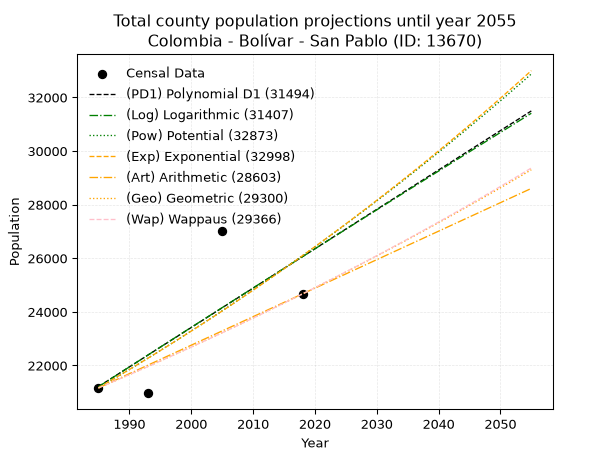
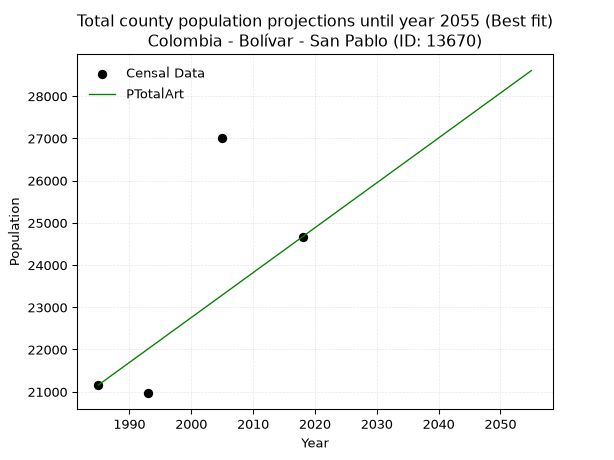
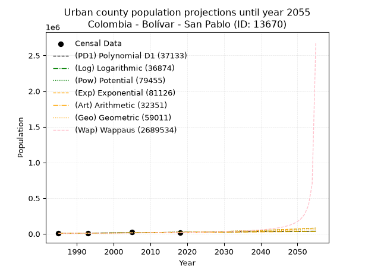
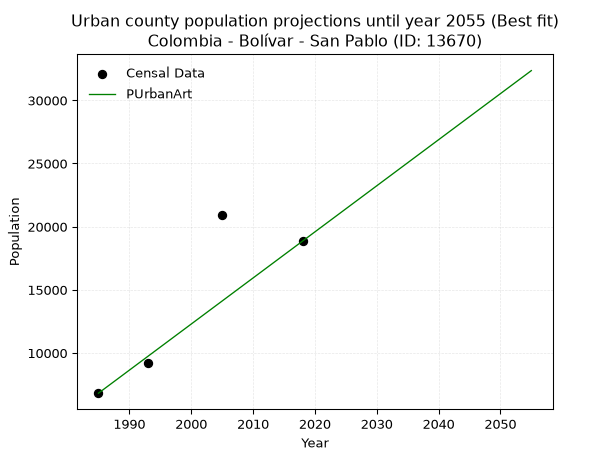
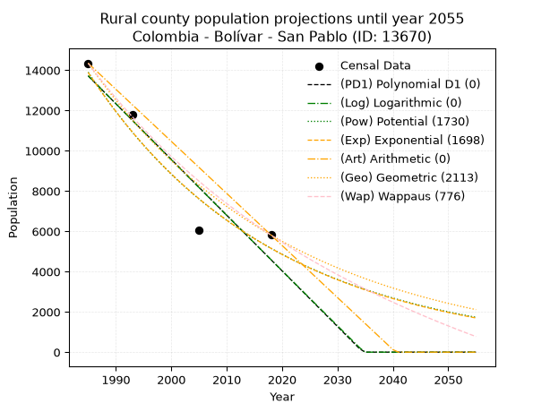
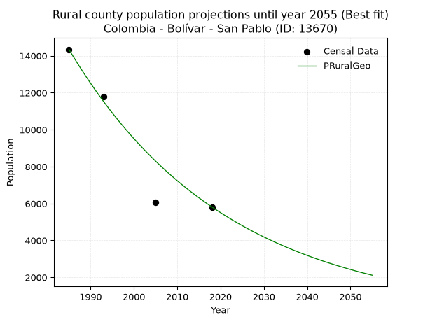

<div align="center">


</div>

# _“Population and Public Services Demand Projections (PPSD) until Year 2050 for Colombia - Bolívar - San Pablo (ID: 13670)”_
Keywords: `population` `public-service` `projection` `lineal` `polynomial` `logarithmic` `potential` `exponential` `arithmetic` `geometric` `wappaus` `dane` `colombia` `south-america`

PPSD are analytical estimates used by governments and planners to anticipate future changes in population size, age distribution, and the resulting community needs for utilities, healthcare, education, and infrastructure as sizing future water treatment facilities, electrical grids, and road networks based on spatial growth.

> **General running parameters**: • app_version: _v20260806_. • Python version: _3.14.7_. • Pandas version: _3.0.5_. • NumPy version: _2.5.1_. • Creates, save and include plots into reports (create_plot): _False_. • Projection until year: _2050_. • Process polynomial degree 2 and up: _False_. • Process Wappaus: _True_. • Process Wappaus: _True_. • Set negative values to zero: _True_. • Set infinite values to zero: _True_. • Drop dataset notes: _True_. 
<div align="center">

Dynamic map: [:earth_americas:Google](http://maps.google.com/maps?q=7.476747399,-73.9246015) [:earth_americas:OSM](https://www.openstreetmap.org/#map=18/7.476747399/-73.9246015&layers=P) [:earth_americas:Bing](https://www.bing.com/maps?cp=7.476747399~-73.9246015&lvl=18) [:earth_americas:Apple](https://maps.apple.com/frame?center=7.476747399%2C-73.9246015&span=0.003%2C0.006)

</div>


<div align="center">

```geojson
{
  "type": "Feature",
  "geometry": {
    "type": "Point", 
    "coordinates": [-73.9246015, 7.476747399]
  }, 
  "properties": {
    "Name": "Colombia - Bolívar - San Pablo (ID: 13670)"
  }
}
```

</div>


## 0. Census Data (4 records)

Census data are official statistics collected by a government about the people and housing in a country. They usually include counts of total population, age, sex, race, income, education, and jobs.

📅Global census file: [Population.xlsx](../data/Population.xlsx)

| Source   |   Year |   CountryID | CountryName   |   StateID | StateName   |   CountyID | CountyName   |   PTotal |   PUrban |   PRural |
|:---------|-------:|------------:|:--------------|----------:|:------------|-----------:|:-------------|---------:|---------:|---------:|
| DANE     |   1985 |          57 | Colombia      |        13 | Bolívar     |      13670 | San Pablo    |    21160 |     6814 |    14346 |
| DANE     |   1993 |          57 | Colombia      |        13 | Bolívar     |      13670 | San Pablo    |    20965 |     9179 |    11786 |
| DANE     |   2005 |          57 | Colombia      |        13 | Bolívar     |      13670 | San Pablo    |    27010 |    20952 |     6058 |
| DANE     |   2018 |          57 | Colombia      |        13 | Bolívar     |      13670 | San Pablo    |    24669 |    18853 |     5816 |

> 🔥Some records could had specific notes about the registered values or the corresponding urban or rural distribution.

## 1. Total

### 1.1. Coefficients and Parameters

* (PD1) Polynomial Deg 1: 146.906463267765, -270398.65315134695 (lineal)
* (Log) Logarithmic: 294418.85580306314, -2214429.082283724
* (Pow) Potential: 12.71073327068583, -37.59142280768256
* (Exp) Exponential: 0.006342896485133992, 0.07204653654233774
* (Art) Arithmetic: Year diff. 2018 - 1985 = 33, Population diff. 24669 - 21160 = 3509, Annual growth = 106.33333333333333
* (Geo) Geometric: Year diff. 2018 - 1985 = 33, Population diff. 24669 - 21160 = 3509, Annual growth % = 0.004660364898700475
* (Wap) Wappaus: i = 0.46404387323892443, Condition values only valid for < 200)

<sub>
Wappaus condition values: ['0.00', '0.46', '0.93', '1.39', '1.86', '2.32', '2.78', '3.25', '3.71', '4.18', '4.64', '5.10', '5.57', '6.03', '6.50', '6.96', '7.42', '7.89', '8.35', '8.82', '9.28', '9.74', '10.21', '10.67', '11.14', '11.60', '12.07', '12.53', '12.99', '13.46', '13.92', '14.39', '14.85', '15.31', '15.78', '16.24', '16.71', '17.17', '17.63', '18.10', '18.56', '19.03', '19.49', '19.95', '20.42', '20.88', '21.35', '21.81', '22.27', '22.74', '23.20', '23.67', '24.13', '24.59', '25.06', '25.52', '25.99', '26.45', '26.91', '27.38', '27.84', '28.31', '28.77', '29.23', '29.70', '30.16']
</sub>


### 1.2. Projected Dataset

|   Year |   CountyID |   PTotalPD1 |   PTotalLog |   PTotalPow |   PTotalExp |   PTotalArt |   PTotalGeo |   PTotalWap |
|-------:|-----------:|------------:|------------:|------------:|------------:|------------:|------------:|------------:|
|   1985 |      13670 |       21211 |       21203 |       21161 |       21167 |       21160 |       21160 |       21160 |
|   1986 |      13670 |       21358 |       21352 |       21297 |       21302 |       21266 |       21259 |       21258 |
|   1987 |      13670 |       21504 |       21500 |       21433 |       21437 |       21373 |       21358 |       21357 |
|   1988 |      13670 |       21651 |       21648 |       21571 |       21574 |       21479 |       21457 |       21457 |
|   1989 |      13670 |       21798 |       21796 |       21709 |       21711 |       21585 |       21557 |       21556 |
|   1990 |      13670 |       21945 |       21944 |       21848 |       21849 |       21692 |       21658 |       21657 |
|   1991 |      13670 |       22092 |       22092 |       21988 |       21988 |       21798 |       21759 |       21757 |
|   1992 |      13670 |       22239 |       22240 |       22129 |       22128 |       21904 |       21860 |       21859 |
|   1993 |      13670 |       22386 |       22388 |       22271 |       22269 |       22011 |       21962 |       21960 |
|   1994 |      13670 |       22533 |       22535 |       22413 |       22411 |       22117 |       22064 |       22063 |
|   1995 |      13670 |       22680 |       22683 |       22556 |       22553 |       22223 |       22167 |       22165 |
|   1996 |      13670 |       22827 |       22830 |       22701 |       22697 |       22330 |       22270 |       22268 |
|   1997 |      13670 |       22974 |       22978 |       22846 |       22841 |       22436 |       22374 |       22372 |
|   1998 |      13670 |       23120 |       23125 |       22991 |       22987 |       22542 |       22478 |       22476 |
|   1999 |      13670 |       23267 |       23273 |       23138 |       23133 |       22649 |       22583 |       22581 |
|   2000 |      13670 |       23414 |       23420 |       23286 |       23280 |       22755 |       22688 |       22686 |
|   2001 |      13670 |       23561 |       23567 |       23434 |       23428 |       22861 |       22794 |       22792 |
|   2002 |      13670 |       23708 |       23714 |       23583 |       23577 |       22968 |       22900 |       22898 |
|   2003 |      13670 |       23855 |       23861 |       23734 |       23727 |       23074 |       23007 |       23004 |
|   2004 |      13670 |       24002 |       24008 |       23885 |       23878 |       23180 |       23114 |       23112 |
|   2005 |      13670 |       24149 |       24155 |       24037 |       24030 |       23287 |       23222 |       23219 |
|   2006 |      13670 |       24296 |       24302 |       24189 |       24183 |       23393 |       23330 |       23328 |
|   2007 |      13670 |       24443 |       24449 |       24343 |       24337 |       23499 |       23439 |       23436 |
|   2008 |      13670 |       24590 |       24595 |       24498 |       24492 |       23606 |       23548 |       23546 |
|   2009 |      13670 |       24736 |       24742 |       24653 |       24648 |       23712 |       23658 |       23656 |
|   2010 |      13670 |       24883 |       24888 |       24810 |       24804 |       23818 |       23768 |       23766 |
|   2011 |      13670 |       25030 |       25035 |       24967 |       24962 |       23925 |       23879 |       23877 |
|   2012 |      13670 |       25177 |       25181 |       25125 |       25121 |       24031 |       23990 |       23988 |
|   2013 |      13670 |       25324 |       25327 |       25284 |       25281 |       24137 |       24102 |       24100 |
|   2014 |      13670 |       25471 |       25474 |       25445 |       25442 |       24244 |       24214 |       24213 |
|   2015 |      13670 |       25618 |       25620 |       25606 |       25604 |       24350 |       24327 |       24326 |
|   2016 |      13670 |       25765 |       25766 |       25768 |       25767 |       24456 |       24441 |       24440 |
|   2017 |      13670 |       25912 |       25912 |       25931 |       25931 |       24563 |       24555 |       24554 |
|   2018 |      13670 |       26059 |       26058 |       26094 |       26096 |       24669 |       24669 |       24669 |
|   2019 |      13670 |       26205 |       26204 |       26259 |       26262 |       24775 |       24784 |       24784 |
|   2020 |      13670 |       26352 |       26349 |       26425 |       26429 |       24882 |       24899 |       24900 |
|   2021 |      13670 |       26499 |       26495 |       26592 |       26597 |       24988 |       25016 |       25017 |
|   2022 |      13670 |       26646 |       26641 |       26760 |       26766 |       25094 |       25132 |       25134 |
|   2023 |      13670 |       26793 |       26786 |       26928 |       26936 |       25201 |       25249 |       25252 |
|   2024 |      13670 |       26940 |       26932 |       27098 |       27108 |       25307 |       25367 |       25370 |
|   2025 |      13670 |       27087 |       27077 |       27269 |       27280 |       25413 |       25485 |       25489 |
|   2026 |      13670 |       27234 |       27223 |       27440 |       27454 |       25520 |       25604 |       25609 |
|   2027 |      13670 |       27381 |       27368 |       27613 |       27629 |       25626 |       25723 |       25729 |
|   2028 |      13670 |       27528 |       27513 |       27787 |       27804 |       25732 |       25843 |       25850 |
|   2029 |      13670 |       27675 |       27658 |       27961 |       27981 |       25839 |       25964 |       25972 |
|   2030 |      13670 |       27821 |       27803 |       28137 |       28159 |       25945 |       26085 |       26094 |
|   2031 |      13670 |       27968 |       27948 |       28314 |       28339 |       26051 |       26206 |       26216 |
|   2032 |      13670 |       28115 |       28093 |       28491 |       28519 |       26158 |       26328 |       26340 |
|   2033 |      13670 |       28262 |       28238 |       28670 |       28700 |       26264 |       26451 |       26464 |
|   2034 |      13670 |       28409 |       28383 |       28850 |       28883 |       26370 |       26574 |       26589 |
|   2035 |      13670 |       28556 |       28528 |       29031 |       29067 |       26477 |       26698 |       26714 |
|   2036 |      13670 |       28703 |       28672 |       29213 |       29252 |       26583 |       26822 |       26840 |
|   2037 |      13670 |       28850 |       28817 |       29395 |       29438 |       26689 |       26947 |       26967 |
|   2038 |      13670 |       28997 |       28961 |       29579 |       29625 |       26796 |       27073 |       27094 |
|   2039 |      13670 |       29144 |       29106 |       29764 |       29814 |       26902 |       27199 |       27222 |
|   2040 |      13670 |       29291 |       29250 |       29950 |       30003 |       27008 |       27326 |       27351 |
|   2041 |      13670 |       29437 |       29394 |       30138 |       30194 |       27115 |       27453 |       27480 |
|   2042 |      13670 |       29584 |       29539 |       30326 |       30386 |       27221 |       27581 |       27610 |
|   2043 |      13670 |       29731 |       29683 |       30515 |       30580 |       27327 |       27710 |       27741 |
|   2044 |      13670 |       29878 |       29827 |       30706 |       30774 |       27434 |       27839 |       27872 |
|   2045 |      13670 |       30025 |       29971 |       30897 |       30970 |       27540 |       27969 |       28004 |
|   2046 |      13670 |       30172 |       30115 |       31090 |       31167 |       27646 |       28099 |       28137 |
|   2047 |      13670 |       30319 |       30259 |       31283 |       31366 |       27753 |       28230 |       28271 |
|   2048 |      13670 |       30466 |       30403 |       31478 |       31565 |       27859 |       28362 |       28405 |
|   2049 |      13670 |       30613 |       30546 |       31674 |       31766 |       27965 |       28494 |       28540 |
|   2050 |      13670 |       30760 |       30690 |       31871 |       31968 |       28072 |       28626 |       28676 |
<div align="center">

</img>

</div>


### 1.3. Best fit with absolute and relative error (%)

Relative error puts that difference into context by dividing the absolute error by the true value, creating a unitless ratio or percentage that shows the scale of the mistake.

Absolute and relative error

|   Year | Source   |   CountryID | CountryName   |   StateID | StateName   |   CountyID_x | CountyName   |   PTotal |   PUrban |   PRural |   CountyID_y |   PTotalPD1 |   PTotalLog |   PTotalPow |   PTotalExp |   PTotalArt |   PTotalGeo |   PTotalWap |   PTotalPD1AbsError |   PTotalLogAbsError |   PTotalPowAbsError |   PTotalExpAbsError |   PTotalArtAbsError |   PTotalGeoAbsError |   PTotalWapAbsError |   PTotalPD1RelError |   PTotalLogRelError |   PTotalPowRelError |   PTotalExpRelError |   PTotalArtRelError |   PTotalGeoRelError |   PTotalWapRelError |
|-------:|:---------|------------:|:--------------|----------:|:------------|-------------:|:-------------|---------:|---------:|---------:|-------------:|------------:|------------:|------------:|------------:|------------:|------------:|------------:|--------------------:|--------------------:|--------------------:|--------------------:|--------------------:|--------------------:|--------------------:|--------------------:|--------------------:|--------------------:|--------------------:|--------------------:|--------------------:|--------------------:|
|   1985 | DANE     |          57 | Colombia      |        13 | Bolívar     |        13670 | San Pablo    |    21160 |     6814 |    14346 |        13670 |       21211 |       21203 |       21161 |       21167 |       21160 |       21160 |       21160 |                  51 |                  43 |                   1 |                   7 |                   0 |                   0 |                   0 |            0.241021 |            0.203214 |           0.0047259 |           0.0330813 |             0       |             0       |             0       |
|   1993 | DANE     |          57 | Colombia      |        13 | Bolívar     |        13670 | San Pablo    |    20965 |     9179 |    11786 |        13670 |       22386 |       22388 |       22271 |       22269 |       22011 |       21962 |       21960 |                1421 |                1423 |                1306 |                1304 |                1046 |                 997 |                 995 |            6.77796  |            6.7875   |           6.22943   |           6.21989   |             4.98927 |             4.75554 |             4.74601 |
|   2005 | DANE     |          57 | Colombia      |        13 | Bolívar     |        13670 | San Pablo    |    27010 |    20952 |     6058 |        13670 |       24149 |       24155 |       24037 |       24030 |       23287 |       23222 |       23219 |                2861 |                2855 |                2973 |                2980 |                3723 |                3788 |                3791 |           10.5924   |           10.5702   |          11.007     |          11.033     |            13.7838  |            14.0244  |            14.0355  |
|   2018 | DANE     |          57 | Colombia      |        13 | Bolívar     |        13670 | San Pablo    |    24669 |    18853 |     5816 |        13670 |       26059 |       26058 |       26094 |       26096 |       24669 |       24669 |       24669 |                1390 |                1389 |                1425 |                1427 |                   0 |                   0 |                   0 |            5.6346   |            5.63055  |           5.77648   |           5.78459   |             0       |             0       |             0       |

Relative error mean

| Method    |   RelError | Best   |
|:----------|-----------:|:-------|
| PTotalPD1 |    5.81149 |        |
| PTotalLog |    5.79786 |        |
| PTotalPow |    5.75442 |        |
| PTotalExp |    5.76763 |        |
| PTotalArt |    4.69326 | True   |
| PTotalGeo |    4.695   |        |
| PTotalWap |    4.69539 |        |

💙Best method: _**PTotalArt**_
<div align="center">

</img>

</div>


### 1.4. Fresh water supply demand in liters per capita per day (lpcd)

The fresh water supply demand typically ranges from 100 to 300 liters per capita per day (lpcd) for standard domestic and municipal planning, though absolute survival minimums set by the World Health Organization are as low as 7.5 to 20 liters per day, and total consumption in high-income nations can exceed 400 liters.

> `CZ`: Level in meters above the sea level (masl).<br> `WS`: Fresh water supply demand in liters per capita per day (lpcd or l/h/d).<br> `WSAll`: Zonal fresh water supply demand in liters per second (l/s).<br> `A`: Zonal area in square meters.

Reference values (RAS Colombia)

|    CZ |   WS |
|------:|-----:|
|  1000 |  120 |
|  2000 |  130 |
| 99999 |  140 |

County shapefile geometry properties and water supply values

|   CountyID |      ATotal |   CZTotal |   WSTotal |
|-----------:|------------:|----------:|----------:|
|      13670 | 2.01856e+09 |   451.099 |       120 |

Projected values for best method: PTotalArt

|   CountyID |   Year |   PTotalArt |   WSTotal |   WSTotalAll |
|-----------:|-------:|------------:|----------:|-------------:|
|      13670 |   1985 |       21160 |       120 |      29.3889 |
|      13670 |   1986 |       21266 |       120 |      29.5361 |
|      13670 |   1987 |       21373 |       120 |      29.6847 |
|      13670 |   1988 |       21479 |       120 |      29.8319 |
|      13670 |   1989 |       21585 |       120 |      29.9792 |
|      13670 |   1990 |       21692 |       120 |      30.1278 |
|      13670 |   1991 |       21798 |       120 |      30.275  |
|      13670 |   1992 |       21904 |       120 |      30.4222 |
|      13670 |   1993 |       22011 |       120 |      30.5708 |
|      13670 |   1994 |       22117 |       120 |      30.7181 |
|      13670 |   1995 |       22223 |       120 |      30.8653 |
|      13670 |   1996 |       22330 |       120 |      31.0139 |
|      13670 |   1997 |       22436 |       120 |      31.1611 |
|      13670 |   1998 |       22542 |       120 |      31.3083 |
|      13670 |   1999 |       22649 |       120 |      31.4569 |
|      13670 |   2000 |       22755 |       120 |      31.6042 |
|      13670 |   2001 |       22861 |       120 |      31.7514 |
|      13670 |   2002 |       22968 |       120 |      31.9    |
|      13670 |   2003 |       23074 |       120 |      32.0472 |
|      13670 |   2004 |       23180 |       120 |      32.1944 |
|      13670 |   2005 |       23287 |       120 |      32.3431 |
|      13670 |   2006 |       23393 |       120 |      32.4903 |
|      13670 |   2007 |       23499 |       120 |      32.6375 |
|      13670 |   2008 |       23606 |       120 |      32.7861 |
|      13670 |   2009 |       23712 |       120 |      32.9333 |
|      13670 |   2010 |       23818 |       120 |      33.0806 |
|      13670 |   2011 |       23925 |       120 |      33.2292 |
|      13670 |   2012 |       24031 |       120 |      33.3764 |
|      13670 |   2013 |       24137 |       120 |      33.5236 |
|      13670 |   2014 |       24244 |       120 |      33.6722 |
|      13670 |   2015 |       24350 |       120 |      33.8194 |
|      13670 |   2016 |       24456 |       120 |      33.9667 |
|      13670 |   2017 |       24563 |       120 |      34.1153 |
|      13670 |   2018 |       24669 |       120 |      34.2625 |
|      13670 |   2019 |       24775 |       120 |      34.4097 |
|      13670 |   2020 |       24882 |       120 |      34.5583 |
|      13670 |   2021 |       24988 |       120 |      34.7056 |
|      13670 |   2022 |       25094 |       120 |      34.8528 |
|      13670 |   2023 |       25201 |       120 |      35.0014 |
|      13670 |   2024 |       25307 |       120 |      35.1486 |
|      13670 |   2025 |       25413 |       120 |      35.2958 |
|      13670 |   2026 |       25520 |       120 |      35.4444 |
|      13670 |   2027 |       25626 |       120 |      35.5917 |
|      13670 |   2028 |       25732 |       120 |      35.7389 |
|      13670 |   2029 |       25839 |       120 |      35.8875 |
|      13670 |   2030 |       25945 |       120 |      36.0347 |
|      13670 |   2031 |       26051 |       120 |      36.1819 |
|      13670 |   2032 |       26158 |       120 |      36.3306 |
|      13670 |   2033 |       26264 |       120 |      36.4778 |
|      13670 |   2034 |       26370 |       120 |      36.625  |
|      13670 |   2035 |       26477 |       120 |      36.7736 |
|      13670 |   2036 |       26583 |       120 |      36.9208 |
|      13670 |   2037 |       26689 |       120 |      37.0681 |
|      13670 |   2038 |       26796 |       120 |      37.2167 |
|      13670 |   2039 |       26902 |       120 |      37.3639 |
|      13670 |   2040 |       27008 |       120 |      37.5111 |
|      13670 |   2041 |       27115 |       120 |      37.6597 |
|      13670 |   2042 |       27221 |       120 |      37.8069 |
|      13670 |   2043 |       27327 |       120 |      37.9542 |
|      13670 |   2044 |       27434 |       120 |      38.1028 |
|      13670 |   2045 |       27540 |       120 |      38.25   |
|      13670 |   2046 |       27646 |       120 |      38.3972 |
|      13670 |   2047 |       27753 |       120 |      38.5458 |
|      13670 |   2048 |       27859 |       120 |      38.6931 |
|      13670 |   2049 |       27965 |       120 |      38.8403 |
|      13670 |   2050 |       28072 |       120 |      38.9889 |

## 2. Urban

### 2.1. Coefficients and Parameters

* (PD1) Polynomial Deg 1: 423.44680851063885, -833049.9787234053 (lineal)
* (Log) Logarithmic: 848346.9119495038, -6434342.175953681
* (Pow) Potential: 68.32999555002812, -221.46429640072523
* (Exp) Exponential: 0.03410589946391075, 2.9545407682823395e-26
* (Art) Arithmetic: Year diff. 2018 - 1985 = 33, Population diff. 18853 - 6814 = 12039, Annual growth = 364.8181818181818
* (Geo) Geometric: Year diff. 2018 - 1985 = 33, Population diff. 18853 - 6814 = 12039, Annual growth % = 0.03131962726238058
* (Wap) Wappaus: i = 2.842702160892834, Condition values only valid for < 200)

<sub>
Wappaus condition values: ['0.00', '2.84', '5.69', '8.53', '11.37', '14.21', '17.06', '19.90', '22.74', '25.58', '28.43', '31.27', '34.11', '36.96', '39.80', '42.64', '45.48', '48.33', '51.17', '54.01', '56.85', '59.70', '62.54', '65.38', '68.22', '71.07', '73.91', '76.75', '79.60', '82.44', '85.28', '88.12', '90.97', '93.81', '96.65', '99.49', '102.34', '105.18', '108.02', '110.87', '113.71', '116.55', '119.39', '122.24', '125.08', '127.92', '130.76', '133.61', '136.45', '139.29', '142.14', '144.98', '147.82', '150.66', '153.51', '156.35', '159.19', '162.03', '164.88', '167.72', '170.56', '173.40', '176.25', '179.09', '181.93', '184.78']
</sub>


### 2.2. Projected Dataset

|   Year |   CountyID |   PUrbanPD1 |   PUrbanLog |   PUrbanPow |   PUrbanExp |   PUrbanArt |   PUrbanGeo |   PUrbanWap |
|-------:|-----------:|------------:|------------:|------------:|------------:|------------:|------------:|------------:|
|   1985 |      13670 |        7492 |        7473 |        7442 |        7453 |        6814 |        6814 |        6814 |
|   1986 |      13670 |        7915 |        7901 |        7702 |        7711 |        7179 |        7027 |        7010 |
|   1987 |      13670 |        8339 |        8328 |        7972 |        7979 |        7544 |        7248 |        7213 |
|   1988 |      13670 |        8762 |        8755 |        8250 |        8256 |        7908 |        7474 |        7421 |
|   1989 |      13670 |        9186 |        9181 |        8539 |        8542 |        8273 |        7709 |        7636 |
|   1990 |      13670 |        9609 |        9608 |        8837 |        8838 |        8638 |        7950 |        7857 |
|   1991 |      13670 |       10033 |       10034 |        9146 |        9145 |        9003 |        8199 |        8085 |
|   1992 |      13670 |       10456 |       10460 |        9465 |        9462 |        9368 |        8456 |        8320 |
|   1993 |      13670 |       10880 |       10886 |        9795 |        9791 |        9733 |        8721 |        8562 |
|   1994 |      13670 |       11303 |       11311 |       10137 |       10130 |       10097 |        8994 |        8813 |
|   1995 |      13670 |       11726 |       11736 |       10490 |       10482 |       10462 |        9275 |        9072 |
|   1996 |      13670 |       12150 |       12162 |       10856 |       10846 |       10827 |        9566 |        9340 |
|   1997 |      13670 |       12573 |       12586 |       11234 |       11222 |       11192 |        9866 |        9616 |
|   1998 |      13670 |       12997 |       13011 |       11625 |       11611 |       11557 |       10175 |        9903 |
|   1999 |      13670 |       13420 |       13436 |       12029 |       12014 |       11921 |       10493 |       10200 |
|   2000 |      13670 |       13844 |       13860 |       12447 |       12431 |       12286 |       10822 |       10507 |
|   2001 |      13670 |       14267 |       14284 |       12880 |       12862 |       12651 |       11161 |       10826 |
|   2002 |      13670 |       14691 |       14708 |       13327 |       13308 |       13016 |       11510 |       11156 |
|   2003 |      13670 |       15114 |       15132 |       13789 |       13770 |       13381 |       11871 |       11499 |
|   2004 |      13670 |       15537 |       15555 |       14268 |       14248 |       13746 |       12243 |       11856 |
|   2005 |      13670 |       15961 |       15978 |       14763 |       14742 |       14110 |       12626 |       12227 |
|   2006 |      13670 |       16384 |       16401 |       15274 |       15254 |       14475 |       13022 |       12612 |
|   2007 |      13670 |       16808 |       16824 |       15803 |       15783 |       14840 |       13429 |       13014 |
|   2008 |      13670 |       17231 |       17247 |       16351 |       16330 |       15205 |       13850 |       13433 |
|   2009 |      13670 |       17655 |       17669 |       16916 |       16897 |       15570 |       14284 |       13870 |
|   2010 |      13670 |       18078 |       18091 |       17502 |       17483 |       15934 |       14731 |       14326 |
|   2011 |      13670 |       18502 |       18513 |       18107 |       18090 |       16299 |       15192 |       14802 |
|   2012 |      13670 |       18925 |       18935 |       18732 |       18717 |       16664 |       15668 |       15301 |
|   2013 |      13670 |       19348 |       19356 |       19379 |       19367 |       17029 |       16159 |       15823 |
|   2014 |      13670 |       19772 |       19778 |       20048 |       20039 |       17394 |       16665 |       16370 |
|   2015 |      13670 |       20195 |       20199 |       20740 |       20734 |       17759 |       17187 |       16945 |
|   2016 |      13670 |       20619 |       20620 |       21455 |       21453 |       18123 |       17725 |       17549 |
|   2017 |      13670 |       21042 |       21040 |       22194 |       22197 |       18488 |       18280 |       18184 |
|   2018 |      13670 |       21466 |       21461 |       22959 |       22968 |       18853 |       18853 |       18853 |
|   2019 |      13670 |       21889 |       21881 |       23749 |       23764 |       19218 |       19443 |       19559 |
|   2020 |      13670 |       22313 |       22301 |       24567 |       24589 |       19583 |       20052 |       20305 |
|   2021 |      13670 |       22736 |       22721 |       25412 |       25442 |       19947 |       20680 |       21094 |
|   2022 |      13670 |       23159 |       23141 |       26285 |       26325 |       20312 |       21328 |       21931 |
|   2023 |      13670 |       23583 |       23560 |       27189 |       27238 |       20677 |       21996 |       22819 |
|   2024 |      13670 |       24006 |       23980 |       28122 |       28183 |       21042 |       22685 |       23764 |
|   2025 |      13670 |       24430 |       24399 |       29088 |       29161 |       21407 |       23396 |       24772 |
|   2026 |      13670 |       24853 |       24817 |       30086 |       30172 |       21772 |       24128 |       25848 |
|   2027 |      13670 |       25277 |       25236 |       31118 |       31219 |       22136 |       24884 |       27000 |
|   2028 |      13670 |       25700 |       25654 |       32184 |       32302 |       22501 |       25663 |       28236 |
|   2029 |      13670 |       26124 |       26073 |       33287 |       33423 |       22866 |       26467 |       29566 |
|   2030 |      13670 |       26547 |       26491 |       34427 |       34583 |       23231 |       27296 |       31000 |
|   2031 |      13670 |       26970 |       26908 |       35605 |       35782 |       23596 |       28151 |       32553 |
|   2032 |      13670 |       27394 |       27326 |       36823 |       37024 |       23960 |       29033 |       34239 |
|   2033 |      13670 |       27817 |       27743 |       38082 |       38308 |       24325 |       29942 |       36075 |
|   2034 |      13670 |       28241 |       28161 |       39383 |       39637 |       24690 |       30880 |       38083 |
|   2035 |      13670 |       28664 |       28578 |       40728 |       41013 |       25055 |       31847 |       40289 |
|   2036 |      13670 |       29088 |       28994 |       42119 |       42436 |       25420 |       32844 |       42722 |
|   2037 |      13670 |       29511 |       29411 |       43556 |       43908 |       25785 |       33873 |       45421 |
|   2038 |      13670 |       29935 |       29827 |       45041 |       45431 |       26149 |       34934 |       48431 |
|   2039 |      13670 |       30358 |       30243 |       46577 |       47007 |       26514 |       36028 |       51809 |
|   2040 |      13670 |       30782 |       30659 |       48164 |       48638 |       26879 |       37156 |       55626 |
|   2041 |      13670 |       31205 |       31075 |       49804 |       50326 |       27244 |       38320 |       59976 |
|   2042 |      13670 |       31628 |       31491 |       51499 |       52072 |       27609 |       39520 |       64977 |
|   2043 |      13670 |       32052 |       31906 |       53251 |       53878 |       27973 |       40758 |       70787 |
|   2044 |      13670 |       32475 |       32321 |       55062 |       55748 |       28338 |       42034 |       77621 |
|   2045 |      13670 |       32899 |       32736 |       56933 |       57682 |       28703 |       43351 |       85774 |
|   2046 |      13670 |       33322 |       33151 |       58867 |       59683 |       29068 |       44709 |       95671 |
|   2047 |      13670 |       33746 |       33565 |       60865 |       61754 |       29433 |       46109 |      107936 |
|   2048 |      13670 |       34169 |       33980 |       62931 |       63896 |       29798 |       47553 |      123537 |
|   2049 |      13670 |       34593 |       34394 |       65066 |       66113 |       30162 |       49042 |      144046 |
|   2050 |      13670 |       35016 |       34808 |       67271 |       68407 |       30527 |       50578 |      172215 |
<div align="center">

</img>

</div>


### 2.3. Best fit with absolute and relative error (%)

Relative error puts that difference into context by dividing the absolute error by the true value, creating a unitless ratio or percentage that shows the scale of the mistake.

Absolute and relative error

|   Year | Source   |   CountryID | CountryName   |   StateID | StateName   |   CountyID_x | CountyName   |   PTotal |   PUrban |   PRural |   CountyID_y |   PUrbanPD1 |   PUrbanLog |   PUrbanPow |   PUrbanExp |   PUrbanArt |   PUrbanGeo |   PUrbanWap |   PUrbanPD1AbsError |   PUrbanLogAbsError |   PUrbanPowAbsError |   PUrbanExpAbsError |   PUrbanArtAbsError |   PUrbanGeoAbsError |   PUrbanWapAbsError |   PUrbanPD1RelError |   PUrbanLogRelError |   PUrbanPowRelError |   PUrbanExpRelError |   PUrbanArtRelError |   PUrbanGeoRelError |   PUrbanWapRelError |
|-------:|:---------|------------:|:--------------|----------:|:------------|-------------:|:-------------|---------:|---------:|---------:|-------------:|------------:|------------:|------------:|------------:|------------:|------------:|------------:|--------------------:|--------------------:|--------------------:|--------------------:|--------------------:|--------------------:|--------------------:|--------------------:|--------------------:|--------------------:|--------------------:|--------------------:|--------------------:|--------------------:|
|   1985 | DANE     |          57 | Colombia      |        13 | Bolívar     |        13670 | San Pablo    |    21160 |     6814 |    14346 |        13670 |        7492 |        7473 |        7442 |        7453 |        6814 |        6814 |        6814 |                 678 |                 659 |                 628 |                 639 |                   0 |                   0 |                   0 |              9.9501 |             9.67127 |             9.21632 |             9.37775 |             0       |             0       |             0       |
|   1993 | DANE     |          57 | Colombia      |        13 | Bolívar     |        13670 | San Pablo    |    20965 |     9179 |    11786 |        13670 |       10880 |       10886 |        9795 |        9791 |        9733 |        8721 |        8562 |                1701 |                1707 |                 616 |                 612 |                 554 |                 458 |                 617 |             18.5314 |            18.5968  |             6.71097 |             6.66739 |             6.03552 |             4.98965 |             6.72187 |
|   2005 | DANE     |          57 | Colombia      |        13 | Bolívar     |        13670 | San Pablo    |    27010 |    20952 |     6058 |        13670 |       15961 |       15978 |       14763 |       14742 |       14110 |       12626 |       12227 |                4991 |                4974 |                6189 |                6210 |                6842 |                8326 |                8725 |             23.8211 |            23.74    |            29.5389  |            29.6392  |            32.6556  |            39.7384  |            41.6428  |
|   2018 | DANE     |          57 | Colombia      |        13 | Bolívar     |        13670 | San Pablo    |    24669 |    18853 |     5816 |        13670 |       21466 |       21461 |       22959 |       22968 |       18853 |       18853 |       18853 |                2613 |                2608 |                4106 |                4115 |                   0 |                   0 |                   0 |             13.8599 |            13.8333  |            21.779   |            21.8268  |             0       |             0       |             0       |

Relative error mean

| Method    |   RelError | Best   |
|:----------|-----------:|:-------|
| PUrbanPD1 |   16.5406  |        |
| PUrbanLog |   16.4603  |        |
| PUrbanPow |   16.8113  |        |
| PUrbanExp |   16.8778  |        |
| PUrbanArt |    9.67278 | True   |
| PUrbanGeo |   11.182   |        |
| PUrbanWap |   12.0912  |        |

💙Best method: _**PUrbanArt**_
<div align="center">

</img>

</div>


### 2.4. Fresh water supply demand in liters per capita per day (lpcd)

The fresh water supply demand typically ranges from 100 to 300 liters per capita per day (lpcd) for standard domestic and municipal planning, though absolute survival minimums set by the World Health Organization are as low as 7.5 to 20 liters per day, and total consumption in high-income nations can exceed 400 liters.

> `CZ`: Level in meters above the sea level (masl).<br> `WS`: Fresh water supply demand in liters per capita per day (lpcd or l/h/d).<br> `WSAll`: Zonal fresh water supply demand in liters per second (l/s).<br> `A`: Zonal area in square meters.

Reference values (RAS Colombia)

|    CZ |   WS |
|------:|-----:|
|  1000 |  120 |
|  2000 |  130 |
| 99999 |  140 |

County shapefile geometry properties and water supply values

|   CountyID |      AUrban |   CZUrban |   WSUrban |
|-----------:|------------:|----------:|----------:|
|      13670 | 2.54337e+06 |    67.384 |       120 |

Projected values for best method: PUrbanArt

|   CountyID |   Year |   PUrbanArt |   WSUrban |   WSUrbanAll |
|-----------:|-------:|------------:|----------:|-------------:|
|      13670 |   1985 |        6814 |       120 |      9.46389 |
|      13670 |   1986 |        7179 |       120 |      9.97083 |
|      13670 |   1987 |        7544 |       120 |     10.4778  |
|      13670 |   1988 |        7908 |       120 |     10.9833  |
|      13670 |   1989 |        8273 |       120 |     11.4903  |
|      13670 |   1990 |        8638 |       120 |     11.9972  |
|      13670 |   1991 |        9003 |       120 |     12.5042  |
|      13670 |   1992 |        9368 |       120 |     13.0111  |
|      13670 |   1993 |        9733 |       120 |     13.5181  |
|      13670 |   1994 |       10097 |       120 |     14.0236  |
|      13670 |   1995 |       10462 |       120 |     14.5306  |
|      13670 |   1996 |       10827 |       120 |     15.0375  |
|      13670 |   1997 |       11192 |       120 |     15.5444  |
|      13670 |   1998 |       11557 |       120 |     16.0514  |
|      13670 |   1999 |       11921 |       120 |     16.5569  |
|      13670 |   2000 |       12286 |       120 |     17.0639  |
|      13670 |   2001 |       12651 |       120 |     17.5708  |
|      13670 |   2002 |       13016 |       120 |     18.0778  |
|      13670 |   2003 |       13381 |       120 |     18.5847  |
|      13670 |   2004 |       13746 |       120 |     19.0917  |
|      13670 |   2005 |       14110 |       120 |     19.5972  |
|      13670 |   2006 |       14475 |       120 |     20.1042  |
|      13670 |   2007 |       14840 |       120 |     20.6111  |
|      13670 |   2008 |       15205 |       120 |     21.1181  |
|      13670 |   2009 |       15570 |       120 |     21.625   |
|      13670 |   2010 |       15934 |       120 |     22.1306  |
|      13670 |   2011 |       16299 |       120 |     22.6375  |
|      13670 |   2012 |       16664 |       120 |     23.1444  |
|      13670 |   2013 |       17029 |       120 |     23.6514  |
|      13670 |   2014 |       17394 |       120 |     24.1583  |
|      13670 |   2015 |       17759 |       120 |     24.6653  |
|      13670 |   2016 |       18123 |       120 |     25.1708  |
|      13670 |   2017 |       18488 |       120 |     25.6778  |
|      13670 |   2018 |       18853 |       120 |     26.1847  |
|      13670 |   2019 |       19218 |       120 |     26.6917  |
|      13670 |   2020 |       19583 |       120 |     27.1986  |
|      13670 |   2021 |       19947 |       120 |     27.7042  |
|      13670 |   2022 |       20312 |       120 |     28.2111  |
|      13670 |   2023 |       20677 |       120 |     28.7181  |
|      13670 |   2024 |       21042 |       120 |     29.225   |
|      13670 |   2025 |       21407 |       120 |     29.7319  |
|      13670 |   2026 |       21772 |       120 |     30.2389  |
|      13670 |   2027 |       22136 |       120 |     30.7444  |
|      13670 |   2028 |       22501 |       120 |     31.2514  |
|      13670 |   2029 |       22866 |       120 |     31.7583  |
|      13670 |   2030 |       23231 |       120 |     32.2653  |
|      13670 |   2031 |       23596 |       120 |     32.7722  |
|      13670 |   2032 |       23960 |       120 |     33.2778  |
|      13670 |   2033 |       24325 |       120 |     33.7847  |
|      13670 |   2034 |       24690 |       120 |     34.2917  |
|      13670 |   2035 |       25055 |       120 |     34.7986  |
|      13670 |   2036 |       25420 |       120 |     35.3056  |
|      13670 |   2037 |       25785 |       120 |     35.8125  |
|      13670 |   2038 |       26149 |       120 |     36.3181  |
|      13670 |   2039 |       26514 |       120 |     36.825   |
|      13670 |   2040 |       26879 |       120 |     37.3319  |
|      13670 |   2041 |       27244 |       120 |     37.8389  |
|      13670 |   2042 |       27609 |       120 |     38.3458  |
|      13670 |   2043 |       27973 |       120 |     38.8514  |
|      13670 |   2044 |       28338 |       120 |     39.3583  |
|      13670 |   2045 |       28703 |       120 |     39.8653  |
|      13670 |   2046 |       29068 |       120 |     40.3722  |
|      13670 |   2047 |       29433 |       120 |     40.8792  |
|      13670 |   2048 |       29798 |       120 |     41.3861  |
|      13670 |   2049 |       30162 |       120 |     41.8917  |
|      13670 |   2050 |       30527 |       120 |     42.3986  |

## 3. Rural

### 3.1. Coefficients and Parameters

* (PD1) Polynomial Deg 1: -276.54034524287374, 562651.3255720582 (lineal)
* (Log) Logarithmic: -553928.0561464409, 4219913.0936699575
* (Pow) Potential: -60.12630691149534, 202.4252616559814
* (Exp) Exponential: -0.030021068137335197, 1.054364304249097e+30
* (Art) Arithmetic: Year diff. 2018 - 1985 = 33, Population diff. 5816 - 14346 = -8530, Annual growth = -258.4848484848485
* (Geo) Geometric: Year diff. 2018 - 1985 = 33, Population diff. 5816 - 14346 = -8530, Annual growth % = -0.026988469091500544
* (Wap) Wappaus: i = -2.5640794413733605, Condition values only valid for < 200)

<sub>
Wappaus condition values: ['-0.00', '-2.56', '-5.13', '-7.69', '-10.26', '-12.82', '-15.38', '-17.95', '-20.51', '-23.08', '-25.64', '-28.20', '-30.77', '-33.33', '-35.90', '-38.46', '-41.03', '-43.59', '-46.15', '-48.72', '-51.28', '-53.85', '-56.41', '-58.97', '-61.54', '-64.10', '-66.67', '-69.23', '-71.79', '-74.36', '-76.92', '-79.49', '-82.05', '-84.61', '-87.18', '-89.74', '-92.31', '-94.87', '-97.44', '-100.00', '-102.56', '-105.13', '-107.69', '-110.26', '-112.82', '-115.38', '-117.95', '-120.51', '-123.08', '-125.64', '-128.20', '-130.77', '-133.33', '-135.90', '-138.46', '-141.02', '-143.59', '-146.15', '-148.72', '-151.28', '-153.84', '-156.41', '-158.97', '-161.54', '-164.10', '-166.67']
</sub>


### 3.2. Projected Dataset

|   Year |   CountyID |   PRuralPD1 |   PRuralLog |   PRuralPow |   PRuralExp |   PRuralArt |   PRuralGeo |   PRuralWap |
|-------:|-----------:|------------:|------------:|------------:|------------:|------------:|------------:|------------:|
|   1985 |      13670 |       13719 |       13730 |       13903 |       13886 |       14346 |       14346 |       14346 |
|   1986 |      13670 |       13442 |       13451 |       13488 |       13476 |       14088 |       13959 |       13983 |
|   1987 |      13670 |       13166 |       13172 |       13086 |       13077 |       13829 |       13582 |       13629 |
|   1988 |      13670 |       12889 |       12894 |       12696 |       12690 |       13571 |       13216 |       13283 |
|   1989 |      13670 |       12613 |       12615 |       12318 |       12315 |       13312 |       12859 |       12946 |
|   1990 |      13670 |       12336 |       12337 |       11951 |       11951 |       13054 |       12512 |       12618 |
|   1991 |      13670 |       12059 |       12058 |       11596 |       11597 |       12795 |       12174 |       12297 |
|   1992 |      13670 |       11783 |       11780 |       11251 |       11254 |       12537 |       11846 |       11983 |
|   1993 |      13670 |       11506 |       11502 |       10916 |       10922 |       12278 |       11526 |       11677 |
|   1994 |      13670 |       11230 |       11224 |       10592 |       10599 |       12020 |       11215 |       11378 |
|   1995 |      13670 |       10953 |       10947 |       10277 |       10285 |       11761 |       10912 |       11086 |
|   1996 |      13670 |       10677 |       10669 |        9972 |        9981 |       11503 |       10618 |       10800 |
|   1997 |      13670 |       10400 |       10391 |        9676 |        9686 |       11244 |       10331 |       10520 |
|   1998 |      13670 |       10124 |       10114 |        9390 |        9399 |       10986 |       10052 |       10247 |
|   1999 |      13670 |        9847 |        9837 |        9111 |        9121 |       10727 |        9781 |        9980 |
|   2000 |      13670 |        9571 |        9560 |        8841 |        8852 |       10469 |        9517 |        9718 |
|   2001 |      13670 |        9294 |        9283 |        8580 |        8590 |       10210 |        9260 |        9462 |
|   2002 |      13670 |        9018 |        9006 |        8326 |        8336 |        9952 |        9010 |        9212 |
|   2003 |      13670 |        8741 |        8730 |        8079 |        8089 |        9693 |        8767 |        8966 |
|   2004 |      13670 |        8464 |        8453 |        7841 |        7850 |        9435 |        8530 |        8726 |
|   2005 |      13670 |        8188 |        8177 |        7609 |        7618 |        9176 |        8300 |        8491 |
|   2006 |      13670 |        7911 |        7901 |        7384 |        7393 |        8918 |        8076 |        8260 |
|   2007 |      13670 |        7635 |        7625 |        7166 |        7174 |        8659 |        7858 |        8034 |
|   2008 |      13670 |        7358 |        7349 |        6955 |        6962 |        8401 |        7646 |        7812 |
|   2009 |      13670 |        7082 |        7073 |        6750 |        6756 |        8142 |        7440 |        7595 |
|   2010 |      13670 |        6805 |        6797 |        6551 |        6556 |        7884 |        7239 |        7382 |
|   2011 |      13670 |        6529 |        6522 |        6358 |        6362 |        7625 |        7044 |        7173 |
|   2012 |      13670 |        6252 |        6246 |        6170 |        6174 |        7367 |        6854 |        6968 |
|   2013 |      13670 |        5976 |        5971 |        5989 |        5991 |        7108 |        6669 |        6767 |
|   2014 |      13670 |        5699 |        5696 |        5813 |        5814 |        6850 |        6489 |        6570 |
|   2015 |      13670 |        5423 |        5421 |        5642 |        5642 |        6591 |        6314 |        6376 |
|   2016 |      13670 |        5146 |        5146 |        5476 |        5475 |        6333 |        6143 |        6186 |
|   2017 |      13670 |        4869 |        4871 |        5315 |        5313 |        6074 |        5977 |        5999 |
|   2018 |      13670 |        4593 |        4597 |        5159 |        5156 |        5816 |        5816 |        5816 |
|   2019 |      13670 |        4316 |        4322 |        5008 |        5004 |        5558 |        5659 |        5636 |
|   2020 |      13670 |        4040 |        4048 |        4861 |        4856 |        5299 |        5506 |        5459 |
|   2021 |      13670 |        3763 |        3774 |        4718 |        4712 |        5041 |        5358 |        5285 |
|   2022 |      13670 |        3487 |        3500 |        4580 |        4573 |        4782 |        5213 |        5115 |
|   2023 |      13670 |        3210 |        3226 |        4446 |        4438 |        4524 |        5072 |        4947 |
|   2024 |      13670 |        2934 |        2952 |        4316 |        4306 |        4265 |        4936 |        4782 |
|   2025 |      13670 |        2657 |        2679 |        4189 |        4179 |        4007 |        4802 |        4620 |
|   2026 |      13670 |        2381 |        2405 |        4067 |        4055 |        3748 |        4673 |        4461 |
|   2027 |      13670 |        2104 |        2132 |        3948 |        3935 |        3490 |        4547 |        4304 |
|   2028 |      13670 |        1828 |        1859 |        3832 |        3819 |        3231 |        4424 |        4150 |
|   2029 |      13670 |        1551 |        1586 |        3721 |        3706 |        2973 |        4304 |        3998 |
|   2030 |      13670 |        1274 |        1313 |        3612 |        3597 |        2714 |        4188 |        3849 |
|   2031 |      13670 |         998 |        1040 |        3507 |        3490 |        2456 |        4075 |        3702 |
|   2032 |      13670 |         721 |         767 |        3404 |        3387 |        2197 |        3965 |        3558 |
|   2033 |      13670 |         445 |         495 |        3305 |        3287 |        1939 |        3858 |        3416 |
|   2034 |      13670 |         168 |         222 |        3209 |        3190 |        1680 |        3754 |        3276 |
|   2035 |      13670 |           0 |           0 |        3115 |        3095 |        1422 |        3653 |        3138 |
|   2036 |      13670 |           0 |           0 |        3025 |        3004 |        1163 |        3554 |        3003 |
|   2037 |      13670 |           0 |           0 |        2937 |        2915 |         905 |        3458 |        2869 |
|   2038 |      13670 |           0 |           0 |        2851 |        2829 |         646 |        3365 |        2738 |
|   2039 |      13670 |           0 |           0 |        2768 |        2745 |         388 |        3274 |        2608 |
|   2040 |      13670 |           0 |           0 |        2688 |        2664 |         129 |        3186 |        2481 |
|   2041 |      13670 |           0 |           0 |        2610 |        2585 |           0 |        3100 |        2355 |
|   2042 |      13670 |           0 |           0 |        2534 |        2509 |           0 |        3016 |        2232 |
|   2043 |      13670 |           0 |           0 |        2461 |        2434 |           0 |        2935 |        2110 |
|   2044 |      13670 |           0 |           0 |        2389 |        2362 |           0 |        2856 |        1990 |
|   2045 |      13670 |           0 |           0 |        2320 |        2293 |           0 |        2778 |        1871 |
|   2046 |      13670 |           0 |           0 |        2253 |        2225 |           0 |        2704 |        1755 |
|   2047 |      13670 |           0 |           0 |        2188 |        2159 |           0 |        2631 |        1640 |
|   2048 |      13670 |           0 |           0 |        2124 |        2095 |           0 |        2560 |        1526 |
|   2049 |      13670 |           0 |           0 |        2063 |        2033 |           0 |        2490 |        1414 |
|   2050 |      13670 |           0 |           0 |        2003 |        1973 |           0 |        2423 |        1304 |
<div align="center">

</img>

</div>


### 3.3. Best fit with absolute and relative error (%)

Relative error puts that difference into context by dividing the absolute error by the true value, creating a unitless ratio or percentage that shows the scale of the mistake.

Absolute and relative error

|   Year | Source   |   CountryID | CountryName   |   StateID | StateName   |   CountyID_x | CountyName   |   PTotal |   PUrban |   PRural |   CountyID_y |   PRuralPD1 |   PRuralLog |   PRuralPow |   PRuralExp |   PRuralArt |   PRuralGeo |   PRuralWap |   PRuralPD1AbsError |   PRuralLogAbsError |   PRuralPowAbsError |   PRuralExpAbsError |   PRuralArtAbsError |   PRuralGeoAbsError |   PRuralWapAbsError |   PRuralPD1RelError |   PRuralLogRelError |   PRuralPowRelError |   PRuralExpRelError |   PRuralArtRelError |   PRuralGeoRelError |   PRuralWapRelError |
|-------:|:---------|------------:|:--------------|----------:|:------------|-------------:|:-------------|---------:|---------:|---------:|-------------:|------------:|------------:|------------:|------------:|------------:|------------:|------------:|--------------------:|--------------------:|--------------------:|--------------------:|--------------------:|--------------------:|--------------------:|--------------------:|--------------------:|--------------------:|--------------------:|--------------------:|--------------------:|--------------------:|
|   1985 | DANE     |          57 | Colombia      |        13 | Bolívar     |        13670 | San Pablo    |    21160 |     6814 |    14346 |        13670 |       13719 |       13730 |       13903 |       13886 |       14346 |       14346 |       14346 |                 627 |                 616 |                 443 |                 460 |                   0 |                   0 |                   0 |             4.37056 |             4.29388 |             3.08797 |             3.20647 |             0       |             0       |            0        |
|   1993 | DANE     |          57 | Colombia      |        13 | Bolívar     |        13670 | San Pablo    |    20965 |     9179 |    11786 |        13670 |       11506 |       11502 |       10916 |       10922 |       12278 |       11526 |       11677 |                 280 |                 284 |                 870 |                 864 |                 492 |                 260 |                 109 |             2.3757  |             2.40964 |             7.38164 |             7.33073 |             4.17444 |             2.20601 |            0.924826 |
|   2005 | DANE     |          57 | Colombia      |        13 | Bolívar     |        13670 | San Pablo    |    27010 |    20952 |     6058 |        13670 |        8188 |        8177 |        7609 |        7618 |        9176 |        8300 |        8491 |                2130 |                2119 |                1551 |                1560 |                3118 |                2242 |                2433 |            35.1601  |            34.9785  |            25.6025  |            25.7511  |            51.4691  |            37.0089  |           40.1618   |
|   2018 | DANE     |          57 | Colombia      |        13 | Bolívar     |        13670 | San Pablo    |    24669 |    18853 |     5816 |        13670 |        4593 |        4597 |        5159 |        5156 |        5816 |        5816 |        5816 |                1223 |                1219 |                 657 |                 660 |                   0 |                   0 |                   0 |            21.0282  |            20.9594  |            11.2964  |            11.348   |             0       |             0       |            0        |

Relative error mean

| Method    |   RelError | Best   |
|:----------|-----------:|:-------|
| PRuralPD1 |   15.7336  |        |
| PRuralLog |   15.6604  |        |
| PRuralPow |   11.8421  |        |
| PRuralExp |   11.9091  |        |
| PRuralArt |   13.9109  |        |
| PRuralGeo |    9.80373 | True   |
| PRuralWap |   10.2716  |        |

💙Best method: _**PRuralGeo**_
<div align="center">

</img>

</div>


### 3.4. Fresh water supply demand in liters per capita per day (lpcd)

The fresh water supply demand typically ranges from 100 to 300 liters per capita per day (lpcd) for standard domestic and municipal planning, though absolute survival minimums set by the World Health Organization are as low as 7.5 to 20 liters per day, and total consumption in high-income nations can exceed 400 liters.

> `CZ`: Level in meters above the sea level (masl).<br> `WS`: Fresh water supply demand in liters per capita per day (lpcd or l/h/d).<br> `WSAll`: Zonal fresh water supply demand in liters per second (l/s).<br> `A`: Zonal area in square meters.

Reference values (RAS Colombia)

|    CZ |   WS |
|------:|-----:|
|  1000 |  120 |
|  2000 |  130 |
| 99999 |  140 |

County shapefile geometry properties and water supply values

|   CountyID |      ARural |   CZRural |   WSRural |
|-----------:|------------:|----------:|----------:|
|      13670 | 2.01601e+09 |   451.576 |       120 |

Projected values for best method: PRuralGeo

|   CountyID |   Year |   PRuralGeo |   WSRural |   WSRuralAll |
|-----------:|-------:|------------:|----------:|-------------:|
|      13670 |   1985 |       14346 |       120 |     19.925   |
|      13670 |   1986 |       13959 |       120 |     19.3875  |
|      13670 |   1987 |       13582 |       120 |     18.8639  |
|      13670 |   1988 |       13216 |       120 |     18.3556  |
|      13670 |   1989 |       12859 |       120 |     17.8597  |
|      13670 |   1990 |       12512 |       120 |     17.3778  |
|      13670 |   1991 |       12174 |       120 |     16.9083  |
|      13670 |   1992 |       11846 |       120 |     16.4528  |
|      13670 |   1993 |       11526 |       120 |     16.0083  |
|      13670 |   1994 |       11215 |       120 |     15.5764  |
|      13670 |   1995 |       10912 |       120 |     15.1556  |
|      13670 |   1996 |       10618 |       120 |     14.7472  |
|      13670 |   1997 |       10331 |       120 |     14.3486  |
|      13670 |   1998 |       10052 |       120 |     13.9611  |
|      13670 |   1999 |        9781 |       120 |     13.5847  |
|      13670 |   2000 |        9517 |       120 |     13.2181  |
|      13670 |   2001 |        9260 |       120 |     12.8611  |
|      13670 |   2002 |        9010 |       120 |     12.5139  |
|      13670 |   2003 |        8767 |       120 |     12.1764  |
|      13670 |   2004 |        8530 |       120 |     11.8472  |
|      13670 |   2005 |        8300 |       120 |     11.5278  |
|      13670 |   2006 |        8076 |       120 |     11.2167  |
|      13670 |   2007 |        7858 |       120 |     10.9139  |
|      13670 |   2008 |        7646 |       120 |     10.6194  |
|      13670 |   2009 |        7440 |       120 |     10.3333  |
|      13670 |   2010 |        7239 |       120 |     10.0542  |
|      13670 |   2011 |        7044 |       120 |      9.78333 |
|      13670 |   2012 |        6854 |       120 |      9.51944 |
|      13670 |   2013 |        6669 |       120 |      9.2625  |
|      13670 |   2014 |        6489 |       120 |      9.0125  |
|      13670 |   2015 |        6314 |       120 |      8.76944 |
|      13670 |   2016 |        6143 |       120 |      8.53194 |
|      13670 |   2017 |        5977 |       120 |      8.30139 |
|      13670 |   2018 |        5816 |       120 |      8.07778 |
|      13670 |   2019 |        5659 |       120 |      7.85972 |
|      13670 |   2020 |        5506 |       120 |      7.64722 |
|      13670 |   2021 |        5358 |       120 |      7.44167 |
|      13670 |   2022 |        5213 |       120 |      7.24028 |
|      13670 |   2023 |        5072 |       120 |      7.04444 |
|      13670 |   2024 |        4936 |       120 |      6.85556 |
|      13670 |   2025 |        4802 |       120 |      6.66944 |
|      13670 |   2026 |        4673 |       120 |      6.49028 |
|      13670 |   2027 |        4547 |       120 |      6.31528 |
|      13670 |   2028 |        4424 |       120 |      6.14444 |
|      13670 |   2029 |        4304 |       120 |      5.97778 |
|      13670 |   2030 |        4188 |       120 |      5.81667 |
|      13670 |   2031 |        4075 |       120 |      5.65972 |
|      13670 |   2032 |        3965 |       120 |      5.50694 |
|      13670 |   2033 |        3858 |       120 |      5.35833 |
|      13670 |   2034 |        3754 |       120 |      5.21389 |
|      13670 |   2035 |        3653 |       120 |      5.07361 |
|      13670 |   2036 |        3554 |       120 |      4.93611 |
|      13670 |   2037 |        3458 |       120 |      4.80278 |
|      13670 |   2038 |        3365 |       120 |      4.67361 |
|      13670 |   2039 |        3274 |       120 |      4.54722 |
|      13670 |   2040 |        3186 |       120 |      4.425   |
|      13670 |   2041 |        3100 |       120 |      4.30556 |
|      13670 |   2042 |        3016 |       120 |      4.18889 |
|      13670 |   2043 |        2935 |       120 |      4.07639 |
|      13670 |   2044 |        2856 |       120 |      3.96667 |
|      13670 |   2045 |        2778 |       120 |      3.85833 |
|      13670 |   2046 |        2704 |       120 |      3.75556 |
|      13670 |   2047 |        2631 |       120 |      3.65417 |
|      13670 |   2048 |        2560 |       120 |      3.55556 |
|      13670 |   2049 |        2490 |       120 |      3.45833 |
|      13670 |   2050 |        2423 |       120 |      3.36528 |

<div align="center"><br><sub>Share this research</sub></div><br>

<sub>**APPS & TOOLS & CONTENT DISCLAIMER**: • NO WARRANTY - This content and software is provided by <a href="https://github.com/rcfdtools" target="_blank">github.com/rcfdtools</a> "as is", without any express or implied warranty, including warranties of merchantability, fitness for a particular purpose, or non-infringement. There is no guarantee that the software will be error-free or operate without interruption. • LIMITATION OF LIABILITY - Neither the authors nor copyright holders will be liable for claims or damages arising from the software or its use. You are responsible for determining if the software is appropriate for your use and assume all associated risks, including errors, legal compliance, and data loss. • NO PROFESSIONAL ADVICE - The software provides general information and does not offer professional advice. It should not replace consultation with professional advisors. [Clauses and global license for rcfdtools use.](https://github.com/rcfdtools/rcfdtools/blob/main/LICENSE.md)</sub>

| [:house: Home](Readme.md)  | [:beginner: Help / Collaborate](https://github.com/rcfdtools/R.HydroTools/discussions/31) |
|----------------------------|-------------------------------------------------------------------------------------------|