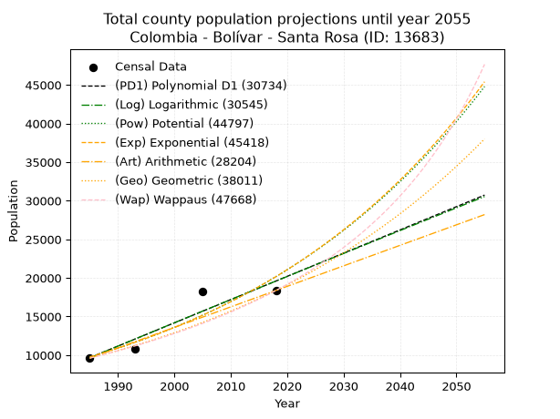
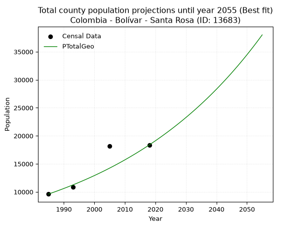
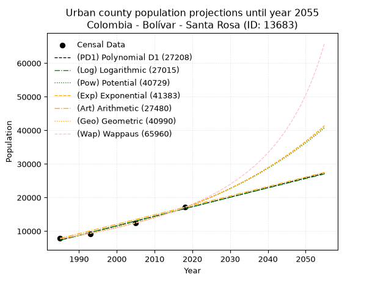
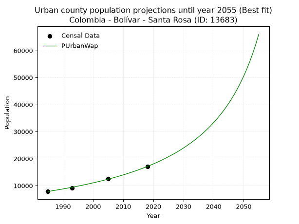
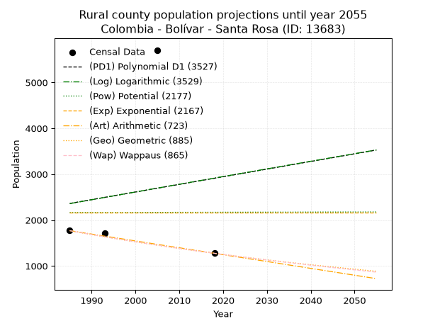
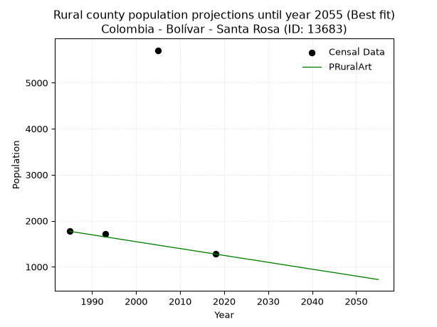

<div align="center">


</div>

# _“Population and Public Services Demand Projections (PPSD) until Year 2050 for Colombia - Bolívar - Santa Rosa (ID: 13683)”_
Keywords: `population` `public-service` `projection` `lineal` `polynomial` `logarithmic` `potential` `exponential` `arithmetic` `geometric` `wappaus` `dane` `colombia` `south-america`

PPSD are analytical estimates used by governments and planners to anticipate future changes in population size, age distribution, and the resulting community needs for utilities, healthcare, education, and infrastructure as sizing future water treatment facilities, electrical grids, and road networks based on spatial growth.

> **General running parameters**: • app_version: _v20260806_. • Python version: _3.14.7_. • Pandas version: _3.0.5_. • NumPy version: _2.5.1_. • Creates, save and include plots into reports (create_plot): _False_. • Projection until year: _2050_. • Process polynomial degree 2 and up: _False_. • Process Wappaus: _True_. • Process Wappaus: _True_. • Set negative values to zero: _True_. • Set infinite values to zero: _True_. • Drop dataset notes: _True_. 
<div align="center">

Dynamic map: [:earth_americas:Google](http://maps.google.com/maps?q=10.44439621,-75.369824) [:earth_americas:OSM](https://www.openstreetmap.org/#map=18/10.44439621/-75.369824&layers=P) [:earth_americas:Bing](https://www.bing.com/maps?cp=10.44439621~-75.369824&lvl=18) [:earth_americas:Apple](https://maps.apple.com/frame?center=10.44439621%2C-75.369824&span=0.003%2C0.006)

</div>


<div align="center">

```geojson
{
  "type": "Feature",
  "geometry": {
    "type": "Point", 
    "coordinates": [-75.369824, 10.44439621]
  }, 
  "properties": {
    "Name": "Colombia - Bolívar - Santa Rosa (ID: 13683)"
  }
}
```

</div>


## 0. Census Data (4 records)

Census data are official statistics collected by a government about the people and housing in a country. They usually include counts of total population, age, sex, race, income, education, and jobs.

📅Global census file: [Population.xlsx](../data/Population.xlsx)

| Source   |   Year |   CountryID | CountryName   |   StateID | StateName   |   CountyID | CountyName   |   PTotal |   PUrban |   PRural |
|:---------|-------:|------------:|:--------------|----------:|:------------|-----------:|:-------------|---------:|---------:|---------:|
| DANE     |   1985 |          57 | Colombia      |        13 | Bolívar     |      13683 | Santa Rosa   |     9609 |     7840 |     1769 |
| DANE     |   1993 |          57 | Colombia      |        13 | Bolívar     |      13683 | Santa Rosa   |    10842 |     9130 |     1712 |
| DANE     |   2005 |          57 | Colombia      |        13 | Bolívar     |      13683 | Santa Rosa   |    18195 |    12489 |     5706 |
| DANE     |   2018 |          57 | Colombia      |        13 | Bolívar     |      13683 | Santa Rosa   |    18375 |    17099 |     1276 |

> 🔥Some records could had specific notes about the registered values or the corresponding urban or rural distribution.

📅   [RUPS](https://www.datos.gov.co/Hacienda-y-Cr-dito-P-blico/Registro-nico-de-Prestadores-de-Servicios-P-blicos/4qkq-csdn/about_data) - Local public utility companies: [RUPS.csv](../data/RUPS.xlsx)

 | SERVICIO   | ESTADO                    | NOMBRE                                                                                               | NIT         | DEPARTAMENTO_DOMICILIO   | MUNICIPIO_DOMICILIO   | DIRECCION                                     |   TELEFONO | EMAIL                                    | TIPO_PRESTADOR                             | CLASIFICACION                 |
|:-----------|:--------------------------|:-----------------------------------------------------------------------------------------------------|:------------|:-------------------------|:----------------------|:----------------------------------------------|-----------:|:-----------------------------------------|:-------------------------------------------|:------------------------------|
| ACUEDUCTO  | OPERATIVA                 | EMPRESA INTERMUNICIPAL DE SERVICIOS PUBLICOS DOMICILIARIOS DE ACUEDUCTO Y ALCANTARILLADO S.A. E.S.P. | 806013532-7 | BOLIVAR                  | SANTA ROSA            | calle nueva de las florez  Cra. 28 No. 16-147 |    6903120 | gerencia.empresaintermunicipal@gmail.com | SOCIEDADES (EMPRESA DE SERVICIOS PUBLICOS) | MAYOR O IGUAL A 5001 USUARIOS |
| ACUEDUCTO  | EN PROCESO DE LIQUIDACION | GISCOL SOCIEDAD ANÓNIMA EMPRESA DE SERVICOS PÚBLICOS                                                 | 900175706-7 | BOGOTA, D.C.             | BOGOTA, D.C.          | CARRERA SÉPTIMA # 70 A- 21  PISO 8            |    7210697 | gerencia.giscol@gmail.com                | SOCIEDADES (EMPRESA DE SERVICIOS PUBLICOS) | MAYOR O IGUAL A 5001 USUARIOS |

## 1. Total

### 1.1. Coefficients and Parameters

* (PD1) Polynomial Deg 1: 300.98875953432287, -587797.5162585293 (lineal)
* (Log) Logarithmic: 602790.5331210768, -4567560.422713482
* (Pow) Potential: 43.946408590612286, -140.93493577761288
* (Exp) Exponential: 0.02194221089158203, 1.1867170546522283e-15
* (Art) Arithmetic: Year diff. 2018 - 1985 = 33, Population diff. 18375 - 9609 = 8766, Annual growth = 265.6363636363636
* (Geo) Geometric: Year diff. 2018 - 1985 = 33, Population diff. 18375 - 9609 = 8766, Annual growth % = 0.019839414725062676
* (Wap) Wappaus: i = 1.8984874473725246, Condition values only valid for < 200)

<sub>
Wappaus condition values: ['0.00', '1.90', '3.80', '5.70', '7.59', '9.49', '11.39', '13.29', '15.19', '17.09', '18.98', '20.88', '22.78', '24.68', '26.58', '28.48', '30.38', '32.27', '34.17', '36.07', '37.97', '39.87', '41.77', '43.67', '45.56', '47.46', '49.36', '51.26', '53.16', '55.06', '56.95', '58.85', '60.75', '62.65', '64.55', '66.45', '68.35', '70.24', '72.14', '74.04', '75.94', '77.84', '79.74', '81.63', '83.53', '85.43', '87.33', '89.23', '91.13', '93.03', '94.92', '96.82', '98.72', '100.62', '102.52', '104.42', '106.32', '108.21', '110.11', '112.01', '113.91', '115.81', '117.71', '119.60', '121.50', '123.40']
</sub>


### 1.2. Projected Dataset

|   Year |   CountyID |   PTotalPD1 |   PTotalLog |   PTotalPow |   PTotalExp |   PTotalArt |   PTotalGeo |   PTotalWap |
|-------:|-----------:|------------:|------------:|------------:|------------:|------------:|------------:|------------:|
|   1985 |      13683 |        9665 |        9654 |        9768 |        9776 |        9609 |        9609 |        9609 |
|   1986 |      13683 |        9966 |        9957 |        9986 |        9993 |        9875 |        9800 |        9793 |
|   1987 |      13683 |       10267 |       10261 |       10210 |       10215 |       10140 |        9994 |        9981 |
|   1988 |      13683 |       10568 |       10564 |       10438 |       10441 |       10406 |       10192 |       10172 |
|   1989 |      13683 |       10869 |       10867 |       10671 |       10673 |       10672 |       10395 |       10368 |
|   1990 |      13683 |       11170 |       11170 |       10910 |       10910 |       10937 |       10601 |       10567 |
|   1991 |      13683 |       11471 |       11473 |       11153 |       11152 |       11203 |       10811 |       10770 |
|   1992 |      13683 |       11772 |       11776 |       11402 |       11399 |       11468 |       11026 |       10977 |
|   1993 |      13683 |       12073 |       12078 |       11656 |       11652 |       11734 |       11244 |       11188 |
|   1994 |      13683 |       12374 |       12381 |       11916 |       11911 |       12000 |       11467 |       11404 |
|   1995 |      13683 |       12675 |       12683 |       12182 |       12175 |       12265 |       11695 |       11625 |
|   1996 |      13683 |       12976 |       12985 |       12453 |       12445 |       12531 |       11927 |       11850 |
|   1997 |      13683 |       13277 |       13287 |       12730 |       12721 |       12797 |       12164 |       12080 |
|   1998 |      13683 |       13578 |       13589 |       13013 |       13003 |       13062 |       12405 |       12314 |
|   1999 |      13683 |       13879 |       13890 |       13302 |       13292 |       13328 |       12651 |       12554 |
|   2000 |      13683 |       14180 |       14192 |       13598 |       13587 |       13594 |       12902 |       12800 |
|   2001 |      13683 |       14481 |       14493 |       13900 |       13888 |       13859 |       13158 |       13051 |
|   2002 |      13683 |       14782 |       14794 |       14209 |       14196 |       14125 |       13419 |       13307 |
|   2003 |      13683 |       15083 |       15095 |       14524 |       14511 |       14390 |       13685 |       13569 |
|   2004 |      13683 |       15384 |       15396 |       14846 |       14833 |       14656 |       13957 |       13838 |
|   2005 |      13683 |       15685 |       15697 |       15175 |       15162 |       14922 |       14234 |       14112 |
|   2006 |      13683 |       15986 |       15997 |       15511 |       15498 |       15187 |       14516 |       14394 |
|   2007 |      13683 |       16287 |       16298 |       15855 |       15842 |       15453 |       14804 |       14682 |
|   2008 |      13683 |       16588 |       16598 |       16206 |       16194 |       15719 |       15098 |       14977 |
|   2009 |      13683 |       16889 |       16898 |       16564 |       16553 |       15984 |       15397 |       15279 |
|   2010 |      13683 |       17190 |       17198 |       16930 |       16920 |       16250 |       15703 |       15589 |
|   2011 |      13683 |       17491 |       17498 |       17305 |       17295 |       16516 |       16014 |       15906 |
|   2012 |      13683 |       17792 |       17798 |       17687 |       17679 |       16781 |       16332 |       16232 |
|   2013 |      13683 |       18093 |       18097 |       18077 |       18071 |       17047 |       16656 |       16566 |
|   2014 |      13683 |       18394 |       18396 |       18476 |       18472 |       17312 |       16986 |       16909 |
|   2015 |      13683 |       18695 |       18696 |       18884 |       18882 |       17578 |       17323 |       17261 |
|   2016 |      13683 |       18996 |       18995 |       19300 |       19301 |       17844 |       17667 |       17622 |
|   2017 |      13683 |       19297 |       19294 |       19725 |       19729 |       18109 |       18018 |       17993 |
|   2018 |      13683 |       19598 |       19592 |       20160 |       20167 |       18375 |       18375 |       18375 |
|   2019 |      13683 |       19899 |       19891 |       20603 |       20614 |       18641 |       18740 |       18767 |
|   2020 |      13683 |       20200 |       20190 |       21056 |       21072 |       18906 |       19111 |       19171 |
|   2021 |      13683 |       20501 |       20488 |       21519 |       21539 |       19172 |       19490 |       19586 |
|   2022 |      13683 |       20802 |       20786 |       21992 |       22017 |       19438 |       19877 |       20013 |
|   2023 |      13683 |       21103 |       21084 |       22476 |       22505 |       19703 |       20272 |       20453 |
|   2024 |      13683 |       21404 |       21382 |       22969 |       23005 |       19969 |       20674 |       20906 |
|   2025 |      13683 |       21705 |       21680 |       23473 |       23515 |       20234 |       21084 |       21373 |
|   2026 |      13683 |       22006 |       21977 |       23988 |       24037 |       20500 |       21502 |       21854 |
|   2027 |      13683 |       22307 |       22275 |       24514 |       24570 |       20766 |       21929 |       22351 |
|   2028 |      13683 |       22608 |       22572 |       25051 |       25115 |       21031 |       22364 |       22863 |
|   2029 |      13683 |       22909 |       22869 |       25600 |       25672 |       21297 |       22807 |       23393 |
|   2030 |      13683 |       23210 |       23166 |       26160 |       26242 |       21563 |       23260 |       23940 |
|   2031 |      13683 |       23511 |       23463 |       26732 |       26824 |       21828 |       23721 |       24505 |
|   2032 |      13683 |       23812 |       23760 |       27317 |       27419 |       22094 |       24192 |       25090 |
|   2033 |      13683 |       24113 |       24057 |       27914 |       28027 |       22360 |       24672 |       25695 |
|   2034 |      13683 |       24414 |       24353 |       28524 |       28649 |       22625 |       25161 |       26321 |
|   2035 |      13683 |       24715 |       24649 |       29147 |       29284 |       22891 |       25661 |       26970 |
|   2036 |      13683 |       25016 |       24945 |       29783 |       29934 |       23156 |       26170 |       27643 |
|   2037 |      13683 |       25317 |       25241 |       30432 |       30598 |       23422 |       26689 |       28342 |
|   2038 |      13683 |       25618 |       25537 |       31096 |       31277 |       23688 |       27218 |       29067 |
|   2039 |      13683 |       25919 |       25833 |       31774 |       31971 |       23953 |       27758 |       29820 |
|   2040 |      13683 |       26220 |       26128 |       32466 |       32680 |       24219 |       28309 |       30603 |
|   2041 |      13683 |       26521 |       26424 |       33172 |       33405 |       24485 |       28871 |       31418 |
|   2042 |      13683 |       26822 |       26719 |       33894 |       34146 |       24750 |       29444 |       32267 |
|   2043 |      13683 |       27123 |       27014 |       34631 |       34904 |       25016 |       30028 |       33151 |
|   2044 |      13683 |       27424 |       27309 |       35384 |       35678 |       25282 |       30623 |       34074 |
|   2045 |      13683 |       27724 |       27604 |       36153 |       36470 |       25547 |       31231 |       35037 |
|   2046 |      13683 |       28025 |       27899 |       36938 |       37279 |       25813 |       31851 |       36044 |
|   2047 |      13683 |       28326 |       28193 |       37740 |       38106 |       26078 |       32482 |       37097 |
|   2048 |      13683 |       28627 |       28488 |       38559 |       38951 |       26344 |       33127 |       38200 |
|   2049 |      13683 |       28928 |       28782 |       39395 |       39815 |       26610 |       33784 |       39356 |
|   2050 |      13683 |       29229 |       29076 |       40249 |       40699 |       26875 |       34454 |       40570 |
<div align="center">

</img>

</div>


### 1.3. Best fit with absolute and relative error (%)

Relative error puts that difference into context by dividing the absolute error by the true value, creating a unitless ratio or percentage that shows the scale of the mistake.

Absolute and relative error

|   Year | Source   |   CountryID | CountryName   |   StateID | StateName   |   CountyID_x | CountyName   |   PTotal |   PUrban |   PRural |   CountyID_y |   PTotalPD1 |   PTotalLog |   PTotalPow |   PTotalExp |   PTotalArt |   PTotalGeo |   PTotalWap |   PTotalPD1AbsError |   PTotalLogAbsError |   PTotalPowAbsError |   PTotalExpAbsError |   PTotalArtAbsError |   PTotalGeoAbsError |   PTotalWapAbsError |   PTotalPD1RelError |   PTotalLogRelError |   PTotalPowRelError |   PTotalExpRelError |   PTotalArtRelError |   PTotalGeoRelError |   PTotalWapRelError |
|-------:|:---------|------------:|:--------------|----------:|:------------|-------------:|:-------------|---------:|---------:|---------:|-------------:|------------:|------------:|------------:|------------:|------------:|------------:|------------:|--------------------:|--------------------:|--------------------:|--------------------:|--------------------:|--------------------:|--------------------:|--------------------:|--------------------:|--------------------:|--------------------:|--------------------:|--------------------:|--------------------:|
|   1985 | DANE     |          57 | Colombia      |        13 | Bolívar     |        13683 | Santa Rosa   |     9609 |     7840 |     1769 |        13683 |        9665 |        9654 |        9768 |        9776 |        9609 |        9609 |        9609 |                  56 |                  45 |                 159 |                 167 |                   0 |                   0 |                   0 |            0.582787 |            0.468311 |             1.6547  |             1.73795 |             0       |              0      |             0       |
|   1993 | DANE     |          57 | Colombia      |        13 | Bolívar     |        13683 | Santa Rosa   |    10842 |     9130 |     1712 |        13683 |       12073 |       12078 |       11656 |       11652 |       11734 |       11244 |       11188 |                1231 |                1236 |                 814 |                 810 |                 892 |                 402 |                 346 |           11.354    |           11.4001   |             7.50784 |             7.47095 |             8.22726 |              3.7078 |             3.19129 |
|   2005 | DANE     |          57 | Colombia      |        13 | Bolívar     |        13683 | Santa Rosa   |    18195 |    12489 |     5706 |        13683 |       15685 |       15697 |       15175 |       15162 |       14922 |       14234 |       14112 |                2510 |                2498 |                3020 |                3033 |                3273 |                3961 |                4083 |           13.795    |           13.729    |            16.598   |            16.6694  |            17.9885  |             21.7697 |            22.4402  |
|   2018 | DANE     |          57 | Colombia      |        13 | Bolívar     |        13683 | Santa Rosa   |    18375 |    17099 |     1276 |        13683 |       19598 |       19592 |       20160 |       20167 |       18375 |       18375 |       18375 |                1223 |                1217 |                1785 |                1792 |                   0 |                   0 |                   0 |            6.65578  |            6.62313  |             9.71429 |             9.75238 |             0       |              0      |             0       |

Relative error mean

| Method    |   RelError | Best   |
|:----------|-----------:|:-------|
| PTotalPD1 |    8.09689 |        |
| PTotalLog |    8.05515 |        |
| PTotalPow |    8.8687  |        |
| PTotalExp |    8.90767 |        |
| PTotalArt |    6.55393 |        |
| PTotalGeo |    6.36938 | True   |
| PTotalWap |    6.40788 |        |

💙Best method: _**PTotalGeo**_
<div align="center">

</img>

</div>


### 1.4. Fresh water supply demand in liters per capita per day (lpcd)

The fresh water supply demand typically ranges from 100 to 300 liters per capita per day (lpcd) for standard domestic and municipal planning, though absolute survival minimums set by the World Health Organization are as low as 7.5 to 20 liters per day, and total consumption in high-income nations can exceed 400 liters.

> `CZ`: Level in meters above the sea level (masl)<br> `WS`: Fresh water supply demand in liters per capita per day (lpcd or l/h/d)<br> `WSAll`: Zonal fresh water supply demand in liters per second (l/s)<br> `A`: Zonal area in square meters<br> `DP`: Population density (people/hectare or p/ha)

Reference values (RAS Colombia)

|    CZ |   WS |
|------:|-----:|
|  1000 |  120 |
|  2000 |  130 |
| 99999 |  140 |

County shapefile geometry properties and water supply values

|   CountyID |      ATotal |   CZTotal |   WSTotal |
|-----------:|------------:|----------:|----------:|
|      13683 | 1.54613e+08 |   57.2087 |       120 |

Projected values for best method: PTotalGeo

|   CountyID |   Year |   PTotalGeo |   DPTotal |   WSTotal |   WSTotalAll |
|-----------:|-------:|------------:|----------:|----------:|-------------:|
|      13683 |   1985 |        9609 |      0.62 |       120 |      13.3458 |
|      13683 |   1986 |        9800 |      0.63 |       120 |      13.6111 |
|      13683 |   1987 |        9994 |      0.65 |       120 |      13.8806 |
|      13683 |   1988 |       10192 |      0.66 |       120 |      14.1556 |
|      13683 |   1989 |       10395 |      0.67 |       120 |      14.4375 |
|      13683 |   1990 |       10601 |      0.69 |       120 |      14.7236 |
|      13683 |   1991 |       10811 |      0.7  |       120 |      15.0153 |
|      13683 |   1992 |       11026 |      0.71 |       120 |      15.3139 |
|      13683 |   1993 |       11244 |      0.73 |       120 |      15.6167 |
|      13683 |   1994 |       11467 |      0.74 |       120 |      15.9264 |
|      13683 |   1995 |       11695 |      0.76 |       120 |      16.2431 |
|      13683 |   1996 |       11927 |      0.77 |       120 |      16.5653 |
|      13683 |   1997 |       12164 |      0.79 |       120 |      16.8944 |
|      13683 |   1998 |       12405 |      0.8  |       120 |      17.2292 |
|      13683 |   1999 |       12651 |      0.82 |       120 |      17.5708 |
|      13683 |   2000 |       12902 |      0.83 |       120 |      17.9194 |
|      13683 |   2001 |       13158 |      0.85 |       120 |      18.275  |
|      13683 |   2002 |       13419 |      0.87 |       120 |      18.6375 |
|      13683 |   2003 |       13685 |      0.89 |       120 |      19.0069 |
|      13683 |   2004 |       13957 |      0.9  |       120 |      19.3847 |
|      13683 |   2005 |       14234 |      0.92 |       120 |      19.7694 |
|      13683 |   2006 |       14516 |      0.94 |       120 |      20.1611 |
|      13683 |   2007 |       14804 |      0.96 |       120 |      20.5611 |
|      13683 |   2008 |       15098 |      0.98 |       120 |      20.9694 |
|      13683 |   2009 |       15397 |      1    |       120 |      21.3847 |
|      13683 |   2010 |       15703 |      1.02 |       120 |      21.8097 |
|      13683 |   2011 |       16014 |      1.04 |       120 |      22.2417 |
|      13683 |   2012 |       16332 |      1.06 |       120 |      22.6833 |
|      13683 |   2013 |       16656 |      1.08 |       120 |      23.1333 |
|      13683 |   2014 |       16986 |      1.1  |       120 |      23.5917 |
|      13683 |   2015 |       17323 |      1.12 |       120 |      24.0597 |
|      13683 |   2016 |       17667 |      1.14 |       120 |      24.5375 |
|      13683 |   2017 |       18018 |      1.17 |       120 |      25.025  |
|      13683 |   2018 |       18375 |      1.19 |       120 |      25.5208 |
|      13683 |   2019 |       18740 |      1.21 |       120 |      26.0278 |
|      13683 |   2020 |       19111 |      1.24 |       120 |      26.5431 |
|      13683 |   2021 |       19490 |      1.26 |       120 |      27.0694 |
|      13683 |   2022 |       19877 |      1.29 |       120 |      27.6069 |
|      13683 |   2023 |       20272 |      1.31 |       120 |      28.1556 |
|      13683 |   2024 |       20674 |      1.34 |       120 |      28.7139 |
|      13683 |   2025 |       21084 |      1.36 |       120 |      29.2833 |
|      13683 |   2026 |       21502 |      1.39 |       120 |      29.8639 |
|      13683 |   2027 |       21929 |      1.42 |       120 |      30.4569 |
|      13683 |   2028 |       22364 |      1.45 |       120 |      31.0611 |
|      13683 |   2029 |       22807 |      1.48 |       120 |      31.6764 |
|      13683 |   2030 |       23260 |      1.5  |       120 |      32.3056 |
|      13683 |   2031 |       23721 |      1.53 |       120 |      32.9458 |
|      13683 |   2032 |       24192 |      1.56 |       120 |      33.6    |
|      13683 |   2033 |       24672 |      1.6  |       120 |      34.2667 |
|      13683 |   2034 |       25161 |      1.63 |       120 |      34.9458 |
|      13683 |   2035 |       25661 |      1.66 |       120 |      35.6403 |
|      13683 |   2036 |       26170 |      1.69 |       120 |      36.3472 |
|      13683 |   2037 |       26689 |      1.73 |       120 |      37.0681 |
|      13683 |   2038 |       27218 |      1.76 |       120 |      37.8028 |
|      13683 |   2039 |       27758 |      1.8  |       120 |      38.5528 |
|      13683 |   2040 |       28309 |      1.83 |       120 |      39.3181 |
|      13683 |   2041 |       28871 |      1.87 |       120 |      40.0986 |
|      13683 |   2042 |       29444 |      1.9  |       120 |      40.8944 |
|      13683 |   2043 |       30028 |      1.94 |       120 |      41.7056 |
|      13683 |   2044 |       30623 |      1.98 |       120 |      42.5319 |
|      13683 |   2045 |       31231 |      2.02 |       120 |      43.3764 |
|      13683 |   2046 |       31851 |      2.06 |       120 |      44.2375 |
|      13683 |   2047 |       32482 |      2.1  |       120 |      45.1139 |
|      13683 |   2048 |       33127 |      2.14 |       120 |      46.0097 |
|      13683 |   2049 |       33784 |      2.19 |       120 |      46.9222 |
|      13683 |   2050 |       34454 |      2.23 |       120 |      47.8528 |

## 2. Urban

### 2.1. Coefficients and Parameters

* (PD1) Polynomial Deg 1: 284.3476515455609, -557126.8900040082 (lineal)
* (Log) Logarithmic: 568979.5094748317, -4313178.311033834
* (Pow) Potential: 48.043316608187915, -154.5485602879835
* (Exp) Exponential: 0.024003838451206416, 1.563133077054582e-17
* (Art) Arithmetic: Year diff. 2018 - 1985 = 33, Population diff. 17099 - 7840 = 9259, Annual growth = 280.57575757575756
* (Geo) Geometric: Year diff. 2018 - 1985 = 33, Population diff. 17099 - 7840 = 9259, Annual growth % = 0.02391112591761413
* (Wap) Wappaus: i = 2.2500962955672446, Condition values only valid for < 200)

<sub>
Wappaus condition values: ['0.00', '2.25', '4.50', '6.75', '9.00', '11.25', '13.50', '15.75', '18.00', '20.25', '22.50', '24.75', '27.00', '29.25', '31.50', '33.75', '36.00', '38.25', '40.50', '42.75', '45.00', '47.25', '49.50', '51.75', '54.00', '56.25', '58.50', '60.75', '63.00', '65.25', '67.50', '69.75', '72.00', '74.25', '76.50', '78.75', '81.00', '83.25', '85.50', '87.75', '90.00', '92.25', '94.50', '96.75', '99.00', '101.25', '103.50', '105.75', '108.00', '110.25', '112.50', '114.75', '117.01', '119.26', '121.51', '123.76', '126.01', '128.26', '130.51', '132.76', '135.01', '137.26', '139.51', '141.76', '144.01', '146.26']
</sub>


### 2.2. Projected Dataset

|   Year |   CountyID |   PUrbanPD1 |   PUrbanLog |   PUrbanPow |   PUrbanExp |   PUrbanArt |   PUrbanGeo |   PUrbanWap |
|-------:|-----------:|------------:|------------:|------------:|------------:|------------:|------------:|------------:|
|   1985 |      13683 |        7303 |        7296 |        7705 |        7711 |        7840 |        7840 |        7840 |
|   1986 |      13683 |        7588 |        7583 |        7894 |        7898 |        8121 |        8027 |        8018 |
|   1987 |      13683 |        7872 |        7869 |        8087 |        8090 |        8401 |        8219 |        8201 |
|   1988 |      13683 |        8156 |        8155 |        8285 |        8286 |        8682 |        8416 |        8388 |
|   1989 |      13683 |        8441 |        8441 |        8488 |        8488 |        8962 |        8617 |        8579 |
|   1990 |      13683 |        8725 |        8727 |        8695 |        8694 |        9243 |        8823 |        8775 |
|   1991 |      13683 |        9009 |        9013 |        8908 |        8905 |        9523 |        9034 |        8975 |
|   1992 |      13683 |        9294 |        9299 |        9125 |        9122 |        9804 |        9250 |        9180 |
|   1993 |      13683 |        9578 |        9585 |        9348 |        9343 |       10085 |        9471 |        9391 |
|   1994 |      13683 |        9862 |        9870 |        9576 |        9570 |       10365 |        9698 |        9607 |
|   1995 |      13683 |       10147 |       10155 |        9809 |        9803 |       10646 |        9930 |        9828 |
|   1996 |      13683 |       10431 |       10440 |       10048 |       10041 |       10926 |       10167 |       10055 |
|   1997 |      13683 |       10715 |       10725 |       10293 |       10285 |       11207 |       10410 |       10287 |
|   1998 |      13683 |       11000 |       11010 |       10544 |       10535 |       11487 |       10659 |       10526 |
|   1999 |      13683 |       11284 |       11295 |       10800 |       10790 |       11768 |       10914 |       10771 |
|   2000 |      13683 |       11568 |       11579 |       11063 |       11053 |       12049 |       11175 |       11023 |
|   2001 |      13683 |       11853 |       11864 |       11332 |       11321 |       12329 |       11442 |       11282 |
|   2002 |      13683 |       12137 |       12148 |       11607 |       11596 |       12610 |       11716 |       11548 |
|   2003 |      13683 |       12421 |       12432 |       11889 |       11878 |       12890 |       11996 |       11822 |
|   2004 |      13683 |       12706 |       12716 |       12177 |       12166 |       13171 |       12283 |       12103 |
|   2005 |      13683 |       12990 |       13000 |       12473 |       12462 |       13452 |       12577 |       12393 |
|   2006 |      13683 |       13274 |       13284 |       12775 |       12765 |       13732 |       12877 |       12691 |
|   2007 |      13683 |       13559 |       13567 |       13085 |       13075 |       14013 |       13185 |       12998 |
|   2008 |      13683 |       13843 |       13851 |       13402 |       13393 |       14293 |       13500 |       13314 |
|   2009 |      13683 |       14128 |       14134 |       13726 |       13718 |       14574 |       13823 |       13640 |
|   2010 |      13683 |       14412 |       14417 |       14058 |       14051 |       14854 |       14154 |       13976 |
|   2011 |      13683 |       14696 |       14700 |       14398 |       14393 |       15135 |       14492 |       14323 |
|   2012 |      13683 |       14981 |       14983 |       14746 |       14742 |       15416 |       14839 |       14681 |
|   2013 |      13683 |       15265 |       15266 |       15103 |       15100 |       15696 |       15194 |       15051 |
|   2014 |      13683 |       15549 |       15548 |       15467 |       15467 |       15977 |       15557 |       15433 |
|   2015 |      13683 |       15834 |       15831 |       15841 |       15843 |       16257 |       15929 |       15828 |
|   2016 |      13683 |       16118 |       16113 |       16223 |       16228 |       16538 |       16310 |       16237 |
|   2017 |      13683 |       16402 |       16395 |       16614 |       16622 |       16818 |       16700 |       16661 |
|   2018 |      13683 |       16687 |       16677 |       17014 |       17026 |       17099 |       17099 |       17099 |
|   2019 |      13683 |       16971 |       16959 |       17424 |       17440 |       17380 |       17508 |       17553 |
|   2020 |      13683 |       17255 |       17241 |       17844 |       17863 |       17660 |       17926 |       18025 |
|   2021 |      13683 |       17540 |       17523 |       18273 |       18297 |       17941 |       18355 |       18514 |
|   2022 |      13683 |       17824 |       17804 |       18712 |       18742 |       18221 |       18794 |       19022 |
|   2023 |      13683 |       18108 |       18085 |       19162 |       19197 |       18502 |       19243 |       19550 |
|   2024 |      13683 |       18393 |       18367 |       19623 |       19663 |       18782 |       19704 |       20099 |
|   2025 |      13683 |       18677 |       18648 |       20094 |       20141 |       19063 |       20175 |       20670 |
|   2026 |      13683 |       18961 |       18929 |       20576 |       20630 |       19344 |       20657 |       21265 |
|   2027 |      13683 |       19246 |       19209 |       21070 |       21132 |       19624 |       21151 |       21886 |
|   2028 |      13683 |       19530 |       19490 |       21575 |       21645 |       19905 |       21657 |       22534 |
|   2029 |      13683 |       19814 |       19770 |       22092 |       22171 |       20185 |       22175 |       23211 |
|   2030 |      13683 |       20099 |       20051 |       22621 |       22709 |       20466 |       22705 |       23918 |
|   2031 |      13683 |       20383 |       20331 |       23163 |       23261 |       20746 |       23248 |       24659 |
|   2032 |      13683 |       20668 |       20611 |       23717 |       23826 |       21027 |       23804 |       25435 |
|   2033 |      13683 |       20952 |       20891 |       24285 |       24405 |       21308 |       24373 |       26249 |
|   2034 |      13683 |       21236 |       21171 |       24865 |       24998 |       21588 |       24956 |       27103 |
|   2035 |      13683 |       21521 |       21450 |       25459 |       25605 |       21869 |       25552 |       28002 |
|   2036 |      13683 |       21805 |       21730 |       26067 |       26227 |       22149 |       26163 |       28948 |
|   2037 |      13683 |       22089 |       22009 |       26690 |       26865 |       22430 |       26789 |       29945 |
|   2038 |      13683 |       22374 |       22289 |       27326 |       27517 |       22711 |       27429 |       30998 |
|   2039 |      13683 |       22658 |       22568 |       27978 |       28186 |       22991 |       28085 |       32112 |
|   2040 |      13683 |       22942 |       22847 |       28645 |       28871 |       23272 |       28757 |       33291 |
|   2041 |      13683 |       23227 |       23126 |       29328 |       29572 |       23552 |       29444 |       34541 |
|   2042 |      13683 |       23511 |       23404 |       30026 |       30290 |       23833 |       30148 |       35871 |
|   2043 |      13683 |       23795 |       23683 |       30740 |       31026 |       24113 |       30869 |       37286 |
|   2044 |      13683 |       24080 |       23961 |       31472 |       31780 |       24394 |       31607 |       38796 |
|   2045 |      13683 |       24364 |       24240 |       32220 |       32552 |       24675 |       32363 |       40410 |
|   2046 |      13683 |       24648 |       24518 |       32986 |       33343 |       24955 |       33137 |       42141 |
|   2047 |      13683 |       24933 |       24796 |       33769 |       34153 |       25236 |       33929 |       44000 |
|   2048 |      13683 |       25217 |       25074 |       34571 |       34983 |       25516 |       34741 |       46003 |
|   2049 |      13683 |       25501 |       25351 |       35391 |       35833 |       25797 |       35571 |       48166 |
|   2050 |      13683 |       25786 |       25629 |       36231 |       36703 |       26077 |       36422 |       50511 |
<div align="center">

</img>

</div>


### 2.3. Best fit with absolute and relative error (%)

Relative error puts that difference into context by dividing the absolute error by the true value, creating a unitless ratio or percentage that shows the scale of the mistake.

Absolute and relative error

|   Year | Source   |   CountryID | CountryName   |   StateID | StateName   |   CountyID_x | CountyName   |   PTotal |   PUrban |   PRural |   CountyID_y |   PUrbanPD1 |   PUrbanLog |   PUrbanPow |   PUrbanExp |   PUrbanArt |   PUrbanGeo |   PUrbanWap |   PUrbanPD1AbsError |   PUrbanLogAbsError |   PUrbanPowAbsError |   PUrbanExpAbsError |   PUrbanArtAbsError |   PUrbanGeoAbsError |   PUrbanWapAbsError |   PUrbanPD1RelError |   PUrbanLogRelError |   PUrbanPowRelError |   PUrbanExpRelError |   PUrbanArtRelError |   PUrbanGeoRelError |   PUrbanWapRelError |
|-------:|:---------|------------:|:--------------|----------:|:------------|-------------:|:-------------|---------:|---------:|---------:|-------------:|------------:|------------:|------------:|------------:|------------:|------------:|------------:|--------------------:|--------------------:|--------------------:|--------------------:|--------------------:|--------------------:|--------------------:|--------------------:|--------------------:|--------------------:|--------------------:|--------------------:|--------------------:|--------------------:|
|   1985 | DANE     |          57 | Colombia      |        13 | Bolívar     |        13683 | Santa Rosa   |     9609 |     7840 |     1769 |        13683 |        7303 |        7296 |        7705 |        7711 |        7840 |        7840 |        7840 |                 537 |                 544 |                 135 |                 129 |                   0 |                   0 |                   0 |             6.84949 |             6.93878 |            1.72194  |            1.64541  |             0       |             0       |            0        |
|   1993 | DANE     |          57 | Colombia      |        13 | Bolívar     |        13683 | Santa Rosa   |    10842 |     9130 |     1712 |        13683 |        9578 |        9585 |        9348 |        9343 |       10085 |        9471 |        9391 |                 448 |                 455 |                 218 |                 213 |                 955 |                 341 |                 261 |             4.9069  |             4.98357 |            2.38773  |            2.33297  |            10.46    |             3.73494 |            2.85871  |
|   2005 | DANE     |          57 | Colombia      |        13 | Bolívar     |        13683 | Santa Rosa   |    18195 |    12489 |     5706 |        13683 |       12990 |       13000 |       12473 |       12462 |       13452 |       12577 |       12393 |                 501 |                 511 |                  16 |                  27 |                 963 |                  88 |                  96 |             4.01153 |             4.0916  |            0.128113 |            0.21619  |             7.71079 |             0.70462 |            0.768676 |
|   2018 | DANE     |          57 | Colombia      |        13 | Bolívar     |        13683 | Santa Rosa   |    18375 |    17099 |     1276 |        13683 |       16687 |       16677 |       17014 |       17026 |       17099 |       17099 |       17099 |                 412 |                 422 |                  85 |                  73 |                   0 |                   0 |                   0 |             2.4095  |             2.46798 |            0.497105 |            0.426926 |             0       |             0       |            0        |

Relative error mean

| Method    |   RelError | Best   |
|:----------|-----------:|:-------|
| PUrbanPD1 |   4.54435  |        |
| PUrbanLog |   4.62048  |        |
| PUrbanPow |   1.18372  |        |
| PUrbanExp |   1.15537  |        |
| PUrbanArt |   4.5427   |        |
| PUrbanGeo |   1.10989  |        |
| PUrbanWap |   0.906846 | True   |

💙Best method: _**PUrbanWap**_
<div align="center">

</img>

</div>


### 2.4. Fresh water supply demand in liters per capita per day (lpcd)

The fresh water supply demand typically ranges from 100 to 300 liters per capita per day (lpcd) for standard domestic and municipal planning, though absolute survival minimums set by the World Health Organization are as low as 7.5 to 20 liters per day, and total consumption in high-income nations can exceed 400 liters.

> `CZ`: Level in meters above the sea level (masl)<br> `WS`: Fresh water supply demand in liters per capita per day (lpcd or l/h/d)<br> `WSAll`: Zonal fresh water supply demand in liters per second (l/s)<br> `A`: Zonal area in square meters<br> `DP`: Population density (people/hectare or p/ha)

Reference values (RAS Colombia)

|    CZ |   WS |
|------:|-----:|
|  1000 |  120 |
|  2000 |  130 |
| 99999 |  140 |

County shapefile geometry properties and water supply values

|   CountyID |      AUrban |   CZUrban |   WSUrban |
|-----------:|------------:|----------:|----------:|
|      13683 | 4.18635e+06 |   35.8837 |       120 |

Projected values for best method: PUrbanWap

|   CountyID |   Year |   PUrbanWap |   DPUrban |   WSUrban |   WSUrbanAll |
|-----------:|-------:|------------:|----------:|----------:|-------------:|
|      13683 |   1985 |        7840 |     18.73 |       120 |      10.8889 |
|      13683 |   1986 |        8018 |     19.15 |       120 |      11.1361 |
|      13683 |   1987 |        8201 |     19.59 |       120 |      11.3903 |
|      13683 |   1988 |        8388 |     20.04 |       120 |      11.65   |
|      13683 |   1989 |        8579 |     20.49 |       120 |      11.9153 |
|      13683 |   1990 |        8775 |     20.96 |       120 |      12.1875 |
|      13683 |   1991 |        8975 |     21.44 |       120 |      12.4653 |
|      13683 |   1992 |        9180 |     21.93 |       120 |      12.75   |
|      13683 |   1993 |        9391 |     22.43 |       120 |      13.0431 |
|      13683 |   1994 |        9607 |     22.95 |       120 |      13.3431 |
|      13683 |   1995 |        9828 |     23.48 |       120 |      13.65   |
|      13683 |   1996 |       10055 |     24.02 |       120 |      13.9653 |
|      13683 |   1997 |       10287 |     24.57 |       120 |      14.2875 |
|      13683 |   1998 |       10526 |     25.14 |       120 |      14.6194 |
|      13683 |   1999 |       10771 |     25.73 |       120 |      14.9597 |
|      13683 |   2000 |       11023 |     26.33 |       120 |      15.3097 |
|      13683 |   2001 |       11282 |     26.95 |       120 |      15.6694 |
|      13683 |   2002 |       11548 |     27.58 |       120 |      16.0389 |
|      13683 |   2003 |       11822 |     28.24 |       120 |      16.4194 |
|      13683 |   2004 |       12103 |     28.91 |       120 |      16.8097 |
|      13683 |   2005 |       12393 |     29.6  |       120 |      17.2125 |
|      13683 |   2006 |       12691 |     30.32 |       120 |      17.6264 |
|      13683 |   2007 |       12998 |     31.05 |       120 |      18.0528 |
|      13683 |   2008 |       13314 |     31.8  |       120 |      18.4917 |
|      13683 |   2009 |       13640 |     32.58 |       120 |      18.9444 |
|      13683 |   2010 |       13976 |     33.38 |       120 |      19.4111 |
|      13683 |   2011 |       14323 |     34.21 |       120 |      19.8931 |
|      13683 |   2012 |       14681 |     35.07 |       120 |      20.3903 |
|      13683 |   2013 |       15051 |     35.95 |       120 |      20.9042 |
|      13683 |   2014 |       15433 |     36.87 |       120 |      21.4347 |
|      13683 |   2015 |       15828 |     37.81 |       120 |      21.9833 |
|      13683 |   2016 |       16237 |     38.79 |       120 |      22.5514 |
|      13683 |   2017 |       16661 |     39.8  |       120 |      23.1403 |
|      13683 |   2018 |       17099 |     40.84 |       120 |      23.7486 |
|      13683 |   2019 |       17553 |     41.93 |       120 |      24.3792 |
|      13683 |   2020 |       18025 |     43.06 |       120 |      25.0347 |
|      13683 |   2021 |       18514 |     44.22 |       120 |      25.7139 |
|      13683 |   2022 |       19022 |     45.44 |       120 |      26.4194 |
|      13683 |   2023 |       19550 |     46.7  |       120 |      27.1528 |
|      13683 |   2024 |       20099 |     48.01 |       120 |      27.9153 |
|      13683 |   2025 |       20670 |     49.37 |       120 |      28.7083 |
|      13683 |   2026 |       21265 |     50.8  |       120 |      29.5347 |
|      13683 |   2027 |       21886 |     52.28 |       120 |      30.3972 |
|      13683 |   2028 |       22534 |     53.83 |       120 |      31.2972 |
|      13683 |   2029 |       23211 |     55.44 |       120 |      32.2375 |
|      13683 |   2030 |       23918 |     57.13 |       120 |      33.2194 |
|      13683 |   2031 |       24659 |     58.9  |       120 |      34.2486 |
|      13683 |   2032 |       25435 |     60.76 |       120 |      35.3264 |
|      13683 |   2033 |       26249 |     62.7  |       120 |      36.4569 |
|      13683 |   2034 |       27103 |     64.74 |       120 |      37.6431 |
|      13683 |   2035 |       28002 |     66.89 |       120 |      38.8917 |
|      13683 |   2036 |       28948 |     69.15 |       120 |      40.2056 |
|      13683 |   2037 |       29945 |     71.53 |       120 |      41.5903 |
|      13683 |   2038 |       30998 |     74.05 |       120 |      43.0528 |
|      13683 |   2039 |       32112 |     76.71 |       120 |      44.6    |
|      13683 |   2040 |       33291 |     79.52 |       120 |      46.2375 |
|      13683 |   2041 |       34541 |     82.51 |       120 |      47.9736 |
|      13683 |   2042 |       35871 |     85.69 |       120 |      49.8208 |
|      13683 |   2043 |       37286 |     89.07 |       120 |      51.7861 |
|      13683 |   2044 |       38796 |     92.67 |       120 |      53.8833 |
|      13683 |   2045 |       40410 |     96.53 |       120 |      56.125  |
|      13683 |   2046 |       42141 |    100.66 |       120 |      58.5292 |
|      13683 |   2047 |       44000 |    105.1  |       120 |      61.1111 |
|      13683 |   2048 |       46003 |    109.89 |       120 |      63.8931 |
|      13683 |   2049 |       48166 |    115.05 |       120 |      66.8972 |
|      13683 |   2050 |       50511 |    120.66 |       120 |      70.1542 |

## 3. Rural

### 3.1. Coefficients and Parameters

* (PD1) Polynomial Deg 1: 16.64110798876204, -30670.626254521274 (lineal)
* (Log) Logarithmic: 33811.02364624503, -254382.11167964767
* (Pow) Potential: 0.16893672353621098, 2.7781805726641933
* (Exp) Exponential: 2.4907879719145555e-06, 2156.2036027740287
* (Art) Arithmetic: Year diff. 2018 - 1985 = 33, Population diff. 1276 - 1769 = -493, Annual growth = -14.93939393939394
* (Geo) Geometric: Year diff. 2018 - 1985 = 33, Population diff. 1276 - 1769 = -493, Annual growth % = -0.009850683153453166
* (Wap) Wappaus: i = -0.9812409812409812, Condition values only valid for < 200)

<sub>
Wappaus condition values: ['-0.00', '-0.98', '-1.96', '-2.94', '-3.92', '-4.91', '-5.89', '-6.87', '-7.85', '-8.83', '-9.81', '-10.79', '-11.77', '-12.76', '-13.74', '-14.72', '-15.70', '-16.68', '-17.66', '-18.64', '-19.62', '-20.61', '-21.59', '-22.57', '-23.55', '-24.53', '-25.51', '-26.49', '-27.47', '-28.46', '-29.44', '-30.42', '-31.40', '-32.38', '-33.36', '-34.34', '-35.32', '-36.31', '-37.29', '-38.27', '-39.25', '-40.23', '-41.21', '-42.19', '-43.17', '-44.16', '-45.14', '-46.12', '-47.10', '-48.08', '-49.06', '-50.04', '-51.02', '-52.01', '-52.99', '-53.97', '-54.95', '-55.93', '-56.91', '-57.89', '-58.87', '-59.86', '-60.84', '-61.82', '-62.80', '-63.78']
</sub>


### 3.2. Projected Dataset

|   Year |   CountyID |   PRuralPD1 |   PRuralLog |   PRuralPow |   PRuralExp |   PRuralArt |   PRuralGeo |   PRuralWap |
|-------:|-----------:|------------:|------------:|------------:|------------:|------------:|------------:|------------:|
|   1985 |      13683 |        2362 |        2358 |        2164 |        2167 |        1769 |        1769 |        1769 |
|   1986 |      13683 |        2379 |        2375 |        2164 |        2167 |        1754 |        1752 |        1752 |
|   1987 |      13683 |        2395 |        2392 |        2165 |        2167 |        1739 |        1734 |        1735 |
|   1988 |      13683 |        2412 |        2409 |        2165 |        2167 |        1724 |        1717 |        1718 |
|   1989 |      13683 |        2429 |        2426 |        2165 |        2167 |        1709 |        1700 |        1701 |
|   1990 |      13683 |        2445 |        2443 |        2165 |        2167 |        1694 |        1684 |        1684 |
|   1991 |      13683 |        2462 |        2460 |        2165 |        2167 |        1679 |        1667 |        1668 |
|   1992 |      13683 |        2478 |        2477 |        2165 |        2167 |        1664 |        1651 |        1652 |
|   1993 |      13683 |        2495 |        2494 |        2166 |        2167 |        1649 |        1634 |        1635 |
|   1994 |      13683 |        2512 |        2511 |        2166 |        2167 |        1635 |        1618 |        1619 |
|   1995 |      13683 |        2528 |        2528 |        2166 |        2167 |        1620 |        1602 |        1604 |
|   1996 |      13683 |        2545 |        2544 |        2166 |        2167 |        1605 |        1586 |        1588 |
|   1997 |      13683 |        2562 |        2561 |        2166 |        2167 |        1590 |        1571 |        1572 |
|   1998 |      13683 |        2578 |        2578 |        2167 |        2167 |        1575 |        1555 |        1557 |
|   1999 |      13683 |        2595 |        2595 |        2167 |        2167 |        1560 |        1540 |        1542 |
|   2000 |      13683 |        2612 |        2612 |        2167 |        2167 |        1545 |        1525 |        1526 |
|   2001 |      13683 |        2628 |        2629 |        2167 |        2167 |        1530 |        1510 |        1511 |
|   2002 |      13683 |        2645 |        2646 |        2167 |        2167 |        1515 |        1495 |        1497 |
|   2003 |      13683 |        2662 |        2663 |        2167 |        2167 |        1500 |        1480 |        1482 |
|   2004 |      13683 |        2678 |        2680 |        2168 |        2167 |        1485 |        1466 |        1467 |
|   2005 |      13683 |        2695 |        2697 |        2168 |        2167 |        1470 |        1451 |        1453 |
|   2006 |      13683 |        2711 |        2713 |        2168 |        2167 |        1455 |        1437 |        1439 |
|   2007 |      13683 |        2728 |        2730 |        2168 |        2167 |        1440 |        1423 |        1424 |
|   2008 |      13683 |        2745 |        2747 |        2168 |        2167 |        1425 |        1409 |        1410 |
|   2009 |      13683 |        2761 |        2764 |        2169 |        2167 |        1410 |        1395 |        1396 |
|   2010 |      13683 |        2778 |        2781 |        2169 |        2167 |        1396 |        1381 |        1382 |
|   2011 |      13683 |        2795 |        2798 |        2169 |        2167 |        1381 |        1368 |        1369 |
|   2012 |      13683 |        2811 |        2814 |        2169 |        2167 |        1366 |        1354 |        1355 |
|   2013 |      13683 |        2828 |        2831 |        2169 |        2167 |        1351 |        1341 |        1342 |
|   2014 |      13683 |        2845 |        2848 |        2169 |        2167 |        1336 |        1328 |        1328 |
|   2015 |      13683 |        2861 |        2865 |        2170 |        2167 |        1321 |        1314 |        1315 |
|   2016 |      13683 |        2878 |        2882 |        2170 |        2167 |        1306 |        1302 |        1302 |
|   2017 |      13683 |        2894 |        2898 |        2170 |        2167 |        1291 |        1289 |        1289 |
|   2018 |      13683 |        2911 |        2915 |        2170 |        2167 |        1276 |        1276 |        1276 |
|   2019 |      13683 |        2928 |        2932 |        2170 |        2167 |        1261 |        1263 |        1263 |
|   2020 |      13683 |        2944 |        2949 |        2171 |        2167 |        1246 |        1251 |        1250 |
|   2021 |      13683 |        2961 |        2965 |        2171 |        2167 |        1231 |        1239 |        1238 |
|   2022 |      13683 |        2978 |        2982 |        2171 |        2167 |        1216 |        1226 |        1225 |
|   2023 |      13683 |        2994 |        2999 |        2171 |        2167 |        1201 |        1214 |        1213 |
|   2024 |      13683 |        3011 |        3015 |        2171 |        2167 |        1186 |        1202 |        1201 |
|   2025 |      13683 |        3028 |        3032 |        2171 |        2167 |        1171 |        1191 |        1189 |
|   2026 |      13683 |        3044 |        3049 |        2172 |        2167 |        1156 |        1179 |        1176 |
|   2027 |      13683 |        3061 |        3066 |        2172 |        2167 |        1142 |        1167 |        1165 |
|   2028 |      13683 |        3078 |        3082 |        2172 |        2167 |        1127 |        1156 |        1153 |
|   2029 |      13683 |        3094 |        3099 |        2172 |        2167 |        1112 |        1144 |        1141 |
|   2030 |      13683 |        3111 |        3116 |        2172 |        2167 |        1097 |        1133 |        1129 |
|   2031 |      13683 |        3127 |        3132 |        2173 |        2167 |        1082 |        1122 |        1118 |
|   2032 |      13683 |        3144 |        3149 |        2173 |        2167 |        1067 |        1111 |        1106 |
|   2033 |      13683 |        3161 |        3166 |        2173 |        2167 |        1052 |        1100 |        1095 |
|   2034 |      13683 |        3177 |        3182 |        2173 |        2167 |        1037 |        1089 |        1083 |
|   2035 |      13683 |        3194 |        3199 |        2173 |        2167 |        1022 |        1078 |        1072 |
|   2036 |      13683 |        3211 |        3215 |        2173 |        2167 |        1007 |        1068 |        1061 |
|   2037 |      13683 |        3227 |        3232 |        2174 |        2167 |         992 |        1057 |        1050 |
|   2038 |      13683 |        3244 |        3249 |        2174 |        2167 |         977 |        1047 |        1039 |
|   2039 |      13683 |        3261 |        3265 |        2174 |        2167 |         962 |        1036 |        1028 |
|   2040 |      13683 |        3277 |        3282 |        2174 |        2167 |         947 |        1026 |        1017 |
|   2041 |      13683 |        3294 |        3298 |        2174 |        2167 |         932 |        1016 |        1006 |
|   2042 |      13683 |        3311 |        3315 |        2175 |        2167 |         917 |        1006 |         996 |
|   2043 |      13683 |        3327 |        3331 |        2175 |        2167 |         903 |         996 |         985 |
|   2044 |      13683 |        3344 |        3348 |        2175 |        2167 |         888 |         986 |         975 |
|   2045 |      13683 |        3360 |        3364 |        2175 |        2167 |         873 |         977 |         964 |
|   2046 |      13683 |        3377 |        3381 |        2175 |        2167 |         858 |         967 |         954 |
|   2047 |      13683 |        3394 |        3398 |        2175 |        2167 |         843 |         958 |         944 |
|   2048 |      13683 |        3410 |        3414 |        2176 |        2167 |         828 |         948 |         934 |
|   2049 |      13683 |        3427 |        3431 |        2176 |        2167 |         813 |         939 |         924 |
|   2050 |      13683 |        3444 |        3447 |        2176 |        2167 |         798 |         930 |         914 |
<div align="center">

</img>

</div>


### 3.3. Best fit with absolute and relative error (%)

Relative error puts that difference into context by dividing the absolute error by the true value, creating a unitless ratio or percentage that shows the scale of the mistake.

Absolute and relative error

|   Year | Source   |   CountryID | CountryName   |   StateID | StateName   |   CountyID_x | CountyName   |   PTotal |   PUrban |   PRural |   CountyID_y |   PRuralPD1 |   PRuralLog |   PRuralPow |   PRuralExp |   PRuralArt |   PRuralGeo |   PRuralWap |   PRuralPD1AbsError |   PRuralLogAbsError |   PRuralPowAbsError |   PRuralExpAbsError |   PRuralArtAbsError |   PRuralGeoAbsError |   PRuralWapAbsError |   PRuralPD1RelError |   PRuralLogRelError |   PRuralPowRelError |   PRuralExpRelError |   PRuralArtRelError |   PRuralGeoRelError |   PRuralWapRelError |
|-------:|:---------|------------:|:--------------|----------:|:------------|-------------:|:-------------|---------:|---------:|---------:|-------------:|------------:|------------:|------------:|------------:|------------:|------------:|------------:|--------------------:|--------------------:|--------------------:|--------------------:|--------------------:|--------------------:|--------------------:|--------------------:|--------------------:|--------------------:|--------------------:|--------------------:|--------------------:|--------------------:|
|   1985 | DANE     |          57 | Colombia      |        13 | Bolívar     |        13683 | Santa Rosa   |     9609 |     7840 |     1769 |        13683 |        2362 |        2358 |        2164 |        2167 |        1769 |        1769 |        1769 |                 593 |                 589 |                 395 |                 398 |                   0 |                   0 |                   0 |             33.5218 |             33.2956 |             22.329  |             22.4986 |             0       |             0       |             0       |
|   1993 | DANE     |          57 | Colombia      |        13 | Bolívar     |        13683 | Santa Rosa   |    10842 |     9130 |     1712 |        13683 |        2495 |        2494 |        2166 |        2167 |        1649 |        1634 |        1635 |                 783 |                 782 |                 454 |                 455 |                  63 |                  78 |                  77 |             45.736  |             45.6776 |             26.5187 |             26.5771 |             3.67991 |             4.55607 |             4.49766 |
|   2005 | DANE     |          57 | Colombia      |        13 | Bolívar     |        13683 | Santa Rosa   |    18195 |    12489 |     5706 |        13683 |        2695 |        2697 |        2168 |        2167 |        1470 |        1451 |        1453 |                3011 |                3009 |                3538 |                3539 |                4236 |                4255 |                4253 |             52.769  |             52.734  |             62.0049 |             62.0224 |            74.2376  |            74.5706  |            74.5356  |
|   2018 | DANE     |          57 | Colombia      |        13 | Bolívar     |        13683 | Santa Rosa   |    18375 |    17099 |     1276 |        13683 |        2911 |        2915 |        2170 |        2167 |        1276 |        1276 |        1276 |                1635 |                1639 |                 894 |                 891 |                   0 |                   0 |                   0 |            128.135  |            128.448  |             70.0627 |             69.8276 |             0       |             0       |             0       |

Relative error mean

| Method    |   RelError | Best   |
|:----------|-----------:|:-------|
| PRuralPD1 |    65.0404 |        |
| PRuralLog |    65.0389 |        |
| PRuralPow |    45.2288 |        |
| PRuralExp |    45.2314 |        |
| PRuralArt |    19.4794 | True   |
| PRuralGeo |    19.7817 |        |
| PRuralWap |    19.7583 |        |

💙Best method: _**PRuralArt**_
<div align="center">

</img>

</div>


### 3.4. Fresh water supply demand in liters per capita per day (lpcd)

The fresh water supply demand typically ranges from 100 to 300 liters per capita per day (lpcd) for standard domestic and municipal planning, though absolute survival minimums set by the World Health Organization are as low as 7.5 to 20 liters per day, and total consumption in high-income nations can exceed 400 liters.

> `CZ`: Level in meters above the sea level (masl)<br> `WS`: Fresh water supply demand in liters per capita per day (lpcd or l/h/d)<br> `WSAll`: Zonal fresh water supply demand in liters per second (l/s)<br> `A`: Zonal area in square meters<br> `DP`: Population density (people/hectare or p/ha)

Reference values (RAS Colombia)

|    CZ |   WS |
|------:|-----:|
|  1000 |  120 |
|  2000 |  130 |
| 99999 |  140 |

County shapefile geometry properties and water supply values

|   CountyID |      ARural |   CZRural |   WSRural |
|-----------:|------------:|----------:|----------:|
|      13683 | 1.50427e+08 |   57.8046 |       120 |

Projected values for best method: PRuralArt

|   CountyID |   Year |   PRuralArt |   DPRural |   WSRural |   WSRuralAll |
|-----------:|-------:|------------:|----------:|----------:|-------------:|
|      13683 |   1985 |        1769 |      0.12 |       120 |      2.45694 |
|      13683 |   1986 |        1754 |      0.12 |       120 |      2.43611 |
|      13683 |   1987 |        1739 |      0.12 |       120 |      2.41528 |
|      13683 |   1988 |        1724 |      0.11 |       120 |      2.39444 |
|      13683 |   1989 |        1709 |      0.11 |       120 |      2.37361 |
|      13683 |   1990 |        1694 |      0.11 |       120 |      2.35278 |
|      13683 |   1991 |        1679 |      0.11 |       120 |      2.33194 |
|      13683 |   1992 |        1664 |      0.11 |       120 |      2.31111 |
|      13683 |   1993 |        1649 |      0.11 |       120 |      2.29028 |
|      13683 |   1994 |        1635 |      0.11 |       120 |      2.27083 |
|      13683 |   1995 |        1620 |      0.11 |       120 |      2.25    |
|      13683 |   1996 |        1605 |      0.11 |       120 |      2.22917 |
|      13683 |   1997 |        1590 |      0.11 |       120 |      2.20833 |
|      13683 |   1998 |        1575 |      0.1  |       120 |      2.1875  |
|      13683 |   1999 |        1560 |      0.1  |       120 |      2.16667 |
|      13683 |   2000 |        1545 |      0.1  |       120 |      2.14583 |
|      13683 |   2001 |        1530 |      0.1  |       120 |      2.125   |
|      13683 |   2002 |        1515 |      0.1  |       120 |      2.10417 |
|      13683 |   2003 |        1500 |      0.1  |       120 |      2.08333 |
|      13683 |   2004 |        1485 |      0.1  |       120 |      2.0625  |
|      13683 |   2005 |        1470 |      0.1  |       120 |      2.04167 |
|      13683 |   2006 |        1455 |      0.1  |       120 |      2.02083 |
|      13683 |   2007 |        1440 |      0.1  |       120 |      2       |
|      13683 |   2008 |        1425 |      0.09 |       120 |      1.97917 |
|      13683 |   2009 |        1410 |      0.09 |       120 |      1.95833 |
|      13683 |   2010 |        1396 |      0.09 |       120 |      1.93889 |
|      13683 |   2011 |        1381 |      0.09 |       120 |      1.91806 |
|      13683 |   2012 |        1366 |      0.09 |       120 |      1.89722 |
|      13683 |   2013 |        1351 |      0.09 |       120 |      1.87639 |
|      13683 |   2014 |        1336 |      0.09 |       120 |      1.85556 |
|      13683 |   2015 |        1321 |      0.09 |       120 |      1.83472 |
|      13683 |   2016 |        1306 |      0.09 |       120 |      1.81389 |
|      13683 |   2017 |        1291 |      0.09 |       120 |      1.79306 |
|      13683 |   2018 |        1276 |      0.08 |       120 |      1.77222 |
|      13683 |   2019 |        1261 |      0.08 |       120 |      1.75139 |
|      13683 |   2020 |        1246 |      0.08 |       120 |      1.73056 |
|      13683 |   2021 |        1231 |      0.08 |       120 |      1.70972 |
|      13683 |   2022 |        1216 |      0.08 |       120 |      1.68889 |
|      13683 |   2023 |        1201 |      0.08 |       120 |      1.66806 |
|      13683 |   2024 |        1186 |      0.08 |       120 |      1.64722 |
|      13683 |   2025 |        1171 |      0.08 |       120 |      1.62639 |
|      13683 |   2026 |        1156 |      0.08 |       120 |      1.60556 |
|      13683 |   2027 |        1142 |      0.08 |       120 |      1.58611 |
|      13683 |   2028 |        1127 |      0.07 |       120 |      1.56528 |
|      13683 |   2029 |        1112 |      0.07 |       120 |      1.54444 |
|      13683 |   2030 |        1097 |      0.07 |       120 |      1.52361 |
|      13683 |   2031 |        1082 |      0.07 |       120 |      1.50278 |
|      13683 |   2032 |        1067 |      0.07 |       120 |      1.48194 |
|      13683 |   2033 |        1052 |      0.07 |       120 |      1.46111 |
|      13683 |   2034 |        1037 |      0.07 |       120 |      1.44028 |
|      13683 |   2035 |        1022 |      0.07 |       120 |      1.41944 |
|      13683 |   2036 |        1007 |      0.07 |       120 |      1.39861 |
|      13683 |   2037 |         992 |      0.07 |       120 |      1.37778 |
|      13683 |   2038 |         977 |      0.06 |       120 |      1.35694 |
|      13683 |   2039 |         962 |      0.06 |       120 |      1.33611 |
|      13683 |   2040 |         947 |      0.06 |       120 |      1.31528 |
|      13683 |   2041 |         932 |      0.06 |       120 |      1.29444 |
|      13683 |   2042 |         917 |      0.06 |       120 |      1.27361 |
|      13683 |   2043 |         903 |      0.06 |       120 |      1.25417 |
|      13683 |   2044 |         888 |      0.06 |       120 |      1.23333 |
|      13683 |   2045 |         873 |      0.06 |       120 |      1.2125  |
|      13683 |   2046 |         858 |      0.06 |       120 |      1.19167 |
|      13683 |   2047 |         843 |      0.06 |       120 |      1.17083 |
|      13683 |   2048 |         828 |      0.06 |       120 |      1.15    |
|      13683 |   2049 |         813 |      0.05 |       120 |      1.12917 |
|      13683 |   2050 |         798 |      0.05 |       120 |      1.10833 |

<div align="center"><br><sub>Share this research</sub></div><br>

<sub>**APPS & TOOLS & CONTENT DISCLAIMER**: • NO WARRANTY - This content and software is provided by <a href="https://github.com/rcfdtools" target="_blank">github.com/rcfdtools</a> "as is", without any express or implied warranty, including warranties of merchantability, fitness for a particular purpose, or non-infringement. There is no guarantee that the software will be error-free or operate without interruption. • LIMITATION OF LIABILITY - Neither the authors nor copyright holders will be liable for claims or damages arising from the software or its use. You are responsible for determining if the software is appropriate for your use and assume all associated risks, including errors, legal compliance, and data loss. • NO PROFESSIONAL ADVICE - The software provides general information and does not offer professional advice. It should not replace consultation with professional advisors. [Clauses and global license for rcfdtools use.](https://github.com/rcfdtools/rcfdtools/blob/main/LICENSE.md)</sub>

| [:house: Home](Readme.md)  | [:beginner: Help / Collab](https://github.com/rcfdtools/R.HydroTools/discussions/31) |
|----------------------------|-------------------------------------------------------------------------------------------|