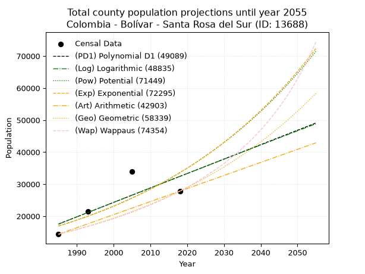
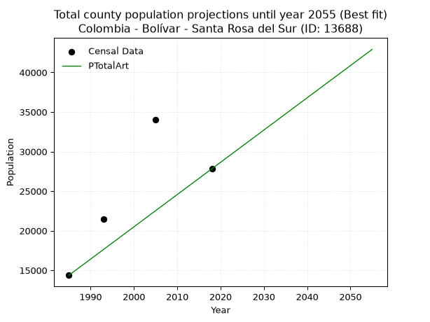
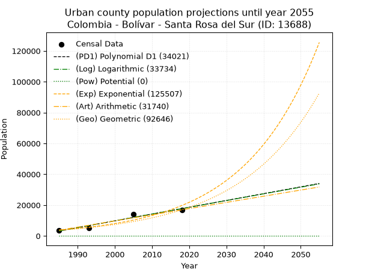
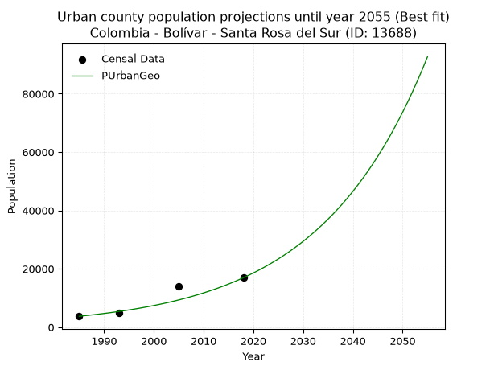
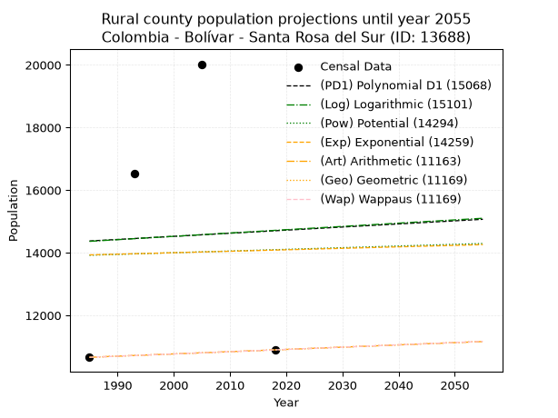
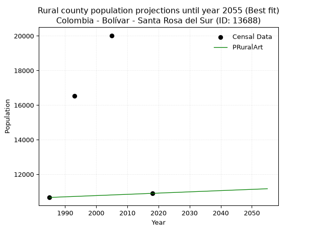

<div align="center">


</div>

# _“Population and Public Services Demand Projections (PPSD) until Year 2050 for Colombia - Bolívar - Santa Rosa del Sur (ID: 13688)”_
Keywords: `population` `public-service` `projection` `lineal` `polynomial` `logarithmic` `potential` `exponential` `arithmetic` `geometric` `wappaus` `dane` `colombia` `south-america`

PPSD are analytical estimates used by governments and planners to anticipate future changes in population size, age distribution, and the resulting community needs for utilities, healthcare, education, and infrastructure as sizing future water treatment facilities, electrical grids, and road networks based on spatial growth.

> **General running parameters**: • app_version: _v20260806_. • Python version: _3.14.7_. • Pandas version: _3.0.5_. • NumPy version: _2.5.1_. • Creates, save and include plots into reports (create_plot): _True_. • Projection until year: _2050_. • Process polynomial degree 2 and up: _False_. • Process Wappaus: _True_. • Process Wappaus: _True_. • Set negative values to zero: _True_. • Set infinite values to zero: _True_. • Drop dataset notes: _True_. 
<div align="center">

Dynamic map: [:earth_americas:Google](http://maps.google.com/maps?q=7.963937709,-74.0522427) [:earth_americas:OSM](https://www.openstreetmap.org/#map=18/7.963937709/-74.0522427&layers=P) [:earth_americas:Bing](https://www.bing.com/maps?cp=7.963937709~-74.0522427&lvl=18) [:earth_americas:Apple](https://maps.apple.com/frame?center=7.963937709%2C-74.0522427&span=0.003%2C0.006)

</div>


<div align="center">

```geojson
{
  "type": "Feature",
  "geometry": {
    "type": "Point", 
    "coordinates": [-74.0522427, 7.963937709]
  }, 
  "properties": {
    "Name": "Colombia - Bolívar - Santa Rosa del Sur (ID: 13688)"
  }
}
```

</div>


## 0. Census Data (4 records)

Census data are official statistics collected by a government about the people and housing in a country. They usually include counts of total population, age, sex, race, income, education, and jobs.

📅Global census file: [Population.xlsx](../data/Population.xlsx)

| Source   |   Year |   CountryID | CountryName   |   StateID | StateName   |   CountyID | CountyName         |   PTotal |   PUrban |   PRural |
|:---------|-------:|------------:|:--------------|----------:|:------------|-----------:|:-------------------|---------:|---------:|---------:|
| DANE     |   1985 |          57 | Colombia      |        13 | Bolívar     |      13688 | Santa Rosa del Sur |    14377 |     3717 |    10660 |
| DANE     |   1993 |          57 | Colombia      |        13 | Bolívar     |      13688 | Santa Rosa Del Sur |    21466 |     4942 |    16524 |
| DANE     |   2005 |          57 | Colombia      |        13 | Bolívar     |      13688 | Santa Rosa del Sur |    34015 |    13992 |    20023 |
| DANE     |   2018 |          57 | Colombia      |        13 | Bolívar     |      13688 | Santa Rosa Del Sur |    27825 |    16928 |    10897 |

> 🔥Some records has specific notes about the registered values or the corresponding urban or rural distribution.

## 1. Total

### 1.1. Coefficients and Parameters

* (PD1) Polynomial Deg 1: 450.56162183862193, -876815.1340827035 (lineal)
* (Log) Logarithmic: 903458.2214461169, -6842772.4310717555
* (Pow) Potential: 41.54863125887291, -132.78880145439302
* (Exp) Exponential: 0.020722423790858806, 2.3166623725887347e-14
* (Art) Arithmetic: Year diff. 2018 - 1985 = 33, Population diff. 27825 - 14377 = 13448, Annual growth = 407.5151515151515
* (Geo) Geometric: Year diff. 2018 - 1985 = 33, Population diff. 27825 - 14377 = 13448, Annual growth % = 0.02021077506924729
* (Wap) Wappaus: i = 1.9312599000765438, Condition values only valid for < 200)

<sub>
Wappaus condition values: ['0.00', '1.93', '3.86', '5.79', '7.73', '9.66', '11.59', '13.52', '15.45', '17.38', '19.31', '21.24', '23.18', '25.11', '27.04', '28.97', '30.90', '32.83', '34.76', '36.69', '38.63', '40.56', '42.49', '44.42', '46.35', '48.28', '50.21', '52.14', '54.08', '56.01', '57.94', '59.87', '61.80', '63.73', '65.66', '67.59', '69.53', '71.46', '73.39', '75.32', '77.25', '79.18', '81.11', '83.04', '84.98', '86.91', '88.84', '90.77', '92.70', '94.63', '96.56', '98.49', '100.43', '102.36', '104.29', '106.22', '108.15', '110.08', '112.01', '113.94', '115.88', '117.81', '119.74', '121.67', '123.60', '125.53']
</sub>


### 1.2. Projected Dataset

|   Year |   CountyID |   PTotalPD1 |   PTotalLog |   PTotalPow |   PTotalExp |   PTotalArt |   PTotalGeo |   PTotalWap |
|-------:|-----------:|------------:|------------:|------------:|------------:|------------:|------------:|------------:|
|   1985 |      13688 |       17550 |       17524 |       16929 |       16949 |       14377 |       14377 |       14377 |
|   1986 |      13688 |       18000 |       17979 |       17287 |       17304 |       14785 |       14668 |       14657 |
|   1987 |      13688 |       18451 |       18434 |       17652 |       17666 |       15192 |       14964 |       14943 |
|   1988 |      13688 |       18901 |       18888 |       18025 |       18036 |       15600 |       15266 |       15235 |
|   1989 |      13688 |       19352 |       19343 |       18406 |       18413 |       16007 |       15575 |       15532 |
|   1990 |      13688 |       19802 |       19797 |       18794 |       18799 |       16415 |       15890 |       15836 |
|   1991 |      13688 |       20253 |       20251 |       19191 |       19193 |       16822 |       16211 |       16145 |
|   1992 |      13688 |       20704 |       20704 |       19595 |       19595 |       17230 |       16539 |       16462 |
|   1993 |      13688 |       21154 |       21158 |       20008 |       20005 |       17637 |       16873 |       16784 |
|   1994 |      13688 |       21605 |       21611 |       20430 |       20424 |       18045 |       17214 |       17114 |
|   1995 |      13688 |       22055 |       22064 |       20860 |       20851 |       18452 |       17562 |       17450 |
|   1996 |      13688 |       22506 |       22517 |       21299 |       21288 |       18860 |       17917 |       17794 |
|   1997 |      13688 |       22956 |       22969 |       21747 |       21734 |       19267 |       18279 |       18146 |
|   1998 |      13688 |       23407 |       23421 |       22204 |       22189 |       19675 |       18648 |       18505 |
|   1999 |      13688 |       23858 |       23874 |       22670 |       22653 |       20082 |       19025 |       18872 |
|   2000 |      13688 |       24308 |       24325 |       23146 |       23128 |       20490 |       19410 |       19247 |
|   2001 |      13688 |       24759 |       24777 |       23632 |       23612 |       20897 |       19802 |       19631 |
|   2002 |      13688 |       25209 |       25228 |       24127 |       24106 |       21305 |       20202 |       20024 |
|   2003 |      13688 |       25660 |       25680 |       24633 |       24611 |       21712 |       20610 |       20426 |
|   2004 |      13688 |       26110 |       26130 |       25149 |       25126 |       22120 |       21027 |       20838 |
|   2005 |      13688 |       26561 |       26581 |       25676 |       25652 |       22527 |       21452 |       21259 |
|   2006 |      13688 |       27011 |       27032 |       26214 |       26190 |       22935 |       21885 |       21691 |
|   2007 |      13688 |       27462 |       27482 |       26762 |       26738 |       23342 |       22328 |       22133 |
|   2008 |      13688 |       27913 |       27932 |       27322 |       27298 |       23750 |       22779 |       22586 |
|   2009 |      13688 |       28363 |       28382 |       27893 |       27869 |       24157 |       23239 |       23051 |
|   2010 |      13688 |       28814 |       28831 |       28476 |       28453 |       24565 |       23709 |       23527 |
|   2011 |      13688 |       29264 |       29281 |       29070 |       29049 |       24972 |       24188 |       24016 |
|   2012 |      13688 |       29715 |       29730 |       29677 |       29657 |       25380 |       24677 |       24518 |
|   2013 |      13688 |       30165 |       30179 |       30296 |       30278 |       25787 |       25176 |       25032 |
|   2014 |      13688 |       30616 |       30628 |       30928 |       30912 |       26195 |       25685 |       25561 |
|   2015 |      13688 |       31067 |       31076 |       31572 |       31559 |       26602 |       26204 |       26104 |
|   2016 |      13688 |       31517 |       31524 |       32230 |       32220 |       27010 |       26733 |       26662 |
|   2017 |      13688 |       31968 |       31972 |       32901 |       32895 |       27417 |       27274 |       27235 |
|   2018 |      13688 |       32418 |       32420 |       33585 |       33583 |       27825 |       27825 |       27825 |
|   2019 |      13688 |       32869 |       32868 |       34284 |       34287 |       28233 |       28387 |       28432 |
|   2020 |      13688 |       33319 |       33315 |       34996 |       35005 |       28640 |       28961 |       29056 |
|   2021 |      13688 |       33770 |       33762 |       35724 |       35737 |       29048 |       29546 |       29699 |
|   2022 |      13688 |       34220 |       34209 |       36465 |       36486 |       29455 |       30144 |       30361 |
|   2023 |      13688 |       34671 |       34656 |       37222 |       37250 |       29863 |       30753 |       31044 |
|   2024 |      13688 |       35122 |       35102 |       37994 |       38030 |       30270 |       31374 |       31747 |
|   2025 |      13688 |       35572 |       35549 |       38782 |       38826 |       30678 |       32008 |       32473 |
|   2026 |      13688 |       36023 |       35995 |       39586 |       39639 |       31085 |       32655 |       33222 |
|   2027 |      13688 |       36473 |       36440 |       40406 |       40469 |       31493 |       33315 |       33995 |
|   2028 |      13688 |       36924 |       36886 |       41243 |       41316 |       31900 |       33989 |       34794 |
|   2029 |      13688 |       37374 |       37331 |       42096 |       42181 |       32308 |       34676 |       35619 |
|   2030 |      13688 |       37825 |       37777 |       42967 |       43065 |       32715 |       35376 |       36473 |
|   2031 |      13688 |       38276 |       38222 |       43855 |       43966 |       33123 |       36091 |       37356 |
|   2032 |      13688 |       38726 |       38666 |       44761 |       44887 |       33530 |       36821 |       38271 |
|   2033 |      13688 |       39177 |       39111 |       45686 |       45827 |       33938 |       37565 |       39219 |
|   2034 |      13688 |       39627 |       39555 |       46629 |       46786 |       34345 |       38324 |       40201 |
|   2035 |      13688 |       40078 |       39999 |       47591 |       47766 |       34753 |       39099 |       41220 |
|   2036 |      13688 |       40528 |       40443 |       48572 |       48766 |       35160 |       39889 |       42278 |
|   2037 |      13688 |       40979 |       40887 |       49573 |       49787 |       35568 |       40695 |       43377 |
|   2038 |      13688 |       41429 |       41330 |       50594 |       50830 |       35975 |       41518 |       44519 |
|   2039 |      13688 |       41880 |       41773 |       51636 |       51894 |       36383 |       42357 |       45707 |
|   2040 |      13688 |       42331 |       42216 |       52699 |       52981 |       36790 |       43213 |       46945 |
|   2041 |      13688 |       42781 |       42659 |       53783 |       54090 |       37198 |       44086 |       48234 |
|   2042 |      13688 |       43232 |       43102 |       54889 |       55222 |       37605 |       44977 |       49579 |
|   2043 |      13688 |       43682 |       43544 |       56017 |       56379 |       38013 |       45886 |       50983 |
|   2044 |      13688 |       44133 |       43986 |       57167 |       57559 |       38420 |       46814 |       52450 |
|   2045 |      13688 |       44583 |       44428 |       58341 |       58764 |       38828 |       47760 |       53984 |
|   2046 |      13688 |       45034 |       44870 |       59538 |       59995 |       39235 |       48725 |       55590 |
|   2047 |      13688 |       45485 |       45311 |       60759 |       61251 |       39643 |       49710 |       57273 |
|   2048 |      13688 |       45935 |       45752 |       62005 |       62534 |       40050 |       50715 |       59040 |
|   2049 |      13688 |       46386 |       46193 |       63275 |       63843 |       40458 |       51740 |       60896 |
|   2050 |      13688 |       46836 |       46634 |       64571 |       65180 |       40865 |       52785 |       62848 |
<div align="center">

</img>

</div>


### 1.3. Best fit with absolute error and relative error (%)

Relative error puts that difference into context by dividing the absolute error by the true value, creating a unitless ratio or percentage that shows the scale of the mistake.

Absolute and relative error

|   Year | Source   |   CountryID | CountryName   |   StateID | StateName   |   CountyID_x | CountyName         |   PTotal |   PUrban |   PRural |   CountyID_y |   PTotalPD1 |   PTotalLog |   PTotalPow |   PTotalExp |   PTotalArt |   PTotalGeo |   PTotalWap |   PTotalPD1AbsError |   PTotalLogAbsError |   PTotalPowAbsError |   PTotalExpAbsError |   PTotalArtAbsError |   PTotalGeoAbsError |   PTotalWapAbsError |   PTotalPD1RelError |   PTotalLogRelError |   PTotalPowRelError |   PTotalExpRelError |   PTotalArtRelError |   PTotalGeoRelError |   PTotalWapRelError |
|-------:|:---------|------------:|:--------------|----------:|:------------|-------------:|:-------------------|---------:|---------:|---------:|-------------:|------------:|------------:|------------:|------------:|------------:|------------:|------------:|--------------------:|--------------------:|--------------------:|--------------------:|--------------------:|--------------------:|--------------------:|--------------------:|--------------------:|--------------------:|--------------------:|--------------------:|--------------------:|--------------------:|
|   1985 | DANE     |          57 | Colombia      |        13 | Bolívar     |        13688 | Santa Rosa del Sur |    14377 |     3717 |    10660 |        13688 |       17550 |       17524 |       16929 |       16949 |       14377 |       14377 |       14377 |                3173 |                3147 |                2552 |                2572 |                   0 |                   0 |                   0 |            22.07    |            21.8891  |            17.7506  |            17.8897  |              0      |              0      |              0      |
|   1993 | DANE     |          57 | Colombia      |        13 | Bolívar     |        13688 | Santa Rosa Del Sur |    21466 |     4942 |    16524 |        13688 |       21154 |       21158 |       20008 |       20005 |       17637 |       16873 |       16784 |                 312 |                 308 |                1458 |                1461 |                3829 |                4593 |                4682 |             1.45346 |             1.43483 |             6.79214 |             6.80611 |             17.8375 |             21.3966 |             21.8112 |
|   2005 | DANE     |          57 | Colombia      |        13 | Bolívar     |        13688 | Santa Rosa del Sur |    34015 |    13992 |    20023 |        13688 |       26561 |       26581 |       25676 |       25652 |       22527 |       21452 |       21259 |                7454 |                7434 |                8339 |                8363 |               11488 |               12563 |               12756 |            21.9139  |            21.8551  |            24.5157  |            24.5862  |             33.7733 |             36.9337 |             37.5011 |
|   2018 | DANE     |          57 | Colombia      |        13 | Bolívar     |        13688 | Santa Rosa Del Sur |    27825 |    16928 |    10897 |        13688 |       32418 |       32420 |       33585 |       33583 |       27825 |       27825 |       27825 |                4593 |                4595 |                5760 |                5758 |                   0 |                   0 |                   0 |            16.5067  |            16.5139  |            20.7008  |            20.6936  |              0      |              0      |              0      |

Relative error mean

| Method    |   RelError | Best   |
|:----------|-----------:|:-------|
| PTotalPD1 |    15.486  |        |
| PTotalLog |    15.4232 |        |
| PTotalPow |    17.4398 |        |
| PTotalExp |    17.4939 |        |
| PTotalArt |    12.9027 | True   |
| PTotalGeo |    14.5826 |        |
| PTotalWap |    14.8281 |        |

💙Best method: _**PTotalArt**_
<div align="center">

</img>

</div>


### 1.4. Fresh water supply demand in liters per capita per day (lpcd)

The fresh water supply demand typically ranges from 100 to 300 liters per capita per day (lpcd) for standard domestic and municipal planning, though absolute survival minimums set by the World Health Organization are as low as 7.5 to 20 liters per day, and total consumption in high-income nations can exceed 400 liters.

> `CZ`: Level in meters above the sea level (masl).<br> `WS`: Fresh water supply demand in liters per capita per day (lpcd or l/h/d).<br> `WSAll`: Zonal fresh water supply demand in liters per second (l/s).<br> `A`: Zonal area in square meters.

Reference values (RAS Colombia)

|    CZ |   WS |
|------:|-----:|
|  1000 |  120 |
|  2000 |  130 |
| 99999 |  140 |

County shapefile geometry properties and water supply values

|   CountyID |      ATotal |   CZTotal |   WSTotal |
|-----------:|------------:|----------:|----------:|
|      13688 | 2.38012e+09 |   965.066 |       120 |

Projected values for best method: PTotalArt

|   CountyID |   Year |   PTotalArt |   WSTotal |   WSTotalAll |
|-----------:|-------:|------------:|----------:|-------------:|
|      13688 |   1985 |       14377 |       120 |      19.9681 |
|      13688 |   1986 |       14785 |       120 |      20.5347 |
|      13688 |   1987 |       15192 |       120 |      21.1    |
|      13688 |   1988 |       15600 |       120 |      21.6667 |
|      13688 |   1989 |       16007 |       120 |      22.2319 |
|      13688 |   1990 |       16415 |       120 |      22.7986 |
|      13688 |   1991 |       16822 |       120 |      23.3639 |
|      13688 |   1992 |       17230 |       120 |      23.9306 |
|      13688 |   1993 |       17637 |       120 |      24.4958 |
|      13688 |   1994 |       18045 |       120 |      25.0625 |
|      13688 |   1995 |       18452 |       120 |      25.6278 |
|      13688 |   1996 |       18860 |       120 |      26.1944 |
|      13688 |   1997 |       19267 |       120 |      26.7597 |
|      13688 |   1998 |       19675 |       120 |      27.3264 |
|      13688 |   1999 |       20082 |       120 |      27.8917 |
|      13688 |   2000 |       20490 |       120 |      28.4583 |
|      13688 |   2001 |       20897 |       120 |      29.0236 |
|      13688 |   2002 |       21305 |       120 |      29.5903 |
|      13688 |   2003 |       21712 |       120 |      30.1556 |
|      13688 |   2004 |       22120 |       120 |      30.7222 |
|      13688 |   2005 |       22527 |       120 |      31.2875 |
|      13688 |   2006 |       22935 |       120 |      31.8542 |
|      13688 |   2007 |       23342 |       120 |      32.4194 |
|      13688 |   2008 |       23750 |       120 |      32.9861 |
|      13688 |   2009 |       24157 |       120 |      33.5514 |
|      13688 |   2010 |       24565 |       120 |      34.1181 |
|      13688 |   2011 |       24972 |       120 |      34.6833 |
|      13688 |   2012 |       25380 |       120 |      35.25   |
|      13688 |   2013 |       25787 |       120 |      35.8153 |
|      13688 |   2014 |       26195 |       120 |      36.3819 |
|      13688 |   2015 |       26602 |       120 |      36.9472 |
|      13688 |   2016 |       27010 |       120 |      37.5139 |
|      13688 |   2017 |       27417 |       120 |      38.0792 |
|      13688 |   2018 |       27825 |       120 |      38.6458 |
|      13688 |   2019 |       28233 |       120 |      39.2125 |
|      13688 |   2020 |       28640 |       120 |      39.7778 |
|      13688 |   2021 |       29048 |       120 |      40.3444 |
|      13688 |   2022 |       29455 |       120 |      40.9097 |
|      13688 |   2023 |       29863 |       120 |      41.4764 |
|      13688 |   2024 |       30270 |       120 |      42.0417 |
|      13688 |   2025 |       30678 |       120 |      42.6083 |
|      13688 |   2026 |       31085 |       120 |      43.1736 |
|      13688 |   2027 |       31493 |       120 |      43.7403 |
|      13688 |   2028 |       31900 |       120 |      44.3056 |
|      13688 |   2029 |       32308 |       120 |      44.8722 |
|      13688 |   2030 |       32715 |       120 |      45.4375 |
|      13688 |   2031 |       33123 |       120 |      46.0042 |
|      13688 |   2032 |       33530 |       120 |      46.5694 |
|      13688 |   2033 |       33938 |       120 |      47.1361 |
|      13688 |   2034 |       34345 |       120 |      47.7014 |
|      13688 |   2035 |       34753 |       120 |      48.2681 |
|      13688 |   2036 |       35160 |       120 |      48.8333 |
|      13688 |   2037 |       35568 |       120 |      49.4    |
|      13688 |   2038 |       35975 |       120 |      49.9653 |
|      13688 |   2039 |       36383 |       120 |      50.5319 |
|      13688 |   2040 |       36790 |       120 |      51.0972 |
|      13688 |   2041 |       37198 |       120 |      51.6639 |
|      13688 |   2042 |       37605 |       120 |      52.2292 |
|      13688 |   2043 |       38013 |       120 |      52.7958 |
|      13688 |   2044 |       38420 |       120 |      53.3611 |
|      13688 |   2045 |       38828 |       120 |      53.9278 |
|      13688 |   2046 |       39235 |       120 |      54.4931 |
|      13688 |   2047 |       39643 |       120 |      55.0597 |
|      13688 |   2048 |       40050 |       120 |      55.625  |
|      13688 |   2049 |       40458 |       120 |      56.1917 |
|      13688 |   2050 |       40865 |       120 |      56.7569 |

## 2. Urban

### 2.1. Coefficients and Parameters

* (PD1) Polynomial Deg 1: 440.6587715776774, -871532.9578482491 (lineal)
* (Log) Logarithmic: 882166.5641452827, -6695460.37330748
* (Pow) Potential: 100.13519077502833, -326.6442135300245
* (Exp) Exponential: 0.05000592873542726, 2.9486147794240496e-40
* (Art) Arithmetic: Year diff. 2018 - 1985 = 33, Population diff. 16928 - 3717 = 13211, Annual growth = 400.3333333333333
* (Geo) Geometric: Year diff. 2018 - 1985 = 33, Population diff. 16928 - 3717 = 13211, Annual growth % = 0.04701260887621461
* (Wap) Wappaus: i = 3.8782594655687412, Condition values only valid for < 200)

<sub>
Wappaus condition values: ['0.00', '3.88', '7.76', '11.63', '15.51', '19.39', '23.27', '27.15', '31.03', '34.90', '38.78', '42.66', '46.54', '50.42', '54.30', '58.17', '62.05', '65.93', '69.81', '73.69', '77.57', '81.44', '85.32', '89.20', '93.08', '96.96', '100.83', '104.71', '108.59', '112.47', '116.35', '120.23', '124.10', '127.98', '131.86', '135.74', '139.62', '143.50', '147.37', '151.25', '155.13', '159.01', '162.89', '166.77', '170.64', '174.52', '178.40', '182.28', '186.16', '190.03', '193.91', '197.79', '201.67', '205.55', '209.43', '213.30', '217.18', '221.06', '224.94', '228.82', '232.70', '236.57', '240.45', '244.33', '248.21', '252.09']
</sub>


### 2.2. Projected Dataset

|   Year |   CountyID |   PUrbanPD1 |   PUrbanLog |   PUrbanPow |   PUrbanExp |   PUrbanArt |   PUrbanGeo |
|-------:|-----------:|------------:|------------:|------------:|------------:|------------:|------------:|
|   1985 |      13688 |        3175 |        3160 |           0 |        3788 |        3717 |        3717 |
|   1986 |      13688 |        3615 |        3605 |           0 |        3983 |        4117 |        3892 |
|   1987 |      13688 |        4056 |        4049 |           0 |        4187 |        4518 |        4075 |
|   1988 |      13688 |        4497 |        4493 |           0 |        4402 |        4918 |        4266 |
|   1989 |      13688 |        4937 |        4936 |           0 |        4627 |        5318 |        4467 |
|   1990 |      13688 |        5378 |        5380 |           0 |        4865 |        5719 |        4677 |
|   1991 |      13688 |        5819 |        5823 |           0 |        5114 |        6119 |        4897 |
|   1992 |      13688 |        6259 |        6266 |           0 |        5376 |        6519 |        5127 |
|   1993 |      13688 |        6700 |        6709 |           0 |        5652 |        6920 |        5368 |
|   1994 |      13688 |        7141 |        7151 |           0 |        5942 |        7320 |        5620 |
|   1995 |      13688 |        7581 |        7593 |           0 |        6246 |        7720 |        5885 |
|   1996 |      13688 |        8022 |        8036 |           0 |        6567 |        8121 |        6161 |
|   1997 |      13688 |        8463 |        8477 |           0 |        6903 |        8521 |        6451 |
|   1998 |      13688 |        8903 |        8919 |           0 |        7257 |        8921 |        6754 |
|   1999 |      13688 |        9344 |        9360 |           0 |        7630 |        9322 |        7072 |
|   2000 |      13688 |        9785 |        9802 |           0 |        8021 |        9722 |        7404 |
|   2001 |      13688 |       10225 |       10243 |           0 |        8432 |       10122 |        7752 |
|   2002 |      13688 |       10666 |       10683 |           0 |        8864 |       10523 |        8117 |
|   2003 |      13688 |       11107 |       11124 |           0 |        9319 |       10923 |        8498 |
|   2004 |      13688 |       11547 |       11564 |           0 |        9797 |       11323 |        8898 |
|   2005 |      13688 |       11988 |       12004 |           0 |       10299 |       11724 |        9316 |
|   2006 |      13688 |       12429 |       12444 |           0 |       10827 |       12124 |        9754 |
|   2007 |      13688 |       12869 |       12884 |           0 |       11382 |       12524 |       10213 |
|   2008 |      13688 |       13310 |       13323 |           0 |       11966 |       12925 |       10693 |
|   2009 |      13688 |       13751 |       13762 |           0 |       12580 |       13325 |       11195 |
|   2010 |      13688 |       14191 |       14201 |           0 |       13225 |       13725 |       11722 |
|   2011 |      13688 |       14632 |       14640 |           0 |       13903 |       14126 |       12273 |
|   2012 |      13688 |       15072 |       15079 |           0 |       14616 |       14526 |       12850 |
|   2013 |      13688 |       15513 |       15517 |           0 |       15365 |       14926 |       13454 |
|   2014 |      13688 |       15954 |       15955 |           0 |       16153 |       15327 |       14086 |
|   2015 |      13688 |       16394 |       16393 |           0 |       16981 |       15727 |       14749 |
|   2016 |      13688 |       16835 |       16831 |           0 |       17852 |       16127 |       15442 |
|   2017 |      13688 |       17276 |       17268 |           0 |       18768 |       16528 |       16168 |
|   2018 |      13688 |       17716 |       17706 |           0 |       19730 |       16928 |       16928 |
|   2019 |      13688 |       18157 |       18143 |           0 |       20742 |       17328 |       17724 |
|   2020 |      13688 |       18598 |       18579 |           0 |       21805 |       17729 |       18557 |
|   2021 |      13688 |       19038 |       19016 |           0 |       22923 |       18129 |       19429 |
|   2022 |      13688 |       19479 |       19452 |           0 |       24099 |       18529 |       20343 |
|   2023 |      13688 |       19920 |       19889 |           0 |       25335 |       18930 |       21299 |
|   2024 |      13688 |       20360 |       20325 |           0 |       26634 |       19330 |       22301 |
|   2025 |      13688 |       20801 |       20760 |           0 |       27999 |       19730 |       23349 |
|   2026 |      13688 |       21242 |       21196 |           0 |       29435 |       20131 |       24447 |
|   2027 |      13688 |       21682 |       21631 |           0 |       30944 |       20531 |       25596 |
|   2028 |      13688 |       22123 |       22066 |           0 |       32531 |       20931 |       26799 |
|   2029 |      13688 |       22564 |       22501 |           0 |       34199 |       21332 |       28059 |
|   2030 |      13688 |       23004 |       22936 |           0 |       35953 |       21732 |       29378 |
|   2031 |      13688 |       23445 |       23370 |           0 |       37797 |       22132 |       30760 |
|   2032 |      13688 |       23886 |       23805 |           0 |       39735 |       22533 |       32206 |
|   2033 |      13688 |       24326 |       24239 |           0 |       41772 |       22933 |       33720 |
|   2034 |      13688 |       24767 |       24672 |           0 |       43914 |       23333 |       35305 |
|   2035 |      13688 |       25208 |       25106 |           0 |       46166 |       23734 |       36965 |
|   2036 |      13688 |       25648 |       25539 |           0 |       48533 |       24134 |       38703 |
|   2037 |      13688 |       26089 |       25973 |           0 |       51022 |       24534 |       40522 |
|   2038 |      13688 |       26530 |       26406 |           0 |       53638 |       24935 |       42427 |
|   2039 |      13688 |       26970 |       26838 |           0 |       56388 |       25335 |       44422 |
|   2040 |      13688 |       27411 |       27271 |           0 |       59280 |       25735 |       46510 |
|   2041 |      13688 |       27852 |       27703 |           0 |       62320 |       26136 |       48697 |
|   2042 |      13688 |       28292 |       28135 |           0 |       65515 |       26536 |       50986 |
|   2043 |      13688 |       28733 |       28567 |           0 |       68875 |       26936 |       53383 |
|   2044 |      13688 |       29174 |       28999 |           0 |       72406 |       27337 |       55893 |
|   2045 |      13688 |       29614 |       29430 |           0 |       76119 |       27737 |       58520 |
|   2046 |      13688 |       30055 |       29862 |           0 |       80022 |       28137 |       61272 |
|   2047 |      13688 |       30496 |       30293 |           0 |       84126 |       28538 |       64152 |
|   2048 |      13688 |       30936 |       30724 |           0 |       88439 |       28938 |       67168 |
|   2049 |      13688 |       31377 |       31154 |           0 |       92974 |       29338 |       70326 |
|   2050 |      13688 |       31818 |       31585 |           0 |       97742 |       29739 |       73632 |
<div align="center">

</img>

</div>


### 2.3. Best fit with absolute error and relative error (%)

Relative error puts that difference into context by dividing the absolute error by the true value, creating a unitless ratio or percentage that shows the scale of the mistake.

Absolute and relative error

|   Year | Source   |   CountryID | CountryName   |   StateID | StateName   |   CountyID_x | CountyName         |   PTotal |   PUrban |   PRural |   CountyID_y |   PUrbanPD1 |   PUrbanLog |   PUrbanPow |   PUrbanExp |   PUrbanArt |   PUrbanGeo |   PUrbanPD1AbsError |   PUrbanLogAbsError |   PUrbanPowAbsError |   PUrbanExpAbsError |   PUrbanArtAbsError |   PUrbanGeoAbsError |   PUrbanPD1RelError |   PUrbanLogRelError |   PUrbanPowRelError |   PUrbanExpRelError |   PUrbanArtRelError |   PUrbanGeoRelError |
|-------:|:---------|------------:|:--------------|----------:|:------------|-------------:|:-------------------|---------:|---------:|---------:|-------------:|------------:|------------:|------------:|------------:|------------:|------------:|--------------------:|--------------------:|--------------------:|--------------------:|--------------------:|--------------------:|--------------------:|--------------------:|--------------------:|--------------------:|--------------------:|--------------------:|
|   1985 | DANE     |          57 | Colombia      |        13 | Bolívar     |        13688 | Santa Rosa del Sur |    14377 |     3717 |    10660 |        13688 |        3175 |        3160 |           0 |        3788 |        3717 |        3717 |                 542 |                 557 |                3717 |                  71 |                   0 |                   0 |            14.5817  |            14.9852  |                 100 |             1.91014 |              0      |             0       |
|   1993 | DANE     |          57 | Colombia      |        13 | Bolívar     |        13688 | Santa Rosa Del Sur |    21466 |     4942 |    16524 |        13688 |        6700 |        6709 |           0 |        5652 |        6920 |        5368 |                1758 |                1767 |                4942 |                 710 |                1978 |                 426 |            35.5726  |            35.7548  |                 100 |            14.3667  |             40.0243 |             8.61999 |
|   2005 | DANE     |          57 | Colombia      |        13 | Bolívar     |        13688 | Santa Rosa del Sur |    34015 |    13992 |    20023 |        13688 |       11988 |       12004 |           0 |       10299 |       11724 |        9316 |                2004 |                1988 |               13992 |                3693 |                2268 |                4676 |            14.3225  |            14.2081  |                 100 |            26.3937  |             16.2093 |            33.4191  |
|   2018 | DANE     |          57 | Colombia      |        13 | Bolívar     |        13688 | Santa Rosa Del Sur |    27825 |    16928 |    10897 |        13688 |       17716 |       17706 |           0 |       19730 |       16928 |       16928 |                 788 |                 778 |               16928 |                2802 |                   0 |                   0 |             4.65501 |             4.59594 |                 100 |            16.5525  |              0      |             0       |

Relative error mean

| Method    |   RelError | Best   |
|:----------|-----------:|:-------|
| PUrbanPD1 |    17.2829 |        |
| PUrbanLog |    17.386  |        |
| PUrbanPow |   100      |        |
| PUrbanExp |    14.8057 |        |
| PUrbanArt |    14.0584 |        |
| PUrbanGeo |    10.5098 | True   |

💙Best method: _**PUrbanGeo**_
<div align="center">

</img>

</div>


### 2.4. Fresh water supply demand in liters per capita per day (lpcd)

The fresh water supply demand typically ranges from 100 to 300 liters per capita per day (lpcd) for standard domestic and municipal planning, though absolute survival minimums set by the World Health Organization are as low as 7.5 to 20 liters per day, and total consumption in high-income nations can exceed 400 liters.

> `CZ`: Level in meters above the sea level (masl).<br> `WS`: Fresh water supply demand in liters per capita per day (lpcd or l/h/d).<br> `WSAll`: Zonal fresh water supply demand in liters per second (l/s).<br> `A`: Zonal area in square meters.

Reference values (RAS Colombia)

|    CZ |   WS |
|------:|-----:|
|  1000 |  120 |
|  2000 |  130 |
| 99999 |  140 |

County shapefile geometry properties and water supply values

|   CountyID |      AUrban |   CZUrban |   WSUrban |
|-----------:|------------:|----------:|----------:|
|      13688 | 2.87725e+06 |   617.747 |       120 |

Projected values for best method: PUrbanGeo

|   CountyID |   Year |   PUrbanGeo |   WSUrban |   WSUrbanAll |
|-----------:|-------:|------------:|----------:|-------------:|
|      13688 |   1985 |        3717 |       120 |      5.1625  |
|      13688 |   1986 |        3892 |       120 |      5.40556 |
|      13688 |   1987 |        4075 |       120 |      5.65972 |
|      13688 |   1988 |        4266 |       120 |      5.925   |
|      13688 |   1989 |        4467 |       120 |      6.20417 |
|      13688 |   1990 |        4677 |       120 |      6.49583 |
|      13688 |   1991 |        4897 |       120 |      6.80139 |
|      13688 |   1992 |        5127 |       120 |      7.12083 |
|      13688 |   1993 |        5368 |       120 |      7.45556 |
|      13688 |   1994 |        5620 |       120 |      7.80556 |
|      13688 |   1995 |        5885 |       120 |      8.17361 |
|      13688 |   1996 |        6161 |       120 |      8.55694 |
|      13688 |   1997 |        6451 |       120 |      8.95972 |
|      13688 |   1998 |        6754 |       120 |      9.38056 |
|      13688 |   1999 |        7072 |       120 |      9.82222 |
|      13688 |   2000 |        7404 |       120 |     10.2833  |
|      13688 |   2001 |        7752 |       120 |     10.7667  |
|      13688 |   2002 |        8117 |       120 |     11.2736  |
|      13688 |   2003 |        8498 |       120 |     11.8028  |
|      13688 |   2004 |        8898 |       120 |     12.3583  |
|      13688 |   2005 |        9316 |       120 |     12.9389  |
|      13688 |   2006 |        9754 |       120 |     13.5472  |
|      13688 |   2007 |       10213 |       120 |     14.1847  |
|      13688 |   2008 |       10693 |       120 |     14.8514  |
|      13688 |   2009 |       11195 |       120 |     15.5486  |
|      13688 |   2010 |       11722 |       120 |     16.2806  |
|      13688 |   2011 |       12273 |       120 |     17.0458  |
|      13688 |   2012 |       12850 |       120 |     17.8472  |
|      13688 |   2013 |       13454 |       120 |     18.6861  |
|      13688 |   2014 |       14086 |       120 |     19.5639  |
|      13688 |   2015 |       14749 |       120 |     20.4847  |
|      13688 |   2016 |       15442 |       120 |     21.4472  |
|      13688 |   2017 |       16168 |       120 |     22.4556  |
|      13688 |   2018 |       16928 |       120 |     23.5111  |
|      13688 |   2019 |       17724 |       120 |     24.6167  |
|      13688 |   2020 |       18557 |       120 |     25.7736  |
|      13688 |   2021 |       19429 |       120 |     26.9847  |
|      13688 |   2022 |       20343 |       120 |     28.2542  |
|      13688 |   2023 |       21299 |       120 |     29.5819  |
|      13688 |   2024 |       22301 |       120 |     30.9736  |
|      13688 |   2025 |       23349 |       120 |     32.4292  |
|      13688 |   2026 |       24447 |       120 |     33.9542  |
|      13688 |   2027 |       25596 |       120 |     35.55    |
|      13688 |   2028 |       26799 |       120 |     37.2208  |
|      13688 |   2029 |       28059 |       120 |     38.9708  |
|      13688 |   2030 |       29378 |       120 |     40.8028  |
|      13688 |   2031 |       30760 |       120 |     42.7222  |
|      13688 |   2032 |       32206 |       120 |     44.7306  |
|      13688 |   2033 |       33720 |       120 |     46.8333  |
|      13688 |   2034 |       35305 |       120 |     49.0347  |
|      13688 |   2035 |       36965 |       120 |     51.3403  |
|      13688 |   2036 |       38703 |       120 |     53.7542  |
|      13688 |   2037 |       40522 |       120 |     56.2806  |
|      13688 |   2038 |       42427 |       120 |     58.9264  |
|      13688 |   2039 |       44422 |       120 |     61.6972  |
|      13688 |   2040 |       46510 |       120 |     64.5972  |
|      13688 |   2041 |       48697 |       120 |     67.6347  |
|      13688 |   2042 |       50986 |       120 |     70.8139  |
|      13688 |   2043 |       53383 |       120 |     74.1431  |
|      13688 |   2044 |       55893 |       120 |     77.6292  |
|      13688 |   2045 |       58520 |       120 |     81.2778  |
|      13688 |   2046 |       61272 |       120 |     85.1     |
|      13688 |   2047 |       64152 |       120 |     89.1     |
|      13688 |   2048 |       67168 |       120 |     93.2889  |
|      13688 |   2049 |       70326 |       120 |     97.675   |
|      13688 |   2050 |       73632 |       120 |    102.267   |

## 3. Rural

### 3.1. Coefficients and Parameters

* (PD1) Polynomial Deg 1: 9.902850260944653, -5282.176234454541 (lineal)
* (Log) Logarithmic: 21291.657300834187, -147312.05776427424
* (Pow) Potential: 0.7661520221069978, 1.6170511945413921
* (Exp) Exponential: 0.0003321392796174676, 7205.241604005983
* (Art) Arithmetic: Year diff. 2018 - 1985 = 33, Population diff. 10897 - 10660 = 237, Annual growth = 7.181818181818182
* (Geo) Geometric: Year diff. 2018 - 1985 = 33, Population diff. 10897 - 10660 = 237, Annual growth % = 0.0006665585137930474
* (Wap) Wappaus: i = 0.06663096146790538, Condition values only valid for < 200)

<sub>
Wappaus condition values: ['0.00', '0.07', '0.13', '0.20', '0.27', '0.33', '0.40', '0.47', '0.53', '0.60', '0.67', '0.73', '0.80', '0.87', '0.93', '1.00', '1.07', '1.13', '1.20', '1.27', '1.33', '1.40', '1.47', '1.53', '1.60', '1.67', '1.73', '1.80', '1.87', '1.93', '2.00', '2.07', '2.13', '2.20', '2.27', '2.33', '2.40', '2.47', '2.53', '2.60', '2.67', '2.73', '2.80', '2.87', '2.93', '3.00', '3.07', '3.13', '3.20', '3.26', '3.33', '3.40', '3.46', '3.53', '3.60', '3.66', '3.73', '3.80', '3.86', '3.93', '4.00', '4.06', '4.13', '4.20', '4.26', '4.33']
</sub>


### 3.2. Projected Dataset

|   Year |   CountyID |   PRuralPD1 |   PRuralLog |   PRuralPow |   PRuralExp |   PRuralArt |   PRuralGeo |   PRuralWap |
|-------:|-----------:|------------:|------------:|------------:|------------:|------------:|------------:|------------:|
|   1985 |      13688 |       14375 |       14363 |       13920 |       13931 |       10660 |       10660 |       10660 |
|   1986 |      13688 |       14385 |       14374 |       13925 |       13935 |       10667 |       10667 |       10667 |
|   1987 |      13688 |       14395 |       14385 |       13931 |       13940 |       10674 |       10674 |       10674 |
|   1988 |      13688 |       14405 |       14396 |       13936 |       13945 |       10682 |       10681 |       10681 |
|   1989 |      13688 |       14415 |       14406 |       13941 |       13949 |       10689 |       10688 |       10688 |
|   1990 |      13688 |       14424 |       14417 |       13947 |       13954 |       10696 |       10696 |       10696 |
|   1991 |      13688 |       14434 |       14428 |       13952 |       13959 |       10703 |       10703 |       10703 |
|   1992 |      13688 |       14444 |       14438 |       13958 |       13963 |       10710 |       10710 |       10710 |
|   1993 |      13688 |       14454 |       14449 |       13963 |       13968 |       10717 |       10717 |       10717 |
|   1994 |      13688 |       14464 |       14460 |       13968 |       13973 |       10725 |       10724 |       10724 |
|   1995 |      13688 |       14474 |       14470 |       13974 |       13977 |       10732 |       10731 |       10731 |
|   1996 |      13688 |       14484 |       14481 |       13979 |       13982 |       10739 |       10738 |       10738 |
|   1997 |      13688 |       14494 |       14492 |       13984 |       13986 |       10746 |       10746 |       10746 |
|   1998 |      13688 |       14504 |       14502 |       13990 |       13991 |       10753 |       10753 |       10753 |
|   1999 |      13688 |       14514 |       14513 |       13995 |       13996 |       10761 |       10760 |       10760 |
|   2000 |      13688 |       14524 |       14524 |       14000 |       14000 |       10768 |       10767 |       10767 |
|   2001 |      13688 |       14533 |       14534 |       14006 |       14005 |       10775 |       10774 |       10774 |
|   2002 |      13688 |       14543 |       14545 |       14011 |       14010 |       10782 |       10781 |       10781 |
|   2003 |      13688 |       14553 |       14556 |       14017 |       14014 |       10789 |       10789 |       10789 |
|   2004 |      13688 |       14563 |       14566 |       14022 |       14019 |       10796 |       10796 |       10796 |
|   2005 |      13688 |       14573 |       14577 |       14027 |       14024 |       10804 |       10803 |       10803 |
|   2006 |      13688 |       14583 |       14588 |       14033 |       14028 |       10811 |       10810 |       10810 |
|   2007 |      13688 |       14593 |       14598 |       14038 |       14033 |       10818 |       10817 |       10817 |
|   2008 |      13688 |       14603 |       14609 |       14043 |       14038 |       10825 |       10825 |       10825 |
|   2009 |      13688 |       14613 |       14619 |       14049 |       14042 |       10832 |       10832 |       10832 |
|   2010 |      13688 |       14623 |       14630 |       14054 |       14047 |       10840 |       10839 |       10839 |
|   2011 |      13688 |       14632 |       14641 |       14059 |       14052 |       10847 |       10846 |       10846 |
|   2012 |      13688 |       14642 |       14651 |       14065 |       14056 |       10854 |       10854 |       10854 |
|   2013 |      13688 |       14652 |       14662 |       14070 |       14061 |       10861 |       10861 |       10861 |
|   2014 |      13688 |       14662 |       14672 |       14075 |       14066 |       10868 |       10868 |       10868 |
|   2015 |      13688 |       14672 |       14683 |       14081 |       14070 |       10875 |       10875 |       10875 |
|   2016 |      13688 |       14682 |       14693 |       14086 |       14075 |       10883 |       10882 |       10882 |
|   2017 |      13688 |       14692 |       14704 |       14092 |       14080 |       10890 |       10890 |       10890 |
|   2018 |      13688 |       14702 |       14715 |       14097 |       14084 |       10897 |       10897 |       10897 |
|   2019 |      13688 |       14712 |       14725 |       14102 |       14089 |       10904 |       10904 |       10904 |
|   2020 |      13688 |       14722 |       14736 |       14108 |       14094 |       10911 |       10912 |       10912 |
|   2021 |      13688 |       14731 |       14746 |       14113 |       14098 |       10919 |       10919 |       10919 |
|   2022 |      13688 |       14741 |       14757 |       14118 |       14103 |       10926 |       10926 |       10926 |
|   2023 |      13688 |       14751 |       14767 |       14124 |       14108 |       10933 |       10933 |       10933 |
|   2024 |      13688 |       14761 |       14778 |       14129 |       14112 |       10940 |       10941 |       10941 |
|   2025 |      13688 |       14771 |       14788 |       14134 |       14117 |       10947 |       10948 |       10948 |
|   2026 |      13688 |       14781 |       14799 |       14140 |       14122 |       10954 |       10955 |       10955 |
|   2027 |      13688 |       14791 |       14809 |       14145 |       14127 |       10962 |       10963 |       10963 |
|   2028 |      13688 |       14801 |       14820 |       14150 |       14131 |       10969 |       10970 |       10970 |
|   2029 |      13688 |       14811 |       14830 |       14156 |       14136 |       10976 |       10977 |       10977 |
|   2030 |      13688 |       14821 |       14841 |       14161 |       14141 |       10983 |       10984 |       10984 |
|   2031 |      13688 |       14831 |       14851 |       14166 |       14145 |       10990 |       10992 |       10992 |
|   2032 |      13688 |       14840 |       14862 |       14172 |       14150 |       10998 |       10999 |       10999 |
|   2033 |      13688 |       14850 |       14872 |       14177 |       14155 |       11005 |       11006 |       11006 |
|   2034 |      13688 |       14860 |       14883 |       14182 |       14159 |       11012 |       11014 |       11014 |
|   2035 |      13688 |       14870 |       14893 |       14188 |       14164 |       11019 |       11021 |       11021 |
|   2036 |      13688 |       14880 |       14904 |       14193 |       14169 |       11026 |       11028 |       11029 |
|   2037 |      13688 |       14890 |       14914 |       14198 |       14174 |       11033 |       11036 |       11036 |
|   2038 |      13688 |       14900 |       14924 |       14204 |       14178 |       11041 |       11043 |       11043 |
|   2039 |      13688 |       14910 |       14935 |       14209 |       14183 |       11048 |       11051 |       11051 |
|   2040 |      13688 |       14920 |       14945 |       14214 |       14188 |       11055 |       11058 |       11058 |
|   2041 |      13688 |       14930 |       14956 |       14220 |       14192 |       11062 |       11065 |       11065 |
|   2042 |      13688 |       14939 |       14966 |       14225 |       14197 |       11069 |       11073 |       11073 |
|   2043 |      13688 |       14949 |       14977 |       14230 |       14202 |       11077 |       11080 |       11080 |
|   2044 |      13688 |       14959 |       14987 |       14236 |       14207 |       11084 |       11087 |       11087 |
|   2045 |      13688 |       14969 |       14998 |       14241 |       14211 |       11091 |       11095 |       11095 |
|   2046 |      13688 |       14979 |       15008 |       14247 |       14216 |       11098 |       11102 |       11102 |
|   2047 |      13688 |       14989 |       15018 |       14252 |       14221 |       11105 |       11110 |       11110 |
|   2048 |      13688 |       14999 |       15029 |       14257 |       14225 |       11112 |       11117 |       11117 |
|   2049 |      13688 |       15009 |       15039 |       14263 |       14230 |       11120 |       11124 |       11124 |
|   2050 |      13688 |       15019 |       15049 |       14268 |       14235 |       11127 |       11132 |       11132 |
<div align="center">

</img>

</div>


### 3.3. Best fit with absolute error and relative error (%)

Relative error puts that difference into context by dividing the absolute error by the true value, creating a unitless ratio or percentage that shows the scale of the mistake.

Absolute and relative error

|   Year | Source   |   CountryID | CountryName   |   StateID | StateName   |   CountyID_x | CountyName         |   PTotal |   PUrban |   PRural |   CountyID_y |   PRuralPD1 |   PRuralLog |   PRuralPow |   PRuralExp |   PRuralArt |   PRuralGeo |   PRuralWap |   PRuralPD1AbsError |   PRuralLogAbsError |   PRuralPowAbsError |   PRuralExpAbsError |   PRuralArtAbsError |   PRuralGeoAbsError |   PRuralWapAbsError |   PRuralPD1RelError |   PRuralLogRelError |   PRuralPowRelError |   PRuralExpRelError |   PRuralArtRelError |   PRuralGeoRelError |   PRuralWapRelError |
|-------:|:---------|------------:|:--------------|----------:|:------------|-------------:|:-------------------|---------:|---------:|---------:|-------------:|------------:|------------:|------------:|------------:|------------:|------------:|------------:|--------------------:|--------------------:|--------------------:|--------------------:|--------------------:|--------------------:|--------------------:|--------------------:|--------------------:|--------------------:|--------------------:|--------------------:|--------------------:|--------------------:|
|   1985 | DANE     |          57 | Colombia      |        13 | Bolívar     |        13688 | Santa Rosa del Sur |    14377 |     3717 |    10660 |        13688 |       14375 |       14363 |       13920 |       13931 |       10660 |       10660 |       10660 |                3715 |                3703 |                3260 |                3271 |                   0 |                   0 |                   0 |             34.8499 |             34.7373 |             30.5816 |             30.6848 |              0      |              0      |              0      |
|   1993 | DANE     |          57 | Colombia      |        13 | Bolívar     |        13688 | Santa Rosa Del Sur |    21466 |     4942 |    16524 |        13688 |       14454 |       14449 |       13963 |       13968 |       10717 |       10717 |       10717 |                2070 |                2075 |                2561 |                2556 |                5807 |                5807 |                5807 |             12.5272 |             12.5575 |             15.4987 |             15.4684 |             35.1428 |             35.1428 |             35.1428 |
|   2005 | DANE     |          57 | Colombia      |        13 | Bolívar     |        13688 | Santa Rosa del Sur |    34015 |    13992 |    20023 |        13688 |       14573 |       14577 |       14027 |       14024 |       10804 |       10803 |       10803 |                5450 |                5446 |                5996 |                5999 |                9219 |                9220 |                9220 |             27.2187 |             27.1987 |             29.9456 |             29.9605 |             46.0421 |             46.047  |             46.047  |
|   2018 | DANE     |          57 | Colombia      |        13 | Bolívar     |        13688 | Santa Rosa Del Sur |    27825 |    16928 |    10897 |        13688 |       14702 |       14715 |       14097 |       14084 |       10897 |       10897 |       10897 |                3805 |                3818 |                3200 |                3187 |                   0 |                   0 |                   0 |             34.9179 |             35.0372 |             29.3659 |             29.2466 |              0      |              0      |              0      |

Relative error mean

| Method    |   RelError | Best   |
|:----------|-----------:|:-------|
| PRuralPD1 |    27.3784 |        |
| PRuralLog |    27.3827 |        |
| PRuralPow |    26.3479 |        |
| PRuralExp |    26.3401 |        |
| PRuralArt |    20.2962 | True   |
| PRuralGeo |    20.2975 |        |
| PRuralWap |    20.2975 |        |

💙Best method: _**PRuralArt**_
<div align="center">

</img>

</div>


### 3.4. Fresh water supply demand in liters per capita per day (lpcd)

The fresh water supply demand typically ranges from 100 to 300 liters per capita per day (lpcd) for standard domestic and municipal planning, though absolute survival minimums set by the World Health Organization are as low as 7.5 to 20 liters per day, and total consumption in high-income nations can exceed 400 liters.

> `CZ`: Level in meters above the sea level (masl).<br> `WS`: Fresh water supply demand in liters per capita per day (lpcd or l/h/d).<br> `WSAll`: Zonal fresh water supply demand in liters per second (l/s).<br> `A`: Zonal area in square meters.

Reference values (RAS Colombia)

|    CZ |   WS |
|------:|-----:|
|  1000 |  120 |
|  2000 |  130 |
| 99999 |  140 |

County shapefile geometry properties and water supply values

|   CountyID |      ARural |   CZRural |   WSRural |
|-----------:|------------:|----------:|----------:|
|      13688 | 2.37724e+09 |   965.478 |       120 |

Projected values for best method: PRuralArt

|   CountyID |   Year |   PRuralArt |   WSRural |   WSRuralAll |
|-----------:|-------:|------------:|----------:|-------------:|
|      13688 |   1985 |       10660 |       120 |      14.8056 |
|      13688 |   1986 |       10667 |       120 |      14.8153 |
|      13688 |   1987 |       10674 |       120 |      14.825  |
|      13688 |   1988 |       10682 |       120 |      14.8361 |
|      13688 |   1989 |       10689 |       120 |      14.8458 |
|      13688 |   1990 |       10696 |       120 |      14.8556 |
|      13688 |   1991 |       10703 |       120 |      14.8653 |
|      13688 |   1992 |       10710 |       120 |      14.875  |
|      13688 |   1993 |       10717 |       120 |      14.8847 |
|      13688 |   1994 |       10725 |       120 |      14.8958 |
|      13688 |   1995 |       10732 |       120 |      14.9056 |
|      13688 |   1996 |       10739 |       120 |      14.9153 |
|      13688 |   1997 |       10746 |       120 |      14.925  |
|      13688 |   1998 |       10753 |       120 |      14.9347 |
|      13688 |   1999 |       10761 |       120 |      14.9458 |
|      13688 |   2000 |       10768 |       120 |      14.9556 |
|      13688 |   2001 |       10775 |       120 |      14.9653 |
|      13688 |   2002 |       10782 |       120 |      14.975  |
|      13688 |   2003 |       10789 |       120 |      14.9847 |
|      13688 |   2004 |       10796 |       120 |      14.9944 |
|      13688 |   2005 |       10804 |       120 |      15.0056 |
|      13688 |   2006 |       10811 |       120 |      15.0153 |
|      13688 |   2007 |       10818 |       120 |      15.025  |
|      13688 |   2008 |       10825 |       120 |      15.0347 |
|      13688 |   2009 |       10832 |       120 |      15.0444 |
|      13688 |   2010 |       10840 |       120 |      15.0556 |
|      13688 |   2011 |       10847 |       120 |      15.0653 |
|      13688 |   2012 |       10854 |       120 |      15.075  |
|      13688 |   2013 |       10861 |       120 |      15.0847 |
|      13688 |   2014 |       10868 |       120 |      15.0944 |
|      13688 |   2015 |       10875 |       120 |      15.1042 |
|      13688 |   2016 |       10883 |       120 |      15.1153 |
|      13688 |   2017 |       10890 |       120 |      15.125  |
|      13688 |   2018 |       10897 |       120 |      15.1347 |
|      13688 |   2019 |       10904 |       120 |      15.1444 |
|      13688 |   2020 |       10911 |       120 |      15.1542 |
|      13688 |   2021 |       10919 |       120 |      15.1653 |
|      13688 |   2022 |       10926 |       120 |      15.175  |
|      13688 |   2023 |       10933 |       120 |      15.1847 |
|      13688 |   2024 |       10940 |       120 |      15.1944 |
|      13688 |   2025 |       10947 |       120 |      15.2042 |
|      13688 |   2026 |       10954 |       120 |      15.2139 |
|      13688 |   2027 |       10962 |       120 |      15.225  |
|      13688 |   2028 |       10969 |       120 |      15.2347 |
|      13688 |   2029 |       10976 |       120 |      15.2444 |
|      13688 |   2030 |       10983 |       120 |      15.2542 |
|      13688 |   2031 |       10990 |       120 |      15.2639 |
|      13688 |   2032 |       10998 |       120 |      15.275  |
|      13688 |   2033 |       11005 |       120 |      15.2847 |
|      13688 |   2034 |       11012 |       120 |      15.2944 |
|      13688 |   2035 |       11019 |       120 |      15.3042 |
|      13688 |   2036 |       11026 |       120 |      15.3139 |
|      13688 |   2037 |       11033 |       120 |      15.3236 |
|      13688 |   2038 |       11041 |       120 |      15.3347 |
|      13688 |   2039 |       11048 |       120 |      15.3444 |
|      13688 |   2040 |       11055 |       120 |      15.3542 |
|      13688 |   2041 |       11062 |       120 |      15.3639 |
|      13688 |   2042 |       11069 |       120 |      15.3736 |
|      13688 |   2043 |       11077 |       120 |      15.3847 |
|      13688 |   2044 |       11084 |       120 |      15.3944 |
|      13688 |   2045 |       11091 |       120 |      15.4042 |
|      13688 |   2046 |       11098 |       120 |      15.4139 |
|      13688 |   2047 |       11105 |       120 |      15.4236 |
|      13688 |   2048 |       11112 |       120 |      15.4333 |
|      13688 |   2049 |       11120 |       120 |      15.4444 |
|      13688 |   2050 |       11127 |       120 |      15.4542 |

<div align="center"><br><sub>Share this research</sub></div><br>

<sub>**APPS & TOOLS & CONTENT DISCLAIMER**: • NO WARRANTY - This content and software is provided by <a href="https://github.com/rcfdtools" target="_blank">github.com/rcfdtools</a> "as is", without any express or implied warranty, including warranties of merchantability, fitness for a particular purpose, or non-infringement. There is no guarantee that the software will be error-free or operate without interruption. • LIMITATION OF LIABILITY - Neither the authors nor copyright holders will be liable for claims or damages arising from the software or its use. You are responsible for determining if the software is appropriate for your use and assume all associated risks, including errors, legal compliance, and data loss. • NO PROFESSIONAL ADVICE - The software provides general information and does not offer professional advice. It should not replace consultation with professional advisors. [Clauses and global license for rcfdtools use.](https://github.com/rcfdtools/rcfdtools/blob/main/LICENSE.md)</sub>