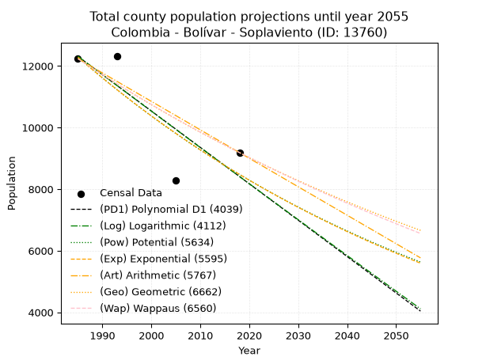
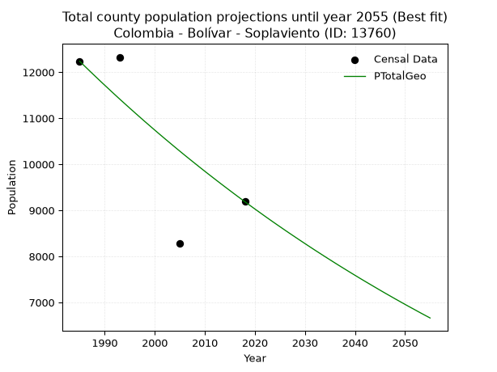
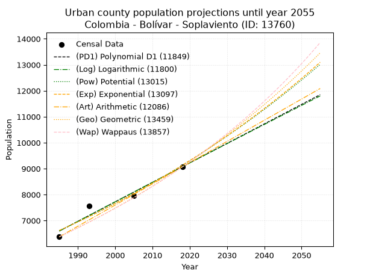
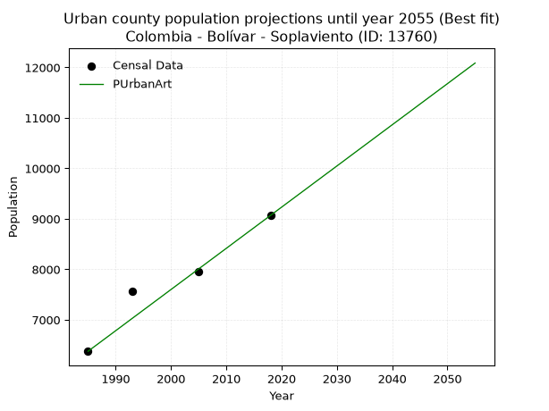
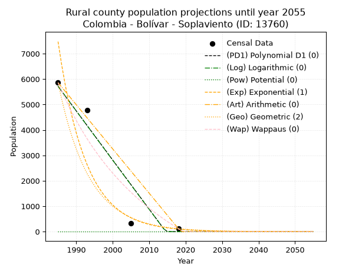
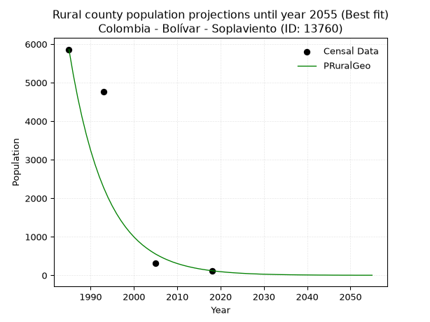

<div align="center">


</div>

# _“Population and Public Services Demand Projections (PPSD) until Year 2050 for Colombia - Bolívar - Soplaviento (ID: 13760)”_
Keywords: `population` `public-service` `projection` `lineal` `polynomial` `logarithmic` `potential` `exponential` `arithmetic` `geometric` `wappaus` `dane` `colombia` `south-america`

PPSD are analytical estimates used by governments and planners to anticipate future changes in population size, age distribution, and the resulting community needs for utilities, healthcare, education, and infrastructure as sizing future water treatment facilities, electrical grids, and road networks based on spatial growth.

> **General running parameters**: • app_version: _v20260806_. • Python version: _3.14.7_. • Pandas version: _3.0.5_. • NumPy version: _2.5.1_. • Creates, save and include plots into reports (create_plot): _False_. • Projection until year: _2050_. • Process polynomial degree 2 and up: _False_. • Process Wappaus: _True_. • Process Wappaus: _True_. • Set negative values to zero: _True_. • Set infinite values to zero: _True_. • Drop dataset notes: _True_. 
<div align="center">

Dynamic map: [:earth_americas:Google](http://maps.google.com/maps?q=10.38838968,-75.1364036) [:earth_americas:OSM](https://www.openstreetmap.org/#map=18/10.38838968/-75.1364036&layers=P) [:earth_americas:Bing](https://www.bing.com/maps?cp=10.38838968~-75.1364036&lvl=18) [:earth_americas:Apple](https://maps.apple.com/frame?center=10.38838968%2C-75.1364036&span=0.003%2C0.006)

</div>


<div align="center">

```geojson
{
  "type": "Feature",
  "geometry": {
    "type": "Point", 
    "coordinates": [-75.1364036, 10.38838968]
  }, 
  "properties": {
    "Name": "Colombia - Bolívar - Soplaviento (ID: 13760)"
  }
}
```

</div>


## 0. Census Data (4 records)

Census data are official statistics collected by a government about the people and housing in a country. They usually include counts of total population, age, sex, race, income, education, and jobs.

📅Global census file: [Population.xlsx](../data/Population.xlsx)

| Source   |   Year |   CountryID | CountryName   |   StateID | StateName   |   CountyID | CountyName   |   PTotal |   PUrban |   PRural |
|:---------|-------:|------------:|:--------------|----------:|:------------|-----------:|:-------------|---------:|---------:|---------:|
| DANE     |   1985 |          57 | Colombia      |        13 | Bolívar     |      13760 | Soplaviento  |    12237 |     6376 |     5861 |
| DANE     |   1993 |          57 | Colombia      |        13 | Bolívar     |      13760 | Soplaviento  |    12327 |     7560 |     4767 |
| DANE     |   2005 |          57 | Colombia      |        13 | Bolívar     |      13760 | Soplaviento  |     8281 |     7960 |      321 |
| DANE     |   2018 |          57 | Colombia      |        13 | Bolívar     |      13760 | Soplaviento  |     9187 |     9068 |      119 |

> 🔥Some records has specific notes about the registered values or the corresponding urban or rural distribution.

## 1. Total

### 1.1. Coefficients and Parameters

* (PD1) Polynomial Deg 1: -118.15495784825394, 246847.45443597 (lineal)
* (Log) Logarithmic: -236693.8017288319, 1809619.4836859403
* (Pow) Potential: -22.508186398544584, 78.31617747288186
* (Exp) Exponential: -0.011234813002491175, 59511596755551.19
* (Art) Arithmetic: Year diff. 2018 - 1985 = 33, Population diff. 9187 - 12237 = -3050, Annual growth = -92.42424242424242
* (Geo) Geometric: Year diff. 2018 - 1985 = 33, Population diff. 9187 - 12237 = -3050, Annual growth % = -0.008649488421046625
* (Wap) Wappaus: i = -0.8628103288297463, Condition values only valid for < 200)

<sub>
Wappaus condition values: ['-0.00', '-0.86', '-1.73', '-2.59', '-3.45', '-4.31', '-5.18', '-6.04', '-6.90', '-7.77', '-8.63', '-9.49', '-10.35', '-11.22', '-12.08', '-12.94', '-13.80', '-14.67', '-15.53', '-16.39', '-17.26', '-18.12', '-18.98', '-19.84', '-20.71', '-21.57', '-22.43', '-23.30', '-24.16', '-25.02', '-25.88', '-26.75', '-27.61', '-28.47', '-29.34', '-30.20', '-31.06', '-31.92', '-32.79', '-33.65', '-34.51', '-35.38', '-36.24', '-37.10', '-37.96', '-38.83', '-39.69', '-40.55', '-41.41', '-42.28', '-43.14', '-44.00', '-44.87', '-45.73', '-46.59', '-47.45', '-48.32', '-49.18', '-50.04', '-50.91', '-51.77', '-52.63', '-53.49', '-54.36', '-55.22', '-56.08']
</sub>


### 1.2. Projected Dataset

|   Year |   CountyID |   PTotalPD1 |   PTotalLog |   PTotalPow |   PTotalExp |   PTotalArt |   PTotalGeo |   PTotalWap |
|-------:|-----------:|------------:|------------:|------------:|------------:|------------:|------------:|------------:|
|   1985 |      13760 |       12310 |       12315 |       12290 |       12284 |       12237 |       12237 |       12237 |
|   1986 |      13760 |       12192 |       12196 |       12152 |       12147 |       12145 |       12131 |       12132 |
|   1987 |      13760 |       12074 |       12077 |       12015 |       12011 |       12052 |       12026 |       12028 |
|   1988 |      13760 |       11955 |       11957 |       11880 |       11877 |       11960 |       11922 |       11924 |
|   1989 |      13760 |       11837 |       11838 |       11746 |       11745 |       11867 |       11819 |       11822 |
|   1990 |      13760 |       11719 |       11719 |       11614 |       11613 |       11775 |       11717 |       11720 |
|   1991 |      13760 |       11601 |       11601 |       11483 |       11484 |       11682 |       11616 |       11619 |
|   1992 |      13760 |       11483 |       11482 |       11354 |       11355 |       11590 |       11515 |       11520 |
|   1993 |      13760 |       11365 |       11363 |       11227 |       11228 |       11498 |       11415 |       11421 |
|   1994 |      13760 |       11246 |       11244 |       11101 |       11103 |       11405 |       11317 |       11322 |
|   1995 |      13760 |       11128 |       11125 |       10976 |       10979 |       11313 |       11219 |       11225 |
|   1996 |      13760 |       11010 |       11007 |       10853 |       10856 |       11220 |       11122 |       11128 |
|   1997 |      13760 |       10892 |       10888 |       10731 |       10735 |       11128 |       11026 |       11032 |
|   1998 |      13760 |       10774 |       10770 |       10611 |       10615 |       11035 |       10930 |       10937 |
|   1999 |      13760 |       10656 |       10651 |       10492 |       10497 |       10943 |       10836 |       10843 |
|   2000 |      13760 |       10538 |       10533 |       10375 |       10379 |       10851 |       10742 |       10750 |
|   2001 |      13760 |       10419 |       10415 |       10259 |       10263 |       10758 |       10649 |       10657 |
|   2002 |      13760 |       10301 |       10296 |       10144 |       10149 |       10666 |       10557 |       10565 |
|   2003 |      13760 |       10183 |       10178 |       10031 |       10035 |       10573 |       10466 |       10473 |
|   2004 |      13760 |       10065 |       10060 |        9919 |        9923 |       10481 |       10375 |       10383 |
|   2005 |      13760 |        9947 |        9942 |        9808 |        9812 |       10389 |       10285 |       10293 |
|   2006 |      13760 |        9829 |        9824 |        9698 |        9703 |       10296 |       10196 |       10204 |
|   2007 |      13760 |        9710 |        9706 |        9590 |        9594 |       10204 |       10108 |       10116 |
|   2008 |      13760 |        9592 |        9588 |        9483 |        9487 |       10111 |       10021 |       10028 |
|   2009 |      13760 |        9474 |        9470 |        9378 |        9381 |       10019 |        9934 |        9941 |
|   2010 |      13760 |        9356 |        9352 |        9273 |        9276 |        9926 |        9848 |        9854 |
|   2011 |      13760 |        9238 |        9235 |        9170 |        9173 |        9834 |        9763 |        9769 |
|   2012 |      13760 |        9120 |        9117 |        9068 |        9070 |        9742 |        9679 |        9684 |
|   2013 |      13760 |        9002 |        8999 |        8967 |        8969 |        9649 |        9595 |        9599 |
|   2014 |      13760 |        8883 |        8882 |        8867 |        8869 |        9557 |        9512 |        9516 |
|   2015 |      13760 |        8765 |        8764 |        8769 |        8770 |        9464 |        9430 |        9432 |
|   2016 |      13760 |        8647 |        8647 |        8671 |        8672 |        9372 |        9348 |        9350 |
|   2017 |      13760 |        8529 |        8530 |        8575 |        8575 |        9279 |        9267 |        9268 |
|   2018 |      13760 |        8411 |        8412 |        8480 |        8479 |        9187 |        9187 |        9187 |
|   2019 |      13760 |        8293 |        8295 |        8386 |        8384 |        9095 |        9108 |        9106 |
|   2020 |      13760 |        8174 |        8178 |        8293 |        8291 |        9002 |        9029 |        9026 |
|   2021 |      13760 |        8056 |        8061 |        8201 |        8198 |        8910 |        8951 |        8947 |
|   2022 |      13760 |        7938 |        7944 |        8110 |        8106 |        8817 |        8873 |        8868 |
|   2023 |      13760 |        7820 |        7827 |        8021 |        8016 |        8725 |        8796 |        8790 |
|   2024 |      13760 |        7702 |        7710 |        7932 |        7926 |        8632 |        8720 |        8712 |
|   2025 |      13760 |        7584 |        7593 |        7844 |        7838 |        8540 |        8645 |        8635 |
|   2026 |      13760 |        7466 |        7476 |        7757 |        7750 |        8448 |        8570 |        8559 |
|   2027 |      13760 |        7347 |        7359 |        7672 |        7664 |        8355 |        8496 |        8483 |
|   2028 |      13760 |        7229 |        7242 |        7587 |        7578 |        8263 |        8423 |        8407 |
|   2029 |      13760 |        7111 |        7126 |        7503 |        7493 |        8170 |        8350 |        8333 |
|   2030 |      13760 |        6993 |        7009 |        7421 |        7410 |        8078 |        8278 |        8258 |
|   2031 |      13760 |        6875 |        6892 |        7339 |        7327 |        7985 |        8206 |        8184 |
|   2032 |      13760 |        6757 |        6776 |        7258 |        7245 |        7893 |        8135 |        8111 |
|   2033 |      13760 |        6638 |        6659 |        7178 |        7164 |        7801 |        8065 |        8038 |
|   2034 |      13760 |        6520 |        6543 |        7099 |        7084 |        7708 |        7995 |        7966 |
|   2035 |      13760 |        6402 |        6427 |        7021 |        7005 |        7616 |        7926 |        7895 |
|   2036 |      13760 |        6284 |        6310 |        6944 |        6927 |        7523 |        7857 |        7823 |
|   2037 |      13760 |        6166 |        6194 |        6867 |        6849 |        7431 |        7789 |        7753 |
|   2038 |      13760 |        6048 |        6078 |        6792 |        6773 |        7339 |        7722 |        7683 |
|   2039 |      13760 |        5929 |        5962 |        6717 |        6697 |        7246 |        7655 |        7613 |
|   2040 |      13760 |        5811 |        5846 |        6644 |        6622 |        7154 |        7589 |        7544 |
|   2041 |      13760 |        5693 |        5730 |        6571 |        6548 |        7061 |        7523 |        7475 |
|   2042 |      13760 |        5575 |        5614 |        6499 |        6475 |        6969 |        7458 |        7407 |
|   2043 |      13760 |        5457 |        5498 |        6427 |        6403 |        6876 |        7394 |        7339 |
|   2044 |      13760 |        5339 |        5382 |        6357 |        6331 |        6784 |        7330 |        7272 |
|   2045 |      13760 |        5221 |        5266 |        6287 |        6260 |        6692 |        7266 |        7205 |
|   2046 |      13760 |        5102 |        5151 |        6219 |        6190 |        6599 |        7203 |        7138 |
|   2047 |      13760 |        4984 |        5035 |        6151 |        6121 |        6507 |        7141 |        7072 |
|   2048 |      13760 |        4866 |        4919 |        6083 |        6053 |        6414 |        7079 |        7007 |
|   2049 |      13760 |        4748 |        4804 |        6017 |        5985 |        6322 |        7018 |        6942 |
|   2050 |      13760 |        4630 |        4688 |        5951 |        5918 |        6229 |        6957 |        6877 |
<div align="center">

</img>

</div>


### 1.3. Best fit with absolute error and relative error (%)

Relative error puts that difference into context by dividing the absolute error by the true value, creating a unitless ratio or percentage that shows the scale of the mistake.

Absolute and relative error

|   Year | Source   |   CountryID | CountryName   |   StateID | StateName   |   CountyID_x | CountyName   |   PTotal |   PUrban |   PRural |   CountyID_y |   PTotalPD1 |   PTotalLog |   PTotalPow |   PTotalExp |   PTotalArt |   PTotalGeo |   PTotalWap |   PTotalPD1AbsError |   PTotalLogAbsError |   PTotalPowAbsError |   PTotalExpAbsError |   PTotalArtAbsError |   PTotalGeoAbsError |   PTotalWapAbsError |   PTotalPD1RelError |   PTotalLogRelError |   PTotalPowRelError |   PTotalExpRelError |   PTotalArtRelError |   PTotalGeoRelError |   PTotalWapRelError |
|-------:|:---------|------------:|:--------------|----------:|:------------|-------------:|:-------------|---------:|---------:|---------:|-------------:|------------:|------------:|------------:|------------:|------------:|------------:|------------:|--------------------:|--------------------:|--------------------:|--------------------:|--------------------:|--------------------:|--------------------:|--------------------:|--------------------:|--------------------:|--------------------:|--------------------:|--------------------:|--------------------:|
|   1985 | DANE     |          57 | Colombia      |        13 | Bolívar     |        13760 | Soplaviento  |    12237 |     6376 |     5861 |        13760 |       12310 |       12315 |       12290 |       12284 |       12237 |       12237 |       12237 |                  73 |                  78 |                  53 |                  47 |                   0 |                   0 |                   0 |            0.596551 |            0.637411 |            0.433113 |            0.384081 |             0       |             0       |             0       |
|   1993 | DANE     |          57 | Colombia      |        13 | Bolívar     |        13760 | Soplaviento  |    12327 |     7560 |     4767 |        13760 |       11365 |       11363 |       11227 |       11228 |       11498 |       11415 |       11421 |                 962 |                 964 |                1100 |                1099 |                 829 |                 912 |                 906 |            7.80401  |            7.82023  |            8.9235   |            8.91539  |             6.72508 |             7.39839 |             7.34972 |
|   2005 | DANE     |          57 | Colombia      |        13 | Bolívar     |        13760 | Soplaviento  |     8281 |     7960 |      321 |        13760 |        9947 |        9942 |        9808 |        9812 |       10389 |       10285 |       10293 |                1666 |                1661 |                1527 |                1531 |                2108 |                2004 |                2012 |           20.1183   |           20.058    |           18.4398   |           18.4881   |            25.4559  |            24.2     |            24.2966  |
|   2018 | DANE     |          57 | Colombia      |        13 | Bolívar     |        13760 | Soplaviento  |     9187 |     9068 |      119 |        13760 |        8411 |        8412 |        8480 |        8479 |        9187 |        9187 |        9187 |                 776 |                 775 |                 707 |                 708 |                   0 |                   0 |                   0 |            8.44672  |            8.43583  |            7.69566  |            7.70654  |             0       |             0       |             0       |

Relative error mean

| Method    |   RelError | Best   |
|:----------|-----------:|:-------|
| PTotalPD1 |    9.24141 |        |
| PTotalLog |    9.23786 |        |
| PTotalPow |    8.87302 |        |
| PTotalExp |    8.87353 |        |
| PTotalArt |    8.04523 |        |
| PTotalGeo |    7.89959 | True   |
| PTotalWap |    7.91158 |        |

💙Best method: _**PTotalGeo**_
<div align="center">

</img>

</div>


### 1.4. Fresh water supply demand in liters per capita per day (lpcd)

The fresh water supply demand typically ranges from 100 to 300 liters per capita per day (lpcd) for standard domestic and municipal planning, though absolute survival minimums set by the World Health Organization are as low as 7.5 to 20 liters per day, and total consumption in high-income nations can exceed 400 liters.

> `CZ`: Level in meters above the sea level (masl).<br> `WS`: Fresh water supply demand in liters per capita per day (lpcd or l/h/d).<br> `WSAll`: Zonal fresh water supply demand in liters per second (l/s).<br> `A`: Zonal area in square meters.

Reference values (RAS Colombia)

|    CZ |   WS |
|------:|-----:|
|  1000 |  120 |
|  2000 |  130 |
| 99999 |  140 |

County shapefile geometry properties and water supply values

|   CountyID |      ATotal |   CZTotal |   WSTotal |
|-----------:|------------:|----------:|----------:|
|      13760 | 9.25485e+07 |   6.86118 |       120 |

Projected values for best method: PTotalGeo

|   CountyID |   Year |   PTotalGeo |   WSTotal |   WSTotalAll |
|-----------:|-------:|------------:|----------:|-------------:|
|      13760 |   1985 |       12237 |       120 |     16.9958  |
|      13760 |   1986 |       12131 |       120 |     16.8486  |
|      13760 |   1987 |       12026 |       120 |     16.7028  |
|      13760 |   1988 |       11922 |       120 |     16.5583  |
|      13760 |   1989 |       11819 |       120 |     16.4153  |
|      13760 |   1990 |       11717 |       120 |     16.2736  |
|      13760 |   1991 |       11616 |       120 |     16.1333  |
|      13760 |   1992 |       11515 |       120 |     15.9931  |
|      13760 |   1993 |       11415 |       120 |     15.8542  |
|      13760 |   1994 |       11317 |       120 |     15.7181  |
|      13760 |   1995 |       11219 |       120 |     15.5819  |
|      13760 |   1996 |       11122 |       120 |     15.4472  |
|      13760 |   1997 |       11026 |       120 |     15.3139  |
|      13760 |   1998 |       10930 |       120 |     15.1806  |
|      13760 |   1999 |       10836 |       120 |     15.05    |
|      13760 |   2000 |       10742 |       120 |     14.9194  |
|      13760 |   2001 |       10649 |       120 |     14.7903  |
|      13760 |   2002 |       10557 |       120 |     14.6625  |
|      13760 |   2003 |       10466 |       120 |     14.5361  |
|      13760 |   2004 |       10375 |       120 |     14.4097  |
|      13760 |   2005 |       10285 |       120 |     14.2847  |
|      13760 |   2006 |       10196 |       120 |     14.1611  |
|      13760 |   2007 |       10108 |       120 |     14.0389  |
|      13760 |   2008 |       10021 |       120 |     13.9181  |
|      13760 |   2009 |        9934 |       120 |     13.7972  |
|      13760 |   2010 |        9848 |       120 |     13.6778  |
|      13760 |   2011 |        9763 |       120 |     13.5597  |
|      13760 |   2012 |        9679 |       120 |     13.4431  |
|      13760 |   2013 |        9595 |       120 |     13.3264  |
|      13760 |   2014 |        9512 |       120 |     13.2111  |
|      13760 |   2015 |        9430 |       120 |     13.0972  |
|      13760 |   2016 |        9348 |       120 |     12.9833  |
|      13760 |   2017 |        9267 |       120 |     12.8708  |
|      13760 |   2018 |        9187 |       120 |     12.7597  |
|      13760 |   2019 |        9108 |       120 |     12.65    |
|      13760 |   2020 |        9029 |       120 |     12.5403  |
|      13760 |   2021 |        8951 |       120 |     12.4319  |
|      13760 |   2022 |        8873 |       120 |     12.3236  |
|      13760 |   2023 |        8796 |       120 |     12.2167  |
|      13760 |   2024 |        8720 |       120 |     12.1111  |
|      13760 |   2025 |        8645 |       120 |     12.0069  |
|      13760 |   2026 |        8570 |       120 |     11.9028  |
|      13760 |   2027 |        8496 |       120 |     11.8     |
|      13760 |   2028 |        8423 |       120 |     11.6986  |
|      13760 |   2029 |        8350 |       120 |     11.5972  |
|      13760 |   2030 |        8278 |       120 |     11.4972  |
|      13760 |   2031 |        8206 |       120 |     11.3972  |
|      13760 |   2032 |        8135 |       120 |     11.2986  |
|      13760 |   2033 |        8065 |       120 |     11.2014  |
|      13760 |   2034 |        7995 |       120 |     11.1042  |
|      13760 |   2035 |        7926 |       120 |     11.0083  |
|      13760 |   2036 |        7857 |       120 |     10.9125  |
|      13760 |   2037 |        7789 |       120 |     10.8181  |
|      13760 |   2038 |        7722 |       120 |     10.725   |
|      13760 |   2039 |        7655 |       120 |     10.6319  |
|      13760 |   2040 |        7589 |       120 |     10.5403  |
|      13760 |   2041 |        7523 |       120 |     10.4486  |
|      13760 |   2042 |        7458 |       120 |     10.3583  |
|      13760 |   2043 |        7394 |       120 |     10.2694  |
|      13760 |   2044 |        7330 |       120 |     10.1806  |
|      13760 |   2045 |        7266 |       120 |     10.0917  |
|      13760 |   2046 |        7203 |       120 |     10.0042  |
|      13760 |   2047 |        7141 |       120 |      9.91806 |
|      13760 |   2048 |        7079 |       120 |      9.83194 |
|      13760 |   2049 |        7018 |       120 |      9.74722 |
|      13760 |   2050 |        6957 |       120 |      9.6625  |

## 2. Urban

### 2.1. Coefficients and Parameters

* (PD1) Polynomial Deg 1: 75.02689682858217, -142331.55038137146 (lineal)
* (Log) Logarithmic: 150205.2036992068, -1133969.956986632
* (Pow) Potential: 19.51924556702889, -60.54913623022272
* (Exp) Exponential: 0.009748399064138833, 2.611941284309675e-05
* (Art) Arithmetic: Year diff. 2018 - 1985 = 33, Population diff. 9068 - 6376 = 2692, Annual growth = 81.57575757575758
* (Geo) Geometric: Year diff. 2018 - 1985 = 33, Population diff. 9068 - 6376 = 2692, Annual growth % = 0.010730214498348323
* (Wap) Wappaus: i = 1.0564071170131777, Condition values only valid for < 200)

<sub>
Wappaus condition values: ['0.00', '1.06', '2.11', '3.17', '4.23', '5.28', '6.34', '7.39', '8.45', '9.51', '10.56', '11.62', '12.68', '13.73', '14.79', '15.85', '16.90', '17.96', '19.02', '20.07', '21.13', '22.18', '23.24', '24.30', '25.35', '26.41', '27.47', '28.52', '29.58', '30.64', '31.69', '32.75', '33.81', '34.86', '35.92', '36.97', '38.03', '39.09', '40.14', '41.20', '42.26', '43.31', '44.37', '45.43', '46.48', '47.54', '48.59', '49.65', '50.71', '51.76', '52.82', '53.88', '54.93', '55.99', '57.05', '58.10', '59.16', '60.22', '61.27', '62.33', '63.38', '64.44', '65.50', '66.55', '67.61', '68.67']
</sub>


### 2.2. Projected Dataset

|   Year |   CountyID |   PUrbanPD1 |   PUrbanLog |   PUrbanPow |   PUrbanExp |   PUrbanArt |   PUrbanGeo |   PUrbanWap |
|-------:|-----------:|------------:|------------:|------------:|------------:|------------:|------------:|------------:|
|   1985 |      13760 |        6597 |        6594 |        6617 |        6619 |        6376 |        6376 |        6376 |
|   1986 |      13760 |        6672 |        6670 |        6682 |        6684 |        6458 |        6444 |        6444 |
|   1987 |      13760 |        6747 |        6746 |        6748 |        6750 |        6539 |        6514 |        6512 |
|   1988 |      13760 |        6822 |        6821 |        6815 |        6816 |        6621 |        6583 |        6581 |
|   1989 |      13760 |        6897 |        6897 |        6882 |        6882 |        6702 |        6654 |        6651 |
|   1990 |      13760 |        6972 |        6972 |        6950 |        6950 |        6784 |        6725 |        6722 |
|   1991 |      13760 |        7047 |        7048 |        7019 |        7018 |        6865 |        6798 |        6793 |
|   1992 |      13760 |        7122 |        7123 |        7088 |        7087 |        6947 |        6871 |        6866 |
|   1993 |      13760 |        7197 |        7199 |        7157 |        7156 |        7029 |        6944 |        6939 |
|   1994 |      13760 |        7272 |        7274 |        7228 |        7226 |        7110 |        7019 |        7012 |
|   1995 |      13760 |        7347 |        7349 |        7299 |        7297 |        7192 |        7094 |        7087 |
|   1996 |      13760 |        7422 |        7424 |        7371 |        7369 |        7273 |        7170 |        7163 |
|   1997 |      13760 |        7497 |        7500 |        7443 |        7441 |        7355 |        7247 |        7239 |
|   1998 |      13760 |        7572 |        7575 |        7516 |        7514 |        7436 |        7325 |        7316 |
|   1999 |      13760 |        7647 |        7650 |        7590 |        7587 |        7518 |        7404 |        7394 |
|   2000 |      13760 |        7722 |        7725 |        7664 |        7662 |        7600 |        7483 |        7473 |
|   2001 |      13760 |        7797 |        7800 |        7740 |        7737 |        7681 |        7563 |        7553 |
|   2002 |      13760 |        7872 |        7875 |        7815 |        7812 |        7763 |        7644 |        7634 |
|   2003 |      13760 |        7947 |        7950 |        7892 |        7889 |        7844 |        7726 |        7716 |
|   2004 |      13760 |        8022 |        8025 |        7969 |        7966 |        7926 |        7809 |        7799 |
|   2005 |      13760 |        8097 |        8100 |        8047 |        8044 |        8008 |        7893 |        7882 |
|   2006 |      13760 |        8172 |        8175 |        8126 |        8123 |        8089 |        7978 |        7967 |
|   2007 |      13760 |        8247 |        8250 |        8205 |        8203 |        8171 |        8064 |        8053 |
|   2008 |      13760 |        8322 |        8325 |        8286 |        8283 |        8252 |        8150 |        8139 |
|   2009 |      13760 |        8397 |        8400 |        8366 |        8364 |        8334 |        8237 |        8227 |
|   2010 |      13760 |        8473 |        8474 |        8448 |        8446 |        8415 |        8326 |        8316 |
|   2011 |      13760 |        8548 |        8549 |        8531 |        8529 |        8497 |        8415 |        8406 |
|   2012 |      13760 |        8623 |        8624 |        8614 |        8612 |        8579 |        8506 |        8497 |
|   2013 |      13760 |        8698 |        8698 |        8698 |        8697 |        8660 |        8597 |        8589 |
|   2014 |      13760 |        8773 |        8773 |        8782 |        8782 |        8742 |        8689 |        8683 |
|   2015 |      13760 |        8848 |        8847 |        8868 |        8868 |        8823 |        8782 |        8777 |
|   2016 |      13760 |        8923 |        8922 |        8954 |        8955 |        8905 |        8876 |        8873 |
|   2017 |      13760 |        8998 |        8996 |        9041 |        9042 |        8986 |        8972 |        8970 |
|   2018 |      13760 |        9073 |        9071 |        9129 |        9131 |        9068 |        9068 |        9068 |
|   2019 |      13760 |        9148 |        9145 |        9218 |        9221 |        9150 |        9165 |        9167 |
|   2020 |      13760 |        9223 |        9220 |        9307 |        9311 |        9231 |        9264 |        9268 |
|   2021 |      13760 |        9298 |        9294 |        9398 |        9402 |        9313 |        9363 |        9370 |
|   2022 |      13760 |        9373 |        9368 |        9489 |        9494 |        9394 |        9464 |        9474 |
|   2023 |      13760 |        9448 |        9443 |        9581 |        9587 |        9476 |        9565 |        9578 |
|   2024 |      13760 |        9523 |        9517 |        9674 |        9681 |        9557 |        9668 |        9684 |
|   2025 |      13760 |        9598 |        9591 |        9768 |        9776 |        9639 |        9771 |        9792 |
|   2026 |      13760 |        9673 |        9665 |        9862 |        9872 |        9721 |        9876 |        9901 |
|   2027 |      13760 |        9748 |        9739 |        9958 |        9968 |        9802 |        9982 |       10011 |
|   2028 |      13760 |        9823 |        9813 |       10054 |       10066 |        9884 |       10089 |       10123 |
|   2029 |      13760 |        9898 |        9887 |       10151 |       10165 |        9965 |       10198 |       10237 |
|   2030 |      13760 |        9973 |        9961 |       10249 |       10264 |       10047 |       10307 |       10352 |
|   2031 |      13760 |       10048 |       10035 |       10348 |       10365 |       10128 |       10418 |       10469 |
|   2032 |      13760 |       10123 |       10109 |       10448 |       10466 |       10210 |       10529 |       10587 |
|   2033 |      13760 |       10198 |       10183 |       10549 |       10569 |       10292 |       10642 |       10707 |
|   2034 |      13760 |       10273 |       10257 |       10651 |       10672 |       10373 |       10757 |       10829 |
|   2035 |      13760 |       10348 |       10331 |       10753 |       10777 |       10455 |       10872 |       10952 |
|   2036 |      13760 |       10423 |       10405 |       10857 |       10882 |       10536 |       10989 |       11078 |
|   2037 |      13760 |       10498 |       10479 |       10962 |       10989 |       10618 |       11107 |       11205 |
|   2038 |      13760 |       10573 |       10552 |       11067 |       11097 |       10700 |       11226 |       11334 |
|   2039 |      13760 |       10648 |       10626 |       11174 |       11205 |       10781 |       11346 |       11465 |
|   2040 |      13760 |       10723 |       10700 |       11281 |       11315 |       10863 |       11468 |       11598 |
|   2041 |      13760 |       10798 |       10773 |       11389 |       11426 |       10944 |       11591 |       11732 |
|   2042 |      13760 |       10873 |       10847 |       11499 |       11538 |       11026 |       11715 |       11869 |
|   2043 |      13760 |       10948 |       10920 |       11609 |       11651 |       11107 |       11841 |       12008 |
|   2044 |      13760 |       11023 |       10994 |       11721 |       11765 |       11189 |       11968 |       12149 |
|   2045 |      13760 |       11098 |       11067 |       11833 |       11880 |       11271 |       12097 |       12292 |
|   2046 |      13760 |       11173 |       11141 |       11947 |       11997 |       11352 |       12226 |       12438 |
|   2047 |      13760 |       11249 |       11214 |       12061 |       12114 |       11434 |       12358 |       12586 |
|   2048 |      13760 |       11324 |       11287 |       12177 |       12233 |       11515 |       12490 |       12736 |
|   2049 |      13760 |       11399 |       11361 |       12293 |       12353 |       11597 |       12624 |       12888 |
|   2050 |      13760 |       11474 |       11434 |       12411 |       12474 |       11678 |       12760 |       13043 |
<div align="center">

</img>

</div>


### 2.3. Best fit with absolute error and relative error (%)

Relative error puts that difference into context by dividing the absolute error by the true value, creating a unitless ratio or percentage that shows the scale of the mistake.

Absolute and relative error

|   Year | Source   |   CountryID | CountryName   |   StateID | StateName   |   CountyID_x | CountyName   |   PTotal |   PUrban |   PRural |   CountyID_y |   PUrbanPD1 |   PUrbanLog |   PUrbanPow |   PUrbanExp |   PUrbanArt |   PUrbanGeo |   PUrbanWap |   PUrbanPD1AbsError |   PUrbanLogAbsError |   PUrbanPowAbsError |   PUrbanExpAbsError |   PUrbanArtAbsError |   PUrbanGeoAbsError |   PUrbanWapAbsError |   PUrbanPD1RelError |   PUrbanLogRelError |   PUrbanPowRelError |   PUrbanExpRelError |   PUrbanArtRelError |   PUrbanGeoRelError |   PUrbanWapRelError |
|-------:|:---------|------------:|:--------------|----------:|:------------|-------------:|:-------------|---------:|---------:|---------:|-------------:|------------:|------------:|------------:|------------:|------------:|------------:|------------:|--------------------:|--------------------:|--------------------:|--------------------:|--------------------:|--------------------:|--------------------:|--------------------:|--------------------:|--------------------:|--------------------:|--------------------:|--------------------:|--------------------:|
|   1985 | DANE     |          57 | Colombia      |        13 | Bolívar     |        13760 | Soplaviento  |    12237 |     6376 |     5861 |        13760 |        6597 |        6594 |        6617 |        6619 |        6376 |        6376 |        6376 |                 221 |                 218 |                 241 |                 243 |                   0 |                   0 |                   0 |            3.46612  |           3.41907   |            3.7798   |            3.81117  |            0        |            0        |            0        |
|   1993 | DANE     |          57 | Colombia      |        13 | Bolívar     |        13760 | Soplaviento  |    12327 |     7560 |     4767 |        13760 |        7197 |        7199 |        7157 |        7156 |        7029 |        6944 |        6939 |                 363 |                 361 |                 403 |                 404 |                 531 |                 616 |                 621 |            4.80159  |           4.77513   |            5.33069  |            5.34392  |            7.02381  |            8.14815  |            8.21429  |
|   2005 | DANE     |          57 | Colombia      |        13 | Bolívar     |        13760 | Soplaviento  |     8281 |     7960 |      321 |        13760 |        8097 |        8100 |        8047 |        8044 |        8008 |        7893 |        7882 |                 137 |                 140 |                  87 |                  84 |                  48 |                  67 |                  78 |            1.72111  |           1.75879   |            1.09296  |            1.05528  |            0.603015 |            0.841709 |            0.979899 |
|   2018 | DANE     |          57 | Colombia      |        13 | Bolívar     |        13760 | Soplaviento  |     9187 |     9068 |      119 |        13760 |        9073 |        9071 |        9129 |        9131 |        9068 |        9068 |        9068 |                   5 |                   3 |                  61 |                  63 |                   0 |                   0 |                   0 |            0.055139 |           0.0330834 |            0.672695 |            0.694751 |            0        |            0        |            0        |

Relative error mean

| Method    |   RelError | Best   |
|:----------|-----------:|:-------|
| PUrbanPD1 |    2.51099 |        |
| PUrbanLog |    2.49652 |        |
| PUrbanPow |    2.71904 |        |
| PUrbanExp |    2.72628 |        |
| PUrbanArt |    1.90671 | True   |
| PUrbanGeo |    2.24746 |        |
| PUrbanWap |    2.29855 |        |

💙Best method: _**PUrbanArt**_
<div align="center">

</img>

</div>


### 2.4. Fresh water supply demand in liters per capita per day (lpcd)

The fresh water supply demand typically ranges from 100 to 300 liters per capita per day (lpcd) for standard domestic and municipal planning, though absolute survival minimums set by the World Health Organization are as low as 7.5 to 20 liters per day, and total consumption in high-income nations can exceed 400 liters.

> `CZ`: Level in meters above the sea level (masl).<br> `WS`: Fresh water supply demand in liters per capita per day (lpcd or l/h/d).<br> `WSAll`: Zonal fresh water supply demand in liters per second (l/s).<br> `A`: Zonal area in square meters.

Reference values (RAS Colombia)

|    CZ |   WS |
|------:|-----:|
|  1000 |  120 |
|  2000 |  130 |
| 99999 |  140 |

County shapefile geometry properties and water supply values

|   CountyID |     AUrban |   CZUrban |   WSUrban |
|-----------:|-----------:|----------:|----------:|
|      13760 | 1.5926e+06 |    5.2464 |       120 |

Projected values for best method: PUrbanArt

|   CountyID |   Year |   PUrbanArt |   WSUrban |   WSUrbanAll |
|-----------:|-------:|------------:|----------:|-------------:|
|      13760 |   1985 |        6376 |       120 |      8.85556 |
|      13760 |   1986 |        6458 |       120 |      8.96944 |
|      13760 |   1987 |        6539 |       120 |      9.08194 |
|      13760 |   1988 |        6621 |       120 |      9.19583 |
|      13760 |   1989 |        6702 |       120 |      9.30833 |
|      13760 |   1990 |        6784 |       120 |      9.42222 |
|      13760 |   1991 |        6865 |       120 |      9.53472 |
|      13760 |   1992 |        6947 |       120 |      9.64861 |
|      13760 |   1993 |        7029 |       120 |      9.7625  |
|      13760 |   1994 |        7110 |       120 |      9.875   |
|      13760 |   1995 |        7192 |       120 |      9.98889 |
|      13760 |   1996 |        7273 |       120 |     10.1014  |
|      13760 |   1997 |        7355 |       120 |     10.2153  |
|      13760 |   1998 |        7436 |       120 |     10.3278  |
|      13760 |   1999 |        7518 |       120 |     10.4417  |
|      13760 |   2000 |        7600 |       120 |     10.5556  |
|      13760 |   2001 |        7681 |       120 |     10.6681  |
|      13760 |   2002 |        7763 |       120 |     10.7819  |
|      13760 |   2003 |        7844 |       120 |     10.8944  |
|      13760 |   2004 |        7926 |       120 |     11.0083  |
|      13760 |   2005 |        8008 |       120 |     11.1222  |
|      13760 |   2006 |        8089 |       120 |     11.2347  |
|      13760 |   2007 |        8171 |       120 |     11.3486  |
|      13760 |   2008 |        8252 |       120 |     11.4611  |
|      13760 |   2009 |        8334 |       120 |     11.575   |
|      13760 |   2010 |        8415 |       120 |     11.6875  |
|      13760 |   2011 |        8497 |       120 |     11.8014  |
|      13760 |   2012 |        8579 |       120 |     11.9153  |
|      13760 |   2013 |        8660 |       120 |     12.0278  |
|      13760 |   2014 |        8742 |       120 |     12.1417  |
|      13760 |   2015 |        8823 |       120 |     12.2542  |
|      13760 |   2016 |        8905 |       120 |     12.3681  |
|      13760 |   2017 |        8986 |       120 |     12.4806  |
|      13760 |   2018 |        9068 |       120 |     12.5944  |
|      13760 |   2019 |        9150 |       120 |     12.7083  |
|      13760 |   2020 |        9231 |       120 |     12.8208  |
|      13760 |   2021 |        9313 |       120 |     12.9347  |
|      13760 |   2022 |        9394 |       120 |     13.0472  |
|      13760 |   2023 |        9476 |       120 |     13.1611  |
|      13760 |   2024 |        9557 |       120 |     13.2736  |
|      13760 |   2025 |        9639 |       120 |     13.3875  |
|      13760 |   2026 |        9721 |       120 |     13.5014  |
|      13760 |   2027 |        9802 |       120 |     13.6139  |
|      13760 |   2028 |        9884 |       120 |     13.7278  |
|      13760 |   2029 |        9965 |       120 |     13.8403  |
|      13760 |   2030 |       10047 |       120 |     13.9542  |
|      13760 |   2031 |       10128 |       120 |     14.0667  |
|      13760 |   2032 |       10210 |       120 |     14.1806  |
|      13760 |   2033 |       10292 |       120 |     14.2944  |
|      13760 |   2034 |       10373 |       120 |     14.4069  |
|      13760 |   2035 |       10455 |       120 |     14.5208  |
|      13760 |   2036 |       10536 |       120 |     14.6333  |
|      13760 |   2037 |       10618 |       120 |     14.7472  |
|      13760 |   2038 |       10700 |       120 |     14.8611  |
|      13760 |   2039 |       10781 |       120 |     14.9736  |
|      13760 |   2040 |       10863 |       120 |     15.0875  |
|      13760 |   2041 |       10944 |       120 |     15.2     |
|      13760 |   2042 |       11026 |       120 |     15.3139  |
|      13760 |   2043 |       11107 |       120 |     15.4264  |
|      13760 |   2044 |       11189 |       120 |     15.5403  |
|      13760 |   2045 |       11271 |       120 |     15.6542  |
|      13760 |   2046 |       11352 |       120 |     15.7667  |
|      13760 |   2047 |       11434 |       120 |     15.8806  |
|      13760 |   2048 |       11515 |       120 |     15.9931  |
|      13760 |   2049 |       11597 |       120 |     16.1069  |
|      13760 |   2050 |       11678 |       120 |     16.2194  |

## 3. Rural

### 3.1. Coefficients and Parameters

* (PD1) Polynomial Deg 1: -193.18185467683617, 389179.0048173415 (lineal)
* (Log) Logarithmic: -386899.00542803865, 2943589.4406725722
* (Pow) Potential: -261.87271327854506, 867.4687534332046
* (Exp) Exponential: -0.1308230262366966, 4.4947749036783436e+116
* (Art) Arithmetic: Year diff. 2018 - 1985 = 33, Population diff. 119 - 5861 = -5742, Annual growth = -174.0
* (Geo) Geometric: Year diff. 2018 - 1985 = 33, Population diff. 119 - 5861 = -5742, Annual growth % = -0.11138344236036302
* (Wap) Wappaus: i = -5.8193979933110365, Condition values only valid for < 200)

<sub>
Wappaus condition values: ['-0.00', '-5.82', '-11.64', '-17.46', '-23.28', '-29.10', '-34.92', '-40.74', '-46.56', '-52.37', '-58.19', '-64.01', '-69.83', '-75.65', '-81.47', '-87.29', '-93.11', '-98.93', '-104.75', '-110.57', '-116.39', '-122.21', '-128.03', '-133.85', '-139.67', '-145.48', '-151.30', '-157.12', '-162.94', '-168.76', '-174.58', '-180.40', '-186.22', '-192.04', '-197.86', '-203.68', '-209.50', '-215.32', '-221.14', '-226.96', '-232.78', '-238.60', '-244.41', '-250.23', '-256.05', '-261.87', '-267.69', '-273.51', '-279.33', '-285.15', '-290.97', '-296.79', '-302.61', '-308.43', '-314.25', '-320.07', '-325.89', '-331.71', '-337.53', '-343.34', '-349.16', '-354.98', '-360.80', '-366.62', '-372.44', '-378.26']
</sub>


### 3.2. Projected Dataset

|   Year |   CountyID |   PRuralPD1 |   PRuralLog |   PRuralPow |   PRuralExp |   PRuralArt |   PRuralGeo |   PRuralWap |
|-------:|-----------:|------------:|------------:|------------:|------------:|------------:|------------:|------------:|
|   1985 |      13760 |        5713 |        5721 |           0 |        7473 |        5861 |        5861 |        5861 |
|   1986 |      13760 |        5520 |        5526 |           0 |        6557 |        5687 |        5208 |        5530 |
|   1987 |      13760 |        5327 |        5331 |           0 |        5753 |        5513 |        4628 |        5216 |
|   1988 |      13760 |        5133 |        5136 |           0 |        5047 |        5339 |        4113 |        4920 |
|   1989 |      13760 |        4940 |        4942 |           0 |        4428 |        5165 |        3655 |        4639 |
|   1990 |      13760 |        4747 |        4747 |           0 |        3885 |        4991 |        3247 |        4372 |
|   1991 |      13760 |        4554 |        4553 |           0 |        3409 |        4817 |        2886 |        4119 |
|   1992 |      13760 |        4361 |        4359 |           0 |        2991 |        4643 |        2564 |        3877 |
|   1993 |      13760 |        4168 |        4164 |           0 |        2624 |        4469 |        2279 |        3648 |
|   1994 |      13760 |        3974 |        3970 |           0 |        2302 |        4295 |        2025 |        3428 |
|   1995 |      13760 |        3781 |        3776 |           0 |        2020 |        4121 |        1799 |        3219 |
|   1996 |      13760 |        3588 |        3582 |           0 |        1772 |        3947 |        1599 |        3019 |
|   1997 |      13760 |        3395 |        3389 |           0 |        1555 |        3773 |        1421 |        2827 |
|   1998 |      13760 |        3202 |        3195 |           0 |        1364 |        3599 |        1263 |        2644 |
|   1999 |      13760 |        3008 |        3001 |           0 |        1197 |        3425 |        1122 |        2468 |
|   2000 |      13760 |        2815 |        2808 |           0 |        1050 |        3251 |         997 |        2299 |
|   2001 |      13760 |        2622 |        2614 |           0 |         921 |        3077 |         886 |        2137 |
|   2002 |      13760 |        2429 |        2421 |           0 |         808 |        2903 |         787 |        1982 |
|   2003 |      13760 |        2236 |        2228 |           0 |         709 |        2729 |         700 |        1832 |
|   2004 |      13760 |        2043 |        2035 |           0 |         622 |        2555 |         622 |        1688 |
|   2005 |      13760 |        1849 |        1842 |           0 |         546 |        2381 |         552 |        1549 |
|   2006 |      13760 |        1656 |        1649 |           0 |         479 |        2207 |         491 |        1415 |
|   2007 |      13760 |        1463 |        1456 |           0 |         420 |        2033 |         436 |        1286 |
|   2008 |      13760 |        1270 |        1263 |           0 |         369 |        1859 |         388 |        1161 |
|   2009 |      13760 |        1077 |        1071 |           0 |         324 |        1685 |         344 |        1041 |
|   2010 |      13760 |         883 |         878 |           0 |         284 |        1511 |         306 |         925 |
|   2011 |      13760 |         690 |         686 |           0 |         249 |        1337 |         272 |         812 |
|   2012 |      13760 |         497 |         493 |           0 |         219 |        1163 |         242 |         704 |
|   2013 |      13760 |         304 |         301 |           0 |         192 |         989 |         215 |         598 |
|   2014 |      13760 |         111 |         109 |           0 |         168 |         815 |         191 |         496 |
|   2015 |      13760 |           0 |           0 |           0 |         148 |         641 |         170 |         398 |
|   2016 |      13760 |           0 |           0 |           0 |         129 |         467 |         151 |         302 |
|   2017 |      13760 |           0 |           0 |           0 |         114 |         293 |         134 |         209 |
|   2018 |      13760 |           0 |           0 |           0 |         100 |         119 |         119 |         119 |
|   2019 |      13760 |           0 |           0 |           0 |          87 |         -55 |         106 |          32 |
|   2020 |      13760 |           0 |           0 |           0 |          77 |        -229 |          94 |         -53 |
|   2021 |      13760 |           0 |           0 |           0 |          67 |        -403 |          84 |        -136 |
|   2022 |      13760 |           0 |           0 |           0 |          59 |        -577 |          74 |        -216 |
|   2023 |      13760 |           0 |           0 |           0 |          52 |        -751 |          66 |        -294 |
|   2024 |      13760 |           0 |           0 |           0 |          45 |        -925 |          59 |        -370 |
|   2025 |      13760 |           0 |           0 |           0 |          40 |       -1099 |          52 |        -444 |
|   2026 |      13760 |           0 |           0 |           0 |          35 |       -1273 |          46 |        -516 |
|   2027 |      13760 |           0 |           0 |           0 |          31 |       -1447 |          41 |        -586 |
|   2028 |      13760 |           0 |           0 |           0 |          27 |       -1621 |          37 |        -654 |
|   2029 |      13760 |           0 |           0 |           0 |          24 |       -1795 |          32 |        -720 |
|   2030 |      13760 |           0 |           0 |           0 |          21 |       -1969 |          29 |        -785 |
|   2031 |      13760 |           0 |           0 |           0 |          18 |       -2143 |          26 |        -848 |
|   2032 |      13760 |           0 |           0 |           0 |          16 |       -2317 |          23 |        -910 |
|   2033 |      13760 |           0 |           0 |           0 |          14 |       -2491 |          20 |        -970 |
|   2034 |      13760 |           0 |           0 |           0 |          12 |       -2665 |          18 |       -1029 |
|   2035 |      13760 |           0 |           0 |           0 |          11 |       -2839 |          16 |       -1086 |
|   2036 |      13760 |           0 |           0 |           0 |           9 |       -3013 |          14 |       -1142 |
|   2037 |      13760 |           0 |           0 |           0 |           8 |       -3187 |          13 |       -1197 |
|   2038 |      13760 |           0 |           0 |           0 |           7 |       -3361 |          11 |       -1250 |
|   2039 |      13760 |           0 |           0 |           0 |           6 |       -3535 |          10 |       -1302 |
|   2040 |      13760 |           0 |           0 |           0 |           6 |       -3709 |           9 |       -1353 |
|   2041 |      13760 |           0 |           0 |           0 |           5 |       -3883 |           8 |       -1403 |
|   2042 |      13760 |           0 |           0 |           0 |           4 |       -4057 |           7 |       -1452 |
|   2043 |      13760 |           0 |           0 |           0 |           4 |       -4231 |           6 |       -1500 |
|   2044 |      13760 |           0 |           0 |           0 |           3 |       -4405 |           6 |       -1546 |
|   2045 |      13760 |           0 |           0 |           0 |           3 |       -4579 |           5 |       -1592 |
|   2046 |      13760 |           0 |           0 |           0 |           3 |       -4753 |           4 |       -1637 |
|   2047 |      13760 |           0 |           0 |           0 |           2 |       -4927 |           4 |       -1681 |
|   2048 |      13760 |           0 |           0 |           0 |           2 |       -5101 |           3 |       -1723 |
|   2049 |      13760 |           0 |           0 |           0 |           2 |       -5275 |           3 |       -1766 |
|   2050 |      13760 |           0 |           0 |           0 |           2 |       -5449 |           3 |       -1807 |
<div align="center">

</img>

</div>


### 3.3. Best fit with absolute error and relative error (%)

Relative error puts that difference into context by dividing the absolute error by the true value, creating a unitless ratio or percentage that shows the scale of the mistake.

Absolute and relative error

|   Year | Source   |   CountryID | CountryName   |   StateID | StateName   |   CountyID_x | CountyName   |   PTotal |   PUrban |   PRural |   CountyID_y |   PRuralPD1 |   PRuralLog |   PRuralPow |   PRuralExp |   PRuralArt |   PRuralGeo |   PRuralWap |   PRuralPD1AbsError |   PRuralLogAbsError |   PRuralPowAbsError |   PRuralExpAbsError |   PRuralArtAbsError |   PRuralGeoAbsError |   PRuralWapAbsError |   PRuralPD1RelError |   PRuralLogRelError |   PRuralPowRelError |   PRuralExpRelError |   PRuralArtRelError |   PRuralGeoRelError |   PRuralWapRelError |
|-------:|:---------|------------:|:--------------|----------:|:------------|-------------:|:-------------|---------:|---------:|---------:|-------------:|------------:|------------:|------------:|------------:|------------:|------------:|------------:|--------------------:|--------------------:|--------------------:|--------------------:|--------------------:|--------------------:|--------------------:|--------------------:|--------------------:|--------------------:|--------------------:|--------------------:|--------------------:|--------------------:|
|   1985 | DANE     |          57 | Colombia      |        13 | Bolívar     |        13760 | Soplaviento  |    12237 |     6376 |     5861 |        13760 |        5713 |        5721 |           0 |        7473 |        5861 |        5861 |        5861 |                 148 |                 140 |                5861 |                1612 |                   0 |                   0 |                   0 |             2.52517 |             2.38867 |                 100 |             27.5038 |             0       |              0      |              0      |
|   1993 | DANE     |          57 | Colombia      |        13 | Bolívar     |        13760 | Soplaviento  |    12327 |     7560 |     4767 |        13760 |        4168 |        4164 |           0 |        2624 |        4469 |        2279 |        3648 |                 599 |                 603 |                4767 |                2143 |                 298 |                2488 |                1119 |            12.5656  |            12.6495  |                 100 |             44.9549 |             6.25131 |             52.1922 |             23.4739 |
|   2005 | DANE     |          57 | Colombia      |        13 | Bolívar     |        13760 | Soplaviento  |     8281 |     7960 |      321 |        13760 |        1849 |        1842 |           0 |         546 |        2381 |         552 |        1549 |                1528 |                1521 |                 321 |                 225 |                2060 |                 231 |                1228 |           476.012   |           473.832   |                 100 |             70.0935 |           641.745   |             71.9626 |            382.555  |
|   2018 | DANE     |          57 | Colombia      |        13 | Bolívar     |        13760 | Soplaviento  |     9187 |     9068 |      119 |        13760 |           0 |           0 |           0 |         100 |         119 |         119 |         119 |                 119 |                 119 |                 119 |                  19 |                   0 |                   0 |                   0 |           100       |           100       |                 100 |             15.9664 |             0       |              0      |              0      |

Relative error mean

| Method    |   RelError | Best   |
|:----------|-----------:|:-------|
| PRuralPD1 |   147.776  |        |
| PRuralLog |   147.217  |        |
| PRuralPow |   100      |        |
| PRuralExp |    39.6296 |        |
| PRuralArt |   161.999  |        |
| PRuralGeo |    31.0387 | True   |
| PRuralWap |   101.507  |        |

💙Best method: _**PRuralGeo**_
<div align="center">

</img>

</div>


### 3.4. Fresh water supply demand in liters per capita per day (lpcd)

The fresh water supply demand typically ranges from 100 to 300 liters per capita per day (lpcd) for standard domestic and municipal planning, though absolute survival minimums set by the World Health Organization are as low as 7.5 to 20 liters per day, and total consumption in high-income nations can exceed 400 liters.

> `CZ`: Level in meters above the sea level (masl).<br> `WS`: Fresh water supply demand in liters per capita per day (lpcd or l/h/d).<br> `WSAll`: Zonal fresh water supply demand in liters per second (l/s).<br> `A`: Zonal area in square meters.

Reference values (RAS Colombia)

|    CZ |   WS |
|------:|-----:|
|  1000 |  120 |
|  2000 |  130 |
| 99999 |  140 |

County shapefile geometry properties and water supply values

|   CountyID |      ARural |   CZRural |   WSRural |
|-----------:|------------:|----------:|----------:|
|      13760 | 9.09559e+07 |   6.88927 |       120 |

Projected values for best method: PRuralGeo

|   CountyID |   Year |   PRuralGeo |   WSRural |   WSRuralAll |
|-----------:|-------:|------------:|----------:|-------------:|
|      13760 |   1985 |        5861 |       120 |   8.14028    |
|      13760 |   1986 |        5208 |       120 |   7.23333    |
|      13760 |   1987 |        4628 |       120 |   6.42778    |
|      13760 |   1988 |        4113 |       120 |   5.7125     |
|      13760 |   1989 |        3655 |       120 |   5.07639    |
|      13760 |   1990 |        3247 |       120 |   4.50972    |
|      13760 |   1991 |        2886 |       120 |   4.00833    |
|      13760 |   1992 |        2564 |       120 |   3.56111    |
|      13760 |   1993 |        2279 |       120 |   3.16528    |
|      13760 |   1994 |        2025 |       120 |   2.8125     |
|      13760 |   1995 |        1799 |       120 |   2.49861    |
|      13760 |   1996 |        1599 |       120 |   2.22083    |
|      13760 |   1997 |        1421 |       120 |   1.97361    |
|      13760 |   1998 |        1263 |       120 |   1.75417    |
|      13760 |   1999 |        1122 |       120 |   1.55833    |
|      13760 |   2000 |         997 |       120 |   1.38472    |
|      13760 |   2001 |         886 |       120 |   1.23056    |
|      13760 |   2002 |         787 |       120 |   1.09306    |
|      13760 |   2003 |         700 |       120 |   0.972222   |
|      13760 |   2004 |         622 |       120 |   0.863889   |
|      13760 |   2005 |         552 |       120 |   0.766667   |
|      13760 |   2006 |         491 |       120 |   0.681944   |
|      13760 |   2007 |         436 |       120 |   0.605556   |
|      13760 |   2008 |         388 |       120 |   0.538889   |
|      13760 |   2009 |         344 |       120 |   0.477778   |
|      13760 |   2010 |         306 |       120 |   0.425      |
|      13760 |   2011 |         272 |       120 |   0.377778   |
|      13760 |   2012 |         242 |       120 |   0.336111   |
|      13760 |   2013 |         215 |       120 |   0.298611   |
|      13760 |   2014 |         191 |       120 |   0.265278   |
|      13760 |   2015 |         170 |       120 |   0.236111   |
|      13760 |   2016 |         151 |       120 |   0.209722   |
|      13760 |   2017 |         134 |       120 |   0.186111   |
|      13760 |   2018 |         119 |       120 |   0.165278   |
|      13760 |   2019 |         106 |       120 |   0.147222   |
|      13760 |   2020 |          94 |       120 |   0.130556   |
|      13760 |   2021 |          84 |       120 |   0.116667   |
|      13760 |   2022 |          74 |       120 |   0.102778   |
|      13760 |   2023 |          66 |       120 |   0.0916667  |
|      13760 |   2024 |          59 |       120 |   0.0819444  |
|      13760 |   2025 |          52 |       120 |   0.0722222  |
|      13760 |   2026 |          46 |       120 |   0.0638889  |
|      13760 |   2027 |          41 |       120 |   0.0569444  |
|      13760 |   2028 |          37 |       120 |   0.0513889  |
|      13760 |   2029 |          32 |       120 |   0.0444444  |
|      13760 |   2030 |          29 |       120 |   0.0402778  |
|      13760 |   2031 |          26 |       120 |   0.0361111  |
|      13760 |   2032 |          23 |       120 |   0.0319444  |
|      13760 |   2033 |          20 |       120 |   0.0277778  |
|      13760 |   2034 |          18 |       120 |   0.025      |
|      13760 |   2035 |          16 |       120 |   0.0222222  |
|      13760 |   2036 |          14 |       120 |   0.0194444  |
|      13760 |   2037 |          13 |       120 |   0.0180556  |
|      13760 |   2038 |          11 |       120 |   0.0152778  |
|      13760 |   2039 |          10 |       120 |   0.0138889  |
|      13760 |   2040 |           9 |       120 |   0.0125     |
|      13760 |   2041 |           8 |       120 |   0.0111111  |
|      13760 |   2042 |           7 |       120 |   0.00972222 |
|      13760 |   2043 |           6 |       120 |   0.00833333 |
|      13760 |   2044 |           6 |       120 |   0.00833333 |
|      13760 |   2045 |           5 |       120 |   0.00694444 |
|      13760 |   2046 |           4 |       120 |   0.00555556 |
|      13760 |   2047 |           4 |       120 |   0.00555556 |
|      13760 |   2048 |           3 |       120 |   0.00416667 |
|      13760 |   2049 |           3 |       120 |   0.00416667 |
|      13760 |   2050 |           3 |       120 |   0.00416667 |

<div align="center"><br><sub>Share this research</sub></div><br>

<sub>**APPS & TOOLS & CONTENT DISCLAIMER**: • NO WARRANTY - This content and software is provided by <a href="https://github.com/rcfdtools" target="_blank">github.com/rcfdtools</a> "as is", without any express or implied warranty, including warranties of merchantability, fitness for a particular purpose, or non-infringement. There is no guarantee that the software will be error-free or operate without interruption. • LIMITATION OF LIABILITY - Neither the authors nor copyright holders will be liable for claims or damages arising from the software or its use. You are responsible for determining if the software is appropriate for your use and assume all associated risks, including errors, legal compliance, and data loss. • NO PROFESSIONAL ADVICE - The software provides general information and does not offer professional advice. It should not replace consultation with professional advisors. [Clauses and global license for rcfdtools use.](https://github.com/rcfdtools/rcfdtools/blob/main/LICENSE.md)</sub>