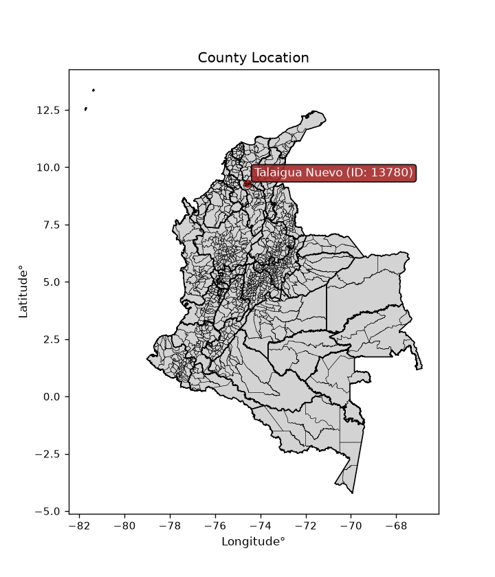
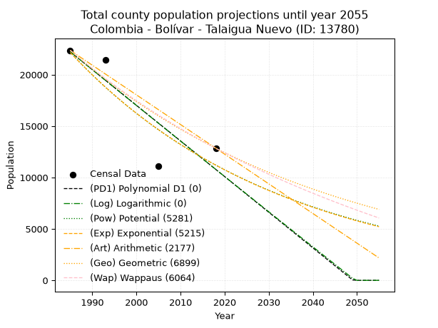
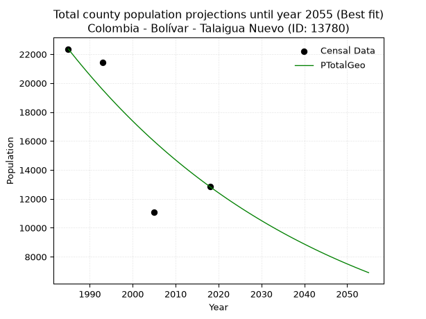
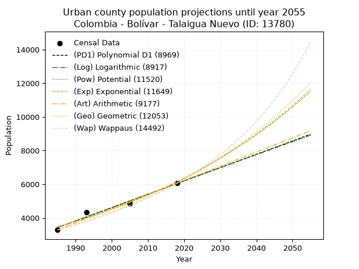
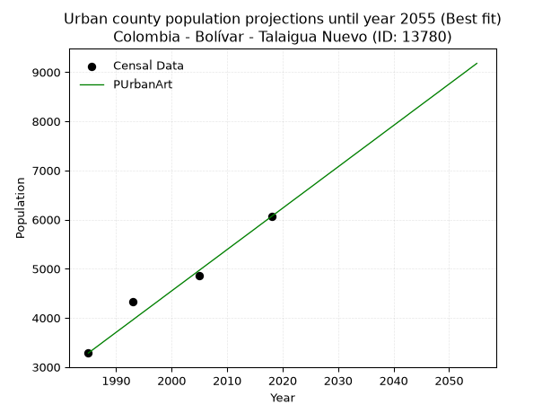
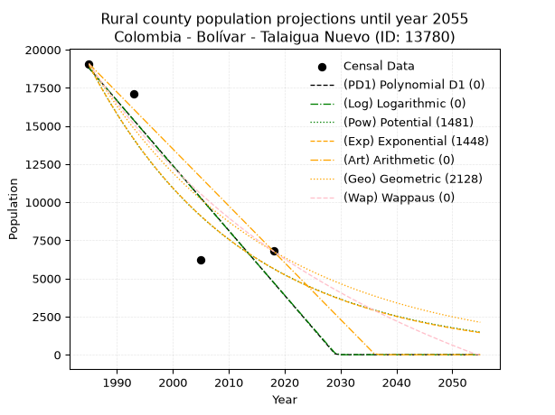
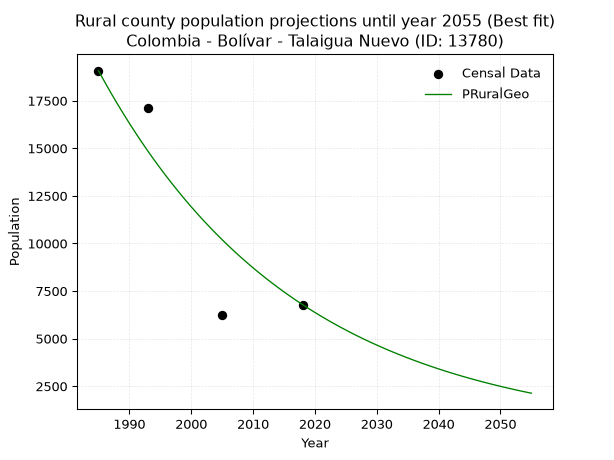

<div align="center">


</div>

# _“Population and Public Services Demand Projections (PPSD) until Year 2050 for Colombia - Bolívar - Talaigua Nuevo (ID: 13780)”_
Keywords: `population` `public-service` `projection` `lineal` `polynomial` `logarithmic` `potential` `exponential` `arithmetic` `geometric` `wappaus` `dane` `colombia` `south-america`

PPSD are analytical estimates used by governments and planners to anticipate future changes in population size, age distribution, and the resulting community needs for utilities, healthcare, education, and infrastructure as sizing future water treatment facilities, electrical grids, and road networks based on spatial growth.

> **General running parameters**: • app_version: _v20260806_. • Python version: _3.14.7_. • Pandas version: _3.0.5_. • NumPy version: _2.5.1_. • Creates, save and include plots into reports (create_plot): _False_. • Projection until year: _2050_. • Process polynomial degree 2 and up: _False_. • Process Wappaus: _True_. • Process Wappaus: _True_. • Set negative values to zero: _True_. • Set infinite values to zero: _True_. • Drop dataset notes: _True_. 
<div align="center">

Dynamic map: [:earth_americas:Google](http://maps.google.com/maps?q=9.304029515,-74.5674785) [:earth_americas:OSM](https://www.openstreetmap.org/#map=18/9.304029515/-74.5674785&layers=P) [:earth_americas:Bing](https://www.bing.com/maps?cp=9.304029515~-74.5674785&lvl=18) [:earth_americas:Apple](https://maps.apple.com/frame?center=9.304029515%2C-74.5674785&span=0.003%2C0.006)

</div>


<div align="center">

```geojson
{
  "type": "Feature",
  "geometry": {
    "type": "Point", 
    "coordinates": [-74.5674785, 9.304029515]
  }, 
  "properties": {
    "Name": "Colombia - Bolívar - Talaigua Nuevo (ID: 13780)"
  }
}
```

</div>


<div align="center">

</img>

</div>


## 0. Census Data (4 records)

Census data are official statistics collected by a government about the people and housing in a country. They usually include counts of total population, age, sex, race, income, education, and jobs.

📅Global census file: [Population.xlsx](../data/Population.xlsx)

| Source   |   Year |   CountryID | CountryName   |   StateID | StateName   |   CountyID | CountyName     |   PTotal |   PUrban |   PRural |
|:---------|-------:|------------:|:--------------|----------:|:------------|-----------:|:---------------|---------:|---------:|---------:|
| DANE     |   1985 |          57 | Colombia      |        13 | Bolívar     |      13780 | Talaigua Nuevo |    22360 |     3284 |    19076 |
| DANE     |   1993 |          57 | Colombia      |        13 | Bolívar     |      13780 | Talaigua Nuevo |    21446 |     4321 |    17125 |
| DANE     |   2005 |          57 | Colombia      |        13 | Bolívar     |      13780 | Talaigua Nuevo |    11086 |     4867 |     6219 |
| DANE     |   2018 |          57 | Colombia      |        13 | Bolívar     |      13780 | Talaigua Nuevo |    12845 |     6062 |     6783 |

> 🔥Some records could had specific notes about the registered values or the corresponding urban or rural distribution.

📅   [RUPS](https://www.datos.gov.co/Hacienda-y-Cr-dito-P-blico/Registro-nico-de-Prestadores-de-Servicios-P-blicos/4qkq-csdn/about_data) - Local public utility companies: [RUPS.csv](../data/RUPS.xlsx)

 | SERVICIO       | ESTADO    | NOMBRE                                                                | NIT         | DEPARTAMENTO_DOMICILIO   | MUNICIPIO_DOMICILIO   | DIRECCION                        |   TELEFONO | EMAIL                | TIPO_PRESTADOR                             | CLASIFICACION                 |
|:---------------|:----------|:----------------------------------------------------------------------|:------------|:-------------------------|:----------------------|:---------------------------------|-----------:|:---------------------|:-------------------------------------------|:------------------------------|
| ACUEDUCTO      | OPERATIVA | EMPRESA DE SERVICIOS PUBLICOS DOMICILIARIOS DE TALAIGUA NUEVO BOLIVAR | 900144684-0 | BOLIVAR                  | TALAIGUA NUEVO        | CRA 12 CALL16 BARRIO SANTA LUCIA |    4119770 | emptalsa@hotmail.com | SOCIEDADES (EMPRESA DE SERVICIOS PUBLICOS) | MENOR O IGUAL A 2500 USUARIOS |
| ALCANTARILLADO | OPERATIVA | EMPRESA DE SERVICIOS PUBLICOS DOMICILIARIOS DE TALAIGUA NUEVO BOLIVAR | 900144684-0 | BOLIVAR                  | TALAIGUA NUEVO        | CRA 12 CALL16 BARRIO SANTA LUCIA |    4119770 | emptalsa@hotmail.com | SOCIEDADES (EMPRESA DE SERVICIOS PUBLICOS) | MENOR O IGUAL A 2500 USUARIOS |

## 1. Total

### 1.1. Coefficients and Parameters

* (PD1) Polynomial Deg 1: -346.5535929345649, 710128.0742673635 (lineal)
* (Log) Logarithmic: -694223.1989305579, 5293730.3482267475
* (Pow) Potential: -41.400305403885504, 140.87412959091543
* (Exp) Exponential: -0.020665010876272854, 1.4461915846304617e+22
* (Art) Arithmetic: Year diff. 2018 - 1985 = 33, Population diff. 12845 - 22360 = -9515, Annual growth = -288.3333333333333
* (Geo) Geometric: Year diff. 2018 - 1985 = 33, Population diff. 12845 - 22360 = -9515, Annual growth % = -0.016657253835647645
* (Wap) Wappaus: i = -1.6380249017658477, Condition values only valid for < 200)

<sub>
Wappaus condition values: ['-0.00', '-1.64', '-3.28', '-4.91', '-6.55', '-8.19', '-9.83', '-11.47', '-13.10', '-14.74', '-16.38', '-18.02', '-19.66', '-21.29', '-22.93', '-24.57', '-26.21', '-27.85', '-29.48', '-31.12', '-32.76', '-34.40', '-36.04', '-37.67', '-39.31', '-40.95', '-42.59', '-44.23', '-45.86', '-47.50', '-49.14', '-50.78', '-52.42', '-54.05', '-55.69', '-57.33', '-58.97', '-60.61', '-62.24', '-63.88', '-65.52', '-67.16', '-68.80', '-70.44', '-72.07', '-73.71', '-75.35', '-76.99', '-78.63', '-80.26', '-81.90', '-83.54', '-85.18', '-86.82', '-88.45', '-90.09', '-91.73', '-93.37', '-95.01', '-96.64', '-98.28', '-99.92', '-101.56', '-103.20', '-104.83', '-106.47']
</sub>


### 1.2. Projected Dataset

|   Year |   CountyID |   PTotalPD1 |   PTotalLog |   PTotalPow |   PTotalExp |   PTotalArt |   PTotalGeo |   PTotalWap |
|-------:|-----------:|------------:|------------:|------------:|------------:|------------:|------------:|------------:|
|   1985 |      13780 |       22219 |       22234 |       22174 |       22154 |       22360 |       22360 |       22360 |
|   1986 |      13780 |       21873 |       21884 |       21716 |       21701 |       22072 |       21988 |       21997 |
|   1987 |      13780 |       21526 |       21535 |       21268 |       21257 |       21783 |       21621 |       21639 |
|   1988 |      13780 |       21180 |       21185 |       20830 |       20822 |       21495 |       21261 |       21288 |
|   1989 |      13780 |       20833 |       20836 |       20401 |       20396 |       21207 |       20907 |       20941 |
|   1990 |      13780 |       20486 |       20487 |       19980 |       19979 |       20918 |       20559 |       20601 |
|   1991 |      13780 |       20140 |       20139 |       19569 |       19570 |       20630 |       20216 |       20265 |
|   1992 |      13780 |       19793 |       19790 |       19167 |       19170 |       20342 |       19880 |       19935 |
|   1993 |      13780 |       19447 |       19442 |       18772 |       18778 |       20053 |       19548 |       19610 |
|   1994 |      13780 |       19100 |       19093 |       18387 |       18394 |       19765 |       19223 |       19290 |
|   1995 |      13780 |       18754 |       18745 |       18009 |       18018 |       19477 |       18903 |       18975 |
|   1996 |      13780 |       18407 |       18397 |       17639 |       17649 |       19188 |       18588 |       18664 |
|   1997 |      13780 |       18061 |       18050 |       17277 |       17288 |       18900 |       18278 |       18358 |
|   1998 |      13780 |       17714 |       17702 |       16923 |       16935 |       18612 |       17974 |       18057 |
|   1999 |      13780 |       17367 |       17355 |       16576 |       16588 |       18323 |       17674 |       17760 |
|   2000 |      13780 |       17021 |       17008 |       16236 |       16249 |       18035 |       17380 |       17467 |
|   2001 |      13780 |       16674 |       16661 |       15903 |       15917 |       17747 |       17090 |       17179 |
|   2002 |      13780 |       16328 |       16314 |       15578 |       15591 |       17458 |       16806 |       16895 |
|   2003 |      13780 |       15981 |       15967 |       15259 |       15272 |       17170 |       16526 |       16614 |
|   2004 |      13780 |       15635 |       15620 |       14947 |       14960 |       16882 |       16250 |       16338 |
|   2005 |      13780 |       15288 |       15274 |       14642 |       14654 |       16593 |       15980 |       16066 |
|   2006 |      13780 |       14942 |       14928 |       14342 |       14354 |       16305 |       15714 |       15797 |
|   2007 |      13780 |       14595 |       14582 |       14049 |       14061 |       16017 |       15452 |       15532 |
|   2008 |      13780 |       14248 |       14236 |       13763 |       13773 |       15728 |       15194 |       15271 |
|   2009 |      13780 |       13902 |       13891 |       13482 |       13491 |       15440 |       14941 |       15014 |
|   2010 |      13780 |       13555 |       13545 |       13207 |       13215 |       15152 |       14692 |       14760 |
|   2011 |      13780 |       13209 |       13200 |       12938 |       12945 |       14863 |       14448 |       14509 |
|   2012 |      13780 |       12862 |       12855 |       12674 |       12680 |       14575 |       14207 |       14262 |
|   2013 |      13780 |       12516 |       12510 |       12416 |       12421 |       14287 |       13970 |       14018 |
|   2014 |      13780 |       12169 |       12165 |       12164 |       12167 |       13998 |       13738 |       13777 |
|   2015 |      13780 |       11823 |       11820 |       11916 |       11918 |       13710 |       13509 |       13539 |
|   2016 |      13780 |       11476 |       11476 |       11674 |       11674 |       13422 |       13284 |       13305 |
|   2017 |      13780 |       11129 |       11132 |       11437 |       11436 |       13133 |       13063 |       13073 |
|   2018 |      13780 |       10783 |       10787 |       11204 |       11202 |       12845 |       12845 |       12845 |
|   2019 |      13780 |       10436 |       10444 |       10977 |       10973 |       12557 |       12631 |       12619 |
|   2020 |      13780 |       10090 |       10100 |       10754 |       10748 |       12268 |       12421 |       12397 |
|   2021 |      13780 |        9743 |        9756 |       10536 |       10528 |       11980 |       12214 |       12177 |
|   2022 |      13780 |        9397 |        9413 |       10322 |       10313 |       11692 |       12010 |       11960 |
|   2023 |      13780 |        9050 |        9070 |       10113 |       10102 |       11403 |       11810 |       11746 |
|   2024 |      13780 |        8704 |        8726 |        9908 |        9895 |       11115 |       11614 |       11534 |
|   2025 |      13780 |        8357 |        8384 |        9708 |        9693 |       10827 |       11420 |       11325 |
|   2026 |      13780 |        8010 |        8041 |        9511 |        9495 |       10538 |       11230 |       11118 |
|   2027 |      13780 |        7664 |        7698 |        9319 |        9301 |       10250 |       11043 |       10914 |
|   2028 |      13780 |        7317 |        7356 |        9131 |        9110 |        9962 |       10859 |       10713 |
|   2029 |      13780 |        6971 |        7014 |        8946 |        8924 |        9673 |       10678 |       10514 |
|   2030 |      13780 |        6624 |        6672 |        8766 |        8741 |        9385 |       10500 |       10317 |
|   2031 |      13780 |        6278 |        6330 |        8589 |        8563 |        9097 |       10325 |       10122 |
|   2032 |      13780 |        5931 |        5988 |        8415 |        8388 |        8808 |       10153 |        9930 |
|   2033 |      13780 |        5585 |        5646 |        8246 |        8216 |        8520 |        9984 |        9740 |
|   2034 |      13780 |        5238 |        5305 |        8080 |        8048 |        8232 |        9818 |        9553 |
|   2035 |      13780 |        4892 |        4964 |        7917 |        7883 |        7943 |        9654 |        9367 |
|   2036 |      13780 |        4545 |        4623 |        7757 |        7722 |        7655 |        9493 |        9184 |
|   2037 |      13780 |        4198 |        4282 |        7601 |        7564 |        7367 |        9335 |        9003 |
|   2038 |      13780 |        3852 |        3941 |        7448 |        7409 |        7078 |        9180 |        8824 |
|   2039 |      13780 |        3505 |        3600 |        7299 |        7258 |        6790 |        9027 |        8647 |
|   2040 |      13780 |        3159 |        3260 |        7152 |        7109 |        6502 |        8877 |        8472 |
|   2041 |      13780 |        2812 |        2920 |        7008 |        6964 |        6213 |        8729 |        8299 |
|   2042 |      13780 |        2466 |        2580 |        6868 |        6822 |        5925 |        8583 |        8127 |
|   2043 |      13780 |        2119 |        2240 |        6730 |        6682 |        5637 |        8440 |        7958 |
|   2044 |      13780 |        1773 |        1900 |        6595 |        6545 |        5348 |        8300 |        7791 |
|   2045 |      13780 |        1426 |        1561 |        6463 |        6412 |        5060 |        8161 |        7625 |
|   2046 |      13780 |        1079 |        1221 |        6333 |        6280 |        4772 |        8025 |        7461 |
|   2047 |      13780 |         733 |         882 |        6206 |        6152 |        4483 |        7892 |        7299 |
|   2048 |      13780 |         386 |         543 |        6082 |        6026 |        4195 |        7760 |        7139 |
|   2049 |      13780 |          40 |         204 |        5960 |        5903 |        3907 |        7631 |        6981 |
|   2050 |      13780 |           0 |           0 |        5841 |        5782 |        3618 |        7504 |        6824 |
<div align="center">

</img>

</div>


### 1.3. Best fit with absolute and relative error (%)

Relative error puts that difference into context by dividing the absolute error by the true value, creating a unitless ratio or percentage that shows the scale of the mistake.

Absolute and relative error

|   Year | Source   |   CountryID | CountryName   |   StateID | StateName   |   CountyID_x | CountyName     |   PTotal |   PUrban |   PRural |   CountyID_y |   PTotalPD1 |   PTotalLog |   PTotalPow |   PTotalExp |   PTotalArt |   PTotalGeo |   PTotalWap |   PTotalPD1AbsError |   PTotalLogAbsError |   PTotalPowAbsError |   PTotalExpAbsError |   PTotalArtAbsError |   PTotalGeoAbsError |   PTotalWapAbsError |   PTotalPD1RelError |   PTotalLogRelError |   PTotalPowRelError |   PTotalExpRelError |   PTotalArtRelError |   PTotalGeoRelError |   PTotalWapRelError |
|-------:|:---------|------------:|:--------------|----------:|:------------|-------------:|:---------------|---------:|---------:|---------:|-------------:|------------:|------------:|------------:|------------:|------------:|------------:|------------:|--------------------:|--------------------:|--------------------:|--------------------:|--------------------:|--------------------:|--------------------:|--------------------:|--------------------:|--------------------:|--------------------:|--------------------:|--------------------:|--------------------:|
|   1985 | DANE     |          57 | Colombia      |        13 | Bolívar     |        13780 | Talaigua Nuevo |    22360 |     3284 |    19076 |        13780 |       22219 |       22234 |       22174 |       22154 |       22360 |       22360 |       22360 |                 141 |                 126 |                 186 |                 206 |                   0 |                   0 |                   0 |             0.63059 |            0.563506 |            0.831843 |            0.921288 |             0       |             0       |             0       |
|   1993 | DANE     |          57 | Colombia      |        13 | Bolívar     |        13780 | Talaigua Nuevo |    21446 |     4321 |    17125 |        13780 |       19447 |       19442 |       18772 |       18778 |       20053 |       19548 |       19610 |                1999 |                2004 |                2674 |                2668 |                1393 |                1898 |                1836 |             9.32109 |            9.3444   |           12.4685   |           12.4405   |             6.49538 |             8.85014 |             8.56104 |
|   2005 | DANE     |          57 | Colombia      |        13 | Bolívar     |        13780 | Talaigua Nuevo |    11086 |     4867 |     6219 |        13780 |       15288 |       15274 |       14642 |       14654 |       16593 |       15980 |       16066 |                4202 |                4188 |                3556 |                3568 |                5507 |                4894 |                4980 |            37.9037  |           37.7774   |           32.0765   |           32.1847   |            49.6753  |            44.1458  |            44.9215  |
|   2018 | DANE     |          57 | Colombia      |        13 | Bolívar     |        13780 | Talaigua Nuevo |    12845 |     6062 |     6783 |        13780 |       10783 |       10787 |       11204 |       11202 |       12845 |       12845 |       12845 |                2062 |                2058 |                1641 |                1643 |                   0 |                   0 |                   0 |            16.0529  |           16.0218   |           12.7754   |           12.791    |             0       |             0       |             0       |

Relative error mean

| Method    |   RelError | Best   |
|:----------|-----------:|:-------|
| PTotalPD1 |    15.9771 |        |
| PTotalLog |    15.9268 |        |
| PTotalPow |    14.5381 |        |
| PTotalExp |    14.5844 |        |
| PTotalArt |    14.0427 |        |
| PTotalGeo |    13.249  | True   |
| PTotalWap |    13.3706 |        |

💙Best method: _**PTotalGeo**_
<div align="center">

</img>

</div>


### 1.4. Fresh water supply demand in liters per capita per day (lpcd)

The fresh water supply demand typically ranges from 100 to 300 liters per capita per day (lpcd) for standard domestic and municipal planning, though absolute survival minimums set by the World Health Organization are as low as 7.5 to 20 liters per day, and total consumption in high-income nations can exceed 400 liters.

> `CZ`: Level in meters above the sea level (masl)<br> `WS`: Fresh water supply demand in liters per capita per day (lpcd or l/h/d)<br> `WSAll`: Zonal fresh water supply demand in liters per second (l/s)<br> `A`: Zonal area in square meters<br> `DP`: Population density (people/hectare or p/ha)

Reference values (RAS Colombia)

|    CZ |   WS |
|------:|-----:|
|  1000 |  120 |
|  2000 |  130 |
| 99999 |  140 |

County shapefile geometry properties and water supply values

|   CountyID |      ATotal |   CZTotal |   WSTotal |
|-----------:|------------:|----------:|----------:|
|      13780 | 2.49094e+08 |   15.3607 |       120 |

Projected values for best method: PTotalGeo

|   CountyID |   Year |   PTotalGeo |   DPTotal |   WSTotal |   WSTotalAll |
|-----------:|-------:|------------:|----------:|----------:|-------------:|
|      13780 |   1985 |       22360 |      0.9  |       120 |      31.0556 |
|      13780 |   1986 |       21988 |      0.88 |       120 |      30.5389 |
|      13780 |   1987 |       21621 |      0.87 |       120 |      30.0292 |
|      13780 |   1988 |       21261 |      0.85 |       120 |      29.5292 |
|      13780 |   1989 |       20907 |      0.84 |       120 |      29.0375 |
|      13780 |   1990 |       20559 |      0.83 |       120 |      28.5542 |
|      13780 |   1991 |       20216 |      0.81 |       120 |      28.0778 |
|      13780 |   1992 |       19880 |      0.8  |       120 |      27.6111 |
|      13780 |   1993 |       19548 |      0.78 |       120 |      27.15   |
|      13780 |   1994 |       19223 |      0.77 |       120 |      26.6986 |
|      13780 |   1995 |       18903 |      0.76 |       120 |      26.2542 |
|      13780 |   1996 |       18588 |      0.75 |       120 |      25.8167 |
|      13780 |   1997 |       18278 |      0.73 |       120 |      25.3861 |
|      13780 |   1998 |       17974 |      0.72 |       120 |      24.9639 |
|      13780 |   1999 |       17674 |      0.71 |       120 |      24.5472 |
|      13780 |   2000 |       17380 |      0.7  |       120 |      24.1389 |
|      13780 |   2001 |       17090 |      0.69 |       120 |      23.7361 |
|      13780 |   2002 |       16806 |      0.67 |       120 |      23.3417 |
|      13780 |   2003 |       16526 |      0.66 |       120 |      22.9528 |
|      13780 |   2004 |       16250 |      0.65 |       120 |      22.5694 |
|      13780 |   2005 |       15980 |      0.64 |       120 |      22.1944 |
|      13780 |   2006 |       15714 |      0.63 |       120 |      21.825  |
|      13780 |   2007 |       15452 |      0.62 |       120 |      21.4611 |
|      13780 |   2008 |       15194 |      0.61 |       120 |      21.1028 |
|      13780 |   2009 |       14941 |      0.6  |       120 |      20.7514 |
|      13780 |   2010 |       14692 |      0.59 |       120 |      20.4056 |
|      13780 |   2011 |       14448 |      0.58 |       120 |      20.0667 |
|      13780 |   2012 |       14207 |      0.57 |       120 |      19.7319 |
|      13780 |   2013 |       13970 |      0.56 |       120 |      19.4028 |
|      13780 |   2014 |       13738 |      0.55 |       120 |      19.0806 |
|      13780 |   2015 |       13509 |      0.54 |       120 |      18.7625 |
|      13780 |   2016 |       13284 |      0.53 |       120 |      18.45   |
|      13780 |   2017 |       13063 |      0.52 |       120 |      18.1431 |
|      13780 |   2018 |       12845 |      0.52 |       120 |      17.8403 |
|      13780 |   2019 |       12631 |      0.51 |       120 |      17.5431 |
|      13780 |   2020 |       12421 |      0.5  |       120 |      17.2514 |
|      13780 |   2021 |       12214 |      0.49 |       120 |      16.9639 |
|      13780 |   2022 |       12010 |      0.48 |       120 |      16.6806 |
|      13780 |   2023 |       11810 |      0.47 |       120 |      16.4028 |
|      13780 |   2024 |       11614 |      0.47 |       120 |      16.1306 |
|      13780 |   2025 |       11420 |      0.46 |       120 |      15.8611 |
|      13780 |   2026 |       11230 |      0.45 |       120 |      15.5972 |
|      13780 |   2027 |       11043 |      0.44 |       120 |      15.3375 |
|      13780 |   2028 |       10859 |      0.44 |       120 |      15.0819 |
|      13780 |   2029 |       10678 |      0.43 |       120 |      14.8306 |
|      13780 |   2030 |       10500 |      0.42 |       120 |      14.5833 |
|      13780 |   2031 |       10325 |      0.41 |       120 |      14.3403 |
|      13780 |   2032 |       10153 |      0.41 |       120 |      14.1014 |
|      13780 |   2033 |        9984 |      0.4  |       120 |      13.8667 |
|      13780 |   2034 |        9818 |      0.39 |       120 |      13.6361 |
|      13780 |   2035 |        9654 |      0.39 |       120 |      13.4083 |
|      13780 |   2036 |        9493 |      0.38 |       120 |      13.1847 |
|      13780 |   2037 |        9335 |      0.37 |       120 |      12.9653 |
|      13780 |   2038 |        9180 |      0.37 |       120 |      12.75   |
|      13780 |   2039 |        9027 |      0.36 |       120 |      12.5375 |
|      13780 |   2040 |        8877 |      0.36 |       120 |      12.3292 |
|      13780 |   2041 |        8729 |      0.35 |       120 |      12.1236 |
|      13780 |   2042 |        8583 |      0.34 |       120 |      11.9208 |
|      13780 |   2043 |        8440 |      0.34 |       120 |      11.7222 |
|      13780 |   2044 |        8300 |      0.33 |       120 |      11.5278 |
|      13780 |   2045 |        8161 |      0.33 |       120 |      11.3347 |
|      13780 |   2046 |        8025 |      0.32 |       120 |      11.1458 |
|      13780 |   2047 |        7892 |      0.32 |       120 |      10.9611 |
|      13780 |   2048 |        7760 |      0.31 |       120 |      10.7778 |
|      13780 |   2049 |        7631 |      0.31 |       120 |      10.5986 |
|      13780 |   2050 |        7504 |      0.3  |       120 |      10.4222 |

## 2. Urban

### 2.1. Coefficients and Parameters

* (PD1) Polynomial Deg 1: 79.1818546768358, -153750.00481734078 (lineal)
* (Log) Logarithmic: 158504.4340871007, -1200159.9736708724
* (Pow) Potential: 34.59374554101602, -110.5411113491956
* (Exp) Exponential: 0.01727739407095861, 4.4323749388487245e-12
* (Art) Arithmetic: Year diff. 2018 - 1985 = 33, Population diff. 6062 - 3284 = 2778, Annual growth = 84.18181818181819
* (Geo) Geometric: Year diff. 2018 - 1985 = 33, Population diff. 6062 - 3284 = 2778, Annual growth % = 0.018748668313670613
* (Wap) Wappaus: i = 1.8014512771628115, Condition values only valid for < 200)

<sub>
Wappaus condition values: ['0.00', '1.80', '3.60', '5.40', '7.21', '9.01', '10.81', '12.61', '14.41', '16.21', '18.01', '19.82', '21.62', '23.42', '25.22', '27.02', '28.82', '30.62', '32.43', '34.23', '36.03', '37.83', '39.63', '41.43', '43.23', '45.04', '46.84', '48.64', '50.44', '52.24', '54.04', '55.84', '57.65', '59.45', '61.25', '63.05', '64.85', '66.65', '68.46', '70.26', '72.06', '73.86', '75.66', '77.46', '79.26', '81.07', '82.87', '84.67', '86.47', '88.27', '90.07', '91.87', '93.68', '95.48', '97.28', '99.08', '100.88', '102.68', '104.48', '106.29', '108.09', '109.89', '111.69', '113.49', '115.29', '117.09']
</sub>


### 2.2. Projected Dataset

|   Year |   CountyID |   PUrbanPD1 |   PUrbanLog |   PUrbanPow |   PUrbanExp |   PUrbanArt |   PUrbanGeo |   PUrbanWap |
|-------:|-----------:|------------:|------------:|------------:|------------:|------------:|------------:|------------:|
|   1985 |      13780 |        3426 |        3424 |        3474 |        3476 |        3284 |        3284 |        3284 |
|   1986 |      13780 |        3505 |        3503 |        3535 |        3536 |        3368 |        3346 |        3344 |
|   1987 |      13780 |        3584 |        3583 |        3597 |        3598 |        3452 |        3408 |        3404 |
|   1988 |      13780 |        3664 |        3663 |        3660 |        3661 |        3537 |        3472 |        3466 |
|   1989 |      13780 |        3743 |        3743 |        3724 |        3724 |        3621 |        3537 |        3529 |
|   1990 |      13780 |        3822 |        3822 |        3789 |        3789 |        3705 |        3604 |        3594 |
|   1991 |      13780 |        3901 |        3902 |        3856 |        3855 |        3789 |        3671 |        3659 |
|   1992 |      13780 |        3980 |        3981 |        3923 |        3922 |        3873 |        3740 |        3726 |
|   1993 |      13780 |        4059 |        4061 |        3992 |        3991 |        3957 |        3810 |        3794 |
|   1994 |      13780 |        4139 |        4141 |        4062 |        4060 |        4042 |        3882 |        3863 |
|   1995 |      13780 |        4218 |        4220 |        4133 |        4131 |        4126 |        3954 |        3934 |
|   1996 |      13780 |        4297 |        4299 |        4205 |        4203 |        4210 |        4028 |        4006 |
|   1997 |      13780 |        4376 |        4379 |        4279 |        4276 |        4294 |        4104 |        4080 |
|   1998 |      13780 |        4455 |        4458 |        4354 |        4351 |        4378 |        4181 |        4155 |
|   1999 |      13780 |        4535 |        4537 |        4430 |        4427 |        4463 |        4259 |        4232 |
|   2000 |      13780 |        4614 |        4617 |        4507 |        4504 |        4547 |        4339 |        4310 |
|   2001 |      13780 |        4693 |        4696 |        4586 |        4582 |        4631 |        4421 |        4390 |
|   2002 |      13780 |        4772 |        4775 |        4665 |        4662 |        4715 |        4503 |        4472 |
|   2003 |      13780 |        4851 |        4854 |        4747 |        4744 |        4799 |        4588 |        4555 |
|   2004 |      13780 |        4930 |        4933 |        4829 |        4826 |        4883 |        4674 |        4640 |
|   2005 |      13780 |        5010 |        5013 |        4914 |        4910 |        4968 |        4762 |        4727 |
|   2006 |      13780 |        5089 |        5092 |        4999 |        4996 |        5052 |        4851 |        4816 |
|   2007 |      13780 |        5168 |        5171 |        5086 |        5083 |        5136 |        4942 |        4907 |
|   2008 |      13780 |        5247 |        5250 |        5174 |        5172 |        5220 |        5034 |        5000 |
|   2009 |      13780 |        5326 |        5328 |        5264 |        5262 |        5304 |        5129 |        5095 |
|   2010 |      13780 |        5406 |        5407 |        5356 |        5353 |        5389 |        5225 |        5193 |
|   2011 |      13780 |        5485 |        5486 |        5449 |        5447 |        5473 |        5323 |        5293 |
|   2012 |      13780 |        5564 |        5565 |        5543 |        5542 |        5557 |        5423 |        5395 |
|   2013 |      13780 |        5643 |        5644 |        5639 |        5638 |        5641 |        5524 |        5499 |
|   2014 |      13780 |        5722 |        5722 |        5737 |        5736 |        5725 |        5628 |        5606 |
|   2015 |      13780 |        5801 |        5801 |        5836 |        5836 |        5809 |        5733 |        5716 |
|   2016 |      13780 |        5881 |        5880 |        5937 |        5938 |        5894 |        5841 |        5828 |
|   2017 |      13780 |        5960 |        5958 |        6040 |        6042 |        5978 |        5950 |        5944 |
|   2018 |      13780 |        6039 |        6037 |        6145 |        6147 |        6062 |        6062 |        6062 |
|   2019 |      13780 |        6118 |        6115 |        6251 |        6254 |        6146 |        6176 |        6183 |
|   2020 |      13780 |        6197 |        6194 |        6359 |        6363 |        6230 |        6291 |        6308 |
|   2021 |      13780 |        6277 |        6272 |        6469 |        6474 |        6315 |        6409 |        6436 |
|   2022 |      13780 |        6356 |        6351 |        6580 |        6587 |        6399 |        6530 |        6567 |
|   2023 |      13780 |        6435 |        6429 |        6694 |        6701 |        6483 |        6652 |        6702 |
|   2024 |      13780 |        6514 |        6508 |        6809 |        6818 |        6567 |        6777 |        6841 |
|   2025 |      13780 |        6593 |        6586 |        6927 |        6937 |        6651 |        6904 |        6983 |
|   2026 |      13780 |        6672 |        6664 |        7046 |        7058 |        6735 |        7033 |        7130 |
|   2027 |      13780 |        6752 |        6742 |        7167 |        7181 |        6820 |        7165 |        7281 |
|   2028 |      13780 |        6831 |        6820 |        7290 |        7306 |        6904 |        7299 |        7436 |
|   2029 |      13780 |        6910 |        6899 |        7416 |        7433 |        6988 |        7436 |        7596 |
|   2030 |      13780 |        6989 |        6977 |        7543 |        7563 |        7072 |        7576 |        7761 |
|   2031 |      13780 |        7068 |        7055 |        7673 |        7695 |        7156 |        7718 |        7931 |
|   2032 |      13780 |        7148 |        7133 |        7805 |        7829 |        7241 |        7862 |        8106 |
|   2033 |      13780 |        7227 |        7211 |        7939 |        7965 |        7325 |        8010 |        8286 |
|   2034 |      13780 |        7306 |        7289 |        8075 |        8104 |        7409 |        8160 |        8473 |
|   2035 |      13780 |        7385 |        7367 |        8213 |        8245 |        7493 |        8313 |        8666 |
|   2036 |      13780 |        7464 |        7444 |        8354 |        8389 |        7577 |        8469 |        8865 |
|   2037 |      13780 |        7543 |        7522 |        8497 |        8535 |        7661 |        8628 |        9071 |
|   2038 |      13780 |        7623 |        7600 |        8643 |        8684 |        7746 |        8789 |        9284 |
|   2039 |      13780 |        7702 |        7678 |        8791 |        8835 |        7830 |        8954 |        9504 |
|   2040 |      13780 |        7781 |        7756 |        8941 |        8989 |        7914 |        9122 |        9732 |
|   2041 |      13780 |        7860 |        7833 |        9094 |        9146 |        7998 |        9293 |        9969 |
|   2042 |      13780 |        7939 |        7911 |        9249 |        9305 |        8082 |        9467 |       10214 |
|   2043 |      13780 |        8019 |        7988 |        9407 |        9468 |        8167 |        9645 |       10469 |
|   2044 |      13780 |        8098 |        8066 |        9568 |        9633 |        8251 |        9826 |       10733 |
|   2045 |      13780 |        8177 |        8144 |        9731 |        9800 |        8335 |       10010 |       11008 |
|   2046 |      13780 |        8256 |        8221 |        9897 |        9971 |        8419 |       10197 |       11294 |
|   2047 |      13780 |        8335 |        8299 |       10066 |       10145 |        8503 |       10389 |       11591 |
|   2048 |      13780 |        8414 |        8376 |       10238 |       10322 |        8587 |       10583 |       11901 |
|   2049 |      13780 |        8494 |        8453 |       10412 |       10502 |        8672 |       10782 |       12224 |
|   2050 |      13780 |        8573 |        8531 |       10589 |       10685 |        8756 |       10984 |       12561 |
<div align="center">

</img>

</div>


### 2.3. Best fit with absolute and relative error (%)

Relative error puts that difference into context by dividing the absolute error by the true value, creating a unitless ratio or percentage that shows the scale of the mistake.

Absolute and relative error

|   Year | Source   |   CountryID | CountryName   |   StateID | StateName   |   CountyID_x | CountyName     |   PTotal |   PUrban |   PRural |   CountyID_y |   PUrbanPD1 |   PUrbanLog |   PUrbanPow |   PUrbanExp |   PUrbanArt |   PUrbanGeo |   PUrbanWap |   PUrbanPD1AbsError |   PUrbanLogAbsError |   PUrbanPowAbsError |   PUrbanExpAbsError |   PUrbanArtAbsError |   PUrbanGeoAbsError |   PUrbanWapAbsError |   PUrbanPD1RelError |   PUrbanLogRelError |   PUrbanPowRelError |   PUrbanExpRelError |   PUrbanArtRelError |   PUrbanGeoRelError |   PUrbanWapRelError |
|-------:|:---------|------------:|:--------------|----------:|:------------|-------------:|:---------------|---------:|---------:|---------:|-------------:|------------:|------------:|------------:|------------:|------------:|------------:|------------:|--------------------:|--------------------:|--------------------:|--------------------:|--------------------:|--------------------:|--------------------:|--------------------:|--------------------:|--------------------:|--------------------:|--------------------:|--------------------:|--------------------:|
|   1985 | DANE     |          57 | Colombia      |        13 | Bolívar     |        13780 | Talaigua Nuevo |    22360 |     3284 |    19076 |        13780 |        3426 |        3424 |        3474 |        3476 |        3284 |        3284 |        3284 |                 142 |                 140 |                 190 |                 192 |                   0 |                   0 |                   0 |            4.324    |            4.26309  |            5.78563  |            5.84653  |             0       |             0       |             0       |
|   1993 | DANE     |          57 | Colombia      |        13 | Bolívar     |        13780 | Talaigua Nuevo |    21446 |     4321 |    17125 |        13780 |        4059 |        4061 |        3992 |        3991 |        3957 |        3810 |        3794 |                 262 |                 260 |                 329 |                 330 |                 364 |                 511 |                 527 |            6.06341  |            6.01713  |            7.61398  |            7.63712  |             8.42398 |            11.826   |            12.1963  |
|   2005 | DANE     |          57 | Colombia      |        13 | Bolívar     |        13780 | Talaigua Nuevo |    11086 |     4867 |     6219 |        13780 |        5010 |        5013 |        4914 |        4910 |        4968 |        4762 |        4727 |                 143 |                 146 |                  47 |                  43 |                 101 |                 105 |                 140 |            2.93815  |            2.99979  |            0.965687 |            0.883501 |             2.0752  |             2.15739 |             2.87652 |
|   2018 | DANE     |          57 | Colombia      |        13 | Bolívar     |        13780 | Talaigua Nuevo |    12845 |     6062 |     6783 |        13780 |        6039 |        6037 |        6145 |        6147 |        6062 |        6062 |        6062 |                  23 |                  25 |                  83 |                  85 |                   0 |                   0 |                   0 |            0.379413 |            0.412405 |            1.36919  |            1.40218  |             0       |             0       |             0       |

Relative error mean

| Method    |   RelError | Best   |
|:----------|-----------:|:-------|
| PUrbanPD1 |    3.42624 |        |
| PUrbanLog |    3.4231  |        |
| PUrbanPow |    3.93362 |        |
| PUrbanExp |    3.94233 |        |
| PUrbanArt |    2.62479 | True   |
| PUrbanGeo |    3.49584 |        |
| PUrbanWap |    3.76819 |        |

💙Best method: _**PUrbanArt**_
<div align="center">

</img>

</div>


### 2.4. Fresh water supply demand in liters per capita per day (lpcd)

The fresh water supply demand typically ranges from 100 to 300 liters per capita per day (lpcd) for standard domestic and municipal planning, though absolute survival minimums set by the World Health Organization are as low as 7.5 to 20 liters per day, and total consumption in high-income nations can exceed 400 liters.

> `CZ`: Level in meters above the sea level (masl)<br> `WS`: Fresh water supply demand in liters per capita per day (lpcd or l/h/d)<br> `WSAll`: Zonal fresh water supply demand in liters per second (l/s)<br> `A`: Zonal area in square meters<br> `DP`: Population density (people/hectare or p/ha)

Reference values (RAS Colombia)

|    CZ |   WS |
|------:|-----:|
|  1000 |  120 |
|  2000 |  130 |
| 99999 |  140 |

County shapefile geometry properties and water supply values

|   CountyID |      AUrban |   CZUrban |   WSUrban |
|-----------:|------------:|----------:|----------:|
|      13780 | 1.09604e+06 |   18.5927 |       120 |

Projected values for best method: PUrbanArt

|   CountyID |   Year |   PUrbanArt |   DPUrban |   WSUrban |   WSUrbanAll |
|-----------:|-------:|------------:|----------:|----------:|-------------:|
|      13780 |   1985 |        3284 |     29.96 |       120 |      4.56111 |
|      13780 |   1986 |        3368 |     30.73 |       120 |      4.67778 |
|      13780 |   1987 |        3452 |     31.5  |       120 |      4.79444 |
|      13780 |   1988 |        3537 |     32.27 |       120 |      4.9125  |
|      13780 |   1989 |        3621 |     33.04 |       120 |      5.02917 |
|      13780 |   1990 |        3705 |     33.8  |       120 |      5.14583 |
|      13780 |   1991 |        3789 |     34.57 |       120 |      5.2625  |
|      13780 |   1992 |        3873 |     35.34 |       120 |      5.37917 |
|      13780 |   1993 |        3957 |     36.1  |       120 |      5.49583 |
|      13780 |   1994 |        4042 |     36.88 |       120 |      5.61389 |
|      13780 |   1995 |        4126 |     37.64 |       120 |      5.73056 |
|      13780 |   1996 |        4210 |     38.41 |       120 |      5.84722 |
|      13780 |   1997 |        4294 |     39.18 |       120 |      5.96389 |
|      13780 |   1998 |        4378 |     39.94 |       120 |      6.08056 |
|      13780 |   1999 |        4463 |     40.72 |       120 |      6.19861 |
|      13780 |   2000 |        4547 |     41.49 |       120 |      6.31528 |
|      13780 |   2001 |        4631 |     42.25 |       120 |      6.43194 |
|      13780 |   2002 |        4715 |     43.02 |       120 |      6.54861 |
|      13780 |   2003 |        4799 |     43.79 |       120 |      6.66528 |
|      13780 |   2004 |        4883 |     44.55 |       120 |      6.78194 |
|      13780 |   2005 |        4968 |     45.33 |       120 |      6.9     |
|      13780 |   2006 |        5052 |     46.09 |       120 |      7.01667 |
|      13780 |   2007 |        5136 |     46.86 |       120 |      7.13333 |
|      13780 |   2008 |        5220 |     47.63 |       120 |      7.25    |
|      13780 |   2009 |        5304 |     48.39 |       120 |      7.36667 |
|      13780 |   2010 |        5389 |     49.17 |       120 |      7.48472 |
|      13780 |   2011 |        5473 |     49.93 |       120 |      7.60139 |
|      13780 |   2012 |        5557 |     50.7  |       120 |      7.71806 |
|      13780 |   2013 |        5641 |     51.47 |       120 |      7.83472 |
|      13780 |   2014 |        5725 |     52.23 |       120 |      7.95139 |
|      13780 |   2015 |        5809 |     53    |       120 |      8.06806 |
|      13780 |   2016 |        5894 |     53.78 |       120 |      8.18611 |
|      13780 |   2017 |        5978 |     54.54 |       120 |      8.30278 |
|      13780 |   2018 |        6062 |     55.31 |       120 |      8.41944 |
|      13780 |   2019 |        6146 |     56.07 |       120 |      8.53611 |
|      13780 |   2020 |        6230 |     56.84 |       120 |      8.65278 |
|      13780 |   2021 |        6315 |     57.62 |       120 |      8.77083 |
|      13780 |   2022 |        6399 |     58.38 |       120 |      8.8875  |
|      13780 |   2023 |        6483 |     59.15 |       120 |      9.00417 |
|      13780 |   2024 |        6567 |     59.92 |       120 |      9.12083 |
|      13780 |   2025 |        6651 |     60.68 |       120 |      9.2375  |
|      13780 |   2026 |        6735 |     61.45 |       120 |      9.35417 |
|      13780 |   2027 |        6820 |     62.22 |       120 |      9.47222 |
|      13780 |   2028 |        6904 |     62.99 |       120 |      9.58889 |
|      13780 |   2029 |        6988 |     63.76 |       120 |      9.70556 |
|      13780 |   2030 |        7072 |     64.52 |       120 |      9.82222 |
|      13780 |   2031 |        7156 |     65.29 |       120 |      9.93889 |
|      13780 |   2032 |        7241 |     66.07 |       120 |     10.0569  |
|      13780 |   2033 |        7325 |     66.83 |       120 |     10.1736  |
|      13780 |   2034 |        7409 |     67.6  |       120 |     10.2903  |
|      13780 |   2035 |        7493 |     68.36 |       120 |     10.4069  |
|      13780 |   2036 |        7577 |     69.13 |       120 |     10.5236  |
|      13780 |   2037 |        7661 |     69.9  |       120 |     10.6403  |
|      13780 |   2038 |        7746 |     70.67 |       120 |     10.7583  |
|      13780 |   2039 |        7830 |     71.44 |       120 |     10.875   |
|      13780 |   2040 |        7914 |     72.21 |       120 |     10.9917  |
|      13780 |   2041 |        7998 |     72.97 |       120 |     11.1083  |
|      13780 |   2042 |        8082 |     73.74 |       120 |     11.225   |
|      13780 |   2043 |        8167 |     74.51 |       120 |     11.3431  |
|      13780 |   2044 |        8251 |     75.28 |       120 |     11.4597  |
|      13780 |   2045 |        8335 |     76.05 |       120 |     11.5764  |
|      13780 |   2046 |        8419 |     76.81 |       120 |     11.6931  |
|      13780 |   2047 |        8503 |     77.58 |       120 |     11.8097  |
|      13780 |   2048 |        8587 |     78.35 |       120 |     11.9264  |
|      13780 |   2049 |        8672 |     79.12 |       120 |     12.0444  |
|      13780 |   2050 |        8756 |     79.89 |       120 |     12.1611  |

## 3. Rural

### 3.1. Coefficients and Parameters

* (PD1) Polynomial Deg 1: -425.7354476114006, 863878.079084704 (lineal)
* (Log) Logarithmic: -852727.6330176584, 6493890.321897618
* (Pow) Potential: -73.63810761479422, 247.11979280864392
* (Exp) Exponential: -0.03676498459540018, 9.385699567724435e+35
* (Art) Arithmetic: Year diff. 2018 - 1985 = 33, Population diff. 6783 - 19076 = -12293, Annual growth = -372.5151515151515
* (Geo) Geometric: Year diff. 2018 - 1985 = 33, Population diff. 6783 - 19076 = -12293, Annual growth % = -0.0308478698719461
* (Wap) Wappaus: i = -2.881125731970699, Condition values only valid for < 200)

<sub>
Wappaus condition values: ['-0.00', '-2.88', '-5.76', '-8.64', '-11.52', '-14.41', '-17.29', '-20.17', '-23.05', '-25.93', '-28.81', '-31.69', '-34.57', '-37.45', '-40.34', '-43.22', '-46.10', '-48.98', '-51.86', '-54.74', '-57.62', '-60.50', '-63.38', '-66.27', '-69.15', '-72.03', '-74.91', '-77.79', '-80.67', '-83.55', '-86.43', '-89.31', '-92.20', '-95.08', '-97.96', '-100.84', '-103.72', '-106.60', '-109.48', '-112.36', '-115.25', '-118.13', '-121.01', '-123.89', '-126.77', '-129.65', '-132.53', '-135.41', '-138.29', '-141.18', '-144.06', '-146.94', '-149.82', '-152.70', '-155.58', '-158.46', '-161.34', '-164.22', '-167.11', '-169.99', '-172.87', '-175.75', '-178.63', '-181.51', '-184.39', '-187.27']
</sub>


### 3.2. Projected Dataset

|   Year |   CountyID |   PRuralPD1 |   PRuralLog |   PRuralPow |   PRuralExp |   PRuralArt |   PRuralGeo |   PRuralWap |
|-------:|-----------:|------------:|------------:|------------:|------------:|------------:|------------:|------------:|
|   1985 |      13780 |       18793 |       18810 |       19009 |       18981 |       19076 |       19076 |       19076 |
|   1986 |      13780 |       18367 |       18381 |       18316 |       18295 |       18703 |       18488 |       18534 |
|   1987 |      13780 |       17942 |       17952 |       17650 |       17635 |       18331 |       17917 |       18008 |
|   1988 |      13780 |       17516 |       17523 |       17008 |       16998 |       17958 |       17365 |       17495 |
|   1989 |      13780 |       17090 |       17094 |       16390 |       16385 |       17586 |       16829 |       16997 |
|   1990 |      13780 |       16665 |       16665 |       15794 |       15793 |       17213 |       16310 |       16513 |
|   1991 |      13780 |       16239 |       16237 |       15220 |       15223 |       16841 |       15807 |       16041 |
|   1992 |      13780 |       15813 |       15809 |       14668 |       14674 |       16468 |       15319 |       15581 |
|   1993 |      13780 |       15387 |       15381 |       14136 |       14144 |       16096 |       14846 |       15134 |
|   1994 |      13780 |       14962 |       14953 |       13623 |       13634 |       15723 |       14388 |       14697 |
|   1995 |      13780 |       14536 |       14525 |       13129 |       13141 |       15351 |       13945 |       14272 |
|   1996 |      13780 |       14110 |       14098 |       12654 |       12667 |       14978 |       13514 |       13857 |
|   1997 |      13780 |       13684 |       13671 |       12195 |       12210 |       14606 |       13098 |       13453 |
|   1998 |      13780 |       13259 |       13244 |       11754 |       11769 |       14233 |       12694 |       13058 |
|   1999 |      13780 |       12833 |       12817 |       11329 |       11344 |       13861 |       12302 |       12673 |
|   2000 |      13780 |       12407 |       12391 |       10919 |       10935 |       13488 |       11922 |       12297 |
|   2001 |      13780 |       11981 |       11965 |       10525 |       10540 |       13116 |       11555 |       11930 |
|   2002 |      13780 |       11556 |       11538 |       10144 |       10160 |       12743 |       11198 |       11571 |
|   2003 |      13780 |       11130 |       11113 |        9778 |        9793 |       12371 |       10853 |       11220 |
|   2004 |      13780 |       10704 |       10687 |        9425 |        9439 |       11998 |       10518 |       10878 |
|   2005 |      13780 |       10279 |       10262 |        9085 |        9099 |       11626 |       10194 |       10543 |
|   2006 |      13780 |        9853 |        9836 |        8758 |        8770 |       11253 |        9879 |       10215 |
|   2007 |      13780 |        9427 |        9411 |        8442 |        8454 |       10881 |        9574 |        9895 |
|   2008 |      13780 |        9001 |        8987 |        8138 |        8148 |       10508 |        9279 |        9581 |
|   2009 |      13780 |        8576 |        8562 |        7845 |        7854 |       10136 |        8993 |        9274 |
|   2010 |      13780 |        8150 |        8138 |        7563 |        7571 |        9763 |        8715 |        8974 |
|   2011 |      13780 |        7724 |        7714 |        7291 |        7297 |        9391 |        8447 |        8680 |
|   2012 |      13780 |        7298 |        7290 |        7029 |        7034 |        9018 |        8186 |        8392 |
|   2013 |      13780 |        6873 |        6866 |        6776 |        6780 |        8646 |        7933 |        8110 |
|   2014 |      13780 |        6447 |        6442 |        6533 |        6535 |        8273 |        7689 |        7834 |
|   2015 |      13780 |        6021 |        6019 |        6298 |        6299 |        7901 |        7452 |        7563 |
|   2016 |      13780 |        5595 |        5596 |        6072 |        6072 |        7528 |        7222 |        7298 |
|   2017 |      13780 |        5170 |        5173 |        5855 |        5853 |        7156 |        6999 |        7038 |
|   2018 |      13780 |        4744 |        4751 |        5645 |        5642 |        6783 |        6783 |        6783 |
|   2019 |      13780 |        4318 |        4328 |        5443 |        5438 |        6410 |        6574 |        6533 |
|   2020 |      13780 |        3892 |        3906 |        5248 |        5242 |        6038 |        6371 |        6288 |
|   2021 |      13780 |        3467 |        3484 |        5060 |        5052 |        5665 |        6174 |        6047 |
|   2022 |      13780 |        3041 |        3062 |        4879 |        4870 |        5293 |        5984 |        5811 |
|   2023 |      13780 |        2615 |        2640 |        4704 |        4694 |        4920 |        5799 |        5579 |
|   2024 |      13780 |        2190 |        2219 |        4536 |        4525 |        4548 |        5620 |        5352 |
|   2025 |      13780 |        1764 |        1798 |        4374 |        4362 |        4175 |        5447 |        5129 |
|   2026 |      13780 |        1338 |        1377 |        4218 |        4204 |        3803 |        5279 |        4909 |
|   2027 |      13780 |         912 |         956 |        4068 |        4052 |        3430 |        5116 |        4694 |
|   2028 |      13780 |         487 |         535 |        3923 |        3906 |        3058 |        4958 |        4483 |
|   2029 |      13780 |          61 |         115 |        3783 |        3765 |        2685 |        4805 |        4275 |
|   2030 |      13780 |           0 |           0 |        3648 |        3629 |        2313 |        4657 |        4071 |
|   2031 |      13780 |           0 |           0 |        3518 |        3498 |        1940 |        4514 |        3870 |
|   2032 |      13780 |           0 |           0 |        3393 |        3372 |        1568 |        4374 |        3673 |
|   2033 |      13780 |           0 |           0 |        3272 |        3250 |        1195 |        4239 |        3480 |
|   2034 |      13780 |           0 |           0 |        3156 |        3133 |         823 |        4109 |        3289 |
|   2035 |      13780 |           0 |           0 |        3043 |        3020 |         450 |        3982 |        3102 |
|   2036 |      13780 |           0 |           0 |        2935 |        2911 |          78 |        3859 |        2918 |
|   2037 |      13780 |           0 |           0 |        2831 |        2806 |           0 |        3740 |        2736 |
|   2038 |      13780 |           0 |           0 |        2731 |        2704 |           0 |        3625 |        2558 |
|   2039 |      13780 |           0 |           0 |        2634 |        2607 |           0 |        3513 |        2383 |
|   2040 |      13780 |           0 |           0 |        2540 |        2513 |           0 |        3404 |        2211 |
|   2041 |      13780 |           0 |           0 |        2450 |        2422 |           0 |        3299 |        2041 |
|   2042 |      13780 |           0 |           0 |        2363 |        2335 |           0 |        3198 |        1874 |
|   2043 |      13780 |           0 |           0 |        2280 |        2250 |           0 |        3099 |        1709 |
|   2044 |      13780 |           0 |           0 |        2199 |        2169 |           0 |        3003 |        1547 |
|   2045 |      13780 |           0 |           0 |        2121 |        2091 |           0 |        2911 |        1388 |
|   2046 |      13780 |           0 |           0 |        2046 |        2015 |           0 |        2821 |        1231 |
|   2047 |      13780 |           0 |           0 |        1974 |        1943 |           0 |        2734 |        1077 |
|   2048 |      13780 |           0 |           0 |        1904 |        1872 |           0 |        2650 |         924 |
|   2049 |      13780 |           0 |           0 |        1837 |        1805 |           0 |        2568 |         775 |
|   2050 |      13780 |           0 |           0 |        1772 |        1740 |           0 |        2489 |         627 |
<div align="center">

</img>

</div>


### 3.3. Best fit with absolute and relative error (%)

Relative error puts that difference into context by dividing the absolute error by the true value, creating a unitless ratio or percentage that shows the scale of the mistake.

Absolute and relative error

|   Year | Source   |   CountryID | CountryName   |   StateID | StateName   |   CountyID_x | CountyName     |   PTotal |   PUrban |   PRural |   CountyID_y |   PRuralPD1 |   PRuralLog |   PRuralPow |   PRuralExp |   PRuralArt |   PRuralGeo |   PRuralWap |   PRuralPD1AbsError |   PRuralLogAbsError |   PRuralPowAbsError |   PRuralExpAbsError |   PRuralArtAbsError |   PRuralGeoAbsError |   PRuralWapAbsError |   PRuralPD1RelError |   PRuralLogRelError |   PRuralPowRelError |   PRuralExpRelError |   PRuralArtRelError |   PRuralGeoRelError |   PRuralWapRelError |
|-------:|:---------|------------:|:--------------|----------:|:------------|-------------:|:---------------|---------:|---------:|---------:|-------------:|------------:|------------:|------------:|------------:|------------:|------------:|------------:|--------------------:|--------------------:|--------------------:|--------------------:|--------------------:|--------------------:|--------------------:|--------------------:|--------------------:|--------------------:|--------------------:|--------------------:|--------------------:|--------------------:|
|   1985 | DANE     |          57 | Colombia      |        13 | Bolívar     |        13780 | Talaigua Nuevo |    22360 |     3284 |    19076 |        13780 |       18793 |       18810 |       19009 |       18981 |       19076 |       19076 |       19076 |                 283 |                 266 |                  67 |                  95 |                   0 |                   0 |                   0 |             1.48354 |             1.39442 |            0.351227 |            0.498008 |             0       |               0     |              0      |
|   1993 | DANE     |          57 | Colombia      |        13 | Bolívar     |        13780 | Talaigua Nuevo |    21446 |     4321 |    17125 |        13780 |       15387 |       15381 |       14136 |       14144 |       16096 |       14846 |       15134 |                1738 |                1744 |                2989 |                2981 |                1029 |                2279 |                1991 |            10.1489  |            10.1839  |           17.454    |           17.4073   |             6.00876 |              13.308 |             11.6263 |
|   2005 | DANE     |          57 | Colombia      |        13 | Bolívar     |        13780 | Talaigua Nuevo |    11086 |     4867 |     6219 |        13780 |       10279 |       10262 |        9085 |        9099 |       11626 |       10194 |       10543 |                4060 |                4043 |                2866 |                2880 |                5407 |                3975 |                4324 |            65.2838  |            65.0105  |           46.0846   |           46.3097   |            86.9432  |              63.917 |             69.5289 |
|   2018 | DANE     |          57 | Colombia      |        13 | Bolívar     |        13780 | Talaigua Nuevo |    12845 |     6062 |     6783 |        13780 |        4744 |        4751 |        5645 |        5642 |        6783 |        6783 |        6783 |                2039 |                2032 |                1138 |                1141 |                   0 |                   0 |                   0 |            30.0604  |            29.9572  |           16.7772   |           16.8215   |             0       |               0     |              0      |

Relative error mean

| Method    |   RelError | Best   |
|:----------|-----------:|:-------|
| PRuralPD1 |    26.7442 |        |
| PRuralLog |    26.6365 |        |
| PRuralPow |    20.1668 |        |
| PRuralExp |    20.2591 |        |
| PRuralArt |    23.238  |        |
| PRuralGeo |    19.3063 | True   |
| PRuralWap |    20.2888 |        |

💙Best method: _**PRuralGeo**_
<div align="center">

</img>

</div>


### 3.4. Fresh water supply demand in liters per capita per day (lpcd)

The fresh water supply demand typically ranges from 100 to 300 liters per capita per day (lpcd) for standard domestic and municipal planning, though absolute survival minimums set by the World Health Organization are as low as 7.5 to 20 liters per day, and total consumption in high-income nations can exceed 400 liters.

> `CZ`: Level in meters above the sea level (masl)<br> `WS`: Fresh water supply demand in liters per capita per day (lpcd or l/h/d)<br> `WSAll`: Zonal fresh water supply demand in liters per second (l/s)<br> `A`: Zonal area in square meters<br> `DP`: Population density (people/hectare or p/ha)

Reference values (RAS Colombia)

|    CZ |   WS |
|------:|-----:|
|  1000 |  120 |
|  2000 |  130 |
| 99999 |  140 |

County shapefile geometry properties and water supply values

|   CountyID |      ARural |   CZRural |   WSRural |
|-----------:|------------:|----------:|----------:|
|      13780 | 2.47998e+08 |   15.3465 |       120 |

Projected values for best method: PRuralGeo

|   CountyID |   Year |   PRuralGeo |   DPRural |   WSRural |   WSRuralAll |
|-----------:|-------:|------------:|----------:|----------:|-------------:|
|      13780 |   1985 |       19076 |      0.77 |       120 |     26.4944  |
|      13780 |   1986 |       18488 |      0.75 |       120 |     25.6778  |
|      13780 |   1987 |       17917 |      0.72 |       120 |     24.8847  |
|      13780 |   1988 |       17365 |      0.7  |       120 |     24.1181  |
|      13780 |   1989 |       16829 |      0.68 |       120 |     23.3736  |
|      13780 |   1990 |       16310 |      0.66 |       120 |     22.6528  |
|      13780 |   1991 |       15807 |      0.64 |       120 |     21.9542  |
|      13780 |   1992 |       15319 |      0.62 |       120 |     21.2764  |
|      13780 |   1993 |       14846 |      0.6  |       120 |     20.6194  |
|      13780 |   1994 |       14388 |      0.58 |       120 |     19.9833  |
|      13780 |   1995 |       13945 |      0.56 |       120 |     19.3681  |
|      13780 |   1996 |       13514 |      0.54 |       120 |     18.7694  |
|      13780 |   1997 |       13098 |      0.53 |       120 |     18.1917  |
|      13780 |   1998 |       12694 |      0.51 |       120 |     17.6306  |
|      13780 |   1999 |       12302 |      0.5  |       120 |     17.0861  |
|      13780 |   2000 |       11922 |      0.48 |       120 |     16.5583  |
|      13780 |   2001 |       11555 |      0.47 |       120 |     16.0486  |
|      13780 |   2002 |       11198 |      0.45 |       120 |     15.5528  |
|      13780 |   2003 |       10853 |      0.44 |       120 |     15.0736  |
|      13780 |   2004 |       10518 |      0.42 |       120 |     14.6083  |
|      13780 |   2005 |       10194 |      0.41 |       120 |     14.1583  |
|      13780 |   2006 |        9879 |      0.4  |       120 |     13.7208  |
|      13780 |   2007 |        9574 |      0.39 |       120 |     13.2972  |
|      13780 |   2008 |        9279 |      0.37 |       120 |     12.8875  |
|      13780 |   2009 |        8993 |      0.36 |       120 |     12.4903  |
|      13780 |   2010 |        8715 |      0.35 |       120 |     12.1042  |
|      13780 |   2011 |        8447 |      0.34 |       120 |     11.7319  |
|      13780 |   2012 |        8186 |      0.33 |       120 |     11.3694  |
|      13780 |   2013 |        7933 |      0.32 |       120 |     11.0181  |
|      13780 |   2014 |        7689 |      0.31 |       120 |     10.6792  |
|      13780 |   2015 |        7452 |      0.3  |       120 |     10.35    |
|      13780 |   2016 |        7222 |      0.29 |       120 |     10.0306  |
|      13780 |   2017 |        6999 |      0.28 |       120 |      9.72083 |
|      13780 |   2018 |        6783 |      0.27 |       120 |      9.42083 |
|      13780 |   2019 |        6574 |      0.27 |       120 |      9.13056 |
|      13780 |   2020 |        6371 |      0.26 |       120 |      8.84861 |
|      13780 |   2021 |        6174 |      0.25 |       120 |      8.575   |
|      13780 |   2022 |        5984 |      0.24 |       120 |      8.31111 |
|      13780 |   2023 |        5799 |      0.23 |       120 |      8.05417 |
|      13780 |   2024 |        5620 |      0.23 |       120 |      7.80556 |
|      13780 |   2025 |        5447 |      0.22 |       120 |      7.56528 |
|      13780 |   2026 |        5279 |      0.21 |       120 |      7.33194 |
|      13780 |   2027 |        5116 |      0.21 |       120 |      7.10556 |
|      13780 |   2028 |        4958 |      0.2  |       120 |      6.88611 |
|      13780 |   2029 |        4805 |      0.19 |       120 |      6.67361 |
|      13780 |   2030 |        4657 |      0.19 |       120 |      6.46806 |
|      13780 |   2031 |        4514 |      0.18 |       120 |      6.26944 |
|      13780 |   2032 |        4374 |      0.18 |       120 |      6.075   |
|      13780 |   2033 |        4239 |      0.17 |       120 |      5.8875  |
|      13780 |   2034 |        4109 |      0.17 |       120 |      5.70694 |
|      13780 |   2035 |        3982 |      0.16 |       120 |      5.53056 |
|      13780 |   2036 |        3859 |      0.16 |       120 |      5.35972 |
|      13780 |   2037 |        3740 |      0.15 |       120 |      5.19444 |
|      13780 |   2038 |        3625 |      0.15 |       120 |      5.03472 |
|      13780 |   2039 |        3513 |      0.14 |       120 |      4.87917 |
|      13780 |   2040 |        3404 |      0.14 |       120 |      4.72778 |
|      13780 |   2041 |        3299 |      0.13 |       120 |      4.58194 |
|      13780 |   2042 |        3198 |      0.13 |       120 |      4.44167 |
|      13780 |   2043 |        3099 |      0.12 |       120 |      4.30417 |
|      13780 |   2044 |        3003 |      0.12 |       120 |      4.17083 |
|      13780 |   2045 |        2911 |      0.12 |       120 |      4.04306 |
|      13780 |   2046 |        2821 |      0.11 |       120 |      3.91806 |
|      13780 |   2047 |        2734 |      0.11 |       120 |      3.79722 |
|      13780 |   2048 |        2650 |      0.11 |       120 |      3.68056 |
|      13780 |   2049 |        2568 |      0.1  |       120 |      3.56667 |
|      13780 |   2050 |        2489 |      0.1  |       120 |      3.45694 |

<div align="center"><br><sub>Share this research</sub></div><br>

<sub>**APPS & TOOLS & CONTENT DISCLAIMER**: • NO WARRANTY - This content and software is provided by <a href="https://github.com/rcfdtools" target="_blank">github.com/rcfdtools</a> "as is", without any express or implied warranty, including warranties of merchantability, fitness for a particular purpose, or non-infringement. There is no guarantee that the software will be error-free or operate without interruption. • LIMITATION OF LIABILITY - Neither the authors nor copyright holders will be liable for claims or damages arising from the software or its use. You are responsible for determining if the software is appropriate for your use and assume all associated risks, including errors, legal compliance, and data loss. • NO PROFESSIONAL ADVICE - The software provides general information and does not offer professional advice. It should not replace consultation with professional advisors. [Clauses and global license for rcfdtools use.](https://github.com/rcfdtools/rcfdtools/blob/main/LICENSE.md)</sub>

| [:house: Home](Readme.md)  | [:beginner: Help / Collab](https://github.com/rcfdtools/R.HydroTools/discussions/31) |
|----------------------------|-------------------------------------------------------------------------------------------|