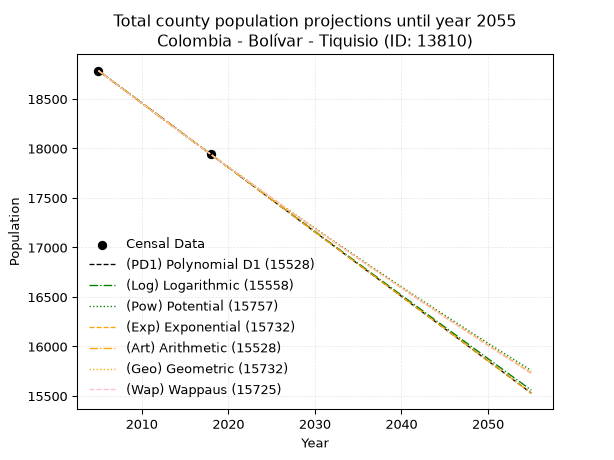
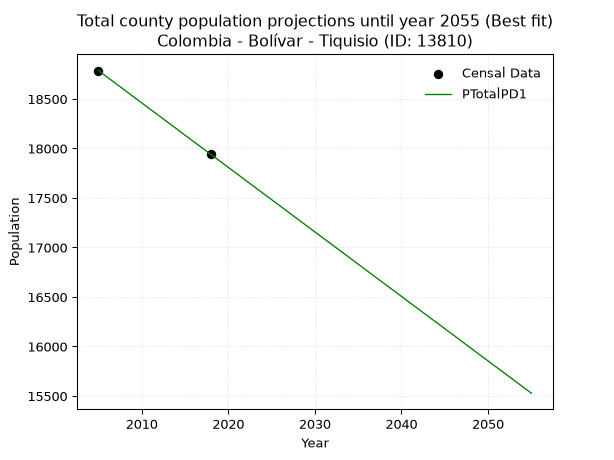
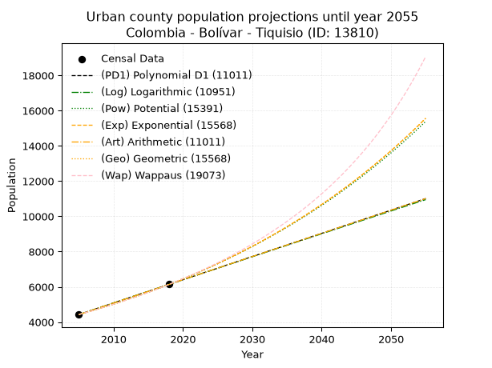
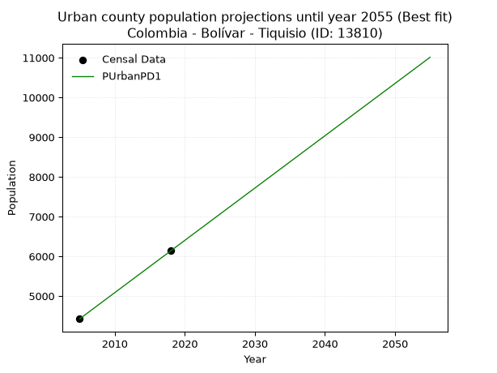
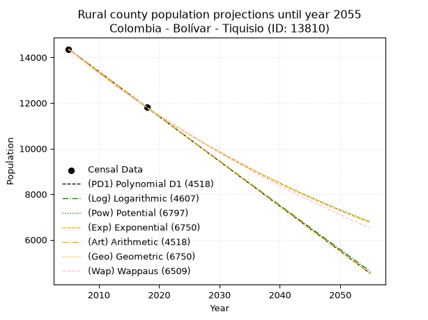
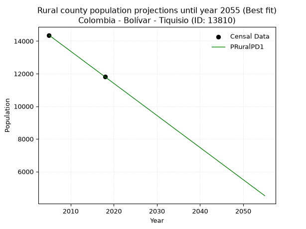

<div align="center">


</div>

# _“Population and Public Services Demand Projections (PPSD) until Year 2050 for Colombia - Bolívar - Tiquisio (ID: 13810)”_
Keywords: `population` `public-service` `projection` `lineal` `polynomial` `logarithmic` `potential` `exponential` `arithmetic` `geometric` `wappaus` `dane` `colombia` `south-america`

PPSD are analytical estimates used by governments and planners to anticipate future changes in population size, age distribution, and the resulting community needs for utilities, healthcare, education, and infrastructure as sizing future water treatment facilities, electrical grids, and road networks based on spatial growth.

> **General running parameters**: • app_version: _v20260806_. • Python version: _3.14.7_. • Pandas version: _3.0.5_. • NumPy version: _2.5.1_. • Creates, save and include plots into reports (create_plot): _True_. • Projection until year: _2050_. • Process polynomial degree 2 and up: _False_. • Process Wappaus: _True_. • Process Wappaus: _True_. • Set negative values to zero: _True_. • Set infinite values to zero: _True_. • Drop dataset notes: _True_. 
<div align="center">

Dynamic map: [:earth_americas:Google](http://maps.google.com/maps?q=8.558665665,-74.2629215) [:earth_americas:OSM](https://www.openstreetmap.org/#map=18/8.558665665/-74.2629215&layers=P) [:earth_americas:Bing](https://www.bing.com/maps?cp=8.558665665~-74.2629215&lvl=18) [:earth_americas:Apple](https://maps.apple.com/frame?center=8.558665665%2C-74.2629215&span=0.003%2C0.006)

</div>


<div align="center">

```geojson
{
  "type": "Feature",
  "geometry": {
    "type": "Point", 
    "coordinates": [-74.2629215, 8.558665665]
  }, 
  "properties": {
    "Name": "Colombia - Bolívar - Tiquisio (ID: 13810)"
  }
}
```

</div>


## 0. Census Data (2 records)

Census data are official statistics collected by a government about the people and housing in a country. They usually include counts of total population, age, sex, race, income, education, and jobs.

📅Global census file: [Population.xlsx](../data/Population.xlsx)

| Source   |   Year |   CountryID | CountryName   |   StateID | StateName   |   CountyID | CountyName   |   PTotal |   PUrban |   PRural |
|:---------|-------:|------------:|:--------------|----------:|:------------|-----------:|:-------------|---------:|---------:|---------:|
| DANE     |   2005 |          57 | Colombia      |        13 | Bolívar     |      13810 | Tiquisio     |    18786 |     4426 |    14360 |
| DANE     |   2018 |          57 | Colombia      |        13 | Bolívar     |      13810 | Tiquisio     |    17939 |     6138 |    11801 |

> 🔥Some records has specific notes about the registered values or the corresponding urban or rural distribution.

## 1. Total

### 1.1. Coefficients and Parameters

* (PD1) Polynomial Deg 1: -65.1538461538461, 149419.4615384614 (lineal)
* (Log) Logarithmic: -131056.50536856115, 1015260.946388038
* (Pow) Potential: -7.138447913587694, 27.845805802611498
* (Exp) Exponential: -0.0035488306042591243, 23121478.57880397
* (Art) Arithmetic: Year diff. 2018 - 2005 = 13, Population diff. 17939 - 18786 = -847, Annual growth = -65.15384615384616
* (Geo) Geometric: Year diff. 2018 - 2005 = 13, Population diff. 17939 - 18786 = -847, Annual growth % = -0.00354254094743911
* (Wap) Wappaus: i = -0.3548201288160444, Condition values only valid for < 200)

<sub>
Wappaus condition values: ['-0.00', '-0.35', '-0.71', '-1.06', '-1.42', '-1.77', '-2.13', '-2.48', '-2.84', '-3.19', '-3.55', '-3.90', '-4.26', '-4.61', '-4.97', '-5.32', '-5.68', '-6.03', '-6.39', '-6.74', '-7.10', '-7.45', '-7.81', '-8.16', '-8.52', '-8.87', '-9.23', '-9.58', '-9.93', '-10.29', '-10.64', '-11.00', '-11.35', '-11.71', '-12.06', '-12.42', '-12.77', '-13.13', '-13.48', '-13.84', '-14.19', '-14.55', '-14.90', '-15.26', '-15.61', '-15.97']
</sub>


### 1.2. Projected Dataset

|   Year |   CountyID |   PTotalPD1 |   PTotalLog |   PTotalPow |   PTotalExp |   PTotalArt |   PTotalGeo |   PTotalWap |
|-------:|-----------:|------------:|------------:|------------:|------------:|------------:|------------:|------------:|
|   2005 |      13810 |       18786 |       18786 |       18786 |       18786 |       18786 |       18786 |       18786 |
|   2006 |      13810 |       18721 |       18721 |       18719 |       18719 |       18721 |       18719 |       18719 |
|   2007 |      13810 |       18656 |       18655 |       18653 |       18653 |       18656 |       18653 |       18653 |
|   2008 |      13810 |       18591 |       18590 |       18587 |       18587 |       18591 |       18587 |       18587 |
|   2009 |      13810 |       18525 |       18525 |       18521 |       18521 |       18525 |       18521 |       18521 |
|   2010 |      13810 |       18460 |       18460 |       18455 |       18456 |       18460 |       18456 |       18456 |
|   2011 |      13810 |       18395 |       18394 |       18390 |       18390 |       18395 |       18390 |       18390 |
|   2012 |      13810 |       18330 |       18329 |       18324 |       18325 |       18330 |       18325 |       18325 |
|   2013 |      13810 |       18265 |       18264 |       18260 |       18260 |       18265 |       18260 |       18260 |
|   2014 |      13810 |       18200 |       18199 |       18195 |       18195 |       18200 |       18195 |       18196 |
|   2015 |      13810 |       18134 |       18134 |       18131 |       18131 |       18134 |       18131 |       18131 |
|   2016 |      13810 |       18069 |       18069 |       18066 |       18067 |       18069 |       18067 |       18067 |
|   2017 |      13810 |       18004 |       18004 |       18003 |       18003 |       18004 |       18003 |       18003 |
|   2018 |      13810 |       17939 |       17939 |       17939 |       17939 |       17939 |       17939 |       17939 |
|   2019 |      13810 |       17874 |       17874 |       17876 |       17875 |       17874 |       17875 |       17875 |
|   2020 |      13810 |       17809 |       17809 |       17813 |       17812 |       17809 |       17812 |       17812 |
|   2021 |      13810 |       17744 |       17744 |       17750 |       17749 |       17744 |       17749 |       17749 |
|   2022 |      13810 |       17678 |       17679 |       17687 |       17686 |       17678 |       17686 |       17686 |
|   2023 |      13810 |       17613 |       17615 |       17625 |       17623 |       17613 |       17623 |       17623 |
|   2024 |      13810 |       17548 |       17550 |       17563 |       17561 |       17548 |       17561 |       17561 |
|   2025 |      13810 |       17483 |       17485 |       17501 |       17499 |       17483 |       17499 |       17499 |
|   2026 |      13810 |       17418 |       17420 |       17439 |       17437 |       17418 |       17437 |       17436 |
|   2027 |      13810 |       17353 |       17356 |       17378 |       17375 |       17353 |       17375 |       17375 |
|   2028 |      13810 |       17287 |       17291 |       17317 |       17314 |       17287 |       17314 |       17313 |
|   2029 |      13810 |       17222 |       17227 |       17256 |       17252 |       17222 |       17252 |       17252 |
|   2030 |      13810 |       17157 |       17162 |       17196 |       17191 |       17157 |       17191 |       17190 |
|   2031 |      13810 |       17092 |       17097 |       17135 |       17130 |       17092 |       17130 |       17129 |
|   2032 |      13810 |       17027 |       17033 |       17075 |       17070 |       17027 |       17070 |       17069 |
|   2033 |      13810 |       16962 |       16968 |       17015 |       17009 |       16962 |       17009 |       17008 |
|   2034 |      13810 |       16897 |       16904 |       16956 |       16949 |       16897 |       16949 |       16948 |
|   2035 |      13810 |       16831 |       16840 |       16896 |       16889 |       16831 |       16889 |       16887 |
|   2036 |      13810 |       16766 |       16775 |       16837 |       16829 |       16766 |       16829 |       16827 |
|   2037 |      13810 |       16701 |       16711 |       16778 |       16769 |       16701 |       16769 |       16768 |
|   2038 |      13810 |       16636 |       16647 |       16720 |       16710 |       16636 |       16710 |       16708 |
|   2039 |      13810 |       16571 |       16582 |       16661 |       16651 |       16571 |       16651 |       16649 |
|   2040 |      13810 |       16506 |       16518 |       16603 |       16592 |       16506 |       16592 |       16589 |
|   2041 |      13810 |       16440 |       16454 |       16545 |       16533 |       16440 |       16533 |       16530 |
|   2042 |      13810 |       16375 |       16390 |       16487 |       16474 |       16375 |       16474 |       16472 |
|   2043 |      13810 |       16310 |       16325 |       16430 |       16416 |       16310 |       16416 |       16413 |
|   2044 |      13810 |       16245 |       16261 |       16372 |       16358 |       16245 |       16358 |       16355 |
|   2045 |      13810 |       16180 |       16197 |       16315 |       16300 |       16180 |       16300 |       16296 |
|   2046 |      13810 |       16115 |       16133 |       16258 |       16242 |       16115 |       16242 |       16238 |
|   2047 |      13810 |       16050 |       16069 |       16202 |       16185 |       16050 |       16185 |       16181 |
|   2048 |      13810 |       15984 |       16005 |       16145 |       16127 |       15984 |       16127 |       16123 |
|   2049 |      13810 |       15919 |       15941 |       16089 |       16070 |       15919 |       16070 |       16065 |
|   2050 |      13810 |       15854 |       15877 |       16033 |       16013 |       15854 |       16013 |       16008 |
<div align="center">

</img>

</div>


### 1.3. Best fit with absolute error and relative error (%)

Relative error puts that difference into context by dividing the absolute error by the true value, creating a unitless ratio or percentage that shows the scale of the mistake.

Absolute and relative error

|   Year | Source   |   CountryID | CountryName   |   StateID | StateName   |   CountyID_x | CountyName   |   PTotal |   PUrban |   PRural |   CountyID_y |   PTotalPD1 |   PTotalLog |   PTotalPow |   PTotalExp |   PTotalArt |   PTotalGeo |   PTotalWap |   PTotalPD1AbsError |   PTotalLogAbsError |   PTotalPowAbsError |   PTotalExpAbsError |   PTotalArtAbsError |   PTotalGeoAbsError |   PTotalWapAbsError |   PTotalPD1RelError |   PTotalLogRelError |   PTotalPowRelError |   PTotalExpRelError |   PTotalArtRelError |   PTotalGeoRelError |   PTotalWapRelError |
|-------:|:---------|------------:|:--------------|----------:|:------------|-------------:|:-------------|---------:|---------:|---------:|-------------:|------------:|------------:|------------:|------------:|------------:|------------:|------------:|--------------------:|--------------------:|--------------------:|--------------------:|--------------------:|--------------------:|--------------------:|--------------------:|--------------------:|--------------------:|--------------------:|--------------------:|--------------------:|--------------------:|
|   2005 | DANE     |          57 | Colombia      |        13 | Bolívar     |        13810 | Tiquisio     |    18786 |     4426 |    14360 |        13810 |       18786 |       18786 |       18786 |       18786 |       18786 |       18786 |       18786 |                   0 |                   0 |                   0 |                   0 |                   0 |                   0 |                   0 |                   0 |                   0 |                   0 |                   0 |                   0 |                   0 |                   0 |
|   2018 | DANE     |          57 | Colombia      |        13 | Bolívar     |        13810 | Tiquisio     |    17939 |     6138 |    11801 |        13810 |       17939 |       17939 |       17939 |       17939 |       17939 |       17939 |       17939 |                   0 |                   0 |                   0 |                   0 |                   0 |                   0 |                   0 |                   0 |                   0 |                   0 |                   0 |                   0 |                   0 |                   0 |

Relative error mean

| Method    |   RelError | Best   |
|:----------|-----------:|:-------|
| PTotalPD1 |          0 | True   |
| PTotalLog |          0 | True   |
| PTotalPow |          0 | True   |
| PTotalExp |          0 | True   |
| PTotalArt |          0 | True   |
| PTotalGeo |          0 | True   |
| PTotalWap |          0 | True   |

💙Best method: _**PTotalPD1**_
<div align="center">

</img>

</div>


### 1.4. Fresh water supply demand in liters per capita per day (lpcd)

The fresh water supply demand typically ranges from 100 to 300 liters per capita per day (lpcd) for standard domestic and municipal planning, though absolute survival minimums set by the World Health Organization are as low as 7.5 to 20 liters per day, and total consumption in high-income nations can exceed 400 liters.

> `CZ`: Level in meters above the sea level (masl).<br> `WS`: Fresh water supply demand in liters per capita per day (lpcd or l/h/d).<br> `WSAll`: Zonal fresh water supply demand in liters per second (l/s).<br> `A`: Zonal area in square meters.

Reference values (RAS Colombia)

|    CZ |   WS |
|------:|-----:|
|  1000 |  120 |
|  2000 |  130 |
| 99999 |  140 |

County shapefile geometry properties and water supply values

|   CountyID |      ATotal |   CZTotal |   WSTotal |
|-----------:|------------:|----------:|----------:|
|      13810 | 7.61963e+08 |   168.646 |       120 |

Projected values for best method: PTotalPD1

|   CountyID |   Year |   PTotalPD1 |   WSTotal |   WSTotalAll |
|-----------:|-------:|------------:|----------:|-------------:|
|      13810 |   2005 |       18786 |       120 |      26.0917 |
|      13810 |   2006 |       18721 |       120 |      26.0014 |
|      13810 |   2007 |       18656 |       120 |      25.9111 |
|      13810 |   2008 |       18591 |       120 |      25.8208 |
|      13810 |   2009 |       18525 |       120 |      25.7292 |
|      13810 |   2010 |       18460 |       120 |      25.6389 |
|      13810 |   2011 |       18395 |       120 |      25.5486 |
|      13810 |   2012 |       18330 |       120 |      25.4583 |
|      13810 |   2013 |       18265 |       120 |      25.3681 |
|      13810 |   2014 |       18200 |       120 |      25.2778 |
|      13810 |   2015 |       18134 |       120 |      25.1861 |
|      13810 |   2016 |       18069 |       120 |      25.0958 |
|      13810 |   2017 |       18004 |       120 |      25.0056 |
|      13810 |   2018 |       17939 |       120 |      24.9153 |
|      13810 |   2019 |       17874 |       120 |      24.825  |
|      13810 |   2020 |       17809 |       120 |      24.7347 |
|      13810 |   2021 |       17744 |       120 |      24.6444 |
|      13810 |   2022 |       17678 |       120 |      24.5528 |
|      13810 |   2023 |       17613 |       120 |      24.4625 |
|      13810 |   2024 |       17548 |       120 |      24.3722 |
|      13810 |   2025 |       17483 |       120 |      24.2819 |
|      13810 |   2026 |       17418 |       120 |      24.1917 |
|      13810 |   2027 |       17353 |       120 |      24.1014 |
|      13810 |   2028 |       17287 |       120 |      24.0097 |
|      13810 |   2029 |       17222 |       120 |      23.9194 |
|      13810 |   2030 |       17157 |       120 |      23.8292 |
|      13810 |   2031 |       17092 |       120 |      23.7389 |
|      13810 |   2032 |       17027 |       120 |      23.6486 |
|      13810 |   2033 |       16962 |       120 |      23.5583 |
|      13810 |   2034 |       16897 |       120 |      23.4681 |
|      13810 |   2035 |       16831 |       120 |      23.3764 |
|      13810 |   2036 |       16766 |       120 |      23.2861 |
|      13810 |   2037 |       16701 |       120 |      23.1958 |
|      13810 |   2038 |       16636 |       120 |      23.1056 |
|      13810 |   2039 |       16571 |       120 |      23.0153 |
|      13810 |   2040 |       16506 |       120 |      22.925  |
|      13810 |   2041 |       16440 |       120 |      22.8333 |
|      13810 |   2042 |       16375 |       120 |      22.7431 |
|      13810 |   2043 |       16310 |       120 |      22.6528 |
|      13810 |   2044 |       16245 |       120 |      22.5625 |
|      13810 |   2045 |       16180 |       120 |      22.4722 |
|      13810 |   2046 |       16115 |       120 |      22.3819 |
|      13810 |   2047 |       16050 |       120 |      22.2917 |
|      13810 |   2048 |       15984 |       120 |      22.2    |
|      13810 |   2049 |       15919 |       120 |      22.1097 |
|      13810 |   2050 |       15854 |       120 |      22.0194 |

## 2. Urban

### 2.1. Coefficients and Parameters

* (PD1) Polynomial Deg 1: 131.6923076923079, -259617.07692307726 (lineal)
* (Log) Logarithmic: 264898.154888993, -2009700.4559814925
* (Pow) Potential: 50.59720545146846, -163.43174814550952
* (Exp) Exponential: 0.02515405496682223, 5.531660706384686e-19
* (Art) Arithmetic: Year diff. 2018 - 2005 = 13, Population diff. 6138 - 4426 = 1712, Annual growth = 131.69230769230768
* (Geo) Geometric: Year diff. 2018 - 2005 = 13, Population diff. 6138 - 4426 = 1712, Annual growth % = 0.025473087578795628
* (Wap) Wappaus: i = 2.493228089593103, Condition values only valid for < 200)

<sub>
Wappaus condition values: ['0.00', '2.49', '4.99', '7.48', '9.97', '12.47', '14.96', '17.45', '19.95', '22.44', '24.93', '27.43', '29.92', '32.41', '34.91', '37.40', '39.89', '42.38', '44.88', '47.37', '49.86', '52.36', '54.85', '57.34', '59.84', '62.33', '64.82', '67.32', '69.81', '72.30', '74.80', '77.29', '79.78', '82.28', '84.77', '87.26', '89.76', '92.25', '94.74', '97.24', '99.73', '102.22', '104.72', '107.21', '109.70', '112.20']
</sub>


### 2.2. Projected Dataset

|   Year |   CountyID |   PUrbanPD1 |   PUrbanLog |   PUrbanPow |   PUrbanExp |   PUrbanArt |   PUrbanGeo |   PUrbanWap |
|-------:|-----------:|------------:|------------:|------------:|------------:|------------:|------------:|------------:|
|   2005 |      13810 |        4426 |        4426 |        4426 |        4426 |        4426 |        4426 |        4426 |
|   2006 |      13810 |        4558 |        4558 |        4539 |        4539 |        4558 |        4539 |        4538 |
|   2007 |      13810 |        4689 |        4690 |        4655 |        4654 |        4689 |        4654 |        4652 |
|   2008 |      13810 |        4821 |        4822 |        4774 |        4773 |        4821 |        4773 |        4770 |
|   2009 |      13810 |        4953 |        4954 |        4896 |        4895 |        4953 |        4895 |        4891 |
|   2010 |      13810 |        5084 |        5086 |        5020 |        5019 |        5084 |        5019 |        5014 |
|   2011 |      13810 |        5216 |        5218 |        5148 |        5147 |        5216 |        5147 |        5142 |
|   2012 |      13810 |        5348 |        5349 |        5280 |        5278 |        5348 |        5278 |        5272 |
|   2013 |      13810 |        5480 |        5481 |        5414 |        5413 |        5480 |        5413 |        5407 |
|   2014 |      13810 |        5611 |        5612 |        5552 |        5550 |        5611 |        5550 |        5545 |
|   2015 |      13810 |        5743 |        5744 |        5693 |        5692 |        5743 |        5692 |        5687 |
|   2016 |      13810 |        5875 |        5875 |        5838 |        5837 |        5875 |        5837 |        5833 |
|   2017 |      13810 |        6006 |        6007 |        5986 |        5986 |        6006 |        5986 |        5983 |
|   2018 |      13810 |        6138 |        6138 |        6138 |        6138 |        6138 |        6138 |        6138 |
|   2019 |      13810 |        6270 |        6269 |        6294 |        6294 |        6270 |        6294 |        6298 |
|   2020 |      13810 |        6401 |        6400 |        6453 |        6455 |        6401 |        6455 |        6462 |
|   2021 |      13810 |        6533 |        6532 |        6617 |        6619 |        6533 |        6619 |        6632 |
|   2022 |      13810 |        6665 |        6663 |        6785 |        6788 |        6665 |        6788 |        6806 |
|   2023 |      13810 |        6796 |        6794 |        6957 |        6961 |        6796 |        6961 |        6987 |
|   2024 |      13810 |        6928 |        6924 |        7133 |        7138 |        6928 |        7138 |        7173 |
|   2025 |      13810 |        7060 |        7055 |        7313 |        7320 |        7060 |        7320 |        7366 |
|   2026 |      13810 |        7192 |        7186 |        7498 |        7506 |        7192 |        7506 |        7565 |
|   2027 |      13810 |        7323 |        7317 |        7688 |        7697 |        7323 |        7697 |        7771 |
|   2028 |      13810 |        7455 |        7447 |        7882 |        7893 |        7455 |        7893 |        7984 |
|   2029 |      13810 |        7587 |        7578 |        8081 |        8095 |        7587 |        8095 |        8205 |
|   2030 |      13810 |        7718 |        7709 |        8285 |        8301 |        7718 |        8301 |        8434 |
|   2031 |      13810 |        7850 |        7839 |        8494 |        8512 |        7850 |        8512 |        8671 |
|   2032 |      13810 |        7982 |        7969 |        8709 |        8729 |        7982 |        8729 |        8917 |
|   2033 |      13810 |        8113 |        8100 |        8928 |        8951 |        8113 |        8951 |        9173 |
|   2034 |      13810 |        8245 |        8230 |        9153 |        9179 |        8245 |        9179 |        9438 |
|   2035 |      13810 |        8377 |        8360 |        9384 |        9413 |        8377 |        9413 |        9714 |
|   2036 |      13810 |        8508 |        8490 |        9620 |        9653 |        8508 |        9653 |       10002 |
|   2037 |      13810 |        8640 |        8620 |        9862 |        9899 |        8640 |        9899 |       10301 |
|   2038 |      13810 |        8772 |        8750 |       10110 |       10151 |        8772 |       10151 |       10613 |
|   2039 |      13810 |        8904 |        8880 |       10364 |       10410 |        8904 |       10410 |       10938 |
|   2040 |      13810 |        9035 |        9010 |       10624 |       10675 |        9035 |       10675 |       11278 |
|   2041 |      13810 |        9167 |        9140 |       10891 |       10947 |        9167 |       10947 |       11633 |
|   2042 |      13810 |        9299 |        9270 |       11164 |       11226 |        9299 |       11226 |       12005 |
|   2043 |      13810 |        9430 |        9400 |       11444 |       11512 |        9430 |       11512 |       12394 |
|   2044 |      13810 |        9562 |        9529 |       11731 |       11805 |        9562 |       11805 |       12802 |
|   2045 |      13810 |        9694 |        9659 |       12025 |       12105 |        9694 |       12105 |       13230 |
|   2046 |      13810 |        9825 |        9788 |       12326 |       12414 |        9825 |       12414 |       13680 |
|   2047 |      13810 |        9957 |        9918 |       12635 |       12730 |        9957 |       12730 |       14154 |
|   2048 |      13810 |       10089 |       10047 |       12951 |       13054 |       10089 |       13054 |       14653 |
|   2049 |      13810 |       10220 |       10176 |       13275 |       13387 |       10220 |       13387 |       15180 |
|   2050 |      13810 |       10352 |       10306 |       13606 |       13728 |       10352 |       13728 |       15737 |
<div align="center">

</img>

</div>


### 2.3. Best fit with absolute error and relative error (%)

Relative error puts that difference into context by dividing the absolute error by the true value, creating a unitless ratio or percentage that shows the scale of the mistake.

Absolute and relative error

|   Year | Source   |   CountryID | CountryName   |   StateID | StateName   |   CountyID_x | CountyName   |   PTotal |   PUrban |   PRural |   CountyID_y |   PUrbanPD1 |   PUrbanLog |   PUrbanPow |   PUrbanExp |   PUrbanArt |   PUrbanGeo |   PUrbanWap |   PUrbanPD1AbsError |   PUrbanLogAbsError |   PUrbanPowAbsError |   PUrbanExpAbsError |   PUrbanArtAbsError |   PUrbanGeoAbsError |   PUrbanWapAbsError |   PUrbanPD1RelError |   PUrbanLogRelError |   PUrbanPowRelError |   PUrbanExpRelError |   PUrbanArtRelError |   PUrbanGeoRelError |   PUrbanWapRelError |
|-------:|:---------|------------:|:--------------|----------:|:------------|-------------:|:-------------|---------:|---------:|---------:|-------------:|------------:|------------:|------------:|------------:|------------:|------------:|------------:|--------------------:|--------------------:|--------------------:|--------------------:|--------------------:|--------------------:|--------------------:|--------------------:|--------------------:|--------------------:|--------------------:|--------------------:|--------------------:|--------------------:|
|   2005 | DANE     |          57 | Colombia      |        13 | Bolívar     |        13810 | Tiquisio     |    18786 |     4426 |    14360 |        13810 |        4426 |        4426 |        4426 |        4426 |        4426 |        4426 |        4426 |                   0 |                   0 |                   0 |                   0 |                   0 |                   0 |                   0 |                   0 |                   0 |                   0 |                   0 |                   0 |                   0 |                   0 |
|   2018 | DANE     |          57 | Colombia      |        13 | Bolívar     |        13810 | Tiquisio     |    17939 |     6138 |    11801 |        13810 |        6138 |        6138 |        6138 |        6138 |        6138 |        6138 |        6138 |                   0 |                   0 |                   0 |                   0 |                   0 |                   0 |                   0 |                   0 |                   0 |                   0 |                   0 |                   0 |                   0 |                   0 |

Relative error mean

| Method    |   RelError | Best   |
|:----------|-----------:|:-------|
| PUrbanPD1 |          0 | True   |
| PUrbanLog |          0 | True   |
| PUrbanPow |          0 | True   |
| PUrbanExp |          0 | True   |
| PUrbanArt |          0 | True   |
| PUrbanGeo |          0 | True   |
| PUrbanWap |          0 | True   |

💙Best method: _**PUrbanPD1**_
<div align="center">

</img>

</div>


### 2.4. Fresh water supply demand in liters per capita per day (lpcd)

The fresh water supply demand typically ranges from 100 to 300 liters per capita per day (lpcd) for standard domestic and municipal planning, though absolute survival minimums set by the World Health Organization are as low as 7.5 to 20 liters per day, and total consumption in high-income nations can exceed 400 liters.

> `CZ`: Level in meters above the sea level (masl).<br> `WS`: Fresh water supply demand in liters per capita per day (lpcd or l/h/d).<br> `WSAll`: Zonal fresh water supply demand in liters per second (l/s).<br> `A`: Zonal area in square meters.

Reference values (RAS Colombia)

|    CZ |   WS |
|------:|-----:|
|  1000 |  120 |
|  2000 |  130 |
| 99999 |  140 |

County shapefile geometry properties and water supply values

|   CountyID |   AUrban |   CZUrban |   WSUrban |
|-----------:|---------:|----------:|----------:|
|      13810 |   667335 |   29.3577 |       120 |

Projected values for best method: PUrbanPD1

|   CountyID |   Year |   PUrbanPD1 |   WSUrban |   WSUrbanAll |
|-----------:|-------:|------------:|----------:|-------------:|
|      13810 |   2005 |        4426 |       120 |      6.14722 |
|      13810 |   2006 |        4558 |       120 |      6.33056 |
|      13810 |   2007 |        4689 |       120 |      6.5125  |
|      13810 |   2008 |        4821 |       120 |      6.69583 |
|      13810 |   2009 |        4953 |       120 |      6.87917 |
|      13810 |   2010 |        5084 |       120 |      7.06111 |
|      13810 |   2011 |        5216 |       120 |      7.24444 |
|      13810 |   2012 |        5348 |       120 |      7.42778 |
|      13810 |   2013 |        5480 |       120 |      7.61111 |
|      13810 |   2014 |        5611 |       120 |      7.79306 |
|      13810 |   2015 |        5743 |       120 |      7.97639 |
|      13810 |   2016 |        5875 |       120 |      8.15972 |
|      13810 |   2017 |        6006 |       120 |      8.34167 |
|      13810 |   2018 |        6138 |       120 |      8.525   |
|      13810 |   2019 |        6270 |       120 |      8.70833 |
|      13810 |   2020 |        6401 |       120 |      8.89028 |
|      13810 |   2021 |        6533 |       120 |      9.07361 |
|      13810 |   2022 |        6665 |       120 |      9.25694 |
|      13810 |   2023 |        6796 |       120 |      9.43889 |
|      13810 |   2024 |        6928 |       120 |      9.62222 |
|      13810 |   2025 |        7060 |       120 |      9.80556 |
|      13810 |   2026 |        7192 |       120 |      9.98889 |
|      13810 |   2027 |        7323 |       120 |     10.1708  |
|      13810 |   2028 |        7455 |       120 |     10.3542  |
|      13810 |   2029 |        7587 |       120 |     10.5375  |
|      13810 |   2030 |        7718 |       120 |     10.7194  |
|      13810 |   2031 |        7850 |       120 |     10.9028  |
|      13810 |   2032 |        7982 |       120 |     11.0861  |
|      13810 |   2033 |        8113 |       120 |     11.2681  |
|      13810 |   2034 |        8245 |       120 |     11.4514  |
|      13810 |   2035 |        8377 |       120 |     11.6347  |
|      13810 |   2036 |        8508 |       120 |     11.8167  |
|      13810 |   2037 |        8640 |       120 |     12       |
|      13810 |   2038 |        8772 |       120 |     12.1833  |
|      13810 |   2039 |        8904 |       120 |     12.3667  |
|      13810 |   2040 |        9035 |       120 |     12.5486  |
|      13810 |   2041 |        9167 |       120 |     12.7319  |
|      13810 |   2042 |        9299 |       120 |     12.9153  |
|      13810 |   2043 |        9430 |       120 |     13.0972  |
|      13810 |   2044 |        9562 |       120 |     13.2806  |
|      13810 |   2045 |        9694 |       120 |     13.4639  |
|      13810 |   2046 |        9825 |       120 |     13.6458  |
|      13810 |   2047 |        9957 |       120 |     13.8292  |
|      13810 |   2048 |       10089 |       120 |     14.0125  |
|      13810 |   2049 |       10220 |       120 |     14.1944  |
|      13810 |   2050 |       10352 |       120 |     14.3778  |

## 3. Rural

### 3.1. Coefficients and Parameters

* (PD1) Polynomial Deg 1: -196.8461538461535, 409036.5384615376 (lineal)
* (Log) Logarithmic: -395954.66025755455, 3024961.402369533
* (Pow) Potential: -30.36770939780439, 104.43480423762415
* (Exp) Exponential: -0.015097099228958981, 2.0096070707386778e+17
* (Art) Arithmetic: Year diff. 2018 - 2005 = 13, Population diff. 11801 - 14360 = -2559, Annual growth = -196.84615384615384
* (Geo) Geometric: Year diff. 2018 - 2005 = 13, Population diff. 11801 - 14360 = -2559, Annual growth % = -0.014983709362915487
* (Wap) Wappaus: i = -1.5048824880253342, Condition values only valid for < 200)

<sub>
Wappaus condition values: ['-0.00', '-1.50', '-3.01', '-4.51', '-6.02', '-7.52', '-9.03', '-10.53', '-12.04', '-13.54', '-15.05', '-16.55', '-18.06', '-19.56', '-21.07', '-22.57', '-24.08', '-25.58', '-27.09', '-28.59', '-30.10', '-31.60', '-33.11', '-34.61', '-36.12', '-37.62', '-39.13', '-40.63', '-42.14', '-43.64', '-45.15', '-46.65', '-48.16', '-49.66', '-51.17', '-52.67', '-54.18', '-55.68', '-57.19', '-58.69', '-60.20', '-61.70', '-63.21', '-64.71', '-66.21', '-67.72']
</sub>


### 3.2. Projected Dataset

|   Year |   CountyID |   PRuralPD1 |   PRuralLog |   PRuralPow |   PRuralExp |   PRuralArt |   PRuralGeo |   PRuralWap |
|-------:|-----------:|------------:|------------:|------------:|------------:|------------:|------------:|------------:|
|   2005 |      13810 |       14360 |       14360 |       14360 |       14360 |       14360 |       14360 |       14360 |
|   2006 |      13810 |       14163 |       14163 |       14144 |       14145 |       14163 |       14145 |       14146 |
|   2007 |      13810 |       13966 |       13965 |       13932 |       13933 |       13966 |       13933 |       13934 |
|   2008 |      13810 |       13769 |       13768 |       13723 |       13724 |       13769 |       13724 |       13726 |
|   2009 |      13810 |       13573 |       13571 |       13517 |       13518 |       13573 |       13518 |       13521 |
|   2010 |      13810 |       13376 |       13374 |       13314 |       13316 |       13376 |       13316 |       13319 |
|   2011 |      13810 |       13179 |       13177 |       13114 |       13116 |       13179 |       13116 |       13119 |
|   2012 |      13810 |       12982 |       12980 |       12918 |       12920 |       12982 |       12920 |       12923 |
|   2013 |      13810 |       12785 |       12783 |       12724 |       12726 |       12785 |       12726 |       12729 |
|   2014 |      13810 |       12588 |       12587 |       12534 |       12536 |       12588 |       12536 |       12538 |
|   2015 |      13810 |       12392 |       12390 |       12346 |       12348 |       12392 |       12348 |       12350 |
|   2016 |      13810 |       12195 |       12194 |       12162 |       12163 |       12195 |       12163 |       12165 |
|   2017 |      13810 |       11998 |       11997 |       11980 |       11981 |       11998 |       11981 |       11982 |
|   2018 |      13810 |       11801 |       11801 |       11801 |       11801 |       11801 |       11801 |       11801 |
|   2019 |      13810 |       11604 |       11605 |       11625 |       11624 |       11604 |       11624 |       11623 |
|   2020 |      13810 |       11407 |       11409 |       11451 |       11450 |       11407 |       11450 |       11447 |
|   2021 |      13810 |       11210 |       11213 |       11280 |       11278 |       11210 |       11278 |       11274 |
|   2022 |      13810 |       11014 |       11017 |       11112 |       11109 |       11014 |       11109 |       11103 |
|   2023 |      13810 |       10817 |       10821 |       10947 |       10943 |       10817 |       10943 |       10934 |
|   2024 |      13810 |       10620 |       10625 |       10784 |       10779 |       10620 |       10779 |       10768 |
|   2025 |      13810 |       10423 |       10430 |       10623 |       10618 |       10423 |       10618 |       10603 |
|   2026 |      13810 |       10226 |       10234 |       10465 |       10458 |       10226 |       10458 |       10441 |
|   2027 |      13810 |       10029 |       10039 |       10309 |       10302 |       10029 |       10302 |       10281 |
|   2028 |      13810 |        9833 |        9844 |       10156 |       10147 |        9833 |       10147 |       10123 |
|   2029 |      13810 |        9636 |        9649 |       10005 |        9995 |        9636 |        9995 |        9967 |
|   2030 |      13810 |        9439 |        9453 |        9857 |        9846 |        9439 |        9846 |        9813 |
|   2031 |      13810 |        9242 |        9258 |        9710 |        9698 |        9242 |        9698 |        9661 |
|   2032 |      13810 |        9045 |        9064 |        9566 |        9553 |        9045 |        9553 |        9510 |
|   2033 |      13810 |        8848 |        8869 |        9424 |        9410 |        8848 |        9410 |        9362 |
|   2034 |      13810 |        8651 |        8674 |        9285 |        9269 |        8651 |        9269 |        9216 |
|   2035 |      13810 |        8455 |        8479 |        9147 |        9130 |        8455 |        9130 |        9071 |
|   2036 |      13810 |        8258 |        8285 |        9012 |        8993 |        8258 |        8993 |        8928 |
|   2037 |      13810 |        8061 |        8090 |        8878 |        8858 |        8061 |        8858 |        8787 |
|   2038 |      13810 |        7864 |        7896 |        8747 |        8725 |        7864 |        8725 |        8647 |
|   2039 |      13810 |        7667 |        7702 |        8618 |        8595 |        7667 |        8595 |        8509 |
|   2040 |      13810 |        7470 |        7508 |        8490 |        8466 |        7470 |        8466 |        8373 |
|   2041 |      13810 |        7274 |        7314 |        8365 |        8339 |        7274 |        8339 |        8239 |
|   2042 |      13810 |        7077 |        7120 |        8241 |        8214 |        7077 |        8214 |        8106 |
|   2043 |      13810 |        6880 |        6926 |        8120 |        8091 |        6880 |        8091 |        7974 |
|   2044 |      13810 |        6683 |        6732 |        8000 |        7970 |        6683 |        7970 |        7844 |
|   2045 |      13810 |        6486 |        6538 |        7882 |        7850 |        6486 |        7850 |        7716 |
|   2046 |      13810 |        6289 |        6345 |        7766 |        7733 |        6289 |        7733 |        7589 |
|   2047 |      13810 |        6092 |        6151 |        7651 |        7617 |        6092 |        7617 |        7463 |
|   2048 |      13810 |        5896 |        5958 |        7539 |        7503 |        5896 |        7503 |        7339 |
|   2049 |      13810 |        5699 |        5765 |        7428 |        7390 |        5699 |        7390 |        7217 |
|   2050 |      13810 |        5502 |        5571 |        7319 |        7280 |        5502 |        7280 |        7095 |
<div align="center">

</img>

</div>


### 3.3. Best fit with absolute error and relative error (%)

Relative error puts that difference into context by dividing the absolute error by the true value, creating a unitless ratio or percentage that shows the scale of the mistake.

Absolute and relative error

|   Year | Source   |   CountryID | CountryName   |   StateID | StateName   |   CountyID_x | CountyName   |   PTotal |   PUrban |   PRural |   CountyID_y |   PRuralPD1 |   PRuralLog |   PRuralPow |   PRuralExp |   PRuralArt |   PRuralGeo |   PRuralWap |   PRuralPD1AbsError |   PRuralLogAbsError |   PRuralPowAbsError |   PRuralExpAbsError |   PRuralArtAbsError |   PRuralGeoAbsError |   PRuralWapAbsError |   PRuralPD1RelError |   PRuralLogRelError |   PRuralPowRelError |   PRuralExpRelError |   PRuralArtRelError |   PRuralGeoRelError |   PRuralWapRelError |
|-------:|:---------|------------:|:--------------|----------:|:------------|-------------:|:-------------|---------:|---------:|---------:|-------------:|------------:|------------:|------------:|------------:|------------:|------------:|------------:|--------------------:|--------------------:|--------------------:|--------------------:|--------------------:|--------------------:|--------------------:|--------------------:|--------------------:|--------------------:|--------------------:|--------------------:|--------------------:|--------------------:|
|   2005 | DANE     |          57 | Colombia      |        13 | Bolívar     |        13810 | Tiquisio     |    18786 |     4426 |    14360 |        13810 |       14360 |       14360 |       14360 |       14360 |       14360 |       14360 |       14360 |                   0 |                   0 |                   0 |                   0 |                   0 |                   0 |                   0 |                   0 |                   0 |                   0 |                   0 |                   0 |                   0 |                   0 |
|   2018 | DANE     |          57 | Colombia      |        13 | Bolívar     |        13810 | Tiquisio     |    17939 |     6138 |    11801 |        13810 |       11801 |       11801 |       11801 |       11801 |       11801 |       11801 |       11801 |                   0 |                   0 |                   0 |                   0 |                   0 |                   0 |                   0 |                   0 |                   0 |                   0 |                   0 |                   0 |                   0 |                   0 |

Relative error mean

| Method    |   RelError | Best   |
|:----------|-----------:|:-------|
| PRuralPD1 |          0 | True   |
| PRuralLog |          0 | True   |
| PRuralPow |          0 | True   |
| PRuralExp |          0 | True   |
| PRuralArt |          0 | True   |
| PRuralGeo |          0 | True   |
| PRuralWap |          0 | True   |

💙Best method: _**PRuralPD1**_
<div align="center">

</img>

</div>


### 3.4. Fresh water supply demand in liters per capita per day (lpcd)

The fresh water supply demand typically ranges from 100 to 300 liters per capita per day (lpcd) for standard domestic and municipal planning, though absolute survival minimums set by the World Health Organization are as low as 7.5 to 20 liters per day, and total consumption in high-income nations can exceed 400 liters.

> `CZ`: Level in meters above the sea level (masl).<br> `WS`: Fresh water supply demand in liters per capita per day (lpcd or l/h/d).<br> `WSAll`: Zonal fresh water supply demand in liters per second (l/s).<br> `A`: Zonal area in square meters.

Reference values (RAS Colombia)

|    CZ |   WS |
|------:|-----:|
|  1000 |  120 |
|  2000 |  130 |
| 99999 |  140 |

County shapefile geometry properties and water supply values

|   CountyID |      ARural |   CZRural |   WSRural |
|-----------:|------------:|----------:|----------:|
|      13810 | 7.61295e+08 |   168.766 |       120 |

Projected values for best method: PRuralPD1

|   CountyID |   Year |   PRuralPD1 |   WSRural |   WSRuralAll |
|-----------:|-------:|------------:|----------:|-------------:|
|      13810 |   2005 |       14360 |       120 |     19.9444  |
|      13810 |   2006 |       14163 |       120 |     19.6708  |
|      13810 |   2007 |       13966 |       120 |     19.3972  |
|      13810 |   2008 |       13769 |       120 |     19.1236  |
|      13810 |   2009 |       13573 |       120 |     18.8514  |
|      13810 |   2010 |       13376 |       120 |     18.5778  |
|      13810 |   2011 |       13179 |       120 |     18.3042  |
|      13810 |   2012 |       12982 |       120 |     18.0306  |
|      13810 |   2013 |       12785 |       120 |     17.7569  |
|      13810 |   2014 |       12588 |       120 |     17.4833  |
|      13810 |   2015 |       12392 |       120 |     17.2111  |
|      13810 |   2016 |       12195 |       120 |     16.9375  |
|      13810 |   2017 |       11998 |       120 |     16.6639  |
|      13810 |   2018 |       11801 |       120 |     16.3903  |
|      13810 |   2019 |       11604 |       120 |     16.1167  |
|      13810 |   2020 |       11407 |       120 |     15.8431  |
|      13810 |   2021 |       11210 |       120 |     15.5694  |
|      13810 |   2022 |       11014 |       120 |     15.2972  |
|      13810 |   2023 |       10817 |       120 |     15.0236  |
|      13810 |   2024 |       10620 |       120 |     14.75    |
|      13810 |   2025 |       10423 |       120 |     14.4764  |
|      13810 |   2026 |       10226 |       120 |     14.2028  |
|      13810 |   2027 |       10029 |       120 |     13.9292  |
|      13810 |   2028 |        9833 |       120 |     13.6569  |
|      13810 |   2029 |        9636 |       120 |     13.3833  |
|      13810 |   2030 |        9439 |       120 |     13.1097  |
|      13810 |   2031 |        9242 |       120 |     12.8361  |
|      13810 |   2032 |        9045 |       120 |     12.5625  |
|      13810 |   2033 |        8848 |       120 |     12.2889  |
|      13810 |   2034 |        8651 |       120 |     12.0153  |
|      13810 |   2035 |        8455 |       120 |     11.7431  |
|      13810 |   2036 |        8258 |       120 |     11.4694  |
|      13810 |   2037 |        8061 |       120 |     11.1958  |
|      13810 |   2038 |        7864 |       120 |     10.9222  |
|      13810 |   2039 |        7667 |       120 |     10.6486  |
|      13810 |   2040 |        7470 |       120 |     10.375   |
|      13810 |   2041 |        7274 |       120 |     10.1028  |
|      13810 |   2042 |        7077 |       120 |      9.82917 |
|      13810 |   2043 |        6880 |       120 |      9.55556 |
|      13810 |   2044 |        6683 |       120 |      9.28194 |
|      13810 |   2045 |        6486 |       120 |      9.00833 |
|      13810 |   2046 |        6289 |       120 |      8.73472 |
|      13810 |   2047 |        6092 |       120 |      8.46111 |
|      13810 |   2048 |        5896 |       120 |      8.18889 |
|      13810 |   2049 |        5699 |       120 |      7.91528 |
|      13810 |   2050 |        5502 |       120 |      7.64167 |

<div align="center"><br><sub>Share this research</sub></div><br>

<sub>**APPS & TOOLS & CONTENT DISCLAIMER**: • NO WARRANTY - This content and software is provided by <a href="https://github.com/rcfdtools" target="_blank">github.com/rcfdtools</a> "as is", without any express or implied warranty, including warranties of merchantability, fitness for a particular purpose, or non-infringement. There is no guarantee that the software will be error-free or operate without interruption. • LIMITATION OF LIABILITY - Neither the authors nor copyright holders will be liable for claims or damages arising from the software or its use. You are responsible for determining if the software is appropriate for your use and assume all associated risks, including errors, legal compliance, and data loss. • NO PROFESSIONAL ADVICE - The software provides general information and does not offer professional advice. It should not replace consultation with professional advisors. [Clauses and global license for rcfdtools use.](https://github.com/rcfdtools/rcfdtools/blob/main/LICENSE.md)</sub>