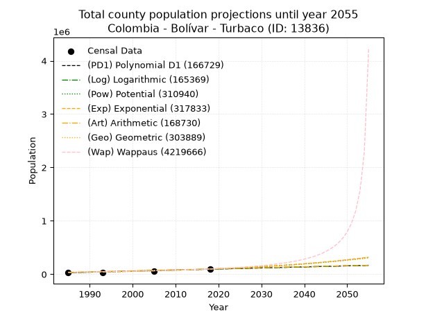
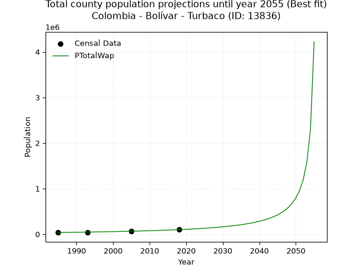
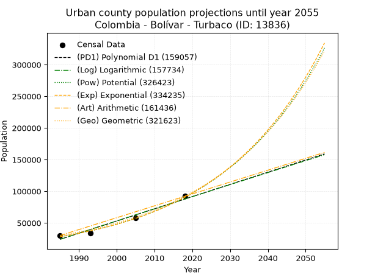
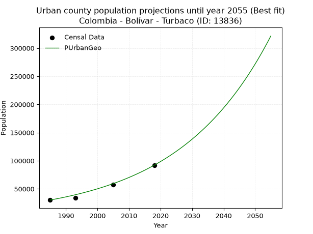
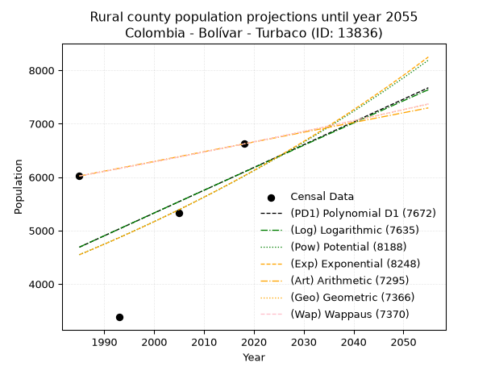
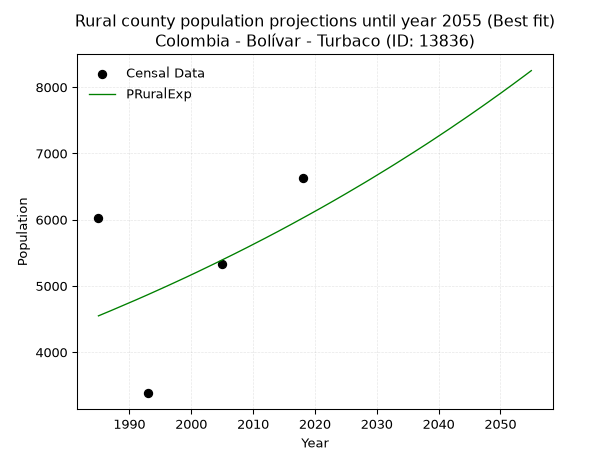

<div align="center">


</div>

# 📜 _“Population and Public Services Demand Projections (PPSD) until Year 2055 for Colombia - Bolívar - Turbaco (ID: 13836)”_
Keywords: `population` `public-service` `projection` `lineal` `polynomial` `logarithmic` `potential` `exponential` `arithmetic` `geometric` `wappaus` `dane` `colombia` `south-america`

PPSD are analytical estimates used by governments and planners to anticipate future changes in population size, age distribution, and the resulting community needs for utilities, healthcare, education, and infrastructure as sizing future water treatment facilities, electrical grids, and road networks based on spatial growth.

<div align="center">

</img>

</div>


> **General running parameters**: • app_version: _v20260806_. • Python version: _3.14.7_. • Pandas version: _3.0.5_. • NumPy version: _2.5.1_. • Creates, save and include plots into reports (create_plot): _True_. • Projection until year: _2055_. • Process polynomial degree 2 and up: _False_. • Process Wappaus: _True_. • Process Wappaus: _True_. • Set negative values to zero: _True_. • Set infinite values to zero: _True_. • Drop dataset notes: _True_. 
<div align="center">

Maps & GIS Layers: [:earth_americas:Google](http://maps.google.com/maps?q=10.34831632,-75.4272486) [:earth_americas:OSM](https://www.openstreetmap.org/#map=18/10.34831632/-75.4272486&layers=P) [:earth_americas:Bing](https://www.bing.com/maps?cp=10.34831632~-75.4272486&lvl=18) [:earth_americas:Apple](https://maps.apple.com/frame?center=10.34831632%2C-75.4272486&span=0.003%2C0.006) [:earth_americas:GISMobile](https://github.com/rcfdtools/R.GISMobile/blob/main/file/gis/CountyLayer_CO/Readme.md)

</div>


<div align="center">

```geojson
{
  "type": "Feature",
  "geometry": {
    "type": "Point", 
    "coordinates": [-75.4272486, 10.34831632]
  }, 
  "properties": {
    "Name": "Colombia - Bolívar - Turbaco (ID: 13836)"
  }
}
```

</div>


## 0. Census Data (4 records)

Census data are official statistics collected by a government about the people and housing in a country. They usually include counts of total population, age, sex, race, income, education, and jobs.

📅Global census file: [Population.xlsx](../data/Population.xlsx)

| Source   |   Year |   CountryID | CountryName   |   StateID | StateName   |   CountyID | CountyName   |   PTotal |   PUrban |   PRural |
|:---------|-------:|------------:|:--------------|----------:|:------------|-----------:|:-------------|---------:|---------:|---------:|
| DANE     |   1985 |          57 | Colombia      |        13 | Bolívar     |      13836 | Turbaco      |    36178 |    30158 |     6020 |
| DANE     |   1993 |          57 | Colombia      |        13 | Bolívar     |      13836 | Turbaco      |    37530 |    34150 |     3380 |
| DANE     |   2005 |          57 | Colombia      |        13 | Bolívar     |      13836 | Turbaco      |    63046 |    57714 |     5332 |
| DANE     |   2018 |          57 | Colombia      |        13 | Bolívar     |      13836 | Turbaco      |    98667 |    92046 |     6621 |

> 🔥Some records could had specific notes about the registered values or the corresponding urban or rural distribution.

📅[SUI-RUPS](https://www.datos.gov.co/Hacienda-y-Cr-dito-P-blico/Registro-nico-de-Prestadores-de-Servicios-P-blicos/4qkq-csdn/about_data) - Local public utility companies: [RUPS.csv](../data/RUPS.csv)

 | SERVICIO       | ESTADO    | NOMBRE                                               | NIT         | DEPARTAMENTO_DOMICILIO   | MUNICIPIO_DOMICILIO   | DIRECCION                             |   TELEFONO | EMAIL                 | TIPO_PRESTADOR                             | CLASIFICACION                 |
|:---------------|:----------|:-----------------------------------------------------|:------------|:-------------------------|:----------------------|:--------------------------------------|-----------:|:----------------------|:-------------------------------------------|:------------------------------|
| ACUEDUCTO      | OPERATIVA | AGUAS DE CARTAGENA S.A.  E.S.P.                      | 800252396-4 | BOLIVAR                  | CARTAGENA DE INDIAS   | EDIFICIO CHAMBACU CRA 13B No.26-78    |    6932770 | gerencia@acuacar.com  | SOCIEDADES (EMPRESA DE SERVICIOS PUBLICOS) | MAYOR O IGUAL A 5001 USUARIOS |
| ALCANTARILLADO | OPERATIVA | AGUAS DE CARTAGENA S.A.  E.S.P.                      | 800252396-4 | BOLIVAR                  | CARTAGENA DE INDIAS   | EDIFICIO CHAMBACU CRA 13B No.26-78    |    6932770 | gerencia@acuacar.com  | SOCIEDADES (EMPRESA DE SERVICIOS PUBLICOS) | MAYOR O IGUAL A 5001 USUARIOS |
| ACUEDUCTO      | OPERATIVA | AGUAS Y ASEO DE COLOMBIA S.A ESP                     | 806013764-9 | BOLIVAR                  | TURBACO               | ALTOS DE PLAN PAREJO MANZANA E LOTE 6 |    6454994 | lisuamar@hotmail.com  | SOCIEDADES (EMPRESA DE SERVICIOS PUBLICOS) | HASTA 2500 SUSCRIPTORES       |
| ALCANTARILLADO | OPERATIVA | AGUAS Y ASEO DE COLOMBIA S.A ESP                     | 806013764-9 | BOLIVAR                  | TURBACO               | ALTOS DE PLAN PAREJO MANZANA E LOTE 6 |    6454994 | lisuamar@hotmail.com  | SOCIEDADES (EMPRESA DE SERVICIOS PUBLICOS) | HASTA 2500 SUSCRIPTORES       |
| ACUEDUCTO      | OPERATIVA | ACUEDUCTOS Y ALCANTARILLADOS DE COLOMBIA S.A. E.S.P. | 806016735-9 | BOLIVAR                  | ARJONA                | AVENIDA SIMON BOSSA No 1 - 01 ESQUINA |    6293899 | DGARRIDOV@ACUALCO.COM | SOCIEDADES (EMPRESA DE SERVICIOS PUBLICOS) | MAYOR O IGUAL A 5001 USUARIOS |

## 1. Total

### 1.1. Coefficients and Parameters

* (PD1) Polynomial Deg 1: 1970.2942593335772, -3882225.8422319884 (lineal)
* (Log) Logarithmic: 3941570.2233104734, -29901051.603144385
* (Pow) Potential: 64.84439788500877, -209.32461188865335
* (Exp) Exponential: 0.032405907444299005, 3.808299976490051e-24
* (Art) Arithmetic: Year diff. 2018 - 1985 = 33, Population diff. 98667 - 36178 = 62489, Annual growth = 1893.6060606060605
* (Geo) Geometric: Year diff. 2018 - 1985 = 33, Population diff. 98667 - 36178 = 62489, Annual growth % = 0.030869901588927995
* (Wap) Wappaus: i = 2.8085669629664585, Condition values only valid for < 200)

<sub>
Wappaus condition values: ['0.00', '2.81', '5.62', '8.43', '11.23', '14.04', '16.85', '19.66', '22.47', '25.28', '28.09', '30.89', '33.70', '36.51', '39.32', '42.13', '44.94', '47.75', '50.55', '53.36', '56.17', '58.98', '61.79', '64.60', '67.41', '70.21', '73.02', '75.83', '78.64', '81.45', '84.26', '87.07', '89.87', '92.68', '95.49', '98.30', '101.11', '103.92', '106.73', '109.53', '112.34', '115.15', '117.96', '120.77', '123.58', '126.39', '129.19', '132.00', '134.81', '137.62', '140.43', '143.24', '146.05', '148.85', '151.66', '154.47', '157.28', '160.09', '162.90', '165.71', '168.51', '171.32', '174.13', '176.94', '179.75', '182.56', '185.37', '188.17', '190.98', '193.79', '196.60']
</sub>


### 1.2. Projected Dataset

|   Year |   CountyID |   PTotalPD1 |   PTotalLog |   PTotalPow |   PTotalExp |   PTotalArt |   PTotalGeo |        PTotalWap |
|-------:|-----------:|------------:|------------:|------------:|------------:|------------:|------------:|-----------------:|
|   1985 |      13836 |       28808 |       28766 |       32861 |       32888 |       36178 |       36178 |  36178           |
|   1986 |      13836 |       30779 |       30751 |       33952 |       33971 |       38072 |       37295 |  37209           |
|   1987 |      13836 |       32749 |       32735 |       35079 |       35090 |       39965 |       38446 |  38269           |
|   1988 |      13836 |       34719 |       34719 |       36242 |       36246 |       41859 |       39633 |  39360           |
|   1989 |      13836 |       36689 |       36701 |       37443 |       37440 |       43752 |       40856 |  40484           |
|   1990 |      13836 |       38660 |       38682 |       38684 |       38673 |       45646 |       42118 |  41642           |
|   1991 |      13836 |       40630 |       40662 |       39965 |       39947 |       47540 |       43418 |  42835           |
|   1992 |      13836 |       42600 |       42641 |       41287 |       41262 |       49433 |       44758 |  44066           |
|   1993 |      13836 |       44571 |       44620 |       42653 |       42622 |       51327 |       46140 |  45335           |
|   1994 |      13836 |       46541 |       46597 |       44063 |       44025 |       53220 |       47564 |  46646           |
|   1995 |      13836 |       48511 |       48573 |       45520 |       45475 |       55114 |       49032 |  47999           |
|   1996 |      13836 |       50481 |       50548 |       47023 |       46973 |       57008 |       50546 |  49397           |
|   1997 |      13836 |       52452 |       52522 |       48575 |       48520 |       58901 |       52106 |  50842           |
|   1998 |      13836 |       54422 |       54496 |       50178 |       50118 |       60795 |       53715 |  52337           |
|   1999 |      13836 |       56392 |       56468 |       51833 |       51769 |       62688 |       55373 |  53884           |
|   2000 |      13836 |       58363 |       58439 |       53542 |       53474 |       64582 |       57082 |  55486           |
|   2001 |      13836 |       60333 |       60409 |       55305 |       55236 |       66476 |       58845 |  57147           |
|   2002 |      13836 |       62303 |       62379 |       57127 |       57055 |       68369 |       60661 |  58868           |
|   2003 |      13836 |       64274 |       64347 |       59007 |       58934 |       70263 |       62534 |  60654           |
|   2004 |      13836 |       66244 |       66314 |       60948 |       60875 |       72157 |       64464 |  62509           |
|   2005 |      13836 |       68214 |       68281 |       62952 |       62880 |       74050 |       66454 |  64436           |
|   2006 |      13836 |       70184 |       70246 |       65020 |       64951 |       75944 |       68506 |  66440           |
|   2007 |      13836 |       72155 |       72211 |       67156 |       67090 |       77837 |       70620 |  68525           |
|   2008 |      13836 |       74125 |       74174 |       69360 |       69300 |       79731 |       72800 |  70697           |
|   2009 |      13836 |       76095 |       76136 |       71636 |       71583 |       81625 |       75048 |  72961           |
|   2010 |      13836 |       78066 |       78098 |       73986 |       73940 |       83518 |       77364 |  75323           |
|   2011 |      13836 |       80036 |       80058 |       76411 |       76376 |       85412 |       79753 |  77789           |
|   2012 |      13836 |       82006 |       82018 |       78914 |       78891 |       87305 |       82215 |  80367           |
|   2013 |      13836 |       83977 |       83977 |       81498 |       81490 |       89199 |       84753 |  83064           |
|   2014 |      13836 |       85947 |       85934 |       84166 |       84174 |       91093 |       87369 |  85889           |
|   2015 |      13836 |       87917 |       87891 |       86919 |       86946 |       92986 |       90066 |  88851           |
|   2016 |      13836 |       89887 |       89846 |       89761 |       89810 |       94880 |       92846 |  91960           |
|   2017 |      13836 |       91858 |       91801 |       92694 |       92768 |       96773 |       95712 |  95228           |
|   2018 |      13836 |       93828 |       93755 |       95722 |       95823 |       98667 |       98667 |  98667           |
|   2019 |      13836 |       95798 |       95707 |       98847 |       98979 |      100561 |      101713 | 102291           |
|   2020 |      13836 |       97769 |       97659 |      102072 |      102240 |      102454 |      104853 | 106115           |
|   2021 |      13836 |       99739 |       99610 |      105401 |      105607 |      104348 |      108089 | 110156           |
|   2022 |      13836 |      101709 |      101560 |      108837 |      109085 |      106241 |      111426 | 114433           |
|   2023 |      13836 |      103679 |      103509 |      112383 |      112678 |      108135 |      114866 | 118968           |
|   2024 |      13836 |      105650 |      105457 |      116043 |      116389 |      110029 |      118412 | 123785           |
|   2025 |      13836 |      107620 |      107403 |      119820 |      120223 |      111922 |      122067 | 128910           |
|   2026 |      13836 |      109590 |      109349 |      123718 |      124183 |      113816 |      125835 | 134375           |
|   2027 |      13836 |      111561 |      111294 |      127740 |      128273 |      115709 |      129720 | 140214           |
|   2028 |      13836 |      113531 |      113238 |      131892 |      132498 |      117603 |      133724 | 146466           |
|   2029 |      13836 |      115501 |      115182 |      136176 |      136862 |      119497 |      137852 | 153178           |
|   2030 |      13836 |      117472 |      117124 |      140597 |      141370 |      121390 |      142108 | 160403           |
|   2031 |      13836 |      119442 |      119065 |      145160 |      146026 |      123284 |      146495 | 168200           |
|   2032 |      13836 |      121412 |      121005 |      149868 |      150835 |      125177 |      151017 | 176642           |
|   2033 |      13836 |      123382 |      122944 |      154726 |      155803 |      127071 |      155679 | 185811           |
|   2034 |      13836 |      125353 |      124883 |      159740 |      160935 |      128965 |      160485 | 195806           |
|   2035 |      13836 |      127323 |      126820 |      164913 |      166236 |      130858 |      165439 | 206743           |
|   2036 |      13836 |      129293 |      128756 |      170251 |      171711 |      132752 |      170546 | 218762           |
|   2037 |      13836 |      131264 |      130692 |      175760 |      177367 |      134646 |      175811 | 232033           |
|   2038 |      13836 |      133234 |      132626 |      181443 |      183208 |      136539 |      181238 | 246761           |
|   2039 |      13836 |      135204 |      134560 |      187308 |      189243 |      138433 |      186833 | 263201           |
|   2040 |      13836 |      137174 |      136493 |      193359 |      195476 |      140326 |      192600 | 281669           |
|   2041 |      13836 |      139145 |      138424 |      199602 |      201914 |      142220 |      198546 | 302565           |
|   2042 |      13836 |      141115 |      140355 |      206044 |      208565 |      144114 |      204675 | 326403           |
|   2043 |      13836 |      143085 |      142285 |      212690 |      215434 |      146007 |      210993 | 353849           |
|   2044 |      13836 |      145056 |      144214 |      219547 |      222530 |      147901 |      217507 | 385790           |
|   2045 |      13836 |      147026 |      146142 |      226622 |      229859 |      149794 |      224221 | 423430           |
|   2046 |      13836 |      148996 |      148068 |      233921 |      237430 |      151688 |      231143 | 468442           |
|   2047 |      13836 |      150967 |      149994 |      241452 |      245250 |      153582 |      238278 | 523228           |
|   2048 |      13836 |      152937 |      151920 |      249221 |      253328 |      155475 |      245634 | 591360           |
|   2049 |      13836 |      154907 |      153844 |      257236 |      261671 |      157369 |      253216 | 678389           |
|   2050 |      13836 |      156877 |      155767 |      265505 |      270290 |      159262 |      261033 | 793443           |
|   2051 |      13836 |      158848 |      157689 |      274036 |      279193 |      161156 |      269091 | 952658           |
|   2052 |      13836 |      160818 |      159610 |      282836 |      288388 |      163050 |      277398 |      1.1875e+06  |
|   2053 |      13836 |      162788 |      161531 |      291914 |      297887 |      164943 |      285961 |      1.56862e+06 |
|   2054 |      13836 |      164759 |      163450 |      301279 |      307698 |      166837 |      294789 |      2.29455e+06 |
|   2055 |      13836 |      166729 |      165369 |      310940 |      317833 |      168730 |      303889 |      4.21967e+06 |
<div align="center">

</img>

</div>


### 1.3. Best fit with absolute and relative error (%)

Relative error puts that difference into context by dividing the absolute error by the true value, creating a unitless ratio or percentage that shows the scale of the mistake.

Absolute and relative error

|   Year | Source   |   CountryID | CountryName   |   StateID | StateName   |   CountyID_x | CountyName   |   PTotal |   PUrban |   PRural |   CountyID_y |   PTotalPD1 |   PTotalLog |   PTotalPow |   PTotalExp |   PTotalArt |   PTotalGeo |   PTotalWap |   PTotalPD1AbsError |   PTotalLogAbsError |   PTotalPowAbsError |   PTotalExpAbsError |   PTotalArtAbsError |   PTotalGeoAbsError |   PTotalWapAbsError |   PTotalPD1RelError |   PTotalLogRelError |   PTotalPowRelError |   PTotalExpRelError |   PTotalArtRelError |   PTotalGeoRelError |   PTotalWapRelError |
|-------:|:---------|------------:|:--------------|----------:|:------------|-------------:|:-------------|---------:|---------:|---------:|-------------:|------------:|------------:|------------:|------------:|------------:|------------:|------------:|--------------------:|--------------------:|--------------------:|--------------------:|--------------------:|--------------------:|--------------------:|--------------------:|--------------------:|--------------------:|--------------------:|--------------------:|--------------------:|--------------------:|
|   1985 | DANE     |          57 | Colombia      |        13 | Bolívar     |        13836 | Turbaco      |    36178 |    30158 |     6020 |        13836 |       28808 |       28766 |       32861 |       32888 |       36178 |       36178 |       36178 |                7370 |                7412 |                3317 |                3290 |                   0 |                   0 |                   0 |            20.3715  |            20.4876  |            9.16856  |             9.09392 |              0      |             0       |             0       |
|   1993 | DANE     |          57 | Colombia      |        13 | Bolívar     |        13836 | Turbaco      |    37530 |    34150 |     3380 |        13836 |       44571 |       44620 |       42653 |       42622 |       51327 |       46140 |       45335 |                7041 |                7090 |                5123 |                5092 |               13797 |                8610 |                7805 |            18.761   |            18.8916  |           13.6504   |            13.5678  |             36.7626 |            22.9416  |            20.7967  |
|   2005 | DANE     |          57 | Colombia      |        13 | Bolívar     |        13836 | Turbaco      |    63046 |    57714 |     5332 |        13836 |       68214 |       68281 |       62952 |       62880 |       74050 |       66454 |       64436 |                5168 |                5235 |                  94 |                 166 |               11004 |                3408 |                1390 |             8.19719 |             8.30346 |            0.149097 |             0.2633  |             17.4539 |             5.40558 |             2.20474 |
|   2018 | DANE     |          57 | Colombia      |        13 | Bolívar     |        13836 | Turbaco      |    98667 |    92046 |     6621 |        13836 |       93828 |       93755 |       95722 |       95823 |       98667 |       98667 |       98667 |                4839 |                4912 |                2945 |                2844 |                   0 |                   0 |                   0 |             4.90438 |             4.97836 |            2.98479  |             2.88242 |              0      |             0       |             0       |

Relative error mean

| Method    |   RelError | Best   |
|:----------|-----------:|:-------|
| PTotalPD1 |   13.0585  |        |
| PTotalLog |   13.1652  |        |
| PTotalPow |    6.48821 |        |
| PTotalExp |    6.45186 |        |
| PTotalArt |   13.5541  |        |
| PTotalGeo |    7.08681 |        |
| PTotalWap |    5.75036 | True   |

💙Best method: _**PTotalWap**_
<div align="center">

</img>

</div>


### 1.4. Fresh water supply demand in liters per capita per day (lpcd)

The fresh water supply demand typically ranges from 100 to 300 liters per capita per day (lpcd) for standard domestic and municipal planning, though absolute survival minimums set by the World Health Organization are as low as 7.5 to 20 liters per day, and total consumption in high-income nations can exceed 400 liters.

> `CZ`: Level in meters above the sea level (masl)<br> `WS`: Fresh water supply demand in liters per capita per day (lpcd or l/h/d)<br> `WSAll`: Zonal fresh water supply demand in liters per second (l/s)<br> `A`: Zonal area in square meters<br> `DP`: Population density (people/hectare or p/ha)

Reference values (RAS Colombia)

|    CZ |   WS |
|------:|-----:|
|  1000 |  120 |
|  2000 |  130 |
| 99999 |  140 |

County shapefile geometry properties and water supply values

|   CountyID |      ATotal |   CZTotal |   WSTotal |
|-----------:|------------:|----------:|----------:|
|      13836 | 2.02576e+08 |   99.4413 |       120 |

Projected values for best method: PTotalWap

|   CountyID |   Year |        PTotalWap |   DPTotal |   WSTotal |   WSTotalAll |
|-----------:|-------:|-----------------:|----------:|----------:|-------------:|
|      13836 |   1985 |  36178           |      1.79 |       120 |      50.2472 |
|      13836 |   1986 |  37209           |      1.84 |       120 |      51.6792 |
|      13836 |   1987 |  38269           |      1.89 |       120 |      53.1514 |
|      13836 |   1988 |  39360           |      1.94 |       120 |      54.6667 |
|      13836 |   1989 |  40484           |      2    |       120 |      56.2278 |
|      13836 |   1990 |  41642           |      2.06 |       120 |      57.8361 |
|      13836 |   1991 |  42835           |      2.11 |       120 |      59.4931 |
|      13836 |   1992 |  44066           |      2.18 |       120 |      61.2028 |
|      13836 |   1993 |  45335           |      2.24 |       120 |      62.9653 |
|      13836 |   1994 |  46646           |      2.3  |       120 |      64.7861 |
|      13836 |   1995 |  47999           |      2.37 |       120 |      66.6653 |
|      13836 |   1996 |  49397           |      2.44 |       120 |      68.6069 |
|      13836 |   1997 |  50842           |      2.51 |       120 |      70.6139 |
|      13836 |   1998 |  52337           |      2.58 |       120 |      72.6903 |
|      13836 |   1999 |  53884           |      2.66 |       120 |      74.8389 |
|      13836 |   2000 |  55486           |      2.74 |       120 |      77.0639 |
|      13836 |   2001 |  57147           |      2.82 |       120 |      79.3708 |
|      13836 |   2002 |  58868           |      2.91 |       120 |      81.7611 |
|      13836 |   2003 |  60654           |      2.99 |       120 |      84.2417 |
|      13836 |   2004 |  62509           |      3.09 |       120 |      86.8181 |
|      13836 |   2005 |  64436           |      3.18 |       120 |      89.4944 |
|      13836 |   2006 |  66440           |      3.28 |       120 |      92.2778 |
|      13836 |   2007 |  68525           |      3.38 |       120 |      95.1736 |
|      13836 |   2008 |  70697           |      3.49 |       120 |      98.1903 |
|      13836 |   2009 |  72961           |      3.6  |       120 |     101.335  |
|      13836 |   2010 |  75323           |      3.72 |       120 |     104.615  |
|      13836 |   2011 |  77789           |      3.84 |       120 |     108.04   |
|      13836 |   2012 |  80367           |      3.97 |       120 |     111.621  |
|      13836 |   2013 |  83064           |      4.1  |       120 |     115.367  |
|      13836 |   2014 |  85889           |      4.24 |       120 |     119.29   |
|      13836 |   2015 |  88851           |      4.39 |       120 |     123.404  |
|      13836 |   2016 |  91960           |      4.54 |       120 |     127.722  |
|      13836 |   2017 |  95228           |      4.7  |       120 |     132.261  |
|      13836 |   2018 |  98667           |      4.87 |       120 |     137.037  |
|      13836 |   2019 | 102291           |      5.05 |       120 |     142.071  |
|      13836 |   2020 | 106115           |      5.24 |       120 |     147.382  |
|      13836 |   2021 | 110156           |      5.44 |       120 |     152.994  |
|      13836 |   2022 | 114433           |      5.65 |       120 |     158.935  |
|      13836 |   2023 | 118968           |      5.87 |       120 |     165.233  |
|      13836 |   2024 | 123785           |      6.11 |       120 |     171.924  |
|      13836 |   2025 | 128910           |      6.36 |       120 |     179.042  |
|      13836 |   2026 | 134375           |      6.63 |       120 |     186.632  |
|      13836 |   2027 | 140214           |      6.92 |       120 |     194.742  |
|      13836 |   2028 | 146466           |      7.23 |       120 |     203.425  |
|      13836 |   2029 | 153178           |      7.56 |       120 |     212.747  |
|      13836 |   2030 | 160403           |      7.92 |       120 |     222.782  |
|      13836 |   2031 | 168200           |      8.3  |       120 |     233.611  |
|      13836 |   2032 | 176642           |      8.72 |       120 |     245.336  |
|      13836 |   2033 | 185811           |      9.17 |       120 |     258.071  |
|      13836 |   2034 | 195806           |      9.67 |       120 |     271.953  |
|      13836 |   2035 | 206743           |     10.21 |       120 |     287.143  |
|      13836 |   2036 | 218762           |     10.8  |       120 |     303.836  |
|      13836 |   2037 | 232033           |     11.45 |       120 |     322.268  |
|      13836 |   2038 | 246761           |     12.18 |       120 |     342.724  |
|      13836 |   2039 | 263201           |     12.99 |       120 |     365.557  |
|      13836 |   2040 | 281669           |     13.9  |       120 |     391.207  |
|      13836 |   2041 | 302565           |     14.94 |       120 |     420.229  |
|      13836 |   2042 | 326403           |     16.11 |       120 |     453.337  |
|      13836 |   2043 | 353849           |     17.47 |       120 |     491.457  |
|      13836 |   2044 | 385790           |     19.04 |       120 |     535.819  |
|      13836 |   2045 | 423430           |     20.9  |       120 |     588.097  |
|      13836 |   2046 | 468442           |     23.12 |       120 |     650.614  |
|      13836 |   2047 | 523228           |     25.83 |       120 |     726.706  |
|      13836 |   2048 | 591360           |     29.19 |       120 |     821.333  |
|      13836 |   2049 | 678389           |     33.49 |       120 |     942.207  |
|      13836 |   2050 | 793443           |     39.17 |       120 |    1102      |
|      13836 |   2051 | 952658           |     47.03 |       120 |    1323.14   |
|      13836 |   2052 |      1.1875e+06  |     58.62 |       120 |    1649.3    |
|      13836 |   2053 |      1.56862e+06 |     77.43 |       120 |    2178.64   |
|      13836 |   2054 |      2.29455e+06 |    113.27 |       120 |    3186.87   |
|      13836 |   2055 |      4.21967e+06 |    208.3  |       120 |    5860.65   |

## 2. Urban

### 2.1. Coefficients and Parameters

* (PD1) Polynomial Deg 1: 1927.6772380569823, -3802319.3954234794 (lineal)
* (Log) Logarithmic: 3856576.2584582274, -29260350.04520357
* (Pow) Potential: 70.6596254084544, -228.56826226383896
* (Exp) Exponential: 0.03530766639460596, 1.0299994333843959e-26
* (Art) Arithmetic: Year diff. 2018 - 1985 = 33, Population diff. 92046 - 30158 = 61888, Annual growth = 1875.3939393939395
* (Geo) Geometric: Year diff. 2018 - 1985 = 33, Population diff. 92046 - 30158 = 61888, Annual growth % = 0.0343914466273787
* (Wap) Wappaus: i = 3.06928404863006, Condition values only valid for < 200)

<sub>
Wappaus condition values: ['0.00', '3.07', '6.14', '9.21', '12.28', '15.35', '18.42', '21.48', '24.55', '27.62', '30.69', '33.76', '36.83', '39.90', '42.97', '46.04', '49.11', '52.18', '55.25', '58.32', '61.39', '64.45', '67.52', '70.59', '73.66', '76.73', '79.80', '82.87', '85.94', '89.01', '92.08', '95.15', '98.22', '101.29', '104.36', '107.42', '110.49', '113.56', '116.63', '119.70', '122.77', '125.84', '128.91', '131.98', '135.05', '138.12', '141.19', '144.26', '147.33', '150.39', '153.46', '156.53', '159.60', '162.67', '165.74', '168.81', '171.88', '174.95', '178.02', '181.09', '184.16', '187.23', '190.30', '193.36', '196.43', '199.50', '202.57', '205.64', '208.71', '211.78', '214.85']
</sub>


### 2.2. Projected Dataset

|   Year |   CountyID |   PUrbanPD1 |   PUrbanLog |   PUrbanPow |   PUrbanExp |   PUrbanArt |   PUrbanGeo |
|-------:|-----------:|------------:|------------:|------------:|------------:|------------:|------------:|
|   1985 |      13836 |       24120 |       24077 |       28201 |       28228 |       30158 |       30158 |
|   1986 |      13836 |       26048 |       26019 |       29222 |       29242 |       32033 |       31195 |
|   1987 |      13836 |       27975 |       27960 |       30281 |       30293 |       33909 |       32268 |
|   1988 |      13836 |       29903 |       29901 |       31376 |       31382 |       35784 |       33378 |
|   1989 |      13836 |       31831 |       31840 |       32511 |       32510 |       37660 |       34526 |
|   1990 |      13836 |       33758 |       33779 |       33687 |       33678 |       39535 |       35713 |
|   1991 |      13836 |       35686 |       35716 |       34904 |       34888 |       41410 |       36941 |
|   1992 |      13836 |       37614 |       37653 |       36165 |       36142 |       43286 |       38212 |
|   1993 |      13836 |       39541 |       39588 |       37470 |       37441 |       45161 |       39526 |
|   1994 |      13836 |       41469 |       41523 |       38822 |       38787 |       47037 |       40885 |
|   1995 |      13836 |       43397 |       43456 |       40222 |       40181 |       48912 |       42291 |
|   1996 |      13836 |       45324 |       45389 |       41672 |       41625 |       50787 |       43746 |
|   1997 |      13836 |       47252 |       47321 |       43173 |       43121 |       52663 |       45250 |
|   1998 |      13836 |       49180 |       49251 |       44728 |       44670 |       54538 |       46807 |
|   1999 |      13836 |       51107 |       51181 |       46338 |       46276 |       56414 |       48416 |
|   2000 |      13836 |       53035 |       53110 |       48004 |       47939 |       58289 |       50081 |
|   2001 |      13836 |       54963 |       55038 |       49730 |       49662 |       60164 |       51804 |
|   2002 |      13836 |       56890 |       56965 |       51517 |       51446 |       62040 |       53585 |
|   2003 |      13836 |       58818 |       58890 |       53367 |       53295 |       63915 |       55428 |
|   2004 |      13836 |       60746 |       60815 |       55283 |       55211 |       65790 |       57335 |
|   2005 |      13836 |       62673 |       62739 |       57267 |       57195 |       67666 |       59306 |
|   2006 |      13836 |       64601 |       64662 |       59320 |       59250 |       69541 |       61346 |
|   2007 |      13836 |       66529 |       66584 |       61447 |       61380 |       71417 |       63456 |
|   2008 |      13836 |       68456 |       68505 |       63648 |       63585 |       73292 |       65638 |
|   2009 |      13836 |       70384 |       70426 |       65927 |       65871 |       75167 |       67895 |
|   2010 |      13836 |       72312 |       72345 |       68286 |       68238 |       77043 |       70230 |
|   2011 |      13836 |       74240 |       74263 |       70729 |       70690 |       78918 |       72646 |
|   2012 |      13836 |       76167 |       76180 |       73258 |       73231 |       80794 |       75144 |
|   2013 |      13836 |       78095 |       78097 |       75875 |       75863 |       82669 |       77729 |
|   2014 |      13836 |       80023 |       80012 |       78585 |       78589 |       84544 |       80402 |
|   2015 |      13836 |       81950 |       81926 |       81391 |       81413 |       86420 |       83167 |
|   2016 |      13836 |       83878 |       83840 |       84295 |       84339 |       88295 |       86027 |
|   2017 |      13836 |       85806 |       85752 |       87301 |       87370 |       90171 |       88986 |
|   2018 |      13836 |       87733 |       87664 |       90413 |       90510 |       92046 |       92046 |
|   2019 |      13836 |       89661 |       89574 |       93634 |       93763 |       93921 |       95212 |
|   2020 |      13836 |       91589 |       91484 |       96968 |       97133 |       95797 |       98486 |
|   2021 |      13836 |       93516 |       93393 |      100419 |      100623 |       97672 |      101873 |
|   2022 |      13836 |       95444 |       95301 |      103991 |      104240 |       99548 |      105377 |
|   2023 |      13836 |       97372 |       97207 |      107688 |      107986 |      101423 |      109001 |
|   2024 |      13836 |       99299 |       99113 |      111515 |      111867 |      103298 |      112749 |
|   2025 |      13836 |      101227 |      101018 |      115476 |      115887 |      105174 |      116627 |
|   2026 |      13836 |      103155 |      102922 |      119575 |      120052 |      107049 |      120638 |
|   2027 |      13836 |      105082 |      104825 |      123818 |      124366 |      108925 |      124787 |
|   2028 |      13836 |      107010 |      106728 |      128210 |      128836 |      110800 |      129079 |
|   2029 |      13836 |      108938 |      108629 |      132754 |      133466 |      112675 |      133518 |
|   2030 |      13836 |      110865 |      110529 |      137458 |      138262 |      114551 |      138110 |
|   2031 |      13836 |      112793 |      112428 |      142325 |      143231 |      116426 |      142859 |
|   2032 |      13836 |      114721 |      114327 |      147363 |      148379 |      118302 |      147773 |
|   2033 |      13836 |      116648 |      116224 |      152576 |      153711 |      120177 |      152855 |
|   2034 |      13836 |      118576 |      118121 |      157971 |      159235 |      122052 |      158112 |
|   2035 |      13836 |      120504 |      120016 |      163553 |      164958 |      123928 |      163549 |
|   2036 |      13836 |      122431 |      121911 |      169331 |      170886 |      125803 |      169174 |
|   2037 |      13836 |      124359 |      123805 |      175309 |      177028 |      127678 |      174992 |
|   2038 |      13836 |      126287 |      125697 |      181495 |      183390 |      129554 |      181010 |
|   2039 |      13836 |      128214 |      127589 |      187897 |      189981 |      131429 |      187236 |
|   2040 |      13836 |      130142 |      129480 |      194521 |      196808 |      133305 |      193675 |
|   2041 |      13836 |      132070 |      131370 |      201375 |      203881 |      135180 |      200336 |
|   2042 |      13836 |      133998 |      133259 |      208466 |      211208 |      137055 |      207225 |
|   2043 |      13836 |      135925 |      135148 |      215805 |      218799 |      138931 |      214352 |
|   2044 |      13836 |      137853 |      137035 |      223397 |      226662 |      140806 |      221724 |
|   2045 |      13836 |      139781 |      138921 |      231253 |      234808 |      142682 |      229349 |
|   2046 |      13836 |      141708 |      140806 |      239381 |      243247 |      144557 |      237237 |
|   2047 |      13836 |      143636 |      142691 |      247790 |      251989 |      146432 |      245396 |
|   2048 |      13836 |      145564 |      144575 |      256491 |      261045 |      148308 |      253836 |
|   2049 |      13836 |      147491 |      146457 |      265492 |      270426 |      150183 |      262565 |
|   2050 |      13836 |      149419 |      148339 |      274805 |      280145 |      152059 |      271595 |
|   2051 |      13836 |      151347 |      150220 |      284440 |      290213 |      153934 |      280936 |
|   2052 |      13836 |      153274 |      152100 |      294408 |      300643 |      155809 |      290598 |
|   2053 |      13836 |      155202 |      153979 |      304719 |      311447 |      157685 |      300592 |
|   2054 |      13836 |      157130 |      155857 |      315387 |      322640 |      159560 |      310930 |
|   2055 |      13836 |      159057 |      157734 |      326423 |      334235 |      161436 |      321623 |
<div align="center">

</img>

</div>


### 2.3. Best fit with absolute and relative error (%)

Relative error puts that difference into context by dividing the absolute error by the true value, creating a unitless ratio or percentage that shows the scale of the mistake.

Absolute and relative error

|   Year | Source   |   CountryID | CountryName   |   StateID | StateName   |   CountyID_x | CountyName   |   PTotal |   PUrban |   PRural |   CountyID_y |   PUrbanPD1 |   PUrbanLog |   PUrbanPow |   PUrbanExp |   PUrbanArt |   PUrbanGeo |   PUrbanPD1AbsError |   PUrbanLogAbsError |   PUrbanPowAbsError |   PUrbanExpAbsError |   PUrbanArtAbsError |   PUrbanGeoAbsError |   PUrbanPD1RelError |   PUrbanLogRelError |   PUrbanPowRelError |   PUrbanExpRelError |   PUrbanArtRelError |   PUrbanGeoRelError |
|-------:|:---------|------------:|:--------------|----------:|:------------|-------------:|:-------------|---------:|---------:|---------:|-------------:|------------:|------------:|------------:|------------:|------------:|------------:|--------------------:|--------------------:|--------------------:|--------------------:|--------------------:|--------------------:|--------------------:|--------------------:|--------------------:|--------------------:|--------------------:|--------------------:|
|   1985 | DANE     |          57 | Colombia      |        13 | Bolívar     |        13836 | Turbaco      |    36178 |    30158 |     6020 |        13836 |       24120 |       24077 |       28201 |       28228 |       30158 |       30158 |                6038 |                6081 |                1957 |                1930 |                   0 |                   0 |            20.0212  |            20.1638  |            6.48916  |            6.39963  |              0      |             0       |
|   1993 | DANE     |          57 | Colombia      |        13 | Bolívar     |        13836 | Turbaco      |    37530 |    34150 |     3380 |        13836 |       39541 |       39588 |       37470 |       37441 |       45161 |       39526 |                5391 |                5438 |                3320 |                3291 |               11011 |                5376 |            15.7862  |            15.9239  |            9.72182  |            9.6369   |             32.243  |            15.7423  |
|   2005 | DANE     |          57 | Colombia      |        13 | Bolívar     |        13836 | Turbaco      |    63046 |    57714 |     5332 |        13836 |       62673 |       62739 |       57267 |       57195 |       67666 |       59306 |                4959 |                5025 |                 447 |                 519 |                9952 |                1592 |             8.59237 |             8.70673 |            0.774509 |            0.899262 |             17.2436 |             2.75843 |
|   2018 | DANE     |          57 | Colombia      |        13 | Bolívar     |        13836 | Turbaco      |    98667 |    92046 |     6621 |        13836 |       87733 |       87664 |       90413 |       90510 |       92046 |       92046 |                4313 |                4382 |                1633 |                1536 |                   0 |                   0 |             4.6857  |             4.76066 |            1.77411  |            1.66873  |              0      |             0       |

Relative error mean

| Method    |   RelError | Best   |
|:----------|-----------:|:-------|
| PUrbanPD1 |   12.2714  |        |
| PUrbanLog |   12.3888  |        |
| PUrbanPow |    4.6899  |        |
| PUrbanExp |    4.65113 |        |
| PUrbanArt |   12.3717  |        |
| PUrbanGeo |    4.62519 | True   |

💙Best method: _**PUrbanGeo**_
<div align="center">

</img>

</div>


### 2.4. Fresh water supply demand in liters per capita per day (lpcd)

The fresh water supply demand typically ranges from 100 to 300 liters per capita per day (lpcd) for standard domestic and municipal planning, though absolute survival minimums set by the World Health Organization are as low as 7.5 to 20 liters per day, and total consumption in high-income nations can exceed 400 liters.

> `CZ`: Level in meters above the sea level (masl)<br> `WS`: Fresh water supply demand in liters per capita per day (lpcd or l/h/d)<br> `WSAll`: Zonal fresh water supply demand in liters per second (l/s)<br> `A`: Zonal area in square meters<br> `DP`: Population density (people/hectare or p/ha)

Reference values (RAS Colombia)

|    CZ |   WS |
|------:|-----:|
|  1000 |  120 |
|  2000 |  130 |
| 99999 |  140 |

County shapefile geometry properties and water supply values

|   CountyID |      AUrban |   CZUrban |   WSUrban |
|-----------:|------------:|----------:|----------:|
|      13836 | 1.48788e+07 |    117.96 |       120 |

Projected values for best method: PUrbanGeo

|   CountyID |   Year |   PUrbanGeo |   DPUrban |   WSUrban |   WSUrbanAll |
|-----------:|-------:|------------:|----------:|----------:|-------------:|
|      13836 |   1985 |       30158 |     20.27 |       120 |      41.8861 |
|      13836 |   1986 |       31195 |     20.97 |       120 |      43.3264 |
|      13836 |   1987 |       32268 |     21.69 |       120 |      44.8167 |
|      13836 |   1988 |       33378 |     22.43 |       120 |      46.3583 |
|      13836 |   1989 |       34526 |     23.2  |       120 |      47.9528 |
|      13836 |   1990 |       35713 |     24    |       120 |      49.6014 |
|      13836 |   1991 |       36941 |     24.83 |       120 |      51.3069 |
|      13836 |   1992 |       38212 |     25.68 |       120 |      53.0722 |
|      13836 |   1993 |       39526 |     26.57 |       120 |      54.8972 |
|      13836 |   1994 |       40885 |     27.48 |       120 |      56.7847 |
|      13836 |   1995 |       42291 |     28.42 |       120 |      58.7375 |
|      13836 |   1996 |       43746 |     29.4  |       120 |      60.7583 |
|      13836 |   1997 |       45250 |     30.41 |       120 |      62.8472 |
|      13836 |   1998 |       46807 |     31.46 |       120 |      65.0097 |
|      13836 |   1999 |       48416 |     32.54 |       120 |      67.2444 |
|      13836 |   2000 |       50081 |     33.66 |       120 |      69.5569 |
|      13836 |   2001 |       51804 |     34.82 |       120 |      71.95   |
|      13836 |   2002 |       53585 |     36.01 |       120 |      74.4236 |
|      13836 |   2003 |       55428 |     37.25 |       120 |      76.9833 |
|      13836 |   2004 |       57335 |     38.53 |       120 |      79.6319 |
|      13836 |   2005 |       59306 |     39.86 |       120 |      82.3694 |
|      13836 |   2006 |       61346 |     41.23 |       120 |      85.2028 |
|      13836 |   2007 |       63456 |     42.65 |       120 |      88.1333 |
|      13836 |   2008 |       65638 |     44.12 |       120 |      91.1639 |
|      13836 |   2009 |       67895 |     45.63 |       120 |      94.2986 |
|      13836 |   2010 |       70230 |     47.2  |       120 |      97.5417 |
|      13836 |   2011 |       72646 |     48.83 |       120 |     100.897  |
|      13836 |   2012 |       75144 |     50.5  |       120 |     104.367  |
|      13836 |   2013 |       77729 |     52.24 |       120 |     107.957  |
|      13836 |   2014 |       80402 |     54.04 |       120 |     111.669  |
|      13836 |   2015 |       83167 |     55.9  |       120 |     115.51   |
|      13836 |   2016 |       86027 |     57.82 |       120 |     119.482  |
|      13836 |   2017 |       88986 |     59.81 |       120 |     123.592  |
|      13836 |   2018 |       92046 |     61.86 |       120 |     127.842  |
|      13836 |   2019 |       95212 |     63.99 |       120 |     132.239  |
|      13836 |   2020 |       98486 |     66.19 |       120 |     136.786  |
|      13836 |   2021 |      101873 |     68.47 |       120 |     141.49   |
|      13836 |   2022 |      105377 |     70.82 |       120 |     146.357  |
|      13836 |   2023 |      109001 |     73.26 |       120 |     151.39   |
|      13836 |   2024 |      112749 |     75.78 |       120 |     156.596  |
|      13836 |   2025 |      116627 |     78.38 |       120 |     161.982  |
|      13836 |   2026 |      120638 |     81.08 |       120 |     167.553  |
|      13836 |   2027 |      124787 |     83.87 |       120 |     173.315  |
|      13836 |   2028 |      129079 |     86.75 |       120 |     179.276  |
|      13836 |   2029 |      133518 |     89.74 |       120 |     185.442  |
|      13836 |   2030 |      138110 |     92.82 |       120 |     191.819  |
|      13836 |   2031 |      142859 |     96.02 |       120 |     198.415  |
|      13836 |   2032 |      147773 |     99.32 |       120 |     205.24   |
|      13836 |   2033 |      152855 |    102.73 |       120 |     212.299  |
|      13836 |   2034 |      158112 |    106.27 |       120 |     219.6    |
|      13836 |   2035 |      163549 |    109.92 |       120 |     227.151  |
|      13836 |   2036 |      169174 |    113.7  |       120 |     234.964  |
|      13836 |   2037 |      174992 |    117.61 |       120 |     243.044  |
|      13836 |   2038 |      181010 |    121.66 |       120 |     251.403  |
|      13836 |   2039 |      187236 |    125.84 |       120 |     260.05   |
|      13836 |   2040 |      193675 |    130.17 |       120 |     268.993  |
|      13836 |   2041 |      200336 |    134.65 |       120 |     278.244  |
|      13836 |   2042 |      207225 |    139.28 |       120 |     287.812  |
|      13836 |   2043 |      214352 |    144.07 |       120 |     297.711  |
|      13836 |   2044 |      221724 |    149.02 |       120 |     307.95   |
|      13836 |   2045 |      229349 |    154.14 |       120 |     318.54   |
|      13836 |   2046 |      237237 |    159.45 |       120 |     329.496  |
|      13836 |   2047 |      245396 |    164.93 |       120 |     340.828  |
|      13836 |   2048 |      253836 |    170.6  |       120 |     352.55   |
|      13836 |   2049 |      262565 |    176.47 |       120 |     364.674  |
|      13836 |   2050 |      271595 |    182.54 |       120 |     377.215  |
|      13836 |   2051 |      280936 |    188.82 |       120 |     390.189  |
|      13836 |   2052 |      290598 |    195.31 |       120 |     403.608  |
|      13836 |   2053 |      300592 |    202.03 |       120 |     417.489  |
|      13836 |   2054 |      310930 |    208.98 |       120 |     431.847  |
|      13836 |   2055 |      321623 |    216.16 |       120 |     446.699  |

## 3. Rural

### 3.1. Coefficients and Parameters

* (PD1) Polynomial Deg 1: 42.61702127659484, -79906.44680850883 (lineal)
* (Log) Logarithmic: 84993.96485224478, -640701.5579408017
* (Pow) Potential: 16.965684467522816, -52.29092932665153
* (Exp) Exponential: 0.008506454749910589, 0.000211127806942107
* (Art) Arithmetic: Year diff. 2018 - 1985 = 33, Population diff. 6621 - 6020 = 601, Annual growth = 18.21212121212121
* (Geo) Geometric: Year diff. 2018 - 1985 = 33, Population diff. 6621 - 6020 = 601, Annual growth % = 0.0028877724115570214
* (Wap) Wappaus: i = 0.28814367869822344, Condition values only valid for < 200)

<sub>
Wappaus condition values: ['0.00', '0.29', '0.58', '0.86', '1.15', '1.44', '1.73', '2.02', '2.31', '2.59', '2.88', '3.17', '3.46', '3.75', '4.03', '4.32', '4.61', '4.90', '5.19', '5.47', '5.76', '6.05', '6.34', '6.63', '6.92', '7.20', '7.49', '7.78', '8.07', '8.36', '8.64', '8.93', '9.22', '9.51', '9.80', '10.09', '10.37', '10.66', '10.95', '11.24', '11.53', '11.81', '12.10', '12.39', '12.68', '12.97', '13.25', '13.54', '13.83', '14.12', '14.41', '14.70', '14.98', '15.27', '15.56', '15.85', '16.14', '16.42', '16.71', '17.00', '17.29', '17.58', '17.86', '18.15', '18.44', '18.73', '19.02', '19.31', '19.59', '19.88', '20.17']
</sub>


### 3.2. Projected Dataset

|   Year |   CountyID |   PRuralPD1 |   PRuralLog |   PRuralPow |   PRuralExp |   PRuralArt |   PRuralGeo |   PRuralWap |
|-------:|-----------:|------------:|------------:|------------:|------------:|------------:|------------:|------------:|
|   1985 |      13836 |        4688 |        4689 |        4548 |        4547 |        6020 |        6020 |        6020 |
|   1986 |      13836 |        4731 |        4732 |        4587 |        4586 |        6038 |        6037 |        6037 |
|   1987 |      13836 |        4774 |        4775 |        4627 |        4625 |        6056 |        6055 |        6055 |
|   1988 |      13836 |        4816 |        4818 |        4666 |        4665 |        6075 |        6072 |        6072 |
|   1989 |      13836 |        4859 |        4861 |        4706 |        4705 |        6093 |        6090 |        6090 |
|   1990 |      13836 |        4901 |        4903 |        4746 |        4745 |        6111 |        6107 |        6107 |
|   1991 |      13836 |        4944 |        4946 |        4787 |        4785 |        6129 |        6125 |        6125 |
|   1992 |      13836 |        4987 |        4989 |        4828 |        4826 |        6147 |        6143 |        6143 |
|   1993 |      13836 |        5029 |        5031 |        4869 |        4867 |        6166 |        6160 |        6160 |
|   1994 |      13836 |        5072 |        5074 |        4911 |        4909 |        6184 |        6178 |        6178 |
|   1995 |      13836 |        5115 |        5117 |        4953 |        4951 |        6202 |        6196 |        6196 |
|   1996 |      13836 |        5157 |        5159 |        4995 |        4993 |        6220 |        6214 |        6214 |
|   1997 |      13836 |        5200 |        5202 |        5038 |        5036 |        6239 |        6232 |        6232 |
|   1998 |      13836 |        5242 |        5244 |        5081 |        5079 |        6257 |        6250 |        6250 |
|   1999 |      13836 |        5285 |        5287 |        5124 |        5122 |        6275 |        6268 |        6268 |
|   2000 |      13836 |        5328 |        5329 |        5168 |        5166 |        6293 |        6286 |        6286 |
|   2001 |      13836 |        5370 |        5372 |        5212 |        5210 |        6311 |        6304 |        6304 |
|   2002 |      13836 |        5413 |        5414 |        5256 |        5255 |        6330 |        6322 |        6322 |
|   2003 |      13836 |        5455 |        5457 |        5301 |        5300 |        6348 |        6341 |        6341 |
|   2004 |      13836 |        5498 |        5499 |        5346 |        5345 |        6366 |        6359 |        6359 |
|   2005 |      13836 |        5541 |        5541 |        5391 |        5391 |        6384 |        6377 |        6377 |
|   2006 |      13836 |        5583 |        5584 |        5437 |        5437 |        6402 |        6396 |        6396 |
|   2007 |      13836 |        5626 |        5626 |        5483 |        5483 |        6421 |        6414 |        6414 |
|   2008 |      13836 |        5669 |        5669 |        5530 |        5530 |        6439 |        6433 |        6433 |
|   2009 |      13836 |        5711 |        5711 |        5577 |        5577 |        6457 |        6451 |        6451 |
|   2010 |      13836 |        5754 |        5753 |        5624 |        5625 |        6475 |        6470 |        6470 |
|   2011 |      13836 |        5796 |        5795 |        5672 |        5673 |        6494 |        6489 |        6489 |
|   2012 |      13836 |        5839 |        5838 |        5720 |        5721 |        6512 |        6507 |        6507 |
|   2013 |      13836 |        5882 |        5880 |        5768 |        5770 |        6530 |        6526 |        6526 |
|   2014 |      13836 |        5924 |        5922 |        5817 |        5819 |        6548 |        6545 |        6545 |
|   2015 |      13836 |        5967 |        5964 |        5866 |        5869 |        6566 |        6564 |        6564 |
|   2016 |      13836 |        6009 |        6007 |        5916 |        5919 |        6585 |        6583 |        6583 |
|   2017 |      13836 |        6052 |        6049 |        5966 |        5970 |        6603 |        6602 |        6602 |
|   2018 |      13836 |        6095 |        6091 |        6016 |        6021 |        6621 |        6621 |        6621 |
|   2019 |      13836 |        6137 |        6133 |        6067 |        6072 |        6639 |        6640 |        6640 |
|   2020 |      13836 |        6180 |        6175 |        6118 |        6124 |        6657 |        6659 |        6659 |
|   2021 |      13836 |        6223 |        6217 |        6170 |        6176 |        6676 |        6679 |        6679 |
|   2022 |      13836 |        6265 |        6259 |        6222 |        6229 |        6694 |        6698 |        6698 |
|   2023 |      13836 |        6308 |        6301 |        6274 |        6282 |        6712 |        6717 |        6717 |
|   2024 |      13836 |        6350 |        6343 |        6327 |        6336 |        6730 |        6737 |        6737 |
|   2025 |      13836 |        6393 |        6385 |        6380 |        6390 |        6748 |        6756 |        6756 |
|   2026 |      13836 |        6436 |        6427 |        6434 |        6445 |        6767 |        6776 |        6776 |
|   2027 |      13836 |        6478 |        6469 |        6488 |        6500 |        6785 |        6795 |        6795 |
|   2028 |      13836 |        6521 |        6511 |        6542 |        6555 |        6803 |        6815 |        6815 |
|   2029 |      13836 |        6563 |        6553 |        6597 |        6611 |        6821 |        6834 |        6835 |
|   2030 |      13836 |        6606 |        6595 |        6653 |        6668 |        6840 |        6854 |        6855 |
|   2031 |      13836 |        6649 |        6637 |        6709 |        6725 |        6858 |        6874 |        6875 |
|   2032 |      13836 |        6691 |        6678 |        6765 |        6782 |        6876 |        6894 |        6894 |
|   2033 |      13836 |        6734 |        6720 |        6822 |        6840 |        6894 |        6914 |        6914 |
|   2034 |      13836 |        6777 |        6762 |        6879 |        6899 |        6912 |        6934 |        6935 |
|   2035 |      13836 |        6819 |        6804 |        6936 |        6958 |        6931 |        6954 |        6955 |
|   2036 |      13836 |        6862 |        6846 |        6994 |        7017 |        6949 |        6974 |        6975 |
|   2037 |      13836 |        6904 |        6887 |        7053 |        7077 |        6967 |        6994 |        6995 |
|   2038 |      13836 |        6947 |        6929 |        7112 |        7137 |        6985 |        7014 |        7015 |
|   2039 |      13836 |        6990 |        6971 |        7171 |        7198 |        7003 |        7034 |        7036 |
|   2040 |      13836 |        7032 |        7012 |        7231 |        7260 |        7022 |        7055 |        7056 |
|   2041 |      13836 |        7075 |        7054 |        7292 |        7322 |        7040 |        7075 |        7077 |
|   2042 |      13836 |        7118 |        7096 |        7352 |        7384 |        7058 |        7095 |        7097 |
|   2043 |      13836 |        7160 |        7137 |        7414 |        7448 |        7076 |        7116 |        7118 |
|   2044 |      13836 |        7203 |        7179 |        7476 |        7511 |        7095 |        7136 |        7139 |
|   2045 |      13836 |        7245 |        7220 |        7538 |        7575 |        7113 |        7157 |        7159 |
|   2046 |      13836 |        7288 |        7262 |        7601 |        7640 |        7131 |        7178 |        7180 |
|   2047 |      13836 |        7331 |        7304 |        7664 |        7705 |        7149 |        7198 |        7201 |
|   2048 |      13836 |        7373 |        7345 |        7728 |        7771 |        7167 |        7219 |        7222 |
|   2049 |      13836 |        7416 |        7387 |        7792 |        7838 |        7186 |        7240 |        7243 |
|   2050 |      13836 |        7458 |        7428 |        7857 |        7904 |        7204 |        7261 |        7264 |
|   2051 |      13836 |        7501 |        7469 |        7922 |        7972 |        7222 |        7282 |        7285 |
|   2052 |      13836 |        7544 |        7511 |        7988 |        8040 |        7240 |        7303 |        7306 |
|   2053 |      13836 |        7586 |        7552 |        8054 |        8109 |        7258 |        7324 |        7328 |
|   2054 |      13836 |        7629 |        7594 |        8121 |        8178 |        7277 |        7345 |        7349 |
|   2055 |      13836 |        7672 |        7635 |        8188 |        8248 |        7295 |        7366 |        7370 |
<div align="center">

</img>

</div>


### 3.3. Best fit with absolute and relative error (%)

Relative error puts that difference into context by dividing the absolute error by the true value, creating a unitless ratio or percentage that shows the scale of the mistake.

Absolute and relative error

|   Year | Source   |   CountryID | CountryName   |   StateID | StateName   |   CountyID_x | CountyName   |   PTotal |   PUrban |   PRural |   CountyID_y |   PRuralPD1 |   PRuralLog |   PRuralPow |   PRuralExp |   PRuralArt |   PRuralGeo |   PRuralWap |   PRuralPD1AbsError |   PRuralLogAbsError |   PRuralPowAbsError |   PRuralExpAbsError |   PRuralArtAbsError |   PRuralGeoAbsError |   PRuralWapAbsError |   PRuralPD1RelError |   PRuralLogRelError |   PRuralPowRelError |   PRuralExpRelError |   PRuralArtRelError |   PRuralGeoRelError |   PRuralWapRelError |
|-------:|:---------|------------:|:--------------|----------:|:------------|-------------:|:-------------|---------:|---------:|---------:|-------------:|------------:|------------:|------------:|------------:|------------:|------------:|------------:|--------------------:|--------------------:|--------------------:|--------------------:|--------------------:|--------------------:|--------------------:|--------------------:|--------------------:|--------------------:|--------------------:|--------------------:|--------------------:|--------------------:|
|   1985 | DANE     |          57 | Colombia      |        13 | Bolívar     |        13836 | Turbaco      |    36178 |    30158 |     6020 |        13836 |        4688 |        4689 |        4548 |        4547 |        6020 |        6020 |        6020 |                1332 |                1331 |                1472 |                1473 |                   0 |                   0 |                   0 |            22.1262  |            22.1096  |            24.4518  |            24.4684  |              0      |              0      |              0      |
|   1993 | DANE     |          57 | Colombia      |        13 | Bolívar     |        13836 | Turbaco      |    37530 |    34150 |     3380 |        13836 |        5029 |        5031 |        4869 |        4867 |        6166 |        6160 |        6160 |                1649 |                1651 |                1489 |                1487 |                2786 |                2780 |                2780 |            48.787   |            48.8462  |            44.0533  |            43.9941  |             82.426  |             82.2485 |             82.2485 |
|   2005 | DANE     |          57 | Colombia      |        13 | Bolívar     |        13836 | Turbaco      |    63046 |    57714 |     5332 |        13836 |        5541 |        5541 |        5391 |        5391 |        6384 |        6377 |        6377 |                 209 |                 209 |                  59 |                  59 |                1052 |                1045 |                1045 |             3.91973 |             3.91973 |             1.10653 |             1.10653 |             19.7299 |             19.5986 |             19.5986 |
|   2018 | DANE     |          57 | Colombia      |        13 | Bolívar     |        13836 | Turbaco      |    98667 |    92046 |     6621 |        13836 |        6095 |        6091 |        6016 |        6021 |        6621 |        6621 |        6621 |                 526 |                 530 |                 605 |                 600 |                   0 |                   0 |                   0 |             7.94442 |             8.00483 |             9.13759 |             9.06208 |              0      |              0      |              0      |

Relative error mean

| Method    |   RelError | Best   |
|:----------|-----------:|:-------|
| PRuralPD1 |    20.6943 |        |
| PRuralLog |    20.7201 |        |
| PRuralPow |    19.6873 |        |
| PRuralExp |    19.6578 | True   |
| PRuralArt |    25.539  |        |
| PRuralGeo |    25.4618 |        |
| PRuralWap |    25.4618 |        |

💙Best method: _**PRuralExp**_
<div align="center">

</img>

</div>


### 3.4. Fresh water supply demand in liters per capita per day (lpcd)

The fresh water supply demand typically ranges from 100 to 300 liters per capita per day (lpcd) for standard domestic and municipal planning, though absolute survival minimums set by the World Health Organization are as low as 7.5 to 20 liters per day, and total consumption in high-income nations can exceed 400 liters.

> `CZ`: Level in meters above the sea level (masl)<br> `WS`: Fresh water supply demand in liters per capita per day (lpcd or l/h/d)<br> `WSAll`: Zonal fresh water supply demand in liters per second (l/s)<br> `A`: Zonal area in square meters<br> `DP`: Population density (people/hectare or p/ha)

Reference values (RAS Colombia)

|    CZ |   WS |
|------:|-----:|
|  1000 |  120 |
|  2000 |  130 |
| 99999 |  140 |

County shapefile geometry properties and water supply values

|   CountyID |      ARural |   CZRural |   WSRural |
|-----------:|------------:|----------:|----------:|
|      13836 | 1.87698e+08 |   98.0335 |       120 |

Projected values for best method: PRuralExp

|   CountyID |   Year |   PRuralExp |   DPRural |   WSRural |   WSRuralAll |
|-----------:|-------:|------------:|----------:|----------:|-------------:|
|      13836 |   1985 |        4547 |      0.24 |       120 |      6.31528 |
|      13836 |   1986 |        4586 |      0.24 |       120 |      6.36944 |
|      13836 |   1987 |        4625 |      0.25 |       120 |      6.42361 |
|      13836 |   1988 |        4665 |      0.25 |       120 |      6.47917 |
|      13836 |   1989 |        4705 |      0.25 |       120 |      6.53472 |
|      13836 |   1990 |        4745 |      0.25 |       120 |      6.59028 |
|      13836 |   1991 |        4785 |      0.25 |       120 |      6.64583 |
|      13836 |   1992 |        4826 |      0.26 |       120 |      6.70278 |
|      13836 |   1993 |        4867 |      0.26 |       120 |      6.75972 |
|      13836 |   1994 |        4909 |      0.26 |       120 |      6.81806 |
|      13836 |   1995 |        4951 |      0.26 |       120 |      6.87639 |
|      13836 |   1996 |        4993 |      0.27 |       120 |      6.93472 |
|      13836 |   1997 |        5036 |      0.27 |       120 |      6.99444 |
|      13836 |   1998 |        5079 |      0.27 |       120 |      7.05417 |
|      13836 |   1999 |        5122 |      0.27 |       120 |      7.11389 |
|      13836 |   2000 |        5166 |      0.28 |       120 |      7.175   |
|      13836 |   2001 |        5210 |      0.28 |       120 |      7.23611 |
|      13836 |   2002 |        5255 |      0.28 |       120 |      7.29861 |
|      13836 |   2003 |        5300 |      0.28 |       120 |      7.36111 |
|      13836 |   2004 |        5345 |      0.28 |       120 |      7.42361 |
|      13836 |   2005 |        5391 |      0.29 |       120 |      7.4875  |
|      13836 |   2006 |        5437 |      0.29 |       120 |      7.55139 |
|      13836 |   2007 |        5483 |      0.29 |       120 |      7.61528 |
|      13836 |   2008 |        5530 |      0.29 |       120 |      7.68056 |
|      13836 |   2009 |        5577 |      0.3  |       120 |      7.74583 |
|      13836 |   2010 |        5625 |      0.3  |       120 |      7.8125  |
|      13836 |   2011 |        5673 |      0.3  |       120 |      7.87917 |
|      13836 |   2012 |        5721 |      0.3  |       120 |      7.94583 |
|      13836 |   2013 |        5770 |      0.31 |       120 |      8.01389 |
|      13836 |   2014 |        5819 |      0.31 |       120 |      8.08194 |
|      13836 |   2015 |        5869 |      0.31 |       120 |      8.15139 |
|      13836 |   2016 |        5919 |      0.32 |       120 |      8.22083 |
|      13836 |   2017 |        5970 |      0.32 |       120 |      8.29167 |
|      13836 |   2018 |        6021 |      0.32 |       120 |      8.3625  |
|      13836 |   2019 |        6072 |      0.32 |       120 |      8.43333 |
|      13836 |   2020 |        6124 |      0.33 |       120 |      8.50556 |
|      13836 |   2021 |        6176 |      0.33 |       120 |      8.57778 |
|      13836 |   2022 |        6229 |      0.33 |       120 |      8.65139 |
|      13836 |   2023 |        6282 |      0.33 |       120 |      8.725   |
|      13836 |   2024 |        6336 |      0.34 |       120 |      8.8     |
|      13836 |   2025 |        6390 |      0.34 |       120 |      8.875   |
|      13836 |   2026 |        6445 |      0.34 |       120 |      8.95139 |
|      13836 |   2027 |        6500 |      0.35 |       120 |      9.02778 |
|      13836 |   2028 |        6555 |      0.35 |       120 |      9.10417 |
|      13836 |   2029 |        6611 |      0.35 |       120 |      9.18194 |
|      13836 |   2030 |        6668 |      0.36 |       120 |      9.26111 |
|      13836 |   2031 |        6725 |      0.36 |       120 |      9.34028 |
|      13836 |   2032 |        6782 |      0.36 |       120 |      9.41944 |
|      13836 |   2033 |        6840 |      0.36 |       120 |      9.5     |
|      13836 |   2034 |        6899 |      0.37 |       120 |      9.58194 |
|      13836 |   2035 |        6958 |      0.37 |       120 |      9.66389 |
|      13836 |   2036 |        7017 |      0.37 |       120 |      9.74583 |
|      13836 |   2037 |        7077 |      0.38 |       120 |      9.82917 |
|      13836 |   2038 |        7137 |      0.38 |       120 |      9.9125  |
|      13836 |   2039 |        7198 |      0.38 |       120 |      9.99722 |
|      13836 |   2040 |        7260 |      0.39 |       120 |     10.0833  |
|      13836 |   2041 |        7322 |      0.39 |       120 |     10.1694  |
|      13836 |   2042 |        7384 |      0.39 |       120 |     10.2556  |
|      13836 |   2043 |        7448 |      0.4  |       120 |     10.3444  |
|      13836 |   2044 |        7511 |      0.4  |       120 |     10.4319  |
|      13836 |   2045 |        7575 |      0.4  |       120 |     10.5208  |
|      13836 |   2046 |        7640 |      0.41 |       120 |     10.6111  |
|      13836 |   2047 |        7705 |      0.41 |       120 |     10.7014  |
|      13836 |   2048 |        7771 |      0.41 |       120 |     10.7931  |
|      13836 |   2049 |        7838 |      0.42 |       120 |     10.8861  |
|      13836 |   2050 |        7904 |      0.42 |       120 |     10.9778  |
|      13836 |   2051 |        7972 |      0.42 |       120 |     11.0722  |
|      13836 |   2052 |        8040 |      0.43 |       120 |     11.1667  |
|      13836 |   2053 |        8109 |      0.43 |       120 |     11.2625  |
|      13836 |   2054 |        8178 |      0.44 |       120 |     11.3583  |
|      13836 |   2055 |        8248 |      0.44 |       120 |     11.4556  |

#

<div align="center"><br><sub>Share this research</sub></div><br>

<sub>**APPS & TOOLS & CONTENT DISCLAIMER**: • NO WARRANTY - This content and software is provided by <a href="https://github.com/rcfdtools" target="_blank">github.com/rcfdtools</a> "as is", without any express or implied warranty, including warranties of merchantability, fitness for a particular purpose, or non-infringement. There is no guarantee that the software will be error-free or operate without interruption. • LIMITATION OF LIABILITY - Neither the authors nor copyright holders will be liable for claims or damages arising from the software or its use. You are responsible for determining if the software is appropriate for your use and assume all associated risks, including errors, legal compliance, and data loss. • NO PROFESSIONAL ADVICE - The software provides general information and does not offer professional advice. It should not replace consultation with professional advisors. [Clauses and global license for rcfdtools use.](https://github.com/rcfdtools/rcfdtools/blob/main/LICENSE.md)</sub>

| [:house: Home](Readme.md)  | [:beginner: Help / Collab](https://github.com/rcfdtools/R.HydroTools/discussions/31) |
|----------------------------|-------------------------------------------------------------------------------------------|